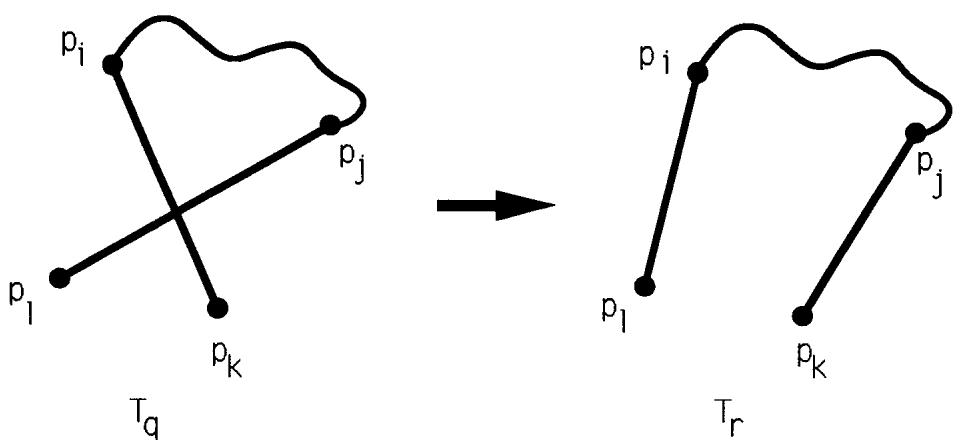
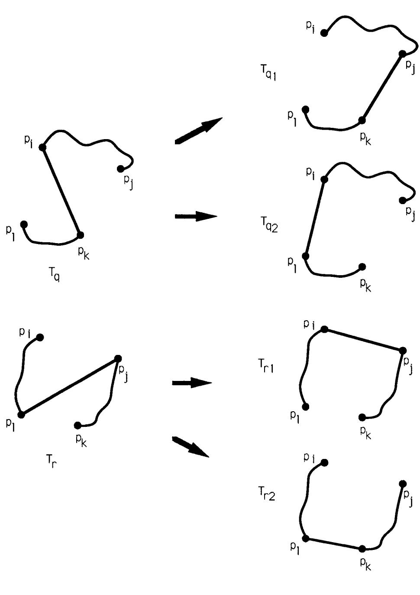
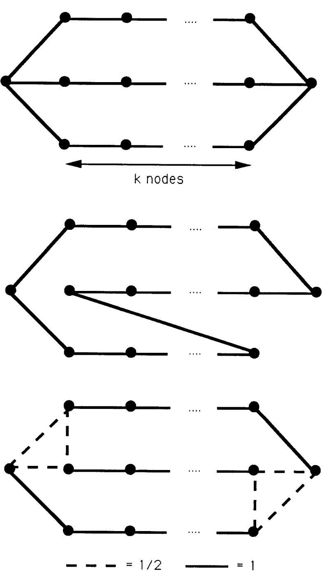
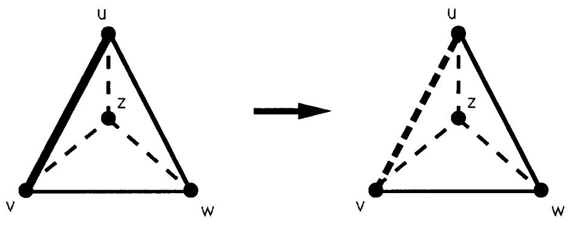
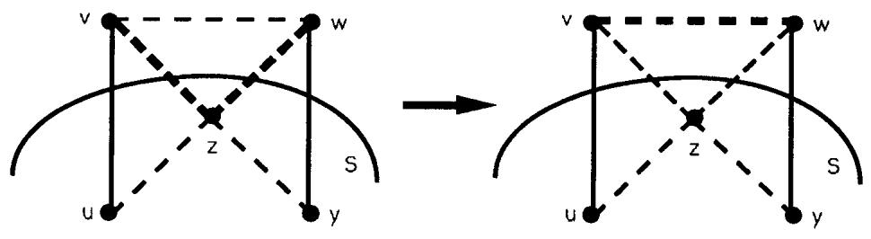
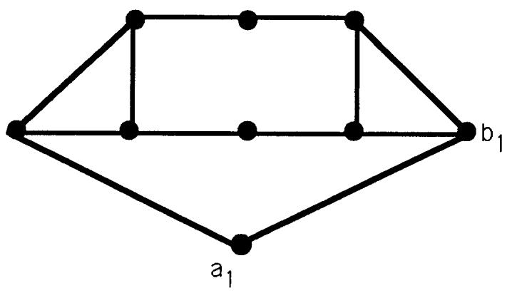
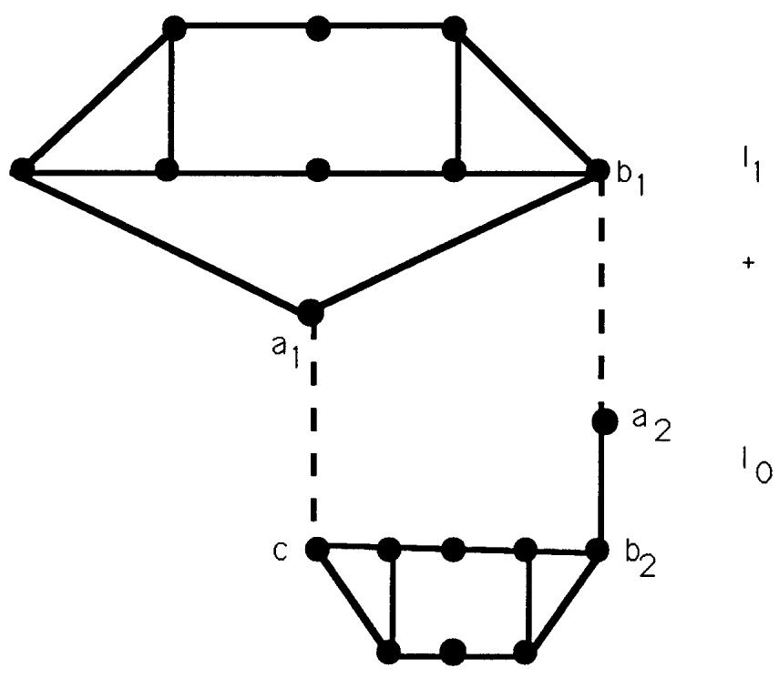
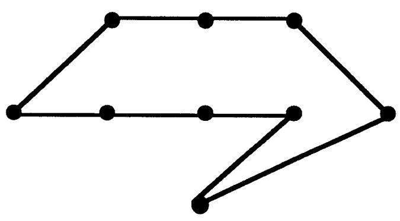
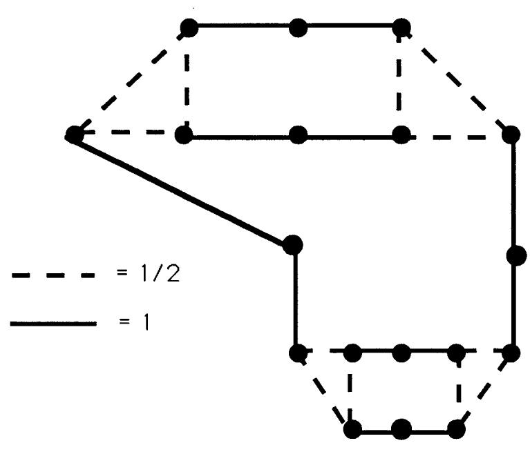

# Analysis of the Held-Karp Heuristic for the Traveling Salesman Problem

David Paul Williamson

S.B., Mathematics with Computer Science Massachusetts Institute of Technology (1989)

Submitted to the Department of Electrical Engineering and Computer Science in partial fulfillment of the requirements for the degree of

Master of Science in Electrical Engineering and Computer Science

at the

Massachusetts Institute of Technology June 1990

© Massachusetts Institute of Technology 1990

Signature of Author.

Department of Electrical Engineering and Computer Science May 11, 1990

Certified by

Accepted by

# Analysis of the Held-Karp Heuristic for the Traveling Salesman Problem

David Paul Williamson

Submitted to the Department of Electrical Engineering and Computer Science on May 11, 1990 in partial fulfillment of the requirements for the degree of Master of Science in Electrical Engineering and Computer Science

# Abstract

The Held-Karp heuristic for the Traveling Salesman Problem (TSP) has in practice provided near-optimal lower bounds on the cost of solutions to the TSP. We analyze the structure of Held-Karp solutions in order to shed light on their quality. In the symmetric case with triangle inequality, we show that a class of instances has planar solutions. We also show that Held-Karp solutions have a certain monotonicity property. This leads to an alternate proof of a result of Wolsey, which shows that the value of Held-Karp heuristic is always at least $\scriptstyle { \frac { 2 } { 3 } } { \mathcal { O P T } }$ , where $\scriptscriptstyle \mathcal { O P T }$ is the cost of the optimum TSP tour. Additionally, we show that the value of the Held-Karp heuristic is equal to that of the linear relaxation of the biconnected-graph problem when edge costs are non-negative.

In the asymmetric case with triangle inequality, we show that there are many equivalent definitions of the Held-Karp heuristic, which include finding optimally weighted 1-arborescences, 1-antiarborescences, asymmetric 1-trees, and assignment problems. We prove that monotonicity holds in the asymmetric case as well. These theorems imply that the value of the Held-Karp heuristic is no less than $\scriptstyle { \frac { 1 } { \left\lceil { \log n } \right\rceil } } { \mathcal { O P T } }$ and no less than the value of the Balas-Christofides heuristic for the asymmetric TSP.

For the 1,2-TSP, we show that the Held-Karp heuristic cannot do any better than $\scriptstyle { \frac { 9 } { 1 0 } } { \mathcal { O P T } }$ , even as the number of nodes tends to infinity.

Portions of this thesis are joint work with David Shmoys.

Thesis Supervisor: David Shmoys Title: Associate Professor of Applied Mathematics

# Acknowledgements

Mathematics is both a human and a divine enterprise. I will attempt to consider both elements in these acknowledgements.

This thesis never would have been started, much less finished, without my advisor, David Shmoys. David initiated, encouraged, and funded my research while I was still an undergraduate. He introduced me to the Held-Karp heuristic and collaborated with me on some of the results contained in the following pages. Despite my own uncertainties, he always expressed confidence that I could and would discover something interesting. His help during the researching and the writing of this thesis has been invaluable. I owe him many thanks for his ready accessibility, wise advice, excellent teaching, and principled advising. I also wish to thank him for the trip to Ithaca and the pair of good winter boots.

I am grateful to Cliff Stein and Joel Wein for reading drafts of this thesis and providing useful comments. Thanks are also due to David Wald for $\mathrm { { { I a T } _ { E } X } }$ hacking that improved the typesetting of the linear programs.

This thesis is the distilled essence of many hours of hunting down journals in the library, staring at blank sheets of paper, and pacing around the office, interspersed with many more hours of regular human activity: talking to people, eating dinner, trying to get up in the morning, etc. I believe that whatever useful results came from the time spent on research is partially due to those people who made the time spent on other things pleasant, exciting, and interesting. Thus I thank my parents for their care and support over the years. For day-to-day liveliness and interesting discussions about life and theoretical computer science, I thank the students of MIT's Theory group, especially my officemates, Joel Wein, Rafail Ostrovsky, David Wald, and the cactus, as well as the "Shmoys/Tardos Advisees in Exile" Joel, Cliff Stein, and Carolyn Norton. I must also thank a large group of friends who will never submit a paper to FOCS, and don't think their lives poorer for it. This group includes but is not limited to Mark Baker, Amy Briggs, Britta Brott, Phil Harford, Mark Hickman, Fred Hoth, Ted Leung, Chien-Hung Lin, and Greg Richardson. Thanks for leadership, counsel, and encouragement go to John and Carmel Cuyler, the Ministers to Students at Park Street Church, and Tim Kochems. Finally, the past few years would have been radically different without Brent Chambers, Sherry Curp, and Amy Von Stamwitz. I thank them profusely for offering me their constant and rich friendship.

God is discussed among modern academicians in the same way that pregnancy was discussed among the Victorians: abstractly, if at all. Yet I think the subject is as unavoidable in the long run, if we are to remain human. In this light, I thank God for mathematics itself, and for the time I was allowed to spend re-creating a few His thoughts about it. Most of all, I thank Him for His love, which has been expressed to me and the world in many ways, but especially in the person of Jesus. This love is far more durable, lasting, and important than anything in this thesis.

# Contents

1 Introduction 13

1.1 General Background . . . . 13   
1.2 The Held-Karp Heuristic . . . . 15

# 2 The Symmetric Case with Triangle Inequality 21

2.1 Planarity of Solutions 21   
2.2 Monotonicity of Solutions 29   
2.3 Connections to the Biconnected Graph Problem . 35   
3 The Asymmetric Case with Triangle Inequality 42   
3.1 Definition of the Asymmetric Held-Karp Heuristic 42   
3.2 Monotonicity of Solutions 47

4 The 1,2-TSP 53

5 Conclusions and Open Problems 59

6 Bibliography 61

# List of Figures

2.1 Example if crossed lines are in a single 1-tree 25   
2.2 Example if crossed lines are from two 1-trees 27   
2.3 Conjectured Worst Case for the Held-Karp Heuristic 36   
2.4 Case 1 if Lemma 2.3.3 does not apply 40   
2.5 Case 2 if Lemma 2.3.3 does not apply 41   
4.1 Instance $I _ { 1 }$ .. 55   
4.2 Instance $I _ { 2 } = I _ { 1 } + I _ { 0 }$ 56   
4.3 Optimum Tour of $I _ { 1 }$ 56   
4.4 Feasible Solution to $I _ { 2 }$ 58

# Chapter 1

# Introduction

# 1.1 General Background

The Traveling Salesman Problem (TSP) is one of the most notorious in the field of combinatorial optimization, and one of the most well-studied [24]. As with many other famous open questions in mathematics, such as Fermat's Last Theorem, the question is quite easy to state, but its solution has evaded researchers. The problem is this: given the costs associated with traveling between any pair of $\pmb { n }$ cities, find the least-cost tour that visits each city exactly once. In other words, suppose we have costs $z _ { i j } , 1 \leq i , j \leq n$ , associated with traveling from city $_ i$ to city $j$ To solve a particular instance of the problem (that is, to solve the problem for a particular $\pmb { n }$ and a particular set of $\pmb { c } _ { i j }$ ), we must find a cyclic permutation $\sigma _ { n }$ such that

$$
\sum _ { i = 1 } ^ { n } c _ { i \sigma _ { n } ( i ) } = \operatorname* { m i n } _ { \tau _ { n } ~ c y c l i c } \sum _ { i = 1 } ^ { n } c _ { i \tau _ { n } ( i ) } .
$$

The open question posed by the Traveling Salesman Problem differs from that posed by Fermat's Last Theorem, however, in that it involves determining the existence of an algorithm for the TSP whose running time is bounded by a polynomial in $\pmb { n }$ . A polynomial-time algorithm for the TSP would be able to determine $\sigma _ { n }$ for all possible instances. Proving the existence of such an algorithm (either constructively or non-constructively) would be similar to proving that a decision version of the TSP is in $\mathcal { P }$ , the class of all polynomial-time solvable decision problems. The decision version of the TSP includes an extra number $B$ in the input and outputs "yes" if and only if the cost of the minimum tour is no greater than $B$ . If a polynomial-time algorithm for the TSP exists, then certainly a polynomial-time algorithm for the decision version of the TSP exists. It is also not too hard to see that the converse is true (see [20], pp. 46-48). Thus a polynomial-time algorithm for the TSP exists if and only if the TSP decision problem is in $\mathcal { P }$ . This does not seem very likely, however, since the TSP decision problem is NP-complete [22]. NP-completeness implies that if the TSP decision problem is in $\mathcal { P }$ , then $\mathcal { P } = \mathcal { N P }$ Whether or not $\mathcal { P } = \mathcal { N P }$ is unknown, but it is generally believed that $\mathcal { P } \neq \mathcal { N P }$ .

Nevertheless, work has continued on the TSP through attempts to find polynomialtime approximation algorithms [21]. The most natural way to approximate the TSP is to devise an algorithm that explicitly constructs a tour which is not necessarily the minimum-cost tour. Such an algorithm may have a guarantee that the tour it constructs has cost no greater than α times the cost of the optimum tour (OPT ), for some α > 1. Another way to approximate the TSP is to find a value that estimates the cost of the optimal tour. There are several ways to find such a value. One way is to construct an optimal relaxed tour. If we think of a tour as a combinatorial object with certain properties (e.g., a graph with n edges, connected, each node with degree two, and so on), then a relaxed tour is a combinatorial object with a subset of those properties, so that all tours are also relaxed tours. For example, an assignment is a relaxed tour since it is a graph with $\pmb { n }$ edges such that each node has degree two. Clearly a minimum-cost relaxed tour can have cost no greater than OPT. A relaxed-tour approximation algorithm may also have a guarantee that the value it produces is no less than γ times OPT, γ < 1. Thus by finding optimal relaxed tours in polynomial time, we can approximate the value of the optimal tour without explicitly constructing a tour. We will call an approximation algorithm non-constructive if it does not construct a tour in its approximation of OPT. From here on, we will say that an approximation algorithm has a guarantee of α if α > 1 and the value it returns is between OPT and $\alpha \mathcal { O } \mathcal { P } \mathcal { T }$ , and that it has a guarantee of $\gamma$ if $\gamma < 1$ and the value it returns is between $\gamma \mathcal { O P T }$ and $\mathcal { O P T }$ . We can transform an $\pmb { \alpha }$ approximation algorithm into a $\begin{array} { r } { \gamma = \frac { 1 } { \alpha } } \end{array}$ approximation algorithm simply by multiplying the value of the $\pmb { \alpha }$ algorithm by $\begin{array} { l } { \frac { 1 } { \alpha } } \end{array}$ Therefore, an $\pmb { \alpha }$ approximation algorithm will be said to be "as good as" a $\textstyle \gamma = { \frac { 1 } { \alpha } }$ approximation algorithm.

Unfortunately, Sahni $\&$ Gonzalez [32] have shown that no TSP approximation algorithms exist with constant guarantees unless $\mathcal { P } = \mathcal { N P }$ . Thus research in approximation algorithms for the TSP has concentrated on several special cases of the TSP, each of which is $\pmb { N P }$ -complete in its own right. These special cases include the symmetric TSP with triangle inequali $\mathbf { \Delta } y$ , the asymmetric TSP with triangle inequality, and the symmetric 1,2-TSP. A TSP instance is said to be symmetric if $c _ { i j } = c _ { j i }$ for all $i , j$ , and asymmetric if this is not necessarily the case. An instance obeys the triangle inequality if $c _ { i j } \leq c _ { i k } + c _ { k j }$ for all distinct $i , j , k$ , and an instance is a case of the 1,2-TSP if for all $i , j$ either $c _ { i j } = 1$ or $c _ { \mathrm { i } { } j } = 2$ . The best known tour-constructing approximation algorithms for these three cases have guarantees of $\begin{array} { r } { \alpha = \frac { 3 } { 2 } } \end{array}$ [3], $\alpha = \left\lceil \log n \right\rceil$ [11], and $\begin{array} { r } { \alpha = \frac { 7 } { 6 } } \end{array}$ [30] respectively. Not as much work has been done on finding non-constructive approximation algorithms with good guarantees. Nevetheless, in the symmetric case with triangle inequality, it is well known that finding a minimum-cost spanning tree gives an $\begin{array} { r } { \gamma = \frac { 1 } { 2 } } \end{array}$ guarantee. In addition, several non-constructive heuristics seem to do very well in practice [17], [1], [2]. In particular, a "lower bound" heuristic developed by Held and Karp typically delivers solutions of cost above $9 9 \%$ of $\mathcal { O P T }$ for the symmetric case with triangle inequality [4], [37].

# 1.2 The Held-Karp Heuristic

Held and Karp proposed trying to find a minimum-cost tour in the symmetric case by trying to find an optimally weighted 1-tree [17]. A 1-tree of a graph $G = ( V , E )$ with $V = \{ 1 , \ldots , n \}$ is a spanning tree on nodes $\{ 2 , \ldots , n \}$ plus two edges incident to node 1. Thus a 1-tree has exactly one cycle, which contains node 1, and node 1 always has degree two. Note that a 1-tree is a relaxed tour. A minimum-cost 1-tree can be obtained by finding a minimum-cost spanning tree on $\{ 2 , \ldots , n \}$ and adding the two lowest cost edges incident to node 1. If $\pi = \left( \pi _ { 1 } , \ldots , \pi _ { n } \right)$ is a real $\pmb { n }$ -vector, then the minimum-cost 1-tree with respect to $\pi$ is defined to be the minimum-cost 1-tree with respect to the reduced costs $\overline { { c } } _ { i j } = c _ { i j } + \pi _ { i } + \pi _ { j }$ .If $T _ { k }$ is the minimum-cost 1-tree with respect to $\pmb { \pi }$ , we define $w ( \pi )$ such that

$$
w ( \pi ) = \sum _ { ( i , j ) \in T _ { k } } \overline { { c } } _ { i j } - 2 \sum _ { i = 1 } ^ { n } \pi _ { i } .
$$

The value produced by the Held-Karp heuristic is $\operatorname* { m a x } _ { \pi } w ( \pi )$ . In other words, the Held-Karp heuristic finds the vector $\pmb { \pi }$ such that the value of the minimum-cost 1-tree is the greatest.

Intuitively, the heuristic tries to find the $\pmb { \pi }$ vector such that the 1-tree is as close as possible to being a tour, without exceeding the cost of the optimal tour. Suppose that the minimum-cost 1-tree with respect to $\pmb { \pi }$ has a node $\pmb { u }$ with degree greater than 2. Then it seems that we should be able to find a $\pi ^ { \prime }$ such that ${ \pmb w } ( { \pmb \pi } ^ { \prime } ) > { \pmb w } ( { \pmb \pi } )$ simply by increasing the value of $\pi _ { u }$ , since this will increase the $\textstyle \sum _ { ( i , j ) \in T _ { k } } \overline { { c } } _ { i j }$ part of $w ( \pi )$ by more than the $- 2 \textstyle \sum _ { i = 1 } ^ { n } \pi _ { i }$ part will decrease. Likewise, if $\pmb { u }$ has degree 1, then we should be able to find a a $\pi ^ { \prime }$ such that $w ( \pi ^ { \prime } ) > w ( \pi )$ by decreasing the value of $\pi _ { u }$ . Thus by finding $\operatorname* { m a x } _ { \pi } w ( \pi )$ , the heuristic tries to force the degree of all nodes to be 2. Now suppose $\scriptstyle { \mathcal { T } } _ { t }$ is the minimum-cost tour. Then

$$
\begin{array} { r c l } { w ( \pi ) } & { = } & { \displaystyle \sum _ { ( i , j ) \in { \mathcal T } _ { k } } \overline { { \alpha } } _ { i j } - 2 \displaystyle \sum _ { i = 1 } ^ { n } \pi _ { i } } \\ & { \le } & { \displaystyle \sum _ { ( i , j ) \in { \mathcal T } _ { t } } \overline { { \alpha } } _ { i j } - 2 \displaystyle \sum _ { i = 1 } ^ { n } \pi _ { i } } \\ & { = } & { \displaystyle \sum _ { ( i , j ) \in { \mathcal T } _ { t } } ( c _ { i j } + \pi _ { i } + \pi _ { j } ) - 2 \displaystyle \sum _ { i = 1 } ^ { n } \pi _ { i } } \\ & { = } & { \displaystyle \sum _ { ( i , j ) \in { \mathcal T } _ { t } } c _ { i j } . } \end{array}
$$

So certainly $\operatorname* { m a x } _ { \pi } w ( \pi )$ is no greater than the cost of the optimal tour, $\textstyle \sum _ { ( i , j ) \in T _ { t } } c _ { i j }$ . Held and Karp proved the following theorem about their heuristic.

Theorem 1.2.1 (Held, Karp [17]) The Held-Karp heuristic produces exactly the same value as the following linear programl :

minimize

subject to:

$$
\begin{array} { r c l l } { { } } & { { } } & { { \displaystyle \sum _ { 1 \leq i < j \leq n } c _ { i j } x _ { i j } } } & { { } } & { { } } \\ { { \displaystyle \sum _ { j > 1 } c _ { i j } + \sum _ { j < i } x _ { j i } } } & { { = } } & { { 2 , } } & { { \displaystyle i = 1 , 2 , \ldots , n , } } \\ { { \displaystyle \sum _ { j < S , j \in S , i < j } x _ { i j } } } & { { \leq } } & { { \displaystyle | S | - 1 , } } & { { \ f o r \ a n y \ p r o p e r } } \\ { { } } & { { } } & { { \displaystyle x _ { i j } } } & { { \leq } } & { { 1 } } & { { \displaystyle 1 \leq i < j \leq n , } } \\ { { } } & { { } } & { { \displaystyle x _ { i j } } } & { { \geq } } & { { 0 } } & { { 1 \leq i < j \leq n . } } \end{array}
$$

This linear program produces a relaxed tour, where variable $\pmb { x } _ { i j }$ denotes the amount of edge $( i , j )$ in the solution. Note that if the $\pmb { x } _ { i j }$ variables were guaranteed to be either 0 or 1, the relaxed tour would be an actual tour, and the linear program would solve the TSP exactly. Linear program (1.1) is sometimes called the linear relaxation of the TSP. 2 We will refer to (1.1) as the Subtour LP.

The formulation of the heuristic as a search for an optimally weighted 1-tree can be thought of as an instance of Lagrangean relaxation. In Lagrangean relaxation, some constraints of a linear program are dropped, but penalties for their violation are added to the objective function. In the case of the Subtour LP, the constraints forcing the degree of each node to be 2 are dropped but the $\pi$ vector acts as a penalty for violating the node degree constraints. The $\pi _ { i }$ are sometimes called Lagrangean multipliers.

There are other equivalent formulations of the Held-Karp heuristic. In their original paper, Held and Karp noted that $\operatorname* { m a x } _ { \pi } w ( \pi )$ can be expressed as a linear program. Let $T _ { 1 } , T _ { 2 } , \ldots , T _ { t }$ be an enumeration of all 1-trees. It will be convenient to let $\pmb { c _ { k } }$ be the cost of 1-tree $T _ { k } , \ d _ { i k }$ be the degree of node $_ i$ in $T _ { k }$ , and $v _ { i k } = d _ { i k } - 2$ . So then

$$
w ( \pi ) = \operatorname* { m i n } _ { k } [ c _ { k } + \sum _ { i = 1 } ^ { n } \pi _ { i } v _ { i k } ] .
$$

Thus we can express $\operatorname* { m a x } _ { \pi } w ( \pi )$ as

$$
\begin{array} { r c l } { w } & & \\ { w } & { \leq } & { c _ { k } + \sum _ { i = 1 } ^ { n } \pi _ { i } v _ { i k } , \forall k = 1 , \dots , t . } \end{array}
$$

The dual of this linear program will also be an equivalent formulation of the heuristic. Taking the dual of (1.2) yields

$$
\begin{array} { r c l } { \sum _ { k } c _ { k } y _ { k } } & & \\ { \sum _ { k } y _ { k } } & { = } & { 1 , } \\ { \sum _ { k } v _ { i k } y _ { k } } & { = } & { 0 \quad i = 1 , \ldots , n , } \\ { y _ { k } } & { \geq } & { 0 . } \end{array}
$$

Held and Karp noted that the LP above finds the minimum-cost convex combination of 1-trees such that the average degree of each node is 2. Finally, it has been shown that the subtour elimination constraints of the Subtour LP can be replaced with constraints of the form3

$$
\sum _ { i , j \in S ; i < j } x _ { i j } \geq 2 \quad \forall S \subset V .
$$

This replacement of constraints yields an LP that is another equivalent formulation of the Held-Karp heuristic.

Held and Karp proposed several algorithms for finding the optimally weighted 1-tree [17], [18]. Their most successful approach involves use of a technique known as subgradient optimization. Given a concave function $f$ , a vector s is said to be the subgradient of $f$ at $\overline { { u } }$ if for all $u , f ( \overline { { u } } ) + s \cdot ( u - \overline { { u } } ) \geq f ( u )$ . It turns out that for sufficiently small $\lambda , \overline { { u } } + \lambda s$ is closer than $\overline { { u } }$ to the point at which $f$ reaches its maximum value. Let $v _ { k } = \left( d _ { 1 k } - 2 , d _ { 2 k } - 2 , \ldots , d _ { n k } - 2 \right)$ , where $d _ { i k }$ is the degree of the ith node of the minimum-cost 1-tree with respect to $\pi , T _ { k }$ . Held and Karp showed that ${ \pmb v } _ { { \pmb k } }$ is a subgradient for the function $w ( \pi )$ . They then proposed generating a sequence of $\pi$ vectors $( \pi ^ { 1 } , \pi ^ { 2 } , \ldots )$ according to the rule

$$
\pi ^ { m + 1 } = \pi ^ { m } + \lambda ^ { m } \left( \frac { \overline { { w } } - w ( \pi ^ { m } ) } { \| v _ { k } \| ^ { 2 } } \right) v _ { k } ^ { m } ,
$$

where $0 < \lambda ^ { m } \leq 2$ and $\overline { { w } }$ is some "target value" such that $w ( \pi ) < \overline { { w } } \leq \operatorname* { m a x } _ { \pi } w ( \pi )$ . Notice that this update rule is a formalization of the intuition above of increasing $\pi _ { i }$ when $d _ { i k } > 2$ and decreasing $\pi _ { i }$ when $d _ { i k } < 2$ . Held and Karp showed that if $\lambda ^ { m } \geq \epsilon$ for some $\epsilon > 0$ for all $\pmb { m }$ , then the sequence of $\pi ^ { m }$ either converges to or contains some $\pi ^ { l }$ such that $w ( \pi ^ { l } ) \geq \overline { { w } }$ .

No one has yet bounded the number of iterations of subgradient optimization to guarantee a polynomial running time. The ellipsoid method of linear programming can be used on the LP formulation, since max-flow programs can be used to find violated constraints or verify the feasability of solutions. Thus the ellipsoid method can find the solution to the Subtour LP in polynomial time [23], [15]. In fact, the solution can be found in strongly polynomial time due to a result of Frank and Tardos [9]. However, both of these algorithms are considered to be more of theoretical interest rather than practical interest. No practical algorithms are known for the Held-Karp heuristic that are guaranteed to run in polynomial time.

The Held-Karp heuristic has proven interesting for a number of reasons. The first reason, as mentioned above, is its astonishing accuracy in practice. Johnson [19], who uses the heuristic to evaluate the performance of various tour-constructing algorithms, estimates that the Held-Karp heuristic usually comes within 99.5% of the cost of the optimal solution. The second reason is that the heuristic is used as the basis for still more sophisticated heuristics for the TSP. Several researchers have used it within branch and bound schemes (see [2]). Grötschel and Padberg use the Subtour LP as the basic linear program within their cutting plane approach to solving the TSP [28].

The reasons for the near-optimality of the heuristic's solutions have not been well understood. This thesis investigates the structure of solutions found by the HeldKarp heuristic in order to shed light on their accuracy. We consider the symmetric case with triangle inequality, the asymmetric case with triangle inequality, and the 1,2-TSP in Chapters 2, 3, and 4 respectively.

In the chapter on the symmetric case, we show that instances from two-dimensional Euclidean space have planar solutions. We also show that symmetric instances with the triangle inequality have a certain monotonicity property: namely, given a graph $G ^ { \prime }$ induced by removing a node of a graph $G$ , the value obtained by the heuristic on $G ^ { \prime }$ is not greater than the value for $G$ . With one additional lemma, we give an alternate proof of a theorem of Wolsey [39] which shows that the Held-Karp heuristic has a $\begin{array} { r } { \gamma = \frac { 2 } { 3 } } \end{array}$ guarantee for these instances. We explore connections between Held

Karp solutions and solutions to another $\pmb { \mathcal { N P } }$ -complete problem, the minimum-cost biconnected-graph problem. Finally, we conjecture that the Held-Karp heuristic has a guarantee of $\begin{array} { r } { \gamma = \frac { 3 } { 4 } } \end{array}$ and we provide an example which meets this lower bound.

For the asymmetric case, we consider the extension of the heuristic to the asymmetric case proposed by Held and Karp in terms of weighted 1-arborescences. We show, using a powerful theorem of Geoffrion [12], that the heuristic can also be viewed in terms of weighted 1-antiarborescences, assignment problems, and asymmetric 1-trees. We deduce as a corollary that the Held-Karp heuristic has a bound that dominates the bound of another non-constructive lower-bound heuristic for the asymmetric TSP due to Balas and Christofides [1]. We give the analagous monotonicity proof for the asymmetric case with triangle inequality and show how this implies an $\begin{array} { r } { \gamma = \frac { 1 } { \left\lceil \log { n } \right\rceil } } \end{array}$ guarantee, matching the best known $\alpha = \lceil \log n \rceil$ tour-constructing guarantee.

Finally, for the 1,2-TSP case, we show that the heuristic cannot do better than $\begin{array} { r } { \gamma = \frac { 9 } { 1 0 } } \end{array}$ , even as $\pmb { n }$ n Karp solutions, the minimum-cost biconnected graph, and the TSP.

# Chapter 2

# The Symmetric Case with Triangle Inequality

Recall from the previous chapter that a TSP instance is symmetric if cij = cji: for all i,j, and obeys the triangle inequality if cik + ckj ≥ cij for all i, j, k where i, j, and k are distinct. The symmetric case of the TSP with the triangle inequality is perhaps the most-studied special case of the TSP. It contains the subcase of finding tours through points in the plane, where $\pmb { c } _ { i j }$ is the Euclidean distance between points $\textbf { \textit { i } }$ and $j$ , since the Euclidean metric is symmetric and obeys the triangle inequality. We will call this subcase the Euclidean TSP. One of the earliest papers on solving the TSP dealt with the Euclidean TSP, finding a tour through cities of the 48 continental states of the U.S. [5]. The Euclidean TSP is $\pmb { \mathcal { N P } }$ complete [29].

# 2.1 Planarity of Solutions

We begin this chapter by showing that for any instance of the $\bf { T S P ^ { 1 } }$ which has an embedding of its nodes in the plane that obeys certain properties, the Held-Karp heuristic has an optimal solution that is planar. We will then show that the Euclidean TSP with the straightforward "Euclidean embedding" always has a planar solution. First we need to define what we mean by an embedding and what it means for a Held-Karp solution to be planar. An embedding is a one-to-one mapping from the nodes of the instance to points in the plane. The embedding corresponds a distinct point $p _ { \mathfrak { i } } \in \mathfrak { R } ^ { 2 }$ with each node i. An embedding does not require the topological distance between $\pmb { p _ { i } }$ and ${ \pmb p } _ { j }$ to be the same as the distance $\pmb { c } _ { i j }$ between nodes $_ i$ and $j$ . Let $\pmb { \mathcal { x } }$ be the optimal solution to the Subtour LP on $\pmb { n }$ nodes, let $V = \{ 1 , \ldots , n \}$ , and let $E _ { L P } = \{ ( i , j ) | \overline { { x } } _ { i j } > 0 \}$ . We say $\pmb { \mathcal { F } }$ is planar if and only if the graph $G = ( V , E _ { L P } )$ is planar. We will show planarity by concentrating on a particular embedding of nodes in the plane. If $G$ is planar, then it will have a plane representation for that particular embedding of nodes [26]. All that remains to be proved is that given an embedding, $G$ has a plane representation, and thus is planar. We will now show that any instance of the TSP has a planar Held-Karp solution if there exists an embedding that meets two conditions. The first condition is that no three of the points of the embedding are colinear. The second condition is that the edge costs obey a property called the box property.

Property 2.1.1 (Box Property) Consider an embedding of the nodes $1 , \ldots , n$ of a TSP instance into the plane at points $p _ { 1 } , . . . , p _ { n }$ respectively. Pick any four distinct nodes $i , j , k , l$ such that the line segments $( p _ { i } , p _ { j } ) , ( p _ { j } , p _ { k } ) , ( p _ { k } , p _ { l } )$ ,and $( p _ { l } , p _ { i } )$ define a convex quadrilateral. The embedding of the TSP instance is said to have the box property if for any such $i , j , k , l$ , $c _ { i j } + c _ { k l } < c _ { i k } + c _ { j l }$ and $c _ { i l } + c _ { j k } < c _ { i k } + c _ { j l }$

In other words, an embedding has the box property if for any four points defining a convex quadrilateral, the sum of the edge costs of opposing sides of the quadrilateral is less than the sum of the diagonals.

We will now show that given an embedding of an instance with the box property and with no three points colinear, there is an optimal solution to the Subtour LP that is planar. To do this, we will first show that we can use the formulation of the Held-Karp heuristic as a convex combination of 1-trees instead of the Subtour LP formulation. Then we will show that if we draw straight line segments between ${ \pmb p } _ { \pmb { \imath } }$ and ${ \pmb p } _ { j }$ for every edge $( i , j )$ in the convex-combination solution, intersecting segments imply that the solution is not optimal.

As was noted in Chapter 1, the following linear program is an equivalent formulation of the Held-Karp heuristic:

$$
\begin{array} { r c l } { \sum _ { k } c _ { k } y _ { k } , } & & \\ { \sum _ { k } y _ { k } } & { = } & { 1 , } \\ { \sum _ { k } v _ { i k } y _ { k } } & { = } & { 0 \quad i = 1 , \ldots , n , } \\ { y _ { k } } & { \geq } & { 0 . } \end{array}
$$

If $\pmb { y }$ is the optimal solution to this linear program, let $E _ { C C } = \{ ( i , j ) | \exists k$ with $( i , j ) \in$ $\scriptstyle { T _ { k } }$ and $y _ { k } > 0 \}$ . We will show that $E _ { C C } = E _ { L P }$ so we can use the edge set $E _ { C C }$ when drawing lines in the plane.

Lemma 2.1.2 $E _ { C C } = E _ { L P }$ for some optimal solution $\pmb { \overline { { x } } }$ to the Subtour LP.

Proof: Let $\pmb { y }$ be a feasible solution to (2.1). Set

$$
\overline { { x } } _ { i j } = \sum _ { \{ k | ( i , j ) \in T _ { k } \} } y _ { k } .
$$

We will show that $\pmb { \overline { { x } } }$ is a feasible solution of the same cost for the Subtour LP. Since the Subtour LP and LP (2.1) both give the same value, if $\pmb { y }$ is optimal, then $\overline { { \pmb x } }$ will be also. The constraint $\overline { { x } } _ { i j } \leq 1$ follows from $\textstyle \sum _ { k } y _ { k } = 1$ and $\overline { { x } } _ { i j } \geq 0$ from $y _ { k } \geq 0$ . Furthermore, $\begin{array} { r } { \sum _ { k } v _ { i k } y _ { k } = 0 } \end{array}$ implies $\begin{array} { r } { \sum _ { k } d _ { i k } y _ { k } = 2 } \end{array}$ and thus $\begin{array} { r } { \sum _ { k } \sum _ { \lbrace j \vert ( i , j ) \in T _ { k } \rbrace } y _ { k } = 2 } \end{array}$ , so that

$$
\sum _ { j > i } \overline { { x } } _ { i j } + \sum _ { j < i } \overline { { x } } _ { j i } = \sum _ { j } \sum _ { \{ k | ( i , j ) \in T _ { k } \} } y _ { k } = 2 .
$$

Moreover, 1-trees have one unique cycle, which contains node 1. So for any 1-tree,

$$
\begin{array} { r c l } { { 1 } } & { { \displaystyle \{ ( \imath , \imath ) | ( \imath , \imath ) | \sum _ { i , j \in S _ { 1 } \backslash i , j \in S } 1 \} } } & { { \displaystyle 1 } } & { { \displaystyle \langle | S | - 1 \quad \mathrm { ~ f o r ~ a n y ~ } k , S \subseteq \{ 2 , \ldots , n \} } } \\ { { \displaystyle \sum _ { i , j \in S _ { i } \backslash i , j \in S } y _ { k } } } & { { \displaystyle \leq } } & { { \displaystyle y _ { k } ( | S | - 1 ) \quad \mathrm { ~ f o r ~ a n y ~ } k , S \subseteq \{ 2 , \ldots , n \} } } \\  { \displaystyle \sum _ { k } \underbrace { \sum _ { i , j \in S _ { 1 } \backslash i , j \in S } \} _ { i , j \in I _ { k } \backslash i , j \in S } y _ { k } } } & { { \displaystyle \leq } } & { { \displaystyle | S | - 1 \quad S \subseteq \{ 2 , \ldots , n \} } } \\ { { \displaystyle \sum _ { i , j \in S } \sum _ { \{ k | ( i , j ) \in T _ { k } \backslash i , j \in S \} } y _ { k } } } & { { \displaystyle \leq } } & { { \displaystyle | S | - 1 \quad S \subseteq \{ 2 , \ldots , n \} } } \\ { { \displaystyle \sum _ { i , j \in S } \sum _ { \bar { \imath } , j \in S } \tilde { x } _ { i j } } } & { { \displaystyle \leq } } & { { \displaystyle | S | - 1 \quad S \subseteq \{ 2 , \ldots , n \} } } \\ { { \displaystyle \sum _ { i , j \in S } x _ { \bar { \imath } } } } & { { \displaystyle \leq } } & { { \displaystyle | S | - 1 \quad S \subseteq \{ 2 , \ldots , n \} . } } \end{array}
$$

Thus the subtour elimination constraints are satisfied. The remaining constraints for the sets $S$ that include node 1 are implied by the previous constraints. Finally, $\begin{array} { r } { \sum _ { k } c _ { k } y _ { k } = \sum _ { 1 \leq i < j \leq n } \sum _ { \{ k | ( i , j ) \in T _ { k } \} } c _ { i j } y _ { k } = \sum _ { 1 \leq i < j \leq n } c _ { i j } \overline { { x } } _ { i j } . } \end{array}$ ,so the two feasible solutions have the same cost. Since $\begin{array} { r } { \overline { { x } } _ { i j } \ = \ \sum _ { \{ k \mid ( i , j ) \in T _ { k } \} } y _ { k } , \ \overline { { x } } _ { i j } \ > \ 0 } \end{array}$ if and only if there exists $\pmb { k }$ such that $( i , j ) \in T _ { k }$ and $y _ { k } > 0$ Hence $( i , j ) \in E _ { L P }$ if and only if $( i , j ) \in E c c . \equiv$

Thus we can work with the convex combination of 1-trees, knowing that an optimal solution to this LP will produce the same set of edges as an optimal solution to the Subtour LP. We will now prove that given an embedding with the right properties, we can draw straight lines for all edges in $E _ { C C }$ without having any lines intersect.

Theorem 2.1.3 Let $p _ { 1 } , \ldots , p _ { n }$ be the embedding of the nodes of an instance of the TSP such that the embedding has the box property, and such that no three points $\pmb { p _ { \ell } }$ are colinear. Then there exists an optimal solution to the Subtour $L P$ that is planar.

Proof: Let $\pmb { y }$ be an optimal solution to (2.1). Draw a straight line segment between $\pmb { p _ { i } }$ and ${ \pmb p } _ { j }$ for all $( i , j ) \in E _ { C C }$ . Suppose that two of these line segments intersect. Call them $\left( { p _ { i } , p _ { k } } \right)$ and $( p _ { j } , p _ { l } )$ . Since no three points are colinear, $p _ { i } , p _ { j } , p _ { k }$ , and ${ \pmb p } _ { l }$ must form a convex quadrilateral. The two line segments $( p _ { i } , p _ { k } )$ and $( p _ { j } , p _ { l } )$ correspond to edges $( i , k )$ and $( j , l )$ . Suppose that both edges $( i , k )$ and $( j , l )$ are in a single 1-tree, $\textstyle { \mathcal { T } } _ { q }$ . Since any 1-tree is connected and $( i , k )$ and $( j , l )$ are in $T _ { q }$ , there exists a path in $\textstyle { \mathcal { T } } _ { q }$ either from $_ i$ to $j$ , from $j$ to $\pmb { k }$ , from $k$ to $\mathbf { \xi } _ { l }$ , or from $\it l$ to $\mathbf { \chi } _ { i }$ that does not pass through either of the other two nodes. Without loss of generality, suppose that the path is from $\dot { \pmb { \mathscr { \imath } } }$ to $j$ , and it does not pass through $\pmb { k }$ or $\iota$ Create a new 1-tree $T _ { r }$ from $\scriptstyle { T _ { q } }$ by removing $( i , k )$ and $( j , l )$ and adding $( i , l )$ and $( j , k )$ . The path from $\pmb { i }$ to $j$ ensures that $T _ { r }$ is connected. See Figure 2.1. Let $y _ { k } ^ { \prime } = y _ { k }$ for $k \neq q , r$ , and let $y _ { q } ^ { \prime } = 0$ and $y _ { r } ^ { \prime } = y _ { r } + y _ { q }$ . It is not difficult to see that since $\pmb { y }$ is feasible for (2.1), so is $y ^ { \prime }$ .By the box property, since $p _ { i } , p _ { j } , p _ { k } , p _ { l }$ formed a convex quadrilateral, we have $c _ { i l } + c _ { j k } < c _ { i k } + c _ { j l }$ . Therefore, $\begin{array} { r } { \sum _ { k } c _ { k } y _ { k } ^ { \prime } < \sum _ { k } c _ { k } y _ { k } } \end{array}$ . This contradicts our hypothesis that $\pmb { y }$ is an optimal solution to (2.1).

Now suppose that the edges $( i , k )$ and $( j , l )$ corresponding to the crossing line segments come from two different 1-trees, $( i , k )$ from $T _ { q }$ and $( j , l )$ from $\scriptstyle { \pmb { T _ { r } } }$ . Without loss of generality, suppose that $y _ { q } \leq y _ { r }$ . There are two classes of ways that $\scriptstyle { T _ { q } }$ and $\scriptstyle { \mathcal { T } } _ { r }$ can be connected, so again, without loss of generality, we will pick one example from each class and assert that the other cases in each class are similar. For the first class, we will say that $\textstyle { \mathcal { T } } _ { q }$ has paths from $_ i$ to $j$ and from $\pmb { k }$ to $\mathbf { \xi } _ { l }$ (without going through $k , l$ and through $i , j$ respectively), and $T _ { r }$ has paths from $_ i$ to $j$ and from $j$ to $\pmb { k }$ .In this first class of cases, we are able to remove the "diagonal" edges from the trees and replace them with "opposing sides" while keeping the 1-trees properly connected: in this case, we create $T _ { q 1 }$ from $T _ { q }$ by removing $( i , k )$ and adding $( j , k )$ , and $T _ { r 1 }$ from $T _ { r }$ by removing $( j , l )$ and adding $( i , l )$ . We set $y _ { q 1 } ^ { \prime } = y _ { q 1 } + y _ { q } , y _ { r 1 } ^ { \prime } = y _ { r 1 } + y _ { q } , y _ { r } ^ { \prime } = y _ { r } - y _ { q } ,$ $y _ { q } ^ { \prime } = 0$ , and $y _ { k } ^ { \prime } = y _ { k }$ elsewhere. $y ^ { \prime }$ is feasible for (2.1) since $\pmb { y }$ is, but the difference in cost between the two solutions is $y _ { q } ( c _ { i l } + c _ { j k } ) - y _ { q } ( c _ { i k } + c _ { j l } )$ This difference is negative by the box property, so $y ^ { \prime }$ is a cheaper solution to (2.1), contradicting the optimality of $\pmb { y }$ .

  
Figure 2.1: Example if crossed lines are in a single 1-tree

For the second class, we will say that $T _ { q }$ has paths from $_ i$ to $j$ and from $\pmb { k }$ to $\pmb { l }$ , and $\pmb { T _ { r } }$ has paths from $_ i$ to $\iota$ and from $j$ to $\pmb { k }$ (again, the paths do not visit the other two nodes). Create four new 1-trees: $T _ { q 1 }$ from $T _ { q }$ by deleting $( i , k )$ and adding $( j , k ) , T _ { q 2 }$ from $T _ { q }$ by deleting $( i , k )$ and adding $( i , l ) , T _ { r 1 }$ from $T _ { r }$ by deleting $( j , l )$ and adding $( i , j )$ , and $T _ { r 2 }$ from $T _ { r }$ by deleting $( j , l )$ and adding $( k , l )$ See Figure 2.2. It is not difficult to check that all the new 1-trees are properly connected. Now, let $\begin{array} { r } { y _ { q 1 } ^ { \prime } = y _ { q 1 } + \frac { 1 } { 2 } y _ { q } } \end{array}$ $\begin{array} { r } { + \frac { 1 } { 2 } y _ { q } , y _ { q 2 } ^ { \prime } = y _ { q 2 } + \frac { 1 } { 2 } y _ { q } , y _ { r 1 } ^ { \prime } = y _ { r 1 } + \frac { 1 } { 2 } y _ { q } , y _ { r 2 } ^ { \prime } = y _ { r 2 } + \frac { 1 } { 2 } y _ { q } , y _ { r } ^ { \prime } = y _ { r } - y _ { q } , y _ { q } ^ { \prime } = 0 , } \end{array}$ and $y _ { k } ^ { \prime } = y _ { k }$ elsewhere. Since $\pmb { y }$ is feasible for (2.1), so is $y ^ { \prime }$ However, the difference in cost between the two solutions is $\begin{array} { r } { \frac 1 2 y _ { q } ( c _ { i j } + c _ { j k } + c _ { k l } + c _ { l i } ) - y _ { q } ( c _ { i k } + c _ { j l } ) } \end{array}$ By the box property this difference is negative, so $y ^ { \prime }$ is a cheaper solution, contradicting the optimality of $\pmb { y }$ .

In all cases, the existence of crossing line segments leads to a contradiction. Thus the embedding of the TSP instance must yield some optimal solution $\pmb { \mathcal { x } }$ such that $G = ( V , E _ { L P } )$ has a plane representation for that embedding. By previous discussion, this proves that $\pmb { \overline { { x } } }$ is planar.

In the case of the Euclidean TSP, there is a natural "Euclidean embedding" of the nodes into points in the plane such that for any nodes $\textit { \textbf { i } }$ and $j$ $j , c _ { i j } = d ( p _ { i } , p _ { j } ) _ { ; }$ where $d ( p _ { i } , p _ { j } )$ is the Euclidean distance between points ${ \pmb p } _ { \pmb { \imath } }$ and $\pmb { p } _ { j }$ . We will show that given this Euclidean embedding for an instance of the Euclidean TSP, there is always an optimal solution to the Subtour LP that is planar. We will do this by showing that the Euclidean embedding always has the box property, and that we can drop the restriction of colinearity from the theorem above.

Lemma 2.1.4 The Euclidean embedding for a Euclidean TSP instance always has the box property.

Proof: Let $p _ { 1 } , \ldots , p _ { n }$ be the Euclidean embedding of nodes $1 , \ldots , n$ from a Euclidean TSP instance. Pick any four distinct nodes $i , j , k , l$ such that the line segments $( p _ { i } , p _ { j } ) , ( p _ { j } , p _ { k } ) , ( p _ { k } , p _ { l } )$ , and $( p _ { l } , p _ { i } )$ define a convex quadrilateral. Then the diagonals $( p _ { i } , p _ { k } ) , ( p _ { j } , p _ { l } )$ of the quadrilateral intersect at exactly one particular point in $\Re ^ { 2 }$ : Call this point $\pmb q$ . Since $\pmb q$ does not lie on the any of the line segments $( p _ { i } , p _ { j } ) , ( p _ { k } , p _ { l } ) _ { : }$ $\left( { p _ { l } , p _ { i } } \right)$ , and $( p _ { j } , p _ { k } )$ , the following statements hold under the Euclidean metric:

$$
\begin{array} { r l } & { \bullet \ d ( p _ { i } , p _ { j } ) < d ( p _ { i } , q ) + d ( q , p _ { j } ) } \\ & { } \\ & { \bullet \ d ( p _ { k } , p _ { l } ) < d ( p _ { k } , q ) + d ( q , p _ { l } ) } \\ & { } \\ & { \bullet \ d ( p _ { l } , p _ { i } ) < d ( p _ { l } , q ) + d ( q , p _ { i } ) } \\ & { } \\ & { \bullet \ d ( p _ { j } , p _ { k } ) < d ( p _ { j } , q ) + d ( q , p _ { k } ) } \end{array}
$$

Adding the first two statements together gives $d ( p _ { i } , p _ { j } ) + d ( p _ { k } , p _ { l } ) < d ( p _ { i } , q ) +$ $d ( q , p _ { k } ) + d ( p _ { j } , q ) + d ( q , p _ { l } )$ , and adding together the last two gives $d ( p _ { i } , p _ { l } ) + d ( p _ { j } , p _ { k } ) <$ $d ( p _ { i } , q ) + d ( q , p _ { k } ) + d ( p _ { j } , q ) + d ( q , p _ { l } )$ (using symmetry). But $d ( p _ { i } , q ) + d ( q , p _ { k } ) =$ $d ( p _ { \uparrow } , p _ { k } )$ and $d ( p _ { j } , q ) + d ( q , p _ { l } ) = d ( p _ { j } , p _ { l } )$ , since $\pmb q$ lies on the line segments $( p _ { i } , p _ { k } )$ and $( p _ { j } , p _ { l } )$ . Because this is a Euclidean embedding of a Euclidean TSP instance, $c _ { i j } = d ( p _ { i } , p _ { j } )$ , $c _ { k l } = d ( p _ { k } , p _ { l } )$ , and so forth. Thus $c _ { i j } + c _ { k l } < c _ { i k } + c _ { j l }$ and $c _ { i l } + c _ { j k } <$ $c _ { i k } + c _ { j l }$ .•

  
Figure 2.2: Example if crossed lines are from two 1-trees

Finally, we remove the restriction on colinearity for the Euclidean TSP.

Theorem 2.1.5 Given the Euclidean embedding for an instance of the Euclidean TSP, there exists an optimal solution to the Subtour $L P$ that is planar.

Proof: Observe that for the Euclidean TSP $d ( p _ { i } , p _ { j } ) + d ( p _ { k } , p _ { l } ) < d ( p _ { i } , p _ { k } ) + d ( p _ { j } , p _ { l } )$ and $d ( p _ { i } , p _ { l } ) + d ( p _ { j } , p _ { k } ) < d ( p _ { i } , p _ { k } ) + d ( p _ { j } , p _ { l } )$ even when $\pmb { p } _ { j }$ or $p _ { l }$ lies on the line segment $\left( { p _ { i } , p _ { k } } \right)$ , or when ${ \pmb p } _ { \pmb { \imath } }$ or $\pmb { p _ { k } }$ lies on the segment $( p _ { j } , p _ { l } )$ . Hence, using the reasoning found in Theorem 2.1.3 and Lemma 2.1.4 above, intersecting line segments of this type contradict the optimality of $\pmb { y }$ , the optimal solution to 2.1.

We must now handle the general case when three or more points are colinear. Let $\pmb { \overline { { x } } }$ be an optimal solution to the Subtour LP, with the subtour elimination constraints replaced by $\begin{array} { r } { \sum _ { i \in S , j \notin S } x _ { i j } \ge 2 } \end{array}$ constraints. By the reasoning above, drawing straight line segments for all edges in $E _ { L P }$ yields no intersecting line segments unless all the points corresponding to the intersecting segments are colinear. Without loss of generality, suppose that points $p _ { 1 } , \ldots , p _ { k }$ are colinear, in numerical order on the line. Suppose also that drawing straight lines for all edges in $E _ { L P }$ causes lines to be drawn through points $p _ { 2 } , \ldots , p _ { k - 1 }$ ; that is, for each node $i \in \{ 2 , \ldots , k - 1 \}$ , there is some edge $( a , b ) \in E _ { L P }$ with $1 \leq a < i < b \leq k$ .

Let $S = \{ 1 , \ldots , k \}$ . Let $\begin{array} { r } { t _ { 0 } = \sum _ { j \notin S } \overline { { x } } _ { 1 j } } \end{array}$ and $\begin{array} { r } { t _ { k } = \sum _ { j \notin S } \overline { { x } } _ { k j } } \end{array}$ Furthermore, we set $\begin{array} { r } { t _ { i } = \sum _ { 1 \leq a \leq i < b \leq k } \overline { { x } } _ { a b } } \end{array}$ for $i = 1 , \ldots , k - 1$ . That is, $t _ { i }$ will be the sum of the $\overline { { x } } _ { a b }$ that "get drawn" between nodes $_ i$ and $i + 1$ . Since the degree of nodes 1 and $\pmb { k }$ is 2, it follows that $t _ { 0 } + t _ { 1 } = 2$ , and $t _ { k - 1 } + t _ { k } = 2$ .

Suppose $\textit { S } \neq \textit { V }$ Since $\overline { { \pmb { x } } }$ is a solution to the Subtour LP, we know that $\begin{array} { r } { \sum _ { i \in S , j \notin S } \overline { { x } } _ { i j } \geq 2 } \end{array}$ For $i \in \{ 2 , \ldots , k - 1 \}$ , there is no $( i , j ) \in E _ { L P }$ with $j \not \in S$ . If there was such an edge $( i , j )$ , then since there exists an edge $( a , b ) , 1 \leq a < i < b \leq k _ { : }$ with ${ \pmb p } _ { \pmb { i } }$ on the line segment $\left( p _ { a } , p _ { b } \right)$ , we have a contradiction by the discussion of the initial paragraph. Therefore, $\begin{array} { r } { \sum _ { i \in S , j \notin S } \overline { { x } } _ { i j } = \sum _ { j \notin S } ( \overline { { x } } _ { 1 j } + \overline { { x } } _ { k j } ) = t _ { 0 } + t _ { k } \geq 2 } \end{array}$ Using $S ^ { \prime } = \left\{ 1 , \ldots , k - 1 \right\}$ and $S ^ { \prime \prime } = \{ 2 , \ldots , k \}$ , one can show similarly that $t _ { 0 } + t _ { k - 1 } \ge 2$ and $t _ { 1 } + t _ { k } \ge 2$ . Solving with the equations above yields $t _ { 0 } = t _ { 1 } = t _ { k - 1 } = t _ { k } = 1$ . Then using $S ^ { i } = \{ i + 1 , \ldots , k \}$ ,we get $t _ { i } + t _ { k } \ge 2$ , which implies $t _ { i } \geq 1$ We now construct a new solution to the Subtour LP which has no greater cost: $\overrightarrow { x } _ { i , i + 1 } ^ { \prime } = 1$ for $i = 1 , \ldots , k - 1 , \overline { { x } } _ { 1 j } ^ { \prime } = \overline { { x } } _ { 1 j }$ for $j > k , { \overline { { x } } } _ { k j } ^ { \prime } = { \overline { { x } } } _ { k j }$ for $j > k$ , and $\overline { { x } } _ { j l } ^ { \prime } = \overline { { x } } _ { j l }$ for $j , l > k$ . Clearly for the Euclidean TSP this solution has no greater cost, since in the old solution $t _ { i } \geq 1$ . The node degree constraints are satisfied, since each node has degree 2. Suppose that there is some set $\boldsymbol { T }$ such that $\begin{array} { r } { \sum _ { i \in T , j \notin T } \overline { { x } } _ { i j } ^ { \prime } < 2 } \end{array}$ Then it must be the case that $T \cap S = \{ 1 , \ldots , i \}$ or $T \cap S = \{ i , \ldots , k \}$ for $1 \leq i \leq k$ For any other possible $\boldsymbol { T } \cap \boldsymbol { S }$ , it is clear that $\begin{array} { r } { \sum _ { i \in T , j \notin T } \overline { { x } } _ { i j } ^ { \prime } \ge 2 } \end{array}$ If some set of the form $T \cap S = \left\{ 1 , \ldots , i \right\}$ or $T \cap S = \left\{ i , \ldots , k \right\}$ is infeasible for $\overline { { { x } } } ^ { \prime }$ , then $\pmb { T } \cup \pmb { S }$ must also be infeasible for $\overline { { \pmb { x } } } ^ { \prime }$ .However, this implies $\mathbf { \Delta } T \cup \mathbf { \Delta } S$ was infeasible for $\pmb { \overline { { x } } }$ ,a contradiction. Hence $\overline { { \pmb { x } } } ^ { \prime }$ is an optimal solution for the Subtour LP, and it no longer has intersecting line segments for the colinear points p1,..., Pk.

Suppose $S = V$ . Using arguments similar to those above, it can be shown that $t _ { i } \geq 2$ for $1 \leq i \leq n - 1$ Hence the solution $\overline { { x } } _ { i , i + 1 } ^ { \prime } = 1$ for $1 \leq i \leq n - 1$ , $\overline { { x } } _ { 1 n } ^ { \prime } = 1$ is of no greater cost. Since the solution is a tour, it is clearly feasible, and it can be drawn in the plane by using straight line segments between $\pmb { p _ { i } }$ and $p _ { i + 1 }$ for the edges $( i , i + 1 )$ , and a curve between ${ \pmb p } _ { 1 }$ and ${ \pmb p } _ { \pmb n }$ for the edge $( 1 , n )$ .

Planarity may be useful in discovering further structure of solutions for the Subtour LP, and perhaps even proving tight lower bounds. Planar graphs have many nice properties not shared by their non-planar counterparts. For instance, it is known that every 4-vertex-connected planar graph has a Hamiltonian cycle (that is, a tour) [35], [36].

# 2.2 Monotonicity of Solutions

The Held-Karp heuristic on symmetric instances of the TSP with triangle inequality has a certain monotonicity property, which we will define and prove in this section. As aconsequence of this theorem, we drive n alternate proo of Wolsy's $\begin{array} { r } { \gamma = \frac { 2 } { 3 } } \end{array}$ lower bound on the cost of Subtour LP solutions. That is, the Held-Karp heuristic will always produce a solution that has cost no less than $\scriptstyle { \frac { 2 } { 3 } } { \mathcal { O P T } }$ Monotonicity will allow us to prove this statement by bounding the value of the Held-Karp heuristic

on subsets of nodes in a useful way.

Let $V = \{ 1 , 2 , \ldots , n \}$ be the set of nodes, and let $O \subseteq V$ Let $w$ be the cost of the Subtour LP, and let $w _ { o }$ be the cost of the Subtour LP on the node set $O$ . We will say that the Subtour LP is monotone if for any TSP instance with node set $V$ , and for any $O \subseteq V$ , $\varkappa _ { O } \leq \varkappa$ . If $\textbf { \em n } \leq \textbf { \textbar { 5 } }$ , then it is well known that the extreme points of the polytope defined by the Subtour LP (1.1) are integral [16]; i.e., they correspond to tours. Thus, in this case, the triangle inequality implies that an optimal tour on $V$ can be shortcut to yield a tour on $o$ that is no longer. So the Subtour LP is monotone for $\textit { \textbf { n } } \leq 5$ Consider next $n > 5$ . By observing that the Subtour LP (1.1) is independent of the choice of the special node 1, we can assume that, without loss of generality, $O = \{ 1 , \dots , n - 1 \} = [ n - 1 ]$ We shall show that assuming $\mathcal { W } _ { [ n - 1 ] } > \mathcal { W }$ leads to a contradiction. We will draw heavily on Held and Karp's alternate formulation of the Subtour LP as an optimally weighted 1-tree.

Define the adjusted cost of a 1-tree $T _ { a }$ with respect to $\pi$ to be

$$
c _ { a } + \sum _ { i = 1 } ^ { n } \pi _ { i } v _ { i a } .
$$

Note that when $T _ { a }$ is the minimum-cost 1-tree with respect to $\pi$ , its adjusted cost is $w ( \pi )$ . Let $\overline { { T } } = T _ { k }$ and $\overline { { \pi } } = ( \overline { { \pi } } _ { 1 } , \ldots , \overline { { \pi } } _ { n - 1 } )$ be the optimal 1-tree and the optimal Lagrangean multipliers for $[ n - 1 ]$ , respectively, so that

$$
\mathcal { W } _ { [ n - 1 ] } = c _ { k } + \sum _ { i = 1 } ^ { n - 1 } \overline { { \pi } } _ { i } v _ { i k } .
$$

We first show that $\overrightarrow { T }$ and $\textstyle { \overline { { \pi } } }$ can be picked such that the two edges adjacent to node 1 have the same reduced cost.

Lemma 2.2.1 There exists a vector π for $\left[ n - 1 \right]$ for an optimally weighted 1-tree $\overline { { T } }$ such that if node 1 is adjacent to nodes x and $z$ $\overline { { c } } _ { 1 x } = \overline { { c } } _ { 1 z }$ .

Proof: Suppose that in $\overline { { T } }$ , node 1 is adjacent to nodes $\pmb { x }$ and $\pmb { z }$ , and $\overline { { c } } _ { 1 x } < \overline { { c } } _ { 1 z }$ .This implies that $( 1 , \pmb { x } )$ must be the single cheapest edge adjacent to 1, so all optimal 1-trees with respect to the Lagrangrean multipliers $\overline { { \pi } }$ must include $( 1 , x )$ . Consider again the linear program (2.1), the convex combination of 1-trees. By complementary slackness, each tree $\scriptstyle { T _ { k } }$ for which $y _ { k } \neq 0$ in (2.1) is an optimal 1-tree with respect to $\pmb { \pi }$ in the dual LP (1.2). As noted above, $( 1 , x )$ must be in each of these trees. The node $\pmb { x }$ will have degree at least two for each tree, as it will be in the unique cycle of the 1-tree. Since the convex combination of 1-trees forces the average degree of each node in the trees to be 2, $\pmb { x }$ must have exactly degree two for each tree in the dual solution.

Pick one such tree $T _ { k }$ . Since $\pmb { x }$ has degree 2, increasing $\overline { { \pi } } _ { x }$ will not change the adjusted cost of $\pmb { T _ { k } }$ from the optimum value, $\mathcal { W } _ { [ n - 1 ] }$ . We show that this does not affect the optimality of the spanning tree of $T _ { k }$ on $2 , \ldots , n - 1$ Increasing $\overline { { \pi } } _ { x }$ does not affect the relative order of the reduced cost of edges incident to $\pmb { x }$ , and does not affect the reduced cost of any other edge. Since $\pmb { x }$ is a leaf in this spanning tree, the edge incident to $\pmb { x }$ is the cheapest such edge, and if $\overline { { \pi } } _ { x }$ is increased a minimum spanning tree will contain this edge. Clearly, all other edges will remain in the spanning tree as well.

If node $_ z$ is also adjacent to node 1, and we increase $\overline { { \pi } } _ { x }$ by $\overline { { c } } _ { 1 z } - \overline { { c } } _ { 1 x }$ , then $( 1 , x )$ and $( 1 , z )$ are still the two cheapest edges adjacent to 1, but $\overline { { c } } _ { 1 x } = \overline { { c } } _ { 1 z }$ . By the arguments above, $T _ { k }$ is a minimum-cost 1-tree with respect to the modified multipliers $\pmb { \pi }$ such that $\scriptstyle { T _ { k } }$ has adjusted cost $\mathcal { W } _ { [ n - 1 ] }$ . Thus $\scriptstyle { T _ { k } }$ and the new $\overline { { \pi } }$ are optimal solutions to the equation (2.2).

We will now assume that $\mathcal { W } _ { [ n - 1 ] } > \mathcal { W }$ and show that this leads to a contradiction. Let $T ( \pi _ { n } )$ be the minimum-cost 1-tree on $V$ with respect to $\textstyle { \overline { { \pi } } }$ for nodes in $[ n - 1 ]$ and $\pi _ { n }$ for node $\pmb { n }$ . If the adjusted cost of $T ( \pi _ { n } )$ is greater than or equal to $\mathcal { W } _ { [ n - 1 ] }$ for any $\pi _ { n }$ , then by supposition it is greater than $w$ . Thus we have found a vector $\pmb { \pi }$ for which the minimum-cost 1-tree on $V$ has adjusted cost greater than $w$ , which contradicts the maximality of $w$ .

Thus, $T ( \pi _ { n } )$ must have adjusted cost less than ${ \mathcal { W } } _ { [ n - 1 ] }$ .We will show that we can delete node $\pmb { n }$ from some $T ( \pi _ { n } )$ such that the adjusted cost of the resulting 1-tree is no greater, which contradicts the minimality of $\overline { T }$ with respect to $\pmb { \pi }$ Thus the supposition $\mathcal { W } < \mathcal { W } _ { [ n - 1 ] }$ must be false.

We now show that there exists $\pi _ { n }$ such that $\mathbf { \Delta } \mathbf { n }$ has degree two in $T ( \pi _ { n } )$

Lemma 2.2.2 If node $\pmb { n }$ in $T ( \pi _ { n } )$ has degree $k < n - 1$ , then there exists ${ \pmb \delta } \geq { \pmb 0 }$ such

that $\pmb { n }$ has degree $k + 1$ in $T ( \pi _ { n } - \delta )$ .

Proof: By the definition of a minimum-cost 1-tree, $T ( \pi _ { n } )$ is a minimum-cost spanning tree on $V - \{ 1 \}$ plus the two cheapest edges adjacent to node 1, all with respect to the reduced costs $\overline { { c } } _ { i j }$ . We can assume that the minimum-cost spanning tree is constructed as follows: sort the edges in non-decreasing order by reduced cost; include in the tree those edges that connect two connected components in the graph induced by the edges that come earlier in the ordering. Note that by changing $\pmb { \delta }$ , only the costs of edges incident to $\pmb { n }$ are altered, and these changes can only move those edges earlier in the order. Furthermore, if an edge is included, it will still be included after moving it earlier in the order.

For a particular value of $\pmb { \delta }$ , there may be many orderings of the edges consistent with the reduced costs (due to ties in the values). In an ordering, we can interchange any two edges of the same reduced cost. Perform a series of interchanges, bringing the edges incident to $\pmb { n }$ earlier in the order, one step at a time. If the degree of $\pmb { n }$ increases as a result of one of these interchanges, we have proved the lemma. Next consider the edges incident to node 1, and check if the edge $( 1 , n )$ is of the same cost as one of the edges in the current solution. Again, if the degree of node $\pmb { n }$ increases, we are done.

Apply the above argument with $\delta = 0$ .If this fails to produce the desired tree, increase $\pmb { \delta }$ until the reduced cost of one of the edges incident to $\pmb { n }$ equals the reduced cost of one of the other edges in the graph, and then repeat the procedure given above for a the new value of $\pmb { \delta }$ Note that if $\pmb { \delta }$ is sufficiently large (greater than $\begin{array} { r } { \operatorname* { m a x } _ { j } \{ \overline { { c } } _ { j n } \} - \operatorname* { m i n } _ { i , j } \{ \overline { { c } } _ { i j } \} \big ) } \end{array}$ then the degree of node $\pmb { n }$ must become $n - 1$ Therefore, the procedure given above must terminate and give a 1-tree in which node $\pmb { n }$ has degree $k + 1$ .•

Corollary 2.2.3 There exists a value $\pi _ { n }$ such that node n has degree two in $T ( \pi _ { n } )$ .

Proof: This follows from Lemma 2.2.2 and and the observation that if $\pi _ { n }$ is sufficiently large, then it must have degree 1 in any minimum-cost 1-tree.

We can now prove the theorem.

Theorem 2.2.4 $\mathcal { W } _ { [ n - 1 ] } \leq \mathcal { W }$ and thus the Subtour LP is monotone.

Proof: Assume, as we have above, that $\mathcal { W } _ { [ n - 1 ] } > \mathcal { W }$ , and that $\overline { { T } } = T _ { k }$ and $\bar { \pi }$ are the optimal 1-tree and multipliers for $\left[ n - 1 \right]$ . Let $\overline { { \pi } } _ { n }$ be such that node $\pmb { n }$ has degree two in $T ( \overline { { \pi } } _ { n } ) = T _ { a }$ , and let $\pmb { w }$ and $\pmb { x }$ be the two nodes adjacent to $\pmb { n }$ .If $( w , x )$ is not in $\scriptstyle { T _ { a } }$ , then form the 1-tree $T _ { b }$ by removing edges $( w , n )$ and $( { \pmb x } , { \pmb n } )$ , and adding $( w , x )$ . Since Vna = 0, Via = Vib, and Cwx ≤ Cnx + Cnw,

$$
\begin{array} { l c l } { { c _ { b } + \sum _ { i = 1 } ^ { n - 1 } { \overline { { \pi } } } _ { i } v _ { i b } } } & { { \le } } & { { c _ { a } + \pi _ { n } v _ { n a } + \sum _ { i = 1 } ^ { n - 1 } { \overline { { \pi } } } _ { i } v _ { i a } } } \\ { { } } & { { < } } & { { c _ { k } + \sum _ { i = 1 } ^ { n - 1 } { \overline { { \pi } } } _ { i } v _ { i k } , } } \end{array}
$$

which contradicts the minimality of $\overline { { T } } ( = T _ { k } )$ with respect to the multipliers $\overline { { \pi } }$ .

Suppose that the edge $( w , x )$ is already in $T ( \overline { { \pi } } _ { n } )$ .This means that there is $\mathbf { a }$ cycle $( n , w , x )$ , and since node 1 is in the unique cycle in a 1-tree, either $\pmb { w }$ or $\pmb { x }$ must be node 1. Say that $\pmb { w } \equiv 1$ . By the optimality of $T ( \overline { { \pi } } _ { n } ) , ( 1 , x )$ must be one of the edges adjacent to node 1 in $\overline { T }$ By Lemma 2.2.1, there exists another edge $( 1 , z )$ with $\vec { c } _ { 1 z } = \vec { c } _ { 1 x }$ . So we can remove edge $( 1 , x )$ and add $( 1 , z )$ without affecting the optimality of $T ( \overline { { \pi } } _ { n } )$ . $( 1 , x ) \equiv ( w , x )$ is no longer in the tree, so we can shortcut node $\pmb { n }$ as above.

This establishes the desired contradiction, so it must be the case that Wn-1l ≤

W.

This theorem was also obtained independently by Goemans and Bertsimas [13].

To achieve the same $\begin{array} { r } { \gamma = \frac { 2 } { 3 } } \end{array}$ lower bound on the cost of the Subtour LP as Wolsey [39], we use a result of Christofides. Christofides [3] observed that if $\tau$ is the cost of a spanning tree, and $\mathcal { M }$ is the cost of a matching on the odd-degree nodes of the tree, then $\mathcal { M } + \mathcal { T } \geq \mathcal { O P T }$ This comes from the fact that a tree plus a matching on the odd-degree nodes yields an Eulerian graph. By starting with an Eulerian circuit of the graph and shortcutting any multiply visited nodes, we can obtain a tour no longer than the total length of edges in the Eulerian graph. The same holds true if a 1-tree is used instead of a spanning tree.

If we assume that there is an even number of nodes, the cost of a matching can be bounded in terms of $\mathcal { w }$ .

Lemma 2.2.5 Let M be the cost of the minimum-cost matching, assuming that $n = \left| V \right|$ is even. Then $\mathcal { M } \leq \textstyle \frac { 1 } { 2 } \mathcal { W }$ .

Proof: Let $\pmb { \mathcal { x } }$ be an optimal solution to the Subtour LP. Then $\scriptstyle { \frac { 1 } { 2 } } { \overline { { x } } }$ satisfies the following constraints:

$$
\begin{array} { r c l l } { \displaystyle \sum _ { j > i } x _ { i j } + \sum _ { j < i } x _ { j i } } & { = } & { 1 , } & { \qquad i = 1 , 2 , \dots , n , } \\ { \displaystyle \sum _ { i \in S , j \in S , i < j } x _ { i j } } & { \le } & { \displaystyle \frac { 1 } { 2 } ( | S | - 1 ) , } & { \qquad S \subset V , \ | S | \ge 3 , \ | S | \ o \mathrm { d d } , } \\ { x _ { i j } } & { \le } & { 1 , } & { \qquad 1 \le i < j \le n , } \\ { x _ { i j } } & { \ge } & { 0 , } & { \qquad 1 \le i < j \le n . } \end{array}
$$

By a classic result of Edmonds [6], these are exactly the constraints for the linear programming formulation of the matching problem. Since the objective function for the two LPs is xactly  m $\begin{array} { r } { \operatorname* { m i n } \sum _ { 1 \leq i < j \leq n } c _ { i j } x _ { i j } \big ) } \end{array}$ and $\scriptstyle { \frac { 1 } { 2 } } { \overline { { x } } }$ is a feasible solution to (2.4), the cost of the matching is no greater than half the cost of the Subtour LP. Thus $\mathcal { M } \leq \textstyle \frac { 1 } { 2 } \mathcal { W }$ .

Pick a minimum-cost 1-tree $\pmb { T _ { s } }$ with $\pi _ { i } = 0$ , for all $_ i$ This implies $c _ { s } \leq \mathcal { W }$ .Let $O \subseteq V$ be the odd-degree nodes of $_ T$ .Then

$$
\begin{array} { r l } { \mathcal { O P T } ~ \leq ~ c _ { s } + M _ { O } } \\ { \mathcal { O P T } ~ \leq ~ \mathcal { W } + \displaystyle \frac { 1 } { 2 } \mathcal { W } _ { O } } \\ { \mathcal { O P T } ~ \leq ~ \mathcal { W } + \displaystyle \frac { 1 } { 2 } \mathcal { W } } \\ { \mathcal { O P T } ~ \leq ~ \frac { 3 } { 2 } \mathcal { W } } \\ { \frac { 2 } { 3 } \mathcal { O P T } ~ \leq ~ \mathcal { W } } \end{array}
$$

Equation (2.5) follows from Christofides' technique, (2.6) follows from Lemma 2.2.5, and (2.7) follows from the monotonicity theorem. Therefore, $w$ , the value of the Subtour LP, is bounded above by OPT and bounded below by $\scriptstyle { \frac { 2 } { 3 } } { \mathcal { O P T } }$ .We note that this result shows that the Held-Karp heuristic does as well as the bestknown tour-constructing heuristic for the symmetric TSP with triangle inequality. Christofides' heuristic [3] is guaranteed to construct a tour with cost no greater than $\scriptstyle { \frac { 3 } { 2 } } { \mathcal { O P T } }$ .

The $\begin{array} { r } { \gamma = \frac { 2 } { 3 } } \end{array}$ lower bound for the Held-Karp heuristic is not known to be tight. The worst case known is a family of graphs shown in part (a) of Figure 2.3, which was introduced by Monma, Munson, and Pulleyblank [27] in a slightly different context. Let the distance from any node $_ i$ to any node $j$ of the graph be the number of edges in the shortest path between $_ i$ and $j$ This yields an instance of the TSP that is symmetric and obeys the triangle inequality. Part (b) of the figure shows an optimal tour of the graph of cost $4 k + 2$ .Part (c) shows a feasible solution to the Subtour LP of cost $\mathbf { 3 } k + \mathbf { 3 }$ Since there are $3 k + 2$ nodes in the graph, and each edge costs at least one, the cost of the optimal solution to the LP is at least $\mathbf { 3 } k + \mathbf { 2 }$ Then the ratio of the cost of the LP solution to the cost of the optimal tour is between $\frac { 3 k + 2 } { 4 k + 2 }$ and $\frac { 3 k + 3 } { 4 k + 2 }$ Notice tha ti to tends to $\frac { 3 } { 4 }$ as $\pmb { k }$ the actual lower bound for the Held-Karpheuristici $\begin{array} { r } { \gamma = \frac { 3 } { 4 } } \end{array}$ .

# 2.3 Connections to the Biconnected Graph Problem

Monma, Munson, and Pulleyblank [27] have shown that there are interesting connections between the TSP, the Held-Karp heuristic, and another NP-complete problem, the minimum-cost biconnected-graph problem. We say a graph $G = ( V , E )$ is biconnected if the graph is connected, and the removal of any edge does not disconnect the graph. Given costs $\pmb { c } _ { i j }$ the minimum-cost biconnected-graph problem is to find $E ^ { \prime }$ such that $G = ( V , E ^ { \prime } )$ is biconnected and

$$
\sum _ { ( i , j ) \in E ^ { \prime } } c _ { i j } = \operatorname* { m i n } _ { \substack { \{ S | ( G , S ) \mathrm { ~ b i c o n n e c t e d ~ } \} } } \sum _ { ( i , j ) \in S } c _ { i j } .
$$

Eswaran and Tarjan [8] have shown that the minimum-cost biconnected-graph problem is $\pmb { \mathcal { N P } }$ -complete even when edge costs are either 1 or 2.

Monma, Munson, and Pulleyblank have shown that if the $\pmb { c } _ { i j }$ are symmetric and oh rangeqaliy the theicos be ra s $\begin{array} { r } { \gamma = \frac { 3 } { 4 } } \end{array}$ lower bound for the TSP2. They also show that this bound is tight, by using the same family of graphs as our conjectured worst-case instance for the Held-Karp heuristic. Furthermore, they include a result of Cunningham that shows that the optimal solution to the Subtour LP has cost no greater than that of the minimum-cost

  
Figure 2.3: Conjectured Worst Case for the Held-Karp Heuristic

biconnected graph.

We draw an additional connection to the minimum-cost biconnected-graph problem by relating the value of its linear relaxation to the value of the Held-Karp heuristic for non-negative $\pmb { c _ { i j } }$ .Consider the following linear program:

minimize $\begin{array} { r l r } { \displaystyle \sum _ { 1 \leq i < j \leq n \atop 1 \leq i < j \leq n } c _ { i j } x _ { i j } } & { } & \\ { \displaystyle \sum _ { j > i } x _ { i j } + \displaystyle \sum _ { j < i } x _ { j i } } & { \geq } & { 2 , \qquad i = 1 , 2 , \ldots , n , } \\ { \displaystyle \sum _ { i \in S , j \notin S , i < j } x _ { i j } } & { \geq } & { 2 , \qquad \mathrm { f o r ~ a n y ~ p r o p e r } } \\ { x _ { i j } } & { \leq } & { 1 , \qquad 1 \leq i < j \leq n , } \\ { x _ { i j } } & { \geq } & { 0 , \qquad 1 \leq i < j \leq n , } \end{array}$ ( subject to: subset $S \subset V ,$

As with the Subtour LP, if the $\pmb { x } _ { i j }$ in LP (2.8) were guaranteed to be either 0 or 1, the solution would be the minimum-cost biconnected graph. Therefore (2.8) is a linear relaxation of the biconnected-graph problem in the same way that the Subtour LP is a linear relaxation of the TSP. If we let $w$ be the cost of the optimal solution to Subtour LP and $\boldsymbol { B }$ be the cost of the optimal solution to (2.8), it is not too hard to see that $B \leq \warrow$ . If the subtour elimination constraints of the Subtour LP are replaced by $\textstyle \sum _ { i \in S , j \not \in S , i < j } x _ { i j } \geq 2$ constraints, any $\pmb { x }$ that is feasible for the Subtour LP is feasible for (2.8), and so $B \leq \mathcal { W }$ We show that $w$ and $B$ are in fact equal for a large number of cases.

Theorem 2.3.1 If $c _ { i j } \geq 0$ for all $i , j$ , then $\mathcal { W } = B$ .

Proof: Define the potential function $\Phi$ to be

$$
\Phi ( x ) = \sum _ { i } ( \sum _ { j > i } x _ { i j } + \sum _ { j < i } x _ { j i } - 2 ) .
$$

Intuitively, $\Phi ( { \pmb x } )$ is the total amount that the degree of each node in a solution to the biconnected LP (2.8) exceeds 2. Pick the vertex x of the polytope defined by the biconnected LP such that $\begin{array} { r } { \sum _ { 1 \le i < j \le n } c _ { i j } x _ { i j } = B } \end{array}$ (that is, $\pmb { x }$ is an optimal vertex), and such that $\Phi ( { \pmb x } )$ is minimized. If $\pmb { \Phi } ( \pmb { x } ) = \pmb { 0 }$ , then we are done, since $\pmb { x }$ will be feasible for the Subtour LP, implying $\nu \leq B$ and thus $\nu = B$ Suppose that $\Phi ( x ) > 0$ . We will derive a contradiction by finding a feasible point $\pmb { \overline { { x } } }$ of no greater cost (i.e., $\pmb { \mathcal { x } }$ is optimal) such that $\Phi ( { \overline { { x } } } ) < \Phi ( x )$ . Since $\pmb { \overline { { x } } }$ is the convex combination of optimal vertices and $\Phi$ is a linear function, there must exist some optimal vertex ${ \pmb x } ^ { \prime }$ of the polytope with $\Phi ( x ^ { \prime } ) < \Phi ( x )$ The existence of ${ \pmb x } ^ { \prime }$ will complete the contradiction.

Recall that a multigraph is a graph such that there may be more than one edge between any two nodes, and an Eulerian graph is a graph in which each node has an even number of edges incident to it. Our proof relies heavily on the following theorem of Lovász about Eulerian multigraphs.

Theorem 2.3.2 (Lovász [25]) Let $G$ be an Eulerian multigraph, $\pmb { z }$ a node of $G$ , and $( z , u )$ an edge of $G$ . Then there exists another edge $( z , v )$ in $G$ such that in the graph $G ^ { \prime }$ formed by removing $( z , u )$ and $( z , v )$ from $G$ and adding $( u , v )$

$$
c _ { G ^ { \prime } } ( a , b ) = c _ { G } ( a , b )
$$

where ${ \pmb a } , { \pmb b }$ are any two nodes of $G$ distinct from $_ z$ ,and where $c _ { G } ( a , b )$ denotes the number of edge-disjoint paths between a and $\pmb { b }$ .

We will convert our optimal vertex x into an Eulerian multigraph by multiplying each $\pmb { x } _ { i j }$ by a constant factor. Since $\pmb { x }$ is a vertex of the polytope, the $\pmb { x } _ { i j }$ must be rational. Thus we can find some least common denominator q of x12, x13,... ,xn-1,n. The multigraph $G _ { x }$ induced by 2qx (that is, the graph with $2 q x _ { i j }$ edges between nodes $_ i$ and $j$ ) is then an Eulerian multigraph.

Choose a node $_ z$ such that $\begin{array} { r } { \sum _ { j > z } x _ { z j } + \sum _ { j < z } x _ { z i } > 2 . } \end{array}$ Such a node $\textit { \textbf { z } }$ must exist since $\Phi ( { \pmb x } ) > 0$ Then $\pmb { z }$ must have degree at least $2 q + 2$ in $G _ { x }$ . Apply Lovász's theorem to $\pmb { z }$ in $G _ { x }$ for some arbitrarily chosen $\pmb { u }$ such that $( z , u )$ is in $G _ { x }$ . The theorem produces a new graph $\overline { { G } } _ { x }$ that shortcuts the node $z$ ; that is, edges $( z , u )$ and $( z , v )$ are removed for some $\pmb { v }$ , and edge $( u , v )$ is added. Consider the vector $\pmb { \bar { x } }$ with $\overline { { x } } _ { i j }$ equal to the number of edges $( i , j )$ in $\overline { { G } } _ { x }$ divided by 2q. It will be shown that if $\overline { { x } } _ { u v } \leq 1$ , then we are done. Otherwise there will be two cases to consider. First we suppose that $\overline { { x } } _ { u v } \leq 1$ .

Lemma 2.3.3 If $\overline { { x } } _ { u v } \leq 1$ , then $\overline { { \pmb { x } } }$ is a feasible point for the biconnected LP such that the cost of $\overline { { \mathfrak { x } } }$ is no greater than the cost of $\pmb { x }$ and $\Phi ( { \overline { { x } } } ) < \Phi ( x )$ .

Proof: By construction, $\begin{array} { r } { \overline { { x } } _ { u v } = x _ { u v } + \frac { 1 } { 2 q } , \overline { { x } } _ { z u } = x _ { z u } - \frac { 1 } { 2 q } , \overline { { x } } _ { z v } = x _ { z v } - \frac { 1 } { 2 q } } \end{array}$ , and $\overline { { \boldsymbol { x } } } _ { i j } = \boldsymbol { x } _ { i j }$ everywhere else. Thus certainly $\Phi ( { \overline { { x } } } ) < \Phi ( x )$ , and also the cost of $\pmb { \overline { { x } } }$ is no greater than the cost of $\pmb { x }$ by the triangle inequality. Since $\pmb { z }$ had degree at least $2 q + 2$ in $G _ { x }$ , it must have degree at least $2 q$ in $\overline { { G } } _ { x }$ , and hence at least degree 2 in $\pmb { \mathcal { x } }$ ,so all the node degree constraints of the biconnected LP are satisfied. Likewise, because $( z , u )$ and $( z , v )$ were in $G _ { x }$ $\begin{array} { r } { \mathrm { ~ , ~ } x _ { z u } \ge \frac { 1 } { q } } \end{array}$ and $x _ { z \upsilon } \geq \frac { 1 } { q }$ , so $\overline { { \boldsymbol { x } } } \geq 0$ .By the assumption and observations above, $\overline { { x } } \leq 1$ .

Finally, we need to show that the $\begin{array} { r } { \sum _ { i \in S , j \notin S , i < j } \overline { { x } } _ { i j } \ge 2 } \end{array}$ cut constraints are obeyed. Since $\begin{array} { r } { \sum _ { i \in S , j \notin S , i < j } x _ { i j } \ge 2 . } \end{array}$ , it follows from the max-flow min-cut theorem that $c _ { G _ { x } } ( a , b ) \geq 4 q$ for all distinct nodes $\pmb { a }$ and $b$ By Lovász's theorem $c _ { \overline { { G } } _ { x } } ( a , b ) \geq 4 q$ for all nodes $\pmb { a }$ and $\pmb { b }$ different than $z$ Hence for every subset $\pmb { S }$ such that there exists $a \in S , b \notin S$ , with $a , b \not \equiv z , \sum _ { i \in S , j \not \in S , i < j } \overline { { x } } _ { i j } \geq 2$ The only case in which this does not occur is when $S = \{ z \}$ or $\overline { { \cal S } } = \{ z \}$ in which case these cut constraints follow from the node degree constraint for $z$ .

Now we suppose that the lemma does not apply; that is, there does not exist edges $( z , u )$ and $( z , v )$ such that Lovász's theorem applies without causing $\overline { { x } } _ { u v } > 1$ . There are two cases to consider. First, suppose that for every pair of edges $( z , u )$ and $( z , v )$ adjacent to $\pmb { z }$ , $\scriptstyle { \pmb { x } } _ { u v } = 1$ . There must exist at least three distinct points ${ \pmb u } , { \pmb v } , { \pmb w }$ with $x _ { z u } > 0 , x _ { z v } > 0$ ,and ${ \mathscr X } _ { z w } > 0$ (otherwise, the degree of $_ z$ can't be greater than ). Also note that $\begin{array} { r } { x _ { z u } > 0 } \end{array}$ implies that $\begin{array} { r } { x _ { z u } \geq \frac { 1 } { q } } \end{array}$ and similarly for the other edges. By assuton,  =  =  = 1. Then e asst that setting  =  1 and $\overline { { x } } _ { i j } = x _ { i j }$ elsewhere produces a feasible point $\overline { { x } }$ for the biconnected LP. It has no greater cost (since $\mathbf { \boldsymbol { c } } _ { \mathbf { \boldsymbol { u } } \mathbf { \boldsymbol { v } } } \geq \mathbf { \boldsymbol { 0 } } \mathrm { ~ \mathrm { ~ \mathrm { ~ \Omega ~ } ~ } ~ }$ and $\Phi ( { \overline { { x } } } ) < \Phi ( x )$ (since the degree of $\pmb { u }$ has decreased). The feasibility of $\textstyle { \overline { { \pmb { x } } } }$ for all constraints follows straightforwardly except for the cut constraints for which $u \in S , v \notin S$ Then we have the following cases:

: $z , w \in S$ implies $\begin{array} { r } { \sum _ { i \in S , j \notin S , i < j } x _ { i j } \ge x _ { u v } + x _ { v w } + x _ { z v } \ge 2 + \frac { 1 } { q } , } \end{array}$ : $\begin{array} { r } { z \in S , w \notin S \mathrm { ~ i m p l i e s ~ } \sum _ { i \in S , j \notin S , i < j } x _ { i j } \geq x _ { u v } + x _ { u w } + x _ { z w } \geq 2 + \frac { 1 } { q } , } \end{array}$ : $z \notin S , w \in S$ implies $\begin{array} { r } { \sum _ { i \in S , j \notin S , i < j } x _ { i j } \ge x _ { u v } + x _ { v w } + x _ { z w } \ge 2 + \frac { 1 } { q } , } \end{array}$ : $z , w \not \in S$ implies $\begin{array} { r } { \sum _ { i \in S , j \notin S , i < j } x _ { i j } \ge x _ { u v } + x _ { u w } + x _ { z w } \ge 2 + \frac { 1 } { q } . } \end{array}$

  
Figure 2.4: Case 1 if Lemma 2.3.3 does not apply

I e    i $\textstyle { 2 + { \frac { 1 } { q } } }$ , so we can certainly reduce ${ \pmb x } _ { { \pmb u } { \pmb v } }$ by $\scriptstyle { \frac { 1 } { 2 q } }$ .   
See Figure 2.4.

The second case to consider if Lemma 2.3.3 does not apply is when $( z , v )$ and $( z , w )$ are non-zero edges with $x _ { v w } < 1$ , but choosing $( z , v )$ causes Lovász's theorem to choose $( z , u )$ such that $\pmb { x } _ { u v } = 1$ , and choosing $( z , w )$ causes the theorem to choose $( z , y )$ with ${ \pmb x } _ { { \pmb w } { \pmb y } } = 1$ (possibly $\pmb { u } \equiv \pmb { y } .$ ). It turns out that in this case we can obtain a feasible point $\pmb { \overline { { x } } }$ by setting $\begin{array} { r } { \overline { { x } } _ { v w } = x _ { v w } + \frac { 1 } { 2 q } } \end{array}$ , $\begin{array} { r } { \overline { { x } } _ { z \upsilon } = x _ { z \upsilon } - \frac { 1 } { 2 q } } \end{array}$ , $\begin{array} { r } { \overline { { x } } _ { z w } = x _ { z w } - \frac { 1 } { 2 q } } \end{array}$ ,and $\overline { { \boldsymbol { x } } } _ { i j } = \boldsymbol { x } _ { i j }$ everywhere else. Again, showing that the cost of $\pmb { \mathcal { x } }$ and $\Phi ( { \overline { { x } } } )$ are no greater than those of $\pmb { x }$ is trivial. Likewise, showing feasibility for all constraints is easy except for the cut constraints in which $z \in S , v , w \notin S$ Since Lovász's theorem says we could have shortcut to $( u , v )$ or to $( w , y )$ , it follows that for all $\boldsymbol { S }$ with $z \in S$ and either ${ \pmb u } , { \pmb v } \notin S$ ,or $\begin{array} { r } { w , y \notin S , \sum _ { i \in S , j \notin S , i < j } x _ { i j } \ge 2 + \frac { 1 } { q } } \end{array}$ So the only case remaining is when $\pmb { u }$ and $\pmb { y }$ are in $\pmb { S }$ Then $\begin{array} { r } { \sum _ { i \in S , j \notin S , i < j } x _ { i j } \ge x _ { u v } + x _ { w y } + x _ { z w } \ge 2 + \frac { 1 } { q } } \end{array}$ Thus, we can produce an $\pmb { \overline { { x } } }$ by shortcutting to $( v , w )$ without violating any of the cut constraints. See Figure 2.5.

In every case, we have produced a feasible point $\pmb { \mathcal { x } }$ with the necessary properties, so we have reached a contradiction, and the theorem is proven.

A more general version of this theorem was proven independently by Goemans and Bertsimas [13], also by using Lovász's theorem.

  
Figure 2.5: Case 2 if Lemma 2.3.3 does not apply

That W = B is true in a large class of instances is somewhat surprising, especially since the minimum-cost biconnected graph generally does not have the same cost as the minimum-cost tour in the same class of instances. The equality of $w$ and $\pmb { \beta }$ also implies that we have another equivalent formulation of the Held-Karp heuristic in the biconnected LP. Goemans and Bertsimas [14] use this formulation in their probabilistic analysis of the Held-Karp heuristic; it is possible that this formulation will continue to be useful in further analysis of the heuristic.

# Chapter 3

# The Asymmetric Case with Triangle Inequality

A TSP instance is said to be asymmetric if it is not necessarily the case that cij = $c _ { j i }$ for all $i , j$ . The asymmetric case seems to be harder than the symmetric case of the TSP: even with the triangle inequality, the best known tour-constructing heuristic has $\alpha = \left\lceil \log n \right\rceil$ [11]. Non-constructive heuristics seem to do as well as their symmetric counterparts, however. A lower-bound heuristic of Balas and Christofides [1] produced values that were usually $9 9 . 5 \% \mathcal { O P T }$ in one study of the heuristic [4]. The Held-Karp heuristic on asymmetric instances is also doing well. We will show that the Held-Karp heuristic has a guarantee of γ = o and has a bound no less than that of the Balas-Christofides heuristic.

# 3.1 Definition of the Asymmetric Held-Karp Heuristic

First, we must define the Held-Karp heuristic in the asymmetric case. An arborescence on a directed graph $G = ( D , A )$ is a tree such that each node of the tree has indegree one with the exception of a distinguished node known as the root, which has indegree zero. Thus there is a directed path from the root to every other node. A 1-arborescence is an arborescence having node 1 as the root and one additional arc (i, 1). So a 1-arborescence has exactly one directed cycle, which contains node 1. As in the symmetric case, the 1-arboresence can be weighted by Lagrangean multipliers $\alpha = ( \alpha _ { 1 } , \ldots , \alpha _ { n } )$ , so that the minimum-cost 1-arborescence is chosen with respect to reduced costs $\pmb { \bar { c } } _ { i j } = \pmb { c } _ { i j } + \pmb { \alpha } _ { i }$ .If $\scriptstyle { T _ { k } }$ is the minimum-cost 1-arborescence with respect to $\pmb { \alpha }$ , and

$$
w ( \alpha ) = \sum _ { ( i , j ) \in T _ { k } } \overline { { c } } _ { i j } - \sum _ { i = 1 } ^ { n } \alpha _ { i } ,
$$

then the value of the Held-Karp heuristic in the asymmetric case is $\operatorname* { m a x } _ { \alpha } w ( \alpha )$ . Held and Karp [17] noted that their results for the symmetric case carried over straightforwardly to the asymmetric case. In particular, their statement implies that the value of the Held-Karp heuristic is equal to the value of the following linear relaxation of the asymmetric TSP:

minimize subject to:

$$
\begin{array} { r c l } { \displaystyle \sum _ { 1 \leq i , j \leq n } c _ { i j } x _ { i j } } \\ { \displaystyle \sum _ { i } x _ { i j } } & { = } & { 1 , } \\ { \displaystyle \sum _ { i } x _ { i j } } & { = } & { 1 , } \\ { \displaystyle \sum _ { j } x _ { i j } } & { = } & { 1 , } \\ { \displaystyle \sum _ { i \in S , j \in S } x _ { i j } } & { \leq } & { \left| S \right| - 1 , } & { \mathrm { ~ f o r ~ a n y ~ p r o p e r ~ s u b s e t ~ } \ S \subset \mathbb { T } } \\ { \displaystyle x _ { i j } } & { \geq } & { 0 , } & { 1 \leq i , j \leq n . } \end{array}
$$

Held and Karp do not formally prove that $\operatorname* { m a x } _ { \alpha } w ( \alpha )$ and the value of the LP (3.1) are equal. We will do so here by using a powerful theorem of Geoffrion. Geoffrion [12] examines Lagrangean relaxation in a general setting by considering the following linear programs:

$$
\begin{array} { r c l } { A x } & { \geq } & { b , } \\ { B x } & { \geq } & { d , } \\ { x } & { \geq } & { 0 , } \end{array}
$$

$$
{ \begin{array} { l r c l r } { f ( \lambda ) } & { = } & { { \mathrm { m i n i m i z e } } } & { c x + \lambda ( b - A x ) , } \\ & { } & { { \mathrm { s u b j e c t ~ t o : } } } & { B x } & { \geq } & { d , } \\ & { } & { x } & { \geq } & { 0 , } \\ & { } & { x _ { i } } & { { \mathrm { i n t e g e r } } , } \end{array} }
$$

where $\lambda$ is fixed, and,

maximize over $\lambda$ ′ $\begin{array} { r c l } { { ^ { \mathsf { f } } ( \lambda ) } } & { { } } & { { } } \\ { { \lambda _ { i } } } & { { \geq } } & { { 0 \mathrm { ~ w h e n ~ } A _ { i } x \geq b _ { i } , } } \\ { { \lambda _ { i } } } & { { } } & { { \mathrm { u n r e s t r i c t e d ~ w h e n ~ } A _ { i } x = b _ { i } . } } \end{array}$ subject to:

Geoffrion then shows the following theorem.

Theorem 3.1.1 (Geoffrion [12]) Suppose that for all feasible $\lambda$ , the optimal value of (3.3) is not altered by dropping the integrality constraints. Then the optimal value of (3.2) is equal to the optimal value of (3.4).

Now we can prove Held and Karp's theorem for the asymmetric case.

Theorem 3.1.2 (Held, Karp [17]) Let $w$ be the optimal value of the asymmetric Subtour LP (3.1). Then ${ \mathcal { W } } = \operatorname* { m a x } _ { \alpha } w ( \alpha )$ .

Proof: To apply Geoffrion's theorem, we have $\pmb { c }$ correspond to the $\pmb { c } _ { i j }$ , $\pmb { x }$ correspond to the $\pmb { x } _ { i j }$ , $\mathbf { \delta } A \mathbf { \delta } x \geq b$ correspond to the constraints $\textstyle \sum _ { j } x _ { i j } = 1 , i = 1 , \dotsc , n$ ,and ${ \textbf { \em B x } } \geq d$ correspond to both $\textstyle \sum _ { i } x _ { i j } = 1 , j = 1 , \dotsc , n$ , and the subtour elimination constraints $\begin{array} { r } { \sum _ { i \in S , j \in S } x _ { i j } \le | S | - 1 } \end{array}$ for any $S \subset \{ 2 , \ldots , n \}$ or any $S = \{ 1 , k \}$ for $k \in \{ 2 , \ldots , n \}$ . First, notice that the optimal value of (3.2) will be the same as that of the asymmetric Subtour LP (3.1)1. Second, if the $\boldsymbol { x } _ { i j }$ are forced to be integers, then only vectors $\pmb { x }$ corresponding to 1-arborescences satisfy the $B x \geq d$ constraints. Hence we can view the linear program (3.3) as finding the 1-arborescence that minimizes $c x - \lambda ( b - A x )$ . But $\begin{array} { r } { c x - \lambda ( b - A x ) = \sum _ { i , j } ( c _ { i j } + \lambda _ { i } ) x _ { i j } - \sum _ { i } \lambda _ { i } } \end{array}$ , so minimizing this quantity is the same as finding the minimum-cost 1-arborescence with respect to $\lambda$ .Therefore, the value of the LP (3.3) is equal to the value of $w ( \lambda )$ , and the value of (3.4) is the same as the value of the Held-Karp heuristic.

It will follow that the optimal value of the asymmetric Subtour LP is equal to the value of the Held-Karp heuristic if the polytope $B x \geq d$ has integer extreme points. By a theorem of Edmonds [7], $B x \geq d$ has integer extreme points because it represents the intersection of two matroids (the 1-tree matroid and the indegree 1 matroid).

The choice of which constraints from the asymmetric Subtour LP to assign to $\pmb { A } \pmb { x } \geq \pmb { b }$ and which to assign to $B x \geq d$ was somewhat arbitrary, so it turns out that we can prove similar theorems not considered by Held and Karp. We state a few of the possible theorems below. A few terms need to be defined first. A 1- antiarborescence is the same as a 1-arborescence, except that each node is constrained to have outdegree 1, rather than indegree 1. An asymmetric 1-tree is a directed graph whose underlying graph is a 1-tree.

Theorem 3.1.3 Define the minimum-cost 1-antiarborescence with respect to a real $\pmb { n }$ -vector $\beta = ( \beta _ { 1 } , \ldots , \beta _ { n } )$ to be the minimum-cost 1-antiarborescence with respect to edge costs $\overline { { c } } _ { i j } = c _ { i j } + \beta _ { j }$ .If $T _ { k }$ is the minimum-cost 1-antiarborescence with respect to $\beta$ ,define

$$
w ( \beta ) = \sum _ { ( i , j ) \in T _ { k } } \overline { { c } } _ { i j } - \sum _ { j = 1 } ^ { n } \beta _ { j } .
$$

Then $\operatorname* { m a x } _ { \beta } w ( \beta ) = \mathcal { W }$ .

Theorem 3.1.4 Define the minimum-cost asymmetric 1-tree with respect to the real $\pmb { n }$ -vectors $\pmb { \alpha } = ( \alpha _ { 1 } , \ldots , \alpha _ { n } )$ and $\beta = ( \beta _ { 1 } , \ldots , \beta _ { n } )$ to be the minimum-cost asymmetric 1-tree with respect to edge costs $\overline { { { c } } } _ { i j } = c _ { i j } + \alpha _ { i } + \beta _ { j }$ . If $T _ { k }$ is the minimum-cost asymmetric $\pmb { 1 }$ -tree with respect to $\alpha , \beta$ , define

$$
w ( \alpha , \beta ) = \sum _ { ( i , j ) \in { T _ { k } } } \overline { { c } } _ { i j } - \sum _ { i = 1 } ^ { n } ( \alpha _ { i } + \beta _ { i } ) .
$$

Then $\begin{array} { r } { \operatorname* { m a x } _ { \alpha , \beta } w ( \alpha , \beta ) = \mathcal { W } } \end{array}$ .

Theorem 3.1.5 Index all the proper subsets $S \subset V$ by $\pmb q$ , so that there are $\pmb { z }$ proper subsets of $V , S _ { 1 } , \ldots , S _ { q } , \ldots , S _ { z }$ . Define the minimum-cost assignment with respect to the real $_ z$ -vector $\pmb { \mathscr { s } } = ( \mathscr { s } _ { 1 } , \dots , \mathscr { s } _ { z } )$ to be the minimum-cost assignment with respect to edge costs $\begin{array} { r } { \overline { { c } } _ { i j } + \sum _ { \{ q : ( i , j ) \in S _ { q } \} } \mathcal { S } _ { q } } \end{array}$ . If $A _ { k }$ is the minimum-cost assignment with respect to $\pmb { s }$ ,define

$$
a ( s ) = \sum _ { ( i , j ) \in A _ { k } } \overline { { c } } _ { i j } - \sum _ { q = 1 } ^ { z } ( | S _ { q } | - 1 ) s _ { q } .
$$

Then $\operatorname* { m a x } _ { s \geq 0 } a ( s ) = \mathcal W$

Theorem 3.1.3 follows from choosing the subtour elimination constraints and the outdegree 1 constraints for ${ \textbf { \em B x } } \geq d$ Theorem 3.1.4 follows from picking the subtour elimination constraints plus the additional redundant constraint $\begin{array} { r } { \sum _ { i , j } x _ { i j } \ = \ n } \end{array}$ for $B x \geq d ,$ , while Theorem 3.1.5 comes from picking the indegree 1 and outdegree 1 constraints for ${ \textbf { \em B x } } \geq { \textbf { \em d } }$ . In each case, the results of Edmonds [7] guarantee that $B x \geq d$ has integer extreme points.

Theorem 3.1.5 is of special interest, since some non-constructive approximation algorithms for the asymmetric TSP are based on the assignment problem. Several researchers have used the assignment problem with no edge weighting as a lower bound for the TSP (see [2], §2). A more sophisticated approach was developed by Balas and Christofides [1]. They consider the minimum-cost assignment $A _ { l }$ subject to a certain set of weights ${ \pmb w } _ { { \pmb t } }$ They find

$$
L ( w ) = \operatorname* { m i n } _ { l } \{ \sum _ { ( i , j ) \in A _ { l } } ( c _ { i j } - \sum _ { t \in T } w _ { t } a _ { i j } ^ { t } ) + \sum _ { t \in T } w _ { t } a _ { 0 } ^ { t } \}
$$

where $\boldsymbol { T }$ is a set of linear combinations of the subtour elimination constraints and node-degree constraints expressed in the generic form

$$
\sum _ { 1 \leq i , j \leq n } a _ { i j } ^ { t } x _ { i j } \geq a _ { 0 } ^ { t } .
$$

Although the best bound can be obtained by finding $\operatorname* { m a x } _ { w \geq 0 } L ( w )$ , for computational reasons Balas and Christofides consider $\operatorname* { m a x } _ { w \in W } L ( w )$ , where $W$ is a particular subset of the non-negative $\pmb { w }$ . The next theorem shows that their heuristic is dominated by the Held-Karp heuristic.

# Theorem 3.1.6 The value produced by the Balas-Christofides heuristic is no greater than that of the Held-Karp heuristic.

Proof: As with Theorem 3.1.5, we apply Geoffrion's theorem by letting $B x \geq d$ correspond to the constraints $\begin{array} { r } { \sum _ { j } \pmb { x } _ { i j } = 1 } \end{array}$ , $i = 1 , \ldots , n$ and $\begin{array} { r } { \sum _ { i } x _ { i j } = 1 } \end{array}$ , $j = 1 , \ldots , n ,$ and let $\mathbf { \delta } \mathbf { \mathcal { A } } \mathbf { \delta x } \geq \mathbf { \delta } \mathbf { \delta } \mathbf { \delta }$ correspond to the constraints $\begin{array} { r } { \sum _ { 1 \leq i , j \leq n } a _ { i j } ^ { t } x _ { i j } \ \geq \ a _ { 0 } ^ { t } , t \ \in T } \end{array}$ Then $c x + \lambda ( b - A x ) = L ( \lambda )$ By Edmonds' theorem, $B x \geq d$ has integer extreme points, so $\operatorname* { m a x } _ { w \geq 0 } L ( w )$ has the samevalu  thetimal value  the ner p

minimize subject to:

$$
\begin{array} { r c l } { \displaystyle \sum _ { 1 \leq i , j \leq n \atop 1 \leq i , j \leq n } { c _ { i j } } x _ { i j } } \\ { \displaystyle \sum _ { j } x _ { i j } } & { = } & { 1 } \\ { \displaystyle \sum _ { i } { x _ { i j } } } & { = } & { 1 } \\ { \displaystyle \sum _ { 1 \leq i , j \leq n } a _ { i j } ^ { t } x _ { i j } } & { \geq } & { a _ { 0 } ^ { t } } \\ { \displaystyle x _ { i j } \leq 0 } & { \displaystyle x _ { i j } } & { \geq } & { 0 . } \end{array}
$$

Since the equations $\begin{array} { r } { \sum _ { 1 \le i , j \le n } a _ { i j } ^ { t } x _ { i j } \ge a _ { 0 } ^ { t } } \end{array}$ are simply linear combinations of the subtour elimination constraints and the node degree constraints, the linear program above (3.5) must be achieving the same optimal value as the asymmetric Subtour LP (3.1) without the redundant constraints. Therefore, $\operatorname* { m a x } _ { w \geq 0 } L ( w ) = \mathcal { W }$ , so that $\operatorname* { m a x } _ { w \in W } L ( w ) \leq \mathcal { W }$

Despite this theorem, Smith [34] finds empirically that in the asymmetric case, assment problmheuristic producebette lower bounds than the ubgradien timization version of the Held-Karp heuristic which uses weighted 1-arborescences, even when the assignment problems are unweighted. This suggests that this computational method for the Held-Karp heuristic in the asymmetric case needs some improvement.

# 3.2 Monotonicity of Solutions

In the asymmetric case with triangle inequality, the best known tour-constructing algorithm produces a tour of cost at most $\lceil \log n \rceil \mathcal { O P T }$ .We will show that the HeldKarp heuristic for the same set of problems does at least as well, with a guarantee of $\begin{array} { r } { \gamma = \frac { 1 } { \left\lceil \log n \right\rceil } } \end{array}$ To prove this, we first need to show a result analagous to the monotonicity result given for the symmetric case in Section 2.2. The proof of this result is very similar to the proof of Theorem 2.2.4, but we include it here for completeness. We will use the fact that the asymmetric Subtour LP (3.1) has the same value as optimally weighted asymmetric 1-trees (via Theorem 3.1.4). Recall that a minimum-cost asymmetric 1-tree with respect to α and β is the minimum-cost asymmetric 1-tree with respect to edge costs $\overline { { c } } _ { i j } = c _ { i j } + \alpha _ { i } + \beta _ { j }$ . Then, when $\scriptstyle { T _ { k } }$ is the minimum-cost asymmetric 1-tree with respect to $\alpha , \beta$ ,

$$
w ( \alpha , \beta ) = \sum _ { ( i , j ) \in { T } _ { k } } \overline { { c } } _ { i j } - \sum _ { i = 1 } ^ { n } ( \alpha _ { i } + \beta _ { i } ) ,
$$

and by our theorem, $\begin{array} { r } { \operatorname* { m a x } _ { \alpha , \beta } w ( \alpha , \beta ) = \mathcal { W } } \end{array}$ .

First, we establish some notational conventions. $O _ { i k } , I _ { i k }$ will be the outdegree and indegree, respectively, of the ith node in the $k$ th asymmetric 1-tree. Then $a _ { i k } = O _ { i k } - 1$ and $b _ { i k } = I _ { i k } - 1$ . Set $\begin{array} { r } { c _ { k } = \sum _ { ( i , j ) \in T _ { k } } c _ { i j } } \end{array}$ The adjusted cost of a tree $T _ { k }$ will be

$$
c _ { k } + \sum _ { i = 1 } ^ { n } ( \alpha _ { i } a _ { i k } + \beta _ { i } b _ { i k } ) = \sum _ { ( i , j ) \in { \cal T } _ { k } } \overline { { c } } _ { i j } - \sum _ { i = 1 } ^ { n } ( \alpha _ { i } + \beta _ { i } ) .
$$

We will let $\{ i j \}$ stand for some orientation of the edge $( i , j )$ so that a sentence like "removing $\{ i j \}$ lowers the cost by $c _ { \{ i j \} } , \mathfrak { p }$ means either "removing $( i , j )$ lowers the cost by ${ c _ { i j } } ^ { \dag }$ or "removing $( j , i )$ lowers the cost by $c _ { j i } "$ .

As in the symmetric case, we can express finding the optimal asymmetric 1-tree as a linear program. If we let $T _ { 1 } , \dots , T _ { t }$ be the enumeration of all asymmetric 1-trees, then finding $\operatorname* { m a x } _ { \alpha , \beta } w ( \alpha , \beta )$ can be expressed as

$$
\begin{array} { r c l } { w } & & \\ { w } & { \leq } & { c _ { k } + \sum _ { i = 1 } ^ { n } ( \alpha _ { i } a _ { i k } + \beta _ { i } b _ { i k } ) , \forall k = 1 , \dots , t . } \end{array}
$$

The dual of this LP is

$$
\begin{array} { r c l } { \sum _ { k } c _ { k } y _ { k } } & & \\ { \sum _ { k } a _ { i k } y _ { k } } & { = } & { 0 , i = 1 , \dots , n , } \\ { \sum _ { k } b _ { i k } y _ { k } } & { = } & { 0 , i = 1 , \dots , n , } \\ { y _ { k } } & { \geq } & { 0 . } \end{array}
$$

The dual finds the convex combination of asymmetric 1-trees such that each node has average indegree 1 and average outdegree 1.

Recall the definition of monotonicity. If $w$ is the cost of the asymmetric Subtour LP, $O \subseteq V$ , and $w _ { o }$ is the cost of the asymmetric Subtour LP on node set $o$ , then the asymmetric Subtour LP is monotone if for any TSP instance and any $O \subseteq V$ , $\ w _ { w } \leq \ w$ . As before, we will let $w$ denote the value of the asymmetric Subtour

LP, and let $\mathcal { W } _ { [ n - 1 ] }$ denote the value of the asymmetric Subtour LP on the node set $\{ 1 , \ldots , n - 1 \}$ Assuming $\mathcal { W } _ { [ n - 1 ] } > \mathcal { W }$ will lead to a contradiction.

Let $\overline { { \boldsymbol { T } } } = \boldsymbol { T _ { k } }$ , $\overline { { \alpha } } = ( \overline { { \alpha } } _ { 1 } , \dots , \overline { { \alpha } } _ { n - 1 } )$ , and $\overline { { \beta } } = ( \overline { { \beta } } _ { 1 } , \dots , \overline { { \beta } } _ { n - 1 } )$ be the optimal 1-tree and the optimal Lagrangean multipliers for $[ n - 1 ]$ , respectively, so that

$$
\mathcal { W } _ { [ n - 1 ] } = c _ { k } + \sum _ { i = 1 } ^ { n - 1 } ( \overline { { \alpha } } _ { i } a _ { i k } + \overline { { \beta } } _ { i } b _ { i k } ) .
$$

We first show that $\overline { { T } }$ and $( \overline { { \alpha } } , \overline { { \beta } } )$ can be picked such that the two edges adjacent to node 1 have the same reduced cost.

Lemma 3.2.1 There exist Lagrangean multipliers $( \overline { { \alpha } } , \overline { { \beta } } )$ for $[ n - 1 ]$ for an optimally w1-reec that  {1,x},{1,z th=

Suppose that $\{ 1 , x \} , \{ 1 , z \} \in { \overline { { T } } }$ , and $\overline { { c } } _ { \{ 1 x \} } < \overline { { c } } _ { \{ 1 z \} }$ .This implies that $\{ 1 , x \}$ must be the sngle cheapest ege adjacent to , so all optimal -rees with respect t the Lagrangrean multipliers $( \overline { { \alpha } } , \overline { { \beta } } )$ must include $\{ 1 , x \}$ .

Consider the dual linear program (3.7) that finds the minimum-cost convex combination of asymmetric 1-trees. By complementary slackness, each tree $T _ { k }$ for which $y _ { k } \neq 0$ in the optimal dual solution is a minimum-cost 1-tree with respect to $( \overline { { \alpha } } , \overline { { \beta } } )$ in the primal. As noted above, $\{ 1 , x \}$ must be in each of these trees. Since $\pmb { x }$ will have at least degree two for each tree (as it is in a cycle), it must have exactly degree two for each tree in the dual solution. In fact, it must have indegree exactly 1 and outdegree exactly 1.

Pick one such tree $\scriptstyle { T _ { k } }$ .Since $\pmb { x }$ has indegree 1 and outdegree 1, increasing either αx or βx will not change the adjusted cost of Tk from the optimum value, W[n-1]. As in the symmetric case, this does not affect the optimality of the spanning tree of $\scriptstyle { T _ { k } }$ on $2 , \ldots , n - 1$ .If node $\pmb { z }$ is also adjacent to node 1, we incease $\overline { { \alpha } } _ { x }$ (if $\{ 1 , { \pmb x } \} \equiv ( { \pmb x } , 1 )$ , $\overline { { \beta } } _ { x }$ if $\{ 1 , { \pmb x } \} \equiv ( 1 , { \pmb x } ) )$ by $\overline { { c } } _ { \{ 1 z \} } - \overline { { c } } _ { \{ 1 x \} }$ .Then $\{ 1 , x \}$ and $\{ 1 , z \}$ are still the two cheapest edges adjacent to 1, but $\overline { { c } } _ { \{ 1 x \} } = \overline { { c } } _ { \{ 1 z \} }$ . By the arguments above, $T _ { k }$ is a minimumcost 1-tree with respect to the modified multipliers $( \overline { { \alpha } } , \overline { { \beta } } )$ such that $\boldsymbol { \mathit { T } _ { k } }$ has adjusted cost $\mathcal { W } _ { [ n - 1 ] }$ .Thus $T _ { k }$ and the new $( \overline { { \alpha } } , \overline { { \beta } } )$ are optimal.

We will now assume that $\mathcal { W } _ { [ n - 1 ] } > \mathcal { W }$ and show that this leads to a contradiction. Let $T ( \alpha _ { n } , \beta _ { n } )$ be the minimum-cost 1-tree on $V$ with respect to $( { \overline { { \alpha } } } , { \overline { { \beta } } } )$ for nodes in $[ n - 1 ]$ and $\alpha _ { n } , \beta _ { n }$ for node $\pmb { n }$ If the adjusted cost of $T ( \alpha _ { n } , \beta _ { n } )$ is greater than or equal to $\mathcal { W } _ { [ n - 1 ] }$ for any $\alpha _ { n } , \beta _ { n }$ , then by supposition it is greater than $w$ Thus we have found vectors $( \alpha , \beta )$ for which the minimum-cost 1-tree on $V$ has adjusted cost greater than $w$ , which contradicts the maximality of $w$ .

Thus, $T ( \alpha _ { n } , \beta _ { n } )$ must have adjusted cost less than $\mathcal { W } _ { [ n - 1 ] }$ .We will show that we can delete node $\pmb { n }$ from some $T ( \alpha _ { n } , \beta _ { n } )$ such that the adjusted cost of the resulting 1-tree is no greater, which contradicts the minimality of $\overline { { T } }$ with respect to $( { \overline { { \alpha } } } , { \overline { { \beta } } } )$ . Thus the supposition $\mathcal { W } < \mathcal { W } _ { [ n - 1 ] }$ must be false.

Lemma 3.2.2 There exist $\alpha _ { n } , \beta _ { n }$ such that n has indegree one and outdegree one in $T ( \alpha _ { n } , \beta _ { n } )$ .

Proof: If $\alpha _ { n } , \beta _ { n }$ are sufficiently large, then the node must have either indegree outdegree zero OR indegree zero, outdegree one in any minimum-cost 1-tree. Then, as in the symmetric case, we can slowly reduce either $\alpha _ { n }$ or $\beta _ { n }$ by $\pmb { \delta }$ until $\pmb { n }$ has indegree one and outdegree one.

We can now prove the theorem.

Theorem 3.2.3 $\mathcal { W } _ { [ n - 1 ] } \leq \mathcal { W }$ and thus the asymmetric Subtour LP is monotone.

Proof: Assume, as we have above, that $\mathcal { W } _ { [ n - 1 ] } > \mathcal { W }$ , and that $\overline { { T } } = T _ { k }$ and $\overline { { \alpha } } , \overline { { \beta } }$ are the optimal 1-tree and multipliers for $[ n - 1 ]$ Let $\overline { { \alpha } } _ { n } , \overline { { \beta } } _ { n }$ be such that node $\pmb { n }$ has indegree one and outdegree one in $T ( \overline { { \alpha } } _ { n } , \overline { { \beta } } _ { n } ) = T _ { p }$ , and let $\pmb { w }$ and $\pmb { x }$ be the two nodes adjacent to $\pmb { n }$ , with $( w , n ) , ( n , x ) \in T _ { p }$ .If $( w , x )$ and $( x , w )$ are not in $T _ { p }$ , then form the 1-tree Tq by removing edges (w,n) and (n,x), and adding (w,x). Since anp = 0, $\boldsymbol { b _ { n p } } = 0$ , $a _ { i p } = a _ { i q }$ , $b _ { i p } = b _ { i q }$ , and $c _ { w x } \leq c _ { w n } + c _ { n x }$ by the triangle inequality,

$$
\begin{array} { l c l } { { c _ { q } + \sum _ { i = 1 } ^ { n - 1 } ( \overline { { { \alpha } } } _ { i } a _ { i q } + \overline { { { \beta } } } _ { i } b _ { i q } ) } } & { { \leq } } & { { c _ { p } + \alpha _ { n } a _ { n p } + \beta _ { n } b _ { n p } + \sum _ { i = 1 } ^ { n - 1 } ( \overline { { { \alpha } } } _ { i } a _ { i p } + \overline { { { \beta } } } _ { i } b _ { i p } ) } } \\ { { } } & { { < } } & { { c _ { k } + \sum _ { i = 1 } ^ { n - 1 } ( \overline { { { \alpha } } } _ { i } a _ { i k } + \overline { { { \beta } } } _ { i } b _ { i k } ) , } } \end{array}
$$

which contradicts the minimality of T(= Tk) on [n -1] with respect to the multipliers $( { \overline { { \alpha } } } , { \overline { { \beta } } } )$ .

Suppose that the edge $( w , x )$ (or $( x , w ) )$ is already in $T ( \alpha _ { n } , \beta _ { n } )$ .This means that there is a undirected cycle $( n , w , x )$ , and since node 1 is in the unique cycle in a

1-tree, either $\pmb { w }$ or $\pmb { x }$ must be node 1. Say that $\scriptstyle w \equiv 1$ . By the optimality of $T ( \alpha _ { n } , \beta _ { n } )$ , $\{ 1 , \pmb { x } \}$ must be one of the edges adjacent to node 1 in $\overline { { T } }$ By Lemma 3.2.1, there exists another edge $\{ 1 , z \}$ with $\overline { { c } } _ { \{ 1 z \} } = \overline { { c } } _ { \{ 1 x \} }$ . So we can remove edge $\{ 1 , \pmb { x } \}$ and add $\{ 1 , z \}$ without affecting the optimality of $T ( \alpha _ { n } , \beta _ { n } ) . \ \{ 1 , x \} \equiv \left\{ w , x \right\}$ is no longer in the tree, so we can shortcut node $\pmb { n }$ as above.

T $w _ { [ n - 1 ] } \leq$ W.

The best-known tour-constructing approximation algorithm has a guarantee of $\alpha = \lceil \log n \rceil \mathcal { O P T }$ and is due to Frieze, Galbiati, and Maffioli [11]. Their algorithm involves iterating the assignment problem. The assignment problem yields a collection of subtours on the nodes. A representative node from each subtour is selected, and the process is iterated. When all remaining nodes are in one subtour, the subtours represented by the remaining nodes are patched in. Since the number of nodes is at least halved on every iteration, at most $\lceil \log n \rceil$ iterations are needed. Furthermore, each assignment problem is a lower bound on the cost of the tour; i.e., if $A _ { 1 } , \ldots , A _ { \lceil \log n \rceil }$ are the costs of the $\left\lceil \log n \right\rceil$ assignment problems, then $\begin{array} { r } { A _ { i } \le \mathcal { O P T } } \end{array}$ for $1 \leq i \leq \lceil \log n \rceil$ . Also, since the combination of the assignments yields a directed Eulerianhhic $\textstyle \sum _ { i = 1 } ^ { \lceil \log n \rceil } { \mathcal { A } } _ { i } \geq { \mathcal { O } } { \mathcal { P } } { \mathcal { T } } .$ It flllows that this method yields a tour no longer than $\lceil \log n \rceil \mathcal { O P T }$ .

The cost of each assignment problem can be bounded in terms of $w$ .

Lemma 3.2.4 Let $\pmb { A _ { i } }$ be the cost on an assignment problem on some subset of nodes $S _ { i } \subset V$ . Then $A _ { i } \leq \mathcal { W }$ .

Proof. Let $\overline { { \pmb { x } } }$ be an optimal solution to the asymmetric Subtour LP on the nodes $O = S _ { i } \subset V$ . By the theorem above, $\mathcal { W } o \le \mathcal { W }$ By Theorem 3.1.5, for assignments on $S _ { i }$ , $\operatorname* { m a x } _ { s \ge 0 } a ( s ) = \mathcal { W } _ { O }$ . The minimum-cost assignment on $S _ { i }$ has cost $\pmb { A _ { i } } = \pmb { a } ( \mathbf { 0 } )$ , so $A _ { i } \leq \mathcal { w }$ .•

Thus

$$
\mathcal { O P T } \ \leq \ \sum _ { i = 1 } ^ { \lceil \log n \rceil } \ A _ { i }
$$

$$
\begin{array} { r c l } { { \mathcal { O P T } } } & { { \leq } } & { { \displaystyle \sum _ { i = 1 } ^ { \lceil \log n \rceil } \mathcal { W } } } \\ { { \mathcal { O P T } } } & { { \leq } } & { { \lceil \log n \rceil \mathcal { W } } } \\ { { \frac { 1 } { \lceil \log n \rceil } \mathcal { O P T } } } & { { \leq } } & { { \mathcal { W } . } } \end{array}
$$

Once again, the Held-Karp heuristic must do at least as well as the best-known tour-constructing heuristic.

# Chapter 4

# The 1,2-TSP

The 1,2-TSP is a special subcase of the symmetric TSP in which either $c _ { i j } = 1$ or $c _ { i j } = 2$ for all $i , j$ Notice it follows that the 1,2-TSP obeys the triangle inequality. Even with this restriction, the 1,2-TSP is $\pmb { N P }$ -complete; in fact, it was this version of the TSP that was shown to be $\pmb { \mathcal { N P } }$ -complete in Karp's groundbreaking paper on the $\pmb { \mathcal { N P } }$ -completeness of certain combinatorial problems [22].

The strong limitation on edge costs gives the 1,2-TSP some unusual properties. For instance, any tour whatsoever will have cost no more than twice the cost of the optimal tour, for the simple reason that a tour will have to cost at least $\pmb { n }$ , but no tour can have cost more than ${ \bf 2 } n$ . We prove another unusual property of the 1,2-TSP below.

Theorem 4.0.5 Let OPT be the cost of the optimal tour for a 1,2-TSP instance, and let BIC be the cost of the minimum-cost biconnected graph. Then $\mathcal { O P T } = B \pi \mathcal { C }$ .

Proof: Since a tour is a biconnected graph, certainly $B \bar { \boldsymbol { { x } } } \boldsymbol { c } \le \mathcal { O P T }$ To prove the opposite direction, we will consider the ear-decomposition of the minimum-cost biconnected graph. An ear-decomposition is a partition of the edges of a graph into "ears", or paths in the graph. The paths are either simple paths (no repeated nodes) or simple cycles (only the end-nodes of the path are repeated; "interior" nodes are not repeated). An ear decomposition is a sequence of ears such that each edge of the graph is uniquely contained in some ear, the end-nodes of an ear appear in previous ears in the sequence, but interior nodes of an ear are not contained in any previous ear. We will use the following theorem.

Theorem 4.0.6 (Whitney [38]) An undirected graph is biconnected if and only if it has an ear decomposition whose first ear is a cycle.

Let $E _ { 1 } , . . . , E _ { k }$ be the ear decomposition of the minimum-cost biconnected graph. We will show inductively that there is a tour through the nodes of the ears $E _ { 1 } , . . . , E _ { i }$ which cost no more than the edges in $\textstyle E _ { 1 } , . . . , E _ { i }$ . Then for $i = k$ , we will have a tour that costs no more than the costs of the edges in the decomposition; in other words, $O P T \le B \pi C$ The base case is trivial, since $E _ { 1 }$ is a simple cycle. Suppose the inductive hypothesis holds for $_ i$ Let $T _ { i }$ be the tour constructed from $\mathbf { { { E } } _ { 1 } } , . . . , \mathbf { { { E } } _ { i } }$ . If $E _ { i + 1 }$ is an edge, the hypothesis holds for $i + 1$ trivially. If $E _ { i + 1 }$ is a cycle, it must have one node in common with $\boldsymbol { T _ { i } }$ : call it $\pmb { p }$ Let $( p , u )$ be an edge from $\mathbf { \mathcal { T } _ { i } }$ and let $( p , f )$ be an edge from $E _ { i + 1 }$ . Then $T _ { \imath + 1 }$ can be constructed from $\mathbf { \mathit { T } _ { i } }$ and $E _ { i + 1 }$ by removing $( p , u )$ and $( p , f )$ , and adding $( u , f )$ . By the triangle inequality, $T _ { i + 1 }$ will have cost no greater than that of $T _ { i }$ plus that of $E _ { i + 1 }$ . Now suppose that $E _ { i + 1 }$ is a path. It meets $\mathbf { \delta } _ { T _ { i } }$ at exactly two nodes: call them $\pmb { p }$ and $\pmb q$ There must be edges $( p , f )$ in $E _ { i + 1 } \ ( \textit { f } \not \equiv \ q )$ and $( q , u )$ in $T _ { i }$ . We can construct a tour $T _ { i + 1 }$ from $\mathbf { \mathit { T } _ { i } }$ and $E _ { i + 1 }$ by deleting $( p , f )$ and $( q , u )$ , and adding $( u , f )$ .This changes the cost of $\mathbf { \mathit { T } _ { i } }$ plus $E _ { i + 1 }$ by $c _ { u f } - c _ { p f } - c _ { q u }$ which can be at most $2 - 1 - 1 = 0$ .

Recall our conjecture at the end of Section 2.2 that the lower bound of the HeldKarp heuristic is the same as the lower bound for the minimum-cost biconnected graph (namely, $\scriptstyle { \frac { 3 } { 4 } } { \mathcal { O P T } } )$ for the symmetric case with triangle inequality. It might seem reasonable to conjecture here that the Held-Karp heuristic displays the same sort of behavior, and is close to $\mathcal { O P T } = B \mathcal { T C }$ , perhaps within an additive constant. The theorem below shows that this is not the case.

Theorem 4.0.7 For all $N _ { 0 }$ , there exists an instance of the 1,2-TSP with $\pmb { n }$ nodes, $n \geq N _ { 0 }$ , such that the optimal solution to the Subtour LP has cost $\scriptstyle { \frac { 9 } { 1 0 } } { \mathcal { O P T } }$ .

Proof: We will demonstrate a family of instances $I _ { k }$ of the 1,2-TSP such that $\mathcal { O P T } = 1 0 k$ and the cost of the optimal solution to the Subtour LP is $\mathfrak { g } _ { k }$ .The family of instances is built up recursively from an instance $I _ { 1 }$ shown as a graph in Figure 4.1. Instance $I _ { 1 }$ is a known example from the literature. The edges in the graph correspond to edges whose cost is 1; edges not present in the graph have cost

  
Figure 4.1: Instance ${ { I } _ { 1 } }$

2. Instance $I _ { 2 }$ is constructed by attaching a variant of $I _ { 1 }$ called $I _ { 0 }$ to nodes ${ \pmb a } _ { 1 }$ and $b _ { 1 }$ in $I _ { 1 }$ . See Figure 4.2; we add edges in the place of the dotted lines. Instance $I _ { 3 }$ is constructed by attaching $I _ { 0 }$ to ${ \pmb a } _ { 2 }$ and $b _ { 2 }$ of $I _ { 2 }$ , and so forth.

First, we will show by induction that the cost of the optimum tour for instance $I _ { k }$ is $1 0 k$ Figure 4.3 shows a tour of length 10 for $I _ { 1 }$ . A tour for $I _ { k + 1 }$ can be constructed from a tour for $I _ { k }$ by removing $\left( a _ { k } , b _ { k } \right)$ and traversing $I _ { 0 }$ in a manner similar to the tour of $I _ { 1 }$ .

Now we need to show that there is no tour of $I _ { k }$ that has cost less than $1 0 k$ .The base case is simple: by exhaustive search, $I _ { 1 }$ has no Hamiltonian cycle. Suppose that the inductive hypothesis holds for $I _ { k }$ but not for $I _ { k + 1 }$ . We will show that this forces a contradiction. All tours of 1,2-TSP instances have cost equal to the number of nodes in the graph plus the number of cost-two edges in the tour. If the hypothesis doesn't hold for $I _ { k + 1 }$ , then there must be fewer than $k + 1$ cost-two edges in the optimum tour for $I _ { k + 1 }$ . Divide the cost-two edges of the tour into three sets: $S _ { k , k } , S _ { 0 , 0 }$ ,and $S _ { k , 0 }$ Since $I _ { k + 1 }$ is constructed from an $I _ { k }$ instance and an $I _ { 0 }$ instance, $S _ { k , k }$ will be the set of cost-two edges whose endpoints are both in the $I _ { k }$ section of $I _ { k + 1 } , S _ { 0 , 0 }$ will be the set of cost-two edges whose endpoints are both in the ${ { I } _ { 0 } }$ section, and $S _ { k , 0 }$ will be the remaining cost-two edges. Clearly $| S _ { k , k } | + | S _ { 0 , 0 } | + | S _ { k , 0 } | \leq k .$ .

Suppose $| S _ { k , 0 } | = 0$ .Then the tour must enter and leave the $I _ { 0 }$ section through edges $( a _ { k } , c )$ and $\left( b _ { k } , a _ { k + 1 } \right)$ . Any Hamiltonian path in $I _ { 0 }$ from $\pmb { c }$ to ${ \pmb { a } } _ { k + 1 }$ must use a cost-two edge. Thus there is a Hamiltonian path entirely in $I _ { k }$ from ${ \pmb a } _ { { \pmb k } }$ to $\pmb { b _ { k } }$ with fewer than $\pmb { k }$ cost-two edges. But then we could construct a tour of $I _ { k }$ with cost less than $9 k + k = 1 0 k$ by adding edge $\left( a _ { k } , b _ { k } \right)$ to the path, contradicting the hypothesis that the optimum tour of $I _ { k }$ has cost $1 0 k$ .

  
Figure 4.2: Instance $I _ { 2 } = I _ { 1 } + I _ { 0 }$

  
Figure 4.3: Optimum Tour of $I _ { 1 }$

Now suppose $| S _ { k , 0 } | > 0$ . Consider the tour of $I _ { k }$ obtained by shortcutting all visits to the $I _ { 0 }$ section. For instance, if the tour enters the $I _ { 0 }$ section via a cost-two edge $( u _ { k } , u _ { 0 } )$ and leaves it via a cost-two edge $( v _ { 0 } , v _ { k } )$ , delete the path from ${ \pmb u } _ { { \pmb k } }$ to ${ \pmb v } _ { { \pmb k } }$ and add edge $( u _ { k } , v _ { k } )$ . Call this a "type ${ \bf \vec { I } } ^ { \pmb { \sigma } }$ shortcut, and note that it removes at least two cost-two edges from the graph and adds at most one. If the tour enters the $I _ { 0 }$ section through a cost-two edge $( u _ { k } , u _ { 0 } )$ and leaves it via $( c , a _ { k } )$ (or $\left( a _ { k + 1 } , b _ { k } \right) )$ , remove the path from ${ \pmb u } _ { k }$ to ${ \pmb a } _ { { \pmb k } }$ and add edge $( u _ { k } , a _ { k } )$ (or $\left( u _ { k } , b _ { k } \right) )$ . This "type II" shortcut removes at least one cost-two edge and adds at most one. If we perform any type I shortcuts, then our resulting tour of $I _ { k }$ will have fewer than $\pmb { k }$ cost-two edges, which contradicts the hypothesis. We can have at most two type II shortcuts, since the tour cannot pass through ${ \pmb a } _ { { \pmb k } }$ and $\boldsymbol { b } _ { k }$ more than one time each. Suppose the two type II shortcuts add two cost-two edges $( u _ { k } , a _ { k } )$ and $( v _ { k } , b _ { k } )$ . We remove these two edges, and construct a new tour by adding $( u _ { k } , v _ { k } )$ and $\left( a _ { k } , b _ { k } \right)$ . Then we have removed two cost-two edges, and only replaced one, so the new tour of $I _ { k }$ uses fewer than $\pmb { k }$ cost-two edges, a contradiction.

Finally, suppose we have one type II and no type I shortcuts. If we enter via $( u _ { k } , u _ { 0 } )$ leave via $( c , a _ { k } )$ , notice that there is no Hamiltonian path from any ${ \pmb u } _ { \mathbf { 0 } }$ in $I _ { 0 }$ through all nodes in $I _ { 0 }$ to c. Thus the path from $\pmb { u } _ { 0 }$ to $\pmb { c }$ must use at least one costtwo edge, so performing this type II shortcut removes two cost-two edges and adds one, which is again a contradiction. If we enter via $( u _ { k } , u _ { 0 } )$ and leave via $( a _ { k + 1 } , b _ { k } )$ , then there must be a cost-two edge in the tour adjacent to ${ \pmb a } _ { { \pmb k } }$ (since neither $\left( a _ { k } , b _ { k } \right)$ nor $( a _ { k } , c )$ can be in the tour). Call this edge $( a _ { k } , v )$ . If $( a _ { k } , v ) \equiv ( u _ { k } , u _ { 0 } )$ ,the shortcutting removes a cost-two edge and adds a cost-one edge (namely, $( a _ { k } , b _ { k } ) )$ . If not, perform the shortcut. If it adds a cost-two edge $\left( b _ { k } , u _ { k } \right)$ , then construct a new tour by removing $\left( b _ { k } , \boldsymbol { u } _ { k } \right)$ and $( a _ { k } , v )$ and adding $\left( a _ { k } , b _ { k } \right)$ and $( u _ { k } , v )$ . In either case, we get a tour of $I _ { k }$ with fewer than $\pmb { k }$ cost-two edges, a contradiction.

Now we must show a Subtour LP solution for $I _ { k }$ with cost ${ \mathfrak { g } } k$ Certainly any solution to the Subtour LP for $I _ { k }$ must have cost at least ${ \mathfrak { g } } k$ , since for any solution $\begin{array} { r } { \sum _ { i < j } x _ { i j } = n = 9 k } \end{array}$ ,and $c _ { i j } \geq 1$ for all $i , j$ . Consider a generalization of the solution to $I _ { 2 }$ shown in Figure 4.4. It is not hard to check that this is a feasible solution of cost $\mathfrak { g } _ { k }$ (the subtour elimination constraints can be checked using the edge-shrinking heuristic of Crowder and Padberg. See [28], $\ S 2 . 1 \}$ .

  
Figure 4.4: Feasible Solution to $I _ { 2 }$

The best known guarantee on the Held-Karp heuristic for the 1,2-TSP is the $\begin{array} { r } { \gamma = \frac { 2 } { 3 } } \end{array}$ bound of the symmetric case with triangle inequality. The best known tourconstructing heuristic for the 1,2-TSP is due to Papadimitriou and Yannakakis [30]. Their heuristic guarantees a tour with length no longer $\begin{array} { l } { { \frac { 7 } { 6 } } { \mathcal { O P T } } } \end{array}$ .Since $\frac { 6 } { 7 } < \frac { 9 } { 1 0 }$ , it is an interesting open question as to whether the Held-Karp heuristic for the 1,2-TSP is as good as Papadimitriou and Yannakakis's heuristic.

# Chapter 5

# Conclusions and Open Problems

Through the course of this thesis, we have seen that solutions produced by the HeldKarp heuristic have deep connections to matroids and biconnected graphs, and also have nice structural properties, including planarity and monotonicity. In some cases we have been able to exploit this structure to find lower bounds on the worst-case performance of the heuristic. Since we can find no instances on which the heuristic does as badly as our bounds, we strongly suspect that these bounds can be improved. What are these better bounds? What additional structural properties will we need to prove these bounds?

One of the initial motivations for exploring the structure of Held-Karp solutions was the heuristic's extremely good performance "on average". However, we have confined ourselves to considering the worst-case performance of the heuristic. Can anything be said about the "average" case performance of the heuristic? Goemans and Bertsimas [14] give a probabilistic analysis of the heuristic for instances drawn from $\Re ^ { d }$ under the Euclidean metric. Can more be done along these lines?

We noted in the introduction that there are no known practical polynomial-time algorithms for the Held-Karp heuristic. We also pointed out in Chapter 3 that although in theory the Held-Karp bound for the asymmetric case should be better than certain assignment-problem based bounds, in practice some researchers found the opposite to be true. This shortfall between theory and practice may be due to use of the subgradient optimization algorithm, which is not guaranteed to converge to the optimal value. Further work on the Held-Karp heuristic should include an attempt to find a practical algorithm. We think that the multiple definitions of the Held-Karp heuristic in Section 3.1 in terms of weighted 1-arborescences, 1-antiarborescences, asymmetric 1-trees, and assignment problems may be helpful in finding such an algorithm.

# Bibliography

[1] E. Balas, N. Christofides (1981). A restricted Lagrangean approach to the traveling salesman problem. Math. Programming 21, 19-46.   
[2] E. Balas, P. Toth (1985). Branch and bound methods. in: E.L. Lawler, J.K. Lenstra, A.H.G. Rinnooy Kan, D.B. Shmoys (eds.). The Traveling Salesman Problem, Wiley, Chichester.   
[3] N. Christofides (1976). Worst Case Analysis of a New Heuristic for the Traveling Salesman Problem, Report 388, Graduate School of Industrial Administration, Carnegie-Mellon University, Pittsburgh, PA.   
[4] N. Christofides (1979). The travelling salesman problem. in: N. Christofides, A. Mingozzi, P. Toth, C. Sandi (eds.). Combinatorial Optimization, Wiley, Chichester.   
[5] G. Dantzig, R. Fulkerson, S. Johnson (1954). Solution of a large-scale travelingsalesman problem. Oper. Res. 2, 393-410.   
[6] J. Edmonds (1965). Maximum matching and a polyhedron with 0,1-vertices. J. Res. Nat. Bur. Standards 69B, 125-130.   
[7] J. Edmonds (1971). Matroids and the greedy algorithm. Math. Programming 1, 127-136.   
[8] K.P. Eswaran, R.E. Tarjan (1976). Augmentation problems. SIAM J. Comput. 5, 653-665.   
[9] A. Frank, É. Tardos (1987). An application of simultaneous diophantine approximation in combinatorial optimization. Combinatorica 7, 49-65.   
[10] G.N. Frederickson, J. Ja'Ja' (1982). On the relationship between the biconnectivity augmentation and traveling salesman problems. Theoret. Comput. Sci. 19, 189-201.   
[11] A.M. Frieze, G. Galbiati, F. Maffioli (1982). On the worst-case performance of some algorithms for the asymmetric traveling salesman problem. Networks 12, 23-39.   
[12] A.M. Geoffrion (1974). Lagrangean relaxation for integer programming. Math. Programming Stud. 2, 82-114.   
[29] C.H. Papadimitriou (1977). The Euclidean traveling salesman problem is NPcomplete. Theoret. Comput. Sci. 4, 237-244.   
[30] C.H. Papadimitriou, M. Yannakakis (1990). The traveling salesman problem with distances one and two. To appear in Math. Oper. Res.   
[31] R.G. Parker, R.L. Rardin (1988). Discrete Optimization, Academic Press, San Diego.   
[32] S. Sahni, T. Gonzalez (1976). $P .$ complete approximation problems. J. Assoc. Comput. Mach. 23, 555-565.   
[33] D.B. Shmoys, D.P. Williamson (1990). Analyzing the Held-Karp TSP bound: A monotonicity property with application. To appear in Inform. Process. Lett.   
[34] T.H.C. Smith (1975). A LIFO Implicit Enumeration Algorithm for the Asymmetric Traveling Salesman Problem Using a One-Arborescence Relaxation, Chapter of Ph.D. thesis, Carnegie-Mellon University, Pittsburgh, PA.   
[35] W.T. Tutte (1956). A theorem on planar graphs. Trans. Amer. Math. Soc. 82, 99-116.   
[36] W.T. Tutte (1977). Bridges and Hamiltonian circuits in planar graphs. Aequationes Mathematicae 15, 1-33.   
[37] T. Volgenant, R. Jonker (1982). A branch and bound algorithm for the symmetric traveling salesman problem based on the 1-tree relaxation. European J. Oper. Res. 9, 83-89.   
[38] H. Whitney (1932). Non-separable and planar graphs. Trans. Amer. Math. Soc. 34, 339-362.   
[39] L.A. Wolsey (1980). Heuristic analysis, linear programming and branch and bound. Math. Programming Stud. 13, 121-134.