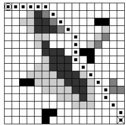
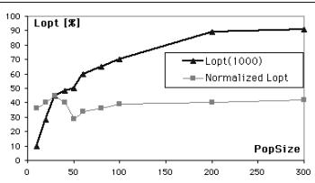
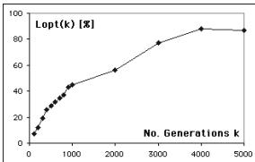
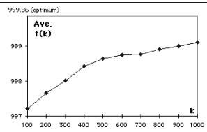
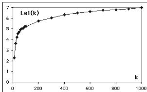
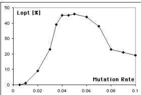
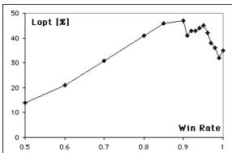
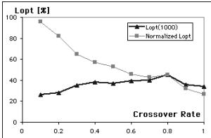

# Measures for Performance Evaluation of Genetic Algorithms

(Extended Abstract)

Kazuo Sugihara Dept. of ICS, Univ. of Hawaii at Manoa

# 1 Introduction

In recent years, genetic algorithms (GAs) [1] have been widely recognized as an effective solving technique for complex problems in the real world. GAs can be regarded as a paradigm of algorithms in the sense that the GAs are parameterized and applicable to a variety of problems by instantiating the paradigm. There are three major components to be designed in GAs. The first one is the coding which is a mapping scheme from a problem to the GA paradigm and represents potential solutions. The second one is a fitness function which quantifies quality of solutions and enables us to differentiate "good" solutions from "bad" solutions. The third one is a set of parameters including population size, population structure, a sequence of genetic operators, the operators' parameters, termination condition, etc.

As GAs are getting a larger spectrum of applications, it becomes more crucial to develop a methodology for the design of GAs. In particular, practitioners need a systematic way to design and implement "good" GAs for their particular problems quickly. To design "good" algorithms, we must be able to compare algorithms for the same problem and choose the best one with respect to a certain criterion.

The performance of GAs have been studied in terms of resultant fitness values and convergence primarily (e.g., correlations between convergence speed and the population size). In many applications of optimization in practice, however, a goal is to find a solution as good as possible "within a reasonable amount of time." With such a constraint on computational cost, it is not much critical to seek for convergence of a population unless the problem to be solved has multiple objective functions and seeks for Pareto optimal solutions. In addition, there may be a trade-off between solution quality and convergence, since a higher pressure to convergence tends to increase the possibility of premature convergence at a local optimum.

This paper proposes measures for performance evaluation of GAs and presents a case study in which a GA was tuned by using the measures in order to employ it for motion planning of an underwater vehicle being developed at Univ. of Hawaii. The measures enable us to compare different GAs for an optimization problem and different choices of their parameter values and to develop a systematic way for parameters setting. First, we define three measures for the performance of GAs based on observations in experiments by simulation: The likelihood of optimality, the average fitness value and the likelihood of evolution leap. Second, we present a case study in which parameters of a GA for robot path planning was tuned and its performance was optimized through performance evaluation by using the measures. Third, we propose performance evaluation by means of techniques for design of experiments and briefly discuss a systematic way of tuning through the performance evaluation.

# 2 Preliminaries

# 2.1 Genetic Algorithms

A genetic algorithm (GA) [1] consists of a population and an evolutionary mechanism. The population is a collection of individuals which represent potential solutions through a mapping called a coding. The evolutionary mechanism repeatedly transforms the population by executing the following steps. (1) Fitness Evaluation: The fitness (i.e., an objective function) is calculated for each individual. (2) Selection: Individuals are chosen from the current population as parents to be involved in recombination. (3) Recombination: New individuals (called offspring) are produced from the parents by applying genetic operators such as crossover and mutation. (4) Replacement: Some of the offspring are replaced with some individuals (usually with their parents).

One cycle of transforming a population is called a generation. In each generation, a fraction of the population is replaced with offspring and its proportion to the entire population is called the generation gap (between 0 and 1). There are two extremes. One is a generational replacement GA where the generation gap is large. Another is a steady-state GA where only a few (typically two) individuals are involved.

# 2.2 Performance Measures

Assume that we observe simulation runs of a GA for an optimization problem and all the runs are independent. We define the following performance measures from a viewpoint of solution quality regardless of convergence.

# Likelihood of Optimality

Suppose that a GA was executed for $k$ generations in each of $n$ runs. Let $m$ be the number of runs which produced an optimal solution within $k$ generations. The likelihood of optimality $L o p t ( k )$ at the $k$ th generation is the estimated probability $m / n$ .

# Average Fitness Value

Suppose that a GA was executed for $k$ generations in each of $n$ runs. The average fitness value ${ \bar { f } } ( k )$ at the $k$ th generation is the average of the best fitness values obtained within $k$ generations in the $n$ runs.

# Likelihood of Evolution Leap

A generation is said to be a leap if a solution produced at the generation is better than the best solution obtained before the generation. Suppose that a GA was executed for $k$ generations in each of $n$ runs and $\ell$ is the average number of leaps within $k$ generations. The likelihood of evolution leap $L e l ( k )$ at the $k$ th generation is the estimated probability $\ell / n$ .1

Based on the above measures (especially, Lopt), we can decide a cut-off generation $K$ , i.e., how many generations a GA should be executed in each run. Let $C = k r$ be the total computation cost given to execute the GA, where $r$ is the number of repeated runs. The best cut-off generation is the number $k$ of generations which maximizes the performance with respect to a particular measure. If $C$ is fixed, we want to find $k$ maximizing $( 1 - p ( k ) ) ^ { r }$ , where $p ( k )$ denotes the probability that a GA produces an optimal solution within $k$ generations. If the value of $( 1 - p ( k ) ) ^ { r }$ is fixed, we want to find $k$ minimizing $C = k r$ .

It is well-known that diversity in a population plays a key role to reach an optimal solution . On the other hand, approaching to convergence decreases the diversity. Hence, there may be a trade-off between convergence speed and solution quality. Furthermore, computational time is often bounded a priori. In such cases, convergence of a population is not appropriate to decide the termination of a GA's execution. After all, convergence is not the primary goal of optimization. Therefore, we focus on direct correlations between solution quality and computational cost without regard to convergence.

# 3 A Case Study

# 3.1 Robot Path Planning

As a case study, we present how the performance measures have been used to design a GA for path planning of a mobile robot [5]. Consider an $N \times N$ grid and obstacles (which are a collection of cells) on the grid. Suppose that there are two types of obstacles. One is a solid obstacle such that a path cannot cross it. Another is a hazardous obstacle such that a path can cross it, but at the expense of an extra path length for each cell in proportion to the obstacle's weight. In this case study, weights are limited to 1, 2 or 3.

A path between the start and destination is defined as a sequence of adjacent cells on the grid. For simplicity, the start and destination of a path are assumed to be located at the left upper and right lower corners, respectively. The path length is the total weighted distance, where the distance between horizontally or vertically adjacent cells is 1 and the distance between diagonally adjacent cells is $\sqrt { 2 }$ The problem of robot path planning is to find a shortest path between the start and destination, subject to the constraint that the path does not cross any solid obstacle.

An example of a $1 6 \times 1 6$ grid is shown in Figure 1. A sequence of dots on the grid shows the optimum path whose fitness value is 999.86. This example is fairly complex, non-trivial and general enough to use as a benchmark for the performance evaluation presented below. Note that there are at least 6 local optima within $0 . 4 \%$ fitness difference. Besides this input instance, we conducted simulation of GAs on a few more different input instances and observed that tendency in the performance of GAs is similar.

The following briefly describe the GA to be investigated and optimized by using the performance measures. A path is represented by a binary string consisting of blocks each of which denotes the direction and distance of a segment on the path (See details in [5]). To transform minimization into maximization, a fitness function is defined as $\cdot 4 N ^ { 2 } \textrm { -- }$ the path length) for a valid path and 1 for an invalid path, where $N$ is the size of a grid.

Assuming that the coding and fitness function are fixed as mentioned above, various instances of the GA for the path planning problem were examined and their parameters were optimized.

# 3.2 Simulation Results

We conducted simulation of GAs for the path planning problem by using our GA Toolkit on the Web [4]. 2 This paper presents preliminary results of the simulation. Each of the investigated GAs consists of a combination of the following operators, where parents are always replaced with their offspring.

(a) Selection: Roulette selection, tournament selection or roulette tournament selection

(b) Crossover: 1-point crossover, 2-point crossover or uniform crossover

(c) Mutation: Multi-point mutation

For each parameter setting of the GAs, simulation results are presented below with 100 runs (unless stated otherwise) on the same input shown above. Thus, we have 100 samples in Bernoulli trials with binomial distribution. Note that a $9 5 \%$ confidence interval [2] is about 0.096 when the probability of success in a Bernoulli trial is 0.4.

The first combination of operators to be investigated consists of roulette tournament selection, 1- point crossover and mutation. The following are results which show correlations between the performance of the GA and each of its parameters.

  
Figure 1

  
Figure 2

A. Population Size PopSize

Figure 2 shows the likelihood of optimality Lopt when PopSize varies from 10 to 300, assuming that the number $k$ of generations is 1000 and the following parameters of the 3 operators are fixed at 0.95, 0.8 and 0.04, respectively.

(a) Win Rate $\omega$ : The probability that a better individual wins in each binary tournament (b) Crossover Rate $\gamma$ : The proportion to the entire population whose individuals are involved in crossover (c) Mutation Rate $\mu$ : The probability that each bit is fipped

Since computational cost is linearly proportional to $P o p S i z e$ , the number $k$ of generations should be normalized. Let $P o p S i z e = 3 0 $ and $k ~ = ~ 1 0 0 0$ be the standard. Then, $L o p t ( 1 0 0 0 \times 3 0 / P o p S i z e )$ is the normalized likelihood of optimality.

# B. The Number $k$ of Generations

Figure 3 shows Lopt when $k$ varies from 10 to 5000, assuming that $P o p S i z e = 3 0 $ , $\omega = 0 . 9 5$ , $\gamma = 0 . 8$ and $\mu ~ = ~ 0 . 0 4$ are all fixed. Figures 4 and 5 shows the average fitness value ${ \bar { f } } ( k )$ and the likelihood of evolutionary leap $L e l ( k )$ in the same condition, respectively. Both the results clearly indicate saturation as the number of generations increases.

  
Figure 3

  
Figure 4

  
Figure 5

  
Figure 6

# C. Mutation Rate $\mu$

Figure 6 shows Lopt when $\mu$ varies from 0.005 to 0.1, assuming that $P o p S i z e = 3 0$ , $k = 1 0 0 0$ , $\omega = 0 . 9 5$ and $\gamma = 0 . 8$ are all fixed. The simulation results imply that a choice of the mutation rate is very critical in terms of $L o p t$ .

# D. Win Rate $\omega$

Figure 7 shows Lopt when $\omega$ varies from 0.5 to 1.0, assuming that $P o p S i z e = 3 0 $ , $k = 1 0 0 0$ , $\gamma = 0 . 8$ and $\mu = 0 . 0 4$ are all fixed.

  
Figure 7

  
Figure 8

# E. Crossover Rate $\gamma$

Figure 8 shows the likelihood of optimality Lopt when $\gamma$ varies from 0.1 to 1.0, assuming that $P o p S i z e = 3 0 $ , $k = 1 0 0 0$ , $\omega = 0 . 9 5$ and $\mu = 0 . 0 4$ are all fixed. If computational cost for each generation is linearly proportional to $\gamma , k$ should be normalized where the standard is $\gamma = 0 . 8$ and $k = 1 0 0 0$ . Note that potential parallelism in a GA decreases as $\gamma$ decreases. Hence, even if the normalized likelihood of optimality for a steady-state GA is larger than that for a generational replacement GA, the former may not necessarily be better in a parallel computing environment.

The above simulation results suggest that the best parameter setting is $P o p S i z e = 3 0$ , $\omega = 0 . 9 5$ , $\gamma = 0 . 8$ and $\mu = 0 . 0 4$ . This is used as the standard configuration when we compare different combinations of operators below.

In order to estimate $L o p t ( 1 0 0 0 )$ for this parameter setting more accurately, we observed 400 runs in total (i.e., with a $9 5 \%$ confidence interval at most 0.049)

and found that $L o p t ( 1 0 0 0 ) = 0 . 4 5$ . Thus, the probability that the GA with this parameter setting finds an optimal solution is at least 0.4 with $9 5 \%$ confidence. If we are given the computational cost equivalent to 5000 generations in total, we can repeat execution of the GA for 1000 generations 5 times. As a result, Lopt is increased to at least $1 - ( 1 - 0 . 4 ) ^ { 5 } = 0 . 9 2 $ while $L o p t ( 5 0 0 0 )$ is only 0.87 in our simulation.

Next, consider 4 other options for fitness remapping in the roulette procedure: (1) Fitness scaling given in [1]; (2) linear ranking which assigns $P , P \mathrm { - } 1 , P \mathrm { - } 2 , \cdots$ 1 to individuals in nondecreasing order of their fitness values, where $P$ is the population size; (3) geometric ranking which assigns 1, $1 / 2 , \ 1 / 3 , \ \cdot \cdot \cdot , \ 1 / P$ to individuals in nondecreasing order; and (4) exponential ranking which assigns $1 , 1 / 2 , 1 / 4 , \cdot \cdot \cdot , 1 / 2 ^ { P - 1 }$ to individuals in nondecreasing order. Among the 4 options, the performance of the linear ranking was comparable with that of the standard GA. However, for another input instance, it was not as good as the standard one. The first and last options were poor. Lopt(1000) for the geometric option was 0.23.

All the other combinations of operators were also examined. If we use roulette selection, the geometric ranking was the best option giving $L o p t ( 1 0 0 0 ) = 0 . 2 8$ and other options were poor. The performance of a GA with tournament selection, 1-point crossover and mutation was very poor. The performance of a GA with roulette tournament selection, 2-point crossover and mutation was comparable with that of the standard GA, where $L o p t ( 1 0 0 0 )$ was 0.39. The performance of a GA with uniform crossover was 0.24.

When no mutation was used (i.e., only roulette tournament selection and crossover), we observed quite few evolution leaps after the first dozen of generations and the performance was very poor. When no crossover was used (i.e., only roulette tournament selection and mutation), $L o p t ( 1 0 0 0 )$ was 0.19. These simulation results indicate that a GA without crossover (called the naive evolution [1]) works to some extent while a GA without mutation does not work at all. Therefore, they imply that mutation plays a crucial role in this optimization problem, although it does not work best without crossover.

# 4 Systematic Tuning

It has been shown by empirical study that the performance of a GA strongly depends on choices of parameter values. Thus, one of the major tasks in the design of a GA is to solve another optimization problem, called tuning, which seeks for the best parameter setting to maximize the performance of the GA. There are two approaches to the tuning: Self-tuning and empirical tuning.

The self-tuning is to apply a self-adaptive mechanism which dynamically changes components, structures and their attributes of a GA and attempts to converge at the best GA or at least a locally optimal GA. One of the methods for self-tuning which have been investigated is a meta-GA or hierarchical GA, where different GAs themselves are coded and another GA manipulates them based on the performance of the GAs competing to each other. However, the definition of fitness is not given a priori nor obvious in this context. The performance measures discussed in this paper can be used as a fitness function for GAs.

In practice, the empirical tuning is commonly used so far. The best parameter setting is determined through extensive experiments on the performance of GAs by simulation. However, "blind" experiments waste time and resources.

There are two issues to be addressed in order to conduct experiments efficiently with sufficient accuracy. One issue is the number of different combinations (called treatments in experiments) to be examined. Since there are more than several parameters (called fa ctors in experiments) to be controlled simultaneously, exhaustive experiments of all combinations of the parameters' values result in a huge number of treatments to be observed. Another issue is the uncertainty in experiments. Since execution of a GA includes processes of random nature, the outcome of experiments always has uncertainty to some extent. The less uncertainty we want, the more experiments we need.

We propose to use techniques for design of experiments [2,3] in order to reduce the total number of samples in experiments effectively without loosing the creditability of their results. The existing techniques [2,3] such as blocking, randomization and factorial design are useful.

# Список литературы

[1] David Beasley et al., "An overview of genetic algorithms," Part 1 & 2, University Computing, Vol. 15, No. 2 & 4, pp.5869 & 170181, 1993.   
[2] William J. Diamond, Practical Experiment Designs for Engineers and Scientists, 2nd Edition, Van Norstrand Reinhold, 1989.   
[3] Thomas J. Lorenzen et al., Design of Experiments: A No-Name Approach, Marcel Dekker, 1993.   
[4] John Smith and Kazuo Sugihara, "GA toolkit on the Web," Proc. 1st Online Workshop on Soft Computing, Aug. 1996, pp.9398.   
[5] Kazuo Sugihara and John Smith, "A genetic algorithm for 3-D path planning of a mobile robots," Tech. Rep., Univ. of Hawaii at Manoa, Sept. 1996.