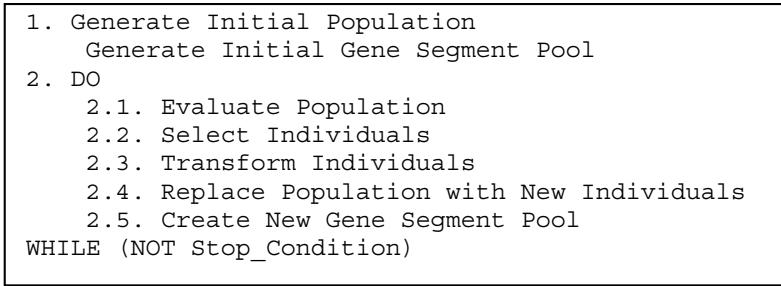
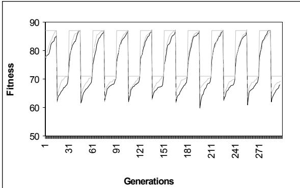
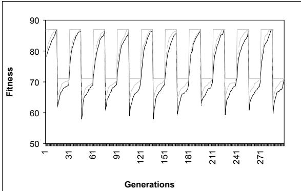
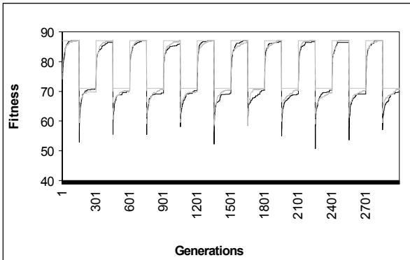
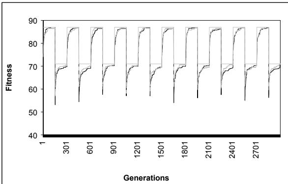
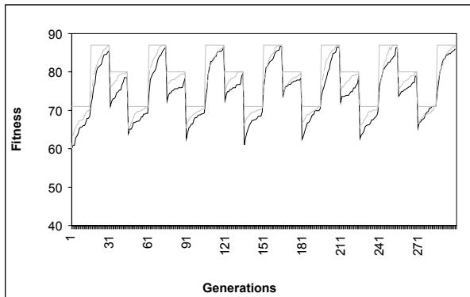
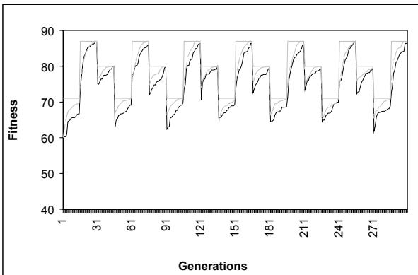
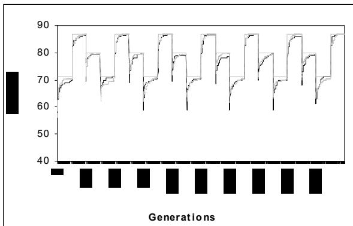
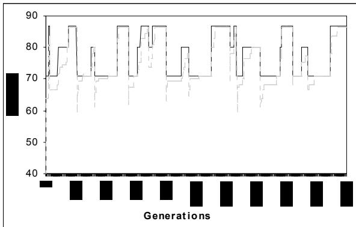
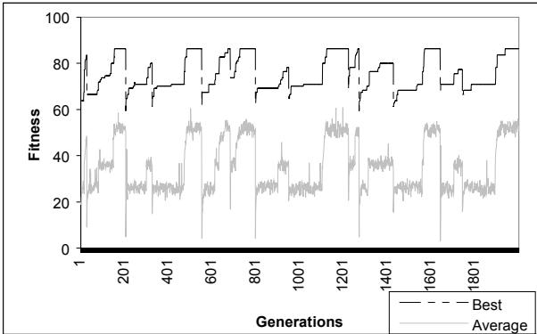

# USING BIOLOGICAL INSPIRATION TO DEAL WITH DYNAMIC ENVIRONMENTS

Anabela Simões1,2, Ernesto Costa2

1 Instituto Superior de Engenharia de Coimbra, Quinta da Nora, 3030 Coimbra - Portugal abs@eden.dei.uc.pt; phone: $+ 3 5 1$ 239 790352

2 Centro de Informática e Sistemas da Univ. de Coimbra, Polo II - Pinhal de Marrocos, 3030 Coimbra - Portugal ernesto@dei.uc.pt; phone: +351 239 790000

# Abstract

Maintaining the genetic diversity in populations is an important issue when dealing with dynamic environments.   
In this paper we use a modified Genetic Algorithm (GA) to solve the 0/1 Dynamic Knapsack Problem (DKP).   
The proposed GA uses a biologically inspired genetic operator instead of the classical crossover operator. The proposed genetic operator is capable of maintaining the genetic variation in the population at very high levels.   
The modified GA is able of reacting very rapidly to the modifications, even without mutation.

Keywords: Genetic Algorithms, Genetic Operators, Population’s Diversity, Dynamic Environments.

# 1 Introduction

The great majority of evolutionary approaches are based on static environments. However, many real-world problems deal with dynamic environments and thus it is important to find algorithms capable of continuously adapting the solution to the changes in that environment.

The main drawback of the classical Evolutionary Algorithms (EA) seems to be the fact that, as they converge to the optimum, the population's diversity is lost and the algorithm cannot continue to explore different areas of the search space. In order to allow EA to react to changes in the environment, several approaches have been tested. Part of these approaches tries to maintain genetic diversity in the population [2], [5], [6]; other approaches keep some sort of memory of previous situations that the algorithms solved in the past [7], [8], [9].

In this paper we use a GA modified by the introduction of a biologically inspired genetic operator to solve the traditional dynamic 0/1 knapsack problem. The genetic operator is known as transformation and proved to be a powerful alternative to crossover in static optimization problems [11]. Previous studies showed that the genetic variation of the individuals in the population is maintained very high when using this mechanism. Using the same modified GA in a dynamic problem, we obtained results that show that it is capable of reacting to changes in the environment.

This paper is organized in the following manner. First, in section 2, we discuss the application of an EA to dynamic optimization problems. In section 3, we introduce the transformation mechanism. We will describe its biological functioning and the proposed computational implementation. Section 4, details the characteristics of the experimental environment. In section 5, we report the results using the proposed mechanism. Finally, we present the main conclusions of the work.

# 2 Dynamic Environments

Dynamic problems can be divided in several categories according to the type of changes that occur during the time. The changes can be classified with respect to aspects such as the frequencies, severity or predictability of the change [1].

As referred before, the main limitation of the standard EA to deal with dynamic problems is the lost of diversity in the population, as they converge to the optimum. In order to overwhelm this limitation, several evolutionary approaches have been tried: restart mechanisms, adaptive mutation and addition of memory.

The reinitialization of the EA to react to changes in the conditions of the problem is a simple approach to maintain genetic diversity in the population. This solution was tested, for instance, in [6]. Adapting the mutation rate according to the behavior of the EA is a very common strategy. In general, whenever a change occurs, the mutation rate is increased to help the population to react to the new conditions. The increasing of the mutation rate is often referred as hypermutation. This approach was adopted in [2] and [5].

Another studied solution to deal with dynamic landscapes is the incorporation of memory in the algorithm. The memory can be provided implicitly by using redundant representations (diploidy, tetraploidy) [7], [8], or explicitly by adding an extra-memory that can be updated or retrieved according to the conditions of the problem [12].

# 3 Transformation

# 3.1. Biological Transformation

Usually, transformation consists in the transfer of small pieces of extra cellular DNA between organisms. These strains of DNA, or gene segments, are extracted from the environment and added to recipient cells [10]. After that, there are two possibilities, failure or success, known technically as restriction and recombination. Restriction is the destruction of the incoming foreign DNA, since those bacteria assume that foreign DNA is more likely to come from an enemy, such as a virus. In this case, transformation fails. Recombination is the physical incorporation of some of the incoming DNA into the bacterial chromosome. If this happens, genes from the assimilated segment replace some of the host cell’s genetic information and bacteria are permanently transformed. Once integrated in the chromosome, the DNA segment is able to survive.

# 3.2 Computational Transformation

The DNA fragments to incorporate in the individuals of the population are generated at the beginning of the process. This DNA fragments consist in binary strings of different lengths and will form the gene segment pool. We incorporate transformation into a new genetic operator that replaces crossover. First, we select the individuals to be transformed using the roulette-wheel selection method and these individuals are changed with a fixed probability. Part of the gene segment pool is changed every generation, using genetic information of the individuals of the population. This modified GA will be referred as Transformation-based GA (TGA) and it is described in Figure 1.

  
Figure 1: The GA Modified with Transformation

The GA starts with an initial population of individuals and an initial pool of gene segments, both created at random. In each generation, we select individuals to be transformed and we modify them using the gene segments in the segment pool. After that, the segment pool is changed, using the old population to create part of the new segments with the remaining being created at random. The segments that each individual will take up from the "surrounding environment" will proceed, mostly, from the individuals existing in the previous generation. In the used experimental setup, we changed the segment pool every generation. The modifications were made replacing $70 \%$ of the segments with new ones, created from the individuals of the old population. The remaining $30 \%$ were created at random. The size of the gene segments is also chosen in a random manner.

After selecting individuals to a mating pool, we use the transformation mechanism to produce new individuals. In this case, there is no sexual reproduction among the individuals of the population. Each individual will generate a new one through the process of transformation. We can consider this process a form of asexual reproduction.

To transform an individual we execute the following steps: we select a segment from the segment pool and we randomly choose a point of transformation in the selected individual. The segment is incorporated in the genome of the individual, replacing the genes after the transformation point, previously selected. Obviously, the chromosome is seen as a circle. Proceeding this way the chromosome length is kept constant. This corresponds to the biological process where the gene segments when integrated in the recipient's cell DNA, replace some genes in its chromosome. For more details about transformation see [11].

# 4 The Experimental Environment

We compared the transformation operator with other techniques in a GA for the dynamic $_ { 0 / 1 }$ Knapsack Problem [3], [7], [8].

# 4.1 The 0/1 Knapsack Problem

The well-known single-objective $_ { 0 / 1 }$ knapsack problem is defined as follows: given a set of $n$ items, each with a weight W[i] and a profit $P / i J$ , with $i = 1 , . . . , n$ , the goal is to determine the number of each item to include in the knapsack so that the total weight is less than some given limit (C) and the total profit is as large as possible. More formally, given a set of weights $W / i J$ , profits P[i] $( \mathrm { i } \mathrm { = } 1 \ \dots \ n )$ and capacity C, the task is to find a binary vector $\mathbf { x } = \{ \mathrm { x } [ 1 ] , . . . , \mathrm { x } [ \mathrm { n } ] \}$ , such that:

$\begin{array} { r } { \sum _ { i = 1 } ^ { n } x [ i ] { W [ i ] } { \le C } , ~ \mathrm { a n d ~ f o r ~ w h i c h } ~ \rho ( x ) = \sum _ { i = 1 } ^ { n } x [ i ] { . } P [ i ] ~ \mathrm { i s } . } \end{array}$ maximum.

The knapsack problem is an example of an integer linear problem that has NP-hard complexity. In the classical $_ { 0 / 1 }$ knapsack problem, the capacity of the bag is kept constant during the entire run. In the DKP the weight limit can change over time between different values.

# 4.2 Dynamic 0/1 Knapsack Problem

We used as a test function a 17-object 0/1 knapsack problem with oscillating weight constraint, proposed by [3]. The vectors of values and weights used for the knapsack problem are exactly the same as that used by the authors. The penalty function for the infeasible solutions is defined by: $P e n { = } K ( \varDelta W ) ^ { 2 }$ , where $\varDelta W$ is the amount which the solution exceeds the weight constraint and $K { = } 2 0$ . A solution is considered infeasible if the sum of the weights of the items exceeds the knapsack capacity.

Goldberg and Smith used the DKP to compare the performance of a haploid GA and a diploid GA with fixed dominance map and a diploid GA with a triallelic dominance map [3]. In [4] it is referred that their experimentation used variation of the knapsack capacity between two different values every 15 generations.

The DKP, as described before, was also used to compare poliploidy and diplody by [7] and [8]. In section 5.4 we will compare the results obtained by the different approaches.

In this work we enlarged the number of case studies: we used three types of changes in the capacity of the knapsack: periodic changes between two values $\mathrm { C l } { = } 1 0 4$ and $\mathrm { C } 2 { = } 6 0$ ) and between three values $\mathrm { C l } { = } 6 0$ , $C 2 { = } 1 0 4$ and $\mathrm { C } 3 { = } 8 0$ ) and non-periodic changes between 3 different capacities $\mathrm { C l } { = } 6 0$ , ${ \mathrm { C } } 2 { = } 8 0$ and ${ \mathrm { C } } 3 { = } 1 0 4 { \mathrm { \Omega } }$ ). In each of the periodic experiments we started with a total capacity $C I$ and after half a cycle the constraint was switched to $C 2$ . When using 3 values, after a complete cycle the capacity is changed to the third value C3. Each trial allowed 10 cycles with cycle lengths of 30, 100, 200 and 300 generations.

When using a non-periodic dynamic environment we run the modified GA during 2000 generations and selected randomly several moments of change. In these moments the capacity of the knapsack was altered to a different value chosen among the same three values used in the periodic situation: 60, 80 and 104. The moments when a change occurred and the new chosen knapsack capacity were randomly generated at the beginning of the first run and kept constant for all trials.

# 4.3 Parameters of the GA

In the case of periodic changes, the total generations were, 300, 1000, 2000 and 3000, depending on the cycle length. In order to analyze the effect of the population size we used the GA with 50 and 150 individuals. The mutation rate was also changed between the following values: $0 \%$ , $0 . 1 \%$ , $1 \%$ and $10 \%$ . We were also interested in observing the behavior of the transformation mechanism solving the DKP with non-periodic changes. Therefore, we executed experiments using a population of 150 individuals and mutation rate equal to $0 . 1 \%$ . In this case the GA run over 2000 generations.

In both cases, periodic and non-periodic, we used roulette wheel with an elite of 2 individuals and the percentage of success for the transformation mechanism was $70 \%$ . Each experiment was run 25 times and the reported results are the averaged values obtained in the 25 runs.

# 5 The Results

# 5.1 Periodic Changes Between 2 Values

When switching the knapsack capacity between two different values (60 and 104), the TGA recognized this modification and was able to adapt to the new solution. Using cycle length equal to 30 generations, in some cycles, the TGA couldn't find the best solution because the time to evolve is very small. But increasing the cycle length to 100, 200 or 300, the GA achieved better performances of adaptation.

Figures 2 to 5 show some of the results. The solid gray line represents the ideal solution, the dashed line represents the solutions found when using 150 individuals in the population and the solid black line corresponds to 50 individuals. Due to lack of space we only show the results for mutation rates equal to 0 and $10 \%$ , but for the other values, the results were very close. We only illustrate the results for cycles of 30 and 300 generations. The main observation concerning the cycle length is that, with larger cycles, the TGA can always find the new best solution every time a change occurs. With cycles of 30 generations, in some cases, the GA can’t reach the new solution, because the time to evolve isn’t enough.

As the figures illustrate, the population size and the mutation rate don't influence the result in a significant manner. The results with 150 individuals are slightly better to the ones obtained with 50 individuals.

# 5.2 Periodic Changes Between 3 Values

Using three different values for the limit weight of the knapsack (60, 80 and 104), the TGA behave similarly to the previous case. With smaller cycle lengths the system recognizes the changes but is some cycles, the time is not enough to have a complete adaptation to the new conditions. Increasing the length of the cycles, the GA can found the new solution when the capacity of the knapsack changes. Figures 6 to 9 show the results obtained by the GA implemented with transformation and using different cycle lengths: 30 and 300 generations and mutation rates of $0 \%$ and $10 \%$ . Once again the GA using populations with 50 or 150 individuals achieved very similar results. The mutation rate didn't allow any visible improvement.

  
Figure 2: Dynamic Knapsack with Cycle Length $\scriptstyle 1 = 3 0$ , Mutation Rate $= 0 \%$

  
Figure 3: Dynamic Knapsack with Cycle Length $\scriptstyle = 3 0$ , Mutation Rate $= 1 0 \%$

  
Figure 4: Cycle Length $= 3 0 0$ , Mutation Rate $= 0 \%$

  
Figure 5: Cycle Length $_ { 1 } { = } 3 0 0$ , Mutation Rate $= 1 0 \%$

  
Figure 6: Cycle Length $\scriptstyle 1 = 3 0$ , Mutation Rate $= 0 \%$

  
Figure 7: Length $\scriptstyle 1 = 3 0$ , Mutation Rate $= 1 0 \%$

  
Figure 8: Cycle Length $= 3 0 0$ , Mutation Rate $= 0 \%$

  
Figure 9: Cycle Length $_ { 1 = 3 0 0 }$ , Mutation Rate $= 1 0 \%$

  
Figure 10: Non-Periodic Dynamic Knapsack

  
Figure 11: Fitness of the population (best and average)

# 5.3 Non-Periodic Changes Between 3 Values

The traditional DKP oscillates between two or three different values of capacity, but this change is usually periodic. To see if the behavior of the transformation GA in a non-periodic changing environment we randomly selected several points to change the capacity of the knapsack and the new capacity was also changed randomly between three different values. The generation of the points where the capacity changes was made with some restrictions in order to generate cycles of different lengths.

Figure 10 shows the performance of the GA using transformation. The solid line represents the ideal solution and the dashed line the behavior of the TGA with 150 individuals. As we can see the GA was always able to track the changes in the environment, independently of the cycle length. These results stress the idea that transformation can keep the population’s diversity and so, it’s a good mechanism to use in dynamic environments.

# 5.4 Comparing the Results with other Approaches

We can only compare part of our results with the results achieved by [3], [7] and [8], since that they didn’t perform all the experimentations we made with transformation.

Obviously, when comparing the results with the standard haploid GA, our results are always better.

Goldberg and Smith tested their approach using cycle lengths equal to 30. The results obtained by the transformed based GA in the DKP with cycles of 30 generations were similar to the results achieved by [3] using dominance. When comparing our results with their results using the triallelic scheme, transformation behave slightly worse. It would be interesting to see how their approach behaves with larger cycle lengths and using non-periodic changes.

Hadad et al. (1997) used the DKP to test a polyploid approach. Their experimentation used only periodic changes between two different capacity values and different cycle lengths (30, 80 and 300). We can only compare our results to the results they achieved in the diploid GA, since that they don’t report the solutions found using tetraploid organisms. The results obtained by transformation using cycles of 30 generations were slightly inferior, and using cycles of 300 generations, our results were similar to their results. The authors used a mutation rate of $1 \%$ but don’t study the influence of changing this probability.

$\mathrm { N g }$ et al. (1995) proposed a new diploid scheme with dominance and use the DKP to study the performance of the algorithm. Their study used cycle lengths of 30, 80 and 300 and they also analyzed the influence of the mutation rate in the performance of the diploid GA. Comparing the results using cycles of 30 generations, the solutions achieved by transformation are better than the results they obtained with lower mutation rates $0 . 1 \%$ and $1 \%$ ) and are similar to their results using a high mutation rate $( 5 \% )$ . The diploid GA needs mutation to preserves population’s diversity. In our case, as we saw before, the mutation has no influence in the results obtained by transformation. $\mathrm { N g }$ et al. also used cycles of 300 generations, but they only run the GA over two cycles. In their graphics we can see that the performance of the diploid GA decreases in the second cycle. It would be interesting to see the GA behavior using more cycles. The results achieved by transformation were better than their results using mutation rates equal to $0 . 1 \%$ , $1 \%$ or $5 \%$ .

# 5.5 Population's Diversity

In order to see the population's diversity generated by the proposed mechanism we analyzed the average fitness of the population for the non-periodic situation. As Figure 11 states, the best solution tracks the optimum in every change. However, the fitness average of the population is very low and distant from the optimum. This shows that, as the GA converges to the optimum, several regions of the search space continue to be explored because the population's diversity isn't lost.

# 6 Conclusions

The biologically inspired genetic operator referred as transformation and already studied by us in static environments was used to solve two types of dynamic knapsack problems: periodic changes (between two and three different limit capacities) and non-periodic changes among three different capacities.

The proposed algorithm it is always able to detect the modifications and readapt to the new solutions. The experimental study focused three different aspects: the cycle length, the population size and the mutation rate. The results show that the GA implemented with transformation was able to detect the changes in the environment in all the situations. However, with cycle length equal to 30 generations (the changes occur every 15 generations) the system had no enough time to readapt completely to the new solution. With larger cycle lengths (100, 200 an 300) the adaptation of the solutions to the new conditions was significantly better. Concerning the population size, the results were very similar using populations with 50 or 150 individuals. Increasing the mutation rate from 0, $0 . 1 \%$ , $1 \%$ and $10 \%$ , the results are almost the same. We couldn't observe any influence of the mutation rate in the adaptation of the GA.

Using non-periodic changes among three different capacities, the GA once again detected all the modifications and found the new solutions.

Analyzing the average fitness of the population we observed that the diversity in population is always very high and we are trying to understand if this is the main reason for the observed results. Besides, in order to achieve faster adaptations of the GA when a change occurs, we are implementing some modifications in the way the gene segment pool is updated, namely using a large set of the previous generations to modify the gene segment pool, instead of using only the previous population.

# Acknowledgements

This work was partially financed by the Portuguese Ministry of Science and Technology under the Program POSI.

# Список литературы

[1] J. Branke (1999). Evolutionary Algorithms for Dynamic Optimization Problems - A Survey. Bericht 387, Februar 1999, AIFB, Universität Karlsruhe.   
[2] H. Cobb, J. J. Grefenstette (1993). Genetic Algorithms for Tracking Changing Environments. In Proceedings of the Fifth International Conference on Genetic Algorithms, pp. 523-530. Morgan Kaufmann, 1993.   
[3] D. E. Goldberg and R. E. Smith (1987). Nonstationary Function Optimization using Genetic Algorithms with Dominance and Diploidy. In J. J. Grefenstette (ed.), Proceedings of the Second International Conference on Genetic Algorithms, pp. 59-68. Laurence Erlbaum Associates, 1987.   
[4] D. E. Goldberg (1989). Genetic Algorithms in Search, Optimization and Machine Learning. AddisonWesley Publishing Company, Inc.   
[5] J. J. Grefenstette (1992). Genetic Algorithms for Changing Environments. In R. Maenner, B. Manderick (eds.), Parallel. Problem Solving from Nature 2, pp. 137-144. North Holland, 1992.   
[6] J. J. Grefenstette, C. L. Ramsey (1992) An Approach to Anytime Learning. In D. Sleeman and P. Edwards (eds.), Proceedings of the Ninth International Conference on Machine Learning, pp. 189-195. Morgan Kaufmann, 1992.   
[7] B. Hadad, C. Eick (1997). Supporting Poliploidy in Genetic Algorithms using Dominance Vectors. In P. Angeline, R. G. Reynolds, J. R. McDonnell and R. Eberhart (eds.) Proceedings of the Sixth International Conference on Evolutionary programming, vol. 1213 of LNCS. Springer, 1997.   
[8] K. P. Ng and K. C. Wong (1995). A New Diploid Scheme and Dominance Change Mechanism for Nonstationary Function Optimization. In Proceedings of the Sixth International Conference on Genetic Algorithms, pp. 159-166. Morgan Kaufmann, 1995.   
[9] C. L. Ramsey and J. J. Grefenstette (1993). Case-based Initialization of Genetic Algorithms. In S. Forrest (ed.), Proceedings of the Fifth International Conference on Genetic Algorithms, pp. 84-91. Morgan Kaufmann, 1993.   
[10] P. J. Russell (1998). Genetics. 5th edition, Addison-Wesley.   
[11] A. Simões and E. Costa (2001). On Biologically Inspired Genetic Operators: Transformation in the Standard Genetic Algorithm. Proceedings of the Genetic and Evolutionary Computation Conference (GECCO’2001), San Francisco, USA, July 2001.   
[12] K. Trojanowsky, Z. Michalewicz, J. Xiao (1997). Adding Memory to the Evolutionary Planner/Navigator. In IEEE International Conference on Evolutionary Computation, pp. 483-487, 1997.