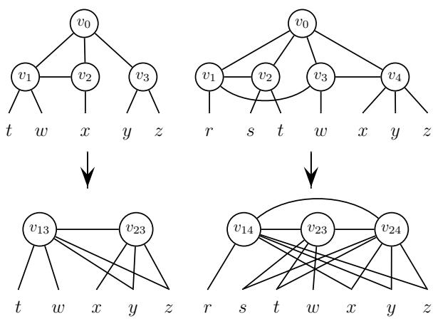
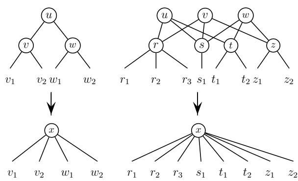

# Improved Parameterized Upper Bounds for Vertex Cover

Jianer Chen1 Iyad A. Kanj2 Ge Xia3

$^ { 1 }$ Department of Computer Science, Texas A&M University, College Station, TX   
77843, USA. This author was supported in part by the NSF under grants CCF-0430683 and CCR-0311590. Email: chen@cs.tamu.edu $^ 2$ School of Computer Science, Telecommunications and Information Systems, DePaul University, 243 S. Wabash Avenue, Chicago, IL 60604-2301, USA. This author was supported in part by DePaul University Competitive Research Grant. Email: ikanj@cs.depaul.edu   
3 Department of Computer Science, Lafayette College, Easton, PA 18042, USA. Email: gexia@cs.lafayette.edu

Abstract. This paper presents an $O ( 1 . 2 7 3 8 ^ { k } + k n )$ -time polynomialspace parameterized algorithm for Vertex Cover improving the previous $O ( 1 . 2 8 6 ^ { k } { + } k n )$ -time polynomial-space upper bound by Chen, Kanj, and Jia. The algorithm also improves the $O ( 1 . 2 7 4 5 ^ { k } k ^ { 4 } + k n )$ -time exponentialspace upper bound for the problem by Chandran and Grandoni.

# 1 Introduction

This paper considers the parameterized Vertex Cover problem, abbreviated VC henceforth: given a graph $G$ and a parameter $k$ , decide if $G$ has a vertex cover of at most $k$ vertices. This problem was amongst the first few problems that were shown to be NP-hard [14]. In addition, the problem has been a central problem in the study of parameterized algorithms [11], and has applications in areas such as computational biochemistry and biology [6]. Since the development of the first parameterized algorithm for the problem by Sam Buss which runs in $O ( k n + 2 ^ { k } k ^ { 2 k + 2 } )$ time [3], there has been an impressive list of improved algorithms for the problem $[ 1 , 7 , 8 , 1 0 , 1 7 , 1 8 , 2 0 ]$ . The most recent algorithm for the problem running in polynomial space was presented in 1999 and gives the currently best time upper bound of $O ( k n + 1 . 2 8 6 ^ { k } )$ [7]. Algorithms using exponential space for the problem have also been proposed [5, 7, 18], amongst which the best runs in time $O ( 1 . 2 7 4 5 ^ { k } k ^ { 4 } + k n )$ [5]. Most of the previous algorithms rely on exhaustive case-by-case analysis, and work under a conservative worstcase-scenario assumption. The analysis of these algorithms would consider the worst-case branch over numerous combinatorial cases, and derive an upper bound accordingly. In particular, the design phase of these algorithms (usually) did not provide the appropriate ground that the analysis phase could take advantage of to derive better upper bounds than the ones claimed. Consequently, to improve the upper bounds, larger and larger sets of local structures had to be examined and processed differently. Examining these numerous structures and processing them differently on a case-by-case basis became very meticulous, rendering the verification and implementation of these algorithms very complicated and unpractical.

On the other hand, progress has been recently made on deriving computational lower bounds for the problem. It has been shown that unless all SNP problems are solvable in sub-exponential time, there is a constant $c _ { 0 } > 1$ such that Vertex Cover cannot be solved in time $c _ { 0 } ^ { k } n ^ { O ( 1 ) }$ [4, 15]. Therefore, from both the algorithmic and the complexity points of view, it becomes important to study how far we can push to lower the constant $c > 1$ , such that the VC problem can be solved in time cknO(1).

In this paper we adopt a different approach to improve the time upper bound for the VC problem. Our goal was to design an algorithm that is simple and uniform, and that provides the tools and the ground for an insightful analysis of its running time. We came up with an algorithm that is very simple when compared to the (recent) previous algorithms. The algorithm keeps a list of prioritized “advantageous” structures at its disposal. At each stage it will pick the structure of highest priority (most advantageous structure). Picking such a structure can be easily done following few simple rules. When this structure is picked, the algorithm processes this structure very uniformly, and obliviously, in a way that is almost independent of what the structure is. As a matter of fact, there are only two different ways for processing any structure–that is, only two different branches–that the algorithm needs to distinguish. All the other operations performed by the algorithm are non-branching operations that process certain simple structures in the graph such as degree-1 and degree-2 vertices, and that set the stage for the subsequent branch performed by the algorithm to be efficient. The interleaving and ordering of these operations in the algorithm is very crucial, and is fully exploited by the analysis phase. The analysis phase however is lengthy, showing that regardless of the structure picked, the oblivious branching performed by the algorithm will yield the desired upper bound.

To be able to carry out all the above, a set of new techniques and generalization of some well-known and classical techniques have been introduced. A graph operation that is a generalizations of the folding operation [7], and a graph operation that is a specialization of the struction operation [12], have been developed. These operations help the algorithm remove several simple structures from the graph without the need to perform any branching. This makes analyzing the two branching operations performed in the resulting graph more insightful. The notion of a tuple, which was implicitly used by Robson [19], has been fully developed and exploited to prune the search space. Finally we perform a “local” amortized analysis to balance expensive branching operations by combining them with more efficient operations. Being able to perform this local amortized analysis is indebted to the careful interleaving and ordering of the operations in the algorithm, and not to the different way of processing each structure.

The presented algorithm runs in polynomial space, and has its running time bounded by $O ( 1 . 2 7 3 8 ^ { k } + k n )$ . This is a significant improvement over the previous polynomial-space algorithm for the problem which runs in $O ( 1 . 2 8 6 ^ { k } + k n )$ time. This also improves the exponential space $O ( 1 . 2 7 4 5 ^ { k } k ^ { 4 } + k n )$ -time algorithm by Chandran and Grandoni [5]. Most of the proofs in this paper are omitted due to lack of space.

# 2 Preliminaries and structural results

For a graph $G$ we denote by $| G |$ the number of vertices in $G$ . For a vertex $v$ in $G$ we denote by $N ( v )$ the set of neighbors of $\boldsymbol { v }$ , $N [ v ]$ the set $N ( v ) \cup \{ v \}$ , and $d ( v )$ the degree of $v$ in $G$ . For a set of vertices $S$ in $G$ , let $N ( S )$ denote the set of neighbors of the vertices in $S$ , and $N \vert S \vert$ the set $N ( S ) \cup S$ . Let $\tau ( G )$ denote the size of a minimum vertex cover of $G$ . The following proposition from [7] is based on a theorem by Nemhauser and Trotter [16], usually referred to as the NT-theorem or the NT-decomposition.

Proposition 1 ([7]). There is an algorithm of running time $O ( k n + k ^ { 3 } )$ that, given an instance $( G , k )$ of the VC problem where $| G | = n$ , constructs another instance $( G _ { 1 } , k _ { 1 } )$ of VC with $\boldsymbol { k } _ { 1 } \le \boldsymbol { k }$ and $| G _ { 1 } | \leq 2 k _ { 1 }$ , such that $\tau ( G ) \leq k$ if and only if $\tau ( G _ { 1 } ) \leq k _ { 1 }$ .

We say that the instance $( G _ { 1 } , k _ { 1 } )$ is the kernel of the instance $( G , k )$ . The NT-decomposition of $( G , k )$ into $( G _ { 1 } , k _ { 1 } )$ is said to be non-trivial if $| G _ { 1 } | < | G |$ . Proposition 1 allows us to assume, without loss of generality, that in an instance $( G , k )$ of the VC problem the graph $G$ contains at most $2 k$ vertices.

For two vertices $u$ and $v$ we say that $( u , v )$ is an anti-edge in $G$ if $( u , v )$ is not an edge in $G$ . Let $v _ { 0 }$ be a vertex in $G$ with a set of neighbors $\{ v _ { 1 } , \cdot \cdot \cdot , v _ { p } \}$ . Construct a graph $G ^ { \prime }$ as follows: (1) remove the vertices $\{ v _ { 0 } , v _ { 1 } , \cdot \cdot \cdot , v _ { p } \}$ from $G$ and introduce a new node $v _ { i j }$ for every anti-edge $( v _ { i } , v _ { j } )$ in $G$ where $0 < i <$ $j \le p$ ; (2) add an edge $( v _ { i r } , v _ { j s } )$ if $i = j$ and $( v _ { r } , v _ { s } )$ is an edge in $G$ ; (3) if $i \neq j$ add an edge $( v _ { i r } , v _ { j s } )$ ; and (4) for every $u \not \in \{ v _ { 0 } , \cdot \cdot \cdot , v _ { p } \}$ , add the edge $( v _ { i j } , u )$ if $( v _ { i } , u )$ or $( v _ { j } , u )$ is an edge in $G$ . This completes the construction of $G ^ { \prime }$ . We say that the graph $G ^ { \prime }$ is obtained from $G$ by applying the struction operation to the vertex $v _ { 0 }$ in $G$ [12] (see Figure 1 for an illustration).

Lemma 1. Let $v _ { 0 }$ be a vertex in $G$ with a set of neighbors $\{ v _ { 1 } , \cdot \cdot \cdot , v _ { p } \}$ . Suppose that there are at most $p - 1$ anti-edges among the vertices $\{ v _ { 1 } , \cdot \cdot \cdot , v _ { p } \}$ , and let $G ^ { \prime }$ be the graph obtained from $G$ by applying the struction operation to the vertex $v _ { 0 }$ . Then $\tau ( G ^ { \prime } ) \leq \tau ( G ) - 1$ .

Two possible scenarios in which the operation will be applied are illustrated in Figure 1. We will assume that we have a subroutine called Struction() that applies the struction operation to a vertex $v$ in $G$ whenever this vertex meets the conditions in Lemma 1.

Let $I$ be an independent set in a graph and let $H = N ( I )$ . The structure $( I , H )$ is called a crown [13], if there exists a matching in $G$ that matches $H$ into $I$ . Note that this implies that $| H | \leq | I |$ . The graph $G$ is said to be crown-free if $G$ does not contain any non-trivial crown [9]. It was shown in [9] that $G$ is crown-free if and only if the NT-decomposition of $G$ is trivial. Moreover, it is also well-known [2] that the NT-decomposition yields a non-trivial crown structure when the decomposition itself is non-trivial.

  
Fig. 1. The struction operation.

Next we present an operation that generalizes the folding operation introduced in [7].

Lemma 2. Let $I$ be an independent set in $G$ and let $N ( I )$ be the set of neighbors of $I$ . Suppose that $| N ( I ) | = | I | + 1$ , and that for every subset $\varnothing \neq S \subseteq I$ we have $| N ( S ) | \geq | S | + 1$ .

1. If the graph induced by $N ( I )$ is not an independent set, then there exists a minimum vertex cover in $G$ that includes $N ( I )$ and excludes $I$ .   
2. If the graph induced by $N ( I )$ is an independent set, let $G ^ { \prime }$ be the graph obtained from $G$ by removing $I \cup N ( I )$ and adding a vertex $u _ { I }$ , then connecting $u _ { I }$ to every vertex $v \in G ^ { \prime }$ such that $v$ was a neighbor of a vertex $u \in N ( I )$ in $G$ . Then $\tau ( G ^ { \prime } ) = \tau ( G ) - | I |$ .

Let us call a structure ( $I , H = N ( I )$ ) satisfying the conditions in Lemma 2 an almost-crown structure.

Proposition 2. Let $( G , k )$ be an instance of VC such that $| G | \leq 2 k$ . Then in $O ( k ^ { 3 } \sqrt { k } )$ time we can reduce $( G , k )$ to an instance $( G ^ { \prime } , k ^ { \prime } )$ with $| G ^ { \prime } | \leq | G |$ and $k ^ { \prime } \leq k$ , such that $G ^ { \prime }$ is crown-free, or equivalently $G ^ { \prime }$ is kernelized $( | G ^ { \prime } | \leq 2 k ^ { \prime } ,$ ), and such that an almost-crown structure in $G ^ { \prime }$ has been determined in case such a structure exists.

We will refer to the operation described in Lemma 2 by the general folding operation. Two scenarios in which this operation is applicable are given in Figure 2. We will assume that we have a subroutine called General-Fold() that searches for a structure in the graph to which the general folding operation applies, and applies the operation to it in case it exists. We always reduce the graph to a crown-free graph while searching for an almost-crown structure in $G$ . Therefore, if the subroutine General-Fold() is not applicable to the graph, i.e., if its application does not change the structure of the graph, then we can assume that the graph is both crown-free and almost-crown free (i.e., does not contain an almost-crown).

  
Fig. 2. General folding.

# 3 The algorithm

The main algorithm is a branch-and-search process. Each stage of the algorithm starts with an instance $( G , k )$ of VC, and tries to reduce the parameter $k$ by identifying a set $S$ of vertices that are entirely contained in a minimum vertex cover of $G$ , and including the vertex set $S$ in the objective minimum vertex cover, which will be called the partial cover (or simply the cover) for $G$ , then recursively works on the reduced instances. We will assume that we have the subroutine General- $\mathbf { F o l d } ( G )$ described above, and the subroutine Struction $( G )$ which applies the struction operation to $G$ .

If a vertex set $S$ is identified such that either there is a minimum vertex cover containing the entire $S$ or there is a minimum vertex cover containing no vertex in $S$ , then we can branch on the set $S$ . This means that the algorithm constructs two instances of the VC problem, one by including the set $S$ in the partial cover and the other by excluding the set $S$ from the partial cover, and in the latter case, every vertex that is adjacent to a vertex in $S$ should be included in the partial cover. The algorithm then recursively works on the two reduced instances. If the set $S$ consists of a single vertex $v$ , then we simply say we branch on $v$ .

# Definitions and preliminaries

Proposition 3. Let v be a vertex in $G$ . Then there exists a minimum vertex cover for $G$ containing $N ( v )$ or at most $\left| N ( v ) \right| - 2$ vertices from $N ( v )$ .

Proposition 4. Let u and $v$ be two adjacent vertices in $G$ . Then there exists $a$ minimum vertex cover for $G$ that includes $v$ or that excludes v and excludes at least another neighbor of $u$ .

A vertex $u$ is said to be dominated by a vertex $v$ , or alternatively, a vertex $v$ is said to dominate a vertex $u$ , if $( u , v )$ is an edge in $G$ and $N ( u ) \subseteq N [ v ]$ . A vertex $u$ is said to be almost-dominated by a vertex $\boldsymbol { v }$ , or alternatively, a vertex $\boldsymbol { v }$ is said to almost-dominate a vertex $u$ , if $u$ and $v$ are non-adjacent and $| N ( u ) - N ( v ) | \leq 1$ .

Proposition 5. Let u and v be two vertices in $G$ such that $\boldsymbol { v }$ dominates $u$ . Then there exists a minimum vertex cover of $G$ containing $v$ .

We define next a structure that allows for efficient branching. A good pair is a pair of vertices $\{ u , z \}$ chosen as follows. For a vertex $u$ in $G$ with neighbors $\{ u _ { 1 } , \cdots , u _ { d } \}$ , define its tag, denoted $t a g ( u )$ , to be the vector $\eta = \langle \eta _ { 1 } , \cdot \cdot \cdot , \eta _ { d } \rangle$ , where $\eta _ { 1 }$ is the degree of the largest-degree neighbor of $u$ , $\eta _ { 2 }$ is the degree of the second largest-degree neighbor of $u$ , ..., and $\eta _ { d }$ is the degree of the smallestdegree neighbor of $u$ . To choose the first vertex in a good pair, we pick a vertex $u$ of minimum degree in $G$ such that the following conditions are satisfied in their respective order.

$( i )$ The vector $t a g ( u )$ is maximum in lexicographic order over $t a g ( w )$ for every $w$ in $G$ with the same degree as $u$ . $( i i )$ If $G$ is regular, then the number of pairs of vertices $\{ x , y \} \subseteq N ( u )$ such that $y$ is almost-dominated by $x$ is maximized. $( i i i )$ The number of edges in the subgraph induced by $N ( u )$ is maximized.

Having chosen the first vertex $u$ in a good pair, to choose the second vertex, we pick a neighbor $z$ of $u$ such that the following conditions are satisfied in their respective order.

(a) If there exist two neighbors of $u$ , say $\boldsymbol { v }$ and $w$ , such that $v$ is almost-dominated by $w$ , then $z$ is almost-dominated by a neighbor of $u$ .   
(b) The degree of $z$ is maximum among all neighbors of $u$ satisfying part (a) above. (Note that if no vertex in $N ( u )$ is almost-dominated by another vertex in $N ( u )$ , then (a) is vacuously satisfied by every vertex in $N ( u )$ , and $z$ will be a neighbor of $u$ of maximum degree.)   
(c) The degree of $z$ in the subgraph induced by $N ( u )$ is minimum among all vertices satisfying (a) and (b) above. (That is, $z$ is adjacent to the least number of neighbors of $u$ .)   
(d) The number of shared neighbors between $z$ and a neighbor of $u$ is maximized over all neighbors of $u$ satisfying (a), (b), and (c) above.

# Tuples

Tuples will play a very crucial role in the algorithm by helping to reduce the search space. We define the notion of tuples next and describe how they will be updated and processed by the algorithm.

Definition and intuition A tuple is a pair $( S , q )$ where $S$ is a set of vertices and $q$ is an integer. The tuple will represent the information that in the instance of the problem $( G , k )$ we can look for a minimum vertex cover for $G$ excluding at least $q$ vertices from $S$ . This information will help the algorithm prune the search tree. The algorithm will only consider tuples $( S , q )$ with $q \leq 2$ , so we will only focus on such tuples here. A tuple $( S , q )$ , where $S = \{ u , v \}$ , is called a $\mathcal { Q }$ -tuple if it satisfies the following conditions: (1) $q = 1$ , (2) $d ( u ) \geq d ( v ) \geq 1$ and (3) $u$ and $v$ are non-adjacent. A 2-tuple $( \{ u , v \} , 1 )$ is a strong- $\boldsymbol { \mathcal { Z } }$ -tuple if it satisfies the additional condition: $d ( u ) \geq 4$ and $d ( v ) \geq 4$ , or $2 \leq d ( u ) \leq 3$ and $2 \leq d ( v ) \leq 3$ .

To see how tuples can be used to prune the search space, suppose that the algorithm branches on a vertex $z$ with a set of neighbors $N ( z )$ . By Proposition 3, there exists a minimum vertex cover in $G$ that contains $N ( z )$ , or that excludes at least two vertices from $N ( z )$ . Therefore, when the algorithm branches on $z$ , on the side of the branch where $z$ is included, we can restrict our search to a minimum vertex cover that excludes at least two neighbors of $N ( z )$ , and we know that this is safe because if such a minimum vertex cover does not exist, then on the other side of the branch where $N ( z )$ has been included the algorithm will still be able to find a minimum vertex cover. Consequently, on the side of the branch where $z$ is included, we can work under the assumption that at least two vertices in $N ( z )$ must be excluded. This working assumption will be stipulated by creating the tuple $N ( z ) , q = 2$ ). This information will be used by the algorithm to render the branching more efficient. Similarly, if the algorithm branches on a vertex $z$ with a neighbor $u$ , by Proposition 4, either there exists a minimum vertex cover in $G$ that includes $z$ , or there exists a minimum vertex cover in $G$ that excludes $z$ and excludes at least another neighbor of $u$ Therefore, on the side of the branch where $z$ is excluded, we can restrict our search to a minimum vertex cover that excludes at least two vertices in $N ( u )$ ( $\mathcal { L }$ and another vertex in $N ( u )$ ). This working assumption can be stipulated by creating the tuple $\mathbf { \nabla } N ( u ) , q = 2$ ). Note that after the removal of $z \in N ( u )$ from the graph, the created tuple ( $N ( u ) , q = 2$ ) will be updated as discussed in the next section.

Updating tuples Let $( S , q )$ be a tuple. If $q = 0$ then the tuple $S$ will be removed because the information represented by $( S , q )$ is satisfied by any minimum vertex cover. If one of the vertices in $S$ is removed and is excluded from the cover, then the tuple is modified by removing the vertex from $S$ and decrementing $q$ by $1$ The correctness of this step can be seen as follows. Suppose that a vertex $u \in S$ has been excluded from the cover. If there exists a minimum vertex cover $C$ that excludes at least $q$ vertices from $S$ , then $C$ excludes at least $q - 1$ vertices from $S - \{ u \}$ . Therefore the above update to the tuple is valid. If a vertex $u \in S$ is removed from the graph by including it in the cover, the vertex is removed from $S$ and $q$ is kept unchanged. The justification of this step follows from the argument that if there exists a minimum vertex cover $C$ that includes $u$ and excludes at least $q$ vertices from $S$ , then $C$ must exclude $q$ vertices from $S - \{ u \}$ (note that the validity of the inclusion of $u$ in the cover is taken care of by the correctness of the steps performed by the algorithm when it includes $u$ in the cover).

Since a tuple imposes certain constraints on the minimum vertex cover sought, one needs to be careful that the constraints imposed by the creation of a tuple do not conflict with the conditions imposed by other operations of the algorithm. The other operations that do impose constraints on the minimum vertex cover sought are the creation of (other) tuples, the struction operation, and the general folding operation. For example, the general folding operation assumes that when we are looking for a minimum vertex cover, we can look for one that either contains the set $I$ or the set $N ( I )$ in the structure $( I , N ( I ) )$ This is mainly the reason why the set $N ( I )$ can be folded. If the general folding operation is applied, then this constraint imposed by the operation on the minimum vertex cover might conflict with the constraints imposed by a certain tuple. Therefore, to be on the safe side, when we decide to apply the struction or the general folding operations, we will invalidate all the constraints imposed by the tuples. That is, we will basically remove all the tuples. The decision on whether to apply the general folding or the struction operations will be based on the reduction in the parameter resulting from applying these operations. Therefore, we will have two subroutines Conditional Struction and Conditional General Fold that will apply the struction and general folding operations, respectively. These subroutines will be applied when the gain (reduction in the parameter) resulting from the application of either operation surpasses that resulting from branching on a certain tuple (in case it exists), which will be invalidated after the execution of these operations.

The tuples need to be updated as described above after each operation of the algorithm. We will assume that this step is performed implicitly by the algorithm after each operation.

Storing and branching on 2-tuples When the algorithm creates tuples it will use them to generate 2-tuples using very simple rules described in steps a.2 and a.3 of the subroutine Reducing in Figure 3. Steps a.2 and a.3 of Reducing disintegrate a tuple into smaller tuples. During this process, some vertices might be determined to be in a minimum vertex cover by step a.4 of Reducing. For example, if $S = \{ u , w , z \} , 1 _ { , }$ ) is a tuple, then this tuple imposes the constraint that we can look for a minimum vertex cover that excludes at least one vertex from $S$ . Now if a vertex $v$ is a common neighbor of $u$ , $w$ , and $z$ , then $v$ can be included in a minimum vertex cover satisfying the constraint imposed by the tuple because one of the vertices in $S$ has to be excluded from such a cover.

Therefore $\boldsymbol { v }$ will be included by step a.4. Since steps a.2 and a.3 derive more tuples from the tuple $S$ , we need to make sure that the constraints imposed by the tuples generated in these two steps are consistent.

The algorithm, however, creates new tuples when branching. Therefore, if we maintain existing tuples, then the constraints imposed by the newly generated tuples may conflict with those imposed by existing ones. To overcome this hurdle, and since the algorithm only processes 2-tuples, when the subroutine Reducing finishes processing the tuples in step a, we will maintain only one 2-tuple and invalidate the rest. Therefore, if 2-tuples exist after step a of Reducing, we will pick any strong 2-tuple in case a strong 2-tuple exists and invalidate the rest, or we will pick any 2-tuple and invalidate the rest, otherwise. Since when the algorithm branches it considers 2-tuples first (if they exist), this ensures that when the algorithm creates a new tuple in the next branch, it will have destroyed the only existing tuple when it branched on it. Therefore, after step a of Reducing, we will assume that at most one 2-tuple exists.

The algorithm only processes 2-tuples of the form $( S , 1 )$ . A 2-tuple of the form $( \{ u , z \} , 1 )$ stipulates that at least one vertex in $\{ u , z \}$ must be excluded from the cover. This means that if $u$ is included in the cover then $z$ should be excluded, and hence $N ( z )$ must be included; similarly, if $z$ is included in the cover then $u$ should be excluded, and $N ( u )$ must be included. Let ( $S = \{ u , z \} , 1$ ) be a 2-tuple. When the algorithm branches on a vertex in this two tuple, this vertex is picked as follows. If there is a vertex $w \in S = \{ u , z \}$ such that $w$ has a neighbor $u ^ { \prime }$ where $u ^ { \prime }$ is almost-dominated by the vertex in $S - \{ w \}$ , then the algorithm will branch on the vertex in $S - \{ w \}$ (that is, if there is a vertex in $S$ with a neighbor that is almost-dominated by the other vertex in $S$ , then the algorithm will pick the other vertex in $S$ ). Otherwise, it will pick a vertex in $S$ arbitrarily and branch on it. Without loss of generality, we will always assume that the vertex in the 2-tuple $S = \{ u , z \}$ that the algorithm branches on is $z$ The algorithm can be made anonymous to this choice by ordering the vertices in a 2-tuple as described above whenever the 2-tuple is created.

# The algorithm VC

A tuple, a good pair, or a vertex of degree at least seven, will be referred to by the word structure. The algorithm will maintain a list of structures $\boldsymbol { \tau }$ , and then it will pick a structure and processes it. The structures in $\boldsymbol { \tau }$ will be considered in a certain (sorted) order according to their priorities. We will assume that the algorithm implicitly updates the structures in $\boldsymbol { \tau }$ and their priorities after each operation. We give below a comprehensive list of the structures $\varGamma$ that can exist at a certain point in $\boldsymbol { \tau }$ listed in a non-increasing order of their priorities.

1 $\varGamma$ is a strong 2-tuple.   
2 $\varGamma$ is a 2-tuple.   
3 $\varGamma$ is a good pair $( u , z )$ where $d ( u ) = 3$ and the neighbors of $u$ are degree-5   
vertices such that no two of them share any common neighbors besides $u$ .   
4 $\varGamma$ is a good pair $( u , z )$ where $d ( u ) = 3$ and $d ( z ) \geq 5$ .

5 $\varGamma$ is a good pair $( u , z )$ where $d ( u ) = 3$ and $d ( z ) \geq 4$ .   
6 $\varGamma$ is a good pair $( u , z )$ where $d ( u ) = 4$ , $u$ has at least three degree-5 neighbors, and the graph induced by $N ( u )$ contains at least one edge (i.e., there is at least one edge among the neighbors of $\boldsymbol { u }$ ).   
7 $\varGamma$ is a good pair $( u , z )$ where $d ( u ) = 4$ and all the neighbors of $u$ are degree-5 vertices such that no two of them share a neighbor other than $u$ .   
8 $\varGamma$ is a vertex $z$ with $d ( z ) \geq 8$ .   
$^ { 9 }$ $\varGamma$ is a good pair $( u , z )$ where $d ( u ) = 4$ and $d ( z ) \geq 5$ .   
10 $\varGamma$ is a good pair $( u , z )$ where $d ( u ) = 5$ and $d ( z ) \geq 6$ .   
11 $\varGamma$ is a vertex $z$ such that $d ( z ) \geq 7$ .   
$1 2$ $\varGamma$ is any good pair other than the ones appearing in 1–11 above.

The above list gives the structures that could exist in $\boldsymbol { \tau }$ and their respective priorities. Moreover, the above list is comprehensive in the sense that for any non-empty graph $G$ , $G$ must contain one of the structures listed above, and the algorithm will have a structure to process.

The algorithm will return the size of a minimum vertex cover in case this size is bounded by $k$ , or otherwise it will reject. The algorithm can be easily modified to return the desired minimum vertex cover itself in case it has size bounded by $k$ . We present the algorithm and prove its correctness next, and we analyze its running time in the next section. The algorithm is given in Figure 3. Note that the algorithm performs only two branches regardless of the structure picked, which are the ones given in step 3 of the algorithm.

Theorem 1. The algorithm VC is correct.

# 4 Analysis of the algorithm

Since the algorithm is a branch-and-bound process, its execution can be depicted by a search tree. The running time of the algorithm is proportional to the number of leaves in the search tree, multiplied by the time spent along each such path. Therefore, the main step in the analysis of the algorithm is deriving an upper bound on the number of leaves in the search tree. We have the following theorem whose proof is inductive and lengthy.

Theorem 2. The number of leaves in the search tree of the algorithm VC on an instance $( G , k )$ where $G$ is a connected graph is upper bounded by $1 . 2 7 3 8 ^ { k }$ .

Theorem 3. The VC problem can be solved in $O ( 1 . 2 7 3 8 ^ { k } + k n )$ time.

# Список литературы

1. R. Balasubramanian, M. Fellows, and V. Raman. An improved fixed parameter algorithm for Vertex Cover. Information Processing Letters, 65:163–168, 1998.   
2. R. Bar-Yehuda and S. Even. A local-ratio theorem for approximating the Weighted Vertex Cover problem. Annals of Discrete Mathematics, 25:27–46, 1985.

$\mathbf { V C } ( G , T , k )$

Input: a graph $G$ , a set $\tau$ of tuples, and a positive integer $k$

Output: the size of a minimum vertex cover of $G$ if the size is bounded by $k$ ; report failure otherwise.

0. if $| G | > 0$ and $k = 0$ then reject;   
1. apply Reducing;   
2. pick a structure $\varGamma$ of highest priority;   
3. if ( $\boldsymbol { \Gamma }$ is a 2-tuple $( \{ u , z \} , 1 ) )$ or ( $\boldsymbol { \Gamma }$ is a good pair $( u , z )$ where $z$ is almost-dominated by a vertex $v \in N ( u ) .$ ) or ( $\varGamma$ is a vertex $z$ with $d ( z ) \geq 7$ ) then return $\operatorname* { m i n } \{ 1 + { \bf V } { \bf C } ( G - z , { \mathcal T } \cup ( N ( z ) , 2 ) , k - 1 )$ , $d ( z ) + \mathbf { V C } ( G - N [ z ] , T , k - d ( z ) ) \}$ ; else $/ { ^ * } T$ is a good pair $( u , z )$ where $z$ is not almost-dominated by by any vertex in $N ( u ) \ast /$ return $\operatorname* { m i n } \{ 1 + { \bf V } { \bf C } ( G - z , T , k - 1 ) , d ( z ) + { \bf V } { \bf C } ( G - N [ z ] , { \mathcal { T } } \cup ( N ( u ) , 2 ) , k - d ( z ) ) \} ;$

# Reducing

a. for each tuple $( S , q ) \in \mathcal { T }$ do

a.1. if $| S | < q$ then reject;   
a.2. for every vertex $u \in S$ do ${ \mathcal { T } } = { \mathcal { T } } \cup \{ ( S - \{ u \} , q - 1 ) \}$ ;   
a.3. if $S$ is not an independent set then $\begin{array} { r } { \mathcal { T } = \mathcal { T } \cup ( \bigcup _ { ( u , v ) \in E , u , v \in S } \{ ( S - \{ u , v \} , q - 1 ) \} ) } \end{array}$ ;   
a.4. if there exists $v \in G$ such that $| N ( v ) \cap S | \geq | S | - q + 1$ then return $( 1 + \mathbf { V C } ( G - v , T , k - 1 ) )$ ; exit;

b. if Conditional General Fold $( G )$ or Conditional Struction $( G )$ in the given order is applicable then apply it; exit;

c. if there are vertices $u$ and $v$ in $G$ such that $v$ dominates $u$ then return $1 + \mathbf { V C } ( G - v , T , k - 1 ) ,$ ); exit;

# Conditional General Fold

if there exists a strong 2-tuple $( \{ u , z \} , 1 )$ in $\boldsymbol { \tau }$ then if the repeated application of General Fold reduces the parameter by at least 2 then apply it repeatedly; else if the application of General-Fold reduces the parameter by 1 and $( d ( u ) < 4 )$ ) then apply it until it is no longer applicable;   
else apply General-Fold until it is no longer applicable;

# Conditional Struction

if there exists a strong 2-tuple $\{ u , v \}$ in $\tau$ then if there exists $w \in \{ u , v \}$ such that $d ( w ) = 3$ and the Struction is applicable to $w$ then apply it;   
else if there exists a vertex $u \in G$ where $d ( u ) = 3$ or $d ( u ) = 4$ and such that the Struction is applicable to $_ u$ then apply it;   
3. J. Buss and J. Goldsmith. Nondeterminism within P. SIAM Journal on Computing, 22:560–572, 1993.   
4. L. Cai and D. Juedes. On the existence of subexponential parameterized algorithms. Journal of Computer and System Sciences, 67(4):789–807, 2003.   
5. L. Chandran and F. Grandoni. Refined memorisation for vertex cover. In Proceedings of the 1st International Workshop on Parameterized and Exact Computation, volume 3162 of Lecture Notes in Computer Science, pages 61–70, 2004.   
6. J. Cheetham, F. Dehne, A. Rau-Chaplin, U. Stege, and P. Taillon. Solving large FPT problems on coarse grained parallel machines. Journal of Computer and System Sciences, 67(4):691–706, 2003.   
7. J. Chen, I. Kanj, and W. Jia. Vertex cover: further observations and further improvements. Journal of Algorithms, 41:280–301, 2001.   
8. J. Chen, L. Liu, and W. Jia. Improvement on Vertex Cover for low degree graphs. Networks, 35:253–259, 2000.   
9. M. Chlebik and J. Chlebikova. Crown reductions for the minimum weighted vertex cover problem. In Electronic Colloquium on Computational Complexity, Report No. 101, 2004.   
10. R. Downey and M. Fellows. Fixed-parameter tractability and completeness. Congressus Numerantium, 87:161–187, 1992.   
11. R. Downey and M. Fellows. Parameterized Complexity. Springer, New York, 1999.   
12. Ch. Ebengger, P. Hammer, and D. de Werra. Pseudo-boolean functions and stability of graphs. Annals of Discrete Mathematics, 19:83–98, 1984.   
13. M. Fellows. Blow-ups, win/win’s and crown rules: some new directions in FPT. In 29th International Workshop on Graph-Theoretic Concepts in Computer Science, volume 2880 of Lecture Notes in Computer Science, pages 1–12, 2003.   
14. M. Garey and D. Johnson. Computers and Intractability: A Guide to the Theory of NP-Completeness. W. H. Freeman, New York, 1979.   
15. R. Impagliazzo and R. Paturi. Which problems have strongly exponential complexity? Journal of Computer and System Sciences, 63:512–530, 2001.   
16. G. Nemhauser and L. Trotter. Vertex packing: structural properties and algorithms. Mathematical Programming, 8:232–248, 1975.   
17. R. Niedermeier and P. Rossmanith. Upper bounds for Vertex Cover further improved. In Proceedings of the 16th Symposium on Theoretical Aspects of Computer Science, volume 1563 of Lecture Notes in Computer Science, pages 561–570, 1999.   
18. R. Niedermeier and P. Rossmanith. On efficient fixed-parameter algorithms for weighted vertex cover. Journal of Algorithms, 47:63–77, 2003.   
19. J. M. Robson. Algorithms for maximum independent set. Journal of Algorithms, 6:425–440, 1977.   
20. U. Stege and M. Fellows. An improved fixed-parameter-tractable algorithm for Vertex Cover. Technical Report 318, Department of Computer Science, ETH Z¨urich, April 1999.