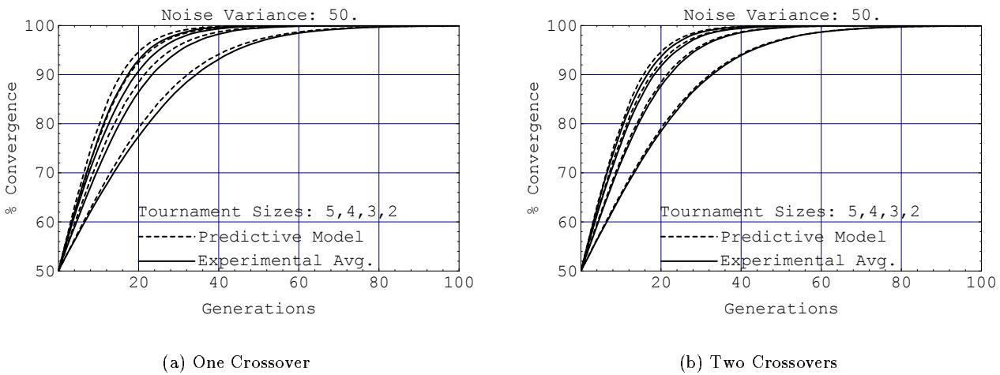
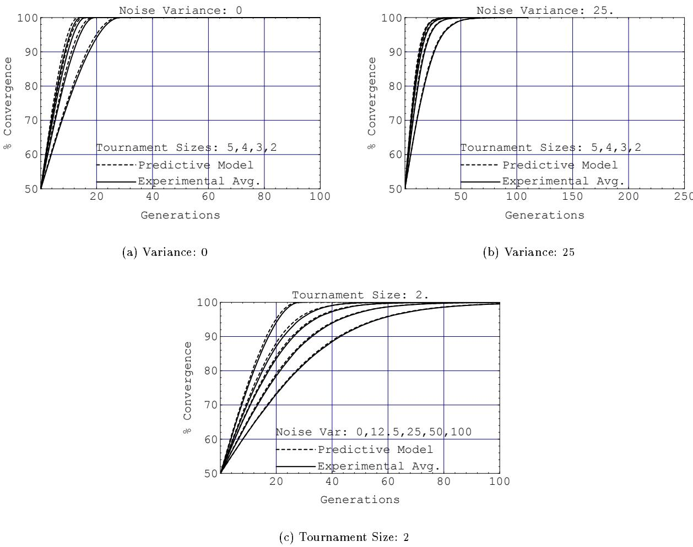

# Genetic Algorithms, Tournament Selection, and the Effects of Noise

Brad L. Miller   
Dept. of Computer Science   
University of Illinois   
at Urbana-Champaign

David E. Goldberg Dept. of General Engineering University of Illinois at Urbana-Champaign

IlliGAL Report No. 95006 July 1995

# Genetic Algorithms, Tournament Selection, and the Effects of Noise

Brad L. Miller   
Dept. of Computer Science   
University of Illinois   
at Urbana-Champaign   
bmiller@uiuc.edu   
David E. Goldberg   
Dept. of General Engineering   
University of Illinois   
at Urbana-Champaign   
deg@uiuc.edu

July 12, 1995

# Abstract

Tournament selection is a useful and robust selection mechanism commonly used by genetic algorithms. The selection pressure of tournament selection directly varies with the tournament size — the more compettors, the higher theresultingselection pressureThis artic developsamodel, basedon rde statistic, that can be used to quantitatively predict the resulting selection pressure o a tournament of a given size. This model is used to predict the convergence rates of genetic algorithms utilizing tournament selection.

While tournament selection is often used in conjunction with noisy (imperfect) fitness functions, little is understood about how the noise affects the resulting selection pressure. The model is extended to quantitatively predict the selection pressure for tournament selection utilizing noisy ftness functions.Given the tournament size and noise level of a noisy fitness function, the extended model is used to predict the resulting selection pressure of tournament selection. The accuracy of the model is verified using a simple test domain, the onemax (bit-counting) domain. The model is shown to accurately predict the convergence rate of a genetic algorithm usin tournament selection in the onemax domain for a widerange of tournament sizes and noise levels.

The model developed in this paper has a number of immediate practical uses as well as a number of longer term ramifications. Immediately, the model may be used for determining appropriate ranges of control parameters, for estimating stopping times to achieve a specified level of solution quality, and for approximating convergence times in important classes of function evaluations that utilize sampling. Longer ter, the aprac  this study may be appld to betternderstand the delayineect of functin noisin other selection schemes or to approximate the convergence delays that result from inherently noisy operators such as selection, crossover, and mutation.

# 1 Introduction

There are many selection schemes for genetic algorithms (GAs), each with different characteristics. An ideal selection scheme would be simple to code, and efficient for both non-parallel and parallel architectures.Furthermore, a selection scheme should be able to adust its selection pressure so as to tune its perormancefor diffrent domains.Tournament seection is inceasingly being used as a GA selectionscheme because it satie a  thebove iteIt is ip t de and  et r bh on-parallel n parartu. Tournamen seection can alsoadust the electon pressureodapt odffeen omi.Tournament seon pressure is increased (decreased) by simply increasing (decreasing) the tournament size.Aof thesefactors have contributed to the increased usage of tournament selection as a selection mechanism for GAs.

Good progress was made some time ago (Goldberg and Deb, 1991) in understanding the convergence rates of various selection schemes, including tournament selection. Recently, building on work by Mühlenben and Schlierkamp-Voosen (1993), this understanding has been refined to better understand the timing and degree of convergence more accurately (Thierens and Goldberg, 1994). Despite this progress, this detailed timing and degree of convergence analysis has not yet been extended to tournaments other than binary $s = 2$ ; nor has the analysis been applied to domains other than deterministic ones. In this paper, we do these two things.

The purpose of this paper is to develop a model for the selection pressure of tournament selection. This model, based on order statistics, quantitatively predicts the selection pressure resulting from both different tournament sizes and noise levels. Given the current population fitness mean and variance, the model can preic the average population ftness  the next generation.The model can also be use iteratively to preic the convergence rate of the GA over time. The predictive model is verified, using the onemax domain, under a range of tournament sizes and noise levels.

Section 2 provides the reader with background information needed to understand this paper, including tournamet selection, noise, and order statistics.Sections 3 and 4 developthe predictive model for tournament selection. Section 3 develops a predictive model that handles varying tournament sizes for noiseless environments, and section 4 extends this model for noisy environments. Section 5 assesses the accuracy of the predictive model, using the onemax domain, for a varity of tournament sizes and noise levels.Application the model orother research issues is described in Section .Some general conclusions from this researc are presented in section 7.

# 2 Background

This section gives some background iformation needed tounderstand this paper. The first subsection desibes seecion hemeselection pressure,andtourame section.The seon subsection details noise,noiyne functions, an approximateftness fnctions.Lastly, abrioverview  rer satistic is iven, foc the maximal order statistic for normal distributions.

# 2.1 Tournament Selection

Geneiagorithms us selection mechanism to selec individuals from the population to insert into amatin pol Individuals from the mating pool are usd to generate new offspring, with the resulting offspring frmig the basis of the next eneration. As the individuals in the mating pool are the ones whose genes areiheried by the next generation, it is desirable that the mating pool be comprised of "good" individuals.A selection mecanism n GAs i simply a prces that favors the election  bete ndividuals i the population r the matig pool.The selection pressure is the degree to which the betterindividuals are favore: he high the eealvTh the population ftness over succeeding enerations. The convergence rate of a GA is largely determined by the selection pressure, with higher selection pressures resulting in higher convergence rates. Genetic algorithms are able to to identiy optimal or near-optimal solutions under a wide range of selection pressure (Goldberg, Deand Thieres 19) However  theseecin pressure stoow, thecnvegence rate wll be so an the GA wll unesariy take longer tofnd the ptimal solutin. I the selectin pressure is too hig,there is an increased chance of the GA prematurely converging to an incorrect (sub-optimal) solution.

Tournament selection provides selection pressure by holding a tournament among s competitors, with $s$ being the tournament size. The winner of the tournament is the individual with the highest fitness of the s tournament competitors, and the winner is then inserted into the mating pool. The mating pool, being comprised of tournament winners, has a higher average fitness than the average population fitness. This fe irence provide the electon pressure whic drives he GA toprove the ne eac uci generation. Increased selection pressure can be provided by simply increasing the tournament size $s$ , as the wriavanal.

# 2.2 Noise and Noisy Fitness Functions

The noise inherent in noisy fitness functions causes the tournament selection process to also be noisy. We a ha  u ilu e umel otheindividual plus some nois In this paper e assume that he nois is normally istribute an ua (mean o zero). This assumption is true r approximately true in many noisy domains, and allows theefcts of noise to be more easily modeled.

The   a mys e   s I ai ey be ooencha  uatss ivs n pima o function must be used. Noisy information can also negatively ffect the fitness evaluation. Noisy information coy  i eror.To improverun-time performance, some GAs will utilizefast, but noisr, ftness functions insteado moraccurate, but slowerfnes fnctions that may lso beavailablSamplingftnes ucions ar o example of this phenomena, as aftness unction that uses sampling to asses an individual's ftness can use sam -eenseva

# 2.3 Order Statistics

This paper uses order statistics tofurther our understanding f tournament selection, and this sectionbrie reviews them. For a detailed description of order statistics, the reader should see David (1981).

If a random sample of size $n$ is arranged in ascending order of magnitude and then written as

$$
x _ { 1 : n } \leq x _ { 2 : n } \leq . . . \leq x _ { n : n } ,
$$

we can let the random variable $X _ { i : n }$ represent the distribution of the corresponding $x _ { i : n }$ over the space of all possible samples of size $n$ . The variable $X _ { i : n }$ is called the $i$ th order statistic. The field of order statistics deals with the properties and applications of these random variables.

Of particular interest is the maximal order statistic $X _ { n : n }$ , which represents the distribution of the maximum member of a sample of size $n$ . This is directly analogous to tournament selection, where the competitor with the maximum fitness is selected as the tournament winner.

The probability density function $p _ { i : n } \left( x \right)$ of the $i$ th order statistic, $X _ { i : n }$ , gives the probability that the $i$ bh highest individual from a sample of size $n$ will have a value of $x$ . The value of $p _ { i : n } \left( x \right)$ is calculated by

$$
p _ { i : n } \left( x \right) = n \binom { n - 1 } { i - 1 } P ( x ) ^ { i - 1 } ( 1 - P ( x ) ) ^ { n - i } ,
$$

where $P ( x )$ represents the cumulative distribution function of $x$ (the probability that $\{ X \leq x \} )$ . The probability that a single combination will have $i - 1$ individuals less than or equal to $x$ and $n - i$ individuals greater than $x$ is given by the product $P ( x ) ^ { i - 1 } ( 1 - P ( x ) ) ^ { n - i }$ . However, there are many possible sample combinations that will yield the desired distribution of having $i - 1$ individuals less than $x$ and $n - i$ individuals greater or equal to $x$ . For $n$ individuals, there are $n$ slots that the $i$ th greatest individual could occupy. For each of these slots, thee  are $\binom { n - 1 } { i - 1 }$ ent  an $i - 1$ $x$ among the $n - 1$ remaining slots.

The expected value (mean) $u _ { i : n }$ of an order statistic $X _ { i : n }$ can thus be determined by

$$
\begin{array} { l c l } { { u _ { i \cdot n } } } & { { = } } & { { \displaystyle \int _ { - \infty } ^ { + \infty } x \ p _ { i \cdot n } ( x ) d x , } } \\ { { } } & { { = } } & { { \displaystyle n \binom { n - 1 } { i - 1 } \int _ { - \infty } ^ { + \infty } x \ P ( x ) ^ { i - 1 } ( 1 - P ( x ) ) ^ { n - i } d P ( x ) . } } \end{array}
$$

For the maximal order statistic ( $i = n$ ), the mean $u _ { n : n }$ simplifies to

$$
u _ { n : n } = n \int _ { - \infty } ^ { + \infty } x \ P ( x ) ^ { n - 1 } d P ( x ) .
$$

In this paper we are particularly interested in the normal distribution $N ( \mu , \sigma ^ { 2 } )$ , where $\mu$ and $\sigma ^ { 2 }$ are the mean and variance, respectively, of the normal distribution. For the standard normal distribution $N ( 0 , 1 )$ , $P ( x )$ The expected value (mean) of the maximal order statistic for the standard normal distribution is thus

$$
u _ { n : n } = n \intop _ { - \infty } ^ { + \infty } x \Phi ( x ) ^ { n - 1 } \phi ( x ) d x .
$$

For samples of size $n = \{ 2 , 3 , 4 , 5 \}$ , Equation 1 for $u _ { n : n }$ can be solved exactly in terms of elementary functions. Table 1 gives the values for the mean of the maximal order statistic for $n = \{ 2 , 3 , 4 , 5 \}$ (see Balakrishnan and Cohen (1991) for derivations). For larger values of n, the means of the order statistics for the standard normal distribution have been tabulated extensively (Harter, 1961). The variances and covariances of the standard normal distribution order statistics can also be calculated, and are tabulated for $n \leq 2 0$ in Teichroew (1956), and for $n \leq 5 0$ in Tietjen, Kahaner, and Beckman (1977).

Table 1: Expected Value of Maximal Order Statistic for Standard Normal Distribution.   

<table><tr><td rowspan=1 colspan=1>n</td><td rowspan=1 colspan=1>μn:n</td><td rowspan=1 colspan=1>Values of µn:n</td></tr><tr><td rowspan=1 colspan=1>2</td><td rowspan=1 colspan=1>$\vrac{ }$</td><td rowspan=1 colspan=1>0.5642</td></tr><tr><td rowspan=1 colspan=1>3</td><td rowspan=1 colspan=1>32√π</td><td rowspan=1 colspan=1>0.8463</td></tr><tr><td rowspan=1 colspan=1>4</td><td rowspan=1 colspan=1>6 tan-1(√sq}π√π</td><td rowspan=1 colspan=1>1.0294</td></tr><tr><td rowspan=1 colspan=1>5</td><td rowspan=1 colspan=1>5      154√πr   2π√π</td><td rowspan=1 colspan=1>1.1630</td></tr></table>

# 3 Tournament Selection in Deterministic Environments

This section develops a predictive model for the selection pressure resulting from a tournament of size $s$ in a deternisiciselessevment.Innoisees evmentthetnctioncratelys truefe  nivaWe howha r  platio hotne isally srt h tournamentselection pressureis proportional to the produc the standar deviation  the populationnes and the maximal order statistic $\mu _ { \ : s : s }$ .

In a deterministic environment, the fitness function returns the true fitness value of an individual. The population's fitness values, after crossover and mutation, are assumed to be normally distributed over the population. Although tournament selection by itself will generate a skewed (non-normal) distribution, the crossove nd mutation perations emihe population, whic for thedistribution o becoe moreormal. This normalizing effect of crossover and mutation allows the assumption of normally distributed population fitness to be reasonable for a wide variety of domains.

Let the population fitness in generation $t$ be normally distributed $N \big ( \mu _ { F , t } , \sigma _ { F , t } ^ { 2 } \big )$ . The probability that an individual with fitness $f$ will win a tournament of $s$ individuals randomly picked from the population is given by

$$
p ( f = m a x ( f _ { 1 } \ldots f _ { s } ) ) = s \ P ( F < f ) ^ { s - 1 } p ( f ) ,
$$

which represents the probability of an individual with fitness $f$ occurring along with $s - 1$ individuals having lower fitness scores. There are $s$ different ways of arranging the $s - 1$ "losers" and the "winner." The expected value of the tournament winner $\mu _ { F , t + 1 }$ from a tournament of size $s$ can thus be calculated by

$$
\begin{array} { l l l } { \mu _ { F , t + 1 } } & { = } & { E [ f = m a x ( f _ { 1 } \dots f _ { s } ) ] , } \\ & { \displaystyle } & { + \infty } \\ & { = } & { \displaystyle \int _ { - \infty } f \ p \big ( f = m a x ( f _ { 1 } \dots f _ { s } ) \big ) d f , } \\ & { \displaystyle } & { - \infty } \\ & { = } & { \displaystyle \int _ { - \infty } f \ P ( f ) ^ { s - 1 } p ( f ) d f . } \end{array}
$$

However, for  normally distributed poulaion $N ( \mu _ { F , t } , \sigma _ { { F } , t } ^ { 2 } )$ , $\begin{array} { r } { P ( f ) = \Phi \big ( \frac { f - \mu _ { F , t } } { \sigma _ { F , t } } \big ) } \end{array}$ , and

$$
p ( f ) = \frac { d P ( f ) } { d f } = \frac { 1 } { \sigma _ { F , t } } \phi ( \frac { f - \mu _ { F , t } } { \sigma _ { F , t } } ) .
$$

Thus

$$
\mu _ { { \scriptscriptstyle F } , t + 1 } = \frac { s } { \sigma _ { { \scriptscriptstyle F } , t } } \int \displaylimits _ { - \infty } ^ { + \infty } f \Phi ( \frac { f - \mu _ { { \scriptscriptstyle F } , t } } { \sigma _ { { \scriptscriptstyle F } , t } } ) ^ { s - 1 } \phi ( \frac { f - \mu _ { { \scriptscriptstyle F } , t } } { \sigma _ { { \scriptscriptstyle F } , t } } ) d f .
$$

Substituting $\begin{array} { r } { z = \frac { f - \mu _ { F , t } } { \sigma _ { F , t } } } \end{array}$ gives

$$
\begin{array} { r c l } { \displaystyle \mu _ { F , t + 1 } } & { = } & { \displaystyle et { } { ' } \sum _ { s } \left( \sigma _ { F , t } z + \mu _ { F , t } \right) \Phi \left( z \right) ^ { s - 1 } \phi \left( z \right) d z , } \\ & & { \displaystyle \quad - \infty } & { \displaystyle + \infty } \\ & { = } & { \displaystyle \mu _ { F , t } s \int \Phi \left( z \right) ^ { s - 1 } \phi \left( z \right) d z + \sigma _ { F , t } \left( s \intop _ { - \infty } ^ { + \infty } z \Phi \left( z \right) ^ { s - 1 } \phi \left( z \right) d z \right) , } \\ & & { \displaystyle \quad \quad - \infty } & { \displaystyle - \infty } \\ & { = } & { \displaystyle \mu _ { F , t } \{ \Phi \left( z \right) ^ { s } \} _ { - \infty } ^ { + \infty } + \sigma _ { F , t } \mu _ { s ; s } , } \\ & { = } & { \displaystyle \mu _ { F , t } + \sigma _ { F , t } \mu _ { s ; s } . } \end{array}
$$

In Equation 2, $\mu _ { \boldsymbol { s } : \boldsymbol { s } }$ is the effective selection pressure for a tournament of size $s$ , and can be directly obtained from Tablrom Equation  is lso apparent that the hange inftness between geneations is gie y:

$$
\begin{array} { r c l } { { \Delta \mu _ { F , t } } } & { { = } } & { { \mu _ { F , t + 1 } - \mu _ { F , t } , } } \\ { { } } & { { } } & { { } } \\ { { } } & { { = } } & { { \sigma _ { F , t } \mu _ { s : s } . } } \end{array}
$$

For binary tournaments $( s = 2$ ), this matches the result obtained in (Thierens and Goldberg, 1994), where the expected increase in the average population fitness for tournaments of size $s = 2$ was derived in a different mannerusin the difference betwe normal distriutions. Their resul, using the notation inthis paper, was $\begin{array} { r } { \mu _ { { F } , \ t + 1 } = \mu _ { { F } , \ t } + \sigma _ { { F } , \ t } \frac { 1 } { \sqrt { \pi } } } \end{array}$ . This matches the result obtained using Equation 2 with a tournament size of $s = 2$ as $\textstyle \mu _ { 2 : 2 } = { \frac { 1 } { \sqrt { \pi } } }$ from Table 1. Note that the order statistic model derived in this paper is generalizable to all tournament sizes, and is not limited to $s = 2$ .

Equation 3 shows that for tournaments of size $s$ , the expected average population fitness increase is directly proportional to $\mu _ { s : s }$ , the expected value of the maximal order statistic of size $s$ . Table 1 gives $\mu _ { \mathscr { s } : \mathscr { s } }$ , demonstrating thaticeasihetoament zil cs sccessively malleceas  theexpecavee po fitness.

# 4 Tournament Selection in Noisy Environments

This section extends the model developed above to accurately predict the selection pressure in the presence of noise. With noisy fitness functions, there is a chance that the winner of a tournament might not be the indvidual with thehighest trueftnes.This section concenrate quanifyinthereduction touamt selection pressure due to noisy fitness functions.

The model derivation in this section has three major steps. First, the relationship between an individual's noisy fitness and true fitness values is determined, so that the expected true ftness value of an individual can be calculated from the noisy fitness evaluation. Next, the relationship is extended to handle subsets of individuals, s that the true ftnesaverage a subset  the population can be estimate from theverage noisy ftness value of the subset. Lastly, we use the model derived in the previous section to estimate the averae noyftnes value  particlar subse  the populatin the subs consisti noytouramet win.This avege noiyne valueis then lugeinto therufound he onsteo the averarune tener oouamensTh lect esu basnhe pe n val hetuame ne is hu edeteriThesul  preicvmodlur selection that can handle varying noise and tournament sizes.

In a noisy environment, the noisy fitness $f ^ { \prime }$ of an individual is given by $f ^ { \prime } = f + n o i s e$ , where $f$ is the rl ne the nividual, and oi s the noisiherent i he nencti evaluati.s in heas section, the real fitness of the population $F$ is assumed to be normally distributed $N ( \mu _ { F , t } , \sigma _ { { F } , t } ^ { 2 } )$ . This section further assumes that the noise is unbiased and normally distributed $N ( 0 , \sigma _ { N } ^ { 2 } )$ . This facilitates modeling the effects of the noise, and is a reasonable assumption for many domains. Using these assumptions, along with the additive property of normal distributions, gives that $F ^ { \prime }$ is normally distributed $N ( \mu _ { F , t } , \sigma _ { { } _ { F , t } } ^ { 2 } + \sigma _ { { } _ { N } } ^ { 2 } )$ .

Although the real fitness value for an individual is unknown, the expected value can be determined from theindividual's noisy ness value, whic i enerated by noy tnesnctin evaluation.As bth therue an te ofne eoaly isrbutehe bivareorl strutn an eus the expected true fitness value of $F ^ { \prime }$ for a given noisy fitness value $f ^ { \prime }$ of $F ^ { \prime }$ . For normal random variables $X$ and $Y$ , the bivariate normal distribution states that the expected value of $Y$ for a specific value $x$ of $X$ is

$$
E ( Y | x ) = \mu _ { Y } + \rho _ { X Y } \frac { \sigma _ { Y } } { \sigma _ { x } } \big ( x - \mu _ { x } \big ) ,
$$

where $\rho _ { X Y }$ is the correlation coefficient for $X$ and $Y$ . The correlation coefficient $\rho _ { x Y }$ can be calculated by $\begin{array} { r } { \rho _ { X Y } = \frac { \sigma _ { X Y } } { \sigma _ { X } \sigma _ { Y } } } \end{array}$ , where $\sigma _ { x Y }$ is the covariance of $X$ and $Y$ . The covariance between $F ^ { \prime }$ and $F ^ { \prime }$ is simply $\sigma _ { F } ^ { 2 }$ , thus

$$
\begin{array} { r c l } { E ( F | f ^ { \prime } ) } & { = } & { \displaystyle \mu _ { F } + \frac { \sigma _ { _ F } ^ { 2 } } { \sigma _ { _ F } \sigma _ { _ F ^ { \prime } } } \frac { \sigma _ { _ F } } { \sigma _ { _ F ^ { \prime } } } \big ( f ^ { \prime } - \mu _ { _ { F ^ { \prime } } } \big ) , } \\ & { = } & { \displaystyle \mu _ { _ F } + \frac { \sigma _ { _ F } ^ { 2 } } { \sigma _ { _ F ^ { \prime } } ^ { 2 } } \big ( f ^ { \prime } - \mu _ { _ { F ^ { \prime } } } \big ) , } \\ & { = } & { \displaystyle \mu _ { _ F } + \frac { \sigma _ { _ F } ^ { 2 } } { \sigma _ { _ F } ^ { 2 } + \sigma _ { _ N } ^ { 2 } } \big ( f ^ { \prime } - \mu _ { _ { F ^ { \prime } } } \big ) . } \end{array}
$$

As the above formula is linear, the expected value of $F ^ { \prime }$ for any subset $R$ of the population can be calculated using equation 4, with $f ^ { \prime }$ set to the noisy fitness mean $\mu _ { R }$ of the subset. Of course, the subset we are interested in is the noisy tournament winners. The expected mean of the noisy tournament winners of tournament size $s$ can be derived using the same derivation as for the deterministic case:

$$
\begin{array} { r c l } { \mu _ { F ^ { l } , t + 1 } } & { = } & { \mu _ { F ^ { l } , t } + \sigma _ { F ^ { l } , t } \mu _ { s : s } , } \\ & { = } & { \mu _ { F ^ { l } , t } + \sqrt { \sigma _ { { } _ { F } , t } ^ { 2 } + \sigma _ { { } _ { N } } ^ { 2 } } \mu _ { s : s } . } \end{array}
$$

Setting $f ^ { \prime }$ to $\mu _ { F } \iota _ { , t + 1 }$ in equation 4 produces the expected true fitness value of the tournament winners:

$$
\begin{array} { l c l } { { E \big ( F _ { t + 1 } | \mu _ { r ^ { \prime } , t + 1 } \big ) } } & { { = } } & { { \mu _ { r , t + 1 } , } } \\ { { } } & { { = } } & { { \mu _ { r , t } + \frac { \sigma _ { r , t } ^ { 2 } } { \sigma _ { r , t } ^ { 2 } + \sigma _ { \scriptscriptstyle N } ^ { 2 } } ( \mu _ { r ^ { \prime } , t } + \sqrt { \sigma _ { r , t } ^ { 2 } + \sigma _ { \scriptscriptstyle N } ^ { 2 } } \mu _ { s : s } - \mu _ { r ^ { \prime } , t } ) , } } \\ { { } } & { { } } & { { } } \\ { { } } & { { = } } & { { \mu _ { r , t } + \frac { \sigma _ { r , t } ^ { 2 } } { \sqrt { \sigma _ { r , t } ^ { 2 } + \sigma _ { \scriptscriptstyle N } ^ { 2 } } } \mu _ { s : s } . } } \end{array}
$$

As expected, equation 5 reduces to equation 1, the formula for the deterministic (noiseless) case, when th noise variance $\sigma _ { \scriptscriptstyle N } ^ { 2 }$ equals zero. Equation 5 is significant in that it predicts the convergence rate of a genetic algorithm using tournament selection for any tournament size or noise level.

# 5 Validation of Model

This section tests the accuracy of the predictive model, equation 5, using a sample domain. The domain use is the bi-counting,  nemax,domai, whic works wellor analysis s the variance can be determined from the average population fitness. This section uses equation 5 to predict the performance under a range of tournament sizes and noise levels. Experiments are then run that show that the predictive model is very accurate in determining the tournament selection pressure for different tournament sizes and noise levels.

# 5.1 Onemax Domain

The domain interest is theonemax, whic is alsoreferred to as the bit-counting problem The realnes of an individual in this domain is simply the number of one bits in the chromosome. The optimal solution is the chromosome consisting f all one bits.This population fitness in this domain is binomially distributed, and theme nvnc hehe polatifes an ther lculatuslisr properties. The population mean fitness at generation $t$ is given by ${ \overline { { f ( t ) } } } ~ = ~ \mu _ { { F } , t } ~ = ~ l ~ p ( t )$ , where $l$ is the chromosome length, and $p ( t )$ is the percentage of correct alleles in the population. The variance of the population at time $t$ is simply $\sigma _ { { } _ { F , t } } ^ { 2 } = l { \bf \nabla } p ( t ) ( 1 - p ( t ) )$ .

The experiments in this paper all use the following GA configuration parameters. The chromosome length is $l = 1 0 0$ , crossover is performed using the uniform crossover operator, and no mutation is used so as to b  T assumed to be $p ( 0 ) = 0 . 5$ . The population size is adjusted for different noise levels, as described in Goldberg, Deb, and Clark (1992). For the onemax domain, the population sizing equation reduces to $N = 8 ( \sigma _ { f } ^ { 2 } + \sigma _ { n } ^ { 2 } )$ with the population variance $\sigma _ { f } ^ { 2 }$ conservatively set to $\sigma _ { { } _ { F , 0 } } ^ { 2 } = l \ p ( 0 ) ( 1 - p ( 0 ) ) = 2 5$ . The noise variance $\sigma _ { n } ^ { 2 }$ is usr specied or e expermen. For expements wh a non-zeo nose vane $\sigma _ { n } ^ { 2 }$ , a random number generated from the noisy distribution $N ( 0 , \sigma _ { n } ^ { 2 } )$ is added to the real fitness score for each individual to produce anfes coreor he oy permettouame eletio  bs sol the noifne u of the individuals.

# 5.2 Predictive Model for the Onemax Domain

This section adapts Equation 5todetermine the convergence rat  the percentage correc alles ov ie for the onemax domain. From equation 5 the fitness increase between two generation is given by:

$$
\begin{array} { r c l } { \overline { { f ( t + 1 ) } } - \overline { { f ( t ) } } } & { = } & { \mu _ { F , t + 1 } - \mu _ { F , t } , } \\ & { = } & { \frac { \sigma _ { F , t } ^ { 2 } } { \sqrt { \sigma _ { F , t } ^ { 2 } + \sigma _ { N } ^ { 2 } } } \mu _ { s : s } . } \end{array}
$$

For the onemax domain, $\mu _ { \boldsymbol { F } , t } = l \ p ( t )$ and $\sigma _ { { } _ { F , t } } ^ { 2 } = l { \bf \nabla } p ( t ) ( 1 - p ( t ) )$ .Thus

$$
\begin{array} { r c l } { \overline { { p ( t + 1 ) } } - \overline { { p ( t ) } } } & { = } & { \displaystyle \frac { 1 } { l } ( \overline { { f ( t + 1 ) } } - \overline { { f ( t ) } } ) , } \\ & { = } & { \displaystyle \frac { \mu _ { s : s } } { l } \frac { \sigma _ { F , t } ^ { 2 } } { \sqrt { \sigma _ { F , t } ^ { 2 } + \sigma _ { N } ^ { 2 } } } , } \\ & { = } & { \displaystyle \mu _ { s : s } \frac { p ( t ) ( 1 - p ( t ) ) } { \sqrt { l ~ p ( t ) ( 1 - p ( t ) ) + \sigma _ { N } ^ { 2 } } } . } \end{array}
$$

Approximating the above difference equation with a differential equation yields

$$
\frac { d p } { d t } = \mu _ { s : s } \frac { p ( t ) ( 1 - p ( t ) ) } { \sqrt { l ~ p ( t ) ( 1 - p ( t ) ) + \sigma _ { _ { N } } ^ { 2 } } } .
$$

Although equation 6 is integrable, it does not reduce to convenient form in the general case; however, it can be easily solved numerically for $p ( t )$ , and for the noiseless case $( \sigma _ { { } _ { N } } ^ { 2 } = 0 )$ $p ( t )$ can be determined exactly. Subsection 5.3 will deal with solving equation 6 for $t ( p )$ . Given the initial percentage of correct alleles is $p ( 0 ) = 0 . 5$ , equation 6 can be solved exactly for $p ( t )$ in the noiseless case to yield:

$$
p ( t ) = 0 . 5 ( 1 + \sin { ( \frac { \mu _ { s : s } t } { \sqrt { l } } ) } ) .
$$

Equations 6 and 7 together make up the predictive model for the onemax domain. Equation 6 is numerically solved to predict $p ( t )$ for noisy domains, while equation 7 is directly used to obtain $p ( t )$ for noiseless domains. In both equations, $\mu _ { s : s }$ determines the selection pressure for a tournament of size $s$ . For noisy domains, the term $\frac { \sigma _ { F , t } ^ { 2 } } { \sqrt { \sigma _ { F , t } ^ { 2 } + \sigma _ { N } ^ { 2 } } }$ causes the predicted convergence rate to decrease as the noise is increased. In the next section we assess the accuracy of these equations for a variety of tournament sizes and noise levels.

# 5.3 Convergence Time for the Onemax Domain

While equation 6 is not directly solvable for $p ( t )$ , it can be solved for $t$ as a function of $p$ .

$$
\frac { 1 } { \mu _ { s ; s } } \left[ \sqrt { l } \arctan \left( \frac { \sqrt { l } ( 2 p - 1 ) } { 2 \sqrt { \sigma _ { N } ^ { 2 } + l p ( 1 - p ) } } \right) + \sigma _ { N } \log \left( \frac { p } { p - 1 } \frac { - l - 2 \sigma _ { N } ^ { 2 } + l p - 2 \sigma _ { N } \sqrt { \sigma _ { N } ^ { 2 } + l p ( 1 - p ) } } { 2 \sigma _ { N } ^ { 2 } + l p + 2 \sigma _ { N } \sqrt { \sigma _ { N } ^ { 2 } + l p ( 1 - p ) } } \right) \right] .
$$

For binary alleles, at time $t = 0$ we can assume that half of the alleles are initially correct $p = 0 . 5$ . Using this to solve for $c$ in equation 8 gives that $c = 0$ . For the case where $p = 1$ (convergence), $s = 2$ , and $\sigma _ { N } = 0$ , equation 8 reduces to $\begin{array} { r } { t ( 1 . 0 ) = \sqrt { \pi l } \ \frac { \pi } { 2 } } \end{array}$ , which agrees with convergence time found in Thierens and Goldberg (1994) for binary tournament selection.Of course, equation 8 is more general than the convergence equation in Thierens and Goldberg (1994), as it can handle tournaments of different sizes and noise levels.

We are particularly interested in the time $t _ { c }$ it takes for all alleles to converge $( p = 1 )$ . For the deterministic case, equation 8 reduces to

$$
t _ { c } = \frac { \pi \sqrt { l } } { 2 \mu _ { s : s } } .
$$

A useful approximation of the convergence time for the noisy cases is

$$
t _ { c } = \frac { 1 } { \mu _ { s : s } } \left[ \sqrt { l } { \mathrm { ~ a r c t a n } } \left( \frac { \sqrt { l } } { 2 \sigma _ { N } } \right) + \sigma _ { N } \log \left( \frac { ( l - 1 ) 4 \sigma _ { N } ^ { 2 } } { l + 4 \sigma _ { N } ^ { 2 } } \right) \right] .
$$

This approximation is obtained by setting $p = 1$ in equation 8, except for the $\frac { p } { p - 1 }$ fraction in the log term. For the $\textstyle { \frac { p } { p - 1 } }$ term, we relax the convergence criterion by setting $\begin{array} { r } { p = \frac { l - 1 } { l } } \end{array}$ , indicating that $1 0 0 \bigl ( \textstyle { \frac { l - 1 } { l } } \bigr )$ percent of $\begin{array} { r } { p = \frac { l - 1 } { l } } \end{array}$ in the $\frac { p } { p _ { \bullet } - 1 }$ term yields $( 1 - l )$ .Equation 10 is used to develop approximations for domains characterized by small, medium, and large amounts of noise.

For domains characterized by small levels of noise $\left( \sigma _ { N } \approx 0 \right)$ , equation 10 can be approximated by

$$
t _ { c } = \frac { 1 } { \mu _ { s : s } } \left[ \sqrt { l } \mathrm { \mathrm { ~ a r c t a n } } \left( \frac { \sqrt { l } } { 2 \sigma _ { \scriptscriptstyle N } } \right) + 2 \sigma _ { \scriptscriptstyle N } \log ( 2 \sigma _ { \scriptscriptstyle N } ) \right] ,
$$

as the log term is insignificant for very small levels of noise.

A medium noise level is defined as having the fitness function noise variance $\sigma _ { N }$ approximately equal the initial pulationness $\sigma _ { f }$ leve, wh  a $\textstyle { \sqrt { l / 4 } } = { \frac { \sqrt { l } } { 2 } }$ . Approximating equation 10 using $\begin{array} { r } { \sigma _ { N } \approx \frac { \sqrt { l } } { 2 } } \end{array}$ yields

$$
t _ { c } = \frac { 1 } { \mu _ { s : s } } \left[ \sqrt { l } \mathrm { \mathrm { ~ a r c t a n } } \left( \frac { \sqrt { l } } { 2 \sigma _ { N } } \right) + 2 \sigma _ { N } \log ( \sqrt { 2 } \sigma _ { N } ) \right] .
$$

For large amounts of noise $\left( \sigma _ { N } \approx \infty \right)$ , equation 10 can be approximated by

$$
t _ { c } = \frac { 1 } { \mu _ { s : s } } \left[ \frac { l } { 2 \sigma _ { N } } + \sigma _ { N } \log ( l - 1 ) \right] ,
$$

as for small angles, arctan $\theta \approx \theta$ .

The approximations equations for convergence with small, medium, and large amounts of noise can be used to quickly estimate the convergence time for a GA. These are useful for the GA designer trying to gauge the delaying effects of noise on population convergence.

# 5.4 Experimental Results

In this section we assess the accuracy of our predictive model. We compare the predicted performance versus the actual performance obtained from GA runs for varying noise levels and tournament sizes to validate our predictive model.

To assess the accuracy of the predictive model, GA runs were made at five different noise variance levels $\begin{array} { r } { \sigma _ { n } ^ { 2 } = \{ 0 , { \frac { 1 } { 2 } } \sigma _ { f } ^ { 2 } , \sigma _ { f } ^ { 2 } , 2 \sigma _ { f } ^ { 2 } , 4 \sigma _ { f } ^ { 2 } \} } \end{array}$ . At each noise variance level, GA runs were made with tournaments sizes of $s = \{ 2 , 3 , 4 , 5 \}$ . For each combination of noise variance and tournament size, $1 0 \mathrm { ~ G A ~ }$ runs were made, and the results were averaged. The experimental results were then compared to the results predicted from Equations 6 (noisy) and 7 (deterministic).

Aspe plot is how gureThe noivaran ven thetop ne The ashe ine  the plot represent the predicted performance obtained using Equations 6 and 7 for tournament sizes $s = \{ 2 , 3 , 4 , 5 \}$ . The old lne dsplay theGA perrman verageove 10runs  e ivennois variancntourmt sizes. The dashed lines, from left to right, correspond to the predicted performance with tournament sizes v (highest seecin pressure, four tree,and t (owst sectin pressure.Smiarly, the sole correspond to the performance with tournament sizes, from let to right, of five (highest selection pressure), four, three, and two (lowest selection pressure).

  
Figure 1: Effects of Multiple Crossovers

Figure 1 compares the effects of performing one crossover versus two when the noise variance is equal to the fitness variance. While the predictive model slightly overestimates the performance of GAs using one crossover (figure 1a), it accurately estimates the performance of the experiments using two crossovers (fgure b). This is a result o crossover decreasing the corelation between alles (Thierens and Goldberg, 1994), and the tendency of crossover to 'normalize' the population fitness distributions, making our model assumption of a normal population distribution more accurate.As done in Thierens and Goldberg (1994), we perform two crossovers per generation in ur experiments, o after the usual procedure of tournament selectin and recombination, we randomly shufle the population and again recombine the population using crossover. This has the beneficial effects of reducing the correlation between alles (Thierens and Goldberg, 1994), and 'olizi'he polateistrutiHoweveorharaceiz by hi alten, t cul uc eve pan h GA  h woun  he i building blocks.

Figure 2 summarizes our experimental results. Figure 2a plots the deterministic case, where the noise variance is zero,for a variety of tournament sizes.Figure b plots the experiments where the noise varance is, fo vrty  tuet sizgure  akit v, i that it plots hereul fixed tournament size $s = 2$ for a variety of noise levels. These figures demonstrate that our model is very accurate for predicting GA performance in the onemax domain for a wide range of tournament sizes and noise levels.

# 5.5 Discussion of Results

This subsection discusses the general accuracy f the model, and how selection pressure affects the accuray of the model. The accuracy of the approximation convergence equations is also discussed.

The model proved to be very accurate over a wide range of noise levels and tournament sizes. On many epements,the preice and expeentalresus were practicaldential Howeve, theodemaaly less accurate in domains characterized by high selection pressure. This is primarily a result of the high selection pressure causing the tournament selection process to generate a non-normal (skewed) distribution, whic violates the modelassumption o a normally distributed population. For our experiments, hig selection pressure was caused by high tournament sizes ( $s = 5$ ). Interestingly, higher levels of noise actually reduces the tournament selection pressure, making the model more accurate. For our experiments, the highest selection pressure was for $s = 5$ and $\sigma _ { N } = 0$ . The results of this experiment are shown in figure 2a, in the upper left two lines (predicted and experimental results) of the plot. This demonstrates that even with high selection pressure, the model is still fairly accurate.

  
Figure 2: Onemax Experiments for Various Tournament Sizes and Noise Levels

Crossover has a 'normalizing' effect on the population fitness. When the selection pressure is high, the mating pool selected is non-normal (skewed.Perorming multiple rossovers per generation has a 'noraliz effec on the ftness distribution of the new offspring enerated through crossover from the mating pool which in turn makes the model more accurate (see figure 1). The experiments performed in this paper used two crossovers per generation so as facilitate comparison of results with those obtained in Thierens and Golberg (9). For vy h sletn pressure, the oacray can beceas by simplycasg the er o crossovers performed per generation. However, this increased accuracy does not come free, for performing multipl cossovers pererationdomais haracterized byhigalteraction wi retar buildinl growth. This slows the GA convergence rate, and would thus make the model less acurate. For the onemax domain, which has no allele interaction, multiple crossovers only increases the model accuracy.

These experiments also verified the accuracy of our approximation equations for the convergence time. Table 2 presents the average convergence timef the experiments for a variety o noise leve when the toura ment size is two, as well as the convergence times predicted by the exact models (equation 8 and 9), and the small, medium and large noise approximations (equations 11, 12, and 13). For the GA experiments, convergence was defined as the first generation in which the experimental average of the average population fitness was over $9 9 \%$ converged. The exact model for the noisy case (equation 8) also used $p = . 9 9$ convergence for the noisy cases, as it evaluates to infinity if $p = 1 . 0$ , while the deterministic model (equation 9) was used for the noiseless case. The approximation equations all estimate the time until absolute convergence $p = 1 . 0$ .

The table shows that the exact convergence equations (equations 8 and 9) predict the experimental results quite well. The small approximation equation turns out to be fairly accurate at $\begin{array} { r } { \sigma _ { N } = \frac { \sqrt { l } } { 2 } = 1 2 . 5 } \end{array}$ , but it was designed for smaller amounts of noise. For lower noise levels, it should be more acurate than the medium $\begin{array} { r } { \sigma _ { N } = \frac { \sqrt { l } } { 2 } = 2 5 } \end{array}$ is fairly accurate for all noise levels up to 100. At the high noise level of 100, the large approximation model is the mos accurate approximation. These results indicate that the approximation equations do very well as a quik estimate of the convergence time for GAs utilizing tournament selection.

Table 2: Convergence Times for $s = 2$ .   

<table><tr><td>Noise $σ^\r2}$</td><td>Exper. tc</td><td>Exact t (p = .99)</td><td colspan="3">Approximate c Small Med. Large </td></tr><tr><td>0 12.5 25.0</td><td>28.0 40.0 49.0</td><td>28.8 39.9 49.9 65.4</td><td>28.8 42.8 56.5 79.9</td><td>28.8 38.3 50.2</td><td>NA 55.6 60.4</td></tr></table>

# 6 Future Research

This section describes a number of important areas for future research:

Applying newfound understanding of noise for other selection schemes   
Modeling other GA operators by utilizing the noise component of the model to account for their effect on convergence   
Testing the model in more complex domains   
Using the model to answer basic performance questions for a GA   
•Applying the model to help tune GA configuration parameters   
Determining appropriate sample sizes for fitness function employing sampling, so as to maximize performance within a given environment

This research is important in that it has furthered our understanding of noise and its delaying effect on convergence. The model has proved accurate at predicting the convergence rate of a GA utilizing tournament selection for a variety of noise levels and tournament sizes in the onemax domain. The approach taken in section 4, where the deterministic tournament selection model is extended to handle noise, shows promise for adapting other deterministic selection models to handle noise.

Within this paper, the noise component was considered to be produced by noise present in the fitness functions. However, there is no reason why the noise input for the developed model can not include noise introduced from other GA components. The noise input indirectl indicates the degradation of the mating pool ftness as compared to the mating pool selected with no noise present. The noise input can thus be used to account for other degradations o mating poolftness rom other GA mechanisms besides noisy fitness functions. Other GA mechanisms that also introduce noise could be included in the noise component, such as different mutation mechanisms and mutation rates, and tournament selection used with or without replacement. This would increase the model's predictive accuracy for a wider range of GA configurations.

As discussed in Subsection 5.5, the use of order statistics has proved very accurate in predicting tournament selection pressure for the onemax domain. We would like to extend our model to handle other domains that have different characteristics than the onemax domain. The onemax domain is characterized by equal allele w a uyan,anltn li blockWe like to extend our model to handle more complex domains, including "domino-like" domains, where the alleles have unequal weighting, and domains characterized by high allele correlation.However, the current model is stil usorthe typeomai inha  provid  ow bound  he convgenc atxt our model to directly handle more complex domains will increase the accuracy of the predicted convergence rates.

One of our mode's strengths is that it predicts the distribution of the population fitness over successive generations Order statistics can be used not only to predic both the increase in ftness between generaions, but also to predict the population fitness variance in the next generation. As the population fitness mean and variance can be accurately modeled over time using order statistics, our model can be used to answer questions relating to population fitness distribution. The model could thus be applied to answer PAC-like performance questions like "What is the probability that a solution of quality $Y$ will be present at generation $X$ ," or "At what generation are we $Z$ percent confident that a solution of at least quality $Y$ will be present in the population." Answers to these questions could be used to determine how long a GA should run before a solution of acceptable quality is likely to be be produced. This would allow for a GA designer to set GA stopping criteria that achieves a desired solution quality.

This model should be very helpful in determining appropriate settings for many GA parameters. While GAs with generic parameter settings are good at finding good solutions in a reasonable amount of time, their performance can be improved by tuning the parameter setings for a specific domain. As discussed above, our model can be used to determining appropriate stopping criteria for the GA. It can also be used to design a GA that has a desired convergence rate for a given domain, by applying the model to determine the appropriate tournament size for achieving a specifed convergence rate. It could even be used to design custom" tournament that achieves a given selection pressure (i.e., a tournament where the best 2 out of 5 competitors are selected for the mating pool).

In some domains, a GA designer is faced with a range of possible fitness functions, all with different noise and run-time performance characteristics. The model can be applied to help select a fitness function that achives an acceptable lution  n acceptablmount ntime ora given domai.Someftnes are based on sampling, with the sampling ftness function's noise and run-time performance characteristics direcly controlled by the sample size. Our model, in conjunction with sampling theory being used to predict the noise roma ivsample siz should bebleodetermine eappropriate sample ize neee r he GA to achieve a given convergence rate.

# 7 Conclusions

Tournament selection is an important selection mechanism for GAs. It is simple to code, easy to implement on-parall paral tectu bu he preeno nd as djusableeec pe This paper has developed a model that works under a wide range of noise levels and tournament sizes to accurately predict the convergence rate of a GA utilizing tournament selection. The model has been verified usi the onemax domain andshown to be accurate or predicting the convergencerate under a wide range noise levels and tournament sizes.

The paper has discussed a number of immediate practical uses of the model. It can be used to correctly set various GA control parameters for a given domain, including tournament sizes and mutation rates. The model can deterine appropriate stopping criteria or achieving a desiredsolution quality.The model can be used to answer basic performance questions, such as "What is the probability that a solution of quality $Y$ will be present at generation $X$ ?" In addition, the model can also be used to determine appropriate sample sizes for the class of fitness functions that employ sampling so as to maximize GA performance.

This research has several long term ramifications. Through the study of one selection scheme, tournament selecn his papeaseneheo danandlay leeme. The apprac usein this study maylso b appli o predic the cnveencdelays resultingfromeely noisy operators such as selection, crossover, and mutation.

# 8 Acknowledgments

This work was supported under NASA Grant No. NGT 9-4. This effort was also sponsored by the Air Force Office of Scientific Research, Air Force Materiel Command, USAF, under grant numbers F4960-94-1-0103 and

F49620-95-1-0338. The U.S. Government is authorized to reproduce and distribute reprints for Governmental purposes notwithstanding any copyright notation thereon.

The views and conclusions contained herein are those of the authors and should not be interpreted as necessarily representing the official policies or endorsements, either expressed or implied, of the Air Force Office of Scientific Research or the U.S. Government.

# Список литературы

Balakrishnan, N. & Cohen, A. C. (1991). Order statistics and inference: estimation methods (pp. 5154). Boston: Harcourt Brace Jovanovich.   
David, H. A. (1981). Order statistics (2nd ed.). New York: John Wiley & Sons, Inc.   
Goldberg, D. E. & Deb, K. (1991). A comparative analysis of selection schemes used in genetic algorithms. Foundations of Genetic Algorithms, 1, 69-93. (Also TCGA Report 90007).   
Goldberg, D. E., Deb, K., & Clark, J. H. (1992). Genetic algorithms, noise, and the sizing of populations. Complex Systems, 6, 333362.   
Goldberg, D. E., Deb, K., & Thierens, D. (1993). Toward a better understanding of mixing in genetic algorithms. Journal of the Society of Instrument and Control Engineers, 32(1), 1016.   
Harter, H. L. (1961). Expected values of normal order statistics. Biometrika, 48, 151165.   
Mühlenbein, H. & Schlierkamp-Voosen, D. (1993). Predictive models for the breeder genetic algorithm: I. Continuous parameter optimization. Evolutionary Computation, 1 (1), 2549.   
Teicrw, D.(956). Table expectevalue rde statistic anproducts ordr tatistic or smple of size twenty and less from the normal distribution. Annals of Mathematical Statistics, 27, 410426.   
Thierens, D. & Goldberg, D. (1994). Convergence models of genetic algorithm selection schemes. In Davidor, Y., Schwefel, H.-P., & Männer, R. (Eds.), Parallel Problem Solving from Nature- PPSN II (pp. 119129). Berlin: Springer-Verlag.   
Tietjen, G. L., Kahaner, D. K., & Beckman, R. J. (1977). Variances and covariances of the normal order statistics for sample sizes 2 to 50. Selected Tables in Mathematical Statistics, 5, 173.