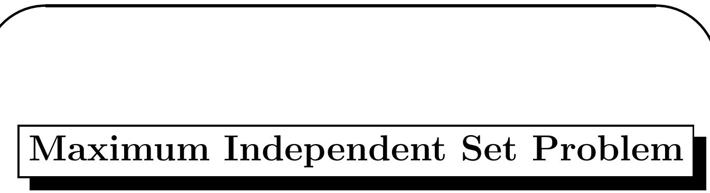
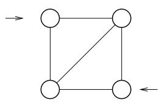
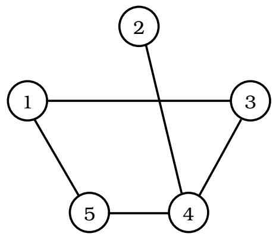
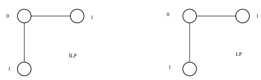
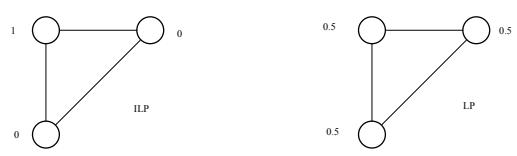

Given an undirected graph $G = ( V , E )$ , find the largest integer $k$ such that there is an independent set $V ^ { \prime }$ with cardinality $k$ , i.e., $V ^ { \prime } \subseteq V$ and no two vertices in $V ^ { \prime }$ are adjacent (none of the edges in $E$ join two vertices in $V ^ { \prime }$ .

Associate $x _ { i }$ with vertex $v _ { i }$ .

Restate problem: Find largest integer $k$ s.t. there is a vector X with $\{ 0 , 1 \}$ entries, $\textstyle \sum x _ { i } = k$ , and each edge $e = \{ i , j \} \in E$ does not have have both of its endpoints with value 1, i.e., $x _ { i } + x _ { j } \leq 1$ .

Integer Linear Prog. Formulation

ILP: Maximize P xi Subject to $x _ { i } + x _ { j } \leq 1$ for every $\{ i , j \} \in E$ $x _ { i } = 0$ , or 1, for $1 \leq i \leq n$ .

In this case: Max $x _ { 1 } + x _ { 2 } + x _ { 3 } + x _ { 4 } + x _ { 5 }$

$$
x _ { 1 } + x _ { 3 } \leq 1 , ~ x _ { 1 } + x _ { 5 } \leq 1 , ~ x _ { 2 } + x _ { 4 } \leq 1
$$

$$
x _ { 3 } + x _ { 4 } \leq 1 , ~ \mathrm { a n d } ~ x _ { 4 } + x _ { 5 } \leq 1 .
$$

$$
x _ { i } = 0 \mathrm { ~ o r ~ } 1
$$

# Relaxed Problem

Find largest real $k$ s.t. there is a vector $X$ with real entries values in [0, 1] (i.e., $0 \leq x _ { i } \leq 1 )$ , $\textstyle \sum x _ { i } = k$ , and each edge $e = \{ e _ { i } , e _ { j } \} \in E$ satisfies $x _ { i } + x _ { j } \leq 1$ .

Linear Programming

LP: Maximize P xi Subject to $x _ { i } + x _ { j } \leq 1$ for every $\{ i , j \} \in E$ $0 \leq x _ { i } \leq 1$ , for $1 \leq i \leq n$ .

1. If $X ^ { \prime }$ is a feasible solution to the maximum independent set problem, then $X ^ { \prime }$ is also a feasible solution to the relaxed problem simply because $\{ 0 , 1 \} \subseteq [ 0 , 1 ]$ . Converse is not true.

2. Because of (1), OPT(ILP) ≤ OPT(LP).

BIG GAP PROBLEM: OPT(ILP) may be too small compared to OPT(LP). Consider $G$ being the complete graph on $n$ vertices. OPT $\mathrm { \Delta \Omega ^ { \prime } ( I L P ) = 1 }$ , but $\mathrm { O P T } ( \mathrm { L P } ) \geq n / 2$ . $\mathrm { O P T } ( \mathrm { L P } ) = n / 2$ when $x _ { i } = 1 / 2$ for $1 \leq i \leq n$ . The resulting approximation algorithm using this technique is not bounded by any constant.

# BIG ROUNDING PROBLEM

• What sort of rounding could one use?

• If we round up the values greater than or equal to 0.5, then it will not work. For example, if $x _ { i } = x _ { j } = 0 . 5$ , then the constraint $x _ { i } + x _ { j } \leq 1$ is satisfied before the rounding, but not after the rounding.

• If we round up the values greater than 0.5, then we also run into problems.

• Suppose that we have a graph on 2n vertices labeled 1, 2, . . . , 2n and the edges are $( i , n + i )$ for $1 \leq i \leq n$ .

• An optimum independent set has $n / 2$ vertices. Therefore, $\mathrm { O P T } ( \mathrm { I L P } ) { = n / 2 }$ .

• An optimum solution to the corresponding LP problem has $x _ { i } = 0 . 5$ for all $i$ . The rounding has zero vertices in the independent set. So the rounded solution is far from optimal.