# IMPROVING THE BEHAVIOR OF THE GENETIC ALGORITHM

# IN A DYNAMIC ENVIRONMENT

By

Mark Wineberg, B.Sc., M.C.S.

A thesis submitted to

the Faculty of Graduate Studies and Research in partial fulfillment of the requirements for the degree of

Doctor of Philosophy

Ottawa-Carleton Institute for Computer Science

School of Computer Science   
Carleton University   
Ottawa, Ontario   
June 8, 2000   
$©$ copyright   
2000, Mark Wineberg

# Abstract

Two widely noted deficiencies of the Genetic Algorithm (GA) are its tendency to get trapped at local maxima and the difficulty it has handling a changing environment after convergence has occurred. These two problems can be shown to be related; a solution to the former should help to alleviate the latter. In the 1930s, a mechanism was proposed by Sewall Wright to address the local maxima problem. He called this process the Shifting Balance Theory (SBT) of evolution. In this dissertation, it is conjectured that the same mechanisms that theoretically help the SBT prevent premature convergence in nature will improve the GA’s performance in highly multimodal environments and when tracking a global optima in dynamic environments. This should especially be true for dynamic environments that have remained stationary for a long time allowing populations to prematurely converge.

When abstracting the SBT process to add it to the GA, the SBT had to be modified to remove defects inherent in its original formulation. This was carefully done to keep the properties of the SBT that were believed to both increase the adaptive abilities of the GA and prevent it from prematurely converging. The resulting mechanism, which is a multipopulational system, can be added as a ‘plug-in’ module to any evolutionary algorithm and therefore was named the Shifting Balance Evolutionary Algorithm (SBEA). When applied to the GA, it is called the SBGA.

While formulating the SBGA, some mathematical theories had to be developed: the definition of the distance between two populations, and a measure of the amount of overlap between them. These concepts were needed for the mechanisms used to control the multipopulations.

Using an implementation of the SBGA, experimental results and analysis are presented demonstrating that the SBGA does, in fact, lessen the problem of premature convergence and also improves performance under a dynamic environment, thereby mitigating both deficiencies.

# Acknowledgements

Most importantly I would like to acknowledge the support and insights provided by my supervisor, Franz Oppacher. Early on he brought out my ability to create ideas and then gave me the freedom to explore them. He introduced me to the area of Evolutionary Computation and made it interesting enough to interest me. I truly believe that the Ph.D. process can only work properly if there is a proper meshing between supervisor and candidate. Taking his graduate course on Genetic Algorithms and Artificial Life was very fortuitous as it introduced me to both Franz and the area, and I am very grateful to him for accepting me as his student.

There have been other professors who have helped me in areas that were critical for the successful completion of this dissertation. I would like to thank Prof. George Carmody for being so patient with me when answering all my questions on biological genetics as well as for his friendliness and encouragement. Furthermore, it was in his Population Genetics course that the ideas of Sewall Wright were first introduced to me; this consequently led to my exploration of the Shifting Balance theory, which has become the cornerstone concept in my doctoral work. I also wish to thank Prof. Shirley Mills for all her help in the use of Linear Models for the statistical analysis of my results. Without her I might still be applying inappropriate statistical methods and therefore be solely relying on faulty inferences to support my conclusions.

I would also like to thank each of the members of my Ph.D. committee: Prof. JeanPierre Corriveau, Prof. Mark Forbes, Prof. Stan Matwin and Prof. Ken De Jong. I am grateful for the time and care they took in reading my dissertation and helping to perfect it. I would also like to especially thank Prof. Ken De Jong for being my external examiner and coming all the way from George Mason University Virginia.

Thanks must, of course, go to my fellow graduate students Steffen Christensen, Hassan Masum and Rob Cattral for their aid and support. They have been wonderful in allowing me to bounce my ideas off of them; not infrequently would I find those ideas coming back in far better shape than I can solely take credit for.

I would also like to acknowledge the funding of Ontario Government Scholarship program, which helped to make my studies possible.

Finally I must thank my parents, Sam and Sylvia Wineberg; without their financial aid, constant prodding, moral support, and overall assistance, this dissertation could never have been completed.

# Table of Contents

Abstract .iii Acknowledgements .. . iv Table of Contents . . vi List of Tables.. .. xi List of Figures ... ...xii List of Lemmas.. .. xiv List of Properties . .. xiv List of Theorems .. .. xv List of Appendices . ...xvii

# Part 1 The Shifting Balance Evolutionary Algorithm

Chapter 1 Introduction and Dissertation Outline

Ch1 $\ S 1$ Introduction . 2

Ch1 §2 An Outline of the Dissertation 6

Ch1 $\ S 3$ Main Contributions of the Dissertation. 7

Chapter 2 Sewall Wright’s Shifting Balance Theory

$\mathrm { C h } 2 \ S 1$ The Theory . . 10

$\mathrm { C h } 2 \ S 2$ The Deme Approach in the GA Literature as Inspired by the Shifting Balance Theory . . 13

Ch2 $\ S 3$ Problems With the SBT, both in Theory and in Practice . . 18

Chapter 3 Abstracting the SBT: The Shifting Balance Evolutionary Algorithm

$\mathrm { C h } 3 \ S 1$ The First Level of Abstraction: Core Group and Colonies .. . 21

$\operatorname { C h 3 } \ S 2$ The Colonies as Exploratory Sub-Populations: A Further Abstraction ....... 24

Ch3 $\ S 3$ The Shifting Balance Evolutionary Algorithm . . 28

# Part 2 Where is Elsewhere

Chapter 4 Introduction

$\mathrm { C h 4 \ \ S 1 }$ Landscapes, Manifolds and the Fitness “Field” . . 31

$\mathrm { C h 4 } \ S 2$ Ordering the Chromosomes: Gene Space, Chromosome Space and Population Space . .. 33

$\mathrm { C h 4 } \ S 3$ Distances, Metrics and Norms . 34

$\mathrm { C h 4 \ \ S 4 }$ Outline of the Chapters for “Where is Elsewhere” . 38

Chapter 5 Chromosome Space

$\mathrm { C h } 5 \ S 1$ Introduction . . 39

$\mathrm { C h } 5 \ S 2$ Hamming Space . . 41

$\mathrm { C h } 5 \ S 3$ The Mutational Distance between Chromosomes. . 48

$\mathrm { C h } 5 \ S 4$ Towards a Crossover based Chromosome Distance . . 59

Ch5 $\ S 5$ Continuing On the Road to an Accurate Reproductive Distance between Chromosomes .

Chapter 6 Distance Between Populations

$\mathrm { C h } 6 \ S 1$ Introduction . . 63

$\mathrm { C h } 6 \ S 2$ Diversity . 69

$\mathrm { C h } 6 \ S 3$ An All-Possible-Pairs “Distance” Between Populations . 77

$\mathrm { C h } 6 \ S 4$ The Mutational-Change Distance Between Populations.. . 81

$\mathrm { C h } 6 \ S 5$ The $\mathrm { L } _ { \mathrm { k } }$ -Norms and the Distance Between Populations . . 83

$\mathrm { C h } 6 \ S 6$ The Distance between a Chromosome and a Population .. . 85

Chapter 7 Distances and EC Systems with Numeric Genes

$\mathrm { C h 7 ~ \ S 1 }$ Introduction . . 87

$\mathrm { C h 7 } \ S 2$ The Distance between Chromosomes . 89

$\mathrm { C h 7 } \ S 3$ Diversity in Populations with Numeric Genomes.. .. 92

$\mathrm { C h 7 \ \ S 4 }$ Distances Between Populations . . 93

$\mathrm { C h 7 } \ S 5$ Distances and Centers . . 96

# Part 3 The Shifting Balance Genetic Algorithm

Chapter 8 Introduction

$\operatorname { C h 8 } \ S 1$ Adding the Details that Were Missing from the SBEA . . 102

Ch8 $\ S 2$ An Outline of the Chapters that detail the SBGA . . 103

Chapter 9 Moving the Colony Elsewhere

$\mathrm { C h 9 \ \ S 1 }$ Introduction . . 105

$\mathrm { C h 9 \ \ S 2 }$ Keeping Colony Away from Core . 106

$\mathrm { C h 9 \ \ S 3 }$ Adding Finesse: Evaluating The Colony Using a Multi-Objective Function. . 107

$\mathrm { C h 9 \ \ S 4 }$ A Dynamic κ: Detecting the Similarity Between the Colony’s Search Area and the Core’s . 111

Ch9 §5 Percentage Overlap and Percentage Similarity as Non-Parametric Statistics . 129

$\mathrm { C h 9 ~ \ S 6 }$ Choosing Between Percentage-Overlap and Percentage-Similarity .......... 131

$\mathrm { C h 9 ~ \ S 7 }$ Keeping Colony Away from Colony: A Future Extension. . 133

Chapter 10 Migration from Colony to Core

$\operatorname { C h } 1 0 \ S 1$ Introduction . . 138

Ch10 §2 Migration from Core to Colony . . 139

$\operatorname { C h } 1 0 \ S 3$ Migration from Colony to Core . . 140

Ch10 $\ S 4$ Migrants and the Core: Integrating the Immigrants . . 141

Chapter 11 An SBGA Overview

Ch11 $\ S 1$ Completing the Algorithm . . 143

Ch11 $\ S 2$ The SBGA in a Stationary Environment. . 148

Ch11 $\ S 3$ Using the SBGA with Dynamic Environments . 151

Ch11 $\ S 4$ A Comparison of the SBGA with Similar GA Techniques . . 154

# Part 4 Experimental Results and Analysis

Chapter 12 Escaping Local Optima Part 1: Purpose and Experimental Design $\operatorname { C h } 1 2 \ S 1$ Introduction and Outline of Part 4.. . 157

Ch12 §2 Purpose: Determining if the SBGA is better at Escaping from Local Optima than the GA. . 159

Ch12 $\ S 3$ Methodology . . 160

Chapter 13 Escaping Local Optima Part 2: Analysis Design, Results and Discussion

Ch13 $\ S 1$ Introduction . . 179

Ch13 §2 Observational and Analytical Methodology . . 180

Ch13 $\ S 3$ Results 196

Ch13 $\ S 4$ Analysis and Discussion.. . 199

Chapter 14 Comparing the SBGA to the GA in a Dynamic Environment

Ch14 $\ S 1$ Introduction: Does the ‘Shifting Balance’ Extension Aid the GA when Tracking a Moving Global Optima? . . 202

Ch14 $\ S 2$ Experimental Design . . 203 $\mathrm { C h } 1 4 \ S 3$ Analysis Procedure: Part 1 . . 212 $\mathrm { C h } 1 4 \ S 4$ Analysis Procedure: Part 2 . . 217

Chapter 15 Random vs. Guided Diversity

Ch15 $\ S 1$ Introduction . . 225   
Ch15 $\ S 2$ Experimental Design . 227   
Ch15 $\ S 3$ Results .. . 228   
Ch15 $\ S 4$ Discussion . .. 231

Chapter 16 Summary, Conclusions and Future Work $\operatorname { C h } 1 6 \ S 1$ The Shifting Balance Evolutionary Algorithm .. 234 Ch16 $\ S 2$ Distances in Gene Space . .. 236 Ch16 $\ S 3$ Details of The SBEA as Implemented in a GA System: The SBGA........ 236

Ch16 $\ S 4$ Experimentation . 238   
Ch16 §5 Conclusions .. . 239   
Ch16 §6 Future Work . .. 240

# List of Tables

Table 1: Common test functions (from (Whitley, Mathias et al. 1996)) . . 162

Table 2: The $R ^ { 2 }$ values from the linear regression of each normality plot of the fitness values. If $R ^ { 2 } = 1 0 0 \%$ , then the data is normally distributed .. .... 191

Table 3: Factors and Factor Levels used in the model.. . 194

Table 4: Constant parameter setting for all experiments . . 195

Table 5: ANOVA summary Using Model 1 . . 198

Table 6: Factors and Factor Levels used in the model.. . 211

Table 7 ANCOVA results using Model 1. . 219

Table 8: ANCOVA results using Model 2 broken down by speed, dimensionality and test function. . 221

Table 9: ANCOVA results using Model 2. Presented are the breakdowns by speed and dimensionality for both the F8F2 and $\mathrm { F } 8 \mathrm { m F } 2$ environments ..... 223

Table 10: ANCOVA results using Model 2 after combining all factor levels but those for the test function and migration interval factors . . 224

Table 11: Sample results of the expected number of mutational steps, $\mathrm { E } ( N _ { d _ { x , y } } )$ for populations with various chromosome lengths and mutation rates ....... 272

Table 12: The average expected number of mutational steps between chromosomes . . 277

Table 13: Confidence intervals around level mean differences using the Scheffé procedure . 305

# List of Figures

Figure 1: Demes shifting from one peak to another on a topographical representation of a fitness landscape . . 12   
Figure 2: A depiction of the new Shifting Balance Theory . . 23   
Figure 3: Hypercubes – From $2 ^ { \mathrm { d } }$ to $6 ^ { \mathrm { d } }$ .. . 45   
Figure 4: A $3 ^ { \mathrm { d } }$ hypercube with a) normal $0 / 1$ based coordinate and b) spin coordinates.. . 46   
Figure 5: A Chromosome Transition Graph based on the Mutation Operator with all transition probabilities shown.. . 49   
Figure 6: A fragment of a transition graph, where the probability of going to the left vertex from $\nu _ { 0 }$ is much less than going to the right one. . . 56   
Figure 7: Problems with the Cluster Analysis definition of the center of a set of symbolic points.. . 67   
Figure 8: Two collections of points in Euclidean 2-space are presented, along with the basic measurements that are used. . . 97   
Figure 9: The modified VEGA algorithm tailored for the SBGA colonies. . . 109   
Figure 10: If a constant value of κ is used, all colonies are driven to the antipode of the core. . . 112   
Figure 11 Venn-like diagrams representing the overlap of the search areas between the core and a colony. . 113   
Figure 12 A core member is near a colony member if it is closer to it than it is to the rest of the core’s population. .. 116   
Figure 13: Calculating the $x _ { i }$ -values for the percentage-overlap.. .. 117   
Figure 14: Inside vs. outside in relation to a core population . . 121   
Figure 15: Calculating the Percentage Similarities for colony members. . 123   
Figure 16: Computing $\kappa$ using the percentage similarity – a detailed example.. . 127   
Figure 17: A core member that is ‘outside’ of a colony member. . 132   
Figure 18: Keeping All Possible Pairs of Colonies Apart.. . 134   
Figure 19: Keeping Colonies Away from Each Other with a Time Complexity that is Linear in the Number of Colonies... . 135   
Figure 20: The top-level pseudo-code for the Simple Genetic Algorithm.. .. 144   
Figure 21: The SBGA Algorithm. 145   
Figure 22: The SBGA Shifting to a New Maximum . 149   
Figure 23: Two Scenarios Where the Colonies are Defeated . . 150   
Figure 24: The GA cannot track the optimum after it starts to move unexpectedly. 152   
Figure 25: The SBGA tracking the optimum after it starts moving unexpectedly ....... 152   
Figure 26: An overview of the F8F2 function (dimension $= 2$ ) . . 164   
Figure 27: An overview of the F8mF2 function (dimension $= 2$ ) . . 167   
Figure 28: The more diverse System A has a better ‘best member’ response than System B, but a worse ‘mean’ response. . 183   
Figure 29: Normality plots of SBGA behavior in two different environments . . 190   
Figure 30: Residuals from the ANOVA shown for the three different factors . . 193   
Figure 31 Dot Plots of Results in the Stationary F8F2 environment. . . 196   
Figure 32 Dot Plots of Results in the Stationary $\mathrm { F } 8 \mathrm { m F } 2$ environment.. . 197   
Figure 33: Fitness of the best of the generation in the F8F2 environment. . 213   
Figure 34: Fitness of the best of the generation in the $\mathrm { F } 8 \mathrm { m F } 2$ environment. . . 214   
Figure 35: The entropic diversity of the GA and SBGA in the F8F2 environment...... 229   
Figure 36: The entropic diversity of the GA and SBGA in the F8mF2 environment . . 230   
Figure 37: A Summary of all diversity and fitness line plots presented in the thesis (from Figure 33, Figure 34, Figure 35 and Figure 36). . . 233   
Figure 38: A Hamming chain of length 4 in a chromosome graph where the chromosomes have a chromosome length of 3.. . 251   
Figure 39: Calculating recursively the probability of transforming chromosome $x$ into chromosome $y$ after $N _ { x , y } = n$ mutational steps.. . 268   
Figure 40: The response curves across all generations of the GA and SBGA systems for $\scriptstyle { \mathrm { p g m } } = { \mathrm { F } } 8 { \mathrm { F } } 2$ , $\mathrm { d i m } = 2$ and s $\mathrm { \Phi } _ { \mathrm { { 0 } d } } = 0 . 8 3 3$ units/gen. . 307   
Figure 41: The median response of the GA and SBGA systems . . 309

# List of Lemmas

Lemma 1: Let $\left. u , \nu , u ^ { \prime } \right.$ be a Hamming chain of length 2, where $u \ne u ^ { \prime }$ . Also let $p$ be the probability of mutation and let $q = 1 - p$ . Then $\mathrm { c o s t } ( \left. u , u ^ { \prime } \right. ) > \mathrm { c o s t } ( \left. u , \nu , u ^ { \prime } \right. )$ iff the following inequality holds: . . 252

Lemma 2: Let the cost of the direct path between two chromosomes that are a Hamming distance of two apart, be greater then the cost of the shortest Hamming chain between them. Also let $\left. \nu _ { 0 } , \nu _ { 1 } , . . . , \nu _ { h } \right.$ be the shortest possible Hamming chain between $\nu _ { 0 }$ and $\nu _ { h }$ , where $h$ is the Hamming distance between $\nu _ { 0 }$ and $\nu _ { h }$ (see Corollary 2). Then the cost of $\left. \nu _ { 0 } , \nu _ { 1 } , . . . , \nu _ { h } \right.$ is no greater than the cost of $\left. \nu _ { 0 } , \nu _ { h } \right.$ . .. 254

Lemma 3: The sum of the Hamming distance at a locus between a given chromosome and all other chromosomes in the population is equal to the size of the population reduced by the gene count (at that locus) of all chromosomes that have the same gene as the given chromosome ......... 258

Lemma 4: Let us, for each chromosome, take the gene within that chromosome at locus $k$ and find the corresponding gene count across the population. Then the total of all those counts is equal to the total of the square of the gene counts from that locus for each symbol in the alphabet.. .. 258

# List of Properties

Property 1: The total of all gene count at a locus is equal to the population size .. . 257

Property 2: The total of all gene frequencies at a locus is equal to 1. . .. 257

# List of Theorems

Theorem 1 Let $\mathbf { V }$ be a real linear vector space, and let $\nu , w \in \mathbf { V }$ . Then $\| \nu - \nu \|$ , the norm of the difference between any two vectors, is a metric.. . 36

Theorem 2: If the graph the edges in a graph $G$ have symmetric edges weights, i.e. $\mathcal { W } _ { ( u , \nu ) } = \mathcal { W } _ { ( \nu , u ) }$ , and all weights are greater than 0 then the cost of the shortest path between two vertices is a distance measure. . 53

Theorem 3: If graph $G$ has edges between distinct vertices that have costs equal to 0 then the cost of the shortest path between two vertices is not a distance.. . 53

Theorem 4: If the probability of mutation $p$ is sufficiently small, i.e. if $p < \frac { a - \hat { 1 } } { a + 1 }$ , then the distance between chromosomes due to mutation is directly proportional to the Hamming distance, with a proportionality constant of q ⋅ (a − 1)l .. . 57

Theorem 5: Assuming that the reproductive distance is the cost of the shortest path between chromosomes in a distance graph, the mutational distance between chromosomes is an upper bound on the true reproductive distance between chromosomes. . . 61

Theorem 6: The all-possible-pairs diversity can be rewritten in linear form . .. 73

Theorem 7: The function $\mathrm { D i s t } _ { { \mathrm { L } } _ { 2 } | k } ( P _ { 1 } , P _ { 2 } )$ is a pseudo-distance at a locus k... . 80

Theorem 8: When there are no genes in common between two populations $P _ { 1 }$ and $P _ { 2 }$ , $\mathrm { D i s t _ { L } } _ { 1 } ( P _ { 1 } , P _ { 2 } ) = 1$ (i.e. is maximally distant). . 85

$$
\begin{array} { l } { \displaystyle \operatorname { L e t } \overline { { { x _ { k } } } } = \frac { 1 } { n } \sum _ { i = 1 } ^ { n } { x _ { i | k } } \mathrm { ~ a n d ~ } \overline { { { x _ { k } ^ { 2 } } } } = \frac { 1 } { n } \sum _ { i = 1 } ^ { n } { x _ { i | k } } \cdot \mathrm { T h e n } } \\ { \displaystyle D \nu ^ { 2 } ( P ) = n ^ { 2 } \sum _ { k = 1 } ^ { l } \overline { { x _ { k } ^ { 2 } } } - ( \overline { { x _ { k } } } ) ^ { 2 } . . . . . . . . . . . . . . . . . . . . . . . . . . . . . . . . . . . . . . . . . . . . . . . . . . . . . . . . . . . . . . . . . . . . . . . . . . . . . . . . . . . . . . . . . . . . . . . . . . . . . . . . . . . . . . . . . . . . . . . . . . . . . . . . . . . . . . . . . . . . . . . . . . . . . . . . . . . . . . . . . . . . . . . . . . . . . . . . . . } \end{array}
$$

Theorem 10: $D i s t ( P _ { x } , P _ { y } ) { = } \sqrt { \sum _ { k = 1 } ^ { l } ( \overline { { x _ { k } } } - \overline { { y _ { k } } } ) ^ { 2 } }$ . . 95

Theorem 11: The square diversity of a population is proportional to the variance of points around a centroid. . 98

Theorem 12: Let the cost of the direct path between two chromosomes that are a Hamming distance of two apart, be greater then the cost of the shortest Hamming chain between them. Then, for all pairs of points in $G$ , the shortest Hamming chain is also the shortest path.......... 254

Theorem 13: Div(P) = n ⋅ ( a − 1) i =1 a Dist( chri , P)n∑ . . . 264

# List of Appendices

# Appendix A Proofs of all Theorems Used in Part 2

A-1 The Cost of the Shortest Path is a Distance in a Graph with Symmetric Positive Edge Weights. . 247

A-2 Zero Weighted Edges Destroys Distance Property.. . 249

A-3 Mutational Distance Between Chromosomes is Proportional to the Hamming Distance Between Chromosomes.. .. 249

A-4 Deriving a Formulation of the All-Possible-Pairs Diversity that allows Linear Time Computation. . 256

A-5 P1 and P2 are Maximally Distant if they Share No Genes . .. 261

A-6 The Distance between a Chromosome and a Population . .. 262

A-7 A Linear Time Reformulation of the Diversity for Systems with Numeric Genomes.. .. 263

A-8 The Equivalence of the Diversity and the Standard Deviation from the Centroid in Populations with Numeric Genes. . 263

A-9 The Equivalence of the Diversity and the ‘Deviation from the Gene Frequency Vector’ in Populations with Symbolic Genes.. .. 264

# Appendix B The Expected Number of Mutation Operations between Chromosomes

B-1 The Number of Mutation Operations Between Chromosomes as a Random Variable . . 266   
B-2 Computing The Expected Number of Mutation Operations Between Chromosomes . . 269   
B-3 The Expected Number of Mutation Operations as a Distance . .. 271   
B-4 Some Interesting Observations. .. 274

# Appendix C Algorithms, Programs and Time Complexities

C-1 An $O ( l \cdot n )$ Algorithm for Computing   
the All-Possible-Pair Diversity of a Population . . 279   
C-2 Computing the Distance between a Chromosome and a Population . .. 282   
C-3 Reproduction in the SBGA using the Modified VEGA Algorithm . .. 283   
C-4 Reproduction in a Colony using Percentage Similarity . .. 287   
C-5 Migration from Colony to Core . .. 295   
C-6 Integrating the Immigrants .. .. 297   
C-7 The SBGA Top-level Algorithm. .. 299   
C-8 What is the Maximal Slope Possible in Linear Rank Selection? . .. 303

# Appendix D Topics on Statistics

D-1 The Scheffé Comparison Test.. . 304   
D-2 Graphs of the Runs Performed When Testing the Ability of the GA and SBGA to Track Moving Environments (Ch14 §3.1) . . 307   
D-3 Comparisons between GA and SBGA Implementations when Testing the Ability to Track Moving Environments (Ch14 §4.4). . 313

# Part 1 The Shifting Balance Evolutionary Algorithm

# Chapter 1

# Introduction and Dissertation Outline

# Ch1 §1 Introduction

The Genetic Algorithm (GA) as a search algorithm / function optimizer has been very successful when applied to a wide range of problems. This is due, in large part, to the adaptiveness that has been designed into the system; the GA readily adapts itself to the various optimization problems and their functional ‘landscapes’. In fact the GA is so successful when applied to function optimization that, until recently, little work has been done to explore the GA on its home turf; the GA as an adaptation mechanism. Ken De Jong makes just this point (De Jong 1993). He points out that the behavior of the canonical GA, as created by John Holland, has features that conflict with the process of optimization. For example, since the canonical GA uses fitness proportional selection without elitism, there is no guarantee that the optimum will be found, and if found that it will persist over the generations. De Jong, instead, views the GA “in terms of optimizing a sequential decision process involving uncertainty in the form of lack of a priori knowledge, noisy feedback, and time-varying payoff function”1 . It is this final form of uncertainty, the “time-varying payoff function”, i.e. dynamic environments2 , that will be the focus of this dissertation.

John Holland devoted the final two pages of his book Adaptation in Natural and Artificial Systems, which introduced the GA, to the topic of these “time-varying payoff functions”. While hesitant to go into details, since he had not yet developed a mathematical framework that he felt was adequate3 , Holland predicted that the GA would be up to the task. “So far we have been discussing spatial inhomogeneity of payoff, but temporal inhomogeneity or nonstationarity is an even more difficult problem. … [T]he rapid response of reproductive plans [GAs] … permits ‘tracking’ of the changing payoff function. As long as the payoff function changes at a rate comparable to the response rate, overall performance will be good”4 . Holland’s optimism is warranted. Many other search algorithms such as $\mathbf { A } ^ { * }$ and Simulated Annealing cannot cope with dynamic functions / search spaces without extensive modification. The GA, on the other hand, takes them in stride. This is not to say, however, that the GA would perform flawlessly in all dynamic scenarios, even when the environment is moving at a rate comparable to the GA’s ‘response rate’. This is demonstrated by the following thought experiment:

Let a GA evolve in an environment that remains stationary for a lengthy period of time. The GA, if it performs its duties properly, will begin to converge on the global optimum. As convergence occurs, diversity is being bred out of the system. This means that crossover is becoming ineffective since crossover between nearly identical members produces children that are nearly identical to their parents. In other words, no exchange of genetic material is really occurring. Now let the environment begin to move at a rate faster than the mutation rate. With crossover now ineffectual, the GA is dependent on mutation alone, which cannot keep up with the environment. Eventually mutation will have generated enough variation for crossover to become effective again, but until then the GA is performing at a diminished capacity.

The situation in the above thought experiment seems simple enough. One would think that now, after 25 years, GA systems that excel in dynamic environments and react well in scenarios such as the above, would be common place. However, even though Holland emphasized the importance of dynamic environments by ending his book with them, it is only recently that researchers have begun to turn their attention to them. This research can be divided up into two main areas:

The first type of research focuses on environments that have recurring or cyclical solutions. The problems are usually approached by the addition of more sophisticated memory techniques to the GA, see (Goldberg and Smith 1987), (Ramsey and Grefenstette 1993), $\mathrm { N g }$ and Wong 1995), (Hadad and Eick 1997), (Mori, Imanishi et al. 1997), (Branke 1999), (Collins and Ryan 1999) and (Trojanowski and Michalewicz 1999).

The second area of interest, which seems to be the smaller of the two, explores the response of the GA in environments that generate perpetual novelty. Systems that face such non-cyclical environments have no use for extra memory; with the environment always different, nothing that could be remembered would be germane5 . For these types of problems researchers have been incorporating mechanisms that attempt to enhance the diversity of the population, hoping that this will generate the right alleles to allow crossover and selection to track the environment. There are two broad approaches used to accomplish this: increased mutation rates / restarts (see (Bäck 1993), (Cobb and Grefenstette 1993), (Angeline 1997), (Stanhope and Daida 1998), (Grefenstette 1999), (Stanhope and Daida 1999), (Trojanowski and Michalewicz 1999) and (Tucker and Liu 1999)), and restricted mating practices such as using species identity tags, or spatially localized breeding groups (see (Liles and De Jong 1999), (Sarma and De Jong 1997) and (Sarma and De Jong 1999)).

As the thought experiment uses a non-recurring environment, the non-cyclical approaches are more applicable than the cyclical ones. These mechanisms will be expounded on and discussed when relevant throughout the dissertation (see Ch2 $\ S 2 . 2$ and Ch3 $\ S 2 . 2$ , as well as $\mathrm { C h } 1 1 \ S 4 )$ .

While it may well be that the problem of movement after convergence (MaC) could be eased by diversity enhancing extensions to the GA, it is instructive to look at the problem from a different angle. There exist deep similarities between MaC and the wellknown problem of being trapped at a local optimum. In both cases, the GA is tricked into believing that the perfect solution has already been discovered and ‘stops’ searching (pulls in on itself) when it should still be looking elsewhere, either to find a new optimum or to ready itself in places where the global optimum might move. Consequently the problem of movement after convergence might be helped by techniques that are designed to help evolutionary systems escape from local optima.

One such technique is the ‘deme approach’, which was created by the population geneticist Sewall Wright in 1932, and is well known to parallel GA implementers who frequently reference it to justify some of their design choices. Wright called his idea the Shifting Balance Theory.

In this dissertation, we will examine the Shifting Balance Theory to fully understand the mechanisms that allow it to escape from local optima. By abstracting these methods from the biological systems they were designed for and operationalizing them, we can then apply them to evolutionary algorithms (specifically the GA). Tests will then be performed to determine whether evolutionary systems improve under the Shifting Balance Theory when faced with a highly multimodal environment, as predicted by Sewall Wright. Further experiments will then be performed using a dynamic environment that moves only after a lengthy stationary period has occurred, allowing the GA populations time to converge. This will test whether the Shifting Balance addition can improve the behavior of the GA in a dynamic environment.

# Ch1 $\ S 2$ An Outline of the Dissertation

The dissertation is structured in four parts.

In the first part (the current one), after the problem has been introduced, Sewall Wright’s Shifting Balance Theory is described (Chapter 2), analyzed, operationalized, and then applied to evolutionary algorithms to form the SBEA systems (Chapter 3).

The second and third part of the dissertation develops the various mechanisms used in the SBEA as applied to the GA, i.e. the SBGA.

The second part develops a definition of distance in gene space. This distance measure is fundamental to the primary mechanism that will drive the SBGA and enhances its exploratory capabilities. The first chapter in this part (Chapter 4) reviews the mathematical notions of distances and then proceeds to express the idea of the ‘fitness landscape’ in terms of these concepts. In the next chapter (Chapter 5), we develop the idea of the distance between chromosomes, a distance already in use in the GA community. The concepts behind this distance are clarified and the use of the traditional Hamming distance as a first order approximation is justified. The distance between chromosomes is the basis for defining a concept that is even more important for this dissertation, i.e. the distance between populations. While analogs in Cluster Analysis exist (see (Theodoridis and Koutroumbas 1999)), this measure is unknown in the EC literature. Population distances for both symbolic (Chapter 6) and numeric (Chapter 7) chromosomal evolutionary systems are presented.

In part three, the missing details of the SBGA are filled in. Chapter 9 presents the mechanism where the extra diversity is created (in subpopulations called ‘colonies’). Then the mechanism that adds the generated diversity back to the main population (called the core) is presented in Chapter 10. With the SBGA complete, the thought experiment is reexamined, applying it to the new system to see how the Shifting Balance Theory might aid the GA when faced with a stationary environment that begins to move (Chapter 11).

The fourth and final part experimentally verifies whether improvements would be observed in both highly multimodal stationary environments (Chapter 12 and Chapter 13) and in dynamic environments (Chapter 14 and Chapter 15).

A large appendix has been added to house all mathematical proofs and pseudo-code algorithms that are used within the main body of the dissertation (as well as other sundry topics such as large result tables etc.).

# Ch1 §3 Main Contributions of the Dissertation

The goal of this dissertation is to enhance of the performance of the GA in noncyclical environments through the informed increases in diversity, especially to counteract premature convergence caused by stagnation in the environment before motion occurs. To achieve this goal many problems have to be overcome, each producing a contribution to the field in its own right:

As already mentioned, the premature convergence problem will be counteracted by the application of a modified version of Sewall Wright’s Shifting Balance Theory. Even though the SBT has been used previously to justify many different GA extensions, especially in the parallel GA field, the treatment of the SBT is novel because it does not use the SBT as a post-hoc rationalization for the system presented. Rather the SBT is analyzed and ‘rationally reconstructed’ to remove inconsistencies and ensure computational feasibility6 . This new version of the SBT is then applied to the GA as an extension of its procedures (and consequently should be similarly applicable to almost any evolutionary algorithm) to produce a system that should be, if the SBT proves its worth, more resistant to premature convergence.

The reconstruction of the SBT has identified two concepts that need to be clarified and developed. The first is the identification of meaningful genetic distances, between chromosomes and between populations. This is required by the SBGA to enforce exploration ‘elsewhere’ in gene space. The consequent analysis of gene space consists of the simple application of metric definitions to differences between populations based on the reproductive methods that can be used by the GA to transform one into the other. The approach attempt to reformulate these notions from fundamental principles. The results, while yet incomplete, seem sufficient to increase the performance of the SBGA through the guided exploration that can be accomplished by the appropriate application of relative distance measures.

A related concept, which I view as critical to the improvement of the behavior of the GA, became obvious through the reconstructing the SBT and the application of the exploration through careful manipulation of gene distances. This is the need for promoting controlled diversity in areas of the search space that seem promising as well as being unexplored, as opposed to just randomly generating the diversity. Consequently, care is taken during the construction of the SBGA to ensure that diversity is not added haphazardly, but through the application of appropriate distance measures and biobjective optimization techniques.

# Part 1

By the successful experimentation performed in the final part of the dissertation, the above concepts and procedures have been (preliminarily) justified. This new interpretation and implementation of Wright's Shifting Balance theory applied to the GA provides a form of "directed" diversity in an evolutionary algorithm that seems to significantly enhance its problem solving abilities in both multimodal and dynamic fitness landscapes.

# Chapter 2

# Sewall Wright’s Shifting Balance Theory

# Ch2 §1 The Theory

The population geneticist Sewall Wright (Wright 1932) realized the problem of an evolutionary system getting trapped at local maxima back in the 1930’s. Wright called the (hypothetical) function that was being optimized by the evolutionary system the “fitness landscape” and thought that each species was, over time, hill climbing through the process of mutation and natural selection. Having this view, he naturally became aware of the problem of local maxima:

But ... it is possible that there may be two peaks, and the chance that this may be the case greatly increases with each additional locus... In a rugged field of this character [very many peaks], selection will easily carry the species to the nearest peak, but there may be innumerable other peaks which are higher but which are separated by “valleys.” The problem of evolution as I see it is that of a

# Part 1

mechanism by which the species may continually find its way from lower to higher peaks in such a field. In order that this may occur, there must be some trial and error mechanism on a grand scale by which the species may explore the region surrounding the small portion of the field which it occupies.7

The term “trial and error” here means some exploratory mechanism that could take the species to the next higher peak despite the harsh selection pressures of the valley forcing the species back to the original hill.

Wright not only observed the problem, but also proposed a mechanism to cope with it. This mechanism was eventually called by Wright “the shifting balance theory” (SBT). Hartl and Clark present a good summary of the shifting balance theory in their textbook Principles of Population Genetics:

In the shifting balance theory, a large population that is subdivided into a set of small, semi-isolated subpopulations (demes) has the best chance for the subpopulations to explore the full range of the adaptive topography and to find the highest fitness peak on a convoluted adaptive surface. If the subpopulations are sufficiently small, and the migration rate between them is sufficiently small, then the subpopulations are susceptible to random genetic drift of allele frequencies, which allows them to explore their adaptive topography more or less independently. In any subpopulation, random genetic drift can result in a temporary reduction in fitness that would be prevented by selection in a larger population, and so a subpopulation can pass through a “valley” of reduced fitness and possibly end up “climbing” a peak of fitness higher than the original. Any lucky subpopulation that reaches a higher adaptive peak on the fitness surface increases in size and sends out more migrants to nearby subpopulations, and the favorable gene combinations are gradually spread throughout the entire set of subpopulations by means of interdeme selection8 .

Hartl and Clark then identify three distinct phases:

The shifting balance process includes three distinct phases:

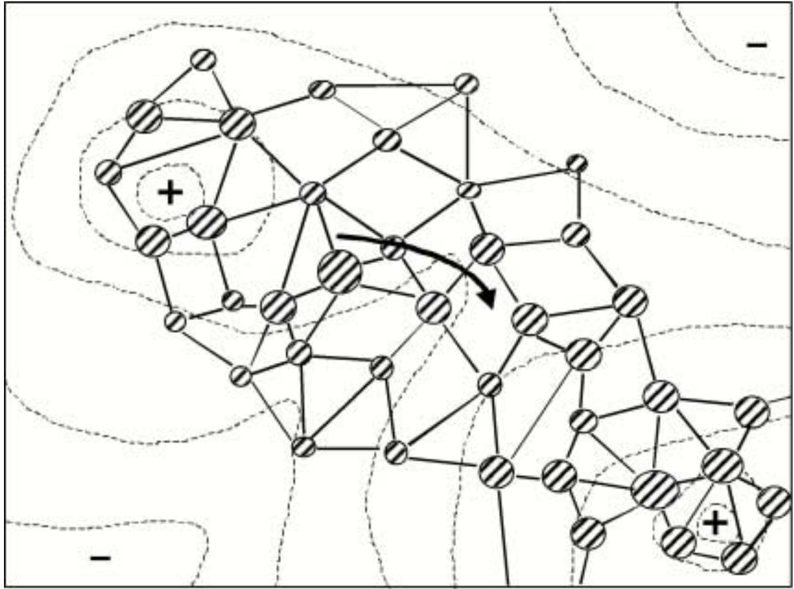  
Figure 1: Demes shifting from one peak to another on a topographical representation of a fitness landscape (based on a diagram from Wright (1932)).

1. An exploratory phase, in which random genetic drift plays an important role in allowing small populations to explore their adaptive topography.

2. A phase of mass selection, in which favorable gene combinations created by chance in the random drift phase rapidly become incorporated into the genome of local subpopulations by the action of natural selection.

3. A phase of interdeme selection, in which the more successful demes increase in size and rate of migration; the excess migration shifts the allele frequencies of nearby population until they also come under the control of the higher fitness peak. The favorable genotypes thereby become spread throughout the entire population in an ever-widening distribution. Where the region of spread from two such centers overlaps, a new and still more favorable genotype may be formed and itself become a center for interdeme selection. In this manner the whole of the adaptive topography can be explored, and there is a continual shifting of control from one adaptive peak to control by a superior one.9

In the above explanation the term random drift refers to a statistical process that occurs in populations because of the random sampling of alleles produced by random mating. This effectively causes a random walk in the relative proportions of two competing alleles; the smaller the population, the more erratic the random walk. Wild swings in the proportion of the two alleles can, in very small populations, even eliminate an allele independent of the selective value of that allele. Wright’s visualization of the demes moving from one peak to another in a fitness landscape can be seen in Figure 1. However, when viewing the diagram, keep in mind that the landscape is a “fitness” landscape, not a geographical one, and the demes consist of genetically similar individuals, not necessarily spatially local individuals (although Wright views the first as being implied by the second).

# Ch2 §2 The Deme Approach in the GA Literature as Inspired by the Shifting Balance Theory

Wright’s ideas have been popular in the GA community, with many authors quoting his theory (often referred to as Sewall Wright’s demes10) when justifying the introduction of a novel feature in their GA implementation. This is particularly true in parallel GA research. There are two basic techniques used when creating parallel GAs, both of which use the term ‘demes’ to indicate a mating pool of individuals locally clustered geographically: the fine-grained model and the coarse-grained model (which is also called the island model).

# Ch2 ß2.1 Parallel GAs and Wrightís ëDemesí

The island model is used with coarse-grained parallel machines (machines with a few very powerful processors - anywhere from 4 to 128 nodes), hence the term coarsegrained model. Each processor runs a normal GA on its own subpopulation or deme 11. For all of the demes, the GAs act on the same fitness function during selection, although the various populations are different from one another because of the random process of chromosome creation. Furthermore, each deme may evolve in different directions due to the probabilistic nature of evolution. Periodically, migrants travel between processors bringing new - possibly better - genetic material from other demes. Usually the members of a population chosen to be migrants are the elite of the population. This basic mechanism has been independently “discovered” many times over; see (Cohoon, Hegde et al. 1987), (Pettey, Leuze et al. 1987), (Tanese 1987), and (Whitley and Starkweather 1990).

The association of Wright’s SBT with the island model style of parallel GA was first done by (Cohoon, Martin et al. 1991):

The population structure is based upon demes, as Wright describes, “Most species contain numerous small, random breeding local populations (demes) that are sufficiently isolated (if only by distance) to permit differentiation…”12 … Wright conceives the shifting balance to be a micro-evolutionary mechanism, that is, a mechanism for evolution within a species. For him the emergence of a new species is a corollary to the general operation and progress of the shifting balance. 13

Cohoon, et. al., then uses Wright theory via Eldrege and Gould’s theory of punctuated equalibria to justify their use of the island model.

The second approach to the parallelization of the GA is the fine-grained approach. Here fine grained parallel machines (machines with small, fairly weak processors at each node but comprising a large numbers of nodes: anywhere from 516 to 64k) are used, with each processor holding only a single member of the population. ; Each member is only allowed to mate with its nearest neighbours or possibly within a small neighbourhood. This design decision is motivated by the fact that the fastest communication happens among neighbors. The neighbors can be arranged in various topologies such as a chain (or circle), grid (or toroid), or a hypercube. Diffusion of genetic information occurs because neighborhoods overlap. These neighborhoods are identified in many publications as demes 14. As with the island model, the continuous model was frequently rediscovered by various researchers. For example see (Gorges-Schleuter 1989), (Manderick and Spiessens 1989), (Mühlenbein 1989), (Hillis 1991), (Collins and Jefferson 1991), (Davidor 1991), and (Spiessens and Manderick 1991).

Like the island approach, Sewall Wright’s SBT is invoked as a justification of a parallel approach which uses spatially restricted mating. This is explicitly mentioned in both (Gorges-Schleuter 1989) and (Collins and Jefferson 1991).

Gorges-Schleuter begins by presenting the problems inherent in the use of a single population and then quotes Wright:

According to Wright … the most favorable population structure is one “subdividing the species into local populations (demes) sufficiently small and isolated that accidents of sampling may overwhelm many weak selection pressures. There must, however, be enough diffusion that a deme that happens to acquire a favorable interaction system may transform its neighbors to the point of autonomous establishment of the same peak, and thus ultimately transform the whole species or at least that portion of it in which the new system actually is favorable.”15

She then proceeds to construct a double ring toroid of processors where mating only occurs between neighbours (which was called the “neighbourhood model”) where presumably the local mating demes are “sufficiently small and isolated that accidents of sampling may overwhelm many weak selection pressures”.

Collins et. al. wish to invoke the efficacy of Wright’s SBT in their fine grained system, but see a problem with the contiguous nature of a grid not allowing the formation of the sought after demes. They therefore invoke isolation by distance:

One of the basic assumptions of Wright’s shifting balance theory of evolution is that spatial structure exists in large populations … The structure is in the form of demes, or semi-isolated subpopulations, with relatively thorough gene mixing within a deme, but restricted gene flow between demes. One way that demes can form in a continuous population and environment is isolation by distance: the probability that a given parent will produce an offspring at a given location is a fast-declining function of the geographical distance between the parent offspring locations. Wright’s theory of evolution has played a role in the design of several parallel genetic algorithms…16

The other parallel GAs mentioned in the last sentence were: (Gorges-Schleuter 1989); (Mühlenbein 1989), which was a companion piece to the Gorges-Schleuter paper; (Spiessens and Manderick 1991) who do not actually quote Wright nor use the word deme as far as I can tell; and a paper by the authors themselves in ALIFE II (Collins and Jefferson 1991). All references were to fine-grained systems. This ignores the use of Wright’s theories by the creators of coarse-grained models to justify their style of parallelism. The two styles of parallelism are very different and it is hard to see how the shifting balance theory could be invoked to support both simultaneously.

# Part 1

# Ch2 ß2.2 Sewall Wright, Demes and Sequential GAs

Taking inspiration from Wright’s shifting balance theory and its use of interdemic selection is not exclusive to parallel implementations of the GA. This more restrictive mating policy has been used for sequential GAs with moderate success over the more global mating strategies.

The use deme in sequential GAs are similar to the fine-grain model in parallelism. In (Pál 1994) the favoured topology is a simple ring with mating restricted to contiguous members. The more common toroidal topology is used in (Sarma and De Jong 1999) and (Sumida and Hamilton 1994). Sumida and Hamilton restrict mating to the eight contiguous members surrounding a cell in the toroid, while occasionally allowing a more panmictic approach to mate selection with long distance mating. Sarma and De Jong devised a measure to allow modification of the size of the mating neighborhood17 when applying their system to a particular problem; potentially, therefore the system can be tuned from a global mating strategy down to the simple nearest neighbour mating. Sarma and De Jong claim that smaller neighbourhoods decrease the selection pressure felt by an individual in the population.

Both Sumida and Hamilton, and Collins explicitly make use of the Wrightian term Deme. Sumida and Hamilton go further, explicitly mentioning Wright and designing their algorithm with the view of its justification through the SBT:

Populations of organisms which inhabit the natural world are usually clustered into groups of individuals. For a population of a given size, having its members compete and mate largely within groups greatly alters its properties under natural selection. Sewall Wright (1969 and earlier) was the first to give serious attention to this fact and developed a body of theory describing what he called a ‘shifting balance’ referring to alternative adaptations and levels of adaptation among semiisolated populations18.

# Part 1

Unlike most other researchers that quote Wright, Sumida and Hamilton recognize that small demes are used in the theory to promote random drift in order to escape from the dominion of a local maximum:

Such partial isolation is highly preservative of global population variation (Wright 1931) and from the point of view of evolution becomes most creatively so if the demes are small because isolation facilitates random genetic drift (Futuyma 1986). Since drift is a non-directional process, in the ensemble all directions of drift are experienced, including, at times, different allele and genotype fixations; hence the ensemble stores variability. Adding natural selection Wright saw that (a) different adaptive peaks would tend to be attained in different demes, and (b) by a combination of drift and migration, demes finding superior peaks could transform neighbouring demes to their discovery19.

Sumida and Hamilton attempt to keep close to the SBT method of allowing random drift to dominate the small demes via local spatial mating and yet allow more global interdemic interactions by probabilistically allowing long distance mating.

# Ch2 §3 Problems With the SBT, both in Theory and in Practice

While all of the above deme models, both parallel and sequential, may be interesting in their own rights, they are not similar enough to the SBT in either form or purpose to claim direct descendance from it, as some of their authors purport. In fact, in view of the basic difference of the two approaches to parallelization, it is hard to see how the shifting balance theory could be invoked to support both simultaneously.

Of course not every implementor of a deme based GA makes such a claim. However, even those who directly mention Wright and the shifting balance theorem are really not making any attempt to hew closely to the theory and are just using it to support their system through analogy. For example most do not comment on the importance of random drift, and just mention that Wright proposed that interdemic selection was a powerful mechanism in natural evolutionary processes. To properly acknowledge the use of the mechanism one would have to ensure that the deme sizes are kept small enough for random drift to take effect and gain purchase on the footholds of a new maximum. Usually no special attention to the deme size is given for such a purpose and if the demes are in fact kept to a proper minimal size it is done by chance and not through experimentation or theoretical reasoning.

One exception to those who do not pay close attention to the details of Wright’s theory is Sumida and Hamilton. They purposely keep the demes in their system small in order to facilitate the random drift that Wright postulated was necessary. They also attempt to model interplay between demes allowing for more distant communication to periodically occur. It is questionable, however, whether these long distance communications are what Wright had in mind when he talked of interdeme selection and the shift in balance between random drift and selection. Furthermore, Sumida and Hamilton do not appear to have made any attempt to determine whether their deme size was small enough to promote random drift. Nor did they determine whether the interconnectedness fostered by long distance mating was effective enough to allow selection to shift the balance of the mass of the population onto the new hill and proceed to climb it.

However, even if the SBT were implemented exactly according to specification, there would still be a very large problem attendant on its use: the theory as it stands is unfortunately inconsistent. The SBT depends quite heavily on balancing two evolutionary pressures against each other. Random drift is needed to cross the low fitness valleys, while selection is needed to climb the hills once the valleys have been crossed. Yet the two mechanisms cannot be invoked simultaneously. Random drift is dependent on small populations to operate while selection is effective in large populations. Indeed the very effects that are to be obtained through both are mutually exclusive since one cannot climb a hill and descend through a valley at the same time. Keeping the deme populations of middling size would simply restrict the efficacy of both and not let either excel; thus there can even be no compromise. Wright seemed to have the notion of segregating many small demes for the time necessary to fix various traits through random drift, then reintegrate them back into a larger population to shift the genetic makeup of the whole, but never made clear the details.

This defect in the theory is well know in the biological community. From Hartl and Clark:

For the theory to work as envisaged, ... [t]he population must be split up into smaller demes, which must be small enough for random genetic drift to be important but large enough for mass selection to fix favorable combinations of alleles. While migration between demes is necessary, neighboring demes must be sufficiently isolated for genetic differentiation to occur, but sufficiently connected for favorable gene combinations to spread.20

Consequently, while the SBT has been very useful in genetics as a metaphor to aid the visualization of the process of evolution, very little work has been done to verify whether it correctly describes evolution. This is primarily because much of it is untestable. Once again from Hartl and Clark: “Because of uncertainly (sic) about the applicability of these assumptions [mentioned in the previous quote], the shifting balance process remains a picturesque metaphor that is still largely untested.”21

This balancing act of deme sizes, small enough for random drift but large enough for selection to occur, seems to be a giant impediment to implementation. What is the right size? Is there a right size; or are the two mechanisms of random drift and selection largely exclusive? These questions are not addressed by any of the GA implementors.

# Chapter 3

# Abstracting the SBT: The Shifting Balance Evolutionary Algorithm

# Ch3 §1 The First Level of Abstraction: Core Group and Colonies

The SBT holds out the hope that, through its incorporation into the GA it will overcome the problem of prematurely converging on local maxima. Yet the SBT by itself is of questionable worth because of the contradictory reliance on both random drift and selection. To obtain the benefits of the theory without its drawbacks, the SBT itself will have to change.

One way to ‘balance’ the behavior of random drift and selection is to drop one in favour of the other. Of the two, keeping random drift would be a poor choice, after all random drift is just that – random. Selection on the other hand is more pliable. While selection does allow for the maximization of an objective function, it can be converted so that local maxima can be eschewed and valleys crossed. This can be accomplished by recognizing that maximizing the optimization function need not be the only trait selected for.

It is by the combination of isolating subpopulations and using differing selection criteria in each that the ends of Wright’s theory can be obtained without resorting to his conflicting means. The majority of the members continue to optimize the objective function. Smaller demes are created and given different environments in which to evolve. If these environments are different enough from that of the main population, the various local maxima will be in different positions in the gene space. Therefore the selection pressure in each deme will force the members within it to converge on these other maxima. Since the positions of these maxima are shifted from that of the main population, so too will be the members under its purview. Consequently, any members that migrate from the smaller demes to the large deme will no longer be in the same location in the gene space. If there are enough small demes, then migrants from those demes will be occasionally be on a larger hill when evaluated by the objective function of the large population. The genetic makeup of these members will begin to dominate in the large population, and shift its position in gene space to the newly found hill. Note the effect of the shifting balance is felt with only selection applied throughout. There is thus no need to balance two contrary forces to shift the balance of a population.

The following summarizes the first level of abstraction (see Figure 2). A large central population, which shall be called the core, experiences a single environment and consequently is under the selective pressure of a single fitness landscape. While adapting to this landscape the core can get stuck on a local maximum, at which point no evolutionary progress is occurring. However, the core is constantly sending out members to peripheral groups called colonies. The members within these colonies find themselves in a different environment; hence each experiences a fitness landscape different from that of the others and of the core group. Consequently the new landscape for each colony may not have the same local maximum as the landscape of the core group. The colonies are then forced to adapt through selection to these new landscapes, thus changing the genetic makeup of its constituents. The modified colony members who migrate back to the core are now different from its members. Furthermore they may be on a better hill in the fitness landscape of the central area. Thus, through the use of the colonies, the species as a whole can now jump over valleys in the fitness landscape and continue to evolve.

Note again that the new model only depends on selection. While random drift may occur, it can only help add to the variation being produced by selection, and is not mandatory to the system anymore. Furthermore, the population sizes of the colonies, while much smaller than the core group, are set large enough to prevent undue effects due to random drift.

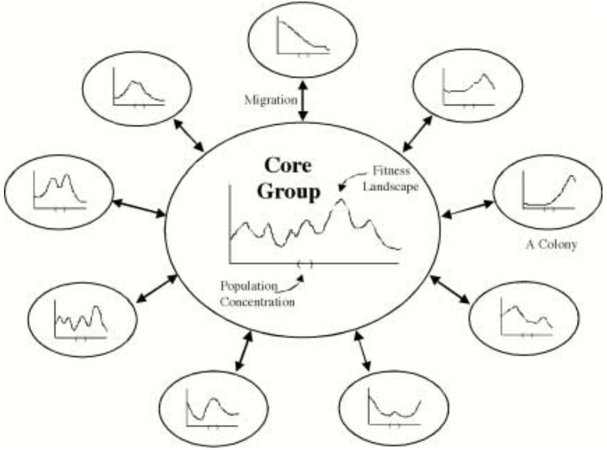  
Figure 2: A depiction of the new Shifting Balance Theory

Part 1

# Ch3 §2 The Colonies as Exploratory Sub-Populations: A Further Abstraction

# Ch3 ß2.1 Fitness in the Colony

The reader will have noticed that the colonies are supposed to be in different fitness landscapes yet no method exists in the model to determine how the environments should differ from that of the core. Specifically, these environments should be capable of moving the system off of local maxima. What property of the alternative fitness functions would allow them to push the system away from a local maximum?

The alternate fitness functions in the colonies encourage them to search in different areas of the search space. Any mechanism that encourages such an exploration will thus achieve the goal of moving the system away from a local maximum. Now, instead of trying to create new fitness functions to do this, perhaps we could directly determine whether the colony is searching in the same area as the core group. If the system can identify that such an overlap is occurring, then the colony is not performing its duty and should be moved elsewhere.

The above analysis makes it clear that we need a mechanism to relocate the population to other places in the search space independently of the selection pressure, thus escaping from a local maximum. To relocate a population away from a local maximum, other researchers resort to a blind restart mechanism, see (Eshelman 1991), (Whitley, Mathias et al. 1991), (Cobb and Grefenstette 1993), (Jones 1995) and (Maresky, Davidor et al. 1995). It would be preferable if such draconian measures are not resorted to.

Fortunately a more evolutionary alternative is available. If we had a method of determining whether the colony is searching in the same area as the core, then we could use this to determine whether a colony is searching in novel territory. This ‘distance’ to the core could then be used as a selection criterion for the members in the colony: the members will be selected for reproduction according to an amalgamation of their ‘distance’ from the core the objective function rather than according to the objective function alone. They will evolve into a new area of the search space.

If selection based on ‘distance’ to the core is used exclusively, the colonies will just move as far from the core as possible. This will most likely send them into unpromising territories. A balance must therefore be kept. The colonies must be allowed to search for good solutions (using the regular fitness function) when searching in areas where the core is not; when searching in the part of gene-space near the core, they must be selected for distance from the core, thus moving them away.

While this new abstraction may seem to be a more radical departure from the SBT than the first, it is actually only an extension of it. The original modification of the SBT required environments in the colonies that were slightly different than the environment in the core. How those environments were to have become different was not specified. With the new abstraction, the new colony environment is differentiated from that of the core through the direct means of determining where the core is and changing the environment such that it rewards members that are further from the core as well as members that are maximizing the objective function. The colony environment is therefore slightly different from that of the core, with local maxima positioned away from the local maximum where the core is trapped. Hence the new abstraction is merely an amendment to the first and not a replacement.

# Ch3 ß2.2 Prevention versus Promotion of Inbreeding

Selecting for dissimilarity to core which is being done in the colonies has its analogy in nature apart from Sewall Wright’s theory. If one selects among individuals that differ from a given group, one is preventing inbreeding. In the modified SBT, the colonies are specifically bred to be different from the core, and so when introduced back into the core, through migration, variety is generated. It is just this variety that the SBT wants to promote.

Indeed, mechanisms to prevent inbreeding are known in both biology and the evolutionary computation literature. Selective mating in mice was found to promote outbreeding (Potts, Manning et al. 1991). The dispersal of birth and breeding sites in birds is correlated to less inbreeding and higher diversity (Greenwood, Harvey et al. 1978).

In evolutionary computation, there are three main techniques to prevent inbreeding: incest prevention, crowding and fitness sharing. Incest prevention was introduced by (Eschelman and Schaffer 1991) in their CHC implementation of the GA. Here chromosomes with Hamming distances below a certain threshold were prevented from mating. In crowding, mating takes place as usual, but the offspring is inserted back into the population replacing the individual most similar to it, again as measured by the Hamming distance, see (De Jong 1975) and (Goldberg 1989) for details. Steady state GAs, such as Whitley’s GENITOR program, also employ this technique, although they commonly overwrite the most poorly fit individual as opposed to the most genetically similar, see (Davis 1991) and (Whitley 1989). Finally, fitness sharing divides the fitness of similar individuals, again as measured by the Hamming distance, thus promoting the selection of individuals that are more distinct in the population (Goldberg and Richardson 1987). Both crowding and fitness sharing have been used to tackle multi-modal fitness functions.

The SBT, while focused on increasing variety, does not do so by preventing inbreeding – rather, it actively promotes it! The effect of having a small deme size to encourage random drift is to increase inbreeding. This is not an unwanted side effect, but rather an actively pursued feature of the model. Wright felt that the deleterious effects of inbreeding were offset by the ability of inbreeding to bring to light yet undiscovered traits. Once this was accomplished, the crossbreeding between demes would ‘restore vigor’. In Wright’s own words:

Progress by ordinary selection of individuals would thus be very slow or nil. A single unfortunate selection of a sire, good as an individual, but inferior in heredity, is likely at any time to undo all past progress. On the other hand, by starting a large number of inbred lines, important hereditary differences in these respects are brought clearly to light and fixed. Crosses among these lines ought to give a full recovery of whatever vigor has been lost by inbreeding, and particular crosses may be safely expected to show a combination of desired characters distinctly superior to the original stock. Thus crossbred stock can be developed which can be maintained at a higher level than the original stock, a level which could not have been reached by selection alone22.

William Provine notes Wright’s emphasis on inbreeding and its use as the foundation of the shifting balance theory:

Reasoning from his theory of animal breeding to his theory of evolution in nature, Wright proceeded upon the plausible but wholly unproved assumption that evolution in nature proceeded primarily by the three-level process utilized by the best animal breeders: (1) local mass selection and inbreeding, (2) dispersion from the more successful local populations, and (3) transformation of the whole species or breed. He had ample evidence from animal breeders who found that mass selection was frequently a slow, unsure, or even ineffective mechanism for changing gene frequencies; thus, Wright decided that evolution in nature must proceed from a more efficient and effective mechanism than mere mass selection. Judging from animal breeding, he thought that natural populations must be subdivided into small-enough partially isolated subgroups to cause random drifting of genes but large-enough subgroups to keep random drifting from leading directly to fixation of genes, for this was the road to degeneration and extinction. Mass selection within subgroups was followed by selective diffusion from subgroups with successful genetic combinations. The final step was the transformation of all subgroups by the immigration of organisms with a superior genotype and subsequent crossbreeding23.

Once again Wright is interested in ‘balance’. Instead of trying to enhance variety by discouraging similarity, he uses inbreeding to cause random drift. This promotes exploration. The resulting instability is balanced by integrating the small populations into a large one where selection, with increased variation, can take place. The problem is in regulating the proper balance.

With the modified and abstracted SBT this balance becomes unnecessary, as does the reliance on inbreeding. The exploration is done by the colonies while the exploitation is left to the core. Furthermore, unlike the inbreeding prevention mechanisms incorporated into many EC systems, the wanted variety is produced directly, by selecting for it, and not circuitously, by the prevention of similarity through the reduction of inbreeding.

# Ch3 §3 The Shifting Balance Evolutionary Algorithm

Throughout the above exposition, all comparisons and analysis have been done with respect solely to the genetic algorithm. This was done for two reasons. Firstly, the literature on the GA is far more extensive than that of ES, which has been primarily restricted to German researchers, and EP, which, while contemporaneous in creation with GAs, has only recently begun to attract attention. Secondly, I am more familiar with the GA oeuvre and so am much more familiar with the many variants that exist.

However, if one examines the motivation of the SBT, and the generality of the abstraction, it should be obvious that colonies can be added with potentially great effect to any evolutionary method provided multiple populations with immigration are not already present and so cannot come into conflict. Consequently, the abstracted shifting balance theory will be called the Shifting Balance Evolutionary Algorithm (SBEA). The SBEA can be specialized by inserting the EC method of choice for the evolution of each population, thus obtaining the SBGA, SBES and SBEP.

Unfortunately, the SBEA as presented in this chapter is incomplete. For clarity of exposition, many details were glossed over so the broad outline could be observed. For example the frequency of the migration and the method by which the migrants are to be integrated into the core was not mentioned.

The largest oversight occurs with the assumption that we can detect whether a colony is searching in the same area of the core, and if so, moving it elsewhere through selection. How is this to be accomplished? We would need to know where the core is in gene space, where the colony is, and how much the two overlap each other. However, there is no theory present in the GA literature to be used for these purposes.

In fact this is another restriction on the applicability of the SBEA as an extension for a given EA. A definition of distance between chromosomes and populations must be derivable, computationally feasible and of a sufficiently small time complexity so that the EA is not slowed inordinately.

That shall be the task of the next part of the dissertation: determining distances between chromosomes and populations for some popular evolutionary systems.

# PART 2WHERE IS ELSEWHERE

# Chapter 4

# Introduction

# Ch4 §1 Landscapes, Manifolds and the Fitness “Field”

Sewall Wright introduced the concept of the fitness landscape to genetics. However, the details were kept vague. In fact his concept of the fitness landscape differed over various publications, see (Provine 1986). This is not because Wright was a sloppy thinker. In biology what is a fitness landscape is indeed hard to define; after all, the real world is not neat and tidy. In nature the fitness is not absolute but relative. The genome is not a rigid, fixed length string of information, but a dynamic string of base pairs, with section being inserted, deleted, and transposed from one location to another. Keeping a stable notion of the conception of the fitness landscape in all that instability is not a simple task; it may even be untenable.

In the world of Evolutionary Computation, things are more sedate. In fact they are deceptively simple. Chromosomes have fixed lengths, and the vast majority of fitness functions encountered are unvarying with a single global optimum to aspire to. Consequently the notion of a fitness landscape is second nature to the GA researcher, who talks with ease about hill climbing and basins of attraction.

However the landscape analogy is just that: an analogy. A landscape or surface is closely tied to geometry where it is defined as a subset of a space (frequently defined by a function) that locally behaves like a plane. This is not the case with the fitness function: its values are not drawn from the same field that the chromosomes are drawn from (although when presented as a graph it does looks that way), and it certainly need not, and generally does not, behave locally as a plane. Yet there must be a connection, for the terms ‘hill climbing’ and ‘basins of attraction’ intuitively make sense.

One of the strongest images from the landscape analogy is that of hill climbing. From this vision comes the need to recognize an ordering of the chromosomes. The task of finding your way amongst the Himalayan mountains would be made much simpler if the longitudes and latitudes would rearrange themselves to form a single, easy to climb, hill; that they don’t makes navigation among the Himalayas quite difficult. Yet, when there is no order in the search space, all search but exhaustive search becomes futile. Consequently, it is the ordering among the chromosomes that makes the finding of the global optimum easy or hard. It is this idea that needs to be maintained if we move to a new metaphor.

The shift in metaphor is only a slight one: moving from those of landscapes and surfaces to that of scalar fields. A scalar field comprises an Euclidean space (normally ${ \mathrm { E } } ^ { 3 }$ ) where each point is associated with a scalar value. This only differs slightly from a surface or landscape24 where each value associated with a point in the Euclidean space, must be itself drawn from the same Euclidean space albeit from a different dimension. There is no such restriction on a scalar field. Examples from physics are temperature fields, pressure fields, and potential energy fields (from which Simulated Annealing likes to draw its analogy).

Of course the scalar field analogy is also just an analogy. There are two ways in which that analogy breaks down. First, scalar fields are normally differentiable, while fitness values frequently are not. Second, the ordering among chromosomes does not in any way constitute an Euclidean space. Now, a differentiable surface in a non-Euclidean space is called a manifold. So the fitness function on top of an ordered set of chromosomes seems to be a cross between a scalar field and a manifold, except it need not be differentiable. This then is the structure we are really trying to analyze.

# Ch4 §2 Ordering the Chromosomes: Gene Space, Chromosome Space and Population Space

The model that is used in this dissertation distinguishes the underlying topological space that results from the reproductive operators acting on the genomes in an EC system from the fitness field that lies above it. Reproduction can be thought of as a means of transforming one chromosome into another. The ease in which it is possible to do so determines the topology of the space, i.e. the general ordering of the positions in the space. This topological space shall be identified as gene space or chromosome space (the two terms will be used interchangeably).

Deciding where you go next in gene space is a function of selection, which acts on the scalar fitness field. While knowing where the EC system will go next is definitely of interest, it is irrelevant to knowing where ‘elsewhere’ is. The gene space tells us where we are; fitness and selection tell us where to go. Since, for the purpose of this dissertation, we are interested in knowing where we are in gene space, this chapter will focus on developing the mathematical tools and systems necessary for answering that question. Consequently, no consideration will be paid to the selection operator, and the fitness function and fitness values will rarely be discussed, except when we need to see if the topological space will support an appropriate scalar fitness field.

In the third chapter of this part it will be argued that chromosome space is insufficient to allow a complete representation of fitness as a scalar field. To do so, we will introduce the concept of population space: the relative positioning of two populations in population space that forms the answer to the question “where is elsewhere?”

# Ch4 §3 Distances, Metrics and Norms

# Ch4 ß3.1 Distances and Metrics

In the previous section we discussed the need to develop gene space, i.e. a topological space for the chromosomes. As we proceed to find such space it will become obvious that, with the possible exception of the space induced by the crossover operator, all potential gene spaces invariably turn out to be metric spaces. Therefore a definition of both ‘distance’ and its corresponding concept the ‘metric space’ is presented here. This definition will be referenced extensively throughout the next few chapters.

A metric space is a set of points with an associated “distance function” or “metric” on the set. The distance function must have 4 properties to be called a metric: it must be symmetric, non-negative, be equal to 0 if and only if it is a distance between a point and itself, and obeys the triangle inequality. In other words, a distance function $d$ acting on a set of points $X$ is such that $d { \because } X \times X \to R$ , and that for any pair of points $x , y \in X$ , the following properties hold:

$\mathbf { M _ { 1 } }$ $\mathbf { M } _ { 2 }$ $\mathbf { M } _ { 3 }$

$$
\begin{array} { c } { d ( x , y ) { = } 0 \ \operatorname { i f f } x = y } \\ { d ( x , y ) { = } d ( y , x ) } \\ { d ( x , y ) { \geq } 0 } \end{array}
$$

as well as a fourth property: for any 3 points $x , y , z \in X$ ,

$\mathbf { M _ { 4 } }$

$$
d ( x , y ) + d ( y , z ) \geq d ( x , z )
$$

(Triangle Inequality)

If for $x \neq y$ , $d ( x , y ) = 0$ , which is a violation of $\mathbf { M } _ { 1 }$ , then $d$ is called a pseudo-distance or pseudo-metric. If $\mathbf { M } _ { 2 }$ does not hold, i.e. the ‘distance’ is not symmetric, than $d$ is called a quasi-metric. If $\mathrm { M } _ { 4 }$ (the triangle inequality) does not hold, $d$ is called a semi-metric. Finally note that if $d$ is a proper metric then $\mathbf { M } _ { 3 }$ is redundant, since it can be derived from the three other properties when $z$ is set equal to $x$ in $\mathrm { M } _ { 4 }$ .

There are many different metric definitions possible on a given set. Consequently it is important to choose a definition that most closely matches the properties of interest. In (Jones 1995), it was pointed out that if one wants to analyze the behavior of a GA, or any evolutionary system, one should focus on the genetic operators25. After all, it is the genetic operators that are responsible for producing the next solution or set of solutions in one time step, i.e. they drive the search. Consequently the distance between chromosomes should be a function of how many genetic operations are needed to transform one chromosome into the other.

# Part 2

# Ch4 ß3.2 Norms

A second concept of great importance for the few chapters, and one that is closely related to distance, is ‘the norm’. A norm is a function applied to a vector in a vector space26 that has specific properties. From the Schaum’s Outline on Topology27 the following definition is given: “Let $\mathbf { V }$ be a real linear vector space …[then a] function which assigns to each vector $\nu \in \mathbf V$ the real number $\lVert \boldsymbol { \nu } \rVert$ is a norm on V iff it satisfies, for all $\nu , w \in \mathbf { V }$ and $k \in \mathbf { R }$ , the following axioms:

$[ \mathbf { N _ { 1 } } ]$ v $\geq 0$ and $\left\| \mathbf { \boldsymbol { \nu } } \right\| = 0$ iff $\nu = 0$ . $[ \mathbf { N } _ { 2 } ]$ $\begin{array} { l } { \displaystyle \| \nu + w \| \leq \| \nu \| + \| w \| . } \\ { \displaystyle \| k \nu \| = | k \| \nu \| . } \end{array}$ $[ \mathbf { N } _ { 3 } ]$

The norm properties hold for each of the following well-known (indexed) functions:

$$
\mathrm { L } _ { \mathrm { k } } - \mathrm { n o r m } = \left\| < a _ { 1 } , . . . , a _ { m } > \right\| = \sqrt [ k ] { \sum \left| a _ { i } \right| ^ { k } } \ .
$$

Taking the limit as $k \to \infty$ of the $\mathrm { L } _ { k }$ -norm produces the $\mathrm { L } _ { \infty } - \mathrm { n o r m }$ :

$$
\mathrm { L } _ { \infty } \mathrm { - n o r m } = \operatorname* { m a x } \left( \left| a _ { 1 } \right| , \left| a _ { 2 } \right| , . . . , \left| a _ { m } \right| \right) .
$$

The norm combines the values from the various dimensions of the vector into a single number, which can be thought of as the magnitude of the vector. This value is closely related to the distance measure. In fact, it is well known that every normed space (a vector space with a norm defined on it) is a metric space:

Theorem 1 Let $\mathbf { V }$ be a real linear vector space, and let $\nu , w \in \mathbf { V }$ . Then $\| \nu - \nu \|$ , the norm of the difference between any two vectors, is a metric.

Proof. To show that $\| \nu - \nu \|$ is a metric, all properties, M1 through M4, must hold. First notice that both $\mathbf { M } _ { 1 }$ and $\mathbf { M } _ { 3 }$ are a direct consequence of $\Nu _ { 1 }$ . Next the symmetry requirement $\mathbf { M } _ { 2 }$ can be derived from $\Nu _ { 3 }$ aided by two properties of vector spaces: the commutativity of addition and behavior of scalar multiplication. Finally $\mathrm { M } _ { 4 }$ , the triangle inequality, follows directly from $\Nu _ { 2 }$ . ❚

The vector space $\mathbf { V }$ , along with a norm on $\mathbf { V }$ is called a normed space. Since, from Theorem 1, the norm of the difference between vectors is a metric, it follows that any norm space is also a metric space. This property of norms will be referenced extensively throughout the next few chapters.

The most recognizable distance produced by a norm on a vector space is the Euclidean distance. The vector space upon which the Euclidean distance acts is built from the real number scalar field. The Euclidean distance is just the $\mathrm { L } _ { 2 }$ -norm applied to the difference between vectors in this vector space, and the Euclidean space is the metric space associated with this distance. For example, the Euclidean distance $\overset { \cdot } { d } \left( \vec { x } , \vec { y } \right) = \sqrt { \left( x _ { 1 } - y _ { 1 } \right) ^ { 2 } + \left( x _ { 2 } - y _ { 2 } \right) ^ { 2 } + \left( x _ { 3 } - y _ { 3 } \right) ^ { 2 } }$ on the set of points in $\mathrm { R } ^ { 3 }$ , which is formed from the L2-norm of the difference vector ${ \vec { x } } - { \vec { y } }$ , produces the $3 ^ { \mathrm { d } }$ Euclidean metric space $\mathrm { E } ^ { 3 }$ .

Other metric spaces can be induced through the use of different norms on the same vector space. For example if we take the $\mathrm { L } _ { 1 }$ -norm on a vector difference in the same vector space as used for the Euclidean spaces, we get another well-studied distance, the ‘taxicab driver’ or ‘Manhattan’ distance. This distance is so named because it represents the distance that a taxicab must travel from one address to another following the streets in a grid-like city such as Manhattan. For example, using the same 3-dimensional vector space as we used for the Euclidean distance example, the corresponding Manhattan distance between two vectors, $\vec { x }$ and $\vec { y }$ , is $d ( { \vec { x } } , { \vec { y } } ) = \left| x _ { 1 } - y _ { 1 } \right| + \left| x _ { 2 } - y _ { 2 } \right| + \left| x _ { 3 } - y _ { 3 } \right|$ .

In Summary, there are two important aspects of the norm: its ability to combine values into a single number called the magnitude and its ability to produce metric spaces by determining the magnitude of vector differences. In this chapter both aspects will both be used extensively.

# Part 2

# Ch4 $\ S 4$ Outline of the Chapters for “Where is Elsewhere”

Discovering where “elsewhere” is, is perhaps the most complex part of the dissertation. Consequently it has been divided into four chapters, each of which builds on the previous ones.

The current introductory chapter has presented the concepts of distances, norms and spaces upon which everything else is built.

The next two chapters deal exclusively with GA style binary and symbolic chromosomes. The first of the two chapters looks at chromosome space, starting with the standard Hamming space and building towards a more realistic picture of the search space as influenced by the workings of the Genetic Algorithm, although this goal is never quite attained. The chapter following explores the notion of population space, which has not been previously examined by the GA community. In the final chapter on “Where is Elsewhere”, we turn our attention to systems that use numeric chromosomes, such as EP and ES. The chromosome space and population space for such systems are developed and examined, culminating in a comparison and generalization of the various techniques used to determine gene space for both symbolic and numeric genes.

# Chapter 5

# Chromosome Space

# Ch5 §1 Introduction

In this chapter we will look at chromosome space, the topological space induced by reproductive distance between chromosomes when population effects are not taken into account. This is the traditional way of viewing gene space. Although in the next chapter we will abandon chromosome space in favour of population space, it is still important to develop it in detail since the distance between populations will be based on the distance between chromosomes.

In evolutionary computational systems there are two very different ways of representing genes and alleles: symbolically, where the genes are drawn from an n-ary alphabet, and numerically, where the genes can be either integer or real valued. Traditionally the Genetic Algorithm uses symbolic genes, while Evolutionary Strategies and Evolutionary Programming use numeric genes. The composition of the genotype has a substantial effect on the means of computing distances between chromosomes; consequently the two different encoding schemes will be dealt with separately. Since the main focus of this dissertation will be on the GA, this chapter will focus solely on the chromosome space of a typical GA that uses symbolic genes. The chromosome space for numeric genomes will be deferred to the beginning of Chapter 6, when the topic of EC systems with numeric genes is discussed.

In the present chapter we will justify the use of the Hamming distance as the metric for ‘gene space’, as is traditionally used in the GA literature. This justification is necessary because there are many objections to its use as an accurate model of the GA search. These are discussed, after which a more accurate representation of distance in a simplified GA that just uses the mutation operator is developed. While a true distance between chromosomes for a complete GA system was not successfully accomplished during the course of this dissertation, a general framework, which hopefully will lead to its development, is introduced. Immediately following, an attempt is then made to apply it to a GA system that use crossover only, as well as the full GA that uses both crossover and mutation. This is done in order to delineate the strengths and shortcomings of the framework, as well as derive some useful generalities that can be gleaned even at this preliminary stage.

By the end we will see that the Hamming distance is a good first order approximation of the distance between chromosomes. While not as precise as the actual distance would be, it is accurate enough for the purposes of this dissertation and will stand in its stead as the basis for the distance between populations for the GA that will be developed in Chapter 5.

# Ch5 §2 Hamming Space

# Ch5 ß2.1 Definition

It is traditional in the GA literature to associate the distance between two chromosomes with the Hamming distance. The Hamming distance is a simple measure that just counts up the number of differences between the two strings when compared location by location. To be precise: Let $P$ be a population of chromosomes, and let $x , y \in P$ . If $i$ is a given locus within the string and both $x _ { i }$ and $y _ { i }$ the values of the $\mathbf { X }$ and y chromosomes at that locus, then the distance at a locus $h d _ { l } ( x _ { l } , y _ { l } )$ is

$$
\mathrm { h d } _ { \iota } ( x , y ) = \left\{ { 0 \atop 1 } \right. \quad \mathrm { i f } x _ { \iota } = y _ { \iota }
$$

So, if there are $l$ loci in a chromosome, then the Hamming distance between chromosomes x and y is

$$
\mathrm { \ h d } \left( x , y \right) = \sum _ { i = 1 } ^ { l } \mathrm { h d } _ { i } \left( x _ { i } , y _ { i } \right)
$$

which, when normalized, becomes

$$
\mathrm { \sf h d } ( x , y ) = \frac { 1 } { l } \sum _ { i = 1 } ^ { l } \mathrm { \sf h d } _ { i } ( x _ { i } , y _ { i } )
$$

The Hamming distance superficially has the same form as an $\mathrm { L } _ { 1 }$ -norm applied to a vector difference. However, that difference is not actually one between vectors, rather it is a Boolean distance between symbols; are they the same symbol or not. Consequently, the L1-norm can not really be applied. Be that as it may, the Hamming distance truly is a distance, as all of the distance properties almost trivially hold. Consequently, the Hamming distance forms a metric space from the chromosome set, which we shall call the Hamming space.

Finally, notice that, despite the fact that Hamming distances are thought to be the distance between binary strings, definition (2.1), the distance at a locus, does not depend on the 0s or 1s of a binary alphabet. It just checks whether the symbols at that locus are different, and so add to the distance, or not. This works quite well for symbolic alphabets of any size. Consequently, in the discussion that follows, all concepts will be derived from chromosomes that have been drawn from n-ary (symbolic) alphabets and not just binary alphabets.

# Ch5 ß2.2 Chromosomes as a Coordinate Vector

It seems natural to think of a chromosome of length $l$ as a “vector” of $l$ dimensions, where each locus represents an axis along each different dimension, with the genes being values along the axes, and the particular value at a locus being the coordinate of an axis. This is a valid way of thinking about the chromosome, with a few caveats:

People are used to thinking about spaces with a small dimensionality, one with each axis having many (usually an infinite number of) values as its domain. With chromosome space the opposite is true. We have a large number of dimensions, ranging from dozens to thousands. Meanwhile the values along each dimension is drawn from a very small domain; usually the values 0 and 1. Consequently the space is more difficult to visualize than one might think.

To make matters worse, the values along each axis are unordered. For example, actual DNA is drawn from an alphabet of size 4: adenine, thymine, cytosine and guanine. Is cytosine greater than or less than guanine? The question is silly. There is no ordering! The same holds for any chromosome string drawn from any alphabet, including a binary alphabet. We tend to think of $^ \circ$ as being less than $^ { \mathfrak { c } } 1 ^ { \mathfrak { d } }$ . In a chromosome this is not the case.

There are a couple of immediate consequences of the above points. First, symbolic chromosome space is not a vector space. It is vector spaces that we are most familiar with, and which most of our intuitions are drawn from. That chromosome space is not a vector space is simple to prove. To be a vector space, vector addition must be meaningful. Since chromosome space has unordered values along each axis, addition of any sort is meaningless, and so chromosome space cannot be a vector space.

Furthermore, this means that there is no ‘origin’ of the ‘axes’ in chromosome space, i.e.   
there is nothing special about, say, the chromosome $< 0 0 0 0 0 >$ in 5-space.

While thinking about a chromosome as a set of coordinates is to some degree misleading, as described above, it can help form some useful insights. Consequently, throughout the dissertation we will occasionally make use of the coordinate metaphor when deemed appropriate.

# Ch5 ß2.3 The Hypercube

When the chromosomes are defined over a binary alphabet, the generalized Hamming distance becomes the familiar binary string Hamming distance, and the metric space becomes a hypercube (see Figure 3). Most analysis of the GA that recognizes the need for an metric space underlying the fitness function use the hypercube, see (Goldberg 1989) pg. 53, and (Stadler 1995).

The work by Stadler probably represents the most complex of such analysis (Stadler 1995). Here he attempts to formulate a framework for fitness landscapes that would apply to biological and computational evolutionary systems. Stadler recognizes that the normal $\{ 0 , + 1 \}$ representation of the hypercube coordinate system presents a difficulty for the mathematics. The 0 has special properties in arithmetic, while the symbol $^ { \circ }$ in the hypercube coordinate system does not. Therefore any arithmetic operations done on the coordinate system, such as averaging, will produce biased results. Instead Stadler uses the alphabet $\{ - 1 , + 1 \}$ , which is analogous to the quantum mechanical ‘up’ and ‘down’ spins that an elementary particle may have. Admittedly, the association of $\{ - 1 , + 1 \}$ to the two genes is arbitrary, but no more arbitrary than associating $+ 1$ with up and $^ { - 1 }$ with down. Furthermore, while one gene is not ‘less than’ the other and $^ { - 1 }$ is usually thought of as ‘less than’ $+ 1$ , at least the two coordinate values have the same magnitude and therefore are unbiased under arithmetic. So as long as only magnitudes are considered, this representation is fairly safe.

In physics, a string built from the $\{ - 1 , + 1 \}$ alphabet is, naturally enough, called a string of “spins”28. If the string size is 2, then the structure formed is the ‘spin glass’ or SK model (Sherrington and Kirkpatrick 1975). The generalization to a string of size ‘p’ is called the p-spin model (Derrida 1980). An example of the coordinate for a 3-spin system is presented in Figure 4 along side the normal hypercube coordinate system.

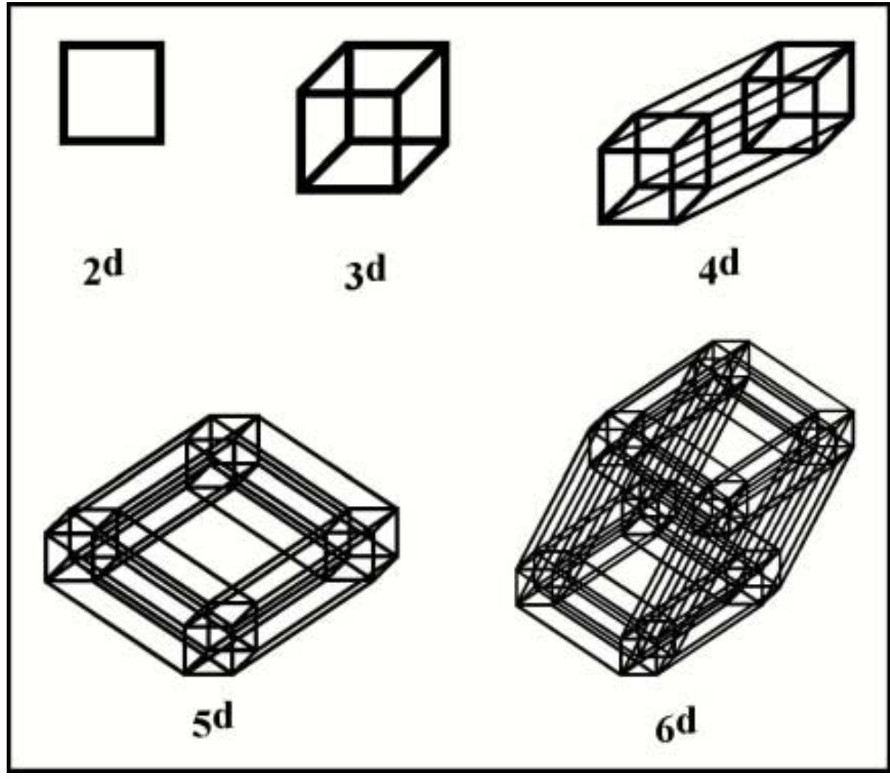  
Figure 3: Hypercubes – From $2 ^ { \mathrm { d } }$ to $6 ^ { \mathrm { d } }$ (to increase dimensionality, duplicate the hypercube and connect the corners)

In this model, if we have a string $\sigma$ of p “spins” $\sigma _ { k } \in \{ + 1 , - 1 \}$ , then a fitness function $f$ on the string s can be decomposed into spins by

$$
f ( \sigma ) = J _ { 0 } + \sum _ { k = 1 } ^ { p } \sum _ { i _ { 1 } < i _ { 2 } < . . . < i _ { k } } J _ { i _ { 1 } i _ { 2 } \dots i _ { 3 } } \sigma _ { i _ { 1 } } \sigma _ { i _ { 2 } } \dots \sigma _ { i _ { k } } ,
$$

where  Ji1i2Ki3 are constants (again from (Stadler 1995)).

The fitness of a chromosome is treated as a random variable, which Stadler calls a random field, which sits on top of the hypercube, if a p-spin model is used, or any other graphs that would be more relevant. He then examines various probability distributions that he associates with the random variables and goes on to prove many, possibly interesting, theorems. Unfortunately, those distributions have questionable relevance to the actual fitnesses used in evolutionary computation, and so his conclusions may not apply to the GA or other evolutionary algorithms.

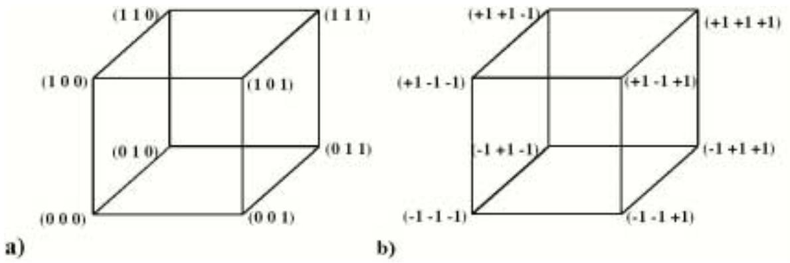  
Figure 4: A $3 ^ { \mathrm { d } }$ hypercube with a) normal $0 / 1$ based coordinate and b) spin coordinates

There is one very interesting aspect of Statler’s ‘fitness landscape’ model: it consists of a fitness field on top of a topological space, which, at a high level, is identical to the model used in this dissertation (see $\mathrm { C h 4 ~ \ S 1 }$ ). However, Stadler is not interested in finding the correct topology to represent gene space. He assumes that it will be some graph structure, possibly the hypercube or some other, more general graph. Instead he focuses his attention on properties of the fitness field as a random field when laid over this chosen graph (in the paper, he analyses a few graphs that he assumes to be relevant to biology and evolutionary computation). Even worse, his model has a complete absence of any population effects. Consequently, aside from his insight into treating fitness as a random field, little in Stadler’s work can be used to answer the primary question of interest in this chapter, “what is the true structure of gene space?”

# Part 2

# Ch5 ß2.4 Distance between Chromosomes $\neq$ Hamming Distance

Until recently it was assumed that the distance between chromosomes could be simply represented through the use of the Hamming distance. This is the basis of using the hypercube as the fitness landscape (see the previous section for a more detailed discussion on this topic). However, this has recently been challenged in two ways (Jones 1995):

It can be argued that the use of the Hamming distance was a result of the undue influence of the written structure of the chromosome, and does not properly represent the process of transition between one chromosome and another. Instead, it was proposed that there should be a set of such spaces29, one for each reproductive operator. This implies the need for two distinct distances, one for mutation space and the other for crossover space30.

In the next three sections we will attempt to develop an appropriate distance between chromosomes by first looking at mutation and crossover separately, then trying to combine them into a single distance.

This last objective is contrary to the one stated in (Jones 1995), where it was believed that each reproductive operator should generate its own space, and be investigated separately. Only afterwards should one combine their effects at a higher level of analysis. However, it must be remembered that ultimately you don’t have, as separate, the various reproductive operators for them to be considered independently; you just have a single reproductive step the changes one chromosome into another. There is only one space that is being examined.

# Part 2

Unfortunately, we will not be wholly successful in creating a metric that properly models the transformation of chromosomes during general GA reproduction. However, we will ultimately show that, surprisingly, the Hamming distance is a robust distance and is a pretty good estimator of the true distance between chromosomes in lieu of developing the actual distance itself. This will suffice for now.

# Ch5 §3 The Mutational Distance between Chromosomes

# Ch5 ß3.1 Problems with using the Hamming Distance as the Distance between Chromosomes under Mutation

While the Hamming distance may not be the proper distance for chromosomes that undergo both crossover and mutation, it still seems intuitive that it should accurately model chromosome distance under mutation alone. However, this does not turn out to be so.

It was pointed out in (Jones 1995) that the use of the Hamming distance assumes that only one locus per generation has been changed. For example, if two chromosomes were a Hamming distance of three apart, it would take three mutational steps to change one into the other. However, in actuality, those three mutations could occur in only one generation because each locus has an independent chance of mutating during a single application of the mutation operator. By defining nearest-neighbours in the fitness landscape as a pair of chromosomes that can be changed from one to the other by the single use of an operator31, it was concluded in (Jones 1995) that all chromosomes are neighbours of each other. In other words, instead of the hypercube, the underlying topology of the fitness landscape is a completely connected graph, with $2 ^ { l }$ vertices, where each vertex being a chromosome of length l. Also, each edge is given a weight equal to the probability of one chromosome transforming into the other in a single mutational step (see Figure 5).

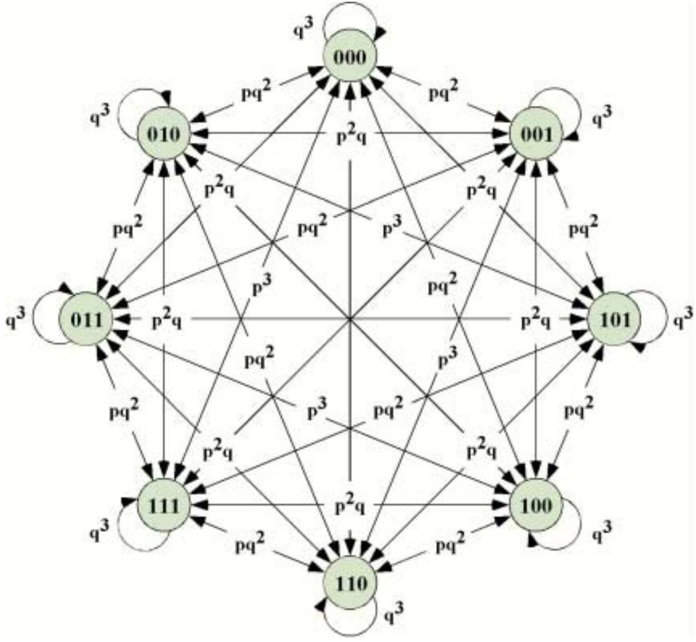  
Figure 5: A Chromosome Transition Graph based on the Mutation Operator with all transition probabilities shown. For simplicity a chromosome length of three was used.

Unfortunately this analysis is insufficient for the purpose of representing distances rather than just one step transitions (which it was designed for). While it is true that one can go from any chromosome to any other chromosome in one step, surely it is also true that if the probability is greater to go to one chromosome than another then the former is, in some sense, closer than the latter. In other words there should be a natural distance measure between chromosomes that takes into account the possibility of multiple loci mutations. This was recognized to some degree in (Jones 1995) by the weighing of the edges in the nearest-neighbour graph with the probability of transitions between chromosomes. However, such weights are not in themselves distances (as will be shown in Ch5 §3.4). Therefore a new definition for the edge weights between chromosomes in a transition graph will have to be developed to transform it into a ‘distance’ graph.

# Ch5 ß3.2 The Expected Number of Mutation Operations Between Chromosomes: An Instructive Blind Alley

In the transition graph from Figure 5, the mutation operator was modeled as a transition from one chromosome to another. Here the probability transition between two chromosomes, $x$ and $y _ { ; }$ , is $p ^ { h d _ { x , y } } ( 1 - p ) ^ { l - h d _ { x , y } }$ , where $l$ is the length of a chromosome, and $h d _ { x , y }$ is the Hamming distance between the two chromosomes and $p$ is the probability of mutation. However, a one step mutation is not the only way one chromosome can mutate into another. The mutation can occur in two stages, or three, or more. Indeed the number of mutational steps that are used to turn one chromosome into another can be considered as a random variable. By this we mean that the number of mutational steps will turn out to be a certain value, but which value that would be is determined by a probability that is associated with each value in turn.

The first thing that one immediately thinks of, when given a random variable, is computing its expectation. So perhaps the expected number of mutation steps that turns one chromosome into another is the sought-after mutational distance. Unfortunately on closer look one realizes what is actually being measured by such an expectation: the number of mutation steps needed when trying to find a target chromosome while using a random search algorithm. By simply computing and summing the probabilistic path lengths of all possible paths, we have implicitly stated that no path is better than any other. A path itself can be thought of a path that a “hill-climber” takes to get from one chromosome to another, but we are not giving this “hill-climber” any gradients to climb on. Thus we are reduced to a random search.

It is well known that random search produces exponential behavior, thus it is no surprise that the results of our “new distance” are exponential too. However, an examination of the expected behavior of unguided mutation in a search space produces some interesting and unexpected insights, including some subtle differences between a normal random walk and this random mutational walk. As a result, a detailed description of the expected number of mutational steps between chromosomes is provided in Appendix A, followed by a detailed examination of the dynamics as observed through simulation. As a result of the simulation, some very interesting and sometimes counterintuitive observations have come to light. Ultimately, however, the expected number of mutations does not provide a meaningful measure of mutational distance between chromosomes; we must take our search elsewhere.

# Ch5 ß3.3 The Shortest Path Cost as a Distance

In the previous section we attempted to define mutational distance as the expected number of mutational steps needed to transform one chromosome into another. In other words we were calculating the expected path length between the two chromosomes averaged over all possible paths in a transition graph32. However, this is not how the Hamming distance is computed on a hypercube. It is not the average path length considering all possible paths; rather it is the cost of the shortest path between the two points on the hypercube. This suggests a new definition of mutational distance: the distance between two chromosomes is the cost of the shortest path between them on a completely connected graph where each vertex is a chromosome. Of course the cost of a path depends on the weights on the edges, however we will only develop the appropriate weights in the next subsection. Here we will assume that the proper weights have already been defined and will only deal with the general implications of using the shortest path cost between vertices as the distance between chromosomes.

Since the above definition of distance is completely dependent on the cost of the shortest path in a graph, care must be taken when defining that cost, especially when selfloops are allowed. The cost of a path $\left. \nu _ { 1 } , \nu _ { 2 } , . . . , \nu _ { k } \right.$ is $\sum _ { i = 1 } ^ { k - 1 } \boldsymbol { w } _ { ( \nu _ { i } , \nu _ { i + 1 } ) }$ where $w _ { ( u , \nu ) }$ is a weight associated with the edge $( u , \nu )$ . However this ignores the case when the starting vertex of a path is the sought after node. When that occurs the vertex is recognized as both source and target, thus no transitions need be made and no path need be generated. This can be simply represented as the ‘path’ $\left. \nu \right.$ . Since there are no edges in this ‘path’, the cost as defined above cannot be applied. However, since no edges were taken, no costs really should apply. So the cost of the path $\left. \nu \right.$ is defined to be 0. This should not be mistaken for the cost of making a transition across a self-loop. Here the path would be represented by $\langle \nu , \nu \rangle$ and consequently have a cost of $w _ { ( \nu , \nu ) }$ , which is not necessarily equal to 0.

Before accepting the association of mutational distance and the cost of the shortest path in a chromosome transition graph, the question has to be asked: is the cost of the shortest path between vertices in a graph a distance? The answer is “no, it need not be”. For a start a distance must be symmetric and the cost of the shortest path between two points may not be symmetric if the graph is directional. A second problem can occur if edge costs can be equal to 0 between two distinct vertices33. The fundamental distance property states that distance must be greater than or equal to 0 and can only be 0 iff the two points are identical. Therefore graphs that do not have symmetric edge costs and graphs with edge costs that equal 0 are suspect.

# Part 2

However if the graph has symmetric edge weights, where each weight is greater than 0, then the cost of the shortest path between two vertices is indeed a distance (once the caveats have been taken into account, this results is, of course, well known):

Theorem 2: If the graph the edges in a graph $G$ have symmetric edges weights, i.e. $\mathcal { W } _ { ( u , \nu ) } = \mathcal { W } _ { ( \nu , u ) }$ , and all weights are greater than 0 then the cost of the shortest path between two vertices is a distance measure.

Proof. The proof of this theorem can be found in Appendix A-1.

Therefore to show that in a graph the cost of a shortest path between two vertices is a distance all one needs to do is show that the graph has symmetric and positively weighted edges.

It would be nice if every graph that has, as a distance, the cost of the shortest path between two vertices, also has symmetrical, non-zero edge weights. In other words it would be nice if the converse of the above theorem were also true. Unfortunately this is not the case. In specific it is not true that all directed graphs with asymmetrical edge weights must have shortest path costs between vertices that are not distances, although in many case that may be true. Looking at $\mathbf { M } _ { 1 }$ through $\mathrm { M } _ { 4 }$ , the properties for a measure to be a distance, we see that, with the sole exception of the symmetry property $\mathbf { M } _ { 2 }$ , they all hold under asymmetrical edge weights. Therefore if the graph in question has asymmetrical edge weights you will have to check whether the costs of the shortest path from $x$ to $y$ is identical to the cost of the (possibly different) shortest path from $y$ to $x$ . If so then, provided all edges have positive costs, the shortest path costs on the digraph are distances; otherwise they are not.

While digraphs may or may not have shortest path costs that are distance, a firm statement can be made about graphs that have zero cost edges:

Theorem 3: If graph $G$ has edges between distinct vertices that have costs equal to 0 then the cost of the shortest path between two vertices is not a distance.

Proof. The proof of this theorem can be found in Appendix A-2.

In summary, for an edge weight setting to support the shortest path cost as a distance measure two properties must hold. First there must be no 0-weighted edges unless they are self-loops. Secondly, the shortest path from $u$ to $\nu$ must have the same cost as the shortest path from $\nu$ to $u$ , where u and v are vertices. The second property will hold if all connected vertices have symmetrical edge weights.

One final note. The limitations on the edge weights described above are very loose. Many different edge weights can be assigned that would produce shortest path costs that are distances. Consequently more justification is need then just successfully passing the two theorems before considering that the transition graph properly models a given system. For example, one would want the edge weight to be greater on an edge that is difficult to cross in comparison to one that is easy to cross. The list of properties needed for the edge weights to model a system properly will depend on the system and so will be dealt with on a case by case basis.

# Ch5 ß3.4 Converting a Transition Graph to a Distance Graph: Designing the Edge Weights

Even though transition probabilities are distances, they cannot be used as weights because they would identify improbable transitions as close neighbors. At the limit, if the transition cannot be performed at all, the edge weight should be infinite, not 0, which occurs when the probability of transition is used as weights. The zero edge weight for impossible transitions also violates Theorem 3 thus destroying the shortest path cost as a distance measure. Therefore the probability of transition, at least as it is, does not properly model distances, and so the weights in the transition graph must be modified to produce a proper distance graph.

Examine the transition graph fragment presented in Figure 6. Given the probability of transitions, the chances are that, starting from $\nu _ { 0 }$ , the $( \nu _ { 0 } , \nu _ { 2 } )$ edge will be taken. If we perform the experiment over and over again we would find that, on average, the $( \nu _ { 0 } , \nu _ { 1 } )$ edge would be taken only after 10 tries. This suggests that the cost of taking that edge is equal to 10.

Generalizing this we can define the cost of an edge as the number of times one would have to try an edge, on average, before actually crossing it. We will now rewrite this statement formally: the weight, $w _ { ( \nu _ { i } , \nu _ { j } ) }$ , of the edge between two vertices, $\nu _ { i }$ and $\nu _ { j }$ , must be governed by the equation $\mathrm { P r } ( \nu _ { i } \to \nu _ { j } ) \cdot w _ { ( \nu _ { i } , \nu _ { j } ) } = 1$ . Here $\operatorname* { P r } ( \nu _ { i } \to \nu _ { j } )$ is read as “the probability that the chromosome $\nu _ { i }$ is transformed through a single mutation step into the chromosome ${ \nu _ { j } } ^ { \dag }$ . From this governing equation we can define a distance graph weight $w _ { ( \nu _ { i } , \nu _ { j } ) }$ as

$$
w _ { ( \nu _ { i } , \nu _ { j } ) } = \frac { 1 } { \operatorname* { P r } ( \nu _ { i } \to \nu _ { j } ) } .
$$

Thus the edge weights are not proportional to the probability of transition, but rather inversely proportional to it34.

Edge weights that are inversely proportional to the probability of transition have nice properties. First, since probabilities range between 0 and 1, the weights range between 1 (when the probability is 1) and infinity (when the probability is 0). Intuitively this is almost the perfect model for transitions based on probabilistic transformations. If the probability that a transformation will happen is 1, i.e. it is certain that the edge will be taken, then in one step we are guaranteed to reach the target directly. Thus the edge weight is 1 as it should be. However, if the probability is less then 1, it will take, on average, more than one step to reach the target directly. So the weight must be greater than 1. In the limit when the transition becomes impossible, the probability becomes 0 and the edge weight becomes infinite, as desired. So in all circumstances the edge weights are behaving perfectly.

The edge weights defined above have all the properties needed for the shortest cost path to be considered a distance between chromosomes. We know from Theorem 2 that the edge weights allow a shortest cost path to be a distance when the weights are always greater than 0, and are symmetric. As just discussed, all weights are elements from the real valued domain $w _ { x , y } \in [ 1 , \infty )$ . Consequently no edge weight equals 0 and all weights are positive. Also since the chromosome distance graph shares the same edge structure as the chromosome transition graph, it is symmetric. Thus the shortest cost path in the chromosome distance graph is indeed a distance between chromosomes.

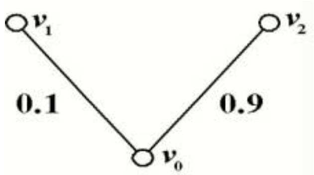  
Figure 6: A fragment of a transition graph, where the probability of going to the left vertex from $\nu _ { 0 }$ is much less than going to the right one.

# Ch5 ß3.5 The Chromosome Distance Graph for Mutation

# Ch5 §3.5.1 Structure

The chromosome distance graph for mutation has the same structure as the transition graph presented in Ch5 $\ S 3 . 1$ . It is a ‘completely connected graph of size $2 ^ { l } { \boldsymbol { \cdot } }$ , where $l$ is the length of a chromosome. Therefore the distance graph is a completely connected digraph (as opposed to a complete graph) with symmetric edge weights.

# Ch5 §3.5.2 Edge Weights

In a binary valued GA system with mutation operating alone the probability of transition is $\mathrm { P r } ( x  y ) = p ^ { h d _ { x , y } } q ^ { l - h d _ { x , y } }$ where $h d _ { x , y }$ is the Hamming distance between

chromosomes $x$ and $y , l$ is the length of the chromosome, $p$ is the probability of a locus mutating and $q = ( 1 - p )$ . Consequently the edge weights would be

$$
w _ { ( x , y ) } = \frac { 1 } { p ^ { h d _ { x , y } } q ^ { l - h d _ { x , y } } } .
$$

For GA systems with n-ary valued genes, not only do you need to make the transitions between the two chromosomes at a locus, you need to make the transition to the right gene. The mutated gene is usually drawn from the alphabet using a uniform probability distribution after excluding the current gene value (one must switch), so the probability of transforming gene $g$ into a given gene $g ^ { \prime }$ is

$$
\operatorname* { P r } ( g \to g ^ { \prime } ) = \frac { 1 } { a - 1 }
$$

where $a$ is the size of the alphabet. Since there are $h d _ { x , y }$ genes to change between the two chromosomes, and since changing to the correct gene is independent of deciding to make the transition, the probability of transition to the correct genes between two chromosomes that are $h d _ { x , y }$ apart is $\operatorname* { P r } ( x \to y ) = p ^ { h d _ { x , y } } q ^ { l - h d _ { x , y } } \cdot ( \frac { 1 } { 1 - a } ) ^ { h d _ { x , y } }$ a ) hd x ,y . This can be rewritten as

$$
\mathrm { P r } ( x  y ) = q ^ { l } \Biggl ( \frac { p } { q \cdot ( a - 1 ) } \Biggr ) ^ { h d _ { x , y } } .
$$

From (2.5) we know that the edge weights are the inverse of the probability of transition Consequently the edge weights for an n-ary, mutation only GA is

$$
w _ { ( x , y ) } = \frac { 1 } { q ^ { l } } \bigg ( \frac { q \cdot ( a - 1 ) } { p } \bigg ) ^ { h d _ { x , y } } .
$$

# Ch5 ß3.6 For the GA, Mutational Distance $\infty$ Hamming Distance

Having defined the mutational distance between chromosomes, we can now address the hypothesis that such a distance measure becomes equivalent to the Hamming distance when the probability of mutation becomes small enough:

Theorem 4: If the probability of mutation $p$ is sufficiently small, i.e. if $p < \frac { a - 1 } { a + 1 }$ , then   
the distance between chromosomes due to mutation is directly proportional to the   
Hamming distance, with a proportionality constant of q ⋅ (a − 1)l . p ⋅ q

# Part 2

Proof. The proof of this theorem can be found in Appendix A-3.

A surprising consequence of this theorem is the very large latitude that “small enough” affords when keeping the two distances proportional to each other. For example, when dealing with a GA that has binary genes, i.e. when $a = 2$ , then the mutational distance remains proportional to the Hamming distance as long as $\begin{array} { r } { p < 0 . 3 3 \ Y } \end{array}$ . Most, if not all GA system, are designed to use mutation rates that are much lower than this cutoff value.

Furthermore the binary case produces the tightest bound on the probability of mutation. As the alphabet size increases, the proportionality between mutational distance and Hamming distance will hold at higher and higher cutoff rates. At the limit, with the alphabet size at infinity, the proportionality holds for any mutation rate.

Since the mutational distance is directly proportional to the Hamming distance, the Hamming distance can be used in lieu of the exact mutational distance between chromosomes in most circumstances. For example, if we want to see whether chromosome $c _ { 1 }$ is further than chromosome $c _ { 2 }$ from chromosome $c _ { 0 }$ , then since the chromosome distances are only being compared in relation to each other, the Hamming distance can be used instead of the exact mutational distance. In fact the Hamming distance can be used directly when only relative distances or ratios between distances need be known, i.e. when the absolute distances are not important in and of themselves. As this is normally the case, the use of the Hamming distance as the distance between chromosomes is fully justified in just about any GA system that uses mutation only as its reproductive operator.

# Part 2

# Ch5 $\ S 4$ Towards a Crossover based Chromosome Distance

Of course mutation is not the only reproductive operator; there is also crossover. Unfortunately the distance between chromosomes under the crossover operator is not nearly as straight forwards as the distance under mutation.

Mutation is based on the transition from one chromosome to another. Crossover, on the other hand, takes two parent chromosomes to produce either one or two children chromosomes, depending on the implementation. This complicates matters since mutation and crossover seem to be applied to different domains, and may even have a different range (this is the approach taken in (Jones 1995), and consequently mutation and crossover were analyzed separately). Producing a single distance that incorporates both of these operators is vital, since ultimately we will to combine the two distances into one distance based on the actual reproduction effect, which is the combination of the two genetic operators. This has proven to be quite difficult, and unfortunately, a complete resolution of the two, while attempted, was not successfully accomplished during this dissertation35.

While a complete solution has not yet been developed, the framework upon which it is to be built may have already been derived in the previous section. The crossover distance may just be an application of the shortest cost path between chromosomes in a crossover-based, rather than a mutation-based distance graph. Still before presenting a sketch of the concept, it must be emphasized that the idea is still in a nascent form. The details are still nebulous. Many questions are left unanswered; many problems are left open. However, it is a start.

Before we can develop such a graph, the domain and range of the two functions must be brought into agreement. The key here is to change our focus from just looking at the operator in isolation and look at the bigger picture. The correct question to ask is “what is the probability of transforming chromosome $x$ into chromosome $y$ by crossing $x$ with chromosomes from a given population $P$ . With this understanding in place, the crossover domain and range now match that of mutation; both are looking at the transformation of one chromosome into another. So, just as with mutation, crossover can be represented as transition graph, except now the probability of transition is conditionally based on some given population.

With a transition graph that can represent the crossover operation in place, it should follow that, by taking the inverse of the probability of transition, we would produce a distance graph and thus could define the cost of the shortest path as the crossover distance. Indeed, this is the general framework that I believe will eventually produce just such a distance. Unfortunately, there are many wrinkles to be ironed out before that can happen.

The main problem can be simply stated: the composition of population $P$ , upon which the crossover probability of transition relies, has not been properly defined. One might think that it would be the current population of the GA, and that may be true before the first round of crossover has occurred. However, one cannot expect that the target chromosome will always be produced after only one round; the path may have more than one edge. Unfortunately, population $P .$ , which is used to compute the edge weights, will have also changed from crossover. How should the new population be modeled? Even more worrisome, if we change populations in the midst of computing a path, it is quite possible that we will violate some of the conditions necessary for the production of a distance. In fact the resulting path may not even be a basis for a topology, let alone a distance!

Ultimately, I believe that all problems will be resolved, and both a transition and distance graph is definable for the crossover operator. Until then, the idea of crossover distance between chromosomes must remain unresolved.

# Ch5 §5 Continuing On the Road to an Accurate Reproductive Distance between Chromosomes

Of course GA reproduction is a combination of both mutation and crossover. We would therefore want to see a distance measure between chromosomes that incorporates both of these mechanisms. However, as we have seen in the previous section, the crossover distance is not yet fully understood and consequently it would be futile to attempt a distance model of the full GA reproductive scheme.

Surprisingly, however, a positive statement can be made about the reproductive distance between chromosomes even without knowing the details of the crossover distance, provided that the final reproductive distance will also be based on the cost of the shortest path between chromosomes in a distance graph:

Theorem 5: Assuming that the reproductive distance is the cost of the shortest path between chromosomes in a distance graph, the mutational distance between chromosomes is an upper bound on the true reproductive distance between chromosomes; i.e. $\operatorname { D i s t } ( x , y ) \leq \operatorname { D i s t } _ { \mu } ( x , y )$ .

Proof Sketch: Proof by reducto ad absurdum. Assume that $\mathrm { D i s t } _ { \mu } ( x , y ) < \mathrm { D i s t } ( x , y )$ . However, in a GA, it is always possible to apply mutation alone without crossover. Thus the same path that produced the smallest cost between the two chromosomes in the mutation distance graph, is also a valid path in the full reproduction distance graph. Furthermore, it will have the same cost as the mutational distance, $\mathrm { D i s t } _ { \mu } ( x , y )$ , which is smaller than the distance value by assumption. However, a path representing the distance value is supposed to have the smallest cost. This is a contradiction. Therefore the assumption does not hold and thus the true distance must be no greater than the mutational distance. ❚

In other words, if the crossover doesn’t help to shorten the cost in conjunction with mutation, when one chromosome is being transformed into another through reproduction, then it would not be a part of the shortest cost path and hence will not contribute to the distance value. Thus crossover will, at worst, not affect a mutation-only shortest cost path. It can only reduce the cost and thus the distance.

From this realization we can ultimately conclude that, in place of a complete distance model for the full reproductive step, we can temporarily use the mutation only model to form the distance between chromosomes, as long as we keep in mind the restrictions on its use. Since the Hamming distance is proportional to the mutational distance and since all distances will routinely be normalized, the proportionality constant becomes irrelevant and the Hamming distance shall be synonymous to the distance between chromosomes in the remainder of the dissertation.

# Chapter 6

# Distance Between Populations

# Ch6 §1 Introduction

# Ch6 ß1.1 The Need for a Population Metric

All previous attempts to characterize gene space have focused almost exclusively on the Hamming distance and the hypercube. However, this chromosome space cannot fully account for the behavior of the GA.

An analysis of the GA using chromosome space implicitly assumes that the fitness function alone determines where the GA will search next; that the fitness of each chromosome in isolation uniquely determines the ‘fitness field’. This is not correct. The effect that the population has on the selection operation can easily be seen in the following examples: -

Part 2

First consider the change in the probability of selection due to duplicates in the population. In fitness proportional selection, the probability of a chromosome $\alpha$ being chosen is normally thought of as

$$
\operatorname* { P r } ( c h r = \alpha ) = \frac { f ( \alpha ) } { \displaystyle \sum _ { i = 1 } ^ { p } f ( c _ { i } ) }
$$

where $p$ is the size of the population $P _ { \mathrm { : } }$ , and $\alpha , c _ { i } \in P$ . However, if there are duplicates of chromosome $\alpha$ in the population, then the probability of selection changes to become

$$
\mathrm { P r } ( c h r = \alpha ) { = } \frac { \displaystyle \sum _ { i = 1 } ^ { k } f ( \alpha _ { i } ) } { \displaystyle \sum _ { i = 1 } ^ { p } f ( c _ { i } ) } { = } \frac { k \cdot f ( \alpha ) } { \displaystyle \sum _ { i = 1 } ^ { p } f ( c _ { i } ) } .
$$

So the probability of selection for a chromosome is not only proportional to its fitness, it is proportional to its multiplicity in the population. Definition (2.10) is, of course, a direct consequence of the GA schema theorem36 and so is quite well known. However it is used here to point out that fitness values associated with a chromosome cannot be derived from the fitness function acting on the chromosome alone.

Actually, the population plays an even stronger (and more obvious) role in both definitions (2.9) and (2.10). The denominator in the probability of selection is a function of the make-up of the population. In other words fitness proportional selection is proportional to the fitness of the chromosome with respect to the total fitness of the population. This dependence on population for the probability of selection is true not just for fitness proportional selection, but also for rank selection as the ranking structure depends on which chromosomes are in the population, and tournament selection since that can be reduced to a subset of all polynomial rank selections.

Finally, and most glaringly, the probability of selecting a chromosome that is not in the population is zero; this is true no matter the fitness of the chromosome! Consequently the fitness value associated with the chromosome is meaningless when taken independently of the population. This means that the scalar field is not valid over the chromosome space and thus chromosome space is not the correct underlying metric space.

As the above examples demonstrate, any metric that hopes to model the behavior of the GA must include population effects. These effects are not made evident if only the chromosome space is examined, as the final example most strongly shows. Therefore the metric used must include more information than just the distance between chromosomes; we must look to the population as a whole for our unit of measure. In other words, we need a distance between populations.

# Ch6 ß1.2 Population Distances and Cluster Analysis

Cluster Analysis, which is used heavily in pattern recognition, is the branch of mathematics and statistics that attempts to group points in a space into various clusters in order to minimize the dispersion or scatter37 of the system. Consequently, the notions of cluster scatter (diversity of a population) and distance between clusters (distance between populations) are key and have been well defined, especially for clusters with points that have positions which can be represented by continuous numeric vectors. When GA systems that use numeric genes are examined in Chapter 7, all of the measures and structures developed have exact analogs in the cluster analysis field.

Clusters of points that comprise symbolic ‘vectors’, which are called discrete valued vectors in the cluster analysis field, have also been well studied as they have relevance to conceptual clustering, which is important in Machine Learning.

The distance between two clusters of discrete valued vectors is the distance between their respective mean centers38, where the mean center ${ \pmb m } _ { c }$ of a cluster $C$ is defined

$$
\sum _ { y \in C } d ( \pmb { m } _ { c } , y ) \leq \sum _ { y \in C } d ( z , y ) , \qquad \forall z \in C .
$$

Here $d$ is a distance measure between two points, which, for symbolic values, usually is the Hamming distance. Converting the above definition into plain English, the mean center of a cluster is the point in the cluster that has the minimum average distance to all of the other points, while the distance between clusters is the distance between the two respective ‘center’ points39.

Unfortunately there are two basic problems with this definition as applied to populations:

The first problem lies in the fact that ${ \pmb m } _ { c }$ need not be unique. There may be many points with identical average distances to every other point in the cluster. This is especially true with a GA style population where duplicate points are allowed.

Secondly, the definition is inherently unstable. To see this, look at Figure 7, which depicts two different clusters of points in $\pmb { R } ^ { 2 }$ , both basically in the shape of a ring. Let these two ring clusters be composed of identical points with two exceptions. In the first ring there exists a point that is closer to the geometric center of the ring than any of the other points, which are on the ring itself. Therefore that point is the mean center for the cluster. The second cluster also has such a point, which therefore is its mean center. However that point lies on the other side of the ring with respect to the mean center of the first cluster. Consequently, the distance between the two clusters is very large, spanning the diameter of the ring, when really the two clusters are basically the same.

One modification that may occur to some to alleviate the instability of (2.11) in the above ‘ring’ example is to make the geometric center the mean center of the cluster. This will not vary much with the slight difference in the two points. This modified definition is very similar to the previous one:

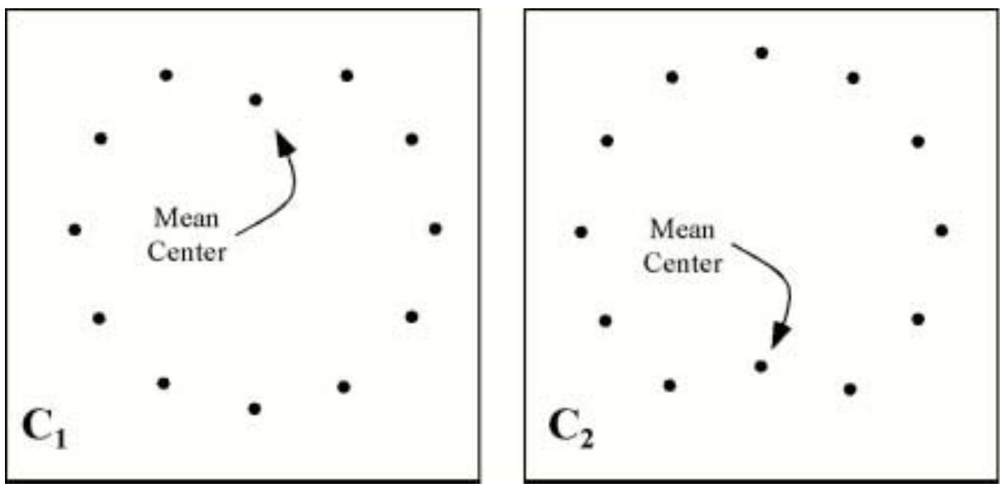  
Figure 7: The position of the mean center is not stable. $C _ { 1 }$ and $C _ { 2 }$ above are virtually identical clusters with only two points different, the two respective mean centers. The point by point difference between the two clusters is small, while the difference between centers is large.

$$
\sum _ { y \in C } d ( \pmb { m } _ { c } , y ) \leq \sum _ { y \in C } d ( z , y ) , \qquad \forall z \in U .
$$

where $U$ is the universal set of all points. If $d$ is the Hamming distance, it can be easily shown that ${ \pmb m } _ { c }$ can be computed by taking the majority function for the symbols at each vector location across the population. Formally, a given coordinate $k$ in the vector ${ \pmb m } _ { c }$ can be computed by

$$
\pmb { m } _ { c } = m a j o r i t y ( \pmb { y } )
$$

where the majority function for a vector is equal to the majority function applied to each element of the vector.

Unfortunately, this definition of ${ \pmb m } _ { c }$ is no more unique then the previous one. Since more than one symbol may be tied for the majority for any vector element across the cluster, there can be many points that meet the criteria for being a mean center. However,

a work around exists. For each element in ${ \pmb m } _ { c }$ store the set of all such majority symbols, i.e.:

$$
( { \pmb m } _ { c } ) _ { k } = \{ x | c o u n t ( x , C _ { k } ) = c o u n t ( m a j o r i t y ( y ) , C _ { k } ) \}
$$

where $C _ { k }$ is the collection of elements from the $\boldsymbol { k } ^ { \mathrm { { t h } } }$ coordinate of each point in the cluster $C _ { i }$ , and the function count $( p , C )$ counts the number of points in the cluster (or collection) that is equal to $p$ . Instead of using the straight Hamming distance between centers, use the sum of one minus the Tanimoto measure:

$$
d ( \pmb { m } _ { c } ^ { 1 } , \pmb { m } _ { c } ^ { 2 } ) _ { k } = l - \sum _ { k = 1 } ^ { l } \frac { \# ( \pmb { m } _ { c } ^ { 1 } \bigcap \pmb { m } _ { c } ^ { 2 } ) } { \# ( \pmb { m } _ { c } ^ { 1 } \bigcup \pmb { m } _ { c } ^ { 2 } ) }
$$

However, even after all of this manipulation, this definition of the distance between populations is still fundamentally flawed. While the distance based on (2.11) was unstable, (2.15) has become too stable! The distance is not sensitive enough; too much information has been lost. This can easily be seen when examining a GA population of binary chromosomes where a single locus has completely converged to the value 0. Let us say that the environment changes and there is great pressure to select chromosomes with the value 1 in that position. Little by little the population changes its make-up with more and more 1 symbols appearing at the locus. Yet until the 1 gene achieves plurality, there will be no change in the mean center at all! With this distance measure too much of the possible volatility of the system could remain hidden.

As a result of all these problems, it was decided to return to the fundamentals and attempt to define a new distance between populations from first principles. That shall be the work of this chapter.

# Ch6 ß1.3 Chapter Outline

There are five more sections in this chapter. Ch6 $\ S 2$ examines the well-known population measure ‘diversity’ since the definitions and methodologies developed for it will from the basis of the distance measures. In the two sections after, Ch6 $\ S 3$ and Ch6 $\ S 4$ , two different approaches are introduced that attempt to determine the distance between populations. The first, the all-possible-pairs approach, is a natural extension of the traditional diversity definition. The second is called the mutation-change distance between populations. In Ch6 $\ S 5$ , a synthesis of these two distance concepts is developed eventually leading to a single definition of the distance between populations. The final section, Ch6 $\ S 6$ , looks at the distance between a single chromosome and a population. This concept, which is based on the distance between populations, will be crucial in the development of the mechanisms that determine when a colony is searching in the same area as the core and then pushing the colony away.

# Ch6 §2 Diversity

Before attempting to find a relevant distance between populations, it will be instructive to first discuss the related concept of ‘diversity’.

There are four reasons for this. First, diversity is a known measure of the population that is independent of the fitness function. Since the distance between populations should likewise be independent of the fitness (for the scalar field model to be appropriate), useful insights may be derived from a study of diversity. Second, several techniques shall be introduced in this section that will become important later when discussing the distance between populations. Third, the concept of diversity itself will be used in the analysis of the distance between populations. Fourth and finally, diversity will be useful as a measure in its own right when analyzing the behavior of the GA and the SBGA in dynamic environments (see Chapter 15 for details).

This section is divided into three main parts. First the familiar definition of diversity is given. Next that definition is transformed to allow for an efficient algorithm to be produced. Finally a second diversity definition, based on Information Theory, is introduced and connections to the original definition are made.

# Part 2

# Ch6 ß2.1 All-Possible-Pairs Diversity

The simplest definition of diversity comes from the answer to the question “how different is everybody from everybody else?” If every chromosome is identical, there is no difference between any two chromosomes and hence there is no diversity in the population. If each chromosome is completely different from one another, then those differences add, and the population should be maximally diverse. So the diversity of a population can be seen as the difference between all possible pairs of chromosomes within that population.

While the above definition makes intuitive sense, there is one aspect not covered: what do we mean by different. If a pair of chromosomes is only different by one locus, it only seems reasonable that this pair should not add as much to the diversity of the population as a pair of chromosomes with every locus different. Consequently the difference between chromosomes can be seen as the Hamming distance or chromosome distance, and hence the population diversity becomes the sum of the Hamming distances between all possible pairs of chromosomes, see (Louis and Rawlins 1993). In cluster theory this is called the statistic scatter, see (Duran and Odell 1974).

Now, since the Hamming distance is symmetric, and is equal to 0 if the strings are the same, only the lower (or, by symmetry, only the upper) triangle in a chromosome pairs table need be considered when computing the diversity. Consequently the all-possiblepairs diversity can be formalized as

$$
\operatorname { D i v } ( P ) = \sum _ { i = 1 } ^ { p } \sum _ { j = 1 } ^ { i - 1 } \mathrm { h d } ( c _ { i } , c _ { j } )
$$

where $P$ is the population and chromosome $c _ { i } \in P$ .

This diversity definition is actually used in the field of molecular genetics, although modified slightly to reflect the fact that, in practice, one only has a sampling of DNA sequences from a population. The modified formula is proportional to the all-possiblepairs definition of diversity,

$$
\operatorname { D i v } ( P ) = { \frac { 2 } { l \cdot n \cdot ( n - 1 ) } } \sum _ { i = 1 } ^ { p } \sum _ { j = 1 } ^ { i - 1 } \operatorname { h d } ( c _ { i } , c _ { j } ) ,
$$

and is called nucleotide diversity40. For more details, see Molecular Evolution (Li 1997) pp. 237-238.

# Ch6 ß2.2 The Reformulation of the All-Possible-Pairs Diversity: A Linear Time Algorithm

# Ch6 §2.2.1 Introduction

A problem with formula (2.16) is its time complexity. Since the Hamming distance between any two pairs takes $O ( l )$ time and there are ${ \mathfrak { n } } ^ { 2 }$ possible pairs (actually $\scriptstyle { \frac { 1 } { 2 } } n ( n - 1 )$ pairs when symmetry is taken into account), then the time complexity when using (2.16) is $O ( l n ^ { 2 } )$ . Since the time complexity of the GA is $O ( l \cdot n )$ calculating the diversity every generation would be expensive.

Surprisingly a reformulation of definition (2.16) can be converted into an $O ( l \cdot n )$ algorithm to compute the all-possible-pairs diversity. This will be developed directly.

It seems unlikely such an efficient algorithm would not already be present somewhere in the literature. Unfortunately, most books that deal with sets of binary strings seem to be interested in the maximum of the distances between all possible pairs and not the average. Unlike the sum or average, the time complexity of the maximum Hamming Distance between all possible pairs cannot be reduced from $O \big ( l n ^ { 2 } \big )$ to $O ( l \cdot n )$ time, so the issue has been ignored. While the maximum distance between all possible pairs of chromosomes can also be considered as a diversity measure on a GA population, it is not a particularly good one since it is too sensitive to outlier chromosomes, and does not give fine grain information about changes in the population.

Still, while the reformulation probably already exists, we will present a complete discussion of it anyway. This is being done for one primary reason: the ideas and mathematical procedures that will be introduced during the proof shall become the foundations upon which the development of the distance between populations and other later concepts shall rest.

# Ch6 §2.2.2 Gene Counts and the Gene Frequencies

We will now introduce two terms that not only will be used to reformulate the definition of the all-possible-pairs diversity, but also will become ubiquitous throughout this chapter. They are the gene count across a population, and the gene frequency of a population.

The gene count ${ \mathrm { c } } _ { k } ( \alpha )$ is the count across the population of all genes at locus $k$ that equals the symbol $\alpha .$ This means that

$$
\mathbf { c } _ { k } ( \alpha ) = \sum _ { i = 1 } ^ { n } \delta _ { i | k } ( \alpha ) .
$$

where $\delta _ { i \vert k } ( \alpha )$ is a Kronecker δ that becomes 1 when the gene at locus $k$ in chromosome $i$ equal the symbol $\alpha .$ , and otherwise is 0 (see Appendix A-4 for a formal definition). Later in the chapter we will frequently write ${ \mathrm { c } } _ { k } ( \alpha )$ as $\mathrm { c } _ { \alpha \vert k }$ , or just as $\mathrm { c } _ { \alpha }$ if the locus $k$ is understood in the context.

The array of the gene counts of each locus will be called the gene count matrix41.

The gene frequency $\mathrm { f } _ { k } ( \alpha )$ is the ratio of the gene count to the size of the population. In other words,

$$
\mathrm { f } _ { k } ( \alpha ) = { \frac { \mathrm { c } _ { k } ( \alpha ) } { n } } .
$$

Again, later in the chapter we will frequently write $\mathrm { f } _ { k } ( \alpha )$ as $\mathrm { f } _ { \alpha | k }$ , or just as $\mathrm { f } _ { \alpha }$ if the locus $k$ is understood in the context.

The array of the gene frequencies of each locus will be called the gene frequency matrix42.

# Part 2

# Ch6 §2.2.3 The Reformulation

With the notation in place we can present the alternate form of writing the allpossible-pairs diversity:

Theorem 6a: The all-possible-pairs diversity can be rewritten as

$$
\operatorname { D i v } \stackrel { \cdot } { ( } P ) = \frac { n ^ { 2 } } { 2 l } { \sum _ { k = 1 } ^ { l } \sum _ { \forall \alpha \in \boldsymbol { A } } } \operatorname { f } _ { k } ( \alpha ) \left( 1 - \operatorname { f } _ { k } ( \alpha ) \right)
$$

Proof. The proof of this theorem is in Appendix A-4.

Theorem 6b: The normalized all-possible-pairs diversity can be rewritten as

$$
\begin{array} { r } { \overrightarrow { \mathrm { D i v } ( P ) } = \left\{ \begin{array} { l l } { ~ a ^ { ' } } & { ~ a < n } \\ { \displaystyle \overline { { l \cdot \left( ( a - 1 ) - \frac { r ( a - r ) } { n ^ { 2 } } \right) } } \sum _ { k = 1 } ^ { l } \sum _ { v \alpha \in A } \mathsf { f } _ { k } ( \alpha ) \cdot ( 1 - \mathsf { f } _ { k } ( \alpha ) ) } & { ~ a < n } \\ { ~ } & { ~ } \\ { \displaystyle \frac { n } { l \cdot ( n - 1 ) } \sum _ { k = 1 } ^ { l } \sum _ { v \alpha \in A } \mathsf { f } _ { k } ( \alpha ) \cdot ( 1 - \mathsf { f } _ { k } ( \alpha ) ) } & { ~ a \ge n } \end{array} \right. } \end{array}
$$

where $r = n \cdot \mathrm { m o d } a$ .

Proof. The proof of this theorem is in Appendix A-4.

In most cases $a < n$ and $a \mid n$ , so $r$ is 0 and the normalized all-possible-pairs diversity can be written as

$$
\overline { { \mathrm { D i v } ( P ) } } = \frac { a } { l ( a - 1 ) } \sum _ { k = 1 } ^ { l } \sum _ { \forall \alpha \in \cal { A } } { \mathrm { f } } _ { k } ( \alpha ) \left( 1 - { \mathrm { f } } _ { k } ( \alpha ) \right) .
$$

Since, in the majority of GA implementations a binary alphabet is used with an even population size (because crossover children fill the new population in pairs), the above equation becomes

$$
\overline { { \mathrm { D i v } ( P ) } } { = } \frac { 2 } { l } \sum _ { k = 1 } ^ { l } \sum _ { \forall \alpha \in \cal { A } } { \mathrm { f } } _ { k } ( \alpha ) \left( 1 - { \mathrm { f } } _ { k } ( \alpha ) \right) .
$$

A pseudo-code implementation of this formula has been placed in Appendix C-1. The algorithms there also include one for computing the gene frequency matrix, which is to become very important later in the chapter as well as in the rest of the dissertation.

Alongside the algorithms is a time complexity analysis. Here we show that the above formula can be computed in $O ( l \cdot n )$ time, which is much faster than the $O ( l \cdot n ^ { 2 } )$ time that the original naïve all-possible-pairs algorithm would take.

As with the normal all-possible-pairs diversity, the above reformulation also has a biological interpretation; this time it is not in the recent area of molecular genetics, but in the older field of population genetics. Here the diversity is used to measure the variation of alleles in a population and is known as either the gene diversity or the expected heterozygocity. It is normally only defined for a single locus and is usually given in the form $1 - \sum _ { \forall a \in A } f _ { a } ^ { 2 }$ , where $A$ is the set of alleles at that locus. Remember, an allele at a locus may comprise an entire sequence, or even many sequences of nucleotides and so is working at a much higher level than the nucleotide diversity, even though the underlying mathematics is identical. For details, see Molecular Evolution (Li 1997) pp. 52-53.

This version of the (normalized) all-possible-pairs diversity appeared in (Collins and Jefferson 1991) with reference made to the biological definition of heterozygocity, although formula given had been modified to deal with binary values only. In the paper, no attempts were made to connect this diversity definition with the standard all-possiblepairs formulation.

# Ch6 ß2.3 Diversity as Informational Entropy

In the experimentation part of this dissertation, the all-possible-pairs diversity is not used; in its stead is a diversity measure based on the Shannon entropy from Information Theory. This measure of diversity is commonly used in biology for computing the diversity of species in an ecology, see (Pielou 1975) pp.7-8. It has also been used in Machine Learning for decision tree induction (Quinlan 1993). Lastly, it was introduced as a form of genetic diversity into the GA literature as an alternative to the regular Hamming diversity (Wineberg and Oppacher 1996).

In information theory, entropy is defined as

$$
H ( X ) = \sum _ { x \in A } p ( x ) \log { \frac { 1 } { p ( x ) } }
$$

where $X$ is a discrete random variable with values taken from alphabet $A$ and a probability mass function $p ( x ) = \operatorname* { P r } \left\{ X = x \right\}$ , $x \in A$ (Cover and Thomas 1991). Equating the population at a locus with $X$ and the gene frequencies at that locus $f _ { k } ( \alpha )$ with the probabilities $p ( x )$ , the entropic diversity at a locus can be written as:

$$
\operatorname { D i v } _ { k } ( P ) = \sum _ { \alpha \in A } \operatorname { f } _ { k } ( \alpha ) \log { \frac { 1 } { \operatorname { f } _ { k } ( \alpha ) } } .
$$

Averaging over all loci gives the actual entropic diversity of the population:

$$
\mathrm { D i v } ( P ) { = } \frac { 1 } { l } { \sum _ { k = 1 } ^ { l } } \sum _ { \alpha \in A } ^ { \bullet } \mathrm { f } _ { k } ( \alpha ) \mathrm { l o g } \frac { \ 1 } { \mathrm { f } _ { k } ( \alpha ) }
$$

To distinguish between the two different types of diversity, the all-possible-pairs diversity shall be symbolized by $\mathrm { D i v _ { X } } ( P )$ and the entropic diversity by $\mathrm { D i v _ { H } } ( P )$ (the $\mathrm { X }$ represents the complete Cartesian cross of the all possible pairs, and the $\mathrm { H }$ represents the entropy).

The entropic diversity is closely tied to the all-possible-pairs diversity in behavior. Preliminary experiments done by the author show that the correlation between the two is very close, although not identical to 1. If we compare the definition (2.19) of all-possiblepairs diversity with the entropic diversity definition above, we see that aside from the constants in front, the two forms are remarkably similar. The only difference is the use of $\log { \frac { 1 } { \mathrm { f } _ { k } ( \alpha ) } }$ term in the entropic diversity instead of the $( 1 - \mathrm { f } _ { k } ( \alpha ) )$ term as used in the allpossible-pairs diversity. Furthermore both diversities can be seen as just the expected value of those terms. However, if we perform a Taylor expansion of $\mathrm { l o g } { \frac { 1 } { \mathrm { f } _ { k } ( \alpha ) } }$ around

$\alpha = 1$ , we get

$$
\log { \frac { 1 } { \operatorname { f } _ { k } ( \alpha ) } } = ( 1 - f _ { k } ( \alpha ) ) + { \frac { ( 1 - f _ { k } ( \alpha ) ) ^ { 2 } } { 2 } } + { \frac { ( 1 - f _ { k } ( \alpha ) ) ^ { 3 } } { 3 } } + \cdots + { \frac { ( 1 - f _ { k } ( \alpha ) ) ^ { i } } { i } }
$$

Notice that the first term in the Taylor series is the same as the one used in the allpossible-pairs diversity definition. Also notice that the other terms are all less than 1 and rapidly approach 0 and consequently the early terms will dominate. So we can now see that $\mathrm { D i v } _ { \mathrm { X } } ( P )$ is just the first term in the Taylor expansion about 1 of $\mathrm { D i v _ { H } } ( P )$ , which accounts for the similarity in their behavior.

Now $( 1 - \mathrm { f } _ { k } ( \alpha ) )$ can be thought of as the “probability” that, if selected at random, the gene at this location won’t be $\alpha$ . The other terms then can be seen as the probability under random selection that gene $\alpha$ won’t be selected after $i$ selections. Therefore, the diversity can be regarded as the expectation that the selected gene will be “some other gene”. Since in each generation the GA selects from the population multiple times, and since the Taylor series above rapidly converges, the entropic diversity is used as a more accurate measure of diversity.

Finally, it is well known that the maximum of the Shannon entropy occurs under a uniform probability distribution. This, as we would expect, is the same as we found with the all-possible-pairs diversity. Consequently, the normalized form for the entropic diversity in the usual case when $a < n$ and $n \left| a \right.$ is

$$
\overline { { \mathrm { D i v } ( P ) } } = \frac { 1 } { l \log a } \sum _ { k = 1 } ^ { l } \sum _ { \alpha \in A } { \mathrm { f } } _ { k } ( \alpha ) \log \frac { 1 } { { \mathrm { f } } _ { k } ( \alpha ) }
$$

(notice that if we choose the base of $a$ for the logarithm, the original definition of entropic diversity (2.24) is already normalized). The corresponding formulae for the cases when $a < n$ but $n \mathord { / { \vphantom { | { | { \frac { \pi } { \hbar } } | } { a } } }  \kern - delimiterspace } a$ , and when $a \geq n$ ) are analogous to those developed for the allpossible-pairs diversity.

# Ch6 §3 An All-Possible-Pairs “Distance” Between Populations

# Ch6 ß3.1 Definition

The obvious extension of the all-possible-pairs diversity of a single population would be an all-possible-pairs distance between populations. Here we would take the Cartesian product between the two population producing all possible pairs of chromosomes, take the Hamming distance between each of those pairs of chromosomes, and sum the results. Since there are $O ( n \cdot m )$ such pairs (where $n$ and $m$ are the two population sizes) then assuming $m \propto n$ , there would be $O ( n ^ { 2 } )$ distances being combined. Consequently the resulting summation, if it turns out to be a distance, would be a squared distance. So formally we have:

$$
\mathrm { D i s t ^ { \prime } } \bigl ( P _ { 1 } , P _ { 2 } \bigr ) = \sqrt { \sum _ { i = 1 } ^ { n _ { 1 } } \sum _ { j = 1 } ^ { n _ { 2 } } \mathrm { h d } ( c h r I _ { i } , c h r 2 _ { j } ) } ,
$$

where $P _ { 1 }$ and $P _ { 2 }$ are populations 1 and 2, each with a population size of $n$ and m respectively, and $c h r I _ { i } \in P _ { 1 }$ and $c h r 2 _ { j } \in P _ { 2 }$ , where $i$ and $j$ are indexes into each respective population. The reason we are using the function name Dist instead of Dis ′ t shall be explained in the next subsection. This ‘distance’ between populations is used in some pattern recognition algorithms and is called the average proximity function43

Following the same argument as with diversity presented in Ch6 $\ S 2 . 2$ , a frequencybased version of the same formula can be produced:

$$
\mathrm { D i s t ^ { \prime } } \bigl ( P _ { 1 } , P _ { 2 } \bigr ) = \sqrt { \frac { n m } { l } \sum _ { k = 1 } ^ { l } \sum _ { \forall \alpha \in A } \mathbf { f } _ { 1 | k } ( \alpha ) \left( 1 - \mathbf { f } _ { 2 | k } ( \alpha ) \right) } ,
$$

where $\mathrm { f } _ { 1 | k } ( \boldsymbol { \alpha } )$ is the gene frequency of the gene $\alpha$ at locus $k$ across population $P _ { 1 }$ , and $\mathrm { f } _ { 2 \vert k } ( \alpha )$ is the corresponding gene frequency for population $P _ { 2 }$ .

# Part 2

# Ch6 ß3.2 Problems

While initially attractive for its simple intuitiveness, the all-possible-pairs “distance” is unfortunately not a distance. While it is symmetric and non-negative, thus obeying properties $\mathbf { M } _ { 2 }$ and $\mathbf { M } _ { 3 }$ , it fails on properties $\mathbf { M } _ { 1 }$ and $\mathrm { M } _ { 4 }$ .

The failure of property $\mathbf { M } _ { 1 }$ is actually readily seen. Remember $\mathbf { M } _ { 1 }$ states that the distance must be 0 iff the populations are identical; consequently the all-possible-pairs “distance” of a population to itself should be equal to 0. Instead it is actually the allpossible-pairs diversity measure, which is typically greater than 0. In fact, the diversity only equals 0 when all of the chromosomes in the population are identical!

Furthermore the all-possible-pairs “distance” also fails $\mathrm { M } _ { 4 }$ , the triangle inequality. This can be seen from the following example. Let $A$ be a binary alphabet $\{ 0 , 1 \}$ from which the chromosomes in all three populations that form the triangle will be drawn. Let populations $P _ { 1 }$ and $P _ { 3 }$ both have a population size of 2 and $P _ { 2 }$ have in it only a single chromosome. To make the situation even simpler, in all populations let each chromosome consist of only 1 locus. Now look at an example where the population make-up is as follows:

$$
\begin{array} { c } { { P _ { 1 } = \{ < c h r _ { 1 , 0 } , 0 > , < c h r _ { 1 , 1 } , 0 > \} , } } \\ { { { } } } \\ { { P _ { 2 } = \{ < c h r _ { 2 , 0 } , 0 > \} } } \\ { { { } } } \\ { { P _ { 3 } = \{ < c h r _ { 3 , 0 } , 1 > , < c h r _ { 3 , 1 } , 1 > \} . } } \end{array}
$$

The corresponding gene frequencies are $\mathrm { f } _ { 1 } ( 0 ) = 1 , \mathrm { f } _ { 1 } ( 1 ) = 0 , \mathrm { f } _ { 2 } ( 0 ) = 1 , \mathrm { f } _ { 2 } ( 1 ) = 0 , \mathrm { f } _ { 3 } ( 0 ) = 0$ and $\mathrm { f } _ { 3 } ( 1 ) = 1$ . Using the all-possible-pairs “distance” definition (2.27) we can calculate that $\mathrm { D i s t } ( P _ { 1 } , P _ { 2 } ) + \mathrm { D i s t } ( P _ { 2 } , P _ { 3 } ) = \sqrt { 0 } + \sqrt { 2 } = \sqrt { 2 } , \qquad \mathrm { a n d } \qquad \mathrm { t h a t } \qquad \mathrm { D i s t } ( P _ { 1 } , P _ { 3 } ) = \sqrt { 4 } = 2 .$ Consequently $\mathrm { D i s t } ( P _ { 1 } , P _ { 2 } ) + \mathrm { D i s t } ( P _ { 2 } , P _ { 3 } ) < \mathrm { D i s t } ( P _ { 1 } , P _ { 3 } )$ and so the triangle inequality does not hold.

Thus the all-possible-pairs “distance” cannot be considered a metric44. It is for this reason that we put the prime after the ‘distance function’ that has been developed so far.

# Ch6 ß3.3 Correcting the All-Possible-Pairs Population Distance

In the previous subsection we discussed two shortcomings of our initial attempt at creating a population distance through the means of an all-possible-pair comparison of the two populations. First, this measure does not obey the distance property $\mathbf { M } _ { 1 }$ , which requires that the distance be equal to 0 if the two populations are identical. Second, it doesn’t hold to property M4, the triangle inequality. We will now remodel the formula to redress these two problems.

We shall deal with the triangle inequality first. Definition (2.27) was written to be as general as possible. Consequently, it allows for the comparison of two populations of unequal size. In the counter-example showing the inapplicability of the triangle inequality, unequal sized populations were indeed used. When populations of equal size are examined no counter-example presents itself. This holds even when the largest distance between $P _ { 1 }$ and $P _ { 3 }$ is constructed and with a $P _ { 2 }$ specially chosen to produce the smallest distance to both $P _ { 1 }$ and $P _ { 3 }$ . Generalizing this, we could redefine the definition (2.27) such that small populations are inflated in size while still keeping the equivalent population make-up. The same effect can be produced by dividing definition (2.27) by the population sizes, or in other words through normalization.

Now let us address the problem of non-zero self-distances. As noted in the previous subsection, this property fails because the self-distance, when comparing all possible pairs, is the all-possible-pairs diversity, which need not be zero. To rectify the situation we could simply subtract out the self-distances of the two populations from the allpossible-pairs distance equation45. Again we are removing the problems through normalization.

To summarize the above, looking first only at a single locus and normalizing the squared distance (which simplifies the calculation) we get:

$$
\mathrm { D i s t } _ { k } ^ { 2 } ( P _ { 1 } , P _ { 2 } ) = \overset { \cdot } { \operatorname { ( D i s t } _ { k } ^ { \prime } ( P _ { 1 } , P _ { 2 } ) \big ) } ^ { 2 } - \frac { a - 1 } { 2 a } \overset { \sim } { \operatorname { D i v } _ { k } ( P _ { 1 } ) } - \frac { a - 1 } { 2 a } \overline { { \operatorname { D i v } _ { k } ( P _ { 2 } ) } }
$$

Now, let us substitute (2.27) the definition of $\mathrm { D i s t ^ { \prime } } \big ( P _ { 1 } , P _ { 2 } \big )$ , into the above equation. Also let $\overline { { \mathrm { D i v } _ { k } ( P ) } } = \frac { a } { ( a - 1 ) } \sum _ { \forall \alpha \in A } \mathbf { f } _ { k } ( \alpha ) \cdot ( 1 - \mathbf { f } _ { k } ( \alpha ) ) , \mathrm { w h i c h ~ \ i s ~ \ t h e ~ \Gamma ~ n o r m a l i z e d ~ \Gamma ~ d i v e r s i t y } \mathbf { f } _ { k } ( \alpha ) .$ developed in Ch5 $\ S 2 . 2$ , only modified for a single locus. Then (2.28) becomes

$$
\overline { { \mathrm { D i s t } _ { _ { \mathrm { L } _ { 2 } | k } } ( P _ { 1 } , P _ { 2 } ) } } = \sqrt { \frac { 1 } { 2 } \sum _ { \forall \alpha \in A } \left( \mathrm { f } _ { _ { 1 | k } } ( \alpha ) - \mathrm { f } _ { _ { 2 | k } } ( \alpha ) \right) ^ { 2 } } \mathrm { ~ . ~ }
$$

(the use of the $\mathrm { L } _ { 2 }$ subscript in the distance name will become apparent in the next section)

Notice that the above distance is properly normalized46. Furthermore, this process has actually produced a distance (or rather a pseudo-distance):

Theorem 7: The function $\mathrm { D i s t } _ { { \mathrm { L } } _ { 2 } | k } ( P _ { 1 } , P _ { 2 } )$ is a pseudo-distance at a locus $k$ .

Proof: First notice that $\mathrm { f } _ { _ { 1 \vert k } } ( \alpha ) - \mathrm { f } _ { _ { 2 \vert k } } ( \alpha )$ forms a set of vector spaces (with $k$ being the index of the set). Now $\sqrt { \sum _ { \forall \alpha \in A } \left( \mathrm { f } _ { 1 | k } ( \alpha ) - \mathrm { f } _ { 2 | k } ( \alpha ) \right) ^ { 2 } }$ is the $\mathrm { L } _ { 2 }$ -norm on those vector spaces. From Theorem 1 we know that the norm of a difference between two vectors $\| \nu - \nu \|$ obeys all distance properties. Consequently, the equation $\sqrt { \sum _ { \forall \alpha \in A } \left( \mathrm { f } _ { 1 | k } ( \alpha ) - \mathrm { f } _ { 2 | k } ( \alpha ) \right) ^ { 2 } }$ is a distance. Any distance multiplied by a constant (in this case $\frac { 1 } { \sqrt { 2 } }$ ) remains a distance. However, $\mathrm { D i s t } _ { l _ { 2 } | k } ( P _ { 1 } , P _ { 2 } )$ is a distance between gene frequency matrices, and of course there is a many-to-one relationship between populations and a gene frequency matrix. For example, you can crossover members of a population thus producing a new population with different member in it but with the same gene frequency matrix. Hence you can have two distinct populations that have a distance of 0 between them. Consequently, $\mathrm { D i s t } _ { l _ { 2 } | k } ( P _ { 1 } , P _ { 2 } )$ is a distance for gene frequency matrices, but only a pseudo-distance for populations.

Using the $\mathrm { L } _ { 2 }$ -norm, we can combine the distances for the various loci into a single pseudo-distance:

$$
\mathrm { D i s t } _ { \mathrm { L } _ { 2 } } ( P _ { 1 } , P _ { 2 } ) { = } \frac { 1 } { \sqrt { 2 l } } \sqrt { \sum _ { k = 1 } ^ { l } \sum _ { \forall \alpha \in \cal A } \left( \mathrm { f } _ { 1 | k } ( \alpha ) - \mathrm { f } _ { 2 | k } ( \alpha ) \right) ^ { 2 } } ~ .
$$

While it would be nice to have an actual distance instead of a pseudo-distance between populations, most properties of metrics are true of pseudo-metrics as well. Furthermore, since the distance between gene frequency matrices are actual distances, their use connotes a positioning in gene space, albeit with some loss of information. The effects of this information loss and how to compensate for it will be explored in Chapter 9 when the techniques for moving one population away from another are discussed.

# Ch6 §4 The Mutational-Change Distance Between Populations

While, in the section above, we were able to derive a population distance using an allpossible-pairs approach, it is a bit disappointing that to do so we needed to perform adhoc modifications. In this section we will approach the matter from a different perspective. We will define the distance between populations as the minimal number of mutations it would take to transform one population into the other.

The above definition of population distance is the generalization of the Hamming distance between chromosomes. With the distance between chromosomes we are looking at the number of mutations it takes to transform one chromosome into the other; with the distance between populations we directly substitute into the entire population each mutational change to create an entirely new population.

There are, of course, many different ways to change one population into another. We could change the first chromosome of the first population into the first chromosome of the other population; or we could change it into the other population’s fifth chromosome. However, if we just examine one locus, it must be true that the gene counts of the first population must be transformed into those of the second by the end of the process. The number of mutations that must have occurred is just the absolute difference in the gene counts (divided by 2 to remove double counting).

There is one slight problem with the above definition. It only makes sense if the two populations are the same size. If they are of different size, no amount of mutations will transform one into the other. To correct for that we transform the size of one population to equal that of the other.

To give the intuition behind the process that will be used, imagine two populations, one double the size of the other. If we want to enlarge the second population to the size of the first population, the most obvious approach is to duplicate each chromosome. The effect that this has is the matching of the size of the second population to the first while still maintain all of its original gene frequencies. Since the first population will not always be a multiple of the second population, we can duplicate the first population by the size of the second population. Now the second population will be able to divide evenly into the first. So the duplication factor in front of the first population is $n _ { 2 }$ , the duplication factor in front of the second population is $n _ { 1 }$ , and the common population size is $n _ { 1 } n _ { 2 }$ . So we can now define the mutational-change distance between two populations at a locus as

$$
\begin{array} { r } { \mathrm { \mathrm { D i s t } } _ { { \bf L } _ { 1 } | k } ( P _ { 1 } , P _ { 2 } ) = \displaystyle \sum _ { \forall \alpha , \alpha \in \mathcal { A } } \left| n _ { 2 } { \bf c } _ { 1 | k } ( \alpha ) - n _ { 1 } { \bf c } _ { 2 | k } ( \alpha ) \right| } \\ { = n _ { 1 } n _ { 2 } \displaystyle \sum _ { \forall \alpha , \alpha \in \mathcal { A } } \left| \frac { { \bf c } _ { 1 | k } ( \alpha ) } { n _ { 1 } } - \frac { { \bf c } _ { 2 | k } ( \alpha ) } { n _ { 2 } } \right| } \\ { = n _ { 1 } n _ { 2 } \displaystyle \sum _ { \forall \alpha , \alpha \in \mathcal { A } } \left| { \bf f } _ { 1 | k } ( \alpha ) - { \bf f } _ { 2 | k } ( \alpha ) \right| } \end{array}
$$

which, when normalized, becomes

$$
\mathrm { D i s t } _ { { \mathrm { L } } _ { 1 } | k } ( P _ { 1 } , P _ { 2 } ) { = } \frac { 1 } { 2 } \sum _ { \forall \alpha , \alpha \in \cal A } \left| { \bf f } _ { 1 | k } ( \alpha ) - { \bf f } _ { 2 | k } ( \alpha ) \right| .
$$

Notice the similarity between the above and the all-possible-pairs distance at a locus (2.29). We basically have the same structure except that the $\mathrm { L } _ { 2 }$ -norm is replaced by the $\mathrm { L } _ { 1 }$ -norm (hence the use of the $\mathrm { L } _ { 1 }$ and $\mathrm { L } _ { 2 }$ subscripts). Therefore, the argument that was used to prove Theorem 7 applies here as well. Consequently the mutational-change distance between populations at a locus is also a pseudo-distance.

Finally, averaging across the loci produces the mutational-change pseudo-distance between populations:

$$
\mathrm { D i s t } _ { { \mathrm { L } } _ { 1 } } ( P _ { 1 } , P _ { 2 } ) = \frac { 1 } { 2 l } \sum _ { k = 1 } ^ { l } \sum _ { \forall \alpha , \alpha \in \cal A } \left| { \mathrm { f } } _ { 1 | k } ( \alpha ) - { \mathrm { f } } _ { 2 | k } ( \alpha ) \right| .
$$

# Ch6 §5 The $\mathbf { L _ { k } }$ -Norms and the Distance Between Populations

In the previous two sections we have seen two different distances (actually pseudodistances) between populations derived through two very different approaches. Yet there seems to be the same underlying structure in each: the norm of the differences between gene frequencies. In one case the norm was the $\mathrm { L } _ { 1 }$ -norm, in the other the $\mathrm { L } _ { 2 }$ -norm, otherwise the two results were identical. Generalizing this, we can define an $\mathrm { L } _ { \mathrm { k } }$ -distance on the population:

$$
\mathrm { D i s t } _ { \mathrm { L } _ { k } } \left( P _ { a } , P _ { b } \right) = \sqrt { \frac { 1 } { 2 l } \sum _ { i = 1 } ^ { l } \sum _ { \forall \alpha , \alpha \in \mathcal { A } } \left| \mathbf { f } _ { a | i } \left( \alpha \right) - \mathbf { f } _ { b | i } \left( \alpha \right) \right| ^ { k } }
$$

and

$$
\operatorname { D i s t } _ { \mathrm { L } _ { \infty } } { ( P _ { a } , P _ { b } ) } = \operatorname* { m a x } _ { \forall \alpha , \alpha \in \cal { A } \atop \forall i , i \in [ 1 , l ] } \big \ ( \mathrm { f } _ { a | i } ( \alpha ) - \mathrm { f } _ { b | i } ( \alpha ) \big | \big ) .
$$

Interestingly, the $\mathrm { L } _ { \infty }$ - distance restricted to a single locus can be recognized as the Kolmogorov-Smirnov test. The K-S test is the standard non-parametric test to determine whether there is a difference between two probability distributions.

Realizing that there are an infinite number of possible distance measures between populations, the question naturally arises: is one of the distance measures preferable or will any one do?

Of course, to a great degree the choice of distance measure depends on matching its properties to the purpose behind creating that distance measure in the first place; i.e. different distances may or may not be applicable in different situations.

That being said, there is a property that the distanced based on the $\mathrm { L } _ { 1 }$ -norm possesses which none of the others do, making it the preferable distance. This property becomes evident in the following example. Let us examine 4 populations, the chromosomes in each population are composed of a single gene drawn from the quaternary alphabet $\{ \mathfrak { a } , \mathfrak { t } ,$ ${ \mathrm { c } } , { \mathrm { g } }  \}$ . The 4 populations are:

$$
\begin{array} { r l r } {  { \stackrel { P _ { 1 } } { = } } \{ < \mathrm { c h r } _ { 1 } , \mathfrak a > , < \mathrm { c h r } _ { 2 } , \mathfrak a > , < \mathrm { c h r } _ { 3 } , \mathfrak a > , < \mathrm { c h r } _ { 4 } , \mathfrak a > \} } \\ & { P _ { 2 } = \{ < \mathrm { c h r } _ { 1 } , \mathfrak c > , < \mathrm { c h r } _ { 2 } , \mathfrak c > , < \mathrm { c h r } _ { 3 } , \mathfrak c > , < \mathrm { c h r } _ { 4 } , \mathfrak c > \} } \\ & { P _ { 3 } = \{ < \mathrm { c h r } _ { 1 } , \mathfrak a > , < \mathrm { c h r } _ { 2 } , \mathfrak a > , < \mathrm { c h r } _ { 3 } , \mathfrak c > , < \mathrm { c h r } _ { 4 } , \mathfrak t > \} } \\ & { P _ { 4 } = \{ < \mathrm { c h r } _ { 1 } , \mathfrak c > , < \mathrm { c h r } _ { 2 } , \mathfrak c > , < \mathrm { c h r } _ { 3 } , \mathrm { g > , < c h r } _ { 4 } , \mathrm { g > \} } } \end{array}
$$

and so

$$
\begin{array} { r l } & { { \bf f } _ { 1 } ( { \bf a } ) = 1 , \quad { \bf f } _ { 1 } ( { \bf t } ) = 0 , \quad { \bf f } _ { 1 } ( { \bf c } ) = 0 , \quad { \bf f } _ { 1 } ( { \bf g } ) = 0 , } \\ & { { \bf f } _ { 2 } ( { \bf a } ) = 0 , \quad { \bf f } _ { 2 } ( { \bf t } ) = 0 , \quad { \bf f } _ { 2 } ( { \bf c } ) = 1 , \quad { \bf f } _ { 2 } ( { \bf g } ) = 0 , } \\ & { { \bf f } _ { 3 } ( { \bf a } ) = \frac 1 2 , \quad { \bf f } _ { 3 } ( { \bf t } ) = 0 , \quad { \bf f } _ { 3 } ( { \bf c } ) = \frac 1 2 , \quad { \bf f } _ { 3 } ( { \bf g } ) = 0 , } \\ & { { \bf f } _ { 4 } ( { \bf a } ) = 0 , \quad { \bf f } _ { 4 } ( { \bf t } ) = \frac 1 2 , \quad { \bf f } _ { 4 } ( { \bf c } ) = 0 , \quad { \bf f } _ { 4 } ( { \bf g } ) = \frac 1 2 . } \end{array}
$$

Now, lets look at the two distances $\mathrm { D i s t } _ { \mathrm { L } _ { k } } ( P _ { 1 } , P _ { 2 } )$ and $\mathrm { D i s t } _ { \mathrm { L } _ { k } } ( P _ { 3 } , P _ { 4 } )$ . In both cases the populations have no genes in common between each of the populations compared. We should therefore expect the distance between both pairs of populations to be the maximum distance that can be produced. It is true that the diversity within each of the first two populations is 0, while the diversity within each of the second two is greater than 0; however that should have nothing to do with the distances between the populations. One expects both distances to be equally maximal. Working out the distances from the equation

$$
\mathrm { D i s t } _ { \mathrm { L } _ { k } } \left( P _ { a } , P _ { b } \right) { = } _ { \sqrt [ k ] { \frac { 1 } { 2 } \sum _ { \forall \alpha , \alpha \in \mathrm { A } } \Bigl | \mathrm { f } _ { a } ( \alpha ) - \mathrm { f } _ { b } ( \alpha ) \Bigr | ^ { k } } }
$$

we get

$$
\begin{array} { l } { { \mathrm { D i s t } _ { \mathrm { L } _ { k } } ( P _ { 1 } , P _ { 2 } ) { = } \biggl ( \displaystyle \frac { 1 } { 2 } { \cdot } 2 \cdot ( 1 ) ^ { k } { + } \frac { 1 } { 2 } { \cdot } 2 \cdot ( 0 ) ^ { k } \biggr ) ^ { \frac { 1 } { k } } { = } 1 ~ } } \\ { { \mathrm { D i s t } _ { \mathrm { L } _ { k } } ( P _ { 3 } , P _ { 4 } ) { = } \biggl ( \displaystyle \frac { 1 } { 2 } { \cdot } 4 \cdot \biggl ( \displaystyle \frac { 1 } { 2 } \biggr ) ^ { k } \biggr ) ^ { \frac { 1 } { k } } { = } 2 ^ { \frac { k - 1 } { k } } . } } \end{array}
$$

The only value of $k$ for which the two distances will be equal (and since 1 is the maximum, they will be maximally equal) is when $k = 1$ . For the $\operatorname { L } _ { \infty } - \operatorname { n o r m }$ , $\mathrm { D i s t } _ { \mathrm { L } _ { \infty } } ( P _ { 1 } , P _ { 2 } ) = 1$ and $\begin{array} { r } { \mathrm { D i s t } _ { \mathrm { L } _ { \infty } } ( P _ { 3 } , P _ { 4 } ) = \frac { 1 } { 2 } } \end{array}$ , so it is only under the $\mathrm { L } _ { 1 }$ -norm that the two distances are maximally equal. The above property of the $\mathrm { L } _ { 1 }$ -norm holds for any alphabet and population sizes:

Theorem 8: When there are no genes in common between two populations $P _ { 1 }$ and $P _ { 2 }$ , $\mathrm { D i s t } _ { \mathrm { L } _ { 1 } } ( P _ { 1 } , P _ { 2 } ) = 1$ (i.e. is maximally distant).

Proof. See Appendix A-5.

Consequently, for the rest of the dissertation, the (pseudo) distance between populations will be calculated using the $\mathrm { L } _ { 1 }$ -norm, unless some other norm is explicitly stated.

# Ch6 §6 The Distance between a Chromosome and a Population

# Ch6 ß6.1 The Definition

The mechanisms that separates a colony from the core, developed in the next chapter, rely very heavily on the individual distance from each member of the colony to the entire core. Even the method used to determine whether and to what extent the colony is searching in the same area as the core will depend almost entirely on these distances. Therefore the distance between a single chromosome and a population must be defined.

# Part 2

Fortunately all that needs to be done is to recognize that a single chromosome can always be considered as a population with only one member. Then the distance becomes a direct corollary of the definition of the distance between two populations. This can be simplified to produce the following:

Corollary 1: Let $g _ { k }$ be the gene at locus $k$ of the chromosome chr. Then the distance between that chromosome and some target population is

$$
\mathrm { D i s t } \left( c h r , P \right) = \frac { 1 } { l } \sum _ { k = 1 } ^ { \cdot } \big ( 1 - \mathrm { f } _ { P | k } ( g _ { k } ) \big ) .
$$

Proof: See Appendix A-6.

# Ch6 ß6.2 An $o ( l \cdot n )$ Cost Algorithm

The above formula can obviously be implemented as an algorithm to compute the distance between a chromosome and a population. The time complexity of this algorithm is actually no different from that of computing the distance between two populations or computing the diversity of a population, all of which can be done in $O ( l \cdot n )$ time.

However, usually one does not just need the distance of a solitary chromosome to a target population; rather what is usually required is the distance to a target population of every member of an entire population of chromosomes. If a distance takes $O ( l \cdot n )$ time to compute for each locus, then we have an $O ( l \cdot n ^ { 2 } )$ algorithm, which is quite time consuming.

Fortunately, after we calculate the gene frequencies for all loci in the target population, which takes $O ( l \cdot n )$ time, the actual computation of the distance in the following algorithm is $O ( l )$ , i.e. linear in the length of the chromosome, and consequently the cost for computing the distance for every chromosome remains $O ( l \cdot n )$ .

The algorithm that computes the distance between a chromosome and a population can be found in Appendix C-2.

# Chapter 7

# Distances and EC Systems with Numeric Genes

# Ch7 §1 Introduction

Until now the focus was on chromosomes with genes taken from n-ary alphabets, i.e. symbolic genes. Genes of this type are not ordered in any way. Consequently, comparisons between them are very Boolean – either they are the same, or they are different. Real biological systems use symbolic nucleotides (A, C, T and G), as do most GA implementations. Thus the Hamming distance is a natural distance measure for such gene systems, as both are composed from the same fundamental comparison operator: are they or are they not equal to the same gene (with caveats as described in the previous chapter).

However, the other two main branches of EC, EP and ES, and even some GA implementations, do not use symbolic genes. Rather, they use genes taken from ordered number fields such as the Integers and the Reals, with reproductive operators to match. Such genetic systems shall be said to have numeric genes47. As a consequence of the change in gene structure, the distance between chromosomes will not be the Hamming distance, resulting in a change to all population measures.

This chapter rectifies the situation. First a distance between chromosomes is developed that corresponds to the numeric genes and associated reproductive operators. Next diversity will be examined in such populations followed by a new definition for the distance between populations. Finally, the meaning behind the new equations is examined and then contrasted with the corresponding equations developed for evolutionary systems with symbolic genes. This leads to the concept of a ‘center of a population’.

The following discussion is written in a format that highlights the similarities between population measures in Euclidean space and those that were developed previously for symbolic populations. This was done to help strengthen our intuition about the general structure of population measures as a whole; the payoff of this approach will come in the final section of this chapter and especially in the first half of the following part. However, it should be noted that none of the diversity and distance definitions for populations with numeric genes as presented below are at all new. Unlike populations with symbolic genes, all of the results that will be developed are identical to those developed through Cluster theory, as will be discussed in Ch7 $\ S 5 . 2$ .

# Ch7 §2 The Distance between Chromosomes

# Ch7 ß2.1 Using Euclidean Distance

The most common reproductive operators on numerical genes are the ‘creep’ and ‘Gausian’ mutation operators.

First let us look at the ‘Gausian’ mutation operator. Here, each locus has added to it a value that has been drawn from a Gausian distribution with a mean of 0 and a standard deviation of $\sigma$ . At first one may think that the distance between two genes would just be the difference between their values. However, since we are combining loci distances into a single distance between chromosomes, we should recognize immediately that we are constructing $\mathrm { L } _ { 1 }$ -norm, and perhaps one of the other norms would be more natural. Indeed, as the standard deviation is based on the $\mathrm { L } _ { 2 }$ -norm, and since the Gausian distribution is founded on this statistic, the distance to combine the loci should be the $\mathrm { L } _ { 2 }$ -norm, i.e. the Euclidean distance between the chromosomes.

The ‘creep’ operator, used for chromosomes with integer based genes, acts analogously to the ‘Gausian’ operator on real valued genes. When used, the ‘creep’ operator adds or subtracts one from the gene at a given locus. Now looking at the behavior of the ‘creep’ operator when acting without regard to fitness, we see that it behaves like a random walk. Now a random walk has a binomial distribution around the starting point. Furthermore the binomial distribution is the discretized version of the Gausian distribution. Consequently, it follows that the same argument used for supporting Euclidean distances in systems with a “Gaussian’ mutation operator, applies with equal force in here.

# Ch7 ß2.2 Standardizing the Unit Distance

The use of the unadorned Euclidean distance when measuring chromosomal distance in EC systems with ‘Gausian’ or ‘creep’ mutations is not completely valid. Just as the

Hamming distance is only proportional to the true symbolic mutational distance, so too is the Euclidean distance only proportional to the true distance induced by the ‘Gausian’ and ‘creep ‘mutation operators.

To see that this is so, let us examine an EC system that uses ‘Gausian’ mutation. Take two chromosomes, a target chromosome $c _ { t }$ and a source chromosome $c _ { s }$ , and let the Euclidean distance between them be $D ( c _ { s } , c _ { t } )$ . Now let us look at two different ‘Gausian’ mutation strategies, one that has a standard deviation of $\sigma _ { 1 }$ and the other with a standard deviation of $\sigma _ { 2 }$ , where $\sigma _ { 1 } < < \sigma _ { 2 }$ . Then using mutation strategy 1, we can arrive at chromosome $c _ { t }$ with far fewer mutational steps than if we use strategy 2. Yet the Euclidean distance between the two chromosomes remains the same! As discussed in Ch5 $\ S 3 . 1$ , the distance between chromosomes should reflect the behavior of the reproductive operators used. Thus the Euclidean distance, at least unmodified, cannot be the true distance between chromosomes.

The modification of the Euclidean distance measure, so that it properly reflects the behavior of the ‘Gausian’ mutation (and by extension the ‘creep’ mutation) under a given standard deviation, is relatively straightforward. We simply take a page from normalizing random variables in statistics. To guarantee that a random variable has a unitary standard deviation, the variable is divided by the standard deviation of the variable, producing a new variable with a unit standard deviation. We therefore do the same thing and define the distance between two chromosomes as

$$
D i s t ( c _ { s } , c _ { t } ) = \frac { D ( c _ { s } , c _ { t } ) } { \sigma }
$$

where $D ( c _ { s } , c _ { t } )$ is the Euclidean distance, and $\boldsymbol { \sigma }$ is the standard deviation of the noise being added to each locus by the ‘Gausian’ mutation operator48.

So, just as with the relationship between the Hamming distance and mutational distance for the GA, the mutational distance between real valued genomes is directly

proportional to the Euclidean distance. Therefore, as long as the standard deviation of the added ‘Gausian’ values does not change, the Euclidean distance can be used.

# Ch7 ß2.3 The Problems with Distances when Parameters are Evolved

There is one caveat to the above analysis. We have assumed that the standard deviation of the Gausian values (or the standard deviation of the random walk produced by a given creep size) is a constant across the population. However, that need not be the case. In fact, in Evolutionary Strategies, it is actually not the case.

In ES, the standard deviation of the Gausian values used in mutation is incorporated into the genome itself. It evolves along with the members of the population and each chromosome has its own $\sigma$ . Therefore a problem of analysis arises similar to the one induced by crossover in systems with symbolic chromosomes: the ‘distance’ from chromosome $c _ { t }$ to chromosome $c _ { s }$ need not be the same as the ‘distance’ from chromosome $c _ { s }$ to chromosome $c _ { t }$ . Furthermore, in this instance it is obvious that it won’t be the same if $\sigma _ { s }$ is not equal to $\sigma _ { t }$ .

There is one saving grace. In practice, as the population evolves in ES, the standard deviations begin to converge, so that most standard deviations are within a given range. Therefore an upper and lower bound on the distance between chromosomes can be computed by using the minimum and maximum standard deviations in the population. While the true distance will have to wait for further research, we know it must lie somewhere within that range. Consequently, assuming that difference between the upper and lower bound is small, we will do all further analysis for EC systems that use a constant standard deviation when using ‘Gausian’ mutation.

Furthermore, as noted in the previous subsection, the Euclidean distance can be substituted for the true mutational distance since most measures that use the distance will be relative measures. So, in practice, the proportionality constant will be eliminated. Consequently, in the remainder of the dissertation, the Euclidean distance will be used when analyzing EC systems with numeric genes.

# Part 2

# Ch7 §3 Diversity in Populations with Numeric Genomes

The first population measure that was examined for symbolic genomes was diversity, especially as the diversity of a population was needed to fully understand the distance between populations. The same holds when dealing with numeric genomes. Therefore we now turn our attention to the diversity of the population.

At first one might think that the all-possible-pairs diversity for a locus would be

$$
{ \frac { 1 } { 2 } } \sum _ { j = 1 } ^ { n } \sum _ { i = 1 } ^ { n } D ( x _ { i \mid k } , x _ { j \mid k } )
$$

where $D$ is the Euclidean distance between chromosomes. However, a simple summation of the distances is equivalent to taking the $\mathrm { L } _ { 1 }$ -norm of the all-possible-pairs ‘vector’. Furthermore, since $D$ is based on the $\mathrm { L } _ { 2 }$ -norm, it only makes sense to match the method of combination of all of the possible pairs with that used for the distance itself. There is nothing special about the averaging done by the $\mathrm { L } _ { 1 }$ -norm. Rather, the $\mathrm { L } _ { 2 }$ -norm can be thought of as an ‘average’ that emphasizes the effects of larger differences. Consequently, using the $\mathrm { L } _ { 2 }$ -norm, the all-possible-pairs diversity at a locus becomes

$$
D { \nu } _ { k } ^ { 2 } ( P ) = \frac { 1 } { 2 } { \sum _ { j = 1 } ^ { n } \sum _ { i = 1 } ^ { n } D ^ { 2 } } ( x _ { i | k } , x _ { j | k } ) .
$$

To obtain the actual all-possible-pairs diversity by combining all the diversities at the various loci, we again use the $\mathrm { L } _ { 2 }$ -norm producing

$$
D \nu ^ { 2 } ( P ) = \frac { 1 } { 2 } \sum _ { k = 1 } ^ { l } \sum _ { j = 1 } ^ { n } \sum _ { i = 1 } ^ { n } D ^ { 2 } ( x _ { i | k } , x _ { j | k } ) = \frac { 1 } { 2 } \sum _ { k = 1 } ^ { l } \sum _ { j = 1 } ^ { n } \sum _ { i = 1 } ^ { n } ( x _ { i | k } - x _ { j | k } ) ^ { 2 } .
$$

The above formula, coded as is, would produce an $O ( n \cdot l ^ { 2 } )$ algorithm. However, just as with systems that use symbolic genes, the formula can be rearranged to produce a program that has $O ( l \cdot n )$ time complexity. For the symbolic gene systems, this was accomplished by introducing the frequency of a gene at a locus. While this cannot be used directly for systems using numeric genes, there is an analogous measure: the average gene value at a locus. This can be used to produce a reformulation of the allpossible-pairs diversity:

Theorem 9: Let ${ \overline { { x _ { k } } } } = { \frac { 1 } { n } } \sum _ { i = 1 } ^ { n } x _ { i \mid k }$ and ${ \overline { { x _ { k } ^ { 2 } } } } = { \frac { 1 } { n } } \sum _ { i = 1 } ^ { n } x _ { i \mid k }$ . Then $D \nu ^ { ^ 2 } ( P ) = n ^ { 2 } \sum _ { k = 1 } ^ { l } \overline { { x _ { k } ^ { 2 } } } - \overline { { ( x _ { k } } } ) ^ { 2 } .$

Proof. See Appendix A-7.

Looking at the diversity equation in the theorem, we see that the all-possible-pairs diversity is dependent directly on population size. Since intuitively the diversity of a population should not increase by simply duplicating the exact population, we will define the true diversity as

$$
D i \nu ( P ) = \sqrt { \sum _ { k = 1 } ^ { l } \overline { { x _ { k } ^ { 2 } } } - \big ( \overline { { x _ { k } } } \big ) ^ { 2 } }
$$

which is simply the all-possible-pairs diversity divided by the population size.

We will now turn to the time complexity of an algorithm that implements the above definition of diversity. Since the average gene value, $\overline { { x _ { k } } }$ , and the average of the gene value squared, $\overline { { x _ { k } ^ { 2 } } }$ , can be computed in $O ( n )$ time for a single locus, and since there are $l$ loci, all of the average gene values and gene values squared can be computed in $O ( l \cdot n )$ time. Furthermore, once the average gene values are obtained, the diversity squared can be computed in $O ( l )$ time. Consequently the total time complexity of an algorithm to find the squared diversity is $O ( l \cdot n )$ .

# Ch7 $\ S 4$ Distances Between Populations

Continuing to use the same approach in finding appropriate measures for evolutionary systems with numeric genes as we have for those with symbolic genes, we will now design a distance between populations from an all possible pairs comparison of distance between the members of the two populations. This is done after removing the diversity of the respective populations from the result. Also, as when creating the diversity measure for populations with numeric genomes, we will be using the $\mathrm { L } _ { 2 }$ -norm instead of the $\mathrm { L } _ { 1 }$ - norm to combine the distances between all of the possible pairs from the two populations. This matches the use of the $\mathrm { L } _ { 2 }$ -norm based Euclidean distance used to measure the distance between chromosomes. Consequently, a first attempt at defining the distance between populations is

$$
D i s t ^ { \prime } ( P _ { x } , P _ { y } ) = \sqrt { \sum _ { j = 1 } ^ { n } \sum _ { i = 1 } ^ { n } D ^ { 2 } ( x _ { i } , y _ { j } ) - D i \nu ^ { 2 } ( P _ { x } ) - D i \nu ^ { 2 } ( P _ { y } ) }
$$

where $x _ { i } \in P _ { x } , y _ { i } \in P _ { y } ,$ , $n$ and $m$ are the number of members in $P _ { x }$ and $P _ { y }$ respectively and $D$ is the Euclidean distance.

Notice that to remove the ‘self distance’ we must subtract out the square of the diversity from the square of the distance. Again this is just using the $\mathrm { L } _ { 2 }$ -norm approach to combine values; although the $\mathrm { L } _ { 2 }$ -norm usually adds values rather than subtract them. However, one can always think of the diversity values being combined with the distance as being imaginary numbers, then the $1 _ { 2 }$ -norm can be used directly.

Now from the previous section we know that $D i \nu ^ { 2 } ( P _ { x } ) = n ^ { 2 } \sum _ { k = 1 } ^ { l } \overline { { x _ { k } ^ { 2 } } } - \overline { { x _ { k } } } ) ^ { 2 }$ and similarly that $D i \nu ^ { 2 } ( P _ { y } ) = m ^ { 2 } \sum _ { k = 1 } ^ { l } \overline { { y _ { k } ^ { 2 } } } - ( \overline { { y _ { k } } } ) ^ { 2 }$ . Furthermore, since

$$
\sum _ { j = 1 } ^ { m } \sum _ { i = 1 } ^ { n } D ^ { 2 } ( P _ { x } , P _ { y } ) = \sum _ { j = 1 } ^ { m } \sum _ { i = 1 } ^ { n } \sum _ { k = 1 } ^ { l } ( x _ { i | k } - x _ { j | k } ) ^ { 2 } = m n \sum _ { k = 1 } ^ { l } \overline { { x _ { k } ^ { 2 } } } - 2 \overline { { x _ { k } } } \overline { { y _ { k } } } + \overline { { y _ { k } ^ { 2 } } }
$$

we find that the square of the above ‘distance’ would be

$$
D i s t ^ { \prime ^ { 2 } } ( P _ { x } , P _ { y } ) = n ( m - n ) { \sum _ { k = 1 } ^ { l } } \overline { { x _ { k } ^ { 2 } } } + m ( n - m ) { \sum _ { k = 1 } ^ { l } } \overline { { y _ { k } ^ { 2 } } } + { \sum _ { k = 1 } ^ { l } } ( n \overline { { x _ { k } } } - m \overline { { y _ { k } } } ) ^ { 2 } .
$$

Now, if $n = m$ , we know t hat the above becomes a distance because the first two terms vanish, and the third term becomes $n$ times the Euclidean distance between gene averages. However, if the two population sizes are unequal, then it is not a distance, since it would fail the triangle inequality.

Fortunately we can play the same trick as was done in Ch6 $\ S 4$ to derive the distance between populations with symbolic genes. Two new populations must be created to even out the sizes of the populations, while still keeping the gene averages the same. The first population, which originally has a size of $n$ , must be duplicated m times, while the second population (of size $m$ ) must be duplicated $n$ times. As a result the two new populations,

$P _ { x } ^ { \prime }$ and $P _ { y } ^ { ' }$ , both have the same population size, mn, yet will have identical gene averages across all members as the populations they were based on. Now if we define the distance between populations as $\begin{array} { r } { D i s t ( P _ { x } , P _ { y } ) = \frac { 1 } { m n } D i s t ^ { \prime } ( P _ { x } ^ { \prime } , P _ { y } ^ { \prime } ) } \end{array}$ , where the constant is used to reduce the distance to a unit sized population for normalization purposes, we find that the following theorem holds:

Theorem 10: $D i s t ( P _ { x } , P _ { y } ) { = } \sqrt { \sum _ { k = 1 } ^ { l } ( \overline { { x _ { k } } } - \overline { { y _ { k } } } ) ^ { 2 } } .$

Proof. By definition we know that $D i s t ^ { 2 } ( P _ { x } , P _ { y } ) = \frac { 1 } { { m ^ { 2 } n } ^ { 2 } } D i s t ^ { \prime } { } ^ { 2 } ( P _ { x } ^ { \prime } , P _ { y } ^ { \prime } ) .$ . Now since the sizes of $P _ { x } ^ { \prime }$ and $P _ { y } ^ { ' }$ are equal, it follows from the definition of $D i s t ^ { \prime }$ in (2.38) that

$$
D i s t ^ { 2 } ( P _ { x } , P _ { y } ) = \frac { 1 } { m ^ { 2 } n ^ { 2 } } \sum _ { k = 1 } ^ { l } ( m n \cdot \overline { { x _ { k } ^ { \prime } } } - m n \cdot \overline { { y _ { k } ^ { \prime } } } ) ^ { 2 } = \sum _ { k = 1 } ^ { l } ( \overline { { x _ { k } ^ { \prime } } } - \overline { { y _ { k } ^ { \prime } } } ) ^ { 2 } \ .
$$

Finally, since $\overline { { x _ { k } ^ { \prime } } } = \overline { { x _ { k } } }$ and $\overline { { y _ { k } ^ { \prime } } } = \overline { { y _ { k } } }$ by construction, the desired result is obtained.

The above distance can easily be recognized as a Euclidean distance. Furthermore, in Euclidean space, the average of the values at each coordinate in a collection of points is called a centroid. Consequently, since each chromosome can be considered a coordinate vector in chromosome space, the distance between populations can be seen as the distance between the centroids of the populations.

As a direct corollary, we also know that the distance between a chromosome and a population would be the Euclidean distance between centroid of the population, and the value of the chromosome, i.e. for the distance from chromosome $x$ to population $Y$ is

$$
D i s t ( P _ { x } , P _ { y } ) { = } \sqrt { \sum _ { k = 1 } ^ { l } ( x _ { k } - \overline { { y _ { k } } } ) ^ { 2 } } .
$$

# Ch7 §5 Distances and Centers

# Ch7 ß5.1 The Centroid

The population diversity and distance between populations for EC systems with numeric genes have deep connections with natural measures of diversity and distance for collections of points in Euclidean space.

To demonstrate this, we will first examine the standard measures used in statistics. While statistics primarily deals with sampling points from a random variable, one can also view it as measuring points from a $1 ^ { \mathrm { d } }$ Euclidean space, with the mean being the centroid of a collection of points. The distance, in statistics, between two random variables is the difference between their means. While this looks like the Manhattan distance in use rather than the Euclidean, one must remember that in a one-dimensional space they are actually the same.

The standard deviation is the method of determining how concentrated or scattered the points from the random variable are around its mean. This seems to be an alternative measurement of diversity. Looking at the formula of the standard deviation from the mean,

$$
\sigma = \sqrt { \frac { 1 } { n } \sum _ { i = 1 } ^ { n } ( x _ { i } - \mu ) ^ { 2 } } ,
$$

it is easily recognized as being proportional to the $\mathrm { L } _ { 2 }$ -norm applied to the distances between each point in the collection and the centroid.

We can now generalize the above definitions to $k$ -dimensions.

The distance between two collections of points in $\mathrm { E } ^ { k }$ is the distance between their respective centroids (see Figure 8). This expanded definition has its analog in physics. Much of dynamics is calculated using the ‘center of mass’, which is just the centroid of the coordinates of the particles, with each particle weighted by its mass. In fact, a particle of large mass can be thought of as a ‘unit’ massed particle represented many times at the same point in space; with this understanding, the center of mass is actually identical to the centroid. The use of the distance between centroids to represent the distance between two groups in Euclidean space is also consistent with standard usage in geometry, from which the term ‘centroid’ has been borrowed.

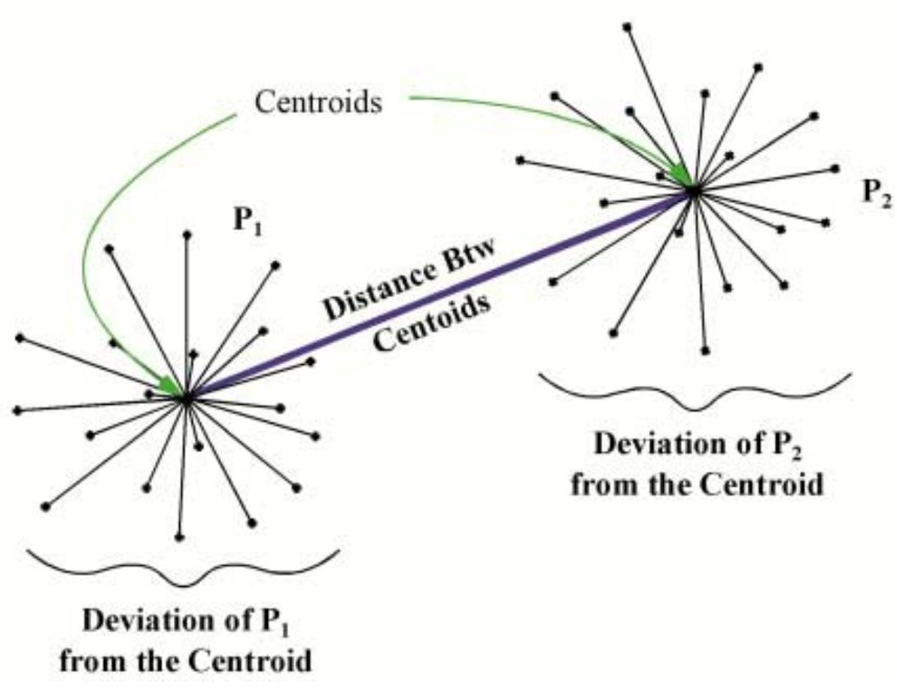  
Figure 8: Two collections of points in Euclidean 2-space are presented, along with the basic measurements that are used.

The straightforward generalization of the standard deviation from the mean, to get a sense of ‘spread’ of the collection of points, would be to take the ‘standard’ deviation’ of points around the centroid (see Figure 8). In other words we wish to take the $\mathrm { L } _ { 2 }$ -norm to combine the distances between each point from the collection and its centroid.

We already know that the distance between populations is the distance between centroids as desired, but is the all-possible-pair diversity measure of a population the same as the ‘standard deviation’ from the centroid? Surprisingly, it is!

Theorem 11: The square diversity of a population is proportional to the variance of points around a centroid, i.e. ${ \cal D } i \nu ( P ) = \frac { 1 } { n } \sum _ { i = 1 } ^ { n } { \cal D } ^ { 2 } ( \vec { x } _ { i } , \vec { \mu } )$ where $D ( \vec { x } , \vec { y } )$ is the Euclidean distance between two vectors, ${ \vec { x } _ { i } = ( x _ { i \mid 1 } , x _ { i \mid 2 } , \cdots , x _ { i \mid k } ) }$ and $\vec { \mu } { = } ( \mu _ { 1 } , \mu _ { 2 } , \cdots , \mu _ { k } )$

Proof. See Appendix A-8.

# Ch7 ß5.2 Cluster Analysis and Numeric Populations

As mentioned in the introduction, none of the above definitions and results developed for populations that use numeric genomes are at all new. They are well known and fall within the purview of Cluster Analysis.

Just about every concept and definition detailed in this current chapter on numerical genomes exists in the Cluster Analysis literature: The diversity of a population, defined as the ‘deviation from the centroid’, is the statistic scatter of a cluster. The relationship between the statistic scatter and the sum of squares of the all-possible-pairs Euclidean distance is also well known. The distance between centroids (when multiplied by n1n2 ) is the main distance between clusters and is called the statistical distance between clusters. Even the relationship between the statistical distance, called between group sum of squares (BGSS), and the statistical scatter, called the within group sum of squares (WGSS), is known.

A good summary of the mathematics behind Cluster Analysis (although now somewhat dated) can be found in Cluster Analysis: A Survey (Duran and Odell 1974). For a more recent overview, as well as a discussion on how cluster theory is used to solve pattern recognition problems, see (Theodoridis and Koutroumbas 1999).

# Part 2

# Ch7 ß5.3 The Characteristic Center and the Center of the Population

As has become evident throughout the development of the various measures used on populations that have numeric genes, there are deep similarities between those measures and the ones used on populations that have symbolic genes.

In numeric systems, the distance between chromosomes is based on the Euclidean distance, which is the $\mathrm { L } _ { 2 }$ -norm of the vector difference between the chromosomes. In symbolic systems the distance between chromosomes is the Hamming distance, which is the $^ { \mathsf { \Sigma } } \mathrm { L } _ { 1 }$ -norm’ of the Boolean difference between genes. It is also half of the $\mathrm { L } _ { 1 }$ -norm of the difference between the gene frequency matrices for the two chromosomes, which, if normalized, is the distance between populations (2.32) when both populations are comprised of only one chromosome each.

In numeric systems, the distance between populations is the Euclidean distance between centroids, which is again the $\mathrm { L } _ { 2 }$ -norm of a vector difference. In symbolic systems, the distance between populations is the $\mathrm { L } _ { 1 }$ -norm of the difference between the gene frequency matrices of the two populations, normalized.

In numeric systems, the diversity of a population is the $\mathrm { L } _ { 2 }$ -norm of the distance from each chromosome to the centroid of the population. In symbolic systems, the diversity of a population is the (normalized) $\mathrm { L } _ { 1 }$ -norm of the distance from each chromosome to the gene frequency matrix of the population (see Appendix A-9).

From the above list of comparisons between systems with symbolic and numeric genes the analog between the two becomes very apparent. For symbolic gene systems, the gene frequency matrix takes the place of the centroid, and the $\mathrm { L } _ { 1 }$ -norm and Manhattan distances take the place of the $\mathrm { L } _ { 2 }$ -norm and Euclidean distances49.

# Part 2

As a consequence of the above observations, two new terms will be introduced: the characteristic center and the center of the population.

The gene frequency matrix of a population with symbolic genes will be given a new name: the characteristic center. This change of name was deemed necessary firstly in order to highlight the way the gene frequency matrix seems to characterize a population, but mainly to emphasize its similarity to the centroid.

The second term is introduced in order to have a way of referencing that aspect of a population that corresponds to either the centroid or the characteristic center, yet apply equally to systems that have symbolic or numeric genes. Thus the generic term center of the population will refer to the above concept.

be $\left[ a _ { 0 } ~ a _ { 1 } ~ a _ { 2 } ~ a _ { 3 } ~ a _ { 4 } ~ a _ { 5 } ~ a _ { 6 } ~ a _ { 7 } ~ a _ { 8 } \right] = \left[ a _ { 0 0 } ~ a _ { 0 1 } ~ a _ { 0 2 } ~ a _ { 1 0 } ~ a _ { 1 1 } ~ a _ { 1 2 } ~ a _ { 2 0 } ~ a _ { 2 1 } ~ a _ { 2 2 } \right] .$ . With the gene frequency matrix written this way, the $\mathrm { L } _ { 1 }$ -norm can now be applied, producing all of the results listed above.

# PART 3 THE SHIFTING BALANCE GENETIC ALGORITHM

# Chapter 8

# Introduction

# Ch8 §1 Adding the Details that Were Missing from the SBEA

In Part 1 we developed the “shifting balance” addition to evolutionary algorithms. Added to the main population of the regular evolutionary algorithm, be it the GA, ES or EP, are a series of smaller, helping populations called colonies. The main population, called the core, is responsible for exploring the area of the search space that seems most promising, i.e. performing exploitation, while the colonies explore the areas of the search space where the core population doesn’t yet have a presence. For the colonies to maintain their distance from the core, they must have information as to how far they are away from the core. Thus for the SBEA to be applicable to a particular evolutionary algorithm, a distance between chromosomes and populations must be known. Consequently, a mathematically precise definition for distances between populations was derived in the previous chapter for various evolutionary systems, and as a result, the colonies now can have a sense of where “elsewhere” is through a distance measure to the core. The basis for that distance changes depending on the evolutionary algorithm used: the distance for a standard GA is based on Hamming distance between chromosomes, while for ES, EP or a GA with real valued genomes, the distance will be derived from the Euclidean distance between the chromosomes.

While the above exposition is accurate, some important details are missing: with the distance measure the colonies can tell where elsewhere is, but through what mechanism do they move themselves there? For the core to profit from the exploration by the colonies, the colonies send in migrants; but how should the core population incorporate them?

These details will, of course be different for the different underlying evolutionary algorithms. In this dissertation we will develop the mechanisms to add to the GA, which, when completed, shall be called the Shifting Balance Genetic Algorithm (SBGA). All details and experimentation will be based on the GA. The “shifting balance” addition to ES or EP would be done analogously.

# Ch8 §2 An Outline of the Chapters that detail the SBGA

In the three chapters following this introductory chapter, the workings of the SBGA will be explored in detail.

The first two chapters complete the various mechanisms that are needed for the SBGA to function properly, but were previously glossed over.

In Chapter 9 the mechanisms necessary to move the colonies into new areas in the search space will be developed. This process was begun in the previous part of the dissertation, which looked at ‘where is elsewhere’. However, while location in the gene space has been better delineated, the actual algorithms that would keep the colonies from the core were not presented. This situation will finally be rectified and the complete process given.

# Part 3

In the chapter following, the migration of members from colony to core will be investigated. Topics will include the rationale for not having migration from core to colonies, how to integrate the migrants from the colonies into the core, and the frequency that migration should occur at.

With the completion of these two components we will be in a position to comment on the completed SBGA as a whole. This will be dealt with in Chapter 11. First the top-level algorithm of the SBGA is compared with that of the GA. Then the order that the new operators should be performed in is determined. The balance of the chapter, which will end this part of the dissertation, will discuss the usage of the SBGA in both stationary and dynamic environments, motivating the experimentation that will be investigated during the remainder of the dissertation.

# Chapter 9

# Moving the Colony Elsewhere

# Ch9 §1 Introduction

The purpose of developing a distance between populations, as was done in Part 2, was to ensure that the colony could tell that it was searching in an area of the search space that was different than where the core was searching. In this chapter we shall now use that distance to do just that.

There are two main tasks to accomplish when keeping the colony away from the core: detecting when the colony is too close to the core, and actually moving the colony away when so detected. The detection mechanism will be dealt with in $\mathrm { C h 9 \ \ S 4 . }$ , while the procedure for moving the colony, if found too close to the core, will be developed in Ch9 $\ S 2$ . Between these two sections we shall motivate the development of the detection mechanism by creating a method to reduce or increase the pressure by which the colony is moved away from the core.

In the last section a technique that keeps colonies away from each other will be presented.

# Ch9 §2 Keeping Colony Away from Core

Let us assume that a colony is too close to the core. For the Shifting Balance theory to work, the colony must be forced elsewhere. The theory as developed by Sewall Wright identified random drift occurring in small populations as the mechanism to perform this task. While this may or may not be true in nature, as the basis for an algorithm random drift seems rather haphazard and hard to control. A better approach is to change the fitness function such that areas other than where the core is searching are preferred and let selection do the work. Thus selection is the sole mechanism that determines where the GA is to search, eliminating the balancing act entailed by relying on both random drift and selection in tandem.

An immediate problem that arises, when trying to evolve the colony away from the core, is the choice of fitness function. As the name implies, random drift moves the population in a random direction. We can do better than that. The purpose of the fitness function is to increase the distance between the colony and the core. Now that we have a distance between the colony and core, as developed in the previous chapter, it can be used as the fitness function. In other words the fitness function shall be the distance from the core: the further a member is from the core, the more fit it is.

Notice that fitness is a property of the individual members of a colony, not of the entire colony. Consequently the distance used in the fitness is not the distance between the entire colony and the core, but rather the distance between an individual member of the colony from the core. Thus one would use the distance from a single chromosome to a population, i.e. (2.35) for chromosomes with binary or symbolic genes, and (2.39) for chromosomes with real valued genes. The colony can then be allowed to evolve naturally, using the regular GA. With distance from the core used as the fitness, the colony evolves smoothly away from the core and into virgin territory without the unnatural leap suffered by using a restart.

# Ch9 §3 Adding Finesse: Evaluating The Colony Using a Multi-Objective Function

If the algorithm were left as presented in the previous section, the evolution of a colony away from the core would be an on / off proposition. If the colony is too close to the core it completely stops trying to find the optimum of the objective function and just moves away from the core in any direction. It would be nice if the colony is allowed to balance the two tasks and partially follow the objective function’s landscape so when it moves away from the core, it has a good chance of heading into a fruitful area. However, to accomplish this, two goals are being merged: first one must follow the fitness landscape and yet also move away from the core. In other words we are faced with a multi-objective optimization task.

The problem with multi-objective optimization for the GA is the reliance of the GA on a single fitness function for selection. Many techniques have been developed to handle multi-objective optimization, see (Coello Coello 1999).

The simplest method is to combine the various functions to be optimized into a single function. This is usually done using a linear combination of the various objective functions into a single fitness function:

$$
F ( x ) = \sum _ { \forall i } w _ { i } \cdot f _ { i } ( x )
$$

with the weights usually constrained so that they sum to one. Since we are dealing with only two optimization functions, the objective function $f ( x )$ and the distance between the chromosome and the core population $D i s t ( x , P )$ , we will only have one weight, which shall be symbolized as $\boldsymbol { \kappa } .$ . Consequently, the general linear equation takes the form

$$
F ( x ) = \kappa \cdot f ( x ) + ( 1 - \kappa ) \cdot D i s t ( x , P ) .
$$

A second technique for handling multi-objective functions was proposed by Schaffer, which he called the Vector Evaluated Genetic Algorithm, known by its acronym “VEGA” (Schaffer 1985). Here the next generation is divided into equally sized subpopulations, one sub-population for each function. A sub-population is then filled by selecting chromosomes from the parent’s generation based on only one of the optimization functions. In other words there is a one-to-one mapping of the fitness function used by a sub-population and the set of optimization functions. The subpopulations are then merged and shuffled and the GA genetic operators are applied to form the new generation. VEGA has been modified in various ways (Cvetkovic, I. et al. 1998), including keeping the sub-populations separate and allowing for migration.

In this dissertation, it was decided to use a modified VEGA approach to handle the biobjective criteria of regular fitness and distance from the core. The linear combination approach was ruled out because it was felt that the combined fitness function was blending two very disparate tasks, with the resulting function possibly doing neither well. The standard VEGA approach was also rejected because, after the shuffle, the crossover operator would be combining solutions that could have been selected for radically different reasons (distance from core versus high fitness on the objective function). The modifications developed by Cvetkovic et. al. seemed to be more promising, but a more direct modification of VEGA, developed below was chosen instead. There are two reasons for the development of the modification. First, it is actually simpler than VEGA is, with or without Cvetkovic’s modifications. Second, and more importantly, it closely matches the properties one would desire given the nature of the bi-objective task faced by the colony.

For the modification of VEGA as used by the SBGA, first the shuffle step is removed. Then, when filling a sub-population, the parents are selected from the previous generation’s entire population. However, the fitness function used during the selection is the one associated with the sub-population being filled. Notice that, unlike VEGA, it is the children of the selected parents that fill the sub-population, not the parents themselves (see Figure 9 for details).

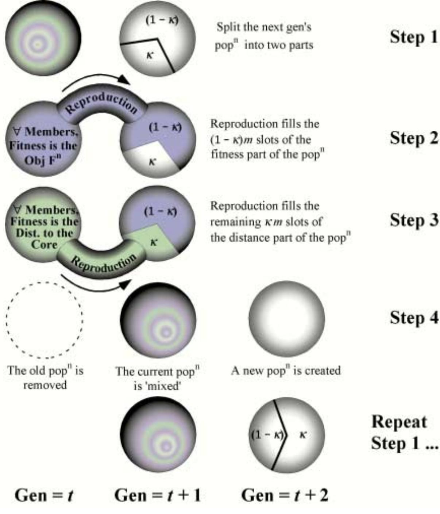  
Figure 9: The modified VEGA algorithm tailored for the SBGA colonies, which are trying to maximize both the objective function its distance to the core.

# Part 3

As a consequence of the modification, crossover is performed on chromosomes that have been selected under the same criteria. Furthermore combining the two subpopulations allows for chromosomes to have a probability of being selected for the next population that combines its distance from the core with its objective function valuation. This doesn’t happen if the two sub-populations are kept separate, even with migration.

A full outline of the reproduction routine as used in the SBGA is presented in Appendix C-3 pseudo-code, including alongside, a detailed description of the working of the code.

# Ch9 §4 A Dynamic κ: Detecting the Similarity Between the Colony’s Search Area and the Core’s

# Ch9 ß4.1 Defining the Problem: The Fine Balancing Act of Keeping Colony From Core Without Wandering to Infinity

Intuitively, having the colony move away from the core while still following the “fitness landscape”, instead of just blindly “fleeing” the core’s search area, should be of great advantage to the SBGA system. However, one obvious downside is the need to introduce the new parameter $\kappa .$ ; how should this parameter be set?

The simplest approach it to keep κ constant. This is what is implicitly done in VEGA, with $\boldsymbol { \kappa }$ equaling $\textstyle { \frac { 1 } { 2 } }$ . However, with a little thought one can see that this is not desirable. When $\boldsymbol { \kappa }$ is kept constant, a constant pressure is maintained driving the colony away from the core. This pressure will be, to some degree, balanced by the colony’s following of the “fitness landscape” through the means of the selection being done on the $( 1 - \kappa )$ colony members. However, unlike the selection pressure to keep away from the core, this counter pressure is not held constant, and changes as the area of the objective function being explored changes. Furthermore, even when the colony is far enough away from the core so that it is searching in novel territory, the pressure away from the core continues on relentlessly. Consequently over-time (and from preliminary experiments that time can be short indeed) the colonies will all drift over to the antipode of the core (see Figure 10). To state it mildly, this is not the behavior that one wants the system to have!

It is now obvious that a measure is needed to naturally reduce and even stop the selection pressure on the colony that is driving it to greater and greater distance from the core, especially after the colony is in an area free from core members. This measure would regulate the value of $\kappa$ for the colony, keeping it small to zero when far from the core while increasing it when moving into an area of the search space that is already occupied by the core. It is just such a measure that will be developed in this section.

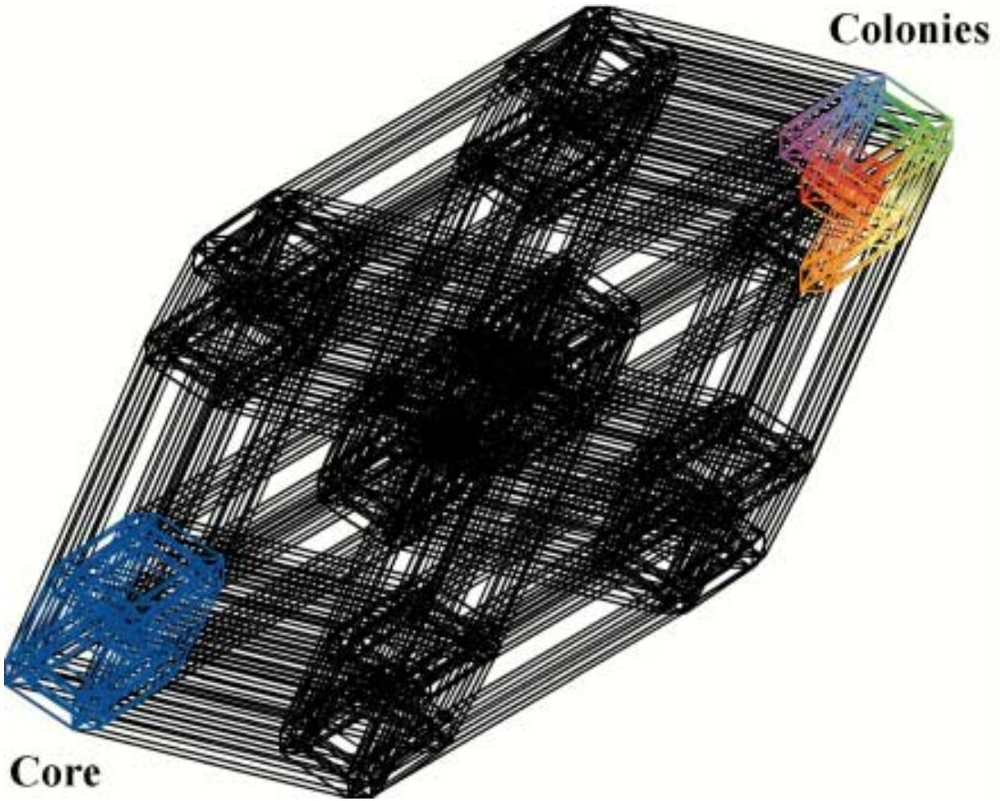  
Figure 10: If a constant value of $\kappa$ is used, all colonies are driven to the antipode of the core.

# Ch9 ß4.2 The Key Idea in an Abstract Form

Let us look at a Venn-like diagrammatic abstraction of the situation50. In Figure 11 we see three scenarios. In Figure 11a, the colony is entirely in the core. Consequently the pressure to move the colony should be at its greatest and hence $\kappa$ should be much greater than 0. In the next figure, the colony is already partly out of the core’s search area; so $\kappa$ should be reduced from the previous level. In the last figure the colony is not near the core at all. Therefore the colony should be allowed to just follow the search space according to the selection pressure provided by the objective function, which means $\kappa$ must be equal to 0.

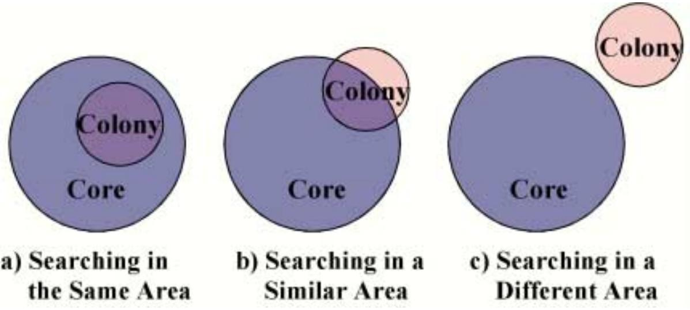  
Figure 11: Venn-like diagrams representing the overlap of the search areas between the core and a colony

# Part 3

From this analysis we can see that a good measure of $\kappa$ should be based on the proportion of members of the colony that overlap the search area of the core.

This is a very different concept from just looking at the distance from colony to core. There the emphasis is on the entire colony population; the question being “how much change is needed to turn it into the core?” A large amount of change necessitates no action. Too little and the colony must be moved away from the core. Yet there was no scale associated with ‘too little difference’ versus ‘just enough difference’.

After the new insight, the focus has shifted to the position, with respect to the core, of each colony member, as opposed to the distance of the colony in its entirety. The question has become “how many members of the colony are in the same search area as the members of the core?” The absolute scale of the ‘distance between populations’ has now become a relative measure of overlapping search areas. This change in perspective will allow for the regulation of the division of the sub-populations, as will be demonstrated presently.

# Ch9 ß4.3 From ëVenní Diagrams to Populations in Gene Space Part I: the Percentage Population Overlap

# Ch9 §4.3.1 From ‘Venn’ Diagrams to Populations in Gene Space: An Overview

Now that the main idea has been loosely presented as a series of Venn-like diagrams, all that is left is to simply translate it into actual populations in gene space. This unfortunately is not so easily done.

In this and the following subsection, two different attempts at capturing this abstract idea in algorithmic form will be made.

The first attempt will successfully embody the concept of the ‘overlapping search areas’. It will be called the ‘percentage population overlap’ and is presented in the balance of the current section. Unfortunately, the corresponding algorithm will prove to be too computationally expensive.

# Part 3

The second attempt, called ‘percentage population similarity’, is presented in the following subsection. It does not hew as closely to the idea, but turns out to be more computationally efficient.

# Ch9 $\ S 4 . 3 . 2$ Finding the Percentage Population Overlap

It would be nice if there were a direct translation from Venn Diagrams as applied to sets and populations in gene-space; unfortunately, populations in gene space are not as easy to work with. For example, in Venn diagrams, an overlap (or intersection) is the set of points that both sets have in common; however with populations in gene space this is normally the empty set! In most cases the populations of the core and colony would be distinct with the exception of migrants from the colony to the core. Even with those members most would not survive the selection routine, and the chances are that either crossover or mutation will change those that do. Everything in gene-space is based on distances; with sets everything is based on set inclusion.

Actually the last sentence in the previous paragraph holds the means of overcoming the problems that arise from the difference in behavior of sets and populations. Instead of demanding that a colony member can only be in an “intersection” region by being a member of both populations, which is an idea based on set inclusion, we allow the definition to be loosened. Now we say that the member is in an “overlapping” region by merely being close to one or more members of the other population, which is a distance based concept.

Unfortunately, the definition above is not precise enough. It is based on the closeness of members but does not clarify how close is close. In Figure 12, a situation is presented that will give us the insight needed to identify the solution. Compare the two members of the colony, $m _ { 1 }$ and $m _ { 2 }$ , with the core member $n _ { 1 }$ . Intuitively one can see that $m _ { 1 }$ is closer to the core member than the core member is, on average, to the other members of the core (represented by the distance of $n _ { 1 }$ to the center). This is not so with $m _ { 2 }$ . Now, from (2.35) in Ch6 $\ S 6$ , we know that the distance of a chromosome to every member within a population is identical to its distance to the population as a whole. So we can say that a member of the core group is close to a member of a colony if the distance between them is less than the distance between that core member and the entire core.

Using this model, we will now define a dynamic function for computing our first version of the split ratio $\kappa$ , which shall be called the percentage population overlap, or simply percentage overlap, and which shall be denoted $\kappa _ { o }$ .

Let Core be a core population of size $n$ and Colony be a colony population of size m. Now, let $x _ { i }$ be the number of core members that are closer to the $i ^ { \mathrm { t h } }$ member of the colony than they are to the core. This can be more formally stated as follows: let $X _ { i }$ be the multi-set corresponding to the colony member $d _ { i } \in C o l o n y$ such that

$$
X _ { i } = \{ c | c \in C o r e , \operatorname { d i s t } ( c , d _ { i } ) \leq \operatorname { d i s t } ( c , C o r e ) \} ,
$$

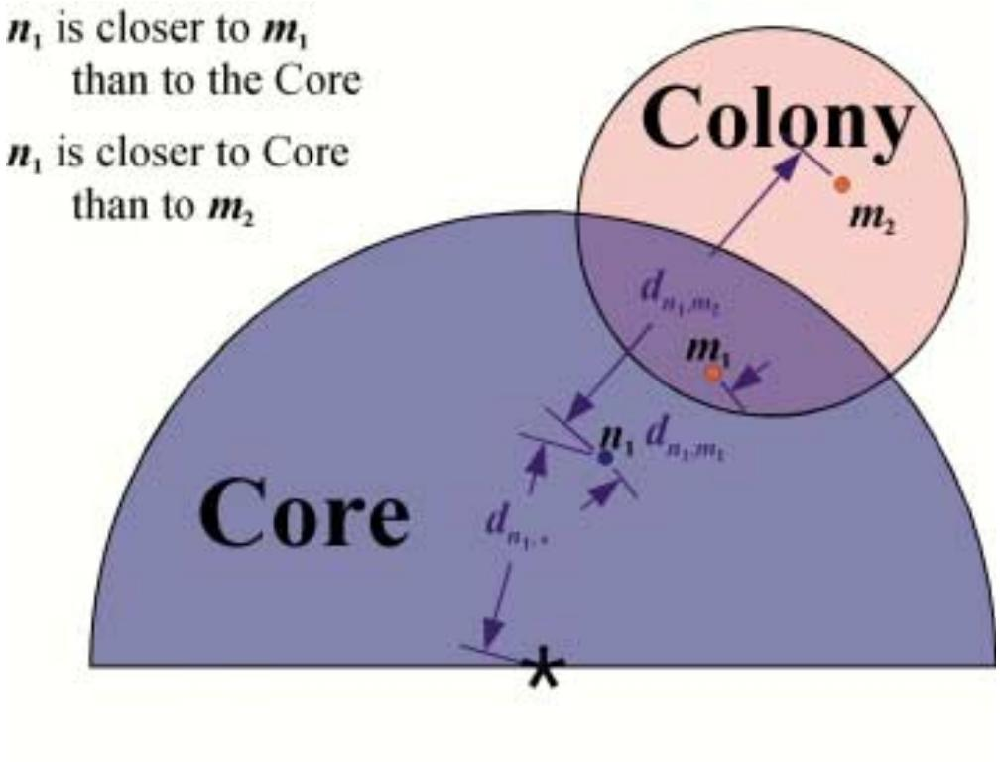  
Figure 12 A core member is near a colony member if it is closer to it than it is to the rest of the core’s population.

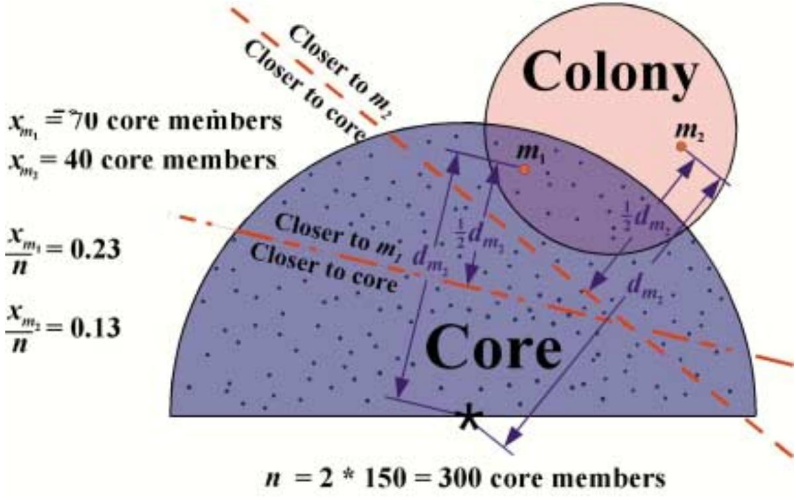  
Figure 13: Calculating the $x _ { i }$ -values for the percentage-overlap

then we can define $x _ { i } = \left| { X } _ { i } \right|$ .

Now the percentage of the core that are closer to the $\mathrm { i } ^ { \mathrm { t h } }$ member than they are to each other is i and so the average, ${ \frac { 1 } { m } } \sum _ { i = 1 } ^ { m } { \frac { x _ { i } } { n } }$ , is the total fraction of the core that the colony is close to. This is what $\kappa$ is supposed to measure! So, after factoring out the $\textstyle { \frac { 1 } { n } }$ , we obtain the formula for the split ratio:

$$
\mathbf { \kappa } _ { o } = \frac { 1 } { m \cdot n } \sum _ { i = 1 } ^ { m } x _ { i } .
$$

An example calculation of the $x _ { i }$ -values for some sample members of a colony with respect to a core with 300 members is presented in Figure 13. Here, as in Figure 12, we have chosen a GA whose chromosomes have two genes, both of which are numeric. This allows accuracy when drawing populations in Euclidean 2-space, which is much simpler to visualize than an n-dimensional Boolean space.

In the diagram, the blue flecks are core members, the two small orange circles are the sample colony members, $m _ { 1 }$ and $m _ { 2 }$ . The large, purple and pink circles labeled ‘Core’ and ‘Colony’ are only supposed to be suggestive of the area that the two populations cover; they are not the populations themselves. Only the members themselves define the population.

The dashed orange lines in the diagram are the respective boundaries between the core members that are closer, on average, to each other than they are to the colony member, and the core members that are closer to the colony member. The reason that they are straight lines is as follows: As seen in the previous chapter, a chromosome’s distance to a population is isomorphic to its distance to the center of that population. In the diagram we represent the center of the core as an asterisk. Now the set of points in Euclidean space that are equidistant from two given points forms a Voronoi boundary between them. It is well known, provided we only consider two points, that such a boundary forms a straight line. The assumption of Euclidean space is validated by the use of numeric genes in the chromosome, which produces a chromosome space that is isomorphic to Euclidean space. Finally, note that the shortest distance from either the core or the colony member to the division line is half the distance to each other.

The x-values are calculated by counting all core members on the colony member’s side of the Voronoi boundary. The percentage of the core that is close to the colony member is also presented in the figure.

The percentage overlap departs somewhat from our intuitive notions of the properties that an “overlap” should have. For example if we compare two identical populations we would think that they should completely overlap, i.e. that $\kappa$ should be 1. However, in most cases we would find $\kappa$ to be much smaller than 1. A percentage unary overlap would only occur if all members of the colony were at the center, i.e. all had zero distance to the core population (actually the value would be equal to $\textstyle { \frac { 1 } { 2 } }$ , not 1, because of the way that ties are handled, see 0). Any spread in the colony population will lower the percentage overlap. This means that $\kappa$ , thus defined, is conservative in the sense that the resulting system follows the fitness landscape more readily than it does pushing away from the core.

# Ch9 §4.3.3 Time Complexity when Calculating the Percentage Overlap

Unfortunately there is a major problem with the definition of $\kappa$ as it stands. Since the distance from each colony member to each core member must be computed and treated separately (there is a comparison for each core member / colony member pair) instead of averaged, there will be $m \cdot n$ such comparisons. Each comparison takes $O ( l )$ time, where $l$ is the length of the chromosome. Consequently the algorithm to compute $\kappa$ will have an $O ( l \cdot m \cdot n )$ time complexity. Since this must be done for each colony, if there are $k$ colonies the time complexity becomes $O ( k \cdot l \cdot m \cdot n )$ . Now the total population size is $N = k \cdot m + n$ . Normal settings for $k , m$ and $n$ have $n \approx k \cdot m$ since the core group should be a lot larger than the colonies to do proper exploitation, yet the colonies must be large enough not to suffer excessively from random drift. Therefore $N = k \cdot m + n \approx 2 n$ , which means that $\begin{array} { r } { n \approx k \cdot m \approx \frac { N } { 2 } } \end{array}$ . Consequently $\begin{array} { r } { k \cdot m \cdot n \approx \frac { N } { 2 } \cdot \frac { N } { 2 } \approx N ^ { 2 } } \end{array}$ , and so the time complexity can now be seen to be $O \big ( l \cdot N ^ { 2 } \big )$ .

Since the time complexity of the GA is only $O ( l \cdot N )$ , if $\kappa$ is calculated by the means of percentage overlap, the SBGA will have caused a slow down in the performance of the GA. Another approach will have to be found.

# Ch9 ß4.4 From Venn Diagrams to Populations in Gene Space Part II: Finding the Percentage Population Similarity

# Ch9 §4.4.1 Defining the Percentage Similarity

Since the percentage population overlap is so computationally expensive, we will look for other methods to accomplish the task. We probably will not find any method with exactly the same properties (otherwise it would probably have the same time complexity). However, as long as the new measure is conceptually similar to the percentage overlap, prevents the colony from being in the same area as the core, and has a time complexity no greater than that of the GA, it will the preferable technique.

Since the n comparisons between each colony member and all the core members is responsible for the large time complexity, let us weaken the previous method and just calculate the distance of a colony member to the core group as a whole. This distance can be computed for every colony member in $O ( k \cdot l \cdot m ) \approx O ( l \cdot n )$ time (see Ch6 $\ S 6$ ), thus keeping the total time complexity of the GA unchanged as required.

Now instead of comparing a core member’s distance to the core with its distance to a colony member we compare its distance to the core with the colony member’s distance to the core. If distance to the core of a core member is greater than the colony member’s distance the core it is deemed to be ‘outside’ the colony member. Conversely if its distance is less it is considered to be ‘inside’ (see Figure 14). Since distance to a population is just the converse of similarity, a chromosome's having a smaller distance to a population is equivalent to its being more similar to that population. Consequently core members that are ‘outside’ of a colony member are less similar to the core than is that colony member.

From here there are two ways of thinking about the meaning of the ‘outside’ / ‘inside’ partitioning of the core with respect to a colony member.

With the first approach, having numerous core members ‘outside’ of a colony member implies that the colony member is close to the ‘center’ of the core (as defined in the previous chapter). Consequently the deeper the colony member is, the more we say it is searching in the same area as the core.

In the second perspective, we focus on the similarity aspect to distance. The distance to a population implies a corresponding similarity measure between member and population. If a colony member is at the “center” of the core, all core members, other than those also at the center, would be “outside” of that colony member. Therefore the more similar a colony member is to the core population, the greater will be the fraction of “outside” core members of the core population.

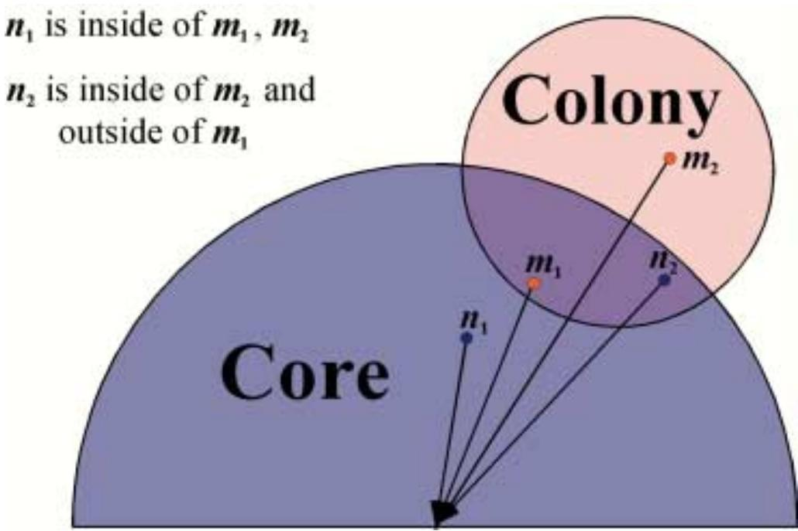  
Figure 14: Inside vs. outside in relation to a core population

Now, combining the two perspectives, the basic algorithm becomes clear. As with the percentage-overlap, we wish to know what fraction of the core population is to be considered too similar to the colony member. But instead of judging similarity by the number of core members that are too close to the colony member, we look at the number of core members with a greater distance to the core than the colony member’s distance to the core. These core members are considered as evidence of the colony member’s similarity to the core. So, instead of counting for each colony member how many core members have a greater distance to the core than to the colony member, we count the number of core members that have a greater distance to the core than that colony member’s distance to the core.

Part 3

We can now define $r _ { i }$ , which is the analog to $x _ { i }$ , as the number of core members whose distance to the core is greater than the colony members’ distance to the core. Since the distance to a population is the converse of the measure of similarity to a population, $r _ { i }$ can be thought of as the number of core members that are less similar to the core than the colony members.

We will now present a formal definition of $r _ { i }$ . Let $R _ { i }$ be the multi-set corresponding to the colony member $d _ { i } \in C o l o n y$ such that

$$
R _ { i } = \{ c | c \in C o r e , \operatorname { d i s t } ( d _ { i } , C o r e ) \leq \operatorname { d i s t } ( c , C o r e ) \} .
$$

Then we can define $r _ { i } = \left| R _ { i } \right|$ . $\mathrm { N o w } { \frac { r _ { i } } { n } }$ is the percentage of the core that is less similar to the core itself than is the $\mathrm { i } ^ { \mathrm { t h } }$ member of the colony. We shall call this the percentage similarity to the $\mathbf { i } ^ { \mathbf { t h } }$ member.

We can now average all the percentage similarities of all members together to produce the average percentage similarity of the colony, which is $\frac { 1 } { m } \sum _ { i = 1 } ^ { m } \frac { r _ { i } } { n }$ i . This average represents the total fraction of the core that, when compared with itself, is found to be less similar than the comparison of the colony to itself. This is the percentage population similarity, or more simply the percentage similarity.

We can now use the percentage similarity as the new split ratio:

$$
\kappa _ { s } = \frac { 1 } { m \cdot n } \sum _ { i = 1 } ^ { m } r _ { i }
$$

In Figure 15 a pictorial example is presented that shows the computation of the percentage-similarities for a few colony members in a two locus GA that uses numeric genes, (because binary or symbol genes are harder to visualize). Since only half of the core is presented, assume that the other half is the mirror image of the first half, including the amount and placement of the core members. The blue flecks in the core represent core members, and the orange circles, labeled $m _ { 1 } , ~ m _ { 2 }$ and $m _ { 3 }$ , are the three colony members whose percentage similarity are being computed. The symbols $r _ { m _ { 1 } }$ and $r _ { m _ { 3 } }$ are not radii, but rather the radial regions (an area) where any core members that reside there are considered to be “outside” of the corresponding colony member. Finally note that colony member m2 is completely outside the core. Consequently it has no radial region, and its rvalue is 0.

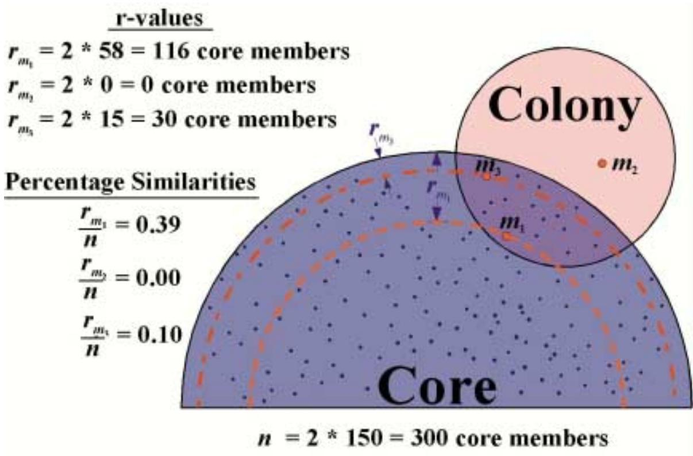  
Figure 15: Calculating the Percentage Similarities for colony members

# Ch9 §4.4.2 Handling Ties

The definition of the percentage similarity defined above is not quite accurate. In many cases there will be ties in the distance to the core, either between colony members with core members, or colony members with each other. In equation (3.5) the “less than or equal to” is used to compare the relative distances, colony member to core versus core member to core. A similar definition could be created that uses the “strictly less than” operator. Which one is right? Should we include ties in the $R _ { i }$ multi-set, or exclude them?

# Part 3

The solution becomes obvious if we consider what happens to $\kappa$ when it is calculated for a colony that is a complete duplicate of the core, yet all member within each respective population are distinct from one another. Since the colony duplicates the core, each core member is tied with one and only one colony member in distance to the core. Now, if we include ties, $\kappa$ can be computed as

$$
\kappa _ { \scriptscriptstyle \leq } = { \frac { 1 } { n ^ { 2 } } } \sum _ { i = 1 } ^ { n } R _ { i } = { \frac { 1 } { n ^ { 2 } } } \sum _ { i = 1 } ^ { n } i = { \frac { 1 } { n ^ { 2 } } } { \frac { n ( n + 1 ) } { n } } = { \frac { 1 } { 2 } } + { \frac { 1 } { 2 n } } .
$$

However if we exclude ties then $\kappa$ becomes

$$
\kappa _ { < } = \frac { 1 } { n ^ { 2 } } \sum _ { i = 1 } ^ { n } R _ { i } = \frac { 1 } { n ^ { 2 } } \sum _ { i = 1 } ^ { n } ( i - 1 ) = \frac { 1 } { n ^ { 2 } } \frac { n ( n - 1 ) } { n } = \frac { 1 } { 2 } - \frac { 1 } { 2 n } .
$$

If we let $n \to \infty$ then both $\kappa _ { \leq }$ and $\kappa _ { < }$ become equal to $\textstyle { \frac { 1 } { 2 } }$ . So $\begin{array} { r } { \kappa = \frac { 1 } { 2 } } \end{array}$ should be the value returned if ties are handled correctly.

This result can be obtained if we treat the value that a tie contributes to the term $r _ { i }$ as being half of that of a non-tied member of $R _ { i }$ . An alternate way of computing this is to average the number of members counted when ties are included and those counted when ties are excluded. In other words, if $R _ { i }$ is split into two multi-sets, $R _ { i , < }$ and $R _ { i , \leq }$ where

$$
R _ { i , < } = \{ c | c \in C o r e , \mathrm { d i s t } ( d _ { i } , C o r e ) < \mathrm { d i s t } ( c , C o r e ) \}
$$

and

$$
R _ { i , \le } = \{ c | c \in C o r e , \mathrm { d i s t } ( d _ { i } , C o r e ) \le \mathrm { d i s t } ( c , C o r e ) \} ,
$$

then

$$
\begin{array} { r } { r _ { i } = \frac { 1 } { 2 } \left( \left| R _ { i , < } \right| + \left| R _ { i , \leq } \right| \right) . } \end{array}
$$

This methodology is identical to the tie handling strategy used in the non-parametric statistic, the Wilcoxon Rank Sum test. This should not be surprising since the Wilcoxon Rank Sum test is closely related to the percentage similarity measure, as will be shown in $\mathrm { C h 9 ~ \ S 5 }$ .

The same tie handling strategy should be used when computing the percentage overlap.

# Ch9 §4.4.3 An Algorithm for Computing the Population Similarity

The primary reason for the development of the percentage similarity is to reduce the time complexity suffered by the percentage overlap to manageable proportions. Unfortunately it is not so easy to look at the definition of the percentage similarity as embodied by equation (3.6), or (3.7) if ties are to be handled, and know how long the computation time will take. Consequently, a detailed algorithm to produce the percentage similarity has been included and can be found in Appendix C-4. A general overview of this algorithm shall be given below and the time complexity analysis will be done in the following subsection.

To prepare for the computation of the percentage similarity, the distance to the core must first be computed for all members in all colonies as well as for all members in the core. Each member is then labeled as to whether it belongs to the core or a colony and then all of them are combined into a single population.

Now all of the $r _ { i }$ values for all of the colony members can be found. The combined population is first sorted by distance to the core and then traversed in reverse sort order. Each core member encountered during the traversal is tallied into a running count. This count therefore contains the number of core members that are further from the center of the core than those members of the colonies not yet seen, which is what the $r _ { i }$ values are. So, when a colony member is encountered the current running count is stored as its $r _ { i }$ value.

To handle ties, two different sort orders have to be created, producing two different $r _ { i }$ values for each member: one where ties are included and one where they are excluded. To include ties, the tied core members must be placed higher in the sort order than the colony member that they are tied with. Then when the array is traversed in descending order, the tied core members are encountered before the colony member and so are included in the colony member $\mathbf { \dot { s } } r _ { i }$ value. To exclude ties the opposite sort order is used. Now the colony member is encountered before the core members that it tied with.

# Part 3

Therefore those core members will not be included in the colony members $r _ { i }$ value. Both inclusive and exclusive $r _ { i }$ values must be stored for each colony member.

Once the $r _ { i }$ values are found the percentage similarity for each colony can be calculated in short order. All members from a colony are canvassed to find their $r _ { i }$ values. These are then summed together into two numbers, $R _ { i n c l }$ and $R _ { e x c l }$ , which are averaged together to find $R$ the true similarity sum for the colony. Finally, to arrive at the percentage similarity, this sum is first divided by $m$ , the colony size, and then by $n$ , the core size, as per equation (3.6).

An example of this algorithm in action as applied to two colonies can be seen in Figure 16.

For the example, two colonies and one core group were used, where both colonies have a population size of four, while the core itself has eight members. Having the core equal the population size of all the colonies combined is a typical configuration for the SBGA.

When reading the combined population array, the further a population member is to the right, the closer to the core it is. To generate the $r _ { i }$ values, the array is then traversed from right to the left.

Excluding Ties: Core members tied with a colony member are sorted ‘inside’ of it   

<table><tr><td rowspan=1 colspan=1>Dist</td><td rowspan=1 colspan=1>.75</td><td rowspan=1 colspan=1>.75</td><td rowspan=1 colspan=1>.65</td><td rowspan=1 colspan=1>.55</td><td rowspan=1 colspan=1>.50</td><td rowspan=1 colspan=1>.45</td><td rowspan=1 colspan=1>.40</td><td rowspan=1 colspan=1>.35</td><td rowspan=1 colspan=1>.35</td><td rowspan=1 colspan=1>.35</td><td rowspan=1 colspan=1>.30</td><td rowspan=1 colspan=1>.20</td><td rowspan=1 colspan=1>.20</td><td rowspan=1 colspan=1>.20</td><td rowspan=1 colspan=1>.15</td><td rowspan=1 colspan=1>.10</td></tr><tr><td rowspan=1 colspan=1>Poph</td><td rowspan=1 colspan=1>m1</td><td rowspan=1 colspan=1>m1</td><td rowspan=1 colspan=1>m2</td><td rowspan=1 colspan=1>c</td><td rowspan=1 colspan=1>$m2</td><td rowspan=1 colspan=1>m1</td><td rowspan=1 colspan=1>c</td><td rowspan=1 colspan=1>m2</td><td rowspan=1 colspan=1>m1</td><td rowspan=1 colspan=1>c</td><td rowspan=1 colspan=1>c</td><td rowspan=1 colspan=1>m2</td><td rowspan=1 colspan=1>c</td><td rowspan=1 colspan=1>c</td><td rowspan=1 colspan=1>c</td><td rowspan=1 colspan=1>c</td></tr><tr><td rowspan=1 colspan=1>Type</td><td rowspan=1 colspan=1>0</td><td rowspan=1 colspan=1>0</td><td rowspan=1 colspan=1>0</td><td rowspan=1 colspan=1>1</td><td rowspan=1 colspan=1>0</td><td rowspan=1 colspan=1>0</td><td rowspan=1 colspan=1>1</td><td rowspan=1 colspan=1>0</td><td rowspan=1 colspan=1>0</td><td rowspan=1 colspan=1>1</td><td rowspan=1 colspan=1>1</td><td rowspan=1 colspan=1>0</td><td rowspan=1 colspan=1>1</td><td rowspan=1 colspan=1>1</td><td rowspan=1 colspan=1>1</td><td rowspan=1 colspan=1>1</td></tr><tr><td rowspan=1 colspan=1>i</td><td rowspan=1 colspan=1>0</td><td rowspan=1 colspan=1>0</td><td rowspan=1 colspan=1>0</td><td rowspan=1 colspan=1>1</td><td rowspan=1 colspan=1>1</td><td rowspan=1 colspan=1>1</td><td rowspan=1 colspan=1>2</td><td rowspan=1 colspan=1>2</td><td rowspan=1 colspan=1>2</td><td rowspan=1 colspan=1>3</td><td rowspan=1 colspan=1>4</td><td rowspan=1 colspan=1>4</td><td rowspan=1 colspan=1>5</td><td rowspan=1 colspan=1>6</td><td rowspan=1 colspan=1>7</td><td rowspan=1 colspan=1>8</td></tr></table>

$$
R ( m _ { 1 } ) = 0 + 0 + 1 + 2 = 3 ~ R _ { < } ( m _ { 2 } ) = 0 + 1 + 2 + 4 = 7
$$

Including Ties: Core members tied with a colony member are sorted ‘outside’ of it

<table><tr><td rowspan=1 colspan=1>Dist</td><td rowspan=1 colspan=1>.75</td><td rowspan=1 colspan=1>.75</td><td rowspan=1 colspan=1>.65</td><td rowspan=1 colspan=1>.55</td><td rowspan=1 colspan=1>.50</td><td rowspan=1 colspan=1>.45</td><td rowspan=1 colspan=1>.40</td><td rowspan=1 colspan=1>.35</td><td rowspan=1 colspan=1>.35</td><td rowspan=1 colspan=1>.35</td><td rowspan=1 colspan=1>.30</td><td rowspan=1 colspan=1>.20</td><td rowspan=1 colspan=1>.20</td><td rowspan=1 colspan=1>.20</td><td rowspan=1 colspan=1>.15</td><td rowspan=1 colspan=1>.10</td></tr><tr><td rowspan=1 colspan=1>Poph</td><td rowspan=1 colspan=1>m1</td><td rowspan=1 colspan=1>m1</td><td rowspan=1 colspan=1>m2</td><td rowspan=1 colspan=1>c</td><td rowspan=1 colspan=1>m2</td><td rowspan=1 colspan=1>m1</td><td rowspan=1 colspan=1>c</td><td rowspan=1 colspan=1>c</td><td rowspan=1 colspan=1>m2</td><td rowspan=1 colspan=1>m1</td><td rowspan=1 colspan=1>c</td><td rowspan=1 colspan=1>c</td><td rowspan=1 colspan=1>c</td><td rowspan=1 colspan=1>m2</td><td rowspan=1 colspan=1>c</td><td rowspan=1 colspan=1>c</td></tr><tr><td rowspan=1 colspan=1>Type</td><td rowspan=1 colspan=1>0</td><td rowspan=1 colspan=1>0</td><td rowspan=1 colspan=1>0</td><td rowspan=1 colspan=1>1</td><td rowspan=1 colspan=1>0</td><td rowspan=1 colspan=1>0</td><td rowspan=1 colspan=1>1</td><td rowspan=1 colspan=1>1</td><td rowspan=1 colspan=1>0</td><td rowspan=1 colspan=1>0</td><td rowspan=1 colspan=1>1</td><td rowspan=1 colspan=1>1</td><td rowspan=1 colspan=1>1</td><td rowspan=1 colspan=1>0</td><td rowspan=1 colspan=1>1</td><td rowspan=1 colspan=1>1</td></tr><tr><td rowspan=1 colspan=1>r</td><td rowspan=1 colspan=1>0</td><td rowspan=1 colspan=1>0</td><td rowspan=1 colspan=1>0</td><td rowspan=1 colspan=1>1</td><td rowspan=1 colspan=1>1</td><td rowspan=1 colspan=1>1</td><td rowspan=1 colspan=1>2</td><td rowspan=1 colspan=1>3</td><td rowspan=1 colspan=1>3</td><td rowspan=1 colspan=1>3</td><td rowspan=1 colspan=1>4</td><td rowspan=1 colspan=1>5</td><td rowspan=1 colspan=1>6</td><td rowspan=1 colspan=1>6</td><td rowspan=1 colspan=1>7</td><td rowspan=1 colspan=1>8</td></tr></table>

$$
R ( m _ { 1 } ) = 0 + 0 + 1 + 3 = 4 ~ R _ { < } ( m _ { 2 } ) = 0 + 1 + 3 + 6 = 1 0
$$

# Computing $\kappa \cdot m$

$$
\begin{array} { l l l } { { \kappa { \cdot } m ^ { \prime } = \displaystyle \frac { R _ { < } ( m _ { 1 } ) + R _ { \leq } ( m _ { 1 } ) } { 2 n } = \displaystyle \frac { 3 + 4 } { 1 6 } = 0 . 8 7 5 } } & { { \kappa { \cdot } m = 2 \cdot \mathrm { r o u n d } \displaystyle \left( \frac { 0 . 8 7 5 } { 2 } \right) = 0 } } \\ { { \kappa { \cdot } m ^ { \prime } = \displaystyle \frac { R _ { < } ( m _ { 2 } ) + R _ { \leq } ( m _ { 2 } ) } { 2 n } = \displaystyle \frac { 7 + 1 0 } { 1 6 } = 2 . 1 2 5 } } & { { \kappa { \cdot } m = 2 \cdot \mathrm { r o u n d } \displaystyle \left( \frac { 2 . 1 2 5 } { 2 } \right) = 2 } } \end{array}
$$

# Returning $\kappa$

For Colony 1: $\kappa = \frac { \kappa \cdot m } { m } = \frac { 0 } { 4 } = 0$ $\mathrm { F o r } \mathrm { C o l o n y } 2 \colon \kappa = \frac { \kappa \cdot m } { m } = \frac { 2 } { 4 } = 0 . 5$

Figure 16: Computing κ using the percentage similarity – a detailed example

# Part 3

While performing the traversal, the third line of the array is checked to see if the member comes from the core (value 1) or a colony (value 0), and a running total of the core members encountered is stored in each member of the array as line 4. These are the $r _ { i }$ values.

Finally these values are summed for each colony and then the ratio is taken against the population size to produce the percentage similarity (although care is taken to make sure that the resulting ratio divides the colony into sections that are integer valued).

In this example the first colony was far enough away from the core so that no members need to be removed. The second colony is not so lucky. It is so intermixed with the core that half of its members will have to be moved away.

# Ch9 §4.4.4 The Time Complexity of the Percentage Similarity Algorithm

A detailed analysis of the time complexity of computing the percentage similarity is presented in Appendix C-4. However an analysis of the algorithm sketch above produces the same results and will be presented here.

In the preparation stage, the distance to the core of all members in the system is computed. From Ch6 $\ S 6 . 2$ we know that this can be done in $O ( l \cdot N )$ , where $l$ is the length of the chromosome and $N = k \cdot m + n$ , the cumulative population size of all colonies plus the core. The final step in the preparation is the combining of all populations into a single population. Since this is an $O ( N )$ operation, the total time complexity for the preparation stage is $O ( l \cdot N )$ .

When computing the $r _ { i }$ values, the complete population is first sorted, which takes $ { \boldsymbol { O } } ( N \log N )$ , and then iterated through to compute and store the $r _ { i }$ values, which takes linear time. So the time complexity of this stage is $ { \boldsymbol { O } } ( N \log N )$ .

Finally the $r _ { i }$ values are summed for each population, which is again a linear time computation, and the percentage similarity is computed, which is constant for each colony. So in total, the final stage takes linear time.

# Part 3

Overall, since $O ( N \log N ) < O ( l \cdot n )$ (again see Appendix C-4), the percentage similarity algorithm takes $O ( l \cdot N )$ time to compute. As the GA also has a $\mathcal { O } ( l \cdot N )$ time complexity, computing the split ratio in this way only adds a constant overhead to the GA. This is in direct contrast with the percentage-overlap method which, with its $O ( l \cdot N ^ { 2 } )$ time complexity.

# Ch9 $\ S 5$ Percentage Overlap and Percentage Similarity as NonParametric Statistics

Non-parametric statistics is a branch of statistics that was developed to handle any type of probability distribution. Regular parametric statistics, such as the T test and Analysis of Variance (ANOVA), assumes a normal or Gausian distribution. Distributions other than Gausian, or an abundance of very large outliers, can derail any parametric analysis and incorrect conclusion can occur. In the 1940s and 1950s statisticians, spearheaded by Wilcoxon, developed various statistics when comparing two or more random variables based on the ranked values of the combined observations51. Statistics that depends on the values of the observations themselves, a.k.a. the parameters, became known as parametric statistics while those based on the rank and not the direct observational values themselves, became known as non-parametric statistics.

Interestingly, the dichotomy between parametric and non-parametric statistics has its analog in the GA literature. The original formulation of the GA used fitness directly when performing selection with the well-known fitness proportional selection. Since fitness can be considered an observational parameter, one could, by analogy, call it a ‘parametric’ selection routine. On the other hand, rank selection and tournament selection

both use the rank and not the value of the fitness to select members from a population.   
Thus they can be considered as non-parametric selection routines.

Both percentage-overlap and percentage-similarity are based on the number of members that meet a criterion, and so are ranking methods. Consequently they would be classified as non-parametric procedures. In fact $r _ { i }$ from the percentage-similarity procedure is very similar to the ranking used by the Wilcoxon rank sum test for comparing whether 2 samples are drawn from the same probability distribution. The Wilcoxon ranks are calculated as the number of members of both populations that are greater than (or less than, if we are minimizing rather than maximizing) the value of the current member instead of just how many of the opposite population are greater as is done with the percentage-similarity. Even the method of handling ties is identical. Therefore, one could view the percentage-similarity procedure as just a variant of the Wilcoxon rank sum.

# Ch9 §6 Choosing Between Percentage-Overlap and PercentageSimilarity

There are many reasons why either method could be chosen as an effective technique for detecting when and by how much, a colony should move away from the core. Both are non-parametric and so are not sensitive to outlier values; an outlier member of the core that is far from the rest of the core members would make a colony appear closer to the core’s “center” than it should. Both have a natural “cut-off” point when driving a colony away from the core without the need for artificial threshold values: when the colony is far enough away $\kappa$ becomes 0 and the colony is allowed to follow the “fitness landscape”. Finally both are intuitive measures of whether a colony is in the same area of the gene space as the core with values that increase smoothly as the colony is found to be more thoroughly entrenched within the core’s search area.

On the surface the percentage-similarity is the poorer of the two methods for it has properties that are counterintuitive. Look at Figure 17. Here we find a core member that has a greater distance to the core than a given colony member. It is therefore a core member that is less similar to all other core values than the colony member, implying that the colony is too close to the core. Yet it is nowhere close to that core member, hence the core member is not searching in the same area as it. So consequently the percentagesimilarity method can be seen as being somewhat overly harsh. The percentage-overlap does not suffer from this problem.

While the above argument may support the choice of the percentage-overlap method, the very slow time complexity of that algorithm is quite daunting. Furthermore, being harsh when driving the colony away from the core, which is the main problem of the percentage-similarity method, is actually not too bad a property; after all we want the colony to search in novel areas. So as long as the percentage-similarity method is not overly harsh, as a constant pressure away from the core was found to be, its good time complexity makes it the preferable procedure.

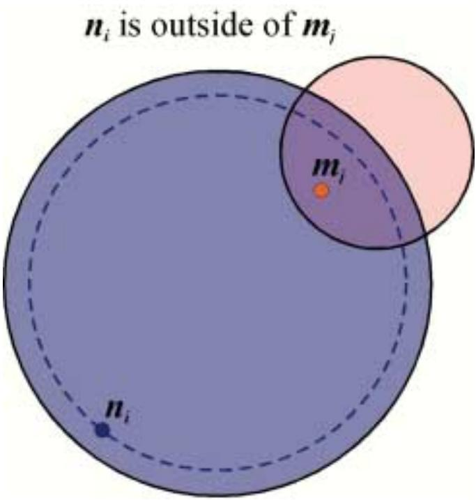  
Figure 17: A core member that is ‘outside’ of a colony member, thus increasing the percentage similarity of the colony, while not being in the same area of the search space.

As a result of the analysis in this section, all experimentation performed in testing whether the ideas in this dissertation are sound, uses the percentage similarity for computing the new colony’s split. It is, of course, possible that the advantages of the percentage-overlap outweigh its major disadvantage; that an increase in the evolutionary performance of the system due to the accuracy of the test may compensate for its computation cost. Whether this is so has been left for future work.

# Part 3

# Ch9 $\ S 7$ Keeping Colony Away from Colony: A Future Extension

# Ch9 ß7.1 The Problem

The idea behind the SBGA is to have many small colonies searching in novel territories that are not being exploited by the core. However this effort would be weakened if the colonies were overlapping each other thus exploring only one other area of the search space instead of many. This may even be likely to occur, since all colonies are following the same “fitness landscape” and may very well end up in the same area of the search space. Consequently, keeping the colonies away from each other, as well as away from the core, may prove to be advantageous.

Furthermore, the same technique that keeps colonies from the core could even be used to keep the colonies from each other. However, there is one small wrinkle to be ironed out first. Naïvely applying a percentage similarity style procedure to every possible colony pair (see Figure 18 on the left) produces an algorithm with an ${ \cal O } ( k ^ { 2 } \cdot l \cdot m ) \cong { \cal O } ( l \cdot N ^ { \frac { 3 } { 2 } } )$ time complexity52. As with the percentage-overlap method, this would slow down the performance of the GA.

Furthermore, the mechanism developed in the previous sections divides the colony into two during reproduction: one part following the “fitness landscape” and the other part moving the colony away from the core. Now we would have to subdivide the colony $k + 1$ ways: one section for following the “fitness landscape” as before, one for moving away from the core, also as before, and $k - 1$ new sections for moving the $k - 1$ other colonies away as well. It is quite conceivable that in some cases there would not be enough members of the colony to be subdivided so many ways.

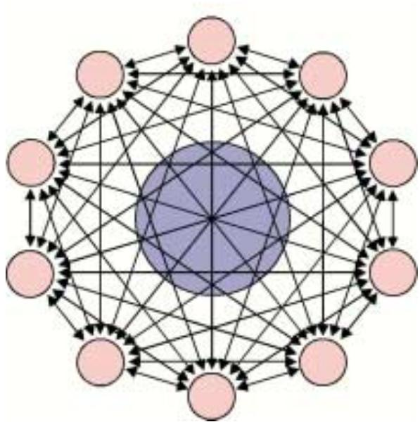  
Figure 18: Keeping All Possible Pairs of Colonies Apart

# Ch9 ß7.2 The Solution

Fortunately, there is a simple modification that reduces the time complexity of the algorithm that keep colony from colony while still maintaining the same functionality.

Instead of every colony trying to move away from each other simultaneously, each colony has a target colony from which it keeps its distance. One can think of the targeted colony $j$ as being given a label that says “colony $i$ must stay away from me”.

Figure 19, pictorially demonstrates the algorithm using10 colonies, labeled from 0-9. Each colony has a single arrow leaving it pointing to the target colony from which it is trying to maintain an appropriate distance. While every colony has a single outgoing edge connecting it to one and only one other colony, their fan-in size can differ dramatically. This can be seen by the adjacency list below Figure 19i. Colonies 0, 1 and 3 have no colonies trying to move away from them, colonies 2, 5, 6, 7 and 9 have one target colony; and colonies 8 and 4 have two and three colonies respectively.

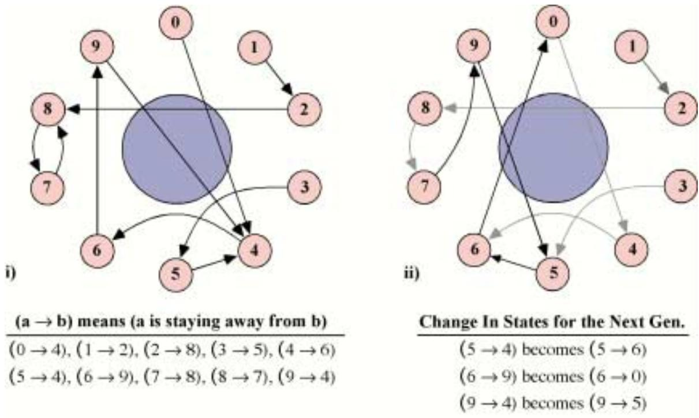  
Figure 19: Keeping Colonies Away from Each Other with a Time Complexity that is Linear in the Number of Colonies. In Figure ii, the grey edges have remained unchanged.

In Figure 19ii, we see a typical transition of the algorithm between generations. All the greyed-out arrows are between colonies that have remained close enough that the colony that is trying to move away has decided that it still needs to extract itself; the black arrows are from colonies that have just switched targets, going to the next colony in the colony list.

Between the two colonies the behavior of the new system is almost identical to what has been previously developed. A percentage-similarity ratio $\kappa _ { c }$ (the $c$ stands for “colony”) is computed for the colony trying to leave, while the targeted colony takes the place of the core in the algorithm. Notice that instead of having $k - 1$ such ratios for each colony as was assumed previously, there is now only one reducing the time complexity to $O ( l \cdot k \cdot m ) < O ( l \cdot N ) .$ .

While the above procedure eliminates the time complexity problem and severely reduces the excessive subdivision problem, the latter problem has not been eliminated. While only two percentage-similarity ratios, $\kappa$ and $\kappa _ { c }$ , need to be used and not $k + 1$ of them, this still necessitates a division of the colony into three sub-populations instead of just the two as was used previously. Furthermore it is unclear as to the best approach to take in performing this three-way split.

One possibility is as follows: Since moving away from the core is of primary importance, perform this split first. We then have a $( 1 - \kappa )$ sized region that is still following the “fitness landscape”. We now subdivide that section into 2 parts using the ratio $\kappa _ { c }$ . So in the end the sub-population selected for distance from the core will have $\kappa \cdot m$ members, the sub-population selected for distance from the other colony is to be given $\kappa _ { c } ( 1 - \kappa ) \cdot m$ members, and finally the number of members that will follow the “fitness landscape” is $( 1 - \kappa _ { c } ) \cdot ( 1 - \kappa ) \cdot m$ .

A second approach would be to see which ratio is higher, $\kappa$ or $\kappa _ { c }$ . This would determine which of the two populations’ search area the colony is too similar to and needs extracting from the most: the core or the other colony. This is the population that will be given the primary consideration and so the first split. There are many more possible division strategies; the best one can only be found after some experimentation has been done.

As was pointed out previously, it is possible for a single colony to be the target for extractions by many other colonies, possibly all other colonies. This is not a problem. Since each colony only has one choice of which other colony to keep away from, the algorithm stays linear in time with respect to the number of colonies. Also since each colony will eventually find itself far enough away from its targeted colony it will perforce switch targets (a time limit can be placed on the number of generations spent on a given colony if switching becomes an issue). Consequently, over $k \cdot g _ { m }$ generation, where $g _ { m }$ is the average time it takes for two populations to move away from each other and $k$ is the number of colonies, each colony will, on average, have had the chance to remove itself from the search area of each of the other colonies in turn.

# Part 3

While the mechanism presented in this section should work in keeping the colonies apart from each other, it is obvious that experiments will have to be done to fine tune the mechanism. Furthermore, it is not even known at this time how large a problem colony overlap is. Some simple experiments can be run to measure the amount of colony overlap that occurs during a typical run of the SBGA. If this proves to be a problem, the mechanism described above, or some variant of it, can easily be added to the SBGA. However all of this remains outside the scope of this dissertation and will be left for future work.

# Chapter 10

# Migration from Colony to Core

# Ch10 §1 Introduction

The preceding chapter dealt with the problem of keeping the colonies away from the core so they can explore novel territory. The mechanism that accomplishes this causes information flow, albeit indirectly, from the core to the colony. However, the information flow must go two ways. Not only do the colonies need to know information about the core, but the core must also receive information from the colonies. Otherwise the core would be independent from the colonies, and the colonies will not be aiding the search but only absorbing resources. The mechanism that closes this feedback loop between core and colonies is migration.

# Part 3

# Ch10 §2 Migration from Core to Colony

In the original shifting balance theory, migration happened in both directions, from core to colony and from colony to core. The migration from core to colony occurred to isolate members in a new environment so that they may be allowed to vary from the norm that exists in the main population. The back-migration from colony to core then in turn provided the core with the novel members, which, if those members demonstrated that they were better than the members of the original population, would shift the balance toward the new breed. The main population, now with a new composition, sends members out into new environments as new colonies, thus starting the process over again. This two-way migration between core and colony sets up a feedback loop where, with evolution as the driving mechanism, information processing can occur.

However, while the core gains information about the colonies through immigration of colony members, sending members from the core to the colony can actually create problems. Since the core has a very large population, most of the time it will find far better solutions than a colony. These solutions, if allowed into the colony, would begin to dominate the colony population within a few generations, forcing the colonies to search in the same area as the core. This would interfere with the mechanism that prevents the colony from overlapping the core. Furthermore, while the overlap prevention mechanism was designed to promote exploration (replacing random drift), not to usurp the function of “seeding” the colonies with core members, it does allow information flow from the core to the colony (unlike random drift) that was previously the sole purview of forward migration. Thus the need for core to colony migration to provide information of the core for the colony is to some degree alleviated.

Of course there is still a role for migration from core to colony: to keep the colonies close to the good search area that has been found by the core. In fact, as mentioned in the previous paragraph, there is a reasonable fear that it would do this too well. Still, the effect of migration from core to colony is virtually the opposite of the distancing mechanism by selection. Migration drives the colony inward; selection pressure from the distance to the core drives the colony away. Consequently, there may very well be complex interactions between the two that may improve search, if properly balanced. While this would make the SBGA a closer model of the mechanism as envisioned by Sewall Wright, allowing for a truer test of the efficacy of the SBT, this addition presents yet another very large confounding factor into the behavior of the system. Therefore allowing migration from core to colony will not be dealt with for this dissertation and shall be left for future work.

# Ch10 §3 Migration from Colony to Core

In the SBGA, the colony sends members, called “migrants”, back to the core. If a colony sends a member with great potential to the core it will after a few generations start to dominate the core and shift the location of the population to the area of gene space where the originating colony is located. The colony will then have to move into a new area because of the core avoidance mechanism, potentially into an area with a still larger local optimum thus driving the system ever ‘upwards’.

During migration the colony may send all of its members to the core or only some portion thereof. The colony members could be randomly selected, selected stochastically according to fitness, or, represent an elite subgroup. All of the above techniques have been used in the various island model parallel GAs, see (Pettey, Leuze et al. 1987), (Tanese 1987) and (Cohoon, Martin et al. 1991)). In the SBGA system as implemented, the colony members are chosen as an elite subgroup.

Since migration of the colony members disrupts the core group, time is given for the colony to evolve potentially useful members. The number of generations between the movement of colony members to the core is called the migration interval. To reduce the pressure on the core even more, immigration is staggered between the colonies. For example, if there are eight colonies and the migration interval is four, two of the colonies send immigrants to the core each generation. However, for any given colony, four generations pass before colony members are allowed to migrate again.

# Part 3

A complete implementation of the above algorithm is given in pseudo-code in Appendix C-5.

# Ch10 §4 Migrants and the Core: Integrating the Immigrants

Just like all multiple-population based GAs, the SBGA needs a method to integrate the migrants arriving from the colony into the core’s population. There are two different strategies used in the GA literature; they are briefly sketched below.

The first technique is to replace current members of the host population with the new immigrants ((Pettey, Leuze et al. 1987) (Tanese 1987) (Whitley and Starkweather 1990)). The host members to be replaced can be selected by many means: randomly, based on fitness, or based on similarity using the Hamming distance (as done in Crowding).

The second approach is similar to the $( \mu , \lambda )$ technique of evolutionary strategies, but uses GA style selection and reproduction. The host population is temporarily enlarged by the migrants (analogous to the $\lambda$ number of children in ES) and then pared down again to its normal size after reproduction (analogous to $\mu$ , although in ES the $\mu$ members are just derived by selection alone and not selection with reproduction). In other words selection for reproduction is performed on the extended population, host members plus immigrants, but there will only be $\mu$ offspring. This technique has been used by (Cohoon, Martin et al. 1991) in their GAPE system.

Since the purpose of the colonies is to add diversity to the core, a large fraction of the colony will be sent to the core, perhaps the entire population. Consequently, if a substantial number of colonies send migrants, the core will be inundated with new members. Since the replacement approach (the first technique of those presented above) incorporates the new members by replacing the old core members, all or most of the members of the Core could be replaced by new immigrants. As the purpose is to add diversity to the core – not replace it!! – the $( \mu , \lambda )$ method of immigration absorption will

# Part 3

be used. The change to the core reproduction method, which is necessary to effect core reduction via the $( \mu , \lambda )$ approach, is presented in pseudo-code form in Appendix C-6.

The competition during migrant integration is very fierce. Since the core population is reduced to its normal size during reproduction, the selection pressure exerted on the bloated core exceeds that experienced by a normal GA population. If the migrants from the colonies have very poor fitness with respect to the core, they will not be selected during reproduction and will have no effect on the core at all. Any migrant that makes it into the core intact deserves to be there! However, since the selection is not deterministic, colony migrants do have a chance of being selected as a parent and so can influence the next core generation, if not intact, then in part.

# Chapter 11

# An SBGA Overview

# Ch11 §1 Completing the Algorithm

# Ch11 ß1.1 Integrating the SBGA Routines into the GA

So far, in the chapter, we have looked at the various mechanisms that are to be added to the GA to incorporate the properties sought after by Sewall Wright in his “Shifting Balance Theory”. There are basically four changes to the GA; the first is structural, and the other three are procedural. The structural change consists of the addition of multiple populations, which are divided into a set of colonies to perform exploration and a large core group to process the new solutions found. This was covered in Part 1. The second chapter of this part dealt with the first of the procedural changes: the modification to the selection routine of the colonies to ensure that areas are searched other than where the core is searching. Then in Chapter 10 we addressed the other two procedural changes:

function ga(n, f, file)

args: int n – the population size; function f – the objective function; output file – to record statistics if requested vars: int gen; population ga-population; population-member best-member, best-contender 1 gen : $\qquad = \quad 0$ ; best-member : $=$ NULL 2 ga-population : $=$ create-population(n, f) “does evaluations” 3 loop until ga-population.end-condition-met?(gen) 4 ga-population : $=$ ga-population.reproduction(n) “includes selection” 5 ga-population.evaluate(f) 6 best-contender : $=$ ga-population.best(using f) 7 best-member : $=$ best_fitness(best-contender, best-member) 8 unless null(file) do ga-population.print-statistics(file) 9 gen : $=$ gen $^ +$ 1 10 return best-member

migration, which communicates to the core what the colonies have found, and a change to the reproduction of the core, allowing for the incorporation of the migrants. All of these changes must now be added to the basic GA to create the SBGA.

For purposes of comparison, a surface level pseudo-code of the GA is presented in Figure 20. The SBGA will not encompass the entire GA algorithm even though it is technically an addition to it. This is because the SBGA is to be designed to work on both stationary and dynamic environments. When solving problems in a dynamic environment the intent is not to discover the best solution in the search space, after all that would be an impossible task since the best solution keeps changing over time. Rather, the goal is to constantly find reasonable solutions every generation, keeping to the good areas of the search space as the environment continually changes. This is analogous to on-line versus off-line performance, where the dynamic environment requires the best on-line performance available. Even in the interior of the loop, not every line of code is required. Line 7 is computing the best solution, which is unnecessary for dynamic environments, and since Line 8 is really optional, it is best handled by the calling procedures.

Consequently the SBGA will perform only the interior of the loop, focusing on lines 4-6. Since the SBGA is only a part of the complete GA routine when solving a problem, the routines for calling the SBGA, both for stationary and dynamic environments, have been given in Appendix C-7 alongside the code for the SBGA itself. The SBGA code (although not the calling procedures) is reproduced below in Figure 21 to analyze it directly.

By focusing on the inside of the evolutionary loop, we are actually ignoring the first difference between the standard GA and the SBGA, the formation of the multiplepopulations. This procedure is straightforward with the appropriate populations being formed and evaluated by the same procedure that forms the GA population. The only difference is that it returns an ‘all-populations’ object that comprises the populations of the core and all colonies instead of just returning a single population. As with the GA the populations can be formed with random strings as chromosomes, or they can be seeded. In this dissertation, all populations will be created with randomly generated chromosomes.

The three procedural additions to the GA are actually reasonably straightforward. First migration must be added. Secondly, reproduction of the GA population must be

populations.function sbga(gen, n, f, µ∆, µ ) args: populations self – the object that contains both the core and colonies; int gen – the current generation, function f – the objective function; int $\mu \Delta$ – the migration interval; int µ – the number of migrants vars: synonym Core : $=$ self.core, Colonies : $=$ self.colonies; synonym all-popn s : $=$ self   
1 Core.migration(Colonies, gen, µ∆, µ )   
23 all-popn s.core : $=$ Core.reproduction(n) all-popn s.colonies : $=$ Colonies.reproduction(Core) all-popn s.evaluate(f)   
5 return all-popn s.best(using the obj-function)

changed to reproduction of the core population thus allowing for the incorporation of the migrants into the core. Finally colony reproduction is added, both because the colonies need to reproduce and because the changes to the selection mechanism used to keep the colonies from the core is done during the reproduction of the colonies.

It should, at this point, be noted that there are tight restrictions on the ordering of the function statements. Migration must be performed first since it depends on all members having been evaluated, a property that reproduction, by creating new unevaluated members, destroys. The evaluation of the populations must be done after reproduction for the same reason. So the reproduction must be done between the two. Furthermore core reproduction must precede the reproduction of the colony populations. If we perform colony reproduction first, the colony members will be computing their distance to a core that possibly contains themselves and many of their neighbours that have just migrated. This will artificially decrease the distance to the core. This problem is relieved after the core undergoes reproduction: any colony member that is still there, in whole or in part, is now legitimately a part of the core, and so should be included when computing the distance to the core.

# Ch11 ß1.2 The Time Complexity of the SBGA

Taking the algorithm from back to front, we will first look at the time complexity for colony reproduction, which is $O ( l \cdot N )$ , where $N$ is the combined size of all populations and $l$ is the chromosome size. This is true since performing the reproduction step for all colonies consists of preparing for computing the percentage-similarity, which takes $O ( l \cdot N )$ (see Appendix C-4), then computing the percentage-similarity, which takes constant time for each colony, and finally performing the reproduction, which is still $O ( l \cdot N )$ . It is true that the reproduction step is divided into two: reproduction while following the fitness “landscape” and reproduction ensuring a proper distance from the core. However, the number of offspring produced by the two reproduction sections together is equal to the population size of a single colony. The only extra overhead is the preparation time for the selection by distance to the core; but selection preparation takes at most $ { \boldsymbol { O } } ( N \log N )$ , which is less than $O ( l \cdot N )$ (again see Appendix C-4). So in total colony reproduction takes $O ( l \cdot N )$ .

Reproduction of the core is just regular GA reproduction with only $n$ members, where $n$ is the core size. Therefore the time complexity is $O ( l \cdot n )$ ; this means that it is also $O ( l \cdot N )$ since $n \approx N$ (see Ch9 $\ S 4 . 3 . 3$ ). One might think that the immigrants to the core, which expands the core’s population size, would also increase the time complexity taken for reproduction. The reason they don’t, however, is simply that the increase in the population size only affects the selection step. The number of children being created, which is the time consuming procedure, remains equal to the core size; consequently, the time complexity does not change.

Migration sends at most $k \cdot m$ members to the core (where $k$ is the number of colonies and m is the size of each colony). Now each member is deep copied into the core. Counter-intuitively, this does not take $O ( l )$ time but only constant time. This is because a deep copy creates a new object (unlike shallow copy, which just creates a new pointer to the old object), but fills the new objects slots with pointers to the contents of the old object. This means that the array of genes that comprise the chromosome is not copied gene by gene; only a pointer to the array is stored in the new instance variable. This takes constant time. Since $k \cdot m \approx N$ , as was discussed in $\mathrm { C h 9 \ \ S 4 . 3 . 3 }$ , the time complexity for migration is $O ( N )$ , much less than for either reproduction step.

Consequently the total time complexity for the SBGA is $O ( l \cdot N )$ . This is identical to the time complexity of the GA inside the evolutionary loop. Therefore the “shifting balance” additions only add a constant overhead to the GA.

# Ch11 §2 The SBGA in a Stationary Environment

While the focus of this thesis is on dynamic environments, the SBGA can improve the performance of the GA even if the environment is stationary and especially if the environment has many local optima. Remember that Sewall Wright developed the shifting balance theory from his belief that nature escaped from local optima in the fitness “landscape” in just this way. Consequently one would expect that the SBGA should have a significantly improved performance over a simple GA if there are many local optima in the objective function.

The following series of figures illustrates why the SBGA should be effective at escaping from local optima. Here the SBGA is trying to find the maximum of some function $f ( x )$ . In Figure 22a, the core population, symbolized by the purple oval, has become trapped at a local maximum. The two colonies, represented by the red hashed ovals, are lying elsewhere in the search space, as they are forced to, and are sending migrants to the colony.

One of the colonies is in an area of the search space that leads to a higher maximum. The migrants that it sends to the core will begin to compete favourably with the existing core members. Eventually the descendants of the migrants will come to dominate the core and the core will have shifted over to the new area. Thus the core will have successfully crossed the gully keeping it trapped in the area of the local maximum (Figure 22b).

With the shifting of the core, the colony now finds itself surrounded by its members. The percentage-similarity will be very high indeed, and the colony will begin to move away from the core (Figure $2 2 \mathbf { c } ^ { 5 3 }$ ). This forces the colony to continue its search in new areas, where it may hopefully find a higher peak than any yet seen so far.

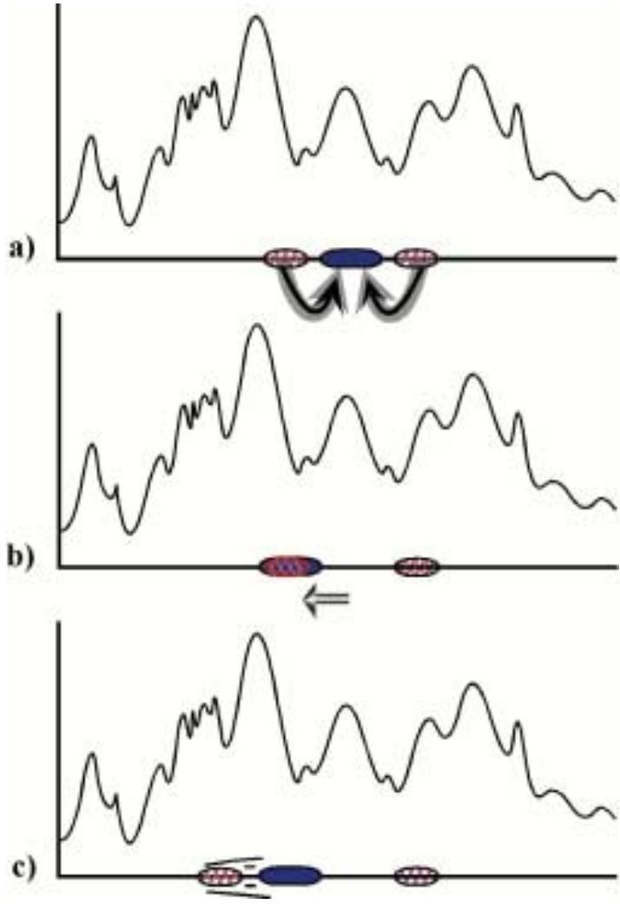  
Figure 22: The SBGA Shifting to a New Maximum

Meanwhile the core is exploiting the area that the colony has found for it. Soon it will have roughly identified the best solutions in that area, and will wait for a colony to find a new, more promising area.

While the above scenario paints a rosy picture, it should not be too surprising at this point to reveal that the SBGA is not a panacea for all optimization problems.

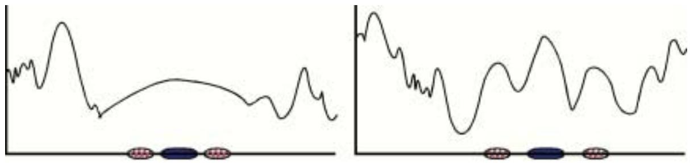  
Figure 23: Two Scenarios Where the Colonies are Defeated

Unimodal and quasi-unimodal optimization problems are the simplest types of landscapes where the SBGA will not work as well as the standard GA. On problems like these, brute force is called for, not finesse. A large population increases the search power of the algorithm when just hill climbing in comparison to a small population. Since the core is smaller than the entire GA population, and the colonies are smaller still, the SBGA has futilely divided its labor to search for other optima that do not exist. The SBGA should therefore only be used on problems that are known to have many local optima.

Even when there are many local optima, the SBGA may still be ineffectual, if the optima are of certain types. This should not be surprising since search is NP-hard; if the SBGA never got stuck at any type of local optima it would be able to solve search in polytime and P would equal NP. Figure 23 presents two such types of local maxima.

In the first, the local maximum has a very large basin of attraction. The basin is so large that the core and all colonies can fit within it without overlapping. Thus any members sent by the colonies to the core will be from the same “hill”, yet since the colonies don’t overlap the core, they feel no pressure to move anywhere else. Consequently, the core never escapes from its local area.

The second scenario is similar to the first. Here there is a large local maximum ringed by a series of smaller local maxima. Each of the smaller maxima is extensive enough to contain one or more colonies. If there are enough such local maxima, all of the colonies will be trapped in their own area. Yet the core won’t move towards them to drive them elsewhere. The core is at a higher maximum and consequently has a higher fitness than any of the other populations – no migrant from any colony will budge it. The situation is therefore stable and the algorithm is trapped.

With the two scenarios above, we have gone to the other extreme. Instead of viewing a bright future for the SBGA through rose coloured glasses, all we see is doom and gloom. The true situation is actually somewhere in the middle. While the SBGA will not do any better than the GA when faced with the problems from Figure 23, it won’t do any worse either, and on many problems the colonies will perform just as desired.

# Ch11 §3 Using the SBGA with Dynamic Environments

There are two very different styles of dynamic optimization problems: in the first, the environment cycles, first changing then changing back; in the second, the environment is continually moving into novel territory. The latter changes can occur smoothly as with a translation or a rotation of the “landscape”, it can be punctuated and discontinuous, or the “landscape” itself can be modified, roiling about like waves on a drunken sea. Cycling environments tend to be handled very differently from environments that face one with perpetual novelty: for cycles the GA is frequently modified by installing some sort of memory ((Goldberg and Smith 1987) (Zhou and Grefenstette 1989) (Branke 1999)). On the other hand for dynamic environments that have non-cycling changes, most GA systems are augmented with mechanisms that promote diversity ((Cobb and Grefenstette 1993) (Handa, Katai et al. 1999) (Sarma and De Jong 1999)).

The SBGA was designed for the latter, non-cycling style of dynamic environments. Like other mechanisms of its ilk, the SBGA does handle novelty by promoting diversity, however the diversity is added carefully, based on the “landscape”, not blindly moving it into a new area as restarting the GA or applying macro-mutations would. On the other hand, the SBGA actively tries to search in novel territory unlike other multi-population / parallel methods, which just assume that this will occur. Consequently the SBGA should be of great advantage when faced with a non-cycling dynamic environment.

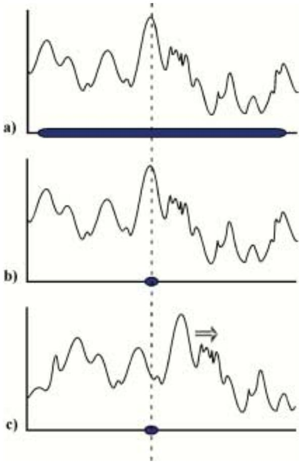  
Figure 24: The GA cannot track the optimum after it starts to move unexpectedly

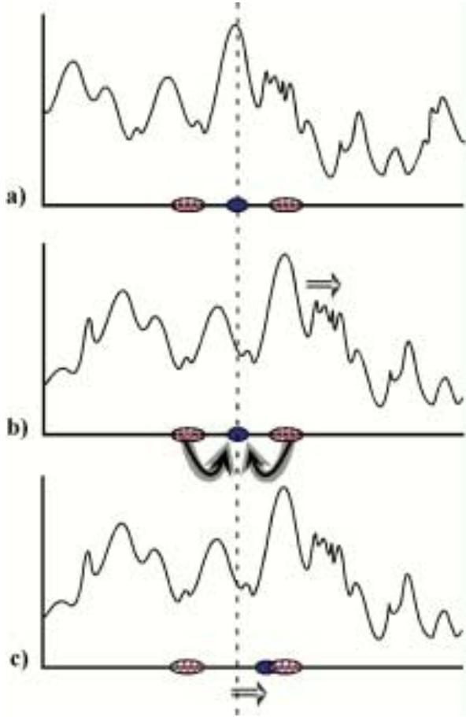  
Figure 25: The SBGA tracking the optimum after it starts moving unexpectedly

One particular type of dynamic environment problem that the SBGA should be quite adept at handling is tracking a continuously moving global optimum along a trajectory. The advantage of the SBGA becomes even more evident if the fitness “landscape” remains at rest for a significant period of time and then suddenly starts moving, or equivalently is moving very, very slowly for a long period of time and then suddenly speeds up.

In this scenario the standard GA will at first converge onto the global optimum (assuming it is relatively easy to find). As the “landscape” remains stationary the GA population continues to evolve, focusing in more and more on the optimum, all the while loosing diversity (as shown in Figure 24a and Figure 24b). By the time the environment changes the GA has already bred out most of its diversity. Unfortunately, diversity is the ‘leverage’ the GA population uses to shift itself in gene-space. If the population is fairly uniform, crossover will not produce offspring distinct from the parents and consequently the GA is completely reliant on mutation. Unfortunately, mutation acts very slowly if set low, or completely randomly if set high. Consequently the GA will have a hard time tracking the global as it starts to move (as shown in Figure 24c).

At the beginning, while the fitness “landscape” remains stationary, the SBGA seems to react in the same way as the GA, finding the optimum, then honing in on it and losing diversity. The difference lies with the colonies. Once the core has found the global optimum, the colonies cannot possibly shift it; however neither can they remain where the core is. Consequently they stay in areas near the core, but far enough away to keep the percentage-similarity measure low (see Figure 25a). When the environment starts to move, the colonies are ready for it. Since they are close to the core, but not within it, the drifting global optimum has a good chance of moving into, or near, the area where a colony is positioned. All the while, the colonies were sending migrants to the core. Previously, those migrants were only ignored, for they must be inferior to members of a core that has already found the global optimum. Now, the migrants from the colony that is lucky enough to be close to the optimum, now that the optimum has moved, find themselves in demand as parents within the core. In other words, the core is shifting toward that colony; the SBGA has begun to successfully track the optimum.

# Part 3

# Ch11 $\ S 4$ A Comparison of the SBGA with Similar GA Techniques

The “shifting balance” addition to the GA consists of adding multiple populations and three specially designed processes which control them. Admittedly, the addition of multiple populations is not novel; all course-grained parallel GA implementations have multiple populations, almost by definition. What is novel is the dividing of the populations into those that explore new areas of the search space (the colonies) and one that exploits the best region found so far (the core). Furthermore, instead of just hoping that the populations will be exploring different search areas, either in parallel as with multiple-population approaches, or sequentially with population restarts and changing mutation rates, the SBGA enforces that the exploring populations be in areas other than where the main population is doing its exploitation.

While the SBGA is superficially similar to multi-population based GAs, such as those used in parallel GAs, fundamentally the SBGA has more in common with the methods added to the GA to prevent inbreeding, such as ‘fitness sharing’ and ‘crowding’.

It is interesting to note that ‘fitness sharing’ is a parametric technique dependent directly on the values obtained from the objective functions to accomplish its prevention of inbreeding. Members that are very fit will be more resilient to having its fitness reduced by multiple copies of themselves than can those who are not. ‘Fitness sharing’ is therefore vulnerable to outliers and unusual fitness distributions, as is the case with any parametric procedure. Consequently a lot of work goes into scaling the fitness function and other modifications to “normalize” the fitness-values being obtained. The SBGA on the other hand is a non-parametric process and so is not susceptible to those problems.

The main difference between the SBGA and both ‘fitness sharing’ and ‘crowding’ is the lack of forced exploration in the latter two. While ‘Fitness sharing’ and ‘crowding’ prevent inbreeding in the main population and thus promote diversity, there is no mechanism for driving the population, or any subset therein, to other areas of the search space. This is directly accomplished in the SBGA by selecting colony members based on distance from the core. Thus the SBGA can be seen as combining the best of both worlds:

the properties of discovery (supposedly) enjoyed by multiple-population GAs (although only in the SBGA is it actively enforced), and the prevention of inbreeding as performed by ‘fitness sharing’ and ‘crowding’.

Finally, as the “shifting balance” mechanisms are only additional to those of the GA, and do not replace any, most GA extensions can be used alongside it. The only exceptions to this rule are extensions that incorporate multi-populations; these would interfere with the multiple populations added by the SBGA. Otherwise any of the subpopulations, be it core or colony, can have an enhanced GA as its underlying evolutionary technique. For example, the core, for added inbreeding protection, could have a GA that performs ‘crowding’; if Whitley’s Genitor is preferred over the standard GA, then Genitor’s mechanism for selection and reproduction can be used in the core and every colony. Not all extensions will be improved equally by the addition of the ‘shifting balance’ routines; some may already incorporate benefits that were to be derived from the shifting balance theory. However, the easy compatibility of the SBGA with many of the existing GA techniques is definitely a great advantage.

# PART 4 EXPERIMENTAL RESULTS AND ANALYSIS

# Chapter 12

# Escaping Local Optima Part 1: Purpose and Experimental Design

# Ch12 §1 Introduction and Outline of Part 4

In this dissertation we are attempting to answer the question posed in the thesis statement: By incorporating concepts taken from Sewall Wright’s Shifting Balance Theory, can the behavior of the GA be enhanced in both dynamic environments and environments with many local optima? To this end we have so far examined the SBT for its key concepts, abstracted them and finally created an extension to the GA: the SBGA. In Part 4 we will put our theories to the test. In this chapter and the next, three experiments will be devised to compare the SBGA with a standard GA in both dynamic environments and environments with many local optima. These tests will be designed to see whether the Shifting Balance extension has a positive effect on the behavior of the GA as predicted.

Part 4 is divided into four chapters.

The first two chapters in this part cover the test used to determine whether the SBGA shows improved performance in environments with many local optima. They comprise the description and execution of two complimentary experiments performed to determine whether the Shifting Balance Theory aids in escaping from local optima.

In the first of these two chapters (this chapter itself), the purpose and general methodology of the experiment as well as the details of the experimental design are described. This includes a description of the various component parts of the design such as the environmental optimization functions and the GA and SBGA parameters, as well as the rational for their choice. These design components will be the basis for all experiments performed in Part 4.

The second chapter presents the analytic tools and methodology that will be used to examine the results of the experiments as outlined in the first chapter. Once again, the methods presented will be used throughout the remainder of the dissertation. The chapter concludes with the actual results obtained from the performed experiments as well as a analysis and discussion on whether the SBGA succeeded in aiding the GA to escape from local optima.

In the third and fourth chapters of Part 4, we deal with the questions that are at the heart of the dissertation: What is the behavior of the GA and SBGA in dynamic environments? Does a GA enhanced by the Shifting Balance mechanisms show improved performance when tracking a moving global optimum? In Chapter 14, the first of the two, the SBGA is compared with a standard GA in a dynamic environment. This should determine whether the Shifting Balance extension really does improve the ability of the GA to track a moving global optimum. Finally, Chapter 15 explores the diversity of the populations used in the GA and SBGA systems as they evolve in a dynamic environment. By looking at the diversity we hope to determine whether or not added diversity is the primary factor for improving behavior of a GA in a non-cyclical dynamic environment.

# Ch12 §2 Purpose: Determining if the SBGA is better at Escaping from Local Optima than the GA

Sewall Wright’s concept of a population evolving in fitness landscape, the recognition that they may get trapped at local maxima, and his ideas for escaping from them in the guise of the SBT were introduce in Chapter 2. In the following chapter, those ideas were analyzed, deficiencies removed, operationalized and then added to the GA to form the SBGA. If Wright was correct about the effectiveness of the SBT at escaping local optima when compared to theories that do not take it into account, it follows that the SBGA should be better than a standard GA in an environment with many local optima. In such environments we should see the SBGA attain, on average, better fitness values. The GA would get stuck in locals that the SBGA can escape from, thus allowing the SBGA to continue to improve and reach the higher fitness values.

However, the hoped for advantage of the SBGA probably comes at a price (most things do). It is easy to foresee that the sophistication of the SBGA could become a disadvantage in environments in which that sophistication is redundant. The SBGA devotes resources, the colony members, for exploring areas that the core has so far ignored. However, what if the global maximum in the environment has a large basin of attraction attached to it? The core should easily find the basin and hence the global. This will force the colonies into uninteresting areas of the search space, thus rendering them unnecessary and possibly inhibitory to the SBGA’s search. Because the SBGA had diverted a lot of its members into the colonies, the core, which is now solely responsible for the active search, will have a much smaller population than the GA. A large population provides an evolutionary system with more members to search with. Consequently, the GA’s large population provides it with both a better chance at finding the central basin of attraction, and once there, of ascending it. As a result, the SBGA should loose its selective advantage to the GA and so do no better and possibly even worse54.

In this chapter and the next, two experiments will be designed and performed. The first will test whether the SBGA outperforms the GA in a hard, multimodal (but as of yet, stationary) environment. This will determine whether Sewall Wright’s concepts are correct; that evolutionary systems enhanced with a shifting balance mechanism will escape from local optima and so outperform a system without it. The second experiment, which is almost identical to the first experiment in form, will explore the behavior of the two evolutionary systems in a multimodal environment with a large basin of attraction attached to the global optimum. This will determine whether, as predicted, the SBGA will loose its selective advantage to the GA when the basin which feeds into the global, is easy to find.

# Ch12 §3 Methodology

# Ch12 ß3.1 Environmental Setup

# Ch12 §3.1.1 Properties that the Test Functions Should Have

To test the SBGA and the GA on a hard multimodal test function, there are some properties that we would want such a test function to have:

First it should have a known global optimum. This rules out many of the NP-hard and exponential problems. The existence of known global optimum can be assured if we construct the function based on a well-understood mathematical formula, such as those used in the De Jong test suite.

Part 4

Second, we need two different functions, both multimodal, but one with the global optimum hidden amongst a sea of hills, and the other with the optimum on the top of a large broad hill providing a wide basin of attraction.

It would also be nice if the functions are tunable. In other words, by changing a parameter the functions can be made harder or easier. This will give more insight into the relative performances of the two algorithms under differing levels of difficulty.

We should also require that the functions not be easily soluble in unforeseen ways; i.e. there should be no trap doors that the evolutionary algorithm can take advantage of. Consequently the function should not be linearly separable (optimizing for one bit at a time must not produce a chromosome that encodes the global optimum), and there must be some epistasis in the system. It would also help if the functions were asymmetric so that the level of complexity is not reduced by redundancy in the function.

# Ch12 §3.1.2 A Hard Multimodal Function: F8F2

In a recent paper, (Whitley, Mathias et al. 1996) examined what features a proper test function should have for examining the behavior of a GA implementation. They argued that a good function should be nonlinear, nonseparable and nonsymmetric as well as being scalable (i.e. have varying levels of difficulty). They emphasized that a test suite should be developed in accordance with the purpose of the testing: “testing should be hypothesis driven and different comparative goals may demand different test problems”55. Finally they criticized many of the functions from currently popular test suites and proposed methods that allows one to construct test functions that include all of the appropriate features discussed. One of the functions they created as an example of their methodology not only fit all of their criteria, but also matched all of the design goals

De Jong Test Suite:

$$
\begin{array} { l } { f ( x _ { 0 } , x _ { 1 } , x _ { 2 } ) = \displaystyle \sum _ { i = 0 } ^ { 2 } x _ { i } ^ { 2 } } \\ { f ( x _ { 0 } , x _ { 1 } ) = 1 0 0 ( x _ { 0 } ^ { 2 } - x _ { 1 } ) + ( 1 - x _ { 0 } ) ^ { 2 } } \\ { f ( x _ { i } | _ { \infty , 4 } ) = \displaystyle \sum _ { i = 0 } ^ { 2 } \left\lfloor \frac { x _ { i } } { x _ { i } } \right\rfloor } \\ { f ( x _ { i } | _ { \infty , 9 } ) = \displaystyle \sum _ { i = 0 } ^ { 2 9 } ( i + 1 ) \cdot x _ { i } ^ { 4 } + G a u s s ( 0 , 1 ) } \\ { f ( x _ { 0 } , x _ { 1 } ) = \displaystyle \sum _ { 0 , 0 0 2 + \displaystyle \sum _ { j = 0 } ^ { 2 8 } \frac { 1 } { j + 1 } \sum _ { i = 0 } ^ { 1 } \left( \frac { 1 } { x _ { i } - a _ { i , j } } \right) ^ { 6 } } } \end{array}
$$

Rastrigin Function

F6:

$$
f ( x _ { i } | _ { i = 0 , N - 1 } ) { = } 1 0 N + \sum _ { i = 0 } ^ { N - 1 } \bigl ( x _ { i } ^ { 2 } - 1 0 \cos ( 2 \pi x _ { i } ) \bigr )
$$

Schwefel Function

F7:

$$
f ( x _ { i } \mid _ { i = 0 , N - 1 } ) = - \sum _ { i = 0 } ^ { N - 1 } x _ { i } \sin ( \sqrt { \left| x _ { i } \right| } )
$$

Griewangk Function

F8:

$$
\overset { \smile } { f } ( x _ { i } | _ { i = 0 , N - 1 } ) = 1 + \sum _ { i = 0 } ^ { N - 1 } \frac { x _ { i } ^ { 2 } } { 4 0 0 0 } - \prod _ { i = 0 } ^ { N - 1 } \cos ( \frac { x _ { i } } { \sqrt { i + 1 } } )
$$

that were required for this dissertation as listed in the previous section. This is the ‘F8F2 function’.

Early in the paper, Whitley et. al. listed many of the popular test functions. They included the five functions from the De Jong test suite, labeled F1 through F5. The F6 function was the Rastrigin function, F7 was the Schwfel function, and finally F8 was the Griewangk function (see Table 12-1). Whitley et. al. critiqued each function in turn. For example the F2 function was nonseparable, and nonlinear (good) but, unfortunately, not scalable. The F8 function was also nonseparable, and nonlinear, as well as being very multimodal. Furthermore it seemed scalable by increasing the dimensionality of its domain. Unfortunately, tests showed that, far from getting much harder as the dimension increased, the problem actually became easier; the many local optima actually smoothed out as the dimensionality increased until the landscape looked like a simple unimodal valley (F8 is a minimization function). Furthermore, F8 was symmetric.

To combat these problems Whitley et. al. composed Griewangk’s function (F8) and De Jong’s F2 function into a new function. They used a one-dimensional version of F8, which had very many peaks and valleys, and composed it with the nonsymmetric F2 function. This created a function that was nonlinear, nonseparable, nonsymmetric, and highly multimodal. To make it scalable, they played a simple trick. If one takes a function $S$ and a second function $T .$ , where $T$ “maps two variables onto the domain of $S ^ { \flat }$ , then a composite function can be defined as follows:

$$
F ( x _ { 0 } , x _ { 1 } , . . . , x _ { n - 1 } ) = \sum _ { i = 0 } ^ { n - 1 } S ( T ( x _ { i } , x _ { i + 1 } ) ) \equiv S ( T ( x _ { n - 1 } , x _ { 0 } ) ) + \sum _ { i = 0 } ^ { n - 2 } S ( T ( x _ { i } , x _ { i + 1 } ) )
$$

Notice that each dimension interacts with both the dimension above and below it. Thus as many dimension as required can be added with nonseparability being ensured. Setting $S$ equal to the one-dimensional F8 function

$$
\mathrm { F } 8 ( x ) = 1 + { \frac { x ^ { 2 } } { 4 0 0 0 } } - \cos ( x )
$$

and $T$ equal to the regular two dimensional F2 function (see Table 12-1), Whitley et. al. created the new composite function F8F2

$$
\mathrm { ~ F ~ } 2 ( x _ { i } | _ { i = 0 , n - 1 } ) = \sum _ { i = 0 } ^ { n - 1 } \left( 1 + \frac { \left( 1 0 0 ( x _ { i } ^ { 2 } - x _ { i + 1 } ) + ( 1 - x _ { i } ) ^ { 2 } \right) ^ { 2 } } { 4 0 0 0 } - \cos ( 1 0 0 ( x _ { i } ^ { 2 } - x _ { i + 1 } ) + ( 1 - x _ { i } ) ^ { 2 } ) \right) .
$$

Examining the formula, it can be easily shown that F8F2 has all the properties that we desired. It is nonlinear, not linearly separable, and nonsymmetric at every dimension (except dimension 2, where it becomes symmetric56).

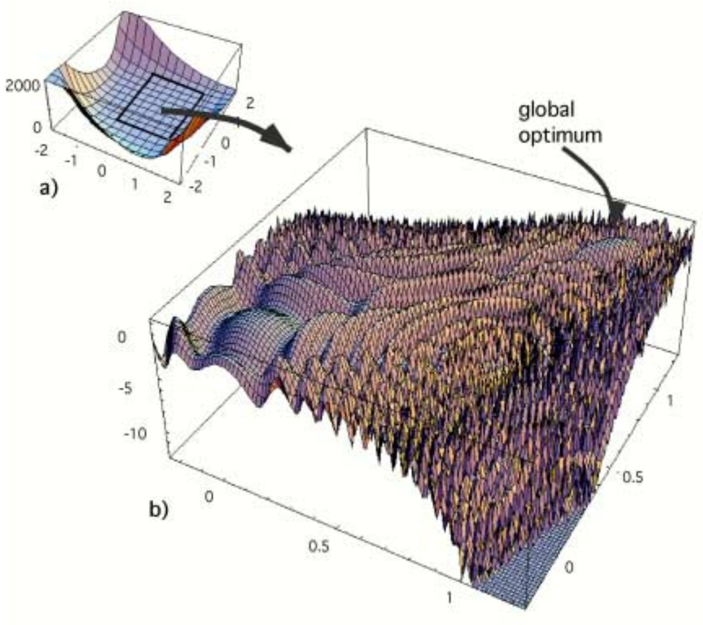  
Figure 26a): An overview of the F8F2 function (dimension $= 2$ ) at low resolution Figure 26b): A blowup of the highlighted square in Figure 26a seen at high resolution.

Note: In Figure 26b the function is redisplayed as a maximization problem to better view the optima.

The value and position of the minimum is also known (F8F2 is a minimization function); the minimal value is 0 and is located at the  (1,1,K,1) position. Furthermore, unlike the F8 function, the height of the local optima does not decrease as the dimensionality increases. Thus the function keeps all the desired properties as the dimensionality increases. Furthermore, by increasing the search space we are increasing the problem’s difficulty, thus incorporating scalability.

F8F2, as previously mentioned, is a minimization function By inspection we can see that it has a minimum of 0 found at $x _ { 0 } = x _ { 1 } = 1$ . In Figure 26a the two-dimensional version of F8F2 is presented at low resolution. As can be seen, the overall shape of the function is ‘bowl shaped’ with a fairly ‘flat’ bottom. At higher resolutions (see Figure $2 { \bf 6 6 } ^ { 5 7 } ,$ ) the ‘flat’ bottom is seen to have very many local optima, a few of which have larger basins of attraction than does the global optimum. Thus the F8F2 function is a complex, scalable, highly multimodal function, as required.

# Ch12 §3.1.3 A Multimodal Function with a Large Basin of Attraction Attached to the Global Optimum: F8mF2

For the second testing environment, the global optimum should be made easy to find; i.e. the environment should have a global optimum that is connected to a very large basin of attraction.

While it is true that a simple unimodal function matches that criterion, such an environment is so simple that the GA is not the best search algorithm to use. A simple hill-climber would easily outperform it. Thus we need a multimodal function that is hard enough for a GA to be of use and yet still be relatively easy to solve.

Such a function can be created through a very slight modification of $\mathrm { F } 8 \mathrm { F } 2 ^ { 5 8 }$ . De Jong’s F2 function

$$
\mathrm { ~ F ~ } 2 ( x _ { 0 } , x _ { 1 } ) = 1 0 0 ( x _ { 0 } ^ { 2 } - x _ { 1 } ) + \left( 1 - x _ { 0 } \right) ^ { 2 }
$$

is slightly altered, becoming the new function

$$
\mathrm { m F } 2 ( x _ { 0 } , x _ { 1 } ) = 1 0 0 ( x _ { 0 } ^ { 2 } - x _ { 1 } ^ { 2 } ) + \left( 1 - x _ { 0 } \right) ^ { 2 } .
$$

Notice the difference between the two, which consists of only a single change: the squaring of the $x _ { 1 }$ term. The name $\cdot _ { \mathrm { m F 2 } } ,$ is read as the ‘modified F2 function’. Composing the mF2 function with the F8 function in the same way we would compose the F2 and F8 functions (see the previous section) produces the $\mathrm { F } 8 \mathrm { m F } 2$ function (read as ‘F8 modified $\mathrm { F } 2 ^ { \circ }$ ). Notice that $\mathrm { F } 8 \mathrm { m F } 2$ has the same minimum value at the same location as F8F2: 0 and 1 respectively.

The large size of the basin that feeds into the global minimum is very evident in Figure 27, a graph of the two-dimensional version of the $\mathrm { F } 8 \mathrm { m F } 2$ function. Comparing the graph in Figure 26a with that in Figure 27a we see that $\mathrm { F } 8 \mathrm { m F } 2$ is also largely bowl shaped, although more symmetrical than F8F2. However, in Figure 27b the difference becomes obvious as we can now see the giant basin of attraction that resides in the center of the function. The GA can easily find that large smooth basin, which funnels directly into the area where the global optimum sits – along the top right arm of the four arms that extrude from the basin. Finally, the area around the basin is hilly enough to foil any hillclimbers. Thus $\mathrm { F } 8 \mathrm { m F } 2$ perfectly suites the needs of the experiment.

The two-dimensional version of $\mathrm { F } 8 \mathrm { m F } 2$ seems ideal for comparing the SBGA with the GA in an environment with a large basin of attraction. However, does that basin continue to be a feature of the landscape when the dimensionality increases? Unfortunately, the answer to this is not known, and very difficult to find out. However, the behavior of both the GA and the SBGA when run in these environments is consistent with such a landscape; both produce much smaller (thus better) values when run on the $\mathrm { F } 8 \mathrm { m F } 2$ function than on the F8F2 function with the same dimensional setting.

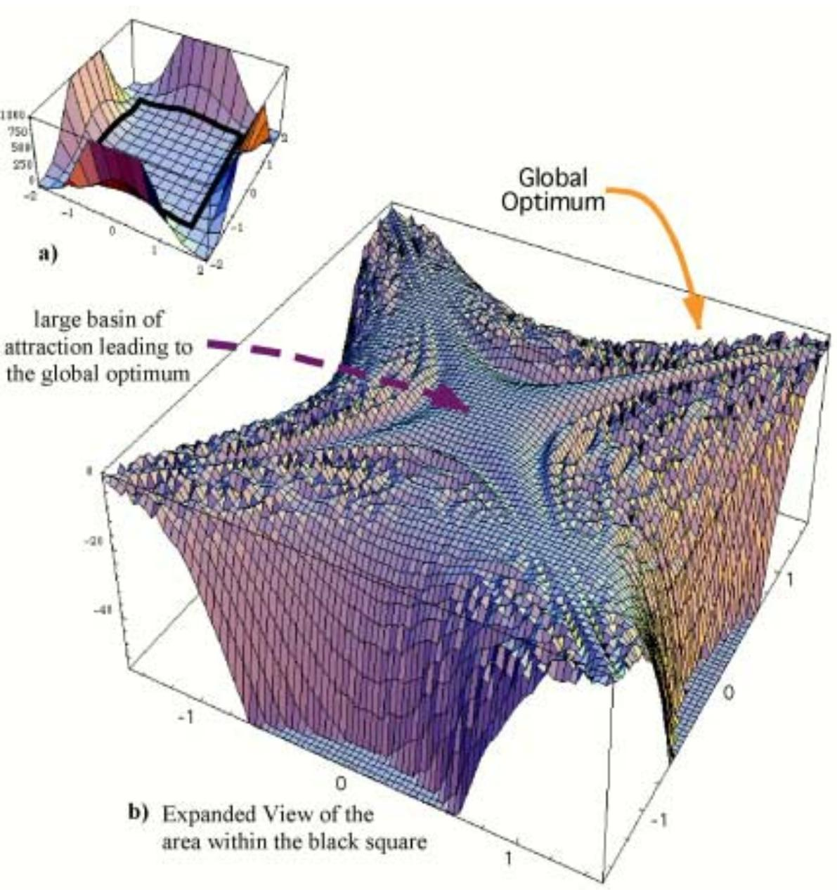  
Figure 27a): An overview of the $\mathrm { F } 8 \mathrm { m F } 2$ function (dimension $= 2$ ) at low resolution Figure 27b): A blowup of the highlighted square in Figure 27a seen at high resolution. The global optimum and its attendant basin of attraction are indicated.

Note: In Figure 27b the function was redisplayed as a maximization problem, to better view the optima.

# Part 4

# Ch12 §3.1.4 Why a Broadband Test Suite is not Used

Traditionally when a new change to or enhancement of the GA is proposed, the new system is tried against a variety of different problems. These problems usually would include a few standard optimization functions such as those in the De Jong test suite. The purported reason behind this is to have the experimental results generalize widely, that the extension improves the GA on more than just a carefully constructed function.

In many ways this rational is legitimate. Notwithstanding this argument, however, a different approach is taken in this dissertation. It was felt that, while a broadband test suite is an important stage during the analysis of an algorithm, it is not the appropriate first stage, which should be kept small and focused.

There are five reasons to support a more focussed original testing regimen:

First, to attain statistical accuracy during testing, a large number of experimental repetitions are needed for each series of parameter settings. Consequently even using only one test function, the computational resources needed are extensive, both in time and space (massive amounts of data can be produced). This problem is only multiplied, literally so, by the use of a large number of test functions. Depending on the question being asked and the functions used, the computational time and storage could easily outstrip the available computational capabilities of a researcher’s installation.

Second, even if the required results are obtained as raw data, the resulting statistical analysis can be enormously complicated by the introduction of the various test functions. This is especially true if you are trying to regress across the generations (i.e. using time as a concomitant variable). A regular ANCOVA test, even a nonparametric one, assumes no interaction effects between the regression curves across the various levels of a variable. This will not hold when analyzing over the different test functions. The response of the system to each test function across the generations will be different, one from the other. Consequently, an ANCOVA cannot be used and must be replaced with a difficult regression that would require a complex interpretation.

Third, a simple initial testing regime would help to focus the research, so when the more broadband tests are conducted one would have a better idea of what to look for. This would result in more efficient experimental designs that isolate the important factors to look at between the various test functions. As a consequence, concentrating on one or two initial functions will help to alleviate the problems discussed in the previous two points. The excessive time and space consumption needed for statistical accuracy would be reduced if unnecessary variables are identified during the initial tests, and eliminated from consideration. This will also ease the problem of analyzing a very complex regression model.

Fourth, alongside helping to identify unnecessary variables, a simple initial testing regime could also bring to light interesting questions that are not immediately apparent. This would help refine the testing methodology used during the broadband tests, which in turn, could answer questions raised by the results from the initial tests, but which require a larger test suite to ascertain what is really occurring.

Fifth, a broadband suite usually does not even help assure the generalizability of the results. This is the basic problem of induction. Since the number of possible functions is vast, a reasonably sized test suite is still open to the criticism that functions used are special cases for which the system behaves as desired, and are not representative of the system’s general performance. This is still a large open problem (and one that is not just limited to the GA community). Currently, developing a proper test suite is more of an art than a science. The one approach that tend to satisfy critics, using a massive number of test function à la Koza with GP, is for too extensive for most researchers, and certainly goes far beyond what is required of a Ph.D. dissertation.

# Ch12 §3.1.5 Why F8F2 and F8mF2 Were Chosen Over More Traditional Test Functions

Since we are going to choose only one test function per given hypothesis, why choose the little known F8F2 and the unknown $\mathrm { F } 8 \mathrm { m F } 2$ functions? One would think that by using a common test function, comparisons with other systems could be done without resorting to re-experimentation.

While temping this approach was also rejected for two reasons:

First, none of the common test functions found in the literature had the requisite properties that were detailed in Ch12 $\ S 3 . 1 . 1$ except for F8F2 and $\mathrm { F } 8 \mathrm { m F } 2$ . Most test functions are closely tailored to answer the questions that prompted their construction. The appropriateness of F8F2 to this chapter’s hypothesis and the discovery of $\mathrm { F } 8 \mathrm { m F } 2$ , with its large central basin of attraction, were both quite fortuitous.

Second, the benefit of cross study comparisons is actually a chimera. No real benefits can currently be obtained from the use of common test functions over and above their applicability for studying the problem at hand.

The reason for this is twofold:

First, GA investigators are notoriously bad at providing, in their published papers and articles, even the minimal information necessary to perform a proper statistical comparison to their work. Results are frequently given as averages only, without providing the corresponding standard deviation along with the number of runs the average was taken over. Without this information you cannot even perform a simple Ttest to determine whether the difference you see in their respective behaviors are statistically significant or just the product of random fluctuations. Furthermore, most function definitions are under-specified (see (Whitley, Mathias et al. 1996)) and so even if the extra information is given, you can’t be sure whether you have used the same version of the function with the same encoding scheme.

The above sloppiness in reporting, however, is not the main problem. Over time GA researchers have grown in sophistication. The number of papers with such flagrant omissions is fortunately on the decline. However, there is a deeper problem that makes cross study comparisons very problematic: the response of the GA to a given test function need not be, and likely is not, normally distributed.

When the response of a system is not normally distributed, standard parametric techniques are not applicable. Even a straightforward average could engender incorrect inferences. In this situation, statisticians resort to nonparametric statistics, or the recently popular “resampling” method. Unfortunately, in order to compare the behavior of your new system with the original published results, both of the above statistical techniques require access to the raw data from which the summary statistics was drawn. These results, for example the fitness of the best member of population for every run, can be numerous, especially when many parameter setting are used. Consequently, it would be difficult to publish them in a paper. In the future, the raw data, which may even comprise entire populations, as well as the statistics derived from the data, will be obtainable from the Internet. Currently this is not the case, rendering comparisons to previous works found in the literature effectively meaningless.

Since there is currently no advantage in favouring a common test function over one that more closely meets the needs of the experiment, the choice was made to use F8F2 and $\mathrm { F } 8 \mathrm { m F } 2$ over more standard test functions.

# Ch12 $\ S 3 . 1 . 6$ The Limitations of Using a Single Problem-Specific Test Function: What Can Be Inferred?

It must be emphasized that when using a single problem-specific test function, general inductive conclusions should never be inferred. Just because a GA behaves in a certain manner on the current test function does not mean that it will always behave that way. Since the testing done for this dissertation is preliminary in character, the experiments performed use just such a single problem-specific test function as discussed previously, and consequently care must be taken with any inferences made.

There are three legitimate inferences that are valid when using such a test function:

First, it can be used as an existence proof. The test case demonstrates that the GA can and does behave in a certain way on at least one function. Any future theory or model of GA behavior will have to take this effect into account, if only as a special case.

Second, the test case can be used to disprove an hypothesis. This is very closely related to the first point above. If one hypothesizes that the GA always has a given behavior, a single counterexample, provided by an appropriate test function, can definitively disprove it.

Third, the test case can be used as supportive evidence of a general property or theory. This should not be confused with the drawing of general inductive conclusions. While the two statements are related, the former actually being a component of the latter, they differ in scope. Supporting an hypothesis is much weaker than concluding it. All that is being said is that at least one data point can be found which provides evidence for a theory or the existence of a universal property.

In conclusion, a single test case provided by a carefully chosen test function can provide a lot of useful information on its own, without resorting to a very large test suite. All that must be ensured is that any results obtained are not given more weight than is its due.

# Ch12 §3.1.7 Implementing the Test Functions

Both the F8F2 and the $\mathrm { F } 8 \mathrm { m F } 2$ have the same range. Each dimension is represented by a 12 bit, Gray coded, binary integer. Thus the values range between [-2048, 2047], which produces the $2 ^ { 1 2 } = 4 0 9 6$ distinct possible genomes/dimension. These integers are then divided by 1000. This converts them into valid input values as expected by the two functions, which is to say the input values expected by F2. Thus the phenotypic values range across [-2.048, 2.047]

The dimensions chosen for the stationary experiments are 4, 5, 6, 7 and 8. No dimensions above 8 were used because of time considerations. Dimension 2 was omitted for a very different reason. During preliminary experiments it was discovered that both the GA and the SBGA always could solve both F8F2 and F8mF2. However by dimension 4, no solutions could be found by either system on either test function within the timeframe of the experiments. Consequently what defines success for the twodimensional problems is radically different than for problems with higher dimensions.

For experiments that use a higher dimensionality, the best measure for monitoring the behavior of the systems is the fitness of the best member of the population found during the run. This is commonly known as the ‘offline’ measure. However, this is a meaningless measure for dimension 2 since the result is always $^ \circ$ and so no distinctions can be made between the GA and the SBGA. A more natural measure to use in such a situation is the time, in generations, when the system first finds the global optimum. Unfortunately, this measure is not applicable to the higher dimension problems. Since the global optimum for these problems would only be found, presumably, after the experiment ends, the generational time when it occurs cannot be known. Hence, the two measures are not commensurable and dimension 2 results cannot be analyzed alongside the results from the other dimensions. Consequently dimension 2 was not tested at this time.

Dimension 3 is a ‘transition’ dimension between dimension 2 and the higher dimensions. While any given run may not find the global within the time limit, many do. Consequently, this dimension was also not included in the experiments to keep the analysis ‘clean’.

# Ch12 ß3.2 GA and SBGA Configuration

# Ch12 §3.2.1 Selecting the Probability of Crossover and the Mutation Rate

For a completely fair comparison between the GA and the SBGA, both systems should be tuned such that their respective mutation rates and probability of crossover settings maximize the effectiveness of both systems.

Unfortunately, finding these settings is not a simple procedure. Many tests would have to be done at high repetition rates to gain the appropriate statistical accuracy necessary to allow us to induce a model that would predict the most accurate settings.

Even then, the model would have to assume little epistatic interactions in behavior at the different parameter levels. This would be very time consuming and outside of the scope of this dissertation.

Consequently the default GA settings were used for both the GA and the SBGA’s core. So the probability of crossover $= 0 . 7$ and the mutation rate $= 0 . 0 0 6$ bits/locus. In order to promote exploration by the SBGA’s colonies, which is their raisons d’être, they were set at values that are higher than in the core and GA populations59. Each colony has a probability of crossover $= 0 . 9$ , and a mutation rate $= 0 . 0 1$ .

# Ch12 §3.2.2 Population Sizes

Just as with the mutation and crossover rates, the optimal settings for the population sizes are not known. In general however, the larger the size of the population the better the performance of the GA, although the law of diminishing returns probably does have an affect.

Unfortunately, because of its multiple populations, matters are even more complex for the SBGA. Unlike the GA, which only has one population size $( N )$ , the SBGA needs to have settings for the core size $( n )$ , the size of a colony $( m )$ , and also the number of colonies $( k )$ in the system. Settings for all these parameters have to be determined.

# The Population Size of a Colony: ëmí

Because the colony uses most of the SBGA mechanisms, more constraints are placed on its population size than on any of the others. Thus finding the appropriate size of a colony will be the first parameter addressed. This is, and so its population size is more constrained than the core’s.

In the version of the SBT used by the SBGA, colony movement is based on selection only, not random drift (unlike the original model developed by Sewall Wright, see Ch3 $\ S 1 _ { \scriptscriptstyle , }$ ). Consequently it would be preferable to set the colony size high enough to suppress random drift and promote selection. By suppressing random drift, we are reducing the number of possible mechanisms that could be responsible for the success or failure of the SBGA. This will help our analysis of the system in the long term. On the other side of the equation, we would like to keep the population size as small as possible, to facilitate exploration; it is easier for a small population to change its genetic makeup than a large one. To determine what size of a colony would appropriately balance the two effects, small enough for easy movement but large enough to prevent random drift, we can use the results of the neutral model theory of population genetics.

The neutral model theory looks at the behavior of the frequencies of a gene and its alleles in a population with no mutations and only neutral selection in effect. Consequently, all that can occur is random drift, which is modeled as a random walk in frequency space. In the early thirties, R. A. Fisher (Fisher 1930) and Sewall Wright (Wright 1931) both independently formulated a model of random drift using a randomwalk-induced binomial transition matrix. Later, in the mid $1 9 5 0 ^ { \circ } \mathrm { s }$ , an alternative approximation model of random drift, using differential equations based on the diffusion of heat in a metal, was provided by M. Kimura (Kimura 1955). In the sixties Kimura applied this model of genetic drift to natural populations, claiming that most mutations in a given population were neutral (productive mutations are rare, deleterious ones have too short a life span to be observed statistically). This became known as the neutral model (Kimura 1983). To examine the neutral model Kimura, in (Kimura and Ohta 1969), used his diffusion equations of random drift and calculated the time it would take for a neutral mutation to reach fixation (driving out its rival allele from the population) or loss (being bred out of the population). It is these set of equations that we will be used to determine an effective population size for the colony.

Random drift is the effect of random processes, modeled as a random walk, driving an allele to extinction or fixation. The longer the allele can stay ‘in play’ given no selective pressures, the less we can attribute the behavior of the population to random drift.

Kimura and Ohta’s equation for the mean persistence time of an allele in a neutral model is

$$
\overline { { t } } ( p ) = - 4 N [ p \ln ( p ) + ( 1 - p ) \ln ( 1 - p ) ]
$$

where $p$ is the frequency of the allele in the population (which is completely analogous to the gene frequency $f _ { P } ( g )$ developed in Ch6 §2.2.2) and $N$ is the population size. Since we want to know the maximum effect of random drift we will assume that the allele frequency is as far from reaching fixation or loss as possible. So, setting $\begin{array} { r } { p = \frac { 1 } { 2 } } \end{array}$ we get $\overline { { t } } ( p ) = 4 N \ln 2$ . Now, if an allele has not reached fixation or loss by the end of the run, than random drift cannot be playing a significant role. In our stationary experiment, we allow 300 generations to pass before we measure the fitness of the best member in the population. Random drift will therefore not have a great effect during the run of the experiment if the effective population size is set to

$$
N = \frac { 3 0 0 } { 4 \ln 2 } = 1 0 8 . 2 .
$$

Since selection is in effect and random drift is not the sole arbiter of gene frequency in the population, this population size is an overestimate. Consequently, the colony population size was rounded down and set to $m = 1 0 0$ .

# The Number of Colonies: ëkí

Setting the appropriate number of colonies is a harder task than setting the size of a colony’s population. Since the most effective number of colonies is probably problem dependent and may even change as the SBGA populations evolve, we do not have recourse to a theory such as the neutral model for determining its value. Just as with the crossover and mutation rates an inductive determination of the settings through experimentation is beyond the scope of this dissertation. Still, a choice has to be made. So I will conjecture that a good, all around setting would be $k = { \sqrt { m } }$ . This keeps $k$ large enough to be interesting, but small enough to keep size of the entire population down to manageable proportions. If the resulting value is appropriate to the two test functions used, then that is just a fortuitous coincidence. From the previous subsection, we determined that the population size of a colony should be $m = 1 0 0$ . Consequently the number of colonies is set to $k = 1 0$ .

# The Population Size of the Core: ëní

The core represents the main population of the SBGA; the population responsible for exploiting the genetic material found by the colonies. Consequently, the core size should be much larger than the population size of any one colony. Unfortunately, as was the case when determining the number of colonies, there is no theory to help determine the size of the core with respect to the size of the colonies. Furthermore, finding it experimentally is, once again, computationally prohibitive and hence outside the scope of this dissertation. Consequently I have arbitrarily chosen to set the population size of the core equal to the cumulative population size of all the colonies; thus, for all experiments, the population size of the core is $n = k \cdot m = m ^ { \stackrel { 3 } { / 2 } } = 1 0 0 ^ { \not { \% } } = 1 0 0 0$ .

# The Population Size of the GA: ëNí

When comparing the SBGA with the GA, one should not advantage either over the other by assigning unequal populations sizes. Since larger populations provide more members to search with, unequal population sizes would bias the results in favour of the population with the large number of members. The total population size of the SBGA is $n + k \cdot m = 1 0 0 + 1 0 \cdot 1 0 0 = 2 0 0 0$ . Thus we set the population size of the GA to $N = 2 0 0 0$ .

# Ch12 §3.2.3 Selection

F8F2 is actually a very hard problem for a canonical GA, and great improvement can be conferred by the use of various modifications. Whitely et. al. found significant benefits to performance in the F8F2 environment when using the GENITOR variant of the GA. GENITOR is a steady-state GA that uses rank selection that was developed by Whitley in the late $1 9 8 0 ^ { \circ } { \mathrm { s } }$ and early $1 9 9 0 ^ { \circ } { \bf s } _  \mathrm   \scriptscriptstyle  \it$ , see (Whitley 1989) and (Whitley and Starkweather 1990). Now, since the SBGA is just an extension of the GA, it can usually be grafted onto any GA variant (see Ch3 §3). Unfortunately, GENITOR’s use of a steady-state population interferes with the SBGA’s mechanisms for handling the multi-objective optimization performed by the colonies (see $\mathrm { C h 9 \ \ S 3 }$ ). Fortunately, by adding elitism to a standard generational style GA, most of the effects of the state-state version are obtained.

By choosing linear rank selection as the selection algorithm for both the GA and SBGA and by using elitism, both the GA and SBGA simulate GENETOR as closely as possible. Thus the benefits of using GENETOR on the F8F2 function is obtained, while still adding the functionality of the SBGA. In effect, we are comparing the behavior of SBGENITOR against that of GENITOR and not that of the SBGA and the standard GA. However, since we have chosen to use F8F2, this shift makes sense and does not invalidate the generality of the experiment. If on F8F2 the SBGA can win over GENITOR and GENITOR has more success than the GA, it follows that the ‘SBGA’ behaves better than the standard GA on F8F2. Furthermore, by extending GENETOR, the SBEA demonstrates the flexibility provided by its ability to incorporate and extend any evolutionary algorithm that best suites the problem at hand.

When using linear rank selection, we have the choice of selection pressure by manipulating the slope of the linear function that determines the probability of selection for the ranks. The steeper the slope, the higher the selection pressure. Since GENITOR produces high selection pressures, the maximal slope was used. Using the notation from (Baker 1985), the maximal slope occurs when the probability of selection of the minimal rank is 0 (i.e. when $l o w = 0$ )60.

# Chapter 13

# Escaping Local Optima Part 2: Analysis Design, Results and Discussion

# Ch13 §1 Introduction

In the last chapter, the purpose and testing methodology for the experiments used to examine whether the SBGA shows improvement over a standard GA were described, along with their experimental design. In this chapter we present the methodology used when analyzing the experimental results, the results themselves, and a discussion of the outcome. This will provide evidence of the ability of the SBGA to improve the capacity of the GA to escape from local optima. Also, preliminary test are performed on the experimental data to determine both the type of analysis needed and any remedial measures that are required to ensure that the results of the analysis are accurate and not misleading.

# Ch13 §2 Observational and Analytical Methodology

# Ch13 ß2.1 Analysis and Design Using the General Linear Model

To analyze the performance of the two evolutionary systems on the two test functions, we will be following an experimental design based on the General Linear Model (GLM) statistical approach. The GLM combines various different statistical tools and experimental procedures into one system: regression, analysis of variance (ANOVA), and analysis of covariance (ANCOVA). A subset of linear multivariate analysis (MANOVA and MANCOVA61) can also be included in the GLM, as long as all but one of the random variables used are designated as predictor variables along with the rest of the fixed variables. In other words, only one of the random variables can be used as the response variable.

The unifying framework of the GLM is that the underlying statistical model used must be a linear combination of statistical parameters:

$$
Y = \alpha _ { 0 } + \alpha _ { 1 } X _ { 1 } + \alpha _ { 2 } X _ { 2 } + . . . + \alpha _ { k } X _ { k }
$$

where $\mathbf { \alpha } \propto _ { 0 } , \mathbf { \alpha } \mathbf { \alpha } _ { 1 } , \mathbf { \alpha } \mathbf { \alpha } _ { 2 } , . . . \mathbf { \alpha } \mathbf { \alpha } _ { k }$ are the parameters used in the model, and $X _ { 1 } , X _ { 2 } , . . . X _ { k }$ are either the observational results from random or fixed variables, or functions of one or more of the random or fixed variables. The GLM uses an appropriate statistical inference method, such as least square or a maximum likelihood test, to solve for the parameters when given a set of observational results62.

Comparisons on the effects of the various predictor variables (the Xs) on the response variable (the Y) can then be applied. This is accomplished by taking the various sum of square deviations from the factor levels and applying an F-test to see if any of the observed differences from the null hypotheses are statistically significant.

Since many such inferences are typically made, the F-test must be modified to take into account the reduction in the confidence level that multiple inferences induce. For example, look at the case where 3 statistical inferences are made, each with a $9 5 \%$ confidence level (i.e. each inference has only a $5 \%$ chance of being incorrect). Then the chance that all three inferences are correct is $0 . 9 5 ^ { * } 0 . 9 5 ^ { * } 0 . 9 5 = 0 . 8 5 7$ . In other words our confidence level has dropped from $9 5 \%$ to $8 5 . 7 \%$ . With 14 inference, the confidence level has dropped to below $49 \%$ ; i.e. there is a greater than $50 \%$ chance that one of our 14 inferences is wrong. When applying a GLM, it is easy to blithely make hundreds of inferences without noticing (caused by the combinatorial effect of different factor levels that are being compared against each other).

To compensate for this, various corrective measures have been proposed. One such is the Scheffé test, which has the advantages of being valid for any number of comparisons. It is therefore very useful for performing exploratory statistical analysis, as we are doing. It also produces one of the smallest confidence intervals when many comparisons have to be performed. A brief description of the Scheffé procedure is given in Appendix D-1.

GLM implementations can be found in any modern statistical package including SAS, SPSS and SysStat. In this dissertation all statistical analyses as well as all graphs and plots used were performed on or composed using the DataDesk statistical package (version 6.1), written and distributed by Data Description Incorporated. DataDesk also comes with a useful manual which provides a good overview of regression and the GLM, as well as other statistical techniques available in DataDesk (Velleman 1997). For a detailed description of the GLM techniques and formulas, see (Neter, Kutner et al. 1996).

# Ch13 ß2.2 The Response Variable (Y)

The first step for developing a GLM is to determine what the response variable of the system is. The response variable is the random variable that measures the behavior or response of the system in question after each run. To study whether it is the GA or SBGA that is more successful at escaping from local optima, the response variable chosen is the fitness of the best member found by a system after the run has finished63.

We will now discuss the appropriateness of using the comparison between the fitness of the best members found from each system as a measure of how easily a system can escape from the area around a local optima.

For a measure to be a useful indicator of a behavioral trait of a system, some Boolean function on that measure must provide a necessary and sufficient condition for determining whether that trait exists. In other words, if and only if one of the systems is better than the other at escaping from local optima should a predicate of some response measure of both the GA and SBGA in a hilly environment return true.

As an illustration, we will first present a counter example: the mean of the population. The respective mean of the populations is a severely flawed measure for providing information on whether the SBGA is better at escaping from local optima than the GA or vise versa. Let us suppose that system A is better than system B at escaping local optima. It could very well be (and in fact is even likely) that system A is better at escaping optima because its population remains very diverse. Now, because it has converged at the top its hill, system B could very well lie higher in the fitness landscape, on average, then System A, which by remaining diverse does not converge to the top of its hill. However, the hill that System B is on could be inferior to the hill of System A (see Figure 28). Thus the mean of a population does not provide a necessary condition for determining whether one system is superior to the other for escaping from local optima, let alone a necessary and sufficient one.

Now let us look at the same situation for the fitness of the best member measure. Once again, let system A be better at escaping from local optima than system B. Given sufficient time, System A will wander more widely than system be since it is not trapped as frequently. Consequently it should have a greater chance of wandering into promising territory, and so on average it should the best member it finds should be better than the best member that System B finds. Thus, if a run is sufficiently long, a difference between the fitnesses of the best members of both systems is a necessary condition for determining whether one system is better at escaping locals than the other.

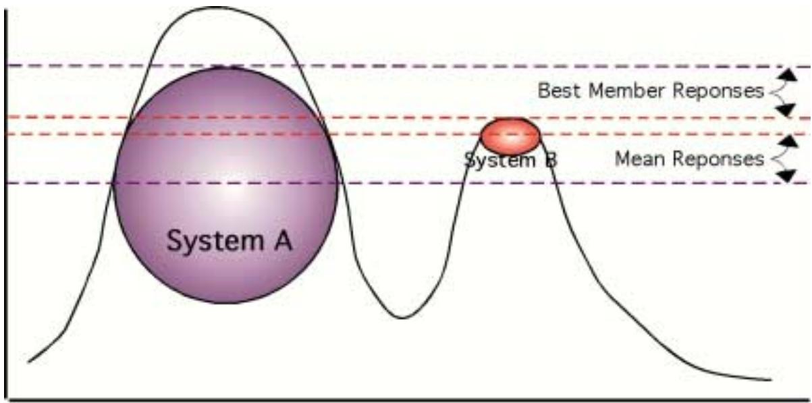  
Figure 28: The more diverse System A has a better ‘best member’ response than System B, but a worse ‘mean’ response.

Now let us look at the converse problem. A difference, on average, is found between the fitnesses of the best members of the two systems, and is in System A’s favour. Does this imply that System A is better at escaping from local optima than system B? There are three possible reasons that I have thought of which could explain such a difference. The first possibility is the conclusion we want: there is a difference because System B gets trapped at a bad local optimum with a greater frequency than System A. Thus A is better at escaping from local optima. The second possibility is that both systems get trapped by local optima with equal ease, but one system is better at finding good local optima to get trapped in than the other. It is difficult however to see how this could occur. Unless the evolutionary system has detailed knowledge of the landscape so it could jump directly to a good optimum, the system would have to sample the landscape, bad optima as well as good. If it passes over the bad optima more frequently so it can find the better ones ‘to be trapped in’, then it is reasonable to say that it does not get trapped at local optima as easily. Thus first two possibilities lead to the same conclusion.

The third possibility is the most pernicious. Perhaps System B takes longer to escape from the local optima than System A, but in the long run does better. Thus the difference we see in System A’s favour is a result of not waiting long enough. This is definitely possible. Of course, perhaps all that is necessary to resolve this problem is to wait long enough. However, we do not have enough information to know when long enough is, nor is there yet any theoretical way of determining it. Thus we cannot conclusively say that an observed difference in fitness between the best members of the two systems is sufficient to declare one as better at escaping from local optima than is the other. However, such an observation would provide strong evidence for this position. Furthermore, if there is reason to believe that convergence has taken place in both systems by the time the experiment ends, then sufficiency does hold.

From the above argument, we see that a difference between the average over many runs of the fitnesses of the best members found by the GA and the SBGA would be indicate that the more ‘fit’ system is better at escaping from local optima than the other. However, this conclusion only holds if the experiment is run for a sufficient number of generations. Preliminary experiments showed that the response of the GA on this measure reached a plateau by 75 generation. Also by 75 generations the diversity of the GA reaches close to zero, demonstrating that the GA has converged. Thus by waiting for 75 generations, sufficiency should be assured. However, to be on the safe side, the number of generation for an experiment increased fourfold over this value. So we wait 300 generations before polling the systems to determine how well they have done.

# Ch13 ß2.3 Factors (Predictor Variables), Factor Levels and Repetition

# Ch13 §2.3.1 The Factors and their Levels

Predictor variables (which are also called ‘factors’) are the variables that effect, or are being tested to see if they effect, the behavior of the response variable. When applied to GA behavior, predictor variables can be either aspects of the construction of the GA such as choosing different parameter settings, or it can involve varying the environment that the GA is operating in, such as changing the objective function. A particular parameter setting, design feature, or test function is called a ‘factor level’ or ‘level’. However, there is a subtle difference between a factor and a GA parameter, etc. A factor in the model is modified during the course of the experiment. Therefore a parameter that is kept constant throughout all runs, is not a factor in the model.

In the experiment performed for this chapter (and those performed for all chapters in this part) no changes were made to the traditional GA parameters; the mutation and crossover rates were not changed from their default settings, nor was the slope of the linear rank selection varied. Consequently, all the factors used in the model were environmental, except for the two systems under discussion themselves and one of the newly introduced parameters in the SBGA.

The SBGA and the GA are the two levels in the most important predictor variable in the model: the systems under study. I have called this factor the ‘program factor’ and have denoted it $\mathsf { \tilde { p g m } } ^ { \mathsf { \prime } }$ . The other two factors are the test function (‘fn’) and the dimensionality $( \mathsf { \dot { d } i m } ^ { \prime } )$ a the function. The test function factor has two levels: the F8F2 function and the $\mathrm { F } 8 \mathrm { m F } 2$ function. The dimensionality factor has five levels: 4 through 8. The reasons behind these choices of factors and their levels have already been discussed last section. The number of factors used was deliberately kept small in order to focus on the behavior of the two systems without the extra complications that arise when many factors are involved. Further study of the two systems, together or separately, using other factors should of course be done at a later time.

There is one more predictor variable, other than the ones discussed above, that has been included in the model; different migration intervals for the colonies in the SBGA were tried. The reason for this will be discussed in the next section.

One last note. None of the factors used in the model are random variables. They are ‘fixed’ variables with levels set by the experimenter. Furthermore, none of them are concomitant variables; i.e. no regression needs to be done over them. Consequently, the analysis tool that will be used by the GLM is just a regular ANOVA.

# Ch13 §2.3.2 How Many Cases are Needed?

There are, of course, many different combinations of factor level settings (which are called ‘treatments’) that can be tried. For example, for three factors, A, B and C, which have $a , \ b$ and $c$ factor levels respectively, the total number of treatments possible is $n _ { T } = a \cdot b \cdot c$ . If all such combinations are used, the factors are said to be fully crossed. This results in a simpler analysis, and consequently I have fully crossed all factors for all experiments.

Another way in which the analysis can be kept as simple as possible, is to give each treatment in the system the same number of repetitions. The repetition of an individual treatment is used to either obtain or increase statistical accuracy. In all experiments an equal number of treatment repetitions is used.

To determine the number of repetitions required, a test of the power of the statistical model should be performed. Unfortunately, to do so involves a chicken and egg type problem. To calculate the appropriate number of repetitions from the power of the model, an estimate of the mean level effects and variation in the system is required. Unfortunately, we have no a priori knowledge of those statistics and to obtain them, we would have to run the experiments.

Fortunately, it is better to over specify rather than under specify the number of repetitions to be used. If too many repetitions are performed, we just waste computational power. If too few are performed, we may not have the resolution power needed to distinguish between two factors or factor levels and could conclude that there is no difference between them when there really is (i.e. making a Type I error). Consequently, in our results, if the null hypothesis wins out and no difference was discerned, we cannot really conclude that no difference exists. Only a proper study of the power of the test could convince us of that. Since this was not done, conclusion of this sort must be only tentatively held.

It would have been nice if we could guard against Type I errors by allocating a very large number of repetitions for each level setting combination. Unfortunately, the experiment is very computationally expensive; the fully crossing of the factor levels results in a combinatorial explosion in number of trials to be performed. A balance therefore must be kept between performing as large a number of repetitions as desired for statistical significance, and yet keeping the number of repetitions low enough for the experiments to be completed in a reasonable time. To attempt such a balance, the choice was made to use 30 repetitions. With this number of repetitions, the difference between the Student T distribution and one obtained with an infinite number of repetitions is fairly small; small enough to be ignored by many tables published in statistical textbooks, which only publish t-scores up to $n = 2 9$ , and then skip to $n = \infty$ . Consequently, I felt that 30 reps would be a large enough default value, while still be computationally reasonable. The results seem to bear out this choice, with the sought-for distinctions between factor levels actually occurring.

# Ch13 ß2.4 The ëMigration Intervalí Factor

Of all the parameter settings used in the GA and SBGA, the migration interval is the only one used as a factor in the linear model. This was done more out of necessity than desire. For all of the other parameters, good arguments could be made for choosing a particular setting (see Ch12 §3.2). However I had no theory or intuition to guide me on a reasonable choice of a migration interval level. Consequently, I decided to try three different levels and include the migration interval as a factor in the model, denoted ‘migr’.

While I had no intuition on which single level to choose, I was able to identify three migration intervals that should be of interest.

The first choice is a migration interval of 10. The idea is to match the migration interval to colony count. By doing so, one and only one colony will send migrants to the core each generation. This allows a constant inflow of migrants to the core, while limiting their number. It also will give each colony a chance to evolve for 10 generations before sending migrants to the core, allowing the colony to move into a different area of the search space.

The second choice is a migration interval of 2. Here we are taking the opposite approach; we are sending migrants in as early as possible while still allowing each colony a modicum of evolutionary time. This constant influx of members may destabilize the core, reducing the SBGA’s performance. Alternatively by increasing the core’s diversity the SBGA’s performance may be enhanced. There is no way to know a priori which will occur (hence the experiment). Also, in every generation half of the colonies are sending migrants to the core, which increases that population’s size by $50 \%$ ; the core is being deluged. Consequently, we only send $2 5 \%$ of the members of a colony, the elite, during migration. Thus the number of migrants arriving at the core is reduced to only $12 . 5 \%$ of the core’s size. Since we don’t want to add yet another factor to the linear mode, the percentage of a colony that are sent as migrants remain constant across all experiments.

The third choice is a migration interval of 6, which is exactly halfway between the migration intervals of 2 and 10. This is to test whether we get intermediate behavior at this level, implying that the migration interval behaves in a linear fashion, or not.

Because the behavior of the SBGA changes with the migration interval, one can view the varying responses as coming from three distinct implementations of the SBGA. To emphasize this perspective, the factor levels for migration interval will be denoted $^ { \circ } { \bf S } ( 2 ) ^ { \prime }$ , $ { \mathrm { ~  ~ \omega ~ } } ^ {  { \mathrm { ~ c ~ } } }  { \mathrm { S } } ( 6 )  { \mathrm { ~  ~ \omega ~ } } ,$ and ‘S(10)’ for migration intervals 2, 6 and 10 respectively. The $^ { \circ } \mathrm { S } ^ { \prime }$ stands for the SBGA program with the parenthetical values indicating the modifying effect of the migration interval.

There is one more issue that needs to be covered concerning the analysis of the GA and SBGA in the presence of migration intervals. In the previous section, we stated that it is desirable to keep all factors fully crossed. Therefore, both the GA and SBGA should be tested using the same migration intervals. However, migration interval is not a valid parameter of the GA! Consequently, the migration interval factor can only apply to the SBGA level of the program factor. To rectify this, the linear model has to be slightly modified. The factor ‘migration interval’ is said to be partially nested within the program factor. The details of the effect of nesting can be found in Chapter 28 (Neter, Kutner et al. 1996).

When one nests a factor within another, inferences can be made on the nested factor. Consequently, as long as the program factor is in the model, no inferences can be made on the migration interval. To study the effects of migration interval levels, a second linear model has to be used. The second model is created by replacing the ‘pgm’ factor with the ‘migr’ factor. With the original model we can made inferences about the SBGA as a whole in comparison to the GA; e.g. is the SBGA better over all at escaping from local optima than the GA. With the second model, more detailed comparison can be made between the GA and individual SBGA systems with particular migration interval settings. The second model also allows one to perform a comparative study between the behavior of the SBGA systems with different migration intervals.

# Ch13 ß2.5 Testing for Normality and Constancy of Error Variance

The ANOVA test is only valid if two assumptions hold: the data must be normally distributed, and the error terms must have constant variance across the various factor levels. If these assumptions do not hold, remedial measures have to be taken before the ANOVA routine is applied.

# Part 4

# Ch13 §2.5.1 Normality

The easiest way to test for normality in the data is to perform a normality plot. In such a plot, the data is sorted by fitness and paired with the values that would be expected if the data were normally distributed. These pairs are then plotted on a scatterplot to see if they form a straight line. If so, then the data is normally distributed; if not, then not. A linear regression is usually performed to see how well the results of the normality plot results fits a straight line. If the $R ^ { 2 }$ values produced by the regression line are large, on the order of $9 5 \%$ or greater, then we can accept that the data is normally distributed, otherwise we assume nonnormality.

When the normality test is applied to the results from the experiment designed in the previous chapter, a mixed response is obtained. In Figure 29, we see that SBGA evolving in an F8F2 environment with a dimension of 8 has normally distributed results. On the other hand, the behavior of the SBGA in the $\mathrm { F } 8 \mathrm { m F } 2$ environment set at dimension 4 is very far from normal. Looking at Table 2, which records all the $R ^ { 2 }$ values of the

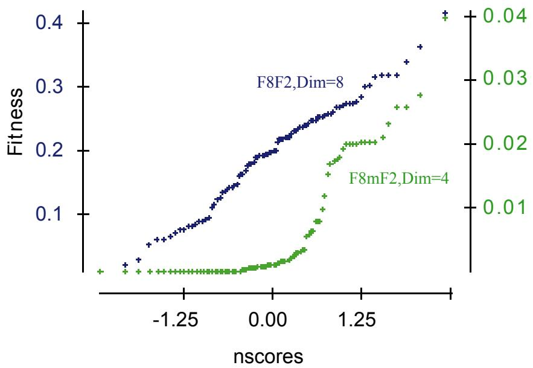  
Figure 29: Normality plots of SBGA behavior in two different environments. F8F2,Dim $_ { 1 = 8 }$ (in blue) imposes normally distributed behavior on the SBGA; F8mF2,Dim $_ { 1 } { = } 4$ (in green) does not.

Table 2: The $R ^ { 2 }$ values from the linear regression of each normality plot of the fitness values. If $R ^ { 2 } = 1 0 0 \%$ , then the data is normally distributed.   

<table><tr><td>Dim</td><td>F8F2</td><td>F8mF2</td></tr><tr><td>4</td><td>93.4% 89.8%</td><td>70.3% 70.3%</td></tr><tr><td>5 6</td><td>92.2% 94.1% 90.5% 98.1%</td><td>84.0% 84.2% 78.6% 95.0%</td></tr><tr><td>7</td><td>96.0% 97.9%</td><td>90.3% 97.8%</td></tr><tr><td>8</td><td>94.4% 98.4% GA SBGA</td><td>91.1% 96.5% GA SBGA</td></tr></table>

regressions for the normality plots applied to all dimension / test function combinations, we see that low dimensional experiments are not normally distributed, while high dimensional ones are. Furthermore, the effect is much more pronounced when the $\mathrm { F } 8 \mathrm { m F } 2$ environment is used.

The reason for the variance in normality results is not as yet understood. One hypothesis could

be that on ‘easy’ problems an evolutionary system would provide many more ‘good’ results rather than ‘bad’ ones, skewing the data towards lower (better) fitnesses, and thus producing an asymmetrical and hence nonnormal distribution. While the overabundance of low fitness values in the normality plot does add weight to the theory, more experimentation will have to be done before this reason should be accepted.

# Ch13 §2.5.2 Remedial Measures for Nonnormality

For the regular ANOVA test to be applicable, the data for all the factor levels of all the factors must be normally distributed. As this is not the case, we must resort to remedial measures.

The first remedial measure that should be tried is the coercing of the data into a normal distribution. To do this, one must find an appropriate transformational function for the response variable. However, it is not possible to produce such a function. Any function that normalizes the results at low dimensions would destroy the normality of the results at high dimensions.

A second remedial approach, and the one taken for this experiment, is to use nonparametric statistical procedures for the analysis. The original nonparametric version of ANOVA is the Kruskal-Wallis test64. However, there is an easier alternative. To transform the data such that an ANOVA performed on it would produce nonparametric results, simply sort all the cases by the response values, independent of which factor or factor level is used, and rank them. The ranked data produces a uniform distribution across all factors and factor levels, which is close enough to a normal distribution that an ANOVA produces results that are virtually equivalent to the Kruskal-Wallis test. See (Neter, Kutner et al. 1996), pp. 777-780 for further details. Consequently, the analysis for this experiment is performed on the ranked data.

# Ch13 §2.5.3 Constancy of Error Variance

The data needs to meet a second requirement if valid results are to be produced by the ANOVA procedure; the error terms must have a constant variance for each of the different factor levels. A simple test for this is to perform the ANOVA, and then plot the residuals for each factor level of every factor in the model using a dot plot. If the scatter of the residuals around 0 is approximately the same for each factor level, then error variances are constant.

AS we have ranked the fitness to handle the nonnormality of the data, the residuals should be computed from an ANOVA performed on the ranked fitnesses, not the raw data.

The constancy of error variance was tested on the data produced by the experiment described in the previous chapter. Dot plots were produced using the residuals for each factor level of the three main factors in the model: the test function, dimension, and migration interval. A quick glance at the results presented in Figure 30 shows that the variances are all similarly dispersed around zero. Consequently, the error variances can be considered constant for all the factor levels and no remedial measures need be taken.

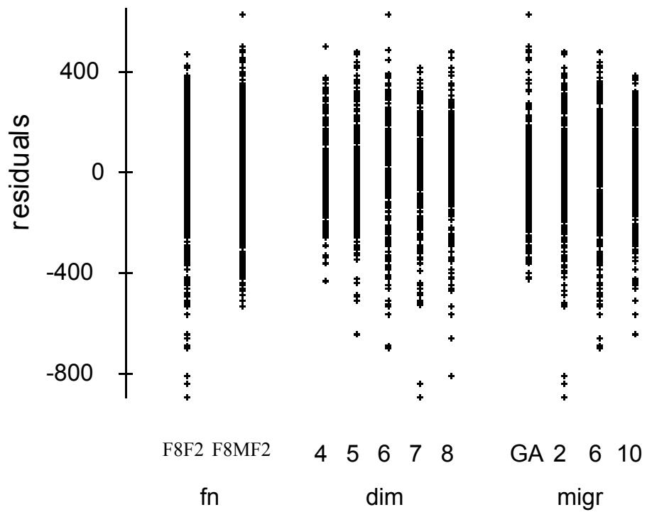  
Figure 30: Residuals from the ANOVA shown for the three different factors. The variance remains constant throughout.

# Ch13 ß2.6 Summary of the Model

To answer the question “does the SBGA escape from local optima more readily than the standard GA?” two linear models have been developed.

The first model is designed to answer the question overall. In other words, after considering all of the migration interval settings that the SBGA has been run with, can one say that the SBGA escapes from optima more readily than the standard GA? In the model, the response variable, denoted as Y, is the ranked fitness of the best member by the end of generation 300 as was discussed in the previous two sections. The factors used in the model, along with their levels and shortened names can be found in Table 3.The model also must includes terms used to test whether any interaction between factors occur. The resulting model is written as

# Model 1:

$$
\begin{array} { r l } & { Y = c o n s t + f n + d i m + p g m ( m i g r ) + f n ^ { * } d i m + f n ^ { * } p g m ( m i g r ) + d i m ^ { * } p g m ( m i g r ) + f n ^ { * } d i m ^ { * } p g m ( m i g r ) + f n ^ { * } d i m ^ { * } p g m ( m i g r ) + } \\ & { \quad f n ^ { * } \dim ^ { * } p g m ( m i g r ) } \end{array}
$$

The second model is used to study interactions between the GA and individual ‘migration interval’ level responses of the SBGA. It can also be used to compare the behavior of the SBGA at the different ‘migration interval’ levels. This model is similar to the one before, except that the $p r g ( m i g r )$ nested term is replaced by the migr factor. To do this, the migration interval must be removed as a nested factor of prg. This is done by augmenting the migration interval factor levels to include GA cases. Each GA case is given a migration interval value; the factor levels for migr are now $^ { \circ } { \bf S } ( 2 ) ^ { \prime }$ , ‘S(6)’, ‘S(10)’ and $\mathbf { \check { G } A } ^ { \prime }$ . The resulting model becomes

Table 3: Factors and Factor Levels used in the model   

<table><tr><td rowspan=1 colspan=1>Factor</td><td rowspan=1 colspan=1>Levels</td></tr><tr><td rowspan=1 colspan=1>Test Function (fn)</td><td rowspan=1 colspan=1>F8F2, F8mF2</td></tr><tr><td rowspan=1 colspan=1>Dimension (dim)</td><td rowspan=1 colspan=1>4-8</td></tr><tr><td rowspan=1 colspan=1>Program (pgm)</td><td rowspan=1 colspan=1>GA, SBGA</td></tr><tr><td rowspan=1 colspan=1>Migration Interval (migr)</td><td rowspan=1 colspan=1>S(2),S(6),S(10)</td></tr></table>

# Model2:

$Y = c o n s t + f n + d i m + m i g r + f n ^ { * } d i m + f n ^ { * } m i g r + d i m ^ { * } m i g r + f n ^ { * } d i m ^ { * } m i g r$ Once again the response variable $Y$ is the ranked fitness of the best member by the end of generation 300, and all factor names and levels can be found in Table 3.

For both models, the constant parameter settings of the GA and SBGA used are listed in Table 4.

Table 4: Constant parameter setting for all experiments   

<table><tr><td colspan="2">Population Sizes</td><td colspan="2">Selection</td></tr><tr><td>GA</td><td>2000</td><td colspan="2">Linear rank selection</td></tr><tr><td>Core Colony</td><td>1000 100</td><td colspan="2">low = 0.0 (high = 2.0) elitism</td></tr><tr><td></td><td></td><td colspan="2"></td></tr><tr><td colspan="2">GA and Core mutation rate 0.006 bits / locus</td><td colspan="2">Colonies mutation rate 0.01 bits / locus</td></tr><tr><td colspan="2">prob. of crossover 0.7</td><td colspan="2">prob. of crossover 0.9 migration size Y4 colony size (elite)</td></tr></table>

# Part 4

# Ch13 §3 Results

The experiments, as described in the previous chapter, were performed. In this section the results will be presented and those found to be of interest emphasized. However, no conclusions will be drawn; all such discussions will be deferred to the analysis and discussion section following.

In Figure 31 dot plots of the best fitness from the population in the three hundredth generation for all the runs are presented for F8F2. The results for each system (GA or SBGA with a different migration interval setting) are kept together and clustered by dimension used in the run. Therefore each dot plot (vertical ‘line’) comprises the 30 repetitions used with each treatment (the combination of system setting and dimensionality of the environment). The results for $\mathrm { F } 8 \mathrm { m F } 2$ are similarly presented in Figure 32.

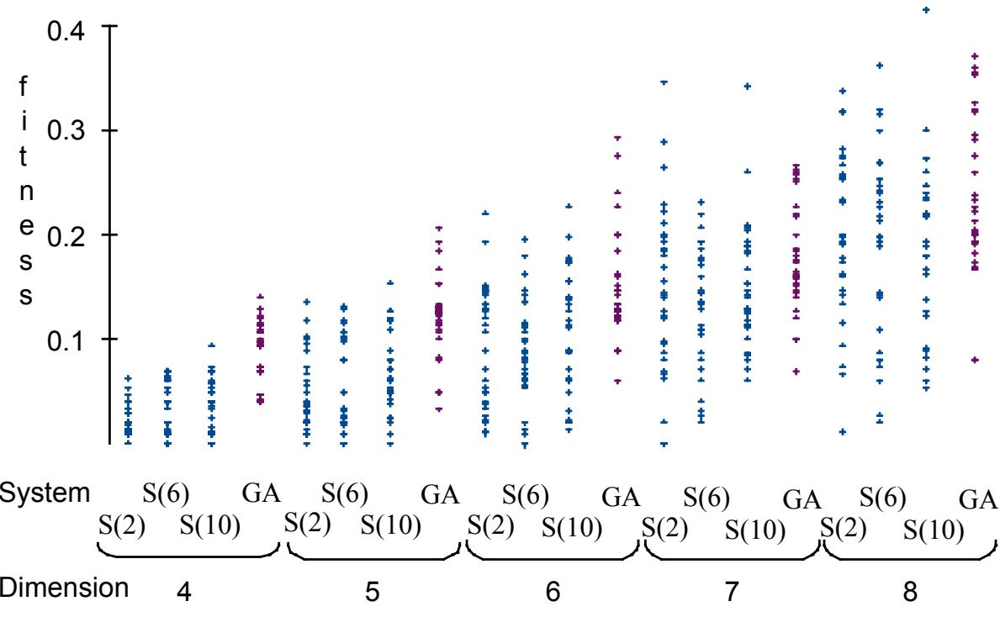  
Figure 31 Dot Plots of Results in the Stationary F8F2 environment.

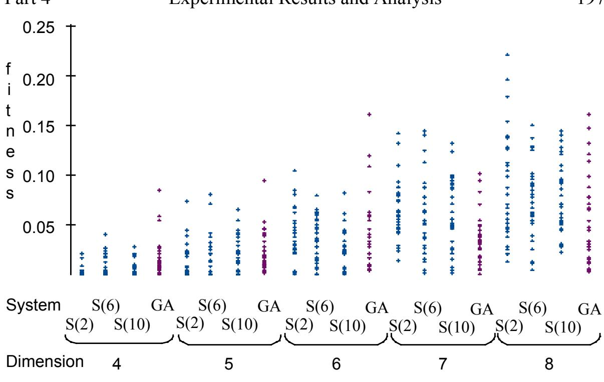  
Figure 32 Dot Plots of Results in the Stationary $\mathrm { F } 8 \mathrm { m F } 2$ environment.

The results from the dot plots seem, on the whole, to favour the SBGA systems over the GA systems at low dimensionality, while it is harder to at high dimensionality, in both F8F2 and F8mF2. However, such visual inspection can be deceptive, especially when observing stochastic sampling when comparing random variables. How much variation is to be expected? If one system varies around a lower mean than another, is this because of an actual difference or just the result of statistical fluctuations. When dealing with only two factors, this can be settled by doing a two-factored ANOVA or a T-Test (which is the square root of the F-test used by the ANOVA). When more than two factors exist, the more general procedure has to be used: the ANOVA, under the general linear model.

The ANOVA results based on Model 1 have been computed and are summarized in Table 5. These results should show whether a general difference between the GA and the

Table 5: ANOVA summary Using Model 1. The Confidence level is the confidence we have that the difference observed between the ranks of the GA and the SBGA is real.   

<table><tr><td rowspan=1 colspan=1></td><td rowspan=1 colspan=1>Difference InRanks</td><td rowspan=1 colspan=1>In Favor of</td><td rowspan=1 colspan=1>StandardError or5</td><td rowspan=1 colspan=1>ConfidenceLevel</td><td rowspan=6 colspan=1>2R20</td></tr><tr><td rowspan=4 colspan=1>4</td><td rowspan=4 colspan=2>388.233        SBGA333.044        SBGA214.356        SBGA120.433        SBGA86.6778        SBGA</td><td rowspan=1 colspan=1>SBGA</td><td rowspan=4 colspan=2>30.26         100.0%30.26         100.0%30.26          99.8%30.26          95.4%30.26          82.0%</td></tr><tr><td rowspan=1 colspan=1>SBGA</td><td></td></tr><tr><td rowspan=1 colspan=1>SBGA</td><td rowspan=1 colspan=1>30.26</td></tr><tr><td rowspan=1 colspan=1>SBGA</td><td></td></tr><tr><td rowspan=1 colspan=1>4567</td><td rowspan=1 colspan=4>125.689        SBGA         30.26          96.2%61.2222        SBGA         30.26          54.9%11.1667          GA           30.26          0.3%164.911          GA           30.26          99.2%147.733          GA           30.26         98.4%</td></tr></table>

SBGA exists independent of the migration interval used. In the table the comparisons between the GA and SBGA are broken down and summarized according to the test function and dimensionality used during the runs.

Let us first look at the F8F2 results in the top of the table. Here we see that the SBGA outperforms the GA at a confidence level of $9 5 \%$ or greater, which is the usual level for statistical significance66. The sole exception is the results for dimension 8, which only reaches an $82 \%$ confidence level.

Looking at the results of $\mathrm { F } 8 \mathrm { m F } 2$ we see a different story. At very low dimensionality, the SBGA is better than the GA. However, by dimension 7 the GA is the clearly dominant system of the two.

Model 2 was formed to examine whether the overall effects seen in Model 1 holds for each of the migration interval levels. Unfortunately, the 30 repetitions were not sufficient to provide such information. Remember that setting the repetition rate to 30 per treatment was just a best guess at the needed amount for statistical significance. This proved adequate for examining gross level distinctions between the GA and the SBGA, but not the fine level distinctions necessary to discern differences between the migration intervals. In the future, 60 or 90 repetitions per treatment should be tried.

The discussion of Model 2 was included in this chapter for didactic purposes. Model 2 will be of interest when dealing with dynamic environments in the next chapter. However it was easier to explain the purpose behind Model 2 here using the conceptually simpler stationary model.

# Ch13 §4 Analysis and Discussion

Overall, the results of the experiment show that the SBGA outperforms the GA on the F8F2 function, a function designed to have many local optima, while the reverse occurred on the $\mathrm { F } 8 \mathrm { m F } 2$ function, which has a large basin of attraction connected to its global optimum. In other words, when there were many optima to escape from, the SBGA excelled; but when the global is easy to find, the larger population of the GA begins to dominate and the SBGA is not as competitive.

There are, however, some oddities in the results. For the F8F2 function at dimension 8, the success of the SBGA relative to the GA loses some of its statistical significance, dropping to $82 \%$ . This is unexpected since dimension 8 should have even more local optima for the SBGA to escape from and the GA to get trapped in. One possible explanation is that by dimension 8 the function is so hard that both systems are beginning to struggle, thus producing equally poor results. This is, of course, complete conjecture. A detailed study of the behavior of the SBGA and the GA on F8F2 at higher dimensionality will have to be done to begin to explain this result.

The F8mF2 test function also presents some surprises; now in favour of the SBGA. Before examining the results, I was expecting the GA to have an advantage in the $\mathrm { F } 8 \mathrm { m F } 2$ environment at low dimensionality. After all, the $\mathrm { F } 8 \mathrm { m F } 2$ function was designed to favour the GA over the SBGA. Once the large basin is found, the GA can use its superior hillclimbing capabilities, derived from its larger, undivided population, to rapidly descend into the bottom of the valley and find F8mF2’s global minimum. Remember; the population of the GA is double the size of the core and 20 times the size of any colony. The only advantage that the SBGA should have lies in the initial stages of the experiment when the central basin is still not yet found. Then, the terain is still rugged and the SBGA’s ability to escape from local optima can come into play.

At low dimensionality, the initial populations of both the GA and SBGA should easily find the large central basin by randomly sampling the search space. The small dimensionality means that there is less search space to cover than with high dimensional spaces. Furthermore, the population size is kept the same as dimensionality increases thus the coverage becomes thinner and the chances of stumbling on the central basin decreases. So we expect that the GA should outperform the SBGA to a greater degree at low dimensions rather than at high ones.

However, not only does the level of performance of the GA over the SBGA diminish at low dimensions instead of increase, at dimension 4 the SBGA actually outperforms the GA to statistical significance! Only at high dimensions $\mathrm { d i m } = 7$ and $\dim = 8$ ) does the GA have a clear advantage over the SBGA.

One possible explanation is that the GA is more suitable for solving hard problems and the SBGA for easy problems. However, this is contradicted by the success of the SBGA on the F8F2 function compared with the success of the GA on the $\mathrm { F } 8 \mathrm { m F } 2$ function; the F8F2 function constructed to be harder!

Another possible explanation hinges on the behavior of the large central basin of attraction with respect to increasing dimensionality. It is possible that this basin grows in volume faster than the dimensionality increases. Thus it may be easier for the GA to initially find the basin at high dimensionality, not harder. Once again this is a complete conjecture. To attempt to confirm it, a detailed study the topography of the $\mathrm { F } 8 \mathrm { m F } 2$ landscape at high dimensionality is necessary. This is not easy. An explanation of this effect too will have to be left for future research.

While the two anomalies should be followed up, by and large, the results found, especially those of F8F2, support the hypothesis that the SBGA is better than the GA at escaping from local optima.

# Chapter 14

# Comparing the SBGA to the GA in a Dynamic Environment

# Ch14 §1 Introduction: Does the ‘Shifting Balance’ Extension Aid the GA when Tracking a Moving Global Optima?

In the previous chapter the ability of the SBGA to outperform a standard GA in an environment with many local optima was investigated and the outcome seemed to support the claims by Sewall Wright that the ‘shifting balance’ helps an evolutionary system escape from local optima. However, an addition claim is made in this dissertation that the ‘shifting balance’ extension should aid in tracking a moving global optimum. This should be especially true after a lengthy stationary period is experience by the environment, which would allow an evolutionary population to converge. While it is difficult to prove such a conjecture conclusively, an experimental design will be developed to provide strong supporting evidence in its favour. At the end of the chapter, experimental results will be presented that seem to confirm that not only does the Shifting Balance extension aid evolution in a dynamic environment, but that the advantages experienced in these situations exceed even those found in stationary problems with many local maxima.

# Ch14 §2 Experimental Design

The same basic experimental design used in Chapter 12 shall be used again. Both the parameter settings of the GA and SBGA as well as the test functions will remain unchanged. This is done to facilitate comparisons against the stationary results. However, to change the stationary experiment into a dynamic one, many changes and additions will still have to be made. These modifications follow directly:

# Ch14 ß2.1 Dimensions

In the stationary experiment we examined function dimensions 4 through 8. Dimension 2 and 3 where skipped because both the SBGA and the GA could actually find the global optimum when used. However, in a dynamic environment, it is impossible to “find” the global optimum because the solution found will not be the global optimum in a generation or two. Furthermore, finding the global while stationary will add to the effect of premature convergence of the populations, which is even a part of the experimental design. Consequently dimension 2 was reinstated into the test plan. This, however, adds to the computational time when running the experiments, which will soon be made even more onerous by the addition of motion as a factor. Consequently only the even-valued dimension between 2 and 8 were used as factor levels.

# Ch14 ß2.2 Motion

# Ch14 §2.2.1 Phenotypic Motion

The term ‘dynamic environment’ is an overly general term. ‘Dynamic’ includes an extremely broad array of time dependant behavior. The ‘fitness landscape’ could move en mass, or it could undulate like a storm swept sea. The changes could range from the very gradual, perhaps almost imperceptibly so, to the very sudden, staccato-like. The motion may be smooth or punctuated; continuous or discontinuous; cyclical or ever varying. The permutations are endless.

In this dissertation the choice was made to study the simplest possible dynamic environment that could be constructed. The reason for this is straightforward, simple dynamical systems are easier to analyze than complex ones. It is difficult enough to understand how the GA works on a stationary environment; with a complex dynamics driving a complex evolutionary process, it becomes very difficult to differentiate the various causal factors behind the behavior observed. The only hope is to build up understanding gradually. If the behavior of the GA is known in the simple cases, differences that arise when complexity is added can more easily be appropriately attributed. Consequently, it was decided that a simple translation of the entire environment should be studied first.

To make a function $f$ with $d$ dimensions undergo a translation, simply compose it with a second function $m$ , where $m$ is defined such that, if $f \colon ( x _ { 0 } , x _ { 1 } , . . . , x _ { d - 1 } )  R$ then $m \colon ( x _ { 0 } , x _ { 1 } , . . . , x _ { d - 1 } , g e n ) \to ( x _ { 0 } , x _ { 1 } , . . . , x _ { d - 1 } )$ . In other words m extends the domain of $f$ by adding the current generation as an argument, and returns a value that is within the domain of $f .$ Consequently, the dynamic version of $f$ is

$$
f _ { d y n } ( x _ { 0 } , x _ { 1 } , . . . , x _ { d - 1 } , g e n ) = f ( m ( x _ { 0 } , x _ { 1 } , . . . , x _ { d - 1 } , g e n ) )
$$

For $f$ to be a simple translation, the dimensions must not interact with each other. Consequently, the newly formed dynamical function can be written as:

$$
f _ { d y n } ( x _ { 0 } , x _ { 1 } , . . . , x _ { d - 1 } , g e n ) = f ( m _ { 0 } ( x _ { 0 } , g e n ) , m _ { 1 } ( x _ { 1 } , g e n ) , . . . , m _ { d - 1 } ( x _ { d - 1 } , g e n ) )
$$

where $m _ { 0 } , m _ { 1 } , . . . , m _ { d - 1 }$ are the linearly separated (by dimension) component function of the overall function m

The simplest such translation occurs when $m _ { 0 } = m _ { 1 } = . . . = m _ { d - 1 }$ . This is a translation along the hyperdiagonal. The translation along the hyperdiagonal has the advantage of being the simplest transformation that has an affect on every dimension equally and therefore was the dynamic function chosen for the experiments. Since all of the component functions, $m _ { 0 } , m _ { 1 } , . . . , m _ { d - 1 }$ are identical, the function applied to a single dimension during a translation along the hyperdiagonal shall be denoted $m _ { d }$

There is still one more ‘degree of freedom’ to restrict. While the translation is restricted to the hyperdiagonal, the type of motion along the hyperdiagonal can yet have any form. For example, if $m _ { d }$ has the form $m _ { d } ( x , g e n ) = x ^ { k \cdot g e n }$ , with $k$ being a constant, then $x$ will gain speed exponentially over time. Similarly, if $m _ { d } ( x , g e n ) = x \sin ( k \cdot g e n )$ , then $x$ will oscillate along the hyperdiagonal. In this way cyclical processes can be emulated. The simplest motion is, of course linear motion: $m _ { d } ( x , g e n ) = x - \nu \cdot g e n$ , where $\nu$ is a constant speed (the speed of a linear translation will be discussed in Ch14 §2.4).

The linear translation along the hyperdiagonal at constant speed has the advantage of being the simplest transformation that can be performed, yet effects every dimension. Furthermore, each dimension is affected equally. Consequently, this was dynamic function chosen for the experiments.

# Ch14 §2.2.2 Genotypic Motion

It is important not to confuse the motion in the domain of the fitness functions, as described in the previous section, with the motion of the environment as experienced by a chromosome in a population. Take for example a chromosome that, once decode, lies on the global optimum of the objective function. What mutational change is necessary to transform that member into one that lies on the new global optimum once the environment has shifted by a single phenotypic increment, say between 7 and 8? If the phenotypic domain is the integers, and the chromosomes are produced using a simple binary encoding using 4 loci, then the phenotypic value $^ { \circ } \gamma$ becomes the genotype $^ { \circ } 0 1 1 1 ^ { \circ }$ , while the phenotypic value $^ \circ { } ^ { \circ } { } _ { \mathbf { 8 } } \cdot { }$ becomes the genotype $^ { \circ } 1 0 0 0 ^ { \circ }$ . Consequently, in this case 4 mutations were needed to move a unit distance in phenotype space; this is the maximal distance between chromosomes in that gene space. Of course, what has just been described is simply the well-known problem of ‘Hamming cliffs’; but it proves the point exceedingly well. What looks like linear motion in phenotypic space may be anything but linear in genotypic space.

Since domain of an evaluation function is the phenotype of a population member, the changes in the environment with respect to phenotypic space will be called phenotypic motion. Similarly genotypic motion shall be used to denote dynamic behavior of the environment in genotype space.

In general it is much easier to specify phenotypic motion than genotypic motion. However, it is really the genotypic motion that is experience by the genome as the environment changes. One technique that partially rectifies this problem is the use of Gray codes for encoding phenotypic integers as chromosomes. Since an integer increment of 1 corresponds to a single bit difference in the encoded number, there is a relatively smooth mapping from phenotype to genotype space. Thus a phenotypic increment of 1 would correspond to a genotypic increment of 1 throughout the gene space. Using the standard Gray code specifications, increments of 2 also correspond to increments of 2 in the gene space. Unfortunately, this mapping breaks down when using increments of 3 or greater; thus, care must be taken in the analysis when large incremental jumps in phenotype space are used as they may be associated with much smaller or much larger changes in gene space.

When defining F8F2 and F8mF2 in the previous chapter, it was noted without comment that they were encoded with Gray codes. It should now be clear why this choice was made.

# Ch14 ß2.3 When Should Motion Occur?

The experiment requires two distinct periods, a stationary period where the evolutionary populations are given a chance to converge on the global optimum, and a dynamic period.

From preliminary experiments, it was determined that convergence in the GA occurs approximately 75 generations after a random start (also see the diversity results presented in Ch15 $\ S 3$ ). To ensure that convergence occurs, this period is doubled in length producing an 150 generation stationary period.

Motion occurs immediately after the stationary period and continues unabated until the end of the run. The length of this dynamic period is set at 300 generations to match the time used in the experiment in Chapter 12. It is also double the length of the stationary period.

Consequently, the entire run takes 450 generations in total.

# Ch14 ß2.4 Speed and Velocity

# Ch14 §2.4.1 Phenotypic Velocity and Phenotypic Speed

An obvious question to ask of a dynamic environment is “how fast is it moving?” i.e. what is the velocity or speed of the environment? This is only a meaningful concept, however, when every point in the environment ‘landscape’ at time $ { { ^ \circ } } a ^ { \prime }$ has a one-to-one and onto mapping with the points at time $^ { \circ } b ^ { \prime }$ . It is, for example, not sensible to ask the ‘speed’ of the surface of a choppy lake. The surface is in motion, and the individual water molecules are experiencing changes in position over time, thus they do have individual speeds. However, the entire surface as a function is not changing in any uniform or predictable fashion and hence has no speed.

Environments with motions that can be linearly decomposed into dimensional components have such an equivalence mapping. For example rotational transformations have associated rotational or angular speeds and velocities while translational transformations have associated the regular definitions of speed and velocity.

We will now look at the rate of change that can be performed in translational transformations. The average rate of change between generation $g _ { 1 }$ and generation $g _ { 2 }$ of an environment under translation motion is

$$
\left( \frac { m _ { 0 } ( x _ { 0 } , g _ { 2 } ) - m _ { 0 } ( x _ { 0 } , g _ { 1 } ) } { g _ { 2 } - g _ { 1 } } , \frac { m _ { 1 } ( x _ { 1 } , g _ { 2 } ) - m _ { 1 } ( x _ { 1 } , g _ { 1 } ) } { g _ { 2 } - g _ { 1 } } , . . . , \frac { m _ { d - 1 } ( x _ { d - 1 } , g _ { 2 } ) - m _ { d - 1 } ( x _ { d - 1 } , g _ { 1 } ) } { g _ { 2 } - g _ { 1 } } \right) .
$$

If $m$ is a differentiable function of $g$ , then the instantaneous velocity at a given point in time would be

$$
\nu ( x _ { 0 } , x _ { 1 } , . . . , x _ { d - 1 } ) = \left( \frac { \partial m _ { 0 } ( x _ { 0 } , g ) } { \partial g } , \frac { \partial m _ { 1 } ( x _ { 1 } , g ) } { \partial g } , . . . , \frac { \partial m _ { d - 1 } ( x _ { d - 1 } , g ) } { \partial g } \right) .
$$

The phenotypic speed of an environment is the magnitude of its instantaneous velocity. If we use the L2-norm to compute the magnitude, then the speed of the translation of the dynamic environment would be

$$
s ( x _ { 0 } , x _ { 1 } , . . . , x _ { d - 1 } ) = \sqrt { \left( \frac { \partial m _ { 0 } ( x _ { 0 } , g ) } { \partial g } \right) ^ { 2 } + \left( \frac { \partial m _ { 1 } ( x _ { 1 } , g ) } { \partial g } \right) ^ { 2 } + . . . + \left( \frac { \partial m _ { d - 1 } ( x _ { d - 1 } , g ) } { \partial g } \right) ^ { 2 } } \ .
$$

As we saw earlier, a linear translation along the hyperdiagonal has $m _ { d } ( x , g e n ) = x - \nu \cdot g e n$ as its dynamic composition function in every dimension. Consequently, the velocity of the dynamic environment is $\nu ( x _ { 0 } , x _ { 1 } , . . . , x _ { d - 1 } ) = ( \nu , \nu , . . . , \nu )$ and the speed, using the L1-norm, is $s ( x _ { 0 } , x _ { 1 } , . . . , x _ { d - 1 } ) = \nu \sqrt { d }$ . Since we are generally interested in the speed of each dimension rather than the Euclidean speed of the entire system, we will usually refer to the dimensional phenotypic speed $\nu$ as the phenotypic speed of the environment rather than $\nu \sqrt { d }$ .

# Ch14 §2.4.2 Computing the Motion for the Dynamic F8F2 and F8mF2 Functions

Since there is a stationary period at the beginning of the experiment, the motion will begin at a given generation, say generation $g _ { d y n }$ and will cease at the end of the run, which is denoted $g _ { e n d }$ . Both of these values are user-defined parameters. A third

parameter is now introduced, the environmental shift distance (envShiftDist) which is the total phenotypic distance across which the environment moves during the course of the experiment. Consequently, the phenotypic speed of each dimension is

$$
\nu = { \frac { e n \nu S h i f t D i s t } { g _ { e n d } - g _ { d y n } } }
$$

and hence the equation of motion for $F 8 F 2 _ { d y n }$ becomes

$$
F 8 F 2 _ { d y n } ( x ) = F 8 F 2 \biggl ( x - { \frac { g e n - g _ { d y n } } { g _ { e n d } - g _ { d y n } } } ~ e n \nu S h i f t D i s t \biggr )
$$

where gen is the current generation and envShiftDist $=$ envShiftDist⋅ 1. The equation of motion for $F 8 m F 2 _ { d y n }$ is computed analogously.

Just as with migration intervals, the effects of different envShiftDist values on the evolutionary systems is entirely unknown. Consequently, 3 equally spaced distances were selected: 0.25, 0.5 and 0.75. These distances constitute $6 . 1 \%$ , $12 . 2 \%$ and $1 8 . 3 \%$ of each dimension respectively. The resulting dimensional phenotypic speed for each distance is 0.833, 1.667 and 2.5 milli-units/generation.

# Ch14 §2.4.3 The Average Genotypic Speed of Linear Motional along the Hyperdiagonal

The genotypic speed is to phenotypic speed as genotypic motion is to phenotypic motion. It is the speed of the environment as seen in gene space. Because frequently a linear transformation between phenotypic and genotypic motion does not exist, in spite of the clever construction of the Gray code, it is difficult to determine, or even to define an instantaneous genotypic speed. Consequently, we can only look at the average speeds of the environment in gene space computed across different generational intervals. This average genotypic speed was experimentally determined by applying the equation of motion to the position (1,1,...,1), which represents the global optimum of both F8F2 and $\mathrm { F } 8 \mathrm { m F } 2$ (although just the coordinates were produced, not the corresponding function values). The average dimensional genotypic speed was found to be 0.8333 bits/generation, for an envShiftDist of 0.25, 1.667 bits/generation for an envShiftDist of

0.5,and 2 bits/generation for an envShiftDist of 0.75. Since there is 12 bits per dimension, these values correspond to a mutation rate of 0.069, 0.139 and 0.1667 mutations/loci, all of which exceed the 0.006 mutation rate implemented in both the GA and the SBGA. Consequently, the crossover procedure in tandem with the population effects in the systems must be relied upon for the GA or SBGA to have any hope of tracking the global optimum.

When the average genotypic speed was calculated, the patterns of bit changes per generation were noted. The Gray code had indeed performed its ‘duty’; the number of bit changes per generation across each dimension was very uniform in composition. Three simple patterns emerged, one for each envShiftDist, all of which were repeated until their respective experiments were completed. With an envShiftDist of 0.25, the pattern was ‘1, $1 , 1 , 1 , 1 , 0 ^ { \circ }$ ; the envShiftDist of 0.25 produced the pattern $\cdot 2 , 2 , 1 ^ { \prime }$ ; and the envShiftDist of 0.25 produced the pattern ‘1, 2, 3, 2’.

# Ch14 ß2.5 The Model

The response variable remains unchanged from the previous chapter: the fitness of the best member of the population, ranked against all other cases from all treatments in ascending order, from best to worst. This is a natural response variable to use since the closer the system is to the global optimum, the better the results will be on average67. However, there is one difference. Instead of the offline measure being used (the fitness of the best member found across any generation) the fitness of the best member is reported in each of the cases run at every generation to see how closely the evolutionary systems track the global optimum from generation to generation.

Part 4   
Table 6: Factors and Factor Levels used in the model   

<table><tr><td rowspan=1 colspan=1>Factor</td><td rowspan=1 colspan=1>Levels</td></tr><tr><td rowspan=1 colspan=1>Test Function (fn)</td><td rowspan=1 colspan=1>F8F2, F8mF2</td></tr><tr><td rowspan=1 colspan=1>Dimension (dim)</td><td rowspan=1 colspan=1>2,4, 6, 8</td></tr><tr><td rowspan=1 colspan=1>Program (pgm)</td><td rowspan=1 colspan=1>GA, SBGA</td></tr><tr><td rowspan=1 colspan=1>Migration Interval (migr)</td><td rowspan=1 colspan=1>S(2),S(6) and S(10)</td></tr><tr><td rowspan=1 colspan=1>Phenotypic Speed (spd)</td><td rowspan=1 colspan=1>0.833, 1.667and 2.5milli-units/generation</td></tr><tr><td rowspan=1 colspan=1>Generation (gen)</td><td rowspan=1 colspan=1>1 - 450</td></tr></table>

There are two new factors introduced into the linear model. The first was implicitly mentioned in the previous paragraph, the number of generations (gen) past, which is treated as a ‘continuous’ factor with levels from 1 to 450 (the final generation of a run). The second factor has already been discussed at length in the previous section: dimensional phenotypic speed (spd), with factor levels of 0.833, 1.667 and 2.5 milliunits/generation. A summary of all the factors, with factor levels, used in this experiment can be found in Table 6.

Only 6 repetitions are performed per treatment. This is for computational reasons. When all treatments are considered, 64800 generations are performed, up from the 18000 done in the experiment from Chapter 12. Furthermore, every generation is recorded, not one out of every three hundred. Consequently, to save both time and space, the number of repetitions were drastically reduced from 30 to just 6. This will come at the expense of the power of the test that can be performed; only more gross level differences will be discernable.

# Ch14 §3 Analysis Procedure: Part 1

# Ch14 ß3.1 Methodology

The analysis will comprise two parts. The first consists of a visualization of the behavior of the systems through the use of line plots of the response variable at every generation. This is a necessary step. Without it, it would not be possible to know how to design a detailed linear model of the system’s behavior. The results of this step will be presented in the next section. From those results, the linear model will be developed in the section after, followed by the results of that model. Finally an analysis will be done on all of the results obtained.

In the visualization step in the analysis, two line plots of the results of the various systems in the F8F2 and $\mathrm { F } 8 \mathrm { m F } 2$ environment are examined. The line plots show the best fitness per generation for the GA as well as for the SBGA with each migration interval given a separate line. Each point in the line plot is averaged over the cases of all dimension levels and phenotypic speeds. With $4 \times 3$ treatments at 6 reps each, this means that each point is averaged over 72 cases68.

At this stage in the analysis, even with the averaging over treatments, no firm conclusions should be drawn from the plots; without a careful statistical analysis one cannot know which features are real and which the result of random fluctuation. The purpose of this quick visual examination is only to provide some useful conjectures and help us design an appropriate linear model to use during the next stage of the analysis (which will confirm or deny the conjectures generated in this stage).

# Ch14 ß3.2 Results and Analysis

The results from both F8F2 and $\mathrm { F } 8 \mathrm { m F } 2$ (presented in Figure 33 and Figure 34) can be divided up into three regions: the stationary region, the dynamic region – initial response, and the dynamic region – main response.

# Ch14 §3.2.1 The Stationary Region

The stationary region begins at generation 0 and extends to generation 150. During this period of time the environment remains stationary, as the name implies.

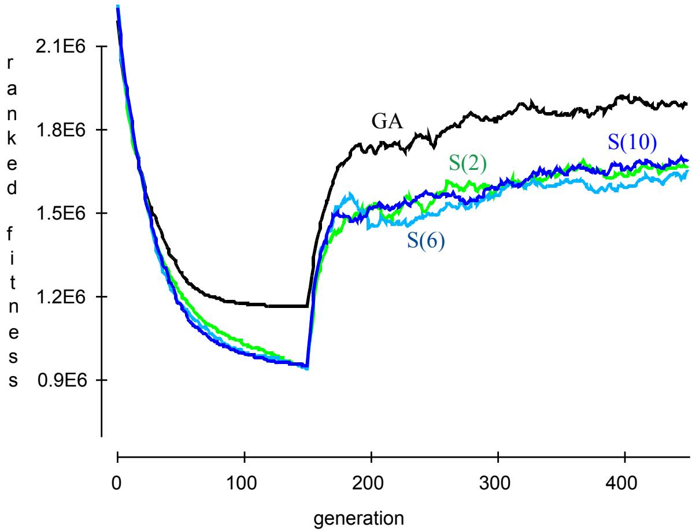  
Figure 33: Fitness of the best of the generation in the F8F2 environment. The value for each generation is averaged over dimensionality and speed.

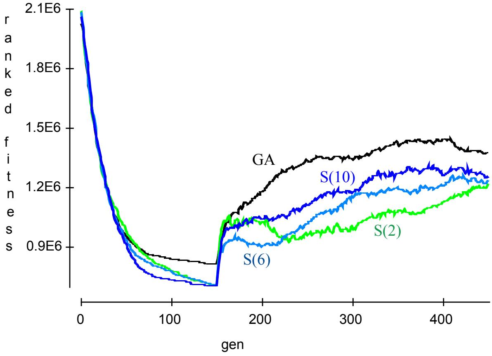  
Figure 34: Fitness of the best of the generation in the $\mathbf { F 8 m F 2 }$ environment. The value for each generation is averaged over dimensionality and

Looking at the results we see that the values for all systems in both cases start off with very large ranks (very bad fitness values). This is to be expected since the populations are all randomly generated at the start.

As time progresses, the responses start to improve, and all systems rapidly drop to better ranks in a uniform matter until generation 30. At that time, some differentiation begins to occur; the GA begins to level off at a faster rate than does any of the SBGA curves. This is also expected since we know from Chapter 12 that the SBGA outperforms the standard GA in stationary environments.

For a brief time in the response to the F8mF2 function, S(2) underperforms with respect to the GA, but by generation 50, the response curve of the GA crosses that of S(2); the latter continues to descend until its response becomes no different than that of the other migration intervals.

The migration interval under which the SBGA performs the best is S(10). Its response produces ranked fitnesses that are better than or equal to those obtained by the other migration intervals, but attains them at an earlier generation.

Finally, notice that by generation 150 the difference between the GA and any of the SBGA curves is greater when the environment used is F8F2 as compared to $\mathrm { F } 8 \mathrm { m F } 2$ .

# Ch14 §3.2.2 The Dynamic Region – Initial Response

When the motion along the hyperdiagonal begins at generation 150, both systems rapidly loose fitness, hence the increase in values to poorer ranks. Once the values have risen enough, all systems seem to recover and the response becomes linear with a small positive slope. This is the beginning of the main dynamic response and seems to occur at generation 175 (a little earlier with the $\mathrm { F } 8 \mathrm { m F } 2$ environment).

# Ch14 §3.2.3 The Dynamic Region – Main Response

Once the initial drop in fitness is passed, all systems begin to track the global optimum, although all systems seem to loose ground as time goes by. Thus the response becomes linear with a small positive slope. The slope of these lines is roughly the same69, which will be an important point when we consider which statistical model to use.

The main feature to notice is that the response curves of all the SBGA systems lie below that of the standard GA. This remains true in either environment. This implies that the SBGA does indeed track the moving global optimum more closely, provided that the differences are statistically significant (which will be determined during the second stage of the analysis).

There are three other observations that should be noted. First the SBGA response curves for the different migration intervals seem to cluster more closely together (and hence are more similar) under the F8F2 environment than the $\mathrm { F } 8 \mathrm { m F } 2$ environment. Second, in the F8F2 environment the S(6) response curve seems to perform the best, with the S(2) and S(10) curves indistinguishable from each other. Third, in the $\mathrm { F } 8 \mathrm { m F } 2$ environment the S(2) response curve has lower values (better ranks) than the S(6) response which in turn is better than the S(10) response throughout most of the region. However, early on, between generations 150 and 230, the order is different: S(6) has the best response now, while S(2) is indistinguishable from S(10) (just as in F8F2). S(2) gains ascendancy after improve dramatically in fitness between generations 200 and 230, after which it begins its linear decline in the ranks along with the rest as the global slowly pulls away.

# Ch14 §4 Analysis Procedure: Part 2

The purpose of the second stage of the analysis is to statistically confirm the conjectures formed from the line plot of the previous section. Since we are interested in the tracking capabilities of the GA and SBGA, we will restrict the analysis to main dynamic region, between generations 175 and 450, in which response of the two systems was linear. Since linearity seems to hold for each factor level, the ANCOVA procedure of the GLM can be applied.

# Ch14 ß4.1 The ANCOVA

In the first step of an ANCOVA (Analysis of Covariance) procedure, the response variable is linearly regressed against a ‘continuous’ predictor variable. A ‘continuous’ variable is a factor that has ordinal levels, between which linear dependencies exist. This type of factor is called a concomitant variable. Once the linear response is modeled by the regression, the results are subtracted from the response variable, thus eliminating the linear dependence between the levels of the concomitant variable. Consequently, each case of the concomitant variable is now independent of one another and so a regular ANOVA can be performed. Since the regression is done between the response variable and the concomitant variable independent of the values of any other factor, all factor level interactions are blended together. In other words the regression lines for the various factor levels are assumed to be parallel to each other.

In the case of our experiment, as the regression is done over the time component, the concomitant variable is the current number of generations completed, i.e. the ‘gen’ factor.

For an ANCOVA evaluation to be valid, each level of the concomitant variable must be normally distributed. However, we already know that this cannot possibly be the case. In Ch13 $\ S 2 . 5$ we tested both the GA and SBGA’s response to the F8F2 and F8mF2 environments for normality and found that at low dimensionality, normality did not hold. Consequently, we must again use the nonparametric version of ANOVA / ANCOVA formed by first ranking the data in the response variable and then using the ranks instead of the raw fitnesses when performing the test.

# Ch14 ß4.2 Models

There are two linear models that will be used during the analysis performed in this section: the first compare the behaviors of the GA and SBGA in general, the second compares the GA with the SBGA under the different migration intervals. Both are extensions of the models developed for the stationary experiments (summarized in Ch13 $\ S 2 . 6 )$ . The models have been modified to add the two new factors spd and gen .

Model 1:

$$
\begin{array} { r l } & { Y = c o n s t + g e n + f n + d i m + s p d + p g m ( m i g r ) + f n ^ { * } p g m ( m i g r ) + } \\ & { \begin{array} { r l } { d i m ^ { * } p g m ( m i g r ) + s p d ^ { * } p g m ( m i g r ) + f n ^ { * } \dim ^ { * } p g m ( m i g r ) } & \\ { + f n ^ { * } s p d ^ { * } p g m ( m i g r ) + \dim ^ { * } s p d ^ { * } p g m ( m i g r ) + } \end{array} } \\ & { \begin{array} { r l } { f n ^ { * } \dim ^ { * } s p d ^ { * } { s p d ^ { * } } s p d ^ { * } p g m ( m i g r ) + } & \\ { f n ^ { * } \dim ^ { * } s p d ^ { * } p g m ( m i g r ) } & \end{array} } \end{array}
$$

and Model 2:

$$
\begin{array} { c } { { Y = c o n s t + g e n + f n + d i m + s p d + m i g r + f n ^ { * } m i g r + d i m ^ { * } m i g r + \nonumber } } \\ { { s p d ^ { * } m i g r + f n ^ { * } \dim ^ { * } m i g r + f n ^ { * } s p d ^ { * } m i g r + \nonumber } } \\ { { \dim ^ { * } s p d ^ { * } m i g r + f n ^ { * } \dim ^ { * } s p d ^ { * } m i g r } } \end{array}
$$

No interaction effects are computed for the concomitant variable gen as they would be nonsensical terms. All comparisons between levels are computed using the Sheffé test.

# Ch14 ß4.3 Results and Discussion Part 1: The Analysis Under Model 1 (Comparing the GA with the SBGA)

Unlike the stationary experiment from Chapter 12, there were not enough treatment repetitions to perform a detailed breakdown of the ANCOVA results. If attempted, one finds that too much statistical significance has been lost and all treatments look equivalent. However, by combining levels, some difference can be discerned. These results can be found in Table 7.

Table 7b holds an analysis of the results when the dimension levels are combined, providing a breakdown by speed and test function. One can quickly see that the SBGA is superior at any speed in both the F2F8 and $\mathrm { F } 2 \mathrm { m F } 8$ environments. The same holds when the speed levels are combined, and the results are broken down by dimension and test function, as summarized in Table 7a, although not every dimension gave statistically significant differences.

The lack of universal significance for the results in Table 7a is probably due to the repetitions being to low for this particular breakdown, resulting in the tests being underpowered. Comparing this breakdown to the breakdown by speed and test function seems to support this hypothesis. The dim,fn breakdown has 8 factor level combinations, or treatments, as opposed to the 6 found in the spd,fn breakdown. The fewer the number of treatments, the more cases each treatment comprises. With a greater number of cases per treatment, statistical significance was achieved by the spd,fn breakdown and not the dim,fn breakdown. Thus one would suspect that an increase to 8 reps from 6 should increase the power sufficiently to solidify the results for dimensionality.

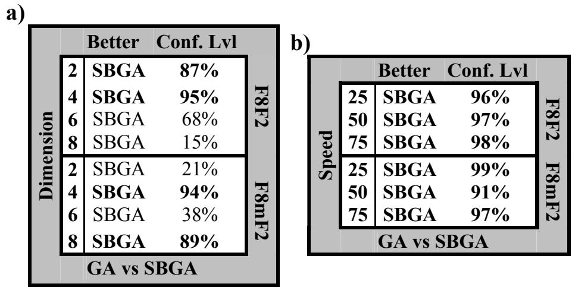  
Table 7 ANCOVA results using Model 1.Bolded Values are statistically significant with at least an $8 5 \%$ confidence level

In spite of being slightly underpowered, the most important result in this section can be found in the analysis of dim,fn breakdown. Look at the results Table 7a when the $\mathrm { F } 8 \mathrm { m F } 2$ environment has a dimensionality of 8. Here we see that the SBGA wins out over the GA even though the GA was better at solving this problem when the environment was stationary (see Table 5 in Ch13 §3). The addition of motion in the environment seems to give the SBGA an advantage even in an environment that was tailor-made for the GA.

# Ch14 ß4.4 Results and Discussion Part 2: The Analysis Under Model 2 (Comparing Migration Intervals)

Once again there were not enough treatment repetitions to perform a detailed breakdown across all factor levels and so we are force to gain significance by combing levels. The same combination of levels examined with Model 1 will be used again. The ranks, from best to worst, of pair-wise comparisons between the GA and SBGA can be found in Table 8, Table 9 and Table 10. The actual confidence levels of the comparisons used to build these tables are presented in Appendix D-3.

The following three subsections discusses each of the tables and the conclusions drawn from them.

# Ch14 §4.4.1 Breakdown by Dimension, Speed and Test Function

The most detailed of the analysis is a comparison of the GA and various SBGA systems, where only the results under the same dimensionality, speed and test function are compared. This is presented in Table 8. On the whole, it can be seen that the SBGA

<table><tr><td colspan="7">Speed</td></tr><tr><td>25 S(10)</td><td>50</td><td>75</td><td>25</td><td>50</td><td>75</td><td></td></tr><tr><td rowspan="4">2 S(2) | S(6) S(6) | S(2)</td><td>S(2)</td><td>S(2)</td><td>S(*)</td><td>S(2)</td><td>S(*)</td><td>best</td></tr><tr><td>S(10) | S(6)</td><td>S(6)</td><td>S(*)</td><td>S(*)</td><td>S(*)</td><td>2nd</td></tr><tr><td>S(6) | S(10)</td><td>S(10)</td><td>S(*)</td><td>S(6)</td><td>S(*)</td><td>3rd</td></tr><tr><td>GA GA</td><td>GA</td><td>GA</td><td>GA</td><td>GA</td><td>worst</td></tr><tr><td rowspan="4">S(2) S(6) 4 S(10) GA</td><td>S(6)</td><td>S(6)</td><td>S(2)</td><td>S(2)</td><td>S(2)</td><td>best</td></tr><tr><td>S(2) | S(10)</td><td>S(2) | S(10)</td><td>S(6)</td><td>S(6)</td><td>S(6)</td><td>2nd</td></tr><tr><td>S(10) | S(2)</td><td>S(10) | S(2)</td><td>S(10)</td><td>S(10)</td><td>S(10)</td><td>3rd</td></tr><tr><td>GA</td><td>GA</td><td>GA</td><td>GA</td><td>GA</td><td>worst</td></tr><tr><td rowspan="8">20</td><td>S(6) | S(10)</td><td>S(6)</td><td></td><td>S(2)</td><td>S(02)</td><td>best</td></tr><tr><td>S(6) S(2) | S(10) S(10) | S(6)</td><td>S(10)</td><td>S(6)</td><td>S2) S(6)</td><td>S(10)</td><td>2nd</td></tr><tr><td>S(10) | S(2) S(2)</td><td>S(2)</td><td>GA | S(10)</td><td>GA | S(10)</td><td>GA | S(6)</td><td>3rd</td></tr><tr><td>GA GA</td><td></td><td>GA</td><td>S(10) | GA S(10) | GA</td><td>S(6) | GA</td><td>worst</td></tr><tr><td>S(10)</td><td>S(10) | S(6)</td><td>S(6) | S(10)</td><td>S(10) S(6)</td><td>S(6)</td><td>best</td></tr><tr><td>S(6)</td><td>S(6) | S(10)</td><td>S(10) | S(6)</td><td>S(6) S(10)</td><td>2</td><td>2nd</td></tr><tr><td>S(2) | GA</td><td>S(2) | GA</td><td>GA | S(2)</td><td>S(2) GA | S(2)</td><td>S(10)</td><td>3rd</td></tr><tr><td>GA | S(2)</td><td>GA | S(2)</td><td>S(2) | GA</td><td>GA</td><td>S(2) | GA GA</td><td>worst</td></tr><tr><td colspan="3">F8F2</td><td colspan="3">F8mF2</td><td></td></tr></table>

Table 8: ANCOVA results using Model 2 broken down by speed, dimensionality and test function. In the table ${ } ^ { \mathrm { { < } } } \mathrm { S } ( \mathrm { x } ) \mid \mathrm { S } ( \mathrm { y } ) ^ { \mathrm { { > } } }$ means there is no statistical significance when comparing $\mathrm { S } ( \mathrm { x } )$ against S(y). ${ } ^ { \circ } \mathrm { S } ( { } ^ { \ast } ) { } ^ { \prime }$ means that there is no statistical significance between the SBGA systems regardless of migration interval.

performs better than the GA in almost every combination of factor level settings. The only exception is against S(2) in F8F2, $\mathrm { D i m } = 8$ , and against S(10) in $\mathrm { F } 8 \mathrm { m F } 2$ , $\mathrm { D i m } = 6 .$ . In both of these cases the GA is not better with statistical significance and so more testing would be needed to determine whether there is an actual discernable difference or not. Not withstanding these two anomalies, it appears that the SBGA is better than the GA under any migration interval tried in any moving environment.

Distinguishing between the various migration interval levels with the SBGA is harder to do. To obtain greater significance in the results, we will combine the various factor levels together. The results of this analysis will be presented and discussed in the next two subsections.

# Ch14 §4.4.2 Breakdown by Dimension and Test Function

In Table 9b, the breakdown of the results by dimension and test function factor levels is presented. One of the most obvious features that can be seen in the table is the poor performance of the GA when compared with any of the SBGA systems in any environment and in almost every dimension. Thus Model 1, studied in the previous section, is actually redundant; the effects of the SBGA under each of the migration intervals separately dominate over those of the standard GA without the need to combine them for added power.

Now look at the F8F2 section of the table. In environments with small dimensionality, S(2) performs the best and S(10) the worst. This behavior is completely reversed in environments with large dimensionality. In between, the SBGA with a migration interval of 6 seems to gain ascendancy. If low dimensionality is considered as ‘easy’ to solve, while high dimensionality is hard (which should be the case if Whitley et. al. are right about the scalability of the function) then it seems that S(2) should be applied to easier tasks while difficult tasks should be left to S(10). Tasks of intermediate difficulty seem to require systems with an intermediate migration interval. This conclusion is supported by the results of the $\mathrm { F } 8 \mathrm { m F } 2$ portion of the table. Since $\mathrm { F } 8 \mathrm { m F } 2$ is easier than F8F2 (as witnessed by the overall lower and thus better fitness levels on $\mathrm { F 8 m F 2 }$ ), the behavior is shifted to the right. $\mathrm { F } 8 \mathrm { m F } 2$ never gets hard enough to warrant the use of S(10). Even at high dimensionality, S(6) is sufficient to do the job well.

Table 9: ANCOVA results using Model 2. Presented are the breakdowns by speed and dimensionality for both the F8F2 and $\mathrm { F } 8 \mathrm { m F } 2$ environments   

<table><tr><td rowspan="3">a)</td><td colspan="3">Speed</td><td colspan="3">Dimension</td><td colspan="3"></td></tr><tr><td>25</td><td>50</td><td>75</td><td>2</td><td>4</td><td></td><td>6</td><td>8</td></tr><tr><td rowspan="6">C</td><td>S(6) | S(2)</td><td>S(6) | S(10)</td><td>S(6)</td><td>S(2)</td><td>S(2) | S(6)</td><td>S(6)</td><td></td><td>S(10)</td></tr><tr><td>S(2) | S(6)</td><td>S(10) | S(6)</td><td>S(10) | S(2)</td><td>S(6)</td><td>S(6) | S(2)</td><td></td><td>S(10)</td><td>S(6)</td></tr><tr><td>S(10)</td><td>S(2)</td><td>S(2) | S(10)</td><td>S(10)</td><td></td><td>S(10)</td><td>S(2)</td><td>GA | S(2)</td></tr><tr><td>GA</td><td>GA</td><td>GA</td><td>GA</td><td></td><td>GA</td><td>GA</td><td>S(2) | GA</td></tr><tr><td>S(2)</td><td>S(6) | S(2)</td><td>S(2)</td><td>S(2) | S(10)</td><td></td><td>S(2)</td><td>S(2)</td><td>S(6)</td></tr><tr><td>S(6) | S(10)</td><td>S(2) | S(6)</td><td>S(6)</td><td>S(10)</td><td></td><td>S(6)</td><td>S(6)</td><td>S(10)</td></tr><tr><td rowspan="4">M</td><td>S(10) | S(6)</td><td>S(10)</td><td>S(10)</td><td>S(6) | S(10)</td><td>S(10)</td><td></td><td>GA</td><td>S(2)</td></tr><tr><td>GA</td><td>GA</td><td>GA</td><td>GA</td><td>GA</td><td></td><td></td><td></td></tr><tr><td></td><td></td><td></td><td></td><td></td><td></td><td>S(10)</td><td>GA</td></tr></table>

# Ch14 §4.4.3 Breakdown by Speed and Test Function

Table 9a summarizes the results obtained by combining all factor levels other than speed and test function. In the F8F2 environment, S(6) seems to be a good migration interval to use at any speed, with little difference found between the other two intervals at high speeds, while trading places with each other for dominance at lower speeds. In the $\mathrm { F } 8 \mathrm { m F } 2$ environment, S(2) has the best performance at any speed and S(10) the worst. This is consistent with the hypothesis that S(2) is preferable on easier tasks such as the $\mathrm { F } 8 \mathrm { m F } 2$ function, even in the presence of motion. However, if the task is hard enough, such as in F8F2 environments, then the middle road between the quick but destabilizing behavior of S(2) and the careful but slow approach of S(10) seems the best strategy, hence the dominance of the S(6) system.

# Ch14 §4.4.4 Breakdown by Test Function Alone

By combining all factor levels other than those of the migration interval and test function factors, an exact statistical analysis of the results depicted in the two line plots of Figure 33 and Figure 34 can be obtained. This result is found in Table 10. For F8F2, the best system was S(6), while the other two migration intervals showed no discernable difference. For $\mathrm { F } 8 \mathrm { m F } 2$ , S(2) had the best behavior followed by S(6), with S(10) having the poorest performance of all SBGA systems. In both environments, the GA faired the worst. These results completely confirm all conjectures made in Ch14 $\ S 3 . 2$ when discussing the responses seen in the two figures. Consequently, the differences seen between the response curves in the two figures are statistically significant.

<table><tr><td rowspan=11 colspan=1>BEm</td><td></td><td></td></tr><tr><td rowspan=1 colspan=1>Combined</td><td rowspan=2 colspan=1>best</td></tr><tr><td rowspan=4 colspan=1>S(6)S(2) | S(10)S(10) | S(2)GA</td></tr><tr><td rowspan=1 colspan=1>2nd</td></tr><tr><td rowspan=1 colspan=1>3rd</td></tr><tr><td rowspan=1 colspan=1>worst</td></tr><tr><td rowspan=2 colspan=1>S(2)</td><td></td></tr><tr><td rowspan=1 colspan=1>best</td></tr><tr><td rowspan=3 colspan=1>S(6)S(10)GA</td><td rowspan=1 colspan=1>2nd</td></tr><tr><td rowspan=1 colspan=1>3rd</td></tr><tr><td rowspan=1 colspan=1>worst</td></tr></table>

# Chapter 15

# Random vs. Guided Diversity

# Ch15 §1 Introduction

In the previous chapters, it was seen that the SBGA extension does indeed enhance the GA’s performance. Chapter 14 showed the improvements attendant on the use of the SBGA in dynamic environments, while the improvements incurred on highly multimodal stationary environments had previously been demonstrated in Chapter 12 and Chapter 13. However, the reason for the improvements can be attributed to various causes. One of the simplest is the claim that the reason for the improvements resides solely with the increase of diversity in the core engendered by the movement of and migration from the colonies. Many other systems use diversity increasing mechanisms, such as an increased mutation rate, to improve performance in a dynamic environment (for more examples see Chapter 1). Perhaps increased diversity is the sole cause of the improvements seen.

In Ch9 $\ S 3$ and $\mathrm { C h 9 ~ \ S 4 }$ , when developing the mechanisms the keep the colonies away from the core, care was taken to ensure that the colonies follow the fitness landscape as well as move away from the core. The reason for that elaborate mechanism was to prevent the colonies from wandering off into unpromising territory in the fitness ‘landscape’. Just randomly adding diversity to the core by including members from an aimlessly wandering colony, it was suggested, would actually be harmful. There is much more deleterious than beneficial genetic material in the search space (otherwise optimization through search would be easy, not NP-hard) and so the SBGA was designed to avoid purely random diversification. Instead of adding random diversity, the SBGA adds guided diversity through a multiobjective approach that allows the colony to both avoid the core and follow the fitness ‘landscape’ simultaneously. In other words, adding diversity alone is insufficient to aid the GA in a dynamic environment; one must add the right type of diversity.

However, the above argument is conjecture only. It is quite possible that diversity alone is responsible for the improved behavior of the SBGA when the SBGA extension is added. This is the null hypothesis. To demonstrate that guided diversity is solely responsible for the enhanced behavior of the GA is beyond the scope of this dissertation (and may be incorrect). However, we can test whether the null hypothesis holds. Consequently, in this chapter we will design an experiment to test whether random diversity a sufficient explanation for the improvement seen by the GA when the Shifting Balance extension is added.

# Ch15 §2 Experimental Design

To determine whether diversity is sufficient to explain the improvement experienced by the SBGA, we will compare the fitness results from the previous chapter to diversity measurements obtained from the same runs. The diversity measure used is entropic diversity as defined in Ch6 $\ S 2 . 3$ .

To perform the comparison we will compare the line plots of the fitness results reported last chapter with newly generated line plots of the diversity of the SBGA core and GA populations. This graphical approach will be sufficient for our purpose, although a more careful study of the systems using Normal Correlation Models70 should eventually be done.

Each diversity value per generation used for the line plots is the median of all repetitions across all the dimension and speed levels. The median is used instead of the mean because the data is not normally distributed for all migration intervals at every dimension. A normality test (see Ch13 §2.5.1 for a description) was applied to the diversity values from all generations over 250, after being split by dimension level. The following $R ^ { 2 }$ values were obtained for $\mathrm { d i m } = 2$ : $\mathrm { G A } = 9 8 . 1 \%$ $\mathrm { S } ( 1 0 ) = 9 7 . 9 \%$ ${ \mathrm { S } } ( 6 ) =$ $9 6 . 2 \%$ and $\mathrm { S } ( 2 ) = 5 9 . 9 \%$ . So the response of the diversity of an SBGA with a migration interval of 2 is very nonlinear indeed. As a remedial measure the median instead of the mean is plotted, as previously mentioned.

The differences between the diversity response curves from the various systems were tested for statistical significance using a general linear model with ranked diversity values (to handle the nonnormality of S(2)) and restricted to time period when all systems have adjusted to the motion of the environment (generation $> ~ 2 5 0$ ). A Sheffé test was performed for all comparisons, and all differences were found to be significant with greater than $9 9 . 9 9 9 \%$ confidence. Therefore the distinctions between the various curves shown in the line plot that follow are real.

When comparing the diversity line plots with the fitness line plots from the previous chapter, the following results are to be expected if the null hypothesis holds. Systems with diversity response curves that are very similar should have roughly equal performance in their best fitness responses. Similarly, systems with indistinguishable best fitness response curves should have comparable diversity values. If one or both of these relations fail, then the null hypothesis must be rejected. Were that to be the case, strong evidentiary support will have been provided for the proposition that guided diversity is, at least in part, responsible for the success of the SBGA.

# Ch15 §3 Results

Looking at the diversity response curves for the GA and SBGA systems in the F8F2 environment (Figure 35) and the $\mathrm { F } 8 \mathrm { m F } 2$ environment (Figure 36) we see a variety of different behaviors.

In all cases the diversity at $g e n = 0$ is maximal (has a value of 1). This is expected since all populations are seeded with randomly generated chromosomes and so are maximally diverse. For the next 25 or so generations the diversity of all systems falls at the same rate and then begin to diverge.

First lets follow the diversity levels of the GA. Generation by generation the levels rapidly drop, until by $g e n = 1 0 0$ the GA population is almost completely converged. This is the expected behavior of the GA for a stationary environment. When motion begins at generation 150, the GA experiences a rapid increase in its population diversity, reaching close to its peak diversity in that domain somewhere between $g e n = 2 1 0$ for F8F2 and $g e n = 2 5 0$ for $\mathrm { F } 8 \mathrm { m F } 2 ^ { 7 1 }$ . By generation 250 the GA in both environments levels off and remains at a constant diversity level for the remainder of the run, although it should be noted that F8F2 maintains a much higher level of diversity at 0.3, than does $\mathrm { F } 8 \mathrm { m F } 2$ with its 0.25 diversity level.

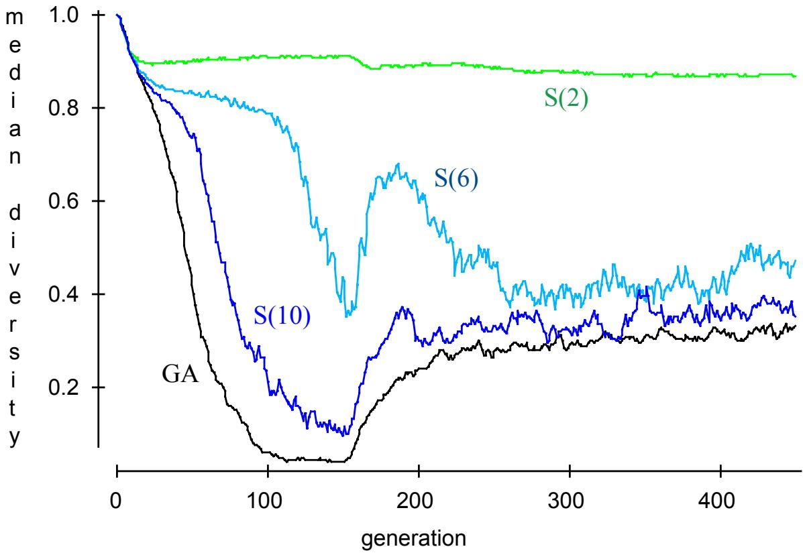  
Figure 35: The entropic diversity of the GA and SBGA in the F8F2 environment (which begins to move at generation 150). Each point on the graph is the median of all the cases for each system when dimensionality and speed levels are combined.

Now let us look at the diversity response of the SBGA under different migration intervals.

The SBGA with a migration interval of 10 behaves very similarly to the GA. However, there are two differences. The S(10) system maintains a slightly higher diversity level with respect to the GA, with about a 0.5 level difference. This is seen in both environments. The S(10) system also reacts more quickly to the changing environments, reaching its peak constant level after only 25 to 30 generations instead of 60 to 100 generations.

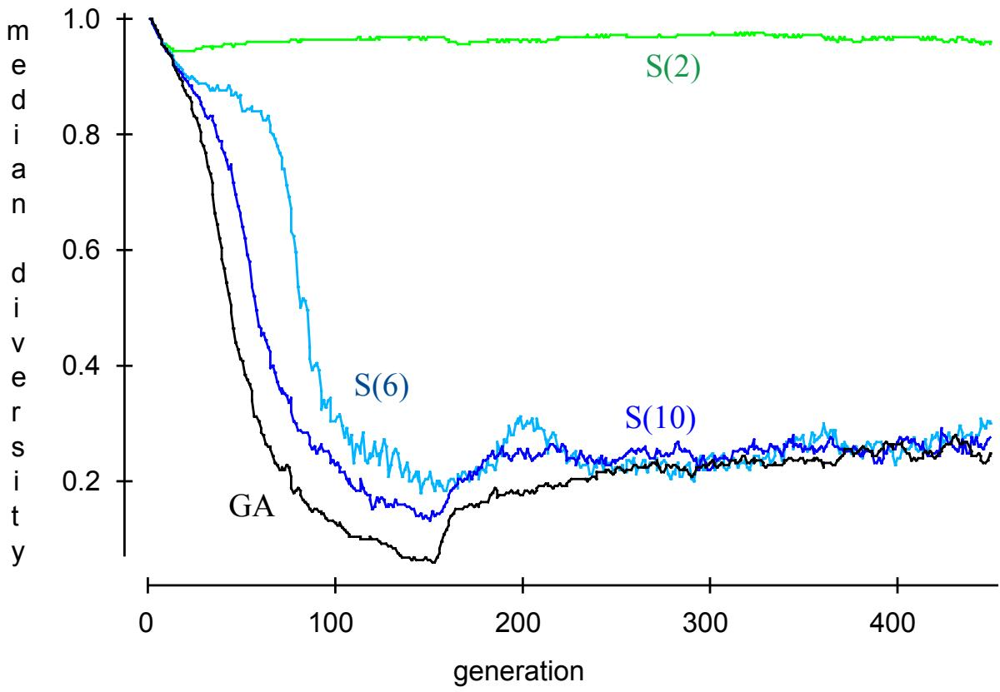  
Figure 36: The entropic diversity of the GA and SBGA in the $\mathbf { F 8 m F 2 }$ environment (which begins to move at generation 150). Each point on the graph is the median of all the cases for each system when dimensionality and speed levels are combined.

Initially the S(2) system rapidly sheds its diversity in step with the other systems, but very shortly afterwards (around generation 25), it levels off at an extremely high diversity (approximately 0.9) which it keeps to the end of the run. The single exception is a very slight drop in diversity when the environment motion begins. Unlike all other systems, S(2) maintains a higher diversity level for $\mathrm { F } 8 \mathrm { m F } 2$ rather than for F8F2.

The behavior of S(6) is the most complex and the one that I understand the least. In the F8F2 environment the diversity quickly levels off at approximately 0.85 early in the stationary period. However, by around generation 120 the diversity levels suddenly drop, falling to a level of 0.4 by $g e n = 1 5 0$ , when the environment begins to move. After motion begins, the diversity level spikes up again to 0.7, peaking at generation 190, then falls back down to the 0.4 level by generation 250 at which point it remains constant until the end of the run. In the $\mathrm { F } 8 \mathrm { m F } 2$ environment the pattern repeats itself, but not with such extreme values. The drop in the stationary period occurs earlier (generation 80 versus 120) and the ‘spike’ in diversity that occurs after motion begins is far more subdued (with a rise and fall of less then 0.1 as opposed to 0.3). The reasons for the initial drop in diversity during the stationary period and the large rise and subsequent fall when the environment moves, is not understood.

# Ch15 §4 Discussion

# Ch15 ß4.1 Comments on the Diversity Results

There are three comments on the results detailed above that I wish to make before we turn our attention to the question of random versus guided diversity.

First, the ability of all systems (except S(2)) to maintain a lower diversity level in the $\mathrm { F } 8 \mathrm { m F } 2$ environment alongside with the lower (better) fitness values obtained, provide strong evidence that $\mathrm { F } 8 \mathrm { m F } 2$ is an easier optimization problem than F8F2, as we expected when it was constructed.

Second, in both environments, by generation 250 the diversity has leveled off in every system, even though the best fitness response shows that all systems are still losing ground. They are falling farther and farther behind the global optimum and yet do not seem to increase diversity to compensate72. The systems seem to reach the diversity equivalent of an equilibrium in selection pressures and has stabilized even as the fitness values deteriorate.

Third, the difference in behavior of the S(6) system when run in the two different environments is as poorly understood as is the pattern of the S(6) behavior itself. Why S(6) should still keep the same features in $\mathrm { F } 8 \mathrm { m F } 2$ as in F8F2, yet moderate the amplitudes of the changes such that it begins to mimic the GA and S(10) systems in the easier $\mathrm { F } 8 \mathrm { m F } 2$ environment is very much a mystery to me at this point. It will be very interesting in the future to explore the behavior of S(6) as well as S(5) and S(7) to determine what affects these ‘intermediate’ migration interval settings.

# Ch15 ß4.2 Is an Increase in Random Diversity a Sufficient Explanation?

If added random diversity is the primary cause of the improved behavior, we would expect a similarity of diversity to produce similar fitness responses. Likewise, if the fitness responses two systems are indistinguishable, so should be their corresponding diversity levels. The behavior of the systems as seen in this chapter and the previous one and summarized in Figure 37 belies this hypothesis.

In the F8F2 environment all SBGA systems have a fitness behavior that is remarkably similar to one another. Their response curves are far more similar to each other than the GA’s response curve is to any of them. Yet in diversity behavior, all three SBGA systems are quite distinct from one another. S(2)’s diversity behavior is quite distinct, while S(10) most closely resembles the GA’s response curve than it does any of the other. Thus similarity of fitness response does not imply similarity of diversity.

In the $\mathrm { F } 8 \mathrm { m F } 2$ environment, the opposite problem can be seen. The diversity behavior of S(6), S(10) and the GA are almost identical after generation 250. Yet the fitness responses are vastly different, with the S(6) system having more in common with S(2) than it does with the GA. Thus similarity of diversity does not imply similarity of fitness response.

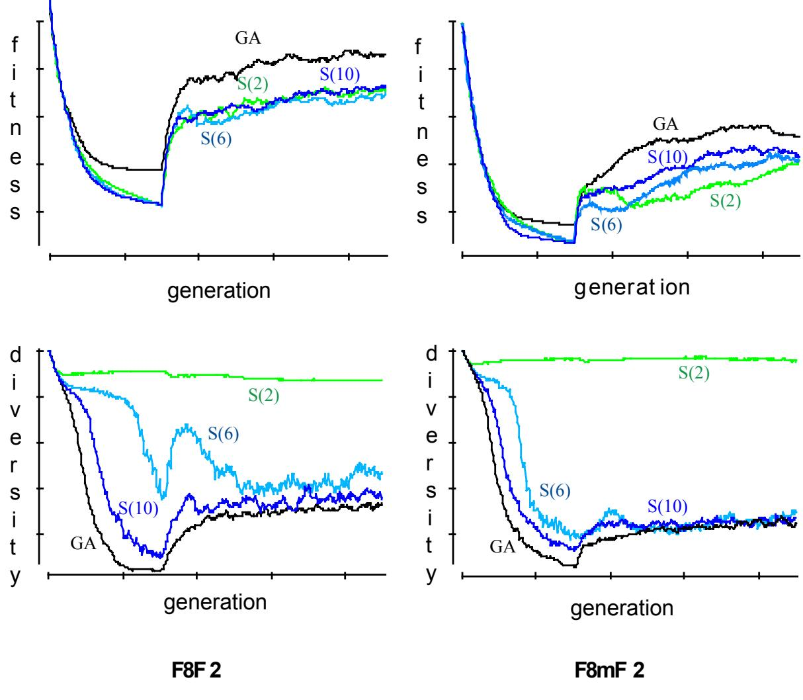  
Figure 37: A Summary of all diversity and fitness line plots presented in the thesis (from Figure 33, Figure 34, Figure 35 and Figure 36).

With these observations it becomes obvious that the null hypothesis must fail; diversity alone is not a sufficient explanation for the improved behavior of GA when the Shifting Balance Extension is added.

# Chapter 16

# Summary, Conclusions and Future Work

# Ch16 §1 The Shifting Balance Evolutionary Algorithm

This dissertation explores the adaptability of the Genetic Algorithm in a dynamic environment. This was one of the original goals behind the creation of the GA, although it is only recently that researchers in the field have begun to turn their attention from the GA as a function optimizer to the GA as an adaptational process. A study of adaptation in the GA naturally leads to the study of environments that produce a variety of changes for the GA to adapt to. Hence the growing interest in dynamic environments.

To begin the exploration of the GA in dynamic environments a thought experiment is carried out. In this experiment an initially stagnant environment begins to move after the GA has already converged. This focuses attention towards the problem of keeping meaningful diversity in the population. Looking at the problem from another angle, it becomes evident that the problem stems from premature convergence, which is related to the perennial bane of optimizational search, ‘being trapped at a local maximum’. This problem has its analog in biological theory along with a solution posed by the famous population geneticist, Sewall Wright: the shifting balance theory of evolution.

Sewall Wright recognized evolution could be viewed as a process involving a set of populations that are trying to find the maximum in a ‘fitness landscape’. He also recognized that local maxima would be a problem for populations if they were to attain the highest fitness values. Consequently, he proposed a mechanism whereby an evolutionary system could naturally escape from such maxima through a careful balance of random drift occurring in small populations (demes), and selection caused by migration between the demes. The two mechanisms must work in concert. The small demes drift in gene space and wander away from the local hill. They may then cross various valleys to eventually find themselves on new hills with possibly higher peaks. At this point migration and selection become dominant. Migration among the demes brings members from demes that have reached the higher hill to those who have not. Selection then shifts the genetic makeup of the trapped demes to become more like the demes on the higher hills, thus escaping from the local maximum.

Sewall Wright’s Shifting Balance Theory seems promising, In fact it seemed so promising that many implementors of parallel GAs have been using the theory to justify their use of multipopulation systems. However, there are serious flaws with the theory that are well known in biological circles. First the method of balancing random drift and selection was never developed. Second, such a balance is problematic anyway since the resource requirements for each, such as population size and mutation rate, are conflicting. Random drift is effective in small populations with high mutation rates; selection thrives in the exact opposite conditions. Even the fitness landscape metaphor was questioned since Wright’s version seemed static, unchanging, so unlike the extremely dynamic environments that seem ubiquitous in nature.

To counter these problems, the Shifting Balance Theory was modified. Instead of small demes escaping from the local optimum by using random drift, those same demes are allowed to move away from the main population, and hence to areas away from the local optimum, through selection alone. Members from the small demes having greater distances to the main population in gene space are selected for, thus allowing them to evolve away from the main population. Now all populations use the same evolutionary mechanism at all times, selection, thus removing the conflict between resource requirements. This modified version of the Shifting Balance Theory can be implemented and applied to any evolutionary computational algorithm, such as the GA, ES and EP.

This extension to evolutionary systems is called the Shifting Balance Evolutionary Algorithm (SBEA).

# Ch16 §2 Distances in Gene Space

The SBEA concept seemed to be workable, but many details still had to be worked out. The first to be addressed was the development of the concept of distance in gene space. This measure is needed for the evolution of the small demes (now called colonies); their distance to the main population (the core) had to be computed both to determine if they are searching in the same space and to enable them to evolve so that they move into novel territory.

A foundational underpinning of a distance in gene space is the distance between chromosomes. A general framework for such a distance has been partially developed, and is close to completion. In the interim, the Hamming distance between chromosomes is used as a reasonable first order approximation to the chromosomal distance. The legitimacy of this use is verified in the dissertation.

Building on this result, the second step was to define a distance between populations. The approach taken by Cluster Analysis was examined and then discounted. A second attempt was made, taking cues from the various definitions of population diversity used in the literature, and a workable measure of the distance between populations was created. Two distinct distance measures were developed; which is to be used depends on the domain from which the genes are to be drawn. The Manhattan distance between the two population’s respective gene frequencies is used when the genes are taken from symbolic (discrete) alphabets. When chromosomes are composed of continuous valued genes, the distance between populations becomes the Euclidean distance between the populations’ geometric centers.

# Ch16 §3 Details of The SBEA as Implemented in a GA System: The SBGA

With a definition of population distance in place, the low-level mechanisms of the SBEA was detailed. The GA that uses a symbolic alphabet was chosen as the exemplar evolutionary system to extend with the SBEA mechanisms; thus forming the SBGA. The ES and EP versions can be developed analogously.

The algorithm to keep the colonies away from the core was the first mechanism to be developed. Each colony computes its distance to the core using the distance-betweenpopulations definition. This distance is used as the fitness for selection, forcing the colony away from the core. However, the colony has another goal that it must balance against that of keeping away from the core; the colony must still follow the fitness landscape. Both objectives must be met; otherwise the colony would either randomly wander into unpromising areas of the gene space or fall back towards the same optimum. This balancing is accomplished using a novel enhancement to the reproductive process that is specifically tailored for biobjective problems. Furthermore, the two goals are balanced dynamically through the use of the percentage similarity measure. This measure computes the average ratio of the total number of core members versus the number of core members that are less similar to the core than is a given colony member.

The other low-level mechanism that was developed was migration from a colony to the core. There are three components to migration: when migration should occur, which of the members in a colony should migrate, and how the migrants are to be incorporated into the core.

Migrations should not occur during every generation since they will not have yet moved into novel areas of the search space. The number of generations between migration is called the ‘migration interval’ and is a user-defined parameter. All colonies do not migrate in the same generation. Migration time is staggered throughout the migration interval cycle. This is to prevent the feast-or-famine effect that would be caused by synchronized migration.

The migration size is also a user-defined parameter. It can range from the entire colony down to a single member. Whatever the size of the group selected, the migrants are chosen from the elite of the population.

The members that migrate to the core temporarily expand that population’s size. However, during core reproduction, the size of the core returns to normal. This forces a surfeit of members to compete for a smaller number of slots thus increasing the selection pressure. This mechanism is analogous to the $( \mu , \lambda )$ approach used in Evolutionary Strategies.

With the details of the SBGA complete, the though experiment posed at the beginning of the dissertation could be reexamined with the SBGA used in place of the standard GA. This led to the conjecture that the SBGA would not only be effective at escaping from local optima, but should also enhance the ability of the GA when tracking a global optimum in a moving environment. Furthermore, even after the environment was allowed to stay stationary for a lengthy period of time, the ability of the SBGA to track the environment should not degenerate as much as would a normal GA.

# Ch16 §4 Experimentation

With the SBGA system fully developed, the thought experiments have now become testable. Four experiments are devised to test the behavior of the SBGA. The first experiment compares the SBGA with a standard GA in a stationary environment based on an objective function with numerous local optima (the F8F2 function). This tests whether the Shifting Balance addition to the GA improves its ability to escape from local optima as Sewall Wright predicted.

The second experiment examines the behavior of the SBGA in a stationary environment that has a very large basin of attraction attached to the global optimum (F8mF2). This test is performed to demonstrate that the effectiveness of the SBGA in the F8F2 environment is caused by the presence within the environment of many local optima from which to escape. When in an environment where this is not the case, the GA is expected to outperform the SBGA

The third experiment follows the GA and SBGA as they try to track the global optimum in a moving environment. The two evolutionary systems are tested on dynamic versions of both the F8F2 and the $\mathrm { F } 8 \mathrm { m F } 2$ functions. The motion is kept as simple as possible; the entire function is transformed using a translation along the hyperdiagonal. Three speeds are chosen for the environment motion, each producing changes in the environment that exceed the mutation rates set in the evolutionary systems. Consequently both the GA and SBGA systems have to rely on crossover, which can be used to pull the various mutational changes that occur throughout the population together in order to match the speed of the environment.

The final experiment is an augmentation of the third. The diversity responses of the GA and the SBGA under different migration intervals are monitored while the previous experiments were run. The results are then compared with the fitness results obtained from the third experiment to see if similarity in diversity values will correlate with similarity of fitness behavior. This is done to check the validity of the hypothesis: unadorned diversity alone causes the improvements found when using the SBGA. If no correlation is found, then the hypothesis will be negated.

# Ch16 §5 Conclusions

The results of the experiments were very positive. The weakest results surprisingly came from the test on the efficacy of the Shifting Balance extension in escaping from local optima. What one expects is the domination of the SBGA over the GA in F8F2, which has many local optima, followed by a reversal of comparative behavior in the $\mathrm { F } 8 \mathrm { m F } 2$ function, with its easy-to-find large basin of attraction that surrounds the global optimum. When viewed overall these expectations are actually met, however, when broken down by dimensions, anomalous behavior can be seen. At high dimensions of F8F2 the GA could rival the performance of the SBGA (to within the power of the test), while in the $\mathrm { F } 8 \mathrm { m F } 2$ environment at low dimensionality the SBGA, not the GA, was found to be superior. Consequently more experimentation needs to be done to isolate the causes behind these anomalies.

While the experiments using stationary environments may not have been exclusively and overwhelmingly positive, the experiments performed with dynamic environments were. Not only did the SBGA track the global optimum more closely than the GA in moving environments, but it did so in environments that, when stationary, had been more amenable to the GA . Furthermore, the comparison between diversity and fitness measurements on the same experiments showed that unguided diversity is not a sufficient explanation of the performance increase seen when using the SBGA. This lends support to the use of the multiobjective approach of following the fitness landscape while moving away from the core, i.e. guiding the process that adds diversity to the system.

Sewall Wright developed the Shifting Balance Theory to explain how natural evolutionary systems could escape from local optima in a ‘fitness landscape’. One of the reasons that his theory came under attack was that he described the Shifting Balance Theory using populations that were moving in a ‘landscape’ that did not seem to be changing. This seemed unrealistic, as natural environments were known to be very dynamic indeed. However, the results found during the course of this dissertation actually showed that the SBT is a more helpful extension to an evolutionary system that is facing a dynamic environment than a stationary one, even when that stationary environment is riddled with a multitude of local maxima. It is a strange historical irony that what was thought to be one of the most telling criticisms of the Shifting Balance Theory has now been demonstrated to be its greatest strength.

# Ch16 §6 Future Work

The work done in this dissertation is very much just an initial foray into the investigation of the SBT and SBEA, and their behavior in dynamic environments. There are many directions that one can take from where the dissertation ends (some of which have already been mentioned within the dissertation itself). I have identified seven broad areas for exploration. These are presented below:

# Exploring the Effectiveness of the SBGA

The study done in this dissertation was designed as a focused preliminary exploration into the power of the SBGA. Consequently, only two very carefully chosen test functions were used during the tests. However, it is impossible to generalize the results found on such a small sample set. Consequently a much larger test suite should be designed and applied. The functions in this suite should increase both the variety of the fitness landscapes and the range of their dynamics. The suite may also include some real world problems. Although using a large test suite complicates the statistical analysis enormously, the results are vital if we wish to know whether the conclusions derived in this dissertation generalize.

Because the intention of this work was to explore the ramifications of the thought experiment, the SBGA was compared against a standard optimizing GA (which uses rank selection and elitism). The behavior of the standard GA is well known and so much more predictable than any extension that may also improve the results from the thought experiment. Consequently, in light of this, and the limited scope of the dissertation’s purpose, the sole use of the simpler GA as a comparison to base null hypotheses on should be understandable. However, in the future it would be interesting to know how well other GA extensions, such as the various diversity enhancing mechanisms, solve the problem posed in the thought experiments, as well as how the SBGA fares against such techniques in general73.

# The Exploration of Dynamic Environments

To explore the effectiveness of the SBGA, more test functions with an increased variety and much wider range of dynamics are to be included. These same tests could have the additional benefit of allowing for the induction of fundamental principles of evolutionary behavior in dynamic environments. For example, by examining the dynamic region in the fitness response graphs Figure 33 and Figure 34 found in $\mathrm { C h l 4 } ~ \ S 3 . 2$ , one can see that both the SBGA and the GA seem to have similar piecewise linear responses to both the F8F2 environment and the $\mathrm { F } 8 \mathrm { m F } 2$ environment. First the systems lose fitness (have higher values which corresponds to a fall in the ranks) at a steady linear rate, until at some point in time the response curve flatlines. Is this behavior typical of evolutionary systems in translational dynamic environments moving at a constant speed? Using a greater variety of functions that are forced to undergo translation should help answer this question and others like it.

Another interesting, yet simple, modification of the test design would be the elimination of the stationary period before motion. Some trial tests have already been done on both the SBGA and the GA with results that are both surprising and so far unexplainable (at least by me). What one would expect is a gradual improvement in the fitness of the best of the generation. This should eventually level off as the system reaches a population composition that is concentrated in an area close to the global optimum, yet diverse enough to keep track of its motion. Instead the system quickly converges to a higher level of fitness than it can sustain. It then drops in fitness mimicking the behavior of the systems in environments with stationary periods that allow premature convergence to occur. Further experimentation using alternate measures and probes will have to be done if this situation is to be understood.

# Exploring the Effects of the Parameters Used in the SBGA

In the experiments performed during the dissertation, parameter settings and other design features such as selection techniques used were chosen in an ad-hoc fashion. This is especially true for the new features such as the number of colonies chosen, but also applies to more well tested parameters such as the mutation rate. While the behavior of the GA with various parameter settings is understood (to some extent), those results may not hold for the SBGA. In other words we would like to know how the different settings and setting combinations affect the behavior of the SBGA.

Some of the components that can be modified are as follows: the number of colonies in the system, the size of a colony populations, the size of the core population with respect to the population size of a colony, the mutation rate and probability of crossover, selection pressure, and migration interval.

Many questions can be asked about the behavior of the SBGA under these various settings: Should the mutation rate and probability of crossover be different in the various SBGA populations than it is in the GA? How about between colony and core? Should the selection pressure used in the SBGA populations be different than that used in the GA? Even within a colony, different selection pressures could be used when selecting members according to the objective function as opposed to the distance to the core. Should they be?

# Genetic Distance Theory

From the mathematical side of the dissertation, the framework presented for the accurate definition of chromosome distance was left incomplete. While the Hamming distance was shown to be a good first order approximation and can be used in its stead, the framework should be expanded on and hopefully brought to a conclusion.

Of course the definitions of the distance between two populations and their percentage overlap are based on the distance between chromosomes. Consequently a change from the Hamming distance to a more accurately defined chromosomal distance will most likely affect their definition as well; these concepts too should be reexamined. Any resulting changes should be included into the SBGA and tested to see if its performance shows any improvement over the original SBGA system.

# Exploring Alternate Design Features for the SBEA

Earlier we touched on the various parameter settings of the SBGA that can be studied. However, there were also broad design choices made when distilling the SBGA from the more general SBEA.

For example, the decision was made to use the percentage similarity measure instead of percentage overlap for time complexity reasons. However, it is not known whether the improvement in accuracy that should occur when using the more conceptually pure percentage overlap measure would or would not compensate for the time lost in computing it. Experiments could be easily designed that test which one of these two hypotheses is correct.

The choice of applying the SBEA to the GA can also be modified. The Shifting Balance extension could be developed and incorporated into Evolutionary Programming and Evolutionary Strategy systems. Tests would then be designed to see whether the SBEP and SBES experience the same improvements over their respective systems as was seen with the SBGA.

# Understanding the behavior of the SBEA/GA

In the final experiment done in the dissertation, an extra measure, the diversity of the SBGA, was monitored. This allowed some small insights into the dynamics of the SBGA and SBEA systems to be gleaned. The process of understanding the behavior of the SBEA through the exploration of the SBGA can be continued much further.

The first step would be to investigate the anomalies discovered in the stationary versions of the F8F2 and $\mathrm { F } 8 \mathrm { m F } 2$ environments. We had expected that the SBGA should outperform the GA on F8F2 while the reverse should happen on $\mathrm { F } 8 \mathrm { m F } 2$ . While on the whole these results were borne out, for some dimension the opposite of what was expected occurred. A closer examination should be done using test functions designed to isolate the behavior of the two systems in various simple and complex environments. Furthermore, this examination could be enhanced by monitoring the behavior of the systems using various measures such as diversity and local environmental complexity.

The same treatment should be performed for SBGAs with intermediate value settings of the migration interval. As discussed in $\mathrm { C h l 5 ~ \ S 4 . 1 }$ , the dynamics of the S(6) system in fitness and diversity were seen to be highly complex. Perhaps a closer inspection will begin to explain the peculiar behaviors observed.

Finally, we could examine the motion of the colonies in gene space. This would determine whether the colonies, while of course staying away from the core, are converging on the same alternate area of the search space. If so, this would reduce the power of a multipopulational search to that of just a two population system. We would then wish to test the SBGA extension for keeping colonies away from each other, presented in $\mathrm { C h 9 ~ \ S 7 } _ { \mathrm { 3 } }$ , to see if this eliminates the (potential) problem.

# The Exploration of the Shifting Balance Theory Proper

Finally, experiments can be designed to explore aspects of the Shifting Balance Theory itself within the framework of the SBEA.

A detailed examination of the behavior of the core population and a distance comparison in gene space between the core and the colonies could determine whether the main population actually shifts its position in gene space toward a colony that had found a more fruitful area of the ‘fitness landscape’. This would be a test of the behavior of the SBT as predicted by Sewall Wright, which has been considered until now virtually untestable. Of course even if demonstrated within a computational framework, this does not imply that the SBT correctly describes the process of evolution in nature. However it does show, and with greater precision, how the model developed by Wright should actually function. This hones the theory and better allows it to be tested for in nature.

Before the SBT can be retrofitted into biological theory, the abstract mechanisms used in the SBEA should be made concrete. For example, back migration from core to colony was removed because it was considered as redundant at best and possibly even harmful to the process that moves the colonies into interesting areas of gene space. However, in nature this form of migration will occur. It should therefore be reintroduced into the SBEA systems and tested to see what behavior is produced as well as to determine what levels of back migration is beneficial, tolerable, or harmful.

Evolutionary Computation has benefited greatly from what has been learned in molecular and population genetics. Biological mechanisms have been incorporated into computational systems wholesale to great effect. Yet, John Holland’s original goal when he created the GA was to develop a platform from which one could better explore and understand complex systems such as naturally occurring evolution74. If the refinement of the SBT in a computational framework is successful, Holland’s goal will be partially realized: biological evolutionary theory will have been aided through the examination of a computational evolutionary system.

# Appendices

# Appendix A

# Proofs of all Theorems Used in Part 2

# A-1 The Cost of the Shortest Path is a Distance in a Graph with Symmetric Positive Edge Weights

Theorem 2: If the graph the edges in a graph $G$ have symmetric edges weights, i.e. $\mathcal { W } _ { ( u , \nu ) } = \mathcal { W } _ { ( \nu , u ) }$ , and all weights are greater than 0 then the cost of the shortest path between two vertices is a distance measure.

Proof. To show that the cost of the shortest path is a distance one must show that all four of the distance properties hold:

$\mathbf { M } _ { 1 }$ ) $d ( x , y ) = 0$ iff $x = y$ . If $x$ and $y$ are vertices of Graph $G$ and that $x = y$ . Since $G$ is undirected self-looping edges are defined as having a cost of 0 thus $d ( x , y ) = 0$ .

# Appendix A

Conversely if $d ( x , y ) = 0$ then no edge can have been crossed since every edge has a cost that is greater than 0. Thus $x = y$ , which completes the proof for $\mathbf { M } _ { 1 }$ .

$\mathbf { M } _ { 2 }$ ) $d ( x , y ) = d ( y , x )$ (symmetry). Proof by reducto ad absurdum. Assume that $d ( x , y ) < d ( y , x )$ . However because each edge has the same cost in either direction since graph $G$ is undirected we can backtrack the same path from $x$ to $y$ that has the cost $d ( x , y )$ to get a path from $y$ to $x$ that has that exact cost, which is less then $d ( y , x )$ by assumption. However $d ( y , x )$ is the cost of the shortest path and so there should be no other path from $y$ to $x$ that costs less. Therefore the assumption must be false and $d ( x , y ) \geq d ( y , x )$ . Using a symmetrical argument going from $x$ to $y$ one can show that $d ( x , y ) \leq d ( y , x )$ . Therefore $d ( x , y ) = d ( y , x )$ as required.

$\mathbf { M } _ { 3 }$ ) $d ( x , y ) \geq 0$ . Since $d ( x , y )$ is the cost of the shortest path from $x$ to $y$ and since all edges along a path have a cost that is greater than 0, $d ( x , y ) > 0$ when $x \neq y$ . By property $\mathbf { M } _ { 1 } , d \bigl ( x , y \bigr ) = 0$ when $x = y$ . Consequently $d ( x , y ) \geq 0$ as required.

$\mathrm { M } _ { 4 } )$ $d ( x , y ) + d ( y , z ) \geq d ( x , z )$ (triangle inequality). Proof by reducto ad absurdum. Assume that $d ( x , y ) + d ( y , z ) < d ( x , z )$ where $x , y$ and $z$ are three vertices on graph $G$ . Now lets look at the two paths used to produce $d ( x , y )$ and $d ( y , z )$ . When one combines the two paths we have a path from $x$ to $z$ that has a cost of $d ( x , y ) + d ( y , z )$ . However this is less than $d ( x , z )$ which is supposed to be the cost of the shortest path. This is a contradiction and so the assumption must fail. Therefore $d ( x , y ) + d ( y , z ) \geq d ( x , z )$ and so the triangle inequality holds. ❚

# A-2 Zero Weighted Edges Destroys Distance Property

Theorem 3: If graph $G$ has edges between distinct vertices that have costs equal to 0 then the cost of the shortest path between two vertices is not a distance.

Proof. Let $( \nu _ { 1 } , \nu _ { 2 } )$ be an edge that has a cost of 0 with $\nu _ { 1 }$ and $\nu _ { 2 }$ being distinct, i.e. $\nu _ { 1 } \neq \nu _ { 2 }$ . Since the path $\left. \nu _ { 1 } , \nu _ { 2 } \right.$ , which consists only of the edge $( \nu _ { 1 } , \nu _ { 2 } )$ , has a cost of 0, any other path between these two vertices can only equal this cost since all other edges must be 0 or greater75. Therefore $\left. \nu _ { 1 } , \nu _ { 2 } \right.$ represents the shortest path from $\nu _ { 1 }$ to $\nu _ { 2 }$ and has a cost of 0. But by property $\mathbf { M } _ { 1 }$ , a distance can only be 0 iff the two points are identical, which $\nu _ { 1 }$ an $\nu _ { 2 }$ are not. Therefore the shortest path between two vertices can not be a distance when graph $G$ has edges between distinct vertices that have costs equal to 0. ❚

# A-3 Mutational Distance Between Chromosomes is Proportional to the Hamming Distance Between Chromosomes

The proof of the mutational distance / Hamming distance equivalence is fairly straight forward, but will require one new definition and two lemmas before the theorem can be derived. The actual proportionality and the conditions necessary for it to hold is a corollary of the main theorem which is stated in terms of shortest path costs in chromosome distance graphs.

# The Hamming Chain

Both the chromosome transition graph and the chromosome distance graph for mutation is a completely connected graph. Therefore any path can be formed within it.

One particular type of path will prove to be very useful; this type of path will be called the Hamming chain. It is defined as follows:

Definition 1: A Hamming chain is a path in a chromosome transition graph or a chromosome distance graph such that any two consecutive chromosomes in the path must have a Hamming distance of 1.

For example, look at the graph in Figure 38. The weights have been removed from the edges so it could be either a chromosome transition graph or a chromosome distance graph. The chromosome length has been set equal to 3 and a binary alphabet has been used. Consequently the graph consists of 8 nodes that are completely connected, including self-loops. A Hamming chain of length 4 (which is the path length) is presented in the graph as four green arcs, starting from chromosome $^ { \circ } 1 1 1 ^ { \circ }$ and ending at chromosome $^ { \circ } 1 0 0 ^ { \circ }$ . This path can be represented as $\langle 1 1 1 ^ { \prime } , { } ^ { \prime } 0 1 1 ^ { \prime } , { } ^ { \prime } 0 0 1 ^ { \prime } , { } ^ { \prime } 0 0 0 ^ { \prime } , { } ^ { \prime } 1 0 0 ^ { \prime } \rangle$ . Notice that the Hamming distance between each contiguous pair of vertices, which represent an arc in the path, has a value of 1 as is required for the path to be considered a Hamming chain. A Hamming chain in a chromosome graph that has binary valued chromosomes, and which passes through every vertex while forming a cycle, will trace out a complete hypercube.

Before leaving the topic of Hamming chains we will present two small corollaries that follow immediately from the Hamming chain definition:

Corollary 2: If the Hamming distance between two chromosomes is $h$ then the path length of the shortest Hamming chain that connects the two chromosomes will also be $h$ .

Proof. Since each edge of the path changes the chromosome by 1 locus, a Hamming chain that only has a length of $k ,$ where $k < h$ , will only change a maximum of $k$ loci. This isn’t enough to match the $h$ loci that need to be changed and so $k \geq h$ . On the other hand, if $k > h$ then, since a Hamming chain of length $h$ can always be built that connects the two chromosomes (since a chromosome distance graph is completely connected), it follows that the Hamming chain of length $k$ is not the shortest Hamming chain between them. Consequently it must be that $k \leq h$ . Finally since both $k \geq h$ and $k \leq h$ are true it follows that $k = h$ . ❚

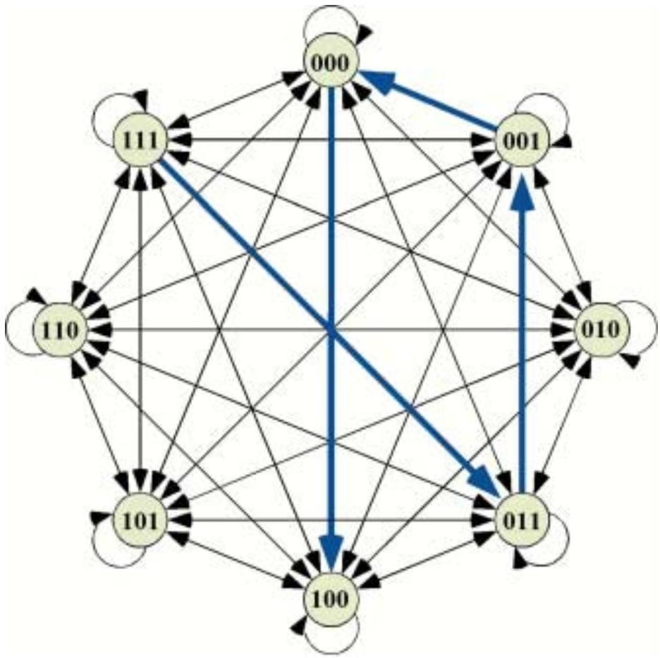  
Figure 38: A Hamming chain of length 4 in a chromosome graph where the chromosomes have a chromosome length of 3.

Because of this corollary, we will frequently vertex indices from 0 to the Hamming distance of end points (denoted as $h$ ) of the shortest Hamming chain between them, e.g. $\left. \nu _ { 0 } , \nu _ { 1 } , . . . , \nu _ { h } \right.$ .

Corollary 3: In a chromosome distance graph that uses mutation, the cost of a Hamming chain of length $n$ is ${ \frac { q \cdot ( a - 1 ) } { p \cdot q ^ { l } } } \cdot n$ .

Proof. By definition of the Hamming chain, each edge is between two chromosomes that are one Hamming distance apart. Therefore, the cost of each edge must be the same, and is $\frac { q \cdot ( a - 1 ) } { p \cdot q ^ { l } }$ which was obtained from the edge weight definition (2.8) after setting $h d _ { ( x , y ) } = 1$ . So by adding the cost of all $n$ edges together to find the total cost of the Hamming chain, we get ${ \frac { q \cdot ( a - 1 ) } { p \cdot q ^ { l } } } \cdot n$ . ❚

# The Mutational Distance between Chromosomes $\infty$ Hamming Distance

We will now turn our attention to the proof that the mutational distance between chromosomes is equivalent to the Hamming distance. First two lemmas are presented that will be used in the main theorem. Immediately thereafter, the main theorem itself will be presented followed by a corollary that more clearly specifies the conditions under which the equivalence of the two distances holds.

The first lemma derives an inequality that holds in a chromosome distance graph when the cost of every Hamming chain of length 2 that has distinct end points is smaller than the direct distance between those two end points. The second lemma shows that if the same condition holds as in the first lemma then the shortest Hamming chain between any two distinct points in the graph must be smaller then the direct distance between those two points.

Note: the following lemmas and theorems are all done on a chromosome distance graph $G$ that comprises chromosomes of length $l$ and whose loci are drawn from an alphabet of size $a$ . Also, since there is a one-to-one mapping between chromosomes and vertices, we will uses the two terms interchangeably.

Lemma 1: Let $\left. u , \nu , u ^ { \prime } \right.$ be a Hamming chain of length 2, where $u \ne u ^ { \prime }$ . Also let $p$ be the probability of mutation and let $q = 1 - p$ . Then $\mathrm { c o s t } ( \left. u , u ^ { \prime } \right. ) > \mathrm { c o s t } ( \left. u , \nu , u ^ { \prime } \right. )$ iff the following inequality holds:

$$
{ \frac { q ( a - 1 ) } { p } } > 2 .
$$

Proof. First we will assume that $\mathrm { c o s t } ( \left. u , u ^ { \prime } \right. ) > \mathrm { c o s t } ( \left. u , \nu , u ^ { \prime } \right. )$ and demonstrate that (4.1) holds. Expanding the costs for all paths in the above cost inequality, we get $w _ { ( u , u ^ { \prime } ) } > w _ { ( u , \nu ) } + w _ { ( \nu , u ^ { \prime } ) } .$ . Then using the inverse transition probabilities as edge weights as required for a distance graph we get

$$
\frac { 1 } { \operatorname* { P r } ( u \to u ^ { \prime } ) } > \frac { 1 } { \operatorname* { P r } ( u \to \nu ) } + \frac { 1 } { \operatorname* { P r } ( \nu \to u ^ { \prime } ) } .
$$

Now since $\left. u , \nu , u ^ { \prime } \right.$ is a Hamming chain, $h d _ { ( u , \nu ) } = h d _ { ( \nu , u ^ { \prime } ) } = 1$ . Consequently, after setting $h d _ { ( x , y ) } = 1$ in equation (2.7) we get $\operatorname* { P r } ( u \to \nu ) = \operatorname* { P r } ( \nu \to u ^ { \prime } ) = p \cdot q ^ { l - 1 } \cdot \frac { 1 } { a - 1 }$ . Next, since $u$ and $u ^ { \prime }$ are end points on the Hamming Chain of length 2 it follows that their Hamming distance must be either 2 (if two loci are changed when the two edges are taken) or 0 (if the second edge doubles back and we return to the vertex $u$ ). However, since $u \ne u ^ { \prime }$ , only the first case applies and the Hamming distance must be exactly 2. We can now use equation (2.7) again, although this time we set $h d _ { ( x , y ) } = 2$ , to produce the final required probability of transition, $\operatorname* { P r } ( u \to u ^ { \prime } ) = p ^ { 2 } \cdot q ^ { l - 1 } \cdot \left( { \frac { 1 } { a - 1 } } \right) ^ { 2 }$ . Substituting all the above probability of transitions into the inequality (4.2) produces

$$
\frac { 1 } { p ^ { 2 } \cdot q ^ { l - 1 } \cdot \left( \frac { 1 } { a - 1 } \right) ^ { 2 } } > \frac { 1 } { p \cdot q ^ { l - 1 } \cdot \frac { 1 } { a - 1 } } + \frac { 1 } { p \cdot q ^ { l - 1 } \cdot \frac { 1 } { a - 1 } } .
$$

A simple rearrangement of the above inequality provides the desired relation.

Now we will prove the Converse by assuming that (4.1) holds and then showing that $\mathrm { c o s t } ( \left. u , u ^ { \prime } \right. ) > \mathrm { c o s t } ( \left. u , \nu , u ^ { \prime } \right. )$ , where $\left. u , \nu , u ^ { \prime } \right.$ is a Hamming chain and $u \ne u ^ { \prime }$ . Since $u$ and $u ^ { \prime }$ are the two endpoints of a Hamming chain of length 2, and since $u \ne u ^ { \prime }$ , it follows that $h d _ { ( u , u ^ { \prime } ) } = 2$ . So by expanding the cost of direct path we get

$$
\mathrm { c o s t } ( \left. u , u \right. ) = w _ { { h d } _ { \left( u , u ^ { \prime } \right) } } = \frac { q ^ { 2 } ( a - 1 ) ^ { 2 } } { p ^ { 2 } q ^ { l } } = \frac { q ( a - 1 ) } { p } \cdot \frac { q ( a - 1 ) } { p q ^ { l } } > 2 \frac { q ( a - 1 ) } { p q ^ { l } }
$$

with the final inequality holding because of (4.1). Now by expanding the cost of the Hamming chain we see that $\mathrm { c o s t } ( \left. u , \nu , u ^ { \prime } \right. ) = w _ { h d _ { ( u , \nu ) } } + w _ { h d _ { ( \nu , u ) } } = 2 \frac { q ( a - \bar { 1 } ) } { p q ^ { l } }$ Consequently $\mathrm { c o s t } ( \left. u , u ^ { \prime } \right. ) > \mathrm { c o s t } ( \left. u , \nu , u ^ { \prime } \right. )$ as desired.

Lemma 2: Let the cost of the direct path between two chromosomes that are a Hamming distance of two apart, be greater then the cost of the shortest Hamming chain between them. Also let $\left. \nu _ { 0 } , \nu _ { 1 } , . . . , \nu _ { h } \right.$ be the shortest possible Hamming chain between $\nu _ { 0 }$ and $\nu _ { h }$ , where $h$ is the Hamming distance between $\nu _ { 0 }$ and $\nu _ { h }$ (see Corollary 2). Then the cost of $\left. \nu _ { 0 } , \nu _ { 1 } , . . . , \nu _ { h } \right.$ is no greater than the cost of $\left. \nu _ { 0 } , \nu _ { h } \right.$ .

Proof. From equation (2.8) the cost of $\left. \nu _ { 0 } , \nu _ { h } \right.$ is

$$
\mathrm { c o s t } \big ( \big \langle \nu _ { 0 } , \nu _ { h } \big \rangle \big ) = \frac { 1 } { q ^ { l } } \bigg ( \frac { q \cdot ( a - 1 ) } { p } \bigg ) ^ { h } = \frac { q \cdot ( a - 1 ) } { p \cdot q ^ { l } } \cdot \bigg ( \frac { q \cdot ( a - 1 ) } { p } \bigg ) ^ { h - 1 }
$$

Since the cost of a Hamming chain of length 2 is less than the cost of a direct path between the two endpoints of the chain (by assumption) Lemma 1 holds. Therefore q(a − 1) ≥ 2and so

$$
\frac { q \cdot ( a - 1 ) } { p \cdot q ^ { l } } \cdot \left( \frac { q \cdot ( a - 1 ) } { p } \right) ^ { h - 1 } > \frac { q \cdot ( a - 1 ) } { p \cdot q ^ { l } } \cdot 2 ^ { h - 1 } \ge \frac { q \cdot ( a - 1 ) } { p \cdot q ^ { l } } \cdot h
$$

with the second inequality holding as long as $h \geq 2$ . Since the Hamming chain has a length of $h$ , from Corollary 3, which calculates the cost of a Hamming chain, we know that

$$
\mathrm { c o s t } ( \left. \nu _ { 0 } , \nu _ { 1 } , . . . , \nu _ { h } \right. ) { = } \frac { q \cdot ( a - 1 ) } { p \cdot q ^ { l } } \cdot h
$$

Finally, by substituting (4.3) and (4.5) into (4.4) we arrive at the inequality $\mathrm { c o s t } \big ( \big < \nu _ { 0 } , \nu _ { h } \big > \big ) > \mathrm { c o s t } \big ( \big < \nu _ { 0 } , \nu _ { 1 } , . . . , \nu _ { h } \big > \big ) .$ . ❚

Now we arrive at the main theorem itself, from which, as a corollary we will prove the proportionality of mutational distance and the Hamming distance between chromosomes:

Theorem 12: Let the cost of the direct path between two chromosomes that are a Hamming distance of two apart, be greater then the cost of the shortest Hamming chain between them. Then, for all pairs of points in $G$ , the shortest Hamming chain is also the shortest path.

# Appendix A

Proof. Let path $p$ be the shortest path between two point $\nu _ { 0 }$ and $\nu _ { h }$ . Now assume that path $p$ does not form a Hamming chain. Then there must be at least one pair of adjacent points in the path, say the adjacent points of the edge $( \nu _ { i } , \nu _ { i + 1 } )$ , that has a Hamming distance greater than 2. Now the cost of the direct path between two chromosomes that are a Hamming distance of two apart is greater then the cost of the shortest Hamming chain between them. Therefore we can apply Lemma 2, which states that the cost of $( \nu _ { i } , \nu _ { i + 1 } )$ is larger than the cost of the shortest Hamming chain between $\nu _ { i }$ and $\boldsymbol { \nu } _ { i + 1 }$ . Consequently, by substituting the appropriate Hamming chain for the edge $( \nu _ { i } , \nu _ { i + 1 } )$ in path $p$ , we can produced a path, $p ^ { \prime }$ , that cost less than $p$ . But $p$ is supposed to be the shortest path, thus we have a contradiction. Therefore the assumption that $p$ does not form a Hamming chain must be false. Furthermore $p$ must be the shortest Hamming chain, otherwise some other Hamming chain would be shorter than $p$ and again $p$ would not be the shortest path. ❚

We finally can now prove that, when the probability of mutation is small enough, then the distance between chromosomes due to mutation is not only equivalent to, but also directly proportional to the Hamming distance:

Theorem 4: If the probability of mutation $p$ is sufficiently small, i.e. if $p < \frac { a - 1 } { a + 1 }$ then the distance between chromosomes due to mutation is directly proportional to the Hamming distance, with a proportionality constant of q ⋅ (a − 1)l .

Proof. From Corollary 2 we know that the shortest Hamming chain between two chromosomes has a length equal to the Hamming distances between them. Using both this and Corollary 3, which gives the cost of the Hamming chain of a given length, we see that the cost of the shortest Hamming chain between two chromosomes $x$ and $y$ must be ${ \frac { q \cdot ( a - 1 ) } { p \cdot q ^ { l } } } \cdot h d _ { ( x , y ) }$

Now since $p < \frac { a - 1 } { a + 1 }$ , which, after a rearrangement, means that $\frac { ( 1 - p ) ( a - 1 ) } { p } > 2$ , it follows that Lemma 1 can be applied. So the cost of a Hamming chain of length 2 is less than the cost of a direct path between its two endpoints. Therefore Theorem 12 holds and the shortest Hamming chain is also the shortest cost path between chromosome. Consequently, since the distance between chromosomes is defined as the cost of the shortest path between them, which in this case is the Hamming chain, it follows that the distance between two chromosomes due to mutation is

$$
D i s t ( x , y ) = \frac { q \cdot ( a - 1 ) } { p \cdot q ^ { l } } \cdot h d _ { ( x , y ) }
$$

# A-4 Deriving a Formulation of the All-Possible-Pairs Diversity that allows Linear Time Computation

In this section of the appendix the definition of the all-possible-pairs diversity of the population will be manipulated to allow linear time computation. The result is presented as Theorem 6. First some notation that will be used in the proof is presented. Next three very simple, but important properties of the gene count and the gene frequency will be introduced. Finally the theorem itself will be presented and proven.

# Notation

Before we can derive the linear time formulation of the all-possible-pairs diversity, we need to set out a few definitions. Let $P$ be a population of $n$ chromosomes each of length $l .$ . Each chromosome is a sequence of symbols drawn from an alphabet $A$ with a cardinality of $a$ . Let $g _ { i \vert k } \in A$ be the gene at locus $k$ of chromosome $i .$ . Also let $\lambda _ { i j | k }$ be the hamming distance at locus $\mathrm { k }$ between chromosome $c h r _ { i }$ and chromosome $c h r _ { j }$ , or more precisely let

$$
\lambda _ { i j | k } = \mathrm { h d } _ { k } \left( c h r _ { i } , c h r _ { j } \right) = \left\{ \begin{array} { l l } { { 0 } } & { { \mathrm { ~ i f ~ } g _ { i | k } = g _ { j | k } \ } } \\ { { 1 } } & { { \mathrm { ~ i f ~ } g _ { i | k } \ne g _ { j | k } \ } } \end{array} \right. .
$$

Now let $\alpha \in A$ . We shall define a Kronecker δ as

$$
\begin{array} { r } { \delta _ { i | k } ( \alpha ) = \left\{ { \begin{array} { l l } { 1 \quad } & { \mathrm { i f } g _ { i | k } = \alpha } \\ { 0 \ } & { \mathrm { i f } g _ { i | k } \neq \alpha } \end{array} } \right. . } \end{array}
$$

This can be read as “does the gene at locus $k$ in chromosome $i$ equal the symbol $\alpha ^ { \nu }$ .

# Important Properties of Gene Counts and Gene Frequencies

Here are two properties, one for gene counts and one for gene frequencies, which will be used extensively in the proof of the theorem.

Property 1: The total of all gene count at a locus is equal to the population size, i.e.

$$
\sum _ { \forall \alpha } \mathbf { c } _ { k } ( \alpha ) = n .
$$

Proof. Substituting the definition of the gene count (2.17) into the left-hand side we get $\sum _ { \forall \alpha } \mathbf { c } _ { k } ( \alpha ) = \sum _ { \forall \alpha } \sum _ { i = 1 } ^ { n } \delta _ { i \mid k } ( \alpha )$ . Since the summation limits are finite, the two summations can be interchanged giving $\sum _ { \forall \alpha } \mathbf { c } _ { k } ( \alpha ) = \sum _ { i = 1 } ^ { n } \sum _ { \forall \alpha } \delta _ { i | k } ( \alpha )$ . Now since the gene at locus $k$ of chromosome $i$ must hold some value from the alphabet $A$ , $\sum _ { \forall \alpha } \delta _ { i \vert k } ( \alpha )$ must be equal to 1.

Consequently, $\sum _ { \forall \alpha } \mathbf { c } _ { k } ( \alpha ) = \sum _ { i = 1 } ^ { n } \sum _ { \forall \alpha } \delta _ { i | k } ( \alpha ) = \sum _ { i = 1 } ^ { n } 1 = n .$

Property 2: The total of all gene frequencies at a locus is equal to 1, i.e.

$$
\sum _ { \forall \alpha } \mathrm { f } _ { k } ( \alpha ) = 1
$$

Proof. This is a direct consequence of Property 1 and the definition of the gene frequency (2.18). ❚

# Proving the Linear Time Formulation of the All-Possible-Pairs Diversity

The proof of the linear time formulation of the all-possible-pairs diversity uses two lemmas that will be presented first. Of the two lemmas it is the second that is the key behind the transformation of the naïve quadratic time definition into the linear time definition. Following the lemmas, two versions of the linear time all-possible-pair diversity are presented, the second being a normalized version of the first, and then proven.

Lemma 3: The sum of the Hamming distance at a locus between a given chromosome and all other chromosomes in the population is equal to the size of the population reduced by the gene count (at that locus) of all chromosomes that have the same gene as the given chromosome. More concisely this reads as

$$
\begin{array} { l l } { { 1 ) } } & { { \displaystyle \sum _ { j = 1 } ^ { n } \lambda _ { i j \mid k } = n - { \bf c } _ { k } \left( g _ { i \mid k } \right) } } \\ { { } } & { { \displaystyle ) \sum _ { i = 1 } ^ { n } \lambda _ { i j \mid k } = n - { \bf c } _ { k } \left( g _ { j \mid k } \right) . } } \end{array}
$$

Proof. We will first prove a). Notice that $\lambda _ { _ { i j \vert k } } = 1 - \delta _ { _ { j \vert k } } \big ( g _ { _ { i \vert k } } \big )$ (this can be seen directly from definitions (4.6) and (4.7). From this identity we can see that $\sum _ { j = 1 } ^ { n } \lambda _ { i j | k } = \sum _ { j = 1 } ^ { n } \big ( 1 - \delta _ { j | k } \big ( g _ { i | k } \big ) \big ) = n - \sum _ { j = 1 } ^ { n } \delta _ { j | k } \big ( g _ { i | k } \big ) .$ . Using the definition of the gene count (2.17) we immediately see that $n - \sum _ { j = 1 } ^ { n } \delta _ { j | k } \mathopen { } \mathclose \bgroup \left( g _ { i | k } \aftergroup \egroup \right) = n - \mathrm { c } _ { k } \mathopen { } \mathclose \bgroup \left( g _ { i | k } \aftergroup \egroup \right) .$ , and thus $\sum _ { j = 1 } ^ { n } \lambda _ { i j \mid k } = n - \mathbf { c } _ { k } \left( g _ { i \mid k } \right)$ as desired. The proof of b) follows along similar lines as the above but uses the identity $\lambda _ { \scriptscriptstyle i j | k } = 1 - \delta _ { \scriptscriptstyle i | k } \big ( g _ { \scriptscriptstyle j | k } \big )$ instead of $\lambda _ { _ { i j \vert k } } = 1 - \delta _ { _ { j \vert k } } \big ( g _ { _ { i \vert k } } \big )$ I

Lemma 4: Let us, for each chromosome, take the gene within that chromosome at locus $k$ and find the corresponding gene count across the population. Then the total of all those counts is equal to the total of the square of the gene counts from that locus for each symbol in the alphabet. More formally, this can be written as:

$$
\sum _ { i = 1 } ^ { n } \mathbf { c } _ { k } ( g _ { i | k } ) = \sum _ { \forall \alpha \in A } { \mathbf { c } _ { k } } ^ { 2 } ( \alpha ) .
$$

Proof. First notice that $\mathfrak { c } _ { k } ( g _ { i | k } ) = \sum _ { \forall \alpha \in A } \delta _ { j | k } ( \alpha ) \mathfrak { c } _ { k } ( \alpha )$ . This follows from the selection property of the Kronecker delta: $\mathrm { c } _ { k } ( \alpha )$ is the gene count for all possible gene values, and $\delta _ { j \vert k } ( \alpha )$ selects the one that has a gene value equal to that at chromosome $i .$ From this observation it follows that $\sum _ { i = 1 } ^ { n } \mathbf { c } _ { k } ( g _ { i | k } ) = \sum _ { i = 1 } ^ { n } \sum _ { \forall \alpha \in A } \delta _ { j | k } ( \alpha ) \mathbf { c } _ { k } ( \alpha )$ by straight substitution. We can now exchange the summations since their limits are both finite, giving us $\sum _ { i = 1 } ^ { n } \mathbf { c } _ { k } ( g _ { i | k } ) = \sum _ { \forall \alpha \in \mathcal { A } } \sum _ { i = 1 } ^ { n } \delta _ { j | k } ( \alpha ) \operatorname { c } _ { k } ( \alpha ) = \sum _ { \forall \alpha \in \mathcal { A } } \mathbf { c } _ { k } ( \alpha ) \left( \sum _ { i = 1 } ^ { n } \delta _ { j | k } ( \alpha ) \right) .$ . The summation inside the brackets can be seen as just ${ \mathrm { c } } _ { k } ( \alpha )$ by the definition of the gene count (2.17). So $\sum _ { i = 1 } ^ { n } { \mathsf { c } } _ { k } ( g _ { i | k } ) = \sum _ { \forall \alpha \in A } { \mathsf { c } } _ { k } ( \alpha ) { \mathsf { c } } _ { k } ( \alpha ) = \sum _ { \forall \alpha \in A } { \mathsf { c } } _ { k } ^ { \ 2 } ( \alpha )$ as required. ❚

Theorem 6a: The all-possible-pairs diversity can be rewritten as

$$
\operatorname { D i v } \stackrel { \cdot } { ( } P ) = \frac { n ^ { 2 } } { 2 l } { \sum _ { k = 1 } ^ { l } \sum _ { \forall \alpha \in \boldsymbol { A } } } \operatorname { f } _ { k } ( \alpha ) \left( 1 - \operatorname { f } _ { k } ( \alpha ) \right)
$$

Proof. From the definition of all-possible-pairs diversity (2.16) we know that $\operatorname { D i v } ( P ) = \sum _ { i = 1 } ^ { n } \sum _ { j = 1 } ^ { i - 1 } \mathrm { h d } ( c _ { i } , c _ { j } )$ . Now using the definition of the normalized Hamming distance

(2.3), and rewriting it according to (4.7) we get

$$
\mathrm { D i v } ( P ) = \sum _ { i = 1 } ^ { n } \sum _ { j = 1 } ^ { i - 1 } \biggl ( \frac { 1 } { l } \sum _ { k = 1 } ^ { l } \mathrm { h d } _ { k } \bigl ( c _ { i } , c _ { j } \bigr ) \biggr ) = \frac { 1 } { l } \sum _ { i = 1 } ^ { n } \sum _ { j = 1 } ^ { i - 1 } \sum _ { k = 1 } ^ { l } \lambda _ { i j | k }
$$

Now since all summation limits are finite, and the innermost summation is independent of the other two, we can move it to the outside giving $\mathrm { D i v } ( P ) = \frac { 1 } { l } \sum _ { k = 1 } ^ { l } \sum _ { i = 1 } ^ { n } \sum _ { j = 1 } ^ { i - 1 } \lambda _ { i j | k }$ . Due to the symmetry of the Hamming distance and the fact that $\lambda _ { i i \vert k } = 0$ , we can write $\sum _ { i = 1 } ^ { n } \sum _ { j = 1 } ^ { i - 1 } \lambda _ { i j | k }$ as $\frac { 1 } { 2 } \sum _ { i = 1 } ^ { n } \sum _ { j = 1 } ^ { n } \lambda _ { i j | k }$ . Using this, as well as the results from Lemma 3, we can see that $\mathrm { D i v } ( P ) = { \frac { 1 } { 2 l } } \sum _ { k = 1 } ^ { l } \sum _ { i = 1 } ^ { n } \sum _ { j = 1 } ^ { n } \lambda _ { i j | k } = { \frac { 1 } { 2 l } } \sum _ { k = 1 } ^ { l } \sum _ { i = 1 } ^ { n } ( n - \mathbf { c } _ { k } ( g _ { i | k } ) )$ . Distributing the innermost summation into the two terms gives us $\operatorname { D i v } ( P ) = { \frac { 1 } { 2 l } } \sum _ { k = 1 } ^ { l } \left( n ^ { 2 } - \sum _ { i = 1 } ^ { n } \mathbf { c } _ { k } ( g _ { i | k } ) \right)$ . We can now use Lemma 4, producing $\operatorname { D i v } ( P ) = { \frac { 1 } { 2 l } } \sum _ { k = 1 } ^ { l } \biggl ( n ^ { 2 } - \sum _ { \forall \alpha \in { \cal { A } } } { \mathrm { c } _ { k } } ^ { 2 } ( \alpha ) \biggr )$ . Next we can factor out the $n ^ { 2 }$ term and apply the gene frequency definition (2.18) to give $\operatorname { D i v } ( P ) = \frac { n ^ { 2 } } { 2 l } \sum _ { k = 1 } ^ { l } \biggl ( 1 - \sum _ { \forall \alpha \in \cal { A } } { \mathrm { f } _ { k } } ^ { 2 } ( \alpha ) \biggr ) .$ Using the fact that the number 1 can be rewritten as the sum of all the gene frequencies (from Property 2) we can write the div $\begin{array} { r l } & { \mathrm { e r s i t y ~ a s ~ D i v } ( P ) = \displaystyle \frac { n ^ { 2 } } { 2 l } { \sum _ { k = 1 } ^ { l } } \Biggl ( { \sum _ { \forall \alpha \in A } } { \mathbf { \bar { f } } _ { k } } ( \alpha ) - { \sum _ { \forall \alpha \in A } } ^ { \bullet } { \mathbf { \bar { f } } _ { k } } ^ { 2 } ( \alpha ) \Biggr ) } \\ & { \mathrm { } ) \mathrm { i v } ( P ) = \displaystyle \frac { n ^ { 2 } } { 2 l } { \sum _ { k = 1 } ^ { l } } \sum _ { \forall \alpha \in A } { \mathbf { f } _ { k } } ( \alpha ) \left( 1 - { \mathbf { f } _ { k } } ( \alpha ) \right) . } \end{array}$ which can then be factored to produce

Theorem 6b: The normalized all-possible-pairs diversity can be rewritten as

$$
\begin{array} { r } { \overrightarrow { \mathrm { D i v } ( P ) } = \left\{ \begin{array} { l l } { ~ a ^ { ' } } & { ~ a < \displaystyle { \frac { i } { L \cdot \big ( ( a - 1 ) - \frac { r ( a - r ) } { n ^ { 2 } } \big ) } } \sum _ { k = 1 } ^ { l } \sum _ { v \in A } \mathsf { f } _ { k } ( \alpha ) \cdot ( 1 - \mathsf { f } _ { k } ( \alpha ) ) } & { ~ a < n } \\ { ~ } & { ~ } \\ { \displaystyle { \frac { n } { l \cdot \big ( n - 1 ) } } \sum _ { k = 1 } ^ { l } \sum _ { v \in A } \mathsf { f } _ { k } ( \alpha ) \cdot ( 1 - \mathsf { f } _ { k } ( \alpha ) ) } & { ~ a \geq n } \end{array} \right. } \end{array}
$$

where $r = n \cdot \mathrm { m o d } a$ .

Proof. To normalize this formula we must first find the maximum diversity value that can be obtained under any make-up of the population. Once this is found, the normalized diversity is just the regular diversity divided by this value.

There are two different cases. The first occurs when the alphabet size is strictly less than the size of the population. In the second case the size of the population is the greater of the two.

When the alphabet size is less than the size of the population $( a < n )$ , the diversity becomes maximal when all gene frequencies are as equal as possible. This can be proven easily by solving for each of the frequencies from the set of equations produced by $\nabla \operatorname { D i v } ( P ) = 0$ after taking into account the constraint $\sum _ { \forall \alpha } \operatorname { f } _ { k } ( \alpha ) { \overset { \cdot } { = } } 1$ (Property 2). So $\operatorname* { m a x } ( \operatorname { D i v } ( P ) )$ can be found by setting $\textstyle \mathrm { f } _ { k } ( \alpha ) = { \frac { 1 } { a } }$ in the diversity equation. Therefore $\mathrm { m a x } ( \mathrm { D i v } ( P ) ) = \frac { n ^ { 2 } } { 2 l } \sum _ { k = 1 \ : \forall \ : \alpha \in \mathcal { A } } ^ { l } \frac { 1 } { a } \ : ( 1 - \frac { 1 } { a } )$ , which simplifies to

$$
\operatorname* { m a x } ( \operatorname { D i v } ( P ) ) = { \frac { n ^ { 2 } } { 2 a } } ( a - 1 )
$$

This equation is only accurate if $n \left| a \right.$ , consequently a slight correction factor must be introduced76 producing the equation:

$$
\operatorname* { m a x } ( \operatorname { D i v } ( P ) ) = { \frac { n ^ { 2 } } { 2 a } } { \bigg ( } ( a - 1 ) - { \frac { r ( a - r ) } { n ^ { 2 } } } { \bigg ) }
$$

where $r = n \cdot \mathrm { m o d } a$ .

When the alphabet size is greater then or equal to the size of the population $( a \geq n )$ each frequency becomes $\frac { 1 } { n }$ . This is because there can only be $n$ symbols in the population when maximally diverse (also $r = 0$ since $n | n  )$ . Therefore

$$
\operatorname* { m a x } ( \operatorname { D i v } ( P ) ) = { \frac { n ^ { 2 } } { 2 n } } ( n - 1 ) = { \frac { n ( n - 1 ) } { 2 } } ,
$$

which, as expected, is $n$ choose 2, the number of possible pairs that can be uniquely produced.

Finally we divide (2.19), the all-possible-pairs diversity from Theorem 6a, by the appropriate maximum values derived above to get the normalized formula as desired. ❚

# A-5 P1 and P2 are Maximally Distant if they Share No Genes

Theorem 8: When there are no genes in common between two populations $P _ { 1 }$ and $P _ { 2 }$ , $\mathrm { D i s t _ { L } } _ { 1 } ( P _ { 1 } , P _ { 2 } ) = 1$ (i.e. is maximally distant).

Proof. When there are no genes in common between $P _ { 1 }$ and $P _ { 2 }$ , $\left| \mathrm { f } _ { 1 } ( \alpha ) - \mathrm { f } _ { 2 } ( \alpha ) \right| = \mathrm { f } _ { 1 } ( \alpha )$ or $\left| \mathrm { f } _ { 1 } ( \alpha ) - \mathrm { f } _ { 2 } ( \alpha ) \right| = \mathrm { f } _ { 2 } ( \alpha )$ . Also the alphabet can be partitioned by the gene values present in a populations. So let $A _ { 1 } , A _ { 2 } \subset A$ such that $A _ { 1 }$ holds the gene values that are present in $P _ { 1 }$ and $A _ { 2 }$ holds the gene values that are present in $P _ { 2 }$ . Then

$$
\begin{array} { l } { { \mathrm { D i s t } _ { _ { \mathrm { L } _ { 1 } | k } } ( P _ { 1 } , P _ { 2 } ) = \displaystyle \frac { 1 } { 2 l } \sum _ { k = 1 } ^ { l } \sum _ { \forall \alpha , \alpha \in A } \left| \mathbf { f } _ { 1 | k } ( \alpha ) - \mathbf { f } _ { 2 | k } ( \alpha ) \right| } } \\ { { \mathrm { = } \displaystyle \frac { 1 } { 2 l } \sum _ { k = 1 } ^ { l } \sum _ { \forall \alpha , \alpha \in A _ { 1 } } \left| \mathbf { f } _ { 1 | k } ( \alpha ) - \mathbf { f } _ { 2 | k } ( \alpha ) \right| + \displaystyle \frac { 1 } { 2 l } \sum _ { k = 1 } ^ { l } \sum _ { \forall \alpha , \alpha \in A _ { 1 } } \left| \mathbf { f } _ { 1 | k } ( \alpha ) - \mathbf { f } _ { 2 | k } ( \alpha ) \right| } } \\ { { \mathrm { = } \displaystyle \frac { 1 } { 2 l } \sum _ { k = 1 } ^ { l } \sum _ { \forall \alpha , \alpha \in A _ { 1 } } \mathbf { f } _ { 1 | k } ( \alpha ) + \displaystyle \frac { 1 } { 2 l } \sum _ { k = 1 } ^ { l } \sum _ { \forall \alpha , \alpha \in A _ { 1 } } \mathbf { f } _ { 2 | k } ( \alpha ) } } \end{array}
$$

By definition $A _ { 1 }$ comprises all the gene values used in $P _ { 1 }$ . Consequently from Property 2, $\sum _ { \forall \alpha , \alpha \in A _ { 1 } } \mathrm { f } _ { 1 | k } ( \alpha ) = 1$ . Using a similar argument ∀ $\sum _ { \boldsymbol { \alpha } , \boldsymbol { \alpha } \in A _ { 2 } } \mathbf { f } _ { 2 \mid k } ( \boldsymbol { \alpha } ) = 1$ . So we therefore find that $\begin{array} { r } { \mathrm { D i s t } _ { \mathrm { L } _ { 1 } } ( P _ { 1 } , P _ { 2 } ) = \frac { 1 } { 2 } + \frac { 1 } { 2 } = 1 } \end{array}$ . ❚

# A-6 The Distance between a Chromosome and a Population

Corollary 1: Let $g _ { k }$ be the gene at locus $k$ of the chromosome chr. Then the distance between that chromosome and some target population is

$$
\mathrm { D i s t } \left( c h r , P \right) = \frac { 1 } { l } \sum _ { k = 1 } ^ { \cdot } \big ( 1 - \mathrm { f } _ { P | k } ( g _ { k } ) \big ) .
$$

Proof: A single chromosome can be thought of as a population of one. Thus the distance between a chromosome and a population devolves to the distance between two populations with the first having a cardinality of one. Of course the gene frequency of a given gene at a given locus in a population of size one has to be either 1, if the locus contains that gene, or 0 if it doesn’t. Let the gene of the chromosome at locus $k$ be $g _ { k }$ .

Then using the $\mathrm { L } _ { 1 }$ -norm based distance (definition (2.32)) we obtain

$$
\begin{array} { l } { \displaystyle \mathrm { D i s t } ( c h r , P ) = \frac { 1 } { 2 l } \sum _ { k = 1 } ^ { l } \displaystyle \sum _ { w \in \mathbf { a } } \left| \mathbf { f } _ { t h \mid k } ( \boldsymbol { \alpha } ) - \mathbf { f } _ { P k } ( \boldsymbol { \alpha } ) \right| } \\ { \displaystyle \qquad = \frac { 1 } { 2 l } \sum _ { k = 1 } ^ { l } \left( \left| \mathbf { f } _ { c h r , [ k } ( g _ { k } ) - \mathbf { f } _ { P | k } ( g _ { k } ) \right| + \displaystyle \sum _ { \stackrel { \mathrm { v a r } , \theta _ { \boldsymbol { \alpha } } , \boldsymbol { \epsilon } } { \alpha \cdot \boldsymbol { \alpha } } , \atop \stackrel { \mathrm { v a r } , \theta _ { \boldsymbol { \alpha } } \cdot \boldsymbol { \alpha } } { \alpha \cdot \boldsymbol { \alpha } } } \left| \mathbf { f } _ { t h \boldsymbol { \kappa } } ( \boldsymbol { \alpha } ) - \mathbf { f } _ { P k } ( \boldsymbol { \alpha } ) \right| \right) , } \\ { \displaystyle \qquad = \frac { 1 } { 2 l } \sum _ { k = 1 } ^ { l } \left( \left( 1 - \mathbf { f } _ { r h } ( g _ { k } ) \right) + \displaystyle \sum _ { \stackrel { \mathrm { v a r } , \theta _ { \boldsymbol { \alpha } } , \boldsymbol { \epsilon } } { \mathrm { v a r } , \theta _ { \boldsymbol { \alpha } } \cdot \boldsymbol { \alpha } } } \mathbf { f } _ { r | k } ( \boldsymbol { \alpha } ) \right) } \end{array}
$$

From Property 2 we know that $\sum \mathrm { ~ f ~ } _ { P | k } ( \alpha ) = 1 - \mathrm { f } _ { P | k } ( g _ { k } )$ . Substituting this into the above ∀α ≠ gk ,

equation produces the desired formula.

# A-7 A Linear Time Reformulation of the Diversity for Systems with Numeric Genomes

Theorem 9: Let xk = 1n n∑ and ${ \overline { { x _ { k } ^ { 2 } } } } = { \frac { 1 } { n } } \sum _ { i = 1 } ^ { n } x _ { i \mid k }$ . Then $D i \nu ^ { 2 } ( P ) { = } n ^ { 2 } { \sum _ { k = 1 } ^ { l } } \overline { { x _ { k } ^ { 2 } } } - \overline { { ( x _ { k } } } ) ^ { 2 } .$

Proof.

$$
\begin{array} { c } { { \displaystyle D \hat { w } ^ { 2 } ( P ) = \frac { 1 } { 2 } \sum _ { k = 1 / 2 = 1 } ^ { P } \frac { x } { x } \sum _ { i = 1 } ^ { P } ( x _ { i k } , - x _ { i k } ) ^ { 2 } } } \\ { { = \displaystyle \frac { 1 } { 2 } \sum _ { k = 1 / 2 = 1 } ^ { P } \sum _ { i \neq i } ^ { n } x _ { i k } ^ { 2 } + \displaystyle \frac { 1 } { 2 } \sum _ { k = 1 / 2 = 1 } ^ { n } \sum _ { i \neq i } ^ { n } x _ { i k } ^ { 2 } - \displaystyle \sum _ { k = 1 / 2 = 1 + 1 } ^ { n } x _ { i k } ^ { 2 } x _ { j k } } } \\ { { = \displaystyle \frac { n } { 2 } \sum _ { k = 1 / 2 = 1 } ^ { P } x _ { i k } ^ { 2 } + \displaystyle \frac { n } { 2 } \sum _ { k = 1 / 2 = 1 } ^ { P } x _ { j k } ^ { 2 } - \displaystyle \sum _ { k = 1 } ^ { i } \left( \sum _ { k = 1 } ^ { n } x _ { i k } \right) \left( \displaystyle \sum _ { j = 1 } ^ { n } x _ { j k } \right) } } \\ { { = \displaystyle \frac { n ^ { 2 } } { 2 } \sum _ { k = 1 } ^ { P } \frac { x } { x _ { i k } ^ { 2 } } + \displaystyle \frac { n ^ { 2 } } { 2 } \sum _ { k = 1 / 2 = 1 } ^ { P } x _ { j k } ^ { 2 } - n ^ { 2 } \displaystyle \sum _ { k = 1 } ^ { i } ( \overline { { { x _ { k } } } } ) ^ { 2 } } } \\ { { = \displaystyle n ^ { 2 } \sum _ { k = 1 } ^ { P } \sum _ { k = 1 } ^ { n } \frac { x } { ( x _ { k } ) ^ { 2 } } - ( \overline { { { x _ { k } } } } ) ^ { 2 } } } \end{array}
$$

# A-8 The Equivalence of the Diversity and the Standard Deviation from the Centroid in Populations with Numeric Genes

Theorem 11: The square diversity of a population with numeric genes is proportional to the variance of points around a centroid; i.e. ${ \cal D } i \nu ( P ) = \frac { 1 } { n } \sum _ { i = 1 } ^ { n } { \cal D } ^ { 2 } ( \vec { x } _ { i } , \vec { \mu } )$ where $D ( \vec { x } , \vec { y } )$ is the Euclidean distance between two vectors, $\vec { x } _ { i } = ( x _ { i \vert 1 } , x _ { i \vert 2 } , \cdots , x _ { i \vert k } )$ and $\vec { \mu } { = } ( \mu _ { 1 } , \mu _ { 2 } , \cdots , \mu _ { k } )$

Proof. First let us look at the variance of points around the centroid: $\frac { 1 } { n } { \sum _ { i = 1 } ^ { n } } D ^ { 2 } ( \vec { x } _ { i } , \vec { \mu } ) = \frac { 1 } { n } { \sum _ { i = 1 } ^ { n } } { \sum _ { k = 1 } ^ { l } } ( \vec { x } _ { i \vert k } - \vec { \mu } _ { k } ) ^ { 2 } = \frac { 1 } { n } { \sum _ { k = 1 } ^ { l } } { \sum _ { i = 1 } ^ { n } } ( x _ { i \vert k } ^ { 2 } + \mu _ { k } ^ { 2 } - 2 x _ { i \vert k } \mu _ { k } ) .$

# Appendix A

Now, since consequently, $\begin{array} { r l } & { \mu _ { k } = \displaystyle \frac { 1 } { n } \sum _ { i = 1 } ^ { n } x _ { i \mid k } , \mathrm { i t f o l l o w s t h a t } \sum _ { i = 1 } ^ { n } x _ { i \mid k } \mu _ { k } = \mu _ { k } \sum _ { i = 1 } ^ { n } x _ { i \mid k } = n \mu _ { k } ^ { 2 } = \sum _ { i = 1 } ^ { n } \mu _ { k } ^ { 2 } } \\ & { \displaystyle \frac { 1 } { n } \sum _ { i = 1 } ^ { n } D ^ { 2 } ( \vec { x } _ { i } , \vec { \mu } ) = \frac { 1 } { n } \sum _ { k = 1 } ^ { l } \sum _ { i = 1 } ^ { n } ( x _ { i \mid k } ^ { 2 } + \mu _ { k } ^ { 2 } - 2 \mu _ { k } ^ { 2 } ) = \frac { 1 } { n } \sum _ { k = 1 } ^ { l } \sum _ { i = 1 } ^ { n } ( x _ { i \mid k } ^ { 2 } - \mu _ { k } ^ { 2 } ) . } \end{array}$ and

Next we shall examine the diversity squared. From the definition of the diversity of a population with numeric genes as given in $\mathrm { C h 7 ~ \ S 3 }$ we see that $D i \nu ( P ) = \sqrt { \sum _ { k = 1 } ^ { l } \overline { { x _ { k } ^ { 2 } } } - \big ( \overline { { x _ { k } } } \big ) ^ { 2 } } \mathrm { ~ , ~ }$ .

$$
\begin{array} { l } { { \displaystyle \mathsf { c e } \qquad \mu _ { \boldsymbol { k } } \equiv \overline { { { \boldsymbol { x } _ { \boldsymbol { k } } } } } \qquad \mathrm { a n d } \qquad \overline { { { \boldsymbol { x } _ { \boldsymbol { k } } ^ { 2 } } } } = \displaystyle \frac { 1 } { n } \sum _ { i = 1 } ^ { n } x _ { i \boldsymbol { k } } ^ { 2 } \qquad \mathrm { i t } \qquad \mathrm { f o l l o w s } \qquad \mathrm { t ~ } } } \\ { { \displaystyle \mathrm { \xi ' } ^ { 2 } ( { \boldsymbol { P } } ) = \sum _ { { \boldsymbol { k } } = 1 } ^ { l } \biggl ( \displaystyle \frac { 1 } { n } \sum _ { i = 1 } ^ { n } x _ { i \boldsymbol { k } } ^ { 2 } - \mu _ { \boldsymbol { k } } ^ { 2 } \biggr ) = \sum _ { \boldsymbol { k } = 1 } ^ { l } \biggl ( \displaystyle \frac { 1 } { n } \sum _ { i = 1 } ^ { n } x _ { i \boldsymbol { k } } ^ { 2 } - \displaystyle \frac { 1 } { n } \sum _ { i = 1 } ^ { n } \mu _ { \boldsymbol { k } } ^ { 2 } \biggr ) = \displaystyle \frac { 1 } { n } \sum _ { { \boldsymbol { k } } = 1 } ^ { l } \sum _ { i = 1 } ^ { n } ( x _ { i \boldsymbol { k } } ^ { 2 } - \mu _ { \boldsymbol { k } } ^ { 2 } ) } } \end{array}
$$

# A-9 The Equivalence of the Diversity and the ‘Deviation from the Gene Frequency Vector’ in Populations with Symbolic Genes

Theorem 13: Let $\mathrm { P }$ be a population of size n and be composed of chromosomes that have symbolic genes. Then, after normalization is performed, the diversity of $\mathrm { P }$ is equal to the deviations from the gene frequency vector of all chromosomes in $\mathrm { P }$ after the deviations are combined using the $\mathrm { L } _ { 1 }$ -norm i.e. $D i \nu ( P ) { = } \frac { a } { n \cdot ( a - 1 ) } \sum _ { i = 1 } ^ { n } \bigl | D i s t ( c h r _ { i } , P ) \bigr | .$

Proof. First, since $D i s t ( c h r , P )$ is calculated by taking the distance between the chromosomes and the population’s gene frequency vector, it properly represents the deviation of a chromosome from the gene frequency vector of a population. Next, since a distance is always positive, and from the definition of the distance from a chromosome to a population presented in Ch6 §6.1 we see that $\sum _ { i = 1 } ^ { n } \bigl | D i s t ( c h r _ { i } , P ) \bigr | = \frac { 1 } { l } \sum _ { i = 1 } ^ { n } \sum _ { k = 1 } ^ { l } ( 1 - f _ { k } ( g _ { i | k } ) ) .$ . Now from the definition of the gene frequency in Ch6 §2.2.2, $f _ { k } ( \alpha ) { = } \frac { 1 } { n } { \sum _ { i = 1 } ^ { n } \delta } ( g _ { i | k } = \alpha )$ , where δ is a Kronecker delta and equals 1 when the gene equals $\alpha$ , and from the identity

# Appendix A

$f _ { k } ( g _ { i | k } ) = \sum _ { \forall \alpha \in A } f _ { k } ( \alpha ) \delta ( g _ { i | k } = \alpha )$ , which holds because of the basic properties of the Kronecker delta, the sum of the deviations from the gene frequency vector becomes:

$$
\begin{array} { l } { \displaystyle \sum _ { i = 1 } ^ { n } \big | D i s t ( c h _ { i } , P ) \big | = \frac { 1 } { l } \sum _ { i = 1 } ^ { n } \sum _ { k = 1 } ^ { l } ( 1 - \sum _ { \forall \alpha \in \mathcal { A } _ { k } } f _ { k } ( \alpha ) \delta ( g _ { i i k } = \alpha ) ) } \\ { = \displaystyle \frac { 1 } { l } \sum _ { k = 1 } ^ { l } ( n - \sum _ { \forall \alpha \in \mathcal { A } _ { k } } f _ { k } ( \alpha ) \sum _ { i = 1 } ^ { n } \delta ( g _ { i i k } = \alpha ) ) } \\ { = \displaystyle \frac { n } { l } \sum _ { k = 1 } ^ { l } ( 1 - \sum _ { \forall \alpha \in \mathcal { A } _ { k } } f _ { k } ^ { 2 } ( \alpha ) ) } \\ { = \displaystyle \frac { n } { l } \sum _ { k = 1 } ^ { l } f _ { k } ( \alpha ) ( 1 - f _ { k } ( \alpha ) ) . } \end{array}
$$

To normalize the sum of the deviations we must multiply them by $\frac { a } { n \cdot ( a - 1 ) }$ .

# Appendix B

# The Expected Number of Mutation Operations between Chromosomes

# B-1 The Number of Mutation Operations Between Chromosomes as a Random Variable

Let us consider two chromosomes, each of length l. If the probability of mutation is $p$ , then the probability of one chromosome mutating into the other in one step is $p ^ { { ^ { d _ { x , y } } } } q ^ { { ^ { l - d _ { x , y } } } }$ where $q = 1 - p$ .

However, a one step mutation is not the only way one chromosome can mutate into another. The mutation can occur in two stages, or three, or more. Indeed the number of mutation steps that are used to turn one chromosome into another is a random variable; it can be any number, but associated with each value is a probability.

Let us represent the number of mutation steps that turns chromosome $x$ into chromosome $y$ as the random variable $N _ { x , y }$ . Notice the subscripts on the random variable.

They are there because it is possible that the probability distribution associated with the number of steps necessary to turn one pair of chromosomes into each other may be different than that used for another pair.

Then the first thing that one immediately thinks of is determining the expected number of mutation steps that would turn one chromosome into another, $\mathrm { E } ( N _ { x , y } )$ . Perhaps this is the sought-after mutational distance77. Following the definition of an expectation,

$$
\operatorname { E } ( N _ { x , y } ) = \sum _ { n = 1 } ^ { \infty } n \cdot \operatorname* { P r } ( N _ { x , y } = n )
$$

To calculate this expectation we need to know the probability distribution associated with the random variable. Unfortunately this is not so easily determined. In fact it may not even be possible to produce an exact analytic solution for it. However, it is possible to define a recursive series that would determine the desired expectation.

Figure 39 demonstrates pictorially the recursive steps that are needed to compute the probability distribution associated with the random variable $N _ { x , y }$ . The recursive equation has two base cases. The first occurs when the chromosome at the starting vertex is the target chromosome, so no steps need to be done. Consequently the probablity of going elsewhere defined as 0:

$$
\operatorname* { P r } ( N _ { x , y } = 0 ) = { \left\{ \begin{array} { l l } { 0 } & { x \neq y } \\ { 1 } & { x = y } \end{array} \right. }
$$

The second base case occurs when the target is a Hamming distance of one away:

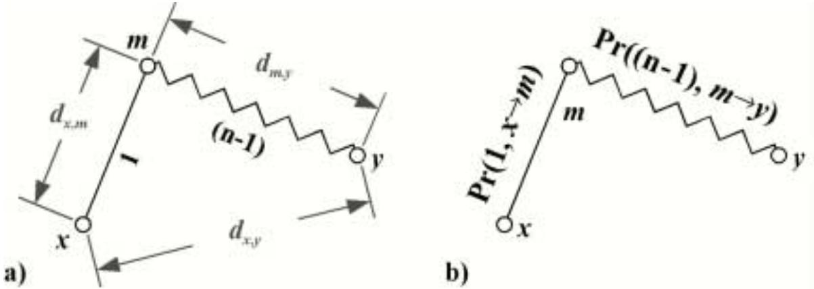  
Figure 39: Calculating recursively the probability of transforming chromosome $x$ into chromosome $y$ after $N _ { x , y } = n$ mutational steps. The two chromosomes are a Hamming distance $d _ { x , y }$ apart.

$$
\mathrm { P r } ( N _ { x , y } = 1 ) \ = \left\{ \begin{array} { c c } { p ^ { d _ { x , y } } ( 1 - p ) ^ { ( l - d _ { x , y } ) } } & { x \neq y } \\ { 0 } & { x = y } \end{array} \right.
$$

Finally the general equations for the recursive step is:

$$
\operatorname* { P r } ( N _ { x , y } = n ) \ = \left\{ { \begin{array} { c c } { \displaystyle \sum _ { m \in U _ { b } m \neq y } \operatorname* { P r } ( N _ { x , m } = 1 ) \cdot \operatorname* { P r } ( N _ { m , y } = ( n - 1 ) ) \quad } & { x \neq y } \\ { 0 \quad } & { x = y } \end{array} } \right.
$$

(recursive step)

In all of the above equations, $d _ { x , y }$ is the Hamming distance between the two chromosomes, $l$ is the length of the chromosome and $U _ { l }$ is the universal set of all chromosomes. Notice that we are summing over all chromosomes in the population except for the goal $y$ . This is because if the mid point $m$ is equal to $y$ then we will have reached $y$ before the $n$ steps it is supposed to take.

# B-2 Computing The Expected Number of Mutation Operations Between Chromosomes

Since the probability distribution of the random variable $N _ { x , y }$ cannot be determined analytically, to see how our prospective ‘distance’ behaves, we must resort to computer simulations. Unfortunately this is not as easy as it seems. If you look at the definition of an expectation in equation (4.11), you see that the sum goes to infinity, which is obviously not computable. Consequently instead of computing $\mathrm { E } ( N _ { x , y } )$ we only compute $\mathrm { E } ( N _ { x , y } < k )$ , which only sums to $k$ . The value of $k$ is determined dynamically through observing the amount of converges that has occurred when comparing $\mathrm { E } ( N _ { x , y } < k )$ with $\mathrm { E } ( N _ { x , y } < k ^ { \prime } )$ , where $k > k ^ { \prime }$ .

In this dissertation a very naïve measure of convergence is used: if the ratio of the difference between $\mathrm { E } ( N _ { x , y } < k )$ and $\mathrm { E } ( N _ { x , y } < k ^ { \prime } )$ to the value of $\mathrm { E } ( N _ { x , y } < k )$ itself is below some tolerance (say $\textstyle { \frac { 1 } { 1 0 0 } }$ ) then we stop computation and return the expectation. This will usually produce a value that is accurate to within the tolerance interval, i.e. to within a user defined number of digits. However, very slow growing functions, some who may even be divergent, may have differences in values after $k - k ^ { \prime }$ apart that fall within the tolerance value thus stopping the computation prematurely. We will note when we suspect that this may be a difficulty.

To calculate the recursively defined probability distribution of $N _ { x , y }$ a recursive function can be used. However, in practice, the recursion is unwound and built up step by step. Since we start with $k = 2$ and build from there, the internal results from the previous step are stored, and the new layer is added as we increment $k$ by 1 and check to see if convergence has occurred. Thus the old work for computing the expectation at $k$ need not be redone when computing the expectation at $k + 1$ .

The definition of the recursive step itself can actually be improved. Notice that by the end of the recursion, the probability distribution will rely entirely on a function of the Hamming distance. Therefore if $d _ { x , y } = d _ { x ^ { \prime } , y ^ { \prime } }$ then $\operatorname* { P r } ( N _ { x , y } = n ) = \operatorname* { P r } ( N _ { x ^ { \prime } , y } , = n )$ . Consequently we are computing $\operatorname* { P r } ( N _ { m , y } = ( n - 1 ) )$ with the various m values that have the same Hamming distance to $y$ and getting the same results. Consequently if $p$ is the probability of mutation and $q = 1 - p$ then the recursive step can be rewritten as:

$$
\operatorname* { P r } ( N _ { h _ { x , y } } = n ) \ = \ \sum _ { h _ { m , y } = 1 } ^ { l } \sum _ { h _ { x , m } = 0 } ^ { l } C _ { h _ { x , m } , h _ { m , y } , h _ { x , y } , l } \cdot p ^ { h _ { x , m } } \cdot q ^ { ( l - h _ { x , m } ) } \cdot \operatorname* { P r } ( N _ { h _ { m , y } } = ( n - 1 ) )
$$

where

$$
C _ { h _ { x , m } , h _ { m y } , h _ { x , y } , l } = \left( \underbrace { h _ { x , y } } _ { 2 } \right) _ { * } \cdot \left( \underbrace { l - h _ { x , y } } _ { 2 } \right) _ { 2 } 
$$

is the number of chromosomes78 that have both a distance to $x$ of $h _ { x , m }$ and a distance to $y$ of $h _ { m , y }$ . Notice that the lower limit on the outer summation starts from 1 instead of 0. This is because a Hamming distance of 0 would mean that we are already at the target chromosome $y$ and so $N _ { x , y } = 1$ instead of $N _ { x , y } = n$ which we are trying to compute. Also note that the subscripts on $h _ { x , m }$ and $h _ { { } _ { m , y } }$ are actually meaningless in the computation. They could have easily been replaced by $h _ { 1 }$ and $h _ { 2 }$ . The reason for the notation is just as a reminder to the reader of the relation that the respective Hamming distances hold to the distances in the original formulation.

The above modification speeds up the calculations significantly. Since there are two summation operators, the recursion step is done $l \cdot ( l - 1 )$ times. In the previous formulation the recursion is performed $2 ^ { l } - 1$ times, which is the number of possible chromosomes of $l$ length. Needless to say a recursive step done a quadratic number of times will take substantially less time than the same computation performed exponential number of times.

With this algorithm design, the time complexity is $O ( k _ { c o n \nu } l ^ { 2 } )$ where $k _ { c o n \nu }$ is the number of iterations taken before the algorithm converges. To compute $\mathrm { E } ( N _ { x , y } = k )$ the algorithm must be iterated at least $k$ times. So since most of the time $k _ { c o n \nu } > 2 ^ { l }$ and

# Appendix B

frequently $k _ { c o n \nu } > > 2 ^ { l }$ , as can be seen in the sample results in Table 11, the average time complexity of computing $\mathrm { E } ( N _ { x , y } )$ is at least exponential79.

Here is one final word of warning before presenting the results and drawing conclusions from them. Since the values will only be from a (relatively small) subset of all of the possible results from the infinite number of combinations of probability of mutation and chromosome size, any conclusion drawn will not be deductively proved, only inductively supported. Of course hypothesis can always be disproved through simulation by showing a counter example, so any conclusions of this type will be conclusive.

# B-3 The Expected Number of Mutation Operations as a Distance

$\mathrm { E } ( N _ { x , y } )$ Appears to be a Distance

The definition of $\mathrm { E } ( N _ { x , y } )$ trivially obeys most of the properties of a distance such as $\ { } ^ { \cdot } d ( x , y ) = 0$ iff $x = y$ , $d ( x , y ) \geq 0$ and symmetry. The only property that cannot be proven directly without a closed form for the probability distribution is the triangle inequality. Therefore we can only provide evidence on whether $\mathrm { E } ( N _ { x , y } )$ is a distance through simulation.

The results of the simulation are presented in Table 11. Here $\mathrm { E } ( N _ { d _ { x , y } } )$ has been computed for all possible Hamming distances between chromosomes $x$ and $y$ within 4 different chromosome spaces, where each space was derived from chromosomes of lengths 3 to 6. A wide variety of mutation probabilities where also used. The convergence

Appendix B   

<table><tr><td rowspan=2 colspan=1>Chr.Lgth</td><td rowspan=2 colspan=1>hd</td><td rowspan=1 colspan=13>Probability of Mutation</td></tr><tr><td rowspan=1 colspan=1>1E-05</td><td rowspan=1 colspan=1>1E-04</td><td rowspan=1 colspan=1>0.01</td><td rowspan=1 colspan=1>0.05</td><td rowspan=1 colspan=1>0.1</td><td rowspan=1 colspan=1>0.25</td><td rowspan=1 colspan=1>0.5</td><td rowspan=1 colspan=1>0.55</td><td rowspan=1 colspan=1>0.6</td><td rowspan=1 colspan=1>0.75</td><td rowspan=1 colspan=1>0.8</td><td rowspan=1 colspan=1>0.99</td><td rowspan=1 colspan=1>0.999</td></tr><tr><td rowspan=3 colspan=1>3</td><td rowspan=1 colspan=1>1</td><td rowspan=1 colspan=1>9910</td><td rowspan=1 colspan=1>12500</td><td rowspan=1 colspan=1>235</td><td rowspan=1 colspan=1>48.4</td><td rowspan=1 colspan=1>25.2</td><td rowspan=1 colspan=1>11.6</td><td rowspan=1 colspan=1>8.0</td><td rowspan=1 colspan=1>7.9</td><td rowspan=1 colspan=1>7.8</td><td rowspan=1 colspan=1>8.4</td><td rowspan=1 colspan=1>9.1</td><td rowspan=1 colspan=1>110.0</td><td rowspan=1 colspan=1>990</td></tr><tr><td rowspan=1 colspan=1>2</td><td rowspan=1 colspan=1>13000</td><td rowspan=1 colspan=1>16200</td><td rowspan=1 colspan=1>301</td><td rowspan=1 colspan=1>61.1</td><td rowspan=1 colspan=1>31.1</td><td rowspan=1 colspan=1>13.3</td><td rowspan=1 colspan=1>8.0</td><td rowspan=1 colspan=1>7.7</td><td rowspan=1 colspan=1>7.5</td><td rowspan=1 colspan=1>8.0</td><td rowspan=1 colspan=1>8.8</td><td rowspan=1 colspan=1>110.0</td><td rowspan=1 colspan=1>990</td></tr><tr><td rowspan=1 colspan=1>3</td><td rowspan=1 colspan=1>14900</td><td rowspan=1 colspan=1>18000</td><td rowspan=1 colspan=1>334</td><td rowspan=1 colspan=1>67.4</td><td rowspan=1 colspan=1>34.1</td><td rowspan=1 colspan=1>14.3</td><td rowspan=1 colspan=1>8.0</td><td rowspan=1 colspan=1>7.5</td><td rowspan=1 colspan=1>7.0</td><td rowspan=1 colspan=1>5.8</td><td rowspan=1 colspan=1>5.4</td><td rowspan=1 colspan=1>4.1</td><td rowspan=1 colspan=1>4.0</td></tr><tr><td rowspan=4 colspan=1>4</td><td rowspan=1 colspan=1>1</td><td rowspan=1 colspan=1>7150</td><td rowspan=1 colspan=1>14300</td><td rowspan=1 colspan=1>378</td><td rowspan=1 colspan=1>79.5</td><td rowspan=1 colspan=1>42.3</td><td rowspan=1 colspan=1>21.0</td><td rowspan=1 colspan=1>16.0</td><td rowspan=1 colspan=1>15.9</td><td rowspan=1 colspan=1>15.9</td><td rowspan=1 colspan=1>16.8</td><td rowspan=1 colspan=1>17.9</td><td rowspan=1 colspan=1>181.0</td><td rowspan=1 colspan=1>1690.0</td></tr><tr><td rowspan=1 colspan=1>2</td><td rowspan=1 colspan=1>8730</td><td rowspan=1 colspan=1>17900</td><td rowspan=1 colspan=1>468</td><td rowspan=1 colspan=1>96.9</td><td rowspan=1 colspan=1>50.4</td><td rowspan=1 colspan=1>23.2</td><td rowspan=1 colspan=1>16.0</td><td rowspan=1 colspan=1>15.7</td><td rowspan=1 colspan=1>15.6</td><td rowspan=1 colspan=1>16.9</td><td rowspan=1 colspan=1>18.3</td><td rowspan=1 colspan=1>206.0</td><td rowspan=1 colspan=1>1930.0</td></tr><tr><td rowspan=1 colspan=1>3</td><td rowspan=1 colspan=1>9840</td><td rowspan=1 colspan=1>19600</td><td rowspan=1 colspan=1>509</td><td rowspan=1 colspan=1>105.0</td><td rowspan=1 colspan=1>54.2</td><td rowspan=1 colspan=1>24.4</td><td rowspan=1 colspan=1>16.0</td><td rowspan=1 colspan=1>15.5</td><td rowspan=1 colspan=1>15.2</td><td rowspan=1 colspan=1>15.9</td><td rowspan=1 colspan=1>17.1</td><td rowspan=1 colspan=1>181.0</td><td rowspan=1 colspan=1>1690.0</td></tr><tr><td rowspan=1 colspan=1>4</td><td rowspan=1 colspan=1>10800</td><td rowspan=1 colspan=1>20500</td><td rowspan=1 colspan=1>533</td><td rowspan=1 colspan=1>110.0</td><td rowspan=1 colspan=1>56.4</td><td rowspan=1 colspan=1>25.1</td><td rowspan=1 colspan=1>16.0</td><td rowspan=1 colspan=1>15.3</td><td rowspan=1 colspan=1>14.6</td><td rowspan=1 colspan=1>12.4</td><td rowspan=1 colspan=1>11.6</td><td rowspan=1 colspan=1>8.2</td><td rowspan=1 colspan=1>7.8</td></tr><tr><td rowspan=2 colspan=1></td><td rowspan=1 colspan=1>1</td><td rowspan=1 colspan=1>5100</td><td rowspan=1 colspan=1>14700</td><td rowspan=1 colspan=1>622</td><td rowspan=1 colspan=1>135.0</td><td rowspan=1 colspan=1>73.3</td><td rowspan=1 colspan=1>39.0</td><td rowspan=1 colspan=1>32.0</td><td rowspan=1 colspan=1>31.9</td><td rowspan=1 colspan=1>31.9</td><td rowspan=1 colspan=1>33.1</td><td rowspan=1 colspan=1>34.7</td><td rowspan=1 colspan=1>313.0</td><td rowspan=1 colspan=1>2800.0</td></tr><tr><td rowspan=1 colspan=1>2</td><td rowspan=1 colspan=1>5730</td><td rowspan=1 colspan=1>17900</td><td rowspan=1 colspan=1>750</td><td rowspan=1 colspan=1>159.0</td><td rowspan=1 colspan=1>84.7</td><td rowspan=1 colspan=1>42.0</td><td rowspan=1 colspan=1>32.0</td><td rowspan=1 colspan=1>31.7</td><td rowspan=1 colspan=1>31.7</td><td rowspan=1 colspan=1>33.6</td><td rowspan=1 colspan=1>35.7</td><td rowspan=1 colspan=1>362.0</td><td rowspan=1 colspan=1>3270.0</td></tr><tr><td rowspan=3 colspan=1>5</td><td rowspan=1 colspan=1>3</td><td rowspan=1 colspan=1>6280</td><td rowspan=1 colspan=1>19300</td><td rowspan=1 colspan=1>802</td><td rowspan=1 colspan=1>169.0</td><td rowspan=1 colspan=1>89.5</td><td rowspan=1 colspan=1>43.5</td><td rowspan=1 colspan=1>32.0</td><td rowspan=1 colspan=1>31.6</td><td rowspan=1 colspan=1>31.4</td><td rowspan=1 colspan=1>33.3</td><td rowspan=1 colspan=1>35.5</td><td rowspan=1 colspan=1>362.0</td><td rowspan=1 colspan=1>3270.0</td></tr><tr><td rowspan=1 colspan=1>4</td><td rowspan=1 colspan=1>6860</td><td rowspan=1 colspan=1>20200</td><td rowspan=1 colspan=1>831</td><td rowspan=1 colspan=1>175.0</td><td rowspan=1 colspan=1>92.2</td><td rowspan=1 colspan=1>44.3</td><td rowspan=1 colspan=1>32.0</td><td rowspan=1 colspan=1>31.3</td><td rowspan=1 colspan=1>30.9</td><td rowspan=1 colspan=1>31.6</td><td rowspan=1 colspan=1>33.3</td><td rowspan=1 colspan=1>313.0</td><td rowspan=1 colspan=1>2800.0</td></tr><tr><td rowspan=1 colspan=1>5</td><td rowspan=1 colspan=1>7310</td><td rowspan=1 colspan=1>20700</td><td rowspan=1 colspan=1>851</td><td rowspan=1 colspan=1>179.0</td><td rowspan=1 colspan=1>94.0</td><td rowspan=1 colspan=1>44.9</td><td rowspan=1 colspan=1>32.0</td><td rowspan=1 colspan=1>31.1</td><td rowspan=1 colspan=1>30.2</td><td rowspan=1 colspan=1>26.4</td><td rowspan=1 colspan=1>24.6</td><td rowspan=1 colspan=1>16.4</td><td rowspan=1 colspan=1>15.0</td></tr><tr><td rowspan=6 colspan=1>6</td><td rowspan=1 colspan=1>1</td><td rowspan=1 colspan=1>3720</td><td rowspan=1 colspan=1>13500</td><td rowspan=1 colspan=1>1050</td><td rowspan=1 colspan=1>233.0</td><td rowspan=1 colspan=1>130.0</td><td rowspan=1 colspan=1>73.9</td><td rowspan=1 colspan=1>64.0</td><td rowspan=1 colspan=1>63.9</td><td rowspan=1 colspan=1>64.0</td><td rowspan=1 colspan=1>65.5</td><td rowspan=1 colspan=1>67.7</td><td rowspan=1 colspan=1>541</td><td rowspan=1 colspan=1>4560.0</td></tr><tr><td rowspan=1 colspan=1>2</td><td rowspan=1 colspan=1>3710</td><td rowspan=1 colspan=1>16000</td><td rowspan=1 colspan=1>1240</td><td rowspan=1 colspan=1>269.0</td><td rowspan=1 colspan=1>147.0</td><td rowspan=1 colspan=1>78.0</td><td rowspan=1 colspan=1>64.0</td><td rowspan=1 colspan=1>63.8</td><td rowspan=1 colspan=1>63.8</td><td rowspan=1 colspan=1>66.3</td><td rowspan=1 colspan=1>69.3</td><td rowspan=1 colspan=1>623.0</td><td rowspan=1 colspan=1>5280.0</td></tr><tr><td rowspan=1 colspan=1>3</td><td rowspan=1 colspan=1>3880</td><td rowspan=1 colspan=1>17100</td><td rowspan=1 colspan=1>1310</td><td rowspan=1 colspan=1>282.0</td><td rowspan=1 colspan=1>153.0</td><td rowspan=1 colspan=1>79.9</td><td rowspan=1 colspan=1>64.0</td><td rowspan=1 colspan=1>63.6</td><td rowspan=1 colspan=1>63.6</td><td rowspan=1 colspan=1>66.4</td><td rowspan=1 colspan=1>69.8</td><td rowspan=1 colspan=1>639.0</td><td rowspan=1 colspan=1>5430.0</td></tr><tr><td rowspan=1 colspan=1>4</td><td rowspan=1 colspan=1>4190</td><td rowspan=1 colspan=1>17700</td><td rowspan=1 colspan=1>1340</td><td rowspan=1 colspan=1>289.0</td><td rowspan=1 colspan=1>156.0</td><td rowspan=1 colspan=1>80.9</td><td rowspan=1 colspan=1>64.0</td><td rowspan=1 colspan=1>63.4</td><td rowspan=1 colspan=1>63.2</td><td rowspan=1 colspan=1>65.7</td><td rowspan=1 colspan=1>69.0</td><td rowspan=1 colspan=1>623.0</td><td rowspan=1 colspan=1>5280.0</td></tr><tr><td rowspan=1 colspan=1>5</td><td rowspan=1 colspan=1>4480</td><td rowspan=1 colspan=1>18100</td><td rowspan=1 colspan=1>1360</td><td rowspan=1 colspan=1>293.0</td><td rowspan=1 colspan=1>158.0</td><td rowspan=1 colspan=1>81.6</td><td rowspan=1 colspan=1>64.0</td><td rowspan=1 colspan=1>63.2</td><td rowspan=1 colspan=1>62.6</td><td rowspan=1 colspan=1>63.1</td><td rowspan=1 colspan=1>65.3</td><td rowspan=1 colspan=1>541.0</td><td rowspan=1 colspan=1>4560.0</td></tr><tr><td rowspan=1 colspan=1>6</td><td rowspan=1 colspan=1>4730</td><td rowspan=1 colspan=1>18400</td><td rowspan=1 colspan=1>1380</td><td rowspan=1 colspan=1>297.0</td><td rowspan=1 colspan=1>160.0</td><td rowspan=1 colspan=1>82.1</td><td rowspan=1 colspan=1>64.0</td><td rowspan=1 colspan=1>62.9</td><td rowspan=1 colspan=1>61.7</td><td rowspan=1 colspan=1>55.2</td><td rowspan=1 colspan=1>51.5</td><td rowspan=1 colspan=1>32.8</td><td rowspan=1 colspan=1>28.0</td></tr></table>

Table 11: Sample results of the expected number of mutational steps, $\mathrm { E } ( N _ { d _ { x , y } } )$ for populations with various chromosome lengths and mutation rates

tolerance was set at $\frac { 1 } { 1 0 0 }$ when $k - k ^ { \prime } = 5 0 0$ steps. Also, all results with Hamming distances equal to 0 have been omitted since $\mathrm { E } \left( N _ { 0 } \right) = 0$ by definition.

For the triangle inequality to hold $\mathrm { E } ( N _ { x , y } ) + \mathrm { E } ( N _ { y , z } ) \geq \mathrm { E } ( N _ { x , z } )$ so if no expectation value can be so small that the sum of two of them (or two of the same) would be less then any of the others, unless that combination of distances cannot occur. Looking at the results in Table 11, which gives the various values of $\mathrm { E } ( N _ { h _ { x , y } } )$ for chromosome spaces derived from small chromosome lengths, we can see that the triangle inequality holds for all values produced when using a probability of mutation less than 0.5. For probability of mutations that are much higher than 0.5 the expected number of step for finding y when y is at the antipode of $x$ is very small and so has the potential of violating the triangle inequality. However, two applications of the same Hamming distances will bring you back to $x$ and the Hamming distance of $x$ to $x$ is 0. Furthermore the antipode is situated such that $d _ { x z } = l - d _ { y , z }$ and by inspection we can see that in Table 11 $\mathrm { E } ( N _ { d _ { x , y } } ) + \mathrm { E } ( N _ { d _ { y , z } } ) \geq \mathrm { E } ( N _ { - d _ { y , z } } )$ . So the evidence seems to support the idea the expected number of mutational steps is a distance under all chromosome lengths and probabilities of mutation.

# Expected Number of Mutational Steps $\neq$ Mutational Distance

Even though $\mathrm { E } ( N _ { x , y } )$ seems to be a distance, closer examination shows that it is not the distance measure we are looking for. First let us rewrite the recursive step of the probability distribution (4.12):

$$
\mathrm { P r } ( N _ { h _ { x _ { y } } } = n ) \ = \ \sum _ { h _ { m , y } = 1 } ^ { l } A _ { h _ { x , y } , h _ { m , x } , l } \mathrm { P r } ( N _ { h _ { m , y } } = ( n - 1 ) )
$$

where

$$
{ \cal A } _ { h _ { x , y } , h _ { m , x } , l } = \ \sum _ { h _ { x , m } = 0 } ^ { l } C _ { h _ { x , m } , h _ { m , x } , h _ { x , y } , l } \ p ^ { h _ { x , m } } \cdot q ^ { ( l - h _ { x , m } ) }
$$

We can now easily see that, except for the outermost recursive call, all subsequent recursive calls are identical and independent of the Hamming distance between $x$ and $y _ { : }$ , the original two chromosomes. Furthermore, the majority of the computation is performed in the identical inner recursions and the results of those recursions. From the results in Table 11 we see that the expectations grow exponentially with chromosome length. Therefore the majority of the recursive computation has an exponentially large effect on the value and so dominates the information in the measure. In fact it dominates to such a degree that the majority of the expectation values are fairly uniform in magnitude, even with low probability of mutations (which we expected to behave more like a hypercube).

All of the above behavior could actually be expected when one realizes what is actually being measured by $\mathrm { E } ( N _ { x , y } )$ : the number of mutation steps needed when trying to find a target chromosome while using a random search algorithm. When looking at all possible paths and weighting them equally, we have implicitly stated that no path is better then any other. A path itself can be thought of a path that a “hill-climber” takes to get from one chromosome to another, but we are not giving this “hill-climber” any gradients to climb on. Thus we are reduced to a random search.

It is well known that random search produces exponential behavior, thus it is no surprise that the results of our “new distance” are exponential too. As we will see next there are some interesting differences between a normal random walk and this random mutational walk. Unfortunately what it does not provide us with is a meaningful measure of mutational distance.

# B-4 Some Interesting Observations

While the expected number of mutational steps may not tell us anything as a mutational distance, it does show the behavior and biases of mutation when there is no selection pressure. True it is not a perfect measure of this since the expectation is performed on the transformation of a single chromosome from its initial starting point until it eventually reaches the target value. Thus it ignores population effects. Still if there is a bias even without the population effects there is probably some carry over and in any case it is a more accurate picture than the simple ‘random search’ model that has been the only analysis done of mutation without fitness until now.

# The Interaction Effects Between the Probability of Mutation and the Hamming Distance between Chromosomes on $\mathbf { E } ( N _ { x , y } )$

The first obvious effect when looking at Table 11 is the difference in behavior of $\mathrm { E } ( N _ { x , y } )$ in three distinct domains each delimited by the probability of mutation.

# Appendix B

In systems where the probability of mutation is less then 0.5, the expected number of mutational steps monotonically increase when the Hamming distance between the start and end chromosomes are larger for a given chromosome length. This is to be expected. With low mutation rates it is easier to explore close to where one is and it takes time to go to more distant regions. However, as was noticed in the previous subsection, the differences in the expectation values do not grow in proportion to the Hamming distance. Instead there is only a slight preference to finding chromosomes at lower Hamming distances, even when the mutation rate is very small. This occurs because if the chromosome does not make the correct transition immediately then it will quickly “get its lost” in the chromosome space and thus loose all the advantage from its original positioning.

With systems that have mutation rates equal to 0.5 the expectations remain constant and is independent of the Hamming distance between the two chromosomes. In fact, with a mutation rate of 0.5 we are performing the well-known pure random search of the chromosome space. With a random search the original distance between starting point and target is irrelevant. One chromosome is as likely to be produced by completely random mutation as is any other. As is also well known, the space of all possible chromosomes of size $l$ is $2 ^ { l }$ and so random search in such a space would take, on average, $2 ^ { l }$ time steps. This is exactly what we see happening with the 0.5 mutation rate.

The behavior in systems with mutation rates greater than 0.5 is more complex. For mutation rates that are close to 0.5 the expectation values monotonically decrease with the increase of the Hamming distance between the two end points. At higher mutation rates, the expectation values increase with the Hamming distance until a certain break point. From then on the expectation values decrease in relation to the Hamming distance. The value that the break point occurs at is dependent on the mutation rate setting. At very large mutation rates, the expectation values are almost symmetric around the break point; here the break point occurs at a Hamming distance that is exactly half that of the maximum Hamming distance (which equals the chromosome length). This near mirror symmetry also includes the zero distance and its corresponding antipode, which occurs when the Hamming distance between the chromosomes is at its maximum. Please notice, however, that the expectation value of the antipode is not actually 0 as occurs when the originating and target chromosomes are one and the same. If it were, $\mathrm { E } ( N _ { x , y } )$ would not be a distance. However, the expectation value at the antipode is far less than the expectation values found for any of the other Hamming distances.

With some thought we can see that this behavior makes sense. Close to the mutation rate of 0.5 the system is still basically behaving as a random search technique (more on this later). However as the high probability of mutation becomes significant it becomes easy to change a chromosome into its mirror image. When the mutation rate is set to 1 the mirror image chromosome is produced in one time step and the originating chromosome is reproduced in one time step more. Consequently, with mutation rates set near to 1, the system can easily find the originating and antipodal chromosome, but takes a lot more time to find any other chromosome. The closer the target chromosome is to the mid-point between the originating and antipodal chromosome, the harder it is to find. The further the mutation rate is from 1, the easier it is to find chromosomes closer to the originating chromosome than to its antipode and so the mirror point shifts closer to the originating chromosome.

# More Effects of the Probability of Mutation on the Behavior of $\mathbf { E } ( N _ { x , y } )$

In Table 12 we average the expected number of mutational steps between source and target chromosomes assuming equal probability of selected any chromosome in chromosome space as the target chromosome (aside from the source chromosome itself, which has an $\mathrm { E } ( N _ { x , y } )$ defined as 0). This strips away the complex interaction between the probability of mutation and the Hamming distance between target and source chromosomes thus allowing a direct look at the probability of mutation as an isolated factor.

First notice that all expectation values from systems with mutation rates below 0.5 are all much greater than the values associated with the mutation rate of 0.5. This means that low mutation rates without selection to guide it actually behaves far worse than just random search. When one thinks about it this actually makes sense. With low mutation rates, it takes time, on average, to visit every point. The system tends to stay close to where it already is and it takes time to travel to far regions of the search space.

The next effect is more puzzling. If one sets the mutation rate to 0 it becomes impossible to get to the target. Consequently the distance becomes infinite. Therefore one will expect that the closer we set the mutation rate to zero, the higher the expectation values would become. At first glance, however, this doesn’t seem to be the case; the values under mutation rate of 0.00001 are smaller than the values under mutation rate of 0.0001.

The chances are that the anomalous values seen above are a product of the simulation that produced the numbers and is not due to an actual effect. With low probability of mutation the convergence rate for the fixed-point iteration used to simulate the infinite series for the expectation seem to be very slow. In fact a very large number of iterations where needed to produce the expectation values for those mutation rates). Over time small increments can add up to large differences, as long as the increments are decreasing slowly enough. My suspicion is that if a less naïve method for determining convergence were to be used, the effect will go away. The same argument holds for the drop in the expectation values seen under the above two mutation rates when the chromosome

<table><tr><td rowspan=1 colspan=1>Chr.</td><td rowspan=1 colspan=13>Probability of Mutation</td></tr><tr><td rowspan=1 colspan=1>Lgth</td><td rowspan=1 colspan=1>1E-05</td><td rowspan=1 colspan=1>1E-04</td><td rowspan=1 colspan=1>0.01</td><td rowspan=1 colspan=1>0.05</td><td rowspan=1 colspan=1>0.1</td><td rowspan=1 colspan=1>0.25</td><td rowspan=1 colspan=1>0.5</td><td rowspan=1 colspan=1>0.55</td><td rowspan=1 colspan=1>0.6</td><td rowspan=1 colspan=1>0.75</td><td rowspan=1 colspan=1>0.8</td><td rowspan=1 colspan=1>0.99</td><td rowspan=1 colspan=1>0.999</td></tr><tr><td rowspan=1 colspan=1>2</td><td rowspan=1 colspan=1>15233</td><td rowspan=1 colspan=1>11333</td><td rowspan=1 colspan=1>167.0</td><td rowspan=1 colspan=1>33.68</td><td rowspan=1 colspan=1>17.04</td><td rowspan=1 colspan=1>7.111</td><td rowspan=1 colspan=1>4</td><td rowspan=1 colspan=1>3.771</td><td rowspan=1 colspan=1>3.611</td><td rowspan=1 colspan=1>3.556</td><td rowspan=1 colspan=1>3.750</td><td rowspan=1 colspan=1>35.02</td><td rowspan=1 colspan=1>334.0</td></tr><tr><td rowspan=1 colspan=1>3</td><td rowspan=1 colspan=1>11947</td><td rowspan=1 colspan=1>14871</td><td rowspan=1 colspan=1>277.0</td><td rowspan=1 colspan=1>56.55</td><td rowspan=1 colspan=1>29.01</td><td rowspan=1 colspan=1>12.73</td><td rowspan=1 colspan=1>8</td><td rowspan=1 colspan=1>7.722</td><td rowspan=1 colspan=1>7.562</td><td rowspan=1 colspan=1>7.873</td><td rowspan=1 colspan=1>8.440</td><td rowspan=1 colspan=1>94.87</td><td rowspan=1 colspan=1>849.1</td></tr><tr><td rowspan=1 colspan=1>4</td><td rowspan=1 colspan=1>8743</td><td rowspan=1 colspan=1>17567</td><td rowspan=1 colspan=1>459.1</td><td rowspan=1 colspan=1>95.20</td><td rowspan=1 colspan=1>49.66</td><td rowspan=1 colspan=1>23.08</td><td rowspan=1 colspan=1>16</td><td rowspan=1 colspan=1>15.67</td><td rowspan=1 colspan=1>15.52</td><td rowspan=1 colspan=1>16.31</td><td rowspan=1 colspan=1>17.40</td><td rowspan=1 colspan=1>179.6</td><td rowspan=1 colspan=1>1674</td></tr><tr><td rowspan=1 colspan=1>5</td><td rowspan=1 colspan=1>6039</td><td rowspan=1 colspan=1>18297</td><td rowspan=1 colspan=1>762.3</td><td rowspan=1 colspan=1>161.6</td><td rowspan=1 colspan=1>85.91</td><td rowspan=1 colspan=1>42.45</td><td rowspan=1 colspan=1>32</td><td rowspan=1 colspan=1>31.63</td><td rowspan=1 colspan=1>31.50</td><td rowspan=1 colspan=1>32.89</td><td rowspan=1 colspan=1>34.73</td><td rowspan=1 colspan=1>335.1</td><td rowspan=1 colspan=1>3013</td></tr><tr><td rowspan=1 colspan=1>6</td><td rowspan=1 colspan=1>3969</td><td rowspan=1 colspan=1>16754</td><td rowspan=1 colspan=1>1282</td><td rowspan=1 colspan=1>277.1</td><td rowspan=1 colspan=1>150.61</td><td rowspan=1 colspan=1>79.31</td><td rowspan=1 colspan=1>64</td><td rowspan=1 colspan=1>63.58</td><td rowspan=1 colspan=1>63.48</td><td rowspan=1 colspan=1>65.64</td><td rowspan=1 colspan=1>68.56</td><td rowspan=1 colspan=1>603.3</td><td rowspan=1 colspan=1>5107</td></tr><tr><td rowspan=1 colspan=1>7</td><td rowspan=1 colspan=1>2516</td><td rowspan=1 colspan=1>13401</td><td rowspan=1 colspan=1>2141</td><td rowspan=1 colspan=1>480.5</td><td rowspan=1 colspan=1>268.17</td><td rowspan=1 colspan=1>150.23</td><td rowspan=1 colspan=1>128</td><td rowspan=1 colspan=1>127.53</td><td rowspan=1 colspan=1>127.46</td><td rowspan=1 colspan=1>130.6</td><td rowspan=1 colspan=1>135.0</td><td rowspan=1 colspan=1>1070</td><td rowspan=1 colspan=1>8163</td></tr></table>

Table 12: The average expected number of mutational steps between chromosomes, assuming that all chromosomes but the originating chromosome $x$ are equally likely to be the target chromosome y.

lengths become large.

The final observation is perhaps the most surprising. It was pointed out that the exploratory power of the completely random search done when the mutation rate is 0.5 is far greater than under smaller mutation rates, so every chromosome is visited in less time thus the target is hit in less time. After all, the search is directionless and so the only way of discovering the target is by happening on it by chance. Now, as demonstrated earlier, when using mutation rates that are greater than 0.5, the systems produce changes in the chromosomes which are less random than those produced when the mutation rate is exactly 0.5. So one would expect to see larger expectation values in these cases as well. However in Table 12, we find at mutation rates above 0.5 expectation values that are actually lower than those found at the 0.5 mutation rate. The lowest expectation values tabulated occur when the mutation rate is 0.6 and the effect is still seen with a 0.75 mutation rate, at least when the chromosome lengths are small.

The reason for the above effect seems to reside in the asymmetrical behavior that occurs when the target chromosome is the originating as opposed to when it is the antipodal chromosome. However, since the expected number of mutational steps is smaller when the target is the originating chromosome, one would expect the expectation values to be smaller on that side of the 0.5 divide. Obviously more research will be needed to explain this phenomenon.

# Appendix C

# Algorithms, Programs and Time Complexities

# C-1 An ${ \pmb O } ( { \pmb l } \cdot { \pmb n } )$ Algorithm for Computing the All-Possible-Pair Diversity of a Population

The normalized all-possible-pairs diversity measure can be written as

$$
\overline { { \mathrm { D i v } ( P ) } } = \frac { a } { l ( a - 1 ) } \sum _ { k = 1 } ^ { l } \overline { { \sum _ { k } } } \operatorname { f } _ { k } ( \alpha ) \left( 1 - \operatorname { f } _ { k } ( \alpha ) \right)
$$

as was seen in Ch6 $\ S 2 . 2 . 3$ What follows is an algorithm to compute this diversity in $O ( l \cdot n )$ time.

To keep its time complexity down, each alphabet symbol is replaced in the chromosome with its corresponding index in the alphabet set. For example, if the alphabet is $A = \{ a , t , c , g \}$ , then the corresponding indices are $\mathbf { a } { = } 1$ , $\scriptstyle 1 = 2$ , $\mathtt { c } { = } 3$ and $\scriptstyle { \mathrm { g } = 4 }$ , and

# Appendix C

population.function findGeneFrequencies(l, a) args: population self – a population of chromosome; int l – the length of the chromosome; int a – the size of the alphabet vars: int gene, gene-freq   
1 gene-freq : $=$ make-array((l by a), init-values : $\qquad = \quad 0$ )   
2 for k : $=$ 1 t o l   
3 for each member in self   
4 gene : $=$ member.chr[k]   
5 gene-freq[k, gene] : $=$ gene-freq[k, gene] + 1   
6 return gene-freq

Program 1: Computes the gene frequency vector of a population the chromosome aatccgctatag becomes 112334321214. This is done to allow constant time indexing into the gene frequency array, based on the gene values.

The calculation is done in two parts. First the gene frequencies are found, see Program 1, and then the actual diversity is calculated, as presented in Program 2.

Finding the gene frequencies costs $O ( l \cdot n )$ time while the actual diversity is

population.function APP-Diversity (l, a) args: population self – the population the gene frequencies are based on; int l – the length of the chromosome; int a – the size of the alphabet vars: int diversity, gene-freq; float max   
1 gene-freq : $=$ self.findGeneFrequencies(l, a)   
2 max := l \* (a – 1) / a   
3 for k : $\ c = \ 1$ to l   
4 For $\textbf { \em Q } : = \textbf { \em 1 }$ to a   
5 diversity : $=$ gene-freq[k, α] \* (1 - gene-freq[k, α])   
6 return diversity / max

Program 2: Computes the all-possible-pair diversity of a population

# Appendix C

calculated in $O ( l \cdot a )$ time. Since the alphabet size is considered to be a constant of the system (this is definitely true with the standard binary alphabet), the overall time complexity is $O ( l \cdot n ) + O ( l ) = O ( l \cdot n )$ . This is optimal time for this problem (each chromosome must at least be looked at once to affect the diversity value), so the allpossible-pairs diversity algorithm can be computed in $\Theta ( l \cdot n )$ time.

Finally, two short notes. First, to use any of the other formulas for normalized diversity just insert the appropriate max value. Second, the gene frequencies will be used for many different calculations in this dissertation. Consequently it can be computed just once and thus its time complexity would be amortized over all the functions using it, not just diversity.

# C-2 Computing the Distance between a Chromosome and a Population

The distance between a chromosome and a population was derived in Ch6 §6.1. As a reminder, the formula itself is

$$
\mathrm { D i s t } \left( c h r , P \right) = \frac { 1 } { l } \sum _ { k = 1 } ^ { l } \big ( 1 - \mathbf { f } _ { P | k } ( g _ { k } ) \big ) .
$$

First, the gene frequency vector must be computed, since the formula makes direct reference to the gene frequencies. This can be done in $O ( l \cdot n )$ time (see Appendix C-1 for the algorithm). Fortunately, the gene frequency vector is very useful for calculations other than the distance between a chromosome and a population such as the diversity of a population. Therefore it will usually have been computed previously and stored within the population in an instance variable called gene-frequencies.

The actual algorithm based on definition (2.35) is presented as Program 6. It can be computed in $O ( l )$ time, i.e. linear in the length of the chromosome. Therefore every chromosome in the system can compute its distance to a population in $O ( l \cdot n )$ , which is the same time that it takes to compute the gene frequency vector or run the GA. As a result one can compute the distance to a population for every chromosome in the system with only an (amortized) constant slowdown.

chromosome.function distance(target-Popn ) args: string self – the chromosome (a member of a population) population target-Popn – the popn to which the chrom. is compared vars: float total-distance : $\qquad = \quad 0$   
1 for each gene in self   
2 total-distance $+ = ~ 1$ - target-Popn .gene-frequencies[gene]   
3 return total-distance / self.size

Program 3: Computes the distance from a chromosome to a population.

# C-3 Reproduction in the SBGA using the Modified VEGA Algorithm

A summary of the reproduction algorithm is presented as Program 4. Here, the population class is a collection of <chromosome, value> pairs, called population members or just members, and $\boldsymbol { \kappa }$ is chosen such that $\kappa \cdot m$ and $( 1 - \kappa ) \cdot m$ are integer valued and even (since the simple GA reproduction produces an even number of offspring).

The reproduction algorithm as given is just the top-level algorithm, of course. Most of the work is being done in the Colony.reproduction( $\lvert \kappa \rvert$ method invoked in line 4 and which is presented in detail in Program 7. Before this main routine is called, however, the new colonies have to be created (line 1), and the distance from each member in all the old colonies has to have its distance to the core computed (line 2). These distances are computed in Program 5, which evaluates the distance to the core of all members from all colonies with the help of Program 6, which evaluates the distance of all members from a single colony.

colonies.function reproduction (Core, κ) args: colonies self – the set of all colonies; core Core – the core pop ; float κ – the percentage-similarity value that divides a colony into two regions: too close to core and far enough away vars: list new-colony-list; population new-colonies; synonym old-colonies : $=$ self   
1 new-colonies : $=$ make-population(template old-colonies)   
2 old-colonies..evaluateDistancesTo(Core)   
3 for each Colony in old-colonies   
4 collect Colony.reproduction( ) into new-colony-list   
5 new-colonies.colony-list : $=$ new-colony-list   
6 return new-colonies

Program 4: Top level algorithm that is responsible for the reproduction of all the colonies

# Appendix C

colonies.procedure evaluateDistancesTo (target-popn )

args: colonies self – the set of all colonies; population target-popn – the population to which all colonies are finding their distance

1 for each Colony in self   
2 Colony.evaluateDistancesTo(target-popn )

Program 5: Evalutates the distance of all member of each of the colonies to the target population (usually the core)

After looking at Program 5, it may occur to the reader that this method is not necessary. One could simply call Colony.evaluateDistancesTo(target-pop ) from inside the for loop in the original reproduction method. However the distance evaluation is being kept separate from the main reproduction loop for reasons that will become clear in Appendix C-4.

The actual distance evaluation method for a colony in Program 6 looks just as simple. Here we are just calculating the distance from each member to the target-pop , which of course is the core in our case, using the chromosome to population distance method developed in Part 2Ch6 $\ S 6$ . The implementation of this distance can be found in Appendix C-2.

Finally we can turn our attention to the main reproduction routine of the colony, where most of the work is being done. It can be found in Program 7.

population.procedure evaluateDistancesTo(target-popn )

args: population self – the pop whose member’s are being evaluated; population target-popn – the popn to which all members are compared 1 for each member in self 2 member.distance : $=$ member.chr.dist(target-popn )

Program 6: Evalutates the distance of each of member of one population to another ‘target’ population

colony.function reproduction(κ) args: colony self – the colony population that is undergoing reproduction; float κ – the percentage of a colony that is too ‘close’ to the core vars: population new-colony; int m, l, a; synonym old-colony : $=$ self “Step 1: prepare for reprodution”   
1 m : $=$ old-colony.size; l : $=$ old-colony[1].chr.size; a : $=$ old-colony.alphabet.size   
2 new-colony : $=$ make-population(template old-colony) “Step 2: reproduce members, fitness $=$ objective funtion”   
3 old-colony.prepareForReproduction(using obj-function) new-colony.regionReproduction(old-colony, start: $\ c = \ 1$ ,   
4 size : $=$ (1 - κ) \* m)) “Step 3: reproduction section-2: fitness $=$ distance from the core”   
5 old-colony.prepareForReproduction(using distance) new-colony.regionReproduction(old-colony, start : $\begin{array} { r l } { = } & { { } \left( \begin{array} { l l l l l } { 1 } & { - } & { \mathsf { K } } \end{array} \right) \mathrm { ~  ~ \star ~ } _ { \mathfrak { m } } + \mathrm { ~  ~ 1 ~ } , } \end{array}$ ,   
6 size : $= \textbf { \ K } ^ { \star } \textbf { \ m } )$ ) “Step 4: recompute general colony instance variables and return the new colony”   
7 new-colony.gene-freqs : $=$ findGeneFrequencies(new-colony, l, a)   
8 return new-colony

Program 7: Reproduce the old colony into a newly created colony using the modified VEGA algorithm.

At a quick glance, one can see that there are four main steps in the procedure. This should not be surprising, as the reproductive routine is based on the modified VEGA algorithm. Since that was shown to have four steps, so must Program 7.

In the first step, an empty colony population is produced of to hold all the new members that will be generated during the reproduction. Eventually (in step 4) it will be this new population that is returned as the next generation of the colony.

# Appendix C

In step two, regular reproduction is performed, where selection is based on the objective function80. This proceeds in two phases:

First the old colony is prepared for the reproduction. The “prepareForReproduction” method will differ depending on the selection technique used. When rank selection is used, the old core is sorted according to the fitness. Under fitness proportional selection, a cumulative fitness area is produced and stored in an instance variable in the core. Finally, when using tournament selection, nothing needs to be done at all except move the fitness value into the fitness instance variable for each member.

Second, after the preparation has been done, the actual reproduction is performed using the population method regionReproduction. This method is just the standard GA population reproduction algorithm, modified to fill only a given region of the new population, starting from the start argument and extending for size members. Thus, only the $( 1 - \kappa )$ proportion of the new population will be filled by members selected for maximizing the objective function.

Step three repeats the same process used for reproduction by step two, only this time the fitness is based on each member’s distance to the core. The children from the reproduction are placed in the slots in the new colony that had not been already filled during step two. The percentage of those free slots to the population size is, of course, $\kappa$ .

Finally, there are two tasks left to perform, which are handled by step four. First any general colony instance variables that are dependent on the make up of the population are recomputed. In this case there is only the gene frequencies of the new population, which will be needed to for distance calculations (see C-1). After the gene frequency vector has been recomputed and stored, the new population is then returned as the colony’s next generation.

Appendix C

# C-4 Reproduction in a Colony using Percentage Similarity

# The Algorithm

The reproduction method for the colonies, as implemented in Appendix C-3, needs to be modified such that $\kappa$ can be computed as the percentage similarity of a colony instead of just being passed in as a parameter. This modification to the algorithm is presented in Program 8.

The first difference, of course, is the removal of the $\kappa$ parameter as it is being calculated internally. Two other changes have been made to the routine: one line as been added and one modified.

The modification is done to Line 2. It replaces the distance evaluation of the colonies to the core with the computation of each colony member’s r-value for every colony. The r-value is the number of core members that are less similar to the rest of the core than the colony member itself is. In Ch9 $\ S 4 . 4$ the r-value for the $i ^ { \mathrm { t h } }$ member was symbolized as $r _ { i }$ . During this process a side effect occurs in the core: the distances for each core member

colonies.function reproduction (Core) args: colonies self – the set of all colonies; core Core – the core vars: population new-colonies; list new-colony-list; synonym old-colonies : $=$ self   
1 new-colonies : $=$ make-population(template old-colonies)   
2 old-colonies.compute-all-r-values(Core)   
3 for each Colony in self   
4 κ : $=$ Colony.percentageSimilarity(Core)   
5 collect Colony.reproduction $( \pmb { K } )$ into new-colony-list   
6 new-colonies.colony-list : $=$ new-colony-list   
7 return new-colony-list

# Program 8:

The modification to the reproduction method for colonies necessary when computing $\kappa$ as the percentage similarity.

# Appendix C

colonies.procedure compute-all-r-values(ref-Popn )

args:colonies self – the set of all colonies;   
population core – the core, from which the colonies are trying to stay away vars:population combined – a single pop to hold all members from all pop s 1 target-Popn .evaluateDistancesTo(target-Popn )   
2 self.evaluateDistancesTo(target-Popn )   
3 for each Colony in self do Colony.setType(SOURCE)   
4 ref-Popn .setType(TARGET)   
5 combined : $=$ combinePopn s(target-Popn , self, shallow copy)   
6 combined.compute-r(.r-exclude, ↑) “calculate r values - exclude ties” 7 combined.compute-r(.r-include, ↓) “calculate r values - include ties” 8 for each Colony in self   
9 for each member in the Colony   
10 member.r : $=$ average(member.r-include, member.r-exclude)

Program 9: Computes $r _ { i }$ for all members of every colony.

has been computed to the core population itself. This information is used nowhere but in the computation of the r-values and so is quite safe. The actual computation of the rvalues is handled by the ‘compute-all-r-values’ function, which will be presented momentarily.

With the r-values computed for all colonies, each colony can then compute its percentage similarity and set the local variable $\kappa$ it to. This occurs in line 4, which is the new line in the algorithm, replacing the use of $\kappa$ as a passed in argument. The actual computation of the percentage similarity is handled by Program 11 and will be dealt with below.

We now return to the computation of the r-values from line 2. The calculations are performed by the ‘compute-all-r-values’ routine summarized in Program 9.

# Appendix C

First the distances to the target population81 are evaluated for each member in every colony (line 2) as well as for the target population itself (line 1).

Following this, the type instance variable is set for every member of each population in lines 3 and 4. The member will be labeled with either the TARGET constant, if it belongs to a target population, or with the SOURCE constant if it is a member of a population that is trying to keep away from the target population. For purpose of comparison, when the members of a population are being ordered, such as for selection, the TARGET constant is considered to be greater than the SOURCE constant (e.g. SOURCE $= 0$ and TARGET $\ l = \ 1$ ). This is an arbitrary decision; the two need only be different yet comparable. One can reverse the settings, if so desired, as long as consistency is maintained throughout the implementation.

With lines 5 through 7 we have reached the heart of the function. First, in line 5, all populations are combined into a single population, called the combined population82. The members of the populations being combined are shallow copied into the new population to allow any effects done on a member within the combined population to be seen by the originating population. Shallow copying accomplishes this since both collections are sharing that self-same member.

Next the r-values are computed for each colony member within the combined population. This is performed twice, in lines 6 and 7, to handle ties, once to compute the r-values when ties are included and once for when ties are excluded. These two values will, of course, be averaged together as required by the tie handling procedure discussed in 0. This averaging is done at the end of the program in lines 8-10

# Appendix C

Let us go back, however, to lines 6 and 7. Since the mechanism for computing the rvalues is generally the same, whether we include or exclude ties, a general routine called compute- $r$ (Program 10) was created. To distinguish between the two tie breaking mechanisms, the routine is specialized through the use of two passed parameters.

The first of the two parameters is used to distinguish where the r-value is to be stored. Since there are two different r-values being computed, one with and one without ties, they are placed one of the two instance variables within the colony member created for that purpose: the first called $r .$ -exclude and the second called $r .$ -include. For compute- $r$ to know where the value is to be place, the accessor method for the appropriate instance variable is passed to the routine.

The second parameter is used to control $r .$ -compute so that the correct r-value is created. It all comes down to how r-compute does sorting. If one wants to exclude ties, one could just place the tied core members after the colony member in a sorted array. Then when the r-value is being computed by reading the array from smaller to larger distances and tallying all the core members with smaller distances than the colony member, the tied core members will not be encountered. To include the tied core members the opposite setting is used for sorting: tied core members are place ahead of the colony member. For a more detailed exposition of this algorithm, see the discussion for the ‘compute-r’ routine, below. In any case, the compute-r routine needs to know how ties are to be broken and so the appropriate sort control symbol, either $\uparrow$ for exclusion or ↓ for inclusion, must be passed as an argument.

Now let us look in detail at compute- $\cdot r$ , as presented in Program 10. The population that the procedure is acting on is the combined population of source populations and the target population. The combined population is sorted in descending order by distance to the target population (which should have been computed previously and is stored in the distance instance variable).

Ties are broken by the sort order on the member type as described when discussing Program 9. To reiterate, if ties are to be excluded then a target population member

# Appendix C

population.procedure compute-r (r-value, ↕ ) args: population self; population[member].function .r-value; sort direction $\updownarrow$ vars: int outside-count   
1 outside-count : $\qquad = \quad 0$   
2 self.sort(by ↓ .distance $^ +$ ↕ .type)   
3 for each member in self   
4 if (member.type $=$ TARGET) then   
5 outside-count : $=$ outside-count + 1   
6 else “member is from a colony”   
7 member.r-value : $=$ outside-count

Program 10: Computes $r _ { i }$ for every member in the combined population of the target population and all populations that must stay away from it.

should be placed after the source members that are tied with it. This will ensure that it will not be included in the running count, which is being tallied in the outside-count variable. Therefore tied members should be sorted in ascending order using the secondary key type. This will produce the desired sort order since the value of TARGET is greater than SOURCE by the convention described above.

After the members of the population have been properly sorted, they are then traversed in the sort-order. If the member belongs in the target population then it is outside of (less similar than) any of the source population members that haven’t been seen yet and so gets added to the running total stored in the outside-count variable. If the member is from a source population then the outside-count found so far becomes its rvalue. This completes the algorithm for computing r-values. For a working example of the algorithm see the first half of Figure 16.

Now we can finally look at the computation of the percentage similarity for each colony. This is calculated in Program 11 and is based on the formula $\kappa { = } \frac { 1 } { m \cdot n } \sum _ { i = 1 } ^ { m } r _ { i }$ from (3.6) after care is taken that the regions produced by $\kappa$ when applied to the colony are integer valued.

# Appendix C

colony.function percentageSimilarity (Core)

args: colony self – a colony population; core Core – a core population vars: int m – the colony size; int n – the core size; float R; float κ⋅m – the pop count within the colony’s κ partition

1 m : $=$ self.size; n : $=$ Core.size   
2 $\begin{array} { r l } { \operatorname { R } } & { { } : = } \end{array}$ self.sum(by r)   
3 κ⋅m : $\qquad = \ \mathrm { ~ \mathbb ~ { ~ R ~ } ~ }$ / n   
4 κ⋅m : $\qquad = \ 2 \star$ round(κ⋅m / 2) “make sure $\kappa \cdot m$ is an even integer”   
5 return κ⋅m / m “returns κ”

Program 11: Computes the percentage similarity for a colony. Note: use only after the $r _ { i }$ values have been computed for each member of the population

The sum of the r-values of the colony, which is the key to the computation, is performed in line 2 and is symbolized by $R$ . Rewriting (3.6) in terms of $R$ we get $\stackrel { \cdot } { \kappa } = \frac { R } { m \cdot n }$ and consequently ${ \overset { \cdot } { \kappa } } \cdot m = { \frac { R } { n } }$ . Since $\kappa \cdot m$ is the actual population size of the region of the colony that has been subdivided by $\kappa$ , it must be ensured that this value has meaningful properties. First $\kappa \cdot m$ is computed in line 3. Then in line 4 it is rounded to the nearest even integer. The value must be an integer because a population size must be of integer value; the value must be even because the children produced by crossover for the next generation come in pairs.

With these checks in place, $\kappa$ can be returned after dividing the resulting $\kappa \cdot m$ term by $m$ , the size of the colony. For a completely worked out example of the computing $\kappa$ using the percentage similarity, see Figure 16 in Ch9 $\ S 4 . 4 . 3$ .

# The Time Complexity of the Percentage Similarity Algorithm

The difference between the colonies.reproduction algorithm from Appendix C-1 and the version from Appendix C-4, which was modified to compute $\kappa$ using the percentage similarity, lies in line 2 with the call to Program 9 and the added line 4, which calls Program 11.

The colony.percentageSimilarity method of Program 11 basically sums all distances from the members of the colony then does a simple computation on this number. Consequently it is an $O ( m )$ operation, which is done for each colony in the colonies.reproduction method, and so consequently has a time complexity of $O ( k \cdot m )$ .

The colonies.compute-all-r-values method of Program 9 first evaluates all distances of each member of each colony and each member of the core to the core population (lines 1 and 2). Each distance computation takes $O ( l )$ time, where $l$ is the size of a chromosome, and since this is being done for all members in every population, then the time complexity of this step is $O ( l \cdot N )$ , where $_ \mathrm { N }$ is the total size of the population.

The appropriate type (either TARGET or SOURCE) is then set for every member in all populations (lines 3 and 4). This takes $O ( N )$ time. So does the procedure of combining all populations into one. This is because the members are shallow copied and hence only a pointer is created and not the entire chromosome structure.

We will deal with lines 6 and 7 in the next paragraph and so move on to lines 8-10. Here each member in every colony performs an average of two numbers. This is linear in the number of members and so has a time complexity of $O ( k \cdot m )$

In both lines 6 and 7 of colonies.compute-all- $r$ -values, colony.compute- $r$ is called, which was presented in Program 10. This method can be divided into two sections: a sort (line 2) and the setting of the r-value of each colony member during the counting of each core member encountered while iterating through the combined populations (lines 3-7). The latter section comprises a single-pass iteration through all members, and so takes $O ( N )$ time. The sort is of course $O ( N \log N )$ .

We have now taken into account the time complexity of all additional procedures produced by using the percentage-similarity method for computing $\kappa$ . Adding all of these the time complexities together we get:

$T ( ^ { 0 } { \circ } s i m i l a r i t y ) = O ( k \cdot m ) + O ( l ) + O ( l \cdot N ) + O ( N ) + O ( k \cdot m ) + O ( N ) + O ( N ) = O ( N )$ By the same argument as presented in $\mathrm { C h } 9 \ \ S 4 . 3 . 3 , \ O ( k \cdot m ) = O ( N )$ . So, after combining lower order terms, we get $T ( ^ { 0 } \ / o s i m i l a r i t y ) = O ( l \cdot N ) + O ( N \log N )$ . Now $l$ must be larger than $\log N$ , otherwise the search space would be linear in size (since the search space is $a ^ { l } = a ^ { \log N } \approx N$ , where $a$ is the alphabet size) and so can be enumerated83. Thus, for the GA to be useful, $l > \log N$ and so $O ( l \cdot N ) > O ( N \log N )$ . Consequently, $T ( ^ { 0 } \diamond s i m i l a r i t y ) = O ( l \cdot N ) .$

# C-5 Migration from Colony to Core

A complete implementation of the algorithm that performs migration of members from the Colonies to the core is given in pseudo-code in Program 12 and Program 13.

Program 12 allows the SBGA to inspect every colony and add migrants from the colony to the core if it is the colony’s turn to emigrate. The addMembers function appends to the core the members stored as a list or array in arg1. Of course the data structure used for the core has to be designed to accept new members84. Unlike in the method combinePopn s, introduced in Appendix C-4, the members are deep copied (i.e. a duplicate is made of each member object instead of just a pointer to the member being transferred). This is done since the members need to be both in the core and in the colony from which they were selected, and will react differently in each. For example the fitness evaluation of a member will be different in the colony, where the distance from the core is taken into account, than in the core where the fitness relies on the objective function alone. The “select-best” function selects arg2 elite of the population in arg1 and returns the temporary population to which they have been shallow copied.

# Program 12: Migration to the Core of members from each Colony respectively.

# Appendix C

colony.function emigrate?(µ∆, gen) args: colony self – a the population that wants to send emigrants; int µ∆ – the migration interval; int gen – the current generation vars: colony : $=$ self

1 return ( $0 \ =$ (colony.index $^ +$ gen) mod µ∆)

Program 13: When a colony should send immigrants to the core.

In Program 12, the colony is only added to the core if the “emigrate?” predicate returns true. Program 13 holds the pseudo-code of that predicate. Here the index of the colony is the colony’s id, from 0 to $m - 1$ . If the migration interval, $\mu \Delta .$ , is $\mathbf { k }$ , then every $\operatorname { k } ^ { \mathrm { { t h } } }$ generation the Colony.index $^ +$ gen, the current generation, will return 0 and the function returns true; it is time to emigrate. The addition of the Colony’s index allows for colony rotation when sending members, so not every colony sends at once.

# C-6 Integrating the Immigrants

To handle the immigrants from the colonies, the reproduction algorithm for the core must be modified slightly from that of the traditional GA (see Ch10 §4). The pseudocode for the implementation of the algorithm can be found in Program 14.

All the procedures used in core.reproduction are ignorant of how large the core should be; they work on the population that has been given to them and do not know, nor need to know, it ‘proper’ size. Consequently all members in the core, including immigrants, will be properly prepared for selection and the regionReproduction (see Appendix C-3) will select members for reproduction from the entire population. However, regionReproduction only creates enough children to fill a population region of size members. Consequently the Core will have selection performed over both original core members and immigrants, but the new population will only be original core sized, as required.

One final note, the prepareForReproduction procedure will be different depending on the selection technique used. With rank selection the old core is sorted, with fitness

Program 14: A reproduction algorithm for the core that is designed to handle immigrants from the colonies

# Appendix C

proportional selection a cumulative fitness area is produced and stored in an instance variable in the core, and when using tournament selection, nothing needs to be done at all.

# C-7 The SBGA Top-level Algorithm

The three procedural additions to the GA are actually reasonably straightforward. First migration must be added. Secondly, reproduction of the GA population must be changed to reproduction of the core population thus allowing for the incorporation of the migrants into the core. Finally colony reproduction is added, both because the colonies need to reproduce and because the changes to the selection mechanism used to keep the colonies from the core is done during the reproduction of the colonies. With these changes made to the standard GA algorithm the SBGA is complete and is presented in Program 15.

# Calling the SBGA in a Stationary Environment

When solving an optimization problem that does not change over time, the SBGA will be invoked in a similar fashion as the standard GA. The use of the SBGA when solving a stationary problem is shown in Program 16.

There are only two differences outside the inner loop when compared to the regular

populations.function SBGA (gen, n, f, µ∆, µ ) args: populations self – the object that contains both the core and colonies; int gen – the current generation, function f – the objective function; int µ∆ – the migration interval; int µ – the number of migrants vars: synonym Core : $=$ self.core, Colonies : $=$ self.colonies, synonym all-popn s : $=$ self   
1 Core.migration(Colonies, gen, µ∆, µ )   
2 all-popn s.core : $=$ Core.reproduction(n)   
3 all-popn s.colonies : $=$ Colonies.reproduction(Core)   
4 all-popn s.evaluate(f)   
5 return all-popn s.best(using the obj-function)

Program 15: The SBGA top-level algorithm.

# Appendix C

function stationary-SBGA (n, m, k, f, µ∆, µ , file) args: int n – the core size; int m – the colony size; int k – the colony count; function f – the objective function; int µ∆ – the migration interval; int µ – the number of migrants; output file – to record statistics (if requested) vars: int gen; populations all-popn s; popn _member best-member, new-member   
1 gen : $\qquad = \quad 0$ ; best-member : $=$ NULL   
2 all-popn s : $=$ create-populations(n, m, k, f) “does evaluations”   
3 loop until all-popn s.end-condition-met?(gen)   
4 new-member : $=$ all-popn s.SBGA(gen, n, f, µ∆, µ )   
5 best-member : $=$ best_fitness(new-member, best-member)   
6 unless null(file) do all-popn s.print-statistics(file)   
7 gen : $=$ gen + 1   
8 return best-member

Program 16: The calling procedure for the SBGA applied to a stationary problem.

GA, which was presented in Part 3Ch11 $\ S 1 . 1$ (in a simplified form). The first is the addition of the 4 new parameters: $m , k ,$ µ∆ and $\lvert \mu \rvert$ . The first two control the creation of the populations; the latter two control the migration process. The changes to colony selection are self-contained and require no new parameter settings. The second is the creation of the multiple populations (the core and colonies) by the ‘create-population’ function instead of the single population that it normally returns. The two algorithms are otherwise identical.

# Calling the SBGA in a Dynamic Environment

The program that uses the SBGA when solving a dynamic optimization problem is structured very differently from the stationary SBGA program, as can be seen by looking at Program 17, below, in comparison to Program 16.

procedure sbgaDynamicWrapper(end-gen, n, m, k, f, µ∆, µ , file) args: int end-gen – end of the experiment; int n – the core size; int m – the colony size; int k – the colony count; function f – the dynamic objective function, int µ∆ – the migration interval; int µ – the number of migrants; output file – records statistics if requested vars: populations all-popn s; popn _member best-member; function new-f   
1 new-f : $=$ f.at_time(0)   
2 all-popn s : $=$ create-populations(n, m, k, new-f) “does evaluations”   
3 for gen : $\ c = ~ 1$ to end-gen   
4 new-f : $=$ f.at-time(gen)   
5 best-member : $=$ all-popn s.sbga(gen, n, new-f, µ∆, µ )   
6 all-popn s.print-statistics(file)   
7 plot gen vs best-member.decode to ‘Best Sol over Time’   
8 plot gen vs best-member.fitness to ‘Fitness of Best Soln over Time’

Program 17: The calling procedure for the SBGA applied to a dynamic problem.

The overall best solution, discovered after many generations, is no longer a sensible goal as it was for stationary problems. In dynamic environments, the solution that had the highest fitness at a given generation, by the end of the run may no longer be at all fit. Consequently, the goal must be changed. So under dynamic environments, the task of the SBGA is just to try and keep as close to the global optimum as possible in each generation. As a result, the lines of code that keep track of the most fit member over the generations have been omitted; in its stead continuous on-line monitoring of the best member found in a given generation is used.

Two time plots can be used to present the relevant data: the first is of the solution phenotype across the generations, provided the phenotype canto present the relevant data: the first is of the solution phenotype across the generations, provided the phenotype can be charted; the second is the solution’s corresponding fitness value for each generation.

# Appendix C

The final difference between stationary and dynamic environment in the calling routines of the SBGA is the most obvious. The objective function, which had been passed to the SBGA for evaluation of the populations, must be modified after every generation, as one would expect of a dynamic function. The updating of the dynamic function occurs in lines 1 and 4.

# C-8 What is the Maximal Slope Possible in Linear Rank Selection?

Baker actually made a slight mistake in his paper. Let us first look at what he did. He implicitly defined the probability of selection as

$$
P _ { s } ( r ) = \frac { i n c } { N } ( r - 1 ) + \frac { i n c } { 2 N } + \frac { m i n } { N } = \frac { i n c } { N } ( r - 1 ) + l o w ,
$$

where $\frac { i n c } { N }$ is the slope of the line, $\frac { l o w } { N }$ is the probability of selecting the lowest ranking member, ‘min’ is defined as

$$
m i n \equiv l o w - \frac { i n c } { 2 } ,
$$

and $\cdot _ { r } ,$ is the rank $( r \in [ 1 , N ]$ , with 1 being the worst and $N$ the best). Since the probabilities must sum to one, it follows that $i n c = \frac { 2 ( 1 - m i n ) } { N } = \frac { 2 ( 1 - l o w ) } { N - 1 }$ . Finally, Baker introduced an input variable ‘max’ that he defined as “the upper bound for the expected values” and determined that $m a x = 2 - m i n$ .

So far, so good. However, Baker then stated that the steepest slope occurred when $m a x = 2$ and hence $m i n = 0$ . This is not correct. To understand why, we will introduce a new variable, ‘high’, where $\frac { h i g h } { N }$ is the probability of selecting the highest ranking member (note: $m a x \equiv h i g h + \frac { i n c } { 2 }$ and $h i g h = 2 - l o w$ ). Notice that the variable ‘high’ is related to ‘low’ in the same way that ‘max’ is related to ‘min’. Now, the steepest slope occurs when $l o w = 0$ and $h i g h = 2$ . To verify this, notice that when the slope is defined in this way the probability distribution remains linear and all rank probabilities stay within [0,1]; however, at smaller values of low (and hence larger values of high), some of the rank probabilities fall outside this range. At any rate, when the slope is steepest and both $l o w = 0$ and $h i g h = 2$ , then $m i n = - \frac { 1 } { N - 1 } < 0$ and $m a x = \frac { 2 N - 1 } { N - 1 } > 2$ , which is not within the range stipulated by Baker.

# Appendix D

# Topics on Statistics

# D-1 The Scheffé Comparison Test

The Scheffé procedure for a linear model with two factors will now be presented. The procedure generalizes easily for systems with greater than two factors. Let $a$ be the number of level for factor $A$ and let $b$ be the number of levels for factor $B$ . Also let $Y _ { i , j , k }$ be the response variable where the subscripts $i$ and $j$ specify the treatment levels for factors $A$ and $B$ respectively, and let $k$ be a given case or trial. To make the computation easy, we design the experiment such that each setting of $i$ and $j$ have $n$ trials associated with it (the repetition of a given setting is $n$ ). Let $D$ be a comparison of interest, which for our purposes is a difference of level means. There are two different types of comparisons: one between levels of factor $A$ or between levels of factor $B$ when there is no interaction between the two factors, and one between two different level settings for

<table><tr><td>Difference</td><td>Estimate ± Error</td></tr><tr><td>μ-μ{ μ.j− μ.j</td><td>D,i, ± S s(,ir• ) ^ where S2 = (a − 1)F[1 − α; − 1,(n − 1)ab] ,j ± (.,) whee 2 = (a − 1)[1 − α;b− 1,(n − )ab]</td></tr><tr><td>μ − µ j General (with g inferences)</td><td>, ± (, j) whee 2 = ( − 1)F[1 − α;ab − 1,(n − 1)a] ¯n ± S d} where S2 = g F(1 − α, , − 2)</td></tr></table>

Table 13: Confidence intervals around level mean differences using the Scheffé procedure

both factors when there are interactions between factors. As an example of the former, if $\mu _ { \bullet j }$ is the mean85 of level $j$ for factor $B$ , and $\mu _ { \bullet j ^ { \prime } }$ is the mean of level $j ^ { \prime }$ then the difference of interest is $\mu _ { \bullet j } - \mu _ { \bullet j { ' } }$ . An example of a comparison of interest when $A$ and $B$ interact is $\mu _ { i j } - \mu _ { i ^ { \prime } j ^ { \prime } }$ . The estimated variance for each type of difference is

$$
s ^ { 2 } \{ \hat { D } _ { i \bullet , i ^ { \prime } \bullet } \} = \frac { 2 M S E } { b n } , s ^ { 2 } \{ \hat { D } _ { \bullet , \bullet \rlap / { \jmath } ^ { \prime } } \} = \frac { 2 M S E } { a n } \mathrm { ~ a n d ~ } s ^ { 2 } \{ \hat { D } _ { i \jmath , i ^ { \prime } \jmath ^ { \prime } } \} = \frac { 2 M S E } { n }
$$

where $M S E$ is the mean squared error (i.e. the sum of the squared differences of the observations to the complete model, divided by the degrees of freedom). Finally, to use the Scheffé procedure to test whether $H _ { 0 } : \mu _ { i \bullet } - \mu _ { i ^ { \prime } \bullet } = 0$ (the default hypothesis), or whether $H _ { a } : \mu _ { i \bullet } - \mu _ { i ^ { \prime } \bullet } \neq 0$ (the alternative hypothesis) construct the following F-test:

$$
F ^ { ' } = \frac { \hat { D } _ { i ^ { * } , i ^ { * } } } { ( a - 1 ) s ^ { 2 } \{ \hat { D } _ { i ^ { * } , i ^ { * } } \} } = \frac { b n ( \overline { { Y } } _ { i ^ { * } } - \overline { { Y } } _ { i ^ { * } } ) } { 2 ( a - 1 ) M S E } \cdot \mathrm { I f ~ } F ^ { ' } > F [ 1 - \alpha ; a - 1 , ( n - 1 ) a b ] ,
$$

Similarly, testing whether $H _ { a } ; \mu _ { \bullet j } - \mu _ { \bullet j ^ { \prime } } \neq 0$ uses the F-test:

$$
F ^ { ' } = \frac { \hat { D } _ { \bullet , j , \bullet , j ^ { \prime } } } { ( b - 1 ) s ^ { 2 } \{ \hat { D } _ { \bullet , j , \bullet , j ^ { \prime } } \} } = \frac { a n ( \overline { { Y } } _ { \bullet j } - \overline { { Y } } _ { \bullet , j ^ { \prime } } ) } { 2 ( b - 1 ) M S E } \cdot \mathrm { I f ~ } F ^ { ' } > F [ 1 - \alpha ; b - 1 , ( n - 1 ) a b ] ,
$$

Finally, testing whether $H _ { a } : \mu _ { i j } - \mu _ { i ^ { \prime } j ^ { \prime } } \neq 0$ uses the F-test:

85 In this notational convention, $\bullet$ symbolizes a summation over all cases across the levels of the subscript. So, $\overline { { Y } } _ { i \bullet } = \sum _ { k = 1 } ^ { n } \sum _ { j = 1 } ^ { b } Y _ { i j k }$ , $\overline { { Y } } _ { \bullet j } = \sum _ { k \ : = 1 } ^ { n } \sum _ { i = 1 } ^ { a } Y _ { _ { i j k } }$ , and $\overline { { Y } } _ { i j } = Y _ { i j \bullet } = \sum _ { k = 1 } ^ { n } Y _ { i j k }$ . Furthermore, $\mu _ { _ { i \bullet } } = \operatorname { E } ( \overline { { Y } } _ { i \bullet } )$ , $\mu _ { \bullet _ { j } } = \mathrm { E } ( \overline { { Y } } _ { \bullet _ { j } } )$ and $\mu _ { _ { i j } } = \mathrm { E } ( \overline { { Y } } _ { i j } )$ .

$F ^ { ' } = \frac { \hat { D } _ { i j , i ^ { \prime } j ^ { \prime } } } { ( b - 1 ) s ^ { 2 } \{ \hat { D } _ { i j , i ^ { \prime } j ^ { \prime } } \} } = \frac { n ( \overline { { Y } } _ { i j } - \overline { { Y } } _ { i ^ { \prime } j ^ { \prime } } ) } { 2 ( a b - 1 ) M S E } \cdot \mathrm { I f ~ } F ^ { ' } > F [ 1 - \alpha ; a b - 1 , ( n - 1 ) a b ] , \alpha > \hat { C } < \mathrm { I d } \cdot \mathrm { I n } ,$ conclude $H _ { a }$ .

Each difference also has an associated confidence interval based on the Scheffé test, see Table 13 for a summary. For more information on the Scheffé procedure see (Neter, Kutner et al. 1996) pp. 158-159,732-736,854-856,861.

# D-2 Graphs of the Runs Performed When Testing the Ability of the GA and SBGA to Track Moving Environments (Ch14 §3.1)

Figure 40 presents sample graphs of the response of the fitness of the best member of the GA population or core population of the SBGA for every generation in all runs within the F8F2 environment of dimension 2 moving at the phenotypic speed of 0.833 units / generation. The first graph shows the response of each repetition separately plotted. Unfortunately in this form it is difficult to see the trends in the data, although in this particular example it is clear that the GA is not performing nearly as well as the SBGA systems (remember F8F2 is a minimization function – lower is better).

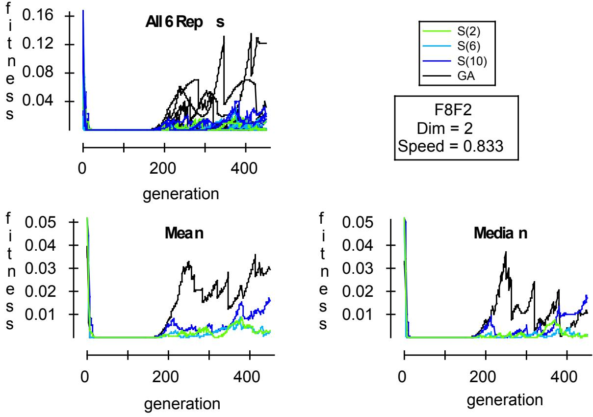  
Figure 40: The response curves across all generations of the GA and SBGA systems for $\scriptstyle { \mathrm { p g m } } = { \mathrm { F } } 8 { \mathrm { F } } 2$ , $\mathrm { d i m } = 2$ and $\mathrm { s p d } = 0 . 8 3 3$ units/gen. In the first graph, all runs were plotted separately. In the second graph, the mean of the 6 reps performed for each system was taken. In the third graph the median was taken.

To make the trends more clear, two more sample graphs were created from the original graph. In the first, all 6 repetitions of the same system are averaged together, while in the second the median of the 6 is taken. As can be seen the two statistics produce radically different results, especially for the GA. This is evidence that the data is not normally distributed (under normal distribution the mean and the median produce the same results). By averaging, we are putting more weight on the large values that occur when the population performs poorly. Thus by averaging we are measuring the worst case performance of the population, not the ‘average’ case performance. The median measure, which is the nonparametric statistic, is therefore the preferred means of summarizing the data to see the trends. The median response of all treatments is presented in the next few pages as Figure 41, $\pmb { a }$ through $\pmb { d }$ .

When looking at the graphs, please remember, without a proper statistical analysis, any differences between the various systems that can be seen in the trend lines may are may not be statistically significant. To determine which trend lines have statistically significant differences from each other, see Table 8 in Ch14 $\ S 4 . 4$ , which summarizes the results of an ANCOVA analysis on the data.

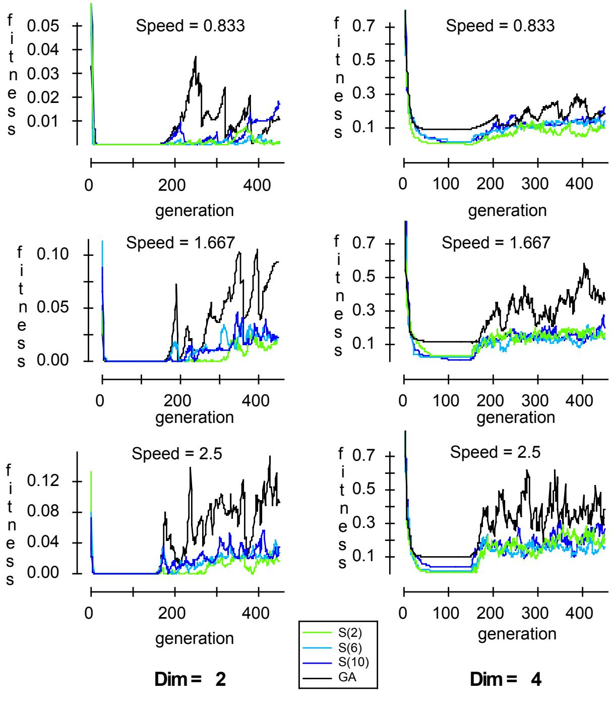  
Figure 41a: The median response of the GA and SBGA systems in an environment that uses the F8F2 function with dimensionality of both 2 and 4, for each of the three different speeds.

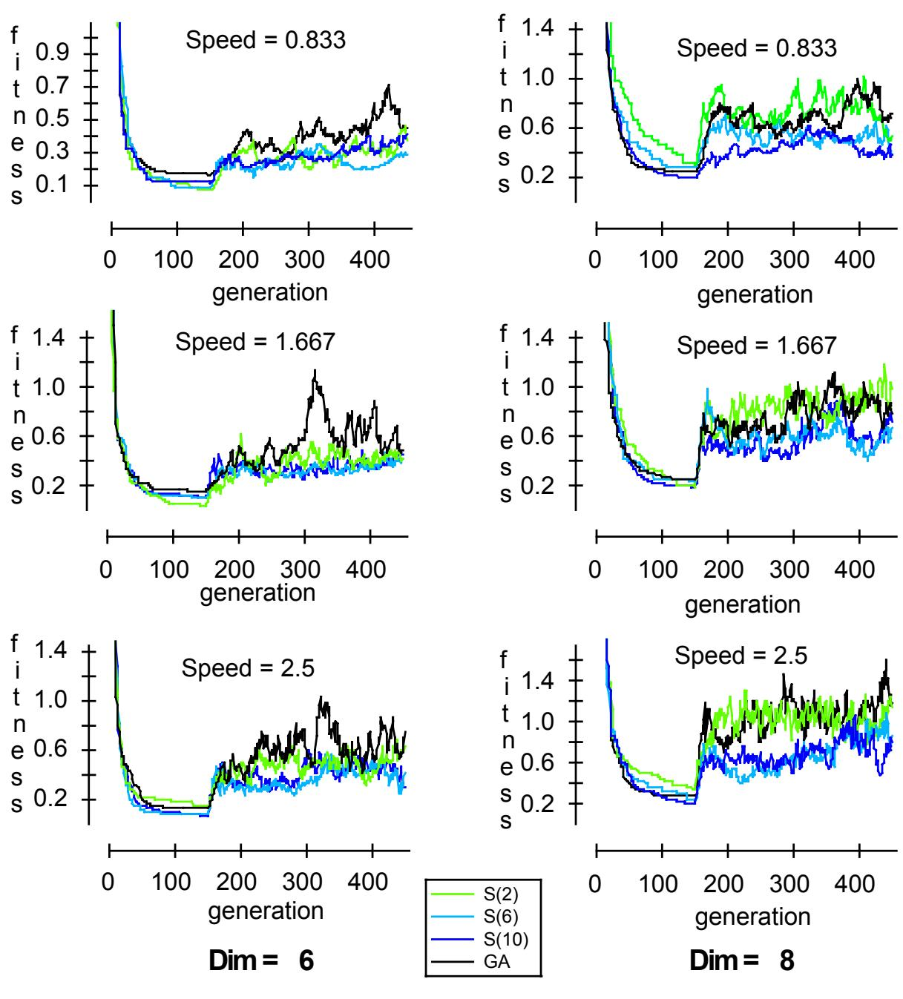  
Figure 41b: The median response of the GA and SBGA systems in an environment that uses the F8F2 function with dimensionality of both 6 and 8, for each of the three different speeds.

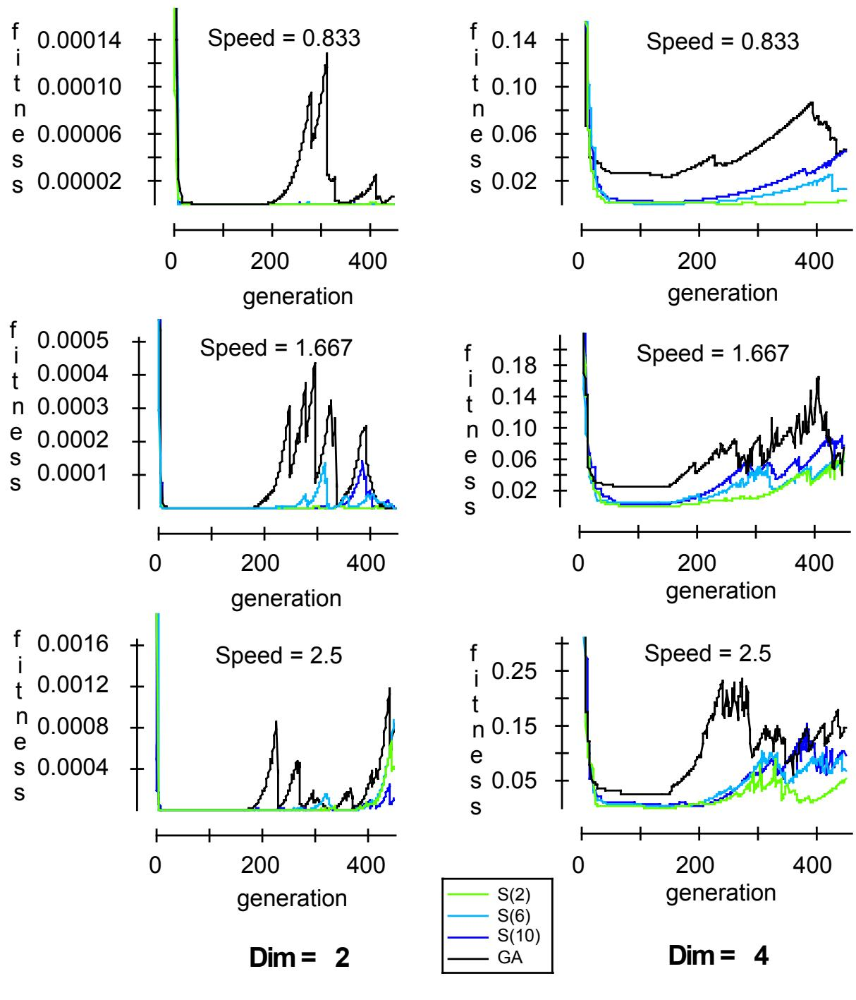  
Figure 41c: The median response of the GA and SBGA systems in an environment that uses the $\mathbf { F 8 m F } 2$ function with dimensionality of both 2 and 4, for each of the three different speeds.

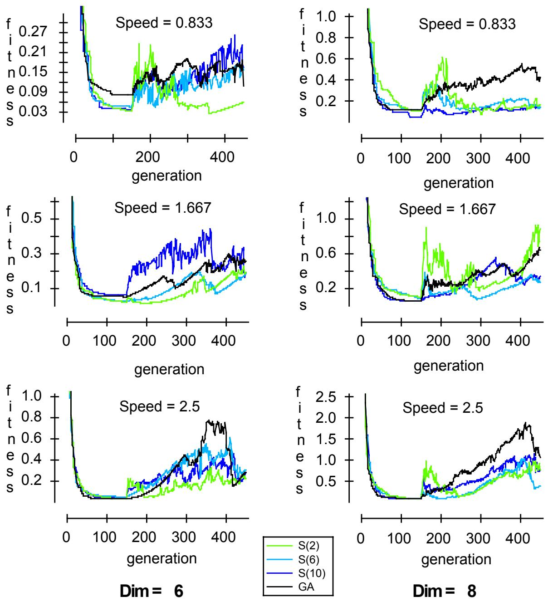  
Figure 41d: The median response of the GA and SBGA systems in an environment that uses the $\mathbf { F 8 m F } 2$ function with dimensionality of both 6 and 8, for each of the three different speeds.

# D-3 Comparisons between GA and SBGA Implementations when Testing the Ability to Track Moving Environments (Ch14 §4.4)

Confidence Levels of all Comparisons: Consolidated By Dimension, Speed and Test Function

<table><tr><td rowspan="11">2 4 Gimw</td><td rowspan="10"></td><td>Diff. in Rank</td><td></td><td>In Favor</td><td>Conf. Diff. Leve86 in Rank</td><td>In Favor</td><td>Conf. Level</td></tr><tr><td>S(2) vs. GA</td><td>208864</td><td>S(2) 100%</td><td>126857</td><td>S(2)</td><td>100%</td></tr><tr><td>S(6) vs. GA</td><td>226497 S(6)</td><td>100%</td><td>104921</td><td>S(6)</td><td>100%</td></tr><tr><td>S(10) vs. GA</td><td>129253 S(10)</td><td>100%</td><td>118560</td><td>S(10)</td><td>100%</td></tr><tr><td>S(6) vs. S(2)</td><td>17633 S(6)</td><td>0%</td><td>21936.4</td><td>S(2)</td><td>1%</td></tr><tr><td>S(10) vs. S(2)</td><td>79611 S(2)</td><td>100%</td><td>8297.85</td><td>S(2)</td><td>0%</td></tr><tr><td>S(10) vs. S(6)</td><td>97244 S(6)</td><td>100%</td><td>13638.5</td><td>S(10)</td><td>0%</td></tr><tr><td>S(2) vs. GA</td><td>469191</td><td>S(2) 100%</td><td>500772</td><td>S(2)</td><td>100%</td></tr><tr><td>S(6) vs. GA</td><td>301425</td><td>S(6) 100%</td><td>355996</td><td>S(6)</td><td>100%</td></tr><tr><td>S(10) vs. GA</td><td>221348</td><td>S(10) 100%</td><td>284264</td><td>S(10)</td><td>100%</td></tr><tr><td>S(6) vs. S(2)</td><td>167766</td><td>S(2)</td><td>100%</td><td>144776 S(2)</td><td>100%</td></tr><tr><td>S(10) vs. S(2)</td><td>247844</td><td>S(2)</td><td>100%</td><td>216508 S(2)</td><td>100%</td></tr><tr><td>S(10) vs. S(6)</td><td>80077</td><td>S(6)</td><td>100%</td><td>71731.8 S(6)</td><td>100%</td></tr><tr><td>S(02) vs. GA</td><td>247189</td><td>S(2)</td><td>100%</td><td>286838 S(2)</td><td>100%</td></tr><tr><td>S(06) vs. GA</td><td>303156</td><td>S(6)</td><td>100%</td><td>128246 S(6)</td><td>100%</td></tr><tr><td>S(10) vs. GA 6</td><td>204095</td><td>S(10)</td><td>100%</td><td>29541</td><td>GA</td><td>7%</td></tr><tr><td>S(06) vs. S(02)</td><td>55967</td><td>S(6)</td><td>99%</td><td>158592</td><td>S(2)</td><td>100%</td></tr><tr><td>S(10) vs. S(02)</td><td>43094</td><td>S(2)</td><td>75%</td><td>316379</td><td>S(2)</td><td>100%</td></tr><tr><td>S(10) vs. S(06)</td><td>99061</td><td>S(6)</td><td>100%</td><td>157788</td><td>S(6)</td><td>100%</td></tr><tr><td rowspan="6">8</td><td>S(02) vs. GA</td><td>6394</td><td>GA</td><td>0%</td><td>449121</td><td>S(2)</td><td>100%</td></tr><tr><td>S(06) vs. GA</td><td>115916</td><td>S(6)</td><td>100%</td><td>477051</td><td>S(6)</td><td>100%</td></tr><tr><td>S(10) vs. GA</td><td>203067</td><td>S(10)</td><td>100%</td><td>648196</td><td>S(10)</td><td>100%</td></tr><tr><td>S(06) vs. S(02)</td><td>122310</td><td>S(6)</td><td>100%</td><td>27929.7</td><td>S(6)</td><td>4%</td></tr><tr><td>S(10) vs. S(02)</td><td>209461</td><td>S(10)</td><td>100%</td><td>199075</td><td>S(10)</td><td>100%</td></tr><tr><td>S(10) vs. S(06)</td><td>87151</td><td>S(10)</td><td>100%</td><td>171145</td><td>S(10)</td><td>100%</td></tr><tr><td></td><td></td><td></td><td>F8F2</td><td></td><td>F8mF2</td><td></td><td></td></tr></table>

Speed $=$ 0.8333 Std. Error87 = 9273

<table><tr><td rowspan="11"></td><td></td><td></td><td>Diff.</td><td>In Favor of</td><td>Conf. Level</td><td>Diff. in Rank</td><td>In Favor of</td><td>Conf.</td></tr><tr><td rowspan="7"></td><td>S(2) vs. GA</td><td>in Rank 373067</td><td>S(2)</td><td>100%</td><td>126707</td><td>S(2)</td><td>Level 100%</td></tr><tr><td>S(6) vS. GA</td><td>229475</td><td>S(6)</td><td>100%</td><td>60614</td><td>S(6)</td><td>100%</td></tr><tr><td>S(10) vs. GA</td><td>256254</td><td>S(10)</td><td>100%</td><td>92621</td><td>S(10)</td><td>100%</td></tr><tr><td>S(6) vs. S(2)</td><td>143592</td><td>S(2)</td><td>100%</td><td>66093</td><td>S(2)</td><td>100%</td></tr><tr><td>S(10) vs. S(2)</td><td>116813</td><td>S(2)</td><td>100%</td><td>34086</td><td>S(2)</td><td>24%</td></tr><tr><td>S(10) vs. S(6)</td><td>26779</td><td>S(10)</td><td>3%</td><td>32007</td><td>S(10)</td><td>15%</td></tr><tr><td>S(2) vs. GA</td><td>410185</td><td>S(2)</td><td>100%</td><td>359817</td><td>S(2)</td><td>100%</td></tr><tr><td rowspan="7">4 Gmmw</td><td>S(6) vS. GA</td><td>476888</td><td>S(6)</td><td>100%</td><td>293377</td><td>S(6)</td><td>100%</td></tr><tr><td>S(10) vs. GA</td><td>389569</td><td>S(10)</td><td>100%</td><td>173409</td><td>S(10)</td><td>100%</td></tr><tr><td>S(6) vs. S(2)</td><td>66703</td><td>S(6)</td><td>100%</td><td>66441</td><td>S(2)</td><td>100%</td></tr><tr><td>S(10) vs. S(2)</td><td>20616</td><td></td><td>1%</td><td>186408</td><td>S(2)</td><td></td></tr><tr><td>S(10) vs. S(6)</td><td>87319</td><td>S(2) S(6)</td><td>100%</td><td>119968</td><td>S(6)</td><td>100%</td></tr><tr><td>S(02) vs. GA</td><td>152785</td><td>S(2)</td><td>100%</td><td>418661</td><td>S(2)</td><td>100%</td></tr><tr><td>S(06) vs. GA</td><td></td><td></td><td></td><td></td><td></td><td>100%</td></tr><tr><td rowspan="8">6</td><td></td><td>230883</td><td>S(6)</td><td>100%</td><td>242148</td><td>S(6)</td><td>100%</td></tr><tr><td>S(10) vs. GA</td><td>214033</td><td>S(10)</td><td>100%</td><td>208284</td><td>GA</td><td>100%</td></tr><tr><td>S(06) vs. S(02)</td><td>78099</td><td>S(6)</td><td>100%</td><td>176513</td><td>S(2)</td><td>100%</td></tr><tr><td>S(10) vs. S(02)</td><td>61248</td><td>S(10)</td><td>99.93%</td><td>626945</td><td>S(2)</td><td>100%</td></tr><tr><td>S(10) vs. S(06)</td><td>16850</td><td>S(6)</td><td>0%</td><td>450432</td><td>S(6)</td><td>100%</td></tr><tr><td>S(02) vs. GA S(06) vs. GA</td><td>32081</td><td>GA</td><td>15%</td><td>21077</td><td>GA</td><td>0%</td></tr><tr><td>S(10) vs. GA</td><td>109111 124511</td><td>S(6) S(10)</td><td>100% 100%</td><td>319220</td><td>S(6)</td><td>100%</td></tr><tr><td>S(06) vs. S(02)</td><td>141192</td><td>S(6)</td><td>100%</td><td>97778 340297</td><td>S(10) S(6)</td><td>100%</td></tr><tr><td rowspan="4"></td><td>S(10) vs. S(02)</td><td></td><td></td><td></td><td></td><td></td><td>100%</td></tr><tr><td></td><td>156592</td><td>S(10)</td><td>100%</td><td>118855</td><td>S(10)</td><td>100%</td></tr><tr><td>S(10) vs. S(06)</td><td>15400</td><td>S(10)</td><td>0%</td><td>221442</td><td>S(6)</td><td>100%</td></tr><tr><td></td><td></td><td>F8F2</td><td></td><td></td><td>F8mF2</td><td></td></tr></table>

$\mathbf { S p e e d } = \mathbf { 1 . 6 6 6 }$ Std. Error = 9273

The confidence levels that are printed in bold are below $9 5 \%$ .

the confidence level in accordance with the Sheffé test will produce a confidence interval around the difference that does not overlap 0, i.e. the difference is significant to within the given confidence level.

Speed = 2.5 Std. Error = 9273   

<table><tr><td rowspan="11">2 4 20</td><td rowspan="10"></td><td>Diff. in Rank</td><td></td><td>In Favor of</td><td>Conf. Diff. Level in Rank</td><td>In Favor of</td><td>Conf. Level</td></tr><tr><td>S(2) vs. GA</td><td>517443</td><td>S(2)</td><td>100% 111057</td><td>S(2)</td><td>100%</td></tr><tr><td>S(6) vS. GA</td><td>377730 S(6)</td><td>100%</td><td>82611</td><td>S(6)</td><td>100%</td></tr><tr><td>S(10) vs. GA</td><td>319453 S(10)</td><td>100%</td><td>97341</td><td>S(10)</td><td>100%</td></tr><tr><td>S(6) vs. S(2)</td><td>139713</td><td>S(2) 100%</td><td>28446</td><td>S(2)</td><td>5%</td></tr><tr><td>S(10) vs. S(2)</td><td>197990</td><td>S(2) 100%</td><td>13716</td><td>S(2)</td><td>0%</td></tr><tr><td>S(10) vs. S(6)</td><td>58277</td><td>S(6) 100%</td><td>14730</td><td>S(10)</td><td>0%</td></tr><tr><td>S(2) vs. GA</td><td>382022</td><td>S(2)</td><td>100% 583035</td><td>S(2)</td><td>100%</td></tr><tr><td>S(6) vS. GA</td><td>449903</td><td>S(6)</td><td>100%</td><td>405906 S(6)</td><td>100%</td></tr><tr><td>S(10) vs. GA</td><td>353101</td><td>S(10)</td><td>100% 333301</td><td>S(10)</td><td>100%</td></tr><tr><td>S(6) vs. S(2)</td><td>67882</td><td>S(6)</td><td>100%</td><td>177129</td><td>S(2) 100%</td></tr><tr><td>S(10) vs. S(2)</td><td>28921</td><td>S(2)</td><td>6%</td><td>249733</td><td>S(2) 100%</td></tr><tr><td>S(10) vs. S(6) S(02) vs. GA</td><td>96802</td><td>S(6)</td><td>100%</td><td>72604 S(6)</td><td>100%</td></tr><tr><td>S(06) vs. GA</td><td>97050</td><td>S(2)</td><td>100%</td><td>355047</td><td>S(2) 100% 1%</td></tr><tr><td></td><td>258300</td><td>S(6)</td><td>100%</td><td>25066</td><td>GA 100%</td></tr><tr><td>S(10) vs. GA 6</td><td>188680</td><td>S(10)</td><td>100%</td><td>87835</td><td>S(10)</td></tr><tr><td>S(06) vs. S(02)</td><td>161250</td><td>S(6)</td><td>100%</td><td>380113</td><td>S(2) 100%</td></tr><tr><td>S(10) vs. S(02)</td><td>91630</td><td>S(10)</td><td>100%</td><td>267212</td><td>S(2) 100%</td></tr><tr><td>S(10) vs. S(06)</td><td>69620</td><td>S(6)</td><td>100%</td><td>112901</td><td>S(10) 100%</td></tr><tr><td rowspan="5">8</td><td>S(02) vs. GA S(06) vs. GA</td><td>18143</td><td>GA</td><td>0%</td><td>264337 S(2)</td><td>100%</td></tr><tr><td></td><td>154796</td><td>S(6)</td><td>100%</td><td>400434</td><td>S(6) 100%</td></tr><tr><td>S(10) vs. GA</td><td>145153</td><td>S(10)</td><td>100%</td><td>167032 S(10)</td><td>100%</td></tr><tr><td>S(06) vs. S(02)</td><td>172939</td><td>S(6)</td><td>100%</td><td>136097</td><td>S(6) 100%</td></tr><tr><td>S(10) vs. S(02) S(10) vs. S(06)</td><td>163296 9643</td><td>S(10) S(6)</td><td>100% 0%</td><td>97305 233402</td><td>S(10) 100% S(10) 100%</td></tr><tr><td colspan="7">F8F2</td></tr></table>

The confidence levels that are printed in bold are below $9 5 \%$ .

Confidence Levels of all Comparisons: Consolidated By Dimension and Test Function   

<table><tr><td rowspan="11">2 4 Gmmw</td><td></td><td></td><td>Diff. in Rank</td><td>In Favor of</td><td>Conf. Level</td><td>Diff. . in Rank</td><td>In Favor of</td><td>Conf. Level</td></tr><tr><td></td><td>S(2) vs. GA</td><td>366458</td><td>S(2)</td><td>100%</td><td>121540</td><td>S(2)</td><td>100%</td></tr><tr><td>S(6) vS. GA</td><td>277901</td><td>S(6)</td><td>100%</td><td>82715.4</td><td>S(6)</td><td>100%</td><td></td></tr><tr><td>S(10) vs. GA</td><td>234987</td><td>S(10)</td><td>100%</td><td>102841</td><td>S(10)</td><td></td><td>100%</td></tr><tr><td>S(6) vs. S(2)</td><td>88557.6</td><td>S(2)</td><td>100%</td><td>38825</td><td>S(2)</td><td></td><td>100%</td></tr><tr><td>S(10) vs. S(2)</td><td>131472</td><td>S(2)</td><td>100%</td><td>18699.8</td><td>S(2)</td><td></td><td>80%</td></tr><tr><td>S(10) vs. S(6)</td><td>42914.1</td><td>S(6)</td><td>100%</td><td>20125.2</td><td></td><td>S(10)</td><td>88%</td></tr><tr><td>S(2) vs. GA S(6) vS. GA</td><td></td><td>420466 S(2)</td><td></td><td>100%</td><td>481208</td><td>S(2)</td><td>100%</td></tr><tr><td></td><td>409406</td><td>S(6)</td><td></td><td>100%</td><td>351760</td><td>S(6)</td><td>100%</td></tr><tr><td>S(10) vs. GA</td><td>321339</td><td>S(10)</td><td>100%</td><td></td><td>263658</td><td>S(10)</td><td>100%</td></tr><tr><td>S(6) vs. S(2)</td><td>11060.7</td><td>S(2)</td><td>11%</td><td></td><td>129448</td><td>S(2)</td><td>100%</td></tr><tr><td>S(10) vs. S(2)</td><td>99126.8</td><td>S(2)</td><td>100%</td><td></td><td>217550</td><td>S(2)</td><td>100%</td></tr><tr><td>S(10) vs. S(6)</td><td>88066.1</td><td>S(6)</td><td></td><td>100%</td><td>88101.2</td><td>S(6)</td><td>100%</td></tr><tr><td></td><td>S(02) vs. GA</td><td>165675</td><td>S(2)</td><td>100%</td><td>353516</td><td>S(2)</td><td>100%</td></tr><tr><td>S(06) vS. GA</td><td></td><td>264113</td><td>S(6)</td><td>100%</td><td>115110</td><td>S(6)</td><td>100%</td></tr><tr><td>S(10) vs. GA 6</td><td></td><td>202269</td><td>S(10)</td><td>100%</td><td>49996.5</td><td>GA</td><td>100%</td></tr><tr><td>S(06) vs. S(02)</td><td>98438.4</td><td>S(6)</td><td></td><td>100%</td><td>238406</td><td>S(2)</td><td>100%</td></tr><tr><td>S(10) vs. S(02)</td><td>36594.6</td><td>S(10)</td><td></td><td>100%</td><td>403512</td><td>S(2)</td><td>100%</td></tr><tr><td></td><td>S(10) vs. S(06)</td><td>61843.8</td><td>S(6)</td><td>100%</td><td>165106</td><td>S(6)</td><td>100%</td></tr><tr><td rowspan="5">8</td><td>S(02) vs. GA</td><td>18872.5</td><td>GA</td><td>81%</td><td>230794</td><td>S(2)</td><td>100%</td></tr><tr><td>S(06) vs. GA</td><td>126608</td><td>S(6)</td><td>100%</td><td>398901</td><td>S(6)</td><td>100%</td></tr><tr><td>S(10) vs. GA</td><td>157577</td><td>S(10)</td><td>100%</td><td>304335</td><td>S(10)</td><td>100%</td></tr><tr><td>S(06) vs. S(02)</td><td>145480</td><td>S(6)</td><td>100%</td><td>168108</td><td>S(6)</td><td>100%</td></tr><tr><td>S(10) vs. S(02)</td><td>176450</td><td>S(10)</td><td>100%</td><td>73541.6</td><td>S(10)</td><td>100%</td></tr><tr><td>S(10) vs. S(06)</td><td></td><td>30969.3</td><td>S(10)</td><td>100%</td><td>94566.1</td><td>S(6)</td><td>100%</td></tr><tr><td></td><td></td><td></td><td>F8F2</td><td></td><td></td><td>F8mF2</td><td></td></tr></table>

$$
\mathbf { S t d . \ E r r o r { = } 5 3 5 4 }
$$

The confidence levels that are printed in bold are below $9 5 \%$ .

Confidence Levels of all Comparisons: Consolidated By Speed and Test Function   
Std. Error $=$ 4637   

<table><tr><td colspan="3"></td><td>Diff. in Rank</td><td>In Favor of</td><td>Conf. Level</td><td>Diff. . in Rank</td><td>In Favor of</td><td>Conf. Level</td></tr><tr><td colspan="3"></td><td>229713</td><td>S(2)</td><td>100%</td><td>340897</td><td>S(2)</td><td>100%</td></tr><tr><td rowspan="7">paade</td><td rowspan="7">25</td><td>S(2) vS. GA S(6) vs. GA S(10) vs. GA</td><td>236749 189441</td><td>S(6) S(10)</td><td>100% 100%</td><td>266554 255370</td><td>S(6) S(10)</td><td>100% 100%</td></tr><tr><td>S(6) vs. S(2)</td><td>7036</td><td>S(6)</td><td>11%</td><td>74344</td><td>S(2)</td><td>100%</td></tr><tr><td>S(10) vs. S(2)</td><td>40272</td><td>S(2)</td><td>100%</td><td>85528</td><td></td><td></td></tr><tr><td>S(10) vs. S(6)</td><td></td><td></td><td></td><td></td><td>S(2)</td><td>100%</td></tr><tr><td></td><td>47308</td><td>S(6)</td><td>100%</td><td>11184</td><td>S(6)</td><td>56%</td></tr><tr><td>S(2) vs. GA</td><td>225989</td><td>S(2)</td><td>100%</td><td>221027</td><td>S(2)</td><td>100%</td></tr><tr><td>S(6) vs. GA</td><td>261590</td><td>S(6)</td><td>100%</td><td>228840</td><td>S(6)</td><td>100%</td></tr><tr><td rowspan="7">50</td><td>S(10) vs. GA</td><td>246092</td><td>S(10)</td><td>100%</td><td>38881</td><td>S(10)</td><td>100%</td></tr><tr><td>S(6) vs. S(2)</td><td>35600</td><td>S(6)</td><td>100%</td><td>7813</td><td>S(6)</td><td>17%</td></tr><tr><td>S(10) vs. S(2)</td><td>20103</td><td>S(10)</td><td>100%</td><td>182146</td><td>S(2)</td><td>100%</td></tr><tr><td>S(10) vs. S(6)</td><td>15498</td><td>S(6)</td><td>92%</td><td>189959</td><td>S(6)</td><td>100%</td></tr><tr><td>S(2) vs. GA</td><td>244593</td><td>S(2)</td><td>100%</td><td>328369</td><td>S(2)</td><td>100%</td></tr><tr><td>S(6) vs. GA</td><td>310182</td><td>S(6)</td><td>100%</td><td>215971</td><td>S(6)</td><td>100%</td></tr><tr><td>S(10) vs. GA</td><td>251597</td><td>S(10)</td><td>100%</td><td>171378</td><td>S(10)</td><td>100%</td></tr><tr><td rowspan="4">75</td><td>S(6) vs. S(2)</td><td></td><td></td><td></td><td></td><td></td><td></td></tr><tr><td></td><td>65589</td><td>S(6)</td><td>100%</td><td>112398</td><td>S(2)</td><td>100%</td></tr><tr><td>S(10) vs. S(2) S(10) vs. S(6)</td><td>7004</td><td>S(10)</td><td>11%</td><td>156991 44594</td><td>S(2)</td><td>100%</td></tr><tr><td></td><td>58586</td><td>S(6) F8F2</td><td>100%</td><td></td><td>S(6) F8mF2</td><td>100%</td></tr></table>

Confidence Levels of all Comparisons: Consolidated By Test Function Only   

<table><tr><td></td><td>Diff. in Rank</td><td>In Favor of</td><td>Conf. Level</td><td>Diff. in Rank</td><td>In Favor of</td><td>Conf. Level</td></tr><tr><td>S(2) vs. GA</td><td>233432</td><td>S(2)</td><td>100%</td><td>296764</td><td>S(2)</td><td>100%</td></tr><tr><td>S(6) vs. GA</td><td>269507</td><td>S(6)</td><td>100%</td><td>237121</td><td>S(6)</td><td>100%</td></tr><tr><td>S(10) vS. GA</td><td>229043</td><td>S(10)</td><td>100%</td><td>155209</td><td>S(10)</td><td>100%</td></tr><tr><td>S(6) vs. S(2)</td><td>36075</td><td>S(6)</td><td>100%</td><td>59643</td><td>S(2)</td><td>100%</td></tr><tr><td>S(10) vs. S(2)</td><td>4389</td><td>S(2)</td><td>56%</td><td>141555</td><td>S(2)</td><td>100%</td></tr><tr><td>S(10) vs. S(6)</td><td>40464</td><td>S(6)</td><td>100%</td><td>81912</td><td>S(6)</td><td>100%</td></tr><tr><td></td><td colspan="4">F8F2</td><td>F8mF2</td><td></td></tr></table>

The confidence levels that are printed in bold are below $9 5 \%$ .

# Список литературы

Angeline, P. J. (1997). Tracking Extrema in Dynamic Environments. Evolutionary Programming VI (EP97). P. J. Angeline, R. G. Reynolds, J. R. McDonnell and R. Eberhart. Berlin, Springer: 335-345.   
Bäck, T. (1993). Optimal Mutation Rates in Genetic Search. Proceedings of the Fifth International Conference on Genetic Algorithms (ICGA5). S. Forrest. San Mateo, CA, Morgan Kaufmann: 2-8.   
Baker, J. E. (1985). Adaptive Selection Methods for Genetic Agorithms. Proceedings of the First International Conference on Genitic Algorithms and Their Applications. J. J. Grefenstette. Hillsdale, New Jersey, Lawrence Erlbaum Associates.   
Branke, J. (1999). Memory Enhanced Evolutionary Algorithms for Changing Optimization Problems. Proceedings of the 1999 Congress on Evolutionary Computation (CEC99). P. J. Angeline. Piscataway, NJ, IEEE Press: 1875-1882.   
Cobb, H. G. and J. J. Grefenstette (1993). Genetic Algorithms for Tracking Changing Environments. Proceedings of the Fifth International Conference on Genetic Algorithms (ICGA5). S. Forrest. San Mateo, CA, Morgan Kaufmann: 523-530.   
Coello Coello, C. A. (1999). An Updated Survey of Evolutionary Multiobjective Optimization Techniques: State of the Art and Future Trends. Proceedings of the 1999

References

Congress on Evolutionary Computation (CEC99). P. J. Angeline. Piscataway, NJ, IEEE Service Center. 1: 3-9.

Cohoon, J., U. Hegde, et al. (1987). Selection in Massively Parallel Genetic Algorithms. Genetic Algorithms and their Applications : Proceedings of the Second International Conference on Genetic Algorithms (ICGA2). J. J. Grefenstette. Hillsdale, N.J., Lawrence Erlbaum Assoc. Inc.: 148-154.

Cohoon, J. P., W. N. Martin, et al. (1991). A Multi-Population Genetic Algorithm for Solving the K-Partitiion Problem. Proceedings of the Fourth International Converence on Genetic Algorithms (ICGA4). R. K. Belew and L. B. Booker. San Mateo, CA, Morgan Kaufmann: 244-248.

Collins, J. J. and C. Ryan (1999). Non-stationary Function Optimization using Polygenic Inheritance. GECCO-99: Proceedings of the Genetic and Evolutionary Computation Conference. W. Banzhaf, J. Daida, A. E. Eibenet al. San Francisco, CA., Morgan Kaufmann: 781.

Collins, R. J. and D. R. Jefferson (1991). Ant-Farm: Towards simulated evolution. Artificial Life II. C. G. Langton, C. Taylor, J. D. Farmer and S. Rasmussen. Reading, MA, Addison-Wesley.

Collins, R. J. and D. R. Jefferson (1991). Selection in Massively Parallel Genetic Algorithms. Proceedings of the Fourth International Conference on Genetic Algorithms (ICGA4). B. R. K. and B. L. B. San Mateo, CA, Morgan Kaufmann: 249- 256.

Cormen, T. H., C. E. Leiserson, et al. (1990). Introduction to Algorithms. Cambridge, MA, The MIT Press.

Cover, T. M. and J. A. Thomas (1991). Elements of Information Theory. New York, NY, John Wiley & Sons, Inc.

Cvetkovic, D., I. Parmee, et al. (1998). Optimisation and Prliminary Airframe Design. The Integration of Evolutionary and Adaptive Computing Technologies with Product/system Design and Realisation. I. Parmee. Plymouth, UK, Springer-Verlag: 255-267.

Davidor, Y. (1991). A Naturally Occurring Niche & Species Phenomenon: The Model and First Results. Proceedings of the Fourth International Conference on Genetic Algorithms (ICGA4). B. R. K. and B. L. B. San Mateo, CA, Morgan Kaufmann: 257- 263.

Davis, L. (1991). Handbook of genetic algorithms. New York, Van Nostrand Reinhold.

# Список литературы

De Jong, K. A. (1975). Analysis of the behavior of a class of genetic adaptive systems. Ann Arbor, Dept. of Computer and Communication Sciences University of Michigan: x, 256.

De Jong, K. A. (1993). Genetic Algorithms Are NOT Function Optimizers. Foundations of Genetic Algorithms 2. L. D. Whitley. San Mateo, CA, Morgan Kaufmann: 5-17.

Derrida, B. (1980). “Random energy model: Limit of a family of disordered models.” Phys. Rev. Lett. 45: 79-82.

Duran, B. S. and P. L. Odell (1974). Cluster Analysis: A Survey. Berlin, Springer-Verlag.

Eschelman, L. J. and J. D. Schaffer (1991). Preventing Premature Convergence in Genetic Algorithms by Preventing Incest. Proceedings of the Fourth International Conference on Genetic Algorithms (ICGA4). B. R. K. and B. L. B. San Mateo, CA, Morgan Kaufmann: 115-122.

Eshelman, L. J. (1991). The CHC Adaptive Search Algorithm: How to Have Safe Search When Engaging in Nontraditional Genetic Recombination. Foundations of Genetic Algorithms. G. J. E. Rawlins. San Mateo, CA, Morgan Kaufmann: 265-283.

Fisher, R. A. (1930). The Genetical Theory of Natural Selection. Oxford, Clarendon.

Futuyma, D. J. (1986). Evolutionary Biology. Sunderland, MA, Sinauer.

Gilmour, J. S. L. and J. W. Gregor (1939). “Demes: a Suggested New Terminology.” Nature 144: 333.

Goldberg, D. E. (1989). Genetic algorithms in search, optimization, and machine learning. Reading, Mass., Addison-Wesley Pub. Co.

Goldberg, D. E. and J. Richardson (1987). Genetic algorithms with sharing for multimodal function optimization. Genetic Algorithms and their Applications : Proceedings of the Second International Conference on Genetic Algorithms (ICGA2). J. J. Grefenstette. Hillsdale, N.J., Lawrence Erlbaum Assoc. Inc.: 41-49.

Goldberg, D. E. and R. E. Smith (1987). Nonstationary function optimization using genetic algorithms with dominace and diploidy. Genetic Algorithms and their Applications : Proceedings of the Second International Conference on Genetic Algorithms (ICGA2). J. J. Grefenstette. Hillsdale, N.J., Lawrence Erlbaum Assoc. Inc.: 59-68.

Gorges-Schleuter, M. (1989). ASPARAGOS An Asynchronous Parallel Genetic Optimization Strategy. Proceedings of the Third International Conference on Genetic Algorithms (ICGA3). J. D. Schaffer. San Mateo, CA, Morgan Kaufmann: 422-427.

References

Greenwood, P. J., P. H. Harvey, et al. (1978). “Inbreeding and dispersal in the great tit.” Nature 271(5): 52-54.

Grefenstette, J. J. (1999). Evolvability in Dynamic Fitness Landscapes: A Genetic Algorithm Approach. Proceedings of the 1999 Congress on Evolutionary Computation (CEC99). P. J. Angeline. Piscataway, NJ, IEEE Press: 2031-2038.

Hadad, B. S. and C. F. Eick (1997). Supporting Polyploidy in Genetic Algorithms Using Dominance Vectors. Evolutionary Programming VI (EP97). P. J. Angeline, R. G. Reynolds, J. R. McDonnell and R. Eberhart. Berlin, Springer: 223-234.

Handa, H., O. Katai, et al. (1999). Coeveolutionary Genetic Algorithms for Solving Dynamic Contraint satisfaction Problems. Proceedings of the Genetic and Evolutionary Computation Conference (GECCO'99). W. Banzhaf, J. Daida, A. E. Eibenet al. San Fransisco, CA, Morgan Kaufmann: 252-257.

Hartl, D. L. and A. G. Clark (1997). Principles of Population Genetics. Sunderland, MA, Sinauer.

Hillis, W. D. (1991). Co-Evolving Parasites Improve Simulated Evolution as an Optimization Procedure. Emergent Computation: Self-Organizing, Collective, and Cooperative Phenomena in Natural and Artificial Computing Networks. S. Forrest. Cambridge MA, MIT Press: 228-234.

Holland, J. H. (1975). Adaptation in Natural and Artificial Systems : An Introductory Analysis with Applications to Biology, Control, and Artificial Intelligence. Ann Arbor, University of Michigan Press.

Holland, J. H. (1995). Hidden Order. Reading, MA, Addison-Wesley.

Holland, J. H. (1998). Emergence: From Chaos to Order. Reading, MA, Perseus Books.

Hollander, M. and D. A. Wolfe (1973). Nonparametric Statistical Methods. New York, John Wiley & Sons.

Jelasity, M., B. Tóth, et al. (1999). Characterizations of Trajectory Structure of Fitness Landscapes Based on Pairwise Transition Probabilities of Solutions. Proceedings of the 1999 Congress on Evolutionary Computation (CEC99). P. J. Angeline. Piscataway, NJ, IEEE Press: 623-630.

Jones, T. (1995). Evolutionary Algorithms, Fitness Landscapes and Search. Computer Science. Albuquerque, New Mexico, The University of New Mexico: pp. xxv, pp. 224.

Kimura, M. (1955). “Solution of a process of random genetic drift with a continuous model.” Natl. Acad. Sci. USA 41: 144-150.

# Список литературы

Kimura, M. (1983). The Neutral Theory of Molecular Evolution. Cambridge, Cambridge University Press.

Kimura, M. and T. Ohta (1969). “The average number of generations until fixation of a mutant gene in a finite population.” J. Genet. 61: 763-771.

Li, W.-H. (1997). Molecular Evolution. Sunderland Massachusetts, Sinauer Associates.

Liles, W. and K. De Jong (1999). The Usefulness of Tag Bits in Changing Environments. Proceedings of the 1999 Congress on Evolutionary Computation (CEC99). P. J. Angeline. Piscataway, NJ, IEEE Press: 2054-2060.

Lipschutz, S. (1965). Schaum's Outline of Theory and Problems of General Topology. New York, NY, McGraw-Hill, Inc.

Louis, S. J. and G. J. E. Rawlins (1993). Syntactic Analysis of Convergence in Genetic Algorithms. Foundations of Genetic Algorithms 2. L. D. Whitley. San Mateo, California, Morgan Kaufmann: 141-151.

Manderick, B. and P. Spiessens (1989). Fine-Grained Parallel Genetic Algorithms. Proceedings of the Third International Conference on Genetic Algorithms (ICGA3). J. D. Schaffer. San Mateo, CA, Morgan Kaufmann: 428-433.

Maresky, J., Y. Davidor, et al. (1995). Selectively Destructive Re-start. Proceedings of the Sixth International Conference on Genetic Algorithms (ICGA6). L. J. Eshelman. San Fransisco, CA, Morgan Kaufmann: 144-150.

Mori, N., S. Imanishi, et al. (1997). Adaptation to Changing Environments by Means of the Memory Based Thermodynamical Genetic Algorithm. Proceedings of the Seventh International Conference, on Genetic Algorithms. T. Bäck. San Francisco, CA, Morgan Kaufmann: 299-306.

Mühlenbein, H. (1989). Parallel Genetic Algorithms, Population Genetics and Combinatorial Optimization. Proceedings of the Third International Conference on Genetic Algorithms (ICGA3). J. D. Schaffer. San Mateo, CA, Morgan Kaufmann: 416- 421.

Nei, M. and W.-H. Li (1979). “Mathematical model for studying genetic variation in terms of restriction endonucleases.” Proc. Natl. Acad. Sci. USA 76: 5269-5273.

Neter, J., M. H. Kutner, et al. (1996). Applied Linear Statistical Models. Chicago, McGraw-Hill.

Ng, K. P. and K. C. Wong (1995). A New Diploid Scheme and Dominance Change Mechanism for Non-Stationary Function Optimization. Proceedings of the Sixth

References

International Conference on Genetic Algorithms. L. J. Eshelman. San Francisco, CA, Morgan Kaufmann: 151-158.

Pál, K. F. (1994). Selection Schemes with Spatial Isolation for Genetic Optimization. Parallel Problem Solving from Nature - PPSN III. Y. Davidor, H.-P. Schwefel and R. Männer. Berlin, Springer-Verlag: 170-179.

Pettey, C. B., M. R. Leuze, et al. (1987). A parallel genetic algorithm. Genetic Algorithms and their Applications: Proceedings of the Second International Conference on Genetic Algorithms. J. J. Grefenstette. Hillsdale, NJ, Lawrence Erlbaum Associates: 155-161.

Pielou, E. C. (1975). Ecological Diversity. New York, John Wiley & Sons.

Potts, W. K., C. J. Manning, et al. (1991). “Mating patterns in seminatural populations of mice influenced by MHC genotype.” Nature 352(15): 619-621.

Provine, W. B. (1986). Sewall Wright and Evolutionary Biology. Chicago, IL, The University of Chicago Press.

Provine, W. B. E. (1986). Sewall Wright Evolution; Selected Papers. Chicago, IL, University of Chicago Press.

Quinlan, J. R. (1993). C4.5: Programs for Machine Learning. San Francisco, California, Morgan Kaufmann.

Ramsey, C. L. and J. J. Grefenstette (1993). Case-Based Initialization of Genetic Algorithms. Proceedings of the Fifth international Conference on Genetic Algorithms. S. Forrest. San Mateo, CA, Morgan Kaufmann: 84-91.

Sarma, J. and K. De Jong (1997). An Analysis of Local Selection Algorithms in a Spatially Structured Evolutionary Algorithm. Proceedings of the Seventh International Conference on Genetic Algorithms (ICGA7). T. Bäck. San Francisco, CA, Morgan Kaufmann: xiv,808.

Sarma, J. and K. De Jong (1999). The Behavior of Spatially Distributed Evolutionary Algorithms in Non-Stationary Environments. Proceedings of the Genetic and Evolutionary Computation Conference (GECCO'99). W. Banzhaf, J. Daida, A. E. Eibenet al. San Fransisco, CA, Morgan Kaufmann: 572-578.

Schaffer, J. D. (1985). Multiple objective optimization with vector evalued genetic algorithms. Genetic Algorithms and their Applications: Proceedings of the First International Confrence on Genetic Algorithms. J. J. Grefenstette. Hillsdale, N.J., Lawrene Erlbaum Associates: 93-100.

References

Sherrington, D. and S. Kirkpatrick (1975). “Solvable model of a spin-glass.” Physical Review Letters 35(26): 1792-1795.

Spiessens, P. and B. Manderick (1991). A Massively Parallel Genetic Algorithm. Proceedings of the Fourth International Conference on Genetic Algorithms (ICGA4). B. R. K. and B. L. B. San Mateo, CA, Morgan Kaufmann: 279-286.

Stadler, P. F. (1995). Towards a Theory of Landscapes. Santa Fe, NM, The Santa Fe Institute: 77.

Stanhope, S. A. and J. M. Daida (1998). Optimal Mutation and Crossover Rates for a Genetic Algorithm Operating in a Dynamic Environment. Evolutionary Programming VII. V. W. Porto, N. Saravanan, D. Waagen and A. E. Eiben. Berlin, Springer: 693- 702.

Stanhope, S. A. and J. M. Daida (1999). $( 1 + 1 )$ Genetic Algorithm Fitness Dynamics in a Changing Environment. Proceedings of the 1999 Congress on Evolutionary Computation (CEC99). P. J. Angeline. Piscataway, NJ, IEEE Press: 1851-1858.

Sumida, B. H. and W. D. Hamilton (1994). Both Wrightian and ‘Parasite’ Peak Shifts Enhance Genetic Algorithm Performance in the Traveling Salesman Problem. Computing With Biological Metaphors. R. Paton. London, Chapman & Hall: 264-279.

Tanese, R. (1987). Parallel Genetic Algorithms for a Hypercube. Genetic Algorithms and their Applications: Proceedings of the Second International Conference on Genetic Algorithms. J. J. Grefenstette. Hillsdale, NJ, Lawrence Erlbaum Associates: 177-183.

Theodoridis, S. and K. Koutroumbas (1999). Pattern Recognition. San Diego, Academic Press.

Trojanowski, K. and Z. Michalewicz (1999). Searching for Optima in Non-stationary Environments. Proceedings of the 1999 Congress on Evolutionary Computation (CEC99). P. J. Angeline. Piscataway, NJ, IEEE Press: 1843-1850.

Tucker, A. and X. Liu (1999). Extending Evolutionary Programming methods to the Learning of Dynamic Bayesian Networks. GECCO-99: Proceedings of the Genetic and Evolutionary Computation Conference. W. Banzhaf, J. Daida, A. E. Eibenet al. San Francisco, CA., Morgan Kaufmann: 923-929.

Velleman, P. F. (1997). DataDesk version 6, Statistics Guide: Learning and using Statistics Procedures. Ithaca, NY, Data Description inc.

Whitley, D. (1989). The GENITOR Algorithm and Selection Pressure: Why Rank-Based Allocation of Reproductive Trials is Best. Proceedings of the Third International Conference on Genetic Algorithms (ICGA3). J. D. Schaffer. San Mateo, CA, Morgan Kaufmann: 116-121.

# Список литературы

Whitley, D., K. Mathias, et al. (1991). Delta Coding: An Iterative Search Strategy for Genetic Algorithms. Proceedings of the Fourth International Conference on Genetic Algorithms (ICGA4). B. R. K. and B. L. B. San Mateo, CA, Morgan Kaufmann: 77- 84.   
Whitley, D., K. Mathias, et al. (1996). “Evaluating Evolutionary Algorithms.” Artificial Intelligence 85: 245-276.   
Whitley, L. D. and T. Starkweather (1990). “Genitor II: A distributed genetic algorithm.” Journal of Experimental and Theoretical Artificial Intelligence 2: 189-214.   
Wineberg, M. and F. Oppacher (1996). The Benefits of Computing with Introns. Genetic Programming 1996: Proceedings of the First Annual Conference, Stanford University, Palo Alto, CA, MIT Press.   
Wright, S. (1931). “Evolution in Mendelian populations.” Genetics 16: 97-159.   
Wright, S. (1932). “The roles of mutation, inbreeding, crossbreeding and selection in evolution.” Proceeding of the Sixth Internation Congress of Genetics 1: 356-366.   
Wright, S. (1964). Stochastic Processes in Evolution. Stochastic Models in Medicine an Biology. J. Gurland, University of Wisconsin Press: 199-241.   
Wright, S. (1982). “Character Change, Speciation, and the Higher Taxa.” Evolution 36(3): 427-443.   
Zhou, H. H. and J. J. Grefenstette (1989). Learning by Analogy in Genetic Classifier Systems. Proceedings of the Third International Conference on Genetic Algorithms (ICGA3). J. D. Schaffer. San Mateo, CA, Morgan Kaufmann: 291-297.