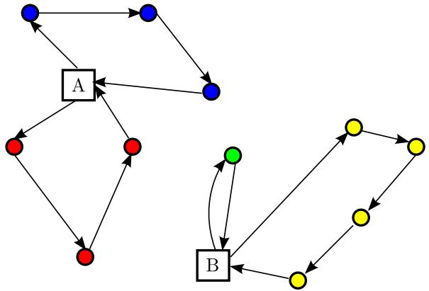
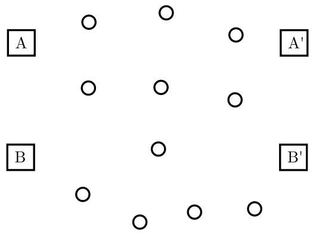
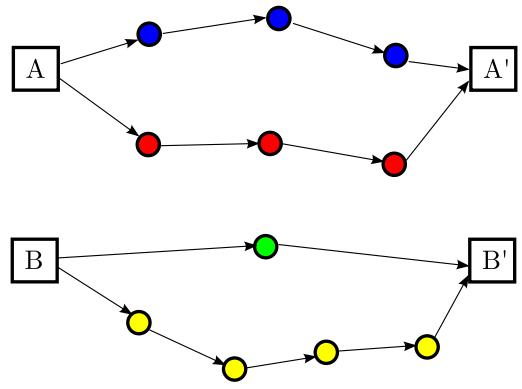
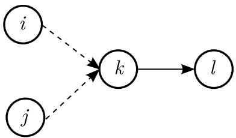

# Formulations and Benders Decomposition Algorithms for Multidepot Salesmen Problems with Load Balancing

# Tolga Bekta¸s

School of Management and Centre for Operational Research, Management Science and Information Systems (CORMSIS) University of Southampton

Routing problems and the multiple traveling salesman

Formal problem description and notation

Formulations

Computational results - Part I

Application of Benders decomposition

Computational results - Part II

Future research

Routing problems and the multiple traveling salesman Formal problem description and notation Formulations Computational results - Part I Application of Benders decomposition Computational results - Part II Future research

• Traveling Salesman Problem (Lawler et al., 1985; Laporte, 1992 Gutin and Punnen, 2002)   
• Vehicle Routing Problem (Toth and Vigo, 2002; Golden et al., 2008) Somewhere in between:   
Multiple Traveling Salesman Problem   
Applications include planning of print scheduling, workforce, transportation, mission, production, etc. (Bekta¸s, 2008)

Routing problems and the multiple traveling salesman Formal problem description and notation Formulations Computational results - Part I Application of Benders decomposition Computational results - Part II Future research • Basic variant with a single depot and no additional restrictions can be transformed into the TSP.

• Multiple depots (Multidepots):

Nonfixed destination: no need to return to ‘home’ depot (GuoXing, 1995; Kara and Bekta¸s, 2006)   
Fixed destination: must return to ‘home’ depot (Laporte et al., 1988; Oberlin et al., 2009)   
Problems where capacity limitations on the amount of goods carried are not so relevant   
It is desirable to produce routes where each salesman is assigned approximately the same number of customers   
0 Applications found in postal distribution, Less-than-Truckload transport operations, traveling repairmen problem   
• One particular case due to Gro¨er et al. (2009) for a ‘balanced billing cycle vehicle routing problem’ in meter-reading for utility companies

  
Figure: An example fixed destination mTSP solution

# Fixed-destination multidepot salesmen problem with load-balancing

We focus on the fixed-destination multidepot salesmen problem with load-balancing   
Existing formulations due to Gavish and Graves (1978), Kulkarni and Bhave (1985), Kara and Bekta¸s (2006)   
• These formulations are based on $\mathcal { O } ( n ^ { 3 } )$ binary variables, where $n$ is the number of nodes in the corresponding graph on which the problem is defined.   
Our aim is to develop alternative formulations which are suitable for application of decomposition-based exact solution techniques   
A directed graph $G = ( V , A )$ with $V$ as the set of nodes and $A$ is the set of arcs.   
The node set is partitioned as $V = D \cup C$ where $D$ is the set of depots and $C$ is the set of customers.   
There exist $m _ { d }$ salesmen at each depot $d \in D$ , from which they all depart and return back to.   
$c _ { i j }$ is the travel cost of traversing $( i , j ) \in A$ (assume an asymmetric cost matrix).   
We assume all salesmen available at each depot must be used in the routing.   
• The number of cities each salesman is to visit is restricted by an interval $\lfloor K , L \rfloor$ , $2 \leq K \leq L \in \mathbb { Z } _ { + }$ ,

The problem is to find tours for each salesman based at each depot such that all salesmen depart from and return to their home depot, each customer is visited exactly once by any of the salesmen and all routes include at least $K$ and at most $L$ customers, such that that the total cost of travel is minimized.

<table><tr><td>Routing problems and the multiple traveling salesman Formal problem description and notation Formulations Computational results - Part I Application of Benders decomposition Computational results - Part II Future research</td><td></td></tr></table>

# Multicommodity flow formulations on an augmented graph

An augmented graph $G ^ { \prime } = ( V ^ { \prime } , A ^ { \prime } )$ . $V ^ { \prime } = V \cup R$ is the new node set where $R$ includes exactly one replica $r _ { d }$ of each node $d \in D$ such that $c _ { j r _ { d } } = c _ { j d }$ for all $j \in C$ and $r _ { d } \in R$ .   
• We define a set of commodities $Q = \{ q _ { 1 } , q _ { 2 } , . . . , q _ { | D | } \}$ where $m _ { d }$ units of commodity $q _ { d }$ originates from depot $d \in D$ and is destined to the copy $r _ { d }$ of the same depot.   
• The arc set $A ^ { \prime }$ consists of all $( i , j )$ such that either $i \in D , j \in C$ , or $i \in C , j \in R$ , or $i , j \in C$ , $i \neq j$ .

Find a set of flows on graph $G ^ { \prime } = ( D \cup C \cup R , A ^ { \prime } )$ such that $m _ { d }$ units of each commodity $q _ { d } \in Q$ are transported from $d$ to $r _ { d }$ and each node $i \in C$ is visited exactly once by using arcs $( i , j ) \in A ^ { \prime }$ that will result in the least possible travel cost.

The problem just described is a multicommodity network design problem with zero flow costs (and unit link capacities) and special cardinality constraints on each node.

  
Figure: Sample fixed destination mTSP instance on the augmented graph

  
Figure: Sample fixed destination mTSP solution on the augmented graph

Decision variables:

Let $y _ { i j } = 1$ if arc $( i , j ) \in A ^ { \prime }$ is used in the solution, and 0 otherwise.   
Let $x _ { i j } ^ { q _ { d } }$ denote the amount of flow of commodity $q _ { d }$ on arc $( i , j )$ .   
to its destination Note that since a commodity $R$ , variables $q _ { d }$ $x _ { i j } ^ { q d }$ can only travel from its origin are only defined for $q _ { d } = i$ b $d$ when $i \in \mathcal { D }$ and $q _ { d } = j ^ { \prime }$ when $j ^ { \prime } \in R$ .

Routing problems and the multiple traveling salesman Formal problem description and notation Formulations Computational results - Part I Application of Benders decomposition Computational results - Part II Future research

$$
( { \mathcal { F } } ) \qquad { \mathrm { m i n i m i z e } } \qquad \sum _ { ( i , j ) \in A ^ { \prime } } c _ { i j } y _ { i j }
$$

subject to

$$
\begin{array} { r l r } { \displaystyle \sum _ { j \in C \cup D } x _ { i j } ^ { q _ { d } } - \displaystyle \sum _ { j \in C \cup D } x _ { j j } ^ { q _ { d } } = \left\{ \begin{array} { l l } { m _ { d } } \\ { - m } \\ { 0 , } \\ { 0 , } \end{array} \right. } & { } & \\ { \displaystyle \sum _ { j \in W \cup S } y _ { i j } ^ { q _ { d } } \geq y _ { i j } } & { } & \\ { \displaystyle \sum _ { j \in W \cup S } y _ { i j } } & { = 1 } & \\ { \displaystyle \sum _ { j \in D \cup S } y _ { j i } } & { = 1 } & \\ { \displaystyle \sum _ { j \in D \cup S } y _ { i j } } & { = m _ { i } } & \\ { \displaystyle \sum _ { j \in C } y _ { i j } } & { = m _ { i } } & \\ { \displaystyle \sum _ { j \in S } y _ { j i } } & { = m _ { i } } & \end{array}
$$

Subtour/Bounding

$$
\begin{array} { r l } & { v _ { i } \in V ^ { \prime } , q _ { d } \in Q } \\ & { v ( i , j ) \in A ^ { \prime } , q _ { d } \in Q } \\ & { v _ { i } \in C } \\ & { v _ { i } \in C } \\ & { v _ { i } \in C } \\ & { v _ { i } \in D } \\ & { v _ { i } \in D } \\ & { v _ { i } \in R } \end{array}
$$

There are a number of choices for subtour/bounding constraints. One is through Miller-Tucker-Zemlin (1960) (MTZ) constraints using additional continous variables $u _ { i }$ denoting the position of node $i$ in a tour.

$$
\begin{array} { r l r } { - \relax { u } _ { j } + L y _ { i j } + ( L - 2 ) y _ { j i } \le L - 1 } & { } & { \forall i \in \mathfrak { C } } \\ { ( L - 2 ) \displaystyle \sum _ { k \in D } y _ { k i } - \sum _ { k \in R } y _ { i k } \le L - 1 } & { } & { \forall i \in \mathfrak { C } } \\ { \sum _ { k \in D } y _ { k i } + ( 2 - K ) \displaystyle \sum _ { k \in R } y _ { i k } \ge 2 } & { } & { \forall i \in \mathfrak { C } } \end{array}
$$

We will call this formulation $F _ { u }$ .

An alternative way is through the use of variables $f _ { i j }$ modelling the flow of a commodity on a given link $( i , j )$ :

$$
\sum _ { j \in C \cup R } f _ { i j } - \sum _ { j \in C \cup D } f _ { j i } = 1 \qquad \forall i \in C
$$

$$
\begin{array} { l l } { f _ { i j } \leq L y _ { i j } } & { \forall ( i , j ) \in A ^ { \prime } } \\ { f _ { i j } \geq K y _ { i j } } & { \forall i \in C , j \in R } \\ { f _ { i j } = 0 } & { \forall i \in D , j \in C } \\ { f _ { i j } \geq 0 , } & { \forall ( i , j ) \in A ^ { \prime } . } \end{array}
$$

We will call this formulation $F _ { f }$ .

Routing problems and the multiple traveling salesman Formal problem description and notation Formulations Computational results - Part I Application of Benders decomposition Computational results - Part II Future research

The first set is through lifting (a part) of constraints (12), in the spirit of Orman and Williams (2004) as shown below:

$$
\begin{array} { r l r l } & { f _ { i j } \leq L y _ { i j } } & & { \forall i \in C , j \in R } \\ & { f _ { i j } \leq ( L - 1 ) y _ { i j } } & & { \forall i \in D \cup C , j \in C , i \neq } \end{array}
$$

We will call this formulation $F _ { w }$ .

Routing problems and the multiple traveling salesman Formal problem description and notation Formulations Computational results - Part I Application of Benders decomposition Computational results - Part II Future research

Inequalities

$$
) ( y _ { i j } + y _ { j r } - 1 ) \qquad \forall i \in D \cup C , j \in C , r \in
$$

are valid for the FMSPB.

We will call this formulation $F _ { f }$ .

Routing problems and the multiple traveling salesman Formal problem description and notation Formulations Computational results - Part I Application of Benders decomposition Computational results - Part II Future research

# Proposition

Formulations $F _ { u } ^ { L }$ and $F _ { f } ^ { L }$ are incomparable.

# Proposition

$$
v ( F _ { s } ^ { L } ) \ge v ( F _ { w } ^ { L } ) \ge v ( F _ { f } ^ { L } ) .
$$

Figure: A fractional solution violating constraints (18)

We numerically compare four formulations:

. $F _ { u }$ : based on MTZ constraints $F _ { w }$ : based on partially lifted flow constraints   
$F _ { s }$ : based on strengthened flow constraints The above three formulations have $\scriptstyle { \mathcal { O } } ( n ^ { 2 } )$ binary variables   
0 $F _ { k b }$ : proposed by Kara and Bekta¸s (2006) for the problem including $\mathcal { O } ( n ^ { 3 } )$ binary variables

Experimental set-up:

Instance generation is based on the TSPLIB (1997) where the first $m$ nodes are labeled as depots   
Each depot has two salesmen   
Formulations solved with CPLEX version 12.1 in its default settings

Table: Summary of the instances used for comparisons   

<table><tr><td>Number</td><td>Generating TSP-Instance</td><td>|V|</td><td>|D|</td><td>L</td><td>K</td></tr><tr><td>1</td><td>ftv33.tsp</td><td>34</td><td>2</td><td>8</td><td>5</td></tr><tr><td>2</td><td>ftv35.tsp</td><td>36</td><td>2</td><td>10</td><td>5</td></tr><tr><td>3</td><td>ftv38.tsp</td><td>39</td><td>2</td><td>10</td><td>5</td></tr><tr><td>4</td><td>p43.tsp</td><td>43</td><td>2</td><td>15</td><td>5</td></tr><tr><td>5</td><td>ftv44.tsp</td><td>45</td><td>2</td><td>15</td><td>5</td></tr><tr><td>6</td><td>ftv47.tsp</td><td>48</td><td>2</td><td>20</td><td>5</td></tr><tr><td>7</td><td>ry48p.tsp</td><td>48</td><td>2</td><td>15</td><td>5</td></tr><tr><td>8</td><td>ft53.tsp</td><td>53</td><td>2</td><td>15</td><td>5</td></tr><tr><td>9</td><td>ftv55.tsp</td><td>56</td><td>2</td><td>15</td><td>5</td></tr><tr><td>10</td><td>ftv55.tsp</td><td>56</td><td>3</td><td>10</td><td>5</td></tr><tr><td>11</td><td>ftv64.tsp</td><td>65</td><td>2</td><td>20</td><td>5</td></tr><tr><td>12</td><td>ftv64.tsp</td><td>65</td><td>3</td><td>30</td><td>5</td></tr><tr><td>13</td><td>ft70.tsp</td><td>70</td><td>2</td><td>20</td><td>5</td></tr><tr><td>14</td><td>ft70.tsp</td><td>70</td><td>3</td><td>15</td><td>5</td></tr><tr><td>15</td><td>ftv70.tsp</td><td>71</td><td>2</td><td>30</td><td>5</td></tr><tr><td>16</td><td>ftv70.tsp</td><td>71</td><td>3</td><td>20</td><td>5</td></tr><tr><td>17</td><td>kro124p.tsp</td><td>100</td><td>2</td><td>40</td><td>5</td></tr><tr><td>18</td><td>kro124p.tsp</td><td>100</td><td>3</td><td>35</td><td>5</td></tr><tr><td>19</td><td>ftv170.tsp</td><td>171</td><td>5</td><td>40</td><td>5</td></tr><tr><td>20</td><td>ftv170.tsp</td><td>171</td><td>5</td><td>50</td><td>5</td></tr></table>

Table: Comparison of the four formulations under a 3h time limit   

<table><tr><td rowspan=1 colspan=1></td><td rowspan=1 colspan=1>Fkb</td><td rowspan=1 colspan=1>Fu</td><td rowspan=1 colspan=1>Fω</td><td rowspan=1 colspan=1>Fs</td></tr><tr><td rowspan=1 colspan=1>1</td><td rowspan=1 colspan=1>4.76%</td><td rowspan=1 colspan=1>4994.14</td><td rowspan=1 colspan=1>1507.05</td><td rowspan=1 colspan=1>1771.51</td></tr><tr><td rowspan=1 colspan=1>2</td><td rowspan=1 colspan=1>75.87</td><td rowspan=1 colspan=1>212.86</td><td rowspan=1 colspan=1>194.54</td><td rowspan=1 colspan=1>194.48</td></tr><tr><td rowspan=1 colspan=1>3</td><td rowspan=1 colspan=1>762.32</td><td rowspan=1 colspan=1>765.73</td><td rowspan=1 colspan=1>721.75</td><td rowspan=1 colspan=1>319.34</td></tr><tr><td rowspan=1 colspan=1>4</td><td rowspan=1 colspan=1>93.22%</td><td rowspan=1 colspan=1>79.00%</td><td rowspan=1 colspan=1>0.46%</td><td rowspan=1 colspan=1>0.31%</td></tr><tr><td rowspan=1 colspan=1>5</td><td rowspan=1 colspan=1>97.42</td><td rowspan=1 colspan=1>192.28</td><td rowspan=1 colspan=1>405.13</td><td rowspan=1 colspan=1>738.18</td></tr><tr><td rowspan=1 colspan=1>6</td><td rowspan=1 colspan=1>167.53</td><td rowspan=1 colspan=1>401.88</td><td rowspan=1 colspan=1>1832.62</td><td rowspan=1 colspan=1>875.98</td></tr><tr><td rowspan=1 colspan=1>7</td><td rowspan=1 colspan=1>0.63%</td><td rowspan=1 colspan=1>1.28%</td><td rowspan=1 colspan=1>3481.26</td><td rowspan=1 colspan=1>8734.62</td></tr><tr><td rowspan=1 colspan=1>8</td><td rowspan=1 colspan=1>3.08%</td><td rowspan=1 colspan=1>1038.64</td><td rowspan=1 colspan=1>1522.72</td><td rowspan=1 colspan=1>1902.77</td></tr><tr><td rowspan=1 colspan=1>9</td><td rowspan=1 colspan=1>1.54%</td><td rowspan=1 colspan=1>3.47%</td><td rowspan=1 colspan=1>0.88%</td><td rowspan=1 colspan=1>1.86%</td></tr><tr><td rowspan=1 colspan=1>10</td><td rowspan=1 colspan=1>7.93%</td><td rowspan=1 colspan=1>4.41%</td><td rowspan=1 colspan=1>5664.32</td><td rowspan=1 colspan=1>3.96%</td></tr><tr><td rowspan=1 colspan=1>11</td><td rowspan=1 colspan=1>0.77%</td><td rowspan=1 colspan=1>2.18%</td><td rowspan=1 colspan=1>0.45%</td><td rowspan=1 colspan=1>7614.12</td></tr><tr><td rowspan=1 colspan=1>12</td><td rowspan=1 colspan=1>5340.48</td><td rowspan=1 colspan=1>1.82%</td><td rowspan=1 colspan=1>3.71%</td><td rowspan=1 colspan=1>4.43%</td></tr><tr><td rowspan=1 colspan=1>13</td><td rowspan=1 colspan=1>6770.93</td><td rowspan=1 colspan=1>4258.49</td><td rowspan=1 colspan=1>0.24%</td><td rowspan=1 colspan=1>0.25%</td></tr><tr><td rowspan=1 colspan=1>14</td><td rowspan=1 colspan=1>1.16%</td><td rowspan=1 colspan=1>1.03%</td><td rowspan=1 colspan=1>1.15%</td><td rowspan=1 colspan=1>0.54%</td></tr><tr><td rowspan=1 colspan=1>15</td><td rowspan=1 colspan=1>5470.69</td><td rowspan=1 colspan=1>0.48%</td><td rowspan=1 colspan=1>8585.57</td><td rowspan=1 colspan=1>8326.57</td></tr><tr><td rowspan=2 colspan=1>1617</td><td rowspan=1 colspan=1>7.44%</td><td rowspan=1 colspan=1>8.45%</td><td rowspan=1 colspan=1>7.92%</td><td rowspan=2 colspan=1>7.11%15.43%</td></tr><tr><td rowspan=1 colspan=1>8465.05</td><td rowspan=1 colspan=1>0.34%</td><td rowspan=1 colspan=1>8.23%</td></tr><tr><td rowspan=1 colspan=1>18</td><td rowspan=1 colspan=1>0.54%</td><td rowspan=1 colspan=1>2.40%</td><td rowspan=1 colspan=1>5.33%</td><td rowspan=1 colspan=1>14.87%</td></tr><tr><td rowspan=1 colspan=1>19</td><td rowspan=1 colspan=1>45.22%</td><td rowspan=1 colspan=1>50.02%</td><td rowspan=2 colspan=1>88.09%88.48%</td><td rowspan=2 colspan=1>88.43%8.08%</td></tr><tr><td rowspan=1 colspan=1>20</td><td rowspan=1 colspan=1>Infinity</td><td rowspan=1 colspan=1>34.14%</td></tr></table>

Routing problems and the multiple traveling salesman Formal problem description and notation Formulations Computational results - Part I Application of Benders decomposition Computational results - Part II Future research

The multicommodity flow formulations are suitable for decomposition   
We choose to use the decomposition of Benders (1992) for this purpose   
• Application on $F _ { u }$ results in a multipath decomposition   
Application on $F _ { w }$ and $F _ { s }$ results in path and flow decompositions

Routing problems and the multiple traveling salesman Formal problem description and notation Formulations Computational results - Part I Application of Benders decomposition Computational results - Part II Future research

Let $y = \{ y _ { i j } \in \{ 0 , 1 \} | ( i , j ) \in A ^ { \prime } \} .$

Let $y \in \{ 0 , 1 \} = \bar { y }$ where $\bar { y }$ satisfies constraints (3)–(6) and (8)–(10).

Dual of the resulting problem is:

$$
\begin{array} { l } { \mathrm { M a x i m i z e } \displaystyle \sum _ { q _ { d } \in K i \in V : i = o ( q _ { d } ) } \xi _ { i } ^ { q _ { d } } m _ { d } - \displaystyle \sum _ { q _ { d } \in K i \in V : i = d ( q _ { d } } } \\ { \displaystyle - \sum _ { q _ { d } \in K ( i , j ) \in A ^ { \prime } } \bar { y } _ { i j } \alpha _ { i j } ^ { q _ { d } } } \end{array}
$$

subject to

$$
\begin{array} { r l } { \xi _ { i } ^ { q _ { d } } - \xi _ { j } ^ { q _ { d } } - \alpha _ { i j } \le 0 \quad } & { \forall ( i , j ) \in A ^ { \prime } , q _ { d } \in K } \\ { \alpha _ { i j } ^ { q _ { d } } \ge 0 \quad } & { \forall ( i , j ) \in A ^ { \prime } , q _ { d } \in K , } \end{array}
$$

$\mathcal { D } _ { x }$ further decomposes into smaller subproblems, one for every $q _ { d } \in K$ and denoted $\mathcal { D } _ { x } ^ { q _ { d } }$ .

Routing problems and the multiple traveling salesman Formal problem description and notation Formulations Computational results - Part I Application of Benders decomposition Computational results - Part II Future research

# Multipath decomposition of Fu

# Proposition

Let $G _ { \bar { y } }$ denote graph $G$ where arc $( i , j )$ exists if $\bar { y } _ { i j } = 1$ and does not exist if $\bar { y } _ { i j } = 0$ . If there exist at least $m _ { d }$ edge-disjoint paths in $G _ { \bar { y } }$ , then $\mathcal { D } _ { x }$ is feasible. If not, $\mathcal { D } _ { x }$ is unbounded and yields a direction of unboundedness.

Routing problems and the multiple traveling salesman Formal problem description and notation Formulations Computational results - Part I Application of Benders decomposition Computational results - Part II Future research

A reformulation of $F _ { u }$ :

$$
( \mathcal M _ { u } ) \qquad \mathrm { m i n i m i z e } \ \sum _ { \boldsymbol q _ { d } \in \cal K } T ^ { \boldsymbol q _ { d } } + \sum _ { ( i , j ) \in \cal A ^ { \prime } } c _ { i j } z _ { i j } ,
$$

subject to

$$
\begin{array} { l } { { \displaystyle { \sum _ { i = o ( q _ { d } ) } \hat { \xi } _ { i } ^ { q _ { d } } m _ { d } - \sum _ { i \in V : i = d ( q _ { d } ) } \hat { \xi } _ { i } ^ { q _ { d } } m _ { d } - \sum _ { ( i , j ) \in A ^ { \prime } } y _ { i j } \hat { \alpha } _ { i j } ^ { q _ { d } } } } } \\ { { \displaystyle { \sum _ { i = o ( q _ { d } ) } \hat { \xi } _ { i } ^ { q _ { d } } m _ { d } - \sum _ { i \in V : i = d ( q _ { d } ) } \hat { \xi } _ { i } ^ { q _ { d } } m _ { d } - \sum _ { ( i , j ) \in A ^ { \prime } } y _ { i j } \hat { \alpha } _ { i j } ^ { q _ { d } } } } } \\ { { \displaystyle { \phantom { \sum _ { i = o ( q _ { d } ) } \hat { \xi } _ { i } ^ { q _ { d } } m _ { d } - \sum _ { i \in V : i = d ( q _ { d } ) } \hat { \xi } _ { i } ^ { q _ { d } } m _ { i } } - \sum _ { ( i , j ) \in A ^ { \prime } } y _ { i j } \hat { \alpha } _ { i j } ^ { q _ { d } } } } } \end{array}
$$

(3)–(6), (8)–(10).

Routing problems and the multiple traveling salesman Formal problem description and notation Formulations Computational results - Part I Application of Benders decomposition Computational results - Part II Future research

A similar decomposition can be performed on $F _ { w }$ and $F _ { s }$ (they are similar so will only show for the latter).

Assume that $y \in \{ 0 , 1 \}$ is fixed as $y = \bar { y }$ where $\bar { y }$ satisfies constraints (3)–(6). The resulting problem $\boldsymbol { S } ( \boldsymbol { \hat { y } } )$ then decomposes into two continuous primal subproblems.

The first subproblem is the same as in the decomposition of $F _ { u }$ .

Routing problems and the multiple traveling salesman Formal problem description and notation Formulations Computational results - Part I Application of Benders decomposition Computational results - Part II Future research

subject to

$$
\begin{array} { r l } & { \displaystyle \sum _ { i \in C } \beta _ { i } - \sum _ { i \in C } \sum _ { j \in C : j \neq i } ( L - 1 ) \bar { y } _ { i j } \gamma _ { i j } - \sum _ { i \in C } \sum _ { j \in R } L \bar { y } _ { i j } } \\ & { \ + \sum _ { i \in C } \sum _ { j \in R } K \bar { y } _ { i j } \theta _ { i j } + \displaystyle \sum _ { i \in C } \sum _ { j \in C : j \neq i } \ \sum _ { r \in R } ( K - 1 ) ( \bar { y } _ { i } } \end{array}
$$

$$
\beta _ { i } - \beta _ { j } - \gamma _ { i j } + \sum _ { r \in { \cal R } } \theta _ { i j } ^ { r } \ge 0 \qquad \forall i \in C , j \in C , i \neq j
$$

$$
\begin{array} { r l } { \beta _ { i } - \gamma _ { i j } + \theta _ { i j } \geq 0 \quad } & { \forall i \in C , j \in R } \\ { \gamma _ { i j } \geq 0 \quad } & { \forall i \in C , j \in C \cup R , i \neq j } \\ { \theta _ { i j } \geq 0 \quad } & { \forall i \in C , j \in R } \\ { \theta _ { i j } ^ { r } \geq 0 \quad } & { \forall i \in C , j \in C , i \neq j , r \in R . } \end{array}
$$

Routing problems and the multiple traveling salesman Formal problem description and notation Formulations Computational results - Part I Application of Benders decomposition Computational results - Part II Future research

Any $( \hat { \beta } , \hat { \gamma } , \hat { \theta } ) \in P ( \mathcal { D } _ { f } )$ induce a Benders optimality cut in the following form:

$$
\begin{array} { r l } & { \displaystyle \geq \sum _ { i \in C } \hat { \beta } _ { i } - \sum _ { i \in C } \sum _ { j \in C : j \neq i } ( L - 1 ) y _ { i j } \hat { \gamma } _ { i j } - \sum _ { i \in C } \sum _ { j \in R } L y _ { i j } \hat { \gamma } _ { i j } . } \\ & { \quad + \sum _ { i \in C } \displaystyle \sum _ { j \in C : j \neq i } \ \sum _ { r \in R } ( K - 1 ) ( y _ { i j } + y _ { j r } - 1 ) \hat { \theta } _ { i j } ^ { r } . } \end{array}
$$

Any $( \hat { \beta } , \hat { \gamma } , \hat { \theta } ) \in R ( D _ { f } )$ induce a Benders feasibility cut in the following form:

$$
\begin{array} { r l } & { \displaystyle \sum _ { i \in C } \sum _ { j \in C : j \ne i } ( L - 1 ) y _ { i j } \widehat { \gamma } _ { i j } - \sum _ { i \in C } \sum _ { j \in R } L y _ { i j } \widehat { \gamma } _ { i j } + \sum _ { i \in C } \sum _ { j \in R } } \\ & { \displaystyle \sum _ { \Xi C : j \ne i } \sum _ { r \in R } ( K - 1 ) ( y _ { i j } + y _ { j r } - 1 ) \widehat { \theta } _ { i j } ^ { r } . } \end{array}
$$

Routing problems and the multiple traveling salesman Formal problem description and notation Formulations Computational results - Part I Application of Benders decomposition Computational results - Part II Future research

We can aggregate all optimality cuts into one as:

$$
\sum _ { K i \in V : i = o ( q _ { d } ) } \hat { \xi } _ { i } ^ { q _ { d } } m _ { d } - \sum _ { q _ { d } \in K i \in V : i = d ( q _ { d } ) } \hat { \xi } _ { i } ^ { q _ { d } } m _ { d } - \sum _  ( i , j ) \in
$$

$$
\begin{array} { l } { \displaystyle \sum _ { \in C } \hat { \beta } _ { i } - \sum _ { i \in C } \sum _ { j \in C : j \neq i } ( L - 1 ) y _ { i j } \hat { \gamma } _ { i j } - \sum _ { i \in C } \sum _ { j \in R } L y _ { i j } \hat { \gamma } _ { i j } + \sum _ { i \in C } \sum _ { j \in R } L y _ { i j } \hat { \gamma } _ { i j } + \sum _ { i \in C } \sum _ { j \in R } L y _ { i j } \hat { \gamma } _ { i j } } \\ { \displaystyle \sum _ { \in C , j \in C : j \neq i } \sum _ { r \in R } ( K - 1 ) ( y _ { i j } + y _ { j r } - 1 ) \hat { \theta } _ { i j } ^ { r } . } \end{array}
$$

Similarly, it is possible to aggregate cuts into a single feasibility cut as:

$$
\begin{array} { r l } { { \displaystyle ) \geq \sum _ { q _ { d } \in K } \sum _ { i \in V : i = o ( q _ { d } ) } \hat { \xi } _ { i } ^ { q _ { d } } m _ { p } - \sum _ { q _ { d } \in K } \sum _ { i \in V : i = d ( q _ { d } ) } \hat { \xi } _ { i } ^ { q _ { d } } m _ { p } . } } & { { \quad } } \\ { { \displaystyle } } & { { \quad + \sum _ { i \in C } \hat { \beta } _ { i } - \sum _ { i \in C } \sum _ { j \in C : j \neq i } ( L - 1 ) y _ { i j } \hat { \gamma } _ { i j } - \sum _ { i \in C } \sum _ { j \in R } L y _ { i . } } } \\ { { \displaystyle } } & { { \quad + \sum _ { i \in C } \sum _ { j \in C : j \neq i } \sum _ { r \in R } ( K - 1 ) ( y _ { i j } + y _ { j r } - 1 ) \hat { \theta } _ { i j } ^ { r } . } } \end{array}
$$

Routing problems and the multiple traveling salesman Formal problem description and notation Formulations Computational results - Part I Application of Benders decomposition Computational results - Part II Future research

To summarize, there are five Benders decomposition algorithms we have tested:

. Multipath decomposition of $F _ { u }$ (with disaggregated cuts) $\to { \cal { B } } _ { u }$ , Path and flow decomposition of $F _ { w }$ with aggregated cuts $\to { \cal B } _ { w }$ , Path and flow decomposition of $F _ { w }$ with disaggregated cuts $ \boldsymbol { B _ { d w } }$ , Path and flow decomposition of $F _ { s }$ with aggregated cuts $\to { \cal { B } } _ { s }$ , . Path and flow decomposition of $F _ { s }$ with disaggregated cuts $ B _ { d s }$ .

Master problems are solved using a delayed constrained generation algorithm (where Benders cuts are introduced on-the-fly).

Table: Comparison of the decomposition algorithms under a 3h time limit   

<table><tr><td></td><td colspan="2">Bu</td><td colspan="2"></td><td colspan="2">Bs</td><td colspan="2">Bdw</td><td colspan="2">Bds</td></tr><tr><td>1</td><td>389.2</td><td>4281.2</td><td>1.2</td><td>220.1</td><td>0.5</td><td>91.4</td><td>0.7</td><td>91.8</td><td>4.4</td><td>1090.6</td></tr><tr><td>2</td><td>6.7</td><td>67.5</td><td>0.1</td><td>7.3</td><td>0.2</td><td>14.6</td><td>0.1</td><td>4.9</td><td>0.2</td><td>13.9</td></tr><tr><td>3</td><td>35</td><td>350.5</td><td>0.2</td><td>13.9</td><td>0.2</td><td>14.5</td><td>0.3</td><td>17.6</td><td>0.2</td><td>14.1</td></tr><tr><td>4</td><td>3603.2</td><td>3h</td><td>0.6</td><td>120.5</td><td>22.5</td><td>5712</td><td>3.9</td><td>718.5</td><td>3.6</td><td>913</td></tr><tr><td>5</td><td>9.3</td><td>46.7</td><td>0.4</td><td>39.1</td><td>0.8</td><td>98</td><td>0.4</td><td>39.0</td><td>1.1</td><td>115.1</td></tr><tr><td>6</td><td>40.3</td><td>767.9</td><td>1.4</td><td>271</td><td>2.3</td><td>475.9</td><td>1.1</td><td>117.2</td><td>1.1</td><td>120</td></tr><tr><td>7</td><td>1462.4</td><td>3h</td><td>0.5</td><td>32</td><td>0.9</td><td>56.7</td><td>0.5</td><td>27.3</td><td>2</td><td>145.6</td></tr><tr><td>8</td><td>666.5</td><td>9999</td><td>0.2</td><td>14.7</td><td>0.2</td><td>17.1</td><td>0.3</td><td>17</td><td>0.3</td><td>17.4</td></tr><tr><td>9</td><td>2123.9</td><td>3h</td><td>7.5</td><td>3987.2</td><td>14.9</td><td>3h</td><td>11.5</td><td>3994.6</td><td>17.2</td><td>7776.8</td></tr><tr><td>10</td><td>982.3</td><td>3h</td><td>1.8</td><td>362.3</td><td>8.8</td><td>3680.2</td><td>9.6</td><td>2584.6</td><td>10.7</td><td>3108.4</td></tr><tr><td>11</td><td>1807.1</td><td>3h</td><td>1.3</td><td>340.0</td><td>2.2</td><td>861.4</td><td>2.5</td><td>722</td><td>4</td><td>1261.8</td></tr><tr><td>12</td><td>234</td><td>3513.5</td><td>8.1</td><td>1863.9</td><td>20.6</td><td>3h</td><td>10.3</td><td>2010.5</td><td>18.2</td><td>5675.3</td></tr><tr><td>13</td><td>59.8</td><td>481.3</td><td>1.6</td><td>441.9</td><td>3.4</td><td>1308.8</td><td>4.7</td><td>1357.2</td><td>4.7</td><td>1269.4</td></tr><tr><td>14</td><td>430.7</td><td>3h</td><td>15.7</td><td>3h</td><td>15</td><td>3h</td><td>20.5</td><td>7416.9</td><td>23.5</td><td>3h</td></tr><tr><td>15</td><td>77.3</td><td>543.2</td><td>0.6</td><td>120.1</td><td>0.8</td><td>198.5</td><td>0.6</td><td>118.4</td><td>0.9</td><td>173.4</td></tr><tr><td>16</td><td>1350.4</td><td>3h</td><td>32.7</td><td>3h</td><td>18.5</td><td>3h</td><td>34.9</td><td>3h</td><td>25.3</td><td>3h</td></tr><tr><td>17</td><td>183.8</td><td>740.6</td><td>10.1</td><td>5228.4</td><td>6.1</td><td>2699.5</td><td>12.8</td><td>8236.7</td><td>9.9</td><td>4294.9</td></tr><tr><td>18</td><td>410.5</td><td>3292.0</td><td>8.5</td><td>3955.7</td><td>12.5</td><td>6215.6</td><td>11.8</td><td>5044.9</td><td>22.2</td><td>3h</td></tr><tr><td>19</td><td>516.1</td><td>3h</td><td>29.8</td><td>3h</td><td>6.2</td><td>4342.8</td><td>25.8</td><td>3h</td><td>20.9</td><td>3h</td></tr><tr><td>20</td><td>636.9</td><td>3h</td><td>41</td><td>3h</td><td>25.4</td><td>3h</td><td>26.1</td><td>3h</td><td>25.7</td><td>3h</td></tr></table>

<table><tr><td>Instance</td><td>B*</td><td>F*</td><td>Improvement (%)</td></tr><tr><td>1</td><td>91.42</td><td>1507.05</td><td>93.93</td></tr><tr><td>2</td><td>4.93</td><td>75.87</td><td>93.50</td></tr><tr><td>3</td><td>13.89</td><td>319.34</td><td>95.65</td></tr><tr><td>4</td><td>120.53</td><td>3h</td><td>N/A</td></tr><tr><td>5</td><td>39.01</td><td>97.42</td><td>59.96</td></tr><tr><td>6</td><td>117.21</td><td>167.53</td><td>30.04</td></tr><tr><td>7</td><td>27.33</td><td>3481.26</td><td>99.22</td></tr><tr><td>8</td><td>14.72</td><td>1038.64</td><td>98.58</td></tr><tr><td>9</td><td>3987.16</td><td>3h</td><td>N/A</td></tr><tr><td>10</td><td>362.3</td><td>5664.32</td><td>93.60</td></tr><tr><td>11</td><td>340.04</td><td>7614.12</td><td>95.53</td></tr><tr><td>12</td><td>1863.86</td><td>5340.48</td><td>65.10</td></tr><tr><td>13</td><td>441.87</td><td>4258.49</td><td>89.62</td></tr><tr><td>14</td><td>7416.94</td><td>3h</td><td>N/A</td></tr><tr><td>15</td><td>118.44</td><td>5470.69</td><td>97.84</td></tr><tr><td>16</td><td>3h</td><td>3h</td><td>N/A</td></tr><tr><td>17</td><td>740.57</td><td>8465.05</td><td>91.25</td></tr><tr><td>18</td><td>3292.03</td><td>3h</td><td>N/A</td></tr><tr><td>19</td><td>4342.82</td><td>3h</td><td>N/A</td></tr><tr><td>20</td><td>3h</td><td>3h</td><td>N/A</td></tr></table>

<table><tr><td>Routing problems and the multiple traveling salesman Formal problem description and notation Formulations Computational results - Part I Application of Benders decomposition Computational results - Part II Future research</td><td></td></tr></table>

Table: problem instance ftv38.tsp with $| D | = 2$ and $L = 4 0$   

<table><tr><td>K</td><td>Bu</td><td>Bω</td><td></td><td>B dw</td><td>Fkb</td><td>Fu</td><td>Fω</td><td>Fs</td></tr><tr><td>5</td><td>9.92</td><td></td><td>4.4</td><td>2.85</td><td>17.69</td><td>40.58</td><td>48.29</td><td>86.75</td></tr><tr><td>6</td><td>197.63</td><td>130.9</td><td></td><td>126.34</td><td>349.41</td><td>3121.5</td><td>3640.06</td><td>7338.84</td></tr><tr><td>7</td><td>5614.57</td><td>4253.72</td><td></td><td>3352.48</td><td>2712.65</td><td>8579.37</td><td>1.99%</td><td>0.58%</td></tr><tr><td>8</td><td>2379.05</td><td>8312.29</td><td></td><td>5599.42</td><td>2016.63</td><td>0.45%</td><td>1.24%</td><td>1.56%</td></tr></table>

Table: problem instance ftv64.tsp with $| D | = 2$ and $L = 5 0$   

<table><tr><td>K</td><td>Bu</td><td>Bw</td><td>Bdw</td><td>Fkb</td><td>Fu</td><td>Fω</td><td></td><td>F3</td></tr><tr><td>5</td><td>1039.75</td><td>116.97</td><td>98.14</td><td>1637.37</td><td></td><td>6881.8</td><td>0.23%</td><td>7339.85</td></tr><tr><td>6</td><td>3h</td><td>941.62</td><td>1130.64</td><td>3.55%</td><td>2.09%</td><td></td><td>2.84%</td><td>3.006%</td></tr><tr><td>7</td><td>3h</td><td>641.79</td><td>1456.79</td><td>1.61%</td><td></td><td>1.94%</td><td>52%</td><td>.60%</td></tr><tr><td>8</td><td>3h</td><td>830.27</td><td>1254.87</td><td>0.80%</td><td>1.68%</td><td></td><td>3.94%</td><td>4.85%</td></tr></table>

The problem becomes difficult to solve especially with increasing values of $K$ for fixed $L$ , or decreasing values of $L$ for fixed $K$ . For $K \sum _ { d \in D } m _ { d } / n \approx 0 . 5$ and where the interval is not too narrow, $B _ { w }$ and $B _ { d w }$ work better. Among the two methods $B _ { d w }$ works slightly better as the number of depots is increased. • For $\begin{array} { r } { K \sum _ { d \in D } m _ { d } / n \leq 0 . 3 } \end{array}$ or $K \sum _ { d \in D } m _ { d } / n \geq 0 . 8$ , $B _ { u }$ is superior to the other decomposition methods, especially when the interval is narrow.

In the short-term: Fast heuristics for the problem based on local search, adaptive neighbourhood search, etc. Open invitation!

In the long-run: Application of the same methodology to multidepot vehicle routing problems with or without load balancing

Thank you for your attention.

# Acknowledgments

Research supported by funds from the School of Management at the University of Southampton. Thanks to JF Cordeau (HEC Montr´eal) for useful discussions on the topic.