# Genetic Algorithms for the Travelling Salesman Problem: A Review of Representations and Operators

P. Larrañaga, C.M.H. Kuijpers, R.H. Murga I. Inza and S. Dizdarevic

Department of Computer Science and Artificial Intelligence, P.O. Box 649, University of the Basque Country, E-20080 Donostia - San Sebastián, Spain

# Abstract

This paper is the result of a literature study carried out by the authors. It is a review of the different attempts made to solve the Travelling Salesman Problem with Genetic Algorithms. We present crossover and mutation operators, developed to tackle the Travelling Salesman Problem with Genetic Algorithms with different representations such as: binary representation, path representation, adjacency representation, ordinal representation and matrix representation. Likewise, we show the experimental results obtained with different standard examples using combination of crossover and mutation operators in relation with path representation.

Keywords: Travelling Salesman Problem; Genetic Algorithms; Binary representation; Path representation;   
Adjacency representation; Ordinal representation; Matrix representation; Hybridation.

# 1 Introduction

In nature, there exist many processes which seek a stable state. These processes can be seen as natural optimization processes. Over the last 30 years several attempts have been made to develop global optimization algorithms which simulate these natural optimization processes. These attempts have resulted in the following optimization methods:

Simulated Annealing, based on natural annealing processes.   
Artificial Neural Networks, based on processes in central nervous systems.   
Evolutionary Computation, based on biological evolution processes.

The algorithms inspired by Evolutionary Computation are called evolutionary algorithms. These evolutionary algorithms may be divided into the followingbranchesgenetic algorithms (Holland1975), evolutionary programming (Fogel 1962), evolution strategies (Bremermann et al. 1965), classifier systems (Holland 1975), genetic programming (Koza 1992) and other optimization algorithms based on Darwin's evolution theory of natural selection and "survival of the fittest".

In this paper we will only examine one of the above mentioned types of algorithms: genetic algorithms, although some of the exposed mutation operators have been developed in relation to evolutionary programming. We consider these algorithms in combination with the Travelling Salesman Problem (TSP). The TSP ojiv is to nd the hortstroute oratravein alesman who,startgfrom is home cty,has is every city n a given ist precisely nce and then return to his home ciy.The maindiffulyof this problm is the immense number of possible tours: $( n - 1 ) ! / 2$ for $n$ cities.

Artificial Intelligence can be applied to different problems in diferent domains such as: scheduling, cryptoanalysis, molecular biology, Bayesian networks, clustering, etc. Some of the problems are in someway related to what we will discuss here (see Section 3.2). For this reason, this revision could be of interest, not ony  peonheT, bu l  peo heplaiAril Inte techniques in any of the topics mentioned above.

The structure of this paper is as follows. In Section 2 we introduce genetic algorithms. Next, we give a brief introduction on the Travelling Salesman Problem. In Section 4 we describe several representations which may be used for a problem instance of the TSP, and we introduce operators with which they can be combined. We look at how we can include local search in an evolutionary algorithm in Section 5. In Section 6 we present some experimental results carried out with different combinations between some of the crossover and mutation operators developed for the path representation. Lastly, conclusions are given in Section 7.

# 2 Genetic Algorithms

Evolutionary algorithms are probabilistic search algorithms which simulate natural evolution. They were proposed about 30 years ago (Bremermann et al. (1965) and Rechenberg (1973)). Their application to combinatorial optimization problems, however, only recently became an actual research topic. In recent years numerous papers and books on the evolutionary optimization of NP-hard problems have been published, in very different application domains such as biology, chemistry, computer aided design, crytpoanalysis, identification of sytems, medicine, microelectronics, pattern recognition, production planning, robotics, telecommunications, etc.

Holland (1975) introduced genetic algorithms. In these algorithms the search space of a problem is represented s collectionindividuals.Thesindividuals arerepresented by haractertrings ormatrices, see Section 4.6, which are often referred to as chromosomes. The purpose of using a genetic algorithm is to find the individual from the search space with the best "genetic material". The quality of an individual is measured wit an evaluation fnction.The partof the searc space o beexamines caed the population. Roughly, a genetic algorithm works as follows (see Pseudocode 1).

First, the initial population is chosen, and the quality of this population is determined. Next, in every iteration parents are selected from the population. These parents produce children, which are added to the population. For all newly created individuals of the resulting population a probability near to zero exists that they will "mutate", i that they wilchange theirheriditary distinctions.After that, some indiviuals are removed from the population according to a selection criterion in order to reduce the population to its initial size. One iteration of the algorithm is referred to as a generation.

The operators which define the child production process and the mutation process are called the crossover

# BEGIN AGA

Make initial population at random.

# WHILE NOT stop DO

# BEGIN

Select parents from the population.   
Produce children from the selected parents.   
Mutate the individuals.   
Extend the population adding the children to it.   
Reduce the extended population.

END

Output the best individual found.

# END AGA

operator and the mutation operator respectively. Mutation and crossover play different roles in the genetic algorithmMutation is needed to explore new states andhelps the algorithm toavoid localoptima.Crossover should increase the average quality of the population. By choosing adequate crossover and mutation operators, the probabilitythat the genetic algorithm results in a near-optimal solution in a reasonablenumber of iterations is increased.There can be various criterias for stopping AGA.For example, if it is possible to determine previously the number of iterations needed. But the stopping criteria should normally take into account the uniformity of the population,the relationship between the average objective function with repet to the jective unctionf the best idividual, as wel as not producing ancrease n the jeive function of the best individual during a fixed number of cycles. Further description of genetic algorithms can be found in Goldberg (1989) and Davis (1991).

# 3 The Travelling Salesman Problem

# 3.1 Introduction

As already started, in Section 1 theTravelling Salesman Problem is, given a collection o cities, inorder to determine the shortest route which visits each city precisely once and then returns to its starting point. More mathematically we may define the TSP as follows:

# TSP

Given an integer $n \geq 3$ and an $n \times n$ matrix $C = \left( c _ { i j } \right)$ , where each $c _ { i j }$ is a nonnegative integer. Which cyclic permutation $\pi$ of the integers from 1 to $n$ minimizes the sum $\scriptstyle \sum _ { i = 1 } ^ { n } c _ { i \pi ( i ) }$ ?

The Traveling Salesman Problem is a relatively old problem: it was documented as early as 1759 by Euler (thoug not by that name, whose nterest was in solving the knights'tour problem.A corre solution whavheaTe salesman'was frst used in 1932, in a German book written by a veteran travelling salesman. The TSP was introduced by the RAND Corporation in 1948. The Corporation's reputation helped to make the TSP a well known and popular problem. The TSP also became popular at that time due to the new subject of linear programming and attempts to solve combinatorial problems.

Through the years the Travelling Salesman Problem has occupied the thoughts of numerous researchers. There are several reasons for this. Firstly, the TSP is very easy to describe, yet very difficult to solve. No polynomial time algorithm is known with which it can be solved. This lack of any polynomial time algorithm is a characteristic of the class of NP-complete problems, of which the TSP is a classic example. Second, the TSP ry pableary i heul eThy, cot is already known about the TSP, it has become a kind of "test" problem; new combinatorial optimization methods are often applied to the TSP so that an idea can be formed of their usefulness. Finally, a great number o problems actually treated with heuristictechniques in Artifical Integence are related with the search of the best permutation of $n$ elements, as we will explain in the next paragraph..

Numerous heuristic algorithms have been developed for the TSP. Many of them are described in Lawler

et al. (1985). Kirkpatrick et al. (1983) were the first who tried to solve the TSP with simulated annealing.   
The first researcher to tackle the Travelling Salesman Problem with genetic algorithms was Brady (1985).   
His example was followed by Grefenstette et al. (1985); Goldberg and Lingle (1985); Oliver et al. (1987) and many others. Other evolutionary algorithms have been applied to the TSP, amongst others, Fogel (1988);   
Banzhaf (1990) and Ambati et al. (1991).

For an extensive discussion on the TSP we refer you to Lawler et al. (1985). Problem instances of the Travelling Salesman Problem, with parts of the optimal solutions, can be found in a TSP library which is available via ftp from:

ftp sfi.santafe.edu

Name (sfi.santafe.edu: foobar): anonymous

Password: < e-mail address > ftp> cd pub/EC/etc/data/TSP ftp> type binary ftp> get tsplib-1.2.tar.gz

This library was compiled by G. Reinelt. More information about it can be found in Reinelt (1991).

# 3.2 Problems in Artificial Intelligence related with the TSP

Similar types of problems in relation to the TSP could be the ordering of genes on a chromosome (Gunnels et al. 1994), problems in cryptoanalysis, such as the discovery of a key of a simple substitution cipher (Spillmann et al. 1993), or the breaking of transposition ciphers in cryptographic systems (Matthews 1993). In addition work carried out on systems identification, specifically those related with induction of stochastic models, could benefit on the information about the genetic operators compiled in this revision. Likewise, on the topic of Bayesian networks, a problem of evidence propagation according to Lauritzen and Spielhalter' orithm (18),can use this revisinthanks  thesearctheptimalrderemn of vertexes that cause triangularization of moral graph associated to the Bayesian network. Optimality is defined according to the weight of the triangulated graph (Larrañaga et al. 1996a). See also Larrañaga et al. (1996b) for an approximation to the problem of learning the optimal Bayesian network structure.

In another classic problem in Statistics, called Cluster Analysis, which consists of obtaining the optimal clasfication  asetf individuals characterized byany number  variables, Lozanoet al(96)developed one method which uses the genetic crossover and mutation operators, related with path representation (see Section 4).

# 4 Representations and Operators

# 4.1 Introduction

There have been many different representations used to solve the TSP problem using the Genetic Algorithms. Some of them, such as binary representation (Section 4.2) and matrix representation (Section 4.6), us binary alphabet for the tour' reprentation.Althougthese binary alphabet constitutethestandard way of representation in Genetic Algorithms, in the TSP the problem is that the crossover and mutation operators don't constitute closed operations, that is that the results obtained using the above mentioned operators are not valid tours. This is the reason why repair operators have been designed.

The most natural representation of one tour is denominated by path representation (See Section 4.3). In this representation, the $n$ cities that should be visited are put in order according to a list of $n$ elements, so that if the city $i$ is the $j$ -th element of the list, city $i$ is the $j$ -th city to be visited. This representation has allowed a great number of crossover and mutation operators to have been developed. We can affrm that nowadays most of the TSP approximations using Genetic Algorithms, are realized using this representation. Fundamental reason lie in its intuitive representation as well as in the good results obtained with it.

From a historic perspective the problems appear to carry out a schemata analysis, a theoretic element for the study of Genetic Algorithm's behavior, which is based on the concept of schema. A schema is a chain formed by any characters, apart from the elements of the original alphabet, amplified by the symbol $^ *$ which can be interpreted as a lack of information. From a geometric point of view, a schema is equivalent to a hyperplane in the search space.Theobjective o schemata analysis is to proportion the lower bound o the expectednumber individuals that inthefollowing eneration will beassociated with a determine ema This was what inspired Grefenstette et al. (1985) to develop two new representations: adjacency representation and ordinal representation. The adjacency representation (Section 4.4) allows schemata analysis, although the empirical results obtained with this representation have been poor. The ordinal representation (Section 4.5) presents the advantage that classics crossover and mutation operators can be used without the necessity of designing new operators. However just as with the previous representation, experimental results obtained have been generally poor.

Table I shows the names of representations and crossover and mutation operators which are explained in the rest of this section.

# 4.2 Binary Representation

In a binary representation of the $n$ -cities TSP, each city is encoded as a string of $\lceil \log _ { 2 } n \rceil$ bits, an individual is a string of $n \left\lceil \log _ { 2 } n \right\rceil$ bits. For example, in the 6-cities TSP the cities are represented by 3-bit strings (see Table II).

Following the binary representation defined in Table II, the tour $1 - 2 - 3 - 4 - 5 - 6$ is represented by

Note that there exist 3-bit strings which do not correspond to any city: the strings are 110 and 111.

# 4.2.1 Classical Crossover

The classical crossover operator was proposed by Holland (1975). It works as follows. Consider, for example, the following two solutions of the 6-cities TSP:

(000001 010 011 100 101) and

<table><tr><td></td><td>Classical + repair operator</td><td>Lidd (1991)</td></tr><tr><td>Path</td><td></td><td></td></tr><tr><td></td><td>Partially - Mapped Crossover</td><td>Goldberg and Lingle (1985)</td></tr><tr><td></td><td>Order - Crossover</td><td>Davis (1985)</td></tr><tr><td></td><td>Order Based Crossover</td><td>Syswerda (1991)</td></tr><tr><td></td><td>Position Based Crossover</td><td>Syswerda (1991)</td></tr><tr><td></td><td>Heuristic Crossover</td><td>Grefenstette (1987b)</td></tr><tr><td></td><td>Edge Recombination Crossover</td><td>Whitley et al. (1989)</td></tr><tr><td></td><td>Sorted Match Crossover</td><td>Brady (1985)</td></tr><tr><td></td><td>Maximal Preservative Crossover</td><td>Mühlenbein et al. (1988)</td></tr><tr><td></td><td>Voting Recombination Crossover</td><td>Mühlenbein (1989)</td></tr><tr><td></td><td>Alternating - Position Crossover</td><td>Larrañaga et al. (1996a)</td></tr><tr><td></td><td>Displacement Mutation</td><td>Michalewicz (1992)</td></tr><tr><td></td><td>Exchange Mutation</td><td>Banzhaf (1990)</td></tr><tr><td></td><td>Insertion Mutation</td><td>Fogel (1988)</td></tr><tr><td></td><td>Simple Inversion Mutation</td><td>Holland (1975)</td></tr><tr><td></td><td>Inversion Mutation</td><td>Fogel (1990)</td></tr><tr><td></td><td>Scrmable Mutation</td><td>Syswerda (1991)</td></tr><tr><td>Adjacency</td><td></td><td></td></tr><tr><td></td><td>Alternanting Edge Crossover</td><td>Grefenstette et al. (1985)</td></tr><tr><td></td><td>Subtour Chunks Crossover</td><td>Grefenstette et al. (1985)</td></tr><tr><td></td><td>Heuristic Crossover 1</td><td>Grefenstette et al. (1985)</td></tr><tr><td></td><td>Heuristic Crossover 2</td><td>Jog et al. (1989)</td></tr><tr><td></td><td>Heuristic Crossover 3</td><td>Suh and Van Gucht (1987)</td></tr><tr><td>Ordinal</td><td></td><td></td></tr><tr><td></td><td>9 Classical operators</td><td>Grefenstette et al. (1985)</td></tr><tr><td>Matrix</td><td></td><td></td></tr><tr><td></td><td>Intersection Crossover Operator Fox and Mc Mahon (1987)</td><td></td></tr></table>

Binary representation of the 6-cities TSP.

<table><tr><td>i</td><td>city i</td><td>i</td><td>city i</td></tr><tr><td>1</td><td>000</td><td>4</td><td>011</td></tr><tr><td>2</td><td>001</td><td>5</td><td>100</td></tr><tr><td>3</td><td>010</td><td>6</td><td>101</td></tr></table>

(101 100 011 010 001 000).

Randomly a crossover point is selected, where the strings are broken into separate parts. Suppose, for example, that we choose the crossover point to be between the ninth and the tenth bit. Hence,

(000 001010 | 011 100 101) and

Recombinating the different parts results in

(000001 010 010001 000) and

which do not represent legal tours. To change the created offspring into legal tours we need some sort of repair algorithm. From a general point of view, a repair algorithm is one that transfers those individuals that do not belong to the search space into individuals of that search space.

# 4.2.2 Classical Mutation

The classical mutation operator was also developed by Holland (1975). It alters one or more bits with a probability equal to the mutation rate, which is close to zero. For example, consider again the following string which represents the tour $1 - 2 - 3 - 4 - 5 - 6$ .

Suppose that the first and the second bit are selected for mutation. Hence, these bits change from a 0 into

a 1. The result is which does not represent a tour.

Lidd (1991) applied a binary vector approach for the TSP. However, although he managed to get some high quality results for small TSPs (his largest test case consisted of 100 cities), the binary representation is not considered to be very appropriate for the TSP as commented by Whitley et al. (1989):

" Unfortunately, there is no practical way to encode a TSP as a binary string that does not have ordering dependencies or to which operators can be applied in a meaningful fashion. Simply crossing strings of cities produces duplicates and omissions. Thus, to solve this problem some variation on standard genetic crossover must be used. The ideal recombination operator should recombine critical information from the parent structures in a non-destructive, meaningful manner."

# 4.3 Path Representation

The path representation is probably the most natural representation of a tour. Again a tour is represented as a list of $n$ cities. If city $i$ is the $j$ -th element of the list, city $i$ is the $j$ -th city to be visited. Hence, the tour $3 - 2 - 4 - 1 - 7 - 5 - 8 - 6$ is simply represented by

Since for the TSP in combination with the path representation the classical operators are also not suitable, other crossover and mutation operators have been defined.

# 4.3.1 Partially-Mapped Crossover (PMX)

The partially-mapped crossover operator (Figure 2) was suggested by Goldberg and Lingle (1985). It passes on ordering and value information from the parent tours to the offspring tours. A portion of one parent's string is mapped onto a portion of the other parent's string and the remaining information is exchanged. Consider, for example the following two parent tours:

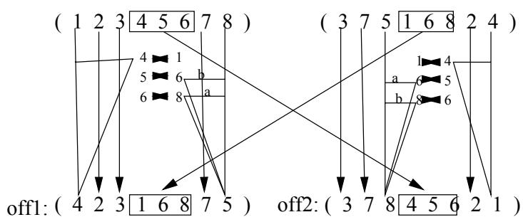  
Figure 2: Partially-mapped crossover operator (PMX)

The PMX operator creates an offspring in the following way. First, it selects uniformly at random two cut points along the strings, which represent the parent tours.Suppose that the frst cut point is selected between the third and the fourth string element, and the second one between the sixth and the seventh string element. For example,

The substrings between the cut points are called the mapping sections. In our example they define the mappings $4  1$ , $5  6$ and $6  8$ . Now the mapping section of the first parent is copied into the second offspring, and the mapping section of the second parent is copied into the first offspring, growing:

Then offspring $i$ $i = 1 , 2$ ) is filled up by copying the elements of the $i$ -th parent. In case a city is already present in the offpring it is replaced according to the mappings. For example, the first element of offspring 1 would be a 1 like the first element of the first parent. However, there is already a 1 present in offspring 1. Hence, because of the mapping $1  4$ we choose the first element of offspring 1 to be a 4. The second, third and seventh elements of offspring 1 can be taken from the first parent. However, the last element of offspring 1 would be an 8, which is already present. Because of the mappings $8  6$ , and $6  5$ , it is chosen

to be a 5. Hence,

Analogously, we find

Note that the absolute positions of some elements of both parents are preserved.

A variation of the PMX operator is described in Grefenstette (1987b): given two parents the offspring is created as follows.First, the second parent string is copiedonto the offspring.Next, an arbitrary ubtour is chosen from the first parent. Lastly, minimal changes are made in the offspring necessary to achive the chosen subtour. For example, consider parent tours

and suppose that subtour (345) is chosen. This gives offspring

# 4.3.2 Cycle Crossover (CX)

The cycle crossover operator (Figure 3) was proposed by Oliver et al. (1987). It attempts to create an

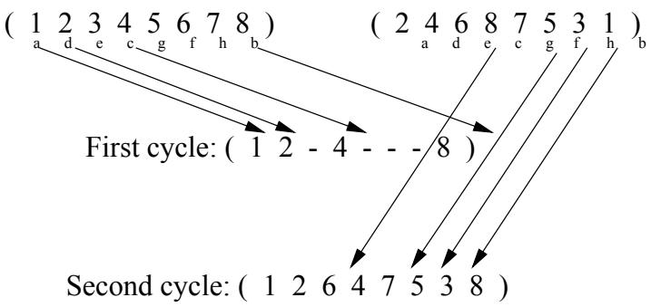  
Figure 3: Cycle crossover (CX)

offspring from the parents where every position is occupied by a corresponding element from one of the

parents. For example, consider again the parents

Now we choose the first element of the offspring equal to be either the first element of the first parent tour or the frst element of the second parent tour. Hence, the frst element o theoffspring has to be a 1 or a 2. Suppose we choose it to be 1,

$$
( 1 * * * * * * * * * * ) .
$$

Now, consider the last element of the offspring. Since this element has to be chosen from one of the parents, it can only be an 8 or a 1. However, if a 1 were selected, the offspring would not represent a leal tour. Therefore, an 8 is chosen,

$$
( 1 * * * * * * * 8 ) .
$$

Analogously, we find that the fourth and the second element of the offspring also have to be selected from the first parent, which results in

$$
( 1 2 * 4 * * * 8 ) .
$$

The positions of the elements chosen up to now are said to be a cycle. Now consider the third element of the offpring. This element we may choose from any of the parents. Suppose that we select it to be from parent This pl that the hsith an sven elment  theoprin alo havebe hosfrm the second parent, as they form another cycle. Hence, we find the following offspring:

The absolute positions of on average half of the elements of both parents are preserved. Oliver et al. (1987) concluded from theoretical and empirical results that the CX operator gives better results for the Travelling Salesman Problem than the PMX operator.

# 4.3.3 Order Crossover (OX1)

The order crossover operator (Figure 4) was proposed by Davis (1985). The OX1 exploits a property of the path representation, that the order of cities (not their positions) are important. It constructs an

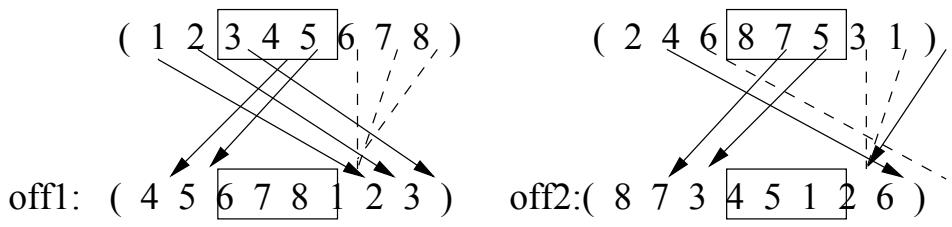  
Figure 4: Order crossover (OX1)

ofrig by choosng  subtour  ne parent and preserving the relativeorder citi o the other parnt. For example, consider the following two parent tours:

and suppoe that we selec a frst cut point between the second and the third bit and a seond one between the fifth and the sixth bit. Hence,

The offspring are created in the following way. First, the tour segments between the cut point are copied into the offspring, which gives

$$
( * * | 6 8 7 | * * * ) .
$$

Next, starting from the second cut point of one parent, the rest of the cities are copied in the order in which they appear in the other parent, also starting from the second cut point and itting the citi that are already present.When the end ofthe parent strin is reached, we continue from its first positio. In our example this gives the following children:

# 4.3.4 Order Based Crossover (OX2)

The order based crossover operator (Syswerda 1991) selects at random several positions in a parent tour, and the order of the cities in the selected positions of this parent is imposed on the other parent. For example, consider again the parents

and suppoehat the secparent the seconthir and sixt posiins are electThe cithe posions are ciy 4, city 6 andcity 5 respectively.In thefrst parent these cities are present at the fr, fn x sNowhei equal t tntheur,  ni :

$$
( 1 2 3 * * * 7 8 ) .
$$

We add the missing cities to the offspring in the same order in which they appear in the second parent tour. This results in

Exchanging the role of the first parent and the second parent gives, using the same selected positions,

# 4.3.5 Position Based Crossover (POS)

The position based operator (Syswerda 1991) also starts by selecting a random set of positions in the parent tours. However, this operator imposes the position of the selected cities on the corresponding cities of the other parent. For example, consider the parent tours

ans hat e  thr nd the i paeeeThis  iuehe

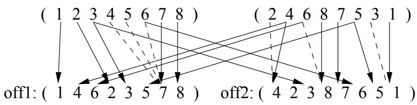  
Figure 5: Position based crossover (POS)

offspring:

# 4.3.6 Heuristic Crossover

Grefenstette (1987b) developed a class of heuristic crossover operators which emphasize edges. These operators create an offspring in the following way:

1. They first select at random a city to be the current city of the offspring.

2. Second, they consider the four (undirected) edges incident to the current city. Over these edges a probability distribution is defined basedon their cost. The probability associated with an edge incident to a previously visited city is equal to zero.

3. An edge is selected on this distribution. (If none of the parental edges leads to an unvisited city a random edge is selected.)

4. The steps 3 and 4 are repeated until a complete tour has been constructed.

In casorm proabily utioosn,heiet $3 0 \%$ of the edges of every parent, and about $4 0 \%$ of the edges are randomly selected. The operator described above was also used by Liepins et al. (1987).

# 4.3.7 Genetic Edge Recombination Crossover (ER)

The genetic edge recombination crossover operator was developed by Whitley et al. (1989, 1991).

It is an operator which is suitable for the symmetrical TSP; it makes the assumption that only the values of the edges are important, not their direction. In accordance with this assumption, the edges of a tour can be seen as the carriers of the heriditary information. The ERoperator attempts to preserve the edges of the parents in order to pass on a maximum amount of information to the offspring. The breaking of edges is seen as unwanted mutation.

The problem that normally occurs with operators which follow an edge recombination strategy, is that they often leave cities without a continuing edge (Grefenstette 1987). These cities become isolated and new ees have to be introduced. The ER operator tries to avoid this problem by first choosing cities which have few unused edges. Of course, there has to be a connection with a city before it can be selected. The only edge that the ER operator fails to enforce is the edge from the final city to the initial city. Therefore, a limited amount of mutation may occur. The mutation rate will be at most $1 / n$ , where $n$ is the number of cities. In practice the mutation rate turned out to be between $1 - 5 \%$ .

Now, how does the ER operator work? It uses a so-called "edge map", which gives for each city the edges of the parents that start or finish in it. Consider for example these tours:

The edge map for these tours is shown in Table III.

The genetic edge recombination operator works according to the following algorithm:

1.Choose the initial city from one of the two parent tours. (It can be chosen at random or according to criteria outlined in step 4). This is the "current city".

2. Remove all occurrences of the "current city" from the left-hand side of the edge map. (These can be found by referring to the edge list for the current city).

3. If the current city has entries in its edge list go to step 4; otherwise, go to step 5.

4Determine which of the cities in the edge list of the current city has the fewest entries in ts own edge

The edge map for the tours (123456) and (243156).

<table><tr><td>city</td><td>connected cities</td></tr><tr><td>1</td><td>2, 6, 3, 5</td></tr><tr><td>2</td><td>1, 3, 4, 6</td></tr><tr><td>3</td><td>2, 4, 1</td></tr><tr><td>4</td><td>3, 5, 2</td></tr><tr><td>5</td><td>4, 6, 1</td></tr><tr><td>6</td><td>1, 5, 2</td></tr></table>

list. The city with the fewest entries becomes the "current city". Ties are broken at random. Go to step 2.

5. If there are no remaining "unvisited" cities, then STOP. Otherwise, choose at random an "unvisited" city and go to step 2.

For our example tours we get:

1. The new child tour is initialized with one of the two initial cities from ts parents. Initial citis1 and 2 both have four edges; randomly choose city 2.

The edge list for city 2 indicates the candidates for the next city are the cities 1, 3, 4 and 6 The cities 3, 4 and 6 all have two edges: the initial three minus the connection with city 2. City 1 now has three edges and therefore it is not considered. Assume that city 3 is randomly chosen.

3. City 3 now has edges to city 1 and city 4. City 4 is chosen next, since it has fewer edges.

4. City 4 only has an edge to city 5, so city 5 is chosen next.

5. City 5 has edges to the cities 1 and 6, both of which have only one edge left. Randomly choose city 1.

6. City 1 must now go to city 6.

The resulting tour is

and is composed entirely of edges taken from the two parents.

The ER operator does not take into acount the common sequences of the parent tours. Therefore, an enhancement of the ER operator was developed in which the edges starting from the current city which are present in both parents have priority above the edges which are unique for one of the parents. There also exist modifications for making better choices, when random edge selection is necessary (Starkweather et al. 1991).

On the other hand, the edge recombination operator indicates clearly that the path representation might be too poor to represent important properties of a tour - it is for this reason that it was complemented by the edge list.

The ER operator was tested by Whitley et. al (1989) on three TSPs with 30, 50, and 75 cities - in all cases it returned a solution better than the previously "best known" sequence.

Whitley et al. (1989, 1991) showed that the ER operator may also be used in combination with the stypebinary reprenation describedi Section 4.. we efnetheordered is: 1,2), (1,3), 1,), (,), (1,6), (2,3), (2,4) (2,5) (2,6), (3,4) (3,5), (3,6), (4,5), (4,6), (5,6)the paretxapmaybe written as

parent 1: 100011000100101, parent 2: 010100101100001.

In our example, the created offspring is represented by

It is easy to ee that al of the ege f the offsprexcpt itslast ne are taken romone of the pants:

parent 1 : 100011000100101, parent 2 : 010100101100001, offspring: 000111001100100.

The edge (5,6) occurred in both parents. However, it was not passed on to the offspring.

The sorted match crossover operator was proposed by Brady (1985). It (see also Mühlenbein et al. 1988) sre  urote parnturs whichave ameen whic are me yic end in the same city and which contain the same set of citis. If such subtours are found the cost of thes substrings are determined. The offspring is constructed from the parent which contains the subtour with the highest cost by substituting this subtour for the subtour with the lowest cost. Consider, for example, the parent tours

The first parent contains the subtour (4567), and the second parent the subtour (4657). These subtours have the same length, both begin in city 4, both end in city 7, and both contain the same cities. Suppose that the cost of the subtour (4567) is higher than the cost of the subtour (4657). Then, the following offspring is created:

Mülenbein et al. (1988) concluded that the sorted match crossover was useful in reducing the computa tion time, but that it is a weak scheme for crossover.

# 4.3.9 Maximal Preservative Crossover (MPX)

The maximal preservative operator was introduced by Mühlenbein et al. (1988). It works in a similar way to the PMX operator. It frst selects a random substring of the first parent whose length is greater than or equal to 10 (except for very small problem instances), and smaller than or equal to the problem size divided by .Theserestrictions on the length o the substringare iven  assure that ther  noug noratio exchange between the parent strings without losing too much information from any of these parents. Next, althe elements  the hos substrin reremovfromthe secon parent. Ater thi, the substrihos from parnt  s cpi nto the rst partof the offrng.Finaly, the end of theofspri lleu ih cities in the same order as they appear in the second parent. Hence, if we consider the parent tours

and we select the substring (3 45) from the first parent. The MPX operator gives the following offspring

The advantage of the MPX operator is that it only destroys a limited number of edges; the maximum number of edges which may be destroyed is equal to the length of the chosen substring. Sometimes, at the beginning of the execution of an algorithm this maximum number might be reached. However, with the progress of the computation, solutions have more common edges, so that the number of destroyed edges decreases. Mühlenbein et al. (1988) performed additional mutation in case less than $1 0 \%$ of the edges were destroyed.

# 4.3.10 Voting Recombination Crossover (VR)

The voting recombination operator (Mühlenbein 1989) does not originate from biology. It can be seen as a p-sexual cossover perator, where is anatural number greater thanr equal to. It starts by defga threshold, which is a natural number smaller than or equal to p. Next, for every $i \in \{ 1 , 2 , \ldots , n \}$ the set of $i$ elementsof a the parents is considered I in this set an eement occurs at least the thresholnumber of times, it is copied into the offspring. For example, if we consider the parents $\mathrm { ( p { = } 4 }$

and we define the threshold to be equal to 3 we find

$$
( 1 2 x x x 6 ) .
$$

The remaining positions of the offspring are flled with mutations. Hence, our example might result in

We remark that Mühlenbein (1989) used the voting recombination operator in an evolutionary algorithm for the Quadratic Assignment Problem (QAP) instead of for the TSP. This is an assignment problem in which generalizing the conditions, the objective function changes from a lineal one to a quadratic one.

# 4.3.11 Alternating-Position Crossover (AP)

The alternating position crossover operator ( Larrañaga et. al (1996a)) simply creates an offspring by selecialternatey the next element of the frst parent and the nex eement o the secon paren, iti the elements already present in the offspring. For example, if parent 1 is

and parent 2 is

the AP operator gives (Figure 6) the following offspring

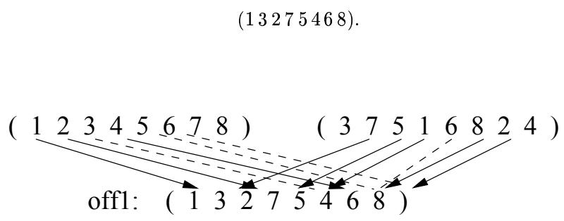  
Figure 6: Alternating-position crossover (AP)

Exchanging the parents results in

# 4.3.12 Displacement Mutation (DM)

The displacement mutation operator (Michalewicz 1992) first selects a subtour at random. This subtour is removed from the tour and inserted in a random place. For example, consider the tour represented by

and suppose that the subtour (345) is selected. Hence, after the removal of the subtour we have

Suppose that we randomly select city 7 to be the city after which the subtour is inserted. This results in (Figure 7)

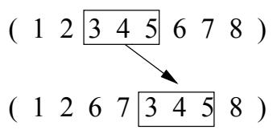  
Figure 7: Displacement mutation (DM)

Displacement mutation is also called cut mutation (Banzhaf 1990).

# 4.3.13 Exchange Mutation (EM)

The exchange mutation operator (Banzhaf 1990) randomly selects two cities in the tour and exchanges them. For example, consider the tour represented by

and suppose that the third and the fifth city are randomly selected. This results in (Figure 8)

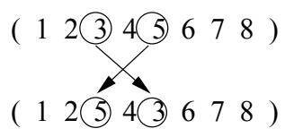  
Figure 8: Exchange mutation (EM)

The exchange mutation operator is also referred to as the swap mutation operator (Oliver et al. 1987) , the poin mutation operator (Ambatiet al. 1991) , the reciprocalexchange mutation operator (Michalewicz 1992), or the order based mutation operator (Syswerda 1991). Ambati et al. (1991) used repeated exchange mutation. They choose the probability of the performance of exactly m exchanges equal to $p ^ { ( m - 1 ) } ( 1 - p )$ , where $p$ was a parameter and $p \in ( 0 , 1 )$ . Beyer (1992) also used repeated exchange mutation. He, however, introduced a control parameter s to determine the number of exchanges. Each individual had its own $s$ -value, the $s$ -value of an offspring was determined by the $s$ -values of its parents. At the beginning of the algorithm a high number of exchanges was carried out. Via the algorithm, the number of exchanges was lowered to 1. This method is adopted from Schwefel (1975).

# 4.3.14 Insertion Mutation (ISM)

The insertion mutation operator (Fogel 1988); (Michalewicz 1992) randomly chooses a city in the tour, removes it fom this tour, and inserts it in arandomly selected place. For example, consider again the tour

and suppose that the insertion mutation operator selects city 4, removes i, and randomly inserts it after city 7. Hence, the resulting offspring is (Figure 9)

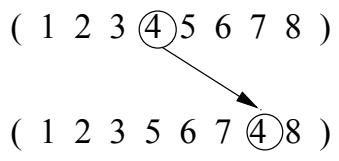  
Figure 9: Insertion mutation (ISM)

The insertion mutation operator is also called the position based mutation operator (Syswerda 1991).

# 4.3.15 Simple Inversion Mutation (SIM)

The simple inversion mutation operator (Holland 1975 and Grefenstette 1987) selects randomly two cut point in the string, and it reverses the substring between these two cut points. For example, consider the tour

and suppose that the first cut point is chosen between city 2 and city 3, and the second cut point between the fifth and the sixth city. This results in (Figure 10)

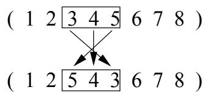  
Figure 10: Simple inversion mutation (SIM)

The simple inversion mutation operator served as the basis for the 2-opt heuristic for the TSP developed by Lin (1965) and is also used in the application of simulated annealing to the TSP (Kirkpatrick et al. 1983).

# 4.3.16 Inversion Mutation (IVM)

The inversion mutation (Fogel 1990, 1993) is similar to the displacement operator. It also randomly selects a subtour, removes it from the tour and inserts it in a randomly selected position. However, the subtour is inserted in reversed order. Consider again our example tour

ansupp that thesubtour 35)i osn,anthat this ubtour nsere reversrdmy after city 7. This gives (Figure 11)

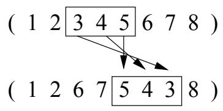  
Figure 11: Inversion mutation (IVM)

Banzaf (1990) referred to the insertion mutation operator as the cut-inverse mutation operator.

# 4.3.17 Scramble Mutation (SM)

The scramble mutation operator (Syswerda 1991) selects a random subtour and scrambles the cities in it. For example, consider the tour

and suppose that the subtour (4567) is chosen. This might result in (Figure 12)

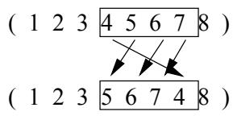  
Figure 12: Scramble mutation (SM)

We would like to point out that it was suggested in connection with scheduling problems instead of with the TSP.

In this section we have included different crossover and mutation operators that had been developed for the denominated path representation. The majority of the work in which the optimal permutation is obtained uses this representation. However, from a historic point of view, the detection of the problems done by Grefenstette et al. (1985), problems that appear with this representation in hyperplans analysis, are those that have caused the introduction of two new representations (ordinal and adjacency) which offer some of improvements over the path representation.

According to Grefenstette et al. (1985):

"…. there is a problem in applying the hyperplane analysis of GA's to this representation. The ioypan cr ati $( \mathrm { a } , \mathrm { \Phi } ^ { * } , \mathrm { \Phi } ^ { * } , \mathrm { \Phi } ^ { * } , \mathrm { \Phi } ^ { * } )$ appears to be a first order hyperplane, but it contains the entire space. The problem is that in this representation, the semantics of an allele in a given position depends on the surrounding alleles. Intuitively, we hope that GA's will tend to construct good solutions by identifying good building blocks and eventually combining these to get larger building blocks. For the TSP, the basic building blocks are edges. Larger building blocks correspond to larger subtours. The path representation does not lend itself to the description of edges and longer subtours in ways which are useful to the GA".

# 4.4 Adjacency Representation

In the adjacency representation (Grefenstette et al. 1985) a tour is represented as a list of $n$ cities. City $j$ is listed in position $i$ if, and only if, the tour leads from city $i$ to city $j$ . Thus, the list

represents the tour

Note that any tour has one unique adjacency list representation.

An adjacency list may represent an illegal tour. For example,

represents the following collection of cycles:

It is easy to see that for the adjacency representation the classical crossover operator may resul inilleal tours. A repair algorithm might be necessary. Other crossover operators were defined and investigated for the adjacency representation. We will describe them one by one.

# 4.4.1 Alternating Edge Crossover

The alternating edge crossover works as follows (Grefenstette et al. 1985): first it chooses an edge from the first parent at random. Second, the partial tour created in this way is extended with the appropriate edge of the second parent. This partial tour is extended by the adequate edge of the first parent, ec. The partial tour is extended by choosing edges from alternating parents. In case an edge is chosen which would produce a cycle into the partial tour, the edgeis not added. Instead, the operator selects randomly an ede from the edges which do not produce a cycle.

For example, the result of an alternating edge crossover of the parent

might be

The first edge chosen is (1,2); it is chosen from the first parent. The second edge chosen, edge (2,5), is selected from the second parent, etc. Note that the only random edge introduced is edge (7,6) instead of edge (7,8).

Experimental results with the alternanting edges operator have been uniformly discouraging. The obvious eplnaehat outouraerpthesveraey ought to promote the development of coadapted alles, or in the TSP, longer and longer high performance subtours. The next operator was motivated by the desire to preserve longer parental subtours.

# 4.4.2 Subtour Chunks Crossover

Using the subtour chunks operator (Grefenstette et al. 1985), an offspring is constructed from two parent tours as follows: frst it takes arandom length subtour of the first parent.This partial tour is extended by choosing a subtour of random length from the second parent. The partial tour is extended by taking subtours from alternating parents. If a subtour is selected from one of the parents which would lead to an illealtour, i is not added. Instead, an edge is added which ischosen at random from the edges that do not produce a cycle into the partial tour.

# 4.4.3 Heuristic Crossover

The heuristic crossoverperator (Grefenstette  al1985) frs selects at random acity to be thesart point of the offspring's tour. Then, the edges which start from this city are compared and the shorter of these two edges is chosen.Next, the city on theother side of the chosen edge is selected as areferenceciy. The edges which start from this reference ciy are compared and the shortest ne is added to the partial tour, e. I, at some stage, a new edge would introduce a cyce into the partial tour, then the tour is extended with an edge chosen at random from the remaining edges which do not introduce cycles.

# Modifications

Jog et al. (1989) suggested the following modification. In case choosing the shortest edge produces a inthe parl tu therg  e  his e de ot  t n illlu, it is accepted. Otherwise, the shortest edge from a pool of $q$ randomly selected edges is chosen, where $q$ is a parameter. This variation of the heuristicoperator tries to combine short subpaths of the different parent tours. However, it might be possible that the operator is not able to remove all undesirable crossings of edges. Therefore, it is not suitable for fine local tuning.

Suh and Van Gucht (1987)introduced a heuristic crossover operator which is based on the 2-opt algorithm of Lin (1965). This operator selects two random edges, $( k , l )$ and $( m , n )$ , and checks whether

$$
d ( k , l ) + d ( m , n ) > d ( k , n ) + d ( m , l ) ,
$$

where $d ( i , j )$ represents the distance between city $i$ and city $j$ . In case the inequality above is true, the edges $( k , l )$ and $^ { ( m , n ) }$ are replaced by the edges $( k , n )$ and $( m , l )$ .

The main advantage of the adjacency representation is that it allows hyperplane analysis, also called schemata analysis (Oliver et al. (1987), Grefenstette et al. (1985) and Michalewicz (1992).

Unfortunately, all the operators described above give poor results. In particular, the experimental results with the alternating edge operator have been uniformly discouraging. This is because this operator often destroys good subpaths of the parent tours. Therefore, the subtour chunk operator by choosing subpaths instead of edges from the parent tours, performs better than the alternating edge operator. However, it still has quite a low performance, because it does not take into account any information available about the edges. The heuristic crossover operator on the other hand, selects the better edge o the two possble eges, and therefore it performs ar better than the other two operators. However, the performance of the heuritic operator is not remarkable either (Grefenstette et al. 1985). Note that also other mutation operators have to be developed, since the classical mutation operator is only defined for binary strings.

# 4.5 Ordinal Representation

Also in the ordinal presentation, which was introduced by Grefenstette et al. (1985) a tour is represented as a list of $n$ cities. The $i$ -th element of the list is a number in the range from 1 to $n - i + 1$ . There exists an ordered list of cities, which serves as a reference point.

The easiest way to explain the ordinal representation is by giving an example. Assume, for example, that the ordered list is given by

$$
L = ( 1 2 3 4 5 6 7 8 ) .
$$

Now the tour $1 - 5 - 3 - 2 - 8 - 4 - 7 - 6$ is represented by

$$
T = ( 1 4 2 1 4 1 2 1 ) .
$$

This should be interpreted as follows.The first number of T is a . This means that to get the frst ciyo the tour we have to take the first element of list $L$ and remove it from $L$ . The partial tour is: 1. The second element of $_ \mathrm { T }$ is a 4. Therefore, to get the second city of the tour we have to get the fourth element of list $L$ , which is city 5. We remove city 5 from list $L$ . The partial tour is: 1 5. If we continue in the above described way until all the elements of $L$ have been removed, we finally find the tour $1 - 5 - 3 - 2 - 8 - 4 - 7 - 6$ .

The advantage of the ordinal presentation is that the classical crossover operator can be used. This follows from the fact that the $i$ -th element of the tour representation is always a number in the range from 1 to $n - i + 1$ . It is easy to see that partial tours to the left of the crossover point do not change, whereas partial tours to the right of the crossover point are disrupted in a quite random way.

As predicted by the above consideration of subtour disruptions, experimental results using the ordinal representation have been generally poor.

# 4.6 Matrix Representation

At least three attempts have been done to use a binary matrix representation.

1. Fox and McMahon (1987) suggested representing a tour as a matrix in which the element in row $i$ and column $j$ is a 1 if, and only if, in the tour city $i$ is visited before city $j$ . For example, the tour $2 - 3 - 1 - 4$ is represented by the matrix:

$$
\left( \begin{array} { c c c c } { { 0 } } & { { 0 } } & { { 0 } } & { { 1 } } \\ { { } } & { { } } & { { } } & { { } } \\ { { 1 } } & { { 0 } } & { { 1 } } & { { 1 } } \\ { { } } & { { } } & { { } } & { { } } \\ { { 1 } } & { { 0 } } & { { 0 } } & { { 1 } } \\ { { } } & { { } } & { { } } & { { } } \\ { { 0 } } & { { 0 } } & { { 0 } } & { { 0 } } \end{array} \right) .
$$

Suppose that a solution of the $n$ -cities TSP is represented by matrix $M$ . $M$ has the following properties:

$$
( i , j \in \{ 1 , 2 , . . . , n \} ) ,
$$

2. $m _ { i i } = 0$

$$
( i \in \{ 1 , 2 , \dots , n \} ) ,
$$

$$
( m _ { i j } = 1 \land m _ { j k } = 1 ) \Rightarrow m _ { i k } = 1
$$

$$
( i , j , k \in \{ 1 , 2 , . . . , n \} ) .
$$

In case the number of 1's in the matrix is less than ${ \frac { 1 } { 2 } } n ( n - 1 )$ and the other requirements are satisfied, it is possible to complete the matrix in such a way that it represents a legal tour.

For this matrix representation two new crossover operators were developed: the intersection operator and the union operator. The intersection operator constructs an offspring $O$ from parent $P _ { 1 }$ and $P _ { 2 }$ in the following way. First, for all $i , j \in \{ 1 , 2 , . . . , n \}$ it defines

$$
o _ { i j } : = \left\{ \begin{array} { l l } { 1 } & { \mathrm { i f } \ p _ { 1 , i j } = p _ { 2 , i j } = 1 , } \\ { 0 } & { \mathrm { o t h e r w i s e } . } \end{array} \right.
$$

Second, some 1's which are unique for one of the parents are "added" to $O$ , and the matrix is completed with the help of an analysis of the sum of rows and columns, in suc a way that the result is a legal tour.

For example, the parent tours $2 - 3 - 1 - 4$ and $2 - 4 - 1 - 3$ which are represented by

$$
\left( \begin{array} { c c c c } { { 0 } } & { { 0 } } & { { 0 } } & { { 1 } } \\ { { 1 } } & { { 0 } } & { { 1 } } & { { 1 } } \\ { { 1 } } & { { 0 } } & { { 0 } } & { { 1 } } \\ { { 0 } } & { { 0 } } & { { 0 } } & { { 0 } } \end{array} \right) \mathrm { ~ a n d ~ } \left( \begin{array} { c c c c } { { 0 } } & { { 0 } } & { { 1 } } & { { 0 } } \\ { { 1 } } & { { 0 } } & { { 1 } } & { { 1 } } \\ { { 0 } } & { { 0 } } & { { 0 } } & { { 0 } } \\ { { 0 } } & { { 0 } } & { { 0 } } & { { 0 } } \\ { { 1 } } & { { 0 } } & { { 1 } } & { { 0 } } \end{array} \right) ,
$$

give after the first phase

$$
\left( \begin{array} { l l l l } { { 0 } } & { { 0 } } & { { 0 } } & { { 0 } } \\ { { } } & { { } } & { { } } & { { } } \\ { { 1 } } & { { 0 } } & { { 1 } } & { { 1 } } \\ { { } } & { { } } & { { } } & { { } } \\ { { 0 } } & { { 0 } } & { { 0 } } & { { 0 } } \\ { { } } & { { } } & { { } } & { { } } \\ { { 0 } } & { { 0 } } & { { 0 } } & { { 0 } } \end{array} \right) .
$$

This matrix can be completed in six different ways, since the only restriction on the offspring tour is that it starts in city 2. One possible offspring is the tour $2 - 1 - 4 - 3$ which is represented by:

$$
\left( \begin{array} { l l l l } { { } } & { { } } & { { } } & { { } } \\ { { 0 } } & { { 0 } } & { { 1 } } & { { 1 } } \\ { { } } & { { } } & { { } } & { { } } \\ { { 1 } } & { { 0 } } & { { 1 } } & { { 1 } } \\ { { } } & { { } } & { { } } & { { } } \\ { { 0 } } & { { 0 } } & { { 0 } } & { { 0 } } \\ { { } } & { { } } & { { } } & { { } } \\ { { 0 } } & { { 0 } } & { { 1 } } & { { 0 } } \end{array} \right) .
$$

The union operator divides the set of cities into two disjoint groups. See Fox and McMahon (1987) for a specal method o making this division.For the rs groupof citis the matri elmentsof the offspring are taken from the first parent, for the second group they are selected from the second parent. The resulting matrix is completed by an analysis of the sum of the rows and columns. For example, consider again the two parents given above, and suppose that we divide the set of cities into $\{ 1 , 2 \}$ and {3,4}. Hence, after the first step of the union operator we have

which might be completed to

$$
\left( \begin{array} { c c c c } { { 0 } } & { { 0 } } & { { x } } & { { x } } \\ { { } } & { { } } & { { } } & { { } } \\ { { 1 } } & { { 0 } } & { { x } } & { { x } } \\ { { } } & { { } } & { { } } & { { } } \\ { { x } } & { { x } } & { { 0 } } & { { 0 } } \\ { { } } & { { } } & { { } } & { { } } \\ { { x } } & { { x } } & { { 1 } } & { { 0 } } \end{array} \right) ,
$$

$$
\left( \begin{array} { l l l l } { { 0 } } & { { 0 } } & { { 0 } } & { { 0 } } \\ { { } } & { { } } & { { } } & { { } } \\ { { 1 } } & { { 0 } } & { { 0 } } & { { 0 } } \\ { { } } & { { } } & { { } } & { { } } \\ { { 1 } } & { { 1 } } & { { 0 } } & { { 0 } } \\ { { } } & { { } } & { { } } & { { } } \\ { { 1 } } & { { 1 } } & { { 1 } } & { { 0 } } \end{array} \right) ,
$$

which represents the tour $4 - 3 - 2 - 1$ .

Fox and McMahon did not define a mutation operator.

The experimental results on different topologies of the cities reveal an interesting characteristic of the union and intersection operators, which allows progress to be made even when the elitism (preserving the best) option was not used. This was not the case for either ER or PMX operators.

2. Seniw (1991) had another approach. He defined the matrix element in the $i$ -th row and the $j$ -th column to be 1 if, and only if, in the tour city $j$ is visited inmediately after city $i$ . This implies that a legal tour is represented by a matrix of which each row and each column contains precisely one 1. We remark that a matrix which has precisely one 1 in each row and in each column does not necessarily represent a legal tour. For example, consider the matrices

$$
\left( \begin{array} { c c c c } { { 0 } } & { { 0 } } & { { 0 } } & { { 1 } } \\ { { 0 } } & { { 0 } } & { { 1 } } & { { 0 } } \\ { { 1 } } & { { 0 } } & { { 0 } } & { { 0 } } \\ { { 0 } } & { { 1 } } & { { 0 } } & { { 0 } } \end{array} \right) \mathrm { ~ a n d ~ } \left( \begin{array} { c c c c } { { 0 } } & { { 1 } } & { { 0 } } & { { 0 } } \\ { { 1 } } & { { 0 } } & { { 0 } } & { { 0 } } \\ { { 0 } } & { { 0 } } & { { 0 } } & { { 1 } } \\ { { 0 } } & { { 0 } } & { { 0 } } & { { 1 } } \\ { { 0 } } & { { 0 } } & { { 1 } } & { { 0 } } \end{array} \right) ,
$$

where the first matrix represents the tour $2 - 3 - 1 - 4$ , and the second one the set of subtours $\{ 1 - 2 , 3 - 4 \}$

Mutation is defined as follows: frst several rows and columns are selected. The elements in the intersections of these rows and columns are removed and randomly replaced, though in such a way that the result is a matrix of which each row and each column contains precisely one 1. For example, consider again the matrix representation of the tour $2 - 3 - 1 - 4$ and suppose that we select the first and the second row and te hirnhe ur coirheat ent he heowso removed. Hence,

$$
\left( \begin{array} { l l l l } { 0 } & { 0 } & { x } & { x } \\ { 0 } & { 0 } & { x } & { x } \\ { 1 } & { 0 } & { 0 } & { 0 } \\ { 0 } & { 1 } & { 0 } & { 0 } \end{array} \right) .
$$

Randomly replacing the elements may give

$$
\left( \begin{array} { c c c c } { { 0 } } & { { 0 } } & { { 1 } } & { { 0 } } \\ { { } } & { { } } & { { } } & { { } } \\ { { 0 } } & { { 0 } } & { { 0 } } & { { 1 } } \\ { { } } & { { } } & { { } } & { { } } \\ { { 1 } } & { { 0 } } & { { 0 } } & { { 0 } } \\ { { } } & { { } } & { { } } & { { } } \\ { { 0 } } & { { 1 } } & { { 0 } } & { { 0 } } \end{array} \right) .
$$

Note that this matrix does not represent a legal tour. The crossover operator which was defined creates an offspring $O$ from parents $P _ { 1 }$ and $P _ { 2 }$ as follows. First, for all $i , j \in \{ 1 , 2 , . . . , n \}$ it defines

$$
o _ { i j } : = \left\{ \begin{array} { l l } { 1 } & { \mathrm { i f } \ p _ { 1 , i j } = p _ { 2 , i j } = 1 , } \\ { 0 } & { \mathrm { o t h e r w i s e } . } \end{array} \right.
$$

Second, it alternately takes a 1 from one of the parents, which is unique for that parent, and changes the coenimat t theri rom intFinaly ows thefspri not contain a 1, 1s areadded randomly, though in such a way that the result is a matrix which has precisely one 1 in each row and in each column. For example, the parent tours $2 - 3 - 1 - 4$ and $2 - 4 - 1 - 3$ , which

are represented by

$$
\left( \begin{array} { c c c c } { { 0 } } & { { 0 } } & { { 0 } } & { { 1 } } \\ { { 0 } } & { { 0 } } & { { 1 } } & { { 0 } } \\ { { 1 } } & { { 0 } } & { { 0 } } & { { 0 } } \\ { { 0 } } & { { 1 } } & { { 0 } } & { { 0 } } \end{array} \right) \mathrm { ~ a n d ~ } \left( \begin{array} { c c c c } { { 0 } } & { { 0 } } & { { 1 } } & { { 0 } } \\ { { 0 } } & { { 0 } } & { { 0 } } & { { 1 } } \\ { { 0 } } & { { 1 } } & { { 0 } } & { { 0 } } \\ { { 1 } } & { { 0 } } & { { 0 } } & { { 0 } } \\ { { 1 } } & { { 0 } } & { { 0 } } & { { 0 } } \end{array} \right) ,
$$

may create the following offspring:

$$
\left( \begin{array} { c c c c } { { 0 } } & { { 0 } } & { { 0 } } & { { 1 } } \\ { { } } & { { } } & { { } } & { { } } \\ { { 0 } } & { { 0 } } & { { 1 } } & { { 0 } } \\ { { } } & { { } } & { { } } & { { } } \\ { { 0 } } & { { 1 } } & { { 0 } } & { { 0 } } \\ { { } } & { { } } & { { } } & { { } } \\ { { 1 } } & { { 0 } } & { { 0 } } & { { 0 } } \end{array} \right) ,
$$

which is again not a representation of a legal tour.

We have seen that the defined operators do not necessarily result in legal tours. It is possible that the operators convert the parent tour(s) into a collection of subtours.These subtours are allowed in the hope that natural clustering takes place (however, subtours which contain less than $q$ cities are not allowed, where $q$ is a parameter). After the execution of the genetic algorithm the best solution found is converted into a legal tour. This is done with the help of a deterministic algorithm which combines pairs of subtours.

This evolution program gave a reasonable performance on several test cases from 30 cities to 512 cities.

3. The last approach based on a binary matrix representation was proposed by Homaifar and Guan (1991). They used the same representation as Seniw (1991), but in combination with different crossover and mutation oerators.The cossove perators they useexchangealntrithe paret matricsither ter -po croover or-poin crossover.Afterwar, anadditional repairagorithm"isrun tassurethat thereul is a matrix of which each row and each column contains precisely one 1, and to connect any cycles to produce a legal tour.

A 1-point crossover can be seen as follows. Consider the representations of the tours $1 - 2 - 3 - 4$ and

$4 - 3 - 2 - 1$ . These are

$$
\left( \begin{array} { c c c c } { { 0 } } & { { 1 } } & { { 0 } } & { { 0 } } \\ { { 0 } } & { { 0 } } & { { 1 } } & { { 0 } } \\ { { 0 } } & { { 0 } } & { { 0 } } & { { 1 } } \\ { { 1 } } & { { 0 } } & { { 0 } } & { { 0 } } \end{array} \right) \mathrm { ~ a n d ~ } \left( \begin{array} { c c c c } { { 0 } } & { { 0 } } & { { 0 } } & { { 1 } } \\ { { 1 } } & { { 0 } } & { { 0 } } & { { 0 } } \\ { { 0 } } & { { 1 } } & { { 0 } } & { { 0 } } \\ { { 0 } } & { { 0 } } & { { 1 } } & { { 0 } } \end{array} \right) ,
$$

respectively. Suppose, that the crossover point is chosen between the second and the third column.

Hence,

$$
\left( \begin{array} { c c } { { 0 } } & { { 1 } } \\ { { 0 } } & { { 0 } } \\ { { 1 } } & { { 0 } } \\ { { 0 } } & { { 0 } } \\ { { 1 } } & { { 0 } } \end{array} \right) \left( \begin{array} { c c } { { 0 } } & { { 0 } } \\ { { 1 } } & { { 0 } } \\ { { 0 } } & { { 1 } } \\ { { 0 } } & { { 0 } } \end{array} \right) \left( \begin{array} { c c } { { 0 } } & { { 0 } } \\ { { 1 } } & { { 0 } } \\ { { 0 } } & { { 0 } } \\ { { 0 } } & { { 1 } } \\ { { 0 } } & { { 0 } } \end{array} \right) \left( \begin{array} { c c } { { 0 } } & { { 1 } } \\ { { 0 } } & { { 1 } } \\ { { 0 } } & { { 0 } } \\ { { 0 } } & { { 0 } } \\ { { 0 } } & { { 0 } } \end{array} \right) .
$$

Crossover results in

$$
\left( \begin{array} { c c } { { 0 } } & { { 1 } } \\ { { 0 } } & { { 0 } } \\ { { 0 } } & { { 0 } } \\ { { 0 } } & { { 0 } } \\ { { 1 } } & { { 0 } } \end{array} \right) \left( \begin{array} { c c } { { 0 } } & { { 1 } } \\ { { 0 } } & { { 0 } } \\ { { 0 } } & { { 0 } } \\ { { 0 } } & { { 0 } } \\ { { 0 } } & { { 1 } } \end{array} \right) , \nonumber
$$

which of course do not represent legal tours.

A 2-point crossover works according to the same idea. Consider again the two parent tours given above, and supp that we hoose e r ossver pointbe betwee therst an the sco colun an the second to be between the third and the fourth column. Hence,

$$
\begin{array} { r } { \left( \begin{array} { c c } { 0 } \\ { 0 } \\ { 0 } \end{array} \right) \left( \begin{array} { c c } { 1 } & { 0 } \\ { 0 } \\ { 1 } \end{array} \right) = \left( \begin{array} { c c } { 0 } \\ { 0 } \\ { 1 } \end{array} \right) = \left( \begin{array} { c c } { 0 } \\ { 0 } \\ { 0 } \end{array} \right) \left( \begin{array} { c c } { 1 } \\ { 0 } \\ { 0 } \\ { 1 } \end{array} \right) } \\ { \left( \begin{array} { c c } { 0 } \\ { 1 } \end{array} \right) = \left( \begin{array} { c c } { 0 } \\ { 0 } \\ { 0 } \end{array} \right) = \left( \begin{array} { c c } { 0 } \\ { 0 } \\ { 1 } \end{array} \right) \left( \begin{array} { c c } { 0 } \\ { 0 } \\ { 0 } \end{array} \right) } \end{array} .
$$

The result of the crossover is

$$
\begin{array} { r } { \left( \begin{array} { c c } { 0 } \\ { 0 } \\ { 0 } \end{array} \right) \left( \begin{array} { c c } { 0 } \\ { 0 } \\ { 0 } \\ { 1 } \end{array} \right) = \mathrm { a n d } \left( \begin{array} { c c } { 0 } \\ { 0 } \\ { 1 } \\ { 0 } \end{array} \right) = \left( \begin{array} { c c } { 0 } \\ { 1 } & { 0 } \\ { 0 } & { 1 } \\ { 0 } \end{array} \right) \left( \begin{array} { c } { 1 } \\ { 0 } \\ { 0 } \\ { 0 } \end{array} \right) , } \\ { \left( \begin{array} { c c } { 1 } \\ { 1 } \end{array} \right) \left( \begin{array} { c c } { 0 } \\ { 0 } \\ { 1 } \end{array} \right) = \left( \begin{array} { c c } { 0 } \\ { 0 } \\ { 0 } \end{array} \right) \left( \begin{array} { c c } { 0 } \\ { 0 } \\ { 0 } \end{array} \right) } \end{array}
$$

which again do not represent legal tours.

The mutation operator used by Homaifar and Guan (1991) was heuristic inversion. This operator reverses theorder of the cities betwen two randomly chosen cut points. If the distance between two cut points is large, the operator explores connections between "good" paths, otherwise the operator performs local search.

The reported results (Homaifar et al. 1993) indicate that this approach performed successfully on 30-100 city TSP problems.

# 5 Hybridization with Local Search

Genetic algorithms can be applied to problems of which very little knowledge is available. However, Grefenstette (1987b) showed that in many ccasions t is possible to incorporate problem-specic knowledge in these algorithms. One example of incorporated knowledge we have already seen: the heuristic crossover operator (see Section 4.4.3).

Another opportunity to use problem-specific knowledge is in the determination of the initial population. The initial population can be chosen at random. However, it is also possible to start with a population which already has some quality. This is called seeding. Lawler et al. (1985) and Johnson (1990) described how a populationof medium quality can be created. Note that seeding has to be done very carefully, since a geneiortartwiniilpopulatitvarymy quick nvergelctu. Banzhaf (1990) and Grefenstette (1987b) defined measures of the population variance. An algorithm which is frequently used for seeding is the 2-opt algorithm (Lin 1965).

While the genetic algorithms are not well suited for finely tuned local search, Goldberg (1989) suggested crossing them with a local search algorithm. In this way the evolutionary algorithm searches for the hills", and the local search algorithm climbs them. Several attempts have been done to implement Goldberg's suggestion, amongst others by Ackley (1987); Gorges-Schleuter (1989); Jog et al. (1989); Mühlenbein(1989, 1991); Mühlenbein and Kindermann(1989); Mühlenbein et al. (1987, 1988); Suh and Van Gucht (1987) and Ulder et al.(1990). They all used algorithms of the following structure:

1. Construct a (random or seeded) initial population.

2. Apply local search to every individual of the initial population and replace every individual by the better individual (e.g. local optimum), which was reached by applying local search to it.

3. Create new individuals with the help of genetic operators and add them to the population.

4.Use local search to replace each new created individual in the current population by a betterindividual (e.g. local optimum).

5. Reduce the extended population to its original size in accordance with a selection criterion.

6. If it does not comply with a stopping criteria: go to step 3.

The local search in the steps 2 and 4 may be performed with, e.g. the 2-opt algorithm (Lin 1965) or the Or-opt algorithm (Or 1976 and Lawler et al. 1985). Ulder et al. (1990) used a local search algorithm based on Lin and Kernighan neighbourhoods (Lin and Kernighan 1973). Lin et al. (1993) even applied simulated annealing. They worked with neighbourhoods determined by the following swapping strategies: random 2-exchange and locally adjacent swap. Also a combination of different local search techniques may be chosen: Prinetto et al. (1993) applied in every generation Or-opt, 2-opt, and Group Optimization with a probability of 0.5, 0.3 and 0.2 respectively. They also used a combination of several crossover operators.

Instead of using local search in every iteration of a genetic algorithm it is also possible to wait the algorithm has reached an interesting stage in the search process. Another possibility is to perform local search only when the genetic algorithm has terminated.

Mühlenbein and Gorges-Schleuter developed a parallel genetic algorithm based on the above described structure (Gorges-Schleuter 1989; Mühlenbein 1989, 1991 and Mühlenbein et al. 1987, 1988). They called their algorithm ASPARAGOS (ASynchronous PARAllel Genetic Optimization Strategy). Another parallel genetic algorithm for the Travelling Salesman Problem is described in Fogel (1990).

# 6 Experimental results with the path representation

# 6.1 Introduction

Faced with the impossibility of carrying out an analytic comparision of the different operators presented in the previous section, we have carried out an empirical comparision between the different combination of crossover and mutation operators presented in relation with the path representation.

The Genetic Algorithm that we used follows the principles of GENITOR (Whitely et al. 1989). In the mentioned algorithm, only one new individual is created in each iteration of the algorithm. This new ividual replaceeworsheviualeisihe ulati, vaati better.The criteri or topping the algoritm is double.In this way, ifin 1 succsive iteratins the average cost of the population has not decreased, the algorithm will be stoped, not allowing, whatsoever more than 50000 evaluations in each search. In the experiments presented here the following parameters have been established: size of population ( $\lambda = 2 0 0$ ), probability of mutation $\phantom { + } p _ { m } = 0 . 0 1$ and selective pressure $( \mathrm { b } = 1 . 9 0 $ ). The last parameter, introduced in GENITOR, is related with the assigning of probability for the selection of the parents. In short, it indicates the preference of the selection awarded to the bes  the individuals of the population making a comparison with the average individual. In this way, for example, if ${ \mathrm { b } } \mathrm { = } 2$ this signifies that the best individual has been assigned the probability of converting itself into the father which is double that of the average individual.

For each of the 48 $( 8 \mathrm { ~ x ~ } 6 )$ combinations between crossover and mutation operators considered, 10 searches have been realized. The searches have been realized using the SPARC-server 100 computer , under the Solaris 2.3 operating system. The treatment of the data obtained in the experiments has been realized with the SPSS package (1988), studing the statistical significance ( $\alpha = 0 . 0 5$ )of the average results using Kruskal - Wallis test.

# 6.2 Results

The following fles have been used in the empirical study: Distances in kilometers between the 47 capitals of the Spanish peninsular provinces, as well as the well known Grötschels24, and Grötschels48, which have bee use previously i mpirical comparisons.These re wofles that can betain v in many es, that represent the distances between 24 and 48 imaginary cities. They are oftenly used in TSP problems to know the fitness of the algorithm we use, and can be defined like a classical experiment in the TSP.

Capitals of the Spanish peninsular provinces

Table IV shows the best results and the average results obtained for each possible combination between the crossover and mutation parameters considered. Distances in kilometers have been used. They have been provided by Center of Publications of the General Technical Secretary of the Department of Public Works, Transport and Environment.

We are not aware of any other work on these characteristics that have been applied to this file, so a comparison with other references is not possible. The tour with the lowest cost has been evaluated in 6238 Km., which has been obtained ten times (5 of them with ER crossover operator, 4 of them with POS, and the resting one with OX2). Aof the mutation operators have been capable of finding this tour, although the ISM was the one which found it the most number of times. The statistically significant differences have been found in relation with average behavior, related with crossover operator likewise with the mutation operator. The best crossover operators were in the following order: ER, OX1, POS, OX2 and CX, while the best mutation operators were : IVM, DM, and ISM.

In relation to the speed of the convergence, measured by the number of evaluations made until the convergence of the algorithm, the fastest crossover operators, were the following: ER, PMX, OX1, POS, and OX2, likewise the mutation operators were : SIM and SM.

There is a more profound study of the above mentioned data, that work with different sizes of population, mutation probabilities and selective pressures, which you can refer to in Larrañaga et al. (1996c).

Grötschels24

This fle, the same as the following one, has been used as a bank of tests in several approximations to

Tour lengths for capitals of Spanish provinces.

<table><tr><td></td><td>AP</td><td>CX</td><td>ER</td><td>OX1</td><td>OX2</td><td>PMX</td><td>POS</td><td>VR</td><td></td></tr><tr><td>DM best results</td><td>7309</td><td>7552</td><td>6238</td><td>6564</td><td>6333</td><td>7114</td><td>6238</td><td>8256</td><td>6238</td></tr><tr><td>DM average results</td><td>12021</td><td>10610</td><td>8644</td><td>8785</td><td>9486</td><td>10407</td><td>9013</td><td>15956</td><td>10615</td></tr><tr><td>EM best results</td><td>7510</td><td>7559</td><td>6238</td><td>6472</td><td>6412</td><td>7666</td><td>6245</td><td>8272</td><td>6238</td></tr><tr><td>EM average results</td><td>12195</td><td>10703</td><td>8649</td><td>9175</td><td>9850</td><td>11710</td><td>9331</td><td>16178</td><td>10974</td></tr><tr><td>ISM best results</td><td>7452</td><td>8240</td><td>6238</td><td>6437</td><td>6238</td><td>6470</td><td>6238</td><td>7826</td><td>6238</td></tr><tr><td>ISM average results</td><td>11950</td><td>10544</td><td>8649</td><td>8850</td><td>9644</td><td>10744</td><td>9112</td><td>15796</td><td>10661</td></tr><tr><td>IVM best results</td><td>7266</td><td>7964</td><td>6238</td><td>6396</td><td>6558</td><td>6803</td><td>6238</td><td>8064</td><td>6238</td></tr><tr><td>IVM average results</td><td>11944</td><td>10593</td><td>8545</td><td>8883</td><td>9507</td><td>10400</td><td>8922</td><td>16077</td><td>10609</td></tr><tr><td>SIM best results</td><td>10596</td><td>8813</td><td>6245</td><td>6305</td><td>6364</td><td>7322</td><td>6238</td><td>9685</td><td>6238</td></tr><tr><td>SIM average results</td><td>14763</td><td>10661</td><td>9243</td><td>9831</td><td>11045</td><td>13073</td><td>10188</td><td>16589</td><td>11924</td></tr><tr><td>SM best results</td><td>10364</td><td>8440</td><td>6238</td><td>6311</td><td>6472</td><td>7985</td><td>6388</td><td>9797</td><td>6238</td></tr><tr><td>SM average results</td><td>15014</td><td>10672</td><td>9461</td><td>10085</td><td>11077</td><td>13335</td><td>10189</td><td>16739</td><td>12071</td></tr><tr><td></td><td>7266</td><td>7552</td><td>6238</td><td>6305</td><td>6238</td><td>6470</td><td>6238</td><td>7826</td><td>6238</td></tr><tr><td></td><td>12981</td><td>10630</td><td>8865</td><td>9268</td><td>10101</td><td>11612</td><td>9459</td><td>16222</td><td>11142</td></tr></table>

TSP using the Genetic Algorithm.

Table V shows the results obtained. The best result, $1 2 7 2 { \mathrm { ~ k m } }$ , has been achieved with the following crossover operators: ER, OX1, OX2, PMX and POS. All the mutation operators find the above mentioned value.

At the average results level, improvements have been reached with the following crossover operators: ER, OX1, POS, OX2, and PMX, likewise with the mutation operators: DM and IVM.

Fast crossover operators in this example were: ER, PMX, OX1 and OX2, while SIM likewise SM can be considered as fast mutation operators.

Tour lengths for the Grötschels24 problem.

<table><tr><td></td><td>AP</td><td>CX</td><td>ER</td><td>OX1</td><td>OX2</td><td>PMX</td><td>POS</td><td>VR</td><td></td></tr><tr><td>DM best results</td><td>1349</td><td>1316</td><td>1272</td><td>1272</td><td>1289</td><td>1272</td><td>1272</td><td>1340</td><td>1272</td></tr><tr><td>DM average results</td><td>1470</td><td>1416</td><td>1274</td><td>1305</td><td>1322</td><td>1355</td><td>1305</td><td>1777</td><td>1403</td></tr><tr><td>EM best results</td><td>1369</td><td>1388</td><td>1272</td><td>1272</td><td>1289</td><td>1296</td><td>1272</td><td>1380</td><td>1272</td></tr><tr><td>EM average results</td><td>1487</td><td>1474</td><td>1274</td><td>1299</td><td>1311</td><td>1416</td><td>1312</td><td>1903</td><td>1434</td></tr><tr><td>ISM best results</td><td>1300</td><td>1289</td><td>1272</td><td>1272</td><td>1272</td><td>1313</td><td>1272</td><td>1565</td><td>1272</td></tr><tr><td>ISM average results</td><td>1406</td><td>1461</td><td>1272</td><td>1307</td><td>1316</td><td>1368</td><td>1298</td><td>1993</td><td>1428</td></tr><tr><td>IVM best results</td><td>1301</td><td>1344</td><td>1272</td><td>1272</td><td>1272</td><td>1298</td><td>1272</td><td>1390</td><td>1272</td></tr><tr><td>IVM average results</td><td>1406</td><td>1408</td><td>1277</td><td>1303</td><td>1329</td><td>1369</td><td>1315</td><td>1904</td><td>1414</td></tr><tr><td>SIM best results</td><td>1421</td><td>1302</td><td>1272</td><td>1272</td><td>1272</td><td>1327</td><td>1289</td><td>1390</td><td>1272</td></tr><tr><td>SIM average results</td><td>1588</td><td>1441</td><td>1276</td><td>1313</td><td>1342</td><td>1393</td><td>1329</td><td>1737</td><td>1428</td></tr><tr><td>SM best results</td><td>1396</td><td>1330</td><td>1272</td><td>1272</td><td>1300</td><td>1306</td><td>1279</td><td>1537</td><td>1272</td></tr><tr><td>SM average results</td><td>2996</td><td>1423</td><td>1277</td><td>1300</td><td>1367</td><td>1388</td><td>1316</td><td>1920</td><td>1623</td></tr><tr><td rowspan="2"></td><td>1300</td><td>1289</td><td>1272</td><td>1272</td><td>1272</td><td>1272</td><td>1272</td><td>1340</td><td>1272</td></tr><tr><td>1725</td><td>1437</td><td>1275</td><td>1305</td><td>1331</td><td>1382</td><td>1313</td><td>1872</td><td>1455</td></tr></table>

# Grötschels48

In Table VI the average and the best results are shown. The best search corresponds to the tour of 5074

km., worse than optimal of this problem $\mathrm { 5 0 4 6 ~ K m . }$ ). This optimal has been reached using the combination of the ER $^ +$ SIM operators relaxing the stopping conditions, and increasing the size of the population.

The statistically significant differences has been found in relation with average behavior, related with crossover operator, with the best being ER, POS, OX1 and OX2 operators. The best behavior of the mutation operators were ISM, DM and IVM operators.

The number of necessary iterations to reach the convergence, ER, PMX and POS could be considered as fast crossover operators, likewise with the mutation operators SIM and SM.

Tour lengths for the Grtschels48 problem.

<table><tr><td></td><td>AP</td><td>CX</td><td>ER</td><td>OX1</td><td>OX2</td><td>PMX</td><td>POS</td><td>VR</td><td></td></tr><tr><td>DM best results</td><td>6403</td><td>10387</td><td>5137</td><td>5142</td><td>5123</td><td>5560</td><td>5186</td><td>14931</td><td>5123</td></tr><tr><td>DM average results</td><td>7082</td><td>11398</td><td>5208</td><td>5368</td><td>5390</td><td>6150</td><td>5459</td><td>15595</td><td>7706</td></tr><tr><td>EM best results</td><td>6606</td><td>9719</td><td>5134</td><td>5194</td><td>5150</td><td>6420</td><td>5168</td><td>14760</td><td>5134</td></tr><tr><td>EM average results</td><td>7220</td><td>10649</td><td>5232</td><td>5458</td><td>5651</td><td>7103</td><td>5361</td><td>15325</td><td>7750</td></tr><tr><td>ISM best results</td><td>6311</td><td>9514</td><td>5107</td><td>5234</td><td>5080</td><td>6092</td><td>5158</td><td>15228</td><td>5080</td></tr><tr><td>ISM average results</td><td>6905</td><td>10543</td><td>5176</td><td>5422</td><td>5536</td><td>6496</td><td>5401</td><td>15554</td><td>7629</td></tr><tr><td>IVM best results</td><td>6769</td><td>9905</td><td>5100</td><td>5145</td><td>5169</td><td>5519</td><td>5174</td><td>15267</td><td>5100</td></tr><tr><td>IVM average results</td><td>7276</td><td>11139</td><td>5238</td><td>5436</td><td>5455</td><td>6139</td><td>5395</td><td>15702</td><td>7723</td></tr><tr><td>SIM best results</td><td>9847</td><td>9356</td><td>5074</td><td>5424</td><td>5097</td><td>7010</td><td>5179</td><td>15205</td><td>5074</td></tr><tr><td>SIM average results</td><td>10304</td><td>10610</td><td>5154</td><td>5538</td><td>5451</td><td>7430</td><td>5493</td><td>15663</td><td>8205</td></tr><tr><td>SM best results</td><td>8802</td><td>9786</td><td>5074</td><td>5280</td><td>5251</td><td>6663</td><td>5164</td><td>15014</td><td>5074</td></tr><tr><td>SM average results</td><td>10220</td><td>11014</td><td>5138</td><td>5516</td><td>5715</td><td>7523</td><td>5413</td><td>15580</td><td>8265</td></tr><tr><td rowspan="2"></td><td>6311</td><td>9356</td><td>5074</td><td>5142</td><td>5080</td><td>5519</td><td>5158</td><td>14760</td><td>5074</td></tr><tr><td>8168</td><td>10892</td><td>5191</td><td>5456</td><td>5533</td><td>6807</td><td>5420</td><td>15570</td><td>7880</td></tr></table>

# 6.3 Conclusions

Although we are aware that the experiments made over three tests files don't allow us to generalize the results obtained in other TSP problem, a certain uniformity of behavior of the operators in the different examples can be seen. In this way, the crossover operators ER, OX1, POS and OX2, likewise the mutation operators DM, IVM, and ISM were those which had the best results. If we consider speed related with the number of evaluations until convergence, the classification for the crossover operators was: ER, PMX, OX1 and POS, lkewise for the mutation operators: SIM and SM. The operators of special interest, ie the ones that had the best results and at the same time were the quickest, are ER, OX1 and POS.

Starkwather et al. (1991) present an empirical comparison of six crossover operators, designed for the path representation: ER, OX1, OX2, POS, PMX and CX. Each of the above operators was used to solve the 30 city TSP. None of the operators use mutation. The results obtained indicate how good ER, OX1, OX2, and POS operators are.

Although, at the start it was considered that the tasks of sequencing were similar, so only one genetic operator would be enough for any problem of sequencing, results indicate that the effectiveness of different operators is dependent on the problem domain; operators which work well in problem where adjacency is important (e.g. TSP) may not be effective for other types of sequencing problems.

Likewise, for example, in the problem of the search of the optimal permutation with which we have reently been working in Bayesian networks (Larrañagaet al. (1996a) (1996b) using crossover andmutation operators developed in relation with path representation, the crossover operators that provided the best results, in both cases, were: CX, OX2 and POS operators. Comparing this with the results obtained here, the difference is that the CX operator is included and the ERoperator is excluded. Note that in the last two problems the search is made over the non cyclic permutations of $n$ integer numbers, in contradiction with TSP, in which the optimal cyclic permutation is to be searched.

# 7 Conclusions

We have considered several representations and operators which may be used in genetic algorithms meant to solve the Travelling Salesman Problem. The first representation at which we loked was the binary representation. This representation might be useful for small problem instances of the TSP. However, for larger problem instances the binary strings which represent the tours become unmanageably large. Another disadvantage of the binary representation is that the classical operators do not necessarily result in legal offspring tours; repair algorithms would be necessary.

The second representation described, was the path representation. This representation can be seen as the mos natural  those considered. It isalso the ne that  used most oten,and alarge variety  peaor have been developed for it. These operators try to pass on two types of information to the offspring: the a hehe paourne aivrheepa urS operators, e.g. the CX operator and the position based operator, pay most attention to the former type of information transfer. Other operators, e.g. the order based operator, the ER operator and the heuristic operator, pay more attention to the latter type. Since the TSP searches for a cycle of which the cost is independent of thechosen starting city, it can be expected that information about the relative order  the cities is more important to pass on than the information about the absolute position of the cities.

Few results can be found on the comparison of the performance of the different operators from a mathematical point of view. This, amongst other reasons, is due to the fact that, for most operators, schemata analysis is quite difcult. Some results can be found. Oliver et al. (1987 concluded from theoretical and empirical results that the OX operator is better than the PMX operator and that the PMX operator is berthanheCXperatorGreenstete  al.85howe tha it was betterous heurisiccroso operator. However, Whitley et al. (1989, 1991) showed that their ER operator worked even better than the heuristic crossover operator. Our results, obtained with 3 different examples, using 48 combinations between 8 crossover operators and 6 mutation operators, show the superiority of the following operators: ER, OX1, POS and OX2 (crossover operators), and DM, IVM and ISM (mutation operators).

The thrid representation considered was the adjacency representation. We have seen that for this representation several crossover perators have been developed.However, unfortunately allthe describecrossove operators give a low performance. The created offspring does not inherit enough adequate information from its parents.

The penultimate representation which we described was the ordinal representation. The advantage of this representation is that the classical operators can be used. However, it gives poor results.

The last representation to which we paid attention to was the matrix representation. In fact we did not consider one matrix representation, but two: the representation used by Fox and McMahon (1987), and the representation used by Seniw (1991) and by Homaifar and Guan (1991). The main difficulty using these matrix representations is to define operators which lead to legal offspring. In both the approaches of Seniw (1991) and Homaifar and Guan (1991), additional repair algorithms are necessary to assure that the offspring is a legal tour.

Although it may be a bit out of the reach of this paper, we also discussed briely the hybridization of a genetic algorithm with local search. We did this since the creation of a good evolutionary algorithm seems to inevitably include local search techniques.

Another aspect that could be interest is to compare the results obtained with the approximations based on the Genetic Algorithms examined here, with other techniques included in the Evolutionary Computation - Evolutionary Programming, Evolutionary Strategies.. -, as well as other heuristics of optimization - Simulated Annealing, Tabu Search, Threshold Accepting,...

# Acknowledgements

This work was supported by the Diputación Foral de Gipuzkoa, under grant OF 95/1127, and by the grant PI94/78 of the Gobierno Vasco. We also thank to the anonymous referees for helpful comments on this paper.

# About the Authors

Pedro Larrañaga received his M.Sc. degree in Mathematics from the University of Valladolid, Spain and his Ph.D. degree in Computer Science from the University of the Basque Country. Since 1985 he has beena lecturerof Statistics and Artificial Intelligence at the Department of Computer Science and Artificial Intelligence of the University of the Basque Country. His current research interests are in the fields of Bayesian networks, combinatorial optimization and data analysis with applications to medicine, molecular biology, cryptoanalysis and finance.

Cindy M. H. Kuijpers was born in Nijmegen, the Netherlands. She received her M.Sc. degree in Applied Mathematics from the University of Technology of Eindhoven, the Netherlands, in 1993. She carrutheal proje whic ws ithiheelbinatrtiati,  hehilsRe Laboratories in Eindhoven, the Netherlands. Her Master's thesis was awarded the VVS-prize 1994 of the Netherlands Society for Statistics and Operations Research (VVS). In 1994, she joined the Department of Computer Science and Artificial Intelligence of the University of the Basque Country, where she is currently working on the usef geneticlgorithms fortackling combinatorialptimization problems related toBayesin networks.

Roberto H. Murga received his M.Sc. degree in Computer Science from the University of the Basque Country, in 1994. In 1995, he colaborated with the Department of Computer Science and Artificial Intelligence of the University of the Basque Country. He is currently working in Telefonica, one firm in the telecomunications arena.

Inaki Inza is a Ph.D. student in the Department of Computer Science and Artificial Intelligence at the University of the Basque Country researching into applications of inteligent systems in business and finances. His first degree was in Computer Science.

Sejla Dizdarevic was born in Sarajevo, Bosnia. She is a Ph.D. student in the Department of Computer Science and Artificial Intelligence at the University of the Basque Country reserching into applications of Bayesian networks to medical domains. Her first degree was in Computer Science.

# Список литературы

1] Ackley, D.H. (1987). A Connectionist Machine for Genetic Hillclimbing, Kluwer Academic Publishers.

[2] Ambati, B.K., Ambati, J. and Mokhtar, M.M. (1991). Heuristic Combinatorial Optimization by Simulated Darwinian Evolution: a Polynomial Time Algorithm for the Traveling Salesman Problem, Biological Cybernetics, 65, pp. 31-35.

[3] Banzhaf, W. (1990). The "Molecular" Traveling Salesman, Biological Cybernetics, 64, pp. 7-14.

[4] Beyer, H.G. (1992). Some aspects of the 'Evolution Strategy' for Solving TSP-Like Optimization Problems Appearing at the Design Studies of the $0 . 5 T e V e ^ { + } e ^ { - }$ -Linear Collider, in: R. Männer and B. Manderick (Eds.), Parallel Problem Solving From Nature 2, North-Holland, Amsterdam, pp. 461-370.

[5] Brady, R.M. (1985). Optimization Strategies Gleaned From Biological Evolution, Nature, 317, pp. 804- 806.

[6 Bremermann, H.J., Rogson, M. and Sala, S. (1965). Search by Evolution, in: M. Maxfield, A. Callahan and L.J. Fogel (Eds.), Biophysics and Cybernetic Systems, Spartan Books, Washington, pp. 157-167.

[7] Davis, L. (1985). Applying Adaptive Algorithms to Epistatic Domains, Proceedings of the International Joint Conference on Artificial Intelligence, pp. 162-164.

[8] Davis, L. (Ed.) (1991). Handbook of Genetic Algorithms, Van Nostrand Reinhold, New York.   
[9] Fogel, L.J. (1962). Atonomous Automata, Ind. Res. 4, pp. 14-19.

[10] Fogel, D.B. (1988). An Evolutionary Approach to the Traveling Salesman Problem, Biological Cybernetics, 60, pp. 139-144.

[11] Fogel, D.B. (1990). A Parallel Processing Approach to a Multiple Traveling Salesman Problem Using Evolutionary Programming, in: L. Canter (Ed.), Proceedings on the Fourth Annual Parallel Processing Symposium, Fullerton, CA, pp. 318-326.

[12] Fogel, D.B. (1993). Applying Evolutionary Programming to Selected Traveling Salesman Problems, Cybernetics and Systems, 24, pp. 27-36.

[13] Fox, M.S. and McMahon, M.B. (1987). Genetic Operators for Sequencing Problems, in G. Rawlings (Ed.) , Foundations of Genetic Algorithms: First Workshop on the Foundations of Genetic Algorithms and Classifier Systems, Morgan Kaufmann Publishers, Los Altos, CA, pp. 284-300.

[14] Gunnels J., Cull P. and Holloway J.L. (1994). Genetic Algorithms and Simulated Annealing for Gene Mapping, in Grefenstette, J.J. (Ed.) Proceedings of the First IEEE Conference on Evolutionary Computation, IEEE, Florida, pp. 385-390.

[15] Goldberg, D.E. and Lingle, Jr., R. (1985). Alleles, Loci and the TSP, in Grefenstette, J.J. (Ed.) Proceedings of the First International Conference on Genetic Algorithms and Their Applications, Lawrence Erlbaum, Hillsdale, New Jersey, pp. 154-159.

[16] Goldberg, D.E. (1989). Genetic Algorithms in Search, Optimization and Machine Learning, AddisonWesley, Reading, MA.

[17] Gorges-Schleuter, M. (1989). ASPARAGOS An Asynchronous Paralel Genetic Optimization Strategy, in Schaffer, J. (Ed.) (1989), Proceedings on the Third International Conference on Genetic Algorithms, Morgan Kaufmann Publishers, Los Altos, CA, pp. 422-427.

[18] Grefenstette, J., Gopal, R., Rosmaita, B. and Van Gucht, D. (1985). Genetic Algorithms for the TSP, in Grefenstette, J.J. (Ed.), Proceedings of the First International Conference on Genetic Algorithms and Their Applications, Lawrence Erlbaum, Hillsdale, New Jersey, pp. 160-165.

[9] Grefenstete, J.J. (Ed.) (1987a). Genetic Algorithms and Their Applications: Proceedings of the Second International Conference, Lawrence Erlbaum, Hillsdale, New Jersey.

[20] Grefenstette, J.J. (1987b). Incorporating Problem Specific Knowledge into Genetic Algorithms, in: L. Davis (Ed.), Genetic Algorithms and Simulated Annealing, Morgan Kaufmann, Los Altos, CA, pp. 42-60.

[21] Holland, J. (1975). Adaptation in Natural and Artificial Systems, University of Michigan Press, Ann Arbor.

[22] Homaifar, A. and Guan, S. (1991). A New Approach on the Traveling Salesman Problem by Genetic Algorithm, Technical Report, North Carolina A & T State University.

[23] Homaifar, A., Guan, S., and Liepins, G.E. (1993). A New Approach on the Travelling Salesman Problem by Genetic Algorithms, in S.Forrest (Ed.) Proceedings of the Fifth International Conference on Genetic Algortihms, pp. 460-466.

[24] Jog, P., Suh, J.Y. and Van Gucht, D. (1989). The Effects of Population Size, Heuristic Crossover and Local Improvement on a Genetic Algorithm for the Travelling Salesman Problem, in Schaffer, J.

(Ed.), Proceedings on the Third International Conference on Genetic Algorithms, Morgan Kaufmann Publishers, Los Altos, CA, pp. 110-115.

[25] Johnson, D.S. (1990). Local Optimization and the Travellng Salesman Problem, Proc. 17th Colloq. Automata, Languages and Programming, Springer-Verlag.

[26] Kirkpatrick, S., Gelatt, C.D. and Vecchi, M.P. (1983). Optimization by Simulated Annealing, Science, 220, pp. 671-680.

[27] Koza, J.R. (1992). Genetic Programing: On the Programming of Computers by Means of Natural Selection, MIT Press.

[28] Larrañaga, P., Kuijpers, C.M.H., Poza, M. y Murga, R.H. (1996a) Decomposing Bayesian Networks: Triangulation of the Moral Graph with Genetic Algorithms, Statistics and Computing (to be published)

[29] Larrañaga, P., Kuijpers, C.M.H., Murga, R.H. y Yurramendi Y. (1996b). Searching for the best ordering in the structure learning of Bayesian networks, IEEE Transactions on Systems, Man and Cybernetics Vol. 26, No. 4, pp.487-493.

[30] Larrañaga, P., Inza, I., Kuijpers, C.M.H., Graa, M., Lozano, J.A. (1996c). Algoritmos Genetics en el Problema del Viajante de Comercio, Informatica y Automatica (submited)

[31] Lauritzen, S.L. and Spiegelhalter, D.J. (1988). Local computations with probabiliies ongraphical srutures and their application to expert systems, Journal of the Royal Statistical Society, Series B, Vol. 50(2), pp. 157-224.

[32] Lawler, E.L., Lenstra, J.K., Rinnooy Kan, A.H.G. and Shmoys, D.B. (Eds.) (1985). The Travellng Salesman Problem: A Guided Tour of Combinatorial Optimization, Wiley, Chichester.

[33] Lidd, M.L. (1991). The Travelling Salesman Problem Domain Application of a Fundamentally New Approach to Utilizing Genetic Algorithms, Technical Report, MITRE Corporation.

[34] Liepins, G.E., Hiliard, M.R., Palmer, M. and Morrow, M. (1987). Greedy Genetics, in J.J. Grefenstette (Ed.) Genetic Algorithms and Their Applications: Proceedings of the Second International Conference, Lawrence Erlbaum, Hillsdale, New Jersey, pp. 90-99.

[35] Lin, S. (1965). Computer Solutions on the Travelling Salesman Problem, Bell Systems Techn. J., 44, pp. 2245-2269.

[36] Lin, S. and Kernighan, B.W. (1973). An Effective Heuristic Algorithm for the Traveling Salesman Problem, Operations Research, 21, pp. 498-516.

[37] Lin, F.-T, Kao, C.-Y. and Hsu, C.-C. (1993). Applying the Genetic Approach to Simulated Annealing in Solving NP-Hard Problems, IEEE Transactions on Systems, Man, and Cybernetics, Vol. 23, No. 6, pp. 1752-1767.

[38] Lozano, J.A., Larrañaga, P., Graña, M. (1996). Partitional Cluster Analysis with Genetic Algorithms: Searching for the Number of Clusters, Fifth Conference of International Federation of Classification Societies, Kobe, Japan, pp. 251-252.

[39] Matthews R. A. J. (1993). The use of genetic algorithms in cryptanalysis, Cryptologia, Vol. XVII, No.2, pp. 187-201.

[40] Michalewicz, Z. (1992). Genetic Algorithms $^ +$ Data Structures $=$ Evolution Programs, Springer Verlag, Berlin Heidelberg.

[41] Mühlenbein, H., Gorges-Schleuter, M. and Krämer, O. (1987). New Solutions to the Mapping Problem of Parallel Systems: The Evolution Approach, Parallel Computing, 4, pp. 269-279.

[42] Mühlenbein, H., Gorges-Schleuter, M. and Krämer, O. (1988). Evolution Algorithms in Combinatorial Optimization, Parallel Computing, 7, pp. 65-85.

[43] Mühlenbein, H. (1989). Parallel Genetic Algorithms, Population Genetics and Combinatorial Optimization, in Schaffer, J. (Ed.), Proceedings on the Third International Conference on Genetic Algorithms, Morgan Kaufmann Publishers, Los Altos, CA , pp. 416-421.

[44] Mühlenbein, H. and Kindermann, J. (1989). The Dynamics of Evolution and Learning - Towards Genetic Neural Networks, in J. Pfeiffer (Ed.), Connectionism in Perspectives.

[45] Mühlenbein, H. (1991). Evolution in Time and Space - The Parallel Genetic Algorithm, in: G. Rawlins (Ed.), Foundations of Genetic Algorithms, Morgan Kaufmann, Los Altos, CA.

[46] Oliver, I.M., Smith, D.J. and Holland, J.R.C. (1987). A Study of Permutation Crossover Operators on the TSP, in Grefenstette, J.J. (Ed.) Genetic Algorithms and Their Applications: Proceedings of the Second International Conference, Lawrence Erlbaum, Hillsdale, New Jersey, pp. 224-230.

[47] Or, I. (1976). Travelling Salesman-Type Combinatorial Problems and Their Relation to the Logistics of Regional Blood Banking, PhD Thesis, Northwestern University.

[48] Prinetto, P., Rebaudengo, M. and Sonza Reorda, M. (1993). Hybrid Genetic Algorithms for the Traveling Salesman Problem, in: R.F. Albrecht, C.R. Reeves and N.C. Steele (Eds.), Artificial Neural Nets and Genetic Algorithms, Springer-Verlag, Wien, pp. 559-566.

[49] Rechenberg, I. (1973). Optimierung Technischer Systeme Nach Prinzipien der Biologischen Information, Frommann Verlag, Stuttgart.

[50] Reinelt, G. (1991). TSPLIB - A Traveling Salesman Library, ORSA Journal on Computing, Vol. 3, No. 4, pp. 376-384.

[51] Schaffer, J. (Ed.) (1989). Proceedings on the Third International Conference on Genetic Algorithms, Morgan Kaufmann Publishers, Los Altos, CA.

[52] Schwefel, H.-P. (1975). Evolutionsstrategie und Numerische Optimierung, Doctoral Thesis Diss. D 83, TU Berlin.

[53] Seniw, D. (1991). A Genetic Algorithm for the Traveling Salesman Problem, MSc Thesis, University of North Carolina at Charlotte.

[54] Spillman R., Janssen M., Nelson B.and Kepner M. (1993). Use o a geneticalgorithm in the cryptanalysis simple substitution ciphers, Cryptologia, Vol. XVII, No.1, pp. 31-44.

[55] SPSS-X, User's Guide. (1988). 3rd. Edition.

[56] Starkweather, T., McDaniel, S., Mathias, K., Whitley, C. and Whitley, D. (1991). A Comparison of Genetic Sequencing Operators, in Belew, R., and Booker, L. (Eds.) Proceedings on the Fourth International Conference on Genetic Algorithms, Morgan Kaufmann Publishers, Los Altos, CA, pp. 69-76.

[7Suh, J.Y.andVan Gucht, D. 1987).Incorporati Heuristic Information into Geneti Search, i Grefenstette, J.J. (Ed.), Genetic Algorithms and Their Applications: Proceedings of the Second International Conference, Lawrence Erlbaum, Hillsdale, New Jersey, pp. 100-107.

[58] Syswerda, G. (1991). Schedule Optimization Using Genetic Algorithms, in Davis, L. (Ed.) Handbook of Genetic Algorithms, Van Nostrand Reinhold, New York, pp. 332-349.

[59] Ulder, N.L.J., Aarts, E.H.L., Bandelt, H.J., Van Laarhoven, P.J.M., and Pesch, E.. (1990). Genetic Local Search Algorithms for the Traveling Salesman Problem, in Parallel Problem Solving from Nature, Springer-Verlag, Berlin Heidelberg, pp. 106-116.

[60] Whitley, D., Starkweather, T. and D'Ann Fuquay (1989). Scheduling Problems and Travelling Salesman: The Genetic Edge Recombination Operator, in Schaffer, J. (Ed.) Proceedings on the Third International Conference on Genetic Algorithms, Morgan Kaufmann Publishers, Los Altos, CA, , pp. 133-140.

[61] Whitley, D., Starkweather, T. and Shaner, D. (1991). The Traveling Salesman and Sequence Scheduling: Quality Solutions Using Genetic Edge Recombination, in Davis, L. (Ed.), Handbook of Genetic Algorithms, Van Nostrand Reinhold, New York, pp. 350-372.