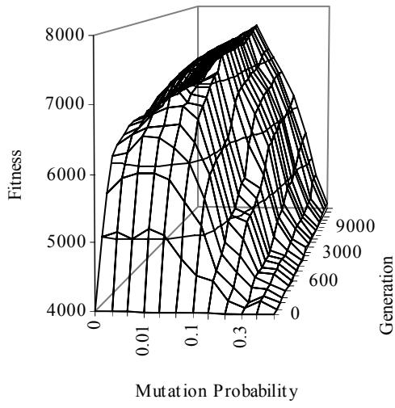
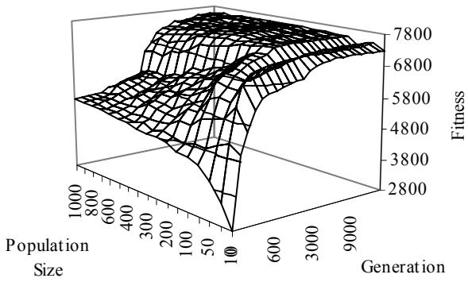
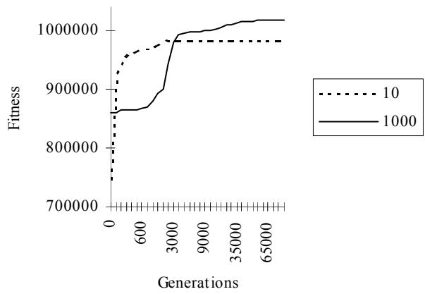
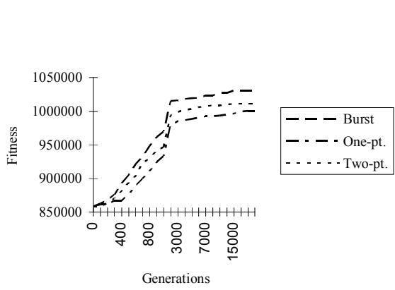
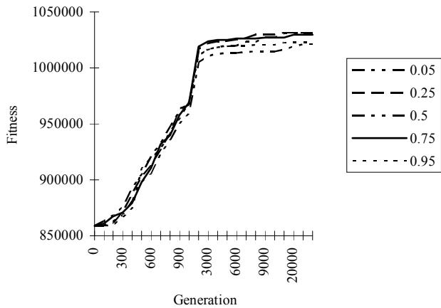
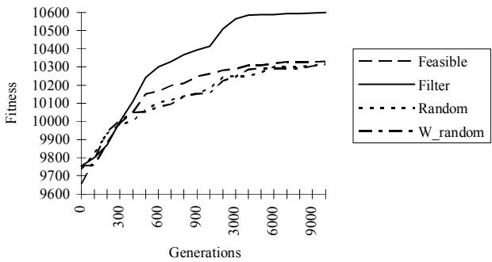
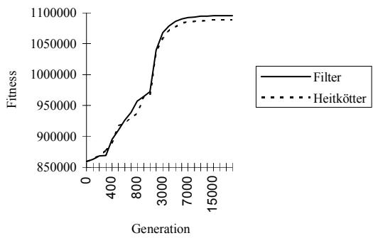
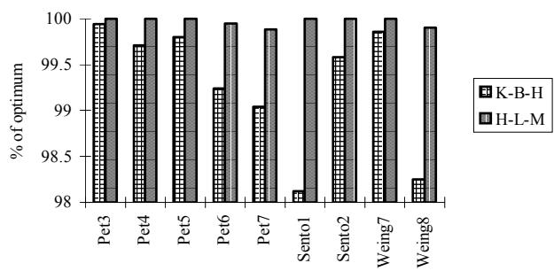
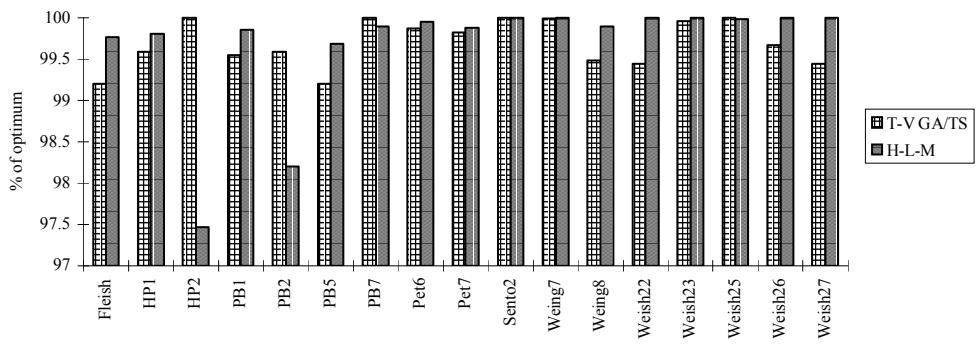

# Genetic Algorithms for 0/1 Multidimensional Knapsack Problems

Arild Hoff (arild.hoff@himolde.no)

Arne Løkketangen (arne.lokketangen@himolde.no)

Ingvar Mittet (molde $\textcircled{4}$ minard.no)

Molde College, Britveien 2, 6400 Molde, Norway

# Abstract

An important class of combinatorial optimization problems are the Multidimensional 0/1 Knapsacks, and various heuristic and exact methods have been devised to solve them. Among these, Genetic Algorithms have emerged as a powerful new search paradigms. We show how a proper selection of parameters and search mechanisms lead to an implementation of Genetic Algorithms that yields high quality solutions. The methods are tested on a portfolio of 0/1 multidimensional knapsack problems from literature, and a minimum of domain-specific knowledge is used to guide the search process. The quality of the produced results rivals, and in some cases surpasses, the best solutions obtained by special-purpose methods that have been created to exploit the special structure of these problems.

# 1. INTRODUCTION

A classic problem from the litterature is the Knapsack Problem, also known as the Burglars Problem. The burglar is given a knapsack which has an upper weight limit of $t$ pounds, and have a choice of items with given weights to carry. Each item also has a value, and the problem is to choose the collection of items which gives the highest total value and do not exceed the limit of the knapsack.

This is the simplest form of the Knapsack Problem. Other variants can be found, and we have choosen to look at the Multidimensional 0/1 Knapsack Problem. In this case there are additional constraints on the contents of the knapsack. For the burglar this might be a limit on the total volume of the selected items, or a limit on the number of red items.

We represent the Multiconstraint $0 / 1$ Knapsack Problem in the form:

Maximize $\begin{array} { l } { z = \sum \left( c _ { j } x _ { j } \cdot j \in N \right) } \\ { \ } \\ { \sum \left( A _ { j } x _ { j } \cdot j \in N \right) \leq b } \\ { x _ { j } \in \ \{ 0 , 1 \} } \end{array}$ Subject to

where $N$ is the set of indices, $b$ is a vector for the constraints on the knapsack, and c is a vector for the value of the objects. $A$ is a matrix which describes the weight of each object for each of the constraints. The $x$ -vector describes which of the objects that are chosen in each solution, f.ex. the vector 01001011 means that objects no. 2, 5, 7 and 8 are chosen.

The Multiconstraint $0 / 1$ Knapsack Problem is an important class of combinatorial optimization problems, and various heuristic and exact methods have been devised to solve them. Many of these methods are general in nature, and consists of a family of methods, each with their own preferred parameter values, rather than a specific clear-cut method. When using such methods to solve the problem at hand, one faces the problem of which major method to select, and then, within this method, which of the variants to implement. We have chosen to look at Genetic Algorithms (GA), and show how proper parametrization of search parameters, together with empirically based choices for important search mechanisms like e.g. crossover and mutation, can lead to highly efficient routines which produce very good results. We have taken care to embed as little domain-knowledge as possible into our methods, and the quality of our results rivals, and in some cases surpass, those obtained by special-purpose methods that have been created to exploit the special structure of these problems. We have also tried to follow the guidelines for computational testing set out in Hooker (1995).

The general outline of the paper is as follows. This introduction is followed in Section 2 by a presentation of Genetic Algorithms. Section 3 is a description of Genetic Algorithms as applied to Knapsack Problems. Computational results and comparisons are presented in Section 3, followed by the conclusions in Section 4.

# 2. ABOUT THE GENETIC ALGORITHMS

Genetic Algorithms are search algorithms based on natural selection and genetics. This idea was first developed by John H. Holland in the early $1 9 7 0 ^ { \circ } \mathrm { s } ,$ and is described in his book (Holland, 1975). The algorithms combines a random selection by the survival of the fittest theory. We can say that the strongest individuals in a population will have a better chance to transfer their genes to the next generation. Simply we can code a number of different solutions of a problem as a bitstring, and evaluate their fitness in relation to each other. Every solution can be seen as an individual in a population, and the bitstring can be seen as the genes of the individual. We then select the individuals to reproduce by weighted monte carlo selection based on their fitness.

The reproduction can be done in three ways :

Pure Reproduction - The individual is copied directly into the next generation (cloning).

Crossover - Two individuals are selected and their genes are crossed at some point, as the first part of the new individual comes from one parent and the last part from the other.

Mutation - An individual is selected, and one bit is changed.

Reproduction will be done until we have the chosen number in each generation. When this is done for several generations, we will hopefully have found an optimal solution, or a solution which is close to the optimum.

# 3. GENETIC ALGORITHMS FOR KNAPSACK PROBLEMS

Genetic Algorithms (GA) have gained a lot of popularity due to its ease of implementation, and the robustness of its search and have been applied successfully in a variety of fields, even though special care has to be taken for highly structured combinatorial optimization problems. General background on GA’s can be found in Goldberg (1989), Lawrence (1991) and Koza (1992).

The purpose of this section is to show how to tackle the problem of finding a set of good parameter values and search mechanisms for a heuristic combinatorial search method like GA, when these possibly are highly dependent on each other. (This also implies that better parameter values may always be found by the industrious researcher, at least for individual test cases). The basis for some of the choices made are shown graphically throughout the paper, but not all results are shown due to space limitations. The various mechanisms and parameters were tested in the sequence shown, and were not changed due to results from later tests. It must also be stated that the authors makes no claims on having tested all the possible mechanisms and parameter values, but a fair selection is used, and this paper can thus be used as a framework for how to tackle related problems.

# 3.1 Initial test case portfolio

To be able to test our various approaches with a reasonable investment in search effort, we selected a subset of the intended test-cases for extensive initial testing, hoping that the found parameters would work equally well for the rest of the test-cases (see 4.1). The chosen test-cases where Sento 1 (big A matrix, 90 variables, 30 constraints), Weingartner 7 (most variables, 105 variables, 2 constraints) and Petersen 6 (medium sized, 39 variables, 5 constraints).

# 3.2 Initial search parameters and mechanisms

To be able to start off our search for good search parameters and mechanisms, we decided to use what is described below as the initial values and mechanisms, based on recommendations from the literature and common sense. (Our first test based on these values was to find the best mutation function, so no initial value is needed for this). More detail is provided later for each of the choices.

Initial population size $\because$ Based on the findings of Khuri, Bäck and Heitkötter (1994), who have also used GA’s on some of the same test-cases, we chose an initial population size of 50.

Initial crossover function : We used one-point cross-over, as this is the simplest.

Regeneration principle : It is claimed in Lawrence (1991) that the Steady-State principle of regeneration is the best (i. e. each pairing off, and subsequent reproduction, of two individuals is considered a new generation), and we chose this as our method.

Initial population type $\boldsymbol { \cdot }$ All initial solutions generated were feasible. This means that all the generated individuals satisfies the knapsack constraints, and all subsequently infeasible individuals were made feasible by dropping items randomly from the knapsacks until feasibility was obtained. (Such infeasible individuals frequently occur due to the crossover, or mixing, of two individuals in the regeneration phase).

Initial penalty functions : Occasionally it might be allowed to let the population contain infeasible individuals (representing invalid solutions), to increase the variation in the gene pool. In these instances the infeasible individuals are often penalized so as to look less attractive for mating, while still occasionally being chosen. We used no penalty functions initially, as all the individuals are feasible.

Initial search effort $\because$ We chose to run the GA’s for 30,000 generations (i.e. generating 60,000 new individuals).

Fitness : The fitness value for the individuals was set to the same as the objective function value, z.

# 3.3 Mutation

The concept of mutation is essential to GA’s, as they create a necessary diversification. Without sufficient mutation the population will tend to converge towards a few good solutions, possibly representing local optima. On the other hand, with too much mutation the search will have problems of focusing on, and cling to, potentially good solutions. A lot of different mutation operators have been suggested in the literature, and we decided to try out the following.

Mutation per individual : The possibility for mutation is related to the individual. Each individual will thus experience a maximum of 1 mutation in a randomly selected bit position. The selected bit position receives a random value.

Mutation per bit : Here each single bit position in an individual might possibly mutate.

Swap Mutation : Here the values of two randomly selected bit positions are interchanged when mutating.

Inverted Mutation : As mutation per bit, but the selected bit receives the opposite value of what it had previously.

  
Figure 1. Inverse bitwise mutation for Sento 1

Our findings were that Inverted Mutation performed best, with a good value for the mutation rate of 1/N, where N is the size of the problem in terms of the variables, and this value was used for the subsequent tests. Figure 1 shows a typical plot of how the fitness value for the Sento 1 problem evolves over the generations for various mutation probabilities.

# 3.4 Population size.

If the population size is too small, there might be too little diversity in the genetic material to be able to properly span the search space, while if is too big the search gets sluggish and needs a long time to focus on good values.

We started out with a population size of 50. In Koza (1992) 500 is recommended for most of the problems described in the book, while Lawrence (1991) states that it is problem-dependent, and uses 30 for one of his cases, and in Thiel and Voss (1993) 10 is used for some of their experiments.

Our tests therefore tested population sizes ranging from 10 to 1000. These tests revealed that a good value for population size is $5 ^ { * } \mathrm { N }$ , which was subsequently used. Figure 2 shows the results for Sento 1. An example of how the search progresses for extreme values of the population size is shown in figure 3.

# 3.5 Cross-over function

The cross-over function determines how the offspring is generated from the selected parents, and the proper choice of which function to use might be crucial, and must be tailor-made for highly structured problems.

(A good example in this context is the Traveling Salesman Problem, which needs a crossover function that maintains the Hamilton Tour property). Our Knapsack problems are not structured in the same way, and the following cross-over functions were tried out.

  
Figure 2. Population Size for Sento 1

  
Figure 3. Extreme population sizes for Weingartner 7

  
Figure 4. Crossover functions

  
Figure 5. Crossover probabilities

One-point crossover $\because$ Here a random bit position in the selected parents is determined, and one offspring gets the bits from one parent up to this point, and the rest from the other parent. (The other offspring is of course made up of what is left).

Two-point crossover : This is similar to One-point cross-over, but with two crossover points instead of one.

Burst crossover : Here the test for cross-over is made at every bit position in turn, thus possibly resulting in many crossover-points, depending on the selected probability.

Our testing showed that burst cross-over gave the best results, which is indicated in figure 4 for Weingartner 7. Overall (over the three selected test-cases) a $50 \%$ probability for changing parent each bit was best, even though it performed worst for Weingartner 7.

# 3.6 Population type

The goodness of our search method is clearly dependent on the restrictions we put on the initial population, and on the subsequent regeneration. The following four methods were tried out. (The penalty function SQRT2, defined in the next sub-section, was applied where appropriate):

Filter : This was the method used for all tests up to this point, where all individuals generated are feasible. (If an individual is generated infeasible, it is made feasible by dropping random items from the knapsack until feasibility is obtained).

Feasible : This starts off with an initially feasible population, but infeasible individuals are allowed.

Random $\boldsymbol { \cdot }$ Here the initial population is uniform randomly generated, but with the provision that at least one feasible individual exists.

Weighted random : As Random, but with the added feature of deciding the proportion of infeasible individuals.

  
Figure 6. Population types

  
Figure 7. Penalty types

The results here were somewhat surprisingly that the Filter method performed best. Contrary to what one might expect, our findings does not indicate that it gives any benefit to allow infeasible individuals.

# 3.7 Penalty functions

To be able to use infeasible individuals in the population, their fitness function must be penalized in some way so that they won’t dominate over the feasible individuals. The treatment of penalty functions in the literature is scarce, but some guidelines are given in Richardson et al. (1989). For multidimensional $0 / 1$ knapsack problems there have been two previous attempts. In Thiel and Voss (1993) the authors show that their proposed penalty function doesn’t work good enough, so it was not tried. In Khuri, Bäck and Heitkötter (1994) a penalty function is used which the authors claim works well. We tried this (called Heitkötter) along with a more conventional penalty-function based on a squared deviation measure.

Heitkötter : This is based on the number of knapsacks with overflow multiplied by the largest basic fitness found. (see Khuri, Bäck and Heitkötter, 1994).

SQRT2 : Here the value assigned an infeasible individual is set to the value of the incumbent, minus the square root of the sum of overflow of the knapsacks.

As mentioned above, none of these gave better results than using only feasible individuals. It must also be mentioned that the number of infeasible individuals generated with the Heitkötter penalty function was very low, indicating that the assigned penalty possibly is too large, making infeasible individuals too unattractive for elevation to parenthood. Figure 7 shows a comparison for Weingartner 7 of the Heitkötter penalty function compared to the Filter method which allows no infeasible individuals in the population. We thus abandoned trying to have infeasible individuals in our population.

# 3.8 Search effort

Based on the results from the above tests, we set the number of generations to be 50 times the population size, i. e. $2 5 0 ^ { * } \mathrm { N }$ .

The final results based on the best parameters found as indicated above are reported in Section 4.

# 4. COMPUTATIONAL RESULTS

# 4.1 Test problems

The 57 test problems are of the multiconstraint knapsack type, collected from the literature by Drexl - 1988 and employed extensively in the literature as a standard test case portfolio for heuristic search. The individual problem sets are indicated below, where the numbers attached to the abbreviated set names differentiate the different elements of each set.

• Petersen1 - Petersen7 Peterson (1967)   
• Sento1 - Sento2 Senyu and Toyoda (1968)   
• PB1 - PB7 Mod. of Senyo and Toyoda used by Freville, Plateau   
• Weing1 - Weing8 Weingartner and Ness (1967)   
• Weish1 - Weish30 Shih (1979)   
• Fleischer Fleischer problem

The problems have from 6 to 105 variables, and 2 to 30 constraints, and the optimal solutions are well known.

The GA algorithms where implemented in $\mathrm { C } { + + }$ , using the general heuristic search class library framework of Woodruff (1993).

# 4.2 Final GA search parameters

To test the full complement of test-cases with our GA the following parameters and mechanisms were used, based on our preliminary findings. Steady state population, with all individuals feasible at all times. Initial population size of $5 ^ { * } \mathrm { N }$ , where N is the number of variables. The number of generations were set to $2 5 0 ^ { * } \mathrm { N }$ , and inverse mutation with a probability of 1/N was used. We used burst cross-over function with a probability of 0.5. Each test-case was run with 10 different randomly generated start-populations.

# 4.3 General test results

Our GA approach found the optimum for 56 of the 57 test-cases, and for 44 of them at all of the 10 runs. The average deviation from the optimum was $0 . 1 6 \%$ , most of which was due to poor results on the testcases HP2 and PB2 (which are essentially the same problem).

The 9 test-cases used by Khuri, Bäck and Heitkötter (1994) is a subset of our test-case portfolio, and we obtained better results were obtained for all of them. Our approach

  
Figure 8. Comparison with Khuri, Bäck and Heitkötter

  
Figure 9. Comparison with Thiel and Voss

found the optimum in $60 \%$ to $100 \%$ of all the runs, while the corresponding results for them where $0 \%$ to $83 \%$ . Most of the tests where also run with considerably fewer offspring generated. Figure 8 shows graphically a comparison of the results obtained by the two methods in terms of average deviation from the optimum values. In the legend K-B-H denotes the results of Khuri, Bäck and Heitkötter (1994), while H-L-M are the results of the authors.

We also compared our results to those obtained Thiel and Voss (1993). Their approach was to combine their GA implementation with Tabu Search (TS). (For details on TS, see e.g. Glover and Laguna, 1993 or Glover, 1989). They also used a reoptimizing drop/add cross-over mechanism, specially tailored to fit the multidimensional knapsack problems. When compared to their pure GA approach, we got better results for 44 of the 57 instances, while drawing for the rest (both finding all the optima). With the GA/TS approach of Thiel and Voss (1993) (with the TS implemented as a local search phase from the best solution (or individual) after each iteration) they get slightly better average results than the authors. Figure 9 shows graphically a comparison of the GA/TS Only the 17 (of the 57) test-cases where both methods did not find the optimum in all the runs are shown. As can be seen from the graph, our method performs poorly on the two test-cases HP2 and PB2, while doing well on the rest, while the GA/TS approach does fairly well on all the test-cases.

One reason for this is that GA’s are in a sense (hopefully) spanning the whole search space with its population, while TS is an inherent local search, which is rather myopic in its simpler implementations. GA’s thus have an inherent problem on focusing properly on some types of local optima, but these are for these cases easily found by the TS component. Similar careful implementations for other search heuristics does also give good results, as can be seen in Løkketangen and Glover (1995), which is an extensive implementation of TS tested on the same portfolio of test-cases.

# 5. CONCLUSIONS

We have shown how careful selection of search mechanisms and tuning of search parameters can yield superior results for the Genetic Algorithm metaheuristic. This was done by selecting a (hopefully) representative set of initial test-cases from the target test-case portfolio, which was subsequently used for extensive testing of the

various search mechanisms and parameters. By the Proximate Optimality Principle (POP, see Glover, 1995), it can be conjectured that what works well for our initial set of test-cases, also works well for the similar target test-cases. Our testing thus shows the importance, and feasibility, of being able to find a set of parameters that works satisfactorily over the whole test-case portfolio based on extensive testing only on a small subset.

The comparative results with respect to the results reported in Khuri, Bäck and Heitkötter (1994) are especially encouraging, even though there is certainly room for improvement.

The comparative results also points out the fact that due to the difference in nature of the search heuristics, one is sometimes good where the other is bad, and vice versa. This is shown in Thiel and Voss (1993), and indicates the potential appropriateness of combined approaches, even though properly crafted implementations of “pure” heuristics might yield comparable results.

# Список литературы

Drexl, A. (1988) : “A Simulated Annealing Approach to the Multiconstraint Zero-On Knapsack Problem”, Computing 40, pp 1-8.   
Glover, F. (1989) : “Tabu Search - Part I”, ORSA Journal of Computing. Vol 1, No pp 190-206.   
Glover, F. (1995) : “Tabu Search Fundamentals and Uses”, Technical Report, University of Colorado at Boulder.   
Glover, F. and Laguna, M. (1993) : “Tabu Search”. Modern Heuristics for Combinatorial Problems, C. Reeves, (ed.), Blackwell Scientific Publishing.   
Goldberg, D.E. (1989) : Genetic Algorithms in Search, Optimization and Machine Learning, Addison Wesley.   
Holland J.H. (1975) : Adaption in Natural and Artificial Systems, University of Michigan Press.   
Hooker,J.N. (1995) : “Testing Heuristics: We Have It All Wrong”, Journal of Heuristics. Vol.1, No 1, pp. 33-43..   
Khuri, S. , Bäck, T. and Heitkötter, J. (1994) : “The Zero/One Multiple Knapsack Problem and Genetic Algorithms”. Proceedings ACM Symposium of Applied Computation, SAC ‘94.   
Koza,J.R. (1992) $\boldsymbol { : }$ Genetic Programming, MIT Press.   
Lawrence, D. (1991) : Handbook of Genetic Algorithms, Van Nostrand Reinhold.   
Løkketangen A. and Glover, F. (1995) : “Tabu Search for Zero-One Mixed Integer Programming with Advanced Level Strategies and Learning”, International Journal of Operations and Quantitative Management, Vol 1, No 2.

Petersen, C.C. (1967) : “Computational Experience with Variants of the Balas Algorithm Applied to the Selection of R&D Projects”, Management Science 13, pp 736-750.

Richardson, J. , Palmer, R. , Liepins, G. and Hilliard, M. (1989) $\cdot$ “Some Guidelines for Genetic Algorithms with Penalty Functions”, Proceedings of the Third International Conference on Genetic Algorithms, pp 191-197.

Senyu, S. and Toyoda, Y. (1968) : “An Approach to Linear programming with 0-1 variables”, Management Science 15, pp 196-207.

Shih, W. (1979) : “A Branch and Bound Method for the Multiconstraint Zero-One Knapsack Problem”, Journal of the Operational Research Society 30, pp 369- 378.

Thiel, J. and Voss, S. (1993) : “Some experiences on solving multiconstraint zero-one knapsack problems with genetic algorithms”, INFOR.Vol 32, No 4, pp 226-243.

Weingartner, H.M. and Ness, D.N. (1993) : “Methods for the Solution of Multidimensional 0/1 Knapsack Problems”, Operations Research 15, pp 83-103.

Woodruff, D.L. (1993) $\boldsymbol { : }$ “A Class Library for Heuristic Search Optimization: Preliminary Users Guide’, Working Paper, University of California at Davis.

Filename: NIKGAKN.DOC   
Directory: C:\HOVEDOPP   
Template: C:\MSOFFICE\WINWORD\TEMPLATE\NORMAL OT   
Title: Strategic Oscillation and Diversification Schemes in Tabu Search for Zero-One Mixed Integer Programming Problems   
Subject:   
Author: It Senteret   
Keywords:   
Comments:   
Creation Date: 15.10.96 16:30   
Revision Number: 2   
Last Saved On: 15.10.96 16:30   
Last Saved By: It Senteret   
Total Editing Time: 2 Minutes   
Last Printed On: 15.10.96 16:32   
As of Last Complete Printing Number of Pages: 11 Number of Words: 3.535 (approx.) Number of Characters: 20.154 (approx.)