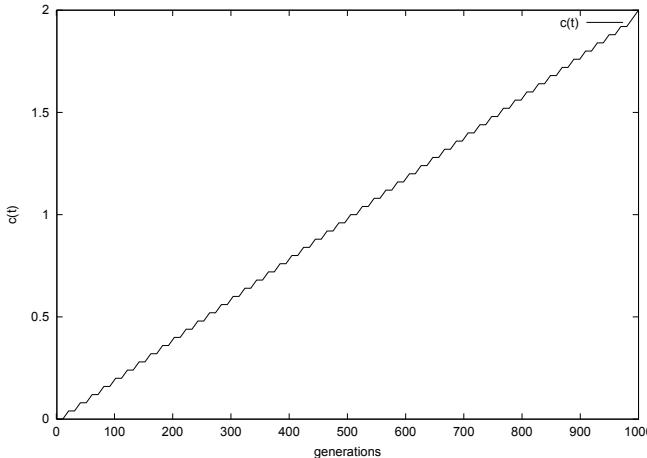
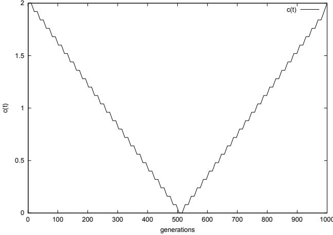
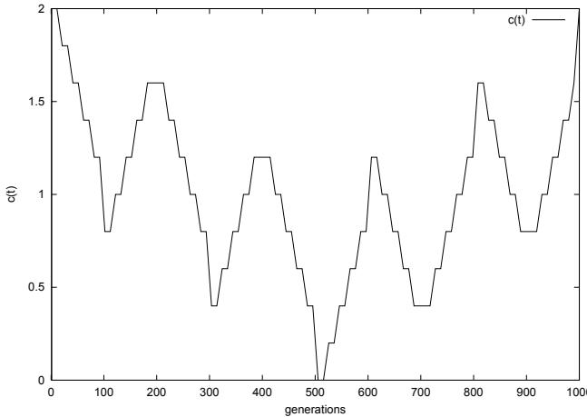

# Non-stationary Function Optimization using Evolutionary Algorithms with a Case-based Memory

J. Eggermont Leiden Institute of Advanced Computer Science Leiden University Leiden

T. Lenaerts Computational Modeling Lab Brussels Free University Brussels

# Abstract

Dynamic environments form a difficult class of problems for evolutionary algorithms to solve. In this paper we introduce a case-based memory which stores information during the the evolutionary process and show how this information might be used to drastically improve the performance of an evolutionary algorithm.

# 1 Introduction

Since their introduction evolutionary algorithms (EAs) have been applied to a wide variety of problems. One class of these problems, dynamically changing problems, have always been particularly difficult for evolutionary algorithms. This difficulty is caused by the lack of a fixed mapping between solution encoding and solution quality. In dynamically changing problem spaces the fitness of a particular individual can change in time making it necessary for the algorithm to continuously adapt to changes in the environment.

The class of dynamically changing can be divided into two categories:

1. periodic dynamic problems: These problems have a (usually small) set of recurring mappings between solution encoding and fitness. An example of a periodic dynamic problem is the 0-1 knapsack problem [7].

2. non-periodic dynamic problems: These problems have an ever changing mapping between solution encoding and fitness. An example of a nonperiodic dynamic problem is Omera's dynamic problem domain 1 [15].

In [10] only the application of a case-based memory to simple periodic dynamic problems (variants of the 0-1 knapsack problem) was investigated. Two strategies were tested that re-seeded the population using good individuals from previous generations. In this paper we propose a more generally applicable use of a casebased memory whereby we use a combination of reseeding in combination with a a simple predictor to improve the performance of evolutionary algorithms in dynamic environments. We will test the case-based memory and the simple predictor on a set of dynamic non-periodic problems to study the performance.

The contents of this paper is as follows. In Section 2 we will discuss the context and motivation for our algorithm. Then in Section 3 we will discuss how the case-based memory (CBM) can be used in conjunction with a simple predictor to enhance the performance of EAs. Section 4 follows with the experiments and results. Finally in section 5 we will draw our conclusions and elaborate on future research.

# 2 Context

Dynamically changing problems are closely related to artificial co-evolution [9] where the EA configuration is transformed into an interactive system. Research conducted by for instance D. Hillis and J. Paredis incorporates predator-prey interactions to evolve solutions for static problems[9, 16]. The EA configuration used to evolve a solution for these static problems is transformed to an interactive, co-evolutionary system to overcome the evaluation bottleneck of the EA. This evaluation bottleneck is caused by the number of test-cases against which each individual has to be tested in order to find the optimal solution. In order to reduce the number of evaluations per individual they introduce a second population which contains a subset of the test cases (problems). These problems may evolve in the same fashion as the solutions.

As a result their algorithm creates an arms-race between both populations, i.e. the population of problems evolves and tries to outsmart the population of solutions. A major problem in this co-evolutionary approach is memory[17]. The population of solutions tries to keep up with problems but its genetic memory is limited to the knowledge that is available in the population. If after a large number of generations the population of problems evolves back to an earlier genetic configuration there is a big chance that the population of solutions does not remember how it could win against those problems.

In dynamically changing problems we face a similar problem. As the fitness function changes the EA has to adapt as fast as possible. The existing approaches used by evolutionary algorithms can be divided into two groups (see [1, 22]). First of all there are the approaches that depend on a set of rules, heuristics or strategies that are dependent on and applied to the current population in order to adapt it to a change in environment. Approaches of this class can usually be sub-divided into two categories: maintaining diversity and increasing diversity.

Diversity maintaining approaches try to maintain a certain level of diversity and prevent (premature) convergence as this prohibits the algorithm to quickly adapt to a change in the fitness landscape. Examples of this approach are sharing and crowding techniques [8], the thermodynamical genetic algorithm [14] and aging of individuals [5].

Diversity increasing approaches increase diversity once a change in the problem domain has taken place. Examples of this approach are hyper-mutation [2] and Variable Local Search (VLS) [23].

Besides using rules or heuristics it is also possible to extend an evolutionary algorithm with memory. In memory-based approaches the behavior of the algorithm is adapted according to the information stored within the memory. This memory can be provided internally (within the population) or externally (outside the population).

The most used approach using internal memory is polyploidy (also called multiploidy) structures in combination with dominance change mechanisms (see [11, 7]). Polyploidy approaches use redundancy in genetic material by having more than one copy of each gene. When a chromosome is decoded to be evaluated the dominant copy is chosen. By switching between copies of genes the EA can adapt faster while retaining information about previous fitness states in recessive genes. Another approach using internal memory is polygenic inheritance (see [3, 20]. Polygenic inheritance is taken from natural biology and uses the idea that a trait (e.g. the color of wheat) can depend one more than one gene or gene pair. This makes it more difficult to differentiate between various phenotypes and hence easier to change between them.

External memory designs store specific information (usually an individuals chromosome) and reintroduce that information into the population at a later moment. In most cases this means that individuals from memory are put into the initial population of a new or restarted EA (see [18, 14]). In [10] a case-based memory was used to re-seed the population with the best individuals from previous generations once change in the problem domain had taken place. A different kind of case-based memory was used in [12] and [13] where both problems and solutions were stored. When the GA has to solve a problem similar to a problem in its case-based memory it uses the stored solutions to seed the initial population. The case-based memory system which we first proposed in [10] was initially based on C. Rosins Hall of Fame (HOF) which he used in his research on co-evolution and game-playing[19]. This HOF stores individuals which were good in the past in order to remember how to play certain games in the future. Here we extend our case-based memory with a simple predictor which exploits the information stored in the case-based memory in order to adapt faster to changes in the fitness function. Although our casebased memory is representation independent the predictor naturally is not, as it depends on the way the solution to the problem is encoded.

# 3 Incorporating a Case-Based Memory

In Section 2 we discussed that the problem of an EA in a dynamic environment is memory. To overcome the problem we incorporate a global case-based memory into the evolutionary process. The goal of this case-based memory is to collect information about the encountered optima during the evolutionary process.

The introduction of a case-based memory is actually a form of long-term elitism. Elitism forces the EA to maintain the best element of every generation so the current optimum will never be lost. In our case the case-based memory stores these elitists outside the population so they can be used to for both exploration and exploitation [4]. By reintroducing individuals from previous generations we aim to increase diversity in the population and thereby improve exploration. Exploitation is achieved by reintroducing individuals from the case-based memory once they become good again, or use the individuals in the casebased memory to track the course of evolution and try to predict the next best individual. This approach is somewhat similar to Tabu search [6]. Tabu search is a meta-heuristic which can be used to enhance local search algorithms by using an adaptive memory. This memory is used to keep track of bad choices during the search so they can be prevented in the future. In our case we use a much simpler case-based memory to track the course of evolution and predict future solutions.

There are a number of primary decisions that need to be made. These primary decisions will influence the possibilities of the case-based memory. Especially, they will influence how advanced this memory will be used.

1. Which elements will be added to the case-based memory? If a change in the fitness function is detected the best individual from the preceding generation is added to the case-based memory. If the individual was already present in the casebased memory than that individual will be erased. There will only be one copy of each chromosome in the case-based memory. Only the genotype and fitness of an individual is stored (although the latter is not used at this point).

2. What kind of structure will we use for the casebased memory? In this paper we simply used a small population as representation for the casebased memory. In later work we will look further at alternative structures. As with the population, the case-based memory size is fixed. We use a strategy called the least recently used strategy (LRU) when removing elements from the casebased memory to add a new individual[21].

3. How will we use the information in the case-based memory? In [10] we used two simple re-seeding strategies aimed at periodic functions.In this paper we use two different strategies:

• re-insertion: The individuals in the casebased memory are evaluated and the best individual is inserted into the population where it replaces the worst individuals. It is similar to the non-random replacement strategy from [10] but now only one individual is replaced.

• prediction: We use a simple prediction algorithm that makes a crude prediction of what the next best individual should look like and creates this individual. This newly created individual is then evaluated and inserted into the population where it replaces the current worst individual. We will explain the prediction algorithm we chose in Section 4.

4. What will the size be of the case-based memory? In order not to slow down the EA process the size of the case-based memory should not be to large. We decided to test with three different maximum sizes 2, 10 and 40. Early experiments indicated that the maximum size is not always used (at least with periodic problems). At the beginning of the evolutionary process the memory size is zero.

5. When will the information in the case-based memory be used? The information in the case-based memory is used if a change in fitness function is detected. This detection is done by using an 1 member elite individual and checking whether it's fitness has changed. If it has than a change in fitness function has taken place.

# 4 Experiments & Results

In order to evaluate the effectiveness of the case-based memory and the two described strategies we used a number of non-periodic dynamic problems. All experiments where run with a standard genetic algorithm (SGA) with one member elitism in order to detect a fitness change.

All the following problems are minimization problems. The goal is to find a variable $x$ that minimizes some function $f ( x , t )$ where $t \in \{ 1 , 1 0 0 0 \}$ , is the time-step. The problem is represented by a bitstring of length 31 either binary (B) or gray (G) coded and normalized to give a value in the range $\{ 0 . 0 0 0 , . . . , 2 . 0 0 0 \}$ . generations.

The basis of the fitness function of the non-periodic problems is formed by Omera's dynamic problem domain 1:

$$
g _ { 1 } ( x , t ) = 1 - e ^ { - 2 0 0 ( x - c ( t ) ) ^ { 2 } }
$$

By changing sub-function $c ( t )$ we can specify a certain behavior.

We will examine the response time of the population through the performance of the best individual in the population. The response time is measured through the mean $\%$ tracking error. A tracking error is a value which measures the difference between the optimal fitness and the current best fitness. The entire population does not have to track the changing fitness landscape. Also, when calculating the mean $\%$ tracking error over all experiments, the standard deviation is important since a small standard deviation is better than a large one. A very small standard deviation shows that the algorithm is able to track the changing fitness function very closely.

In Table 1 the standard parameters are described. For each experiment 50 independent runs were performed. The mean $\%$ track error is calculated using the fitness of the best individual in each generation (50000 in total).

In the tables with results SGA stands for the standard genetic algorithm, CBM-R stands for a case-base memory GA with re-insertion strategy. CBM-P stands for a case-based memory GA with predictor and CBMB stands for a case-based memory GA with both reinsertion strategy and predictor.

Table 1: Parameters and characteristics of the genetic algorithm   

<table><tr><td>parameter</td><td>value</td></tr><tr><td>genotype</td><td>bitstring of length 31</td></tr><tr><td>populations size maximum generations</td><td>400</td></tr><tr><td>evolutionary model (μ, λ)</td><td>1000 (400, 400)</td></tr><tr><td>parent selection</td><td>7 tournament</td></tr><tr><td>mutation</td><td>bitflip</td></tr><tr><td>mutation rate</td><td>0.01</td></tr><tr><td>crossover</td><td></td></tr><tr><td></td><td>2-point crossover</td></tr><tr><td>crossover rate</td><td>0.7</td></tr></table>

Table 2: An example case-based memory with gray coded individuals of length 4   

<table><tr><td>Individual</td><td>value</td></tr><tr><td>0000</td><td>0</td></tr><tr><td>0001</td><td>1</td></tr><tr><td>0011</td><td>2</td></tr><tr><td>0010</td><td>3</td></tr></table>

# 4.2 Omera's dynamic problem domain 1

In Omera's dynamic problem domain 1 the function $c ( t )$ is specified by

$$
c ( t ) = 0 . 0 4 ~ ( \lfloor t / 2 0 \rfloor )
$$

As can be seen in figure 1 the function provides predictable behavior

  
Figure 1: The behavior of $c ( t )$ function over time for Omera's dynamic problem

# 4.1 The Predictor

In all experiments the predictor is a crude linear predictor. It calculates the average change between successive individuals in the case-based memory. The change is calculated on the phenotype (variable $x$ ) level. Using the average change and the individual added last to the case-based memory a prediction is done. This prediction value is then converted into an either binary or gray-coded bitstring of length 31 and inserted into the population, where it replaces the worst individual. If we have the case-based memory shown in Table 2 the prediction algorithm would calculate an average change of $\mathbf { \sigma } _ { - } ( \mathbf { = } ( ( 1 - 0 ) + ( 2 - 1 ) + $ $( 3 - 2 ) / 3 )$ . This value together with the last individual (3) would result in a predicted value of 4. This is gray coded into 0110 and inserted into the population.

If we examine the results in Table 3 we see first of all that gray coding gives much better results than standard binary coding. As was to be expected the reinsertion strategy doesn't work in this case since there are no recurring patterns in the fitness function. Prediction does work and is, in combination with a casebased memory with maximum size 10, able to achieve the best result (a mean $\%$ track error of around $2 \%$ ). This result is virtually the same for both gray and binary coding.

# 4.3 Variant 1

Function 1 is based on Omera's dynamic problem domain 1 but now we change function 2 to the V-shape behavior seen in Figure 2:

Table 3: Experiment results for Omera's dynamic problem domain 1   

<table><tr><td>Algorithm</td><td>Coding</td><td>CBM size</td><td>Mean % Track Err.</td><td>Standard Deviation</td></tr><tr><td>SGA</td><td>B</td><td>0</td><td>53.03</td><td>41.50</td></tr><tr><td>SGA</td><td>G</td><td>0</td><td>10.43</td><td>14.77</td></tr><tr><td>CBM-R</td><td>B</td><td>2</td><td>52.97</td><td>41.48</td></tr><tr><td>CBM-R</td><td>G</td><td>2</td><td>10.55</td><td>14.91</td></tr><tr><td>CBM-P</td><td>B</td><td>2</td><td>5.47</td><td>14.27</td></tr><tr><td>CBM-P</td><td>G</td><td>2</td><td>2.85</td><td>6.39</td></tr><tr><td>CBM-B</td><td>B</td><td>2</td><td>51.80</td><td>41.91</td></tr><tr><td>CBM-B</td><td>G</td><td>2</td><td>9.94</td><td>14.55</td></tr><tr><td>CBM-R</td><td>B</td><td>10</td><td>53.22</td><td>41.46</td></tr><tr><td>CBM-R</td><td>G</td><td>10</td><td>10.55</td><td>14.91</td></tr><tr><td>CBM-P</td><td>B</td><td>10</td><td>2.32</td><td>5.61</td></tr><tr><td>CBM-P</td><td>G</td><td>10</td><td>1.95</td><td>4.93</td></tr><tr><td>CBM-B</td><td>B</td><td>10</td><td>9.42</td><td>14.93</td></tr><tr><td>CBM-B</td><td>G</td><td>10</td><td>6.55</td><td>10.59</td></tr><tr><td>CBM-R</td><td>B</td><td>40</td><td>53.08</td><td>41.50</td></tr><tr><td>CBM-R</td><td>G</td><td>40</td><td>10.55</td><td>14.90</td></tr><tr><td>CBM-P</td><td>B</td><td>40</td><td>2.71</td><td>5.98</td></tr><tr><td>CBM-P</td><td>G</td><td>40</td><td>2.10</td><td>5.16</td></tr><tr><td>CBM-B</td><td>B</td><td>40</td><td>16.22</td><td>20.67</td></tr><tr><td>CBM-B</td><td>G</td><td>40</td><td>9.51</td><td>13.44</td></tr></table>

$$
c ( t ) = 0 . 0 8 ~ | 2 5 - ( \lfloor t / 2 0 \rfloor ) |
$$

In Table 4 we see again that gray coding is better. For this problem a small case-based memory of size 2 and prediction offers the best performance although the re-insertion strategy also offers a modest improvement over the standard genetic algorithm.

# 4.4 Variant 2

To get a more dynamic problem we change function 2 so it has a less predictable pattern (see Figure 3). $c ( t )$ now becomes:

$$
c ( t ) = 0 . 2 ( \mid t / 1 0 0 \rfloor - 5 \mid + \mid 5 - ( \lfloor t / 2 0 \rfloor m o d 1 0 ) \mid )
$$

Table 5 shows a different picture from the two experiments above. This time the combination of reinsertion strategy and prediction offers the best performance. The re-insertion strategy alone also results in a big improvement over the standard GA but only when using gray coding. Prediction doesn't really works in this case except with a case-based memory of size 2 (and gray coding).

  
Figure 2: The behavior of $c ( t )$ function over time for function variant 1

  
Figure 3: The behavior of $c ( t )$ function over time for function variant 2

# 5 Conclusions and Future Research

Based on all the data produced from experiments we can conclude that a case-based memory can be a valuable extension to an evolutionary algorithm. It is clear that a more powerful predictor could offer an even better performance but even the improvements gained by our simple predictor indicate the possibilities of using a case-based memory. In all three test functions a GA using a case-based memory and prediction proved to offer the best performance by having a mean $\%$ track error that is at least $5 0 \%$ lower than of the best GA without memory. Also there was no algorithm using a case-based memory that performed significantly worse than the standard GA. Unfortunately in some cases the predictor and re-insertion strategy seem to hinder each other indicating that more research is needed in this area.

Table 4: Experiment results for function variant 1   

<table><tr><td>Algorithm</td><td>Coding</td><td>CBM size</td><td>Mean % Track Err.</td><td>Standard Deviation</td></tr><tr><td>SGA</td><td>B</td><td>0</td><td>56.22</td><td>40.83</td></tr><tr><td>SGA</td><td>G</td><td>0</td><td>25.68</td><td>29.65</td></tr><tr><td>CBM-R</td><td>B</td><td>2</td><td>55.56</td><td>40.95</td></tr><tr><td>CBM-R</td><td>G</td><td>2</td><td>25.05</td><td>29.27</td></tr><tr><td>CBM-P</td><td>B</td><td>2</td><td>13.09</td><td>20.49</td></tr><tr><td>CBM-P</td><td>G</td><td>2</td><td>9.66</td><td>17.31</td></tr><tr><td>CBM-B</td><td>B</td><td>2</td><td>51.93</td><td>40.97</td></tr><tr><td>CBM-B</td><td>G</td><td>2</td><td>24.71</td><td>29.56</td></tr><tr><td>CBM-R</td><td>B</td><td>10</td><td>52.65</td><td>41.51</td></tr><tr><td>CBM-R</td><td>G</td><td>10</td><td>22.62</td><td>28.45</td></tr><tr><td>CBM-P</td><td>B</td><td>10</td><td>16.37</td><td>26.41</td></tr><tr><td>CBM-P</td><td>G</td><td>10</td><td>11.04</td><td>19.77</td></tr><tr><td>CBM-B</td><td>B</td><td>10</td><td>38.29</td><td>39.73</td></tr><tr><td>CBM-B</td><td>G</td><td>10</td><td>17.20</td><td>24.85</td></tr><tr><td>CBM-R</td><td>B</td><td>40</td><td>51.62</td><td>41.53</td></tr><tr><td>CBM-R</td><td>G</td><td>40</td><td>15.98</td><td>25.36</td></tr><tr><td>CBM-P</td><td>B</td><td>40</td><td>34.95</td><td>40.25</td></tr><tr><td>CBM-P</td><td>G</td><td>40</td><td>17.32</td><td>25.02</td></tr><tr><td>CBM-B</td><td>B</td><td>40</td><td>21.76</td><td>31.79</td></tr><tr><td>CBM-B</td><td>G</td><td>40</td><td>14.53</td><td>24.07</td></tr></table>

Although we have gained new information about the use of a case-based memory in combination with an evolutionary algorithm a lot of work still has to be done. There seems to be no clear indication as to the preferred size of the case-based memory. There's also the problem that in some cases the predictor and reinsertion strategy seem to hinder each other.

For future research we aim at incorporating the casebased memory in other evolutionary algorithms in order to examine the generality and portability of the case-based memory in both dynamic and static problem domains.

Table 5: Experiment results for function variant 2   

<table><tr><td>Algorithm</td><td>Coding</td><td>CBM size</td><td>Mean % Track Err.</td><td>Standard Deviation</td></tr><tr><td>SGA</td><td>B</td><td>0</td><td>57.30</td><td>43.61</td></tr><tr><td>SGA</td><td>G</td><td>0</td><td>47.66</td><td>42.94</td></tr><tr><td>CBM-R</td><td>B</td><td>2</td><td>55.25</td><td>43.71</td></tr><tr><td>CBM-R</td><td>G</td><td>2</td><td>38.88</td><td>41.88</td></tr><tr><td>CBM-P</td><td>B</td><td>2</td><td>49.92</td><td>43.27</td></tr><tr><td>CBM-P</td><td>G</td><td>2</td><td>40.38</td><td>41.75</td></tr><tr><td>CBM-B</td><td>B</td><td>2</td><td>41.52</td><td>41.22</td></tr><tr><td>CBM-B</td><td>G</td><td>2</td><td>31.46</td><td>38.56</td></tr><tr><td>CBM-R</td><td>B</td><td>10</td><td>52.69</td><td>43.91</td></tr><tr><td>CBM-R</td><td>G</td><td>10</td><td>24.33</td><td>36.51</td></tr><tr><td>CBM-P</td><td>B</td><td>10</td><td>53.77</td><td>43.85</td></tr><tr><td>CBM-P</td><td>G</td><td>10</td><td>44.51</td><td>42.86</td></tr><tr><td>CBM-B</td><td>B</td><td>10</td><td>23.82</td><td>34.35</td></tr><tr><td>CBM-B</td><td>G</td><td>10</td><td>21.59</td><td>34.27</td></tr><tr><td>CBM-R</td><td>B</td><td>40</td><td>52.49</td><td>43.95</td></tr><tr><td>CBM-R</td><td>G</td><td>40</td><td>22.73</td><td>35.77</td></tr><tr><td>CBM-P</td><td>B</td><td>40</td><td>54.50</td><td>44.09</td></tr><tr><td>CBM-P</td><td>G</td><td>40</td><td>44.80</td><td>42.92</td></tr><tr><td>CBM-B</td><td>B</td><td>40</td><td>21.66</td><td>33.47</td></tr><tr><td>CBM-B</td><td>G</td><td>40</td><td>19.39</td><td>33.13</td></tr></table>

# Список литературы

[1] Jürgen Branke. Evolutionary approaches to dynamic optimization problems: A survey. In Jürgen Branke and Thomas Bäck, editors, Evolutionary Algorithms for Dynamic Optimization Problems, pages 134-137, 1999. part of GECCO Workshops, A. Wu (ed.).

[2] Helen G. Cobb. An investigation into the use of hypermutation as an adaptive operator in genetic algorithms having continuous, time-dependent nonstationary environments. Technical Report 6760 (NLR Memorandum), Navy Center for Applied Research in Artificial Intelligence, Washington, D.C., 1990.

[3] J. J. Collins and Conor Ryan. Non-stationary function optimization using polygenic inheritance. In Wolfgang Banzhaf, Jason Daida, Agoston E. Eiben, Max H. Garzon, Vasant Honavar, Mark Jakiela, and Robert E. Smith, editors, Proc. of the Genetic and Evolutionary Computation Conf. GECCO-99, page 781, San Francisco, CA, 1999. Morgan Kaufmann.

[4] A. E. Eiben and C. A. Schippers. On evolutionary exploration and exploitation. Fundamenta Informaticae, 35(1-4):3550, 1998.

[5] A. Ghosh, S. Tsutsui, and H. Tanaka. Function optimization in nonstationary environment using steady state genetic algorithms with aging of individuals. In Proceedings of the 1998 IEEE International Conference on Evolutionary Computation, pages 666671, Anchorage, AK, 1998.

[6] F. Glover and M. Laguna. Tabu Search. Kluwer Academic Publishers, Boston, MA, 1997.

[7] David E. Goldberg. Genetic algorithms in search, optimization, and machine learning. AddisonWesley, Reading, MA, 1989.

[8] David E. Goldberg and Jon Richardson. Genetic algorithms with sharing for multimodal function optimization. In John J. Grefenstette, editor, Genetic algorithms and their applications : Proc. of the second Int. Conf. on Genetic Algorithms, pages 41-49, Hillsdale, NJ, 1987. Lawrence Erlbaum Assoc.

[9] W. Hillis. Co-evolving parasites improve simulated evolution as an opimization procedure. Artificial Life II, pages 313324, 1992.

[10] J.Eggermont, T. Lenaerts, S. Poyhonen, and A. Termier. Raising the dead;extending evolutionary algorithms with a case-based memory. In Second European Conference on Genetic Programming (EuroGP), 2001. to appear.

[11] Jonathan Lewis, Emma Hart, and Graeme Ritchie. A comparison of dominance mechanisms and simple mutation on non-stationary problems. In Agoston E. Eiben, Thomas Bäck, Marc Schoenauer, and Hans-Paul Schwefel, editors, Parallel Problem Solving from Nature - PPSN V, pages 139148, Berlin, 1998. Springer. Lecture Notes in Computer Science 1498.

[12] S. Louis and G. Li. Augmenting genetic algorithms with memory to solve traveling salesman problems, 1997.

[13] Sushil J. Louis and J. Johnson. Solving similar problems using genetic algorithms and case-based memory. In Thomas Bäck, editor, Proceedings of the Seventh International Conference on Genetic Algorithms (ICGA97), San Francisco, CA, 1997. Morgan Kaufmann.

[14] Naoki Mori, Hajime Kita, and Yoshikazu Nishikawa. Adaptation to a changing environment by means of the thermodynamical genetic algorithm. In H. Voigt, W. Ebeling, and I. Rechenberg, editors, Parallel Problem Solving from Nature - PPSN IV (Berlin, 1996) (Lecture Notes in Computer Science 1141), pages 513522, Berlin, 1996. Springer.

[15] P. Osmera, V. Kvasnicka, and J. Pospichal. Genetic algorithms with diploid chromosomes. In Proceedings of Mendel '97, pages 111116, 1997.

[16] J. Paredis. Coevolutionary algorithms. The Handbook of Evolutionary Computation, 1997.

[17] J. Paredis. Coevolution, memory and balance. International Joint Conference on Artificial Intelligence, pages 12121217, 1999.

[18] Connie Loggia Ramsey and John J. Grefenstette. Case-based initialization of genetic algorithms. In Stephanie Forrest, editor, Proc. of the Fifth Int. Conf. on Genetic Algorithms, pages 84-91, San Mateo, CA, 1993. Morgan Kaufmann.

[19] C. Rosin. Coevolutionary Search among Adversaries. PhD thesis, University of California, San Diego, 1997.

[20] Conor Ryan and J. J. Collins. Polygenic inheritance - A haploid scheme that can outperform diploidy. In Agoston E. Eiben, Thomas Bäck, Marc Schoenauer, and Hans-Paul Schwefel, editors, Parallel Problem Solving from Nature - PPSN V, pages 178187, Berlin, 1998. Springer. Lecture Notes in Computer Science 1498.

[21] A. Silberschatz and P. Galvin. Operating System Concepts. Addison-Wesley, Reading, MA, USA, 5 edition, 1998.

[22] K. Trojanowski and Z. Michalewicz. Evolutionary algorithms for non-stationary environments. In Proc. of 8th Workshop: Intelligent Information systems, pages 229240. ICS PAS Press, 1999.

[23] Frank Vavak, Ken Jukes, and Terence C. Fogarty. Adaptive combustion balancing in multiple burner boiler using a genetic algorithm with variable range of local search. In Thomas Bäck, editor, Proc. of The Seventh Int. Conf. on Genetic Algorithms, pages 719726, San Mateo, CA, 1997. Morgan Kaufmann.