# Optimisation in Time-Varying environments using Structured Genetic Algorithms\*

Dipankar Dasgupta   
Department of Computer Science   
University of Strathclyde   
Glasgow G1 1XH   
U K.

Technical Report No. IKBS-17-93

December 1993.

# Abstract

This paper describes the application of Structured Genetic Algorithms (sGA) for tracking an optimum in time-varying environments. This genetic model incorporates redundancy in chromosomal encoding of the problem space and uses a gene activation mechanism for the phenotypic expression of its subspaces. These features allow multiple changes to occur simultaneously, in addition to usual mixing effects of genetic operators as in standard GAs. In adapting to nonstationary environments, the extra genetic material provides a source for maintaining variability within each individual, resulting in higher steady-state genotypic diversity even with phenotypic convergence of the population in different epoch. The paper presents some experimental results which demonstrate that sGAs can efficiently keep track of a moving optimum compared to existing genetic approaches.

# 1 Introduction

Many real-world applications deal with situations in which the optimal criterion changes over time (typically with changes in the external environment). Also in some problem domains, these changes are very frequent and irregular in nature. When a genetic search is used to solve such a real-time problem, it must find the current optimum quickly as well as should able to adapt rapidly in response to change in the environment. When standard GAs are used for such time-varying optimisations, once the population converged to an optimum, they lose their ability to search for a new optimum. Since in a standard GA, phenotypic convergence generally lead to genotypic homogeneity of the whole population (unless an explicit mechanism such as sharing, crowding etc. is used to keep different subpopulations; that too may not be efficient in a time-varying situation). So they are not well-suited for non-stationary function optimisations. Such difficulties are also reported by other researchers [10].

These difficulties of a standard GA is primarily due to the simple chromosomal representation which can not possess sufficient genetic diversity in the population to allow the search to continue as environment changes. For a standard GA to succeed in such a situation, requires multiple correlated mutations to introduce non-destructive diversity. But in standard GAs multiple directed mutations are extremely unlikely to results in viable offspring. One possible way to introduce diversity in a converged population is to increase mutation rate, but that may lead to random search.

There have been several studies that have addressed the use of genetic algorithms in which the objective function changes over time. Goldberg and Smith [8] studied the behaviour of genetic diploidy with dominance mechanisms in adapting to a two-state response surface. In this representation, two alleles are stored for each gene but only one is expressed according to some dominance mechanism. This approach, however, does not appear to scale up to more general cases.

Pettit and Swigger [12] experimented GAs in a randomly fluctuating environment, but their study provides limited insights due to the extremely small population size adopted. Likewise, Krishnakumar [11] used a genetic algorithm with a very limited population (5 only) to track a rapidly changing environment in aerospace engineering. In the field of machine learning, genetic algorithms are also used [9] where the task is to find a learning strategy for one player in a multi-player game, and the performance (objective function) of the learning player may change over time due to changes in strategies adopted by the opposing players.

Cobb [2] has proposed an adaptive mutation mechanism called triggered hypermutation to deal with a restricted class of continuously changing environments. This approach monitors the quality of the best performers in the population over time and increases the mutation rate when performance degrades. However, other classes of non-stationarity may fail to trigger the hypermutation, leaving the GA converged in a suboptimal area of the search space.

Grefenstette used [10] a random immigrants mechanism (a replacement policy) where a percentage of the population is replaced by randomly generated individuals in each generation. The intention again is to maintain a continuous level of exploration of the search space, while trying to minimise the disruption of the ongoing search. His results with one type of non-stationarity show that the performance is highly dependent on the replacement rate. But this approach has a serious drawback in dealing with realtime applications, since the time for a replacement of individuals and the necessary genetic operations to produce offspring may take longer than the time of change in the environment. Also there aways remains a risk of losing valuable information during random replacement of the population members.

The principle behind these methods is to introduce additional genetic variation (or randomness) in the population as and when needed for adapting to environmental changes. The above approaches may be good for one or another restricted class of non-stationarity, but cannot be generalised as is possible with an sGA [5].

The remainder of the paper is organised as follows: The next section will give a brief description of the structured GA. Section 3 defines a time-varying optimisation problem which was studied by Cobb [2] with standard GAs. Section 4 gives experimental details of the sGA implementation for different versions of the problem. Finally, some conclusions are made based on experimental results in section 5.

# 2 The Structured GA

Species adaptation in the changing biosphere provides important guidelines for understanding the dynamic behaviour of evolutionary systems. Biological systems during evolution develop successful strategies of adaptation in order to enhance their probability of survival and propagation. Environmental pressures on a biological organism can be severe, thus the most effective organisms are those which are able to adapt most rapidly to changing conditions. A central tenet underlying our hypothesis is that there must be something special in the structure of a biological system which enables a great majority of its offspring to be viable in varying environments. The structured GA encoding appears to be more biologically-motivated and a possible alternative genetic search approach with some distinctive features.

The central feature of the Structured Genetic Algorithm [6] is the use of redundancy and a gene activation mechanism in its multi-level genotype. In particular, genes at any level can either be active or passive. High-level genes activate or deactivate sets of low-level genes. Thus the activity of the genes at any given level, whether they will be expressed phenotypically or not (in a genotype-to-phenotype mapping), are governed by their higher-level genes. A two-level representation of the sGA is shown in figure 1. In the sGA, structural genomes are embodied in the chromosome and are represented as sets of linear (binary) substrings. The model also uses conventional genetic operators and the survival of the fittest criterion to evolve increasingly fit offspring.

In an sGA, redundant materials (over-specified encoding information) serves a dual purpose: it can provide implicit non-destructive diversity at all times during the search process; since only expressed portions of the chromosome undergo selection pressure and move towards current optimal state, the unexpressed portions are neutral, though they experiences silent genetic changes. The representation can also work as a distributed memory of variation within the population structure. These features allow the model to work efficiently in environments exhibiting different types of nonstationarity. In effect, this model provides a mechanism for genetic evolution in which diversity can be maintained by keeping extra genetic material and controlling their expression while decoding. In adapting to nonstationary environments, the additional genetic material in an sGA encoding provides a natural source for maintaining diversity as suited to different environmental situations. A detailed description of the model with some empirical experiments were reported in our previous works [4, 5].

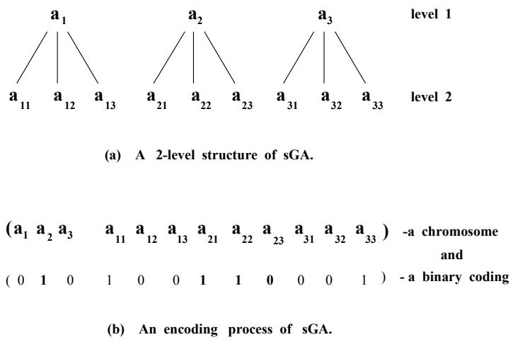  
Figure 1: A simple representation of an sGA.

# 3 Use of sGA in a time-varying problem

We considered here a State Dependent Nonstationary Environment (SDNE) where the state of the environment varies either implicitly or explicitly with the stage of the search. For the genetic search, a stage is considered as a generation. In this nonstationary environment, the objective of search is not to find a single optimum for all time, but rather to select a sequence of values over time that minimise or maximise, the environmental evaluations. We have taken the example from Cobb's experiment [2], where the optimisation of a simple parabola having one variable in a continuously changing SDNE was used. The expression for the parabola is

$$
f _ { t } ( x _ { i } ) \ = \ ( x _ { i } - h _ { t } ) ^ { 2 } ,
$$

where $h _ { t }$ is the generated target domain value mapping into the optimum at time $t$ which moves along a sinusoidal path, so that the optimum changes in each generation. The $x _ { i }$ is the current estimate of this domain value by the ith individual and $f _ { t }$ represents the environment at time $t$ . By using a parabola, at each generation the environment essentially returns the squared error of the domain estimate from the current optimum, $h _ { t }$ . A detailed description of the problem is given in [2].

# 4 Experimental Details

To specify the working of sGAs more precisely for this example, a two-level sGA is adopted where high-level bits activate low-level partial solution spaces or subspaces. The initial population is generated randomly with a partial restriction on the high-level where a specified number of high-level bits are allowed to be active according to the low-level mapping bits [4, 5]. Then a local mutation is used which swaps the position of two high-level gene values. This initialisation approach is like messy GA's partially enumerative approach where at least one copy of all possible building blocks of a specified size need to be provided. But the advantage of our initialisation scheme is that it can avoid both under- and over- specification problems in decoding. So in each chromosome, first few bits (the number of bits is a deciding factor like other GA parameters) are highlevel bits which act as a control region to express subspaces at the lower level to form a candidate solution.

In these experiments, a range of parameter sets (e.g. population size, crossover and mutation probability etc) are employed. For the results reported, a two-point crossover operator along with the stochastic remainder selection strategy [1] are used. Each run is allowed to continue for 300 generations and the results are averaged over ten such runs each with a different initial population.

In experiments here, each individual is encoded with 10 high-level bits where each high-level bit maps 5-bit sub-space at the low-level constituting a chromosome of length 60 bits (Chromosome length $= \mathrm { H . L }$ . bits $+ \ \mathrm { H . L }$ . bits \* L.L. bits). We have considered a 30-bit solution space for decoding the single variable of the parabola, so the activation of 6 high-level bits are sufficient for expressing a candidate solution. In these experiments, we have used a strategy where individuals with below average fitness undergo a higher (10 times) rate of local mutation on their high-level in order to increase the frequency of shift in dominance (expression) among low-level optional sub-spaces.

# 4.1 Continuously changing SDNE Environments

In first set of experiments, we use a continuously moving optimum and the sGA is applied to track the optimum. In figure 2, two indistinguishable curves exhibit the best individual performance of an sGA in continually tracking the moving optimum that follows the sinusoidal path of evolution using a population of size 200 (same popsize as used in simple GA experiments [2]). Figure 3 shows the performance measure plotted (as a negative $l o g _ { 1 0 }$ scale): the best individual and average population performance against generation. In this graph, the higher the value of the best individual performance, the better is the tracking performance.

When the population size is reduced to half (i.e 100), no significant performance difference is observed as evident from the figure 4. This success with smaller population is because of the genetic variability which exist within each individual and in the population is sufficient to adapt in this environmental change [3]. Of course, to achieve this level of performance, the sGA needed more memory space to keep redundant information as compared to the same size population in simple GA. On the contrary, increase inthe population size of a simple GA can not exhibit similar effect, since all its encoded information is usually involve in every environmental state.

In both cases, the best performance varies between the order of $1 0 ^ { - 4 }$ and the order of $1 0 ^ { - 7 }$ , this higher value exhibits the robustness of structured GAs to track the problem of nonstationarity. Moreover, the lower value of the average performance measure implies

Minimisation of Parabola having one variable Population size $= 2 0 0$ $\mathbf { P m } = 0 . 0 0 \bar { 2 }$ , $\mathrm { P c } = 0 . 6 5$ , $\mathbf { w } = \mathbf { 0 . 0 2 5 }$ Domain value giving Function Minimum $=$ sin(w\*Generation)+1.0 the amount of diversity which is sustained in the sGA population at different time during search.

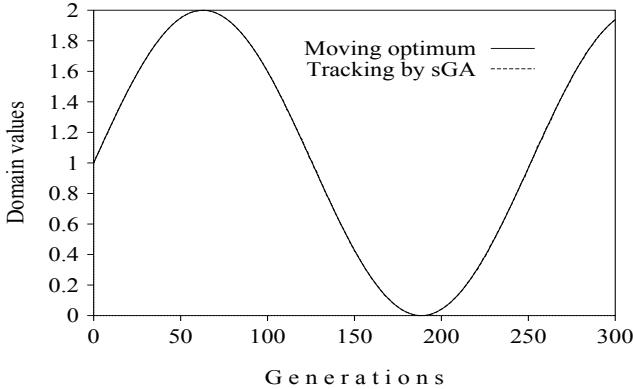  
Figure 2: Two indistinguishable curves displaying sGA's best-of generation value perfectly tracking the actual optimum.

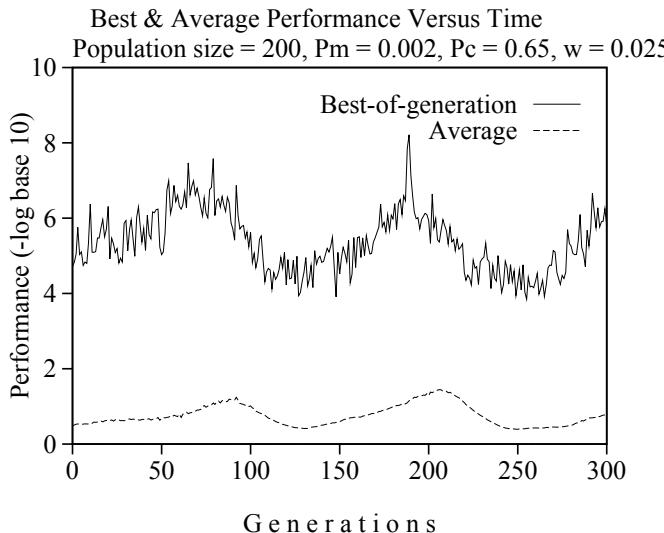  
Figure 3: Performance of the sGA in tracking the moving optimum. This indicates the function evaluation ('squared error' between the estimate of the best/average individual and the true value of the time-varying optimum).

The results with simple GA experiments, reported by Cobb [2]1 were always below $1 0 ^ { - } 5$ when two different (fixed) mutation rates 0.001 and 0.5, as shown in figures 5 and 6 respectively. However, a comparable performance was obtained with an adaptive mutation scheme, figure 7.

In figures 8 and 9, four different sine wave frequencies (which implies different rate in environmental change) are tested with two set of GA parameters. The best-of-generation performance is almost similar in all cases which implies that the genetic variability that exists in the sGA population can easily cope with both slow and rapid environmental changes. In other words, as the frequency increases, the optimum changes rapidly following a sinusoidal path. Unlike Cobb's method which has to monitor performance and alter the mutation rate, the sGA tracks the changing environment more accurately with a fixed rate of mutation. It is to be noted that though we have used higher mutation rate to below-average performers (individuals) on their high-level bits in order to express optional subspaces by a single atomic change, such mutations (effect of simultaneous multiple bit changes) are not possible with a simple GA representation. It is observed that the performance of the algorithm slightly varies with the increase in frequency of sine wave, which can be compensated by increasing mutation rate, but the same mutation rate can maintain the performance level higher than simple GA's for a wide band of frequencies.

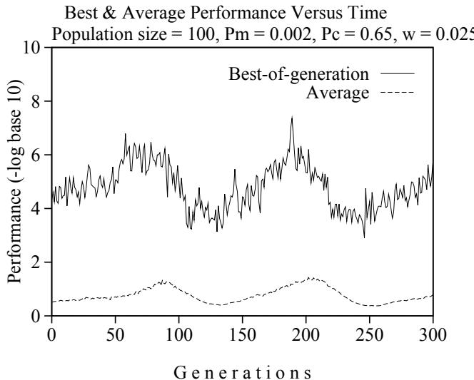  
Figure 4: Performance of the sGA in tracking the moving optimum with population size of 100. Note that the similar performance is obtained with only half the population used by Cobb (1990).

# 4.2 A combination of stationary and nonstationary SDNE

Next set of experiments considered a combination of stationary and nonstationary SDNE, where the environment periodically remains stationary at its current value of $h _ { t }$ , while maintaining continuity. As an example, we have considered $h _ { t }$ to be remained constant from generation 75 to 125 and again from generation 225 to 300 (see ref. [2] for details).

Figure 10 displays the tracking ability of an sGA in a combined stationary and nonstationary environment. The best-of-generation and average performance is shown in a negative log scale in figure 11. The graphs show that an sGA performance improves when the environment remains stationary, regardless of preceding or following nonstationarity periods. Also during periods of nonstationarity, the performance varies depending on the rate of change in the environment for a given fixed rate of mutation. Particularly, for a higher frequency sine wave $\left( \mathrm { e . g \ 0 . 2 5 } \right)$ , an increased rate of mutation is necessary to improve the performance at nonstationary periods, but performance degrades dur

# TIME-AVERAGED PERFORMANCE VERSUS TIME Population $\yen 200$ ${ \mu } = 0 . 0 0 1$ , $\alpha = 0 . 0 2 5$

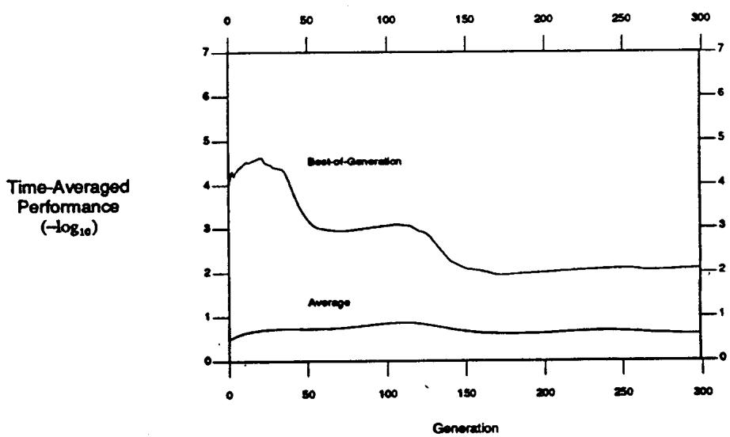  
Figure 1b.

Figure 5: Simple GA performance with similar low mutation rate as used with sGA in tracking moving optimum (Cobb, 1990).

# TIME-AVERAGED PERFORMANCE VERSUS TIME Population 200, $\mu = 0 . 5$ $\pmb { \mathrm { \alpha } } = 0 . 0 2 5$

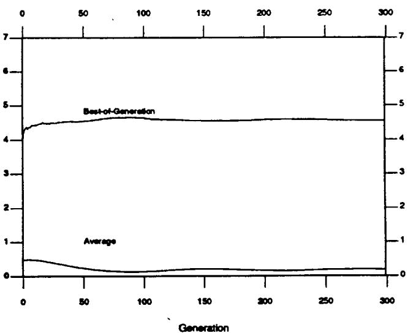  
Time-Averaged Performance (-H0810)  )   
Figure 1d.

Figure 6: Performance of the simple GA with high mutation rate in tracking moving optimum (Cobb, 1990). Note: Mutation rate used here is more than 200 times higher than that used in sGA.

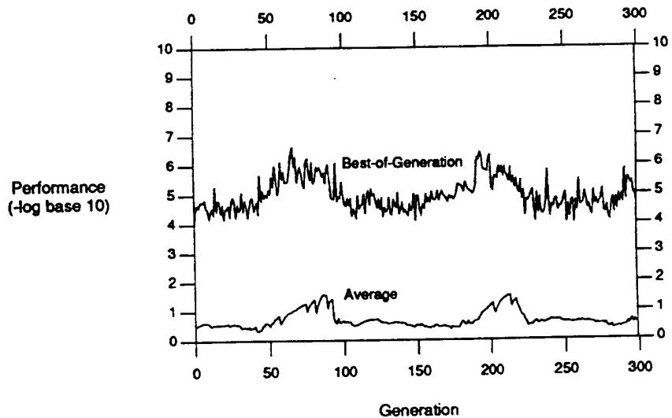  
Figure 6a. Adaptive Mutation Rate: If Time-Averaged Best Performance Improves, µ = 0.001, otherwise, μ = 0.5

Figure 7: Performance of the simple GA using adaptive mutation (Cobb, 1990). Note: Though the performance improves, but it required precise control of mutation rate.

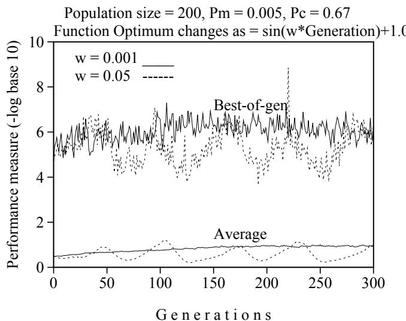  
Figure 8: Performance of sGAs in function environments with changing optimum in sinusoidal path using different values of frequency.

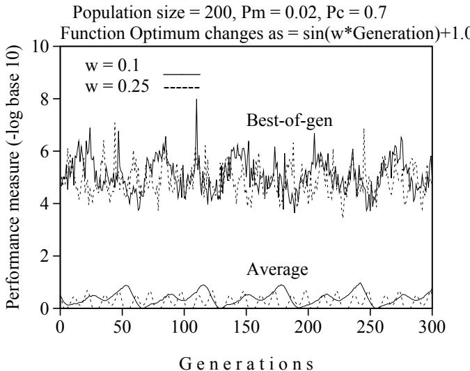  
Figure 9: Performance of sGAs in function environments with changing optimum in sinusoidal path using different values of frequency. The higher the frequency more rapid the environmental change.

ing stationary period in such case when constant mutation rate is used. In order to alleviate the performance, an elitist strategy is used where a significant improvement in performance is observed during the stationary period where a slight improvement is also noticed in nonstationary periods as shown in figure 12.

# 5 Conclusions

This paper presented the application of structured GAs in environments having different degree of non-stationarity. In these problem environments, the structured GA encoding worked as a diversity preserving system which could continually track both fast moving optimum and the optimum which changes in an interval, using a lower rate of mutation compared to simple GA approaches.

To summarise the performance of an sGA as compared to Cobb's simple GA approaches in this (SDNE) problem domain:

Cobb [2] used different mutation dependent strategies with simple GAs for solving SDNE problems and better results were found using an adaptive mutation strategy. The main role of Cobb's adaptive mutation is to introduce diversity (randomness) in the population whenever needed. For example, if the time-average best performance was improving then the mutation rate was kept at 0.001 otherwise higher mutation rate of 0.5 was used. The success of such strategies with simple GAs is solely dependent on the precise control of mutation rates and the correct timing of triggering by the external process monitoring the performance, to get any beneficial effect. The performance graphs of sGA experiments show that a constant (lower) mutation rate can produce better results than that of simple GAs with different mutation schemes. These sGA results were obtained without any fine tuning of sGA parameter set. In particular, the amount of redundancy incorporated in the sGA encoding here (such as number of high level bits and low level mapping bits) are chosen arbitrarily and need further investigation to find an optimal set of values.

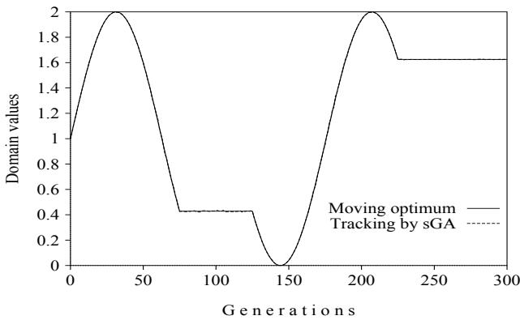  
Figure 10: sGA's best-of-generation and the actual optimum are indistinguishable in each generation.

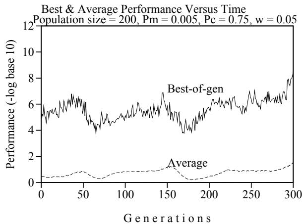  
Figure 11: Performance of the sGA in finding the optimum in a combined stationary and nonstationary SDNE.

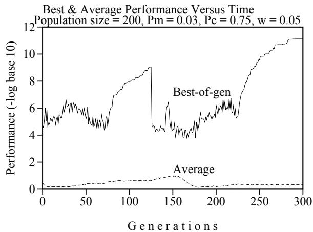  
Figure 12: Performance of the sGA in a combined stationary and nonstationary SDNE when elitist strategy is used.

In the structured genetic approach maintenance of variability is an inherent characteristic of the model. Since it carries optional sub-structures (partial solution spaces) in the chromosome which can be combined in different ways according to the activation pattern of high-level control bits. Also these sub-structures usually maintain diversified information (different bit patterns) which compete for dominance at different environmental state. Thus the model can distribute resources of gene structures among different environmental states instead of dedicating all the structures to each state as in a standard GA. As the implicit diversity can be built into the population of an sGA, it can easily keep track of a number of environmental states changing over time.

We also noted that in comparison to the sGA, the recent mGA model [7] does not have the ability to adapt in changing fitness landscapes once it converges to a global optimum, since the unexpressed portion of the variable-length mGA string has no correlation with its expressed portion. In other words, redundancy if it exists at all after convergence in a mGA, is unlikely to provide sufficient information for adapting to environmental change, unless additional strategy is incorporated [7], similar to the diploidy and dominance mechanism as used with simple GA [8].

Our previous study [5] shows that the single elegant sGA mechanism can also work as long-term memory by preserving and retrieving more than two temporal optimal solutions in a repeated non-stationary environment. We conclude that use of a more biologically-motivated genetic encoding (as in sGA) can handle different types of nonstationarity more efficiently than the existing approaches with a standard (canonical) GA.

# Acknowledgement

The author is grateful to Professor Douglas R. McGregor for his encouragement in carrying out this work. The author would like to thank Helen G. Cobb for her constructive comments on the draft version of the report and giving permission to reproduce some of her results for comparison purpose.

# Список литературы

[1] L. B. Booker. Intelligent behavior as an adaptation to the task environment. PhD thesis, Computer Science, University of Michigan, Ann Arbor, U. S. A, 1982.

[2] Helen G. Cobb. An investigation into the use of hypermutation as an adaptive operator in genetic algorithms having continuous, time-dependent nonstationary environments. NRL Memorandum report 6790 AIC-90-001, Naval Research Laboratory, Washington, DC 20375-5000, December 1990.

[3] Dipankar Dasgupta. Tracking a moving optimum using the structured genetic algorithm. To appear in Proceedings of Seventh Annual Florida Artificial Intelligence Research Symposium (FLAIRS-94), May 5-7 1994. Florida, USA.

[4] Dipankar Dasgupta and D. R. McGregor. A Structured Genetic Algorithm: The model and the first results. Technical Report NO. IKBS-2-91, 1991. Presented at AISB PG-Workshop, January, 1992.

[5] Dipankar Dasgupta and D. R. McGregor. Nonstationary function optimization using the Structured Genetic Algorithm. In Proceedings of Parallel Problem Solving From Nature (PPSN-2), Brussels, 28-30 September, pages 145154, 1992.

[6] Dipankar Dasgupta and Douglas R. McGregor. A more Biologically Motivated Genetic Algorithm: The Model and some Results. To appear in Cybernatics and Systems: An International Journal, 25(3), May-June 1994.

[7] Kalyanmoy Deb. Binary and Floating-point Function Optimization using Messy Genetic Algorithms. PhD thesis, Dept. of Engineering Mechanics, University of Alabama, Tuscaloosa, Alabama, USA, March 1991.

[8] David E. Goldberg and Robert E. Smith. Nonstationary function optimization using genetic algorithms with dominance and diploidy. In Proceedings of Second International conferance on Genetic Algorithms., pages 59-68, 1987.

[9] J. J. Grefenstette, C. L. Ramsey, and A. C. Schultz. Learning sequential decision rules using simulation models and competition. Machine learning, 4(5):137-144, 1990.

[10] John J. Grefenstette. Genetic Algorithms for changing environments. In Proceedings of Parallel Problem Solving From Nature (PPSN-2), Brussels, 28-30 September, pages 137144, 1992.

[11] K. Krishnakumar. Micro genetic algorithms for stationary and non-stationary function optimization. In SPIE, Intelligent Control and Adaptive Systems, pages 289 296, 1989.

[12] K. Pettit and E. Swigger. An analysis of genetic based pattern tracking and cognitive-based component tracking models of adaptation. In Proceedings of National Conference on AI (AAAI-83), pages 327-332. Morgan Kaufmann, 1983.