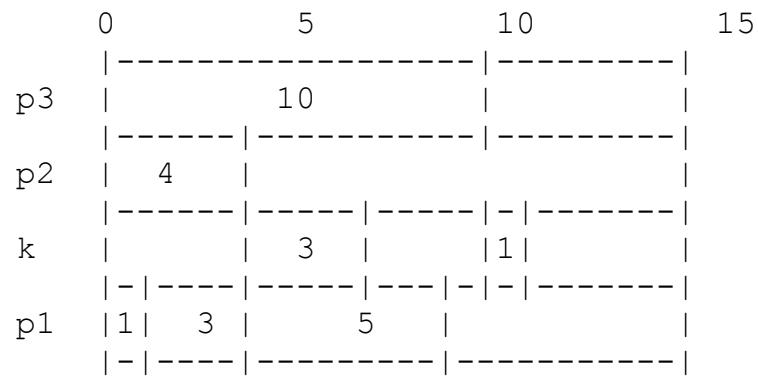

# TEACHING STUDENTS TO USE GENETIC ALGORITHMS TO

# SOLVE OPTIMIZATION PROBLEMS

Michelle Moore   
Texas A&M-Corpus Christi   
phone: (361)825-2477   
fax: (361)825-2795   
6300 Ocean Drive   
Corpus Christi, TX 78412   
email:mmoore@sci.tamucc.edu

# ABSTRACT

Genetic Algorithms have been used to solve a wide variety of problems. They have proven to be of notable usefulness in solving optimization problems of all kinds. Because of this, I believe that Genetic Algorithms should be taught routinely in Algorithms and Algorithm Analysis classes. My experience has shown that adding instruction about the implementation of Genetic Algorithms enhances student understanding of approximation algorithms and does not take an unreasonable amount of time away from the other topics.

SUN workstations supplied by National Science Foundation DUE-ILI grant #9651290 provided the computing environment used for the work reported here.

Keywords: teaching algorithm concepts, algorithm analysis, genetic algorithms, optimization problems

# 1. INTRODUCTION

Students in Algorithm Analysis classes are introduced to numerous classic problems with a variety of theoretical complexities. Students are shown a sampling of solutions for these problems and learn to analyze the efficiency ofthe solutions. Usually, a number of optimization problems are among the problems presented. This allows the instructor to introduce the important topic of NP-completeness. Many problems belong to a group of problems that have been shown to be "intractable". Specifically, it has been shown that if one develops an optimal algorithm to solve the problem, the time required to execute the algorithm will increase exponentially as the number of processes to schedule increases.

National Science Foundation DUE-ILI Grant #9651290 provided an opportunity for me to introduce students to my research involving schedule optimization using genetic algorithms.

# 1.2. The Problem

The process scheduling problem belongs to the group of problems that have been shown to be "intractable" [1]. A great deal of research and development has been devoted to the creation of algorithms that do not require exponentially increasing time, yet will generate schedules very close to optimal [9][10][11][12][13][15][18]. These algorithms are called "approximation" algorithms because they attempt to approximate the optimal schedule.

I had been using genetic approximation algorithms to create schedules for bus-configured multiprocessor systems with large communication overhead [12]. This problem assumed that processes were generated on processor 1 and then sent, if needed, over a shared bus to the other processors. Processes that were executed on processor 1 did not have any communication overhead. The problem below was originally described in [11].

# 2. THE TASK SCHEDULING PROBLEM

# 2.1. Complexity of the Specific Problem

The problem of finding a schedule on $\pmb { m } > 2$ identical processors that minimizes finish time for independent tasks consisting of execution times only has been shown to be NP-hard [9]. In addition to execution times, $\mathbf { e _ { n } } .$ , we also consider the amount of time required to return the result of each computation back over the communication channel, $\mathbf { c _ { n } }$ . Therefore, in order to schedule $\pmb { n }$ taskpairs $\{ \mathbf { f _ { 1 } , . . . , t _ { n } } \}$ , the values of $\{ ( \mathbf { e _ { 1 } , c _ { 1 } } ) , . . . , ( \mathbf { e _ { n } , c _ { n } } ) \}$ must be considered. This problem can be transformed into the above scheduling problem by setting its communication times to zero, and is clearly NP-hard. The communication channel is an additional resource that must be scheduled. This increases problem complexity.

Results of an experiment using genetic algorithms to find an approximate solution to this scheduling problem can be found in [12].

# 2.2. The Problem Model

The makespan of a schedule is the time at which the execution of all taskpairs is completed. The optimal makespan is the shortest possible period in which a given set of taskpairs can execute on the available processors. The goal of the genetic algorithm is to produce schedules with makespans as close to optimal as possible within a predictable and practical amount of time. In the experiment, a set of taskpairs $\{ \mathbf { t } _ { 1 } , . . . , \mathbf { t } _ { \mathrm { n } } \}$ is scheduled to execute on a system of $\pmb { m }$ processors $\{ \mathbf { p } _ { 1 } , . . . , \mathbf { p } _ { \mathrm { m } } \}$ . The processor that created the taskpair set is represented as $\mathbf { p _ { 1 } }$ and requires no communication time in order to complete its tasks. Processors $\mathbf { p _ { 2 } , . . . , p _ { m } }$ represent the additional processors to which $\mathbf { p _ { 1 } }$ sends tasks or control messages, and from which $\mathbf { p _ { 1 } }$ receives the computation results. Tasks scheduled on $\mathbf { p } _ { 2 } , . . . , \mathbf { p _ { m } }$ will not be considered complete until the computation result message has left the communication channel. After all $\pmb { n }$ tasks have been completed $\mathbf { p _ { 1 } }$ may use the returned results to execute a final computation. However, since this final execution time is the same regardless of the manner in which the tasks are scheduled, it is not necessary to consider it.

# 2.3. The Computational Model

The computational model is a multiprocessor or multicomputer system with a shared communication bus. All processes are identical. Only one message may be transmitted to or from a processor at a time. Only one task may execute on a processor at a time. However, that task could be multithreaded. All schedules and tasks are non-preemptive. No processor will remain idle if there is a task available for it to execute. If the communication channel is available, the message will be transmitted immediately after the associated task is completed. Otherwise, the message will be transmitted as soon as messages associated with any previously executed tasks leave the communication bus. Task execution and communication times are available in advance. There are no precedence constraints on the initial set of taskpairs. However, each task must complete before its corresponding message is sent. Messages and processing for control or monitoring are assumed to have no effect on the relative efficiencies of the schedules.

# 3. GENETIC SCHEDULING

# 3.1. Introduction

Genetic schedules "evolve" as the algorithm executes [6]. A set of initial encoded schedules (chromosomes) is created. These may be randomly generated or created according to a heuristic. Each schedule is evaluated for "fitness". In this case, the less time the processes will require to execute with a given schedule, the better the chromosome fitness. The best of the initial chromosomes are chosen to "reproduce". This means that they are combined with each other to create new schedules. Occasionally, the chromosomes are randomly altered with the hope of causing a favorable "mutation". At each iteration the schedules are evaluated for "fitness" and the best are chosen to reproduce. After a number of iterations, the improvement either slows or stops. The best schedule generated to that point is then used. In many cases, a genetic algorithm will actually find the optimal schedule. In almost all cases, there will be significant improvement from the initial schedule.

# 3.2. The Encoding

Each chromosome encodes a schedule solution. Each gene represents a scheduled task. The number of genes in a chromosome equals $\pmb { n }$ , the number of tasks to be scheduled. Allele values range from 1 to m, where m equals the number of processors available.

For example, given the following taskpair set: {(7,16),(11,22),(12,40),(15,22),(17,23), (17,23),(19,23),(20,28),(20,27),(26,27), (28,31),(36,37),(31,29),(28,22),(23,19), the optimal schedule on three processors would appear as

# 2 1 1 1 1 1 1 1 3 1 1 1 2 2 2 2 2 3 2 3

indicating that the first task was assigned to processor 2, the second to processor 1, and so on.   
The optimal makespan for this sequence of tasks is 202.

# 3.2. Initial Population

The students are shown three approaches that can be used alone or in combination to create, or seed, the initial population of chromosomes. One seeding approach is to assign all tasks to processor 1. Since tasks assigned to processor 1 do not require communication, this is a reasonable starting place. Another approach I show is to seed the initial population with a schedule found using the following linear time greedy algorithm:

1) Consider the next task in input order.   
2) Determine the assignment that will allow that task to complete the soonest.   
3) Repeat while there are tasks to schedule.

The third approach I discuss is to randomly assign each task to a processor.

# 3.3. Crossover

Crossover is the method used to combine existing chromosomes to create new generations. A large number of techniques have been developed. I show students how to implement one-point [6] crossover and uniform [4] crossover. I also suggest texts and journals where they can find additional methods.

# 3.4. Mutation

I recommend that students set the mutation rate to . $1 \%$ or lower. The sample genetic algorithm that the work with uses a relatively small population. A high mutation rate can disrupt improvement in small populations [7].

# 3.5. Fitness

The makespan of a schedule is the greater of the communication completion time and the execution time on $\mathbf { p _ { 1 } }$ .

For example, given the taskpair set:

and the schedule 1 1 1 2 3, processors are assigned as below:

Since the goal is to minimize the makespan, fitness is determined as below:

$$
f i t n e s s = - I \stackrel { * } { ^ * } m a k e s p a n .
$$

Students are able to experiment with different fitness combinations for reproduction.

# 4. STUDENT OUTCOMES

Students were able to adjust the initialization and the mutation rate to see the effect of different combinations. They were also able to compare the genetic algorithms to other schedule optimization approximation techniques. They were impressed with the relative ease of implementing genetic approximations relative to the accuracy of the schedules produced.

I believe that the experience was beneficial to the students. They gained a very practical understanding of the complexities of optimization approximation techniques and of NPcompleteness. They received an introduction to scheduling theory. They became proficient at generating genetic algorithms to solve one type of optimization problem. In addition, they became familiar with the variety of optimization problems that can be solved using genetic algorithms.

\*\* The equipment to support this work was provided by DUE-ILI grant #9651290 from the National Science Foundation.

# Список литературы

[1] Coffman, E.G.(1976), "Introduction to Deterministic Scheduling Theory", Computer and Job_Shop Scheduling Theory, Wiley, New York, NY.

[2] Davis, L. (1991), "A Genetic Algorithms Tutorial", Handbook of Genetic Algorithms, Van Nostrand Reinhold, New York, NY.

[3] De Jong, K.A. and Spears, W.M. (1989), “Using Genetic Algorithms to Solve NPcomplete Problems”, Proceedings of the Third International Conference on Genetic Algorithms, 124-132.

[4] Eshelman, L.J., Caruna, R.A. and Shaffer, J.D. (1989), “Biases in the Crossover Landscape”, Proceedings of the Third International Conference on Genetic Algorithms, 10-19.

[5] Fonseca, C.M. and Fleming, P.J. (1995), “An Overview of Evolutionary Algorithms in Multiobjective Optimization”, Evolutionary Computation, vol. 3, no. 1, 1-16.

[6] Goldberg, D.E. (1989a), Genetic Algorithms in Search, Optimization, and Machine Learning, Addison Wesley, Reading, MA.

[7] Goldberg, D.E. (1989b), “Sizing Populations for Serial and Parallel Genetic Algorithms,” Proceedings of the Third International Conference on Genetic Algorithms, 70-79.

[8] Halhal, D., Walters, G.A., Savic, D.A., and Ouazar, D. (1999), "Scheduling of Water DistributionSystem Rehabilitation Using Structured Messy Genetic Algorithms,"Evolutionary Computation, vol. 7, no. 3, 311 – 329.

[9] Horowitz, E. and Sahni, S. (1976), "Exact and Approximate Algorithms for Scheduling Nonidentical Processors", Journal of the ACM, vol.23, no. 2. 317-327.

[10] Hou, E.S.H., Hong, R. and Ansari, N.(1990), "Efficient Multiprocessor Scheduling Based on Genetic Algorithms", Proceedings of the IEEE Industrial Electronics Society, 1239- 1243.

[11] Moore, M. (Kidwell) and Cook, D. (1994), "Genetic Algorithm for Dynamic Task Scheduling", Proceedings of the International Phoenix Conference on Computers and Communications, May 1, 1994.

[12] Moore, M. (Kidwell), (1993), "Using Genetic Algorithms to Schedule Distributed Tasks on a Bus-Based System", Genetic Algorithms: Proceedings of the Fifth International Conference, S. Forrest, ed., Morgan Kaufman, San Mateo, CA, 368-374.

[13] Mansour, N. and Fox, G.C. (1990), "A Hybrid Genetic Algorithm for Task Allocation in Multicomputers", Proceedings of the Third International Conference on Genetic Algorithms, 466-473.

[14] Potter, M.A. and De Jong, K.A. (2000), "Cooperative Coevolution: An Architecture for Evolving Coadapted Subcomponents", Evolutionary Computation, vol. 8, no. 1, 1-29.

[15] Ramamritham, K., Stankovic, J.A., and Shiah, P.-F. (1990), "Efficient Scheduling Algorithms for Real-Time Multiprocessor Systems", IEEE Transactions on Parallel and Distributed Systems, vol. 1, no.2, 184-194.

[16] Schweitzer, F., Ebeling, W., Rose, H., and Weiss, O. (1998), “Optimization of Road Networks Using Evolutionary Strategies”, Evolutionary Computation, vol. 5, no. 4, 419-438.

[17] Syswerda, G. (1989), "Uniform Crossover in Genetic Algorithms", Proceedings of the Third International Conference on Genetic Algorithms, 2-9.

[18] Syswerda, G. and Palmucci, J. (1991), "The Application of Genetic Algorithms to Resource Scheduling", Proceedings of the Fourth International Conference on Genetic Algorithms, 502-508.

[19] Tanese, R. (1989), "Distributed Genetic Algorithms", Proceedings of the Third International Conference on Genetic Algorithms, 434-439.