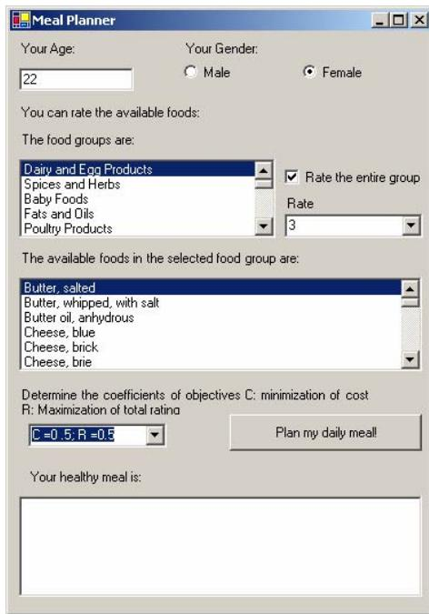

# Healthy Daily Meal Planner

Aynur Kahraman H. Aydolu Seven Department of Computer Engineering, Istanbul Technical  Department of Computer Engineering, Istanbul Technical University University Maslak, Istanbul, 34469, Turkey Maslak, Istanbul, 34469, Turkey aynurkahraman@gmail.com aydolu@gmail.com

# ABSTRACT

The purpose of this project is to develop a program that solves a bi-objective diet problem to propose the user a “healthy” daily meal according to some parameters specified by the user. The program will interact with the user via a graphical interface to receive information such as age and gender that is necessary to determine daily nutritional and energy requirements and also information on the preferences of the user among the dishes available. The user will be presented all the dishes and is expected to rate some of them on a scale from 1 to 10. The main goal is to present the user a combination of dishes that satisfies the daily nutritional requirements, minimizes the cost of the daily meal and maximizes the total rating of the meal. In this paper, first the diet problem is going to be introduced, then a genetic algorithm to solve the problem will be presented.

# Categories and Subject Descriptors

I.2.8-Problem Solving, Control Methods and Search

# General Terms

Design, algorithms

#

Genetic Algorithms, Multi-objective Optimization, Multiobjective Multi-constrained Knapsack Problem, Diet Problem

# 1. INTRODUCTION

A person’s daily diet is the subject matter of the problem because it is bound to some constraints. These constraints can be the maximum or minimum allowed amount of energy, minerals, protein, fats, and so on. The classical diet problem [1] is a 0-1 integer programming problem where the goal is to find the combination of foods that minimizes the cost of the meal while satisfying all the constraints that make up the daily nutritional requirements of a person. The diet problem which is the subject matter of this paper is the same diet problem with the only exception that it has an additional objective. For our problem, we would like the user to rate the available dishes according to personal taste. The additional objective is to maximize the user rating of the daily meal.

Permission to make digital or hard copies of all or part of this work for personal or classroom use is granted without fee provided that copies are not made or distributed for profit or commercial advantage and that copies bear this notice and the full citation on the first page. To copy otherwise, or republish, to post on servers or to redistribute to lists, requires prior specific permission and/or a fee.

# 1.1 The Bi-Objective Diet Problem

We assume that we have $n$ kinds of dishes we can present to the user and that we know the cost and the nutritional composition of one serving of each dish. We learn each dish’s rating drom the user. Let’s say we have $m$ constraints. Most of the constraints that represent the daily requirements will be lower bounds such as the minimum daily amount of minerals and vitamins. However, there will also be upper bounds such as maximum amount of vitamin K. We choose to represent all the constraints as upper bounds, so we will transform the lower bounds into upper bounds. Our problem is simply to determine which dish will be included in the final proposed daily meal. For every dish, we use a decision variable assuming the values 0 or 1 (1 if the dish is included in the meal, 0 if it is not). Then the problem can be formulated as:

$$
\begin{array} { l l } { \mathrm { m a x i m i z e ~ \displaystyle \sum _ { j = 1 } ^ { n } x _ { j } ~ } ^ { * } ( \mathrm { r a t i n g } ) _ { \mathrm { j } } ; } & { \mathrm { m i n i m i z e ~ \displaystyle \sum _ { j = 1 } ^ { n } x _ { j } ~ } ^ { * } ( \mathrm { c o s t } ) _ { \mathrm { j } } } \\ { \mathrm { s u b j e c t ~ t o } } & { \mathrm { x _ { j } ~ } ^ { * } \mathrm { r _ { i j } \leq c _ { i } ~ } } & { \mathrm { i } \in \{ 1 , 2 , . . . , m \} } \\ & { \mathrm { x _ { j } ~ } \in \{ 0 , 1 \} } & { \mathrm { j } \in \{ 1 , 2 , . . . , n \} } \end{array}
$$

Here, $x _ { j }$ is the decision variable of dish number $j ;$ (rating)j is the user-specified rating of it, (cost)j is the cost of it; $c _ { i }$ is the constraint number $i ; \ r _ { i j }$ is the nutritional value of dish number $j$ relevant to constraint $i$ .

Our diet problem has some obvious limitations. It assumes that only one serving of a dish can be included in the daily meal. Another limitation is that it proposes a daily meal, whereas in real life a healthy daily diet consists of at least three meals, each including different sorts of dishes.

The bi-objective diet problem can be modeled as a knapsack problem [6]. The single constraint knapsack problem is formulated as:

$$
\begin{array} { c c } { { \mathrm { a x i m i z e } _ { \displaystyle { \sum _ { j = 1 } ^ { n } \bf { \sigma } _ { j } } } * _ { \displaystyle { \mathrm { p } } _ { \displaystyle { j } } } } } & { { \qquad \mathrm { s u b j e c t ~ t o } \quad { \bf { x } _ { j } } ^ { * } { \bf { \sigma } } _ { \displaystyle { \mathrm { I } } _ { j } } \le { \bf { c } _ { j } } } } \\ { { \mathrm { x } _ { \displaystyle { j } } ~ \in ~ \{ 0 , 1 \} } } & { { \qquad \mathrm { j } \in \{ 1 , 2 , . . . , n \} } } \end{array}
$$

In the knapsack problem [6], there are items which have profit values $( p _ { j } )$ and take up some resource $( r _ { j } )$ . The problem is to determine the combination of items that maximizes the total profit value without exceeding the resource constraint $( c )$ . The variables $( x _ { j } )$ represent whether an item is included in the solution or not and can take only 0 or 1 as numerical values. For our problem, the items are the available dishes. The knapsack problem above has only one constraint, but there are several constraints in our diet problem. Additionally our problem has two objectives. So our diet problem can be classified as a multi-objective multidimensional (sometimes referred to as multiple constraint) knapsack problem [6].

# 2. THE GENETIC ALGORITHM

The multi-objective optimization and solution of single objective multidimensional knapsack problem (MKP) will be analyzed separately in this section.

# 2.1 Background Research

A genetic algorithm [4] is a search operation through a repeated iteration process which is based on producing a number of potential solutions first (initialization of population), using an evaluation method to measure how much a solution serves a certain objective (fitness evaluation), then diversifying the group of solutions using some operators (selection, recombination, mutation). This procedure is repeated until the whole population converges or for a maximum number of times. To apply a genetic algorithm, the representation of the solutions, the fitness evaluation method, population size, the selection method, the genetic operators, the population initalization method should be determined. Since the variables in a MKP can be either 0 or 1, it is reasonable to enumerate each variable and represent them as a bit string. A MKP is a maximization problem, so the bigger the value of the objective function the better, except for the cases in which the solution is infeasible. The fitness evaluation method is the objective function itself. But the infeasibility problem [5] should be taken care of by either employing penalty or a repair algorithm. The MKP can be solved using a standard GA, but the use of problem specific heuristics significantly increases performance.

There are genetic algorithms that use heuristics proposed for MKP in the literature. Chu & Beasley [2] proposed a GA which is superior to many heuristics in terms of solution quality. Their GA is a steady state GA that uses binary string encoding, has a population size of 100, uses binary tournament selection, uniform crossover and bitwise mutation, does not allow duplicate individuals in the population, has an initialization method specific for MKP and a repair method which makes use of a concept called pseudo-utility. In their initialization method, first a random permutation of items is produced. Then each item in their order in the permutation is set to 1 until doing so causes a constraint violation. A repair method is used to transform an infeasible solution into a feasible one. For a single constraint knapsack problem, the pseudo-utility $( u _ { j } )$ of item $j$ is $p _ { j } / r _ { j }$ . The higher the $u _ { j } ,$ the more likely that item will be included in the solution. However in MKP, there are multiple constraints, so there is no clear definition of pseudo-utility. Ways to compute pseudo-utility ratios for MKP have been proposed. Chu & Beasley used Pirkul’s [7] surrogate duality approach, taking the shadow prices of each constraint in the LP relaxation of MKP as the surrogate multipliers. So, they first solve LP relaxation of MKP, find the surrogate dual multipliers and compute the pseudo-utility of each item. In Chu & Beasley’s repair method, first the items in an infeasible solution, in ascending order of their $u _ { j }$ values, are extracted from the solution until no constraint is violated. Then the items, in descending order of their $u _ { j }$ values, are added to the solution provided that no constraint is violated. Thus, the items with the lowest utility are extracted from and the ones with the highest utility are added to the solution. This repair algorithm keeps each solution on the boundary of feasibility.

Raidl’s improved GA [8] is very similar to Chu & Beasley’s, except for some differences in the initialization, repair and local optimization methods. The most important difference is that Raidl uses the values of $x _ { j } s$ in LP relaxation of MKP as pseudo-utility ratios. In Raidl’s repair and local optimization methods, first a random permutation of $n$ items is generated, then the items are sorted according to their pseudo-utilities. Thus, the items with the same pseudo-utility are prioritized over each other in a random fashion. Raidl’s initialization method also uses pseudo-utility values. First a random permutation of $n$ items is generated. Then for each item in the permutation, a random number in the interval [0,1) is generated. If the random number is less than the value of that item’s decision variable in the LP relaxation, that item is added to the solution unless no constraint is violated. Thus, it is more likely that the items with higher $x _ { j }$ value in the LP relaxation are included in the initial population. But the initial population is made diverse through randomness at the same time. Chu & Beasley’s GA and Raidl’s GA both keep the search on the boundary of feasibility. According to tests, Raidl’s GA performs slightly better than Chu & Beasley’s GA.

In multiobjective optimization, the goal is to find a solution whose vector of objectives is the most convenient for the decision maker. There are several approaches for multi objective optimization; there are aggregating methods, methods not based on pareto optimum, and methods based on pareto optimum [3]. Some of these methods depend on favoring a criterion over another, some of them on reaching a goal for each objective, some depend on compromise between objectives [3]. In multiobjective optimization a solution is said to be non-dominated or noninferior if no other solution is at least equivalent or superior to it for all of the objectives. All non-inferior solutions form the pareto set and the pareto based approaches try to scan the pareto set for searching the most convenient solution.

As mentioned above, in multiobjective optimization problems, the goal is to find a solution made up of a vector of decision variables, which satisfies constraints and optimizes vector of objectives and is the most convenient for the decision maker [3]. So, the final solution comes out after both optimization and decision processes [9]. According to decision maker’s preferences, Multiobjective Evolutionary Algorithm (MOEA)- based Multiobjective Problem (MOP) solution techniques can be arranged in three categories. Vledhuizan and Lamont quoted [9] that Hwang and Masud had declared these categories in 1979 as follows:

A Priori Preference Articulation: Multiple objectives are put together and the problem becomes a single-objective problem.

A Progressive Preference Articulation: This category includes interactive approaches, in which decision making and optimization are made simultaneously and an updated set of solutions is provided for the decision maker.

A Posteriori Preference Articulation: A set of pareto optimal candidate solutions is given and the decision maker selects the convenient solution from the set .

The approach used in our problem, “Weighted Sum Approach”, is one of the aggregating methods, and also a priori MOEA solution techniques.

# 2.2 The GA for Bi-Objective Diet Problem

Our GA is basically same as Chu & Beasley’s or Raidl’s. The only difference is the initialization, repair and optimization methods. The initialization method is an improved version of the one used by Chu & Beasley. It is the $C ^ { * }$ method explained in Gottlieb’s thesis [5]. The difference is that in $C ^ { * }$ every item is attempted to be included in the solution, thus ensuring that the solution lies on the boundary. We will not make use of linear relaxation for our repair and optimization routines. The repair and optimization routines we use are very similar to the initialization; the random permutation generated for each solution in the initialization routine will be used in repair and optimization. In our repair method, each item, in their order in the random permutation will be extracted from the solution until there is no constraint violation [5]. And in the optimization method, each item, in their order in the random permutation, will be added to the solution provided that there is no constraint violation [5]. The properties of our GA are summarized in Table 1.

Table 1. The properties of the GA   

<table><tr><td rowspan=1 colspan=1>GA</td><td rowspan=1 colspan=1>steady state, no duplicate individuals</td></tr><tr><td rowspan=1 colspan=1>Encoding</td><td rowspan=1 colspan=1>bit string</td></tr><tr><td rowspan=1 colspan=1>Selection</td><td rowspan=1 colspan=1>binary tournament selection</td></tr><tr><td rowspan=1 colspan=1>Mutation</td><td rowspan=1 colspan=1>bitwise mutation (with probability of1/n)</td></tr><tr><td rowspan=1 colspan=1>Recombination</td><td rowspan=1 colspan=1>uniform crossover (with probabilityof 0.9)</td></tr><tr><td rowspan=1 colspan=1>Population size</td><td rowspan=1 colspan=1>100</td></tr><tr><td rowspan=1 colspan=1>Total number of loops</td><td rowspan=1 colspan=1>106</td></tr><tr><td rowspan=1 colspan=2>Problem-specific initialization, repair and local optimizationmethods are used.</td></tr></table>

Since there are multiple objectives in our problem, the evaluation of fitness will be different. We are going to use the weighted sum approach for multi objective optimization. According to this approach, multiple objectives are transformed into a single objective which is a linear function of all objectives [3]. The objectives have to be of the same type, in other words they should all be either minimization or maximization. However, in our problem, of the two objectives, one is maximization and the other is minimization. So, we will transform the minimization into maximization by using the reciprocal of that objective function. Each objective is multiplied with a weight value assigned to it and added together. The sum of all the weights assigned to the objectives should be 1. Also, to prevent the objectives from dominating each other numerically, the objective values should be normalized. For our problem, the objectives and the final fitness function are:

objective $1 : \mathbf { f } _ { 1 } = \sum _ { \mathrm { j } = 1 } ^ { \mathrm { n } } _ { \mathrm { x } _ { \mathrm { j } } } \ast ( \mathrm { r a t i n g } ) _ { \mathrm { j } } : \mathbf { f } _ { 1 } \prime = \mathbf { f } _ { 1 } / \sum _ { \mathrm { j } = 1 } ^ { \mathrm { n } } ( \mathrm { r a t i n g } ) _ { \mathrm { j } }$ objective $2 : { \mathrm { f } } _ { 2 } = \sum _ { \mathrm { j } = 1 } ^ { \mathrm { n } } { \mathrm { x } } _ { \mathrm { j } } ^ { \mathrm { } * } ( \mathrm { c o s t ) } { \mathrm { j } } ; { \mathrm { f } } _ { 2 } ^ { \prime } = { \mathrm { f } } _ { 2 } / \sum _ { \mathrm { j } = 1 } ^ { \mathrm { n } } ( \mathrm { c o s t ) } _ { \mathrm { j } } $ fitness : $\mathbf { \sigma } _ { : } \operatorname { f } = \mathbf { w } _ { 1 } \ast \mathbf { f } _ { 1 } ^ { \prime } + \mathbf { w } _ { 2 } /$ f2′

The weights assigned to each objective will be 0.5 by default. But, it can be $0 . 6 - 0 . 4$ or vice versa depending on the user’s choice.

# 3. THE PROBLEM DATA

Up to here, we assumed that we had a certain amount of foods of which we know the nutritional composition and cost. We also assumed that we knew the constraints that make up the daily nutritional requirements of a person. So, we need to know the cost of each food, the amount of nutrients in each food and the nutritional requirements.

For the cost information, we will use an estimated cost for each item. For the nutritional composition of foods, we are going to use USDA National Nutrient Database for Standard Reference, Release 17 [10]. This database contains the nutritional composition of 100 grams of 6839 food items and we are going to use a subset of those 6839 food items. In the database, the foods are organized in different food groups. There is also information on the weight of one serving of each food item in the database. The amount of a nutrient in a food item will be the resource that item takes up, counting towards the constraint relevant to that nutrient. Those nutrients will be vitamins, elements, electrolytes, macronutrients and energy. Generally, each country has different recommended dietary values. We are going to use DRI (Dietary Reference Intake) and RDA (Recommended Dietary Allowance) tables established by U.S. Food and Nutrition Board of the National Academy of Sciences for the constraints of our problem [12]. DRI is a revised and updated version of the RDA[11]. DRI consists of four reference values: the recommended dietary allowance (RDA), adequate intake (AI), estimated average requirement (EAR) and tolerable upper intake level (UL) [11]. RDA gives reference values that meet the nutritional requirements of $9 7 { - } 9 8 \%$ of the population [11]. AI values are used when there is not enough scientific data to establish RDA values [11]. EAR values meet the nutritional requirements of $5 0 \%$ of the population and UL gives the highest amount of daily intake of a nutrient without side effects [11]. There aren’t UL values for most nutrients and there aren’t RDA or AI values for a few of them. We are going to use the RDA and AI values as lower bounds and UL values as upper bounds. The reference values in both RDA and DRI change according to age and gender. However, RDA and DRI differ from each other the way they form age groups. We are going to use the reference values in the DRI tables for most of the nutrients. The RDA and DRI tables also provide reference values for babies, lactating women and pregnant women. However, we are not going to use these values in our project. Our program will not propose a meal for those groups.

# 4. THE GRAPHICAL INTERFACE

The user specifies his/her age and gender from the graphical interface, sees all the available foods and rates the ones he/she chooses. The foods are presented as members of food groups. The user is also able to rate an entire food group without rating each food in that group separately. Additionally, the user is able to favor one criterion over another via the graphical interface. He/she can prioritize the minimization of cost or the maximization of the meal’s total rating. By default, the two objectives have equal weights. The preliminary graphical user interface is given in Figure 1.

  
Figure 1. The preliminary graphical user interface

# 5. CURRENT STATUS

We implemented the genetic algorithm we proposed for small scale single objective MKP samples and reached the optimum solution for them. We constructed most of our diet problem’s data. We prepared a graphical interface, have the database of constraints and nutritional composition ready. We are in the phase of implementing the final program in which the genetic algorithm, the graphical interface and the database connections work together.

# 6. FUTURE WORK

For future, we consider using Raidl’s methods of initialization, optimization and repair routines by implementing a method to solve the LP relaxation of the problem. We also consider implementing another multiobjective optimization tchnique using a pareto based approach. Because it is difficult to determine the proper weights in the weighted sum approach and as Coello states [3] it does not generate proper Pareto optimal solutions in the presence of non-convex search spaces, we consider implementing anoher approach.

# ACKNOWLEDGMENTS

The Healthy Daily Meal Planner is developed as the graduation project under the supervision of Asst. Prof. Dr. A. Şima EtanerUyar by ${ 8 } ^ { \mathrm { t h } }$ term students Aynur Kahraman and H. Aydolu Seven from the Computer Engineering Department of Istanbul Technical University, Turkey.

# Список литературы

[1] Argonne National Laboratory, Mathematics and Computer Science Division, The Optimization Technology Center, NEOS Guide, Case Studies, Diet Problem. http://www-fp.mcs.anl.gov/otc/Guide/CaseStudies/diet/   
[2] P. C. Chu, J. E. Beasley: A Genetic Algorithm for the Multidimensional Knapsack Problem, working paper at The Management School, Imperial College of Science, London, 1997.   
[3] C. A. Coello Coello, A Comprehensive Survey of Evolutionary-Based Multiobjective Optimization Techniques, Knowledge and Information Systems, Vol. 1 No. 3, pp.269- 308, 1999.   
[4] A. E. Eiben, J.E. Smith, Introduction to Evolutionary Computing, Springer Verlag, 2003.   
[5] J. Gottlieb: Evolutionary Algorithms for Constrained Optimization Problems Dissertation, Technical University of Clausthal, Department of Computer Science, 2000.   
[6] H. Kellerer, U. Pferschy, D. Pisinger, Knapsack Problems, Springer Verlag, 2004.   
[7] H. Pirkul: A Heuristic Solution Procedure for the Multiconstrained 0-1 Knapsack Problem, Naval Research Logistics 34, pp. 161-172, 1987.   
[8] G. R. Raidl: An Improved Genetic Algorithm for the Multiconstrained 0-1 Knapsack Problem, proceeding of the $5 ^ { \mathrm { t h } }$ IEEE International Conference on Evolutionary Computation, 1998.   
[9] D. A. V. Veldhuizen, G. B. Lamont: Multiobjective Evolutionary Algorithms: Analyzing the State-of-the-Art, Massachusetts Institute of Technology Evolutionary Computation, Vol. 8, No. 2, pp.125-147, 200   
[10] U.S. Department of Agriculture, Agricultural Research Service. 2004. USDA Nutrient Database for Standard Reference, Release 17. Nutrient Data Laboratory Home Page, http://www.nal.usda.gov/fnic/foodcomp.   
[11] International Food Information Council Foundation, Dietary Reference Intakes: An Update, http://ific.org/publications/other/driupdateom.cfm, August 2002.   
[12] Food and Nutrition Information Center, Dietary Reference Intakes (DRI) and Recommended Dietary Allowances (RDA), http://www.nal.usda.gov/fnic/etext/000105.html