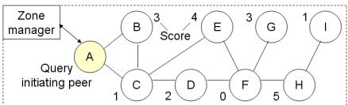
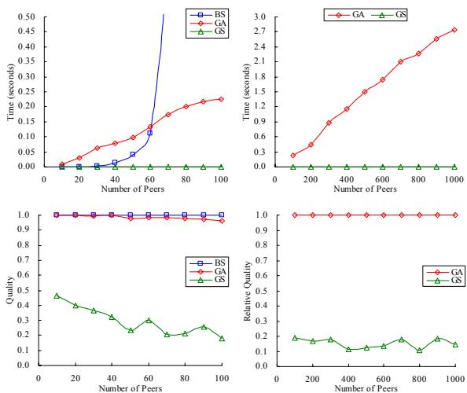

# Information Retrieval in P2P Networks Using Genetic Algorithm

Wan Yeung Wong   
Department of C. S. & E.   
The Chinese University of H. K.   
Shatin, Hong Kong   
wywong@cse.cuhk.edu.hk   
Tak Pang Lau   
Department of C. S. & E.   
The Chinese University of H. K.   
Shatin, Hong Kong   
tplau@cse.cuhk.edu.hk Irwin King Department of C. S. & E.   
The Chinese University of H. K. Shatin, Hong Kong   
king@cse.cuhk.edu.hk

# ABSTRACT

Hybrid Peer-to-Peer (P2P) networks based on the direct connection model have two shortcomings which are high bandwidth consumption and poor semi-parallel search. However, they can further be improved by the query propagation model. In this paper, we propose a novel query routing strategy called GAroute based on the query propagation model. By giving the current P2P network topology and relevance level of each peer, GAroute returns a list of query routing paths that cover as many relevant peers as possible. We model this as the Longest Path Problem in a directed graph which is NP-complete and we obtain high quality (0.95 in 100 peers) approximate solutions in polynomial time by using Genetic Algorithm (GA). We describe the problem modeling and proposed GA for finding long paths. Finally, we summarize the experimental results which measure the scalability and quality of different searching algorithms. According to these results, GAroute works well in some large scaled P2P networks.

# Categories and Subject Descriptors

H.3.3 [Information Storage and Retrieval]: Information Search and Retrieval  retrieval models, search process

General Terms: Algorithms, Performance

# Keywords

Query Routing, P2P, Genetic Algorithm, Longest Path Problem

# 1. INTRODUCTION

The query flooding problem [2] in pure P2P networks is not only solved by some existing query routing algorithms like CAN [4], but also some hybrid P2P networks like YouSearch [3]. Hybrid P2P networks depend on centralized components for storing content summaries of each peer. By querying centralized components. each peer obtains a list of relevant peers so that it directly connects to all relevant peers to obtain document lists. Thus, the query flooding problem does not exist due to the direct connection model. However, such model has two shortcomings which can further be improved: (1) The query initiating peer sends a query packet to each relevant peer individually. Therefore, the query initiating peer consumes high bandwidth for the network transmission. (2) The query initiating peer spawns a thread to concurrently handle each direct connection. However, a computer has a limited thread resource, which makes parallel connections to all relevant peers impossible if they are many. The two shortcomings can be circumvented by the query propagation model which is commonly applied in pure P2P networks. We assume there is a structured P2P network topology which is managed by a zone manager. Instead of directly connecting to all relevant peers, the query initiating peer queries the zone manager for some optimal routing paths and propagates the query to all relevant peers through these paths.

  
Figure 1. A Structured P2P Network with Scores

# 2. PROPOSED GAROUTE

In this paper, we propose a novel query routing function called GAroute used in zone managers. By giving the current P2P network topology represented by an adjacency matrix $A$ ,relevance level of each peer represented by a score vector $S _ { : }$ query initiating peer $x _ { 1 } .$ , and the maximum number of paths to be returned $n$ GAroute returns a list of query routing paths $P = ( p _ { i } \mid 1 \mid \leq i \leq n )$ that cover as many relevant peers as possible where

$$
p = \left. x _ { i } \middle | \forall _ { i , j } ( A _ { x _ { i } x _ { i + 1 } } \neq 0 ) \land ( i \neq j \Leftrightarrow x _ { i } \neq x _ { j } ) \right. .
$$

We also define the information gain $H _ { p }$ of a path $p$ as the sum of the scores of those unvisited peers such that

$$
H _ { p } = \sum _ { i = 2 } ^ { | p | } ( S _ { x _ { i } } - \rho _ { x _ { i } } ) { \mathrm { ~ w h e r e ~ } } \rho _ { x } = { \left\{ S _ { x } \begin{array} { l l } { S _ { x } } & { { \mathrm { i f ~ } } x \in V } \\ { 0 } & { { \mathrm { o t h e r w i s e } } } \end{array} \right. } ,
$$

$\rho _ { x }$ is the penalty of the peer $x$ and $V$ is a set of the current visited peers. The penalty of a peer equals to its score because those visited peers give us duplicated query results so that they have no information. Our problem is to find at most $n$ query routing paths $P$ from a query initiating peer to any destination peer which maximize the total information gain where

$$
P = G A r o u t e ( A , S , x _ { 1 } , n ) = \underset { ( p _ { i } | 1 \leq i \leq n ) } { \arg \operatorname* { m a x } } \sum _ { i = 1 } ^ { n } H _ { p _ { i } } \ .
$$

We model this as the Longest Path Problem in a directed graph which is NP-complete and we obtain high quality approximate solutions in polynomial time by using GA.

Proposed GA: Our proposed GA is similar to Ahn's GA [1]. A gene represents the ID of a peer. A chromosome contains a sequence of genes which represents the locus of a query routing path. For the population initialization, we randomly create $N$ unique chromosomes for the first generation where $N$ is the population size and $n \leq N .$ If there are not enough unique chromosomes, we randomly fill up some duplicated chromosomes to the remaining population. In each generation, we perform $N _ { m }$ mutation and $N _ { c }$ crossover where $N _ { m }$ $N _ { c } \leq N .$ .

Mutation: The purpose of mutation is to reach the optimal solution by mutating some genes in a chromosome. Given a chromosome, say $< A , B , C , D , F , G$ $G >$ as shown in Figure 1, we randomly choose a mutation point, say the forth gene. Then we mutate the genes starting from the mutation point by choosing an adjacent peer with the highest score. Hence, we get $< A , B , C , E , F , H , I > \mathrm { a s }$ $E$ is adjacent to $C$ with the highest score and $H$ is adjacent to $F$ with the highest score.

Crossover and fission: Since mutation adopts a greedy search which may be trapped by local optima, crossover is proposed to escape these traps by crossing two chromosomes. Given two chromosomes, say $< A , C , B >$ and $< A , B , C , D , F , G >$ as shown in Figure 1, we randomly choose a pair of crossing points which has a common gene, say (2, 3) and $C$ is the common gene. Crossover is impossible if there is no common gene. We exchange the genes in the two chromosomes starting from the crossing point. Hence, we get $< A$ . $C , D , F ,$ $G >$ and $< A , B , C , B > _ { \mathrm { { ; } } }$ , but the second chromosome is invalid as it violates the loop constraint (see Equation 1). It is a waste to kill any invalid chromosome because it can be repaired by fission. Given an invalid chromosome, say $< A , B , C _ { \mathrm { { \scriptsize 3 } } }$ $D , F , E , C , D , F , G >$ , we find out the fission point which has the first common gene, say (3, 7) and $C$ is the first common gene. Then we break the chromosome down to two valid chromosomes at the fission point. Hence, we get $< A , B , C , D , F , E >$ and $< A$ , $B$ , $C , D , F , G { > }$ .

Selection: The selection process is to select the best chromosomes for the next generation to ensure the population size is fixed to $N .$ In each generation, $N _ { g }$ good chromosomes with the highest information gain (see Equation 2) and maximum length (secondary condition) are first selected where $n \leq N _ { g } \leq N _ { \ast }$ The remaining population is randomly filled by $N - N _ { g }$ poor chromosomes to enhance the diversity. After selection, a generation cycle is completed. The solution converges if $N _ { g }$ good chromosomes in the previous and current generation are the same. Finally, we select $n$ best chromosomes as the routing paths.

Two-phase tail pruning: An optimization procedure called twophase tail pruning can be performed on the routing paths so that a better result is obtained. We sort the routing paths based on their information gain. In Phase I, we prune away all paths which information gain is zero. In Phase II, we start from the last peer in a path and prune away all peers which have zero score or are visited through the previous paths. Finally, a sorted list of optimal paths is returned.

# 3. EXPERIMENTS AND DISCUSSIONS

The motivation of the experiments is to compare the scalability and quality of Brute-force Search (BS), proposed GA and Greedy Search (GS) for finding longest paths. We randomly generate 10 different graphs for each peer quantity. Then we run BS, GA and GS on each graph 10 times and measure their average searching time and quality. All experiments are run on a Pentium 4 3GHz 512MB RAM computer with parameters $n = 1 0$ , $N = 1 0 0$ , $N _ { m } = 5 0$ $N _ { c } = 5 0$ and $N _ { g } = 2 0$ .

Results: Figure 2 (top) shows the scalability in different peer quantities. The curve BS is exponential because BS takes $O ( N _ { p a t h } )$ time. When the peer quantity increases, the total number of edges increases. Thus, the number of edge combinations $N _ { p a t h }$ dramatically increases. On the other hand, the curve GA is approximately linear which is scalable. Finally, the searching speed of GS is ultrahigh because it only takes $O ( N _ { p e e r } )$ time where $N _ { p e e r }$ is the total number of peers. Figure 2 (bottom) shows the quality $Q _ { A } =$ $H _ { A } \mathrm { ~ / ~ } H _ { B S }$ of Algorithm $A$ in 100 peers where $H _ { A }$ and $H _ { B S }$ are the total information gain of $n$ paths obtained by $A$ and BS respectively. We use BS as the reference because BS always gives global optimal solutions. Since BS takes a long time to run if the peer quantity is more than 100, we can only calculate $\varrho _ { G A }$ and $\mathcal { Q } _ { G S }$ up to this quantity. Therefore, we calculate the relative quality $Q _ { A } ^ { \prime } = H _ { A } \ / \ H _ { G A }$ of Algorithm $A$ in 1,000 peers instead. We observe that $\varrho _ { G A }$ is high in 100 peers. $\mathcal { Q } _ { G S } ^ { \prime }$ is low intuitively represents that $\varrho _ { G A }$ is still high in 1,000 peers. Moreover, $\mathcal { Q } _ { G S }$ is low because GS returns local optimal solutions. $\mathcal { Q } _ { G S }$ decreases when the peer quantity increases because the chance for GS to give low quality solutions increases when the number of different paths in a graph increases.

  
Figure 2. Scalability (Top) and Quality (Bottom) Measure

Conclusion: From our experimental results, BS is not scalable as it is highly dependent of the peer quantity though it always gives global optimal solutions. Moreover, GS usually gives low quality solutions though it is scalable. On the other hand, GA is scalable (approximately linear) and gives high quality (0.95 in 100 peers) solutions. In conclusion, our results show that GAroute works well in some large scaled P2P networks.

# 4. CONCLUSION AND FUTURE WORK

In this paper, we address two shortcomings of the direct connection model which can be circumvented by the query propagation model. Therefore, we propose GAroute based on this model which can find high quality routing paths in polynomial time. We also describe the problem modeling and proposed GA. Our experimental results show a good performance of GAroute. The future work includes study the effects of GAroute parameters like the population size in different network topologies and peer quantities. We also plan to compare our proposed GA with other approximation algorithms for information retrieval rather than just BS and GS.

# 5. ACKNOWLEDGMENTS

The work described in this paper was fully supported by a grant from the Research Grants Council of the Hong Kong Special Administrative Region, China (Project No. CUHK4351/02E).

# 6. REFERENCES

[1] C. W. Ahn and R. S. Ramakrishna. A Genetic Algorithm for Shortest Path Routing Problem and the Sizing of Populations. IEEE Transactions on Evolutionary Computation, Volume 6, Issue 6, Pages 566579, 2002.   
[2] I. King, C. H. Ng, and K. C. Sia. Distributed Content-Based Visual Information Retrieval System on Peer-to-Peer Networks. ACM Transactions on Information Systems, Volume 22, Issue 3, Pages 477501, 2004.   
[3] M. Bawa, R. J. Bayardo, S. Rajagopalan, and E. J. Shekita. Make it Fresh, Make it Quick  Searching a Network of Personal Webservers. In Proceedings of the 12th International World Wide Web Conference, 2003.   
[4] S. Ratnasamy, P. Francis, M. Handley, R. Karp, and S. Shenker. A Scalable Content-Addressable Network. In Proceedings of ACM SIGCOMM, Pages 161172, 2001.