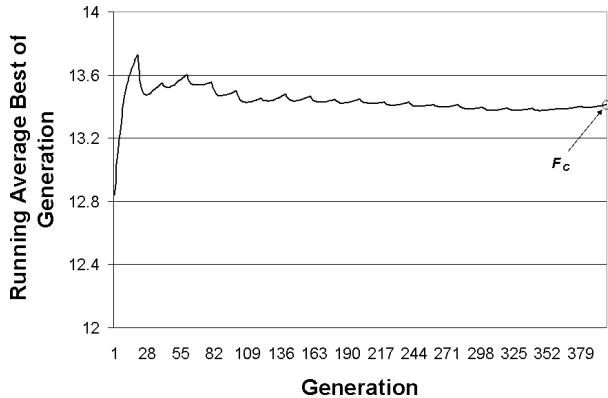
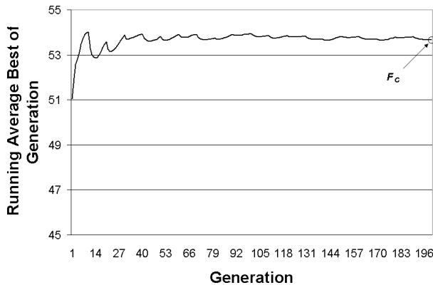

# Performance Measurement in Dynamic Environments

Ronald W. Morrison

Mitretek Systems, Inc. 3150 Fairview Park Drive South Falls Church, VA 22043-4519 ronald.morrison@mitretek.org

# Abstract

There has not been a uniform agreement regarding what constitutes “good” performance for evolutionary algorithms in dynamic environments. A performance measurement method should, as a minimum, have an intuitive meaning and provide straightforward methods for statistical significance testing of comparative results. In this paper we attempt to resolve some issues related to EA performance measurement in dynamic environments.

# 1 Introduction

Despite the interest in evolutionary algorithms for dynamic fitness landscapes, there has not been a uniform agreement regarding what constitutes “good” performance for these algorithms. Advances in research require that experiments be repeatable and that experimental results be reported in a way that facilitates comparisons of experimental results. For EA research in dynamic environments, this means that in addition to the EA extension or modification we are researching, we must describe the problem we are examining and describe the performance measurement methods. The problem description and the description of the results reporting methods take up valuable pages in the (usually page limited) published paper. Many papers need to abbreviate the descriptions of each area to the point where the results are not repeatable, nor can any analysis of the limitations or generality of the reported results be conducted. This severely limits the usefulness of published papers. While there has been some research into standard and easily describable dynamic problems [1], [2], there is no universal agreement on methods for reporting results.

In this paper we attempt to resolve some issues related to EA performance measurement in dynamic environments. The next section will describe previously used techniques, examine some problems associated with their use, and delineate the minimum requirements for a good measurement technique. The third section will present our recommended performance evaluation reporting methods and provide examples of this performance reporting method.

# 2 Issues and Requirements in Performance Measurement

Studies of the performance of EAs in dynamic environments have sometimes reported results using traditional measures of EA performance (i.e., offline performance, online performance, and best-so-far curves). These measurements are, in general, not appropriate for measuring EA performance on practical dynamic problems for the following reasons:

• Best-so-far curves are inappropriate, because a population member with a previously discovered “best” value may have a very low fitness after a landscape change.

Off-line performance measures the running average best-so-far evaluation for each generation. In static landscapes, this measure provides a monotonically increasing value that indicates how rapidly an EA achieves good performance. In dynamic landscapes, however, the use of the “bestso-far” values are inappropriate, because the values are meaningless after a landscape change.

On-line performance, which measures the average of all fitness function evaluations up to and including the current trial, provides no information about the best values found, which are the values of interest in any practical implementation of an EA in a dynamic environment.

To address these shortcomings, other researchers examining EA performance in dynamic fitness landscapes have suggested the use of the following:

the difference between the optimum value and the value of the best individual in the environment just before the environment change [3],   
a modified off-line performance measure, where the best-so-far value is reset at each fitness landscape change [1],   
• the average Euclidean distance to the optimum at each generation [4],   
• best-of-generation averages, at each generation, for many EA runs of the same specific problem, [5], [6], [7], and   
the best-of-generation minus the worst within a small window of recent generations, compared to the best within the window minus the worst within the window [8].

The first two of these measures require knowledge of the generation when the fitness landscape changed. This severely restricts their use in standardized evaluation of EA performance in dynamic fitness landscapes because in many real problem, and some test problems, acquiring this information can be problematic. In real problems, there may not be any practical way to determine that the landscape changed, and, in both real and test problems, many landscape changes may not be relevant to the EA performance.

The third measure, the average Euclidean distance to the optimum at each generation, is only available in test problems where the exact position of the global optimum in the search space is already known.

The fourth and most commonly reported measure, average best-of-generation at each generation over many runs of the same problem, addresses several of the concerns identified so far. The difficulty in using this measure is that, as mentioned previously, we are interested in the performance of the EA across the entire range of landscape dynamics, not just at specific generations. Users of this method usually provide performance curves that can be compared at each specific generation. This method does not, however, provide a convenient method for comparing performance across the full range of landscape dynamics, nor measuring the statistical significance of the results. Since this method is the most commonly used method, Figure 1 is provided to illustrate the difficulties in using it for comparing experimental results. Figure 1 shows the best of generation over many runs of the same dynamic problem for five different EA techniques. As can be seen by the figure, it is very difficult to determine which technique performs best and whether any differences in performance are statistically significant.

  
Figure 1: Best of Generation, Five Different Techniques, Landscape Moving Every 60 Generations

The fifth technique mentioned above is a recent attempt to address performance measurement in dynamic environments. It is based on an assumption that the best fitness value will not change much over a small number of generations, which may not be true. This measure also does not provide a convenient method for comparing performance across the full range of landscape dynamics.

It appears that a good performance measurement method for EAs in dynamic environments should, at a minimum have: (1) intuitive meaning; (2) straightforward methods for statistical significance testing of comparative results; and (3) a measurement over a sufficiently large exposure to the landscape dynamics so as to reduce the potential of misleading results caused by examination of only small portions of the possible problem dynamics.

# 3 Performance Measurement: Collective Mean Fitness

A new method of dynamic performance measurement is presented here that is related to several previous methods, but differs from previous methods in the choice of the experimental unit. Since we are concerned with the performance of the EA across the entire range of landscape dynamics, we will consider the experimental unit to be the entire fitness trajectory, collected across EA exposure to a large sample of the landscape dynamics. To begin, we must first define Total Mean Fitness $F _ { T }$ as the average best-of-generation values over an infinite number of generations, thereby experiencing all possible problem dynamics, further averaged over multiple runs. More formally:

$$
F _ { T } = \frac { \displaystyle \sum _ { m = 1 } ^ { M } \left( \frac { \displaystyle \sum _ { g = 1 } ^ { G } ( F _ { B G } ) } { G } \right) } { M } = \mathrm { C o n s t a n t , ~ f o r } ~ G = \infty .
$$

Where:

$$
\begin{array} { r l } & { F _ { T } = \mathrm { t h e ~ t o t a l ~ a v e r a g e ~ f i t n e s s ~ o f ~ t h e ~ E A ~ o v e r } } \\ & { \mathrm { ~ i t s ~ e x p o s u r e ~ t o ~ a l l ~ t h e ~ p o s s i b l e ~ l a n d s c a p e } } \\ & { \mathrm { ~ d y n a m i c s } } \\ & { F _ { B G } = \mathrm { t h e ~ b e s t { - } o f { - } g e n e r a t i o n } } \\ & { M = \mathrm { t h e ~ n u m b e r ~ o f ~ r u n s ~ o f ~ t h e ~ E A } } \\ & { G = \mathrm { t h e ~ n u m b e r ~ o f ~ g e n e r a t i o n s } . } \end{array}
$$

It should be noted that as $G \to \infty$ , the effect on $F _ { T }$ caused by variation in the best-of-generation fitness value in any specific generation is reduced. For any particular run, $m$ , the value of $F _ { T _ { m } }$ is the average performance over exposure to all possible landscape dynamics. The differences between the various $F _ { T _ { m } }$ values against the same dynamic problem represent the variation caused by the stochastic operation of the EA.

While the above description might indicate that very large experiments are required for use of this performance metric, the value $F _ { T }$ for an EA approaches a constant after a exposure to a much smaller representative sample of the dynamic environment under the following conditions:

1. the EA has a reasonable recovery time for all types of landscape changes. This means that the EA doesn’t “get lost” for long periods of time and then recover. If the EA did get lost for long periods of time, increased exposure to the dynamics would be necessary to dampen out the effects of getting lost.

2. the global maximum fitness can be assumed to be restricted to a relatively small range of values. Larger ranges of fitness values require longer exposures to the landscape dynamics to dampen the effect of fitness value fluctuations.

  
Figure 2: Running Average Best of Generation for a 14-cone Landscape Moving Every 20 Generations

These conditions permit us to define a new measure of performance for use in dynamic fitness landscapes, the Collective Mean Fitness, $F _ { C }$ . This is a single value that is designed to provide an aggregate picture of an EA’s performance, where the performance information was collected over a representative sample of the fitness landscape dynamics. Collective fitness is defined as the average best-of-generation values, averaged over a sufficient number of generations, $G ^ { \prime }$ , required to expose the EA to a representative sample of all possible landscape dynamics, further averaged over multiple runs. More formally:

$$
\begin{array} { r } { F _ { C } = \frac { \displaystyle \sum _ { m = 1 } ^ { M } \left( \frac { \sum _ { g = 1 } ^ { G ^ { \prime } } ( F _ { B G } ) } { G ^ { \prime } } \right) } { M } \approx F _ { T } . } \end{array}
$$

The collective mean fitness will approach the total mean fitness after a sufficiently large exposure to the landscape dynamics. Sufficient, in this context, means large enough to provide a representative sample of the fitness dynamics and allow the stabilization of the running average best-of-generation fitness value. Examples of the dampening of individual fluctuations of the value of $F _ { C }$ over 20 generations using this performance metric is illustrated in Figures 2 and 3 for two of the problems used in a recent study (in these graphs, $F _ { C }$ is over 100 runs). Figure 2 shows the running average best-of-generation value where the landscape has 14 cones in 2 dimensions, with all cones are moving chaotically every 20 generations. Figure 3 shows the running average best-of-generation for a 5-dimensional, 5-cone problem, where all cones move in large steps every 10 generations. In these two sample cases it is easy to see the dampening effect of individual best-of-generation values on the $F _ { C }$ value.

  
Figure 3: Running Average Best of Generation for for a 5-cone Landscape Moving Every 10 Generations

Using this metric requires determination of the number of generations to be used for a representative sample of the landscape dynamics. The number of generations necessary is principally determined by the dynamic behavior of the landscape under examination. In some problems where the dynamics are well understood, it may be possible to estimate the appropriate number of generations necessary to achieve a stable value of $F _ { C }$ . In other problems, where the landscape dynamics may be completely unknown, the number of generations needed to achieve an acceptably stable value for $F _ { C }$ may need to be experimentally established. This is done by observing the running average of the best-ofgeneration values and identifying the number of generations necessary to achieve an acceptably stable value. Different EA runs against an identical problem will result in somewhat different values of $F _ { C _ { m } }$ , caused by the stochastic characteristics of evolutionary search. The number of runs required is then based on the variance of the $F _ { C _ { m } }$ values and the desired confidence interval for $F _ { C }$ .

There are two additional items to notice about this performance metric. First, in the case where the fitness landscape changes every generation, this measure is identical to Branke’s modified off-line performance [1] if the modified off-line performance metrics were computed over a sufficiently large number of generations. Second, this method of performance measurement is a form of data compression of the performance curves provided in [5], [6], and [7], permitting simple comparison of the performance across the entire dynamic run.

# 4 Summary

In this paper we have addressed issues with measurement of performance when evaluating EAs in dynamic environments and described a performance measure that reduces the potential for misinterpreting the effectiveness of any EA enhancements in dynamic fitness landscapes. Use of this method ensures that experimental results are based on a representative sample of the landscape dynamics and provides a basis for determination of the statistical significance of observed experimental results in dynamic fitness landscapes.

# Список литературы

[1] Branke, J.: Evolutionary Optimization in Dynamic Environments. Kluwer Academic Publishers (2002)   
[2] Morrison, R. and De Jong, K.: A Test Problem Generator for Non-stationary Environments. In: Proceedings of Congress on Evolutionary Computation, CEC99. IEEE 1999 2047-2053.   
[3] Trojanowski, K. and Michalewicz, Z.: Searching for Optima in Non-stationary Environments. In: Proceedings of Congress on Evolutionary Computation, CEC99. IEEE 1999 1843-1850   
[4] Weicker, K. and Weicker, N.: On Evolutionary Strategy Optimization in Dynamic Environments. In: Proceedings of the Congress on Evolutionary Computation, CEC99. IEEE 1999 2039-2046.   
[5] Gaspar, A. and Collard, P.: From GAs to Artificial Immune Systems: Improving Adaptation in Time Dependent Optimization. In: Proceedings of Congress on Evolutionary Computation, CEC99. IEEE 1999 1859-1866.   
[6] Grefenstette, John J.: Evolvability in Dynamic Fitness Landscapes, a Genetic Algorithm Approach. In: Proceedings of the Congress on Evolutionary Computation, CEC99. IEEE 1999 2031- 2038   
[7] B¨ack, T.: On the Behavior of Evolutionary Algorithms in Dynamic Fitness Landscapes. In: Proceeding of the IEEE International Conference on Evolutionary Computation. IEEE 1998 446-451   
[8] Weicker, K.: Performance Measures for Dynamic Environments. In: Parallel Problem Solving from Nature - PPSN VII, Lecture Notes in Computer Science 2349. Springer-Verlag 2002 64-73.