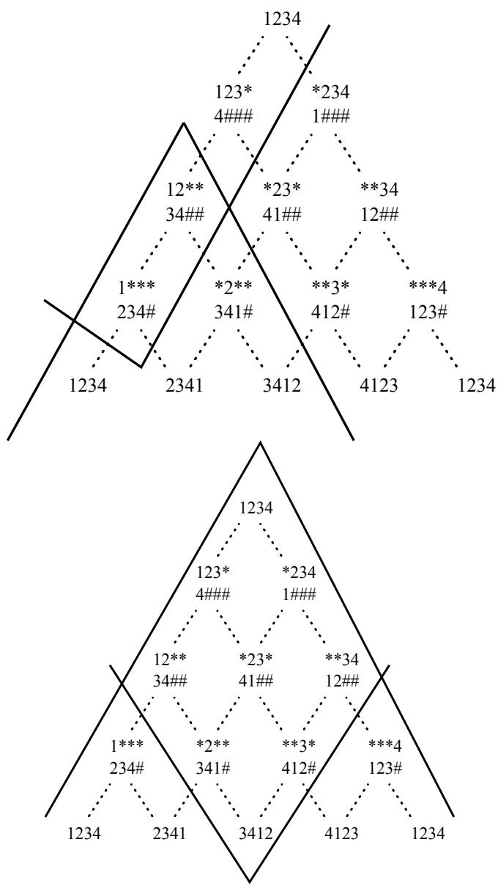
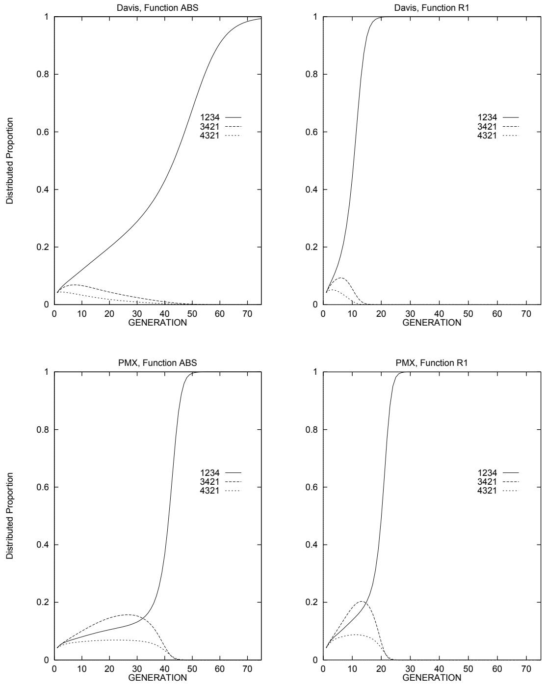
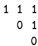
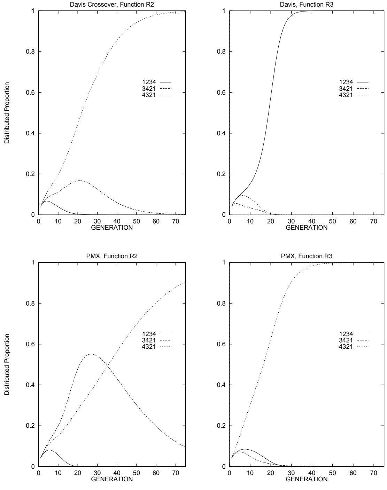

# Modeling Simple Genetic Algorithms for Permutation Problems

Darrell Whitley and Nam-Wook Yoo Computer Science Department Colorado State University Fort Collins, CO 80523 whitley@cs.colostate.edu

# Abstract

An exact model of a simple genetic algorithm is developed for permutation based representations. Permutation based representations are used for scheduling problems and combinatorial problems such as the Traveling Salesman Problem. A remapping function is developed to remap the model to all permutations in the search space. The mixing matrices for various permutation based operators are also developed.

# 1 INTRODUCTION

Several exact models of simple genetic algorithms have been introduced that assume the genetic algorithm is processing binary strings. In this paper we develop exact models of the simple genetic algorithm when specialized recombination operators are applied to problems which are encoded as permutations. Kargupta, Deb and Goldberg (1992) refer to this class of genetic algorithms as ordering genetic algorithms. Permutation encoded problems are often used to represent scheduling problems and classic combinatorial optimization problems such as the Traveling Salesman Problem.

Kargupta, Deb and Goldberg (1992) explore how ordering problems can be deceptive-that is, how ordering problems can mislead a genetic algorithm. The notion of studying "deception" has received some criticism because deception is usually defined statically using properties that characterize the function, instead of being defined dynamically with respect to both the function and how the genetic algorithm behaves when processing the function (Grefenstette, 1993). The goal here is not to debate the importance of deception, but rather to provide tools which can be used to dynamically study "ordering genetic algorithms." This will also allow us to evaluate a genetic algorithm dynamically when processing functions that are identified as deceptive from a static point of view.

Another potential use of these models is to aid in the development of new permutation operators. Construction of new operators up to this point has been largely ad hoc, with little in the way of rigorous analysis to determine how a new operator will behave on a particular type of problem. The model introduced here can be used to study the interaction between specific operators and specific types of problems. We have developed the mixing matrix needed to describe four general types of permutation crossover operators. These include Order Crossover 1, Order Crossover 2, Position Crossover and Partially Mapped Crossover (PMX).

# 2 EXACT MODELS FOR SGAs

Goldberg (1987) developed the first dynamic models of the genetic algorithm for 2 bit strings. Bridges and Goldberg (1987) generalized this model to look at arbitrary individual strings and schemata for simple genetic algorithms (SGAs). Whitley et al. (1993; 1992) further generalized the Bridges and Goldberg model to provide a complete model of how all strings in the search space are processed by a simple genetic algorithm using selection and crossover. Vose and Liepins (1991) independently introduced another exact model which also includes the effects of mutation. All of these models were developed using infinite population assumptions.

The following notation is based on Vose and Liepins. The vector $p ^ { t } \in \mathfrak { R }$ is defined such that the $k$ th component of the vector is equal to the proportional representation of string $k$ at generation $t$ . The vector $s ^ { t } \in \mathbb { R }$ represents the $t$ th generation of the genetic algorithm and the $i$ th component of $s ^ { t }$ is the probability that the string represented by $i$ is selected for the gene pool. Thus, $s _ { 0 } ^ { t }$ represents the proportional representation of string 0 in the population at generation t after selection has occurred, but before recombination is applied. Likewise, $p _ { 0 } ^ { t }$ represents the proportional representation of string 0 (i.e., the string of all zeros) at generation t before selection occurs. Finally, let $r _ { i , j } ( k )$ be the probability that string $k$ results from the recombination of strings i and $\mathrm { j }$ . Now, using $\varepsilon$ to denote expectation,

$$
\mathcal { E } ~ p _ { k } ^ { t + 1 } = \sum _ { i , j } ~ s _ { i } ^ { t } ~ s _ { j } ^ { t } ~ r _ { i , j } ( k ) .
$$

To further generalize this model, a mixing matrix $M$ is constructed where the $i , j$ th entry $m _ { i , j } ~ = ~ r _ { i , j } ( 0 )$ . Here $M$ is built by assuming that each recombination generates a single offspring. The calculation of the change in represention for string $k = 0$ is now given by

$$
\mathcal { E } ~ p _ { 0 } ^ { t + 1 } ~ = ~ \sum _ { i , j } ~ s _ { i } ^ { t } s _ { j } ^ { t } r _ { i , j } \left( 0 \right) ~ = ~ s ^ { T } M s
$$

where $T$ denotes transpose. Note that this computation gives the expected representation of a single string, 0, in the next genetic population. Vose and Liepins also formalize the notion that when processing binary strings, bitwise exclusive-or (denoted $\bigoplus$ ) can be used to access various probabilities from the recombination function $r$ . Specifically,

$$
r _ { i , j } ( k ) = r _ { i , j } ( k \oplus 0 ) = r _ { i \oplus k , j \oplus k } ( 0 ) .
$$

This implies that the mixing matrix $M$ , which is defined such that entry $m _ { i , j } = r _ { i , j } ( 0 )$ , can provide mixing information for any string $k$ just by changing how $M$ is accessed. By

reorganizing the components of the vector $s$ the mixing matrix $M$ can yield information about the probability $r _ { i , j } ( k )$ . A permutation function, $\sigma$ , is defined as follows:

$$
\sigma _ { j } < s _ { 0 } , . . . , s _ { N - 1 } > ^ { T } = < s _ { j \oplus 0 } , . . . , s _ { j \oplus ( N - 1 ) } > ^ { T }
$$

where the vectors are treated as columns and $\mathrm { N }$ is the size of the search space. The computation

$$
( \sigma _ { q } \ s ^ { t } ) ^ { T } M ( \sigma _ { q } \ s ^ { t } ) = p _ { q } ^ { t + 1 }
$$

thus reorganizes $s$ with respect to string $q$ and produces the expected representation of string q at generation $t + 1$ . A general operator $\mathcal { M }$ can now be defined over $s$ which remaps $s ^ { T } M \bar { s }$ to cover all strings in the search space:

$$
\begin{array} { r } { \mathcal { M } ( s ) = < ( \sigma _ { 0 } s ) ^ { T } M ( \sigma _ { 0 } s ) , . . . , ( \sigma _ { N - 1 } s ) ^ { T } M ( \sigma _ { N - 1 } s ) > ^ { T } . } \end{array}
$$

Recall that $s$ carries fitness information such that it corresponds to the intermediate phase of the population (after selection, but before recombination) as the genetic algorithm progresses from generation $t$ to $t + 1$ . Thus, to complete the cycle and reach a point at which the Vose and Liepins models can be executed in an iterative fashion, fitness information is introduced. A fitness matrix $F$ is defined such that fitness information is stored along the diagonal; the $i , i$ th element is given by $f ( i )$ where $f$ is the fitness function.

Following Vose and Wright (1994):

$$
s ^ { t + 1 } = ( F p ^ { t + 1 } ) / ( 1 ^ { T } F p ^ { t + 1 } )
$$

since

$$
F p ^ { t + 1 } = < f _ { 0 } p _ { 0 } ^ { t + 1 } , f _ { 1 } p _ { 1 } ^ { t + 1 } , . . . , f _ { n - 1 } p _ { n - 1 } ^ { t + 1 } >
$$

and

$$
\boldsymbol { 1 } ^ { T } \boldsymbol { F } p ^ { t + 1 } = f _ { 0 } p _ { 0 } ^ { t + 1 } + f _ { 1 } p _ { 1 } ^ { t + 1 } + \ldots + f _ { n - 1 } p _ { n - 1 } ^ { t + 1 }
$$

is the population average, which implies $\textstyle \sum _ { j } s _ { j } = 1$ .

Whitley (1994) provides a more tutorial level introduction to these models.

# 3 EXACT MODELS FOR PERMUTATIONS

The Vose and Liepins model will be used as the basis for developing models of the simple genetic algorithm that process permutation based encodings. In developing these models for permutation encodings we consider two problems. First, a different transformation of the s vector is required. Second, a concise way of developing the mixing matrix for various permutation based operators is possible (but not required).

The transformation of the $s$ vector for binary strings can be viewed in two ways. First, applying exclusive-or to the strings rotates the hypercube. Second, applying exclusive-or to the binary representations of the indices of the $s$ vector reorders the elements of the $s$ vector. For permutations, an analogous transform is possible.

# 3.1 THE MAPPING FUNCTION

In order to calculate the expected representation for all strings representing permutations, a mapping function is needed that allows one to access the probability of recombining string $i$ and $j$ and obtaining an arbitrary string $k$ . For example, the remapping function denoted $@$ should function as follows:

$$
r _ { 3 4 2 1 , 1 3 4 2 } ( 3 1 2 4 ) = r _ { 3 4 2 1 @ 3 1 2 4 , 1 3 4 2 @ 3 1 2 4 } ( 1 2 3 4 ) .
$$

This mapping can be achieved by simple element substitution. First, the function r can be generalized as follows:

$$
r _ { 3 4 2 1 , 1 3 4 2 } ( 3 1 2 4 ) = r _ { w z y x , x w z y } ( w x y z )
$$

where $\mathrm { w } , \mathrm { x } , \mathrm { y }$ and $\mathbf { Z }$ are variables representing the elements of the permutation (e.g., $\mathrm { { w } = 3 }$ , $\scriptstyle \tau = 1 , \ \mathrm { y = 2 } , \ \tau = 4 ,$ . If $w x y z$ now represents the canonically ordered permutation 1234,

$$
r _ { w z y x , x w z y } ( w x y z ) = r _ { 1 4 3 2 , 2 1 4 3 } ( 1 2 3 4 ) = r _ { 3 4 2 1 @ 3 1 2 4 , 1 3 4 2 @ 3 1 2 4 } ( 1 2 3 4 )
$$

The computation $Y = A @ X$ behaves as follows. Let any permutation $\mathrm { X }$ be represented by $x _ { 1 } x _ { 2 } x _ { 3 } , \ldots , x _ { n }$ . Then $a _ { 1 } a _ { 2 } a _ { 3 } , \ldots , a _ { n } @ x _ { 1 } x _ { 2 } x _ { 3 } , \ldots , x _ { n }$ yields $Y = y _ { 1 } y _ { 2 } y _ { 3 } , . . . , y _ { n }$ where $y _ { i } = j$ when $a _ { i } \ = \ x _ { j }$ . Thus, $( 3 4 2 1 @ 3 1 2 4 )$ yields (1432) since $( a _ { 1 } = 3 = x _ { 1 } ) \Rightarrow ( y _ { 1 } = 1 )$ . Next, $( a _ { 2 } = 4 = x _ { 4 } ) \Rightarrow ( y _ { 2 } = 4 )$ , $( a _ { 3 } = 2 = x _ { 3 } ) \Rightarrow ( y _ { 3 } = 3 )$ and $( a _ { 4 } = 1 = x _ { 2 } ) \Rightarrow ( y _ { 4 } = 2 )$ . This mapping function is analogous to the bitwise addition (mod 2) used to reorder the vector $s$ for binary strings. However, note that $A @ X \neq X @ A$ . Furthermore, for permutation recombination perators it is not necessarily tr that $r _ { i , j } = r _ { j , i }$ .

# 3.2 CHOOSING A CANONICAL ORDERING

The actual ordering of the permutations in terms of the canonical form for $s$ can be arbitrarily chosen as long as it matches the mixing matrix. An ordering is chosen for the basis of a recursive function which provides a one-to-one invertible mapping between the permutation strings and a set of indices for the representation vectors $p$ and $s$ as well as the mixing matrix $M$ .

Choose some ordering of the permutation elements which is defined to be sorted. Sort and index the $\mathrm { N }$ elements $N \geq 1 )$ of the permutation from 1 to N. The permutation corresponding to integer $\mathrm { X }$ (where $0 \leq X < N ! ,$ is determined by the following algorithm that creates a permutation by picking elements from a list maintained in sorted order.

1. Set $\mathrm { C } = \mathrm { N }$ ; Set $\mathrm { K } = \mathrm { X }$ ;   
2. If $\mathrm { K } = 0$ , pick all remaining elements in the sorted permutation in the order of appearance and stop.   
3. IF $K < ( C - 1 ) !$ pick the first element of the sorted list and GOTO 5. Otherwise, Continue.   
4. Find $Y$ such that $Y - 1 ( ( C - 1 ) ! ) \le K < Y ( ( C - 1 ) ! )$ . The $Y ^ { t h }$ element of the sort list is the next element of the permutation. $K = K - ( Y - 1 ) ( ( C - 1 ) ! )$ .   
5. Delete the chosen element from the sorted list and reindex the remaining elements; C $= \mathrm { C } - 1$ ; GOTO 2.

The convertion from a permutation to an index merely inverts this process. For permutations of length three this generates the following ordering:

$\tt { X } = \tt { 0 }$ indexes 123 $\begin{array} { r } { \tt { X \equiv 3 \ i n d e x \ominus s \ 2 3 1 } } \\ { \tt { X \equiv 4 \ i n d e x \ominus s \ 3 1 2 } } \\ { \tt { X \equiv 5 \ i n d e x \ominus s \ 3 2 1 } } \end{array}$   
$\texttt { X } = \texttt { 1 }$ indexes 132   
$\tt { X } = \tt { 2 }$ indexes 213

Having defined the canonical form of $s$ and a mapping function for reordering $s$ , the only remaining task is to define the function $r _ { i , j } ( 0 )$ with respect to permutations for a specific operator. Permutation 0 in this case represents the standard form of the permutation, $1 2 3 \ldots N$ , which has its elements sorted from 1 to N.

# 3.3 THE MIXING MATRIX FOR ORDER CROSSOVER 1

The Order Crossover 1 recombination operator was first introduced by Dave Davis (1985). A related form, known as "C1," was also introduced by Reeves (1993). One variant of the operator can be described as follows.

Pick two strings to recombine. Label one parent the cut string and the other the filler string. Pick a contiguous section out of the cut string which is directly copied to the offspring. We will refer to the contiguous section of cut string as the "crossover section." The crossover section is placed in the offspring in the same absolute position it occupied in the cut string. Next, inherit those elements from filler string which are not in the crossover section from the cut string. These elements are inherited from the filler string based on relative order. For simplity we assume that relative order is determined starting at the beginning of the filler string. A "filler-block" is constructed from string 2 by deleting those elements that appear in the crossover section of string 1; this maintains these elements in the same relative order observed in string 2. (If a starting point other than the start of the string is chosen to determine relative order, a simple shift of the filler string can be done.)

The following is an example of Order Crossover 1. (Upper and lower case distinguish between parent 1 and parent 2.)

String 1: ABCDE FGHI crossover-section _ _ C D E F __-

Offspring: bg CD E F h a i

Note that the filler block has no absolute order. The offspring is constructed by adding elements from the filler block to the crossover section of the cut string. The first element of the filler-block is added at the end of the crossover section, with the other elements being added in relative order. When the end of the string is reached, the process wraps around to complete the construction of the offspring.

We have explored many approaches to construct the mixing matrix for this operator. The following is the most effcient algorithm we have found. This method performs an O(N) calculation for each entry in the mixing matrix, where N is the number of elements in the permutation. The mixing matrix has $( N ! ) ^ { 2 }$ elements, so the construction of the entire mixing matrix has complexity $O ( N ( N ! ) ^ { 2 } )$ . We first assign a unique number to each element in a permutation. The permutation with index 0 is represented by $( 1 , 2 , 3 , . . . , \mathrm { ~ N } )$ . For illustration it is also sometimes convenient to represent this permutation as ( $\textrm { A B C } \ldots \Omega _ { \ell } ^ { \prime }$ . Each entry $m _ { i , j }$ of the mixing matrix is the probability of recombining permutation $i$ as the cutting string and $j$ as the filler string and obtaining the permutation with index 0.

This means that all possible crossover sections that can be used to produce permutation 0 must have exactly the same subsequence of elements in exactly the same absolute position as permutation 0. We will refer to these special crossover sections as "cutting sections." Thus the string H G C D E F A B has a one possible cutting section $( \texttt { \_ c l l } )$ . The string $\mathrm { ~ A ~ B ~ D ~ C ~ E ~ F ~ H ~ G ~ }$ has two possible cutting sections:

$$
\begin{array} { r } { \mathrm { ~ ( ~ A ~ ~ B ~ \subset ~ \mathcal ~ { ~ \_ ~ \cdots ~ } ~ \mathcal ~ { ~ \_ } ~ ) ~ } \qquad \mathrm { a n d } \qquad \mathrm { ~ ( ~ \mathcal ~ { ~ \_ ~ \_ ~ \cdots ~ } ~ \in ~ \mathcal ~ { ~ E ~ F ~ \_ ~ \_ ~ } ~ ) ~ } . } \end{array}
$$

Cutting sections are maximal by definition. If possible crossover sections include

$$
\begin{array} { r l r l r l r l } & { \langle \mathrm { ~ \texttt ~ { ~ \_ ~ C ~ \_ ~ E ~ F ~ \_ ~ } ~ } \rangle , } & & { \langle \mathrm { ~ \texttt ~ { ~ \_ ~ C ~ \_ ~ D ~ E ~ F ~ \_ ~ } ~ } \rangle } & & { \mathrm { a n d } } & & { \langle \mathrm { ~ \texttt ~ { ~ \_ ~ C ~ D ~ E ~ F ~ \_ ~ } ~ } \rangle , } \end{array}
$$

then only the last of these three is defined as the cutting section. The other substrings are possible crossover sections within that cutting section.

Besides the cutting section, two additional data structures defined with respect to a specific cutting section are needed to concisely calculate the probability of constructing permutation 0. The minimal filler block contains exactly those elements not in the cutting section, and thus the elements appear in the relative order required to construct permutation 0. Thus, once a specific cutting section is determined, the miminal filler block is also determined. One can then check to see if the filler string $j$ contains the required minimal filler block.

For a specific string j, if there is no appropriate minimal filler block for a specific cutting section, then there is no appropriate filler block for any subsection of that cutting section, since the filler block for an subsection of the maximal cutting section must contain as a subsequence the minimal filler block for the maximal cutting section. If no minimal filler block exists for a specific cutting section, then that cutting section cannot be used to generate permutation 0 (i.e., it generates permutation 0 with probability 0).

Not all subsections of a cutting section can be viable crossover sections, however, since not all subsections of a cutting section will yield permutation 0 when recombination occurs. To determine which subsection of a cutting section will produce permutation 0, one must define the maximal filler block. The maximal filler block is constructed from the minimal filler block. Let $x _ { q }$ be the $q ^ { t h }$ element of permutation zero and the first element of the minimal fller block. If element $x _ { q - 1 }$ in permutation zero appears to the left of element $x _ { q }$ in the fller string, it may be appended to the front of the current filler block. The process is then repeated with respect to $x _ { q ^ { \prime } }$ (the new first element of the enlarged filler block) and $x _ { q ^ { \prime } - 1 }$ . The left expansion of the filler block stops when the leftward scan of the filler string fails to find the next element $x _ { q ^ { \prime } - 1 }$ to the left of the current $x _ { q ^ { \prime } }$ in the filler block. This same process is then applied to the right. Let $x _ { k }$ be the $k ^ { t h }$ element of permutation zero and the last element of the minimal filler block. If element $\boldsymbol { x } _ { k + 1 }$ appears to the right of element $x _ { k }$ in the filler string, it is appended to the end of the current filler block and becomes the new end element $x _ { k ^ { \prime } }$ . Building then continues to the right. This construction process yield the maximal filler block.

The following examples illustrate these principles. If cut string $i$ is H G C D E F A B with a cutting section $( \texttt { \_ c o d E F } \texttt { \_ l } )$ , then filler string $j$ must have the minimal filler block (G H A B). Assume string $j$ is the permutation (F D G H E A B C). Now scanning to the left in string $j$ from $\mathrm { G }$ , we search for $\mathrm { F }$ , which appears and is added to the minimal filler block. This process now continues, searching to the left of $\mathrm { F }$ to find E, the next adjacent element to the left in permuation 0. The process stops when the next element is not found. The same process is applied to the right starting with element B. In this case, C appears to the right, and is added to the expanding filler block. The process then terminates. The resulting maximal filler block is (F G H A B C).

Those elements that appear in both the cutting section and the maximal filler block may optionally be included in either the crossover section or the filler block during recombination. Thus, in the previous example D and $\mathrm { E }$ must appear in the crossover section, but $\mathrm { F }$ and C can appear in either the filler block or the crossover section. Thus, all possible viable crossover sections that yield permutation 0 include (C D E), (C D E F), (D E F) and (D E).

The preceding rules apply only when string $i$ is not itself a copy of permutation 0. Special rules are required to construct the minimal filler section when $i$ is a copy of permutation 0.

For string $i = 0$ the entire string is the cutting section and there is no well defined minimal filler block. In this case filler blocks are defined with respect to element 1 and element N of string $i = 0$ .

If element 1 appears before element $\mathrm { N }$ in string $j$ then exactly two possible filler blocks must be considered. A minimal filler block is initialized with element 1. The maximal filler block is now expanded by scanning right in filler string $j$ from element 1 and adding element to the right to construct the maximal filler block. A second minimal filler block is initialized with element N. The filler block is now expanded by scanning left in filler string $j$ and adding elements to the left in the expanding filler block.

For example, string $i$ is permuation 0, here represented by (A B C D E F) and string $j$ is (C E D A F B). A is to the left of $\mathrm { F }$ (i.e., element 1 appears before element N) and one of the maximal filler blocks with respect to A is (A B) with corresponding possible crossover sections of (C D E F) and (B C D E F) from string $i$ . (We assume crossover never copies string $i$ completely.) The maximal filler block with respect to $\mathrm { F }$ from string $j$ is (E F).

If element 1 appears after element N in string $j$ , only a single maximal filler block exists, but two minimal filler blocks exist: (1) and (N). Nevertheless the maximal fller block is constructed by initializing a string with (N 1); this string is expanded on both the left and right. This produces a single maximal filler block of the general form (N-X,.,N-1, N, 1, 2, .., Y). If string $j$ is a shifted version of permutation zero, the entire string $j$ will constitute the filler section.

Having defined how to calculate the cutting section, the minimal fller block and the maximal filler block, we show how to calculate the probability of crossover. The two directed acyclic graphs shown in Figure 1 illustrate the relationship between cutting sections and fller blocks, as well as the effects of recombination (see the examples of recombination discussed below). Each node in a graph represents a cutting section and the associated minimal filler block. The exception is the root node, which has only a cutting section, and the last row of the graph, which represents special filler sections that are shifted versions of permutation 0 (e.g.,

2341, 3412, 4123). As described here, recombination does not occur at the root of the graph, or in the last row of the graph. All valid crossover sites have both a cutting section and a filler block. The cutting sections are represented by templates such as $^ { * } 2 3 ^ { * }$ , which indicate that the elements 2 and 3 occur in the absolute positions 2 and 3. The corresponding minimal filler block in this case is 41##. This is a relative order representation, introduced by Goldberg (1985; 1989) to describe relative order schemata. In this case, 41## indicates that 4 appears before 1, but it does not indicate the absolute positions at which 4 and 1 occur.

Possible viable crossover sections are found by identifying a particular cutting section and the maximal filler block associated with fller string $j$ . This is performed as follows. Find the cutting section in the graph; next find the maximal filler section in the graph. Expand the graph down from the cutting section and up from the maximal filler section. All nodes in the intersection of these expansions are viable crossover sites. Count the number of viable crossover sites for all possible cutting sections. Assuming one cannot select all of cutting string $i$ to be the crossover section (i.e., the roots of the graphs in Figure 1 are not valid cutting sections), then the total number of crossover sites for this operator is (N + 1) - 1. Thus, if M is the number of nodes in the intersection of the expansion associated with the cutting sections of cutting string $i$ and the maximal filler sections of filler string $j$ , then the liii $i$ and $j$ is given by $\frac { M } { \binom { N + 1 } { 2 } - 1 }$ .

The top graph in Figure 1 illustrates how crossover nodes are identified when the cutting section is $1 2 ^ { * * }$ , the associated minimal filler block is 34##, and the maximal filler block is 234#. (The cutting string $i$ in this case must be 1243, but the filler string $j$ could be 2134 or 2314.) A cone is projected downward from $1 2 3 ^ { * }$ and up from 234#; the intersection of these two cones indicates that there are two possible crossover sections: either $1 ^ { * * * }$ or $1 2 ^ { * * }$ . The bottom graph in figure 1 assumes the cutting section is 1234 and the maximal filler block is 3412.

One anomally occurs when both parents are permutation 0 (e.g. $i = j = 0$ . In this case 1234 appears as a filler section twice in the last row of the graph. In this case, cones are projected up from both positions.

The construction of cutting sections and filler blocks can be done in $\mathrm { O } ( \mathrm { N } )$ time, since this requires scanning only strings $i$ and $j$ .

# 3.4 AN EXAMPLE COMPUTATION

The computation for $s ^ { T } M s$ for an SGA using Order Crossover 1 to process a permutation of three elements is as follows.

$$
p _ { 0 } ^ { t + 1 } = [ s _ { 0 } , s _ { 1 } , s _ { 2 } , s _ { 3 } , s _ { 4 } , s _ { 5 } ] \left[ { \begin{array} { r r r r r r r } { . 8 } & { . 6 } & { . 6 } & { . 8 } & { . 8 } & { . 6 } \\ { . 2 } & { 0 } & { . 2 } & { . 2 } & { 0 } & { 0 } \\ { . 2 } & { . 2 } & { 0 } & { 0 } & { . 2 } & { 0 } \\ { 0 } & { 0 } & { 0 } & { 0 } & { 0 } & { 0 } \\ { 0 } & { 0 } & { 0 } & { 0 } & { 0 } & { 0 } \\ { 0 } & { 0 } & { 0 } & { . 2 } & { . 2 } & { . 2 } \end{array} } \right] \left[ { \begin{array} { r } { s _ { 0 } } \\ { s _ { 1 } } \\ { s _ { 2 } } \\ { s _ { 3 } } \\ { s _ { 4 } } \\ { s _ { 5 } } \end{array} } \right]
$$

Note that the sum of the probabilites must equal to N!, where N is the number of elements in the permutation (in this case, $\mathrm { N } = 3$ and $\mathrm { N ! } = 6$ ) When all sources of string gains and

  
Figure 1: These graphs model the cutting sections and filler blocks associated with the "C1" variant of the order crossover 1 recombination operator. At each node in the graph, the top string represents a cutting section and the bottom string the associated minimal filler block. For a specific instance of recombination, however, the cutting section and the maximal fller block are located. All intermediate nodes represent a single unique and valid way of doing recombination that produces permutation 0.

loe  n t epev $p _ { 0 } ^ { t + 1 }$ results in the same value. In both cases, we obtain:

$$
p _ { 0 } ^ { t + 1 } = s _ { 0 } ( . 8 ( s _ { 0 } + s _ { 1 } + s _ { 2 } + s _ { 3 } + s _ { 4 } ) + . 6 s _ { 5 } ) + . 4 s _ { 1 } s _ { 2 } + . 2 ( s _ { 1 } s _ { 3 } + s _ { 2 } s _ { 4 } + s _ { 5 } s _ { 3 } + s _ { 5 } s _ { 4 } + s _ { 5 } s _ { 5 } ) .
$$

# 3.5 CONVERGENCE BEHAVIOR AND THE MIXING MATRIX

The diagonal of the mixing matrix for Order Crossover 1 (as defined in Section 3.3) has an entry in column 1 and column 6. This implies that recombining permutation 0 with permutation 0 does not always yield permutation 0; in $2 0 \%$ of all cases it yields the inverse of permutation 0. (If permutation 0 is 1234, its inverse is 4321). Normally, for binary representations without mutation, the matrix diagonal has value 1.0 at $m _ { 1 , 1 }$ and is 0 elsewhere. As discussed by Vose and Wright (1994) matrices with diagonals with 1.0 at $m _ { 1 , 1 }$ and 0 elsewhere result in convergence where were the SGA model converges to a corner of the simplex; in other words, it will converge to a population composed of a single string. When mutation is turned on the SGA model converges to a point inside the simplex (i.e., the population converges in the sense that it is composed of a relatively stable combination of strings). Also, the addition of mutation results in a distribution of different values along the diagonal of the mixing matrix.

Our experiments show that this variant of Davis' crossover operator converges inside the simplex. It cannot converge to a population composed entirely of 1234, for example, because recombination continues to generate copies of 4321. Subsequent mixing of the strings 1234 and 4321 results in a relatively diverse population. Thus, this crossover operator has a builtin mutation effect; when identical parents are recombined an offspring that is the inverse of the parents is produced with a $2 0 \%$ probability. This effect is also somewhat adaptive since identical parents would be more likely to occur as the population begins to lose its genetic diversity.

# 3.6 ANOTHER VARIANT OF ORDER CROSSOVER 1

As defined Order Crossover 1 functions such that recombination of permutation 0 with permutation 0 does not always produce permutation 0. This can be corrected by using another variant of Order Crossover 1, where the relative order of the elements in the filler string (and hence the filler block) is defined starting at the position where the cutting section ends in parent i. For example,

StriNg 1: AB. CDEF . GHI crossover-section __ C D E F __-

String 2: hd .a eic .f bg which can be shifted to yield f b g h d a e i c with filler-block b g h a i

Offspring: a i C D E F bg h

The dots in this example represent the crossover points associated with the crossover section. Using this variant of Order Crossover 1, the mixing matrix becomes:

This matrix can be compared to the matrix given in equation (10). Note that the sum of probabilities over any single row does not change since the relevant cutting sections do not change. The probabilities are redistributed over the columns, however, since in effect the filler strings are being shifted before filler-blocks are calculated.

In this case the diagonal has $m _ { 1 , 1 } = 1 . 0$ and the diagonal is 0 elsewhere. Using this mixing matrix, the population converges to a corner of the simplex; final populations are filled with identical copies of the same string. This variant of Davis' crossover operator is used in subsequent experiments in this paper in order to allow better comparison with other operators.

# 3.7 EXPRESSING M AS A SYMMETRIC MATRIX

These matrices can also be expressed in a symmetric form, where each entry $\boldsymbol { m } _ { i , j }$ is based on the assumption that either $i$ or $j$ can be randomly assigned as the cut and filler strings. The symmetric matrix $M ^ { \prime }$ is related to the nonsymmetric matrix $\mathrm { M }$ as follows.

$$
\begin{array} { r } { M ^ { \prime } = ( M + M ^ { T } ) / 2 . } \end{array}
$$

# 3.8 PMX, ORDER CROSSOVER 2 AND POSITION CROSSOVER

The following subsections offer descriptions of PMX, as well as Syswerda's (1991) Order Crossover 2 and Position Crossover. A proof is also given that shows that Order Crossover 2 and Position Crossover produce identical results in expectation.

The methods that we have developed to generate mixing matrices for these operators are not given in detail. Rather the operators are described in such a way as to highlight those features of the operators that are relevant to generating the corresponding mixing matrices.

# 3.8.1 PARTIALLY MAPPED CROSSOVER (PMX)

Goldberg and Lingle (1985) introduced the Partially Mapped Crossover operator (PMX). Given two parents, one is choosen as Parent 1. As with Davis' crossover operator, two crossover sites are selected and all of the elements in Parent 1 between the crossover sites are directly copied to the offspring. This means that the notion of a cutting section can still be applied to the PMX operator. The "top bar" in the following illustration shows the elements that are to be copied from Parent 1 to the offspring.

PareNt 1: A B C D E F G => Offspring: __CDE_- Parent 2: C F E B A D G

The inheritance of elements from Parent 2 is more complicated than in Davis' Order Crossover 1 operator.

PMX attempts to match the elements in Parent 2 (P2) between the crossover point in the following way. If element $P 2 _ { i }$ (where index $i$ is within the crossover region) has already been copied to the offspring, take no action. Thus, in the above example, element $\mathrm { E }$ in Parent 2 requires no processing. If element $P 2 _ { i }$ in Parent 2 has not already been copied to the offspring, then find $P 1 _ { i } = P 2 _ { j }$ ; if position $j$ has not been filled then let the offspring at $j$ (denoted $O S _ { j }$ ) be assigned element $P 2 _ { i }$ . (I.e., if $O S _ { j }$ is unassigned and $P 1 _ { i } = P 2 _ { j }$ , then $O S _ { j } = P 2 _ { i }$ .) Thus, in the preceeding example, B in Parent 2 is in the same position as D in Parent 1. Thus, find $\mathrm { D }$ in Parent 2 and copy $\mathrm { B }$ to the offspring in the corresponding position. This yields:

# Offspring: _ _CDEB _

A problem occurs when we try to place element A in the offspring. Element A in Parent 2 maps to element $\mathrm { E }$ in Parent $1 ; \operatorname { E }$ falls in position 3 in Parent 2, but position 3 has already been filled in the offspring. The position in the offspring is filled by C, so we now find element C in Parent 2. The position is unoccupied in the offspring, so element A is placed in the offspring at the position occupied by C in Parent 2. This yields:

All of the elements in Parent 1 and Parent 2 that fall within the crossover section have now been placed in the offspring. The remaining elements can be placed by directly copying their positions from Parent 2. This now yields:

# Offspring: AFCDEBG

This yields two principles that simplify the construction of the mixing matrix. First, the elements occurring in selected positions in Parent 1 must directly generate elements of $S _ { 0 }$ . Second, elements that do not appear in the selected positions in either Parent 1 or Parent 2 are directly copied from Parent 2, and hence must also directly correspond to elements of $S _ { 0 }$ . Meeting these two restrictions is a prerequiste to generating the string $S _ { 0 }$ . Note that the "cutting" sections for Parent 1 strings are identical to the cutting sections defined under Davis' operator.

The mixing matrix for the permutation of three elements using PMX is as follows:

# 3.9 ORDER AND POSITION CROSSOVER

Syswerda's (1991) Order Crossover 2 and Position Crossover is different from either PMX or Davis' Order Crossover in that there is no contiguous block which is directly passed to the offspring. Instead several elements are randomly selected by absolute position.

The Order Crossover 2 operator starts by selecting K random positions in Parent 2. The corresponding elements from Parent 2 are then located in Parent 1 and reordered so that they appear in the same relative order as they appear in Parent 2. Elements in Parent 1 that do not correspond to selected elements in Parent 2 are passed directly to the offspring.

Parent 1: A B C D E F G Parent 2: C F E BA D G Selected Elements: \*  \*  \*

The selected elements in Parent 2 are F, B and A. Thus, the relevant elements are reordered in Parent 1.

All other elements are copied directly from Parent 1.

# 3.10 AN ALTERNATIVE APROACH

For purposes of constructing the mixing matrix, Syswerda's Order Crossover 2 operator can be described in an alternative fashion. Pick the (L-K) elements from Parent 1 which are to be directly copied to the offspring:

Then scan Parent 2 from left to right; place each element which does not yet appear in the offspring in the next available position.

Syswerda calls this second operator POSITION crossover, and treats it as a distinct crossover operator.

Lemma: Order Crossover and Position Crossover are identical in expectation (and hence produce identical mixing matrices) when Order crossover selects K positions and Position crossover selects L-K positions.

Proof:

Assume there is one way to produce a target string S by recombining 2 parents. Given a pair of strings which can be recombined to produce string S, the probability of selecting the K key positions using Order Crossover 2 required to produce a specific string S is $( 1 / { \bar { ( } } _ { K } ^ { L } ) )$ , while for Position Crossover, the probability of picking the L-K key elements that will produce exactly the same effect is $( 1 \bar { / } / ( \underline { { { L } } } _ { - K } ^ { L } ) \bar { \ Q }$ . Since $\left( { \bf \Phi } _ { K } ^ { L } \right) = \left( { \bf \Phi } _ { L - K } ^ { L } \right)$ the probabilities are identical.

Now assume there are R unique ways to recombine two strings to produce a target string S. The probabilities for each unique recombination event are equal as shown by the argument in the preceeding paragraph. Thus the sum of the probabilities for the various ways of ways of doing recombination are equivalent for Order Crossover 2 and Position Crossover.

QED.

Note that the Position Crossover operator is similar to Davis' Order Crossover, except that the elements that are directly copied to the offspring are randomly selected rather than being selected as a contigous block. Thus the "cutting sections" are different in this case. The following matrix assumes that the number of elements that are swapped under recombination is chosen randomly.

The mixing matrix for Order Crossover 2 for permutations composed of three elements is

$$
{ \left[ \begin{array} { l l l l l l } { 1 . 0 } & { . 8 3 3 } & { . 8 3 3 } & { . 6 6 6 } & { . 6 6 6 } & { . 5 } \\ { . 1 6 6 } & { 0 } & { . 1 6 6 } & { . 1 6 6 } & { 0 } & { 0 } \\ { . 1 6 6 } & { . 1 6 6 } & { 0 } & { . 1 6 6 } & { 0 } \\ { 0 } & { 0 } & { 0 } & { 0 } & { 0 } & { 0 } \\ { 0 } & { 0 } & { 0 } & { 0 } & { 0 } & { 0 } \\ { . 1 6 6 } & { . 1 6 6 } & { . 1 6 6 } & { 0 } & { 0 } & { 0 } \end{array} \right] }
$$

# 3.11 BUILDING THE MIXING MATRIX

For all three operators (Order-1, PMX and Order-2/Position) it is easy to specify the relevant subblocks from Parent 1 that are required to produce the permutation string $S _ { 0 }$ . Elements are directly copied from Parent 1 in all three cases. Thus, for Parent 1, the only viable crossovers are those that copy elements from Parent 1 that directly correspond to elements in permutation $S _ { 0 }$ .

As with Davis' Order Crossover operator, we have found direct and efficient ways to generate crossover probabilities. Nevertheless, the efficiency with which mixing matrices are created is not extremely critical. These matrices need only be computed once. Thus, the one time cost of generating the appropriate matrix for a given operator and a permutation of L elements is minor compared to the cost of actually running the resulting models. This implies that in general exhaustive methods that look at all possible ways of doing recombination over all pairs of strings can be used to generate the mixing matrix as opposed to developing algorithms that exactly indentify pairs of strings that yield permutation 0 (as well as the corresponding probability) when recombined.

# 4 AN EXAMINATION OF SPECIFIC PROBLEMS

Kargupta, Deb and Goldberg (1992) introduce 2 problems designed to mislead a simple genetic algorithm. One of the problems, here denoted Func-ABS, is designed to be a "deceptive" absolute ordering problem. The other function, here denoted Func-R1, is designed to be a "deceptive" relative ordering problem. The functions are as follows.

$\begin{array} { r l } { \mathrm {  ~ f ~ } ( 1 2 3 4 ) } & { = ~ 4   . 0 } \\ { \mathrm {  ~ f ~ } ( 1 2 4 3 ) } & { = ~ 1 . 1 } \\ { \mathrm {  ~ f ~ } ( 1 3 2 4 ) } & { = ~ 1 . 1 } \\ { \mathrm {  ~ f ~ } ( 1 3 4 2 ) } & { = ~ 1 . 2 } \\ { \mathrm {  ~ f ~ } ( 1 4 2 3 ) } & { = ~ 1 . 2 } \\ { \mathrm {  ~ f ~ } ( 1 4 3 2 ) } & { = ~ 1 . 1 } \\ { \mathrm {  ~ f ~ } ( 2 1 3 4 ) } & { = ~ 1 . 1 } \\ { \mathrm {  ~ f ~ } ( 2 1 4 3 ) } & { = ~ 2 . 4 } \end{array}$ $\begin{array} { r l } { \textrm { f } ( 2 3 1 4 ) } & { = ~ 1 \cdot 2 } \\ { \textrm { f } ( 2 3 4 1 ) } & { = ~ 1 \cdot 5 } \\ { \textrm { f } ( 2 4 1 3 ) } & { = ~ 2 \cdot 4 } \\ { \textrm { f } ( 2 4 3 1 ) } & { = ~ 1 \cdot 2 } \\ { \textrm { f } ( 3 1 2 4 ) } & { = ~ 1 \cdot 2 } \\ { \textrm { f } ( 3 1 4 2 ) } & { = ~ 2 \cdot 2 } \\ { \textrm { f } ( 3 2 1 4 ) } & { = ~ 1 \cdot 1 } \\ { \textrm { f } ( 3 2 4 1 ) } & { = ~ 1 \cdot 2 } \end{array}$ $\begin{array} { r l } { \textrm { f } ( 3 4 1 2 ) } & { = ~ 2 \cdot 2 } \\ { \textrm { f } ( 3 4 2 1 ) } & { = ~ 3 \cdot 2 } \\ { \textrm { f } ( 4 1 2 3 ) } & { = ~ 2 \cdot 1 } \\ { \textrm { f } ( 4 1 3 2 ) } & { = ~ 1 \cdot 2 } \\ { \textrm { f } ( 4 2 1 3 ) } & { = ~ 1 \cdot 2 } \\ { \textrm { f } ( 4 2 3 1 ) } & { = ~ 1 \cdot 1 } \\ { \textrm { f } ( 4 3 1 2 ) } & { = ~ 2 \cdot 4 } \\ { \textrm { f } ( 4 3 2 1 ) } & { = ~ 2 \cdot 4 } \end{array}$

FunC-ABS: AN ABSOLUTE ORDER DECEPTIVE PROBLEM $\begin{array} { r l } { { \mathrm {  ~ f ~ } ( 1 2 3 4 ) } } & { { = ~ 4 . 0 } } \\ { { \mathrm {  ~ f ~ } ( 1 2 4 3 ) } } & { { = ~ 1 . 8 } } \\ { { \mathrm {  ~ f ~ } ( 1 3 2 4 ) } } & { { = ~ 1 . 8 } } \\ { { \mathrm {  ~ f ~ } ( 1 3 4 2 ) } } & { { = ~ 2 . 0 } } \\ { { \mathrm {  ~ f ~ } ( 1 4 2 3 ) } } & { { = ~ 2 . 0 } } \\ { { \mathrm {  ~ f ~ } ( 1 4 3 2 ) } } & { { = ~ 1 . 8 } } \\ { { \mathrm {  ~ f ~ } ( 2 1 3 4 ) } } & { { = ~ 1 . 8 } } \\ { { \mathrm {  ~ f ~ } ( 2 1 4 3 ) } } & { { = ~ 2 . 6 } } \end{array}$ $\begin{array} { r l } { { \mathrm {  ~ f ~ } ( 2 3 1 4 ) } } & { { = ~ 2 . 0 } } \\ { { \mathrm {  ~ f ~ } ( 2 3 4 1 ) } } & { { = ~ 2 . 6 } } \\ { { \mathrm {  ~ f ~ } ( 2 4 1 3 ) } } & { { = ~ 2 . 6 } } \\ { { \mathrm {  ~ f ~ } ( 2 4 3 1 ) } } & { { = ~ 2 . 0 } } \\ { { \mathrm {  ~ f ~ } ( 3 1 2 4 ) } } & { { = ~ 2 . 0 } } \\ { { \mathrm {  ~ f ~ } ( 3 1 4 2 ) } } & { { = ~ 2 . 6 } } \\ { { \mathrm {  ~ f ~ } ( 3 2 1 4 ) } } & { { = ~ 1 . 8 } } \\ { { \mathrm {  ~ f ~ } ( 3 2 4 1 ) } } & { { = ~ 2 . 0 } } \end{array}$ $\begin{array} { r l } { { \mathbf { f } } \left( 3 4 1 2 \right) } & { = ~ 2 . 6 } \\ { { \mathbf { f } } \left( 3 4 2 1 \right) } & { = ~ 3 . 3 } \\ { { \mathbf { f } } \left( 4 1 2 3 \right) } & { = ~ 2 . 6 } \\ { { \mathbf { f } } \left( 4 1 3 2 \right) } & { = ~ 2 . 0 } \\ { { \mathbf { f } } \left( 4 2 1 3 \right) } & { = ~ 2 . 0 } \\ { { \mathbf { f } } \left( 4 2 3 1 \right) } & { = ~ 1 . 8 } \\ { { \mathbf { f } } \left( 3 4 2 1 \right) } & { = ~ 2 . 6 } \\ { { \mathbf { f } } \left( 4 3 2 1 \right) } & { = ~ 2 . 6 } \end{array}$

Figure 2 shows the results of executing the simple genetic algorithm model using both Davis' operator and PMX. Both operators appear to solve the functions Func-ABS and Func-R1 successfully. However, for both functions PMX requires several generations before it can resolve the competition between the strings 1234 and 3421. Even if the population is infinitely large, 3421 dominates 1234 during the early generations. For finite populations genetic drift during the first 10 to 20 generations could create a bias toward 3421. This is particularly true for function Func-ABS. In general, it also appears that Davis' crossover operator is better able to propagate the optimal solution than PMX.

These results, unfortunately, are not directly comparable to the work of Kargupta et al. (1992). In order to directly test a simple genetic algorithm they concatenated eight identical size-four subproblems to create a 32 element permutation. Furthermore, the elements of the subproblems were loosely shufled so that the defining length of each subproblem was six. Finally, because recombination on a permutation of 32 elements does not necessarily preserve the constitute subblocks of permutations, partial evaluation of incomplete subblocks was necessary. These changes very much alterred the evaluations of the individual subproblems.

One striking characteristic of the problems defined by Kargupta et al. is that the second best string in the space is 3421. By analogy with the principle of deception for binary strings, one would assume the second best point in the search space would be a focal point for the deception. Intuitively, misleading problems might be designed so that the search is directly toward 4321 when the optimum is at 1234. First, 4321 is the inverse of 1234; second, 4321 is most different from 1234 by several different measures.

  
Figure 2: Four figures showing the behavior of a simple genetic algorithm on 2 different functions using 2 different operators.

# 4.1 ANOTHER MISLEADING FUNCTION

The following function, Func-R2, was created by exploiting a pattern that emerges as a permutation is mapped from a permutation to an integer using the algorithm in Section 3.2. The pattern, along with the integer index, is illustrated in the following definition of Func-R2.

# FunC-R2: A MISLEADING RELATIVE ORDER PROBLEM

$\begin{array} { c c c c } { { 0 . } } & { { \textbf { f } \left( 1 2 3 4 \right) } } & { { = } } & { { 4 0 } } \\ { { 1 . } } & { { \textbf { f } \left( 1 2 4 3 \right) } } & { { = } } & { { 1 0 } } \\ { { 2 . } } & { { \textbf { f } \left( 1 3 2 4 \right) } } & { { = } } & { { 1 2 } } \\ { { 3 . } } & { { \textbf { f } \left( 1 3 4 2 \right) } } & { { = } } & { { 1 4 } } \\ { { 4 . } } & { { \textbf { f } \left( 1 4 2 3 \right) } } & { { = } } & { { 1 8 } } \\ { { 5 . } } & { { \textbf { f } \left( 1 4 3 2 \right) } } & { { = } } & { { 3 0 } } \end{array}$ $\begin{array} { r c l } { { 1 2 . } } & { { \mathbb { f } \left( 3 1 2 4 \right) } } & { { = } } & { { 1 4 } } \\ { { } } & { { } } & { { } } \\ { { 1 3 . } } & { { \mathbb { f } \left( 3 1 4 2 \right) } } & { { = } } & { { 1 6 } } \\ { { } } & { { } } & { { } } \\ { { 1 4 . } } & { { \mathbb { f } \left( 3 2 1 4 \right) } } & { { = } } & { { 1 8 } } \\ { { } } & { { } } & { { } } \\ { { 1 5 . } } & { { \mathbb { f } \left( 3 2 4 1 \right) } } & { { = } } & { { 2 0 } } \\ { { } } & { { } } & { { } } \\ { { 1 6 . } } & { { \mathbb { f } \left( 3 4 1 2 \right) } } & { { = } } & { { 2 2 } } \\ { { } } & { { } } & { { } } \\ { { 1 7 . } } & { { \mathbb { f } \left( 3 4 2 1 \right) } } & { { = } } & { { 3 4 } } \end{array}$ 1 $\begin{array} { r c l } { { 6 . } } & { { \textbf { f } ( 2 1 3 4 ) \ = \ 1 2 } } \\ { { 7 . } } & { { \textbf { f } ( 2 1 4 3 ) \ = \ 1 4 } } \\ { { 8 . } } & { { \textbf { f } ( 2 3 1 4 ) \ = \ 1 6 } } \\ { { 9 . } } & { { \textbf { f } ( 2 3 4 1 ) \ = \ 1 8 } } \\ { { 0 . } } & { { \textbf { f } ( 2 4 1 3 ) \ = \ 2 0 } } \\ { { 1 . } } & { { \textbf { f } ( 2 4 3 1 ) \ = \ 3 2 } } \end{array}$ $\begin{array} { l c l } { { 1 8 . } } & { { \mathbf { f } \left( 4 1 2 3 \right) } } & { { = } } & { { 1 6 } } \\ { { } } & { { } } & { { 1 9 . } } \\ { { } } & { { } } & { { \mathbf { f } \left( 4 1 3 2 \right) } } & { { = } } & { { 1 8 } } \\ { { } } & { { } } & { { 2 0 . } } & { { \mathbf { f } \left( 4 2 1 3 \right) } } & { { = } } & { { 2 0 } } \\ { { } } & { { } } & { { 2 1 . } } & { { \mathbf { f } \left( 4 2 3 1 \right) } } & { { = } } & { { 2 2 } } \\ { { } } & { { } } & { { 2 2 . } } & { { \mathbf { f } \left( 4 3 1 2 \right) } } & { { = } } & { { 2 4 } } \\ { { } } & { { } } & { { 2 3 . } } & { { \mathbf { f } \left( 4 3 2 1 \right) } } & { { = } } & { { 3 6 } } \end{array}$ 1

Note that all permutations starting with 1 are first, followed by all permutations starting with 2, and so on in numeric order. The last permutation starting with 1 (i.e., permutation 5) is such that all other elements are reversed compared to the permutation 0. Thus, 1234 and 1432 are maximally different in terms of their relative order except for having 1 as an initial element. (Note that in terms of absolute position, however, 1234 and 1432 share 2 elements.) This suggests that as one progresses through a subset of permutations that begin with a specific element that as the index increases the permutations are moving farther away from 1234 in terms of relative order information. This leads to the somewhat intuitive definition of Func-R2, with 4321 being the second best string in the search space. Figure 3 shows that both Davis' operator and PMX result in convergence for Func-R2 to the population composed entirely of string 4321.

We next attempted to formalize the idea behind the creation of Func-F2 and to define a new function Func-F3. We define a relative order matrix that has a $^ { 6 6 } 1 ^ { 9 }$ bit in position (X,Y) if row element X appears before column element Y in a permutation. (Note that the indices of the matrix are fixed. Any standard order will work; we use 1234.) The matrix thus yields a unique binary representation for each permutation. Also note that the diagonal is always Os and that the upper and lower triangle are binary complements; thus, either one uniquely defines a permutation. This representation also allows us to define the Hamming distance between two permutations P1 and P2; this is denoted by HD(index(P1),index(P2)), where the permutations are represented by their integer index. As shown in the following examples, the Hamming distance is computed with respect to the lower triangle.

<table><tr><td>3 4 2 1</td><td>1 23 4 2 4 3 1</td><td>4 3 2 1 3 | 1100 4 | 1 1 10</td><td>1 |0000 2 1 1000 3 | 1 1 0 1 4 | 1 10 0 1 23 4 1 |0000 2/1000</td><td></td><td></td><td>1 23 4 1 | 0 1 1 1 2 |0011</td></tr><tr><td></td><td></td><td></td><td>4 | 1010 1 2 34</td><td>3|0001 4 |0000 1 2 3 4 1 |0000 2 / 1011 3| 1000</td><td></td><td>HD(0,11= 4</td></tr></table>

This representation has its problems. Certain binary strings are undefined, since $2 ^ { ( N ^ { 2 } ) } > N !$ .   
For example, consider the following upper triangle.

Element 1 occurs before 2, 3 and 4, which poses no problem. But 2 occurs after 3, 2 occurs before 4, but 4 occurs after 3. Using $>$ to denote relative order, this implies a nonexistant ordering such that:

$$
3 > 2 > 4 \qquad \mathtt { b u t } \quad 4 > 3 .
$$

Thus, not all matrices correspond to permutations. Nevertheless, the binary representation does afford a metric in the form of Hamming distance and suggests an alternative way of constructing deceptive problems.

Once a binary representation exists several methods for constructing deceptive problems could be employed. We use principles similar to those for designing deceptive trap functions of unitation proposed by Deb and Goldberg (1992). In this case the value of the string is the Hamming distance between the relative order matrix for the string that is being evaluated and the string 1234; this is also just the number of bits that occur in the permutation's binary representation taken from the lower triangle of the relative order matrix in column order. The string 1234 is then assigned the value $\mathrm { f } ( 4 3 2 1 ) ~ + ~ 1$ . Since the relative order matrix for 4321 has the largest Hamming distance away from 1234, this means that 4321 has the second best evaluation and 1234 will be the global optimum.

The following table defines function Func-R3 and gives the index of the string, the string itself, its the corresponding binary lower triangle respresentation and its evaluation.

FunC-R3: A MISLEADING RELATIVE ORDER TRAP FUNCTION   

<table><tr><td colspan="7">====: Index String</td></tr><tr><td>S==: ssss:</td><td>Binary</td><td>Value</td><td>Index</td><td>String</td><td>Binary</td><td>Value ====</td></tr><tr><td>0.</td><td>1234</td><td>000000</td><td>7</td><td>12.</td><td>3124</td><td>010100</td></tr><tr><td>1.</td><td>1243</td><td>000001</td><td>1</td><td>13. 3142</td><td>010110</td><td>3</td></tr><tr><td>2.</td><td>1324</td><td>000100</td><td>1</td><td>14. 3214</td><td>110100</td><td>3</td></tr><tr><td>3.</td><td>1342</td><td>000110</td><td>2</td><td>15. 3241</td><td>111100</td><td>4</td></tr><tr><td>4.</td><td>1423</td><td>000011</td><td>2</td><td>16. 3412</td><td>011110</td><td>4</td></tr><tr><td>5.</td><td>1432</td><td>000111</td><td>3</td><td>17. 3421</td><td>111110</td><td>5</td></tr><tr><td></td><td></td><td></td><td></td><td>18.</td><td></td><td></td></tr><tr><td>6. 7.</td><td>2134</td><td>100000</td><td>1</td><td>4123</td><td>001011</td><td>3</td></tr><tr><td></td><td>2143</td><td>100001</td><td>2</td><td>19. 4132</td><td>001111</td><td>4</td></tr><tr><td>8.</td><td>2314</td><td>110000</td><td>2 3</td><td>20. 21.</td><td>4213 101011</td><td>4</td></tr><tr><td>9.</td><td>2341</td><td>111000 101001</td><td>3</td><td></td><td>4231 111011</td><td>5</td></tr><tr><td>10.</td><td>2413</td><td></td><td></td><td>22.</td><td>4312</td><td>011111 5</td></tr><tr><td>11.</td><td>2431</td><td>111001</td><td>4</td><td>23.</td><td>4321</td><td>111111 6</td></tr></table>

As figure 3 shows, Davis' operator strongly converges to 1234 while PMX converges to 4321 for Func-R3. However, simple experimentation shows that results very similar to those produced for Func-R2 can be acheived by simply adjusting the evaluation of string 1234. As the fitness value for permutation 1234 is reduced from 7.0 to below 6.4, the resulting graphs look almost identical to the results shown for Func-R2. At $\operatorname { f } ( 1 2 3 4 ) = 6 . 5$ the SGA using Davis' operator converges to 4321, but when $\mathrm { f } ( 1 2 3 4 ) = 6 . 6$ , it converges to 1234. Further experimentation shows that PMX undergoes a similar transition between $\operatorname { f } ( 1 2 3 4 ) =$ 7.1 and $\mathrm { f } ( 1 2 3 4 ) = 7 . 2 $ .

These results suggest that, like binary deceptive functions, the "deceptiveness" of these problems depends in part on the magnitude of the isolated global optimum compared to the other strings in the space. These results also illustrate that deceptiveness is not an inherent characteristic of the function, but rather defines a relationship between a function and a particular algorithm. What is "hard" for one instanciation of a genetic algorithm may be easy for a hill-climber or a different variant of genetic algorithm. In this case, changing recombination operators changes the dynamical behavior of the Simple Genetic Algorithm.

  
Figure 3: Four figures showing the behavior of a simple genetic algorithm on 2 different functions using Davis' recombination operator versus PMX.

In this paper we have described a general way to remap the selection vector $s$ for permutations. In subsequent work with Michael Vose not presented in the current paper, the correctness of these results have been proven. These results depend on the fact that the recombination process can be rewritten in a symbolic form such that a form of variable substitution can be used to remap the symbolic form to each individual string in the search space (as is the case for the scheme given in Section 3.1). Given such a symbolic form, it is possible to reorder the s vector so as to remap and thus generalize the $s ^ { T } M s$ computation to cover all strings in the search space.

This paper also introduces a scheme for indexing permutation and developed methods for concisely calculating the entries in the mixing matrix for a variant of Davis' Order Crossover 1 operator. We also looked at the mixing matrix for a variant of Order Crossover 1 which uses a different notion of relative order when defining the filler block. We have also developed methods to calculate the mixing matrix for Syswerda's Order Crossover 2 as well as for Goldberg's PMX operator. In general, however, exhaustive enumeration is the most simple way to generate the mixing matrix; the cost of generating the mixing matrix is small compared to the cost of executing the resulting model and the mixing matrix need only be generated once. This paper also has shown that the mixing matrix for Syswerda's Position Crossover operator is identical to the mixing matrix for Syswerda's Order Crossover 2 operator.

These results now set the stage for a more complete analysis regarding the behavior of simple genetic algorithms applied to ordering problems. These tools should also be useful when designing new operators for relative order problems.

The results presented in this paper also suggest that our understanding of what schemata are important for different types of representations such as permutations is still very limited. The tools developed in this paper should provide a means of looking at relative order schemata in more detail and allow more detailed analyses of how those schemata are dynamically processed by a simple genetic algorithm.

# Acknowledgements

Thanks to Michael Vose for his work on the correctness of the symbolic representation of the permutation encoding. Thanks to John Dzubera for his comments on a draft of this paper. This work was supported in part by NSF grant IRI9312748.

# Список литературы

Bridges, C. and Goldberg, D. (1987) An analysis of reproduction and crossover in a binarycoded genetic Algorithm. Proc. 2nd International Conf. on Genetic Algorithms and Their Applications. J. Grefenstette, ed. Lawrence Erlbaum.   
Davis, L. (1985) Applying Adaptive Algorithms to Epistatic Domains. Proc. International Joint Conf. on Artificial Intelligence.   
Deb, K. and Goldberg, D. (1993) Analyzing Deception in Trap Functions. Foundations of Genetic Algorithms -2-. D. Whitley, ed. Morgan Kaufmann.   
Goldberg, D. (1987) Simple Genetic Algorithms and the Minimal, Deceptive Problem. In, Genetic Algorithms and Simulated Annealing, L. Davis, ed., Pitman.   
Goldberg, D. (1989) Genetic Algorithms in Search, Optimization and Machine Learning. Reading, MA: Addison-Wesley.   
Goldberg, D. and Lingle, R. Jr., (1985) Alleles, Loci, and the Traveling Salesman Problem. Proc. 1st International Conf. on Genetic Algorithms and Their Applications. J. Grefenstette, ed. Lawrence Erlbaum.   
Grefenstette, J. (1993) Deception Considered Harmful. Foundations of Genetic Algorithms -2-. D. Whitley, ed. Morgan Kaufmann.   
Kargupta, H., Deb, K. and Goldberg, D. (1992) Ordering Genetic Algorithms and Deception. Parallel Problems Solving from Nature, 2. R. Manner and B. Manderick (eds). Elsevier Science Pubs. pp: 47-56.   
C. Reeves, 1993 A genetic algorithm for flowshop sequencing. To appear: Computers and Ops. Res.   
Syswerda, G. (1991) Schedule Optimization Using Genetic Algorithms. Handbook of Genetic Algorithms. L. Davis, ed. Van Nostrand Reinhold.   
Vose, M. and Liepins, G., (1991) Punctuated Equilibria in Genetic Search. Complex Systems 5:31-44.   
Vose, M. and Wright, A., (1994) Simple Genetic Algorithms with Linear Fitness. unpublished manuscript.   
Vose, M. and Wright, A., (1995) Stability of Vertex Fixed Points and Applications Foundations of Genetic Algorithms -3-. D. Whitley and M. Vose, eds. Morgan Kaufmann. Whitley, D., (1993) An Executable Model of a Simple Genetic Algorithm. Foundations of Genetic Algorithms -2-. D. Whitley, ed. Morgan Kaufmann.   
Whitley, D. (1994) A Genetic Algorithm Tutorial. Statistic and Computing, 4:65-85. Whitley, D., Das, R., and Crabb, C. (1992) Tracking Primary Hyperplane Competitors During Genetic Search. Annals of Mathematics and Artificial Intelligence. 6:367-388.