# Algorithms for Knapsack Problems

Ph.D. thesis, February 1995

# David Pisinger

Dept. of Computer Science, University of Copenhagen, Universitetsparken 1, DK-2100 Copenhagen, Denmark

# Contents

1 Introduction 9

1.1 Background 9   
1.2 The Problems 11   
1.3 Applications . 14   
1.3.1 Merging Constraints 15   
1.3.2 Surrogate Relaxation of Set Covering Problems 16   
1.3.3 Tightening Constraints in IP Problems 17   
1.4 Fundamental Properties of Knapsack Problems 18   
1.5 Classes of Data Instances . 20   
1.6 Approximate Algorithms 22   
1.6.1 Fully Polynomial Approximation Schemes 23   
1.6.2 Other Heuristics 24   
1.7 Overview of the Thesis 25   
An Expanding-core Algorithm for the 0-1 Knapsack Problem 26   
Solving hard Knapsack Problems 26   
A Minimal Algorithm for the O-1 Knapsack Problem 27   
Avoiding Anomalies in the MT2 Algorithm by Martello and Toth 27   
Core Problems in Knapsack Algorithms . 28   
A Minimal Algorithms for the Multiple-choice Knapsack Problem 28   
A Minimal Algorithm for the Bounded Knapsack Problem 29   
Dominance Relations in Unbounded Knapsack Problems 29   
Subset-sum Problems . 30   
An exact Algorithm for large Multiple Knapsack Problems 31   
1.8 Conclusion . 31   
Appendix A 32

# 2 An Expanding-core Algorithm for the 0-1 Knapsack Problem 3

2.1 Introduction 33   
2.2 Properties of solutions to KP 35   
2.3 Basic structure of the algorithm 36   
2.3.1 Roundoff errors 37   
2.4 Finding the break item 37   
2.5 The branch-and-bound algorithm 39   
2.6 Expanding the core by need 42   
2.6.1 Problem reduction by preprocessing 42   
2.6.2 Sorting . 44   
2.7 Heuristic solution and main algorithm 44   
2.8 Computational experiments 45   
2.9 Conclusions 48

# 3 Solving hard Knapsack Problems 49

3.1 Introduction . . 49   
3.2 Background 51   
3.3 Main algorithm 52   
3.4 Multiplication of sets 54   
3.5 Lower bounds 56   
3.6 Reduction 59   
3.7 Solution vector 62   
3.8 Computational experiments 63   
3.9 Parallel implementation 66   
3.10 Conclusion . 67

# ↓ A Minimal Algorithm for the 0-1 Knapsack Problem 69

4.1 Definitions and main algorithm 71   
4.2 A partitioning algorithm for finding the break item 74   
4.3 A dynamic programming algorithm 75   
4.4 Weak reduction 76   
4.5 Strong upper bound 77   
4.6 Finding the solution vector 78   
4.7 Minimality . . 79   
4.8 Computational experience 81   
4.9 Conclusions 84   
Appendix A . 85

# 5 Avoiding Anomalies in the MT2 Algorithm by Martello and Toth 87

5.1 Introduction 87   
5.2 The core problem 88   
5.3 Conclusion . 89

# 6 Core Problems in Knapsack Algorithms 91

6.1 Introduction 91   
6.2 Definitions 93   
6.3 A model for the hardness of a core problem 95   
6.4 Expected core hardness . 97   
6.5 New method for testing algorithm 101   
6.6 Conclusions 103   
Appendix A 104   
Appendix B 105

# 7 A Minimal Algorithm for the Multiple-choice Knapsack Problem 107

7.1 Introduction 107   
7.2 Fundamental properties 109   
7.3 A partitioning algorithm for the LMCKP 112   
7.4 Expanding core 115   
7.4.1 Class reduction 116   
7.5 A dynamic programming algorithm 116   
7.5.1 Reduction of states 118   
7.6 Finding the solution vector 118   
7.7 Main algorithm 119   
7.7.1 Minimality. 120   
7.8 Computational experiments 122   
7.9 Conclusions 124   
Appendix A . . 125

# 8 A Minimal Algorithm for the Bounded Knapsack Problem 127

8.1 Introduction 127   
8.2 Minimal algorithms . 130   
8.3 Definitions and main algorithm 131   
8.4 Dynamic programming 134   
8.5 Reduction 135   
8.6 Tightening the bound on an item type 136   
8.7 Solution vector 139   
8.8 Computational experiments 139   
8.9 Conclusions 142   
Appendix A 142   
Appendix B 144

# 9 Dominance Relations in Unbounded Knapsack Problems 147

9.1 Introduction 147   
9.2 Reduction algorithms . 148   
9.3 Improved reduction 149   
9.4 Computational experiments 152   
9.5 Conclusion . 155

# 10 Subset-sum Problems 157

10.1 Introduction . . . 157   
10.2 Balanced operations 158   
10.3 An iterative algorithm 160   
10.4 Dynamic programming by reaching 162   
10.5 Computational experiments 163   
10.6 Knapsack Problems 165   
10.7 Conclusion . 168   
Appendix A 168

# 11 An exact Algorithm for large Multiple Knapsack Problems 171

11.1 Introduction . 171   
11.2 Upper bounds 173   
11.3 Exact algorithms 175   
11.4 New algorithm 176   
11.5 The Subset-sum Problem 179   
11.6 Tightening constraints 181   
11.7 Reduction algorithm 181   
11.8 Computational experiments 182   
11.9 Conclusion . . . 186

# Preface

This Ph.D. thesis has been prepared at the Department of Computer Science at the University of Copenhagen (DIKU), during the period March 1992 to February 1995. The work has been supervised by Professor Jakob Krarup.

The presentation consists of an introduction followed by ten separate papers, considering different aspects of several problems within the family of Knapsack Problems. Chapters 2, 4, 5, 7, 8 and 11 have been (or will be) published in [75,66,77,81,78,80] respectively, while Section 1.4 in the Introduction is based on [7]. Several of the papers have been presented at conferences or as international talks: Chapter 4 in Trondheim [66], Chapter 6 in Pisa [74], Chapter 7 in Paris [73], Chapter 8 and 10 in Copenhagen [78,79], and finally Chapter 11 in Reykjavík [80]. Remaining papers are still being refereed, and thus have an unknown fate.

All the 11 chapters are to some extent self-contained, since they have been written and published separately. But by reading the chapters in the present order, most profit will be attained, as the emergence of new ideas and generalizations can be followed.

People working with Knapsack Problems are often fascinated by the graphics of the Dutch lithographic artist M.C. Escher. Martello and Toth, the perhaps formest researchers in this field, chose the lithography "Relativity" for covering their recent book on Knapsack Problems. To continue this tradition, I have chosen the woodcut "Smaller and Smaller" (1956) for the front of this thesis, as it fully describes the nature of dynamic programming as opposed to branch-and-bound techniques.

# Acknowledgements

First of all, I would like to thank my adviser, Professor Jakob Krarup, without whom this project would not have been possible. Also thanks to professor Stanislaw Walukiewicz (now director of the Business School in Warsaw), who introduced me to the family of Knapsack Problems, when I visited Institut Badania Systemowych, Warsaw in 1989.

I am very indebted to Silvano Martello and Paolo Toth for their extensive research in the field of Knapsack Problems, which has been a great inspiration for my present work. Without their seiminal work during the last two decades, the field of Knapsack Problems would never have been at the very high level it is today.

It was a great honor to participate in the EURO Summer Institute X on Combinatorial Optimization (Paris, July 2-15, 1994) which for two weeks brought together some of the most promising young researchers in Combinatorial Optimization. Apart from the profitable lectures at HEC, this Summer Institute gave me a valuable network of friendly and inspiring colleagues throughout the world.

I appreciate my colleagues Jesper Träff and Per Laursen, for always finding an excuse for loading a few knapsacks at the $\mathrm { H C O }$ canteen, and apologize all UNIX users at DIKU, who surely suffered under my extensive computations, but on the other hand had a good excuse for going home when the "monster" jobs started at $5 . 0 0 \ \mathrm { p . m }$ . each day. Finally, at the home frontier, I am most indebted to Renata for her support during this project.

February 28, 1995

David Pisinger

# Abstract

This thesis considers a family of combinatorial problems known under the name Knapsack Problems. As all the problems are $\mathcal { N P }$ -hard we are searching for exact solution techniques having reasonable solution times for nearly all instances encountered in practice, despite having exponential time bounds for a number of highly contrived problem instances. A similar behavior is known from the Simplex algorithm, which despite its exponential worst-case behavior has reasonable solution times for all realistic problems.

A promising approach for solving Knapsack Problems is to develop algorithms where the worst-case complexity is bounded by some appropriate measure of the "hardness" of a problem, e.g. the magnitude of the coefficients, the number of undominated items, or the number of variables where the integer solution differs from the continuous solution. Although such bounds in the worst case degenerate to exponential solution times, they allow us to segregate several groups of easily solvable instances.

The approach has been applied to several problem types within the Knapsack family, and thorough computational experiments document the attractive properties of the algorithms developed. Most of the exact algorithms have linear solution times for easy instances, while hard instances generally may be solved in pseudo-polynomial time.

# Chapter 1

# Introduction

The aim of this thesis is to develop exact algorithms for Knapsack Problems having reasonable solution times for nearly all instances encountered in practice, despite having exponential time bounds for a number of highly contrived problem instances.

This introduction gives an overview of the family of Knapsack Problems, show several applications of theoretical as well as of practical origin, and describe the basic solution techniques that are applied to these problems. Also some important aspects not covered elsewhere, can be found here, e.g. a discussion of approximate algorithms. The introduction is closed with an overview of the complete work, placing it in relation to the rest of the literature.

# 1.1 Background

Knapsack Problems have been intensively studied since the pioneering work of Dantzig [13] in the late 50's, both because of their immediate applications in industry and financial management, but more pronounced for theoretical reasons, as Knapsack Problems frequently occur by relaxation of various integer programming problems. In such applications, we need to solve a Knapsack Problem each time a bounding function is derived, demanding extremely fast solution techniques.

The family of Knapsack Problems all require a subset of some given items to be chosen such that the corresponding profit sum is maximized without exceeding the capacity of the knapsack(s). Different types of Knapsack Problems occur, depending on the distribution of the items and knapsacks: In the O-1 Knapsack Problem each item may be chosen at most once, while in the Bounded Knapsack Problem we have a bounded amount of each item type. The Multiple-choice Knapsack Problem occurs when the items should be chosen from disjoint classes and, if several knapsacks are to be filled simultaneously, we get the Multiple Knapsack Problem. The most general form is the Multi-constrained Knapsack Problem, which basically is a general Integer Programming (IP) Problem with positive coefficients.

All Knapsack Problems belong to the family of $\sqrt { \mathcal { P } _ { \mathbf { \Lambda } } } - h a r d$ problems, meaning that it is very unlikely that we ever can devise polynomial algorithms for these problems. But despite the exponential worst-case solution times of all Knapsack algorithms, several large scaled instances may be solved to optimality in fractions of a second. This surprising result is the outcome of several decades of research which have exposed the special structural properties of Knapsack Problems that make the problems so relatively easy to solve. The intension of this thesis is to expound several of these properties and show their impact on the solution methods.

As the Knapsack Problems are $\mathcal { N P }$ -hard we do not know any other exact solution techniques than a (possibly complete) enumeration of the solution space. However quite a lot of effort may be saved by using one of the following techniques:

•Branch-and-bound: Basically a complete enumeration, but bounds are used for fathoming nodes that cannot lead to an improved solution. Branch-and-bound techniques have frequently been applied to Knapsack Problems since Kolesar [42] presented the first algorithm in 1967. Dynamic programming: May be seen as a breadth-first enumeration with the addition of some dominance rules. Sometimes bounding tests are added to dynamic programming algorithms whereby they become "advanced" forms of branch-andbound algorithms. Interesting time bounds may be obtained by this technique for several problems in the Knapsack family.   
State space relaxation: Is a dynamic programming relaxation where the coefficients are scaled by a fixed value. In this way the time and space complexity of an algorithm may be considerably decreased, at the loss of optimality. State space relaxations lead to efficient approximate algorithms for several Knapsack Problems.   
Preprocessing: Several variables may be a-priori fixed at their optimal values by using some bounding tests to exclude certain values of the solution variables.

Ibaraki [35,36] gives a thorough description of these techniques.

This thesis presents theoretical and practical results for several of the above techniques, when applied to problems from the Knapsack family. Most of the problems considered are keypseudo-polynomially solvable, i.e. the complexity is bounded by the number of variables and the magnitude of the largest coefficient in the instance. Here, at the borderline between $\mathcal { N P }$ and $\mathcal { P }$ , several interesting results may be obtained: Algorithms that despite their $\mathcal { N P }$ -hard worst-case complexity have very reasonable solution times for almost any practically occurring instances.

New enumerative algorithms will be presented, that apply classical as well as newly developed bounding rules, enumeration schemes and preprocessing methods. Every topic is thoroughly documented with extensive computational experience.

Although this thesis covers several problems, the family of Knapsack Problems is very wide and cannot be fully treated here. The book by Martello and Toth [53] covers several additional classical problems from the family, while Dudzinski and Walukiewicz [20] cover some more specific generalizations of the problems. Knapsack Problems are also considered in almost every book on integer programming. Especially the books by Syslo, Deo and Kowalik [91] and Ibaraki [35,36] give a profound introduction.

# 1.2 The Problems

This thesis considers several problems from the family of Knapsack Problems. In all variants of the problem we have some items with a profit $p _ { j }$ and weight $w _ { j }$ which are packed in one or more knapsacks of capacity c. We will assume that all coefficients $p _ { j } , w _ { j } , c$ are positive integers although weaker assumptions sometimes may be handled in the individual problems.

The O-1 Knapsack Problem is the problem of choosing a subset of the $n$ items such that the corresponding profit sum is maximized without having the weight sum to exceed the capacity c. This may be formulated as the following maximization problem:

$$
\begin{array} { l l } { \mathrm { m a x i m i z e } } & { \displaystyle \sum _ { j = 1 } ^ { n } p _ { j } x _ { j } } \\ { \mathrm { s u b j e c t ~ t o } } & { \displaystyle \sum _ { j = 1 } ^ { n } w _ { j } x _ { j } \leq c , } \\ & { x _ { j } \in \{ 0 , 1 \} , \quad j = 1 , \ldots , n , } \end{array}
$$

where $x _ { j }$ is a binary variable equalling 1 if item $j$ should be included in the knapsack, and 0 otherwise.

If we have a bounded amount $m _ { j }$ of each item type $j$ , then the Bounded Knapsack Problem arises as:

$$
{ \begin{array} { l l } { { \mathrm { m a x i m i z e } } } & { \displaystyle \sum _ { j = 1 } ^ { n } p _ { j } x _ { j } } \\ { { \mathrm { s u b j e c t ~ t o } } } & { \displaystyle \sum _ { j = 1 } ^ { n } w _ { j } x _ { j } \leq c , } \\ & { x _ { j } \in \{ 0 , 1 , \ldots , m _ { j } \} , j = 1 , \ldots , n . } \end{array} }
$$

Here $x _ { j }$ is the amount of each item type to be included in the knapsack in order to obtain the largest objective value.

The Unbounded Knapsack Problem is a generalization of the Bounded Knapsack Problem, where an unlimited number of each item type is available:

$$
\begin{array} { l l } { \displaystyle \mathrm { m a x i m i z e } } & { \displaystyle \sum _ { j = 1 } ^ { n } p _ { j } x _ { j } } \\ { \mathrm { s u b j e c t ~ t o } } & { \displaystyle \sum _ { j = 1 } ^ { n } w _ { j } x _ { j } \leq c , } \\ & { x _ { j } \geq 0 \mathrm { ~ i n t e g e r } , j = 1 , \ldots , n . } \end{array}
$$

Actually, any variable $x _ { j }$ of an Unbounded Knapsack Problem will be bounded by the capacity $c$ , as the weight of each item is at least one. But generally there is no advantage to gain by transforming an Unbounded Knapsack Problem to the bounded version.

Another generalization of the O-1 Knapsack problem is to choose exactly one item $j$ from each of $k$ classes $N _ { i } , \ i = 1 , \dots , k$ such that the profit sum is maximized. This gives

the Multiple-choice Knapsack Problem which is defined as

$$
\begin{array} { l l } { \mathrm { m a x i m i z e } } & { \displaystyle \sum _ { i = 1 } ^ { k } \sum _ { j \in N _ { i } } p _ { i j } x _ { i j } } \\ { \mathrm { s u b j e c t ~ t o } } & { \displaystyle \sum _ { i = 1 } ^ { k } \sum _ { j \in N _ { i } } w _ { i j } x _ { i j } \leq c , } \\ & { \displaystyle \sum _ { j \in N _ { i } } x _ { i j } = 1 , } & { i = 1 , \dots , k , } \\ & { x _ { i j } \in \{ 0 , 1 \} , } & { i = 1 , \dots , k , \quad j \in N _ { i } . } \end{array}
$$

Here the binary variable $x _ { i j } = 1$ states that item $j$ was chosen from class $i$ . The constraint $\begin{array} { r } { \sum _ { j \in N _ { i } } x _ { i j } = 1 , \ i = 1 , \dots , k } \end{array}$ ensures that exactly one item is chosen from each class.

If the profit $p _ { j }$ equals the weight $w _ { j }$ for each item in a 0-1 Knapsack Problem we obtain the Subset-sum Problem, which may be formulated as:

$$
\begin{array} { l l } { \mathrm { m a x i m i z e } } & { \displaystyle \sum _ { j = 1 } ^ { n } w _ { j } x _ { j } } \\ { \mathrm { s u b j e c t ~ t o } } & { \displaystyle \sum _ { j = 1 } ^ { n } w _ { j } x _ { j } \leq c , } \\ & { x _ { j } \in \{ 0 , 1 \} , \quad j = 1 , \ldots , n . } \end{array}
$$

The name indicates that it also may be seen as the problem of choosing a subset of the values $w _ { 1 } , \ldots , w _ { n }$ such that the sum is as large as possible without exceeding $c$ .

Now, imagine a cashier who has to give back an amount of money $c$ by using the smallest possible amount of the coins $w _ { 1 } , \ldots , w _ { n }$ . The Change-making Problem is then defined as:

$$
\begin{array} { l l } { \displaystyle \mathrm { m i n i m i z e } } & { \displaystyle \sum _ { j = 1 } ^ { n } x _ { j } } \\ { \mathrm { s u b j e c t ~ t o } } & { \displaystyle \sum _ { j = 1 } ^ { n } w _ { j } x _ { j } = c , } \\ & { x _ { j } \geq 0 \mathrm { ~ i n t e g e r } , j = 1 , \ldots , n , } \end{array}
$$

where $w _ { j }$ is the face value of coin $j$ , and we assume that an unlimited amount of each coin is available. The optimal number of each coin $j$ that should be used is then expressed by $x _ { j }$ . This problem may be considered as a minimization variant of the Unbounded Knapsack Problem, where $p _ { j } = 1$ for $j = 1 , \dots , n$ , and where equality must hold in the capacity constraint.

If we shall choose some of $n$ items to pack in $m$ knapsacks of (maybe) different capacity $c _ { i }$ such that the largest possible profit sum is obtained the Multiple Knapsack Problem

arises:

$$
\begin{array} { r l } { \mathrm { m a x i m i z e } } & { \displaystyle \sum _ { i = 1 } ^ { m } \sum _ { j = 1 } ^ { n } p _ { j } x _ { i j } } \\ { \mathrm { s u b j e c t ~ t o } } & { \displaystyle \sum _ { j = 1 } ^ { n } w _ { j } x _ { i j } \leq c _ { i } , i = 1 , \ldots , m , } \\ & { \displaystyle \sum _ { i = 1 } ^ { m } x _ { i j } \leq 1 , \ j = 1 , \ldots , n , } \\ & { x _ { i j } \in \{ 0 , 1 \} , \ i = 1 , \ldots , m , \ j = 1 , \ldots , n . } \end{array}
$$

Here $x _ { i j } = 1$ indicates that item $j$ should be packed into knapsack $i$ , while the constraint $\textstyle \sum _ { j = 1 } ^ { n } w _ { j } x _ { i j } \ \leq c _ { i }$ constraint $\Sigma _ { i = 1 } ^ { m } x _ { i j } \le 1$ ensures that each item is chosen at most once.

A very useful model is the Bin-packing Problem where all $n$ items should be packed in a number of equally sized bins, such that the number of bins actually used is as small as possible. Thus we have

$$
\begin{array} { l l } { \mathrm { m i n i m i z e } } & { \displaystyle \sum _ { i = 1 } ^ { n } y _ { i } } \\ { \mathrm { s u b j e c t ~ t o } } & { \displaystyle \sum _ { j = 1 } ^ { n } w _ { j } x _ { i j } \leq c y _ { i } , \quad i = 1 , \dots , n , } \\ & { \displaystyle \sum _ { i = 1 } ^ { n } x _ { i j } = 1 , \qquad j = 1 , \dots , n , } \\ & { y _ { i } \in \{ 0 , 1 \} , \qquad i = 1 , \dots , n , } \\ & { x _ { i j } \in \{ 0 , 1 \} , \qquad i = 1 , \dots , m , \ j = 1 , \dots , n , } \\ & { x _ { i j } \in \{ 0 , 1 \} , \qquad i = 1 , \dots , m , \ j = 1 , \dots , n , } \end{array}
$$

where $y _ { i }$ indicates whether bin $i$ is used, and $x _ { i j }$ states that item $j$ should be packed in bin $i$ The constraint $\begin{array} { r } { \sum _ { i = 1 } ^ { n } x _ { i j } = 1 } \end{array}$ ensures that every item is packed exactly once, while inequality $\Sigma _ { j = 1 } ^ { n } w _ { j } x _ { i j } \le c y _ { i }$ y used.

The most general form of a Knapsack Problem is the Multi-constrained Knapsack Problem, which basically is a general Integer Programming Problem where all coefficients $p _ { j }$ , $w _ { i j }$ and $c _ { i }$ are nonnegative integers. Thus it may be formulated as

$$
\begin{array} { l l } { \displaystyle \mathrm { m a x i m i z e } } & { \displaystyle \sum _ { j = 1 } ^ { n } p _ { j } x _ { j } } \\ { \mathrm { s u b j e c t ~ t o } } & { \displaystyle \sum _ { j = 1 } ^ { n } w _ { i j } x _ { j } \leq c _ { i } , \quad i = 1 , \ldots , m , } \\ & { x _ { j } \geq 0 \mathrm { ~ i n t e g e r } , \quad j = 1 , \ldots , n . } \end{array}
$$

Other related problems within the family of Knapsack Problems are: The Collapsing Knapsack Problem which is considered in Fayard and Plateau [25], the Nested Knapsack Problem treated in Dudzinski and Walukiewicz [20] together with several generalizations, Morin and Marsten [58] bring some results on Nonlinear Knapsack Problems, and finally Burkard and Pferschy consider the Inverse-parametric Knapsack Problem in [9]. Although usually not refered to as a Knapsack Problem, Martello and Toth treats the Generalized Assignment Problem in [53] using the terminology of Knapsack Problems.

# 1.3 Applications

Knapsack Problems have numerous applications in theory as well as in practice. From a theoretical point of view, the simple structure pleads for exploitation of numerous interesting properties, that can make the problems easier to solve. Knapsack Problems also arise as subproblems in several algorithms for more complex combinatorial optimization problems, and these algorithms will benefit from any improvement in the field of Knapsack Problems.

Despite its name, practical applications of Knapsack Problems are not limited to packing problems: Assume that $n$ projects are available to an investor, and that the profit obtained from the $j ^ { ; }$ th project is $p _ { j }$ $_ j , \ j = 1 , \ldots , n$ . It costs $w _ { j }$ to invest in project $j$ , and only $c$ dollars are available. An optimal investment plan may be found by solving a 0-1 Knapsack Problem.

Another application appear in a restaurant, where a person has to choose $k$ courses, without surpassing the amount of $c$ calories, his diet prescribes. Assuming that there are $N _ { i }$ dishes to choose among for each course $i = 1 , \ldots , k$ , and $w _ { i j }$ is the nutritive value while $p _ { i j }$ is a rating saying how well each dish tastes. Then an optimal meal may be found by solving the Multiple-choice Knapsack Problem [90].

The Bin-packing Problem has been applied for cutting iron bars in a kibbutz [89], in order to minimize the number of bars used each day. Here $w _ { j }$ is the length of each piece demanded, while $c$ is the length of each bar, as delivered from the factory.

Apart from these simple illustrations we should mention the following major applications: Problems in cargo loading, cutting stock, budget control, and financial management may be formulated as Knapsack Problems, where the specific model depends on the side constraints present. Sinha and Zoltners [90] proposed to use Multiple-choice Knapsack Problems to select which components should be linked in series in order to maximize fault tolerance. Diffe and Hellman [17] designed a public cryptography scheme whose security relies on the difficulty of solving the Subset-sum Problem. Martello and Toth [50] mention that two-processor scheduling problems may be solved as a Subset-sum Problem. Finally the Bin-packing Problem may be used for packing envelopes with a fixed weight limit.

The more theoretical applications either appear where a general problem is transformed to a Knapsack Problem, or where the Knapsack Problem appears as subproblem, e.g. for deriving bounds in a branch-and-bound algorithm designed to solve more complex problems. In the first category G.B. Mathews back in 1897 [56] showed how several constraints may be aggregated to one single knapsack constraint, making it possible to solve any IP Problem as a 0-1 Knapsack Problem. Moreover Nauss [60] proposed to transform nonlinear Knapsack Problems to Multiple-choice Knapsack Problems. In the second category we should mention that the 0-1 Knapsack Problem appears as a subproblem when solving the Generalized Assignment Problem, which again is heavily used when solving Vehicle Routing Problems [44]. Also Krarup and Ilés [43] apply a knapsack type relaxation in connection with finite projective planes.

In the following we will elaborate on the theoretical applications, by showing examples on how combinatorial problems are transformed to Knapsack Problems, and how the latter appear as subproblems of more complex combinatorial problems.

# 1.3.1 Merging Constraints

All the Knapsack Problems presented can be viewed as special cases of the general Integer Programming Problem. It is however interesting to see, that the opposite also holds, meaning that every system of linear equations with integer coefficients can be transformed into a single linear equation with the same set of nonnegative integer solutions as the system to which it corresponds [88]. Thus any IP Problem may be transformed to a 0-1 Knapsack Problem by the following technique:

Consider the following IP Problem with two integer constraints in bounded variables

$$
\begin{array} { l } { \displaystyle \mathrm { m a x i m i z e } \sum _ { j = 1 } ^ { n } p _ { j } x _ { j } } \\ { \mathrm { s u b j e c t ~ t o } \sum _ { j = 1 } ^ { n } w _ { 1 j } x _ { j } = c _ { 1 } , } \\ { \displaystyle \sum _ { j = 1 } ^ { n } w _ { 2 j } x _ { j } = c _ { 2 } , } \\ { 0 \leq x _ { j } \leq u _ { j } , x _ { j } \mathrm { ~ i n t e g e r } , j = 1 , 2 , \ldots , n , } \end{array}
$$

where we have equality in the constraints, as weaker constraints may be obtained by adding some slack variables. Let

$$
\begin{array} { l } { { \displaystyle g ( x ) = c _ { 1 } - \sum _ { j = 1 } ^ { n } w _ { 1 j } x _ { j } , } } \\ { { \displaystyle h ( x ) = c _ { 2 } - \sum _ { j = 1 } ^ { n } w _ { 2 j } x _ { j } , } } \end{array}
$$

be the difference between the right and left side of the constraints. By using the bounds on $x _ { j }$ we derive the following bound on $g ( x )$

$$
c _ { 1 } - \sum _ { j = 1 } ^ { n } w _ { 1 j } ^ { + } u _ { j } \leq g ( x ) \leq c _ { 1 } - \sum _ { j = 1 } ^ { n } w _ { 1 j } ^ { - } u _ { j } ,
$$

where $w _ { i j } ^ { + } = \operatorname* { m a x } \{ w _ { i j } , 0 \}$ and $w _ { i j } ^ { - } = \operatorname* { m i n } \{ w _ { i j } , 0 \}$ I e ooa posivine $\lambda$ satisfy. ing

$$
\lambda > \operatorname * { m a x } \left\{ c _ { 1 } - \sum _ { j = 1 } ^ { n } w _ { 1 j } ^ { - } u _ { j } , \ - c _ { 1 } + \sum _ { j = 1 } ^ { n } w _ { 1 j } ^ { + } u _ { j } \right\} ,
$$

then we have $| g ( x ) | < \lambda$ . Now multiply the second constraint in (1.10) with $\lambda$ and add it to the first constraint, obtaining the following problem

$$
{ \begin{array} { r l } { { \mathrm { m a x i m i z e } } } & { \displaystyle \sum _ { j = 1 } ^ { n } p _ { j } x _ { j } } \\ { { \mathrm { s u b j e c t ~ t o } } } & { \displaystyle \sum _ { j = 1 } ^ { n } ( w _ { 1 j } + \lambda w _ { 2 j } ) x _ { j } = c _ { 1 } + \lambda c _ { 2 } , } \\ & { 0 \leq x _ { j } \leq u _ { j } , \ x _ { j } { \mathrm { ~ i n t e g e r } } , \ j = 1 , 2 , \ldots , n . } \end{array} }
$$

Proposition 1.1 Equations (1.10) and (1.14) have identical sets of nonnegative integer solutions when $\lambda$ is chosen according to (1.13).

Proof It is evident that (1.10) implies (1.14) for any multiplier $\lambda$ . Thus to prove that the opposite holds assume that $x$ is a solution to (1.14) with

$$
h ( x ) = K ,
$$

where $K$ must be an integer, as the constraints are integral. We wish to prove that when $\lambda$ is chosen according to (1.13) then $K = 0$ . Note, that the constraint in (1.14) may be written

$$
g ( x ) + \lambda h ( x ) = 0 ,
$$

which by insertion of (1.15) gives $g ( x ) + \lambda K = 0$ . But $\lambda$ was chosen such that $| g ( x ) | < \lambda$ and since $K$ is an integer we must have $K = 0$ . This implies that $h ( x ) = 0$ and due to (1.16) we also have $g ( x ) = 0$ , so both constraints in (1.10) are satisfied.

Having shown how to merge two constraints into one, we can repeatedly merge any number of constraints into a single knapsack constraint. Negative coefficients in the Knapsack model are easily handled by using the technique described in [53] p. 14. However the merging of constraints is of limited use due to the rapid growth of the weights $w _ { j }$ in the constraints. Actually, Chvátal [11] showed that if the weights are distributed in a sufficiently large interval, then any enumerative algorithm will have to consider at least $2 ^ { n / 1 0 }$ states in order to solve the problem to optimality. Thus the presented technique is only applicable for a very limited number of constraints and only for moderately sized weights $w _ { j }$ .

# 1.3.2 Surrogate Relaxation of Set Covering Problems

Let $S$ be a finite set of $m$ elements, and let $S _ { 1 } , \ldots , S _ { n }$ be some given subsets of $S$ . In the Set Covering Problem we have to choose some of the subsets $S _ { i _ { k } } , \ k = 1 , \ldots , \ell$ ,such that we obtain

$$
\bigcup _ { k = 1 } ^ { \ell } S _ { i _ { k } } = S ,
$$

at least possible cost. It may be formulated as the following minimization problem:

$$
\begin{array} { l l } { \mathrm { m i n i m i z e } } & { \displaystyle \sum _ { j = 1 } ^ { n } p _ { j } x _ { j } } \\ { \mathrm { s u b j e c t ~ t o } } & { \displaystyle \sum _ { j = 1 } ^ { n } w _ { i j } x _ { j } \geq 1 , i = 1 , \ldots , m , } \\ & { \displaystyle x _ { j } \in \{ 0 , 1 \} , j = 1 , \ldots , n , } \end{array}
$$

where $w _ { i j } = 1$ if element $i$ is contained in subset $S _ { j }$ , and the value $p _ { j } > 0$ is the cost of choosing subset $S _ { j }$ . If this problem is solved through branch-and-bound techniques, one

may derive tight lower bounds by solving the surrogate relaxed problem: Summing the inequalities in (1.18) with weights $\pi _ { i } > 0$ we get the problem [35]:

$$
\begin{array} { r l } { \mathrm { m i n i m i z e } } & { \displaystyle \sum _ { j = 1 } ^ { n } p _ { j } x _ { j } } \\ { \mathrm { s u b j e c t ~ t o } } & { \displaystyle \sum _ { j = 1 } ^ { n } \left( \displaystyle \sum _ { i = 1 } ^ { m } \pi _ { i } w _ { i j } \right) x _ { j } \ge \displaystyle \sum _ { i = 1 } ^ { m } \pi _ { i } , } \\ & { x _ { j } \in \{ 0 , 1 \} , \quad j = 1 , \ldots , n , } \end{array}
$$

which is a variant of the O-1 Knapsack Problem, in which the direction of the inequality has been reversed. The problem may be solved as an ordinary Knapsack Problem, where the decision variables $x _ { j }$ specifies which items in (1.19) should not be included in the knapsack.

# 1.3.3 Tightening Constraints in IP Problems

We consider a general Integer Programming Problem given by

$$
\begin{array} { l l } { \displaystyle \mathrm { m a x i m i z e } } & { \displaystyle \sum _ { j = 1 } ^ { n } p _ { j } x _ { j } } \\ { \mathrm { s u b j e c t ~ t o } } & { \displaystyle \sum _ { j = 1 } ^ { n } w _ { i j } x _ { j } \leq c _ { i } , \quad i = 1 , \ldots , m , } \\ & { x _ { j } \geq 0 \mathrm { ~ i n t e g e r } j = 1 , \ldots , n , } \end{array}
$$

where $p _ { j } , w _ { i j }$ and $c _ { i }$ are nonnegative integers. It is well known that tighter constraints in (1.20) generally lead to faster solution times. But actually the constraints may be tightened by solving a series of Subset-sum Problems: For each of the constraints $i =$ $1 , \ldots , m$ we solve the Unbounded Subset-sum Problem given by

$$
\begin{array} { l l } { \displaystyle \mathrm { m a x i m i z e } } & { \displaystyle z _ { i } = \sum _ { j = 1 } ^ { n } w _ { i j } x _ { j } } \\ { \mathrm { s u b j e c t ~ t o } } & { \displaystyle \sum _ { j = 1 } ^ { n } w _ { i j } x _ { j } \leq c _ { i } , } \\ & { \displaystyle x _ { j } \geq 0 \mathrm { ~ i n t e g e r ~ } j = 1 , \ldots , n , } \end{array}
$$

and if $z _ { i } < c _ { i }$ in an optimal solution, we may tighten the constraint in (1.20) to

$$
\sum _ { j = 1 } ^ { n } w _ { i j } x _ { j } \leq z _ { i } , i = 1 , \ldots , m .
$$

In this way any upper bound derived by continuous relaxation of (1.22) will be closer to the IP-optimal value, thus speeding up a solution process based on branch-and-bound.

<table><tr><td>solution</td><td>x1</td><td>x2</td><td>x3</td><td>x4</td><td>x5</td><td>x6</td><td>x7 </td><td>x8</td><td>x9</td><td>x10</td><td>x11</td><td>x12</td><td>x13</td><td>x14</td><td>X15</td><td>x16</td></tr><tr><td>continuous</td><td>1</td><td>1</td><td>1</td><td>1</td><td>1</td><td>1</td><td>1</td><td>1</td><td>1</td><td>0.35</td><td>0</td><td>0</td><td>0</td><td>0</td><td>0</td><td>0</td></tr><tr><td>IP-optimal</td><td>1</td><td>1</td><td>1</td><td>1</td><td>1</td><td>1</td><td>0</td><td>0</td><td>1</td><td>1</td><td>0</td><td>1</td><td>0</td><td>0</td><td>0</td><td>0</td></tr></table>

Figure 1.1: A typical solution to the 0-1 Knapsack Problem compared to the continuous solution. The break item is $b = 1 0$ , and it is seen that those variables, where the two solution values differ, generally are close to $b$ .

# 1.4 Fundamental Properties of Knapsack Problems

Knapsack Problems are highly structured, which fortunately implies that several instances may be solved in fractions of a second despite the worst-case complexity. These structural properties are essential for the following chapters, and deserve a thorough treatment here.

The perhaps most important property of Knapsack Problems is that the continuous version of the problems, where the constraints on the variables $x _ { j } ~ \in ~ \{ 0 , \ldots , m _ { j } \}$ are relaxed to $0 \leq x _ { j } \leq m _ { j }$ , are so fast to solve: Back in 1957, Dantzig [13] showed an elegant way of finding a solution for the continuous O-1 Knapsack Problem, by ordering the items according to their profit-to-weight ratio,

$$
\frac { p _ { 1 } } { w _ { 1 } } \geq \frac { p _ { 2 } } { w _ { 2 } } \geq . . . \geq \frac { p _ { n } } { w _ { n } } ,
$$

and using a greedy algorithm for filling the knapsack: In each step we choose the item with largest profit-to-weight ratio, until we reach the first item which does not fit into the knapsack. This item is denoted the break item $b$ and an optimal solution is found by choosing all items $j < b$ plus a fraction of item $b$ corresponding to the residual capacity. The preliminary sorting (1.23) can be carried out in $O ( n \log n )$ time, meaning that Dantzig's algorithm runs in the same time bound, but Balas and Zemel [4] have shown that the continuous 0-1 Knapsack Problem may be solved in linear time without sorting since $b$ may be found as a weighted median (see [12] exercise 17.2-6). This result has later been generalized to several of the Knapsack Problems, such that linear time algorithms are now available for the continuous version of problems (1.1) to (1.8). The existence of tight and quickly obtainable upper bounds makes it possible to develop effective branch-and-bound algorithms for solving the problems to optimality.

Another essential property is that, having solved the continuous relaxed problem, generally only a few decision variables need to be changed in order to obtain the optimal integer solution. Figure 1.1 shows a typical solution to a 0-1 Knapsack Problem compared to the continuous solution. Most of the solution values are same, whereas the differing variables generally are close to the break item. This behavior has been documented in several computational experiments, and motivated Balas and Zemel [4] to propose that only a few variables around $b$ are considered in order to solve the Knapsack Problem to optimality. This problem was denoted the core problem and has been an essential part of all efficient algorithms for Knapsack Problems. In Chapter 6 it will be shown that it is important how a core is chosen, as degeneration may occur, leading to intrinsic hard problems.

By using dynamic programming several of the Knapsack Problems are solvable in pseudo-polynomial time, i.e. in a time bounded in the number of items and the largest coefficient in the instance. Actually we know that problems (1.1) to (1.6) are pseudopolynomially solvable, whereas the remaining problems are $\mathcal { N P }$ -hard in the strong sense, meaning that pseudo-polynomial algorithms cannot be devised unless $\mathcal { N P } = \mathcal { P }$ . The dominance relations in dynamic programming algorithms are generally very efficient, making it possible to fathom several infeasible states. By incorporating bounding tests in the dynamic programming, very efficient algorithms may be developed.

Another important property of Knapsack Problems is that they are separable, as observed by Horowitz and Sahni [33], which means that a 0-1 Knapsack Problem may be solved in $O ( { \sqrt { 2 ^ { n } } } )$ worst-case time, by dividing the items in two sets, enumerating all feasible solutions in each of the sets, and then merging the two sets of feasible solutions. In this way we get an improvement over a complete enumeration by a factor of a square-root. Although this bound is still exponential, the consequence of this observation is that we may solve a 0-1 Knapsack Problem through parallel computation by recursively dividing the problem in two parts. The resulting algorithm runs in $O ( \log n \log c )$ , as mentioned in Kindervater and Lenstra [41], which is probably the best one can hope for, but the number of processors required is huge.

For all the Knapsack Problems, efficient reduction algorithms have been developed, which enable one to fix several decision variables at their optimal values before the problem is solved, thus considerably decreasing the size of an instance. Basically, these tests may be viewed as a special case of the branch-and-bound technique; for each 0-1 variable, we test both branches, fathoming one of them if a bounding test shows that a better solution cannot be found. See Martello and Toth [53] for a thorough treatment of reduction techniques.

In Chapter 10 it will be proved, that the Subset-sum Problem and the 0-1 Knapsack Problem are solvable in linear time provided that the weights $w _ { j }$ are bounded by a constant. Apart from giving a good clue as to how these problems may be efficiently solved, the complexity gives a unique characterization of the one-dimensional Knapsack Problems: The weights $w _ { j }$ need to be exponentially growing in order to obtain exponential solution times. As mentioned in Section 1.3.1, Chvátal [11] proved that if all coefficients of a Knapsack Problem are exponentially growing, and if the profit equals the weight for each item, then no bounding and no dominance relations will stop the enumerative process before at least $( 2 ^ { n / 1 0 } )$ nodes have been enumerated, thus implying strictly exponentially growing computational times. Actually a tighter lower bound may be derived, but Chvátal truncates the derived bounds in order to keep the proofs simple.

Seen in this light, perhaps too much effort has previously been used on the solution of easy data instances. Recent research has thus concentrated on the solution of hard Knapsack Problems. Pandit and Ravi Kumar [63] used lexicographic search for solving the so-called strongly correlated data instances but, as this technique is not applicable for general Knapsack Problems, Martello and Toth [55] developed an algorithm based on cutting-plane techniques for generating additional constraints to the problem. Bounds for the tightened problem are obtained through Lagrangean relaxation.

From an industrial point of view, the main issue in Knapsack Problems is that easy problem types (0-1 Knapsack Problem etc.) have been intensively studied, although reallife problems usually are considerably more complex. The Multiple Knapsack Problem, which is very important in naval applications, has only been considered by a few authors. Future research should be concentrated on the solution of complex Knapsack Problems as well as hard data instances. The prospects are quite bright, as results from the easier Knapsack Problems immediately may be propagated to the harder problems. For instance Martello and Toth [53] have developed a branch-and-bound algorithm for the Multiple Knapsack Problem, which requires the solution of a 0-1 Knapsack Problem each time an upper or lower bound is determined.

As current algorithms generally behave well for some instances and poorly for others, we should focus future research on the development of robust algorithms for several Knapsack Problems, which are able to solve even strongly correlated data instances efficiently. This may be obtained by developing algorithms where the complexity is bounded in the magnitude of the coefficients, or the size of the core. Although such bounds in the worst case degenerate to exponential solution times, they allow us to segregate several groups of easily solvable instances.

# 1.5 Classes of Data Instances

Throughout this thesis we will consider randomly generated data instances, that basically are constructed in the same way. The instances have been constructed to reflect special properties, that may influence the solution process. Thus we will here discuss the nature of each of the instances.

Uncorrelated data instances: In these instances there is no correlation between the profit and weight of an item. Such instances illustrate those situations, where it is reasonable to assume that the profit does not depend on the weight, for example when somebody is loading his possessions into a container: Small things may be very valuable, whereas the opposite may apply for more bulky items.

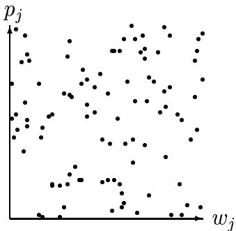

Uncorrelated instances are generally easy to solve, as there is a large variation between the weights, making it easy to obtain a filled knapsack. Moreover it is easy to eliminate numerous variables by upper bound tests or by dominance relations.

Weakly correlated instances: Here the profit is highly correlated with the weight. Typically the profit only differ from the weight by a couple of percent.

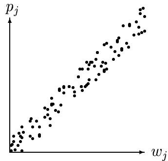

Such instances are perhaps the most realistic in management, since the return of ar investment generally is proportional to the invested sum within some small variations.

The high correlation means, that it is generally difficult to eliminate variables by upper bound tests. Despite this fact, weakly correlated instances are usually easy to solve, since there is a large variation in the weights, making it easy to obtain a filled knapsack, and filled solutions are generally very close to an optimal solution due to the correlation.

Strongly correlated instances: Such instances correspond to a real-life situation where the return is a linear function of the investment plus (or minus) some fixed charge incured by each project.

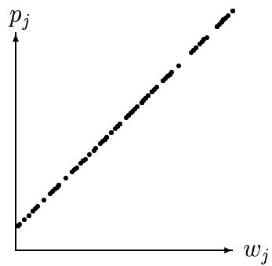

Strongly correlated instances of Knapsack Problems are hard to solve for two reasons: 1) All the items around the break item have similar weights, meaning that it is very difficult to combine them such that a flled knapsack is obtained. 2) There is a very large relative loss by removing the small weighted items, meaning that we generally cannot remove any small items in order to make space for a large item which fills out the knapsack. Thus strongly correlated instances are generally used as a measure of an algorithm's ability to solve difficult problems.

Note that the ordering (1.23) according to nonincreasing profit-to-weight ratios for strongly correlated instances (with positive fixed charge) corresponds to an ordering according to nondecreasing weights. Thus in the 0-1 Knapsack Problem case it is relatively easy to impose an additional constraint on the problem as:

$$
\sum _ { j = 1 } ^ { n } x _ { j } \leq b - 1 ,
$$

where $b$ is the index of the break item. The constraint says that no solution will contain more than $b - 1$ items, as the first $b - 1$ items are the lightest items, and any solution involving heavier items will of course comprise fewer items. Similar constraints with opposite inequalities can be imposed in those situations where there is a negative fixed charge involved in the return of each project.

Based on this observation Martello and Toth [55] recently developed an efficient algorithm for solving strongly correlated instances. But it is obvious, that if just a few items do not follow the nice structure of a strongly correlated instance, then the constraint (1.24) will be too weak to have any effect.

Subset-sum instances: These instances reflect the situation where the profit of each item is a linear function of the weight. Thus our only goal is to obtain a filled knapsack.

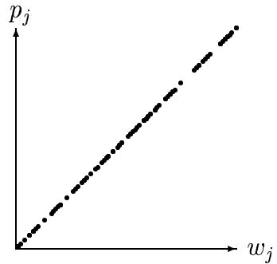

Subset-sum instances are however difficult to solve, as any upper bound returns the same trivial value $c$ , thus we cannot use bounding rules for cutting off branches before an optimal solution has been found. On the other hand large randomly generated instances generally have many optimal solutions, meaning that any permutation algorithm will easily reach optimum.

The four types of instances are distinguished by their correlation between profits and weights. As will be seen from the time bounds derived for each of the presented algorithms, the hardness of an instance however also depends on the number $n$ of items, the range $R$ of the weights, and the magnitude of the knapsack capacity $c$ .

# 1.6 Approximate Algorithms

Although approximate algorithms are not the theme of this thesis, some important results should be mentioned. As all the Knapsack Problems are $\mathcal { N P }$ -hard, some instances may be impossible to solve to optimality within a reasonable amount of time. In such situations one may be interested in an approximate solution with objective value $z$ , where the relative error is bounded from above by a certain constant $\epsilon$ , i.e.

$$
\frac { z - z ^ { * } } { z ^ { * } } \leq \epsilon ,
$$

where $z ^ { * }$ is the optimal objective value. The ultimate approximation algorithms are called fully polynomial approximation schemes. Such algorithms must satisfy that for any $\epsilon > 0$ they find a feasible solution satisfying (1.25) in time polynomially bounded by the size of the problem and by $1 / \epsilon$ .

Fully polynomial approximation schemes cannot be found for $\mathcal { N P }$ -hard problems in the strong sense, except if $\mathcal { N P } = \mathcal { P }$ (see Ibaraki [36] p. 502 for a proof). Thus we cannot expect to find fully polynomial approximation schemes for e.g. the Multiple Knapsack Problem or the Multidimensional Knapsack Problem. On the other hand, for those Knapsack Problems that are pseudo-polynomially solvable, fully polynomial approximations schemes have actually been found. For illustration we describe an algorithm for the 0-1 Knapsack problem:

# 1.6.1 Fully Polynomial Approximation Schemes

Ibarra and Kim [37] presented the first fully polynomial approximation scheme for the 0-1 Knapsack problem. Thus for any bound $\epsilon > 0$ the algorithm finds a heuristic solution $z$ with relative error at most $\epsilon$ , such that the time and space complexity grows polynomially with $n$ and $1 / \epsilon$ .

The Ibarra and Kim algorithm is based on dynamic programming, where state space relaxation (see Ibaraki [36] for a thorough treatment of this field) is used in order to limit the number of possible states. Since the relative error by scaling profits is largest for the small profits, Ibarra and Kim divides the items into those with large profits, and those with small profits. The first group of items is enumerated through dynamic programming, and a greedy algorithm is used to improve the enumerated states by adding some additional items from the second group of the items.

Algorithm 1.1 (Ibarra and Kim [37]) Assume that the items are ordered according to nonincreasing profit-to-weight ratios

$$
\frac { p _ { 1 } } { w _ { 1 } } \geq \frac { p _ { 2 } } { w _ { 2 } } \geq . . . \geq \frac { p _ { n } } { w _ { n } } ,
$$

and let the break item $b$ be defined as

$$
b = \operatorname* { m i n } \left\{ j : \sum _ { i = 1 } ^ { j } w _ { i } > c \right\} .
$$

I $\begin{array} { r } { \sum _ { j = 1 } ^ { b - 1 } w _ { j } = c } \end{array}$ then the break solution $\begin{array} { r } { z = \sum _ { j = 1 } ^ { b - 1 } p _ { j } } \end{array}$   
Otherwise let $\tilde { z } ~ = ~ \textstyle \sum _ { j = 1 } ^ { b } p _ { j }$ be an upper bound on thebjecive value Oviusy   
optimal solution $z ^ { * }$ must satisfy

$$
\tilde { z } / 2 \leq z ^ { * } < \tilde { z } ,
$$

since $z ^ { * } \ge \mathrm { m a x } \{ \tilde { z } - p _ { b } , \ p _ { b } \}$ ,thus $2 z ^ { * } \geq \tilde { z }$ . We use $\tilde { z }$ for partitioning the items in two groups such that

$$
\begin{array} { l l } { { p _ { j } > \tilde { z } \epsilon / 3 , } } & { { \mathrm { f o r } \quad j = 1 , . . . , s , } } \\ { { p _ { j } \leq \tilde { z } \epsilon / 3 , } } & { { \mathrm { f o r } \quad j = s + 1 , . . . , n } } \end{array}
$$

still preserving the ordering (1.26) on each of the intervals.

We will use state space relaxation for the dynamic programming algorithm, thus scale the profits with a factor $\delta = \tilde { z } ( \epsilon / 3 ) ^ { 2 }$ , obtaining $\overline { { p } } _ { j } = \lfloor p _ { j } / \delta \rfloor$ , for $j = 1 , \dots , s$ . As $\tilde { z }$ is an upper bound on the objective value we cannot obtain larger profits than $q = \lfloor \tilde { z } / \delta \rfloor =$ $\lfloor ( 3 / \epsilon ) ^ { 2 } \rfloor$ in the dynamic programming. Let $f _ { i } ( \pi ) , \ ( 0 \leq \pi \leq q , \ 0 \leq i \leq s )$ be the smallest weight sum, such that a solution with scaled profit sum equal to $\pi$ can be obtained on the variables $j = 1 , \dots , i$ Thus

$$
f _ { i } ( \pi ) = \operatorname* { m i n } \left\{ \sum _ { j = 1 } ^ { i } w _ { j } : \sum _ { j = 1 } ^ { i } \overline { { p } } _ { j } x _ { j } = \pi , \ x _ { j } \in \{ 0 , 1 \} , j = 1 , \dots , i \right\} .
$$

We use the recursion

$$
f _ { i } ( \pi ) = \left\{ \begin{array} { l l l } { f _ { i - 1 } ( \pi ) } & { \mathrm { f o r } } & { \pi = 0 , \ldots , \overline { { p } } _ { i } - 1 } \\ { \operatorname* { m i n } \{ f _ { i - 1 } ( \pi ) , ~ f _ { i - 1 } ( \pi - \overline { { p } } _ { i } ) + w _ { i } \} } & { \mathrm { f o r } } & { \pi = \overline { { p } } _ { i } , \ldots , q } \end{array} \right\} ,
$$

while we set $f _ { 0 } ( \pi ) = \infty$ for $\pi = 1 , \ldots , q$ and $f _ { 0 } ( 0 ) = 0$ . Now for all states $f _ { s } ( \pi )$ , $\pi =$ $0 , \ldots , q$ where $f _ { s } ( \pi ) \neq \infty$ find a greedy solution by inserting some items $j = s + 1 , \dotsc , n$ into the knapsack to fill the residual capacity $c - f _ { s } ( \pi )$ . Let $z$ be the objective value of the best heuristic solution obtained this way.

Proposition 1.2 The space and time complexity of the Ibarra and Kim algorithm is $O ( n / \epsilon ^ { 2 } )$ and hence polynomial in $n$ and $1 / \epsilon$ .

Proof The dynamic programming part considers $q = \lfloor ( 3 / \epsilon ) ^ { 2 } \rfloor$ states at each stage of $i = 1 , \dots , s$ , which gives the space complexity $O ( n q )$ , i.e. $O ( n / \epsilon ^ { 2 } )$ .

The time complexity is $O ( n q )$ for the dynamic programming, while the heuristic filling demands considering $n - s$ items for each value of $\pi = 0 , \ldots , q$ , giving the complexity $O ( n q )$ . Thus we get a time bound $O ( n / \epsilon ^ { 2 } )$ . Actually the time bound should also embrace the initial sorting, which however obviously is polynomial in $n$ .

Proposition 1.3 For any instance of KP we have $( z ^ { * } - z ) / z ^ { * } \leq \epsilon$ where $z ^ { * }$ is the optimal solution value and $z$ is the heuristic value returned by the above algorithm.

Proof See Ibarra and Kim [37] for a proof, or Appendix A of this Chapter for a proof using the terminology of the present thesis.

# 1.6.2 Other Heuristics

According to Martello and Toth [53] the running times and solution quality of the fully polynomial approximation scheme described in Algorithm 1.1 are considerably worse than for heuristics based on partial enumeration. Thus although the latter seldom are able to give a worst-case performance like (1.25) they perform extremely well for several practically occurring data instances.

Partial enumeration techniques are based on an exact enumeration algorithm like branch-and-bound or dynamic programming, where the enumeration is terminated before optimality has been found or proved. Ibaraki [36] p.468 presents the following strategies:

• $\epsilon { \cdot }$ -allowance method: The upper bound tests are strengthened by fathoming nodes with upper bound $u < z + \epsilon$ where $z$ is the current solution, and $\epsilon$ is a given tolerance.

• Cut method: The enumeration is terminated after a given amount of nodes have been enumerated, returning the currently best solution.

All exact algorithms presented in this thesis may be modified to approximate algorithms by incorporating one of the above techniques. Several exact algorithms from the literature, e.g. those presented in Martello and Toth [53], have been adapted for deriving approximate solutions based on the above techniques.

Heuristics based on local search techniques have also been applied to the Knapsack Problems (e.g. Hinrichsen [31]), but such approaches are seldomly able to fully exploit the structural properties that apply for the Knapsack Problems. Local search algorithms are seldomly able to find better solutions than those obtained by a greedy algorithm. Note however, that greedy algorithms actually perform very well for large instances of Knapsack Problems.

# 1.7 Overview of the Thesis

The purpose of this thesis is to develop algorithms with complexity bounded by some appropriate measure of the "hardness" of each instance, e.g. the magnitude of the coefficients, the size of a minimal core, or the number of undominated items. The motivation for doing this may be difficult to figure out since

.. . exact algorithms, capable of solving large scaled instances of several Knapsacl Problems in a fraction of a second, are already available.

...the time bounds degenerate to exponential complexity in the worst case, anc thus cannot be used for anything in the worst-case situation.

The last objection has an easy answer, as for most real-world instances, the actual time bounds are very reasonable indeed as e.g. the coefficients are small. An important part of this thesis has been to demonstrate, that several well reputed algorithms suddenly may demand exponential solution times for instance types, that usually are solved in fractions of a second. This observation also answers the first objection above, as for existing algorithms it may be almost impossible to predict which instances will be hard to solve. On the other hand all algorithms presented in this thesis generally have similar behavior for similar data instances due to the time bounds obtained.

Recently Martello and Toth [55] presented a new algorithm for the 0-1 Knapsack Problem which shows promising solution times for several categories of instances. But since the algorithm is based on a branch-and-bound enumeration we basically do not have any other worst-case time bound than a complete enumeration in exponential time. Thus although the algorithm behaves well for strongly correlated instances, as it is possible to generate some additional constraints to the problem in these situations, we actually do not know how the algorithm will behave if only a single item weight is changed.

Our search for time bounded algorithms will of course also lead to a presentation of new and tighter upper bounds, efficient reduction algorithms, and original enumeration schemes. As a byproduct, a thorough empirical evidence of the nature of each problem type has been achieved, opening up for further improvements in this field.

A complete treatment of all Knapsack Problems is beyond the scope of this thesis, but several of the problems presented in Section 1.2 will be considered. Problems from the 0-1 Knapsack Problem to the Multiple Knapsack Problem will be considered as follows:

# An Expanding-core Algorithm for the O-1 Knapsack Problem

As mentioned in Section 1.4, all currently most successful algorithms are solving some kind of core problem — an ordinary Knapsack Problem defined on a small collection of items where there is a high probability for finding an optimal solution. However since the optimal choice of a core demands knowledge about the optimal solution, no best choice of a core has been presented in the previous literature. In Chapter 2 we present an algorithm which starts with a core containing only the break item $b$ and successively expands the core whenever needed. In this way the complexity may be bounded by $O ( n + 2 ^ { | C | } )$ for a core $C$ . Thus easy problems with small core sizes will have a linear solution time. There is however no guarantee, that the obtained core $C$ is minimal, and actually the depthfirst search of the branch-and-bound algorithm may follow a branch, which demands a complete enumeration.

What distinguishes this work from previous papers on the 0-1 Knapsack Problem is that the algorithm is simple (only about 200 lines), despite having all the properties of previous algorithms. Since the core size is found adaptively, we obtain an algorithm which, as documented by the computational experiments, behaves stable for all types of instances. Actually most data instances are solved to optimality without sorting or preprocessing a great majority of the items.

Several fundamental observations, which play a central role for the further work, are made in this chapter. The "expanding core" is used in Chapter 4 for deriving an algorithm which enumerates a minimal core. Balanced operations for filling a knapsack, as introduced in Proposition 2.1, will be used in Chapter 10 for showing that the Subset-sum Problem is solvable in linear time for any fixed range of weights. Finally this chapter gives a thorough insight into the structure of optimal solutions to the O-1 Knapsack Problem. Chapter 2 is based on [75].

# Solving hard Knapsack Problems

Chapter 3, which is based on [68], considers the solution of hard 0-1 Knapsack Problems. Hard instances are characterized by having exponentially growing coefficients, such that any pseudo-polynomial time bound is useless. The best known complexity for such instances is $O ( { \sqrt { 2 ^ { n } } } )$ as presented in Horowitz and Sahni [33], since the items may be divided into two equally large sets, that are enumerated independently. This idea is however generalized further, such that we recursively divide the items in two sets, until each set only contains one item. In this way we obtain a highly parallel algorithm, and enumerative bounds as presented in Martello and Toth [52] may be generalized to this approach. The algorithm shows promising results for hard data instances, as the so-called AvIs problems can be solved up to $n = 5 0$ variables. Also the so-called strongly correlated problems are solved up to average size ( $n = 1 0 0 0 ,$ but the computational times are not as promising as those presented in Chapter 4. For strongly correlated instances, it seems that the pseudopolynomial time bound is more important than the enumerative bound $O ( { \sqrt { 2 ^ { n } } } )$ , and here the presented algorithm runs in $O ( n c ^ { 2 } )$ , whereas the algorithm presented in Chapter 4 has complexity $O ( n c )$ .

The main results attained in this chapter are: The solution of larger AvIs type problems than ever reported before, a highly parallel algorithm, and the generalization of enumerative upper bounds to a parallel approach. Also this work presents a generalized reduction, which may be useful in other connections.

# A Minimal Algorithm for the 0-1 Knapsack Problem

The minimal algorithm presented in Chapter 4 may be seen as a synthesis of the two previous chapters. The results obtained however are surprising: it is possible to obtain an algorithm for the 0-1 Knapsack Problem which solves the problem to proved optimality with a minimal core. Thus we have the complexity $O ( n + \operatorname* { m i n } \{ 2 ^ { | C | } , \ | C | c \} )$ for a minimal core $C$ . This is an essential bound as described in the intoduction, since we have the worstcase behavior bounded in two measures of "hardness": The capacity $c$ , and the minimal core $C$ . Several empirical results show that these quantities are similar for similar data instances, implying a stable behavior. For easy instances with a negligible core size, we obtain a linear solution time.

The algorithm is based on a "lazy" approach, where dynamic programming is used to enumerate an expanding-core, and where new items are reduced, sorted and added to the core when needed. In this way we are actually able to prove that a minimal core is enumerated, and that only the strictly necessary effort is used for the preprocessing (reduction and sorting).

Numerous computational experiments are presented, showing promising solution times for even strongly correlated data instances of size up to $n = 1 0 0 0 0 0$ . All easy instances are solved in less than 0.20 seconds for instances up to size $n = 1 0 0 0 0 0$ . The Chapter is based on [66,67,82].

# Avoiding Anomalies in the MT2 Algorithm by Martello and Toth

In the previous chapters, it has been observed that the MT2 algorithm by Martello and Toth [52] behaves unstable even for easy problem instances. Thus in Chapter 5 we try to identify those problems, that cause an anomalous behavior, and show how these problems may be evaded by using a linear-time greedy heuristic, instead of solving a core problem. In this way we obtain more stable solution times for MT2, at the cost of a slight increase of the solution times.

Martello and Toth [55] have independently solved the stability problem in a different way, by imposing an upper bound on the number of nodes the branch-and-bound algorithm may use for solving the core problem. In this way, the enumeration will never be stuck in a difficult core, but unfortunately this approach does not give us any insight about which structural problems actually cause the exponential solution times. Chapter 5 has been published in [77].

# Core Problems in Knapsack Algorithms

Chapter 6 shows some fundamental properties of core problems, that are of vital significance for any algorithm applying this approach. The Chapter is based on [70,83] and the results have been presented at Pisa University [74].

Balas and Zemel [4] has proven, that there is a high probability for finding an optimal solution in the core, thus avoiding to consider the remaining items in most instances. But the proof was based on a tacit assumption that the profits and weights of the items are distributed such that there is no correlation between the profit-to-weight ratio and the weight, as illustrated in the following figure:

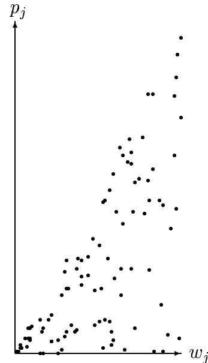

But even for randomly generated data instances (cf. Section 1.5), this assumption does not hold, meaning that the core problem may degenerate. In such situations it is very difficult to obtain a reasonable solution in the core, implying exponential solution times as observed in the previous chapter.

This behavior has not been observed before due to inadequate testing, since the capacity of the knapsack is usually chosen such that the core problem becomes as easy as possible. Thus we propose some new series of randomly generated data instances, which give a better picture of the expected performance of algorithms. These tests are applied to four different algorithms from the literature, showing that the MINkNAP algorithm presented in Chapter 4 has the most stable behavior.

# A Minimal Algorithms for the Multiple-choice Knapsack Problem

In Chapter 7 we generalize the results from Chapter 4 to the Multiple-choice Knapsack Problem. This task is not easy, as no author previously has defined what a core problem actually is for these problems. Martello and Toth [53] points out that a complete reduction seems essential for the effective solution of these problems, thus somehow ruling out the benefits of solving a core problem.

The presented algorithm considers so-called gradients in order to define a core. For each class the gradients express the expected gain (or loss) per weight unit by choosing a heavier or lighter item than the LP-optimal choice in that class. It is demonstrated that the more a gradient differs from the gradient of the break class the smaller is the probability for changes in that class. Thus a greedy approach should first consider those classes which have gradients closest to that of the break class.

We present some new upper bounds, that may be derived in constant time by considering the gradients, and apply them in a dynamic programming algorithm. In this way a very efficient algorithm is obtained which runs in $\begin{array} { r } { O ( n + c \sum _ { N _ { i } \in C } n _ { i } ) } \end{array}$ where $n _ { i }$ is the size of class $N _ { i }$ , and $C$ is a minimal core. Thus the complexity is bounded in the magnitude of the coefficients, the core size, and the number of (undominated) items in each class.

Computational experiments are reported, showing that the presented algorithm solves easy problems with up to $n = 1 0 0 0 0$ classes of each 10 items in a fraction of a second. Strongly correlated instances of a similar size are solved in about half an hour. Chapter 7 is based on [81,69] and has been presented at the EURO Summer Institute X on Combinatorial Optimization [73].

# A Minimal Algorithm for the Bounded Knapsack Problem

Chapter 8, which is based on [71,78], shows that the results obtained in Chapter 4, may be generalized to the Bounded Knapsack Problem.

The currently most efficient algorithm for the Bounded Knapsack Problem transforms the instance to a 0-1 Knapsack Problem [53], which is solved in a usual way. In this chapter it is demonstrated that the transformation actually results in very hard instances of the 0-1 Knapsack Problem, except for those instances where the capacity is chosen as one half of the total weight sum. Instead we therefore propose a specialized algorithm, which fully exploit the special structure of Bounded Knapsack Problems.

A new dynamic programming recursion is presented, which runs in $O ( n c \log c )$ time, and some efficient reduction criteria for the involved variables are provided. In this way a very efficient algorithm is derived, which solves easy instances with up to $n = 1 0 0 0 0 0$ item types with up to 10 items of each type, in less than 0.50 second. Even strongly correlated instances are solved efficiently up to large sizes, but these demand some more computational time.

The developed algorithm has time complexity bounded by

$$
O ( n + \operatorname* { m i n } \{ m _ { s } \cdot \cdot \cdot m _ { t } , \vert C \vert c \log c \} ) ,
$$

for a core $C$ containing variables $x _ { s } , \ldots , x _ { t }$ Here $m _ { j }$ is the bound on variable $x _ { j }$ . Notice, that the term $O ( n )$ is dominant for small core sizes, leading to linear solution times for easy instances.

# Dominance Relations in Unbounded Knapsack Problems

Martello and Toth [54] has shown that the size of Unbounded Knapsack Problems may be considerably decreased by using some dominance relations for fathoming infeasible item types. By this preprocessing several instances may be reduced to trivially solvable problems. In Chapter 9 we present a more general reduction scheme than the one presented in [54]. The presentation is based on [72].

The reduction algorithm of Martello and Toth runs in $O ( n ^ { 2 } )$ , but may be improved to $O ( m n )$ as proposed by Dudzinski [18], where $m$ is the number of undominated item types. The first reduction is based on an ordering of the item types according to nonincreasing profit-to-weight ratios, while the second reduction does not demand any ordering. The new reduction however is based on an ordering according to nondecreasing weights, which allow us to surpass some item types, that cannot dominate a given item.

The time bound of the developed reduction algorithm is $O ( n \log n + \operatorname* { m i n } ( m n , D n ) )$ , where $D$ is the ratio between the largest and the smallest weight, and $m$ is the number of undominated item types. The computational experiments indicate, that the two bounds $O ( m n )$ and $O ( D n )$ supplement each other well, such that most problems are reduced very efficiently.

The algorithm is compared to the reduction algorithms by Martello and Toth [54] and Dudzinski [18] showing that the presented algorithm is orders of magnitude faster than the two previous algorithms for hard instances. Moreover we identify several categories of problems, that cannot be reduced as efficiently as described by Martello and Toth. Such problems may play an important role in the testing of future algorithms for the Unbounded Knapsack Problem.

# Subset-sum Problems

In Chapter 10 we consider the Subset-sum Problem. Here a very strong result is presented, showing that if the weights are bounded by a constant $r$ , then we may solve the problem in linear time $O ( n r )$ .

The algorithm is based on some early results from Chapter 2 where it was shown that an optimal solution to the 0-1 Knapsack Problem, and thus also to the Subset-sum Problem, may be obtain through balanced operations. This balancing ensures that no weight sum differing more than $r$ from the capacity c need to be considered, and by using dominance and memorizing of previously defined states, we obtain the stated complexity.

The results are easily generalized to the O-1 Knapsack, where we prove that the 0-1 Knapsack Problem is solvable in linear time if the weights are bounded by a constant $r$ . Actually the time bound is $O ( n r ^ { 2 } )$ which is slightly worse than the bound for Subset-sum Problems.

The developed algorithm is extremely simple to implement, and computational experiments document its superiority for hard problem types. It is discussed how the algorithm may be improved by using dynamic programming by reaching instead of dynamic programming by pulling, or loosely speaking, only to consider those weight sums that actually are obtainable. Chapter 10 is based on [76] and has been presented in Copenhagen [79].

# An exact Algorithm for large Multiple Knapsack Problems

Multiple Knapsack Problems are considered in Chapter 11. As previously mentioned, the Multiple Knapsack Problem is $\mathcal { N P }$ -hard in the strong sense, so we cannot immediately use the techniques from the previous chapters, as e.g. dynamic programming will lead to strictly exponential computational times. A relaxation of the constraints however lead to problems that have been treated in the previous chapters.

It is demonstrated that tight upper bounds may be derived by surrogate relaxation, which requires the solution of several 0-1 Knapsack Problems. Thus the results from Chapter 4 are immediately applicable. On the other hand tight lower bounds are constructed by solving a series of Subset-sum Problems. To tighten the gap between upper and lower bounds, we use the technique of tightening capacity constraints described in Section 1.3.3. In both cases, the resulting Subset-sum Problems are solved using a new separable dynamic programming algorithm.

Since dynamic programming is inefficient for problems which are $\mathcal { N P }$ -hard in the strong sense, we use branch-and-bound techniques for the enumerative part of the algorithm. The computational experiments demonstrate a unique behavior of the algorithm, since problems with up to $n = 1 0 0 0 0 0$ variables may be solved fastly. Chapter 11 will be presented at the NOAS'95 conference, Reykjavík [80].

# 1.8 Conclusion

Knapsack Problems give an excellent insight into the complexity of problems between $\mathcal { N P }$ and $\mathcal { P }$ . The result presented in Chapter 10 shows that all the complexity of onedimensional Knapsack Problems is "hidden" in the magnitude of the coeficients, meaning that several practically occurring problems may be solved efficiently despite their worstcase complexity, provided that they involve moderate coefficients. On the other hand Section 1.3.1 has demonstrated, that if general IP Problems are merged to Knapsack Problems, then we actually obtain the worst-case complexity. Thus Knapsack Problems cannot solely be used for solving general IP Problems, although they occur in several more complex algorithms by relaxation.

It is evidently difficult to give time-bounds for $\mathcal { N P }$ -hard problems, but we have attempted to propose meaningful complexity measures, by bounding the worst-case complexity in the "hardness" of an instance, e.g. the magnitude of coefficients, the size of a minimal core, or the number of undominated items. Although these bounds are exponential in the worst case, they allow us to segregate several groups of easily solvable instances, and as all problems considered (except the Multiple Knapsack Problem) are pseudo-polynomially solvable, we may guarantee reasonable solution times for allinstances having moderate coefficient sizes.

Several problems from the Knapsack family have been considered in this thesis, but numerous problems are still open. It seems promising to generalize several of the results obtained to algorithms for the Unbounded Knapsack Problem, the Bin-packing Problem, or the Change-making Problem. Also, approximate algorithms have not been considered at length in this thesis, where especially the results presented in Chapter 10 may lead to improved algorithms.

# Appendix A: Proof of worst-case error

Proposition For any instance of KP in Algorithm 1.1 we have $( z ^ { * } - z ) / z ^ { * } \leq \epsilon$ where $z ^ { * }$ is the optimal solution value and $z$ is the heuristic value returned by the above algorithm.

of $\begin{array} { r } { z = \sum _ { j = 1 } ^ { b - 1 } p _ { j } } \end{array}$ we have an optimal objective value. Otherwise the optimal solution $z ^ { * }$ must be given as

$$
z ^ { * } = \sum _ { j = 1 } ^ { s } p _ { j } x _ { j } ^ { * } + \alpha ,
$$

where $\alpha$ is u e e . $\begin{array} { r } { w ^ { * } = \sum _ { j = 1 } ^ { s } w _ { j } x _ { j } ^ { * } } \end{array}$ be the weight sum, and $\overline { { p } } ^ { * } = \textstyle \sum _ { j = 1 } ^ { s } \overline { { p } } _ { j } x _ { j } ^ { * }$ hl  m $s$ bel n Obviously $f _ { s } ( \overline { { p } } ^ { * } ) \neq \infty$ in the dynamic programming, and $f _ { s } ( \overline { { p } } ^ { * } ) \leq w ^ { * }$ by definition (1.30).

Let $x ^ { \prime }$ be the solution vector corresponding to $f _ { s } ( \overline { { p } } ^ { * } )$ . Then in the greedy filling we obtained a solution

$$
z ^ { \prime } = \sum _ { j = 1 } ^ { s } p _ { j } x _ { j } ^ { \prime } + \beta ,
$$

with $\beta$ as the contribution from the greedy flling. This means that the heuristic solution $z$ must satisfy $z \geq z ^ { \prime }$ .

As a consequence of the truncation $\overline { { p } } _ { j } = \lfloor p _ { j } / \delta \rfloor$ we have $\overline { { { p } } } _ { j } \delta \leq p _ { j } \leq ( \overline { { { p } } } _ { j } + 1 ) \delta$ and since $\overline { { p } } _ { j } = \lfloor p _ { j } / \delta \rfloor \ge 3 / \epsilon$ we get $( \overline { { p } } _ { j } + 1 ) \delta = \overline { { p } } _ { j } \delta ( 1 + 1 / \overline { { p } } _ { j } ) \leq \overline { { p } } _ { j } \delta ( 1 + \epsilon / 3 )$ . By inserting the bound $\overline { { { p } } } _ { j } \delta \leq p _ { j } \leq \overline { { { p } } } _ { j } \delta ( 1 + \epsilon / 3 )$ in equations (1.33) and (1.34) we get

$$
\begin{array} { r l } & { \overline { { p } } ^ { * } \delta + \alpha = \displaystyle \sum _ { j = 1 } ^ { s } \overline { { p } } _ { j } \delta x _ { j } ^ { * } \le z ^ { * } \le \displaystyle \sum _ { j = 1 } ^ { s } \overline { { p } } _ { j } \delta \big ( 1 + \epsilon / 3 \big ) x _ { j } ^ { * } = \overline { { p } } ^ { * } \delta \big ( 1 + \epsilon / 3 \big ) + \alpha , } \\ & { \overline { { p } } ^ { * } \delta + \beta = \displaystyle \sum _ { j = 1 } ^ { s } \overline { { p } } _ { j } \delta x _ { j } ^ { \prime } \le z ^ { \prime } \le \displaystyle \sum _ { j = 1 } ^ { s } \overline { { p } } _ { j } \delta \big ( 1 + \epsilon / 3 \big ) x _ { j } ^ { \prime } \le \overline { { p } } ^ { * } \delta \big ( 1 + \epsilon / 3 \big ) + \beta , } \end{array}
$$

which yields

$$
\frac { z ^ { * } - z ^ { \prime } } { z ^ { * } } \leq \frac { \overline { { p } } ^ { * } \delta \epsilon / 3 + ( \alpha - \beta ) } { z ^ { * } } \leq \frac { 1 } { 3 } \epsilon + \frac { \alpha - \beta } { z ^ { * } } .
$$

Since the items $s + 1 , \ldots , n$ are ordered according to (1.26) the term $( \alpha - \beta )$ cannot be greater than the maximum profit of an item in this interval, i.e. $\alpha - \beta \leq \tilde { z } \epsilon / 3$ , hence $( z ^ { * } - z ^ { \prime } ) / z ^ { * } \leq ( 1 + \tilde { z } / z ^ { * } ) \epsilon / 3$ Since the heuristic solution satisfies $z \geq z ^ { \prime }$ and $\tilde { z } \leq 2 z ^ { * }$ due to (1.28) we get $( z ^ { * } - z ) / z ^ { * } \leq \epsilon$ .

# Chapter 2

# An Expanding-core Algorithm for the 0-1 Knapsack Problem

A new branch-and-bound algorithm for the exact solution of the O-1 Knapsack Problem is presented. The algorithm is based on solving an "expanding core", which initially only contains the break item, but which is expanded each time the branchand-bound algorithm reaches the border of the core. Computational experiments show that most data instances are optimally solved without sorting or preprocessing a great majority of the items. Detailed program sketches are provided, and computational experiments are reported, indicating that the algorithm presented not only is shorter, but also faster and more stable than any other algorithm hitherto proposed.

Keywords: Knapsack Problem, Branch-and-bound, Reduction.

# 2.1 Introduction

Given $n$ items to pack in some knapsack of capacity c. Each item $j$ has a profit $p _ { j }$ and weight $w _ { j }$ , and we wish to maximize the profit sum without having the weight sum to exceed $c$ . More formally we define the 0-1 Knapsack Problem by

$$
\begin{array} { r l } { \mathrm { m a x i m i z e } } & { z = \displaystyle \sum _ { j = 1 } ^ { n } p _ { j } x _ { j } } \\ { \mathrm { s u b j e c t ~ t o } } & { \displaystyle \sum _ { j = 1 } ^ { n } w _ { j } x _ { j } \leq c } \\ & { x _ { j } \in \{ 0 , 1 \} , \quad j = 1 , \ldots , n , } \end{array}
$$

where all data are positive integers. In the following we will denote the Knapsack Problem by KP. Without loss of generality we may assume that $w _ { j } \leq c$ , for $j = 1 , \dots , n$ to ensure th ea c f  e  a $\Sigma _ { j = 1 } ^ { n } w _ { j } > c$ to avoid trivial solutions.

Many industrial problems can be formulated as Knapsack Problems: Cargo loading, cutting stock, project selection, and budget control to mention a few examples. Many combinatorial problems can be reduced to KP, and KP arises also as a subproblem in several algorithms of integer linear programming.

KP is $\mathcal { N P }$ -hard (see Garey and Johnson [29]) and it is therefore very unlikely that a polynomial time algorithm can be devised. Still KP can be solved in pseudo-polynomial time by dynamic programming (Papadimitriou [64]). The problem has been intensively studied in the last decades due to its theoretical interest and its wide applicability. For recent surveys see Dudzinski and Walukiewicz [20] and Martello and Toth [53].

In the following we will assume, that the items are ordered according to nonincreasing efficiencies $e _ { j } = p _ { j } / w _ { j }$ , thus

$$
e _ { i } \geq e _ { j } \quad \mathrm { w h e n } \quad i < j .
$$

Although there may be several orderings satisfying (2.2), when some items have the same efficiency, we will assume, that one particular ordering has been chosen. To simplify notation, we will define the profit sum ${ \overline { { p } } } _ { j }$ and the weight sum ${ \overline { { w } } } _ { j }$ of items up to $j$ by:

$$
\begin{array} { r c l } { { \overline { { { p } } } _ { j } } } & { { = } } & { { \displaystyle \sum _ { i = 1 } ^ { j } p _ { i } , j = 0 , \ldots , n , } } \\ { { } } & { { } } & { { } } \\ { { \overline { { { w } } } _ { j } } } & { { = } } & { { \displaystyle \sum _ { i = 1 } ^ { j } w _ { i } , j = 0 , \ldots , n . } } \end{array}
$$

Packing a knapsack in a greedy way means, to include items $j = 1 , 2 , \dots { }$ as long as $w _ { j } \le c - \overline { { w } } _ { j - 1 }$ , i.e. as far as the next item fits into the unused capacity of the knapsack. The first item which cannot be included in the knapsack is denoted the break item $b$ (by some authors called the critical item). Thus the break item satisfies

$$
\overline { { w } } _ { b - 1 } \leq c < \overline { { w } } _ { b } .
$$

The break solution $x ^ { \prime } = \{ x _ { 1 } ^ { \prime } , \ldots , x _ { n } ^ { \prime } \}$ is the solution which occurs when setting $x _ { j } ^ { \prime } = 1$ for $j = 1 , \dots , b - 1$ and $x _ { j } ^ { \prime } = 0$ for $j = b , \dots , n$ . The unused capacity of the break solution is called the residual capacity $r$ , and is defined by

$$
r = c - \overline { { w } } _ { b - 1 } .
$$

By linear relaxation Dantzig [13] showed that an upper bound on KP is

$$
u = \lfloor \overline { { p } } _ { b - 1 } + \frac { r p _ { b } } { w _ { b } } \rfloor ,
$$

where $\lfloor x \rfloor$ is the greatest integer less than or equal to $x$ . This bound is known as the Dantzig (upper) bound.

In the following section we will illustrate some main properties of typical solutions to the Knapsack Problem, and use these results for sketching a new algorithm in Section 2.3. Fundamental parts of the algorithm are described in Sections 2.4 to 2.6, while the main algorithm is sketched in Section 2.7. Computational experiments are presented in Section 2.8, followed by a conclusion.

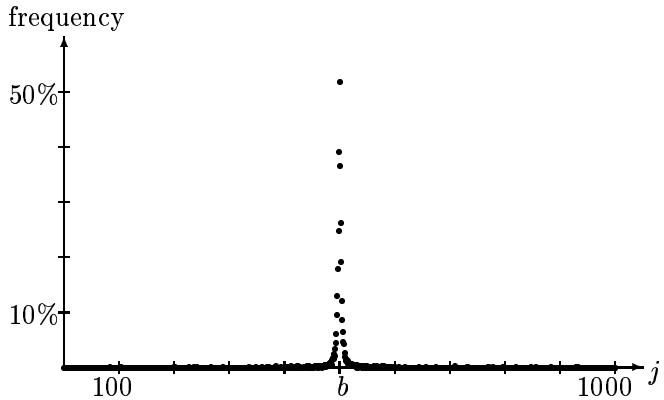  
Figure 2.1: Frequency of items $j$ where the optimal solution $x _ { j }$ differ from the break solution $\boldsymbol { x } _ { j } ^ { \prime }$ .

# 2.2 Properties of solutions to KP

To illustrate some main properties of solutions to the Knapsack Problem, we have performed the following computational experiment: 1000 data instances were constructed with $n = 1 0 0 0$ , $p _ { j }$ and $w _ { j }$ randomly distributed in [1, 1000], and the capacity $c$ chosen such that $b = 5 0 0$ for all instances. Each data instance was completely sorted according to (2.2), and then solved by a simple branch-and-bound algorithm. We recorded the average number of items where the optimal solution $x _ { j }$ was differing from the break solution $\boldsymbol { x } _ { j } ^ { \prime }$ (Figure 2.1) as well as the mean value of the corresponding weights (Figure 2.2).

It turned out, that the number of items where $x _ { j } \neq x _ { j } ^ { \prime }$ is only about 3.4 in mean per instance, and as seen from Figure 2.1, such items are generally very close to the break item $b$ . Only a few variables far from $b$ differ from the break solution, and according to Figure 2.2, the weights of the corresponding items decrease as the distance from $b$ grows. From these observations we draw the following conclusions:

The branching tree of a branch-and-bound algorithm should start with the break solution and gradually enumerate the items from $b$ outwards in a symmetric way. This will generally ensure fast convergence towards an optimal solution.

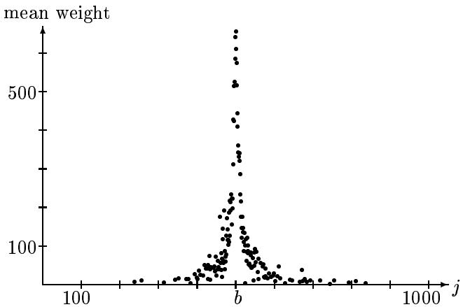  
Figure 2.2: Mean weight of items $j$ where the optimal solution $x _ { j }$ differ from the break solution $x _ { j } ^ { \prime }$ .

It seems that small-weighted items are used for achieving a sufficiently filled knapsack. Thus when choosing branching variables we should strive towards a filled knapsack.   
The solution vector $x$ should be represented as a list of variables differing from the break solution, since this will save updating and space.

# 2.3 Basic structure of the algorithm

The p.t. most efficient algorithms for KP are those by Fayard and Plateau [24], and Martello and Toth [52]. These algorithms are based on the fact that for large problem sizes $( n > 1 0 0 0 )$ it turns out that up to $9 0 \%$ of the computing time is spent for the sorting (2.2). The mentioned algorithms avoid this problem by determining a small subset of the items around the break item $b$ called the core, by a modification of the Balas and Zemel [4] method. The corresponding core problem is solved exactly, hoping that all remaining variables $x _ { j }$ may be fixed at their optimal value by some later reduction algorithm. However if some items outside the core cannot be fixed, a new problem containing all remaining free items, must be solved. Such algorithms suffer from the following weaknesses:

The size of the core is not known before the algorithm has terminated, and therefore is impossible to predict. Several techniques for guessing the core size have been applied, but none are exact.   
The reduction phase is performed at a fixed moment in the algorithm. Since the lower bound is gradually improved by the branch-and-bound algorithm, better reductions can be achieved at a later stage of the solution process. Thus the reduction algorithm should be a dynamic part of the branch-and-bound algorithm.   
The enumeration performed by solving the core problem is only used to achieve a good initial solution, so most of the enumeration has to be repeated, if optimality of the core solution cannot be proved.

These problems can be avoided by letting the core be an interval $[ \sigma , \tau ]$ around $b$ which is expanded by need. This idea leads to the following algorithm:

a) Find the break item $b$ through a modification of the QuICksoRT algorithm: At each partitioning, the interval not containing the break item $b$ , is added to a list $H$ or $L$ of partitioned intervals.   
b) Find a heuristic solution by using a simple greedy algorithm.   
c) Set the core to the interval $[ b , b ]$ .   
d) Use a branch-and-bound algorithm with a symmetric branching tree for enumerating items in the order $b , b - 1 , b + 1 , b - 2 , . . .$ Each time the branch-and-bound algorithm grows outside the core, the nearest interval is taken from the list $H$ or $L$ . The interval is reduced by using logical tests to fix some variables at their optimal

value, and then partitioned by the same algorithm as in Step a) till some more items have been sorted. The core is expanded with these items, and the branching continues.

In Section 4 we will present the partitioning algorithm used to find the break item. Section 5 will describe the branch-and-bound algorithm and Section 6 the core-expanding algorithm. Finally Section 7 describes the chosen heuristic solution, and sketches the main algorithm.

# 2.3.1 Roundoff errors

As noted in Pisinger and Walukiewicz [84], floating-point arithmetics in KP may lead to roundoff errors, since a computer only works with approximations to the real numbers. Especially when using truncating functions (like $\lfloor x \rfloor$ in the Dantzig bound) it may yield dramatic errors even for small deviations, and thus lead to incorrect results.

The problem may be avoided by rewriting expressions in the following way: Testing whether the Dantzig bound is better than some lower bound $z$ may be written:

$$
\begin{array} { r c l } { { \displaystyle \big \lfloor \overline { { p } } _ { b - 1 } + \frac { r p _ { b } } { w _ { b } } \big \rfloor } } & { { > } } & { { z } } \\ { { } } & { { } } & { { } } \\ { { \iff \overline { { p } } _ { b - 1 } + \frac { r p _ { b } } { w _ { b } } } } & { { \geq } } & { { z + 1 } } \\ { { } } & { { } } & { { } } \\ { { \iff \operatorname* { d e t } \bigl ( z + 1 - \overline { { p } } _ { b - 1 } , r , p _ { b } , w _ { b } \bigr ) } } & { { \leq } } & { { 0 } } \end{array}
$$

where $\operatorname* { d e t } ( a _ { 1 } , a _ { 2 } , b _ { 1 } , b _ { 2 } ) = a _ { 1 } b _ { 2 } - a _ { 2 } b _ { 1 }$ . Throughout this chapter we will rewrite expressions as above to avoid floating-point arithmetics.

# 2.4 Finding the break item

It should be clear from the definitions in Section 2.1 that the break item $b$ plays an important role in the solution of KP: Knowing the break item, we may determine the Dantzig upper bound, and we can construct the break solution, which is a quite good lower bound. Moreover knowing these upper and lower bounds, we may reduce the problem size by fixing some variables $x _ { j }$ at their optimal value. Finally the break solution is a good starting point for a branching tree.

The definition of the break item requires a complete sorting of the items according to (2.2), but this sorting takes up most of the computing time for large problem sizes. However Balas and Zemel [4] proposed a technique which allows us to determine the break item in $O ( n )$ time. This technique is based on a definition of $b$ which only demands a partial sorting of the items, since we define the break item by the following three properties:

$$
\overline { { w } } _ { b - 1 } \leq c < \overline { { w } } _ { b } ,
$$

$$
\begin{array} { r c l } { { e _ { j } } } & { { \geq } } & { { e _ { b } , ~ j = 1 , \ldots , b - 1 , } } \\ { { e _ { j } } } & { { \leq } } & { { e _ { b } , ~ j = b , \ldots , n . } } \end{array}
$$

It is quite easy to modiy a sorting algorithm like Quicksort (Hoare [32]) for only making the above partial sorting of the items.

The QuICksORT algorithm repeatedly chooses some middle value $\lambda$ from the interval $I = [ f , l ]$ , and partition the interval in two parts $[ f , i - 1 ]$ and $[ i , l ]$ , so that

$$
\begin{array} { l l l } { { e _ { j } } } & { { \geq } } & { { \lambda , } } & { { j \in [ f , i - 1 ] , } } \\ { { e _ { j } } } & { { \leq } } & { { \lambda , } } & { { j \in [ i , l ] . } } \end{array}
$$

If it turns out that $\overline { { w } } _ { i - 1 } > c$ then $b$ must be in the interval $[ f , i - 1 ]$ according to (2.11), while if $\overline { { w } } _ { i - 1 } \leq c$ then $b$ must be in the interval $[ i , l ]$ . If at any stage, we denote $\overline { { w } } _ { i - 1 }$ by $W$ , and $\overline { { w } } _ { f - 1 }$ by $V$ , we get the following algorithm:

Algorithm 2.1   
procedure partsort $( f , l , V )$ ; $\{ [ f , l ] \ i n t e r v a l , V = \overline { { w } } _ { f - 1 } \}$   
if $( l - f > 0 )$ then $m : = \lfloor ( f + l ) / 2 \rfloor$ ; Swap items $f , m , l$ so that $e _ { f } \geq e _ { m } \geq e _ { l }$ .   
fi;   
if $( l - f < 3 )$ then $\phi : = f ; \ \psi : = l ; \ \nu : = V ;$ . { return found interval}   
else $\begin{array} { l } { { \tilde { p } : = p _ { m } ; \tilde { w } : = w _ { m } ; } } \\ { { i : = f ; j : = l ; W : = V ; } } \end{array}$ $\begin{array} { r l } & { \left\{ \lambda = \tilde { p } / \tilde { w } ~ m e d i a n ~ o f ~ e _ { f } , e _ { m } , e _ { l } \right\} } \\ & { \left\{ p a r t i t i o n ~ [ f , l ] ~ i n ~ t w o ~ i n t e r v a l s \right\} } \end{array}$ repeat repeat $W : = W + w _ { i }$ $i : = i + 1$ ; until $( \operatorname* { d e t } ( p _ { i } , w _ { i } , \tilde { p } , \tilde { w } ) \leq 0 )$ ; repeat $j : = j - 1$ ; until $( \operatorname* { d e t } ( p _ { j } , w _ { j } , \tilde { p } , \tilde { w } ) \ge 0 )$ ; if $( i < j )$ then $\operatorname { s w a p } ( i , j ) ;$ fi; until $( i > j )$ ; $\left\{ N o w \ e _ { k } \ \ge \ \lambda \right.$ for $k \in [ f , j ]$ and $e _ { k } \leq \lambda$ , for $k \in [ i , l ] \}$ if $( W > c )$ then $L : = L \cup \{ [ i , l ] \}$ ; $\mathrm { p a r t s o r t } ( f , i - 1 , V )$ ; else $H : = H \cup \{ [ f , i - 1 ] \}$ ; $\mathrm { p a r t s o r t } ( i , l , W )$ ;f;

f;

The procedure $\operatorname { S W A P } ( i , j )$ swaps the items corresponding to the indices $i$ and $j$ .

As seen, the algorithm is a usual median-of-three variant of the QuicksoRT algorithm with the modification that only intervals containing the break item are partitioned further. The algorithm terminates when the current interval contains at most three items, and clearly the break item will be one of these. The found interval is denoted by $[ \phi , \psi ]$ , and the weight sum up to $\phi$ is $\nu = \overline { { w } } _ { \phi - 1 }$ .

Note that all discarded intervals are added to the lists $H = \{ H _ { 1 } , \ldots , H _ { h } \}$ (items of higher efficiency) and $L = \{ L _ { 1 } , \ldots , L _ { l } \}$ (items of lower efficiency). When the PARTSORT algorithm terminates these intervals looks like in Figure 2.3. Since each interval is the result of a partitioning by PARTsORT, the efficiency $e _ { j }$ of any item in one interval $I$ will always be greater than or equal to the efficiency of any item in the interval to the right of $I$ . This knowledge will save some computational effort when we have to expand the core.

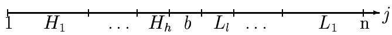  
Figure 2.3: The lists $H$ and $L$ .

# 2.5 The branch-and-bound algorithm

We will now present a branch-and-bound algorithm ExPBRANcH, which satisfies the requirements stated in Section 2.2. ExPBRANcH is a recursive procedure, which at each recursion will insert (remove) one item to (from) the knapsack. At each recursion, $s$ and $t$ , $s < b \leq t$ , indicates that the variables $x _ { j }$ , $j \in [ s + 1 , t - 1 ]$ are fixed to some value, while the remaining variables may be varied arbitrarily. Initially we set $[ s , t ] = [ b - 1 , b ]$ .

At any stage $P$ and $W$ determine the profit and weight sum corresponding to the crrent al lui $x = \{ x _ { 1 } , \ldots , x _ { n } \}$ .Thus: $\begin{array} { r } { P = \sum _ { j = 1 } ^ { n } p _ { j } x _ { j } } \end{array}$ , and $W =$ $\scriptstyle \sum _ { j = 1 } ^ { n } w _ { j } x _ { j }$ .Our initial vector is the break solution, and each succeeding iteration will try to make $W$ as close to $c$ as possible. Thus if $W \leq c$ we must insert some item $j \geq t$ ,and if $W > c$ we must remove some item $j \le s$ from the knapsack. Having inserted (resp. removed) some item $j$ , we call ExpBRANcH recursively, but now with $t = j + 1$ (resp. $s = j - 1 ,$ , meaning that from now on we may only insert items after $j$ (resp. remove items before $j$ ). If $s$ or $t$ grows outside of the core $[ \sigma , \tau ]$ , we sort some more items, and expand $[ \sigma , \tau ]$ correspondingly.

We backtrack if the upper bound does not exceed $z$ , i.e. if

$$
\begin{array} { r l r } { \lfloor P + \frac { \left( c - W \right) p _ { t } } { w _ { t } } \rfloor } & { \leq } & { z , ~ \mathrm { w h e n } ~ W \leq c , } \\ { \lfloor P + \frac { \left( c - W \right) p _ { s } } { w _ { s } } \rfloor } & { \leq } & { z , ~ \mathrm { w h e n } ~ W > c , } \end{array}
$$

where the bounds on the left side are found by linear relaxation of $x _ { s }$ and $x _ { t }$ . The tests are equivalent to

$$
\begin{array} { r } { \begin{array} { l l l l } { \operatorname* { d e t } ( P - z - 1 , W - c , p _ { t } , w _ { t } ) } & { < } & { 0 , } & { \mathrm { w h e n } } & { W \leq c , } \\ { \operatorname* { d e t } ( P - z - 1 , W - c , p _ { s } , w _ { s } ) } & { < } & { 0 , } & { \mathrm { w h e n } } & { W > c . } \end{array} } \end{array}
$$

If no bound stops the branching, $s$ may grow below 1, or $t$ may grow beyond $n$ . In such case we must backtrack, since no more items can be inserted or removed. This is ensured by expanding the data instance with two stop items 0 and $n + 1$ where $( p _ { 0 } , w _ { 0 } ) = ( 1 , 0 )$ and $( p _ { n + 1 } , w _ { n + 1 } ) = ( 0 , 1 )$ . These limits ensure that when reaching $s = 0$ or $t = n + 1$ the upper bounds will be so bad, that we are forced to backtrack.

Instead of keeping track of the current vector $x$ , we only keep track of the items $j$ differing from the break solution $x ^ { \prime }$ , i.e. items where $x _ { j } \neq x _ { j } ^ { \prime }$ . Such items are added to an exception list $E$ each time some improved solution has been found. Since the number of such exceptions according to Section 2.2 usually is very small, this technique saves a great amount of updating. When the algorithm terminates, we first set $x$ to the break solution $x ^ { \prime }$ , and then we change the $x _ { j }$ -values according to the exception list.

Now it should be straightforward to understand the following sketch of ExpBRAnCH:

# Algorithm 2.2

function expbranch $( P , W , s , t )$ : boolean;   
var improved: boolean;   
improved : $=$ false;   
if $( W \leq c )$ then $\{$ insert some item $j \geq t \}$ if $( P > z )$ then $\{$ better solution found} improved $=$ true; $z : = P$ ; $E : = \emptyset$ ;f; repeat if $( t > \tau )$ then expand $\left( \boldsymbol { L _ { l } } \right)$ ; $L : = L \setminus \{ L _ { l } \}$ ; fi; if $( \operatorname* { d e t } ( P - z - 1 , W - c , p _ { t } , w _ { t } ) < 0 )$ then return improved; fi; $\{ \boldsymbol { u } . \boldsymbol { b } . \ t e s t \}$ if expbranch $( P + p _ { t } , W + w _ { t } , s , t + 1 )$ then improved $: =$ true; $E : = E \cup \{ t \}$ ; fi; $t : = t + 1$ ; forever;   
else $\{$ remove some item $j \leq s \}$ repeat if $( s < \sigma )$ then expand $\left( H _ { h } \right)$ ; $H : = H \setminus \{ H _ { h } \}$ ; fi; if $( \operatorname* { d e t } ( P - z - 1 , W - c , p _ { s } , w _ { s } ) < 0 )$ then return improved; fi; $\left\{ \begin{array} { l }  u . b . \ t e s t { \right\} } \end{array}$ if expbranch $( P - p _ { s } , W - w _ { s } , s - 1 , t )$ then improved $: =$ true; $E : = E \cup \{ s \}$ ; fi; $s : = s - 1$ ; forever;   
f;

Not all feasible solutions are generated by the branching tree, since we only consider solutions close to a flled knapsack, but fortunately

Proposition 2.1 The branching tree of ExPBRANCH will reach an optimal solution.

Proof Assume, that an optimal solution is given by $x ^ { * }$ . Then we can write this solution as exceptions from the break solution, yielding a set $E ^ { * }$ of the corresponding items. We want to show that this set may be generated by ExPBRANCH.

Starting from the break solution, we insert or remove items from the knapsack according to the following rule: If the weight sum $W$ is less than $c$ we insert the item $j \in E ^ { * }$ with lowest index greater than or equal to $b$ , and set $E ^ { * } = E ^ { * } \setminus \{ j \}$ . In the same way we remove the item $j \in E ^ { * }$ with largest index less than $b$ , if $W$ is greater than $c$ ,and set $E ^ { * } = E ^ { * } \setminus \{ j \}$ .

Since the solution $x ^ { * }$ is optimal, no bounding will stop this iteration. So the process will only stop if one of the following three situations occurs:

$$
\begin{array} { l l } { { } } & { { E ^ { * } = \emptyset , } } \\ { { W > c ~ \land } } & { { \forall j \in E ^ { * } \neq \emptyset : j \geq b , } } \\ { { W \leq c ~ \land } } & { { \forall j \in E ^ { * } \neq \emptyset : j < b . } } \end{array}
$$

Here (2.20) means that we have reached the optimal solution, while (2.21) means that $x ^ { * }$ is not a solution, and (2.22) means that $x ^ { * }$ is not an optimal solution, since it may be improved by setting $x _ { j } = 1$ for remaining $j \in E ^ { * }$ .

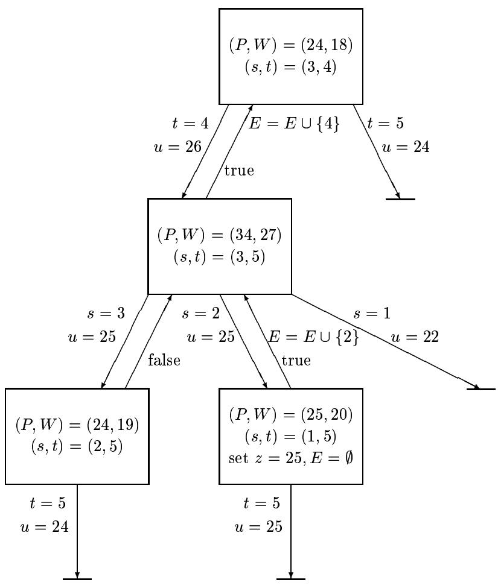  
Figure 2.4: Branching tree for the presented example.

# Example

We consider the following completely sorted problem with stop items added:

$$
\begin{array} { r } { \boxed { \begin{array} { c } { j } \\ { p _ { j } } \\ { w _ { j } } \end{array} } \left[ \begin{array} { c c c c c c c c } { 0 } & { 1 } & { 2 } & { 3 } & { 4 } & { 5 } & { 6 } & { 7 } \\ { 1 } & { 5 } & { 9 } & { 1 0 } & { 1 0 } & { 2 } & { 1 } & { 0 } \\ { 0 } & { 3 } & { 7 } & { 8 } & { 9 } & { 5 } & { 3 } & { 1 } \end{array} \right] } \end{array}
$$

Where we have $n = 6 , \ c = 2 0 , \ b = 4$ ,and $[ \sigma , \tau ] = [ 0 , 7 ]$ .

In Figure 2.4, we show the corresponding branching tree, which is traversed top-down in left-right direction. Each box corresponds to one procedure call, while each downgoing arrow determines one iteration within the main loop of the procedure, and each upgoing arrow illustrates the return from a sub-iteration. To improve understandability, upper bounds $u$ are determined by the original formulas (2.16) and (2.17). As initial lower bound we choose $z = \overline { { p } } _ { b - 1 } = 2 4$ .

Upon termination we find the solution vector by first setting $x _ { j } = 1 , ~ j = 1 , \ldots , 3$ and $x _ { j } = 0 , ~ j = 4 , \ldots , 6$ , and then swapping the $x _ { j }$ values according to the exception list

$E = \{ 2 , 4 \}$ . The final solution vector is $x = ( 1 0 1 1 0 0 )$ , and the corresponding objective value is $z = 2 5$ .

# 2.6 Expanding the core by need

Each time the ExpBRAncH algorithm reaches the border of the core, we have to expand the core. This is done by choosing an interval from the list $H$ (resp. $L$ ) which is closest to the break item, and using the PARTsoRT algorithm to partition the interval. But before doing this, we try to reduce the interval size by checking whether some variables $x _ { j }$ can be fixed at their optimal value.

# 2.6.1 Problem reduction by preprocessing

Ingargiola and Korsh [38] presented the first reduction algorithm for the Knapsack Problem, but many improved versions have been developed since then: For instance Dembo and Hammer [14], Fayard and Plateau [24], and Martello and Toth [52].

All these reduction algorithms are based on the fact, that if an upper bound on KP with additional constraint $x _ { j } = \alpha , \alpha \in \{ 0 , 1 \}$ is less than or equal to some lower bound $z$ , we may conclude that the branch $x _ { j } = \alpha$ never will lead to an improved solution, and thus can fix $x _ { j }$ at $1 - \alpha$ .

More formally let $u _ { j } ^ { 0 }$ (resp. $u _ { j } ^ { 1 } )$ be any upper bound on KP with the additional constraint $x _ { j } = 0$ (resp. $x _ { j } = 1$ ), and let $z$ be a lower bound on KP. Then the general reduction scheme is:

$$
\begin{array} { r } { u _ { j } ^ { 0 } \leq z \Rightarrow x _ { j } = 1 , } \\ { u _ { j } ^ { 1 } \leq z \Rightarrow x _ { j } = 0 . } \end{array}
$$

The strength of such a reduction clearly depends on how tight the upper and lower bounds are. As a lower bound we can use the best solution found so far by the branch-and-bound algorithm, or initially just use some heuristic solution. As an upper bound we choose the bound by Dembo and Hammer [14]:

$$
\begin{array} { r c l } { { u _ { j } ^ { 0 } } } & { { = } } & { { \bigl \lfloor \overline { { { p } } } _ { b - 1 } - p _ { j } + \frac { \left( r + w _ { j } \right) p _ { b } } { w _ { b } } \bigr \rfloor , ~ j = 1 , \ldots , b - 1 , } } \\ { { u _ { j } ^ { 1 } } } & { { = } } & { { \bigl \lfloor \overline { { { p } } } _ { b - 1 } + p _ { j } + \frac { \left( r - w _ { j } \right) p _ { b } } { w _ { b } } \bigr \rfloor , ~ j = b , \ldots , n , } } \end{array}
$$

where $r = c - \overline { { w } } _ { b - 1 }$ is the residual capacity of the break solution. These bounds are not the most tight, but they only demand that the break item $b$ is defined by (2.11), and that the items are ordered according to (2.12) and (2.13). Since the reduction is performed dynamically throughout the solution process, we may expect that a better solution and thus a better lower bound is found during the branching. This will usually more than compensate for the quite weak upper bounds.

Using the bounds by Dembo and Hammer, we may rewrite the tests (2.23) as:

$$
\begin{array} { r l } & { \operatorname* { d e t } ( z + 1 - \overline { { p } } _ { b - 1 } + p _ { j } , r + w _ { j } , p _ { b } , w _ { b } ) > 0 \Rightarrow x _ { j } = 1 , \quad j = 1 , \dots , b - 1 , } \\ & { \operatorname* { d e t } ( z + 1 - \overline { { p } } _ { b - 1 } - p _ { j } , r - w _ { j } , p _ { b } , w _ { b } ) > 0 \Rightarrow x _ { j } = 0 , \quad j = b , \dots , n , } \end{array}
$$

which yields the following sketch of the reduction algorithm:

Algorithm 2.3   
procedure reduce $\left( \mathbf { v a r } \ i , j \right)$ ; $\begin{array} { l } { \{ \left[ i , j \right] \ : i n t e r v a l \ : t o \ : b e \ : r e d u c e d \} } \\ { \{ \left[ i , j \right] \ : i s \ : l e f t \ : o f \left[ \sigma , \tau \right] \} } \end{array}$   
if $( j < b )$ then $k : = \sigma - 1$ ; while $( i \leq j )$ do if $( \operatorname * { d e t } ( z + 1 - \overline { { p } } _ { b - 1 } + p _ { j } , r + w _ { j } , p _ { b } , w _ { b } ) > 0 )$ then { test item j } $\operatorname { s w a p } ( i , j ) ; \ i : = i + 1$ {xj fixed to 1} else $\operatorname { s w a p } ( j , k ) ; ~ j : = j - 1 ; ~ k : = k - 1 ;$ {xj free } fi; endwhile; if $( k = \sigma - 1 )$ then swap $( j , k )$ ; $k : = k - 1$ ; fi; { return at least one item} $i : = k + 1$ ; $j : = \sigma - 1$ ;   
else { [i, j] is right of [σ, τ] } $k : = \tau + 1$ ; while $( i \leq j )$ do if $\begin{array} { r l } & { ( \mathrm { d e t } ( z + 1 - \overline { { p } } _ { b - 1 } - p _ { i } , r - w _ { i } , p _ { b } , w _ { b } ) > 0 ) \mathrm { ~ t h e n ~ } \{ \mathrm { ~ } t e s t \mathrm { ~ } i t e m \mathrm { ~ } i \} } \\ & { \mathrm { s w a p } ( i , j ) ; \mathrm { ~ } j : = j - 1 ; } \end{array}$ else $\operatorname { s w a p } ( i , k ) ; i : = i + 1 ; k : = k + 1 ;$ { xi free } f; endwhile; if $( k = \tau + 1 )$ then swap $( i , k )$ ; $k : = k + 1$ fi; { return at least one item} $i : = \tau + 1$ ; $j : = k - 1$ ;   
f;

The algorithm receives an interval $[ i , j ]$ as argument, and terminates with $[ i , j ]$ set to the reduced interval of free items. The returned interval will always contain at least one item even if the corresponding variable $x _ { j }$ could be fixed by the criteria (2.25). This ensures that the branch-and-bound algorithm always gets an item for deriving upper bounds, which usually will save some computational effort: If the branch-and-bound algorithm backtracks, no further sorting or reduction is needed. Note how the items are swapped to ensure that the interval $[ i , j ]$ of free items always is placed immediately beside the core $[ \sigma , \tau ]$ .

The two while-loops are performed in linear time, which means that each reduction of an interval $[ i , j ]$ is performed in $O ( j - i + 1 )$ . Since the reduction algorithm is applied each time we expand the core, the computational complexity of all reductions corresponds to the complexity of a complete sorting. And QuicksorT has an average computational complexity $O ( n \mathrm { l o g } n )$ .

# 2.6.2 Sorting

Having reduced the interval size, we must sort the corresponding items according to (2.2). For this purpose we use the PARTsoRT algorithm, since it repeatedly will partition the intervals closest to $b$ until at most three items have been sorted. The unsorted intervals will be added to the lists $H$ and $L$ , and can be used next time the core needs to be expanded.

This lead us to the following sketch of the core-expanding algorithm:

# Algorithm 2.4

$$
\begin{array} { r l r } & { \mathbf { \Psi } _ { u \mathbf { r } } \mathbf { e } \exp \mathrm { a n d } ( i , j ) ; } & { \{ \ : | i , j | \ i n t e r v a l \ f r o m \ H \ o r } L \}  \\ & { i , j ) ; } & { \{ d o \ t h e \ r e d u c t i o n \} } \\ & { b ) \ \mathbf { t h e n \ p a r t s o r t } ( i , j , 0 ) \ \mathrm { e l s e \ p a r t s o r t } ( i , j , c ) ; \ \mathbf { f } ; } & { \{ c h o o s e \ d i r e c t i o n \ f o r \ s o r t i n g \} } \\ & { \mathrm { i n } ( \sigma , \phi ) ; \ \tau : = \operatorname* { m a x } ( \tau , \ \psi ) ; } & { \{ a d j u s t \ c o r e \ l i m i t s \} } \end{array}
$$

# 2.7 Heuristic solution and main algorithm

ExpkNAP needs some kind of heuristic solution to act as initial lower bound for the branch-and-bound algorithm. Purists may use $z = \overline { { p } } _ { b - 1 }$ , but quite a lot of unnecessary branching may be saved by choosing a better heuristic solution.

Since the items only are ordered according to (2.12) and (2.13), we use the following heuristic solutions: The forward greedy solution, which is the best value of the objective function when adding one item to the break solution:

$$
z _ { f } = \operatorname * { m a x } _ { j = b , \ldots , n } \{ \overline { { { p } } } _ { b - 1 } + p _ { j } : \overline { { { w } } } _ { b - 1 } + w _ { j } \leq c \} ,
$$

and the backward greedy solution, which is the best value of the objective function when adding the break item to the break solution and removing another item:

$$
z _ { b } ~ = ~ \operatorname* { m a x } _ { j = 1 , \ldots , b - 1 } \{ \overline { { p } } _ { b } - p _ { j } ~ : ~ \overline { { w } } _ { b } - w _ { j } \leq c \} .
$$

We choose the best of $z _ { f }$ and $z _ { b }$ as our lower bound $z$ , and store the corresponding solution vector as exceptions $E$ from the break solution.

The main algorithm may now be sketched in the following way:

# Algorithm 2.5

function expknap $( p , w , x , c , n )$ : integer;   
$p _ { 0 } : = 1 ; w _ { 0 } : = 0 :$ b $H : = \{ [ 0 , 0 ] \}$ ; { add stop items} $p _ { n + 1 } : = 0$ ; $w _ { n + 1 } : = 1$ ; $L : = \{ [ n + 1 , n + 1 ] \} ;$   
$\mathrm { p a r t s o r t } ( 1 , n , 0 )$ ; $[ \sigma , \tau ] : = [ \phi , \psi ]$ { find initial core } $b : = \phi$ ; $r : = c - \nu$ ; { determine b }   
while $( w _ { b } \le r )$ do $r : = r - w _ { b }$ ; $b : = b + 1$ ; endwhile;   
$z : = \operatorname* { m a x } ( z _ { f } , z _ { b } )$ ;Set $E$ to the corresponding vector. { determine lower bound} expbranch $( \overline { { p } } _ { b - 1 } , \overline { { w } } _ { b - 1 } , b - 1 , b )$ ; { branch-and-bound} Define optimal solution $x$ from $E$ . { solution is defined} return $z$ ;

Table I: Sorting times in seconds. Average of 50 instances.   

<table><tr><td>n</td><td>50</td><td>100</td><td>200</td><td>500</td><td>1000</td><td>2000</td><td>5000</td><td>10000</td><td>20000</td><td>50000</td><td>100000</td></tr><tr><td>PARTSORT</td><td>0.000</td><td>0.000</td><td>0.000</td><td>0.000</td><td>0.001</td><td>0.001</td><td>0.004</td><td>0.009</td><td>0.017</td><td>0.057</td><td>0.128</td></tr><tr><td>SORT</td><td>0.000</td><td>0.001</td><td>0.001</td><td>0.002</td><td>0.004</td><td>0.008</td><td>0.026</td><td>0.055</td><td>0.121</td><td>0.361</td><td>0.834</td></tr></table>

# 2.8 Computational experiments

The presented algorithm has been implemented in ANSI-C, and a complete listing is available from the author on request. The following results have been achieved on a $\mathrm { H P 9 0 0 0 / 7 3 0 }$ computer.

We will consider how the algorithm behaves for different problem sizes, test instances, and data-ranges. Four types of randomly generated data instances are considered as listed below. Each type will be tested with data-range $R = 1 0 0$ , 1000, 10 000 for different problem sizes $n = 5 0$ , 100, 200, 500, 1000, 2000, 5000, 10000, 20000, 50000, 100000. The capacity $c$ is chosen as $\begin{array} { r } { c = \frac { 1 } { 2 } \overline { { w } } _ { n } } \end{array}$ .

uncorrelated data instances: $p _ { j }$ and $w _ { j }$ are randomly distributed in $[ 1 , R ]$ .   
•weakly correlated data instances: $w _ { j }$ randomly distributed in $[ 1 , R ]$ and $p _ { j }$ randomly distributed in $[ w _ { j } - R / 1 0 , w _ { j } + R / 1 0 ]$ such that $p _ { j } \geq 1$ .   
strongly correlated data instances: $w _ { j }$ randomly distributed in $[ 1 , R ]$ and $p _ { j } ~ =$ $w _ { j } + 1 0$ .   
subset-sum data instances: $w _ { j }$ randomly distributed in $[ 1 , R ]$ and $p _ { j } = w _ { j }$ .

For each problem type, size and range, we construct and solve 50 different data instances. The presented results are average values. If some data instance was not solved within one hour the field is marked with a "".

To get a deeper understanding of the algorithm, we measure the efficiency of each part of the algorithm: Finding the break solution, reducing the data instance, branching and bounding. Moreover we show how large the core grew, and give the average total computing time for ExPKNAP. Finally the computing times are compared to those of the MT2 algorithm which has been obtained from Martello and Toth [53].

Table II: Use of reduction criteria as percentage of $n$ . Average of 50 instances.   

<table><tr><td rowspan="2">n\R</td><td colspan="3">Uncorrelated</td><td colspan="3">Weakly correlated</td><td colspan="2">Strongly correlated</td><td colspan="3">Subset sum</td></tr><tr><td>100</td><td>1000</td><td>10 000</td><td>100</td><td>1000</td><td>10000</td><td>100 1000</td><td>10 000 100</td><td>1000</td><td></td><td>10 000</td></tr><tr><td></td><td>50 81</td><td>90</td><td></td><td>88 107</td><td>123</td><td>122</td><td>130 198</td><td>221</td><td>78</td><td>190</td><td>202</td></tr><tr><td>100</td><td>82</td><td>87</td><td>93</td><td>83</td><td>140</td><td>128</td><td>142 234</td><td>269</td><td>64</td><td>222</td><td>255</td></tr><tr><td>200</td><td>69</td><td>89</td><td>99</td><td>53</td><td>125</td><td>128</td><td></td><td></td><td>21</td><td>232</td><td>300</td></tr><tr><td>500</td><td>51</td><td>84</td><td>95</td><td>19</td><td>123</td><td>121</td><td></td><td></td><td>1</td><td>176</td><td>338</td></tr><tr><td>1000</td><td>29</td><td>88</td><td>97</td><td>20</td><td>112</td><td>120</td><td></td><td></td><td>0</td><td>87</td><td>375</td></tr><tr><td>2000</td><td>11</td><td>91</td><td>100</td><td>9</td><td>100</td><td>113</td><td></td><td></td><td>0</td><td>24</td><td>349</td></tr><tr><td>5000</td><td>1</td><td>91</td><td>97</td><td>1</td><td>30</td><td>110</td><td></td><td></td><td>0</td><td>0</td><td>195</td></tr><tr><td>10000</td><td>0</td><td>74</td><td>101</td><td>0</td><td>10</td><td>110</td><td></td><td></td><td>0</td><td>0</td><td>120</td></tr><tr><td>20000</td><td>0</td><td>56</td><td>102</td><td>0</td><td>6</td><td>106</td><td></td><td></td><td>0</td><td>0</td><td>9</td></tr><tr><td>50000</td><td>0</td><td>13</td><td>97</td><td>0</td><td>3</td><td>92</td><td></td><td></td><td>0</td><td>0</td><td>0</td></tr><tr><td>100000</td><td>0</td><td>4</td><td>96</td><td>0</td><td>3</td><td>12</td><td></td><td></td><td>0</td><td>0</td><td>0</td></tr></table>

Table III: Number of iterations performed by ExPBRANCH in hundreds. Average of 50 instances.   

<table><tr><td></td><td colspan="3">Uncorrelated</td><td colspan="3">Weakly correlated</td><td colspan="3">Strongly correlated</td><td colspan="3">Subset sum</td></tr><tr><td>n\R</td><td>100</td><td>1000</td><td>10 000</td><td>100</td><td>1000</td><td>10000</td><td>100</td><td>1000</td><td>10000</td><td>100</td><td>1000</td><td>10000</td></tr><tr><td>50</td><td>0</td><td>1</td><td>1</td><td>2</td><td>7</td><td>4</td><td>1234</td><td>1423</td><td>8888</td><td>1</td><td>8</td><td>122</td></tr><tr><td>100</td><td>1</td><td>1</td><td>2</td><td>2</td><td>20</td><td>17</td><td>17780</td><td>476874</td><td>373863</td><td>0</td><td>8</td><td>115</td></tr><tr><td>200</td><td>1</td><td>2</td><td>3</td><td>1</td><td>34</td><td>57</td><td></td><td></td><td></td><td>0</td><td>7</td><td>118</td></tr><tr><td>500</td><td>1</td><td>6</td><td>14</td><td>1</td><td>102</td><td>188</td><td></td><td></td><td></td><td>0</td><td>4</td><td>87</td></tr><tr><td>1000</td><td>1</td><td>21</td><td>34</td><td>1</td><td>136</td><td>541</td><td></td><td></td><td></td><td>0</td><td>3</td><td>99</td></tr><tr><td>2000</td><td>0</td><td>58</td><td>94</td><td>0</td><td>135</td><td>1167</td><td></td><td></td><td></td><td>0</td><td>1</td><td>59</td></tr><tr><td>5000</td><td>0</td><td>110</td><td>336</td><td>0</td><td>56</td><td>4031</td><td></td><td></td><td></td><td>0</td><td>0</td><td>49</td></tr><tr><td>10000</td><td>0</td><td>107</td><td>1048</td><td>0</td><td>99</td><td>7071</td><td></td><td></td><td></td><td>0</td><td>0</td><td>23</td></tr><tr><td>20000</td><td>0</td><td>70</td><td>2026</td><td>0</td><td>146</td><td>6658</td><td></td><td></td><td></td><td>0</td><td>0</td><td>2</td></tr><tr><td>50000</td><td>0</td><td>15</td><td>4446</td><td>0</td><td>71</td><td>5853</td><td></td><td></td><td></td><td>0</td><td>0</td><td>0</td></tr><tr><td>100000</td><td>0</td><td>12</td><td>7234</td><td>0</td><td>3</td><td>3610</td><td></td><td></td><td></td><td>0</td><td>0</td><td>0</td></tr></table>

First, Table I shows how much time is spent for finding the break solution by using the PARTsoRT algorithm compared to a complete sorting sORT. Since the sorting does not depend on the problem type, we only show the average times for uncorrelated data instances. As expected the computing time of PARTsoRT grows linearly with the problem size, and for large problem sizes PARTsoRT is considerably faster than a complete sorting.

Next, Table II shows how often the reduction criteria (2.25) has been applied as a percentage of all the items. Since the reduction criteria may be applied several times for each item, this percentage may grow beyond 100 percent. It is seen, that small-sized data instances generally apply the reduction criteria more often than large-sized data instances, and that the use grows with the correlation and data-range. This may be explained by the fact, that a solution close to the Dantzig bound is found easily for large-sized and low-correlated data instances.

Table III shows the number of recursive procedure calls performed by ExPBRANCH. It is seen, that large-ranged data instances generally use most iterations, and that the number of iterations grows with the correlation (although subset-sum problems are quite easy).

Table IV: Final core size as percentage of $n$ . Average of 50 instances.   

<table><tr><td rowspan="2">n\R</td><td colspan="3">Uncorrelated</td><td colspan="3">Weakly correlated</td><td colspan="3">Strongly correlated</td><td colspan="3">Subset sum</td></tr><tr><td>100</td><td>1000</td><td>10000</td><td>100</td><td>1000</td><td>10 000</td><td>100</td><td>1000</td><td>10000</td><td>100</td><td>1000</td><td>10 000</td></tr><tr><td>50</td><td>21.8</td><td>25.8</td><td>24.0</td><td>39.3</td><td>48.9</td><td>46.5</td><td>56.8</td><td>91.4</td><td>99.4</td><td>40.1</td><td>92.7</td><td>98.8</td></tr><tr><td>100</td><td>14.1</td><td>14.8</td><td>16.7</td><td>21.5</td><td>41.9</td><td>37.6</td><td>49.6</td><td>83.5</td><td>97.1</td><td>25.5</td><td>86.6</td><td>100.0</td></tr><tr><td>200</td><td>8.5</td><td>9.5</td><td>11.2</td><td>10.0</td><td>25.7</td><td>26.6</td><td></td><td></td><td></td><td>7.2</td><td>74.9</td><td>98.0</td></tr><tr><td>500</td><td>3.9</td><td>5.5</td><td>7.0</td><td>3.9</td><td>17.2</td><td>16.1</td><td></td><td></td><td></td><td>0.5</td><td>43.2</td><td>85.4</td></tr><tr><td>1000</td><td>2.1</td><td>4.1</td><td>4.6</td><td>2.7</td><td>10.7</td><td>12.3</td><td></td><td></td><td></td><td>0.2</td><td>18.6</td><td>83.9</td></tr><tr><td>2000</td><td>0.8</td><td>3.4</td><td>3.2</td><td>1.0</td><td>7.3</td><td>7.7</td><td></td><td></td><td></td><td>0.1</td><td>4.0</td><td>69.7</td></tr><tr><td>5000</td><td>0.2</td><td>2.0</td><td>2.0</td><td>0.2</td><td>2.1</td><td>5.4</td><td></td><td></td><td></td><td>0.1</td><td>0.1</td><td>34.1</td></tr><tr><td>10000</td><td>0.1</td><td>1.2</td><td>1.6</td><td>0.0</td><td>0.9</td><td>3.8</td><td></td><td></td><td></td><td>0.0</td><td>0.0</td><td>18.8</td></tr><tr><td>20000</td><td>0.0</td><td>0.8</td><td>1.0</td><td>0.0</td><td>0.5</td><td>2.5</td><td></td><td></td><td></td><td>0.0</td><td>0.0</td><td>1.2</td></tr><tr><td>50000</td><td>0.0</td><td>0.3</td><td>0.6</td><td>0.0</td><td>0.3</td><td>1.8</td><td></td><td></td><td></td><td>0.0</td><td>0.0</td><td>0.0</td></tr><tr><td>100000</td><td>0.0</td><td>0.1</td><td>0.5</td><td>0.0</td><td>0.1</td><td>0.6</td><td></td><td></td><td></td><td>0.0</td><td>0.0</td><td>0.0</td></tr></table>

Table V: Total computing times in seconds (ExPKNAP). Average of 50 instances.   

<table><tr><td rowspan="2">n\R</td><td colspan="3">Uncorrelated</td><td colspan="3">Weakly correlated</td><td colspan="3">Strongly correlated</td><td colspan="3">Subset sum</td></tr><tr><td>100</td><td>1000</td><td>10000</td><td>100</td><td>1000</td><td>10 000</td><td>100</td><td>1000</td><td>10000</td><td>100</td><td>1000</td><td>10 000</td></tr><tr><td>50</td><td>0.00</td><td>0.00</td><td>0.00</td><td>0.00</td><td>0.00</td><td>0.00</td><td>0.17</td><td>0.19</td><td>1.25</td><td>0.00</td><td>0.00</td><td>0.02</td></tr><tr><td>100</td><td>0.00</td><td>0.00</td><td>0.00</td><td>0.00</td><td>0.00</td><td>0.00</td><td>35.67</td><td>66.17</td><td>30.74</td><td>0.00</td><td>0.00</td><td>0.02</td></tr><tr><td>200</td><td>0.00</td><td>0.00</td><td>0.00</td><td>0.00</td><td>0.01</td><td>0.01</td><td></td><td></td><td></td><td>0.00</td><td>0.00</td><td>0.02</td></tr><tr><td>500</td><td>0.00</td><td>0.00</td><td>0.00</td><td>0.00</td><td>0.02</td><td>0.03</td><td></td><td></td><td></td><td>0.00</td><td>0.00</td><td>0.02</td></tr><tr><td>1000</td><td>0.00</td><td>0.00</td><td>0.01</td><td>0.00</td><td>0.02</td><td>0.08</td><td></td><td></td><td></td><td>0.00</td><td>0.00</td><td>0.02</td></tr><tr><td>2000</td><td>0.00</td><td>0.01</td><td>0.02</td><td>0.00</td><td>0.02</td><td>0.17</td><td></td><td></td><td></td><td>0.00</td><td>0.00</td><td>0.02</td></tr><tr><td>5000</td><td>0.01</td><td>0.02</td><td>0.05</td><td>0.01</td><td>0.01</td><td>0.57</td><td></td><td></td><td></td><td>0.01</td><td>0.00</td><td>0.03</td></tr><tr><td>10000</td><td>0.01</td><td>0.03</td><td>0.16</td><td>0.01</td><td>0.03</td><td>0.99</td><td></td><td></td><td></td><td>0.01</td><td>0.01</td><td>0.03</td></tr><tr><td>20000</td><td>0.02</td><td>0.04</td><td>0.31</td><td>0.02</td><td>0.04</td><td></td><td>0.96</td><td></td><td></td><td>0.02</td><td>0.02</td><td>0.02</td></tr><tr><td>50000</td><td>0.07</td><td>0.09</td><td>0.72</td><td>0.06</td><td>0.09</td><td></td><td>0.93</td><td></td><td></td><td>0.05</td><td>0.05</td><td>0.05</td></tr><tr><td>100000</td><td>0.16</td><td>0.19</td><td>1.28</td><td>0.16</td><td>0.19</td><td></td><td>0.71</td><td></td><td></td><td>0.11</td><td>0.11</td><td>0.11</td></tr></table>

Table VI: Total computing times in seconds (MT2). Average of 50 instances.   

<table><tr><td rowspan="2">n\R</td><td colspan="3">Uncorrelated</td><td colspan="3">Weakly correlated</td><td colspan="3">Strongly correlated</td><td colspan="3">Subset sum</td></tr><tr><td>100</td><td>1000</td><td>10000</td><td>100</td><td>1000</td><td>10000</td><td>100</td><td>1000</td><td>10000</td><td>100</td><td>1000</td><td>10000</td></tr><tr><td>50</td><td>0.00</td><td>0.00</td><td>0.00</td><td>0.00</td><td>0.00</td><td>0.00</td><td>0.04</td><td>0.02</td><td>0.08</td><td>0.00</td><td>0.00</td><td>0.01</td></tr><tr><td>100</td><td>0.00</td><td>0.00</td><td>0.00</td><td>0.00</td><td>0.00</td><td>0.00</td><td>10.59</td><td>5.21</td><td>21.15</td><td>0.00</td><td>0.00</td><td>0.01</td></tr><tr><td>200</td><td>0.00</td><td>0.00</td><td>0.00</td><td>0.00</td><td>0.00</td><td>0.00</td><td></td><td></td><td></td><td>0.00</td><td>0.00</td><td>0.02</td></tr><tr><td>500</td><td>0.00</td><td>0.00</td><td>0.00</td><td>0.00</td><td>0.01</td><td>0.01</td><td></td><td></td><td></td><td>0.00</td><td>0.00</td><td>0.02</td></tr><tr><td>1000</td><td>0.00</td><td>0.00</td><td>0.01</td><td>0.00</td><td>0.01</td><td>0.02</td><td></td><td></td><td></td><td>0.00</td><td>0.00</td><td>0.02</td></tr><tr><td>2000</td><td>0.00</td><td>0.01</td><td>0.01</td><td>0.01</td><td>0.01</td><td>0.04</td><td></td><td></td><td></td><td>0.00</td><td>0.00</td><td>0.02</td></tr><tr><td>5000</td><td>0.01</td><td>0.02</td><td>0.04</td><td>0.01</td><td>0.02</td><td>0.09</td><td></td><td></td><td></td><td>0.00</td><td>0.01</td><td>0.02</td></tr><tr><td>10000</td><td>0.02</td><td>0.03</td><td>0.07</td><td>0.01</td><td>0.05</td><td>0.16</td><td></td><td></td><td></td><td>0.01</td><td>0.01</td><td>0.03</td></tr><tr><td>20000</td><td>0.04</td><td>0.05</td><td>0.12</td><td>0.03</td><td>0.08</td><td>0.23</td><td></td><td></td><td></td><td>0.02</td><td>0.02</td><td>0.04</td></tr><tr><td>50000</td><td></td><td>0.14</td><td>0.33</td><td>0.11</td><td>0.30</td><td>0.31</td><td></td><td></td><td></td><td>0.06</td><td>0.06</td><td>0.08</td></tr><tr><td>100000</td><td></td><td>0.28</td><td>0.58</td><td>0.25</td><td></td><td>1.33</td><td></td><td></td><td></td><td>0.12</td><td>0.13</td><td>0.15</td></tr></table>

Table IV shows the final core size as a percentage of the problem size. The core size is generally very small but seems to grow with the data-range. This explains why it is almost impossible to give an a priori size of the core, like Martello and Toth [52] tried.

The average computing time for each data instance is given in Table V. It is seen, that ExPBRANCH is able to solve most data instances with up to 100000 items, within one second. Only the strongly correlated data instances cause problems, but this could be expected due to the intrinsic hardness of these problems (Balas and Zemel [4]).

Finally Table VI gives the corresponding computing times using the MT2 algorithm. The same instances have been tested on the same computer for both algorithms. It is seen, that MT2 does not behave in a regular way: Some large sized instances were not solved within hours (or even days) while the remaining instances were solved in seconds. This behavior is a consequency of the a priori detection of the core: If a good lower bound cannot be determined in the core problem, an overwhelming branching tree emerges.

The two algorithms are generally equally fast, but ExpknAp has a very stable behavior, with no anomalous instances. Thus we may conclude, that ExPKNAP dominates MT2. For a comparison of MT2 to other algorithms see Martello and Toth [53].

# 2.9 Conclusions

We have presented a complete algorithm for the exact solution of the 0-1 Knapsack Problem. The presented results show that ExpkNAP is one of the most efficient algorithms available in the literature. The symmetric branching tree and the lazy sorting and reduction imply that most data instances are solved without sorting or even reducing most of the items. And the expanding core avoids the anomalous behaviour of the "fixed-core" algorithms. Moreover we have demonstrated that all calculations can be performed with integers, thus avoiding the risk of deriving wrong solutions.

Since the algorithm is so simple to implement (only about 200 lines) it should be an attractive alternative to algorithms like MT2 which has about 1400 lines. Small-sized problem instances may be solved even easier, by sorting all items and only using the EXPBRANCH algorithm. This algorithm would be extremely simple, and still yield a good performance.

# Chapter 3

# Solving hard Knapsack Problems

Although several good algorithms have been developed for solving the binary Knapsack Problem, none of these are able to solve strongly correlated data instances with large coefficients. In this chapter we present an algorithm particularly well suited for hard data instances, which combines the best ideas from recent research in the area. The enumeration algorithm is based on decomposing the problem into $n$ parts, which successively are merged two by two. The merging is strictly local, but tight upper and lower bounds are determined by taking advantage of the enumeration in other sets, thus allowing us to fathom inferior states.

Computational experiments indicate an exceptionally good behavior for hard data instances with large coefficients. So-called Todd-type data instances with more than 50 items have been solved, although it was claimed that this would be unlikely by current techniques. Moreover the so-called strongly correlated data instances of large size are solved easily. The algorithm is highly parallel, and it is briefly described how it may be implemented on parallel computers.

Keywords: Knapsack Problem; Dynamic programming; Reduction.

# 3.1 Introduction

Assume, that we have n items to pack in a knapsack of capacity c. Each item $j$ has the profit $p _ { j }$ and the weight $w _ { j }$ , and we wish to pack the knapsack in a way so that the profit sum is maximized without having the weight sum to exceed $c$ . More formally we define the binary Knapsack Problem (KP) by

$$
\begin{array} { r l } { \mathrm { m a x i m i z e } } & { z = \displaystyle \sum _ { j = 1 } ^ { n } p _ { j } x _ { j } } \\ { \mathrm { s u b j e c t ~ t o } } & { \displaystyle \sum _ { j = 1 } ^ { n } w _ { j } x _ { j } \leq c , } \\ & { x _ { j } \in \{ 0 , 1 \} , \quad j = 1 , \ldots , n , } \end{array}
$$

where $p _ { j } , w _ { j }$ and $c$ are positive integers. Without loss of generality we will assume that $w _ { j } \le c , \ j = 1 , \ldots , n$ $\Sigma _ { j = 1 } ^ { n } w _ { j } > c$ to ensure a nontrivial solution.

KP is $\mathcal { N P }$ -hard [29], but many commonly occurring data instances may be solved relatively easy. If we should classify the data instances according to their hardness, we may use the observation by Balas and Zemel [4]: The difficulty of a data instance depends on two aspects; the correlation of the items profit to weight ratio, and the gap $\varGamma$ between the value of the linear programming optimum and that of the integer optimum. We get the following classification, which has been confirmed by several computational experiments:

Uncorrelated data instances: Coefficients $p _ { j }$ and $w _ { j }$ are not correlated, and consequently such instances are easy, even when the coefficients are very large. Weakly correlated data instances: The ratio $p _ { j } / w _ { j }$ has a small variation. In spite of the high correlation, the gap $\varGamma$ is usually relatively small, so such instances are quite easy to solve.   
• Strongly correlated data instances: We have $p _ { j } = w _ { j } + k$ , where $k$ is a constant. Frequently the gap $\varGamma$ will be of same magnitude as $k$ , so hard instances may be constructed.   
Subset-sum data instances: The ratio $p _ { j } / w _ { j }$ is constant. For small coefficients, these problems are quite easy, since the gap $\varGamma$ is zero and several optimal solutions do exist. Chvátal [11] showed, that for large coefficients, the gap $\varGamma$ will be nonzero, thus forcing a complete enumeration.

Although good algorithms have been developed for solving easy data instances of the Knapsack Problem, little attention have been paid to the solution of hard data instances. Such instances occur when transforming general integer programming problems to the Knapsack Problem, and are thus of great practical as well as theoretical interest.

Where uncorrelated data instances of size up to $n = 1 0 0 0 0 0$ may be solved in less than one second when the coefficients are sufficiently small (see for instance [4,52,75]), no algorithms from the literature are able to solve strongly correlated data instances of size larger than $n = 1 0 0$ , when the coefficients grow. Todd [92] investigated a set of very hard data instances for the Knapsack Problem, using coeficients which grow exponentially with the problem size. According to Martello and Toth [50] we can not expect to solve such problems of size larger than about $n = 4 0$ .

This work is an attempt to improve results for hard Knapsack Problems. We present a multiplicative dynamic programming algorithm, which unifies most of the leading ideas from the literature. The algorithm is able to solve very large strongly correlated data instances for limited coeficients, and to solve Todd-type problems (with exponentially growing coefficients) of size larger than $n = 5 0$ .

The organization of this chapter is as follows: In the following section we give a brief description of major techniques for solving KP, while Section 3.3 sketches the new HARDkNAP algorithm. In Section 3.4 we describe how the enumeration is done by multiplying sets, and Section 3.5 shows how tight lower bounds may be derived by looking from each set of partial vectors into the other sets of partial vectors. Section 3.6 shows how upper bounds may be derived by using a similar idea. In Section 3.7 it is described how to keep track on the solution vector during the set multiplications, and Section 3.8 presents computational experiments. Finally Section 3.9 describes how the algorithm may be implemented on parallel processors.

# 3.2 Background

Since Bellman [5] presented the first dynamic programming algorithm for solving KP, this technique has played an important role in the solution of hard Knapsack Problems. Among the main results should be noted, that KP may be solved in pseudopolynomial time by dynamic programming (i.e. $O ( n c )$ , where $c$ is the largest coefficient of the data instance). Several good implementations of dynamic programming algorithms exist (Horowitz and Sahni [33], Toth [93]) but, as Toth remarks: The storage requirements of dynamic programming procedures grows steeply with the size of $c$ , so we should only expect hard Knapsack Problems solved by this technique when $c$ has moderate value. However Horowitz and Sahni [33] made the observation, that if the Knapsack Problem is decomposed in two partial problems, the number of states in a dynamic programming algorithm may be decreased by a square-root. The authors also concluded, that a further partitioning is not suitable, since there is no simple way of combining the partitionings, although Bellman and Dreyfus [6] a decade earlier used a complete decomposition in order to solve KP by parallel computation.

By incorporating upper bounds in the dynamic programming it is possible to fathom states not leading to an optimal solution. This idea was introduced by Morin and Marsten [57] and has been successfully applied by several authors [33,93].

Ingargiola and Korsh [38] showed how to reduce the size of the data instance by preprocessing. This idea is very fruitful for uncorrelated data instances, and several improved versions of the idea have been presented subsequently. Unfortunately the technique is quite useless for strongly correlated data instances since upper bounds are almost unchanged by the fixing of a variable at a given value.

The latest result in this field was made by Martello and Toth [52], who showed how enumerative upper bounds may be constructed as the maximum of some simple upper bounds when walking through a branching-tree. This method was introduced with branchand-bound algorithms, but may equally well be used in dynamic programming.

In this chapter we will present a new algorithm named HARDKNAP which combines all the above ideas. The algorithm is based on successive separation of the problem in equally sized subsets of items, which then are merged two by two till all items have been enumerated. Essentially it is the same algorithm as presented in Bellman and Dreyfus [6], but the new idea is to apply the enumeration in other sets for obtaining tight upper and lower bounds. These bounds get tighter at each iteration, for finally reaching each other. In this way they are superior to all traditionally used bounds.

It should be pointed out, that the algorithm has some very interesting properties: Due to the separability we obtain a worst-case running time of order $O ( 2 ^ { n / 2 } )$ , thus improving by a square-root over traditional dynamic programming algorithms, and the storage consumption is also decreased by a square-root. Moreover the algorithm may be viewed as solving the problem through reduction, since at first iteration the fathoming step corresponds to the reduction algorithm by Ingargiola and Korsh [38], but at each succeeding

iteration the reduction is improved.

# 3.3 Main algorithm

In the following we will assume that the items are ordered according to nonincreasing efficiencies $e _ { j } = p _ { j } / w _ { j }$ , thus

$$
e _ { i } \geq e _ { j } \quad \mathrm { w h e n } \quad i < j .
$$

Although there may be several orderings satisfying (3.2), when some items have the same efficiency, we will assume, that one particular ordering has been chosen.

For any two indices $s , t$ , where $1 \leq s \leq t \leq n$ we dene the s partial vers $X _ { s , t }$ by

$$
X _ { s , t } \ = \ \left\{ \ \left( x _ { s } , \ldots , x _ { t } \right) \in \{ 0 , 1 \} ^ { t - s + 1 } \ \right\} .
$$

For a given partial vector $\mathbf { x } _ { i } \in X _ { s , t }$ we define the corresponding profit sum $\pi$ by $\pi ( \mathbf { x } _ { i } ) \ =$ $\begin{array} { r } { \pi _ { i } = \sum _ { j = s } ^ { t } p _ { j } { \bf x } _ { i j } } \end{array}$ , and the weight sum $\mu$ by $\mu ( \mathbf { x } _ { i } ) \ = \ \mu _ { i } = \Sigma _ { j = s } ^ { t } w _ { j } \mathbf { x } _ { i j }$ . An optimal solution to (3.1) may thus be found as

$$
z ~ = ~ \operatorname* { m a x } _ { \mathbf { x } _ { i } \in X _ { 1 , n } } \{ \pi ( \mathbf { x } _ { i } ) ~ : ~ \mu ( \mathbf { x } _ { i } ) \leq c \} ,
$$

and in order to enumerate the set $X _ { 1 , n }$ we use the following technique:

Algorithm 3.1 Assume, that $n$ is a power of two. Initially we construct $n$ sets $X _ { i , i }$ each consisting of two partial vectors

$$
X _ { i , i } ~ = ~ \{ ( 0 ) , ( 1 ) \} , ~ i = 1 , \ldots , n .
$$

Then we multiply the sets two by two, obtaining $X _ { 1 , 2 } , X _ { 3 , 4 } , \dotsc , X _ { n - 1 , n }$ as the cartesian product of

$$
X _ { i , i + 1 } ~ = ~ X _ { i , i } \times X _ { i + 1 , i + 1 } , ~ i = 1 , 3 , \ldots , n - 1 .
$$

We continue this way till the final two sets $X _ { 1 , n / 2 }$ and $X _ { n / 2 + 1 , n }$ are reached, which are multiplied in a similar way.

Example 3.1 Given the data instance

<table><tr><td>j</td><td>1</td><td>2</td><td>3</td><td>4</td></tr><tr><td>pj</td><td>7</td><td>5</td><td>6</td><td>3</td></tr><tr><td>Wj</td><td>4</td><td>5</td><td>7</td><td>4</td></tr></table>

where $n = 4$ and $c = 1 3$ . Algorithm 3.1 runs like:

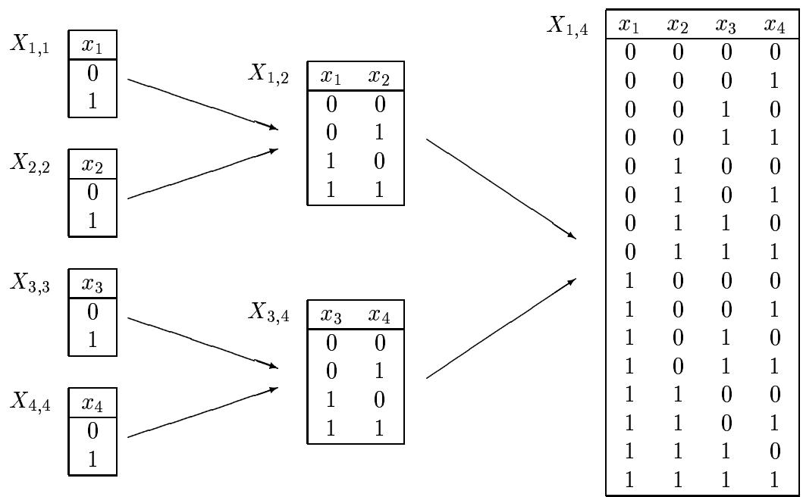

# Further improvements

If $n$ is not a power of two, we use another technique in the initial step. Choose $n ^ { \prime }$ as the largest power of two, less or equal to $n$ . Then construct $n ^ { \prime }$ sets $X _ { i , i }$ or $X _ { i , i + 1 }$ , each consisting of one or two items. Now we have obtained a power of two initial sets, and may proceed as before.

By using Algorithm 3.1 we are able to enumerate the set of all vectors $X _ { 1 , n }$ , but quite a lot of unneccessary enumeration may be avoided by using some simple criterias: fathoming, reduction, dominance and improvement of the lower bound.

Fathoming: If some partial vector $\mathbf { x } \in X _ { s , t }$ has $\mu ( \mathbf { x } ) > c$ the vector is infeasible and thus may be deleted from $X _ { s , t }$ .

Reduction: Choose a partial vector $\mathbf { x } \in X _ { s , t }$ . If an upper bound for (3.1) with the additional constraint

$$
x _ { i } = { \textbf { x } } _ { i } { \mathrm { f o r } } i = s , \ldots , t
$$

is less or equal some lower bound $z$ , then $\mathbf { x }$ may be deleted from $X _ { s , t }$ .

Dominance: If two vectors $\mathbf { x } , \mathbf { y } \in X _ { s , t }$ fulfills $\pi ( \mathbf { x } ) \geq \pi ( \mathbf { y } )$ and $\mu ( \mathbf { x } ) \leq \mu ( \mathbf { y } )$ then $\mathbf { y }$ may be deleted from $X _ { s , t }$ since it will not lead to an improved solution (see [93] for a proof).

Improvement of lower bound: If $\mathbf { x } \in X _ { s , t }$ has the property $\pi ( \mathbf { x } ) > z$ and $\mu ( \mathbf { x } ) \leq c$ then set $z = \pi ( \mathbf { x } )$ .

These properties will be considered in the following sections.

# 3.4 Multiplication of sets

It is convenient to represent each set $X _ { s , t }$ as an ordered list of the corresponding profit and weight pairs $( \pi _ { i } , \mu _ { i } )$ called states. Although we loose information about the corresponding physical vectors $\mathbf { x }$ it will later be described how the solution vector may be derived. The set $X _ { s , t } = \{ \mathbf { x } _ { 1 } , \ldots , \mathbf { x } _ { m } \}$ may thus be represented as a linear array $\left\{ ( \pi _ { 1 } , \mu _ { 1 } ) , \ldots , ( \pi _ { m } , \mu _ { m } ) \right\}$ , where $\pi _ { i } < \pi _ { i + 1 }$ and $\mu _ { i } < \mu _ { i + 1 }$ .

The multiplication $X _ { s , u } ^ { \prime \prime } = X _ { s , t } \times X _ { t + 1 , u } ^ { \prime }$ where $X _ { s , t }$ and $X _ { t + 1 , u } ^ { \prime }$ has size $m$ and $m ^ { \prime }$ ive $( \pi _ { i + j m } ^ { \prime \prime } , \mu _ { i + j m } ^ { \prime \prime } ) = ( \pi _ { i } + \pi _ { j } ^ { \prime } , \mu _ { i } + \mu _ { j } ^ { \prime } )$ for $i \ =$ $1 , \dots , m , \ j = 1 , \dots , m ^ { \prime }$ Then the set $X _ { s , u } ^ { \prime \prime }$ is ordered according to nonincreasing weight sums $\mu$ , and dominated vectors are removed. Due to the ordering of $\mu$ we only have to ensure that $\pi$ is growing, which may be done in linear time by Algorithm 3.2. The total computational effort is thus $O ( m m ^ { \prime } \log _ { 2 } ( m m ^ { \prime } ) )$ due to the sorting.

Algorithm 3.2   
procedure removedom( $X$ , var $X ^ { \prime } )$ ;   
$\{$ input: $X = \{ ( \pi _ { 1 } , \mu _ { 1 } ) , \dots , ( \pi _ { m } , \mu _ { m } ) \}$ , output: $X ^ { \prime } = \{ ( \pi _ { 1 } ^ { \prime } , \mu _ { 1 } ^ { \prime } ) , . . . , ( \pi _ { m ^ { \prime } } ^ { \prime } , \mu _ { m ^ { \prime } } ^ { \prime } ) \} \}$   
$m ^ { \prime } : = 1$ ; $( \pi _ { 1 } ^ { \prime } , \mu _ { 1 } ^ { \prime } ) : = ( \pi _ { 1 } , \mu _ { 1 } )$ ;   
for $i : = 2$ to $m$ do if $\left( \pi _ { i } > \pi _ { m ^ { \prime } } ^ { \prime } \right)$ then if $\left( \mu _ { i } > \mu _ { m ^ { \prime } } ^ { \prime } \right)$ then $m ^ { \prime } : = m ^ { \prime } + 1$ ;fi; $( \pi _ { m ^ { \prime } } ^ { \prime } , \mu _ { m ^ { \prime } } ^ { \prime } ) : = ( \pi _ { i } , \mu _ { i } )$ ; f;   
rof;

Example 3.2 Using the enumeration from Example 3.1, ordering the items according to nonincreasing weight sums, and removing dominated states, we get the following scheme (the dominated and thus deleted states are enclosed in brackets):

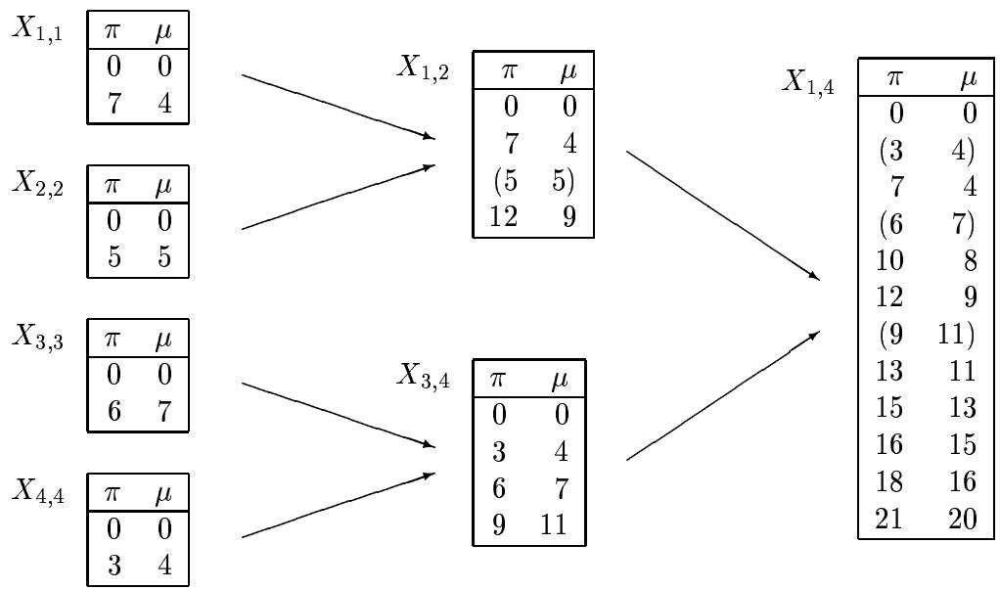

# Improved multiplication

Computational experiments show, that for most data instances up to $9 5 \%$ of the states are removed by dominance. In such cases it would be time- and storage consuming, to sort all mm' partial vectors. Instead we should look for an algorithm which makes it possible to remove dominated states during the enumeration, applying that $X$ and $X ^ { \prime }$ already are ordered.

The idea is to divide $X$ recursively in two equally sized parts $X _ { A }$ and $X _ { B }$ until the hereby obtained sets have size 1. A set $X _ { A }$ of size 1 is trivially multiplied with the set $X ^ { \prime }$ by simply adding the remaining state $( \pi , \mu )$ to each state in $X ^ { \prime }$ , and the product set $X _ { A } ^ { \prime \prime }$ will still be ordered. Finally the sets $X _ { A } ^ { \prime \prime }$ and $X _ { B } ^ { \prime \prime }$ are merged two by two, by repeatedly choosing the smallest weighted state from the sets, and removing dominated states as in Algorithm 3.2. This leads to the following divide-and-conquer algorithm:

Algorithm 3.3   
procedure spli $. \mathrm { t } ( X , X ^ { \prime }$ ,var $X ^ { \prime \prime }$ );   
{ determine $X ^ { \prime \prime } = X \times X ^ { \prime }$ with dominated states removed}   
if $( m = 1 )$ then for $i : = 1$ to $m ^ { \prime }$ do $( \pi _ { i } ^ { \prime \prime } , \mu _ { i } ^ { \prime \prime } ) : = ( \pi _ { 1 } + \pi _ { i } ^ { \prime } , \mu _ { 1 } + \mu _ { i } ^ { \prime } ) ; \mathbf { r o f } ; \ m ^ { \prime \prime } : = m ^ { \prime } ;$   
else $d : = \lfloor m / 2 \rfloor$ $\begin{array} { r l } & { \lfloor m / 2 \rfloor ; \quad X _ { A } : = \{ ( \pi _ { 1 } , \mu _ { 1 } ) , \dotsc , ( \pi _ { d } , \mu _ { d } ) \} ; \quad X _ { B } : = \{ ( \pi _ { d + 1 } , \mu _ { d + 1 } ) , \dotsc , ( \pi _ { m } , \mu _ { m } ) \} ; } \\ & { \therefore X _ { A } , X ^ { \prime } , X _ { A } ^ { \prime \prime } ) ; \quad \mathrm { s p l i t } ( X _ { B } , X ^ { \prime } , X _ { B } ^ { \prime \prime } ) ; \quad \mathrm { m e r g e } ( X _ { A } ^ { \prime \prime } , X _ { B } ^ { \prime \prime } , X ^ { \prime \prime } ) ; } \end{array}$ split   
fi;   
procedure ${ \mathrm { m e r g e } } ( X , X ^ { \prime }$ ,var $X ^ { \prime \prime }$ );   
{ determine $\begin{array} { r l } & { X ^ { \prime \prime } = X \cup X ^ { \prime } \ w i t h \ d o m i n a t e d \ s t a t e s \ r e m o v e d \} } \\ & { \cdot _ { m + 1 } , \mu _ { m + 1 } ) : = ( \infty , \infty ) ; \quad ( \pi _ { m ^ { \prime } + 1 } ^ { \prime } , \mu _ { m ^ { \prime } + 1 } ^ { \prime } ) : = ( \infty , \infty ) ; } \\ & { \mathbf { t h e n } \ ( \mu _ { 1 } ^ { \prime \prime } , \pi _ { 1 } ^ { \prime \prime } ) : = ( \mu _ { 1 } , \pi _ { 1 } ) ; \ i : = 2 ; \ j : = 1 ; } \\ & { \mathbf { e l s e } \ ( \mu _ { 1 } ^ { \prime \prime } , \pi _ { 1 } ^ { \prime \prime } ) : = ( \mu _ { 1 } ^ { \prime } , \pi _ { 1 } ^ { \prime } ) ; \ i : = 1 ; \ j : = 2 ; \ \mathbf { f } ; } \end{array}$   
$m ^ { \prime \prime } : = 1$ ;   
if $( \mu _ { 1 } \leq \mu _ { 1 } ^ { \prime } )$   
repeat if $( \mu _ { i } \leq \mu _ { j } ^ { \prime } )$ then if $( \pi _ { i } > \pi _ { m ^ { \prime \prime } } ^ { \prime \prime } )$ then if $\left( \mu _ { i } > \mu _ { m ^ { \prime \prime } } ^ { \prime \prime } \right)$ then $m ^ { \prime \prime } : = m ^ { \prime \prime } + 1$ f; $( \pi _ { m ^ { \prime \prime } } ^ { \prime \prime } , \mu _ { m ^ { \prime \prime } } ^ { \prime \prime } ) : = ( \pi _ { i } , \mu _ { i } )$ f; $i : = i + 1$ ; else if $( \pi _ { j } ^ { \prime } > \pi _ { m ^ { \prime \prime } } ^ { \prime \prime } )$ then if $\left( \mu _ { j } ^ { \prime } > \mu _ { m ^ { \prime \prime } } ^ { \prime \prime } \right)$ then $m ^ { \prime \prime } : = m ^ { \prime \prime } + 1$ ;f; $( \pi _ { m ^ { \prime \prime } } ^ { \prime \prime } , \mu _ { m ^ { \prime \prime } } ^ { \prime \prime } ) : = ( \pi _ { j } ^ { \prime } , \mu _ { j } ^ { \prime } )$ ; f; $j : = j + 1$ ; end;   
until $( i = m + 1 )$ and $( j = m + 1 )$ ;

If we choose $X$ as the smallest of the two sets there will be mm' additions in procedure SPLIT, followed by $m$ mergings of length $m ^ { \prime }$ in procedure MERGE, $\textstyle { \frac { m } { 2 } }$ mergings of length at most $2 m ^ { \prime }$ , and so on. Assuming that $m$ is a power of two we may sum the number of operations to $m m ^ { \prime } + m m ^ { \prime } + \frac { m } { 2 } 2 m ^ { \prime } + \frac { m } { 4 } 4 m ^ { \prime } + . . . + \frac { m } { m } m m ^ { \prime }$ getting the complexity $O ( m m ^ { \prime } \log m )$ .

Finally we notice that the last multiplication in Algorithm 3.1 is not necessary according to [1,33], since the two sets $X _ { 1 , n / 2 }$ and $X _ { n / 2 + 1 , n }$ are ordered, making it possible to derive maximal pairs $( \mu _ { i } , \mu _ { j } )$ , $\mu _ { i } \in X _ { 1 , n / 2 }$ , $\mu _ { j } \in X _ { n / 2 + 1 , n }$ satisfying $\mu _ { i } + \mu _ { j } \leq c$ in linear time by running forward through $X _ { 1 , n / 2 }$ while we run backward through $X _ { n / 2 + 1 , n }$ .This gives Algorithm 3.1 the complexity $O ( 2 ^ { n / 2 } )$ .

# 3.5 Lower bounds

While the preceding multiplication of states was strictly local, we will now apply global knowledge about the enumeration in other sets to obtain tight lower and upper bounds.

A lower bound for (3.1) may be found by using the greedy algorithm: include the items $1 , 2 , \ldots$ until the first item $b$ which does not fit into the residual capacity. This item is called the break item, and the profit sum

$$
z ~ = ~ \sum _ { i = 1 } ^ { b - 1 } p _ { i } ,
$$

is obviously a lower bound for (3.1). The break item $b$ may also be defined as the index which satisfies

$$
\overline { { \boldsymbol { w } } } _ { b } \leq c < \overline { { \boldsymbol { w } } } _ { b + 1 } ,
$$

where the cumulated weights $\overline { { w } } _ { i }$ are given by $\begin{array} { r } { \overline { { \mathcal { W } } } _ { i } = \sum _ { j = 1 } ^ { i - 1 } w _ { j } } \end{array}$ , for $i = 1 , \ldots , n$

# Greedy solution for sets

We will now generalize the greedy algorithm for sets of states. For each set $X _ { i } = X _ { s , t }$ the corresondig t poft is $\begin{array} { r } { P _ { i } = \sum _ { j = s } ^ { t } \ p _ { j } } \end{array}$ , and the set weight is $\textstyle W _ { i } = \sum _ { j = s } ^ { t } \ w _ { j }$ . With the sets labeled $X _ { 1 } , \ldots , X _ { d }$ , the cumulated set profits ${ \overline { { P } } } _ { i }$ and weights $\overline { { W } } _ { i }$ are given by

$$
\begin{array} { r c l } { { \overline { { { P } } } _ { i } } } & { { = } } & { { \displaystyle \sum _ { j = 1 } ^ { i - 1 } P _ { j } , \quad i = 1 , \ldots , d + 1 , } } \\ { { \overline { { { W } } } _ { i } } } & { { = } } & { { \displaystyle \sum _ { j = 1 } ^ { i - 1 } W _ { j } , \quad i = 1 , \ldots , d + 1 , } } \end{array}
$$

and we define the break set $X _ { B }$ by the index $B$ which satisfies

$$
\begin{array} { r } { W _ { B } \leq c < \overline { { W } } _ { B + 1 } . } \end{array}
$$

The break state $( \pi _ { \beta } , \mu _ { \beta } )$ within the break set $X _ { B } ~ = ~ \{ ( \pi _ { 1 } , \mu _ { 1 } ) , \ldots , ( \pi _ { m } , \mu _ { m } ) \}$ may be defined by the index $\beta$ which satisfies

$$
\mu _ { \beta } \leq c - \overline { { W } } _ { B } < \mu _ { \beta + 1 } .
$$

The inequality $c - \overline { { W } } _ { B } < \mu _ { \beta + 1 }$ is dropped when $\beta = m$ , and we set $\beta = 0$ if $\mu _ { 1 } > c - \overline { { W } } _ { B }$ . By definition we have $\overline { { W } } _ { B } + \mu _ { \beta } \leq c$ for $\beta \neq 0$ so a lower bound for (3.1) is given by

$$
z \ = \ \overline { { { P } } } _ { B } + \pi _ { \beta } .
$$

Notice, that at the initial step of merging when $X _ { B } = X _ { b , b }$ this bound corresponds to the greedy solution (3.8), but for each future merging it becomes tighter, for finally becoming the optimal solution when $X _ { B } = X _ { 1 , n }$ .

Example 3.3 We consider the sets of partial vectors from the initial stage of Example 3.2:

<table><tr><td rowspan=1 colspan=7>X1              X2              X3              X4</td></tr><tr><td rowspan=1 colspan=1>π  μ</td><td rowspan=1 colspan=1></td><td rowspan=1 colspan=1>π  μ</td><td rowspan=1 colspan=1></td><td rowspan=1 colspan=1>π  µ</td><td rowspan=1 colspan=1></td><td rowspan=1 colspan=1>π  µ</td></tr><tr><td rowspan=1 colspan=1>0  07 4</td><td rowspan=1 colspan=1></td><td rowspan=1 colspan=1>0  05  5</td><td rowspan=1 colspan=1></td><td rowspan=1 colspan=1>0  06  7</td><td rowspan=1 colspan=1></td><td rowspan=1 colspan=1>0  03  4</td></tr></table>

The cumulated profit sums, and weight sums are

<table><tr><td></td><td>1 2</td><td></td><td>3</td><td></td><td></td></tr><tr><td>P j</td><td>0</td><td>7</td><td>12</td><td>18</td><td>21</td></tr><tr><td>Wj</td><td>0 4</td><td></td><td>9</td><td>16</td><td>20</td></tr></table>

so the break set is $X _ { 3 }$ and the break state within this set is $( \pi _ { 1 } , \mu _ { 1 } ) = ( 0 , 0 )$ . We get the lower bound $z = \overline { { P } } _ { 3 } + \pi _ { 1 } = 1 2 + 0 = 1 2$ .

# Greedy solution for a restricted problem

The bound (3.14) may equally well be derived with some variables fixed by a partial vector $\mathbf { x } _ { i } \in X _ { j }$ as given by (3.7). Such a lower bound will be denoted by $z ( i , j )$ , and a lower bound for the Knapsack Problem (3.1) alone may be determined as maximum $z ( i , j )$ for all sets $X _ { j }$ and all partial vectors $\mathbf { x } _ { i } \in X _ { j }$ . We get

$$
z = \operatorname* { m a x } _ { X _ { j } } \quad \operatorname* { m a x } _ { { \bf x } _ { i } \in X _ { j } } \quad z ( i , j ) .
$$

Thus, assume that some variables are fixed by a partial vector $\mathbf { x } _ { i } \in X _ { j }$ as given by (3.7). If $\overline { { W } } _ { j } + \mu ( \mathbf { x } _ { i } ) > c$ the break set $X _ { B }$ should be found among $X _ { 1 } , \dotsc , X _ { j - 1 }$ , and it is defined by the inequality

$$
\begin{array} { r } { W _ { B } \leq c - \mu ( \mathbf { x } _ { i } ) < \overline { { W } } _ { B + 1 } . } \end{array}
$$

The residual capacity is then

$$
r \ = \ c - \mu ( \mathbf { x } _ { i } ) - \overline { { W } } _ { B } ,
$$

meaning that the break state $( \pi _ { \beta } , \mu _ { \beta } ) \in X _ { B }$ is defined by

$$
\mu _ { \beta } \leq r < \mu _ { \beta + 1 } ,
$$

with usual assumptions for $\beta = 0$ and $\beta = m$ . Conversely if $\overline { { W } } _ { j } + \mu ( \mathbf { x } _ { i } ) \leq c$ we know that the break set should be found among $X _ { j + 1 } , \ldots , X _ { d }$ , and it is defined by the inequality

$$
\overline { { W } } _ { B } - W _ { j } \leq c - \mu ( \mathbf { x } _ { i } ) < \overline { { W } } _ { B + 1 } - W _ { j } ,
$$

where the set weight of $X _ { j }$ is subtracted from the cumulated set weight to avoid double addition. The residual capacity is then

$$
r \ = \ c - \mu ( { \bf x } _ { i } ) - { \overline { { W } } } _ { B } + W _ { j } ,
$$

and the break state $\beta$ is defined by (3.18). We get the following algorithm for deriving the lower bound:

# Algorithm 3.4

$z : = 0$ ;   
for all sets $X _ { j } = \{ ( \pi _ { 1 } , \mu _ { 1 } ) , \dots , ( \pi _ { m } , \mu _ { m } ) \}$ do for all states $( \pi _ { i } , \mu _ { i } ) \in X _ { j }$ do if $( \mu _ { i } > c )$ then state $( \pi _ { i } , \mu _ { i } )$ is infeasible, and may be fathomed. fi; if $( \overline { { W } } _ { j } + \mu _ { i } \leq c )$ then find through binary search in $\{ X _ { j + 1 } , \ldots , X _ { d } \}$ an index $B$ which satisfies $\overline { { { W } } } _ { B } \leq c - \mu _ { i } + W _ { j } < \overline { { { W } } } _ { B + 1 }$ . $r : = c - \mu _ { i } - \overline { { W } } _ { B } + W _ { j }$ ; $p : = \pi _ { i } + \overline { { P } } _ { B } - P _ { j }$ else find through binary search in $\left\{ X _ { 1 } , \ldots , X _ { j - 1 } \right\}$ an index $B$ which satisfies $\overline { { W } } _ { B } \leq \dot { c } - \mu _ { i } < \check { W } _ { B + 1 }$ . $r : = c - \mu _ { i } - \overline { { W } } _ { B }$ b $p : = \pi _ { i } + \overline { { P } } _ { B }$ ; f; find through binary search in $X _ { B }$ a state $\beta$ satisfying $\mu _ { \beta } \leq r < \mu _ { \beta + 1 }$ . if $( \beta \neq 0 )$ and $\left( p + \pi _ { \beta } > z \right)$ then $z : = p + \pi _ { \beta }$ ; f; rof;   
rof;

Example 3.4 For each state $( \pi _ { i } , \mu _ { i } ) \in X _ { j }$ from Example 3.3 the following table gives the corresponding break set $X _ { B }$ , the break state $( \pi _ { \beta } , \mu _ { \beta } )$ within the break set, and the lower bound $z ( i , j )$ .

<table><tr><td>i</td><td>j πi</td><td>μi</td><td>B</td><td>β</td><td>z(i,j)</td></tr><tr><td>1</td><td>1</td><td>0 0</td><td>4</td><td>1</td><td>11</td></tr><tr><td>2</td><td>1</td><td>7 4</td><td>3</td><td>1</td><td>12</td></tr><tr><td>1</td><td>2</td><td>0 0</td><td>4</td><td>1</td><td>13</td></tr><tr><td>2</td><td>2</td><td>5 5</td><td>3</td><td>1</td><td>12</td></tr><tr><td>1</td><td>3</td><td>0 0</td><td>5</td><td>1</td><td>15</td></tr><tr><td>2</td><td>3</td><td>6 7</td><td>2</td><td>1</td><td>13</td></tr><tr><td>1</td><td>4</td><td>0 0</td><td>3</td><td>1</td><td>12</td></tr><tr><td>2</td><td>4</td><td>3 4</td><td>3</td><td>1</td><td>15</td></tr></table>

It is seen, that by this technique, we obtain a lower bound $z = 1 5$ , which is considerably better than the lower bound found in Example 3.3.

# 3.6 Reduction

The purpose of the reduction is to delete partial vectors whose upper bound does not exceed the so far best lower bound. For a given partial vector $\mathbf { x } _ { i } \in X _ { j } = X _ { s , t }$ we may construct a complete vector $\mathbf { y } = \left( \mathbf { y } _ { 1 } , \ldots , \mathbf { y } _ { n } \right)$ by setting

$$
\begin{array} { r l r } { \mathbf y _ { h } } & { = } & { \left\{ \begin{array} { l l } { 1 } & { \mathrm { f o r } \quad h = 1 , \dots , s - 1 , } \\ { \mathbf x _ { i , h } } & { \mathrm { f o r } \quad h = s , \dots , t , } \\ { 0 } & { \mathrm { f o r } \quad h = t + 1 , \dots , n . } \end{array} \right. } \end{array}
$$

By linear relaxation of the variables $x _ { s - 1 }$ and $x _ { t + 1 }$ we obtain the following upper bound for the vector y

$$
\begin{array} { r l r } { u ( \mathbf { y } ) } & { = } & { \left\{ \begin{array} { l l } { \lfloor \pi ( \mathbf { y } ) + \frac { \left( c - \mu ( \mathbf { y } ) \right) p _ { t + 1 } } { w _ { t + 1 } } \rfloor } & { \mathrm { i f } \mu ( \mathbf { y } ) \le c , } \\ { \lfloor \pi ( \mathbf { y } ) + \frac { \left( c - \mu ( \mathbf { y } ) \right) p _ { s - 1 } } { w _ { s - 1 } } \rfloor } & { \mathrm { i f } \mu ( \mathbf { y } ) > c , } \end{array} \right. } \end{array}
$$

where we set $( p _ { 0 } , w _ { 0 } ) = ( \infty , 1 )$ and $( p _ { n + 1 } , w _ { n + 1 } ) = ( 0 , \infty )$ . The vector $\mathbf { y }$ will have profit sum $\pi ( \mathbf { y } ) = \overline { { P } } _ { j } + \pi ( \mathbf { x } _ { i } )$ and weight sum $\mu ( \mathbf { y } ) = \overline { { W } } _ { j } + \mu ( \mathbf { x } _ { i } )$ , so an upper bound for $\mathbf { y }$ and thus $\mathbf { x } _ { i }$ may be found as

$$
\begin{array} { r l r } { u ( \mathbf { x } _ { i } ) } & { = } & { \left\{ \begin{array} { l l } { \lfloor P _ { j } + \pi ( \mathbf { x } _ { i } ) + \frac { \left( c - W _ { j } - \mu ( \mathbf { x } _ { i } ) \right) p _ { t + 1 } } { w _ { t + 1 } } \rfloor } & { \mathrm { i f } \overline { W } _ { j } + \mu ( \mathbf { x } _ { i } ) \le c , } \\ { \lfloor P _ { j } + \pi ( \mathbf { x } _ { i } ) + \frac { \left( c - W _ { j } - \mu ( \mathbf { x } _ { i } ) \right) p _ { s - 1 } } { w _ { s - 1 } } \rfloor } & { \mathrm { i f } \overline { W } _ { j } + \mu ( \mathbf { x } _ { i } ) > c . } \end{array} \right. } \end{array}
$$

This bound could be used for reducing infeasible partial vectors in an enumeration algorithm as done in Pisinger [65], but we may derive tighter upper bounds by taking advantage of the enumeration in other sets as described below.

# The $\pi$ -bound

Martello and Toth [52] showed, that having a complete enumeration of partial vectors $X _ { s , t }$ , an upper bound for the Knapsack Problem (3.1) may be found as the maximum over $X _ { s , t }$ of each partial vector's upper bound. Using the bound (3.23) we get the following upper bound

$$
\pi _ { s , t } \mathrm { - b o u n d } \ = \ \operatorname* { m a x } _ { \mathbf { x } _ { i } \in X _ { s , t } } u ( \mathbf { x } _ { i } ) .
$$

It is seen that for $[ s , t ] = [ b , b ]$ the $\pi$ -bound becomes the Martello-Toth upper bound [46], and by expanding the interval $[ s , t ]$ we can make the $\pi$ -bound arbitrarily tight. The ultimate bound is reached for $[ s , t ] = [ 1 , n ]$ , where it corresponds to the optimal solution for KP.

Any set $X _ { s , t }$ may be used for deriving the $\pi$ -bound, but the tightest bound is obtained by using the break set $X _ { B }$ as given by (3.12). Applying the $\pi$ -bound in its direct form would however mean, that we had to run through all vectors in $X _ { B }$ each time the bound was used. This may be avoided by applying the following method by Pisinger [65]. First we define the functions $\phi$ and $\psi$ by:

$$
\begin{array} { r c l } { \phi ( \mathbf { x } _ { i } ) } & { = } & { \phi _ { i } \ = \ \displaystyle \pi _ { i } + \frac { \big ( c - \mu _ { i } \big ) p _ { t + 1 } } { w _ { t + 1 } } , } \\ { \psi ( \mathbf { x } _ { i } ) } & { = } & { \psi _ { i } \ = \ \displaystyle \pi _ { i } + \frac { \big ( c - \mu _ { i } \big ) p _ { s - 1 } } { w _ { s - 1 } } , } \end{array}
$$

where we set $\phi _ { 0 } = 0$ and $\psi _ { 0 } = 0$ . Then the bound $u ( \mathbf { x } _ { i } )$ for $\mathbf { x } _ { i } \in X _ { B }$ becomes

$$
\begin{array} { r l r } { u ( { \bf x } _ { i } ) } & { = } & { \left\{ \begin{array} { l l } { \displaystyle \big \lfloor \overline { { P } } _ { B } - \frac { \overline { { W } } _ { B } p _ { t + 1 } } { w _ { t + 1 } } + \phi ( { \bf x } _ { i } ) \big \rfloor \quad \mathrm { i f } \quad \overline { { W } } _ { B } + \mu ( { \bf x } _ { i } ) \le c , } \\ { \displaystyle \big \lfloor \overline { { P } } _ { B } - \frac { \overline { { W } } _ { B } p _ { s - 1 } } { w _ { s - 1 } } + \psi ( { \bf x } _ { i } ) \big \rfloor \quad \mathrm { i f } \quad \overline { { W } } _ { B } + \mu ( { \bf x } _ { i } ) > c , } \end{array} \right. } \end{array}
$$

and since the states $\left\{ ( \pi _ { 1 } , \mu _ { 1 } ) , \ldots , ( \pi _ { m } , \mu _ { m } ) \right\}$ in $X _ { B }$ are ordered we have $\overline { { W } } _ { B } + \mu _ { i } \leq c$ for $i \le \beta$ and $\overline { { W } } _ { B } + \mu _ { i } > \overline { { c } }$ for $i > \beta$ , where $\beta$ is the break state corresponding to the set $X _ { B }$ as given by (3.13). By inserting equation (3.27) in equation (3.24) we get the following equality

$$
\begin{array} { r l r } { \pi \mathrm { - } \mathrm { b o u n d } } & { = } & { \operatorname* { m a x } \left\{ \begin{array} { l l } { \lfloor \overline { { P } } _ { B } - \displaystyle \frac { \overline { { W } } _ { B } p _ { t + 1 } } { w _ { t + 1 } } + \operatorname* { m a x } _ { i \leq \beta } \phi ( \mathbf { x } _ { i } ) \rfloor , } \\ { \lfloor \overline { { P } } _ { B } - \displaystyle \frac { \overline { { W } } _ { B } p _ { s - 1 } } { w _ { s - 1 } } + \operatorname* { m a x } _ { i > \beta } \psi ( \mathbf { x } _ { i } ) \rfloor . } \end{array} \right. } \end{array}
$$

If we define max $\phi _ { j }$ and max $\psi _ { j }$ as

$$
\begin{array} { r c l l } { \operatorname* { m a x } \phi _ { j } } & { = } & { \displaystyle \operatorname* { m a x } _ { i \leq j } \phi _ { i } , } & { \ j = 0 , \ldots , m , } \\ { \operatorname* { m a x } \psi _ { j } } & { = } & { \displaystyle \operatorname* { m a x } _ { i > j } \psi _ { i } , } & { \ j = 0 , \ldots , m , } \end{array}
$$

we obtain that the $\pi$ -bound may be derived as the maximum of the following two expressions

$$
\begin{array} { r l r } { \pi _ { s , t } \mathrm { - b o u n d } } & { = } & { \operatorname* { m a x } \left\{ \begin{array} { l l } { \displaystyle \big \lfloor \overline { { P } } _ { B } - \frac { \overline { { W } } _ { B } p _ { t + 1 } } { w _ { t + 1 } } + \operatorname* { m a x } \phi _ { \beta } \big \rfloor , } \\ { \displaystyle \big \lfloor \overline { { P } } _ { B } - \frac { \overline { { W } } _ { B } p _ { s - 1 } } { w _ { s - 1 } } + \operatorname* { m a x } \psi _ { \beta } \big \rfloor . } \end{array} \right. } \end{array}
$$

Since all variables max $\phi _ { j }$ and max $\psi _ { j }$ can be determined in linear time per global reduction, the $\pi$ -bound may be determined in constant time once $B$ and $\beta$ has been found. This will be crucial when we use the $\pi$ -bound for reducing partial vectors.

Example 3.5 Extending the data instance from Example 3.1 we get the following table:

<table><tr><td>j</td><td>0</td><td>1</td><td>2</td><td>3</td><td>4</td><td>5</td></tr><tr><td>pj</td><td>∞</td><td>7</td><td>5</td><td>6</td><td>3</td><td>0</td></tr><tr><td>Wj</td><td>1</td><td></td><td>5</td><td></td><td></td><td>∞</td></tr></table>

Using the enumeration from Example 3.2 we wish to find an upper bound for (3.1) using the equation (3.31). As found in Example 3.3 we have the break set $X _ { B } = X _ { 3 }$ and the break state in $X _ { 3 }$ is given by $\beta = 1$ . We get the following table for $X _ { s , t } = X _ { 3 , 3 }$ .

<table><tr><td>i</td><td>π μi</td><td>φi</td><td>ψi</td><td>max φi</td><td>max ψi</td></tr><tr><td rowspan="3">0 1</td><td></td><td>0.00</td><td rowspan="3">0.00</td><td>0.00</td><td>13.00</td></tr><tr><td>0</td><td>9.75</td><td>9.75</td><td>12.00</td></tr><tr><td>0 6 7</td><td>13.00 10.50 12.00</td><td>10.50</td><td>0.00</td></tr></table>

The upper bound is found as

$$
\begin{array} { l l l } { \pi _ { 3 , 3 } \mathrm { - b o u n d } } & { = } & { \displaystyle \operatorname* { m a x } \left\{ \big | \overline { { P } } _ { 3 } - \frac { \overline { { W } } _ { 3 } p _ { 4 } } { w _ { 4 } } + \operatorname* { m a x } \phi _ { 1 } \big | , \big | \overline { { P } } _ { 3 } - \frac { \overline { { W } } _ { 3 } p _ { 2 } } { w _ { 2 } } + \operatorname* { m a x } \psi _ { 1 } \big | \right\} } \\ & { = } & { \displaystyle \operatorname* { m a x } \{ 1 5 , 1 5 \} ~ = ~ 1 5 . } \end{array}
$$

# The $\pi$ -bound for a restricted problem

In order to delete infeasible partial vectors $\mathbf { x } _ { k } \in X _ { j } = X _ { u , v }$ we will determine the $\pi$ -bound for (3.1) restricted by

$$
x _ { i } = { \bf x } _ { k i } \mathrm { f o r } i = u , \ldots , v ,
$$

and delete the vector if the upper bound does not exceed the lower bound $z$ . So let $X _ { B }$ be the break set corresponding to the partial vector $\mathbf { x } _ { k }$ as given by (3.16) or (3.19). Then the $\pi$ -bound for the vector $\mathbf { x } _ { k }$ is

$$
\pi \mathrm { - b o u n d } _ { \left| \mathbf { x } _ { k } \right. } = \operatorname* { m a x } _ { \mathbf { x } _ { i } \in X _ { B } } \ u ( \mathbf { x } _ { i } ) | _ { \mathbf { x } _ { k } } ,
$$

where the bound $u ( \mathbf { x } _ { i } )$ restricted by (3.32) is derived the following way: The addition of constraint (3.32) means that a complete vector $\mathbf { y }$ for $\mathbf { x } _ { i }$ becomes

$$
\begin{array} { r l r } { \mathbf y _ { h } } & { = } & { \left\{ \begin{array} { l l l } { 1 } & { \mathrm { f o r } } & { h = 1 , \ldots , s - 1 , \ h \notin [ u , v ] , } \\ { \mathbf x _ { i , h } } & { \mathrm { f o r } } & { h = s , \ldots , t , } \\ { 0 } & { \mathrm { f o r } } & { h = t + 1 , \ldots , n , \ h \notin [ u , v ] , } \\ { \mathbf x _ { k , h } } & { \mathrm { f o r } } & { h = u , \ldots , v . } \end{array} \right. } \end{array}
$$

The vector $\mathbf { y }$ will have profit sum $\pi ( \mathbf { y } ) = \overline { { P } } _ { j } + \pi ( \mathbf { x } _ { i } ) + \tilde { p } _ { k }$ and weight sum $\mu ( \mathbf { y } ) \mathbf { \alpha } =$ $\overline { { W } } _ { j } + \mu ( \mathbf { x } _ { i } ) + \tilde { w } _ { k }$ , where the deviation by fixing some variables by constraint (3.32) is given by

$$
\begin{array} { r l r } { \tilde { p } _ { k } } & { = } & { \left\{ \begin{array} { l l } { \pi ( \mathbf x _ { k } ) } & { \mathrm { i f } \quad v < s , } \\ { \pi ( \mathbf x _ { k } ) - P _ { j } } & { \mathrm { i f } \quad u > t , } \end{array} \right. } \\ { \tilde { w } _ { k } } & { = } & { \left\{ \begin{array} { l l } { \mu ( \mathbf x _ { k } ) } & { \mathrm { i f } \quad v < s , } \\ { \mu ( \mathbf x _ { k } ) - W _ { j } } & { \mathrm { i f } \quad u > t . } \end{array} \right. } \end{array}
$$

Now the upper bound (3.27) becomes

$$
\begin{array} { r l r } { \mathbf { x } _ { i } ) | _ { \mathbf { x } _ { k } } } & { = } & { \left\{ \begin{array} { l l } { \displaystyle \big \lfloor \left( \overline { { P } } _ { B } + \tilde { p } _ { k } \right) - \frac { \left( \overline { { W } } _ { B } + \tilde { w } _ { k } \right) p _ { t + 1 } } { w _ { t + 1 } } + \phi ( \mathbf { x } _ { i } ) \displaystyle \big \rfloor } & { \mathrm { i f } \overline { { W } } _ { B } + \tilde { w } _ { k } + \mu ( \mathbf { x } _ { i } ) \le \mu ( \mathbf { x } _ { i } ) , } \\ { \displaystyle \big \lfloor \left( \overline { { P } } _ { B } + \tilde { p } _ { k } \right) - \frac { \left( \overline { { W } } _ { B } + \tilde { w } _ { k } \right) p _ { s - 1 } } { w _ { s - 1 } } + \psi ( \mathbf { x } _ { i } ) \displaystyle \big \rfloor } & { \mathrm { i f } \overline { { W } } _ { B } + \tilde { w } _ { k } + \mu ( \mathbf { x } _ { i } ) > 0 } \end{array} \right. } \end{array}
$$

and the restricted $\pi$ -bound (3.31) becomes

$$
\begin{array} { r l r } { \pi \mathrm { - b o u n d | _ { \mathbf { x } _ { k } } } } & { = } & { \operatorname* { m a x } \left\{ \begin{array} { l l } { \lfloor \left( \overline { { P } } _ { B } + \tilde { p } _ { k } \right) - \frac { \left( \overline { { W } } _ { B } + \tilde { w } _ { k } \right) p _ { t + 1 } } { w _ { t + 1 } } + \operatorname* { m a x } \phi _ { \beta } \rfloor , } \\ { \lfloor \left( \overline { { P } } _ { B } + \tilde { p } _ { k } \right) - \frac { \left( \overline { { W } } _ { B } + \tilde { w } _ { k } \right) p _ { s - 1 } } { w _ { s - 1 } } + \operatorname* { m a x } \psi _ { \beta } \rfloor , } \end{array} \right. } \end{array}
$$

where $\beta$ is the break state as found in Algorithm 3.4. We get the following reduction algorithm:

# Algorithm 3.5

for all sets $X _ { j }$ do for all states $( \pi _ { i } , \mu _ { i } ) \in X _ { j } = \left\{ ( \pi _ { 1 } , \mu _ { 1 } ) , \dots , ( \pi _ { m } , \mu _ { m } ) \right\}$ do $\{$ Use the break set $B$ and break state $\beta$ as found by Algorithm 3.4} if $( j < B )$ then $\tilde { p } : = \pi _ { i } - P _ { j }$ ; $\tilde { w } : = \mu _ { i } - W _ { j }$ ; else $\tilde { p } : = \pi _ { i }$ ; $\tilde { w } : = \mu _ { i }$ ; fi; { Deviation (3.35) and (3.36)} $\begin{array} { r l } & { \mathrm { \{ ~ \it ~ N o w ~ d e t e r m i n e ~ \it ~ t h e ~ \cdot ~ \ w _ { \mathrm { 1 } } ~ , ~ \cdots ~ \cdot ~ \mu _ { \mathrm { 1 } } ~ , ~ \cdots ~ \mu _ { \mathrm { e v } } ~ , ~ \cdots ~ \mu _ { \mathrm { e v } } ~ , ~ \cdots ~ \mu _ { \mathrm { e v } } ~ , ~ \psi _ { \mathrm { e v } } ~ , ~ \cdots ~ \mu _ { \mathrm { e v } } } ~ }  \\ & { \mathrm { \{ ~ \it ~ \beta ~ \mathrm { ~ \it ~ \beta ~ \mathrm { ~ \it ~ \beta ~ \mathrm { ~ \it ~ ~ \beta ~ \mathrm { ~ \it ~ ~ \psi ~ \ i ~ ~ ~ \it ~ { ~ \it ~ ~ \beta ~ ~ \mathrm { ~ ~ \it ~ ~ \psi ~ } ~ } ~ } ~ } } ~ } ~ } }  \\ & { u _ { 1 } : = \mathrm { \{ \it ~ \mathrm { \{ ( \overline { { ~ \it ~ P ~ } } _ { B } ~ + ~ \widetilde { \it ~ p } ) ~ - \it ~ \frac { \mathrm { \{ \{ ~ \it ~ \alpha ~ ~ \mathrm { ~ \it ~ \it ~ { ~ \it ~ \alpha ~ ~ \widetilde { ~ \psi ~ } ~ } ~ } ~ } ~ } } } { ~ \it \mathrm { ~ \it ~ \alpha ~ \mathrm { \it ~ \it { ~ w ~ \mathrm { ~ \it ~ { ~ \it ~ \it ~ { ~ \it ~ \beta ~ ~ \it ~ { ~ \it ~ } ~ } ~ } ~ } } ~ } } ~ } }  ~    \\ & { u _ { 2 } : = \mathrm { \lfloor \mathrm { ( \overline { { ~ \it { \it ~ P } } } _ { B } ~ + ~ \widetilde { \it { \it ~ p } } ) ~ - \it ~ \frac { \mathrm { \{ \{ ~ \it ~ \alpha ~ \mathrm { ~ \it ~ { \it ~ \it ~ { ~ \it { ~ \it ~ \alpha ~ ~ \widetilde { ~ } ~ } ~ } } ~ } } ~ } } } { ~ \it \mathrm { \ u \mathrm { \it ~ \it _ { \mathrm { s } - 1 } } } } ~ } + \operatorname* { m a x } { \psi _ { \beta } } \rfloor ;  \\ & { \mathrm { \{ ~ \it ~ \{ ~ \it ~ \beta ~ \mathrm { ~ \it ~ \it ~ { ~ \it ~ \it ~ { ~ \it ~ \alpha ~ \mathrm { ~ \it ~ \it ~ { ~ \it ~  ~ ~ } ~ } ~ } ~ } } ~ } ~ }  \\ & { \mathrm { \{ ~ \it ~ \beta ~ \mathrm { ~ \it ~ \it ~ { ~ \it ~ \alpha ~ \mathrm { ~ \it ~  ~ \mathcal ~ { ~ \it ~  ~ } ~ } ~ } ~ } ~ } } \\ \end{array}$ if $\left( \operatorname* { m a x } \{ u _ { 1 } , u _ { 2 } \} \leq z \right)$ then drop state fi; rof;   
rof;

Example 3.6 An upper bound for the state $( \pi _ { 2 } , \mu _ { 2 } ) = ( 3 , 4 ) \in X _ { 4 }$ from Example 3.3 is found as follows: The break set is given by $B = 3$ (see Example 3.5), and we find $\tilde { p } = 3$ and $\tilde { w } = 4$ . Then the bound is

$$
\begin{array} { r l r } { \pi _ { 3 , \mathrm { 3 } } \mathrm { - b o u n d } } & { = } & { \operatorname* { m a x } \left\{ \begin{array} { l l } { \lfloor \left( \overline { { P } } _ { 3 } + \tilde { p } \right) - \frac { \left( \overline { { W } } _ { 3 } + \tilde { w } \right) p _ { 4 } } { w _ { 4 } } + \operatorname* { m a x } \phi _ { 1 } \rfloor , } \\ { \lfloor \left( \overline { { P } } _ { 3 } + \tilde { p } \right) - \frac { \left( \overline { { W } } _ { 3 } + \tilde { w } \right) p _ { 2 } } { w _ { 2 } } + \operatorname* { m a x } \psi _ { 1 } \rfloor } \end{array} \right. } \\ & { = } & { \operatorname* { m a x } \{ 1 5 , 1 4 \} \ = \ 1 5 . } \end{array}
$$

# 3.7 Solution vector

Our algorithm is able to find the optimal value of the objective function in (3.1), but not to find the corresponding solution vector $\mathbf { x }$ . In order to find $\mathbf { x }$ , we will extend a state with two pointers $\sigma$ and $\tau$ , so it becomes $( \pi , \mu , \sigma , \tau )$ .

At the initial step when sets $X _ { i , i }$ are constructed, we set $\sigma$ to point at item $i$ if $x _ { i } = 1$ , and to nil otherwise. The pointer $\tau$ is set to nil in any case. When multiplying two sets by adding states two by two (Algorithm 3.3) we set $\sigma$ and $\tau$ in the product state to point at each of the added states. By this technique it is easy to find the vector x corresponding to a given state $( \pi , \mu , \sigma , \tau )$ . First all variables $x _ { i }$ are set to 0, and then we follow the states downwards to states where $\tau$ is nil. If $\sigma$ is not nil we set the corresponding variable $x _ { i }$ to 1.

As noted in Section 3.3 initial sets $X _ { i , i + 1 }$ containing two items may occur, when $n$ is not a power of two. Such sets are treated as the product of two sets $X _ { i , i }$ and $X _ { i , i + 1 }$ , and may thus be initialized as described above.

# 3.8 Computational experiments

The presented HARDKNAP algorithm has been implemented in ANSI-C, and a complete listing is available from the author on request. The following results have been achieved on a HP9000/730 computer.

We will consider how the algorithm behaves for different problem sizes, test instances, and data-ranges. Four types of randomly generated data instances are considered. Each type will be tested with data-range $R \ = 1 0 0$ , 1000, 10000 for different problem sizes $n = 1 0 0$ ,20500 000Thy $c$ is chosen as $\begin{array} { r } { c = { \frac { 1 } { 2 } } \sum _ { j = 1 } ^ { n } w _ { j } } \end{array}$

uncorrelated data instance: $p _ { j }$ and $w _ { j }$ are randomly distributed in $[ 1 , R ]$ . weakly correlated data instance: $w _ { j }$ randomly distributed in $[ 1 , R ]$ and $p _ { j }$ randomly distributed in $\left[ w _ { j } - 1 0 , w _ { j } + 1 0 \right] \cap \left[ 1 , R + 1 0 \right]$ (the set intersection ensures that $p _ { j }$ is positive). strongly correlated data instance: $w _ { j }$ randomly distributed in $[ 1 , R ]$ and $p _ { j } = w _ { j } + 1 0$ . subset-sum data instance: $w _ { j }$ randomly distributed in $[ 1 , R ]$ and $p _ { j } = w _ { j }$ .

For each problem type, size and range, we construct and solve 10 different data instances

Table I shows the average computational time for each of the different types of data instances, while Table II shows the average gap $\varGamma$ between the value of the linear programming optimum and that of the integer optimum. As expected from the introduction the computational time is seen to depend strongly on the correlation and gap $\varGamma$ . The strongly correlated data instances which have both of the properties are clearly the hardest problems to solve. Anyhow the presented algorithm is able to solve them in reasonable time, a result which hitherto has not been presented in the literature. For comparison it should be noted that Toth [93] using dynamic programming only was able to solve strongly correlated data instances of size $n = 2 0 0$ and $R = 1 0 0$ . Of the total computational time used by HARDKNAP more than $9 9 \%$ of the effort was used for multiplying the sets by Algorithm 3.3 when the problem was hard. This means that improvements in the multiplication part would make the algorithm substantially faster.

Table III shows the maximum size of the sets of states. It is seen that the size grows with the hardness of a data instance but still stay within the limits of a modern computer.

Table I: Total computational time in seconds. Average of 10 instances.   

<table><tr><td rowspan="2">type</td><td colspan="4">n</td></tr><tr><td>R</td><td>100 200</td><td>500</td><td>1000</td></tr><tr><td rowspan="3">uncorrelated</td><td>100</td><td>0.01 0.02</td><td>0.05</td><td>0.12</td></tr><tr><td>1000</td><td>0.01 0.03</td><td>0.06</td><td>0.16</td></tr><tr><td>10000</td><td>0.01 0.02</td><td>0.07</td><td>0.17</td></tr><tr><td rowspan="3">weakly corr.</td><td>100</td><td>0.01 0.02</td><td>0.05</td><td>0.09</td></tr><tr><td>1000</td><td>0.02 0.03</td><td>0.07</td><td>0.14</td></tr><tr><td>10000</td><td>0.12 0.16</td><td>0.21</td><td>0.23</td></tr><tr><td rowspan="3">strongly corr.</td><td>100</td><td>0.03 0.07</td><td>0.21</td><td>0.35</td></tr><tr><td>1000</td><td>0.25 2.33</td><td>6.32</td><td>12.89</td></tr><tr><td>10000</td><td>1.74 35.47</td><td>435.71</td><td>1013.49</td></tr><tr><td rowspan="3">subset sum</td><td>100</td><td>0.01 0.01</td><td>0.03</td><td>0.07</td></tr><tr><td>1000</td><td>0.02 0.02</td><td>0.04</td><td>0.08</td></tr><tr><td>10000</td><td>0.03 0.06</td><td>0.11</td><td>0.11</td></tr></table>

Table II: Gap $\varGamma$ between LP-optimum and IP-optimum. Average of 10 instances.   

<table><tr><td colspan="2"></td><td colspan="3">n</td></tr><tr><td>type</td><td>R</td><td>100 200</td><td>500</td><td>1000</td></tr><tr><td rowspan="3">uncorrelated</td><td>100</td><td>3.5</td><td>1.5 1.3</td><td>0.5</td></tr><tr><td>1000</td><td>47.0</td><td>23.7 14.5</td><td>9.5</td></tr><tr><td>10000</td><td>506.9</td><td>248.0 133.6</td><td>87.2</td></tr><tr><td rowspan="3">weakly corr.</td><td>100</td><td>1.1</td><td>0.2 0.0</td><td>0.0</td></tr><tr><td>1000</td><td>2.0</td><td>0.9 0.3</td><td>0.0</td></tr><tr><td>10000</td><td>3.8</td><td>1.8</td><td>0.5 0.0</td></tr><tr><td rowspan="3">strongly corr.</td><td>100</td><td>4.7</td><td>4.4 5.1</td><td>4.1</td></tr><tr><td>1000</td><td>4.7</td><td>4.9 4.9</td><td>4.8</td></tr><tr><td>10000</td><td>5.3</td><td>5.1 5.1</td><td>3.4</td></tr><tr><td rowspan="3">subset sum</td><td>100</td><td>0.0</td><td>0.0 0.0</td><td>0.0</td></tr><tr><td>1000</td><td>0.0</td><td>0.0 0.0</td><td>0.0</td></tr><tr><td>10000</td><td>0.0</td><td>0.0 0.0</td><td>0.0</td></tr></table>

Table III: Maximum size of sets $\underline { { { X _ { j } } } }$ . Maximum over 10 instances.

<table><tr><td colspan="2"></td><td colspan="4">n</td></tr><tr><td>type</td><td>R</td><td>100</td><td>200</td><td>500</td><td>1000</td></tr><tr><td rowspan="3">uncorrelated</td><td>100</td><td>15</td><td>17</td><td>58</td><td>98</td></tr><tr><td>1000</td><td>58</td><td>64</td><td>184</td><td>456</td></tr><tr><td>10000</td><td>45</td><td>50</td><td>89</td><td>513</td></tr><tr><td rowspan="3">weakly corr.</td><td>100</td><td>52</td><td>107</td><td>16</td><td>12</td></tr><tr><td>1000</td><td>609</td><td>502</td><td>782</td><td>769</td></tr><tr><td>10000</td><td>8070</td><td>6356</td><td>16455</td><td>2728</td></tr><tr><td rowspan="3">strongly corr.</td><td>100</td><td>894</td><td>929</td><td>2170</td><td>2672</td></tr><tr><td>1000</td><td>7404</td><td>14369</td><td>18148</td><td>22819</td></tr><tr><td>10000</td><td>53700</td><td>90332</td><td>148971</td><td>261676</td></tr><tr><td rowspan="3">subset sum</td><td>100</td><td>4</td><td>4</td><td>4</td><td>4</td></tr><tr><td>1000</td><td>128</td><td>128</td><td>16</td><td>16</td></tr><tr><td>10000</td><td>128</td><td>128</td><td>256</td><td>16</td></tr></table>

Table IV: Todd-type data instances. Problem size $n$ , computational time in seconds, gap $\varGamma$ , and maximum size of set of states.

<table><tr><td>n</td><td>time</td><td>Γ</td><td>max size</td></tr><tr><td>5</td><td>0.0</td><td>60</td><td>4</td></tr><tr><td>10</td><td>0.0</td><td>248</td><td>32</td></tr><tr><td>15</td><td>0.0</td><td>4 088</td><td>128</td></tr><tr><td>20</td><td>0.0</td><td>16 368</td><td>1 024</td></tr><tr><td>25</td><td>0.1</td><td>262 128</td><td>4 097</td></tr><tr><td>30</td><td>0.3</td><td>524 272</td><td>32 768</td></tr><tr><td>35</td><td>1.7</td><td>16 777 184</td><td>131 072</td></tr><tr><td>40</td><td>13.4</td><td>33 554 400</td><td>1 048 576</td></tr><tr><td>45</td><td>48.9</td><td>536 870 880</td><td>2 097 152</td></tr><tr><td>50</td><td>771.1</td><td>1 073 741 792</td><td>2 097 152</td></tr></table>

Finally we tried to solve Todd-type data instances [92] by the given algorithm. The coefficients are generated as follows: Set $k = \lfloor \log _ { 2 } n \rfloor$ and

$$
p _ { j } ~ = ~ w _ { j } ~ = ~ 2 ^ { k + n + 1 } + 2 ^ { k + j } + 1 , ~ j = 1 , \ldots , n .
$$

Todd showed, that no states in a dynamic programming algorithm may be reduced due to an upper-bound test, and no two states dominates each other. So we have to enumerate all $2 ^ { n / 2 }$ states in order to solve the problem. Martello and Toth [50] claimed that we can not expect to solve such problems of size larger than about $n = 4 0$ .

Due to the exponentially growing coefficients the algorithm had to be slightly modified in order to represent the large numbers and to store the states, but basically the main technique was unchanged. Table IV shows, that it was possible to solve problems of size $n = 5 0$ in reasonable time, thus breaking through the limit by Martello and Toth. In the table is given the average computational time, gap $\varGamma$ and maximum size of a set of states.

Since the Todd-type data instances are ultimately hard, we can use these tests for obtaining a worst-case guarantee: Any Knapsack Problem of size up to $n = 5 0$ may be solved by the presented algorithm. This is however a very pessimistic bound, as most instances encountered in practice are solved in seconds, even for $n = 1 0 0 0$ .

# 3.9 Parallel implementation

In the following we will sketch a parallel implementation of the HARDKNAP algorithm.

1 The sorting according to nonincreasing efficiencies (3.2) may be done in $O ( \log ^ { 2 } n )$ time on a hypercube with $n$ processors, but the sorting will generally take only a minority of the computational effort for hard Knapsack Problems, so it is doubtly worth the effort to parallelize this part.

2 Algorithm 3.1 may be handled in parallel by letting each processor make one set multiplication by Algorithm 3.3. Using $n$ processors we reach the optimal solution in $\log _ { 2 } n$ multiplications.

If the number of processors $m$ is smaller than $n$ , each processor must take care of several multiplications. To obtain a balanced load we assign multiplication $i$ , $1 \leq i \leq n$ to processor $i$ modulo $m$ , since sets around the break set $X _ { B }$ given by (3.12) usually grow larger than sets close to the borders.

3 The reduction phase is harder to parallelize, since it demands some global information, which might not be available at each processor. We will therefore assume that the set weights $W _ { i }$ are homogeneous, implying that all break sets given by (3.16) and (3.19) will be close to the set containing the break item $b$ . This is for instance the case when the weights are randomly distributed. In this case it is sufficient to only apply the break set $X _ { B }$ containing the break item $b$ and one neighboring set $X _ { B ^ { \prime } }$ closest to $b$ for this reduction. If a reduction occasionally should demand access to another set, we simply choose the closest of the sets $X _ { B }$ and $X _ { B ^ { \prime } }$ : The upper bound (3.38) is valid independently on the chosen break set $X _ { B }$ .

Now the reduction phase may be parallelized by broadcasting the two sets $X _ { B }$ and $X _ { B ^ { \prime } }$ to all processors, so that the lower bound in Algorithm 3.4 may be evaluated in parallel.

4 When all processors have found their lower bound $z$ , the best bound is chosen and distributed to all processors.   
5 The determination of max $\phi$ and max $\psi$ as given by (3.29) is done locally since transmission of the values would take more time than a local evaluation. Finally the reduction Algorithm 3.5 is evaluated in parallel.   
6 If optimality cannot be proved, the reduced sets are again divided among the processors, and we go back to step 2.

A further improvement, which is well suited for Todd-type data instances, is to do the multiplication by Algorithm 3.3 in parallel. If the smallest of the two multiplied sets has size $m$ , we may use $m / 2$ processors for merging the sets in totally $\log _ { 2 } m$ mergings. Binary tree-connected processors seems to be specially well suited for this purpose. If $m$ is large, we may assign several mergings to each processor as sketched in step 2 above. This should not cause any balancing problems, since the necessary work in each merging will be of same magnitude.

The parallel implementation is interesting, since compared to the traditional parallelization (Kindervater and Lenstra [41]) we have incorporated bounding procedures to fathom inferior nodes, thus making the algorithm practicable for several types of data instances. Compared to parallel branch-and-bound algorithms, we obtain a more balanced search tree, and we apply dominance relations to fathom even more nodes.

# 3.10 Conclusion

It has been demonstrated how the simple enumeration algorithm by Bellman and Dreyfus [6] may be extended to derive tight upper and lower bounds, thus making it possible to fathom several inferior states. The hereby obtained HARDKNAP algorithm has proved to be superior for solving hard Knapsack Problems, especially the so-called strongly correlated data instances.

Due to the time bound $O ( 2 ^ { n / 2 } )$ we have been able to solve Todd-type problems of size $n = 5 0$ , meaning that any problems up to this size may be solved by the current algorithm. The computational experiments however indicate that all commonly occurring data instances may be solved considerably faster than the worst-case complexity.

Finally we have sketched a parallel implementation of the algorithm, possibly allowing us to solve even harder problems.

# Chapter 4

# A Minimal Algorithm for the 0-1 Knapsack Problem

It is well known that several types of large sized 0-1 Knapsack Problems (KP) may be easily solved, but in such cases most of the computational effort is used for preprocessing, i.e. sorting and reduction. In order to avoid this problem it has been proposed to solve the so-called core of the problem: A Knapsack Problem defined on a small subset of the variables. But the exact core cannot be identified without solving KP, so till now approximated core sizes had to be used.

In this chapter we present an algorithm for KP which has the property that the enumerated core size is minimal, and that the computational effort for sorting and reduction also is limited according to a hierarchy. The algorithm is based on a dynamic programming approach, where the core size is extended by need, and the sorting and reduction is performed in a similar "lazy" way. As a consequence we are able to prove that the final core is the smallest symmetrical core which is solvable by enumerative core algorithms.

Computational experiments are presented for several commonly occurring types of data instances. Experience from these tests indicate that the presented approach outperforms any known algorithm for KP and that it has a very stable behavior.

Keywords: Knapsack Problem; Dynamic Programming, Reduction.

# Introduction

We will consider the 0-1 Knapsack Problem $( K P )$ , where $n$ items have to be packed in a knapsack of capacity c. Each item $j$ has an associated profit $p _ { j }$ and weight $w _ { j }$ , and we wish to maximize the profit sum of the included items without having the weight sum to exceed $c$ .

Many industrial problems can be formulated as Knapsack Problems: Cargo loading, cutting stock, project selection, and budget control to mention a few examples. Many combinatorial problems can be reduced to KP, and the problem arises also as a subproblem in several algorithms of integer linear programming. KP is $\mathcal { N P }$ -hard, but it can be solved in pseudo-polynomial time through dynamic programming [53].

In the middle of the 1970ies several good algorithms for KP were developed by

Horowitz and Sahni [33], Nauss [59], and Martello and Toth [46]. The starting point of each of these algorithms was to order the variables according to nonincreasing profitto-weight $( p _ { j } / w _ { j } )$ ratio, which was the basis for solving the Linear KP. From this solution appropriate upper and lower bounds were derived, making it possible to apply some logical tests to fix several variables at their optimal value. Finally the KP in the remaining variables was solved by branch-and-bound techniques.

However computational experience showed that the preprocessing (i.e. sorting and problem reduction) usually constituted the lion's share of the computational effort required to solve KP. Balas and Zemel [4] avoided this problem by focusing on a small subset of the items — the so-called core — where there was a large probability for finding an optimal solution. The exact core consists of those variables whose profit-to-weight ratio falls between the maximum and minimum $p _ { j } / w _ { j }$ ratio for which $x _ { j }$ in an optimal solution to KP has a different value from that in an optimal solution to the Linear KP. Since the determination of the exact core would require the solving of KP, Balas and Zemel [4] proposed to use an approximate core, which could be found through a partitioning technique of complexity $O ( n )$ . A complete sorting of the variables would require $O ( n \log n )$ . Martello and Toth [52] modified the partitioning algorithm to satisfy some given requirements on the core size. But still the expected core size was a pure guess. Although the exact core cannot be determined before KP is solved, Pisinger [75] observed that the core can be determined while KP is solved, by simply adding new items to the core by need. However Pisinger used a depth-first branch-and-bound algorithm for the solution of KP, which had the disadvantage that an unpromising branch sometimes was followed to completion — thus forcing a further extension of the core, although an optimal solution could be found within the current core.

In this chapter we avoid that disadvantage by using a breadth-first dynamic programming algorithm for the enumeration, as the core gradually is extended. When the process terminates due to some bounding tests, we are able to prove that the enumerated core actually is the smallest possible symmetrical core, which is enumeratively solvable. The presented algorithm differs from previous work in the following respect: A new recursion is presented for the dynamic programming which fully takes advantage of the fact, that optimal solutions are found around the fractional variable of an LP-solution. Stronger upper bounds are applied for reducing items not in the core, and a new improved $O ( n )$ algorithm is used for deriving the initial core. The complete algorithm has pseudopolynomial time bound $O ( n c )$ , which implies that even very large strongly correlated instances may be solved in reasonable time.

The chapter is organized as follows: First, Section 4.1 brings some basic definitions and a sketch of the main algorithm, while Section 4.2 shows how an initial core may be derived through partial sorting. Next, Section 4.3 gives a description of the dynamic programming algorithm and describes how the core is expanded by need. The following two sections show how we use some logical tests to fix several variables at their optimal value, and Section 4.6 shows how the optimal solution vector is determined by backward reaching for the initial state. Finally Section 4.7 proves the minimality of the obtained core, and we end this paper by bringing some computational experience in Section 4.8.

A first version of this chapter was presented at the NOAS'93 Conference [66]. Similar results as presented in this chapter have recently been obtained for the Multiple-choice Knapsack Problem and the Bounded Knapsack Problem [81,78].

# 4.1 Definitions and main algorithm

The O-1 Knapsack Problem may be defined as the following maximization problem

$$
\begin{array} { r l } { \mathrm { m a x i m i z e } } & { z = \displaystyle \sum _ { j = 1 } ^ { n } p _ { j } x _ { j } } \\ { \mathrm { s u b j e c t ~ t o } } & { \displaystyle \sum _ { j = 1 } ^ { n } w _ { j } x _ { j } \leq c } \\ & { x _ { j } \in \{ 0 , 1 \} , \quad j = 1 , \ldots , n , } \end{array}
$$

where all coefficients are positive integers. Without loss of generality we may assume that $w _ { j } \ \leq \ c$ for $j = 1 , \dots , n$ $\Sigma _ { j = 1 } ^ { n } w _ { j } > c$ to ensure a nontrivial problem. If we relax the integrality constraint $x _ { j } \in \{ 0 , 1 \}$ in (4.1) to the linear constraint $0 \leq x _ { j } \leq 1$ , we obtain the Linear Knapsack Problem $( L K P )$ , which may be solved by ordering the items according to nonincreasing efficiencies $e _ { j } = p _ { j } / w _ { j }$ and letting the break item $b$ be defined by

$$
b = \operatorname* { m i n } \left\{ \ j : \ \sum _ { i = 1 } ^ { j } w _ { i } > c \right\} .
$$

Dantzig [13] showed that an optimal solution to LKP is given by $x _ { j } = 1$ for $j = 1 , \dotsc , b - 1$ and $x _ { j } = 0$ for $j = b + 1 , \dotsc , n$ while $x _ { b }$ takes on the fractional value

$$
x _ { b } = { \frac { c - \sum _ { i = 1 } ^ { b - 1 } w _ { i } } { w _ { b } } } .
$$

The corresponding pure integer solution $x ^ { \prime } = \{ x _ { 1 } ^ { \prime } , \ldots , x _ { n } ^ { \prime } \}$ is known as the break solution and the variables are given by $x _ { j } ^ { \prime } = 1$ for $j = 1 , \dots , b - 1$ and $x _ { j } ^ { \prime } = 0$ for $j = b , \dots , n$ .

Balas and Zemel [4] observed that an optimal solution $x ^ { * }$ to KP generally corresponds to the break solution $x ^ { \prime }$ except some few variables who have been changed. Figure 4.1 illustrates this property by measuring how often a variable is set to $x _ { j } ^ { * } = 0$ for $j < b$ and $x _ { j } ^ { * } = 1$ for $j \geq b$ in the optimal solution $x ^ { * }$ to KP. The figure is a result of solving 1000 randomly generated data instances of size $n = 1 0 0 0$ , with the capacity $c$ chosen such that $b = 5 0 0$ for all instances. The figure shows that the frequency decreases steeply with $j$ s distance from $b$ . In average only 3.4 variables differ from the break solution per data instance.

This observation motivates considering only a small amount of the items around $b$ in the solution process. A core is simply an interval $[ s , t ]$ , $s \leq b \leq t$ of variables satisfying the ordering

$$
\begin{array} { r } { e _ { j } \geq e _ { j + 1 } , \quad j = s , \dots , t - 1 , } \\ { e _ { j } \geq e _ { s } , \quad j = 1 , \dots , s - 1 , } \\ { e _ { j } \leq e _ { t } , \quad j = t + 1 , \dots , n . } \end{array}
$$

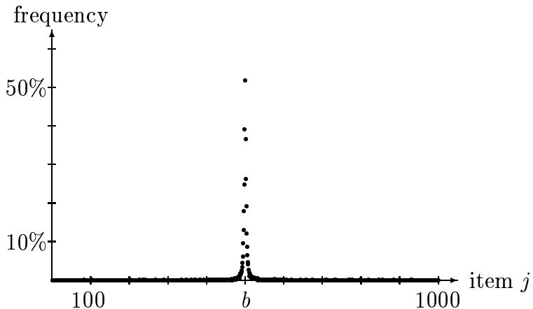  
Figure 4.1: Frequency of items $j$ where the optimal solution $\boldsymbol { x } _ { j } ^ { * }$ differ from the break solution $\boldsymbol { x } _ { j } ^ { \prime }$ . Average of 1000 instances.

As long as we only consider variables in the core, this ordering is just as satisfying as a complete ordering of the items. Starting with $[ s , t ] = [ b , b ]$ we will enumerate all partial vectors in the core and alternately expand the core to the left and to the right. The set of partial vectors at any step is given by

$$
X _ { s , t } = \left\{ \begin{array} { l } { ( x _ { s } , \ldots , x _ { t } ) { \mathrm { ~ : ~ } } x _ { s } , \ldots , x _ { t } \in \{ 0 , 1 \} } \end{array} \right\} ,
$$

but we will use some dominance and upper bound tests to fathom unpromising branches. The enumeration of the core has time complexity $O ( 2 ^ { t - s + 1 } )$ , so any effort possible should be used to avoid inclusion of new variables to the core. We have chosen to use an upper bound test for this purpose, fathoming a variable if the corresponding upper bound does not exceed the current lower bound $z$ . A strong upper bound $\tilde { u }$ is used for this test (Pisinger [68]), and since all coefficients are integers, we may fathom the variable if $\tilde { u }$ is less than $z + 1$ .

The sorting of the variables according to nonincreasing efficiencies is much less complex, having an average execution time of $O ( n \log n )$ . Still, quite a lot of computational effort may be saved by using an upper bound test with a cheaply evaluated bound, to fathom unpromising variables before the sorting. For this purpose we have chosen the bound by Dembo and Hammer [14] which can be evaluated in constant time, giving the reduction algorithm a complexity of $O ( n )$ . This bound will be denoted the weak upper bound.

Since all these reductions are done by need, we use the following intervals to denote enumerated, sorted and reduced intervals (cf. Figure 4.2):

• $[ s ^ { \prime \prime } , t ^ { \prime \prime } ]$ is the interval of variables which have been tested by an upper bound test to decide whether a change in the corresponding solution variable $x _ { j }$ may lead to an improved solution.

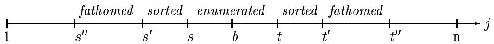  
Figure 4.2: The intervals $[ s , t ]$ , $[ s ^ { \prime } , t ^ { \prime } ]$ and $[ s ^ { \prime \prime } , t ^ { \prime \prime } ]$ .

• $[ s ^ { \prime } , t ^ { \prime } ]$ is the subset of variables in $[ s ^ { \prime \prime } , t ^ { \prime \prime } ]$ which have weak upper bound larger than the current lower bound $z$ The variables in $[ s ^ { \prime } , t ^ { \prime } ]$ are ordered according to nonincreasing efficiencies.

: $[ s , t ]$ detrmines thecore, i varables whic have bee eer o $X _ { s , t }$

We have $[ s , t ] \subseteq [ s ^ { \prime } , t ^ { \prime } ] \subseteq [ s ^ { \prime \prime } , t ^ { \prime \prime } ]$ , and note that the intervals $[ s ^ { \prime \prime } , s ^ { \prime } - 1 ]$ and $[ t ^ { \prime } + 1 , t ^ { \prime \prime } ]$ contains fathomed variables. With these definitions we may sketch the main algorithm as:

minknap $( n , c , p , w , x )$   
Find break item $b$ through partial sorting.   
Set $[ s , t ] : = [ b , b ] ; [ s ^ { \prime } , t ^ { \prime } ] : = [ b , b ] ; [ s ^ { \prime \prime } , t ^ { \prime \prime } ] : = [ b , b ]$ .   
Let the lower bound be $z : = 0$ and set $X _ { s , t } : = \{ ( 0 ) , ( 1 ) \}$ .   
Reduce the set $X _ { s , t }$ .   
while $( \boldsymbol { X } _ { s , t } \ne \boldsymbol { \emptyset } )$ do Set $s : = s - 1$ . if $\tilde { u } ( s ) \geq z + 1$ then $X _ { s , t } : = X _ { s + 1 , t } + s$ f Reduce the set $X _ { s , t }$ . Set $t : = t + 1$ . if $\tilde { u } ( t ) \geq z + 1$ then $X _ { s , t } : = X _ { s , t - 1 } + t$ fi Reduce the set $X _ { s , t }$ .   
elihw   
Define the solution vector through repeated backtracking.

The first step of the MinkNAP algorithm is to find the break item $b$ through partial sorting, which also returns some intervals $H = \{ H _ { 1 } , \ldots , H _ { h } \}$ and $L = \{ L _ { 1 } , . . . , L _ { l } \}$ of partially ordered variables, where variables in $H _ { j }$ have higher efficiency than $e _ { b }$ while variables in $L _ { j }$ have lower eficiency. This algorithm will be explained further in Section 4.2. After some initializations, we repeatedly include a new variable $s$ or $t$ to the core, thus obtaining a larger set $X _ { s , t } = X _ { s + 1 , t } + s$ or $X _ { s , t } = X _ { s , t - 1 } + t$ This dynamic programming recursion will be described in Section 4.3. After each inclusion of a new variable in $X _ { s , t }$ we use some upper bound tests, to fathom unpromising states $\mathbf { x } _ { j } \in X _ { s , t }$ . The upper bounds involved are obtained through linear relaxations of variables $s$ and $t$ , and since these variables may fall outside the sorted set $[ s ^ { \prime } , t ^ { \prime } ]$ , we will expand the core in such cases. This will be explained in the second part of Section 4.3. We use the strong upper bound test, to determine whether a new variable $s$ or $t$ should be added to the core. The strong upper bound $\tilde { u }$ is described in Section 4.5, where we also give a thumb-rule for when it is worth evaluating the bound. Finally the solution vector $x ^ { * }$ is defined: Since millions of states are considered in the dynamic programming, we cannot store all of these, and thus need a more compact way of representing the solution vector, as discussed in Section 4.6.

# 4.2 A partitioning algorithm for finding the break item

Balas and Zemel [4] showed that the break item $b$ may be found in $O ( n )$ time through a partitioning algorithm, and Martello and Toth [53] improved this algorithm for finding an approximate core of certain size. However both of the algorithms only divides the items in three intervals satisfying (4.4) where we for our purpose are interested in a more detailed partial ordering. Thus we apply the technique presented in Pisinger [75]:

A complete sorting of the variables according to nonincreasing efficiencies $e _ { j }$ may be done in $O ( n \log n )$ by a sorting algorithm like QuICksORT [32]. The QuICksORT algorithm repeatedly picks a middle value $\lambda$ from the interval $I = [ f , l ]$ , and partition the interval in two parts $[ f , i - 1 ]$ and $[ i , l ]$ , so that

$$
\begin{array} { r l } & { e _ { j } \geq \lambda , \quad j \in [ f , i - 1 ] , } \\ & { e _ { j } \leq \lambda , \quad j \in [ i , l ] . } \end{array}
$$

Initially $[ f , l ]$ is chosen as $[ 1 , n ]$ , and the interval is then repeatedly partitioned in smaller parts, till a complete sorting has been achieved. Since we only need the partial ordering (4.4) for an initial core $[ s , t ] = [ b , b ]$ , several of these iterations may be discarded. Any interval $[ f , i - 1 ]$ in (4.6) with $\begin{array} { r } { \sum _ { j = 1 } ^ { i - 1 } w _ { j } \le c } \end{array}$ may be discarded since $b$ cannot be in the erval a $[ i , l ]$ in (4.7) may be discarded if $\textstyle \sum _ { j = 1 } ^ { i - 1 } w _ { j } > c$ The discarded intervals represent a partial ordering of $[ 1 , n ]$ , and thus we add the end points to two lists $H = \{ H _ { 1 } , \ldots , H _ { h } \}$ and $L = \{ L _ { 1 } , . . . , L _ { l } \}$ . Upon termination these intervals are ordered as indicated in Figure 4.3, and we have

$$
\begin{array} { r l r } & { } & { \forall i \in H _ { k } \ \forall j \in H _ { k + 1 } : \ e _ { i } \geq e _ { j } , k = 1 , \ldots , h - 1 , } \\ & { } & { \forall i \in L _ { k } \ \forall j \in L _ { k + 1 } : \ e _ { i } \geq e _ { j } , k = 1 , \ldots , l - 1 . } \end{array}
$$

If $\lambda$ in each iteration is chosen as the exact median of the values in $[ f , l ]$ , then the break item $b$ may be found in $O ( n )$ time. However better average performance is obtained, by choosing $\lambda$ as the median of some of the values in $[ f , l ]$ . In the MINKNAP algorithm we choose $\lambda$ as the exact median of $\sqrt { l - f }$ randomly chosen items in $[ f , l ]$ for large intervals $( l - f \ge 1 0 0 )$ while $\lambda$ for small intervals is chosen as the median of three elements. This technique saves up to $3 0 \%$ of the computing time compared to [75].

Notice that if the discarded intervals in $H$ and $L$ need to be sorted completely later in the algorithm, then we still have not used any more computational effort, than by performing a complete sorting from the beginning.

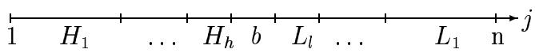  
Figure 4.3: The lists $H$ and $L$ of discarded intervals.

# 4.3 A dynamic programming algorithm

A traditional dynamic programming algorithm, as presented by Bellman [5] builds the optimal solution from scratch by repeatedly adding a new item to the problem. A more efficient recursion should however take into account, that generally only a few items around $b$ need to be changed from their LP-optimal values in order to obtain the IP-optimal values. Thus assume that the items at any stage of the process satisfy the ordering (4.4), and let $f _ { s , t } ( \tilde { c } ) , \ ( s \leq b , \ t \geq b - 1 , \ 0 \leq \tilde { c } \leq 2 c )$ be an optimal solution to the core problem:

$$
f _ { s , t } ( \tilde { c } ) = \operatorname* { m a x } \left\{ \begin{array} { l l } { \sum _ { j = 1 } ^ { s - 1 } p _ { j } + \sum _ { j = s } ^ { t } p _ { j } x _ { j } : } \\ { \sum _ { j = 1 } ^ { s - 1 } w _ { j } + \sum _ { j = s } ^ { t } w _ { j } x _ { j } \le \tilde { c } , } \\ { x _ { j } \in \{ 0 , 1 \} \mathrm { ~ f o r ~ } j = s , \ldots , t } \end{array} \right\} .
$$

We may use the following recursion for the enumeration

$$
f _ { s , t } ( \tilde { c } ) = \operatorname* { m a x } \left\{ \begin{array} { l l } { f _ { s , t - 1 } ( \tilde { c } ) } & { \mathrm { ~ i f ~ } t \geq b } \\ { f _ { s , t - 1 } ( \tilde { c } - w _ { t } ) + p _ { t } } & { \mathrm { ~ i f ~ } t \geq b , \ \tilde { c } - w _ { t } \geq 0 } \\ { f _ { s + 1 , t } ( \tilde { c } ) } & { \mathrm { ~ i f ~ } s < b } \\ { f _ { s + 1 , t } ( \tilde { c } + w _ { s } ) - p _ { s } } & { \mathrm { ~ i f ~ } s < b , \ \tilde { c } + w _ { s } \leq 2 c } \end{array} \right.
$$

setting

$$
\begin{array} { r l } & { f _ { b , b - 1 } ( \tilde { c } ) = - \infty \mathrm { f o r } \tilde { c } = 0 , \dots , \overline { { w } } - 1 , } \\ & { f _ { b , b - 1 } ( \tilde { c } ) = \overline { { p } } \qquad \mathrm { f o r } \tilde { c } = \overline { { w } } , \dots , 2 c , } \end{array}
$$

where $\begin{array} { r } { \overline { { p } } = \sum _ { j = 1 } ^ { b - 1 } p _ { j } } \end{array}$ and $\overline { { w } } = \textstyle \sum _ { j = 1 } ^ { b - 1 } w _ { j }$   
Thus the enumeration starts at $( \overset { \cdot } { s } , t ) = ( b , b - 1 )$ and continues by either removing an item $s$ from the knapsack, or inserting an item $t$ in the knapsack. An optimal solution to KP is found as $f _ { 1 , n } ( c )$ . Since generally far less states than $2 c$ need to be considered at each stage, we have modified the algorithm for dynamic programming by reaching, obtaining a time bound $O ( 2 ^ { t - s + 1 } )$ for enumerating a core $[ s , t ]$ , in combination with the pseudopolynomial time bound $O ( c ( t - s + 1 ) )$ .

The set of all partial vectors in the core $[ s , t ]$ is given by (4.5), but we will represent each undominated partial vector $\mathbf { x } _ { i } \in X _ { s , t }$ by a state $( \pi _ { i } , \mu _ { i } , v _ { i } )$ where $\pi _ { i } = f _ { s , t } ( \mu _ { i } )$ , and the vector $v _ { i }$ is a (not necessarily complete) representation of the binary vector $\mathbf { x } _ { i }$ . The set $X _ { s , t } = \{ ( \pi _ { 1 } , \mu _ { 1 } , v _ { 1 } ) , \ldots , ( \pi _ { m } , \mu _ { m } , v _ { m } ) \}$ is kept ordered according to increasing profit and weight sums $( \pi _ { i } < \pi _ { i + 1 }$ and $\mu _ { i } < \mu _ { i + 1 } \setminus$ in order to easily fathom dominated states. An iterative version of the dynamic programming algorithm is described in Pisinger [67], where it is shown that the recursion basically consists of merging two sets $X$ and $X + \ell$ , where $X + \ell$ is the set $X$ with item $\ell$ added or subtracted to/from all states.

Recursion (4.11) allows us to generate all undominated states in $X _ { s , t }$ , but we will delete unpromising states after each iteration as sketched in algorithm MiNkNAP. Unpromising states have an upper bound less than $z + 1$ , where $z$ is the current lower bound. For a state $i$ given by $( \pi _ { i } , \mu _ { i } , v _ { i } )$ we use the upper bound

$$
\begin{array} { r l r } { u ( i ) } & { = } & { \left\{ \begin{array} { l l } { u _ { 1 } ( i ) } & { = } & { \pi _ { i } + \frac { \left( c - \mu _ { i } \right) p _ { t + 1 } } { w _ { t + 1 } } \mathrm { i f } \mu _ { i } \le c , } \\ { u _ { 2 } ( i ) } & { = } & { \pi _ { i } + \frac { \left( c - \mu _ { i } \right) p _ { s - 1 } } { w _ { s - 1 } } \mathrm { i f } \mu _ { i } > c , } \end{array} \right. } \end{array}
$$

which has been obtained by relaxing the integrality constraints on $x _ { s - 1 }$ and $x _ { t + 1 }$ to $x _ { s - 1 } \geq$ 0 and $x _ { t + 1 } \geq 0$ . Since $s - 1$ or $t + 1$ may fall outside the current reduced and sorted interval $[ s ^ { \prime } , t ^ { \prime } ]$ , we have to extend the core in such cases. This is done the following way:

If $s - 1 < s ^ { \prime }$ and all intervals $H$ have been reduced, then the core cannot be expanded further to the left, thus we choose $p _ { s - 1 } = \infty$ and $w _ { s - 1 } = 1$ for the bound (4.13). Similarly if $t + 1 > t ^ { \prime }$ and all intervals $L$ have been reduced we choose $p _ { t + 1 } = 0$ and $w _ { t + 1 } = 1$ . In both cases the bounds will ensure that states which cannot be improved further are fathomed.

Otherwise choose an appropriate interval $H _ { h }$ or $L _ { l }$ , and reduce the concerned variables through a (weak) upper bound test. This test will be described in the next section.

If all variables in $H _ { h }$ or $L _ { l }$ have been fathomed through the upper bound test, we can choose any variable from the concerned interval as $s - 1$ resp. $t + 1$ in the reduction (4.13). Otherwise the remaining variables are ordered according to nonincreasing efficiencies and added to the set of sorted variables $[ s ^ { \prime } , t ^ { \prime } ]$ . Equation (4.13) may then be used directly.

The bound (4.13) may also be used for deriving a global upper bound on KP. Since any optimal solution must follow a branch in $X _ { s , t }$ , the global upper bound corresponds to the upper bound of the most feasible branch in $X _ { s , t }$ . Therefore a global upper bound on KP is given by

$$
u _ { \mathrm { K P } } \ = \ \operatorname* { m a x } _ { i \in X } u ( i ) .
$$

Since the efficiency of item $t + 1$ will be decreasing during the solution process, and the efficiency of $s - 1$ will be increasing, $u _ { \mathrm { K P } }$ will become more and more tight as the core gradually is extended. For $( s , t ) = ( 1 , n )$ we get $u _ { \mathrm { K P } } = z$ for the optimal solution $z$ .

# 4.4 Weak reduction

Assume that the solution vector $x$ corresponding to the current lower bound $z$ has been saved. If an upper bound on KP with the additional constraint $x _ { j } ~ = ~ 0$ , $j ~ < ~ b$ (resp. $x _ { j } = 1$ , $j \geq b$ ) is less than $z + 1$ we may conclude that the branch $x _ { j } = 0$ (resp. $x _ { j } = 1$ ) will never lead to an improved solution, and can thus fix $x _ { j }$ at 1 (resp. 0). Thus let $u _ { j } ^ { 0 }$ $( \mathrm { r e s p . ~ } u _ { j } ^ { 1 } )$ be an upper bound on KP with the additional constraint $x _ { j } = 0$ (resp. $x _ { j } = 1$ ). Using the bounds by Dembo and Hammer [14] we get

$$
\begin{array} { r l r l } { { u _ { j } ^ { 0 } } } & { = } & { \overline { { p } } - p _ { j } + \frac { \left( r + w _ { j } \right) p _ { b } } { w _ { b } } , \qquad } & & { j = 1 , \dots , b - 1 , } \\ { { u } _ { j } ^ { 1 } } & { = } & { \overline { { p } } + p _ { j } + \frac { \left( r - w _ { j } \right) p _ { b } } { w _ { b } } , \qquad } & & { j = b , \dots , n , } \end{array}
$$

where $\overline { { p } }$ is the profit sum $\textstyle \sum _ { i = 1 } ^ { b - 1 } p _ { i }$ and $r$ is the residual capacity $c - \textstyle \sum _ { i = 1 } ^ { b - 1 } w _ { i }$ The Dembo and Hammer bound is not so tight, but it only demands the partial ordering (4.4) and it can be evaluated in constant time, thus the reduction has complexity $O ( n )$ which is lower than the complexity of a sorting of the items. Since the reduction is performed dynamically throughout the solution process, and not like in traditional algorithms as a part of the preprocessing, we may expect that a better lower bound is found during the enumeration, thus somehow compensating for the weakness.

For a given interval $[ f , l ]$ from $H _ { h }$ or $L _ { l }$ we test whether $u _ { j } ^ { 0 } < z + 1$ (resp. $u _ { j } ^ { 1 } < z + 1 )$ for each item $j$ . Is this the case, we swap item $j$ past the end of $[ s ^ { \prime \prime } , t ^ { \prime \prime } ]$ and extend the interval correspondingly. Otherwise item $j$ is swapped to a position past the end of $[ s ^ { \prime } , t ^ { \prime } ]$ . Finally the the extended set $[ s ^ { \prime } , s - 1 ]$ or $[ t + 1 , t ^ { \prime } ]$ is sorted.

# 4.5 Strong upper bound

Since the addition of a new item $\ell$ to the core is computationally very expensive, a strong upper bound test should be used for checking whether the inclusion seems promising. The ultimate check is to determine whether any states in $X + \ell$ will pass the reduction (4.13). For each possible fathoming test (4.13), this is the strongest possible upper bound for reducing item $\ell$ , since if the inclusion of $\ell$ to the core implies that a new promising branch is introduced to $X _ { s , t }$ , clearly we cannot ommit $\ell$ .

A state $i$ in $X + \ell$ is the sum $( \pi _ { i } + \tilde { p } , \mu _ { i } + \tilde { w } , v _ { i } \cup \{ \ell \} )$ of the corresponding state $i$ in $X$ and the variable $\ell$ (added or subtracted), so an upper bound for the state is

$$
\begin{array} { r l r } { \tilde { u } ( i ) } & { = } & { \left\{ \begin{array} { l l } { \tilde { u } _ { 1 } ( i ) } & { = } & { ( \pi _ { i } + \tilde { p } ) + \frac { \big ( c - \mu _ { i } - \tilde { w } \big ) p _ { t + 1 } } { w _ { t + 1 } } \mathrm { i f } \mu _ { i } + \tilde { w } \leq c , } \\ { \tilde { u } _ { 2 } ( i ) } & { = } & { ( \pi _ { i } + \tilde { p } ) + \frac { \big ( c - \mu _ { i } - \tilde { w } \big ) p _ { s - 1 } } { w _ { s - 1 } } \mathrm { i f } \mu _ { i } + \tilde { w } > c , } \end{array} \right. } \end{array}
$$

where we simply have used (4.13) for the set $X + \ell$ . An upper bound for the inclusion of variable $\ell$ into the core is thus given by

$$
\begin{array} { r } { \tilde { u } _ { \ell } = \underset { i \in { \cal { X } } } { \operatorname* { m a x } } \tilde { u } ( i ) . } \end{array}
$$

This bound may be recognized as the $\pi$ -bound presented in Pisinger [68], which again is a generalization of the enumerative bound presented in Martello and Toth [53]. Note that the functions $\tilde { u } _ { 1 }$ and $\tilde { u } _ { 2 }$ may be written

$$
\begin{array} { r } { \tilde { u } _ { 1 } ( i ) = u _ { 1 } ( i ) \ + \ \tilde { p } - \frac { \tilde { w } p _ { t + 1 } } { w _ { t + 1 } } , } \\ { \tilde { u } _ { 2 } ( i ) = u _ { 2 } ( i ) \ + \ \tilde { p } - \frac { \tilde { w } p _ { s - 1 } } { w _ { s - 1 } } , } \end{array}
$$

where $u _ { 1 } ( i )$ and $u _ { 2 } ( i )$ are the upper bounds of state $i \in X$ as given by (4.13).

Proposition 4.1 The bound $\tilde { u } _ { \ell }$ exceeds the lower bound $z$ if and only if a state in $X + \ell$ will pass the reduction (4.13).

Proof Assume that $\tilde { u } _ { \ell } = a$ with $a \geq z + 1$ . Since $\tilde { u } _ { \ell }$ is the maximum of bounds (4.16), choose the state $i \in X$ which satisfies $\tilde { u } ( i ) = a$ . The state $j \in X + \ell$ , which is obtained by adding variable $\ell$ to $i$ , will also have upper bound $a \ge z + 1$ , meaning that it passes the fathoming test (4.13).

Contrary, if a state $j$ in $X + \ell$ passes the fathoming test (4.13), its upper bound must exceed $z$ , thus forcing the bound $\tilde { u } _ { \ell }$ to exceed $z$ .

Unfortunately the complexity of determining $\tilde { u } _ { \ell }$ is $O ( m )$ , where $m$ is the number of states in $X _ { s , t }$ , meaning that the computational effort for deriving the strong upper bound corresponds to the computational effort of including variable $\ell$ to the core. Therefore we will only evaluate the bound if there is a good chance of fathoming the concerned variable.

Note that $( \tilde { p } , \tilde { w } )$ corresponds to $( p _ { t + 1 } , w _ { t + 1 } )$ or $( - p _ { s - 1 } , - w _ { s - 1 } )$ since we are testing the inclusion of variable $t + 1$ or $s - 1$ . So in the first case we have $\tilde { u } _ { 1 } ( i ) = u _ { 1 } ( i )$ and in the second $\tilde { u } _ { 2 } ( i ) = u _ { 2 } ( i )$ , which may be verified by inserting $\tilde { p } , \tilde { w }$ in (4.18). Since $u _ { 1 } ( i ) \geq z + 1$ and $u _ { 2 } ( i ) \geq z + 1$ due to the fathoming $\mathrm { t e s t } ( 4 . 1 3 )$ , the bound $\tilde { u } _ { \ell }$ can only be less than $z + 1$ if the sets $\{ i \in X _ { s , t } \ : \ \mu _ { i } + w _ { t + 1 } \leq c \}$ , respectively $\{ i \in X _ { s , t } ~ : ~ \mu _ { i } - w _ { s - 1 } > c \}$ are empty. We have shown the following proposition:

Proposition 4.2 If $\ell = t + 1$ and $\mu _ { 1 } \leq c - w _ { t + 1 }$ then $\tilde { u } _ { \ell } \ge z + 1$ .If $\ell = s - 1$ and $\mu _ { m } > c + w _ { s - 1 }$ then $\tilde { u } _ { \ell } \geq z + 1$ .

Computational experience show, that if the criteria in Proposition 4.2 do not hold, then $\tilde { u } _ { \ell } < z + 1$ in more than $7 0 \%$ of the cases. Therefore the evaluation of $\tilde { u } _ { \ell }$ in such cases is worth the effort, since we generally may fathom the concerned variable.

# 4.6 Finding the solution vector

According to Bellmans [5] classical description of dynamic programming, the optimal solution vector $x ^ { * }$ may be found by backtracking through the sets of states. But this technique means that all sets of states should be saved during the solution process. In the computational experience it is demonstrated that the number of states may be over 2.5 millions in each iteration of (4.11). With $n = 1 0 0 0 0 0$ as a measure for the number of iterations, we would need to store billions of states, so another strategy had to be chosen. A promising approach seems to be, that only the last $a$ changes in the solution vector are saved in the state variable $v$ . In our implementation we chose $a = 3 2$ .

Assume that $v$ consists of $a$ indices of the items, that were added or subtracted to the corresponding state in recursion (4.11). Whenever we find an improved solution in $X _ { s , t }$ , the best state $( \mu , \pi , v )$ is saved. When the algorithm terminates, all variables are set to the break solution $x _ { j } = 1$ for $j = 1 , \dots , b - 1$ and $x _ { j } = 0$ for $j = b , \dots , n$ . Then we make the changes registered in $v$ .

$$
\begin{array} { l } { { \displaystyle x _ { j } = 1 - x _ { j } \mathrm { f o r } j \in v , } } \\ { { \displaystyle \pi ^ { \prime } = \pi + \sum _ { j \in v , \ j < b } p _ { j } - \sum _ { j \in v , \ j \geq b } p _ { j } , } } \\ { { \displaystyle \mu ^ { \prime } = \mu + \sum _ { j \in v , \ j < b } w _ { j } - \sum _ { j \in v , \ j > b } w _ { j } . } } \end{array}
$$

If the backtracked profit and weight sums $\pi ^ { \prime }$ , $\mu ^ { \prime }$ correspond to the profit and weight sums ${ \overline { { p } } } , \ \varpi$ of the break solution, we know that the obtained vector is correct. Otherwise we solve a new KP, this time with capacity $c = \mu ^ { \prime }$ , lower bound $z = \pi ^ { \prime } - 1$ , and global upper bound $u = \pi ^ { \prime }$ . The process is repeated until the solution vector $x$ is completely defined.

This technique has proved very efficient, since generally only a few iterations are needed. A maximum of 16 iterations has been observed for large strongly correlated data instances, but otherwise one or two iterations suffice. In the worst case $1 2 \%$ of the solution time was used for reconstructing the solution vector. Compared to saving all states on an external device (which is hundreds of times slower than the main memory) it is considerably more efficient to re-evaluate the states.

# 4.7 Minimality

We end this presentation by showing some minimality properties of the MINkNAP algorithm. For the following discussion assume that an ordering of the items has been chosen, such that ties are broken in a uniform way. Thus we have

$$
e _ { 1 } \geq e _ { 2 } \geq . . . \geq e _ { n } .
$$

Among all current algorithms that solve some kind of core problem, the algorithm by Martello and Toth [52] is the most efficient. It may be sketched as follows:

# Enumerative core algorithm

1 Given a core $[ s , t ]$ , satisfying the ordering (4.4).   
2 Solve the core problem through enumeration, obtaining a lower bound $z$ .   
3 Let $u _ { \mathrm { K P } }$ be an upper bound on the states $X _ { s , t }$ given by (4.14).   
4 If $u _ { \mathrm { K P } } \leq z$ then stop.   
5 Reduce the items, by using upper bound tests to fix variables at their optimal values.   
6 If all the items were reduced then stop.   
7 Sort remaining items, and solve the problem through enumeration.

The algorithm by Balas and Zemel [4] is weaker than the above algorithm, as it does not enumerate the core completely in Step 2, and since it is missing the termination rule in Step 4. Also the algorithm by Pisinger [75] is weaker, as there is no way of limiting the enumeration to an interval $[ s , t ]$ . Finally the algorithm by Fayard and Plateau [24] is weaker than the above framework, as it only use the break item $b$ for deriving upper and lower bounds, thus it may be seen as an algorithm enumerating a core $C = [ b , b ]$ .

We will denote algorithms following the above framework by enumerative core algorithms, and thus we say that a core problem $[ s , t ]$ is enumeratively solvable if an enumerative core algorithm will stop before the last exhaustive search is performed in Step 7.

Definition 4.1 A core $C = [ s , t ]$ is minimal, if it is the smallest interval of items, satisfying the ordering (4.4), such that the corresponding core problem is enumeratively solvable. Thus

$$
C _ { \mathrm { m i n } } = \operatorname* { m i n } _ { s , t } \left\{ \begin{array} { l l } { t - s + 1 : \mathrm { T h e ~ c o r e } \left[ s , t \right] \mathrm { { \ i s ~ e n u m e r a t i v e l y ~ s o l v a b l e } } } \end{array} \right\} .
$$

Proposition 4.3 The MINkNAP algorithm enumerates at most the smallest symmetrical core $[ s , t ]$ which is enumeratively solvable.

Proof The core is symmetrical since the MINkNAP algorithm always extends the core in a symmetrical way. Assume that $[ s , t ]$ is the smallest symmetrical core which is enumeratively solvable, meaning that an enumerative core algorithm will terminate in Step 4 or 6. We want to prove that MINkNAP also will terminate when reaching $C = [ s , t ]$ . Notice that for $C = [ s , t ]$ , the MINkNAP algorithm will hold the same lower bound $z$ as derived in Step 2 of an enumerative core algorithm.

If the enumerative core algorithm terminates in Step 4, then

$$
u _ { \mathrm { K P } } = \operatorname* { m a x } _ { i \in X _ { s , t } } u ( i ) \leq z .
$$

But this means that when the MINkNAP algorithm reaches the core $[ s , t ]$ then all states $i \in X _ { s , t }$ will be fathomed due to the reduction rule (4.13). Thus algorithm MINkNAP will terminate immediately after reaching this core.

If the enumerative core algorithm terminates in Step 6, then the reduction phase in Step 5 fathomed all items, meaning that

$$
\begin{array} { r } { u _ { j } ^ { 0 } < z + 1 \quad \mathrm { f o r } \quad j = 1 , \dots , s - 1 , } \\ { u _ { j } ^ { 1 } < z + 1 \quad \mathrm { f o r } \quad j = t + 1 , \dots , n , } \end{array}
$$

where Martello and Toth use the so-called Martello-Toth upper bound for this reduction [46]. But the strong upper bound $\tilde { u } _ { j }$ given by (4.17) hold the Martello-Toth upper bound as a special case with $X _ { s , t } = X _ { b , b }$ , thus $\tilde { u } _ { j } \ \le \ u _ { j } ^ { 0 }$ for $j = 1 , \dots , s - 1$ and $\tilde { u } _ { j } \ \le u _ { j } ^ { 1 }$ for $j = t + 1 , \ldots , n$ . This implies that all items $j = 1 , \dots , s - 1$ and $j = t + 1 , . . . , n$ will be fathomed by the strong upper bound, meaning that the MINkNAP algorithm will not enumerate any items outsides $[ s , t ]$ .

Note that when we derive the Martello-Toth upper bound for item $j$ then $b$ is given as the break item for (4.1) with additional constraint $x _ { j } = 0$ resp. $x _ { j } = 1$ . But for any value of $b \in [ s , t ]$ , still $\tilde { u } _ { j }$ is tighter than the Martello-Toth upper bound.

Actually the MINkNAP algorithm generally enumerates fewer items than those in the smallest symmetrical core which is enumeratively solvable, as some of the items in $[ s , t ]$ may be fathomed by the strong reduction during the solution process. In addition we notice, that there is no obvious better choice of a core than a symmetrical one, since knowing in which direction we should focus the search demands some knowledge on the optimal solution vector, which we obviously do not have.

On the other hand, we have applied the fact that a unique ordering (4.20) has been chosen. Thus in general Proposition 4.3 only holds when we look apart from permutations of items with same efficiency. This is of minor significance for problems with no correlation between the profits and weights, as most items will have distinct efficiencies, but for the so-called Subset-sum Problems where $p _ { j } = w _ { j }$ , Proposition 4.3 is closely related to the chosen ordering.

Finally we notice that if an enumerative core algorithm is extended with tighter bounds, as recently has been done in Martello and Toth [55], these may simply be incorporated in the MINkNAP algorithm, such that a minimal core still may be obtained.

The sorting and reduction effort is also limited in algorithm MINkNAP, as we only do these operations by need. Actually we have established a hierarchy between the individual operations according to the involved complexity:

1 Highest priority is given to a minimal core size, as enumerating the core demands $O ( 2 ^ { t - s + 1 } )$ operations.   
2 Applying the strong upper bound has second priority, as determining $\tilde { u }$ has complexity $O ( m )$ .   
3 The sorting has complexity $O ( n \log n )$ thus this part has third priority.   
4 Reducing the items with the Dembo-and-Hammer bound may be done in linear time, thus this part has lowest priority.

For each of the above operations, we make least possible effort, as the operations only are performed when it cannot be avoided, and the individual operations are performed such that an item only is considered at level $k$ when it passed all lower levels of the hierarchy.

# 4.8 Computational experience

The presented algorithm has been implemented in ANSI-C, and a complete listing is available from the author on request. The following results have been achieved on a HP9000/730 computer using the standard HP-UX C compiler with option -O (optimization).

We will consider how the algorithm behaves for different problem sizes, instance types, and data ranges. Four types of randomly generated data instances are considered as sketched below. Each type will be tested with data range $R = 1 0 0 , 1 0 0 0$ and 10 000 for different problem sizes $n$ . The capacity $c$ is always chosen as half of the total weight sum $\begin{array} { r } { c = { \frac { 1 } { 2 } } \sum _ { j = 1 } ^ { n } w _ { j } } \end{array}$ Fo a instance, e choose $w _ { j }$ randomly in $[ 1 , R ]$ , while $p _ { j }$ is chosen according to the specific instance type. Uncorrelated data instances are generated by chosing $p _ { j }$ randomly in $[ 1 , R ]$ . Weakly correlated data instances choose $p _ { j }$ randomly distributed in $[ w _ { j } - R / 1 0 , w _ { j } + R / 1 0 ]$ such that $p _ { j } \geq 1$ . Strongly correlated data instances have $p _ { j } = w _ { j } + 1 0$ , and finally Subset-sum data instances have $p _ { j } = w _ { j }$ .

For each instance type, size and range, we construct and solve 50 different data instances. The presented results are average values or extreme values. If a problem was not solved within 24 hours, this is indicated by a "—" in the tables. We will compare the computing times of mINkNAP to the MT2 algorithm by Martello and Toth [52]. The code for MT2 was obtained from [53], in which MT2 also is compared to several algorithms for KP, showing that MT2 outperforms any of these. The MT2 code was compiled using the standard HP-UX FORTRAN compiler with option -O (optimization).

Table I: Final core size (number of items). Average of 50 instances.   

<table><tr><td>n\R</td><td colspan="3">Uncorrelated</td><td colspan="3">Weakly correlated</td><td colspan="3">Strongly correlated</td><td colspan="3">Subset sum</td></tr><tr><td></td><td>100</td><td>1000</td><td>10000</td><td>100</td><td>1000</td><td>10 000</td><td>100</td><td>1000</td><td>10 000</td><td>100</td><td>1000</td><td>10 000</td></tr><tr><td>100</td><td>7</td><td>8</td><td>9</td><td>8</td><td>14</td><td>15</td><td>35</td><td>41</td><td>47</td><td>8</td><td>11</td><td>15</td></tr><tr><td>300</td><td>8</td><td>11</td><td>13</td><td>8</td><td>17</td><td>20</td><td>132</td><td>140</td><td>112</td><td>8</td><td>11</td><td>15</td></tr><tr><td>1000</td><td>7</td><td>16</td><td>17</td><td>8</td><td>16</td><td>25</td><td>428</td><td>384</td><td>386</td><td>7</td><td>11</td><td>15</td></tr><tr><td>3000</td><td>7</td><td>17</td><td>21</td><td>7</td><td>14</td><td>29</td><td>1105</td><td>1120</td><td>1270</td><td>8</td><td>12</td><td>14</td></tr><tr><td>10000</td><td>10</td><td>15</td><td>27</td><td>8</td><td>12</td><td>30</td><td>4119</td><td>3662</td><td>4003</td><td>8</td><td>12</td><td>15</td></tr><tr><td>30000</td><td>23</td><td>11</td><td>29</td><td>7</td><td>13</td><td>26</td><td>11938</td><td>12768</td><td>11738</td><td>7</td><td>11</td><td>15</td></tr><tr><td>100000</td><td>34</td><td>12</td><td>27</td><td>8</td><td>13</td><td>18</td><td>37144</td><td>43420</td><td>39649</td><td>7</td><td>11</td><td>15</td></tr></table>

Table II: Exact core size (number of items). Average of 50 instances.   

<table><tr><td rowspan="2">n\R</td><td colspan="3">Uncorrelated</td><td colspan="3">Weakly correlated</td><td colspan="3">Strongly correlated</td><td colspan="3">Subset sum</td></tr><tr><td>100</td><td>1000</td><td>10000</td><td>100</td><td>1000</td><td>10 000</td><td>100</td><td>1000</td><td>10000</td><td>100</td><td>1000</td><td>10000</td></tr><tr><td>100</td><td>4</td><td>4</td><td>4</td><td>6</td><td>9</td><td>10</td><td>9</td><td>12</td><td>13</td><td>6</td><td>9</td><td>13</td></tr><tr><td>300</td><td>5</td><td>7</td><td>8</td><td>6</td><td>12</td><td>16</td><td>19</td><td>20</td><td>19</td><td>6</td><td>9</td><td>12</td></tr><tr><td>1000</td><td>5</td><td>10</td><td>11</td><td>6</td><td>12</td><td>18</td><td>36</td><td>33</td><td>33</td><td>6</td><td>9</td><td>13</td></tr><tr><td>3000</td><td>5</td><td>11</td><td>12</td><td>5</td><td>10</td><td>19</td><td>54</td><td>56</td><td>64</td><td>5</td><td>10</td><td>12</td></tr><tr><td>10000</td><td>8</td><td>11</td><td>17</td><td>6</td><td>10</td><td>20</td><td>106</td><td>105</td><td>113</td><td>6</td><td>9</td><td>12</td></tr><tr><td>30000</td><td>16</td><td>9</td><td>18</td><td>5</td><td>11</td><td>18</td><td>178</td><td>192</td><td>189</td><td>5</td><td>9</td><td>12</td></tr><tr><td>100000</td><td>25</td><td>10</td><td>17</td><td>6</td><td>10</td><td>14</td><td>462</td><td>365</td><td>359</td><td>5</td><td>9</td><td>12</td></tr></table>

First Table I shows the average core size for solving KP to optimality. The core size is measured as the number of items in $X _ { s , t }$ ,i.e. $\left( t - s + 1 \right)$ minus the variables fathomed by the strong upper bound test. For uncorrelated, weakly correlated and subset-sum data instances, the core size is very small, showing slight tendencies to grow with the data range. For strongly correlated data instances, the core size is large, since about half of the items must be considered in order to solve the problem.

These results should be compared to the exact core sizes given in Table II. Balas and Zemel [4] defined the exact core as the variables between first and last variable $\boldsymbol { x } _ { j } ^ { * }$ in the optimal solution which differ from the break solution $\boldsymbol { x } _ { j } ^ { \prime }$ . It is seen, that for uncorrelated, weakly correlated and subset-sum problems, our minimal core is of same magnitude as the exact core size. However for strongly correlated instances, the exact core size is generally small, but we need to enumerate considerably more items in order to prove optimality with an enumerative core algorithm. Thus although we somehow knew the exact core in advance, we would not be able to prove optimality by current techniques.

Next Table III shows the average percentage of items, which need to be tested by the weak upper bound in order to solve KP. The presented numbers are determined as $( t ^ { \prime \prime } - s ^ { \prime \prime } + 1 ) / n$ . We observe the interesting property, that large-sized uncorrelated, weakly correlated and subset-sum data instances generally can be solved without testing more than a few percent of the items for small data ranges $R = 1 0 0$ and $R = 1 0 0 0$ . On the other hand strongly correlated data instances, and all small-sized data instances need a complete testing of the variables.

Table IV gives the maximum number of states obtained in the solution process. For uncorrelated, weakly correlated and subset-sum data instances, less than 65 000 states are generated, indicating that the dynamic programming algorithm without complications may be applied on most computers. Strongly correlated data instances may involve more than 2.5 million states, which in our implementation takes up about $3 0 \mathrm { M b }$ RAM. The pseudopolynomial time bound of recursion (4.11) means that up to $2 c$ states should be saved at each stage, but as we use dynamic programming by reaching, this space bound is too pessimistic. Large sized strongly correlated instances actually consider far less than $1 \%$ of the $2 c$ states.

Table III: Percentage of all items which have been tested by the weak upper bound. Average of 50 instances.   

<table><tr><td rowspan="2">n\R</td><td colspan="3">Uncorrelated</td><td colspan="3">Weakly correlated</td><td colspan="3">Strongly correlated</td><td colspan="3">Subset sum</td></tr><tr><td>100</td><td>1000</td><td>10 000</td><td>100</td><td>1000</td><td>10000</td><td>100</td><td>1000</td><td>10 000</td><td>100</td><td>1000</td><td>10 000</td></tr><tr><td>100</td><td>79</td><td>93</td><td>96</td><td>55</td><td>100</td><td>99</td><td>79</td><td>94</td><td>93</td><td>50</td><td>58</td><td>66</td></tr><tr><td>300</td><td>65</td><td>96</td><td>97</td><td>20</td><td>96</td><td>99</td><td>88</td><td>97</td><td>86</td><td>27</td><td>44</td><td>51</td></tr><tr><td>1000</td><td>12</td><td>88</td><td>95</td><td>5</td><td>68</td><td>98</td><td>94</td><td>85</td><td>92</td><td>20</td><td>33</td><td>28</td></tr><tr><td>3000</td><td>5</td><td>74</td><td>96</td><td>2</td><td>22</td><td>94</td><td>78</td><td>81</td><td>95</td><td>11</td><td>16</td><td>20</td></tr><tr><td>10000</td><td>2</td><td>31</td><td>90</td><td>0</td><td>8</td><td>78</td><td>93</td><td>83</td><td>86</td><td>4</td><td>3</td><td>14</td></tr><tr><td>30000</td><td>2</td><td>7</td><td>85</td><td>1</td><td>2</td><td>38</td><td>87</td><td>85</td><td>86</td><td>10</td><td>5</td><td>7</td></tr><tr><td>100000</td><td>0</td><td>1</td><td>54</td><td>0</td><td>0</td><td>12</td><td>89</td><td>91</td><td>90</td><td>0</td><td>1</td><td>5</td></tr></table>

Finally Table V shows the average computing time for each of the considered data instances. It is seen, that easy data instances may be solved in a fraction of a second even if the number of variables is 100 000. Strongly correlated data instances demand considerably more computational effort, but are still solved within one hour of computation time on average.

This should be compared to the computing times for MT2 given in Table VI. It is seen, that MT2 is not able to solve strongly correlated data instances of large size, and moreover the algorithm has some anomalous occurrences for large uncorrelated and weakly correlated data instances. In these situations some instances could not be solved within 24 hours of computational time. A further study of this behavior is considered in [70]. Additional computational experiments with the MINkNAP algorithm may be found in Appendix A.

Table IV: Largest set of states in dynamic programming (in thousands). Maximum of 50 instances.   

<table><tr><td rowspan="2">n\R</td><td colspan="3">Uncorrelated</td><td colspan="3">Weakly correlated</td><td colspan="3">Strongly correlated</td><td colspan="3">Subset sum</td></tr><tr><td>100</td><td>1000</td><td>10 000</td><td>100</td><td>1000</td><td>10000</td><td>100</td><td>1000</td><td>10 000</td><td>100</td><td>1000</td><td>10000</td></tr><tr><td>100</td><td>0</td><td>0</td><td>0</td><td>0</td><td>0</td><td>0</td><td>1</td><td>8</td><td>78</td><td>0</td><td>6</td><td>63</td></tr><tr><td>300</td><td>0</td><td>0</td><td>0</td><td>0</td><td>1</td><td>1</td><td>1</td><td>14</td><td>148</td><td>1</td><td>5</td><td>53</td></tr><tr><td>1000</td><td>0</td><td>1</td><td>1</td><td>1</td><td>2</td><td>3</td><td>3</td><td>25</td><td>287</td><td>0</td><td>5</td><td>55</td></tr><tr><td>3000</td><td>0</td><td>1</td><td>1</td><td>0</td><td>4</td><td>7</td><td>4</td><td>45</td><td>425</td><td>0</td><td>5</td><td>60</td></tr><tr><td>10000</td><td>0</td><td>3</td><td>6</td><td>1</td><td>5</td><td>12</td><td>8</td><td>74</td><td>764</td><td>0</td><td>6</td><td>52</td></tr><tr><td>30000</td><td>2</td><td>4</td><td>9</td><td>0</td><td>11</td><td>32</td><td>15</td><td>130</td><td>1407</td><td>0</td><td>6</td><td>55</td></tr><tr><td>100000</td><td>4</td><td>4</td><td>19</td><td>0</td><td>27</td><td>65</td><td>37</td><td>250</td><td>2547</td><td>0</td><td>5</td><td>48</td></tr></table>

Table V: Total computing time in seconds (mInkNAP). Average of 50 instances.   

<table><tr><td rowspan="2">n\R</td><td colspan="3">Uncorrelated</td><td colspan="3">Weakly correlated</td><td colspan="3">Strongly correlated</td><td colspan="3">Subset sum</td></tr><tr><td>100</td><td>1000</td><td>10 000</td><td>100</td><td>1000</td><td>10 000</td><td>100</td><td>1000</td><td>10000</td><td>100</td><td>1000</td><td>10 000</td></tr><tr><td>100</td><td>0.00</td><td>0.00</td><td>0.00</td><td>0.00</td><td>0.00</td><td>0.00</td><td>0.00</td><td>0.03</td><td>0.44</td><td>0.00</td><td>0.00</td><td>0.06</td></tr><tr><td>300</td><td>0.00</td><td>0.00</td><td>0.00</td><td>0.00</td><td>0.00</td><td>0.00</td><td>0.02</td><td>0.18</td><td>1.63</td><td>0.00</td><td>0.01</td><td>0.06</td></tr><tr><td>1000</td><td>0.00</td><td>0.00</td><td>0.00</td><td>0.00</td><td>0.00</td><td>0.01</td><td>0.09</td><td>0.63</td><td>7.62</td><td>0.00</td><td>0.01</td><td>0.06</td></tr><tr><td>3000</td><td>0.00</td><td>0.01</td><td>0.01</td><td>0.00</td><td>0.01</td><td>0.03</td><td>0.24</td><td>2.30</td><td>42.89</td><td>0.00</td><td>0.01</td><td>0.06</td></tr><tr><td>10000</td><td>0.01</td><td>0.01</td><td>0.03</td><td>0.01</td><td>0.01</td><td>0.05</td><td>1.25</td><td>10.41</td><td>163.15</td><td>0.01</td><td>0.02</td><td>0.07</td></tr><tr><td>30000</td><td>0.03</td><td>0.03</td><td>0.07</td><td>0.03</td><td>0.03</td><td>0.08</td><td>3.19</td><td>43.28</td><td>496.47</td><td>0.05</td><td>0.04</td><td>0.10</td></tr><tr><td>100000</td><td>0.12</td><td>0.10</td><td>0.17</td><td>0.10</td><td>0.12</td><td>0.16</td><td>14.02</td><td>178.45</td><td>2208.10</td><td>0.11</td><td>0.12</td><td>0.20</td></tr></table>

Table VI: Total computing time in seconds (MT2). Average of 50 instances.   

<table><tr><td rowspan="2">n\R</td><td colspan="3">Uncorrelated</td><td colspan="3">Weakly correlated 1000</td><td rowspan="2" colspan="3">Strongly correlated 100 1000</td></tr><tr><td>100</td><td>1000</td><td>10000</td><td>100</td><td>10 000</td><td>10000 100</td><td>1000</td></tr><tr><td>100</td><td>0.00</td><td>0.00</td><td>0.00</td><td>0.00</td><td>0.00</td><td>0.01 2.78</td><td>2.68 21.16</td><td>0.00 0.00</td><td>0.01</td></tr><tr><td>300</td><td>0.00</td><td>0.00</td><td>0.00</td><td>0.00</td><td>0.00</td><td>0.01</td><td></td><td>0.00 0.00</td><td>0.02</td></tr><tr><td>1000</td><td>0.00</td><td>0.00</td><td>0.01</td><td>0.00</td><td>0.01</td><td>0.02</td><td></td><td>0.00 0.00</td><td>0.02</td></tr><tr><td>3000</td><td>0.00</td><td>0.01</td><td>0.02</td><td>0.00</td><td>0.01</td><td>0.07</td><td>0.00</td><td>0.00</td><td>0.02</td></tr><tr><td>10000</td><td>0.02</td><td>0.03</td><td>0.07</td><td>0.02</td><td>0.04</td><td>0.16</td><td></td><td>0.01 0.01</td><td>0.03</td></tr><tr><td>30000</td><td>2.47</td><td>0.07</td><td>0.20</td><td>0.05</td><td>0.61</td><td>0.26</td><td>0.03</td><td>0.03</td><td>0.05</td></tr><tr><td>100000</td><td></td><td>0.28</td><td>0.56</td><td>0.25</td><td></td><td>0.56</td><td>0.12</td><td>0.12</td><td>0.15</td></tr></table>

# 4.9 Conclusions

We have presented a complete algorithm for the exact solution of the 0-1 Knapsack Problem. The complexity of the presented MINkNAP algorithm is

$$
O ( n + \operatorname* { m i n } \{ 2 ^ { t - s + 1 } , \ c ( t - s + 1 ) \ \} ) ,
$$

which for small core sizes $| C | = t - s + 1$ results in linear solution times, while difficult problems, demanding a complete enumeration, are pseudopolynomially bounded. This time bound is strengthened by the fact, that the algorithm solves KP with a minimal symmetrical core, thus as the computational experiments demonstrate, several frequently occurring instances are actually solved in linear time. The pseudopolynomial time bound on the other hand implies that even strongly correlated instances may be solved in reasonable time.

It is interesting to compare the obtained results to previous work: Balas and Zemel [4] defined the core as the interval of sorted variables between first and last variable $\boldsymbol { x } _ { j } ^ { * }$ which differ from the break solution $\boldsymbol { x } _ { j } ^ { \prime }$ . Even if such a core could be obtained a priori it would not guarantee that optimality could be proved by any upper bound, so this approach seems inadequate. Martello and Toth [52] on the other hand chose a larger interval of variables around $b$ for the core, namely $n$ variables if $n \leq 1 0 0$ , and $\sqrt { n }$ variables if $n > 1 0 0$ . In Martello and Toth [53] this core size is for unknown reasons changed to the double size. The presented minimal core sizes in Table I show that far smaller core sizes may be applied for uncorrelated and weakly correlated data instances, while strongly correlated data instances demand larger core sizes. It should be emphasized, that the here stated minimality of the core only holds for enumerative core algorithms. Completely different approaches may show better results, and even similar types of algorithms may perform better if other upper bounds are applied.

Apart from showing some minimal properties, we have derived a very eficient algorithm for the solution of KP. For uncorrelated, weakly correlated and subset-sum data instances it performs better and more stable than the so far best algorithm MT2. For strongly correlated data instances no algorithm has ever been able to solve instances of this size.

# Appendix A: Additional computational results

In this section we bring the results of some additional computational experiments with the MINKNAP algorithm.

First, Table VII brings the number of iterations, which are needed to define the complete solution vector as described in Section 4.6. For all instances except the strongly correlated, slightly more than one iteration is needed on the average, meaning that the compact representation of the solution vector generally is sufficient. Only in a few cases, an additional iteration is needed, meaning that there is only a small overhead for this part of the algorithm. For strongly correlated instances, however up to a dozen iterations are needed, but still a negligible part of the solution time is used for finding the solution vector.

Table VIII shows the gap $\Gamma$ between the LP-optimal and the integer-optimal solution. According to Balas and Zemel [4], the hardness of a Knapsack Problem depends on the correlation of the data and the gap $\Gamma$ . This explains that instances with coefficients generated in a large range $R$ ,generally are harder to solve than the same instances with coefficients generated in a small range, as the gap grows with increasing data range. For strongly correlated instances, $\Gamma$ is on the average constant around five. The increasing computational time for larger data ranges should merely be sought in the pseudopolynomial solution time of MInkNAP: Each time $R$ is increased by a factor, the capacity c and thus the time-bound $O ( n c )$ are increased by the same amount.

Finally Table IX shows the standard deviation of the computational times. Apart from the strongly correlated instances — which apparently have a very large variation in the running times — most of the variations are very small, and considerably smaller than one. This demonstrates that MINkNAP has a very stable behavior.

Table VII: Number of iterations used for obtaining the solution vector. Average of 5C instances.   

<table><tr><td rowspan="2">n\R</td><td colspan="3">Uncorrelated</td><td colspan="3">Weakly correlated</td><td colspan="3">Strongly correlated</td><td colspan="3">Subset sum</td></tr><tr><td>100</td><td>1000</td><td>10 000</td><td>100</td><td>1000</td><td>10000</td><td>100</td><td>1000</td><td>10 000</td><td>100</td><td>1000</td><td>10 000</td></tr><tr><td>100</td><td>1.0</td><td>1.0</td><td>1.0</td><td>1.0</td><td>1.0</td><td>1.0</td><td>1.0</td><td>1.0</td><td>1.0</td><td>1.0</td><td>1.0</td><td>1.0</td></tr><tr><td>300</td><td>1.0</td><td>1.0</td><td>1.0</td><td>1.0</td><td>1.0</td><td>1.0</td><td>1.0</td><td>1.0</td><td>1.0</td><td>1.0</td><td>1.0</td><td>1.0</td></tr><tr><td>1000</td><td>1.0</td><td>1.0</td><td>1.0</td><td>1.0</td><td>1.0</td><td>1.0</td><td>1.6</td><td>1.6</td><td>1.5</td><td>1.0</td><td>1.0</td><td>1.0</td></tr><tr><td>3000</td><td>1.0</td><td>1.0</td><td>1.0</td><td>1.0</td><td>1.0</td><td>1.2</td><td>2.3</td><td>2.3</td><td>2.5</td><td>1.0</td><td>1.0</td><td>1.0</td></tr><tr><td>10000</td><td>1.0</td><td>1.0</td><td>1.1</td><td>1.0</td><td>1.0</td><td>1.3</td><td>3.8</td><td>3.9</td><td>4.1</td><td>1.0</td><td>1.0</td><td>1.0</td></tr><tr><td>30000</td><td>1.2</td><td>1.0</td><td>1.0</td><td>1.0</td><td>1.0</td><td>1.1</td><td>4.7</td><td>6.6</td><td>6.5</td><td>1.0</td><td>1.0</td><td>1.0</td></tr><tr><td>100000</td><td>1.4</td><td>1.0</td><td>1.1</td><td>1.0</td><td>1.0</td><td>1.0</td><td>5.0</td><td>11.7</td><td>11.9</td><td>1.0</td><td>1.0</td><td>1.0</td></tr></table>

Table VIII: Gap I between LP-optimal solution and integer-optimal solution. Average of 50 instances.   

<table><tr><td rowspan="2">n\R</td><td colspan="3">Uncorrelated</td><td colspan="3">Weakly correlated</td><td colspan="3">Strongly correlated</td><td colspan="3">Subset sum</td></tr><tr><td>100</td><td>1000</td><td>10000</td><td>100</td><td>1000</td><td>10000</td><td>100</td><td>1000</td><td>10000</td><td>100</td><td>1000</td><td>10000</td></tr><tr><td>100</td><td>3.6</td><td>40.6</td><td>448.1</td><td>0.9</td><td>16.5</td><td>153.8</td><td>3.9</td><td>4.5</td><td>5.6</td><td>0.0</td><td>0.0</td><td>0.0</td></tr><tr><td>300</td><td>1.7</td><td>22.0</td><td>239.5</td><td>0.1</td><td>6.0</td><td>72.8</td><td>4.6</td><td>5.0</td><td>4.0</td><td>0.0</td><td>0.0</td><td>0.0</td></tr><tr><td>1000</td><td>0.3</td><td>8.6</td><td>88.9</td><td>0.0</td><td>1.8</td><td>27.5</td><td>4.9</td><td>4.2</td><td>4.1</td><td>0.0</td><td>0.0</td><td>0.0</td></tr><tr><td>3000</td><td>0.1</td><td>3.0</td><td>38.1</td><td>0.0</td><td>0.5</td><td>9.8</td><td>4.1</td><td>4.1</td><td>5.0</td><td>0.0</td><td>0.0</td><td>0.0</td></tr><tr><td>10000</td><td>0.0</td><td>0.8</td><td>14.8</td><td>0.0</td><td>0.0</td><td>3.1</td><td>4.9</td><td>4.4</td><td>4.8</td><td>0.0</td><td>0.0</td><td>0.0</td></tr><tr><td>30000</td><td>0.0</td><td>0.2</td><td>5.7</td><td>0.0</td><td>0.0</td><td>1.0</td><td>4.3</td><td>4.9</td><td>4.5</td><td>0.0</td><td>0.0</td><td>0.0</td></tr><tr><td>100000</td><td>0.0</td><td>0.0</td><td>1.7</td><td>0.0</td><td>0.0</td><td>0.2</td><td>4.1</td><td>4.9</td><td>4.6</td><td>0.0</td><td>0.0</td><td>0.0</td></tr></table>

Table IX: Standard deviation computational times MINkNAP. Average of 50 instances.   

<table><tr><td></td><td colspan="3">Uncorrelated</td><td colspan="3">Weakly correlated</td><td colspan="3">Strongly correlated</td><td colspan="3">Subset sum</td></tr><tr><td>n\R</td><td>100</td><td>1000</td><td>10 000</td><td>100</td><td>1000</td><td>10 000</td><td>100</td><td>1000</td><td>10000</td><td>100</td><td>1000</td><td>10000</td></tr><tr><td>100</td><td>0.00</td><td>0.00</td><td>0.00</td><td>0.00</td><td>0.00</td><td>0.00</td><td>0.01</td><td>0.03</td><td>0.48</td><td>0.00</td><td>0.01</td><td>0.05</td></tr><tr><td>300</td><td>0.00</td><td>0.00</td><td>0.00</td><td>0.00</td><td>0.00</td><td>0.00</td><td>0.01</td><td>0.14</td><td>1.87</td><td>0.00</td><td>0.01</td><td>0.04</td></tr><tr><td>1000</td><td>0.00</td><td>0.00</td><td>0.00</td><td>0.00</td><td>0.00</td><td>0.01</td><td>0.07</td><td>0.65</td><td>8.65</td><td>0.00</td><td>0.01</td><td>0.05</td></tr><tr><td>3000</td><td>0.00</td><td>0.00</td><td>0.00</td><td>0.00</td><td>0.00</td><td>0.02</td><td>0.24</td><td>2.44</td><td>39.85</td><td>0.01</td><td>0.01</td><td>0.05</td></tr><tr><td>10000</td><td>0.00</td><td>0.00</td><td>0.01</td><td>0.00</td><td>0.01</td><td>0.03</td><td>1.13</td><td>10.78</td><td>154.54</td><td>0.01</td><td>0.01</td><td>0.04</td></tr><tr><td>30000</td><td>0.01</td><td>0.01</td><td>0.02</td><td>0.01</td><td>0.01</td><td>0.04</td><td>2.96</td><td>38.72</td><td>512.58</td><td>0.04</td><td>0.03</td><td>0.08</td></tr><tr><td>100000</td><td>0.03</td><td>0.01</td><td>0.04</td><td>0.00</td><td>0.06</td><td>0.05</td><td>14.04</td><td>156.55</td><td>2382.21</td><td>0.01</td><td>0.05</td><td>0.11</td></tr></table>

# Chapter 5

# Avoiding Anomalies in the MT2 Algorithm by Martello and Toth

The MT2 algorithm by Martello and Toth for the solution of large sized 0-1 Knapsack Problems shows anomalous behavior: Some instances are solved in fractions of a second, while similar instances cannot be solved in hours. In this chapter it is shown that the anomalous behavior is due to an a-priori identification of the so-called core. By evading the solution of the core problem, we are able to avoid the anomalous behavior.

Keywords: Knapsack Problem, Branch-and-bound.

# 5.1 Introduction

The MT2 algorithm by Martello and Toth [52] solves the Knapsack Problem (KP): Given $n$ items to pack into a knapsack of capacity c, each item having a profit $p _ { j }$ and weight $w _ { j }$ . Select those items which maximizes the profit sum without having the weight sum to exceed $c$ . Assuming that all coefficients are positive integers we get the following formulation:

$$
\begin{array} { r l } { \mathrm { m a x i m i z e } } & { z = \displaystyle \sum _ { j = 1 } ^ { n } p _ { j } x _ { j } } \\ { \mathrm { s u b j e c t ~ t o } } & { \displaystyle \sum _ { j = 1 } ^ { n } w _ { j } x _ { j } \leq c } \\ & { x _ { j } \in \{ 0 , 1 \} , \quad j = 1 , \ldots , n . } \end{array}
$$

Balas and Zemel [4] observed, that sorting and reduction often constitutes the majority of the computational effort when KP is solved. In order to avoid this problem, they proposed to consider only a small amount of the items — the so-called core — where there is a large probability for finding an optimal solution. The core is defined as a small subset of items with efficiency $e _ { j } = p _ { j } / w _ { j }$ close to that of the break item $b$ (the fractional variable of an LP-solution).

Adapting this strategy, the MT2 algorithm consists of the following steps: a) A core is derived through a modified version of the partitioning algorithm by Balas and Zemel. b)

Table I: Total computing times of the original MT2 algorithm. HP9000/730 seconds, average of 50 instances.   

<table><tr><td>n\R</td><td>Uncorrelated 100 1000 10 000</td><td>Weakly correlated 100 1000 10 000</td></tr><tr><td>1000</td><td>0.00 0.00 0.01</td><td>0.00 0.01 0.02</td></tr><tr><td>3000</td><td>0.00 0.01 0.02</td><td>0.00 0.01 0.07</td></tr><tr><td>10000</td><td>0.02 0.03 0.07</td><td>0.02 0.04 0.16</td></tr><tr><td>30000</td><td>2.47 0.20</td><td>0.05 0.61 0.26</td></tr><tr><td>100000</td><td>0.07</td><td></td></tr><tr><td></td><td>0.28 0.56</td><td>0.25 — 0.56</td></tr></table>

The core problem is solved through branch-and-bound. c) If an optimal solution was found stop, otherwise use some logical tests to fix as many variables as possible at their optimal values. d) Sort the remaining items, and solve the problem through branch-and-bound.

The core is chosen a-priori as $\sqrt { n }$ items for large instances $( n > 1 0 0 )$ , but as observed by Martello and Toth [53], and Pisinger [75,82] this approach leads to an unstable behavior: Most instances are solved in a fraction of a second, while certain similar instances cannot be solved in 24 hours.

The behavior is illustrated in Table I, where the algorithm is tested for different data instances, and with different data range $R = 1 0 0 , 1 0 0 0$ and 10 000. We consider the following problem types: Uncorrelated data instances: $p _ { j }$ and $w _ { j }$ are randomly distributed in $[ 1 , R ]$ Weakly correlated data instances: $w _ { j }$ randomly distributed in $[ 1 , R ]$ and $p _ { j }$ randomly distributed in $[ w _ { j } - R / 1 0 , w _ { j } + R / 1 0 ]$ . For each problem the capacity is chosen as $\begin{array} { r } { c = { \frac { 1 } { 2 } } \sum _ { j = 1 } ^ { n } w _ { j } } \end{array}$ , and a " indicates that the 50 instances were not solved in 24 hours.

The table shows that there are some anomalous occurrences for small-ranged uncorrelated instances $( n = 3 0 0 0 0 , 1 0 0 0 0 0 )$ , and for medium-ranged weakly correlated instances ( $n = 1 0 0 0 0 0 \mathrm { , }$ . In each series of 50 instances it is only one or two instances which takes up all the computational time.

# 5.2 The core problem

A closer study of the anomalous occurences shows, that almost all the computation time is spent for solving the core problem. The cause seems to be, that in certain situations the core is chosen such that there is a very small variation in the corresponding weights. This makes it very difficult to obtain a flled knapsack and thus a good lower bound, resulting in an extensive branching.

Table II shows a section of a difficult core. All weights are around 485 or 970, making it difficult to fll the knapsack to the limit if the residual capacity is not close to a multiple of 485. Since the core is fixed, we cannot simply include lighter items from outsides the core. It might be expected that solving the original knapsack problem generally is easier than solving the core problem, since there is a larger variation in the weights of the original problem.

To test this theory further, we modified the MT2 algorithm to solve the core problem

Table II: Section of a difficult core. Weakly correlated instance, $n = 1 0 0 0 0 0$ , $R = 1 0 0 0$ .

<table><tr><td>j 1</td><td>pj</td><td>Wj</td><td>ej</td></tr><tr><td rowspan="11">3 4 5 6 8 9 10</td><td>981</td><td>983</td><td>0.9979653</td></tr><tr><td>980</td><td>982</td><td>0.9979633</td></tr><tr><td>979</td><td>981</td><td>0.9979612</td></tr><tr><td>978</td><td>980</td><td>0.9979591</td></tr><tr><td>977</td><td>979</td><td>0.9979571</td></tr><tr><td>976</td><td>978</td><td>0.9979550</td></tr><tr><td>487</td><td>488</td><td>0.9979507</td></tr><tr><td>974</td><td>976</td><td>0.9979507</td></tr><tr><td>970</td><td>972</td><td>0.9979423</td></tr><tr><td>485</td><td>486</td><td>0.9979423</td></tr><tr><td>11 485</td><td>486</td><td>0.9979423</td></tr><tr><td>12</td><td>970</td><td>972</td><td>0.9979423</td></tr><tr><td>13</td><td>970</td><td>972</td><td>0.9979423</td></tr><tr><td>14</td><td>484</td><td>485</td><td>0.9979381</td></tr><tr><td>15</td><td>484</td><td>485</td><td>0.9979381</td></tr><tr><td>16</td><td>967</td><td>969</td><td>0.9979360</td></tr><tr><td>17</td><td>964</td><td>966</td><td>0.9979296</td></tr><tr><td>18</td><td>482</td><td>483</td><td>0.9979296</td></tr><tr><td>19</td><td>962</td><td>964</td><td>0.9979252</td></tr><tr><td>20</td><td>961</td><td>963</td><td>0.9979231</td></tr><tr><td>21</td><td>959</td><td>961</td><td>0.9979188</td></tr><tr><td>22</td><td>958</td><td>960</td><td>0.9979166</td></tr><tr><td>23</td><td>957</td><td>959</td><td>0.9979144</td></tr></table>

heuristically, thus avoiding the algorithm to be stuck when a difficult core appeared. Two heuristics from Pisinger [75] were used: Let $\begin{array} { r } { \overline { { p } } = \sum _ { i = 1 } ^ { b - 1 } p _ { i } } \end{array}$ be the profit sum of the break solution, and $\overline { { w } } = \textstyle \sum _ { i = 1 } ^ { b - 1 } w _ { i }$ solution is the best objective value when adding one item to the break solution

$$
z _ { f } = \operatorname * { m a x } _ { j = b , \ldots , n } \{ \overline { { p } } + p _ { j } \ : \ \overline { { w } } + w _ { j } \leq c \} ,
$$

and the backward greedy solution is the best objective value when adding the break item to the break solution and removing another item

$$
z _ { b } = \operatorname* { m a x } _ { j = 1 , \dots , b } \{ \overline { { p } } + p _ { b } - p _ { j } : \overline { { w } } + w _ { b } - w _ { j } \leq c \} .
$$

Both bounds are evaluated in $O ( n )$ time, and we choose the best of $z _ { f }$ and $z _ { b }$ as the lower bound. The corresponding computational times are given in Table III. All anomalous occurrences have completely disappeared, but this is obtained on behalf of some slightly increased computational times in certain cases.

# 5.3 Conclusion

It was demonstrated that a primitive algorithm, which does not solve the core problem exactly, obtains comparable times to the original MT2 algorithm, completely avoiding

Table III: Total computing times of the MT2 algorithm with heuristic solution of the core problem. HP9000/730 seconds, average of 50 instances.

<table><tr><td>n\R</td><td>Uncorrelated 100 1000 10 000</td><td>Weakly correlated 100 1000 10 000</td></tr><tr><td>1000 3000 10000 30000 100000 0.32</td><td>0.00 0.00 0.01 0.01 0.01 0.01 0.02 0.03 0.05 0.07 0.10 0.17</td><td>0.00 0.01 0.02 0.01 0.01 0.06 0.02 0.04 0.15 0.05 0.22 0.28</td></tr></table>

Table IV: Total computing times using an expanding core. HP9000/730 seconds, n in thousands, average of 50 instances.

<table><tr><td>n\R</td><td>Uncorrelated 100 1000 10 000</td><td>Weakly correlated 100 1000 10 000</td></tr><tr><td>1000 3000 10000 30000 100000</td><td>0.00 0.00 0.01 0.00 0.02 0.04 0.01 0.03 0.17 0.04 0.06 0.48</td><td>0.00 0.02 0.08 0.00 0.02 0.33 0.01 0.03 0.99 0.04 0.12 0.87 1.26 0.17 0.19 0.71</td></tr></table>

anomalous occurrences. Since any application would be more interested in an uniform behavior at the price of some milliseconds, the modified algorithm is preferable.

We may conclude that solving the core problem is a risky affair, since the algorithm may be stuck in an unsolvable problem, with no possibility of introducing new items from outsides the core. This does however not mean that solving the core problem is a deviation. Pisinger [75] had success with a depth-first branch-and-bound algorithm which solves an expanding core problem: Each times the branching reaches the border of the core, new items are simply introduced. This approach ensures that the algorithm can obtain the necessary variation in the weights, such that a good lower bound is easily found. The corresponding computational times are given in Table IV. It is seen that the algorithm has a very stable behavior, but due to its simple branching structure, it spends more time than MT2 for solving branching intensive instances.

# Chapter 6

# Core Problems in Knapsack Algorithms

Since Balas and Zemel a dozen years ago introduced the so-called core problem as an efficient way of solving the Knapsack Problem, all the most successful algorithms have been based on this idea. Balas and Zemel proved, that there is a high probability for finding an optimal solution in the core, thus avoiding to consider the remaining items. However this chapter demonstrates, that even for randomly generated data instances, the core problem may degenerate, making it difficult to obtain a reasonable solution. This behavior has not been noticed before due to inadequate testing, since the capacity usually is chosen such that the core problem becomes as easy as possible.

A model for the expected hardness of a core problem as function of the capacity is presented, and it is demonstrated that the hitherto applied test instances are among the easiest possible. As a consequence we propose a series of new randomly generated test instances, and show how recent algorithms behave when applied to these problems.

Keywords: Knapsack Problem; Analysis of algorithms; Expected Hardness.

# 6.1 Introduction

We consider the following problem: Given n items with corresponding profits $p _ { j }$ and weights $w _ { j }$ . The Knapsack Problem is the task of packing some of these items in a knapsack of capacity c, such that the profit sum of the included items is maximized.

In order to solve the problem efficiently, it is suitable to order the items according to nonincreasing profit-to-weight ratios, since in this way tight bounds may be derived in a branch-and-bound algorithm. Balas and Zemel [4] noted, that this sorting often takes up the majority of the computational time, but the sorting may be avoided by considering a sufficiently small subset of the items known as the core. The core problem is a usual knapsack problem defined on a small subset of the available items, where there is a high probability of finding an optimal solution. A solution to the core problem is then used as a lower bound in a reduction algorithm, which tries to fix decision variables at their optimal values by applying some bounding rules. The remaining problem is finally solved

exactly through enumeration.

Balas and Zemel [4] used an approximate algorithm for solving the core problem, showing that the probability for the heuristic to find an optimal solution grows with the size of the instance. The proof is based on the assumption that the weights $w _ { j }$ in a core are uniformly distributed, making it quite easy to obtain a flled knapsack by repeatedly removing an item and replacing it with some others.

Martello and Toth [52] improved the algorithm by solving the core problem exactly through branch-and-bound. The benefits are obvious: Generally a better solution is found, thus making it possible to reduce more variables in the reduction part. If the found solution reaches any upper bound for the Knapsack Problem, the algorithm may even halt after having solved the core problem. In a comprehensive test, Martello and Toth [53] demonstrate that their code MT2 is the best of the codes by Nauss [59], Fayard and Plateau [24], and Martello and Toth [46,52].

However Pisinger [77] detected some situations where the variance of the weights in a core is very small, contradicting the assumption by Balas and Zemel. This means, that it may be very difficult to obtain a filled knapsack, and thus to obtain a good lower bound. For the approximate algorithm by Balas and Zemel it means that the heuristic solution is worse than expected, implying that less items may be fathomed in the reduction phase. For MT2 — which solves the core problem to optimality — it may result in extremely long computational times, since no good lower bound can be used to cut off branches of the search tree.

In this chapter we prove that hard core problems are not the exception but rather the rule, even for randomly generated data instances. This problem has not been noted before due to inappropriate testing: In all experiments reported, the capacity c was chosen as half of the total weight sum, which results in very easy core problems. Therefore we will here focus on how the hardness of a core problem depends on the capacity $c$ .

We will consider the most common randomly generated data instances from the literature: Uncorrelated data instances: $p _ { j }$ and $w _ { j }$ are randomly distributed in $[ 1 , R ]$ . Weakly correlated data instances: $w _ { j }$ randomly distributed in $[ 1 , R ]$ and $p _ { j }$ randomly distributed in $[ w _ { j } - R / 1 0 , w _ { j } + R / 1 0 ]$ such that $p _ { j } ~ \geq ~ 1$ . Strongly correlated data instances: $w _ { j }$ randomly distributed in $[ 1 , R ]$ and $p _ { j } = w _ { j } + 1 0$ . Subset-sum data instances: $w _ { j }$ randomly distributed in $[ 1 , R ]$ and $p _ { j } = w _ { j }$ . The data range $R$ will be tested with values $R = 1 0 0 , 1 0 0 0$ and 10000.

This chapter is organized as follows: First we will define the core problem in Section 6.2, and describe which problems this may cause. Then a model for the expected hardness of a core problem is proposed in Section 6.3, and it is demonstrated that the hitherto applied method for testing algorithms is based on the easiest possible data instances. In Section 6.4 we use the model developed for predicting the hardness of different large scale data instances. Finally in Section 6.5, we will present a better way of generating test instances, and use this method for testing different algorithms, which all solves some kind of core problem.

# 6.2 Definitions

The Binary Knapsack Problem is defined as the following optimization problem:

$$
\begin{array} { r l } { \mathrm { m a x i m i z e } } & { z = \displaystyle \sum _ { j = 1 } ^ { n } p _ { j } x _ { j } , } \\ { \mathrm { s u b j e c t ~ t o } } & { \displaystyle \sum _ { j = 1 } ^ { n } w _ { j } x _ { j } \leq c , } \\ & { x _ { j } \in \{ 0 , 1 \} , \quad j = 1 , \ldots , n , } \end{array}
$$

where $p _ { j } , w _ { j }$ and $c$ are positive integers. Without loss of generality we may assume that all items fit into the knapsack, i.e. that

$$
w _ { j } \leq c \mathrm { f o r } j = 1 , \ldots , n ,
$$

and tom $\textstyle \sum _ { j = 1 } ^ { n } w _ { j } > c$

The Linear Knapsack Problem, which is defined by relaxing the integrality constraint on $x _ { j }$ in (6.1) to $0 \leq x _ { j } \leq 1$ , may be solved by using the greedy principle: Order the items according to their efficiencies $e _ { j } = p _ { j } / w _ { j }$ such that

$$
e _ { i } \geq e _ { j } \mathrm { w h e n } i < j ,
$$

and then include items $1 , 2 , 3 , \ldots$ as long as the next item fits into the knapsack. The first item which does not fit into the knapsack is denoted the break item $b$ , and we obtain the LP-optimal solution by setting $x _ { j } = 1$ , for $j = 1 , \ldots , b - 1$ , and $x _ { j } = 0$ , for $j = b + 1 , \dotsc , n$ , while $x _ { b }$ is set to

$$
x _ { b } = \frac { c - \sum _ { i = 1 } ^ { b - 1 } w _ { i } } { w _ { b } } .
$$

Having found the break item, we may derive upper and lower bounds on the Knapsack Problem, which again may be used for reducing the problem size (Ingargiola and Korsh [38], Dembo and Hammer [14], Martello and Toth [52]). The reduced problem is then solved exactly using enumerative techniques.

Balas and Zemel [4] noticed, that the sorting in (6.3) often takes up a majority of the computational time, introducing the core problem as an efficient way of solving the Knapsack Problem: Assume that the optimal solution was given in advance. Then we could choose the core $C$ as an interval $[ \alpha , \beta ]$ of the sorted items, were $\alpha$ is the first item where $x _ { \alpha } = 0$ and $\beta$ is the last item for which $x _ { \beta } = 1$ . The core problem — an ordinary Knapsack Problem defined on the core $C$ — could then be solved in a common way, while we set $x _ { j } = 1$ for $j = 1 , \ldots , \alpha - 1$ and $x _ { j } = 0$ for $j = \beta + 1 , \ldots , n$ .

Obviously the core is not known in advance, but an approximate core may be found in $O ( n )$ time (Balas and Zemel [4]) by partitioning the items in three sets $H , C , L$ according to their efficiencies, such that the break item is in the core $C$ :

$$
\begin{array} { c } { { e _ { i } \geq e _ { j } \geq e _ { k } , i \in H , j \in C , k \in L , } } \\ { { \displaystyle \sum _ { j \in H } w _ { j } \leq c < \sum _ { j \in H \cup C } w _ { j } . } } \end{array}
$$

Table I: Section of a difficult core. Uncorrelated instance, $n = 3 0 0 0 0$ , $R = 1 0 0$ . The break item is $b = 1 4$ with efficiency $e _ { b } = 1 . 0 1 0 6 4$ .

<table><tr><td>j</td><td>pj Wj</td><td>ej</td></tr><tr><td>1 2</td><td>92 91</td><td>1.01099</td></tr><tr><td>3</td><td>93 92</td><td>1.01087</td></tr><tr><td></td><td>93 92</td><td>1.01087</td></tr><tr><td>4</td><td>93 92</td><td>1.01087</td></tr><tr><td>5 93</td><td>92</td><td>1.01087</td></tr><tr><td>6 93</td><td>92</td><td>1.01087</td></tr><tr><td>93</td><td>92</td><td>1.01087</td></tr><tr><td>8 94</td><td>93</td><td>1.01075</td></tr><tr><td>95</td><td>94</td><td>1.01064</td></tr><tr><td>10 95</td><td>94</td><td>1.01064</td></tr><tr><td>11 95</td><td>94</td><td>1.01064</td></tr><tr><td>12 95</td><td>94</td><td>1.01064</td></tr><tr><td>13 95</td><td>94</td><td>1.01064</td></tr><tr><td>14 95</td><td>94</td><td>1.01064</td></tr><tr><td>15</td><td>96 95</td><td>1.01053</td></tr><tr><td>16</td><td>96 95</td><td>1.01053</td></tr><tr><td>97 17</td><td>96</td><td>1.01042</td></tr><tr><td>18</td><td>97 96</td><td>1.01042</td></tr><tr><td>19</td><td>98 97</td><td>1.01031</td></tr><tr><td>20</td><td>98 97</td><td>1.01031</td></tr><tr><td>21</td><td>98 97</td><td>1.01031</td></tr><tr><td>22</td><td>98 97</td><td>1.01031</td></tr><tr><td>23 98</td><td>97</td><td>1.01031</td></tr></table>

Since all items in the core will have similar efficiencies, the core problem basically consists of finding an optimally filled knapsack. Assuming that the weights $w _ { j }$ in the core are randomly distributed, Balas and Zemel proved that a simple exchange-algorithm called $H$ (described in appendix A) will find a filled knapsack solution, with a probability that grows with larger core size, and smaller data range. Moreover the probability that a filled solution is an optimal solution, is growing as $n$ is increased.

The size of the core should be chosen sufficiently large to find an optimal solution, but also small enough to avoid unnecessary enumeration. Balas and Zemel [4] proposed the size $| C | = 5 0$ , while Martello and Toth [52] chose

$$
| C | = \left\{ { \begin{array} { r l l } { n } & { { \mathrm { i f } } } & { n \leq 1 0 0 } \\ { { \sqrt { n } } } & { { \mathrm { i f } } } & { n > 1 0 0 . } \end{array} } \right.
$$

Although solving the core problem means that a smaller problem is enumerated, it does not necessarily mean that the problem is easier to solve (Pisinger [77]). Table I shows a section of a difficult core: Although the profits and weights are randomly and independently distributed in [1, 100], the only items with efficiencies around $e _ { b } = 1 . 0 1 0 6 4$ are pairs $p _ { j } = w _ { j } + 1$ , where $w _ { j }$ is close to 94. Evidently it is difficult to fill the knapsack if the capacity is not close to a multiple of 94. Since the core is of fixed size, no lighter items from outsides the core may be included, although they fit exactly into the residual capacity.

According to Balas and Zemel [4], this core problem should be easy to solve, since the profits and weights of the original problem are randomly distributed independently on each other. Moreover the data-range $R$ is relatively small, and the size $n$ is large. But what we see here is a degeneration of the core, which Balas and Zemel did not take into account.

# 6.3 A model for the hardness of a core problem

Essentially the core problem consists of finding a filled knapsack, since the uniformity of the efficiencies implies that a filled solution generally also is an optimal solution. But the ability to obtain a given weight sum $c$ clearly depends on two properties of the affected items: How well the weights in $C$ are spread out across the range $R$ , as well as the average weight of the items in $C$ . Light items may easily fill the empty gap in a knapsack, and if the weights are equally scattered, almost any capacity $c$ may be obtained. Thus the expected hardness $\mathcal { H }$ of the core problem may be defined as

$$
\mathcal { H } = \overline { { w } } \chi ,
$$

where $\overline { { w } }$ is the average weight of the core items, and $\chi$ is a measure of the clustering. The average weight of the items in $C$ is

$$
{ \overline { { w } } } = { \frac { 1 } { | C | } } \sum _ { j \in C } w _ { j } ,
$$

while the clustering of the items is found by dividing the data range $R$ in 10 equally sized intervals $I _ { i }$ , with $N _ { i }$ being the number of items $j \in C$ where $w _ { j } \in I _ { i }$ . The $\chi ^ { 2 }$ (chi-square) value is a common test for the scatteredness of some values. It is found as the squared distance of $N _ { i }$ from the expected frequency $\mu = | C | / 1 0$ , scaled by $\mu$ . Thus as a measure for the clustering of the weights we may use $\chi$ given by

$$
\chi = \sqrt { \frac { \sum _ { i = 1 } ^ { 1 0 } ( N _ { i } - \mu ) ^ { 2 } } { \mu } } .
$$

This model conforms with Proposition 6.1 by Balas and Zemel (see appendix A), since if the weights are homogeneously scattered in a small interval $[ 1 , R ]$ (meaning that both $\chi$ and $\overline { { w } } = R / 2$ are small), the heuristic $H$ easily will find a filled solution.

As an example we will consider a weakly correlated data instance with 3000 items, and data range $R = 1 0 0$ . The core size is chosen as $| C | = 5 0$ , and we monitor the average weight and clustering as a function of the knapsack capacity $c$ . To smooth out the stochastic variation of each instance, we give the average values for 500 different data instances. In Figure 6.1 the average weight $\overline { { w } }$ of the core is shown when varying the knapsack capacity from $1 \%$ to $9 9 \%$ of the total weight sum. Figure 6.2 gives the corresponding $\chi$ -value of each core.

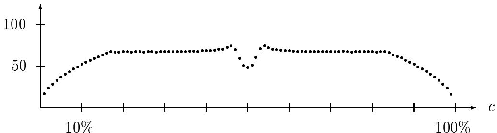  
Figure 6.1: Average weight $\overline { { w } }$ of core as function of the capacity c. Average of 500 weakly correlated instances, $n = 3 0 0 0$ , $R = 1 0 0$ .

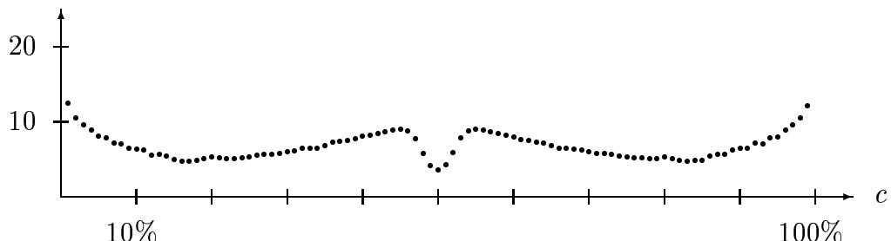  
Figure 6.2: Clustering $\chi$ of core as function of the capacity c. Average of 500 weakly correlated instances, $n = 3 0 0 0$ , $R = 1 0 0$ .

To test the theory that $\mathcal { H } = \overline { { w } } \chi$ , we show the expected core hardness in Figure 6.3 and compare it to the quality of solutions found by heuristic $H$ , measured as the residual capacity of the best filling (Figure 6.4). If heuristic $H$ is able to find a filled solution and thus a good lower bound, obviously the core problem will be easy to solve (and vice versa). Both figures show the average values of the same 500 data instances for each percentage of the capacity. It is seen, that the two figures have the same characteristics, supporting the correctness of our model.

Finally we compare the expected core hardness with the actual running times of the MT2 algorithm in Figure 6.5. MT2 solves the core problem to optimality, using a considerable amount of the solution time for this step. The same instances are considered as before. Due to the exponential growth of computing times, we use a logarithmic scale. It is seen, that actual running times conform with the expected core hardness.

However the model (6.7) should be taken with some caution. Data instances may easily be constructed such that there is a small average weight and clustering, although the instances are very hard to solve. As an example choose the items as

$$
p _ { j } = w _ { j } = 2 j , \quad j = 1 , \ldots , 5 0 ,
$$

and assume that $c$ is odd. The $\chi$ -value of this core is zero meaning that the expected core hardness is $\mathcal { H } = 0$ . Still any branch-and-bound algorithm will have to enumerate all $2 ^ { 5 0 }$ variations of the solution vector, since no bounding stops the process, as mentioned by Jeroslow [40]. However for randomly generated data instances, the model is very suitable, giving a good estimate of the expected core hardness. But the expected core hardness only reflects the actual running times for a large series of instances. Single runs may be solved very fast if the items exactly fit into the capacity.

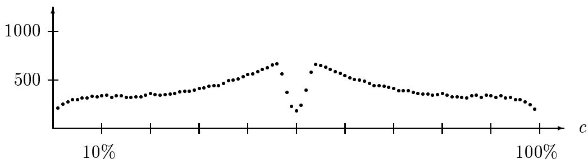  
Figure 6.3: Expected core hardness $\mathcal { H }$ of problem as function of the capacity c. Weakly correlated instances, $n = 3 0 0 0 , R = 1 0 0$ .

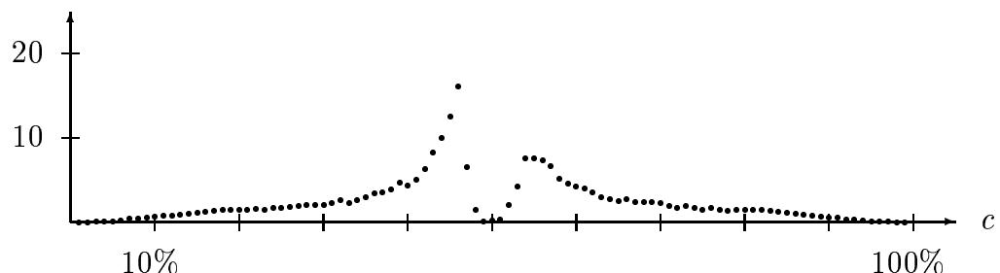  
Figure 6.4: Average residual capacity for heuristic $H$ , as function of the capacity c. Weakly correlated instances, $n = 3 0 0 0$ , $R = 1 0 0$ .

# 6.4 Expected core hardness

We will now apply the model developed for predicting computational times of very large data instances as a function of the capacity. These instances are so hard, that we cannot make a direct comparison like between Figure 6.3 and 6.5, since solution times of several days occur for many instances, when solved by MT2.

Figures 6.6 to 6.13 give the expected core hardness for uncorrelated, weakly correlated, strongly correlated, and subset-sum data instances as a function of the capacity c. In figures 6.6 to 6.9 we consider instances of size $n ~ = ~ 1 0 0 0 0$ while figures 6.10 to 6.13 consider instances with $n = 1 0 0 0 0 0$ . All figures are based on the data range $R = 1 0 0$ .

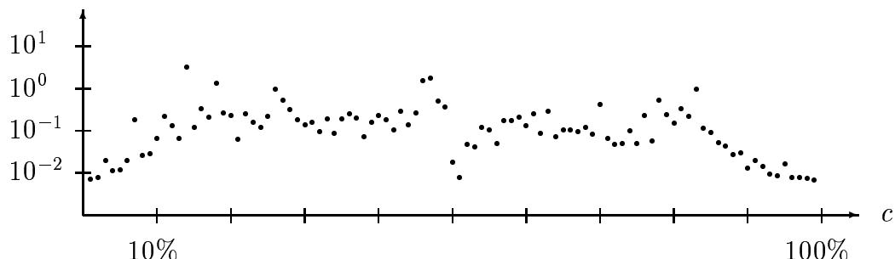  
Figure 6.5: Average computational times for MT2 in seconds (logarithmic scale), as function of the capacity $c$ . Weakly correlated instances, $n = 3 0 0 0$ , $R = 1 0 0$ .

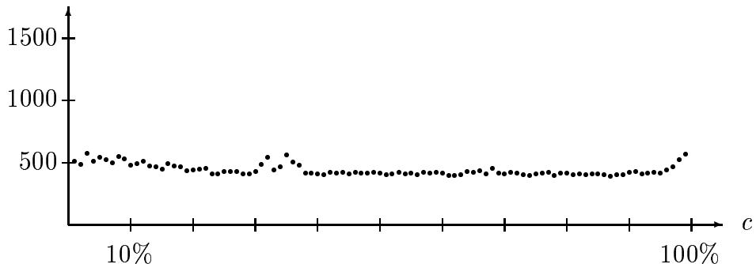  
Figure 6.6: Expected core hardness, uncorrelated instances, $n = 1 0 0 0 0$ , $R = 1 0 0$ .

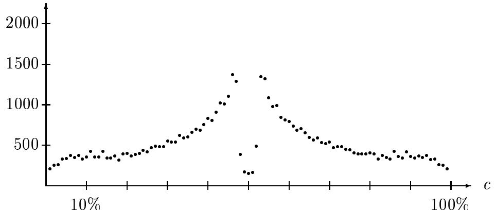  
Figure 6.7: Expected core hardness, weakly correlated instances, $n = 1 0 0 0 0$ , $R = 1 0 0$

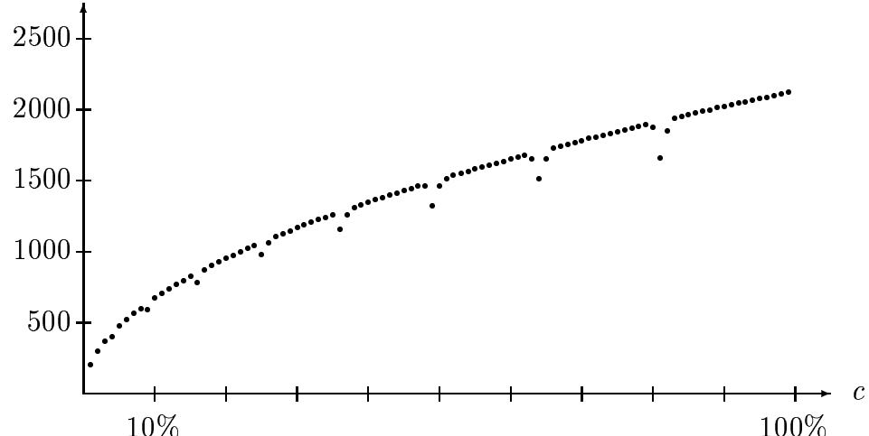  
Figure 6.8: Expected core hardness, strongly correlated instances, $n = 1 0 0 0 0$ , $R = 1 0 0$

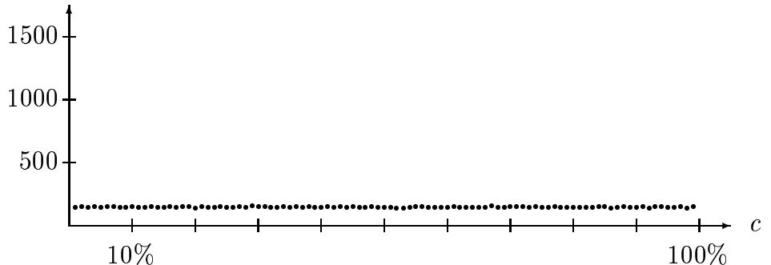  
Figure 6.9: Expected core hardness, subset-sum instances, $n = 1 0 0 0 0 , R = 1 0 0$ .

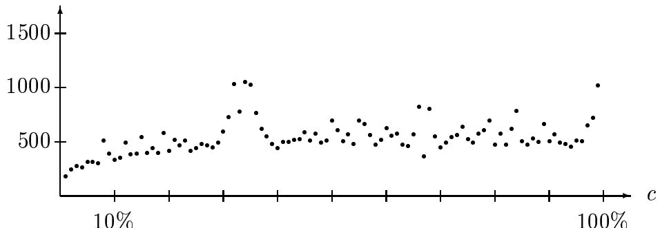  
Figure 6.10: Expected core hardness, uncorrelated instances, $n = 1 0 0 0 0 0 , R = 1 0 0$

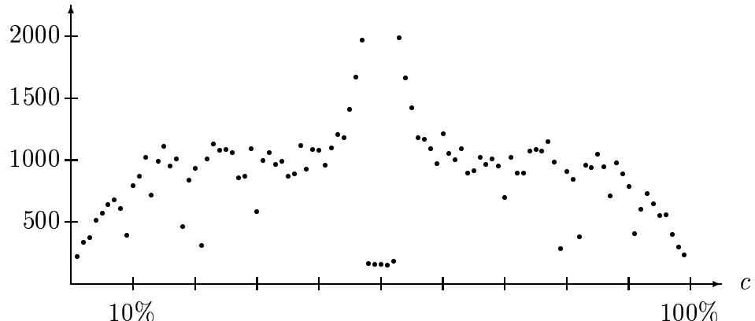  
Figure 6.11: Expected core hardness, weakly correlated instances, $n = 1 0 0 0 0 0$ , $R = 1 0 0$

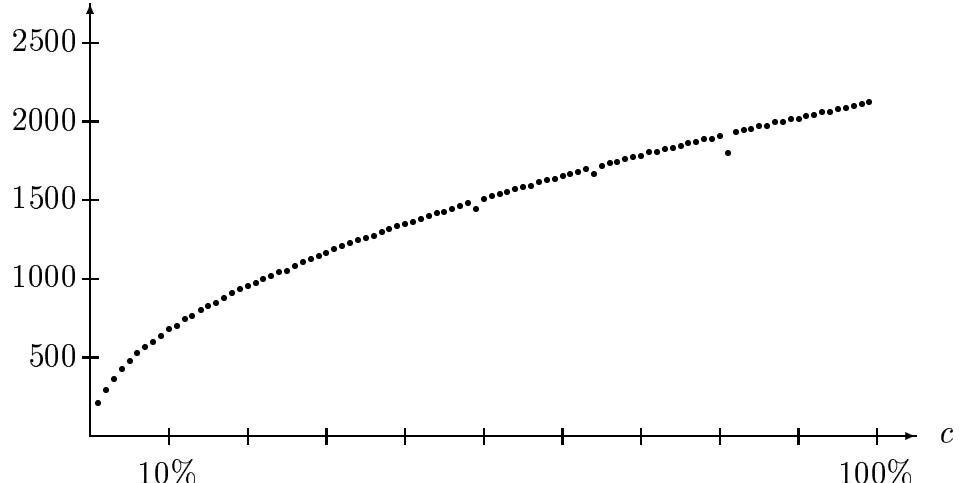  
Figure 6.12: Expected core hardness, strongly correlated instances, $n = 1 0 0 0 0 0$ , $R = 1 0 0$

  
Figure 6.13: Expected core hardness, subset-sum instances, $n = 1 0 0 0 0 0$ , R = 100.

To start with the weakly correlated data instances (Figure 6.7, 6.11), it is seen that the easiest instances occur for $c$ chosen as half of the weight sum, while almost any other instances are very hard. The minimum at $c = 5 0 \%$ is due to a core of items with efficiencies $e _ { j } = 1$ , meaning that there is no clustering of the involved weights.

The uncorrelated data instances (Figure 6.6, 6.10) are considerably easier than the weakly correlated instances. A peak at $c = 3 5 \%$ is noticed, but it is of much lower extent than in the weakly correlated instances. Again this peak is around efficiencies $e _ { j } = 1$ . As the size of the data instance grow to $n = 1 0 0 0 0 0$ the graph gets more turbulent, meaning that it is very difficult to predict the running times.

Strongly correlated instances (Figure 6.8, 6.12) are very hard, as noticed by Balas and Zemel [4] and Martello and Toth [52]. The core hardness grows with the capacity, as the average weight of the core increases. The peaks at the graph are noise due to the division of $R$ in 10 intervals $I _ { i }$ when deriving $\chi$ . The core hardness grows smoothly with the capacity.

Finally the subset-sum data instances (Figure 6.9, 6.13) are very easy for any capacity chosen. This could be expected, since there is no clustering at all: The core hardness only depends of the average weight of an instance.

We may draw several conclusions from these observations:

•For algorithms solving a core problem, the difficulty of a data instance is highly dependent on the capacity $c$ . Traditionally only the correlation and data size was varied in computational experiments, while the capacity was fixed at half of the weight sum (Balas and Zemel [4], Martello and Toth [52], Pisinger [75,82]). Fayard and Plateau [24] are using capacities $c = 2 0 \%$ , $5 0 \%$ , $8 0 \%$ for their testings, but none of these values are representative for the hardness of a problem. • If the capacity is chosen as half of the weight sum, we end up with the easiest possible data instances for all weakly correlated instances. Thus the comprehensive comparative tests in Martello and Toth [53] are of little use. We cannot draw any conclusions from these tests. Balas and Zemel [4] proves that the heuristic $H$ for solving the core problem finds an optimal solution with a probability that grows with increasing $n$ and decreasing $R$ (Appendix A). Thus for uncorrelated data instances of size $n = 1 0 0 0 0 0$ and range $R = 1 0 0$ we should have a probability larger than 0.9999 for finding an optimal solution. However the results presented here indicate that large problems with small data range will have an extremely high clustering of the weights, contradicting the assumption by Balas and Zemel saying that the weights in the core are uniformly distributed. Thus we should not expect to find good solutions by using a heuristic algorithm for solving the core problem. Balas and Zemel do not recognize this problem, since their tests are based on problems with $c = 5 0 \%$ .

•We may explain the turbulent behavior of mT2 for weakly correlated problems, when $c = 5 0 \%$ , as reported by Martello and Toth [53] and Pisinger [75,77]: The partitioning algorithm for finding the approximate core finds a core which is not necessarily symmetrical around $b$ . Very asymmetrical cores end up in difficult instances, since the peak around $c = 5 0 \%$ is so narrow.

• The presented observations are also valid for other types of Knapsack Problems like the Bounded Knapsack Problem, or Multiple Knapsack Problem. Thus testing with capacity $c = 5 0 \%$ should be avoided for these problems in order to evade trivial problems.

All the presented graphs have been given for the data range $R = 1 0 0$ . Similar results hold for $R = 1 0 0 0$ or $R = 1 0 0 0 0$ , although the instances must be 10 (resp. 100) times lager to obtain the same $\chi$ -value. The expected core hardnesses $\mathcal { H }$ for different data ranges are not directly comparable: They should merely be taken as an indication of which capacities may cause problems, than as absolute running times.

# 6.5 New method for testing algorithm

In order to test algorithms for the Knapsack Problem more thoroughly, we propose a new way of constructing test instances. First we notice that due to the stochastic nature of the Knapsack Problem, the applied series of test instances should be large  much larger than the previously used 10 or 20 instances (Balas and Zemel [4], Martello and Toth [53], Pisinger [68]). Thus we propose series of $S = 1 0 0 0$ instances for each type of problem.

Moreover the capacity should be uniformly scattered among the possible weight sums, so that the capacity-dependent behavior is annihilated. For test instance $i$ we choose the capacity as

$$
c = \frac { i } { S + 1 } \sum _ { j = 1 } ^ { n } w _ { j } ,
$$

meaning that a variety of different capacities are tested as $i$ runs from 1 to $S$ . Finally the test instances should be reproducible by other authors. The applied algorithm for generating test instances is thus given in appendix B, with some checksums on the optimal solutions.

We consider four different algorithms for solving the Knapsack Problem. Although they are all based on solving a core problem exactly, they differ essentially in several respects. The FPK79 algorithm by Fayard and Plateau [24] is based on a heuristic solution of the core problem, while the MT2 algorithm by Martello and Toth [53] solves a core problem of fixed size to optimality through branch-and-bound. The ExPkNAP algorithm [75] is using a depth-first branch-and-bound algorithm for solving the core problem like MT2, but the core is expanded by need, as the branching propagates. Finally the MINkNAP algorithm [82] is using dynamic programming for solving an expanding core. Since the breadth-first search ensures that all variations of the solution vector corresponding to the core have been tested before a new item is included in the core, this algorithm enumerates the smallest possible core.

The codes used are obtained from the mentioned references. Algorithm FPK79 had to be corrected a few places, since the reduction part of the code was wrong. The code by

Table II: Total computing time in seconds, FPK79. Average of 1000 instances.   

<table><tr><td rowspan="2">n\R</td><td colspan="3">Uncorrelated</td><td colspan="3">Weakly correlated</td><td colspan="3">Strongly correlated</td><td colspan="3">Subset sum</td></tr><tr><td>100</td><td>1000</td><td>10 000</td><td>100</td><td>1000</td><td>10 000</td><td>100</td><td>1000</td><td>10000</td><td>100</td><td>1000</td><td>10000</td></tr><tr><td>100</td><td>0.00</td><td>0.00</td><td>0.00</td><td>0.00</td><td>0.00</td><td>0.00</td><td>28.78</td><td>28.13</td><td>56.02</td><td>0.00</td><td>0.00</td><td>0.01</td></tr><tr><td>300</td><td>0.00</td><td>0.00</td><td>0.00</td><td>0.00</td><td>0.00</td><td>0.00</td><td></td><td></td><td></td><td>0.01</td><td>0.01</td><td>0.02</td></tr><tr><td>1000</td><td>0.00</td><td>0.00</td><td>0.00</td><td>0.08</td><td>0.00</td><td>0.01</td><td></td><td></td><td></td><td>0.06</td><td>0.08</td><td>0.11</td></tr><tr><td>3000</td><td>0.01</td><td>0.01</td><td>0.01</td><td></td><td>0.01</td><td>0.01</td><td></td><td></td><td></td><td>0.49</td><td>0.62</td><td>0.86</td></tr><tr><td>10000</td><td>0.50</td><td>0.03</td><td>0.04</td><td></td><td>0.16</td><td>0.05</td><td></td><td></td><td></td><td>5.26</td><td>5.68</td><td>8.08</td></tr><tr><td>30000</td><td></td><td>0.10</td><td>0.11</td><td></td><td></td><td>0.14</td><td></td><td></td><td></td><td></td><td></td><td></td></tr><tr><td>100000</td><td></td><td>0.47</td><td>0.42</td><td></td><td></td><td>3.01</td><td></td><td></td><td></td><td></td><td></td><td></td></tr></table>

Table III: Total computing time in seconds, MT2. Average of 1000 instances.   

<table><tr><td rowspan="2">n\R</td><td colspan="3">Uncorrelated</td><td colspan="3">Weakly correlated</td><td colspan="3">Strongly correlated</td><td colspan="3">Subset sum</td></tr><tr><td>100</td><td>1000</td><td>10000</td><td></td><td>100</td><td>1000</td><td>10 000 100</td><td>1000</td><td>10000</td><td>100</td><td>1000</td><td>10000</td></tr><tr><td>100</td><td>0.00</td><td>0.00</td><td></td><td>0.00</td><td>0.00</td><td>0.00</td><td>0.00 8.07</td><td>8.31</td><td>16.24</td><td>0.00</td><td>0.00</td><td>0.01</td></tr><tr><td>300</td><td>0.00</td><td>0.00</td><td></td><td>0.00</td><td>0.00</td><td>0.00</td><td>0.01</td><td></td><td></td><td>0.00</td><td>0.00</td><td>0.02</td></tr><tr><td>1000</td><td>0.00</td><td>0.00</td><td></td><td>0.01</td><td>0.00</td><td>0.01</td><td>0.02</td><td></td><td></td><td>0.00</td><td>0.00</td><td>0.02</td></tr><tr><td>3000</td><td>0.00</td><td>0.01</td><td></td><td>0.02</td><td>0.07</td><td>0.01</td><td>0.06</td><td></td><td></td><td>0.00</td><td>0.00</td><td>0.02</td></tr><tr><td>10000</td><td>0.02</td><td>0.03</td><td></td><td>0.06</td><td></td><td>0.02</td><td>0.14</td><td></td><td></td><td>0.01</td><td>0.01</td><td>0.03</td></tr><tr><td>30000</td><td></td><td>0.06</td><td></td><td>0.17</td><td></td><td>0.19</td><td>0.23</td><td></td><td></td><td>0.03</td><td>0.03</td><td>0.05</td></tr><tr><td>100000</td><td></td><td>0.27</td><td></td><td>0.52</td><td></td><td></td><td>0.44</td><td></td><td></td><td>0.12</td><td>0.13</td><td>0.14</td></tr></table>

Table IV: Total computing time in seconds, ExPKNAP. Average of 1000 instances.   

<table><tr><td rowspan="2">n\R</td><td colspan="3">Uncorrelated</td><td colspan="3">Weakly correlated</td><td colspan="3">Strongly correlated</td><td colspan="3">Subset sum</td></tr><tr><td>100</td><td>1000</td><td>10000</td><td></td><td>100</td><td>1000</td><td>10000</td><td>100 1000</td><td>10000</td><td>100</td><td>1000</td><td>10000</td></tr><tr><td>100</td><td>0.00</td><td>0.00</td><td>0.00</td><td>0.00</td><td>0.00</td><td></td><td>0.00 42.21</td><td>45.14</td><td>126.66</td><td>0.00</td><td>0.00</td><td>0.02</td></tr><tr><td>300</td><td>0.00</td><td>0.00</td><td>0.00</td><td></td><td>0.00</td><td>0.01</td><td>0.01</td><td></td><td></td><td>0.00</td><td>0.00</td><td>0.02</td></tr><tr><td>1000</td><td>0.00</td><td>0.00</td><td>0.01</td><td></td><td>0.00</td><td>0.02</td><td>0.06</td><td></td><td></td><td>0.00</td><td>0.00</td><td>0.02</td></tr><tr><td>3000</td><td>0.00</td><td>0.01</td><td>0.02</td><td></td><td>0.00</td><td>0.01</td><td>0.25</td><td></td><td></td><td>0.00</td><td>0.00</td><td>0.03</td></tr><tr><td>10000</td><td>0.01</td><td>0.03</td><td>0.11</td><td></td><td>0.01</td><td>0.02</td><td>0.65</td><td></td><td></td><td>0.01</td><td>0.01</td><td>0.05</td></tr><tr><td>30000</td><td>0.04</td><td>0.06</td><td>0.39</td><td></td><td>0.04</td><td>0.05</td><td>0.63</td><td></td><td></td><td>0.04</td><td>0.04</td><td>0.05</td></tr><tr><td>100000</td><td>0.17</td><td>0.19</td><td></td><td>0.91</td><td>0.17</td><td>0.18</td><td>0.39</td><td></td><td></td><td>0.15</td><td>0.15</td><td>0.15</td></tr></table>

Table V: Total computing time in seconds, MINkNAP. Average of 1000 instances.   

<table><tr><td rowspan="2">n\R</td><td colspan="3">Uncorrelated</td><td colspan="3">Weakly correlated</td><td colspan="3">Strongly correlated</td><td colspan="3">Subset sum</td></tr><tr><td>100</td><td>1000</td><td>10 000</td><td>100</td><td>1000</td><td>10 000</td><td>100</td><td>1000</td><td>10 000</td><td>100</td><td>1000</td><td>10000</td></tr><tr><td>100</td><td>0.00</td><td>0.00</td><td>0.00</td><td>0.00</td><td>0.00</td><td>0.00</td><td>0.00</td><td>0.03</td><td>0.25</td><td>0.00</td><td>0.00</td><td>0.05</td></tr><tr><td>300</td><td>0.00</td><td>0.00</td><td>0.00</td><td>0.00</td><td>0.00</td><td>0.00</td><td>0.01</td><td>0.14</td><td>1.44</td><td>0.00</td><td>0.00</td><td>0.05</td></tr><tr><td>1000</td><td>0.00</td><td>0.00</td><td>0.00</td><td>0.00</td><td>0.00</td><td>0.01</td><td>0.06</td><td>0.61</td><td>7.43</td><td>0.00</td><td>0.01</td><td>0.05</td></tr><tr><td>3000</td><td>0.00</td><td>0.01</td><td>0.01</td><td>0.00</td><td>0.01</td><td>0.03</td><td>0.22</td><td>2.33</td><td>29.10</td><td>0.00</td><td>0.01</td><td>0.06</td></tr><tr><td>10000</td><td>0.01</td><td>0.01</td><td>0.02</td><td>0.01</td><td>0.01</td><td>0.05</td><td>1.00</td><td>10.47</td><td>125.12</td><td>0.01</td><td>0.01</td><td>0.06</td></tr><tr><td>30000</td><td>0.03</td><td>0.03</td><td>0.06</td><td>0.04</td><td>0.04</td><td>0.07</td><td>3.22</td><td>38.04</td><td>464.26</td><td>0.03</td><td>0.03</td><td>0.08</td></tr><tr><td>100000</td><td>0.10</td><td>0.10</td><td>0.16</td><td>0.15</td><td>0.14</td><td>0.15</td><td>14.22</td><td>152.51</td><td>1756.78</td><td>0.11</td><td>0.12</td><td>0.16</td></tr></table>

Balas and Zemel [4] was not available for this test.

Table II to V gives the total running times for the four algorithms on a HP-9000/730 computer. The instances marked with a "" were stopped after 10 hours, when there did not seem to be any progress in the solution process.

It is seen, that FPK79 and MT2 have substantial problems for all low-ranged weakly correlated instances of medium and large size. Also some low-ranged uncorrelated instances cause problems. On the other hand both ExPKNAP and MINKNAP show a stable behavior, with all running times within one second (the strongly correlated instances excepted). Only MINkNAP is able to solve large strongly correlated instances.

It is interesting to note that although MT2 and ExpkNAP both are using depth-first branch-and-bound techniques, ExPkNAP is not sensitive to the difficulty of the core, since the core is expanded by need. The MINkNAP algorithm is using dynamic programming for solving the core, so it is not sensitive to clustered weights: equal states are simply fathomed through a dominance test.

The last table (Table VI) gives the percentage of tested items by the reduction algorithm of MINkNAP. Since this reduction is performed by need, the values of Table VI indicates how many items need to be considered in order to solve the problem. If the percentage is low, then the problem is well suited for solving a core problem, while high percentages means that you have to reduce almost all items anyway, implying that a heuristic solution to the core problem may be more suitable (Pisinger [77]).

If Table VI is compared to the running times of MT2, it is seen that MT2 is performing worst, when most effort could be saved. The stable running times of mT2 are for instances where solving a core problem is almost useless. Thus we may conclude, that solving a core problem of fixed size generally makes the instance harder to solve than using a complete reduction followed by enumeration of the remaining instance.

# 6.6 Conclusions

We have seen that the core hardness of a data instance depends strongly on the capacity c, and that the hitherto applied test capacities lead to the easiest possible problems for weakly correlated data instances. Solving a core problem exactly may lead to seriously worse running times than if a more naive technique was used, but these problems may be avoided by using an expanding core, or through dynamic programming. Finally a new and more thorough way of testing Knapsack Problems has been proposed. The technique has been used for four algorithms — all based on a core problem — showing that ExPKNAP and MINkNAP are the only algorithms which have a stable behavior.

Table VI: Percentage of items, which were tested by the reduction algorithm of mInkNAP. Average of 1000 instances.   

<table><tr><td rowspan="2">n\R</td><td colspan="3">Uncorrelated</td><td colspan="3">Weakly correlated</td><td colspan="3">Strongly correlated</td><td colspan="3">Subset sum</td></tr><tr><td>100</td><td>1000</td><td>10 000</td><td>100</td><td>1000</td><td>10000</td><td>100</td><td>1000</td><td>10 000</td><td>100</td><td>1000</td><td>10 000</td></tr><tr><td>100</td><td>74</td><td>89</td><td>92</td><td>64</td><td>97</td><td>99</td><td>84</td><td>89</td><td>94</td><td>24</td><td>32</td><td>38</td></tr><tr><td>300</td><td>54</td><td>85</td><td>90</td><td>25</td><td>94</td><td>98</td><td>83</td><td>85</td><td>89</td><td>10</td><td>13</td><td>16</td></tr><tr><td>1000</td><td>19</td><td>79</td><td>88</td><td>6</td><td>76</td><td>97</td><td>84</td><td>86</td><td>87</td><td>4</td><td>5</td><td>6</td></tr><tr><td>3000</td><td>3</td><td>66</td><td>86</td><td>3</td><td>33</td><td>95</td><td>85</td><td>85</td><td>86</td><td>2</td><td>2</td><td>2</td></tr><tr><td>10000</td><td>1</td><td>31</td><td>84</td><td>1</td><td>5</td><td>85</td><td>88</td><td>86</td><td>86</td><td>1</td><td>1</td><td>1</td></tr><tr><td>30000</td><td>0</td><td>7</td><td>72</td><td>1</td><td>1</td><td>48</td><td>87</td><td>86</td><td>88</td><td>0</td><td>0</td><td>0</td></tr><tr><td>100000</td><td>0</td><td>1</td><td>51</td><td>0</td><td>0</td><td>11</td><td>84</td><td>85</td><td>84</td><td>0</td><td>0</td><td>0</td></tr></table>

# Appendix A: Heuristic $H$

Heuristic $H$ by Balas and Zemel [4] is a simple exchange algorithm for the core problem, which successively removes an item $i$ and replaces it by one or two other items $j , b$ in order to obtain a filled knapsack. In spite of the simple structure, Balas and Zemel are able to prove some interesting properties on the quality of the solution found by heuristic $H$ .

Assume that the core items are indexed by $1 , \ldots , m$ , and that the capacity of the core problem is $\tilde { c }$ The break item in the core is denoted $b$ , and the residual capacity by filling the knapsack with items $j < b$ is $\begin{array} { r } { r = \tilde { c } - \sum _ { j = 1 } ^ { b - 1 } w _ { j } } \end{array}$ .Define the extreme core weights as $\begin{array} { r } { \mathrm { M I N } = \operatorname* { m i n } _ { j = 1 , \dots , m } w _ { j } } \end{array}$ and $\mathtt { M A X } = \mathtt { m a x } _ { j = 1 , \dots , m } w _ { j }$ Heuristic $H$ may then be sketched as:

procedure $H$ ; { Find the packing, which fills the knapsack most }   
for $i : = 1$ to $b - 1$ do $x _ { i } : = 1$ ; rof;   
for $i : = b$ to $m$ do $x _ { i } : = 0$ ;rof;   
$d : = r$ ; $\{ d$ is the hitherto smallest obtained residual capacity}   
for $i : = 1$ to $b - 1$ do $x _ { i } : = 0$ ; $\tilde { r } : = r + w _ { i }$ ; $\{$ Remove item $i$ and eventually insert item b } if $\tilde { r } > \mathrm { M A X } )$ then $x _ { b } : = 1 ; \quad \tilde { r } : = \tilde { r } - w _ { b } ; \mathbf { f }$ ; for $j : = b + 1$ to $m$ do $x _ { j } : = 1 ; \quad \overline { { r } } : = \tilde { r } - w _ { j } ; \ \{ I n s e r t \ a n \ i t e m \ j \}$ if $( 0 \leq \overline { r } < d )$ then $d : = \overline { { r } }$ ; Save the solution. fi; $x _ { j } : = 0$ rof; $x _ { i } : = 1 ; \quad x _ { b } : = 0 ;$   
rof

Balas and Zemel shows the following results for heuristic $H$ : Let $V _ { 0 } = \mathrm { M A X } - \mathrm { M I N } + 1$ be the span in the weights, and let $V _ { 1 }$ be the number of items $i = 1 , \ldots , b - 1$ satisfying that $\mathrm { M I N } \le \tilde { r } \le \mathrm { M A X }$ Further assume that the weights $w _ { j }$ are independent random variables uniformly distributed in [MIN, MAX].

Proposition 6.1 The probability $P$ that the heuristic $H$ finds a filled solution (i.e. a solution with residual capacity $\overline { { r } } = 0$ is

$$
P = 1 - \left( 1 - \frac { V _ { 1 } } { V _ { 0 } } \right) ^ { m - b } .
$$

See [4] for a proof. The interesting consequence of Proposition 6.1 is that under reasonable assumptions, the probability for finding a flled knapsack grows exponentially with the

Table VII: Probability $P$ for obtaining a filled solution by heuristic $H$ , as function of $V _ { 1 }$ and $m - b$ . The probabilities are for $V _ { 0 } = 1 0 0$ corresponding to data range $R = 1 0 0$ .

<table><tr><td>V1</td><td>m- b 10 20 30</td></tr><tr><td>10 0.65</td><td>0.986</td></tr><tr><td></td><td>0.88 0.96</td></tr><tr><td>0.80 0.97</td><td>0.993 0.999</td></tr><tr><td>15 20 0.89 0.99</td><td>0.999 0.999</td></tr></table>

core size $m$ , and increases with smaller data-range $R$ since $V _ { 0 } \leq R$ . Table VII gives the expected probability for finding a filled solution by algorithm $H$ . The Table is obtained from [4].

Proposition 6.2 The probability for a flled solution found by heuristic $H$ being an optimal solution to the Knapsack Problem is bounded below by a strictly increasing function $Q ( n )$ satisfying that

$$
\operatorname* { l i m } _ { n \to \infty } Q ( n ) = 1 .
$$

Thus the probability for a filled solution obtained by heuristic $H$ being an optimal solution grows with the size $n$ of the instance.

However the results presented in this chapter indicate that Proposition 6.1 and 6.2 are of little use, even for uncorrelated data instances of large size. The problem is, that for large instances the core may degenerate, implying that $V _ { 1 }$ becomes close to zero. Heuristic $H$ is thus not able to find a filled solution, although it would be optimal for the global problem.

# Appendix B: Generating test data

In order to let other authors generate the same test instances as applied in section 6.5, we here include an algorithm for generating the test data.

The standard LRAND48 generator of the C library is used for generating pseudorandom profits and weights. The LRAND48 generator is using the well-known linear congruential algorithm, which generates a series of numbers $X _ { 1 } , X _ { 2 } , X _ { 3 } , \ldots$ as

$$
X _ { i + 1 } = ( a X _ { i } + d ) { \mathrm { ~ m o d ~ } } m ,
$$

where $a = 2 5 2 1 4 9 0 3 9 1 7$ $d = 1 1$ and $m = 2 ^ { 4 8 }$ . The first 31 bits of the number are returned for LRAND48. A seed $s$ for the algorithm is given by procedure sRAND48 as:

$$
X _ { 0 } = s \cdot 2 ^ { 1 6 } + 1 3 0 7 0 .
$$

For a given data range $R$ , instance size $n$ , and problem type $t$ (uc, wc, sc, ss) we constructed $S = 1 0 0 0$ different data instances as follows:

Table VIII: Checksums for optimal solutions given as Σ=1 zi mod 1000.   

<table><tr><td rowspan="2">n\R</td><td colspan="3">Uncorrelated</td><td colspan="3">Weakly correlated</td><td colspan="3">Strongly correlated</td><td colspan="3">Subset sum</td></tr><tr><td>100</td><td>1000</td><td>10000</td><td>100</td><td>1000</td><td>10 000</td><td>100</td><td>1000</td><td>10000</td><td>100</td><td>1000</td><td>10000</td></tr><tr><td>100</td><td>283</td><td>67</td><td>410</td><td>505</td><td>591</td><td>257</td><td>348</td><td>202</td><td>681</td><td>391</td><td>111</td><td>897</td></tr><tr><td>300</td><td>717</td><td>402</td><td>272</td><td>333</td><td>188</td><td>717</td><td>481</td><td>45</td><td>443</td><td>952</td><td>924</td><td>381</td></tr><tr><td>1000</td><td>802</td><td>589</td><td>48</td><td>895</td><td>956</td><td>850</td><td>961</td><td>129</td><td>307</td><td>461</td><td>873</td><td>939</td></tr><tr><td>3000</td><td>932</td><td>320</td><td>780</td><td>193</td><td>942</td><td>146</td><td>415</td><td>225</td><td>718</td><td>545</td><td>265</td><td>342</td></tr><tr><td>10000</td><td>737</td><td>590</td><td>269</td><td>577</td><td>328</td><td>398</td><td>847</td><td>210</td><td>370</td><td>167</td><td>160</td><td>940</td></tr><tr><td>30000</td><td>689</td><td>846</td><td>820</td><td>794</td><td>153</td><td>117</td><td>507</td><td>361</td><td>320</td><td>457</td><td>801</td><td>490</td></tr><tr><td>100000</td><td>926</td><td>85</td><td>646</td><td>749</td><td>471</td><td>136</td><td>186</td><td>956</td><td>242</td><td>606</td><td>366</td><td>292</td></tr></table>

procedure testinstance $( n , R , t , i )$ ; $\{$ Generate test instance i, $1 \leq i \leq S \}$ $W : = 0$ ; $R ^ { \prime } : = \lfloor R / 1 0 \rfloor$ ; $\operatorname { S R A N D } 4 8 ( i )$ ; { Use i as seed for the sequence of random numbers} for $j : = 1$ to $n$ do

$w _ { j } : = \left( \mathrm { L R A N D } 4 8 \ \mathbf { m o d } \ R \right) + 1 ; \quad W : = W + w _ { j } ;$ case $t$ of uc: $p _ { j } : = ( { \mathrm { L R A N D 4 8 ~ m o d ~ } } R ) + 1$ wc: $p _ { j } : = w _ { j } - R ^ { \prime } + \left( \tt L R A N D 4 8 \ m o d \ ( 2 R ^ { \prime } + 1 ) \right)$ ; if $( p _ { j } \leq 0 )$ then $p _ { j } : = 1$ ; fi; sc: $p _ { j } : = w _ { j } + 1 0$ ; SS: $p _ { j } : = w _ { j }$ ; esac; rof; $c : = \lfloor ( i * W ) / ( S + 1 ) \rfloor$ if $( c \leq R )$ then $c : = R + 1$ ; fi;

The if -statement in weakly correlated instances ensures that $p _ { j }$ is a positive integer, while the last line of the algorithm ensures that equation (6.2) is satisfied. Checksums of the optimal solutions and capacities are given in Table VIII and IX.

An interesting problem to investigate further is the instance $n = 1 0 0 0 0 0$ , $R = 1 0 0 0 0$ , $t = \mathrm { u c }$ , $S = 5 0 0$ and $s = 1 5 7$ . Here MT2 finds the solution 323792911 while ExPKNAP and MINKNAP both finds the solution 323792912.

a IX: $c _ { i }$ mod 1000.   

<table><tr><td rowspan="2">n\R</td><td colspan="3">Uncorrelated</td><td colspan="3">Weakly correlated</td><td colspan="3">Strongly correlated</td><td colspan="3">Subset sum</td></tr><tr><td>100</td><td>1000</td><td>10000</td><td>100</td><td>1000</td><td>10 000</td><td>100</td><td>1000</td><td>10000</td><td>100</td><td>1000</td><td>10000</td></tr><tr><td>100</td><td>208</td><td>739</td><td>745</td><td>208</td><td>739</td><td>745</td><td>391</td><td>128</td><td>903</td><td>391</td><td>128</td><td>903</td></tr><tr><td>300</td><td>692</td><td>620</td><td>220</td><td>692</td><td>620</td><td>220</td><td>952</td><td>924</td><td>381</td><td>952</td><td>924</td><td>381</td></tr><tr><td>1000</td><td>653</td><td>696</td><td>125</td><td>653</td><td>696</td><td>125</td><td>461</td><td>873</td><td>939</td><td>461</td><td>873</td><td>939</td></tr><tr><td>3000</td><td>679</td><td>793</td><td>42</td><td>679</td><td>793</td><td>42</td><td>545</td><td>265</td><td>342</td><td>545</td><td>265</td><td>342</td></tr><tr><td>10000</td><td>32</td><td>850</td><td>127</td><td>32</td><td>850</td><td>127</td><td>167</td><td>160</td><td>940</td><td>167</td><td>160</td><td>940</td></tr><tr><td>30000</td><td>417</td><td>468</td><td>111</td><td>417</td><td>468</td><td>111</td><td>457</td><td>801</td><td>490</td><td>457</td><td>801</td><td>490</td></tr><tr><td>100000</td><td>933</td><td>384</td><td>858</td><td>933</td><td>384</td><td>858</td><td>606</td><td>366</td><td>292</td><td>606</td><td>366</td><td>292</td></tr></table>

# Chapter 7

# A Minimal Algorithm for the Multiple-choice Knapsack Problem

The Multiple-Choice Knapsack Problem is defined as a O-1 Knapsack Problem with the addition of disjoined multiple-choice constraints. As for other knapsack problems most of the computational effort in the solution of these problems is used for sorting and reduction. But although $O ( n )$ algorithms, which solve the linear Multiple-Choice Knapsack Problem without sorting, have been known for more than a decade, such techniques have not been used in enumerative algorithms.

In this chapter we present a simple $O ( n )$ partitioning algorithm for deriving the optimal linear solution, and show how it may be incorporated in a dynamic programming algorithm such that a minimal number of classes are enumerated, sorted and reduced. Computational experiments indicate that this approach leads to a very efficient algorithm which outperforms any known algorithm for the problem.

Keywords: Knapsack Problem; Dynamic Programming; Reduction.

# 7.1 Introduction

Given $k$ classes $N _ { 1 } , \ldots , N _ { k }$ of items to pack in some knapsack of capacity c. Each item $j \in N _ { i }$ has a profit $p _ { i j }$ and a weight $w _ { i j }$ , and the problem is to choose one item from each class such that the profit sum is maximized without having the weight sum to exceed $c$ . The Multiple-Choice Knapsack Problem (MCKP) may thus be formulated as:

$$
\begin{array} { r l } { \mathrm { ~ \ r a x i m i z e ~ \ } } & { z = \displaystyle \sum _ { i = 1 } ^ { k } \sum _ { j \in N _ { i } } p _ { i j } x _ { i j } } \\ { \mathrm { ~ \ n b j e c t ~ t o ~ \ } } & { \displaystyle \sum _ { i = 1 } ^ { k } \sum _ { j \in N _ { i } } w _ { i j } x _ { i j } \leq c , } \\ & { \displaystyle \sum _ { j \in N _ { i } } x _ { i j } = 1 , \quad i = 1 , \ldots , k , } \\ & { x _ { i j } \in \{ 0 , 1 \} , \quad i = 1 , \ldots , k , \quad j \in N _ { i } , } \end{array}
$$

All coefficients $p _ { i j } , w _ { i j }$ , and $c$ are positive integers, and the classes $N _ { 1 } , \ldots , N _ { k }$ are mutually dijoint, class $N _ { i }$ havng size $n _ { i }$ The ta  tei $\textstyle n = \sum _ { i = 1 } ^ { k } n _ { i }$

Negative coefficients $p _ { i j } , w _ { i j }$ in (7.1) may be handled by adding a sufficiently large constant to all items in the corresponding class as well as to $c$ To avoid unsolvable or trivial situations we assume that

$$
\sum _ { i = 1 } ^ { k } \operatorname* { m i n } _ { j \in N _ { i } } w _ { i j } \quad \leq \quad c \quad < \quad \sum _ { i = 1 } ^ { k } \operatorname* { m a x } _ { j \in N _ { i } } w _ { i j } .
$$

If we relax the integrality constraint $x _ { i j } ~ \in ~ \{ 0 , 1 \}$ in (7.1) to $0 ~ \leq ~ x _ { i j } ~ \leq ~ 1$ we obtain the Linear Multiple-Choice Knapsack Problem $( L M C K P )$ . If each class has two items, where $( p _ { i 1 } , w _ { i 1 } ) = ( 0 , 0 )$ $i = 1 , \ldots , k$ , the problem (7.1) corresponds to the 0-1 Knapsack Problem $( K P )$ . The linear version of KP will be denoted by LKP.

MCKP is $\mathcal { N P }$ -hard as it contains KP as a special case, but it can be solved in pseudopolynomial time through dynamic programming (Dudzinski and Walukiewicz [20]). The problem has a large range of applications: Capital Budgeting (Nauss [60]), Menu Planning (Sinha and Zoltners [90]), transforming nonlinear KP to MCKP (Nauss [60]), determining which components should be linked in series in order to maximize fault tolerance (Sinha and Zoltners [90]), and to accelerate ordinary LP/GUB problems by the dual simplex algorithm (Witzgal [94]). Moreover MCKP appear by Lagrange relaxation of several integer programming problems (Fisher [27]).

Several algorithms for MCKP have been presented during the last two decades: e.g. Nauss [60], Sinha and Zoltners [90], and Dyer, Kayal and Walker [22]. Most of these algorithms start by solving LMCKP in order to obtain an upper bound for the problem. The LMCKP is solved in two steps: 1) The LP-dominated items are reduced by sorting the items in each class according to nondecreasing weights, and then applying some dominance criteria to delete unpromising states. 2) The reduced LMCKP is solved by a greedy algorithm. After these two initial steps, upper bound tests may be used to fix several variables in each class to their optimal value. The reduced MCKP problem is then solved to optimality through enumeration (Dudzinski and Walukiewicz [20]).

Essential results in the field of KP however indicates that MCKP may be solved easier: Balas and Zemel [4] independently with Fayard and Plateau [23] proposed to consider only a small subset of the items — the so-called core — in order to solve KP. A core can be found in $O ( n )$ time through a partitioning algorithm, and since the restricted KP defined on the core items is easy to solve for several classes of data instances, it means that many instances may be solved in linear time (Martello and Toth [52], Pisinger [75]). However if optimality of the core solution cannot be proved, a complete enumeration including the variables outside the core has to be performed.

Although $O ( n )$ algorithms for LMCKP have been known for a decade (Zemel [96], Dyer [21]), making it possible to derive a "core" reasonably easy, a similar technique has not been used for MCKP. According to Martello and Toth [53] this may be caused by the fact that reduction of LP-dominated items is necessary in order to derive upper bounds in a branch-and-bound algorithm. The current chapter however demonstrates that a core algorithm for MCKP is possible, although several questions had to be answered: Which items or classes should be included in the core? How should we derive upper bounds in a branch-and-bound algorithm when LP-dominated items have not been deleted? How should a core be derived? How should a primal algorithm for LMCKP be developed?

The present chapter is a counterpart to a minimal algorithm for KP by Pisinger [82]: A simple algorithm is used for solving LMCKP, and for deriving an initial feasible solution to MCKP. Starting from this initial solution we use dynamic programming to solve MCKP, adding new classes to the core by need. By this technique we are able to show that a minimal number of classes are considered in order to solve MCKP to optimality.

The chapter is organized in the following way: First, Section 7.2 brings some basic definitions, and shows fundamental properties of MCKP, while Section 7.3 presents a simple partitioning algorithm for the solution of LMCKP. Next, Section 7.4 shows how gradients may be used in an expanding-core, as well as presenting some logical tests which may be used to fix variables at their optimal value, before a class is added to the core. Section 7.5 gives a description of the dynamic programming algorithm, and Section 7.6 shows how we keep track on the solution vector in dynamic programming. Finally Section 7.7 presents the main algorithm and discuss minimality of the derived core, while Section 7.8 brings computational experiments.

# 7.2 Fundamental properties

Definition 7.1 If two items $r$ and $s$ in the same class $N _ { i }$ satisfy that

$$
w _ { i r } \leq w _ { i s } \mathrm { a n d } p _ { i r } \geq p _ { i s } ,
$$

then we say that item $r$ dominates item $s$ . Similarly if some items $r , s , t \in N _ { i }$ with $w _ { i r } \leq w _ { i s } \leq w _ { i t }$ and $p _ { i r } \leq p _ { i s } \leq p _ { i t }$ satisfy

$$
\begin{array} { r c l } { \operatorname* { d e t } \bigl ( w _ { i s } - w _ { i r } , p _ { i s } - p _ { i r } , w _ { i t } - w _ { i r } , p _ { i t } - p _ { i r } \bigr ) } & { \leq } & { 0 , } \end{array}
$$

then we say that item $s$ is $L P .$ -dominated by items $r$ and $t$

Proposition 7.1 (Sinha and Zoltners [90]) Given two items $\mathsf { , } s \in N _ { i }$ . If item $r$ dominates item $s$ then an optimal solution to MCKP with $x _ { i s } = 0$ exists. If two items $r , t \in N _ { i }$ LPdominate an item $s \in N _ { i }$ then an optimal solution to LMCKP with $x _ { i s } = 0$ exists.

As a consequence, we only have to consider LP-undominated items $R _ { i }$ in the solution of LMCKP. Note that these items form the upper convex boundary of the set $N _ { i }$ , as illustrated in Figure 7.1. The set of LP-undominated items may be found by ordering the items in each class $N _ { i }$ according to increasing weights, and successively test the items according to criteria (7.3) and (7.4). If two items have the same weight and profit, choose an arbitrary of them. Now LMCKP may be solved by using the greedy algorithm:

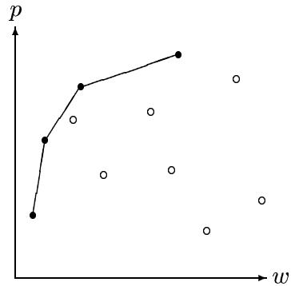  
Figure 7.1: LP-undominated items $R _ { i }$ (black) form the upper convex boundary of $N _ { i }$ .

# Algorithm 7.1 Greedy.

1 Find the LP-undominated classes $R _ { i }$ (ordered by increasing weights) for all classes $N _ { i }$ , $i = 1 , \ldots , k$ . Choose the lightest item from each class (i.e. set $x _ { i 1 } = 1 , \ x _ { i j } = 0$ for $j = 2 , \ldots , | R _ { i } | , \ i = 1 , \ldots , k )$ and define the chosen weight and profit sum as $\textstyle W = \sum _ { i = 1 } ^ { k } w _ { i 1 }$ resp. $\textstyle P = \sum _ { i = 1 } ^ { k } p _ { i 1 }$ For all items $j \neq 1$ define the slope $\lambda _ { i j }$ as

$$
\lambda _ { i j } = \frac { p _ { i j } - p _ { i , j - 1 } } { w _ { i j } - w _ { i , j - 1 } } , i = 1 , \ldots , k , j = 2 , \ldots , | R _ { i } | .
$$

This slope is a measure of the profit-to-weight ratio obtained by choosing item $j$ instead of item $j - 1$ in class $R _ { i }$ (Zemel [95]). Using the greedy principle, order the slopes $\{ \lambda _ { i j } \}$ in nondecreasing order.

2 Let $i , j$ be the indices corresponding to the next slope $\lambda _ { i j }$ in $\{ \lambda _ { i j } \}$ . If $W + w _ { i j } > c$ goto Step 3. Otherwise set $x _ { i j } = 1$ , $x _ { i , j - 1 } = 0$ and update the sums $W = W + w _ { i j } - w _ { i , j - 1 }$ , $P = P + p _ { i j } - p _ { i , j - 1 }$ . Repeat Step 2.

3 If $W = c$ we have an integer solution and the optimal objective value to LMCKP (and MCKP) is $z ^ { * } = P$ .Otherwise let $\lambda _ { i j }$ be the next slope in the list. We have two fractional variables xij = $\begin{array} { r } { x _ { i j } = \frac { c - W } { w _ { i j } - w _ { i , j - 1 } } } \end{array}$ respectivly $x _ { i , j - 1 } = 1 - x _ { i j }$ , which both belong to the same class. The optimal objective value is

$$
\begin{array} { r c l } { z ^ { * } } & { = } & { P + ( c - W ) \lambda _ { i j } . } \end{array}
$$

Although several orderings of $\{ \lambda _ { i j } \}$ exist in Step 1 when more items have the same slope, we will assume that one specific ordering has been chosen.

The LP-optimal choices $b _ { i }$ obtained by Algorithm 7.1 are those variables, where $x _ { i b _ { i } } =$ 1. The class containing two fractional variables in Step 3 will be denoted the fractional class $N _ { a }$ , and the fractional variables are $x _ { a b _ { a } }$ , $x _ { a b _ { a } ^ { \prime } }$ possibly with $x _ { a b _ { a } ^ { \prime } } = 0$ . An initial feasible solution to MCKP may be constructed by choosing the LP-optimal variables, i.e. setting $x _ { i b _ { i } } = 1$ for $i = 1 , \ldots , k$ and $x _ { i j } = 0$ for $i = 1 , \ldots , k , \ j \neq b _ { i }$ The solution will be denoted the break solution and the corresponding weight and profit sum is $W$ resp. $P$ .

Proposition 7.2 As a consequence of Algorithm 7.1 an optimal solution $x ^ { * }$ to LMCKP satisfies the following: 1) $x ^ { * }$ has at most two fractional variables $x _ { a b _ { a } }$ and $x _ { a b _ { a } ^ { \prime } } . 2 )$ If $x ^ { * }$ has two fractional variables they must be adjacent variables within the same class $N _ { a }$ . 3) If $x ^ { * }$ has no fractional variables, then the break solution is an optimal solution to MCKP.

The presented greedy algorithm has time complexity $O ( n \log n )$ due to the ordering of slopes. It should be mentioned, that when the classes form a KP, Algorithm 7.1 is exactly the greedy algorithm for LKP, and the objective value (7.6) corresponds to the Dantzig upper bound for KP (Dantzig [13]).

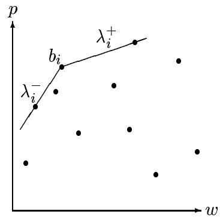  
Figure 7.2: Gradients ${ \lambda } _ { i } ^ { + } , { \lambda } _ { i } ^ { - }$ in class $N _ { i }$ .

An optimal solution to MCKP generally corresponds to the break solution, except for some few classes where other items than the LP-optimal choices have been chosen. This property may be illustrated the following way: Define the positive and negative gradient ${ \lambda } _ { i } ^ { + }$ and ${ \lambda } _ { i } ^ { - }$ for each class $N _ { i } , \ i \neq a$ as (see Figure 7.2)

$$
\begin{array} { r l r } { \lambda _ { i } ^ { + } } & { = } & { \underset { j \in N _ { i } , \ w _ { i j } > w _ { i b _ { i } } } { \operatorname* { m a x } } \ \frac { p _ { i j } - p _ { i b _ { i } } } { w _ { i j } - w _ { i b _ { i } } } , i = 1 , \ldots , k , \ i \neq a , } \\ { \lambda _ { i } ^ { - } } & { = } & { \underset { j \in N _ { i } , \ w _ { i j } < w _ { i b _ { i } } } { \operatorname* { m i n } } \ \frac { p _ { i b _ { i } } - p _ { i j } } { w _ { i b _ { i } } - w _ { i j } } , i = 1 , \ldots , k , \ i \neq a , } \end{array}
$$

and we set ${ \lambda } _ { i } ^ { + } = 0$ (resp. $\lambda _ { i } ^ { - } = \infty$ ) if the set we are maximizing (resp. minimizing) over is empty. Note that the above definitions do not demand any preprocessing of the items. The gradients are a measure of the expected gain (resp. loss) per weight unit by choosing a heavier (resp. lighter) item from $N _ { i }$ instead of the LP-optimal choice $b _ { i }$ . The gradient of the fractional class $N _ { a }$ is defined as

$$
\begin{array} { l l l } { { \lambda } } & { { = } } & { { { \displaystyle \frac { p _ { a b _ { a } ^ { \prime } } - p _ { a b _ { a } } } { w _ { a b _ { a } ^ { \prime } } - w _ { a b _ { a } } } } . } } \end{array}
$$

In Figure 7.3 we have ordered the classes according to decreasing ${ \lambda } _ { i } ^ { + }$ and show how often the IP-optimal solution to MCKP differs from the LP-optimal choice in each class

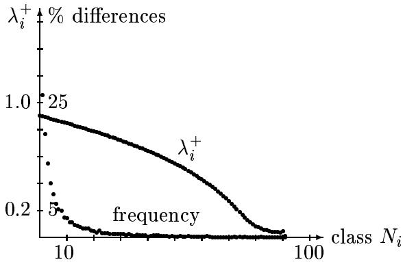  
Figure 7.3: Frequency of classes $N _ { i }$ where IP-optimal choice differs from LP-optimal choice, compared to gradient ${ \lambda } _ { i } ^ { + }$ .

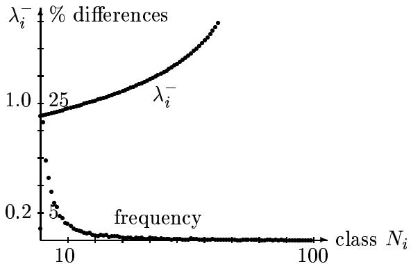  
Figure 7.4: Frequency of classes $N _ { i }$ where IP-optimal choice differs from LP-optimal choice, compared to gradient ${ \lambda } _ { i } ^ { - }$ .

$N _ { i }$ . The figure is a result of 5000 randomly generated data instances $k = 1 0 0$ , $n _ { i } = 1 0$ ), where we have measured how often the IP-optimal choice $j$ (satisfying $w _ { i j } > w _ { i b _ { i } }$ since we are considering forward gradients) differs from the LP-optimal choice $b _ { i }$ in each class $N _ { i }$ . It is seen, that when ${ \lambda } _ { i } ^ { + }$ is decreasing, so is the probability that $b _ { i }$ is not the IP-optimal choice. Similarly in Figure 7.4 we have ordered the classes according to increasing ${ \lambda } _ { i } ^ { - }$ to show how the probability for changes decreases with increased ${ \lambda } _ { i } ^ { - }$ .

This observation motivates considering only a small number of the classes $N _ { i }$ , namely those classes where ${ \lambda } _ { i } ^ { + }$ or ${ \lambda } _ { i } ^ { - }$ are sufficiently close to $\lambda$ . Thus at any stage the core is simply a set of classes $\{ N _ { r _ { 1 } } , . . . , N _ { r _ { m } } \}$ where $r _ { 1 } , \ldots , r _ { m } \in \{ 1 , \ldots , k \}$ . Initially the core consists of the break set $N _ { a }$ and we expand the core by need; alternately including the next unused class $N _ { i }$ which has largest ${ \lambda } _ { i } ^ { + }$ or smallest ${ \lambda } _ { i } ^ { - }$ .

Since a complete enumeration of the core demands considering up to $n _ { r _ { 1 } } \cdot n _ { r _ { 2 } } \cdot \cdot \cdot n _ { r _ { m } }$ states, care should be taken before including a new class to the core. We use an upper bound test to fix as many variables at their optimal value as possible in the class before it is included in the core. If only one item remains, the class may be fathomed. Otherwise we order the remaining variables by nondecreasing weight and use test (7.3) to delete dominated items. The remaining class is added to the core and the new choices are enumerated through dynamic programming.

# 7.3 A partitioning algorithm for the LMCKP

Dyer [21] and Zemel [96] independently of each other developed $O ( n )$ algorithms for LMCKP. Both algorithms are based on the convexity of the LP-dual problem to (7.1), which makes it possible to pair the dual line segments, so that at each iteration at least $1 / 6$ of the line segments are deleted. When the classes form a KP the algorithms reduce to that of Balas and Zemel [4] for LKP. As Martello and Toth [52] modified the Balas and Zemel algorithm for LKP to a primal approach which is easier to implement, we will now modify the Dyer and Zemel algorithm for LMCKP in a similar way.

Assume that $N _ { a }$ is the fractional class and that items $b _ { a }$ and $b _ { a } ^ { \prime }$ are the fractional variables in $N _ { a }$ , such that $x _ { a b _ { a } } + x _ { a b _ { a } ^ { \prime } } = 1$ , possibly with $x _ { a b _ { a } ^ { \prime } } = 0$ ."Moreover let $b _ { i }$ be the LP-optimal choice in class $N _ { i }$ , $i = 1 , \ldots , k , \ i \neq a$ . Due to the properties of LMCKP given in Proposition 7.2, LMCKP may be reformulated as finding the slope

$$
\begin{array} { r c l } { { \lambda } } & { { = } } & { { \displaystyle \frac { \delta \overline { { { p } } } } { \delta \overline { { { w } } } } = \frac { p _ { a b _ { a } ^ { \prime } } - p _ { a b _ { a } } } { w _ { a b _ { a } ^ { \prime } } - w _ { a b _ { a } } } , } } \end{array}
$$

such that the weight sum of the LP-optimal choices satisfy

$$
\sum _ { i \neq a } w _ { i b _ { i } } + w _ { a b _ { a } } \leq c < \sum _ { i \neq a } w _ { i b _ { i } } + w _ { a b _ { a } ^ { \prime } } ,
$$

$$
\begin{array} { r l r } { \operatorname* { d e t } ( w _ { i j } , p _ { i j } , \delta \overline { { w } } , \delta \overline { { p } } ) } & { \leq } & { \operatorname* { d e t } \big ( w _ { i b _ { i } } , p _ { i b _ { i } } , \delta \overline { { w } } , \delta \overline { { p } } \big ) , i = 1 , \dots , k , j = 1 , \dots , n _ { i } . } \end{array}
$$

Here (7.11) ensures that $N _ { a }$ is the fractional class, and (7.12) ensures that each item $b _ { i } \in N _ { i }$ is at the upper convex boundary of the set.

The formulation (7.10)-(7.12) allows us to use a partitioning algorithm for finding the optimal slope $\lambda$ . In the following algorithm we assume that the classes of items $N _ { i }$ are represented as a list $[ N _ { 1 } , \ldots , N _ { k } ]$ and items in each class are also represented as a list $[ j _ { 1 } , \ldots , j _ { n _ { i } } ]$ . Elements may be deleted from a list by swapping the deleted element to the end of the list, and subsequently decreasing the list's length. Thus at any step, $k$ and $n _ { i }$ refer to the current number of elements in the list. The partitioning algorithm looks like this:

# Algorithm 7.2 Partition.

0 Preprocess. For all classes $i = 1 , \dots , k$ let $\alpha _ { i }$ and $\beta _ { i }$ be indices to the items having minimal weight (resp. maximal profit) in $N _ { i }$ (see Figure 7.5). In case of several items satisfying the criterion, choose the item having largest profit for $\alpha _ { i }$ and smallest weight for $\beta _ { i }$ . Set $W = P = 0$ , and remove those items $j \neq \beta _ { i }$ which have $w _ { i j } \geq w _ { i \beta _ { i } }$ and $p _ { i j } \leq p _ { i \beta _ { i } }$ , since these are dominated by item $\beta _ { i }$ . If the class $N _ { i }$ has only one item left, save the LP-optimal choice $b _ { i } = \beta _ { i }$ and set $W = W + w _ { i b _ { i } }$ , $P = P + p _ { i b _ { i } }$ then delete class $N _ { i }$ .

1 Choose median. For $M$ randomly chosen classes $N _ { i }$ define the corresponding slope $\begin{array} { r } { \lambda _ { i } = \frac { \delta p _ { i } } { \delta w _ { i } } = \frac { p _ { i \beta _ { i } } - p _ { i \alpha _ { i } } } { w _ { i \beta _ { i } } - w _ { i \alpha _ { i } } } } \end{array}$ i−i. Let λ = p be the median of these M slopes (Different choices of the constant $M \leq k$ will be discussed at the end of this section).

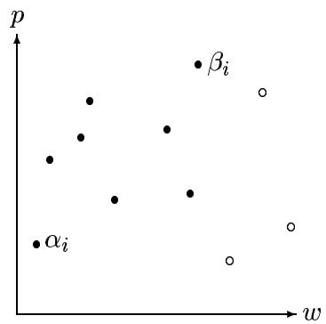  
Figure 7.5: Preprocessing of $N _ { i }$ . White nodes are dominated by $\beta _ { i }$ .

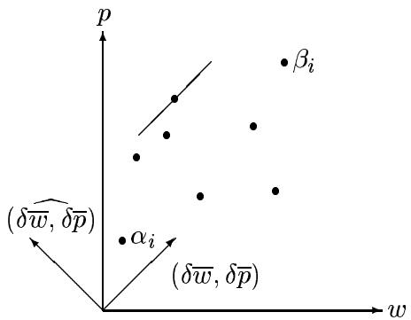  
Figure 7.6: Conclusion of $N _ { i }$ .

2 Find the conclusion. For each class $N _ { i }$ find the items which maximize the projection on the normal to $( \delta \overline { { w } } , \delta \overline { { p } } )$ , i.e. which maximize the determinant

$$
\begin{array} { r c l } { \operatorname* { d e t } \bigl ( w _ { i j } , p _ { i j } , \delta \overline { { w } } , \delta \overline { { p } } \bigr ) } & { = } & { w _ { i j } \delta \overline { { p } } - p _ { i j } \delta \overline { { w } } . } \end{array}
$$

See Figure 7.6. We swap these items to the beginning of the list such that they have indices $\{ 1 , \ldots , \ell _ { i } \}$ in class $N _ { i }$ .

3 Determine weight sum of conclusion. Let $g _ { i } , h _ { i }$ be the lightest (resp. heaviest) item among $\{ 1 , \ldots , \ell _ { i } \}$ in class $N _ { i }$ , and let $W ^ { \prime }$ and $W ^ { \prime \prime }$ be the corresponding weight sums. Thus $\begin{array} { r } { W ^ { \prime } = W + \sum _ { i = 1 } ^ { k } w _ { i g _ { i } } } \end{array}$ and $\begin{array} { r } { W ^ { \prime \prime } = W + \sum _ { i = 1 } ^ { k } w _ { i h _ { i } } } \end{array}$ b

4 Check for optimal partitioning. If $W ^ { \prime } \leq c \leq W ^ { \prime \prime }$ the partitioning at $( \delta \overline { { w } } , \delta \overline { { p } } )$ is optimal. First, choose the lightest items from each class by setting $b _ { i } = g _ { i } , W =$ $W + w _ { i b _ { i } }$ , $P = P + p _ { i b _ { i } }$ . Then while $W - w _ { i g _ { i } } + w _ { i h _ { i } } \leq c$ run through the classes where $\ell _ { i } \neq 1$ and choose the heaviest item by setting $b _ { i } = h _ { i } , W = W - w _ { i g _ { i } } + w _ { i b _ { i } } ,$ $P =$ $P - p _ { i g _ { i } } + p _ { i b _ { i } }$ . The first class where $W - w _ { i g _ { i } } + w _ { i h _ { i } } > c$ is the fractional class $N _ { a }$ and an optimal objective value to LMCKP is $z _ { \mathrm { L M C K P } } = P + ( c - W ) \lambda$ . If no fractional class is defined, the LP-solution is also the optimal IP-solution. Stop.

5 Partition. We have one of the following two cases: 1) If $W ^ { \prime } > c$ then the slope $\lambda$ was too small (see Figure 7.7). For each class $N _ { i }$ choose $\beta _ { i }$ as the lightest item in $\{ 1 , \ldots , \ell _ { i } \}$ and delete items $j \neq \beta _ { i }$ with $w _ { i j } \ge w _ { i \beta _ { i } }$ If $W ^ { \prime \prime } < c$ then the slope $\begin{array} { r } { \lambda = \frac { \delta \overline { { p } } } { \delta \overline { { w } } } } \end{array}$ was too large. For ach class $N _ { i }$ choose $\alpha _ { i }$ as the heaviest item in $\{ 1 , \ldots , \ell _ { i } \}$ and delete items $j \neq \alpha _ { i }$ with $p _ { i j } \leq p _ { i \alpha _ { i } }$ (items $j$ with $w _ { i j } \leq w _ { i \alpha _ { i } }$ are too light, and items with $w _ { i j } > w _ { i \alpha _ { i } } , p _ { i j } \leq p _ { i \alpha _ { i } }$ are dominated). If the class $N _ { i }$ has only one item left, save the LP-optimal choice $b _ { i } = \beta _ { i }$ and set $W = W + w _ { i b _ { i } }$ , $P = P + p _ { i b _ { i } }$ , then delete class $N _ { i }$ . Goto Step 1.

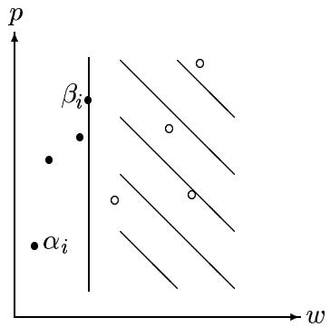  
Figure 7.7: Partition set $N _ { i }$ .

Depending on the choice of $M$ in Step 1, we obtain different behavior of the algorithm. The best performance is obtained by choosing $\lambda$ as the median of all slopes $\lambda _ { i } , \ i = 1 , \dots , k$ (i.e. choose $M = k$ ) but for practical purpose $M \leq 1 5$ works well. Note that in the KP case, Algorithm 7.2 becomes the partitioning algorithm of Balas and Zemel [4].

Proposition 7.3 If we choose $\begin{array} { r } { \lambda = \frac { \delta \overline { { p } } } { \delta \overline { { w } } } } \end{array}$ as the exact median of $M$ different slopes $\begin{array} { r } { \lambda _ { i } = \frac { \delta p _ { i } } { \delta w _ { i } } } \end{array}$ in Step 1 of Algorithm 7.2, at least $\lceil M / 2 \rceil$ items are deleted at each iteration.

Proof Since $\lambda$ is the median of the $M$ classes, we have $\lambda _ { i } ~ \leq ~ \lambda$ for $\lceil M / 2 \rceil$ classes, so for these classes at least one item $j \neq \alpha _ { i }$ exists which maximizes (7.13). Similarly we have $\lambda _ { i } \geq \lambda$ for $\lceil M / 2 \rceil$ classes, so for these classes at least one item $j \ne \beta _ { i }$ exists which maximizes (7.13). If $W ^ { \prime } > c$ in Step 5, at least $\lceil M / 2 \rceil$ items $\{ \beta _ { i } \}$ will be deleted. Otherwise if $W ^ { \prime \prime } < c$ , at least $\lceil M / 2 \rceil$ items $\left\{ \alpha _ { i } \right\}$ will be deleted.

Corollary 7.1 If $M = 1$ at least one item is deleted at each iteration of Algorithm 7.2, yielding a complexity of $O ( n ^ { 2 } )$ .

Corollary 7.2 If $M \ = \ k$ and the size of each class $n _ { i }$ is bounded by a constant $K$ Algorithm 7.2 runs in $O ( n )$ .

ition . $\lceil \frac { k } { 2 } \rceil$ $n _ { i }$ is bounded by $K$ it means that at least 2} items are deleted at each iteration, yielding the complexity.

# 7.4 Expanding core

Considering the KP, Balas and Zemel [4] proposed to enumerate only a small amount of the items — the so-called core — where there was a large probability for finding an optimal solution. However the core cannot be identified a priori, implying that in some cases optimality of the core solution cannot be proved, and thus a complete enumeration has to be performed.

Pisinger [75] noted, that even though the core cannot be identified before KP is solved, it can be identified while the problem is solved by using an expanding core. This result was improved by Pisinger [82] who showed that a minimal core may be obtained by using dynamic programming, as the breadth-first search implies that all variations of the solution vector have been tested before a new variable is added to the core.

We will use the same concept for MCKP, but now the core consists of the smallest possible number of classes $N _ { i }$ , such that an optimal solution may be determined and proved. Where the core for KP naturally consists of items having profit-to-weight ratios close to that of the break item, there is no natural way of ordering the classes in MCKP. Instead we use the gradients to identify a core: Define the positive and negative gradient ${ \lambda } _ { i } ^ { + }$ and ${ \lambda } _ { i } ^ { - }$ for each class $N _ { i }$ , $i \neq a$ by (7.7) and (7.8). Due to (7.12) we have that

$$
\lambda _ { i } ^ { + } \leq \frac { \delta \overline { { { p } } } } { \delta \overline { { { w } } } } \leq \lambda _ { i } ^ { - } .
$$

Order the sets $L ^ { + } = \{ \lambda _ { i } ^ { + } \}$ according to nonincreasing values, and $L ^ { - } = \{ \lambda _ { i } ^ { - } \}$ according to nondecreasing values. Initially the core $C$ only consists of the fractional class $N _ { a }$ , and then we repeatedly add classes $N _ { i }$ corresponding to the next gradient from the ordered sets $L ^ { + }$ and $L ^ { - }$ . Since each class occur twice (once in each set $L ^ { + }$ and $L ^ { - }$ ), we pass over a class if it already has been considered.

# 7.4.1 Class reduction

Before adding a class $N _ { i }$ to the core $C$ it is appropriate to fathom unpromising items from the class. We check whether each item $j \in N _ { i }$ has an upper bound larger than the currently best solution $z$ . For this purpose we use an upper bound obtained by relaxing the constraint on the fractional variables $b _ { a } , b _ { a } ^ { \prime } \in N _ { a }$ from $x _ { b _ { a } } , x _ { b _ { a } ^ { \prime } } \in \{ 0 , 1 \}$ to $x _ { b _ { a } } , x _ { b _ { a } ^ { \prime } } \in \mathcal { R }$ in (7.1). The upper bound on item $j \in N _ { i }$ is then

$$
\begin{array} { r c l c r c l } { { u _ { i j } } } & { { = } } & { { P - p _ { i b _ { i } } + p _ { i j } } } & { { + } } & { { \lambda ( c - W + w _ { i b _ { i } } - w _ { i j } ) , } } \end{array}
$$

and if $u _ { i j } < z + 1$ we may fix $x _ { i j }$ to 0. Since the bound (7.15) is evaluated in constant time, the complexity of reducing class $N _ { i }$ is $O ( n _ { i } )$ .

If the reduced set $N _ { i } ^ { \prime }$ has only one item left, we fathom the class, since no choices have to be done. Otherwise we order the items in $N _ { i } ^ { \prime }$ according to nondecreasing weights and delete dominated items by applying (7.3). The computational effort is concentrated on the sorting, yielding a complexity of $O ( n _ { i } ^ { \prime } \log { n _ { i } ^ { \prime } } )$ where $n _ { i } ^ { \prime }$ is the size of $N _ { i } ^ { \prime }$ . In Section 7.8 it will be demonstrated that a large majority of the items may be fixed at their optimal value by the reduction (7.15), thus significantly decreasing the number of items which need to be sorted.

# 7.5 A dynamic programming algorithm

The core is a set of currently enumerated classes $C = \{ N _ { r 1 } , \ldots , N _ { r _ { m } } \}$ . We will use dynamic programming for this enumeration, thus let $f _ { C } ( \tilde { c } )$ , $\tilde { c } = 0 , \ldots , 2 c$ be an optimal solution to the following core problem, where variables in classes outside the core are fixed at their LP-optimal values:

$$
f _ { C } ( \tilde { c } ) = \operatorname* { m a x } \left\{ \begin{array} { l l } { \displaystyle \sum _ { N _ { i } \in C } \sum _ { j \in N _ { i } } p _ { i j } x _ { i j } + \sum _ { N _ { i } \notin C } p _ { i b _ { i } } : } \\ { \displaystyle \sum _ { N _ { i } \in C } \sum _ { j \in N _ { i } } w _ { i j } x _ { i j } + \sum _ { N _ { i } \notin C } w _ { i b _ { i } } \leq \tilde { c } , } \\ { \displaystyle \sum _ { j \in N _ { i } } x _ { i j } = 1 \ \mathrm { f o r } \ N _ { i } \in C , \ x _ { i j } \in \{ 0 , 1 \} } \end{array} \right\} .
$$

For an empty core $C = \emptyset$ we set $\begin{array} { r } { f _ { \parallel } ( \tilde { c } ) = \sum _ { i = 1 } ^ { k } p _ { i b _ { i } } } \end{array}$ for all $\begin{array} { r } { \tilde { c } \geq \sum _ { i = 1 } ^ { k } w _ { i b _ { i } } } \end{array}$ , and $f _ { \varnothing } ( \tilde { c } ) = - \infty$ for all smaller values of $\tilde { c }$ Each time the core is extended with a new class $N _ { i }$ , then $f _ { C + N _ { i } } \left( \tilde { c } \right)$ can be found by the recursion

$$
\overset { \cdot } { \underset { C + N _ { i } } { \cdot } } ( \tilde { c } ) = \operatorname* { m a x } \left\{ \begin{array} { l l } { f _ { C } ( \tilde { c } - w _ { i 1 } + w _ { i b _ { i } } ) + p _ { i 1 } - p _ { i b _ { i } } } & { \mathrm { ~ i f ~ } 0 \leq \tilde { c } - w _ { i 1 } + w _ { i b _ { i } } \leq 2 c , } \\ { f _ { C } ( \tilde { c } - w _ { i 2 } + w _ { i b _ { i } } ) + p _ { i 2 } - p _ { i b _ { i } } } & { \mathrm { ~ i f ~ } 0 \leq \tilde { c } - w _ { i 2 } + w _ { i b _ { i } } \leq 2 c , } \\ { \vdots } \\ { f _ { C } ( \tilde { c } - w _ { i n _ { i } } + w _ { i b _ { i } } ) + p _ { i n _ { i } } - p _ { i b _ { i } } } & { \mathrm { ~ i f ~ } 0 \leq \tilde { c } - w _ { i n _ { i } } + w _ { i b _ { i } } \leq 2 c } \end{array} \right.
$$

An optimal solution to MCKP is found as $z = f _ { C } ( c )$ for a complete core $C = \{ N _ { 1 } , \ldots , N _ { k } \}$ , and we obtain $z = - \infty$ if assumption (7.2) is violated. Since the variables not in the core are fixed at their LP-optimal values, we must accept capacities $\tilde { c } > c$ in a transition stage, as these states may become feasible at a later stage. However let

$$
V = \sum _ { N _ { i } \notin C } ( w _ { i b _ { i } } - \underset { j \in N _ { i } } { \operatorname* { m i n } } w _ { i j } )
$$

be the largest weight sum that can be released in classes outside the core. Thus only states with $\tilde { c } \leq c + V \leq 2 c$ need to be considered in the recursion.

The recursion (7.17) demands $O ( n _ { i } )$ operations for each class in the core and for each ity $O ( \sum _ { i = 1 } ^ { k } 2 c n _ { i } ) = O ( n c )$ for a complete enmeration. However if optimality of a state can be proved, we may terminate the enumeartion instantly. In this case the computational effort is $O ( c \sum _ { N _ { i } \in C } n _ { i } )$ , which is very efficient for small core sizes. The ordering of the classes according to gradients ensures that generally only a few dozen of classes need to be enumerated even for very large instances.

The traditional recursion for MCKP as presented in Martello and Toth [53] reaches an optimal solution by only considering feasible capacities $\tilde { c } \leq c$ as the classes are enumerated. This approach has the drawback that a solution is not reached before al classes have been enumerated, meaning that we have to pass through all $O ( n c )$ steps.

The space complexity of recursion (7.17) is $O ( k c )$ , as for each class we only need to save the index of the chosen item. Thus for a given core $C$ let the set of partial vectors be given by

$$
\begin{array} { r l r } { Y _ { C } } & { = } & { \left\{ \begin{array} { l l } { ( y _ { 1 } , \dots , y _ { m } ) { \mathrm { ~ } } : y _ { i } \in \{ 1 , \dots , n _ { r _ { i } } \} , \ i = 1 , \dots , m } \end{array} \right\} , } \end{array}
$$

where each variable $y _ { i }$ determines that variable $x _ { i y _ { i } } ~ = ~ 1$ while the remaining binary variables in $N _ { i }$ are set to zero. The weight and profit sum of a vector $\mathbf { y } _ { i } = ( y _ { 1 } , \dots , y _ { m } ) \in$ $Y _ { C }$ corresponds to the weight and profit sum of the chosen variables $y _ { r _ { i } }$ when $N _ { r _ { i } } \in C$ , and to the LP-optimal choices $b _ { i }$ when $N _ { r _ { i } } \notin C$ . Thus

$$
\begin{array} { r c l } { { \mu _ { i } } } & { { = } } & { { \displaystyle \sum _ { N _ { i } \in { \cal C } } w _ { i y _ { i } } + \sum _ { N _ { i } \notin { \cal C } } w _ { i b _ { i } } , } } \\ { { } } & { { } } & { { } } \\ { { \pi _ { i } } } & { { = } } & { { \displaystyle \sum _ { N _ { i } \in { \cal C } } p _ { i y _ { i } } + \sum _ { N _ { i } \notin { \cal C } } p _ { i b _ { i } } . } } \end{array}
$$

It is convenient to represent each vector $\mathbf { y } _ { i } \in Y _ { C }$ by a state $( \mu _ { i } , \pi _ { i } , v _ { i } )$ , where $\mu _ { i } , \pi _ { i }$ are given above, and $v _ { i }$ is a (not necessarily complete) representation of ${ \bf y } _ { i }$ . As only undominated states are considered we have $f _ { C } ( \mu _ { i } ) = \pi _ { i }$ . An iterative version of recursion (7.17) is presented in Pisinger [69].

# 7.5.1 Reduction of states

Although the number of states in $Y _ { C }$ at any time is bounded by $2 c$ , the enumeration may be considerably improved by applying some upper bound tests in order to delete unpromising states.

Assume that the core $C$ is obtained by adding classes corresponding to the first $m$ gradients from $L ^ { - }$ and $L ^ { + }$ and that $N _ { s }$ and $N _ { t }$ are the next classes to be added from each set. Thus the gradients satisfy

$$
\begin{array} { l l l } { \displaystyle \operatorname* { m a x } _ { N _ { i } \notin C } \lambda _ { i } ^ { - } } & { \leq } & { \lambda _ { s } ^ { - } , } \\ { \displaystyle \operatorname* { m i n } _ { N _ { i } \notin C } \lambda _ { i } ^ { + } } & { \geq } & { \lambda _ { t } ^ { + } . } \end{array}
$$

By this assumption we get the following upper bound on a state $i$ given by $( \mu _ { i } , \pi _ { i } , v _ { i } )$

$$
u ( i ) ~ = ~ \left\{ \begin{array} { l l } { \pi _ { i } + ( c - \mu _ { i } ) \lambda _ { t } ^ { + } ~ \mathrm { i f } ~ \mu _ { i } \leq c , } \\ { \pi _ { i } + ( c - \mu _ { i } ) \lambda _ { s } ^ { - } ~ \mathrm { i f } ~ \mu _ { i } > c . } \end{array} \right.
$$

For conveniency we set $\lambda _ { t } ^ { + } = 0$ if the set $L ^ { + }$ is empty, and $\lambda _ { s } ^ { - } = \infty$ if $L ^ { - }$ is empty, ensuring that states which cannot be improved further are fathomed. Note that this bound is derived in constant time, where the linear upper bound presented by Zemel [95] demands $O ( n )$ time, improved to $O ( k \log ^ { 2 } ( n / k ) )$ by Dudzinski and Walukiewicz [19].

The bound (7.24) may also be used for deriving a global upper bound on MCKP. Since any optimal solution must follow a branch in $Y _ { C }$ , the global upper bound corresponds to the upper bound of the most promising branch in $Y _ { C }$ . Therefore a global upper bound on MCKP is given by

$$
u _ { \mathrm { M C K P } } = \operatorname* { m a x } _ { \mathbf { y } _ { i } \in Y _ { C } } u ( i ) .
$$

Since the gradient ${ \lambda } _ { t } ^ { + }$ will be decreasing during the solution process, and the gradient $\lambda _ { s } ^ { - }$ will be increasing, $u _ { \mathrm { M C K P } }$ will become more and more tight as the core is expanded. For a complete core $C = \{ N _ { 1 } , \ldots , N _ { k } \}$ we get $u _ { \mathrm { { M C K P } } } = z$ for the optimal solution $z$ . This observation may be used for deriving an approximate algorithm for MCKP, as the enumeration simply is halted when the current lower bound is sufficiently close to $u _ { \mathrm { M C K P } }$ .

# 7.6 Finding the solution vector

According to the principles of dynamic programming, the optimal solution vector $x ^ { * }$ should be found by backtracking through the sets of states, implying that all sets of states should be saved during the solution process. In the computational experiments it is demonstrated that the number of states may be half a million in each iteration and since the number of classes may be large ( $k = 1 0 0 0 0 ,$ we would need to store billions of states. Pisinger [82] proposed to save only the last $A$ changes in the solution vector in each state $( \mu , \pi , v )$ . If this information is not sufficient for reconstructing the solution vector, we simply solve a new MCKP problem with a reduced number of variables. This is repeated till the solution vector is completely defined. More precisely we do the following:

Assume that $v$ consists of $A$ pairs $( i , j )$ , indicating that the variable $x _ { i j }$ was chosen in class $N _ { i }$ . Whenever an improved solution is found during the enumeration of $Y _ { C }$ , we save the corresponding state $( \mu , \pi , v )$ . When the algorithm terminates, all variables are set to the break solution $x _ { i b _ { i } } = 1$ for $i = 1 , \ldots , k$ and $x _ { i j } = 0$ for $i = 1 , \ldots , k$ , $j \neq b _ { i }$ . Then we make the changes registered in $v$ .

$$
\begin{array} { r l } & { x _ { i j } = 1 , x _ { i b _ { i } } = 0 , \mathrm { f o r } ( i , j ) \in v , } \\ & { \mu ^ { \prime } = \mu + \sum _ { ( i , j ) \in v } \bigl ( w _ { i b _ { i } } - w _ { i j } \bigr ) , } \\ & { \pi ^ { \prime } = \pi + \sum _ { ( i , j ) \in v } \bigl ( p _ { i b _ { i } } - p _ { i j } \bigr ) . } \end{array}
$$

If the backtracked weight and profit sums $\mu ^ { \prime } , \pi ^ { \prime }$ correspond to the weight and profit sums $W , P$ of the break solution, we know that the obtained vector is correct. Otherwise we solve a new MCKP, this time with capacity $c = \mu ^ { \prime }$ , lower bound $z = \pi ^ { \prime } - 1$ , and global upper bound $u = \pi ^ { \prime }$ . The process is repeated until the solution vector $x$ is completely defined. The technique has proved very efficient, since generally only a few iterations are needed. With $A = 1 0$ , a maximum of 4 iterations has been observed for large data instances, but usually the optimal solution vector is found after the first iteration.

# 7.7 Main algorithm

The previous sections may be summed up to the following main algorithm:

# Algorithm 7.3

procedure mcknap;   
Solve LMCKP through a partitioning algorithm.   
Determine gradients $L ^ { + } = \{ \lambda _ { i } ^ { + } \}$ and $L ^ { - } = \{ \lambda _ { i } ^ { - } \}$ for $i = 1 , \ldots , k , \ i \neq a$ .   
Partially sort $L ^ { + }$ in decreasing order and $L ^ { - }$ in increasing order.   
$z : = 0$ ; $s : = 1$ ; $t : = 1$ ; $C : = \{ N _ { a } \}$ ; $Y _ { C }$ := reduceclass $( N _ { a } )$ ;   
repeat reduceset $( Y _ { C } )$ ; if $( Y _ { C } = \varnothing )$ then break; fi; $N _ { i } : = L _ { s } ^ { - }$ ; $s : = s + 1$ ; $\{$ Choose next class from $L ^ { - } \}$ if $( N _ { i } \notin C )$ then $R _ { i } : = $ reduceclass $( N _ { i } )$ ; if $\left. { R _ { i } } | > 1 \right.$ then $\operatorname { a d d } ( Y _ { C } , R _ { i } )$ ; fi; reduceset $( Y _ { C } )$ ; if $( Y _ { C } = \varnothing )$ then break; fi; $N _ { i } : = L _ { t } ^ { + }$ ; $t : = t + 1$ ; $\{$ Choose next class from $L ^ { + } \}$ if $( N _ { i } \notin C )$ then $R _ { i } : = \operatorname { r e d u c e c l a s s } ( N _ { i } )$ if $| R _ { i } | > 1 )$ then $\mathrm { a d d } ( Y _ { C } , R _ { i } )$ ; fi;   
forever;   
Find the solution vector.

The first step of the algorithm is to solve the LMCKP as sketched in Section 7.3. Hereby we obtain the fractional class $N _ { a }$ , the break solution $\{ b _ { i } \}$ as well as the corresponding weight and profit sum $W$ and $P$ .

The gradients ${ \lambda } _ { i } ^ { + }$ and ${ \lambda } _ { i } ^ { - }$ are determined and the sets $L ^ { + }$ and $L ^ { - }$ are ordered. Since we initially do not need a complete ordering, we use a partial ordering as presented in Pisinger [75]: Using the quicksort algorithm for sorting (Hoare [32]), we always choose the interval containing largest values (resp. smallest for $L ^ { - }$ ) for further partitioning, while the other interval is pushed onto a stack. In this way we continue until the largest (resp. smallest) values have been determined. Later in Algorithm 7.3, if more values are needed, we simply pop the next interval from the stack by need and partition it further. Thus for small core sizes we use linear time for this ordering.

Our initial core is the fractional class $N _ { a }$ , which is reduced by procedure REDUCECLASS. Here we apply criterion (7.15) to fix as many variables as possible at their optimal value. If the reduced class has more than one item left, we sort the items according to increasing weight, and then apply criterion (7.3) to remove dominated items. Hereby we obtain the reduced class $R _ { a }$ which is the current set of states $Y _ { C }$ .

The set of states $Y _ { C }$ is reduced by procedure REDuCESET which apply criterion (7.24) to fathom unpromising states. Moreover the procedure checks whether any feasible state $( \mu \leq c )$ has improved the lower bound $z$ , and updates the current best solution in that case.

Now we alternately include classes $N _ { i }$ from $L ^ { + }$ and $L ^ { - }$ , each time checking if $N _ { i }$ already is in the core. If this is not the case, we reduce the class, fathoming it, if only one item is left. The reduced class $R _ { i }$ is otherwise added to the set of states $Y _ { C }$ by using recursion (7.17), indicated by procedure ADD above.

The iteration stops when no more states are feasible, meaning that no improvements can occur. Note that we set $\lambda _ { t } ^ { + } = 0$ when $L ^ { + }$ is empty, and $\lambda _ { s } ^ { - } = \infty$ when $L ^ { - }$ is empty, meaning that the iteration in any case will stop when all classes have been considered.

# 7.7.1 Minimality

Pisinger [82] proved for the 0-1 Knapsack Problem, that the MINkNAP algorithm enumerates the smallest symmetrical core that can be solved to proven optimality by enumerative core algorithms — a family of core algorithms from the existing literature. Since no algorithms for MCKP that solve a core problem have been published before, we cannot here define a family of algorithms for which MckNAP will enumerate the smallest core. Instead we must substantiate that the same principles apply to the MckNAP algorithm as apply to the MINKNAP algorithm. We have:

Definition 7.2 Given a core $C$ and the corresponding set of states $Y _ { C }$ . We say that the core problem has been solved to proven optimality if one (or both) of the following cases occur: 1) $z = u _ { \mathrm { M C K P } }$ where $z$ is the best feasible solution in $Y _ { C }$ . 2) All classes $N _ { i } \notin C$ could be reduced to contain only the LP-optimal choice $b _ { i }$ .

Note that if $z = u _ { \mathrm { M C K P } }$ then all states in $Y _ { C }$ will be fathomed by (7.24), implying that $Y _ { C } =$ $\emptyset$ . Thus the definition states, that we cannot prove optimality before the enumeration terminates or all variables outside the core can be fixed at their LP-optimal values.

Since MCKP is $\mathcal { N P }$ -hard we may assume that the enumeration cannot be guided by other principles than greed. Thus if a problem can be solved to optimality with final gradients $\lambda _ { s } ^ { - }$ and ${ \lambda } _ { t } ^ { + }$ then we may assume that all classes with smaller ${ \lambda } _ { i } ^ { - }$ and larger ${ \lambda } _ { i } ^ { + }$ also have been considered, as they have a smaller loss per weight unit when making changes from the LP-optimal value. This leads to the following

Definition 7.3 MCKP has been solved with a minimal core if the following invariant holds: A class $N _ { s }$ (resp. $N _ { t }$ ) is only added to the core $C$ if the corresponding core problem could not be solved to proven optimality, and the set $N _ { s }$ (resp. $N _ { t }$ )has the smallest gradient $\lambda _ { s } ^ { - }$ (resp. largest gradient ${ \lambda } _ { t } ^ { + }$ ).

The definition ensures that if MCKP has been solved to optimality with a minimal core $C$ , no subset core $C ^ { \prime } \subset C$ exists, such that a fixed-core algorithm can solve the problem to optimality. Strictly speaking, if $C$ is a minimal core with final gradients $\lambda _ { s } ^ { - }$ and ${ \lambda } _ { t } ^ { + }$ then there does not exist a subset core $C ^ { \prime }$ with final gradients ${ \lambda } _ { s ^ { \prime } } ^ { - }$ and ${ \lambda } _ { t ^ { \prime } } ^ { + }$ such that $\lambda _ { s ^ { \prime } } ^ { - } < \lambda _ { s } ^ { - }$ and $\lambda _ { t ^ { \prime } } ^ { + } > \lambda _ { t } ^ { + }$ . Anyway a smaller sized core $C ^ { \prime }$ may exist if $\lambda _ { s ^ { \prime } } ^ { - } \geq \lambda _ { s } ^ { - }$ or $\lambda _ { t ^ { \prime } } ^ { + } \leq \lambda _ { t } ^ { + }$ but according to our definition such cores are not comparable.

Definition 7.4 The sorting effort has been minimal if 1) A class $N _ { i }$ is sorted only when the current core $C$ could not be solved to optimality, 2) $N _ { i }$ is the next class to be included according to Definition 7.3, and 3) only items which have passed the reduction criterion (7.24) are sorted.

Definition 7.5 The effort used for reduction has been minimal if a class $N _ { i }$ is reduced only when the core $C$ could not be solved to optimality, and $N _ { i }$ is the next class to be included according to the rule in Definition 7.3.

Proposition 7.4 The presented algorithm solves MCKP with a minimal core, using minimal sorting and reduction effort (with the mentioned order of priority).

Proof In each iteration of Algorithm 7.3 we test whether the current core problem has been solved to proven optimality: The breadth-first search ensures that all variations of $Y _ { C }$ have been tested, and thus $z$ is the best feasible solution in $C$ . If $Y _ { C } = \emptyset$ we terminate the algorithm, while a new class is only added to the core if some variables could not be fixed at their LP-optimal values. Thus at any step, no subset core exists such that the problem can be solved to proven optimality. As we follow the greedy principle for adding classes to the core, this proves the minimality of the core.

The sorting and reduction is done by need in Algorithm 7.3, exactly as described in Definition 7.4 and 7.5.

For a more general discussion of minimal knapsack algorithms, see Pisinger [78].

# 7.8 Computational experiments

The presented algorithm has been implemented in C, and a complete listing is available from the author on request. The following results have been achieved on a HP9000/730 computer.

We will consider how the algorithm behaves for different problem sizes, test instances, and data-ranges. Five types of randomly generated data instances are considered, each instance tested with data-range $R _ { 1 } = 1 0 0 0$ or $R _ { 2 } = 1 0 0 0 0$ for different number of classes $k$ and sizes $n _ { i }$ .

Uncorrelated data instances: In each class we generate $n _ { i }$ items by choosing $w _ { i j }$ and $p _ { i j }$ randomly in $[ 1 , R ]$ .   
• Weakly correlated data instances: In each class, $w _ { i j }$ is randomly distributed in $[ 1 , R ]$ and $p _ { i j }$ is randomly distributed in $[ w _ { i j } - 1 0 , w _ { i j } + 1 0 ]$ , such that $p _ { i j } \geq 1$ .   
•Strongly correlated data instances: For KP these instances are generated as $w _ { j }$ randomly distributed in $[ 1 , R ]$ and $p _ { j } = w _ { j } + 1 0$ , which are very hard indeed. Such instances are trivial for MCKP, since they degenerate to subset-sum data instances, but hard instances for MCKP may be constructed by cumulating strongly correlated KP-instances: For each class generate $n _ { i }$ items $( w _ { j } ^ { \prime } , p _ { j } ^ { \prime } )$ as for KP, and order these by increasing weight. The data instance for MCKP is then $\begin{array} { r } { w _ { i j } = \sum _ { h = 1 } ^ { j } w _ { h } ^ { \prime } } \end{array}$ b $p _ { i j } =$ $\textstyle \sum _ { h = 1 } ^ { j } p _ { h } ^ { \prime }$ , $j = 1 , \dots , n _ { i }$ . Such instances have no dominated items, and form an upper convex set.   
Subset-sum data instances: $w _ { i j }$ randomly distributed in $[ 1 , R ]$ and $p _ { i j } = w _ { i j }$ . Such instances are hard since any upper bound will yield $u _ { i j } = c$ .   
• Sinha and Zoltners instances: Sinha and Zoltners [90] constructed their instances in a special way. For each class construct $n _ { i }$ items as $( w _ { j } ^ { \prime } , p _ { j } ^ { \prime } )$ randomly distributed in $[ 1 , R ]$ . Order the profits and weights in increasing order, and set $w _ { i j } = w _ { j } ^ { \prime } , \quad p _ { i j } =$ $p _ { j } ^ { \prime } , ~ j = 1 , \ldots , n _ { i }$ . Note that such data instances have no dominated items.

Table I: Final core size. Average of 100 instances.   

<table><tr><td colspan="2"></td><td colspan="2">Uncorrelated</td><td colspan="2">Weakly corr.</td><td colspan="2">Strongly corr. R1</td><td colspan="2">Subset sum</td><td colspan="2">Sinha Zolt.</td></tr><tr><td>k</td><td>ni</td><td>R1</td><td>R2</td><td>R1</td><td>R2</td><td></td><td>R2</td><td>R1</td><td>R2</td><td>R1</td><td>R2</td></tr><tr><td>10</td><td>10</td><td>2</td><td>2</td><td>8</td><td>8</td><td>8</td><td>9</td><td>2</td><td>4</td><td>6</td><td>5</td></tr><tr><td>100</td><td>10</td><td>8</td><td>9</td><td>11</td><td>16</td><td>85</td><td>84</td><td>2</td><td>4</td><td>17</td><td>17</td></tr><tr><td>1000</td><td>10</td><td>15</td><td>20</td><td>7</td><td>12</td><td>791</td><td>775</td><td>0</td><td>2</td><td>18</td><td>33</td></tr><tr><td>10000</td><td>10</td><td>10</td><td>28</td><td>1</td><td>10</td><td>7563</td><td>7800</td><td>0</td><td>0</td><td>11</td><td>33</td></tr><tr><td>10</td><td>100</td><td>2</td><td>3</td><td>4</td><td>5</td><td>8</td><td>8</td><td>1</td><td>2</td><td>7</td><td>8</td></tr><tr><td>100</td><td>100</td><td>7</td><td>10</td><td>3</td><td>6</td><td>84</td><td>95</td><td>0</td><td>1</td><td>15</td><td>34</td></tr><tr><td>1000</td><td>100</td><td>6</td><td>17</td><td>1</td><td>4</td><td>839</td><td>915</td><td>0</td><td>0</td><td>11</td><td>41</td></tr><tr><td>10</td><td>1000</td><td>1</td><td>2</td><td>2</td><td>2</td><td>4</td><td>8</td><td>0</td><td>1</td><td>6</td><td>9</td></tr><tr><td>100</td><td>1000</td><td>1</td><td>6</td><td>0</td><td>2</td><td>25</td><td>82</td><td>0</td><td>0</td><td>9</td><td>30</td></tr></table>

Table II: Percentage of all classes which have been tested by the upper bound. Average of 100 instances.   

<table><tr><td colspan="2"></td><td colspan="2">Uncorrelated</td><td colspan="2">Weakly corr.</td><td colspan="2">Strongly corr.</td><td colspan="2">Subset sum Sinha Zolt.</td></tr><tr><td>k</td><td>n_i$</td><td>R1</td><td>R2 R1</td><td>R2</td><td>R1 R2</td><td>R1</td><td>R2</td><td>R1</td><td>R2</td></tr><tr><td>10</td><td>10</td><td>52</td><td>55</td><td>87 88</td><td>85</td><td>88 23</td><td>37</td><td>83</td><td>82</td></tr><tr><td>100</td><td>10</td><td>46</td><td>63</td><td>14 19</td><td>87</td><td>86 2</td><td>4</td><td>68</td><td>80</td></tr><tr><td>1000</td><td>10</td><td>20</td><td>52</td><td>1 1 0</td><td>82</td><td>82 0</td><td>0</td><td>18</td><td>70</td></tr><tr><td>10000</td><td>10</td><td>0</td><td>26</td><td>0</td><td>78</td><td>80 0</td><td>0</td><td>0</td><td>19</td></tr><tr><td>10</td><td>100</td><td>42</td><td>60</td><td>43 55</td><td>81</td><td>81 10</td><td>19</td><td>80</td><td>90</td></tr><tr><td>100</td><td>100</td><td>23</td><td>56</td><td>3</td><td>6 84 0</td><td>95 0</td><td>1</td><td>23</td><td>82</td></tr><tr><td>1000</td><td>100</td><td>1</td><td>29</td><td>0</td><td>84</td><td>92 0</td><td>0</td><td>2</td><td>21</td></tr><tr><td>10</td><td>1000</td><td>10</td><td>48</td><td>16 20</td><td>45</td><td>79 0</td><td>11</td><td>66</td><td>97</td></tr><tr><td>100</td><td>1000</td><td>1</td><td>20</td><td>0</td><td>2 25</td><td>82 0</td><td>0</td><td>11</td><td>39</td></tr></table>

The constant $M$ in Algorithm 7.2 was experimentally found to give best performance for $M = 1 5$ . For each data instance the capacity $c$ was chosen as

$$
c \ = \ \frac 1 2 \sum _ { i = 1 } ^ { k } \left( \operatorname* { m i n } _ { j \in N _ { i } } w _ { i j } + \operatorname* { m a x } _ { j \in N _ { i } } w _ { i j } \right) .
$$

We construct and solve 100 different data instances for each problem type, size and range.   
The presented results are average values or extreme values.

First Table I shows the average core size (measured in classes) for solving MCKP to optimality. For most instances only a few classes need to be considered in the dynamic programming. The strongly correlated data instances however demand that almost all classes are considered. Table II shows how many classes have been tested by criterion (7.15). It is seen, that when many classes are present, only a few percent of the classes are reduced, meaning that we may solve the problem to optimality without even considering a large majority of the classes. The strongly correlated data instances again demonstrate that almost all classes must be considered.

The efficiency of the upper bound (7.15) is given in Table III. The entries show how many percent of the tested items which are reduced. Generally a large majority of the variables are fixed to their optimal value this way. To illustrate the hardness of the dynamic programming, we measure the largest size of $Y _ { C }$ for each data instance in Table

Table III: Percentage of tested items which are reduced. Average of 100 instances.   

<table><tr><td colspan="2"></td><td colspan="2">Uncorrelated</td><td colspan="2">Weakly corr.</td><td colspan="2">Strongly corr.</td><td colspan="2">Subset sum Sinha Zolt.</td></tr><tr><td>k</td><td>ni</td><td>R1</td><td>R2 R1</td><td>R2</td><td>R1 R2</td><td>R1</td><td>R2</td><td>R1</td><td>R2</td></tr><tr><td>10</td><td>10</td><td>83</td><td>84</td><td>48 27</td><td>45</td><td>34 0</td><td>0</td><td>70</td><td>73</td></tr><tr><td>100</td><td>10</td><td>88</td><td>88</td><td>62 56</td><td>51</td><td>51 0</td><td>0</td><td>86</td><td>86</td></tr><tr><td>1000</td><td>10</td><td>89</td><td>90</td><td>68 49</td><td>53</td><td>54 0</td><td>0</td><td>88</td><td>89</td></tr><tr><td>10000</td><td>10</td><td>86</td><td>90</td><td>80 68</td><td>50</td><td>52 0</td><td>0</td><td>72</td><td>90</td></tr><tr><td>10</td><td>100</td><td>98</td><td>98</td><td>75 61</td><td>84</td><td>79 0</td><td>0</td><td>86</td><td>85</td></tr><tr><td>100</td><td>100</td><td>99</td><td>99</td><td>87 68</td><td>85</td><td>85 0</td><td>0</td><td>93</td><td>97</td></tr><tr><td>1000</td><td>100</td><td>98</td><td>99</td><td>94 86</td><td>84</td><td>85 0</td><td>0</td><td>94</td><td>98</td></tr><tr><td>10</td><td>1000</td><td>100</td><td>100</td><td>87 58</td><td>50</td><td>94 0</td><td>0</td><td>89</td><td>90</td></tr><tr><td>100</td><td>1000</td><td>100</td><td>100</td><td>94 85</td><td>50</td><td>94 0</td><td>0</td><td>93</td><td>96</td></tr></table>

Table IV: Largest size of $Y _ { C }$ in dynamic programming, measured in thousands. Maximum of 100 instances.   

<table><tr><td colspan="2"></td><td colspan="2">Uncorrelated</td><td colspan="2">Weakly corr.</td><td colspan="2">Strongly corr.</td><td colspan="2">Subset sum</td><td colspan="2">Sinha Zolt.</td></tr><tr><td>k</td><td>ni</td><td>R1</td><td>R2</td><td>R1</td><td>R2</td><td>R1</td><td>R2 R1</td><td></td><td>R2</td><td>R1</td><td>R2</td></tr><tr><td>10</td><td>10</td><td>0</td><td>0</td><td>1</td><td>10</td><td>3</td><td>24</td><td>4</td><td>47</td><td>0</td><td>0</td></tr><tr><td>100</td><td>10</td><td>0</td><td>0</td><td>4</td><td>52</td><td>7</td><td>68</td><td>4</td><td>38</td><td>0</td><td>0</td></tr><tr><td>1000</td><td>10</td><td>1</td><td>0</td><td>4</td><td>39</td><td>20</td><td>194</td><td>0</td><td>28</td><td>2</td><td>3</td></tr><tr><td>10000</td><td>10</td><td>1</td><td>4</td><td>5</td><td>46</td><td>84</td><td>572</td><td>0</td><td>0</td><td>4</td><td>12</td></tr><tr><td>10</td><td>100</td><td>0</td><td>0</td><td>4</td><td>40</td><td>1</td><td>10</td><td>3</td><td>28</td><td>1</td><td>1</td></tr><tr><td>100</td><td>100</td><td>0</td><td>0</td><td>4</td><td>40</td><td>4</td><td>26</td><td>3</td><td>28</td><td>3</td><td>3</td></tr><tr><td>1000</td><td>100</td><td>0</td><td>1</td><td>3</td><td>43</td><td>10</td><td>106</td><td>0</td><td>0</td><td>4</td><td>8</td></tr><tr><td>10</td><td>1000</td><td>0</td><td>0</td><td>3</td><td>35</td><td>3</td><td>4</td><td>0</td><td>30</td><td>3</td><td>10</td></tr><tr><td>100</td><td>1000</td><td>0</td><td>0</td><td>3</td><td>36</td><td>25</td><td>9</td><td>0</td><td>20</td><td>4</td><td>31</td></tr></table>

Table V: Total computing time in seconds. Average of 100 instances.   

<table><tr><td colspan="2"></td><td colspan="2">Uncorrelated</td><td colspan="2">Weakly corr.</td><td colspan="2">Strongly corr.</td><td colspan="2">Subset sum</td><td colspan="2">Sinha Zolt.</td></tr><tr><td>k</td><td>ni</td><td>R1</td><td>R2</td><td>R1</td><td>R2</td><td>R1</td><td>R2</td><td>R1</td><td>R2</td><td>R1</td><td>R2</td></tr><tr><td>10</td><td>10</td><td>0.00</td><td>0.00</td><td>0.01</td><td>0.05</td><td>0.01</td><td>0.09</td><td>0.01</td><td>0.17</td><td>0.00</td><td>0.00</td></tr><tr><td>100</td><td>10</td><td>0.00</td><td>0.00</td><td>0.02</td><td>0.28</td><td>0.37</td><td>5.16</td><td>0.01</td><td>0.11</td><td>0.01</td><td>0.01</td></tr><tr><td>1000</td><td>10</td><td>0.03</td><td>0.03</td><td>0.03</td><td>0.23</td><td>7.30</td><td>92.46</td><td>0.01</td><td>0.09</td><td>0.04</td><td>0.05</td></tr><tr><td>10000</td><td>10</td><td>0.25</td><td>0.31</td><td>0.24</td><td>0.42</td><td>169.94</td><td>1628.57</td><td>0.17</td><td>0.17</td><td>0.33</td><td>0.41</td></tr><tr><td>10</td><td>100</td><td>0.00</td><td>0.00</td><td>0.03</td><td>0.58</td><td>0.02</td><td>0.19</td><td>0.06</td><td>1.05</td><td>0.01</td><td>0.02</td></tr><tr><td>100</td><td>100</td><td>0.02</td><td>0.02</td><td>0.03</td><td>0.55</td><td>0.33</td><td>6.93</td><td>0.01</td><td>0.68</td><td>0.05</td><td>0.07</td></tr><tr><td>1000</td><td>100</td><td>0.14</td><td>0.17</td><td>0.16</td><td>0.43</td><td>9.57</td><td>195.75</td><td>0.13</td><td>0.13</td><td>0.24</td><td>0.32</td></tr><tr><td>10</td><td>1000</td><td>0.02</td><td>0.03</td><td>0.12</td><td>2.75</td><td>1.64</td><td>0.14</td><td>0.02</td><td>12.55</td><td>0.19</td><td>0.74</td></tr><tr><td>100</td><td>1000</td><td>0.12</td><td>0.15</td><td>0.18</td><td>1.11</td><td>173.69</td><td>2.97</td><td>0.13</td><td>0.15</td><td>0.41</td><td>2.66</td></tr></table>

IV. It is seen that strongly correlated data instances may result in more than half a million states. Still this is far less than the space bound $O ( 2 c )$ .

Finally Table V gives the average computational times. Easy data instances are solved in a fraction of a second. Only the strongly correlated instances demand more computational effort, but are still solved within 30 minutes. For comparison it should be mentioned that Sinha and Zoltners [90] solve SZ type problems of size $k = 5 0$ , $n _ { i } = 1 0$ in 0.12 seconds, while Armstrong et. al. [2] solve the same problems of size $k = 4 0 0$ , $n _ { i } = 1 0 0$ in 2.71 seconds. Both references generate the weights in a small range $R < 1 0 0$ meaning that very little enumeration is necessary to obtain an optimal solution.

The above results indicate that the presented algorithm outperforms any algorithm for MCKP, implying that the stated minimal properties actually cause drastical reductions in the computational times. More computational experiments with the presented algorithm can be found in Appendix A.

# 7.9 Conclusions

We have presented a complete algorithm for the exact solution of the Multiple-Choice Knapsack Problem. To our knowledge, it is the first enumerative algorithm which makes use of the partitioning algorithms by Dyer [21] and Zemel [96]. In order to do this, it has been necessary to derive new upper bounds based on the positive and negative gradients, as well as choosing a strategy for which classes should be added to the core.

The algorithm satisfies some minimality constraints as defined in Section 7.7.1: It solves MCKP with a minimal core, since variables only are added to the core if the current core could not be solved to optimality, and the effort used for sorting and reduction is also minimal according to the stated definitions.

The computational complexity is $\begin{array} { r } { O ( n + c \sum _ { N _ { i } \in C } n _ { i } ) } \end{array}$ for a minimal core $C$ , thus we have a linear solution time for small cores, and pseudo-polynomial solution time for large cores. Computational experiments document that the presented algorithm is indeed very efficient. Even very large data instances are solved in a fraction of a second; only strongly correlated data instances demand more computational effort.

# Appendix A: 0-1 Knapsack Problems

The algorithm developed, may equally well be used for solving 0-1 Knapsack Problems, but this will naturally yield some overhead compared to specialized algorithms for the 0-1 Knapsack Problem. It is however interesting to see, how the MckNAP algorithm behaves in these extreme cases, as several of the algorithmic principles are generalizations of similar results for the 0-1 Knapsack Problem.

Table VI compares the running times of McKNAP with those of MINKNAP [82]. It is seen, that generally MckNAP spends about 10 times more computational time for the solution than MINkNAP. However column PREP shows, that most of the overhead is spent for the preprocessing (sorting and removal of dominated items) where MINkNAP obviously is able to use a faster algorithm for these steps, as there are no dominated items in the classes of a 0-1 Knapsack Problem.

In spite of the higher computational times for MckNAP it is seen, that the developed algorithm has a stable behavior, even in this extreme case.

Table VI: Total computing time in seconds for solving 0-1 Knapsack Problems. Uncorrelated data instances. Average of 100 instances.   

<table><tr><td rowspan="2">k</td><td colspan="3">R1</td><td colspan="3">R2</td></tr><tr><td>MINKNAP</td><td>MCKNAP</td><td>PREPROC</td><td>MINKNAP</td><td>MCKNAP</td><td>PREPROC</td></tr><tr><td>100</td><td>0.00</td><td>0.00</td><td>0.00</td><td>0.00</td><td>0.00</td><td>0.00</td></tr><tr><td>1000</td><td>0.00</td><td>0.02</td><td>0.01</td><td>0.00</td><td>0.02</td><td>0.01</td></tr><tr><td>10000</td><td>0.01</td><td>0.13</td><td>0.12</td><td>0.02</td><td>0.21</td><td>0.12</td></tr><tr><td>100000</td><td>0.10</td><td>1.37</td><td>1.36</td><td>0.16</td><td>1.53</td><td>1.34</td></tr></table>

# Chapter 8

# A Minimal Algorithm for the Bounded Knapsack Problem

The Bounded Knapsack Problem (BKP) is a generalization of the O-1 Knapsack Problem where a bounded amount of each item type is available. The currently most efficient algorithm for BKP transforms the data instance to an equivalent 0-1 Knapsack Problem, which is solved eficiently through a specialized algorithm. However this chapter demonstrates, that the transformation introduces many similar weighted items, resulting in very hard instances of the 0-1 Knapsack Problem.

To avoid these problems, a specialized algorithm is proposed which solves an expanding core problem through dynamic programming, such that the number of enumerated item types is minimal. Sorting and reduction is done by need, resulting in very little effort for the preprocessing. Compared to other algorithms for BKP, the presented algorithm uses tighter reductions and enumerates considerably less item types. Computational experiments are presented, showing that the presented algorithm outperforms all previously published algorithms for BKP.

Keywords: Bounded Knapsack Problem; Dynamic Programming; Reduction

# 8.1 Introduction

Given $n$ item types to pack in some knapsack of capacity c. Each item type $j$ has a profit $p _ { j }$ , weight $w _ { j }$ , and a bound $m _ { j }$ on the availability. The problem is to select a number $x _ { j }$ $( 0 \leq x _ { j } \leq m _ { j } ) $ of each item type such that the profit sum of the included items is maximized without having the weight sum to exceed $c$ The Bounded Knapsack Problem $( B K P )$ may thus be defined as the following optimization problem:

$$
\begin{array} { l l } { { \mathrm { m a x i m i z e } } } & { { z = \displaystyle \sum _ { j = 1 } ^ { n } p _ { j } x _ { j } } } \\ { { \mathrm { s u b j e c t ~ t o } } } & { { \displaystyle \sum _ { j = 1 } ^ { n } w _ { j } x _ { j } \leq c , } } \\ { { } } & { { x _ { j } \in \{ 0 , 1 , . . . , m _ { j } \} , j = 1 , . . . , n , } } \end{array}
$$

where all coeficients are positive integers. Without loss of generality we may assume that $m _ { j } w _ { j } \leq c$ for $j = 1 , \dots , n$ so all items avilable of a given type fits into the knapsack, and that $\begin{array} { r } { \sum _ { j = 1 } ^ { n } m _ { j } w _ { j } > c } \end{array}$ $x _ { j } \in \{ 0 , 1 , . . . , m _ { j } \}$ in (8.1) to the linear constraint $0 \leq x _ { j } \leq m _ { j }$ , we obtain the Linear Bounded Knapsack Problem $( L B K P )$ . If $m _ { j } = 1$ for all item types we get the well-known 0-1 Knapsack Problem $( K P )$ .

BKP is $\mathcal { N P }$ -hard as it contains KP as a special case, but it can be solved in pseudopolynomial time through dynamic programming [53]. The present chapter is devoted to data instances with moderate values of $m _ { j }$ , since if the bound on each item type is wide, other kinds of algorithms perform better — especially those designed for the unbounded knapsack problem where $m _ { j } = \infty$ , $j = 1 , \dots , n$ (see Martello and Toth [54]).

Several industrial problems which usually are solved as 0-1 Knapsack Problems may equally well be formulated as Bounded Knapsack Problems, thus taking advantage of the fact, that most products come from series of identical item types. Many combinatorial problems can be reduced to BKP, and the problem arises also as a subproblem in several algorithms of integer linear programming.

Only a few specialized algorithms for BKP have been published, but the following should be mentioned: Martello and Toth [47], Ingargiola and Korsh [39], and Bulfin, Parker and Shetty [8]. However Martello and Toth [53] demonstrate, that all these algorithms are outperformed by their MTB2 algorithm, that transforms the BKP to an equivalent KP which is solved by a specialized algorithm. The transformation from BKP to KP is based on a binary coding of the bound $m _ { j }$ on each item type $j$ . Thus each item type is replaced by $\lfloor \log _ { 2 } m _ { j } + 1 \rfloor$ items in the KP case, as follows:

$$
\big ( p _ { j } , w _ { j } \big ) , \ \big ( 2 p _ { j } , 2 w _ { j } \big ) , \ \big ( 4 p _ { j } , 4 w _ { j } \big ) , \ldots , \big ( 2 ^ { a - 1 } p _ { j } , 2 ^ { a - 1 } w _ { j } \big ) , \ \big ( d p _ { j } , d w _ { j } \big ) ,
$$

where $a = \lfloor \log _ { 2 } m _ { j } \rfloor$ , and $d = m _ { j } - \sum _ { i = 0 } ^ { a - 1 } 2 ^ { i }$ This approach is very elegant, but several problems arise:

• Many new variables are introduced by the transformation, implying that Martello and Toth [53] are not able to solve very large data instances $( n > 5 0 0 0 0 )$ due to memory limitations.   
• Pisinger [70] showed that 0-1 Knapsack Problems with many similarly weighted items are hard to solve, since it is difficult to combine the items such that a filled knapsack is obtained. By transforming a BKP to the corresponding KP, we actually get many proportionally weighted items, meaning that the problems are very hard to solve.   
•Martello and Toth [53] do not recognize this problem, since their test instances have capacity $\begin{array} { r } { c = { \frac { 1 } { 2 } } \sum _ { j = 1 } ^ { n } m _ { j } w _ { j } } \end{array}$ . For the so-called weakly correlated data instances, this choice of capacity leads to the easiest possible data instances. Figure 8.1 shows the actual running times of mTB2 when the capacity is varied from $1 \%$ to $9 9 \%$ of the total weight sum. Each point shows the average times of 200 randomly generated data instances with the given capacity. The weights are randomly distributed in [1, 100], while the bounds are distributed in [1, 10]. For $c = 5 0 \%$ the running times

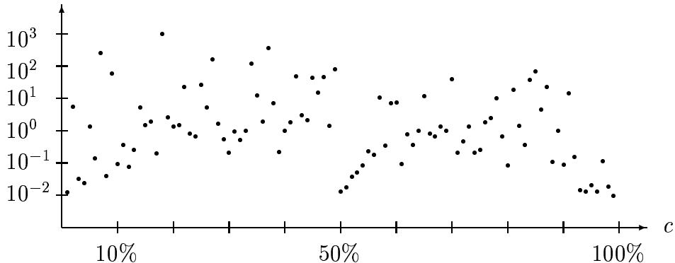  
Figure 8.1: Average computational times for MTB2 in seconds (log. scale), as function of the capacity $c$ Weakly correlated instances, $n = 2 0 0 0$ , $R = 1 0 0$ , $m _ { j }$ in [1, 10].

are measured to 0.01 seconds, while for most other capacities they are hundreds of times larger.

However Figure 8.1 suffers from the problem, that the exponentially growing computational times of mTB2 make it difficult to ascribe a merit to the mean values. Thus Figure 8.2 shows the average values of the logarithm to the computational times. Here it is even more clear, that a capacity chosen as $5 0 \%$ of the total weight sum leads to the easiest data instances.

Better reductions can be achieved by applying specialized reductions for the bounded knapsack problem. If the BKP is transformed to the corresponding KP, each item is reduced separately, meaning that you cannot give a total bound on the number of items of a given type, that may be included in the knapsack.

These observations motivate construction of a specialized algorithm for the BKP, which adapts the latest results from the solution of 0-1 Knapsack Problems and Multiple-choice Knapsack Problems. The presented algorithm — called BOuKNAP — is based on dynamic programming, where the enumeration starts from the LP-optimal solution and propagates guided by some greedy principles. Since the necessary sorting and reduction is done by need, we are able to establish some minimal properties for the algorithm.

Section 8.2 gives a brief introduction to minimal algorithms for knapsack problems, while Section 8.3 brings some basic definitions and sketches the main part of BOukNAP. A recursive formulation of the dynamic programming is given in Section 8.4, while Sections

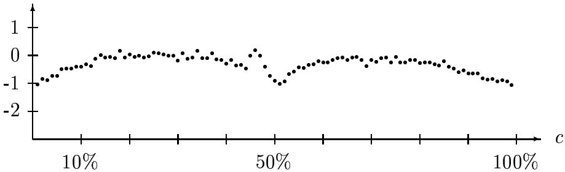  
Figure 8.2: Average log computational times for MTB2 in seconds, as function of the capacity c. Weakly correlated instances, $n = 2 0 0 0$ , $R = 1 0 0$ , $m _ { j }$ in [1, 10].

8.5 and 8.6 bring some reduction rules for reducing item types, and for fathoming states in the dynamic programming. Finally Section 8.7 shows how the solution vector corresponding to the objective value is determined. Computational experiments, comparing BOUKNAP with the algorithm MTB2 of Martello and Toth [53], are presented in Section 8.8.

# 8.2 Minimal algorithms

Balas and Zemel [4] presented an efficient algorithm for the solution of the 0-1 Knapsack Problem by focusing the enumeration on a so-called core: A small subset of the items where there is a high probability for finding an optimal solution through permutations. Assume that the items are ordered according to nonincreasing efficiencies $e _ { j } = p _ { j } / w _ { j }$ , and let the break item $b$ be defined as:

$$
\begin{array} { r } { b = \operatorname* { m i n } \left\{ j : \sum _ { i = 1 } ^ { j } w _ { i } > c \right\} . } \end{array}
$$

Then the core $C$ is basically an interval $[ s , t ] \ \ni \ b$ of the sorted items, such that items $j \not \in C$ may be fixed at their LP-optimal values through reduction tests. The smallest size of a core can obviously not be identified before the problem is solved, since it demands knowledge on the optimal solution, but several estimates on the expected core size have been proposed by Balas and Zemel [4] and Martello and Toth [52,53].

However Pisinger [82] presented an adaptive technique such that a minimal core can be derived during the solution process. The principles may easily be generalized to the Multiple-choice Knapsack Problem [81], or  as presented here  the Bounded Knapsack Problem.

• The algorithms are based on dynamic programming to obtain a pseudo-polynomial worst-case behavior.   
The enumeration starts from the LP-optimal solution and continues in a symmetric way outwards from the fractional variable of the LP-solution. Thus we enumerate a so-called expanding core $C$ .   
In each step of the dynamic programming we branch on the variable which gives the largest gain per weight unit, or the smallest loss per weight unit. This is known as the greedy approach.   
•Both sorting and reduction is done by need. When the enumeration reaches the border of the current core, new items are simply reduced, sorted, and added to the core.   
The process stops, when all states of the dynamic programming have been fathomed due to a bounding test, or when all items outside the core could be fixed at their LP-optimal value through reduction rules.

We would like to minimize all steps of the algorithm: sorting, reduction and enumeration, but due to the computational complexity of each step, an obvious hierarchy evolves:

1 Highest ranked is to obtain the smallest possible core, since enumerating the core has exponential growth $O ( 2 ^ { n } )$ .   
2 Limiting the so-called strong reduction has second priority, since the complexity of the reduction is $O ( r )$ where $r$ is the number of states at the current stage of the dynamic programming.   
3 The smallest possible sorting has third priority, since sorting $n$ items has the complexity $O ( n \log n )$ .   
4 Lowest ranked is to reduce items with the so-called weak upper bound test, since testing $n$ items may be done in $O ( n )$ .

Since all possible variations of the solution vector in the core have been tested before the core is extended with a new item type, and since the choice of the considered items is guided by greedy principles, the final core $C$ is minimal in the following sense:

Assume that the core was given in advance as an interval $[ s , t ]$ of the sorted items, like in MT2 by Martello and Toth [52]. In order to solve the problem to proven optimality, we demand that either the enumeration fades out due to some bounding rules before reaching the item types $s - 1$ or $t + 1$ , or that all remaining variables $x _ { j } \notin C$ may be fixed at their LP-optimal values by reduction rules.

But the presented algorithm finds the smallest symmetrical core, such that an algorithm like MT2 is able to prove the optimality when given the core in advance (see [82] for a proof). Strictly speaking this means, that you cannot find a subset core $C ^ { \prime } = [ s ^ { \prime } , t ^ { \prime } ]$ of the minimal core $C = [ s , t ]$ with $e _ { s ^ { \prime } } > e _ { s }$ and $e _ { t ^ { \prime } } < e _ { t }$ such that a fixed-core algorithm solves the core problem to proven optimality.

The reductions of a minimal algorithm are tight, since the bounding rules are not applied before all item types of higher (resp. lower) efficiency have been enumerated, thus ensuring the tightest possible lower bound.

The complexity of a minimal algorithm for the Bounded Knapsack Problem is

$$
O ( n + \operatorname* { m i n } \{ m _ { s } \cdot m _ { s + 1 } \cdot \cdot \cdot m _ { t } , \vert C \vert c \log c \} ) ,
$$

meaning that for moderate core sizes $| C | = t - s + 1$ , we have a linear-time behavior, while hard instances demanding a complete enumeration have a pseudo-polynomial solution time.

# 8.3 Definitions and main algorithm

The Linear Bounded Knapsack Problem is easily solved by a greedy algorithm: Order the item types according to nonincreasing efficiencies such that

$$
e _ { i } \geq e _ { j } \mathrm { i f } i < j ,
$$

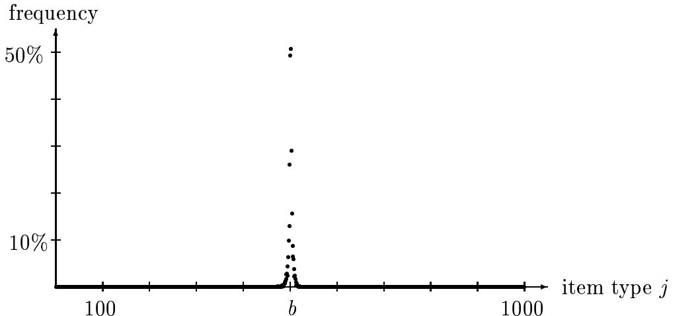  
Figure 8.3: Frequency of item types $j$ where the optimal solution differ from the break solution. Average of 1000 uncorrelated data instances $n = 1 0 0 0$ , $R = 1 0 0 0 0$ .

and define the break item type $b$ as

$$
b = \operatorname* { m i n } \left\{ j : \sum _ { i = 1 } ^ { j } m _ { i } w _ { i } > c \right\} .
$$

Then an optimal solution to LBKP is defined as $x _ { j } = m _ { j }$ for $j = 1 , \dots , b - 1$ , and $x _ { j } = 0$ for $j = b + 1 , \dotsc , n$ , while we set

$$
x _ { b } = \frac { ( c - \sum _ { j = 1 } ^ { b - 1 } m _ { j } w _ { j } ) p _ { b } } { w _ { b } } .
$$

The break item type may be found by adapting the technique of Balas and Zemel [4] or through partial sorting as presented in Pisinger [75]. Both techniques lead to an $O ( n )$ solution time for the LBKP. By truncating the LP-optimal solution to $x _ { b } = 0$ we obtain the bre k soolution $x ^ { \prime }$ , which has profit sum $\begin{array} { r } { \overline { { p } } = \sum _ { j = 1 } ^ { b - 1 } m _ { j } p _ { j } } \end{array}$ and weight sum $\begin{array} { r } { \overline { { \boldsymbol { w } } } = \sum _ { j = 1 } ^ { b - 1 } m _ { j } \boldsymbol { w } _ { j } } \end{array}$ b

The break solution is a tight lower bound, since generally it is only necessary to modify a few variables around $b$ in order to obtain an optimal solution. Figure 8.3 shows the frequency of item types where the IP-optimal solution differ from the break solution. The graph is a result of solving 1000 randomly generated data instances, constructed such that $b = 5 0 0$ for all problems. It is clearly seen that generally only a dozen item types need to be enumerated, and that the probability for changes decreases steeply with a variables distance from $b$ .

This motivates the enumeration of an expanding core $C$ starting from the break item type. The greedy approach for choosing the next variable to be added to the core ensures that those variables, where there is largest probability for changes from the LP-optimal values, are enumerated first. For a core $C = [ s , t ]$ the complete set $X _ { s , t }$ of solution vectors is given by

$$
X _ { s , t } = \left\{ \begin{array} { l } { ( x _ { s } , \ldots , x _ { t } ) { \mathrm { ~ } } : { \mathrm { ~ } } x _ { j } \in \{ 0 , \ldots , m _ { j } \} , \ j = s , \ldots , t { \mathrm { ~ } } \right\} { \mathrm { ~ } } , } \end{array}
$$

we will use some fathoming and dominance rules to avoid a complete enumeration.

Sorting and reduction is done by need during the enumeration, thus at any stage $[ s ^ { \prime } , t ^ { \prime } ]$ denotes the interval of sorted items, which have passed the reduction test, while $z$ denotes the current lower bound. We may sketch the main part of algorithm BoukNAP as:

# Algorithm 8.1

procedure bouknap $( n , c , p , w , m , x )$ ;   
partsort $( 1 , n )$ ; $\{$ Find break item type b through partial sorting}   
$[ s , t ] : = [ b , b ]$ ; $[ s ^ { \prime } , t ^ { \prime } ] : = [ b , b ]$ ;   
$z : = 0$ ; $X _ { s , t } : = \{ ( 0 ) , \ldots , ( m _ { b } ) \}$ ;   
$\operatorname { r e d u c e s e t } ( X _ { s , t } )$ ;   
while $( X _ { s , t } \neq \emptyset )$ do if $\left( s - 1 \ge s ^ { \prime } \right)$ then $d : = { \mathrm { t i g h t e n } } ( s - 1 )$ if $( d \neq 0 )$ then $X _ { s - 1 , t } : = \operatorname { a d d } ( X _ { s , t } , s - 1 , d ) ; \mathbf { f }$ . $s : = s - 1$ ; fi; reduceset $( X _ { s , t } )$ ; if $\left( t + 1 \le t ^ { \prime } \right)$ then $d : = { \mathrm { t i g h t e n } } ( t + 1 )$ ; if $( d \neq 0 )$ then $X _ { s , t + 1 } : = \mathrm { a d d } ( X _ { s , t } , t + 1 , d )$ ; f; $t : = t + 1$ ; fi; reduceset $( X _ { s , t } )$ ;   
elihw;

The first step of the algorithm is to find the break item type $b$ through partial sorting in $O ( n )$ time, as described in Pisinger [75]: We use a partitioning algorithm like Qu1cksORT [32] to partition the variables into two sets around the median $\lambda$ such that $e _ { j } \geq \lambda$ for $j \in [ 1 , i ]$ ,while $e _ { j } \ \leq \ \lambda$ for $j \in [ i + 1 , n ]$ . If $\begin{array} { r } { \sum _ { j = 1 } ^ { i } m _ { j } w _ { j } \le c } \end{array}$ we may conclude that $b$ cannot be in the interval $[ 1 , i ]$ , and may thus discard the interval. Otherwise we discard the interval $[ i + 1 , n ]$ . The process is repeated till the current interval only contains $b$ . All discarded intervals are pushed to a stack, since they represent a partial ordering of the items, which will be applied later in the algorithm.

Now the algorithm solves an expanding core $C = [ s , t ]$ , such that initially the core only consists of the break item, and then successively it is extended to the left or to the right. We use dynamic programming for enumerating the core, meaning that procedure ADD enumerates all possible variations of the current core plus item type $s - 1$ or $t + 1$ .

Dominance relations and bounding rules ensures that only a limited number of the $m _ { s } \cdots m _ { t }$ possible variations of the core are enumerated. Procedure REDuCEsET uses some bounding rules to fathom states, which cannot lead to an improved solution. These rules are further described in Section 8.5. Furthermore, the procedure updates the lower bound $z$ , and extends the core by need.

Procedure TIGHTEN $( j )$ tightens the bound $x _ { j } \in \{ 0 , \ldots , m _ { j } \}$ by applying some bounding rules on the number of items inserted/removed of the concerned item type. Thus the obtained bound $d$ means that only $d \leq m _ { j }$ item values have to be enumerated in procedure ADD, and if $d = 0$ we may even fathom the variable $j$ . The procedure TIGHTEN is further described in Section 8.6.

Algorithm BOuKNAP terminates when all states $X _ { s , t }$ have been fathomed, meaning that a better solution than the current cannot be found.

# 8.4 Dynamic programming

Let $f _ { i } ( \tilde { c } ) , \ ( 0 \leq i \leq n , \ 0 \leq \tilde { c } \leq c )$ be an optimal solution to the following subproblem of BKP, defined on the first $i$ variables of the problem:

$$
f _ { i } ( { \tilde { c } } ) = \operatorname* { m a x } \left\{ \sum _ { j = 1 } ^ { i } p _ { j } x _ { j } : \sum _ { j = 1 } ^ { i } w _ { j } x _ { j } \leq { \tilde { c } } , \ x _ { j } \in \{ 0 , \ldots , m _ { j } \} { \mathrm { ~ f o r ~ } } j = 1 , \ldots , i \right\} .
$$

Generalizing the results by Bellman [5] for the 0-1 Knapsack Problem, we obtain the following recursion formula for the solution of BKP

$$
f _ { i } ( \tilde { c } ) = \operatorname* { m a x } \left\{ \begin{array} { l l } { f _ { i - 1 } \big ( \tilde { c } \big ) } & { \mathrm { ~ i f ~ } \tilde { c } \geq 0 } \\ { f _ { i - 1 } \big ( \tilde { c } - w _ { i } \big ) + p _ { i } } & { \mathrm { ~ i f ~ } \tilde { c } - w _ { i } \geq 0 } \\ { \vdots } \\ { f _ { i - 1 } \big ( \tilde { c } - m _ { i } w _ { i } \big ) + m _ { i } p _ { i } } & { \mathrm { ~ i f ~ } \tilde { c } - m _ { i } w _ { i } \geq 0 } \end{array} \right.
$$

while we set

$$
f _ { 0 } ( \tilde { c } ) = 0 \mathrm { ~ f o r ~ } \tilde { c } = 0 , \dots , c .
$$

By changing the recursion to an iterative process Gilmore and Gomory [30] and Nemhauser and Ullmann [62] developed dynamic programming algorithms with pseudo-polynomial time bounds. However, none of the algorithms are able to solve large instances: Nemhauser and Ullmann report that the largest instances solved were $n = 5 0$ with $m _ { j } = 2$ for all item types.

The problem about these algorithms is that the enumeration has no strategy, since the recursion formula may be evaluated without the sorting (8.5), resulting in an arbitrary enumeration. However, if we order the item types in advance, the enumeration gets even worse: We start the enumeration at those item types $( 1 , 2 , \ldots )$ where there is least probability (cf. Figure 8.3) for changing the solution variables from their LP-optimal values — generating billions of states before the problem even starts to be interesting.

A more efficient recursion should take into account, that generally only a few items around $b$ need to be changed from their LP-optimal values in order to obtain the IPoptimal values. Assume that the items are ordered according to nonincreasing efficiencies, and let $f _ { s , t } ( \tilde { c } ) , \ ( s \le b , \ t \ge b - 1 , \ 0 \le \tilde { c } \le 2 c )$ be an optimal solution to the core problem:

$$
f _ { s , t } ( \tilde { c } ) = \operatorname* { m a x } \left\{ \begin{array} { l } { \sum _ { j = 1 } ^ { s - 1 } m _ { j } p _ { j } + \sum _ { j = s } ^ { t } p _ { j } x _ { j } : } \\ { \sum _ { j = 1 } ^ { s - 1 } m _ { j } w _ { j } + \sum _ { j = s } ^ { t } w _ { j } x _ { j } \le \tilde { c } , } \\ { x _ { j } \in \{ 0 , \dots , m _ { j } \} \mathrm { ~ f o r ~ } j = s , \dots , t } \end{array} \right\} .
$$

This leads to the following improved recursion:

$$
\begin{array} { r } { f _ { s , t } ( \bar { c } ) = \operatorname* { m a x } \left\{ \begin{array} { l l } { f _ { s , t - 1 } ( \tilde { c } ) } & { \mathrm { ~ i f ~ } t \geq b } \\ { f _ { s , t - 1 } ( \bar { c } - w _ { t } ) + p _ { t } } & { \mathrm { ~ i f ~ } t \geq b , \quad \tilde { c } - w _ { t } \geq 0 } \\ { \vdots } & \\ { f _ { s , t - 1 } ( \tilde { c } - m _ { t } w _ { t } ) + m _ { t } p _ { t } } & { \mathrm { ~ i f ~ } t \geq b , \quad \tilde { c } - m _ { t } w _ { t } \geq 0 } \\ { f _ { s + 1 , t } ( \tilde { c } ) } & { \mathrm { ~ i f ~ } s < b } \\ { f _ { s + 1 , t } ( \tilde { c } + w _ { s } ) - p _ { s } } & { \mathrm { ~ i f ~ } s < b , \quad \tilde { c } + w _ { s } \leq 2 c } \\ { \vdots } & \\ { f _ { s + 1 , t } ( \tilde { c } + m _ { s } w _ { s } ) - m _ { s } p _ { s } } & { \mathrm { ~ i f ~ } s < b , \quad \tilde { c } + m _ { s } w _ { s } \leq 2 c } \end{array} \right. } \end{array}
$$

while we set

$$
\begin{array} { l l } { f _ { b , b - 1 } ( \tilde { c } ) = - \infty } & { \mathrm { f o r } \quad \tilde { c } = 0 , \dots , \overline { { w } } - 1 , } \\ { f _ { b , b - 1 } ( \tilde { c } ) = \overline { { p } } } & { \mathrm { f o r } \quad \tilde { c } = \overline { { w } } , \dots , 2 c . } \end{array}
$$

Thus the enumeration starts at $( s , t ) = ( b , b - 1 )$ and continues by either removing some items of type $s$ from the knapsack, or inserting some items of type $t$ in the knapsack. An optimal solution to BKP is found as $f _ { 1 , n } ( c )$ .

At any stage of the enumeration, it is convenient to represent the states by the corresponding profit and weight sums $( \pi , \mu )$ , thus with a core $C = [ s , t ]$ the set of states is $X _ { s , t } = \{ ( \pi _ { 1 } , \mu _ { 1 } ) , \dots , ( \pi _ { r } , \mu _ { r } ) \}$ , where

$$
\pi _ { i } = f _ { s , t } ( \mu _ { i } ) .
$$

It is convenient to keep the states ordered, such that $X _ { s , t } = \{ ( \pi _ { 1 } , \mu _ { 1 } ) , \dots , ( \pi _ { r } , \mu _ { r } ) \}$ satisfies $\pi _ { i } < \pi _ { i + 1 }$ and $\mu _ { i } < \mu _ { i + 1 }$ . Any state $( \pi , \mu )$ with $\mu > c + \Sigma _ { j = 1 } ^ { s - 1 } m _ { j } w _ { j }$ , may be fathomed, since even if we removed all items of types $j < s$ in the forthcoming iterations, the state would never become a feasible solution. This observation implies that no states with weights $\mu \geq 2 c$ can occur, giving the algorithm space complexity $O ( n 2 c ) = O ( n c )$ .

An efficient iterative version of recursion (8.13) is obtained by applying the transformation (8.2) for the current item type, such that the procedure ADD in Algorithm 8.1 results in $\lfloor \log _ { 2 } m _ { j } + 1 \rfloor$ mergings of length $O ( c )$ (see Pisinger [67] for details on the merging). This means that the time complexity for the dynamic programming is $O ( c \sum _ { j = 1 } ^ { n } \lfloor \log _ { 2 } m _ { j } + 1 \rfloor )$ , i.e. $O ( n c \log c )$ in the worst case.

For moderate core sizes $| C | = t - s + 1$ we obtain a tighter bound, as only $O ( | C | c \log c )$ steps are necessary. Moreover we use dynamic programming by reaching, meaning that at most $O ( m _ { s } \cdot m _ { s + 1 } \cdot \cdot \cdot m _ { t } )$ states should be considered. Thus we obtain the time bound

$$
O ( \operatorname* { m i n } \{ m _ { s } \cdot m _ { s + 1 } \cdot \cdot \cdot m _ { t } , \ | C | c \log c \} ) ,
$$

on the enumeration of a core $C = [ s , t ]$ .

# 8.5 Reduction

Although the recursion (8.13) gives a pseudo-polynomial time bound on the solution process, even less enumeration may be done by incorporating some bounding rules in the

dynamic programming. Assume that the current core is $C = [ s , t ]$ , and that a given state $i$ has the profit and weight sum $( \pi _ { i } , \mu _ { i } )$ . We may then fathom the state if the following condition holds:

$$
u ( i ) < z + 1 ,
$$

where the upper bound $u ( i )$ on the stage is obtained by relaxing the constraints on $x _ { s - 1 }$ and $x _ { t + 1 }$ to $x _ { s - 1 } \geq 0$ and $x _ { t + 1 } \geq 0$ , yielding:

$$
u ( i ) ~ = ~ \left\{ \begin{array} { l l } { \pi _ { i } + \frac { \left( c - \mu _ { i } \right) p _ { t + 1 } } { w _ { t + 1 } } \mathrm { i f } \mu _ { i } \le c , } \\ { \pi _ { i } + \frac { \left( c - \mu _ { i } \right) p _ { s - 1 } } { w _ { s - 1 } } \mathrm { i f } \mu _ { i } > c . } \end{array} \right.
$$

This bound may also be used for deriving a global upper bound on (8.1) as

$$
\boldsymbol { u } _ { \mathrm { B K P } } = \operatorname* { m a x } _ { i \in X _ { s , t } } \boldsymbol { u } ( i ) ,
$$

which has the property that it converges towards the optimal solution for increasing core sizes.

Since $s - 1$ or $t + 1$ in (8.18) may fall outside the current reduced and sorted interval $[ s ^ { \prime } , t ^ { \prime } ]$ , we have to extend the core in such cases. This is done the following way:

If all items $\textit { j } < \textit { s } ^ { \prime }$ have been fathomed due to (8.17) we choose $p _ { s - 1 } ~ = ~ \infty$ and $w _ { s - 1 } = 1$ . Similarly if all items $j > t ^ { \prime }$ have been fathomed we choose $p _ { t + 1 } = 0$ and $w _ { t + 1 } = 1$ . In both cases the bounds will ensure that states which cannot be improved further are fathomed. Otherwise we choose one of the partially ordered intervals discarded by procedure PARTsORT and try to fix as many variables $x _ { j }$ as possible, at their optimal values.

An item type $j$ may be fathomed if either all the available items of that type have to be included in the knapsack $( j ~ < b )$ or if none of the available items of that type can be included in the knapsack $( j \geq b )$ . Thus we may use the following fathoming tests

$$
\begin{array} { r l r } & { \overline { { p } } - p _ { j } + \frac { \left( c - \overline { { w } } + w _ { j } \right) p _ { b } } { w _ { b } } < z + 1 } & { \mathrm { i f } \quad j \geq b , } \\ & { \overline { { p } } + p _ { j } + \frac { \left( c - \overline { { w } } - w _ { j } \right) p _ { b } } { w _ { b } } < z + 1 } & { \mathrm { i f } \quad j < b , } \end{array}
$$

where the left sides are known as the weak upper bounds. If the inequality is satisfied, we may fix $x _ { j }$ at $m _ { j } ~ \left( j < b \right)$ , respectively at 0 $( j \geq b )$ , and thus fathom the item type. The remaining variables are swapped to positions besides $[ s ^ { \prime } , t ^ { \prime } ]$ , where they are sorted and added to the core. See Pisinger [67] for more details.

# 8.6 Tightening the bound on an item type

Since the enumeration of a new item type is computationally very expensive, a strong bounding test should be used for tightening the bound on an item type $\ell$ . In this way

the bound may be restricted from $x _ { \ell } \in \{ 0 , \ldots , m _ { \ell } \}$ to $x _ { \ell } \in \{ 0 , \ldots , d _ { \ell } \}$ if $\ell \geq b$ or to $x _ { \ell } \in \{ m _ { \ell } - d _ { \ell } , . . . , m _ { \ell } \}$ if $\ell < b$ . Thus assume that the core is $C = [ s , t ]$ and that we are going to add item type $\ell$ to the core $\ell = s - 1$ or $\ell = t + 1$ ).

It is only fruitful to insert $d$ items of type $\ell = t + 1$ in the knapsack if any upper bound $u$ on the BKP with additional constraint $x _ { \ell } = d$ exceeds the current lower bound $z$ , thus if

$$
u _ { \ell } ( d ) \geq z + 1 .
$$

We use a generalization of the bound by Dembo and Hammer [14] for this test, obtaining

$$
\overline { { p } } + d p _ { \ell } + \frac { ( c - \overline { { w } } - d w _ { \ell } ) p _ { b } } { w _ { b } } \ge z + 1 .
$$

From this inequality we may obtain the maximum number of an item type, which may be included in the knapsack, as:

$$
d _ { \ell } = \left\lfloor \frac { \operatorname* { d e t } ( z + 1 - \overline { { p } } , c - \overline { { w } } , p _ { b } , w _ { b } ) } { \operatorname* { d e t } ( p _ { \ell } , w _ { \ell } , p _ { b } , w _ { b } ) } \right\rfloor \quad \mathrm { w h e n } \quad \ell = t + 1 ,
$$

where we set $d _ { \ell } = m _ { \ell }$ when $e _ { \ell } = e _ { b }$ or when the right side of equation (8.23) is larger than $m _ { \ell }$ . A similar result is obtained for items of type $\ell = s - 1$ , which have to be removed from the knapsack. Here an upper bound on the number of removed items is

$$
d _ { \ell } = \left\lfloor \frac { \operatorname* { d e t } ( z + 1 - \overline { { p } } , c - \overline { { w } } , p _ { b } , w _ { b } ) } { - \operatorname* { d e t } ( p _ { \ell } , w _ { \ell } , p _ { b } , w _ { b } ) } \right\rfloor \quad \mathrm { w h e n } \quad \ell = s - 1 ,
$$

with the same conventions as for equation (8.23).

Although these bounds work wel for most instances, tighter reductions may be derived by using enumerative bounds as presented in Pisinger [82]. Thus with the core $C = [ s , t ]$ let $X = X _ { s , t }$ be the set of enumerated solution vectors. The ultimate check is to determine whether any state in $X + \ell$ will pass the reduction (8.18) when $d$ items of type $\ell$ are added to the knapsack. No stronger bound can be constructed, since if the inclusion of the $d$ items implies that a new promising branch is introduced to $X _ { s , t }$ there is no way of avoiding the inclusion.

If we add $d$ items of item type $\ell = t + 1$ , any state in $X + \ell$ will be the sum $( \pi _ { i } +$ $d p _ { \ell } , \mu _ { i } + d w _ { \ell } )$ where $0 \leq d \leq m _ { \ell }$ , meaning that the bound (8.18) for fathoming states in $X + \ell$ becomes:

$$
\begin{array} { r l r } { \tilde { u } ( i , d ) } & { = } & { \left\{ \begin{array} { l l } { \tilde { u } _ { 1 } ( i , d ) = \pi _ { i } + d p _ { \ell } + \frac { \left( c - \mu _ { i } - d w _ { \ell } \right) p _ { t + 1 } } { w _ { t + 1 } } \mathrm { i f } \mu _ { i } + d w _ { \ell } \le c , } \\ { \tilde { u } _ { 2 } ( i , d ) = \pi _ { i } + d p _ { \ell } + \frac { \left( c - \mu _ { i } - d w _ { \ell } \right) p _ { s - 1 } } { w _ { s - 1 } } \mathrm { i f } \mu _ { i } + d w _ { \ell } > c . } \end{array} \right. } \end{array}
$$

Thus an upper bound for the addition of $d$ items of type $\ell$ is given as

$$
\tilde { u } _ { \ell , d } ~ = ~ \operatorname* { m a x } _ { i \in X } \tilde { u } ( i , d ) ,
$$

where we demand that $\tilde { u } _ { \ell , d } \geq z + 1$ . This is a generalization of the $\pi$ -bound presented in Pisinger [68]. From equation (8.25) we may derive the maximum amount $d$ of items

of the type $\ell$ , which may be added to the knapsack such that state $i$ passes the criteria $\tilde { u } ( i , d ) \ge z + 1$ . The equation

$$
\begin{array} { r } { \tilde { u } _ { 1 } ( i , d ) \geq z + 1 \mathrm { i f } \mu _ { i } + d w _ { \ell } \leq c , } \end{array}
$$

may be written

$$
\operatorname* { d e t } ( \pi _ { i } - z - 1 , \mu _ { i } - c , p _ { t + 1 } , w _ { t + 1 } ) \geq d \operatorname* { d e t } ( p _ { t + 1 } , w _ { t + 1 } , p _ { \ell } , w _ { \ell } ) \ { \mathrm { ~ i f ~ } } \ d \leq { \frac { c - \mu _ { i } } { w _ { \ell } } } .
$$

Here the left side is positive, since any state $i \in X$ has passed the reduction (8.17), and the right side is zero, since $\ell = t + 1$ . So the equation is satisfied for all states $i$ when just $\begin{array} { r } { d \leq \frac { c - \mu _ { i } } { w _ { \ell } } } \end{array}$ .The largest contribution we may get from this restriction is thus

$$
\operatorname* { m a x } _ { i \in X } \left( \frac { c - \mu _ { i } } { w _ { \ell } } \right) = \frac { c - \mu _ { 1 } } { w _ { \ell } } ,
$$

since the states in $X$ are ordered, meaning that $\mu _ { 1 }$ is the smallest weight sum. In a similar way the equation

$$
\tilde { u } _ { 2 } ( i , d ) \geq z + 1 \mathrm { i f } \mu _ { i } + d w _ { \ell } > c ,
$$

may be formulated as

$$
d \leq \frac { \operatorname * { d e t } \left( \pi _ { i } - z - 1 , \mu _ { i } - c , p _ { s - 1 } , w _ { s - 1 } \right) } { - \operatorname * { d e t } \left( p _ { \ell } , w _ { \ell } , p _ { s - 1 } , w _ { s - 1 } \right) } \mathrm { i f } d > \frac { c - \mu _ { i } } { w _ { \ell } } .
$$

Those states, which does not satisfy that $\begin{array} { r } { d > \frac { c - \mu _ { i } } { w _ { \ell } } } \end{array}$ , will not contribute to the bound $d _ { \ell }$ since they are dominated by the bound (8.29), while those states satisfying the inequality will contribute with

$$
d ^ { \prime } ( i ) = \frac { \operatorname * { d e t } ( \pi _ { i } - z - 1 , \mu _ { i } - c , p _ { s - 1 } , w _ { s - 1 } ) } { - \operatorname * { d e t } ( p _ { \ell } , w _ { \ell } , p _ { s - 1 } , w _ { s - 1 } ) } .
$$

Thus the tightened bound on item type $\ell$ is

$$
d _ { \ell } = \operatorname* { m a x } \left\{ \lfloor \frac { c - \mu _ { 1 } } { w _ { \ell } } \rfloor , \ \lfloor \operatorname* { m a x } _ { i \in X } d ^ { \prime } ( i ) \rfloor \right\} , \mathrm { w h e n } \ell = t + 1 ,
$$

where we set $d _ { \ell } = m _ { \ell }$ if the right side of equation (8.33) is larger than $m _ { \ell }$ .

A similar result is obtained for $\ell = s - 1$ , resulting in the tightened bound

$$
d _ { \ell } = \operatorname* { m a x } \left\{ \lfloor \frac { \mu _ { r } - c } { w _ { \ell } } \rfloor , \ \lfloor \operatorname* { m a x } _ { i \in X } d ^ { \prime \prime } ( i ) \rfloor \right\} , \ \mathrm { w h e n } \ \ \ell = s - 1 .
$$

Here $\mu _ { r }$ is the largest weight sum in $X$ , while $d ^ { \prime \prime } ( i )$ is given by

$$
d ^ { \prime \prime } ( i ) = \frac { \operatorname * { d e t } ( \pi _ { i } - z - 1 , \mu _ { i } - c , p _ { t + 1 } , w _ { t + 1 } ) } { \operatorname * { d e t } ( p _ { \ell } , w _ { \ell } , p _ { t + 1 } , w _ { t + 1 } ) } .
$$

Note, that if $\begin{array} { r } { \frac { c - \mu _ { 1 } } { w _ { \ell } } \ge m _ { \ell } } \end{array}$ in (8.33) we do not need to evaluate the enumerative bound, since there is no hope for tightening the bound $m _ { \ell }$ . A similar rule holds for (8.34) when $\frac { \mu _ { m } - c } { w _ { \ell } } \geq m _ { \ell }$

Computational experiments have shown, that the bounds (8.33) and (8.34) are able to tighten the bound on item type $\ell$ by $1 0 \%$ more than the bounds (8.23) and (8.24). For practical purpose, the simpler bounds may be more useful, especially since they are evaluated in constant time. This chapter is however focused on determining the smallest possible core in order to get a tight bound on the enumeration.

# 8.7 Solution vector

Any state $( \pi _ { i } , \mu _ { i } )$ in the dynamic programming should not only contain the profit and weight sum, but also the corresponding solution vector x. Pisinger [82] noticed that since only a few item types around $b$ are modified during the solution process, storing a complete solution vector $\mathbf { x }$ would be too comprehensive. Instead only the last $a$ changes in the solution vector are saved. When an optimal solution is found, we reconstruct the solution vector. If more than $a$ changes were made, we have to solve a new (smaller) problem to find the remaining vector. The process is eventually repeated. In this way, we get a space bound $O ( c )$ for the algorithm, but need to solve up to $O ( n )$ problems. For a complete description of the technique see Pisinger [67].

# 8.8 Computational experiments

The presented algorithm has been implemented in ANSI-C, and a complete listing is available from the author on request. The following results have been achieved on a $\mathrm { H P 9 0 0 0 / 7 3 0 }$ computer.

We will consider the most common randomly generated data instances from the literature: Uncorrelated data instances: $p _ { j }$ and $w _ { j }$ are randomly distributed in $[ 1 , R ]$ . Weakly correlated data instances: $w _ { j }$ randomly distributed in $[ 1 , R ]$ and $p _ { j }$ randomly distributed in $[ w _ { j } - R / 1 0 , w _ { j } + R / 1 0 ]$ such that $p _ { j } ~ \geq ~ 1$ . Strongly correlated data instances: $w _ { j }$ randomly distributed in $[ 1 , R ]$ and $p _ { j } = w _ { j } + 1 0$ . Subset-sum data instances: $w _ { j }$ randomly distributed in $[ 1 , R ]$ and $p _ { j } = w _ { j }$ . The data range $R$ will be tested with values $R = 1 0 0$ , 1000 and 10 000, while the bounds $m _ { j }$ are randomly distributed in [5, 10].

An exact description of how the instances are generated is given in Appendix A. Each problem type is tested with a series of $S = 2 0 0$ instances, such that the capacity $c$ of the knapsack varies from $1 \%$ to $9 9 \%$ of the total weight sum of the items. This approach takes into account that the running times depend on the chosen capacity as shown in Figure 8.1.

We will compare the presented BOukNAP algorithm with the MTB2 algorithm by Martello and Toth [53], which in the same paper is shown to be the most efficient of several superior algorithms. The FORTRAN code for MTB2 has been obtained from [53]. Since MTB2 transforms the BKP to an equivalent 0-1 KP, instances larger than $n = 5 0 0 0 0$ cannot be solved due to memory limitations. In the following tables a "_" means, that the 200 instances could not be solved in totally 10 hours.

Table I: Final core size, measured as $| C | = t - s + 1$ .Average of 200 instances.   

<table><tr><td></td><td colspan="3">Uncorrelated</td><td colspan="3">Weakly correlated</td><td colspan="3">Strongly correlated</td><td colspan="3">Subset sum</td></tr><tr><td>n\R</td><td>100</td><td>1000</td><td>10 000</td><td>100</td><td>1000</td><td>10 000</td><td>100</td><td>1000</td><td>10000</td><td>100</td><td>1000</td><td>10 000</td></tr><tr><td>100</td><td>4</td><td>5</td><td>6</td><td>5</td><td>9</td><td>9</td><td>32</td><td>36</td><td>33</td><td>4</td><td>5</td><td>6</td></tr><tr><td>300</td><td>5</td><td>7</td><td>7</td><td>4</td><td>10</td><td>13</td><td>97</td><td>99</td><td>102</td><td>4</td><td>5</td><td>6</td></tr><tr><td>1000</td><td>4</td><td>8</td><td>10</td><td>4</td><td>9</td><td>16</td><td>287</td><td>296</td><td>311</td><td>4</td><td>5</td><td>6</td></tr><tr><td>3000</td><td>4</td><td>9</td><td>12</td><td>6</td><td>7</td><td>18</td><td>991</td><td>956</td><td>943</td><td>4</td><td>5</td><td>6</td></tr><tr><td>10000</td><td>4</td><td>6</td><td>15</td><td>11</td><td>5</td><td>17</td><td>3142</td><td>3404</td><td></td><td>4</td><td>5</td><td>6</td></tr><tr><td>30000</td><td>7</td><td>5</td><td>15</td><td>22</td><td>6</td><td>10</td><td>9282</td><td>9164</td><td></td><td>4</td><td>5</td><td>6</td></tr><tr><td>100000</td><td>18</td><td>5</td><td>11</td><td>60</td><td>10</td><td>7</td><td>29621</td><td>30080</td><td></td><td>4</td><td>5</td><td>6</td></tr></table>

Table II: Percentage of item types tested by the fathoming test. Average of 200 instances   

<table><tr><td rowspan="2">n\R</td><td colspan="3">Uncorrelated</td><td colspan="3">Weakly correlated</td><td colspan="3">Strongly correlated</td><td colspan="3">Subset sum</td></tr><tr><td>100</td><td>1000</td><td>10000</td><td>100</td><td>1000</td><td>10 000</td><td>100</td><td>1000</td><td>10 000</td><td>100</td><td>1000</td><td>10000</td></tr><tr><td>100</td><td>65</td><td>88</td><td>91</td><td>40</td><td>95</td><td>97</td><td>86</td><td>90</td><td>91</td><td>13</td><td>16</td><td>20</td></tr><tr><td>300</td><td>40</td><td>84</td><td>88</td><td>14</td><td>86</td><td>98</td><td>87</td><td>86</td><td>87</td><td>6</td><td>7</td><td>8</td></tr><tr><td>1000</td><td>6</td><td>71</td><td>87</td><td>4</td><td>49</td><td>97</td><td>82</td><td>84</td><td>88</td><td>2</td><td>3</td><td>3</td></tr><tr><td>3000</td><td>2</td><td>51</td><td>84</td><td>2</td><td>13</td><td>92</td><td>87</td><td>86</td><td>86</td><td>1</td><td>1</td><td>2</td></tr><tr><td>10000</td><td>1</td><td>15</td><td>76</td><td>1</td><td>2</td><td>69</td><td>84</td><td>87</td><td>—</td><td>0</td><td>0</td><td>0</td></tr><tr><td>30000</td><td>0</td><td>3</td><td>59</td><td>1</td><td>0</td><td>24</td><td>84</td><td>85</td><td></td><td>0</td><td>0</td><td>0</td></tr><tr><td>100000</td><td>0</td><td>0</td><td>28</td><td>0</td><td>0</td><td>3</td><td>84</td><td>85</td><td></td><td>0</td><td>0</td><td>0</td></tr></table>

Table III: Efficiency of the fathoming test in percent. Average of 200 instances.   

<table><tr><td rowspan="2">n\R</td><td colspan="3">Uncorrelated</td><td colspan="3">Weakly correlated</td><td colspan="3">Strongly correlated</td><td colspan="3">Subset sum</td></tr><tr><td>100</td><td>1000</td><td>10000</td><td>100</td><td>1000</td><td>10 000</td><td>100</td><td>1000</td><td>10 000</td><td>100</td><td>1000</td><td>10000</td></tr><tr><td>100</td><td>86</td><td>90</td><td>90</td><td>71</td><td>84</td><td>83</td><td>47</td><td>45</td><td>48</td><td>18</td><td>14</td><td>11</td></tr><tr><td>300</td><td>91</td><td>95</td><td>95</td><td>68</td><td>93</td><td>92</td><td>50</td><td>48</td><td>48</td><td>18</td><td>25</td><td>9</td></tr><tr><td>1000</td><td>85</td><td>98</td><td>98</td><td>57</td><td>95</td><td>97</td><td>52</td><td>53</td><td>53</td><td>16</td><td>22</td><td>11</td></tr><tr><td>3000</td><td>81</td><td>99</td><td>99</td><td>58</td><td>94</td><td>99</td><td>50</td><td>50</td><td>52</td><td>19</td><td>8</td><td>11</td></tr><tr><td>10000</td><td>71</td><td>99</td><td>100</td><td>17</td><td>91</td><td>100</td><td>52</td><td>48</td><td></td><td>23</td><td>26</td><td>9</td></tr><tr><td>30000</td><td>36</td><td>97</td><td>100</td><td>10</td><td>76</td><td>100</td><td>53</td><td>54</td><td></td><td>15</td><td>10</td><td>17</td></tr><tr><td>100000</td><td>71</td><td>85</td><td>100</td><td>15</td><td>74</td><td>99</td><td>54</td><td>54</td><td></td><td>14</td><td>21</td><td>8</td></tr></table>

First, Table I shows the average core size for each problem type, as obtained by BOuKNAP. It is seen that only a couple of item types need to be enumerated in order to solve the problem to optimality. However the strongly correlated instances demand a considerable enumeration. The core sizes are minimal in the sense, that for each instance one cannot find any subset of the core, such that the problem is solved to proven optimality by considering only the items in the core.

Table II gives the percentage of items, which are tested by the fathoming test (8.20). We observe that for large data instances, only a minor part of the item types need to be considered at all, proving the strength of the lazy reduction.

The next two tables show the efficiency of the presented reductions: Table III shows the efficiency of fathoming test (8.20), by stating the amount of tested item types, which were fathomed. The efficiency of the tightening of bounds (8.34) is given in Table IV as

Table IV: Efficiency $\mathcal { E }$ of bound tightening, in percent. Average of 200 instances.   

<table><tr><td rowspan="2">n\R</td><td colspan="3">Uncorrelated</td><td colspan="3">Weakly correlated</td><td colspan="3">Strongly correlated</td><td colspan="3">Subset sum</td></tr><tr><td>100</td><td>1000</td><td>10000</td><td>100</td><td>1000</td><td>10 000</td><td>100</td><td>1000</td><td>10 000</td><td>100</td><td>1000</td><td>10000</td></tr><tr><td>100</td><td>67</td><td>71</td><td>70</td><td>57</td><td>68</td><td>69</td><td>65</td><td>64</td><td>64</td><td>13</td><td>10</td><td>7</td></tr><tr><td>300</td><td>63</td><td>69</td><td>71</td><td>38</td><td>68</td><td>72</td><td>64</td><td>64</td><td>64</td><td>14</td><td>11</td><td>8</td></tr><tr><td>1000</td><td>37</td><td>70</td><td>71</td><td>21</td><td>66</td><td>70</td><td>64</td><td>65</td><td>66</td><td>12</td><td>11</td><td>6</td></tr><tr><td>3000</td><td>26</td><td>69</td><td>71</td><td>13</td><td>52</td><td>73</td><td>64</td><td>65</td><td>64</td><td>12</td><td>12</td><td>7</td></tr><tr><td>10000</td><td>16</td><td>56</td><td>75</td><td>6</td><td>20</td><td>73</td><td>64</td><td>65</td><td></td><td>12</td><td>12</td><td>7</td></tr><tr><td>30000</td><td>9</td><td>30</td><td>72</td><td>3</td><td>10</td><td>61</td><td>65</td><td>65</td><td></td><td>13</td><td>11</td><td>7</td></tr><tr><td>100000</td><td>3</td><td>12</td><td>77</td><td>1</td><td>5</td><td>28</td><td>65</td><td>64</td><td></td><td>11</td><td>12</td><td>8</td></tr></table>

Table V: Max number of states in the dynamic programming (in thousands). Average of 200 instances.   

<table><tr><td rowspan="2">n\R</td><td colspan="3">Uncorrelated</td><td colspan="3">Weakly correlated</td><td colspan="3">Strongly correlated</td><td colspan="3">Subset sum</td></tr><tr><td>100</td><td>1000</td><td>10 000</td><td>100</td><td>1000</td><td>10 000</td><td>100</td><td>1000</td><td>10 000</td><td>100</td><td>1000</td><td>10000</td></tr><tr><td>100</td><td>1</td><td>1</td><td>1</td><td>1</td><td>3</td><td>5</td><td>5</td><td>44</td><td>560</td><td>3</td><td>24</td><td>279</td></tr><tr><td>300</td><td>1</td><td>2</td><td>2</td><td>2</td><td>9</td><td>15</td><td>6</td><td>61</td><td>707</td><td>2</td><td>27</td><td>294</td></tr><tr><td>1000</td><td>1</td><td>7</td><td>7</td><td>3</td><td>16</td><td>21</td><td>11</td><td>116</td><td>1022</td><td>3</td><td>28</td><td>290</td></tr><tr><td>3000</td><td>2</td><td>10</td><td>20</td><td>6</td><td>30</td><td>55</td><td>22</td><td>191</td><td>1788</td><td>4</td><td>39</td><td>261</td></tr><tr><td>10000</td><td>3</td><td>12</td><td>28</td><td>9</td><td>33</td><td>114</td><td>37</td><td>361</td><td>—</td><td>5</td><td>25</td><td>255</td></tr><tr><td>30000</td><td>4</td><td>17</td><td>83</td><td>26</td><td>46</td><td>199</td><td>80</td><td>555</td><td></td><td>4</td><td>29</td><td>257</td></tr><tr><td>100000</td><td>23</td><td>25</td><td>127</td><td>61</td><td>65</td><td>289</td><td>242</td><td>999</td><td></td><td>3</td><td>23</td><td>276</td></tr></table>

Table VI: Total computing time in seconds (BoukNAP). Average of 200 instances.   

<table><tr><td rowspan="2">n\R</td><td colspan="3">Uncorrelated</td><td colspan="3">Weakly correlated</td><td colspan="3">Strongly correlated</td><td colspan="3">Subset sum</td></tr><tr><td>100</td><td>1000</td><td>10000</td><td>100</td><td>1000</td><td>10 000</td><td>100</td><td>1000</td><td>10000</td><td>100</td><td>1000</td><td>10 000</td></tr><tr><td>100</td><td>0.00</td><td>0.00</td><td>0.00</td><td>0.00</td><td>0.00</td><td>0.00</td><td>0.02</td><td>0.16</td><td>1.55</td><td>0.00</td><td>0.02</td><td>0.27</td></tr><tr><td>300</td><td>0.00</td><td>0.00</td><td>0.00</td><td>0.00</td><td>0.01</td><td>0.01</td><td>0.06</td><td>0.62</td><td>7.36</td><td>0.00</td><td>0.02</td><td>0.27</td></tr><tr><td>1000</td><td>0.00</td><td>0.01</td><td>0.01</td><td>0.00</td><td>0.01</td><td>0.03</td><td>0.22</td><td>2.24</td><td>25.70</td><td>0.00</td><td>0.02</td><td>0.28</td></tr><tr><td>3000</td><td>0.00</td><td>0.01</td><td>0.02</td><td>0.01</td><td>0.01</td><td>0.09</td><td>0.81</td><td>9.37</td><td>109.67</td><td>0.01</td><td>0.03</td><td>0.30</td></tr><tr><td>10000</td><td>0.01</td><td>0.02</td><td>0.06</td><td>0.02</td><td>0.03</td><td>0.16</td><td>3.03</td><td>39.71</td><td></td><td>0.02</td><td>0.04</td><td>0.30</td></tr><tr><td>30000</td><td>0.04</td><td>0.05</td><td>0.12</td><td>0.08</td><td>0.08</td><td>0.20</td><td>13.59</td><td>116.96</td><td></td><td>0.05</td><td>0.06</td><td>0.31</td></tr><tr><td>100000</td><td>0.20</td><td>0.16</td><td>0.27</td><td>0.40</td><td>0.26</td><td>0.37</td><td>107.90</td><td>450.46</td><td></td><td>0.17</td><td>0.19</td><td>0.45</td></tr></table>

$$
\mathscr { E } = \frac { \sum _ { j = s } ^ { t } ( m _ { j } - d _ { j } ) } { \sum _ { j = s } ^ { t } m _ { j } } .
$$

Finally Table V shows the maximum amount of states at any stage of the dynamic programming. The number of states increases with larger data-range $R$ and problem size $n$ . However due to the compact representation of the solution vector $\mathbf { x }$ , even large strongly correlated instances may be solved.

The last two tables (Table VI and VII) compares the running times of BOuKNAP with those of mTB2. Notice, that MTB2 has substantial stability problems for low-ranged data instances even of relatively small size. Also subset-sum data instances show a few anomalous occurrences. On the other hand BoukNAP has a very stable behavior, solving most instances within a fraction of a second. The strongly correlated instances demand more computational time, but the effort grows linearly with the problem size $n$ and the data range $R$ . In Appendix B, similar tests have been performed with $m _ { j }$ randomly generated in [50, 100]. The computational times for these instances even clearer show the benefits of BOUKNAP.

Table VII: Total computing time in seconds (MTB2). Average of 200 instances.   

<table><tr><td rowspan="2">n\R</td><td colspan="3">Uncorrelated</td><td colspan="3">Weakly correlated</td><td rowspan="2" colspan="3">Strongly correlated 100 1000</td></tr><tr><td>100</td><td>1000</td><td>10000</td><td>100</td><td>1000 10 000</td><td>10000</td><td>1000</td></tr><tr><td>100</td><td>0.00</td><td>0.00</td><td>0.00</td><td>0.00</td><td>0.01 0.02</td><td></td><td></td><td>0.00 0.02</td><td>0.15</td></tr><tr><td>300</td><td>0.01</td><td>0.01</td><td>0.01</td><td>0.00</td><td>0.03</td><td></td><td>0.00</td><td></td><td>40.96</td></tr><tr><td>1000</td><td>0.01</td><td>0.03</td><td>0.04</td><td>0.01</td><td>0.06 0.05 0.26</td><td></td><td>0.00</td><td>0.01</td><td>0.09</td></tr><tr><td>3000</td><td>0.02</td><td>0.05</td><td>0.14</td><td>62.58</td><td>0.04 0.57</td><td></td><td>0.01</td><td>0.02</td><td>0.10</td></tr><tr><td>10000</td><td>14.72</td><td>0.11</td><td>0.43</td><td></td><td>0.17 0.98</td><td></td><td>0.05</td><td>0.06</td><td>0.14</td></tr><tr><td>30000</td><td></td><td>0.31</td><td>1.09</td><td></td><td>1.04</td><td></td><td>0.18</td><td>0.19</td><td>0.26</td></tr><tr><td>100000</td><td></td><td></td><td></td><td></td><td></td><td></td><td></td><td></td><td></td></tr></table>

It is interesting to compare Table VII with Table II, since MTB2 has the worst computational times in those situations, where fewest items need to be considered in order to solve the problem. This demonstrates that MTB2 does not fully utilize the benefits of solving a core problem, since MTB2 frequently spends more time for solving the core problem than a complete sorting and reduction would take.

# 8.9 Conclusions

We have presented a complete algorithm for the exact solution of the Bounded Knapsack Problem, which has the time bound

$$
O ( n + \operatorname* { m i n } \{ m _ { s } \cdot m _ { s + 1 } \cdot \cdot \cdot m _ { t } , \vert C \vert c \log c \} ) ,
$$

where the term $O ( n )$ is dominant for small core sizes $| C | = t - s + 1$ . This result is strengthened by the fact that the presented algorithm enumerates the smallest possible core. Since the reduction and sorting is done by need, these preprocessing steps are also minimized, although they have lower priority than the enumeration.

Moreover we have demonstrated that the transformation approach which was proposed by Martello and Toth [53] leads to hard data instances, even for relatively small instances. The presented algorithm does not have these problems, and computational experiments document, that BOukNAP outperforms MTB2 for all kinds of randomly generated problem types.

Finally it should be mentioned that BOukNAP is well suited as an approximate algorithm, since the enumeration may be abandoned when the global upper bound $u _ { \mathrm { B K P } }$ differs less than a given threshold value from the current solution.

# Appendix A: Generating test instances

In order to let other authors generate the same test instances as applied in Section 8.8, we here include an algorithm for generating the test data.

The standard LRAND48 generator of the $\mathrm { C }$ library is used for generating pseudorandom profits and weights. The LRAND48 generator is using the well-known linear congruential algorithm, which generates a series of numbers $X _ { 1 } , X _ { 2 } , X _ { 3 } , . . .$ as

$$
X _ { i + 1 } = ( a X _ { i } + d ) { \mathrm { ~ m o d ~ } } m ,
$$

where a = 25214903917, $d = 1 1$ and $m = 2 ^ { 4 8 }$ . The first 31 bits of the number are returned for LRAND48. A seed $s$ for the algorithm is given by procedure SRAND48 as:

$$
X _ { 0 } = s \cdot 2 ^ { 1 6 } + 1 3 0 7 0 .
$$

Table VI eksums tial uions ve  Σi1000.   

<table><tr><td rowspan="2">n\R</td><td colspan="3">Uncorrelated</td><td colspan="3">Weakly correlated</td><td colspan="3">Strongly correlated</td><td colspan="3">Subset sum</td></tr><tr><td>100</td><td>1000</td><td>10 000</td><td>100</td><td>1000</td><td>10 000</td><td>100</td><td>1000</td><td>10 000</td><td>100</td><td>1000</td><td>10000</td></tr><tr><td>100</td><td>715</td><td>95</td><td>435</td><td>893</td><td>695</td><td>148</td><td>510</td><td>871</td><td>835</td><td>692</td><td>311</td><td>400</td></tr><tr><td>300</td><td>263</td><td>897</td><td>650</td><td>823</td><td>404</td><td>45</td><td>856</td><td>910</td><td>286</td><td>436</td><td>438</td><td>514</td></tr><tr><td>1000</td><td>793</td><td>818</td><td>751</td><td>698</td><td>10</td><td>543</td><td>663</td><td>196</td><td>648</td><td>783</td><td>256</td><td>758</td></tr><tr><td>3000</td><td>692</td><td>161</td><td>184</td><td>699</td><td>735</td><td>33</td><td>369</td><td>864</td><td>251</td><td>959</td><td>734</td><td>761</td></tr><tr><td>10000</td><td>931</td><td>75</td><td>120</td><td>325</td><td>900</td><td>778</td><td>809</td><td>429</td><td></td><td>269</td><td>429</td><td>830</td></tr><tr><td>30000</td><td>347</td><td>958</td><td>62</td><td>337</td><td>267</td><td>927</td><td>132</td><td>662</td><td></td><td>922</td><td>792</td><td>703</td></tr><tr><td>100000</td><td>515</td><td>904</td><td>833</td><td>748</td><td>897</td><td>214</td><td>407</td><td>922</td><td></td><td>407</td><td>672</td><td>998</td></tr></table>

For a given data range $R$ , bound range $M$ , instance size $n$ , and problem type $t$ (uc, wc, sc, ss) we constructed $S = 2 0 0$ different data instances as follows:

procedure testinstance $( n , M , R , t , i )$ ; { Generate test instance i, $1 \leq i \leq S \}$   
$W : = 0$ ; $R ^ { \prime } : = \lfloor R / 1 0 \rfloor$ ;   
$\mathrm { S R A N D } 4 8 ( i )$ ; $\{$ Use $i$ as seed for the sequence of random numbers}   
for $j : = 1$ to $n$ do $w _ { j } : = ( { \tt L R A N D 4 8 ~ m o d ~ } R ) + 1$ $m _ { j } : = \left( \mathrm { L R A N D 4 8 ~ m o d ~ } M / 2 \right) + M / 2 ;$ case $t$ of uc: $p _ { j } : = ( { \mathrm { L R A N D 4 8 ~ m o d ~ } } R ) + 1$ ; wc: $p _ { j } : = w _ { j } - R ^ { \prime } + \left( \mathtt { L R A N D 4 8 \ m o d } \left( 2 R ^ { \prime } + 1 \right) \right)$ . if $( p _ { j } \leq 0 )$ then $p _ { j } : = 1$ ;fi; SC: $p _ { j } : = w _ { j } + 1 0$ ; SS: $p _ { j } : = w _ { j }$ ; esac; $W : = W + m _ { j } w _ { j } ;$   
rof;   
$c : = \lfloor ( i * W ) / ( S + 1 ) \rfloor$ ;   
if $( c \leq R )$ then $c : = R + 1$ ; fi;   
for $j : = 1$ to $n$ do if $( m _ { j } w _ { j } > c )$ then $m _ { j } : = \lfloor c / w _ { j } \rfloor$ f;   
rof;

a I: i 00.   

<table><tr><td rowspan="2">n\R</td><td colspan="3">Uncorrelated</td><td colspan="3">Weakly correlated</td><td colspan="3">Strongly correlated</td><td colspan="3">Subset sum</td></tr><tr><td>100</td><td>1000</td><td>10 000</td><td>100</td><td>1000</td><td>10 000</td><td>100</td><td>1000</td><td>10 000</td><td>100</td><td>1000</td><td>10000</td></tr><tr><td>100</td><td>85</td><td>253</td><td>455</td><td>85</td><td>253</td><td>455</td><td>692</td><td>311</td><td>400</td><td>692</td><td>311</td><td>400</td></tr><tr><td>300</td><td>981</td><td>138</td><td>395</td><td>981</td><td>138</td><td>395</td><td>436</td><td>438</td><td>514</td><td>436</td><td>438</td><td>514</td></tr><tr><td>1000</td><td>848</td><td>95</td><td>634</td><td>848</td><td>95</td><td>634</td><td>783</td><td>256</td><td>758</td><td>783</td><td>256</td><td>758</td></tr><tr><td>3000</td><td>4</td><td>908</td><td>263</td><td>4</td><td>908</td><td>263</td><td>959</td><td>734</td><td>761</td><td>959</td><td>734</td><td>761</td></tr><tr><td>10000</td><td>898</td><td>295</td><td>741</td><td>898</td><td>295</td><td>741</td><td>269</td><td>429</td><td></td><td>269</td><td>429</td><td>830</td></tr><tr><td>30000</td><td>431</td><td>15</td><td>109</td><td>431</td><td>15</td><td>109</td><td>922</td><td>792</td><td></td><td>922</td><td>792</td><td>703</td></tr><tr><td>100000</td><td>15</td><td>477</td><td>669</td><td>15</td><td>477</td><td>669</td><td>407</td><td>672</td><td></td><td>407</td><td>672</td><td>998</td></tr></table>

Table X: Number of iterations used for obtaining the solution vector. Average of 200 instances.   

<table><tr><td rowspan="2">n\R</td><td colspan="3">Uncorrelated</td><td colspan="3">Weakly correlated</td><td colspan="3">Strongly correlated</td><td colspan="3">Subset sum</td></tr><tr><td>100</td><td>1000</td><td>10000</td><td>100</td><td>1000</td><td>10 000</td><td>100</td><td>1000</td><td>10 000</td><td>100</td><td>1000</td><td>10000</td></tr><tr><td>100</td><td>1.0</td><td>1.0</td><td>1.0</td><td>1.0</td><td>1.0</td><td>1.0</td><td>1.0</td><td>1.1</td><td>1.0</td><td>1.0</td><td>1.0</td><td>1.0</td></tr><tr><td>300</td><td>1.0</td><td>1.0</td><td>1.0</td><td>1.0</td><td>1.0</td><td>1.1</td><td>1.3</td><td>1.3</td><td>1.3</td><td>1.0</td><td>1.0</td><td>1.0</td></tr><tr><td>1000</td><td>1.0</td><td>1.0</td><td>1.0</td><td>1.0</td><td>1.1</td><td>1.3</td><td>1.9</td><td>1.8</td><td>1.9</td><td>1.0</td><td>1.0</td><td>1.0</td></tr><tr><td>3000</td><td>1.0</td><td>1.0</td><td>1.1</td><td>1.1</td><td>1.0</td><td>1.4</td><td>2.6</td><td>3.0</td><td>2.9</td><td>1.0</td><td>1.0</td><td>1.0</td></tr><tr><td>10000</td><td>1.0</td><td>1.0</td><td>1.3</td><td>1.5</td><td>1.0</td><td>1.5</td><td>2.8</td><td>5.1</td><td></td><td>1.0</td><td>1.0</td><td>1.0</td></tr><tr><td>30000</td><td>1.2</td><td>1.0</td><td>1.2</td><td>1.8</td><td>1.1</td><td>1.2</td><td>2.9</td><td>7.6</td><td></td><td>1.0</td><td>1.0</td><td>1.0</td></tr><tr><td>100000</td><td>1.6</td><td>1.0</td><td>1.1</td><td>2.2</td><td>1.5</td><td>1.0</td><td>2.9</td><td>11.6</td><td></td><td>1.0</td><td>1.0</td><td>1.0</td></tr></table>

The if -statement in the weakly correlated instances ensures that $p _ { j }$ is a positive integer, while the last lines of the algorithm ensures that $m _ { j } w _ { j } \leq c$ and $m _ { j } \geq 1$ for all $j = 1 , \dots , n$ . Checksums of the optimal solutions and capacities are given in Table VIII and IX.

# Appendix B: Additional computational results

In this section we bring the results of some computational experiments which did not fit into the main section.

First, Table X brings the number of iterations, which are needed to define the complete solution vector as described in Section 8.7. For easy data instances, less than two iterations are needed on the average, meaning that there is a minimal overhead for this part of the algorithm. For strongly correlated instances, up to a dozen iterations are needed, but still less than $1 0 \%$ of the solution time is spent for reconstructing the solution vector.

Table XI shows the gap $\Gamma$ between the LP-optimal and the IP-optimal solution. Balas and Zemel [4] showed that the hardness of a 0-1 Knapsack Problem depends on the correlation and the gap $\Gamma$ . This explains that instances with coefficients generated in a large range $R$ , generally are harder to solve than the same instances where the coefficients are generated in a small range, since the gap $\Gamma$ grows with increasing data range.

Finally Table XII and XIII shows the standard deviation on the running times of BOUKNAP and MTB2. Apart from the strongly correlated instances — which apparently have a very large variation in the running times — most of the variations are very small.

Table XI: Gap Γ between LP-optimal solution and IP-optimal solution. Average of 200 instances.   

<table><tr><td rowspan="2">n\R</td><td colspan="3">Uncorrelated</td><td colspan="3">Weakly correlated</td><td colspan="3">Strongly correlated</td><td colspan="3">Subset sum</td></tr><tr><td>100</td><td>1000</td><td>10000</td><td>100</td><td>1000</td><td>10 000</td><td>100</td><td>1000</td><td>10 000</td><td>100</td><td>1000</td><td>10000</td></tr><tr><td>100</td><td>2.8</td><td>35.7</td><td>364.2</td><td>0.4</td><td>10.7</td><td>110.0</td><td>4.5</td><td>5.0</td><td>4.7</td><td>0.0</td><td>0.0</td><td>0.0</td></tr><tr><td>300</td><td>1.1</td><td>15.4</td><td>153.7</td><td>0.1</td><td>3.6</td><td>51.5</td><td>4.5</td><td>4.6</td><td>4.8</td><td>0.0</td><td>0.0</td><td>0.0</td></tr><tr><td>1000</td><td>0.1</td><td>5.9</td><td>63.5</td><td>0.0</td><td>1.1</td><td>18.6</td><td>4.2</td><td>4.2</td><td>4.4</td><td>0.0</td><td>0.0</td><td>0.0</td></tr><tr><td>3000</td><td>0.0</td><td>2.1</td><td>28.6</td><td>0.0</td><td>0.3</td><td>7.2</td><td>4.6</td><td>4.7</td><td>4.4</td><td>0.0</td><td>0.0</td><td>0.0</td></tr><tr><td>10000</td><td>0.0</td><td>0.5</td><td>9.7</td><td>0.0</td><td>0.1</td><td>2.3</td><td>4.3</td><td>4.9</td><td></td><td>0.0</td><td>0.0</td><td>0.0</td></tr><tr><td>30000</td><td>0.0</td><td>0.1</td><td>3.7</td><td>0.0</td><td>0.0</td><td>0.5</td><td>4.3</td><td>4.4</td><td></td><td>0.0</td><td>0.0</td><td>0.0</td></tr><tr><td>100000</td><td>0.0</td><td>0.0</td><td>1.0</td><td>0.0</td><td>0.0</td><td>0.1</td><td>4.1</td><td>4.2</td><td></td><td>0.0</td><td>0.0</td><td>0.0</td></tr></table>

Table XII: Standard deviation computational times BOukNAP. Average of 200 instances.   

<table><tr><td rowspan="2">n\R</td><td colspan="3">Uncorrelated</td><td colspan="3">Weakly correlated</td><td colspan="3">Strongly correlated</td><td colspan="3">Subset sum</td></tr><tr><td>100</td><td>1000</td><td>10000</td><td>100</td><td>1000</td><td>10 000</td><td>100</td><td>1000</td><td>10000</td><td>100</td><td>1000</td><td>10 000</td></tr><tr><td>100</td><td>0.00</td><td>0.00</td><td>0.00</td><td>0.00</td><td>0.00</td><td>0.01</td><td>0.02</td><td>0.20</td><td>2.35</td><td>0.00</td><td>0.02</td><td>0.26</td></tr><tr><td>300</td><td>0.00</td><td>0.00</td><td>0.00</td><td>0.00</td><td>0.01</td><td>0.01</td><td>0.06</td><td>0.74</td><td>8.80</td><td>0.00</td><td>0.02</td><td>0.24</td></tr><tr><td>1000</td><td>0.00</td><td>0.01</td><td>0.01</td><td>0.00</td><td>0.01</td><td>0.02</td><td>0.27</td><td>2.93</td><td>31.81</td><td>0.00</td><td>0.02</td><td>0.24</td></tr><tr><td>3000</td><td>0.00</td><td>0.01</td><td>0.01</td><td>0.01</td><td>0.01</td><td>0.06</td><td>0.87</td><td>11.21</td><td>133.46</td><td>0.00</td><td>0.03</td><td>0.25</td></tr><tr><td>10000</td><td>0.01</td><td>0.01</td><td>0.03</td><td>0.01</td><td>0.02</td><td>0.09</td><td>3.55</td><td>46.41</td><td></td><td>0.01</td><td>0.02</td><td>0.24</td></tr><tr><td>30000</td><td>0.02</td><td>0.01</td><td>0.07</td><td>0.09</td><td>0.05</td><td>0.13</td><td>14.46</td><td>158.89</td><td></td><td>0.01</td><td>0.02</td><td>0.25</td></tr><tr><td>100000</td><td>0.30</td><td>0.02</td><td>0.10</td><td>0.71</td><td>0.14</td><td>0.22</td><td>113.94</td><td>615.35</td><td></td><td>0.01</td><td>0.02</td><td>0.24</td></tr></table>

Table XIII: Standard deviation computational times MTB2. Average of 200 instances.   

<table><tr><td>n\R</td><td colspan="3">Uncorrelated</td><td colspan="3">Weakly correlated</td><td colspan="2">Strongly correlated</td><td colspan="3">Subset sum</td></tr><tr><td></td><td>100</td><td>1000</td><td>10000</td><td>100</td><td>1000</td><td>10 000</td><td>100</td><td>1000 10 000</td><td>100</td><td>1000</td><td>10 000</td></tr><tr><td>100</td><td>0.00</td><td>0.01</td><td>0.01</td><td>0.00</td><td>0.02</td><td>0.02</td><td></td><td></td><td>0.00</td><td>0.08</td><td>0.23</td></tr><tr><td>300</td><td>0.07</td><td>0.01</td><td>0.01</td><td>0.00</td><td>0.03</td><td>0.07</td><td></td><td></td><td>0.00</td><td></td><td>576.25</td></tr><tr><td>1000</td><td>0.01</td><td>0.02</td><td>0.04</td><td>0.04</td><td>0.05</td><td>0.26</td><td></td><td></td><td>0.00</td><td>0.01</td><td>0.10</td></tr><tr><td>3000</td><td>0.01</td><td>0.03</td><td>0.14</td><td>631.67</td><td>0.03</td><td>0.60</td><td></td><td></td><td>0.00</td><td>0.01</td><td>0.13</td></tr><tr><td>10000</td><td>205.07</td><td>0.04</td><td>0.39</td><td></td><td>0.73</td><td>0.91</td><td></td><td></td><td>0.00</td><td>0.02</td><td>0.12</td></tr><tr><td>30000</td><td></td><td>0.07</td><td>0.86</td><td></td><td></td><td>1.40</td><td></td><td></td><td>0.01</td><td>0.03</td><td>0.13</td></tr><tr><td>100000</td><td></td><td></td><td></td><td></td><td></td><td></td><td></td><td></td><td></td><td></td><td></td></tr></table>

However MTB2 has a very large variation at the anomalous occurrences, showing that it is only a few instances, which takes up almost all the computational time.

Data instances, where the bounds $m _ { j }$ are distributed in [50, 100], are considered in Table XIV and XV. Solution times for both of the algorithms are given for the data ranges $R = 1 0 0$ and $R = 1 0 0 0$ (range $R = 1 0 0 0 0$ causes overflow in the integer arithmetics). As in the previous case, it is seen that MTB2 has several anomalous occurrences, even for small-ranged instances. On the other hand BoukNAP has a stable behavior, solving all problems in a few seconds (apart from the strongly correlated instances). It should especially be noted, that solving a BKP which involves up to 100000 items (1000 item types with bounds up to 100) is considerably more efficient than solving a 0-1 Knapsack Problem of similar size [82]. Thus in cases, where several items of same profit and weight occur, a transformation from the 0-1 Knapsack Problem to a Bounded Knapsack Problem will yield a considerable decrease in the computational times.

Table XIV: Total computing time in seconds (BouKNAP) when $m _ { j }$ is distributed in [50, 100]. Average of 200 instances.

<table><tr><td></td><td colspan="2">Uncorrelated</td><td colspan="2">Weakly corr.</td><td colspan="2">Strongly corr.</td><td colspan="2">Subset sum</td></tr><tr><td>n\R</td><td>100</td><td>1000</td><td>100</td><td>1000</td><td>100</td><td>1000</td><td>100</td><td>1000</td></tr><tr><td>100</td><td>0.00</td><td>0.00</td><td>0.00</td><td>0.01</td><td>0.04</td><td>0.49</td><td>0.03</td><td>0.34</td></tr><tr><td>300</td><td>0.00</td><td>0.01</td><td>0.01</td><td>0.03</td><td>0.15</td><td>1.88</td><td>0.03</td><td>0.33</td></tr><tr><td>1000</td><td>0.00</td><td>0.01</td><td>0.01</td><td>0.06</td><td>0.62</td><td>6.42</td><td>0.03</td><td>0.34</td></tr><tr><td>3000</td><td>0.01</td><td>0.03</td><td>0.02</td><td>0.09</td><td>2.96</td><td>20.55</td><td>0.04</td><td>0.31</td></tr><tr><td>10000</td><td>0.03</td><td>0.07</td><td>0.13</td><td>0.14</td><td>23.09</td><td></td><td>0.05</td><td>0.38</td></tr><tr><td>30000</td><td>0.16</td><td>0.12</td><td>0.51</td><td>0.24</td><td>175.71</td><td></td><td>0.07</td><td>0.37</td></tr><tr><td>100000</td><td>1.05</td><td>0.29</td><td>3.78</td><td>0.58</td><td>—</td><td></td><td>0.20</td><td>0.57</td></tr></table>

Table XV: Total computing time in seconds (mTB2) when $m _ { j }$ is distributed in [50, 100].   
Average of 200 instances.

<table><tr><td>n\R</td><td colspan="2">Uncorrelated 100 1000</td><td colspan="2">Weakly corr. 100</td><td colspan="2">Strongly corr. 100 1000</td><td colspan="2">Subset sum 1000</td></tr><tr><td>100</td><td>0.00</td><td>0.01</td><td>0.15</td><td>1000 0.03</td><td></td><td></td><td>100 35.18</td><td>67.45</td></tr><tr><td>300</td><td>0.22</td><td>0.02</td><td>0.46</td><td>0.06</td><td></td><td></td><td></td><td></td></tr><tr><td>1000</td><td>0.02</td><td>0.05</td><td>41.36</td><td>0.07</td><td></td><td></td><td>0.01</td><td>0.02</td></tr><tr><td>3000</td><td>0.04</td><td>0.09</td><td></td><td>0.33</td><td></td><td></td><td>0.03</td><td>0.03</td></tr><tr><td>10000</td><td>0.95</td><td>0.22</td><td></td><td>0.22</td><td></td><td></td><td>0.10</td><td>0.12</td></tr><tr><td>30000</td><td></td><td>0.55</td><td></td><td>5.61</td><td></td><td></td><td>0.33</td><td></td></tr><tr><td>100000</td><td></td><td></td><td></td><td></td><td></td><td></td><td></td><td>0.34</td></tr></table>

# Chapter 9

# Dominance Relations in Unbounded Knapsack Problems

The Unbounded Knapsack Problem (UKP) is a generalization of the 0-1 Knapsack Problem where an unlimited amount of each item type is available. In any efficient algorithm for UKP the reduction of dominated item types plays a central role, as the size of an instance may be decreased considerably this way. Traditionally the dominance test has been based on a sorting of the item types according to nonincreasing profit-to-weight ratios, but a faster reduction may be obtained by sorting according to nondecreasing weights, since then the so-called quotient jumping technique may be applied. Computational experiments are provided to demonstrate the efficiency of the presented algorithm.

Keywords: Knapsack Problem, Dominance Relation.

# 9.1 Introduction

The Unbounded Knapsack Problem (UKP) is defined as

$$
\begin{array} { l l } { \displaystyle \mathrm { m a x i m i z e } } & { \displaystyle \sum _ { j = 1 } ^ { n } p _ { j } x _ { j } } \\ { \mathrm { s u b j e c t ~ t o } } & { \displaystyle \sum _ { j = 1 } ^ { n } w _ { j } x _ { j } \leq c , } \\ & { x _ { j } \geq 0 , \mathrm { ~ i n t e g e r } , j = 1 , \ldots , n , } \end{array}
$$

where $( p _ { j } , w _ { j } )$ are the profits and weights of the item types, and $c$ is the capacity of the knapsack.

The UKP is $\mathcal { N P }$ -hard, but it may be solved in pseudo-polynomial time through dynamic programming [53]. The problem has several applications in financial management, cargo loading and cutting stock, and it appears also by surrogate relaxation of IP problems with nonnegative coefficients. The Unbounded Knapsack Problem may be transformed to a Bounded Knapsack Problem by imposing the constraint $x _ { j } \le \lfloor c / w _ { j } \rfloor$ for each variable considered, but according to Martello and Toth [53], algorithms for the Bounded Knapsack Problem perform rather poorly for instances of this kind.

Dudzinski [18] has shown that several frequently occuring instances of the UKP may be reduced to less than a dozen item types by a preliminary dominance based reduction, and Martello and Toth [53] presented a branch-and-bound algorithm for the exact solution of the remaining problem.

Since a majority of the computational time is spent for the reduction, this chapter is focused on two aspects of the reduction: We want to develop faster reduction algorithms than those previously published, and we will identify classes of instances, which cannot be reduced as efficiently as demonstrated in [18,54], thus opening up for further research in the design of algorithms for UKP.

In Section 9.2 we introduce several reduction algorithms from the existing literature as well as of novel origin. Choosing the dominance reduction by Martello and Toth [53] for further consideration, we develop a fast reduction algorithm in Section 9.3, and experimentally compare it to previously published algorithms in Section 9.4. The chapter is finally ended with a conclusion in Section 9.5.

# 9.2 Reduction algorithms

An efficient way of solving UKP is to first apply some dominance relations to fathom infeasible item types, and then to solve the remaining problem through enumerative techniques. The general form of dominance is defined as follows:

Definition 9.1 Given an item type $j$ , and a set of item types $i _ { 1 } , \ldots , i _ { d }$ where $i _ { k } \neq j$ for $k = 1 , \dots , d$ , but where the indices $\{ i _ { k } \}$ are not necessarily distinct. If

$$
\begin{array} { c } { { p _ { i _ { 1 } } + . . . + p _ { i _ { d } } \geq p _ { j } } } \\ { { w _ { i _ { 1 } } + . . . + w _ { i _ { d } } \leq w _ { j } } } \end{array}
$$

then item type $j$ is said to be dominated by item types $i _ { 1 } , \ldots , i _ { d }$ .

Obviously a dominated item type $j$ may be fathomed from the problem, as any optimal solution with $x _ { j } ~ > ~ 0$ may be replaced by a solution where the same amount of types $i _ { 1 } , \ldots , i _ { d }$ are chosen instead.

A complete testing of dominance is however computationally very expensive, so in the following we will restrict the discussion to the case where $i _ { 1 } , \dots , i _ { d }$ all are same. The tightest choice of $d$ in this case is $d = \lfloor w _ { j } / w _ { i } \rfloor$ as this results in the largest left side of (9.2) still satisfying constraint (9.3).

Definition 9.2 For two given item types $i , j$ where $i \neq j$ , we say that type $j$ is dominated by type $i$ if

$$
\left\lfloor { \frac { w _ { j } } { w _ { i } } } \right\rfloor p _ { i } \geq p _ { j } .
$$

This dominance was introduced by Martello and Toth [54].

Martello and Toth give an efficient algorithm for reducing the dominated items by first sorting the items according to their profit-to-weight ratios

$$
\frac { p _ { j } } { w _ { j } } \geq \frac { p _ { j + 1 } } { w _ { j + 1 } } , \quad j = 1 , \dots , n - 1 ,
$$

breaking ties such that $w _ { j } \leq w _ { j + 1 }$ . Then the following algorithm is performed:

Algorithm MT   
$m : = n$ ;   
for $i : = 1$ to $m$ do for $j : = i + 1$ to $m$ do if $\lfloor w _ { j } / w _ { i } \rfloor p _ { i } \ge p _ { j }$ then fathom type $j$

where the number of undominated item types $m$ is decreased each time an item type $j$ is fathomed. Due to the sorting, Algorithm MT has the complexity $O ( n \log n + m n )$ , thus if $m$ is large we get the bound $O ( n ^ { 2 } )$ which is the best obtainable, as for the socalled subset sum data instances, Definition 9.2 corresponds to a divisibility test of the $n$ weights. In situations where $m$ is much smaller than $n$ , the sorting however takes a majority of the solution time, thus resulting in an empirical solution time of $O ( n \log n )$ . Therefore Dudzinski [18] proposed an $O ( m n )$ algorithm based on the observation that the dominance relation (9.4) is a partial ordering, making it possible to use techniques by Polak and Payne [86] and Majchrzak [45] for eliminating dominated items without sorting. The algorithm of Dudzinski repeatedly finds an undominated item type $i$ , and fathoms all item types dominated by $i$ in linear time as follows:

# Algorithm MN

$m : = n$ ;   
for $i : = 1$ to $m$ do for $j : = i + 1$ to $m$ do if $\lfloor w _ { i } / w _ { j } \rfloor p _ { j } \ge p _ { i }$ then swap $( i , j )$ ; for $j : = i + 1$ to $m$ do if $\lfloor w _ { j } / w _ { i } \rfloor p _ { i } \ge p _ { j }$ then fathom type $j$

where $m$ is decreased each time an item type $j$ is fathomed. As we do not demand any sorting of the item types in Algorithm MN, it is more efficient than Algorithm MT when $m < \log n$ .

# 9.3 Improved reduction

The sorting according to nondecreasing profit-to-weight ratios (9.5) plays a central role in the solution of several Knapsack Problems. However when considering dominance relations for the UKP, faster algorithms may be obtained by sorting according to nondecreasing weights $w _ { j }$ .

Proposition 9.1 Algorithm MT works equally well with the item types ordered according to nondecreasing weights (breaking ties such that $p _ { j } \geq p _ { j + 1 } ,$ .

Proof Condition (9.4) never holds if $w _ { i } > w _ { j }$ or if $w _ { i } = w _ { j }$ and $p _ { i } < p _ { j }$ .

As a matter of fact, we only need to sort according to nondecreasing weights, as ties may be broken afterwards in linear time by the following algorithm:

Algorithm PREP   
$m : = 1$ ;   
for $j : = 2$ to $n$ do if $\left( p _ { j } > p _ { m } \right)$ then if $( w _ { j } \neq w _ { m } )$ then $m : = m + 1$ ; swap $( j , m )$ ;

As the weights are increasing, we only have to ensure that the profits also are increasing as otherwise item type $j$ is dominated by type $m$ . Ties $w _ { j } = w _ { m }$ are handled such that if $p _ { j } > p _ { m }$ then item type $j$ dominates type $m$ and thus overwrites it.

We define the quotient $d _ { i j } = \lfloor w _ { j } / w _ { i } \rfloor$ for item types $i < j$ . Due to the ordering of the weights an obvious consequence of the definition is

Proposition 9.2 The values $d _ { i j }$ satisfy that $d _ { i j } \geq d _ { i + 1 , j }$ and $d _ { i j } \leq d _ { i , j + 1 }$ . Thus they are decreasing for increasing $i$ , and increasing for increasing $j$ .

Proposition 9.3 If several item types $i _ { 1 } , \ldots , i _ { h }$ have the same quotient $d _ { i j }$ for a fixed $j$ then only the last item type $i _ { h }$ is tight, meaning that we only need to consider $i _ { h }$ when testing for dominance.

Furthermore item types $i$ with $d _ { i j } = 1$ need not to be considered at all as they will never dominate item $j$ .

Proof As both the profits and weights are increasing for the considered indices $i _ { 1 } , \ldots , i _ { h }$ . we obtain the largest value of $d _ { i j } p _ { i }$ for index $i _ { h }$ , when demanding ${ d _ { i j } w _ { i } \le w _ { j } }$ . Thus if condition (9.4) does not hold for $i _ { h }$ , then it will neither hold for $i _ { 1 } , \ldots , i _ { h - 1 }$ .

The second part of the proposition is a consequence of the increasing profits, thus for $d _ { i j } = 1$ we get $d _ { i j } p _ { i } < p _ { j }$ as $i < j$ .

For a given item type $j$ let $\ell _ { d } ^ { j }$ denote the index of the tight item type corresponding to the quotient $d$

$$
\ell _ { d } ^ { j } = \left\{ \operatorname* { m a x } _ { i < j } i : \lfloor \frac { w _ { j } } { w _ { i } } \rfloor \geq d \right\} .
$$

Proposition 9.4 The values $\ell _ { d } ^ { j }$ have the property that $\ell _ { d } ^ { j } \geq \ell _ { d + 1 } ^ { j }$ and $\ell _ { d } ^ { j } \leq \ell _ { d } ^ { j + 1 }$ , i.e. they are decreasing for increasing $d$ , and increasing for increasing $j$ .

Example 9.1 The current undominated item types are given in Table I, and we are testing the dominance of type $( p _ { j } , w _ { j } ) = ( 3 2 , 3 0 )$ . Only item types $i = { 1 , 2 , 5 , 8 }$ are tight, and thus need to be considered due to Proposition 9.3. We find that item type $i = 8$ dominates type $j$ , and thus fathom the latter.

Table I: Undominated item types when reducing $( p _ { j } , w _ { j } ) = ( 3 2 , 3 0 )$   

<table><tr><td>i</td><td>1 2 3 4</td><td></td><td></td><td></td><td></td><td>6</td><td>7</td><td>8</td><td>9</td><td>10</td><td>11</td><td>12</td><td>13</td><td>14</td><td>15</td></tr><tr><td>pi</td><td></td><td></td><td>4 5 7 8</td><td>8</td><td></td><td>10</td><td>12</td><td>16</td><td>17</td><td>19</td><td>22</td><td>25</td><td>28</td><td>30</td><td>31</td></tr><tr><td>Wi</td><td></td><td></td><td></td><td>5 7 8 9</td><td>10</td><td>12</td><td>13</td><td>15</td><td>18</td><td>19</td><td>21</td><td>24</td><td>26</td><td>27</td><td>28</td></tr><tr><td>dij</td><td></td><td>6 4 3 3</td><td></td><td>3</td><td></td><td>2</td><td>2</td><td>2</td><td>−1</td><td>1</td><td>1</td><td>1</td><td>1</td><td>1</td><td>−1</td></tr></table>

For practically occurring data instances, we may assume that the weights are distributed in a limited interval $[ R _ { 1 } , R _ { 2 } ]$ , thus there cannot be more than $D = \lfloor R _ { 2 } / R _ { 1 } \rfloor$ different values of $d _ { i j }$ . By saving the values $\ell _ { d } ^ { j }$ from the previous reduction of an item type $j$ , we may obtain an $O ( D n )$ reduction algorithm as follows:

For each item type $j = 2 , \dots , n$ we test whether one of the preceding undominated item types $i = 1 , \ldots , m$ dominates $j$ . Thus for each pair $i , j$ we find the quotient $d = \lfloor w _ { j } / w _ { i } \rfloor$ , and use it for deriving the index of the tight item $\ell _ { d }$ from last iteration. If $\ell _ { d } \ > \ i$ we may immediately jump forward to $i = \ell _ { d }$ , as $d _ { i j } = d$ for the intervening indices due to Proposition 9.2. Now either $i$ is tight, or we move $\ell _ { d }$ forward till it becomes tight as sketched in the following algorithm:

# Algorithm MIN

$m : = 1$ ;   
for $i : = 1$ to $D$ do $\ell _ { i } : = 0$ ;   
for $j : = 2$ to $n$ do { place $j$ right after the undominated item types} $\mathbf { s w a p } ( j , m + 1 )$ for $i : = 1$ to $m$ do $d : = \lfloor w _ { j } / w _ { i } \rfloor$ ; $\{$ type $j$ is not dominated when $d = 1 \}$ if $( d = 1 )$ then $m : = m + 1$ ; break; fi; $\{ \ q u o t i e n t \ j u m p i n g \}$ if $( \ell _ { d } > i )$ then $i : = \ell _ { d }$ else $\ell _ { d } : = i$ ;fi; $\{$ test if $j$ is dominated by $i \}$ if $( d \cdot p _ { i } \geq p _ { j } )$ then break; fi;

As we only consider each item type $j$ once, and since $i$ runs through the set of undominated item types bounded by $m$ , the time complexity is $O ( m n )$ . Moreover the quotient jumping technique yields the bound $O ( D n )$ since each iteration of the inner loop may be considered as one of the following steps:

a) The index $\ell _ { d }$ is tight for the current value of $d$ There are at most $D$ tight dominance tests for each item type $j$ , yielding the complexity $O ( D n )$ . Index $\ell _ { d }$ is not tight so we are moving the pointer forward. There are at most $D$ pointers $\ell _ { d }$ , and each can be moved at most $m$ steps, yielding the bound $O ( D m )$ .

Thus Algorithm MiN has the time complexity $O ( \operatorname* { m i n } ( m n , D n ) )$ . Notice, that if $D$ is large, we do not have to save all values of $\ell _ { d }$ . Computational experiments indicate, that about 100 values yield the best performance. In this case the quotient jumping line of Algorithm MIN should be preceded with a test whether $d \leq 1 0 0$ .

Example 9.2 In continuation of Example 9.1, Table II shows the dominance test of the next item type $( p _ { j } , w _ { j } ) = ( 3 3 , 3 2 )$ . The index $\ell _ { 6 } = 1$ is unchanged from previous reduction, while $\ell _ { 4 }$ has to be iterated forward to $\ell _ { 4 } = 3$ . The final indices $\ell _ { 3 } = 5$ and $\ell _ { 2 } = 8$ are unchanged. Thus the inner loop of Algorithm MiN has to be executed five times in order to prove that the item type $j$ is not dominated.

Table II: Undominated item types when reducing $( p _ { j } , w _ { j } ) = ( 3 3 , 3 2 )$   

<table><tr><td>i</td><td></td><td>1 2 3 4 5 6</td><td></td><td></td><td></td><td>7</td><td></td><td>8 9</td><td>10</td><td>11</td><td>12</td><td>13</td><td>14</td><td>15</td></tr><tr><td>pi</td><td></td><td></td><td>4 5 7 8</td><td>8</td><td>10</td><td>12</td><td>16</td><td>17</td><td>19</td><td>22</td><td>25</td><td>28</td><td>30</td><td>31</td></tr><tr><td>Wi</td><td></td><td></td><td></td><td>5 7 8 9 1 10</td><td>12</td><td>13</td><td>15</td><td>18</td><td>19</td><td>21</td><td>24</td><td>26</td><td>27</td><td>28</td></tr><tr><td>dij</td><td></td><td></td><td></td><td>6 4 4 3 3</td><td>2</td><td>2</td><td>2</td><td></td><td>1</td><td>1</td><td>1</td><td>1</td><td>−1</td><td>1</td></tr></table>

A nice property of Algorithm MIN is that only $O ( n )$ copyings of the items are performed. Both algorithm MT and MN need $O ( m n )$ copyings of the item types. Moreover Algorithm MIN only needs one array for the items, as dominated item types are swapped to the end of the array, and thus preserved.

We end this section with a final refinement: Numerous results from the solution of 0-1 Knapsack Problems have shown that a heuristic reduction of the item types, before the sorting, may bring the solution times down to linear time for easy data instances. Thus we choose the element $b$ with the largest profit-to-weight ratio and use it for reducing the remaining item types in $O ( n )$ . The undominated items are then sorted and reduced by Algorithm PREP and MIN. This results in the following algorithm:

# Algorithm PMIN

find the item type b with largest profit-to-weight ratio,

braking ties such that b has the smallest weight. remove item types dominated by type b. sort the remaining items according to nondecreasing weights. procedure PREP removes trivially dominated item types. procedure MIN completes the reduction.

# 9.4 Computational experiments

Both Martello and Toth [54] and Dudzinski [18] remark that "the number of undominated item types is always very small and grows slowly with $n ^ { \prime }$ . However this property only holds if the weights are distributed in $[ R _ { 1 } , R _ { 2 } ]$ where $R _ { 1 }$ is very small (both references use $R _ { 1 } = 1 0$ ). Thus to get a better impression of the algorithms we test with varying values of $R _ { 1 }$ , while $R _ { 2 }$ is chosen large in order not to favorize the $O ( D n )$ algorithm. We also consider the so-called subset-sum problems which till now have not been considered in the literature of UKP.

We construct the data instances in the following way: The weights $w _ { j }$ are randomly distributed in $[ R _ { 1 } , R _ { 2 } ]$ , while the distribution of the profits depend on the problem type as follows. Uncorrelated data instances: $p _ { j }$ are randomly distributed in $[ 1 , R _ { 2 } ]$ . Weakly correlated data instances: $p _ { j }$ is randomly distributed in $[ w _ { j } - 1 0 0 , w _ { j } + 1 0 0 ]$ such that $p _ { j } \geq$ Strongly correlateddatainstances: $p _ { j } = w _ { j } + 1 0 0$ Subset-sum data instances: $p _ { j } = w _ { j }$ . All the presented algorithms have been implemented in C, and run on a $\mathrm { H P 9 0 0 0 / 7 3 0 }$ .

Table III gives the average solution times for each of the algorithms MT, MN and PMIN when reducing $n = 1 0 0 0 0 0$ item types. It is seen that for easy instances, MT spends most of the time on sorting the item types, meaning that algorithm MN is about five

Table III: Solution times in seconds, weights $w _ { j }$ randomly distributed in $[ R _ { 1 } , R _ { 2 } ]$ $R _ { 2 } = 3 0 0 0 0$ . Average of 20 instances.

<table><tr><td rowspan="15">type</td><td>R1</td><td>m</td><td>MT</td><td>MN</td><td>PMIN</td></tr><tr><td>1</td><td>1</td><td>1.09</td><td>0.16</td><td>0.08</td></tr><tr><td>3</td><td>2</td><td>1.09</td><td>0.17</td><td>0.10</td></tr><tr><td>10</td><td>3</td><td>1.12</td><td>0.20</td><td>0.12</td></tr><tr><td>30</td><td>4</td><td>1.15</td><td>0.22</td><td>0.15</td></tr><tr><td>Uncorrelated 100</td><td>5</td><td>1.14</td><td>0.22</td><td>0.15</td></tr><tr><td>300</td><td>7</td><td>1.15</td><td>0.22</td><td>0.15</td></tr><tr><td>1000</td><td>8</td><td>1.15</td><td>0.22</td><td>0.15</td></tr><tr><td>3000</td><td>9</td><td>1.15</td><td>0.22</td><td>0.15</td></tr><tr><td colspan="2">10000</td><td>9</td><td>1.15</td><td>0.23</td><td>0.15</td></tr><tr><td rowspan="10">Weakly corr.</td><td>1</td><td>2</td><td>1.09</td><td>0.16</td><td>0.09</td></tr><tr><td>3</td><td>2</td><td>1.09</td><td>0.17</td><td>0.10</td></tr><tr><td>10</td><td>4</td><td>1.12</td><td>0.19</td><td>0.11</td></tr><tr><td>30</td><td>6</td><td>1.14</td><td>0.22</td><td>0.15</td></tr><tr><td>100</td><td>16</td><td>1.15</td><td>0.22</td><td>0.15</td></tr><tr><td>300</td><td>46</td><td>1.16</td><td>0.24</td><td>0.15</td></tr><tr><td>1000</td><td>152</td><td>1.56</td><td>0.51</td><td>0.22</td></tr><tr><td>3000</td><td>465</td><td>6.92</td><td>2.88</td><td>0.54</td></tr><tr><td>10000</td><td>1751</td><td>73.09</td><td>23.29</td><td>0.62</td></tr><tr><td>1</td><td>1</td><td>1.06</td><td>0.15</td><td>0.08</td></tr><tr><td rowspan="11">Strongly corr.</td><td>3</td><td>3</td><td>1.09</td><td>0.17</td><td>0.10</td></tr><tr><td></td><td>10</td><td></td><td></td><td></td></tr><tr><td>10</td><td></td><td>1.09</td><td>0.21</td><td>0.10</td></tr><tr><td>30</td><td>29</td><td>1.13</td><td>0.22</td><td>0.15</td></tr><tr><td>100</td><td>98</td><td>1.16</td><td>0.26</td><td>0.15</td></tr><tr><td>300</td><td>290</td><td>1.36</td><td>0.53</td><td>0.16</td></tr><tr><td>1000</td><td>969</td><td>5.04</td><td>3.85</td><td>0.23</td></tr><tr><td>3000 10000</td><td>2924</td><td>51.78</td><td>35.37</td><td>0.59</td></tr><tr><td>1</td><td>9932</td><td>481.27</td><td>534.39</td><td>0.65</td></tr><tr><td>3</td><td>1 3197</td><td>1.07 29.26</td><td>0.15</td><td>0.09</td></tr><tr><td>10</td><td>3287</td><td>40.14</td><td>58.21 96.26</td><td>0.98 1.73</td></tr><tr><td>30</td><td>3392</td><td>48.03</td><td></td><td>2.78</td></tr><tr><td>Subset sum 100</td><td>3688</td><td>64.63</td><td>115.60 144.16</td><td>3.33</td></tr><tr><td>300</td><td>4938</td><td>108.60</td><td>246.68</td><td>1.62</td></tr><tr><td>1000</td><td>7014</td><td>211.75</td><td>476.83</td><td>0.95</td></tr><tr><td>3000</td><td>10127</td><td>400.32</td><td></td><td></td></tr><tr><td></td><td></td><td></td><td>871.66</td><td>0.75</td></tr><tr><td>10000</td><td>14933</td><td>809.32</td><td>1572.60</td><td>0.66</td></tr></table>

Table IV: Remaining number of item types $m ^ { \prime }$ after heuristic reduction, compared to final number of item types $m$ . Weights $w _ { j }$ randomly distributed in $[ R _ { 1 } , R _ { 2 } ]$ , $R _ { 2 } = 3 0 0 0 0$ . Average of 20 instances.

<table><tr><td>type</td><td>R1</td><td>m m&#x27;</td></tr><tr><td rowspan="9">Uncorrelated</td><td>1</td><td>1</td><td>1</td></tr><tr><td>3</td><td>2</td><td>3</td></tr><tr><td>10</td><td>3</td><td>7</td></tr><tr><td>30</td><td>4</td><td>15</td></tr><tr><td>100</td><td>5</td><td>19</td></tr><tr><td>300</td><td>7</td><td>40</td></tr><tr><td>1000</td><td>8</td><td>95</td></tr><tr><td>3000</td><td>9</td><td>128</td></tr><tr><td>10000</td><td>9</td><td>300</td></tr><tr><td rowspan="9">Weakly corr.</td><td></td><td>2</td><td>4</td></tr><tr><td>1 3</td><td>2</td><td>6</td></tr><tr><td>10</td><td>4</td><td>10</td></tr><tr><td>30</td><td>6</td><td>21</td></tr><tr><td>100</td><td>16</td><td>111</td></tr><tr><td>300</td><td>46</td><td>1202</td></tr><tr><td>1000</td><td>152</td><td>16377</td></tr><tr><td>3000</td><td>465</td><td>83308</td></tr><tr><td>10000</td><td>1751</td><td>98487</td></tr><tr><td rowspan="9">Strongly corr.</td><td>1</td><td>1</td><td>1</td></tr><tr><td>3</td><td>3</td><td>8</td></tr><tr><td>10</td><td>10</td><td>31</td></tr><tr><td>30</td><td>29</td><td>99</td></tr><tr><td>100</td><td>98</td><td>338</td></tr><tr><td>300</td><td>290</td><td>2006</td></tr><tr><td>1000</td><td>969</td><td>18917</td></tr><tr><td>3000</td><td>2924</td><td>86619</td></tr><tr><td>10000</td><td>9932</td><td>99482</td></tr><tr><td rowspan="9">Subset sum</td><td>1</td><td>1</td><td>1</td></tr><tr><td>3</td><td>3197</td><td>66683</td></tr><tr><td>10</td><td>3287</td><td>89979</td></tr><tr><td>30</td><td>3392</td><td>96667</td></tr><tr><td>100</td><td>3688</td><td>99000</td></tr><tr><td>300</td><td>4938</td><td>99669</td></tr><tr><td>1000</td><td>7014</td><td>99901</td></tr><tr><td>3000</td><td>10127</td><td>99967</td></tr><tr><td>10000</td><td>14933</td><td>99990</td></tr></table>

times faster. The difference is however not as large as reported in Dudzinski [18] due to hardware differences as Dudziíski uses a PC for his computational experiments (The PC is very slow at comparing floating-point numbers, thus showing a large gain by avoiding the preliminary sorting). The preprocessing of pMiN means that only a few items need to be sorted, implying that PMin has a solution time comparable to MN for easy instances.

For hard instances, where $m$ is large, the performance of MT and MN interchanges. Now MT runs faster, as the sorting of the item types means that more types may be removed in the first iteration. Algorithm PMIN is however clearly superior to the other algorithms, as the two time bounds $O ( m n )$ and $O ( D n )$ complement each other well: When $R _ { 1 }$ is small, $m$ generally also is small, while if $R _ { 1 }$ is large, $D$ becomes small. Thus the worst solution times are seen for medium sizes of $R _ { 1 }$ .

For several of the considered instances, the number of undominated item types is considerably larger than reported by Martello and Toth [54] and Dudzinski [18], as these references only consider instances with $R _ { 1 } = 1 0$ . The behavior of exact algorithms for instances where $m$ is large has still not been considered.

Finally Table IV gives the efficiency of the heuristic reduction with item type $b$ . Thus the column $m ^ { \prime }$ gives the number of remaining items that need to be sorted by Algorithm PMIN. It is seen that for easy data instances, this heuristic reduction is almost as efficient as a complete reduction, since $m ^ { \prime }$ generally is close to $m$ . This means, that in some applications, a heuristic reduction may be sufficient. However for hard instances, like the strongly correlated and subset-sum instances, a complete reduction is still beneficial.

# 9.5 Conclusion

We have presented a dominance based reduction algorithm for UKP, which has the time bound $O ( n \log n + \operatorname* { m i n } ( m n , D n ) )$ , where $D = \lfloor R _ { 2 } / R _ { 1 } \rfloor$ . Computational experiments have demonstrated a superior performance even for large values of $R _ { 2 }$ . However for exponentially growing weights, all the presented algorithms degenerate to time complexity $O ( n ^ { 2 } )$ , which is the best obtainable.

It has been proved that a sorting of the item types according to weights is equivalent to the sorting according to profit-to-weight ratios (while sorting according to profits is a third variant). Ties in the sorting of weights do not need to be handled in any specific way, as they may be treated in $O ( n )$ time after the sorting.

We have identified non-trivial data instances for UKP by increasing the lower bound $R _ { 1 }$ on the weights. It would be interesting to compare exact solution algorithms when applied to these instances.

Finally we have introduced the most general form of dominance relations for UKP. Efficient algorithms for this reduction are open for future research.

# Chapter 10

# Subset-sum Problems

The Subset-sum Problem (SSP) is the problem of choosing a subset of the weights $w _ { 1 } , \ldots , w _ { n }$ such that the total sum is maximized without exceeding a given capacity c. Assuming that the weights are bounded by a constant $r$ , it is well known that SSP may be solved in $O ( n ^ { 2 } r )$ time through dynamic programming. However if we only consider the "balanced" states in the dynamic programming, an algorithm with linear time bound $O ( n r )$ is derived.

Keywords: Subset-sum Problem, Dynamic Programming.

# 10.1 Introduction

The Subset-sum Problem (SSP) is the problem of choosing a subset of the weights $w _ { 1 } , \ldots , w _ { n }$ such that the total sum is maximized without exceeding the capacity c. It may be formulated as the following maximization problem

$$
\begin{array} { r l } { \mathrm { m a x i m i z e } } & { z = \displaystyle \sum _ { j = 1 } ^ { n } w _ { j } x _ { j } } \\ { \mathrm { s u b j e t ~ t o } } & { \displaystyle \sum _ { j = 1 } ^ { n } w _ { j } x _ { j } \leq c , } \\ & { x _ { j } \in \{ 0 , 1 \} , ~ j = 1 , \ldots , n , } \end{array}
$$

where all weights $w _ { j }$ and the capacity $c$ are positive integers. To ensure nontrivial problems we will assume that $\Sigma _ { j = 1 } ^ { n } w _ { j } > c$ and that $w _ { j } \leq c$ for $j = 1 , \dots , n$ b

The Subset-sum Problem may be considered as a special case of the O-1 Knapsack Problem, where the profit $p _ { j }$ equals the weight for each item. In spite of this restriction SSP has numerous applications: Diffe and Hellman [17] designed a public cryptography scheme whose security relies on the difficulty of solving the SSP problem, while Dietrich and Escudore [15,16] developed a procedure for strengthening LP bounds in general integer programming based on SSP problems. According to Martello and Toth [50] SSP can also be applied for solving cargo loading, cutting stock and two-processor scheduling problems.

Although SSP is $\mathcal { N P }$ -hard [53] it is well known that the problem may be solved in psudo-polynomial time through dynamic programming. Let $f _ { i } ( \tilde { c } )$ $( 0 \leq i \leq n$ , $0 \leq \tilde { c } \leq c \mathrm { ~ }$ be an optimal solution value to the subproblem of SSP, which is defined on items $1 , \ldots , i$ with capacity $\tilde { c }$ . Then the recursion by Bellman [5] is

$$
f _ { i } ( \tilde { c } ) = \left\{ \begin{array} { l l } { { f _ { i - 1 } ( \tilde { c } ) } } & { { \mathrm { f o r } \quad \tilde { c } = 0 , \ldots , w _ { i } - 1 } } \\ { { \operatorname* { m a x } \{ f _ { i - 1 } ( \tilde { c } ) , ~ f _ { i - 1 } ( \tilde { c } - w _ { i } ) + w _ { i } \} } } & { { \mathrm { f o r } \quad \tilde { c } = w _ { i } , \ldots , c } } \end{array} \right.
$$

while we set

$$
f _ { 0 } ( \tilde { c } ) = 0 \quad \mathrm { f o r } \quad \tilde { c } = 0 , \dots , c .
$$

In this way we obtain the time and space complexity $O ( n c )$ . If the weights $w _ { j }$ are bounded by a fixed constant $r$ , the complexity may be written $O ( n ^ { 2 } r )$ , which has been accepted as a de facto minimum for several decades. A linear time algorithm running in $O ( n r )$ may however be obtained by considering only the so-called "balanced" states in the dynamic programming. In Section 10.2 we will introduce the concept of balanced operations and balanced fillings, while Section 10.3 brings an iterative algorithm with time and space bound $O ( n r )$ . Section 10.4 shows how this algorithm may be changed from dynamic programming by pulling to dynamic programming by reaching, and Section 10.5 shows some computational experiments with hard data instances. Finally Section 10.6 generalizes the algorithm to knapsack problems, where an $O ( n r ^ { 2 } )$ algorithm is obtained.

# 10.2 Balanced operations

We define the break item $b$ as the first item which does not fit into the knapsack, when including the items successively $1 , 2 , \ldots$ .Thus we have

$$
\sum _ { j = 1 } ^ { b - 1 } w _ { j } \leq c < \sum _ { j = 1 } ^ { b } w _ { j } ,
$$

The break solution $x ^ { \prime }$ is the feasible solution which occur by including items up to $b$ in the knapsack, thus $x _ { j } ^ { \prime } = 1 , \ j = 1 , \dotsc , b - 1$ and $x _ { j } ^ { \prime } = 0 , ~ j = b , \ldots , n$ . The weight sum corresponding to the break solution is denoted by $\overline { { w } }$ . We will use the symbol $x ^ { * }$ for an optimal solution to SSP, and define the range $r$ as the largest of the weights $w _ { 1 } , \ldots , w _ { n }$ .

Pisinger [75] showed that any optimal solution to the 0-1 Knapsack Problem and thus also to the SSP may be reached through a series of balanced operations:

Definition 10.1 A balanced filling is a solution $x$ obtained from the break solution through balanced operations as follows:

The break solution $x ^ { \prime }$ is a balanced filling. Balanced insert: If we have a balanced flling $x$ with $\textstyle \sum _ { j = 1 } ^ { n } w _ { j } x _ { j } \leq c$ and change a variable $x _ { t } , ( t \geq b )$ from $x _ { t } = 0$ to $x _ { t } = 1$ then the new filling is also balanced. a eav $x$ with $\textstyle \sum _ { j = 1 } ^ { n } w _ { j } x _ { j } > c$ and change a variable $x _ { s }$ , $( s < b )$ from $x _ { s } = 1$ to $x _ { s } = 0$ then the new filling is balanced.

Proposition 10.1 An optimal solution to (10.1) is a balanced filling, i.e. it may be obtained through balanced operations.

Proof Assume that the optimal solution is given by $x ^ { * }$ . Let $s _ { 1 } , \ldots , s _ { \alpha }$ be the indices $s _ { i } < b$ where $x _ { s _ { i } } ^ { * } = 0$ , and $t _ { 1 } , \ldots , t _ { \beta }$ be the indices $t _ { i } \geq b$ where $x _ { t _ { i } } ^ { * } = 1$ . Order the indices such that $s _ { \alpha } < \cdot \cdot \cdot < s _ { 1 } < b \leq t _ { 1 } < \cdot \cdot \cdot < t _ { \beta }$ .

Starting from the break solution $x = x ^ { \prime }$ we perform balanced operations in order to reach $x ^ { * }$ As the break solution satiss that $\textstyle \sum _ { j = 1 } ^ { n } w _ { j } x _ { j } \leq c$ we must insert an item $t _ { 1 }$ , thus set $x _ { t _ { 1 } } = 1$ $\scriptstyle \sum _ { j = 1 } ^ { n } w _ { j } x _ { j }$ is greater than $c$ we remove item $s _ { 1 }$ by setting $x _ { s _ { 1 } } = 0$ , otherwise we insert the next item $t _ { 2 }$ . Continue this way till one of the following three situations occur:

1) All the changes corresponding to $\{ s _ { 1 } , \ldots , s _ { \alpha } \}$ and $\{ t _ { 1 } , \ldots , t _ { \beta } \}$ were done, meaning that we reached the optimal solution $x ^ { * }$ through balanced operations.

) We reach a situation where $\textstyle \sum _ { j = 1 } ^ { n } w _ { j } x _ { j } ~ > ~ c$ and all indices $\{ s _ { i } \}$ have been used but some $\{ t _ { i } \}$ have not been used. This however implies that $x ^ { * }$ could not be a feasible solution from the start as the knapsack is filled and we still have to insert items.

3) A similar situation where $\textstyle \sum _ { j = 1 } ^ { n } w _ { j } x _ { j } \leq c$ is reached and all indices $\{ t _ { i } \}$ have been used, but some $\{ s _ { i } \}$ are missing. This implies that $x ^ { * }$ cannot be an optimal solution, as a better feasible solution can be obtained by not removing the remaining items $s _ { i }$ .

Actually we proved some more:

Corollary 10.1 An optimal solution may be obtained through balanced operations by considering the indices $\{ t _ { i } \}$ in increasing order, and the indices $\left\{ { { s } _ { i } } \right\}$ in decreasing order.

Corollary 10.2 Any balanced filling $x$ satisfies $\begin{array} { r } { c - r < \sum _ { j = 1 } ^ { n } w _ { j } x _ { j } \le c + r . } \end{array}$

Thus we may use the following recursion for finding an optimal solution to SSP: Let $f _ { s , t } ( \tilde { c } )$ , $( s \leq b , \ t \geq b - 1$ , $c - r < \tilde { c } \leq c + r )$ be an optimal solution to the subproblem of SSP, which is defined on the variables $i = s , \ldots , t$ of the problem:

$$
f _ { s , t } ( \tilde { c } ) = \operatorname* { m a x } \left\{ \begin{array} { l } { \sum _ { j = 1 } ^ { s - 1 } w _ { j } + \sum _ { j = s } ^ { t } w _ { j } x _ { j } : } \\ { \sum _ { j = 1 } ^ { s - 1 } w _ { j } + \sum _ { j = s } ^ { t } w _ { j } x _ { j } \le \tilde { c } , } \\ { x _ { j } \in \{ 0 , 1 \} \ \mathrm { f o r } \ j = s , \ldots , t , } \\ { x \mathrm { ~ i s ~ a ~ b a l a n c e d ~ f i l i n g } } \end{array} \right\} .
$$

As each iteration inserts an item $t \geq b$ or removes an items $s < b$ , we may use the recursion

$$
f _ { s , t } ( \tilde { c } ) = \operatorname* { m a x } \left\{ \begin{array} { l l } { f _ { s , t - 1 } ( \tilde { c } ) } & { \mathrm { ~ i f ~ } \tilde { c } \leq c , \quad \quad t \geq b } \\ { f _ { s , t - 1 } ( \tilde { c } - w _ { t } ) + w _ { t } } & { \mathrm { ~ i f ~ } \tilde { c } - w _ { t } \leq c , \quad t \geq b } \\ { f _ { s + 1 , t } ( \tilde { c } ) } & { \mathrm { ~ i f ~ } \tilde { c } > c , \quad \quad s < b } \\ { f _ { s + 1 , t } ( \tilde { c } + w _ { s } ) - w _ { s } } & { \mathrm { ~ i f ~ } \tilde { c } + w _ { s } > c , \quad s < b } \end{array} \right.
$$

while we set $f _ { b , b - 1 } ( \tilde { c } ) = \overline { { w } }$ for $\tilde { c } = \overline { { w } } , \ldots , c$ and $f _ { b , b - 1 } ( \tilde { c } ) = - \infty$ for all other values of $\tilde { c }$ . An optimal solution to (10.1) is thus found as $f _ { 1 , n } ( c )$ . The complexity of solving recursion (10.6) is however $O ( n ^ { 2 } r )$ : Although the number of possible capacities $\tilde { c }$ is bounded by $2 r$ , it takes $b ( n - b )$ steps to reach $f _ { 1 , n }$ from $f _ { b , b - 1 }$ .

# 10.3 An iterative algorithm

In the following we will only consider those states $( s , t , \mu )$ where

$$
\mu = f _ { s , t } ( \mu ) ,
$$

i.e. those weight sums $\mu$ which can be obtained by balanced operations on $x _ { s } , \ldots , x _ { t }$ We introduce the following dominance relation:

Definition 10.2 Given two states $( s , t , \mu )$ and $( s ^ { \prime } , t ^ { \prime } , \mu ^ { \prime } )$ . If $\mu = \mu ^ { \prime }$ , $s \geq s ^ { \prime }$ and $t \leq t ^ { \prime }$ , then state $( s , t , \mu )$ dominates state $( s ^ { \prime } , t ^ { \prime } , \mu ^ { \prime } )$ .

Proposition 10.2 If a state $( s , t , \mu )$ dominates another state $( s ^ { \prime } , t ^ { \prime } , \mu ^ { \prime } )$ then we may fathom the latter.

Using the dominance rule, we will enumerate the states for $t$ running from $b - 1$ to $n$ . Thus at each stage $t$ and for each value of $\mu$ we will have only one index $s$ , which actually is the largest $s$ such that a balanced filling with weight sum $\mu$ can be obtained at the variables $x _ { s } , \ldots , x _ { t }$ . Therefore let $s _ { t } ( \mu )$ for $t = b - 1 , \ldots , n$ and $c - r < \mu \leq c + r$ be defined as

$$
s _ { t } ( \mu ) = \operatorname* { m a x } s \left\{ \begin{array} { l l } { \mathrm { t h e r e ~ e x i s t s ~ a ~ b a l a n c e d ~ f i l } } \\ { \sum _ { j = 1 } ^ { s - 1 } w _ { j } + \sum _ { j = s } ^ { t } w _ { j } x _ { j } = \mu } \\ { x _ { j } \in \{ 0 , 1 \} , ~ j = s , \ldots , t } \end{array} \right.
$$

where we set $s _ { t } ( \mu ) = 0$ if no balanced filling exists. Notice that for $t = b - 1$ only one value of $s _ { t } ( \mu )$ is positive, namely $s _ { t } ( \overline { { w } } ) = b$ , as only the break solution is a balanced filling. An optimal solution to SSP is found as $\operatorname* { m a x } \{ \mu : s _ { n } ( \mu ) > 0 \}$ .

After each iteration of $t$ we will ensure that all states are feasible by removing sufficiently many items $j < s _ { t } ( \mu )$ for those states where $\mu > c$ Thus only states $( s , t , \mu )$ with $\mu \leq c$ need to be saved. But in order to improve efficiency, we use $s _ { t } ( \mu )$ for $\mu > c$ to remember that items $j ~ < ~ s _ { t } ( \mu )$ have been removed once before. This leads to the following algorithm:

1 Algorithm NRSUB   
2 for $\mu : = c - r + 1$ to $c$ do $s _ { b - 1 } ( \mu ) : = 0$   
3 for $\mu : = c + 1$ to $c + r$ do $s _ { b - 1 } ( \mu ) : = 1$   
4 $s _ { b - 1 } ( \overline { { w } } ) : = b$ ;   
5 for $t : = b$ to $n$ do   
6 for $\mu : = c - r + 1$ to $c + r$ do   
7 $s _ { t } ( \mu ) : = s _ { t - 1 } ( \mu )$   
8 for $\mu : = c$ downto $c - r + 1$ do   
9 $\mu ^ { \prime } : = \mu + w _ { t }$   
10 $s _ { t } ( \mu ^ { \prime } ) : = \operatorname* { m a x } \{ s _ { t } ( \mu ^ { \prime } ) , \ s _ { t } ( \mu ) \} ;$   
11 for $\mu : = c + w _ { t }$ downto $c + 1$ do   
12 for $j : = s _ { t } ( \mu ) - 1$ downto $s _ { t - 1 } ( \mu )$ do   
13 $\mu ^ { \prime } : = \mu - w _ { j }$   
14 $s _ { t } ( \mu ^ { \prime } ) : = \operatorname* { m a x } \{ s _ { t } ( \mu ^ { \prime } ) , \ j \} ;$

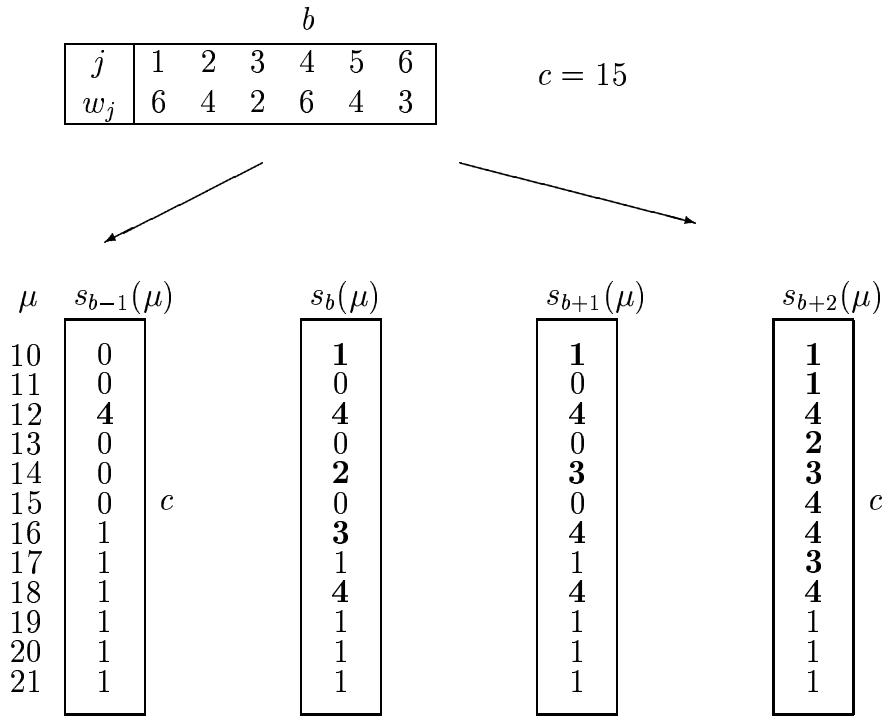  
Figure 10.1: The items and table $s _ { t } ( \mu )$ for a given instance.

Algorithm NRsuB does the following: For $t = b - 1$ we only have one balanced solution, the break solution, thus $s _ { t } ( \mu )$ is initialized according to this in lines 2-4. The infeasible states with $\mu > c$ are set to $s _ { t } ( \mu ) = 1$ as no items $j < s$ have ever been removed.

Now we consider the items $t = b , \ldots , n$ in line 5-14. In each iteration item $t$ may be added to the knapsack or omitted. Lines 6-7 correspond to the latter case, thus the states $s _ { t - 1 } ( \mu )$ are copied to $s _ { t } ( \mu )$ without changes. Lines 8-10 add item $t$ to each feasible state, obtaining the weight $\mu ^ { \prime }$ . According to (10.8), $s _ { t } ( \mu ^ { \prime } )$ is the maximum of the previous value and the current balanced solution.

In lines 11-14 we complete the balanced operations by removing some items $j ~ < ~ s$ from states with $\mu ~ > ~ c$ . As it may be necessary to remove several items in order to reobtain a feasible solution, we consider the states for decreasing $\mu$ , thus allowing for several removals.

Proposition 10.3 Algorithm NRSuB finds the optimal solution $x ^ { * }$ .

Proof We just need to show that the algorithm performs unrestricted balanced operations: 1) It starts from the break solution $x ^ { \prime }$ . 2) For each state with $\mu \leq c$ we perform a balanced insert, as each item $t$ may be added or omitted. 3) For each state with $\mu > c$ we perform a balanced remove by removing an item $j < s _ { t } ( \mu )$ . As the hereby obtained state has $\mu ^ { \prime } > c$ we know that $\mu ^ { \prime } < \mu$ and thus additional removals will be accepted since line 11 considers the weights in decreasing order. This ensures that all states will be feasible after an iteration of $t$ .

The only restriction in balanced operations is line 12, where items $j < s _ { t - 1 } ( \mu )$ are not removed. But according to the conventions we know that items $j < s _ { t - 1 } ( \mu )$ have been

removed once before, meaning that

$$
s _ { t } ( \mu - w _ { j } ) \geq j \mathrm { f o r } j = 1 , \ldots , s _ { t - 1 } ( \mu ) .
$$

Thus repeating the same operations will not contribute to an increase in $s _ { t } ( \mu - w _ { j } )$ .C

Proposition 10.4 The complexity of Algorithm NRSUB is $O ( n r )$ in time and space.

Proof Space: The array $s _ { t } ( \mu )$ has size $( n - b + 1 ) ( 2 r )$ , thus $O ( n r )$ . Time: Lines 2 and 3 are executed $r$ times. Line 7 is executed $2 r ( n - b + 1 )$ times. Lines 9-10 are executed $r ( n - b + 1 )$ times. Finally for each $\mu$ , lines 13-14 are executed totally $s _ { n } ( \mu ) \leq b$ times. Thus during the whole process lines 13-14 are executed at most $r b$ times. This proves the bound $O ( n r )$ .

# 10.4 Dynamic programming by reaching

One drawback of the NRsuB algorithm is, that we use dynamic programming through pulling, meaning that all $2 r$ states are considered at each iteration. An algorithm based on dynamic programming through reaching may be obtained by only considering those states where $s _ { t } ( \mu ) \neq 0$ for $\mu \leq c$ and $s _ { t } ( \mu ) \neq 1$ for $\mu > c$ A data structure should be chosen which supports the basic operations SEARCH, INSERT, PREDECEsSOR. Notice that PREDECEssOR actually is necessary, as the states with $\mu > c$ have to be considered in decreasing order.

It is possible to modify the NRsuB algorithm such that only the basic operations SEARCH and INSERT are necessary. First assume that the items are ordered such that

$$
\begin{array} { r } { w _ { j } \ge w _ { b } , ~ j = 1 , \dots , b - 1 , } \\ { w _ { j } \le w _ { b } , ~ j = b + 1 , \dots , n , } \end{array}
$$

which is obtainable in time $O ( n )$ , e.g. by using the PARTsORT algorithm by Pisinger [75]. The ordering means, that each time we add an item $t \geq b$ to a feasible solution, at most one item $s < b$ need to be removed in order to reobtain a feasible solution. This leads to the following improved algorithm:

1 Algorithm NRSUB2   
2 $\left\{ s _ { b - 1 } ( \mu ) = 0 \right.$ for $\mu \leq c$ , and $s _ { b - 1 } ( \mu ) = 1$ for $\mu > c$ are not stored}   
3 $s _ { b - 1 } ( \overline { { w } } ) : = b$   
4 for $t : = b$ to $n$ do   
5 for all $\mu \leq c$ , $s _ { t - 1 } ( \mu ) \neq 0$ do $s _ { t } ( \mu ) : = s _ { t - 1 } ( \mu )$   
6 for all $\mu > c$ $s _ { t - 1 } ( \mu ) \neq 1$ do $s _ { t } ( \mu ) : = s _ { t - 1 } ( \mu )$   
7 for all $\mu \leq c$ $s _ { t - 1 } ( \mu ) \neq 0$ do   
8 $\mu ^ { \prime } : = \mu + w _ { t } ;$   
9 $s _ { t } ( \mu ^ { \prime } ) : = \operatorname* { m a x } \{ s _ { t - 1 } ( \mu ^ { \prime } ) , \ s _ { t - 1 } ( \mu ) \} ;$   
10 for all $\mu > c , \ s _ { t } ( \mu ) \neq 1 \ \mathbf { d o }$   
11 for $j : = s _ { t - 1 } ( \mu )$ to $s _ { t } ( \mu ) - 1$ do   
12 $\mu ^ { \prime } : = \mu - w _ { j }$ ;   
13 $s _ { t } ( \mu ^ { \prime } ) : = \operatorname* { m a x } \{ s _ { t } ( \mu ^ { \prime } ) , \ j \} ;$

The basic change is, that the values $\mu$ may be considered in an arbitrary order at each stage of $t$ . In lines 7-9 we avoid the risk of overwriting states by expressing $s _ { t } ( \mu ^ { \prime } )$ as the maximum of states at stage $t - 1$ , and in lines 11-13 the ordering of the items ensures, that only one item $s ^ { \prime }$ need to be removed in order to obtain a feasible state.

Thus we only need to partition the states in those with $\mu \leq c$ and those with $\mu > c$ , while hashing may be used to access the states inside the loops. With an appropriate hashtable, the basic operations SEARCH and INsERT may be performed in $O ( 1 )$ .

# 10.5 Computational experiments

We consider five types of data instances, as presented in Martello and Toth [53]:

(i) Problems P(3): $w _ { j }$ randomly distributed in $[ 1 , 1 0 ^ { 3 } ]$ , and $c = \lfloor n 1 0 ^ { 3 } / 4 \rfloor$ .   
(ii) Problems P(6): $w _ { j }$ randomly distributed in $[ 1 , 1 0 ^ { 6 } ]$ , and $c = \lfloor n 1 0 ^ { 6 } / 4 \rfloor$ .   
(iii) Problems EVEN/ODD: $w _ { j }$ even, randomly distributed in $[ 1 , 1 0 ^ { 3 } ]$ , and $c = 2 \lfloor n 1 0 ^ { 3 } / 8 \rfloor + 1$ (odd).   
(iv) Problems AVIS: $w _ { j } = n ( n + 1 ) + j$ , and $c = n ( n + 1 ) \ \lfloor ( n - 1 ) / 2 \rfloor \ + n ( n - 1 ) / 2 .$   
(v) Problems TODD: set $k = \lfloor \log _ { 2 } n \rfloor$ then $w _ { j } = 2 ^ { k + n + 1 } + 2 ^ { k + j } + 1$ ,and $\begin{array} { r } { c = { \bigl \lfloor } \frac { 1 } { 2 } \sum _ { j = 1 } ^ { n } w _ { j } { \bigr \rfloor } } \end{array}$ .

The problems $\mathrm { P } ( 3 )$ and $\mathrm { P } \left( 6 \right)$ are randomly generated problems, while the remaining problems are constructed to satisfy some special properties. For the EvEN/oDD problems, Jeroslow [40] showed that every branch-and-bound algorithm enumerates an exponentially growing number of nodes in order to solve the problems to optimality. For the AVIS problems, Avis [3] showed that any recursive algorithm which does not use dominance will perform poorly. Finally Todd [92] constructed the ToDD problems such that any algorithm which uses upper bounding tests, dominance relations, and rudimentary divisibility arguments still will have to enumerate an exponential number of states.

The NRsUB algorithm has been implemented in C, and the test instances have been solved on a $\mathrm { H P 9 0 0 0 / 7 3 0 }$ . As the applied computer is 32-bit, several of the instances could only be generated up to a limited size: $\mathrm { P } \left( 6 \right)$ up to $n \ : = \ : 2 0 0 0$ , AVIS up to $n = 1 0 0 0$ , and TODD up to $n = 2 0$ . We should however not expect any major improvement by the presented algorithm for the ToDD problems, as they have weights distributed in a very large range $r$ .

The running times of three different approaches is compared: Table I gives the average times for the Bellman recursion (10.2), while Table II gives the average times of the NRSUB algorithm. These dynamic programming algorithms are compared to the MTSL algorithm by Martello and Toth [53] which is based on branch-and-bound in connection with a partial dynamic programming enumeration.

Table I: Solution times Bellman recursion (in seconds). Average of 100 instances.   

<table><tr><td rowspan=1 colspan=1>n</td><td rowspan=1 colspan=8>P(3)       P(6)  EVENODD       AVIS       TODD</td></tr><tr><td rowspan=1 colspan=1>10</td><td rowspan=1 colspan=8>0.00       0.00          0.00       0.00         0.00</td></tr><tr><td rowspan=1 colspan=1>20</td><td rowspan=1 colspan=7>0.00       0.57          0.01       0.00</td><td rowspan=1 colspan=1></td></tr><tr><td rowspan=1 colspan=1>50</td><td rowspan=1 colspan=7>0.09      71.19          0.06       0.05</td><td rowspan=1 colspan=1></td></tr><tr><td rowspan=1 colspan=1>100</td><td rowspan=1 colspan=7>0.43    550.18          0.26       1.79</td><td rowspan=1 colspan=1></td></tr><tr><td rowspan=1 colspan=1>200</td><td rowspan=1 colspan=6>2.11                        1.98      30.40</td><td rowspan=1 colspan=1></td><td rowspan=1 colspan=1>−</td></tr><tr><td rowspan=2 colspan=1>5001000</td><td rowspan=1 colspan=3>15.07</td><td rowspan=1 colspan=3>16.59</td><td rowspan=1 colspan=1></td><td rowspan=1 colspan=1>−</td></tr><tr><td rowspan=1 colspan=3>63.24</td><td rowspan=1 colspan=2>80.79</td><td rowspan=1 colspan=1>−</td><td rowspan=1 colspan=1></td><td rowspan=1 colspan=1>−</td></tr><tr><td rowspan=1 colspan=1>2000</td><td rowspan=1 colspan=1>263.25</td><td rowspan=1 colspan=2></td><td rowspan=1 colspan=2>372.34</td><td rowspan=1 colspan=1>−</td><td rowspan=1 colspan=1></td><td rowspan=6 colspan=1></td></tr><tr><td rowspan=1 colspan=1>5000</td><td rowspan=1 colspan=1></td><td rowspan=1 colspan=2></td><td rowspan=1 colspan=2></td><td rowspan=1 colspan=1>−</td><td rowspan=5 colspan=1></td></tr><tr><td rowspan=1 colspan=1>10000</td><td rowspan=1 colspan=1></td><td rowspan=1 colspan=1></td><td rowspan=1 colspan=1>−</td><td rowspan=1 colspan=1></td><td rowspan=1 colspan=1></td><td rowspan=1 colspan=1>−</td></tr><tr><td rowspan=1 colspan=1>20000</td><td rowspan=1 colspan=1></td><td rowspan=1 colspan=1></td><td rowspan=1 colspan=1>−</td><td rowspan=1 colspan=1></td><td rowspan=1 colspan=1></td><td rowspan=1 colspan=1>−</td></tr><tr><td rowspan=1 colspan=1>50000</td><td rowspan=1 colspan=1></td><td rowspan=1 colspan=1></td><td rowspan=1 colspan=1>−</td><td rowspan=1 colspan=1></td><td rowspan=1 colspan=1></td><td rowspan=1 colspan=1>−</td></tr><tr><td rowspan=1 colspan=1>100000</td><td rowspan=1 colspan=1></td><td rowspan=1 colspan=1></td><td rowspan=1 colspan=1>−</td><td rowspan=1 colspan=1></td><td rowspan=1 colspan=1></td><td rowspan=1 colspan=1>−</td></tr></table>

Table II: Solution times NRsUB (in seconds). Average of 100 instances.   

<table><tr><td>n</td><td>P(3)</td><td>P(6)</td><td>EVEN ODD</td><td>AVIS</td><td>TODD</td></tr><tr><td>10</td><td>0.00</td><td>5.25</td><td>0.00</td><td>0.00</td><td>0.11</td></tr><tr><td>20</td><td>0.00</td><td>9.99</td><td>0.00</td><td>0.00</td><td></td></tr><tr><td>50</td><td>0.00</td><td>5.84</td><td>0.01</td><td>0.03</td><td></td></tr><tr><td>100</td><td>0.00</td><td>4.19</td><td>0.02</td><td>0.25</td><td></td></tr><tr><td>200</td><td>0.00</td><td>2.94</td><td>0.05</td><td>4.10</td><td></td></tr><tr><td>500</td><td>0.00</td><td>2.38</td><td>0.11</td><td>69.08</td><td></td></tr><tr><td>1000</td><td>0.00</td><td>2.11</td><td>0.22</td><td>572.31</td><td></td></tr><tr><td>2000</td><td>0.00</td><td>2.05</td><td>0.44</td><td></td><td></td></tr><tr><td>5000</td><td>0.00</td><td></td><td>1.12</td><td></td><td></td></tr><tr><td>10000</td><td>0.00</td><td></td><td>2.21</td><td></td><td></td></tr><tr><td>20000</td><td>0.00</td><td></td><td>4.56</td><td></td><td></td></tr><tr><td>50000</td><td>0.01</td><td></td><td>11.25</td><td></td><td></td></tr><tr><td>100000</td><td>0.02</td><td></td><td>23.77</td><td></td><td></td></tr></table>

Table III: Solution times MTSL (in seconds). Average of 100 instances.   

<table><tr><td>n</td><td>P(3)</td><td>P(6)</td><td>EVEN ODD</td><td>AVIS</td><td>TODD</td></tr><tr><td>10</td><td>0.00</td><td>0.00</td><td>0.00</td><td>0.00</td><td>0.00</td></tr><tr><td>20</td><td>0.00</td><td>0.00</td><td>0.01</td><td>0.03</td><td>0.00</td></tr><tr><td>50</td><td>0.00</td><td>0.01</td><td></td><td></td><td></td></tr><tr><td>100</td><td>0.00</td><td>0.01</td><td></td><td></td><td></td></tr><tr><td>200</td><td>0.00</td><td>0.01</td><td></td><td></td><td></td></tr><tr><td>500</td><td>0.00</td><td>0.01</td><td></td><td></td><td></td></tr><tr><td>1000</td><td>0.00</td><td>0.01</td><td></td><td></td><td></td></tr><tr><td>2000</td><td>0.00</td><td>0.01</td><td></td><td></td><td></td></tr><tr><td>5000</td><td>0.00</td><td></td><td></td><td></td><td></td></tr><tr><td>10000</td><td>0.00</td><td></td><td></td><td></td><td></td></tr><tr><td>20000</td><td>0.00</td><td></td><td></td><td></td><td></td></tr><tr><td>50000</td><td>0.01</td><td></td><td></td><td></td><td></td></tr><tr><td>100000</td><td>0.02</td><td></td><td></td><td></td><td></td></tr></table>

For the randomly distributed problems $\mathrm { P } ( 3 )$ and $\mathrm { P } \left( 6 \right)$ we have $r$ bounded by a (large) constant. Thus the Bellman recursion runs in $O ( n ^ { 2 } )$ time, while NRsuB has a linear solution time. The randomly distributed problems have the property that several solutions to

$$
\sum _ { j = 1 } ^ { n } w _ { j } x _ { j } = c
$$

do exist when $n$ is large, thus generally NRsuB may terminate before a complete enumeration. The Bellman recursion has to enumerate all states up to at least $t = b$ before it can terminate. The MTsL algorithm is however the fastest for these problems, as the branch-and-bound technique quickly finds a solution to (10.12).

For the EvEN/oDD problems no solution to (10.12) do exist, meaning that here we get a strict $O ( n r )$ and thus linear solution time for NRsuB. As $r$ is moderate, even very large instances may be solved fast. The Bellman recursion has an $O ( n ^ { 2 } r )$ behavior, and thus cannot solve problems larger than $n = 2 0 0 0$ . The worst results are seen for MTSL where no problems larger than $n = 2 0$ can be solved.

The problems AVIs have weights of magnitude $O ( n ^ { 2 } )$ while the capacity is of magnitude $O ( n ^ { 3 } )$ . So the Bellaman recursion demands $O ( n ^ { 4 } )$ time, while NRsUB solves the problem in $O ( n ^ { 3 } )$ . Thus even reasonably large instances are solved by NRsUB. Algorithm MTSL again cannot solve problems larger than $n = 2 0$ .

Finally the ToDD problems are considered. Due to the exponentially growing weights, we are not able to generate instances of size lager than $n = 2 0$ . We should however not expect any seminal results for larger instances, as all the complexity is hidden in the magnitude of the weights. The dynamic programming algorithms are not able to solve problems larger than $n = 1 0$ while MTsL according to [53] is able to solve problems of size $n = 4 0$ .

# 10.6 Knapsack Problems

The 0-1 Knapsack Problem (KP) may be formulated as the following maximization problem

$$
\begin{array} { r l } { \mathrm { m a x i m i z e } } & { z = \displaystyle \sum _ { j = 1 } ^ { n } p _ { j } x _ { j } } \\ { \mathrm { s u b j e c t ~ t o } } & { \displaystyle \sum _ { j = 1 } ^ { n } w _ { j } x _ { j } \leq c } \\ & { x _ { j } \in \{ 0 , 1 \} , \quad j = 1 , \ldots , n , } \end{array}
$$

where all coeficients are positive integers.

Balas and Zemel [4] showed, that an efficient way of solving KP is to choose a "core" of the items, and solve these as a subset sum problem in order to obtain a filled knapsack. Theorem 3 of [4] shows, that the probability for such a heuristic solution to be optimal is bounded below by a strictly increasing function $Q ( n )$ with $\begin{array} { r } { \operatorname* { l i m } _ { n \to \infty } Q ( n ) = 1 } \end{array}$ . Thus for large problems, solving the core problem with NRsuB will lead to an optimal solution with a very high probabiliy.

Another approach is to construct a specialized algorithm for KP based on balanced operations. Pisinger [75] proved that an optimal solution to KP may be obtained through the same balanced operations as described in Section 10.2. Assume that the items are ordered according to nonincreasing profit-to-weight ratios $p _ { j } / w _ { j }$ , and let ${ \overline { { p } } } , { \overline { { w } } }$ be the profit and weight sum of the break solution $x ^ { \prime }$ . Then the Dantzig [13] upper bound $u$ is defined as

$$
u = \left\lfloor { \overline { { p } } } + { \frac { ( c - { \overline { { w } } } ) p _ { b } } { w _ { b } } } \right\rfloor .
$$

We have the invariant

ling which satisfies

$$
s _ { t } ( \mu , \pi ) = \operatorname* { m a x } s \left\{ \begin{array} { l l } { \mathrm { t h e r e ~ e x i s t s ~ a ~ b a l a n c e d ~ f i l } } \\ { \sum _ { j = 1 } ^ { s - 1 } p _ { j } + \sum _ { j = s } ^ { t } p _ { j } x _ { j } = \pi } \\ { \sum _ { j = 1 } ^ { s - 1 } w _ { j } + \sum _ { j = s } ^ { t } w _ { j } x _ { j } = \mu } \\ { x _ { j } \in \{ 0 , 1 \} , j = s , . . . , t } \end{array} \right.
$$

where we set $s _ { t } ( \mu , \pi ) = 0$ if no balanced solution exists. Notice that for $t = b - 1$ only one value of $s _ { t } ( \mu , \pi )$ is positive, namely $s _ { t } ( \overline { { w } } , \overline { { p } } ) = b$ , as only the break solution is balanced.

As for SSP, let the range of the coefficients be given as $r _ { 1 } = \mathrm { m a x } _ { j = 1 , \dots , n } w _ { j }$ and $r _ { 2 } = { }$ $\operatorname* { m a x } _ { j = 1 , \dots , n } p _ { j }$ . As a consequence of the balanced operations we have $c - r _ { 1 } < \mu \leq c + r _ { 2 }$ and $u - r _ { 2 } < \pi \le u + r _ { 2 }$ . Actually the last inequality may be tightened:

Using the bound by Dembo and Hammer [14] we notice that the upper bound of a state $( \mu , \pi )$ cannot be larger than the Dantzig bound, thus

$$
\left\lfloor \pi + { \frac { ( c - \mu ) p _ { b } } { w _ { b } } } \right\rfloor \leq u ,
$$

implying

$$
\pi \leq \alpha ( \mu ) = \left\lfloor u - { \frac { ( c - \mu ) p _ { b } } { w _ { b } } } \right\rfloor .
$$

On the other hand, if a state $( \mu , \pi )$ does not have an upper bound better than the current solution $z$ , then it may be fathomed. Thus any live state must satisfy

$$
\left\lfloor \pi + { \frac { ( c - \mu ) p _ { b } } { w _ { b } } } \right\rfloor \geq z + 1
$$

leading to

$$
\pi \geq \beta ( \mu ) = \left\lfloor z + 1 - { \frac { ( c - \mu ) p _ { b } } { w _ { b } } } \right\rfloor .
$$

Thus at any stage we have $\alpha ( \mu ) \leq \pi \leq \beta ( \mu )$ , meaning that the number of profit sums $\pi$ corresponding to a weight sum $\mu$ can at most be $g = u - z$ , where $g \leq r _ { 2 }$ as we may use the profit sum of the break solution $\overline { { p } }$ for $z$ .

A generalisation of the NRsuB algorithm for Knapsack Problems may be sketched as follows:

1 Algorithm $\mathrm { N R ^ { 2 } K N A P }$   
2 for $\mu : = c - r _ { 1 } + 1$ to $c$ do   
3 for $\pi : = \alpha ( \mu )$ to $\beta ( \mu )$ do   
4 $s _ { b - 1 } ( \mu , \pi ) : = 0$ ;   
5 for $\mu : = c + 1$ to $c + r _ { 1 }$ do   
6 for $\pi : = \alpha ( \mu )$ to $\beta ( \mu )$ do   
7 $s _ { b - 1 } ( \mu , \pi ) : = 1$   
8 $s _ { b - 1 } ( \overline { { w } } , \overline { { p } } ) : = b ;$   
9 for $t : = b$ to $n$ do   
10 for $\mu : = c - r _ { 1 } + 1$ to $c + r _ { 1 }$ do   
11 for $\pi : = \alpha ( \mu )$ to $\beta ( \mu )$ do   
12 $s _ { t } ( \mu ) : = s _ { t - 1 } ( \mu ) ;$ .   
13 for $\mu : = c - r _ { 1 } + 1$ to $c$ do   
14 for $\pi : = \alpha ( \mu )$ to $\beta ( \mu )$ do   
15 $\mu ^ { \prime } : = \mu + w _ { t }$ $\pi ^ { \prime } : = \pi + p _ { t }$   
16 $s _ { t } ( \mu ^ { \prime } , \pi ^ { \prime } ) : = \operatorname* { m a x } \{ s _ { t - 1 } ( \mu ^ { \prime } , \pi ^ { \prime } ) , \ s _ { t - 1 } ( \mu , \pi ) \} ;$   
17 for $\mu : = c + w _ { t }$ downto $c + 1$ do   
18 for $\pi : = \alpha ( \mu )$ downto $\beta ( \mu )$ do   
19 fo $\begin{array} { r l } & { \textbf { r } j : = s _ { t } ( \mu ) - 1 \mathrm { \bf ~ d o w n t o } s _ { t - 1 } ( \mu ) \mathrm { \bf ~ d o } } \\ & { \mu ^ { \prime } : = \mu - w _ { j } ; \pi ^ { \prime } : = \pi - p _ { j } ; } \\ & { s _ { t } ( \mu ^ { \prime } , \pi ^ { \prime } ) : = \mathrm { m a x } \{ s _ { t } ( \mu ^ { \prime } , \pi ^ { \prime } ) , j \} ; } \end{array}$   
20   
21

The time and space complexity is $O ( n r _ { 1 } g )$ which may be verified as in Proposition 10.4. As $g \leq r _ { 2 }$ this may be written $O ( n r ^ { 2 } )$ where $r = \operatorname* { m a x } \{ r _ { 1 } , r _ { 2 } \}$ is the largest profit or weight in the instance.

The efficiency of NRsuB may be improved further by incorporating the following fathoming tests by Pisinger [75]: Given a state $s _ { t } ( \mu , \pi )$ . If we have

$$
\begin{array} { l } { { \pi + { \frac { ( c - \mu ) p _ { t } } { w _ { t } } } \leq z + 1 , \quad \mathrm { ~ f o r ~ } \mu \leq c } } \\ { { \pi + { \frac { ( c - \mu ) p _ { s } } { w _ { s } } } \leq z + 1 , \quad \mathrm { ~ f o r ~ } \mu > c } } \end{array}
$$

then the state may be fathomed. A further improvement is to apply dominance tests:

Definition 10.3 Given two states $s _ { t } ( \mu _ { 1 } , \pi _ { 1 } )$ and $s _ { t } ( \mu _ { 2 } , \pi _ { 2 } )$ . If $s _ { t } ( \mu _ { 1 } , \pi _ { 1 } ) \ \geq \ s _ { t } ( \mu _ { 2 } , \pi _ { 2 } )$ , $\pi _ { 1 } \geq \pi _ { 2 }$ and $\mu _ { 1 } \leq \mu _ { 2 }$ then state $s _ { t } ( \mu _ { 1 } , \pi _ { 1 } )$ dominates state $s _ { t } ( \mu _ { 2 } , \pi _ { 2 } )$ . A dominated state may obviously be removed from the problem.

However algorithm NRsuB considers the states for decreasing weight sums $\mu$ in line 17, where efficient dominance tests demand that the states are considered in order of increasing weight sums and decreasing profit sums.

An efficient way of incorporating dominance is to consider the inverse problem. Thus at any stage we consider infeasible states with $\mu \geq c$ , and $t _ { s } ( \mu , \pi )$ gives the smallest index such that a balanced solution with weight sum $\mu$ exists. This algorithm is described in Appendix A, where efficient dominance relations are incorporated.

# 10.7 Conclusion

By considering balanced states, the time bound on SSP has been improved from $O ( n ^ { 2 } r )$ to $O ( n r )$ for any fixed range $r$ of weights. As the balanced operations have a natural greedy nature, several problems can be solved with even less effort.

The time bound $O ( n r )$ fully describes the nature of the subset-sum problem, as it clearly states that all the complexity is hidden in the magnitude of $r$ . This conforms with the observation by Chvátal [11] who used exponentially growing weights in order to construct hard instances of SSP.

The computational experiments have demonstrated that even very hard instances of large size may be solved in reasonable time by using NRsuB. However for instances with exponentially growing weights, there is no improvement, as could be expected from the time bound. The algorithm is almost trivial to implement, so also from a practical point of view the results are of major importance.

The presented results have been generalized to the O-1 Knapsack Problem where an $O ( n r ^ { 2 } )$ algorithm has been presented. Although this is a linear-time algorithm for any fixed range $r$ , this result is of minor importance, as $r ^ { 2 }$ generally grows fast. It may however have applications for large sized problems with coefficients generated in a small range.

As several approximate algorithms for the subset-sum and knapsack problem are based on dynamic programming, Matteo Fischetti at [79] mentioned that the presented algorithms may also lead to improved approximate algorithms.

# Appendix A: Inverse Knapsack Algorithm

As mentioned in Section 10.6, efficient dominance relations may be incorporated in the $\mathrm { { N R ^ { 2 } K N A P } }$ algorithm if we consider the inverse problem: Thus at any stage we only consider infeasible states, as this allows us to run through the weights in increasing order. We have the invariant

$$
t _ { s } ( \mu , \pi ) = \operatorname* { m i n } t \left\{ \begin{array} { l l } { \mathrm { t h e r e ~ e x i s t s ~ a ~ b a l a n c e d ~ f i l } } \\ { \sum _ { j = 1 } ^ { s - 1 } p _ { j } + \sum _ { j = s } ^ { t } p _ { j } x _ { j } = \pi } \\ { \sum _ { j = 1 } ^ { s - 1 } w _ { j } + \sum _ { j = s } ^ { t } w _ { j } x _ { j } = \mu } \\ { x _ { j } \in \{ 0 , 1 \} , j = s , . . . , t } \end{array} \right.
$$

where we set $t _ { s } ( \mu , \pi ) = n + 1$ if no balanced solution exists. Due to the dominance, we have

$$
t _ { s } ( \mu , \pi ) \leq \operatorname* { m i n } \{ t _ { s } ( \mu - 1 , \pi ) , \ t _ { s } ( \mu , \pi + 1 ) \} ,
$$

where we assume that $t _ { s } ( \mu , \pi ) = n + 1$ when $\pi > \beta ( \mu )$ . This leads us to the following algorithm

1 Algorithm $\mathrm { N R ^ { 2 } K N A P 2 }$   
2 for $\mu : = c + 1$ to $c + r \ \{ i n i t i a t e \}$ do   
3 for $\pi : = \beta ( \mu )$ downto $\alpha ( \mu )$ do   
4 $t _ { b } ( \mu , \pi ) : = n + 1$ ; { no balanced solution}   
5 for $\mu : = c - r + 1$ to $c$ do   
6 for $\pi : = \beta ( \mu )$ downto $\alpha ( \mu )$ do   
7 $t _ { b } ( \mu , \pi ) : = n$ $\{$ only remove after n }   
8 $t _ { b } ( \overline { { w } } , \overline { { p } } ) : = b - 1$ ; { initial balanced solutions}   
9 for $j : = n$ downto $b$ do   
10 $t _ { b } ( \overline { { w } } + w _ { j } , \overline { { p } } + p _ { j } ) : = j$   
11 for $s : = b - 1$ downto 1 do   
12 for $\mu : = c - r + 1$ to $c + r$ do $\{$ copy states with dominance}   
13 for $\pi : = \beta ( \mu )$ downto $\alpha ( \mu )$ do   
14 $t _ { s } ( \mu , \pi ) : = \operatorname* { m i n } \{ t _ { s + 1 } ( \mu , \pi ) , \ t _ { s + 1 } ( \mu - 1 , \pi ) , \ t _ { s + 1 } ( \mu , \pi + 1 ) \} ;$   
15 for $\mu : = c$ to $c + r$ do $\{ r e m o v e \ i t e m \ s \}$   
16 for $\pi : = \beta ( \mu )$ downto $\alpha ( \mu )$ do   
17 $\mu ^ { \prime } : = \mu - w _ { s }$ ; $\pi ^ { \prime } : = \pi - p _ { s }$   
18 $t _ { s } ( \mu ^ { \prime } , \pi ^ { \prime } ) : = \operatorname* { m i n } \{ t _ { s } ( \mu ^ { \prime } , \pi ^ { \prime } ) , \ t _ { s } ( \mu , \pi ) \} ;$   
19 for $\mu : = c - w _ { s }$ to $c$ do $\{ { \mathrm { a d d } } i t e m t \}$   
20 for $\pi : = \beta ( \mu )$ downto $\alpha ( \mu )$ do   
21 $t _ { s } ( \mu , \pi ) : = \operatorname * { m i n } \{ t _ { s } ( \mu , \pi ) , \ t _ { s } ( \mu - 1 , \pi ) , \ t _ { s } ( \mu , \pi + 1 ) \} ;$   
22 $\begin{array} { r l } & { \imath _ { s \downarrow } ( \mu , n ) \cdot - \operatorname* { m i n } _ { \downarrow } \imath _ { s \downarrow } ( \mu , n ) , \ \imath _ { s \downarrow } ( \mu \mathrm { ~  ~ \lambda ~ } ^ { , } \mathrm { , ~ } \imath _ { s \downarrow } ) , \ \imath _ { s \downarrow } ( \mu , n ) \cdot \mathrm { ~  ~ \lambda ~ } ^ { , } \mathrm { \imath _ { s \downarrow } ~ } , \ \mathrm {  ~ \lambda ~ } ^ { , } \mathrm { \imath _ { \mathrm { ~ J ~ J ~ } } } , } \\ & { t _ { s + 1 } ( \mu , \pi ) : = \operatorname* { m i n } \{ t _ { s + 1 } ( \mu , \pi ) , \ t _ { s } ( \mu - 1 , \pi ) , \ t _ { s } ( \mu , \pi + 1 ) \} ; } \\ & { \mathbf { f o r ~ } j : = t _ { s } ( \mu , \pi ) + 1 \ \mathrm { t o ~ } t _ { s + 1 } ( \mu , \pi ) \ \mathbf { d o } } \\ & { \quad \mu ^ { \prime } : = \mu + w _ { j } ; \ \pi ^ { \prime } : = \pi + p _ { j } ; } \\ & { t _ { s } ( \mu ^ { \prime } , \pi ^ { \prime } ) : = \operatorname* { m i n } \{ t _ { s } ( \mu ^ { \prime } , \pi ^ { \prime } ) , \ j \} ; } \end{array}$   
23   
24   
25

Despite the dominance relations, all states have to be considered in the inner loops. Thus basically we only get a saving in the loop where items $t \geq b$ are added. To get the full benefit of the dominance, the above algorithm must be changed from dynamic programming by pulling to dynamic programming by reaching.

# Chapter 11

# An exact Algorithm for large Multiple Knapsack Problems

The Multiple Knapsack Problem is the problem of choosing a subset of $n$ items to be packed in m distinct knapsacks, such that the total profit sum of the selected items is maximized, without exceeding the capacity of each of the knapsacks. The problem has several applications in naval as well as financial management.

A new exact algorithm for the Multiple Knapsack Problem is presented, which is specially designed for solving large problem instances. The recursive branch-andbound algorithm uses surrogate relaxation for deriving upper bounds, and lower bounds are obtained by splitting the surrogate solution into the m knapsacks by solving a series of Subset-sum Problems. A new separable dynamic programming algorithm is presented for the solution of Subset-sum Problems, and we also use this algorithm for tightening the capacity constraints in order to obtain better upper bounds.

The developed algorithm is compared to the MTM algorithm by Martello and Toth, showing the benefits of the new approach. A surprising result is, that large instances with $n = 1 0 0 0 0 0$ items may be solved in a fraction of a second.

Keywords: Knapsack Problem, Dynamic Programming, Reduction.

# 11.1 Introduction

We consider the problem where $n$ given items should be packed in $m$ knapsacks of distinct capacities $c _ { i } , \ i = 1 , \ldots , m$ . Each item $j$ has an associated profit $p _ { j }$ and weight $w _ { j }$ , and the problem is to select $m$ disjoined subsets of items, such that subset $i$ fits into knapsack $i$ and the total profit of the selected items is maximized. Thus we may formally define the 0-1 Multiple Knapsack Problem $( M K P )$ by

$$
\begin{array} { r l } { \mathrm { m a x i m i z e } } & { \displaystyle \sum _ { i = 1 } ^ { m } \sum _ { j = 1 } ^ { n } p _ { j } x _ { i j } } \\ { \mathrm { s u b j e c t ~ t o } } & { \displaystyle \sum _ { j = 1 } ^ { n } w _ { j } x _ { i j } \leq c _ { i } , i = 1 , \ldots , m , } \\ & { \displaystyle \sum _ { i = 1 } ^ { m } x _ { i j } \leq 1 , \qquad j = 1 , \ldots , n , } \\ & { x _ { i j } \in \{ 0 , 1 \} , \quad i = 1 , \ldots , m , j = 1 , \ldots , n . } \end{array}
$$

where $x _ { i j } = 1$ if item $i$ is assigned to knapsack $j$ and $x _ { i j } = 0$ otherwise. It is usual to assume that the coefficients $p _ { j } , w _ { j }$ and $c _ { i }$ are positive integers, and to avoid trivial cases we assume

$$
\begin{array} { r l } { { w _ { j } } \le \displaystyle \operatorname* { m a x } _ { i = 1 , \dots , m } c _ { i } } & { \ \mathrm { f o r } \ j = 1 , \dots , n , } \\ { { c _ { i } } \ge \displaystyle \operatorname* { m i n } _ { j = 1 , \dots , n } w _ { j } } & { \ \mathrm { f o r } \ i = 1 , \dots , m , } \\ { { \displaystyle \sum _ { j = 1 } ^ { n } w _ { j } } \ge c _ { i } } & { \ \mathrm { f o r } \ i = 1 , \dots , m . } \end{array}
$$

The first assumption ensures that each item $j$ fits into at least one knapsack as otherwise it may be removed from the problem. If constraint (11.3) is violated by a knapsack $i$ , then we may discount the knapsack, as no items fits into it. Finally (11.4) avoids a trivial solution where all items fit into one of the knapsacks.

There are several applications for MKP, as the problem directly reflects a situation of loading m ships/containers or e.g. packing $m$ envelopes. Martello and Toth [53] also proposed the problem used for deciding how to load $m$ liquids into $n$ tanks, when the liquids may not be mixed.

The Multiple Knapsack Problem is $\mathcal { N P }$ -hard in the strong sense, and thus any dynamic programming approach would result in strictly exponential time bounds. Most of the literature has thus been focused on branch-and-bound techniques, although Fischetti and Toth [26] used some kind of dominance tests to speed up the solution process.

Several branch-and-bound algorithms for MKP have been presented during the last two decades, among which we should mention Hung and Fisk [34], Martello and Toth [48], Neebe and Dannenbring [61], and Christofides, Mingozzi and Toth [10]. The first two are best suited for problems where several items are flled into each knapsack, while the last two are designed for problems with many knapsacks and few items. This chapter follows the first direction of research, as it is devoted to large problem instances where the quotient $n / m$ is relatively large. The presented algorithm differ from previous work in four main respects: Lower bounds are derived by solving a series of Subset-sum Problems, and Subset-sum Problems are also used for tightening the capacity constraints of each knapsack. We use an efficient 0-1 Knapsack Algorithm for deriving upper bounds through surrogate relaxation, and a new separable dynamic programming algorithm is presented for solving the Subset-sum Problems.

In Section 11.2 we will present different upper bounds for the Multiple Knapsack Problem, and use these observations for a general discussion of exact algorithms in Section 11.3. The discussion leads to an improved algorithm described in Section 11.4 and ahead. Section 11.5 shows how lower bounds may be achieved by solving a series of subset-sum problems, and Section 11.6 shows how the capacity constraints in MKP may be tightened in order to obtain tighter upper bounds. Section 11.7 considers some reduction algorithms for the problem, and finally Section 11.8 compares the presented MuLkNAP algorithm with the MTM algorithm by Martello and Toth [48].

# 11.2 Upper bounds

Upper bounds for the Multiple Knapsack Problem may be derived by relaxing some of the side-constraints, where surrogate, Lagrangean and linear relaxations are the most common relaxations.

We will first consider the surrogate relaxation. Let $\pi _ { 1 } , \ldots , \pi _ { m }$ be some positive multipliers, then the surrogate relaxed Multiple Knapsack Problem (SMKP) becomes:

$$
\begin{array} { l l } { \mathrm { m a x i m i z e } } & { \displaystyle \sum _ { i = 1 } ^ { m } \sum _ { j = 1 } ^ { n } p _ { j } x _ { i j } } \\ { \mathrm { s u b j e c t ~ t o } } & { \displaystyle \sum _ { i = 1 } ^ { m } \pi _ { i } \sum _ { j = 1 } ^ { n } w _ { j } x _ { i j } \leq \sum _ { i = 1 } ^ { m } \pi _ { i } c _ { i } , } \\ & { \displaystyle \sum _ { i = 1 } ^ { m } x _ { i j } \leq 1 , } & { j = 1 , \dots , n , } \\ & { x _ { i j } \in \{ 0 , 1 \} , } & { i = 1 , \dots , m , \ j = 1 , \dots , n . } \end{array}
$$

The best choice of multipliers $\pi _ { i }$ are those, that produce the smallest objective value in (11.5), and in connection hereto Martello and Toth [49] proved the following

Proposition 11.1 For any instance of MKP, the optimal choice of multipliers $\pi _ { 1 } , \ldots , \pi _ { m }$ for MKP is $\pi _ { i } = k$ for $i = 1 , \ldots , m$ , where $k$ is a positive constant.

With this choice of multipliers SMKP becomes the following ordinary 0-1 Knapsack Problem

$$
\begin{array} { l l } { \mathrm { m a x i m i z e } } & { \displaystyle \sum _ { j = 1 } ^ { n } p _ { j } x _ { j } ^ { \prime } } \\ { \mathrm { s u b j e c t ~ t o } } & { \displaystyle \sum _ { j = 1 } ^ { n } w _ { j } x _ { j } ^ { \prime } \leq c , } \\ & { x _ { j } ^ { \prime } \in \{ 0 , 1 \} , \quad j = 1 , \ldots , n , } \end{array}
$$

wh t $\boldsymbol { x } _ { j } ^ { \prime } = \sum _ { i = 1 } ^ { m } \boldsymbol { x } _ { i j }$ indicate whether item $j$ is chosen for any of the knapsacks $i = 1 , \ldots , m$ and $\textstyle c = \sum _ { i = 1 } ^ { m } c _ { i }$ united knapsacks.

A different upper bound may be derived by Lagrangean relaxation of MKP. Let $\lambda _ { 1 } , \ldots , \lambda _ { n }$ i u h  e $\begin{array} { r } { \sum _ { i = 1 } ^ { m } x _ { i j } \le } \end{array}$

1, $j = 1 , \dots , n$ in (11.1) we get the problem

$$
\begin{array} { l l } { \mathrm { m a x i m i z e } } & { \displaystyle \sum _ { i = 1 } ^ { m } \displaystyle \sum _ { j = 1 } ^ { n } p _ { j } x _ { i j } - \displaystyle \sum _ { j = 1 } ^ { n } \lambda _ { j } \left( \displaystyle \sum _ { i = 1 } ^ { m } x _ { i j } - 1 \right) } \\ { \mathrm { s u b j e c t ~ t o } } & { \displaystyle \sum _ { j = 1 } ^ { n } w _ { j } x _ { i j } \leq c _ { i } , \quad i = 1 , \ldots , m , } \\ & { x _ { i j } \in \{ 0 , 1 \} , \quad i = 1 , \ldots , m , \ j = 1 , \ldots , n . } \end{array}
$$

By setting $\tilde { p } _ { j } = p _ { j } - \lambda _ { j }$ for $j = 1 , \dots , n$ the relaxed problem can be decomposed into $m$ independent 0-1 Knapsack Problems, where problem $i$ has the form

$$
\begin{array} { l l } { { \mathrm { m a x i m i z e } } } & { { z _ { i } = \displaystyle \sum _ { j = 1 } ^ { n } \tilde { p } _ { j } x _ { i j } } } \\ { { \mathrm { s u b j e c t ~ t o } } } & { { \displaystyle \sum _ { j = 1 } ^ { n } w _ { j } x _ { i j } \leq c _ { i } , } } \\ { { } } & { { x _ { i j } \in \{ 0 , 1 \} , ~ j = 1 , \ldots , n , } } \end{array}
$$

for $i = 1 , \ldots , m$ . All the problems have similar profits and weights, thus only the capacity distinguishes the individual instances. An optimal solution to the Lagrangean relaxed problem is then

$$
z = \sum _ { i = 1 } ^ { m } z _ { i } + \sum _ { j = 1 } ^ { n } \lambda _ { j } .
$$

As opposed to the surrogate relaxation, there is however no optimal choice of multipliers $\lambda _ { j }$ for the Lagrangean relaxation, thus usually a subgradient optimization technique must be used for deriving them, although Ross and Soland [87] used predefined multipliers expressed in terms of the break item $b$ . It is not possible to say which of the two relaxations yield tighter upper bounds, as instances may be constructed where the surrogate relaxation dominates the Lagrangean relaxation and vice versa [53].

Linear relaxation is a third common technique for deriving upper bounds. We relax the constraint $x _ { i j } \in \{ 0 , 1 \}$ in (11.1) to $0 \leq x _ { i j } \leq 1$ , for $i = 1 , \ldots , m$ , $j = 1 , \dots , n$ . Martello and Toth [53] proved, that the objective value of an optimal solution to the linear relaxed MKP is the same as that of an optimal solution to the linear relaxed SMKP. Thus to find the objective value of the linear MKP, we may simply use the Dantzig upper bound of the corresponding 0-1 Knapsack Problems: Assume that the items are ordered according to nonincreasing profit-to-weight ratios

$$
\frac { p _ { 1 } } { w _ { 1 } } \geq \frac { p _ { 2 } } { w _ { 2 } } \geq \ldots \geq \frac { p _ { n } } { w _ { n } } ,
$$

and let the break item $b$ be given by

$$
b = \operatorname* { m i n } \left\{ j : \sum _ { i = 1 } ^ { j } w _ { i } \geq c \right\} ,
$$

where $c = \textstyle \sum _ { i = 1 } ^ { m } c _ { i }$ is the capacity of the surrogate relaxed problem. Then the Dantzig upper bound [13] becomes

$$
u _ { \mathrm { { M K P } } } = \left\lfloor \sum _ { j = 1 } ^ { b - 1 } p _ { j } + \left( c - \sum _ { j = 1 } ^ { b - 1 } w _ { j } \right) \frac { p _ { b } } { w _ { b } } \right\rfloor .
$$

The linear upper bound may be derived in $O ( n )$ time using the technique of Balas and Zemel [4], thus being considerably faster to determine than the previous two bounds. But unfortunately the linear bound is too weak to efficiently cut off branches in an enumerative algorithm, so most algorithms presented have been based on the surrogate or Lagrangean relaxation.

# 11.3 Exact algorithms

Hung and Fisk [34] proposed a depth-first branch-and-bound algorithm where the upper bounds were derived by Lagrangean relaxation, and branching was performed at the item which in the relaxed problem had been selected in most knapsacks. Each branching item was alternately assigned to the knapsacks in increasing index order, where the knapsacks were ordered in nonincreasing order

$$
c _ { 1 } \geq c _ { 2 } \geq . . . \geq c _ { m } .
$$

When all the knapsacks had been considered, a last branch was considered where the item was excluded from the problem.

A different branch-and-bound algorithm was proposed by Martello and Toth [48], w $\textstyle \sum _ { i = 1 } ^ { m } x _ { i j } \ \leq \ 1$ omitted, and the branching item was chosen as an item which had been packed in $k >$ 1 knapsacks of the relaxed problem. The branching operation generated $k$ nodes by assigning the item to one of the corresponding $k - 1$ knapsacks or excluding it from all of these.

In a later work Martello and Toth [49] however focused on three aspects that make it difficult to solve MKP:

•Generally it is difficult to verify feasibility of an upper bound obtained either by surrogate relaxation or Lagrangean relaxation.   
•The branch-and-bound algorithm needs good lower bounds for fathoming nodes in the enumeration.   
We need some knowledge to guide the branching towards good feasible solutions.

In order to evade these problem, Martello and Toth proposed a bound-and-bound algorithm for MKP, where at each node of the branching tree we derive not only an upper bound, but also a lower bound. This technique is well suited for problems, where it is easy to find a fast heuristic solution which yields good lower bounds, and where it is difficult to verify feasibility of the upper bound.

The MTM algorithm by Martello and Toth derives upper bounds by solving the surrogate relaxed problem (11.5) while the lower bounds are found by solving $m$ individual 0-1 Knapsack Problems as follows: First knapsack $i = 1$ is filled optimally, the chosen variables are removed from the problem, and the next knapsack $i = 2$ may be filled. We continue this way until all m knapsacks have been flled. The branching scheme follows this greedy solution, as Martello and Toth argue that a greedy solution is better to guide the branching process, than individual choices at each branching node. Thus at each node we fork in two branching nodes, the one assigning the next item $j$ of a greedy solution to the chosen knapsack $i$ , while the other branch excludes item $j$ from knapsack $i$ .

Martello and Toth assume that the capacities are ordered in nondecreasing order

$$
c _ { 1 } \leq c _ { 2 } \leq \cdot \cdot \cdot \leq c _ { m }
$$

while the items are ordered according to nonincreasing profit-to-weight ratios

$$
\frac { p _ { 1 } } { w _ { 1 } } \geq \frac { p _ { 2 } } { w _ { 2 } } \geq \ldots \geq \frac { p _ { n } } { w _ { n } } ,
$$

such that at any branching node we choose the item with largest profit-to-weight ratio for the branching. At any stage, knapsacks up to $i$ have to be filled before knapsack $i + 1$ is considered.

# 11.4 New algorithm

The concept of bound-and-bound algorithms should be used for problems, where feasibility of the upper bound solution is difficult to validate. But a solution to SMKP may actually be validated by solving a series of Subset-sum Problems, where we try to split the chosen items into the m knapsacks. If this attempt succeeds, our lower bound equals the upper bound, and we may immediately backtrack. Otherwise we have obtained a feasible solution which contains some (but not necessarily all) of the items selected by SMKP. This attempt seems more promising than the approach presented by Martello and Toth [49], since we consider the $m$ individual packing problems as an integrated unit.

Furthermore we use Subset-sum Problems for tightening the capacity constraints corresponding to each knapsack, since if we cannot fill the knapsack completely even if all items may be used, then the gap may be closed without excluding any optimal solution.

The branching scheme is based on a binary splitting where an item $j$ is either assigned to knapsack $i$ or excluded from the knapsack. The knapsacks are ordered such that

$$
c _ { 1 } \leq c _ { 2 } \leq \ldots \leq c _ { m }
$$

and we fill the smallest knapsack completely before starting to fill the next knapsack. At any stage, items $j \leq h$ have been fixed by the branching process, thus only items $j > h$ are considered when upper and lower bounds are determined. To keep track of which items are excluded from some knapsacks, we assign a variable $d _ { j }$ to each item $j$ indicating that the item may only be assigned to knapsacks $i \geq d _ { j }$ . The current solution vector is $y$ while $P$ and $W$ are the profit and weight sum of the currently fixed items. Thus we have the following sketch of the recursive branch-and-bound algorithm:

Algorithm 11.1 procedure mulbranch $( h , P , W , c _ { 1 } , \ldots , c _ { m } )$ ;

Tighten the capacities $c _ { i }$ by solving $m$ Subset-sum Problems defined on $h + 1 , \ldots , n$ .

Solve the surrogate relaxed problem with capacity $c = \textstyle \sum _ { i = 1 } ^ { m } c _ { i }$ . Let $x ^ { \prime }$ be the solution to this problem, with objective value $u$ .

if $\left( P + u > z \right)$ then Split the solution $x ^ { \prime }$ in the $m$ knapsacks by solving a series of Subset-sum Problems defined on items with $x _ { j } ^ { \prime } = 1$ . Let $y _ { i j }$ be the optimal filling of $c _ { i }$ with corresponding profit sum $z _ { i }$ . I $\begin{array} { r } { \sum _ { j = h + 1 } ^ { n } w _ { j } y _ { i j } < c _ { i } } \end{array}$ . if $\begin{array} { r } { \left( P + \sum _ { i = 1 } ^ { m } z _ { i } > z \right) } \end{array}$ then Copy $y$ t $x$ , set $\textstyle z = P + \sum _ { i = 1 } ^ { m } z _ { i }$ .f;   
f;   
if $\left( P + u > z \right)$ then Reduce the items by using some upper bound tests, and swap the reduced items to the first positions, increasing $h$ . Let $i$ be the smallest knapsack with $c _ { i } > 0$ . Solve an ordinary 0-1 Knapsack Problem with $c = c _ { i }$ defined on the free variables. The solution vector is $x ^ { \prime }$ . Choose the branching item $\ell$ as the item with largest profit-to-weight ratio among items $x _ { j } ^ { \prime } = 1$ . Swap $\ell$ to position $h + 1$ and set $j = h + 1$ . Let $y _ { i j } = 1$ ; $\{$ Assign item $j$ to knapsack $i \}$ mulbran Let $y _ { i j } = 0$ $\begin{array} { r l } &  \mathrm { ~ } \mathrm { ~ } \mathrm { ~ } \mathrm { ~ } \mathrm { ~ } \mathrm { ~ } \mathrm { ~ } \mathrm { ~ } \mathrm { ~ } \mathrm { ~ } \mathrm { ~ } \mathrm { ~ } \mathrm { ~ } \mathrm { ~ } \mathrm { ~ } \mathrm { ~ } \mathrm { ~ } \mathrm { ~ } \mathrm { ~ } \mathrm { ~ } \mathrm { ~ } \mathrm { ~ } \mathrm { ~ } \mathrm { ~ } \mathrm { ~ } \mathrm { ~ } \mathrm { ~ } \mathrm { ~ } \mathrm { ~ } \mathrm { ~ } \mathrm { ~ } \mathrm { ~ } \mathrm { ~ } \mathrm { ~ } \mathrm { ~ } \mathrm { ~ } \mathrm { ~ } \mathrm { ~ } \mathrm { ~ } \mathrm { ~ } \mathrm { ~ } \mathrm { ~ } \mathrm { ~ } \mathrm { ~ } \mathrm { ~ } \mathrm { ~ } \mathrm { ~ } \mathrm { ~ } \mathrm { ~ } \mathrm { ~ } \mathrm { ~ } \mathrm { ~ } \mathrm { ~ } \mathrm { ~ } \mathrm { ~ } \mathrm { ~ } \mathrm { ~ } \mathrm { ~ } \mathrm { ~ } \mathrm { ~ } \mathrm { ~ } \mathrm { ~ } \mathrm { ~ } \mathrm { ~ } \mathrm { ~ } \mathrm { ~ } \mathrm { ~ } \mathrm { ~ } \mathrm { ~ } \mathrm { ~ } \mathrm { ~ } \mathrm { ~ } \mathrm { ~ } \mathrm { ~ } \mathrm { ~ } \mathrm { ~ } \mathrm { ~ } \mathrm { ~ } \mathrm { ~ } \mathrm { ~ } \mathrm { ~ } \mathrm { ~ } \mathrm { ~ } \mathrm { ~ } \mathrm { ~ } \mathrm { ~ } \mathrm { ~ } \mathrm { ~ } \mathrm { ~ } \mathrm { ~ } \mathrm { ~ } \mathrm { ~ } \mathrm { ~ } \mathrm { ~ } \mathrm { ~ } \mathrm { ~ } \mathrm { ~ } \mathrm { ~ } \mathrm { ~ } \mathrm { ~ } \mathrm { ~ } \mathrm { ~ } \mathrm { ~ } \mathrm { ~ } \mathrm { ~ } \mathrm { ~ } \mathrm { ~ } \mathrm { ~ } \mathrm { ~ } \mathrm { ~ } \mathrm { ~ } \mathrm { ~ } \mathrm { ~ } \mathrm { ~ } \mathrm { ~ } \mathrm { ~ } \mathrm { ~ } \mathrm { ~ } \mathrm { ~ } \mathrm { ~ } \mathrm { ~ } \mathrm { ~ } \mathrm { ~ } \mathrm { ~ } \mathrm { ~ } \mathrm { ~ } \mathrm { ~ } \mathrm { ~ } \mathrm { ~ } \mathrm { ~ } \mathrm { ~ } \mathrm { ~ } \mathrm { ~ } \mathrm { ~ } \mathrm { ~ } \mathrm { ~ } \mathrm { ~ } \mathrm { ~ } \mathrm { ~ } \mathrm { ~ } \mathrm { ~ } \mathrm { ~ } \mathrm { ~ } \mathrm { ~ } \mathrm { ~ } \mathrm { ~ } \mathrm { ~ } \mathrm  \end{array}$ Set $d ^ { \prime } = d _ { j }$ ; $d _ { j } : = i + 1$ ; mulbranch $( h , P , W , c _ { 1 } , \ldots , c _ { m } )$ ; Find $j$ again, and set $d _ { j } = d ^ { \prime }$ .

f;

The surrogate relaxed problem is solved using the MiNkNAP algorithm presented in Pisinger [82], which has been modified such that the currently best objective value from MKP is used as initial lower bound, and such that we choose the optimal solution, which has smallest weight sum. The Subset-sum Problems are solved through separable dynamic programming which will be described in Section 11.5, while Section 11.6 will show how we use Subset-sum Problems for tightening the capacity constraints. Finally the reduction algorithm is presented in Section 11.7.

The algorithm does not demand any special ordering of the variables, as the MiNKNAP algorithm makes the necessary ordering itself. This however implies, that items are permuted at each call to MINKNAP thus the last line of MULBRANCH cannot assume that item $j$ is at the same position as before.

The main algorithm MuLKNAP only need to order the capacities and initialize a few variables before the branch-and-bound algorithm is called:

# Algorithm 11.2

procedure mulknap $( n , m , p , w , x , c )$ ; Order the capacities $c _ { 1 } \leq c _ { 2 } \leq . . . \leq c _ { m }$ . for $j : = 1$ to $n$ do

$d _ { j } : = 1$ ; for $i = 1$ to $m$ do $x _ { i j } = 0$ ; $y _ { i j } = 0$ ; rof; rof; Set $z : = 0$ ; mulbranch $( 0 , 0 , 0 , c _ { 1 } , \ldots , c _ { m } )$ ;

Example 11.1 We will solve the following problem using the MuLkNAP algorithm:

$$
\begin{array}{c} \underbrace { j \ | \ 1 \ 1 \ 2 \ 3 \ 4 \ 5 \ 6 \ 7 \ 8 \ 7 \ 8 \ 9 \ 1 0 } _ { \begin{array} { c } { { p _ { j } } } \\ { { w _ { j } } } \end{array} }  \end{array}
$$

First, we tighten the capacities, obtaining $c _ { 1 } = 8 9$ , and $c _ { 2 } = 2 5 4$ The surrogate relaxed problem is defined on all the above items with $c = 3 4 3$ . The optimal solution is $x _ { 1 } ^ { \prime } = x _ { 3 } ^ { \prime } =$ $x _ { 5 } ^ { \prime } = x _ { 6 } ^ { \prime } = x _ { 8 } ^ { \prime } = x _ { 9 } ^ { \prime } = 1$ while $x _ { 2 } ^ { \prime } = x _ { 4 } ^ { \prime } = x _ { 7 } ^ { \prime } = x _ { 1 0 } ^ { \prime } = 0$ . Thus the upper bound is $u = 4 0 2$ .

A lower bound is obtained by solving two Subset-sum Problems defined on items $j = 1 , 3 , 5 , 6 , 8 , 9$ . For capacity $c _ { 1 } = 8 9$ we obtain the solution $y _ { 1 , 5 } = y _ { 1 , 9 } = 1$ while the remaining variables $y _ { 1 , j }$ are zero. Items $j = 5 , 9$ are removed, thus for capacity $c _ { 2 } = 2 5 4$ we find $y _ { 2 , 1 } = y _ { 2 , 3 } = y _ { 2 , 8 } = 1$ , while all other variables $y _ { 2 , j }$ are zero. A greedy filling of the two knapsacks does not improve the solution, so the objective values are $z _ { 1 } = 1 3 1$ and $z _ { 2 } = 2 3 9$ . As the solution has been improved, we copy $y$ to $x$ and set $z = 3 7 0$ .

The problem is reduced. We have the break item $( p _ { b } , w _ { b } ) = ( 8 1 , 9 1 )$ from the surrogate relaxed problem, and find that items $j = 2 , 4 , 7$ may be reduced. Thus they are swapped to the beginning of the table, and $h$ is increased to 3.

In order to choose the next branching variable, we solve an ordinary O-1 Knapsack Problem defined on all free items, with capacity $c = c _ { 1 } = 8 9$ , obtaining $x _ { 3 } ^ { \prime } = x _ { 6 } ^ { \prime } = x _ { 9 } ^ { \prime } = 1$ with remaining variables set to zero. The item with largest profit-to-weight ratio is $j = 9$ , which is swapped to position 4. Thus we have the new problem:

<table><tr><td>j</td><td>1</td><td>2</td><td>3</td><td>4</td><td>5</td><td>6</td><td>7</td><td>8</td><td>9</td><td>10</td></tr><tr><td>pj</td><td>34</td><td>11</td><td>37</td><td>62</td><td>81</td><td>59</td><td>69</td><td>32</td><td>99</td><td>74</td></tr><tr><td>Wj</td><td>95</td><td>86</td><td>96</td><td>19</td><td>91</td><td>25</td><td>67</td><td>41</td><td>99</td><td>73</td></tr></table>

Branch $y _ { 1 , 4 } = 1$ : The first capacity $c _ { 1 } = 7 3$ cannot be tightened while the second is tightened to $c _ { 2 } = 2 3 9$ . Solving the surrogate relaxed problem with $c = 3 1 2$ we find the solution $x _ { 6 } ^ { \prime } = x _ { 7 } ^ { \prime } = x _ { 8 } ^ { \prime } = x _ { 9 } ^ { \prime } = x _ { 1 0 } ^ { \prime } = 1$ while $x _ { 5 } ^ { \prime } = 0$ . The upper bound becomes $P + u = 3 9 5$ , and the solution is split into $y _ { 1 , 1 0 } = 1$ , and $y _ { 2 , 6 } = y _ { 2 , 7 } = y _ { 2 , 8 } = y _ { 2 , 9 } = 1$ with all other variables set to zero. The objective value is improved to $z = 3 9 5$ , and we copy $y$ to $x$ . Since the upper bound equals the lower bound we backtrack.

Branch $y _ { 1 , 4 } = 0$ : We set $d _ { 4 } = 2$ to exclude item 4 from knapsack 1. The capacities are tightened to $c _ { 1 } = 7 3$ and $c _ { 2 } = 2 5 4$ . The surrogate relaxed problem defined on items $j \geq 4$ with $c = 3 2 7$ has the solution $x _ { 4 } ^ { \prime } = x _ { 6 } ^ { \prime } = x _ { 7 } ^ { \prime } = x _ { 8 } ^ { \prime } = x _ { 9 } ^ { \prime } = x _ { 1 0 } ^ { \prime } = 1$ with $x _ { 5 } ^ { \prime } = 0$ .The objective value is $P + u = 3 9 5 \leq z$ , thus we backtrack and finish.

# 11.5 The Subset-sum Problem

As previously mentioned lower bounds are obtained by splitting the chosen items in SMKP into the m knapsacks. This is done by solving a series of Subset-sum Problems, where in the first iteration we fill the smallest knapsack $c _ { 1 }$ as much as possible, and remove those items from the problem. Then the second smallest knapsack is filled, and we continue this way until all knapsacks have been considered. If all items could be split into the m knapsacks in this way, then the upper and lower bound of the current decision node are equal and we may immediately backtrack. Let $j = 1 , \dots , n$ be the indices of the items in an optimal solution to the O-1 Knapsack Problem, where $n$ usually is smaller than the size of MKP.

The individual Subset-sum Problems are defined as:

$$
\begin{array} { r l } { \mathrm { m a x i m i z e } } & { z = \displaystyle \sum _ { j = 1 } ^ { n } w _ { j } x _ { j } } \\ { \mathrm { s u b j e t ~ t o } } & { \displaystyle \sum _ { j = 1 } ^ { n } w _ { j } x _ { j } \leq c , } \\ & { x _ { j } \in \{ 0 , 1 \} , ~ j = 1 , \ldots , n . } \end{array}
$$

Each problem may be solved in $O ( n c )$ time through dynamic programming by using the recursion by Bellman [5], or by using the balanced dynamic programming algorithm of Pisinger [76] which has time bound $( n r )$ where $r = \operatorname* { m a x } _ { j = 1 } ^ { n } w _ { j } < c$ .

However our situation is quite special as for large instances we generally have several optimal solutions with $\begin{array} { r } { \sum _ { j = 1 } ^ { n } w _ { j } x _ { j } = c } \end{array}$ while small instances demand most enumeration. Thus a specialized algorithm was developed, which is based on the separability property observed by Horowitz and Sahni [33]. Let $b$ be the break item for (11.17) thus

$$
b = \operatorname* { m i n } \left\{ j : \sum _ { i = 1 } ^ { j } w _ { i } > c \right\} ,
$$

and let $f _ { t } ( \tilde { c } ) , \ ( b - 1 \leq t \leq n , \ 0 \leq \tilde { c } \leq c )$ be an optimal solution to the above problem restricted to variables $b , \ldots , t$ as follows:

$$
f _ { t } ( \tilde { c } ) = \operatorname* { m a x } \left\{ \sum _ { \stackrel { t } { \sum _ { j = b } ^ { t } } } ^ { t } w _ { j } x _ { j } : \right.
$$

and let $g _ { s } ( \tilde { c } ) , \ ( 1 \leq s \leq b , \ 0 \leq \tilde { c } \leq c )$ be an optimal solution to the problem defined on

variables $s , \ldots , b - 1$ with the additional constraint $x _ { j } = 1 , \ j = 1 , \ldots , s - 1$

$$
g _ { s } ( \tilde { c } ) = \operatorname* { m a x } \left\{ \begin{array} { l l } { \displaystyle \sum _ { j = s } ^ { b - 1 } w _ { j } x _ { j } + \displaystyle \sum _ { j = 1 } ^ { i - 1 } w _ { j } : } \\ { \displaystyle \sum _ { j = s } ^ { b - 1 } w _ { j } x _ { j } + \displaystyle \sum _ { j = 1 } ^ { i - 1 } w _ { j } \leq \tilde { c } , } \\ { \displaystyle x _ { j } \in \{ 0 , 1 \} , ~ j = s , \ldots , b - 1 . } \end{array} \right.
$$

The recursion for $f _ { t }$ will repeatedly insert an item, while the recursion for $g _ { s }$ will remove one item, thus

$$
f _ { t } ( \tilde { c } ) = \left\{ \begin{array} { l l } { f _ { t - 1 } ( \tilde { c } ) } & { \mathrm { f o r } \quad \tilde { c } = 0 , \dots , w _ { t } - 1 } \\ { \operatorname* { m a x } \{ f _ { t - 1 } ( \tilde { c } ) , ~ f _ { t - 1 } ( \tilde { c } - w _ { t } ) + w _ { t } \} } & { \mathrm { f o r } \quad \tilde { c } = w _ { t } , \dots , c } \end{array} \right.
$$

while we set

$$
f _ { b - 1 } ( \tilde { c } ) = 0 \quad \mathrm { f o r } \quad \tilde { c } = 0 , \dots , c .
$$

The corresponding recursion for $g _ { s }$ becomes

$$
\begin{array} { r } { g _ { s } ( \tilde { c } ) = \left\{ \begin{array} { l l } { g _ { s + 1 } ( \tilde { c } ) } & { \mathrm { f o r } \quad \tilde { c } = c - w _ { s } + 1 , \ldots , c } \\ { \operatorname* { m a x } \{ g _ { s + 1 } ( \tilde { c } ) , ~ g _ { s + 1 } ( \tilde { c } + w _ { s } ) - w _ { s } \} } & { \mathrm { f o r } \quad \tilde { c } = 0 , \ldots , c - w _ { s } } \end{array} \right. } \end{array}
$$

with initial values

$$
\begin{array} { l l l } { { g _ { b } ( \tilde { c } ) = 0 } } & { { \mathrm { f o r } } } & { { \tilde { c } = 0 , \dots , c , \ \tilde { c } \ne \overline { { { w } } } } } \\ { { g _ { b } ( \tilde { c } ) = \overline { { { w } } } } } & { { \mathrm { f o r } } } & { { \tilde { c } = \overline { { { w } } } . } } \end{array}
$$

where $\overline { { \boldsymbol { w } } } = \sum _ { j = 1 } ^ { b - 1 } \boldsymbol { w } _ { j }$ . Now we start from $( s , t ) = ( b , b - 1 )$ and repeatedly decrease $s$ and increase $t$ At each stage we merge the two sets in $O ( c )$ time, in order to find the best current solution

$$
z = \operatorname* { m a x } _ { \tilde { c } = 0 , \dots , c } f _ { t } ( \tilde { c } ) + g _ { s } ( c - \tilde { c } ) ,
$$

and we terminate the process if $z = c$ , or we reached $( s , t ) = ( 1 , n )$ .

The algorithm may be improved in those cases where $\begin{array} { r } { v = \sum _ { j = 1 } ^ { n } w _ { j } - \overline { { w } } < c } \end{array}$ Since there is no need for removing more items $j < b$ than can be compensated by items $j \geq b$ , we may restrict recursion $g _ { s }$ to consider states $\tilde { c } = c - v , \ldots , c$ while recursion $f _ { t }$ only will consider states $\tilde { c } = 0 , \dots , v$ .

The solution vector corresponding to the optimal objective value is found by backtracking through the states. To each state we associate the item number, that was added or subtracted in order to obtain the state. From the optimal choice of states $f _ { t } ( \tilde { c } )$ , $g _ { s } ( c - \tilde { c } )$ we repeatedly subtract or add the corresponding items, obtaining new weights $\tilde { c }$ that can be found previously in the table. The process terminates when we reach $\tilde { c } = 0$ respectively $\tilde { c } = \overline { { w } }$ .

The presented algorithm has basically the same complexity $O ( n c )$ as the recursion presented by Bellman [5] but if we use dynamic programming by reaching, only the live states need to be saved thus giving the complexity ${ \cal O } ( \operatorname* { m i n } \{ n c , \ 2 ^ { b } + 2 ^ { n - b } \} )$ , which for small instances where $2 ^ { n } < c$ and with $b = n / 2$ improves by a square root over the Bellman recursion.

In our situation large sized instances generally have many solutions that satisfy the capacity constraint (11.17) with equality, and here the separability ensures a faster convergence. On the other hand small instances seldom meet the capacity constraint with equality, thus we have to perform a complete enumeration, taking advantage of the fact that $2 ^ { b } + 2 ^ { n - b } \ll 2 ^ { n }$ .

# 11.6 Tightening constraints

For small instances, the upper bounds obtained by surrogate relaxation of the MKP are too optimistic, as the individual knapsacks cannot be flled as efficiently as the surrogate relaxed knapsack. To compensate for this inconvenience, we solve a series of Subset-sum Problems to tighten the capacity constraint on each knapsack.

Considering the capacity constraints in (11.1) for each knapsack separately, the largest possible filling $\boldsymbol { \hat { c } } _ { i }$ of knapsack $i$ is found by solving the following Subset-sum Problem defined on all free variables $j > h$ where $d _ { j } \leq i$

$$
\begin{array} { l } { { \mathrm { m a x i m i z e } } \displaystyle \hat { c } _ { i } = \sum _ { j = 1 } ^ { n } w _ { j } x _ { i j } } \\ { \mathrm { s u b j e c t ~ t o } \sum _ { j = 1 } ^ { n } w _ { j } x _ { i j } \leq c _ { i } , } \\ { x _ { i j } \in \{ 0 , 1 \} , ~ j = 1 , \ldots , n . } \end{array}
$$

As no optimal solution $x$ can have weight sum $\textstyle \sum _ { j = 1 } ^ { n } w _ { j } x _ { i j } \ > \ { \hat { c } } _ { i }$ , we may tighten the constraints in (11.1) to

$$
\sum _ { j = 1 } ^ { n } w _ { i j } x _ { i j } \leq \hat { c } _ { i } , i = 1 , \ldots , m ,
$$

for the current branching node as well as for all descendant nodes. In this way the capacity of the surrogate relaxed problem becomes

$$
c = \sum _ { i = 1 } ^ { m } \hat { c } _ { i } \leq \sum _ { i = 1 } ^ { m } c _ { i }
$$

which leads to tighter upper bounds as well as it increases the chance for successfully splitting the solution to SMKP into the $m$ knapsacks.

# 11.7 Reduction algorithm

The size of a Multiple Knapsack Problem may be reduced by preprocessing, like an ordinary O-1 Knapsack Problem. For a given item $j$ let $u _ { 0 } ( j )$ be any upper bound on he $\begin{array} { r } { \sum _ { i = 1 } ^ { m } x _ { i j } = 0 } \end{array}$ . If $u _ { 0 } ( j ) < z$ for any lower bound $z$ , then we y $\begin{array} { r } { \sum _ { i = 1 } ^ { m } x _ { i j } = 1 } \end{array}$ to MKP, item $j$ must be included in some knapsack.

In a similar way let $u _ { 1 } ( j )$ be any upper bound on (11.1) with the additional constraint $\begin{array} { r } { \sum _ { i = 1 } ^ { m } x _ { i j } = 1 } \end{array}$ .If $u _ { 1 } ( j ) < z$ , then $x _ { i j }$ may be fixed at 0 for $i = 1 , \ldots , m$ , thus in any optimal solution, item $j$ cannot be included in any of the knapsacks.

Notice, that the last equation is able to fix all variables $x _ { i j }$ to their optimal value for $i = 1 , \ldots , m$ , while the first equation only rules out one possibility out of $m + 1$ . Thus in the presented algorithm we have only incorporated the last reduction, which however is quite eficient as not only several items are removed from the problem, but generally also the capacity constraints may be tightened further when items are excluded from the problem.

Using the upper bound by Dembo and Hammer [14] we get the following reduction test: Let $b$ be the break item of the surrogate relaxed problem, then we have the bound

$$
u _ { 1 } ( j ) = \left\lfloor \sum _ { i = 1 } ^ { b - 1 } p _ { i } + p _ { j } + \left( c - \sum _ { i = 1 } ^ { b - 1 } w _ { i } - w _ { j } \right) \frac { p _ { b } } { w _ { b } } \right\rfloor .
$$

As the solution vector $x$ corresponding to our lower bound is saved, we may use a tighter reduction than presented above, fathoming an item $j$ whenever $u _ { 1 } ( j ) \leq z$ . This reduction is performed at each branching node of the enumeration tree, and we swap the reduced items to position $h + 1$ , increasing $h$ each time. The computational complexity of the reduction is $O ( n )$ for testing $n$ items which takes a negligible effort compared to the determination of upper and lower bounds.

# 11.8 Computational experiments

We will compare the presented algorithm with the MTM algorithm by Martello and Toth, for several groups of randomly generated instances. The code for MTM has been obtained from [53], and all tests have been run on a HP9000/730.

We will consider four different types of randomly generated data instances, for different ranges $R = 1 0 0$ , 1000 and 10000.

Uncorrelated data instances: $p _ { j }$ and $w _ { j }$ are randomly distributed in $[ 1 , R ]$ .   
Weakly correlated data instances: $w _ { j }$ randomly distributed in $[ 1 , R ]$ and $p _ { j }$ randomly distributed in $[ w _ { j } - R / 1 0 , w _ { j } + R / 1 0 ]$ such that $p _ { j } \geq 1$ .   
Strongly correlated data instances: $w _ { j }$ randomly distributed in $[ 1 , R ]$ and $p _ { j } ~ =$ $w _ { j } + 1 0$ .   
Subset-sum data instances: $w _ { j }$ randomly distributed in $[ 1 , R ]$ and $p _ { j } = w _ { j }$ .

Martello and Toth [53] proposed to consider two different classes of capacities as follows: Similar capacities have the first $m - 1$ capacities $c _ { i }$ randomly distributed in

$$
\left[ 0 . 4 \sum _ { j = 1 } ^ { n } w _ { j } / m , ~ 0 . 6 \sum _ { j = 1 } ^ { n } w _ { j } / m \right] ~ { \mathrm { f o r } } ~ i = 1 , \dots , m - 1 ,
$$

while dissimilar capacities have $c _ { i }$ distributed in

$$
\left[ 0 , \ 0 . 5 \left( \sum _ { j = 1 } ^ { n } w _ { j } - \sum _ { k = 1 } ^ { i - 1 } c _ { k } \right) \right] \ { \mathrm { f o r } } \ i = 1 , \dots , m - 1 .
$$

The last capacity $c _ { m }$ is in both classes chosen as

$$
c _ { m } = 0 . 5 \sum _ { j = 1 } ^ { n } w _ { j } - \sum _ { i = 1 } ^ { m - 1 } c _ { i } ,
$$

to ensure that the sum of the capacities is half of the total weight sum. For each instance we check whether the constraints (11.2) to (11.4) are respected, and generate a new instance if a constraint is violated.

A maximum amount of 1 hour was given to each algorithm for solving the ten instances in each class, and a "—" in the following tables indicates that the ten problems could not be solved within this time limit. The MTM algorithm is only designed for problems up to $n = 1 0 0 0$ and cannot solve larger instances without a modification of the code. Thus no tests with $n > 1 0 0 0$ have been run with MTM. Small data instances are tested with $m = 5$ knapsacks, while large instances have $m = 1 0$ , as none of the algorithms are able to solve problems with small values of $n / m$ . In each of the following tables, instances with similar capacities are considered in the upper part of the table, while the lower part of the table considers instances of dissimilar capacities.

First, tables I to $\mathrm { V }$ consider small sized data instances. Table I shows how efficient the tightening of the constraints actually is. For each instance we give the largest tightening $\textstyle \sum _ { i = 1 } ^ { m } \left( c _ { i } - { \hat { c } } _ { i } \right)$ , where $c _ { i }$ are the original capacities and $\hat { c } _ { i }$ are the tightened capacities. It is seen, that for small instances with large range $R$ , the tightening is quite efficient, significantly contributing to the bounding process. For problems larger than $n = 1 0 0$ there is little gain of the tightening approach, but computational experiments with $m = 1 0$ indicate that even for problems up to size $n = 3 0 0 0$ this approach may be necessary in order to close the gap between the upper and lower bound.

Table II gives the largest number of reduced items at any stage of the branch-andbound process. It is seen that especially the weakly correlated problems may be reduced significantly, but also the uncorrelated instances are reduced a bit. The entries should however be read with care, as problems that are solved during the first iteration of the algorithm, never will reduce any items, while hard problems with a large search tree generally will reduce a considerable amount of items. Thus the table is only presented to show the effect in branching intensive situations.

Table I: Tightening of constraints, small problems with $m = 5$ . Maximum of 10 instances   

<table><tr><td></td><td colspan="3">Uncorrelated</td><td colspan="3">Weakly correlated</td><td colspan="3">Strongly correlated</td><td colspan="3">Subset-sum</td></tr><tr><td>n\R</td><td>100</td><td>1000</td><td>10000</td><td>100</td><td>1000</td><td>10000</td><td>100</td><td>1000</td><td>10000</td><td>100</td><td>1000</td><td>10000</td></tr><tr><td>25</td><td>158</td><td>1159</td><td>14989</td><td>164</td><td>2057</td><td>15952</td><td>63</td><td>499</td><td>4372</td><td>0</td><td>380</td><td>3671</td></tr><tr><td>50</td><td>0</td><td>0</td><td>0</td><td>0</td><td>0</td><td>19881</td><td>0</td><td>0</td><td>0</td><td>0</td><td>0</td><td>0</td></tr><tr><td>75</td><td>0</td><td>0</td><td>0</td><td>0</td><td>0</td><td>0</td><td>0</td><td>0</td><td>0</td><td>0</td><td>0</td><td>0</td></tr><tr><td>100</td><td>0</td><td>0</td><td>0</td><td>0</td><td>0</td><td>0</td><td>0</td><td>0</td><td>0</td><td>0</td><td>0</td><td>0</td></tr><tr><td>200</td><td>0</td><td>0</td><td>0</td><td>0</td><td>0</td><td>0</td><td>0</td><td>0</td><td>0</td><td>0</td><td>0</td><td>0</td></tr><tr><td>25</td><td>35</td><td>692</td><td>3747</td><td>131</td><td>1238</td><td>11010</td><td>37</td><td>260</td><td>2865</td><td>14</td><td>204</td><td>2865</td></tr><tr><td>50</td><td>5</td><td>34</td><td>887</td><td>11</td><td>811</td><td>5677</td><td>2</td><td>21</td><td>486</td><td>2</td><td>30</td><td>540</td></tr><tr><td>75</td><td>4</td><td>30</td><td>310</td><td>12</td><td>92</td><td>1244</td><td>1</td><td>48</td><td>268</td><td>1</td><td>48</td><td>524</td></tr><tr><td>100</td><td>4</td><td>5</td><td>83</td><td>16</td><td>101</td><td>2305</td><td>1</td><td>4</td><td>218</td><td>1</td><td>4</td><td>207</td></tr><tr><td>200</td><td>2</td><td>3</td><td>11</td><td>2</td><td>0</td><td>22</td><td>1</td><td>1</td><td>20</td><td>1</td><td>1</td><td>50</td></tr></table>

Table II: Maximum number of items reduced, small problems with $m = 5$ . Maximum of 10 instances.   

<table><tr><td></td><td colspan="3">Uncorrelated</td><td colspan="3">Weakly correlated</td><td colspan="3">Strongly correlated</td><td colspan="3">Subset-sum</td></tr><tr><td>n\R</td><td>100</td><td>1000</td><td>10000</td><td>100</td><td>1000</td><td>10 000</td><td>100</td><td>1000</td><td>10000</td><td>100</td><td>1000</td><td>10 000</td></tr><tr><td>25</td><td>11</td><td>10</td><td>10</td><td>13</td><td>13</td><td>13</td><td>9</td><td>6</td><td>2</td><td>0</td><td>0</td><td>0</td></tr><tr><td>50</td><td>0</td><td>0</td><td>0</td><td>0</td><td>0</td><td>23</td><td>0</td><td>0</td><td>0</td><td>0</td><td>0</td><td>0</td></tr><tr><td>75</td><td>0</td><td>0</td><td>0</td><td>0</td><td>0</td><td>0</td><td>0</td><td>0</td><td>0</td><td>0</td><td>0</td><td>0</td></tr><tr><td>100</td><td>0</td><td>0</td><td>0</td><td>0</td><td>0</td><td>0</td><td>0</td><td>0</td><td>0</td><td>0</td><td>0</td><td>0</td></tr><tr><td>200</td><td>0</td><td>0</td><td>0</td><td>0</td><td>0</td><td>0</td><td>0</td><td>0</td><td>0</td><td>0</td><td>0</td><td>0</td></tr><tr><td>25</td><td>10</td><td>8</td><td>7</td><td>13</td><td>12</td><td>12</td><td>1</td><td>2</td><td>0</td><td>0</td><td>0</td><td>0</td></tr><tr><td>50</td><td>0</td><td>0</td><td>0</td><td>19</td><td>25</td><td>20</td><td>0</td><td>0</td><td>0</td><td>0</td><td>0</td><td>0</td></tr><tr><td>75</td><td>0</td><td>23</td><td>25</td><td>32</td><td>30</td><td>32</td><td>0</td><td>0</td><td>0</td><td>0</td><td>0</td><td>0</td></tr><tr><td>100</td><td>0</td><td>0</td><td>0</td><td>43</td><td>44</td><td>46</td><td>0</td><td>0</td><td>0</td><td>0</td><td>0</td><td>0</td></tr><tr><td>200</td><td>0</td><td>0</td><td>0</td><td>0</td><td>0</td><td>0</td><td>0</td><td>0</td><td>0</td><td>0</td><td>0</td><td>0</td></tr></table>

Table III: Number of recursive calls to MULBRANCH, small problems with $m = 5$ . Average of 10 instances.   

<table><tr><td rowspan="2">n\R</td><td colspan="3">Uncorrelated</td><td colspan="3">Weakly correlated</td><td colspan="3">Strongly correlated</td><td colspan="3">Subset-sum</td></tr><tr><td>100</td><td>1000</td><td>10000</td><td>100</td><td>1000</td><td>10 000</td><td>100</td><td>1000</td><td>10000</td><td>100</td><td>1000</td><td>10000</td></tr><tr><td>25</td><td>1318</td><td>1067</td><td>664</td><td>8902</td><td>17912</td><td>9382</td><td>122</td><td>1174</td><td>670</td><td>1</td><td>517</td><td>595</td></tr><tr><td>50</td><td>1</td><td>1</td><td>1</td><td>1</td><td>1</td><td>3985</td><td>1</td><td>1</td><td>1</td><td>1</td><td>1</td><td>1</td></tr><tr><td>75</td><td>1</td><td>1</td><td>1</td><td>1</td><td>1</td><td>1</td><td>1</td><td>1</td><td>1</td><td>1</td><td>1</td><td>1</td></tr><tr><td>100</td><td>1</td><td>1</td><td>1</td><td>1</td><td>1</td><td>1</td><td>1</td><td>1</td><td>1</td><td>1</td><td>1</td><td>1</td></tr><tr><td>200</td><td>1</td><td>1</td><td>1</td><td>1</td><td>1</td><td>1</td><td>1</td><td>1</td><td>1</td><td>1</td><td>1</td><td>1</td></tr><tr><td>25</td><td>8</td><td>170</td><td>44</td><td>359</td><td>250</td><td>1498</td><td>2</td><td>57</td><td>62</td><td>2</td><td>27</td><td>43</td></tr><tr><td>50</td><td>1</td><td>1</td><td>1</td><td>3</td><td>212</td><td>1018</td><td>1</td><td>2</td><td>7</td><td>1</td><td>3</td><td>7</td></tr><tr><td>75</td><td>1</td><td>1</td><td>1</td><td>2</td><td>6</td><td>37</td><td>1</td><td>3</td><td>4</td><td>1</td><td>2</td><td>4</td></tr><tr><td>100</td><td>1</td><td>1</td><td>1</td><td>3</td><td>8</td><td>54</td><td>1</td><td>1</td><td>2</td><td>1</td><td>1</td><td>2</td></tr><tr><td>200</td><td>1</td><td>1</td><td>1</td><td>1</td><td>1</td><td>1</td><td>1</td><td>1</td><td>1</td><td>1</td><td>1</td><td>2</td></tr></table>

The enumerative hardness of each instance is given in Table III, where we measure the number of recursive procedure calls made by MuLBRANCH. It is seen that most of the large problems are solved in the first iteration, while especially problems around $n = 2 5$ items demand a very extensive search. It seems that large ranged problems demand more enumeration, as it is more difficult to split the solution to the surrogate relaxed problem into the m knapsacks. However, also small ranged problems may be difficult, as it is seen for uncorrelated instances with $n = 2 5 , \ R = 1 0 0$ .

Table IV and V finally compare the solution times of MULKNAP with those of MTM. It is seen that MuLkNAP is able to solve all the instances in reasonable time, while MTM has considerable problems for large sized and large ranged problems of weak and strong correlation. If the individual entries are compared, it is seen that MuLkNAP generally has faster solution times than MTM, and the larger the problems become, the more efficient

Table IV: Total computing time MuLKNAP, small problems with $m = 5$ . Average of 10 instances.   

<table><tr><td rowspan="2">n\R</td><td colspan="3">Uncorrelated</td><td colspan="3">Weakly correlated</td><td colspan="3">Strongly correlated</td><td colspan="3">Subset-sum</td></tr><tr><td>100</td><td>1000</td><td>10 000</td><td>100</td><td>1000</td><td>10 000</td><td>100</td><td>1000</td><td>10 000</td><td>100</td><td>1000</td><td>10 000</td></tr><tr><td>25</td><td>0.33</td><td>0.41</td><td>0.26</td><td>3.20</td><td>10.00</td><td>6.42</td><td>0.06</td><td>1.77</td><td>2.90</td><td>0.00</td><td>1.37</td><td>10.78</td></tr><tr><td>50</td><td>0.00</td><td>0.00</td><td>0.01</td><td>0.00</td><td>0.00</td><td>11.83</td><td>0.00</td><td>0.01</td><td>0.09</td><td>0.00</td><td>0.00</td><td>0.08</td></tr><tr><td>75</td><td>0.00</td><td>0.00</td><td>0.01</td><td>0.00</td><td>0.00</td><td>0.01</td><td>0.00</td><td>0.02</td><td>0.18</td><td>0.00</td><td>0.00</td><td>0.04</td></tr><tr><td>100</td><td>0.00</td><td>0.00</td><td>0.00</td><td>0.00</td><td>0.00</td><td>0.01</td><td>0.00</td><td>0.02</td><td>0.19</td><td>0.00</td><td>0.00</td><td>0.03</td></tr><tr><td>200</td><td>0.00</td><td>0.00</td><td>0.00</td><td>0.00</td><td>0.00</td><td>0.01</td><td>0.01</td><td>0.08</td><td>0.97</td><td>0.00</td><td>0.00</td><td>0.03</td></tr><tr><td>25</td><td>0.00</td><td>0.07</td><td>0.02</td><td>0.12</td><td>0.14</td><td>0.62</td><td>0.00</td><td>0.10</td><td>0.36</td><td>0.00</td><td>0.09</td><td>1.06</td></tr><tr><td>50</td><td>0.00</td><td>0.00</td><td>0.01</td><td>0.00</td><td>0.23</td><td>2.06</td><td>0.00</td><td>0.02</td><td>0.55</td><td>0.00</td><td>0.01</td><td>0.32</td></tr><tr><td>75</td><td>0.00</td><td>0.00</td><td>0.01</td><td>0.00</td><td>0.01</td><td>0.07</td><td>0.01</td><td>0.06</td><td>1.38</td><td>0.00</td><td>0.01</td><td>0.23</td></tr><tr><td>100</td><td>0.00</td><td>0.00</td><td>0.01</td><td>0.00</td><td>0.02</td><td>0.18</td><td>0.01</td><td>0.02</td><td>0.35</td><td>0.00</td><td>0.01</td><td>0.13</td></tr><tr><td>200</td><td>0.00</td><td>0.00</td><td>0.01</td><td>0.00</td><td>0.01</td><td>0.01</td><td>0.01</td><td>0.08</td><td>1.14</td><td>0.00</td><td>0.00</td><td>0.10</td></tr></table>

Table V: Total computing time MTM, small problems with $m = 5$ . Average of 10 instances.   

<table><tr><td rowspan="2">n\R</td><td colspan="3">Uncorrelated</td><td colspan="3">Weakly correlated</td><td colspan="3">Strongly correlated</td><td colspan="3">Subset-sum</td></tr><tr><td>100</td><td>1000</td><td>10 000</td><td>100</td><td>1000</td><td>10 000</td><td>100</td><td>1000</td><td>10000</td><td>100</td><td>1000</td><td>10 000</td></tr><tr><td>25</td><td>0.34</td><td>0.80</td><td>0.75</td><td>3.96</td><td>7.87</td><td>4.42</td><td>0.37</td><td>9.74</td><td>29.12</td><td>0.00</td><td>19.64</td><td>111.36</td></tr><tr><td>50</td><td>0.06</td><td>2.13</td><td>6.21</td><td>0.63</td><td>62.06</td><td>181.67</td><td>3.02</td><td>6.68</td><td>522.53</td><td>0.00</td><td>0.01</td><td>0.06</td></tr><tr><td>75</td><td>0.05</td><td>1.19</td><td>13.38</td><td>0.41</td><td>21.04</td><td>123.00</td><td></td><td>126.91</td><td>322.34</td><td>0.00</td><td>0.00</td><td>0.05</td></tr><tr><td>100</td><td>0.05</td><td>1.27</td><td>10.35</td><td>0.11</td><td>21.36</td><td>242.46</td><td></td><td>623.90</td><td></td><td>0.00</td><td>0.00</td><td>0.05</td></tr><tr><td>200</td><td>0.03</td><td>1.26</td><td>5.81</td><td>0.02</td><td>16.10</td><td>278.77</td><td></td><td></td><td></td><td>0.00</td><td>0.01</td><td>0.05</td></tr><tr><td>25</td><td>0.02</td><td>0.04</td><td>0.06</td><td>0.17</td><td>0.14</td><td>0.80</td><td>0.03</td><td>0.36</td><td>1.49</td><td>0.00</td><td>0.67</td><td>5.82</td></tr><tr><td>50</td><td>0.02</td><td>0.13</td><td>1.06</td><td>0.18</td><td>2.82</td><td>22.60</td><td>0.16</td><td>2.58</td><td>151.76</td><td>0.00</td><td>0.28</td><td>14.47</td></tr><tr><td>75</td><td>0.02</td><td>0.29</td><td>1.17</td><td>0.02</td><td>3.54</td><td>21.49</td><td>8.68</td><td>111.48</td><td>169.50</td><td>0.00</td><td>0.08</td><td>4.97</td></tr><tr><td>100</td><td>0.01</td><td>0.23</td><td>2.63</td><td>0.03</td><td>4.17</td><td>21.71</td><td></td><td>197.25</td><td>212.37</td><td>0.00</td><td>0.02</td><td>1.22</td></tr><tr><td>200</td><td>0.01</td><td>0.09</td><td>0.80</td><td>0.01</td><td>11.73</td><td>153.46</td><td></td><td></td><td></td><td>0.00</td><td>0.01</td><td>0.41</td></tr></table>

Table VI: Total computing time MULKNAP, large problems with $m = 1 0$ . Average of 10 instances.   

<table><tr><td rowspan="2">n\R</td><td colspan="3">Uncorrelated</td><td colspan="3">Weakly correlated</td><td colspan="3">Strongly correlated</td><td colspan="3">Subset-sum</td></tr><tr><td>100</td><td>1000</td><td>10 000</td><td>100</td><td>1000</td><td>10 000</td><td>100</td><td>1000</td><td>10000</td><td>100</td><td>1000</td><td>10000</td></tr><tr><td>100</td><td>0.00</td><td>0.00</td><td>0.03</td><td>0.00</td><td>0.01</td><td>0.03</td><td>0.01</td><td>0.02</td><td>0.22</td><td>0.00</td><td>0.01</td><td>0.08</td></tr><tr><td>300</td><td>0.00</td><td>0.01</td><td>0.01</td><td>0.00</td><td>0.01</td><td>0.02</td><td>0.01</td><td>0.15</td><td>1.15</td><td>0.00</td><td>0.01</td><td>0.05</td></tr><tr><td>1000</td><td>0.00</td><td>0.00</td><td>0.00</td><td>0.00</td><td>0.00</td><td>0.01</td><td>0.06</td><td>0.60</td><td>5.83</td><td>0.00</td><td>0.01</td><td>0.04</td></tr><tr><td>3000</td><td>0.00</td><td>0.01</td><td>0.01</td><td>0.00</td><td>0.01</td><td>0.02</td><td>0.15</td><td>1.98</td><td>20.88</td><td>0.01</td><td>0.01</td><td>0.04</td></tr><tr><td>10000</td><td>0.01</td><td>0.02</td><td>0.03</td><td>0.01</td><td>0.01</td><td>0.04</td><td>0.85</td><td>7.29</td><td>135.36</td><td>0.02</td><td>0.02</td><td>0.05</td></tr><tr><td>30000</td><td>0.04</td><td>0.04</td><td>0.07</td><td>0.04</td><td>0.04</td><td>0.07</td><td>3.07</td><td>33.39</td><td>491.87</td><td>0.05</td><td>0.05</td><td>0.08</td></tr><tr><td>100000</td><td>0.18</td><td>0.19</td><td>0.24</td><td>0.17</td><td>0.19</td><td>0.22</td><td>10.91</td><td>149.09</td><td>1176.09</td><td>0.22</td><td>0.20</td><td>0.29</td></tr><tr><td>100</td><td>0.02</td><td>0.00</td><td>0.60</td><td>0.01</td><td>0.38</td><td>19.78</td><td>0.00</td><td>1.96</td><td>12.80</td><td>0.00</td><td>0.26</td><td>8.55</td></tr><tr><td>300</td><td>0.00</td><td>0.01</td><td>0.05</td><td>0.00</td><td>0.01</td><td>0.20</td><td>0.02</td><td>3.16</td><td>4.04</td><td>0.00</td><td>0.14</td><td>0.35</td></tr><tr><td>1000</td><td>0.01</td><td>0.01</td><td>0.02</td><td>0.01</td><td>0.03</td><td>0.03</td><td>0.07</td><td>0.48</td><td>46.30</td><td>0.00</td><td>0.01</td><td>0.14</td></tr><tr><td>3000</td><td>0.00</td><td>0.01</td><td>0.02</td><td>0.01</td><td>0.01</td><td>0.08</td><td>0.17</td><td>2.04</td><td>27.45</td><td>0.01</td><td>0.01</td><td>0.08</td></tr><tr><td>10000</td><td>0.01</td><td>0.02</td><td>0.04</td><td>0.01</td><td>0.02</td><td>0.05</td><td>0.63</td><td>6.92</td><td>144.33</td><td>0.02</td><td>0.03</td><td>0.07</td></tr><tr><td>30000</td><td>0.04</td><td>0.04</td><td>0.09</td><td>0.04</td><td>0.04</td><td>0.08</td><td>2.71</td><td>33.09</td><td>426.42</td><td>0.05</td><td>0.06</td><td>0.09</td></tr><tr><td>100000</td><td>0.18</td><td>0.19</td><td>0.25</td><td>0.18</td><td>0.19</td><td>0.22</td><td>12.61</td><td>147.46</td><td>1162.63</td><td>0.22</td><td>0.20</td><td>0.30</td></tr></table>

MULKNAP gets.

The last two tables, Table VI and VII compare the solution times of the two algorithms for large instances $n \geq 3 0 0$ . It is seen that MuLKNAP is able to solve most of the large sized instances while MTM only can solve low-ranged problems. For very large instances $n \geq 1 0 0 0 0$ , MULkNAP is actually able to solve the problems in times comparable to the best solution times for the 0-1 Knapsack Problem. Notice however the missing entry for uncorrelated instances with $n \ = \ 3 0 0$ , $R \ : = \ : 1 0 0 0 0$ . Despite the tight upper and lower bounds, MKP is still $\mathcal { N P }$ -hard in the strong sense, and exponentially growing computational times may emerge at any moment.

# 11.9 Conclusion

We have shown that large Multiple Knapsack Problems, despite the $\mathcal { N P }$ hardness, generally are as easy to solve as ordinary 0-1 Knapsack Problems. Small instances with a reasonable $n / m$ ratio can also be handled, although large instances of the same kind are almost intractable. Thus future research should be focused on those instances, where $n / m$

Table VII: Total computing time MTM, large problems with $m = 1 0$ . Average of 10 instances.   

<table><tr><td rowspan="2">n \R</td><td colspan="3">Uncorrelated</td><td colspan="3">Weakly correlated</td><td colspan="3">Strongly correlated 100</td><td colspan="3">Subset-sum</td></tr><tr><td>100</td><td>1000</td><td>10 000</td><td>100</td><td>1000</td><td></td><td>10000</td><td>1000</td><td>10000</td><td>100</td><td>1000</td><td>10000</td></tr><tr><td>100</td><td>1.78</td><td>337.84</td><td></td><td></td><td>54.25</td><td></td><td></td><td></td><td></td><td>0.00</td><td>0.01</td><td>0.08</td></tr><tr><td>300</td><td>0.12</td><td>31.71</td><td></td><td>502.31</td><td>0.11</td><td>391.93</td><td></td><td></td><td></td><td>0.00</td><td>0.01</td><td>0.10</td></tr><tr><td>1000</td><td>0.03</td><td>37.02</td><td></td><td>828.39</td><td>0.01</td><td>105.97</td><td></td><td></td><td></td><td>0.01</td><td>0.02</td><td>0.11</td></tr><tr><td>100</td><td>0.18</td><td>1.20</td><td></td><td>18.80</td><td>0.74</td><td>56.63</td><td>696.98</td><td>542.83</td><td></td><td>0.00</td><td>2.04</td><td>515.92</td></tr><tr><td>300</td><td>0.07</td><td>2.47</td><td></td><td>30.36</td><td>0.07</td><td>145.85</td><td></td><td></td><td></td><td>0.00</td><td>0.25</td><td>6.09</td></tr><tr><td>1000</td><td>0.08</td><td>2.49</td><td></td><td>75.87</td><td>0.02</td><td>24.76</td><td></td><td></td><td></td><td>0.01</td><td>0.04</td><td>4.79</td></tr></table>

is small.

The presented algorithm differs from previous work, by deriving lower bounds from the surrogate solution by solving a series of Subset-sum Problems, and by using a specialized algorithm for tightening the capacity constraints. Moreover efficient algorithms are used for deriving upper bounds as well as for solving the Subset-sum Problem. In this way, the presented MuLKNAP algorithm is the first to solve very large instances $n = 1 0 0 0 0 0$ with large data range $R = 1 0 0 0 0$ . It is also the first algorithm to solve strongly correlated instances of large size.

# Chapter 12

# Summary (in Danish)

Indenfor Kombinatorisk Optimering skelner man mellem polynomielle og $\mathcal { N P }$ hårde problemer. De første udmarker sig ved at have kendte løsningsalgoritmer hvor beregningstiden er begrænset i et polynomium af data-størrelsen. For de $\mathcal { N P }$ -hårde problemer kender vi i princippet ingen anden løsningsmetode end at gennemsøge samtlige løsningsmuligheder, hvilket i varste fald resulterer i eksponentielt voksende beregningstider.

Denne afhandling omhandler en familie af $\mathcal { N P }$ -hårde problemer, kendt under navnet Knapsack Problemer. Navnet kommer af, at alle problemer kan beskrives i termer af nogle genstande, der skal pakkes i en eller flere rygsaække. Trods navnet begrænser anvendelserne sig dog ikke til paknings-problemer, men opstar hyppigt indenfor planlægning af transport og økonomi, samt som underproblemer ved løsning af mere komplekse problemer i Kombinatorisk Optimering.

Effektiv løsning af problemerne er derfor af essentiel betydning for adskillige fagomrader. Eftersom alle problemerne er $\mathcal { N P }$ -hårde, søger denne afhandling at afdakke løsningsmetoder, som har rimelige beregningstider for næsten alle praktisk forekommende datatilfælde, på trods af at konstruerede datatilfalde kan vises at kræve eksponentielt voksende beregningsstider. En opførsel, der f.eks. kendes fra SIMPLEx algoritmen.

Traditionelt har de mest effektive algoritmer for Knapsack Problemer løst en eller anden form for kerne problem ved hjælp af branch-and-bound metoder. Et kerne problem tillader løsningsprocessen at fokusere på de variable, hvor der er størst sandsynlighed for at finde en optimal løsning ved permutationer, og håbet er, at alle variable udenfor kernen kan reduceres væk. Der har dog altid været nogle fundamentale problemer med disse algoritmer, eftersom man ikke på forhånd kunne sige hvor stor en kerne skulle vælges, og eftersom branch-and-bound teknikken nemt førte til eksponentielt voksende beregningstider.

Hovedparten af dette arbejde er derfor baseret på dynamisk programmering, hvor beregningstiden i højere grad kan begrænses. I alle tilfælde er det vores mål at udvikle algoritmer, hvor kompleksiteten er begrænset i "sværheden" af problemet, f.eks. i antallet af variable, hvor heltalsløsningen afviger fra den kontinuerte løsning, eller udtrykt i størrelsen af de indgående koefficienter. Teknikkerne har været anvendt på adskillige problemer indenfor familien af Knapsack Problemer, og grundig afprøvning har vist metodernes fortrin.

# Hovedresultater

Der er arbejdet med seks problemer indenfor familien af Knapsack Problemer, omfattende: 0-1 Knapsack Problemet, Multiple-choice Knapsack Problemet, Bounded Knapsack Problemet, Unbounded Knapsack Problemet, Subset-sum Problemet og Multiple Knapsack Problemet. Hovedresultaterne indenfor denne afhandling kan kort opsummeres som følger:

• Minimale algoritmer Ved at anvende adaptive algoritmer baseret på dynamisk programmering, er det lykkedes at udvikle minimale algoritmer for 0-1 Knapsack Problemet, Bounded Knapsack Problemet og Multiple-choice Knapsack Problemet. Disse algoritmer udmærker sig ved at løse en minimal kerne, og herudover at bruge færrest mulige kræfter på reduktion og sortering. Beregningstiderne for algoritmerne er begrænset i termer af kernens størrelse, antallet af elementer, samt kapaciteten af rygsækken, og man opnår i praksis en lineær løsningstid for nemme problemer, mens svære problemer er begrænset i pseudo-polynomiel tid.

# Sværhed af kerne problemet

Selvom kerneproblemet for Knapsack Problemer har været anvendt i snart $2 0 { \mathrm { ~ } } { \mathrm { { \acute { a r } } } }$ , er der tilsynelandende ingen der har spekuleret over, at enkelte datatilfalde pludselig resulterer i unormalt lange beregningstider. Der er derfor udviklet en model til forudsigelse af en kernes svæerhed, og en interessant konsekvens er, at alle hidtil benyttede testproblemer faktisk svarer til den nemmest tænkelige situation. Forslag til at undgå problemer med kerne problemet bliver foreslået og en ny metode til afprøvning af algoritmer testes.

# Løsning af svære 0-1 Knapsack Problemer

Ved at benytte et klassisk resultat om separation af 0-1 Knapsack Problemer, er denne idé anvendt til løsning af ekstremt svære problemer. Værste-fald beregningstiden for den udviklede algoritme er en kvadratrod bedre end for tilsvarende algoritmer, hvilket muliggør løsning af sãkaldte AvIs problemer af størrelse op til 50 variable.

Reduktionsalgoritmer, og forbedrede grænseværdier Der er udviklet flere nye reduktionsalgoritmer som effektivt kan fastslå den optimale værdi af adskillige beslutningsvariable. Disse reduktionsalgoritmer er ofte baseret på nye grænseværdier, hvor specielt enumerative grænseværdier har vist deres fortrin. Disse har den specielle egenskab, at de bliver strammere, jo længere algoritmen er i løsningsforløbet, sãledes at de giver en effektiv afskæring af søgerummet.

•Lineær-tids algoritmer for Subset-sum og O-1 Knapsack Problemet Der præsenteres en simpel dynamisk programmering algoritme som løser Subset-sum Problemet i lineær tid, säfremt alle vægte er begrænset af en konstant. Resultatet kan umiddelbart generaliseres til 0-1 Knapsack Problemet, hvilket både giver os en ny nøgle til løsning af problemerne, men også bidrager til en vigtig karakterisering af problemerne.

Generalisering til Multiple-knapsack Problemet Multiple-knapsack Problemet er $\mathcal { N P }$ -hårdt i stærk betydning, dvs. der kan ikke findes pseudo-polynomielle algoritmer for dette problem. Alligevel kan adskillige af de tidligere udviklede metoder benyttes her. Øvre grænseværdier for problemet udledes ved løsning af et 0-1 Knapsack Problem, mens nedre grænseværdier findes ved løsning af et antal Subset-sum Problemer. Resultaterne er overraskende gode, idet store problemer viser sig at kunne løses meget hurtigt. F.eks. kan et problem med 100000 genstande, der skal pakkes i 10 rygsække løses på en brøkdel af et sekund.

I forbindelse med ovenstående arbejde er samtlige algoritmer implementeret, og der er gennemført indgãende afprøvning af adskillige hyppigt forekommende datatilfælde. Da alle testkørsler i princippet er gennemført på samme datamaskine, giver afhandlingen en enestående lejlighed til at sammenligne praktiske løsningstider for individuelle algoritmer og problemtyper.

# Konklusion

Knapsack Problemers pseudo-polynomielle natur giver en excellent indsigt i kombinatoriske problemers kompleksitet på grænsen mellem $\mathcal { N P }$ og $\mathcal { P }$ .

Det er i sagens natur svært at give meningsfulde grænser for løsningstiden af NPhårde problemer, men vi har forsøgt at udtrykke kompleksiteter begrænset i "sværheden" af et datatilfaelde. F.eks. størrelsesordnen af de indgående koefficienter, størrelsen af en minimal kerne, eller antallet af udominerede genstande. Selvom alle disse grænser er eksponentielle i den yderste konsekvens, muliggør de en udskillelse af adskillige let løselige problemer, ligesom man er garanteret ensartede løsningstider for problemer af samme karakter.

Nærværende arbejde har beskrevet flere problemer fra Knapsack familien, men adskillige problemer er stadig åbne. Der er gode udsigter m.h.t. at generalisere de ovenfor nævnte teknikker til Unbounded Knapsack Problemet, Bin-packing Problemet eller Change-making Problemet. Endvidere vil de udviklede recursionsformler for dynamisk programmering med stor sandsynlighed kunne bruges til forbedrede approximative algoritmer.

# Bibliography

[1] J.H.Ahrens and G.Finke (1975), "Merging and Sorting Applied to the Zero-One Knapsack Problem", Operations Research, 23, 10991109.

[2] R.D. Armstrong, D.S.Kung, P.Sinha and A. A.Zoltners (1983), "A Computational Study of a Multiple-Choice Knapsack Algorithm", ACM Transactions on Mathematical Software, 9, 184198.

[3] D.Avis (1980) Theorem 4. In V.Chvátal, "Hard knapsack problems", Operations Research, 28, 1410-1411.

[4] E.Balas and E.Zemel (1980), "An Algorithm for Large Zero-One Knapsack Problems", Operations Research, 28, 11301154.

[5] R.E.Bellman (1957), Dynamic programming, Princeton University Press, Princeton, NJ.

[6] R.E.Bellman and S.E.Dreyfus (1962), Applied Dynamic Programming, Princeton University Press, Princeton, NJ.

[7] M. H. Bjorndal, A. Caprara, P.I. Cowling, F.Della Croce, H. Lourenco, F. Malucelli, A.J.Orman, D.Pisinger, C.Rego, J.J.Salazar (1995), "Some Thoughts on Combinatorial Optimization", to appear in European Journal of Operational Research.

[8] R.L.Bulfin, R.G.Parker and C.M.Shetty (1979), "Computational results with a branch and bound algorithm for the general knapsack problem", Naval Research Logistics Quarterly, 26, 4146.

[9] R.E. Burkard and U. Pferschy (1994), "The Inverse-parametric Knapsack Problem" Technische Universität Graz, Austria, Report 94/288.

[10] N. Christofides, A. Mingozzi, P. Toth (1979). In N. Christofides, A. Mingozzi, P. Toth. C.Sandi (eds.), Combinatorial Optimization, Wiley, Chichester, 339-369.

[11] V. Chvátal (1980), "Hard Knapsack Problems", Operations Research, 28, 14021411.

[12] T.H.Cormen, C.E.Leiserson and R.L.Rivest (1990), Introduction to Algorithms, MIT Press, Massachusetts.

[13] G.B.Dantzig (1957), "Discrete Variable Extremum Problems", Operations Research, 5, 266277.

[14] R. S. Dembo and P.L. Hammer (1980), "A Reduction Algorithm for Knapsack Problems", Methods of Operations Research, 36, 4960.

[15] B.L. Dietrich and L.F. Escudore (1989), "More coefficient reduction for knapsacklike constraints in 0-1 programs with variable upper bounds", IBM T.J., Watson Research Center, RC-14389, Yorktown Heights N.Y.

[16] B. L. Dietrich and L. F. Escudore (1989), "New procedures for preprocessing 0-1 models with knapsack-like constraints and conjunctive and/or disjunctive variable upper bounds", IBM T.J., Watson Research Center, RC-14572, Yorktown Heights N.Y.

[17] W.Diffe and M.E.Hellman (1976), "New directions in cryptography", IEEE Trans. Inf. Theory, IT-36, 644654.

[18] K. Dudzinski (1991), "A note on dominance relations in unbounded knapsack problems", Operations Research Letters, 10, 417419.

[19] K.Dudzinski and S. Walukiewicz (1984), "A fast algorithm for the linear multiplechoice knapsack problem", Operations Research Letters, 3, 205-209.

[20] K. Dudzinski and S. Walukiewicz (1987), "Exact Methods for the Knapsack Problem and its Generalizations", European Journal of Operational Research, 28, 3-21.

[21] M. E. Dyer (1984), "An $O ( n )$ algorithm for the multiple-choice knapsack linear program", Mathematical Programming, 29, 57-63.

[22] M. E. Dyer, N. Kayal and J. Walker (1984), "A branch and bound algorithm for solving the multiple choice knapsack problem", Journal of Computational and Applied Mathematics, 11, 231249.

[23] D. Fayard and G. Plateau (1977), "Reduction algorithm for single and multiple constraints 0-1 linear programming problems", Conference on Methods of Mathematical Programming, Zakopane (Poland).

[24] D. Fayard and G. Plateau (1982), "An Algorithm for the Solution of the 0-1 Knapsack Problem", Computing, 28, 269287.

[25] D. Fayard and G. Plateau (1994), "An exact algorithm for the 0-1 collapsing knapsack problem", Discrete Applied Mathematics, 49, 175187.

[26] M. Fischetti and P. Toth (1988), "A new dominance procedure for combinatorial optimization problems", Operations Research Letters, 7, 181-187.

[27] M. L.Fisher (1981), "The Lagrangian Relaxation Method for Solving Integer Programming Problems", Management Science, 27, 1-18.

[28] J. C. Fisk and M.S. Hung (1979), "A heuristic routine for solving large loading problems", Naval Research Logistics Quarterly, 26, 643650.   
[29] M.R. Garey and D.S. Johnson (1979), Computers and Intractability: A Guide to the Theory of NP-Completeness, Freeman, San Francisco.   
[30] P.C.Gilmore and R. E.Gomory (1966), "The theory and computation of knapsack functions", Operations Research, 14, 10451074.   
[31] J.Hinrichsen (1994), "Optimalt netdesign", IMSOR, Denmark, Project 15/94 (in Danish).   
[32] C.A.R. Hoare (1962), "Quicksort", Computer Journal, 5, 10-15.   
[33] E.Horowitz and S.Sahni (1974), "Computing partitions with applications to the Knapsack Problem", Journal of ACM, 21, 277-292.   
[34] M.S. Hung and J. C.Fisk (1978), "An algorithm for 0-1 multiple knapsack problems", Naval Research Logistics Quarterly, 24, 571579.   
[35] T.Ibaraki (1987), "Enumerative Approaches to Combinatorial Optimization Part 1", Annals of Operations Research, 10.   
[36] T.Ibaraki (1987), "Enumerative Approaches to Combinatorial Optimization Part 2", Annals of Operations Research, 11.   
[37] O.H. Ibarra and C. E.Kim (1975), "Fast approximation algorithms for the knapsack and sum of subset problem", Journal of ACM, 22, 463468.   
[38] G. P. Ingargiola and J.F. Korsh (1973), "A Reduction Algorithm for Zero-One Single Knapsack Problems", Management Science, 20, 460463.   
[39] G. P. Ingargiola and J. F.Korsh (1977), "A general algorithm for the one-dimensional knapsack problem", Operations Research, 25, 752759.   
[40] R. G. Jeroslow (1974), "Trivial Integer Programs Unsolvable by Branch-and-Bound", Mathematical Programming, 6, 105109.   
[41] G. A. P.Kindervater and J. K. Lenstra (1986), "An introduction to parallelism in combinatorial optimization", Discrete Applied Mathematics, 14, 135156.   
[42] P.J.Kolesar (1967), "A branch and bound algorithm for the knapsack problem", Management Science, 13, 723735.   
[43] J. Krarup and T.Illés (1993), "Maximum $C _ { 4 }$ -free bipartiate graphs and knapsacktype programs", DIKU, University of Copenhagen, Denmark, Report 93/28.   
[44] G.Laporte (1992), "The Vehicle Routing Problem: An overview of exact and approximate algorithms", European Journal of Operational Research, 59, 345358.   
[45] J. Majchrzak (1980), "On relations between continous and discrete multicriteria optimization problems", Proceedings of 9th IFIP Conference on Optimization Techniques, Lecture Notes in Control and Optimization Sciences, 28, Springer-Verlag, Berlin, 473481.   
[46] S. Martello and P. Toth (1977), "An Upper Bound for the Zero-One Knapsack Problem and a Branch and Bound algorithm", European Journal of Operational Research, 1, 169175.   
[47] S.Martello and P. Toth (1977), "Branch and bound algorithms for the solution of general unidimensional knapsack problems", In M. Roubens (ed.), Advances in Operations Research, North-Holland, Amsterdam, 295301.   
[48] S. Martello and P. Toth (1980), "Solution of the zero-one multiple knapsack problem", European Journal of Operational Research, 4, 276283.   
[49] S.Martello and P. Toth (1981), "A bound and bound algorithm for the zero-one multiple knapsack problem", Discrete Applied Mathematics, 3, 275288.   
[50] S. Martello and P.Toth (1984), "A mixture of dynamic programming and branchand-bound for the subset-sum problem", Management Science, 30, 765771.   
[51] S. Martello, and P. Toth (1987), "Algorithms for Knapsack Problems", in S. Martello, G.Laporte, M. Minoux and C. Ribeiro (Eds.), Surveys in Combinatorial Optimization, Ann. Discrete Math. 31, North-Holland, Amsterdam, 1987, 213257.   
[52] S. Martello and P.Toth (1988), "A New Algorithm for the 0-1 Knapsack Problem", Management Science, 34, 633644.   
[53] S. Martello and P.Toth (1990), Knapsack Problems: Algorithms and Computer Implementations, Wiley, Chichester, England.   
[54] S. Martello and P.Toth (1990), "An exact algorithm for large unbounded knapsack problems", Operations Research Letters, 9, 1520.   
[55] S. Martello and P. Toth (1993), "Upper Bounds and Algorithms for Hard 0-1 Knapsack Problems", Research Report DEIS, University of Bologna, OR/93/04.   
[56] G.B.Mathews (1897), "On the Partition of Numbers", Proceedings of the London Mathematical Society, 28, 486-490.   
[57] T.L.Morin and R.E. Marsten (1976), "Branch and bound strategies for dynamic programming", Operations Research, 24, 611627.   
[58] T.L.Morin and R. E.Marsten (1976), "An algorithm for nonlinear knapsack problems", Management Science, 22, 11471158.   
[59] R. M. Nauss (1976), "An Efficient Algorithm for the 0-1 Knapsack Problem", Management Science, 23, 2731.   
[60] R.M. Nauss (1978), "The 0-1 knapsack problem with multiple choice constraint", European Journal of Operational Research, 2, 125131.   
[61] A. Neebe and D. Dannenbring (1977), "Algorithms for a specialized segregated storage problem", University of North Carolina, Technical Report 77-5.   
[62] G.L. Nemhauser and Z. Ullmann (1969), "Discrete dynamic programming and capital allocation", Management Science, 15, 494505.   
[63] S. N. N. Pandit, M. Ravi Kumar, "A Lexicographic Search for Strongly Correlated 0-1 Knapsack Problems," Opsearch, 30, 76-116 (1993).   
[64] C.H.Papadimitriou (1981), "On the complexity of integer programming", Journal of ACM, 28, 765768.   
[65] D. Pisinger (1990), "πknapple - An exact algorithm for the 0-1 Knapsack Problem", Master thesis, DIKU, Copenhagen, Denmark.   
[66] D. Pisinger (1993), "On the solution of 0-1 Knapsack Problems with minimal preprocessing", Proceedings NOAS'93, Trondheim, Norway, June 11-12.   
[67] D. Pisinger (1994), "A minimal algorithm for the 0-1 knapsack problem", DIKU, University of Copenhagen, Denmark, Report 94/23.   
[68] D.Pisinger (1994), "Solving hard knapsack problems", DIKU, University of Copenhagen, Denmark, Report 94/24.   
[69] D. Pisinger (1994), "A minimal algorithm for the Multiple-Choice Knapsack Problem", DIKU, University of Copenhagen, Denmark, Report 94/25.   
[70] D. Pisinger (1994), "Core Problems in Knapsack Algorithms", DIKU, University of Copenhagen, Denmark, Report 94/26.   
[71] D.Pisinger (1994), "A minimal algorithm for the Bounded Knapsack Problem", DIKU, University of Copenhagen, Denmark, Report 94/27.   
[72] D.Pisinger (1994), "Dominance Relations in Unbounded Knapsack Problems", DIKU, University of Copenhagen, Denmark, Report 94/33.   
[73] D. Pisinger (1994), "A minimal algorithm for the Multiple-choice Knaspack Problem", Talk, EURO Summer Institute X, Jouy-En-Josas, France, July 2-15, 1994.   
[74] D.Pisinger (1994), "Core Problems in Knapsack Algorithms", Talk, University of Pisa, Italy, October 27, 1994.   
[75] D. Pisinger (1995), "An expanding-core algorithm for the exact 0-1 knapsack problem", to appear in European Journal of Operational Research.   
[76] D. Pisinger (1995), "An $O ( n r )$ Algorithm for the Subset Sum Problem", DIKU, University of Copenhagen, Denmark, Report 95/6.   
[77] D.Pisinger (1995), "Avoiding anomalies in the MT2 algorithm by Martello and Toth", European Journal of Operational Research, 82, 206-208.   
[78] D. Pisinger (1995), "A minimal algorithm for the Bounded Knapsack Problem", In: E.Balas, J.Clausen (eds.): Integer Programming and Combinatorial Optimzation, Fourth IPCO conference. Lecture Notes in Computer Science, 920, Springer, Berlin.   
[79] D. Pisinger (1995), "An $O ( n r )$ Algorithm for the Subset-Sum Problem", Talk, Nordic Workshop on Integer Programming and Combinatorial Optimization, Univesity of Copenhagen, Denmark, January 6, 1995.   
[80] D. Pisinger (1995), "The Multiple Loading Problem", Proceedings NOAS'95, University of Reykjavík, Iceland, August 18-19, 1995.   
[81] D.Pisinger (1995), "A minimal algorithm for the Multiple-choice Knaspack Problem", to appear in European Journal of Operational Research.   
[82] D. Pisinger (1995), "A minimal algorithm for the 0-1 knapsack problem", Submitted Operations Research, first revision.   
[83] D. Pisinger (1995), "Core Problems in Knapsack Algorithms", Submitted.   
[84] D. Pisinger and S. Walukiewicz (1989), "Experiments with 0-1 Knapsack Problem Algorithms", Working Paper ZPM 32/89, Systems Research Institute, Warsaw.   
[85] G. Plateau and M. Elkihel (1985), "A hybrid method for the 0-1 knapsack problem", Methods of Operations Research, 49, 277293.   
[86] E.Polak and A.N.Payne (1976), "On multicriteria optimization", in Y.C. Ho and S.K. Mitter (eds.), Directions in Large-Scale Systems, Plenum Press, New York, 77 94.   
[87] G.T.Ross and R.M.Soland (1975), "A branch and bound algorithm for the generalized assignment problem", Mathematical Programming, 8, 91-103.   
[88] H. M. Salkin (1975), Integer Programming, Addison-Wesley, Reading, Mass.   
[89] Z.Sinuany-Stern and I. Winer (1994), "The one dimensional cutting stock problem using two objectives", Journal of the Operational Research Society, 45, 231236.   
[90] A. Sinha and A. A.Zoltners (1979), "The multiple-choice knapsack problem", Operations Research, 27, 503515.   
[91] M. M.Syslo, N. Deo, J.S.Kowalik (1983), Discrete Optimization Algorithms, Prentice Hall, Englewood Cliffs, New Jersey.   
[92] M. Todd (1980) Theorem 3. In V.Chvátal, "Hard knapsack problems", Operations Research, 28, 1408-1409.   
[93] P. Toth (1980), "Dynamic programming algorithms for the zero-one knapsack problem", Computing, 25, 2945.   
[94] C. Witzgal (1977), "On One-Row Linear Programs", Applied Mathematics Division, National Bureau of Standards.   
[95] E.Zemel (1980), "The linear multiple choice knapsack problem", Operations Research, 28, 14121423.   
[96] E.Zemel (1984), "An $O ( n )$ algorithm for the linear multiple choice knapsack problem and related problems", Information Processing Letters, 18, 123128.