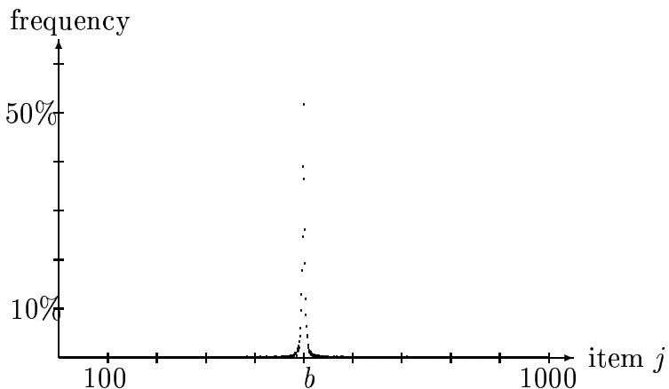
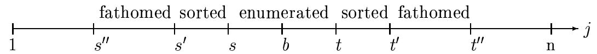
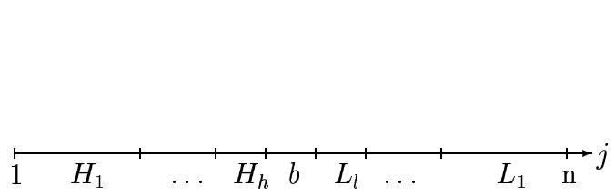
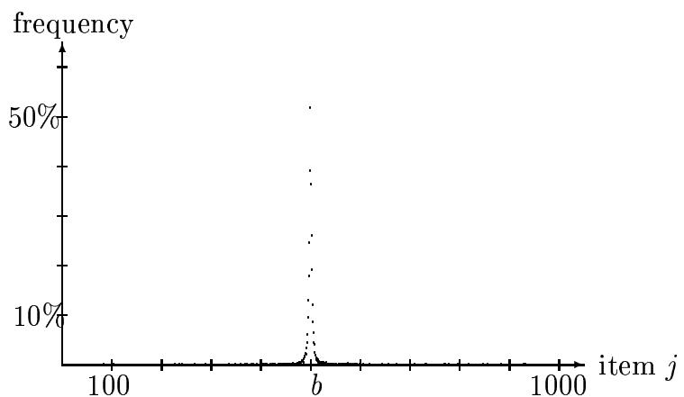
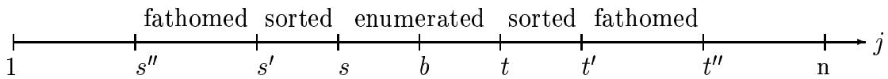
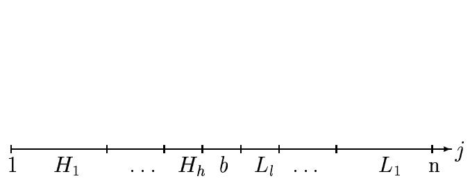

# A minimal algorithm for the 0-1 Knapsack Problem.\*

David Pisinger Dept. of Computer Science, University of Copenhagen, Universitetsparken 1, DK-2100 Copenhagen, Denmark.

January, 1994

# Abstract

Although several large sized 0-1 Knapsack Problems (KP) may be easily solved, it is often the case that most of the computational effort is used for preprocessing, i.e. sorting and reduction. In order to avoid this problem it has been proposed to solve the so-called core of the problem: A Knapsack Problem defined on a small subset of the variables. But the exact core cannot be identified without solving KP, so till now approximated core sizes had to be used.

In this paper we present an algorithm for KP which has the property that the obtained core size is minimal, and that the computational effort for sorting and reduction also is minimal. The algorithm is based on a dynamic programming approach, where the core size is extended by need, and the sorting and reduction is performed in a similar "lazy" way. The breadth-first search of the dynamic programming approach implies that all possible variations of the solution vector have been tested, before a new variable is introduced to the core. As a consequence, no unnecessary sorting and reduction is performed thus ensuring minimality.

Computational experiments are presented for several commonly occurring types of data instances. Experience from these tests indicate that the presented approach outperforms any known algorithm for KP.

Keywords: Packing; Knapsack Problem; Dynamic Programming; Reduction.

# Introduction

Given n items to pack in some knapsack of capacity c. Each item $j$ has a profit $p _ { j }$ and weight $w _ { j }$ , and we wish to maximize the profit sum of the included items without having the weight sum to exceed $c$ . More formally we define the 0-1 Knapsack Problem $( K P )$ by

$$
z = \sum _ { j = 1 } ^ { n } p _ { j } x _ { j }
$$

$$
{ \begin{array} { r l } { { \mathrm { s u b j e c t ~ t o } } } & { \displaystyle \sum _ { j = 1 } ^ { n } w _ { j } x _ { j } \leq c } \\ & { x _ { j } \in \{ 0 , 1 \} , \quad j = 1 , \ldots , n , } \end{array} }
$$

where all coefficients are positive integers. Without loss of generality we may assume that $w _ { j } \ \leq \ c$ for $j = 1 , \dots , n$ $\Sigma _ { j = 1 } ^ { n } w _ { j } > c$ to ensure a nontrivial problem. If we relax the integrality constraint $x _ { j } \in \{ 0 , 1 \}$ in (1) to the linear constraint $0 \leq x _ { j } \leq 1$ , we obtain the Linear Knapsack Problem $( L K P )$ .

Many industrial problems can be formulated as Knapsack Problems: Cargo loading, cutting stock, project selection, and budget control to mention a few examples. Many combinatorial problems can be reduced to KP, and the problem arises also as a subproblem in several algorithms of integer linear programming. KP is NP-hard (see Garey and Johnson 1979), but it can be solved in pseudo-polynomial time by dynamic programming (Papadimitriou 1981).

In the middle of the 1970ies several good algorithms for KP were developed (Horowitz and Sahni 1974, Nauss 1976, Martello and Toth 1977). The starting point of each of these algorithms was to order the variables according to nonincreasing profit-to-weight $( p _ { j } / w _ { j } )$ ratio, which was the basis for solving LKP. From this solution appropriate upper and lower bounds were derived, making it possible to apply some logical tests to fix as many variables as possible at their optimal value. Finally the KP in the remaining variables was solved by branch-and-bound techniques.

However computational experience showed that the preprocessing (i.e. sorting and problem reduction) usually constituted the lion's share of the computational effort required to solve KP. Balas and Zemel (1980) avoided this problem by focusing on a small subset of the items — the so-called core — where there was a large probability for finding an optimal solution. The exact core consists of those variables whose profit-to-weight ratio falls between the maximum and minimum $p _ { j } / w _ { j }$ ratio for which $x _ { j }$ in an optimal solution to KP has a different value from that in an optimal solution to LKP. Since the determination of the exact core would require the solving of KP, Balas and Zemel (1980) proposed to use an approximate core, which could be found through a partitioning technique of complexity $O ( n )$ . A complete sorting of the variables would require $O ( n \log n )$ . Martello and Toth (1988) modified the partitioning algorithm to satisfy some given requirements on the core size. But still the expected core size was a pure guess. Although the exact core cannot be determined before KP is solved, Pisinger (1994a) observed that the core can be determined while KP is solved, by simply adding new items to the core by need. However Pisinger used a depth-first branch-and-bound algorithm for the solution of KP, which had the disadvantage that an unpromising branch sometimes was followed to completion — thus forcing a further extension of the core, although an optimal solution could be found within the current core.

In this paper we avoid that disadvantage by using a breadth-first dynamic programming algorithm to enumerate the core before it is extended. This ensures that all possible variations of the solution vector have been tested before a new variable is introduced, thus ensuring the minimality.

This paper is organized the following way: First, Section 1 brings some basic definitions, while Section 2 shows how an initial core may be derived through a modified QUICksoRT algorithm. Next, Section 3 gives a description of the dynamic programming algorithm and Section 4 shows how the core may be expanded by need. The following sections show how we use some logical tests to fix as many variables as possible at their optimal value. Finally Section 7 brings computational experience.

A first version of this paper was presented at the NOAS'93 Conference (Pisinger 1993). Similar results as presented in this paper have recently been obtained for the MultipleChoice Knapsack Problem and the Bounded Knapsack Problem (Pisinger 1994c, 1994d).

# 1 Definitions and main algorithm

The Linear Knapsack Problem may be solved by simply ordering the items according to nonincreasing efficiencies $e _ { j } ~ = ~ p _ { j } / w _ { j }$ and then use the greedy algorithm for filling the knapsack: Include items $j = 1 , 2 , \dots$ as long as

$$
\sum _ { i = 1 } ^ { j } w _ { i } \leq c .
$$

The first item $b$ which cannot be included in the knapsack is denoted the break item and an optimal solution to LKP is given by including all items $1 , \ldots , b - 1$ and a fraction of item $b$ to the knapsack (Dantzig 1957). Thus $x _ { j } = 1$ for $j = 1 , \dots , b - 1$ and $x _ { j } = 0$ for $j = b + 1 , \dotsc , n$ while $x _ { b }$ is given by

$$
x _ { b } = \frac { c - \sum _ { i = 1 } ^ { b - 1 } w _ { i } } { w _ { b } } .
$$

The corresponding pure integer solution $x ^ { \prime } = \{ x _ { 1 } { } ^ { \prime } , . . . , x _ { n } { } ^ { \prime } \}$ is known as the break solution and the variables are given by ${ x _ { j } } ^ { \prime } = 1$ for $j = 1 , \dots , b - 1$ and ${ x _ { j } } ^ { \prime } = 0$ for $j = b , \dots , n$ .

Balas and Zemel (1980) observed that an optimal solution $x ^ { * }$ to KP generally corresponds to the break solution $x ^ { \prime }$ except some few variables who have been changed. Figure 1 illustrates this property by measuring how often a variable is set to $x _ { j } ^ { * } = 0$ for $j < b$ and $x _ { j } ^ { * } = 1$ for $j \geq b$ in the optimal solution to KP. The figure is a result of solving 1000 randomly generated data instances of size $n = 1 0 0 0$ , with the capacity $c$ chosen such that $b = 5 0 0$ for all instances. The figure shows that the frequency decreases steeply with $j$ s distance from $b$ . In average only 3.4 variables differ from the break solution per data instance.

This observation motivates considering only a small amount of the items around $b$ in the solution process. In our definition a core is simply an interval $[ s , t ]$ , $s \leq b \leq t$ of variables satisfying the weak sort criteria

$$
\begin{array} { l l } { { \forall i , j \in [ s , t ] \quad : } } & { { i < j \Rightarrow e _ { i } \geq e _ { j } , } } \\ { { \forall j \in [ 1 , s - 1 ] : } } & { { e _ { j } \geq e _ { s } , } } \\ { { \forall j \in [ t + 1 , n ] : } } & { { e _ { j } \leq e _ { t } . } } \end{array}
$$

  
Figure 1: Frequency of items $j$ where the optimal solution $\boldsymbol { x } _ { j } ^ { * }$ differ from the break solution $\boldsymbol { x } _ { j } ^ { \prime }$ . Average of 1000 instances.

As long as we only consider variables in the core, this ordering is just as satisfying as a complete ordering of the items. Starting with $[ s , t ] = [ b , b ]$ we will enumerate all partial vectors in the core and alternately expand the core to the left and to the right. The set of partial vectors at any step is given by

$$
X _ { s , t } = { \left\{ \begin{array} { l } { ( x _ { s } , \ldots , x _ { t } ) \mid x _ { s } , \ldots , x _ { t } \in \left\{ 0 , 1 \right\} } \end{array} \right. } ,
$$

but we will use some dominance and upper bound tests to fathom unpromising branches. Clearly the enumeration of the core has time complexity $O ( 2 ^ { t - s } )$ , so any effort possible should be used to avoid inclusion of new variables to the core. We have chosen to use an upper bound test for this purpose, fathoming a variable if the corresponding upper bound does not exceed the current best solution (lower bound) $z$ A strong upper bound is used for this test (Pisinger 1994b). Since all coefficients are integers we may fathom the variable if the strong upper bound is less than $z + 1$ as no objective values between $z$ and $z + 1$ can occur.

The sorting of the variables according to nonincreasing efficiencies is much less complex, having an average execution time of $O ( n \log n )$ . Still, quite a lot of computational effort may be saved by using an upper bound test with a cheaply evaluated bound, to fathom unpromising variables. For this purpose we have chosen the bound by Dembo and Hammer (1980) which can be evaluated in constant time, giving the reduction algorithm a complexity of $O ( n )$ . This bound will be denoted the weak upper bound.

Since all these reductions are done by need, we use the following intervals to denote enumerated, sorted and reduced intervals (cf. Figure 2):

• $[ s ^ { \prime \prime } , t ^ { \prime \prime } ]$ is the interval of variables which have been tested by an upper bound test to decide whether a change in the corresponding solution variable $x _ { j }$ may lead to an improved solution.

  
Figure 2: The intervals $[ s , t ]$ , $[ s ^ { \prime } , t ^ { \prime } ]$ and $[ s ^ { \prime \prime } , t ^ { \prime \prime } ]$ .

• $[ s ^ { \prime } , t ^ { \prime } ]$ is the subset of variables in $[ s ^ { \prime \prime } , t ^ { \prime \prime } ]$ which have weak upper bound larger than the current lower bound $z$ . The variables in $[ s ^ { \prime } , t ^ { \prime } ]$ are ordered according to nonincreasing efficiencies. • $[ s , t ]$ determines the core, i.e. variables which have been enumerated to $X _ { s , t }$ .

We have $[ s , t ] \subseteq [ s ^ { \prime } , t ^ { \prime } ] \subseteq [ s ^ { \prime \prime } , t ^ { \prime \prime } ]$ , and note that the intervals $[ s ^ { \prime \prime } , s ^ { \prime } - 1 ]$ and $[ t ^ { \prime } + 1 , t ^ { \prime \prime } ]$ contains fathomed variables. This lead us to the following main algorithm:

# Algorithm 1

procedure minknap $( n , c , p _ { 1 } \ldots p _ { n } , w _ { 1 } \ldots w _ { n } , x _ { 1 } \ldots x _ { n } ) ;$   
Find break item $b$ through partial sorting.   
$[ s , t ] : = [ b , b ]$ ; $[ s ^ { \prime } , t ^ { \prime } ] : = [ b , b ] ; [ s ^ { \prime \prime } , t ^ { \prime \prime } ] : = [ b , b ] ;$ .   
$z : = 0$ ; $X _ { s , t } : = \{ ( 0 ) , ( 1 ) \}$ ;   
$\operatorname { r e d u c e s e t } ( X _ { s , t } )$ ;   
while $( X _ { s , t } \neq \emptyset )$ do if $\left( s - 1 \ge s ^ { \prime } \right)$ then if strong upper bound $( s - 1 ) \geq z + 1$ then $X _ { s - 1 , t } : = \operatorname { a d d } ( X _ { s , t } , s - 1 ) ; \mathbf { f }$ i; $s : = s - 1$ ; f; $\mathrm { r e d u c e s e t } ( X _ { s , t } ) ;$ . if $\left( t + 1 \le t ^ { \prime } \right)$ then if strong upper $\mathrm { b o u n d } ( t + 1 ) \geq z + 1$ then $X _ { s , t + 1 } : = \mathrm { a d d } ( X _ { s , t } , t + 1 ) ;$ fi; $t : = t + 1$ ; fi; reduceset $( X _ { s , t } )$ ;   
elihw;   
definesolution;

The first step of the algorithm is to find the break item $b$ through partial sorting, which also returns some intervals $H = \{ H _ { 1 } , \ldots , H _ { h } \}$ and $L = \{ L _ { 1 } , . . . , L _ { l } \}$ of partially ordered variables, where variables in $H _ { j }$ have higher efficiency than $e _ { b }$ while variables in $L _ { j }$ have lower efficiency. This algorithm will be explained further in Section 2. After some initializations, we repeatedly include a new variable $s - 1$ or $t + 1$ to the core, thus obtaining a larger set $X _ { s , t }$ . This is done by the function ADD which will be described in Section 3. After each inclusion of a new variable in $X _ { s , t }$ we use some upper bound tests, to fathom unpromising vectors $\overline { { x } } _ { j } \in X _ { s , t }$ . The upper bounds involved are obtained through linear relaxations of variables $s - 1$ and $t + 1$ , and since these variables may fall outside the sorted set $[ s ^ { \prime } , t ^ { \prime } ]$ , we will expand the core in such cases. This is all done in procedure REDUcEsET, which will be explained in the second part of Section 3. We use the strong upper bound test, to determine whether a new variable $s - 1$ or $t + 1$ should be added to the core. The strong upper bound is described in Section 5, where we also give a thumb-rule for when it is worth evaluating the bound. Finally the solution vector $x ^ { * }$ is defined: Since it seems awkward to represent elements in $X _ { s , t }$ by complete vectors, some packing of the information is necessary. This will be discussed in Section 6.

We claim that Algorithm 1 solves KP to optimality with a minimal core and with minimal effort for sorting and reduction. More precisely we have

Definition 1 Given a core $[ s , t ]$ and the corresponding set of states $X _ { s , t }$ .We say that the core problem has been solved to optimality if one (or both) of the following cases occur:

• 1 $X _ { s , t } = \emptyset$ meaning that all states were fathomed due to an upper bound test. 2 All items $j \in [ 1 , s - 1 ]$ could be fixed at $x _ { j } = 1$ and all items $j \in [ t + 1 , n ]$ could be fixed at $x _ { j } = 0$ .

Definition 2 KP has been solved with a minimal core if the following invariant holds: A variable $s - 1$ (resp. $t + 1 \big )$ is only introduced to the core $[ s , t ]$ if $X _ { s , t }$ could not be solved to optimality, and the inclusion of $s - 1 \ ( \mathrm { r e s p . } \ t + 1 )$ introduces at least one vector $\overline { { x } } _ { j }$ to $X _ { s - 1 , t }$ (resp. $X _ { s , t + 1 } )$ which has upper bound greater than $z$ .

The definition states, that a variable $s - 1$ (resp. $t + 1 )$ should be introduced to the core only if it cannot be avoided by any upper bound test, and if all variables of lower (resp. higher) efficiency have been considered. The definition ensures that if KP has been solved to optimality with a minimal core $[ s , t ]$ , no smaller subset core $[ \tilde { s } , \tilde { t } ] \subset [ s , t ]$ exists. Anyway a smaller sized core $[ \tilde { s } , \tilde { t } ]$ may exist if $\tilde { s } < s$ and $\tilde { t } < t$ (resp. $\tilde { s } > s$ and $\tilde { t } > t$ but according to our definition such cores are not comparable. Algorithm 1 finds the minimal core (of several possible) which is symmetric around $b$ .

Definition 3 The sorting effort has been minimal if an interval $[ f , l ]$ is sorted only when

• $X _ { s , t }$ could not be solved to optimality.   
All variables in $[ f , l ]$ have (weak) upper bound larger than $z$ , i.e. all variables seems promising.   
• $s = s ^ { \prime }$ and $\left[ f , l \right] = H _ { h } ,$ or( $t = t ^ { \prime }$ and $[ f , l ] = L _ { l }$ ).

The last expression states, that the core should not be extended until $[ s , t ]$ reaches the border $[ s ^ { \prime } , t ^ { \prime } ]$ , and in such case $[ f , l ]$ should be chosen as the partially sorted interval $H _ { h }$ or $L _ { l }$ closest to $[ s , t ]$ .

Definition 4 The reduction effort has been minimal if

The weak upper bound is applied only when a new interval from $H$ or $L$ must be sorted according to the rule in definition 3.   
The strong upper bound is applied only when a new variable must be introduced to the core according to the rule in definition 2.

The following sections will show, that MINkNAP has all of these properties.

# 2 A partitioning algorithm for finding the break item

A complete sorting of the variables according to nonincreasing efficiencies $e _ { j }$ may be done in $O ( n \log n )$ by a sorting algorithm like QUICKsORT (Hoare 1962). The QUICKSORT algorithm repeatedly picks a middle value $\lambda$ from the interval $I = [ f , l ]$ , and partition the interval in two parts $[ f , i - 1 ]$ and $[ i , l ]$ , so that

$$
\begin{array} { r l } & { e _ { j } \geq \lambda , \ \quad j \in [ f , i - 1 ] , } \\ & { e _ { j } \leq \lambda , \quad j \in [ i , l ] . } \end{array}
$$

Initially $[ f , l ]$ is chosen as $[ 1 , n ]$ , and the interval is then repeatedly partitioned in smaller parts, till a complete sorting has been achieved. Since we only need the partial ordering (4) for an initial core $[ s , t ] = [ b , b ]$ , Pisinger (1994a) noted that several of these iterations may be discarded. Any interval $[ f , i - 1 ]$ in (6) with $\begin{array} { r } { \sum _ { j = 1 } ^ { i - 1 } w _ { j } \le c } \end{array}$ may be discarded since $b$ cannot be in the interval. Similarly an inerval $[ i , l ]$ in (7) may be discarded if $\textstyle \sum _ { j = 1 } ^ { i - 1 } w _ { j } > c$ . The discarded intervals represent a partial ordering of $[ 1 , n ]$ , and should thus be saved for future use. At any stage we have the invariants $\begin{array} { r } { W = \sum _ { j = 1 } ^ { i - 1 } w _ { j } } \end{array}$ and $\begin{array} { r } { V = \sum _ { j = 1 } ^ { f - 1 } w _ { j } } \end{array}$ , thus getting the following modified version of QUICKsORT:

# Algorithm 2

procedure partsort $\cdot ( f , l , V )$ ; $\{ [ f , l ]$ interval, $\begin{array} { r } { V = \sum _ { j = 1 } ^ { f - 1 } w _ { j } \} } \end{array}$   
$d : = l - f + 1$ ; $\{ d$ is the size of the interval}   
if $( d > 1 )$ then $m : = \lfloor f + d / 2 \rfloor$ ; $\{ m$ is the middle of the interval} Swap items $f , m , l$ so that $e _ { f } \geq e _ { m } \geq e _ { l }$ .   
f;   
if $( d \leq 3 )$ then $\phi : = f$ ; $\psi : = l$ ;{return found interval $[ \phi , \psi ] \}$   
else λ := choosemedian $( f , l )$ ; $\{ \lambda$ is the median of a subset of $[ f , l ] \}$ $i : = f$ ; $j : = l$ ; $W : = V$ ; repeat $\{ p a r t i t i o n [ f , l ] \ i n \ t w o \ i n t e r v a l s \}$ repeat $W = W + w _ { i }$ b $i : = i + 1$ ; until $( e _ { i } \leq \lambda )$ ; repeat $j : = j - 1$ ; until $( e _ { j } \geq \lambda )$ ; if $( i < j )$ then swap $( i , j )$ ; fi; until $( i > j )$ ; $\{ n o w \ e _ { k } \ge \lambda$ for $k \in [ f , j ]$ , and $e _ { k } \leq \lambda$ for $k \in [ i , l ] \}$ if $( W > c )$ then $H : = H \cup \{ [ i , l ] \}$ ; $\mathrm { p a r t s o r t } ( f , i - 1 , V )$ ; else $L : = L \cup \{ [ f , i - 1 ] \}$ ; $\mathrm { p a r t s o r t } ( i , l , W ) ;$ fi;   
f;

In the above algorithm, $\operatorname { S W A P } ( i , j )$ exchanges the items corresponding to indices $i$ and $j$

  
Figure 3: The lists $H$ and $L$ .

The PARTsORT algorithm is a common variant of the QUICKsORT algorithm with the modification that only intervals containing the break item are partitioned further. The algorithm terminates when the current interval contains at most three items $[ \phi , \psi ]$ with $\phi \leq b \leq \psi$ . The sketched algorithm corresponds to Pisinger (1994a), except that we choose $\lambda$ as the exact median of $\sqrt { d }$ randomly chosen items in $[ f , l ]$ for large intervals $( d \ge 1 0 0 )$ . For small intervals we choose $\lambda$ as $e _ { m }$ . This approach saves up to $3 0 \%$ of the computing time compared to Pisinger (1994a).

Note that all discarded intervals are added to the lists $H = \{ H _ { 1 } , \ldots , H _ { h } \}$ and $L =$ $\{ L _ { 1 } , \ldots , L _ { l } \}$ . Upon termination these intervals are ordered as indicated in Figure 3, and we have

$$
\begin{array} { r l r } & { } & { \forall i \in H _ { k } \ \forall j \in H _ { k + 1 } : \ e _ { i } \geq e _ { j } , k = 1 , \ldots , h - 1 , } \\ & { } & { \forall i \in L _ { k } \ \forall j \in L _ { k + 1 } : \ e _ { i } \geq e _ { j } , k = 1 , \ldots , l - 1 . } \end{array}
$$

# 3 A dynamic programming algorithm

In Section 1 we defined the set of all partial vectors in the core $[ s , t ]$ by

$$
X _ { s , t } = \{ \ ( x _ { s } , \ldots , x _ { t } ) \mid x _ { s } , \ldots , x _ { t } \in \{ 0 , 1 \} \ \} .
$$

It is convenient to represent each partial vector $\overline { { x } } _ { i } \in X _ { s , t }$ by a state $( \pi _ { i } , \mu _ { i } , v _ { i } )$ where $\pi _ { i }$ and $\mu _ { i }$ are the profit and weight sums of the extended vector $\overline { { x } } _ { i }$ , given by $\overline { { x } } _ { i j } = 1$ for $j = 1 , \dots , s - 1$ , and $\overline { { x } } _ { i j } = 0$ for $j = t + 1 , \ldots , n$ .Thus

$$
\begin{array} { l l l } { \pi _ { i } } & { = } & { \displaystyle \sum _ { j = 1 } ^ { s - 1 } p _ { j } + \sum _ { j = s } ^ { t } p _ { j } \overline { { x } } _ { i j } , } \\ { \mu _ { i } } & { = } & { \displaystyle \sum _ { j = 1 } ^ { s - 1 } w _ { j } + \sum _ { j = s } ^ { t } w _ { j } \overline { { x } } _ { i j } . } \end{array}
$$

The vector $v _ { i }$ is a (not necessarily complete) representation of the binary vector $\overline { { x } } _ { i }$ . According to the principle of optimality (Ibaraki 1987) we may fathom some of these states:

Definition 5 Given two states $( \pi _ { i } , \mu _ { i } , v _ { i } )$ and $( \pi _ { j } , \mu _ { j } , v _ { j } )$ . The state $i$ is said to dominate the state $j$ if $\pi _ { i } \geq \pi _ { j }$ and $\mu _ { i } \leq \mu _ { j }$ .

Proposition 1 If a state $i$ dominates another state $j$ we may fathom the dominated state $j$ .

Proof Let $\overline { { x } } _ { i }$ and $\overline { { x } } _ { j }$ be the binary vectors corresponding to states $i$ and $j$ Assume that an optimal solution $x ^ { * }$ contains $\overline { { x } } _ { j }$ as a sub-vector. Then an equally good or better solution may be obtained by setting $x _ { k } ^ { * } = \overline { { x } } _ { i k }$ for $k = s , \ldots , t$ .

We will keep the set $X _ { s , t } = \{ { \left( \pi _ { 1 } , \mu _ { 1 } , v _ { 1 } \right) } , \ldots , { \left( \pi _ { m } , \mu _ { m } , v _ { m } \right) } \}$ ordered according to increasing profit and weight sums $( \pi _ { i } < \pi _ { i + 1 }$ and $\mu _ { i } < \mu _ { i + 1 } )$ in order to easily fathom dominated states. The following algorithm shows how an ordered set $X _ { s , t }$ may be extended with a new variable $x _ { \ell }$ , obtaining a new ordered set with dominated states removed. Note, that if $\ell < b$ then $( p _ { \ell } , w _ { \ell } )$ should be subtracted from the states, while if $\ell \geq b$ they should be added to the states.

The problem is to merge two ordered sets $X$ and $X + \ell$ (the set $X$ with variable $\ell$ added/ subtracted to/from all states) ensuring that the product set is also ordered and dominated states are removed. We will let $i$ indicate the current considered state in $X$ while $j$ indicates the current state in $X + \ell$ . The last state in the product set $X ^ { \prime }$ is denoted $k$ .

The algorithm repeatedly choose the least weighted of the two states $i \in X$ and $j \in X + \ell$ in order to ensure the ordering of $X ^ { \prime }$ . Dominated states are deleted either by skipping the state $i$ (resp. $j )$ or by overriding the state $k$ .

# Algorithm 3

function $\operatorname { a d d } ( X , \ell )$ ;   
{input: $\begin{array} { r l r } & { } &  X = \{ ( \pi _ { 1 } , \mu _ { 1 } , v _ { 1 } ) , . . . , ( \pi _ { m } , \mu _ { m } , v _ { m } ) \} , \quad \mathrm { ~ \} } \\ & { } & { \ell = n e w \ v a r i a b l e \ t o \ b e \ i n c l u d e d \ i n \ c o r e . \} } \\ & { } & { t \colon X ^ { \prime } = \{ ( \pi _ { 1 } ^ { \prime } , \mu _ { 1 } ^ { \prime } , v _ { 1 } ^ { \prime } ) , . . . , ( \pi _ { m ^ { \prime } } ^ { \prime } , \mu _ { m ^ { \prime } } ^ { \prime } , v _ { m ^ { \prime } } ^ { \prime } ) \} . \ } \end{array}$   
{   
  
if $( \ell < b )$ then $\tilde { p } = - p _ { \ell }$ ; $\tilde { w } = - w _ { \ell }$ ;else $\tilde { p } = p _ { \ell }$ ; $\tilde { w } = w _ { \ell }$ ; fi; {subtract or add item }   
$i : = 1$ ; $j : = 1$ ; $k : = 1$ ; {initialize}   
$\left( \mu _ { m + 1 } , \pi _ { m + 1 } , v _ { m + 1 } \right) : = \left( \mu _ { m } + w _ { \ell } + 1 , \pi _ { m } + p _ { \ell } + 1 , \emptyset \right)$ ; {add state for correct termination}   
if $( \mu _ { i } \leq \mu _ { j } + \tilde { w } )$ then $( \mu _ { k } ^ { \prime } , \pi _ { k } ^ { \prime } , v _ { k } ^ { \prime } ) : = ( \mu _ { i } , \pi _ { i } , v _ { i } )$ ; $i : = 2$ ; {add state for correct start} else $( \mu _ { k } ^ { \prime } , \pi _ { k } ^ { \prime } , v _ { k } ^ { \prime } ) : = ( \mu _ { j } + \tilde { w } , \pi _ { j } + \tilde { p } , v _ { j } \cup \{ \ell \} )$ ; $j : = 2$ ;fi;   
repeat if $( \mu _ { i } \leq \mu _ { j } + \tilde { w } )$ then {choose smallest weight to ensure ordering. $\}$ if $( \mu _ { i } , \pi _ { i } , v _ { i } )$ is not dominated by $( \mu _ { k } ^ { \prime } , \pi _ { k } ^ { \prime } , v _ { k } ^ { \prime } )$ then if $( \mu _ { i } , \pi _ { i } , v _ { i } )$ does not dominate $( \mu _ { k } ^ { \prime } , \pi _ { k } ^ { \prime } , v _ { k } ^ { \prime } )$ then $\mathbf { k } : = \mathbf { k } + 1 ; \mathbf { f }$ ; $( \mu _ { k } ^ { \prime } , \pi _ { k } ^ { \prime } , v _ { k } ^ { \prime } ) : = ( \mu _ { i } , \pi _ { i } , v _ { i } )$ f; $i : = i + 1$ ; else if $( \mu _ { j } + \tilde { w } , \pi _ { j } + \tilde { p } , v _ { j } )$ is not dominated by $( \mu _ { k } ^ { \prime } , \pi _ { k } ^ { \prime } , v _ { k } ^ { \prime } )$ then if $( \mu _ { j } + \tilde { w } , \pi _ { j } + \tilde { p } , v _ { j } )$ does not dominate $( \mu _ { k } ^ { \prime } , \pi _ { k } ^ { \prime } , v _ { k } ^ { \prime } )$ then $\mathbf { k } : = \mathbf { k } + 1 ;$ f; $( \mu _ { k } ^ { \prime } , \pi _ { k } ^ { \prime } , v _ { k } ^ { \prime } ) : = ( \mu _ { j } + \tilde { w } , \pi _ { j } + \tilde { p } , v _ { j } \cup \{ \ell \} )$ ; fi; $j : = j + 1$ ; fi;   
until $( i = m + 1 )$ and $( j = m + 1 )$ ;   
$m ^ { \prime } = k$ ; return $X ^ { \prime }$ ;

Algorithm 3 allows us to generate all undominated states in $X _ { s , t }$ through dynamic programming, but the technique may be improved by deleting unpromising states after each iteration as indicated by procedure REDuCESET in Algorithm 1. Unpromising states have an upper bound, which does not exceed the current best solution $z$ . For a state $i$ given by $( \pi _ { i } , \mu _ { i } , v _ { i } )$ we use the upper bound

$$
\begin{array} { r l r } { u ( i ) } & { = } & { \left\{ \begin{array} { l l l } { u _ { 1 } ( i ) } & { = } & { \pi _ { i } + \frac { \left( c - \mu _ { i } \right) \cdot p _ { t + 1 } } { w _ { t + 1 } } \quad \mathrm { ~ i f ~ } \quad \mu _ { i } \leq c , } \\ & { } & \\ { u _ { 2 } ( i ) } & { = } & { \pi _ { i } + \frac { \left( c - \mu _ { i } \right) \cdot p _ { s - 1 } } { w _ { s - 1 } } \quad \mathrm { ~ i f ~ } \quad \mu _ { i } > c , } \end{array} \right. } \end{array}
$$

which has been obtained by relaxing the constraints on $x _ { s - 1 }$ and $x _ { t + 1 }$ to $x _ { s - 1 } \geq 0$ and $x _ { t + 1 } \geq 0$ . Since $s - 1$ or $t + 1$ may fall outside the current reduced and sorted interval $[ s ^ { \prime } , t ^ { \prime } ]$ , we have to extend the core in such cases. This is done the following way:

• If $s ^ { \prime \prime } = 1$ , all intervals $H$ have been considered, so the core cannot be expanded further to this side. Choose $p _ { s - 1 } = \infty$ and $w _ { s - 1 } = 1$ . Similarly if $t ^ { \prime \prime } = n$ we choose $p _ { t + 1 } = 0$ and $w _ { t + 1 } = 1$ . In both cases the bounds will ensure that states which cannot be improved further are fathomed. Otherwise choose an appropriate interval $H _ { h }$ or $L _ { l }$ , and reduce concerned variables through a (weak) upper bound test. This test will be described in the next section. If all variables in $H _ { h }$ or $L _ { l }$ have been fathomed through the upper bound test, we can choose any variable from the concerned interval as $s - 1$ resp. $t + 1$ in (13). Otherwise the remaining variables are ordered according to nonincreasing efficiencies and added to the set of sorted variables $[ s ^ { \prime } , t ^ { \prime } ]$ . Equation (13) may be used directly.

The bound (13) may also be used for deriving a global upper bound on KP. Since any optimal solution must follow a branch in $X _ { s , t }$ , the global upper bound corresponds to the upper bound of the most feasible branch in $X _ { s , t }$ . Therefore a global upper bound on KP is given by

$$
u _ { \mathrm { K P } } \ = \ \operatorname* { m a x } _ { i \in X } u ( i ) .
$$

Since the efficiency of variable $t + 1$ will be decreasing during the solution process, and the efficiency of $s - 1$ will be increasing, $u _ { \mathrm { K P } }$ will become more and more tight during the solution process. For $( s , t ) = ( 1 , n )$ we get $u _ { \mathrm { K P } } = z$ for the optimal solution $z$ .

# 4 Weak reduction

Assume that the solution vector $x$ corresponding to the current lower bound $z$ has been saved. If an upper bound on KP with the additional constraint $x _ { j } ~ = ~ 0$ , $j ~ < ~ b$ (resp. $x _ { j } = 1 , j \geq b )$ is less than $z + 1$ we may conclude that the branch $x _ { j } = 0$ (resp. $x _ { j } = 1$ ) will never lead to an improved solution, and can thus fix $x _ { j }$ at 1 (resp. 0).

Let $u _ { j } ^ { 0 }$ (resp. $u _ { j } ^ { 1 } .$ be an upper bound on KP with the additional constraint $x _ { j } = 0$ (resp. $x _ { j } = 1$ ), then the reduction scheme is

$$
\begin{array} { l l } { { u _ { j } ^ { 0 } < z + 1 \Rightarrow x _ { j } = 1 , } } & { { \qquad j = 1 , \ldots , b - 1 , } } \\ { { u _ { j } ^ { 1 } < z + 1 \Rightarrow x _ { j } = 0 , } } & { { \qquad j = b , \ldots , n . } } \end{array}
$$

Different upper bounds are presented in Ingargiola and Korsh (1973), Dembo and Hammer (1980), Fayard and Plateau (1982), and Martello and Toth (1988). For our purpose we have chosen the bounds by Dembo and Hammer:

$$
\begin{array} { r l r l } { { u } _ { j } ^ { 0 } } & { = } & { \overline { { p } } - p _ { j } + \frac { \left( r + w _ { j } \right) \cdot p _ { b } } { w _ { b } } , \qquad } & & { j = 1 , \dots , b - 1 , } \\ { { u } _ { j } ^ { 1 } } & { = } & { \overline { { p } } + p _ { j } + \frac { \left( r - w _ { j } \right) \cdot p _ { b } } { w _ { b } } , \qquad } & & { j = b , \dots , n , } \end{array}
$$

where $\overline { { p } }$ is the profit sum $\textstyle \sum _ { i = 1 } ^ { b - 1 } p _ { i }$ and $r$ is the residual capacity $\textstyle c - \sum _ { i = 1 } ^ { b - 1 } w _ { i }$ .This bound is not so tight, but it only demands the partial ordering (4) and can be evaluated in constant time, thus making it suitable for an upper bound test before sorting the next interval. Since the reduction is performed dynamically throughout the solution process, and not like in traditional algorithms as a part of the preprocessing, we may expect that a better solution (lower bound) is found during the enumeration, thus compensating for the weakness. We obtain the following sketch of the reduction algorithm:

Algorithm 4   
procedure reduce $( f , l )$ ;   
if $( l < b )$ then $\{ [ f , l ] \ i s \ l e f t \ o f \ b \}$ for $j : = f$ to $l$ do $u _ { j } ^ { 0 } : = \overline { { p } } - p _ { j } + \frac { \left( r + w _ { j } \right) \cdot p _ { b } } { w _ { b } }$ (r +  ·; {p   x= 0} if $( u _ { j } ^ { 0 } < z + 1 )$ then $x _ { j }$ is fixed to 1: Swap $j$ to $[ s ^ { \prime \prime } , s ^ { \prime } - 1 ]$ , extend the interval. else $x _ { j }$ is free: Swap $j$ to $[ s ^ { \prime } , s - 1 ]$ , extend the interval. fi; rof; Sort the new variables in $[ s ^ { \prime } , s - 1 ]$ .   
else $\{ [ f , l ]$ is right of b} for $j : = f$ to $l$ do $u _ { j } ^ { 1 } : = \overline { { p } } + p _ { j } + \frac { \left( r - w _ { j } \right) \cdot p _ { b } } { w _ { b } }$ (  ;{p   x= } if $( u _ { j } ^ { 1 } < z + 1 )$ then $x _ { j }$ is fixed to 0: Swap $j$ to $[ t ^ { \prime } + 1 , t ^ { \prime \prime } ]$ , extend the interval. else $x _ { j }$ is free: Swap $j$ to $[ t + 1 , t ^ { \prime } ]$ , extend the interval. fi; rof; Sort the new variables in $[ t + 1 , t ^ { \prime } ]$ .   
f;

The algorithm receives an interval $[ f , l ]$ given by $H _ { h }$ or $L _ { l }$ and tests whether the corresponding variables may be fixed at their optimal value. The two while-loops are performed in linear time, implying that each reduction of an interval $[ f , l ]$ is performed in $O ( l - f + 1 )$ .

# 5 Strong upper bound

Since the addition of a new item $\ell$ to the core is computationally very expensive, a strong upper bound test should be used for checking whether the inclusion seems promising. The ultimate check is to determine whether any states in $X + \ell$ will pass the reduction (13). No stronger bound can be constructed, since if the inclusion of $\ell$ to the core implies that a new promising branch is introduced to $X _ { s , t }$ , clearly $\ell$ has to be included.

A state $i$ in $X + \ell$ is the sum $( \pi _ { i } + \tilde { p } , \mu _ { i } + \tilde { w } , v _ { i } \cup \{ \ell \} )$ of the corresponding state $i$ in $X$ and the variable $\ell$ (added or subtracted), so an upper bound for the state is

$$
\begin{array} { r l r } { \tilde { u } ( i ) } & { = } & { \left\{ \begin{array} { l l l } { \tilde { u } _ { 1 } ( i ) } & { = } & { ( \pi _ { i } + \tilde { p } ) + \displaystyle \frac { \big ( c - \big ( \mu _ { i } + \tilde { w } \big ) \big ) \cdot p _ { t + 1 } } { w _ { t + 1 } } \quad \mathrm { ~ i f ~ } \quad \mu _ { i } + \tilde { w } \leq c , } \\ & { } & \\ { \tilde { u } _ { 2 } ( i ) } & { = } & { ( \pi _ { i } + \tilde { p } ) + \displaystyle \frac { \big ( c - \big ( \mu _ { i } + \tilde { w } \big ) \big ) \cdot p _ { s - 1 } } { w _ { s - 1 } } \quad \mathrm { ~ i f ~ } \quad \mu _ { i } + \tilde { w } > c , } \end{array} \right. } \end{array}
$$

where we simply have used (13) for the set $X + \ell$ An upper bound for the inclusion of variable $\ell$ into the core is thus given by

$$
\begin{array} { r } { \tilde { u } _ { \ell } = \underset { i \in X } { \operatorname* { m a x } } \tilde { u } ( i ) . } \end{array}
$$

This bound may be recognized as the $\pi$ -bound presented in Pisinger (1994b). Note that the functions $\tilde { u } _ { 1 }$ and $\tilde { u } _ { 2 }$ may be written

$$
\begin{array} { r l r } { \tilde { u } _ { 1 } ( i ) } & { = } & { u _ { 1 } ( i ) + \tilde { p } - \frac { \tilde { w } \cdot p _ { t + 1 } } { w _ { t + 1 } } , } \\ { \tilde { u } _ { 2 } ( i ) } & { = } & { u _ { 2 } ( i ) + \tilde { p } - \frac { \tilde { w } \cdot p _ { s - 1 } } { w _ { s - 1 } } , } \end{array}
$$

where $u _ { 1 } ( i )$ and $u _ { 2 } ( i )$ are the upper bounds of state $i \in X$ as given by (13).

Proposition 2 The bound $\tilde { u } _ { \ell }$ exceeds the lower bound $z$ if and only if a state in $X + \ell$ will pass the reduction (13).

Proof Assume that $\tilde { u } _ { \ell } = a$ with $a \ge z + 1$ . Since $\tilde { u } _ { \ell }$ is the maximum of bounds (17), choose the state $i \in X$ which satisfies $\tilde { u } ( i ) = a$ . The state $j \in X + \ell$ ,which is obtained by adding variable $\ell$ to $i$ , will also have upper bound $a \ge z + 1$ , meaning that it passes the fathoming test (13).

Contrary, if a state $j$ in $X + \ell$ passes the fathoming test (13), its upper bound must exceed $z$ , thus forcing the bound $\tilde { u } _ { \ell }$ to exceed $z$ .

Unfortunately the complexity of determining $\tilde { u } _ { \ell }$ is $O ( m )$ , where $m$ is the number of states in $X _ { s , t }$ , meaning that the computational effort for deriving the strong upper bound corresponds to the computational effort of including variable $\ell$ to the core. Therefore we will only evaluate the bound if there is a good chance of fathoming the concerned variable.

Note that $( \tilde { p } , \tilde { w } )$ corresponds to $\left( p _ { t + 1 } , w _ { t + 1 } \right)$ or $( - p _ { s - 1 } , - w _ { s - 1 } )$ since we are testing the inclusion of variable $t + 1$ or $s - 1$ . So in the first case we have $\tilde { u } _ { 1 } ( i ) = u _ { 1 } ( i )$ and in the second $\tilde { u } _ { 2 } ( i ) = u _ { 2 } ( i )$ , which may be verified by inserting $\tilde { p } , \tilde { w }$ in (19). Since $u _ { 1 } ( i ) \geq z + 1$ and $u _ { 2 } ( i ) \geq z + 1$ due to the fathoming test(13), the bound $\tilde { u } _ { \ell }$ can only be less than $z + 1$ if the sets $\{ i \in X _ { s , t } \mid \mu _ { i } + w _ { t + 1 } \leq c \}$ , respectively $\{ i \in X _ { s , t } \mid \mu _ { i } - w _ { s - 1 } > c \}$ are empty. We have shown the following proposition:

Proposition 3 If $\ell = t + 1$ and $\mu _ { 1 } ~ \leq ~ c - w _ { t + 1 }$ then $\tilde { u } _ { \ell } \ge z + 1$ If $\ell = s - 1$ and $\mu _ { m } > c + w _ { s - 1 }$ then $\tilde { u } _ { \ell } \geq z + 1$ .

Computational experience show, that if the criteria in Proposition 3 do not hold, then $\tilde { u } _ { \ell } < z + 1$ in more than $7 0 \%$ of the cases. Therefore the evaluation of $\tilde { u } _ { \ell }$ in such cases is worth the effort, since we generally may fathom the concerned variable.

# 6 Finding the solution vector

According to Bellmans classical description of dynamic programming (Bellman 1957), the optimal solution vector $x ^ { * }$ may be found by backtracking through the sets of states. But this technique means that all sets of states should be saved during the solution process. In the computational experience it is demonstrated that the number of states may be over 2 millions in each iteration. With $n = 1 0 0 0 0 0$ as a measure for the number of iterations, we would need to store billions of states, so another strategy should be chosen. A promising approach seems to be, that only the last $a$ changes in the solution vector are saved in the state variable $v$ . In our implementation $a = 3 2$ was chosen.

Whenever an improved solution is found during the construction of $X _ { s , t }$ , we save the corresponding state $( \pi , \mu , v )$ . After termination of the algorithm, the solution vector is tried reconstructed. First all variables $x _ { i }$ are set to the break solution ${ x } _ { i } ^ { \prime }$ . Then we run through the vector $v$ in the following way:

Algorithm 5   
procedure definesolution $( \pi , \mu , v )$ ;   
$\{ v = \{ v _ { 1 } , . . . , v _ { a } \}$ are indices to the last $a$ variables added to the state}   
for $i : = 1$ to $a$ do $j : = v _ { i }$ ; $\{ j$ is the variable corresponding to $v _ { i } \}$ if $( j < b )$ then $x _ { j } : = 0$ ; $\pi : = \pi + p _ { j }$ ; $\mu : = \mu + w _ { j }$ ; else $x _ { j } : = 1$ ; $\pi : = \pi - p _ { j }$ ; $\mu : = \mu - w _ { j }$ ;fi;

rof;

If the backtracked profit and weight sums $( \pi , \mu )$ correspond to the profit and weight sums of the break solution $( \pi ^ { \prime } , \mu ^ { \prime } )$ , we know that the constructed vector is correct. Otherwise we solve a new KP, this time with capacity $c = \mu$ , lower bound $z = \pi - 1$ , and global upper bound $u = \pi$ . The process is repeated till the solution vector $x$ is completely defined.

This technique has proved very efficient, since generally only a few iterations are needed. A maximum of 16 iterations has been observed for large strongly correlated data instances, but otherwise one or two iterations suffice. In the worst case $1 2 \%$ of the solution time was used for reconstructing the solution vector. Compared to saving all states on an external device (which is hundred of times slower than the main memory) it is considerably more efficient to re-evaluate the states.

# 7 Computational experience

The presented algorithm has been implemented in ANSI-C, and a complete listing is available from the author on request. The following results have been achieved on a HP9000/730 computer using the standard HP-UX C compiler with option -O (optimization).

We will consider how the algorithm behaves for different problem sizes, test instances, and data ranges. Four types of randomly generated data instances are considered as sketched below. Each type will be tested with data range $R _ { 1 } = 1 0 0$ , $R _ { 2 } = 1 0 0 0$ , $R _ { 3 } = { }$ 10000 for different problem sizes $n = 1 0 0$ , 300, 1000, 3000, 10000, 30000, 100000. The capacity $c$ is chosen as $\begin{array} { r } { c = { \frac { 1 } { 2 } } \sum _ { j = 1 } ^ { n } w _ { j } } \end{array}$ .

Uncorrelated data instances (UC): $p _ { j }$ and $w _ { j }$ are randomly distributed in $[ 1 , R ]$ . •Weakly correlated data instances (WC): $w _ { j }$ randomly distributed in $[ 1 , R ]$ and $p _ { j }$ randomly distributed in $[ w _ { j } - R / 1 0 , w _ { j } + R / 1 0 ]$ such that $p _ { j } \geq 1$ . Strongly correlated data instances (SC): $w _ { j }$ randomly distributed in $[ 1 , R ]$ and $p _ { j } =$ $w _ { j } + 1 0$ . Subset-sum data instances (SS): $w _ { j }$ randomly distributed in $[ 1 , R ]$ and $p _ { j } = w _ { j }$ .

For each problem type, size and range, we construct and solve 50 different data instances. The presented results are average values or extreme values. If a problem was not solved within 24 hours, this is indicated by a "" in the tables. We will compare the computing times of MINKNAP to those of MT2 (Martello and Toth 1988). The code for MT2 was obtained from Martello and Toth (1990), in which MT2 also is compared to several algorithms for KP, showing that MT2 outperforms any of these. The MT2 code was compiled using the standard HP-UX FORTRAN compiler with option -O (optimization).

<table><tr><td rowspan="2">n</td><td colspan="3">UC</td><td colspan="2">WC</td><td colspan="3">SC</td><td colspan="3">SS</td></tr><tr><td>R1</td><td>R2</td><td>R3</td><td>R1</td><td>R2 R3</td><td>R1</td><td>R2</td><td>R3</td><td>R1</td><td>R2</td><td>R3</td></tr><tr><td>100</td><td>7</td><td>8</td><td>9</td><td>8</td><td>14 15</td><td>35</td><td>41</td><td>47</td><td>8</td><td>11</td><td>15</td></tr><tr><td>300</td><td>8</td><td>11</td><td>13</td><td>8</td><td>17 20</td><td>132</td><td>140</td><td>112</td><td>8</td><td>11</td><td>15</td></tr><tr><td>1000</td><td>7</td><td>16</td><td>17</td><td>8</td><td>16 25</td><td>428</td><td>384</td><td>386</td><td>7</td><td>11</td><td>15</td></tr><tr><td>3000</td><td>7</td><td>17</td><td>21</td><td>7</td><td>14 29</td><td>1105</td><td>1120</td><td>1270</td><td>8</td><td>12</td><td>14</td></tr><tr><td>10000</td><td>10</td><td>15</td><td>27</td><td>8</td><td>12 30</td><td>4119</td><td>3662</td><td>4003</td><td>8</td><td>12</td><td>15</td></tr><tr><td>30000</td><td>23</td><td>11</td><td>29</td><td>7</td><td>13 26</td><td>11938</td><td>12768</td><td>11738</td><td>7</td><td>11</td><td>15</td></tr><tr><td>100000</td><td>34</td><td>12</td><td>27</td><td>8</td><td>13 18</td><td>37144</td><td>43420</td><td>39649</td><td>7</td><td>11</td><td>15</td></tr></table>

Table I: Final core size (number of items). Average of 50 instances.

<table><tr><td></td><td colspan="3">UC</td><td colspan="3">WC</td><td colspan="3">SC</td><td colspan="3">SS</td></tr><tr><td>n</td><td>R1</td><td>R2</td><td>R3</td><td>R1</td><td>R2</td><td>R3</td><td>R1</td><td>R2</td><td>R3</td><td>R1</td><td>R2</td><td>R3</td></tr><tr><td>100</td><td>79</td><td>93</td><td>96</td><td>55</td><td>100</td><td>99</td><td>79</td><td>94</td><td>93</td><td>50</td><td>58</td><td>66</td></tr><tr><td>300</td><td>65</td><td>96</td><td>97</td><td>20</td><td>96</td><td>99</td><td>88</td><td>97</td><td>86</td><td>27</td><td>44</td><td>51</td></tr><tr><td>1000</td><td>12</td><td>88</td><td>95</td><td>5</td><td>68</td><td>98</td><td>94</td><td>85</td><td>92</td><td>20</td><td>33</td><td>28</td></tr><tr><td>3000</td><td>5</td><td>74</td><td>96</td><td>2</td><td>22</td><td>94</td><td>78</td><td>81</td><td>95</td><td>11</td><td>16</td><td>20</td></tr><tr><td>10000</td><td>2</td><td>31</td><td>90</td><td>0</td><td>8</td><td>78</td><td>93</td><td>83</td><td>86</td><td>4</td><td>3</td><td>14</td></tr><tr><td>30000</td><td>2</td><td>7</td><td>85</td><td>1</td><td>2</td><td>38</td><td>87</td><td>85</td><td>86</td><td>10</td><td>5</td><td>7</td></tr><tr><td>100000</td><td>0</td><td>1</td><td>54</td><td>0</td><td>0</td><td>12</td><td>89</td><td>91</td><td>90</td><td>0</td><td>1</td><td>5</td></tr></table>

Table I rageals whic have beenested y the wakpper bounAve of 50 instances.

First Table I shows the average core size for solving KP to optimality. The core size is measured as the number of items in $X _ { s , t }$ , i.e. $\left( t - s + 1 \right)$ minus the variables fathomed by the strong upper bound test. It is seen, that the core size is not of constant size, as claimed by Balas and Zemel (1980). For uncorrelated, weakly correlated and subset-sum data instances, the core size is very small, showing slight tendencies to grow with the data range. For strongly correlated data instances, the core size is large, since about half of the items must be considered in order to solve the problem.

Next Table II shows the average percentage of items, which need to be tested by the weak upper bound in order to solve KP. The presented numbers are determined as $( t ^ { \prime \prime } - s ^ { \prime \prime } + 1 ) / n$ . We observe the interesting property, that large-sized uncorrelated, weakly correlated and subset-sum data instances generally can be solved without testing more than a few percent of the items. On the other hand strongly correlated data instances, and all small-sized data instances need a complete testing of the variables.

Table III gives the maximum number of states obtained in the solution process. For uncorrelated, weakly correlated and subset-sum data instances, less than 65.000 states are generated, indicating that the dynamic programming algorithm without complications may be applied on any computer. On the other hand strongly correlated data instances may involve more than 2.5 million states, which in our implementation takes up about 30Mb RAM. Papadimitriou (1981) showed that KP can be solved in pseudopolynomial time by dynamic programming, since the number of states at each step is limited by c.

<table><tr><td></td><td colspan="3">UC</td><td colspan="3">WC</td><td colspan="3">SC</td><td colspan="3">SS</td></tr><tr><td>n</td><td>R1</td><td>R2</td><td>R3</td><td>R1</td><td>R2</td><td>R3</td><td>R1</td><td>R2</td><td>R3</td><td>R1</td><td>R2</td><td>R3</td></tr><tr><td>100</td><td>0</td><td>0</td><td>0</td><td>0</td><td>0</td><td>0</td><td>1</td><td>8</td><td>78</td><td>0</td><td>6</td><td>63</td></tr><tr><td>300</td><td>0</td><td>0</td><td>0</td><td>0</td><td>1</td><td>1</td><td>1</td><td>14</td><td>148</td><td>1</td><td>5</td><td>53</td></tr><tr><td>1000</td><td>0</td><td>1</td><td>1</td><td>1</td><td>2</td><td>3</td><td>3</td><td>25</td><td>287</td><td>0</td><td>5</td><td>55</td></tr><tr><td>3000</td><td>0</td><td>1</td><td>1</td><td>0</td><td>4</td><td>7</td><td>4</td><td>45</td><td>425</td><td>0</td><td>5</td><td>60</td></tr><tr><td>10000</td><td>0</td><td>3</td><td>6</td><td>1</td><td>5</td><td>12</td><td>8</td><td>74</td><td>764</td><td>0</td><td>6</td><td>52</td></tr><tr><td>30000</td><td>2</td><td>4</td><td>9</td><td>0</td><td>11</td><td>32</td><td>15</td><td>130</td><td>1407</td><td>0</td><td>6</td><td>55</td></tr><tr><td>100000</td><td>4</td><td>4</td><td>19</td><td>0</td><td>27</td><td>65</td><td>37</td><td>250</td><td>2547</td><td>0</td><td>5</td><td>48</td></tr></table>

Table III: Largest set of states in dynamic programming (in thousands). Max of 50 instances.

Table IV: Total computing time in seconds (minkNAP). Average of 50 instances.   

<table><tr><td rowspan="2">n</td><td colspan="3">UC</td><td colspan="3">WC</td><td colspan="3">SC</td><td colspan="3">SS</td></tr><tr><td>R1</td><td>R2</td><td>R3</td><td>R1</td><td>R2</td><td>R3</td><td>R1</td><td>R2</td><td>R3</td><td>R1</td><td>R2</td><td>R3</td></tr><tr><td>100</td><td>0.00</td><td>0.00</td><td>0.00</td><td>0.00</td><td>0.00</td><td>0.00</td><td>0.00</td><td>0.03</td><td>0.43</td><td>0.00</td><td>0.00</td><td>0.06</td></tr><tr><td>300</td><td>0.00</td><td>0.00</td><td>0.00</td><td>0.00</td><td>0.00</td><td>0.00</td><td>0.02</td><td>0.18</td><td>1.63</td><td>0.00</td><td>0.00</td><td>0.06</td></tr><tr><td>1000</td><td>0.00</td><td>0.00</td><td>0.00</td><td>0.00</td><td>0.00</td><td>0.01</td><td>0.08</td><td>0.63</td><td>7.62</td><td>0.00</td><td>0.01</td><td>0.05</td></tr><tr><td>3000</td><td>0.00</td><td>0.01</td><td>0.01</td><td>0.00</td><td>0.01</td><td>0.02</td><td>0.24</td><td>2.28</td><td>42.65</td><td>0.01</td><td>0.01</td><td>0.06</td></tr><tr><td>10000</td><td>0.01</td><td>0.01</td><td>0.03</td><td>0.01</td><td>0.01</td><td>0.05</td><td>1.25</td><td>10.39</td><td>161.04</td><td>0.01</td><td>0.02</td><td>0.07</td></tr><tr><td>30000</td><td>0.03</td><td>0.03</td><td>0.07</td><td>0.03</td><td>0.03</td><td>0.08</td><td>3.15</td><td>42.78</td><td>491.31</td><td>0.05</td><td>0.04</td><td>0.10</td></tr><tr><td>100000</td><td>0.11</td><td>0.10</td><td>0.17</td><td>0.10</td><td>0.12</td><td>0.16</td><td>13.96</td><td>178.14</td><td>2208.82</td><td>0.11</td><td>0.12</td><td>0.20</td></tr></table>

<table><tr><td rowspan="2">n</td><td colspan="3">UC</td><td colspan="3">WC</td><td colspan="3">SC</td><td colspan="3">SS</td></tr><tr><td>R1</td><td>R2</td><td>R3</td><td>R1</td><td>R2</td><td>R3</td><td>R1</td><td>R2</td><td>R3</td><td>R1</td><td>R2</td><td>R3</td></tr><tr><td>100</td><td>0.00</td><td>0.00</td><td>0.00</td><td></td><td>0.00</td><td>0.00</td><td>0.01</td><td>2.78 2.68</td><td>21.16</td><td>0.00</td><td>0.00</td><td>0.01</td></tr><tr><td>300</td><td>0.00</td><td>0.00</td><td>0.00</td><td></td><td>0.00</td><td>0.00</td><td>0.01</td><td></td><td></td><td>0.00</td><td>0.00</td><td>0.02</td></tr><tr><td>1000</td><td>0.00</td><td>0.00</td><td>0.01</td><td></td><td>0.00</td><td>0.01</td><td>0.02</td><td></td><td></td><td>0.00</td><td>0.00</td><td>0.02</td></tr><tr><td>3000</td><td>0.00</td><td>0.01</td><td>0.02</td><td></td><td>0.00</td><td>0.01</td><td>0.07</td><td></td><td></td><td>0.00</td><td>0.00</td><td>0.02</td></tr><tr><td>10000</td><td>0.02</td><td>0.03</td><td>0.07</td><td></td><td>0.02</td><td>0.04</td><td>0.16</td><td></td><td></td><td>0.01</td><td>0.01</td><td>0.03</td></tr><tr><td>30000</td><td>2.47</td><td>0.07</td><td>0.20</td><td></td><td>0.05</td><td>0.61</td><td>0.26</td><td></td><td></td><td>0.03</td><td>0.03</td><td>0.05</td></tr><tr><td>100000</td><td></td><td>0.28</td><td>0.56</td><td></td><td>0.25</td><td></td><td>0.56</td><td></td><td></td><td>0.12</td><td>0.12</td><td>0.15</td></tr></table>

Table V: Total computing time in seconds (mT2). Average of 50 instances.

The table shows, that the actual number of states is far less than c, although strongly correlated data instances may involve up to $1 \%$ of the possible c states.

Finally Table IV shows the average computing time for each of the considered data instances. It is seen, that easy data instances may be solved in a fraction of a second even if the number of variables is 100000. Strongly correlated data instances demand considerably more computational effort, but are still solved within one hour of computation time on average.

This should be compared to the computing times for MT2 given in Table V. It is seen, that MT2 is not able to solve strongly correlated data instances of large size, and moreover the algorithm has some anomalous occurrences for large uncorrelated and weakly correlated data instaces. In these situations some instances could not be solved within 24 hours of computational time. As explained in Pisinger (1994a) this may be a consequence of the a priori determination of the core in MT2: If the guessed core is not appropriate, extensive branching is a consequence.

# 8 Conclusions

We have presented a complete algorithm for the exact solution of the 0-1 Knapsack Problem. The algorithm solves KP with a minimal core, since variables are introduced to the core only if the current core could not be solved to optimality, and the inclusion of the new variable introduces at least one promising state in the set $X _ { s , t }$ (this is a consequence of Algorithm 1, the strong upper bound (18) and Proposition 2). Moreover the chosen strategy for core-expansion described in second part of Section 3 ensures that the effort for sorting and reduction has been minimal.

It is interesting to compare the obtained results to previous work: Balas and Zemel (1980) defined the core as the interval of sorted variables between first and last variable $\boldsymbol { x } _ { j } ^ { * }$ which differ from the break solution $\boldsymbol { x } _ { j } ^ { \prime }$ . Even if such a core could be obtained a priori it would not guarantee that optimality could be proved by any upper bound, so the approach seems no good. Martello and Toth (1988) on the other hand chose a larger interval of variables around $b$ for the core, namely $n$ variables if $n \leq 1 0 0$ , and $\sqrt { n }$ variables if $n > 1 0 0$ . In Martello and Toth (1990) this core size is for unknown reasons changed to the double size. The presented minimal core sizes in Table I show that far smaller core sizes may be applied for uncorrelated and weakly correlated data instances, while strongly correlated data instances demand larger core sizes.

It should be mentioned, that the here stated minimality by no means guarantees that KP cannot be solved easier. Completely different approaches may show better results, and even similar types of algorithms may perform better if other upper bounds are applied. Note however that tighter upper bounds than the strong upper bound cannot be constructed, as discussed in the beginning of Section 5.

Apart from showing some minimal properties, we have derived a very efficient algorithm for the solution of KP. For uncorrelated, weakly correlated and subset-sum data instances it performs better and more stable than the so far best algorithm MT2 (Martello and Toth 1988). For strongly correlated data instances no algorithm has ever been able to solve instances of this size.

Finally we have seen that the global upper bound $u _ { \mathrm { K P } }$ converge towards the lower bound $z$ . This makes the MinkNAP algorithm well suited as an approximate algorithm, since for a given maximum tolerance, the algorithm may be terminated when the current solution differs less from the upper bound than demanded.

# Appendix A: Additional computational results

In this section we bring the results of some additional computational experiments with MINKNAP.

<table><tr><td rowspan="2">n \R</td><td colspan="3">UC</td><td colspan="3">WC</td><td colspan="3">SC</td><td colspan="3">SS</td></tr><tr><td>100</td><td>1000</td><td>10000</td><td>100</td><td>1000</td><td>10000</td><td>100</td><td>1000</td><td>10000</td><td>100</td><td>1000</td><td>10000</td></tr><tr><td>100</td><td>1.0</td><td>1.0</td><td>1.0</td><td>1.0</td><td>1.0</td><td>1.0</td><td>1.0</td><td>1.0</td><td>1.0</td><td>1.0</td><td>1.0</td><td>1.0</td></tr><tr><td>300</td><td>1.0</td><td>1.0</td><td>1.0</td><td>1.0</td><td>1.0</td><td>1.0</td><td>1.0</td><td>1.0</td><td>1.0</td><td>1.0</td><td>1.0</td><td>1.0</td></tr><tr><td>1000</td><td>1.0</td><td>1.0</td><td>1.0</td><td>1.0</td><td>1.0</td><td>1.0</td><td>1.6</td><td>1.6</td><td>1.5</td><td>1.0</td><td>1.0</td><td>1.0</td></tr><tr><td>3000</td><td>1.0</td><td>1.0</td><td>1.0</td><td>1.0</td><td>1.0</td><td>1.2</td><td>2.3</td><td>2.3</td><td>2.5</td><td>1.0</td><td>1.0</td><td>1.0</td></tr><tr><td>10000</td><td>1.0</td><td>1.0</td><td>1.1</td><td>1.0</td><td>1.0</td><td>1.3</td><td>3.8</td><td>3.9</td><td>4.1</td><td>1.0</td><td>1.0</td><td>1.0</td></tr><tr><td>30000</td><td>1.2</td><td>1.0</td><td>1.0</td><td>1.0</td><td>1.0</td><td>1.1</td><td>4.7</td><td>6.6</td><td>6.5</td><td>1.0</td><td>1.0</td><td>1.0</td></tr><tr><td>100000</td><td>1.4</td><td>1.0</td><td>1.1</td><td>1.0</td><td>1.0</td><td>1.0</td><td>5.0</td><td>11.7</td><td>11.9</td><td>1.0</td><td>1.0</td><td>1.0</td></tr></table>

Table VI: Number of iterations used for obtaining the solution vector. Average of 50 instances.

<table><tr><td rowspan="2">n \R</td><td colspan="3">UC</td><td colspan="3">WC</td><td colspan="3">SC</td><td colspan="3">SS</td></tr><tr><td>100</td><td>1000</td><td>10000</td><td>100</td><td>1000</td><td>10000</td><td>100</td><td>1000</td><td>10000</td><td>100</td><td>1000</td><td>10000</td></tr><tr><td>100</td><td>3.6</td><td>40.6</td><td>448.1</td><td>0.9</td><td>16.5</td><td>153.8</td><td>3.9</td><td>4.5</td><td>5.6</td><td>0.0</td><td>0.0</td><td>0.0</td></tr><tr><td>300</td><td>1.7</td><td>22.0</td><td>239.5</td><td>0.1</td><td>6.0</td><td>72.8</td><td>4.6</td><td>5.0</td><td>4.0</td><td>0.0</td><td>0.0</td><td>0.0</td></tr><tr><td>1000</td><td>0.3</td><td>8.6</td><td>88.9</td><td>0.0</td><td>1.8</td><td>27.5</td><td>4.9</td><td>4.2</td><td>4.1</td><td>0.0</td><td>0.0</td><td>0.0</td></tr><tr><td>3000</td><td>0.1</td><td>3.0</td><td>38.1</td><td>0.0</td><td>0.5</td><td>9.8</td><td>4.1</td><td>4.1</td><td>5.0</td><td>0.0</td><td>0.0</td><td>0.0</td></tr><tr><td>10000</td><td>0.0</td><td>0.8</td><td>14.8</td><td>0.0</td><td>0.0</td><td>3.1</td><td>4.9</td><td>4.4</td><td>4.8</td><td>0.0</td><td>0.0</td><td>0.0</td></tr><tr><td>30000</td><td>0.0</td><td>0.2</td><td>5.7</td><td>0.0</td><td>0.0</td><td>1.0</td><td>4.3</td><td>4.9</td><td>4.5</td><td>0.0</td><td>0.0</td><td>0.0</td></tr><tr><td>100000</td><td>0.0</td><td>0.0</td><td>1.7</td><td>0.0</td><td>0.0</td><td>0.2</td><td>4.1</td><td>4.9</td><td>4.6</td><td>0.0</td><td>0.0</td><td>0.0</td></tr></table>

Table VII: Gap Γ between LP-optimal solution and integer-optimal solution. Average of 50 instances.

<table><tr><td></td><td colspan="3">UC</td><td colspan="3">WC</td><td colspan="3">SC</td><td colspan="3">SS</td></tr><tr><td>n\R</td><td>100</td><td>1000</td><td>10000</td><td>100</td><td>1000</td><td>10000</td><td>100</td><td>1000</td><td>10000</td><td>100</td><td>1000</td><td>10000</td></tr><tr><td>100</td><td>0.00</td><td>0.00</td><td>0.00</td><td>0.00</td><td>0.00</td><td>0.00</td><td>0.01</td><td>0.03</td><td>0.48</td><td>0.00</td><td>0.00</td><td>0.05</td></tr><tr><td>300</td><td>0.00</td><td>0.00</td><td>0.00</td><td>0.00</td><td>0.00</td><td>0.00</td><td>0.01</td><td>0.14</td><td>1.87</td><td>0.00</td><td>0.00</td><td>0.04</td></tr><tr><td>1000</td><td>0.00</td><td>0.00</td><td>0.00</td><td>0.00</td><td>0.00</td><td>0.01</td><td>0.07</td><td>0.64</td><td>8.62</td><td>0.00</td><td>0.01</td><td>0.05</td></tr><tr><td>3000</td><td>0.00</td><td>0.00</td><td>0.01</td><td>0.00</td><td>0.01</td><td>0.02</td><td>0.24</td><td>2.42</td><td>39.65</td><td>0.00</td><td>0.01</td><td>0.05</td></tr><tr><td>10000</td><td>0.00</td><td>0.00</td><td>0.01</td><td>0.00</td><td>0.01</td><td>0.03</td><td>1.13</td><td>10.77</td><td>152.45</td><td>0.01</td><td>0.01</td><td>0.04</td></tr><tr><td>30000</td><td>0.01</td><td>0.01</td><td>0.02</td><td>0.01</td><td>0.01</td><td>0.04</td><td>2.91</td><td>38.18</td><td>506.74</td><td>0.04</td><td>0.03</td><td>0.07</td></tr><tr><td>100000</td><td>0.03</td><td>0.01</td><td>0.04</td><td>0.00</td><td>0.05</td><td>0.05</td><td>13.95</td><td>156.27</td><td>2381.84</td><td>0.00</td><td>0.05</td><td>0.11</td></tr></table>

Table VI: Standard deviation computational times MINkNAP. Average of 50 instances.

First, Table VI brings the number of iterations, which are needed to define the complete solution vector as described in Section 6. For all instances except the strongly correlated, slightly more than one iteration is needed on the average, meaning that the compact representation of the solution vector generally is sufficient. Only in a few cases, an additional iteration is needed, meaning that there is a minimal overhead for this part of the algorithm. For strongly correlated instances, however up to a dozen iterations are needed, but this still means that it is a negligible part of the solution time which is used for finding the solution vector.

Table VII shows the gap $\Gamma$ between the LP-optimal and the integer-optimal solution. According to Balas and Zemel (1980), the hardness of a Knapsack Problem depends on the correlation of the data and the gap $\Gamma$ . This explains that instances with coefficients generated in a large range $R$ ,generally are harder to solve than the same instances with coefficients generated in a small range, as the gap grows with increasing data range. For strongly correlated instances, $\Gamma$ is on the average constant around five. The increasing computational time for larger data ranges should merely be sought in the pseudopolynomial solution time of MInkNAP: Each time $R$ is increased by a factor, the capacity c and thus the time-bound $O ( n c )$ are increased by the same amount.

Finally Table VIII shows the standard deviation of the computational times of MINkNAP. Apart from the strongly correlated instances — which apparently have a very large variation in the running times — most of the variations are very small, and considerably less than one. This demonstrates that MINkNAP has a very stable behavior.

# Список литературы

BALAS, E. AND E. ZEMEL, "An Algorithm for Large Zero-One Knapsack Problems," Operations Research, 28 (1980), 1130-1154.

BELLMAN, R.E., "Dynamic Programming," Princeton University Press, Princeton, N.J., (1957).

DANTzIG, G.B., "Discrete Variable Extremum Problems," Operations Research, 5 (1957).   
266-277.

DEMBO, R.S. AND P.L. HAMMER, "A Reduction Algorithm for Knapsack Problems," Methods of Operations Research, 36 (1980) 49-60.

FAYARD, D. AND G. PLATEAU, "An Algorithm for the Solution of the O-1 Knapsack Problem," Computing, 28 (1982), 269-287.

GAREY, M.R. AND D.S. JoHNsON, Computers and Intractability: A Guide to the Theory of NP-Completeness, Freeman, San Francisco, 1979.

HoARE, C.A.R., "Quicksort," Computer Journal, 5, 1 (1962), 10-15.

HoRowITz, E. AND S. SAHNI, "Computing partitions with applications to the Knapsack Problem," Journal of ACM, 21 (1974), 277-292.

IBARAKI, T., "Enumerative Approaches to Combinatorial Optimization - Part 2," Annals of Operations Research, 11 (1987).

InGARGIOLA, G.P. AND J.F. KoRSH, "A Reduction Algorithm for Zero-One Single Knapsack Problems," Management Science, 20 (1973), 460-463.

MARTELLO, S. AND P. ToTH, "An Upper Bound for the Zero-One Knapsack Problem and a Branch and Bound algorithm," Europan Journal of Operational Research, 1 (1977), 169-175.

MARTELLO, S. AND P. TOTH, "A New Algorithm for the O-1 Knapsack Problem," Management Science, 34 (1988), 633-644.

MARTELLO, S. AND P. ToTH, Knapsack Problems: Algorithms and Computer Implementations, John Wiley & Sons Ltd., England, 1990.

NAuss, R. M., "An Efficient Algorithm for the O-1 Knapsack Problem," Management Science, 23 (1976), 27-31.

PAPADIMITRIOU, C.H., "On the complexity of integer programming," Journal of ACM, 28 (1981), 765-768.

PISINGER, D., "On the solution of 0-1 Knapsack Problems with minimal preprocessing," Proceedings NOAS'93, Trondheim, Norway, June 11-12. (1993).

PIsINGER, D., "An expanding-core algorithm for the exact 0-1 Knapsack Problem," To appear in European Journal of Operational Research (1994a).

PIsINGER, D., "Solving hard knapsack problems," DIKU, University of Copenhagen, Denmark, Report 94/24 (1994b).

PIsINGER, D., "A minimal algorithm for the Multiple-Choice Knapsack Problem," DIKU, University of Copenhagen, Denmark, Report 94/25 (1994c).

PISINGER, D., "A minimal algorithm for the Bounded Knapsack Problem," DIKU, University of Copenhagen, Denmark, Report 94/27 (1994d).

# Figures for reproduction

  
Figure 1: Frequency of items $j$ where the optimal solution $\boldsymbol { x } _ { j } ^ { * }$ differ from the break solution $\boldsymbol { x } _ { j } ^ { \prime }$ . Average of 1000 instances.

  
Figure 2: The intervals $[ s , t ] , [ s ^ { \prime } , t ^ { \prime } ]$ and $[ s ^ { \prime \prime } , t ^ { \prime \prime } ]$ .

  
Figure 3: The lists $H$ and $L$ .