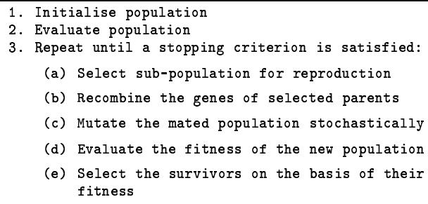
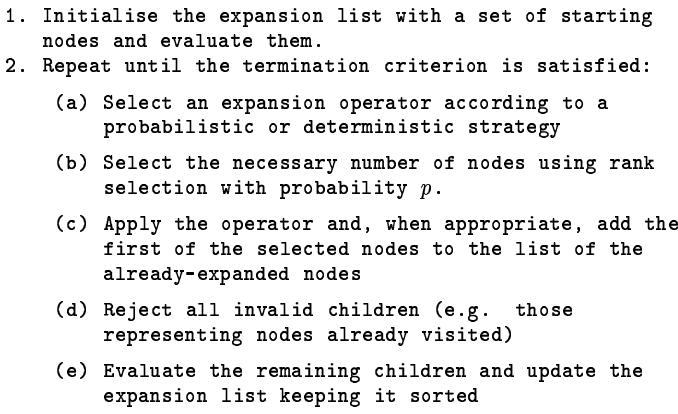

# Evolutionary Computation Cookbook: Recipes for Designing New Algorithms

Riccardo Poli

Brian Logan

School of Computer Science The University of Birmingham Birmingham B15 2TT, UK R.Poli@cs.bham.ac.uk

School of Computer Science The University of Birmingham Birmingham B15 2TT, UK B.S.Logan@cs.bham.ac.uk

Abstract— Evolutionary algorithms are powerful techniques for optimisation whose operation principles are inspired by natural selection and genetics. In this paper we discuss the relation between evolutionary techniques, numerical and classical search methods and we show that all these methods are instances of a single more general search strategy, which we call the 'evolutionary computation cookbook'. By combining the features of classical and evolutionary methods in different ways new instances of this general strategy can be generated, i.e. new evolutionary (or classical) algorithms can be designed. One such algorithm, $\mathbf { G A } ^ { * }$ , is described.

# I. InTRODuCTION

Evolutionary algorithms (EAs) are powerful optimisation techniques taking inspiration from genetics and natural selection [6; 5; 2; 1; 8]. EAs are often referred to as global optimisation methods, to stress the fact that they can effectively explore very large solutions spaces without being trapped by local minima. Applying EAs to a new problem is straightforward the only requirements being: a way of representing the solutions of the problem to be solved, a set of genetic operators, and a fitness function (or at least a partial ordering over the solutions). The effectiveness and simplicity of evolutionary algorithms have lead many people to believe that they are the methods of choice for hard real-life problems superseding traditional search techniques.

However they are not without their limitations. In particular, the choice of a good problem-specific representation and a good set of problem-specific genetic operators can make a considerable difference to the efficiency, effectiveness and often even the feasibility of the search [4; 8]. Similar problems arise in classical GOFAI (Good Old Fashioned Artificial Intelligence) state space search, where the selection of appropriate problem representations and operators has long been one of the central concerns. This suggests that it is important to explore the parallels between classical and evolutionary approaches.

In this paper we discuss the relations between evolutionary techniques, numerical methods and classical search methods and argue that the idea that EAs make other techniques obsolete is largely incorrect. We show that EAs are nothing but informed search methods with certain new features which can make them superior to other methods for certain problems(in particular the features which make them global search techniques) and lack some important characteristics that make many other classical and numerical search algorithms very effective. A comparative analysis of fourteen evolutionary and non-evolutionary search algorithms shows that they are all constructed from a small number of components which as a whole form what we call 'evolutionary computation cookbook'. These components can be recombined to form new powerful 'recipes', i.e. new search algorithms which combine the features of classical and evolutionary methods.

The paper is organised as follows. Firstly, in Section II, we describe the structure of classical search methods, numerical methods and some classes of EAs. Then, in Section III we present the 'cookbook' of which all these methods are 'recipes'. In Section IV we describe a new recipe, the $\mathrm { G A ^ { * } }$ algorithm, and we report on some experiments in which the algorithm has been used for route planning in complex terrains. We draw some final conclusions in Section V.

# II. EVOLUTIONARY AND NON-EVOLUTIONARY SEARCHALGORITHMS

# A. Classical search algorithms

Search algorithms are fundamental problem solving methods in artificial intelligence [10; 3; 9]. In order to solve a problem it is necessary: a) to represent its (partial) solutions (these are seen as points in what is called the search space for the problem), b) to design some search operators which given one (partial) solution generate new candidate solutions. Points in the search space are also called nodes and the application of the operators to a node is called expansion. Newly generated nodes are called children.

Classical search algorithms work by maintaining a list of the nodes to be expanded and possibly another list to remember the points already visited in the search space. Most algorithms have the structure outlined in Figure 1.

Fig. 1. Typical classical search algorithm.

Different algorithms use different strategies to update the expansion list and therefore to direct the search. They can be divided into two groups, blind search algorithms and informed search algorithms, depending on the strategy used to update the list. Below we outline the strategies used by the most common algorithms.

# Blind search algorithms

Blind search algorithms are characterised by the fact that the only information available to drive the search is a predicate which returns true when a solution for the problem has been found, and false otherwise. Assuming the nodes for expansion are taken from the beginning of the list, children can be inserted in the expansion list according to the following strategies:

Breadth-first search adds the children at the end of the list. This means that ancestors are always expanded before their children and that the search proceeds uniformly in all directions.

Depth-first search adds the children at the beginning of the list. This means that children are expanded before their ancestors.

Non-deterministic search adds the children in random positions in the list.

# Informed search algorithms

Informed search methods use a problem-specific cost function which evaluates the quality of a candidate solution. Accurate cost information significantly reduces the computational complexity of the search.

The cost function is used to sort the expansion list and nodes are usually taken from the beginning of the list. On the grounds of the cost function adopted, the following classes of algorithms can be identified:

Greedy Search uses as cost measure for a node $n$ an estimate $h ( n )$ of the cost of going from $n$ to a goal node.

Branch-and-Bound Search, uses as cost measure the cost $g ( n )$ of going from the start node to $n$ .

$A ^ { * }$ Search uses the sum $g ( n ) + h ( n )$ . If $h$ underestimates the real cost to go from $n$ to a goal state, then $\mathrm { A } ^ { * }$ is guaranteed to find the minimum cost solution with the minimum number of expansions.

# Incomplete search algorithms

If the search space is finite all the algorithms described above are complete, i.e. they are guaranteed to find a solution if one exists. While theoretically desirable, completeness means that a very large number of nodes (possibly the entire search space) will have to be kept in the expansion list. In practice this is often impossible and the following incomplete search algorithms are used:

Beam Search is a kind of breadth-first search in which only a finite number of promising nodes is expanded at each stage of the search.

Memory-Bounded $A ^ { * }$ forgets less promising nodes when not enough memory is available.

  
Fig. 2. Generic evolutionary algorithm.

# B. Numerical search algorithms

There are a number of informed search algorithms which, although normally used for numerical optimisation, can be considered general search strategies. Examples are:

Hill Climbing uses an expansion list containing only a single node. This node is replaced by the best of its children, unless no child is better than the parent, in which case the search stops.

Gradient Descent is similar to hill climbing but uses additional information (the gradient) to generate a single child.

Simulated annealing is also similar to hill climbing (or gradient descent) but sometimes accepts a successor which is worse than its parent in order to escape local minima/maxima.

# C. Evolutionary algorithms

Evolutionary algorithms work using strategies inspired by nature [6; 5; 2; 1; 8]. As they are usually driven either by a quality (or cost) measure or by a quality comparison predicate, they can be considered informed search algorithms.

Most evolutionary algorithms have the structure outlined in Figure 2, although not all the components described in the figure are present in all cases. In the following subsections we outline the basic features of the main evolutionary algorithms.

# Genetic Algorithms

The simplest forms of Genetic Algorithms (GAs) work according to the scheme shown in Figure 2 except that: a) no filtering of the newly generated solutions take place and b) a cloning operator is used to copy some parents in the new population. In some algorithms there is no overlapping between generations and cloning is used to simulate the survival of parents for more than one generation (generational GAs); in others a single new individual is created in each cycle which replaces the current worst individual (steady state GAs). As GAs often use binary representations for the solutions of a problem, crossover and mutation are usually bit-string manipulation operators. However, various alternative representations like permutation lists or parse trees are used in algorithms derived from the basic GA, e.g. genetic programming [7]. Many other variants of the basic scheme exist.

# Evolutionary Strategies

Evolutionary Strategies (ESs) are parameter optimisation techniques. In ESs chromosomes are vectors of real valued parameters. Various forms of ESs exist:

$( 1 + 1 )$ $E S$ uses a population consisting of only one individual. The parent generates one offspring per generation by applying normally distributed mutations. The standard deviation of mutations changes according to the frequency of successful mutations. If a child performs better than its parent, it replaces it.

$( \mu + 1 )$ $E S$ keeps a population of $\mu$ individual and generates the offspring via recombination and mutation .

$( \mu , \lambda )$ $E S$ replaces the parents with the best $\mu$ offspring out of $\lambda$ .

# Evolutionary Programming

Evolutionary Programming is similar to a $( \mu + \mu )$ ES without recombination. The distinctive features of EP are: a) mutation is performed according to a Gaussian distribution (whose standard deviation depends on the fitness), and b) the mutation operator is controlled by parameters that are also optimised.

# III. EVOLUTIONARY COMPUTAtION COOKBOOK

Given their natural inspiration, evolutionary algorithms are usually described by using a totally different terminology to classical algorithms. Although the terminology is different, a clear correspondence can be identified between some of the concepts present in the two worlds which shows that EAs are informed search methods. For example, the concept of population in evolutionary computation clearly corresponds to the expansion list in classical search. Two other key correspondences are: crossover/mutation and expansion operators, and selection and expansion strategy (i.e. the method used to apply the expansion operators). Table 1 summarises the mapping between the AI and the evolutionary vocabularies.

On the ground of the established correspondence and the descriptions given in the previous sections, it is possible to start building an 'evolutionary computation cookbook' by identifying the ingredients present in some or all search algorithms. They are:

• A representation for the candidate solutions to the problem. In some cases solutions are nodes, in other cases they are paths to a goal node.

• A termination criterion by which the search is stopped. This can be a procedure which recognises a goal node or any other criterion which determines if the search is no longer productive.   
•A quality evaluation procedure that can give a measure of the quality of each node.   
•A quality comparison predicate that can tell which of two nodes is better.   
•A quality gradient procedure which can tell in which way the current node should be modified in order to get a better node.   
•A memory structure containing the nodes to be expanded (this can be a list, a fixed size population, a single node, etc.)   
A history containing the nodes already visited in the   
search.   
•An initialisation procedure which fills the memory structure with one or more nodes.   
A selection procedure which determines which node(s) are going to be expanded.   
• A set of node-expansion operators which act on one or more nodes to generate new nodes. Several generation strategies are possible: to generate only valid nodes, to generate valid nodes which have not been visited before, to generate partly invalid nodes.   
A probabilistic or deterministic control strategy which controls the application of the operators.   
A repair/filtering procedure which repairs invalid nodes or filters them out (in some cases no repair is performed and the quality measure of invalid nodes is reduced).   
•A memory management procedure which selects the elements to add to the list, removes elements from the list, and if necessary sorts the list.

Usually a good cookbook does not only describe the ingredients to make a good recipe, it also explains which ingredients to choose and how to combine them. In the evolutionary computation cookbook the strategy is simple: take any classical, numerical or evolutionary algorithm and incorporate some new ingredients. A good method to select these additional ingredients is to use ingredients that play a key role in other algorithms. We can make this idea clearer by considering one example, the $\mathrm { G A ^ { * } }$ algorithm.

# IV. A NEW RECIPE: THE $\mathrm { G A ^ { * } }$ ALGORITHM

Table 1. Mapping between classical and evolutionary terms.   

<table><tr><td rowspan=1 colspan=1>EAs</td><td rowspan=1 colspan=1>GOFAI</td></tr><tr><td rowspan=1 colspan=1>Individual</td><td rowspan=1 colspan=1>Node</td></tr><tr><td rowspan=1 colspan=1>Population</td><td rowspan=1 colspan=1>Expansion list</td></tr><tr><td rowspan=1 colspan=1>Fitness</td><td rowspan=1 colspan=1>Cost of a solution</td></tr><tr><td rowspan=1 colspan=1>Chromosome</td><td rowspan=1 colspan=1>Representation for a solution</td></tr><tr><td rowspan=1 colspan=1>Gene</td><td rowspan=1 colspan=1>Part of a solution</td></tr><tr><td rowspan=1 colspan=1>Crossover/Mutation</td><td rowspan=1 colspan=1>Expansion operators</td></tr><tr><td rowspan=1 colspan=1>Selection</td><td rowspan=1 colspan=1>Expansion strategy</td></tr></table>

The $\mathrm { G A ^ { * } }$ algorithm is a hybrid algorithms derived from the recipe of the $\mathrm { A } ^ { * }$ algorithm with the addition of some evolutionary ingredients. The algorithm, which is shown in Figure 3, is actually a generalisation of the $\mathrm { A } ^ { * }$ algorithm as can be readily seen by constraining the expansion operators to be unary and using a selection probability $p = 1$ . The $\mathrm { G A ^ { * } }$ is the result of the following considerations.

Firstly, the expansion list in EAs is usually limited and cannot grow. This means that EAs are incomplete search procedures. Although this also happens in classical search, ilarities and differences. This analysis has allowed us to identify and list in the evolutionary computation cookbook the important components of search algorithms. The cookbook also suggests how to combine these components to generate new algorithms.

  
Fig. 3. GA\* search algorithm.

We have shown how this approach can be used to produce new algorithms such as $\mathrm { G A ^ { * } }$ by combining features of classical and evolutionary techniques. We are confident that the framework provided by the cookbook will lead to many other powerful new algorithms, which combine the best of the evolutionary and AI worlds. We also believe that the mapping established in this paper between these worlds will also yield new theoretical advances and ultimately a single unified theory of search.

# ACkNOWLEDGEMENTS

a lot of effort has been spent in designing algorithms that keep as much information as possible on the past search. In $\mathrm { G A ^ { * } }$ this information can be used very effectively to drive the future search (via crossover and backtracking) and also to avoid wasting computation by reconsidering the same solutions more than once. This also maintains the diversity in the population.

Secondly, classical and numerical search methods only consider unary expansion operators. One of the major sources of power of EAs derives from their use of binary operators (crossover) which are usually based on the idea of building blocks. Their introduction in $\mathrm { G A ^ { * } }$ can significantly improve the power of the technique (especially when $h ( n )$ is not an underestimate) without requiring major changes in the algorithm (only the selection procedure has to be changed). Operators with arity greater than two could provide additional benefits.

Finally, selection in most classical algorithms is deterministic while in most EAs it is probabilistic. When certain conditions on the quality measure are satisfied deterministic selection can lead to optimal expansion strategies which guarantee, for example, minimum memory requirements, minimum number of expansions, optimum use of the available memory, etc. On the other hand probabilistic selection also leads to important forms of optimality, like the optimum exploration/exploitation tradeoff, i.e. the optimum compromise between the need to sample the search space to collect information and the need to produce good solutions as soon as possible (e.g. at runtime). This is the reason why we have used probabilistic selection in $\mathrm { G A ^ { * } }$ .

Preliminary experiments with a simplified version of $\mathrm { G A ^ { * } }$ (a branch-and-bound version of $\mathrm { A } ^ { * }$ with $h ( n ) = 0$ and no crossover) in the domain of route planning in complex terrains have shown that rank selection prevents the algorithm from wasting a lot of effort in local minima, and the completeness of the algorithm guarantees that even if the algorithm is temporarily trapped by one such minima sooner or later it explores other parts of the search space.

# V. COncLusIONS

In this paper we have compared many classical, numerical and evolutionary algorithms and identified their sim

The authors wishes to thank Aaron Sloman and all the members of the EEBIC (Evolutionary and Emergent Behaviour Intelligence and Computation) group for useful discussions and comments. This research is partially supported by a grant under the British CouncilMURST/CRUI agreement and a grant from the Defence Research Agency (DRA Malvern).

# Список литературы

[1] Thomas Bäck and Hans-Paul Schwefel. An overview of evolutionary algorithms for parameter optimization. Evolutionary Computation, 1(1):123, 1993.   
[2] Lawrence Davis, editor. Handbook of Genetic Algorithms. Van Nostrand Reinhold, New York, 1991.   
[3] Thomas Dean, James Allen, and Yiannis Aloimonos. Artificial Intelligence: Theory and Practice. The Benjamin/Cummings Publishing Company, Redwood City, California, 1995.   
[4] Marco Dorigo. Genetic and non-genetic operators in ALECSYS. Evolutionary Computation, 1(2):151-164, 1993.   
[5] David E. Goldberg. Genetic Algorithms in Search, Optimization, and Machine Learning. Addison-Wesley, Reading, Massachusetts, 1989.   
[6] John Holland. Adaptation in Natural and Artificial Systems. MIT Press, Cambridge, Massachusetts, second edition, 1992.   
[7] John R. Koza. Genetic Programming: On the Programming of Computers by Means of Natural Selection. MIT Press, 1992.   
[8] Zbigniew Michalewicz. Genetic Algorithms $^ +$ Data Structures $=$ Evolution Programs. Springer-Verlag, Berlin, second edition, 1994.   
[9] S. J. Russell and P. Norvig. Artificial Intelligence: A Modern Approach. Prendice Hall, Englewood Cliffs, New Jersey, 1995.   
[10] P. H. Winston. Artificial Intelligence. AddisonWesley, third edition, 1992.