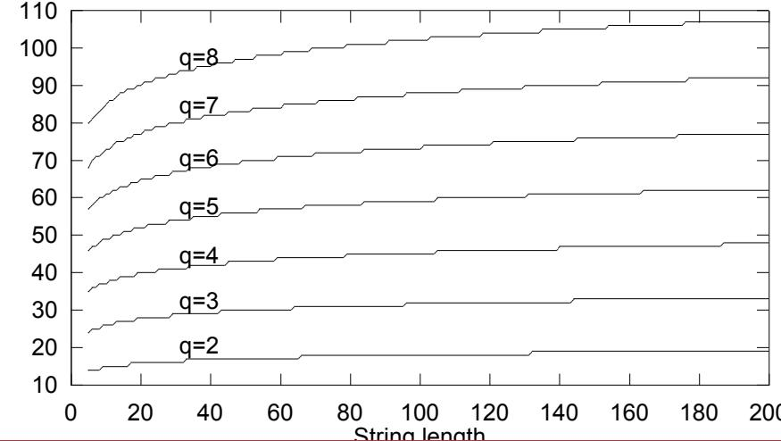

# Lecture 3: Populations and Selection

# Population Size

The number of chromosomes in the population is a very important parameter for GA performance

Too small a population limits variability for the GA to act on Too large a population is inefficient due to extra computation

Normally the population size is constant during a GA run

So how to choose an optimal population size a priori?

Alternatively, what is the minimum population size for meaningful search?

# Minimum Population Size

Basic idea is to ensure every point in search space should be reachable from initial population using crossover only

Repeated application of crossover can achieve this.. ...only if every allele is present at every locus in the population

Assuming an initial binary chromosome population uniformly randomly sampled with replacement we can

> calculate the probability at least one allele of every locus is present in the initial population

$$
P _ { 2 } ^ { * } = \left( 1 - \left( \frac { 1 } { 2 } \right) ^ { N - 1 } \right) ^ { \ell }
$$

> approximate the minimum population size needed to achieve an arbitrarily large such probability $P _ { 2 } ^ { * } < 1$

$$
N \approx \left\lceil 1 + \mathsf { l o g } _ { 2 } \left( \frac { - \ell } { \mathsf { l n } P _ { 2 } ^ { * } } \right) \right\rceil
$$

Exercise: Prove the approximation of $N$ given above

# Minimum Population Size

For higher cardinality alphabets we can perform numerical approximations of minimum population size...

Min size

# Minimum Population Size

Compare minimum population size for $P _ { 2 } ^ { * } \geq 9 9 . 9 \%$ with minimum population size for $P _ { q } ^ { * } \ge 9 9 . 9 \%$ , for $q > 2$

E.g. compare $q = 2$ with $q = 2 ^ { 3 } = 8$ > Binary encoded chromosome wilbe 3-times longer than corresponding 8-ary encoded chromosome > However the minimal population size for an 8-ary chromosome of length $\ell$ is approximately 6 times that for a binary chromosome of length 3l

Other things being equal, it seems that binary encoding is computationally cheaper, due to the reduced population size required

> This will be interesting when we look at one of Holland's claims arising from schema theory, later in the course

# Population Initialisation

The calculations just examined explain why relatively small randomly initialised populations can be sufficient and give guidelines when selecting population size

Are there any better ways to generate an initial population?

One proposal is to seed the initial population with good quality solutions (possibly found using other optimisation approaches)

This is termed inoculation   
Surveys have shown it can lead to premature convergence and is often   
outperformed by random initialisation

Or, we could engineer a random initialisation algorithm that guarantees each allele appears at each locus at least once...

# Population Initialisation

By generalising Latin hypercube sampling we can ensure each of the q alleles appears at each locus a desired number of times

A Latin square is a square grid of symbols where each symbol occurs in   
exactly one row and one column   
A hypercube is a high-dimensional geometric cube > We will make use of these later in the course, particularly when looking at schema theory   
Data: $k$ — number of copies of each allele required per locus   
population size $N = q * k$ ;   
for $I = 0$ to l − 1 do generate random permutation on integer sequence $[ 0 , \ldots , N -$ 1]; for $j = 0$ to N - 1 do $t \gets$ position i of permutation; locus / of chromosome $i \gets t$ mod q; end   
end

A fitness proportional selection operator comprises two phases > Calculation of population members' expected (fractional) numbers of offspring > Conversion of expected numbers of offspring into discrete numbers

Roulette wheel selection (RWS) achieves this by > Allocating share of roulette wheel to individuals based on fitness relative tc total population fitness Allocating reproductive opportunities by repeated 'spins' of the wheel

It is important to analyse the actual behaviour of selection operators   
Three measures of 'performance' are > Bias > The absolute difference between expected number of offspring per selection and actual sampling probability > I.e. the accuracy of the selection process > Spread > The range of numbers of actual offspring an individual may receive in a generation > l.e. the precision of the selection process > Efficiency > The time complexity of the selection process (ideally linear or better) Also, optionally, the scope for parallelisation of the selection operator

# Bias

The absolute difference between expected number of offspring per selection and actual sampling probability

The theoretical minimum is zero bias, i.e. no difference whatsoever

Definition: the expected number of offspring individual i receives in a generation (or expected value) is $E ( s _ { i } )$

A selection operator has zero bias if, selecting $n$ individuals for reproduction per generation and for all individuals i having sampling probability $P ( i ) , E ( s _ { i } ) = n P ( i )$

RWS with replacement, as described in the Simple GA, has zero bias

# Spread

The range of numbers of actual offspring an individual may receive in a generation

Minimum spread is the minimum possible range of numbers of offspring allocated that can still preserve zero bias

Definition: A selection operator has minimum spread if, for all individuals i and for each generation, the number of offspring allocated to that individual is always $\pmb { S } _ { i } \in \{ | E ( \pmb { S } _ { i } ) \} \mathrm $ , $\left\lceil E ( s _ { i } ) \right\rceil \}$

RWS with replacement has unlimited spread

It is possible that one individual is allocated all the reproductive opportunit in any generation > Matters can be improved by sampling with replacement, and other strategies, but with an impact on bias

# Efficiency

Computational efficiency is crucial for any algorithm

Selection constitutes a large proportion of the computation in a genetic algorithm

Ideally we would like the selection operator to be $O ( N )$ or better

RWS works by searching an array of values (the 'spokes' on the wheel) for an adjacent pair that another value (the 'pointer' of the wheel) falls between

Using binary search we can do this in ${ \cal O } ( \log N )$ time   
In a generational GA the number of selections we must perform will vary as a   
function of N   
Hence the overall complexity of RWS in a generational GA is ${ \cal O } ( N \log N )$

Parallel GAs are infrequently used, but an interesting idea, so parallelisation potential of an algorithm is also worth examining > RWS with replacement can be executed in full parallel, as separate 'spins' are independent

# Roulette Wheel Selection Summarised

RWS

> Has zero bias   
$\blacktriangleright$ Has unlimited spread Has ${ \cal O } ( N \log N )$ complexity Can be fully parallelised (after computation of individuals' expected values)

s RWS the best selection operator possible?

# Stochastic Universal Sampling

A simple and elegant modification of RWS gives Stochastic Universal Sampling (SUS)

Instead of a single pointer spun multiple times... ... we have multiple, equally spaced pointers on a wheel that we spin once To avoid positional bias we must shuffle the population before each spin, which can be done in $O ( N )$ time > We then traverse the array of expected values performing the selections, again in $O ( N )$ time

SUS has some nice properties

Zero bias (as does RWS) Minimum spread (cf. unlimited spread for RWS) $O ( N )$ time complexity (cf. ${ \cal O } ( N \log N )$ for RWS)

SUS cannot be parallelised, unlike RWS, but note that its time complexity is better

Theoretically SUS is superior, corresponding to systematic random sampling

SUS has also been empirically demonstrated to give better results

# Fitness Scaling

Clearly relative fitness is crucial for fitness proportional selection

Absolute fitness difference has lttle meaning   
> Consider the difference between fitnesses of 2 and 4, and between 12 and 14   
> An individual of fitness 4 will be twice as likely to be selected under SUS/RWS than an individual of fitness 2   
> An individual of fitness 14 is only 1.167 time more likely to be selected than an individual of fitness 12

Hence taking fitness directly from the objective value of an individual is problematic

As the genetic search progresses, the objective values of individuals in the population will tend to increase and to become closer to each other

# Fitness Scaling

Goldberg proposed a simple linear transformation to scale fitness $\pmb { f }$ from objective value g as

$$
\pmb { f } = \pmb { a } \pmb { g } + \pmb { b } ,
$$

where a and $b$ are such that

$$
\bar { \pmb { f } } = \bar { \pmb { g } }
$$

and maximum fitness

$$
\boldsymbol { f _ { m a x } } = \phi \boldsymbol { \bar { f } }
$$

for constant $\phi$

Note that constant rescaling is needed as the search progresses

# Rank Based Selection

Instead of fitness proportional selection we can base selection on relative   
fitness   
Selection probablities are based on individuals' fitness-based ranking   
For linear ranking, the ith ranked individual in the population has selection   
probability

$$
P ( i ) = \alpha + \beta i
$$

where $\alpha$ and $\beta$ are positive constants

N.B. we assume that the fittest individual is rank $N$ and the least fit rank 1

Note that $P ( i )$ is part of a probability distribution, hence

$$
\sum _ { i = 1 } ^ { N } ( \alpha + \beta i ) = 1 \implies N \left( \alpha + \beta \frac { N + 1 } { 2 } \right) =
$$

This constrains the values that $\alpha$ and $\beta$ may take

# Linear Rank Selection

In general, we define the selection pressure exerted by a selection operator to be

$$
\phi = \frac { P ( \mathit { f i t t e s t } ) } { P ( \mathit { a v e r a g e } ) }
$$

N.B. this formalises the $\phi$ in fitness scaling

For linear ranking, interpreting average fitness as median fitness (or equivalently as average probability of selection)

$$
\phi = \frac { \alpha + \beta N } { \alpha + \beta \frac { ( N + 1 ) } { 2 } }
$$

So for given $\phi$

$$
\alpha = \frac { 2 N - \phi ( N + 1 ) } { N ( N - 1 ) } , \beta = \frac { 2 ( \phi - 1 ) } { N ( N - 1 ) }
$$

Hence 1 ≤ φ ≤ 2, as $\beta \geq 0 \mathrm { \ a n d \ } \alpha + \beta \geq 0$

# Efficiency of Linear Rank Selection

Selection under rank-based selection can be done very efficiently

We simply need to solve

$$
\alpha i + \beta { \frac { i ( i + 1 ) } { 2 } } = r
$$

for i, where $r$ is a uniform random variable in [0, 1)

This can be done in constant time (O(1) vs. ${ \cal O } ( \log N )$ for fitness-proportional selection)

However fitness ranking clearly requires the population to be sorted, which is ${ \cal O } ( N \log N )$ for each new generation

# Tournament Selection

Another rank-based selection operator is tournament selection

A set of $\tau$ randomly selected individuals is compared and the fittest selected for reproduction

In a generational GA, a complete selection cycle generates N new individuals, hence the expected number of times an individual is compared is $\tau$

The best individual will be selected every time it is compared, so $P ( f i t t e s t ) = 1$

The median individual is selected if every other individual in the set is worse, so $\begin{array} { r } { P ( a v e r a g e ) = \left( \frac { 1 } { 2 } \right) ^ { \tau - 1 } } \end{array}$

Hence the selection pressure is $\phi = 2 ^ { \tau - 1 }$

Tournament selection is approximately the same as geometric ranking

$$
P ( i ) = \alpha \beta ^ { i }
$$

if

$$
\beta = \left( \frac { N } { N - 1 } \right) ^ { \tau }
$$

# Tournament Selection

> One interesting feature of tournament selection is we no longer require an objective function

As tournaments are settled based on comparisons we can have a subjective function

We can also implement soft tournament selection

The best individual only wins the tournament with probability $0 . 5 \leq p < 1$ , otherwise the other individual wins (for $\tau = 2$

Soft tournament selection with $\tau = 2$ gives the same selection probabilities and pressure as linear ranking

Exercise: Given the selection probability formula for soft tournament selection with $\tau = 2$ , demonstrate that this selection method is equivalent to linear ranking selection by deriving expressions for $\alpha$ and $\beta$ in terms of $p$ .Confirm that these expressions are correct by deriving $\phi$ in terms of $p$ in both.

# Variance in Tournament Selection

There is no guarantee in tournament selection that every individual will be selected for a tournament in a selection cycle...

...similarly the maximum number of times an individual might be selected for a tournament in a selection cycle is only bounded by the number of tournaments

This can be solved very simply using the following approach > Generate $\tau$ random permutations of the numbers $1 , \ldots , N$ and concatenate into one string > Chop concatenated string up into $N$ strings of length $\tau$ , each of which indicates the individuals to compete in a single tournament N.B. N should be an exact multiple of $\tau$ for this approach to work most simply