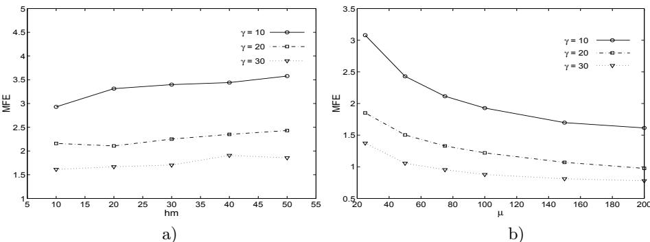
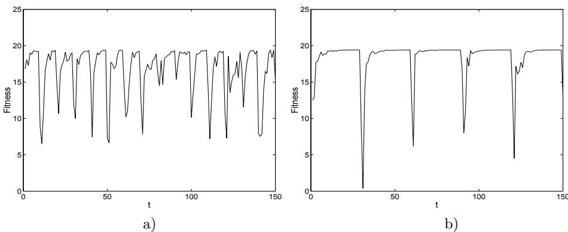
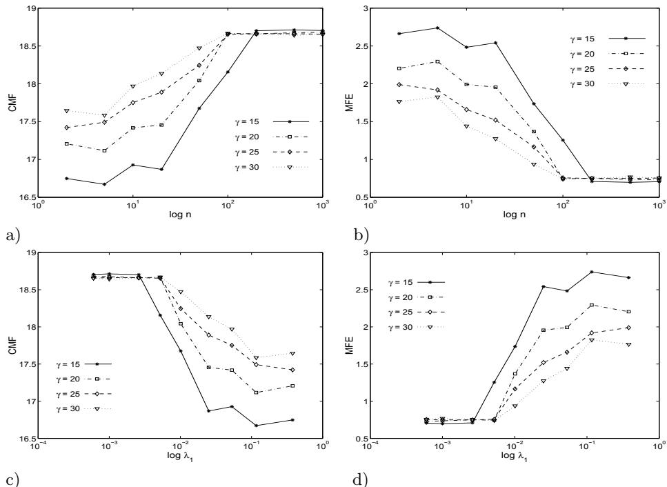

# Поведение эволюционных алгоритмов в хаотически изменяющихся ландшафтах приспособленности

Хендрик Рихтер (Hendrik Richter)

Лейпцигский университет прикладных наук (HTWK Leipzig), Факультет электротехники и информационных технологий, Институт измерительной, управляющей и регулирующей техники, Postfach 30 11 66, D–04125 Лейпциг, Германия
richter@fbeit.htwk-leipzig.de

В: Parallel Problem Solving from Nature-PPSN VIII. (Ред.: Yao, X.; Burke, E.; Lozano, J.A.; Smith, J.; Merelo Guervós, J.J.; Bullinaria, J.A.; Rowe, J.; Tino, P.; Kabán, A.; Schwefel, H.P.), Lecture Notes in Computer Science, Том 3242, Springer-Verlag, Берлин Гейдельберг Нью-Йорк, 2004, 111–120. © Springer–Verlag

Аннотация. Мы исследуем эволюционный алгоритм, используемый для оптимизации в хаотически изменяющейся динамической среде. Соответствующий хаотический нестационарный ландшафт приспособленности можно охарактеризовать с помощью количественных показателей порождающей системы динамики. Мы приводим экспериментальные результаты о том, как эти показатели, а именно показатели Ляпунова, вместе с периодом изменения среды ландшафта влияют на показатели эффективности эволюционного алгоритма, используемого для отслеживания оптимумов.

# 1 Введение

Начиная с работы Голдберга и Смита [8], эволюционные алгоритмы, адаптированные для работы в динамических средах, стали темой все возрастающего интереса (см., например, [6, 7, 10, 17] для недавних примеров). В динамической оптимизации предполагается, что морфологические особенности ландшафта приспособленности перемещаются во времени, что может включать изменение координат и величин оптимумов. Такой ландшафт приспособленности, меняющийся во времени, можно рассматривать как (пространственную) динамическую систему. Динамическая система может быть задана своими управляющими уравнениями и дополнительно охарактеризована определенными количественными показателями, например, показателями Ляпунова (см., например, [15], стр. 129). Характеристика динамических ландшафтов приспособленности с помощью количественных показателей порождающей системы динамики является одним из главных содержаний данной статьи.

Помимо вопроса о том, какая именно морфологическая особенность ландшафта приспособленности меняется со временем, нас также интересует режим, в котором происходят эти изменения. До сих пор в динамических ландшафтах приспособленности широко рассматривались три различных режима динамики: линейный (поступательный), круговой (циклический) и случайный (см., например, [1, 2, 4, 6]). Еще одним типичным режимом динамического поведения является хаотическое движение. Хаос — это детерминированное поведение нелинейной динамической системы, которое характеризуется временной эволюцией, представляющей собой непериодические колебания и обладающей экстремальной чувствительностью к возмущениям начальных условий и параметров системы. Эта чувствительность приводит к долгосрочной непредсказуемости хаотических движений. Из-за непериодических колебаний и ограничений в предсказании временной эволюции хаос кажется похожим на реализации случайных процессов. Однако при хаосе непредсказуемые колебания возникают в детерминированной динамической системе, для которой известны управляющие уравнения и показатели Ляпунова. Следовательно, рассмотрение хаотической динамики для управления нестационарным ландшафтом приспособленности позволяет изучать «подобные случайным» движения, которые порождаются детерминированными правилами и квантуются числовыми значениями.

Цель статьи — изучить эволюционные алгоритмы, используемые для отслеживания оптимумов в динамической среде, которая меняется хаотическим образом. Поэтому мы исследуем зависимость между показателями Ляпунова, периодом изменения среды (который определяет скорость изменения по сравнению с эволюционным алгоритмом) и показателями эффективности эволюционного алгоритма. Мы предоставляем экспериментальные результаты о том, как с ростом хаотичности (и, следовательно, непредсказуемости) движения ландшафта приспособленности способность алгоритма отслеживать оптимумы достигает предела.

Статья организована следующим образом. В разд. 2 мы рассматриваем нелинейные динамические системы и обсуждаем, как показатели Ляпунова могут быть использованы для характеристики их поведения. В разд. 3 описывается динамический ландшафт приспособленности и показывается, как хаотическая нелинейная система может быть использована для хаотического перемещения ландшафта. Эволюционный алгоритм для оптимизации в хаотически движущемся ландшафте приспособленности описан в разд. 4, где также вспоминаются методы измерения эффективности алгоритма и представлены численные результаты. Наконец, в разд. 5 подводятся итоги и делаются выводы.

# 2 Нелинейная динамика и показатели Ляпунова

Рассмотрим дискретную динамическую систему

$$
x ( k + 1 ) = f ( x ( k ) , \alpha ) ,
$$

где $x \in \mathbb { R } ^ { n }$ — вектор состояния, $\alpha \in \mathbb { R }$ — параметр, $f : \mathbb { R } ^ { n } \times \mathbb { R } \longrightarrow \mathbb { R } ^ { n }$, и $k \in { \mathbb { N } } _ { 0 }$. При начальных условиях $x ( 0 ) = x _ { 0 }$ система эволюционирует во времени и генерирует траекторию $x ( 0 ) , x ( 1 ) , x ( 2 ) , \ldots .$ В зависимости от значений параметров и начальных условий система может демонстрировать различные режимы динамики, то есть движение к стационарному состоянию, циклическое движение или хаотическое поведение.

По сути, различия между режимами динамического поведения заключаются в различиях того, как соседние траектории ведут себя по отношению друг к другу. Поэтому, чтобы различать режимы динамики, мы изучаем соседние траектории, что приводит нас к концепции показателей Ляпунова. Рассмотрим бесконечно малое смещение $\varDelta x ( k )$ от траектории и определим, как это смещение эволюционирует во времени:

$$
\varDelta x ( k + 1 ) = J ( x ( k ) ) \cdot \varDelta x ( k ) ,
$$

где $\begin{array} { r } { J ( x ( k ) ) ~ = ~ \left. \frac { \partial f } { \partial x } \right| _ { x = x ( k ) } } \end{array}$ — якобиан вдоль траектории. Начальное смещение равно $\varDelta x ( 0 ) = \varDelta x _ { 0 }$. Направление смещения — $\frac { \varDelta x ( k ) } { \| \varDelta x ( k ) \| }$, а $\frac{\|\Delta x(k+1)\|}{\|\Delta x(k)\|}$ — это коэффициент, на который смещение увеличивается или уменьшается. С помощью матрицы перехода $\varPhi ( k )$ решение (вариант во времени) линейной системы (2) можно выразить как

$$
\varDelta x ( k + 1 ) = \varPhi ( k ) \cdot \varDelta x _ { 0 } .
$$

Скорости роста и убывания для временной эволюции смещения в ортогональных направлениях пространства состояний можно получить, изучая отображение всех начальных состояний $\varDelta x _ { 0 }$, расположенных на единичной сфере, с помощью уравнения (3). При этом отображении единичная сфера деформируется в гиперэллипсоид $E = \left\{ \Delta x \in \mathbb { R } ^ { n } \mid \| \varDelta x ( k ) \| = 1 \right\}$, где $\| \varDelta x ( k ) \| ^ { 2 } = \varDelta x ( k ) ^ { T } \varDelta x ( k ) = \varDelta x _ { 0 } ^ { T } \varPhi ( k - 1 ) ^ { T } \varPhi ( k - 1 ) \varDelta x _ { 0 } = 1$. Длины его главных осей масштабируются в соответствии со скоростями роста и убывания временной эволюции смещения в ортогональных направлениях. Эти скорости можно получить через сингулярные числа $\sigma _ { i } ( \varPhi ( k ) )$, $\sigma _ { i } \in \mathbb { R }$, $\sigma _ { i } \geq 0$, $i = 1 , 2 , \ldots , n$, матрицы перехода $\varPhi ( k )$. Таким образом, $n$ показателей Ляпунова $\lambda _ { i }$, $\lambda _ { i } \in \mathbb { R }$, динамической системы (1) можно определить как [9, 19]:

$$
\lambda _ { i } = \operatorname* { l i m } _ { k \to \infty } \frac { 1 } { k } \ln \sigma _ { i } ( \varPhi ( k ) ) \qquad i = 1 , 2 , \ldots , n .
$$

На основе этого определения поведение динамической системы можно различить по ее показателям Ляпунова (4), используя: (i) их знаковую картину и (ii) их величины (например, [15], стр. 132). Динамическая система является хаотической, если по крайней мере один показатель Ляпунова положителен. Величина наибольшего (положительного) показателя Ляпунова указывает на степень хаотичности. В отличие от этого, поступательное и циклическое поведение характеризуется отрицательными показателями Ляпунова.

В численных экспериментах мы используем обобщенное отображение Эно (Generalized Hénon map, GHM) в качестве нелинейной управляющей функции для динамических ландшафтов приспособленности. GHM имеет вид:

$$
\binom { x _ { 1 } ( k + 1 ) } { x _ { j } ( k + 1 ) } = f ( x ( k ) , \alpha ) = \binom { \alpha - x _ { n - 1 } ( k ) ^ { 2 } - 0 . 1 x _ { n } ( k ) } { x _ { j - 1 } ( k ) } ,
$$

где $j = 2 , 3 , \ldots , n$, $\alpha > 0$, и $x \in \mathbb { R } ^ { n }$ (см. [5, 16] для подробных исследований). Это отображение заданной размерности, которое демонстрирует хаотическое и гиперхаотическое поведение при определенных значениях параметров и начальных условиях. Отображение обладает свойством, согласно которому его наибольший показатель Ляпунова масштабируется в зависимости от размерности $n$ отображения, то есть

$$
\lambda _ { 1 } ( n ) = { \frac { c } { n } } ,
$$

где $c > 0$ — константа [16]. Следовательно, использование GHM в качестве нелинейной управляющей функции позволяет хаотизировать динамический ландшафт приспособленности количественно определенным и удобным способом путем выбора размерности $n$ GHM.

# 3 Моделирование хаотически изменяющихся ландшафтов приспособленности

В предыдущем разделе мы рассмотрели нелинейные динамические системы, которые могут демонстрировать хаотическое поведение при определенных значениях параметров и начальных условиях. Мы далее показали, что динамику данной системы можно различить по ее показателям Ляпунова. В частности, наибольший показатель Ляпунова $\lambda _ { 1 }$ определяет режим поведения (поступательный, циклический или хаотический) по своему знаку и, кроме того, дает меру силы режима поведения по своей величине. Что касается хаотических движений, чем больше показатель Ляпунова, тем более хаотична система.

Теперь применим эти результаты к динамически изменяющимся ландшафтам приспособленности. Для этого мы используем рамочную модель для генерации динамических ландшафтов приспособленности, предложенную в [12]. В рамках этой модели динамический ландшафт приспособленности состоит из двух компонентов: статической функции приспособленности, задающей общую морфологию ландшафта, и дискретной динамической системы, используемой в качестве управляющей функции. Эта управляющая функция добавляет динамику в ландшафт, обеспечивая правило изменения определенных переменных статической функции приспособленности во времени.

В качестве статической функции приспособленности $F ( X ) : \mathbb { R } ^ { m } \rightarrow \mathbb { R}$ мы используем $m$-мерное «поле конусов на нулевой плоскости», где конусы имеют случайным образом выбранные высоты и наклоны и изначально распределены по ландшафту. Таким образом, мы записываем

$$
F ( X ) = \operatorname* { m a x } \left\{ 0 , \ \operatorname* { m a x } _ { 1 \leq i \leq N } \left[ h _ { i } - s _ { i } \| X - X _ { i } \| \right] \right\} ,
$$

где $N$ — количество конусов в ландшафте, $X _ { i }$ — координаты $i$-го конуса, а $h _ { i }$ и $s _ { i }$ задают его высоту и наклон соответственно. Следовательно, статическая задача оптимизации выглядит так:

$$
\operatorname* { m a x } _ { X \in \mathbb { R } ^ { m } } F ( X ) = \operatorname* { m a x } \left\{ 0 , \operatorname* { m a x } _ { 1 \leq i \leq N } \left[ h _ { i } - s _ { i } \| X - X _ { i } \| \right] \right\} .
$$

В качестве управляющей функции мы используем нелинейную динамическую систему (1), заданную GHM (5), и перемещаем положения $X _ { i }$ с помощью

$$
X _ { i } ( k ) = g _ { i } ( x _ { j } ( k ) ) ,
$$

где функции $g _ { i } : \mathbb { R } ^ { n } \rightarrow \mathbb { R } ^ { m }$, $i = 1 , 2 , . . . , N$, зависят от времени через компоненты $x _ { j }$ вектора состояния GHM (5). Таким образом, динамические свойства системы передаются динамическому ландшафту приспособленности. Поскольку функции $g _ { i }$ являются биективными гладкими отображениями, уравнение (9) сохраняет показатели Ляпунова. Ранее упоминалось, что значения высот $h _ { i }$ и наклонов $s _ { i }$ инициализируются случайным образом при $k = 0$ и остаются постоянными по мере изменения ландшафта приспособленности во времени. Хаотическое изменение высот и/или наклонов ландшафта приспособленности может быть рассмотрено в той же рамках путем изменения этих величин с помощью управляющей системы. Такие изменения не являются темой данной статьи и должны быть изучены в будущих исследованиях.

Объединив уравнения (7) и (9), динамическую функцию приспособленности можно записать:

$$
F ( X , k ) = \operatorname* { m a x } \left\{ 0 , \ \underset { 1 \leq i \leq N } { \operatorname* { m a x } } [ h _ { i } - s _ { i } \Vert X - g _ { i } ( x _ { j } ( k ) ) \Vert ] \right\} .
$$

Следовательно, динамическая задача оптимизации такова:

$$
\operatorname* { m a x } _ { X \in \mathbb { R } ^ { m } } F ( X , k ) = \operatorname* { m a x } \left\{ 0 , \operatorname* { m a x } _ { 1 \leq i \leq N } \left[ h _ { i } - s _ { i } \| X - g _ { i } ( x _ { j } ( k ) ) \| \right] \right\} , \qquad k \geq 0 ,
$$

решение которой

$$
X _ { s } ( k ) = \arg \operatorname* { m a x } \left\{ 0 , \ \underset { 1 \leq i \leq N } { \operatorname* { m a x } } \left[ h _ { i } - s _ { i } \| X - g _ { i } ( x _ { j } ( k ) ) \| \right] \right\}
$$

образует траекторию решения в пространстве поиска $\mathbb { R } ^ { m }$.

Задача оптимизации (11) может быть решена с помощью эволюционного алгоритма с представлением действительными числами и $\mu$ особями $a \in \mathbb { R } ^ { m }$, которые образуют популяцию $P \in \mathbb { R } ^ { m \times \mu }$. Такой эволюционный алгоритм можно описать с помощью функции перехода поколений $\varPsi : \mathbb { R } ^ { m \times \mu } \rightarrow \mathbb { R } ^ { m \times \mu }$ (см., например, [3], стр. 64–65). С помощью этой функции перехода поколений популяция в поколении $t \in { \mathbb { N } } _ { 0 }$ преобразуется в популяцию в поколении $t + 1$:

$$
P ( t + 1 ) = \varPsi \left( P ( t ) \right) , \qquad t \geq 0 .
$$

Начиная с начальной популяции $P ( 0 )$, последовательность популяций $P ( 0 )$, $P ( 1 )$, $P ( 2 ) , \ldots$ представляет движение популяции во времени. Как правило, функция перехода поколений зависит от детерминированных и вероятностных операторов, а именно: отбора, рекомбинации и мутации. Следовательно, эволюционный алгоритм, генерирующий движение популяции внутри ландшафта приспособленности, можно рассматривать как динамическую систему, зависящую от случайных переменных.

Динамическая функция приспособленности $F ( X , k )$ и особи $a$ популяции $P$, описываемые функцией перехода популяции $\varPsi \left( P ( t ) \right)$, движутся в одном и том же пространстве $\mathbb { R } ^ { m }$, но могут иметь разные скорости. Это различие в скоростях можно задать с помощью периода изменения среды $\gamma \in \mathbb N$ (см. [13]). Между скоростью эволюционного алгоритма и скоростью изменения ландшафта приспособленности существует следующее соотношение:

$$
t = \gamma k .
$$

Очевидно, что если $\gamma = 1$, то динамический ландшафт приспособленности и эволюционный алгоритм имеют одинаковую скорость, в результате чего ландшафт меняется каждое поколение. При $\gamma > 1$ ландшафт приспособленности меняется каждые $\gamma$ поколений, что позволяет исследовать эффективность эволюционного алгоритма в зависимости от частоты изменения динамического ландшафта приспособленности. Следует отметить, что в принципе период изменения среды $\gamma$ мог бы быть определен и как $\gamma \in \mathbb { R } _ { + }$, что позволило бы моделировать изменения в динамическом ландшафте приспособленности между поколениями. Но поскольку оценка приспособленности обычно происходит только один раз за поколение, эти изменения, вероятно, не вступят в силу до следующего поколения, то есть до следующего целого числа, следующего за любым $\gamma \in \mathbb { R } _ { + }$. Поэтому мы рассматриваем $\gamma \in \mathbb { N }$.

В [13] были описаны эксперименты с целью установления взаимосвязи между $\gamma$ и определенными параметрами проектирования эволюционного алгоритма, а именно скоростями гипермутации. В численных экспериментах, приведенных в разд. 4, мы аналогично будем искать взаимосвязь между $\gamma$ и показателем Ляпунова $\lambda _ { 1 }$, характеризующим хаотичность динамики ландшафта приспособленности.

# 4 Экспериментальные результаты

# 4.1 Измерение производительности

Поскольку оптимизация в динамических ландшафтах приспособленности означает не просто нахождение оптимума, а скорее отслеживание его движения, требуются специальные величины для измерения производительности эволюционного алгоритма (см. [14, 18] для обсуждения особенностей, преимуществ и недостатков различных мер производительности для динамических сред). Общим измерением является вычисление средних значений приспособленности лучшей особи в поколении за достаточно большое количество запусков алгоритма в течение времени работы. Хотя эта мера дает хороший обзор динамики ландшафта приспособленности и эволюционного алгоритма, полученные кривые трудно использовать для интерпретации производительности алгоритма во всем диапазоне движущегося ландшафта приспособленности. Поэтому были предложены другие виды средних значений [13, 14], которые мы будем использовать для представления численных результатов.

В проведенных экспериментах мы предполагаем, что значения движущегося оптимума $F ( X _ { s } , k )$ известны. Следовательно, мы можем вычислить среднюю ошибку приспособленности (Mean Fitness Error, MFE) по формуле:

$$
M F E = \frac { 1 } { R } \sum _ { r = 1 } ^ { R } \left[ \frac { 1 } { T } \sum _ { t = 1 } ^ { T } \left( F \left( X _ { s } , t / \gamma \right) - \operatorname* { m a x } _ { a \in P } F \left( a , t / \gamma \right) \right) \right] ,
$$

где $F \left( { { X } _ { s } } , t / \gamma \right)$ — максимальное значение приспособленности в поколении $t$, $\operatorname* { m a x } _ { a \in P } F \left( a , t / \gamma \right)$ — значение приспособленности лучшей особи $a \in P$ в поколении $t$, $T$ — количество поколений, используемых в запуске, а $R$ — количество последовательных запусков эволюционного алгоритма, учитываемых в экспериментах. Обратите внимание, что $F \left( { { X } _ { s } } , t / \gamma \right)$ и $\operatorname* { m a x } _ { a \in P } F \left( a , t / \gamma \right)$ меняются в соответствии с уравнением (10) каждые $\gamma$ поколений. В дополнение к MFE, долгосрочное поведение производительности может быть количественно оценено с помощью коллективной средней приспособленности (Collective Mean Fitness, CMF) [14]:

$$
C M F = \frac { 1 } { R } \sum _ { r = 1 } ^ { R } \left[ \frac { 1 } { T } \sum _ { t = 1 } ^ { T } \operatorname* { m a x } _ { a \in P } F \left( a , t / \gamma \right) \right] ,
$$

где $\operatorname* { m a x } _ { a \in P } F \left( a , t / \gamma \right)$, $T$ и $R$ определены так же, как в уравнении (15). Обратите внимание, что эту меру также можно использовать, если значение максимальной приспособленности неизвестно.

# 4.2 Экспериментальная установка

Далее мы приводим численные результаты отслеживания хаотически изменяющихся оптимумов с помощью эволюционного алгоритма. Алгоритм использует представление действительными числами, фиксированный размер популяции, турнирный отбор с размером турнира 2 и рекомбинацию на основе приспособленности. Начальная популяция создается путем реализации случайной величины, нормально распределенной на $[ 0 , \omega ^ { 2 } ]$. Чтобы справиться с изменяющимся ландшафтом, в дополнение к стандартной мутации с базовой скоростью мутации $bm$, используется запускаемая гипермутация (triggered hypermutation) [13]. Эта запускаемая гипермутация опирается на триггер, который обнаруживает изменения в ландшафте приспособленности. Она инициирует гипермутацию, если скользящее среднее приспособленности лучшей особи в поколении, вычисленное за пять поколений, уменьшается. Затем базовая скорость мутации $bm$ умножается на скорость гипермутации $hm$.

Таблица 1. Параметры эволюционного алгоритма, ландшафта приспособленности и численных экспериментов   

<table><tr><td>Параметр проектирования</td><td>Символ</td><td>Значение</td><td>Настройка</td><td>Символ</td><td>Значение</td></tr><tr><td>Размер популяции</td><td>µ</td><td>50</td><td>Размерность ландшафта</td><td>m</td><td>2</td></tr><tr><td>Поколения в одном запуске</td><td>T</td><td>150</td><td>Количество конусов</td><td>N</td><td>10</td></tr><tr><td>Ширина начальной популяции ω2</td><td></td><td>5</td><td>Управляющая функция (9), (5)</td><td>gi(xj)</td><td>0.3xj(k)</td></tr><tr><td>Базовая скорость мутации</td><td>bm</td><td>0.1</td><td></td><td></td><td>+fj(xj(k))</td></tr><tr><td>Скорость гипермутации</td><td>hm</td><td>30</td><td>GHM (5)</td><td>α</td><td>1.76</td></tr><tr><td></td><td></td><td></td><td>Количество учтенных запусков R</td><td></td><td>100</td></tr></table>

  
Рис. 1. Производительность, определяемая MFE при $N = 1 0$ и $n = 4$ для различных $\gamma$ в зависимости от: a) скорости гипермутации $hm$ при $\mu = 1 5$, b) размера популяции $\mu$ при $h m = 3 0$

В первом численном исследовании мы посмотрим, как некоторые базовые параметры проектирования эволюционного алгоритма масштабируются относительно MFE (15), см. Рис. 1. На этом рисунке показана зависимость между MFE и скоростью гипермутации $hm$ (Рис. 1a) и между MFE и размером популяции $\mu$ (Рис. 1b) для различных периодов изменения среды $\gamma$. Мы наблюдали незначительное увеличение MFE при увеличении $hm$. Эти результаты можно интерпретировать так, что более низкая скорость гипермутации превосходит более высокие, особенно при больших $\gamma$. Также видно, что MFE постепенно уменьшается с увеличением размера популяции, что указывает на то, что отслеживание оптимума становится проще для больших популяций. Для обоих экспериментов ведущим фактором в производительности алгоритма является $\gamma$. В целом, чем чаще происходят изменения ландшафта (то есть чем меньше $\gamma$), тем больше MFE. Это означает, что успешное следование за оптимумом становится сложнее с увеличением частоты изменений ландшафта, что согласуется с предыдущими исследованиями [13, 17]. Основываясь на интерпретации этих результатов, мы выбрали $h m = 3 0$ и $\mu = 5 0$. В табл. 1 суммированы параметры проектирования алгоритма вместе с настройками динамического ландшафта приспособленности и заданными числовыми экспериментами.

  
Рис. 2. Приспособленность лучшей особи в поколении $\operatorname*{max}_{a \in P} F (a, t/\gamma)$ для $n = 4$ в зависимости от поколения $t$ при $\mu = 5 0$ и $N = 1 0$: a) $\gamma = 1 0$, b) $\gamma = 3 0$

# 4.3 Обсуждение результатов

Далее приводятся результаты отслеживания оптимума в хаотически изменяющихся ландшафтах приспособленности. На Рис. 2 показана временная эволюция приспособленности для лучшей особи в поколении при различных $\gamma$. Алгоритм быстро реагирует на изменения в ландшафте приспособленности. На Рис. 3 меры производительности CMF (16) и MFE (15) представлены как функция размерности $n$ и наибольшего показателя Ляпунова $\lambda _ { 1 }$, задающего хаотическую управляющую функцию (5), изображенные в полулогарифмическом масштабе. Обе величины представляют собой хаотичность хаотически изменяющегося ландшафта приспособленности (10). Видно, что при постоянном периоде изменения среды $\gamma$ CMF увеличивается с ростом размерности $n$ управляющей системы (Рис. 3a,b). С другой стороны, CMF падает при более высоких показателях Ляпунова $\lambda _ { 1 }$. Обратная зависимость может быть получена для меры производительности MFE (Рис. 3c,d). Как указано в уравнении (6), наибольший показатель Ляпунова и размерность обратно пропорциональны для используемой управляющей функции (5). При уменьшении размерности и, следовательно, при увеличении показателя Ляпунова управляющая функция, а значит и хаотически изменяющийся ландшафт приспособленности, увеличивают свою хаотичность. Более высокая хаотичность означает, что изменения ландшафта приспособленности становятся менее предсказуемыми. Судя по полученной мере производительности, представленной на Рис. 3, можно сделать вывод, что чем менее предсказуемо движение оптимума, тем труднее отслеживать его с помощью эволюционного алгоритма. Кроме того, эта зависимость наблюдается только для определенного диапазона $\lambda _ { 1 }$. При хаотичности ниже определенного порога мы получаем постоянные меры производительности.

  
Рис. 3. Производительность, определяемая CMF и MFE как функции количественных показателей управляющей функции (5) динамики ландшафта приспособленности в полулогарифмическом масштабе: a), b) размерность $n$, c), d) наибольший показатель Ляпунова $\lambda _ { 1 }$

# 5 Заключение

Мы исследовали эволюционный алгоритм, используемый для оптимизации в хаотической динамической среде. С помощью численных экспериментов было показано, что производительность отслеживания алгоритма снижается с увеличением показателей Ляпунова. Наибольший показатель Ляпунова выражает степень хаотичности (и, следовательно, непредсказуемости) изменяющегося ландшафта приспособленности. Таким образом, мы нашли подтверждение связи между предсказуемостью изменений ландшафта приспособленности и производительностью алгоритма. Возможная интерпретация этих результатов заключается в том, что бóльшая предсказуемость движения ландшафта приспособленности облегчает эволюционному алгоритму обучение на основе отслеживания оптимума и, следовательно, повышает его производительность.

Наконец, следует упомянуть еще один аспект оптимизации в хаотически движущихся ландшафтах приспособленности. Как правило, считается, что эволюционирующие и самоорганизующиеся системы имеют ландшафты приспособленности, движения которых балансируют на грани между порядком и хаосом (например, [11], гл. 6). Организмы вместе с хаотически изменяющимся ландшафтом приспособленности, который они населяют, образуют коэволюционирующую экосистему, в которой могут происходить адаптация и самоорганизация. Анализ и проектирование эволюционных алгоритмов, приспособленных для работы в хаотических средах, могут дать ключи к дальнейшему пониманию таких сложных адаптирующихся и коэволюционирующих структур.

# Список литературы

1. Angeline, P.J.: Tracking Extrema in Dynamic Environments. In: Angeline, P.J., Reynolds, R.G., McDonnell, J.R., Eberhart, R. (eds.): Evolutionary Programming VI. Springer–Verlag, Berlin Heidelberg New York (1997) 335–345   
2. Arnold, D.V., Beyer, H.G.: Random Dynamics Optimum Tracking with Evolution Strategies. In: Merelo Guervós, J.J., Panagiotis, A., Beyer, H.G., Fernández Villacañas, J.L., Schwefel, H.P. (eds.): Parallel Problem Solving from Nature–PPSN VII. Springer–Verlag, Berlin Heidelberg New York (2002) 3–12   
3. Bäck, T.: Evolutionary Algorithms in Theory and Practice: Evolution Strategies, Evolutionary Programming, Genetic Algorithms. Oxford Univ. Press, New York (1996)   
4. Bäck, T.: On the Behavior of Evolutionary Algorithms in Dynamic Environments. In: Fogel, D.B., Schwefel, H.P., Bäck, T., Yao, X. (eds.): Proc. IEEE Int. Conf. on Evolutionary Computation, IEEE Press, Piscataway, NJ (1998) 446–451   
5. Baier, G., Klein, M.: Maximum Hyperchaos in Generalized Hénon Maps. Phys. Lett. A151 (1990) 281–284   
6. Branke, J.: Evolutionary Optimization in Dynamic Environments. Kluwer Academic Publishers, Dordrecht (2001)   
7. De Jong, K.A.: Evolving in a Changing World. In: Raś, Z., Skowron, A. (eds.): Foundations of Intelligent Systems. Springer–Verlag, Berlin Heidelberg New York (1999) 513–519   
8. Goldberg, D.E., Smith, R.E.: Nonstationary Function Optimization Using Genetic Algorithms with Dominance and Diploidy. In: Grefenstette, J.J. (ed.): Proc. Second Int. Conf. on Genetic Algorithms. Lawrence Erlbaum, Hillsdale, NJ (1987) 59–68   
9. Green, J.M., Kim, J.S.: The Calculation of the Lyapunov Spectra. Physica D24 (1987) 213–225   
10. Grefenstette, J.J.: Evolvability in Dynamic Fitness Landscapes: A Genetic Algorithm Approach. In: Angeline, P.J., Michalewicz, Z., Schoenauer, M., Yao, X., Zalzala, A. (eds.): Proc. Congress of Evolutionary Computation. IEEE Press, Piscataway, NJ (1999) 2031–2038   
11. Kauffman, S.A.: The Origin of Order: Self–Organization and Selection in Evolution. Oxford Univ. Press, New York (1993)   
12. Morrison, R.W., De Jong, K.A.: A Test Problem Generator for Non–stationary Environments. In: Angeline, P.J., Michalewicz, Z., Schoenauer, M., Yao, X., Zalzala, A. (eds.): Proc. Congress of Evolutionary Computation. IEEE Press, Piscataway, NJ (1999) 2047–2053   
13. Morrison, R.W., De Jong, K.A.: Triggered Hypermutation Revisited. In: Zalzala, A., Fonseca, C., Kim, J.H., Smith, A., Yao, X. (eds.): Proc. Congress of Evolutionary Computation. IEEE Press, Piscataway, NJ (2000) 1025–1032   
14. Morrison, R.W.: Performance Measurement in Dynamic Environments. In: Barry, A.M. (ed.): Proc. GECCO 2003: Workshops, Genetic and Evolutionary Computation Conference. AAAI Press, Menlo Park, CA (2003) 99–102   
15. Ott, E.: Chaos in Dynamical Systems. Cambridge Univ. Press, Cambridge (1993)   
16. Richter, H.: The Generalized Hénon Maps: Examples for Higher–dimensional Chaos. Int. J. Bifurcation and Chaos 12 (2002) 1371–1384   
17. Weicker, K., Weicker, N.: On Evolution Strategy Optimization in Dynamic Environments. In: Angeline, P.J., Michalewicz, Z., Schoenauer, M., Yao, X., Zalzala, A. (eds.): Proc. Congress of Evolutionary Computation. IEEE Press, Piscataway, NJ (1999) 2039–2046   
18. Weicker, K.: Performance Measures for Dynamic Environments. In: Merelo Guervós, J.J., Panagiotis, A., Beyer, H.G., Fernández Villacañas, J.L., Schwefel, H.P. (eds.): Parallel Problem Solving from Nature–PPSN VII. Springer–Verlag, Berlin Heidelberg New York (2002) 64–73   
19. Wolf, A., Swift, J.B., Swinney, H.L., Vastano, J.A.: Determining the Lyapunov Exponents from a Time Series. Physica D16 (1985) 285–313