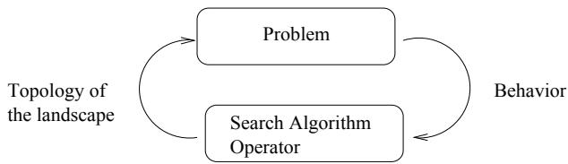

# Fitness Landscapes of Combinatorial Problems And The Performance Of Search Algorithms

Philippe Preux Denis Robilliard Cyril Fonlupt

Oct. 1997

# Abstract

This work settles in the framework of the fitness landscape paradigm and its application to combinatorial problems. We study the interdependance of fitness landscapes and heuristics, and figure out some TSP landscapes statistical characteristics associated with local search operators. Then we use this knowledge to shed some light on the general behavior of TSP search algorithms, and derive a simple population-based local search heuristic that performs favorably compared to the well-known ILK technique.

# 1 Introduction

One of the mysteries surrounding the TSP is the remarkably effective performance of simple heuristic solution methods. R. M. Karp & J. M. Steele, in [LLKS85]

As stressed by this quote, one is surprised when running a simple hill-climbing algorithm on TSP instances to find, after a very short amount of time, a rather good local optimum (if using a good operator, such as the 2-change). In the same time, more complex descent algorithms, such as genetic algorithms, show great difficulties to find tours as short as these, though being much more time-consuming. Aiming at sheding some light on this "mystery", our work is dealing with the issue of the behavior of iterated search algorithms when solving $\mathcal { N P }$ -hard problems. To this end, we study the search spaces of these problems, in relation with the algorithm that explores them. The algorithms that are considered here are iterated local search algorithms such as "gradient" walks (deterministically takes the best neighbor and iterates as long as improvement is possible), adaptive" walks (takes one of the better neighbors and iterates as long as improvement is possible) (see figure 1), tabu search [Glo95]; and also genetic algorithms [Mit96] which may or not make use of embedded local search techniques.

We use the metaphor of fitness landscapes, originating from the field of evolutionary biology [Wri32]. We have recently investigated landscapes of 2ETSP (2-dimensionnal euclidean symmetric TSP) instances by way of a statistical analysis from which we have deduced an intuitive understanding of its structure. From this point, we have derived an algorithm that performs very well with regards to well-known heuristics, such as iterated LK-opt. We wish to stress the fact that our goal is to understand the behavior of heuristics, not to propose a new one out of the blue. We do not claim that our heuristic is the best ever found (though it performs reasonably honestly); we

$$
\mathbf { \Delta } _ { t } ^ { x _ { 0 } } \gets \mathrm { i n i t i a l ~ s o l u t i o n }
$$

$$
\mathbf { \Delta } _ { t } ^ { x _ { 0 } } \gets \mathrm { i n i t i a l ~ s o l u t i o n }
$$

do

do

$$
\begin{array} { l } { X  \omega ( x _ { t } ) } \\ { x _ { t + 1 }  \mathrm { b e s t } ( X ) } \\ { t  t + 1 } \end{array}
$$

$$
\begin{array} { r l } & { X  \omega ( x _ { t } ) } \\ & { x _ { t + 1 }  \mathrm { b e t t e r ~ a m o n g } ( X ) } \\ & { t  t + 1 } \end{array}
$$

while length $( x _ { t } ) <$ length $\left( x _ { t - 1 } \right)$

  
Figure 1: Gradient and adaptive walks ( $\omega$ is the neighborhood operator).   
Figure 2: Given a certain problem of optimization, the structure of its landscape is implied by the algorithm and the operators used in it. In the same time, the algorithm is searching this landscape created by itself.

simply want to understand how iterated (local) search algorithms work in the field of optimization deriving new algorithms is only a side-effect of this research.

It should be clear to the reader that there is a fundamental feedback loop between the issues of the structure of the problem and the behavior of the search algorithm: the algorithm (or the operator(s) that it uses) structures the problem in a certain and important way, and this structure implies a certain behavior of the algorithm (see figure 2). Given a problem, its structure is implied by the algorithm being used; this structure is the way the algorithm "sees" the problem. In the case of iterated local search algorithms, the operator defines the topology of the landscape (location of local optima, size and structure of basins of attraction, ..). The other part of the algorithm selects the next point from which to continue the search. This selection phase is important when the algorithm has reached a local optimum, or to avoid getting trapped in a local optimum too early.

The paper is organized as follows: in section 2, we review previous works on the structure of the 2ETSP search space, including our recent results. If we except the analysis of A. Hertz & al of the graph coloring problem [HJRF94], we have not found evidences that previous work on the subject had straightforwardly led to improvement of algorithms. In this regard, this is one originality of our work. We nonetheless acknowledge that results were obtained by authors relying only on conjectures about the 2ETSP search space. In section 3, we use the results presented before to compare and explain the behavior of some search algorithms. Section 4 presents a strategy to improve iterated local search, with experimental results compared to the well-known ILK algorithm. Finally, we conclude and discuss some perspectives.

# 2 Some Views on TSP landscapes

Before going any further, let us first define what is called the landscape of a problem relatively to a heuristic (we use P. Stadler's definition and we refer the reader to [Sta95] for more details). The landscape image aims at providing some insight into the problem structure and what an iterated local search algorithm "sees" when exploring it. It consists in considering the fitness (or quality) of solutions as an altitude value. Then the fitness landscape is made of plateaus, valleys, peaks, canyons, ... Formally, the definition is: let,

• $\mathcal { E }$ the set of all points of the search space,   
• $\omega$ the operator that is used by the search algorithm,   
• $G = ( \mathcal { E } , E )$ , the graph whose vertices are the points of the search space. An edge links points $x$ and $x ^ { \prime }$ if $x ^ { \prime }$ can be obtained by applying $\omega$ on $x$ ,   
• $\mathcal { L }$ is the geometrical object obtained by assigning its length as an altitude to each of the vertices of $G$ .

$\mathcal { L }$ is the landscape of the problem for operator $\omega$ . When looking for a tour of minimal length the algorithm searches for points of very low altitude in this landscape.

Some studies have been made about the structure of local optima on the TSP [KT85], and quadratic 0-1 functions [MV85, MPV88]. [KT85] investigates the structure of the 2ETSP with the apparatus of statistical mechanics in order to understand the performance of simulated annealing. Using a completely different approach, we have recently and independently rediscovered some of their results and extended them in [FRPT97] (see below).

Hertz & al. [HJRF94] have studied the topology of the $\mathrm { k }$ -coloring problem in order to explain the behavior of iterated local search algorithms. They propose an algorithm to generate all local optima, and they use a statistical test to analyze their topology.

Grounded on Weinberger's work [Wei90] dealing with S. Kauffman's Nk-landscapes [Kau88a, Kau88b], some sort of spin glasses, Stadler and Schnabl [SS92] have studied 2ETSP landscapes based on inversion (2-change) and transposition (city swap) operators. They showed experimentally that these landscapes could be approximated to a high degree by AR(1) stochastic models. From this assumption, the number of local optima was derived, and some arguments were put forward to explain the observed difference in performance between operators when used in the same descent algorithm. Though very interesting, this work does not raise the issue of the distribution of local optima1. However, this distribution is a fundamental issue to be able to sketch a correct view about landscapes. Our work has shown that from the point of view of the same iterated descent algorithms as was used by Stadler and Schnabl, the uniform distribution of local optima hypothesis is wrong2.

We summarize here some results presented in [FRPT97] to which the reader is refered for any further detail. The main result which is of use here is that all local optima that are found by those iterated descent algorithms, based on 2-change or city swap, are concentrated in a region of the search space, centered around the shortest tour3. In the case of the 2-change operator, this region is very small: it contains only 1 point out of ${ \mathrm { O } } ( n ^ { 2 n / 3 } )$ of the whole search space, where $n$ is the size of the instance. Such a structure was dubbed "massif central" by S. Kauffman with regards to the moutainous region in the center of France4. Though incredibly small, this region is easily found in ${ \mathrm { O } } ( n )$ steps by a gradient walk, where each step costs $\mathrm { O } ( n ^ { 2 } )$ . An adaptive walk reaches the same region and provides the same kind of local optima in ${ \mathrm { O } } ( 4 n )$ steps. However, each step costs much less than $\mathrm { O } ( n ^ { 2 } )$ in practice, which renders adaptive walks faster than gradient walks especially on large instances with $n > 1 0 0 0$ . To gain better insight at the "geography" of this restricted part of the search space, we used the following distance measure: let $x = ( x _ { 1 } , x _ { 2 } , \ldots , x _ { n } )$ , $y = \left( y _ { 1 } , y _ { 2 } , . . . , y _ { n } \right)$ two tours represented by the list of their edges; then $\mathrm { d i s t ( x , y ) } = \mathrm { c a r d \{ e \in {  ~ x ~ } | { \mathrm { ~ e ~ } } \notin {  ~ y } \} }$ i.e. the distance is given by the number of edges in $x$ that do not belong to $y$ . Then we can see under this metric that endpoints of walks are located at the "border" of the massif central, with an average distance of $n / 3$ edges to the best known optimum (this means that $2 / 3$ of their edges are part of the shortest tour), which agrees with Kirkpatrick and Toulouse results [KT85]. Pairs of points around the massif central share, in average, around $2 / 3$ common edges. We are currently conducting similar experiments showing that the combination of 2-change and insertion-node operators yields an even smaller massif central.

Another interesting experimental fact is that neighboring starting solutions can lead to different local optima even in the case of gradient walks: this gives an intuitive view about the topology of the local optima basins of attraction, that seem to be much intertwined. So an intuitive image of the shape of basins of attraction would be much more like converging canyons rather than rounded craters.

# 3 Efficiency of Search Schemes for the 2ETSP

This section deals with the use of our knowledge on the above cited 2ETSP landscapes in order to explain differences in efficiency of search algorithms. As should be clear by now, if we use the plural for landscape, it is because there are as many landscapes as there are operators and fitness functions. Even if we focus on the 2ETSP, we hope that the ideas presented here will be useful when dealing with other $\mathcal { N P }$ -hard problems. In this frame, when we talk about efficient methods, we mean that the computation time should stay within reasonable limits on standard workstations, because many real optimization tasks are to be done on instances that change every so often (e.g. a job-shop schedule could be needed every morning).

When trying to solve the 2ETSP with a standard GA, one is faced with a very slow convergence phenomenon. Some authors are proud to present GA devised ad hoc that are able to escape from the slow convergence trap. But in every cases we know of, the mutation rate is much higher than it usually is with GA. Most of the time, the mutation operator is not a blind, random, operator, as could be awaited in a scheme that is derived from biology (ex: DNA mutations do not seem to be systematically aimed at improvement). Indeed, in these best GA implementations, mutation is always an effective wel-known local search operator (e.g. 2-opt or 3-opt), not intended to increase population diversity, but rather to improve already existing solutions. In the same manner, crossover operators are not blind type ones, but try to build improved children relatively to their parents [WSF89, TL94, $\mathrm { U A B ^ { + } 9 0 } ]$ . This observation is backed by the increasing number of works that refer to the so-called evolvability of operators. A good evolvability means that the combined operator/selection method is able to find and derive new solutions with a better fitness than their parents. We do think that the above clues lead to the following remarks:

1. Standard GAs, with blind type operators, do not perform local search: the neighborhood of individuals in the population is not searched, neither through recombination nor mutation. These GAs are inefficient at solving 2ETSP. In our opinion this is mainly due to the extreme sparseness of good solutions in the research space.

2. Best GA implementations are in fact doing local search (hill-climbing) through their operators most of the time, at least until solutions in the population are located inside the massif central of local optima. This hill-climbing could be performed at lower cost outside the frame of the GA.

3. Hill-climbers easily bring good solutions, but not very good ones, because they are trapped on local optima located at the border of the massif central.

4. In order to get out of hill-climbers local optima and explore the massif central some choices are: •Changing the neighborhood operator without significantly increasing the size of the neighborhood. This allows sometimes to escape local optima through new neighbors. An interesting example of this technique is switching from 2-opt to node-insertion. However, there are changes that do not bring any improvement (e.g. switching to city swap after 2-opt, because most of 2-opt local optima are also city swap local optima). •Changing the neighborhood operator with a significant increase in the neighborhood size. The LK approach relies on this technique. As above, it works by escaping local optima through new neighbors. We make it a separate case because it implies a heavy increase in computing time, as can be seen in Reinelt et al. [JRR92]. • Performing random small jumps, in the hope to land deeper in the massif central. This technique is used quite often in the litterature (e.g. performing a random 3-change from time to time). Its main drawback is due to the very small probability of landing on a better point: when dealing with good solutions the number of worst neighbors after such a random jump is tremendously bigger than the number of better points. Of course one can try to improve those bad solutions, with a new hill-climber run, for example. Most of the time, this run will be trapped very quickly on a local optimum of average quality. But we have put into evidence that attraction basins of local optima are very much intertwined, so the chance to jump inside the basin of attraction of a better solution is not void. This is the base of the iterated LK technique [JRR92]. Of course the running time increases with the number of such jumps. •Using a GA approach inside the massif central. This does not contradict our first remark, because the massif central is a very small part of the whole search space, and it concentrates the good solutions. Anyway, in order to achieve this, we need to devise cross-over and mutation operators that keep solutions of the population inside or just around this massif central. • Using TABU search, thus allowing some loss in fitness in order to escape from local optima traps.

• Using a triangulation method, i.e. using two or more solutions of good quality along with a distance measure and exploring the path of points linking these good solutions (this is also known as path relinking [Glo95], see also [YR97]). This can be done quite easily with a hill-climbing approach, starting from one solution and choosing in the neighborhood a point closer to the target solution. Each point in the path can then be optimised.

# 4 Devising a Search Strategy

# 4.1 Seeking Good "Performance on Cost" Ratio

One key point in our algorithmic approach is that the massif central of the combined 2-change / insertion-node landscape is very easy to locate: adaptive walks have no problem to find it very quickly. So we can easily generate different local optima located on the border of the massif central, each of these solutions having roughly at least $2 / 3$ of its edges that belong to the shortest tour. The greater the number of occurences of a given edge in the population of local optima, the greater the chance for it to be in the shortest tour. This property can be exploited through careful recombination, so we will use a GA-like scheme on the population of local optima, with embedded local search in order to keep solutions inside the massif central. In fact, this scheme belongs more to the family of population-based local search algorithms than to the true GA family.

Our recombination operator, named SER for Shortest Edge Recombination, is a refined version of the well-known Edge Recombination cross-over (ER) [WSF89]. We refer the reader to [WSF89] for a detailed explanation of the implementation of ER, and we sketch below the differences brought in by SER.

Given a pair of solutions, we derive only one child, by:

Taking consecutive edges common to both parents and starting from the shortest edge.   
When there is no more consecutive edge common to both of them, we then choose the shortest consecutive edge available from one of them.   
•If the choice of an edge in the two above points would create a cycle, we then build a new edge to the closest city not already in the tour.

To sum up the idea behind these alterations, when ER chooses an edge at random between the parents (or to an unused city), we choose the shortest edge, to avoid or limit the drift of the child solution out of the massif central.

Our complete heuristic, PLS-SER, is sketched in Figure 3. The set of initial solutions is composed of random points or partially random (e.g. points generated with the nearest neighbour strategy and small stochastic perturbations). The "mutation" operator, $\mu$ , is an adaptive hillclimber using 2-change and insertion-node as neighborhood operators. We note $\mathtt { b e s t } ( \mathcal { X } )$ the best solution of set $\mathcal { X }$ , and $\mathtt { S E R } ( x _ { 1 } , x _ { 2 } )$ the child of $x _ { 1 }$ and $x _ { 2 }$ by the SER cross-over.

# 4.2 Experimental Setup and Results

The Figure 4 presents some results obtained with our population-based local search heuristic PLSSER. Instances are taken from the TSP-lib[Rei91]. The "2-opt" and ILK results are those given in

$\mathcal X  \mathrm { s e t }$ of initial solutions   
do - perform hill-climbing on every solutions foreach $x$ in $\mathcal { X }$ do $x  \mu ( x )$ endfor recombination phase $b \gets \mathtt { b e s t } ( { \boldsymbol { \chi } } )$ foreach $x$ in $\mathcal { X }$ do if $x < > b$ then $c \gets \mathtt { S E R } ( x , b )$ endif if length $c <$ length $x$ then $x \gets c$ endif endfor   
until convergence or allowed time exhausted

Reinelt et al. [JRR92]. Percentages indicate the difference in quality relatively to the best known optima $0 \%$ means that the best known optimum is reached). Results are obtained in 50 to 200 generations with small populations of around 20 individuals. The "ILK time ratio" column gives the ratios of ILK time on 2-opt time, as they are found in [JRR92]. The "PLS-SER time ratio" gives the ratios of PLS-SER time on 2-opt time, as they were computed on our workstation. We hope to have thus avoided some of the traps of benchmarks comparisons on different machines.

Figure 4: Some results on instances from the TSP-lib.   

<table><tr><td rowspan=1 colspan=1>Instance</td><td rowspan=1 colspan=1>2-opt perf.</td><td rowspan=1 colspan=1>ILK perf.</td><td rowspan=1 colspan=1>ILK time ratio</td><td rowspan=1 colspan=1>PLS-SER perf.</td><td rowspan=1 colspan=1>PLS-SER time ratio</td></tr><tr><td rowspan=1 colspan=1>pr-136</td><td rowspan=1 colspan=1>10.71%</td><td rowspan=1 colspan=1>0.38%</td><td rowspan=1 colspan=1>7400</td><td rowspan=1 colspan=1>0%</td><td rowspan=1 colspan=1>591</td></tr><tr><td rowspan=1 colspan=1>pr-264</td><td rowspan=1 colspan=1>4.39%</td><td rowspan=1 colspan=1>0.49%</td><td rowspan=1 colspan=1>15190</td><td rowspan=1 colspan=1>0%</td><td rowspan=1 colspan=1>132</td></tr><tr><td rowspan=1 colspan=1>lin-318</td><td rowspan=1 colspan=1>9.54%</td><td rowspan=1 colspan=1>0.53%</td><td rowspan=1 colspan=1>20630</td><td rowspan=1 colspan=1>0.44%</td><td rowspan=1 colspan=1>1902</td></tr></table>

# 5 Conclusion and perspectives

We have shown that a better knowledge of the structure of the search space of the 2ETSP, as it is modelled by the operator driving the heuristic at hand, is useful to understand the behavior of the search. We used it to devise a simple scheme of exploration that gives good performance in a reasonable amount of time. This scheme relies on intensifying the search in a promiseful part of the search space, that part being reached by simple techniques presenting a good performance on computation cost ratio.

We are currently extending the work presented here. We think that the triangulation method is very promiseful especially when taking into account the distances to more than two solutions, for travelling inside the massif central. We also turn to other types ofinstances of the TSP: asymetrical, non planar, .. as well as other $\mathcal { N P }$ -hard problems such as the quadratic assignment problem, and the job-shop scheduling problem. A profound ressemblance between these problems at the level of the structure of their search space is appearing, providing different classes of landscapes. It is clear that the issue of which algorithm is the best in the field of combinatorial optimization is not relevant [WM97, Eng97]. We have some confidence to be able to provide some guidelines to direct one towards an algorithm or an other with regards to the instance of a problem that is to be optimized. We hope that by understanding the way algorithms work as well as the structure of problems, the "cookery" surrounding the design of optimization algorithms will somehow turn into a more rationalistic science.

# Список литературы

[DSM94] Yuval Davidor, H-P Schwefel, and R. Maenner, editors. Proc. of the Third Conf. on Parallel Problem Solving in Nature, Jerusalem, Israel, 1994. Springer-Verlag, Berlin. Lecture Notes in Computer Science, vol. 866.   
[Eng97] Thomas M. English. Information is conserved in optimization. Technical report, 1997.   
[FRPT97] C. Fonlupt, D. Robilliard, Ph. Preux, and E-G. Talbi. Fitness landscape and performance of meta-heuristics. In Proc. Meta-Heuristics'97 (MIC'97), Sophia-Antipolis, France, July 1997.   
[Glo95] F. Glover. Tabu search. In [Ree95], chapter 3, pages 70-150. 1995.   
[HJRF94] A. Hertz, B. Jaumard, C.C. Ribeiro, and W.P. Formosinho. Local optima topology for the k-coloring problem. Discrete Applied Mathematics, 49, 1994.   
[JRR92] Michael Jünger, Gerhard Reinelt, and Giovanni Rinaldi. The traveling salesman problem. Technical Report 92.113, Institut für Informatik, Universität zu Köln, 1992.   
[Kau88a] Stuart A. Kauffman. Adaptation on rugged fitness landscapes. In [Ste89], pages 527- 618. 1988.   
[Kau88b] Stuart A. Kauffman. Principles of adaptation in complex systems. In [Ste89], pages 619712. 1988.   
[KT85] S. Kirkpatrick and G. Toulouse. Configuration space analysis of travelling salesman problems. J. Physique, 46:1277-1292, August 1985.   
[LLKS85] E.L. Lawler, J.K. Lenstra, A.H.G. Rinnoy Kan, and D.B. Shmoys, editors. The Traveling Salesman Problem — A Guided Tour of Combinatorial Optimization. John Wiley and Sons, 1985.   
[Mit96] Melanie Mitchell. An Introduction to Genetic Algorithms. MIT Press, A Bradford Book, 1996.   
[MPV88] M. Mézard, G. Parisi, and M.A. Virasoro. Spin Glasses Theory and Beyond. World Scientific, Singapore, 1988.   
[MV85] M. Mézard and M.A. Virasoro. The microstructure of ultrametricity. Journal Of Physique, 46:12931307, 1985.   
[Ree95] Colin R. Reeves, editor. Modern Heuristic Techniques for Combinatorial Problems. Advanced Topics in Computer Science. Mc Graw-Hill, 1995.   
[Rei91] G. Reinelt. Tsplib — a traveling salesman problem library. ORSA J. Comput., 3:376 384, 1991.   
[Sch89] J.D. Schaffer, editor. Proc. of the Third International Conference on Genetic Algorithms, Bloomington, IN, USA, 1989.   
[SM91] H-P. Schwefel and R. Männer, editors. Proc. of the First Parallel Problem Solving in Nature, Lecture Notes in Computer Science, vol 496. Springer-Verlag, Berlin, 1991.   
[SS92] Peter F. Stadler and Wolfgang Schnabl. The landscape of the traveling salesman problem. Physics Letter A, 161:337344, 1992.   
[Sta95] Peter F. Stadler. Towards a theory of landscapes. In Complex Systems and Binary Networks. Springer-Verlag, 1995.   
[Ste89] Daniel L. Stein, editor. 1988 Lectures in Complex Systems. Santa Fe Institute Studies in the Sciences of Complexity. Addison-Wesley Publishing Company, 1989. SFI Studies in the Science of Complexity, Lectures Vol. I, ISBN: 0-201-52015-4.   
[TL94] Anthony Yiu-Cheung Tang and Kwong-Sak Leung. A modified edge recombination operator for the travelling salesman problem. In [DSM94], pages 180-188, 1994.   
$[ \mathrm { U A B ^ { + } 9 0 } ]$ Nico L. J. Ulder, Emile H. L. Aarts, Hans-Jürgen Bandelt, Peter J. M. van Laarhoven, and Erwin Pesch. Genetic local search algorithms for the traveling salesman problem. In [SM91], pages 109116, 1990.   
[Wei90] E. Weinberger. Correlated and uncorrelated fitness landscapes and how to tell the difference. Biological Cybernetics, 63:325336, 1990.   
[WM97] D.H. Wolpert and W.G. Macready. No free lunch theorems for optimization. IEEE Trans. on Evolutionary Computation, 1(1), 1997.   
[Wri32] S. Wright. The roles of mutation, inbreeding, crossbreeding and selection in evolution. In Proc. 6th Congress on Genetics, volume 1, pages 356-366, 1932.   
[WSF89] Darrell Whitley, Thimothy Starkweather, and D'Ann Fuquay. Scheduling problems and traveling salesman: The genetic edge recombination operator. In [Sch89], pages 133140, 1989.   
[YR97] T. Yamada and C. R. Reeves. Permutation flowshop scheduling by genetic local search. In Proc. of GALESIA '97 (2nd IEE/IEEE Int. Conf. on Genetic Algorithm in Engineering Systems: Innovations and Applications), 1997. To appear.