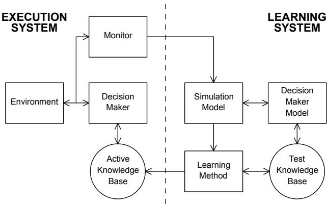
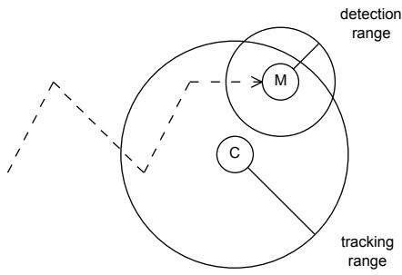
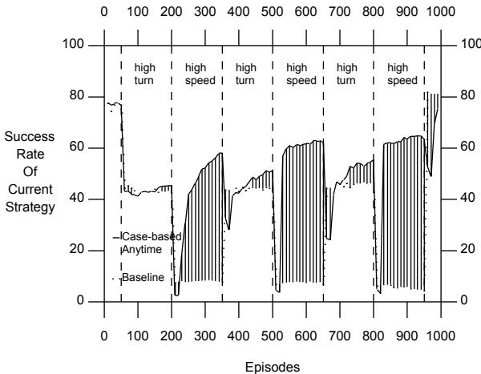
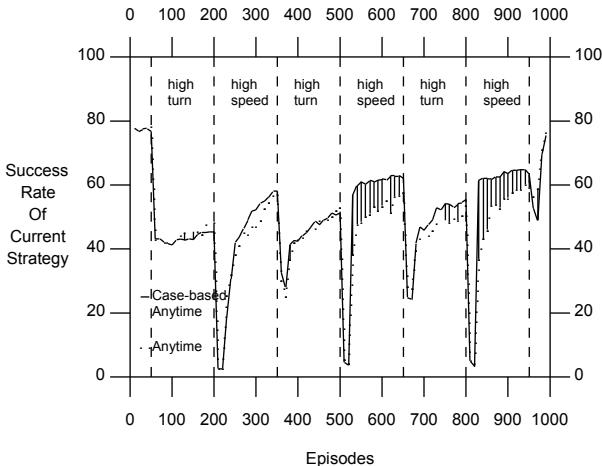
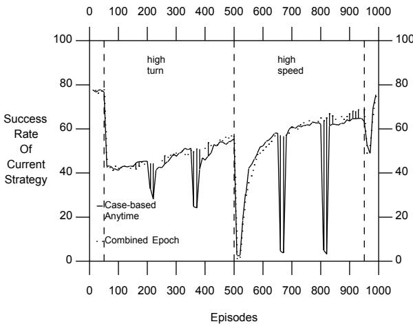

# Case-Based Initialization of Genetic Algorithms

Connie Loggia Ramsey   
Navy Center for Applied Research in AI   
Naval Research Laboratory   
Code 5514   
Washington, DC 20375-5337   
ramsey@aic.nrl.navy.mil

John J. Grefenstette Navy Center for Applied Research in AI Naval Research Laboratory Code 5514 Washington, DC 20375-5337 gref@aic.nrl.navy.mil

# Abstract

In this paper, we introduce a case-based method of initializing genetic algorithms that are used to guide search in changing environments. This is incorporated in an anytime learning system. Anytime learning is a general approach to continuous learning in a changing environment. The agent’s learning module continuously tests new strategies against a simulation model of the task environment, and dynamically updates the knowledge base used by the agent on the basis of the results. The execution module includes a monitor that can dynamically modify the simulation model based on its observations of the external environment; an update to the simulation model causes the learning system to restart learning. Previous work has shown that genetic algorithms provide an appropriate search mechanism for anytime learning. This paper extends the approach by including strategies, which are learned under similar environmental conditions, in the initial population of the genetic algorithm. Experiments show that case-based initialization of the population results in a significantly improved performance.

multi-agent tasks in static environments. Now this work is being extended by having SAMUEL (and its genetic algorithm) learn tasks in changing environments.

Previous work has addressed the issues of using genetic algorithms to perform function optimization in changing environments. Goldberg and Smith (1987) show that genetic diploidy with dominance can store sufficient information to handle certain two-state non-stationary environments. Pettit and Swigger (1983) present an early study of genetic algorithms in a randomly fluctuating environment, but their study provides limited insights due to the extremely small population size adopted. Likewise, Krishnakumar (1989) uses a genetic algorithm with a very limited population to track a rapidly changing response surface. Cobb (1990) proposes a simple mutation mechanism called triggered hypermutation to deal with continuously changing environments. The quality of the best performers in the population is monitored over time. When this measure declines, this is an indication that the environment has changed. Hypermutation then essentially restarts the search from scratch. This method allows adaptation to new environments, but there are some classes of non-stationary environments that could fail to trigger the hypermutation, leaving the genetic algorithm converged in a suboptimal peak. Grefenstette (1992) proposes another method designed to maintain the diversity necessary to track a changing response surface. The genetic algorithm is augmented with a random immigration step that replaces a specified percentage of the population with randomly generated individuals. The effect is to maintain a continuous level of exploration of the search space, while trying to minimize the disruption of the ongoing search.

# 1 INTRODUCTION

In this paper, we introduce a case-based method of initializing genetic algorithms in changing environments. This work is part of an ongoing investigation of machine learning techniques for sequential decision problems. The SAMUEL learning system employed in this study has been described in detail elsewhere (Cobb and Grefenstette, 1991; Gordon, 1991; Grefenstette, 1991; Grefenstette, Ramsey and Schultz, 1990; Schultz, 1991). SAMUEL is a system for learning reactive strategies expressed as condition-action rules, given a simulation model of the environment. It uses a modified genetic algorithm, applied to sets of symbolic reactive rules, to generate increasingly competent strategies. SAMUEL has successfully learned strategies for a number of

The work presented here differs from previous work by focusing on detectable changes in the environment. The system monitors the external environment and when a change is detected, the learning mechanism is updated with this new information. The fact that the changes are monitored means that they can be classified and stored, so we have the opportunity to use case-based methods when learning with genetic algorithms in these environ

ments.

These ideas are incorporated in an approach we call anytime learning (Grefenstette and Ramsey, 1992). The basic idea is to integrate two continuously running modules: an execution module and a learning module. The agent’s learning module continuously tests new strategies against the simulation model using a genetic algorithm to evolve improved strategies, and updates the knowledge base used by the agent (in the execution system) on the basis of the best available results. The execution module controls the agent’s interaction with the environment, and includes a monitor that can dynamically modify the simulation model (used by the learning module) based on its observations of the environment. When the simulation model is modified, the genetic algorithm is restarted on the modified model. The learning system is assumed to operate indefinitely, and the execution system uses the results of learning as they become available.

Previously, we showed the effectiveness of anytime learning in a changing environment. Genetic algorithms were shown to be well-suited for restarting learning in a changing environment. We are now enhancing the approach by including strategies, which are learned under similar environmental conditions, in the initial population. We call this approach case-based initialization of the genetic algorithm and we will present new results from incorporating this into our learning system.

The remainder of the paper is organized as follows: Section 2 presents the design of our anytime learning system and previous results using this system. Section 3 discusses genetic algorithms and our method, case-based initialization. Section 4 describes a two-agent cat-andmouse tracking task that we use to illustrate the method. Section 5 describes experiments performed on anytime learning and case-based initialization. Section 6 contains a summary.

# 2 ANYTIME LEARNING

An architecture for anytime learning is shown in Figure 1. The system consists of two main components, the execution system and the learning system. The execution system includes a decision maker that controls the agent’s interaction with the external environment based on its active knowledge base, or current strategy. The learning system attempts to provide the execution system with an improved strategy by experimenting with alternative strategies on a simulation model of the environment. The learning system need not be based on genetic algorithms, but genetic algorithms seem especially appropriate for anytime learning, as shown below.

There are two forms of communication between the execution system and the learning system. First, the learning system notifies the execution system when it finds what appears to be a more desirable strategy, based on tests performed on the simulation model. When the execution system receives such notification, it replaces its current strategy with the new strategy. The second form of communication occurs when the monitor module in the execution system notifies the learning system that the simulation model needs to be adjusted. The monitor’s task is to determine when its observations of the environment conflict with the simulation model and what adjustments should be made in the model to accommodate the observations. The learning system responds to a notice from the monitor by adjusting the simulation model, and possibly restarting the learning process.

  
Figure 1: Anytime Learning System

The success of the anytime learning approach clearly depends on the proper design of the simulation. Those aspects of the environment that are initially uncertain or subject to change or drift must be identified, and then parameterized so that the actual observed values are within the space described by the parameters. Procedures must be designed so the monitor can measure the parameters that characterize the environment.1 Furthermore, a policy for how to re-initialize the learning system must be specified. The range of options for restarting the learning system depends largely on the particular learning method being used. Some learning methods may require a complete restart when the simulation model changes, and others may permit a more graceful adaptation. As the case study will show, the populationbased competition in a genetic learning system provides a convenient mechanism for changing the behavior of the learning system without completely starting over. For a more complete discussion of the basic anytime learning model, see (Grefenstette and Ramsey, 1992).

In previous work, we successfully used a simple anytime learning system to learn in changing environments. In order to test the anytime learning design, we performed a lesion study, disabling the key element in the feedback loop between the execution system and the learning system, namely, the monitor module. Baseline learning was the term for the learning system which had the monitor disabled. We demonstrated that by detecting changes in environmental parameters and by updating its model, the anytime learning system soon developed new strategies that significantly outperformed the strategies developed by the baseline learner. Furthermore, the performance during each environmental change continued to improve over time. The remainder of the paper extends this work with a more sophisticated method for re-initializing the population of the genetic algorithm.

# 3 GENETIC ALGORITHMS AND CASEBASED INITIALIZATION

Genetic algorithms provide an effective mechanism for guiding behavioral learning in systems such as classifier systems (Booker, 1988) and SAMUEL (Grefenstette, Ramsey and Schultz, 1990). Genetic learning systems need not learn from scratch. Grefenstette (1987) discusses methods and demonstrates the value of incorporating problem specific knowledge into the genetic algorithm mechanism, including seeding the population. Whitley, Mathias, and Fitzhorn (1991) iteratively use previous best solutions as a basis for altering the representation used during a restart. Bramlette (1991) uses the best of $n$ randomly chosen individuals to seed the initial population of genetic algorithms. Schultz and Grefenstette (1990) show the effectiveness of initializing populations with heuristic domain-specific rules in SAMUEL. Gordon (1993) presents a method to translate high level advice into rules to seed the population for SAMUEL.

If aspects of the task environment are directly measurable, case-based reasoning (Hammond, 1990) can be used to initialize the population. Zhou (1990) explores this method for classifier systems.

The anytime learning system employs genetic algorithms to learn the most effective strategies for each environmental case encountered. Every time a change is detected, the genetic algorithm is restarted with a new initial population containing 100 strategies. The selection algorithm for each new generation chooses members with higher fitnesses with greater probability. Crossover is a specialized uniform crossover which respects rule boundaries. Clusters of rules which fire together are inherited as a group in a new strategy. The mutation operator can randomly mutate the range of conditions or actions within one rule of the strategy.

This work incorporates case-based initialization of the genetic algorithm into the anytime learning system. As the simulation model changes, we can develop a history of past cases (of previous environments) seen. This presents the opportunity to take advantage of the case history, and we can use the best solutions found for previous similar cases to seed the population of new cases.2

One advantage to our method, as well as some methods mentioned above, is that the population is seeded without user intervention. Another advantage is that by using good individuals from several different cases, our method tends to provide more diversity, guarding against premature convergence.

# 4 TASK ENVIRONMENT AND LEARNING SYSTEM

The task used in this case study is a two-agent game of cat-and-mouse in which certain environmental conditions change over time. The tracker agent, playing the role of the cat, must learn to keep the mouse agent, or target, within a certain distance, called the tracking distance, as shown in Figure 2. The target (the mouse) follows a random course and speed. The tracker (learning) agent can detect the speed and change in direction of the target as well as keep track of time, its last turn, and its bearing, heading, and range relative to the target. The tracker must learn to control both its speed and its direction. It is assumed that the tracker has sensors that operate at a greater distance than the target’s sensors.

  
Figure 2: Cat-and-Mouse Task

The object is to keep the target within range of the tracker’s sensors, without being detected by the target. The usual behavior of the target agent is a random walk, changing its speed and direction based on a normal distribution. However, if the target detects the tracker, the target immediately flees the area at high speed. The target can only detect the tracker if the tracker is within the detection radius of the target. Furthermore, the probability of detection depends upon both the tracker’s speed and distance from the target. The tracker does not initially have any information concerning the relationship between its behavior and its probability of detection by the target. In particular, the tracker does not know the detection radius or the range of speeds that the target might assume. For further details, see (Grefenstette and Ramsey, 1992).

The task is broken down into individual tracking episodes. Each episode begins with a random placement of the two agents in a two-dimensional region, and lasts for 20 time steps. At the end of each episode, the critic provides full payoff if the tracker keeps the target within tracking distance for $7 5 \%$ of the episode. Otherwise, the tracker’s partial payoff is equal to the portion of time that

# 4.1 ANYTIME LEARNING SYSTEM

The anytime learning system uses a competition-based production system as the execution system and SAMUEL as the learning system. The execution and learning modules are described in more detail in this section.

# 4.1.1 Execution System

The execution system’s knowledge base is a reactive strategy consisting of a set of situation-response rules. The execution system interacts with the external environment through a process of reading its sensors, finding rules in its strategy that match (or partially match) the current sensors, resolving conflicts among the rules in the match set, and selecting an action based upon the selected rules (possibly constrained by other knowledge sources). See (Grefenstette, Ramsey, and Schultz, 1990) for details.

In the current execution system, the monitor measures four aspects of the environment: the distribution of speed values and the distribution of turn values (in degrees) of the target agent, the radius within which the target may detect the tracker, and the size of the target. Performance is also monitored, and performance degradation can trigger a restart in learning, although this factor is not studied here. In this study, two aspects of the environment are varied: the speed distribution and the turn distribution of the target agent. These are assumed to be Gaussian distributions here, but that is not a required property for all monitored environmental aspects. The monitor’s task is to decide how well the observed speeds and turns of the target in the external environment match the current distributions assumed in the simulation model of the SAMUEL learning system. Using the 50 most recent samples of the target’s speed, the monitor computes the observed mean and variance of these samples, and compares the observed values with the current simulation parameters, using the F-test to compare the variances and the t-test to compare the means. If either statistical test fails, the monitor changes the simulation parameters to reflect the new observed mean and variance of the target speed, and notifies the genetic algorithm to restart. Similarly, the monitor uses the 50 most recent samples of the target’s turns to compare against the current simulation parameter.

# 4.1.2 Learning System and Case-Based Initialization

Strategies are selected by the learning system for use by the execution system, as follows: The genetic algorithm in SAMUEL evaluates each strategy by measuring the performance of the given strategy when solving tasks on the simulation model. At periodic intervals (10 generations in the current experiments), a single strategy is extracted from the current population to represent the learning system’s current hypothetical strategy.3 If the current hypothesis outperforms (in the simulation model) the execution system’s current strategy (in the external environment), the execution system accepts the learning system’s strategy as its new current strategy.

Figure 3: Population when Resetting the Learning System   

<table><tr><td>Best Solutions of Similar Cases (50%)</td></tr><tr><td>Members of Previous Population (25%)</td></tr><tr><td>Default Strategies (12.5%)</td></tr><tr><td>Exploratory Strategies (12.5%)</td></tr></table>

When the learning system receives a restart notice from the monitor, it begins a new epoch of learning on its updated simulation environment by formulating a new initial population for the genetic algorithm. The initial population represents the system’s initial set of hypothetical strategies for the new environment. In this study, we seed the initial population with four classes of strategies, as shown in Figure 3. One eighth of the population is initialized with default strategies that are known to perform well against a broad range of parameter values for the target, centered on its medium parameter settings. The default strategies will provide useful starting points for the learner if the environment is changing from an extreme special case back to what the simulation designer considered a more normal case. One eighth of the population is initialized with strategies that generate essentially random behavior by the tracker (exploratory strategies). These strategies will provide useful starting points for the genetic algorithm if the environment is changing in a direction that has not been encountered before. Next, one quarter of the strategies in the current population are chosen to survive intact. This provides a bias in favor of the assumption that the new environment is essentially similar to the previous one. Finally, casebased initialization is used to seed the other half of the population; it is initialized with the best strategies previously learned in up to five similar epochs. This group is given the greatest emphasis because it should provide the most useful strategies for dealing with the new environment. A nearest neighbor calculation is performed to find the five closest matches to the current simulation’s set of parameters, as follows: Each epoch encountered by the system is indexed by its observed parameters, independent of other epochs, even if they are similar or identical. When a new environment is encountered, the current parameters are compared against all previous cases by taking the Euclidean distance of the current set $E _ { n e w }$ and each previous set of parameters $E _ { i }$ as shown:

$$
d ( E _ { n e w } \mathrm { ~ , ~ } E _ { i } ) = \left[ \sum _ { k = 1 } ^ { n } ( p _ { i , k } \mathrm { - } p _ { n e w , k } ) ^ { 2 } \right] ^ { 1 / 2 }
$$

Table 1 - Environmental Distribution of Parameters   

<table><tr><td rowspan=1 colspan=1>Epoch</td><td rowspan=1 colspan=1>Episodes</td><td rowspan=1 colspan=1>State</td><td rowspan=1 colspan=1>Mean TargetSpeed</td><td rowspan=1 colspan=1>Speed Std. Dev.</td><td rowspan=1 colspan=1>Turn Std. Dev.</td></tr><tr><td rowspan=1 colspan=1>1</td><td rowspan=1 colspan=1>1 - 50</td><td rowspan=1 colspan=1>Baseline</td><td rowspan=1 colspan=1>200.0</td><td rowspan=1 colspan=1>33.3</td><td rowspan=1 colspan=1>0.5</td></tr><tr><td rowspan=1 colspan=1>2</td><td rowspan=1 colspan=1>51 - 200</td><td rowspan=1 colspan=1>High Turn</td><td rowspan=1 colspan=1>200.0</td><td rowspan=1 colspan=1>33.3</td><td rowspan=1 colspan=1>2.5</td></tr><tr><td rowspan=1 colspan=1>3</td><td rowspan=1 colspan=1>201 - 350</td><td rowspan=1 colspan=1>High Speed</td><td rowspan=1 colspan=1>350.0</td><td rowspan=1 colspan=1>10.0</td><td rowspan=1 colspan=1>0.5</td></tr><tr><td rowspan=1 colspan=1>4</td><td rowspan=1 colspan=1>351 - 500</td><td rowspan=1 colspan=1>High Turn</td><td rowspan=1 colspan=1>200.0</td><td rowspan=1 colspan=1>33.3</td><td rowspan=1 colspan=1>2.5</td></tr><tr><td rowspan=1 colspan=1>5</td><td rowspan=1 colspan=1>501 - 650</td><td rowspan=1 colspan=1>High Speed</td><td rowspan=1 colspan=1>350.0</td><td rowspan=1 colspan=1>10.0</td><td rowspan=1 colspan=1>0.5</td></tr><tr><td rowspan=1 colspan=1>6</td><td rowspan=1 colspan=1>651-800</td><td rowspan=1 colspan=1>High Turn</td><td rowspan=1 colspan=1>200.0</td><td rowspan=1 colspan=1>33.3</td><td rowspan=1 colspan=1>2.5</td></tr><tr><td rowspan=1 colspan=1>7</td><td rowspan=1 colspan=1>801 - 950</td><td rowspan=1 colspan=1>High Speed</td><td rowspan=1 colspan=1>350.0</td><td rowspan=1 colspan=1>10.0</td><td rowspan=1 colspan=1>0.5</td></tr><tr><td rowspan=1 colspan=1>8</td><td rowspan=1 colspan=1>951 - 1000</td><td rowspan=1 colspan=1>Baseline</td><td rowspan=1 colspan=1>200.0</td><td rowspan=1 colspan=1>33.3</td><td rowspan=1 colspan=1>0.5</td></tr></table>

where $\mathbf { n } =$ the number of parameters, and $p _ { i , k } =$ parameter $k$ in Epoch $i .$ . The five lowest differences and the corresponding past case numbers are then used to index into the best strategies of these five nearest neighbors. Then these best strategies are placed in the new population, and replicated as necessary to fill up half of the initial population. This restart policy illustrates the advantage of the population-based approach used by the genetic algorithm: it allows the learning system to hedge its bets, since the competition among the strategies in the population will quickly eliminate the strategies that are not appropriate for the new environment, and will converge toward the appropriate strategies.

# 5 EXPERIMENTAL DESIGN AND RESULTS

The experiments were designed to explore how well the anytime learning system with case-based initialization of the genetic algorithm responds to multiple changing environmental conditions.4 For this study, we test the hypothesis:

Dynamically modifying the simulation model and initializing the population with members of previously seen states will accelerate learning in a changing environment.

The parameters which are varied and monitored are both the mean and the standard deviation of the speed of the target, and the standard deviation of the degree of turn of the target (around a mean of 0 degrees, or straight ahead).5 As shown in Table 1, three distinct environmental states occur during each experiment: a baseline state where the mean and standard deviation of the speed are 200.0 and 33.3 respectively, and the standard deviation of the turn is 0.5, a high-turn state in which the standard deviation of the turn is 2.5, and a high-speed state in which the mean and standard deviation of the speed are 350.0 and 10.0. The tracking task is much more difficult in the high-speed state and in the high-turn state than in the baseline state.

The first experiment we performed was anytime learning with the new addition of case-based initialization for the genetic algorithm. For simplicity, we will call this experiment the case-based anytime learning experiment from now on. This experiment begins and ends with the baseline state, and the high-turn and highspeed states occur during alternate epochs of 150 episodes, as shown in Table 1.

In order to test the effects of case-based anytime learning, we performed a lesion study. We ran a second experiment, called the baseline experiment in which we disabled the key element in the feedback loop between the execution system and the learning system, namely, the monitor module. Therefore the learning system receives no notification of environmental changes, and continues to learn on the baseline state simulation for the entire experiment. There are no updates to the learning system and the genetic algorithm is never restarted. Whenever the learning system finds a strategy that tests better on the simulation model, it passes the new strategy to the execution system for use against the environment though.

The results of comparing the case-based anytime learning experiment against the baseline experiment are shown in Figure 4. The dashed vertical lines indicate the points at which the environment changes, (as shown in Table 1). The case-based anytime learning performance is shown as the solid graph. The baseline learning performance is shown as the dotted graph. The graphs for all experiments were generated as follows: During each run of the system, the strategy used during each 10-episode block by the execution system was stored, and later tested on 1000 randomly selected episodes, using the same environment that it encountered during the run. Each data point in the graphs represents the average performance of a strategy over these 1000 episodes. The data is averaged over 10 independent sets of runs for each experiment. A vertical bar between two corresponding points on the two graphs indicates a statistically significant difference at

  
Figure 4: Case-Based Anytime Learning vs. Baseline Learning

Since the baseline learning system receives no feedback about the changes in the environment, the performance declines significantly when the high-speed and highturn epochs occur. The performance of the case-based anytime learning system also declines initially during the beginning of each new epoch, but, unlike the baseline system, makes significant progress in re-learning against the new environments, and eventually achieves a significantly better performance than the baseline run. Furthermore, each epoch of the high-turn state (epochs 2, 4 and 6) continues to make improvements over the previous high-turn case. Each epoch of the high-speed state (epochs 3, 5 and 7) does likewise. Note than when the environment returns to the baseline state at the end of the experiment, the baseline system exhibits an advantage over the case-based anytime learner. This is to be expected, since the baseline learner continues to concentrate its efforts on learning improved strategies against the baseline state throughout the run. Obviously, the value of monitoring the environment will be most significant when the external environment differs from the simulation designer’s initial assumptions.

Next, in order to determine the effects of the addition of case-based initialization to the original anytime learning system, we performed a second lesion study. We ran another experiment, which we will refer to as the anytime learning experiment, in which case-based initialization of the genetic algorithm is disabled. After each restart, the new population is comprised only of copies of a default strategy plan, a general plan, and members of the most recent previous population.

In Figure 5, case-based anytime learning is compared against anytime learning. Note that the case-based anytime learning continues to learn not only within each epoch, but also from one epoch to the next similar epoch. In the high-turn cases, epoch 4 shows improved performance over epoch 2, and then epoch 6 improves over epoch 4. In the high-speed cases, epoch 5 shows improved performance over epoch 3, and then epoch 7 improves over epoch 5. Furthermore, little time is lost in bringing the performance back up to the level of performance on the previous occurrence of the same environmental state. When case-based initialization is disabled, the performance curves for each of the subsequent occurrences of the same environmental state are similar to previous occurrences of the case. There is a more gradual increase in performance within each epoch, and there is little improvement in later epochs which have the same parameters.

  
Figure 5: Case-Based Anytime Learning vs. Anytime Learning

As the number of past cases continues to grow, the performance of case-based anytime learning continues to improve over anytime learning. The high-speed cases show a statistically significant difference by the second repeated epoch, while the high-turn cases are beginning to show some statistically different results by the third epoch. Based on this data, we are justified in accepting the hypothesis that the mechanisms in the case-based anytime learning outperform both the baseline system and the anytime learning system on this changing environment. In longer experiments, not reported yet, with up to 30 epochs, the performance of case-based anytime learning continues to improve over anytime learning as the number of past cases grows. Also, further experiments, not reported yet, indicate that case-based anytime learning shows the same advantage for environments where previous cases are similar, but not identical.

In order to get a feel for the effect of restarts on the case-based anytime learning system, we ran an experiment with no restarts within a case. This combinedepoch experiment is like the case-based anytime learning experiment, but instead of alternating the high-turn and high-speed cases, each lasting 150 episodes, there is a single 450-episode high-turn epoch, followed by a 450-episode high-speed epoch. Each epoch proceeds without restarts. We compare this against the casebased anytime learning experiment by concatenating the data from the three high-turn epochs and the three high-speed epochs in the earlier experiment (the solid line in Figure 4). This concatenated data from the case-based anytime learning experiment is compared against the combined-epoch learning in Figure 6. Other than the initial 30 episodes of each epoch from casebased anytime learning, the graphs from both experiments are almost identical. There is a statistically significant difference only during the initial time after restarts, at a few random points, and toward the very end of the high-speed case. It is interesting to observe that approximately 60 episodes are "lost" in the casebased anytime learning experiment’s restarts (during the beginning of the second and third similar epochs), and the performance at the end of the last high-speed epoch of this experiment is almost exactly the same as the performance of the combined-epoch learning 60 episodes before the end. We conclude that little is lost in learning performance due to restarts when case-based initialization of the genetic algorithm is employed.

  
Figure 6: Case-Based Anytime Learning with Small Epochs vs. Case-Based Anytime Learning with Large Epochs

A limitation to the case-based anytime learning system is shown in these experiments. If the environment changes too rapidly (i.e., every 30 episodes or less), then the case-based anytime learning system will not have enough time to learn against the current simulation, and other methods would be needed to learn in this situation. Also, if the environment always changes to very different states and has no history of previous similar states, then case-based anytime learning should perform as the original anytime learning system did. The cost to the system in overhead for storing the history of past cases, and doing the nearest neighbor calculations is almost negligible. Finally, if the environment changes very gradually and continuously, it is not clear how well the case-based method will capture the changes.

The most promising aspect of these results is that, within each of the epochs after an environmental change, the case-based anytime learning system consistently improves the performance of the execution system over the course of the epoch. Furthermore, through case-based initialization of the genetic algorithm, the learning system continues to improve on cases it has seen before, and there is a substantial reduction in the initial cost of a restart in learning. Also, the longer the epochs last and the longer the system runs and gathers a base of experiences of different environmental cases, the greater the expected benefit of casebased anytime learning will be.

# 6 SUMMARY

This paper presents a new approach to learning in a changing environment, case-based initialization for genetic algorithms in an anytime learning system. This results in a novel combination of two methods of machine learning (genetic algorithms and case-based approaches) to perform learning in a changing environment in which we can monitor and record the changes. Anytime learning with case-based initialization shows a consistent improvement over anytime learning without case-based initialization. Case-based initialization allows the system to automatically bias the search of the genetic algorithm toward relevant areas of the search space. Little time is lost attaining a similar level of learning as in the previous same cases, and then improving on that performance. Further experiments, not reported yet, indicate that this is also true for environments where previous cases are similar, but not identical.

One advantage to our method is that the population of the genetic algorithm is seeded without user intervention. Another advantage is that by using good individuals from several different past cases as well as exploratory strategies, default strategies and members of the previous population, our method tends to provide more diversity, guarding against premature convergence.

The approach presented here assumes that there is a simulation model available for learning, and that environmental changes can be monitored and accommodated by changing the simulation parameters. In this study, we vary only two aspects of the environment and use only three environmental states. In a case with so few states, learning could be performed offline, and then the appropriate learning strategy could be selected (through the use of look-up tables) when each state is encountered. However, our method is intended to be applied to environments with multiple parameters and possibly infinite cases over very long periods of time. If the complexity and uncertainty about the environment prevents the use of look-up tables, and the environment changes slowly with respect to the speed of the learning system, the approach to anytime learning using case-based initialization of genetic algorithms is very promising.

This study provides further evidence that machine learning techniques based on genetic algorithms may enable the design of high performance autonomous agents that learn through interactions with a simulation of the task environment. Further developments along these lines can be expected to reduce the manual knowledge acquisition effort required to build intelligent robotic systems with expert performance in complex domains.

# Acknowledgements

We wish to thank Diana Gordon, James Ramsey, and Alan Schultz for their enlightening comments on this work.

# Список литературы

Booker, L. B. (1988). Classifier Systems that Learn Internal World Models. Machine Learning 3(3), 161- 192.   
Bramlette, M. F. (1991). Initialization, Mutation and Selection Methods in Genetic Algorithms for Function Optimization. Proceedings of Fourth International Conference on Genetic Algorithms (pp 100-107). San Diego, CA: Morgan Kaufmann.   
Cobb, H. G. (1990). An Investigation into the Use of Hypermutation as an Adaptive Operator in Genetic Algorithms Having Continuous, Time-dependent Nonstationary Environments. NRL Memorandum Report 6760.   
Cobb, H. G. and J. J. Grefenstette (1991). Learning the persistence of actions in reactive control rules. Proceedings of the Eighth International Machine Learning Workshop (pp. 293-297). Evanston, IL: Morgan Kaufmann.   
Goldberg, D. E. and R. E. Smith (1987). Nonstationary function optimization using genetic dominance and diploidy. Proceedings of the Second International Conference on Genetic Algorithms, (pp. 59-68), Lawrence Erlbaum Associates.   
Gordon, D. F. (1993). A Multistrategy Learning Scheme for Assimilating Advice in Embedded Agents. To appear in the Proceedings of the Second International Workshop on Multistrategy Learning, Harper’s Ferry, West Virginia.   
Gordon, D. F. (1991). An enhancer for reactive plans. Proceedings of the Eighth International Machine Learning Workshop (pp 505-508). Evanston, IL: Morgan Kaufmann.   
Grefenstette, J. J. (1987). Incorporating Problem Specific Knowledge into Genetic Algorithms. Genetic Algorithms and Simulated Annealing 42-60, L. Davis (ed.), Los Altos, CA: Morgan Kaufmann.   
Grefenstette, J. J. (1991). Lamarckian learning in multi-agent environments. Proceedings of the Fourth International Conference of Genetic Algorithms (pp 303-310). San Diego, CA: Morgan Kaufmann.   
Grefenstette, J. J. (1992). Genetic Algorithms for Changing Environments. Proceedings of Parallel Problem Solving from Nature 1992 (pp 137-144), R. Davis and B. Manderick (eds.), North-Holland. Grefenstette, J. J. and C. L. Ramsey (1992). An Approach to Anytime Learning. Proceedings of the Ninth International Conference on Machine Learning, (pp 189-195), D. Sleeman and P. Edwards (eds.), San Mateo, CA: Morgan Kaufmann.   
Grefenstette, J. J., C. L. Ramsey and A. C. Schultz (1990). Learning sequential decision rules using simulation models and competition. Machine Learning 5(4), 355-381.   
Hammond, K. J. (1990). Explaining and Repairing Plans That Fail. Artificial Intelligence 45, 173-228. Krishnakumar, K. (1989). Micro-genetic algorithms for stationary and non-stationary function optimization. SPIE, Intelligent Control and Adaptive Systems, (pp. 289-296).   
Pettit, K. and E. Swigger (1983). An analysis of genetic based pattern tracking and cognitive-based component tracking models of adaptation. Proceedings of National Conference on AI (AAAI-83), (pp. 327-332), Morgan Kaufmann.   
Ramsey, C. L., A. C. Schultz and J. J. Grefenstette (1990). Simulation-assisted learning by competition: Effects of noise differences between training model and target environment. Proceedings of Seventh International Conference on Machine Learning (pp 211-215). Austin, TX: Morgan Kaufmann.   
Schultz. A. C. (1991). Using a genetic algorithm to learn strategies for collision avoidance and local navigation. Proceedings of the Seventh International Symposium on Unmanned, Untethered Submersible Technology (pp 213-225). Durham, NH.   
Schultz, A. C. and J. J. Grefenstette (1990). Improving tactical plans with genetic algorithms. Proceedings of IEEE Conference on Tools for AI 90 (pp 328-334). Washington, DC: IEEE.   
Whitley, D., K. Mathias and P. Fitzhorn (1991). Delta Coding: An Iterative Search Strategy for Genetic Algorithms. Proceedings of Fourth International Conference on Genetic Algorithms (pp 77-84). San Diego, CA: Morgan Kaufmann.   
Zhou, H. H. (1990). CSM: A computational model of cumulative learning. Machine Learning 5(4), 383-406.