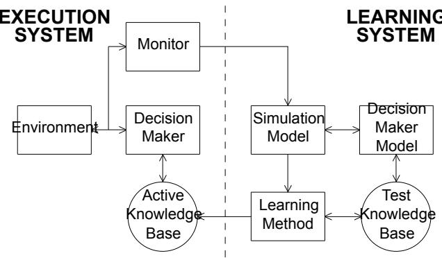
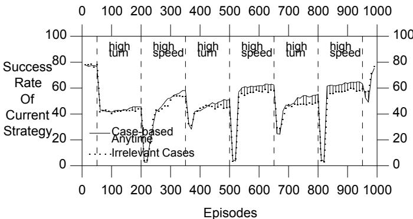
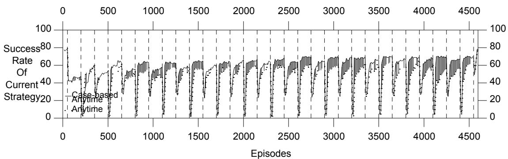
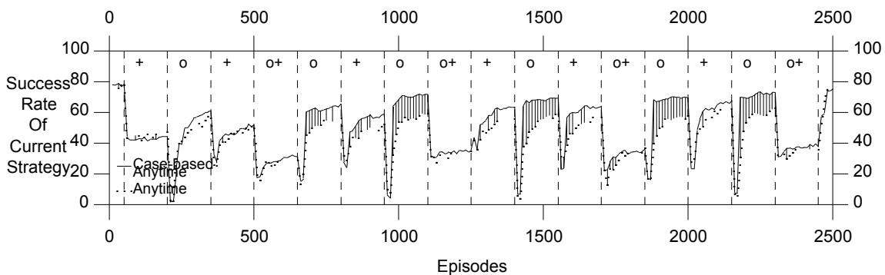

# Case-Based Anytime Learning

Connie Loggia Ramsey and John J. Grefenstette

Navy Center for Applied Research in AI   
Naval Research Laboratory, Code 5514 Washington, DC 20375-5337 {ramsey,gref}@aic.nrl.navy.mil

# Abstract

We discuss a case-based method of initializing genetic algorithms that are used to guide search in changing environments. This is incorporated in an anytime learning system. Anytime learning is a general approach to continuous learning in a changing environment. A genetic algorithm with a case-based component provides an appropriate search mechanism for anytime learning. When the genetic algorithm is restarted, strategies which were previously learned under similar environmental conditions are included in the initial population of the genetic algorithm. We have evaluated the system by comparing performance with and without the case-based component, and case-based initialization of the population results in a significantly improved performance.

# INTRODUCTION

We discuss a case-based method of initializing genetic algorithms in changing environments. This work is part of an ongoing investigation of machine learning techniques for sequential decision problems. The SAMUEL learning system employed in this study has been described in detail elsewhere (Grefenstette, Ramsey and Schultz, 1990). SAMUEL learns reactive strategies expressed as condition-action rules, given a simulation model of the environment. It uses a modified genetic algorithm, applied to sets of symbolic reactive rules, to generate increasingly competent strategies.

This work focuses on detectable changes in the environment. The system monitors the external environment and when a change is detected, the learning mechanism is updated with this new information. Since the changes are monitored, they can be classified and stored, and we can use case-based methods when learning with genetic algorithms in these environments.

These ideas are incorporated in an approach we call anytime learning (Grefenstette and Ramsey, 1992). The basic idea is to integrate two continuously running modules: an execution module and a learning module. The agent’s learning module continuously tests new strategies against a simulation model using a genetic algorithm to evolve improved strategies, and updates the knowledge base used by the agent with the best available results. The execution module controls the agent’s interaction with the environment, and includes a monitor that dynamically modifies the simulation model based on its observations of the environment. When the simulation model is modified, the genetic algorithm is restarted on the modified model. The learning system is assumed to operate indefinitely, and the execution system uses the results of learning as they become available.

Genetic algorithms are well-suited for restarting learning in a changing environment. We have enhanced the approach by including strategies, which are learned under similar environmental conditions, in the initial population. Previous cases are stored, and a nearest neighbor algorithm is used to index into the most similar previous cases. We call this approach case-based initialization of the genetic algorithm. This method was evaluated by comparing the performance of the anytime learning system with and without the case-based component, and we will discuss results from this evaluation.

# ANYTIME LEARNING

An architecture for anytime learning is shown in Figure 1. The system consists of two main components, the execution system and the learning system. The execution system includes a decision maker that controls the agent’s interaction with the external environment based on its active knowledge base, or current strategy. The learning system attempts to provide the execution system with an improved strategy by experimenting with alternative strategies on a simulation model of the environment. For a more complete discussion of the basic anytime learning model, see (Grefenstette and Ramsey, 1992).

# GENETIC ALGORITHMS AND CASE-BASED INITIALIZATION

Genetic algorithms provide an effective mechanism for guiding behavioral learning in systems such as classifier systems (Booker, 1988) and SAMUEL (Grefenstette, Ramsey and Schultz, 1990). For a good current description of genetic algorithms see (Davis, 1991).

Genetic learning systems need not learn from scratch. If aspects of the task environment are directly measurable, case-based reasoning (Hammond, 1990) can be used to initialize the population. Zhou (1990) explores casebased methods applied to classifier systems. He uses past experience to recall similar cases when faced with a new environment. If no relevant past cases exist, then the standard classifier system algorithm learns a new solution.

  
Figure 1: Anytime Learning System

In a different, interesting combination of case-based methods and genetic algorithms, Skalak (1993) utilizes a genetic algorithm to identify small, reliable sets of instances to reduce the number of instances used for nearest neighbor retrieval. Kelly and Davis (1991) use a genetic algorithm to find a vector of weightings of the attributes used in a nearest neighbor calculation in order to reduce the effects of irrelevant or misleading attributes and thus to make the distance measure more meaningful.

Ram and Santamaria (1993) use continuous case-based reasoning to perform tasks such as autonomous robotic navigation. They learn cases which provide information for the navigation system to deal with specific environments encountered.

Our anytime learning system employs genetic algorithms to learn the most effective strategies for each environmental case encountered. When a change is detected, the genetic algorithm is restarted with a new initial population. This work incorporates case-based initialization of the genetic algorithm into the anytime learning system. As the simulation model changes, we can develop a history of past cases (of previous environments) seen, and we can use the best solutions found so far for previous similar cases to seed the population of new cases.

# TASK ENVIRONMENT AND LEARNING SYSTEM

The task used in this case study is a two-agent game of cat-and-mouse in which certain environmental conditions change over time. The tracker agent (the cat) must learn to keep the target (mouse) within a certain distance, called the tracking distance. The target follows a random course and speed. The tracker agent can detect the speed and change in direction of the target as well as keep track of time, its last turn, and its bearing, heading, and range relative to the target. The tracker must learn to control both its speed and its direction. For further details, see (Grefenstette and Ramsey, 1992).

The anytime learning system uses a competition-based production system as the execution system and SAMUEL as the learning system. The system learns a reactive strategy consisting of a set of situation-response rules. In these studies, the monitor measures several aspects of the environment: the speed distribution, the turn distribution (in degrees) and the size of the target agent. The speed and turn distributions are assumed to be Gaussian distributions, and the size of the target is a discrete integer representing the current size. The monitor’s task is to decide how well the observed speeds, turns and size of the target in the external environment match the current distributions or values assumed in the simulation model of the SAMUEL learning system. Using the 50 most recent samples of the target’s speed and turns, the monitor computes the observed mean and variance of these samples, and compares the observed values with the current simulation parameters, using the F-test to compare the variances and the t-test to compare the means. If either statistical test fails, the monitor changes the simulation parameters to reflect the new observed mean and variance of the target speed or turn. When a new size is detected, the monitor updates this value in the simulation model. A change in simulation parameters then causes the genetic algorithm to restart.

Strategies are selected by the learning system for use by the execution system, as follows: The genetic algorithm in SAMUEL evaluates each strategy by measuring the performance of the given strategy when solving tasks on the simulation model. At periodic intervals a single best strategy is extracted from the current population to represent the learning system’s current hypothetical strategy. If the current hypothesis outperforms (in the simulation model) the execution system’s current strategy, the execution system accepts the learning system’s strategy as its new current strategy.

Table 1: Population when Resetting the Learning System   

<table><tr><td>Best Solutions of Similar Cases (50%)</td></tr><tr><td>Members of Previous Population (25%)</td></tr><tr><td>Default Strategies (12.5%)</td></tr><tr><td>Exploratory Strategies (12.5%)</td></tr></table>

When the learning system receives a restart notice from the monitor, it begins a new epoch of learning on its updated simulation environment by formulating a new initial population for the genetic algorithm. The initial population represents the system’s initial set of hypothetical strategies for the new environment. In this study, we seed the initial population with four classes of strategies, as shown in Table 1. One eighth of the population is initialized with default strategies that are known to perform moderately well against a broad range of cases. The default strategies will provide useful starting points for the learner if the environment is changing from an extreme special case back to what the simulation designer considered a more normal case. One eighth of the population is initialized with strategies that generate essentially random behavior by the tracker (exploratory strategies). These strategies will provide useful starting points for the genetic algorithm if the environment is changing in a direction that has not been encountered before. Next, one quarter of the strategies in the current population are chosen to survive intact. This provides a bias in favor of the assumption that the new environment is essentially similar to the previous one. Also, it helps to guard against the effect of restarting learning when an irrelevant parameter has changed. Finally, case-based initialization is used to seed the other half of the population; it is initialized with the best strategies previously learned in up to five similar epochs. This group is given the greatest emphasis because it should provide the most useful strategies for dealing with the new environment, once a case history is established. A nearest neighbor calculation is performed to find the five closest matches to the current simulation’s set of parameters, as follows: Each epoch encountered by the system is indexed by its observed parameters. When a new environment is encountered, the current parameters are compared against all previous cases by taking the Euclidean distance of the current set $E _ { n e w }$ and each previous set of parameters $E _ { i }$ as shown:

$$
d ( E _ { n e w } \mathrm { ~ , ~ } E _ { i } ) = \left( \sum _ { k = 1 } ^ { n } ( p _ { i , k } – p _ { n e w , k } ) ^ { 2 } \right) ^ { 1 / 2 }
$$

where $\mathbf { n } =$ the number of parameters, and $p _ { i , k } =$ parameter $k$ in Epoch $i$ . We intend to look into algorithms which will reduce the number of instances for nearest neighbor retrieval since this will become very costly as the case history grows. Also, we intend to weight the cases by how recent they are, since recent similar cases usually contain higher performance strategies. In the current method, the five lowest differences in distance and the corresponding past case numbers are then used to index into the best strategies of these five nearest neighbors. Then the best strategies of these cases are placed in the new population, and replicated as necessary to fill up half of the initial population. This restart policy illustrates the advantage of the population-based approach used by the genetic algorithm: it allows the learning system to hedge its bets, since the competition among the strategies in the population will quickly eliminate the strategies that are not appropriate for the new environment, and will converge toward the appropriate strategies.

# EXPERIMENTS AND RESULTS

The experiments were designed to explore how well the anytime learning system with case-based initialization of the genetic algorithm responds to multiple changing environmental conditions. For this study, we test the hypothesis:

Dynamically modifying the simulation model and initializing the population with members of previous similar states will accelerate learning in a changing environment.

Our tests involved both relevant and irrelevant parameters. The distributions of the speed and turning rate of the target are relevant and the size of the target is irrelevant. Three distinct relevant environmental states occur during each experiment: a baseline state, a high-turn state, and a high-speed state. The tracking task is much more difficult in the high-speed and high-turn states.

# PREVIOUS RESULTS

To test the major components of the approach, we previously compared three modes of operation (Ramsey and Grefenstette, 1993). The first mode was case-based anytime learning, (anytime learning with case-based initialization of the genetic algorithm). The second mode was anytime learning in which case-based initialization is disabled. After each restart, the new population is comprised only of copies of a default strategy plan, a general plan, and members of the most recent previous population. The third mode was baseline learning, in which the monitor was disabled. In this mode, the learning system receives no notification of environmental changes, and continues to learn on the baseline state simulation for the entire experiment. However, if the learning system finds a strategy that tests better on the simulation model, it passes this to the execution system for use against the environment.

The performance of the case-based anytime learning system achieves significantly better performance than the baseline run. The case-based anytime learning continues to learn not only within each epoch, but also from one epoch to the next similar epoch. Furthermore, little time is lost in bringing the performance back up to the level of performance on the previous occurrence of the same environmental state. For a more complete discussion of these and other previous results, see (Ramsey and Grefenstette, 1993).

# NEW RESULTS

Our current efforts have focused on assessing the robustness of case-based learning when irrelevant parameters vary, when much longer runs are performed, and when past cases are similar, but not identical.1

We compared a new mode of operation, in which we varied irrelevant parameters, against the results of the previous experiment. The experiment begins and ends with the baseline state, and the high-turn and high-speed states occur during alternate time periods of 150 episodes. Within each of these time periods, the size of the target, an irrelevant parameter, was varied every 50 episodes. Figure 2 shows the results of comparing case-based anytime learning in which irrelevant parameters were not changed during the high-turn and high-speed 150-episode time periods to case-based anytime learning in which irrelevant parameters were changed. The main result is that learning is hampered because epochs are much smaller and more frequent. There is less time for learning before unnecessarily restarting the learning process. If the irrelevant parameters do not change much, then they have little effect, but if they do change often, then performance can worsen.

  
Figure 2: Case-Based Anytime Learning vs. Case-Based Anytime Learning with Irrelevant Parameters

In a second experiment, a much longer run containing many more epochs was performed to assess the robustness of the case-based learning component as the number of cases increases. There were 30 alternating high turn and high speed epochs. The results, in Figure 3, verify that the increased performance using case-based initialization continues to hold after many epochs, and the increased performance is almost always statistically significant.

In a third experiment, we evaluated the case-based initialization component by varying the values of the high turn and high speed cases, and also by combining the high turn and high speed parameters in some of the epochs (a combined state). The tracking task is much more difficult when these conditions are combined. The results, in Figure 4, show that case-based initialization still allows for significantly increased performance when there are similar, though not identical, past cases. The high speed epochs are showing more significance in increased performance than the high turn epochs. We conjecture that the learned behavior is more sensitive to the variance in the turn range we chose. Also, there is not much gain in performance when past cases are used in combination. For the case-based initialization runs, the later combined turn and speed epochs do have slightly increased performance, but this seems to be more due to having seen these combinations together previously, since the earlier combined epochs are not performing any better.

A limitation to the case-based anytime learning system is shown in these experiments. If the environment changes too rapidly due to relevant or irrelevant parameters, then the learning system will not have enough time to learn against the current simulation, and other methods would be needed to learn in this situation. Also, if the environment always changes to very different states and has no history of previous similar states, then case-based anytime learning should perform as the original anytime learning system did. The cost to the system in overhead for storing the history of past cases, and doing the nearest neighbor calculations is currently negligible. However, this cost will grow as the case history increases, and this must be addressed in future work.

The most promising aspect of these results is that, within each of the epochs after an environmental change, the case-based anytime learning system generally improves the performance of the execution system over the course of the epoch. Furthermore, through case-based initialization of the genetic algorithm, the learning system continues to improve on cases it has seen before, and there is a substantial reduction in the initial cost of a restart in learning. The case-based anytime learning system remains robust as the number of cases grows and also when previous cases are similar, but not identical.

# SUMMARY

This paper presents a novel combination of two methods of machine learning (genetic algorithms and case-based approaches) to perform learning in a changing environment in which we can monitor the changes. Anytime learning with case-based initialization shows a consistent improvement over anytime learning without case-based initialization. Case-based initialization automatically biases the search of the genetic algorithm toward relevant areas of the search space. Little time is lost attaining a similar level of learning as in the previous same cases, and then improving on that performance.

  
Figure 3: Case-Based Anytime Learning vs. Anytime Learning

  
Figure 4: Case-Based Anytime Learning vs. Anytime Learning dicates high turn epoch, o indicates high speed epoch and $^ { 0 + }$ indicates a combination

The approach presented here assumes that there is a simulation model available for learning, and that environmental changes can be monitored and accommodated by changing the simulation parameters. Obviously, the value of monitoring the environment will be most significant when the external environment differs from the simulation designer’s initial assumptions. The method is intended to be applied to environments with multiple parameters and possibly infinite cases over very long periods of time. If the complexity and uncertainty about the environment prevents the use of look-up tables, and the environment changes slowly with respect to the speed of the learning system, the approach to anytime learning using casebased initialization of genetic algorithms is promising.

# Список литературы

Booker, L. B. (1988). Classifier Systems that Learn Internal World Models. Machine Learning 3(3), 161-192.

Davis, L. (1991). L. Davis (editor). The Handbook of Genetic Algorithms. Van Nostrand Reinhold, N.Y., 1991.

Grefenstette, J. J. and C. L. Ramsey (1992). An Approach to Anytime Learning. Proceedings of the Ninth International Conference on Machine Learning, (pp 189-195), San Mateo,

CA: Morgan Kaufmann.

Grefenstette, J. J., C. L. Ramsey and A. C. Schultz (1990). Learning sequential decision rules using simulation models and competition. Machine Learning 5(4), 355-381.   
Hammond, K. J. (1990). Explaining and Repairing Plans That Fail. Artificial Intelligence 45, 173-228.   
Kelly, J. D. and L. Davis (1991). A Hybrid Genetic Algorithm for Classification. Proceedings of the 12th International Joint Conference on Artificial Intelligence (pp 645-650).   
Ram, A. and J. C. Santamaria (1993). Continuous Case-Based Reasoning. Case-Based Reasoning: Papers from the 1993 Workshop, Tech. Report WS-93-01, (pp 86-93). AAAI Press, Washington, D.C.   
Ramsey, C. L. and J. J. Grefenstette (1993). Case-Based Initiali - zation of Genetic Algorithms. Proceedings of the Fifth International Conference on Genetic Algorithms (pp 84-91).   
Skalak, D. B. (1993). Using a genetic algorithm to learn prototypes for case retrieval and classification. Case-Based Reasoning: Papers from the 1993 Workshop, Tech. Report WS-93-01 (pp 211-215). AAAI Press.   
Zhou, H. H. (1990). CSM: A computational model of cumulative learning. Machine Learning 5(4), 383-406.