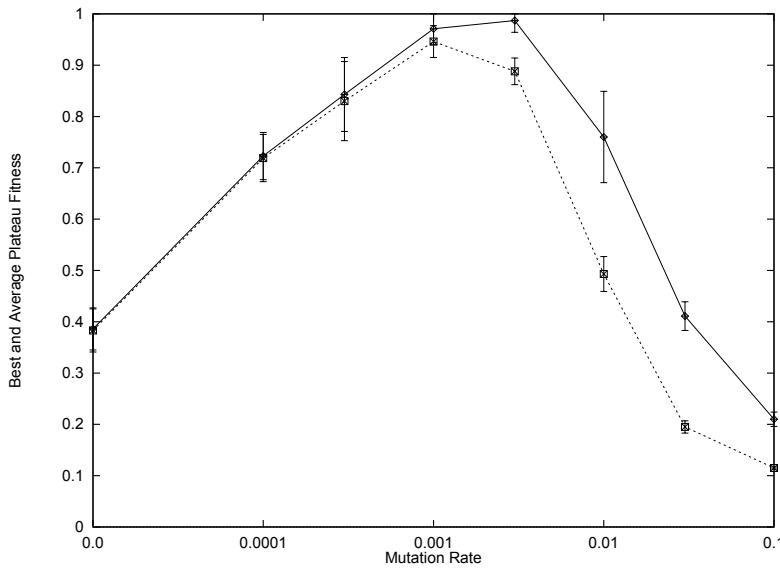
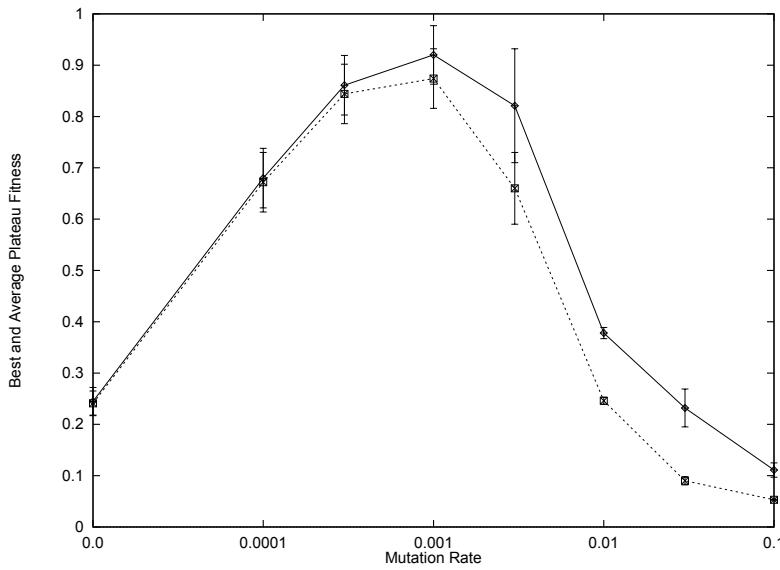
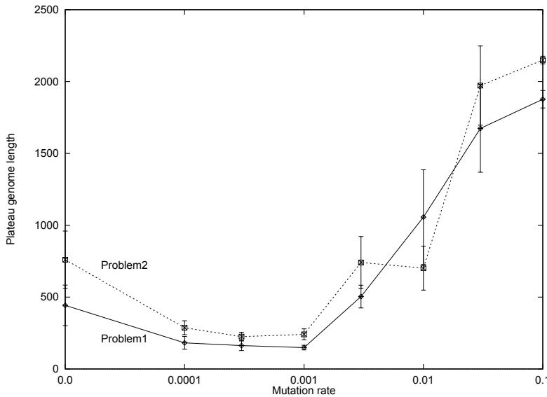
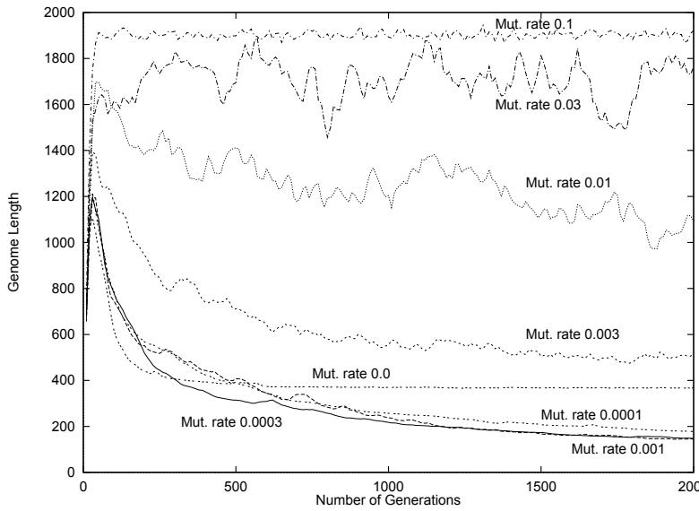
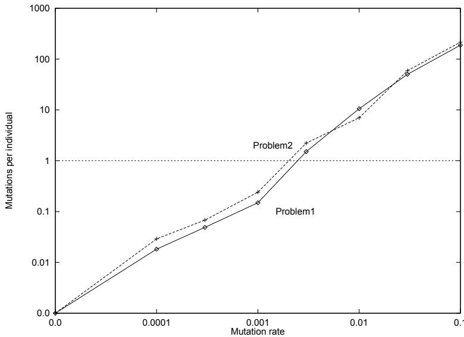
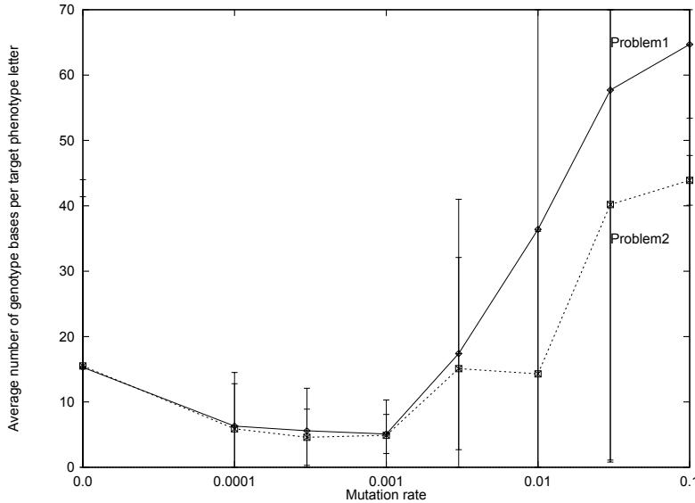

# Genome Length as an Evolutionary Self-adaptation

Connie Loggia Ramsey1\*, Kenneth A. De Jong2, John J. Grefenstette3, Annie S. Wu1, and Donald S. Burke4,

1 Naval Research Laboratory, Code 5514, Washington, DC 20375 2 Computer Science Department, George Mason University, Fairfax, VA 3 Institute for Biosciences, Bioinformatics and Biotechnology, George Mason University, Manassas, VA 4 Center for Immunization Research, Johns Hopkins University, Baltimore, MD

Abstract. There is increasing interest in evolutionary algorithms that have variable-length genomes and/or location independent genes. However, our understanding of such algorithms both theoretically and empirically is much less well developed than the more traditional fixed-length, fixed-location ones. Recent studies with VIV (VIrtual Virus), a variable length, GA-based computational model of viral evolution, have revealed several emergent phenomena of both biological and computational interest. One interesting and somewhat surprising result is that the length of individuals in the population self-adapts in direct response to the mutation rate applied, so the GA adaptively strikes the balance it needs to successfully solve the problem. Over a broad range of mutation rates, genome length tends to increase dramatically in the early phases of evolution, and then decrease to a level based on the mutation rate. The plateau genome length (i.e., the average length of individuals in the final population) generally increases in response to an increase in the base mutation rate. Furthermore, the mutation operator rate and adapted length resulting in the best problem solving performance is about one mutation per individual. This is also the rate at which mutation generally occurs in biological systems, suggesting an optimal, or at least biologically plausible, balance of these operator rates. These results suggest that an important property of these algorithms is a considerable degree of self-adaptation.

# 1 Introduction

As evolutionary algorithms (EAs) are applied to new and more complex problem domains, many of the standard EAs seem artificially restrictive in a variety of ways, perhaps the most important of which is the choice of representation. There are many application areas that simply do not map well into the familiar fixed-length, fixed-position representations. However, as we move to variable-length, variableposition representations, both the theoretical and empirical foundations weaken considerably, frequently leaving the designer with little guidance.

In our case, we have been developing a GA-based computational model of viral evolution consisting of a standard GA model with a number of biologically motivated extensions, including a variable-length, variable-position representation. Initial experience with this system, called VIV (VIrtual Virus), has lead to several important insights which appear to be more general than the VIV context in which they appear, and may be of help to others attempting to extend their EA representations.

In the remainder of the paper we summarize the important features of our GA extensions, we present a series of experiments attempting to understand these extensions better, and we describe the insight gained.

# 2 Important Features of VIV

Earl in the project it was elt that, i rder to modelviralevolution,amuc more biologically plausble genome representation was required to reflect the fact that:

- Biological genomes are of variable lengths. Biological genes are independent of position. Biological genomes may contain non-coding regions. Biological genomes may contain duplicative or competing genes.   
Biological genomes have overlapping reading frames.

To achieve this in a biologically plausible manner, the genotype alphabet for VIV is the familiar set of the four bases $\{ \mathrm { A , C , G , T } \}$ , triples of which are mapped into a phenotype English alphabet representing pseudo amino acid symbols and START/STOP codes.

Hence, genomes (individuals in the population) are variable-length strings whose phenotype is determined by scanning the string from left to right on each of its three reading frames, mapping the triples (codons) of bases into the phenotype alphabet, and identifying each "gene" signified by matching START/STOP codes. For each gene, its compatibility score is computed by matching it against a set of target terms representing necessary "proteins". The gene that produces the highest compatibility score for a given target term is called an "active gene". Then, the ftness of the genome is computed by taking the average of the compatibility scores for each active gene.

More details can be found in [7]. For our purposes here, we need to briefly describe how the genetic operators work on this representation. Mutation operates on the strings in the standard way, as a probability per position of changing the current symbol to a randomly selected alternative from {A,C,G,T}.

Recombination, however, is implemented as a 1-point homologous crossover operator in which a randomly chosen point on parent 1 is matched with a "homologous" crossover point on parent 2 (see [7] for more details). So, recombination takes place only when very similar regions are matched and then aligned from both parents.

The rest of the GA in VIV consists of a standard generational model using fitness proportional selection. As we began experimenting with VIV, however, we found that our intuitions gained from more traditional GAs were frequently wrong, requiring us to perform a series of careful experimental studies to understand VIV better.

# 3 Related Work

A number of studies have investigated one or more of the features described above in the context of GAs. An early study of variable length representation was the messy GA [6] which uses a binary representation in which both the value and position of each bit are specified. Though the number of bits used to generate a solution is constant, the number and ordering of the bits in the individuals being evolved varies. "Missing" bits are retrieved from a universal template to generate a complete solution.Harvey [10] discusses someof the issuesinvolved with variable length representations, including the mechanics of crossover in such a system [9], and makes predictions about the evolved length of individuals in such systems. The delta-coding GA presented by Mathias and Whitley [16] uses variable length representations to control the scope of the exploration performed by the GA. SAMUEL [8] is a GA-based learning system that successfully evolves variable sized rule sets for robot navigation and control tasks. Genetic programming (GP) [13] is another class of evolutionary algorithms that evolves programs which vary in both structure and length. Studies on the evolved length of GP programs include [12, 14, 18, 23].

The investigation of non-coding regions has also gained increasing interest in recent years. Levenick [15] presented one of the first studies indicating that non-coding regions improve the performance of a GA. Several studies have investigated the effects of non-coding regions on the recombination and maintenance of building blocks in the GA [5, 21, 22]. Non-coding segments were found to reduce the disruption of building blocks but not necessarily improve the speed of finding a solution. A number of GP studies have also investigated the utility of non-coding material or "bloat" in evolved programs [11, 14, 19].

Several studies have focused on adaptive organization of information on the genome. The messy GA [6] allows the GA to adapt the composition and ordering of bits of each individual. Tests have shown that the messy GA performs better than the standard GA on a class of deceptive problems. Studies on a class of functions called the Royal Road functions [22] found that using tagged building blocks that are dynamically evolved and arranged by the GA results in a much more diverse population and significantly improved performance. Mayer [17] investigated the self-organization of information in a GA using location independent genes.

A number of studies have looked into adaptation and variation of operator rates during an EA run. Fogarty [4] investigated varying mutation rates on a time-dependent schedule during GA runs. Davis [3] studied self-adapting operators in steady-state GAs. Baeck examined the self-adaptation of mutation rates in GAs [2] and the interaction of several self-adapting features of EAs [1].

# 4 Initial experiences with VIV

In our initial studies with VIV, the fitness landscape was defined by a set of three target genes consisting of a total of 29 phenotype letters (Problem 1). The goal was to obtain a better understanding of how sensitive the performance of VIV was to the standard GA parameters such as population size and operator rates.

The initial results were disappointing in that no parameter setting produced particularly good problem solving performance. Although the GA quickly identifies reasonably good solutions, the performance levels were far below the optimum fitness value. What we discovered was that, without any negative selective pressure against long genomes, VIV evolved populations of individuals whose average length continued to increase without bound. The GA fairly quickly bogged down in this expanding string space, and was unable to maintain steady progress toward the optimum.

A bit of reflection provided the reason. The homologous 1-point crossover operator can produce offspring that are considerably longer than their parents.Such recombinations provide an initial selective advantage, since the additional genetic material is "free" (i.e., has no negative impact on fitness) and provides a better chance for discovering higher performance active genes.

This behavior is consistent with earlier studies with variable length GAs (e.g., [20]), and suggests the need for some sort of selective pressure against long strings. This is consistent with the biological perspective that longer genomes required more time, energy and resources to maintain and to replicate. In order to provide a simple length bias, we added a linear penalty to the fitness, based on establishing a maximum allowable genome length:

  
Fig. 1. Effects of mutation rate on VIV performance for Problem 1

otherwise, $f i t n e s s ( x ) = 0$ .

Exploratory experiments indicated that the precise value of Maxlength was not particularly critical. At the same time it was clear that too severe a length bias can cause the GA to converge suboptimally, and a length bias that is too weak can result in failure to converge. In our experiments, by adding a linear length bias with Maxlength $= ~ 7 5 0 0$ , genome length increased initially and then stabilized, while from a performance viewpoint VIV consistently evolved high fitness solutions.

Similar exploratory experiments suggested that VIV performance was not overly sensitive to the rate of crossover or population size. A crossover rate of 1.0 and a population size of 500 was selected and left unchanged.

However, to our surprise, the performance of VIV was quite sensitive to the mutation rate. Figure 1 illustrates the typical results we observed. The best plateau fitness refers to the fitness of the best individual in the final population, and the average plateau fitness refers to the average fitness in the final population. The maximum fitness value for our landscapes is 1.0 (a perfect match to the target words). Optimal performance for Problem 1 is achieved at mutation rates of approximately 0.001 when measuring the average fitness of the population and 0.003 for the best genome in the population, and falls off sharply if the rate is either increased or decreased.

To make sure this behavior was not an artifact of the particular properties of the fitness landscape, data was collected from a second landscape consisting of three target words totaling 49 characters to be matched (Problem 2). Optimal performance here is achieved at mutation rates of approximately 0.001. The overall results, including the shape of the curve, are strikingly similar as indicated by Figure 2.

The explanation for this sensitivity to mutation rates was not at all obvious. To understand better what was happening, we undertook a series of more carefully controlled experiments which led to some rather surprising insights. We describe these in the remainder of the paper.

  
Fig. 2. Effects of mutation rate on VIV performance for Problem 2

# 5 Experimental Design

The next section presents a series of computational experiments that provide some new insights into the dynamics of GAs that have flexible representations. All the studies below used a population size of 500 and a 1-point homologous crossover rate of 1.0. The genomes in the initial population were generated at random, with the initial lengths set to a uniformly distributed random number between 100 and 500.

In the first set of experiments, the target phenotype is a set of three words containing a total of 29 letters. In the second set of experiments, the target phenotype is a set of three words containing a total of 49 letters. From now on, we will refer to these problems as Problem 1 and Problem 2 respectively. The set of experiments for Problem 1 was run for 2000 generations and the set for Problem 2 was run for 4000 generations. Problem 2 is more complex since it has to match 49 characters in order to derive the best solution while Problem 1 only has to match 29. The search space necessary to solve this problem is larger, and hence, the number of generations necessary to reach a plateau is also larger. For all experiments, ten independent runs were performed for each set of conditions. The graphs show the average and standard deviation of the results of the ten runs. (Error bars indicate one standard deviation over the ten runs.)

We examine the effect of different mutation rates on the VIV model. Mutation rates for all individuals were fixed over the entire run at values ranging from 0.0 (no mutation) to a fairly high rate of 0.1 (a random substitution will occur at a rate of 1 in 10 genotype base elements of an individual).

# 6 Results

# 6.1 Effects of Mutation Rate on Performance

With stochastic algorithms it is always important to verify that observed effects are statistically significant. Figures 1 and 2 present the results of the experiments on both Problem 1 and Problem 2,

  
Fig. 3. Effects of mutation rate on length of individuals for Problem 1 and Problem 2

indicating the effects are significant.

# 6.2 Effects of Mutation Rate on Genome Length

One of the things that caught our eye was the fact that the plateau genome length, i.e. the average genome length at which VIV stabilized, appeared to increase as we increased mutation rates. We analyzed this more closely for both problems and came up with the rather startling results presented in Figure 3.

As we increase the mutation rate from 0.0 to the observed optimal rate of approximately 0.001, the plateau genome length decreases. As we continue to increase the mutation rate beyond the observed optimal rate, the plateau genome length increases rapidly. It appears that an emergent property of VIV is that the genome length self-adapts in direct response to the mutation rate!

In order to understand this better we analyzed the time evolution of genome length under various mutation rates. The results are shown in detail in Figure 4 for Problem 1. In al cases, genome length increases significantly at the early stages of a run and then levels out at different lengths depending on mutation rate. Similar results were observed for Problem 2.

A possible explanation for these observations follows: In the early stage of evolution, there appears to be an advantage in having a long genome because it gives a better chance of discovering good genes. This advantage may outweigh the pressure toward shorter genome lengths because shorter offspring are unlikely to contain better genes early in evolution. If the mutation rate is very high (0.03 or higher), the genomes tend to remain long. This is reasonable since mutation causes so much disruption that the population fitness never improves and the genetic algorithm never converges. If the mutation rate is lower (at or below 0.01), the genome length eventually settles down to a lower plateau value. In these cases, once the population fitness improves, the selective pressure toward exploiting the building blocks already present in the shorter genomes prevails over the exploratory advantage of longer genomes.

  
Fig. 4. Average length of individuals over 10 runs.

# 6.3 Effects of Low Mutation Rates

One of the striking things about Figure 3 is the rather noticeable difference in the effects that low vs. high mutation rates have on genome length. Equally as striking is the time evolution of genome length under a mutation rate of 0.0 shown in Fig. 4 in which the plateau is already reached by generation 300.

In the latter case a close examination of individuals in the population indicated that the population had prematurely converged. By generation 400, the population is approximately $9 8 \mathrm { ~ - ~ } 9 9 \%$ converged. Interestingly, the few differences that exist are more often in non-coding regions of the individuals. The fact that there is no mutation means there is never any new material added in to the population. Once the existing building blocks are exploited, the individuals rapidly settle down to a homogeneous length. Furthermore, by using homologous crossover, the individuals stay at that length because they are always crossed at matching points within the individuals, never at random points.

For lower mutation rates above 0.0 $\left( 0 . 0 0 0 1 - 0 . 0 0 1 \right)$ the population still converges, but more slowly. With a mutation rate of 0.0001, the population is about $9 5 \%$ converged by generation 1700, with about half of the differences in non-coding regions. Further, all of the coding regions are lined up in the same order and almost exactly the same locations on the genome. Basically, a low mutation rate results mainly in exploitation of existing building blocks and some convergence, but there is still a low amount of mutation to allow for some exploration and therefore some improvement in performance.

# 6.4 Effects of High Mutation Rates

As the mutation rate rises above a threshold of 0.001 for both problems, plateau genome length also rises sharply. In other words, there appears to be some selective advantage to additional genome length as the mutation rate increases. Notice also that the curves shown in Figure 4 for higher mutations do not fatten out as the lower mutation curves do. As the mutation rate goes higher, there is more exploration occurring and much less exploitation and convergence because building blocks are constantly destroyed.

  
Fig. 5. Effects of mutation rate on the number of mutations per individual for Problem 1 and Problem 2

# 6.5 Effects of Mutation Rate on the Number of Mutations per Individual

An alternate way of understanding these results is to plot the average number ofmutations per individual at steady state. As shown in Figure 5 the number of mutations per individual steadily increases as the mutation rate increases. In both problems mutation rates between 0.001 and 0.003 yield individuals in the final population whose number of mutations are about 1 per individual. This happens to be the range of mutation rates which result in the best performance as shown in Figures 1 and 2. So a good balance of all of the key elements comes about in this range of mutation rates; the genome length adapts so there is about one mutation per individual, and there is a good balance between exploitation and exploration leading to highly fit individuals in the final population. Furthermore, this is consistent with biological observations across a wide range of species of about one mutation per generation per individual, giving further reason to believe there is a nearly optimal balance of operator rates here.

This interpretation can also provide a simple explanation for why the optimal mutation rate was observed to be a little lower in Problem 2 than in Problem 1. Recall that the target word length was considerably longer in Problem 2, requiring in general longer genomes to obtain perfect matches. The combination of longer genomes and a lower mutation rate maintains the average number of mutations per individual at approximately one.

# 6.6 Self-adapting Scratch Space

Another interesting insight into this emergent behavior is obtained by looking at the ratio of the plateau genome lengths to the length of the target words. Since each phenotype letter is encoded by 3 genotype bases, the ratio of the length of the genome (in genotype bases) to phenotype length of the target words is expected to be at least 3 to 1. Anything greater than 3 to 1 indicates excess scratch space in the genome. Figure 6 presents the data for both problems.

For example, a mutation rate of 0.001 produces the plateau length of about 150 genotype bases in the final population for Problem 1. The target phenotype words for Problem 1 were 29 letters in length, resulting in a 5 to 1 ratio. Since 3 are necessary, that leaves 2 extra genotype bases for scratch space. For the same mutation rate of 0.001, the plateau length of individuals in the final population for Problem 2 is about 250 genotype bases. This is used to encode the 49 phenotype target letters of the problem, so there are about 5 genotype bases used for each phenotype letter again.

  
Fig. 6. Efectsof mutation rate on the ratio of genome length to phenotype length of the target words r both problems

This data is highly suggestive that the mutation rate determines the amount of scratch space required to solve these sorts of problems, possibly independent of the size of the problem. As the mutation rateincreases,additional scratspaceis needeooffsetthe icreasedisruption mutation. At very low mutation rates, the ratios actually increase slightly as asideefect of premature convergence. Further studies are planned to investigate the amount and content of the scratch space produced.

# 7 Summary

With the increasing interest in evolutionary algorithms that have variable-length genomes and/or location independent genes, it is important to increase our understanding of such algorithms both theoretically and empirically. The development of VIV (VIrtual Virus), a variable length, GA-based computational model of viral evolution, has provided us with an environment to do so. Initial studies reported here have revealed several emergent phenomena of both biological and computational interest. One interesting and somewhat surprising result is that the length of individuals in the population self-adapts in direct response to the mutation rate applied, so the GA adaptively strikes the balance it needs to successfully solve the problem. Over a broad range of mutation rates, genome length tends to increase dramatically in the early phases of evolution, and then decrease to a level based on the mutation rate. The plateau genome length (i.e., the average length of individuals in the final population) generally increases in response to an increase in the base mutation rate. Furthermore, the mutation operator rate and adapted length resulting in the best problem solving performance is about one mutation per individual. This is also the rate at which mutation generally occurs in biological systems, suggesting an optimal, or at least biologically plausible, balance of these operator rates. These results suggest that an important property of these algorithms is a considerable degree of self-adaptation.

# Acknowledgements

This work is supported by the Office of Naval Research, the National Research Council, and the Walter Reed Army Institute of Research.

# Список литературы

T. Baeck.The interaction of mutation rate, selection, and self-adaptation within a geneticalgorithm. In R. Maenner and B. Manderick, editors, Proc. Parallel Problem Solving from Nature 2, pages 85-94, 1992.   
T.Baeck.eladaptation in genetic algorithms. InF.J.Varela and P. Bourgine, editors, roc.Firs uro pean Conf. Artificial Life, pages 263271, 1992.   
3.L. Davis.Adapting operator probabilities in genetic algorithms. In J.D. Schaffer, editor, Proc.3rd Int. Conf. Genetic Algorithms, pages 6169, 1989. 4. T.C.Fogary.Varying the probability ofmutation in the genetic algoritm.InJ.DSchaffer, editor ro. 3rd Int. Conf. Genetic Algorithms, pages 104-109, 1989.   
.S.Forrest and M. Mitchel.Relative building-blockftness and the building-block hypothesis. In Fnda tions of Genetic Algorithms 2, pages 109126, 1992.   
6D. Goldberg, K. Deb, and B. Korb. Messy genetic algorithms: motivation, analysis, and first results. Complex Systems, 3:493530, 1989.   
7J. J. Grefenstette, D. S. Burke, K. A.De Jong, C. L. Ramsey, and A. S. Wu. An evolutionary computation model of emerging virus diseases. Technical Report AIC-97-030, Navy Ctr for Applied Research in AI, 1997.   
8.J.J. Grefenstette, C. L. Ramsey, and A. C. Schultz. Learning sequential decision rules using simulation models and competition. Machine Learning, 5(4):355381, 1990.   
9I. Harvey. The SAGA cross: the mechanics of crossover for variable-length genetic algorithms. In Parallel Problem Solving from Nature 2, pages 269278, 1992.   
I. Harvey. Species adaptation genetic algorithms: a basis for a continuing SAGA. In Proc. 1st European Conference on Artificial Life, 1992.   
1T. Haynes. Duplication of coding segments in genetic programming. In Proc. 13th National Conference on Artificial Intelligence, pages 344349, 1996.   
1. H. Iba, H. deGaris, and T. Sato. Genetic programming using a minimum description length principle. In Advances in Genetic Programming, pages 265284, 1994.   
13. J. R. Koza. Genetic programming. MIT Press, 1992.   
1W.B.Langdon and R.Poli.Fitness causes bloat. In 2nd On-line World Conference on Soft Computingin Engineering Design and Manufacturing, 1997.   
1.J.R. Levenick.Inserting introns improves geneticalgorithm success rate: taking a cue from biology. In Proc. 4th Int'l Conf. Gen. Alg., pages 123127, 1991.   
1K. E. Mathias and L. D.Whitley. Initial performance comparisons for the delta coding agorithm. In Pro. IEEE Conference on Evolutionary Computation, volume 1, pages 433-438, 1994.   
17. H. A. Mayer. Genetic Algorithms Using Promoter/Terminater Sequences - Evolution of Number, Size, and Location of Parameters and Parts of the Representation. PhD thesis, University of Salzburg, 1997.   
1P. Nordin and W. Banzhaf. Complexity compression and evolution. In Proc.6th International Conference on Genetic Algorithms, pages 310317, 1995.   
1. P. Nordin, F. Francone, and W.Banzhaf. Explicitly defined introns and destructive crossover in genetic programming. In Advances in Genetic Programming 2, pages 111-134, 1996.   
F.Smith.lexibl learni problem solvi heuristic trou adaptive searc.In ro.h Int tional Joint Conference on Artificial Intelligence, pages 422425. Morgan Kaufmann, 1983.   
A.S. Wu and R. K. Lindsay. Empirical studies of the genetic algorithm with non-coding segments.Evolutionary Computation, 3(2):121147, 1995.   
A.S. Wu and R. K. Lindsay. A comparison of the fixed and foating building block representation in the genetic algorithm. Evolutionary Computation, 4(2):169-193, 1996.   
B. T. Zhang and H. Muhlenbein. Balancing accuracy and parsimony in genetic programming. Evolutionary Computation, 3(1), 1995.