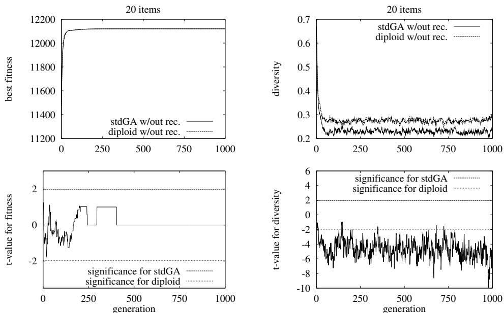
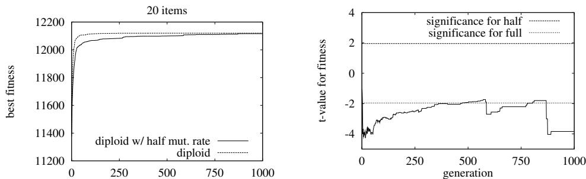
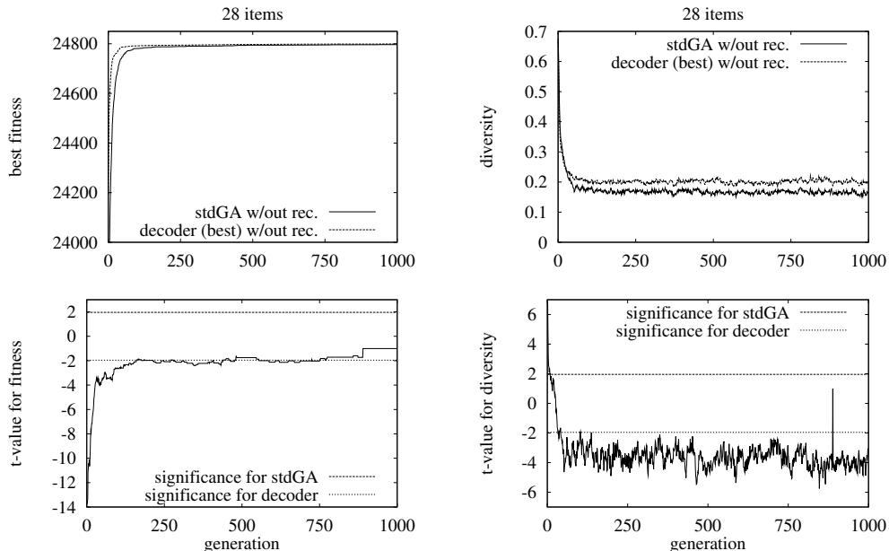
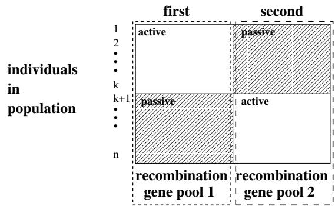
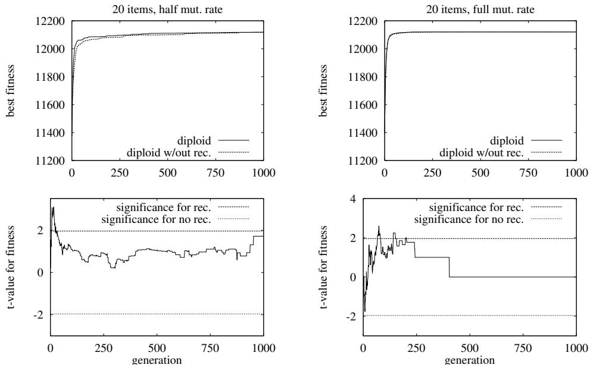
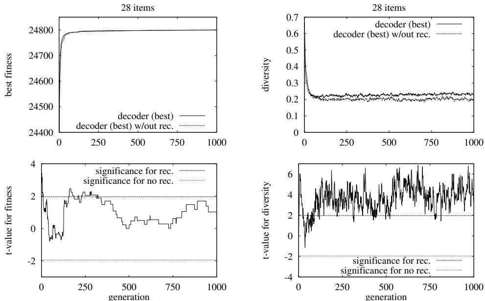
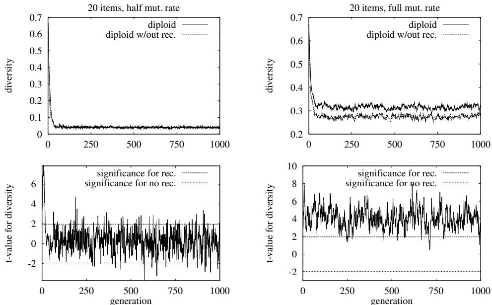
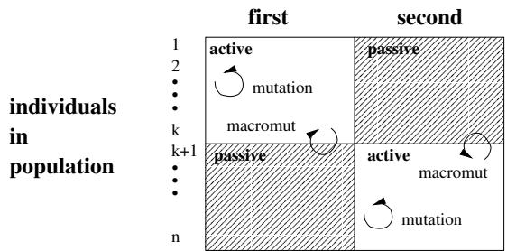
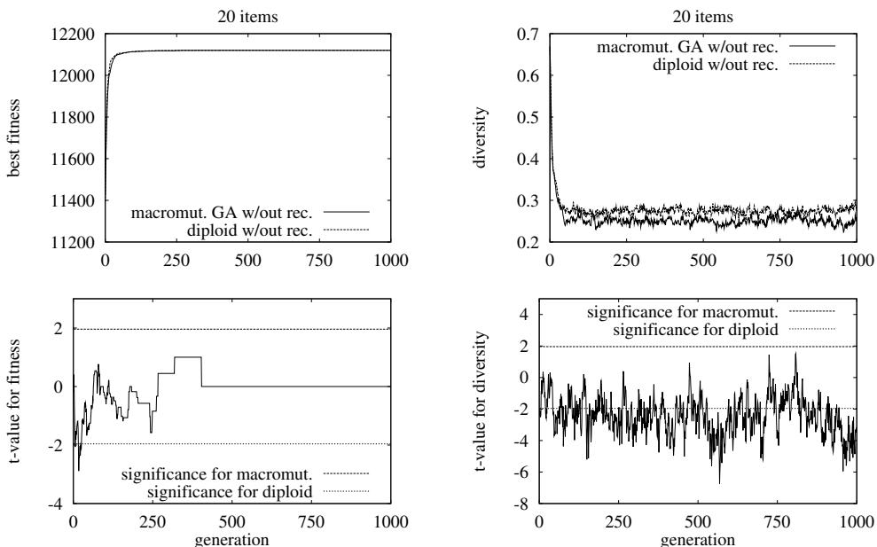

# Burden and Benefits of Redundancy

Karsten Weicker∗

Nicole Weicker∗

Institute of Computer Science   
University of Stuttgart   
Breitwiesenstr. 20–22   
70565 Stuttgart, Germany   
Institute of Computer Science   
University of Stuttgart   
Breitwiesenstr. 20–22   
70565 Stuttgart, Germany

# Abstract

This work investigates the effects of two techniques introducing redundancy, diploid representations and decoders. The effects of redundancy on mutation, recombination, the structure of the landscape and the interplay between these ingredients are of particular interest. Resulting neutral mutations are found to be the reason for the transformation of local optima into plateau points. Additional neutral recombinations enable a more efficient search on those neutral plateaus. Furthermore, both kinds of neutral operations are shown to have a positive impact on the diversity of the population over time. Lastly, the diploid representation is compared empirically to a macromutation which models the working principles of diploidity. However, this control experiment shows that blind exploring mutations cannote approximate diploidity.

# 1 INTRODUCTION

When applying evolutionary algorithms for optimization the algorithm has to be tailored to the problem. Besides choosing the operators with their parameters the choice of a suitable representation or encoding function is crucial. Fogel and Ghozeil (1997) have shown that finding a good representation is comparably hard to the choice of good operators. Thus, questions arise regarding the properties of good representations. One possible property is redundancy which is the topic of this examination.

Redundancy occurs whenever the problem is defined on a space that is different from the search space the genetic operators work on and the latter contains more elements. Usually the problem defined space is called the phenotype space and the search space of the genetic operators is called the genotype space.

Following the design principles of Radcliffe (1991) it is desirable to choose the genotype space in a way that there exists a bijection between phenotype and genotype. In contrast, there exist few positive reports on a very beneficial influence of redundant decoders (Hinterding, 1994, 1999). Also in many upcoming more biologically oriented models (e.g. floating representations, Wu & Lindsay, 1997) redundancy is an essential element which cannot be avoided. Therefore, it is important to analyze the advantages and disadvantages of redundancy.

This work discusses the characteristics of different types of redundancy and examines the effects on mutation and recombination operators. Additionally, we discuss the effects of both genetic operators under redundancy with regard to the structure of the landscape and the diversity of populations. This analysis is carried out using the knapsack problem. There are primarily two reasons for choosing this problem: first, the binary encoding is an intuitive and direct representation and, second, many successful reports on redundancy use it either as a stationary (Hinterding, 1994, 1999) or non-stationary problem. The analysis consists of a systematic and complete investigation of small, stationary problem instances and empirical investigations of experiments using medium sized problems.

# 2 REASONS FOR REDUNDANCY

Redundancy occurs only if the genetic operators are not defined on the phenotype search space $S$ but on a genotype space $S ^ { \prime }$ . To evaluate an element of the genotype space, a decoding function $d e c o d e : S ^ { \prime }  S$ is used which maps each point of $S ^ { \prime }$ to exactly one point in the search space $S$ . Here we assume that decode is surjective, i.e. that for each point $s \in S$ there exists a point $s ^ { \prime } \in S ^ { \prime }$ with $d e c o d e ( s ^ { \prime } ) = s$ . This decoding function is called redundant if $S ^ { \prime }$ is bigger than $S$ . If both $S$ and $S ^ { \prime }$ are finite this means $| S | < | S ^ { \prime } |$ . A more formal definition of redundancy is given below by considering that a decoding function is not injective.

Definition 1 (Redundancy) Let decode : $S ^ { \prime }  S$ be the decoding function.

Then decode is called redundant, : ⇐⇒ ∃ s01, s02 ∈ S0(s01 6= s02) : decode(s 01 ) = decode (s 02 ).

There are various reasons for the occurrence of redundant decoding functions. We distinguish four different areas where redundancy is found: coding based, representation based, conceptional, and technical redundancy.

The first two reasons are rather unavoidable and not the topic of this article. Coding based redundancy occurs if the size of the search space $S$ does not match the size of the genotype space which is the cardinality of the alphabet raised to the power of the length of individuals. The second form of unavoidable redundancy is the representation based form which is caused by structural reasons. It is inherent to the considered problem or the optimization method used. An example for problem inherent redundancy is the inversion of permutations for symmetric TSP instances (Whitley, Starkweather, & Fuquay,

1989). This kind of redundancy was investigated by Julstrom (1999). Another example for representation based redundancy is the bloating effect in genetic programming (Blickle & Thiele, 1994; Langdon & Poli, 1997).

Conceptual redundancy exists if redundancy is introduced on purpose by gene interactions. Multiple examples are discussed in detail by Shackleton, Shipman, and Ebner (2000). Special cases of conceptual redundancy are floating representations (e.g. Wu & Lindsay, 1997; Wu & De Jong, 1999) and the introduction of multiploidity. In the latter technique several different mechanisms can be distinguished. On the one hand there are dominance mechanisms on a bit per bit basis (e.g. Goldberg & Smith, 1987; Lewis, Hart, & Ritchie, 1998). On the other hand Dasgupta and McGregor (1992) introduced the structured GA which is a rather high level diploidity, where one (or more) additional bits are used as a switch between two (or more) complete candidate solutions.

In contrast to the three previously discussed kinds of redundancy, the technical redundancy occurs as a side effect of a different concept, e.g. the use of a decoder that improves or repairs the represented solution. The decoder restricts the genotype space to a subset (e.g. those solutions fulfilling certain constraints) which we then call the phenotype space. In the case of knapsack problems the weight constraints must be fulfilled for each valid solution. Often it is possible to design a simple heuristic for the transformation of any candidate solution violating the constraints into a valid solution. Such a heuristic is called a decoder or repair function. Other decoding approaches use a solution builder and code only certain parameters for the builder in the chromosome. Then depending on the setting of the parameters a new valid candidate solution is created by the solution builder (e.g. Paechter et al., 1995). Another possibility for the construction of a restrictive decoder function is the inclusion of an intelligent local optimization in the decoder (e.g. Leonhardi et al., 1998). All three possibilities map a bigger number of solutions to a smaller subset of solutions. Also diploidity may be viewed as technical redundancy since diploid evolutionary algorithms are mostly used as memorizing technique in the context of oscillating nonstationary fitness functions but also for other dynamic problems (e.g. Dasgupta, 1995).

We decided in this work to restrict our attention to technical redundancy which arises as a by-product of techniques introduced for reasons other than redundancy. The two examples we examine are decoder methods and diploidy encoding.

# 3 INVESTIGATED PROBLEMS AND METHODOLOGY

In the remainder of the work, the analysis of redundancy is divided into four sections and uses various methods and benchmark problems. This section discusses the problems and the methodological approach.

In order to carry out exact and complete investigations of certain landscape characteristics, two small benchmark knapsack problems by Petersen (1967) are used, in particular the problem with 6 items and the problem with 10 items. The 6 items problem is constrained by 7 effective weight constraints and its optimum is $\{ 2 , 3 , 6 \}$ with a value of 3800. The 10 items problem is constrained by 10 weight constraints and its optimum is $\{ 2 , 4 , 5 , 8 , 1 0 \}$ with value 8706.1. The problem with 6 items is printed in the appendix.

For an empirical investigation of certain hypotheses two additional benchmark problems by Petersen (1967) with 20 and 28 items are used.

As an intuitive representation of the knapsack problem each bit represents inclusion (“1”) or exclusion (“0”) of an item. The fitness computation is carried out as follows. A fixed base fitness is defined for each problem. If a candidate solution fulfills all constraints the values of the included items are added to the base fitness. If a solution violates a constraint, the values are not considered but a penalty is subtracted for each violated constraint. For the values used in the different problems see the appendix. The fitness function has to be maximized.

In case of the diploidity no complicated dominance mechanisms are considered (e.g. Goldberg & Smith, 1987) but rather the simplified structured GA by Dasgupta and McGregor (1992) is used where each individual contains two complete candidate solutions and an additional bit to determine the currently active solution. The passive candidate solution has no effect on the fitness value. Recall that this is only a very specific kind of diploidity – the results are not valid for more sophisticated dominance mechanisms.

As an example for a decoder, heuristics for the knapsack problem inspired by the work of Hinterding (1994, 1999) are used. In the binary genotype representation a “1” signifies that the item may be considered for inclusion, a “0” that it is definitely omitted. As an inclusion strategy the following heuristics are used as examples.

1. best fit: iteratively choose those items that have the highest value and do not violate the weight constraints.   
2. left to right: iteratively select the items from left to right but only those items are included which do not violate the weight constraints.   
3. right to left: iteratively select the items from right to left but only those items are included which do not violate the weight constraints.

For the analysis of the two small problems all three strategies are considered. In the empirical examination of experiments only the most promising strategy best fit is investigated.

For the exact landscape investigations a one-bit flipping mutation is used. In the empirical investigation a genetic algorithm with mutation rate $\begin{array} { r } { p _ { m } = \frac { 1 } { l } } \end{array}$ , where $\mathbf { \xi } _ { l }$ is the number of knapsack items, and two-point crossover with $p _ { c } ~ = ~ 0 . 6$ is used. The experiments have been carried out using a genetic algorithm with population size 100 and 3-ary tournament selection. The best fitness in the population is used as a performance measure.

In the empirical analysis, each algorithm has been applied to one problem with 50 different initial random seeds and the respective measures, e.g. best fitness in the population or population diversity, are averaged over those experiments. Additionally, for an analysis of the data the Student’s t-test for significantly different means has been used (cf. Cohen, 1995). For each generation the hypothesis is formulated that the mean performance values of two different algorithms do not differ. The t-test has been executed for each generation under the assumption that both algorithms have the same standard deviation with respect to the performance values. F-tests support these assumptions. In the results we consider an error probability of 0.05 as significant. This threshold is displayed in the graphs as lines with $\mathrm { t }$ -values 1.96 and -1.96. Values outside the range between these thresholds are significant.

All experiments are conducted for both problems with 20 and 28 items with comparable results. Therefore and because of space restrictions in each case only the results of one problem is shown.

# 4 ANALYSIS I: DEGREE OF REDUNDANCY

In order to compare different kinds of redundancy, it is necessary to develop measurements for the degree of redundancy. The characteristics and effects of redundancy should be reflected by those measures.

Definition 2 (Redundant points and degree of redundancy) Let $d e c o d e : S ^ { \prime }  S$ be the decoding function. Then the redundant points to $s \in S$ are given by the set

$$
\begin{array} { r l r } { r e d u n d a n t ( s ) } & { { } = } & { \left\{ s ^ { \prime } \in S ^ { \prime } \biggm | \ l e c o d e ( s ^ { \prime } ) = s \right\} . } \end{array}
$$

And the degree of redundancy for $s \in S$ is defined by $d e g r e e _ { r e d } ( s ) = | r e d u n d a n t ( s ) |$

In case of diploidity the initial search space $S = \mathbb { B } ^ { l }$ of size $2 ^ { l }$ is blown up to the size of $2 ^ { 2 l + 1 }$ since each individual represents two solutions and an additional switching bit. Therefore $S ^ { \prime }$ increases by a factor of $2 ^ { l + 1 }$ . Nevertheless the mapping is homogeneous and each candidate solution $s$ is represented by $2 ^ { l + 1 }$ individuals, i.e. $d e g r e e _ { r e d } ( s ) = \mathcal { Q } ^ { l + 1 }$ .

In case of a decoder the initial search space is reduced to a new phenotype space. But contrary to diploidity it is not obvious which individuals are mapped by the decoder to the same valid candidate solution. Often, it is even not clear whether an arbitrary decoder is surjective, i.e. whether for all valid candidate solutions there exists an individual that is mapped to this solution. Nevertheless, the decoders described above are surjective since each solution fulfilling all constraints is a fixed point of the decoding function.

Table 1 Number of phenotypes classified by their degree of redundancy. The middle section of the table can be read as follows: e.g. ‘best fit’ has 24 different phenotypes with a redundancy of 1.   

<table><tr><td rowspan="2">problem</td><td rowspan="2">decoder technique</td><td colspan="3">redundancy degree of each phenotype</td><td colspan="5"></td><td rowspan="2">valid solutions</td></tr><tr><td>1</td><td></td><td></td><td></td><td></td><td>8 16 32 |64  128</td><td></td><td></td></tr><tr><td>6 items:</td><td>best fit</td><td>24</td><td>2</td><td>1</td><td>0</td><td>0</td><td>1</td><td>0</td><td></td><td>28 of 64</td></tr><tr><td></td><td>left to right</td><td>4</td><td>18</td><td>6</td><td>0</td><td>0</td><td>0</td><td>0</td><td></td><td>28 of 64</td></tr><tr><td></td><td>right to left</td><td>8</td><td>16</td><td>2</td><td>2</td><td>0</td><td>0</td><td>0</td><td>−</td><td>28 of 64</td></tr><tr><td>10 items:</td><td>best fit</td><td>554</td><td>59</td><td>8</td><td>20</td><td>2</td><td>0</td><td>0</td><td>1</td><td>644 of 1024</td></tr><tr><td></td><td>left to right</td><td>388</td><td>210</td><td>38</td><td>8</td><td>0</td><td>0</td><td>0</td><td>0</td><td>644 of 1024</td></tr><tr><td></td><td>right to left</td><td>384</td><td>208</td><td>48</td><td>4</td><td>0</td><td>0</td><td>0</td><td>0</td><td>644 of 1024</td></tr></table>

Table 1 shows how the individuals are mapped to the valid candidate solutions in the two examples. The fact that the numbers of individuals which are mapped onto one valid candidate solution is always a power of two is astonishing at first sight. If we examine the candidate solution of problem 1 which unites 32 individuals, we see that it contains only item 4. Now weight constraint 4 guarantees that each other item cannot be included – i.e. with the best fit strategy all individuals $* * * 1 * *$ are always mapped to the candidate solution 000100, unaffected by the value of the other bits since item 4 has got the highest value.

We can generalize this effect and find always some patterns or schemata $H \in \{ 0 , 1 , * \} ^ { l }$ where the weight constraints prevent the inclusion of the starred items and, in case of the best fit heuristic, the value does not conflict with the other included items. Since all instances of such a pattern have the same fitness value they define a search plateau. The size of the plateau is at least $2 ^ { k }$ for a schema of order $\mathit { l } \mathrm { ~ - ~ } \mathit { k }$ , i.e. with $k$ “don’t care” symbols. The size of $2 ^ { k }$ is due to the greedy repair method where there are often no interdependencies between the selected item and the remaining items. For the ‘best fit’ heuristic even all excluded items are interchangeable.

# 5 ANALYSIS II: MUTATION AND THE STRUCTURE OF LANDSCAPE

The usefulness of redundancy in a decoding function is directly affected by the mutation operator. The interplay between both specifies whether neutral mutations are possible or not. If neutral mutations are introduced by the redundancy positive effects take place. A mutation is called neutral if it creates a transition between redundant points.

Definition 3 (Neutral mutation) Let $S$ be the phenotype space with fitness function $\mathit { f i t } : \mathit { S }  \mathbb { R }$ to be minimized. Let $S ^ { \prime }$ be the genotype space with a decoding function decode : $S ^ { \prime }  S$ , and let mutate : $: S ^ { \prime } \times \Xi \to S ^ { \prime }$ be a genetic operator that maps one point of the genotype space to another depending on some random number of a set $\Xi$ .

Then mutate is called a neutral mutation for $s ^ { \prime } \in S ^ { \prime }$ and $x \in \Xi : \Longleftrightarrow$

$$
m u t a t e ( s ^ { \prime } , x ) \in r d u n d a n t ( d e c o d e ( s ^ { \prime } ) ) .
$$

Note, that trivially it holds that $s ^ { \prime } \in r e d u n d a n t ( d e c o d e ( s ^ { \prime } ) )$ . If the condition above is fulfilled there is a transition between $s ^ { \prime }$ and $m u t a t e ( s ^ { \prime } , x )$ , both mapping to the same phenotype. The redundant points that are connected through neutral mutations form a neutral network (cf. Shackleton et al., 2000). Note that in case of diploidity and decoders all points of the neutral plateaus, discussed in the previous section, are connected by a 1-bit flipping mutation. Thus, those plateaus are transformed into neutral networks and Table 1 reflects their size.

One interesting property of neutral mutations is its possible influence on the structure of the landscape, i.e. local optima can become plateau points which are part of a neutral network. To clarify this statement both local optima and plateau points are formalized.

Definition 4 (Local optimum, plateau point) Supposed the preconditions of Definition 3 are fulfilled. Then a point $s _ { 1 } ^ { \prime } \in S ^ { \prime }$ is called a

• local optima $: \iff \forall s _ { 2 } ^ { \prime } \in S ^ { \prime }$ it holds that

$$
\left( \exists ~ x \in \Xi : m u t a t e ( s _ { i } ^ { \prime } , x ) = s _ { 2 } ^ { \prime } \right) ~ \Rightarrow ~ \left( f t ( d e c o d e ( s _ { 2 } ^ { \prime } ) ) > f u t ( d e c o d e ( s _ { i } ^ { \prime } ) ) \right)
$$

plateau point : $\Longleftrightarrow$ it holds that

$$
\begin{array} { r l } & { \exists \ s _ { 2 } ^ { \prime } \in S ^ { \prime } : \ \left( ( m u t a t e ( s _ { t } ^ { \prime } , x ) = s _ { 2 } ^ { \prime } ) \ \Rightarrow \ ( f t ( d e c o d e ( s _ { z } ^ { \prime } ) ) = f t ( d e c o d e ( s _ { t } ^ { \prime } ) ) \right) \ \mathrm { a n d } } \\ & { \forall \ s _ { 2 } ^ { \prime } \in S ^ { \prime } : \ \left( ( \exists \ x \in \Xi : \ m u t a t e ( s _ { t } ^ { \prime } , x ) = s _ { 2 } ^ { \prime } ) \ \Rightarrow \ ( f t t ( d e c o d e ( s _ { z } ^ { \prime } ) ) \geq f t ( d e c o d e ( s _ { t } ^ { \prime } ) ) \right) . } \end{array}
$$

These definitions imply that for a simple hill climbing algorithm, which does not accept worsening, the local optimum is an end point where the plateau point is not. The plateau point allows further search without deteriorations. However, it is not guaranteed that there exists a better point.

Now, the two kinds of redundancy are investigated with respect to their effect on local optima. It is possible to compute the local optima and plateau points for the 1-bit flipping mutation for the 6 and 10 items problems.

Table 2 This table shows the fractions of local optima and plateau points in the search space for both problems and the considered decoding functions. Furthermore, all possible mutations are classified in improving, worsening, and neutral mutations.   

<table><tr><td>problem</td><td>technique</td><td>loc. opt.</td><td>plateau p.</td><td>better</td><td>worse</td><td>neutral</td></tr><tr><td rowspan="5">6 items:</td><td>1-bit HC</td><td>0.125</td><td>0.0</td><td>0.5</td><td>0.5</td><td>0.0</td></tr><tr><td>diploid</td><td>0.0</td><td>0.115</td><td>0.271</td><td>0.266</td><td>0.463</td></tr><tr><td>decoder (best fit)</td><td>0.0</td><td>0.344</td><td>0.273</td><td>0.273</td><td>0.453</td></tr><tr><td>decoder (left to right)</td><td>0.0</td><td>0.281</td><td>0.391</td><td>0.391</td><td>0.219</td></tr><tr><td>decoder (right to left)</td><td>0.0</td><td>0.156</td><td>0.372</td><td>0.372</td><td>0.255</td></tr><tr><td rowspan="5">10 items:</td><td>1-bit HC</td><td>0.019</td><td>0.0</td><td>0.5</td><td>0.5</td><td>0.0</td></tr><tr><td>diploid</td><td>0.0</td><td>0.016</td><td>0.262</td><td>0.262</td><td>0.476</td></tr><tr><td>decoder (best fit)</td><td>0.0</td><td>0.109</td><td>0.418</td><td>0.418</td><td>0.164</td></tr><tr><td>decoder (left to right)</td><td>0.0</td><td>0.020</td><td>0.455</td><td>0.455</td><td>0.089</td></tr><tr><td>decoder (right to left)</td><td>0.0</td><td>0.014</td><td>0.456</td><td>0.456</td><td>0.088</td></tr></table>

The neutral mutations of the 1-bit flipping mutation in the case of the diploid representation changes the landscape in such a way that all local optima are eliminated. A neutral mutation occurs with probability at least $\frac { l } { 2 l + 1 }$ where only a bit in the passive candidate solution is flipped. That means that each local optima is transformed into a plateau point in the worst case – if the passive solution has a better fitness there is a direct improving mutation by changing the switch bit. This is reflected in Table 2 where the frequency of a local optimum/plateau point decreases with diploidity. In fact, this representation even guarantees that there is always a hill climbing path (with acceptance of equal fitness) from each point in the search space leading to the optimum.

But what are the impeding effects of the diploid representation? First of all a diploid representation results in a huge enlargement of the search space. For the regarded two small problems this means that the size of the search space grows from 64 respectively 1024 up to 8192 respespectively 2097152. Each point in the original search space introduces a plateau of the size of the original search space. Additionally as it is already shown in Table 2 both the probability to improve as well as to worsen have decreased substantially in favor of neutral mutations. But neutral mutations give no clue during optimization whether the mutation is a step towards the right direction. Plateau points being part of huge neutral plateaus approximate pure random walks.

Now, we proceed from the 1-bit hill climber to a genetic algorithm with population size 100 but without recombination. The results for the haploid and the diploid representation are shown in Figure 1. In spite of the disadvantages for the diploid representation stated above it performs similar to the standard encoding.

  
Figure 1 Left: fitness comparison of a GA and a diploid GA, both without recombination. The $\mathrm { t }$ -tests show that the difference in performance of the two algorithms is not significant. Right: comparison of the diversity in each population of the same experiments. The t-tests show the higher diversity of the diploid algorithm to be significant.

  
Figure 2 Comparison of best fitness values of the diploid GA without recombination using half and full mutation rate on the problem with 20 items. Most $ { \mathrm { ~  ~ t ~ } }$ -tests show the performance of the full mutation rate to be significant.

Interestingly the mutation rate for diploid representations should be chosen rather high. Using a normal mutation rate of $\begin{array} { r } { p _ { m } ^ { \prime } = \frac { 1 } { l ^ { \prime } } } \end{array}$ where $l ^ { \prime }$ is the length of the chromosome the results of a GA without recombination are significantly worse than the same GA with a mutation rate of $\begin{array} { r } { p _ { m } = \frac { 1 } { l } } \end{array}$ where $\iota$ is the length of the phenotypical representation, i.e. the number of items in the knapsack problem. This is shown in Figure 2 where the full mutation rate corresponds to $p _ { m }$ and the half mutation rate to $p _ { m } ^ { \prime }$ .

  
Figure 3 Left: fitness comparison of a GA and a GA using the best fit decoder. The $\mathrm { t }$ -tests show that the performance of the decoder is significant at the beginning of the optimization. Right: comparison of the diversity in each population of the same experiments. The $\mathrm { t } .$ -tests show the higher diversity of the decoder to be significant.

In the case of the decoder, the introduced neutral networks cause a transformation of each local optimum into a plateau point. Nevertheless this cannot be guaranteed for all local optima and all kinds of decoders. As a consequence there might not be a hill climbing path from each candidate solution to the global optimum.

The analysis of the two exemplary problems in Table 2 shows that for some decoders the number of plateau points is increased considerably, for others only slightly. Especially the best fit strategy seems to have a tendency to rather huge plateaus and, therefore, the number of plateau points increases considerably. The number of neutral mutations in those neutral networks is also reflected in the table. Neutral mutations keep the diversity high but – in the case of bigger problems not considered here – they can also slow down the convergence speed since search is a complete random walk on big plateaus. The left part of Figure 3 shows the comparison of a GA using the normal representation and a GA with best-fit decoder strategy.

It is not clear whether this behavior of the mutation can be generalized for other problems and decoders. Probably it is inherent in the character of the knapsack problem which would be a sufficient reason for most success stories dealing with knapsack problems.

As a next step, we analyze how the size of the basins of attraction changes for the two knapsack problems given. The basin of attraction contains all points of the fitness landscape which are reachable from the local optimum (or plateau point) without encountering a better point. The neutral networks are embedded into the basins. In order to keep the computational cost feasible, only paths consisting of maximally four mutations are considered in order to get to a point with better fitness. All those paths are computed for all local optima and plateau points. Table 3 shows the resulting expected number of mutations until we find a better candidate solution as well as the length of the minimal path leading to such a candidate solution. All results are averaged over all local optima respectively plateau points.

The diploid representation does not affect the existing paths in the standard representation – therefore better paths by neutral mutations and a switch of the activity bit can induce shorter minimal paths. With regard to the expected number of mutations the figures indicate that the basins have been enlarged. This might be the reason for the rather slow convergence.

For the decoders the plateaus also affect the size of the basins of attraction. Table 3 illustrates an increase of the expected number of mutations to get to a better point from a plateau point. Also the minimal path leading to a better point was lengthened. Both measurements indicate a hindering effect on the convergence speed. However the reduction of the search space, the positive effects of neutral mutations, and the structuring of the search space by decoder induced plateaus seem to outweigh those impeding characteristics.

Table 3 Examination of the local optima and plateau points in the fitness landscapes. A neighborhood of up to 4 mutations was computed and used for the assessment of the expected length and the minimal length until an improvement takes place with respect to the starting individual. Column 4 and 6 indicate the percentage of computed paths respectively shortest paths where a better point was found within 4 mutations. The averaged results consider all local optima and plateau points.   

<table><tr><td colspan="2">problem size</td><td rowspan="2">expected length min/avg/max</td><td rowspan="2">% &lt;5 min/avg/max</td><td rowspan="2">minimal length min/avg/max</td><td rowspan="2">% &lt;5 avg</td></tr><tr><td>↓</td><td>technique</td></tr><tr><td rowspan="5">6</td><td rowspan="5">1-bit HC diploid best fit dec.</td><td>2.00/2.53/3.62</td><td>6/24/40</td><td>2.000/2.28/3.00</td><td>100</td></tr><tr><td>2.92/3.15/3.76</td><td>3/10/27</td><td>2.00/2.15/3.00</td><td>100</td></tr><tr><td></td><td>36/38/42</td><td></td><td></td></tr><tr><td>2.68/3.28/3.63</td><td></td><td>2.00/2.11/3.00</td><td>100</td></tr><tr><td>left to right dec. 2.33/2.65/3.54 2.80/2.88/3.03</td><td>10/40/65 17/33/67</td><td>2.00/2.13/3.00 2.00/2.00/2.00</td><td>100 100</td></tr><tr><td rowspan="5">10</td><td rowspan="5">right to left dec. 1-bit HC diploid</td><td>−/2.67/3.30</td><td>0/16/45</td><td>2.00/2.06/3.00</td><td>89</td></tr><tr><td>-/2.97/4.00</td><td>0/6/24</td><td>2.00/2.12/4.00</td><td>92</td></tr><tr><td>/2.78/3.68</td><td>0/5/7</td><td>2.00/2.33/3.00</td><td>86</td></tr><tr><td>−/2.84/4.00</td><td></td><td></td><td></td></tr><tr><td>left to right dec. right to left dec. -/2.07/3.22</td><td>0/9/31 0/7/26</td><td>2.00/2.44/4.00 2.00/2.00/2.00</td><td>90 71</td></tr></table>

  
Figure 4 Separation of diploid algorithm into two recombination gene pools.

# 6 ANALYSIS III: RECOMBINATION

Analogously to the neutral mutation it is possible that redundancy results in neutral recombinations, where a recombination step is called neutral if the first parent and the offspring decode to the same phenotype.

Definition 5 (Neutral recombination) Let $S$ be the phenotype space with fitness function $\mathit { f i t } : \mathit { S }  \mathbb { R }$ to be minimized. Let $S ^ { \prime }$ be the genotype space with a decoding function $d e c o d e : S ^ { \prime }  S$ , and let recombine : $S ^ { \prime } \times S ^ { \prime } \times \Xi \to S ^ { \prime }$ be a genetic operator that maps two points of the genotype space to another genotype depending on some random number of a set $\Xi$ . Let $s _ { 1 } ^ { \prime } , s _ { 2 } ^ { \prime } \in S ^ { \prime }$ be redundant, i.e. $d e c o d e ( s _ { 1 } ^ { \prime } ) = d e c o d e ( s _ { 2 } ^ { \prime } )$ .

Then recombine is called a neutral recombination for $s _ { 1 } ^ { \prime }$ and $s _ { 2 } ^ { \prime } : \Longleftrightarrow$

$$
\exists x \in \Xi : d e c o d e ( r e c o m b i n e ( s _ { i } ^ { \prime } , s _ { \mathcal { E } } ^ { \prime } , x ) ) \quad = \quad d e c o d e ( s _ { i } ^ { \prime } ) .
$$

In both investigated techniques plateaus of redundant points arise building neutral networks and in both cases these plateaus allow neutral recombinations within the plateaus. But since the plateaus are expressible through schemata of words over the $\{ 0 , 1 , * \}$ (cf. Section 4) in case of the decoder and only through unions of schemata in case of the diploidity, the characteristics of the plateaus are quite different for the different techniques.

The recombination of two instances of a schema results again in an instance of that schema. So for the neutral plateaus that are formed by a single schema each recombination step is a neutral one. This means that the recombination cannot be disruptive within these plateaus. Rather, recombination forms another search operator that works without selection pressure.

In the diploid representation a plateau for a candidate solution $a _ { 1 } \dots a _ { l }$ can be described by $\smash { 1 a _ { 1 } \ldots a _ { l ^ { * } } \ldots * \bigcup _ { j } 0 * \ldots * a _ { 1 } \ldots a _ { l } }$ . This violates the requirement by Radcliffe’s principle of minimal redundancy (Radcliffe, 1991) that redundant points should fall into the same schema (or the more general forma). In case of diploidity both schemata that form one plateau are complementary where the defined positions are disjunctive except the switch bit which is set with complementary values. This effect might be one important reason among others for negative reports on redundant codings. E.g. arbitrary permutations for coding cycles in the symmetric traveling salesperson problem do not support a generalized notion of locus-based formae, since the permutations may be shifted and reversed (Whitley et al., 1989).

Besides this effect a further assessment of the recombination operator in case of diploidity is difficult since the passive and active information form together two distinct gene pools (cf. Figure 4). This may have positive as well as negative effects. The interesting characteristics of the diploidity are the doubling in length of individuals and the separation of each individual in an active and a passive part.

On the one hand, the doubling in length of individuals does not affect the general working principle of the crossover operator. In case of uniform crossover there is no difference between short and long individuals. In case of $k$ -point crossover operators, approximately a $2 k$ -point crossover was needed to get an equivalent behavior on a diploid candidate solution as in the standard binary case. Otherwise the significance of the crossover decreases.

On the other hand, the existence of active and passive information in one gene pool leads to the effect that premature convergence can be avoided by neutral mutations in passive candidate solutions which do not undergo the selection pressure. This positive effect can become a negative one if too many random passive changes impede a convergence at all and disturb the working principle of the crossover operator.

Summarizing there exist positive and negative effects of diploid representations on the recombination which are not quantifiable. On the problems examined, experiments using GA with and without recombination on diploid representations have shown no significant difference with respect to the performance in Figure 5. This is independent of the mutation rate.

The schemata arising through the use of a decoder have different characteristics. For the knapsack problem each introduced plateau is determined by a definite schema. Therefore, the crossover operator works on the neutral plateau as an additional neutral search operator.

The results of experiments using algorithms with a decoder have shown that there is also no significant performance difference between the algorithm using recombination and the algorithm without recombination (cf. left part of Figure 6).

# 7 ANALYSIS IV: DIVERSITY

This part of the analysis regards the effects of redundancy on the diversity in the population through neutral mutation and neutral recombination. One hypothesis is that redundancy preserves diversity in the population over the generations. Where a GA on a normal representation converges, i.e. the individuals in the population become identical, even if no global optimum is reached, the inclusion of redundancy causes a basic diversity in the population over time. This avoids early convergence of the algorithm and accordingly continued optimization may be possible.

  
Figure 5 Left: fitness comparison of a diploid GA with recombination and a diploid GA without recombination, both with half mutation rate. The $\mathrm { t }$ -tests show that the superior performance of the algorithm with recombination is significant in the first few generations only. Right: fitness comparison of a diploid GA with recombination and a diploid GA without recombination, both with full mutation rate. The t-tests show that the difference in performance of the two algorithms is not significant.

For the assessment of the population’s diversity the locus-wise variety in the population is considered which does not take into account the distribution of those values per locus to the individuals in the population. As an empirical measure the Shannon entropy is used.

In order to carry out a fair comparison between the different algorithms concerning the diversity, a phenotypic diversity is considered in case of the diploid algorithms – i.e. only those bits of the currently active solution of all individuals are used for the computation of the diversity.

Definition 6 (Entropy) Let $B = \{ b _ { 1 } , \ldots , b _ { n } \}$ be a multiset of bits with $b _ { i } ~ \in ~ \{ 0 , 1 \}$ ( $1 \leq i \leq n$ ) and the fractions $\begin{array} { r } { P _ { j } ( B ) = \frac { | \{ b \in B \mid b = j \} | } { | B | } } \end{array}$ |{b∈B | b=j}| for j ∈ {0, 1}. The B has the Shannon entropy

$$
\begin{array} { r c l } { H ( B ) } & { = } & { - \displaystyle \sum _ { j \in \{ 0 , 1 \} } \ P _ { j } ( B ) \log P _ { j } ( B ) . } \end{array}
$$

  
Figure 6 Left: fitness comparison of a GA with recombination and a GA without recombination, both using the best fit decoder. The t-tests show that the difference in performance of the two algorithms is not significant. Right: comparison of the diversity in each population of the same experiments. The $ { \mathrm { ~  ~ t ~ } }$ -tests show the higher diversity of the algorithm with recombination to be significant for most generations.

The average entropy per locus is defined for the multiset of individuals $P = \{ I ^ { ( i ) } \in$ $\{ 0 , 1 \} ^ { l } \ | 1 \leq i \leq n \}$ with length $\it { l }$ as

$$
\bar { H } ( P ) = \frac { 1 } { l } \sum _ { k = 1 } ^ { l } H ( B _ { k } ( P ) ) ,
$$

where the bits of the different loci are cumulated in the multisets $B _ { k } ( P ) = \{ I _ { k } ^ { ( i ) } \mid 1 \leq i \leq$ $n \}$ ( $1 \le k \le l$ ) and $I _ { k }$ is the value in the $k$ -th locus of individual $I$ .

In case of diploidity a comparison to the standard GA shows that, although the performance does not change significantly, the diversity increases for mutation based algorithms (cf. Figure 1). Also Figure 7 shows an additional increase of the diversity by adding recombination to the algorithm using the full mutation rate. Interestingly, with a lower mutation rate there is no significant difference in diversity between recombination based and mutation based algorithms. Since the population average fitness does not change for both mutation rates when adding recombination (not shown in the figures), this indicates that a higher mutation rate enables a more efficient use of neutral recombinations. With a lower mutation rate the neutral recombination does not have an additional diversity increasing effect. The reason for this may be that with a lower mutation rate there exist too few instances of one neutral plateau such that the neutral recombination can work. With a higher mutation rate the probability of a recombination of two instances of a neutral plateau is higher.

  
Figure 7 Left: diversity comparison of a diploid GA with recombination and a diploid GA without recombination, both with half mutation rate. The $\mathrm { t }$ -tests show the higher diversity of the algorithm with recombination to be significant in the very first few generations only. Right: diversity comparison of a diploid GA with recombination and a diploid GA without recombination, both with full mutation rate. The $ { \mathrm { ~  ~ t ~ } }$ -tests show the higher diversity of the algorithm with recombination to be significant.

For the decoder the experiments verify the assumption that the redundancy results in a higher basic diversity in the population. Figure 3 displays the comparison to the standard GA where both algorithms use no recombination. Obviously both the performance as well as the diversity are higher for the decoder algorithm. As Figure 6 shows the addition of a 2-point crossover does increase the diversity which results only in a slight improvement of the performance that cannot shown to be significant.

# 8 ANALYSIS V: BENEFITS OF DIPLOIDITY – A CONTROL EXPERIMENT

The positive effect of a decoder is clear since on average it restricts the search space on better points (i.e. those that fulfill the constraints or that are local optima). Thus algorithms using a decoder can reach a very good solution very quickly. However this is not the case with diploid representations. Here the average fitness of the search space is unaffected. Although the search space is enlarged drastically, a slight performance gain may be observed. Thus, the question arises which effects take place in diploid optimization.

  
Figure 8 Separation of diploid algorithm into mutation and macromutation.

One reason for those benefits might be the fact that half of the genome can explore the search space not being affected by selective pressure while the other half is the visible phenotype. As a consequence a hill climing algorithm cannot get trapped since there are no local optima left in the search space. Thus, in this section we want to examine the hypothesis that the benefitial effects of diploidity rely directly on the blind mutations in the passive part of the genome. To investigate this hypothesis we have designed the following control experiment.

The main idea for this examination is to transform the diploid into a haploid representation and to conserve the effects between active and passive solutions in an additional operator, a macro mutation. Note that this section is restricted to mutation only algorithms.

As it is sketched in Figure 8, all individuals can be classified into two groups depending on the activity status of both candidate solutions in the individual. If each candidate solution has a distinct fitness value, the fitness changes when a mutation takes place in the active candidate solution. In the figure those mutations can only occur in the unhatched set of solutions. In order to assess the impact of the remaining mutations the row of the first or the second candidate solutions in the individuals is considered. With probability $\begin{array} { r } { p _ { m } ^ { \prime } = \frac { 1 } { 2 l + 1 } } \end{array}$ the activity status changes for an individual and the previously visible candidate solution becomes passive. Now it undergoes approximately $l$ mutations for each locus (each with mutation probability $p _ { m }$ ). This behavior can be modeled using a “macromutation”: a candidate solution disappears if it becomes passive, undergoes a number of neutral mutations, and re-appears again macromutated.

The standard GA is extended by a macromutation operator which consists of $\it { l }$ independent mutations of the individual and is applied with probability $p _ { m }$ . If the macromutation is applied no normal mutation takes place. The macromutation we use is a substitute for diploidity in the same way that the macromutation introduced by Jones (1995) is a substitute for crossover.

The experiments (cf. Figure 9) show that, compared to Figure 1 the macromutation has not significantly worsened the performance of the standard GA. On the other hand the diversity was increased but the diversity of the diploid representation can still be considered to be significant.

  
Figure 9 Left: fitness comparison of a GA with macromutation and a GA on a diploid representation. The difference in performance of the two algorithms is not significant. Right: comparison of the diversity in each population of the same experiments. The ttests show the higher diversity of the diploid algorithm to be significant.

As a consequence we can conclude that a number of blind mutations is not enough to explain the benefitial effects of diploidity. Presumably the doubling of the genetic information contained in the population as well as the dynamic behavior are at least as important as the passive mutations. Also the substituting macromutation misses the following point. In the diploid population, a candidate solution might deteriorate by switching the control bit, survive for several generations (due to tournament selection), and switch back to a slightly modified good solution. The macromutation cannot be undone in a similar manner.

# 9 CONCLUSION AND DISCUSSION

In order to conduct a deeper understanding of the effects of redundancy in the context of evolutionary computation two basic techniques introducing redundancy are investigated. These techniques are a simple diploid representation without any dominance mechanism on the one hand and the concept of intelligent decoders on the other. Although diploidity and decoders are completely different mechanisms to introduce redundancy – diploidity increases the search space drastically where decoders reduce the number of relevant candidate solutions – similar effects may be observed.

For both kinds of redundancy several different aspects are focussed on in our analysis and experiments. The interplay of redundancy and mutation results in a change of the number of local optima, plateau points, and the basins of attraction. Neutral mutations have been found to be one reason for this behavior. With respect to the two kinds of redundancy considered the most important difference results from the different sizes of neutral plateaus. Where the neutral mutations in the diploid representation are clearly defined, the effects with decoders depend highly on the concrete decoding function. Surprisingly decoders often produce a higher percentage of plateau points where diploid mechanisms always reduce it (at the expense of a drastic enlargement of the search space).

Besides this effect the influence of redundancy on the recombination operator and the conservation of diversity over the generations are examined. Both redundancy techniques allow neutral recombination to occur. For the diploidity the main effect of the neutral recombination can be seen in a higher diversity when the mutation rate is appropriate but not in the performance. For the decoder the neutral recombination has an effect on the performance in addition to promoting a higher diversity.

If we look at the complete diploid algorithm the positive effects seem to be predominantly with the removal of local optima, exploration by blind mutations, and the higher diversity for the recombination operator. However, this cannot affect search performance in a significant way due to the increased size of the representation, impeding neutral mutations and macromutations, and bigger basins of attraction. The control experiment shows that there are more effects taking place in diploidity which should be extracted and analyzed in future work.

The mechanism of decoders is much harder to analyze formally. One argument for this is, as already mentioned above, that each decoder behaves differently. A second explanation results from the different effects a decoder has on each point of the search space. For these reasons the analysis of the decoder is, at present, only scratching the surface.

However, as is the case with most research, this work provokes more questions than it answers. One of the open problems is the still unexplained working mechanism of the diploidity beyond the macromutation. Also the generalization of those results beyond the knapsack problem and for other techniques like different forms of diploidity with dominance mechanisms (e.g. Goldberg & Smith, 1987; Ng & Wong, 1995), the fitness controlled diploidity by Greene (1996), or the floating representations (Wu & Lindsay, 1997).

Summarizing, redundancy seems to be an interesting aspect which is worth investigation. However redundancy has many facets with various different characteristics. The mapping from those characteristics to the expected performance remains to be done. Future work will reveal more explanations of the effects and working principles of redundancy. In the meantime, our experiments and analyses have begun to explore some of the important issues and concepts that redundancy raises.

# Acknowledgements

The authors would like to acknowledge the comments of the anonymous reviewers of this paper and especially the useful remarks of Richard Watson during copyediting.

# Список литературы

Blickle, T., & Thiele, L. (1994). Genetic programming and redundancy. In J. Hopf (Ed.), Genetic algorithms within the framework of evolutionary computation (pp. 33–38). Saarbruc¨ ken, Germany.   
Cohen, P. R. (1995). Empirical methods for artificial intelligence. Cambridge, MA: MIT Press.   
Dasgupta, D. (1995). Incorporating redundancy and gene activation mechanisms in genetic search for adapting to non-stationary environments. In L. Chambers (Ed.), Practical handbook of genetic algorithms, vol.2 – new frontiers (pp. 303–316). Boca Raton: CRC Press.   
Dasgupta, D., & McGregor, D. R. (1992). Nonstationary function optimization using the structured genetic algorithm. In R. M¨anner & B. Manderick (Eds.), Parallel Problem Solving from Nature 2 (Proc. 2nd Int. Conf. on Parallel Problem Solving from Nature, Brussels 1992) (pp. 145–154). Amsterdam: Elsevier.   
Fogel, D. B., & Ghozeil, A. (1997). A note on representations and variation operators. IEEE Trans. on Evolutionary Computation, 1 (2), 159–161.   
Goldberg, D. E., & Smith, R. E. (1987). Nonstationary function optimization using genetic algorithms with dominance and diploidy. In J. J. Grefenstette (Ed.), Proc. of the Second Int. Conf. on Genetic Algorithms (pp. 59–68). Hillsdale, NJ: Lawrence Erlbaum Associates.   
Greene, F. (1996). A new approach to diploid/dominance and its effects on stationary genetic search. In L. J. Fogel, P. J. Angeline, & T. B¨ack (Eds.), Evolutionary Programming V: Proc. of the Fifth Annual Conf. on Evolutionary Programming (pp. 171–176). Cambridge, MA: MIT Press.   
Hinterding, R. (1994). Mapping order-independent genes and the knapsack problem. In Proc. of the first IEEE int. conf. on evolutionary computation (pp. 13–17). IEEE Press.   
Hinterding, R. (1999). Representation, constraint satisfaction and the knapsack problem. In 1999 Congress on Evolutionary Computation (pp. 1286–1292). Piscataway, NJ: IEEE Service Center.   
Jones, T. (1995). Crossover, macromutation, and population-based search. In L. J. Eshelman (Ed.), Proc. of the Sixth Int. Conf. on Genetic Algorithms (pp. 73–80). San Francisco, CA: Morgan Kaufmann.   
Julstrom, B. A. (1999). Redundant genetic encodings may not be harmful. In W. Banzhaf, J. Daida, A. E. Eiben, M. H. Garzon, V. Honavar, M. Jakiela, & R. E. Smith (Eds.), Proc. of the Genetic and Evolutionary Computation Conf. GECCO-99 (p. 791). San Francisco, CA: Morgan Kaufmann.   
Langdon, W. B., & Poli, R. (1997). Fitness causes bloat: Mutation. In J. Koza (Ed.), Late breaking papers at the GP-97 conference (pp. 132–140). Stanford, CA: Stanford Bookstore.   
Leonhardi, A., Reissenberger, W., Schmelmer, T., Weicker, K., & Weicker, N. (1998). Development of problem-specific evolutionary algorithms. In A. E. Eiben, T. B¨ack, M. Schoenauer, & H.-P. Schwefel (Eds.), Parallel Problem Solving from Nature – PPSN V (pp. 388–397). Berlin: Springer. (Lecture Notes in Computer Science 1498)   
Lewis, J., Hart, E., & Ritchie, G. (1998). A comparison of dominance mechanisms and simple mutation on non-stationary problems. In A. E. Eiben, T. B¨ack, M. Schoenauer, & H.-P. Schwefel (Eds.), Parallel Problem Solving from Nature – PPSN V (pp. 139–148). Berlin: Springer. (Lecture Notes in Computer Science 1498)   
Ng, K., & Wong, K. C. (1995). A new diploid scheme and dominance change mechanism for non-stationary function optimization. In L. Eshelman (Ed.), Proc. of the Sixth Int. Conf. on Genetic Algorithms (pp. 159–166). San Francisco, CA: Morgan Kaufmann.   
Paechter, B., Cumming, A., Norman, M. G., & Luchian, H. (1995). Extensions to a memetic timetabling system. In E. K. Burke & P. M. Ross (Eds.), Proc. of the First Int. Conf. on the Theory and Practice of Automated Timetabling (pp. 251–263). : Springer.   
Petersen, C. C. (1967). Computational experience with variants of the Balas algorithm applied to the selection of R&D projects. Management Science, 13 (9), 736–750.   
Radcliffe, N. J. (1991). Equivalence class analysis of genetic algorithms. Complex Systems, 5, 183–205.   
Shackleton, M., Shipman, R., & Ebner, M. (2000). An investigation of redundant genotype-phenotype mappings and their role in evolutionary search. In Proc. of the 2000 Congress on Evolutionary Computation (pp. 493–500). Piscataway, NJ: IEEE Service Center.   
Whitley, D. L., Starkweather, T., & Fuquay, D. (1989). Scheduling problems and travelling salesman: The genetic edge recombination operator. In J. D. Schaffer (Ed.), Proc. of the Third Int. Conf. on Genetic Algorithms (pp. 133–140). San Mateo, CA: Morgan Kaufmann.   
Wu, A. S., & De Jong, K. A. (1999). An examination of building block dynamics in different representations. In 1999 Congress on Evolutionary Computation (pp. 715– 721). Piscataway, NJ: IEEE Service Center.   
Wu, A. S., & Lindsay, R. K. (1997). A comparison of the fixed and floating building block representation in the genetic algorithm. Evolutionary Computation, 4 (2), 169–193.

# Appendix – Fitness computation and problem

The first table shows the exact values of the fitness computation described in the article.

<table><tr><td colspan="4">Fitness computation</td></tr><tr><td>problem</td><td>base fitness</td><td>penalty term</td><td>best fitness (inclusive base fitness)</td></tr><tr><td>6 items</td><td>3800.0</td><td>380.0</td><td>7600.0</td></tr><tr><td>10 items</td><td>8000.0</td><td>800.0</td><td>16706.1</td></tr><tr><td>20 items</td><td>6000.0</td><td>600.0</td><td>12120.0</td></tr><tr><td>28 items</td><td>12400.0</td><td>1240.0</td><td>24800.0</td></tr></table>

In the following two tables the problem data of the two small problems is given. In the tables each row corresponds to an item of the problem. Each column corresponds to one weight constraint or the value of the item. The bottom row of each table shows the upper bounds for the weight constraints. The optimal solutions of each problam are indicated by bold face numbers of the contained items.

<table><tr><td rowspan=1 colspan=9>Problem with 6 items</td></tr><tr><td rowspan=2 colspan=1>Item</td><td rowspan=1 colspan=7>Weight</td><td rowspan=2 colspan=1>Value</td></tr><tr><td rowspan=1 colspan=1>1</td><td rowspan=1 colspan=1>2</td><td rowspan=1 colspan=1>3</td><td rowspan=1 colspan=1>4</td><td rowspan=1 colspan=1>5</td><td rowspan=1 colspan=1>6</td><td rowspan=1 colspan=1>7</td></tr><tr><td rowspan=2 colspan=1>12</td><td rowspan=1 colspan=1>8</td><td rowspan=1 colspan=1>8</td><td rowspan=1 colspan=1>3</td><td rowspan=1 colspan=1>5</td><td rowspan=1 colspan=1>5</td><td rowspan=1 colspan=1>5</td><td rowspan=1 colspan=1>3</td><td rowspan=1 colspan=1>100</td></tr><tr><td rowspan=1 colspan=1>12</td><td rowspan=1 colspan=1>12</td><td rowspan=1 colspan=1>6</td><td rowspan=1 colspan=1>10</td><td rowspan=1 colspan=1>13</td><td rowspan=1 colspan=1>13</td><td rowspan=1 colspan=1>2</td><td rowspan=1 colspan=1>600</td></tr><tr><td rowspan=4 colspan=1>3456</td><td rowspan=2 colspan=1>1364</td><td rowspan=2 colspan=1>1375</td><td rowspan=2 colspan=1>418</td><td rowspan=2 colspan=1>832</td><td rowspan=2 colspan=1>842</td><td rowspan=1 colspan=1>8</td><td rowspan=1 colspan=1>4</td><td rowspan=1 colspan=1>1200</td></tr><tr><td rowspan=1 colspan=1>48</td><td rowspan=1 colspan=1>8</td><td rowspan=1 colspan=1>2400</td></tr><tr><td rowspan=1 colspan=1>22</td><td rowspan=1 colspan=1>22</td><td rowspan=1 colspan=1>6</td><td rowspan=1 colspan=1>6</td><td rowspan=1 colspan=1>6</td><td rowspan=1 colspan=1>6</td><td rowspan=1 colspan=1>8</td><td rowspan=1 colspan=1>500</td></tr><tr><td rowspan=1 colspan=1>41</td><td rowspan=1 colspan=1>41</td><td rowspan=1 colspan=1>4</td><td rowspan=1 colspan=1>12</td><td rowspan=1 colspan=1>20</td><td rowspan=1 colspan=1>20</td><td rowspan=1 colspan=1>4</td><td rowspan=1 colspan=1>2000</td></tr><tr><td rowspan=1 colspan=1>≤</td><td rowspan=1 colspan=1>80</td><td rowspan=1 colspan=1>96</td><td rowspan=1 colspan=1>20</td><td rowspan=1 colspan=1>36</td><td rowspan=1 colspan=1>44</td><td rowspan=1 colspan=1>48</td><td rowspan=1 colspan=1>24</td><td rowspan=1 colspan=1></td></tr></table>

Problem with 10 items   

<table><tr><td rowspan=3 colspan=1>Item</td><td></td><td></td><td></td><td></td><td></td><td></td><td></td><td></td><td></td><td></td><td></td></tr><tr><td rowspan=1 colspan=10>Weight</td><td rowspan=1 colspan=1></td></tr><tr><td rowspan=1 colspan=1>1</td><td rowspan=1 colspan=1>2</td><td rowspan=1 colspan=1>3</td><td rowspan=1 colspan=1>4</td><td rowspan=1 colspan=1>5</td><td rowspan=1 colspan=1>6</td><td rowspan=1 colspan=1>7</td><td rowspan=1 colspan=1>8</td><td rowspan=1 colspan=1>9</td><td rowspan=1 colspan=1>10</td><td rowspan=1 colspan=1>Value</td></tr><tr><td rowspan=10 colspan=1>1234578910</td><td rowspan=6 colspan=1>20510020024</td><td rowspan=1 colspan=1>20</td><td rowspan=1 colspan=1>60</td><td rowspan=1 colspan=1>60</td><td rowspan=1 colspan=1>60</td><td rowspan=1 colspan=1>60</td><td rowspan=1 colspan=1>5</td><td rowspan=1 colspan=1>45</td><td rowspan=1 colspan=1>55</td><td rowspan=1 colspan=1>65</td><td rowspan=1 colspan=1>600.1</td></tr><tr><td rowspan=1 colspan=1>7</td><td rowspan=1 colspan=1>3</td><td rowspan=1 colspan=1>8</td><td rowspan=1 colspan=1>13</td><td rowspan=1 colspan=1>13</td><td rowspan=1 colspan=1>2</td><td rowspan=1 colspan=1>14</td><td rowspan=1 colspan=1>14</td><td rowspan=1 colspan=1>14</td><td rowspan=1 colspan=1>310.5</td></tr><tr><td rowspan=1 colspan=1>130</td><td rowspan=1 colspan=1>50</td><td rowspan=1 colspan=1>70</td><td rowspan=1 colspan=1>70</td><td rowspan=1 colspan=1>70</td><td rowspan=1 colspan=1>20</td><td rowspan=1 colspan=1>80</td><td rowspan=1 colspan=1>80</td><td rowspan=1 colspan=1>80</td><td rowspan=1 colspan=1>1800</td></tr><tr><td rowspan=1 colspan=1>280</td><td rowspan=1 colspan=1>100</td><td rowspan=1 colspan=1>200</td><td rowspan=1 colspan=1>250</td><td rowspan=1 colspan=1>280</td><td rowspan=1 colspan=1>100</td><td rowspan=1 colspan=1>180</td><td rowspan=1 colspan=1>200</td><td rowspan=1 colspan=1>220</td><td rowspan=1 colspan=1>3850</td></tr><tr><td rowspan=1 colspan=1>2</td><td rowspan=1 colspan=1>4</td><td rowspan=1 colspan=1>4</td><td rowspan=1 colspan=1>4</td><td rowspan=1 colspan=1>4</td><td rowspan=1 colspan=1>2</td><td rowspan=1 colspan=1>6</td><td rowspan=1 colspan=1>6</td><td rowspan=1 colspan=1>6</td><td rowspan=1 colspan=1>18.6</td></tr><tr><td rowspan=1 colspan=1>8</td><td rowspan=1 colspan=1>2</td><td rowspan=1 colspan=1>6</td><td rowspan=1 colspan=1>10</td><td rowspan=1 colspan=1>10</td><td rowspan=1 colspan=1>5</td><td rowspan=1 colspan=1>10</td><td rowspan=1 colspan=1>10</td><td rowspan=1 colspan=1>10</td><td rowspan=1 colspan=1>198.7</td></tr><tr><td rowspan=1 colspan=1>60</td><td rowspan=1 colspan=1>110</td><td rowspan=1 colspan=1>20</td><td rowspan=1 colspan=1>40</td><td rowspan=1 colspan=1>60</td><td rowspan=1 colspan=1>70</td><td rowspan=1 colspan=1>10</td><td rowspan=1 colspan=1>40</td><td rowspan=1 colspan=1>50</td><td rowspan=1 colspan=1>50</td><td rowspan=1 colspan=1>882</td></tr><tr><td rowspan=1 colspan=1>150</td><td rowspan=1 colspan=1>210</td><td rowspan=1 colspan=1>40</td><td rowspan=1 colspan=1>70</td><td rowspan=1 colspan=1>90</td><td rowspan=1 colspan=1>105</td><td rowspan=1 colspan=1>60</td><td rowspan=1 colspan=1>100</td><td rowspan=1 colspan=1>140</td><td rowspan=2 colspan=1>18030</td><td rowspan=2 colspan=1>4200402.5</td></tr><tr><td rowspan=2 colspan=1>8040</td><td rowspan=1 colspan=1>100</td><td rowspan=1 colspan=1>6</td><td rowspan=1 colspan=1>16</td><td rowspan=1 colspan=1>20</td><td rowspan=1 colspan=1>22</td><td rowspan=1 colspan=1>0</td><td rowspan=1 colspan=1>20</td><td rowspan=1 colspan=1>30</td><td rowspan=1 colspan=1>30</td></tr><tr><td rowspan=1 colspan=1>40</td><td rowspan=1 colspan=1>12</td><td rowspan=1 colspan=1>20</td><td rowspan=1 colspan=1>24</td><td rowspan=1 colspan=1>28</td><td rowspan=1 colspan=1>0</td><td rowspan=1 colspan=1>0</td><td rowspan=1 colspan=1>40</td><td rowspan=1 colspan=1>50</td><td rowspan=1 colspan=1>327</td></tr><tr><td rowspan=1 colspan=1>≤</td><td rowspan=1 colspan=1>450</td><td rowspan=1 colspan=1>540</td><td rowspan=1 colspan=1>200</td><td rowspan=1 colspan=1>360</td><td rowspan=1 colspan=1>440</td><td rowspan=1 colspan=1>480</td><td rowspan=1 colspan=1>200</td><td rowspan=1 colspan=1>360</td><td rowspan=1 colspan=1>440</td><td rowspan=1 colspan=1>480</td><td rowspan=1 colspan=1></td></tr></table>