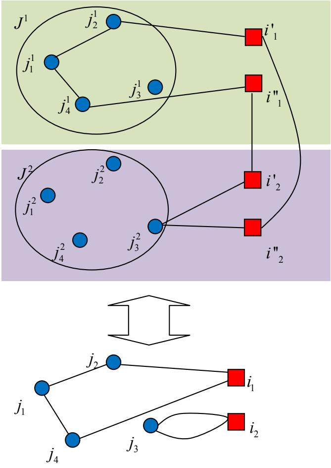
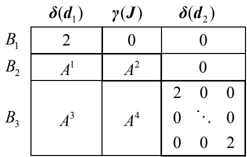
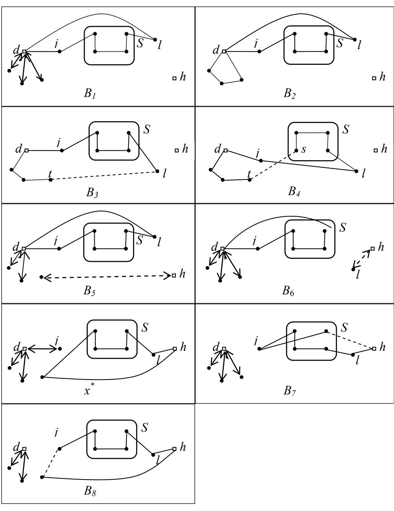
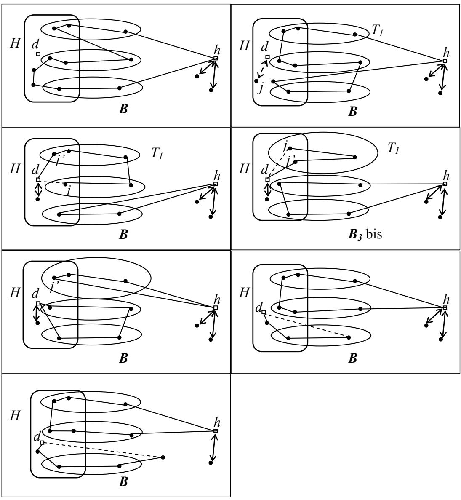
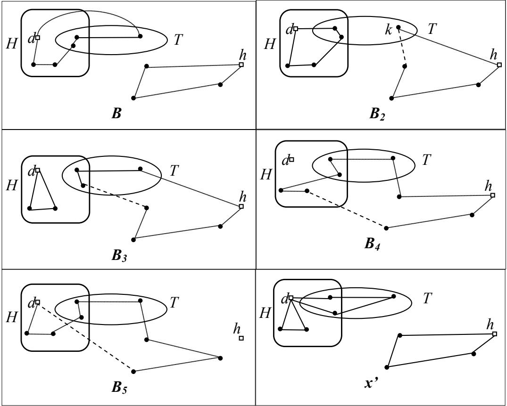
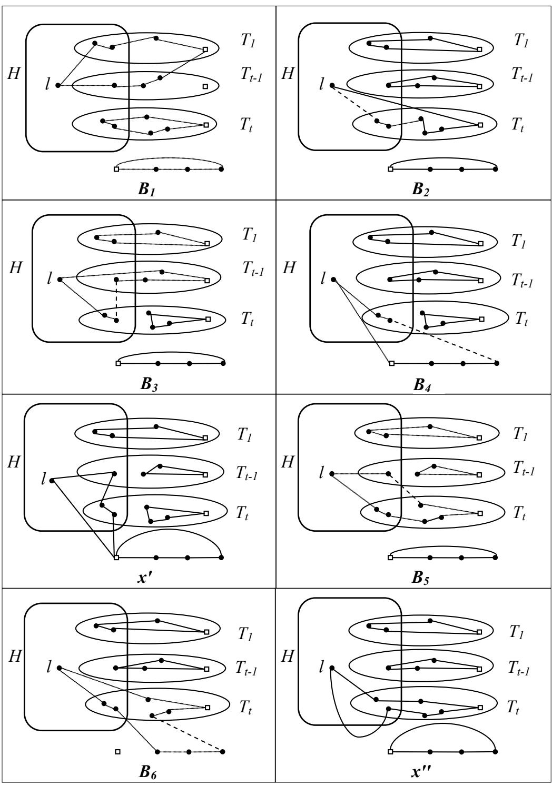

# A polyhedral study of the Multi-Depot Multiple TSP

Enrique Benavent1 and Antonio Martínez,

Departamento de Estadística e Investigación Operativa, Universitat de València, C/Dr. Moliner, 50, 46100, Burjassot, Valencia, Spain   
1 corresponding author: enrique.benavent@uv.es

Abstract We study the Multi-Depot Multiple Traveling Salesman Problem (MDMTSP), which is a variant of the very well-known Traveling Salesman Problem (TSP). In the MDMTSP an unlimited number of salesmen have to visit a set of customers using routes that can be based on a subset of available depots. The MDMTSP is an NPhard problem because it includes the TSP as a particular case when there is only one depot and the distances satisfy the triangular inequality. The problem has some real applications and is closely related to other important multi-depot routing problems, like the Multi-Depot Vehicle Routing Problem and the Location Routing Problem. We present an integer linear formulation for the MDMTSP and strengthen it with the introduction of several families of valid inequalities. Certain facet-inducing inequalities for the TSP polyhedron can be used to derive facet-inducing inequalities for the MDMTSP. Furthermore, several inequalities that are specific to the MDMTSP are also studied and proved to be facet-inducing.

Keywords Multiple depot traveling salesman problem, polyhedral study.

# 1 Introduction

Multi-Depot Multiple Traveling Salesman Problem (MDMTSP) is a generalization of the wellknown Traveling Salesman Problem (TSP), which consists of determining a set of routes for the salesmen that jointly visit a set of given clients, such that each salesman starts from and returns to one depot among a set of available depots and the total cost of the routes is minimized. We denote the set of clients by $J$ and the set of potential depots by $I$ . Let $G = \left( V , E \right)$ be an undirected graph with $V = I \cup J$ , and $E = \left\{ \left( i , j \right) : i \in V , j \in J \right\}$ . The cost of any edge $\left( i , j \right) \in E$ is denoted by $c _ { i j }$ . Costs are assumed to be symmetric, i.e. $c _ { i j } = c _ { j i }$ and routes visiting only one client, called return trips, are allowed. This problem has some applications as in the motion planning of a set of unmanned aerial vehicles (Yadlapalli et al. 2007 and 2009, Malik et al. 2007, Rathinam et al. 2007) and the routing of service technicians where the technicians are leaving from multiple depots (Parragh 2010). If costs satisfy the triangular inequality, it is easy to show that there is always an optimal solution in which at most one route will start and end at each depot. Therefore, in this case the TSP reduces to the MDMTSP with $\mid I \mid = 1$ , so this problem is NP-hard.

The TSP is undoubtedly one of the most widely studied problems in the area of combinatorial optimization and there are a lot of literature reviews on it, see for example Gutin and Punnen (2002) and Applegate et al. (2006). We concentrate here on reviewing the literature on problems nearer to the MDMTSP.

As far as we know, there is no reference in the literature that deals with the MDMTSP as we define it in this paper, and the literature on similar problems is very scarce. The nearest problem to the MDMTSP is the Generalized Multiple Depot, Multiple Traveling Salesman Problem (GMTSP), studied by Malik et al. (2007), in which there are m salesmen, located at different depots, but at most $p$ of them can be used. They assume that the costs are symmetric and satisfy the triangular inequality and propose a 2-approximation algorithm. Yadlapalli et al. (2009) study a variant of the GMTSP where each route must contain at least three nodes and propose a formulation for the GMTSP using binary variables and a lagrangean relaxation in the same spirit as Held-Karp's method for the TSP. This method combined with subgradient optimization allows them obtaining an improved lower bound. A lagrangean heuristic based on this method is also proposed. They present computational results for instances with a number of nodes between 15 and 45 and a number of salesmen between 3 and 10. Yadlapalli et al. (2007) study the same problem with asymmetric costs and allowing trips with two nodes. They also present a binary formulation, a similar lagrangean relaxation and lagrangean heuristic that is applied to a set of instances with up to 50 nodes and 7 salesmen.

Bektas (2006) presents an overview of the Multiple Traveling Salesman Problem (mTSP) and some of its variants, including the multi-depot case. In the mTSP there are m salesmen that have to visit a set of customers from a single depot and every salesman must visit at least one customer. Bektas (2006) reviews the applications, exact and heuristic solution procedures and transformations to the TSP for these problems, although the review concentrates on the mTSP. Kara and Bektas (2006) propose integer formulations with a polynomial number of constraints for the mTSP and for a multi-depot mTSP that is denoted by MmTSP. In the MmTSP there are $m _ { i }$ salesmen located at each depot i , all the salesmen have to be used and the number of customers visited by a salesman must lie between given upper and lower bounds. They study two variants of the MmTSP: the fixed destination MmTSP in which the salesmen have to return to their original depots, and the nonfixed destination MmTSP in which the salesmen do not have to return to their original depots but the number of salesmen at each depot should remain the same as it was at the beginning. The proposed formulations are tested on a large set of randomly generated instances with the number of nodes being 100 or 120, the number of depots 3, 4 or 5 and up to 2 salesmen at each depot. All the instances were optimally solved with a time limit of 3 hours. Kara and Bektas (2006) have also tried to use this transformation to solve the MmTSP and conclude that it is preferable to solve the MmTSP directly.

The MDMTSP can also be considered as a special case of other routing problems in which the vehicles have limited capacities. Multi-Depot Vehicle Routing Problem (MDVRP) consists of finding a set of routes based at a set of given depots to serve the demand of a set of customers with vehicles of limited capacity.

The Location Routing Problem (LRP) also generalizes the MDVRP in the sense that there are opening costs for the depots and, in addition to the vehicles, the depots can also have a limited capacity.

As far as we know, there is no polyhedral study of any of these multi-depot problems. In this paper we present an integer formulation of the MDMTSP and study the associated polyhedron. The remainder of this article is organized as follows. Section 2 presents a polynomial transformation of the MDMTSP into a TSP, in Section 3 the MDMTSP is formulated as an integer lineal program, and the notation and some basic results that will be used throughout the paper are introduced. In Section 4 we define the polyhedron associated with the MDMTSP and derive some facet-defining results including the study of the inequalities present in the formulation, the inequalities derived from the TSP, and two new families of valid constraints.

# 2 A polynomial transformation of the MDMTSP to the TSP

In this section we present a polynomial transformation of the MDMTSP into the Generalized TSP (GTSP), assuming that the costs satisfy the triangular inequality. This transformation allows to transform the MDMTSP into the TSP using the already known polynomial transformations of the GTSP into the asymmetric TSP, and then to the TSP (see Jonker and Volgenant, 1983, and Noon, 1988). GuoXing (1995) proposed a polynomial transformation of the MmTSP with asymmetric costs into an asymmetric TSP, but this transformation cannot be adapted easily to the MDMTSP because it uses the fact that in the MmTSP the number of salesmen used at each depot is known.

Given a complete and weighted graph with vertex set $V$ and a partition of $V$ in $m \geq 3$ subsets $C _ { 1 } , . . . , C _ { m }$ , called clusters, the GTSP consists of finding a minimum cost cycle that visits each cluster exactly once.

Let us consider the MDMTSP such that edge costs satisfy the triangular inequality. In this case, it is easy to see that there always exists an optimal solution of the MDMTSP that consists of at most $p$ routes and each depot contains at most one route.

Given a MDMTSP instance with a set of $p$ depots, $I = \left\{ i _ { 1 } , . . . , i _ { p } \right\}$ , and a set of $q$ customers, $J = \left\{ j _ { 1 } , . . . , j _ { q } \right\}$ we transform it in a GTSP instance as follows:

• The set of vertices $V$ of the GTSP contains $p$ copies of each client, $j _ { l } \in J$ denoted by $j _ { l } ^ { 1 } , . . . , j _ { l } ^ { p }$ (one per depot), and two copies of each depot $i _ { k } \in I$ , denoted by $i _ { \mathrm { ~ \it ~ k ~ } } ^ { \prime }$ and $i " _ { k }$ .   
• The costs of the edges $( j _ { s } ^ { k } , i _ { \ k } ^ { \prime } )$ and $( j _ { s } ^ { k } , i " _ { k } )$ are set equal to the cost of edge $( j _ { s } , i _ { k } )$ in the MDMTSP, for all $s = 1 , . . . , q$ , and all $k = 1 , . . . , p$ while the costs of edges $( j _ { s } ^ { k } , j _ { l } ^ { k } )$ are set equal to the cost of edge $( j _ { s } , j _ { l } )$ in the MDMTSP, for all $s , l = 1 , . . . , q$ , and all $k = 1 , . . . , p$ . Edges among any pair of copies of depots have all zero cost. All the remaining edges have cost equal to $M ,$ a large number.   
• Clusters of the GTSP are defined as follows. Each customer $j _ { l }$ has an associated cluster, $C _ { j _ { l } }$ , containing all the copies of client $j _ { l }$ , i.e, $C _ { j _ { l } } = \left\{ j _ { l } ^ { 1 } , . . . , j _ { l } ^ { p } \right\}$ . Each copy of any depot is also a cluster. Thus, there are in total ${ \boldsymbol { q } } + 2 { \boldsymbol { p } }$ clusters.

Let us denote by $J ^ { k } = \left\{ j _ { 1 } ^ { k } , . . . , j _ { q } ^ { k } \right\}$ , for all $k = 1 , . . . , p$ , i.e, $J ^ { k }$ denotes the set of vertices whose super-index corresponds to the depot $i _ { k }$ . Note that the costs of the edges incident with vertices in $J ^ { k }$ are all equal to $M$ except those for which the other endpoint belongs to $J ^ { k } \cup \left\{ i _ { \ k } ^ { \prime } , i _ { \ k } ^ { \mathfrak { n } } \right\}$ . Let us denote by $G "$ the resulting GTSP graph that has $p q + 2 p$ vertices and $q + 2 p$ clusters.

Given a MDMTSP solution $s$ such that there are no two routes based at the same depot, we construct an associated GTSP solution with the same cost as follows. For each route $( i _ { k } , j _ { 1 } , . . . , j _ { r } , i _ { k } )$ of $s$ in the MDMTSP we consider a path $( i _ { \ k } ^ { \prime } , j _ { 1 } ^ { k } , . . . , j _ { r } ^ { k } , i _ { \ k } ^ { \ " } )$ in the GTSP with the same cost. For each depot $i _ { l }$ not used in $s$ we consider the path with only one edge $\left( i _ { { \scriptscriptstyle l } } ^ { \prime } , i _ { { \scriptscriptstyle l } } ^ { \prime \prime } \right)$ , which zero cost. Then, it is easy to form a cycle that contains all the above defined paths by adding edges with zero cost between copies of different depots (see Figure 1). • On the other hand, given a GTSP solution $s ^ { * }$ with cost less than $M$ (the above construction shows that those solutions exist), we may construct as follows a MDMTSP solution with the same cost. For each $k = 1 , . . . , p$ , let us consider the solution $s ^ { * }$ restricted to the subgraph induced by the set of vertices $J ^ { k } \cup \left( i _ { \mathrm { ~ } k } ^ { \prime } , i _ { \mathrm { ~ } k } ^ { \mathfrak { n } } \right)$ . There are two possibilities: a) $s ^ { * }$ does not use any edge inside $J ^ { k }$ or between $J ^ { k }$ and $\left\{ i _ { \mathrm { \Delta } _ { k } } ^ { \prime } , i _ { \mathrm { ~ } \mathrm { ~ } _ { k } } ^ { \ " } \right\}$ , or b) this part of the solution is a path, $P _ { k } = \left( i _ { \mathrm { ~ } _ { k } } ^ { \prime } , j _ { 1 } ^ { k } , . . . , j _ { r } ^ { k } , i _ { \mathrm { ~ } _ { k } } ^ { \ast } \right)$ (recall that edges with one endpoint in $J ^ { k }$ and the other in $V \setminus \left( J ^ { k } \cup \left\{ i _ { \ k } ^ { \prime } , i _ { \ k } ^ { \mathfrak { n } } \right\} \right)$ have all $M \cdot$ -cost). In case of a) depot $i _ { k }$ has no route in the MDMTSP solution, while in case of b) we build the MDMTSP route $\left( i _ { k } , j _ { 1 } , . . . , j _ { r } , i _ { k } \right)$ . It is easy to see that this set of routes so constructed constitutes a feasible MDMTSP solution with the same cost than $s ^ { * }$ (each customer is visited exactly once because $s ^ { * }$ visits each cluster exactly once).

  
GTSP   
MDMTSP   
Figure 1

The above correspondence between MDMTSP and GTSP solutions shows that the optimal solution of the GTSP provides the optimal solution of the MDMTSP (see Figure 1).

# 3 Integer formulation of the MDMTSP

Recall that the MDMTSP is defined on a set of clients $J$ and a set of potential depots $I$ . Unless otherwise stated, we will denote: $\left| J \right| = q$ , and $\left| I \right| = p$ and assume that $p \geq 1$ and $q \geq 1$ . Let $G = \left( V , E \right)$ be an undirected graph where $V = I \cup J$ , and $E = \left\{ \left( i , j \right) : \forall i \in V , \forall j \in J \right\}$ (note that $E$ does not include any edge between depots). The cost of edge $e = \left( i , j \right)$ is denoted by $c _ { i j } = c _ { e }$ . A set of routes such that each route contains exactly one depot and each customer is visited exactly once by the set of routes is called a MDMTSP solution. Each route is assumed to be performed by a salesman or, equivalently, by a vehicle. Throughout the paper, the MDMTSP defined on the set of potential depots $I$ and set of clients $J$ will be denoted by MDMTSP $\left( I , J \right)$ .

For each edge $e = \left( i , j \right)$ , $i , j \in J$ , we define one binary variable $x _ { i j }$ which takes the value 1 if the edge $e$ is traveled by one route and 0 otherwise. For each edge $e = \left( i , j \right) , \ i \in I , j \in J$ we define a variable $x _ { i j }$ which takes the value 2 if one vehicle does a trip between depot $i$ to client $j$ and immediately comes back to the depot (this is called a return trip), the value 1 if the edge $e$ is traveled once by one vehicle, and 0 otherwise. For two node subsets $S , S ^ { \prime } \subseteq V$ , define $\left( S : S ^ { \prime } \right) = \left\{ \left( i , j \right) : i \in S , j \in S ^ { \prime } \right\}$ . Given a node subset, $S \subseteq V$ , let us denote $\delta \bigl ( S \bigr ) = \bigl ( S : V \setminus S \bigr )$ and $\gamma \left( S \right) = \left\{ \left( i , j \right) \in E : i , j \in S \right\}$ . If $S = \{ \nu \}$ , we simply write $\delta ( \nu )$ instead of $\delta \big ( \{ \nu \} \big )$ . Finally, for $F \subseteq E$ , define $x ( F ) = \sum _ { ( i , j ) \in F } x _ { i j }$ . We simply write $x \big ( S : S ^ { ' } \big )$ instead of $x \big ( \big ( S : S ^ { ' } \big ) \big )$ . We propose the following formulation for the MDMTSP:

$$
\mathrm { M i n i m i z e } \sum _ { ( i , j ) \in E } c _ { i j } x _ { i j }
$$

s.t.

$$
\begin{array} { l } { \displaystyle x \big ( \delta \big ( j \big ) \big ) = 2 \ \forall j \in J } \\ { \displaystyle x \big ( \gamma \big ( S \big ) \big ) \leq \big | S \big | - 1 \ \forall S \subseteq J } \\ { \displaystyle \sum _ { i \in I ^ { \prime } } x _ { i j } + 2 x \Big ( \gamma \big ( S \cup \{ j , l \} \big ) \Big ) + \sum _ { k \in I \backslash I ^ { \prime } } x _ { k l } \leq 2 \big | S \big | + 3 \quad \forall j , l \in J } \\ { \displaystyle S \subseteq J \backslash \{ j , l \} , S \neq \emptyset ; I ^ { \prime } \subset I } \end{array}
$$

$$
\begin{array} { l } { \displaystyle \sum _ { i \in I ^ { \prime } } x _ { i j } + 3 x _ { j l } + \displaystyle \sum _ { k \in I \setminus I ^ { \prime } } x _ { k l } \le 4 \quad \forall j , l \in J , I ^ { \prime } \subset I } \\ { \displaystyle x _ { i j } \in \left\{ 0 , 1 , 2 \right\} \forall i \in I \ \forall j \in J } \\ { \displaystyle x _ { i j } \in \left\{ 0 , 1 \right\} \forall i \in J \ \forall j \in J } \end{array}
$$

Degree equations (1), ensure that all the clients are visited exactly once by the set of tours. Inequalities (2) are the very well-known subtour elimination inequalities. Inequalities (3), called path elimination constraints, were introduced by Laporte et al. (1986) and modified by Belenguer et al. (2011). These inequalities prevent solutions that include a path starting at one depot and ending at a different one. Thus, a solution including a path $i _ { 1 } , j _ { 1 } , . . . , j _ { t } , i _ { 2 }$ , where $i _ { 1 } , i _ { 2 } \in I$ , and $j _ { 1 } , . . . , j _ { t } \in J , t \geq 3$ violates inequality (3) with $I ^ { \prime } { = } \{ i _ { 1 } \}$ , $S = \left\{ j _ { 2 } , . . . , j _ { t - 1 } \right\} , \ j = j _ { 1 } ,$ , and $l = j _ { t }$ . Let us show that these inequalities are valid for the MDMTSP. Note first that any feasible MDMTSP solution satisfies $x \big ( \gamma \big ( S \cup \{ j , l \} \big ) \big ) \leq \big | S \big | + 1$ because a subtour that only contains customers is forbidden. Consider two cases:

a) If $x \big ( \gamma \big ( S \cup \{ j , l \} \big ) \big ) = \big | S \big | + 1$ then the solution contains a path where all the customers in $S \cup \{ j , l \}$ are consecutive. Therefore, neither $j$ nor $l$ are visited by return trips, so $\sum _ { i \in I ^ { \prime } } x _ { i j } \leq 1$ and $\sum _ { k \in I \setminus I ^ { \prime } } x _ { k l } \leq 1$ . Note that $\sum _ { i \in I ^ { \prime } } x _ { i j } = \sum _ { k \in I \backslash I ^ { \prime } } x _ { k l } = 1$ cannot hold, because it would mean that the solution contains a path starting at a depot in $I ^ { \prime }$ and ending at a depot in $I \backslash I ^ { \prime }$ , which is forbidden. Then, $\sum _ { i \in I ^ { \prime } } x _ { i j } + \sum _ { k \in I \backslash I ^ { \prime } } x _ { k l } \leq 1$ holds and the inequality (3) is satisfied.

b) Let us assume that $x \big ( \gamma \big ( S \cup \{ j , l \} \big ) \big ) \leq \big | S \big |$ . Then, if $\sum _ { i \in I ^ { \prime } } x _ { i j } + \sum _ { k \in I \backslash I ^ { \prime } } x _ { k l } \leq 3$ the inequality (3) is clearly satisfied. On the other hand, if $\sum _ { i \in I ^ { \prime } } x _ { i j } + \sum _ { k \in I \backslash I ^ { \prime } } x _ { k l } = 4$ , it means that customers $j$ and $l$ are visited by different return trips, so there exists no edge in the solution with one endpoint in $S$ and the other in $\left\{ j , l \right\}$ , so $x { \big ( } \gamma { \big ( } S \cup \{ j , l \} { \big ) } { \big ) } = x { \big ( } \gamma { \big ( } S { \big ) } { \big ) } \leq \left| S \right| - 1$ and (3) is satisfied.

Inequalities (4) are in the same spirit as (3) that are not valid if $S = \{ \emptyset \}$ . It can easily be checked that they are valid and avoid solutions containing a path that connects two different depots and visits only two clients.

This formulation allows solutions with paths connecting two depots and visiting only one client, called 2-paths. However, if one solution of the MDMTSP contains a 2-path $i _ { 1 } , j , i _ { 2 }$ , where $i _ { 1 } , i _ { 2 } \in I$ , and $j \in J$ , then the solution which visits the client $j$ by a return trip from the nearest depot does not have a greater cost, so this kind of solutions will never appear in an optimal solution.

# 4 The MDMTSP polyhedron

Denote by $P _ { ( I , J ) }$ the polytope defined by the convex hull of feasible solutions of the MDMTSP $( I , J )$ . That is:

$$
P _ { ( I , J ) } = c o n \nu \left\{ x \in \mathbb { R } ^ { | E | } : x \mathrm { ~ s a t i s f i e s } ( 1 ) \mathrm { t o ~ ( 6 ) ~ a n d ~ c o n t a i n s ~ n o ~ } 2 \mathrm { - p a t h } \right\} \ .
$$

Let $K _ { n }$ denote the complete graph on $n$ vertices and let $E _ { n }$ be its set of edges. Given a subset of edges $A \subseteq E _ { n }$ , we denote by $x ^ { A } \in \mathbb { R } ^ { | E _ { n } | }$ the incidence vector associated with $A$ , that is, $x _ { e } ^ { A } = 1$ , if $e \in A$ , and $x _ { e } ^ { A } = 0$ if $e \not \in A$ . Then the polytopes associated to the Traveling Salesman Problem, $P _ { T S P ( n ) }$ , and the Hamiltonian Path Problem, $P _ { H P ( n ) }$ , are defined as follows:

$$
\begin{array} { r l } & { P _ { T S P ( n ) } = c o n v \Big \{ x ^ { \mathscr { A } } \in \mathbb { R } ^ { | E _ { n } | } : \varLambda \mathrm { i s ~ t h e ~ s e t ~ o f ~ e d g e s ~ o f ~ a ~ h a m i l t o n i a n ~ c y c l e ~ o f ~ } K _ { n } \Big \} } \\ & { P _ { H P ( n ) } = c o n v \Big \{ x ^ { \mathscr { A } } \in \mathbb { R } ^ { | E _ { n } | } : \varLambda \mathrm { i s ~ t h e ~ s e t ~ o f ~ e d g e s ~ o f ~ a ~ h a m i l t o n i a n ~ p a t h ~ o f ~ } K _ { n } \Big \} } \end{array}
$$

Grötschel and Padberg (1979) proved that $\mathrm { d i m } \Big ( P _ { _ { T S P ( n ) } } \Big ) = \frac { n ( n - 1 ) } { 2 } - n$ for all $n \geq 3$ , while Queyranne and Wang (1993) proved that $\mathrm { d i m } \Big ( P _ { H P ( n ) } \Big ) = \frac { n ( n - 1 ) } { 2 } - 1$ 1− . A null vector of any dimension will be denoted by 0 and given a set of vectors $R , a f f ( R )$ will denote the affine hull of $R$ .

Theorem 1. $\mathrm { d i m } \Big ( P _ { ( I , J ) } \Big ) = \frac { q ^ { 2 } - q } { 2 } + p q - q .$

Proof: The number of variables is $\frac { q ^ { 2 } - q } { 2 } + p q$ and all solutions satisfy the $q$ linearly independent degree equations (1), so $\mathrm { d i m } \Big ( P _ { ( I , J ) } \Big ) \leq \frac { q ( q - 1 ) } { 2 } + p q - q$ . Let us denote this quantity by $d$ , then we have to find $d + 1$ affinely independent (or linearly independent, because $0 \not \in a f f ( P _ { ( I , J ) } )$ ) MDMTSP solutions.

The first solution, denoted by $B _ { 1 }$ , consists of visiting each client with a return trip from depot $d _ { \mathrm { 1 } } \in I$ . If $q > 1$ , there are $\frac { q ( q - 1 ) } { 2 }$ affinely independent Hamiltonian paths on the set of clients

$J$ and these paths are also linearly independent because $0 \not \in a f f \left( P _ { H P \left( q \right) } \right)$ . By joining the terminal vertices of each path to depot $d _ { \mathrm { { \scriptscriptstyle 1 } } }$ we obtain the same number of MDMTSP $( I , J )$ solutions. Let us denote this set of solutions by $B _ { 2 }$ .

If $p > 1$ , for each $d _ { i } \in I \backslash \{ d _ { 1 } \}$ and each $j \in J$ , we may build a solution that visits client $j$ by a return trip from $d _ { i }$ and all the other clients with a unique route from $d _ { \mathrm { { \scriptscriptstyle 1 } } }$ . Thus, we may build $q \left( p - 1 \right)$ additional MDMTSP $( I , J )$ solutions. Let us denote this set of solutions by $B _ { 3 }$ . Thus, in total we have constructed $d + 1$ solutions. These solutions are depicted as the block matrix of Figure 2 whose rows correspond to the solution blocks and whose columns correspond to subsets of edges (for simplicity, the number of depots is assumed to be two in Figure 2). A constant in a cell corresponds to a submatrix of the appropriate dimensions with all its entries equal to the constant. Note that the matrix is block-triangular and the diagonal blocks are non singular, so the whole matrix has full rank, thus proving that the $d + 1$ solutions constructed are linearly independent. ■

  
Figure 2: MDMTSP solutions of Theorem 1

# 4.1 Trivial inequalities

In this section we study which trivial inequalities are facet-inducing inequalities for the MDMTSP $( I , J )$ polyhedron.

Theorem 2 If $q \geq 4$ , the inequality $x _ { e } \ge 0$ defines a facet of $P _ { ( I , J ) }$ for each $e \in \gamma ( J )$ .

Proof: Let us consider the TSP defined on the set of clients plus depot $d \in I$ and their corresponding polyhedron $P _ { T S P ( q + 1 ) }$ . It is known that inequality $x _ { e } \ge 0$ is a facet-inducing inequality for $P _ { T S P ( q + 1 ) }$ if $q \geq 4$ (Grötschel and Padberg 1979), so there are ( 1) 1q q − − linearly independent TSP solutions satisfying $x _ { e } = 0$ . All these solutions can also be considered as MDMTSP $( I , J )$ solutions by simply assuming that the other depots have no associated route. Let us now consider another solution, satisfying $x _ { e } = 0$ , which visits all the customers by a return trip from depot $d$ . This solution is affinely independent with the former set of solutions because they satisfy $x \big ( \delta ( d ) \big ) = 2$ and the new solution satisfies $x \big ( \delta ( d ) \big ) > 2$ . Given that $0 \not \in a f f \left( P _ { ( I , J ) } \right)$ , they are also linearly independent.

If $p = 1$ the proof is complete; otherwise, new solutions are built in a similar way to that of Theorem 1. For each $i \in I , \ i \neq d$ , and each client $j \in J$ we build one solution with two routes, a return trip to visit the client $j$ from depot $i$ and one tour from depot $d$ visiting all the clients in $J \backslash \{ j \}$ and not using edge $e$ (this tour is possible if $q \geq 4$ ). Thus, we have built ( ) ( ) 1 1q q p q − + − linearly independent solutions satisfying 0 e x = and the proof is completed.

Inequalities $x _ { e } \leq 1 , e \in \gamma \left( J \right)$ are a particular case of subtour elimination constraints (2) with $\left| S \right| = 2$ , and are studied in Subsection 4.4.

Theorem 3 If $q \geq 4$ , the inequality $x _ { e } \ge 0$ defines a facet of $P _ { ( I , J ) }$ for each $e \in \left( I : J \right)$ .

Proof: Let $e = \left( d , j \right) , d \in I , j \in J$ . If $p > 1$ , we may use the proof of Theorem 1 defining depot $d _ { 2 } = d$ , and excluding the only solution of those considered in that proof that does not satisfy $x _ { e } = 0$ . On the other hand, if $p = 1$ , given that $x _ { e } \ge 0$ defines a facet of $P _ { T S P ( q + 1 ) }$ , there are ( 1) 1q q − − affinely independent solutions satisfying 0 e x = . One additional solution is built as follows: let $j _ { 1 } , j _ { 2 } \in J \backslash \{ j \}$ and consider a trip beginning at depot $d$ , visiting customers $j _ { 1 } , j$ and $j _ { 2 }$ in this order and returning to the depot. All the other clients are visited by a return trip from the depot. This solution satisfies $x \big ( \delta ( d ) \big ) > 2$ while all the former solutions satisfy $x \big ( \delta ( d ) \big ) = 2$ , so they are affinely independent. ■

For any $e = ( i , j ) \in \left( I : J \right)$ , the inequality $x _ { e } \leq 2$ does not define a facet of $P _ { ( I , J ) }$ because any solution satisfying $x _ { e } = 2$ also satisfies $x _ { j l } = 0$ , for all $l \in J$ , which implies that the dimension of the face induced by the inequality $x _ { e } \leq 2$ is less than $\dim \left( P _ { ( I , J ) } \right) -$

# 4.2 Depot lifting

Let $f x \geq f _ { 0 }$ be a valid inequality for MDMTSP $( I , J )$ . An inequality $f ^ { * } x \geq f _ { 0 }$ for the MDMTSP $( I \cup I ^ { \prime } , J )$ , with $\left| I ^ { \prime } \right| \geq 1$ , is said to have been obtained from $f x \geq f _ { 0 }$ by lifting depot $d _ { 0 } \in I$ to the set of depots $I ^ { \prime }$ , if:

$$
\begin{array} { r } { f _ { l j } ^ { * } = \left\{ \begin{array} { l l } { f _ { d _ { 0 } j } \qquad } & { \forall \big ( l , j \big ) \in ( l ^ { \prime } ; J ) } \\ { f _ { l j } } & { \forall ( l , j ) \notin ( I ^ { \prime } ; J ) } \end{array} \right. } \end{array}
$$

Note that the edges incident with the new depots have the same coefficients in the lifted inequality as the corresponding edges incident with depot $d _ { 0 }$ .

The lifted inequality $f ^ { * } x \geq f _ { 0 }$ is valid for the MDMTSP $( I \cup I ^ { \prime } , J )$ because if a solution $y ^ { * }$ existed such that $f ^ { ^ { \ast } } y ^ { ^ { \ast } } < f _ { 0 }$ , we could build a solution $y$ for the MDMTSP $( I , J )$ by changing all the edges incident with depots in $I ^ { \prime }$ by the corresponding edges incident with depot $d _ { 0 }$ , and $f y = f ^ { * } y ^ { * } < f _ { 0 }$ , which contradicts that $f x \geq f _ { 0 }$ is valid. We prove in Theorem 6 that the property of being facet-inducing is also inherited by the lifted inequality. We first prove a previous result in Lemma 5.

Remark 4 Let us consider the MDMTSP $\left( \left\{ d _ { 0 } \right\} , J \right)$ and the set $S = J \setminus \left\{ k ^ { * } \right\}$ where $\boldsymbol k ^ { * } \in J$ is a given client. It is easy to check that the subtour elimination inequality $x \big ( \delta ( S ) \big ) \geq 2$ can also be written as $x \big ( \{ d _ { 0 } \} : S \big ) - x _ { d _ { 0 } k ^ { * } } \geq 0$ (use the degree equation (1) for client $k ^ { * }$ ).

Lemma 5 Let $f x \geq f _ { 0 }$ be a non-trivial facet-inducing inequality for MDMTSP $\left( I , J \right)$ different to the one described in Remark 4. Let $d _ { 0 } \in I$ , $\left\{ j _ { 1 } , . . . , j _ { s } \right\} \subseteq J$ with $s \geq 2$ , and $\mathcal { \alpha } _ { 1 } , . . . , \mathcal { \alpha } _ { s }$ , such that $\alpha _ { k } \in \left\{ 1 , - 1 \right\} , \forall k \in \left\{ 1 , . . . , s \right\}$ . Then, there is a MDMTSP $\left( I , J \right)$ solution satisfying $f x = f _ { 0 }$ and $\sum _ { k = 1 } ^ { s } \alpha _ { k } x _ { d _ { 0 } j _ { k } } \neq 0$ .

Proof: Let us suppose, on the contrary, that every MDMTSP $\left( I , J \right)$ solution satisfying $f x = f _ { 0 }$ also satisfies  k d j∑ $\sum _ { k = 1 } ^ { s } \alpha _ { k } x _ { d _ { 0 } j _ { k } } = 0$ . Given that $f x \geq f _ { 0 }$ is facet-inducing, this implies that $\sum _ { k = 1 } ^ { s } \alpha _ { k } x _ { d _ { 0 } j _ { k } } = 0$ is a linear combination of equation $f x = f _ { 0 }$ and the degree equations (1). We may suppose, without loss of generality, that the coefficient of equation $f x = f _ { 0 }$ in this linear combination is positive. Then, by using the same linear combination with inequality $f x \geq f _ { 0 }$ and equations (1), we conclude that $\sum _ { k = 1 } ^ { s } \alpha _ { k } x _ { d _ { 0 } j _ { k } } \ge 0$ is a valid inequality for MDMTSP $\left( I , J \right)$ .

Given that all MDMTSP $\left( I , J \right)$ solutions satisfying $f x = f _ { 0 }$ also satisfy $\sum _ { k = 1 } ^ { s } \alpha _ { k } x _ { d _ { 0 } j _ { k } } = 0$ , there is at least one $j ^ { * } \in \left\{ j _ { 1 } , . . . , j _ { s } \right\}$ such that $\boldsymbol { \alpha } _ { _ { j ^ { * } } } = - 1$ ; otherwise, all solutions satisfying $f x = f _ { 0 }$ would also satisfy $x _ { d _ { 0 } j _ { k } } = 0$ , for all $k \in \left\{ 1 , . . . , s \right\}$ and we suppose that $f x \geq f _ { 0 }$ is a non-trivial facet-inducing inequality. We differentiate three cases:

a) If $\left| I \right| > 1$ , let $i ^ { \prime } \in I \setminus \left\{ d _ { 0 } \right\}$ . Then the solution $\hat { x }$ in which client $j ^ { * }$ is visited by a return trip from $d _ { 0 }$ and all the other clients are visited by return trips from $i "$ satisfies $\sum _ { k = 1 } ^ { s } \alpha _ { k } \hat { x } _ { d _ { 0 } j _ { k } } = - 2$ , thus contradicting that $\sum _ { k = 1 } ^ { s } \alpha _ { k } x _ { d _ { 0 } j _ { k } } \ge 0$ is valid.

b) If $I = \{ d _ { 0 } \}$ and $J \backslash \left\{ j _ { 1 } , . . . , j _ { s } \right\} \neq \emptyset$ , let $l \in J \backslash \{ j _ { 1 } , . . . , j _ { s } \}$ . Consider a solution $\hat { x }$ that contains only one tour based at depot $d _ { 0 }$ that visits all the clients and where $l$ and $j ^ { * }$ are the first and last clients visited, respectively. Then $\sum _ { k = 1 } ^ { s } \alpha _ { k } \hat { x } _ { d _ { 0 } j _ { k } } = - 1$ .

c) If $I = \{ d _ { 0 } \}$ , $J = \left\{ j _ { 1 } , . . . , j _ { s } \right\}$ and there is another client $l \in \left\{ j _ { 1 } , . . . , j _ { s } \right\} , l \neq j ^ { * }$ such that $\alpha _ { l } = - 1$ , then a solution constructed as in b) will satisfy $\sum _ { k = 1 } ^ { s } \alpha _ { k } \hat { x } _ { d _ { 0 } j _ { k } } = - 2$ .

The case where $I = \{ d _ { 0 } \}$ , $J = \left\{ j _ { 1 } , . . . , j _ { s } \right\}$ and $\boldsymbol { \alpha } _ { j ^ { * } }$ is the only coefficient equal to $^ { - 1 }$ is precisely the exception described in Remark 4.

Theorem 6 Let $a x \geq a _ { 0 }$ be a non-trivial inequality that defines a facet of $P _ { ( I , J ) }$ . Then, an inequality obtained from $a x \geq a _ { 0 }$ by lifting depot $d _ { 0 } \in I$ to the set of depots $I ^ { \prime }$ defines a facet of P( ', ) I I J ∪ .

Proof: We prove the theorem by assuming that $I ^ { \prime } { = } \left\{ h \right\}$ , and the general result can be obtained by recursively applying this case. Let $y$ be a vector whose variables correspond to the edges in $\delta \big ( h \big )$ and let $a x + b y \ge a _ { 0 }$ be the lifted inequality. Let $F _ { a }$ denote the facet induced by inequality $a x \geq a _ { 0 }$ in $P _ { ( I , J ) }$ , and let $F _ { a b }$ denote the face induced by inequality $a x + b y \ge a _ { 0 }$ in $P _ { ( I \cup I ^ { \prime } , J ) }$ . Since $a x \geq a _ { 0 }$ is facet-inducing of $P _ { ( I , J ) }$ , there are ${ \frac { q ^ { 2 } - q } { 2 } } + p q - q$ linearly independent MDMTSP $\left( I , J \right)$ solutions satisfying $a x = a _ { 0 }$ . These solutions can also be considered as MDMTSP $\left( I \cup I ^ { \prime } , J \right)$ solutions satisfying $a x + b y = a _ { 0 }$ by adding the new depot $h$ as an isolated vertex. To prove the theorem we build $q$ additional linearly independent MDMTSP $\left( I \cup I ^ { \prime } , J \right)$ solutions that, contrary to the preceding ones, use edges incident with the new depot $h$ .

Note that every edge of $\delta ( d _ { 0 } )$ is used by at least one solution of the face $F _ { a }$ because it is assumed that $a x \geq a _ { 0 }$ induces a non-trivial facet of the MDMTSP $\left( I , J \right)$ polyhedron. In what follows, we build a partition of the set of clients $J$ . For each subset of the partition, we construct a set of solutions of $F _ { a b }$ in such a way that the parts of these solutions that correspond to the edges in $\delta ( h )$ form a matrix which is block-triangular and each block in the diagonal is non singular (see Figure 3).

The following transformation is often used in the proof. Let $x$ be a MDMTSP $\left( I , J \right)$ solution containing a route that uses two edges incident with depot $d _ { 0 }$ , say $( d _ { 0 } , l )$ and $( d _ { 0 } , l ^ { \prime } )$ , then we transform $x$ into a MDMTSP $\left( I \cup I ^ { \prime } , J \right)$ solution, denoted by $\left( \hat { x } , \hat { y } \right)$ , by replacing these edges with $\left( h , l \right)$ and $\left( h , l ^ { \prime } \right)$ . Note that if $x \in F _ { a }$ then $\left( \hat { x } , \hat { y } \right) \in F _ { a b }$ and this solution contains only two edges, $\left( h , l \right)$ and $\left( h , l ^ { \prime } \right)$ , incident with depot $h$ .

Let $S ^ { 1 } = { \Big \{ } j \in J$ : there is a solution $x ^ { j } \in F _ { a }$ with $x _ { d _ { 0 } j } ^ { j } = 2 \big \}$ ; for each $j \in S ^ { 1 }$ we build a MDMTSP $\left( I \cup I ^ { \prime } , J \right)$ solution from solution $x ^ { j }$ , changing the return trip to $j$ from depot $d _ { 0 }$ for a return trip from depot $h$ . We recursively define the sets $S ^ { r }$ , for $r \geq 2$ as follows: $S ^ { r }$ is the set of clients $j$ , $j \in J \setminus \bigcup _ { t = 1 } ^ { r - 1 } S ^ { t }$ , for which there is a client $l ^ { j } \in \bigcup _ { t = 1 } ^ { r - 1 } S ^ { t }$ and a solution $x ^ { j } \in F _ { a }$ , containing a route that uses edges $( d _ { 0 } , l ^ { j } )$ and $( d _ { 0 } , j )$ (note that such solution $x ^ { j } \in F _ { a }$ allows us to construct a MDMTSP $\left( I \cup I ^ { \prime } , J \right)$ solution $\left( \hat { x } ^ { j } , \hat { y } ^ { j } \right) \in F _ { a b } )$ ). Solutions $\left( \hat { x } ^ { j } , \hat { y } ^ { j } \right)$ for $j \in S ^ { r }$ , and $r > 1$ , are all linearly independent because each one uses one edge incident with depot $h$ that was not used by any of the previously constructed solutions (see Figure 3).

Let $r ^ { * }$ be the largest integer such that $S ^ { r ^ { * } } \neq \emptyset$ . If $\bigcup _ { t = 1 } ^ { r ^ { * } } S ^ { t } = J$ , the proof would be completed; otherwise define $H = J \backslash \bigcup _ { t = 1 } ^ { r ^ { * } } S ^ { t }$ . Given a client $j _ { 1 } \in H$ , there is a solution, say $x ^ { 1 }$ , in $F _ { a }$ using edge $( d _ { 0 } , j _ { 1 } )$ and another edge, say $( d _ { 0 } , j _ { 2 } )$ , in the same route as $( d _ { 0 } , j _ { 1 } )$ ; by construction $j _ { 2 } \in H$ , because otherwise $j _ { 1 }$ would belong to $\bigcup _ { t = 1 } ^ { r ^ { * } } S ^ { t }$ . From $x ^ { 1 }$ we construct the corresponding MDMTSP $\left( I \cup I ^ { \prime } , J \right)$ solution $\left( \hat { x } ^ { 1 } , \hat { y } ^ { 1 } \right) \in F _ { a b }$ . Note that $\left( \hat { x } ^ { 1 } , \hat { y } ^ { 1 } \right)$ satisfies the equation $y _ { h j _ { 1 } } - y _ { h j _ { 2 } } = 0$ and $x ^ { 1 }$ satisfies the equation $x _ { d _ { 0 } j _ { 1 } } - x _ { d _ { 0 } j _ { 2 } } = 0$ . Therefore, by Lemma 5 there is a solution, say $x ^ { 2 }$ , in $F _ { a }$ not satisfying this equation, so it will use exactly one edge $\left( d _ { 0 } , j _ { t } \right)$ , for $t \in \{ 1 , 2 \}$ ; let $( d _ { 0 } , j _ { 3 } )$ be the other edge incident with $d _ { 0 }$ in the same route as $( d _ { 0 } , j _ { t } )$ ; for the same reason as before, $j _ { 3 } \in H$ . Solution $x ^ { 2 }$ satisfies the equation $\alpha _ { 1 } x _ { { d } _ { 0 } j _ { 1 } } + \alpha _ { 2 } x _ { { d } _ { 0 } j _ { 2 } } + \alpha _ { 3 } x _ { { d } _ { 0 } j _ { 3 } } = 0$ , where $\alpha _ { 1 } = 1 , \alpha _ { 2 } = - 1$ , and $\mathcal { \alpha } _ { 3 } = - \mathcal { \alpha } _ { t }$ . The corresponding solution $\left( \hat { x } ^ { 2 } , \hat { y } ^ { 2 } \right) \in F _ { a b }$ is linearly independent with $\left( \hat { x } ^ { 1 } , \hat { y } ^ { 1 } \right)$ because it does not satisfy equation $y _ { h j _ { 1 } } - y _ { h j _ { 2 } } = 0$ . Note that solution $\left( \hat { x } ^ { 2 } , \hat { y } ^ { 2 } \right)$ satisfies the equality $\alpha _ { 1 } y _ { h j _ { 1 } } + \alpha _ { 2 } y _ { h j _ { 2 } } + \alpha _ { 3 } y _ { h j _ { 3 } } = 0$ that is also satisfied by $\left( \hat { x } ^ { 1 } , \hat { y } ^ { 1 } \right)$ because it contains only two edges, $( h , j _ { 1 } )$ and $( h , j _ { 2 } )$ , incident with depot $h$ , so $\hat { y } _ { h j _ { 3 } } ^ { 1 } = 0$ .

In general, let us assume that in this way we have generated $r$ clients $\{ j _ { 1 } , . . . , j _ { r } \} \subset H , r \geq 3 .$ , $r - 1$ equations and $r - 1$ solutions $x ^ { 1 } , . . . , x ^ { r - 1 }$ , where $x ^ { r - 1 }$ violates the equation $\alpha _ { 1 } x _ { d _ { 0 } j _ { 1 } } + \alpha _ { 2 } x _ { d _ { 0 } j _ { 2 } } + . . . + \alpha _ { r - 1 } x _ { d _ { 0 } r - 1 } = 0$ and satisfies the equation $\alpha _ { 1 } x _ { d _ { 0 } j _ { 1 } } + \alpha _ { 2 } x _ { d _ { 0 } j _ { 2 } } + . . . + \alpha _ { r } x _ { d _ { 0 } r } = 0$ . Therefore, by Lemma 5 there is a solution in $F _ { a }$ , say $x ^ { r }$ , not satisfying this last equation. Two cases may arise: (a) this solution contains a route that uses only one edge $( d _ { 0 } , j _ { t } )$ , with $j _ { t } \in \{ j _ { 1 } , . . . , j _ { r } \}$ , or (b) this solution contains a route using two edges $( d _ { 0 } , j _ { t } )$ and $( d _ { 0 } , j _ { t ^ { \prime } } )$ , with $t , t ^ { \prime } \in \left\{ 1 , . . . , r \right\} .$

In case (a), let us denote $( d _ { 0 } , j _ { r + 1 } )$ as the other edge incident with $d _ { 0 }$ in the same route as $( d _ { 0 } , j _ { t } )$ ; therefore we obtain a new set $\{ j _ { 1 } , . . . , j _ { r } , j _ { r + 1 } \}$ and a new equation $\alpha _ { 1 } x _ { d _ { 0 } j _ { 1 } } + \alpha _ { 2 } x _ { d _ { 0 } j _ { 2 } } + . . . + \alpha _ { r + 1 } x _ { d _ { 0 } r + 1 } = 0$ , by defining $\alpha _ { r + 1 } = - \alpha _ { t }$ . The corresponding MDMTSP $\left( I \cup I ^ { \prime } , J \right)$ solution $\left( \hat { x } ^ { r } , \hat { y } ^ { r } \right) \in F _ { a b }$ satisfies equation $\alpha _ { 1 } y _ { h j _ { 1 } } + \alpha _ { 2 } y _ { h j _ { 2 } } + . . . + \alpha _ { r + 1 } y _ { h j _ { r + 1 } } = 0$ , which is also satisfied by all the previously constructed MDMTSP $\left( I \cup I ^ { \prime } , J \right)$ solutions, but violates the equation $\alpha _ { 1 } y _ { h j _ { 1 } } + \alpha _ { 2 } y _ { h j _ { 2 } } + . . . + \alpha _ { r } y _ { h j _ { r } } = 0$ , so it is linearly independent with those previous solutions. The construction may then continue because Lemma 5 guarantees the existence of a solution in $F _ { a }$ not satisfying $\alpha _ { 1 } x _ { d _ { 0 } j _ { 1 } } + \alpha _ { 2 } x _ { d _ { 0 } j _ { 2 } } + . . . + \alpha _ { r + 1 } x _ { d _ { 0 } r + 1 } = 0 .$

In case (b), the set $\{ j _ { 1 } , . . . , j _ { r } \}$ is not enlarged, but the corresponding MDMTSP $\left( I \cup I ^ { \prime } , J \right)$ solution $\left( \hat { x } ^ { r } , \hat { y } ^ { r } \right) \in F _ { a b }$ can also be constructed and does not satisfy equation $\alpha _ { 1 } y _ { h j _ { 1 } } + \alpha _ { 2 } y _ { h j _ { 2 } } + . . . + \alpha _ { r } y _ { h j _ { r } } = 0$ . Therefore, we have constructed $r$ solutions of $F _ { a b }$ , each one using exactly two edges in the set $\{ ( h , j _ { 1 } ) , . . . , ( h , j _ { r } ) \}$ . Note that the matrix whose rows contain the part of these solutions that correspond to this set of edges is of full range because each row, from the second one, violates an equation of the form $\alpha _ { 1 } y _ { h j _ { 1 } } + \alpha _ { 2 } y _ { h j _ { 2 } } + . . . + \alpha _ { s } y _ { h j _ { s } } = 0$ that is satisfied by all the preceding rows (see Figure 3). Let $H _ { 1 } = \{ j _ { 1 } , . . . , j _ { r } \}$ , if $H _ { 1 } = H$ the proof is complete, otherwise we may continue the construction by selecting a solution in $F _ { a }$ that uses an edge $( d _ { 0 } , j )$ , with $j \in H \backslash H _ { 1 }$ ; then it may be that the other edge incident with depot $d _ { 0 }$ in the same route as $( d _ { 0 } , j )$ is incident with a client in $J \backslash ( \bigcup _ { t = 1 } ^ { r ^ { * } } S ^ { t } ) \cup H _ { 1 }$ , or not. In the first case we continue the construction of solutions such as those associated with sets $S ^ { 2 } , S ^ { 3 } , \ldots$ In the second case we continue the construction of solutions in the same way as those associated with $H _ { 1 }$ . And so on, until $q$ linearly independent MDMTSP $\left( I \cup I ^ { \prime } , J \right)$ solutions satisfying $a x + b y = a _ { 0 }$ have been built.

Finally note that the proof is also valid in the case described in Remark 4. This corresponds to the subtour elimination constraint $x \Big ( \delta \Big ( J \backslash \left\{ k ^ { * } \right\} \Big ) \Big ) \geq 2$ in the $\mathrm { M D M T S P } \left( \left\{ d _ { 0 } \right\} , J \right)$ . In this case there is a solution with $x _ { { d _ { 0 } k ^ { * } } } = 2$ in $F _ { a }$ which consists of a return trip visiting client $k ^ { * }$ from depot $d _ { 0 }$ , and another route serving the remaining clients from the same depot, so ${ \boldsymbol { S } } ^ { 1 } = \{ { \boldsymbol { k } } ^ { * } \}$ . Furthermore, it is possible to construct, for every $j \in J \backslash \{ k ^ { * } \}$ , a MDMTSP $\left( \left\{ d _ { 0 } \right\} , J \right)$ solution using edges $( d _ { 0 } , k ^ { \ast } )$ and $( d _ { 0 } , j )$ in a route that contains all the other clients, and all these solutions satisfy the subtour elimination constraint with equality. Therefore, $S ^ { 2 } = J \backslash \{ k ^ { * } \}$ and $H = \emptyset$ in this case, so the application of Lemma 5 is not needed. ■

$\delta ( h )$   

<table><tr><td>(h:S1) (h : S 2)</td><td>(h :S&quot;) (h : H1) (h:H\H1)</td></tr></table>

<table><tr><td rowspan=1 colspan=1>200.00 02</td><td rowspan=1 colspan=1>0</td><td rowspan=1 colspan=1></td><td rowspan=1 colspan=1>0</td><td rowspan=1 colspan=1>0</td></tr><tr><td rowspan=1 colspan=1>A</td><td rowspan=1 colspan=1>100000  0  1</td><td rowspan=1 colspan=1></td><td rowspan=1 colspan=1>0</td><td rowspan=1 colspan=1>0</td></tr><tr><td rowspan=1 colspan=1>:</td><td rowspan=1 colspan=1>:</td><td rowspan=1 colspan=1>:</td><td rowspan=1 colspan=1></td><td rowspan=1 colspan=1>:</td></tr><tr><td rowspan=1 colspan=1>A&#x27;</td><td rowspan=1 colspan=1>A&quot;</td><td rowspan=1 colspan=1>• . •</td><td rowspan=1 colspan=1>1       00 ∴ 00 0 1</td><td rowspan=1 colspan=1>0</td></tr><tr><td rowspan=1 colspan=1>0</td><td rowspan=1 colspan=1>0</td><td rowspan=1 colspan=1>. . •</td><td rowspan=1 colspan=1>0</td><td rowspan=1 colspan=1>1 100 111 0 1</td></tr><tr><td rowspan=1 colspan=1></td><td rowspan=1 colspan=1></td><td rowspan=1 colspan=1></td><td rowspan=1 colspan=1></td><td rowspan=1 colspan=1></td></tr></table>

# 4.3 Path elimination constraints

In this section we prove that path elimination constraints (3) define facets of $P _ { ( I , J ) }$ . Path elimination inequalities (4) are also facet-inducing for $P _ { ( I , J ) }$ , but the proof is very similar and is omitted here.

In the proof of the next and subsequent theorems, we use a similar strategy: most of the solutions are generated by blocks, where each block $B _ { k }$ , $k = 1 , 2 , \ldots$ , contains a set of solutions that use the edges of a set, say $E _ { k }$ , which is not used by the solutions of the preceding blocks. Furthermore, each solution of block $B _ { k }$ uses a single edge of $E _ { k }$ that is not used by any other solution of the same block, thus making it evident that all the solutions are linearly independent. We denote by $r _ { k }$ the rank of the matrix formed by the corresponding solution vectors of block $B _ { k }$ restricted to $E _ { k }$ . To facilitate understanding, a representative solution of each block is depicted in a figure (like Figure 3). We use the following convention in the pictures: solid edges correspond to edges that are fixed in the block, while pointed and dashed edges may change in each solution of the block; a dashed edge indicates an edge that belongs to only one solution of the block. Finally, return trips are depicted by a line with a double arrow.

Theorem 7 Let $j , l \in J , I ^ { \prime } \subset I$ , and $S \subseteq J \backslash \{ j , l \}$ such that $S \neq \emptyset$ , $I ^ { \prime } \neq { \emptyset }$ and $I \backslash I ^ { \prime } { \neq } \emptyset$ . Then the path elimination inequality $\sum _ { i \in I ^ { \prime } } x _ { i j } + 2 x \left( \gamma \left( S \cup \left\{ j , l \right\} \right) \right) + \sum _ { k \in I \backslash I ^ { \prime } } x _ { k l } \leq 2 \left| S \right| + 3$ defines a facet of P( , ) I J .

Proof: Thanks to the depot lifting Theorem 6 we may assume that $\left| I \right| = 2$ , with $\left| I ^ { \prime } \right| { = } 1$ and $\left| I \setminus I ^ { \prime } \right| = 1$ . Let $d$ and $h$ be the depots in $I ^ { \prime }$ and $I \backslash I ^ { \prime }$ respectively, and define $T = S \cup \left\{ j , l \right\}$ , and $q ^ { \prime } = \left| T \right|$ (note that $q ^ { \prime } \geq 3$ ). We will prove the theorem by assuming that $J \backslash T \neq \emptyset$ , in the case where $J = T$ the proof is very similar and is omitted here. Let $F$ be the face induced by the path elimination inequality (3). We have to build $\frac { q ^ { 2 } + q } { 2 }$ linearly independent MDMTSP $\left( I , J \right)$ solutions of $F$ .

To build the first block $B _ { 1 }$ , we consider solutions where all the clients in $J \backslash T$ are visited from depot $d$ by return trips and clients in $T$ are visited from depot $d$ in the same route. Inequality $x _ { d j } \le 1$ induces a facet of the polytope associated with the TSP of node set ${ \cal T } \cup \lbrace d \rbrace$ (Grötschel and Padberg 1979). Then there are $r _ { 1 } = \frac { { q ^ { \prime } } ^ { 2 } + q ^ { \prime } } { 2 } - q ^ { \prime } - 1$ linearly independent routes using the edge $\left( d , j \right)$ and visiting all the clients in $T$ (see Figure 4). Note that each one of these solutions are in $F$ because they use the edge $\textstyle ( d , j )$ and satisfy $x \big ( \gamma \big ( S \cup \{ j , l \} \big ) \big ) = \big | S \big | + 1$ . In this block $E _ { 1 } = \gamma \big ( T \cup \{ d \} \big )$ .

The next block of solutions $B _ { 2 }$ uses one of the routes used in $B _ { 1 }$ containing the node set $T \cup \{ d \}$ , and different ways of visiting the clients in $J \backslash T$ from depot $d$ (see Figure 4 $\left( B _ { 2 } \right) )$ .

Note that the solutions in $B _ { 1 }$ do not use any edge of $\gamma ( J / T )$ . Given that $\left| J \setminus T \right| = q - q ^ { \prime }$ , there are r $r _ { 2 } = \frac { \bigl ( q - q ^ { \prime } \bigr ) ( q - q ^ { \prime } - 1 ) } { 2 }$ linearly independent Hamiltonian paths on the node set $J \backslash T$ , which can be converted into routes by connecting their extremes nodes to depot $d$ . Note that $E _ { 2 } = \gamma ( J / T )$ and that the components of these solutions that correspond to edges in $E _ { 2 }$ form a non-singular matrix.

Block $B _ { 3 }$ contains solutions that each use a different edge $\left( l , t \right)$ for every $t \in J \backslash T$ . See Figure 4 ${ ( B _ { 3 } ) }$ . These solutions are all in the face $F$ and the restriction to the set of edges $E _ { 3 } = E ( \{ l \} : J / T )$ is the identity matrix, so $r _ { 3 } = q - q ^ { \prime }$ .

The next block, $B _ { 4 }$ , uses edges with one endpoint in $S$ and the other in $J \backslash T$ . For every pair of clients $s \in S$ , and $t \in J \setminus T$ we may build a solution such as the one depicted in Figure 4 $( B _ { 4 } )$ . In this case $E _ { \scriptscriptstyle 4 } = \left( S : J / T \right)$ and $r _ { 4 } = \bigl ( q ^ { \prime } { - } 2 \bigr ) \bigl ( q - q ^ { \prime } \bigr )$ . Block $B _ { 5 }$ contains solutions as depicted in Figure 4 $( B _ { 5 } )$ . In each solution a client in $J \backslash T$ is visited with a return trip from depot $h$ while the remaining clients in $J \backslash T$ are visited by return trips from depot $d$ . For this block, $E _ { 5 } = ( \left\{ h \right\} : ( J \backslash T ) )$ and $r _ { 5 } = q - q ^ { \prime }$ . Block $B _ { 6 }$ contains only one solution where client $l$ is visited by a return trip from depot $h$ so $E _ { 6 } = \{ ( l , h ) \}$ and $r _ { 6 } = 1$ .

Note that all the solutions in blocks $B _ { 1 }$ to $B _ { 6 }$ satisfy the equation $x _ { d j } = 1$ . The next solution is depicted in Figure 4 $( x ^ { ^ { * } } )$ and satisfies $x _ { d j } = 2$ ; therefore, it is affinely independent of them (and linearly independent, because ${ 0 } \not \in { a f f } \left( \mathrm { M D M T S P } \left( I , J \right) \right) \nonumber$ ). Up to now we have built 21 2 3 4 5 6 21 q qr r r r r r − ++ + + + + + = a ffinely independent solutions.

  
Figure 4

The next block, $B _ { 7 }$ , contains $r _ { 7 } = q ` - 1$ solutions each one using an edge of $E _ { 7 } = \left( \left\{ h \right\} : S \cup \left\{ j \right\} \right)$ . Finally, the $r _ { 8 } = q - q ^ { \prime }$ solutions of block $B _ { 8 }$ use different edges of $E _ { 8 } = E { \left( J \backslash T : \{ j \} \right) }$ (see Figure 4 ( $B _ { 7 }$ and $B _ { 8 . }$ ). It can easily be checked that ${ \frac { q ^ { 2 } - q + 2 } { 2 } } + r _ { 7 } + r _ { 8 } = { \frac { q ^ { 2 } + q } { 2 } } $ , so the proof is completed.

# 4.4 TSP derived inequalities

Given the great similarity between the MDMTSP and the classical TSP it is natural to ask if valid and facet-inducing inequalities for the TSP can be used to derive valid and facet-inducing inequalities for the MDMTSP. In this section we show that the answer is indeed affirmative, in particular, facet-inducing inequalities of the TSP polytope written in tight triangular form (TT form) (see Naddef and Rinaldi 1993) can be used to derive facet-inducing inequalities of the MDMTSP polytope P( , )I J .

Given a TSP instance, we will denote its corresponding node set by $V _ { _ { T S P } }$ . We say that a valid inequality $a x \geq a _ { 0 }$ for the TSP is written in TT-form if for all $i , j , k \in V _ { _ { T S P } }$ , $a _ { i k } \leq a _ { i j } + a _ { j k }$ , and for all $i \in V _ { \mathit { T S P } }$ , there are $j , k \in V _ { \scriptscriptstyle T S P }$ such that $a _ { j k } = a _ { i j } + a _ { i k }$ .

Consider the MDMTSP $\left( I , J \right)$ , and let $d _ { \mathrm { 1 } } \in I$ . Let $a ^ { \prime } x \geq a _ { 0 }$ be a valid and non-trivial inequality for the TSP defined on the node set $J \cup \{ d _ { 1 } \}$ , then the MDMTSP inequality $a x \geq a _ { 0 }$ , where $a _ { i j } = a _ { \ i j } ^ { \prime } \ \forall i , j \in J$ , and $a _ { i j } = a _ { \ d _ { 1 } j } ^ { \prime } \ \forall i \in I$ and $j \in J$ is said to be an extended inequality from $a ^ { \prime } x \geq a _ { 0 }$ .

Theorem 8 Let $a x \geq a _ { 0 }$ be an MDMTSP extended inequality from $a ^ { \prime } x \geq a _ { 0 }$ , which is a valid and non-trivial inequality for the TSP written in TT form. Then the inequality $a x \geq a _ { 0 }$ is valid for the MDMTSP.

Proof: Suppose that $a x \geq a _ { 0 }$ is not valid for the MDMTSP, so there is one solution $x ^ { * }$ satisfying $a x ^ { * } < a _ { 0 }$ . Given that $a _ { i j } = a _ { \mathrm { \it { d } _ { 1 } { j } } } ^ { \prime } \forall i \in I ; \forall j \in J$ , we can assume that the solution $x ^ { * }$ uses only the depot $d _ { \mathrm { 1 } } \in I$ , because if $x ^ { * }$ used other depots we can change the edges incident with these depots for edges incident with $d _ { \mathrm { { \scriptscriptstyle 1 } } }$ . Furthermore, we can assume that $x ^ { * }$ uses only one route: if, for instance, $x ^ { * }$ contains two routes $\left( d _ { 1 } , j _ { 1 } , . . . , j _ { r } , d _ { 1 } \right)$ and $\left( d _ { 1 } , l _ { 1 } , . . . , l _ { r ^ { \prime } } , d _ { 1 } \right)$ , we could merge them into a single route $\left( d _ { 1 } , j _ { 1 } , . . . , j _ { r } , l _ { 1 } , . . . , l _ { r } , d _ { 1 } \right)$ that would also violate the constraint $a x \geq a _ { 0 }$ because the coefficients satisfy the triangular inequality. However, if we discard the depots $I \backslash \{ d _ { 1 } \}$ in $x ^ { * }$ , we obtain a solution for the TSP defined on the node set $J \cup \{ d _ { 1 } \}$ that violates $a ^ { \prime } x \geq a _ { 0 }$ , which is a contradiction. ■

Theorem 9 Let $a x \geq a _ { 0 }$ be an MDMTSP extended inequality from a non-trivial inequality for the TSP written in TT form, $a ^ { \prime } x \geq a _ { 0 }$ , that defines a facet of the TSP polytope. Then $a x \geq a _ { 0 }$ defines a facet of P( , )I J .

Proof: Thanks to the depot lifting Theorem 6 we can assume that $I = \left\{ d _ { 1 } \right\}$ . Recall from the definition of extended inequality that $a ^ { \prime } x \geq a _ { 0 }$ is an inequality for the TSP instance with $V _ { \mathit { T S P } } = J \cup \{ d _ { 1 } \}$ . Then, by hypothesis, $a ^ { \prime } x \geq a _ { 0 }$ defines a facet of $P _ { T S P ( q + 1 ) }$ , so there are ( 1) 1q q q+ − − linear independently TSP tours satisfying 0 a x a ' = . These tours are also $\mathrm { M D M T S P } \left( \{ d _ { 1 } \} , J \right)$ solutions satisfying $a x = a _ { 0 }$ , and these solutions also verify equation $x \big ( \delta \big ( d _ { 1 } \big ) \big ) = 2$ . Given that inequality $a ^ { \prime } x \geq a _ { 0 }$ is written in TT form, there are two nodes, say $k$ and $l$ , such that $a _ { \scriptscriptstyle k l } ^ { \scriptscriptstyle \prime } = a _ { \scriptscriptstyle d _ { 1 } k } ^ { \scriptscriptstyle \prime } + a _ { \scriptscriptstyle d _ { 1 } l } ^ { \scriptscriptstyle \prime } .$ Let $_ x$ be a TSP solution satisfying $a ^ { \prime } x = a _ { 0 }$ such that $x _ { k l } = 1$ (such a solution exists because $a ^ { \prime } x \geq a _ { 0 }$ is non-trivial). If we substitute edge $( k , l )$ by edges $( d _ { \mathrm { 1 } } , k )$ and $( d _ { 1 } , l )$ in $_ x$ , we obtain a MDMTSP $\left( \{ d _ { 1 } \} , J \right)$ solution, say $x '$ , with two routes based at depot $d _ { \mathrm { { \scriptscriptstyle 1 } } }$ . This solution satisfies $a x ^ { \prime } = a _ { 0 }$ and $x ^ { \prime } \big ( \delta \big ( d _ { 1 } \big ) \big ) = 4$ , so it is affinely independent with the preceding ones and given that $0 \not \in a f f \left( P _ { ( \{ d _ { 1 } \} , J ) } \right)$ , it is also linearly independent. Thus we have ${ \frac { ( q + 1 ) q } { 2 } } - q$ linearly independent solutions of $P _ { ( \{ d _ { 1 } \} , J ) }$ and the proof is complete. ■

Note that the condition stating that the TSP inequality is in TT form is too restrictive; in fact the extended inequality is facet-inducing for the MDMTSP $\left( I , J \right)$ if the TSP inequality is facetinducing for the TSP polyhedron and there is an MDMTSP $\left( I , J \right)$ solution satisfying $a x = a _ { 0 }$ and $x \big ( \delta ( d ) \big ) > 2$ for a depot $d \in I$ .

There are many families of valid and facet-inducing inequalities for the TSP that can be written in $T T$ form and that can be used to derive valid and facet-inducing inequalities for the MDMTSP. In particular, it is known that $T S P$ subtour elimination inequalities can be written in TT form and are facet-inducing of $P _ { T S P ( n ) }$ if $n \geq 4$ . The corresponding extended inequalities for the MDMTSP are, in fact, the subtour elimination inequalities (2). Therefore, as a consequence of Theorem 9, inequalities (2) are facet-inducing for $P _ { ( I , J ) }$ if $q \geq 3$ .

Comb inequalities are other facet-inducing inequalities for the TSP that are very important, especially when solving the TSP by Branch-and-Cut. They were introduced by Chvátal (1973), and Grötschel and Padberg (1979), and can be written in TT form. A comb inequality is usually defined by a set $H \subset V _ { \scriptscriptstyle T S P }$ , called handle, and an odd number $t \geq 3$ of vertex subsets $\left\{ T _ { 1 } , . . . , T _ { t } \right\}$ , called teeth, such that:

$$
\begin{array} { l l } { H \cap T _ { i } \neq \emptyset } & { \forall i = 1 , . . . , t } \\ { } & { } \\ { T _ { i } \setminus H \neq \emptyset } & { \forall i = 1 , . . . , t } \\ { } & { } \\ { T _ { i } \cap T _ { j } = \emptyset } & { 1 \leq i < j \leq t } \end{array}
$$

Conditions (C.1), (C.2) say that every tooth $T _ { i }$ intersects the handle $H$ and condition (C.3) that no two teeth intersect. The corresponding comb inequality in TT form is:

$$
x { \big ( } \delta { \big ( } H { \big ) } { \big ) } + \sum _ { j = 1 } ^ { t } x { \big ( } \delta { \big ( } T _ { j } { \big ) } { \big ) } \geq 3 t + 1
$$

Grötschel and Padberg (1979) showed that (7) define a facet of $P _ { T S P ( n ) }$ if $n \geq 6$ . Given the instance MDMTSP $\left( I , J \right)$ , let $H , T _ { 1 } , . . . , T _ { t }$ be the handle and teeth, respectively, that define a comb inequality in the associated TSP instance with $V _ { \mathit { T S P } } = J \cup \{ d _ { 1 } \}$ . The corresponding extended inequality for the MDMTSP $\left( I , J \right)$ can be written as in (7) and is facet-inducing for $P _ { ( I , J ) }$ . We will call these inequalities TSP- combs. Depending on which part of the comb contains node $d _ { \mathrm { { \scriptscriptstyle 1 } } }$ in the original TSP inequality, different types of TSP- combs are obtained for the MDMTSP:

• If $d _ { 1 } \not \in H \cup \left( \bigcup _ { i = 1 } ^ { t } T _ { i } \right)$ , then all the depots will be outside the TSP-comb, that is $I \cap ( H \cup \left( \bigcup _ { i = 1 } ^ { t } T _ { i } \right) = \emptyset .$   
• If $d _ { \scriptscriptstyle 1 } \in H \setminus \left( \bigcup _ { i = 1 } ^ { t } T _ { i } \right) .$ , then all the depots will be in the handle but in no tooth in the TSP  
comb, that is $I \subseteq H \setminus \left( \bigcup _ { i = 1 } ^ { t } T _ { i } \right)$ .   
• If $d _ { \mathrm { 1 } } \in T _ { \mathrm { i } } \cap H$ for some $i \in \{ 1 , . . . , t \}$ , then all the depots will be in $T _ { i } \cap H$ in the TSPcomb, that is $I \subseteq T _ { i } \cap H$ for some $i \in \{ 1 , . . . , t \}$ .   
• If $d _ { \mathrm { 1 } } \in T _ { i } \backslash H$ for some $i \in \{ 1 , . . . , t \}$ , then all the depots will be in $T _ { i } \setminus H$ in the TSPcomb, that is $I \subseteq T _ { i } \setminus H$ for some $i \in \{ 1 , . . . , t \}$ .

# 4.5 New comb inequalities for the MDMTSP

As stated above, in the TSP-combs the whole set of depots $I$ is contained in the same part of the structure of the comb. In this subsection we present two new families of inequalities that are also defined by a handle and a number of teeth, so they can be considered a kind of comb, but in these new combs, the depots may be simultaneously in different parts of the comb structure. These new constraints are closely related to the multi-depot characteristic of our problem and have been shown to be very useful when they have been used to solve the MDMTSP by Branch-and-Cut.

# H-comb inequalities

This new inequality has the same expression as the usual comb inequality (7), but in this case the handle must contain at least one depot and at least one depot must be outside the comb. More precisely, the $H .$ -comb inequality is defined by a subset $H \subset I \cup J$ , called a handle, satisfying $H \cap I \neq \emptyset$ and $I \backslash H \neq \emptyset$ , and an odd number of subsets of $J , T _ { 1 } , . . . , T _ { t } \subseteq J , t \geq 1$ , called teeth, satisfying conditions (C.1), (C.2) and (C.3). The corresponding $H .$ -comb inequality for the MDMTSP $\left( I , J \right)$ is (7).

Note that if $I \backslash H = \emptyset$ and $t \geq 3$ , then the inequality is in fact a TSP-comb. On the other hand, if $I \backslash H = \emptyset$ and $t = 1$ , then the inequality (7) is not facet-inducing as all the solutions satisfying $x \big ( \delta \big ( H \big ) \big ) + x \big ( \delta \big ( T _ { 1 } \big ) \big ) = 4$ also satisfy the equation $x \big ( \delta \big ( H \big ) \big ) = 2$ , that cannot be generated as a linear combination of the degree equations (1) and the equation $x \big ( \delta \big ( H \big ) \big ) + x \big ( \delta \big ( T _ { 1 } \big ) \big ) = 4$ . This is the same situation for the TSP in which a comb with one tooth is not a facet-inducing inequality.

Theorem 10 $H .$ -comb inequalities are valid for the MDMTSP.

Proof: Let $H$ be the handle and $T _ { 1 } , . . . , T _ { t }$ be the teeth of the $H .$ -comb and let $x$ be the vector associated with an MDMTSP solution. For each $i = 1 , . . . , t$ , we define:

1 if  contains at least one edge betweenx  $H \cap T _ { i }$ and $T _ { i } \backslash H$ , ic = 0 otherwise.

Obviously, $\textstyle \sum _ { i = 1 } ^ { t } c _ { i } \leq t$ , and given that the teeth are pairwise disjoint, it holds that $\begin{array} { r } { x \big ( \delta \big ( H \big ) \big ) \geq \sum _ { i = 1 } ^ { t } c _ { i } } \end{array}$ . Then $\begin{array} { r } { x \big ( \delta \big ( H \big ) \big ) \geq 2 \sum _ { i = 1 } ^ { t } c _ { i } - \sum _ { i = 1 } ^ { t } c _ { i } \geq 2 \sum _ { i = 1 } ^ { t } c _ { i } - t } \end{array}$ , and, since $x \big ( \delta ( H ) \big )$ must be even and $t$ is odd, we conclude that $\begin{array} { r } { x \big ( \delta \big ( H \big ) \big ) \geq 2 \sum _ { i = 1 } ^ { t } c _ { i } - t + 1 } \end{array}$ . On the other hand, for each tooth $T _ { i }$ , if $c _ { i } = 0$ , then $x \big ( \delta \big ( T _ { i } \big ) \big ) \geq 4$ , because both $H \cap T _ { i }$ and $T _ { i } \backslash H$ contain at least one client and no depot, we therefore conclude that $x \big ( \delta \big ( T _ { i } \big ) \big ) \geq 4 - 2 c _ { i }$ . Adding these inequalities for all $i = 1 , . . . , t$ to the above derived inequality for $x \big ( \delta \big ( H \big ) \big )$ , we obtain inequality (7).

Note that the number of teeth can be equal to one in the $H .$ -combs. We first prove that $H .$ -comb inequalities with at least three teeth are facet-inducing for the MDMTSP polyhedron.

Theorem 11 $H .$ -comb inequalities (7) with at least 3 teeth $\left( t \geq 3 \right)$ define facets of $P _ { ( I , J ) }$

Proof: Let $H \subset V$ be the handle and $\left\{ T _ { 1 } , . . . , T _ { t } \right\}$ the teeth of the $H .$ -comb. Thanks to the depot lifting Theorem 6 we can assume that there is only one depot in the handle, say $d \in H \cap I$ , and another one outside the comb, say h I H ∈ \ , so I = 2 . Therefore we have to find ${ \frac { q ( q - 1 ) } { 2 } } + q$ linearly independent solutions satisfying (7) with equality to complete the proof.

Note that if we remove from inequality (7) all the variables corresponding to edges with one endpoint in $d$ , we obtain a TSP-comb inequality for the MDMTSP $\left( \{ h \} , J \right)$ where all the depots (in fact the only one) are outside the comb. This inequality is facet-inducing for the $\mathrm { M D M T S P } \left( \{ h \} , J \right)$ so there are $r _ { 1 } = \frac { q ( q - 1 ) } { 2 }$ linearly independent solutions satisfying (7) with equality. Obviously, these solutions are also solutions for the MDMTSP $\left( \{ d , h \} , J \right)$ and satisfy (7) with equality. Let us denote this first block of solutions, that also satisfy $x \bigl ( \delta ( d ) \bigr ) = 0$ , by $B _ { 1 }$ , The second block, $B _ { 2 }$ , contains for each client $j \in H \setminus \bigcup _ { k = 1 } ^ { t } T _ { k }$ , one solution such as the one depicted in Figure 5 $\left( B _ { 2 } \right)$ : a route starts at depot $h$ and visits the clients in the comb in the following order: $T _ { 1 } \backslash H , H \cap T _ { 1 } , H \cap T _ { 2 } , T _ { 2 } \backslash H , T _ { 3 } \backslash H , H \cap T _ { 3 }$ , and so on; given that $t$ is odd, the route will finish by visiting the last teeth in $H \cap T _ { t }$ , then it visits the clients in $( H \setminus \{ j \} ) \backslash \bigcup _ { k = 1 } ^ { t } T _ { k }$ and then comes back to depot $d$ . Client $j$ is visited by a return trip from $d$ while the clients in $J \setminus \left( H \cup \left( \bigcup _ { k = 1 } ^ { t } T _ { k } \right) \right)$ are visited by return trips from $h$ . It can easily be checked that these solutions satisfy (7) with equality. Note that the components of these solutions that correspond to edges in $E _ { 2 } = \left( \{ d \} : H \setminus \bigcup _ { k = 1 } ^ { t } T _ { k } \right)$ form the identity matrix multiplied by 2, and $r _ { 2 } = \boxed { H \setminus \bigcup _ { k = 1 } ^ { t } T _ { k } }$ . The third block, $B _ { 3 }$ , contains solutions using exactly one edge $( d , j )$ , for all $j \in \bigcup _ { k = 1 } ^ { t } ( T _ { k } \cap H ) \backslash \{ j ^ { \prime } \}$ where $j ^ { \prime }$ is a fixed client of $T _ { 1 } \cap H$ . If $j \in H \cap T _ { r }$ , with $r \neq 1$ , we build a solution like the one depicted in Figure $5 \left( B _ { 3 } \right)$ . If $j \in ( H \cap T _ { 1 } ) \backslash \{ j ^ { \prime } \}$ , the solution is like the one in Figure $5 ~ \left( B _ { 3 } \right.$ bis). All the solutions of this block use the edge $( d , j ^ { \prime } )$ , but the part corresponding to the edge set $E _ { 3 } = ( \big \{ d \big \} : \bigcup _ { k = 1 } ^ { t } ( T _ { k } \cap H ) \backslash \{ j ^ { \prime } \} )$ forms an identity matrix, so $r _ { 3 } = \mid \bigcup _ { k = 1 } ^ { t } ( T _ { k } \cap H ) \mid - 1 .$

Note that all the solutions considered up to now satisfy the equation $\begin{array} { r } { x _ { d j ^ { \prime } } - \sum _ { s \in H \cap \left( \bigcup _ { k = 1 } ^ { t } T _ { k } \right) \backslash \{ j ^ { \prime } \} } x _ { d s } = 0 } \end{array}$ . Block $B _ { 4 }$ contains only one solution, depicted in Figure 5 $( B _ { 4 } )$ , that does not satisfy this equation so it is linearly independent with all the previous solutions. Therefore, we have so far built $r _ { 1 } + r _ { 2 } + r _ { 3 } + 1 = \frac { q ( q - 1 ) } { 2 } + \mid H \mid$ solutions.

Block $B _ { 5 }$ contains solutions that use edges between the depot $d$ and any customer in $T _ { k } \setminus H$ , for $k = 1 , \dots t$ , see Figure $5 \ ( B _ { 5 } )$ , so $r _ { 5 } = \left. \bigcup _ { k = 1 } ^ { t } T _ { k } \setminus H \right.$ . Finally, we include in block $B _ { 6 }$ solutions that use edges between $d$ and the clients in $J \setminus \left( H \cup \left( \bigcup _ { k = 1 } ^ { t } T _ { k } \right) \right)$ , so $r _ { 6 } = \left| J \setminus \left( H \cup \left( \bigcup _ { k = 1 } ^ { t } T _ { k } \right) \right) \right|$ , see Figure $5 ~ ( B _ { 6 } )$ . It is easy to check that we have generated ${ \frac { q ( q - 1 ) } { 2 } } + q$ linearly independent solutions, so the proof is complete. ■

  
Figure 5

$H .$ -comb inequalities with only one tooth are also facet-inducing of the MDMTSP $\left( I , J \right)$ polyhedron under mild conditions. Here we present the proof for the case where the tooth contains only one client outside the handle, the proof in the case that this condition is not satisfied follows the same lines (see Martínez 2009).

Theorem 12 $H .$ -comb inequalities with one handle $H$ and one tooth $T$ , such that $\left| T \setminus H \right| = 1$ are facet-inducing for $P _ { ( I , J ) }$ .

Proof: Let us denote the only client in $T \backslash H$ by $k$ . Thanks to the depot lifting theorem we can assume that there is only one depot in the handle, say $d$ , and one depot outside the handle, say h . Then we have to build $\frac { q ^ { 2 } + q } { 2 }$ linearly independent MDMTSP solutions satisfying (7) with equality.

Let us denote by $q ^ { \prime }$ the number of clients in $J \backslash ( H \cup T )$ . The first block $B _ { 1 }$ contains solutions where clients in $H \cup T$ are visited from depot $d$ and the clients outside the comb are visited from depot $h$ . Taking into account the dimension of the polyhedron $P _ { ( \{ h \} , J \backslash \{ H \cup T \} ) }$ , there are $b _ { \ 1 } ^ { \prime } = { \frac { q ^ { \prime } { \bigl ( } q ^ { \prime } - 1 { \bigr ) } } { 2 } } + 1$ linearly independent solutions that visit the clients in $J \backslash \left( H \cup T \right)$ using edges in $\gamma ( \{ h \} \cup J \backslash \left( H \cup T \right) )$ , and these solutions can be completed with a fixed route based at depot $d$ that visits the clients of $H \cup T$ , like the one depicted in Figure 6 $( B _ { 1 } )$ . On the other hand, if we assume that $\left| T \cap H \right| \geq 2$ , given that the subtour inequality $x \big ( \delta \big ( T \cap H \big ) \big ) \geq 2$ is facetinducing for the polytope ( , ) {d J H T } ( ) P ∩ ∪ , there are ( )1 ' ( ' 1) '' q q q q b − − − = linearly independent solutions that use edges from $\gamma ( H \cup T )$ ; all of these solutions can be completed with a fixed route visiting all the clients in $J \backslash ( H \cup T )$ from depot $h$ . It is easy to see that by combining these two sets of solutions we obtain $r _ { 1 } = b _ { \mathrm { ~ 1 ~ } } ^ { \prime } + b _ { \mathrm { ~ 1 ~ } } ^ { \prime \prime } - 1$ linearly independent solutions that satisfy (7) with equality. Note that in the case where $\left| T \cap H \right| = 1$ , every solution in the polyhedron $P _ { ( \{ d \} , J \cap ( H \cup T ) ) }$ can be used to visit the clients of $J \cap ( H \cup T )$ , so in this case we have in fact one more solution, $r _ { \mathrm { 1 } } + 1$ .

In $B _ { 2 }$ we build $r _ { 2 } = q ^ { \prime } + 1$ solutions using exactly one edge in the set $E _ { 2 } = \left( \left\{ k \right\} : V \setminus \left( H \cup T \right) \right)$ . The first solution visits $k$ with a return trip from $h$ , and the remaining solutions use edge $( k , h )$ and one edge $\left( k , t \right)$ ,where $t \in J \backslash \left( H \cup T \right)$ (see Figure 6 $( B _ { 2 } )$ ). Block $B _ { 3 }$ contains $r _ { 3 } = ( q ^ { \prime } + 1 ) \bigl | T \cap H \bigr |$ solutions, one solution for each edge with one endpoint in $T \cap H$ and the other in $V \backslash ( H \cup T )$ , see Figure 6 $\left( B _ { 3 } \right)$ . Block $B _ { 4 }$ contains solutions using edges of $E _ { 4 } = \left( J \cap H \setminus T : V \setminus ( H \cup T ) \right)$ , that is $r _ { 4 } = ( q ^ { \prime } + 1 ) \big | H \setminus T \big |$ solutions (note that $r _ { 2 } + r _ { 3 } + r _ { 4 } =$ $\left( q ^ { \prime } + 1 \right) \left( q - q ^ { \prime } \right)$ solutions). Finally, block $B _ { 5 }$ contains $q ^ { \prime }$ solutions using edges of $E _ { 5 } = \left( \{ d \} : J \backslash ( H \cup T ) \right)$ , see Figure 6 $( B _ { 5 } )$ . Note that all the solutions constructed so far satisfy the equation $x \big ( \delta \big ( T \cap H \big ) \big ) = 2$ . If $\left| T \cap H \right| \geq 2$ , we can construct an additional solution $x ^ { \prime }$ that satisfies $x \big ( \delta \big ( T \cap H \big ) \big ) = 4$ , see Figure $6 ( x ^ { \prime } )$ , so it is linearly independent with all the previous solutions (if $\left| T \cap H \right| = 1$ this solution is not needed, as stated before). Therefore, we have $b ^ { \prime } _ { 1 } + b " _ { 1 } + { \bigl ( } q ^ { \prime } + 1 { \bigr ) } { \bigl ( } q - q ^ { \prime } { \bigr ) } + q ^ { \prime } = { \frac { q ^ { 2 } + q } { 2 } }$ and the proof is complete.

  
Figure 6

# T-comb inequalities

These inequalities also have a similar structure to the combs but in this case all the teeth must contain at least one depot. The $T -$ -comb inequality is defined on a subset of clients $H \subset J$ , called the handle, and $t \geq 1$ subsets of $I \cup J , T _ { 1 } , . . . , T _ { t }$ , called teeth, satisfying conditions (C.1), (C.2), (C.3), and:

$$
T _ { i } \cap I \neq \emptyset \forall i \in \{ 1 , . . . , t \} ,
$$

$$
H \setminus \bigcup _ { i = 1 } ^ { t } T _ { i } \neq \emptyset ,
$$

$$
I \backslash \bigcup _ { i = 1 } ^ { t } T _ { i } \neq \emptyset .
$$

The T-comb inequality is:

$$
x { \big ( } \delta { \big ( } H { \big ) } { \big ) } + \sum _ { j = 1 } ^ { t } x { \big ( } \delta { \big ( } T _ { j } { \big ) } { \big ) } \geq 2 t + 2
$$

Note that the number of teeth can be even and the right-hand side of the inequality is different to that in the preceding comb inequalities.

Theorem 13 $T$ -comb inequalities are valid for the MDMTSP.

Proof: We prove the validity by induction on $t$ , the number of teeth. If $t = 1$ the inequality is the same as the $H .$ -comb inequality with one tooth which has been shown to be valid. Let us assume that the inequality is valid for $H .$ -combs with less than $t$ teeth, and let us show that it is valid for an $H .$ -comb with $t$ teeth, like in (8). Consider a feasible solution that satisfies $x \big ( \delta \big ( T _ { t } \big ) \big ) \geq 2$ , then, given that the comb inequality with the same handle and the first $t - 1$ teeth is valid, it is obvious that (8) is satisfied by this solution. Let us now consider a feasible solution for which $x \big ( \delta \big ( T _ { t } \big ) \big ) = 0$ holds, and consider now a comb with the first $t - 1$ teeth and handle $H ^ { \prime } { = } H \setminus ( T _ { t } \cap H )$ . Note that $x \big ( \delta \big ( H \big ) \big ) = x \big ( \delta \big ( H ^ { \prime } \big ) \big ) + x ( T _ { t } \cap H : V \setminus H ^ { \prime } ) - x ( T _ { t } \cap H : H ^ { \prime } ) ;$ if $x \big ( \delta \big ( T _ { t } \big ) \big ) = 0$ , then $x ( T _ { t } \cap H : H ^ { \prime } ) = 0$ and all the clients in $T _ { t } \cap H$ will be visited from a depot in $T _ { t } \backslash H$ so $x \big ( T _ { t } \cap H : V \setminus H ^ { \prime } \big ) \geq 2$ which implies that $x \big ( \delta ( H ) \big ) \geq x \big ( \delta ( H ^ { \prime } ) \big ) + 2$ and by the induction hypothesis $x { \big ( } \delta { \big ( } H ^ { \prime } { \big ) } { \big ) } + \sum _ { j = 1 } ^ { t - 1 } x { \big ( } \delta { \big ( } T _ { j } { \big ) } { \big ) } \geq 2 t$ , so this feasible solution also satisfies (8).

The next theorem proves that $T -$ -comb inequalities with at least two teeth are facet-inducing for the MDMTSP polyhedron in the case where $\left| H \setminus \bigcup _ { i = 1 } ^ { t } T _ { i } \right| = 1$ . The proof in the case where $\left| H \setminus \bigcup _ { i = 1 } ^ { t } T _ { i } \right| > 1$ is similar and can be found in Martínez (2009).

Theorem 14 $T$ - comb inequalities (8) with handle $H$ and teeth $T _ { 1 } , . . . , T _ { t } , t \geq 2$ , where $| H \setminus \bigcup _ { k = 1 } ^ { t } T _ { k } \left. 1 \right. = 1$ , are facet-inducing for $P _ { ( I , J ) }$ .

Proof: Note that $T$ -combs with one tooth are equivalent to $H .$ -combs with one tooth by changing the role of the tooth and the handle. Therefore, the case $t = 1$ has already been proved by Theorem 12. For $t \geq 2$ we use induction, let us suppose that $T$ -combs with $t - 1$ teeth satisfying the hypothesis of the Theorem are facet-inducing, and let us consider a $T$ -comb inequality with $t$ teeth. Thanks to the depot lifting Theorem we may assume that there is only one depot in each tooth and in $V \setminus \left( H \cup \left( \bigcup _ { k = 1 } ^ { t } T _ { k } \right) \right)$ . Let us denote the depot of $T _ { k }$ by $d _ { k }$ , for $k = 1 , . . . , t$ , the depot in $V \setminus \left( H \cup \left( \bigcup _ { k = 1 } ^ { t } T _ { k } \right) \right)$ by $h$ , and let $l$ be the only client in $H \backslash \bigcup _ { k = 1 } ^ { t } T _ { k }$ . We have to build ( 1)q q − + ${ \frac { q ( q - 1 ) } { 2 } } + t q$ linearly independent MDMTSP $\left( I , J \right)$ solutions satisfying (8) with equality (note that $\left| I \right| = t + 1 )$ .

Let us denote $A = T _ { t } \cap H$ , $B { = } T _ { t } \cap J \backslash H$ , and $a = \left| A \right| , \ b = \left| B \right|$ . By the induction hypothesis, the $T$ -comb inequality that results from removing the tooth $T _ { t }$ is facet-inducing of the $\begin{array} { r l r } & { \mathrm { M D M T S P } \big ( I \setminus \{ d _ { t } \} , J \setminus \{ A \cup B \} \big ) } & { \mathrm { p o l y h e d r o n } , } & { \qquad \mathrm { s o ~ t h e r e } } \\ & { b _ { 1 } ^ { \prime } = \frac { \big ( q - a - b \big ) ( q - a - b - 1 ) } { 2 } + \big ( t - 1 \big ) ( q - a - b ) } & { \mathrm { l i n e a r l y } } & { \qquad \mathrm { i n d e p e n d e n t } \qquad \mathrm { M D E } } \end{array}$ are MTSP $\left( I \setminus \{ d _ { t } \} , J \setminus \{ A \cup B \} \right)$ solutions. Note that the right-hand side of this $T$ -comb inequality is $2 t$ . We can complete each of these solutions with a route that visits all the clients in $T _ { t }$ from depot $d _ { t }$ (see Figure 7 $( B _ { 1 } ) )$ , thus obtaining $b _ { \textsc { i } } ^ { \prime } \mathrm { \sf { M D M T S P } } \left( I , J \right)$ solutions that satisfy with equality the complete $T$ -comb inequality (with right-hand-side $2 t + 2$ ). On the other hand, if we assume that $a \geq 2$ , given that the subtour inequality $x ( \delta \bigl ( A \bigr ) ) \geq 2$ is facet-inducing for the polyhedron ( , ){d J T}P ∩ , there are ( ) 1 ( 1) '' a b a bb + + − = l inearly independent solutions that use edges from $\gamma ( T _ { t } )$ ; all of these solutions can be completed with any fixed solution for the MDMTSP $\left( I \setminus \{ d _ { t } \} , J \setminus \{ A \cup B \} \right)$ used above. It is easy to see that by combining these two sets of solutions we obtain $b _ { \mathrm { \scriptscriptstyle ~ l } } ^ { \prime } + b _ { \mathrm { \scriptscriptstyle ~ l } } ^ { \ " } - 1$ linearly independent solutions that satisfy (8) with equality. We call to this first block of solutions $B _ { 1 }$ , see Figure 7. Note that if $a = 1$ , $x \left( \delta \left( A \right) \right) = 2$ is in fact a degree equation, so we can use in this case $b " _ { 1 } + 1$ linearly independent solutions of $P _ { ( \{ d _ { t } \} , J \cap T _ { t } ) }$ .

Block $B _ { 2 }$ contains $^ { a }$ MDMTSP $\left( I , J \right)$ solutions all using edge $( d _ { t } , l )$ and a different edge of the set $\left( \boldsymbol { A } : \{ l \} \right)$ (see Figure 7 $\left( B _ { 2 } \right) ,$ ). Block $B _ { 3 }$ contains solutions using an edge of $\left( A { : } T _ { r } \right)$ , $r = 1 , . . . , t - 1$ , while block $B _ { 4 }$ contains solutions using an edge in $\Biggl ( A : V \setminus \left( H \cup \left( \bigcup _ { k = 1 } ^ { t } T _ { k } \right) \right) \Biggr )$ .

  
Figure 7

Typical solutions of these blocks are depicted in Figure 7 $\left( B _ { 3 } \right)$ and $( B _ { 4 } )$ ; the reader can easily check that such solutions are possible in all the cases and satisfy (8). In total there are $a ( q - a - b + t )$ solutions in blocks $B _ { 2 }$ to $B _ { 4 }$ .

Note that all the solutions in the blocks defined so far satisfy the equation $x \big ( A : \{ l \} \big ) - x _ { d _ { t } l } - x \big ( A : V \setminus \big ( B \cup \{ d _ { t } , l \} \big ) \big ) = 0$ . We now add a new solution, say $x ^ { \prime }$ depicted in Figure $7 \left( x ^ { \prime } \right)$ , that is linearly independent of the previous solutions because it does not satisfy this equation. Each solution of blocks $B _ { 5 }$ and $B _ { 6 }$ uses a different edge of $\left( B \colon V \setminus T _ { t } \right)$ (see Figure $7 \ ( B _ { 5 } )$ and $( B _ { 6 } ) )$ . The number of solutions in blocks $B _ { 5 }$ and $B _ { 6 }$ is $b ( q - a - b + t )$ . Furthermore, $q - a - b - 1$ similar solutions to those in the blocks $B _ { 5 }$ and $B _ { 6 }$ can be constructed by using the edges of $( d _ { t } : J \backslash \left( T _ { t } \cup \{ l \} \right) )$ . Note that all the solutions constructed so far satisfy the equation $x \big ( \delta ( \boldsymbol { A } ) \big ) = 2$ . If $a \geq 2$ , the solution depicted in Figure $7 \left( x " \right)$ does not satisfy this equation so it is linearly independent of them. If $a = 1$ , this solution is not needed, as noted before. Therefore, the total number of solutions shown is $b _ { \ 1 } ^ { \prime } + b _ { \ 1 } ^ { \ \prime } + a \left( q - a - b + t \right) + 1 + b \left( q - a - b + t \right) + q - a - b - 1 = \frac { q ( q - 1 ) } { 2 } + t q \ ,$ and the proof is complete.

# 5 Conclusions

We have presented what we believe to be the first polyhedral study of a multi-depot routing problem. An integer linear programming formulation including several classes of facet-defining inequalities was proposed.

Acknowledgements The contributions by Enrique Benavent and Antonio Martínez have been partially supported by the Ministerio de Ciencia e Innovación of Spain through projects MTM2009-14039-C06-02 and DPI2008- 02700, respectively and co-financed by FEDER funds.

# Список литературы

Applegate, D., Bixby, R.E., Chvátal, V., & Cook, W. (2006). The Traveling Salesman Problem: A computational Study. New Jersey and Oxfordshire: Princeton University Press.

Bektas, T. (2006). The multiple traveling salesman problem: an overview of formulations and solution procedures.   
The international Journal of Management Science, 34, 1449-1458.

Belenguer, J.M., Benavent, E., Prins, C., Prodhon, C., & Wolfler-Calvo, R. (2011). A Branch and Cut method for the Capacitated Location-Routing Problem. Computers & Operations Research 8 (6), 931-941.

Chvátal, V. (1973). Edmonds polytopes and weakly hamiltonian graphs. Mathematical Programming, 5, 29-40.

Grötschel, M., & Holland, O. (1987). A cutting-plane algorithm for minimum perfect 2-matchings. Computing, 39, 327-344.

Grötschel, M., & Padberg, M.W. (1979). On the symmetric traveling salesman problem I: inequalities.   
Mathematical Programming, Studies, 16, 265-280.

GuoXing, Y. (1995). Transformation of Multi-Depot Multi- Salesmen Problem to the Travelling Salesman Problem. European Journal of Operational Research, 81, 557-560.

Gutin, G., & Punnen, A.P. (2002). The Traveling Salesman Problem and Its Variations. Kluwer Academic Publishers: Dordrecht (Boston).

Jonker, R. and Volgenant, T. (1983). Transforming asymmetric into symmetric traveling Salesman problems.   
Oper. Res. Lett., 2:161-163.

Kara, I., & Bektas, T. (2006). Integer linear programming formulations of multiple salesman problems and its variations. European Journal of Operational Research 174, 1449-1458.

Laporte, G., Nobert, Y., & Arpin, D. (1986). An Exact Algorithm for Solving a Capacitated Locationg-Routing Problem. Annals of Operations Research, 6, 283-310.

Malik, W., Rathinam, S., & Darbha, S. (2007). An approximation algorithms for a symmetric Generalized Multiple Depot, Multiple Travelling Salesman Problem. Operations Research Letters, 35, 747-753.

Martínez, A. (2009). El problema del viajante múltiple con varios depósitos, MDMTSP (in spanish). Technical Report. Departamento de Estadística e I. O., Universitàt de València.

Naddef, D., & Rinaldi, G. (1993). The graphical relaxation: a new framework for the symmetric traveling salesman polytope. Mathematical Programming Ser. A, 58, 53-88.

Noon, C.E. (1988). The Generalized Traveling Salesman Problem. PhD thesis, Dept Ind. Oper. Res., University of Tennesse.

Padberg, M.W., & Rinaldi, G. (1990). Facet identification for the symmetric traveling salesman polytope.   
Mathematical Programming Ser. A, 47, 219-257.

Parragh, S.N. (2010). Solving a real-world service technician routing and scheduling problem, presented at Seventh Triennial Symposium on Transportation Analysis, TRISTAN VII, Tromso, Norway, June 20-25.

Queyranne, M., & Wang, Y. (1993). Hamiltonian path and symmetric travelling salesman polytopes.   
Mathematical Programming Ser. A, 58, 89-110.

Rathinam, S., Sengupta, R., & Darbha, S. (2007). A resource allocation algorithm for multiple vehicle systems with non-holonomic constraints. IEEE Trans. Automat. Sci. Eng., 4 (1), 98-104.

Reinelt, G. (1991). TSPLIB: A travelling salesman problem library. ORSA Journal on Computing, 3, 376-384.

Yadlapalli, S., Malik, W.A., Darbha, S., & Pachter, M. (2009). A Lagrangian-based algorithm for a Multiple Depot, Multiple Traveling Salesmen Problem. Nonlinear Analysis: Real World Applications 10, 1990-1999.

Yadlapalli, S., Malik, W.A., Rathinam, S., & Darbha, S. (2007). A Lagrangian-based algorithm for a combinatorial motion planning problem. Proceedings of the 46th Conference on Decision and Control, New Orleans, Dec. 12-14.