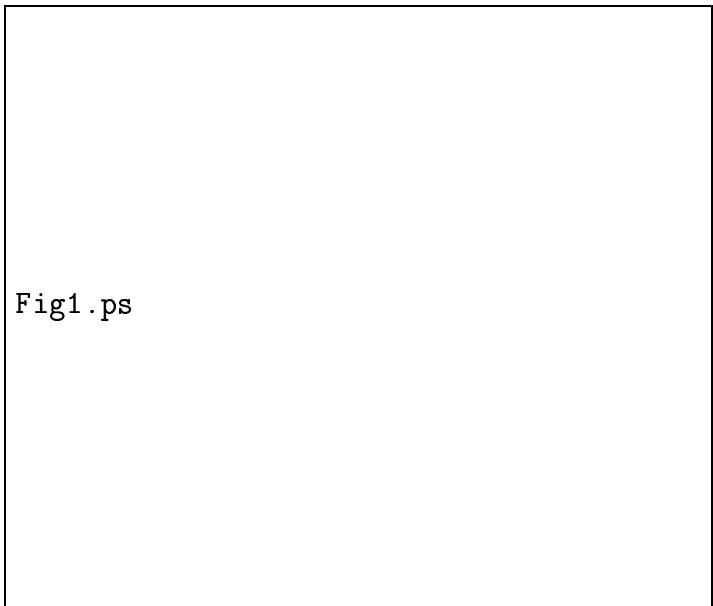
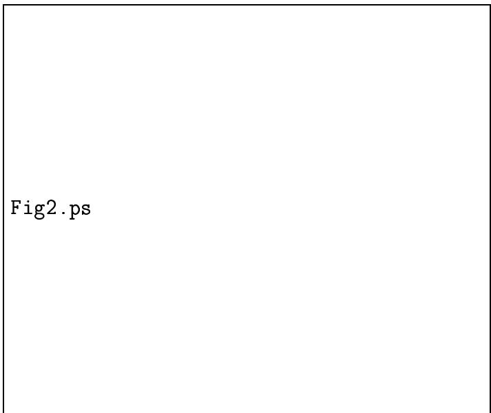
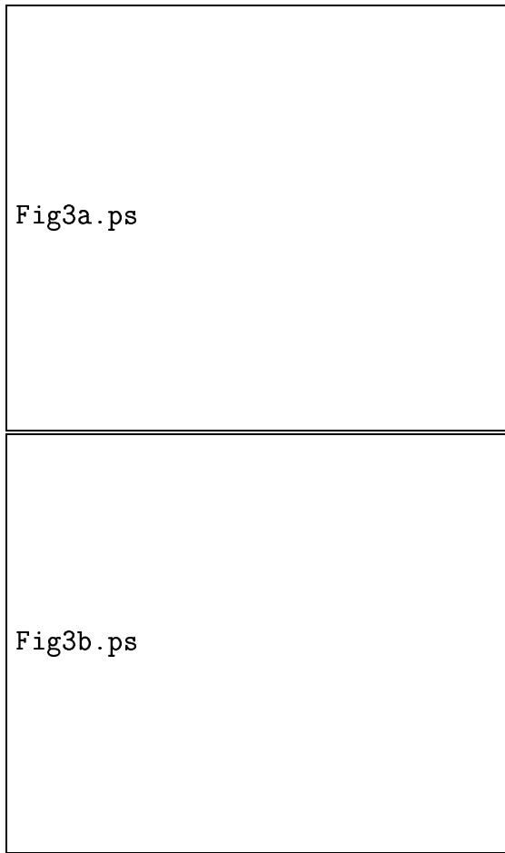

# Genetic Drift in Genetic Algorithm Selection Schemes

Alex Rogers and Adam Prügel-Bennett

ISIS Research Group

Department of Electronics and Computer Science

University of Southampton

Highfield, Southampton, SO17 1BJ England

A.Rogers@ecs.soton.ac.uk

# Abstract

A method for calculating genetic drift in terms of changing population fitness variance is presented. The method allows for an easy comparison of different selection schemes and exact analytical results are derived for traditionalgenerational selection, steady-state selection with varying generation gap, a simple model of Eshelman's CHC algorithm, and $( \mu + \lambda )$ evolution strategies. The effects of changing genetic drift on the convergence of a GA are demonstrated empirically.

# Keywords

Genetic Drift, Selection Operator, Genetic Algorithm, Evolution Strategy

# I. INTRODUCTION

Genetic drift is a term borrowed from population genetics where it is used to explain changes in gene frequency through random sampling of the population. It is a phenomenon observed in genetic algorithms (GA) due to the stochastic nature of the selection operator, and is one of the mechanisms by which the population converges to a single member. Analysis of genetic drift is often performed by calculating the Markov chain transition matrices and hence finding the time for the system to reach an absorption state where all population members are identical. Comparisons in the genetic algorithm literature are often performed numerically in this fashion [1], [2]. In population genetics some work has been to done to solve this analytically [3], [4], [5] however the results are approximations and are difficult to generalise to other cases.

Analysis of selection schemes such as those by Prügel-Bennett and Shapiro [6], [7], [8], Rattray [9] and Mühlenbein [10] show that the change in mean fitness at each generation is a function of the population fitness variance. At each generation this variance is reduced due to two factors. One factor is selection pressure producing multiple copies of fitter population members whilst the other factor is independent of population member fitness and is due to the stochastic nature of the selection operator — genetic drift. The loss in population fitness variance due to genetic drift thus has a direct effect on the performance of the genetic algorithm. By considering neutral selection we decouple the effect of selection pressure and can see the effect of genetic drift directly.

This paper presents a method of calculating the rate of genetic drift in terms of this change in population fitness variance. Unlike calculations in terms of convergence time, this approach lends itself to an exact analytical solution. We are able to derive a general expression for the change in population fitness variance due to genetic drift and apply it to the range of selection schemes used in evolutionary algorithms. We first consider the generational GA and then compare it to steady-state selection where one member is drawn from the population, replicated, and replaces another population member chosen at random.

To generalise between these two extremes, De Jong [1], [11] introduced the term generation gap, $G$ , which describes the percentage of the population selected from the initial population at each time step. For generational selection $G = 1$ and for steady-state selection $G = 1 / P$ . We follow this generalisation and calculate the change in variance for any value of generation gap.

The formalism can also be extended to other non traditional selection schemes such as that used in Eshelman's CHC algorithm [12]. Here we confirm analytically an observation made by Schaffer et al. [2] that shows using a numerical Markov chain analysis that a simple model of CHC style selection exhibits half the rate of genetic drift of the traditional genetic algorithm. The simple model of the CHC algorithm is equivalent to selection schemes in evolution strategies and we can generalise the approach for these selection schemes.

In Section II we derive the result which enables us to calculate the rate of genetic drift. In Section III we present the analytical results for different selection schemes and compare them to simulation results. Section IV contains details of the calculations and in Section V we discuss the results and their implications on the performance of genetic algorithms.

# II. POPULATION FITNESS VARIaNCE

If we consider an initial population of $P$ discrete members each with fitness $F _ { \alpha }$ , the variance $\left( \kappa _ { 2 } \right)$ of the population fitness distribution is simply given by,

$$
\begin{array} { r c l } { { \kappa _ { 2 } } } & { { = } } & { { \mathsf { E } \left[ F ^ { 2 } \right] - \mathsf E \left[ F \right] ^ { 2 } } } \\ { { } } & { { = } } & { { \displaystyle \frac 1 P \sum _ { \alpha = 1 } ^ { P } F _ { \alpha } ^ { 2 } - \left( \frac 1 P \sum _ { \alpha = 1 } ^ { P } F _ { \alpha } \right) ^ { 2 } . } } \end{array}
$$

We can separate out terms that are not independent to give,

$$
\kappa _ { 2 } = \left( \frac { 1 } { { \cal P } } - \frac { 1 } { { \cal P } ^ { 2 } } \right) \sum _ { \alpha = 1 } ^ { \cal P } F _ { \alpha } ^ { 2 } - \frac { 1 } { { \cal P } ^ { 2 } } \sum _ { \alpha \neq \beta } F _ { \alpha } F _ { \beta } .
$$

We now apply some selection scheme to this population and draw from it a new population of $P$ individuals. In this new population there are now $n _ { \alpha }$ copies of population member $F _ { \alpha }$ and the variance of the new population fitness distribution is given by,

$$
\kappa _ { 2 } ^ { \prime } = \frac { 1 } { P } \sum _ { \alpha = 1 } ^ { P } n _ { \alpha } F _ { \alpha } ^ { 2 } - \left( \frac { 1 } { P } \sum _ { \alpha = 1 } ^ { P } n _ { \alpha } F _ { \alpha } \right) ^ { 2 } .
$$

Again we can separate out terms that are not independent,

$$
\kappa _ { 2 } ^ { \prime } = \sum _ { \alpha = 1 } ^ { P } \left( \frac { n _ { \alpha } } { P } - \frac { n _ { \alpha } ^ { 2 } } { P ^ { 2 } } \right) F _ { \alpha } ^ { 2 } - \sum _ { \alpha \neq \beta } \frac { n _ { \alpha } n _ { \beta } } { P ^ { 2 } } F _ { \alpha } F _ { \beta } .
$$

To consider the average case, we average over all ways of performing selection. In the case of neutral selection, $n _ { \alpha }$ is independent of $F _ { \alpha }$ and these terms may be taken outside the summation and the expected population fitness variance considered,

$$
\mathsf E \left[ \mathsf e _ { 2 } ^ { \prime } \right] = \left( \frac { \mathsf E \left[ n \right] } P - \frac { \mathsf E \left[ n ^ { 2 } \right] } { P ^ { 2 } } \right) \sum _ { \alpha = 1 } ^ { P } F _ { \alpha } ^ { 2 } - \frac { \mathsf E \left[ n _ { \alpha } n _ { \beta } \right] } { P ^ { 2 } } \sum _ { \alpha \neq \beta } F _ { \alpha } F _ { \beta } .
$$

To simplify this result further, we use the fact that population size is kept constant and thus $\mathsf { E } [ n ] = 1$ . We can use this to derive the identity,

$$
\left( \sum _ { \alpha = 1 } ^ { P } n _ { \alpha } \right) ^ { 2 } = P ^ { 2 } = \sum _ { \alpha = 1 } ^ { P } n _ { \alpha } ^ { 2 } + \sum _ { \alpha \neq \beta } n _ { \alpha } n _ { \beta } .
$$

Averaging over all possible selections gives,

$$
P ^ { 2 } = P \mathsf { E } \left[ n ^ { 2 } \right] + P \left( P - 1 \right) \mathsf { E } \left[ n _ { \alpha } n _ { \beta } \right] ,
$$

and thus,

$$
\mathsf E \left[ n _ { \alpha } n _ { \beta } \right] = \frac { P - \mathsf E \left[ n ^ { 2 } \right] } { P - 1 } .
$$

Substituting this expression into eqn. (5) gives,

$$
\mathsf E \left[ \kappa _ { 2 } ^ { \prime } \right] = \frac { P - \mathsf E \left[ n ^ { 2 } \right] } { P - 1 } \left[ \left( \frac 1 P - \frac 1 { P ^ { 2 } } \right) \sum _ { \alpha = 1 } ^ { P } F _ { \alpha } ^ { 2 } - \frac 1 { P ^ { 2 } } \sum _ { \alpha \neq \beta } F _ { \alpha } F _ { \beta } \right] .
$$

The term within the square brackets is simply the fitness variance of the initial population given in eqn. (2) and thus,

$$
\mathsf E \left[ \kappa _ { 2 } ^ { \prime } \right] = \frac { P - \mathsf E \left[ n ^ { 2 } \right] } { P - 1 } \kappa _ { 2 } .
$$

We can find the change in population fitness variance for any selection scheme simply by calculating $\mathsf { E } \left[ n ^ { 2 } \right]$ — the expected square of the number of times any population member is selected. This is related to the variance in the number of times any member is selected $- \vee [ n ]$ . As $\mathsf { V } \left[ n \right] = \mathsf E \left[ n ^ { 2 } \right] - \mathsf E \left[ n \right] ^ { 2 }$ , we can rewrite eqn. (9) in these terms,

$$
\mathsf E \left[ \kappa _ { 2 } ^ { \prime } \right] = \left( 1 - \frac { \mathsf V \left[ n \right] } { P - 1 } \right) \kappa _ { 2 } .
$$

This expression is the basis for the results derived in this paper. It describes the change in population fitness variance due to selection, genetic drift, in terms of the variance in the number of times any individual is selected.

# III. RESULTS

The change in the population fitness variance due to selection, genetic drift, is dependent only on the variance of the number of times any individual population member is selected $\mathbf { \Omega } - \mathrm { ~ V ~ } [ n ]$ . If we select each population member once and only once then ${ \mathsf { V } } \left[ n \right] = { \mathsf { 0 } }$ and our expression in eqn. (10) is equal to one. As expected we see no change in population variance — indeed the population has not changed.

To compare each selection scheme we need only calculate $\mathsf { V } \left[ n \right]$ . To allow direct comparison between traditional generational selection we normalise the results to one generation — we apply steady-state selection $P$ times and selection with generation gap $G$ , $1 / G$ times. We define the ratio $r$ as the change in variance after one generation,

$$
r = \frac { \mathsf { E } \left[ \mathsf { K } _ { 2 } ^ { \prime } \right] } { \kappa _ { 2 } } .
$$

This gives a very simple picture of the change in genetic drift for differing selection schemes. We present the calculations in more detail in the next section but give the results here. Whilst the first expression for generational selection is exact, the other expressions are

approximations that are accurate to terms in $1 / P$ .

$$
{ \begin{array} { r l } { { \mathrm { G e n e r a t i o n a l } } ; } & { r = 1 - { \frac { 1 } { P } } } \\ { { \mathrm { S t e a d y } } { \mathrm { - S t a t e } } ; } & { r \approx 1 - { \frac { 2 } { P } } } \\ { { \mathrm { G e n e r a t i o n ~ G a p ~ G } } ; } & { r \approx 1 - { \frac { 2 - G } { P } } } \\ { { \mathrm { C H C ~ A l g o r i t h m } } ; } & { r \approx 1 - { \frac { 1 } { 2 P } } } \end{array} }
$$

The rate of geneticdrift in generational selection is well known as the result of sampling

Fig. 1. Population fitness variance for five different selection schemes. Solid lines are analytical results and error bars are simulation results averaged over 10,000 runs. Curves presented are steady-state (SSGA), generation gap $\mathrm { G } { = } 0 . 2$ ,generation gap $\mathrm { G } { = } 0 . 5$ , generational (GA), and a simple model of the CHC algorithm (CHC). Population size is 100.

$P$ times with replacement from a finite population.

The rate of genetic drift in steady state selection is twice that of generational selection. This result has previously been shown by the authors [13] in an analysis of steady state selection using Boltzmann selection. Varying the generation gap produces a smooth progression between these two limits.

The simple model of the CHC algorithm shows half the genetic drift of the generational selection scheme. This is in agreement with the empirical observation and numerical

Markov chain comparison by Schaffer et al. [2].

Figure 1 shows a comparison of these analytical results with simulation data. A population of 100 was initially drawn from a normal distribution ( $\kappa _ { 2 } = 1 $ ) and selection repeatedly performed. The plot shows the decreasing population fitness variance for five different selection schemes — steady-state selection (SSGA), generation gap $G = 0 . 2$ , generation gap $G = 0 . 5$ , traditional generational selection (GA), and CHC style selection (CHC). Simulation data were averaged over 10,000 runs.

# IV. PERFORMING THE CALCULATIoNS

To calculate $\mathsf { V } [ n ]$ for each selection scheme is an exercise in probability. We use two results from standard probability theory regarding binomial and hypergeometric distributions [14].

Selecting from a population with replacement gives rise to a binomial distribution $B \left( N , p \right)$ where we select $N$ times with probability of success $p$ . In this case, the expected number of times any individual is selected and its variance are given by,

$$
\mathsf { E } \left[ n \right] = N p \quad \quad \mathsf { V } \left[ n \right] = N p \left( 1 - p \right) .
$$

When we are selecting without replacement, the result is a hypergeometric distribution $H \left( M , m , N \right)$ . Here $M$ is the size of the population, $N$ is the number of times we select and $m$ is the number of copies of each individual in the initial population. This gives the known result,

$$
\mathsf { E } \left[ n \right] = \frac { N m } { M } \qquad \mathsf { V } \left[ n \right] = \frac { N m \left( M - N \right) \left( M - m \right) } { M ^ { 3 } - M ^ { 2 } } .
$$

In each case we calculate $\mathsf { E } \left[ n \right]$ to check that population size is conserved, as expected, and then use $\mathsf { V } [ n ]$ in eqn. (10) to give the expected change in population fitness variance and thus the rate of genetic drift.

# A. Generational Selection

In a generational selection scheme under random sampling, we are drawing $P$ members from a population with replacement. This gives rise to a binomial distribution, $B \left( P , 1 / P \right)$

and thus,

$$
\begin{array} { l c l } { { \mathsf { E } \left[ n \right] } } & { { = } } & { { 1 } } \\ { { } } & { { } } & { { } } \\ { { \mathsf { V } \left[ n \right] } } & { { = } } & { { 1 - 1 / P . } } \end{array}
$$

As required $\mathsf { E } [ n ] = 1$ and we can thus substitute $\mathsf { V } [ n ]$ directly into eqn. (10) to give,

$$
\mathsf { E } \left[ \mathsf { K } _ { 2 } ^ { \prime } \right] = \left( 1 - \frac { 1 } { P } \right) \mathsf { \kappa } _ { 2 } .
$$

Using the definition of $r$ in eqn. (11),

$$
r = 1 - { \frac { 1 } { P } } .
$$

# B. Steady-State Selection

In the steady-state genetic algorithm we select one member at random, replicate it, and replace another random member with the copy in each time step.

We can calculate this by dividing the population into two. We draw one member with replacement into subpopulation A and then draw $P - 1$ members without replacement into subpopulation B. We then combine these two to form the next population. For subpopulation A we have a binomial distribution $B \left( 1 , 1 / P \right)$ and hence,

$$
\begin{array} { l c l } { { \mathsf { E } \left[ n _ { A } \right] } } & { { = } } & { { 1 / P } } \\ { { } } & { { } } & { { } } \\ { { \mathsf { V } \left[ n _ { A } \right] } } & { { = } } & { { \left( P - 1 \right) / P ^ { 2 } . } } \end{array}
$$

For subpopulation B we have a hypergeometric distribution $H \left( P , 1 , P - 1 \right)$ and hence,

$$
\begin{array} { l c l } { { \mathsf { E } \left[ n _ { B } \right] } } & { { = } } & { { 1 - 1 / P } } \\ { { } } & { { } } & { { } } \\ { { \mathsf { V } \left[ n _ { B } \right] } } & { { = } } & { { \left( P - 1 \right) / P ^ { 2 } . } } \end{array}
$$

Since the two populations are independent, we can simply sum for the final population,

$$
\begin{array} { l r c l } { { \mathsf { E } \left[ n \right] } } & { { = } } & { { \mathsf { E } \left[ n _ { A } \right] + \mathsf { E } \left[ n _ { B } \right] = 1 } } \\ { { } } & { { } } & { { } } \\ { { \mathsf { V } \left[ n \right] } } & { { = } } & { { \mathsf { V } \left[ n _ { A } \right] + \mathsf { V } \left[ n _ { B } \right] = 2 ( P - 1 ) / P ^ { 2 } . } } \end{array}
$$

As required $\mathsf { E } [ n ] = 1$ and we can thus substitute $\mathsf { V } [ n ]$ directly into eqn. (10) to give,

$$
\mathsf E \left[ { \kappa _ { 2 } ^ { \prime } } \right] = \left( 1 - \frac { 2 } { P ^ { 2 } } \right) \kappa _ { 2 } .
$$

It is often more convenient to compare $P$ of these selections to one generational selection so using the definition of $r$ as the change after one generation,

$$
\begin{array} { r c l } { { r } } & { { = } } & { { \displaystyle \left( 1 - \frac { 2 } { P ^ { 2 } } \right) ^ { P } } } \\ { { } } & { { \approx } } & { { \displaystyle 1 - \frac { 2 } { P } . } } \end{array}
$$

It is clear that the rate of genetic drift is twice that of the generational case.

# $\boldsymbol { C }$ . Varying Generation Gap

To generalise between these two cases we use the concept of generation gap $( G )$ . We select $G P$ members with replacement from the original population and delete $G P$ members at random to make room.

Again we can consider two subpopulations. We draw $G P$ members with replacement from the original population into subpopulation A and then draw $P ( 1 - G )$ members without replacement into subpopulation B.

For subpopulation A we have a binomial distribution $B \left( G P , 1 / P \right)$ and hence,

$$
\begin{array} { l } { { \mathsf { E } \left[ n _ { A } \right] = G } } \\ { { \mathsf { V } \left[ n _ { A } \right] = G \left( 1 - 1 / P \right) . } } \end{array}
$$

For subpopulation B we have a hypergeometric distribution $H \left( P , 1 , P - G P \right)$ and hence,

$$
\begin{array} { l } { { \mathsf { E } \left[ n _ { B } \right] = 1 - G } } \\ { { \mathsf { V } \left[ n _ { B } \right] = G - G ^ { 2 } . } } \end{array}
$$

Again we simply sum these for the final population,

$$
\begin{array} { l } { { \mathsf { E } \left[ n \right] = 1 } } \\ { { \mathsf { V } \left[ n \right] = 2 G - G ^ { 2 } - G / P . } } \end{array}
$$

As required $\mathsf { E } [ n ] = 1$ and we can thus substitute $\mathsf { V } [ n ]$ directly into eqn. (10) to give,

$$
\mathsf E \left[ \mathsf E _ { 2 } ^ { \prime } \right] = \left( 1 - \frac { 2 G - G ^ { 2 } - G / P } { P - 1 } \right) \kappa _ { 2 } .
$$

To compare this to one generation we apply the selection operator $1 / G$ times. Thus approximating to first-order terms in $1 / P$ we get,

$$
\begin{array} { r c l } { { r } } & { { = } } & { { \displaystyle \left( 1 - \frac { 2 G - G ^ { 2 } - G / P } { P - 1 } \right) ^ { \frac { 1 } { G } } } } \\ { { } } & { { \approx } } & { { \displaystyle 1 - \frac { 2 - G } { P } . } } \end{array}
$$

Thus there is a gradual transition between the two rates of genetic drift as generation gap changes.

# D. CHC Algorithm and Evolution Strategies

Eshelman's CHC algorithm uses another non traditional form of selection whereby crossover is performed amongst the initial population and then selection is performed without replacement from the combined population of parents and offspring.

A simple model of this used by Schaffer et al. [2] in a numerical genetic drift comparison is to duplicate each member of the population and then draw $P$ members from the population of $2 P$ without replacement. In terms of evolution strategies this is $( \mu + \lambda )$ selection with $\lambda = \mu$ .

This selection gives rise to a hypergeometric distribution $H \left( 2 P , 2 , P \right)$ where we select $P$ times from an initial population of $2 P$ which consists of two copies of each individual.

$$
\begin{array} { l c l } { { \sf E } \left[ n \right] } & { { = } } & { { 1 } } \\ { { } } & { { } } & { { } } \\ { { { \sf V } \left[ n \right] } } & { { = } } & { { \left( P - 1 \right) / \left( 2 P - 1 \right) . } } \end{array}
$$

As required $\mathsf { E } [ n ] = 1$ and we can thus substitute $\mathsf { V } [ n ]$ directly into eqn. (10) to give,

$$
\mathsf E \left[ \kappa _ { 2 } ^ { \prime } \right] = \left( 1 - \frac 1 { 2 P - 1 } \right) \kappa _ { 2 } .
$$

As we draw $P$ members from the population, we can compare this directly to the generational case and simply make a first-order approximation,

$$
r \approx 1 - \frac { 1 } { 2 P } .
$$

Thus genetic drift in this model of CHC selection is at half the rate of that of the traditional generational algorithm.

Whilst we have only considered the case here equivalent to CHC selection, the technique presented is immediately applicable to other evolution strategy selection schemes. When $\lambda$ is a whole number multiple of $\mu$ , the above approach gives the correct expression. However the more common and more interesting case where $\lambda$ is some fraction of $\mu$ is more complicated due to the need to average over the population.

We consider a $( \mu + \lambda )$ evolution strategy where $\mu = P$ and $\lambda = s P$ where $s$ is some fraction, $0 \leq s \leq 1$ . When we apply selection, we are selecting from two subpopulations, one consisting of $P ( 1 - s )$ individuals and the other of size $2 s P$ containing $s P$ pairs. If $n _ { 1 }$ is the number of individuals and $n _ { 2 }$ the number of pairs in the final population, the variance in the number of times any population member is selected can be shown to be simply,

$$
{ \mathsf { V } } \left[ n \right] ~ = ~ { \frac { 2 n _ { 2 } } { P } } ,
$$

as $P \mathsf { E } \left[ n \right] = n _ { 1 } + 2 n _ { 2 }$ , $P \mathsf { E } \left[ n ^ { 2 } \right] = n _ { 1 } + 4 n _ { 2 }$ , $\mathsf { E } [ n ] = 1$ and $\mathsf { V } \left[ n \right] = \mathsf E \left[ n ^ { 2 } \right] - \mathsf E \left[ n \right] ^ { 2 }$ . If we draw $X$ times without replacement from the subpopulation of pairs, the number of pairs drawn and thus the number of pairs in the final population is given by,

$$
n _ { 2 } ~ = ~ \frac { X ^ { 2 } - X } { 2 \left( 2 s P - 1 \right) } 
$$

Substituting eqn. (21) into eqn. (20) and averaging over $X$ gives,

$$
\mathsf { V } \left[ n \right] ~ = ~ \frac { \mathsf { E } \left[ X ^ { 2 } \right] - \mathsf { E } \left[ X \right] } { P \left( 2 s P - 1 \right) } .
$$

The expectations of $\mathrm { X }$ are described by the hypergeometric distribution $H _ { \mathit { \Phi } } ( P ( 1 + s ) , 2 s P , P )$ , as we are drawing $P$ times without replacement from a population of $P ( 1 + s )$ . Using $\mathsf { V } \left[ X \right] = \mathsf E \left[ X ^ { 2 } \right] - \mathsf E \left[ X \right] ^ { 2 }$ and the standard results for the hypergeometric distribution given earlier, gives the result,

$$
\mathsf { V } [ n ] ~ = ~ \frac { 2 s ( P - 1 ) } { ( 1 + s ) [ P ( 1 + s ) - 1 ] } .
$$

As before, we can substitute $\mathsf { V } \left[ n \right]$ directly into eqn. (10) and normalise the expression by applying the selection $1 / s$ times to give the final rate of genetic drift,

$$
\begin{array} { l l l } { r } & { = } & { \displaystyle \left( 1 - \frac { 2 s } { \left( 1 + s \right) \left[ P \left( 1 + s \right) - 1 \right] } \right) ^ { 1 / s } } \\ { } & { \approx } & { 1 - \displaystyle \frac { 2 } { \left( 1 + s \right) ^ { 2 } P } . } \end{array}
$$

The rate of genetic drift covers the same range as that seen for the genetic algorithm selection schemes. Figure 2 shows a plot of these analytical result against simulation data. Four different values of $s$ are considered and the population size is again 100.

  
Fig. 2. Population fitness variance for $( \mu + s \mu )$ selection for varying s. Solid lines are analytical results and error bars are simulation results averaged over 10,000 runs. Population size is 100.

# V. Discussion

Analysing genetic drift in terms of the change in population fitness variance allows exact analytical expressions to be derived for any selection scheme. From these expressions we can make some comparisons of the effect that genetic drift has on the convergence of a GA under varying generation gap. If we consider a GA using a small population and weak selection, these effects will be most pronounced.

Figure 3 shows the population fitness mean and variance for steady state, generational, and varying generation gap ( $G = 0 . 2$ and 0.5) implementations of GA on the ONEMAX problem. All use a population size of 50 with probabilistic tournament selection ( $s = 0 . 1$ ), string length 96, point mutation rate $1 / 9 6$ , and uniform crossover. CHC is not included in the comparison as the other features of the algorithm lead to more significant differences than genetic drift alone.

Selection pressure is the same in each case as evidenced by the identical initial gradients of the mean fitness curves. As variance decreases through selection, the change in mean fitness decreases. For the steady state GA, variance decreases fastest due to the higher rate of genetic drift and thus the mean fitness evolves to a lower final value.

  
Fig. 3. Population mean fitness and variance for four different selection schemes. Simulation results are averaged over 10,000 runs and the error bars are the thickness of the lines. Curves presented are (in order) steady-state (SSGA), generation gap $\mathrm { G } { = } 0 . 2$ , generation gap $\mathrm { G } { = } 0 . 5$ , and generational (GA).

These results illustrate how genetic drift can influence the convergence of a GA. It is not always detrimental, however. In another paper analysing steady-state Boltzmann selection [13], the authors show that in the weak selection limit, rescaling the parameters of a steady-state GA enable it to reproduce the dynamics of a generational GA but at half the computational cost. Definitive statements about the performance of different selection schemes are difficult to make. However it is clear that genetic drift is another factor, alongside more commonly understood factors such as selection pressure, which affects the convergence of the GA and can be controlled by the choice of selection scheme.

# AckNowLedgments

The authors would like to thank the reviewers for highlighting the use of the hypergeometric probability distribution and suggestions on notation. Both contributions improve the clarity of the calculations.

Alex Rogers is supported by an award from the EPSRC - Engineering and Physical Science Research Council.

# Список литературы

[K.A.De Jong An Analysif the Behavior  aClas Geneic Adaptive Systes, h.D.thei, Univerity of Michigan, 1975.   
[2] J. Schaffer, M. Mani, L. Eshelman, and K. Mathias, "The Effect of Incest Prevention on Genetic Drift," in Foundations of Genetic Algorithms 5, W. Banzhaf and C. Reeves, Eds., San Francisco, 1998, Morgan Kaufmann, In press.   
[3] P. A. P. Moran, "Random Processes in Genetics," Proceedings of the Cambridge Philosophical Society, vol. 54, pp. 6071, 1958.   
[4] M. Kimura, Diffusion Models in Population Genetics, Applied Probability. Methuen's Review Series in Applied Probability, 1964.   
[5] W. J. Ewens, Mathematical Population Genetics, Springer-Verlag, 1979.   
[6] A.Prügel-Bennett and J. L. Shapiro, "An Analysis of Genetic Algorithms Using Statistical Mechanics," Phys. Rev. Lett., vol. 72, no. 9, pp. 13051309, 1994.   
[7] A. Prügel-Bennett and J. L. Shapiro, "The Dynamics of a Genetic Algorithm for Simple Random Ising Systems," Physica D, vol. 104, pp. 75114, 1997.   
[8] A. Prügel-Bennett, "Modelling Evolving Populations," J. Theor. Biol., vol. 185, pp. 8195, 1997.   
[9] M. Rattray, Modelling the Dynamics of Genetic Algorithms using Statistical Mechanics, Ph.D. thesis, Manchester University, Manchester, UK, 1996.   
[10] H. Mühlenbein, "Genetic Algorithms," in Local Search in Combinatorial Optimization, E. Aarts and J. K. Lenstra, Eds., New York, 1997, pp. 137-171, Jon Wiley and Sons.   
[1] K. A. De Jong and J.Sarma, "Generation Gaps Revisited,"in Foundationsf Geneti Algorithms , L. Darrel Whitley, Ed., San Mateo, 1993, pp. 1928, Morgan Kaufmann.   
[12] L. Eshelman, The CHC Adaptive Search Algorithm: How to Have Safe Search When Engaging in Nontraditional Genetic Recombination," in Foundations of Genetic Algorithms 1, G. Rawlins, Ed., San Mateo, 1991, pp. 265283, Morgan Kaufmann.   
[13] A. Rogers and A. Prügel-Bennett, "Modelling the Dynamics of Steady-State Genetic Algorithms,"in Foundations of Genetic Algorithms 5, W. Banzhaf and C. Reeves, Eds., San Francisco, 1998, Morgan Kaufmann, In press.