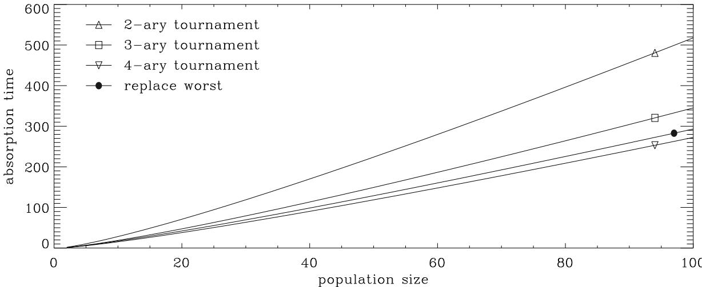
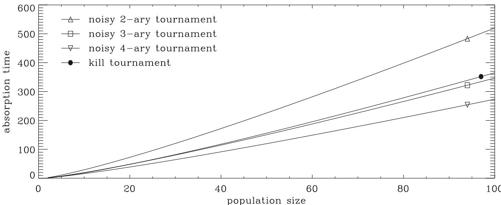
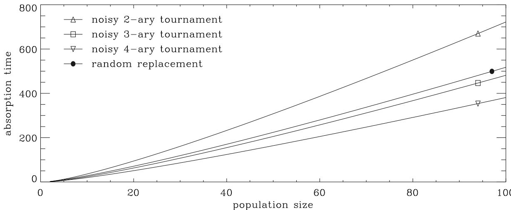

# Takeover Times and Probabilities of Non-Generational Selection Rules

# Günter Rudolph

Universität Dortmund Fachbereich Informatik D44221 Dortmund / Germany rudolph@LS11.cs.uni-dortmund.de

# Abstract

The takeover time is the expected number of iterations of some selection method until a population consists entirely of copies of the best individual under the assumption that only one best individual is contained in the initial population. This quantity is often used to assess the behavior of selection methods in evolutionary algorithms. Here, takeover times and probabilities are analytically determined for some popular nongenerational selection rules. Moreover, a novel classification number that aggregates additional information about the selection method is proposed.

# 1 INTRODUCTION

The notion of the takeover time of selection methods used in evolutionary algorithms was introduced by Goldberg and Deb [1]. Suppose that a finite population of size $n$ consists of a single best individual and $n - 1$ worse ones. The takeover time of some selection method is the expected number of iterations of the selection method until the entire population consists of copies of the best individual. Evidently, this definition of the takeover time becomes meaningless if all best individuals may get extinct with positive probability. In this case one could calculate the probability that a complete takeover takes place at iteration $k \geq 0$ . Since the determination of a symbolic expression of these probabilities is a complicated task, Chakraborty et al. [2] have calculated them numerically via a Markovian base model. Smith and Vavak [3] did the same in case of non-generational selection rules. Here, it is shown that the probabilistic models of non-generational selection rules are (more or less) simple random walks that are amenable of a theoretical treatment. For this purpose some basic results regarding Markov chains and random walks are presented in Section 2. These results are then used in Section 3 to calculate the takeover time for some non-generational selection rules for which extinction of the best individual is precluded. Section 4 is devoted to those selection methods for which extinction may happen with positive probability. In these cases the probability of the event of complete takeover (called the takeover probability) is determined. A summary of the results and their implications for practical use are given in Section 5.

# 2 MATHEMATICAL PRELIMINARIES

# 2.1 MARKOV CHAINS

If $S$ is a finite set and $\{ N _ { t } : t \in \mathbb { N } _ { 0 } \}$ an $S$ -valued random sequence with the property

$$
\begin{array} { r l } & { \mathsf { P } \{ N _ { t + 1 } = j \mid N _ { t } = i , N _ { t - 1 } = i _ { t - 1 } , . . . , N _ { 0 } = i _ { 0 } \} = } \\ & { \mathsf { P } \{ N _ { t + 1 } = j \mid N _ { t } = i \} = p _ { i j } } \end{array}
$$

for all $t \geq 0$ and for all pairs $( i , j ) \in S \times S$ then $\{ N _ { t } :$ $t \in \mathbb { N } _ { 0 } \}$ is called a homogeneous finite Markov chain with state space $S$ Since $S$ is finite the transition probabilities can be gathered in the transition matrix $P = ( p _ { i j } ) _ { i , j \in S }$ . The row vector $\pi ^ { ( t ) }$ with $\pi _ { i } ^ { ( t ) } = \mathsf { P } \{ N _ { t } = i \}$ denotes the distribution of the Markov chain at step $t \geq 0$ .Since

$$
\pi ^ { ( t ) } = \pi ^ { ( t - 1 ) } P = \pi ^ { ( 0 ) } P ^ { t }
$$

for all $t \geq 1$ , a homogeneous finite Markov chain is completely specified by its initial distribution $\pi ^ { ( 0 ) }$ and its transition matrix $P$ .

Since the behavior of the Markov chain depends on the structure of matrix $P$ the presentation is now restricted to transition matrices that will be encountered here. Let

$S = \{ 1 , 2 , \dots , n \}$ and

$$
P = \left( \begin{array} { c c c c c c c } { { r _ { 1 } } } & { { q _ { 1 } } } & { { 0 } } & { { . . . } } & { { } } & { { } } & { { 0 } } \\ { { 0 } } & { { r _ { 2 } } } & { { q _ { 2 } } } & { { 0 } } & { { . . . } } & { { 0 } } \\ { { \vdots } } & { { \ddots } } & { { \ddots } } & { { \ddots } } & { { \ddots } } & { { \vdots } } \\ { { 0 } } & { { . . . } } & { { 0 } } & { { r _ { n - 2 } } } & { { q _ { n - 2 } } } & { { 0 } } \\ { { 0 } } & { { . . . } } & { { } } & { { 0 } } & { { r _ { n - 1 } } } & { { q _ { n - 1 } } } \\ { { 0 } } & { { . . . } } & { { } } & { { } } & { { 0 } } & { { 1 } } \end{array} \right)
$$

with $r _ { i } , q _ { i } > 0$ and $r _ { i } + q _ { i } = 1$ for $i = 1 , \dots , n - 1$ . In this case state $n$ is termed absorbing whereas all other states are called transient. Let $T = \operatorname* { m i n } \{ t \geq 0 : N _ { t } = n \}$ . Then $\mathsf { E } [ T | N _ { 0 } = i ]$ is the expected absorption time and $a _ { i n } \ = \mathsf P \{ N _ { T } \ = \ n | N _ { 0 } \ = \ i \}$ the absorption probability for the Markov chain starting in state $i \in S$ . Since there is only one absorbing state one has $a _ { i n } ~ = ~ 1$ for each $i \in$ $S$ .The expected absorption time can be easily determined here. Suppose that the Markov chain starts in state $i \ <$ $n$ . Then it either stays in state $i$ or moves to state $i + 1$ . As soon as state $i + 1$ is reached, the Markov chain will either stay in state $i + 1$ or move to $i + 2$ ,and so forth until state $n$ is reached. Let $T _ { i , i + 1 }$ be the random number of steps until a transition from $i$ to $i + 1$ happens. Since $T _ { i , i + 1 }$ is a geometrically distributed random variable with E[ $T _ { i , i + 1 } ] = 1 / q _ { i } = 1 / p _ { i , i + 1 }$ one obtains

$$
\mathsf { E } [ T | N _ { 0 } = k ] = \sum _ { i = k } ^ { n - 1 } \mathsf { E } [ T _ { i , i + 1 } ] = \sum _ { i = k } ^ { n - 1 } { \frac { 1 } { p _ { i , i + 1 } } } .
$$

Now consider the general random walk with absorbing boundaries which is a Markov chain with state space $S =$ $\{ 0 , 1 , \ldots , n \}$ and transition matrix

$$
P = \left( \begin{array} { c c c c c c c } { { 1 } } & { { 0 } } & { { 0 } } & { { \cdots } } & { { } } & { { } } & { { 0 } } \\ { { p _ { 1 } } } & { { r _ { 1 } } } & { { q _ { 1 } } } & { { 0 } } & { { \cdots } } & { { } } & { { 0 } } \\ { { 0 } } & { { p _ { 2 } } } & { { r _ { 2 } } } & { { q _ { 2 } } } & { { 0 } } & { { \cdots } } & { { 0 } } \\ { { \vdots } } & { { \ddots } } & { { \ddots } } & { { \ddots } } & { { \ddots } } & { { \ddots } } & { { \vdots } } \\ { { 0 } } & { { \cdots } } & { { 0 } } & { { p _ { n - 2 } } } & { { r _ { n - 2 } } } & { { q _ { n - 2 } } } & { { 0 } } \\ { { 0 } } & { { \cdots } } & { { } } & { { 0 } } & { { p _ { n - 1 } } } & { { r _ { n - 1 } } } & { { q _ { n - 1 } } } \\ { { 0 } } & { { \cdots } } & { { } } & { { } } & { { 0 } } & { { 0 } } & { { 1 } } \end{array} \right)
$$

with $p _ { i } , q _ { i } > 0$ , $r _ { i } \ \geq 0$ and $p _ { i } + r _ { i } + q _ { i } = 1$ for all $i =$ $1 , \ldots , n - 1$ .In this case the states 0 and $n$ are absorbing. The expected absorption time is $\mathsf { E } [ T | N _ { 0 } = k ]$ with $T =$ $\operatorname* { m i n } \{ t \geq 0 : N _ { t } = 0 \forall N _ { t } = n \}$ and it can be determined as follows [4]. Let matrix $Q$ result from matrix $P$ by deleting its first and last row as well as column. If $C$ is the inverse of matrix $I - Q$ with unit matrix $I$ , then $\mathsf { E } [ T | N _ { 0 } = k ] =$ $c _ { k 1 } + c _ { k 2 } + \cdot \cdot \cdot + c _ { k , n - 1 }$ for $1 ~ \leq ~ k ~ < ~ n$ . Each entry $c _ { i j }$ yields the expected number of occurrences of state $j$ if the Markov chain has started in state $i$ Therefore, the absorption probabilities are

$$
a _ { k n } = { \mathsf { P } } \{ N _ { T } = n \mid N _ { 0 } = k \} = c _ { k , n - 1 } \cdot q _ { n - 1 }
$$

and $a _ { k 0 } = 1 - a _ { k n }$ . For some special cases the absorption probabilities are well known (see e.g. [4], p. 108). If $( p _ { i } , r _ { i } , q _ { i } ) = ( p , 0 , q )$ for all $i = 1 , \ldots , n - 1$ then

$$
a _ { k n } = { \frac { r ^ { n } - r ^ { n - k } } { r ^ { n } - 1 } }
$$

where $r = q / p \ne 1$ . If $r = 1$ then $a _ { k n } = k / n$ . In the general case, however, the derivation of a closed form expression may be tedious. The first step towards such an expression requires the determination of ${ \mathcal { C } } k , n - 1$ Thus, one only needs the value of a single entry of $\dot { C } = ( I - Q ) ^ { - 1 }$ which may be obtained via the adjugate of matrix $( I - Q )$ . This avenue was followed in Rudolph [5] who determined an expression for each entry of matrix $C$ Here, only the value for ${ \mathcal { C } } _ { 1 , n - 1 }$ is of interest since we need the absorption probability $a _ { 1 n }$ for the random walk starting at state 1. Owing to equation (2) and the result in [5] one gets

$$
a _ { 1 n } = \frac { \displaystyle \prod _ { k = 1 } ^ { n - 1 } q _ { k } } { \displaystyle \sum _ { k = 0 } ^ { n - 1 } \left( \prod _ { u = 1 } ^ { n - k - 1 } p _ { u } \right) \left( \prod _ { v = n - k } ^ { n - 1 } q _ { v } \right) } .
$$

This equation may be used to prove another useful result.

Lemma 1 Let $a _ { 1 n } ~ = ~ 1 - a _ { 1 0 } ~ \in ~ ( 0 , 1 )$ be the absorption probability of the general random walk with absorbing boundaries and transition probabilities $p _ { i } , q _ { i } , r _ { i } > 0$ . The absorption probability $\tilde { a } _ { 1 n }$ of the Markov chain with transition probabilities

$$
\tilde { p } _ { i } = \frac { p _ { i } } { p _ { i } + q _ { i } } , ~ \tilde { r } _ { i } = 0 , ~ \tilde { q } _ { i } = \frac { q _ { i } } { p _ { i } + q _ { i } }
$$

is $\tilde { a } _ { 1 n } = a _ { 1 n }$

Proof: Simply insert the transition probabilities of equation (5) into equation (4) and delete the factor

$$
1 { \Big / } \prod _ { k = 1 } ^ { n - 1 } ( p _ { k } + q _ { k } )
$$

in numerator and denominator.

Thus, if the transition probabilities $\tilde { p } _ { i } , \tilde { q } _ { i }$ in equation (5) are independent from the state $i$ , then equation (3) yields the absorption probability for the random walk with statedependent transition probabilities.

# 2.2 SPECIAL FUNCTIONS AND NUMBERS

# 2.2.1 Gamma Function

In case of positive integer arguments the Gamma function $\Gamma ( \cdot )$ obeys the relationships

$$
n \Gamma ( n ) = \Gamma ( n + 1 ) = n !
$$

For later purposes the following result is needed:

Lemma 2 For $n \in \mathbb { N }$

$$
\sum _ { k = 0 } ^ { n - 1 } { \frac { \Gamma ( n + k + 1 ) } { \Gamma ( k + 1 ) } } = { \frac { \Gamma ( 2 n + 1 ) } { ( n + 1 ) \Gamma ( n ) } } .
$$

Proof: Notice that

$$
\sum _ { k = 0 } ^ { n - 1 } { \frac { ( n + k + 1 ) ! } { k ! } } = ( n + 1 ) \sum _ { k = 0 } ^ { n - 1 } { \frac { ( n + k ) ! } { k ! } } + \sum _ { k = 0 } ^ { n - 1 } k { \frac { ( n + k ) ! } { k ! } } .
$$

Since

$$
\begin{array} { r c l } { { \displaystyle \sum _ { k = 0 } ^ { n - 1 } k \frac { ( n + k ) ! } { k ! } } } & { { = } } & { { \displaystyle \sum _ { k = 1 } ^ { n - 1 } k \frac { ( n + k ) ! } { k ! } } } \\ { { \displaystyle \sum _ { k = 1 } ^ { n - 1 } \frac { ( n + k ) ! } { ( k - 1 ) ! } } } & { { = } } & { { \displaystyle \sum _ { k = 0 } ^ { n - 2 } \frac { ( n + k + 1 ) ! } { k ! } } } \end{array}
$$

insertion into the first equation and rearrangement leads to the desired result.

# 2.2.2 Beta Function

The Beta function $B ( \cdot , \cdot )$ may be defined by the identity

$$
B ( n , m ) = \frac { \Gamma ( n ) \Gamma ( m ) } { \Gamma ( n + m ) } .
$$

# 2.2.3 Harmonic Numbers

The $n$ th harmonic number is defined by

$$
H _ { n } = \sum _ { i = 1 } ^ { n } { \frac { 1 } { i } }
$$

and may be bracketed as follows:

$$
\log ( n ) < H _ { n } < \log ( n ) + 1
$$

for $n \geq 2$

# 3 TAKEOVER TIME

Let $n \ < \ \infty$ be the population size and $N _ { t }$ the number of copies of the best individual at iteration $t \geq 0$ .Set $N _ { 0 } = 1$ and suppose that the selection method precludes the extinction of the best individuals. In this case the associated Markov chain has only one absorbing state and the takeover time of the selection method is just the expected absorption time of the Markov chain.

# 3.1 BINARY TOURNAMENT SELECTION

At each iteration of the non-generational binary tournament selection method two individuals are chosen at random and the worse of this pair is replaced by the better one. If both individuals are equally bad or good the number of copies of the best individual is not changed. Only if a copy of the best individual and a copy of a worse individual are drawn then $N _ { t }$ is incremented. This event happens with probability

$$
p _ { i , i + 1 } = 1 - \left( { \frac { i } { n } } \right) ^ { 2 } - \left( 1 - { \frac { i } { n } } \right) ^ { 2 } = ~ 2 { \frac { i } { n } } \left( 1 - { \frac { i } { n } } \right)
$$

where $i$ denotes the instantiation $N _ { t } ~ = ~ i$ Since $p _ { i i } ~ =$ $1 - p _ { i , i + 1 } , p _ { n n } = 1$ and all other transition probabilities are zero, the takeover time of this selection method can be obtained via equation (1) with $k = 1$ . This leads to

$$
\begin{array} { l c l } { { \mathsf { E } [ T ] } } & { { = } } & { { { \displaystyle { \frac { n } { 2 } } \sum _ { i = 1 } ^ { n - 1 } { \frac { n } { i \left( n - i \right) } } } } } \\ { { } } & { { = } } & { { { \displaystyle n \sum _ { i = 1 } ^ { n - 1 } { \frac { 1 } { i } } } } } \end{array} = \begin{array} { l c l } { { \displaystyle { \frac { n } { 2 } } \sum _ { i = 1 } ^ { n - 1 } \left( { \frac { 1 } { i } } + { \frac { 1 } { n - i } } \right) } } \\ { { } } & { { = } } & { { { \displaystyle n H _ { n - 1 } } } } \end{array}
$$

which is bounded by

$$
n \log ( n - 1 ) < \mathsf { E } [ T ] < n \left( \log ( n - 1 ) + 1 \right) .
$$

# 3.2 TERNARY TOURNAMENT SELECTION

In case of ternary tournament selection three individuals are drawn at random and the worst of this sample is replaced by the best of the sample. Therefore, the transition probabilities are

$$
p _ { i , i + 1 } = 1 - \left( { \frac { i } { n } } \right) ^ { 3 } - \left( 1 - { \frac { i } { n } } \right) ^ { 3 } = ~ 3 { \frac { i } { n } } \left( 1 - { \frac { i } { n } } \right)
$$

$p _ { i i } = 1 - p _ { i , i + 1 }$ for $i = 1 , \ldots , n - 1$ and $p _ { n n } = 1$ .Insertion in equation (1) yields

$$
\begin{array} { l l l } { { \mathsf { E } [ T ] } } & { { = } } & { { { \frac { n } { 3 } } \displaystyle \sum _ { i = 1 } ^ { n - 1 } { \frac { n } { i \left( n - i \right) } } } } \\ { { \mathrm { } } } & { { = } } & { { { \frac { 2 } { 3 } } n \displaystyle \sum _ { i = 1 } ^ { n - 1 } { \frac { 1 } { i } } } } \end{array} = \begin{array} { l } { { \frac { n } { 3 } } \displaystyle \sum _ { i = 1 } ^ { n - 1 } \left( { \frac { 1 } { i } } + { \frac { 1 } { n - i } } \right) } \\ { { \mathrm { } } } & { { = } } & { { { \frac { 2 } { 3 } } n H _ { n - 1 } } } \end{array}
$$

which is bounded by

$$
{ \frac { 2 } { 3 } } n \log ( n - 1 ) < \mathsf E [ T ] < { \frac { 2 } { 3 } } n ( \log ( n - 1 ) + 1 ) .
$$

# 3.3 QUATERNARY TOURNAMENT SELECTION

In case of quaternary tournament selection four individuals are drawn at random and the worst of this sample is replaced by the best of the sample. The transition probabilities are

$$
\begin{array} { l l l } { { p _ { i , i + 1 } } } & { { = } } & { { 1 - \displaystyle \left( \frac { i } { n } \right) ^ { 4 } - \left( 1 - \frac { i } { n } \right) ^ { 4 } } } \\ { { } } & { { = } } & { { 2 \displaystyle \frac { i } { n } \left( 1 - \frac { i } { n } \right) \left[ 2 - \frac { i } { n } \left( 1 - \frac { i } { n } \right) \right] } } \end{array}
$$

$p _ { i i } = 1 - p _ { i , i + 1 }$ for $i = 1 , \ldots , n - 1$ and $p _ { n n } = 1$ . As a consequence,

$$
\begin{array} { l } { \displaystyle \mathsf { E } [ T ] = \frac 1 2 \sum _ { i = 1 } ^ { n - 1 } \frac { n ^ { 4 } } { i \left( n - i \right) \left[ 2 n ^ { 2 } - i \left( n - i \right) \right] } } \\ { = \frac n 4 \sum _ { i = 1 } ^ { n - 1 } \left( \frac 1 i + \frac { 1 } { n - i } \right) + \frac 1 4 \sum _ { i = 1 } ^ { n - 1 } \frac { n ^ { 2 } } { 2 n ^ { 2 } - i \left( n - i \right) } } \\ { = \frac n 2 H _ { n - 1 } + \frac 1 4 \sum _ { i = 1 } ^ { n - 1 } \frac { n ^ { 2 } } { 2 n ^ { 2 } - i \left( n - i \right) } . } \end{array}
$$

Since the fraction in the sum of equation (6) is always between $1 / 2$ and $4 / 7$ one obtains the bounds

$$
\frac { n } { 2 } H _ { n - 1 } + \frac { n - 1 } { 8 } \leq \mathsf E [ T ] \leq \frac { n } { 2 } H _ { n - 1 } + \frac { n - 1 } { 7 }
$$

and finally

$$
\frac { n } { 2 } \left( \log \left( n - 1 \right) + \frac { 1 } { 4 } \right) - \frac { 1 } { 8 } < \mathsf { E } [ T ] < \frac { n } { 2 } \left( \log ( n - 1 ) + \frac { 9 } { 7 } \right) .
$$

# 3.4 REPLACE WORST SELECTION

This selection method differs from binary tournament selection as follows: Again, two individuals are drawn at random. But now the better one of the pair replaces the worst individual of the entire population. Therefore, $N _ { t }$ is incremented if at least one copy of the best individual is drawn. Since the transition probabilities are

$$
p _ { i , i + 1 } = 1 - \left( 1 - { \frac { i } { n } } \right) ^ { 2 } = { \frac { i } { n } } \left( 2 - { \frac { i } { n } } \right) ,
$$

$p _ { i i } = 1 - p _ { i , i + 1 }$ for $i = 1 , \ldots , n - 1$ and $p _ { n n } = 1$ , one obtains

$$
\begin{array} { r c l } { \displaystyle \mathsf { E } [ T ] } & { = } & { \displaystyle { n ^ { 2 } \sum _ { i = 1 } ^ { n - 1 } \frac { 1 } { i \left( 2 n - i \right) } = \frac { n } { 2 } \sum _ { i = 1 } ^ { n - 1 } \left( \frac { 1 } { i } + \frac { 1 } { 2 n - i } \right) } } \\ { \displaystyle } & { = } & { \displaystyle { \frac { n } { 2 } \left( H _ { n - 1 } + H _ { 2 n - 1 } - H _ { n } \right) } } \\ { \displaystyle } & { = } & { \displaystyle { \frac { n } { 2 } \left( H _ { 2 n - 1 } - \frac { 1 } { n } \right) } } \end{array}
$$

which is bounded by

$$
\frac { n } { 2 } \left( \log ( 2 n - 1 ) - \frac { 1 } { n } \right) < \mathsf E [ T ] < \frac { n } { 2 } \left( \log ( 2 n - 1 ) + 1 \right) .
$$

# 4 TAKEOVER PROBABILITY

If the extinction probability of the best individual is larger than zero for some selection method, then the concept of the takeover time is not meaningful because of two absorbing states. The absorption time $T$ of the associated Markov chain reflects the following situation: After $\mathsf { E } [ T ]$ iterations on average the event of complete takeover of the best individual has happened with (absorption/takeover) probability $a _ { 1 n } = { \mathsf P } \{ \ N _ { T } = n | N _ { 0 } = 1 \}$ whereas extinction of the best individual has occurred with (absorption/extinction) probability $a _ { 1 0 } = 1 - a _ { 1 n }$ .

A first comparison of selection methods with $a _ { 1 0 } > 0$ may be based on the magnitude of the takeover or extinction probability, which offers some insight into the reliability of the selection methods. If the takeover probability can be controlled by some parameter specified by the user, then one can compare selection methods with equal takeover probability by means of their absorption times. Thus, the first step towards such a comparison requires the determination of the takeover probability.

# 4.1 NOISY K-ARY TOURNAMENT SELECTION

Noisy $k$ -ary tournament selection differs from the noisefree counterpart as follows: Again, $k \geq 2$ individuals are drawn at random and the best as well as worst member of this sample is identified. But now the worst member replaces the best one with some replacement error probability $\alpha \in ( 0 , 1 )$ , whereas the the worst one is replaced by the best one with probability $1 - \alpha$ .Needless to say, this selection method looses all copies of the best individuals in the population with probability $a _ { 1 0 } > 0$ .Let

$$
s _ { i } = 1 - \left( { \frac { i } { n } } \right) ^ { k } - \left( 1 - { \frac { i } { n } } \right) ^ { k }
$$

be the probability that the sample of $k \geq 2$ individuals contains at least one best as well as one worse individual from a population with $i = 1 , \ldots , n - 1$ copies of the best individual. Then the transition probabilities are $p _ { 0 0 } = p _ { n n } = 1$ , $p _ { i , i + 1 } = s _ { i } \ : ( 1 - \alpha )$ , $p _ { i , i - 1 } = s _ { i } \alpha$ ,and $p _ { i i } = 1 - s _ { i }$ for $i = 1 , \ldots , n - 1$ . According to Lemma 1 the absorption probabilities can be determined by introducing a modified Markov chain with transition probabilities

$$
\begin{array} { r c l } { q _ { i , i + 1 } } & { = } & { \frac { p _ { i , i + 1 } } { p _ { i , i - 1 } + p _ { i , i + 1 } } = 1 - \alpha } \\ { q _ { i , i - 1 } } & { = } & { \frac { p _ { i , i - 1 } } { p _ { i , i - 1 } + p _ { i , i + 1 } } = \alpha } \end{array}
$$

and $q _ { i i } = 0$ for $i = 1 , \ldots , n - 1$ Since the new transition probabilities are constant, the absorption/takeover probability can be obtained via equation (3). This leads to

$$
a _ { 1 n } = { \frac { r ^ { n } - r ^ { n - 1 } } { r ^ { n } - 1 } }
$$

where $r = ( 1 - \alpha ) / \alpha \neq 1$ If $r = 1$ then $a _ { 1 n } = 1 / n$ Here, parameter $\alpha$ may be used to control the takeover probability. If $\alpha > 1 / 2$ then $r \ < \ 1$ and $a _ { 1 n } \ \to \ 0$ exponentially fast as $n  \infty$ . Therefore, such a choice of $\alpha$ does not seem reasonable for practical use. If $\alpha < 1 / 2$ then $r > 1$ and $a _ { 1 n } ~  ~ ( 1 - 2 \alpha ) / ( 1 - \alpha )$ monotonically decreasing as $n  \infty$ . For example, with $\alpha _ { n } = 1 / ( n + 1 )$ one gets $a _ { 1 n } \geq 1 - 1 / n$ .

# 4.2 RANDOM REPLACEMENT SELECTION

This selection methods is a randomized version of "replace worst selection." Two individuals are drawn at random and the better one of the pair replaces a randomly chosen individual from the population. As a consequence, the transition probabilities of the associated Markov chain are $p _ { 0 0 } = p _ { n n } = 1$ $\ O _ { n n } = 1 , p _ { i i } = 1 - p _ { i , i - 1 } - p _ { i , i + 1 }$ and

$$
{ \begin{array} { l l l } { p _ { i , i + 1 } } & { = } & { { \frac { i } { n } } \left( 2 - { \frac { i } { n } } \right) \left( 1 - { \frac { i } { n } } \right) } \\ & & { } \\ { p _ { i , i - 1 } } & { = } & { \left( 1 - { \frac { i } { n } } \right) ^ { 2 } { \frac { i } { n } } } \end{array} }
$$

for $i = 1 , \ldots , n - 1$ .Unfortunately, the previously used method via Lemma 1 does not lead to new transition probabilities that are independent from the state $i$ Therefore the more tedious approach via equation (4) has to be followed. Since $p _ { i } = p _ { i , i - 1 }$ , $q _ { i } = p _ { i , i + 1 }$ and

$$
\begin{array} { r c l } { \displaystyle \prod _ { v = n - k } ^ { n - 1 } ~ q _ { v } } & { = } & { \displaystyle \prod _ { v = n - k } ^ { n - 1 } \frac { v \left( 2 n - v \right) \left( n - v \right) } { n ^ { 3 } } } \\ & & { = } & { \displaystyle \frac { \Gamma \left( k + 1 \right) \Gamma \left( n + k + 1 \right) } { n ^ { 3 k + 1 } \Gamma \left( n - k \right) } } \\ { \displaystyle \prod _ { u = 1 } ^ { n - k - 1 } ~ p _ { u } } & { = } & { \displaystyle \prod _ { u = 1 } ^ { n - k - 1 } \frac { u \left( n - u \right) ^ { 2 } } { n ^ { 3 } } } \\ & & { = } & { \displaystyle \frac { \Gamma \left( n - k \right) \Gamma \left( n \right) ^ { 2 } } { n ^ { 3 \left( n - k - 1 \right) } \Gamma \left( k + 1 \right) ^ { 2 } } } \end{array}
$$

one obtains

$$
\sum _ { k = 0 } ^ { n - 1 } \left[ \prod _ { \upsilon = n - k } ^ { n - 1 } q _ { \upsilon } \right] \times \left[ \prod _ { u = 1 } ^ { n - k - 1 } p _ { u } \right] =
$$

$$
{ \frac { \Gamma ( n ) ^ { 2 } } { n ^ { 3 n - 2 } } } \sum _ { k = 0 } ^ { n - 1 } { \frac { ( n + k ) ! } { k ! } } = { \frac { \Gamma ( n ) \Gamma ( 2 n + 1 ) } { ( n + 1 ) n ^ { 3 n - 2 } } }
$$

with the help of Lemma 2. Insertion of $k = n - 1$ in equation (7) leads to

$$
\prod _ { v = 1 } ^ { n - 1 } q _ { v } = { \frac { \Gamma ( n ) \Gamma ( 2 n ) } { n ^ { 3 n - 2 } } }
$$

such that

$$
{ \begin{array} { r c l } { a _ { 1 n } } & { = } & { { \frac { \Gamma \left( n \right) \Gamma \left( 2 n \right) } { n ^ { 3 n - 2 } } } \displaystyle \int { \frac { \Gamma \left( n \right) \Gamma \left( 2 n + 1 \right) } { \left( n + 1 \right) n ^ { 3 n - 2 } } } } \\ & { = } & { { \frac { \left( n + 1 \right) \Gamma \left( 2 n \right) } { \Gamma \left( 2 n + 1 \right) } } = { \frac { n + 1 } { 2 n } } . } \end{array} }
$$

Thus, the best individual is lost in almost $50 \%$ of all runs. This result reveals that the utility of "random replacement selection" for practical use is questionable.

# 4.3 KILL TOURNAMENT" SELECTION

This selection method proposed in [3] is based on two binary tournaments: In the first tournament the best individual is identified. This individual replaces the worst individual identified in the second tournament (the "kill tournament"). The transition probabilities are $p _ { 0 0 } = p _ { n n } = 1$ ,

$$
{ \begin{array} { l l l } { p _ { i , i + 1 } } & { = } & { { \frac { i } { n } } \left( 2 - { \frac { i } { n } } \right) \left[ 1 - \left( { \frac { i } { n } } \right) ^ { 2 } \right] } \\ & & { } \\ { p _ { i , i - 1 } } & { = } & { \left( 1 - { \frac { i } { n } } \right) ^ { 2 } \left( { \frac { i } { n } } \right) ^ { 2 } } \end{array} }
$$

and $p _ { i i } = 1 - p _ { i , i - 1 } - p _ { i , i + 1 }$ for $i = 1 , \ldots , n - 1$ Again, the approach via equation (4) must be followed. This yields

$$
{ \begin{array} { r c l } { \displaystyle \prod _ { v = n - k } ^ { n - 1 } q _ { v } } & { = } & { \displaystyle \prod _ { v = n - k } ^ { n - 1 } { \frac { v \left( 2 n - v \right) \left( n - v \right) \left( n + v \right) } { n ^ { 4 } } } } \\ & { = } & { \displaystyle \frac { \Gamma \left( 2 n \right) \Gamma \left( n + k + 1 \right) \Gamma \left( k + 1 \right) } { n ^ { 4 + 1 } \Gamma \left( n - k \right) \Gamma \left( 2 n - k \right) } } \\ { \displaystyle \prod _ { u = 1 } ^ { n - k - 1 } p _ { u } } & { = } & { \displaystyle \prod _ { u = 1 } ^ { n - k - 1 } { \frac { u ^ { 2 } \left( n - u \right) ^ { 2 } } { n ^ { 4 } } } } \\ & { = } & { \displaystyle { \frac { \Gamma \left( n - k \right) ^ { 2 } \Gamma \left( n \right) ^ { 2 } } { n ^ { 4 ( n - k - 1 ) } \Gamma \left( k + 1 \right) ^ { 2 } } } } \end{array} }
$$

and hence

$$
\begin{array} { l } { { \displaystyle \sum _ { k = 0 } ^ { n - 1 } \left[ \prod _ { v = n - k } ^ { n - 1 } q _ { v } \right] \times \left[ \prod _ { u = 1 } ^ { n - k - 1 } p _ { u } \right] = } } \\ { { \displaystyle \frac { \Gamma \big ( 2 n \big ) \Gamma \big ( n \big ) ^ { 2 } } { n ^ { 4 n - 3 } } \sum _ { k = 0 } ^ { n - 1 } \frac { \Gamma \big ( n + k + 1 \big ) \Gamma \big ( n - k \big ) } { \Gamma \big ( 2 n - k \big ) \Gamma \big ( k + 1 \big ) } . } } \end{array}
$$

Insertion of $k = n - 1$ in equation (8) leads to

$$
\prod _ { v = 1 } ^ { n - 1 } q _ { v } = \frac { \Gamma ( 2 n ) ^ { 2 } } { n ^ { 4 n - 2 } }
$$

such that

$$
{ \frac { 1 } { a _ { 1 n } } } = n B ( n , n ) \sum _ { k = 0 } ^ { n - 1 } { \frac { \Gamma ( n + k + 1 ) \Gamma ( n - k ) } { \Gamma ( 2 n - k ) \Gamma ( k + 1 ) } } .
$$

Unfortunately, the sum in the equation above is complicated and the attempt of finding a closed form expression was unsuccessful. Therefore tight lower and upper bounds have been developed. Notice that

$$
\sum _ { k = 0 } ^ { n - 1 } { \frac { 1 } { b _ { k } } } = \sum _ { k = 0 } ^ { n - 1 } b _ { k } \mathrm { ~ w i t h ~ } b _ { k } = { \frac { \Gamma ( 2 n - k ) \Gamma ( k + 1 ) } { \Gamma ( n + k + 1 ) \Gamma ( n - k ) } }
$$

and $b _ { 0 } > b _ { 1 } > . . . > b _ { n - 1 } = 1 / b _ { 0 } > 0$ As a consequence,

$$
b _ { 0 } + b _ { 1 } \ \leq \ \sum _ { k = 0 } ^ { n - 1 } b _ { k } \ \leq \ b _ { 0 } + b _ { 1 } + \left( n - 2 \right) b _ { 2 } .
$$

Since

$$
\begin{array} { l c l } { { b _ { 0 } } } & { { = } } & { { \displaystyle \frac { 1 } { n ~ B \left( n , n \right) } , } } & { { b _ { 1 } ~ = ~ b _ { 0 } \displaystyle \frac { n - 1 } { \left( 2 n - 1 \right) \left( n + 1 \right) } , } } \\ { { } } & { { } } & { { } } \\ { { b _ { 2 } } } & { { = } } & { { b _ { 0 } \displaystyle \frac { n - 2 } { \left( 2 n - 1 \right) \left( n + 1 \right) \left( n + 2 \right) } } } \end{array}
$$

one immediately obtains

$$
{ \begin{array} { l l l } { a _ { 1 n } } & { \geq } & { { \frac { b _ { 0 } } { b _ { 0 } + b _ { 1 } + \left( n - 2 \right) b _ { 2 } } } } \\ & { = } & { 1 - { \frac { 1 } { n } } \cdot { \frac { 2 n ^ { 2 } - 3 n + 2 } { 2 n ^ { 2 } + 7 n - 2 } } } \\ & { \geq } & { 1 - { \frac { 1 } { n } } } \end{array} }
$$

and

$$
\begin{array} { l l l } { \displaystyle a _ { 1 n } } & { \le } & { \displaystyle \frac { b _ { 0 } } { b _ { 0 } + b _ { 1 } } } \\ { \displaystyle } & { = } & { 1 - \displaystyle \frac { n - 1 } { 2 \left( n ^ { 2 } + n - 1 \right) } } \\ { \displaystyle } & { \le } & { 1 - \displaystyle \frac { 1 } { 5 n } } \end{array}
$$

for $n \geq 2$

# 5 COMPARISON

A comparison of selection methods that is based on takeover times and probabilities may give some clues regarding the dynamics and the reliability of the selection methods. Here, the comparison is set up as follows: All selection methods that realize (or are adjustable to realize) a specific takeover probability are put into one group. Since all members of a group have the same reliability in preserving the best solution one may compare the absorption times that reflect to some extent the speed of loss of diversity within the population. This set-up leads to three groups here.

1.Takeover probability $a _ { 1 n } = 1$ : $k$ -ary tournament selection, replace worst selection.   
Takeover probability $a _ { 1 n } = 1 - \Theta ( 1 / n )$ : Kill tournament selection, noisy $k$ -ary tournament selection.   
3.Takeover probability $a _ { 1 n } = ( n + 1 ) / ( 2 n )$ : Random replacement selection, noisy $k$ -ary tournament selection.

Since the takeover probability of noisy $k$ -ary tournament selection is adjustable by parameter $\alpha$ , this selection method is member of two groups. The adjustment is done as follows: For each $n \ \geq \ 2$ the takeover probability of kill tournament selection is calculated exactly as a rational number. Then a rational number $\alpha$ is chosen such that the difference between the takeover probability of $k$ -ary tournament selection (for some $k \geq 2 ,$ and the takeover probability of kill tournament selection is less than $1 0 ^ { - 7 }$ . Finally, the absorption time is determined with infinite precision (i.e., in $\mathbb { Q }$ ) via the formula given in [5]. The same procedure is used in case of random replacement selection.

Figures 1, 2 and 3 show the expected absorption times of selection methods contained in group 1, 2 and 3, respectively. The following observations can be made.

Group 1: The takeover time for all members is of order n $\log ( n )$ . It is clear that $( k + 1 )$ -ary tournament selection leads to quicker absorption than $k$ -ary tournament selection for $k \geq 2$ (this also holds for the noisy counterparts if the replacement error $\alpha$ is fixed). Replace worst selection is almost as fast as quaternary tournament selection which in turn is about as twice as fast as binary tournament selection.

Group 2: Kill tournament selection is almost as fast as noisy ternary tournament selection. For large population size $n$ the absorption times of noisy $k$ -ary tournament selection are approximately equal to the takeover times of their unperturbed counterparts (since the replacement error is of order $1 / n )$ . Therefore, the absorption times are of order $n$ $\log ( n )$ .

Group 3: Random replacement selection is almost as fast as noisy ternary tournament selection. It is clear that the absorption times obey the asymptotics $\Omega \left( n \log ( n ) \right)$ ,and numerical investigations lead to $O ( n \log ( n ) \log \log ( n ) )$ .

Thus, the takeover resp. absorption times of all nongenerational selection methods considered here are about the same order. Since the methods of group 3 loose the best individual with probability at about $1 / 2$ their utility in practice is questionable. In general, any selection method that may loose the best individual with some probability seems questionable. Instead one likes to have a selection method that preserves the best individual and takes a long time until complete takeover—this is heuristically justified by the idea that a slow spread of the best individuals leads to a slowly decreasing diversity of the population such that more candidate solutions (different from the best solution found so far) can be generated and tested until takeover than in case of a selection method with a shorter takeover time.

Next it is shown that the takeover time is a poor indicator for deciding in favor of some selection method under the scenario above. Let $\begin{array} { r } { B _ { T } = \sum _ { t = 0 } ^ { T - 1 } N _ { t } } \end{array}$ be the total number of copies of the best individual prior to absorption. Then $\eta = 1 - \mathsf { E } [ B _ { T } ] / ( n \cdot \mathsf { E } [ T ] )$ represents the mean fraction of non-best individuals that were available for the generation of candidate solutions prior to absorption. Since $\mathsf { E } [ T ]$ is known one only needs to determine $\mathsf { E } [ B _ { T } ]$ . Let $V _ { i }$ be the number of occurrences of state $i = 1 , \ldots , n - 1$ until takeover time $T$ . Then

  
Figure 1: Absorption times of selection methods of group 1 $\displaystyle a _ { 1 n } = 1 \big )$ for population sizes $n \in \{ 2 , 3 , . . . , 1 0 0 \}$

  
Figure 2: Absorption times of selection methods of group 1 $\displaystyle a _ { 1 n } = 1 - \Theta ( 1 / n ) )$ for population sizes $n \in \{ 2 , 3 , . . . , 1 0 0 \}$

  
Figure 3: Absorption times of selection methods of group 1 $( a _ { 1 n } = ( n + 1 ) / ( 2 n ) )$ for population sizes $n \in \{ 2 , 3 , . . . , 1 0 0 \}$

$$
\sum _ { t = 0 } ^ { T - 1 } N _ { t } = \sum _ { i = 1 } ^ { n - 1 } i \ V _ { i } \quad \Rightarrow \quad \mathsf { E } \left[ \sum _ { t = 0 } ^ { T - 1 } N _ { t } \right] = \sum _ { i = 1 } ^ { n - 1 } i \mathsf { E } [ \ V _ { i } ]
$$

where $\mathsf { E } [ V _ { i } ] ~ = ~ c _ { 1 i }$ (see Section 2.1). For all selection methods of group 1 holds $c _ { 1 n } = \mathsf E [ T _ { i , i + 1 } ]$ Recall from equation (1) that

$$
\mathsf E [ T ] = \sum _ { i = 1 } ^ { n - 1 } \mathsf E [ T _ { i , i + 1 } ] = \sum _ { i = 1 } ^ { n - 1 } \frac 1 { p _ { i , i + 1 } } .
$$

Here, we are interested in

$$
\mathsf E [ B _ { T } ] = \sum _ { i = 1 } ^ { n - 1 } i \mathsf E [ T _ { i , i + 1 } ] = \sum _ { i = 1 } ^ { n - 1 } \frac { i } { p _ { i , i + 1 } } .
$$

Suppose that the symmetry property

$$
p _ { i , i + 1 } = p _ { n - i , n - i + 1 } { \mathrm { ~ f o r ~ } } i = 1 , \ldots , n - 1
$$

is valid. In this case one obtains

$$
\sum _ { i = 1 } ^ { n - 1 } { \frac { i } { p _ { i , i + 1 } } } = \sum _ { i = 1 } ^ { n - 1 } { \frac { n - i } { p _ { i , i + 1 } } } = n \sum _ { i = 1 } ^ { n - 1 } { \frac { 1 } { p _ { i , i + 1 } } } - \sum _ { i = 1 } ^ { n - 1 } { \frac { i } { p _ { i , i + 1 } } }
$$

and hence

$$
\sum _ { i = 1 } ^ { n - 1 } { \frac { i } { p _ { i , i + 1 } } } = { \frac { n } { 2 } } \sum _ { i = 1 } ^ { n - 1 } { \frac { 1 } { p _ { i , i + 1 } } } = { \frac { n } { 2 } } \mathsf E [ T ] .
$$

Insertion in equation (9) leads to $\mathsf { E } [ B _ { T } ] = n \mathsf { E } [ T ] / 2$ and finally to $\eta = 1 / 2$ .Since $k$ -ary tournament selection with

$$
p _ { i , i + 1 } = 1 - \left( { \frac { i } { n } } \right) ^ { k } - \left( 1 - { \frac { i } { n } } \right) ^ { k }
$$

fulfills the symmetry condition (10) for every $k \geq 2$ ,one may conclude that $\eta = 1 / 2$ regardless of the choice of $k$ .

In case of replace worst selection one obtains $\mathsf { E } [ B _ { T } ] =$ $n ^ { 2 } \left( H _ { 2 n - 1 } - H _ { n } \right)$ such that

$$
\eta = 1 - 2 { \frac { H _ { 2 n - 1 } - H _ { n } } { H _ { 2 n - 1 } - 1 / n } } \approx 1 - { \frac { 2 \log ( 2 ) } { \log ( 2 n ) } } \to 1
$$

as $n  \infty$ . For example, for population sizes $n \ \geq \ 2 5$ one gets $\eta \ge 7 0 \ \%$ in lieu of $\eta \ : = \ : 5 0 \ : \%$ in case of $k$ . ary tournament selection. One is tempted to conclude that replace worst selection maintains the diversity in the population much better than $k$ -ary tournament selection. But some caution is advisable here since the term "diversity" is only vaguely defined in this context. In any case, the classification number $\eta$ aggregates more information about the selection method than the takeover time alone.

# 6 CONCLUSIONS

The takeover times and probabilities of non-generational selection rules in evolutionary algorithms can be modeled by simple Markov chains (or random walks) that are amenable to a theoretical analysis. For all selection methods considered here the expected absorption times are of the same order, whereas the takeover probabilities may differ significantly. Especially the practical utility of random replacement selection with a takeover probability at about $50 \%$ appears to be questionable. Moreover, it is unclear which decision in favor or against some selection method may be made after a comparison of the takeover times. Therefore a novel classification number has been proposed which aggregates additional information about the dynamics of a selection method. Although this proposal might be an improvement, a normative decision procedure in favor or against some selection method is not in sight unless a commonly agreed catalog of properties is postulated.

# Acknowledgments

This work was supported by the Deutsche Forschungsgemeinschaft (DFG) as part of the Collaborative Research Center "Computational Intelligence" (SFB 531).

# Список литературы

[1] D. E. Goldberg and K. Deb. A comparative analysis of selection schemes used in genetic algorithms. In G. J. E. Rawlins, editor, Foundations of Genetic Algorithms, pages 6993. Morgan Kaufmann, San Mateo (CA), 1991.   
[2] U. Chakraborty, K. Deb, and M. Chakraborty. Analysis of selection algorithms: A Markov chain approach. Evolutionary Computation, 4(2):133167, 1996.   
[3] J. Smith and F. Vavak. Replacement strategies in steady state genetic algorithms: Static environments. In W. Banzhaf and C. Reeves, editors, Foundations of Genetic Algorithms 5, pages 219233. Morgan Kaufmann, San Francisco (CA), 1999.   
[4] M. Iosifescu. Finite Markov Processes and Their Applications. Wiley, Chichester, 1980.   
[5] G. Rudolph. The fundamental matrix of the general random walk with absorbing boundaries. Technical Report of the Collaborative Research Center "Computational Intelligence" CI-75, University of Dortmund, October 1999.