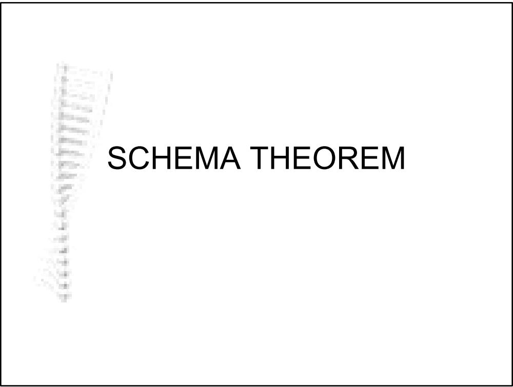
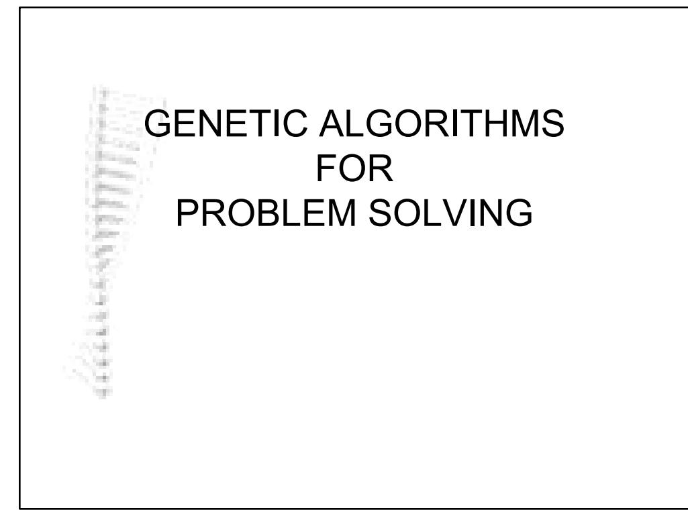

# Schema

l A template allowing exploration of similarities   
among chromosomes   
Formed by introducing a “don’t care” symbol into   
the gene alphabet: $\{ 0 , 1 , \ldots \}$   
Represents all strings which match it on all   
positions other than   
The schema $( ^ { \star } \ 1 \ 1 \ 1 \ 1 \ 0 \ 0 \ 1 \ 0 \ 0 )$ matches two   
strings: ° { (0 1 1 1 1 0 0 1 0 0), $( 1 ~ 1 ~ 1 ~ 1 ~ 1 ~ 0 ~ 0 ~ 1 ~ 0 ~ 0 ) ~ \}$   
How many strings does the following schema   
match? °(0 1 1 \* 1 0 1 1 \* \*)

# Schemata

l Every schema matches exactly $2 ^ { \mathfrak { r } }$ strings where r is the number of $( ^ { \star } )$ symbols in the schema Each string of length l is matched by 2l schemata   
l For string lengths of l there are in total 3l schemata   
l In a population of size n, between 2l and $\mathsf { n } ^ { \star } 2 ^ { \mathsf { I } }$ different schemata may be represented

# Implicit Parallelism

lIt has been shown that about $\mathrm { O } ( \mathrm { n } ^ { 3 } )$ schemata are processed successfully due to the disruptions caused by mutation and cross-over lEven though at each generation, computation proportional to the size of the population $\left( \mathrm { O } ( \mathrm { n } ) \right)$ is performed, useful processing of $\mathrm { O } ( \mathrm { n } ^ { 3 } )$ schemata is done in parallel implicitly.

# Schema - Terminology

l Order of schema S: o(S) °the number of fixed string (non-\*) positions   
l Defining length of schema S: δ(S) °the distance between the first and the last fixed string positions

# Examples:

°S1: (\* \* \* \* 0 \* \*) $\scriptstyle 0 ( \mathbf { s 1 } ) = 1 \ \delta ( \mathbf { s 1 } ) = 0$ °S2: $( { \star \mathrm { ~ \bf ~ 1 ~ } \star \mathrm { ~ \bf ~ \star ~ } 0 \mathrm { ~ \star ~ } \star } )$ $\scriptstyle 0 ( \mathbf { s } 2 ) = 2 \ \delta ( \mathbf { s } 2 ) = 3$ °S3: $( 0 ~ \textbf { 1 } \star \textbf { 0 } 0 \star \textbf { 1 } )$ $\scriptstyle 0 ( \mathbf { s } 3 ) = 5 \ \delta ( \mathbf { s } 3 ) = 6$

l Fitness of a schema S at time t: $f ( S )$ °the average fitness of all strings in the population matched by S

# Schema Processing

$\bullet$ What is the relationship between the simple GA and examination of similarities?

$\bullet$ Let $m ( S , t )$ denote the expected number of individuals belonging to schema S at time $t ,$ and $\overline { { f } }$ the average fitness of the population at time $t .$ .

° What is $m ( \boldsymbol { S } , t { + } 1 ) ?$ (Effect of Reproduction on Schema)

$$
\begin{array} { r l } & { m ( S , t + 1 ) = m ( S , t ) . } \\ & { \mathrm { w h e r e } \quad \overline { { f } } = \frac { \sum _ { j } f _ { j } } { n } \quad \overset { \overset { f ( S , t ) } { \sum _ { j } f _ { j } } } { \longmapsto } m ( S , t + 1 ) = m ( S , t ) \frac { \overset { f ( S , t ) } { - } } { \overline { { f } } } } \end{array}
$$

# Effect of Crossover on Schema Processing

l Consider A=0111000 $\scriptstyle \bigcirc \mathbf { s } \mathbf { 1 } = \star \mathbf { 1 } \star \star \star \star 0$ $\scriptstyle \bigcirc s 2 = \star \star \star 1 0 \star \star$

$\bullet$ If crossing over site $^ { \bullet 2 }$ , what happens to both schemata?

$\bullet$ If crossing over site chosen uniformly at random among (l-1) possible sites: °schema is destroyed with probability $p _ { d } { \mathbf { = } } { \mathrm { d } } ( { \mathbf { \mathsf { S } } } ) / ( 1 { \mathbf { - } } 1 )$

$\bullet$ The survival probability, $p _ { s }$ of a schema under crossing over: $p _ { s } \ge \left[ 1 - p _ { ^ c } \frac { { \pmb d } ( S ) } { l - 1 } \right]$

Probability of survival under crossover is higher for shorter schemas.

# Effect of Mutation on Schema Processing

In order for a schema to survive mutation, all specified positions must survive.

$\bullet$ Each single position survives with probability (1- $p _ { m } )$

l Schema survives with probability $( 1 - p _ { m } ) ^ { o ( S ) }$

$$
p _ { s } \geq \left[ 1 - o ( S ) p _ { m } \right]
$$

l Probability of survival under mutation is higher for lower order schemas

# Schema Processing - Survival

$\bullet$ Let $m ( S , t )$ denote the expected number of individuals belonging to schema S at time t

$$
m ( S , t + 1 ) \geq m ( S , t ) { \frac { f ( S , t ) } { { \overline { { f } } } ( t ) } } { \Bigg [ } 1 - o ( S ) p _ { m } - p _ { c } { \frac { d ( S ) } { l - 1 } } { \Bigg ] }
$$

where ${ \overline { { f } } } ( t )$ is the average fitness of the population at time t

Effect of Replacement – Survival of the Fittest

l Suppose schema S remains above average an amount of $c { \bar { f } }$ ( $\pmb { c }$ is a constant)

$$
m ( S , t + 1 ) = m ( S , t ) \frac { ( \bar { f } + c \bar { f } ) } { \overline { { f } } } = ( 1 + c ) ^ { \ast } m ( S , t )
$$

l Assuming stationary c and starting at $\scriptstyle t = 0$

$$
m ( S , t ) = m ( S , 0 ) ^ { * } ( 1 + c ) ^ { t }
$$

# The Schema Theorem

Theorem states that short, low-order, above average schemata receive exponentially increasing trials in subsequent generations of a GA °such schemata are called building blocks

l Building block hypothesis states that combining short, low-order, above average schemata yields high order schemata that also demonstrate above average fitnesses

This is the fundamental theorem of GAs. It shows in essence how GAs explore similarities as a basis for the search procedure.

# Representations

lBinary encoding   
lUsing an alphabet   
lReal encoding   
lProblem specific encodings   
Example: For the 0-1 knapsack problem, the names or the given numeric values of the items are used for gene values.

# Fitness Functions

Must in some way be related to the "real" value of the chromosome

This may not always be useful in guiding the search ° problems where maximum is surrounded by low fitness areas ° invalid chromosomes: what to do?

l discard them   
l correct them   
l setting subgoals and rewarding them   
l penalty functions

Approximate function evaluation may be used ° when real fitness function is slow or complex to compute $\bigcirc$ when real fitness function is stochastic

# Convergence Problems

l Premature convergence: °the population converges around a local optimum ° diversity is lost °typical mutation rates are not sufficient to recover l Slow finishing: °population largely converged °but has not yet located global optimum °average fitness is high and °small difference between best and average individuals $\Rightarrow$ not enough gradient in population to push it forward

# Avoiding Premature Convergence

lUse a fitness remapping °fitness scaling (fitness shifting) °fitness windowing °fitness ranking   
lIncrease mutation rates   
lInitialize a proportion of the population randomly   
lUse random restart - hypermutation   
lUse a different representation

# Selection for Recombination

l Fitness proportionate selection (roulette wheel selection) ° each individual is allocated as many reproductive trials as proportional to its fitness

l Ranking selection ° individuals sorted in order of raw fitness ° reproductive fitness values assigned according to rank: this may be done linearly or exponentially

l Tournament selection ° Binary tournament: individuals are chosen randomly in pairs and the one with the better fitness is copied into the mating pool ° larger tournaments may be used ° probabilistic binary tournament may be used where among the pair, the one with the better fitness is copied into the mating pool with a probability

# Replacement

l steady state selection

° selection of parents according to fitness, selection of replacements randomly   
° selection of parents randomly, selection of replacements by inverse fitness   
° selection of both parents and replacements according to fitness / inverse fitness

l elitist replacement

° copies of the best few individuals are directly inserted into mating pool the rest of mating pool determined by another selection method   
° best of both previous population and offspring is passed to the next generation   
° best of the some offspring is replaced with the worst of the previous generation

# Individual Representations

lHaploid: °each individual has one chromosome °genotype is used to compute phenotype l Diploid / Multiploid: °each individual has two / many chromosomes °genotype cannot directly be used to compute phenotype belonging to a chromosome °domination mechanism required to map genotype onto phenotype

# Cross-Over Techniques

l1PTX 1-point cross-over l2PTX 2-point cross-over lUX Uniform cross-over lKnowledge Based Crossover lProblem specific methods

# Advanced Techniques

lFitness °niching & speciation °sharing °crowding   
lInversion   
lEpistasis