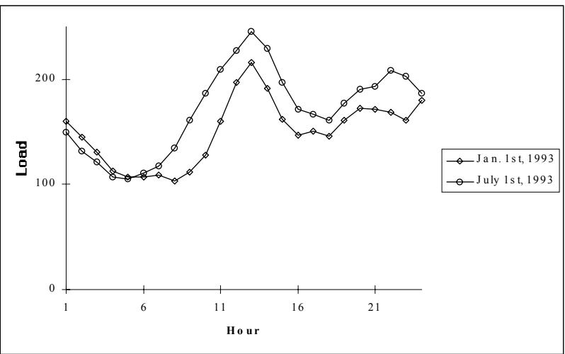
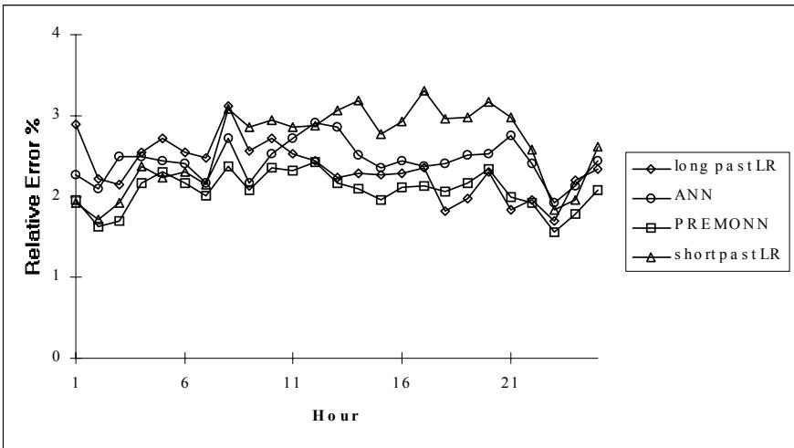
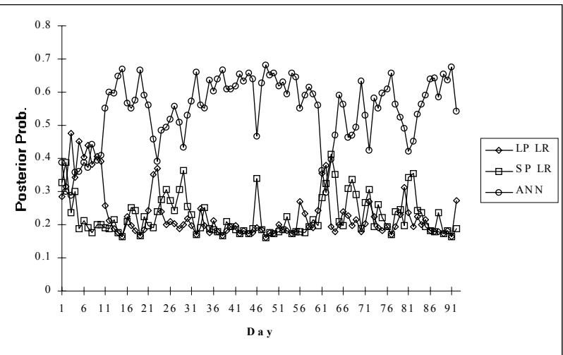
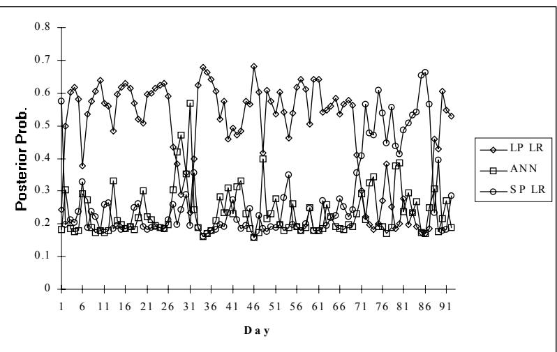

# Short Term Load Forecasting Using Predictive Modular Neural Networks

V. Petridis, A. Kehagias, A. Bakirtzis and S. Kiartzis

Aristotle University of Thessaloniki, Greece

email: petridis@vergina.eng.auth.gr

# 1 Abstract

In this paper we present an application of predictive modular neural networks (PREMONN) to short term load forecasting. PREMONNs are a family of probabilistically motivated algorithms which can be used for time series prediction, classification and identification. PREMONNs utilize local predictors of several types (e.g. linear predictors or artificial neural networks) and produce a final prediction which is a weighted combination of the local predictions; the weights can be interpreted as Bayesian posterior probabilities and are computed online. The method is applied to short term load forecasting for the Greek Public Power Corporation dispatching center of Crete, where PREMONN outperforms conventional prediction techniques.

# 2 Problem Formulation

We are given a sequence $y _ { \mathrm { t } } , \mathrm { t = l } , 2 , \ldots$ , where (for each t) $\mathrm { y _ { t } }$ has dimensions $2 4 \times 1$ ; each of the $\mathrm { y _ { t } }$ components corresponds to the load of a particular hour of the day on day no. t. The predictors have the general form $\mathrm { y _ { t } = f ( y _ { t - 1 } , y _ { t - 2 } , . . . , y _ { t - N } ) }$ , in other words one may use data from N days from the past load history. At midnight of day no. t $^ { - 1 }$ it is required to provide a prediction for the 24 hours of day t. This prediction will be used for scheduling the power generators to be activated in the following working day. Typical load for a winter and a summer day are presented in Picture 1.

  
Picture 1: Two representative daily loads.

# 3 Previous Work on Short Term Load Forecasting

Statistical STLF models can be generically separated into regression models [7] and time series models [13]; both can be either static or dynamic. In static models, the load is considered to be a linear combination of time functions, while the coefficients of these functions are estimated through linear regression or exponential smoothing techniques [7]. In dynamic models weather data and random effects are also incorporated since autoregressive moving average (ARMA) models are frequently used. In this approach the load forecast value consists of a deterministic component that represents load curve periodicity and a random component that represents deviations from the periodic behavior due to weather abnormalities or random correlation effects. An overview of different statistical approaches to the STLF problem can be found in [3]. The most common (and arguably the most efficient) statistical predictors apply a linear regression on past load and temperature data to forecast future load. For such predictors, we will use the generic term Linear Regression (LR) predictors.

The application of artificial neural networks to STLF yields encouraging results; a discussion can be found in [6]. The ANN approach does not require explicit adoption of a functional relationship between past load or weather variables and forecasted load. Instead, the functional relationship between system inputs and outputs is learned by the network through a training process. A minimum-distance based identification of the appropriate historical patterns of load and temperature used for the training of the ANN has been proposed in [8], while both linear and non-linear terms were adopted by the ANN structure. Due to load curve periodicity, a nonfully connected ANN consisting of one main and three supporting neural networks has been used to incorporate input variables like the day of the week, the hour of the day and temperature. Various methods were proposed to accelerate the ANN training [4], while the structure of the network has been proved to be system dependent [1,5]. Hybrid neuro-fuzzy systems applications to STLF have appeared recently. Such methods synthesize fuzzy-expert systems and ANN techniques to yield impressive results, as reported in [2,12].

Each of the methods discussed above has its own advantages and shortcomings. Our own experience is that no single predictor type is universally best. For example, an ANN predictor may give more accurate load forecasts during morning hours, while a LR predictor may be superior for evening hours. Hence, a method that combines various different types of predictors may outperform any single "pure" predictor of the types discussed above. It is clear that the PREMONN is just such a combination method, hence it is reasonable to apply the PREMONN methodology to the task at hand.

# 4 PREMONN: Theory

The theory of PREMONNs has been described in a series of papers [9,10], as well as in the book [11]. We only give a brief overview here. Given a time series $\mathrm { y _ { t } , }$ the weighted prediction of $\mathrm { y _ { t } , }$ denoted by $\mathrm { y ^ { * } } _ { \mathrm { t } } ,$ is given by

where $\mathbf { y } _ { \mathrm { ~ t ~ } } ^ { \mathrm { n } }$ is a "local" prediction of $\mathrm { y _ { t } , }$ obtained from the n-th predictor (out of a total of $_ \mathrm { N }$ predictors) and $\mathfrak { p } _ { \mathrm { ~ t ~ } } ^ { \mathtt { n } }$ is a credit function, signifying the confidence we have in $\mathbf { y } _ { \mathrm { ~ t ~ } } ^ { \mathrm { n } }$ , the prediction of the n-th predictor at time t. The $\mathrm { p ^ { n } } _ { \mathrm { ~ t ~ } } ^ { \prime } \mathrm { s }$ are obtained by the following recursive formula

Here $\mathrm { e } _ { \mathrm { ~ t ~ } } ^ { \mathrm { n } }$ is the prediction error: $\mathrm { e _ { \ t } ^ { n } = y _ { t } - y _ { \ t } ^ { n } }$ and $\bf { g } ( e ^ { \mathrm { { n } } } _ { \mathrm { { t } } } )$ is a function of the error, usually the Gaussian: $\mathrm { g ( e _ { \ t } ^ { n } ) = \exp ( - | e _ { \ t } ^ { n } | / { \sigma _ { n } } ^ { 2 } ) }$ . The significance of the formulas presented above is that each predictor is penalized according to the absolute value of its prediction error, which results in a multiplicative decrease of the respective credit $\mathfrak { p } _ { \ t - 1 } ^ { \mathtt { n } }$ (note that $\mathrm { g ( e ) }$ is decreasing with the absolute value of e). Past performance is also taken in account, as can be seen by the presence of the $\mathfrak { p } _ { \ t - 1 } ^ { \mathtt { n } }$ term. Finally, note that performance is normalized by dividing with the sum of the $\boldsymbol { \mathrm { p } } _ { \mathrm { t - 1 } } ^ { \mathrm { n } } \ \mathrm { g } ( \boldsymbol { \mathrm { e } } _ { \mathrm { t } } ^ { \mathrm { n } } )$ terms; hence $\mathfrak { p } _ { \mathrm { ~ t ~ } } ^ { \mathtt { n } }$ is always in the [0,1] range. In fact, it can be shown [11] that, under mild assumptions, eq.(2) is Bayes’ rule and the $\mathfrak { p } _ { \mathrm { ~ t ~ } } ^ { \mathrm { n ~ } }$ ’s are the posterior conditional probabilities of the local predictors.

PREMONN is implemented by a bank of (usually neural) predictive modules, which implement the computation of $\mathrm { y } _ { \mathrm { t } } ^ { \mathrm { n } } , \mathrm { n } { = } 1 , 2 , . . . , \mathrm { N }$ and a combination module which implements the computation of eq.(2).

# 5 PREMONN: Implementation

In this section we present the implementation details for three types of "pure" predictors, namely two linear regression predictors and one neural predictor. Then we present the implementation details for the combination module.

# 5.1 "Long Past" Linear Regression

This predictor performs a straightforward linear regression on two time series: daily loads (for a given hour of the day) and maximum daily temperature. There are $_ { \mathrm { M + N } }$ inputs, where M is the number of past loads (for the given hour of the day) and $_ \mathrm { N }$ is the number of past temperatures used. Several values of M, between 21 and 56, have been employed. This means we use data from the last 21 to 56 days; hence the designation "long past". (The best value turned out to be 35.) Output is tomorrow's load for the given hour. Hence, for a complete 24-hour load forecast, we need 24 separate predictors. The regression coefficients are determined by least square error training. The training phase is performed only once, offline. It should also be mentioned that the hourly load data were analysed and "irregular days", such as national and religious holidays, major strikes, election days, etc. were excluded from the training data set and replaced by equivalent regular days; of course this substitution was performed only for the training data. Training utilized load and temperature data for the years 1992 and 1993. Training error (computed as the ratio of forecast error divided by the actual load, averaged over all days and hours of the training set) was $2 . 3 0 \%$ . It must be mentioned that there was a "ceiling" effect as to the possible reduction of forecast error. While training error could be reduced below $2 . 3 0 \%$ by the introduction of more regression coefficients, this improvement was not reflected in the test error. This is the familiar "overfitting" effect.

# 5.2 "Short Past" Linear Regression

This is very similar to the previous method. Again, it utilizes straightforward linear regression on the time series of loads; but now loads of all hours of the day are used as input., in addition to maximum and minimum daily temperature. There are $( 2 4 \mathrm { M } + 2 \mathrm { N } )$ inputs, where M is the number of past loads (for all hours of the day) and $_ \mathrm { N }$ is the number of past temperatures used. Several values of M, between 1 and 8, have been employed. We have found that the best value of M is 4, which means data from four past days are used. For a given forecast day, we use the two immediately previous days and the same weekday of the previous two weeks.; hence this predictor uses a relatively "short past", as compared to the one of Section 5.1. Output is tomorrow's load for every hour of the day. The regression coefficients are determined by least square error training. The remarks of Section 5.1 on training and overfitting apply here as well. Training error (computed as the ratio of forecast error divided by the actual load, averaged over all days and hours of the training set) was $2 . 4 0 \%$ .

# 5.3 Neural Network Prediction

A fully connected three layer feedforward ANN was used in this method. The ANN comprises of 57 input neurons, 24 hidden neurons and 24 output neurons representing next day's 24 hourly forecasted loads. The first 48 inputs represent past hourly load data for today and yesterday. Inputs 49-50 are maximum and minimum daily temperatures for today. The last seven inputs, 51- 57, represent the day of the week, e.g. Monday is encoded as 1000000, Tuesday as 0100000 and so on. The ANN was trained by being presented with a set of input-desired output patterns until the average is less than a predefined threshold. The well known back propagation algorithm [14] was used for the ANN training. The hourly load data were carefully analysed and all “irregular days”, such as national and religious holidays, major strikes, election days, etc. were excluded from the training data set. Special logic for the treatment of missing data has also been incorporated in the data analysis software. The training data set consists of $9 0 + 4 \times 3 0 = 2 1 0$ input/output patterns created from the current year and the four past years historical data as follows: 90 patterns are created for the 90 days of the current year prior to the forecast day. For every one of the 4 previous years, another 30 patterns are created around the dates of the previous years that correspond to the current year forecast day. After an initial offline training phase, the ANN parameters are updated online, on a daily basis. The network is trained until the average error becomes less than $2 . 3 5 \%$ . It was observed that further training of the network (to an error $1 . 5 \%$ for example) did not improve the accuracy of the forecasts. Training of the ANN to a very small error may result in data overfitting.

# 6 Results and Conclusions

We applied the PREMONN described in Section 5 to the prediction of loads for the period July $1 ^ { \mathrm { s t } }$ , 1994 to September ${ 3 0 } ^ { \mathrm { t h } }$ , 1994. In Picture 2 we see a comparison of the prediction error for the local predictors as well as for the PREMONN. The n-th point of each curve in Picture 2 (with $\mathtt { n } { = } 1 , 2$ , … , 24) corresponds to the average (over the entire three month test period) prediction error for the 24-th hour of the day, i.e.

(3) $\mathrm { E _ { n } = }$ Error!Error!.   
The final, 25th point represents the average daily error (i.e. averaged over all 24 hours), i.e.

(4) $\mathrm { E = }$ Error!Error!.

  
Picture 2: Comparative prediction errors for local and combined predictors.

It can be seen that the PREMONN\ predictor not only outperforms all local predictors on the average, but usually also outperforms them on individual hours (with a few exceptions). In this connection, it is quite instructive to observe the evolution of the posterior probabilities of the three local predictors for two different hours. In Picture 3 we plot the evolution of the posteriors for the hour 1am and in Picture 4 for the hour 1pm. The reader will see that in Picture 3 the highest probability is generally assigned to the SP LR predictor, even though over short time intervals one of the other two local predictors may outperform it. Similarly, in Picture 4 the highest probability is generally assigned to the LP LR predictor, even though over short time intervals one of the other two predictors may outperform it. These results are consistent with the general results of Picture 2; the additional information presented in Pictures 3 and 4 is that a predictor that generally performs poorly, may still outperform its competitors over short time intervals; in such cases the PREMONN will take this improved performance into account, as evidenced by the adaptively changing posterior probabilities. This explains why the PREMONN is generally better than the best pure predictor.

  
Picture 3: Evolution of posterior probabilities.

  
Picture 4: Evolution of posterior probabilities.

In short we see that the principle of predictor combination is justified by our experiment, where the global predictor outperforms the specialized ones. Hence we are encouraged in extending our methodology to a wider range of problems in the future.

# 8 References

[1] A. Bakirtzis, V. Petridis, S. Kiartzis, M. Alexiadis and A. Maissis, “A Neural Network Short Term Load Forecasting Model for the Greek Power System”, accepted for presentation in IEEE/PES 1995 Summer Meeting.   
[2] A. Bakirtzis, J. Theocharis, S. Kiartzis and K. Satsios, “Short Term Load Forecasting Using Fuzzy Neural Networks”, paper 95 WM 155-2-PWRS presented in IEEE/PES 1995 Winter Meeting.   
[3] G. Gross and F.D. Galiana, "Short term load forecasting,"Proc. IEEE, Vol. 75, No. 12, pp. 1558-1573, 1987.   
[4] K.L. Ho, Y. Y. Hsu, and C. C. Yang, "Short Term Load Forecasting Using a Multilayer Neural Network with an Adaptive Learning Algorithm," IEEE Trans. on Power Systems, Vol. 7, No. 1, pp. 141-149, 1992.   
[5] C.N. Lu, H.T. Wu and S. Vemuri, "Neural Network Based Short Term Load Forecasting," IEEE Trans. on Power Systems, Vol. 8, No. 1, pp. 336-342, 1993.   
[6] D. Niebur et al., ‘Artificial neural networks for Power Systems,’ CIGRE TF38.06.06 Report, ELECTRA, April 1995, pp. 77-101.   
[7] A. D. Papalexopoulos and T. C. Hesterberg, "A Regression-Based Approach to Short Term System Load Forecasting," IEEE Trans. on Power Systems, Vol. 5, No. 4, pp. 1535- 1547,1990.   
[8] T.M. Peng, N.F. Hubele, and G. G. Karady, "Advancement in the Application of Neural Networks for Short Term Load Forecasting," IEEE Trans. on Power Systems, Vol. 7, No. 1, pp. 250-258, 1992. 5, 1992.   
[9] V. Petridis and A. Kehagias, "A Recurrent Network Implementation of Time Series Classification", Neural Computation, vol.8, pp. 357-372, 1996.   
[10] V. Petridis and A. Kehagias, "Modular neural networks for MAP classification of time series and the partition algorithm", IEEE Trans. On Neural Networks, vol. 7, pp.73-86, 1996.   
[11] V. Petridis and A. Kehagias, Predictive Modular Neural Networks: Applications to Time Series, Kluwer, 1998.   
[12] D. Srinivasan, C.S. Chang and A.C. Liew, “Demand Forecasting Using Fuzzy Neural Computation, with special emphasis on weekend and public holiday forecasting”, paper 95 WM 158-6-PWRS presented in IEEE/PES 1995 Winter Meeting.   
[13] S. Vemuri, W. L. Huang and D. J. Nelson, "On-Line Algorithms for Forecasting Hourly Loads of an Electric Utility," IEEE Trans. Power App. & Syst., Vol. PAS-100, No. 8, pp. 3775-3784, 1981.   
[10] B. Widrow and M.A. Lehr, "30 Years of Adaptive Neural Networks: Perceptron, Madaline and Back Propagation", Proc. IEEE, Vol. 78, No. 9, pp.1415-1442, 1990.