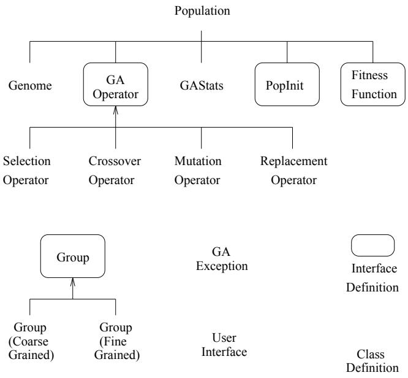
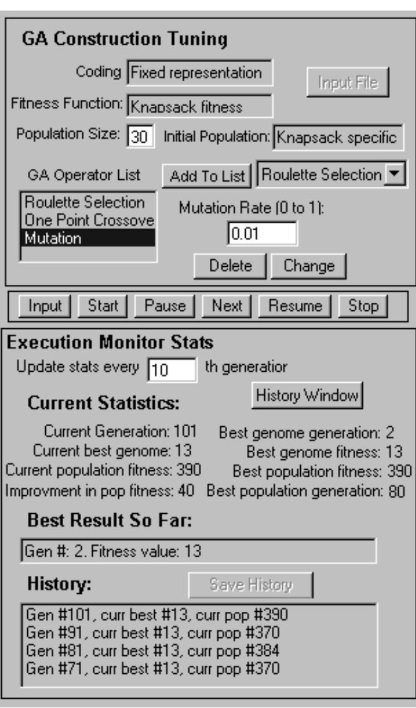
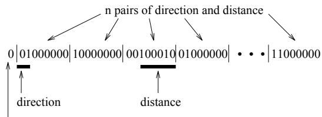
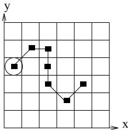
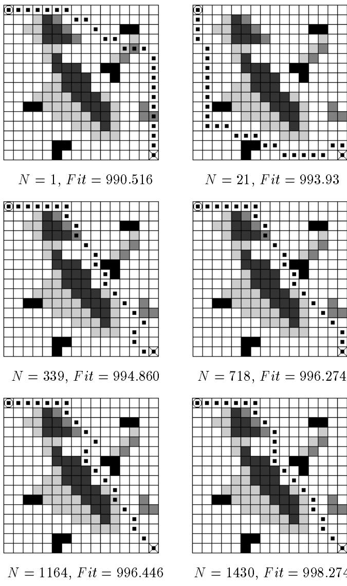

# GA Toolkit on the Web

John Smith

Kazuo Sugihara

Department of Information and Computer Sciences University of Hawaii at Manoa Honolulu, HI, 96822, U. S. A. jksmith@uhics.ics.hawaii.edu sugihara@hawaii.edu

Abstract—This paper presents a prototype of the toolkit which makes it easy to conduct experiments of genetic algorithms and design a genetic algorithm for a particular problem in the real world. The toolkit consists of objects implemented as applets in Java and WWW pages implemented in JavaScript for a user interface. The user can easily construct his/her own genetic algorithm by combining the objects, execute the algorithm on a Web browser, tune its control parameters through the WWW pages interactively, and observe their effects on its performance. In order to show how the tool can be used, examples of GAs on the tool are given for knapsack problem and mobile robot path planning. Although the current prototype is limited to sequential genetic algorithms, a distributed version of the tool is under development.

# I. InTRODUCTION

A genetic algorithm (GA for short) [1; 2; 5] is an algorithm which searches a solution by using a mechanism analogous to evolution in nature. GAs have been not only studied analytically and empirically, but also actually applied to various problems in practice [6]. Our research was stimulated by recent advances on two topics: Distributed genetic algorithms [3; 13; 14; 15] and tools for genetic algorithms [4; 11; 12].

A distributed genetic algorithm (DGA for short) 1 was proposed with two major reasons. First, it was expected that DGA could avoid premature convergence. Since keeping the diversity in a population large enough has been believed to be a key to the success of GA [10], partitioning the entire population into subpopulations with fairly independent evolution processes and exchanging occasionally individuals (called migrants) between the subpopulations look promising. There is a wide spectrum of DGAs with respect to population structures which are characterized by the granularity and migration topology of subpopulations. One extreme is the so-called fine-grained DGA in which each subpopulation consists of a single individual solution. Another extreme is of course a GA with a single subpopulation, i.e., a sequential GA. In between is coarse-grained and often called an island model. Any GA with multiple subpopulations is considered as an instance of DGA, irrespective of whether it is distributed or not.

Second, it is natural to exploit parallelism in GA, especially with multiple subpopulations. There are two kinds of parallelism in DGA. One is the parallelism in each operation, e.g., fitness function evaluation and application of a genetic operator. Another is the parallelism in evolution, i.e., concurrent production of new generations over multiple subpopulations. Since the importance of GA is most evident in solving intractable problems, speedup due to parallel/distributed computing is appreciated very much.

In recent years, a number of tools have been developed [4] primarily for the following purposes.

• To support the design and/or implementation of a GA for a target application To conduct simulation of various GAs and investigate properties of and new ideas for GAs empirically

Although there has been great progress in theory of GA, it is not sufficient yet to give us principles of GA design, e.g., which GA operators should be used and what parameter values are best. Until a self-adaptive mechanism of GA will become well-established, the design of a particular genetic algorithm used in practice needs extensive experiments on its performance by simulation.

Many of the existing tools are implemented in C and only some in object-oriented languages such as $\mathrm { C } + +$ . With a few exceptions such as PGAPack [11], most of general-purpose tools cannot be used for DGA at all. Thus, empirical study on DGA has usually been conducted by implementing ad hoc simulation programs from scratch. Therefore, a new tool is desired such that it is developed in an object-oriented manner for easy reuse of building blocks in previous experiments and it can be used for DGA design.

This paper presents a prototype of the toolkit which makes it easy to conduct experiments of various genetic algorithms and design a genetic algorithm for a particular problem. The toolkit consists of objects implemented in an object-oriented programming language Java and WWW pages implemented in a scripting language JavaScript for a user interface. Java provides remote objects which enable the tool to execute DGA. The user can easily construct his/her own genetic algorithm by combining the objects, execute the algorithm on a Web browser, tune its control parameters through the WWW pages interactively, and observe their effects on its performance. Since the toolkit is in a preliminary stage of development, the current prototype is limited to sequential genetic algorithms. A distributed version of the tool is under development.

# II. GOALS

In order to clarify our motivation to and directions of this research, we first explain our long-term goals.

# Long-Term Goals

• To study distributed genetic algorithms: We will examine the behavior of DGA in general and compare DGA with sequential GA, since it is conjectured that DGA works well and even outperforms sequential GA in many applications. Although some evidences for the conjecture have been found by empirical study [3; 13; 14; 15], many issues such as a migration policy remain to be investigated further. • To make the design and implementation of GA easy and systematical: We will seek for principles of GA design. Based on the principles, we will develop a tool which supports the design and implementation of various GAs. To consider GA as a paradigm for algorithms leads us to the concept of computer-aided algorithm design.

To achieve the above long-term goals, we set the following short-term goals.

# Short-Term Goals

• To develop a toolkit for design and implementation of various GAs including DGAs: We develop a generalpurpose toolkit which enables the user to construct, execute, observe and tune any kind of GA. To examine a variety of methods for diversity control in DGA by simulation on the toolkit: We conduct simulation study on the performance of DGA with different methods for diversity control such as migration policies and compare the methods.

be observed from a specific viewpoint, the tool needs to present the user's interested aspect of a GA in such a way that the user wants to see.

Portability: The tool should be portable to various platforms so that it is available to everyone. Distributed Tool: It is natural that the tool itself be distributed in order to simulate DGA.

# B. Design

In order to meet the requirements, the following were chosen in the design of the toolkit.

Object-Oriented due to the generality and flexibility requirements: The generality and flexibility are achieved by high modularity of components in the tool. There are 3 kinds of components.

Building blocks to construct a GA Components to control execution of the GA Building blocks to compose a user interface

All the components are implemented as objects. Hence an architecture of the tool becomes open so that the components can be modified and a new component can be added easily.

• Tool on the Web due to the portability and distributed tool requirements: In the light of these requirements, it is reasonable to develop the tool on WWW. Since a Web browser is available on practically every platform, the tool running on the Web is completely portable. Furthermore, the latest Web browsers support an object-oriented programming language Java [8] that is suitable for implementation of distributed programs. In addition, the latest Netscape offers a scripting language JavaScript [9] which glues HTML pages and Java applets to each other and provides an excellent way to create user interfaces and enhance the flexibility. 2

# III. GA TOOLKIT

As a result, we decided to develop the tool which consists of applets in Java and WWW pages in JavaScript, although the speed could be a disadvantage of using Java.

# A. Requirements

According to the long-term and short-term goals, we require the toolkit to meet the following.

Generality: The tool should be a general-purpose tool which allows the user to construct and simulate a variety of GAs, rather than an ad hoc tool for a particular GA. Since new ideas for GAs will be proposed one after another, it is not realistic to expect the tool to be complete and closed. Hence the tool should be open to any future extension. Flexibility: The tool should make it easy to customize experiments of the GAs. Since each experiment may

# C. Implementation in Java and JavaScript

A configuration of the toolkit is shown in Figure 1.   
The following are the major objects in the toolkit.

# 1. Core GA

Population: The main class of the toolkit is the Population class. It brings the other classes all together and provides basic mechanisms to make individual genotypes evolve through transformations by GAOperator objects.

  
Fig. 1. Configuration of the toolkit.

Genome: The Genome class is the internal representation of individual solutions.

GAOperator: This is an interface which allows the Population to call a list of operators to compose a meaningful sequence of genetic operations. There are 4 classes of GAOperator: Selection, Crossover, Mutation and Replacement operators. They may be further specialized into subclasses. For example, Crossover has subclasses Uniform Crossover, Fixed Crossover, Variable Crossover, etc., and the Fixed Crossover is further decomposed into 1-point Crossover, 2-point Crossover, etc. The user may also register a user defined operator to the GAOperator by implementing an object for the operator as an applet.

GAStats: According to evolution (i.e., a sequence of generations) of a population, GAStats produces statistical data that are stored for review and post-analysis.

# 3. GA Exception

The tool supports exception handling for errors during execution and setup.

# 4. User Interface

This is a class of objects used for a user interface. It is decomposed into GenomeUI, PopulationUI, StatisticsUI, InputUI, etc., which are connected to WWW pages by using JavaScript. In addition to such a graphical user interface, there are alternative input and output interfaces. Input to a GA can be given from a file located at a specified URL and a log of each simulation run can be obtained as text data by email to the user.

# D. Current Limitations

1. The generality of the current prototype is limited because the current library of GA components such as GA operators is limited. For example, only roulette selection is available for selection and only a single locus mutation is available for mutation. For a hybrid GA (i.e., GA combined with heuristics), the user needs to implement an applet for heuristics such as local hill-climbing by him/herself.

3. The current prototype is not distributed. It can construct and simulate only sequential GAs.

2. The flexibility of the current prototype is limited because the latest versions of Java and JavaScript do not sufficiently support communication between applets in Java and objects defined in JavaScript. JavaScript does not currently support direct calls to applets nor allow passing objects defined in JavaScript into applets. If an object in JavaScript could be passed into an applet, the tool could interpretively evaluate a fitness function written in an HTML page by the user. At this moment, the user needs to embed a fitness function into Java code of the corresponding applet and compile it. We expect the two-way communication between Java and JavaScript will be available in the near future. Even if it will not be available soon, there is the alternative that uses Visual Basic scripts to call ActiveX objects and applets.

PopInit: This is an interface which allows the Population to generate the initial population.

FitnessFunction: This is an interface to evaluate the fitness function defined by the user.

# 2. Group

This is a class of objects which monitor and control the objects of the Core GA class corresponding to subpopulations. It is in charge of coordination, migration, coding conversion, etc. Java provides remote objects which enable the tool to execute DGA.

# IV. EXAMPLES

This section presents examples on how the tool can be used in the design of GA. The online demonstration of the tool for the examples is presented at the following URL 3. http://www.ics.hawaii.edu/\~sugihara/research/ wsc1/

Table 1. GA for the knapsack problem.   

<table><tr><td rowspan=1 colspan=1>Coding</td><td rowspan=1 colspan=1>A binary string of length nsuch that each i-th bit denoteswhether the corresponding objectxi is in the bag</td></tr><tr><td rowspan=1 colspan=1>Fitness Function→ max</td><td rowspan=1 colspan=1>The total price of objects in thebag if their total size does not ex-ceed the capacity B; and other-wise zero</td></tr><tr><td rowspan=1 colspan=1>InitialPopulation</td><td rowspan=1 colspan=1>Binary strings that are generatedin the increasing order of thenumber of 1&#x27;s until the numberof strings reaches the size of thepopulation</td></tr><tr><td rowspan=1 colspan=1>GA Operators</td><td rowspan=1 colspan=1>Chosen by the user from a menu</td></tr></table>

# A. Knapsack Problem

The knapsack problem is defined as follows.

Input: $n$ objects $x _ { i }$ of size $s _ { i }$ with price $p _ { i }$ $( 1 \leq i \leq$ $n$ ) and the capacity $B$ of a bag

Output: a subset of objects such that the total price is maximum subject to the constraint that the total size is at most $B$

An idea to use the knapsack problem as an example came from [7] though, the GA in this example is different from the one given in [7] and quite straightforward in the sense that techniques used in practice such as fitness scaling are not applied at all.

A GA for the knapsack problem is outlined in Table 1. A user interface of the tool for the GA is the WWW page which consists of three parts as shown in Figure 2. The top part is for constructing a GA and tuning its control parameters. The middle part is for controlling simulation of the GA. The bottom part is for displaying the status of its execution and statistics.

1. Construct a GA by choosing the population size, inserting GA operations from a menu into a list (e.g., roulette selection, uniform crossover and mutation) and changing their default parameters (e.g., mutation rate) if necessary.

2. Click the "Input" button in order to specify input parameters of the knapsack problem, i.e., the bag capacity and a list of objects' sizes and prices.

3. Click the "Start" button to execute the GA. The execution of the GA may be paused and resumed at any moment. When it is paused, the GA can be modified by changing GA operators and/or their parameters in the top part and then the execution can be resumed. The "Next" button may be used to proceed the GA execution one by one generation. When the "Stop" button is clicked, the simulation ends During the simulation, the "History Window" displays population history and best genome history. The former shows changes on the distribution of genotypes (i.e., individual solutions) in a population, where the distribution is the average of genotypes at each bit in the raw bit map form and displayed in grey scale. The latter shows changes on the best genotype in a population in the same way.

  
Fig. 2. A user interface.

With some simulation runs, we observed that uniform crossover worked better than 1-point crossover and 2- point crossover in this problem.

# B. Mobile Robot Path Planning

Next, let us consider the following path planning problem related to mobile robots.

Table 2. GA for path planning.   

<table><tr><td rowspan=1 colspan=1>Coding</td><td rowspan=1 colspan=1>A binary string which denotes asequence of pairs (direction, dis-tance) representing a path from sto d</td></tr><tr><td rowspan=1 colspan=1>Fitness Function→ max</td><td rowspan=1 colspan=1>4mn - (the length of a path) ifthe path does not intersect any&quot;solid&quot; obstacle; otherwise 1</td></tr><tr><td rowspan=1 colspan=1>InitialPopulation</td><td rowspan=1 colspan=1>Binary strings that are generatedby selecting directions and dis-tances randomly besides the di-agonal connecting s and d</td></tr><tr><td rowspan=1 colspan=1>GA Operators</td><td rowspan=1 colspan=1>Chosen by the user from a menu</td></tr></table>

Input: $m$ by $n$ grid (rectangular space), start cell $s$ in the grid, destination cell $d$ in the grid, and obstacles (a collection of cells in the grid)of type $1 0 0 \%$ , $7 5 \%$ , $5 0 \%$ or $2 5 \%$ where the type $1 0 0 \%$ represents a solid obstacle such that a path cannot intersect the obstacle at all and the other types $2 5 \%$ $5 0 \%$ and $7 5 \%$ represent hazardous obstacles which allow a path to intersect them at the expenses that are 2, 3 and 4 times longer lengths for each cell, respectively

Output: A path (defined as a sequence of adjacent cells) between $s$ and $d$ such that the total length of the path is minimum, where horizontally or vertically adjacent cells have distance 1 and diagonally adjacent cells have distance $\sqrt { 2 }$ , subject to the constraint that the path does not intersect any "solid" obstacle

Obviously, this problem is too simple as a model for path planning of a mobile robot in practice. For example, we approximate everything with grid cells in the rectangular discrete space.

A GA for path planning is outlined in Table 2. For simplicity, it is assumed in the GA that the grid is square (i.e., $m = n$ and a path from $s$ to $d$ is monotone with respect to either $x$ -coordinate or $y$ coordinate (but not necessarily both). A path is monotone with respect to $x$ . coordinate iff the projection of the path on $x$ -axis is nondecreasing. A monotone path with respect to $x$ -coordinate (or $y$ -coordinate) can be represented by a column-wise (or row-wise) sequence of $n$ pairs of direction and distance such that each pair corresponds to each column (or each row, respectively). Thus, it can be encoded into a binary string of the fixed length proportional to $n$ as shown in Figure 3, where $n = 1 6$ . Note that the path in Figure 3 is monotone with respect to $x$ -coordinate, but not $y .$ -coordinate. The first bit $\alpha$ indicates that a path is monotone with respect to $x$ -coordinate if $\alpha = 0$ ; and it is monotone with respect to $y .$ -coordinate if $\alpha = 1$ . A block of $3 + \lceil \log ( n + 1 ) \rceil$ bits represents direction and distance on each column or row. The first 2 bits of a block denote the direction, e.g., 00 (vertical), 01 (upper diagonal), 10 (horizontal), and 11 (lower diagonal) in case of $\alpha = 0$ and 00 (horizontal), 01 (left diagonal), 10 (vertical), and 11 (right diagonal) in case of $\alpha = 1$ . The other bits of the block denote the distance as a signed integer if the direction is 00; otherwise they are ignored.

  
monotone w.r.t. x

  
Fig. 3. Binary representation of a path.

A user interface of the tool for the GA is similar to the above example for the knapsack problem (see Figure 2), except the following on the input and output parts. When the "Input" button is clicked, a window pops up and shows a grid. The start cell is depicted by a circle and the destination cell is depicted by X. Obstacles are given by choosing their types from a menu and clicking cells in a drag drawing mode. When the GA is executed and "View Best Path" button is clicked, the best so far path and the former best path are shown on the grid by red and yellow dots on the grid, respectively.

With some simulation runs, we observed that 1-point crossover and 2-point crossover worked better than uniform crossover in this problem. For example, Figure 4 shows how the best so far path was changed in a simulation run, where the population size is 30 and GA operators are selection, 1-point crossover with rate 0.8 and mutation with rate 0.01. Note that $N$ denotes the generation number and Fit denotes a fitness function value.

# V. COncLusiOnS

This paper presented a prototype of the toolkit which makes it easy to conduct experiments of genetic algorithms and design a genetic algorithm for a particular problem in the real world. The toolkit consists of objects implemented as applets in Java and WWW pages implemented in JavaScript for a user interface. The user can easily construct his/her own genetic algorithm by combining the objects, execute the algorithm on a Web browser, tune its control parameters through the WWW pages interactively, and observe their effects on its performance.

  
Fig. 4. A simulation run of the GA for path planning.

Our toolkit is currently in an early stage of its development. As mentioned at the end of Section III, the prototype presented in this paper is limited to sequential GAs and does not have a sophisticated user interface yet. Here is our plan for further development of the tool and research on DGA using the tool.

Release a distributed version of the toolkit for DGA Conduct experiments of DGA on migration policies by using the tool Improve the user interface of the tool and enhance its

customizability by using JavaScript •Enrich a library of GA components such as GA operators

REFEreNcES   
[1] David Beasley, David R. Bull and Ralph R. Martin, "An overview of genetic algorithms: Part 1, fundamentals," University Computing, vol.15, no.2, 1993, pp.5869.   
[2] David Beasley, David R. Bull and Ralph R. Martin, "An overview of genetic algorithms: Part 2, research topics," University Computing, vol.15, no.4, 1993, pp.170181.   
[3] Theodore C. Belding, "The distributed genetic algorithm revisited," Proc. 6th Int'l Conf. on Genetic Algorithms, L. J. Eshelman (ed.), Morgan Kaufmann, 1995.   
[4] Jose L. Ribeiro Filho and Philip C. Treleaven, "Genetic-algorithm programming environments," Computer, vol.27, no.6, June 1994, pp.2843.   
[5] David E. Goldberg, Genetic Algorithms in Search, Optimization, and Machine Learning, Addison-Wesley, 1989.   
[6] David E. Goldberg, "Genetic and evolutionary algorithms come of age," CACM, vol.37, no.3, March 1994, pp.113119.   
[7] Keith Grant, "An introduction to genetic algorithms," $\mathrm { C } / \mathrm { C } + +$ Users Journal, March 1995.   
[8] "The Java language: An overview," Sun Microsystems.http://java.sun.com/doc/Overviews/java/   
[9] "Netscape JavaScript," Netscape Communications Corporation. http://home.netscape.com/comprod/ products/navigator/version_2.0/script/   
[10] Michael L. Mauldin, "Maintaining diversity in genetic search," Proc. AAAI-84, Aug. 1984.   
[11] "PGAPack," Argonne National Laboratory. http://www.mcs.anl.gov/pgapack.html   
[12] "Splicer - A genetic algorithm tool for search and optimization," NASA Software Technology Branch. http://www.cosmic.uga.edu/pub/SPLICER.html   
[13] Reiko Tanese, "Distributed genetic algorithms," Proc. 3rd Int'l Conf. on Genetic Algorithms, June 1989, pp.434439.   
[14] Dirk Schlierkamp-Voosen and Heinz Muhlenbein, "Strategy adaptation by competing subpopulations," Parallel Problem Solving from Nature (PPSN III), Springer, Oct. 1994, pp.199208.   
[15] Gang Wang, Erik D. Goodman and William F. Punch, III, "Simultaneous multi-level evolution," 2nd Online Workshop on Evolutionary Computation (WEC2), March 1996. http://www.bioele.nuee.nagoya-u.ac.jp/wec2/ papers/p005.html