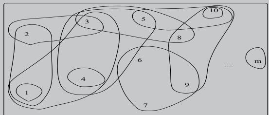
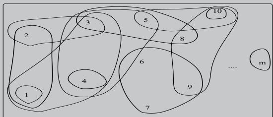
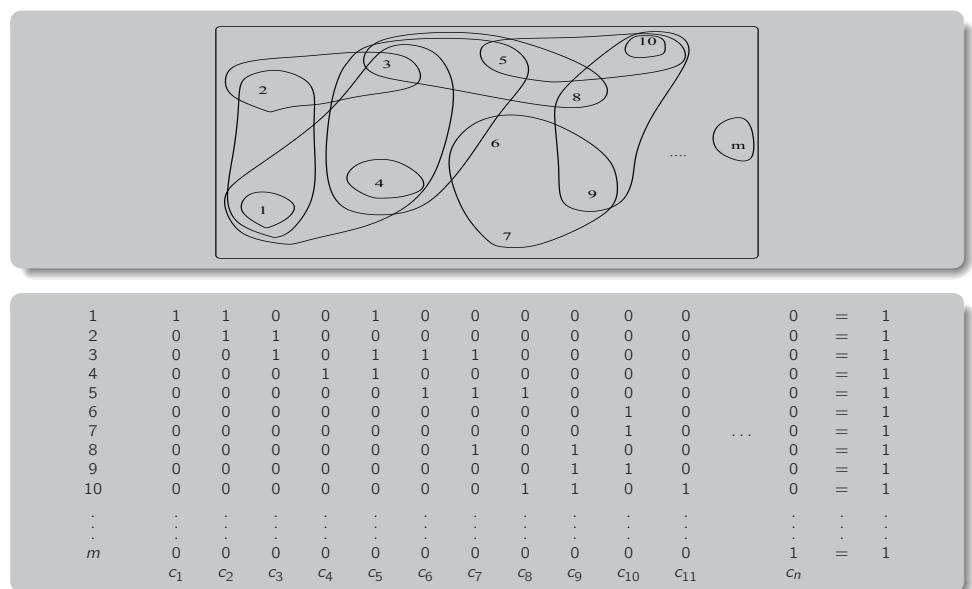
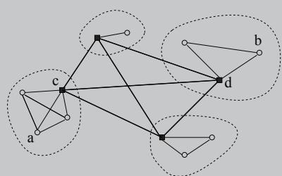
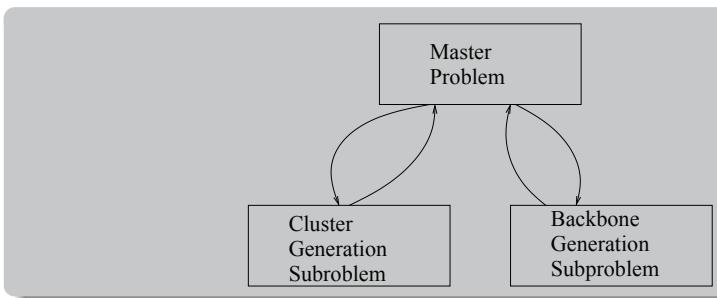
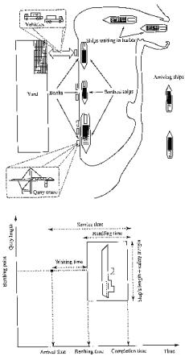
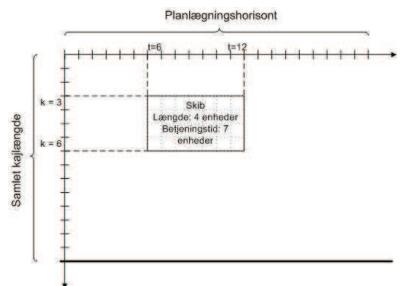
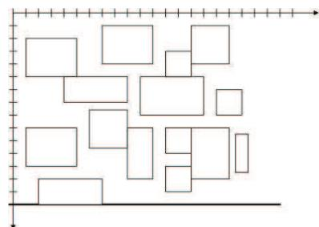
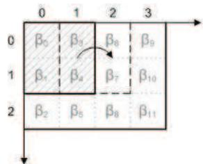
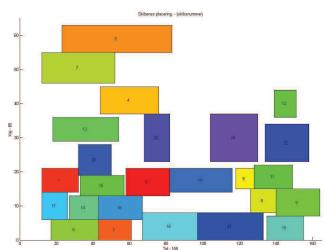

# Set Partitioning and Applications

Jesper Larsen1

1Department of Management Engineering Technical University of Denmark

42134 Advanced Topics in Operations Research

# Overview

# Upcoming Lectures on GSPP

2/9 Introduction and examples   
9/9 Resource constraints shortest path   
16/9 Structure in applications   
23/9 Applications of SPP

# Evaluation

This part of the course is evaluated through a small project report handed out on 16/9 and with a deadline 13/10.

# Overview of the course

# Topics and dates

2/9 - 23/9 Generalized Set Partitioning Problems JLA   
30/9 - 14/10 Optimization in Telecommunication TKS   
28/10 - 11/11 Discrete Location and Network design SHG   
(focus on transportation networks)   
18/11 - 2/12 Topic unknown ADH

# Assignments – Course evaluation

There will be at least one assignment in GSPP and one in Telecommunication.

# Why look at the Set Partitioning Problem?

The Set Partitioning Problem has been used to model many different situations – and with success.   
• For many problems the bounds on an SPP formulation is “very tight”.   
• So in face of a new problem it could be a good idea to ask: “Can this be modelled as a Set Partitioning Problem?”. If the answer is yes there is a good chance of success – also for practical applications.   
• The amount of literature on the Set Partitioning Problem and applications is huge.....

# The Set Partitioning Problem

Let $I = \{ 1 , 2 , \dots , m \}$ and $S = \{ S _ { 1 } , S _ { 2 } , \ldots , S _ { n } \}$

Let $P \subset \{ 1 , 2 , \dotsc , n \}$ . Then $P$ defines a partition of $I$ iff

∪j∈PSj = I

2 Sj ∩ Sk = ∅ ∀j, k ∈ P, j 6= k

# The Set Partitioning Problem

An example of a partition could be:

Each element is included in exactly one of the subsets $S _ { j }$ that are part of the partition $P$ .

# The Set Partitioning Problem

$\circ$ Let $C _ { j }$ be the cost associated with $S _ { j }$ . Then $\sum _ { j \in P } C _ { j }$ is the cost of a partition $P$ .

In the Set Partitioning Problem (SPP) the objective is given $S$ find the minimal cost partition $P ^ { * }$ of $I$ .

# SPP – Matrix representation

. The SPP can be described by a matrix representation. First let a vector (column) represent a subset $S _ { j }$ .   
The vector contains only $0 ^ { \prime } s$ and 1’s. The size of the vector is equal to $m$ .   
The $j ^ { \prime }$ th element in the vector is 1 if $j$ is in $S _ { j }$ and 0 otherwise.

# SPP – Matrix representation

# SPP – Matrix representation

Let these columns form a matrix A

There exists a one-to-one correspondance between $S _ { j }$ and column $j$ Associate a 0-1 variable $X _ { j }$ with column $j$ . $\blacktriangleright$ We can write the constraints as $A x = e = ( 1 , 1 , 1 , \dots , 1 ) ^ { T }$ .

The solution from the $\mathsf { e x }$ ample can be written as $x = ( 0 , 1 , 0 , 1 , 0 , 0 , 1 , 0 , 0 , 1 , 1 , 1 )$ .

# The Set Partitioning Optimization Model

# The Model

# The Set Covering Optimization Model

SPP: min subject to $\begin{array} { r c l } { z } & { = } & { c ^ { T } x } \\ { A x } & { = } & { e = ( 1 , 1 , 1 , \dots , 1 ) ^ { T } } \\ { x } & { \in } & { \{ 0 , 1 \} ^ { n } } \end{array}$

$\circ$ where $C _ { j }$ is the cost of variable $j$ and

• $a _ { i j } = 1$ if column $j$ covers row $j$ and 0 otherwise.

Subsets $S _ { j }$ are characterised by each application

That is – columns of $A$ must satisfy many rules or conditions.

A closely related problem to the SPP, that is also used in many practical applications is the Set Covering Problem (SCP):

min $\begin{array} { r c l } { z } & { = } & { c ^ { T } } \\ { A x } & { \geq } & { e = ( 1 , 1 , 1 , \dots , 1 ) ^ { T } } \\ { x } & { \in } & { \{ 0 , 1 \} ^ { n } } \end{array}$ subject to

# Set Packing

Having $\leq$ instead of $\geq$ gives us the Set Packing Problem.

# SPP in practice

Sometimes in practice:

not all constraints are equalities – they might be covering $( \geq )$ or packing $( \leq )$ .   
◮ Some right-hand-side values might not be unit values (but still   
integer).   
◮ A few entries in the constraint matrix might not be unit values (but small integers).

Such deviations from the pure SPP will be denoted Generalised Set Partitioning Problems (GSPP).

# Important observations

The SPP is NP-hard.   
Even finding a feasible solution to a SPP is NP-hard.   
The SCP is in many ways more easy to solve – $\cdot x = ( 1 , 1 , 1 , \dots , 1 )$ is a (trivial) feasible solution.

# Matrix reductions in Set Partitioning

If $e _ { i } ^ { { T } } A = e _ { k } ^ { { T } }$ for some $j$ and $k$ then $x _ { k } = 1$ in every feasible partition. We can remove $x _ { k }$ and column $k$ from $A$ . We can also remove every row t such that $a _ { t k } = 1$ .

If $e _ { t } ^ { T } A \geq e _ { p } ^ { T } A$ for some $t$ and $p$ , we say that row $p$ dominates row t since by covering row $p$ we must automatically also cover row $t$ . In this case we can remove row $t$ from the problem and in the SPP case, we can also remove all columns $j$ for which $a _ { t j } = 1$ and $a _ { p j } = 0$ because $X _ { j }$ just be zero.

If for some set of columns $S$ and some column $k$ not included in $S$ , we have $\textstyle \sum A e _ { j } = A e _ { k }$ and $\sum c _ { j } \leq c _ { k }$ then we can cover the rows covered by $A e _ { k }$ more cheaply by the columns in $S$ . We say the columns of S dominate $A e _ { k }$ .

# Matrix reductions in Set Partitioning

. These implicit reductions can be used to eliminate constraints and variables which must or cannot be part of a solution. The conditions can be applied at any time. The matrix iterations can be applied iteratively until nothing further can be reduced.

# A scheduling problem

We have 6 assignments A, B, C, D, E and F, that needs to be carried out. For every assignment we have a start time and a duration (in hours).

<table><tr><td rowspan=1 colspan=1>Assignment</td><td rowspan=1 colspan=1>A</td><td rowspan=1 colspan=1>B</td><td rowspan=1 colspan=1>C</td><td rowspan=1 colspan=1>D</td><td rowspan=1 colspan=1>E</td><td rowspan=1 colspan=1>F</td></tr><tr><td rowspan=1 colspan=1>Start</td><td rowspan=1 colspan=1>0.0</td><td rowspan=1 colspan=1>1.0</td><td rowspan=1 colspan=1>2.0</td><td rowspan=1 colspan=1>2.5</td><td rowspan=1 colspan=1>3.5</td><td rowspan=1 colspan=1>5.0</td></tr><tr><td rowspan=1 colspan=1>Duration</td><td rowspan=1 colspan=1>1.5</td><td rowspan=1 colspan=1>2.0</td><td rowspan=1 colspan=1>2.0</td><td rowspan=1 colspan=1>2.0</td><td rowspan=1 colspan=1>2.0</td><td rowspan=1 colspan=1>1.5</td></tr></table>

# A Workplan

A workplan is a set of assignments. Now we want to formulate a mathematical model that finds the cheapest set of workplans that fullfills all the assignments.

# Workplan rules

A workplan can not consist of assignments that overlap each other.

The length L of a workplan is equal to the finish time of the last assignment minus start of the first assignments plus 30 minutes for checking in and checking out.

the cost of a workplan is $\boldsymbol { \mathrm { m a x } } ( 4 . 0 , L )$ .

# A View of the Assignments

Start Duration

0.0A 1.5   
B 1.0 2.0   
2.0C 2.0   
D 2.5 2.0   
E 3.5 2.0   
5.0F 1.5

# Workplans starting with assignment A

<table><tr><td></td><td>C1</td><td>C2</td><td>C3</td><td>C4</td><td>C5</td><td>C6</td><td>C7</td><td></td><td>4</td><td>$4 \frac{ 2 }$</td><td>7</td><td>5</td><td>7</td><td>6</td><td>7</td></tr><tr><td>A</td><td>1</td><td>1</td><td>1</td><td>1</td><td>1</td><td>1</td><td>1</td><td>A</td><td>1</td><td>1</td><td>1</td><td>1</td><td>1</td><td>1</td><td>1</td></tr><tr><td>B</td><td>0</td><td>0</td><td>0</td><td>0</td><td>0</td><td>0</td><td>0</td><td>B</td><td>0</td><td>0</td><td>0</td><td>0</td><td>0</td><td>0</td><td>0</td></tr><tr><td>C</td><td>0</td><td>1</td><td>1</td><td>0</td><td>0</td><td>0</td><td>0</td><td>C</td><td>0</td><td>1</td><td>1</td><td>0</td><td>0</td><td>0</td><td>0</td></tr><tr><td>D</td><td>0</td><td>0</td><td>0</td><td>1</td><td>1</td><td>0</td><td>0</td><td>D</td><td>0</td><td>0</td><td>0</td><td>1</td><td>1</td><td>0</td><td>0</td></tr><tr><td>E</td><td>0</td><td>0</td><td>0</td><td>0</td><td>0</td><td>1</td><td>0</td><td>E</td><td>0</td><td>0</td><td>0</td><td>0</td><td>0</td><td>1</td><td>0</td></tr><tr><td>F</td><td>0</td><td>0</td><td>1</td><td>0</td><td>1</td><td>0</td><td>1</td><td>F</td><td>0</td><td>0</td><td>1</td><td>0</td><td>1</td><td>0</td><td>1</td></tr></table>

# Completing the model

<table><tr><td></td><td>4</td><td>4$\frac{2 }$</td><td>7</td><td>5</td><td>7</td><td>6</td><td>7</td><td>4</td><td>5</td><td>6</td><td>4</td><td>5</td><td>4</td><td>4$\frac{2 }$</td><td>4</td><td>4</td></tr><tr><td>A</td><td>1</td><td>1</td><td>1</td><td>1</td><td>1</td><td>1</td><td>1</td><td>0</td><td>0</td><td>0</td><td>0</td><td>0</td><td>0</td><td>0</td><td>0</td><td>0</td></tr><tr><td>B</td><td>0</td><td>0</td><td>0</td><td>0</td><td>0</td><td>0</td><td>0</td><td>1</td><td>1</td><td>1</td><td>0</td><td>0</td><td>0</td><td>0</td><td>0</td><td>0</td></tr><tr><td>C</td><td>0</td><td>1</td><td>1</td><td>0</td><td>0</td><td>0</td><td>0</td><td>0</td><td>0</td><td>0</td><td>1</td><td>1</td><td>0</td><td>0</td><td>0</td><td>0</td></tr><tr><td>D</td><td>0</td><td>0</td><td>0</td><td>1</td><td>1</td><td>0</td><td>0</td><td>0</td><td>0</td><td>0</td><td>0</td><td>0</td><td>1</td><td>1</td><td>0</td><td>0</td></tr><tr><td>E</td><td>0</td><td>0</td><td>0</td><td>0</td><td>0</td><td>1</td><td>0</td><td>0</td><td>1</td><td>0</td><td>0</td><td>0</td><td>0</td><td>0</td><td>1</td><td>0</td></tr><tr><td>F</td><td>0</td><td>0</td><td>1</td><td>0</td><td>1</td><td>0</td><td>1</td><td>0</td><td>0</td><td>1</td><td>0</td><td>1</td><td>0</td><td>1</td><td>0</td><td>1</td></tr></table>

# The Mathematical Model

We get the following model:

$$
\begin{array} { r l } { \operatorname* { m i n } } & { \sum _ { j = 1 } ^ { N } c _ { j } x _ { j } } \\ { \mathrm { s . t . } } & { \sum _ { j = 1 } ^ { N } a _ { j j } x _ { j } = 1 \quad \forall i } \\ & { x _ { j } \in \{ 0 , 1 \} } \end{array}
$$

$\circ \ x _ { j } = 1$ if we use workplan $j$ and 0 otherwise (variable).

• $C _ { j }$ is equal to the cost of the plan (parameter).

• $a _ { i j } = 1$ if assignment $j$ is included in workplan $j$ (parameter).

# Column Generation

. If a problem has many variables/columns but relatively few constraints, then column generation may be beneficial.   
• Column generation can be seen as a special case of Dantzig-Wolfe decomposition.   
But it is much easier to view column generation in view of the simplex algorithm.

All feasible columnsPhysical columns Represented columns

# Solving the problem

A feasible solution is: $x _ { 3 } = 1 , x _ { 9 } = 1 , x _ { 1 3 } = 1$ with a solution value of 16.   
• An optimal solution is $x _ { 2 } = 1 , x _ { 9 } = 1 , x _ { 1 4 } = 1$ with a solution value of 13.   
• In general the integrality constraint makes the problem much more difficult to solve than if it was a linear program.   
• Another challenge is the number of variables/workplans. On this small $\mathsf { e x }$ ample we only have 16 with is manageable, but real-life problems does not only have 6 assignments.

# Column Generation via the Simplex Algorithm

# Simplex algorithm

Recall from the simplex algorithm:

The dual values associated with a solution are given by the vector $\alpha ^ { T } = c _ { B } ^ { T } B ^ { - 1 }$ . - The reduced cost of a column $A _ { j }$ is given by $c _ { j } - c _ { B } ^ { T } B ^ { - 1 } A _ { j } = c _ { j } - \alpha ^ { T } A _ { j }$ . So given $\alpha$ , we must determine whether there exists a column $A _ { j }$ such that $\alpha ^ { T } A _ { j }$ is “favorable”.

# Specific for our SPP/SCP

Translated into our case we get:

Let $P _ { j }$ be the set of indices for which we for column $j$ has a 1 in the column. Now the reduced cost can be written as $\begin{array} { r } { \tilde { c } _ { j } = c _ { j } - \alpha ^ { T } A _ { j } = c _ { j } - \sum _ { i \in P _ { j } } \alpha _ { i } } \end{array}$

# Column Generation as a Simplex Move

Any column with negative reduced cost is “favorable”.

• Often we will look for the most negative one, which means that we end up solving an optimization problem.   
• As we need an efficient way of solving the subproblem we might use heuristics instead of optimal methods.   
• This optimization problem is called the pricing problem. Given a set of dual values, identify a column that has a favorable reduced cost or indicate that no such column exist.   
• We need an initial feasible solution in order to compute the first set of duals.

# A Network Design Problem

Wired telecommunication networks are usually organized in a hierarchal structure based on two or more layers.

The two layers in the network are denoted the backbone network and the access network.

# The Column Generation Framework

# Integer Solutions

Finally in order to get integer solutions we need to “encapsulate” the column generation in a branch and bound framework. The total setup is often called Branch and Price.

# Designing a network

# Questions when designing a network

When designing hierarchal networks, a number of related questions have to be resolved:

Which nodes should be hubs, how should we define the clusters, and which interconnections should we allow.

Theses problems are interrelated, they should be addressed by an integrated approach in order to ensure an optimal solution.

• We consider the joint selection of hubs and clustering of nodes of two-layered networks. In each of the layers, we assume the networks to be fully interconnected.

# First model for FINDP I

# Variables

• $x _ { i j } = 1$ if $j j$ is a link in the access network.   
• $y _ { i j }$ correspondingly for the backbone.   
• $h _ { j } = 1$ if $j$ is a hub 0 otherwise.

# Objective function

# First model for FINDP III

# More constraints...

This formulation does however not ensure that each cluster containts a hub. Therefore we introduce $W _ { i j } = h _ { i } x _ { i j }$ , and then we can ensure by linear constraints:

$$
\begin{array} { l r } { { W _ { i j } \leq h _ { i } \qquad } } & { { \forall i , j \in V , i \not = j } } \\ { { W _ { i j } \leq x _ { i j } \qquad } } & { { \forall i , j \in V , i \not = j } } \\ { { h _ { i } + x _ { i j } \leq 1 + w _ { i j } \qquad } } & { { \forall i , j \in V , i \not = j } } \\ { { h _ { j } + \displaystyle \sum _ { i , j \not = j } w _ { i j } = 1 \qquad } } & { { \forall i j \in E } } \end{array}
$$

# First model for FINDP II

# Constraints

A link cannot be used in both the backbone and the access network.

$$
y _ { i j } + x _ { i j } \le 1 \quad \forall i j \in E
$$

If both $j$ and $j$ are hubs there can be no connection between them in the access network.

$$
h _ { i } + h _ { j } + x _ { i j } \leq 2 \qquad \forall i j \in E
$$

If $k$ is a not hub there can be not backbone connections with $k$ .

$$
y _ { i j } \le h _ { k } \qquad \forall i j \in E , k \in \{ i , j \}
$$

Ensure fully connectedness

$$
\begin{array} { r l r } { x _ { i k } + x _ { j k } \leq x _ { i j } + 1 } & { { } } & { \forall i , j , k \in V , i < j , k \neq i , k \neq j } \\ { y _ { i k } + y _ { j k } \leq y _ { i j } + 1 } & { { } } & { \forall i , j , k \in V , i < j , k \neq i , k \neq j } \end{array}
$$

# First model for FINDP IV

# ...and finally the last constraints

$$
\begin{array} { l } { \displaystyle b _ { \mathfrak { m i n } } \leq \sum _ { i } h _ { i } \leq b _ { \mathfrak { m a x } } } \\ { \displaystyle V _ { \mathfrak { m i n } } - 1 \leq \sum _ { j } x _ { i j } \leq v _ { \mathfrak { m a x } } - 1 \qquad \forall i \in V } \end{array}
$$

# Why not stick to this model?

<table><tr><td colspan="4">Euclidean</td><td colspan="4">Random</td></tr><tr><td colspan="2">Problem</td><td colspan="2">LP-FINDP</td><td colspan="2">Problem</td><td colspan="2">LP-FINDP</td></tr><tr><td>n</td><td>Bd</td><td>Seconds</td><td>Gap (%)</td><td>n Bd</td><td>Seconds</td><td></td><td>Gap (%)</td></tr><tr><td>10</td><td>1</td><td>0.15</td><td>52.6</td><td>10 1</td><td></td><td>0.16</td><td>66.5</td></tr><tr><td>10</td><td>2</td><td>0.12</td><td>61.1</td><td>10 2</td><td></td><td>0.14</td><td>74.4</td></tr><tr><td>10</td><td>3</td><td>0.15</td><td>69.9</td><td>10 3</td><td></td><td>0.13</td><td>78.5</td></tr><tr><td>15</td><td>1</td><td>1.15</td><td>31.3</td><td>15 1</td><td></td><td>1.74</td><td>49.6</td></tr><tr><td>15</td><td>2</td><td>1.31</td><td>60.0</td><td>15 2</td><td></td><td>1.29</td><td>76.0</td></tr><tr><td>15</td><td>3</td><td>0.38</td><td>73.3</td><td>15 3</td><td></td><td>0.47</td><td>80.4</td></tr><tr><td>20</td><td>1</td><td>1.69</td><td>57.0</td><td>20 1</td><td></td><td>1.81</td><td>56.8</td></tr><tr><td>20</td><td>2</td><td>1.16</td><td>65.6</td><td>20 2</td><td></td><td>1.09</td><td>80.2</td></tr><tr><td>20</td><td>3</td><td>1.36</td><td>76.0</td><td>20 3</td><td></td><td>1.12</td><td>88.9</td></tr><tr><td>25</td><td>1</td><td>6.39</td><td>27.1</td><td>25 1</td><td></td><td>6.61</td><td>48.5</td></tr><tr><td>25</td><td>2</td><td>4.73</td><td>56.5</td><td>25 2</td><td></td><td>4.97</td><td>76.2</td></tr><tr><td>25</td><td>3</td><td>5.07</td><td>70.8</td><td>25 3</td><td></td><td>4.64</td><td>83.7</td></tr></table>

# Columns in the model

# Access network

A column for the access network must contain information on which nodes are in the access network and which of them is a hub.

# Backbone network

A column for the backbone network just need information on which nodes are in the backbone network.

# Linking

We need to link the choosen access networks to the backbone network.

# How do we formulate it as a SPP?

# Key observations

The key observation here is the independence of the cost of an access network from the backbone network and other access networks.   
• The same observation can be made for the cost of the backbone network.   
• We define two different types of columns: one representing an access network and one representing a backbone network.

# A example of the final model

<table><tr><td></td><td rowspan="16">a: 1 1 1 1 1 1</td><td rowspan="2"></td><td rowspan="2"></td><td rowspan="2"></td><td rowspan="2"></td><td rowspan="2"></td><td rowspan="2"></td><td rowspan="2"></td><td rowspan="2"></td><td colspan="2"></td><td>=1 =1</td></tr><tr><td>b: 1 1</td><td>1 1</td><td></td><td>1 1 1 1 1 1 1 1</td></tr><tr><td>C:</td><td colspan="4"></td><td colspan="2">1 1</td><td colspan="8">1 1 1 1 =1</td></tr><tr><td>d :</td><td colspan="7">a:-1 -1 -1</td><td colspan="4">1 1 1</td></tr><tr><td>b :</td><td colspan="5">-1</td><td>-1 -1</td><td colspan="2">1</td><td></td><td colspan="2">=0 1 1 =0</td></tr><tr><td>C:</td><td colspan="5">−1</td><td>−1</td><td colspan="2">-1</td><td></td><td colspan="2">1 1 1 =0</td></tr><tr><td></td><td colspan="5"></td><td></td><td colspan="2"></td><td></td><td colspan="2"></td></tr><tr><td>d :</td><td colspan="5">-1</td><td></td><td colspan="2">-1 -1</td><td></td><td colspan="2">1 1 1 =0</td></tr></table>

# A SPP for the FINDP

$$
\begin{array} { r c l } { \displaystyle \operatorname* { m i n } } & { \displaystyle \sum _ { c \in \mathcal { C } } c _ { c } u _ { c } + \sum _ { b \in \mathcal { B } } c _ { b } v _ { b } } & \\ { \mathrm { s . t . } } & { \displaystyle \sum _ { c \in \mathcal { C } } a _ { i } ^ { c } u _ { c } } & { = 1 } & { i \in V } \\ & { \displaystyle - \sum _ { c \in \mathcal { C } } { s _ { i } ^ { c } u _ { c } } + \sum _ { b \in \mathcal { B } } { s _ { i } ^ { b } v _ { b } } } & { = 0 } & { i \in V } \end{array}
$$

Variables are ${ U _ { C } } = 1$ if cluster $C$ in $\mathcal { C }$ is selected, 0 otherwise and

• $V _ { b } = 1$ if backbone $b$ in $\boldsymbol { B }$ is selected, 0 otherwise.

# Overview of CG-FINDP

# Comparison of models

# Euclidean

<table><tr><td colspan="2">Problem</td><td>LP-FINDP</td><td>CG-FINDP</td></tr><tr><td colspan="2">n Bd</td><td>Seconds Gap (%)</td><td>Seconds Gap (%)</td></tr><tr><td>10 1</td><td></td><td>0.15 52.6</td><td>0.47 14.9</td></tr><tr><td>10 2</td><td>0.12</td><td>61.1</td><td>0.88 3.9</td></tr><tr><td>10 3</td><td>0.15</td><td>69.9</td><td>1.05 13.1</td></tr><tr><td>15 1</td><td>1.15</td><td>31.3</td><td>1.84 8.8</td></tr><tr><td>15 2</td><td></td><td>1.31 60.0</td><td>2.32 1.9</td></tr><tr><td>15 3</td><td></td><td>0.38 73.3</td><td>3.25 17.2</td></tr><tr><td>20 1</td><td></td><td>1.69 57.0</td><td>3.62 27.7</td></tr><tr><td>20 2</td><td>1.16</td><td>65.6</td><td>6.14 11.1</td></tr><tr><td>20 3</td><td>1.36</td><td>76.0</td><td>8.24 13.8</td></tr><tr><td>25 1</td><td>6.39</td><td>27.1</td><td>13.30 14.9</td></tr><tr><td>25 2</td><td>4.73</td><td>56.5</td><td>14.58 20.2</td></tr><tr><td>25 3</td><td>5.07</td><td>70.8</td><td>19.06 15.6</td></tr></table>

# Comparison of models

# Random

<table><tr><td colspan="2">Problem</td><td colspan="2">LP-FINDP</td><td colspan="2">CG-FINDP</td></tr><tr><td>n</td><td>Bd</td><td>Seconds</td><td>Gap (%)</td><td>Seconds</td><td>Gap (%)</td></tr><tr><td>10</td><td>1</td><td>0.16</td><td>66.5</td><td>0.41</td><td>5.7</td></tr><tr><td>10</td><td>2</td><td>0.14</td><td>74.4</td><td>1.26</td><td>4.5</td></tr><tr><td>10</td><td>3</td><td>0.13</td><td>78.5</td><td>0.82</td><td>4.7</td></tr><tr><td>15</td><td>1</td><td>1.74</td><td>49.6</td><td>1.15</td><td>5.3</td></tr><tr><td>15</td><td>2</td><td>1.29</td><td>76.0</td><td>3.64</td><td>1.8</td></tr><tr><td>15</td><td>3</td><td>0.47</td><td>80.4</td><td>5.34</td><td>5.9</td></tr><tr><td>20</td><td>1</td><td>1.81</td><td>56.8</td><td>5.49</td><td>1.5</td></tr><tr><td>20</td><td>2</td><td>1.09</td><td>80.2</td><td>12.15</td><td>9.7</td></tr><tr><td>20</td><td>3</td><td>1.12</td><td>88.9</td><td>14.46</td><td>7.1</td></tr><tr><td>25</td><td>1</td><td>6.61</td><td>48.5</td><td>14.97</td><td>6.1</td></tr><tr><td>25</td><td>2</td><td>4.97</td><td>76.2</td><td>33.24</td><td>4.0</td></tr><tr><td>25</td><td>3</td><td>4.64</td><td>83.7</td><td>36.97</td><td>1.8</td></tr></table>

# The Berth Scheduling Problem

# Background – Container shipping

The worlds first dedicated containership was put in service in 1951 in Denmark. • Today the worlds total fleet is 23.3 million TEUs • In total 440 million TEUs went throught the contrainer terminals in the world in 2007.

# Masters project

The modelling and work presented here was done in a masters project by Clement Gram Christensen and Cecilie Holst.

# The Berth Scheduling Problem

# Problem definition

When and where are the ships going to be berthed?

Minimize total weighted flow time (departure time minus arrival time). All ships must be berthed at some time. Each place of the berth can only handle one ship at a time. Service times along the berth can vary.

The problem comes in different “flavors”:

Static vs. Dynamic

Discrete vs. continuous

# Containerterminals

On and off-loading of containers and also storage of containers.

The worlds largest terminal is Singapore that handled 27.9 million TEUs in 2007.

Singapore has a total berth length of $1 7 \ \mathsf { k m }$

# An SPP approach I

# Berth and time layout

. Time and berth is discretized into smaller units. For the berth units of $2 5 \mathsf { m }$ seems to be very reasonable, and time units of 30min seems to be fair.   
• Each berth unit $\times$ time unit defines a constraint as at most one ship can be at the position at any time.

# An SPP approach II

# Columns in the model

o Each ship possible berthing in time and place can be modelled as a box.   
• All corresponding berth unit $\times$ time units in that $\mathsf { b o x }$ gets a 1 in the column. The rest will be 0.   
• In other to distinguis the columns for the different ships we add a GUB constraint for each ship to the model.

# BCP and column generation

# Subproblem

For each constraint we have a dual variable.   
$^ { \circ }$ Let $\alpha _ { i }$ be the value of the dual variable of the i’th GUB constraint.   
$^ \circ$ Let $\beta _ { i }$ be the value of the dual variable of the i’th berth unit $\times$ time unit constraint.   
The problem can not be solved by an efficient search procedure where check each possible position.

RC1 = 2 − (α + βα + β1 + β3 + β4) RC2 = 3 - (ασ +β3 + β + β6+ β7) = RC1 + 1 - (β + β1) + β + β7

# The model

# The IP Model

# Variables and parameters

min Pj=1N N Lj xj   
s.t. P j= 1 aijxj = 1 ∀i PNj=1 bkj xj ≤ 1 $\forall k$ xj ∈ {0, 1} $x _ { j } = 1$ if we use berth plan $j$ and 0 otherwise (variable).   
$L _ { j }$ is equal to the flow time.   
$a _ { i j } = 1$ if berth plan $j$ is for ship $j$ .   
o $b _ { i j } = 1$ if berth unit $\times$ time unit $k$ is for ship $j$ .

# Just a little exercise...

# Scheduling

Revisit the scheduling problem from earlier. A couple of extra issues needs to be integrated into the model.

C What if an assignment requires two persons? o Given a list of pairs of people $P$ . If $( p _ { 1 } , p _ { 2 } ) \in P$ we say that $p _ { 1 }$ and $p _ { 2 }$ hates each other. Consequently they cannot work together on an assignment. Now include in the model that two people that hates each other cannot work on the same assignment.