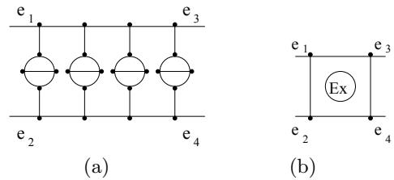
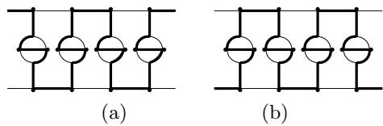
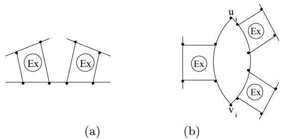
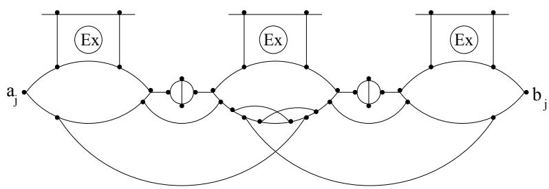
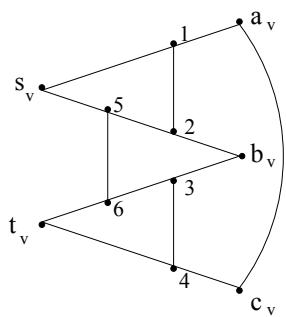

# On the Approximation of Finding A(nother) Hamiltonian Cycle in Cubic Hamiltonian Graphs

(Extended abstract) ⋆

Cristina Bazgan1 Miklos Santha2 Zsolt Tuza3 $^ { 1 }$ Universit´e Paris-Sud, LRI, bˆat.490, F–91405 Orsay, France, bazgan@lri.fr $^ 2$ CNRS, URA 410, Universit´e Paris-Sud, LRI, F–91405 Orsay, France, santha@lri.fr $^ 3$ Computer and Automation Institute, Hungarian Academy of Sciences, H–1111 Budapest, Kende u.13–17, Hungary, tuza@sztaki.hu

Abstract. It is a simple fact that cubic Hamiltonian graphs have at least two Hamiltonian cycles. Finding such a cycle is $N P$ -hard in general, and no polynomial time algorithm is known for the problem of finding a second Hamiltonian cycle when one such cycle is given as part of the input. We investigate the complexity of approximating this problem where by a feasible solution we mean a(nother) cycle in the graph. First we prove a negative result showing that the Longest Path problem is not constant approximable in cubic Hamiltonian graphs unless $P = N P$ . No such negative result was previously known for this problem in Hamiltonian graphs. In strong opposition with this result we show that there is a polynomial time approximation scheme for finding another cycle in cubic Hamiltonian graphs if a Hamiltonian cycle is given in the input.

# 1 Introduction

Longest Path and Longest Cycle are well-known problems in graph theory which were shown to be $N P$ -complete in 1972 by Karp [7]. The approximability of the associated optimization problems is very much open despite considerable efforts in recent years.

Monien [10] gave an algorithm to find a path of length $k$ in time $O ( k ! \cdot n \cdot m )$ where $n$ and $m$ are respectively the number of vertices and the number of edges of the graph. Karger, Motwani and Ramkumar [8] gave a polynomial time algorithm which finds a path of length $\Omega ( \log n )$ in any 1-tough graph. A similar result was obtained also by F¨urer and Raghavachari [4]. Since 1-tough graphs include Hamiltonian graphs, these algorithms can be used in particular to find such paths in graphs which contain a Hamiltonian cycle. Alon, Yuster and Zwick [2] generalized this result by giving a polynomial time algorithm which for any $c > 0$ , finds a path of length $c \log n$ , in a graph which contains such a path. Finding paths of length $\omega ( \log n )$ in polynomial time is an open problem even for Hamiltonian graphs.

On the negative side, Karger, Motwani and Ramkumar [8] have proved that unless $P { = } N P$ , Longest Path is not constant approximable in polynomial time. Their proof consists of two parts. First, they have shown that Longest Path doesn’t have a polynomial time approximation scheme, unless $P { = } N P$ . They were able to show this even when the input instances are restricted to Hamiltonian graphs. Then they gave a self-improving scheme for the problem, showing that a polynomial time approximating algorithm for some constant can be transformed into a polynomial time approximating algorithm for any constant. These results remain valid also when the maximum degree of the input graph is bounded by a constant at least four. But their self-improving scheme didn’t conserve Hamiltonicity, and they asked if it can be proven also for Hamiltonian graphs that they are not constant approximable in polynomial time, unless $P { = } N P$ .

In this paper we will prove an even stronger negative result. It turns out that we will be able to give a self-improving scheme for Longest Path which preserves Hamiltonicity when the input graphs are further restricted to be also cubic. That Longest Path remains $N P$ -complete even for cubic graphs was shown by Garey, Johnson and Tarjan [6]. In addition we also prove that this problem doesn’t have a polynomial time approximation scheme in cubic Hamiltonian graphs, unless $P { = } N P$ . These two results imply that Longest Path is not constant approximable for any constant in cubic Hamiltonian graphs, unless $P { = } N P$ . A similar result follows immediately for Longest Cycle.

The Longest Cycle problem has an interesting variant in cubic Hamiltonian graphs. It is not hard to show [11] that any such graph has at least two Hamiltonian cycles. Therefore if some Hamiltonian cycle is given as part of the input, one can ask to find another Hamiltonian cycle in the graph. We will call this problem Second Hamiltonian Cycle. It is a well known instance of what Meggido and Papadimitriou [9] call the class $T F N P$ of total functions. This class contains function problems associated with languages in $N P$ where for every instance of the problem a solution is guaranteed to exist. Other examples in the class are Factoring and the Happynet problem.

Many functions in $T F N P$ (like the examples quoted above) have a challenging intermediate status between $F P$ and $F N P$ , the function classes associated with $P$ and $N P$ . Although these problems are not $N P$ -hard unless $N P$ = $c o$ - $N P$ , no polynomial time algorithm is known for them. We consider here (for the first time up to our knowledge) approximating a problem in $T F N P$ . In particular, we show that in striking opposition with the above negative result, Second Hamiltonian Cycle admits a polynomial time approximating scheme, where a feasible solution for this problem is a cycle different from the one given in the input.

The paper is organized as follows: In section 2 we give the necessary definitions and reduce Longest Path to approximating the longest path between two fixed vertices in cubic Hamiltonian graphs. In section 3 we prove that this latter problem has no polynomial time approximation scheme, and in section 4 we prove that it is not constant approximable either. In section 5 we describe a ptas for Second Hamiltonian Cycle.

# 2 Preliminaries

In this paper by optimization problem we always mean an $N P$ -optimization problem. Let us recall a few notions about their approximability. Given an instance $x$ of an optimization problem $A$ and a feasible solution $y$ of $x$ , we denote by $m ( x , y )$ the value of the solution $y$ , and with $o p t _ { A } ( x )$ the value of an optimum solution of $x$ . The performance ratio of $y$ is

$$
R ( x , y ) = \operatorname* { m a x } \left\{ \frac { m ( x , y ) } { o p t _ { A } ( x ) } , \frac { o p t _ { A } ( x ) } { m ( x , y ) } \right\} .
$$

For a constant $c > 1$ , an algorithm is a $c$ -approximation if for any instance $x$ of the problem it returns a solution $y$ such that $R ( x , y ) \leq c$ . We say that an optimization problem is constant approximable if for some $c > 1$ , there exists a polynomial time $c$ -approximation for it. The set of problems which are constant approximable is denoted by $A P X$ . An optimization problem has a polynomial time approximation scheme (in short a ptas) if for every constant $\varepsilon > 0$ , there exists a polynomial time $( 1 + \varepsilon )$ -approximation for it.

The notion of $L$ -reduction was introduced by Papadimitriou and Yannakakis in [13]. Let $A$ and $B$ be two optimization problems. $A$ is $L$ -reducible to $B$ if there are two constants $\alpha , \beta > 0$ such that

1. there exists a polynomial time computable function which transforms an instance $x$ of $A$ into an instance $x ^ { \prime }$ of $B$ such that $o p t _ { B } ( x ^ { \prime } ) \leq \alpha \cdot o p t _ { A } ( x )$ , 2. there exists a polynomial time computable function which transforms any solution $y ^ { \prime }$ of $x ^ { \prime }$ into a solution $y$ of $x$ such that $| m ( x , y ) - o p t _ { A } ( x ) | \ \leq$ $\beta \cdot | m ( x ^ { \prime } , y ^ { \prime } ) - o p t _ { B } ( x ^ { \prime } ) |$ .

For us the important property of this reduction is that it preserves ptas, that is if $A$ is $L$ -reducible to $B$ and $B$ has a ptas then $A$ has also a ptas.

Let $G = ( V , E )$ an undirected graph. A path of length $k$ in $G$ is a sequence of distinct vertices $v _ { 0 } , v _ { 1 } , \ldots , v _ { k }$ such that for $0 \leq i \leq k - 1$ , there is an edge between $v _ { i }$ and $v _ { i + 1 }$ . For two vertices $s$ and $t$ , an $s$ - $t$ path is a path whose first vertex is $s$ and last vertex is $t$ . A path of length at least three whose first and last vertices coincide is called a cycle. A path covers a subgraph $H$ if it contains all the vertices of $H$ . A path or a cycle is Hamiltonian if it covers $G$ . The graph is called Hamiltonian if it has a Hamiltonian cycle, and it is called cubic if the degree of all its vertices is three. Finally it is called cubic with distinguished vertices $s$ and $t$ if all its vertices have degree three except $s$ and $t$ which have degree two, and there is an edge between $s$ and $t$ .

Our negative result is that there is no constant approximation for the longest path (cycle) problem in cubic Hamiltonian graphs, problems we now define formally.

CH Longest Path (Cycle)

Input: A cubic Hamiltonian graph $G$

Solution: A path (cycle).

Value: The length of the path (cycle).

Since CH Longest Path is trivially $L$ -reducible to CH Longest Cycle, we will prove our non-approximability result for CH Longest Path. For technical reasons it is easier to show it for the following variant of the problem.

CH Longest s-t Path

Input: A cubic Hamiltonian graph $G$ with distinguished vertices $s$ and $t$ .

Solution: An s- $t$ path.

Value: The length of the path.

It is probably standard knowledge (and it was pointed out to us by M. Yannakakis [16]) that these two problems have the same difficulty of approximation. We state here the exact reduction we need.

Lemma 1. If CH Longest Path is constant approximable then CH Longest $s$ - $t$ Path is also constant approximable.

What is particular in these instances of the longest path problem is that the value of the optimum solution is known in advance. Although they remain hard to approximate, this property makes it very unlikely that Max 3Sat could be $L$ -reduced to them, as we will show it in the next section. Therefore to prove that they still don’t have a ptas, we will reduce to them the special case of Max 3Sat where the value of an optimum solution is also known. Let us define it formally.

Satisfiable Max 3Sat

Input: A formula $F$ with variables $x _ { 1 } , \ldots , x _ { n }$ and with clauses $C _ { 1 } , \ldots , C _ { m }$ where $F$ is satisfiable.

Solution: A truth assignment for the variables.

Value: The number of clauses satisfied.

Satisfiable Max 3Sat $( 4 , 4 )$ is the restriction of Satisfiable Max 3Sat in which each variable and its negation appear at most four times in $F$ .

Let us finally state the variant of Longest Cycle for which we will be able to give a ptas.

Second Hamiltonian Cycle

Input: A cubic Hamiltonian graph $G$ and a Hamiltonian cycle $C$

Solution: A cycle different from $C$ .

Value: The length of the cycle.

# 3 CH Longest s- $\mathbf { \Delta } _ { t }$ Path has no ptas

The basis of our non-approximability result is the following refinement by Arora et al [1] of Cook’s theorem on the $N P$ -hardness of 3Sat.

Theorem 2. Let $L$ be a language in $N P$ . There exists a polynomial time algorithm and a constant $0 < \varepsilon < 1$ such that, given an input $x$ , the algorithm constructs an instance $F _ { x }$ of 3Sat which satisfies the following properties: 1. If $x \in L$ then $F _ { x }$ is satisfiable. 2. If $x \notin L$ then no assignment satisfies more than fraction $( 1 - \varepsilon )$ of the clauses.

The standard way for showing that an optimization problem has no ptas is to show the stronger result that it is hard for $A P X$ under $L$ -reduction. But we can not proceed here this way since if NP=co- $N P$ then this stronger result doesn’t hold for problems where the value of an optimum solution is known. This is somewhat analogous to the result of Megiddo and Papadimitriou [9] showing that an $F N P$ -complete function can not be total unless $N P$ =co- $N P$ .

Theorem 3. If $N P { \neq } c o$ - $. N P$ then an optimization problem where the value of an optimum solution is known can not be $A P X$ -hard under L-reduction.

Using Theorem 2 we can prove that Satisfiable Max 3Sat has no ptas.

Lemma 4. Satisfiable Max 3Sat has no ptas, unless $P { = } N P$ .

Using now the $L$ -reduction of [13] from Max 3Sat to Max 3Sat $( 4 , 4 )$ , and observing that satisfiable instances are mapped into satisfiable instances, we get the following corollary.

Corollary 5. Satisfiable Max 3Sat $( 4 , 4 )$ has no ptas, unless $P { = } N P$

We now prove the main result of this section.

Theorem 6. CH Longest s- $\mathbf { \nabla } \cdot t$ Path has no ptas, unless $P { = } N P$

Proof. We construct an $L$ -reduction from Satisfiable Max 3Sat $( 4 , 4 )$ to CH Longest s- $t$ Path. The outline of our construction follows the polynomial time reduction given by Papadimitriou and Steiglitz [12] from 3Sat to the Hamiltonian cycle problem. In [14] Papadimitriou and Yannakakis gave an $L$ -reduction from Max $\mathrm { 3 S A T } ( 4 , \bar { 4 } )$ to the traveling salesman problem with edges of weight one and two by exploiting the strong connection between this later problem and the Hamiltonian cycle problem. Although we will give an $L$ -reduction which is more constraining than a polynomial time reduction, we basically can avoid the complications in the construction of Papadimitriou and Yannakakis. The reason for that is that (here) we are concerned only with satisfiable instances of Max ${ \mathrm { 3 S A T } } ( 4 , 4 )$ . On the other hand, we have additional difficulties since the graph we construct must be cubic and Hamiltonian. In particular, similarly to both [12] and [14] we will use in our construction so-called variable and clause devices. The variable device will be taken from [12] (which is simpler than the one used in [14]), but for the clause device we will use additional features.

A basic ingredient for both is the modification of the ex-or device from [12] which is shown in Fig.1, where only the edges $e _ { 1 } , e _ { 2 } , e _ { 3 } , e _ { 4 }$ are joined with the rest of the graph. The only difference with respect to the original ex-or device is that here all vertices have degree three. The ex-or device has the property that any covering path for the device which starts and ends outside it uses either the edge set $\{ e _ { 1 } , e _ { 3 } \}$ , or the edge set $\{ e _ { 2 } , e _ { 4 } \}$ as connection with the rest of the graph like in Fig. 2(a) and 2(b). Also, it is impossible to have two disjoint paths starting and ending outside the device such that they both contain some vertices of the device and together they cover it. Ex-or devices can be connected in series like in Fig.3(a).

  
Fig. 1. The Ex-or device and its shorthand representation

  
Fig. 2.

  
Fig. 3.

Let $F ^ { \prime }$ be an instance of Satisfiable Max ${ \mathrm { 3 S A T } } ( 4 , 4 )$ with $n$ variables and $m$ clauses. For each variable we will construct a variable device and for each clause a clause device. For $1 \leq i \leq n$ , let $p _ { i }$ be the number of positives occurrences of $x _ { i }$ in $F$ and let $r _ { i }$ be the number of its negatives occurrences. For every $i$ , the $_ i$ th variable device is the following: for two specific vertices $u _ { i }$ and $v _ { i }$ , there are two paths between $u _ { i }$ and $v _ { i }$ . To one of these paths are attached $p _ { i }$ ex-or devices connected like in Fig.3(a), and we say that they are standing for $x _ { i }$ . To the other path are attached $r _ { i }$ ex-or devices in series which are standing for $x _ { i }$ . If $p _ { i } = 0$ or $r _ { i } = 0$ then the corresponding path consists of just an edge. Figure 3(b) shows the variable device corresponding to a variable with $p _ { i } = 1$ and $r _ { i } = 2$ .

The $j$ th clause device corresponding to the clause $C _ { j }$ is shown in Fig.4 where the three ex-or devices stand for the three literals appearing in that clause. If $C _ { j }$ contains the literal $x _ { i }$ then the $j$ th clause device and the ith variable device will share an ex-or device which will stand in the latter for $x _ { i }$ . If $C _ { j }$ contains $x _ { i }$ then the same devices share again an ex-or device now standing for $\bar { x } _ { i }$ in the variable device. The specific property satisfied by the clause devices is stated in the next lemma.

  
Fig. 4. The clause device $C _ { j }$

Lemma 7. For any subset $S \neq \emptyset$ of the three ex-or devices in the jth clause device, there is a path from $a _ { j }$ to $b _ { j }$ which contains exactly those vertices of the clause device which are not in $S$ . On the other hand, there is no path from to $a _ { j }$ $b _ { j }$ which contains all the vertices of the clause device.

The graph $G$ contains all the variable and clause devices, and two additional vertices $s$ and $t$ . Beside the edges of the devices, there is an edge between $s$ and $u _ { 1 }$ , between $v _ { i }$ and $u _ { i + 1 }$ for $1 \leq i \leq n - 1$ , between $v _ { n }$ and $a _ { 1 }$ , between $b _ { j }$ and $a _ { j + 1 }$ for $1 \leq j \leq m - 1$ , between $b _ { m }$ and $t$ , and finally between $s$ and $t$ . If there is a satisfying assignment $A$ for $F$ then the path which picks up in each variable device the ex-or devices standing for the literal satisfied by $A$ , and which crosses the clause devices according to Lemma 7 is Hamiltonian. $G$ is also cubic except for vertices $s$ and $t$ which have degree two. We show now that the reduction is indeed an $L$ -reduction.

Let $N$ be the number of vertices in $G$ , then the size of the longest $s$ - $t$ path is $N - 1$ . The number of clauses $m$ in $F ^ { \prime }$ is also the value of an optimum assignment for an instance of Satisfiable Max ${ 3 } \mathrm { S A T } ( 4 , 4 )$ . Clearly $m = \Theta ( n )$ since every literal appears only a constant number of times in the formula. Since the variable and the clause devices have a constant number of vertices, $N = \Theta ( m + n ) = \Theta ( n )$ , which shows that the first condition of the $L$ -reduction is satisfied.

For the second condition let us consider an arbitrary $s$ - $t$ path $P$ in $G$ . We will call all the vertices not in this path missing.

We construct now from $P$ a partial assignment $A _ { P }$ for the formula $F$ which will give a value to all variables whose corresponding variable device is correctly traversed by $P$ for $x _ { i }$ or $x _ { i }$ . We say that $P$ correctly traverses the $i$ th variable device for $x _ { i }$ if it covers all the ex-or devices standing for $x _ { i }$ , these ex-or devices are entered from the variable device, and none of the ex-or devices standing for $x _ { i }$ is entered from the variable device. In that case $A _ { P }$ assigns the value true for $x _ { i }$ . The definition for correctly traversing the $i$ th variable device for $x _ { i }$ is analogous, in which case $A _ { P }$ assigns the value false for $x _ { i }$ .

Lemma 8. If the path $P$ has $k$ missing vertices then the partial assignment $A _ { P }$ satisfies at least $m - 8 k$ clauses.

Proof. Let us suppose that a clause $C _ { j }$ is unsatisfied by $A _ { P }$ . Then either its three literals are made false by $A _ { P }$ or at least one of its literals didn’t receive a truth value. In the former case, by the definition of $A _ { P }$ , the variable device of each literal was correctly traversed for the negation of that literal. Therefore the only vertices where $P$ can enter and leave the $j$ th clause device are $a _ { j }$ and $b _ { j }$ , and there must be a missing vertex in that device by Lemma 7. In the latter case there must be a missing vertex in the variable device corresponding to the variable without truth value. Since every variable and its negation appear together at most 8 times in $F$ , the statement follows. ✷

To finish the proof of Theorem 6 we now show that the second condition in the definition of an $L$ -reduction is also satisfied. Since $F$ is satisfiable, its optimum is $m$ , and since $G$ has a Hamiltonian cycle, its optimum is $N - 1$ . Let us given an $s$ - $t$ path $P$ of length $N - 1 - \ell$ . Then there are $\ell$ missing vertices in the graph. Let $A$ be an assignment which extends $A _ { P }$ . By Lemma 8 $A$ satisfies at least $m - 8 \ell$ clauses of $F$ . Therefore the second condition is satisfied with $\beta = 8$ . ✷

# 4 CH s- $\mathbf { \Delta } _ { t }$ Longest Path is not in APX

Given an instance $G = ( V , E )$ of CH Longest $s$ -t Path with distinguished vertices $s$ and $t$ , we now define the vertex square graph $G ^ { 2 }$ of $G$ which will be an instance of the same problem. The basic idea is to replace in $G$ every vertex $v$ by a copy $G _ { v }$ of $G$ and by a connector device $C _ { v }$ . The copy of the connector device for $v$ is shown in Fig.5. This device will connect $G _ { v }$ with the rest of $G ^ { 2 }$ through the vertices $a _ { v } , b _ { v } , c _ { v }$ which we call exterior vertices. The important property of the connector device is stated in the following lemma.

Lemma 9. For every set $\{ x , y \} \subseteq \{ a _ { v } , b _ { v } , c _ { v } \}$ there exist two paths $P _ { x }$ starting from $x$ and $P _ { y }$ starting from $y$ such that they are disjoint, together they contain all the vertices of the device, and the other two endpoints of the paths are $s _ { v }$ and $t _ { v }$ in some order.

$G ^ { 2 }$ will contain a copy $G _ { v }$ of $G$ and a copy $C _ { v }$ of the connector device for every vertex $v$ except $s$ and $t$ . It will also have two distinguished vertices $S$ and $T$ .

For every $v$ , we identify the distinguished vertices of $G _ { v }$ with the vertices $s _ { v }$ and $t _ { v }$ of $C _ { v }$ , and we delete the edge $\{ s _ { v } , t _ { v } \}$ . We denote the resulting graph by $H _ { v }$ , and call it the component corresponding to $v$ . The components are connected by the following so called exterior edges. For every edge $\{ v , w \} \in E$ , we put an edge between an exterior vertex of $C _ { v }$ and an exterior vertex of $C _ { w }$ . Let $s ^ { \prime }$ (respectively $t ^ { \prime }$ ) be the neighbor of $s$ $\mathbf { \rho } ( t )$ in $G$ different from $t$ (s). We add an edge between $S$ and an exterior vertex of $C _ { s ^ { \prime } }$ and an edge between $T$ and an exterior vertex of $C _ { t ^ { \prime } }$ . Finally we add an edge between $S$ and $T$ .

Since there is a Hamiltonian $s$ - $t$ path in $G$ , Lemma 9 implies that there is a Hamiltonian $S$ - $T$ path in $G ^ { 2 }$ .

  
Fig. 5. The connector device $C _ { v }$

Lemma 10. Any S-T path of length $L$ in $G ^ { 2 }$ can be transformed in polynomial time into an s-t path in $G$ of length $\sqrt { L } - 1 0$ .

This self-improving scheme with Theorem 6 gives using standard arguments

Theorem 11. CH Longest s- $t$ Path is not constant approximable, unless $P { = } N P$ .

Our main negative results follow immediately from Lemma 1 and Theorem 11.

Theorem 12. CH Longest Path and CH Longest Cycle are not in $A P X$ , unless $P { = } N P$ .

We can show a stronger non-approximability result under a stronger hypothesis.

Theorem 13. For any $\varepsilon > 0$ , CH Longest Path and CH Longest Cycle are not $2 ^ { O ( l o g ^ { 1 - \varepsilon } n ) }$ -approximable, unless $N P \subseteq D T I M E ( 2 ^ { O ( l o g ^ { 1 / \varepsilon } n ) } )$ .

# 5 Second Hamiltonian Cycle has a ptas

In this section we prove that Second Hamiltonian Cycle has a ptas in cubic Hamiltonian graphs, which is to our best knowledge the first-ever approximation scheme for a problem in the complexity class TFNP. Actually we are going to prove this result in a much stronger form.

Theorem 14. Let $G = ( V , E )$ be a cubic graph of order $n$ with Hamiltonian cycle $C = v _ { 1 } v _ { 2 } \cdot \cdot \cdot v _ { n }$ . There is an algorithm that finds a cycle $C ^ { \prime } \neq C$ of length at least $n - 4 \sqrt { n }$ in $O ( n ^ { 3 / 2 } \log n )$ steps.

We will need the following terminology and notation.

Definitions. We assume throughout that the vertices $v _ { 1 } , v _ { 2 } , \ldots , v _ { n }$ follow each other in this order along the given Hamiltonian cycle $C$ of $G$ . The length of a chord $e = v _ { i } v _ { j } \in E ( G ) \backslash E ( C ) ( i < j )$ is defined as $| | e | | : = \operatorname* { m i n } \left\{ j - i , n + i - j \right\}$ . We denote by $P _ { e }$ the shorter subpath of $C$ with endpoints $v _ { i }$ and $v _ { j }$ if $| | e | | < n / 2$ , and set $P _ { e } : = v _ { i } v _ { i + 1 } \cdot \cdot \cdot v _ { j }$ if $| | e | | = n / 2$ . Two chords $e , e ^ { \prime }$ are said to be   
–crossing if $P _ { e } \cap P _ { e ^ { \prime } } \neq \emptyset$ , $P _ { e } \notin P _ { e ^ { \prime } }$ , and $P _ { e ^ { \prime } } \notin P _ { e }$ ;   
–incomparable if $P _ { e } \cap P _ { e ^ { \prime } } = \emptyset$ ;   
–parallel if they do not cross, i.e., either they are incomparable, or $P _ { e } \subset P _ { e ^ { \prime } }$ , or $P _ { e ^ { \prime } } \subset P _ { e }$ .

If $P _ { e } \subset P _ { e ^ { \prime } }$ , we also say that $e$ is smaller than $e ^ { \prime }$ . The chord $e$ is minimal if there is no chord smaller than $e$ .

Proof. Let $k : = \lfloor { \sqrt { n } } \rfloor + 1$ . First, we check in $n / 2$ steps whether $C$ has a chord of length at most $k$ . If such a chord $e$ exists, then $( E ( C ) \cup \{ e \} ) \setminus E ( P _ { e } )$ is a cycle of required length. Suppose that all chords are longer than $k$ . We now consider $k$ consecutive chords, say the ones starting from $v _ { 1 } , \ldots , v _ { k }$ . Denoting by $z _ { i }$ the other endpoint of the chord $e _ { i }$ incident to $v _ { i }$ , we can find two subscripts $i _ { 1 } , i _ { 2 }$ such that $z _ { i _ { 1 } }$ and $z _ { i _ { 2 } }$ are at distance less than $( n - k ) / ( k - 1 ) < k$ apart on the path $P ^ { \prime } : = v _ { k + 1 } v _ { k + 2 } \dots v _ { n }$ . Note that the order of the $k$ vertices $z _ { i }$ on $P ^ { \prime }$ can be determined in at most $O ( k \log k ) = O ( n ^ { 1 / 2 } \log n )$ steps by any standard sorting algorithm, and then the closest pair can be selected in $k$ steps. If $e _ { i _ { 1 } }$ and $e _ { i _ { 2 } }$ are crossing chords, and say $i _ { 1 } < i _ { 2 }$ , then $v _ { i _ { 2 } } v _ { i _ { 2 } + 1 } \cdot \cdot \cdot z _ { i _ { 1 } - 1 } z _ { i _ { 1 } } v _ { i _ { 1 } } v _ { i _ { 1 } - 1 } \cdot \cdot \cdot z _ { i _ { 2 } + 1 } z _ { i _ { 2 } }$ is a cycle of length at least $n - 2 k + 2 > n - 2 \sqrt { n }$ .

Otherwise, if $e _ { i _ { 1 } }$ and $e _ { i _ { 2 } }$ are parallel, we keep them as a starting configuration.

To simplify notation, denote $e _ { 0 } : = e _ { i _ { 1 } }$ , $e _ { 0 } ^ { \prime } : = e _ { i _ { 2 } }$ , and assume that $e _ { 0 } = v _ { a } v _ { b }$ , $e _ { 0 } ^ { \prime } = v _ { a ^ { \prime } } v _ { b ^ { \prime } }$ . It may be the case that $e _ { 0 }$ and $e _ { 0 } ^ { \prime }$ are incomparable (i.e., neither of them is smaller than the other), but we may assume without loss of generality (by renumbering the vertices if necessary) that $P _ { e _ { 0 } } = v _ { a } v _ { a + 1 } \cdot \cdot \cdot v _ { b - 1 } v _ { b }$ and that $P _ { e _ { 0 } ^ { \prime } } \notin P _ { e _ { 0 } }$ . We then consider the next $k$ chords $e _ { 1 } ^ { \prime } , \ldots , e _ { k } ^ { \prime }$ , starting from the vertices $v _ { a + 1 } , \ldots , v _ { a + k }$ , and select from them two chords $f _ { 0 }$ and $f _ { 0 } ^ { \prime }$ the other endpoints of which are at distance less than $k$ apart. If $f _ { 0 }$ and $f _ { 0 } ^ { \prime }$ are crossing, then a cycle of length at least $n - 2 { \sqrt { n } }$ is easily found as above, therefore we may assume that $f _ { 0 }$ and $f _ { 0 } ^ { \prime }$ do not cross.

If both $f _ { 0 }$ and $f _ { 0 } ^ { \prime }$ are smaller than $e _ { 0 }$ , and say $f _ { 0 }$ is smaller than $f _ { 0 } ^ { \prime }$ , then we rename $e _ { 0 } : = f _ { 0 }$ , $e _ { 0 } ^ { \prime } : = f _ { 0 } ^ { \prime }$ , and do the previous step again. Note that this situation cannot occur more than $O ( n )$ times.

Suppose next that $f _ { 0 }$ or $f _ { 0 } ^ { \prime }$ crosses $e _ { 0 }$ but it does not cross $e _ { 0 } ^ { \prime }$ . In this situation again, $e _ { 0 }$ and the crossing chord create a cycle of length at least $n - 2 { \sqrt { n } }$ .

Similarly, if $f _ { 0 }$ is smaller than $e _ { 0 }$ but $f _ { 0 } ^ { \prime }$ crosses both $e _ { 0 }$ and $e _ { 0 } ^ { \prime }$ , then $f _ { 0 } ^ { \prime }$ with any one of $e _ { 0 } , e _ { 0 } ^ { \prime }$ is a suitable choice to construct a cycle of required length.

Finally, suppose that $f _ { 0 }$ and $f _ { 0 } ^ { \prime }$ are parallel and they cross both $e _ { 0 }$ and $e _ { 0 } ^ { \prime }$ . Remove the two pairs of short arcs (of lengths $< k$ ) joining the parallel chords (i.e., remove the subpaths of $C$ that join $P _ { e _ { 0 } }$ with $P _ { e _ { 0 } ^ { \prime } }$ and also those between $P _ { f _ { 0 } }$ and $P _ { f _ { 0 } ^ { \prime } }$ ) to create four paths of total length at least $n - 4 k$ . We then obtain a cycle longer than $n - 4 \sqrt { n }$ by adjoining the four edges $e _ { 0 } , e _ { 0 } ^ { \prime } , f _ { 0 } , f _ { 0 } ^ { \prime }$ . $\boxed { \begin{array} { r l } \end{array} }$

Remark. By very similar techniques, we can show that if $P \neq N P$ then the traveling salesman problem with weights one and two, restricted to instances where the graph formed by the edges of weight one is cubic and Hamiltonian, has no ptas. On the other hand, when a Hamiltonian cycle is given in the input, the problem has a ptas.

# Список литературы

1. S. Arora, C. Lund, R. Motwani, M. Sudan, M. Szegedy, Proof verification and hardness of approximation problems, Proc. of 33rd FOCS, pages 14-23, 1992.   
2. N. Alon, R. Yuster, U. Zwick, Color-coding: a new method for finding simple paths, cycles and other small subgraphs within large graphs, Proc. of 26th STOC, pages 326-335, 1994.   
3. R. P. Dilworth, A decomposition theorem for partially ordered sets, Ann. Math. (2) 51 (1950), 161–166.   
4. M. F¨urer, B. Raghavachari, Approximating the Minimum-Degree Steiner Tree to within One of Optimal, Journal of Algorithms, 17, pages 409-423, 1994.   
5. G. Galbiati, A. Morzenti, F. Maffioli, On the Approximability of some Maximum Spanning Tree Problems, to appear in Theoretical Computer Science.   
6. M. R. Garey, D. S. Johnson, R. E. Tarjan, The planar Hamiltonian circuit problem is $N P$ -complete, SIAM J. Comput. 5:4, pages 704-714, 1976.   
7. R. M. Karp, Reducibility among combinatorial problems. In R. E. Miller and J. W. Thatcher editors, Complexity of Computer Computations, pages 85-103, 1972.   
8. D. Karger, R. Motwani, G. Ramkumar, On Approximating the Longest Path in a Graph, Proc. of 3rd Workshop on Algorithms and Data Structures, LNCS 709, pages 421-432, 1993.   
9. N. Megiddo, C. Papadimitriou, On total functions, existence theorems and computational complexity, Theoretical Computer Science, 81, pages 317-324, 1991.   
10. B. Monien, How to find long paths efficiently, Annals of Discrete Mathematics, 25, pages 239-254, 1984.   
11. C. Papadimitriou, On the Complexity of the Parity Argument and Other Inefficient Proofs of Existence, Journal of Computer and System Science 48, pages 498-532, 1994.   
12. C. Papadimitriou, K. Steiglitz, Combinatorial Optimization: Algorithms and Complexity, Prentice-Hall, Englewood Cliffs, NJ, 1982.   
13. C. Papadimitriou, M. Yannakakis, Optimization, Approximation and Complexity Classes, Journal of Computer and System Science 43, pages 425-440, 1991.   
14. C. Papadimitriou, M. Yannakakis, The traveling salesman problem with distances one and two, Mathematics of Operations Research, vol. 18, No. 1, pages 1-11, 1993.   
15. A. Thomason, Hamilton cycles and uniquely edge colourable graphs, Ann. Discrete Math. 3, pages 259-268, 1978.   
16. M. Yannakakis, personal communication, 1996.