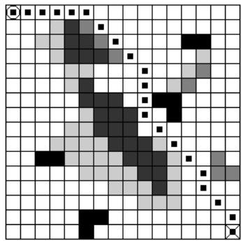
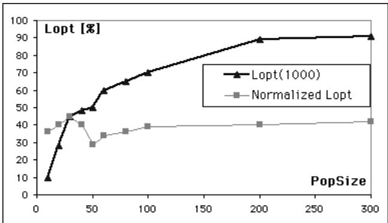
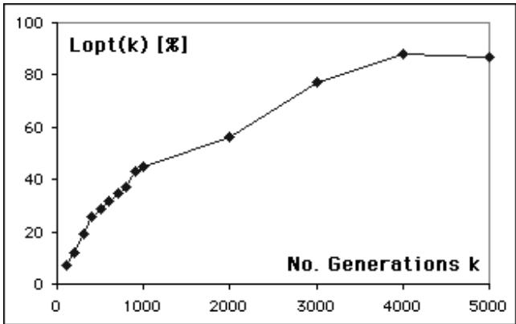
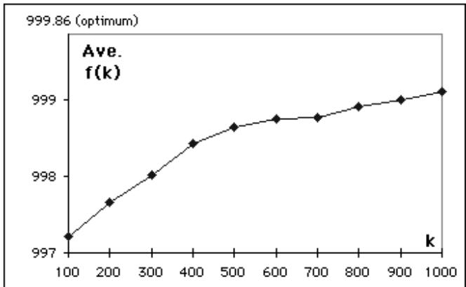
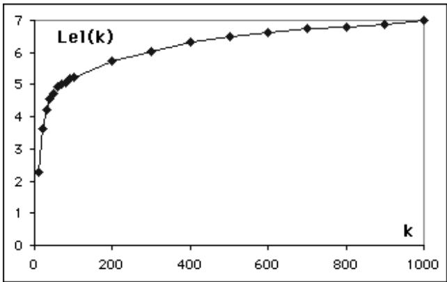
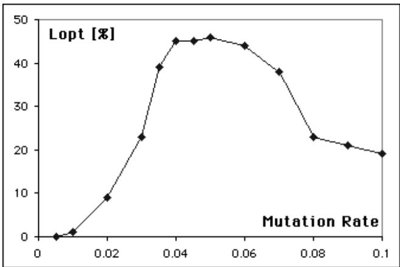
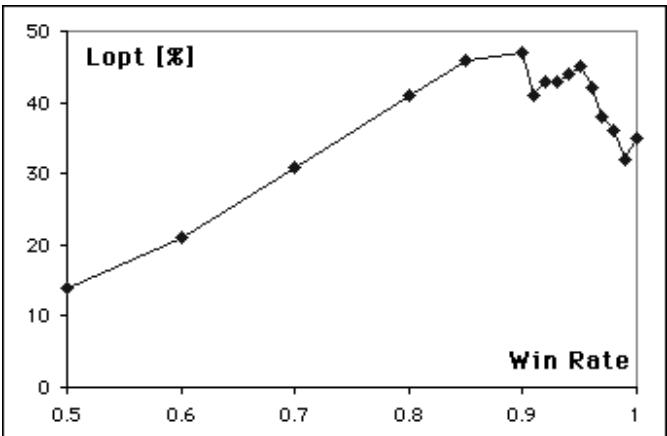
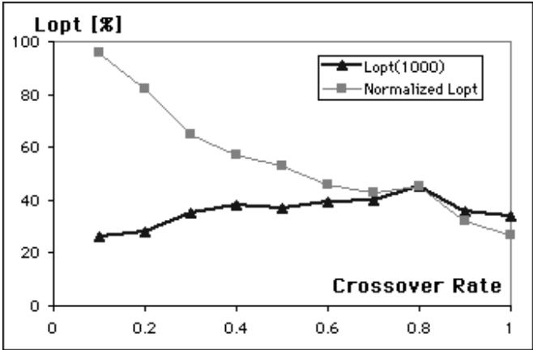
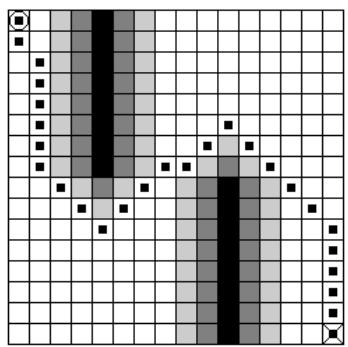
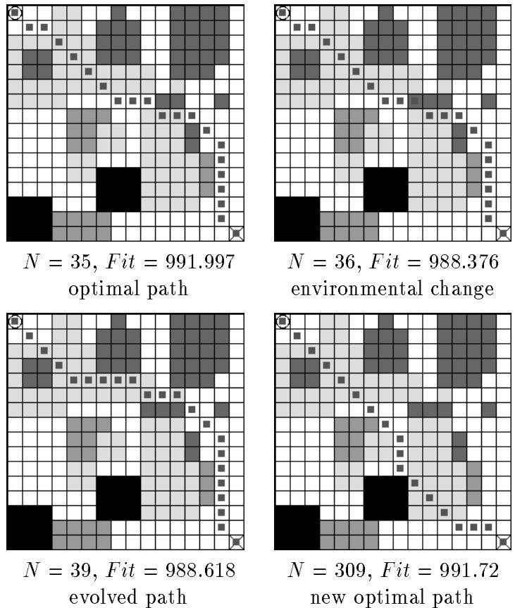

# A Case Study on Tuning of Genetic Algorithms by Using Performance Evaluation Based on Experimental Design

Kazuo Sugihara

Department of Information and Computer Sciences University of Hawaii at Manoa sugihara@hawaii.edu http://www.ics.hawaii.edu/ $\sim$ sugihara/

January 14, 1997

ICS-TR-97-01

# Abstract

This paper proposes four performance measures of a genetic algorithm (GA) which enable us to compare different GAs for an optimization problem and different choices of their parameters' values. The performance measures are defined in terms of observations in simulation, such as the frequency of optimal solutions, fitness values, the frequency of evolution leaps, and the number of generations needed to reach an optimal solution. We present a case study in which parameters of a GA for robot path planning was tuned and its performance was optimized through performance evaluation by using the measures. Especially, one of the performance measures is used to demonstrate the adaptivity of the GA for robot path planning. We also propose a process of systematic tuning based on techniques for the design of experiments.

Keywords: Genetic algorithms, performance evaluation, tuning, experimental design, path planning, and mobile robot

# 1 INTRODUCTION

In recent years, genetic algorithms (GAs) [2, 3, 6] have been widely recognized as an effective solving technique for complex problems in the real world [7]. For example, a bibliography [1] on applications of GAs even limited to only engineering includes over 1,400 papers as of April 1996. As GAs are getting a larger spectrum of applications, it becomes more crucial to develop a methodology for the design of GAs.

GAs can be regarded as a paradigm of algorithms in the sense that the GAs are parameterized and applicable to a variety of problems by instantiating the paradigm. There are the following major components to be designed in GAs.

1. Coding: The representation of potential solutions which is a mapping scheme from a problem to the GA paradigm   
2. Fitness Function: The quantified measure for quality of solutions which enables to differentiate "good" solutions from "bad" solutions   
3. Configuration: A combination of operators which are applied to a population   
4. Parameters: Population size, population structure, operators' parameters (such as mutation rate), termination condition, etc.

In an optimization problem, the fitness function is usually given a priori as an objective function, although the objective function may slightly be modified so that constraints are incorporated into the fitness function appropriately.

Practitioners need a systematic way to design and implement "good" GAs for their particular problems quickly. To design good algorithms, we should be able to compare algorithms for the same problem and choose the best one with respect to a certain criterion. For deterministic, sequential algorithms (what we traditionally call "algorithms"), there are well-defined criteria such as space and time complexities. The criteria were generalized and applied to randomized algorithms though, they are not suitable for evaluating the performance of GAs accurately.

The performance of GAs have been studied in terms of resultant fitness values and convergence primarily. For example, a number of papers investigated correlations between convergence speed and a particular parameter such as the population size and mutation rate. In many applications of optimization in practice (not necessarily real-time applications), however, a goal is to find a solution as good as possible "within a certain amount of time" [10]. With such a constraint on computational cost, it is not much critical to seek for convergence of a population. Furthermore, some applications such as robot path planning which will be discussed in Section 3.1 require the diversity of a population rather than the convergence in order to utilize the adaptivity of a GA. In addition, there may be a trade-off between solution quality and convergence, since a higher pressure (i.e., speed) to convergence tends to increase the possibility of premature convergence at a local optimum.

This paper proposes four performance measures of GAs: The likelihood of optimality, the average fitness value, the likelihood of evolution leap, and the adaptivity. The measures are defined so that they can be observed in simulation of GAs. They enable us to compare between different configurations of a GA for the same optimization problem and between different parameter settings in each configuration. Then, we present a case study in which a GA for robot path planning was tuned by using the measures in order to use it in motion planning of an underwater vehicle being developed at the University of Hawaii [4]. The performance of the GA was optimized through performance evaluation by using the proposed measures. With this experience in tuning of the GA by simulation, we propose a process of tuning based on techniques for experimental design. The process of tuning leads us to a systematic way for design and tuning of a GA. This is a step toward the development of a tool for automatic tuning of GAs.

This paper is organized as follows. Section 2 presents the terminology on GAs, defines the four performance measures, and introduces basic concepts of experimental design. Section 3 presents the case study which explains how we tuned a GA for robot path planning and shows simulation results on the performance of the GA. Section 4 proposes the process of tuning and discusses applications of techniques for experimental design to the process. Finally, Section 5 summarizes the paper.

# 2 PRELIMINARIES

# 2.1 GENETIC ALGORITHMS

A genetic algorithm (GA) [2, 3, 6] consists of a population and an evolutionary mechanism. The population is a collection of individuals which represent potential solutions through a mapping called a coding. The evolutionary mechanism repeatedly transforms the population by executing the following steps.

1. Fitness Evaluation: The fitness (i.e., an objective function value) is calculated for each individual.   
2. Selection: Some individuals are chosen from the current population as parents which are involved in recombination.   
3. Recombination: New individuals (called offspring) are produced from the parents by applying genetic operators such as crossover and mutation.   
4. Replacement: Some of the offspring are replaced with some individuals (usually with their parents).

A combination of operators for selection, recombination and replacement is referred to as a configuration which specifies a particular instance of the GA paradigm.

One cycle of transforming a population is called a generation. In each generation, a fraction of the population is replaced with offspring and its proportion to the entire population is called the generation gap (between 0 and 1). There are two extremes. One is a generational replacement GA where the generation gap is large. Another is a steady-state GA where only a few (typically two) individuals are involved.

# 2.2 PERFORMANCE MEASURES

Assume that we observe simulation runs of a GA for an optimization problem and all the runs are independent. We define the following performance measures from a viewpoint of solution quality regardless of convergence.

Likelihood of Optimality: Suppose that a GA was executed for $k$ generations in each of $n$ runs and $m$ is the number of runs which produced an optimal solution within $k$ generations. The likelihood of optimality $L o p t ( k )$ at the $k$ th generation is the estimated probability $m / n$ .

In case of generational replacement GAs, the computational cost is linearly proportional to the number $k$ of generations. Thus, for convenience, $k$ is regarded as the computational cost. In case of steady-state GAs, however, the cost is not necessarily proportional to the number $k$ of generations. Thus, if we compare a generational replacement GA and a steady-state GA in a sequential computing environment, we may need to adjust the number of generations for the steady-state GA so that they have the same cost.

Average Fitness Value: Suppose that a GA was executed for $k$ generations in each of $n$ runs. The average fitness value ${ \bar { f } } ( k )$ at the $k$ th generation is the average of fitness values of the best solutions obtained within $k$ generations in the $n$ runs.

Likelihood of Evolution Leap: A generation is said to be a leap if a solution produced at the generation is better than the best solution obtained before the generation. Suppose that a GA was executed for $k$ generations in each of $n$ runs and $\ell$ is the average number of leaps within $k$ generations. The likelihood of evolution leap $L e l ( k )$ at the kth generation is the estimated probability $\ell / n$ .

Although the likelihood of evolution leap $\ell$ does not explicitly represent the solution quality nor allow to compare different GAs directly, it may be useful to determine how many generations should be executed without using convergence of a population.

Based on the above measures (especially, Lopt), we can decide a cutoff generation $K$ , i.e., how many generations a GA should be executed in each run. Let $C = k r$ be the total computation cost given to execute the GA, where $r$ is the number of repeated runs. The best cut-off generation is the number $k$ of generations which maximizes the performance with respect to a particular measure. If $C$ is fixed, we may want to find $k$ maximizing $( 1 - p ( k ) ) ^ { r }$ , where $p ( k )$ denotes the probability that a GA produces an optimal solution within $k$ generations. If the value of $( 1 - p ( k ) ) ^ { r }$ is fixed instead, we may want to find $k$ minimizing $C = k r$ .

It is well-known that diversity in a population plays a key role to reach an optimal solution. On the other hand, approaching to convergence decreases the diversity. Hence, there may be a trade-off between convergence speed and solution quality. In some applications such as robot path planning which will be discussed in Section 3.1, the diversity of a population is most important in order to achieve the adaptivity. Furthermore, computational time is often bounded a priori due to online requirements in applications. In such cases, convergence of a population is not appropriate to decide the termination of a GA's execution. After all, convergence is not the primary goal of optimization. Therefore, we focus on direct correlations between solution quality and computational cost without regard to convergence.

Finally, we define a measure of the adaptivity of a GA. The adaptivity is the most important advantage of a GA over traditional optimization techniques. For example, robot path planning which will be discussed in Section 3 requires an algorithm to change a solution every time input changes (e.g., an unknown obstacle is detected in a terrain). The adaptivity is informally defined as how quickly a GA accommodates an environmental change.

Adaptivity: Suppose that a GA is executed $n$ times as follows. When the GA has found an optimal solution to an input instance, a minor modification is made on the input instance so that the optimal solution is no longer optimal to the modified input instance. Resume the execution of the GA with the new input instance from the next generation. The adaptivity is the average number of generations in $n$ runs that are taken to find a new optimal solution after the input was modified.

# 2.3 DESIGN OF EXPERIMENTS

In this paper, we address the performance evaluation of a GA through empirical measurement in simulation of the GA. Since every execution of a GA has random nature, its performance must be estimated on average from data measured in the simulation. We define the terminology as follows [5, 8, 9].

An experiment is a set of empirical tests performed to derive some conclusion. In the context of the performance evaluation of a GA, it is a set of simulation runs, each of which is a particular execution of the GA for a particular instance of input. An input instance for which an execution of the GA is observed is called an experimental unit. The experimental units used in simulation must be chosen carefully, since the performance of the GA varies over them. Randomization is commonly employed to generate a reasonable set of experimental units.

A factor of an experiment is a parameter (e.g., mutation rate) to be controlled in the experiment in order to observe a correlation between values of the parameter and measure. Each value of a factor chosen in a run is called a level. A treatment is a particular combination of levels of factors in an experiment.

The design (or layout) of an experiment (or sometimes called an experimental design) refers to the exact fashion in which the experiment is carried out. It decides choices of experimental units, factors of interest, levels of each factor, etc., for each run. There are the following major techniques for the design of the experiment [5, 9].

1. Randomized Design: Treatments are randomly allocated to experimental units.

2. Factorial Design: All distinct combinations of levels of factors are chosen as treatments and applied to the same number of experimental units. When each treatment is performed on every experimental unit, it is called the complete factorial design. Although this is an ideal technique with respect to accuracy, it is practical only when the number of factors and the number of levels of each factor are quite small.

3. Block Design: Experimental units are grouped together into blocks of nearly homogeneous units. When an experiment aims at comparing alternatives, this is effective to sharpen the contrast among the alternatives.

4. Nested Design: If levels of one factor $X$ vary depending on which level of another factor $Y$ is being considered, $X$ is said to be nested in $Y$ . For example, we consider a selection operator of a GA as a factor. Then, depending on what kind of the selection operator is chosen, we need to consider different levels of another factor that is a parameter of the selection operator.

5. One-at-a-Time Experiment Design: Treatments are sequentially chosen and carried out as follows.

(a) Levels of only one factor is changed at a time while keeping levels of all the other factors constant.   
(b) Levels of another factor are examined in the same way once all levels of one factor are examined.

This can drastically reduce the number of treatments for an experiment with multiple factors. However, its results could be misleading if there are interactions among the factors.

6. Fractional Design with Confounding: A mathematical model of an experiment includes terms relevant to factors. By assuming that certain terms in the model are negligible, terms can be confounded to simplify the model. Then, an experiment can be designed to estimate only the terms that are of our interest. This is often used to identify the most important factors which will extensively be examined later by a complete factorial design on the primary factors. The number of levels of each factor is commonly chosen to be a prime or a power of a prime. A special type of the factorial design is well-known as the Latin square design, where allocation of treatments to experimental units is arranged in a Latin square.

In order to analyze data observed in experiments, we need the following basic concepts in discrete probability theory. Consider a Bernoulli trial where only two outcomes (e.g., whether a GA finds an optimal solution), success and failure, are possible in an experiment. Let $p$ be the probability of success. That is, a GA finds an optimal solution with probability $p$ . Suppose that execution of the GA is completely random and runs of the GA are independent of each other. Let $X$ be a random variable whose value is the number of successes in $n$ independent and identical Bernoulli trials. Then, $n p$ is the expected value of $X$ and $n p ( 1 - p )$ is the variance of $X$ .

Suppose that $m$ is the number of successes observed in $n$ Bernoulli trials with an unknown probability $p$ . Thus, $m / n$ is an estimate $\hat { p }$ of $p$ . If $n$ is large, a $( 1 - \alpha )$ confidence interval for $p$ is approximated by $\left[ \hat { p } - \varepsilon , \hat { p } + \varepsilon \right]$ , where $\varepsilon = z ( \alpha / 2 ) \sqrt { \hat { p } ( 1 - \hat { p } ) } / n$ and $z ( \alpha / 2 )$ is the upper $1 0 0 \times \alpha / 2$ percentage point of the standard normal (0,1) distribution function. For a $9 5 \%$ confidence interval (i.e., $\alpha = 0 . 0 5$ , $z ( \alpha / 2 )$ is 1.96.

# 3 A CASE STUDY

As a case study, we present how the performance measures have been used to design a GA for path planning of an autonomous mobile robot [13], evaluate its performance including the adaptivity, and tune its parameters. Techniques for experimental design are employed to conduct simulation efficiently and effectively.

# 3.1 ROBOT PATH PLANNING

Consider an $n \times n$ grid and obstacles (which are a collection of cells) on the grid. Suppose that there are two types of obstacles. One is a solid obstacle such that a path cannot cross it. Another is a hazardous obstacle such that a path can cross it, but at the expense of an extra path length for each cell in proportion to the obstacle's weight. In this case study, weights are limited to 1, 2 or 3 just for convenience.

A path between the start and destination is defined as a sequence of adjacent grid cells. For simplicity, the start and destination of a path are assumed to be located at the left upper corner and the right lower corner, respectively. The path length is the total weighted distance, where the distance between horizontally or vertically adjacent cells is 1 and the distance between diagonally adjacent cells is $\sqrt { 2 }$ . The problem of robot path planning is to find a shortest path between the start and destination, subject to the constraint that the path does not cross any solid obstacle.

  
Figure 1: An example of robot path planning.

An example on a $1 6 \times 1 6$ grid is given in Figure 1, where solid obstacles are depicted by black cells and hazardous obstacles are depicted in grey scale depending on their weights. A sequence of dots on the grid shows the optimum path whose fitness value is 999.86. This example is fairly complex, non-trivial and general enough to use as a benchmark for the performance evaluation presented in Section 3.2. Note that there are at least 6 local optima within $0 . 4 \%$ fitness difference. Beside this grid pattern, we conducted the simulation of the GA on 25 randomly generated grid patterns whose results will also be given in Section 3.2.

The following briefly describe the GA to be investigated and optimized by using the performance measures.

1. Coding: A path is represented by a binary string consisting of blocks each of which denotes the direction and distance of a segment on the path (See details in [11, 13]).   
2. Fitness Function: To transform minimization into maximization, it is defined as $( 4 n ^ { 2 } \mathrm { ~ - ~ }$ (the path length)) for a valid path and 1 for an invalid path which crosses a solid obstacle, where $n$ is the size of a grid.

Assuming that the coding and fitness function are fixed, various configurations of the GA for the path planning problem are examined and their parameters are optimized with respect to some of the proposed performance measures.

Note that the GA tuned in this paper was designed for motion planning of an autonomous underwater vehicle being developed at the University of Hawaii [4].

# 3.2 SIMULATION RESULTS

This subsection presents results of the simulation of GAs for the path planning problem which we conducted by using our GA Toolkit on the Web [11, 12].1 All combinations (called configurations) of the following operators were investigated in the simulation.

1. Selection: Roulette selection, tournament selection or roulette tournament selection.   
2. Crossover: 1-point crossover, 2-point crossover or uniform crossover.   
3. Mutation: Only multi-point mutation.   
4. Replacement: Only the one which always replaces parents with their offspring.

The simulation aims at selecting a good configuration for the path planning problem and tuning the GA with the selected configuration. One of typical scenarios of experiments for this purpose may consist of the following steps.

1. Pre-tuning: For every configuration, the performance of the configuration is roughly estimated. With results of this experiment, configurations with poor performance are dropped and the remaining configurations are chosen to be investigated further in more detail at the next step.   
2. Tuning and selection of a configuration: For each of the remaining configurations, a range of good values for each parameter is narrowed down. With results of this experiment, one configuration is chosen and its parameter setting is tuned further at the next step.

3. Fine-tuning: For the chosen configuration, the best parameter setting is identified and the performance of the GA with it is evaluated accurately.

As an example of this scenario, we present results of the first and last steps, pre-tuning and fine-tuning.

# 3.2.1 Pre-Tuning

In the pre-tuning step, we first employed randomized design in order to choose the following default parameter setting such that the one-at-a-time experiment changes levels of one factor in the default setting at a time.

1. Population Size PopSize = 30   
2. Cut-off Generation $k = 1 0 0 0$   
3. Win Probability $\omega = 0 . 9 5$ : It is the probability that a better individual wins in each binary tournament.   
4. Crossover Rate $\gamma = 0 . 8$ : It is the proportion to the entire population whose individuals are involved in crossover.   
5. Mutation Rate $\mu = 0 . 0 4$ : It is the probability that each bit is fipped.

In the one-at-a-time experiment, 100 runs were executed for each treatment on the same input shown in Figure 1. Thus, we have 100 samples in Bernoulli trials with binomial distribution. Note that a $9 5 \%$ confidence interval [5] is about 0.096 when the probability of success in a Bernoulli trial is 0.4.

The first configuration to be investigated consists of roulette tournament selection, 1-point crossover and mutation. The GA with the default parameter setting in this configuration is referred to as the standard GA in this paper. The following are results which show correlations between the performance of the GA and one of its parameters.

Population Size PopSize

Figure 2 shows the likelihood of optimality Lopt when PopSize varies from 10 to 500 while all the other parameters are fixed to be same as the standard GA. There are 11 levels of the factor $P o p S i z e$ . Since computational cost is linearly proportional to $P o p S i z e$ , the number $k$ of generations should be normalized, where $P o p S i z e = 3 0 $ and $k ~ = ~ 1 0 0 0$ are standard. Then, $L o p t ( 1 0 0 0 \times 3 0 / P o p S i z e )$ is the normalized likelihood of optimality.

  
Figure 2: Correlation between the likelihood of optimality and the population size.

Note that the normalized likelihood was observed for up to 1000 and it was decreased when $P o p S i z e$ became very large.

# Cut-off Generation $k$

Figure 3 shows the likelihood of optimality Lopt when $k$ varies from 10 to 10,000 while all the other parameters are fixed to be same as the standard GA. There are 15 levels of the factor $k$ . Figures 4 and 5 show the average fitness value $\bar { f }$ and the likelihood of evolution leap $L e l ( k )$ in the same condition, respectively. Both the results clearly indicate saturation as the number of generations increases.

# Mutation Rate $\mu$

Figure 6 shows the likelihood of optimality Lopt when $\mu$ varies from 0.005 to 0.1 while all the other parameters are fixed to be same as the standard GA. There are 13 levels of the factor $\mu$ . The simulation results imply that a choice of the mutation rate is very critical in terms of Lopt.

# Win Probability $\omega$

Figure 7 shows the likelihood of optimality Lopt when $\omega$ varies from 0.5 to 1.0 while all the other parameters are fixed to be same as the standard GA. There are 15 levels of the factor $\omega$ .

# Crossover Rate $\gamma$

Figure 8 shows the likelihood of optimality Lopt when $\gamma$ varies from 0.1 to 1.0 while all the other parameters are fixed to be same as the standard GA. There are 10 levels of the factor $\gamma$ . If computational cost for each generation is linearly proportional to $\gamma$ , $k$ should be normalized as $L o p t ( 1 0 0 \times 0 . 8 / \gamma )$

  
Figure 3: Correlation between the likelihood of optimality and the number of generations.

  
Figure 4: Correlation between the average fitness and the number of generations.

  
Figure 5: Correlation between the likelihood of evolution leap and the number of generations.

  
Figure 6: Correlation between the likelihood of optimality and the mutation rate.

  
Figure 7: Correlation between the likelihood of optimality and the win probability.

where $\gamma = 0 . 8$ and $k = 1 0 0 0$ are standard. Note that potential parallelism in a GA decreases as $\gamma$ decreases. Hence, even if a steady-state GA would be better than a generational GA in a sequential computing environment, it may not necessarily be true in a parallel computing environment.

Overall, the above simulation results suggest that the primary factors in the experiment are the mutation rate $\mu$ and the win probability $\omega$ , since the best choice for other parameters is not difficult to identify and/or the performance is not much sensitive to other parameters. Thus, the ranges of $\mu = 0 . 0 4 \sim 0 . 0 6$ and $\omega = 0 . 8 \sim 0 . 9 5$ should be investigated further for the first configuration while all the other parameters are fixed as $P o p S i z e = 3 0$ , $k = 1 0 0 0$ and $\gamma = 0 . 8$ .

Next, other configurations are examined. For the roulette selection and the roulette tournament selection, the following 4 options are considered as a fitness remapping method in the roulette procedure.

1. Scaling: It is the fitness scaling given in [2].   
2. Linear ranking: It assigns PopSize, PopSize - 1, PopSize - 2, ... , 2, 1 to individuals in nondecreasing order of their fitness values.   
3. Geometric ranking: It assigns 1, $1 / 2 , \ 1 / 3 , \ \cdot \cdot \cdot , \ 1 / ( P o p S i z e \mathrm { ~ - ~ } 1 )$ 1/PopSize to individuals in nondecreasing order of their fitness values.   
4. Exponential ranking: It assigns 1, $1 / 2 , \ 1 / 4$ ,·. , $1 / 2 ^ { P o p S i z e - 2 }$ , $1 / 2 ^ { P o p S i z e - 1 }$ to individuals in nondecreasing order of their fitness val

  
Figure 8: Correlation between the likelihood of optimality and the crossover rate.

Table 1: Lopt(1000) $[ \% ]$ for different selection operators and their options.   

<table><tr><td rowspan=1 colspan=1></td><td rowspan=1 colspan=1>roulettetournament</td><td rowspan=1 colspan=1>roulette</td><td rowspan=1 colspan=1>tournament</td></tr><tr><td rowspan=1 colspan=1>no scaling, no ranking</td><td rowspan=1 colspan=1>45</td><td rowspan=1 colspan=1>11</td><td rowspan=1 colspan=1>0</td></tr><tr><td rowspan=1 colspan=1>scaling</td><td rowspan=1 colspan=1>0</td><td rowspan=1 colspan=1>0</td><td rowspan=1 colspan=1>N/A</td></tr><tr><td rowspan=1 colspan=1>linear</td><td rowspan=1 colspan=1>43</td><td rowspan=1 colspan=1>1</td><td rowspan=1 colspan=1>N/A</td></tr><tr><td rowspan=1 colspan=1>geometric</td><td rowspan=1 colspan=1>23</td><td rowspan=1 colspan=1>28</td><td rowspan=1 colspan=1>N/A</td></tr><tr><td rowspan=1 colspan=1>exponential</td><td rowspan=1 colspan=1>9</td><td rowspan=1 colspan=1>8</td><td rowspan=1 colspan=1>N/A</td></tr></table>

ues.

Simulation results on $L o p t ( 1 0 0 0 )$ for different selection operators and different fitness remapping methods are summarized in Table 1, where $P o p S i z e =$ 30, $k = 1 0 0 0$ , $\mu = 0 . 0 4$ , $\omega = 0 . 9 5$ and $\gamma = 0 . 8$ are fixed. Among these configurations, only the roulette tournament with linear ranking is comparable to the standard GA which is the roulette tournament with no scaling and no ranking. However, for another input instance shown in Figure 9, the performance of a GA using linear ranking was not as good as that of the standard GA.

Similarly, Table 2 shows $L o p t ( 1 0 0 0 )$ for different crossover operators, where the roulette tournament selection with no scaling and no ranking is used. The simulation results suggest that 1-point and 2-point crossover operators are comparable.

  
Figure 9: Another experimental unit.

Table 2: Lopt(1000) [%] for different crossover operators.   

<table><tr><td rowspan=1 colspan=1>1-point</td><td rowspan=1 colspan=1>2-point</td><td rowspan=1 colspan=1>uniform</td></tr><tr><td rowspan=1 colspan=1>45</td><td rowspan=1 colspan=1>39</td><td rowspan=1 colspan=1>24</td></tr></table>

Table 3 shows $L o p t ( 1 0 0 0 )$ of GAs with no crossover (i.e., only roulette tournament selection and mutation) and with no mutation (i.e., only roulette tournament selection and crossover). The simulation results indicate that a GA without crossover (called the naive evolution [3]) works to some extent while a GA without mutation does not work at all. Therefore, they imply that mutation plays a crucial role in the robot path planning problem, although it does not work best without crossover.

In conclusion, by taking account of the $9 5 \%$ confidence interval, the standard GA is almost likely best.

# 3.2.2 Fine-Tuning

In order to estimate the likelihood of optimality Lopt more accurately and tune the GA more sharply, the factorial design was applied with 2 factors and we observed 1000 runs for each treatment. Simulation results are summarized in Table 4. They suggest that the best parameter setting is $\mu = 0 . 4 5$ and $\omega = 0 . 8 5$ . Note that a $9 5 \%$ confidence interval is 0.031 when $L o p t ( 1 0 0 0 ) = 0 . 4 8 8$ in 1000 runs. Thus, the performance of the fine-tuned GA is $L o p t ( 1 0 0 0 ) \ge 0 . 4 5$ with $9 5 \%$ confidence.

Table 3: Lopt(1000) [%] of GAs without crossover or mutation.   

<table><tr><td>no crossover</td><td>no mutation</td></tr><tr><td>19</td><td>0</td></tr></table>

Table 4: Evaluation of Lopt(1000) [%] for fine-tuning.   

<table><tr><td>μ\ω</td><td>0.95 0.9</td><td>0.85 0.8</td><td>0.75</td></tr><tr><td>0.04 0.045</td><td>42.2 45.3 48.0</td><td>47.2 47.5</td><td>44.8 45.0</td></tr><tr><td>0.05</td><td>42.4</td><td>48.8</td><td>48.2</td></tr><tr><td>0.055</td><td>46.5 44.6</td><td>45.0</td><td>42.6 32.6</td></tr><tr><td></td><td>45.0 45.0</td><td>42.6</td><td>37.6 </td></tr><tr><td>0.06</td><td>44.0 42.0</td><td>39.4</td><td></td></tr></table>

The results in Table 4 indicate the existence of interaction between the mutation rate $\mu$ and the win probability $\omega$ . These parameters are complementary to each other in the sense that both $\mu$ and $\omega$ give random behavior to a GA. Too little randomness results in little chance to reach an optimal solution. On the other hand, too much randomness results in less pressure toward fitness improvement and more disturbance in search. Hence, there is a peak of the performance over the total randomness created by $\mu$ and $\omega$ . The peak shifts along the axis of $\omega$ when $\mu$ is changed, and vice versa.

There is another interesting implication of the results. If we are given the computational cost equivalent to 5000 generations, we can repeat execution of the GA for 1000 generations 5 times. Therefore, the likelihood of optimality is increased at least to $( 1 - 0 . 4 5 ) ^ { 5 } = 0 . 9 4$ while $L o p t ( 5 0 0 0 )$ is only 0.87 in our simulation. Note that the result of $L o p t ( 5 0 0 0 )$ has a $9 5 \%$ confidence interval 0.034. This is consistent with the observations in literature such that repeated runs improve the solution quality [10].

In order to make the above simulation results more convincing, we observed the average performance of the standard GA on 25 different grid patterns. The 25 grid patterns were randomly generated. The number of obstacles ranges from 10 to 30. The size of each obstacle ranges from 1 to 5. The weight of each obstacle ranges from 1 to 4, where 4 is considered as a solid obstacle. One of the grid patterns is shown in Figure 10. Simulation results are summarized in Table 5. The average $L o p t ( 1 0 0 0 )$ over the 25 grid patterns is $3 9 \%$ which is close to $L o p t ( 1 0 0 0 ) = 4 2 . 2 \%$ observed in Table 4 for the grid pattern shown in Figure 1. Since the sample standard deviation of the number of generations taken to find an optimal solution was less than 300, the cut-off generation 1000 in each run seems to be large enough.

Table 5: Average performance of the standard GA.   

<table><tr><td rowspan=1 colspan=1>likelihood of optimality Lopt(1000) [%]</td><td rowspan=1 colspan=1>39.0</td></tr><tr><td rowspan=1 colspan=1>(average fitness)/(optimal fitness) [%]</td><td rowspan=1 colspan=1>99.843</td></tr><tr><td rowspan=1 colspan=1>average No. generations to reach optimum</td><td rowspan=1 colspan=1>231</td></tr></table>

  
Figure 10: An example run for evaluating the adaptivity of the GA.

# 3.2.3 Adaptivity

Finally, we present results of simulation for evaluating the adaptivity of the GA. We measured the adaptivity defined in Section 2.2 in two ways. One is the adaptivity when a new obstacle is inserted and another is the one when an obstacle is deleted.

The GA was executed on 5 randomly generated grid patterns. We observed 10 runs for each grid pattern as follows. In each run, when the GA has found an optimal path on a grid pattern (i.e., a terrain), an obstacle of size 1 with weight 3 is added to the terrain so that it obstructs the optimal path in the middle. The number $N _ { 1 }$ of generations needed to find a new optimal path in the new terrain after the obstacle insertion is measured. Once the GA finds the new optimal path, the GA continues its execution for about 20 generations in the new environment. Then, the inserted obstacle is now deleted. The number $N _ { 2 }$ of generations needed to find the previous optimal path in the previous terrain is measured. The simulation run ends when the GA "rediscovers" the optimal path. An example run is shown in Figure 10.

Simulation results in the total 50 runs are summarized in Table 6. They demonstrate that the adaptivity of the GA works. The number of generations needed to adapt for a new environment is generally much less than the number of generations needed to find an optimal path in the new environment from scratch. Note that the GA needed 212.5 generations on average to find an optimal path on the same terrains. This is likely because the GA maintains the diversity of a population to some extent even after an optimal path is found. When an optimal path becomes infeasible, another path in the population can be picked up. In many cases, a new optimal path to be found shares similar features (i.e., similar genes) with some paths in the current population and hence it is quickly produced by the GA. Of course, this is not always the case. If an environmental change drastically changes an optimal path and the current population does not cover features of the new optimal path, finding the new path is essentially same as finding it from scratch. This may be the reason for large standard deviations of $N _ { 1 }$ and $N _ { 2 }$ .

Table 6: Adaptivity of the GA.   

<table><tr><td rowspan=1 colspan=1></td><td rowspan=1 colspan=1>average</td><td rowspan=1 colspan=1>samplestandarddeviation</td></tr><tr><td rowspan=1 colspan=1>N1N2$</td><td rowspan=1 colspan=1>87.682.0</td><td rowspan=1 colspan=1>190.2145.8</td></tr></table>

# 4 SYSTEMATIC TUNING THROUGH SIMULATION BASED ON EXPERIMENTAL DESIGN

It has been shown by empirical study that the performance of a GA strongly depends on choices of parameter values such as the population size and mutation rate. Our simulation results presented in Section 3.2 are consistent with this observation. In addition, tuning of parameters is problem-specific, although the best choice for some parameter can be problem-independent. Thus, one of the major tasks in the design of a particular GA is to solve another optimization problem, called tuning, which seeks for the best parameter setting to maximize the performance of the GA. From a viewpoint of optimization, there may be difficulty in tuning. That is, the definition of an objective function is not given a priori nor obvious in this context. However, the performance measures proposed in this paper can be used as the objective function of tuning.

There are two levels of tuning: Macro-level and micro-level. The macrolevel tuning attempts to maximize the average performance of a GA over different runs and different input instances while the micro-level tuning attempts to maximize the performance of a GA in a particular run on a particular input instance individually. In this paper, we discuss only the macro-level tuning and refer to it simply as tuning.

In practice, tuning of a GA is commonly solved through extensive experiments on the performance of the GA by simulation. However, "blind, brute-force" experiments waste time and resources. As mentioned in Section 3.2, techniques for the design of experiments [5, 9] should be employed in order to reduce the total number of runs in experiments without loosing the creditability of their results. There are two issues to be addressed in order to conduct experiments efficiently with sufficient accuracy.

One issue is the number of treatments to be examined. Since there are more than several factors to be controlled simultaneously, exhaustive experiments of all combinations of the parameters' values result in a huge number of treatments to be observed. For example, even if we have only 5 parameters (such as the population size, cut-off generation, mutation rate, crossover rate and win rate) and examine only 10 values for each parameter, $1 0 ^ { 5 }$ treatments are required. Moreover, treatments should be allocated to multiple experimental units (i.e., input instances). In addition, we need a number of runs for each treatment on each experimental unit to obtain reliable data.

Another issue is the uncertainty in an experiment. Since execution of a GA includes processes of random nature, the outcome of an experiment always has uncertainty to some extent. The less uncertainty we want, the more runs we need. For example, the number of samples needed to have a $9 5 \%$ confidence interval 0.05 is at least $\hat { p } ( 1 - \hat { p } ) ( 1 . 9 6 / 0 . 0 5 ) ^ { 2 } = 1 5 3 6 . 6 4 \times \hat { p } ( 1 -$ $\hat { p } )$ , where $\hat { p }$ is an estimated probability of success in binomial distribution. In case of $\hat { p } = 0 . 5$ , at least 384 runs are needed.

We propose to generalize the steps taken for tuning in the case study (see Section 3.2) and model it as a process of tuning. The process of tuning is summarized as follows, where each step employs appropriate techniques for experimental design and accumulates data incrementally until its objective is achieved.

1. Pre-tuning: For every configuration, the randomized design and oneat-a-time experiment design are applied in order to roughly identify a range of good parameter values and estimate the performance of the configuration. In this experiment, only a few experimental units are carefully chosen and used. The number of runs for each treatment is chosen so that the $9 5 \%$ confidence interval becomes about $2 0 \%$ to $3 5 \%$ of the rough estimate. With results of this experiment, configurations with poor performance are eliminated and the remaining configurations are chosen to be investigated further in more detail at the next step.

2. Tuning and selection of a configuration: For each of the remaining configurations, the fractional design (such as the Latin square design) is applied in order to narrow down the range of the best parameter values and estimate the performance. In this experiment, a number of experimental units are randomly generated and used. The block design is also applied to compare different configurations. For example, experimental units of similar complexities (e.g., the grid size and the number of obstacles in the context of robot path planning) are grouped together. The number of runs for each treatment is chosen so that the $9 5 \%$ confidence interval becomes about $1 0 \%$ of the estimate. With results of this experiment, one configuration is chosen and its parameter setting is tuned further at the next step.

3. Fine-tuning: For the chosen configuration, either the factorial design or fractional design is applied, depending on the number of levels of each factor, with the randomly generated experimental units. The number of runs for each treatment is chosen so that the $9 5 \%$ confidence interval becomes about $5 \%$ of the estimate or less. With results of this experiment, a particular GA with the chosen configuration and parameter setting is identified best.

Our motivation is to automate (or semi-automate) the process of tuning. This is a step toward the development of a tool for design and tuning of a GA.

# 5 CONCLUSION

This paper proposed the four performance measures of a GA: The likelihood of optimality, the average fitness value, the likelihood of evolution leap, and the adaptivity. The case study was presented in which a configuration of the GA for robot path planning was chosen, parameters of the GA were tuned and the performance was optimized through performance evaluation by using the measures. Finally, we proposed the process of systematic tuning based on techniques for the design of experiments. This is a step toward the development of a tool for automatic tuning of GAs.

# ACKNOWLEDGEMENTS

The author would like to thank John Smith for his assistance on simulation and Will Gersch for his helpful discussion.

# Список литературы

[1] J. T. Alander, An indexed bibliography of genetic algorithms in engineering, Tech. Rep. No. 94-1-ENG, Univ. of Vaasa, Finland, (1996). ftp://ftp.uwasa.fi/cs/report94-1/

[2] D. Beasley, D. R. Bull and R. R. Martin, An overview of genetic algorithms: Part 1, fundamentals, University Computing 15(2), (1993). ftp://ralph.cs.cf.ac.uk/pub.papers/GAs/ga_overview1.ps   
[3] D. Beasley, D. R. Bull and R. R. Martin, An overview of genetic algorithms: Part 2, research topics, University Computing 15(4), (1993). ftp://ralph.cs.cf.ac.uk/pub.papers/GAs/ga_overview2.ps   
[4] S. K. Choi, J. Yuh and G. Y. Takashige, Design of an omni-directional intelligent navigator, in Underwater Robotic Vehicles: Design and Control, J. Yuh (Ed.), TSI Press (1995).   
[5] W. J. Diamond, Practical Experiment Designs for Engineers and Scientists, Second Edition, Van Norstrand Reinhold, (1989).   
[6] D. E. Goldberg, Genetic Algorithms in Search, Optimization, and Machine Learning, Addison-Wesley, (1989).   
[7] D. E. Goldberg, Genetic and evolutionary algorithms come of age, Commun. ACM 37(3), (Mar. 1994).   
[8] H. Kobayashi, Modeling and Analysis, An Introduction to System Performance Evaluation Methodology, Addison-Wesley, (1981).   
[9] T. J. Lorenzen and V. L. Anderson, Design of Experiments: A NoName Approach, Marcel Dekker, (1993).   
[10] R. Nakano, Y. Davidor and T. Yamada, Optimal population size under constant computation cost, in Parallel Problem Solving from Nature PPSN III, Lecture Notes in Computer Science, No. 866, SpringerVerlag, (1994).   
[11] J. Smith and K. Sugihara, GA toolkit on the Web, in Proc. First Online Workshop on Soft Computing, (Aug. 1996). http://www.ics.hawaii.edu/ $\sim$ sugihara/research/wsc1/   
[12] J. Smith, Parallel genetic algorithm toolkit for the World Wide Web, Master Thesis, Dept. of Information and Computer Sciences, Univ. of Hawaii at Manoa, (Dec. 1996). file://ftp.ics.hawaii.edu/pub/tr/ics-tr-96-20.tar.Z   
[13] K. Sugihara and J. Smith, A genetic algorithm for 3-D path planning of a mobile robots, Tech. Rep., Dept. of Information and Computer