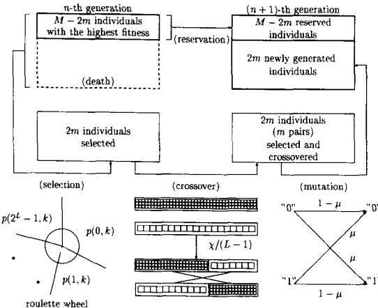
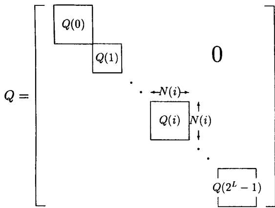

# A Markov Chain Analysis on Simple Genetic Algorithms

Joe Suzuki

Abstract—This paper addresses a Markov chain analysis of Genetic Algorithms (GAs), in particular for a variety called a modified elitist strategy. The modified elitist strategy generates the current population of $M$ individuals by reserving the individual with the highest fitness value from the previous generation and generating $M - 1$ individuals through a generation change. Our analysis is based on a Markov chain: by assuming a simple GA in which the genetic operation in the generation changes is restricted to selection, crossover, and mutation, and by evaluating the eigenvalues of the transition matrix of the Markov chain, the convergence rate of the GAs is computed in terms of a mutation probability $\pmb { \mu }$ .In this way, we show the probability that the population includes the individual with the highest fitness value is lower-bounded by $1 - O ( | \lambda _ { * } | ^ { n } ) , | \lambda _ { * } | < 1 ,$ where $\pmb { n }$ is the number of the generation changes and $\pmb { \lambda } _ { \star }$ is a specified eigenvalue of the transition matrix. Furthermore, the choice of $\pmb { \mu }$ so as to minimize $| \lambda _ { * } |$ is discussed.

# I. INTRODUCTION

To date, the properties of Genetic Algorithms (GAs) [1], [2] have not been rigorously investigated beyond considering than to imitate principles from organic evolution and to regard evolution as an optimization process. Summing up the problems encountered in preparing the present analysis, the following questions were found to be unanswered:

Q1 How quickly can the population come to include the individual with the highest fitness value?

Q2 In what kinds of problems can the GAs perform well in comparison with such existing stochastic search methods as Simulated Annealing (SA) [3], [4]?

Q3 How should the parameters of each genetic operation be set for realizing a given optimization under given conditions?

J. H. Holland's schemata theorem [1] shows one of a few wellknown theoretical results on the GAs, where the schemata are the individual's patterns affecting its fitness value. However, the global searches of crossover and mutation (two of the basic genetic operations) are not considered possible under the schemata theorem. Other analysis, such as a Walsh functional analysis [5], [6], have been used to evaluate "the phenomenon of deception" as a specific example of the GA's falling back on the local searches. However, the Walish functional analysis never analyzes the general behavior of GAs. Therefore, neither the schemata theorem nor Walish functional analysis provide any solution to the problems pointed out above. On the other hand, for specific test problems such as the counting problem and the pseudo-boolean optimization problem [7], T. Bäck [7] and H. Mühlenbein [8] have determined the optimal parameter settings for the GAs with the mutation and the elitist strategies [9] (Q3).

Recently, a few results concerning the theoretical and general analysis of GAs have been reported, in which the behavior of the GAs was analyzed where the occurrence of each individual in the fixed-sized population is equivalent to the state of a population, and the generation changes are equivalent to the transitions of the Markov chain of those states [10], [11], [12], [13]. Furthermore, within the framework of other Markov chain analysis, some of the problems concerning the convergence rate of Evolutionary Programming (EP)

Manuscript received May 7, 1993; revised December 12, 1993 and June   
18, 1994. This work was partially supported by the Telecommunication   
Advancement Foundation (TAF). J. Suzuki is with the Department of Mathematics, Faculty of Science, Osaka   
University, Osaka 560, Japan. IEEE Log Number 9406645.

$\begin{array} { r l } { i n d i v i d u a l s : } & { 0 0 \cdots 0 \quad | \quad 1 1 \cdots 1 \quad | \quad \cdots \quad | \quad \alpha ^ { L } - 1 \alpha ^ { L } - 1 \cdots \alpha ^ { L } - 1 } \\ { r e p r e s e n t a t i o n s : } & { \underbrace { 0 0 \cdots 0 } _ { Z ( 0 , \pm ) } \quad 1 \underbrace { 0 0 \cdots 0 } _ { Z ( 1 , \pm ) } \quad 1 \ \cdots \quad 1 \qquad \underbrace { 0 0 \cdots 0 } _ { Z ( \alpha ^ { L } - 1 , k ) } } \end{array}$ : $\begin{array} { r } { M = \sum _ { i = 0 } ^ { \alpha ^ { L } - 1 } Z ( i , k ) } \end{array}$ zeros indicating each individual and $\pmb { \alpha } ^ { L } - 1$ ones indicating each punctuation are needed; ones for the partitions continue while zeros for the individuals do not exist.

Fig. 1. A bit representation for a population $\pmb { k }$ [14] and the asymptotic solution of the GAs with the mutation and elitist strategies [15] have been partially solved (Q1 and Q2).

In this chapter, we attempt to determine the Markov chain which generates populations including individuals with high fitness values in the earliest possible generations. In particular, we analyze the suitability of a modified elitist strategy in terms of the following two criteria:

1) the convergence rate (of the solution before reaching the stationary state); and   
the correctness of the solution when it reaches the stationary state,

where the modified elitist strategy refers to the algorithm of generation changes which reserves the individual with the highest fitness value in the current population. This paper derives the probability that the population after $\pmb { n }$ generation changes includes the individual with the highest fitness value. This probability is lower-bounded by $1 - O ( | \lambda _ { * } | ^ { n } )$ , where $\lambda _ { * }$ denotes a specific eigenvalue of the transition matrix. Finally, we also consider the way to minimize the value of $| \lambda _ { * } |$ .

# II. PRELIMINARIES

# A. Genetic Algorithms

Consider the case where we find the individual, $_ i$ , that maximizes the fitness value, $\pmb { f } ( i )$ , for a given fitness function, $\pmb { f }$ , by using GAs.

With GAs, a fixed sized set is prepared, called a population, consisting of $\pmb { M }$ individuals $a _ { i 1 } a _ { i 2 } \cdot \cdot \cdot a _ { i L } \in A ^ { L }$ of length $\pmb { L }$ , where $A = \{ 0 , 1 , \cdots , \alpha - 1 \}$ $\left( \alpha \geq 2 \right)$ . Each individual i could be represented as an unsigned integer $\overline { { \Sigma _ { j = 1 } ^ { L } } } a _ { i j } \alpha ^ { L - j }$ . Each population, $\pmb { k }$ , is indicated in the vector $( \bar { Z } ( 0 , \bar { k } ) , \bar { Z } ( \bar { 1 } , k ) , \cdots Z ( \alpha ^ { \bar { L } } \ : - \ : 1 , k ) )$ where $\textstyle Z ( i , k )$ denotes the occurrences of the individual labeled as $i \ = \ 0 , 1 , \cdots , \alpha ^ { L } \ - \ 1$ in the population $\pmb { k }$ .Population $\pmb { k }$ can be represented by $M + \alpha ^ { L } - 1$ bits by the following two steps, as depicted in Fig. 1: first by arranging $M$ individuals denoted as zeros in the ascending order of those labels; and secondly, by inserting the ${ \pmb { \alpha } } ^ { L } - 1$ punctuation marks denoted as ones between the different kinds of labels. Therefore, the cardinality of the different populations becomes [11], [12]:

$$
N = \binom { M + \alpha ^ { L } - 1 } { M } .
$$

With GAs, the population including $\pmb { M }$ individuals with a high fitness value can be generated as the generation changes proceed. This can be regarded as a stochastic process based on the population of each generation. Therefore, iterating the generation changes $\pmb { n }$ times gives a Markov chain which generates a population labeled as $k = 1 , 2 , \cdots , N$ after $\pmb { n }$ generation changes. The GAs are investigated in order to determine the Markov chain which generates, in the earlier stage, $M$ individuals with a high fitness value [13], [10].

  
Fig. 2. A generation change.

Normally, during a one generation change, the following three genetic operations are applied (in simple GAs) [2] to a population $k$ . For simplicity, our discussion assumes $\alpha = 2$ .

Selection: Select each individual $i$ having the following probability $p ( i , k )$ :

$$
p ( i , k ) = \frac { f ( i ) Z ( i , k ) } { \displaystyle \sum _ { h = 0 } ^ { 2 ^ { L } - 1 } f ( h ) Z ( h , k ) } .
$$

Two individuals are obtained by repeating the above process.

Crossover: Generate, with a probability $\chi$ , two new individuals by exchanging the $1 ~ \leq ~ l ~ \leq ~ L - 1$ right-most bits of the two individuals obtained by the selection operation, where the number of the exchanged bits, $\mathbf { \xi } _  l . $ , is chosen uniformly at random from $[ 1 , l - 1 ]$ .

Mutation: Invert, with a probability $\mu$ , the zeros and ones in the $2 L$ bits of the two individuals generated by the selection and crossover operations.

The new population consisting of $M$ individuals is, therefore, erate as follows see ig.irst, by reservig the $M - 2 m$ $\mathrm { ~ m ~ }$ non-negative integer) individuals with the highest fitness values in the previous generation [16]; and secondly, by applying the three genetic operations (selection, crossover, and mutation) in order to obtain $\beta = 2 r n$ individuals.

We have assumed that the crossover probability is set to $\chi = 1$ , as is normally done. The specific point in this paper is to never restrict the number of generated individuals to $\beta = 2 m = M$ In particular, we address the method of setting the mutation probability $\mu$ , by letting the number of generated individuals be $\beta = 2 m = M - 1$ , as we will be shown in Section I.A. The attainment of such a property, which cannot be considered in the analyzes of the case of $\beta = 2 m = M$ is very desirable. Furthermore, the assumption of fixing $\chi = 1$ and $\mu$ being variable, which has been considered in many fields of the GAs, never negates the role of the crossover directly (adjusting the mutation probability enables us to weaken or strengthen the role of the crossover).

# B Markov Chain Analysis

Vose et al. [11], [12] showed that the stochastic transition through these genetic operations can be fully described by the transition matrix $Q = ( Q _ { k , v } )$ of size $\textit { N } \times \textit { N }$ below for one generation, where $\textit { Q } _ { k , v }$ is the conditional probability that population $v$ is generated from population $k$ . When the number of generated individuals equals $\beta = 2 m = M$ $M$ : even number), the following equation is obtained:

$$
Q _ { k , v } = M ! \prod _ { j = 0 } ^ { 2 ^ { L } - 1 } \frac { 1 } { Z ( j , v ) ! } r ( j , k ) ^ { Z ( j , v ) } .
$$

because $Z ( j , k )$ is generated according to the multinominal distribution based on $r ( j , k ) . j = 0 , 1 . \cdot \cdot \cdot , 2 ^ { L } - 1$ . where $r ( j , k )$ is the probability that individual $j$ occurs in population $k$ .

Furthermore, Vose et al. and Davis [10][12] computed $r ( j , k )$ in terms of the crossover probability $\chi$ $\begin{array} { r } { \mathrm { ~  ~ \chi ~ } ( 0 \leq \mathrm { ~  ~ \chi ~ } \leq 1 ) } \end{array}$ and the mutation probability $\mu$ $( 0 \leq \mu \leq 1 _ { \cdot }$ , and also derived:

$$
\begin{array} { r l r } {  { \mu ^ { L M } M ! \prod _ { j = 0 } ^ { 2 ^ { L } - 1 } \frac { 1 } { Z ( j , v ) ! } } } \\ & { } & { \leq Q _ { k , v } \leq ( 1 - \mu ) ^ { L M } M ! \prod _ { j = 0 } ^ { 2 ^ { L } - 1 } \frac { 1 } { Z ( j , v ) ! } , } \end{array}
$$

for any population $k$

In addition, Vose [13] evaluated how the average rate of each individual in the population changes with $n$ generation changes. Furthermore, Davis [10] has proposed the SA-like strategy where the mutation probability $\mu$ is reduced from $1 / 2$ to 0 with the $\boldsymbol { n }$ generation changes, and proved that the limit distribution has the following property: q $q _ { k } ^ { ( \infty ) > 0 }$ if the population $k$ is uniform (identical individuals), and q(∞ $q _ { k } ^ { ( \infty ) } = 0$ otherwise, where q(∞) is the probability that population $k = 1 , 2 , \cdots , N$ is generated after $\boldsymbol { n }$ generation changes. These researches have offered a mathematical basis for developing the GAs theoretically, and it could be said that these are the first general analytical results concerning the GAs. If we restrict our interest to search problems using GAs, however, we will need a method to enlarge the probability that the current population includes the individual with the highest fitness value among $2 ^ { L }$ individuals. This requires us to investigate beyond Vose et al. [11], [12], [13] and Davis [10].

# C. Markov Chain Analysis Using Eigenvalues

If we have the initial distribution of $\mathcal { N }$ possible populations

$$
{ \pmb q } ^ { ( 0 ) } = ( q _ { 1 } ^ { ( 0 ) } , q _ { 2 } ^ { ( 0 ) } , \cdot \cdot \cdot , q _ { N } ^ { ( 0 ) } ) ,
$$

the distribution of each population after one generation change is represented as:

$$
\pmb q ^ { ( 1 ) } = ( q _ { 1 } ^ { ( 1 ) } , q _ { 2 } ^ { ( 1 ) } , \allowbreak \cdot \cdot \cdot , q _ { N } ^ { ( 1 ) } ) = \pmb q ^ { ( 0 ) } Q ,
$$

in terms of the transition matrix $Q = ( Q _ { k , v } )$ .The probability vector of each population after $_ n$ generation changes is represented as:

$$
\pmb { q } ^ { ( n ) } = ( q _ { 1 } ^ { ( n ) } , q _ { 2 } ^ { ( n ) } , \cdots , q _ { N } ^ { ( n ) } ) = \pmb { q } ^ { ( 0 ) } \ d Q ^ { n }
$$

in terms of the nth power $Q ^ { n } = \langle Q _ { k , v } ^ { ( n ) } \rangle$ of the transition matrix $d Q$ .

Lemma $I$ There exist cefficients $\rho _ { k , v } ^ { ( t ) }$ $\mathbf { \Lambda } _ { k , \tau } ^ { ( t ) } \ : \left( t = 1 . 2 , \cdots , N \right)$ satisfying:

$$
Q _ { k . \tau } ^ { ( n ) } = \sum _ { t = 1 } ^ { N } \rho _ { k . \tau } ^ { ( t ) } \lambda _ { t } ^ { n } .
$$

$i f$ and only if the transition matrix $Q \ = \ ( Q _ { k . v } )$ is primitive (irreducible and aperiodic) or indecomposable (reducible with only one aperiodic recurrent class), where:

$$
1 = | \lambda _ { 1 } | \geq | \lambda _ { 2 } | \geq \cdots \geq | \lambda _ { N } | .
$$

matrix and $\lambda _ { t } ~ ( t ~ = ~ 1 , 2 , \cdots , N )$ $Q$ Here, $\rho _ { k , v } ^ { ( 1 ) }$ are the eigenvalues of the transition $k$ ay $q _ { v } ^ { ( \infty ) }$ of the population $v = 1 , 2 , \cdots , N$ .

Rudolph [15] has recently proved that the transition matrix of the original simple GAs is primitive [17], which implies nonconvergence, whereas the transition matrix of the elitist strategy [9] is indecomposable [17] prøviding that there is only one global optimal solution. It should be noted that his Markov chain model is somewhat different hat  er: $2 ^ { M L } \left( > N \right)$ states represents $M$ individuals themselves in the population rather than the occurrence of $2 ^ { L }$ kinds of individuals. In both cases, the limit distribution is unique and identical to the stationary distribution with nonzero entries for the recurrent states and zero entries for the transient states [17], from Lemma 1.

# D. Genetic Algorithms for Search Problems

In this paper, since our objective is to identify the individuals with the highest fitness values for search problems, we need to evaluate the degree to which the highest fitness value of the $M$ individuals in the population coincides with the highest fitness value among all the $2 ^ { L }$ individuals. Therefore, we must investigate the following two problems:

how closely the probability $\Sigma _ { k \in \mathcal { K } } q _ { k } ^ { ( n ) }$ converges to $\Sigma _ { k \in \kappa } { \pmb q } _ { k } ^ { ( \infty ) }$ ; and how closely the probability $\Sigma _ { k \in \kappa } q _ { k } ^ { ( \infty ) }$ is to one, where $\kappa$ denotes the set of the populations which include the individual with the highest fitness value among all the $\mathbf { 2 } ^ { L }$ individuals.

It is important not to evaluate the convergence rate of the asymptotic vector $\bullet ^ { ( \infty ) }$ in terms of $\lambda _ { 2 }$ te  val en vergence rate of the probability that the population $\pmb { k }$ is included in $\kappa$ .

Based on the above, this paper analyzes a method which satisfies

$$
\sum _ { k \in \kappa } q _ { k } ^ { ( \infty ) } = 1
$$

and makes the value of $\Sigma _ { k \in \pmb { X } } q _ { k } ^ { ( n ) }$ closer to one $\pmb { n }$ of generation changes.

# III. MODIFIED ELITIST STRATEGY

# Properts the Modfied Elitist Straty

The probability $\Sigma _ { k \in \kappa } q _ { k } ^ { ( \infty ) }$ tat the ulation state includes the individual with the highest fitness value never converges to one if its mutation probability $\pmb { \mu }$ is positive. However, if $\pmb { \mu } = \pmb { 0 }$ , the population consisting of $M$ individuals with a zero in a bit position cannot be changed into any other population including the individual with a one the bit position.

In this paper, we analyze the method setting $\beta = 2 m = M - 1$ (M: odd number) to the number of generated individuals. We call this method a modified elitist strategy. Although we cannot assure any optimization in the sense that the GAs will maximize the probability of including the individual with the highest fitness value through a finite number $\pmb { n }$ of generation changes, (7) is satisfied. The modified elitist strategy resembles De Jong's original elitist strategy [9]: his elitist strategy adds $i ^ { * }$ as the $( M + \mathbf { \mu } 1 )$ -th individual in the next generation uless the population includes $i ^ { * }$ in it, where $i ^ { * }$ is the individual with the highest fitness value in the current generation. We use the modified elitist strategy instead of De Jong's scheme because it enables us to analyze the GAs tractablely, and gives an upperbound for the general case of the number of generated individuals $0 \leq \beta \leq M$ when the population size $M$ is fixed.

For strictness, we assume the following conditions without a loss of generality:

Assign a label $i = 0 , 1 , \cdots , 2 ^ { L } - 1$ to each individual according to the descending order of ${ f ( i ) }$ and to a predetermined tiebreaking rule when more than one individual have the same $\pmb { f } ( i )$ ;   
2) assign a label $k = 1 , 2 , \cdots , N$ to each population according to the ascending order of $i ^ { * } ( k )$ and to a predetermined tiebreaking rule when more than one population have the same $i ^ { * } ( k )$ ; and   
the modified elitist strategy reserves the individual $i ^ { * } \{ k \}$ in population $\pmb { k }$ until the next generation.

where $i ^ { * } ( k )$ is the individual such that $i ^ { * } ( k ) \leq j$ for any individual $j$ in population $\pmb { k }$ .

# B. Assurance for Asymptotic Solution

In the modified elitist strategy, the transition probability $Q _ { k , v }$ from a population $\pmb { k }$ to a population $\pmb { v }$ is given as:

$$
Q _ { k , \upsilon } = ( M - 1 ) ! \prod _ { j = 0 } ^ { 2 ^ { L } - 1 } \frac { 1 } { Y ( j , \upsilon ) ! } r ( j , k ) ^ { Y ( j , \upsilon ) }
$$

for $i ^ { * } ( k ) \geq i ^ { * } ( v )$ , and 0 for $i ^ { * } ( k ) < i ^ { * } ( v )$ , where

$$
Y ( j , k ) = \left\{ { Z ( j , k ) \atop Z ( j , k ) - 1 } \right. \left. \begin{array} { l } { { [ j \neq i ^ { * } ( k ) ] } } \\ { { [ j = i ^ { * } ( k ) ] . } } \end{array} \right.
$$

Note that the transition matrix $\pmb { Q }$ the modified elitist strategy is indecomposable.

Lemma 2: [15] In the modified elitist strategy, the transition matrix $Q \ = \ ( Q _ { k , v } )$ from a population $\pmb { k }$ to a population $\pmb { v }$ has $2 ^ { L }$ sub-matrices $Q ( i )$ of size $\bar { N ( i ) } \times \bar { N ( i ) } , i = 0 , 1 , \cdots , 2 ^ { L } - 1$ , as the dialog elements, and all the components to the upper right of the diagonal entries are zeros' , where ${ \cal N } ( i )$ is the number of populations $\pmb { k }$ in which $i = i ^ { * } ( k )$ .

Theorem $^ { l }$ .

$$
N ( i ) = \binom { M - 1 + 2 ^ { L } - i } { M - 1 } .
$$

(proof: see Appendix A).

The transition matrix $Q = ( Q _ { k , v } )$ represents a Markov chain with absorbing states [17], as depicted in Fig. 3. Therefore, the condition in (7) is satisfied when the population changes according to the following steps: first, the state climbs the sub-matrix $Q ( i )$ of size ${ \cal N } ( i ) \times \stackrel {  } { N } ( i ) , \stackrel { \cdot } { i } = 1 , 2 , \cdots , 2 ^ { L } - 1$ , up and left until it enters $Q ( \theta )$ of size $N ( 0 ) \times N ( { \bf 0 } )$ which represents the transition in $\kappa$ ; and secondly, it transits among the population in $\kappa$ , according to $Q ( \mathbf { 0 } )$ .

# $c )$ Assurance of Convergence Rate

$0 , 1 , \cdots , 2 ^ { L } - 1$ e $N ( i )$ eniccal to the $\dot { N } = \Sigma _ { i = 0 } ^ { 2 ^ { L } - 1 } N ( i )$ $Q ( i ) , i =$ of matrix $Q$ .

(proof: Appendix B).

Theorem 2: There exists a constants $C$ satisfying

$$
\sum _ { k \in \kappa } q _ { k } ^ { ( n ) } \geq 1 - C | \lambda _ { * } | ^ { n } ,
$$

where

$$
| \lambda _ { * } | = \operatorname* { m a x } _ { 1 \le i \le 2 ^ { L } - 1 } \operatorname* { m a x } _ { 1 \le j \le N ( s ) } | \lambda _ { i , j } | < 1
$$

1Some components to the lower left of the diagonal matrices can have non-zero values.

  
Fig. 3. A transition matrix.

and $\lambda _ { i , j } , j = 1 , 2 , \cdot \cdot \cdot , N ( i )$ denotes the $\mathcal { N } ( i )$ eigenvalues of the sub-matrix $Q ( : i ) , i = 0 , 1 , \cdot \cdot \cdot , 2 ^ { L } - 1$ .

(proof: Appendix C).

Theorem 2 asserts that the probability of the population including the individual with the highest fitness value is of the order of the nth power of $| \lambda _ { * } |$ when the number of generated individuals is $\mathit { \Pi } . 3 = . 1 \mathit { I } - 1$ in the simple GAs (See Q1 and Q2.).

It seems that (11), itself, is almost obvious from Markov chain theory {17]. In fact, Fogel [14] derived a similar formula for EP, although he did not explicitly address the eigenvalues of the Markov chain transition matrix when analyzing the behavior of the GAs. His Markov chain model is somewhat different from that used in this paper, but is the same as Rudolph's [15]. However, (20) is crucial in the proving of Theorem 3 in the next section.

# D. Evaluation of Eigenvalues

From Theorem 2, $\lambda _ { * }$ exerts a great effect on the convergence rate. $\lambda _ { * }$ is evaluated in terms of the mutation probability $\mu$ based on the modified elitist strategy.

Qualitatively, it seems to be clear, even if we did not use the Markov chain model, that the maximum value of the Hamming distance between the current individual and an individual with a higher fitness value is an indicator of how difficult the current population gets over by the mutation. Theorem 3 shows how much the mutation probability quantatively effects on the eigenvalue $\lambda _ { * }$ , which determines the worst-value of the convergency rate.

Theorem 3: As for $\lambda _ { * }$ , there exists a constant, A. which does not depend on the mutation probability $\mu$ satisfying:

$$
\left| \lambda _ { * } \right| \leq 1 - . 4 \mu ^ { \delta } ( 1 - \mu ) ^ { L - \delta } ,
$$

where the mutation order $\delta$ is the minimax value of the Hamming distance $d ( i , j )$ between individuals i and $\textit { j } \left( < i \right)$ :

$$
\delta = \operatorname* { m a x } _ { \substack { 0 \leq i \leq 2 ^ { L } - 1 } } \big [ \operatorname* { m a x } _ { \substack { 0 \leq j \leq 2 ^ { L } - 1 , f ( i ) < f ( j ) } } d ( i , j ) \big ] .
$$

(proof: see Appendix C).

The Hamming distance is defined as the number of bit positions that do not coincide zeros and ones bitwise in each $L$ bit position for given two individuals.

We can tighten the inequality (13) by choosing a suitable constant $A$ when we let the value of $\mu$ be small enough (the term $\mu ^ { \delta } ( 1 -$ μ)L- multiplied by a constant dominates the LHS of (13)). If we differentiate the RHS of (13) by the mutation probability $\mu$ , we get the following result.

Corollary 1: If the mutation probability $\mu$ satisfies

$$
\mu = \delta / L .
$$

then the RHS of (13) is minimized.

Mutation order $\delta$ can be regarded as the degree of falling back on the local search. Therefore, if the result of (15) is valid, the mutation probability is expected to be proportional to the mutation order $\delta$ (See Q3.).

On the other hand, Bäck [7] suggests that while $\mu ~ = ~ 1 / L$ is recommendable for unimodal $f$ . which satisfies (15), a mutation rate schedule decreasing towards $1 / L$ during the optimization is useful even for a multimodal $f$ . Corollary 1 clarifies the properties of the fixed mutation rate schedules, which will be useful in the theoretical analysis of the GAs, as well as in supporting Bäck's scheme.

# IV. CONCLUDING REMARKS

Based on the eigenvalue analysis of the transition matrix, we evaluate the modified elitist strategy leading to the analysis shown in Theorem 1, Theorem 2, and Theorem 3.

However, it must be admitted that there are still a few problems left unsolved by the investigation of this paper:

how to encode each individual for a given fitness function $f$ in order to minimize $| \lambda _ { * } |$ [2];   
how to evaluate the mutation order $\delta$ in advance for a given fitness function $f$ ; and   
how to derive any other tighter upper-bounds of $\lambda _ { * }$ by taking into consideration the role of crossover.

Unfortunately, despite the important of the solving of the above problems 1. and 2., the author feels that it may take a great deal of time and effort to do so from [10][13] and this paper.

This paper was inspired by the current lack of investigation of GA theory in general. We eagerly hope that this paper will trigger some active discussions on the theoretical analysis of GAs.

# V. APPENDIX

# A. Proof of Theorem 1

We simply need to calculate the combination how to select $1 I - 1$ individuals from the $2 ^ { L } - i ^ { * } ( k )$ kinds of individuals so that the fitness of the individual $i ^ { * } ( k )$ remain the highest in the next generation. As the derivation of (1), we can represent the population by $. 1 I - 2 +$ $2 ^ { L } - i ^ { * } ( k )$ bits in two steps: first, by arranging $\lambda f - 1$ individuals denoted as zeros in the ascending order of the labels; and secondly, by inserting the $2 ^ { L } - i ^ { * } ( k ) - 1$ punctuation marks denoted as ones between the different kinds of labels.

# B. Proof of Lemma 3

Since matrix $Q - \lambda I$ is indecomposable as described in Lemma 2,

$$
\prod _ { i = 0 } ^ { 2 ^ { L } - 1 } \operatorname * { d e t } \{ Q ( i ) - \lambda I ( i ) \} = \operatorname * { d e t } \bigl [ Q - \lambda I \bigr ]
$$

holds, where $I ( i )$ is the unit matrix of size $\mathbf { \boldsymbol { x } } ( i ) \times \mathbf { \boldsymbol { x } } \mathbf { \boldsymbol { \cdot } } ( i ) , I$ is the unit matrix of size $\smash { - \ v { r } _ { 1 } \times \ v { r } _ { 2 } } \times \ v { r }$ , and $\mathrm { d e t } [ X ]$ denotes the determination of the matrix $X$ If fact,

$$
{ \operatorname * { d e t } } \ \left[ \begin{array} { c c } { Q ( i ) } & { { \cal O } _ { i } } \\ { P _ { i } } & { g _ { i } ( Q ) } \end{array} \right] = { \operatorname * { d e t } } [ Q ( i ) ] \cdot { \operatorname * { d e t } } [ g _ { i } ( Q ) ]
$$

holds for $i = 0 , 1 , \cdots , 2 ^ { L } - 2$ , where $g _ { i } ( Q )$ is the matrix removing the first row to the $[ \Sigma _ { j = 0 } ^ { i } . \mathrm { V } ( j ) ] \mathrm { t h }$ row and the first column to the $[ \Sigma _ { j = 0 } ^ { i } . \mathrm { \bar { V } } ( j ) ]$ th column from matrix $Q , O _ { i }$ is the zero matrix of size

$N ( i ) \times [ \Sigma _ { j = i + 1 } ^ { N } N ( j ) ]$ and $P _ { i }$ $Q$ of size $[ \Sigma _ { j = i + 1 } ^ { N } N ( j ) ] \times N ( i )$

# C. Proof of Theorem 2

As we can see from the shape of the nth power of the transition matrix $Q$ as depicted in Fig. 3, we have $g _ { 0 } ( Q ^ { n } ) ~ = ~ \{ g _ { 0 } ( Q ) \} ^ { n }$ irrespective of the $N ( 0 )$ eigenvalues of the sub-matrix $Q ( 0 )$ That is, for a population $\textbf { \textit { v } } \not \in \textbf { \textit { K } }$ there exists a constants $\rho _ { k , v } ^ { i , j } , i \ =$ $1 , 2 , \cdots , 2 ^ { L } - 1 , j = 1 , 2 , \cdots , N ( i )$ satisfying:

$$
Q _ { k , v } ^ { ( n ) } = \sum _ { i = 1 } ^ { 2 ^ { L } - 1 } \sum _ { j = 1 } ^ { N ( i ) } \rho _ { k , v } ^ { ( i , j ) } \lambda _ { i , j } ^ { n }
$$

for $k \not \in \kappa$ , and 0 for $k \in \kappa$ Therefore, for a population $v \not \in \kappa$ ,

$$
q _ { v } = \sum _ { k = 1 } ^ { N } q _ { k } ^ { ( 0 ) } Q _ { k , v } ^ { ( n ) } = \sum _ { k = 1 } ^ { N } q _ { k } ^ { ( 0 ) } \sum _ { i = 1 } ^ { 2 ^ { L } - 1 } \sum _ { j = 1 } ^ { N ( i ) } \rho _ { k , v } ^ { ( i , j ) } \lambda _ { i , j } ^ { n } .
$$

Summing this value over the populations $v \not \in \mathcal { K }$ , we obtain

$$
\begin{array} { r l } { \displaystyle \sum _ { v \notin { \boldsymbol { \kappa } } } q _ { v } = \sum _ { v \notin { \boldsymbol { \kappa } } } \sum _ { k = 1 } ^ { N } q _ { k } ^ { ( 0 ) } \sum _ { i = 1 } ^ { 2 ^ { L } - 1 } \sum _ { j = 1 } ^ { N ( i ) } \rho _ { k , v } ^ { ( i , j ) } \lambda _ { i , j } ^ { n } } & { } \\ { \leq \left[ \sum _ { v \notin { \boldsymbol { \kappa } } } \sum _ { k = 1 } ^ { N } q _ { k } ^ { ( 0 ) } \sum _ { i = 1 } ^ { 2 ^ { L } - 1 } \sum _ { j = 1 } ^ { N ( i ) } \rho _ { k , v } ^ { ( i , j ) } \right] \left. \lambda _ { * } \right. ^ { n } . } \end{array}
$$

This means the probability that the generated population $\pmb { v }$ is not included in the set $\kappa$ is upper-bounded by $C | \lambda _ { * } | ^ { n }$ in terms of the constant $C$ .

In addition, $| \lambda _ { * } | < 1$ holds because $Q ( i ) , i \ = \ 1 , 2 , \cdots , 2 ^ { L } \ -$ 1, neither represents any stable transaction matrix nor includes eigenvalues equal to one.

# D. Proof of Theorem 3

In general, the absolute value of each eigenvalue of the matrix $Q \ = \ ( Q _ { k , v } )$ is upper-bounded by $\begin{array} { r } { \operatorname* { m a x } _ { k } \ \Sigma _ { v } Q _ { k , v } } \end{array}$ (Gerschgorin's theorem). Therefore, for the sub-matrix $Q ( i ) = ( Q ( i ) _ { k , v } )$ including $\lambda _ { * }$ , we have

$$
| \lambda _ { * } | \leq \operatorname* { m a x } _ { 1 \leq k \leq N ( i ) } \sum _ { v = 1 } ^ { N ( i ) } Q ( i ) _ { k , v } .
$$

This means that $| \lambda _ { * } |$ is upper-bounded by the maximum probability that $i \leq j$ for any individual $j$ in the next generation.

The probability that $j < i$ for some individual $j$ for any individual $j$ in the next generation. The probability that $j < i$ for some individual $j$ in the next generation is lower-bounded by:

$$
A _ { i } \mu ^ { \delta _ { i } } ( 1 - \mu ) ^ { L - \delta _ { i } } .
$$

where $\mathbf { A } _ { i }$ is the probability that the population after the $\mathbf { \nabla } ^ { \mathbf { m } }$ selection and crossover operations includes at least one individual i among $M - 1$ individuals other than the one reserved individual $_ i$ , and $\delta _ { i }$ is defined as:

$$
~ \delta _ { i } = \operatorname* { m i n } _ { \substack { 0 \leq j < i \leq 2 ^ { L } - 1 } } d ( i , j ) .
$$

Note that $A _ { i }$ has a positive value, and is independent of the mutation probability $\pmb { \mu }$ .

Therefore, letting

# ACKNOWLEDGMENT

The author would like to thank Dr. David B. Fogel of the Orincon Corporation for his helpful comments, and Prof. Shigeichi Hirasawa of Waseda University for his fruitful discussions.

# Список литературы

[1] J. H. Holland, Adaptation in Natural and Artificial Systems. Ann Arbor: The University of Michigan Press, 1975.   
[2] D. E. Goldberg, Genetic Algorithms in Search, Optimization, and Machine Learning, Addison-Wesley, 1989.   
[3] S. Kirkpatric, C. D. Gelatt, and M. P. Vecchi, "Optimization by smulated annealing," Scince, vol. 20, n.8, pp.68 My 1983.   
[4] S. Geman and D. Geman, "Stochastic relaxation, Gibbs distributions and the Bayesian restoration of images," IEEE Trans. Pattern Anal. Machine Intell., vol. PAMI-6, no. 6, pp. 721741, Nov. 1984.   
[. D. Bethke, Genetic algorithms as function optimizers, Ph.D. thesis, University of Michigan, 1980.   
[6] D. E. Goldberg, "Genetic algorithms and walsh functions: Part I, a gentle introduction, part II, deception and its analysis," Complex Systems, vol. 3 pp. 129171, 1989.   
[7] T. Bäck, "Optimal mutation rates in genetic algorithms," in Stephanie Forrest, ed, International Conference on Genetic Algorithms '93, pp. 28, Morgan Kauffman Publishers, July 1993.   
[8] H. Mühlenbein, "How genetic algorithms really work I: Mutation and hillclimbing," in Reinhard Männer and Bernard Manderick, eds., Parallel Problem Solving from Nature, 2 pp. 1525, Elsevier Science Publishers, Amsterdam, 1992.   
[9] K. A. De Jong, An Analysis of the Behavior of a Class of Genetic Adaptive Systems, Ph.D. thesis, University of Michigan, Ann Arbor, Mich., 1975.   
[10] T. E. Davis, Toward an Extrapolation of the Simulated Annealing Convergence Theory onto the Simple Genetic Algorithm, Ph.D. thesis, University of Florida, 1991.   
[M. D. Vose and G. E. Liepins, Punctuated equilibria in genetic search," Complex Systems, vol. 5, pp. 3144, 1991.   
[12] A. Nix and M. D. Vose, "Modeling genetic algorithm with Markov csal 2734, 1992.   
[13] M. D. Vose, "Modeling of genetic algorithms," in L. Darrell Whitley, ed., Foundations of Genetic Algorithms 2, pp. 63-73, Aug. 1992.   
[14] D. B. Fogel, Evolving Artificial Intelligence, Ph.D. thesis, University of California, San Diego, 1992.   
[15] G. Rudolph, "Convergence analysis of canonical genetic algorithms," IEEE Trans. Neural Networks, special issue on Evolutional Computing, vol. 5, no. 1, pp. 96101, Jan. 1994.   
[16] L. B. Booker, "Classifier systems and genetic algorithms," Artificial Intelligence, vol. 40, pp. 235282, 1989.   
[17] M. Iosifescu, Finite Markov Processes and Their Applications, Wiley, Chichester, 1980.

$$
\begin{array} { c } { A = \displaystyle \operatorname* { m i n } _ { 1 \leq i \leq 2 ^ { L } - 1 } A _ { i } , } \\ { \delta = \displaystyle \operatorname* { m a x } _ { 1 \leq i \leq 2 ^ { L } - 1 } \delta _ { i } } \end{array}
$$

leads to the upper-bound of the eigenvalue $| \lambda _ { * } |$