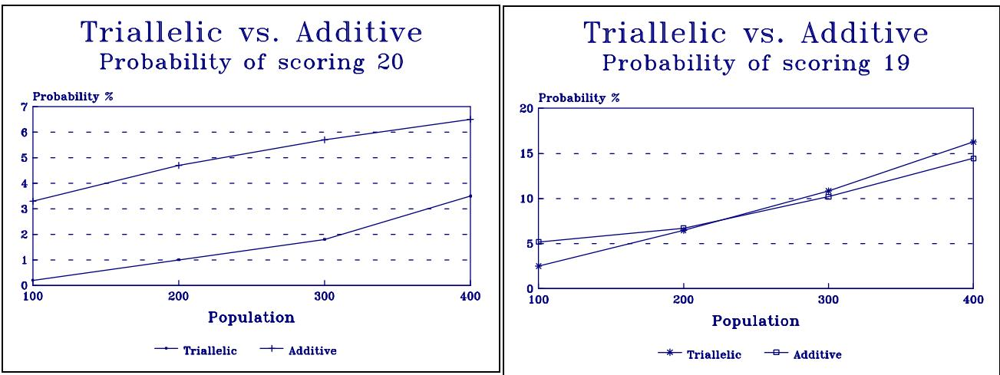
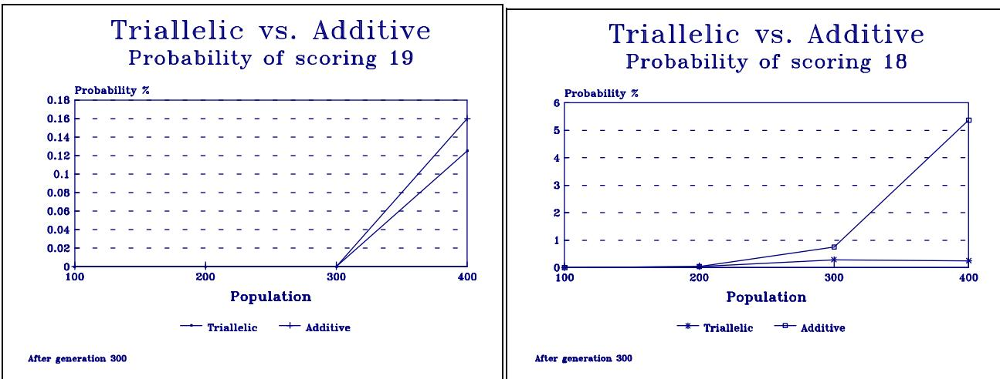
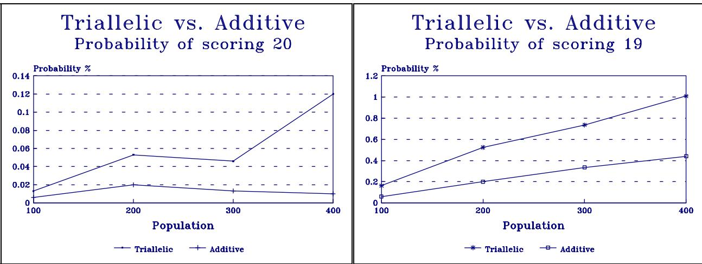
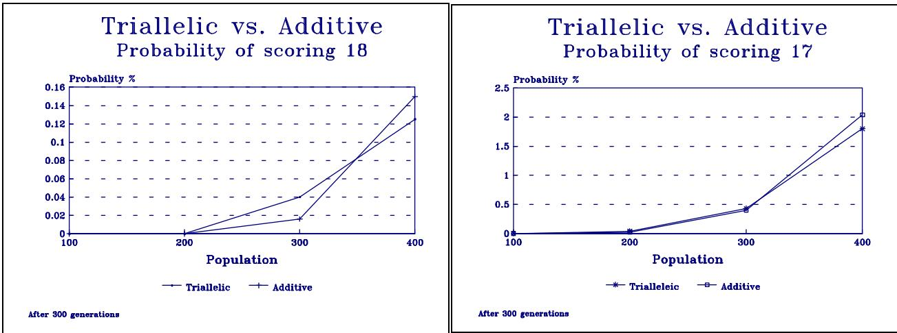
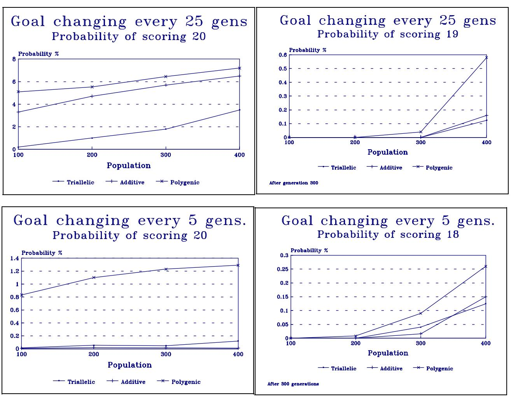

The Degree of Oneness   
Conor Ryan   
Computer Science Department   
University College Cork   
Ireland   
conor $\textcircled{4}$ csvax1.ucc.ie

# Abstract

This paper investigates the use of diploid structures and the possibility of using diploidy in non-standard, non-binary Genetic Algorithms.

Unlike the conventional implementation of diploidy in GAs, which typically involves the use of dominance operators, the diploid schemes presented in this paper avoid the use of dominance altogether, while still being rooted firmly in natural biology.

The use of diploid structures allows a population to adapt more quickly in unstable environments, which allows the varying of testcases, whether through evolution to gently increase the difficulty of the problem or through some other selection method to reduce testing time.

Two new schemes are introduced, additive diploidy and polygenic inheritance, both of which outperform current methods, and both of which are general enough to be applied to a GA with any number of phenotypes, without any need for the use of dominace operators.

# Introduction

Genetic Algorithms tend to be applied to problems with fixed or canned sets of test cases. However, as problems become larger, the testing time frequently becomes impractical. Often, to reduce testing time, only a subset of the test cases are used in a particular generation. The subset may vary with time[Siegel 94], may evolve[Hillis 89], may vary with spatial locality[Ryan 94a] or perhaps the goal of the problem itself may vary with time[Goldberg 87]. In problems such as these it is important that the population does not "forget" useful solutions or gene combinations previously discovered.

A natural method for creating a genetic memory is the use of diploid genetic structures. Diploid structures, as opposed to traditional, haploid structures, maintain two copies of each gene. A result of having two copies of each gene is that calculating the phenotype is no longer as simple as mapping a genotype onto a phenotype and some method must be employed to calculate a single phenotype from two genes.

The fact that two genes are kept for each phenotype permits the shielding of genes which might otherwise be lost through selection pressure, but that might be useful at some time in the future or might have been useful in the past. A genetic algorithm which can remember previous solutions, which may be needed again in the future, while still performing well with the current problem set, would be very useful for the sort of problems mentioned above.

This paper describes an implementation for diploid structures, which suits not only standard, binary genetic algorithms, but also nonstandard genotypes, such as high level implementations like Genetic Programming[Koza 92][Ryan 94b].

# Diploidy in Genetic Algorithms

At its simplest level, diploidy involves two copies of each gene, one of which is selected for expression in the phenotype. This method of selection, often termed Mendelian diploidy, generally operates using dominant and recessive genes. When decoding a heterozygous gene locus, i.e. two different genes, one selects the dominant gene. In the case of a homozygous locus, the problem of which gene to use does not arise. Below is an example of a simple dominance scheme, where upper case letters signify the dominant form of a gene, while lower case letters signify the recessive form.

$$
\frac { A B c D e } { A b c D e } { = } A B c D e
$$

Simple dominance such as this is adopted directly from nature, e.g. the genes which govern the ability to roll one's tongue and those that discern whether or not one has hairy fingers are governed by Mendelian dominance. The genes which bestow a person with the talent to contort their tongue are all dominant, while the genes that results in hairy fingers is also dominant[Pai 85].

Perhaps there is some reason why it is more likely that one can roll one's tongue than not, or perhaps there may even be a selective advantage in having the ability to do so. If there is, nature has had several billion years to discover it. Those using GAs do not have the luxury of time, and cannot decide in advance which gene is to be dominant without using prior knowledge of the solution to the task at hand. This is a problem because the dominant form of a gene is more likely to be expressed as the recessive form will only be expressed at homozygous locus.

Goldberg's comprehensive study of diploidy[Goldberg 87] showed that Hollstein's triallelic scheme, which recognised the problem of bias in simple dominance, was the most effective of current diploid schemes. Hollstein overcame the problem of bias with the use of three alleles, namely 1, $1 _ { 0 }$ and 0. In his scheme, 1 dominates the other genes, and a locus with 1 always resulted in a phenotype of 1, while 0 dominated $1 _ { 0 }$ . A homozygous locus with $1 _ { 0 }$ resulted in a 1 being expressed. This is summarized below in Table 1.

<table><tr><td rowspan=1 colspan=1></td><td rowspan=1 colspan=1>1</td><td rowspan=1 colspan=1>10</td><td rowspan=1 colspan=1>0</td></tr><tr><td rowspan=1 colspan=1>1</td><td rowspan=1 colspan=1>1</td><td rowspan=1 colspan=1>1</td><td rowspan=1 colspan=1>1</td></tr><tr><td rowspan=1 colspan=1>10</td><td rowspan=1 colspan=1>1</td><td rowspan=1 colspan=1>1</td><td rowspan=1 colspan=1>0</td></tr><tr><td rowspan=1 colspan=1>0</td><td rowspan=1 colspan=1>1</td><td rowspan=1 colspan=1>0</td><td rowspan=1 colspan=1>0</td></tr></table>

Table 1 - Triallelic dominance map.

Although there is still bias to a certain degree, in that there are twice as many loci that result in 1 being expressed, using this scheme means that either phenotype can be held in abeyance, unlike the simple dominance described above. However, Hollstein's method does not map very obviously on to high level, nonstandard implementations, i.e. where there are more than two possible phenotypes. For instance, in an implementation with 4 or 5 alleles there is no simple way of choosing which should dominate which while still ensuring that no one allele is completely dominated and that each can be held in abeyance, a serious setback as nonstandard genotypes are being used more and more frequently.

# Natural Diploidy And Incomplete Dominance

Although simple dominance is taken directly from nature, it is not the only scheme employed by nature to resolve diploid structures. Another scheme, incomplete dominance, is used by many plant and animal alleles for resolving heterozygous loci, particularly in traits that have more than two simple values[Pai 85] [Suzuki 89] [Strickberger 90]. An example of incomplete dominance in operation was described by [Pai 85] using four o'clock flowers. She described how, if one was to mate two of these flowers, one red and the other white, all of the offspring would be pink flowers. On the other hand, if one were to mate two pink flowers, the resulting offspring would be of three different colours, red, pink and white, in the ratio 1:2:1.

The resulting colour of an offspring can explained by examining the intensity of colour of its parents, and by looking upon colour as being a quantitative trait, where the interactions between gene pairs is an additive one.

She showed that a red flower contains the genes $\boldsymbol { \mathrm { r } } _ { 1 } \boldsymbol { \mathrm { r } } _ { 1 }$ and a white flower the genes $\boldsymbol { \mathbf { r } } _ { 2 } \boldsymbol { \mathbf { r } } _ { 2 }$ . Each gene contributes toward one particular colour, $\boldsymbol { \mathrm { r } } _ { 1 }$ to red and $\boldsymbol { \mathrm { r } } _ { 2 }$ to white. So the more $\boldsymbol { \mathrm { r } } _ { 2 }$ genes present the more likely a flower will be white, on the other hand, the more $\boldsymbol { \mathrm { r } } _ { 1 }$ genes, the more likely a flower is to be red. In the case of both genes being present, each contributes towards its own particular colour, resulting in half the genes suggesting the plant be red, and the other half that the colour be white. Because colour is a quantitative trait, the colour expressed is simply mid way between the two, pink. Moreover, both genes contribute to a trait, rather than there being a choice between them.

If one were to describe additive traits in Genetic Algorithms, a simple 1 or 0 phenotype would appear to be insufficient. Choosing say, 0 for red and 1 for white, is suitable for homozygous loci, but cannot cope with pink. However, if one could describe the colours in degrees rather than absolutes, one might have more success. By describing the flowers in terms of white only, one could say that red flowers are "not white", pink flowers are "sort of white" and white flowers simply as being white.

Applying this to binary Genetic Algorithms, one could describe a locus in terms of its degree of oneness. Some loci would have a very low degree of oneness, i.e. be expressed as 0, while others would have a high degree of oneness, i.e. be expressed as 1. Using two alleles as in the flower example is unsuitable however, because there are three phenotypes. Using three alleles results in six phenotypes, which appears suitable at first. However, it is difficult to assign values to each allele, for, while two alleles can tend towards either 1 or 0, the choice of the third value can result in a bias.

Using four alleles however, makes the choosing of values far easier, as two alleles can tend towards each phenotype. The values selected were 2, 3, 7 and 9, although many other combinations could have been chosen.

The alleles were named A, B, C and D, and the following degrees of oneness resulted as described in Table 2. Degrees less than or equal to 11 were expressed as a phenotype of 0, while those greater than 10 were expressed as 1.

<table><tr><td rowspan=1 colspan=1>Phenotype = 0</td><td rowspan=1 colspan=1>Phenotype = 1</td></tr><tr><td rowspan=1 colspan=1>AA(4)AB(5)BB(6)AC(9)BC(10)</td><td rowspan=1 colspan=1>AD(11)BD(12)CC(14) CD(16) DD(18)</td></tr><tr><td rowspan=1 colspan=2>The Degree Of Oneness -&gt;</td></tr></table>

Table 2 - Mapping the degree of oneness onto two phenotypes.

Using this new scheme, there is no bias toward either phenotype, as illustrated below in Table 3. The fact that dominance of sorts emerged while using this scheme, i.e. D dominates all other alleles, is of no consequence as bias toward either phenotype is eliminated.

<table><tr><td rowspan=1 colspan=1></td><td rowspan=1 colspan=1>A</td><td rowspan=1 colspan=1>B</td><td rowspan=1 colspan=1>C</td><td rowspan=1 colspan=1>D</td></tr><tr><td rowspan=1 colspan=1>A</td><td rowspan=1 colspan=1>0</td><td rowspan=1 colspan=1>0</td><td rowspan=1 colspan=1>0</td><td rowspan=1 colspan=1>1</td></tr><tr><td rowspan=1 colspan=1>B</td><td rowspan=1 colspan=1>0</td><td rowspan=1 colspan=1>0</td><td rowspan=1 colspan=1>0</td><td rowspan=1 colspan=1>1</td></tr><tr><td rowspan=1 colspan=1>C</td><td rowspan=1 colspan=1>0</td><td rowspan=1 colspan=1>0</td><td rowspan=1 colspan=1>1</td><td rowspan=1 colspan=1>1</td></tr><tr><td rowspan=1 colspan=1>D</td><td rowspan=1 colspan=1>1</td><td rowspan=1 colspan=1>1</td><td rowspan=1 colspan=1>1</td><td rowspan=1 colspan=1>1</td></tr></table>

Table 3 - Dominance map for the additive scheme.

As one would expect, using diploidy allows the shielding of genes as described in the introduction. It is possible that two individuals of the same phenotype could mate and produce a child of a different phenotype. For instance, mating AD and AD, both phenotype 1, would result in four possible children, three of phenotype 1 and one of phenotype 0. In the case of two phenotype 0s mating, e.g. AC and AC or BC and BC, there would be three offspring of phenotype 0 and one of phenotype 1. In certain cases, genes might not be shielded against.

Parents both of extreme degrees of oneness will tend to produce children similar to them. In any case, the additive effects ensure that degree of oneness of a child will resemble that of its parents, leading to a smooth change of phenotype, i.e. a parent consisting of AA would never produce a child with a degree of oneness greater than 10, while parents possessing genotypes with a degree of oneness close to 10 can result in children of either phenotype.

# Comparison

To test the viability of the additive scheme, both it and Hollstein's triallelic scheme were applied to the following problem $\boldsymbol { : }$ Evolve a string of binary digits that match a goal string, which consists of either all 1s or all 0s. The goal string switches values every $n$ generations.

This problem is beyond the ability of traditional genetic algorithms, which cannot change to a different goal string during a run as the population fixates on the initial goal. Both types of diploid schemes however, are able to adapt to this change in the environment.

Two variants of this test were used in experiments for this paper. In the first test, the goal string was switched between the two possible values every twenty-five generations, while in the second test, the values were switched every five generations. Goldberg's test bed for diploid structures was a variant on the knapsack problem where the maximum permissable weight rose and fell every $n$ generations. While the problem is difficult when the weight falls, as current high performing individuals now present infeasible solutions, the problem of individuals being totally unsuited to the environment doesn't arise when the weight allowed is increased. In the problem presented here, each change in the environment presents a totally different problem, and the population must maintain both solutions.

All experiments were carried out on populations varying from one- to four-hundred individuals, with a probability of crossover of $7 5 \%$ , no mutation and with a goal string 20 bits long. To ensure a representative sample was attained, each experiment was repeat on three hundred populations. Individuals were thus assigned a score ranging from 0..20. To test each method, the probability of an individual attaining a score of 20 was calculated, also calculated was the probability of an individual attaining a score of 19 or higher. Figure 1 shows that in the case of the goal changing every twenty-five generations, the additive scheme is more likely to produce an individual scoring 20, despite which the triallelic scheme produces more individuals scoring a 19.

  
Figure $\mathbf { 1 } : \mathbf { A }$ comparison of the triallelic and additive schemes with an environment change every 25 generations.

To further test the two schemes, another probability was calculated, this time the probability of an individual with the desired score appearing after the 300th generation. However, in no case did either scheme produce an individual scoring 20 after the 300th generation. The graphs are charted this time for individuals with scores of 19 and 18 appearing and are below in Figure 2.

Testing the schemes this late in a run shows how difficult it is for them to still maintain a balanced population after much time has passed. In the lower population sizes high scoring individuals did not even appear. The performance of both schemes is very close, but the additive scheme again outperforms the triallelic.

  
Figure $2 : \mathbf { A }$ comparison of the triallelic and additive schemes after the 300th generation with an environment change every 25 generations.

The second test involved the goal symbol changing every five generations. Although populations have less time to converge on a particular symbol, they also have less time to react to a change in the environment. The turbulent environment proved the dominant factor and both schemes found this test much harder. Again, probabilities were calculated over 500 generations and in the period after generation 300.

  
Figure $\mathbf { 3 : A }$ comparison of the triallelic and additive schemes with an environment change every 5 generations.

Figure 3 suggests that in this case the triallelic scheme outperforms the additive one, showing a greater probability of individuals of either type appearing at any population size, but the graph of the probabilities measured after generation 300 tells a different story. Although under this measurement the additive scheme failed to produce an individual scoring 19 or higher, it consistently outperformed the triallelic scheme at producing individuals scoring 18 or higher at this stage in the proceedings. The trialleic scheme did produce some individuals scoring 19, but the probability of such individuals appearing was calculated to be . $00 \%$ .

Each scheme accumulated most of its score for the first measurement in the early part of each run, and at his stage of the experiments, the results were somewhat inconclusive. In the case where the environment changed after twenty-five generations, which allowed a population to converge before being shaken up, the additive scheme was clearly better. However, in the case where the environment changed every five generations, which forces a population to react quickly, the triallelic scheme performed better.

The justification for using diploid structures is the genetic memory they give to a population, in most cases in each of the two experiments the additive scheme is clearly the stronger toward the end of a run, showing that it is the stronger at remembering solutions after time has passed.

  
Figure $4 : \mathbf { A }$ comparison of the triallelic and additive schemes after the 300th generation, with an environment change every 5 generations.

# The Degree of Nness.

While additive diploidy has been shown to compare favourably to Hollstein's triallelic scheme for binary GAs, it is in the area of non-standard GAs that the additive scheme excels, for it can be applied to GAs with any number of phenotypes.

The only other implementation of diploidy in non-standard GAs was that by [Hillis 89], in his classic co-evolution paper. The method employed by Hillis for resolving a heterozygous locus was to include both alleles, while homozygous loci were resolved by the inclusion of a single allele. Due to the possibility that differing numbers of alleles may be included, this method is only suited to variable length implementations, and there is also no way for the GA to know in what order to include alleles.

Using additive diploidy, there is no need to use variable length structures and the problem of ordering alleles does not arise. The implementation of high level diploidy presented here is referred to as the degree of Nness, where N is the number of the last phenotype. Phenotypes can take any form, not just numbers, and need only be listed in order. Some care is needed when ordering phenotypes, as those that are close together are easier to change between than those at extremes. To design a diploid structure for a high level genetic algorithm, with say, N phenotypes, one simply selects the appropriate number of alleles which will produce either N phenotypes, or, preferably, some number divisible by $_ \mathrm { N }$ . One must then set about choosing a value for each allele, and this must permit the choosing of appropriate cut off points, i.e. the areas at which the phenotype changes. The number of phenotypes produced by t alleles is

$$
C ( t { + } 1 , 2 ) { = } \frac { ( t { + } 1 ) ! } { 2 ! { * } ( t { - } 1 ) ! }
$$

For example, to implement a Genetic Algorithm with five phenotypes, one could use four alleles, which result in ten intermediate phenotypes, which can then be interpreted as five phenotypes. It was found that, in general, implementations with an odd number of phenotypes were the easiest to design, and generally resulted in smoother phenotypic maps. In this case, again using A, B, C and D, although this time with the respective values 0, 1, 2 and 3, the phenotypic map is as in Table 4 below. Like the previous example, these are not the only possible values, and were chosen rather arbitrarily, value sets such as 0, 2, 4 and 6 or 0, 1, 3 and 4 are also possible as they produce a set of phenotypes similar to those in Table 4.

<table><tr><td rowspan=1 colspan=1>Phen = 0</td><td rowspan=1 colspan=1>Phen = 1</td><td rowspan=1 colspan=1>Phen = 2</td><td rowspan=1 colspan=1>Phen = 3</td><td rowspan=1 colspan=1>Phen = 4</td></tr><tr><td rowspan=1 colspan=1>AA(0) AB(1)</td><td rowspan=1 colspan=1>AC(2)BB(2)</td><td rowspan=1 colspan=1>AD(3) BC(3)</td><td rowspan=1 colspan=1>BD(4) CC(4)</td><td rowspan=1 colspan=1>CD(5) DD(6)</td></tr><tr><td rowspan=1 colspan=5>Degree of Fourness -&gt;</td></tr></table>

Table 4 - Mapping the degree of fourness onto five phenotypes.

It is also possible to use a number of other alleles. One could use 5 which would result in 15 phenotypes, or 9 which would result in 45 and so on. In general, the more phenotypes available, the smoother the progression from each expressed phenotype will be, e.g. using 30 alleles would produce 465 phenotypes, leading to very smooth progression and less possibility of fixation on one particular phenotype. Of course, the more alleles, the more difficult it is to discover suitable values for them.

# Polygenic Inheritance.

Additive traits need not only be governed by the interaction of a single locus or gene pair. The first instance of this in natural biology was discovered in 1909 by Nilsson-Ehle[Pai85] when he showed that the kernel colour in wheat, an additive trait, was in fact managed by two pairs of genes, inheritance of genes of this type is known as polygenic inheritance. Polygenic inheritance could be of interest in this case because the more gene pairs involved in the calculation of a trait, the more difficult it is to distinguish between various phenotypes - clearly a situation which would benefit the diploid genetic algorithms in this paper.

The most important property of additive effects is the continuity of change of phenotype, and the effect of polygenic inheritance on the problem used earlier is shown below. In this case, five alleles were used, and two gene pairs were used in the calculation of each phenotype, resulting in 70 different phenotypes, 35 of which were described as 0, and 35 as 1. The five alleles used were A, B, C, D and E with degrees of oneness of 0, 1, 2, 3 and 5 respectively. The threshold value was 9.

This set of values was chosen rather arbitrarily, as there are many sets that would be suitable. With different values for each allele in the region 0..5, there were 7 possible ways to encode the system so that the resulting alleles could be split into 2 even groups. The greater the range of values examined for each allele, the greater the number of encoding schemes result, e.g. using a range of 0..9 results in 73 different possibilities. The values used in this paper were simply the first encountered, using the smallest possible range.

Polygenic inheritance was compared to the two original schemes in the same set of experiments and, as can be seen from Figure 5, outperformed each of the other two schemes in all tests. The figures below show polygenic inheritance compared to the other two methods for the highest score in each experiment. Not only does polygenic inheritance outperform the other two methods in all cases, but because it is based on additive gene effects, it too can be applied to nonstandard, high level systems in a similar manner to standard additive diploidy.

  
Figure 5 : A comparison of polygenic inheritance and the other two diploidy schemes.

# Conclusion

This paper has introduced a new diploidy scheme, additive diploidy, taken directly from nature, which not only outperforms current methods for binary genetic algorithms, but can also be applied to non standard GAs with more than two alleles. An extension of additive diploidy, polygenic inheritance, which uses several genes to control a phenotype has also been described and been shown to considerably outperform other methods.

The use of diploid structures in GAs endows a population with a genetic memory and thus permits the use of a nonstationary set of testcases. Using a nonstationary set of testcases allows the testcases to be either evolved, and thus increase the difficulty of a problem as time goes on, or to reduce the testing time. Previous diploid schemes were either problem specific, or confined to binary genetic algorithms, while additive diploidy can be used with any number of alleles and is general enough to be used with pretty much any problem.

# Future Directions

This paper has served to introduce the notion of additive gene effects and to demonstrate their superiority over traditional, dominance based techniques. The results here indicate that polygenic inheritance is superior to simple additive diploidy, but further experiments, particularly on a function test bed designed for high level phenotypes, would be useful to confirm this.

The genetic memory available to populations using diploidy is now ripe for exploitation, and much work remains to be done in the area of varying test cases during evolution, whether through competition, evolution or some other means.

The performance of the additive schemes in the case where the environment changed only every twenty-five generations shows that populations employing these schemes are less likely to allow the entire population to prematurely converge on a possibly non-optimal solution. This could well mean that using these diploidy schemes even in a stationary environment could help prevent premature convergence to some degree.

One of the main advantages of additive gene effects is the ability to use them on structures which rely on using more than two alleles, such as evolving programs. To this end, work is currently under way on an implementation of additive diploidy for Genetic Programming which, because of its tree structures, poses extra difficulty.

# Acknowledgements

Thanks to Gordon Oulsnam and Dermot Ryan for their suggestions on this paper. The paper also benefited greatly from discussions with Peter Jones. This work is supported in part by Memorex Telex Ireland Limited.

# Bibliography

Goldberg, D (1987) Nonstationary function optimisation using genetic algorithms with dominance and diploidy. Proceedings of the 2nd International Conference on Genetic Algorithms., J.J. Grefenstette, Ed. San Mateo, CA:Morgan Kauffmann.

Hillis, D (1989) Coevolving parasites improves simulated evolution as an optimsation procedure in Artficial Life II, Santa Fe Institure Studies in the Sciences of Complexity, C.G. Langton, Ed. Addison-Wesley.

Koza, J (1992) Genetic Programming : On the programming of computers by natural selection.   
Cambridge, MA : MIT Press.

Pai A.C. (1985) Foundations of Genetics : A Science for Society. NY : McGraw-Hill.

Ryan, C (1994a) Niche and Species Formation in Genetic Algorithms in Handbook of Genetic Algorithm Applications, L. Chambers, Ed. CRC press. To appear.

Ryan, C (1994b) Pygmies and Civil Servants in Advances in Genetic Programming, K. Kinnear Jr., Ed. MIT press.

Siegel, E (1994) Using Genetic Programming for decision tree induction for natural language processing in Advances in Genetic Programming, K. Kinnear Jr., Ed. MIT press.

Strickberger M.W. (1990) Genetics 3rd edition NY : Macmillan Publishing Company.

Suzuki D. et al (1989) Introduction to Genetics 4th Edition. NY: Freeman and Co.