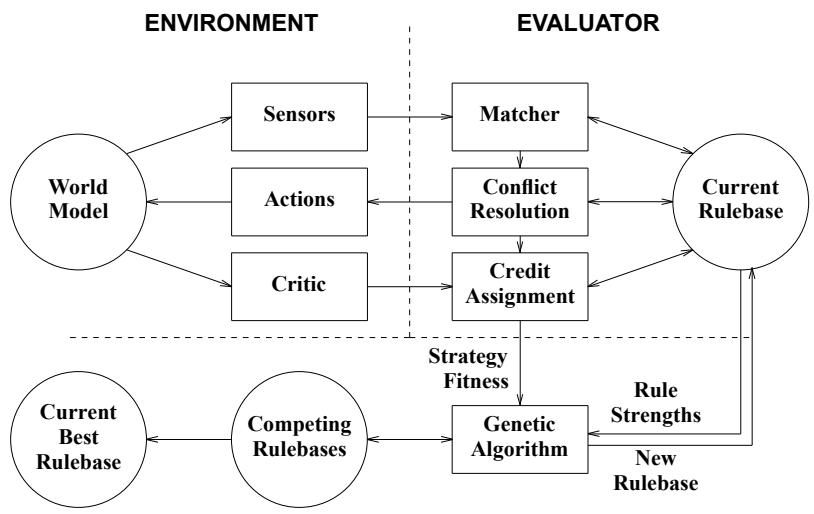
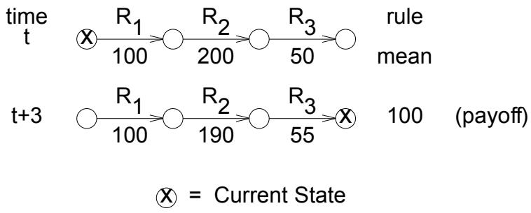

# The User's Guide to SAMUEL-97: An Evolutionary Learning System

John J. Grefenstette Navy Center for Applied Research in Artificial Intelligence Code 5514 Naval Research Laboratory Washington, DC 20375-5337, U.S.A. gref@aic.nrl.navy.mil

# Abstract

SAMUEL is a machine learning program that uses genetic algorithms and other competition-based heuristics to solve sequential decision problems. The system actively explores the space of alternative decision policies in simulation, and modifies its candidate policies based on this experience. Policies are represented as condition-action rules. The genetic algorithm in SAMUEL includes the standard methods of fitness-directed reproduction of rulebases, random mutation, and crossover. In addition, SAMUEL features several Lamarckian operators that modify decision rules on the basis of observed interaction with the task environment. SAMUEL has been used to learn decision policies for behaviors such as navigation and collision avoidance, tracking, and herding, for robots and other autonomous vehicles. SAMUEL also includes mechanisms to allow coevolution of multiple behaviors simultaneously. SAMUEL incorporates a convenient language for the decision rules, making it possible for the user to initialize the learning system with existing knowledge. SAMUEL is written in ANSI C and runs under the UNIX operating system. The visualization tool is written in Java, and allows output to be viewed with any Java-enabled browser or applet viewer.

# GENERAL LICENSE AGREEMENT AND LACK OF WARRANTY

This software is distributed in the hope that it will be useful but without any warranty. The author(s) do not accept responsibility to anyone for the consequences of using it or for whether it serves any particular purpose or works at all. No warranty is made about the software or its performance.

Use and copying of this software and the preparation of derivative works based on this software are permitted, so long as the following conditions are met:

The copyright notice and this entire notice are included intact and prominently carried on all copies and supporting documentation. • No fees or compensation are charged for use, copies, or access to this software. You may charge a nominal distribution fee for the physical act of transferring a copy, but you may not charge for the program itself. • If you modify this software, you must cause the modified file(s) to carry prominent notices (a ChangeLog) describing the changes, who made the changes, and the date of those changes. •Any work distributed or published that in whole or in part contains or is a derivative of this software or any part thereof is subject to the terms of this agreement. The aggregation of another unrelated program with this software or its derivative on a volume of storage or distribution medium does not bring the other program under the scope of these terms.

This software is made available as is, and is distributed without warranty of any kind, either expressed or implied. In no event will the author(s) or their institutions be liable to you for damages, including lost profits, lost monies, or other special, incidental or consequential damages arising out of or in connection with the use or inability to use (including but not limited to loss of data or data being rendered inaccurate or losses sustained by third parties or a failure of the program to operate as documented) the program, even if you have been advised of the possibility of such damages, or for any claim by any other party, whether in an action of contract, negligence, or other tortuous action.

All questions and program bugs should be reported to:

COMMANDING OFFICER NAVAL RESEARCH LABORATORY CODE 5510, Attn: SAMUEL Project 4555 OVERLOOK AVENUE, SW WASHINGTON, DC 20375-5337

http://www.aic.nrl.navy.mil/\~gref/samuel

Suggestions and comments regarding improvements to this User's Manual are also welcome.

SAMUEL is written by John Grefenstette, Navy Center for Applied Research in Artificial Intelligence, Naval Research Laboratory, Washington, DC 20375- 5337. Copyright ©1997. All rights reserved.

# Contents

# 1 INTRODUCTION 1

1.1 SYSTEM REQUIREMENTS 2   
1.2 INSTALLATION 2   
1.3 RUNNING SAMUEL 4

# 2 SYSTEM OVERVIEW 5

2.1 SAMUEL . . . 5   
2.2 GA. 6   
2.3 EVALUATOR 6   
2.4 OVERVIEW OF SOURCE CODE 7   
2.4.1 FILES IN SAMUEL PROCESS . 7   
2.4.2 FILES IN GA PROCESS 7   
2.4.3 FILES IN EVALUATOR PROCESS 8

# 3 LEARNING METHODS IN SAMUEL 9

# 3.1 GENETIC ALGORITHM . . . . 9

3.1.1 MUTATION 10  
3.1.2 CREEP 10  
3.1.3 CROSSOVER 11  
3.2 RULE LEARNING METHODS 11  
3.2.1 SPECIALIZE. 12  
3.2.2 GENERALIZE 13  
3.2.3 COVER . 14  
3.2.4 AVOID 15  
3.2.5 MERGE. 15  
3.2.6 DELETE 16

3.3 CREDIT ASSIGNMENT: UPDATING RULE STRENGTHS . . 16

# 4 CREATING A SAMUEL APPLICATION 19

5 INPUT FILES 21   
5.1 PARAMETER FILES 21   
5.2 ATTRIBUTE FILES 21   
5.2.1 LINEAR AND CYCLIC ATTRIBUTES 23   
5.2.2 STRUCTURED ATTRIBUTES 24   
5.2.3 QUALIFIER ATTRIBUTES 26   
5.2.4 CONSTRAINTS 27   
5.3 INIT FILES . 27

# 6 OUTPUT FILES 29

6.1 LOG FILE 29   
6.2 OUT FILE 29   
6.3 GRAPH FILE 30   
6.4 BEST FILES 31

# 7 RUNTIME PARAMETERS 33

7.1 POPULATION . . 33   
7.2 PARALLEL PROCESSING 34   
7.3 EVALUATION 35   
7.4 CPS 36   
7.5 SELECTION 37   
7.6 CROSSOVER . 37   
7.7 RULE MODIFICATION. . 37   
7.7.1 OPERATOR RATES 38   
7.7.2 MUTATION/CREEP 38   
7.7.3 GENERALIZATION/SPECIALIZATION 39   
7.7.4 MERGE. . 39   
7.7.5 DELETION. 39   
7.8 INPUT FILES 40   
7.9 OUTPUT PARAMETERS 40   
7.10 DEBUGGING 42

# 3 USER INTERFACE 45

8.1 INPUT INTERFACE 45   
8.2 OUTPUT INTERFACE 45

# 9 OTHER FEATURES 47

9.1 COMMAND LINE ARGUMENTS 47  
9.2 ASYNCHRONOUS AGENTS . 47  
9.3 AGENT ACCESS FUNCTIONS 47  
9.4 UPDATING EXTERNAL RULEBASES 49  
9.5 RULE PROPERTIES 50

10 ACKNOWLEDGEMENTS 52

11 BIBLIOGRAPHY 53

# The User's Guide to SAMUEL-97

# 1 INTRODUCTION

This document is the User's manual for the SAMUEL system. SAMUEL stands for Strategy Acquisition Method Using Evolutionary Learning.1 SAMUEL is a machine learning program that uses genetic algorithms and other competitionbased heuristics to solve sequential decision problems. Features include:

Genetic algorithm provides competition among alternative decision policies.   
•Incorporates knowledge representation (symbolic rules) that allows easy inclusion of existing knowledge.   
Facilities for expressing constraints.   
Parallel processing for evaluating several alternative policies simultaneously.   
Support for co-evolution.   
A platform independent (Java) visualization tool.

SAMUEL actively explores the space of alternative decision policies in simulation, and modifies its candidate policies based on this experience. Policies are represented as condition-action rules. In SAMUEL, learning is driven by competition at two levels: Within a rulebase, rules compete with one another to influence the behavior of the system. At a higher level of granularity, entire policies compete with one another using a genetic algorithm. The genetic algorithm in SAMUEL includes the standard methods of fitness-directed reproduction, random mutation, and crossover. In addition, SAMUEL features several Lamarckian operators that modify decision rules on the basis of observed interaction with the task environment.

SAMUEL is designed for sequential decision problems in which feedback is delayed in the sense that payoff occurs only at the end of an episode that may span several decision steps. SAMUEL has been used to learn decision policies for behaviors such as navigation and collision avoidance, tracking, and herding, for robots and other autonomous vehicles. SAMUEL has also be used to test complex systems, by learning test strategies that are most likely to uncover system weaknesses. SAMUEL also includes mechanisms to allow coevolution of multiple behaviors simultaneously.

SAMUEL incorporates a convenient language for the decision rules, making it possible for the user to initialize the learning system with existing knowledge.

SAMUEL is written in ANSI C and runs under the UNIX operating system. The visualization tool is written in Java, and allows output to be viewed with any Java-enabled browser or applet viewer.

# 1.1 SYSTEM REQUIREMENTS

SAMUEL runs under the UNIX operating system. It was developed at NRL using SunOS Release 4.1.4, compiled with gcc version 2.7.1. It should compile under any ANSI compliant C compiler.

The visualization tool is written in Java, and allows output to be viewed with any Java-enabled browser or applet viewer.

# 1.2 INSTALLATION

Perform the following steps to install SAMUEL:

1. Extract the files from the tape using the tar command. This command creates a top-level directory, called samuel, along with the subdirectories bin, doc, etc, lib, src, and robots.

2. Before building or running SAMUEL, you must set the environment variable SAMHOME to the path where SAMUEL resides, i.e. the path of this directory. This can be in a private area, for example \$HOME/samuel, or a public one, such as /usr/local/samuel. If your shell is csh, add a line such as:

3. You must set the environment variable SAM_HTML to the pathname accessible to a Java-based browser or applet viewer, for example, \$HOME/publichtml/samuel. If your shell is csh, add a line such as:

setenv SAM_HTML \$HOME/public_html/samuel

to your .cshrc file.

4. To use the parallel processing facilities in SAMUEL, you must have PVM (http://www.epm.ornl.gov/pvm/pvmhome.html) installed on your system, along with the corresponding environmental variables PvM_ROoT and PVM_ARCH. For example,

setenv PVM_RO0T \$HOME/pvm3   
setenv PVM_ARCH SUN4

You may also need to add lines such as set path $. ^ { = }$ ( $\$ 1$ path \$PVM_ROOT/lib/\$PVM_ARCH) set path $. ^ { = }$ (\$path \$PVM_ROOT/bin/\$PVM_ARCH)

to your .login and .cshrc files. (If you are currently using PVM, these might already be defined; check before adding them.) SAMUEL will run without having PVM installed. In this case the parallel processing features are disabled.

5. You must alter your search path to look in the \$SAMHOME/bin directory for executables. Examine your .cshrc and/or your .login file and add \$SAMHOME/bin to the end of the search path, e.g.:

set path $=$ (\$path $\$ { \mathsf { S A M } }$

6. Go to the \$SAMHOME directory and edit Makefile.conf to reflect your local setup. This file is included in the Makefiles in the other directories, so you should only have to change this one file. In particular, if you wish to install SAMUEL without having PVM installed, comment out the indicated lines in the Makefile.conf file.

7. Now go to the \$SAMHOME/src subdirectory and issue the command:

% make all

This will create the libsam.a and libsim.a random archive libraries which contains most of the functionality of SAMUEL, and will install the libraries in the \$SAMHOME/lib directory. It will also compile a series of files that will later be linked with application-specific object code.

8. You can now go to a SAMUEL application directory and make all, e.g.:

% cd \$SAMHOME/robots % make all

This will create the executables for this application.

# 1.3 RUNNING SAMUEL

After installation, go the robots directory and issue the command:

% make all

This will create the executables for this application. It will also generate the Java-based visualization tool and install it in the directory \$(SAM_HTML)/robots

Normally, you will want to run many different experiments with a given application. The recommended procedure is the generate separate experimental directories under each application. To generate an experimental directory, use the command:

% make exp $\tt E X P { = } \tt X 1$

This generates a subdirectory called X1 containing links to the executables in the current directory as well as copies of various input files. Run a demonstration by:

% cd X1   
% demo 10

This runs samuel in demonstration mode, meaning that no learning is being performed, but data is collected for visualization. The run the visualization tool, point a Java-enabled browser or applet viewer at the URL associated with \$(SAM_HTML)/robots/X1.html. This should display 1o episodes of the default rule sets in action.

To run samuel in learning mode, you invoke it directly

% samuel &

This should create several output files:

log   
out   
graph   
master.log   
best.0 ... best.10

See the section on output files for a description of these files.

# 2 SYSTEM OVERVIEW

SAMUEL is designed to learn rules for decision making agents. In general these agents may operate in a multi-agent environment. Although all of the agents in the environment perform the same sensing/matching/conflict-resolution/act cycle, each agent may have its own sensors, rules, and control variables. Figure 1 shows the logical architecture of the SAMUEL system.

  
Figure 1: SAMUEL Architecture

In its usual mode of operation, the SAMUEL system comprises three executable processes, named samuel, ga and evaluator. The master process samuel always exists. Optionally, there may be one or more ga processes (for co-evolution experiments) and one or more evaluator process (allowing parallel evaluations). If SAMUEL is run in sequential mode, then the samuel process handles the functionality of the ga and evaluator processes as well. The following subsection describe the function of each module.

# 2.1 SAMUEL

When invoked at the command line level, the samuel process reads in the input files that specify the format of the rules used by the rulebased agents in the application, the initial rulebases for the agents, and the runtime parameters. If the runtime parameters indicate parallel processing, samuel spawns PVM processes for one or more ga and evaluator processes. For the remainder of the run, samuel acts as a dispatcher, receiving requests from ga to evaluate a set of rulebases, sending these requests to evaluators, and returning the evaluated rulebases back the the ga. When the experiment is complete, samuel kills the ga and evaluator processes, if any. The user does not directly invoke ga or evaluator processes.

# 2.2 GA

One ga process is spawned for each population of rulebases being evolved by SAMUEL. For each generation, ga executes the following sequence of steps:

procedure Generate;   
begin Select; make copies of selected rulebases. Crossover; recombine selected parents. Delete; delete unwanted rules. Select_ops; select rule creation operators. Mutate; create random variations of existing rules. Creep; create small variations of existing rules. PRE_EVAL phase; collect experience, adjust rules strengths. Create new rules; apply Lamarckian rule creation operators. POST_EVAL phase; evaluate new rulebases, adjust rule strengths. CLUSTER_EVAL phase; cluster rules for crossover. FITNESS_EVAL phase; fitness evaluation. Measure; gather and print performance statistics.   
end

As shown, the evaluation of a rulebase is divided into four phases. In the first phase, PRE EVAL, the rulebase undergoes an initial, experience gathering phase in which trace of behavior are collected. Based on these behavior traces, new rules are created via Lamarckian operators. In the POST EVAL phase, the behavior of the augmented rulebase is assess, and the strengths of the individual rules are adjusted. In the third phase, CLUSTER_EVAL, the rules strengths are frozen and the experience of the agent is used to cluster rules for the next crossover. In the final phase, FITNESS_EVAL, the overall fitness of the final rulebase is assessed. The final step performed in each generation is the gathering of population-level statistics that are written to output files.

# 2.3 EVALUATOR

All calls to samuel_evaluate in ga are passed to the evaluator process, which is responsible for executing a given number of episodes in the task environment. In the Environment Module, the user specifies how payoff is assigned to each agent after each episode. The accumulated payoff, along with behavioral traces, is returned by the evaluator to the ga process.

The Evaluator Module uses a Competition-based Production System (CPS) that has three major functions: matching, conflict resolution, and credit assignment. During each decision making step, CPS examines each rule of a rulebase and determines the degree of match between the conditions of a rule and the current sensor values. Rules with the highest match score constitute the match set. During conflict resolution, CPS selects an action value among those recommended by the rules in the match set based on rule strengths. The production system cycle repeats until the completion of an episode in the Environment Module. Then CPS performs credit assignment, adjusting the strengths of rules in the current rulebase based on the agent's performance of during the episode. The Evaluator repeats the execution of its three major functions for a number of episodes to obtain an average payoff for each rulebase.

# 2.4 OVERVIEW OF SOURCE CODE

The source code for the fixed libraries in SAMUEL are in \$(SAMHOME)/src.

# 2.4.1 FILES IN SAMUEL PROCESS

The following source files are used in the samuel process:

define.h -- global type definitions samuel.c -main SAMUEL program params.c -- functions handling runtime parameters pvm_util.c -- utilities for parallel processing

The samuel process also includes all code in the ga and evaluator processes, so that it can run alone if the user selects the sequential processing mode.

# 2.4.2 FILES IN GA PROCESS

The following source files are used in the ga process:

define.h -- global type definitions   
ga.h -- global variables and runtime parameters for GA   
ga.c - main program for GA process

GENETIC ALGORITHM:

best.c -- keep track of best current rulebase evaluate.c -- evaluate the population generate.c main generational loop of GA measure.c produce generational statistics ops.c select which mutation operators to apply restart.c manage restarts save.c save checkpoint files select.c selection of fittest for reproduction

# MUTATION OPERATORS:

avoid.c -- avoid mutation operator   
cover.c cover mutation operator   
creep.c creep mutation operator   
mutate.c random mutation operator   
spec.c specialization mutation operator   
gen.c generalization mutation operator   
delete.c deletion operator: get rid of unwanted rules   
merge.c -- merge similar rules

# CROSSOVER:

cluster.c -- cluster rules for crossover cross.c -- exchange rules between parents

# 2.4.3 FILES IN EVALUATOR PROCESS

The following source files are used in the evaluator process:

define.h -- global type definitions   
cps.h global variables and runtime params for CPS   
evaluator.c -- main program for EVALUATOR

DECISION STEP:

agents.c -- agent access functions   
bid.c bidding procedures   
conflict.c conflict resolution functions   
cps.c functions relating to production system cycle   
fuzzy.c matching for fuzzy rules   
match.c matching procedures   
strength.c -- credit assignment algorithm to update rule strengths

# ACCESS TO DATA STRUCTURES:

atoms.c -- functions related to atomic terms, that is, (condition/actions) in rules   
attr.c -- functions related to rule attributes   
constr.c -- functions related to constraints   
files.c -- file input/output utilities   
rulebase.c -- functions related to entire rulebases   
rules.c -- function related to rules   
sets.c -- utilities for handling sets

Learning occurs at three distinct levels in SAMUEL. At the GA Level, the population of rulebases evolves via a genetic algorithm. Through the process of selection of the fittest parents, random mutations and recombination, combinations of high-performance rules evolve within the population. During the "lifetime" of a rulebased agent, the agent learns new rules that are added to its genetic material. Thus, this level of learning is Lamarckian evolution as opposed to Darwinian evolution at the GA level. The Lamarckian operators include Specialization, Generalization, Rule Covering, and Avoidance. These operators are triggered by specific experiences of rulebased agents during their earliest evaluation phase, called PRE_EVAL. In addition, the Lamarckian operators Merge and Delete are triggered by the overall statistics associated with individual rules, perhaps over many episodes. Finally, the strengths of individual rules are updated via the Credit Assignment algorithm, providing a form of reinforcement learning within each rulebase. The strength of a rule serves as a prediction of the expected level of payoff that would be achieved when the rule fires. Thus, CPS learns which of the rulebase's rules are more likely to result in episodes yielding high payoff. The following subsection describes these methods in more detail.

# 3.1 GENETIC ALGORITHM

The GA (Genetic Algorithm) Module evolves high performance rulebases through the competition of rulebases within a population. During each generation, the GA Module sends each of its rulebases to the Evaluator Module, which returns the average payoff of each rulebase. The GA determines the fitness of a rulebase by scaling this average payoff to a baseline performance. Based on the fitness evaluations of the competing rulebases, the GA chooses relatively high performing rulebases for reproduction and modification. The GA applies genetic operators of CROSSOVER, MUTATION and CREEP to copies of these selected rulebases to produce plausible new rulebases for the next generation. The GA's generational cycle repeats until one of the user-specified stopping criteria is satisfied.

SAMUEL has two Darwinian mutation operators: MUTATION and CREEP. These operators are creative in the sense that modifications are made on a new copy of the original rule. The original rule is retained in competition with the new rule. The MUTATION and CREEP operators may be constrained by the single act flag. If set, the action atoms within a rule can only take on one value.

# 3.1.1 MUTATION

MUTATION makes new rules by making random changes to existing rules. MUTATION can change a single value in any condition or action to an arbitrary value. For example, MUTATION might alter a condition within a rule from

$\mathtt { r a n g e } \ = \ \left[ 5 0 0 , \ 1 0 0 0 \right]$   
to   
$\mathtt { r a n g e \ = \ [ 5 0 0 , \ 8 0 0 ] . }$   
Alternatively, MUTATION might change an action from $\mathtt { t u r n } \ = \ \left[ 4 5 , \ 9 0 \right]$   
to   
$\mathtt { t u r n } \ = \ \left[ - 9 0 \ , \ 9 0 \right] \ ,$ .

For structured atoms, MUTATION can replace any value in the list by any legal value for that attribute.

# 3.1.2 CREEP

CREEP is a mutation operator that is restricted to make the smallest possible changes. The CREEP mutation operator make more local changes to the endpoints of a given atom. For example, if speed is an attribute with a granularity of 50, then CREEP might change an atom from

$\mathtt { s p e e d } \ = \ \left[ 2 0 0 , \ 5 0 0 \right]$ to   
speed $=$ [250, 500] or possibly to   
speed $=$ [150, 500] but not to   
$\mathbf { s p e e d } \ = \ \left[ 4 0 0 , \ 5 0 0 \right] .$

For structured atoms, CREEP replaces a single value in the list of values by one of the sibling values at the same level of the value hierarchy. For example, given the structured attribute distance CREEP could replace the value medium-close by very-close or by medium-far. The user can control the tendency of CREEP to generalize or to specialize, through the run-time parameter creep-gen_bias, which takes on values from 0 (CREEP only specializes) to 1 (CREEP only generalizes).

# 3.1.3 CROSSOVER

Selection alone merely produces clones of high performance rulebases. In SAMUEL, a recombination operator called crossover works in concert with selection to create plausible new rulebases. The GA applies crossover to randomly chosen pairs of clones. Crossover exchanges the rules of two rulebases to form two new offspring rulebases.

SAMUEL either applies a simple uniform crossover operator on rule boundaries if the rulebase's rules have not been clustered; otherwise, SAMUEL applies a restricted form of crossover. Simple uniform crossover assigns each rule to one of the children rulebases with equal probability. When applying the restricted form of uniform crossover, SAMUEL assigns an entire sequence of rules that fired in succession during a successful episode to one of the two children with equal probability. In either case, a particular rule can only be assigned to one of the offspring. For example, to illustrate cluster crossover, suppose that the most recent traces of the parent rulebases are as follows:

Parent 1, Success:

$$
R _ { 1 , 3 } \to R _ { 1 , 1 } \to R _ { 1 , 7 } \to R _ { 1 , 5 }
$$

Parent 1, Failure:

$$
R _ { 1 , 2 }  R _ { 1 , 8 }  R _ { 1 , 4 }
$$

Parent 2, Failure:

$$
R _ { 2 , 7 }  R _ { 2 , 5 }
$$

Parent2, Success:

$$
R _ { 2 , 6 }  R _ { 2 , 2 }  R _ { 2 , 4 }
$$

One possible offspring might be

$$
( \cdots R _ { 1 , 3 } R _ { 1 , 1 } R _ { 1 , 7 } R _ { 1 , 5 } \cdots R _ { 2 , 6 } R _ { 2 , 2 } R _ { 2 , 4 } \cdots ) ,
$$

where the subscripts on the rules indicate the rulebase index and the rule index, respectively.

Clustering rules ensures that a rule sequence achieving a successful maneuver is treated as a group during recombination. In this way, the offspring rulebases will likely inherit some of the beneficial behavior patterns of their parents. Of course, the success of any new combination of rules depends on the context provided by all of the other rules in the rulebase.

# 3.2 RULE LEARNING METHODS

During the "lifetime" of a rulebased agent, the agent learns new rules that are added to its genetic material. Thus, this level of learning is Lamarckian evolution as opposed to Darwinian evolution at the GA level. The Lamarckian operators include Specialization, Generalization, Rule Covering, and Avoidance. These operators are triggered by specific experiences of rulebased agents during their earliest evaluation phase, called PRE EVAL. In addition, the Lamarckian operators Merge and Delete are triggered by the overall statistics associated with individual rules, perhaps over many episodes.

# 3.2.1 SPECIALIZE

SPECIALIZE creates new rules for a rulebase that have a smaller ranges in their condition and action atoms than in their parent rules. SPECIALIZE uses the actual sensor values read and the corresponding action values selected during successful episodes to form these new rules. Starting with the episode receiving the highest payoff, SPECIALIZE examines the execution traces of a small set of episodes which are ordered in terms of decreasing payoff. The number of episodes examined in a trace is determined by the trace size. SPECIALIZE is triggered to operate on any low-strength, general rule in the execution trace. A rule is considered low-strength if its strength is less than a given fraction (the specialize level) of the payoff received for that episode. The fraction is set by the run-time parameter spec_level. A rule is considered general if the generality of each of its conditions exceeds the specialize threshold controlled by the run-time parameter spec_threshold. An atom's generality is the percentage of legal values that the atom covers. For numeric conditions (i.e., linear or cyclic), the operator creates a new condition with roughly half the generality of the previous condition by moving each endpoint half way toward the sensor reading. For example, if speed is an linear attribute with range from 0 to 2000 in increments of 50, if the original condition is

$\mathbf { s p e e d } ~ = ~ [ 1 0 0 , ~ 1 5 0 0 ]$ and the sensor reading is speed $= ~ 5 0 0$ , then the new condition would be speed $=$ [300, 1000].

For structured conditions, SPECIALIZE replaces each value in the disjunct by each of its children that covers the current sensor reading. For example, if the original condition is

$\mathtt { d i s t a n c e } ~ = ~ [ \mathtt { c l o s e } , ~ \mathtt { f a r } ]$   
and the sensor reading is   
distance $= ~ 3 0 0$ ,   
then the new condition would be   
distance $=$ [medium-close, medium-far].

If the sensor reading is distance $=$ 400

instead, then the new condition would be distance $=$ [medium-far], since medium-close does not cover the sensor reading.

When triggered, SPECIALIZE applies to every condition and action in a rule. For example, if the original rule is

IF time $=$ [0, 20] AND speed $=$ [300, 1500] THEN SET $\mathtt { t u r n } \ = \ [ - 1 8 0 , \ 1 8 0 ]$ ,

and if the sensor readings is

$$
( { \tt t i m e } \ = \ 2 , \tt \quad { \tt s p e e d } \ = \ 5 0 0 )
$$

and if the action taken is then the new rule would be

IF time $=$ [1, 11] AND speed $=$ [400, 1000] THEN SET $\mathtt { t u r n } \ = \ \left[ - 9 0 , \ 9 0 \right]$ .

This new rule would now compete with the original rule and the other rules within the rulebase. If the new rule turns out to be an appropriate specialization, its strength will rise and it will be protected from deletion. On the other hand, if the new rule is an inappropriate specialization, its strength will fall, and it may be deleted by satisfying the rule subsumption test of DELETE. Like the mutation operators MUTATION and CREEP, the SPECIALIZE operator is constrained when the single act fag is set. If set, both endpoints of the action atom would be the action value used in the execution trace.

# 3.2.2 GENERALIZE

The GENERALIZE operator is a complementary operator to SPECIALIZE. GENERALIZE examines the same set of traces of high performing episodes as does SPECIALIZE. GENERALIZE is triggered to operate on any high-strength rule in the execution trace. A rule is considered high-strength if its strength is greater than a given fraction of the payoff received for that episode. The fraction is set by the run-time parameter spec_level. GENERALIZE only applies to condition atoms within rules and not actions. For numeric conditions (i.e., linear or cyclic), the operator creates a new condition that expands the previous condition around the sensor reading. The amount of expansion is controlled by the generalize level parameter If the generalize level is set to 1, then GENERALIZE tries to cover at least half of the total range of the attribute, centered around the sensor reading. For example, if speed is an linear attribute with range from 0 to 2000 in increments of 100, and the original condition is

$\mathbf { s p e e d } ~ = ~ [ 8 0 0 , ~ 1 4 0 0 ]$ and the sensor reading is speed $\textbf { = } ~ 1 0 0 0$ , then the new condition would be speed $=$ [500, 1500].

For structured conditions, GENERALIZE replaces each value in the disjunct by each of its parents that covers the current sensor reading. For example, is distance is the structured attribute shown in Figure 3 and the original condition is

and the sensor reading is then the generalized condition would be distance $=$ [close, medium-far].

When triggered, GENERALIZE applies to every condition and action in a rule.

# 3.2.3 COVER

The COVER operator is applied to create a new rule from a rule that fires due to a partial match on rule conditions. A partial match occurs when there is no rule that completely matches all the current sensor readings. The operator creates a new rule whose left-hand-side is generalized enough to match the current sensor values. COVER only applies to condition atoms within rules and not actions. For numeric conditions, COVER creates a new condition with one of the end points set to the sensor reading. For example, if the original condition is

speed $=$ [700, 1500] and if the sensor reading is speed $= ~ 5 0 0$ , then the new condition would be speed $=$ [500, 1500].

For conditions having structured attributes, COVER adds the current sensor value to the disjunct and generalizes up the hierarchy if all the children of a given node are present in the disjunct. For example, consider the structured attribute in Figure 3. If the original condition is

distance $=$ [very-close, very-far] and if the sensor reading is distance $= ~ 3 0 0$ , then the new condition would be distance $=$ [close, very-far].

# 3.2.4 AVOID

The AvOID operator alters the action value of a fired rule by picking another value at random. AvOID is triggered by low payoff.

# 3.2.5 MERGE

The MERGE operator creates a new rule for a rulebase from two existing rules having identical right-hand sides, if the rules' strengths lie above the merge threshold and they overlap sufficiently. The merge overlap threshold specifies the minimum average overlap of the conditions of the two rules. If merge threshold is zero, then merging occurs regardless of the two rules' strengths; if the variable is one, then both of the rules must have strengths that are greater than the average rule strength of one of the actions in the rulebase. If the merge threshold is between zero and one, then the threshold specifies the fraction of the average strength that both rules must exceed in strength. The new rule that is formed using MERGE covers the sensor values of the original rules. For example, the result of applying MERGE to the following two rules

IF time $=$ [1, 5] AND distance $=$ [very-close] THEN SET turn $=$ [right]

and

IF time $=$ [3, 8] AND distance $=$ [medium-close, medium-far] THEN SET turn $=$ [right]

would be the rule

IF time $=$ [1, 8] AND distance $=$ [close, medium-far] THEN SET turn $=$ [right].

The MERGE operator, in combination with the DELETE operator, helps to eliminate overspecialized rules from the rulebase.

# 3.2.6 DELETE

Once created, a rule survives intact unless its rulebase is not selected for reproduction or it is explicitly deleted by the DELETE operator. For a rule to be considered for deletion, the current number of rules in the rulebase must be greater than or equal to the delete trigger fraction of the maximum permitted number of rules in the rulebase. In addition, a rule cannot be deleted if it is too young or it is designated as fixed. The incubation period indicates the number of generations a rule must survive before it can be considered for deletion.

A rule may be deleted from a rulebase if all of the rule's actions meet one or more of the following criteria: (1) the rule's activity level is less than the activity threshold (has not fired recently); (2) the rule's strength is less than the strength threshold (low strength); or (3) the rule is subsumed by a more general rule whose strength exceeds the subsumed rule by the subsume threshold. Rules are deleted randomly if the delete threshold is less than one. In general, the delete threshold changes the fraction of the maximum number of rules that remain in the rulebase each generation. All of these thresholds are controlled by run-time parameters.

Since the DELETE operator eliminates the maladaptive mutations, SAMUEL requires only that the creative mutation and modification operators produce plausible variants of the existing rules. The interaction between the creative operators and the DELETE operator provide the sort of competitive environment at the rule level that the genetic algorithm provides at the rulebase level. This policy allows a much more aggressive application of the rule modification operators with little damage if the changes are maladaptive.

# 3.3 CREDIT ASSIGNMENT: UPDATING RULE STRENGTHS

Each rule in SAMUEL has an associated strength that estimates the rule's utility for the task environment. If a rule's recommendation has been followed during a particular episode, the rule is said to be active. At the end of episode $\tau$ , the critic provides a payoff $r ( \tau )$ . For each active rule $R _ { i }$ , the estimate of its mean payoff, $\mu _ { i }$ , is updated by the profit-sharing plan (PSP), which operates as follows:

$$
\mu _ { i } ( \tau + 1 ) ~ = ~ ( 1 ~ - ~ \alpha ) ~ \mu _ { i } ( \tau ) ~ + ~ \alpha r ( \tau )
$$

The constant $\alpha$ is a learning-rate parameter called the psp rate (typically, $\alpha ~ = ~ 0 . 0 1 _ { , } ^ { }$ . Notice that the expression for $\mu _ { i }$ is just the traditional perceptron learning rule, applied to update the utility of a rule. It is easy to show that $\mu$ approximates a time-weighted running average of the payoff received whenever the rule was active:

$$
\mu _ { i } ( \tau ) ~ \approx ~ \alpha \sum _ { j = 1 } ^ { \tau } ( 1 ~ - ~ \alpha ) ^ { \tau - j } ~ r ( j ~ - ~ 1 )
$$

The estimate of the variance in its payoff, $\sigma _ { i } ^ { 2 }$ is updated similarly:

$$
\sigma _ { i } ^ { 2 } ( \tau + 1 ) ~ = ~ ( 1 ~ - ~ \alpha ) ~ \sigma _ { i } ^ { 2 } ( \tau ) ~ + ~ \alpha ~ ( \mu _ { i } ( \tau ) ~ - ~ r ( \tau ) ) ^ { 2 }
$$

If rule $R _ { i }$ has an estimated payoff with mean $\mu _ { i }$ and variance $\sigma _ { i } ^ { 2 }$ , we define the strength of $R _ { i }$ as:

$$
s t r e n g t h ( R _ { i } ) \ = \ \mu _ { i } \ - \ \beta \ \sigma _ { i } .
$$

where $\beta$ is a strength_bias parameter that weights the variance component of the strength. Thus, a high strength rule must have both high mean and low variance in its estimated payoff. By biasing conflict resolution toward high strength rules, we expect to select actions for which we have high confidence of success.

For example, suppose $R _ { 1 }  R _ { 2 }  R _ { 3 }$ is a sequence of rules that fire during a given three-step episode. Also, suppose the psp rate, $\alpha$ , is set to 0.10, and the payoff, $r$ , is 100. The figure below illustrates the original estimates of the means at time $t$ and the updated estimates at the end of the episode (at $t + 3$ .

  
Figure 2: Credit Assignment: Profit Sharing Plan

Notice that the rule correctly predicting the payoff, $R _ { 1 }$ , retains its original estimate; the rule that overestimates the payoff, $R _ { 2 }$ , loses strength, and the rule that underestimates the payoff, $R _ { 3 }$ gains strength. Over the course of many episodes, the strengths of active rules converge to the expected level of payoff (Grefenstette, 1988). This observation motivates the use of rule strength during conflict resolution.

# 4 CREATING A SAMUEL APPLICATION

To create a new application in SAMUEL, the user creates an application directory, for example \$(SAMHOME)/new-app. It would be best to begin by copying the contents of the sample application directory \$(SAMHOME)/robots. This can be conveniently done by issuing the command:

# % make version VERSION=new-app

in the robots directory.

The main task in creating a SAMUEL application involves editing the environment module env.c to reflect the performance task of interest. The sample environment in \$(SAMHOME)/robots was designed to provide a good template to work from, amd should be studied in some detail. This file consists of an entry point procedure samuel_eval that should not be modified. This procedures is provided to show the sequence of interactions between the SAMUEL library functions and the following user-defined functions that define the environment:

void environmentinit(RULEBASE \*rulebase, int n, int episodes);

Called once per evaluation, to initialize the environment, including all agents.

void environmentbegin_step(void);

Called at the beginning of each decision-making step.

void environment_set_sensors(void);

Called during each step to set the current sensor values for all agents.

void environment_set_action(void);

Allows the user to override the rulebase decision for interactive agents (not usually done).

void environment_take_action(void);

Called during each step to advance the world model by a single step, based on the decisions made by each agent.

int environment_end_step(void); Called at the end of each step.

void environment_set_payoff(void);

Called at the end of an episode. Payoff is assigned to each learning agent.

void environmentreset(void);

Called after each episode, to reset agents and the world model for a new episode.

void initialize_data(int epis);

void record_step_data();

void record_sensor_data();

void record_action_data();

void record_position_data(int n);

void record_payoff_data();

void record_reset_data();

These functions are called periodically during each episode to record data needed for post-mortem visualization of the episode. What data needs to be recorded depends on the application task. This data is later read by the Java visualization applet.

The various input files that define the rule format and the runtime parameters also need to be edited for each new application. See the section on input files for a description of the format and contents of the input data files.

# 5 INPUT FILES

SAMUEL requires three types of input files: parameter files, and attribute files and initial rules files. The number of input files depends on the number of rule-based agents in the application, but there will be at least one of each type.

# 5.1 PARAMETER FILES

SAMUEL requires two parameter files, params.def and params.

params.def

This file specifies the default values for each runtime parameter in SAMUEL.

Each line in the file has the form:

parameter $=$ value

Lines that begin with a pound-sign (#) are comments and are ignored.

# params

This file specifies values for runtime parameters that override the values in params.def. Use this file when you need to change parameters within a sequence of invocations of SAMUEL. It has the same format as params.def.

# 5.2 ATTRIBUTE FILES

The attributes files describe the format of the rules and the types and range of values of the sensors and actions for each rule-based agent. One attributes file must be specified for each rulebased agent. For example, if there are two rulebased agents then there must be two files, attributes-1 for the first agent and attributes-2 for the second agent. The format of the file is shown in the following example:

conditions $\ c = ~ 2$ actions $\ c = ~ 2$ qualifiers $\qquad = \ 0$ condition 1: name $=$ range type $=$ linear low $\qquad = \quad 0$ high $= ~ 1 5 0$ step $\textstyle { \begin{array} { r l } \end{array} } = { \begin{array} { r l } { 1 0 } \end{array} }$ exact $\qquad = \ 0$

condition 2: name $=$ bearing type $=$ cyclic low $\qquad = \quad 0$ high $= ~ 3 3 7 . 5$ values $\textstyle { \begin{array} { r l } \end{array} } = { \begin{array} { r l } { 1 6 } \end{array} }$ exact $\qquad = \ 0$

action 1:   
name $=$ turn   
type $=$ structured   
match $=$ numeric   
low = -8   
high $\qquad = ~ 8$   
order $=$ linear   
leaf-values $= ~ 5$   
right_8   
right_4   
straight   
left_4   
left_8   
interior-values $=$ 0

action 2: name $=$ speed type $=$ linear low $\ c = \ c 4$ high $\textstyle { \begin{array} { r l } \end{array} } = { \begin{array} { r l } { 1 6 } \end{array} }$ step = 4

This file specifies that each rule can have up to two conditions and two actions, for example:

IF range $<$ 100 AND bearing $=$ [0, 180] THEN SET turn $=$ right_4 AND speed $=$ 12

Entries in the attributes file are separated by white space. It is not necessary to put one entry per line, but we do so for clarity. The first three entries specify the number of conditions, the number of actions, and the total number of action qualifiers. Each condition, action and qualifier is then described in turn. Finally, number of constraints and the constraint rules, are listed. The organization of an attributes file is as follows:

actions $\iff \ < _ { \tt m } >$   
qualifiers $\tt { \tt = \tt { < } q \tt { > } }$   
compile $=$ 1 | 0   
condition 1:   
condition 2:   
condition $\mathbf { \zeta } < _ { \mathrm { { n } } } >$ :   
action 1:   
action 2:   
action <m>:   
qualifier 1:   
qualifier 2:   
qualifier <q>:   
constraints $=$ <k>   
constraint 1:   
constraint 2:   
constraint <k>:

The maximum number of conditions in the attributes file is MAX _CONDITIONS, as specifed in define.h. The maximum number of actions is MAX_ACTIONS. The maximum number of qualifiers is MAX_QUALS.

The format for the conditions, actions and qualifiers depend on the attribute type, as follows:

# 5.2.1 LINEAR AND CYCLIC ATTRIBUTES

For linear or cyclic attributes, the condition format is:

condition $< \dot { \bf \textmd { 1 } } >$ :   
name $= ~ <$ cond-name >   
type $=$ linear | cyclic   
low $\qquad = ~ <$ low-value $>$   
high $= ~ <$ high-value $>$   
[ step $=$ < step-value > ] | [ values $=$ < number-of-values > ]

where cond-name is a label of up to 16 characters, low-value and highvalue are real values, and step-value is the length of each interval in the numeric range between low-value and high-value. If the step-value is specified, step-value must evenly divide the range into equal-size intervals. If values is specified, the range is divided into the specified number equal-size intervals. The exact entry for a condition specifies whether or not the sensor value must match the rule condition exactly. If exact ${ \bf \mu } = { \bf \mu 0 }$ , then partial matching is permitted.

The format for actions is similar, except that condition i: is replaced by action $i \colon$ , and the exact entry is omitted.

# 5.2.2 STRUCTURED ATTRIBUTES

For structured attributes the entries define the tree of values bottom up. The condition format is:

condition <i>:   
name $= ~ <$ cond-name $>$   
type $=$ structured   
match $=$ symbolic | numeric low $=$ <low-value> high $=$ <high-value>   
order $=$ none | linear | cyclic   
leaf-values $=$ < n >   
<value 1>   
•   
•   
<value n>   
interior-values = < m >   
name $= ~ <$ interior-value 1 >   
children $\mathbf { \Sigma } = \mathbf { \Sigma } < \mathbf { \Sigma } _ { \mathbf { C } _ { - } 1 }$ >   
<child 1>   
<child c_1>   
•   
•   
name $= ~ <$ interior-value m >   
children $=$ < c_m >   
<child 1>   
•   
<child c_m>   
exact = 0 | 1

The format for a structured action attribute is the same, except that the exact entry is absent.

The match entry indicates whether this attributes is treated as a symbolic or numeric quantity for the purposes of matching sensor readings or specifying action values. If numeric matching is indicated, then each leaf value is implicitly associated with a real value by equally dividing the interval (low-value .. high-value). For structured, numeric conditions, the numeric value passed in the store_sensor() function will be converted to the nearest leaf value in the attribute's hierarchy. For structured, numeric actions, each leaf-value is converted to a numeric value, returned by get_action_value().

If symbolic matching is indicated, then sensor values are set by providing a string as the last argument of store_sensor(), and action values returned by get_action_value() are index values of the leaf nodes.

By using a structured attribute, it is possible to define a simple switch, or a fairly involved hierarchy. The following example shows the structured attribute for a hierarchy of distance values. Notice that interior nodes field gives the count of all interior nodes, without considering the level of the nodes within the hierarchy. The level of an interior node is implicitly specified thorough its children nodes.

condition 12:   
name $=$ distance   
type $=$ structured   
match $=$ numeric   
$\smash { \mathrm { ~ \textrm ~ { ~ ~ 2 ~ o w ~ } ~ } = \mathrm { ~ \textrm ~ { ~ 1 0 0 ~ } ~ } }$   
high $= ~ 6 0 0$   
order $=$ linear   
leaf-values $= ~ 6$   
100 200 300 400 500 600   
interior-values $\qquad = ~ 6$   
name $=$ very-close   
children $\ r = \ r _ { 2 }$   
100 200   
name $=$ medium-close   
children $=$ 2   
200 300   
name $=$ medium-far   
children $\ c = ~ 3$   
300 400 500   
name $=$ very-far   
children $\ c = ~ 2$   
500 600   
name $=$ close   
children $\ c = ~ 2$   
very-close medium-close   
name $=$ far

children $=$ 2 medium-var very-far exact = 1

Actions can also be expressed as structured attributes. For example, in the initial example, turn is a structured action attribute.

Structured attributes are limited by certain constants in define.h. The maximum number of parent nodes is MAX_PARENTS; the maximum number children nodes is MAX_CHILDREN, and the maximum height of the structure is MAX_HEIGHT.

In defining linear, cyclic of structured numeric attributes, the use may specify real values for low-value, high-value and step-value, with the following restrictions: there can by no more than 6 significant digits in any value, and step-value must exactly divide the interval (low-value .. high-value).

# 5.2.3 QUALIFIER ATTRIBUTES

Actions can have qualifiers, which are attributes that act like parameters to an action value. Qualifier attributes may be of any type, and are specified in the same way as action attributes, except that the first entry identifies the attribute as a qualifier, and the second entry identifies the action being qualified. For example, suppose that an action turn has a qualifier speed that says what the speed of the turn should be. If turn has possible values right and left, and speed has values 0, 10, 20, then these attributes might be defined as follows:

action 3:   
name $=$ turn   
type $=$ structured   
match $=$ symbolic   
order $=$ none   
leaf-value $\ c = ~ 2$   
left right   
interior-values $\qquad = \ 0$   
qualifier 1:   
action $=$ turn   
name $=$ speed   
type $=$ linear   
$\tt { 1 o w } = 0$   
high $\qquad = \ 2 0$   
step $\textstyle { \begin{array} { r l } \end{array} } = { \begin{array} { r l } { 1 0 } \end{array} }$

# 5.2.4 CONSTRAINTS

The constraint format similar to the rule format used in the init file except that the THEN clause uses the keywords ENABLE or DISABLE instead of SET. The word CONSTRAINT is capitalized, and there is no colon following the constraint index number. The general syntax is:

CONSTRAINT <i> IF c_1 AND c_2 AND ... AND c_n THEN ENABLE a_1 AND a_2 AND ... AND a_m

or

CONSTRAINT <i> IF c_1 AND c_2 AND ... AND c_n THEN DISABLE a_1 AND a_2 AND ... AND a_m

The following illustrates two constraints on the turn and speed actions examples given above. A disabling constraint eliminates action values from consideration even though they might otherwise have been bid by any matching rule; an enabling constraint requires action values to be considered even though they might not have been bid.

constraints = 2

CONSTRAINT 1   
IF bearing $\qquad = \ 0$   
THEN ENABLE turn $=$ any AND speed $=$ [0, 8]   
CONSTRAINT 2   
IF rang $\texttt { \small e } = \texttt { \small L }$ 10, 100]   
THEN DISABLE turn $=$ right_8 AND speed > 4

# 5.3 INIT FILES

The init files contain the initial rules for each rule-based agent. One init file must be specified for each rulebased agent. For example, if there are two rulebased agents then there must be two files, init-1 for the first agent and init-2 for the second agent.

For evolving agents, the init file contains initial rules used to seed SAMUEL's population. The init file contains one or more rulebases. For each rulebase the file gives the number of the rulebase being defined and a set of rules. Each rule must indicate (1) the rule number, (2) the conditions and actions, (3) the fixed rule attribute, and (3) mean, standard deviation, and strength attributes of the rule. All other rule attributes are ignored on input. The maximum number of rules per rulebase is MAX_RULES; the maximum number of conditions per rule is MAX_CONDITIONS; the maximum number of actions per rule is MAX _ACTIONS. For example, an init file having only one rulebase containing two maximally general rules is shown below:

# RULEBASE O

RULE O   
IF   
THEN SET turn $=$ any   
Id O Parent O Created O Fixed O Matched O Partially-matched O Dest O   
Action turn Bid 0 Active 0 Fired 0 Mean 0.5 Std 0 Strength 0.5 Act O.0   
RULE 1   
IF   
THEN SET speed $=$ [-4, 16]   
Id 1 Parent 1 Created 0 Fixed O Matched O Partially-matched O Dest O   
Action turn Bid 0 Active 0 Fired 0 Mean 0.5 Std 0 Strength 0.5 Act O.0

gen: 0 trial: 0 value: 0.0   
parent1: 0 parent2: 0 seed: 0

Notice that if an atom in a rule covers the entire range of a condition, then the atom does not have to be expressed in the rule. In this example, the action turn is a symbolic type, and speed is a numeric type with range [-4, 16]. In RULE 0 above, all of conditions are maximally general; the action is explicitly general. This rule matches all conditions and indicates that any turn actionvalue is acceptable.

If an init file contains more than one rulebase, the population is initialize by copying the given rulebases in round-robin fashion until the population contains Popsize rulebases.

# 6 OUTPUT FILES

SAMUEL normally creates several output files, described in the following subsections. The following descriptions follow the default behavior of SAMUEL. However, the names of these files and the frequency of updating them can also be controlled by runtime parameters.

# 6.1 LOG FILE

The log file records the start and finishes time for each run of SAMUEL, for example:

samuel started on sun19.aic.nrl.navy.mil Thu Jun 26 09:41:30 1997

samuel finished Thu Jun 26 11:42:46 1997

# 6.2 OUT FILE

The out file normally contains one line of statistics per generation. A partial out file is shown below:

<table><tr><td>Gen</td><td>Trials</td><td>Length</td><td></td><td>AvGen</td><td></td><td>Onl</td><td>Offl</td><td>Best</td><td>Worst</td><td>Base</td><td>Std</td><td>Ave</td><td>Ext</td><td>del</td><td>crs</td><td>mut</td><td>crp</td><td>cov</td><td>spc</td><td>gen</td><td>mrg</td><td>avd</td></tr><tr><td>0</td><td>100 25</td><td></td><td>25</td><td>25 0.97</td><td></td><td>46.7</td><td>65.9</td><td>68.5</td><td>11.9</td><td>3.7</td><td>9.5</td><td>46.7</td><td>0</td><td>0</td><td>0</td><td>0</td><td>0</td><td>0</td><td>0</td><td>0</td><td>0</td><td>0</td></tr><tr><td>1</td><td>200 27</td><td></td><td>25</td><td>25 0.97</td><td></td><td>45.9</td><td>69.6</td><td>74.0</td><td>0.0</td><td>6.5 13.2</td><td></td><td>45.2</td><td>0</td><td>0</td><td>0</td><td>25</td><td>25</td><td>0</td><td>14</td><td>2</td><td>0</td><td>29</td></tr><tr><td>2</td><td>300 30</td><td></td><td>27</td><td>25 0.95</td><td></td><td>45.9</td><td>71.3</td><td>75.2</td><td>0.0</td><td>8.8</td><td>16.8</td><td>45.9</td><td>2</td><td>0</td><td>1</td><td>25</td><td>16</td><td>0</td><td>12</td><td>3</td><td>1</td><td>23</td></tr><tr><td>3</td><td>400 35</td><td></td><td>30</td><td>27 0.93</td><td></td><td>46.7</td><td>73.3</td><td>81.2</td><td>0.0 10.8 20.4</td><td></td><td></td><td>49.1</td><td>3</td><td>0</td><td>2</td><td>31</td><td>22</td><td>0</td><td>19</td><td>6</td><td>5</td><td>35</td></tr><tr><td>4</td><td>500 43</td><td></td><td>36</td><td>30</td><td>0.90</td><td>49.2</td><td>75.2</td><td>85.8</td><td>0.0 14.1 15.3</td><td></td><td></td><td>59.3</td><td>6</td><td>0</td><td>4</td><td>30</td><td>16</td><td>0</td><td>26</td><td>3</td><td>9</td><td>27</td></tr></table>

The fields in the out file are:

Gen

Generation counter.

Trials

Trial counter (number of evaluations performed).

Maximum, average and minimum lengths for rulebases in current population.

# AvGen

Average generality of the rules in the current population. The generality of a rule is the fraction of the state space matched by the conditions of the rule.

Onl

Online performance. This is the running average of the best-so-far values.

Offl

Offline performance. This is the average value of all rulebases.

Best

The best value of any rulebase in the current population.

Worst

The worst value of any rulebase in the current population.

Base

The baseline value used to measure fitness. The fitness of a rulebase is its raw value minus the baseline.

Std

The standard deviation of values in the current population.

Ave

The mean value in the current population.

Ext

The number of exterminated rulebases (in the previous generation). A rulebase is exterminated if its value is below the baseline value. Exterminated rulebases have no offspring.

del

Total number of rules deleted during the current generation.

crs

The average number of rules exchanged in each crossover event.

mut crp cov spc gen mrg avd

These are counts of the total number of new rules created by each of the rule creation operators: (random) Mutation, Creep, Cover, Specialize, Generalize, Merge, and Avoid.

# 6.3 GRAPH FILE

The graph file normally contains one line per generation, showing the best value of any rulebase in the current population. A partial graph file is shown below:

1 127 69.9   
2 236 76.6   
3 344 78.9   
4 491 70.3   
5 566 87.8   
6 606 87.0   
7 747 86.0   
8 867 88.3   
9 921 83.0   
10 1094 86.8

The first field is the generation counter. The second field is the trial counter of the best rulebase The third field is the value of the best rulebase.

# 6.4 BEST FILES

SAMUEL normally produces one best file for each generation, named best. $n$ for generation $n$ . This is the rulebase associated with the corresponding line in the graph file.

The format of the best file is the same as the init file or the rules file. The RULEBASE number shows the position of this rulebase within its population. A partial best file is shown below:

RULE O   
IF   
THEN SET turn $=$ left_24   
Id 0 Parent 0 Created INI Fixed 3 Matched 33542 Partially-matched 0 Dest O   
Action turn Bid 5200 Active 5393 Fired 503 Mean 0.573 Std 0.201 Strength 0.553 Act 0.209   
RULE 1   
IF   
THEN SET turn $=$ left_20   
Id 1 Parent 1 Created INI Fixed 3 Matched 33542 Partially-matched 0 Dest O   
Action turn Bid 5200 Active 2516 Fired 26 Mean 0.518 Std 0.216 Strength 0.496 Act 0.210   
RULE 82   
IF range $=$ [20, 90] AND bearing $=$ [270, 90]   
THEN SET turn $=$ left_4   
Id 109 Parent 102 Created CRP Fixed 0 Matched 6771 Partially-matched 0 Dest O   
Action turn Bid 6771 Active 0 Fired 0 Mean 0.471 Std 0.245 Strength 0.446 Act 0.500

gen: 10   
trial: 1094   
value: 86.750   
parent1: 5   
parent2: 60   
seed: 517275

# 7 RUNTIME PARAMETERS

SAMUEL has many runtime parameters to control how learning experiments are done, how data is saved and display, and how various components operate. Runtime parameters are specified in two files: params.def and params. At startup, the program first reads the params.def file, setting the runtime variables according to the values in that file. Then it reads the params files, overwriting any values specified. Therefore, if a parameter does not appear in the params file, it gets the value specified in the params.def file. Lines in the parameter fles that begin with "#" or "," are considered comments.

If you want to study the effect of a given parameter, you need to know which program variable is associated with it. The SAM_params data structure in samuel.h maps the external parameter names in the params files to the associated runtime variable:

PARAM_TABLE GEN_params[] = { "bestfile", STR, (void $^ *$ Bestfile, "debugfile", STR, (void $^ *$ Debugfile, "m_rate", DOUBLE, (void $^ *$ &Mu_rate, "debug", INT, (void $^ *$ )&Debug, "end-of-table", STR, (void $^ *$ NULL   
};

The first item in the table is the external parameter name as it appears in the parameter files. The second item indicate the type. The third entry is a pointer to the global variable associated with the parameter. You can use grep to find instances of the parameter variable in the source code.

The following sections define each parameters, giving its range of values, and its default values. For each parameter, the default value is shown as the (first) value after the equal sign. Currently, the system does only a limited amount of error checking on runtime parameters. For parameters with string values shown below, only one of the listed strings will be accepted (except for filename parameters). Generally, there is little or no checking on numeric parameters.

# 7.1 POPULATION

These runtime parameters affect the population in SAMUEL.

popsize $= ~ 1 0 0$

Number of rulebases per population. Program variable: Popsize.

bestsize $\ c = ~ 1$ Number of rulebases in current population that are re-evaluated in order to extract a best rulebase. Program variable: Bestsize.   
best_interval $= ~ 5$ Generations between extracting a best rulebase. Program variable: Best _interval.   
$\mathbf { g e n s } ~ = ~ 1 0 0 0 0 0 0$ Max number of generations performed. Program variable: Maxgens.   
length $= ~ 2 5 6$ Maximum number of rules in a rulebase (max $=$ MAX_LENGTH). Program variable: Length.   
ga_seed = 1 Random number seed. Program variable: Seed.   
rulebase_params $\qquad = \ 0$ Number of inherited parameters in a rulebase $\mathrm { \Delta m a x = 1 0 }$ ). Program variable: Rulebase_parameters.

# 7.2 PARALLEL PROCESSING

These runtime parameters control parallel processing in SAMUEL.

rulebase_type $\mathit { \Theta } = \mathit { \Theta } 1$

This is a string of length $n$ , where $n$ is the number of agents in the environment. The character in position $i$ gives the id number of the GA that is responsible for evolving the rulebase for agent $i$ . The first real GA is numbered 1. Agents associated with GA O use fixed rulebases. For example, if there are two agents in the environment, one evolving and the other fixed, then set rulebase_type $\bf \Pi = \delta 1 0$ . If rulebase_typ $\mathbf { e = 1 1 0 2 2 }$ , this would mean that there are five agents in the environmental model, agents 1 and 2 get their rulebases from GA 1, agent 3 uses a fixed rulebase, and agents 4 and 5 get their rulebases from GA 2. This setup requires three attribute files and three init files (numbered 1, 3 and 4, since the format for agents 2 and 5 are specified by the earlier agents of the same GA-type). The number of rulebases must be the same for all real GA's. Multiple GA require parallel processes (i.e., $\mathbf { p a r \mathbf { - g a } } = \mathbf { 1 }$ below). Program variable: Rulebase_type.

pieces $\ c = ~ 1$

How many pieces to divide up each evaluation phase into. The other individuals to be evaluated with are chosen at random according to the co-evolution mode (Experimental feature). Program variable: Variety.

par_ga = 0

If set, spawn a parallel ga process for each GA specified in rulebase_type parameter. Program variable: Parallel_GA.

$\mathsf { p a r \mathrm { \mathsf { \mathrm { \mathbf { e v } } } } } = \mathsf { \Omega } 0$

If set, spawn parallel evaluator processes, one for each host in the hosts file. If not set, all evaluations are done internally by the samuel process.

Program variable: Parallel_EV.

coevolve $\qquad = \ 0$

Mode for co-evolution. Program variable: Coevolve.

maxchamps $\qquad = \quad 1 0$

Number of previous champions to store for co-evolution. Program variable: Maxchamps.

# 7.3 EVALUATION

These runtime parameters control the evaluation of a single individual in SAMUEL.

trials $=$ 1000000 Approx. max number of trials to execute. Checked after each generation. Program variable: Maxtrials.

pre_eval $\qquad = \ 2 0$

Number of episodes to execute during the experience-gathering PRE EVAL phase of a rulebase's lifetime. Data from this phase is used during certain rule modification operators (e.g., specialize and generalize). Program variable: Episodes_preeval.

post_eval $\qquad = \ 2 0$

Number of episodes to execute during the POST EVAL phase of a rulebase's lifetime. This phase serves to adjust the strengths of the rules, including those new rules just created during the Lamarckian rule modification phase. Program variable: Episodes_posteval.

cluster_eval $\qquad = \ 2 0$

Number of episodes to execute during the CLUSTER_EVAL phase of a rulebase's lifetime. In this phase, the rule strengths are frozen, and rules in the best episode are clustered so that they will be crossed as a group. Program variable: Episodes_cluster.

# fitness $\qquad = \ 2 0$

Number of episodes to execute during the FITNESS_EVAL phase of a rulebase's lifetime. In this phase, the rule strengths are frozen and the average payoff of a rulebase is recorded. Episodes _fitness.

extract $\qquad = \ 0$

How many episodes to execute when choosing a rulebase to represent the current population (a best rulebase). Program variable: Episodes_extract

test = 100

How many episodes over which to measure the performance of a best rulebase. Program variable: Episodes_test.

fitness_partial $\qquad = \ 0$

If set, turn on partial credit in the FITNESS_EVAL phase. Otherwise, partial credit is off in the fitness phase. Program variable: Test_partial_credit

partial $\qquad = \ 0$

If set, turn on partial credit in the TEST_EVAL phase (used to evaluate best rulebases for the graph file). Otherwise, partial credit is off in the test phase. Program variable: Test_partial_credit.

# 7.4 CPS

These runtime parameters control SAMUEL's Competition-Based production System (CPS). This module controls the basic decision cycle, reading the sensors, finding rules that match, resolving conflicts, taking actions, and assigning credit.

psprate $\mathbf { \Omega } = \mathrm { ~ 0 ~ . ~ 0 1 ~ }$

Update rate for rule strengths. Program variable: Psp_rate.

bidbias $\ c = ~ 1 . 0$

Bids are raised to 10 times this power, except that a value of 1.0 means "infinity" : only considered the highest bid(s). Program variable: Bid_bias.

specificitybid $\qquad = \ 0$

If set, bias the bid by rule's specificity. Program variable: Specificity_bid.

maturity_bid $\qquad = \ 0$

If set, bias the bid by rule's maturity. Program variable: Maturity_bid.

seed $\ c = ~ 1$

Environment random number seed. Program variable: Env_seed.

conflict $\qquad = \ 0$

Conflict resolution policy. Program variable: Conflict.

strbias $\ c = \ 0 . 1$

Weight for standard deviation in rule strength. Program variable: Strength_bias.

fuzzybins $= ~ 5$

Number of levels of fuzzy matching. Program variable: Fuzzy_bins.

# 7.5 SELECTION

These runtime parameters affect the selection of parents for cloning in SAMUEL's genetic algorithm.

selection $\qquad = \ 0$

Mode for selection algorithm. If selection $= 0$ , proportional selection is used. If selection $= 1$ , ranking selection is used. If selection $= 2$ , threshold selection is used. Program variable: Selection.

rank_min $\mathbf { \varepsilon } = \mathbf { \varepsilon } 0 . 7 5$

Minimum expected number of offspring when using rank-based selection. The maximum expected number of offspring will be $2 -$ rank_min so rank_min should be between 0 and 1, inclusive. Program variable: Rank_min.

threshold $\ c = \ 0 . 7 5$

If threshold selection is used, only members of the population above the threshold get to reproduce. That is, by default, the top $2 5 \%$ will reproduce, with each expected to have four offspring. Program variable: Threshold.

base_rate $\ c = ~ 0 . 1$

Update rate for Baseline. Program variable: Baseline _rate.

stdev $\ c = ~ 1 . 0$

Indicates the weight given to the std dev of population perf when updating the Baseline. That is, the Baseline tracks the quantity (Ave_current_value - Stdev_weight\*Stdev). Program variable: Stdev_weight.

# 7.6 CROSSOVER

These runtime parameters control crossover in SAMUEL.

cross-rate = 1

Relative rate for Mutate operator. The fraction of the population that will undergo crossover.

cluster = 1

If set, cluster rules before crossover. Program variable: Clusterflag.

# 7.7 RULE MODIFICATION

These runtime parameters control SAMUEL's rule modification operators.

singleact $\mathit { \Theta } = \mathit { \Theta } 1$

If set, then any operator that creates a rule will select a single action value of each action of the rule. If not set, then action may be generalized or merged just like conditions. Program variable: Single_act.

# 7.7.1 OPERATOR RATES

The rate at which new rules are added to a rulebase is control by a combination of parameters. The parameter new_rules controls the overall rate:

newrules $\ c = ~ 2$

The maximum number of rules to add to a rulebase via mutations during a single generation. Fewer rules may be added if the selected mutation operators do not fire, or if the maximum number of rules has been reached.

Program variable: New rules.

The target number of rules as specified by bf new_rules is allocated to the mutation operators probabilistically. The relative rate for each operator are defined by the parameters below. These rates are used to define a probability distribution, and new_rules operators are selected by drawing from this distribution (with replacement). See ops.c for details.

mutaterate $\ c = ~ 1$

Relative rate for Mutate operator. Program variable: Mutate_rate.

creeprate $\ c = ~ 1$

Relative rate for Creep operator. Program variable: Creep_rate.

specrate $\ c = ~ 1$

Relative rate for Specialization operator. Program variable: Spec_rate.

gen_rate $\ c = ~ 1$

Relative rate for Generalization operator. Program variable: Gen_rate.

cover_rate $\ c = ~ 1$

Relative rate for Cover operator. Program variable: Cover_rate.

avoidrate $\ c = ~ 1$

Relative rate for Avoid operator. Program variable: Avoid_rate.

merge_rate $\mathit { \Theta } = \mathit { \Theta } 1$

Relative rate for Merge operator. Program variable: Merge_rate.

# 7.7.2 MUTATION/CREEP

creep-gen_bias $= ~ 0 . 5$

Generalization bias for creep Program variable: Creep_gen_bias.

# 7.7.3 GENERALIZATION/SPECIALIZATION

gen_level = 0.1

Amount to generalize each condition. Program variable: Gen_level.

spec_level = 0.5

Amount to specialize each condition. Program variable: Spec_level.

spec_threshold $\ c = ~ 1 . 0$

Upper bound of strength/payoff for specialize to apply. Program variable: Spec_threshold.

# 7.7.4 MERGE

merge_overlap $\mathbf { \varepsilon } = \mathbf { \varepsilon } 0 \mathbf { \varepsilon } . 7 5$

Amount of overlap required to merge two rules. Program variable: Merge_overlap.

merge_threshold $\ c = ~ 1 . 0$

Strength level (relative to average in rulebase) needed for merging. Program variable: Merge_threshold.

# 7.7.5 DELETION

del_threshold $\ c = ~ 1 . 0$

If the number of rules exceeds this percentage of maximum length, then delete excess rules at random. Program variable: Delete_threshold.

del_trigger $\mathbf { \Omega } = \mathbf { \Omega } 0 \mathrm { ~ . ~ } 0 5$

If the number of rules is less than this percentage of maximum length. then do not delete any rules. otherwise, delete any rule that meets one of the deletion criteria. Program variable: Delete_trigger.

act_threshold $\ c = ~ 0 . 1$

Delete any rule whose activity is below this threshold. Program variable: Activity_threshold.

sub_threshold $\ c = ~ 1 . 0$

Delete any rule that is subsumed by a rule whose strength exceeds the first rule's strength by this factor. Program variable: Subsume_threshold.

str_threshold $\ c = ~ 0 . 1$

Delete any rule whose strength (max on any action) is less than this.   
Program variable: Strength_threshold.

incubation $= ~ 5$

Number of generations before a rule can be considered for deletion. Program variable: Incubation.

act_update $= ~ 0 . 5$

Update rate for activity levels. Program variable: Activity_update.

act_decay $\ c = \ c 0 . 8$

Decay rate for activity levels. Program variable: Activity_decay.

delrate $\ c = ~ 1$

Rate for Deletion operator. Program variable: Del_rate.

# 7.8 INPUT FILES

These parameters control the file names used for input files.

attributefile $=$ attributes

File containing rule attributes. Program variable: Attributefile.

initfile $=$ init

Required file, containing rulebases to be used in initial population. If there are fewer than Popsize rulebases, they are repeated in order to fill the first population. Program variable: Initfile.

rulefile $=$ rules File containing input rules for running SAMUEL in demo mode. Program variable: Rulefile.

# 7.9 OUTPUT PARAMETERS

These parameters control the output produced by SAMUEL and the file names used for output files. For filename parameters, the strings stdout and stderr will associate the filename with the standard output streams stdout and stderr, respectively.

genealogy $\qquad = \ 0$

If set, keep a file "genealogy" of each rulebase generated during a run.

Program variable: Genealogy.

$\tt t a g \tt = \tt X$

If suffix $= 1$ , the tag string is added to all output filenames. For example, the outfile becomes out.X instead of out. This is useful for keeping tracking of several experiments within the same experimental directory. Use of tags is required in cases of co-evolving populations. Program variable: Tag.

suffix $\qquad = \ 0$

If suffix $= 1$ , the tag string is added to all output filenames. For example, the outfile becomes out.X insted of out. If suffix $= 2$ , the tag string and

GA id is added to all output filenames. For example, the outfile becomes out.X.1 for GA 1. This is used in co-evolutionary runs. Program variable: Suffix.

bestfile $=$ best Name of file containing the current best rulebase. Program variable: Bestfile.

savefile $=$ save File containing global data necessary for later restarts. Program variable: Savefile.

graphfile $=$ graph File containing overall statistics for experiment. Program variable: Graphfile.

logfile $=$ log SAMUEL activity log. Program variable: Logfile.

outfile $=$ out File containing population statistics for each generation. Program variable: Outfile.

If set, save final generation for later restart. Program variable: Lastflag.

save = 0

Number of savefiles stored. Program variable: Nsaves.

$\boldsymbol { \mathrm { 1 \circ g } } \ = \ \boldsymbol { \mathrm { 1 } }$

If set, log starts and restarts in the logfile. Program variable: Logflag.

out $\ c = ~ 1$

If set, write population statistics to outfile. Program variable: Outflag.

If set, produce the graph file that shows the performance of the best rulebase in each generation. Program variable: Graphflag.

How often (in generations) to save data for later restarts. Program variable: Save_interval.

If set, print out debugging messages. Program variable: Traceflag.

masterlog = 1

If set, log parallel processing activity. Program variable: Masterlog.

ruleformat $\ c = ~ 2$

Selects type of format for printing rules. Program variable: Ruleformat.

ilewidth $\qquad = \ 0$ Specifies width of printed rule. Program variable: Rulewidth.

display = 1

Program variable: Displayflag. If set and demo $> 0$ , collect data for the visualization tool in the file "demo.dat".

demo $\qquad = \ 0$

Program variable: Demo. If set, run SAMUEL in non-learning mode for demo episodes, in order to collect data about the performance of a particular rulebase and to collect data for the visualization tool.

# 7.10 DEBUGGING

These runtime parameters control SAMUEL's debugging modes. For the most part, these are simple flags that enable debugging messages from the associated functions.

detail $\qquad = \ 0$ Log details of each step in log file. Program variable: Detailflag.   
detailfile $=$ detail File used for logging details. Program variable: Detailfile.   
debugfile $=$ stderr Destination for debugging messages. Program variable: Debugfile.   
debug $\qquad = \ 0$ If set, print out voluminous debugging messages. Program variable: Debug.   
debug_cross $\qquad = \ 0$ Program variable: Debug_cross. If set, print out debugging messages from crossover operator.   
debug_creep $\qquad = \ 0$ Program variable: Debug_creep. If set, print out debugging messages from creep operator.   
debug mutate $\qquad = \ 0$ Program variable: Debug_mutate. If set, print out debugging messages from mutation operator.

debug merge $\qquad = \ 0$

Program variable: Debug_merge. If set, print out debugging messages from merge operator.

ebug_delete $\qquad = \ 0$ Program variable: Debug_delete. If set, print out debugging messages from deletion operator.

debug_spec $\qquad = \ 0$ Program variable: Debug spec. If set, print out debugging messages from specialization operator.

debug-gen $\qquad = \ 0$ Program variable: Debug-gen. If set, print out debugging messages from generalization operator.

debug_cover $\qquad = \ 0$ Program variable: Debug_cover. If set, print out debugging messages from cover operator.

debug_avoid $\qquad = \ 0$ Program variable: Debug_avoid. If set, print out debugging messages from avoid operator.

debug_par $\qquad = \ 0$

Program variable: Debug-parallel. If set, print debugging statements concerning parallel processing code.

# 8 USER INTERFACE

# 8.1 INPUT INTERFACE

No graphical user interface is provided for editing the input files and parameter files for SAMUEL. The shell script ch is provided for changing parameters:

ch parameter-name [ parameter-value [params-file] ]

If a single argument is given, the line in the params file associated with the given parameter is deleted, meaning that SAMUEL will use the default value in params.def. If a second argument is given, e.g.:

ch seed 123

then the parameter is set to the given value in params. If a third argument is present, e.g.:

ch seed 123 params.foo

then the parameter is set to the given value in specified parameter file.

# 8.2 OUTPUT INTERFACE

SAMUEL includes a Java-based visualization tool. The visualization tool is dependent on the environmental model, so the user will need to modify it as appropriate for the application. The source code for the sample application is in the file SamTool.java in the environmental directory. Running the make command in the environmental directory compiles the Java code and places the class files in the user's chosen \$(SAM_HTML) directory.

To visualize the behavior of a learned rulebase, execute the script demo with an argument that specifies the desired number of episodes. This script runs SAMUEL in demo mode, meaning that all learning is disabled and the trace data required for visualization is collected and stored in a file in the subdirectory of \$(SAM_HTML) corresponding to the current experimental directory. To view the results, point a Web browser or applet viewer to the URL: \$(SAM_HTML)/env/exp.html, where env is the current environment and exp is the current experimental directory, for example,

www.mydomain.edu/\~myname/samuel/robots/exp1.html.

# 9 OTHER FEATURES

# 9.1 COMMAND LINE ARGUMENTS

Usage: samuel [ parameter-file ]

If SAMUEL is invoked with no command line argument, then the runtime parameters are read from the file params. If there is a command line argument, the runtime parameters are read from the indicated file.

# 9.2 ASYNCHRONOUS AGENTS

In some applications it may be desirable for agents to operate at different rates. SAMUEL supports this by allowing the user to switch agents on and off on the environment procedures. During any given decision step, agents may be active or inactive. By default, all agents are active. To inactivate an agent during a given decision step, add a line like

in environment_begin_step(), where AG points to the appropriate agent. Inactive agents are skipped during the processes of matching, bidding and conflict resolution. Therefore, inactive agents should also be skipped over in environment_take_action(). Payoff should not be assign to inactive agents.

In general, agents can be assigned payoff at different rates. Payoff is assigned by including a line like

samuel_store_payoff(AG, payoff);

in environment_set_payoff(), where AG points to the appropriate agent. If no such statement is executed for a given agent, then that agent's episode continues into the next episode without interruption. So, for example, if Agent[3] gets payoff every 10th episode, you might include a line like

if ((Episode $+ 1$ ) $\mathit { \Omega } _ { \mathrm { { 0 } } } ^ { \mathrm { { 1 0 } } } 1 0 \ = \mathit { = } \ 0 \ \mathit { \Omega } _ { \mathrm { { . } } }$ samuel_store_payoff(&Agent[3], payoff);

in environment_set_payoff().

# 9.3 AGENT ACCESS FUNCTIONS

The file agents.c defines a number of access functions that the user might need in defining the Environment module. The following functions are used in the sample environment code, to which the user is referred for examples:

void samuel_store_sensor(AGENT $\pm \mathtt { A G }$ , char \*sensor_name, double \* numval, char \*strval);

Set an agent's sensor.

)uble samuel_get_action_value(AGENT $\pm \mathtt { A G }$ , char \* \*action_name);

Returns agent's current (numeric) action value.

void samuel_store_payoff(AGENT $\pm \mathtt { A G }$ , double payoff); Updates the payoff statistics for the given agent.

The following functions are not used in the sample code, but are available if needed:

void samuel_clear_sensors(AGENT $\pm \mathtt { A G }$ ; Clear an agent's sensors (i.e., set to UNKNOWN).

double samuel_get_sensor_value(AGENT $\pm \mathtt { A G }$ , char \* \*cond_name); Returns agent's current (numeric) sensor value.

char \* samuel_get_sensor_string(AGENT $\pm \mathtt { A G }$ , char \* \*sensor_name); Returns agent's current (symbolic) sensor value.

char \* samuel_get_action_string(AGENT $\pm \mathtt { A G }$ , char \* \*action_name); Returns agent's current (symbolic) action value.

void samuel_store_action(AGENT $\pm \mathtt { A G }$ , char \*action_name, double $^ *$ numval, char \*strval);

Set an agent's action (called from world model for interactive agents).

void samuel_disable_action(AGENT $\pm \mathtt { A G }$ , char \*action_name, $^ *$ double numval, char \*strval);

Set an agent's action (called from world model for interactive agents).

double samuel_get_cond max_val(AGENT \*AG, char \* \*cond_name);

Returns max value for given cond.

double samuel_get_cond min_val(AGENT \*AG, char \* \*cond_name);

Returns min value for given cond.

double samuel_get_cond_stepsize(AGENT $\pm \mathtt { A G }$ , char \* \*cond_name); Returns step size for given (numeric type) condition.

double samuel_get_action_min_val(AGENT $\pm \mathtt { A G }$ , char \* \*action_name); Returns min value for given action.

uble samuel_get_action_max_val(AGENT $\pm \mathtt { A G }$ , char \* \*action_name)

Returns max value for given action.

double samuel_get_action_stepsize(AGENT $\pm \mathtt { A G }$ , char \* \*action_name);

Returns step size for given (numeric type) action.

double samuel_get_qualifier_value(AGENT $\pm \mathtt { A G }$ , char $^ *$ \*action_name, char \*qual_name);

Returns agent's current (numeric) qualifier value for the indicated action.

# 9.4 UPDATING EXTERNAL RULEBASES

SAMUEL supports the ability to update external rulebases (that is, rulebases not being evolved by SAMUEL itself) during the run. For example, suppose that we have a two agent model where SAMUEL evolves the rulebase for the first agent. Then we might specify the rulebase_type parameter as:

$$
\mathtt { r u l e b a s e \_ t y p e } = \ 1 0
$$

This says that the first rulebase is controlled by the GA in SAMUEL and the second rulebase is fixed. The second rulebase is read from the file init-2. However, if you wish to update the second rulebase duing the run, you can set the parameter as follows:

rulebase_type = 1A

In this case, the second rulebase is still initialized from init-2. However, prior to each generation, SAMUEL checks the file index.A. If this file has been update since the previous generation, a filename is read from the first field in index.A. The second rulebase is then read from the indicated file.

Using this mechanism, two SAMUEL processes can asynchronously co-evolve rulebases. The first SAMUEL can have parameters

rulebase_type = 1B $\tt t a g \tt = A$ indexflag = 1 | 2

The first line means that the second rulebase will be updated from the file named in index.B. The next two parameter will cause this SAMUEL process to produce a file named index.A. If indexflag $= 1$ , then index.A will contain the name of the best file associated with the best rulebase from the current generation. If indexflag $= 2$ , then index.A will contain the name of the best file associated with the best-so-far rulebase for the first agent. The second SAMUEL process should have parameters like:

rulebase_type = A1 $\tt t a g \tt = B$ indexflag = 1 | 2

The first line means that the first rulebase will be updated from the file named in index.A. The next two parameter will cause this SAMUEL process to produce a file named index.B.

# 9.5 RULE PROPERTIES

There are several properties associated with a rule. These describe some of the history of the rule, its performance, and its level of use. Id, Parent, Created, and Fixed are properties pertaining to the GA that describe the rule's history. Matched and Partially-matched are properties pertaining to CPS that indicate how often the rule's conditions match sensor values. Dest is used during crossover.

Id:

A unique identifier for the rule that is equal to $1 0 0 0 * t r i a l + n$ , if the rule was the $n ^ { t h }$ rule created during the indicated trial.

# Parent:

The id of the predecessor rule. For example, if SAMUEL creates Rule 12 by mutating Rule 10, then parent $= 1 0$ .

# Created:

The operator responsible for creating the rule. Codes for the operators are: (2) mutation, (3) creep, (4) cover, (5) specialize, (6) generalize, (7) merge, (8) avoid. (Codes 0 and 1 are for the non-creative operators delete and crossover.)

# Fixed:

A flag indicating whether or not SAMUEL may alter the rule. The fixed property provides a mechanism for inserting rules into SAMUEL that remain unchanged by the GA. A user may initialize a rule to be fixed only in the init files. If Fixed $\dot { \iota } , 0$ , then SAMUEL may not delete the rule from the rulebase. If Fixed $= 2$ , then SAMUEL may not alter the strength of the rule. This allows the user to specify rules with a fixed strength that remain in all rulebase for the duration of the experiment. A rule with $\mathrm { F i x e d } = 3$ is called a default rule. The strength of a default rule is modified by the credit assignment algorithm; however, default rules are ignored if there are any non-default rules that match. This allows the user to specify rules that will only fire in situations where no rule has yet been learned. Fixed rules can serve as the basis for new rules created by all the mutation operators. All rules created by SAMUEL have Fixed $= 0$ .

# Matched:

The number of times since the rule's creation that the rule's conditions have completely matched sensor readings. Completely matching rules are always included in the match set.

Partially-matched:

The number of times since the rule's creation has been a member of the

match set as a partially-matched rule. If there are no completely matching rules, then the match set consists of the set of partially-matching rules having the highest number of matches.

# Dest:

Which offspring the rule is assigned to during the next crossover operation.

The remaining properties pertain to CPS's Profit Sharing Plan (PSP). The rule will have one set of the following properties for each action, as indicated by the Action field. The Bid, Active and Fired properties are count statistics reflecting the degree of a rule's participation in the rule competition. The Mean, Std, and Strength properties reflect the payoff associated with the rule's use. The Act property indicates the level of a rule's use over time.

Action:

The name of the action.

Bid:

The match set may have rules indicating several competing values for a control action. Each of these values bids to be selected. The bid property indicates the number of times that the value of a control action bids to be selected since its creation.

# Active:

If the value of a control action wins a bid, then all rules in the match set having that value for the control action are active. The active property indicates the number of times the rule has been active since its creation.

# Fired:

The number of times the rule has won the bidding process since its creation.

Mean: The time-averaged mean of the rule strengths.

Std:

The time-averaged standard deviation of the payoff obtained by the rule.

# Strength:

A prediction of the rule's utility (Grefenstette, 1988). Thus, rule strengths are used in bidding process for rule firing. Each control action may be represented by several active rules in the match set. The control action bids the strength of the highest strength rule having that control action in the match set.

# Act:

A rule's recent firing activity level using a metric ranging from 0 to 1. Rules with low activity are subject to deletion if the delete operator is functioning.

# 10 ACKNOWLEDGEMENTS

SAMUEL was designed and implemented primarily by John Grefenstette. Others contributors have included Robert Daley, Helen Cobb, Connie Loggia Ramsey, Alan Schultz and Mike Schuresko. This work was supported by the Office of Naval Research.

# 11 BIBLIOGRAPHY

All publications with an NCARAI Report number can be obtained from the librarian at the Navy Center for Applied Research in Artificial Intelligence. Send email requests to library@aic.nrl.navy.mil, or visit the Web site at http://www.aic.nrl.navy.mil.

Cobb, H. G. and Grefenstette, J. J. (1991). Learning the persistence of actions in reactive control rules. Proceedings of the Eighth International Machine Learning Workshop. San Mateo, CA: Morgan Kaufmann, 293-297. NCARAI Report AIC91-002.   
Cobb, H. G. and Grefenstette, J. J. (1995). Evolving Fuzzy Logic Control Strategies using SAMUEL: An Initial Implementation. Internal Report, December 1995. NCARAI Report AIC-95-045.   
Gordon, D. F. (1991). An enhancer for reactive plans. Proceedings of the Eighth International Machine Learning Workshop. San Mateo. CA: Morgan Kaufmann, 505-508. NCARAI Report AIC-91-007.   
Gordon, D. F. (1991). Improving the comprehensibility, accuracy, and generality of reactive plans. Proceedings of the Sixth International Symposium on Methodologies for Intelligent Systems. Charlotte, NC: Springer-Verlag, 358-367. NCARAI Report AIC-91-010.   
Gordon, D. F. and Grefenstette, J. J. (1990). Explanations of empirically derived reactive plans. Proceedings Seventh International Conference on Machine Learning. San Mateo. CA: Morgan Kaufmann, 198-203. NCARAI Report AIC-90- 005.   
Gordon, D. F. and Subramanian, D. (1993). A Multistrategy Learning Scheme for Assimilating Advice in Embedded Agents. Proceedings of the Second International Workshop on Multistrategy Learning, 218-233, George Mason University. NCARAI Report AIC-93-016.   
Grefenstette, J. J. (1987). Multilevel credit assignment in a genetic learning system. Proceedings of the Second International Conference on Genetic Algorithms and Their Applications, Cambridge MA: Lawrence Erlbaum Assoc, 202-209. NCARAI Report AIC-87-005.   
Grefenstette, J. J. (1988). Credit assignment in rule discovery system based on genetic algorithms. Machine Learning 3(2/3), 225-245. NCARAI Report AIC88-006.   
Grefenstette, J. J. (1988). Credit assignment in genetic learning systems. Proceedings of the Seventh National Conference on Artificial Intelligence (AAAI-88), St. Paul, MN: Morgan Kaufmann, 596-600. NCARAI Report AIC-88-005.   
Grefenstette, J. J. (1989). A system for learning control strategies with genetic algorithms. Proceedings of the Third International Conference on Genetic Algorithms. San Mateo, CA: Morgan Kaufmann, 183-190. NCARAI Report AIC89-007.   
Grefenstette, J. J. (1989). Incrementallearning of control strategies with genetic algorithms. Proceedings of the Sixth International Workshop on Machine Learning, Ithaca, NY: Morgan Kaufmann, 340-344. NCARAI Report AIC-89-006.   
Grefenstette, J. J. (1989). Learning rules from simulation models, Proceedings of the 1989 International Association of Knowledge Engineers Conference, Washington, DC: IAKE, 117-122. NCARAI Report AIC-89-008.   
Grefenstette, J. J. (1990). Competition-based learning for reactive systems. Proceedings of DARPA Workshop on Innovative Approaches to Planning, Scheduling and Control, San Mateo, CA: Morgan Kaufmann, 348-353. NCARAI Report AIC-90-008.   
Grefenstette, J. J. (1991). Lamarckian learning in multi-agent environments. Proceedings of the Fourth International Conference of Genetic Algorithms, San Mateo, CA: Morgan Kaufmann, 303-310. NCARAI Report AIC-91-014.   
Grefenstette, J. J. (1991). Strategy acquisition with genetic algorithms. In The Genetic Algorithms Handbook, L. Davis (Ed.), Boston: Van Nostrand Reinhold, 186-201. NCARAI Report AIC-91-013.   
Grefenstette, J. J. (1992). Learning decision strategies with genetic algorithms. Invited paper, Proceedings of the International Workshop on Analogical and Inductive Inference,LectureNotes inArtificial Integence42, Springer-Verag, 35-50. NCARAI Report AIC-92-010.   
Grefenstette, J. J. (1992). The evolution of strategies for multi-agent environments, Adaptive Behavior 1(1), 65-90. NCARAI Report AIC-92-002.   
Grefenstette, J. J. (1994). Evolutionary Algorithms in Robotics. In Robotics and Manufacturing: Recent Trends in Research, Education, and Applications, v5, Proceedings of the Fifth International Symposium on Robotics and Manufacturing (ISRAM '94), M. Jamshidi and C. Nguyen, (Eds.), 65-72, ASME Press: New York, August 1994. NCARAI Report AIC-94-002.   
Grefenstette, J. J. (1995). Robot Learning with Parallel Genetic Algorithms on Networked Computers. Proceedings of the 1995 Summer Computer Simulation Conference (SCSC '95), Ottawa, Ontario, Canada. NCARAI Report AIC-95- 014.   
Grefenstette, J. J. (1996). Genetic Learning for Adaptation in Autonomous Robots. In Robotics and Manufacturing: Recent Trends in Research and Applications, Vol. 6, M. Jamshidi, F. Pin and P. Dauchez (Eds.), Proc. of the Sixth International Symposium on Robotics and Manufacturing, May 1996, ASME Press: New York, 1996, pp. 265-270. NCARAI Report AIC-96-022.   
Grefenstette, J. J. (1997). Levels of Evolution for Control Systems. In Genetic Algorithms in Engineering Systems, P. J. Fleming and A. M. S. Zalzala (Eds.). Peter Peregrinus Press, 1997. NCARAI Report AIC-97-007.   
Grefenstette, J. J. and Cobb, H. G. (1991). User's guide for SAMUEL, Version 1.3. NRL Memorandum Report 6820, May 1991. NCARAI Report AIC-91-015.   
Grefenstette, J. J. and Cobb, H. G. (1993). User's Guide for SAMUEL, Version 3. Internal report. NCARAI Report AIC-93-001.   
Grefenstette, J. J. and Daley, R. P. (1996). Methods for Competitive and Cooperative Co-evolution. In Adaptation, Co-evolution and Learning in Multiagent Systems: Papers from the 1996 AAAI Symposium, 45-50. Technical Report SS-96-01. Menlo Park, CA: AAAI Press. NCARAI Report AIC-96-021.   
Grefenstette, J. J., De Jong, K. A. and Spears, W. M. (1992). Competition-based Learning. In Foundations of Knowledge Acquisition: Machine Learning, A. L. Meyrowitz and S. Chipman (Eds.). Boston: Kluwer Academic Publishers. NCARAI Report AIC-92-018.   
Grefenstette, J. J. and Pettey, C. (1986). Approaches to machine learning with genetic algorithms. Proceedings of the IEEE International Conference on Systems, Man and Cybernetics, Atlanta GA: IEEE, 55-60. NCARAI Report AIC-86-002.   
Grefenstette, J. J. and Ramsey, C. L. (1992). An approach to anytime learning. Proceedings of Ninth International Conference on Machine Learning. San Mateo, CA: Morgan Kaufmann, 189-195. NCARAI Report AIC-92-003.   
Grefenstette, J. J. and Ramsey, C. L. (1993). Combining Experience with Quantitative Models. AAAI-93 Workshop on Learning Action Models, July 1993. NCARAI Report AIC-93-007.   
Grefenstette, J. J., Ramsey, C. L. and Schultz, A. C. (1990). Learning sequential decision rules using simulation models and competition, Machine Learning 5(4), 355-381. NCARAI Report AIC-90-010.   
Grefenstette, J. J. and Schultz, A. C. (1994). An Evolutionary Approach to Learning in Robots. Machine Learning Workshop on Robot Learning, New Brunswick, NJ. NCARAI Report AIC-94-014.   
Potter, M. A., De Jong, K. A., and Grefenstette, J. J. (1995). A Coevolutionary Approach to Learning Sequential Decision Rules. Proceedings Sixth International Conference on Genetic Algorithms (ICGA '95), University of Pittsburgh, Larry J. Eshelman, editor, 366-372, Morgan Kaufmann Publishers, Inc., July 1995. NCARAI Report AIC-95-010.   
Ramsey, C. L. and Grefenstette, J. J. (1993). Case-Based Initialization of Genetic Algorithms. Proceedings Fifth International Conference on Genetic Algorithms (ICGA 93), 84-91, Morgan Kaufmann. NCARAI Report AIC-93-005.   
Ramsey, C. L. and Grefenstette, J. J. (1994). Case-Based Anytime Learning. Case Based Reasoning: Papers from the 1994 Workshop, D.W. Aha, editor, Technical Report WS-94-07, AAAI Press: Menlo Park, CA. NCARAI Report AIC-94-016.   
Ramsey, C. L., Schultz, A. C. and Grefenstette, J. J. (1990). Simulation-assisted learning by competition: Effects of noise differences between training model and target environment. Proceedings Seventh International Conference on Machine Learning, San Mateo, CA: Morgan Kaufmann, 211-215. NCARAI Report AIC90-011.   
Schultz, A. C. (1994). Learning Robot Behaviors Using Genetic Algorithms. In Intelligent Automation and Soft Computing: Trends in Research, Development, and Applications, v1, Mohammad Jamshidi and Charles Nguyen (editors). Proceedings of the First World Automation Congress (WAC '94) and Fifth International Symposium on Robotics and Manufacturing (ISRAM $^ { 1 } { } _ { ^ { g } { 4 } _ { . } }$ ), 607-612, TSI Press: Albuquerque, NM. NCARAI Report AIC-94-003.   
Schultz, A. C. and Grefenstette, J. J. (1990). Improving tactical plans with genetic algorithms. Proceedings IEEE Conference on Tools for AI 90, IEEE: Washington, DC, 328-334. NCARAI Report AIC-90-012.   
Schultz, A. C. and Grefenstette, J. J. (1992). Using a genetic algorithm to learn behaviors for autonomous vehicles. Proceedings of the American Institute of Aeronautics and Astronautics Guidance, Navigation and Control Conference, Hilton Head, SC, August 1992, AIAA, 739-749. NCARAI Report AIC-92-009.   
Schultz, A. C. and Grefenstette, J. J. (1993). Learning Action Models as Reactive Behaviors. AAAI-93 Workshop on Learning Action Models, July 1993. NCARAI Report AIC-93-022.   
Schultz, A. C., Grefenstette, J. J., and Adams, W. L. (1996). Learning Complex Robotic Behaviors. In Robotics and Manufacturing: Recent Trends in Research and Applications, Vol. 6, M. Jamshidi, F. Pin and P. Dauchez (Eds.). Proc. of the Sixth International Symposium on Robotics and Manufacturing, May 1996, pp. 763-768, ASME Press: New York, 1996. NCARAI Report AIC-96-031.   
Schultz, A. C., Grefenstette, J. J., and Adams, W. L. (1996), RoboShepherd: Learning a Complex Behavior. Proc. of the Robots and Learning Workshop (RoboLearn '96), May 1996, Key West, Florida, pp 105-113. NCARAI Report AIC-96-030.   
Schultz, A. C., Grefenstette, J. J. and De Jong, K. A. (1992). Adaptive testing of controllers for autonomous vehicles. Proceedings of the Symposium on Autonomous Underwater Vehicle Technology, June 1992, Washington: IEEE, 158- 164. NCARAI Report AIC-92-004.   
Schultz, A. C., Grefenstette, J. J., and De Jong, K. A. (1993). Test and Evaluation by Genetic Algorithms. IEEE Expert 8(5), 9-14. NCARAI Report AIC-93-034.   
Schultz, A. C., Grefenstette, J. J., and De Jong, K. A. (1995). Applying Genetic Algorithms to the Testing of Intelligent Controllers. Workshop on Applying Machine Learning in Practice: Twelfth International Machine Learning Conference. NCARAI Report AIC-95-022.   
Schultz, A. C., Grefenstette, J. J., and De Jong, K. A. (1997). Learning to Break Things: Adaptive Testing of Intelligent Controllers. In The Handbook of Evolutionary Computation, IOP Publishing and Oxford University Press, 1997. NCARAI Report AIC-95-027.