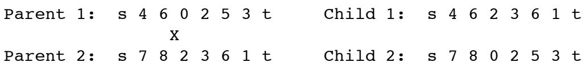
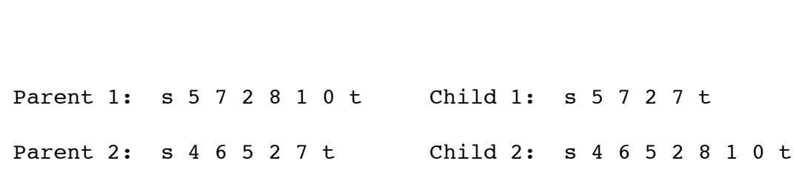
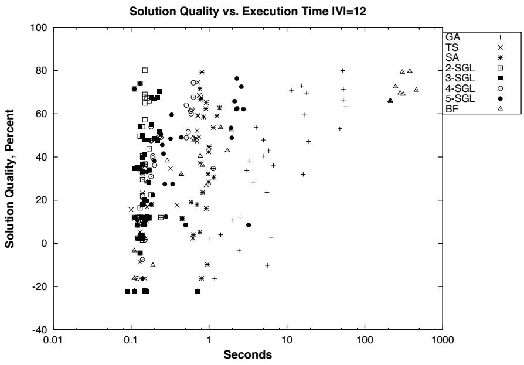
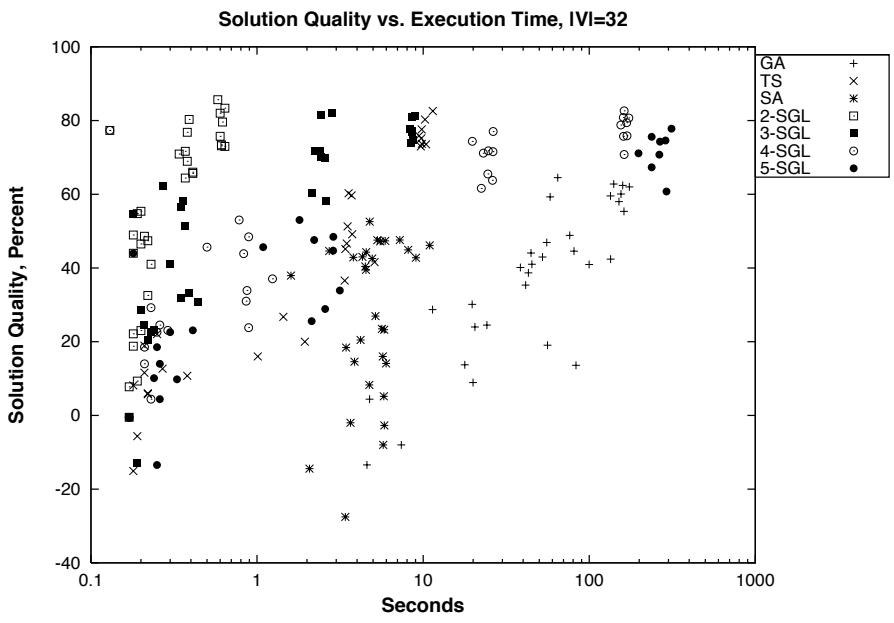
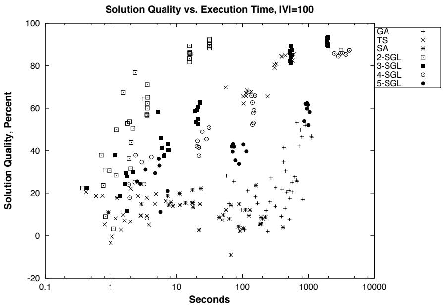
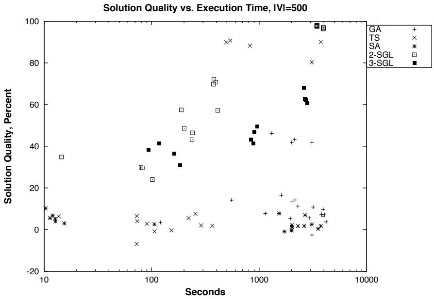
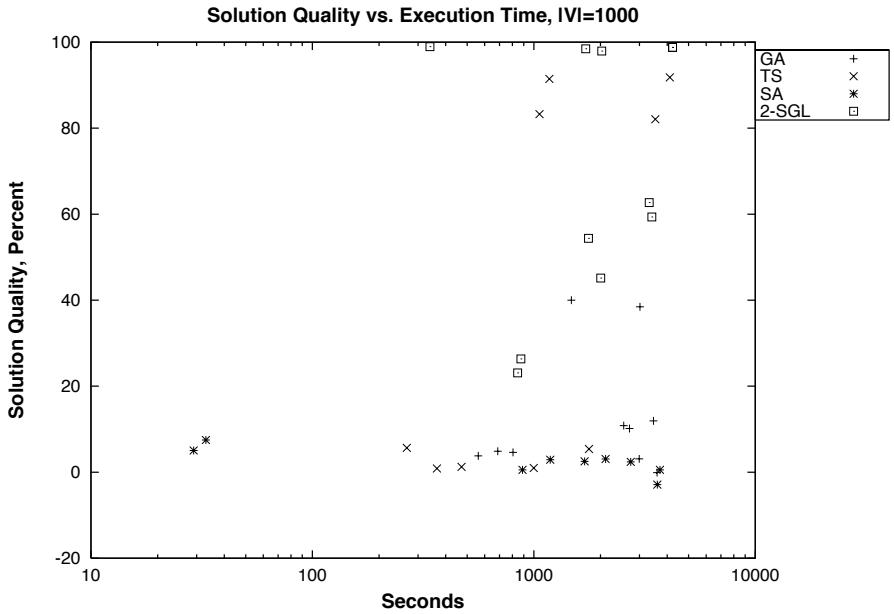
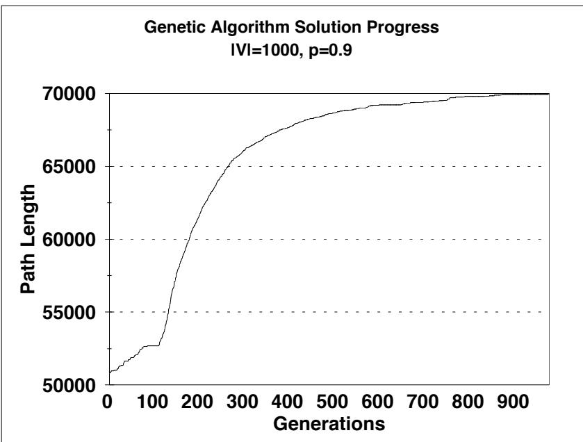
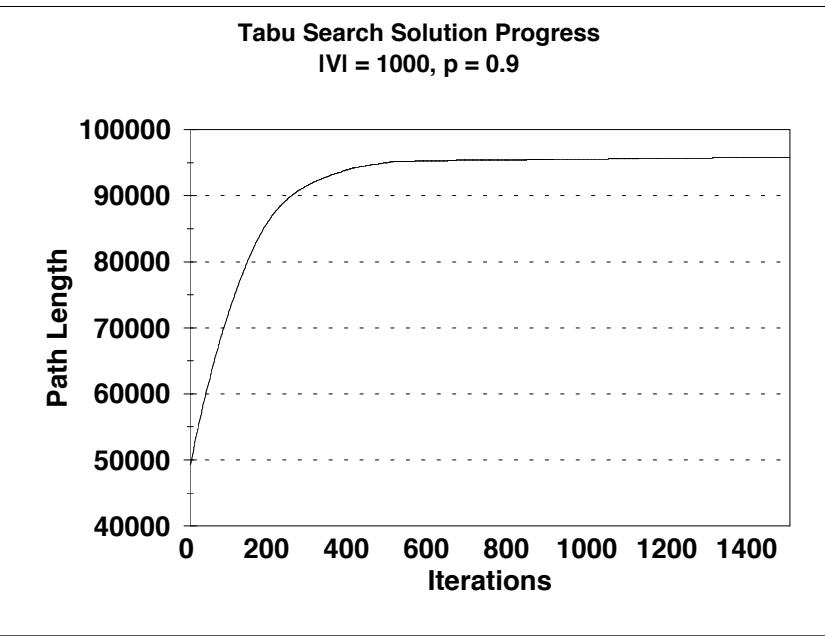
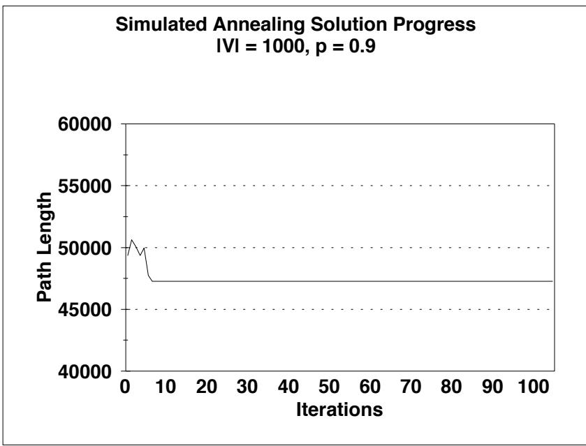

# APPROXIMATING THE LONGEST PATH PROBLEM WITH HEURISTICS:

A SURVEY

Submitted in partial fulfillment of the requirements for the degree of Master of Science in Electrical Engineering and Computer Science in the Graduate College of the University of Illinois at Chicago, 1999

Chicago, Illinois

Copyright $\circledcirc$ by

John Kenneth Scholvin

I would like to dedicate this paper to my mother, Dyanne. Her grace, strength, and perseverance in the face of adversity are a daily inspiration to me.

# ACKNOWLEDGMENTS

Many people lent a hand to this project. First and foremost, thanks are due to my advisor, Professor Robert Sloan, for his patience and direction during the development of this thesis. Thanks also to professors John Lillis and Gyorgy Tur ´an of UIC’s computer science and mathematics departments, respectively, for their participation on the defense committee and for their insightful criticism.

The readers and FAQ (11) of the USENET newsgroup news://comp.ai.genetic assisted a great deal in helping me design the genetic algorithm’s gene scheme and crossover operator. Specifically, thanks to David Fogel of the University of California at San Diego and Victor Lavrenko of Moscow State University.

Thanks to Lucent Technologies, particularly Rich Sewzcwicz, for resources and support during the completion of the writeup.

Most of all, I thank my parents, Kenneth and Dyanne Scholvin, and my grandparents, Alvin and Adele McCormick, for their generous support. Without their help, this would not have been possible. Special thanks are due to Dr. Michael McCormick of the National Oceanographic and Atmospheric Administration for providing early evidence that math is cool. Finally, sincere thanks to Sharon Barry for her encouragement, faith, and for putting up with me in general.

# TABLE OF CONTENTS

# CHAPTER PAGE

# 1 INTRODUCTION 1

1.1 The Problem .   
1.2 Problem Difficulty   
1.3 Restricting the input   
1.4 The Approach

# 2 METHODS . 9

2.1 A Genetic Algorithm . 9   
2.1.1 Description 9   
2.1.2 Analysis . 14   
2.2 Tabu Search 16   
2.2.1 Description 1 6   
2.2.2 Analysis 20   
2.3 Simulated Annealing 22   
2.3.1 Description 2 2   
2.3.2 Analysis 25   
2.4 -step Greedy Lookahead 29   
2.4.1 Description 29   
2.4.2 Analysis 30

# 3 RESULTS 34

3.1 Solution Quality 35   
3.2 Average edge weights 45   
3.3 Runtime Efficiency 47   
3.4 Considering edge weights of zero 5 4   
3.5 Solution progress . 5 6

# 4 FUTURE DIRECTIONS . 60

4.1 Something “smarter” than the Breadth First Search in -SGL 60   
4.2 Better graph implementation 61   
4.3 Better stopping conditions 62   
4.4 Better cooling schedule and larger neighborhoods for simu  
lated annealing . . 62

5 CONCLUSION 6 3

APPENDICES . 65

Appendix A . 66   
Appendix B . 77   
Appendix C . 79

CITED LITERATURE . 8 0

VITA . 82

# LIST OF TABLES

# TABLE

# PAGE

I SPARSE INPUT GRAPHS – FIXED MAXIMUM OUTDEGREE 5   
II DENSE INPUT GRAPHS – FIXED EDGE PROBABILITIES . . 5   
III HEURISTICS APPLIED – SPARSE GRAPHS . 7   
IV HEURISTICS APPLIED – DENSE GRAPHS . . 7   
V FINAL TEMPERATURES AND ITERATION COUNTS 27   
VI SOLUTION PATH LENGTHS FOR LARGE GRAPHS, $| \mathsf { V } | = 5 0 0$ AND $| \mathrm { V } | = 1 0 0 0$ 35   
VII SOLUTION PATH LENGTHS FOR GRAPHS WITH FIXED OUT36   
VIII SOLUTION PATH LENGTHS FOR GRAPHS WITH FIXED OUTDEGREE OF 8, ALL EDGES NONZERO . . 36   
IX SOLUTION PATH LENGTHS FOR GRAPHS WITH FIXED OUTDEGREE OF 16, ALL EDGES NONZERO 3 7   
X SOLUTION PATH LENGTHS FOR GRAPHS WITH EDGE PROBABILITY OF 0.5 . . . 37   
XI SOLUTION PATH LENGTHS FOR GRAPHS WITH EDGE PROBABILITY OF 0.9 . . . 38   
XII SOLUTION QUALITY COMPARISON – GA VERSUS TS 3 9   
XIII SOLUTION QUALITY COMPARISON – TS VERSUS SA 41   
XIV SOLUTION QUALITY COMPARISON – GA VERSUS 2-SGL 42   
XV SOLUTION QUALITY COMPARISON – TS VERSUS 2-SGL 43   
XVI SOLUTION QUALITY COMPARISON – SA VERSUS 2-SGL 4 4

# LIST OF TABLES (Continued)

XVII AVERAGE EDGE WEIGHTS

XVIII SOLUTION LENGTHS FOR ZERO-EDGED GRAPHS AS A PERCENTAGE OF NONZERO-EDGED SOLUTION LENGTHS (ZERO/NONZERO RATIO) 55

viii

# LIST OF FIGURES

# FIGURE PAGE

Example of Single Point Crossover . 11   
Example of LONGEST PATH Fixed Point Crossover . 11   
3 Genetic Algorithm . 15   
4 Naive Neighborhood Search Algorithm . 17   
5 Tabu Search Algorithm 21   
Simulated Annealing Algorithm 24   
k-SGL Algorithm . . 31   
Solution quality vs. execution time by algorithm, $| V | = 1 2$ 49   
Solution quality vs. execution time by algorithm, $| \mathrm { V } | = 3 2$ 50   
10 Solution quality vs. execution time by algorithm, $| \mathrm { V } | = 1 0 0$ . 51   
11 Solution quality vs. execution time by algorithm, $| \mathsf { V } | = 5 0 0$ . 52   
12 Solution quality vs. execution time by algorithm, $| \mathsf { V } | = 1 0 0 0$ . 5 3   
13 Genetic Algorithm Solution Progress, One Trial . 57   
14 Tabu Search Solution Progress, One Trial 58   
15 Simulated Annealing Solution Progress, One Trial 59   
16 Function Random01 6 6   
17 Function RandomDist . . 67   
18 Subprocedure RandomPath 68   
19 Function Crossover 69

# LIST OF FIGURES (Continued)

# FIGURE

Subprocedure RemoveCycles . . . 70   
Subprocedure Mutate . . . 71   
Function Neighborhood 72   
Function RandomNeighbor . . . 73   
Function ReverseBFS 73   
RandomGraph algorithm . . 78

# LIST OF ABBREVIATIONS

BF Brute Force BFS Breadth First Search GA Genetic Algorithm -SGL -step Greedy Lookahead NS Neighborhood Search RNP Randomized NP SA Simulated Annealing TS Tabu Search UIC University of Illinois at Chicago

# SUMMARY

Four heuristic approximations are applied to the LONGEST PATH problem, an NP-complete problem in graph theory. Since these heuristics are in general highly randomized and difficult to analyze from first principles, they are compared empirically instead. The heuristics are coded in $\mathrm { C } { + + }$ and applied to a set of random graphs. Then the running times are averaged and compared. Finally, future directions for research in this area are suggested.

# CHAPTER 1

# INTRODUCTION

# 1.1 The Problem

The LONGEST PATH problem is defined as follows. Instance: a directed, integer-weighted graph $\mathsf { G } = ( \mathsf { V } , \mathsf { E } ) .$ , length $\mathfrak { l } ( e ) \in \mathbb { Z } ^ { + }$ for each $e \in \mathsf { E } ,$ positive integer $\mathsf { K } ,$ and specified vertices $s , \mathbf t \in \mathsf V$ . Question: does there exist a simple path in from to whose edge lengths sum to at least ? This problem is NP-complete if the graph contains cycles (7); for acyclic graphs, the problem is in P. In this paper I look at the corresponding optimization problem. That is, given the same parameters as above, find the longest path from to .

Let me introduce some notational conventions here. I will denote “the path from vertex to vertex ” as $\mathsf { P } _ { s \sim \to \mathrm { t } }$ . The total length (sum of edge weights) of a path $\mathsf { P }$ will be len and the vertex count of $\mathsf { P }$ is . That is, if ${ \mathrm { l } } ( { \mathrm { a } } , { \mathrm { b } } )$ is the weight of the edge from $\mathbf { a }$ to $^ { \mathrm { b , } }$ and $\mathsf { P } _ { \nu _ { 0 } \sim \nu _ { \mathrm { n } } } =$ $\langle \nu _ { 0 } , \nu _ { 1 } , \ldots , \nu _ { n - 1 } , \nu _ { \mathrm { n } } \rangle$ then

$$
\ln \mathsf { P } _ { \nu _ { 0 } \to \nu _ { \mathrm { n } } } \triangleq \sum _ { 0 \leq \mathrm { i } < \mathrm { n } } \mathsf { l } ( \nu _ { \mathrm { i } } , \nu _ { \mathrm { i } + 1 } )
$$

and

$$
\begin{array} { r } { | \mathsf { P } _ { \nu _ { 0 } \sim \nu _ { \mathrm { n } } } | \triangleq \mathsf { n } + 1 . } \end{array}
$$

All discussions of paths in this paper will refer to simple (acyclic) paths unless otherwise stated.

# 1.2 Problem Difficulty

Some NP-hard problems are harder than others. Where does LONGEST PATH lie on the continuum of hardness? Arora and Lund (2) provide a good survey on the hardness of approximating NP-hard optimization problems. They define different levels of inapproximability for some canonical optimization problems. For example, approximating MAX-3SAT (a version of 3SAT restated as an optimization problem) within a factor $( 1 + \epsilon )$ of optimum is NP-hard. Approximating the minimum number of colors necessary to color a graph such that no two adjacent vertices have the same color (COLORING) is much harder. Approximating the COLORING problem within a factor of $\mathfrak { n } ^ { \delta }$ is NP-hard according to (2).

Arora et al. (1) showed the intractability of approximating the largest clique in a graph (MAXCLIQUE). They show that there does not exist any polynomial time algorithm to solve MAXCLIQUE within a ratio of $\mathfrak { n } ^ { \delta }$ to the optimum unless $\mathrm { P } = \mathrm { N P }$ , placing MAXCLIQUE in the class of most difficult NP-hard approximation problems. These problems are described in detail in the next section.

Karger, Motwani, and Ramkumar (13) look at the approximability of finding the longest path in undirected graphs, a special case of LONGEST PATH as defined here. They conjecture that finding the longest paths in undirected graphs is essentially as difficult as approximating MAXCLIQUE. Since directed graphs represent a further restriction on the input, it is probably safe to assume that LONGEST PATH is also this difficult.

# 1.3 Restricting the input

Before embarking on researching and implementing the heuristics, I wanted to be sure that LONGEST PATH is not difficult on average. Levin(16) identified a class of randomized combinatorial problems that he called “Randomized NP” (RNP), a subset of NP. As NPcomplete relates to NP, a class of problems that are “complete” for RNP (with respect to a kind of polynomial-time reduction) emerges, a “hardest” type of RNP problem. These RNPcomplete problems are characterized by their difficulty to solve quickly in the average case, as opposed to other NP-complete problems that are known to be difficult to solve only in the worst case. I wanted to be certain that LONGEST PATH was not in this class of “most difficult” NP-complete problems.

For a decision problem to be in RNP, it must have an associated probability function $\mu$ which assigns probabilities to instances of . For $( \mathsf { D } , \mu )$ to qualify as RNP-complete, must be polynomial-time reducible to a problem known to be RNP-complete, and the probability distribution function $\mu$ must also meet a rather complicated series of criteria described in detail by Gurevich(10). To avoid having the problem fall into RNP-complete, $\mu$ is chosen such that at least one of these criteria will fail.

One of these criteria is the “flatness” of $\mu { } _ { - }$ . If the distribution described by $\mu$ is flat, then the problem cannot be RNP-complete. Specifically, Gurevich states that

every RNP graph problem is flat if the probability distribution on -vertex graphs is determined by the edge-probability ${ \mathsf { f } } ( { \mathsf { n } } )$ with $\mathfrak { n } ^ { - 2 + \epsilon } < \mathfrak { f } ( \mathfrak { n } ) < 1 - \mathfrak { n } ^ { - 2 + \epsilon }$ for some constant $\epsilon > 0 .$ (10)

We need to ensure, then, that our probability distribution is flat to keep our problem easier than RNP-complete. According to Gurevich’s result above, we basically need to ensure that the graphs under consideration have at least a linear number of edges $\begin{array} { r } { ( \mathsf { f } ^ { \mathrm { ~ } } = \Omega ( \frac { 1 } { \mathfrak { n } } ) } \end{array}$ is large enough) and are not too close to being complete. This is good news: essentially, any reasonable probability distribution will give graphs that are not RNP-complete. The actual input graphs are described in Section 1.4.

# 1.4 The Approach

Four different heuristics were applied to the problem. Three are “standard” heuristics commonly applied to NP-complete optimization problems: genetic programming, tabu search, and simulated annealing. I developed a fourth heuristic, loosely based on minimax algorithms, which I call the $^ { \prime \prime } \mathrm { k }$ -step greedy lookahead” algorithm. For the smallest graphs, I also used a brute force search $\mathrm { ( 0 } \mathrm { ( n ! ) } )$ ) of all possible paths for comparison, but running times were impractically large for any graphs with $| \mathrm { V } | > 1 2$ . The specifics of these heuristics will all be explored in detail in Chapter 2.

The heuristics were coded in $\mathrm { C } { + + }$ and run on sample data (see Table I and Table II). The sample data were a group of random graphs of different sizes. I chose values of $| \mathsf { V } | \in$ {12, 32, 100, 500, 1000}.

In addition to varying the graphs on $| \mathsf { V } | ,$ two different basic methods of determining edge probability were used, a method to produce relatively sparse graphs (see Table I) and a method to produce relatively dense graphs (see Table II).

<table><tr><td rowspan=1 colspan=1>|V|</td><td rowspan=1 colspan=6>Number of Graphs nOutdegree Outdegree, 60%03|8  16 3|8|    16</td></tr><tr><td rowspan=1 colspan=1>12</td><td rowspan=1 colspan=1>8</td><td rowspan=1 colspan=1>8</td><td rowspan=1 colspan=1>NA</td><td rowspan=1 colspan=1>8</td><td rowspan=1 colspan=1>8</td><td rowspan=1 colspan=1>NA</td></tr><tr><td rowspan=1 colspan=1>32</td><td rowspan=1 colspan=1>8</td><td rowspan=1 colspan=1>8</td><td rowspan=1 colspan=1>*</td><td rowspan=1 colspan=1>8</td><td rowspan=1 colspan=1>8</td><td rowspan=1 colspan=1>8</td></tr><tr><td rowspan=1 colspan=1>100</td><td rowspan=1 colspan=1>8</td><td rowspan=1 colspan=1>8</td><td rowspan=1 colspan=1>8</td><td rowspan=1 colspan=1>8</td><td rowspan=1 colspan=1>8</td><td rowspan=1 colspan=1>8</td></tr><tr><td rowspan=1 colspan=1>500</td><td rowspan=1 colspan=1>4</td><td rowspan=1 colspan=1>4</td><td rowspan=1 colspan=1>4</td><td rowspan=1 colspan=1>4</td><td rowspan=1 colspan=1>4</td><td rowspan=1 colspan=1>4</td></tr><tr><td rowspan=1 colspan=1>1, 000</td><td rowspan=1 colspan=1>2</td><td rowspan=1 colspan=1>2</td><td rowspan=1 colspan=1>2</td><td rowspan=1 colspan=1>2</td><td rowspan=1 colspan=1>2</td><td rowspan=1 colspan=1>2</td></tr></table>

\* Same as fixed edge probability $\overline { { \mathfrak { p } = 0 . 5 } }$ (see Table II).

<table><tr><td rowspan=1 colspan=1>|V|</td><td rowspan=1 colspan=2>Number of Graphs np = 0.5    p = 0.9</td></tr><tr><td rowspan=1 colspan=1>12</td><td rowspan=1 colspan=1>8</td><td rowspan=1 colspan=1>8</td></tr><tr><td rowspan=1 colspan=1>32</td><td rowspan=1 colspan=1>8</td><td rowspan=1 colspan=1>8</td></tr><tr><td rowspan=1 colspan=1>100</td><td rowspan=1 colspan=1>8</td><td rowspan=1 colspan=1>8</td></tr><tr><td rowspan=1 colspan=1>500</td><td rowspan=1 colspan=1>4</td><td rowspan=1 colspan=1>4</td></tr><tr><td rowspan=1 colspan=1>1, 000</td><td rowspan=1 colspan=1>2</td><td rowspan=1 colspan=1>2</td></tr></table>

The sparse graphs are generated by fixing the outdegree for each vertex in the graph. Outdegrees of , , and (for graphs with large enough $| \mathsf { V } | ,$ of course) were chosen. The dense graphs are created by setting edge probability to a simple constant probability. I used $\mathrm { p } = 0 . 5$ and $\mathfrak { p } = 0 . 9$ . All these graphs had integer edge weights chosen at random (with a flat distribution) on .

I introduced another variation in the input data for the sparse graphs. For each group of graphs with a given value of $| V | ,$ an equal number of graphs with fixed outdegree were generated, but for this second group, $6 0 \%$ of the edge weights were set to while the other $4 0 \%$ were chosen at random on the interval in the same manner as all the other graphs.

For all graphs (regardless of density) with $\mathsf { W } | \in \{ 1 2 , 3 2 , 1 0 0 \} ,$ eight random graphs for each size and edge configuration were generated. For $| \mathsf { V } | = 5 0 0$ , four graphs were generated, and for $\begin{array} { r } { | \mathsf { V } | = 1 0 0 0 , } \end{array}$ two. Given the hardware the simulations were run on (see Appendix A), these numbers of graphs were the largest possible to allow the heuristics to complete in a practical amount of time. More details on the actual generation of the graphs can be found in Appendix B.

The heuristics were applied to the input graphs as follows. The genetic algorithm (GA), the tabu search (TS), simulated annealing (SA), and $\boldsymbol { \mathrm { k } }$ -step greedy lookahead $\left( \mathrm { k } \mathrm { - } \mathrm { \cal { S } } \mathrm { G L } \right)$ with $\ k = 2$ were applied to all the graphs.

For the graphs with $\mathsf { W } | \in \{ 1 2 , 3 2 , 1 0 0 \} ,$ -SGL with $\mathsf { k } \in \{ 3 , 4 , 5 \}$ was also applied. For the sparse graphs with $| \mathsf { V } | = 5 0 0 ,$ I applied -SGL with $k = 3 .$ . For the dense graphs with $| \mathsf { V } | = 5 0 0 ,$ and for all graphs with $| \mathsf { V } | = 1 0 0 0 , 1$ I could not run $\boldsymbol { \mathrm { k } }$ -SGL with $\boldsymbol { \mathrm { k } } > 2$ because the running times were impractically long.

<table><tr><td rowspan=1 colspan=1>|V|</td><td rowspan=1 colspan=8>Heuristics Appliedk-SGLBF GA TSSA k=2|k=3|k=4|k=5</td></tr><tr><td rowspan=1 colspan=1>12</td><td rowspan=1 colspan=1>X</td><td rowspan=1 colspan=1>X</td><td rowspan=1 colspan=1>X</td><td rowspan=1 colspan=1>X</td><td rowspan=1 colspan=1>X</td><td rowspan=1 colspan=1>X</td><td rowspan=1 colspan=1>X</td><td rowspan=1 colspan=1>X</td></tr><tr><td rowspan=1 colspan=1>32</td><td rowspan=1 colspan=1></td><td rowspan=1 colspan=1>X</td><td rowspan=1 colspan=1>X</td><td rowspan=1 colspan=1>X</td><td rowspan=1 colspan=1>X</td><td rowspan=1 colspan=1>X</td><td rowspan=1 colspan=1>X</td><td rowspan=1 colspan=1>X</td></tr><tr><td rowspan=1 colspan=1>100</td><td rowspan=1 colspan=1></td><td rowspan=1 colspan=1>X</td><td rowspan=1 colspan=1>X</td><td rowspan=1 colspan=1>X</td><td rowspan=1 colspan=1>X</td><td rowspan=1 colspan=1>X</td><td rowspan=1 colspan=1>X</td><td rowspan=1 colspan=1>X</td></tr><tr><td rowspan=1 colspan=1>500</td><td rowspan=1 colspan=1></td><td rowspan=1 colspan=1>X</td><td rowspan=1 colspan=1>X</td><td rowspan=1 colspan=1>X</td><td rowspan=1 colspan=1>X</td><td rowspan=1 colspan=1>X</td><td rowspan=1 colspan=1></td><td rowspan=1 colspan=1></td></tr><tr><td rowspan=1 colspan=1>1, 000</td><td rowspan=1 colspan=1></td><td rowspan=1 colspan=1>X</td><td rowspan=1 colspan=1>X</td><td rowspan=1 colspan=1>X</td><td rowspan=1 colspan=1>X</td><td rowspan=1 colspan=1></td><td rowspan=1 colspan=1></td><td rowspan=1 colspan=1></td></tr></table>

<table><tr><td rowspan=1 colspan=1>|V|</td><td rowspan=1 colspan=8>Heuristics Appliedk-SGLBF GA TS| SAk=2 |k=3 |k=4 |k=5</td></tr><tr><td rowspan=1 colspan=1>12</td><td rowspan=1 colspan=1>X</td><td rowspan=1 colspan=1>X</td><td rowspan=1 colspan=1>X</td><td rowspan=1 colspan=1>X</td><td rowspan=1 colspan=1>X</td><td rowspan=1 colspan=1>X</td><td rowspan=1 colspan=1>X</td><td rowspan=1 colspan=1>X</td></tr><tr><td rowspan=1 colspan=1>32</td><td rowspan=1 colspan=1></td><td rowspan=1 colspan=1>X</td><td rowspan=1 colspan=1>X</td><td rowspan=1 colspan=1>X</td><td rowspan=1 colspan=1>X</td><td rowspan=1 colspan=1>X</td><td rowspan=1 colspan=1>X</td><td rowspan=1 colspan=1>X</td></tr><tr><td rowspan=1 colspan=1>100</td><td rowspan=1 colspan=1></td><td rowspan=1 colspan=1>X</td><td rowspan=1 colspan=1>X</td><td rowspan=1 colspan=1>X</td><td rowspan=1 colspan=1>X</td><td rowspan=1 colspan=1>X</td><td rowspan=1 colspan=1>X</td><td rowspan=1 colspan=1>X</td></tr><tr><td rowspan=1 colspan=1>500</td><td rowspan=1 colspan=1></td><td rowspan=1 colspan=1>X</td><td rowspan=1 colspan=1>X</td><td rowspan=1 colspan=1>X</td><td rowspan=1 colspan=1>X</td><td rowspan=1 colspan=1></td><td rowspan=1 colspan=1></td><td rowspan=1 colspan=1></td></tr><tr><td rowspan=1 colspan=1>1, 000</td><td rowspan=1 colspan=1></td><td rowspan=1 colspan=1>X</td><td rowspan=1 colspan=1>X</td><td rowspan=1 colspan=1>X</td><td rowspan=1 colspan=1>X</td><td rowspan=1 colspan=1></td><td rowspan=1 colspan=1></td><td rowspan=1 colspan=1></td></tr></table>

Additionally, for $| \mathrm { V } | = 1 2 ,$ a brute force (BF) search was applied. Since the running time of a brute force search on a dense graph is , this placed a practical limit on the size of the graph I could search this way.

After the heuristics were applied to the graphs, the running times and solutions’ path lengths were averaged for each group of graphs with the same parameters $( | \mathsf { V } | ,$ edge probability method, edge probability value, presence/absence of weight edges), and the results averaged. Those results are presented in Chapter 3.

# CHAPTER 2

# METHODS

# 2.1 A Genetic Algorithm

# 2.1.1 Description

First I will describe the genetic algorithm (GA), a member of the family of “evolutionary programming” techniques that was first formalized and explored by Fogel in 1966.(5) Holland et. al.(12) gave genetic algorithms their first rigorous treatment in 1975 and since then they have been analyzed extensively and applied to a wide variety of combinatorial problems.

Like all types of evolutionary programming, genetic algorithms operate by simulating the process of natural selection as first described by Darwin.(3) Specifically, instances of the solution are modeled as a “gene.” A pool of these genes is maintained and each gene has a varying “fitness,” or likelihood of survival which corresponds to the quality of that gene’s instance’s solution. The pool of genes is initialized at random. Then the genes are randomly selected from the pool in pairs, those with higher fitness being favored, and the pairs combine through a form of sexual reproduction to produce new “offspring” genes with some characteristics from each parent. Note that the reproduction is not “sexual” in the sense that there are “male” and “female” members of the pool but in that each parent contributes a portion of its own genetic material to the offspring.

During the mating process, a random “mutation” may occur in the offspring gene in a manner very much like DNA material in cellular chromosomes may mutate during recombination. Offspring that are not viable—those that cannot yield a valid solution—are not allowed to enter the gene pool.

After a predetermined number of offspring have been produced, the offspring and the parent genes are grouped together into the same pool and sorted by their fitness. The least fit genes in the pool are eliminated and the process iterates until one or more stopping criteria are met. At the end of the iterations (referred to in the literature as “generations” in keeping with the evolutionary metaphor), the best gene in the pool is selected as the solution.

As with most implementations of genetic algorithms, the primary issues in design are the encoding scheme used for the gene, and the crossover (reproduction) operator. My gene representation is simply a list of vertices that form a valid path. This is fairly standard procedure in related genetic algorithm applications such as the traveling salesman problem.(20) At the same time, however, I deviate somewhat from standard practice in the field by using such a representation for LONGEST PATH because I introduce variable length genes and most genetic algorithm applications use fixed length genes.(15) Because of these variable length genes, I must also deviate from standard genetic algorithm procedures in designing the crossover operator. Typical genetic algorithm applications use single point crossover (see Figure 1). A point in the gene is chosen at random and the heads and tails of the genes are exchanged about that point yielding two child genes. This method cannot be applied to LONGEST PATH conveniently

  
Figure 1. Example of Single Point Crossover

X is the crossover point. Child 1 and Child 2 are created by swapping the heads and tails of Parent 1 and Parent 2 around the crossover point.

Vertex 2 is the crossover vertex. Child 1 and Child 2 are created by swapping the heads and tails of Parent 1 and Parent 2 around the crossover vertex. Cycles are eliminated at the next step.

Figure 2. Example of LONGEST PATH Fixed Point Crossover because for graphs that are not dense, it is more likely than not to create inviable children by introducing a vertex sequence that has no edge connecting them.

To combat this, the crossover scheme will concentrate on finding a common vertex between the two parent genes and exchanging the heads and tails around that common vertex (see Figure 2), then eliminating cycles. Choosing a common vertex guarantees a viable child gene after eliminating the cycles since the algorithm maintains the edges around the crossover vertex. In short, this implementation chooses a vertex to crossover around instead of an edge.

The method of cycle elimination is fairly straightforward. The algorithm finds the rightmost vertex in the child path that is duplicated elsewhere in the gene, then finds its counterpart and eliminates all vertices between them. To prove that this will always eliminate all cycles, there are two cases to consider. First, consider the case where there is only one cycle or all cycles nest inside the outermost one. Clearly, eliminating the cycle based on the rightmost cycle-causing vertex will eliminate all cycles. Next is the case where there are more than one cycle but they overlap at the left end. For example, consider the path $\mathsf { P } _ { s \sim \pm } = \langle s , \nu _ { 1 } , \nu _ { 2 } , \nu _ { 3 } , \nu _ { 4 } , \ldots , \nu _ { x } , \ldots , \nu _ { 1 } , \nu _ { 3 } , \mathbf { t } \rangle$ where $\nu _ { x }$ is the crossover vertex. Multiple cycles are introduced by $\nu _ { 1 }$ and $\nu _ { 3 }$ with $\nu _ { 3 }$ being rightmost. The only way that a cycle could remain after eliminating the $\nu _ { 3 }$ cycle would be if there were two instances of $\nu _ { 1 }$ to the left of the leftmost $\nu _ { 3 }$ . Both of the $\nu _ { 1 }$ vertices would also have to be to the left of $\nu _ { \mathrm { x } } ,$ the crossover point. However, the only way a cycle could exist on one side of the crossover point would be if one of the parents contained a cycle. Since the gene pool is required to have only viable solutions, this cannot happen.

I introduce one more twist on standard genetic algorithm practice. The action of removing the cycles as described above is highly destructive to the gene, often removing large sections of it. The algorithm only adds the child with greater fitness—a longer path—to the gene pool, discarding the other one produced at crossover. Keeping both offspring caused the gene pool to be quickly “contaminated” with weak paths by allowing both offspring to contribute.

The mutation operator is also more specialized than those typically used in genetic algorithms. The algorithm chooses at random a vertex that is not currently in the path, then tries to find a point on the path where it can safely insert the vertex. If an insert point is not found, the algorithm tries to find a vertex on the path with which it can swap the chosen random vertex. If these attempts fail, there is no mutation. This mutation operator, like the crossover operator, does adhere to the important genetic algorithm convention of allowing the gene pool to either evolve or devolve. We need the possibility of some negative movement to prevent local optima from being settled into by the population.

Genes are selected for reproduction from the pool of parents according to a weighted random function. We want to favor the most fit parents yet still allow the weaker ones to contribute to the shape of the gene pool occasionally. At the beginning of each generation, the parent genes are sorted on their fitness (the path length). A distribution which meets these criteria was suggested by Reeves.(19) Given $M$ genes, select the parents according to the probability distribution

$$
{ \mathfrak { p } } ( [ { \mathsf { k } } ] ) = { \frac { 2 { \mathsf { k } } } { M ( M + 1 ) } }
$$

where $[ \boldsymbol { \mathrm { k } } ]$ is the th gene when they are ranked in ascending order.

The final points to discuss regarding this genetic algorithm implementation are the various constants I chose. These were determined primarily by trial and error on medium sized graphs $( | \mathsf { V } | = 5 0 $ . The size of the gene pool ( $\boldsymbol { { \cal M } }$ in the literature) was set at and the probability of mutation was set at , quite a bit higher than most genetic algorithms surveyed. The evolution was limited to generations maximum $( \mathsf { G } _ { \mathsf { m } } )$ , although this was seldom reached in the trials because of the other stopping criteria established. There are three possible stopping conditions: one, if $\mathsf { G } _ { \mathsf { m } }$ generations have passed; two, if the best member of the population has not improved in $G _ { \mathrm { m } } / 1 0$ generations; or three, if the population has lost diversity, which is defined as the median gene having the same fitness as the best gene.

Figure 3 shows the algorithm.

# 2.1.2 Analysis

As stated previously, the randomized nature of genetic algorithms makes it nearly impossible to establish running time a priori, so it is difficult to find a “big- $\mathrm { \bullet }$ form for it. In Chapter 3 the empirically observed running time is presented and discussed.

We can, however, find a crude approximation of the overall efficiency of the main loop of the algorithm (Figure 3), lines 7–20. This will at least give us a look at the running time in the case where the algorithm iterates the full $G _ { \mathfrak { m } }$ times, the case where the algorithm is not approaching a good solution in a “reasonable” amount of time.

The for loop in lines 7–14 executes $\Theta ( M )$ times. The crossover operation (line 9) can execute in ${ \cal O } ( { \sf n } )$ (where $\mathsf { n } = | \mathsf { V } | )$ since it requires a linear scan of two paths whose maximum length is . Disregarding the small probability of mutation in line 11, we have lines 7–14 running in $\Theta ( M ) { \cal O } ( { \mathfrak { n } } ) = { \cal O } ( M { \mathfrak { n } } )$ time. The sort in line 15 is ${ \mathrm { O } } ( M \lg M )$ , and the assignment in line 17 is $\Theta ( \mathfrak { n } )$ if it is needed.

Summing the above results, the crude main loop running time is given by

$$
\mathrm { O } ( M \mathrm { n } ) + \mathrm { O } ( M \mathrm { l g } M ) + \Theta ( \mathrm { n } ) \approx \mathrm { O } ( M \operatorname* { m a x } ( \mathrm { n } , \mathrm { l g } M ) ) .
$$

Procedure Genetic(G, s, t, P)   
Find a path in $G$ from $\pmb { s }$ to t, return it in P   
1 for $\mathrm { ~ i ~ } \gets 1$ to M do   
2 population[i] $\gets$ RandomPath(s, t, G)   
3 enddo   
4 Sort(population, M)   
5 generation $ 0$ , lastchange $ 0$ , $\textbf { P }  \textbf { n i l }$   
6 while (generation $<$ Gm) and (generation - lastchange $<$ Gm / 10) and   
(population[1].length $>$ population[M].length) do   
7 for $\dot { \textbf { 1 } }  \textbf { M } + \textbf { 1 }$ to $2 ~ { \star } ~ \mathsf { M }$ do   
8 $\mathsf { p 1  }$ RandomFromDist(M), ${ \tt p } 2 \ $ RandomFromDist(M)   
9 child $\gets$ Crossover(population[p1], population[p2])   
10 if Random01 $<$ MutateProb then   
11 Mutate(child)   
12 endif   
13 population[i] child   
14 enddo   
15 Sort(population, $2 \ \star \ \mathsf { \Gamma } \mathsf { M } \ )$ )   
16 if population[1].length $>$ P.length then   
17 $\mathbf { P } $ population[1]   
18 lastchange $\gets$ generation   
19 endif   
20 generation $\gets$ generation + 1   
21 enddo

# 2.2.1 Description

The discussion now turns to the first of the two neighborhood search heuristics: Tabu Search (TS). The American Heritage Dictionary defines tabu or taboo as “a prohibition excluding something from use, approach, or mention because of its sacred and inviolable nature.” Thankfully, it is not our problem to decide what is or is not sacred. Rather, the application of the word here is in terms of placing selective restrictions on a complicated search.

The fundamental concept in any neighborhood search (NS) is—not surprisingly—the notion of a neighborhood. The neighborhood of a solution (notated ${ \mathsf { N } } ( { \mathsf { p } } ) ,$ ) is a set of solutions where each $\mathfrak { n } \in \mathsf { N } ( \mathfrak { p } )$ is reachable by a simple “move” from . The definition of the move is arbitrary; an oft-used move scheme for path-based solutions in graph problems is a simple swap of two adjacent vertices in the path. With this definition, the neighborhood of a solution would then be all paths ${ \mathrm { n } } _ { \mathrm { i } }$ where each ${ \mathrm { n } } _ { \mathrm { i } }$ is $\mathfrak { p }$ with exactly one pair of vertices swapped. The definition of the move scheme is limited only by the programmer’s imagination. The only requirements are that the scheme should define a fairly rich set of solutions for each path and it should be computationally fast since it will probably appear inside deeply nested loops.

In a naive neighborhood search (Figure 4), the algorithm starts with a solution and then evaluates all solutions in $\Nu ( \mathfrak { p } )$ . Then it chooses the best $\mathsf { p } _ { \mathsf { b } } \in \mathsf { N } ( \mathsf { p } ) ,$ , sets ${ \mathfrak { p } } = { \mathfrak { p } } _ { \mathrm { b } } ,$ and iterates.

The problem with a naive neighborhood search is that it can ascend to local maxima and return a suboptimal solution. As with simulated annealing (Section 2.3), a mechanism is intro

Procedure NaiveNeighborhood(G, s, t, P) Find the longest path from s to t in G, return it in P   
1 $\mathbf { P } ~ $ RandomPath(s, t, G)   
2 while not some stopping condition do   
3 choose the longest path Pbest in N(P)   
4 $\mathbf { P } $ Pbest   
5 enddo

duced that occasionally chooses a suboptimal solution during iteration, thereby opening the possibility of descending out of a local optimum.

With this implementation, I follow some of the seminal work done in the field by Glover.(8)(9) The main idea is that certain moves within the neighborhood are classified as tabu under certain circumstances. If a move is tabu, the solution that move generates cannot usually be considered the best in the neighborhood. The exception to the rule is if a tabu move would result in a solution better than any seen to that point. If such a solution exists, the algorithm will then choose that solution even though it is tabu. This is called “aspiration.”

Before discussing what constitutes a tabu move I need to define the neighborhood. For LONGEST PATH, I define the neighborhood of a given path as the union of three sets. The first of those sets (the “swap set”) consists of all the paths that can be created by swapping a pair of vertices within the given path. If the path is of length ${ \mathfrak { n } } ,$ then this set has $O ( \mathfrak { n } ^ { 2 } )$ members. The second set (the “insert set”) is all the paths that can be created by inserting one vertex into the given path. For a path of length $\mathfrak { n }$ and $\mathsf { G } = ( \mathsf { V } , \mathsf { E } ) .$ , this set has $\mathrm { O } ( { \mathfrak { n } } ( | V | - { \mathfrak { n } } ) )$ members. The third set (the “delete set”) is all the paths that could be created by deleting a vertex of the given path; its size is $O ( \mathfrak { n } )$ . So, for the neighborhood $\mathsf { N } ( \mathsf { P } )$ with $| \mathsf { P } | = \mathsf { n } ,$ the total size of the neighborhood is given by

$$
\begin{array} { c } { { | { \mathsf { N } } ( { \mathsf { P } } ) | = { \mathsf { O } } ( { \mathsf { n } } ^ { 2 } ) \cup { \mathsf { O } } ( { \mathsf { n } } ^ { 2 } ) \cup { \mathsf { O } } ( { \mathsf { n } } ) } } \\ { { { } } } \\ { { = { \mathsf { O } } ( { \mathsf { n } } ^ { 2 } ) . } } \end{array}
$$

As with genetic algorithms, invalid paths are not allowed as members of the neighborhood, hence $O ( \mathfrak { n } ^ { 2 } )$ and not $\Theta ( \mathfrak { n } ^ { 2 } )$ .

There are two ways that a move can be tabu in this implementation, classified as “hard” or “soft” tabus. Each move will have two “index points,” the points within the path that the move takes place around. In the case of the swap set, the index points are locations within the path where the swap takes place. For example, if swapping the second and fourth vertices, then the index points are 2 and 4. For the insert set, the index points are both equal to the location before the insertion and for the delete set, the index points are both equal to the location of the vertex deleted. These pairs of index points will be the basis of the tabu data structures.

This implementation of tabu search classifies moves as “hard” tabu based on recency of a move’s pair of index points. The algorithm classifies a pair of index points $( \mathfrak { i } , \mathfrak { j } )$ as tabu for a fixed number of iterations through the main loop. In this implementation, $\sqrt { V }$ is chosen as the tabu value after (9). In other words, if it is determined that index pair creates the best path in the neighborhood, use that move and then do not consider $( \mathfrak { i } , \mathfrak { j } )$ again until $\sqrt { \mathsf { V } }$ iterations have gone by, with one important exception. If taking this move would produce a solution better than any seen to this point, the algorithm aspirates and chooses this move in spite of its tabu status. For space efficiency, I use a data structure of size $\Theta ( { \sqrt { V } } )$ and pay a speed penalty of the same size each time it is checked since it is accessed fairly infrequently.

In addition to classifying moves as “hard” tabu, the algorithm uses a penalty function to discourage frequently-taken moves, classifying them as a sort of “soft” tabu. The algorithm keeps a count of the times each index pair’s move is taken. Then, when determining which path in the neighborhood to use, it uses a penalty function to discourage frequently taken moves. So, when calculating the length $\mathfrak { p ^ { \prime } }$ for a path $\mathsf { P }$ which was created by the move with index pair ,

$$
\mathrm { p ^ { \prime } = l e n P - \frac { f _ { i , j } } { I } c }
$$

where $\mathsf { f } _ { \mathrm { i , j } }$ is the number of times index pair $( \mathfrak { i } , \mathfrak { j } )$ has been used, is the current number of iterations, and is the length of the longest path seen so far. Clearly, this discourages the selection of frequently used index pairs. Unfortunately, this requires a data structure of size $\Theta ( \mathfrak { n } ^ { 2 } )$ to count all these frequencies. Since it is accessed often, I pay this size penalty to gain the benefit of access and increment times.

Let me amplify on the concept of aspiration. Essentially, the algorithm will aspirate (choose a hard tabu move) only if the move under consideration would yield a solution better than any ever seen during the execution of the algorithm up to this point. Aspiration is an override condition, allowing override of the hard tabu only. The soft tabu (penalty function) does not impact aspiration. In other words, this “best ever” path is based on len $\mathsf { P }$ , not $\mathfrak { p ^ { \prime } }$ from Equation 2.1. It reveals a sort of of greedy nature to the algorithm whereby it will break its own rules if the solution is too good to pass up.

Finally, I need to define the three stopping conditions for the main loop. As with GA, I experimented on medium-sized graphs to find constants that worked well. I set the maximum number of iterations, $\mathrm { I } _ { \mathrm { m } } ,$ at ; the algorithm will terminate if this number of iterations is reached. The algorithm also stops if there is no improvement in $\mathrm { I } _ { \mathrm { m } } / 1 0$ iterations. Finally, if the algorithm is attempting to aspirate but there is no tabu path that is better than any yet seen, the algorithm also stops because aspirating to a less optimal path is not allowed. The algorithm is presented in Figure 5.

# 2.2.2 Analysis

As mentioned before in the case of genetic algorithms, exact analysis of the running time of an algorithm with such complex stopping conditions is nearly impossible, so we look at empirical results in Chapter 3.

Also as before, it may be instructive to find a crude running time approximation for the inner loop in lines 6–34 (see Figure 5).

The first area to look at is the for loop of lines 8–22. Line 9 is $\Theta ( \mathfrak { n } )$ , as is line 10 since the length of the path must be computed. The if/else construct in lines 11-21 ensures that either lines 12-15 or lines 17-20 are executed. Assuming that the if statement in line 12 (or line 17) is executed, the assignment statement within is $\Theta ( \mathfrak { n } )$ . So the inside of this for loop consists of

Procedure TabuSearch(G, s, t, P)   
Find the longest path from s to t in G, return it in P   
1 $\mathbf { P } ~ $ RandomPath(s, t, G)   
2 Pbest $ \mathbf { \Phi } \mathbf { P }$   
3 init freqtable   
4 init tabulist   
5 $\mathrm { ~ i ~ } \gets 1$ , lastchange $ 1$ , notabu $\gets$ false   
6 while $\mathit { \Pi } _ { \mathrm { ~ i ~ } } < \mathit { \Pi } _ { \mathrm { { I n a x } } } \mathrm { { ) } }$ ) and (i - lastchange $<$ Imax / 10)   
and (not notabu) do   
7 deltasafe $ 0$ , deltatabu $ 0$   
8 for all $\mathbf { P _ { i j } }$ in Neighborhood(P) do   
9 Pbest $\gets$ max(Pij, Pbest)   
10 deltaPij Pij.length - P.length -   
freqtable[i,j] \* Pbest.length / i   
11 if (i,j) is on tabulist then   
12 if deltaPij > deltatabu then   
13 deltatabu deltaPij, $\mathtt { P t a b u }  \mathtt { P i j }$   
14 movetabu $\gets$ (i,j)   
15 endif   
16 else   
17 if deltaPij $>$ deltasafe then   
18 deltasafe deltaPij, Psafe Pij   
19 movesafe $\gets$ (i,j)   
20 endif   
21 endif   
22 enddo   
23 if deltasafe $> ~ 0$ then   
24 $\mathrm { ~ \bf ~ P ~ }  \mathrm { ~ \bf ~ P ~ }$ safe   
25 put movesafe on tabulist   
26 increment freqtable[i,j]   
27 else if deltatabu $> ~ 0$ and $\mathtt { P _ { t a b u } } = \mathtt { P _ { b e s t } }$ then   
28 P Ptabu   
29 put movetabu on tabulist   
30 increment freqtable[i,j]   
31 else   
32 notabu true   
33 endif   
34 $\textbf { i }  \textbf { i } + \textbf { 1 }$   
35 enddo

at most three subsequent $\Theta ( \mathfrak { n } )$ assignments, so we can approximate the inside of the for loop with ${ \cal O } ( { \sf n } )$ .

This for loop executes once for each member of the neighborhood of the path $\mathsf { P }$ under consideration. In the previous section, we found that $| \mathsf { N } ( \mathsf { P } ) | = \mathsf { O } ( \mathsf { n } ^ { 2 } )$ where $\mathrm {  ~ n ~ } = | \mathrm {  ~ V } | ,$ the maximum length of a path. Since the path length is bounded by ${ \mathfrak { n } } ,$ the for loop executes ${ \mathrm { O } } ( { \mathfrak { n } } ^ { 2 } )$ times. With the inside of the loop running in ${ \cal O } ( { \mathfrak { n } } ) .$ , the total running time for the for loop is $\mathrm { O } ( \mathrm { n } ^ { 3 } )$ .

This $\mathrm { O } ( \mathrm { n } ^ { 3 } )$ will dominate the main while loop, as the if and assignment statements in lines 23–34 are at most ${ \cal O } ( { \sf n } )$ .

# 2.3 Simulated Annealing

# 2.3.1 Description

We turn the focus now to simulated annealing (SA), the second neighborhood search algorithm considered here and probably the oldest of the heuristics. It originates from a paper by Metropolis et al.(18) from 1953 in which he describes an algorithm to simulate the cooling of hot material in a liquid bath. Some thirty years later, Kirkpatrick et al.(14) proposed using this type of simulation to search the solution space of combinatorial optimization problems.

Like tabu search, this is another variation on neighborhood search (see Section 2.2). The key area is again the choice of which path from the neighborhood to choose at each iteration of the main loop. A measure of randomness is introduced into the choosing process with the hopes of keeping the solution path from ascending to a local maximum. The algorithm uses a simulation of the thermodynamic properties of cooling material to make choices.

Specifically, consider the thermal energy of some material as a function of time. The laws of thermodynamics state that

at temperature $\mathrm { t , }$ the probability of an increase in energy of magnitude is given by

$$
\mathfrak { p } ( \delta \mathsf { E } ) = e ^ { - \delta \mathsf { E } / \mathrm { k t } }
$$

where is a physical constant known as Boltzmann’s constant. Metropolis’ simulation generates a perturbation and calculates the resulting energy change. If energy has decreased the system moves to this new state. If energy has increased, the new state is accepted according to the probability [above]. The process is repeated for a predetermined number of iterations at each temperature, after which the temperature is decreased until the system freezes into a steady state.(4)

This principle is applied at lines 10–12 of the algorithm (see Figure 6). If a path selected at random from is shorter than , the algorithm generates a random number and compares it to the “temperature” as determined by the thermodynamic equation above (disregarding Boltzmann’s constant). The chance of being selected is high early in the algorithm’s run and low later in the run since the temperature is a monotonically decreasing exponential decay function. Hopefully, this allows for exploration of many different neighborhoods early in the run, and fewer as it closes in on an optimum solution.

Procedure Anneal(G, s, t, P)   
Find the longest path from s to t in G, return it in P   
1 $\mathbf { P } $ RandomPath(s, t, G)   
2 temp TEMP0, itermax ITER0   
3 while temp $>$ TEMPF do   
4 while iteration $<$ itermax do   
5 $\mathrm { ~ s ~ } \gets$ RandomNeighbor(P, G)   
6 delta $\gets$ S.length - P.length   
7 if delta $> ~ 0$ then   
8 $\mathrm { ~ \bf ~ P ~ }  \mathrm { ~ \bf ~ S ~ }$   
9 else   
10 $\mathbf { x } ~  ~ \mathrm { R a n d o m } 0 1$   
11 if x < exp(delta / temp) then   
12 $\mathrm { ~ \bf ~ P ~ }  \mathrm { ~ \bf ~ S ~ }$   
13 endif   
14 endif   
15 iteration $\gets$ iteration + 1   
16 enddo   
17 temp $\gets$ Alpha(temp)   
18 itermax Beta(itermax)   
19 enddo

As with the other heuristics, choices need to be made about various operating parameters. For simulated annealing, a “cooling schedule” and the number of iterations to use at each temperature must be chosen. In general, the neighborhood structure must also be decided on; I used exactly the same neighborhood definition used for tabu search (Section 2.2).

# 2.3.2 Analysis

The cooling schedule is defined by the starting temperature, the final temperature, and the cooling function, which takes the temperature from start to finish over time. As with the previous heuristics, I used some trial and error to determine parameters that performed reasonably well. I settled on a start temperature of and the cooling function (line 17) was set at $\alpha ( \mathbf { t } ) = 0 . 9 \mathrm { t }$ . Lundy and Mees(17) suggest a formula for computing a final temperature that has an interesting property. According to them,

The choice of depends on the acceptable error $\epsilon$ in the solution together with the error probability . We need $\Theta / ( 1 - \Theta ) > ( | \mathsf { S } | - 1 ) e ^ { - \epsilon / \mathrm { t } }$ , and hence it is sufficient to take

$$
\mathsf { t } _ { \mathsf { f } } \leq \frac { \epsilon } { \ln ( ( | \mathsf { S } | - 1 ) / \Theta ) } .
$$

( is the solution space.) In other words, we can choose the quality of the solution we desire by using this formula to calculate . We can calculate the appropriate to get a solution that is within $\epsilon$ of optimal with probability $\Theta$ . Unfortunately, I could not verify this formula

experimentally (see Chapter 3). Moving ahead with the formula anyway, with $| S | \approx \mathrm { n ! } ,$ and using Stirling’s approximation for ,

$$
\begin{array} { r l } & { \mathbf { t } _ { \ell } \leq \frac { \epsilon } { \ln ( \sqrt { 2 \pi \mathbf { u } } ) \cdot ( \epsilon ) } } \\ & { \leq \frac { \epsilon } { \ln ( \frac { \sqrt { 2 \pi \mathbf { u } } } { \Theta } ) } + \ln ( \frac { \pi } { \epsilon } ) ^ { n } } \\ & { \leq \frac { \epsilon } { \ln ( \frac { \sqrt { 2 \pi \mathbf { u } } } { \Theta } ) + \ln \ln ( \frac { \pi } { \epsilon } ) } } \\ & { \leq \frac { \epsilon } { \ln ( \frac { \sqrt { 2 \pi \mathbf { u } } } { \Theta } ) + \ln \ln ( \frac { \pi } { \epsilon } ) } } \\ & { \leq \frac { \epsilon } { \ln ( \frac { \sqrt { 2 \pi \mathbf { u } } } { \Theta } ) + \ln \ln - \operatorname * { n l n e } } } \\ & { \leq \frac { \epsilon } { \ln ( \frac { \sqrt { 2 \pi \mathbf { u } } } { \Theta } ) + \ln \ln - \operatorname * { n l n e } } . } \end{array}
$$

For the various values of $\mathfrak { n } \left( | \mathsf { V } | \right)$ and using $\epsilon = 0 . 1$ and $\Theta = 0 . 8$ after a suggestion by Dowsland(4), we can calculate $\mathbf { t } _ { \mathsf { f } }$ for each size graph. Also, the number of iterations through the main loop, ${ \mathrm { I } } _ { \mathrm { f } } ,$ can be found from $\alpha ^ { \mathrm { { I _ { f } } } } = \mathrm { t _ { f } }$ where $\alpha = 0 . 9$ . The values of $\mathrm { t _ { f } }$ and $\mathrm { I } _ { \mathrm { f } }$ are presented in Table V.

FINAL TEMPERATURES AND ITERATION COUNTS  

<table><tr><td>|V|</td><td>tf</td><td>If</td></tr><tr><td>|V| = 12</td><td>4.94 × 10-3</td><td>50</td></tr><tr><td>|V| = 32 |V| = 100</td><td>1.22 × 10-3 2.75 × 104</td><td>64</td></tr><tr><td>|V| = 500</td><td></td><td>78</td></tr><tr><td>|V| = 1000</td><td>3.83 × 10-5 1.69 × 10-5</td><td>97 105</td></tr></table>

We can use $\alpha ^ { \mathrm { { I _ { f } } } } = \mathbf { t } _ { \mathrm { f } }$ and $\alpha < 1$ to find a weak upper bound on the number of iterations of the main loop:

$$
{ \begin{array} { r l } & { \alpha ^ { 1 _ { t } } = \mathbf { t } _ { \mathsf { f } } } \\ & { \beta ^ { 1 _ { t } } = \mathbf { 1 } _ { \mathcal { G } } \mathbf { t } _ { \mathsf { f } } } \\ & { { \mathrm { I } } _ { \mathrm { f } } = { \frac { \log \mathbf { t } _ { \mathsf { f } } } { \log \alpha } } } \\ & { \qquad = \Theta ( - \log \mathbf { t } _ { \mathsf { f } } ) } \\ & { \qquad = \Theta { \Bigl ( } \log { \frac { 1 } { \mathbf { t } _ { \mathsf { f } } } } { \Bigr ) } } \end{array} }
$$

Combining Equation 2.2 and Equation 2.3, we can determine the nmber of iterations of the main loop in terms of :

$$
\mathrm { I _ { f } } = \mathrm { O } ( \mathrm { l g } ( \mathrm { l g } { \sqrt { \mathsf { n } } } + \mathsf { n } \mathrm { l g } \mathsf { n } - \mathsf { n } ) ) = \mathrm { O } ( \mathrm { l g } ( \mathsf { n } \mathrm { l g } \mathsf { n } ) )
$$

Note that as the temperature falls, there is a smaller chance that a shorter path will be chosen during the inner loop (lines 4–16 in Figure 6). To avoid premature convergence, the algorithm increases the number of iterations the inner loop executes at each temperature. It starts with $\mathfrak { n } / 2$ iterations. The iteration function (line 18) is $\beta ( \mathrm { i } ) = 1 . 1 \mathrm { i }$ . The idea is to explore more neighborhoods early, and to explore the neighborhoods more completely later.

This gives us the number of iterations of the while loop in lines 4 to 16. We start with ${ \cal O } ( \mathfrak { n } )$ iterations and increase this number multiplicatively each time through the outer loop by a factor of $\beta > 1 .$ . Since $\mathrm { I } _ { \mathrm { f } }$ is the number of iterations of the outer loop, we can see that the inner loop is executing $\mathrm { O } ( \mathrm { I } _ { \mathsf { f } } \mathrm { n } \beta ^ { \mathrm { I } _ { \mathsf { f } } } )$ times. The largest operation inside the loop is a path assignment at lines 8 and 12, an ${ \cal O } ( { \sf n } )$ operation. Multiplying through, the approximate running time is ${ \mathrm { O } } ( { \mathrm { I } } _ { \mathsf { f } } { \mathsf { n } } ^ { 2 } \beta ^ { \mathrm { I } _ { \mathsf { f } } } )$ with $\mathrm { I } _ { \mathsf { f } } = \mathrm { O } ( \log ( \mathsf { n } \log \mathsf { n } ) )$ from Equation 2.4.

# 2.4 -step Greedy Lookahead

# 2.4.1 Description

The last algorithm we look at is the $\boldsymbol { \mathrm { k } }$ -step greedy lookahead algorithm, or -SGL. The only algorithm not intensively studied previously, $\boldsymbol { \mathrm { k } }$ -SGL is a cousin of backtracking algorithms from the world of AI.

The algorithm accepts an integer $\boldsymbol { \mathrm { k } }$ as part of its input. From the starting node, the algorithm evaluates all partial paths $\mathsf { P } _ { \mathsf { p } }$ with $| \mathsf { P } _ { \mathsf { p } } | = \mathsf { k }$ . In effect, this is a greedy algorithm “looking ahead” nodes from the starting node. After finding all partial paths $\mathsf { P } _ { \mathsf { p } }$ from the starting node, the algorithm chooses the partial path $\mathsf { P _ { b } }$ with the longest total edge weight. The second node of $\mathsf { P _ { b } }$ is appended to the solution path and the algorithm repeats, considering that appended node as the start node and repeating until the destination node has been appended.

One additional rule is that no partial path is considered if it does not have a path from its end to the destination node. Partial paths that would introduce loops are also never considered. This eliminates the need for traditional backtracking since no invalid states are ever entered.

It is interesting to note that if $k = \mathsf { n } ,$ then the first iteration of the algorithm will evaluate all paths of length . This is, of course, the brute force approach. So, it makes sense to use -SGL only with values of ${ \boldsymbol { \mathrm { k } } } < { \boldsymbol { \mathrm { n } } }$ and in practice I found that running times were unreasonable unless $k \ll n$ . This follows from the fact that each iteration must execute approximately $\binom { \mathfrak { n } } { \mathfrak { k } }$ times which is feasible only when $\boldsymbol { \mathrm { k } }$ is small. Still, as the next section will show, excellent results were obtained even with values of $\ k = 2$ or ${ \ k = 3 }$ .

See Figure 7 for the algorithm.

# 2.4.2 Analysis

This algorithm, presented in Figure 7, is the only of the heuristics that has no randomized component. Therefore, we have the opportunity to analyze its running time a priori. In the main loop of the algorithm, lines 3–8 of kSGL, the solution path starts empty and one node is appended at a time from the call to kSGL-DFS. So, we can see that those lines are executed times.

Inside kSGL-DFS, things are more interesting. Essentially, the graph is searched in brute force fashion with depth limited by . A “tree” of possible subsolutions is built in memory, and from the longest subsolution, the next node is returned to be added to the final solution. The running time of two functions is needed to complete the running time analysis: one that describes the size of the tree and one that describes the work done at each node of the tree.

Procedure kSGL(G, s, t, k, P) Find a path in G from s to t, lookahead k steps, return it in P global Pbest   
1 P Pbest $ \mathtt { s }$   
2 found $\gets$ false   
3 while P.last $< > ~ \pm$ do   
4 kSGL-DFS(G, t, k, 0, P)   
5 if |P| < |Pbest| then   
6 P.append(Pbest.last)   
7 endif   
8 enddo   
9 P Pbest

Procedure kSGL-DFS(G, t, k, curdepth, P)   
Look k-curdepth steps ahead, append best choice to P   
global Pbest   
1 if (curdepth $< \textbf { k }$ and P.last $< > t$ ) then   
2 Vn $\gets$ ReverseBFS(G, P, t)   
3 for each vertex v in Vn do   
4 $\mathtt { P } _ { \mathtt { n e x t } }  \mathtt { P }$   
5 Pnext.append(v)   
6 kSGL-DFS(G, t, k, curdepth $^ +$ 1, Pnext)   
7 enddo   
8 else   
9 if Pbest.length < P.length then   
10 Pbest $ \mathbf { P }$   
11 endif   
12 endif

First consider the size of the tree, ${ \sf T } ( { \sf n } )$ . At the top level call to kSGL-DFS, ${ \cal O } ( { \sf n } )$ nodes are evaluated. From each of these $O ( \mathfrak { n } )$ nodes, $\mathrm { O } ( \mathfrak { n } - 1 )$ nodes are evaluated, and then $O ( \mathfrak { n } - 2 )$ and so $_ \mathrm { o n , }$ to a depth of . So the size of the tree can be described as

$$
\begin{array} { l } { { \mathsf { T } } ( { \mathsf { n } } ) = { \mathsf { n } } ( { \mathsf { n } } - 1 ) ( { \mathsf { n } } - 2 ) \cdots ( { \mathsf { n } } - { \mathsf { k } } + 1 ) } \\ { \quad \quad = { \frac { { \mathsf { n } } ! } { ( { \mathsf { n } } - { \mathsf { k } } ) ! } } } \\ { \quad = { \binom { \mathsf { n } } { \mathsf { k } } } { \mathsf { k } } ! } \end{array}
$$

The work done at each node is the work done in lines 2–6 of kSGL-DFS. Most of the work done at each node is in figuring out the valid choices that can be made. As described above, the algorithm is not allowed to take a “wrong” choice. It must find all nodes that can be reached from the current node that have a path to the destination node and that have not been visited already on this subsolution. A reverse breadth-first search (BFS) is employed for this purpose at line 2. The algorithm builds a set $V _ { \mathfrak { n } }$ of valid next choices by searching backwards from the destination node . This ReverseBFS procedure operates in $\mathrm { O } ( \mathfrak { n } ^ { 2 } )$ time due to the use of edge matrices instead of adjacency lists in the underlying graph data structure (see Appendix A for more information on the data structures used). All other operations in kSGL-DFS are or ${ \cal O } ( { \sf n } ) ,$ , so the ${ \mathrm { O } } ( { \mathfrak { n } } ^ { 2 } )$ of the BFS dominates, suggesting that this BFS is a part of this algorithm that is an ideal candidate for optimization.

So, if the work at each node of the tree is ${ \mathrm { O } } ( { \mathfrak { n } } ^ { 2 } ) ,$ , and the tree is size

$$
\mathrm { O } \big ( \binom { \mathrm { n } } { \mathrm { k } } \mathrm { k } ! \big ) ,
$$

the running time is

$$
\mathrm { O } \Big ( \mathrm { n } ^ { 2 } \binom { \mathrm { n } } { \mathrm { k } } \mathrm { k } ! \Big )
$$

for each call to kSGL-DFS from the top procedure. After embedding these calls in the ${ \cal O } ( { \sf n } )$ loop of kSGL, the final running time for kSGL is

$$
\mathrm { O } \big ( \mathrm { n } ^ { 3 } \binom { \mathrm { n } } { \mathrm { k } } \mathrm { k } ! \big ) .
$$

Letting $k = \mathsf { n } ,$ the running time becomes

$$
\begin{array} { l } { \displaystyle \mathsf { O } \Big ( \mathsf { n } ^ { 3 } \mathsf { n } ! \Big ( \mathsf { n } \Big ) \Big ) } \\ { \displaystyle = \mathsf { O } ( \mathsf { n } ^ { 3 } \mathsf { n } ! ) } \end{array}
$$

which is , the same as brute force except with a much larger constant factor.

# CHAPTER 3

# RESULTS

The graphs I analyzed varied in several different dimensions. In addition to varying vertex count ( ), I had two different methods of setting edge density, fixed outdegree and fixed edge probability. Within those two methods, I varied the primary parameter for the method itself, using fixed outdegrees of 3, 8 and 16 and edge probabilities of 0.5 and 0.9. Edge weights for all the graphs (with an exception defined below) were integers uniformly distributed from 1 to 100. A final variation is on the edge weights for some of the fixed outdegree graphs. In addition to the graphs where all the edge weights were nonzero, I also used a set of fixed outdegree graphs where $4 0 \%$ of the edge weights were on the usual interval and $6 0 \%$ of the edge weights were set to 0. Each of the four heuristics were run on each graph and one of those heuristics ( -SGL) has an integer parameter that was varied. Finally, I have two output variables to consider for each graph run: solution path length and running time.

This methodology raises the dilemma of attempting to present two result metrics for an approximately six-dimensional input space. Since there is no illustrative way to present the six-dimensional data accumulated, the only hope for any kind of meaningful analysis will be to fix as many variables as necessary and tabulate the data. I will also consider the two primary output metrics separately. Finally, some other observations about the data will be presented. These results are presented as twenty conclusions over the next four sections.

<table><tr><td rowspan=1 colspan=1>|V|, d or p</td><td rowspan=1 colspan=1>GA</td><td rowspan=1 colspan=1>TS</td><td rowspan=1 colspan=1>SA</td><td rowspan=1 colspan=1>2-SGL</td></tr><tr><td rowspan=1 colspan=1>|V| = 500, d = 3|V| = 500, d = 8|V| = 500, d = 16|V| = 500, p = 0.5|V| = 500, p = 0.9</td><td rowspan=1 colspan=1>9,54614,72718,78128,17435,743</td><td rowspan=1 colspan=1>17,21111,784†16,35144,98347,341</td><td rowspan=1 colspan=1>16,89112,59414,48324,04024,602</td><td rowspan=1 colspan=1>5,99317,98825,50148,83349,327</td></tr><tr><td rowspan=1 colspan=1>|V| = 1000, d = 3</td><td rowspan=3 colspan=1>14,46422,15020,67755,196</td><td rowspan=2 colspan=1>112,88917,96424,854</td><td rowspan=4 colspan=1>19,19917,43422,83846,38548,618</td><td rowspan=4 colspan=1>20,48536,57056,54598,75899,331</td></tr><tr><td rowspan=3 colspan=1>|V| = 1000, d = 8|V| = 1000, d = 16|V| = 1000, p = 0.5|V| = 1000, p = 0.9</td></tr><tr><td rowspan=2 colspan=1>55,19669,513</td><td></td></tr><tr><td rowspan=1 colspan=1>91,24095,724</td></tr></table>

This average does not include some failed runs of the heuristic.

# 3.1 Solution Quality

The first analysis will be of solution quality, that is, the total length of the edge weights of the solution paths. Six tables are presented, showing average total path length for various values of $| \mathsf { V } |$ and for each heuristic. In other words, each integer entry in the table represents the average solution path length of all the graphs with identical input parameters. The average is over ${ \mathfrak { n } } ,$ the number of graphs of each type (see Table I and Table II). Outdegree methods and values are fixed for each table, and the graphs with $6 0 \%$ of their edge weights set to 0 are not considered in these graphs (see Section 3.4 for more on these graphs).

SOLUTION PATH LENGTHS FOR GRAPHS WITH FIXED OUTDEGREE OF 3, ALL EDGES NONZERO   

<table><tr><td rowspan=1 colspan=1>|V|</td><td rowspan=1 colspan=1>BF</td><td rowspan=1 colspan=1>GA</td><td rowspan=1 colspan=1>TS</td><td rowspan=1 colspan=1>SA</td><td rowspan=1 colspan=1>2-SGL</td><td rowspan=1 colspan=1>3-SGL</td><td rowspan=1 colspan=1>4-SGL</td><td rowspan=1 colspan=1>5-SGL</td></tr><tr><td rowspan=1 colspan=1>12321005001,000</td><td rowspan=1 colspan=1>*217</td><td rowspan=1 colspan=1>217†1,018†2,9079,54614,464</td><td rowspan=1 colspan=1>*†280†828†1,5937,211†12,889</td><td rowspan=1 colspan=1>*†280709†1,633†6,8919,199</td><td rowspan=1 colspan=1>1805851,4935,99320,485</td><td rowspan=1 colspan=1>1967601,7055,273</td><td rowspan=1 colspan=1>2097671,763</td><td rowspan=1 colspan=1>2178691,917</td></tr></table>

See conclusion 8 for an explanation of how BF finds a worse solution than some of the heuristics.

This average does not include some failed runs of the heuristic.

SOLUTION PATH LENGTHS FOR GRAPHS WITH FIXED OUTDEGREE OF 8, ALL EDGES NONZERO   

<table><tr><td rowspan=1 colspan=1>|V|</td><td rowspan=1 colspan=1>BF</td><td rowspan=1 colspan=1>GA</td><td rowspan=1 colspan=1>TS</td><td rowspan=1 colspan=1>SA</td><td rowspan=1 colspan=1>2-SGL</td><td rowspan=1 colspan=1>3-SGL</td><td rowspan=1 colspan=1>4-SGL</td><td rowspan=1 colspan=1>5-SGL</td></tr><tr><td rowspan=1 colspan=1>12321005001,000</td><td rowspan=1 colspan=1>602</td><td rowspan=1 colspan=1>6011,786†4,06714,72722,150</td><td rowspan=1 colspan=1>4931,2813,11611,78417,964</td><td rowspan=1 colspan=1>5201,3023,17112,59417,434</td><td rowspan=1 colspan=1>3581,2643,46117,98836,570</td><td rowspan=1 colspan=1>4591,3483,83020,588</td><td rowspan=1 colspan=1>5331,4394,181</td><td rowspan=1 colspan=1>556</td></tr></table>

This average does not include some failed runs of the heuristic.

# SOLUTION PATH LENGTHS FOR GRAPHS WITH FIXED OUTDEGREE OF 16, ALL EDGES NONZERO

<table><tr><td rowspan=1 colspan=1>|V|</td><td rowspan=1 colspan=1>GA</td><td rowspan=1 colspan=1>TS</td><td rowspan=1 colspan=1>SA</td><td rowspan=1 colspan=1>2-SGL</td><td rowspan=1 colspan=1>3-SGL</td><td rowspan=1 colspan=1>4-SGL</td><td rowspan=1 colspan=1>5-SGL</td></tr><tr><td rowspan=1 colspan=1>321005001,000</td><td rowspan=1 colspan=1>2,2675,02218,78120,677</td><td rowspan=1 colspan=1>2,3064,51016,35124,854</td><td rowspan=1 colspan=1>2,2364,52614,48322,838</td><td rowspan=1 colspan=1>2,3965,11825,50156,545</td><td rowspan=1 colspan=1>2,4925,73028,183</td><td rowspan=1 colspan=1>2,5225,496</td><td rowspan=1 colspan=1>2,5405,641</td></tr></table>

<table><tr><td>IV|</td><td>BF</td><td>GA</td><td>TS</td><td>SA</td><td>2-SGL</td><td>3-SGL</td><td>4-SGL</td><td>5-SGL</td></tr><tr><td>12 32 100 500 1,000</td><td>778</td><td>777 2,267 6,267 28,174 55,196</td><td>633 2,306 8,242 44,983 91,240</td><td>745 2,236 5,637 24,040 46,385</td><td>609 2,396 8,974 48,833 98,758</td><td>627 2,492 8,983 fail</td><td>681 2,522 9,071</td><td>710 2,540 fail</td></tr></table>

This average does not include some failed runs of the heuristic.

<table><tr><td rowspan=1 colspan=1>IVI</td><td rowspan=1 colspan=1>BF</td><td rowspan=1 colspan=1>GA</td><td rowspan=1 colspan=1>TS</td><td rowspan=1 colspan=1>SA</td><td rowspan=1 colspan=1>2-SGL</td><td rowspan=1 colspan=1>3-SGL</td><td rowspan=1 colspan=1>4-SGL</td><td rowspan=1 colspan=1>5-SGL</td></tr><tr><td rowspan=1 colspan=1>12321005001,000</td><td rowspan=1 colspan=1>944</td><td rowspan=1 colspan=1>9312,4897,28035,74369,513</td><td rowspan=1 colspan=1>8792,7359,04347,34195,724</td><td rowspan=1 colspan=1>9112,2075,45424,60248,618</td><td rowspan=1 colspan=1>8472,6946,26749,32799,331</td><td rowspan=1 colspan=1>8352,7508,241</td><td rowspan=1 colspan=1>8872,7499,364</td><td rowspan=1 colspan=1>897†fail9,432</td></tr></table>

This average does not include some failed runs of the heuristic.

The tables represent data sets on groups of graphs that can be thought of as having varying degrees of sparseness. In general, consider all the graphs of fixed outdegree “sparse,” and all those with a fixed edge probability “dense” (see Section 1.4). The tables give rise to a very rough hierarchy of increasing density or decreasing sparseness assuming large enough , ordered $\{ \mathrm { d } = 3 , \mathrm { d } = 8 , \mathrm { d } = 1 6 , \mathrm { p } = 0 . 5 , \mathrm { p } = 0 . 9 \}$ . This ordering corresponds to the ordering of Table VII through Table XI.

Note that an entry of “fail” in a table means that the heuristic in question failed to find any solutions at all for that set of input graphs. Also note that a dagger ( ) next to an entry indicates that there were some failures for that input/heuristic combination, but at least one succeeded and the number reported is the average of those runs which did succeed. Please see conclusion 10 for more on this.

<table><tr><td>Input Data Set</td><td>GA improvement over TS</td></tr><tr><td>d = 3 (Table VII) d = 8 (Table VIII) d = 16 (Table IX) p = 0.5 (Table X) p = 0.9 (Table XI)</td><td>24.2% 28.0% 12.0% -27.2% -19.7%</td></tr></table>

Conclusion 1 For graphs with large , 2-SGL is the best performer.

In Table VI we present the results for GA, TS, SA, and 2-SGL for all different input graphs (excluding those with zero-length edges) with $| \mathsf { V } | = 5 0 0$ and $| \mathsf { V } | = 1 0 0 0 ,$ the largest graphs considered here. In nine out of ten cases, 2-SGL gives the best result and in five of those nine cases, the nearest contender’s solution quality is less than $7 5 \%$ of 2-SGL’s.

Conclusion 2 For sparser graphs, GA outperforms TS. For denser graphs, TS outperforms GA.

Looking across the five tables, one can see that in almost every case, GA found longer paths than TS for the graphs in Table VII through Table IX. But as the graphs get denser, TS gets better results. It is instructive to quickly calculate relative solution quality as a percentage, averaging for each table across all values of . Those percentages are shown in Table XII.

The reason is that TS was better at examining larger parts of the solution space as it was operating, especially for large solution spaces. The GA gene pool tended toward a sameness after iterating on large graphs for a while, resulting in solutions that represented local maxima. Attempting to make the gene pool larger as a function of input graph size resulted in GA taking too long to seed the gene pool at the start of operations to the point that seeding the gene pool dominated the running time of the algorithm. A possible solution would be to try introducing more randomness (mutation) during the execution of GA.

Conclusion 3 For sparser graphs, SA and TS are roughly equivalent. For denser graphs, TS outperforms SA.

The analysis is similar to that of conclusion 2. Looking at the solution quality across the main data tables for SA and TS, one sees that for the sparser graphs, the two algorithms perform about equally. According to Table XIII, the two algorithms perform within $1 2 \%$ of each other, but for the dense graphs, TS strongly outperforms SA.

It turns out that most of SA’s inefficiency was due to poor start choices. In cases where the start choice was good, the solution was good also. In most cases, though, since the starting choice was made at random, it was often quite far from optimal. Perhaps SA would be better suited as a post-processing heuristic, accepting the output from another heuristic as its start choice.

Conclusion 4 GA always outperforms SA.

<table><tr><td>Input Data Set</td><td>TS improvement over SA</td></tr><tr><td>d = 3 (Table VII) d = 8 (Table VIII) d = 16 (Table IX) p = 0.5 (Table X) p = 0.9 (Table XI)</td><td>11.8% -2.5% 6.1% 43.1% 55.1%</td></tr></table>

Half of this conclusion can be derived transitively from conclusions 2 and 3. For sparse graphs, we have GA outperforming TS, and TS roughly equal to SA, hence GA outperforms SA.

For dense graphs, refer to the last two lines of Table XII and Table XIII. From Table XII, TS beats GA by $2 7 . 2 \%$ and $1 9 . 7 \%$ . Table XIII shows that TS beats SA by $4 3 . 1 \%$ and $5 5 . 1 \%$ . By subtracting, GA outperforms SA by $1 5 . 9 \%$ and $3 5 . 4 \%$ . So, for dense graphs, the ordering of the heuristics is $\mathrm { T } S > \mathrm { G A } > { \mathsf { S A } } .$ .

Conclusion 5 For sparser graphs, GA outperforms 2-SGL. For denser graphs, 2-SGL outperforms GA.

Again, I proceed as in the analysis of conclusion 2. Looking across the main data tables for GA and 2-SGL, GA finds higher quality solutions where the outdegree is fixed to 3 or 8 and 2-

<table><tr><td>Input Data Set</td><td>2-SGL improvement over GA</td></tr><tr><td>d = 3 (Table VII) d = 8 (Table VIII) d = 16 (Table IX) p = 0.5 (Table X) p = 0.9 (Table XI)</td><td>-43.1% -7.9% 54.1% 34.9% 19.1%</td></tr></table>

SGL finds higher quality solutions elsewhere. The comparison also follows that of conclusion 2. The results are presented in Table XIV.

As seen before, GA finds less optimal solutions because its gene pool tends toward too little diversity as execution times get long, and times do get quite long in the case of larger solution spaces.

Conclusion 6 For smaller values of , TS outperforms 2-SGL. For larger values of , 2-SGL outperforms TS.

In conclusions 2–5, we look across the data tables comparing solution quality for different edge densities and present the results as the average performance increase, combining values of . For the next two conclusions, we do the converse: comparing solution quality for different values of $| V | ,$ combining edge densities (see Table XV and Table XVI).

<table><tr><td>Input Data Set</td><td>TS improvement over 2-SGL</td></tr><tr><td>|V|=12 |V| = 32 |V| = 100 |V| = 500 |V| = 1000</td><td>25.3% 10.1% 4.4% -20.2%</td></tr></table>

First compare TS to 2-SGL. Table XV, which shows the results of TS relative to 2-SGL, shows clearly that as grows, TS becomes a much less desirable heuristic. Looking at the actual running time progress of TS, it becomes clear that TS was exhibiting somewhat counterintuitive behavior; namely, ascending to local maxima more regularly as the solution space got larger. More research is required to determine why this occurred.

Conclusion 7 For smaller values of , SA outperforms 2-SGL. For larger values of , 2-SGL significantly outperforms SA.

Perhaps the most dramatic of all the results, we can see from Table XVI that 2-SGL can outperform SA by a factor of more than 100 percent as grows. For the same reasons discussed in conclusion 3, SA tends to do only as well as its choice of start path. The difference between

<table><tr><td>Input Data Set</td><td>SA improvement over 2-SGL</td></tr><tr><td>|V|=12 |V| = 32 |V| = 100 |V| = 500 |V| = 1000</td><td>32.7% -0.5% -17.4% -61.4%</td></tr></table>

SA with a poor random start choice and 2-SGL, which tended to be the best performer overall, is striking.

Conclusion 8 BF doesn’t always appear to be the best solution.

But it must be! The reason for this anomaly, which can be seen in Table VII, is the way the solution lengths in the table are computed. The lengths in the table are averages of several runs on different graphs. Simply put, BF always succeeds in finding a solution if one exists, but the other heuristics may fail. So, BF will find the best solution that exists, even if it is a very short path. TS and SA failed to find solutions for some of the graphs, and the graphs it failed to find solutions for were most often the graphs that BF would solve poorly. Since the averages shown in the table disregard missing values, TS and SA appear to outperform BF, but in fact it appears that way only because on some graphs they failed to find any solution at all.

Conclusion 9 -SGL algorithms improve as increases.

This is intuitive: as the algorithm can look deeper into the set of possible solutions, it can make better choices. Indeed, as shown in Section 2.4, as $\boldsymbol { \mathrm { k } }$ approaches $| \mathsf { V } | ,$ this algorithm becomes a brute force exhaustive search. Rather than introduce another table at this point, the reader is referred to Table VII through Table XI and note that in every case, $( \eta + 1 )$ -SGL outperformed -SGL. The results confirm the intuition and analytical expectations.

Conclusion 10 Sometimes the heuristics found no solution at all.

Several entries in the solution path length tables are marked “fail.” In these cases, the heuristic in question found no solution for any of the input graphs of that density and size. In all cases, I was faced with something like Turing decidability. Would these programs ever terminate? They probably would have, but they ran for over seven days of real (calendar) time and for practical reasons they had to be terminated. The heuristics were causing my system to thrash badly; more RAM in my computer would have solved this problem (see Appendix A).

# 3.2 Average edge weights

The next performance metric to be considered is the average weight of the edges chosen for solution paths. This section does not consider the graphs with zero-weight edges.

Since the edge weights are uniformly distributed over the interval , if edges were just selected at random, the expected average edge weight ( ¯) would be about 50. So when evaluating the quality of the heuristics’ solutions, one can look at the average edge weights for the edges chosen. The heuristics should have average edge weights greater than 50. Obviously, there exist graphs where the optimal solution path will have average edge weights less than 50, so this metric may not have as much impact as the others. The average edge weights for the heuristics are presented in Table XVII.

<table><tr><td rowspan=1 colspan=1>|V|,d</td><td rowspan=1 colspan=1>BF</td><td rowspan=1 colspan=1>GA</td><td rowspan=1 colspan=1>TS</td><td rowspan=1 colspan=1>SA</td><td rowspan=1 colspan=1>2-SGL</td><td rowspan=1 colspan=1>3-SGL</td><td rowspan=1 colspan=1>4-SGL</td><td rowspan=1 colspan=1>5-SGL</td></tr><tr><td rowspan=1 colspan=1>|V|=12=3|V|=12,d=8</td><td rowspan=1 colspan=1>41.354.1</td><td rowspan=1 colspan=1>41.354.0</td><td rowspan=1 colspan=1>41.551.9</td><td rowspan=1 colspan=1>41.554.0</td><td rowspan=1 colspan=1>41.155.0</td><td rowspan=1 colspan=1>42.354.0</td><td rowspan=1 colspan=1>40.955.3</td><td rowspan=1 colspan=1>41.356.3</td></tr><tr><td rowspan=2 colspan=1>|V|= 32= 3|V| = 32, = 8|V|= 32,d = 16</td><td rowspan=2 colspan=1></td><td rowspan=2 colspan=1>51.662.470.8</td><td rowspan=2 colspan=1>48.755.172.1</td><td rowspan=2 colspan=1>46.055.770.1</td><td rowspan=2 colspan=1>55.768.882.3</td><td rowspan=1 colspan=1>55.2</td><td rowspan=2 colspan=1>54.866.582.0</td><td rowspan=2 colspan=1>51.967.082.9</td></tr><tr><td rowspan=1 colspan=1>68.782.4</td></tr><tr><td rowspan=1 colspan=1>|V|= 100, d = 3|V|= 100, d = 8|V|= 100, d = 16</td><td rowspan=1 colspan=1></td><td rowspan=1 colspan=1>56.257.257.9</td><td rowspan=1 colspan=1>53.152.456.5</td><td rowspan=1 colspan=1>51.353.154.0</td><td rowspan=1 colspan=1>58.671.580.3</td><td rowspan=1 colspan=1>60.669.678.0</td><td rowspan=1 colspan=1>60.570.778.9</td><td rowspan=1 colspan=1>60.668.778.4</td></tr><tr><td rowspan=1 colspan=1>|V|= 500, d = 3|V|= 500,d = 8|V|= 500,d = 16</td><td rowspan=1 colspan=1></td><td rowspan=1 colspan=1>53.951.554.3</td><td rowspan=1 colspan=1>51.549.851.9</td><td rowspan=1 colspan=1>50.150.950.7</td><td rowspan=1 colspan=1>63.173.683.2</td><td rowspan=1 colspan=1>67.072.481.4</td><td rowspan=1 colspan=1></td><td rowspan=1 colspan=1></td></tr><tr><td rowspan=1 colspan=1>|V|= 1000, d = 3|V| = 1000, d = 8|V| = 1000, d = 16</td><td rowspan=1 colspan=1></td><td rowspan=1 colspan=1>53.751.051.9</td><td rowspan=1 colspan=1>52.650.451.7</td><td rowspan=1 colspan=1>50.050.549.8</td><td rowspan=1 colspan=1>62.274.580.4</td><td rowspan=1 colspan=1></td><td rowspan=1 colspan=1></td><td rowspan=1 colspan=1></td></tr></table>

Conclusion 11 The -SGL heuristics outperform the others.

GA, TS, and SA are all quite close to each other here, tightly grouped right around 50. This reflects the idea that these quality of these heuristics is coupled with the quality of the initial seeding(s) for those heuristics, which was randomly selected.

But the $\boldsymbol { \mathrm { k } }$ -SGL heuristics have average edge weights about 10 better than the other heuristics. As observed in the previous section, increasing $\boldsymbol { \mathrm { k } }$ does not make a significant difference in the quality of the solution by this metric.

# 3.3 Runtime Efficiency

As stated before, it is difficult to find clean “big- $\mathbf { \nabla } \cdot \mathbf { O } ^ { \prime \prime }$ formulas for the running times of these algorithms. Also, it is difficult to make strong statements about their performance relative to each other in terms of the raw numbers alone since the solution quality and running time varied so widely. How can I compare two heuristics, for example, if heuristic A finds solutions in less time than heuristic B, but B’s solutions are of lower quality than those found by A?

In Section 3.2 I noted that the expected average edge weight $\bar { e } \approx 5 0$ . The expected path length can be calculated for graphs with no zero-length edges if the vertex count of the path lengths is known. Expected total path length is defined as

$$
\begin{array} { r } { \operatorname { l e n } \mathsf { P } _ { \bar { e } } \triangleq \bar { e } ( \mathsf { n } - 1 ) } \end{array}
$$

where is the number of actual vertices in the solution path. In many cases, the heuristics found paths with $\begin{array} { r } { \mathrm { \displaystyle n < | V | , } } \end{array}$ so this definition for expected total path length per heuristic run gives a more realistic expectation than using $| \mathsf { V } |$ for the path length would $( \bar { e } | V | )$ .

After defining this expected total path length, I calculate the simple percentage improvement of the actual total path lengths (len ) compared to the calculated expected total lengths:

$$
\frac { \mathrm { l e n } \mathsf { P } - \mathrm { l e n } \mathsf { P } _ { \bar { e } } } { \mathrm { l e n } \mathsf { P } _ { \bar { e } } } \times 1 0 0 \% .
$$

This percentage is defined as solution quality. Note that in the case where a heuristic found a worse than average path, the solution quality is negative. Note also that if a heuristic found the best path possible (all edges with weight 100), then the solution quality will be $1 0 0 \%$ .

It should be noted that this metric might tend to favor paths with higher average edge lengths, even if other paths were longer overall. In other words, a path with 10 edges of weight 60 might be favored over a path with 20 edges of weight 50. In the actual data, though, there were few if any such pathological graphs. In fact, for any given density, it was almost always the case that all solution paths contained roughly the same number of vertices, keeping this metric meaningful while still being convenient to compute.

Having defined solution quality for each heuristic on each input graph, I can now look at it as a function of the running time for that heuristic/input pair. I have generated five scatter plots showing solution quality versus running time, one for each input data set with fixed . I initially tried to create one large plot for all the input data, but running times varied too widely and clusters were visible for each group of similar input sizes. Also, the trends are more easily spotted when viewing them separately. As in the previous sections, seven more conclusions are drawn from the plots which are presented in Figure 8 through Figure 12. Note that throughout the scatter plots, the upper left corners represent the more efficient solutions and the lower right corners represent the less efficient ones.

  
Figure 8. Solution quality vs. execution time by algorithm, $| \mathsf { V } | = 1 2$

Conclusion 12 2- and 3-SGL are generally the most efficient algorithms, especially when $| \mathsf { V } | < 1 0 0 0$ . In all the scatter plots except $| \mathsf { V } | = 1 0 0 0$ (Figure 12), there is a clear concentration of 2-SGL and 3-SGL data points in the upper left corners of the scatter plots. Figure 10, where $| \mathsf { V } | = 1 0 0 ,$ shows this particularly vividly.

Conclusion 13 -SGL is more efficient for smaller values of .

  
Figure 9. Solution quality vs. execution time by algorithm, $| \mathsf { V } | = 3 2$

This is more easily seen for the smaller graphs where more values of $\boldsymbol { \mathrm { k } }$ were present. For each value of ${ \mathrm { k } } ,$ the data points tend to group into roughly parallel lines running from lower left to upper right. These rough lines then line up in order parallel to each other with the 2-SGL line closer to the upper left corner and the 5-SGL line closer to the lower right corner.

Conclusion 14 GA is generally the least efficient algorithm.

In each scatter plot, GA data points are in the lower right portion. This holds for all values of .

Conclusion 15 SA usually performed near the expected level.

  
Figure 10. Solution quality vs. execution time by algorithm, $| \mathsf { V } | = 1 0 0$

This was presented in Section 3.1 in several different conclusions and is borne out by the scatter plots here. The data points for SA tend to cluster along the horizontal $0 \%$ quality line, reflecting solutions not much different from a random guess.

Conclusion 16 For smaller graphs, TS performs respectably. For larger graphs, TS performs near the expected level.

For the graphs with $| \mathsf { V } | \leq 1 0 0 ,$ the data points for TS cluster along the lower left/upper right diagonal, between the -SGL points and the GA and SA points. For $| \mathsf { V } | \geq 5 0 0 ,$ , the points tend to cluster along the $0 \%$ quality line along with the SA points.

  
Figure 11. Solution quality vs. execution time by algorithm, $| \mathsf { V } | = 5 0 0$

Conclusion 17 BF produced high quality solutions at great computational cost.

In Figure 8, the BF data points are in the upper right hand corner. This confirms intuition.

Conclusion 18 No heuristic was particularly efficient when $| \mathsf { V } | = 1 0 0 0$ .

Looking at Figure 12, no data points are clearly closer than any others to the upper left corner. It is obvious that some high quality solutions were found by 2-SGL and TS but they were computationally expensive. Note also that GA, TS, and SA are concentrated along the horizontal $0 \%$ quality line.

  
Figure 12. Solution quality vs. execution time by algorithm, $| \mathsf { V } | = 1 0 0 0$

# 3.4 Considering edge weights of zero

For the graphs with fixed outdegrees, the heuristics were also run on graphs of the same size and outdegree but with $6 0 \%$ of their edge weights set to 0 instead of the usual random integer from . Obviously for a given outdegree and value of $| V | ,$ the graph with $6 0 \%$ of its edges having weight 0 will have a shorter solution path than its counterpart.

But how much shorter? In Table XVIII, I present the average solution paths of the $6 0 \%$ zero edge weight graphs as a percentage of the solutions found by the same heuristics for the nonzero edge weight graphs with identical values of $| \mathsf { V } |$ and (presented in Table VII through Table IX).

One would expect that the heuristics would, at a bare minimum, find a solution for a graph with $6 0 \%$ of its edges equal to zero that is at least $4 0 \%$ as long as for the same size graphs with all nonzero edges. One might hope for better than this, though. Hopefully the heuristic, when faced with a choice of zero weight edges and nonzero weight edges, would favor the nonzero edges. I calculate the ratio of the lengths of the paths found for graphs with zero-length edges to the lengths of the paths found for graphs with all nonzero edges as a percentage and present those percentages in Table XVIII. This ratio will be called the “zero/nonzero ratio.” The data indicate, for the most part, that the heuristics performed as hoped. That is, most of the solutions for the graphs with $4 0 \%$ nonzero edges are more than $4 0 \%$ longer than their counterpart input graphs with all edges nonzero. Two more conclusions based on the zero/nonzero ratios are presented as before.

SOLUTION LENGTHS FOR ZERO-EDGED GRAPHS AS A PERCENTAGE OF NONZERO-EDGED SOLUTION LENGTHS (ZERO/NONZERO RATIO)   

<table><tr><td rowspan=1 colspan=1>|V|, d</td><td rowspan=1 colspan=1>BF</td><td rowspan=1 colspan=1>GA</td><td rowspan=1 colspan=1>TS</td><td rowspan=1 colspan=1>SA</td><td rowspan=1 colspan=1>2-SGL</td><td rowspan=1 colspan=1>3-SGL</td><td rowspan=1 colspan=1>4-SGL</td><td rowspan=1 colspan=1>5-SGL</td></tr><tr><td rowspan=1 colspan=1>|V|=12,=3|V|= 12,d= 8</td><td rowspan=1 colspan=1>91.369.8</td><td rowspan=1 colspan=1>68.569.9</td><td rowspan=1 colspan=1>63.778.2</td><td rowspan=1 colspan=1>69.466.4</td><td rowspan=1 colspan=1>68.181.9</td><td rowspan=1 colspan=1>65.870.1</td><td rowspan=1 colspan=1>65.568.2</td><td rowspan=1 colspan=1>63.867.6</td></tr><tr><td rowspan=1 colspan=1>|V|= 32 = 3|V| = 32, = 8|V| = 32, d = 16</td><td rowspan=1 colspan=1></td><td rowspan=1 colspan=1>49.263.263.1</td><td rowspan=1 colspan=1>48.756.641.1</td><td rowspan=1 colspan=1>34.656.048.9</td><td rowspan=1 colspan=1>40.860.749.6</td><td rowspan=1 colspan=1>42.166.148.0</td><td rowspan=1 colspan=1>43.268.548.2</td><td rowspan=1 colspan=1>39.863.248.6</td></tr><tr><td rowspan=1 colspan=1>|V|= 100, d = 3|V| = 100, d = 8|V| = 100, d = 16</td><td rowspan=1 colspan=1></td><td rowspan=1 colspan=1>42.250.355.1</td><td rowspan=1 colspan=1>42.944.647.6</td><td rowspan=1 colspan=1>41.847.846.5</td><td rowspan=1 colspan=1>60.576.373.2</td><td rowspan=1 colspan=1>54.070.071.2</td><td rowspan=1 colspan=1>52.465.474.6</td><td rowspan=1 colspan=1>61.370.775.3</td></tr><tr><td rowspan=1 colspan=1>|V|= 500, d = 3|V| = 500, d = 8|V|= 500,d = 16</td><td rowspan=1 colspan=1>−</td><td rowspan=1 colspan=1>40.943.642.3</td><td rowspan=1 colspan=1>54.343.240.3</td><td rowspan=1 colspan=1>53.440.243.2</td><td rowspan=1 colspan=1>56.374.261.0</td><td rowspan=1 colspan=1>70.866.566.5</td><td rowspan=1 colspan=1></td><td rowspan=1 colspan=1></td></tr><tr><td rowspan=1 colspan=1>|V| = 1000, d = 3|V| = 1000, d = 8|V| = 1000, d = 16</td><td rowspan=1 colspan=1>−</td><td rowspan=1 colspan=1>38.938.947.1</td><td rowspan=1 colspan=1>28.032.537.2</td><td rowspan=1 colspan=1>43.536.744.2</td><td rowspan=1 colspan=1>44.665.571.1</td><td rowspan=1 colspan=1></td><td rowspan=1 colspan=1></td><td rowspan=1 colspan=1></td></tr></table>

Conclusion 19 For GA and TS, there is a steady decrease in the zero/nonzero ratio as the graphs get larger and sparser.

As we look down the GA and TS columns of Table XVIII, we can see that this ratio of the nonzero edge weight path lengths decreases as $| \mathsf { V } |$ increases if the outdegree $\mathrm { d }$ is fixed, and the ratio decreases if $| \mathsf { V } |$ is fixed and $\mathrm { d }$ is decreased. The other heuristics do not immediately reveal any correlation with graph size or density, ranging between about $4 0 \%$ and $8 0 \%$ of their nonzero edge weight performances. Nor is a correlation obvious with the value of $\boldsymbol { \mathrm { k } }$ in the -SGL, which is in contrast with the previous findings that increasing $\boldsymbol { \mathrm { k } }$ generally resulted in better solutions.

Conclusion 20 -SGL outperforms all the other heuristics when considering the zero/nonzero ratio. In general, the values in the -SGL columns are higher than for the randomized heuristics, especially as $| \mathsf { V } |$ is increased. This makes sense: since $\boldsymbol { \mathrm { k } }$ -SGL is evaluating all possible subpaths of length out of each node chosen, it is likely to ignore zero weight edges if it has other choices available. As the graphs get larger, so does the probability of choosing a nonzero edge out of the current subpath.

# 3.5 Solution progress

Several of the heuristics (GA, TS, and SA) have a main execution loop. For these heuristics, the best solution found at each iteration was recorded. One might expect that as the heuristics progress, the best solution should generally improve as a function of the number of iterations. In the case of GA and TS, this can be seen graphically in Figure 13 and Figure 14, respectively.

  
Figure 13. Genetic Algorithm Solution Progress, One Trial

The graphs shown are for runs on dense graphs (edge probability ${ \mathfrak { p } } = 0 . 9$ ) with $| \mathsf { V } | = 1 0 0 0$ .   
Each figure represents a single run on a single graph.

For the sake of completeness, I include a similar graph of the progress of SA even though the graph illustrates the problem with this implementation of the heuristic. Clearly, from Figure 15, this particular run of the algorithm got stuck badly in a local maximum.

A graph of this information for -SGL is not possible since it produces no intermediate solutions before it presents the final solution.

  
Figure 14. Tabu Search Solution Progress, One Trial

  
Figure 15. Simulated Annealing Solution Progress, One Trial

# CHAPTER 4

# FUTURE DIRECTIONS

There is room for improvement in most of the heuristics or in their implementation. I present here some ideas for improving results or running times in the future.

# 4.1 Something “smarter” than the Breadth First Search in -SGL

During the execution of $\boldsymbol { \mathrm { k } }$ -SGL (described in Section 2.4), the algorithm never chooses a vertex which will create a dead end. That is, no vertices are ever evaluated along the way unless they can contribute to a valid solution path. This check is performed by executing a breadth first search just before a round of vertices are checked for possible inclusion into the solution. The entire graph minus the vertices already in the solution is subjected to the BFS often throughout the run of the heuristic, and each call is fairly computationally costly at $O ( \mathfrak { n } ^ { 2 } ) .$

Two possibilities exist to get around this problem. The heuristic can either not perform the check and then be prepared to “backtrack” if a dead end is chosen, or there may be some better method for determining which of the remaining vertices will not create an invalid solution.

The drawback of the first solution is twofold: at some point the heuristic will have to determine that an invalid solution has been generated, and then it has to figure out how far back it must go to eliminate the vertex that sent it down the dead end. Whether the overhead these two problems would add would still be less costly than the breadth first search would have to be borne out empirically.

The second solution to the problem—finding some other method for determining invalid vertices earlier in the choosing process—does not seem to have an obvious simple solution. In my opinion, this is made difficult by the fact that the set of remaining vertices to choose from is always changing depending on which ones have already been added to the solution.

# 4.2 Better graph implementation

I used edge matrices (also known as adjacency matrices) instead of adjacency lists to implement my graph classes used for all the heuristics. This was probably correct more often than not, but it would have probably been advantageous to consider each heuristic’s interfaces with the the graph itself and choose the implementation of the graph data structure specifically for each heuristic. In particular, the implementation of $\boldsymbol { \mathrm { k } }$ -SGL would have benefited greatly from the use of adjacency lists. There are several “for each edge out of vertex $\mathrm { V } ^ { \prime \prime }$ constructions in - SGL, and those constructions are $\Theta ( V )$ when using edge matrices; all possible edges including those which do not exist must be considered, at least to determine the presence or absence of an edge before continuing. If adjacency lists would have been used, the loop would only need to execute exactly as many times as the number of edges out of that vertex, and this number is smaller than $\Theta ( V )$ , especially in the sparse graphs. See Appendix A.2 for more details on the implementation of the graphs.

# 4.3 Better stopping conditions

The heuristics that were iterative (all but -SGL) each define some kind of stopping criterion that terminates the main loop. As the heuristics progress toward their final solutions, in many cases they get quite close to the final solution but continue to iterate for a long time while making only small incremental improvements. A clear example of this is seen in Figure 14 for tabu search and Figure 13 for the genetic algorithm . In each case, it appears from the graphs that the heuristics had found solutions that were about $9 0 \%$ as good as their final solutions would eventually be after executing only half of their iterations. The loops should terminate if they detect that the slope of the progress graph falls below a certain threshold and stays there for a few iterations.

# 4.4 Better cooling schedule and larger neighborhoods for simulated annealing

Simulated annealing was a particularly dismal performer compared to the other heuristics examined here. A large part of this is due, in my opinion, to the fact that it seemed to settle into a solution too quickly. As the temperature drops during the run of the heuristic, the chances of the algorithm escaping from a local maximum drop with it.

Another possible improvement for simulated annealing might be to define a larger neighborhood. If the neighborhood were larger, there would be a better chance of the algorithm moving forward more quickly.

Either of these improvements would have computational costs associated with them, but since the solutions from simulated annealing were so poor, it would certainly do little harm to slow the heuristic down a bit.

# CHAPTER 5

# CONCLUSION

The previous chapter presented twenty individual, specific conclusions about the individual and comparative qualities of the heuristics under study. Taking a step back and looking at the larger picture, the following summary conclusions can be made about the heuristics:

Genetic Algorithm. This heuristic shows moderate promise for the LONGEST PATH. In general its results were better than simulated annealing and tabu search but not as good as -SGL for the majority of the data sets examined. There is room for improvement over this implementation, particularly in the area of termination criteria for the main loop.

Simulated Annealing. This was the poorest of the heuristics by a fairly wide margin. For most of the data sets, the results were only marginally better than those produced by a random walk. There are parameters within this implementation that could be tweaked for some improvement, and better definitions of the neighborhood can be defined. Either modification could provide a better implementation, but this implementation as it stands is not usable for finding solutions to LONGEST PATH.

Tabu Search. The performance of tabu search is roughly similar to that of the genetic algorithm for the data used here. Many parameters within the implementation are good candidates for modification and experimentation, primarily the definition of the tabu criteria and, like simulated annealing, the definition of the neighborhood.

-SGL. Clearly the best performer of the heuristics studied, $\boldsymbol { \mathrm { k } }$ -SGL shows high promise for finding respectable solutions to LONGEST PATH. Perhaps most exciting of all is that there is room for improvement within the algorithm as discussed in detail in the previous chapter. Further study on a larger, more diverse data set is recommended incorporating these suggested improvements.

APPENDICES

# Appendix A

# IMPLEMENTATION

# A.1 Subprocedures

Several subprocedures are referenced in the algorithm listings throughout Chapter 2. They are presented here for completeness.

Throughout the code for the heuristics, calls to random() are seen. This is the default random number system provided as part of the C library for FreeBSD. Historically the default C library implementation of random number generators has been poor, notably for small periods and for lack of true randomness in the lower bits. The implementors of this library claim that the period of this random number generator is $1 6 \cdot ( 2 ^ { 3 1 } - 1 )$ and that all the bits returned are usable.(6)

# Appendix A (Continued)

Function RandomDist()   
Return a random number based on a specific probability distribution   
1 cutoffs $[ 0 ] ~  ~ 2 ~ \star ~ \mathbb { M }$   
2 for $\mathrm { ~ i ~ } \gets 1$ to M do   
3 cutoffs[i] cutoffs[i - 1] + (M - i) \* 2   
4 enddo   
5 $\mathbf { r _ { \mathrm { ~ ~ \scriptsize ~  ~ } } }$ random() mod ( $( \texttt { M } ^ { \texttt { + + } } 2 ) \texttt { + } \texttt { M } )$   
6 for $\textrm { i }  0$ to M do   
7 if r $<$ cutoffs[i] then   
8 return i   
9 endif   
10 enddo

# Appendix A (Continued)

Subprocedure RandomPath(s, t, G, P)   
Find a random path in $G$ from s to t, return it in P   
1 $\mathrm { ~ \bf ~ P ~ }  \mathrm { ~ \bf ~ s ~ }$ , iter $ 0$   
2 while P.end $\downarrow = ~ \pm$ do   
3 iter $\gets$ iter $^ { + 1 }$ , fail G.V / 10   
4 found false   
5 while ( $\mathtt { f a i l } \ > \ 0 \ .$ ) and not found do   
6 valid $\gets$ false   
7 subfa $\begin{array} { r } { \mathrm { ~ \mathsf ~ { ~ L ~ 1 ~ } ~ } \gets \textsf { G } . \mathsf { V } } \end{array}$ / 2   
8 while (subfail $> ~ 0$ ) and not valid do   
9 $\tau $ random vertex from G   
10 if ( $\texttt { v } = \texttt { P }$ .end) or (G.edge(P.end, $\mathbf { v } ) \ = \ \infty$ ) then   
11 subfail $\gets$ subfail - 1   
12 else   
13 valid $\gets$ true   
14 endif   
15 enddo   
16 if subfail $\qquad = \ 0$ then   
17 fail $\gets$ fail - 1   
18 else   
19 found $\gets$ true   
20 for $\mathrm { ~ i ~ }  \mathrm { ~ 0 ~ }$ to P.length do   
21 if $\mathtt { P ( i ) } = \mathtt { v }$ then   
22 fail $\gets$ fail - 1   
23 found false   
24 break   
25 endif   
26 enddo   
27 enddo   
28 if found then   
29 P.append(v)   
30 else   
31 P.remove(3 - random() mod 3)   
32 endif   
33 enddo   
34 if iter $= \sf { G } . { \nabla \sf { \star \mathrm { ~  ~ 4 ~ } } }$ then   
35 print "failed to find path"   
36 return   
37 endif   
38 enddo   
Function Crossover(P1, P2, C1, C2)   
Crossover P1 and P2 at a random point and return the children   
1 for $\mathrm { ~ i ~ } \gets 1$ to P1.length do   
2 precandidatelist.append(P1(i))   
3 enddo   
4 for $\mathrm { ~ i ~ }  \mathrm { ~ 1 ~ }$ to P2.length do   
5 if P2(i) is on precandidatelist then   
6 candidatelist.append(P2(i))   
7 endif   
8 enddo   
9 randomly pick vertex x from candidatelist   
10 $\mathbf { C 1 } \ \gets \ \mathbb { P 1 } ( \mathbf { s } , \ \mathbf { x } ) + \ \mathbb { P } 2 ( \mathbf { x } + 1 , \ \mathbf { t } )$   
11 ${ \bf C } 2 \  \ \mathrm { P } 2 ( \textbf { s } , \ \textbf { x } ) \ + \ \mathrm { P } 1 ( \bf { x } { + } 1 \ / \tau , \ \mathrm { t } )$   
12 RemoveCycles(C1)   
13 RemoveCycles(C2)   
Subprocedure RemoveCycles(P)   
Remove cycles from $\mathcal { P }$ if there are any   
1 rightpos $ 0$   
2 for $\mathrm { ~ i ~ } \gets 1$ to P.length do   
3 pos $ \mathbf { P }$ .rightmostindex(P(i))   
4 if $\mathsf { p o s } > \mathrm { ~ i ~ }$ ) and (pos $>$ rightpos) then   
5 rightpos $\gets$ pos   
6 endif   
7 enddo   
8 if rightpos $\qquad = \ 0$ then   
9 return   
10 endif   
11 for $\mathrm { ~ i ~ } \gets 1$ to P.length do   
12 if P(i) = P(rightpos) then   
13 leftpos $ \\pm$   
14 break   
15 endif   
16 enddo   
17 $\mathrm { ~ P ~  ~ P ( s , ~ \tt ~ l e f t p o s ) ~ + ~ \tt ~ P ( r i g h t p o s ~ + ~ 1 , ~ t ) ~ }$   
Subprocedure Mutate(P, G)   
Randomly mutate the path $\mathcal { P }$ if possible   
1 randomly choose vertex x not in P   
2 for $\mathrm { ~ i ~ }  \mathrm { ~ 1 ~ }$ to P.length - 1 do   
3 if (G.edge(P(i), x) $\ ! = \ \infty$ ) and (G.edge(x, P(i+1)) != ) the   
4 P.insertafter(x, i)   
5 return   
6 endif   
7 enddo   
8 randomly choose vertex y in P   
9 for all vertices v not in P do   
10 if (G $\mathbf { \nabla } \cdot \mathbf { e d g e } \left( \mathbf { y } - 1 , \ \mathbf { v } \right) \ \mathbf { \Omega } : = \ \infty )$ ) and (G.edge(v, $\tt y + 1$ ) $\ ! = \ \infty$ ) then   
11 $\mathbf { P } \left( \mathbf { \boldsymbol { y } } \right) \ \gets \ \mathbf { \boldsymbol { v } }$   
12 return   
13 endif   
14 enddo   
15 for $\\textsuperscript { i }   { 2 }$ to P.length - 2 do   
16 if (G.edge(i-1, $\dot { \bf 1 } + \bf 1$ ) $\ ! = \ \infty$ ) and (G.edge( $\dot { \bf 1 } + \bf 1$ , i) != )   
and (G.edge(i, $\dot { 1 } + 2$ ) $\ ! = \ \infty$ ) then   
17 P.swap(i, $\dot { \bf 1 } + \boldsymbol { 1 }$ )   
18 endif   
19 enddo   
Function Neighborhood(P)   
Return the set of paths that make up the neighborhood   
1 result $ \emptyset$   
2 for $\mathrm { ~ i ~ }  \mathrm { ~ 1 ~ }$ to P.length do   
3 for $\dot { \mathrm { ~ \scriptsize ~ j ~ } }  \mathrm { ~ \scriptsize ~ 2 ~ }$ to P.length do   
4 if P.swap(i, j) is a valid path then   
5 result.add(P.swap(i, j))   
6 endif   
7 enddo   
8 enddo   
9 for all vertices v not in P do   
10 for $\mathrm { ~ i ~ } \gets 1$ to P.length do   
11 if P.insertafter(v, i) is a valid path then   
12 result.add(P.insertafter(v, i)   
13 endif   
14 enddo   
15 enddo   
16 for $\mathrm { ~ i ~ }  \mathrm { ~ 1 ~ }$ to P.length do   
17 if P.delete(i) is a valid path then   
18 result.add(P.delete(i))   
19 endif   
20 enddo

# Appendix A (Continued)

Function RandomNeighbor(N) Return a path chosen at random from the neighborhood of path N   
1 hood Neighborhood(N)   
2 $\mathbf { r _ { \mathrm { ~ ~ \scriptsize ~  ~ } } }$ random() mod hood.size   
3 return hood[r]

Function ReverseBFS(G, P, f)   
Return all vertices in G that can get to f but are not part of P   
1 for $\mathrm { ~ i ~ } \gets 1$ to G.V do   
2 if G[i] is in P then   
3 visited[i] $\gets$ true   
4 else   
5 visited[i] false   
6 endif   
7 enddo   
8 q.enqueue(f), result   
9 while not q.empty do   
10 $\texttt { v }  \texttt { q }$ .dequeue   
11 for textitall vertices x in G do   
12 if (visited $\begin{array} { r l } { [ \mathbf { v } ] { } ~ = } & { { } } \end{array}$ false ) and $( \mathbf { G } \bullet \mathbf { e d g e } ( \mathbf { x } , \ \mathbf { v } ) \quad \mathbf { ! } = \ \infty )$ ) then   
13 result.add(x)   
14 visited $[ \textbf { x } ] $ true   
15 q.enqueue(x)   
16 endif   
17 enddo   
18 enddo   
19 return result

# Appendix A (Continued)

# A.2 Data Structures

The fundamental object in the implementation of the heuristics is, not surprisingly, a representation of weighted, directed graphs. In this implementation, this class was called Digraph.

The choice confronts any class designer considering graphs: edge matrix or adjacency lists? After finalizing the the heuristics but before embarking on coding them, I made the decision that I would rather have access to the edge weights and pay a premium for any “for all edges out of $x ^ { \prime \prime }$ type constructions. In hindsight, it probably turned out to be better more often than not, but there were times where it would have been nice to have the advantages of the adjacency lists. The obvious improvement in memory usage would have helped my badly thrashing system, too. Since I used 4-byte long integers to represent each edge in the graph, a $1 0 0 0 \times 1 0 0 0$ graph will require 4 MB of RAM. After adding in the memory required for the kernel and the X server, there is not much RAM left for the stack for automatic variable allocation, which turned out to be a problem particularly for the recursive -SGL algorithm.

Included below is the public interface to the Digraph class.

# Appendix A (Continued)

typedef unsigned long int Edge;   
typedef unsigned long int Vertex;   
enum NeighborType   
{ ntSwap, ntInsert, ntDelete, ntFail   
};   
class Path;   
class Digraph   
{ public: // ctors & dtors Digraph(const int $=$ DEFAULTSIZE); Digraph(const int, const float, const float $\qquad = \ 0$ , const int $\qquad = \ 0$ , const Edge $= \_ 1 0 0$ ); // init with random Digraph(const Digraph&); Digraph(istream&); ˜Digraph(); // queries Edge GetEdge(const int, const int) const;   
Vertex GetVertexValue(const int) const;   
int EdgeCount(void) const;   
int VertexCount(void) const;

// modifiers void AddEdge(const int, const int, const Edge); void SetVertexValue(const int, const Vertex); void DeleteEdge(const int, const int);

// cool stuff   
Bool LongestPathBruteForce(const Vertex, const Vertex, Path&); Bool LongestPathGenetic(const Vertex, const Vertex, Path&); Bool LongestPathTabu(const Vertex, const Vertex, Path&); Bool LongestPathAnneal(const Vertex, const Vertex, Path&); Bool LongestPathLookahead(const Vertex, const Vertex, Path&, const int);

# Appendix A (Continued)

Bool RandomStumblePath(const Vertex, const Vertex, Path&);   
Bool PathExists(const Vertex, const Vertex); NeighborType NextNeighbor(const Path, int&, int&, Path&);   
void RandomizeNeighborhood(const int);   
void InitNeighborhood(void);

// I/O

friend ostream& operator << (ostream&, Digraph&);   
friend istream& operator $> >$ (istream&, Digraph&);

// misc

Digraph& operator $=$ (const Digraph&);   
const int MAXSIZE $=$ 1000;

# Appendix B

# RANDOM GRAPH GENERATION

I built a command line tool for generating random graphs to standard output (the actual heuristic tool read the graphs from standard input). The tool needed to be able to generate all the types of graphs that were analyzed here. Namely, it needed to generate random graphs given the following input parameters: graph size ( ), edge probability ( ) or fixed maximum outdegree value, and percentage of edges to have weight 0.

As with the heuristic tool, the FreeBSD C library implementation of random(3) is the basis for all random numbers. Random floating point values on the range were generated by taking an integer random number on the integer range , dividing by 10000, and converting to floating point. More than four significant digits of precision were not necessary for the simple floating point calculations (comparisons) in this tool.

The edge weights were chosen randomly over the integer range with an even distribution, except of course in the case where a certain percentage of 0 weight edges was desired.

No checks were made on the cyclicity or connectivity of the graphs in the generating tool; it was the responsibility of the heuristics to detect if there were any conditions in the graph that were problematic.

The algorithm for the graph generator is presented in Figure 25.

RandomGraph(G, V, p, od, zpct)   
Return a random graph G, size V, use p or od and zpct   
1 if $\mathrm { ~ p ~ } > \mathrm { ~ 0 ~ }$ then /\* use edge probability \*/   
2 for $\mathrm { ~ i ~ } \gets 1$ to V do   
3 for $\dot { \mathrm { ~ \scriptsize ~ j ~ } }  \mathrm { ~ \scriptsize ~ 1 ~ }$ to V do   
4 if (i $\iota = \textrm { j }$ ) and (randomfloat() < p) then   
5 if randomfloat() $<$ zpct then   
6 edgewt $ 0$   
7 else   
8 edgewt $\gets$ random() mod $1 0 0 ~ + ~ 1$   
9 endif   
10 G.setedge(i, j, edgewt)   
11 endif   
12 enddo   
13 enddo   
14 else $\big / \star$ use fixed max outdegree \*/   
15 for $\mathrm { ~ i ~ } \gets 1$ to V do   
16 maxedges $\gets$ random() mod od + 1   
17 for $\dot { \mathrm { ~ \scriptsize ~ j ~ } }  \mathrm { ~ 1 ~ }$ to maxedges do   
18 pick a random vertex c not yet connected to i   
19 if randomfloat() $<$ zpct then   
20 edgewt $ 0$   
21 else   
22 edgewt random() mod $1 0 0 ~ + ~ 1$   
23 endif   
24 G.setedge(i, c, edgewt)   
25 enddo   
26 enddo   
27 endif

# Appendix C

# HARDWARE AND SOFTWARE

The heuristics were all run on a Gateway 2000 PC with an Intel 486 DX processor running at 66 MHz. The system had 16 MB of RAM. This may seem particularly antiquated as this thesis is completed in late 1998, but the data were generated and the experiments run during the summer of 1996 when this venerable system was less of a dinosaur. It would be interesting to see what the results might be for these experiments if they were executed on more modern hardware with more RAM.

The single most important contributor to this thesis is arguably the operating system. FreeBSD version 2.0.5 was chosen over Linux because of its more robust virtual memory implementation. Included with FreeBSD is the GNU project’s ${ { \mathrm { C } } { + + } }$ compiler ${ \mathfrak { g } } + +$ which was used for compiling the heuristics themselves. For more information on the FreeBSD project, see http://www.freebsd.org.

This writeup was created using the TEX Users Group’s distribution of $\mathrm { { I A I g } X }$ for FreeBSD. The text font is Palatino and the math font is Euler.

Build date: February 18, 1999

# CITED LITERATURE

1. Arora, S., Lund, C., Motwani, R., Sudan, M., and Szegedy, M.: Proof verification and hardness of approximation algorithms. In 33rd Annual Symposium on Foundations of Computer Science, pages 14–23, Pittsburgh, Pennsylvania, 1992. IEEE.

2. Arora, S. and Lund, C.: Hardness of approximations. In Approximation Algorithms for NP-Hard Problems, ed. D. Hochbaum, pages 399–446. Boston, Massachusetts, PWS Publishing Company, 1997.

3. Darwin, C.: The Origin of Species. New York, New York, The New American Library of World Literature, 1958.

4. Dowsland, K. A.: Simulated annealing. In Modern Heuristic Techniques for Combinatorial Problems, ed. C. R. Reeves, pages 20–69. Oxford, England, Blackwell Scientific Publications, 1993.

5. Fogel, L. J., Owens, A. J., and Walsh, M. J.: Artificial Intelligence Through Simulated Evolution. New York, New York, Wiley, 1966.

6. The FreeBSD Team: random(3) manual pages, 2.0.5 edition, June 1996.

7. Garey, M. R. and Johnson, D. S.: Computers and Intractability: A Guide to the Theory of NP-Completeness. New York, New York, W. H. Freeman, 1979.

8. Glover, F.: Future paths for integer programming and links to artificial intelligence. Computers and Operations Research, 5:533–549, 1986.

9. Glover, F. and Laguna, M.: Tabu search. In Modern Heuristic Techniques for Combinatorial Problems, ed. C. R. Reeves, pages 70–150. Oxford, England, Blackwell Scientific Publications, 1993.

10. Gurevich, Y.: Average case completeness. Journal of Computer and System Sciences, 42:346–398, 1991.

11. Heitk ¨otter, J. and Beasley, D.: FAQ for newsgroup news://comp.ai.genetic. ftp://rtfm.mit.edu:/pub/usenet/news.answers/ai-faq/genetic, 1996.

12. Holland, J. H.: Adaptation in Natural and Artificial Systems. Ann Arbor, Michigan, University of Michigan, 1975.

13. Karger, D., Motwani, R., and Ramkumar, G.: On approximating the longest path in a graph. Algorithmica, 18:82–98, 1997.

14. Kirkpatrick, S., Gellat, C. D., and Vecchi, M. P.: Optimization by simulated annealing. Science, 220:671–680, 1983.

15. Lavrenko, V.: Private conversation, June 1996.

16. Levin, L. A.: Average case complete problems. SIAM Journal on Computing, 15(1):285– 286, February 1986.

17. Lundy, M. and Mees, A.: Convergence of an annealing algorithm. Mathematical Programming, 34:111–124, 1986.

18. Metropolis, N., Rosenbluth, A. W., Rosenbluth, M. N., Teller, A. H., and Teller, E.: Equation of state calculation by fast computing machines. Journal of Chemical Physics, 21:1087–1091, 1953.

19. Reeves, C. R.: A genetic algorithm for flowshop scheduling. Computers and Operations Research U.K., 22(1):5–13, 1995.

20. Tamaki, H., Kita, H., Shimizu, N., Maekawa, K., and Nishikawa, Y.: A comparison study of genetic codings for the traveling salesman problem. In Proceedings of the First IEEE Conference on Evolutionary Computation, IEEE World Congress on Computational Intelligence, Orlando, Florida, June 27–29, 1994, ed. D. B. Fogel, volume 1, pages 1–6, Piscataway, New Jersey, 1994. IEEE.

# VITA

# NAME:

John Kenneth Scholvin

# EDUCATION:

B.S., Computer Science, Northwestern University, Evanston, Illinois, 1989

M.S., Computer Science, University of Illinois at Chicago, Chicago, Illinois, 1998

# PROFESSIONAL EXPERIENCE:

Member of Technical Staff, Lucent Technologies, Naperville, IL, 1996-present

Software Engineer, Fast Heat Inc., Elmhurst, IL, 1995-1996

Manager of Information Systems, Knight Architects, Engineers, Planners, Inc., Chicago, IL, 1990-1993

User Services Specialist, Academic Computing and Network Services, Northwestern University, Evanston, IL, 1989-1990