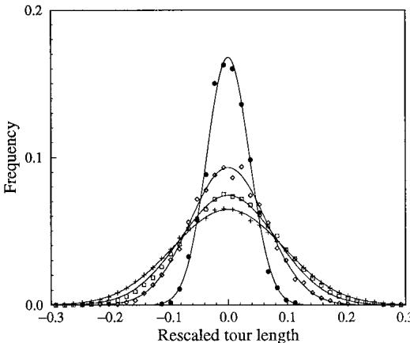
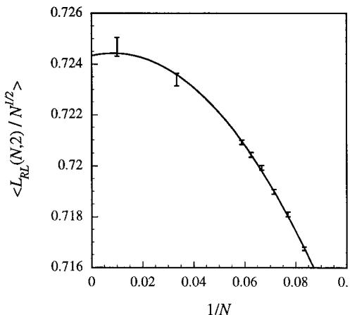
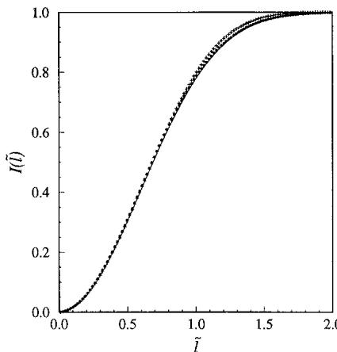
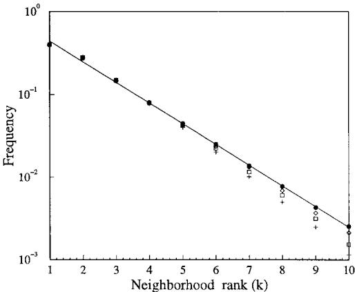
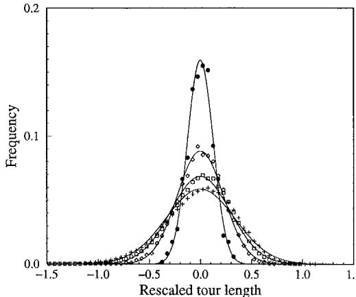
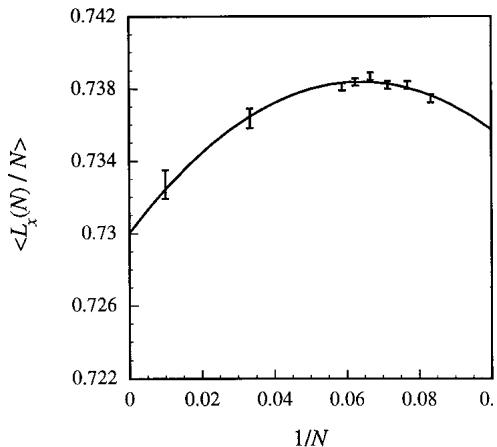
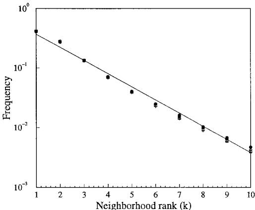

# The Stochastic Traveling Salesman Problem: Finite Size Scaling and the Cavity Prediction

Allon G. Percus1 and Olivier C. Martin2

Received February 27, 1998; final July 28, 1998

We study the random link traveling salesman problem, where lengths $l _ { i j }$ between city $i$ and city $j$ are taken to be independent, identically distributed random variables. We discuss a theoretical approach, the cavity method, that has been proposed for finding the optimum tour length over this random ensemble, given the assumption of replica symmetry. Using finite size scaling and a renormalized model, we test the cavity predictions against the results of simulations, and find excellent agreement over a range of distributions. We thus provide numerical evidence that the replica symmetric solution to this problem is the correct one. Finally, we note a surprising result concerning the distribution of $k$ th-nearest neighbor links in optimal tours, and invite a theoretical understanding of this phenomenon.

KEY WORDS: Disordered systems; combinatorial optimization; replica symmetry.

# 1. INTRODUCTION

Over the past 15 years, the study of the traveling salesman problem (TSP) from the point of view of statistical physics has been gaining added currency, as theoreticians have improved their understanding of the relation between combinatorial optimization and disordered systems. The TSP may be stated as follows: given $N$ sites (or \`\`cities''), find the total length $L$ of the shortest closed path (\`\`tour'') passing through all cities exactly once. In the stochastic TSP, the matrix of distances separating pairs of cities is drawn randomly from an ensemble. The ensemble that has received the most attention in the physics community is the random link case, where the individual lengths $l _ { i j }$ between city $i$ and city $j ~ ( i < j )$ are taken to be independent random variables, all identically distributed according to some $\rho ( l )$ . The idea of looking at this random link ensemble, rather than the more traditional \`\`random point'' ensemble where cities are distributed uniformly in Euclidean space, originated with an attempt by Kirkpatrick and Toulouse(1) to find a version of the TSP analogous to the earlier SherringtonKirkpatrick (SK) model(2) for spin glasses.

The great advantage of working with the random link TSP, rather than the (random point) Euclidean TSP, is that one may realistically hope for an analytical solution. A major breakthrough occurred with the idea, first formulated by Me zard and Parisi(3) and later developed by Krauth and Me zard,(4) that the random link TSP could be solved using the cavity method, an approach inspired by work on spin glasses. This method is based on assumptions pertaining to properties of the system under certain limiting conditions. The most important of these assumptions is replica symmetry. Although in the case of spin glasses, replica symmetry is violated,(5) for the TSP there are various grounds for at least suspecting that replica symmetry holds.(6, 4) The cavity solution then leads to a system of integral equations that can be solvednumerically at leastto give a prediction of the optimum tour length $L$ in the many-city limit $N \to \infty$ .

In a previous article,(7) we have taken the random link distribution $\rho ( l )$ to match that of the distribution of individual city-to-city distances in the Euclidean case, thus using the random link TSP as a random link approximation to the Euclidean TSP. The approximation may seem crude since it neglects all correlations between Euclidean distances, such as the triangle inequality. Nevertheless, it gives remarkably good results. In particular, a numerical solution of the random link cavity equations predicts large $N$ optimum tour lengths that are within $2 \%$ of the (simulated) $d .$ -dimensional Euclidean values, for $d = 2$ and $d = 3$ . In the limit $d \to \infty$ , this gap shows all signs of disappearing. The random link problem, and its cavity prediction, is therefore more closely related to the Euclidean problem than one might expect.

The random link TSP is also, however, interesting in itself. Little numerical work has accompanied the analytical progress madea shortcoming made all the more troubling by the uncertainties surrounding the cavity method's assumptions. In this paper we attempt to redress the imbalance, providing a numerical study of the finite size scaling of the random link optimum tour length, and arguments suggesting that the cavity solution is in fact correct. In the process, our numerics reveal some remarkable properties concerning the frequencies with which cities are connected to their $k$ th-nearest neighbor in optimal tours; we invite a theoretical explanation of these properties.

# 2. BACKGROUND AND THE CAVITY METHOD

In an attempt to apply tools from statistical mechanics to optimization problems, Kirkpatrick and Toulouse(1) introduced a particularly simple case of the random link TSP. The distribution of link lengths $l _ { i j }$ was taken to be uniform, so that $\rho ( l )$ is constant over a fixed interval. In light of the random link approximation, one may think of this as corresponding, at large $N _ { ; }$ , to the 1-D Euclidean case. (When cities are randomly and uniformly distributed on a line segment, the distribution of lengths between pairs of cities is uniform.) Although the 1-D Euclidean case is trivialparticularly if we adopt periodic boundary conditions, in which case the optimum tour length is simply the length of the line segmentthe corresponding random link problem is far from trivial.

The simulations performed by Kirkpatrick and Toulouse suggested a random link optimum tour length value of $L _ { R L } \approx 1 . 0 4 5$ in the $N \to \infty$ limit.3 Me zard and Parisi(8) attempted to improve both upon this estimate and upon the theory by using replica techniques often employed in spin glass problems (for a discussion of the replica method in this context, see ref. 5). This approach allowed them to obtain, via a saddle point approximation, many orders of the high-temperature expansion for the internal energy. They then extrapolated down to zero temperaturecorresponding to the global TSP optimumfinding $L _ { R L } = 1 . 0 4 \pm 0 . 0 1 5$ . Their analysis, like that of Kirkpatrick and Toulouse, was carried out only for the case of $\rho ( l )$ equal to a constant.

Given the difficulties of pushing the replica method further, Me zard and Parisi then tried a different but related approach known as the cavity method.(3) This uses a mean-field approximation which, in the case of spin glasses, gives the same result as the replica method in the thermodynamic limit $( N \to \infty$ ). As much of the literature on the cavity method has been prohibitively technical to non-specialists, we shall review the approach in more conventional language here, indicating what is involved in the case of the TSP.

Both the replica and the cavity methods involve a representation of the partition function originally developed in the context of polymer theory.(9, 10) The approach consists of mapping the TSP onto an m-component spin system, writing down the partition function at temperature $T _ { \ast }$ , and then taking the limit $m \to 0$ . More explicitly: consider $N$ spins $\mathbf { S } _ { i }$ , $i = 1 , . . . , N$ (corresponding to the $N$ cities), where each spin $\mathbf { S } _ { i }$ has $m$ components $S _ { i } ^ { \alpha }$ , ${ \mathfrak { x } } = 1 , . . . , m$ , and where $( \mathbf { S } _ { i } ) ^ { 2 } = m$ for all $i .$ The partition function is defined, in terms of a parameter $\omega$ , as

$$
\begin{array} { l } { { \displaystyle Z = \int \prod _ { q } d \mu ( { \bf S } _ { q } ) \exp \left( \omega \sum _ { i < j } R _ { i j } { \bf S } _ { i } \cdot { \bf S } _ { j } \right) } } \\ { { \displaystyle \quad = \int \prod _ { q } d \mu ( { \bf S } _ { q } ) \left[ 1 + \omega \sum _ { i < j } R _ { i j } ( { \bf S } _ { i } \cdot { \bf S } _ { j } ) + \frac { \omega ^ { 2 } } { 2 ! } \sum _ { i < j } R _ { i j } R _ { k l } ( { \bf S } _ { i } \cdot { \bf S } _ { j } ) ( { \bf S } _ { k } \cdot { \bf S } _ { l } ) + \frac { \omega ^ { 2 } } { 2 ! } \sum _ { i < j } R _ { i j } R _ { k l } ( { \bf S } _ { i } \cdot { \bf S } _ { j } ) ( { \bf S } _ { k } \cdot { \bf S } _ { l } ) + \ldots \right] } } \end{array}
$$

where the integral is taken over all possible spin values (the area measure is normalized so that $\int d \mu ( \mathbf { S } _ { q } ) = 1 )$ ), and $R _ { i j }$ is related to the length $l _ { i j }$ between city $i$ and city $j$ as $R _ { i j } \equiv e ^ { - N ^ { 1 / d } l _ { i j } / T } .$ . Now employ a classic diagrammatic argument: let each spin product $( { \bf S } _ { a } \cdot { \bf S } _ { b } )$ appearing in the series be represented by an edge in a graph whose vertices are the $N$ cities. The firstorder terms $( \omega )$ will consist of one-edge diagrams, the second-order terms $( \omega ^ { 2 } )$ will consist of two-edge diagrams, and so on. What happens when we integrate over all spin configurations? If there is a spin $\mathbf { S } _ { a }$ that occurs only once in a given diagram, i.e., it is an endpoint, the spherical symmetry of $\mathbf { S } _ { a }$ will cause the whole expression to vanish. The non-vanishing summation terms in Eq. (2) therefore correspond only to \`\`closed'' diagrams, where there is at least one loop. It may furthermore be shown that in performing the integration, any one of these closed diagrams will contribute a factor $m$ for every loop present in the diagram.(10) If we then consider $( Z - 1 ) / m$ and take the limit $m \to 0$ , it is clear that only diagrams with a single loop will remain. Moreover, since any closed diagram with more than $N$ links must necessarily contain more than one loop, only diagrams up to order $\omega ^ { N }$ will remain. Finally, take the limit $\omega  \infty$ . The term that will dominate in Eq. (2) is the order $\omega ^ { N }$ term which, being a single loop diagram, represents precisely a closed tour passing through all $N$ cities. We may write it without the combinatorial factor $N _ { \cdot }$ ! by expressing it as a sum over ordered pairs in the tour, and we thus find:

$$
\begin{array} { c } { { \displaystyle \operatorname* { l i m } _ { m  0 } \frac { Z - 1 } { m \omega ^ { N } } = \sum _ { N \mathrm { - l i n k ~ s i n g l e ~ l o o p s } } R _ { i _ { 1 } i _ { 2 } } R _ { i _ { 2 } i _ { 3 } } \cdots R _ { i _ { N - 1 } i _ { N } } R _ { i _ { N } i _ { 1 } } } } \\ { { \omega  \infty } } \\ { { = \displaystyle \sum _ { N \mathrm { - c i t y ~ t o u r s } } e ^ { - N ^ { 1 / d } L / T } } } \end{array}
$$

where $L$ is the total tour length. What we obtain is exactly the partition function for the traveling salesman problem, with the correct canonical ensemble Boltzmann weights, using the tour length as the energy to be minimized (up to a factor $N ^ { 1 / d }$ , necessary for the energy to be extensive).

The idea behind the cavity method is then as follows. Since all spin couplings $R _ { i j }$ in Eq. (1) are positive (ferromagnetic), we expect the m-component spin system to have a non-zero spontaneous magnetization in equilibrium. Now add an $( N + 1 ) \mathrm { t h }$ spin to the system; it too acquires a spontaneous magnetization $\langle \mathbf { S } _ { N + 1 } \rangle$ . Let us obtain the thermodynamic observables of the new system (in particular $\langle \mathbf { S } _ { N + 1 } \rangle$ itself) in terms of the earlier magnetizations $\langle \mathbf { S } _ { i } \rangle ^ { \prime }$ from before the $( N + 1 ) \mathrm { t h }$ spin was added hence the notion of a \`\`cavity.''

In order to compute these relations, an important mean-field assumption is made: that at large $N _ { : }$ , any effect spin $N + 1$ feels from correlations among the $N$ other spins is negligible. We justify this in the following way. Although all spins in Eq. (1) are indeed coupled, the coupling constants $R _ { i j }$ decrease exponentially with length $l _ { i j }$ , and so effective interactions arise only between very near neighbors. But a crucial property of the random link model is that the near neighbors of spin $N + 1$ are not generally near neighbors of one another: they are near neighbors of one another only with probability ${ \cal O } ( 1 / N )$ . Thus, when considering quantities involving spin $N + 1$ , the effect of direct interactions between any two of its neighbors is ${ \cal O } ( 1 / N )$ , and decays to zero in the limit $N \to \infty$ . We therefore replace (1) by the mean-field partition function

$$
\boldsymbol { \mathsf { Z } } _ { M F } = \int \prod _ { q = 1 } ^ { N } d \mu ( \boldsymbol { \mathsf { S } } _ { q } ) \int d \mu ( \boldsymbol { \mathsf { S } } _ { N + 1 } ) \exp \left( \omega \sum _ { i = 1 } ^ { N } R _ { i , N + 1 } \boldsymbol { \mathsf { S } } _ { i } \cdot \boldsymbol { \mathsf { S } } _ { N + 1 } + \sum _ { i = 1 } ^ { N + 1 } \boldsymbol { \mathsf { S } } _ { i } \cdot \boldsymbol { \mathsf { S } } _ { N + 1 } \right)
$$

By definition, if spin $N + 1$ were removed, we would recover the \`\`cavity magnetizations'' $\langle \mathbf { S } _ { i } \rangle ^ { \prime }$ . This requirement is sufficient to specify the fields $\mathbf { h } _ { i }$ . Stripping out spin $N + 1$ from (5) leaves us simply with a product of integrals $\begin{array} { r } { \prod _ { q } \int d \mu ( \mathbf { S } _ { q } ) \exp ( \mathbf { S } _ { q } \cdot \mathbf { h } _ { q } ) } \end{array}$ , whose logarithmic derivative with respect to $\mathbf { h } _ { i }$ must then give the magnetization $\langle \mathbf { S } _ { i } \rangle ^ { \prime }$ . We may obtain this expression by expanding the integrands, taking advantage of the identity $\int d \mu ( \mathbf { S } _ { i } ) ~ S _ { i } ^ { \alpha } S _ { i } ^ { \beta } = \delta _ { \alpha \beta }$ for all spin components $\propto$ and $\beta _ { : }$ , as well as the nilpotency property(3) that in the limit $m \to 0$ , the integral of the product of more than two components of $\mathbf { S } _ { i }$ vanishes. (This is analogous to the property used earlier in the diagrammatic expansion.) The result is

$$
\langle \mathbf { S } _ { i } \rangle ^ { \prime } { = } \frac { \mathbf { h } _ { i } } { 1 + ( \mathbf { h } _ { i } ) ^ { 2 } / 2 }
$$

Note that this specifies $\mathbf { h } _ { i }$ for $1 \leqslant i \leqslant N _ { \mathrm { : } }$ ; $\mathbf { h } _ { N + 1 }$ has been introduced purely for analytical convenience, and will ultimately be set to 0.

Without loss of generality, let us assume the spontaneous magnetizations of the system to be directed exclusively along component 1. This may be imposed, for instance, by applying an additional infinitesimal field directed along component 1. Physically, however, the assumption that distant spins are uncorrelated also means that this infinitesimal field is sufficient to select a single phase or equilibrium state, thus giving rise to a unique thermodynamic limit. From the point of view of dynamics, a consequence is that two \`\`copies'' of the system will evolve to the same equilibrium distribution. This property is known as replica symmetry, and has been central to the modern understanding of disordered systems.4 Replica symmetry is in fact known to be broken in spin glasses; if one uses the replica symmetric solution of the SK model, for instance, one finds a ground state energy prediction that is inaccurate by about $5 \%$ . (5) However, this does not mean that replica symmetry breaking occurs in all related problems of high complexity (the TSP and the spin glass both fall into the NP-hard class of computational complexity). Showing that the (replica symmetric) cavity solution correctly predicts macroscopic quantities for the random link TSP would suggest that the TSP, unlike a spin glass, does indeed exhibit replica symmetry.

In order to obtain the cavity solution, consider the mean-field expression (5). Taking advantage of nilpotency, as well as the fact that $R _ { i j }$ is nonnegligible only with probability ${ \cal O } ( 1 / N )$ , we may expand (5) and obtain in the large $N$ limit:

$$
Z _ { M F } = \prod _ { i = 1 } ^ { N } \left( 1 + \frac { ( \mathbf { h } _ { i } ) ^ { 2 } } { 2 } \right) \left[ 1 + \frac { ( \mathbf { h } _ { N + 1 } ) ^ { 2 } } { 2 } + \sum _ { j = 1 } ^ { N } \frac { \omega R _ { j , N + 1 } \mathbf { h } _ { j } \cdot \mathbf { h } _ { N + 1 } } { 1 + ( \mathbf { h } _ { j } ) ^ { 2 } / 2 } \right.  \\  \left. + \sum _ { 1 \leqslant j < k \leqslant N } \frac { \omega ^ { 2 } R _ { j , N + 1 } R _ { k , N + 1 } \mathbf { h } _ { j } \cdot \mathbf { h } _ { k } } { [ 1 + ( \mathbf { h } _ { j } ) ^ { 2 } / 2 ] [ 1 + ( \mathbf { h } _ { k } ) ^ { 2 } / 2 ] } \right]
$$

From (5) it is clear that differentiating $Z _ { M F }$ with respect to $\mathbf { h } _ { N + 1 }$ and then setting $\mathbf { h } _ { N + 1 } = 0$ yields an expression for $\langle \mathbf { S } _ { N + 1 } \rangle$ in terms of the remaining $\mathbf { h } _ { i }$ , or equivalently in terms of the cavity magnetizations $\langle \mathbf { S } _ { i } \rangle ^ { \prime }$ . This expression simplifies further at large $\omega$ . Recalling that the magnetization is by construction directed along component 1, we obtain:(3)

$$
\langle S _ { N + 1 } ^ { 1 } \rangle = \frac { \sum _ { j = 1 } ^ { N } R _ { j , N + 1 } \langle S _ { j } ^ { 1 } \rangle ^ { \prime } } { \omega \sum _ { 1 \leqslant j < k \leqslant N } R _ { j , N + 1 } R _ { k , N + 1 } \langle S _ { j } ^ { 1 } \rangle ^ { \prime } \langle S _ { k } ^ { 1 } \rangle ^ { \prime } }
$$

4 An analogous property was used to obtain the replica solution mentioned earlier.

(The factor $\omega$ in the denominator may be avoided, if need be, by applying a uniform rescaling factor $\sqrt { \omega }$ to all magnetizations.) Thus, using the mean-field approach, we can express the magnetization of the $( N + 1 ) \mathrm { t h }$ spin in terms of what the other magnetizations would be in the absence of this $( N + 1 ) \mathrm { t h }$ spin.

While these quantities have been derived for a spin system whose partition function is given by $Z$ , we are interested in the TSP whose partition function is given by (4). Consider an important macroscopic quantity for the TSP: the frequency with which a tour occupies a given link. Define $n _ { i j }$ to be 1 if the link $i j$ is in the tour, and 0 otherwise. Since the total tour length (energy) is $\begin{array} { r } { L = \sum _ { i < j } n _ { i j } l _ { i j } } \end{array}$ , the mean occupation frequency $\langle n _ { i j } \rangle$ , averaged over all tours with the Boltzmann factor, is simply found from the logarithmic derivative of (4) with respect to $l _ { i j }$ . Using $Z _ { M F } - 1$ in place of $Z - 1$ , and proceeding as above, we obtain in the limit $\omega  \infty$ :

$$
\begin{array} { r } { \langle n _ { i , N + 1 } \rangle = R _ { i , N + 1 } \langle S _ { i } ^ { 1 } \rangle ^ { \prime } \frac { \sum _ { j \ne i } R _ { j , N + 1 } \langle S _ { j } ^ { 1 } \rangle ^ { \prime } } { \sum _ { 1 \leqslant j < k \leqslant N } R _ { j , N + 1 } R _ { k , N + 1 } \langle S _ { j } ^ { 1 } \rangle ^ { \prime } \langle S _ { k } ^ { 1 } \rangle ^ { \prime } } } \end{array}
$$

The relations (8) and (9) have been derived for a single realization of the $R _ { i j } \mathrm { ^ { * } s }$ . In the ensemble of instances we consider here, the thermal averages become random variables with a particular distribution. As far as (8) is concerned, we may treat the magnetizations $\langle S _ { i } ^ { 1 } \rangle ^ { \prime }$ as independent identically distributed random variables. Furthermore, the existence of a thermodynamic limit in the model requires that at large $N , \langle S _ { N + 1 } ^ { 1 } \rangle$ have the same distribution as the cavity magnetizations; this imposes, for a given link length distribution $\rho ( l )$ , a unique self-consistent probability distribution of the magnetizations. From (9), one can then find the probability distribution of $\langle n _ { N + 1 , i } \rangle$ , and in turn, taking the $T \to 0$ limit, the distribution $\mathcal { P } ( l )$ of link lengths $l$ used in the optimal tour (at $N \to \infty$ ).

Krauth and Me zard(4) carried out this calculation, for $\rho ( l )$ corresponding to that of the $d _ { \mathbf { \phi } }$ -dimensional Euclidean case, namely

$$
\rho _ { d } ( l ) = \frac { 2 \pi ^ { d / 2 } } { { \varGamma } ( d / 2 ) } l ^ { d - 1 }
$$

Of course, $\rho _ { d } ( l )$ must be cut off at some finite $l$ in order to be normalizable; precisely how this is done is unimportant, since only the behavior of $\rho _ { d } ( l )$ at small $l$ is relevant for the optimal tour in the $N \to \infty$ limit. The result of Krauth and Me zard's calculation is:

$$
\begin{array} { l } { \displaystyle { \mathcal { P } _ { d } ( l ) = N ^ { - 1 / d } \pi ^ { d / 2 } \frac { \boldsymbol { \Gamma } ( d / 2 + 1 ) } { \boldsymbol { \Gamma } ( d + 1 ) } \frac { l ^ { d - 1 } } { 2 \boldsymbol { \Gamma } ( d ) } \bigg ( - \frac { \hat { \boldsymbol { \ O } } } { \hat { \mathcal { O } } l } \bigg ) \int _ { - \infty } ^ { + \infty } [ 1 + H _ { d } ( \boldsymbol { x } ) ] } } \\ { \displaystyle \qquad \times e ^ { - H _ { d } ( \boldsymbol { x } ) } [ 1 + H _ { d } ( l - \boldsymbol { x } ) ) ] e ^ { - H _ { d } ( l - \boldsymbol { x } ) } d \boldsymbol { x } } \end{array}
$$

where $H _ { d } ( x )$ is the solution to the integral equation

$$
H _ { d } ( x ) = \pi ^ { d / 2 } \frac { { \cal T } ( d / 2 + 1 ) } { { \cal T } ( d + 1 ) } \int _ { - x } ^ { + \infty } \frac { ( x + y ) ^ { d - 1 } } { { \cal T } ( d ) } \left[ 1 + H _ { d } ( y ) \right] e ^ { - H _ { d } ( y ) } d y
$$

From $\mathcal { P } _ { d } ( l )$ , one may obtain the mean link length in the tour, and thus the cavity prediction $L _ { R L } ^ { c }$ for the total length of the tour. Introducing the large $N$ asymptotic quantity $\begin{array} { r } { \beta _ { R L } ( d ) \equiv \operatorname* { l i m } _ { N  \infty } L _ { R L } ( N , d ) / N ^ { 1 - 1 / d } } \end{array}$ , the cavity prediction $\beta _ { R L } ^ { c } ( d )$ is then:

$$
\begin{array} { l } { { \displaystyle \beta _ { R L } ^ { c } ( d ) = \operatorname* { l i m } _ { N \to \infty } N ^ { 1 / d } \int _ { 0 } ^ { + \infty } l \mathcal { P } _ { d } ( l ) d l } } \\ { { \displaystyle \qquad = \frac { d } { 2 } \int _ { - \infty } ^ { + \infty } H _ { d } ( x ) [ 1 + H _ { d } ( x ) ] e ^ { - H _ { d } ( x ) } d x } } \end{array}
$$

At $d = 1$ , Krauth and Me zard solved these equations numerically, obtaining $\beta _ { R L } ^ { c } ( 1 ) = 1 . 0 2 0 8 \ldots$ . It is difficult to compare this with Kirkpatrick's value of $\beta _ { R L } ( 1 ) \approx 1 . 0 4 5$ from direct simulations (as no error estimate exists for the latter quantity), however an analysis(11) of recent numerical results by Johnson et al. (12) gives $\beta _ { R L } ( 1 ) = 1 . 0 2 0 9 \pm 0 . 0 0 0 2$ , lending strong credence to the cavity value. Krauth and Me zard also performed a numerical study of $\mathcal { P } _ { 1 } ( l )$ . They found the cavity predictions to be in good agreement with the results of their own direct simulations. Further numerical evidence supporting the assumption of replica symmetry was found by Sourlas,(6) in an investigation of the low temperature statistical mechanics of the system. Thus, for the $l _ { i j }$ distribution at $d = 1$ , there is good reason to believe that the cavity assumptions are valid and that the cavity predictions are exact at large $N _ { : }$ so that $\beta _ { R L } ^ { c } ( 1 ) = \beta _ { R L } ( 1 )$ .

At higher dimensions, the values of $\beta _ { R L } ^ { c } ( d )$ were given by the present authors in ref. 13, and a large $d$ power series solution for $\beta _ { R L } ^ { c } ( d )$ was derived:(14, 7)

$$
\beta _ { R L } ^ { c } ( d ) = \sqrt { \frac { d } { 2 \pi e } } ( \pi d ) ^ { 1 / 2 d } \left[ 1 + \frac { 2 - \ln 2 - 2 \gamma } { d } + O \left( \frac { 1 } { d ^ { 2 } } \right) \right]
$$

where $\gamma$ represents Euler's constant $\ ' \gamma = 0 . 5 7 7 2 2 . . . )$ . But is the cavity method exactthat is, is $\beta _ { R L } ^ { c } ( d ) = \beta _ { R L } ( d )$ for all $d _ { \ast }$ , or is $d = 1$ simply a pathological case (as it is in the Euclidean model, where $\beta _ { E } ( 1 ) = 1 $ )? While it appears sensible to argue that the qualitative properties of the random link TSP are insensitive to $d ,$ there is as yet no evidence that replica symmetry holds for $d \neq 1$ . Our purpose here is to provide such evidence by numerical simulation, as has been done, for instance, in a related combinatorial optimization problem known as the matching problem.(15, 14) We now turn to this task, considering first the $d = 2$ case, and then a \`\`renormalized'' random link model that enables us to verify numerically the $O ( 1 / d )$ coefficient predicted in Eq. (14).

# 3. NUMERICAL ANALYSIS: $\pmb { d } = \pmb { 2 }$ CASE

We have implicitly been making the assumption so far, via our notation, that as $N \to \infty$ the random variable $L _ { R L } ( N , d ) / N ^ { 1 - 1 / d }$ approaches a unique value $\beta _ { R L } ( d )$ with probability 1. This is a property known as selfaveraging. The analogous property has been shown for the Euclidean TSP at all dimensions.(16) For the random link TSP, however, the only case where a proof of self-averaging is known is in the $d \to \infty$ limit, where a converging upper and lower bound in fact give the exact result:(17)

$$
\beta _ { R L } ( d ) = \sqrt { \frac { d } { 2 \pi e } } \left( \pi d \right) ^ { 1 / 2 d } \left[ 1 + O \left( \frac { 1 } { d } \right) \right]
$$

Comparing this with (14), we may already see that $\beta _ { R L } ^ { c } ( d ) \sim \beta _ { R L } ( d )$ when $d \to \infty$ , and so the cavity prediction is correct in the infinite dimensional limit.

For finite $d .$ , however, it has not been shown analytically that $\beta _ { R L } ( d )$ even exists. To some extent, the difficulty in proving this can be traced to the non-satisfaction of the triangle inequality. The reader acquainted with the self-averaging proof for the Euclidean TSP may see that the ideas used there are not applicable to the random link case; for instance, combining good subtours using simple insertions will not lead to near-optimal global tours, making the problem particularly challenging. Let us therefore examine the distribution of $d = 2$ optimum tour lengths using numerical simulations, in order to give empirical support for the assertion that the $N \to \infty$ limit is well-defined.

The algorithmic procedures we use for simulations are identical to those we have used in an earlier study concerning the Euclidean TSP;(7) for details, the interested reader is referred to that article. Briefly stated, our optimization procedure involves using the LK and CLO local search heuristic algorithms(18, 19) where for each instance of the ensemble we run the heuristic over multiple random starts. LK is used for smaller values of $N$ $( N \leqslant 1 7 )$ and CLO, a more sophisticated method combining LK optimization with random jumps, for larger values of $N$ b $N = 3 0$ and $N = 1 0 0$ ). There is, of course, a certain probability that even over the course of multiple random starts, our heuristics will not find the true optimum of an instance.

  
Fig. 1. Distribution of 2-D random link rescaled tour length $( L _ { R L } - \langle L _ { R L } \rangle ) / \sqrt { N }$ for increasing values of $N .$ . Plus signs show $N = 1 2$ (100,000 instances used), squares show $N = 1 7$ (100,000 instances used), diamonds show $N = 3 0$ (4,000 instances used), and dots show $N = 1 0 0$ (1,200 instances used). Solid lines represent Gaussian fits for each value of $N$ plotted.

We estimate the associated systematic bias using a number of test instances, and adjust the number of random starts to keep this bias at least an order of magnitude below other sources of error discussed below. (At its maximumoccurring in the $N = 1 0 0$ casethe systematic bias is estimated as under 1 part in 20,000.)

Following this numerical method, we see from our simulations (Fig. 1) that the distribution of $L _ { R L } ( N , 2 ) / \sqrt { N }$ becomes increasingly sharply peaked for increasing $N _ { \ast }$ , so that the ratio approaches a well-defined limit $\beta _ { R L } ( 2 )$ . Furthermore, the variance of $L _ { R L } ( N , 2 )$ remains relatively constant in $N$ (see Table 1), indicating that the width $\sigma$ for the distribution shown in the figure decreases as $1 / \sqrt { N }$ , strongly suggesting a Gaussian distribution. Similar results were found in our Euclidean study (albeit in that case with $\sigma$ being approximately half of its random link value). This is precisely the sort of behavior one would expect were the central limit theorem to be applicable.

Table 1. Variance of the Nonrescaled Optimum Tour Length $\pmb { L } _ { R L } ( \pmb { N } , \pmb { 2 } )$ with Increasing N   

<table><tr><td>N</td><td>$σ2}$</td><td>Number of instances used</td></tr><tr><td></td><td></td><td></td></tr><tr><td>12 17</td><td>0.3200 0.3578</td><td>100,000 100,000</td></tr><tr><td>30</td><td>0.3492</td><td>4,000</td></tr><tr><td>100</td><td>0.3490</td><td>1,200</td></tr><tr><td></td><td></td><td></td></tr></table>

Let us now consider the large $N$ limit of $L _ { R L } ( N , 2 ) / \sqrt { N }$ , as given by numerical simulations. In the Euclidean case, it has been observed(7) that the finite size scaling law can be written in terms of a power series in $1 / N .$ . The same arguments given there apply to the random link case, and so we may expect the ensemble average $\langle L _ { R L } ( N , 2 ) \rangle$ to satisfy

$$
\langle L _ { R L } ( N , d ) \rangle = \beta _ { R L } ( d ) N ^ { 1 - 1 / d } \biggl [ 1 + \frac { A ( d ) } { N } + \cdots \biggr ]
$$

In order to obtain $\langle L _ { R L } ( N , 2 ) \rangle$ at a finite value of $N$ from simulations, we average over a large number of instances to reduce the statistical error arising from instance-to-instance fluctuations. Figure 2 shows the results of this, with accompanying error bars, fitted to the expected finite size scaling law (truncated after $O ( 1 / N ^ { 2 } ) _ { \cdot }$ ). The fit is a good one: $\chi ^ { 2 } = 4 . 4 6$ for 5 degrees of freedom. As in ref. 7, we may obtain an error estimate on $\beta _ { R L } ( 2 )$ by noting that if we take the extrapolated value and add or subtract one standard deviation, and then redo the fit with this as a fixed constant, $\chi ^ { 2 }$ will increase by 1. We thus find $\beta _ { R L } ( 2 ) = 0 . 7 2 4 3 \pm 0 . 0 0 0 4$ , in very good agreement with the cavity result of $\beta _ { R L } ^ { c } ( 2 ) = 0 . 7 2 5 1 \dots$ . The discrepancy between the two is consistent with the statistical error (two standard deviations apart), and in relative terms is approximately $0 . 1 \%$ . The fit in Fig. 2, furthermore, appears robust with respect to sub-samples of the data; even if we disallow the use of the $N = 1 0 0$ data point in the fit, the resulting asymptotic value is still within $0 . 2 5 \%$ of the cavity prediction. By comparison, recall that the error in the replica symmetric solution to the SK spin glass ground state energy is of the order of $5 \%$ . ( 5 )

  
Fig. 2. Finite size scaling of mean optimum tour length for $d = 2$ . Best fit $( \chi ^ { 2 } = 4 . 4 6 )$ ) is given by: $\langle L _ { R L } ( N , 2 ) \rangle / N ^ { 1 / 2 } = 0 . 7 2 4 3 ( 1 + 0 . 0 3 2 2 / N - 1 . 8 8 6 / N ^ { 2 } )$ . Error bars show one standard deviation (statistical error).

Another quantity that Krauth and Me zard studied in their $d = 1$ numerical investigation(4) was the optimum tour link length distribution $\mathcal { P } _ { d } ( l )$ given in Eq. (11). Let us consider $\mathcal { P } _ { 2 } ( l )$ , and following their example, let us look specifically at the integrated distribution $I _ { d } ( l ) \equiv \int _ { 0 } ^ { l } \mathcal { P } _ { d } ( l ^ { \prime } ) d l ^ { \prime }$ . The cavity result for $I _ { d } ( l )$ can, like $\beta _ { R L } ^ { c } ( d )$ , be computed numerically to arbitrary precision. In Fig. 3 we compare this with the results of direct simulations, for $d = 2$ , at increasing values of $N .$ The improving agreement for increasing $N$ (within $2 \%$ at $N = 1 0 0$ ) strongly suggests that the cavity solution gives the exact $N \to \infty$ result.

Finally, it is of interest to consider one further quantity in the $d = 2$ random link simulations, for which there is at present no corresponding cavity prediction: the frequencies of \`\`neighborhood rank'' used in the optimal tour, that is, the proportion of links connecting nearest neighbors, 2nd-nearest neighbors, etc. Sourlas(6) has noted that in practice in the $d = 1$ case, this frequency falls off rapidly with increasing neighborhood rank suggesting that optimization heuristics could be improved by preferentially choosing links between very near neighbors. Our simulations show (see Fig. 4) that for $d = 2$ the decrease is astonishingly close to exponential. We may offer the following qualitative explanation for this behavior. An optimal tour will always try to use links to the closest neighbors possible. While the constraint of a closed loop may force it in rare cases to use neighbors of high rank, this will apply only to a very small number of links in the tour. Connecting a point to, say, its $k$ th-nearest neighbor will for the most part be profitable only when this neighbor is not much further away than the $k - 1$ nearer neighbors. In other words, the lengths from the point to its $k$ closest neighbors would have to be nearly degenerate. Since a $k$ -fold degeneracy of this sort is the product of $k - 1$ unlikely events, it is in fact quite natural that the probability of such an occurrence is exponentially small in $k$ .

  
Fig. 3. Integrated probability distribution of link lengths in the optimal tour, for $d = 2$ , using rescaled length $\tilde { l } { = } \dot { l } \sqrt { N }$ . Plus signs represent $N = 1 2$ simulation results, dots represent $N = 1 0 0$ simulation results, and solid line represents cavity prediction.

  
Fig. 4. Frequencies with which $k$ th-nearest neighbors are used in optimal 2-D random link tours. Plus signs show values for $N = 1 2$ , squares for $N = 1 7$ , diamonds for $N = 3 0$ , and dots for $N = 1 0 0$ . Best exponential fit (straight line on log plot) is shown for $N = 1 0 0$ data.

We therefore conjecture that the neighborhood frequency function will fall exponentially in $k$ at large $k$ . We expect this behavior to hold in any dimension, and for that matter, in the Euclidean TSP as well. Similar and even stronger numerical results have been reported(21) in another linkbased combinatorial optimization problem, the matching problem. An analytical calculation of the neighborhood frequency may indeed turn out to be feasible using the cavity approach, thus providing a theoretical prediction to accompany our conjecture. We consider this a significant open question.

# 4. NUMERICAL ANALYSIS: RENORMALIZED MODEL

In this section we will consider a different sort of random link TSP, proposed in ref. 7, allowing us to test numerically the $1 / d$ coefficient predicted by the cavity result (14). The approach involves introducing a mapping that shifts and rescales all the lengths between cities. By taking the limit $d \to \infty$ , one obtains a $d$ -independent random link model having an exponential distribution for its link lengths. This \`\`renormalized'' model was outlined in ref. 7; we present it here in further detail. We then perform a numerical study of the model, which enables us to determine the large $d$ behavior of the standard $d _ { \mathbf { \phi } }$ -dimensional random link model.

Let us define $\langle D _ { 1 } ( N , d ) \rangle$ to be the distance between a city and its nearest neighbor, averaged over all cities in the instance and over all instances in the ensemble.5 For large $d .$ , it may be shown(7) that

$$
\operatorname* { l i m } _ { N  \infty } N ^ { 1 / d } \langle D _ { 1 } ( N , d ) \rangle = \sqrt { \frac { d } { 2 \pi e } } ( \pi d ) ^ { 1 / 2 d } [ 1 - \frac { \gamma } { d } + O ( \frac { 1 } { d ^ { 2 } } ) ]
$$

where $\gamma$ is Euler's constant. It is not surprising that this quantity is reminiscent of Eq. (15), since $N ^ { 1 / d } \langle D _ { 1 } ( N , d ) \rangle$ represents precisely a lower bound on $\beta _ { R L } ( d )$ .

In order to obtain the renormalized model, consider a link length transformation making use of $\langle D _ { 1 } ( N , d ) \rangle$ . For any instance with link lengths $l _ { i j }$ (taken to have the usual distribution (10) corresponding to $d$ dimensions), define new link lengths $x _ { i j } \equiv d [ l _ { i j } - \langle D _ { 1 } ( N , d ) \rangle ] / \langle D _ { 1 } ( N , d ) \rangle$ . The $x _ { i j }$ are \`\`lengths'' only in the loosest sense, as they can be both positive and negative. The optimal tour in the $x _ { i j }$ model will, however, follow the same \`\`path'' as the optimal tour in the associated $l _ { i j }$ model, since the transformation is linear. Its length $L _ { x } ( N , d )$ will simply be given in terms of $L _ { R L } ( N , d )$ by:

$$
\begin{array} { r } { L _ { x } ( N , d ) = d \frac { L _ { R L } ( N , d ) - N \langle D _ { 1 } ( N , d ) \rangle } { \langle D _ { 1 } ( N , d ) \rangle } , \mathrm { s o } } \\ { L _ { R L } ( N , d ) = N \langle D _ { 1 } ( N , d ) \rangle \left[ 1 + \frac { L _ { x } ( N , d ) } { d N } \right] } \end{array}
$$

In the standard $d$ -dimensional random link model, $\beta _ { R L } ( d ) =$ $\begin{array} { r } { \operatorname* { l i m } _ { N  \infty } L _ { R L } ( N , d ) / N ^ { 1 - 1 / d } } \end{array}$ , so

$$
\begin{array} { r } { \beta _ { R L } ( d ) = \underset { N  \infty } { \operatorname* { l i m } } N ^ { 1 / d } \langle D _ { 1 } ( N , d ) \rangle [ 1 + \frac { L _ { x } ( N , d ) } { d N } ] , \mathrm { a n d ~ a t ~ l a r g e ~ } d , \mathsf { u } } \\ { = \sqrt { \frac { d } { 2 \pi e } } ( \pi d ) ^ { 1 / 2 d } [ 1 - \frac { \gamma } { d } + O ( \frac { 1 } { d ^ { 2 } } ) ] \underset { N  \infty } { \operatorname* { l i m } } [ 1 + \frac { L _ { x } ( N , d ) } { d N } ] } \end{array}
$$

5 Note that $\langle D _ { 1 } ( N , d ) \rangle$ itself does not involve the notion of optimal tours, or tours of any sort for that matter.

As $\beta _ { R L } ( d )$ is a well-defined quantity, there must exist a value $\mu ( d )$ such that $\begin{array} { r } { \operatorname* { l i m } _ { N \to \infty } L _ { x } ( N , d ) / N = \mu ( d ) } \end{array}$ .

Now, what will be the distribution of \`\`renormalized lengths'' $\rho ( x )$ corresponding to $\rho ( l ) ^ { \mathfrak { c } }$ ? From Eq. (10) and the definition of the $x _ { i j }$ ,

$$
\begin{array} { c } { { \rho ( x ) { = } \displaystyle \frac { d \pi ^ { d / 2 } l ^ { d - 1 } } { \Gamma ( d / 2 + 1 ) } \frac { \langle D _ { 1 } ( N , d ) \rangle } { d } , \mathrm { a n d ~ s u b s t i t u t i n g } } } \\ { { { = } \displaystyle \frac { \pi ^ { d / 2 } } { { \cal T } ( d / 2 + 1 ) } \biggl ( 1 + \frac { x } { d } \biggr ) ^ { d - 1 } \langle D _ { 1 } ( N , d ) \rangle ^ { d } } } \end{array}
$$

In the limit $N \to \infty$ , we thus obtain from (17) the large $d$ expression:

$$
\begin{array} { l } { { \displaystyle \rho ( x ) \sim \frac { \pi ^ { d / 2 } } { \Gamma ( d / 2 + 1 ) } \bigg ( 1 + \frac { x } { d } \bigg ) ^ { d - 1 } N ^ { - 1 } \left( \frac { d } { 2 \pi e } \right) ^ { d / 2 } \sqrt { \pi d } \left[ 1 - \frac { \gamma } { d } + \cdots \right] ^ { d } } } \\ { { \displaystyle \qquad \sim N ^ { - 1 } \left( 1 - \frac { \gamma } { d } \right) ^ { d } \left( 1 + \frac { x } { d } \right) ^ { d - 1 } \left[ 1 + { \cal O } \left( \frac { 1 } { d } \right) \right] \mathrm { b y ~ S t i r l i n g ' s ~ f o r m u } } } \\ { { \displaystyle \qquad \sim N ^ { - 1 } e ^ { x - \gamma } \left[ 1 + { \cal O } \left( \frac { 1 } { d } \right) \right] } } \end{array}
$$

In the limit $d \to \infty$ , $\rho ( x )$ will be independent of $d ;$ ; the same must then be true for $L _ { x } ( N , d )$ , and consequently for $\mu ( d )$ .

Let us now define the renormalized model as being made up of link \`\`lengths'' $x _ { i j }$ in this limit. This results in a somewhat peculiar random link TSP, no longer containing the parameter $d .$ . Its link length distribution is given by the $d \to \infty$ limit of Eq. (22),

$$
\rho ( x ) = N ^ { - 1 } \exp ( x - \gamma )
$$

and its optimum tour length satisfies

$$
\operatorname* { l i m } _ { N \to \infty } { \frac { L _ { x } ( N ) } { N } } { = } \mu
$$

where we have dropped the $d$ argument from these (now $d$ -independent) quantities. By performing direct simulations using the distribution (23) cut off beyond a threshold value of $x$ , as was done for $\rho _ { d } ( l )$ we may find the value of $\mu$ numerically.

Finally, let us relate this renormalized model to the standard $d$ -dimensional random link model. In light of (24), we may rewrite (20) and obtain the result given in ref. 7:

$$
\beta _ { R L } ( d ) = \sqrt { \frac { d } { 2 \pi e } } ( \pi d ) ^ { 1 / 2 d } \left[ 1 + \frac { \mu - \gamma } { d } + O \left( \frac { 1 } { d ^ { 2 } } \right) \right]
$$

The value of $\mu$ in the renormalized model therefore yields directly the $1 / d$ coefficient for the (non-renormalized) $\beta _ { R L } ( d )$ .

We now carry out these direct simulations for the renormalized model. Figures 5 and 6 show our numerical results. In Fig. 5, we see that just as in the $d = 2$ case, the distribution of the optimum tour length becomes sharply peaked at large $N$ and the asymptotic limit $\mu$ is well-defined. Via (25), this provides very good reason for believing that $\beta _ { R L } ( d )$ is welldefined for all $d ,$ and that self-averaging holds for the random link TSP in general. In Fig. 6, we show the finite size scaling of $\langle L _ { x } ( N ) \rangle / N .$ The fit is again quite satisfactory (with $\chi ^ { 2 } = 5 . 2 3$ for 5 degrees of freedom), giving the asymptotic result $\mu = 0 . 7 3 0 0 \pm 0 . 0 0 1 0 .$ The resulting value for the $1 / d$ coefficient in $\beta _ { R L } ( d )$ is then $\mu - \gamma = 0 . 1 5 2 8 \pm 0 . 0 0 1 0$ , in excellent agreement (error under $0 . 3 \%$ ) with the cavity prediction $2 - \ln 2 - 2 \gamma = 0 . 1 5 2 4 . . .$ given in Eq. (14).

Again, as in the $d = 2$ case, let us briefly consider the frequencies of $k$ th-nearest neighbors used in optimal tours. These frequencies are given in

  
Fig. 5. Distribution of renormalized random link rescaled tour length $( L _ { x } - \langle L _ { x } \rangle ) / N$ for increasing values of $N .$ Plus signs show $N = 1 2$ (100,000 instances used), squares show $N = 1 7$ (100,000 instances used), diamonds show $N = 3 0$ (4,000 instances used), and dots show $N = 1 0 0$ (1,200 instances used). Solid lines represent Gaussian fits for each value of $N$ plotted.

  
Fig. 6. Finite size scaling of renormalized model optimum. Best fit $( \chi ^ { 2 } = 5 . 2 3 )$ is given by: $\langle L _ { x } ( N ) \rangle / N { = } 0 . 7 3 0 0 ( 1 + 0 . 3 5 7 5 / N - 2 . 7 9 1 / N ^ { 2 } )$ ). Error bars show one standard deviation (statistical error).

Fig. 7 for the renormalized model. Even though the exponential fit is not as good as in the $d = 2$ case, it is still striking here. What does this tell us, in turn, about the standard random link TSP? Recall that the renormalized model arises from the $d \to \infty$ limit of the $d .$ -dimensional (non-renormalized) model, and that the mapping (18) preserves the optimum tour for any given instance. These $k$ th-neighbor frequency results are thus the $d \to \infty$ limiting frequencies for the $d .$ -dimensional random link TSP (and most likely for the Euclidean TSP also). This gives further support to our conjecture that the exponential law holds for all $d .$ , and suggests as a consequence that the \`\`typical'' neighborhood rank $k$ used in optimal tours remains bounded for all $d .$

  
Fig. 7. Frequencies with which $k$ th-nearest neighbors are used in optimal renormalized random link tours. Plus signs show values for $N = 1 2$ , squares for $N = 1 7$ , diamonds for $N = 3 0$ , and dots for $N = 1 0 0$ . Best exponential fit (straight line on log plot) is shown for $N = 1 0 0$ data.

# 5. CONCLUSION

The random link TSP has interested theoreticians primarily because of its analytical tractability, allowing presumably exact results that are not possible in the more traditional Euclidean TSP. Outside of the $d = 1$ case, however, it has attracted little attention. In this paper we have provided a numerical study of the random link TSP that was lacking up to this point, addressing important unanswered questions. Through simulations, we have tested the validity of the theoretical predictions derived using the cavity method. While in other disordered systems, such as spin glasses, the replica symmetric solution gives values of macroscopic quantities that are inexact (typically by several percent), in the random link TSP it shows all signs of being exact. We have studied various link-based quantities at $d = 2$ and found that the numerical results confirm the cavity predictions to within $0 . 1 \%$ . Furthermore, we have confirmed, by way of simulations on a renormalized random link model, that the analytical cavity solution gives a large $d$ expansion for the optimum tour length whose $1 / d$ coefficient is correct to well within $1 \%$ . The excellent agreement found at $d = 1 , ^ { ( 4 , 6 ) } \ d = 2$ , and to $O ( 1 / d )$ at large $d .$ , then suggest strongly that the cavity predictions are exact. This provides indirect evidence that the assumption of replica symmetryon which the cavity calculation is basedis indeed justified for the TSP.

Finally, our random link simulations have pointed to a surprising numerical result. If one considers the links in optimal tours as links between $k$ th-nearest neighbors, at $d = 2$ the frequency with which the tour uses neighborhoods of rank $k$ decreases with $k$ as almost a perfect exponential. Encouraged by similar results in the renormalized model, we conjecture that this property holds true for all $d ,$ , as well as in the Euclidean TSP. As no theoretical calculation presently explains the phenomenon, we would welcome further investigation along these lines.

# ACKNOWLEDGMENTS

Thanks go to J. Houdayer and N. Sourlas for their insights and suggestions concerning $k$ th-nearest neighbor statistics, and to J. Boutet de

Monvel for his many helpful remarks on the cavity method. AGP acknowledges the hospitality of the Division de Physique The orique, Institut de Physique Nucle aire, Orsay, where much of this work was carried out. OCM acknowledges support from the Institut Universitaire de France. The Division de Physique The orique is an Unite de Recherche des Universite s Paris XI et Paris VI associe e au CNRS.

# Список литературы

1. S. Kirkpatrick and G. Toulouse, Configuration space analysis of travelling salesman problem, J. Phys. France 46:12771292 (1985).   
2. D. Sherrington and S. Kirkpatrick, Solvable model of a spin-glass, Phys. Rev. Lett. 35:17921796 (1975).   
3. M. Me zard and G. Parisi, Mean-field equations for the matching and the travelling salesman problems, Europhys. Lett. 2:913918 (1986).   
4. W. Krauth and M. Me zard, The cavity method and the travelling-salesman problem, Europhys. Lett. 8:213218 (1989).   
5. M. Me zard, G. Parisi, and M. A. Virasoro (eds.), Spin Glass Theory and Beyond (World Scientific, Singapore, 1987).   
6. N. Sourlas, Statistical mechanics and the travelling salesman problem, Europhys. Lett. 2:919923 (1986).   
7. N. J. Cerf, J. Boutet de Monvel, O. Bohigas, O. C. Martin, and A. G. Percus, The random link approximation for the Euclidean traveling salesman problem, J. Phys. I France 7:117136 (1997).   
8. M. Me zard and G. Parisi, A replica analysis of the travelling salesman problem, J. Phys. France 47:12851296 (1986).   
9. P. G. De Gennes, Exponents for the excluded volume problem as derived by the Wilson method, Phys. Lett. A 38:339340 (1972).   
10. H. Orland, Mean-field theory for optimization problems, J. Phys. Lett. France 46:L763L770 (1985).   
11. A. G. Percus, Voyageur de commerce et proble mes stochastiques associe s, Ph.D. thesis, Universite Pierre et Marie Curie, Paris (1997).   
12. D. S. Johnson, L. A. McGeoch, and E. E. Rothberg, Asymptotic Experimental Analysis for the Held-Karp Traveling Salesman Bound, 7th Annual ACM-SIAM Symposium on Discrete Algorithms (Atlanta, 1996), pp. 341350.   
13. A. G. Percus and O. C. Martin, Finite size and dimensional dependence in the Euclidean traveling salesman problem, Phys. Rev. Lett. 76:11881191 (1996).   
14. J. H. Boutet de Monvel, Physique statistique et mode les a liens ale atoires, Ph.D. thesis, Universite Paris-Sud (1996).   
15. R. Brunetti, W. Krauth, M. Me zard, and G. Parisi, Extensive numerical solutions of weighted matchings: Total length and distribution of links in the optimal solution, Europhys. Lett. 14:295301 (1991).   
16. J. Beardwood, J. H. Halton, and J. M. Hammersley, The shortest path through many points, Proc. Cambridge Philos. Soc. 55:299327 (1959).   
17. J. Vannimenus and M. Me zard, On the statistical mechanics of optimization problems of the travelling salesman type, J. Phys. Lett. France 45:L1145L1153 (1984).   
18. S. Lin and B. Kernighan, An effective heuristic algorithm for the traveling salesman problem, Operations Res. 21:498516 (1973).   
19. O. C. Martin and S. W. Otto, Combining simulated annealing with local search heuristics, Ann. Operations Res. 63:5775 (1996).   
20. M. Me zard, G. Parisi, N. Sourlas, G. Toulouse, and M. Virasoro, Replica symmetry breaking and the nature of the spin glass phase, J. Phys. France 45:843854 (1984).   
21. J. Houdayer, J. H. Boutet de Monvel, and O. C. Martin, Comparing mean field and Euclidean matching problems, Eur. Phys. J. B 6:383393 (1998).