# Variable Neighborhood Search for the Pickup and Delivery Traveling Salesman Problem with LIFO Loading

Francesco Carrabs Dipartimento di Matematica ed Informatica, Universit\`a di Salerno, 84084 Fisciano (SA), Italy fcarrabs@unisa.it

Jean-Fran¸cois Cordeau Canada Research Chair in Logistics and Transportation and Center for Research on Trasportation HEC Montr´eal, 3000 chemin de la Cˆote-Sainte-Catherine, Montr´eal, Canada H3T 2A7 cordeau@crt.umontreal.ca

Gilbert Laporte Canada Research Chair in Distribution Management and Center for Research on Trasportation HEC Montr´eal, 3000 chemin de la Cˆote-Sainte-Catherine, Montr´eal, Canada H3T 2A7 gilbert@crt.umontreal.ca

This paper addresses a variation of the traveling salesman problem with pickup and delivery in which loading and unloading operations have to be executed in a LIFO (Last-in-FirstOut) order. We introduce three new local search operators for this problem which are then embedded within a variable neighborhood search heuristic. We evaluate the performance of the heuristic on data adapted from TSPLIB instances.

Key words: Traveling salesman problem, pickup and delivery, LIFO loading, variable neighborhood search

# 1. Introduction

This paper concerns a variation of the Traveling Salesman Problem with Pickup and Delivery (TSPPD) called the TSPPD with LIFO Loading (TSPPDL). The TSPPD is well known. It consist of determining a minimum length tour traveled by a vehicle to service $n$ requests. Each request is characterized by an origin vertex, the pickup location, where a load must be picked up, and a destination vertex, the delivery location, where this load has to be delivered. The vehicle starts from a fixed vertex, the depot, and returns to it after all requests have been satisfied. Every other vertex has to be visited exactly once, with the additional constraint that the pickup vertex associated with any given request must be visited before the corresponding delivery vertex. This problem has been studied, among others, by Kalantari et al. (1985), Fischetti and Toth (1989), Savelsbergh (1990), Healy and Moll (1995), Ruland and Rodin (1997), Renaud, Boctor and Ouenniche (2000), Renaud, Boctor and Laporte (2002). For a recent survey see Cordeau et al. (2006).

In the TSPPDL, the LIFO (Last-in-First-Out) constraint states that the loading and unloading operations must be executed in a LIFO order. This means that when loading, the goods are always placed at the rear of the vehicle. Similarly, unloading at a delivery customer is only allowed if the goods of the current delivery are at the rear. The TSPPDL can be formally stated as follows. Let $R = \{ 1 , . . . , n \}$ be a set of $n$ requests. A request $x \in R$ is composed of a pickup vertex $x ^ { + }$ and a delivery vertex $x ^ { - }$ . Let $P = \{ 1 ^ { + } , . . . , n ^ { + } \}$ be the set of pickup vertices and $D = \{ 1 ^ { - } , . . . , n ^ { - } \}$ the set of delivery vertices. We denote the depot by $0$ or $2 n + 1$ . The TSPPDL is defined on a weighted complete digraph $G = ( N , A , c )$ , where $N = P \cup D \cup \{ 0 \}$ is the vertex set, $A$ is the arc set, and $c$ is the cost function defined on $A$ . The cost of arc $( x , y )$ is denoted by $c ( x , y )$ . The problem is to determine a minimum cost Hamiltonian cycle (or tour ) on $G$ , subject to the constraint that the pickup and delivery operations are executed in a LIFO fashion.

The TSPPDL has several practical applications. Indeed, vehicles often have only one door at the rear, which means that a LIFO policy is more convenient, especially when delivering large objects like furniture. Avoiding unnecessary handling is also important when delivering hazardous materials. There is only a limited literature on the TSPPDL. Cassani and Righini (2004) have presented a variable neighborhood descent (VND) heuristic based on four improvement operators called couple-exchange, block-exchange, relocate-couple and relocate-block. These operators will be described in detail in the next section. Pacheco (1997) has adapted to the TSPPDL the Or-opt operator (Or, 1976) for the Traveling Salesman Problem (TSP). This operator relocates chains of one, two or three vertices in different positions in the tour. The total number of possible exchanges is $O ( n ^ { 2 } )$ , but the Pacheco adaptation runs in $O ( n ^ { 3 } )$ time due to the checks needed to find feasible 3-exchanges for the TSPPDL. Van Der Bruggen, Lenstra and Schuur (1993) have introduced a variable depth search heuristic for the TSPPD with time windows, based on seven arc-exchange procedures. We will use some of these procedures in our heuristic. Ladany and Mehrez (1984) have studied a version of the TSPPDL in which the LIFO constraint is relaxed, and its violations are penalized in the objective function. Computational results are presented for very small instances only. Xu et al. (2003) have studied a multiple-vehicle pickup and delivery problem with a LIFO constraint, multiple time windows, compatibility constraints, and a complex cost structure. The authors have proposed a column generation based heuristic for this problem. Volchenkov (1982) has analyzed a planar layout problem with LIFO constraints. The results were later used by Levitin (1986) and Levitin and Abezgaouzb (2003). The latter paper proposes an exact algorithm for the routing of multiple-load automated guided vehicles. This problem is in fact a TSPPDL with the difference that each pickup customer can be associated with more than one delivery customer, and vice-versa.

In this paper, we present three new operators: multi-relocate, 2-opt- $L$ , and double-bridge. The first one is derived from the relocate-couple operator introduced by Cassani and Righini (2004), while the last two are adaptions of the classical 2-opt and double-bridge operators for the TSP. These three new operators and the four operators of Cassani and Righini (2004) are then embedded within a variable neighborhood search heuristic. As in most papers on similar routing problems, we assume that the cost function is symmetric, but our operators can easily be adapted to asymmetric instances. The remainder of this paper is organized as follows. Section 2 contains a brief description of some basic operators including those of Cassani and Righini (2004). Section 3 describes our three new operators, followed in Section 4 by the variable neighborhood search heuristic. Computational results are presented in Section 5, followed by the conclusion in Section 6.

# 2. Basic operators

Let $T$ be a feasible tour. In order to execute vertex insertions and deletions on $T$ in constant time, we represent $T$ as doubly-linked circular list.

# 2.1. Definitions associated with a feasible tour $T$

A tour is a sequence $( S _ { 0 } , . . . , S _ { i } , . . . , S _ { 2 n + 1 } )$ , where $S _ { 0 }$ and $S _ { 2 n + 1 }$ are copies of the depot, and $S _ { i }$ is a pickup or a delivery vertex, otherwise. Let $S _ { i } = x$ be a vertex of $T$ , with $x \in \{ P \cup D \}$ , and let $p o s ( x )$ be its position in $T$ . The predecessor of $x$ is denoted by $p r e d ( x )$ and its successor by $s u c c ( x )$ . Thus $p r e d ( x ) = S _ { i - 1 }$ , $s u c c ( x ) = S _ { i + 1 }$ , and $p o s ( x ) = i$ . Let $p ( S _ { i } , S _ { j } )$ be the path from $S _ { i }$ to $S _ { j }$ in $T$ . Following Cassani and Righini (2004), we define a block $B _ { x } ( S _ { i } , S _ { j } )$ of $T$ as the path $p ( S _ { i } , S _ { j } )$ , where $S _ { i } = x ^ { + }$ and $S _ { j } = x ^ { - }$ . When it is not necessary to specify the two extreme positions $S _ { i }$ and $S _ { j }$ of a block, we omit them. A block $B _ { x }$ is simple if there are no blocks between $x ^ { + }$ and $x ^ { - }$ , and it is composed if there exists at least one block $B _ { y }$ such that $p o s ( x ^ { + } ) < p o s ( y ^ { + } ) < p o s ( y ^ { - } ) < p o s ( x ^ { - } )$ . In this case we say that $B _ { x }$ overlaps $B _ { y }$ (Figure 1).

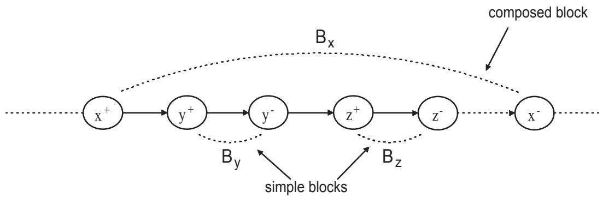  
Figure 1: The blocks $B _ { y }$ and $B _ { z }$ are simple while $B _ { x }$ is composed. Both $B _ { y }$ and $B _ { z }$ belong to $S U B ( B _ { x } )$

An overlapped block is called a subblock. We denote by $\mathrm { S U B } ( B _ { x } )$ the set of subblocks overlapped by $B _ { x }$ , and by $\mathrm { S U P } ( B _ { x } )$ the block $B _ { y }$ such that $B _ { x } \in S U B ( B _ { y } )$ and $\nexists B _ { z } \in$ $S U B ( B _ { y } ) : B _ { x } \ \in \ S U B ( B _ { z } )$ . If $B _ { x }$ is not overlapped, then $S U P ( B _ { x } ) ~ = ~ \emptyset$ . Note that from the feasibility of $T$ , a composed block $B _ { x }$ cannot contain a pickup vertex without its corresponding delivery vertex, and vice-versa. When performing vertex insertion, we define the destination position $d p ( x )$ of a vertex $x$ in $T$ as $S _ { i }$ if $x$ is inserted between $S _ { i }$ and $S _ { i + 1 }$ . The same definition also applies to a block. The extremities of a block $B _ { x }$ are denoted by the couple $[ x ^ { + } , x ^ { - } ]$ . Two couples $[ x ^ { + } , x ^ { - } ]$ and $[ y ^ { + } , y ^ { - } ]$ in $T$ are compatible if one of the following four compatibility conditions is satisfied: 1) $p o s ( x ^ { + } ) ~ < ~ p o s ( y ^ { + } ) ~ < ~ p o s ( y ^ { - } ) ~ < ~ p o s ( x ^ { - } ) ~$ , 2) $p o s ( y ^ { + } ) < p o s ( x ^ { + } ) < p o s ( x ^ { - } ) < p o s ( y ^ { - } )$ $\ : , \ : 3 ) \ : p o s ( x ^ { + } ) < p o s ( x ^ { - } ) < p o s ( y ^ { + } ) < p o s ( y ^ { - } ) $ , 4) $p o s ( y ^ { + } ) < p o s ( y ^ { - } ) < p o s ( x ^ { + } ) < p o s ( x ^ { - } )$ . The first two conditions state that if one couple overlaps the other, the two couples are compatible. The last two conditions state that if two couples have no vertex in common, they are compatible. When two couples $[ x ^ { + } , x ^ { - } ]$ and $[ y ^ { + } , y ^ { - } ]$ are incompatible, we say that there exists a cross $c r s ( x , y )$ in the tour (Figure 2). Note that the presence of a cross implies that the LIFO constraint is not respected. Finally a path $p ( S _ { i } , S _ { j } )$ is reversible if $x ^ { + } \in p ( S _ { i } , S _ { j } ) \Leftrightarrow x ^ { - } \in p ( S _ { i } , S _ { j } )$ and the precedence and LIFO constraints are respected in $p ( S _ { i } , S _ { j } )$ .

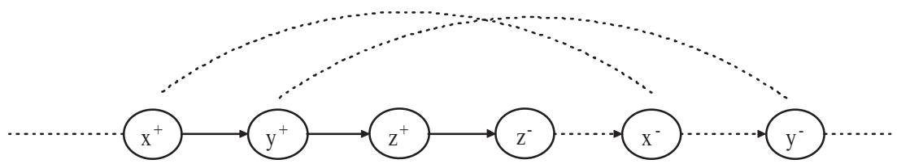  
Figure 2: The cross $c r s ( x , y )$ .

# 2.2. The four basic operators

We now describe four basic operators, couple-exchange, block-exchange, relocate-block, relocatecouple, introduced by Cassani and Righini (2004). These four operators rely on simple moves which preserve the feasibility. We prove this by introducing the following theorem.

Theorem 1 Let $T$ be a feasible tour. Then the following statements hold: 1) the extraction of couple $[ x ^ { + } , x ^ { - } ]$ from $T$ produces a new feasible tour $T ^ { \prime }$ ; $\boldsymbol { \mathcal { Z } }$ ) the extraction of a block $B _ { x }$ from $T$ produces a new feasible tour $T ^ { \prime }$ ; $\mathcal { J }$ ) the insertion of a block $B _ { x }$ between two vertices in $T$ produces a new feasible tour $T ^ { \prime }$ if $p ( x ^ { + } , x ^ { - } )$ is reversible; 4) the relocation of a block $B _ { x }$ in $T$ produces a new feasible tour $T ^ { \prime }$ ; $\mathcal { S }$ ) the insertion of a reversible path $p ( S _ { i } , S _ { j } )$ between two vertices in $T$ produces a new feasible tour $T ^ { \prime }$ .

Proof. 1) The proof is by contradiction. Suppose the new tour $T ^ { \prime }$ obtained by removing the couple $[ x ^ { + } , x ^ { - } ]$ from $T$ is infeasible. This means that there is at least a cross $c r s ( w , z )$ in $T ^ { \prime }$ . Since $\vert x ^ { + } , x ^ { - } \vert \notin T ^ { \prime }$ , it follows that $w \neq x$ and $z \neq x$ . Moreover, we know that the removal of $[ x ^ { + } , x ^ { - } ]$ from $T$ does not change the order relation among the positions of the remaining vertices. Hence if requests $w$ and $z$ produce a cross in $T ^ { \prime }$ , this cross is also in $T$ and $T$ is thus infeasible. 2) The removal of a block $B _ { x }$ from $T$ can be executed by removing one by one all couples $[ y ^ { + } , y ^ { - } ]$ belonging to $B _ { x }$ , and then removing the couple $[ x ^ { + } , x ^ { - } ]$ . From case $^ { 1 }$ , the extraction of a couple always yields a feasible tour and thus the final tour produced by removal of block $B _ { x }$ is also feasible. 3) The proof is by contradiction. Suppose that the new tour $T ^ { \prime }$ obtained by inserting $B _ { x }$ in $T$ is infeasible. This implies that there is at least a cross $c r s ( w , z )$ in $T ^ { \prime }$ . Since $B _ { x }$ contains no vertices of $T$ , from the definition of a cross we know that the insertion of this block into the tour cannot create crosses with the vertices of $T$ . This implies that $c r s ( w , z )$ is either in $B _ { x }$ or in $T$ . However, by hypothesis, we know that $p ( x ^ { + } , x ^ { - } )$ is reversible and thus there are no crosses in $B _ { x }$ . Therefore, if there is a cross in $T ^ { \prime }$ this cross is also in $T$ , and $T$ is thus infeasible. 4) The relocation operation of a block $B _ { x }$ in $T$ can be executed by removing this block from $T$ and then reintroducing it into the destination position, obtaining the new tour $T ^ { \prime }$ . From cases 2 and 3, $T ^ { \prime }$ must be feasible. 5) The insertion of a reversible path can be executed by inserting, one by one, its non-overlapped blocks. From cases 3 and 4, we know that this operation always yields feasible tours and thus the final tour $T ^ { \prime }$ will also be feasible. ✷

# 2.2.1. The couple-exchange operator

The couple-exchange operator selects two couples $[ x ^ { + } , x ^ { - } ]$ and $[ y ^ { + } , y ^ { - } ]$ of $T$ , swaps the positions of $x ^ { + }$ and $y ^ { + }$ and of $x ^ { - }$ and $y ^ { - }$ , and computes the length of the resulting tour. The operator repeats this operation for all $x , y \in R$ , with $x \neq y$ , and implements the best swap if it improves upon $T$ (Figure 3 a,b). By using appropriate pointers, this operator runs in $O ( n ^ { 2 } )$ time.

# 2.2.2. The block-exchange operator

The block-exchange operator is similar to the previous one with the only difference that the swap is applied to whole blocks rather than to their extremities. For each couple of blocks $B _ { x }$ and $B _ { y }$ in $T$ , such that $B _ { x } \notin S U B ( B _ { y } )$ and $B _ { y } \notin S U B ( B _ { x } )$ , block-exchange swaps $B _ { x }$ and $B _ { y }$ and computes the length of the resulting tour. It then implements the best swap if the resulting tour improves upon $T$ (Figure 3c). From cases 2 and 3 of Theorem 1, the new tour is feasible. Again this operator requires $O ( n ^ { 2 } )$ time.

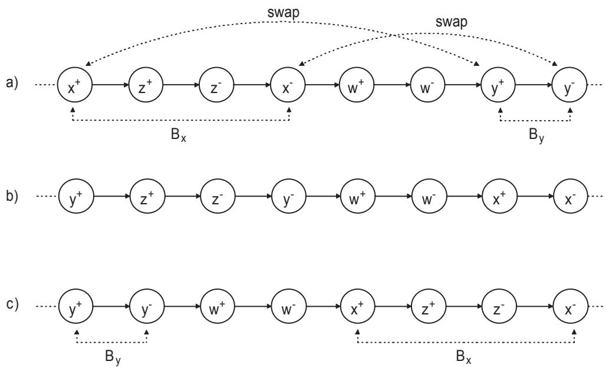  
Figure 3: a) The initial tour $T$ . $b$ ) The new tour created by couple-exchange. c) The tour created by block-exchange.

# 2.2.3. The relocate-block operator

The relocate-block operator selects a block $B _ { x }$ in $T$ and relocates it in a different position. All blocks are considered for relocation and the best one is implemented if it improves upon

$T$ (Figure 4). From case 4 of Theorem 1, the new tour is feasible. This operator also runs in $O ( n ^ { 2 } )$ time.

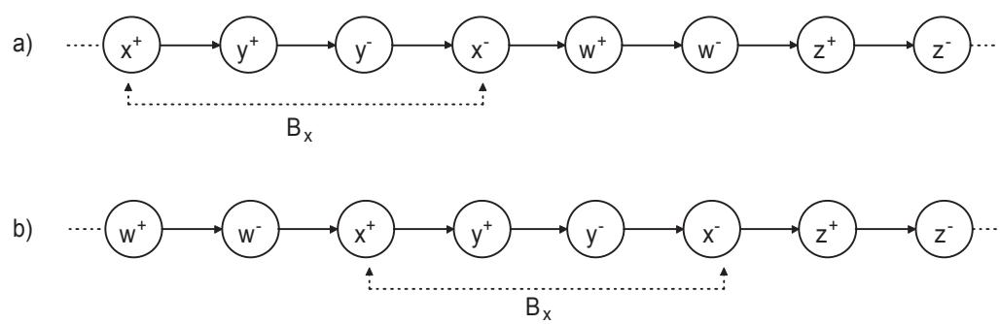  
Figure 4: a) The initial tour $T$ . Let $d p ( B _ { x } )$ be equal to $w ^ { - }$ . $b$ ) New tour created by relocate-block .

# 2.2.4. The relocate-couple operator

The final operator used by Cassani and Righini (2004) is relocate-couple. This operator is more complicated than the others. Because our multi-relocate operator is based on it, we provide a detailed description of its functioning. The relocate-couple operator finds, for each couple $[ x ^ { + } , x ^ { - } ]$ of $T$ , the best relocation position and implements the best improving relocation. This operator runs in $O ( n ^ { 3 } )$ time. It works as follows.

For each couple $\lfloor x ^ { + } , x ^ { - } \rfloor$ of $T$ , the vertices $x ^ { + }$ and $x ^ { - }$ are first removed from $T$ , creating a new tour $T ^ { \prime }$ with $2 n - 1$ vertices (Figure 5a). For $i = 0 , \ldots , 2 n - 2$ , set $d p ( x ^ { + } ) = S _ { i }$ and introduce $x ^ { + }$ in its destination position. Let $T ^ { \prime \prime }$ be the new tour just created (Figure 5b). Note that $S _ { i + 1 } = x ^ { + }$ in $T ^ { \prime \prime }$ . Having inserted $x ^ { + }$ in $T ^ { \prime \prime }$ , the operator seeks the best position $S _ { j }$ in $p ( S _ { i + 1 } , S _ { 2 n - 1 } )$ to insert $x ^ { - }$ . Because of the LIFO constraint, not all positions in $p ( S _ { i + 1 } , S _ { 2 n - 1 } )$ are feasible. Therefore, the operator must first identify all feasible positions for $x ^ { - }$ and then select the best one. The position to the right of $x ^ { + }$ is surely feasible for $x ^ { - }$ . For this reason, once $d p ( x ^ { + } )$ has been fixed to $S _ { i }$ , relocate-couple always sets $d p ( x ^ { - } ) = S _ { i + 1 }$ in $T ^ { \prime \prime }$ and computes the length of the new tour just obtained. In order to find the other feasible destination positions in $p ( S _ { i + 2 } , S _ { 2 n - 1 } )$ , the operator proceeds along this path, and for each vertex $S _ { j }$ encountered, checks whether $S _ { j }$ is a pickup or a delivery vertex. If $S _ { j } = y ^ { + }$ , then the operator jumps block $B _ { y }$ and continues the search starting from $y ^ { - }$ . This is because if $x ^ { - }$ is inserted in any block $B _ { y } \in p ( S _ { i + 2 } , S _ { 2 n - 1 } )$ , it produces the cross $c r s ( x , y )$ which leads to a LIFO constraint violation. If $S _ { j } = y ^ { - }$ two cases are possible:

1) $p o s ( y ^ { + } ) > p o s ( x ^ { + } )$ in $T ^ { \prime \prime }$ . In this case the operator has reached vertex $y ^ { - }$ by jumping from $y ^ { + }$ in the previous iteration. Hence $S _ { j }$ is a feasible destination position and the operator inserts $x ^ { - }$ to the right of $S _ { j }$ and computes the cost of the new tour.

2) $p o s ( y ^ { + } ) < p o s ( x ^ { + } )$ in $T ^ { \prime \prime }$ . In this case, the search terminates because there are no other feasible destination positions for $x ^ { - }$ after $S _ { j - 1 }$ . Indeed the introduction of $x ^ { - }$ after $S _ { j }$ creates the cross $c r s ( x , y )$ , which yields an infeasible tour. Using a stack, it is possible to check in constant time whether a position is feasible for $x ^ { - }$ .

At the end the best exchange identified is implemented if it improves tour $T$ . Because we use a doubly-linked list to represent $T$ , it is possible to execute various changes on $T$ in constant time. The time needed to find the best positions for each couple $[ x ^ { + } , x ^ { - } ]$ is $O ( n ^ { 2 } )$ and this operation is repeated $n$ times, once for each couple. Hence the complexity of this operator is $O ( n ^ { 3 } )$ .

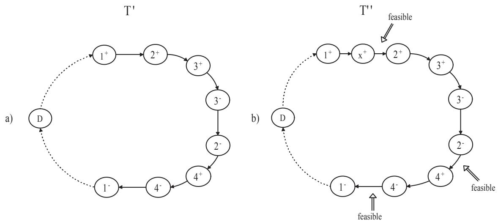  
Figure 5: a) The tour without the couple $[ x ^ { + } , x ^ { - } ]$ . b) The vertex $x ^ { + }$ is inserted between $1 ^ { + }$ and $2 ^ { + }$ . The feasible destination positions for $x ^ { - }$ are $x ^ { + }$ , $2 ^ { - }$ and $4 ^ { - }$ . The insertion of $x ^ { - }$ in $B _ { 2 }$ and $B _ { 3 }$ produces the crosses $c r s ( x , 2 )$ and $c r s ( x , 3 )$ , respectively. Note that there are no feasible positions for $x ^ { - }$ after $1 ^ { - }$ . Indeed introducing $x ^ { - }$ after $1 ^ { - }$ always creates the cross crs(1, $x$ ) because $x ^ { + }$ is in the block $B _ { 1 }$ .

# 3. New operators

In this section we introduce two new operators for the TSPPDL: multi-relocate and 2-opt-L. We also introduce two perturbation operators used within our VNS heuristic: double-bridge and shake.

# 3.1. The multi-relocate operator

We first describe our multi-relocate operator, derived from the relocate-couple operator. As explained in the previous section relocate-couple computes for each couple $[ x ^ { + } , x ^ { - } ]$ in $T$ the best positions to relocate $x ^ { + }$ and $x ^ { - }$ . However, this information is saved only if $[ x ^ { + } , x ^ { - } ]$ is the best couple to relocate, and the operator relocates only the best couple identified. This implies that all the information computed by relocate-couple about the other couples is lost after relocating the best one. It may pay, however, to save this information for further use. The idea behind the multi-relocate operator is to save in a queue every couple $[ x ^ { + } , x ^ { - } ]$ whose relocation produces a new better tour, to relocate the best couple identified, and then to attempt to relocate as many couples as possible from the queue in the new tour. Note that when multi-relocate relocates only the best couple, this tour is exactly the same as the tour produced by relocate-couple. For this reason we use only the multi-relocate operator in our heuristic.

We can divide the multi-relocate operator in two phases. In the first phase, this operator works like relocate-couple, the only difference being the construction of the queue. This first phase ends with the relocation of the best couple. Before describing the second phase, we discuss some issues associated with the relocation of several couples in $T$ . Let $i m p r ( [ x ^ { + } , x ^ { - } ] )$ be the improvement computed by multi-relocate during the first phase for the relocation of couple $\lfloor x ^ { + } , x ^ { - } \rfloor$ in $T$ . All the information computed during the first phase, like the improvement associated with each couple and the destinations of its extremities, relates to the tour $T$ . When multi-relocate relocates the best couple in $T$ it produces a new tour $T _ { 1 }$ for which some of the previous information is no longer correct. The first problem concerns the improvement value associated with each couple. This problem arises because $T _ { 1 }$ may contain vertices whose insertion or extraction cost is changed. Moreover recomputing the improvement of each couple after each relocation is computationally prohibitive. The second problem concerns the need to maintain the feasibility of the tour after each relocation, i.e., ensuring that no crosses are created. In order to create a practically usable operator, we force multi-relocate to satisfy three conditions: 1) for each couple relocated in the new tour, the improvement produced has to be exactly the same as that computed by multi-relocate on $T$ in the first phase; 2) the tour produced after each relocation must remain feasible; 3) the overall time complexity has to be the same as that of relocate-couple.

The idea behind the first condition is to mark as non-removable all couples in the queue whose improvement cost has changed because of the last relocation. Since multi-relocate relocates only the removable couples in the queue and the improvement value of these has not changed, condition 1 will be satisfied at each relocation. The problem is now to find a quick way to determinate whether a couple is removable or not.

Observation 1 Let $T$ be a feasible tour and $T _ { k } ^ { \prime }$ the tour obtained by relocating $k$ couples in $T$ . Given a couple $[ y ^ { + } , y ^ { - } ]$ , if the neighbors of $y ^ { + }$ and $y ^ { - }$ and the successor of $d p ( y ^ { + } )$ and $d p ( y ^ { - } )$ are the same in $T$ and $T _ { k }$ then the improvement in $T _ { k }$ obtained by relocating $[ y ^ { + } , y ^ { - } ]$ is the same as $i m p r ( [ y ^ { + } , y ^ { - } ] )$ .

We know that if a couple satisfies the conditions introduced in Observation 1, then this couple is removable. To check this we assign two flags, $r e m o v a b l e ( y )$ and $n e x t { - a v a i l a b l e ( y ) }$ , to each vertex $y$ . The first flag indicates whether the vertex can be relocated and the second whether it is possible to insert a vertex between $y$ and $s u c c ( y )$ . To see how these flags are used, let $[ y ^ { + } , y ^ { - } ]$ be the couple considered for a move in the current tour $T _ { i }$ , and let $T _ { i + 1 }$ be the new tour produced by this relocation. The operator sets the flag removable of $p r e d ( y ^ { + } )$ , $s u c c ( y ^ { + } )$ , $p r e d ( y ^ { - } )$ and $s u c c ( y ^ { - } )$ to FALSE. Indeed, after the relocation of $[ y ^ { + } , y ^ { - } ]$ , the extraction cost of these vertices in $T _ { i + 1 }$ is changed and so is the improvement value of the couple associated with these vertices. In addition, the flag next available of $p r e d ( y ^ { + } )$ and $p r e d ( y ^ { - } )$ is set to FALSE because the insertion cost of eventual vertices in these two positions in $T _ { i + 1 }$ will be different from the previous cost in $T _ { i }$ (Figure 6a). The operator then relocates $[ y ^ { + } , y ^ { - } ]$ and sets the removable flags of these vertices to FALSE because these have just been relocated. The same applies to the removable flags of new neighbors of $y ^ { + }$ and $y ^ { - }$ in $T _ { i + 1 }$ (Figure 6b). Finally, multi-relocate sets to FALSE the next available flag of vertices $p r e d ( y ^ { + } )$ , $y ^ { + }$ , $p r e d ( y ^ { - } )$ and $y ^ { - }$ . Using these flags, it is possible to determine in constant time whether a couple $[ y ^ { + } , y ^ { - } ]$ is removable. Indeed, it is sufficient to check whether the removable flags of $y ^ { + }$ and $y ^ { - }$ and the next available flags of $d p ( y ^ { + } )$ and $d p ( y ^ { - } )$ take the value TRUE.

To see whether the second condition is satisfied, it is necessary to ensure that relocations do not produce crosses. The operator can check the compatibility of two couples in constant time. However, given a couple $[ y ^ { + } , y ^ { - } ]$ , determining whether this couple satisfies condition 2 requires checking the compatibility between $[ y ^ { + } , y ^ { - } ]$ and all other couples already relocated, which cannot be achieved in constant time. At this point we can describe the second phase of multi-relocate: after the relocation of the best couple, the operator verifies whether each couple in the queue satisfies conditions 1 and 2. If this is the case the couple is relocated, otherwise it is rejected.

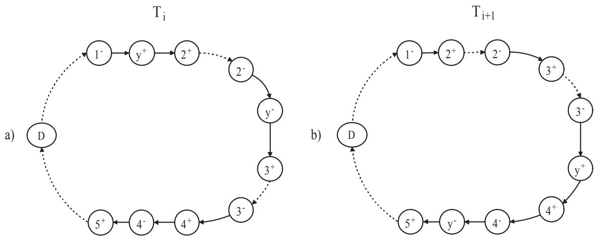  
Figure 6: a) The tour $T _ { i }$ . The couple to move is $[ y ^ { + } , y ^ { - } ]$ . The flags removable( ${ \lfloor - }$ ), removable(2+), removable( $\zeta ^ { - }$ ) and removable( $\beta ^ { + }$ ) are set to FALSE as well as next available(1−) and next available(2−). b) The couple is relocated. The destination positions chosen are $3 ^ { - }$ and $4 ^ { - }$ . The flags removable(3−), removable( $4 ^ { + }$ ), removable(4 $\underline { { \underline { { \mathbf { \Pi } } } } }$ ), removable(5+), removable( $y ^ { + } )$ and $r e m o v a b l e ( y ^ { - } )$ are validated to $F A L S E$ as well as next available(3 $\nu ^ { - }$ ), next available( $\downarrow ^ { - }$ ), next availabl ${ } ^ { ? ( y ^ { + } ) }$ , next available $( y ^ { - } )$ .

Finally, it remains to be shown that the complexity of multi-relocate is $O ( n ^ { 3 } )$ . The first phase of the operator executes the same operations as relocate-couple and creates the queue. The complexity of this phase is $O ( n ^ { 3 } )$ . In the second phase the operator reads the queue, which contains $O ( n )$ couples, and checks conditions 1 and 2 for each couple. Determining whether a couple $[ y ^ { + } , y ^ { - } ]$ satisfies condition 1 can be achieved in constant time because it is sufficient to verify a constant number of flags. The second check is more expensive. Indeed, the operator must verify the compatibility of $[ y ^ { + } , y ^ { - } ]$ with each of the $O ( n )$ couples already relocated. The complexity of the second phase is therefore $O ( n ^ { 2 } )$ , which yields an overall complexity of $O ( n ^ { 3 } )$ . Note that after the relocation of a couple, it is necessary to recompute in $O ( n )$ time the positions of the vertices in the new tour in order to be able to check the compatibility conditions. It is, however, possible to reduce the cost of this operation by using a simple observation. To determine whether two couples $[ x ^ { + } , x ^ { - } ]$ and $[ y ^ { + } , y ^ { - } ]$ are compatible in $T$ , it is not necessary to know the exact positions of their extremities in the tour, but only their visiting order. In other words, if one of following conditions holds then the two couples are compatible: $y ^ { - }$ precedes $x ^ { + }$ ; $y ^ { + }$ follows $x ^ { - }$ ; $x ^ { + }$ precedes $y ^ { + }$ and $y ^ { - }$ precedes $x ^ { - }$ ; $y ^ { + }$ precedes $x ^ { + }$ and $x ^ { - }$ precedes $y ^ { - }$ .

# 3.2. The 2-opt- $\ b { L }$ operator

We now show how to adapt the 2-opt operator to the TSPPDL. This operator involves the substitution of two arcs, $( S _ { i } , S _ { i + 1 } )$ and $( S _ { j } , S _ { j + 1 } )$ , with two other arcs, $( S _ { i } , S _ { j } )$ and $( S _ { i + 1 } , S _ { j + 1 } )$ , and the reversal of path $p ( S _ { i + 1 } , S _ { j } )$ . The new tour, produced after this 2- exchange is $T ^ { \prime } = \left( p ( S _ { 0 } , S _ { i } ) \cdot p ( S _ { i + 1 } , S _ { j } ) ^ { R } \cdot p ( S _ { j + 1 } , S _ { 2 n + 1 } ) \right)$ (Figure 7). Because $p ( S _ { i + 1 } , S _ { j } )$ and $p ( S _ { i + 1 } , S _ { j } ) ^ { R }$ have the same length, the cost of $T ^ { \prime }$ will be less than the cost of $T$ if and only if

$$
c ( S _ { i } , S _ { i + 1 } ) + c ( S _ { j } , S _ { j + 1 } ) > c ( S _ { i } , S _ { j } ) + c ( S _ { i + 1 } , S _ { j + 1 } ) .
$$

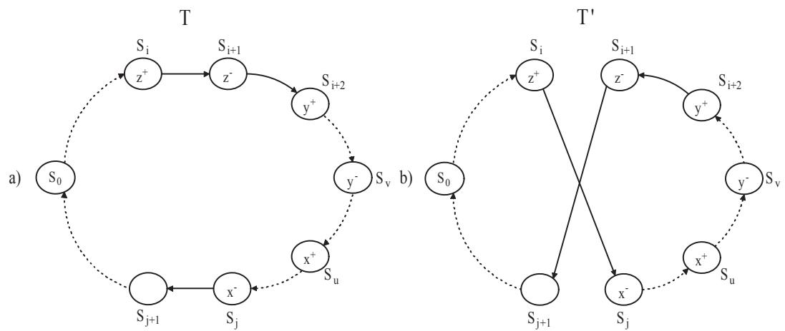  
Figure 7: a) A feasible tour. b) A new tour created by the 2-opt operator. The inversion of $p ( S _ { i + 1 } , S _ { j } )$ produces an infeasible tour because $p o s ( x ^ { - } ) < p o s ( x ^ { + } )$ and $p o s ( y ^ { - } ) < p o s ( y ^ { + } )$ .

The 2-opt operator considers the $O ( n ^ { 2 } )$ 2-exchanges associated with a given tour and implements the best one. It is easy to see that if $T$ is a feasible tour for the TSPPDL, the application of a 2-exchange will produce an infeasible tour $T ^ { \prime }$ because the precedence constraint will be violated (Figure 7b).

We must therefore create an operator that preserves the precedence and LIFO constraints. Given a path $p \in { \cal I } ^ { \prime }$ , the idea is to reverse the visiting order of blocks in $p$ , instead of single vertices. This is achieved through the REVERSE procedure introduced in Section 3.2.1. However this function works only on reversible paths and before invoking it we have to check in $O ( n )$ time whether $p$ is reversible. Since there are $O ( n ^ { 2 } )$ possible 2-exchanges in the tour, the feasibility check for each of them increases the complexity of the operator to $O ( n ^ { 3 } )$ . Psaraftis (1983) and Savelsbergh (1990) have introduced strategies to check the feasibility of a $k$ -exchange without increasing the complexity of the operator in the presence of precedence constraints. We apply these strategies to our problem in which we must also ensure that the LIFO constraint is satisfied. The idea is to divide the operator in two phases. The first one computes all feasible 2-exchanges in the current tour, and the second one considers only the feasible ones in order to find the best exchange. In Section 3.2.2 we introduce the CHECK procedure which computes in $O ( n ^ { 2 } )$ time all reversible paths and feasible 2-exchanges in a given feasible tour.

# 3.2.1. The REVERSE procedure

Inverting the visiting order of vertices of a reversible path $p ( S _ { i } , S _ { j } )$ produces a new path $p ( S _ { i } , S _ { j } ) ^ { R }$ in which the precedence and LIFO constraints are violated since the delivery vertices come before the associated pickups. To solve this problem it is sufficient to reverse the visiting order of the blocks of $p ( S _ { i } , S _ { j } )$ rather than that of the vertices. We know that a block belonging to a feasible tour is reversible. Moreover, from case 4 of Theorem 1 we know that each permutation of the blocks of a reversible path produces a new reversible path. Therefore in $p ( S _ { i } , S _ { j } ) ^ { R }$ the precedence and LIFO constraints hold. We now summarize the three steps of the REVERSE procedure applied to $p ( S _ { i } , S _ { j } )$ :

Step 1. Let $B _ { a }$ , $B _ { p }$ and $B _ { q }$ be the first, second to last and last non-overlapped blocks of $p ( S _ { i } , S _ { j } )$ , respectively. Remove the ingoing arc of $q ^ { + }$ and set $s u c c ( q ^ { - } ) = p ^ { + }$ (Figure 8b). Then, $q ^ { + }$ will be the first vertex of $p ( S _ { i } , S _ { j } ) ^ { R }$ and $B _ { p }$ becomes the current block.

Step 2. Let $B _ { p }$ be the current block and $B _ { x }$ the non-overlapped block preceding $\boldsymbol { B _ { p } }$ in $p ( S _ { i } , S _ { j } )$ . Then set $s u c c ( p ^ { - } ) = x ^ { + }$ . $B _ { x }$ becomes the current block (Figure 8c).

Step 3. If the current block is $B _ { a }$ set $s u c c ( a ^ { - } ) = N U L L$ and stop; otherwise repeat Step 2.

REVERSE also computes the difference between the costs of the removed and added arcs and returns the length of $p ( S _ { i } , S _ { j } ) ^ { R }$ . Note that even in the symmetric case this computation cannot be avoided because $p ( S _ { i } , S _ { j } ) ^ { R }$ contains new arcs with respect to $p ( S _ { i } , S _ { j } )$ . Unfortunately, this computation increases the complexity of the $\boldsymbol { \mathcal { Z } }$ -opt- $L$ operator. It is easy to see that REVERSE runs in $O ( n )$ time.

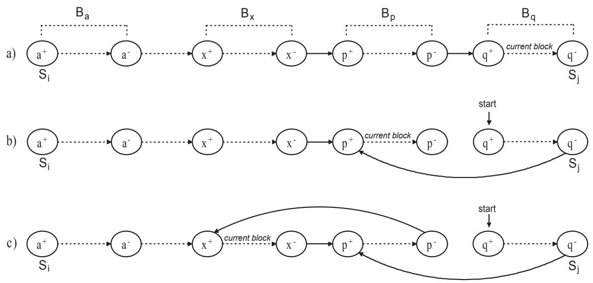  
Figure 8: a) The reversible path $p ( S _ { i } , S _ { j } )$ where $B _ { a }$ , $B _ { x }$ , $B _ { p }$ and $B _ { q }$ are its first, third to last, second to last and last non-overlapped blocks, respectively. b) The REVERSE function removes the arc $( p ^ { - } , q ^ { + } )$ and it adds the arc $( q ^ { - } , p ^ { + } )$ ; $B _ { p }$ becomes the current block. c) REVERSE adds the arc $( p ^ { - } , x ^ { + } )$ and sets $B _ { x }$ as the current block.

# 3.2.2. The CHECK procedure

The CHECK procedure identifies all reversible paths in a feasible tour $T$ in order to execute feasible 2-exchanges. For each $S _ { i }$ and $S _ { j }$ , such that $1 \leq i \leq 2 n - 1$ and $i + 1 \leq j \leq 2 n$ , the procedure determines whether $p ( S _ { i } , S _ { j } )$ is reversible. The results of these computations are saved in a $2 n \times 2 n$ matrix, called $R E V$ , in which $R E V [ i , j ] = \mathrm { T R U E }$ if and only if the path $p ( S _ { i } , S _ { j } )$ is reversible. To perform this computation the procedure uses a stack and a counter, top, representing the first free position in the stack. Given a path $p ( S _ { i } , S _ { j } )$ , the function scans the vertices from $S _ { i }$ to $S _ { j }$ . CHECK puts each pickup vertex $x ^ { + }$ on top of the stack and increments top by one. When a delivery vertex $x ^ { - }$ is encountered, the procedure checks whether the pickup vertex $x ^ { + }$ is in position $t o p - 1$ on the stack. If this is not the case, then $x ^ { + } \notin p ( S _ { i } , S _ { j } )$ and $p ( S _ { i } , S _ { j } )$ is not reversible. Otherwise, CHECK removes $x ^ { + }$ from the stack, decrements top by one and proceeds to the next vertex. The path $p ( S _ { i } , S _ { j } )$ will be reversible if and only if vertex $S _ { j }$ is reached with top equal to zero. This procedure can be accelerated as follows. A path starting with a delivery vertex or finishing with a pickup vertex cannot be reversible. We can therefore reduce $R E V$ to an $n \times n$ matrix, where the row indices are associated with the $n$ pickup vertices in $T$ , and the column indices with the $n$ delivery vertices. The time complexity of the CHECK procedure is $O ( n ^ { 2 } )$ . The initialization of $R E V$ to FALSE requires $O ( n ^ { 2 } )$ time. The operations executed on the stack run in constant time. The time required to validate a row of $R E V$ is equal to $O ( n )$ , and operation is repeated $n$ times. The total time needed to validate $R E V$ is therefore $O ( n ^ { 2 } )$ .

# 3.2.3. Description of the operator

The $\boldsymbol { \mathcal { Z } }$ -opt- $L$ operator first applies the CHECK function to a feasible tour $T$ to identify all feasible 2-exchanges. For each couple of vertices $S _ { i }$ and $S _ { j }$ such that $1 \leq i \leq 2 n - 3$ and $i + 2 < j \leq 2 n$ , $\boldsymbol { \mathcal { Z } }$ -opt- $L$ executes one of following operations, according to the values of $S _ { i }$ and $S _ { i + 1 }$ :

1) $S _ { i } = z ^ { + }$ and $S _ { i + 1 } = z ^ { - }$ (Figure 9a). If $S U P ( B _ { z } ) = \emptyset$ or $B _ { z } \in S U B ( B _ { k } )$ and $p o s ( k ^ { - } ) \geq$ $j + 1$ , $\boldsymbol { \mathcal { Z } }$ -opt- $L$ checks through the matrix $R E V$ whether $p ( S _ { i + 2 } , S _ { j } )$ is reversible. If not, the operator proceeds to the next $j$ . Otherwise, let $B _ { y } ( S _ { i + 2 } , S _ { v } )$ and $B _ { x } ( S _ { u } , S _ { j } )$ be the first and last block of $p ( S _ { i + 2 } , S _ { j } )$ , with $S U P ( B _ { x } ) = S U P ( B _ { y } ) = \emptyset$ , respectively. The operator applies the REVERSE function on $p ( S _ { i + 2 } , S _ { j } )$ to obtain the path $p ( S _ { i + 2 } , S _ { j } ) ^ { R }$ . It then removes the arcs $( S _ { i } , S _ { i + 1 } )$ , $( S _ { j } , S _ { j + 1 } )$ , and $( z ^ { - } , y ^ { + } )$ and adds the arcs $( z ^ { + } , x ^ { + } )$ , $( y ^ { - } , z ^ { - } )$ and $( z ^ { - } , S _ { j + 1 } )$ to create a new feasible tour (Figure 9b). If $B _ { z } \in S U B ( B _ { k } )$ and $p o s ( k ^ { - } ) \leq j$ , then $p ( S _ { i + 2 } , S _ { j } )$ is not reversible for any $j > p o s ( k ^ { - } )$ because $p o s ( k ^ { + } ) < i + 2$ . The operator therefore proceeds to the next $i$ .

2) $B _ { z } ( S _ { i } , S _ { k } )$ and $i + 1 < k < j$ (Figure 10). In this case path $p ( S _ { i + 2 } , S _ { j } )$ is not reversible because $z ^ { + } \notin p ( S _ { i + 2 } , S _ { j } )$ . We therefore focus our attention on the path $p ( S _ { k + 1 } , S _ { j } )$ . If $p ( S _ { k + 1 } , S _ { j } )$ is not reversible the operator proceeds to the next $j$ . Otherwise it computes $p ( S _ { k + 1 } , S _ { j } ) ^ { R }$ and introduces it between $S _ { i }$ and $S _ { i + 1 }$ (Figure 10b).

3) $B _ { z } ( S _ { i } , S _ { k } )$ and $k \geq j$ . In this case the operator proceeds to the next $j$ and restarts because it is preferable not to change the internal structure of composed blocks $B _ { z }$ .

4) $S _ { i } = z ^ { - }$ . The operator checks whether $p ( S _ { i + 2 } , S _ { j } )$ is reversible. If not it proceeds to the next $j$ . Otherwise, it constructs $p ( S _ { i + 2 } , S _ { j } ) ^ { R }$ and inserts it between $S _ { i }$ and $S _ { i + 1 }$ as in case 1.

During the computations, $\boldsymbol { \mathcal { Z } }$ -opt- $L$ saves the best 2-exchange identified and implements it if it improves upon $T$ . The complexity of the $\boldsymbol { \mathcal { Z } }$ -opt- $L$ operator is computed as follows. The $O ( n ^ { 2 } )$ CHECK function is called once at the beginning. For fixed $S _ { i }$ and $S _ { j }$ , REVERSE runs in a time proportional to the length of $p ( S _ { i + 2 } , S _ { j } )$ and has an $O ( n )$ complexity. (Note that since the REVERSE function returns the length of the reversed path, $\boldsymbol { \mathcal { Z } }$ -opt- $L$ can compute in constant time the eventual improvement yielded by the 2-exchange.) The change of three arcs requires constant time and thus the complexity of each 2-exchange is $O ( n )$ . Since the number of possible couplings, $S _ { i }$ and $S _ { j }$ , is equal to $O ( n ^ { 2 } )$ , the overall complexity of $\boldsymbol { \mathcal { Z } }$ -opt- $L$ is $O ( n ^ { 3 } )$ .

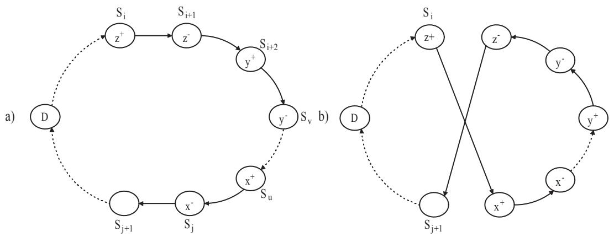  
Figure 9: $a$ ) The feasible tour T. b) The resulting tour produced by 2-opt-L on $S _ { i }$ and $S _ { j }$

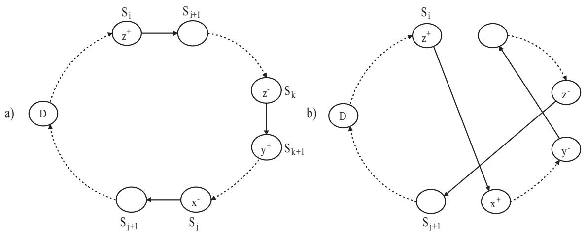  
Figure 10: a) The feasible tour $T$ . b) The resulting tour produced by 2-opt-L by replacing the arcs $( S _ { i } , S _ { i + 1 } )$ and $( S _ { j } , S _ { j + 1 } )$ . In this case $p ( S _ { i + 2 } , S _ { j } )$ is only partially reversed because $z ^ { - } \in p ( S _ { i + 2 } , S _ { j } )$ .

# 3.3. Perturbation operators

We now introduce two operators used by our heuristic to perturb solutions. Other perturbation heuristics that could be adapted to the TSPPDL can be found in Renaud, Boctor and

Laporte (2002).

# 3.3.1. The double-bridge operator

The double-bridge operator perturbs a local optimum identified by a local search algorithm. The classical double-bridge operator, introduced by Lin and Kernighan (1973), selects four breakpoints $b _ { 1 } , b _ { 2 } , b _ { 3 } , b _ { 4 }$ defining four paths A,B,C,D, in $T$ and constructs a new tour $T _ { 1 }$ by replacing the arcs $( b _ { 1 } , s u c c ( b _ { 1 } ) )$ , $( b _ { 2 } , s u c c ( b _ { 2 } ) )$ , $( b _ { 3 } , s u c c ( b _ { 3 } ) )$ , $\left( b _ { 4 } , s u c c ( b _ { 4 } ) \right)$ with $( b _ { 1 } , s u c c ( b _ { 3 } ) )$ , $( b _ { 4 } , s u c c ( b _ { 2 } ) ) , ( b _ { 3 } , s u c c ( b _ { 1 } ) ) , ( b _ { 2 } , s u c c ( b _ { 4 } ) )$ (Figure 11). In order to simplify the description we divide the path containing vertex 0 into two paths: A, from $s u c c ( 0 )$ to $b _ { 1 }$ , and $\mathrm { E }$ , from $s u c c ( b _ { 4 } )$ to $0$ . This last path does not exist if $b _ { 4 } = p r e d ( 0 )$ . The tour $T = ( A \cdot B \cdot C \cdot D \cdot E )$ is then replaced with the tour $T _ { 1 } = ( A \cdot D \cdot C \cdot B \cdot E )$ .

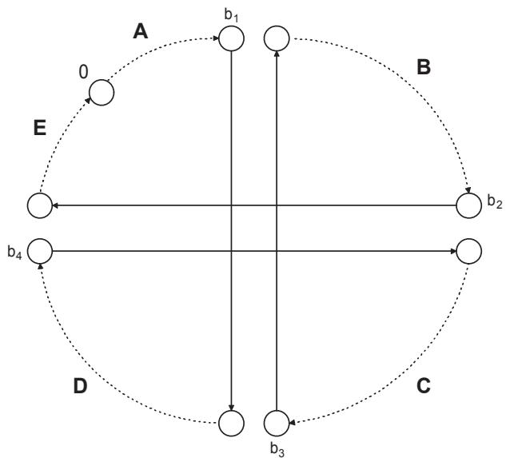  
Figure 11: The double bridge operator. The tour is broken in four points $b _ { 1 } , b _ { 2 } , b _ { 3 } , b _ { 4 }$

Because of the precedence and LIFO constraints, $T _ { 1 }$ may not be feasible for the TSPPDL. One must therefore select the four paths $A , B , C$ and $D$ to ensure the feasibility of $T _ { 1 }$ . An easy way to solve this problem is to restrict the search to reversible paths. However, this will rarely be possible and it is necessary to allow the creation of non-reversible paths, which complicates the operator. To describe how double-bridge selects the breakpoints, we introduce the following theorem.

Theorem 2 Let $p ( S _ { i } , S _ { j } )$ be a reversible path of a tour $T$ and let $i < k < j$ . If $p ( S _ { i } , S _ { k } )$ is reversible then $p ( S _ { k + 1 } , S _ { j } )$ is also reversible.

Proof. Without loss of generality, let $S _ { i } = x ^ { + }$ , $S _ { k } = y ^ { - }$ and $S _ { j } = z ^ { - }$ . The proof is by contradiction. Suppose that $p ( S _ { i } , S _ { k } )$ is reversible and $p ( S _ { k + 1 } , S _ { j } )$ is not. This implies that at least one of the following two cases holds: 1) there is at least one pickup vertex $w ^ { + } \in p ( S _ { k + 1 } , S _ { j } )$ for which the corresponding delivery vertex is not in this path. This means that $T$ contains the cross $c r s ( w , z )$ and thus $p ( S _ { i } , S _ { j } )$ is not reversible; 2) there is at least one delivery vertex $w ^ { - } \in p ( S _ { k + 1 } , S _ { j } )$ for which the corresponding pickup vertex is not in this path. Here we have to consider the following two subcases: $w ^ { + } \in p ( S _ { i } , S _ { k } )$ and $w ^ { + } \in p ( S _ { 0 } , S _ { i - 1 } )$ . In the first subcase, since $p ( S _ { i } , S _ { k } )$ contains a pickup vertex without its delivery vertex, the path is not reversible. In the second subcase $p ( S _ { i } , S _ { j } )$ contains a delivery vertex without its pickup vertex and thus $p ( S _ { i } , S _ { j } )$ is not reversible. ✷

The idea behind the selection of the breakpoints is to select them randomly in different quarters of $T$ , when possible. The first breakpoint $b _ { 1 }$ is selected randomly among the delivery vertices, followed by a pickup vertex between $s u c c ( 0 )$ and $S _ { \lfloor n / 2 \rfloor }$ . If there is no such delivery vertex, then the first delivery vertex found after $S _ { \lfloor n / 2 \rfloor }$ and followed by a pickup vertex is selected. Having selected $b _ { 1 }$ , the selection of the remaining three breakpoints is made according to one of the following cases:

1) $A$ is reversible. In this case whatever the selection of the remaining three pieces, the vertices of $A$ never violate the LIFO constraint in $T _ { 1 }$ . For this reason the construction of $B , C$ and $\boldsymbol { D }$ depends on the selection of $b _ { 2 }$ . The operator randomly selects a delivery vertex $b _ { 2 }$ in $p ( s u c c ( s u c c ( b _ { 1 } ) ) , S _ { n } )$ . If there are no deliveries in this path, then the operator selects the first delivery vertex encountered after $S _ { n }$ . For a given breakpoint $b _ { 2 }$ we consider the following two subcases: 1a) If $B$ is reversible, it never violates the LIFO constraint in $T _ { 1 }$ . However the selection of $b _ { 3 }$ cannot be totally random. Indeed, since $\boldsymbol { D }$ comes before $C$ in $T _ { 1 }$ , if $C$ is not reversible then $T _ { 1 }$ can be infeasible. Feasibility occurs only if each pickup vertex in $C$ has its delivery vertex in $C$ or $E$ . To ensure feasibility, double-bridge randomly selects the breakpoint $b _ { 3 }$ among all delivery vertices in $p ( s u c c ( s u c c ( b _ { 2 } ) ) , S _ { 2 n - 3 } )$ so that $C$ is reversible (Figure 12a). Note that in this case one can randomly select $b _ { 4 }$ , in $p ( s u c c ( s u c c ( b _ { 3 } ) ) , p r e d ( 2 n + 1 ) )$ . Indeed double-bridge inserts two reversible paths, $B$ and $C$ , between $b _ { 4 }$ and its successor, and we know from Theorem 1 that this operation never violates the precedence and LIFO constraints. The search for $b _ { 3 }$ is made as far as $S _ { 2 n - 3 }$ , in order to increase the probability of finding a reversible path $C$ and to leave at least two vertices in the remainder of $T$ for $b _ { 4 }$ .

1b) $B$ is not reversible. Let $I N F _ { - } P _ { B }$ be the set of pickup vertices of $B$ for which the delivery vertex is not in $B$ , and let $I N F _ { - } D _ { B }$ be the set of delivery vertices with pickups belonging to $I N F _ { - } P _ { B }$ . Let $x _ { B } ^ { + }$ and $y _ { B } ^ { + }$ be the first and last pickup vertices in $B$ such that $x _ { B } ^ { + } , y _ { B } ^ { + } \in I N F _ { - } P _ { B }$ (Figure 12b). If $| I N F _ { - } P _ { B } | = 1$ , then $x _ { B } ^ { + } = y _ { B } ^ { + }$ . One cannot leave any delivery vertices of $I N F _ { - } D _ { B }$ in $C$ or $\boldsymbol { D }$ because this would yield a violation of the precedence or LIFO constraints. For this reason double-bridge sets $s u c c ( b _ { 4 } ) = y _ { B } ^ { - }$ , thus fixing the fourth breakpoint, and inserts all vertices of $I N F _ { - } D _ { B }$ in $E$ . Moreover since $\boldsymbol { D }$ comes before $C$ in $T _ { 1 }$ , one must ensure that both pieces are reversible. Thus doublebridge chooses $b _ { 3 }$ randomly in $p ( s u c c ( s u c c ( b _ { 2 } ) , p r e d ( p r e d ( b _ { 4 } ) ) )$ so that $p ( s u c c ( b _ { 2 } ) , b _ { 3 } )$ is reversible. Note that from Theorem 2, if $p ( s u c c ( b _ { 2 } ) , b _ { 4 } )$ is reversible and $b _ { 3 }$ is fixed like above, the $p ( s u c c ( b _ { 3 } ) , b _ { 4 } )$ will be reversible.

2) $A$ is not reversible. From the feasibility of $T$ we know that $A$ contains at least one pickup vertex whose delivery vertex comes after $b _ { 1 }$ . Let $I N F { \bf \underline { { { \Pi } } } } P _ { A }$ , $I N F _ { - } D _ { A }$ , $x _ { A } ^ { + }$ and $y _ { A } ^ { + }$ be defined as in case 1b. To choose the other three breakpoints double-bridge must determine in which of the three paths $B$ , $C$ or $\boldsymbol { D }$ it will insert the vertices of $I N F _ { - } D _ { A }$ . This choice could be made arbitrarily, but the operator considers each possibility separately in order to increase the likelihood of producing a feasible tour $T _ { 1 }$ (see Carrabs (2005) for a detailed explanation of each case).

We now determine the complexity of this operator. The search for the four breakpoints requires the scanning of the whole tour for a total complexity of $O ( n )$ , and this operation is repeated a constant number of times, once for each case described above. The reversibility checks, executed during each case, are done in constant time using the $R E V$ matrix. However, this implies that before applying the operator we have to call the CHECK function, for an additional computation time of $O ( n ^ { 2 } )$ . Having selected the four breakpoints in $O ( n )$ time, the operator constructs $T _ { 1 }$ in constant time by changing a constant number of pointers. The double-bridge operator therefore runs in $O ( n ^ { 2 } )$ time.

# 3.3.2. The shake operator

While the double-bridge operator is rather efficient at perturbing solutions, it sometimes fails and another operator, called the shake operator, is then applied. It randomly selects one of the following four operators: couple-exchange, block-exchange, relocate-couple, relocate-block.

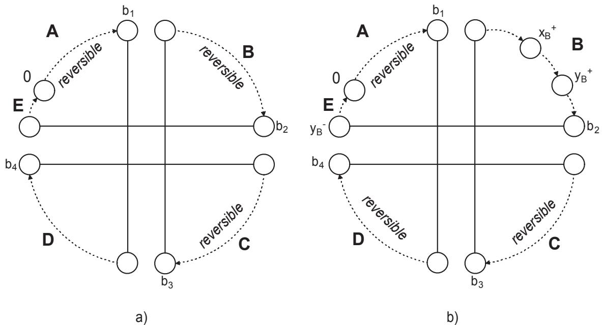  
Figure 12: a) $A$ and $B$ are reversible. Double-bridge selects $b _ { 3 }$ randomly in $p ( s u c c ( s u c c ( b _ { 2 } ) ) , S _ { 2 n - 3 } )$ and so that $C$ is reversible. b) $B$ is not reversible. Double-bridge sets $s u c c ( b _ { 4 } )$ to $y _ { B } ^ { - }$ , inserting all vertices of $I N F { \_ } D _ { B }$ in $E$ . It then selects $b _ { 3 }$ so that $C$ and $D$ are reversible.

According to the type of operator selected, shake randomly selects a couple or a block for a random relocation or swap in the tour. Because of the randomness involved, shake can be applied several times without running the risk of cycling. To prevent our local search algorithm from undoing the work of shake, the couple or block moved by this operator is declared tabu for a number of iterations.

# 4. Variable neighborhood search heuristic

Variable neighborhood search (VNS) was introduced by Mladenovi´c and Hansen (1997). The idea is to apply a perturbation to the current neighborhood operator at a local minimum. The perturbation enables the search to reach a solution that could not have been reached by the current local search mechanism and thus yields a broader exploration of the search space. Several enhancements of the original method have since been proposed (see, e.g., Hansen and Mladenovi´c (2005)). Our VNS heuristic is summarized in Figure 13.

Local search is first applied to a starting solution $s$ until a local minimum $s _ { 1 }$ is encountered. A loop made up of three operations is then executed until a termination condition is met. The first operation perturbs the current local optimum $s _ { 1 }$ to obtain a new solution $s _ { 2 }$ .

# Procedure: VNS

1: s  Generate starting tour;   
2: $s _ { 1 } \gets L o c a l S e a r c h ( s )$ ;   
3: while termination condition is false do   
4: $s _ { 2 } \gets P e r t u r b a t i o n ( s _ { 1 } )$ ;   
5: $s _ { 3 } \gets L o c a l S e a r c h ( s _ { 2 } )$ ;   
6: $s _ { 1 } \gets A c c e p t a n c e C r i t e r i o n ( s ^ { * } , s _ { 3 } )$ ;   
7: end while

The second operation reapplies the local search algorithm on $s _ { 2 }$ to obtain a locally optimal solution $s _ { 3 }$ . Finally the last operation determines whether the next iteration will start from the current solution $s _ { 3 }$ or from the best one $s ^ { * }$ .

In our VNS implementation, the starting solution is obtained by using one of the eight construction heuristics proposed by Cassani and Righini (2004). These heuristics are described in Figure 14. The neighborhoods are defined by the following operators: coupleexchange, block-exchange, relocate-block, $\boldsymbol { \mathcal { Z } }$ -opt- $L$ and multi-relocate, which are applied in a predefined order. Whenever an operator produces a new improving solution, the search restarts from the first operator. Otherwise, the next operator is applied. The heuristic stops when no operator improves the current solution. We have created two VNS heuristics using a different ordering of the operators. The first one, $V N S _ { 1 }$ , applies the operators in the following order: couple-exchange, block-exchange, relocate-block, 2-opt-L, multi-relocate. The second one, $V N S _ { 2 }$ , applies the operators in the following order: 2-opt-L, couple-exchange, block-exchange, relocate-block, multi-relocate. $V \ : N S _ { 2 }$ is used in line 5 of Figure 13. We have used two different heuristics because of the type of solutions produced by 2-opt-L. Indeed, the solutions produced by this operator do not usually significantly differ in terms of cost, but may have very different structures because of the path reversion. This implies that applying $V N S _ { 2 }$ to the starting tour can produce random jumps, especially during the first iterations. In order to avoid this we apply $V N S _ { 1 }$ to the starting tour. However, the solutions produced by $\boldsymbol { \mathcal { Z } }$ -opt- $L$ can turn out to be useful after the perturbation of the local minimum. Indeed, the repeated application of the first three operators of $V N S _ { 1 }$ on a solution perturbed by the shake operation can easily bring the search back to the last local optimum found. If this happens, then the remaining two operators become useless because they cannot improve this local optimum. The application of $\boldsymbol { \mathcal { Z } }$ -opt- $L$ to the perturbed solution decreases the probability of returning to the last local minimum. To further reduce this risk we also use a tabu list that saves all the operations executed by couple-exchange, block-exchange, relocate-block and multi-relocate during the intensification phase. Note that relocate-couple is not used in our VNS heuristic because relocate-couple and multi-relocate are two mutually exclusive operators. Both compute the best couple to relocate in the current tour.

Figure 14: List of heuristics used to generate the starting tour.   

<table><tr><td rowspan=1 colspan=1>Heuristic</td><td rowspan=1 colspan=1>Description</td></tr><tr><td rowspan=1 colspan=1>CI</td><td rowspan=1 colspan=1>Cheapest Insertion: At each iteration the heuristic computes for eachcouple [x+, x−] not yet selected the best position where to insert it intothe tour. It then inserts the couple whose insertion minimizes the lengthof the current tour.</td></tr><tr><td rowspan=1 colspan=1>LI</td><td rowspan=1 colspan=1>Largest Insertion: Like the CI heuristic but at each iteration thecouple whose insertion maximizes the length of current tour is selected.The first couple is selected as in the CI heuristic.</td></tr><tr><td rowspan=1 colspan=1>FI</td><td rowspan=1 colspan=1>Fastest Insertion: In the first iteration the heuristic selects the couplewhose insertion maximizes the length of the current tour. In the follow-ing iterations for each couple not yet selected, the heuristic computesthe distances from the two vertices of the couple and all vertices of thecurrent tour. It selects the couple with the maximal minimum distanceand inserts it in its best position in the tour.</td></tr><tr><td rowspan=1 colspan=1>NI</td><td rowspan=1 colspan=1>Nearest Insertion: Like the FI heuristic but the couple selected is theone closest to the vertices of current tour.</td></tr><tr><td rowspan=1 colspan=1>NN</td><td rowspan=1 colspan=1>Nearest Neighbor: At each iteration insert the nearest neighbor of thelast vertex inserted. The insertion starts with a pickup vertex.</td></tr><tr><td rowspan=1 colspan=1>RANNN</td><td rowspan=1 colspan=1>Randomized Nearest Neighbor: For a fixed parameter λ, at eachiteration one of the λ nearest vertices to the last one is randomly selectedand inserted.</td></tr><tr><td rowspan=1 colspan=1>REV_NN</td><td rowspan=1 colspan=1>Reversed Nearest Neighbor: Similar to the NN heuristic but theinsertion starts with a delivery vertex.</td></tr><tr><td rowspan=1 colspan=1>REV_RANNN</td><td rowspan=1 colspan=1>Reversed Randomized Nearest Neighbor: Similar to RAN_NN, butwith a different random selection of vertices.</td></tr></table>

# 4.1. Perturbation phase

The perturbation phase is implemented with the double-bridge operator. This operator changes only four arcs of a tour and does not execute reverse operations. This implies that usually the cost of the new tour is close to the original one. Another good property of the double-bridge operator is that it is not easy for the other operators to undo the changes it performs on the tour, which means there is little chance of going back to the last perturbed local minimum. For this reason the operations of double-bridge are not inserted in the tabu list. When the operator fails, we perturb the local optimum with the shake operator. These moves are introduced in the tabu list and, because $V N S _ { 2 }$ uses the same operator, we reapply the double-bridge operator to the tour produced by shake in order to reduce the likelihood of going back to the same perturbed local optimum. For the same reason double-bridge is applied after the shake in the diversification phase.

# 4.2. Acceptance criterion

The last part of the heuristic concerns the acceptance criterion. Here we have to decide whether the solution produced by $V N S _ { 2 }$ will be accepted as a starting solution for the next iteration. Obviously, if the new tour computed by $V N S _ { 2 }$ is better then the current best, we save it and accept this new solution. Otherwise we accept the new solution only if $c u r r e n t { - c o s t - \alpha } / d i s t a n c e \leq b e s t { - c o s t }$ , where current cost and best cost are, respectively, the length of the tour produced by $V N S _ { 2 }$ and the best one computed so far, distance is the number of different arcs between the two tours, and $\alpha = s i z e ~ \times ~ i t e r a t i o n ^ { \cdot 2 }$ . The idea behind this formula is the following. Since the heuristic is executed within an intensification phase, we do not want to move too far away from the current local optimum. Consequently, the larger the cost and the number of different arcs between the new solution and best one, the lower is the probability of accepting this new solution. If the above condition is not satisfied the heuristic restarts from best solution. Figure 15 shows the pseudocode of our VNS heuristic.

# 5. Computational results

The algorithm just described was coded in C and run on a 3.4 Ghz PENTIUM 4 Processor. We compare our variable neighborhood search heuristic to the VND heuristic proposed by Cassani and Righini (2004). We first report additional details about the parameters used in the VNS heuristic. The termination condition of the heuristic is the number of consecutive iterations without improvement in the current best solution. The shake operator is applied three times during the perturbation phase while the number of applications of double-bridge depends on instance size. More precisely, let size be equal to $2 n + 1$ : if $s i z e \mathrm { ~ < ~ } 2 5 1$ this operator is applied only once in the diversification phase, otherwise it is applied $2 + \lfloor ( s i z e - 2 5 1 ) / 5 0 0 \rfloor$ times. Our implementation of double-bridge ensures that every time the operator is applied, the four selected breakpoints are different from those of the previous application. In the diversification phase shake is applied six times and the double-bridge the same number of times as in the perturbation phase, plus one. The size of the tabu list is equal to 20 if $s i z e < 7 5$ , and $( s i z e \times 2 5 ) / 1 0 0$ , otherwise.

1: s ← Starting solution();   
2: $s _ { i } \gets V N S _ { 1 } ( s )$ ;   
3: diversif ication $ 0$ ;   
4: for iteration $= 0$ to MAX ITER do   
5:   
6: /\* perturbation phase $^ * /$   
7: if $s _ { j } \gets d o u b l e \_ b r i d g e ( s _ { i } )$ fails then   
8: $s _ { i } ^ { \prime } \gets s h a k e ( s _ { i } )$ ;   
9: $s _ { j } \gets d o u b l e \_ b r i d g e ( s _ { i } ^ { \prime } ) ;$ ;   
10: end if   
11:   
12: if $( c o s t ( s _ { j } ) < b e s t \_ c o s t )$ then   
13: s∗ ← sj   
14: $b e s t \_ c o s t \gets c o s t ( s _ { j } ) ;$ ;   
15: $i t e r a t i o n \gets 0$ ;   
16: end if   
17:   
18: $\begin{array} { r } { s _ { k } \longleftarrow V N S _ { 2 } ( s _ { j } ) ; } \end{array}$   
19:   
20: if $( c o s t ( s _ { k } ) < b e s t \_ c o s t )$ then   
21: $s ^ { * }  s _ { k }$   
22: $b e s t { \_ } c o s t \gets c o s t ( s _ { k } )$ ;   
23: iteration $ 0$ ;   
24: else   
25: sk ← Acceptance criteria $( s ^ { * } , s _ { k } )$ ;   
26: end if   
27: $s _ { i } \gets s _ { k }$ ;   
28:   
29: /\* diversification phase $^ * /$   
30: if (iteration = MAX ITER AND diversif ication $= 0$ ) then   
31: iteration $ 0$ ;   
32: diversif ication $ 1$ ;   
33: $s _ { i } ^ { \prime } \gets s h a k e ( s _ { i } )$ ;   
34: $s _ { i } \gets d o u b l e \_ b r i d g e ( s _ { i } ^ { \prime } ) ;$ ;   
35: end if   
36: end for

Test instances were created from the six files fnl4461, brd14051, d15112, d18512, nrw1379, pr1002 of TSPLIB. In each case, seven subsets of customers were considered to yield instances containing 25, 51, 75, 101, 251, 501 and 751 vertices. For each instance size a random matching was performed among the vertices to create pickup and delivery pairs. Also, for each instance, eight different starting tours were obtained by applying the heuristics described in Figure 14. The use of different starting tours allows us to see how the quality of the starting solution affects the final results of the heuristics. All test instances and solution files are available on the following website: http://www.hec.ca/chairelogistique/data.

We have divided the test results into two tables. In Table 1 we report the solution values computed by our $V N S$ for each starting solution. Obviously the change of starting tour implies a different final result. In each line we indicate in bold the best value computed for that instance. The last line reports, for each starting tour, how many times the $V N S$ has found the best solution starting from this solution. In particular we can see that the best results are obtained for the $F I$ and $R A N _ { - } N N$ heuristics. We have therefore selected one of these two heuristics (the $R A N _ { - } N N$ ) to produce the starting tour on which were applied both the $V \ : N D$ heuristic of Cassani and Righini (2004) and our $V N S$ heuristic. Table 1 shows that even if our heuristic produces different results depending on the starting tour, the average gap between the best and worst solutions computed is around $2 \%$ . Our heuristic is thus quite stable. In contrast, the results produced by $V \ : N D$ with the different starting tours (not reported here for the sake of brevity) show an average gap of 8%.

Table 1: Test results of VNS applying the eight different starting tours.   

<table><tr><td rowspan="2">Instance fnl4461</td><td rowspan="2">Size</td><td rowspan="2">CI</td><td>LI</td><td>NI</td><td>FI</td><td>NN</td><td>RAN_NN</td><td>REV_NN</td><td>REV_RAN_NN</td></tr><tr><td>2168.0</td><td>2168.0</td><td>2168.0</td><td>2168.0</td><td>2168.0</td><td>2168.0</td><td>2168.0</td><td>2168.0</td></tr><tr><td rowspan="6"></td><td>25 51</td><td>4022.8</td><td>4064.1</td><td>4048.1</td><td>4022.8</td><td>4039.7</td><td>4020.0</td><td>4142.1</td><td>4051.4</td></tr><tr><td>75</td><td>5931.3</td><td>5768.4</td><td>5838.0</td><td>5858.1</td><td>5850.4</td><td>5865.0</td><td>5823.7</td><td>5758.9</td></tr><tr><td>101</td><td>8807.8</td><td>8774.9</td><td>8935.4</td><td>8884.3</td><td>8715.7</td><td>8852.8</td><td>8782.3</td><td>8853.0</td></tr><tr><td>251</td><td>29501.7</td><td>29446.1</td><td>29525.6</td><td>29594.1</td><td>29881.9</td><td>29330.6</td><td>29718.1</td><td>29703.2</td></tr><tr><td>501</td><td>72652.5</td><td>72217.1</td><td>73040.7</td><td>72443.6</td><td>73886.0</td><td>71208.5</td><td>71828.1</td><td>72684.3</td></tr><tr><td>751</td><td>118756.1</td><td>119315.6</td><td>118828.1</td><td>118443.2</td><td>119722.3</td><td>118383.1</td><td>119460.7</td><td>119226.2</td></tr><tr><td>brd14051</td><td>25</td><td>4682.2</td><td>4680.0</td><td>4685.6</td><td>4678.8</td><td>4680.6</td><td>4682.2</td><td>4685.6</td><td></td></tr><tr><td rowspan="7"></td><td></td><td>7746.3</td><td>7864.0</td><td>7811.7</td><td></td><td>7749.1</td><td></td><td></td><td>4695.8 7782.4</td></tr><tr><td>51 75</td><td>7300.7</td><td>7262.5</td><td>7269.2</td><td>7765.5</td><td>7364.5</td><td>7763.2</td><td>7759.0 7242.4</td><td></td></tr><tr><td></td><td>9927.7</td><td></td><td>9948.9</td><td>7242.6</td><td>9915.6</td><td>7309.1</td><td></td><td>7270.3</td></tr><tr><td>101</td><td>23662.2</td><td>9865.8</td><td></td><td>9818.3</td><td></td><td>10005.2</td><td>10156.8</td><td>10216.0</td></tr><tr><td>251</td><td>52496.6</td><td>24120.9</td><td>24131.6</td><td>24269.8</td><td>24346.4</td><td>24119.3</td><td>24152.2</td><td>23775.0</td></tr><tr><td>501</td><td></td><td>52238.0</td><td>53248.4</td><td>52636.9</td><td>52415.9</td><td>52806.8</td><td>52637.8</td><td>52769.2</td></tr><tr><td>751</td><td>85699.8</td><td>86690.8</td><td>85922.2</td><td>86047.3</td><td>85486.2</td><td>86230.1</td><td>85934.5</td><td>85940.7</td></tr><tr><td rowspan="7">d15112</td><td>25</td><td>93981.0</td><td>94307.1</td><td>94614.2</td><td>93981.0</td><td>94297.6</td><td>93981.0</td><td>94028.3</td><td>94028.3</td></tr><tr><td>51</td><td>142537.3</td><td>142179.2</td><td>142377.8</td><td>143752.7</td><td>146058.3</td><td>143575.2</td><td>143575.2</td><td>145614.9</td></tr><tr><td>75</td><td>203073.8 274304.6</td><td>203498.5</td><td>200904.9</td><td>203336.3</td><td>201818.6</td><td>201385.4</td><td>204391.4</td><td>203669.3</td></tr><tr><td>101</td><td>581953.1</td><td>274183.3</td><td>273181.3</td><td>273615.9</td><td>276765.0</td><td>276876.8</td><td>274580.3</td><td>276711.9</td></tr><tr><td>251</td><td></td><td>588996.4</td><td>588573.1</td><td>582951.2</td><td>582872.9</td><td>589066.9</td><td>584883.0</td><td>590505.6</td></tr><tr><td>501</td><td>956892.3</td><td>960192.3</td><td>960239.2</td><td>953650.9</td><td>954507.7</td><td>953764.5</td><td>963289.6</td><td>957983.9</td></tr><tr><td>751</td><td>1354634.5</td><td>1354651.7</td><td>1363911.1</td><td>1357396.9</td><td>1343621.8</td><td>1352866.6</td><td>1341634.8</td><td>1360229.3</td></tr><tr><td rowspan="8">d18512</td><td>25</td><td>4678.8</td><td>4685.6</td><td>4686.8</td><td>4692.4</td><td>4685.6</td><td>4683.4</td><td>4679.4</td><td>4685.6</td></tr><tr><td>51</td><td>7541.9</td><td>7569.5</td><td>7561.5</td><td>7539.5</td><td>7601.4</td><td>7565.6</td><td>7562.3</td><td>75548</td></tr><tr><td>75</td><td>8791.7</td><td>8742.6</td><td>8658.2</td><td>8677.4</td><td>8669.8</td><td>8781.5</td><td>8813.7</td><td>8797.4</td></tr><tr><td>101</td><td>10442.1</td><td>10390.6</td><td>10417.1</td><td>10605.4</td><td>10397.2</td><td>10332.4</td><td>10390.9</td><td>10404.9</td></tr><tr><td>251</td><td>24551.3</td><td>24376.9</td><td>24894.3</td><td>24874.5</td><td>25214.8</td><td>24855.4</td><td>24931.4</td><td>24717.9</td></tr><tr><td>501</td><td>51262.7</td><td>51554.3</td><td>51964.1</td><td>51350.9</td><td>51508.7</td><td>52295.6</td><td>51825.4</td><td>51203.3</td></tr><tr><td>751 25</td><td>84359.8</td><td>84025.1</td><td>83787.7</td><td>84253.8</td><td>83875.0</td><td>83763.3</td><td>84420.7</td><td>83737.6</td></tr><tr><td>nrw1379</td><td>3193.4</td><td>3193.4</td><td>3196.2</td><td>3193.4</td><td>3193.4</td><td>3194.8</td><td>3193.4</td><td>3192.0</td></tr><tr><td rowspan="7"></td><td>51</td><td>5078.4</td><td>5067.7</td><td>5055.0</td><td>5055.0</td><td>5089.7</td><td>5095.0</td><td>5071.8</td><td>5086.8</td></tr><tr><td>75</td><td>7034.2</td><td>7050.3</td><td>6931.5</td><td>7033.0</td><td>7079.3</td><td>6865.1</td><td>6952.4</td><td>6965.4</td></tr><tr><td>101</td><td>10167.8</td><td>10004.6</td><td>10032.1</td><td>10132.5</td><td>10189.7</td><td>10197.5</td><td>10158.7</td><td>10205.6</td></tr><tr><td>251</td><td>27699.9</td><td>27712.2</td><td>27925.6</td><td>27652.5</td><td>27782.3</td><td>27936.2</td><td>27934.4</td><td>27939.5</td></tr><tr><td>501</td><td>60925.1</td><td>60928.0</td><td>60529.6</td><td>60387.2</td><td>60890.0</td><td>60584.5</td><td>60671.6</td><td></td></tr><tr><td>751</td><td>104902.5</td><td>105547.0</td><td>105182.7</td><td>105966.2</td><td>105155.0</td><td>105136.1</td><td>105400.1</td><td>60222.5 105543.2</td></tr><tr><td>pr1002</td><td>16221.0</td><td>16221.0</td><td>16221.0</td><td>16221.0</td><td>16221.0</td><td>16221.0</td><td></td><td></td></tr><tr><td rowspan="7"></td><td>25 51</td><td>31151.9</td><td>31067.3</td><td>32506.4</td><td></td><td>31162.9</td><td></td><td>16221.0</td><td>16221.0</td></tr><tr><td>75</td><td>47371.0</td><td>47066.1</td><td>47894.7</td><td>30936.0 47401.8</td><td>47024.7</td><td>31186.6 46911.0</td><td>30983.2 47108.3</td><td>31243.9</td></tr><tr><td>101</td><td>62753.9</td><td>62527.5</td><td>63458.6</td><td>62802.5</td><td>63610.3</td><td>63611.1</td><td>62787.3</td><td>46980.3 62721.6</td></tr><tr><td>251</td><td>200022.1</td><td>198226.3</td><td>200114.7</td><td>199210.4</td><td>201451.8 487077.0</td><td>200028.5</td><td>198501.0 485042.3 484402.2</td><td>199296.3</td></tr><tr><td>501 751</td><td>485685.3</td><td>482324.0</td><td>485204.5</td></table>

Table 2: Performance comparison between $V N D$ and $V N S$ .   

<table><tr><td rowspan="2">Instance</td><td rowspan="2">Size</td><td rowspan="2">RAN_NN</td><td colspan="2">VND</td><td colspan="2">VNS</td><td rowspan="2">Gap (%)</td></tr><tr><td>cost</td><td>time</td><td>cost</td><td>time</td></tr><tr><td rowspan="8">fnl4461</td><td>25</td><td>5273</td><td>2168</td><td>0.00</td><td>2168.0</td><td>0.00</td><td>0.00</td></tr><tr><td>51</td><td>11634</td><td>4301</td><td>0.00</td><td>4020.0</td><td>0.06</td><td>6.53</td></tr><tr><td>75</td><td>15503</td><td>6226</td><td>0.01</td><td>5865.0</td><td>0.17</td><td>5.80</td></tr><tr><td>101</td><td>21897</td><td>10171</td><td>0.04</td><td>8852.8</td><td>0.70</td><td>12.96</td></tr><tr><td>251</td><td>74129</td><td>30927</td><td>3.75</td><td>29330.6</td><td>23.92</td><td>5.16</td></tr><tr><td>501</td><td>275688</td><td>77315</td><td>86.69</td><td>71208.5</td><td>458.56</td><td>7.90</td></tr><tr><td>751</td><td>517555</td><td>122848</td><td>573.37</td><td>118383.1</td><td>2172.49</td><td>3.63</td></tr><tr><td>brd14051</td><td></td><td>4779</td><td>0.00</td><td>4682.2</td><td>0.00</td><td>2.03</td></tr><tr><td rowspan="8"></td><td>25 51</td><td>11758 17365</td><td>8091</td><td>0.00</td><td>7763.2</td><td>0.06</td><td>4.05</td></tr><tr><td>75</td><td>28863</td><td>8762</td><td>0.01</td><td>7309.1</td><td>0.25</td><td>16.58</td></tr><tr><td>101</td><td>34617</td><td>12900</td><td>0.05</td><td>10005.2</td><td>0.74</td><td>22.44</td></tr><tr><td>251</td><td>93483</td><td>25469</td><td>4.37</td><td>24119.3</td><td>36.68</td><td>5.30</td></tr><tr><td>501</td><td>219684</td><td>57504</td><td>82.84</td><td>52806.8</td><td>478.69</td><td>8.17</td></tr><tr><td>751</td><td>351172</td><td>88667</td><td>511.24</td><td>86230.1</td><td>2169.77</td><td>2.75</td></tr><tr><td>25</td><td>138643</td><td>100230</td><td>0.00</td><td>93981.0</td><td>0.00</td><td>6.23</td></tr><tr><td rowspan="5">d15112</td><td>51</td><td>259473</td><td>155554</td><td>0.00</td><td>143575.2</td><td>0.04</td><td>7.70</td></tr><tr><td>75</td><td>445627</td><td>221948</td><td>0.01</td><td>201385.4</td><td>0.18</td><td>9.26</td></tr><tr><td>101</td><td>579279</td><td>293492</td><td>0.04</td><td>276876.8</td><td>0.46</td><td>5.66</td></tr><tr><td>251</td><td>1354723</td><td>621836</td><td>3.20</td><td>589066.9</td><td>24.64</td><td>5.27</td></tr><tr><td>501</td><td>2401410</td><td>974488</td><td>81.63</td><td>953764.5</td><td>385.88</td><td>2.13</td></tr><tr><td rowspan="5">d18512</td><td>751</td><td>3725560</td><td>1425598</td><td>444.69</td><td>1352866.6</td><td>1968.56</td><td>5.10</td></tr><tr><td>25 51</td><td>11758</td><td>4779</td><td>0.00</td><td>4683.4</td><td>0.00</td><td>2.00</td></tr><tr><td></td><td>26039</td><td>7894</td><td>0.00</td><td>7565.6</td><td>0.06</td><td>4.16</td></tr><tr><td>75</td><td>30249</td><td>9997</td><td>0.01</td><td>8781.5</td><td>0.20</td><td>12.16</td></tr><tr><td>101</td><td>45269</td><td>11314</td><td>0.06</td><td>10332.4</td><td>0.52</td><td>8.68</td></tr><tr><td rowspan="5"></td><td>251 501</td><td>106116</td><td>28244</td><td>4.43</td><td>24855.4</td><td>32.89</td><td>12.00</td></tr><tr><td>751</td><td>216088</td><td>54336</td><td>84.96</td><td>52295.6</td><td>485.96</td><td>3.76</td></tr><tr><td>25</td><td>340729</td><td>86957</td><td>569.27</td><td>83763.3</td><td>2508.53</td><td>3.67</td></tr><tr><td>51</td><td>4368 13135</td><td>3356 5195</td><td>0.00</td><td>3194.8</td><td>0.00</td><td>4.80</td></tr><tr><td></td><td></td><td></td><td>0.00</td><td>5095.0</td><td>0.05</td><td>1.92</td></tr><tr><td rowspan="8"></td><td>75</td><td>17889</td><td>7385</td><td>0.01</td><td>6865.1</td><td>0.18</td><td>7.04</td></tr><tr><td>101</td><td>27311</td><td>10802</td><td>0.04</td><td>10197.5</td><td>0.53</td><td>5.60</td></tr><tr><td>251</td><td>71614</td><td>29178</td><td>3.08</td><td>27936.2</td><td>24.54</td><td>4.26</td></tr><tr><td>501 751</td><td>168928</td><td>63038</td><td>78.56</td><td>60584.5</td><td>380.11</td><td>3.89</td></tr><tr><td>25</td><td>281104</td><td>110650</td><td>462.62</td><td>105136.1</td><td>2447.09</td><td>4.98</td></tr><tr><td>51</td><td>30758</td><td>16221</td><td>0.00</td><td>16221.0</td><td>0.00</td><td>0.00</td></tr><tr><td></td><td>67278</td><td>36394</td><td>0.00</td><td>31186.6</td><td>0.07</td><td>14.31</td></tr><tr><td>75 101</td><td>91232</td><td>47287</td><td>0.01</td><td>46911.0</td><td>0.28 0.83</td><td>0.80 2.30</td></tr><tr><td></td><td></td><td>138225</td><td>65110</td><td>0.04</td><td>63611.1</td><td></td></tr><tr><td rowspan="4"></td><td>251</td><td>569919</td><td>210595</td><td>3.37</td><td>200028.5</td><td>31.28</td><td>5.02</td></tr><tr><td>501</td><td>1275796</td><td>501520</td><td>82.65</td><td>485042.3</td><td>471.86</td><td>3.29</td></tr><tr><td>751</td><td>2308307</td><td>843629</td><td>486.26</td><td></td><td>2785.40</td><td></td></tr><tr><td></td><td></td><td></td><td></td><td>819197.7</td><td></td><td>2.90</td></tr></table>

Table 2 gives the results obtained with the $R A N _ { - } N N$ , $V \ : N D$ and $V N S$ heuristics. For each instance we report the cost of the final tour produced by the heuristics and, for $V \ : N D$ and $V N S$ , the CPU time in seconds. Because of the random choices made in the $V N S$ heuristic, this algorithm is not deterministic. It is therefore executed ten times on each instance. We report average cost value and computing time over these ten executions. The last column reports the percent difference between the solution values of the $V \ : N D$ and $V N S$ heuristics.

We can see that the results produced by $V N S$ are always better than those produced by $V \ : N D$ , and that half the time the gap between the solution of $V N S$ and the solution of $V N D$ is larger than 5% (in bold). In two cases, (brd14051-75 and brd14051-101) this gap exceeds $1 5 \%$ . In general, the improvement produced by $V N S$ decreases on the larger instances where the gap is less than $5 \%$ . Regarding CPU time, $V \ : N D$ is obviously faster than $V N S$ since its neighborhood is smaller and easier to compute. However, for instances with up to 100 vertices the CPU time difference between the two heuristics is negligible since both require less than one second. For $V N S$ this time increases on average to 30 seconds for instances of 251 vertices, to eight minutes for instances of 501 vertices, and to forty minutes for instances of 751 vertices.

Another interesting aspect that we have studied is the impact of each operator on the VNS performance. To this end, each operator was in turn removed from VNS, and all instances were solved by means of the new modified heuristic. These new heuristics are called: no-CE, no-BE, no-RB, no-MR and no-2optL. Table 3 reports the percent difference between the solution values of the VNS and those of the modified versions. If this difference is negative, then the modified version has produced a better solution than VNS for that instance. Clearly a small number of negative values in each column reflects a greater impact of the operator associated to the column. The second to last line of Table 3 reports the proportion of the times the modified heuristic has produced a better solution than VNS. We can see that the modified heuristics perform worse than the original VNS algorithm. The last line of the table shows the percent average deterioration in the solution value resulting from the removal of each operator. The last two lines of the table clearly justify the use of each operator.

Regarding the impact of each operator, we can see that multi-relocate is really crucial to our heuristic because no-MR never produces a better solution than VNS. In some cases, the gap between no- $M R$ and VNS can be larger than 4% (in bold). The couple-exchange and $\boldsymbol { \mathcal { Z } }$ -opt- $L$ operators seem the least useful because no- $\it C E$ and no-2optL find better solutions than the base algorithm in 13 and 16 cases, respectively, but the improvement produced is always less than 1%. Finally, no- $B E$ and no- $R B$ improve the solution 7 and 6 times, respectively, but this improvement is always less than $1 \%$ . In some cases, the deterioration resulting from the use of these heuristics is larger than 4%.

Table 3: The operators effect on the $V N S$ heuristic.   

<table><tr><td rowspan=1 colspan=1>Instance</td><td rowspan=1 colspan=1>Size</td><td rowspan=1 colspan=1>no-CE</td><td rowspan=1 colspan=1>no-BE</td><td rowspan=1 colspan=1>no-RB</td><td rowspan=1 colspan=5>no-MR</td><td rowspan=1 colspan=2>no-2optL</td></tr><tr><td rowspan=5 colspan=1>fnl4461</td><td rowspan=5 colspan=1>255175101251501751</td><td rowspan=5 colspan=1>0.003.270.70-0.661.143.711.42</td><td rowspan=5 colspan=1>0.000.830.531.862.656.404.11</td><td rowspan=2 colspan=1>0.000.824.03</td><td rowspan=3 colspan=5>0.001.522.182.93</td><td rowspan=3 colspan=2>0.000.000.04-0.93</td></tr><tr><td rowspan=2 colspan=2></td></tr><tr><td rowspan=1 colspan=1>3.43</td><td rowspan=1 colspan=2>-0.93</td></tr><tr><td rowspan=1 colspan=1>2.29</td><td rowspan=2 colspan=5>1.783.813.15</td><td rowspan=2 colspan=2>-0.130.880.19</td></tr><tr><td rowspan=1 colspan=1>2.852.23</td></tr><tr><td rowspan=7 colspan=1>brd14051</td><td rowspan=7 colspan=1>255175101251501751</td><td rowspan=7 colspan=1>-0.220.750.981.73-0.240.180.09</td><td rowspan=1 colspan=1>-0.07</td><td rowspan=1 colspan=1>-0.13</td><td rowspan=1 colspan=5>0.75</td><td rowspan=1 colspan=2>0.07</td></tr><tr><td rowspan=1 colspan=1>0.39</td><td rowspan=1 colspan=1>1.53</td><td rowspan=1 colspan=5>2.15</td><td rowspan=1 colspan=1></td><td rowspan=1 colspan=1>0.36</td></tr><tr><td rowspan=5 colspan=1>-0.440.183.743.393.14</td><td rowspan=3 colspan=1>-0.051.771.04</td><td rowspan=2 colspan=5>2.423.08</td><td rowspan=2 colspan=1></td><td rowspan=1 colspan=1>1.38</td></tr><tr><td rowspan=1 colspan=1>1.55</td></tr><tr><td rowspan=1 colspan=3>3</td><td rowspan=1 colspan=2>3.98</td><td rowspan=1 colspan=1>98</td><td></td><td rowspan=1 colspan=1></td><td rowspan=1 colspan=1>0.44</td></tr><tr><td rowspan=2 colspan=1>1.850.52</td><td rowspan=2 colspan=5>4.002.32</td><td rowspan=1 colspan=2>4</td><td rowspan=1 colspan=2>4.00</td><td rowspan=1 colspan=1>0</td><td rowspan=1 colspan=1></td></tr><tr><td rowspan=1 colspan=1></td><td></td></tr><tr><td rowspan=4 colspan=1>d15112</td><td rowspan=4 colspan=1>255175101251501751</td><td rowspan=4 colspan=1>0.00-0.791.15-0.34-0.021.150.88</td><td rowspan=1 colspan=1>0.10</td><td rowspan=2 colspan=1>0.000.59</td><td rowspan=4 colspan=5>2.841.524.701.742.772.881.89</td><td rowspan=4 colspan=2>0.39-0.170.510.93-0.430.390.44</td></tr><tr><td rowspan=3 colspan=1>0.122.55-0.620.594.004.07</td></tr><tr><td rowspan=1 colspan=1>1.89-0.611.27</td></tr><tr><td rowspan=1 colspan=1>1.792.14</td></tr><tr><td rowspan=4 colspan=1>d18512</td><td rowspan=4 colspan=1>255175101251501751</td><td rowspan=4 colspan=1>-0.240.29-0.741.610.97-1.361.16</td><td rowspan=4 colspan=1>0.070.420.402.193.413.454.59</td><td rowspan=2 colspan=1>-0.030.051.005.46</td><td rowspan=3 colspan=5>0.832.782.675.033.08</td><td rowspan=3 colspan=2>-0.01-0.17-0.56-0.26-0.41</td></tr><tr><td rowspan=2 colspan=1>-0.26-0.41</td></tr><tr><td rowspan=1 colspan=1>2.72</td></tr><tr><td rowspan=1 colspan=1>0.611.02</td><td rowspan=1 colspan=5>3.403.04</td><td rowspan=1 colspan=2>0.080.52</td></tr><tr><td rowspan=3 colspan=1>nrw1379</td><td rowspan=3 colspan=1>255175101251501751</td><td rowspan=3 colspan=1>0.04-0.532.54-0.93-0.250.370.22</td><td rowspan=3 colspan=1>-0.04-0.793.11-0.861.142.794.87</td><td rowspan=1 colspan=1>0.18-0.79</td><td rowspan=1 colspan=5>2.104.61</td><td rowspan=1 colspan=2>-0.09-0.49</td></tr><tr><td rowspan=1 colspan=1>2.86-0.120.21</td><td rowspan=2 colspan=5>5.102.942.842.742.64</td><td rowspan=2 colspan=2>0.070.29-0.170.180.34</td><td rowspan=1 colspan=1>0.07</td></tr><tr><td rowspan=1 colspan=1>1.232.36</td></tr><tr><td rowspan=5 colspan=1>pr1002</td><td rowspan=5 colspan=1>255175101251501751</td><td rowspan=5 colspan=1>0.00-0.250.521.580.580.570.45</td><td rowspan=2 colspan=1>0.00-0.121.610.55</td><td rowspan=1 colspan=1>0.005.56</td><td rowspan=2 colspan=5>0.000.624.712.06</td><td rowspan=2 colspan=2>0.00-0.240.33-0.68</td></tr><tr><td rowspan=1 colspan=1>2.153.28</td></tr><tr><td rowspan=3 colspan=1>1.942.533.37</td><td rowspan=1 colspan=1>2.01</td><td rowspan=3 colspan=5>2.062.182.05</td><td rowspan=3 colspan=2>0.020.39-0.27</td></tr><tr><td rowspan=1 colspan=1>1.46</td></tr><tr><td rowspan=1 colspan=1>1.36</td></tr><tr><td rowspan=1 colspan=1># Impr.</td><td rowspan=1 colspan=1></td><td rowspan=1 colspan=1>13/42</td><td rowspan=1 colspan=1>7/42</td><td rowspan=1 colspan=1>6/42</td><td rowspan=1 colspan=5>0/42</td><td rowspan=1 colspan=2>16/42</td></tr><tr><td rowspan=1 colspan=1>Average</td><td rowspan=1 colspan=1></td><td rowspan=1 colspan=1>0.51</td><td rowspan=1 colspan=1>1.66</td><td rowspan=1 colspan=1>1.48</td><td rowspan=1 colspan=5>2.64</td><td rowspan=1 colspan=2>0.11</td></tr></table>

# 6. Conclusion

We have studied a variation of the classical TSP with pickup and delivery in which a LIFO constrained is imposed. This condition allows the elimination of costly reshuffling operations often encountered in practice. This is a relatively new problem on which little research has been carried out. We have introduced new operators whose complexity never exceeds $O ( n ^ { 3 } )$ . These have been embedded within a variable neighborhood search heuristic. Test results show that our heuristic outperforms previous heuristics.

# Acknowledgments

This work was partially supported by the Canadian Natural Science and Engineering Research Council under grants 227837-04 and OGP0039682. We thank Giovanni Righini for providing his VND codes. We are also thankful to three anonymous referees for their valuable comments.

# Список литературы

Carrabs, F. 2005. Heuristics and exact approaches for transportation problems with pickup and delivery. Ph.D. Thesis, Dipartimento di Matematica ed Informatica, Universit´a di Salerno, Fisciano, Italy.   
Cassani, L., G. Righini. 2004. Heuristic algorithms for the TSP with rear-loading. 35th Annual Conference of the Italian Operational Research Society (AIRO XXXV), Lecce, Italy, September 2004. http://optlab.dti.unimi.it/Papers/Cassani.pdf.   
Cordeau, J.-F., G. Laporte, J.-Y.Potvin, M.W.P. Savelsbergh. 2006. Transportation on demand. In C. Barnhart and G. Laporte, eds., Transportation. Elsevier, Amsterdam.   
Fischetti, M., P. Toth. 1989. An additive bounding procedure for combinatorial optimization problems. Operations Research 37 319-328.   
Hansen, P., N. Mladenovi´c. 2005. Variable neighborhood search. In E.K. Burke and G. Kendall, eds., Search Methodologies, Springer, New York, 211-238.   
Healy, P., R. Moll. 1995. A new extension of local search applied to the dial-a-ride problem. European Journal of Operational Research 83 83-104.   
Kalantari, B., A.V. Hill , S.R. Arora. 1985. An algorithm for the traveling salesman problem with pickup and delivery customers. European Journal of Operational Research 22 377- 386.   
Ladany, S.P., A. Mehrez. 1984. Optimal routing of a single vehicle with loading and unloading constraints. Trasportation Planning and Technology 8 301-306.   
Levitin, G. 1986. Organization of computations that enable one to use stack memory optimally. Soviet Journal of Computer & System Science 24 151-159.   
Levitin, G., R. Abezgaouzb. 2003. Optimal routing of multiple-load AGV subject to LIFO loading constraints. Computers & Operations Research 30 397-410.   
Lin, S., B. W. Kernighan. 1973. An effective heuristic algorithm for the traveling salesman problem. Operations Research 21 498-516.   
Mladenovi´c, N., P. Hansen. 1997. Variable neighborhood search. Computers & Operations Research 24 1097-1100.   
Or, I. 1976. Traveling salesman type combinatorial problems and their relations to the logistics of blood banking. Ph.D. Thesis, Department of Industrial Engineering and Management Sciences, Northwestern University, Evanston, IL, U.S.A.   
Pacheco, J.A. 1997. Heuristico para los problemas de ruta con carga y descarga en sistemas LIFO Statistics and Operations Research Transactions 21 69-86.   
Psaraftis, H.N. 1983. K-interchange procedures for local search in a precedence-constrained routing problem. European Journal of Operational Research 13 391-402.   
Renaud, J., F.F. Boctor, J. Ouenniche. 2000. A heuristic for the pickup and delivery traveling salesman problem. Computers & Operations Research 27 905-916.   
Renaud, J., F.F. Boctor, G. Laporte. 2002. Perturbation heuristics for the pickup and delivery traveling salesman problem. Computers & Operations Research 29 1129-1141.   
Ruland, K.S., E.Y. Rodin. 1997. The pickup and delivery problem: faces and branch-and-cut algorithm. Computers and Mathematics with Applications 33 1-13.   
Savelsbergh, M.W.P. 1990. An efficient implementation of local search algorithms for contrained routing problems. European Journal of Operational Research 47 75-85.   
Van Der Bruggen, L.J.J., J.K. Lenstra, P.C. Schuur. 1993. Variable depth search for the single-vehicle pickup and delivery problem with time windows. Transportation Science 27 391-402.   
Volchenkov, S.G. 1982. Organization of computations utilizing stack storage. Engineering Cybernetics, Soviet Journal of Computer & System Science 20 109-115.   
Xu, H., Z. Chen, S. Rajagopal, S. Arunapuram. 2003. Solving a practical pickup and delivery problem. Transportation Science 37 347-364.