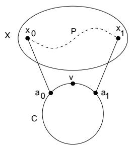
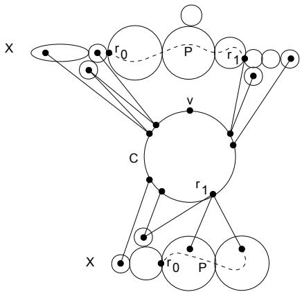
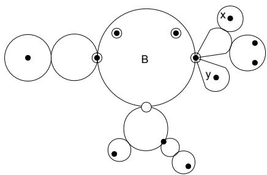

# Finding Paths and Cycles of Superpolylogarithmic Length

Harold N. Gabow Department of Computer Science University of Colorado at Boulder Boulder, Colorado 80309 hal@cs.colorado.edu

# ABSTRACT

Let $\ell$ be the num ber of edges in a longest cycle containing a given vertex $_ v$ in an undirected graph. We show how to find a cycle through $_ v$ of length $\exp ( \breve { \Omega } ( \sqrt { \log \ell / \log \log \ell } ) )$ in polynomial time. This implies the same bound for the longest cycle, longest $v w$ -path and longest path. The previous best bound for longest path is length $\bar { \Omega } ( ( \log \ell ) ^ { 2 } / \bar { \log \log \ell } )$ due to Bj¨orklund and Husfeldt. Our approac h, which builds on Bj¨orklund and Husfeldt’s, uses cycles to enlarge cycles. This self-reducibilit y allows the appro ximation metho d to b e iterated.

# Categories and Subject Descriptors

F.2 [Theory of Computation ]: Analysis of Algorithms and Problem Complexit y; G.2.2 [Mathematics of Computing ]: Discrete Mathematics— Graph The ory

# General Terms

Algorithms, Design, Theory

# Keywords

appro ximation algorithms, graph algorithms, path, cycle

# 1. INTRODUCTION

Interest in appro ximating the longest path of a graph was rekindled by Karger, Mot wani and Ramkumar [9] who were motiv ated by the large gap between known performance guaran tees and hardness results. We mak e some progress in reducing the gap by presen ting the best known polynomial time appro ximation algorithm. In particular we show how to find paths of greater than polylogarithmic length.

Previous work. Monien [11] investigated fixed parameter algorithms for long paths and cycles, showing how to find a path of length (exactly) $k$ , if one exists, in time $O ( k ! n m )$ . He also pro ved a fact ab out undirected cycle length that is useful in finding cycles of length $\geq k$ ; a varian t of this fact is stated below. In other early work Fellows and Langston showed how to find undirected cycles of length $\geq k$ using Rob ertson-Seymour theory [6]. Bodlaender [2] used dynamic programming to find long undirected paths and cycles, impro ving Monien’s bounds.

Karger et.al.[9] showed getting a constan t factor appro ximation to the longest undirected path is NP-hard. Furthermore for an y $\epsilon > 0$ , appro ximating to within a factor 2O (log 1 − n ) is quasi-NP-hard. Stronger hardness results for directed graphs are given in [4].

Alon et. al. [1] intro duced the tec hnique of color coding to find paths, cycles and other small subgraphs. For example color coding finds a path of length $\log n$ in p olynomial time if one exists; if not it finds a longest path. The same holds for vw-paths.

Bj¨orklund and Husfeldt [3] find an undirected path of length $\Omega ( ( \log \ell / \log \log \ell ) ^ { 2 } )$ in polynomial time, where $\ell$ is the longest path length. [7] observ es that the length guaran tee is actually $\Omega ( \log ^ { 2 } \ell / \log \log \ell )$ . This is the b est kno wn bound to date.

Gab ow and Nie [7] investigate long directed cycles. They also pro ve a varian t of Monien’s undirected cycle structure theorem: If a connected undirected graph has a cycle of $\geq k$ edges, either every dfs tree has a fundamen tal cycle of $\geq k$ edges or some cycle has between $k$ and $2 k$ edges. This result, or Monien’s, allows color coding to b e applied to the problem of finding a cycle of $\geq k$ edges.

Our algorithm requires finding a cycle through three given points. Rob ertson and Seymour showed that more generally , the fixed vertex subgraph homeomorphism problem can be solved in polynomial time [12]. However huge constan ts are involved and even for our case of triangles the exact algorithm is unkno wn. LaP augh and Riv est [10] give a linear time algorithm for our case of triangles, involving no large hidden constan ts.

Our contribution. A $_ v$ -cycle is a cycle containing vertex $_ v$ . We tak e the basic problem to be appro ximating the longest $\upsilon \cdot$ -cycle, where $_ v$ is a given vertex of degree 2. It is easy to reduce longest cycle, longest vw-path and longest path to this problem.

Let $\ell$ denote the length of a longest $\boldsymbol { v } .$ -cycle in a given undirected graph. We show that a $\upsilon .$ -cycle whose length is $\exp ( \Omega ( \sqrt { \log \ell / \log \log \ell } ) )$ can be found in polynomial time. This implies the same bound for the longest cycle, longest $v w$ -path and longest path. This impro ves the previous best bound of Bj¨orklund and Husfeldt for longest path given ab ove. It also impro ves the previous best bound for longest vw-paths and cycles, which was only $\log n$ using color coding.

Our approac h builds on Bj¨orklund and Husfeldt’s idea of using cycles to enlarge paths. We use cycles to enlarge cycles, giving a self-reducibilit y prop ert y that allows the construction to be iterated. We note that the hardness results of Karger et.al.[9] are based on a self-impro vabilit y prop ert y of longest path involving graph pro ducts; it is unclear if this has an y relation to our self-reducibilit y.

Our results hinge on prop erties of biconnected comp onen ts, cutp oints and separating pairs. The self-reducibilit y gives rise to a family of recursiv e algorithms. We can only recur a limited num ber of times because of the need to keep the graphs large.

Section 2 presen ts the facts on cutp oints and separation pairs that underlie our algorithm. Section 3 presen ts the algorithm. The final two sections give the analysis, Section 4 pro ving the length guaran tee and Section 5 giving implemen tation details and pro ving the polynomial time bound. We conclude this section with our terminology .

Terminology. A fraction $a / b c$ is always an abbreviation of $a / ( b c )$ e.g., $a / 2 k$ . All logarithms are base 2 unless noted otherwise. When used as a num ber, $e$ is the base of natural logarithms. $\exp ( x )$ denotes $e ^ { x }$ .

Our graph terminology is consisten t with [14]. All graphs in this pap er are undirected and simple. $G [ X ]$ denotes the subgraph induced by vertex set $X$ . For $X$ and $Y$ disjoin t vertex sets, $E [ X , Y ]$ consists of all edges joining $X$ and $Y$ . Furthermore writing $x y \in E [ X , Y ]$ means $x \in X$ and $y \in Y$ .

All paths and cycles in this pap er are simple. In contrast a walk can ha ve rep eated vertices. (So a path is a simple walk.) Let $_ { x }$ and $_ y$ b e vertices. An xy -path is a path from $_ { x }$ to $_ y$ . For $x \neq y$ , $d ( x , y )$ denotes the length of a shortest $x y$ -path. If the graph of interest is unclear in some notation we include it as a subscript, e.g., $d _ { G } ( x , y )$ .

We represen t a path as a list of vertices, e.g., $x , y , z$ . W e also allow paths in the list, e.g., if $x y$ is an edge and $Z$ is a path starting at $_ y$ then $x , Z$ denotes a path that is 1 edge longer than $Z$ . Sometimes we write $x , y$ , $Z$ for the same path to remind the reader of the first edge $x y$ . This will not cause any confusion.

If $P$ is a path containing $_ { x }$ and $_ y$ with $_ { x }$ preceding $_ y$ then $P [ x , y ]$ denotes the subpath of $P$ from $_ { x }$ to $_ y$ . We occasionally write $P [ y , x ]$ to refer to the subpath from $_ y$ to $_ { x }$ in the reverse path of $P$ ; however to prev ent confusion we always indicate when this extended notation is being used. If $C$ is a cycle containing $x , y$ and $v$ then $C _ { v } [ x , y ] \ ( C _ { v } [ x , y ] )$ denotes the subpath of $C$ from $_ { x }$ to $_ y$ that contains (a voids) $_ v$ , resp ectiv ely. We extend the subpath notation to allow op en-sided interv als, e.g., $P ( v , w ]$ is the path $P [ \boldsymbol { v } , \boldsymbol { w } ] - \boldsymbol { v }$ .

If $P$ is a path we use $P$ to denote a set of vertices or edges, as is convenien t; the exact meaning will be clear from context. $| P |$ always denotes the num ber of edges in $P$ .

# 2. APPROACH

Throughout this pap er $G$ is a given connected undirected graph. Our main algorithm finds a long $\upsilon$ -cycle, where $v$ is a given vertex of degree 2. This algorithm can be used to find a long xy -path, by adding a new vertex $_ v$ with edges vx, vy. Letting $_ { x }$ and $_ y$ vary we can appro ximate the longest path in the graph. Similarly we can appro ximate the longest cycle.

  
Figure 1: A $\upsilon$ -cycle $C$ and an $a _ { 0 } a _ { \mathrm { 1 } }$ -path $P$ passing through a connected comp onen t $X$ of $G - V ( C )$ .

The overall approac h is due to Bj¨orklund and Husfeldt [3]. They use a cycle to find a long path. Since our algorithm seeks a long cycle rather than a long path, the approac h must be mo dified. This section presen ts the principles on which our algorithm is based.

The setting for our algorithm is illustrated in Fig.1: $C$ is a $\boldsymbol { v }$ -cycle. $X$ is a connected comp onen t of $G \mathrm { ~ - ~ } V ( C )$ . We sometimes write $G [ X ]$ to emphasize that we are dealing with the graph induced by vertices $X$ . $P$ is an $a _ { 0 } a _ { \mathrm { 1 } }$ -path through $X$ , more precisely for distinct vertices $a _ { 0 } , a _ { 1 } \in C$ , $P = a _ { 0 } , P [ x _ { 0 } , x _ { 1 } ] , a _ { 1 }$ with $P [ x _ { 0 } , x _ { 1 } ] \subseteq X$ .

Here is how the figure relates to the algorithm of the next section. Let $C ^ { * }$ be a longest $\boldsymbol { v } .$ -cycle. $C$ will b e a v-cycle already found by the algorithm. The algorithm is attempting to enlarge $C$ to a longer $\upsilon \cdot$ -cycle. $P$ will b e a path that our algorithm has found recursiv ely (in Lemma $2 . 1 ( i )$ b elow) or a subpath of $C ^ { * }$ (in Lemma $2 . 1 ( i i ) .$ .

We use two main tec hniques to enlarge $C$ . The first is similar to Bj¨orklund and Husfeldt’s idea to use cycles to extend paths:

Lemma 2.1. (i) $P , C _ { \upsilon } [ a _ { 1 } , a _ { 0 } ]$ is a v-cycle of length $> | P | +$ $d _ { C } ( a _ { 0 } , \upsilon )$ . (ii ) For any vertex $c \in C$ adjac ent to $X$ , ther e is a path $Q \subseteq X$ and a vertex $c ^ { \prime } \in C - c$ such that $c , Q , c ^ { \prime }$ is a path of length $\geq | P | / 2 + 1$ .

Pr oof. $( i )$ Note $| C _ { \upsilon } [ a _ { 1 } , a _ { 0 } ] | > d _ { C } ( a _ { 0 } , \upsilon )$ since $a _ { \mathrm { 1 } }$ is distinct from the degree 2 vertex $_ v$ .

$( i i )$ Cho ose $x \in X$ a neigh bor of $c$ as follows. If $c = a _ { i }$ for $i \in \{ 0 , 1 \}$ then $x = x _ { i }$ . Otherwise $_ { x }$ is arbitrary .

Take an y minimal path $R$ from $_ { x }$ to $P$ in $X$ . Let $R$ end at vertex $r \in P$ . Cho ose index $j ~ \in ~ \{ 0 , 1 \}$ so $| P [ r , x _ { j } ] | \ge | P [ r , x _ { 1 - j } ] |$ . (Note one of these two subpaths of $P$ actually involves the reverse of $P$ .) The desired path $c , Q , c ^ { \prime }$ is $c , R , P [ r , x _ { j } ] , a _ { j }$ . This walk is simple since the choice of $_ { x }$ guaran tees $c \neq a _ { j }$ . The path’s length is $\geq 1 + ( | P | - 2 ) / 2 + 1 = | P | / 2 + 1$ .

When $d _ { C } ( a _ { 0 } , \upsilon )$ is large part $( i )$ allows us to mak e good progress in enlarging $C$ . When $d _ { C } ( a _ { 0 } , \upsilon )$ is small another metho d is needed. The idea, illustrated in Fig.2, is to tak e 2 recursiv ely found paths ( $P$ in Fig.2) and find a $\upsilon .$ -cycle that contains both paths. Of course 2 arbitrary paths need not be contained in a $_ v$ -cycle. To guaran tee this $_ v$ -cycle exists, for each comp onen t $X$ we find a separation pair of $G$ $( r _ { 0 } , r _ { 1 }$ in Fig.2) both vertices of which are contained in $C ^ { * }$ . Then no matter what $r _ { 0 } r _ { 1 }$ -paths the algorithm chooses, they will be contained in a $_ v$ -cycle (gotten from $C ^ { * }$ ). Of course the algorithm does not know $C ^ { * }$ , so some guessing will b e involved, and the separation pairs need not even exist, so some other cases will be involved.

  
Figure 2: A $\boldsymbol { v }$ -cycle $C$ and 2 connected comp onen ts $X$ of $G - V ( C )$ , with their separation pairs $r _ { 0 } , r _ { 1 }$ and $r _ { 0 } r _ { \mathrm { 1 } }$ -paths $P$ .

The next several lemmas give to ols that allow us to either enlarge $C$ or to find these separation pairs $r _ { 0 } , r _ { 1 }$ . Our discussion uses connected comp onen ts, biconnected comp onen ts, and a form of triconnected comp onen ts. For clarit y we use terminology that explicitly differentiates all these typ es of comp onen ts.

A bicomponent is the set of edges of a biconnected comp onen t. Recall that two edges are in the same bicomp onen t iff some cycle contains both of them [13]. We are interested in when a bicomp onen t $B$ separates 2 vertices. By definition the edge set $B$ separates vertices $_ { x }$ and $_ y$ if every $x y$ -path includes an edge of $B$ . (Note that it is p ossible for t wo vertices to be separated by a vertex of $V ( B )$ but not separated by $B$ , e.g., $_ { x }$ and $_ y$ in Fig.3.)

The following notation, illustrated in Fig.3, elucidates the concept: For an y vertex $_ v$ and bicomp onen t $B$ , vB denotes the vertex of $V ( B )$ that is the end of every minimal path from $v$ to $V ( B )$ . For example a vertex $v \in V ( B )$ has $\upsilon _ { B } = \upsilon$ . Assuming the graph is connected, an y $_ { v B }$ is unique. In pro of supp ose not. So there are two minimal paths from $_ v$ to $V ( B )$ , say $P _ { 1 }$ and $P _ { 2 }$ , with $P _ { i }$ ending in vertex $b _ { i } \in V ( B )$ and $b _ { 1 } \neq b _ { 2 }$ . Let $Q$ be a $b _ { 1 } b _ { 2 }$ -path in $B$ . Then $P _ { 1 } \cup Q \cup P _ { 2 }$ contains a cycle that includes both edges of $B$ and edges not in $B$ . This contradicts the definition of $B$ .

The vertices $v _ { B }$ give this alternate characterization of separation: $\boldsymbol { v }$ and $w$ are separated by $B$ if and only if $\boldsymbol { v } _ { B } \neq \boldsymbol { w } _ { B }$ . The only if direction is clear. For the if direction note that a vw-path avoiding $B$ would contradict the uniqueness of $v _ { B }$ .

We now give some basic prop erties of separation by a bicomp onen t. Say that vertex $s$ weakly separ ates sets $A , B \subseteq$ $V$ if every path from $A$ to $B$ contains $s$ . (It is p ossible that $s$ belongs to $A$ or $B$ .)

Lemma 2.2. Let $G$ be conne cted, and $B$ be a bicomponent. (i) Any two distinct vertic es in $V ( B )$ ar e separ ated by $B$ . (ii ) Any two distinct vertic es $x , y$ ar e separ ated by $B$ if some xy -path contains an edge of $B$ . (iii ) For any set of vertic es $W$ , either $B$ separ ates two vertic es of $W$ or some vertex of $V ( B )$ weakly separ ates $W$

  
Figure 3: A bicomp onen t $B$ and 12 vertices (dra wn solid) that determine 5 distinct vertices $v _ { B }$ (circled or dra wn hollo w).

and $V ( B )$

Pr oof. $( i )$ and $( i i )$ follow immediately from the $v _ { B }$ characterization of separation. For $( i i i )$ note that if $B$ do es not separate an y two vertices of $W$ then every $w \in W$ has the same vertex $w _ { B }$ . By definition this vertex weakly separates $W$ and $V ( B )$ .

For an y real value $b > 2$ , a bicomp onen t is $^ { b }$ -round if it contains a cycle of $\geq b$ edges. $D ( x , y )$ denotes the length of a longest $x y$ -path.

Lemma 2.3. Consider a conne cted graph and two distinct vertic es $x , y$ . $( i )$ If $_ x$ and y ar e separ ated by a b-round bicomponent then $D ( x , y ) \geq b / 2$ . ( ii ) $D ( x , y ) > d ( x , y )$ implies $_ x$ and y ar e separ ated by a $( D ( x , y ) / d ( x , y ) + 1 )$ -round bicomponent.

Remark: We will only use this weaker version of $( i i )$ : If $b = D ( x , y ) / d ( x , y ) > 2$ then $_ { x }$ and $_ y$ are separated by a $^ { b }$ -round bicomp onen t.

Pr oof. $( i )$ Let $B$ be a bicomp onen t containing a cycle $A$ of length $\geq b$ . First supp ose $_ x$ and $_ y$ are distinct vertices of $V ( B )$ . Biconnectedness implies there are distinct vertices $r , s \in A$ with an $_ { x r }$ -path and a ys-path that are disjoin t and also b oth disjoin t from $A$ un til their last vertex. (This fact is well-kno wn [14, Ex.4.2.9]. It is also easy to see from the definition, by adding edge xy to the graph if it is not already presen t.) Piece these paths together to form an xy -path of length $\geq b / 2$ . (Sp ecifically, follow the $_ { x r }$ -path, then a path $A [ r , s ]$ of length $\geq b / 2$ , and then the ys-path reversed.)

Now supp ose $_ { x }$ and $_ y$ are arbitrary vertices separated by $B$ . Take an $_ { x y }$ -path. It contains an $x x _ { B }$ -subpath and a yyB - subpath. We ha ve $x _ { B } \neq y _ { B }$ , so the subpaths are disjoin t. Form the desired $x y$ -path from the two subpaths plus the xB yB -path of length $\geq \ b / 2$ constructed ab ove (note this path is contained in $B$ ).

(ii ) L $\mathfrak { a t } L \left( S \right)$ b e a longest (shortest) xy -path. Let the vertices of $L \cap S$ be $x = s _ { 0 } , s _ { 1 } , \ldots , s _ { r } = y _ { : }$ ordered as they occur in $S$ . (This need not b e their order in $L$ .) For each consecutiv e pair $s _ { i } , s _ { i + 1 }$ , paths $L [ s _ { i } , s _ { i + 1 } ]$ and $S [ s _ { i } , s _ { i + 1 } ]$ are internally vertex disjoin t. $\left( L [ s _ { i } , s _ { i + 1 } ] \right)$ ma y actually be a subpath of the reverse of $L$ .) The various paths $L [ s _ { i } , s _ { i + 1 } ]$ can share vertices and edges, but certainly some $L [ s _ { j } , s _ { j + 1 } ]$ has length $\geq | L | / r \geq | L | / | S |$ . Th us $L [ s _ { j } , s _ { j + 1 } ] , S [ s _ { j + 1 } , s _ { j } ]$ is a cycle $A$ .

( $A$ is simple, and its length is $\ge 1 + \lceil \lvert L \rvert / \lvert S \rvert \rceil \ge 3 .$ $A$ is contained in some bicomp onen t $B$ . $A$ mak es $B$ $( | L | / | S | + 1 )$ - round. Since $S$ contains an edge of $B$ , $B$ separates $_ { x }$ and $_ y$ .

Recall that two edges are indep endent if all four endp oints are distinct. A set of edges forms a star if some vertex (its center ) is inciden t to all of them. For an edge $e \in E [ X , \dot { Y } ]$ , $X ( e )$ denotes the endp oint of $e$ in $X$ . For $F \subseteq E [ X , Y ]$ , $X ( F )$ denotes $\{ X ( e ) : e \in F \}$ .

Lemma 2.4. Let the vertex set of graph $G$ be partitione d into sets $X$ and $Y$ , with $G [ X ]$ conne cted. Let $B$ be a bicomponent of $G [ X ]$ and let $F = E [ X , Y ]$ .

Suppose no two indep endent edges $e _ { 1 } , e _ { 2 } \in F$ have their ends $X ( e _ { 1 } ) , X ( e _ { 2 } )$ separ ated by $B$ , in graph $G [ X ]$ . Then either $F$ is a star or some vertex of $V ( B )$ weakly separ ates $X ( F )$ from $V ( B )$ , in graph $G [ X ]$ .

Pr oof. Supp ose $F$ is not a star. Then there are independen t edges $y x , y ^ { \prime } x ^ { \prime } \in E [ Y , X ]$ . The lemma’s hyp othesis implies $x _ { B } = x _ { B } ^ { \prime }$ . (All vertices $v _ { B }$ in this argumen t are calculated in graph $G [ X ]$ .) Consider an y edge $w z \in E [ Y , X ]$ with $z \neq x , x ^ { \prime }$ 0. This edge is indep enden t with either $_ { \mathcal { I } ^ { \mathcal { X } } }$ or $y ^ { \prime } x ^ { \prime }$ (or b oth). Hence the lemma’s hyp othesis implies $z _ { B } = x _ { B }$ . Th us $X ( F )$ is weakly separated from $V ( B )$ by $x _ { B }$ in $G [ X ]$ .

The next two lemmas are used by the algorithm to find separation pairs.

Consider graph $G$ with vertex set partitioned into $X$ and $Y$ . For an y real value $b > 2$ a set of edges $F \subseteq E [ X , Y ]$ is $^ { b }$ -close if no two indep enden t edges $e _ { 1 } , e _ { 2 } \in F$ ha ve their ends $X ( e _ { 1 } ) , X ( e _ { 2 } )$ separated by a $^ { b }$ -round bicomp onen t in $G [ X ]$ .

Lemma 2.5. Let the vertex set of graph $G$ be partitione d into sets $X$ and $Y$ , with $G [ X ]$ conne cted. Let $F = E [ X , Y ]$ be $^ { b }$ -close for some $b > 2$ . Let $P$ be an $\scriptstyle { \mathcal { X } } 0 { \mathcal { X } } \ 1$ -path in $G [ X ]$ , with $x _ { 0 } \in X ( F )$ .

Suppose $| P | \geq d _ { X } ( x _ { 0 } , x _ { 1 } ) b > 0$ . Then either $F$ is a star or some vertex $r \in P$ weakly separ ates $X ( F )$ from $V ( P ( r , x _ { 1 } ] )$ in graph $G [ X ]$ , and furthermor e $| P [ x _ { 0 } , r ] | < d _ { X } ( x _ { 0 } , x _ { 1 } ) b$ .

Remark: The lemma is illustrated 4 times in Fig.2. First discard all edges inciden t to $C$ except the 4 in the upp er left. These 4 edges constitute set $F$ . Extend $P$ of the figure to the left so it b egins at one of the 3 vertices of $X ( F )$ . Now $r _ { 0 }$ is vertex $r$ of the lemma. Similarly for $r _ { 0 }$ in the lower left. In the upp er righ t $r _ { 1 }$ is $r$ of the lemma, this time a weak separator. The lower righ t illustrates the case $F$ a star.

Pr oof. Supp ose $F$ is not a star. Let $x _ { 1 } ^ { \prime }$ be the first vertex in $P ( x _ { 0 } , x _ { 1 } ]$ having $| P [ x _ { 0 } , x _ { 1 } ^ { \prime } ] | \geq d _ { X } ( x _ { 0 } , x _ { 1 } ^ { \prime } ) b$ . Lemma $2 . 3 ( i i )$ then shows $x _ { 0 }$ and $x _ { 1 } ^ { \prime }$ are separated (in $G [ X ] )$ by a $^ { b }$ -round bicomp onen t $B$ . The hyp othesis of Lemma 2.4 holds by $^ { b }$ -roundness of $B$ and $^ { b }$ -closeness. So it shows some vertex $r \in V ( B )$ weakly separates $X ( F )$ from $V ( B )$ , in graph $G [ X ]$ . Clearly $r \in P - x _ { 1 } ^ { \prime }$ $( P [ x _ { 0 } , x _ { 1 } ^ { \prime } ]$ contains an edge of $B$ ). The choice of $x _ { 1 } ^ { \prime }$ shows $| P [ x _ { 0 } , r ] | < d _ { X } ( x _ { 0 } , r ) b$ .

Let $r ^ { \prime }$ be the vertex following $r$ in $P$ . Since $P$ contains an edge of B , $\boldsymbol { r r ^ { \prime } } \in \boldsymbol { B }$ . The path $P [ r ^ { \prime } , x _ { 1 } ]$ avoids $r$ . So $r$ weakly separates $X ( F )$ from $V ( P [ r ^ { \prime } , x _ { 1 } ] )$ . In particular $r$ separates $x _ { 0 }$ and $x _ { 1 }$ , so $d _ { X } ( x _ { 0 } , r ) \leq d _ { X } ( x _ { 0 } , x _ { 1 } )$ . This implies $| P [ x _ { 0 } , r ] | < d _ { X } ( x _ { 0 } , x _ { 1 } ) b$ .

For a set $F$ as in Lemma 2.5, define $r$ to b e the separ ating vertex for $F$ if either

(i) $F$ is a star and $r$ is its cen ter, or (ii ) $_ r$ is the vertex given by Lemma 2.5.

If more than one vertex qualifies as $r$ (this can happ en in b oth cases) the choice is arbitrary . Note also that if $F$ is a star with center $r \in X$ then $_ r$ trivially has all the prop erties of the separating vertex of Lemma 2.5.

Recall that a separ ation pair is a set of t wo vertices that separates two other vertices.

Lemma 2.6. Let $G$ be a biconne cted graph whose vertex set is partitione d into sets $X$ and $Y$ , with $G [ X ]$ conne cted. Let $E [ X , Y ] = F _ { 0 } \cup F _ { 1 }$ with $Y ( E [ X , Y ] ) \subset Y$ . For some $b > 2$ let both sets $F _ { i }$ be $^ { b }$ -close. Let $x _ { i }$ , $i = 0 , 1$ be distinct vertic es with $x _ { i } \in X ( F _ { i } )$ . Let $P$ be an $\scriptstyle { \mathcal { X } } _ { 0 } { \mathcal { X } } _ { 1 }$ -path in $G [ X ]$ .

Suppose $| P | \geq 2 d _ { X } ( x _ { 0 } , x _ { 1 } ) b + 2$ . Let $r _ { i }$ be the separ ating vertex for $F _ { i }$ . Then $r _ { 0 } , r _ { \mathrm { 1 } }$ is a separ ation pair of $G$ .

Pr oof. First note that Lemma 2.5 applies to b oth sets $F _ { i }$ , so the separating vertices $r _ { i }$ exist.

We first enlarge $P$ to a path that includes both vertices $r _ { i }$ : If $F _ { 0 }$ is a star centered at $r _ { 0 } ~ \in ~ Y$ then enlarge $P$ to the path $r _ { 0 } , P$ . Do the same for $F _ { 1 }$ at the $x _ { 1 }$ end. The resulting path, which we contin ue to call $P$ , includes $r _ { 0 } , r _ { \mathrm { 1 } }$ in all cases. (Note that if b oth $r _ { i } ~ \in \ : Y$ we ha ve $r _ { 0 } \neq r _ { 1 }$ , b y biconnectivit y. So $P$ is indeed a path.)

Take a vertex $x \in P ( r _ { 0 } , r _ { 1 } )$ . We show that $_ { x }$ exists: First recall $r _ { i } \in X$ implies $| P [ x _ { i } , r _ { i } ] | < d _ { X } ( x _ { 0 } , x _ { 1 } ) b$ . If b oth $r _ { i } \in$ $X$ this inequalit y plus the assumed bound on $\left| P \right|$ implies $r _ { 0 }$ precedes $r _ { 1 }$ in $P$ and $V ( P ( r _ { 0 } , r _ { 1 } ) ) \neq \emptyset$ . If some $r _ { i } \in Y$ then we can tak e $x = x _ { i }$ ; we ha ve $x _ { i } \neq r _ { 1 - i }$ again by the length bounds.

We show $r _ { 0 } , r _ { 1 }$ separates $_ { x }$ and $Y - Y ( E [ X , Y ] )$ . Let $Q$ be a minimal path from $Y - Y ( E [ X , Y ] )$ to $_ { x }$ . $Q$ starts with an edge $y z \in E [ Y , X ]$ . For definiteness let $y z \in F _ { 0 }$ . If $F _ { 0 }$ is a star then clearly $Q$ contains its center $r _ { 0 }$ . Supp ose $F _ { 0 }$ is not a star. Lemma 2.5 shows $r _ { 0 }$ weakly separates $z$ and $x \ \in \ P ( r _ { 0 } , x _ { 1 } ]$ in $G [ X ]$ . Minimalit y implies $Q [ \boldsymbol { z } , \boldsymbol { x } ]$ is contained in $X$ . Hence $r _ { 0 } \in V ( Q )$ .

Here is how the algorithm uses separation pairs (recall Fig.2). Say that a path traverses a subgraph $H$ if it contains a subpath $\mathbf { o f } \geq 3$ edges, where the first and last subpath edge do not belong to $H$ but all others do. Let $a , b$ be a separation pair. An $a , b$ tric omponent $T$ is a maximal set of edges, an y two of which are joined by a path that does not contain $^ { a }$ or $^ { b }$ internally [8]. It is easy to see that an y path $P$ tra versing an $a , b -$ tricomp onen t $T$ contains both $a$ and $^ { b }$ . Furthermore $P$ tra verses $T$ only once, i.e., $E ( P ) \cap T = E ( P [ a , b ] )$ .

Let $C ^ { * }$ be a v-cycle. Let $r _ { 0 } , r _ { 1 }$ be a separation pair of $G$ contained in $C ^ { * }$ , and abbreviate $C _ { \nu } ^ { * } [ r _ { 0 } , r _ { 1 } ]$ to $C _ { 1 } ^ { * }$ . Let $T _ { 1 }$ b e the $r _ { 0 }$ , $r _ { 1 }$ -tricomp onen t of $G$ that contains $C _ { 1 } ^ { * }$ . Let $P _ { 1 }$ be an arbitrary $r _ { 0 } r _ { 1 }$ -path contained in $T _ { 1 }$ . Next define $C _ { 2 } ^ { * } , T _ { 2 }$ and $P _ { 2 }$ similarly from a separation pair $r _ { 0 } ^ { \prime } , r _ { 1 } ^ { \prime }$ contained in $C ^ { * }$ . Assume $C _ { 1 } ^ { * }$ and $C _ { 2 } ^ { * }$ are vertex disjoin t.

The Gluing Principle states that regardless of the choice of $P _ { i }$ , a $_ v$ -cycle containing paths $P _ { 1 }$ and $P _ { 2 }$ exists. In pro of, the edge set $A = ( C ^ { * } - \cup _ { i = 1 } ^ { 2 } C _ { i } ^ { * } ) \cup \cup _ { i = 1 } ^ { 2 } P _ { i }$ is such a cycle. This hinges on the fact that $A$ is guaran teed to b e simple, because $C ^ { * }$ tra verses each tricomp onen t $T _ { 1 } , T _ { 2 }$ only once.

The Gluing Principle forms a ma jor strategy of the algorithm.

# 3. ALGORITHM

This section presen ts an algorithm to appro ximate the longest cycle $C ^ { * }$ through a given vertex $_ v$ of degree 2 in a given graph $G$ . Section 4 pro ves the length guaran tee of the algorithm. Section 5 gives some final details of the algorithm and pro ves the polynomial time bound.

Let $\ell$ be the length of $C ^ { * }$ . For every integral p ower $p \geq 1$ we give an algorithm $\mathcal { A } _ { p }$ that finds a cycle of length $\Omega ( ( \log \ell / \log \log \ell ) ^ { p } )$ . $\mathcal { A } _ { p }$ uses $\mathcal { A } _ { p - 1 }$ as a subroutine, and the hidden constan t dep ends on $p$ . We cho ose an appropriate value $p ^ { * }$ of $p$ to get the desired overall result on sup erp olylogarithmic cycles.

For brevit y the presen tation of $\mathcal { A } _ { p }$ is not optimized. Sligh t asymptotic impro vemen ts are possible by using more detailed versions of $\mathcal { A } _ { 1 }$ and $\mathbf { \mathcal { A } } _ { 2 }$ . Also we mak e no attempt to keep the constan ts small, preferring instead to keep the arithmetic simple.

We will guess a value $\ell ^ { * }$ as the length of $C ^ { * }$ . Write

$$
a ^ { * } = \log \ell ^ { * } , \quad k ^ { * } = \log a ^ { * } = \log \log \ell ^ { * } .
$$

For $\boldsymbol { p } ^ { \mathrm { ~ < ~ } } \boldsymbol { p } ^ { * }$ , algorithm $\mathcal { A } _ { p }$ will b e given a smaller graph deriv ed from the given one, along with a degree 2 vertex $_ v$ . When describing $\mathcal { A } _ { p }$ we will use $C ^ { * }$ to denote the longest cycle through $_ v$ in this recursiv e call. $\mathcal { A } _ { p }$ uses variables $a$ and $k$ that pla y roles similar to $a ^ { * }$ and $k ^ { * }$ ab ove, where

$$
a = \frac { p a ^ { * } } { p ^ { * } } , \quad k = k ^ { * } .
$$

The values of $a$ decrease slowly with $p$ . This allows us to find the longest cycle possible. The reader should think of variable $k$ as $\log a$ , in analogy with the definition of $k ^ { * }$ . However since log $a$ is difficult to compute, we actually define $k$ to b e the slightly larger value $k ^ { * }$ . Algorithm $\mathcal { A } _ { p }$ has this guaran tee: If $| C ^ { * } | \geq 2 ^ { a }$ then $\mathcal { A } _ { p }$ returns a cycle of length at least

$$
\alpha _ { \mathscr P } \left( \frac { a } { k } \right) ^ { \mathscr P } .
$$

Here $\alpha _ { p } \leq 1$ is a factor dep ending on $p$ that we will deriv e.

We start with a driving routine. It ensures that $a$ is large, in all calls to routines $\mathcal { A } _ { p ^ { + } } , \mathcal { A } _ { p ^ { + } - 1 } , . . . , \mathcal { A } _ { 1 }$ .

# Main Routine

Step 1. If | C ∗| ≤ 228 use color coding to find a longest $_ v$ -cycle, and return it.

Step $\mathcal { Q }$ . For $k ^ { * }$ taking on consecutiv e integral values from 8 to $\lfloor \log \log n \rfloor$ cset $a ^ { * } = 2 ^ { k ^ { * } }$ , $p ^ { * } = \lfloor \sqrt { a ^ { * } / 2 4 k ^ { * } } \rfloor$ and call $\boldsymbol { \mathcal { A } } _ { p ^ { * } }$ . Return the longest cycle found.

The test on $\left| C ^ { * } \right|$ in Step 1 is implemen ted using the gap theorem of [11] or [7].

Algorithm $\mathcal { A } _ { 1 }$ can be based on color coding [1] and again the gap theorem. Using these it is easy to find a $v$ -cycle of length $\operatorname* { m i n } \{ | C ^ { * } | , \log n \}$ in p olynomial time (for details see [7]). This implies our length guaran tee for $\mathcal { A } _ { 1 }$ is satisfied with $\alpha _ { \mathrm { 1 } } = 1$ , since clearly we can assume $a \leq \log n$ .

For $p ^ { * } > p \ge 1$ algorithm $\mathcal { A } _ { p + 1 }$ uses $\mathcal { A } _ { p }$ . We give an overview of $\mathcal { A } _ { p + 1 }$ b efore stating it precisely . $\mathcal { A } _ { p + 1 }$ begins by using $\mathcal { A } _ { p }$ to find a $_ v$ -cycle $C$ . Then $\mathcal { A } _ { p + 1 }$ recurses on each connected comp onen t $X$ of $G - V ( C )$ (Fig.1). The idea is to enlarge one of these recursiv ely found cycles, using $C$ or another recursiv ely found cycle, to get a longer cycle $\overline { { C } }$ . Sp ecifically each level of recursion in $\mathcal { A } _ { p + 1 }$ enlarges the cycle of the previous level by the additiv e “incremen t” $I$ defined by

$$
\widetilde { \boldsymbol { a } } = \frac { p \boldsymbol { a } } { p + 1 } , \quad I = \frac { \alpha _ { p } } { 2 } \left( \frac { \widetilde { \boldsymbol { a } } } { k } \right) ^ { p } .
$$

Observ e (from the definition of $a$ ) that $\widetilde { a }$ is the value of $a$ in recursiv e calls from $\mathcal { A } _ { p + 1 }$ to $\mathcal { A } _ { p }$ e. The enlarged $\boldsymbol { v } .$ -cycle $\overline { { C } }$ gets returned by $\mathcal { A } _ { p + 1 }$ .

$\mathcal { A } _ { p + 1 }$ uses several different strategies to construct $\overline { { C } }$ . The first strategy (Step 3 below) is the analog of Bj¨orklund and Husfeldt’s algorithm [3] (their algorithm also pro vides the organization describ ed in the previous paragraph): We apply Lemma $2 . 1 ( i )$ , using the recursiv e call to find a long path $c , Q , c ^ { \prime }$ through $X$ and combining this path with $C$ to get $\overline { { C } }$ . This metho d is effective if $d _ { C } ( c , v )$ is large.

The second ma jor strategy involves piecing together two recursiv ely found paths into $\overline { { C } }$ , as in Fig.2. This is the most difficult case to implemen t within polynomial time. The algorithm can only mak e a limited num ber of recursiv e calls, and we cannot iden tify beforehand the case that will actually yield $\overline { { C } }$ . This forces us to organize all the cases like this case, as follows.

P artition the edges of $C ^ { * }$ into maximal subpaths that are internally disjoin t from $C$ . Call each of these subpaths a segment of $C ^ { * }$ . Both edges inciden t to $_ v$ are segmen ts. In general a segmen t is either an edge or chord of $C$ or a path tra versing a connected comp onen t $X$ of $G - V ( C )$ (i.e., a path through $X$ plus two connecting edges). Note that more than one segmen t ma y tra verse a given comp onen t $X$ .

We shall apply Lemma 2.6 to a segmen t $S$ and its connected comp onen t $X$ . This means that in the lemma we define $Y$ as the complemen t of $X$ , and $P$ as $S [ x _ { 0 } , x _ { 1 } ]$ for $x _ { 0 }$ and $x _ { 1 }$ the second and penultimate vertices of $S$ resp ectiv ely. (The $F _ { i }$ and $^ { b }$ are defined below.)

Consider two (long) segmen ts of $C ^ { * }$ and their corresp onding connected comp onen ts $X$ . We will apply Lemma 2.6 (to $X$ and the segmen t) to find a separation pair $r _ { 0 } , r _ { 1 }$ and corresp onding $r _ { 0 } r _ { 1 }$ -tricomp onen t $T$ in $X$ that contains a $\left( \log \right)$ portion of $C ^ { * }$ . We will use recursiv e calls to appro ximate $C ^ { * } [ r _ { 0 } , r _ { 1 } ]$ . To be precise for $i = 1 , 2$ let $X _ { i }$ be the two componen ts $X$ , let $C _ { i } ^ { * }$ be the subpath $C ^ { * } [ r _ { 0 } , r _ { 1 } ]$ in $X _ { i }$ , and let $P _ { i }$ be the $r _ { 0 } r _ { 1 }$ -path returned by the recursiv e call (on the iden tified $r _ { 0 } r _ { \mathrm { 1 } }$ -tricomp onen t $T$ ). The Gluing Principle guaran tees the existence of a cycle containing $P _ { 1 } , P _ { 2 }$ and $_ v$ . The algorithm can find such a cycle using a routine for subgraph homeomorphism. This is done in Step 6.

We find the separation pairs $r _ { 0 } , r _ { \mathrm { 1 } }$ using Lemma 2.6. But first we must ensure the lemma’s hyp othesis holds, i.e., $F _ { 0 }$ and $F _ { 1 }$ are $^ { b . }$ -close. This is done using Lemma $2 . 3 ( i )$ (in Step 2).

We now give a high-lev el statemen t of the algorithm. Some lower-lev el details (including how the various numerical quan tities are computed) are given in Section 5.

$\mathcal { A } _ { p + 1 }$ has parameters $G$ the graph, $_ v$ the vertex of degree 2, and $\rho$ the recursion level. P arameter $\rho$ is used to prev ent to o man y levels of recursion (whic h migh t violate the time bound). $\rho$ equals 0 in the initial call.

Write

$$
b = 2 ^ { \widetilde { a } + 1 } , \quad g = \biggl ( { \frac { \widetilde { a } } { k } } \biggr ) ^ { p + 1 } .
$$

The algorithm generates a num ber of $\boldsymbol { v }$ -cycles. It main tains

$\overline { { C } }$ as the longest cycle generated, and eventually returns $\overline { { C } }$ . If a cycle of length $\geq g$ is ever generated, that cycle is immediately returned.

# Algorithm $\mathcal { A } _ { p + 1 } ( G , v , \rho )$

Step $O$ . Initialize $\overline { { C } }$ to an y $\boldsymbol { v } .$ -cycle. If $\rho \geq a ^ { p + 1 }$ then return $\overline { { C } }$ . Otherwise prune $G$ to the biconnected comp onen t containing $\boldsymbol { v }$ . Let $w _ { 0 } , w _ { 1 }$ be the two neigh bors of $\boldsymbol { v }$ in $G$ . So $W = \{ v w _ { 0 } , v w _ { 1 } \}$ is a $w _ { 0 } w _ { \mathrm { 1 } }$ -tricomp onen t. For every other $w _ { 0 } w _ { 1 }$ -tricomp onen t $U$ , execute all the steps below for the graph $G ^ { \prime }$ whose edge set is $U \cup W$ . Then return $\overline { { C } }$ .

Step 1. Find a $_ v$ -cycle $C$ by calling $\mathcal { A } _ { p } \left( G ^ { \prime } , v , 0 \right)$ .

Step 2. Rep eat Step 2.1 un til either it mak es $| C | \geq g$ or no further enlargemen t of $C$ is p ossible. In the former case return $C$ .

Step 2.1. Supp ose for some connected comp onen t $X$ of $G ^ { \prime } \mathrm { ~ - ~ } V ( C ) , \mathrm { ~ } E [ C , X ]$ contains indep enden t edges $c x , c ^ { \prime } x ^ { \prime }$ such that $| C _ { \tau } [ c , c ^ { \prime } ] | < I$ and some $^ { b }$ -round bicomp onen t of $G [ X ]$ separates $_ x$ and $x ^ { \prime }$ . Call $\mathcal { A } _ { p }$ to find an $x x ^ { \prime }$ -path $Q$ . (Sp ecifically create a new vertex $\upsilon ^ { \prime }$ along with new edges $\bar { v ^ { \prime } } \bar { x } , v ^ { \prime } x ^ { \prime }$ , and call $\mathcal { A } _ { p } ( H , v ^ { \prime } , 0 )$ for $H$ the graph induced by $V [ X ] \cup \{ v ^ { \prime } \} .$ ) In $C$ replace $C _ { \overline { { \upsilon } } } [ c , c ^ { \prime } ]$ by $c , Q , c ^ { \prime }$ . (It will b e shown that this replacemen t enlarges $C$ .)

In the rest of the algorithm the variable $X$ ranges over all the connected comp onen ts of $G ^ { \prime } - V ( C )$ (if an y).

Step $\mathcal { I }$ . Execute $\mathrm { S t e p ~ 3 . 1 }$ for each comp onen t $X$ that has a neigh bor $c \in C$ with $d _ { C } ( c , v ) \geq I + 1$ (if $X$ has more than one such neigh bor choose $c$ arbitrarily):

Step 3.1. Create 2 new vertices $v ^ { \prime } , c ^ { \prime }$ along with new edges $\boldsymbol { v } ^ { \prime } \boldsymbol { c } , \boldsymbol { v } ^ { \prime } \boldsymbol { c } ^ { \prime }$ 0, and $c ^ { \prime } x$ for each vertex $x \in X$ that is a neigh b or of $C - c$ . Call $\mathcal { A } _ { p + 1 } ( H , v ^ { \prime } , \rho + 1 )$ recursiv ely for $H$ the graph induced by $V [ X ] \cup \{ c , c ^ { \prime } , v ^ { \prime } \}$ . The cycle returned corresp onds to a path $c , Q , c ^ { \prime \prime }$ 0in $G ^ { \prime }$ , where $Q \subseteq X$ and $c ^ { \prime \prime } \in C - c$ . Up date $\overline { { C } }$ for the $\boldsymbol { v } .$ -cycle $c , Q , c ^ { \prime \prime } , C _ { \upsilon } [ c ^ { \prime \prime } , c ]$ of $G$ .

Step 4. For each comp onen t $X$ , check if $E [ C , X ]$ contains indep enden t edges $c x$ , $c ^ { \prime } x ^ { \prime }$ with $d _ { X } ( x , x ^ { \prime } ) \geq g$ . If so let $P$ be an $x ^ { \prime } x .$ -path in $X$ and return the cycle $P , C _ { v } [ c , c ^ { \prime } ] , x ^ { \prime }$ 0.

Step 5. This step applies Lemma 2.6. Initialize a set of paths $\mathcal { P }$ to $\emptyset$ . For each comp onen t $X$ not pro cessed in Step 3 (i.e., all neigh b ors of $X$ are within distance $I + 1$ of $\boldsymbol { v }$ ) execute Steps 5.1–5.3:

Step 5.1. P artition $E [ C , X ]$ into sets $F _ { 0 }$ and $F _ { 1 }$ , where $F _ { 0 }$ contains the edges $c x \ \in E [ { \bar { C } } , X ]$ with ${ d _ { C } ( c , w _ { 0 } ) \leq d _ { C } ( c , w _ { 1 } ) }$ and $F _ { 1 }$ contains the remaining edges.

Step 5.2. Form a collection $\boldsymbol { \mathcal { T } }$ of triplets $( r _ { 0 } , r _ { 1 } , T )$ , where $r _ { 0 } , r _ { 1 } \in X \cup C$ , $T \subseteq E ( X ) \cup E [ C , X ]$ , $r _ { 0 } , r _ { \mathrm { 1 } }$ is a separation pair of $G ^ { \prime }$ 0 with $T$ an $r _ { 0 } r _ { 1 }$ -tricomp onen t, and all sets $T$ are pairwise disjoin t. It is required that $\mathcal { T }$ contain all triplets given by applying Lemma 2.6 to the segmen ts of $C ^ { * }$ . More precisely for an y segmen t of $C ^ { * }$ tra versing $X$ where Lemma 2.6 (applied to comp onen t $X$ and segmen t $C ^ { * }$ ) guaran tees a separation pair $r _ { 0 } , r _ { \mathrm { 1 } }$ , $\mathcal { T }$ must include $( r _ { 0 } , r _ { 1 } , T )$ where $T$ is the $r _ { 0 } r _ { 1 }$ -tricomp onen t in $X \cup E [ C , X ]$ containing $C ^ { * } [ r _ { 0 } , r _ { 1 } ]$ . $\mathcal { T }$ ma y include other triplets b esides these.

Step 5.3. For each $( r _ { 0 } , r _ { 1 } , T ) \in T$ , call $\mathscr { A } _ { p + 1 }$ to find an $r _ { 0 } r _ { \mathrm { 1 } }$ - path $P [ r _ { 0 } , r _ { 1 } ]$ . Sp ecifically create a new vertex $v ^ { \prime }$ 0along with new edges $\upsilon ^ { \prime } r _ { 0 } , \upsilon ^ { \prime } r _ { 1 }$ , and call $\mathcal { A } _ { p + 1 } ( H , v ^ { \prime } , \rho + 1 )$ recursiv ely for $H$ the graph induced by $V [ T ] \cup \{ v ^ { \prime } \}$ . Add $P [ r _ { 0 } , r _ { 1 } ]$ to $\mathcal { P }$ .

Step $\boldsymbol { \mathcal { \epsilon } }$ . For every pair of paths in $\mathcal { P }$ , searc h for a cycle containing $_ v$ and the two paths. If such a cycle is found up date $\overrightarrow { C }$ .

Step 7. Let $P [ r _ { 0 } , r _ { 1 } ]$ be the longest path of $\mathcal { P }$ , with corresp onding sets $X , F _ { 0 } , F _ { 1 }$ . For $i = 0 , 1$ if $r _ { i } ~ \in C$ let $c _ { i } = r _ { i }$ ; otherwise choose edge $c _ { i } x _ { i } \in F _ { i }$ , where $c _ { i } \in C$ and if p ossible $c _ { i }$ is not a neigh bor of $_ v$ . Extend $P [ r _ { 0 } , r _ { 1 } ]$ to a $c _ { 0 } c _ { 1 }$ -path $P [ c _ { 0 } , c _ { 1 } ]$ contained in $X \cup \{ c _ { 0 } , c _ { 1 } \}$ . Up date $\overline { { C } }$ for the cycle $P [ c _ { 0 } , c _ { 1 } ] , C _ { \upsilon } [ c _ { 1 } , c _ { 0 } ]$ .

We leave the following implemen tation details to Section 5: checking for the existence of the separating $^ { b }$ -round bicomp onen t in Step 2.1, forming $\mathcal { T }$ in Step 5.2, finding the desired cycle in Step 6, and computing all the numeric quantities like $I , \ b$ , etc. The rest of the implemen tation of the algorithm is clear.

# 4. LENGTH ANALYSIS

We first establish some inequalities that result from the basic parameters being large. Step 1 of the Main Routine ensures that in Step 2,

$$
\ell ^ { * } \geq 2 ^ { 2 ^ { 8 } } , \quad a ^ { * } \geq 2 ^ { 8 } , \quad k ^ { * } \geq 8 .
$$

Recall that algorithm $\mathcal { A } _ { p }$ is called for all $1 \leq p \leq p ^ { * }$ , and $\mathcal { A } _ { p }$ uses the value $a = p a ^ { * } / p ^ { * }$ . We claim $\mathcal { A } _ { p }$ always has

$$
a \geq 2 ^ { 4 } , \quad a \geq 2 4 k p ^ { 2 } .
$$

For the first inequalit y note that √ $p ^ { * } \leq \sqrt { a ^ { * } }$ . Hence $a \geq$ $a ^ { * } / p ^ { * } \geq \sqrt { a ^ { * } } \geq 2 ^ { 4 }$ . For the second inequalit y write $a ~ = ~ p p ^ { * } a ^ { * } / ( p ^ { * } ) ^ { 2 }$ . Since $p ^ { \ast } \ \leq \ \sqrt { a ^ { \ast } / 2 4 k ^ { \ast } }$ we get $a \ge$ $p p ^ { * } a ^ { * } / ( a ^ { * } / 2 4 k ^ { * } ) = 2 4 k ^ { * } p p ^ { * }$ .

We need to verify two inequalities to ensure the algorithm mak es sense: $p ^ { * } \geq 1$ (since $\mathrm { S t e p 2 }$ calls $\mathcal { A } _ { p ^ { * } }$ ) and $b > 2$ (since $\mathrm { S t e p ~ 2 . 1 }$ looks for $^ { b }$ -round comp onen ts). The first inequalit y is equiv alen t to $\sqrt { a ^ { * } / 2 4 k ^ { * } } \geq 1$ , i.e., $a ^ { * } / k ^ { * } \geq 2 4$ . This holds since, remem bering $x / \log x$ is an increasing function for $x \ge$ $e$ , we ha ve $a ^ { * } / k ^ { * } = a ^ { * } / \mathrm { l o g } a ^ { * } \geq 2 ^ { 8 } / 8 = 2 ^ { 5 }$ . The inequalit y $b > 2$ holds since $b = 2 ^ { \tilde { a } + 1 }$ , $\widetilde { a } \geq 2 ^ { 4 }$ .

Define the sequence $\alpha _ { \mathcal { p } }$ , $p \geq 1$ by

$$
\alpha _ { p } = \frac { 1 } { 2 4 ^ { p - 1 } ( p ! ) ^ { 2 } } .
$$

We show this implies that in every algorithm $\mathscr { A } _ { p + 1 } , p \geq 1$ ,

$$
I \geq 2 .
$$

By definition $\begin{array} { r } { I = \frac { \alpha _ { p } } { 2 } \left( \frac { \widetilde { a } } { k } \right) ^ { p } } \end{array}$ . Since $\widetilde { a }$ represen ts the quan tit y $a$ in algorithm $\mathcal { A } _ { p }$ e, we can apply (1) to $\mathcal { A } _ { p }$ to get $\widetilde { a } \geq 2 4 k p ^ { 2 }$ . Th us

$$
I \geq \frac { 1 } { 2 \cdot 2 4 ^ { p - 1 } p ^ { 2 p } } \left( \frac { 2 4 k p ^ { 2 } } { k } \right) ^ { p } = 1 2 > 2 .
$$

The main task of this section is to pro ve the following length guaran tee. In the lemma and throughout the pro of, $^ { a }$ refers to its value in algorithm $\mathcal { A } _ { p + 1 }$ (sp ecifically $a = ( p +$ $1 ) a ^ { * } / p ^ { * } ,$ .

Lemma 4.1. For any $p ^ { * } > p \ge 0$ , if algorithm $\mathcal { A } _ { p + 1 }$ is cal led with a graph having a $\boldsymbol { v }$ -cycle of length $\geq 2 ^ { a }$ then it returns a v-cycle of length $\geq \alpha _ { p + 1 } ( a / k ) ^ { p + 1 }$ .

Pr oof. We induct on $p$ . The base case $p = 0$ (i.e., algorithm $\mathcal { A } _ { 1 }$ ) has already been verified. So assume $p \geq 1$ and algorithm $\mathcal { A } _ { p }$ fulfills the length guaran tee. We pro ve $\mathcal { A } _ { p + 1 }$ also fulfills the length guaran tee.

We begin by showing algorithm $\mathcal { A } _ { p + 1 }$ is well-defined. By this we mean the remark in Step 2.1 is true:

Claim 0: Every replacement done by Step 2.1 gives a longer cycle $C$ .

Pro of: Applying Lemma $2 . 3 ( i )$ to the vertices $_ { x }$ and $x ^ { \prime }$ of Step 2.1 shows $D _ { X } ( x , x ^ { \prime } ) \geq b / 2 = 2 ^ { \widetilde { a } }$ . $\mathrm { S o }$ the inductiv e assumption applies to $\mathcal { A } _ { p }$ and shows it gives an $x x ^ { \prime }$ 0-path of length $\begin{array} { r } { \geq \alpha _ { p } ^ { - } \left( \frac { \widetilde { \alpha } } { k } \right) ^ { p } - 2 = 2 I - 2 } \end{array}$ . Hence the length of $C$ increases by $> ( 2 I - 2 ) + 2 - I = I > 0$ . $\spadesuit$

Let $R$ be the recursion tree of $\mathcal { A } _ { p + 1 }$ . As usual iden tify each node of $R$ with the corresp onding invocation of $\mathcal { A } _ { p + 1 }$ . ( $R$ do es not contain no des for calls to $\mathcal { A } _ { p }$ .) For an y node $\tau$ of $R$ , $C _ { \tau }$ denotes the cycle returned by $\tau$ .

Claim 1: Any child $\sigma$ of any node $\tau$ of $R$ has $| C _ { \sigma } | < | C _ { \tau } |$ .

Pro of: Supp ose $\sigma$ is called from $\mathrm { S t e p 3 . 1 }$ of $\tau$ . Lemma $2 . 1 ( i )$ implies $| C _ { \tau } | \geq 1 + ( | C _ { \sigma } | - 2 ) + ( I + 1 ) > | C _ { \sigma } |$ . Next supp ose $\sigma$ is called from Step 5.3. Without loss of generalit y we can assume $C _ { \sigma }$ corresp onds to the longest path $P [ r _ { 0 } , r _ { 1 } ]$ in $\mathcal { P }$ . Consider the cycle constructed in Step 7. The comp onen t $X$ has a neigh bor in $C - \{ w _ { 0 } , w _ { 1 } \}$ , by the construction of $G ^ { \prime }$ in Step 0. So in Step 7, $\left| C _ { \upsilon } \left[ c _ { 1 } , c _ { 0 } \right] \right| \geq 3$ . Now even if $r _ { i } = c _ { i }$ for $i = 1 , 2$ we ha ve $| C _ { \tau } | \geq ( | C _ { \sigma } | - 2 ) + | C _ { \upsilon } [ c _ { 1 } , c _ { 0 } ] | > | C _ { \sigma } |$ .

Claim 1 implies that if Step 0 ever returns because $\rho \geq$ $a ^ { p + 1 }$ , the cycle returned by the root of $R$ has (more than) the desired length. So now assume $R$ has heigh t $< a ^ { p + 1 }$ . We can also assume no invocation of Step 2 or 4 returns a cycle of length $\geq g$ . To check this we need only show $g \ge \alpha _ { p + 1 } ( a / k ) ^ { p + 1 }$ , equiv alen tly $\begin{array} { r l r } {  { ( \frac { p } { p + 1 } ) ^ { p + 1 } \ge \ \alpha _ { p + 1 } } } \end{array}$ . The latter follows from $p \geq 1$ , since the left-hand side equals $( 1 - 1 / ( p + 1 ) ) ^ { p + 1 } \geq ( 1 - 1 / 2 ) ^ { 2 } = 1 / 4 \geq \alpha _ { 2 } \geq \alpha _ { p + 1 }$ .

Define the values

$$
\delta = a ^ { 2 ( p + 1 ) } , \quad d = \log \delta = 2 ( p + 1 ) \log a , \quad \epsilon = 4 / a ^ { p + 1 } .
$$

The core of the argumen t is the following:

Assertion: Consider a node $\tau$ of $R$ at depth $\geq j$ , where $j$ is an inte ger in $0 \leq j < a ^ { p + 1 }$ . Let $C ^ { * }$ be a longest $_ v$ -cycle for τ . Assume for some inte ger i, 1 ≤ i ≤ a( p +1) d ,

$$
| C ^ { * } | \geq 2 ^ { \tilde { a } + i d - j \epsilon } .
$$

Then $| C _ { \tau } | \geq i I$ .

Before pro ving the assertion let us show that it implies the lemma. The root $\gamma$ of $R$ has depth $j = 0$ . We will cho ose $\begin{array} { r } { i = \lfloor \frac { a } { ( p + 1 ) d } \rfloor } \end{array}$ cin the assertion. To show this value satisfies the assertion’s lower bound on $\left| C ^ { * } \right|$ recall that the lemma assumes $| C ^ { * } | \geq 2 ^ { a }$ . Since $a = \widetilde { a } + a / ( p + 1 ) \geq \widetilde { a } + i d$ this eimplies the desired lower bound.

Next we show our value of $\dot { \iota }$ satisfies

$$
i \geq \frac { a } { 4 ( p + 1 ) ^ { 2 } k } .
$$

In pro of, the definition of $d$ shows that $\textit { i }$ is at least the floor of the quan tit y $a / ( p + 1 ) d = a / 2 ( p + 1 ) ^ { 2 } \mathrm { l o g } a \geq a / 2 ( p + 1 ) ^ { 2 } k$ . So it suffices to show the last quan tit y is at least 1 (since $x \ge$ 1 implies $\lfloor x \rfloor \ge x / 2 )$ . Inequalit y (1) applied to algorithm $\mathcal { A } _ { p + 1 }$ shows $a \ge 2 4 k ( p + 1 ) ^ { 2 }$ . Hence the last quan tit y is $\geq 2 4 k ( p + 1 ) ^ { 2 } / 2 ( p + 1 ) ^ { 2 } k = 1 2 > 1$ as desired.

Since $( 1 + 1 / p ) ^ { p } \leq e < 3$

$$
I = \frac { \alpha _ { p } } { 2 } \frac { 1 } { ( 1 + 1 / p ) ^ { p } } \left( \frac { a } { k } \right) ^ { p } \geq \frac { \alpha _ { p } } { 6 } \left( \frac { a } { k } \right) ^ { p } .
$$

Com bining the last two displa yed inequalities with the assertion gives

$$
| C _ { \gamma } | \geq i I \geq \frac { \alpha _ { p } } { 2 4 ( p + 1 ) ^ { 2 } } \left( \frac { a } { k } \right) ^ { p + 1 } = \alpha _ { p + 1 } \left( \frac { a } { k } \right) ^ { p + 1 } ,
$$

th us establishing the lemma.

We pro ve the assertion by another induction, this time on the quan tit y $i - j$ . (The induction is well-founded since $i - j > 1 - a ^ { p + 1 }$ .) For future reference note $d \geq 2 ( p + 1 ) \geq 4$ implies

$$
d \geq j \epsilon .
$$

The next claim pro vides the base case of the induction.

Claim 2: For any inte gers $1 \leq i \leq 2$ and $0 \leq j < a ^ { p + 1 }$ , $| C _ { \tau } | \geq 2 I \geq i I$ .

Pro of: Since $i d - j \epsilon \ge { \mathit { d } } - j \epsilon \ge 0 .$ , the assertion’s lower bound on $\lvert C ^ { * } \rvert$ implies $| C ^ { * } | \geq 2 ^ { \bar { a } }$ . So when Step 1 is executed for the tricomp onen t containing $C ^ { * }$ , $\mathcal { A } _ { p }$ returns a cycle of length $\geq \alpha _ { p } ( \widetilde { a } / k ) ^ { p } = 2 I$ . Here we ha ve used the lemma for $\mathcal { A } _ { p }$ e(true by the inductiv e assumption on $p$ ) and the definition of $\widetilde { a }$ . $\spadesuit$

The inductiv e step assumes $i ~ \geq ~ 3$ . It suffices to show that some execution of Step 3.1, Step 6 or $\mathrm { S t e p ~ 7 }$ constructs a cycle of length $\geq i I$ . Fix $C$ as its value after Step 2 has completed. Call a segmen t of $C ^ { * }$ big if it has length $\geq 2 | C ^ { * } | / \delta$ . We pro ve the inductiv e step by focusing on the big segmen ts. (Claim 5 below shows they exist. Also note $2 | C ^ { * } | / \delta$ is a large quan tit y: $| C ^ { * } | / \delta \geq 2 ^ { 3 d - j \epsilon } / 2 ^ { d } = 2 ^ { 2 d - j \epsilon } \geq$ $2 ^ { d } = \delta .$ .) The next 3 claims exhaust all p ossibilities for the big segmen ts.

Claim 3: $| C _ { \tau } | \geq i I$ if some big segment traverses a component $X$ that has a neighbor $c \in C$ with $d _ { C } ( c , v ) \geq I + 1$ .

Pro of: Lemma $2 . 1 ( i i )$ shows that in Step 3.1 graph $H$ has a $v ^ { \prime } .$ -cycle of length $\ge \left( 2 | C ^ { * } | / 2 \delta + 1 \right) + 2 > | C ^ { * } | / \delta \ge$ $2 ^ { \widetilde { a } + ( i - 1 ) d - j \epsilon }$ . The recursiv e call to $\mathscr { A } _ { p + 1 }$ has depth $\geq j + 1$ Hence the inductiv e assertion implies the recursiv e call finds a cycle of length $\ge ( i - 1 ) I$ . Lemma $2 . 1 ( i )$ shows the $v$ -cycle constructed has length $\mathbf { \partial } \cdot \geq ( ( i - 1 ) I - 2 ) + d _ { C } ( c , v ) + 1 \geq i I$ . ♠

Now assume the hyp othesis of Claim 3 never holds. We will deriv e a bound (4) for estimating the performance of Step 5. For the rest of the lemma’s pro of the notation $C ^ { * } [ x , y ]$ abbreviates $C _ { \boldsymbol { v } } ^ { * } [ \boldsymbol { x } , \boldsymbol { y } ]$ , i.e., all subpaths of $C ^ { * }$ that we refer to avoid $\boldsymbol { v }$ .

Consider an y comp onen t $X$ that contains a big segmen t, say $a _ { 0 } , C ^ { * } [ x _ { 0 } , x _ { 1 } ] , a _ { 1 }$ . From Step 4 we ha ve assumed that $d _ { X } ( x _ { 0 } , x _ { 1 } ) < g$ . From Claim 3 we ha ve assumed an y edge $c x \in E [ C , X ]$ has $d _ { C } ( c , v ) < I + 1$ . The latter shows an y two edges $c x , c ^ { \prime } x ^ { \prime }$ in the same set $F _ { i }$ (defined in Step 5.1) ha ve $| C _ { \overline { { \upsilon } } } [ c , c ^ { \prime } ] | < I$ . This implies each $F _ { i }$ is $^ { b }$ -close, since Step 2 cannot enlarge $C$ an y more.

We show a useful intermediate inequalit y:

$$
2 + 2 d _ { X } ( x _ { 0 } , x _ { 1 } ) b \leq | { \cal C } ^ { * } | / \delta a ^ { p + 1 } .
$$

In pro of, note $g \leq ( a / k ) ^ { p + 1 } \leq ( a / 8 ) ^ { p + 1 }$ . Hence

$$
\begin{array} { r c l } { { 2 + 2 d _ { X } ( x _ { 0 } , x _ { 1 } ) b } } & { { \le } } & { { 4 d _ { X } ( x _ { 0 } , x _ { 1 } ) b \le 8 ( a / 8 ) ^ { p + 1 } 2 ^ { \widetilde a } } } \\ { { } } & { { \le } } & { { a ^ { p + 1 } 2 ^ { \widetilde a } = ( \delta / a ^ { p + 1 } ) 2 ^ { \widetilde a } = 2 ^ { \widetilde a + d } / a ^ { p + 1 } . } } \end{array}
$$

Using $i \geq 3$ and $d \geq j \epsilon$ gives $d \leq ( i - 1 ) d - j \epsilon$ . Hence

$$
2 ^ { \tilde { a } + d } \leq 2 ^ { \tilde { a } + ( i - 1 ) d - j \epsilon } \leq | C ^ { * } | / \delta .
$$

Com bining the last two displa yed inequalities gives (3).

We wish to apply Lemma 2.6 (to $X$ and our big segmen t). We need to verify its remaining hyp otheses. For the lemma’s lower bound on $| P |$ use (3) to get

$$
2 | C ^ { * } | / \delta - 2 \geq | C ^ { * } | / \delta \geq | C ^ { * } | / \delta a ^ { p + 1 } \geq 2 + 2 d _ { X } ( x _ { 0 } , x _ { 1 } ) b .
$$

This shows ${ \cal P } ~ = ~ { \cal C } ^ { * } [ x _ { 0 } , x _ { 1 } ]$ satisfies the lemma’s length bound. Next the vertex $v \not \in Y ( E [ X , Y ] )$ gives the lemma’s hyp othesis on $Y$ .

Finally we need to check that $x _ { i } \in X ( F _ { i } )$ . We can assume $x _ { 0 } ~ \in ~ X ( F _ { 0 } )$ since we are free to rename vertices $w _ { 0 }$ and $w _ { 1 }$ . So we must show $x _ { 1 } \in X ( F _ { 1 } )$ . The previous displa yed inequalit y implies $D _ { X } ( x _ { 0 } , x _ { 1 } ) \geq 2 | C ^ { * } | / \delta - 2 \geq d _ { X } ( x _ { 0 } , x _ { 1 } ) b$ . Th us $D _ { X } ( x _ { 0 } , x _ { 1 } ) / d _ { X } ( x _ { 0 } , x _ { 1 } ) \geq b$ . Now Lemma $2 . 3 ( i i )$ shows $x _ { 0 }$ and $x _ { 1 }$ are separated by a $^ { b }$ -round bicomp onen t in $X$ . Since $F _ { 0 }$ is $^ { b }$ -close, the indep enden t edges $a _ { 0 } x _ { 0 }$ and $a _ { \perp } x _ { \perp }$ show $x _ { 1 } \in X ( F _ { 1 } )$ .

We conclude that Lemma 2.6 applies to our big segmen t $a _ { 0 } , C ^ { * } [ x _ { 0 } , x _ { 1 } ] , a _ { 1 }$ . It shows $r _ { 0 } , r _ { 1 }$ is a separation pair. Th us $\mathrm { S t e p ~ 5 . 2 }$ finds this pair and the corresp onding tricomp onen t containing $C ^ { * } [ r _ { 0 } , r _ { 1 } ]$ .

We claim

$$
| C ^ { * } [ r _ { 0 } , r _ { 1 } ] | > | C ^ { * } [ a _ { 0 } , a _ { 1 } ] | - | C ^ { * } | / \delta a ^ { p + 1 } .
$$

The definition of $r _ { i }$ and Lemma 2.5 show (even if $r _ { i } \not \in X .$

$$
\begin{array} { l l l } { \displaystyle | C ^ { * } [ r _ { 0 } , r _ { 1 } ] | } & { > } & { \displaystyle | C ^ { * } [ x _ { 0 } , x _ { 1 } ] | - 2 d _ { X } ( x _ { 0 } , x _ { 1 } ) b } \\ { \displaystyle } & { \geq } & { \displaystyle | C ^ { * } [ a _ { 0 } , a _ { 1 } ] | - 2 - 2 d _ { X } ( x _ { 0 } , x _ { 1 } ) b . } \end{array}
$$

Applying (3) gives (4).

To help bound the righ t-hand side of (4) we use the following estimate:

$$
| C ^ { * } | ( 1 - 1 / a ^ { p + 1 } ) \geq 2 ^ { \widetilde a + i d - ( j + 1 ) \epsilon } .
$$

To pro ve this recall $\ln ( 1 - x ) \geq - 2 x$ for $0 \ < \ x \ \le \ 1 / 2$ . Hence $\log { ( 1 - 1 / a ^ { p + 1 } ) } = \log { e } \ln ( 1 - 1 / a ^ { p + 1 } ) \geq - 4 / a ^ { p + 1 }$ = $- \epsilon$ . Com bining this with the assertion’s assumption $| C ^ { * } | \geq$ 2 a + id − j  gives (5).

We now analyze the two remaining possibilities for the inductiv e step. Recall the inductiv e quan tit y is $i - j$ .

Claim 4: $\left| C _ { \tau } \right| \geq i I$ if two big segments exist.

Pro of: (4) and (5) show that each big segmen t satisfies

$$
| C ^ { * } [ r _ { 0 } , r _ { 1 } ] | > ( 2 | C ^ { * } | / \delta ) ( 1 - 1 / a ^ { p + 1 } ) \ge 2 ^ { \tilde { a } + ( i - 1 ) d - ( j + 1 ) \epsilon + 1 } .
$$

The recursiv e call in $\mathrm { S t e p 5 . 3 }$ corresp onds to a node of depth $\geq j + 1$ . Hence by induction the recursiv e call finds an $r _ { 0 } r _ { \mathrm { 1 } }$ - path $P$ of length $\ge ( i - 1 ) I - 2$ .

Step 6 eventually considers the pair consisting of these two paths $P$ . The Gluing Principle ensures Step 6 finds a $\boldsymbol { v } .$ -cycle containing the paths. The cycle has length $\geq 2 ( ( i -$ $1 ) I - 2 ) + 2 = i I + ( i - 2 ) I - 2 \geq i I$ . The last inequalit y uses $i \geq 3$ and $I \geq 2$ (from (2)). $\spadesuit$

Claim 5: $\left| C _ { \tau } \right| \geq i I$ if at most one big segment exists.

Pro of: $C ^ { * } \mathrm { ~ h a s } \leq | C |$ segmen ts, and we ha ve assumed (from Step 2) that $| C | \le g$ . So the segmen ts that are not big ha ve total length $\leq ( 2 | C ^ { * } | / \delta ) ( a / k ) ^ { \bar { p } + 1 } \leq 2 | C ^ { * } | / ( a k ) ^ { p + 1 }$ . Since the last quan tit y is $< | C ^ { * } |$ the longest segmen t must b e big. Denote this longest segmen t as $a _ { 0 } , C ^ { * } [ x _ { 0 } , x _ { 1 } ] , a _ { 1 }$ . Clearly its length is $\geq | C ^ { * } | - 2 | C ^ { * } | / ( a k ) ^ { p + 1 }$ . Using (4), (5), $\delta , k \geq 2$ and $p \geq 1$ gives

$$
\begin{array} { r c l } { | C ^ { * } [ r _ { 0 } , r _ { 1 } ] | } & { > } & { ( | C ^ { * } | - 2 | C ^ { * } | / ( a k ) ^ { p + 1 } ) - | C ^ { * } | / \delta a ^ { p + 1 } } \\ & { \geq } & { | C ^ { * } | ( 1 - 1 / a ^ { p + 1 } ) \geq 2 ^ { \widetilde a + i d - ( j + 1 ) \epsilon } . } \end{array}
$$

The recursiv e call in Step 5.3 corresp onds to a node of depth $\geq j + 1$ . Hence by induction the recursiv e call finds an $r _ { 0 } r _ { 1 }$ -path of length $\geq i I - 2$ . Step 7 enlarges this path to a $\upsilon \cdot$ -cycle of length $\geq ( i I - 2 ) + 2 = i I$ as desired.

# $\spadesuit$ •

Supp ose an iteration of Step 2 of the Main Routine has $| C ^ { * } | \geq 2 ^ { a ^ { * } }$ . We show $\mathcal { A } _ { p ^ { * } }$ returns a cycle of length $\geq e ^ { p ^ { * } }$ For notational simplicit y we drop the asterisks and write $a , p , k$ for $a ^ { * } , p ^ { * } , k ^ { * }$ .

Lemma 4.1 shows $\mathcal { A } _ { p }$ returns a cycle of length $\geq \alpha _ { p } ( a / k ) ^ { p }$ . The definition of $\alpha _ { \mathcal { P } }$ and (1) gives

$$
\alpha _ { p } ( a / k ) ^ { p } \geq \frac { 1 } { 2 4 ^ { p - 1 } ( p ! ) ^ { 2 } } ( 2 4 p ^ { 2 } ) ^ { p } \geq 2 4 \frac { p ^ { 2 p } } { ( p ! ) ^ { 2 } } .
$$

Any $p \geq 1$ satisfies $p ! \leq 3 { \sqrt { p } } ( p / e ) ^ { p }$ [5, p.55]. Hence the righ tmost quan tit y is at least

$$
2 4 \frac { p ^ { 2 p } } { 9 p ( p / e ) ^ { 2 p } } \geq \frac { e ^ { 2 p } } { p } \geq e ^ { p } .
$$

This gives the desired inequalit y.

Lemma 4.2. The Main Routine returns a v-cycle of length $\geq \exp ( c \sqrt { \log \ell / \log \log \ell } )$ for some constant $c > 0$ .

Pr oof. We ha ve $p ^ { * } \geq \sqrt { a ^ { * } / 2 4 k ^ { * } } / 2$ (since $x \geq 1$ implies $\lfloor x \rfloor \ge x / 2 )$ . Hence as shown ab ove the returned cycle has√ $\mathrm { l e n g t h } \geq e ^ { p ^ { * } } \geq e ^ { c \sqrt { a ^ { * } / k ^ { * } } }$ for some constan t $c > 0$ . If $\mathrm { S t e p ~ 1 }$ of the Main Routine does not find a longest cycle we have $\log \ell \ \geq \ 2 ^ { 8 }$ . Hence Step 2 eventually chooses $k ^ { * }$ so that $a ^ { * } \leq \log \ell \leq 2 a ^ { * }$ . This implies $a ^ { * } \geq ( \log \ell ) / 2$ , $k ^ { * } \leq \log \log \ell$ , and $a ^ { \ast } / k ^ { \ast } \geq ( \log \ell ) / 2 \mathrm { l o g l o g } \ell$ \`. The lemma follows.

# 5. IMPLEMENTATION AND TIMING ANALYSIS

We give the remaining implemen tation details and then show the algorithm runs in p olynomial time.

# Step 2.1

We break this step into a num ber of “passes”, each pass but the last ending with an enlargemen t of $C$ . Eac h pass examines the bicomp onen ts $B$ (of each $X$ ) that separate two indep enden t edges $c x , c ^ { \prime } x ^ { \prime }$ 0 selected as in Step 2.1, i.e., $| C _ { \overline { { \upsilon } } } [ c , c ^ { \prime } ] | < I$ . (If there is more than one such pair of edges for $B$ , cho ose arbitrarily .) Let y $( \boldsymbol { y } ^ { \prime } )$ be the vertex of $V ( B )$ on every minimal path from $_ { x }$ $( x ^ { \prime } )$ to $B$ . So $y \ne y ^ { \prime }$ . Call $\mathcal { A } _ { p }$ to find a $y y ^ { \prime }$ 0-path $Y$ in $B$ (creating an artificial vertex $\upsilon ^ { \prime }$ as in Step 2.1). If $| Y | \ge I$ , enlarge $Y$ to a path from $c x$ to $c ^ { \prime } x ^ { \prime }$ , and use that $c c ^ { \prime }$ 0-path to enlarge $C$ . Then begin the next pass. Step 2 ends when $| C | \geq g$ or a pass examines every bicomp onen t $B$ without enlarging $C$ .

The argumen t for Claim 0 in Lemma 4.1 (applied to $y , y ^ { \prime } )$ shows that if $B$ is $^ { b }$ -round, $| Y | \ge 2 I - 2 \ge I$ . Hence we enlarge $C$ in this case. It is p ossible that $| Y | \ge I$ even if $B$ is not $^ { b }$ -round. It causes no harm that we enlarge $C$ in this case to o. Th us the implemen tation of Step 2.1 is correct.

For efficiency of the algorithm observ e that in each pass, an edge of $G$ is in the graph of $\leq 1$ call to $\mathcal { A } _ { p }$ .

# Step 5.2

This step needs to find the triplets of $\mathcal { T }$ . First observ e that the definition of $\mathcal { T }$ can be relaxed: $\mathcal { T }$ need only contain the triplets $( r _ { 0 } , r _ { 1 } , T )$ that corresp ond to big segmen ts of $C ^ { * }$ , and only when $i \geq 3$ . This follows since the pro of of Lemma 4.1 only uses Step 5.2 to establish Claims 4 and 5.

We first men tion a fact that is not needed for our developmen t but ma y prev ent misconceptions. It is possible that two big segmen ts tra verse the same comp onen t $X$ . This can occur when one set $F _ { i }$ is a star centered in $C$ and the other set $F _ { 1 - i }$ is not a star. (So $C ^ { * }$ enters $X$ on a segmen t starting in $F _ { 1 - i }$ and ending in $F _ { i }$ , and then leaves $X$ on the next segmen t starting in $F _ { i }$ and ending in $F _ { \mathrm { 1 } - i }$ .) However this is the only possibilit y: If these conditions are not met then only one big segmen t can tra verse $X$ . This fact follows from Lemma 5.2 below.

Now consider a big segmen t $a , C ^ { * } [ x , x ^ { \prime } ] , a ^ { \prime }$ with $a x \in F _ { 0 }$ and $a ^ { \prime } x ^ { \prime } \in F _ { 1 }$ , tra versing a comp onen t $X$ . For simplicit y abbreviate $F _ { 0 }$ to $F$ . Supp ose $F$ is not a star. $\mathrm { S o }$ the separating vertex $_ r$ for $F$ is given by Lemma 2.5. Let $s$ b e the first vertex in $C ^ { * } [ x , x ^ { \prime } ]$ that weakly separates $X ( F )$ from $V ( C ^ { * } ( s , x ^ { \prime } ] )$ in graph $G [ X ]$ . Vertex $s$ can be chosen as the separating vertex $r$ (since $s$ obviously satisfies the length inequalit y for $_ r$ in Lemma 2.5). We now show how $x ^ { \prime }$ determines $s$ .

Let $\overline { B }$ denote the union of all bicomp onen ts of $G [ X ]$ that separate two vertices of $X ( F )$ . We will use this alternate characterization of $\overline { B }$ : Let $T$ be a minimal tree of $G [ X ]$ that spans $X ( F )$ . Minimalit y means that every leaf belongs to $X ( F )$ . Then $\overline { B }$ is the union of all bicomp onen ts that contain an edge of $T$ . This characterization of $\overline { B }$ follows from Lemma $2 . 2 ( i i )$ .

For an y vertex $v \in X \mathrm { l e t } \overline { { v } }$ be the vertex of $V ( { \overline { { B } } } )$ that is the end of every minimal path from $_ v$ to $V ( { \overline { { B } } } )$ . This vertex is well-defined. To show this supp ose there are two minimal paths from $\boldsymbol { v }$ to $V ( { \overline { { B } } } )$ , say $P _ { 1 }$ and $P _ { 2 }$ , with $P _ { i }$ ending in vertex $b _ { i } \in V ( \overline { { B } } )$ and $b _ { 1 } \neq b _ { 2 }$ . Let $Q$ be a $b _ { 1 } b _ { 2 }$ -path in $\overline { B }$ . Then $P _ { 1 } \cup Q \cup P _ { 2 }$ contains a cycle that includes edges in $\overline { B }$ and edges not in $\overline { B }$ . But this contradicts the fact that $\overline { B }$ is a union of bicomp onen ts.

Lemma 5.1. $\overline { { x ^ { \prime } } }$ is the separ ating vertex r for $F$

Pr oof. Write $s = { \overline { { x ^ { \prime } } } }$ . Clearly $s$ belongs to the path $C ^ { * } [ x , x ^ { \prime } ]$ . Observ e further that $s$ weakly separates $X ( F )$ from $V ( C ^ { * } ( s , x ^ { \prime } ] )$ in $G [ X ]$ . This follows since an y $z$ in $C ^ { * } ( s , x ^ { \prime } ]$ has ${ \overline { { z } } } = s$ .

To complete the pro of it suffices to show that no vertex $t \in V ( \overline { { B } } ) ^ { \setminus } - s$ separates $X ( F )$ from $x ^ { \prime }$ . Supp ose there were such a $t$ . Vertex $s$ belongs to some bicomp onen t $B$ that contains an edge uv of $T$ . Let $T - u v$ consist of trees $T _ { u }$ and $T _ { v }$ indexed so that $u \in T _ { u } , v \in T _ { v }$ and $t \notin T _ { \boldsymbol { u } }$ . Biconnectivit y implies that $B$ contains a $_ { u s }$ -path $Q$ that avoids $t$ . Now $Q \cup T _ { u }$ contains a path from a leaf $\ell$ of $T$ to $s$ that avoids $t$ . Since $\ell \in X ( F )$ this implies $t$ does not separate $X ( F )$ from $x ^ { \prime }$ .

To help iden tify the desired vertex $s$ , for every vertex $b \in$ $V ( { \overline { { B } } } )$ define $R _ { b }$ to be the set of all vertices $_ v$ with ${ \overline { { v } } } = b$ Clearly these sets are vertex disjoin t and no edge of $G [ X ]$ leaves $R _ { b } \mathrm { ~ - ~ } b$ .

The following lemma and its pro of returns to using subscripts $i \in \{ 0 , 1 \}$ to designate the two ends of the segmen t, e.g., $x _ { i } , F _ { i }$ . We also use these subscripts to refer to notions defined ab ove, e.g., set $\overline { { B } } _ { i }$ corresp onding to $F _ { i }$ , etc.

Lemma 5.2. If neither set $F _ { 0 }$ nor $F _ { 1 }$ is a star then for $i \ = \ 0 , 1$ , vertex $s ~ = ~ { \overline { { x } } } _ { i }$ is the unique vertex of $V ( \overline { { B } } _ { 1 - i } )$ satisfying $X ( F _ { i } ) \subseteq R _ { s }$ .

Pr oof. Define $s = \overline { { x } } _ { 1 }$ . By symmetry it suffices to show $X ( F _ { 1 } ) \subseteq R _ { s }$ .

The definition of $s$ implies path $C ^ { * } ( s , x _ { 1 } ]$ is disjoin t from $V ( \overline { { B } } _ { 0 } )$ . The pro of of Lemma 2.6 shows the separating vertex for $F _ { 1 } , \overline { { x } } _ { 0 }$ , is in this path (i.e., the separating vertex follows $s \stackrel { \cdot } { \underbrace { \mathrm { i n } } } C ^ { * } \big [ x _ { 0 } , x _ { 1 } \big ] \big )$ . This $\overline { { x } } _ { 0 } \notin V ( \overline { { B } } _ { 0 } )$ . By symmetry , $s = \overline { { x } } _ { 1 } ~ \notin$ $V ( \overline { { B } } _ { 1 } )$ .

Any vertex $z \in X ( F _ { 1 } )$ has a path $Q$ to $x _ { 1 }$ contained in $\overline { { B } } _ { 1 }$ . $Q$ avoids $s$ , by the last remark. Now $x _ { 1 } ~ \in { \cal R } _ { s }$ implies $z \in R _ { s }$ .

We now give the implemen tation of Step 5.2. Recall the requiremen ts that $\mathcal { T }$ must contain a triplet $( r _ { 0 } , r _ { 1 } , T )$ corresp onding to our big segmen t; furthermore all tricomp onen ts $T$ in the triplets of $\mathcal { T }$ must b e edge-disjoin t. There are 3 cases for $\mathrm { S t e p ~ 5 . 2 }$ :

Case 1: Both sets $F _ { i }$ ar e stars. Vertices $r _ { i }$ are their centers. Let the corresp onding sets $T$ range over all the $r _ { 0 } r _ { \mathrm { 1 } }$ - tricomp onen ts not containing $\boldsymbol { v }$ .

Case 2: Neither set $F _ { i }$ is a star. Lemma 5.2 allows us to iden tify both separating vertices $r _ { i }$ . Again $T$ ranges over all the $r _ { 0 } r _ { 1 }$ -tricomp onen ts not containing $\boldsymbol { v }$ . (In actualit y there is only one.)

Case 3: Exactly one set, say $F _ { 1 }$ , is a star. $r _ { 1 }$ is the star’s center. Let $s$ range over every vertex of $V ( \overline { { B } } _ { 0 } )$ such that $R _ { s } - s$ is adjacen t to $r _ { 1 }$ . Eac h such pair $s , r _ { 1 }$ is a separation pair. The pair determines one or more triconnected comp onen ts, which partition the edges of $G [ R _ { s } ]$ plus $E [ r _ { 1 } , R _ { s } ]$ ; since the various sets $R _ { s }$ are vertex disjoin t, all the triconnected comp onen ts for $X$ are edge-disjoin t. Lemma 5.1 shows one of these separation pairs corresp onds to our big segmen t. (This argumen t is not affected by the p ossibilit y that $X$ contains two big segmen ts.)

# Step 6

Consider the searc h for a $\upsilon$ -cycle containing two paths $P [ r _ { 0 } , r _ { 1 } ]$ and $P [ s _ { 0 } , s _ { 1 } ]$ of $\mathcal { P }$ . Cho ose an internal vertex $r ^ { \prime } \left( s ^ { \prime } \right)$ of $P [ r _ { 0 } , r _ { 1 } ]$ $( P [ s _ { 0 } , s _ { 1 } ] )$ resp ectiv ely. Find a cycle $A$ through $\boldsymbol { v } , \boldsymbol { r } ^ { \prime }$ and $s ^ { \prime }$ 0, if one exists. The pair $r _ { 0 } , r _ { 1 }$ separates $r ^ { \prime }$ and $\boldsymbol { v }$ , by construction. Hence $A$ tra verses the $r _ { 0 } r _ { \mathrm { 1 } }$ -tricomp onen t containing $r ^ { \prime }$ . Replace the subpath $A _ { r ^ { \prime } } [ r _ { 0 } , r _ { 1 } ]$ by $P [ r _ { 0 } , r _ { 1 } ]$ . Do the same for $P [ s _ { 0 } , s _ { 1 } ]$ . This gives the desired cycle. (In particular the new cycle is simple.)

$A$ can be found in polynomial time using the algorithm of Rob ertson and Seymour for fixed-v ertex subgraph homeomorphism [12]. Instead we use the algorithm of LaP augh and Riv est that finds a cycle through 3 given vertices [10]. This algorithm uses linear time with no large hidden constan ts.

# Arithmetic

We sketc h how all tests involving numeric quan tities can be done in polynomial time. The Main Routine Step 2 computes $p ^ { * }$ . $\mathcal { A } _ { p + 1 }$ uses $a ^ { p + 1 }$ $\mathrm { S t e p ~ 0 ~ } ,$ , $g$ (Steps 2 and 4) and $I$ (Steps 2.1 and 3). The last 3 quan tities are not integers, but it suffices to compute their floor and ceiling, since they are only used in comparison with known integers. Eac h quantit y is a quotien t of integers of $O ( \log n )$ bits. So the floors and ceiling can be found in polynomial time by exhaustiv e or binary searc h. Full details are in the complete pap er.

# Wrapup

Theorem 5.3. The Main Routine returns a v-cycle of length $\exp ( \Omega ( \sqrt { \log \ell / \log \log \ell } ) )$ in polynomial time.

Pr oof. Throughout this argumen t $G ^ { * }$ denotes the given graph. Supp ose the Main Routine calls $\boldsymbol { \mathcal { A } } _ { p ^ { * } }$ . We need only show that $\boldsymbol { \mathcal { A } } _ { p ^ { * } }$ uses p olynomial time.

First observ e that every invocation of a routine $\mathcal { A } _ { p } , p \leq p ^ { * }$ is given a graph $G$ that consists of 2 edges inciden t to $_ v$ plus edges that are either in $G ^ { * }$ or images of such edges. ( $\mathrm { A n }$ image of an edge in $G ^ { * }$ is created in Step 3.1: an edge $c ^ { \prime } x$ comes from an edge from $C - c$ to $_ { x }$ .) This follows by a simple induction.

The pseudo code in Section 3 plus the implemen tation details of this section show that if we ignore the recursiv e calls that $\mathcal { A } _ { p + 1 }$ mak es to itself or $\mathcal { A } _ { p }$ , algorithm $\mathcal { A } _ { p + 1 }$ tak es polynomial time. So it suffices to show there are a polynomial num ber of invocations of all routines $\mathcal { A } _ { p }$ , $p \leq p ^ { * }$ . The assertion of the previous paragraph shows each invocation of a routine $\mathcal { A } _ { p }$ uses a graph that contains an edge of $G ^ { * }$ (or its image). Hence it suffices to show each edge $e$ of $G ^ { * }$ is in the graph of a polynomial num ber of invocations $\mathcal { A } _ { p }$ , $p \leq p ^ { * }$ .

Take an y $p \leq p ^ { * }$ . Let $R$ be the recursion tree of $\mathcal { A } _ { p }$ . As in the previous section $R$ contains nodes only for calls to $\mathcal { A } _ { p }$ . Supp ose edge $e$ of $G ^ { * }$ belongs to the graph of a no de $\tau$ of $R$ . Then $e$ belongs to the graph of at most one child of $\tau$ . (The recursiv e calls to $\mathcal { A } _ { p }$ occur in Steps 3.1 and 5.3. A comp onen t $X$ is pro cessed in only one of Steps 3 or 5. Step 5.2 ensures that all tricomp onen ts $T$ are pairwise disjoin t, so a given edge is involved in only one recursiv e call in Step 5.3.) We conclude that $e$ occurs in $\leq a ^ { p }$ nodes $\tau$ of $R$ . (Since we are discussing $\mathcal { A } _ { p }$ rather than $\mathcal { A } _ { p + 1 }$ , we reduce $p$ in the pseudo code of Section 3 by 1, e.g., Step 0 guaran tees that $\rho \leq a ^ { p }$ .)

In each such node $\tau , \ e$ occurs in $\leq \ g \ \leq \ a ^ { \mathcal { p } }$ graphs for calls to $\mathcal { A } _ { p - 1 }$ in Steps 1 and 2.1. (This follows since each pass of $\mathrm { S t e p ~ 2 . 1 }$ except the last enlarges $C$ , and $e$ belongs to $\leq 1$ graph per pass.) We conclude that $e$ occurs in at most $a ^ { p } \times a ^ { p } = a ^ { 2 p }$ calls from this invocation of $\mathcal { A } _ { p }$ to $\mathcal { A } _ { p - 1 }$ .

Any routine $\mathcal { A } _ { p }$ has $a \leq a ^ { * }$ , $p \leq p ^ { * }$ . So overestimating, edge $e$ is in the initial graph of $\leq ( ( a ^ { * } ) ^ { 2 ( p ^ { * } ) } ) ^ { i }$ recursion trees for routine $A _ { p ^ { * } - i }$ , for an y $0 \leq i < p ^ { * }$ . Since $e$ occurs in $\leq ( a ^ { * } ) ^ { p ^ { * } }$ no des in each tree, this gives a total of $\leq ( a ^ { * } ) ^ { 2 p ^ { * } i } \times$ $( a ^ { * } ) ^ { p ^ { * } } \leq ( a ^ { * } ) ^ { 2 p ^ { * } ( i + 1 ) }$ no des.

In this last paragraph we drop asterisks and write $a , p , k$ for $a ^ { * } , p ^ { * } , k ^ { * }$ . We ha ve shown that $e$ occurs in a total of $\leq p a ^ { 2 p ^ { 2 } }$ recursiv e invocations. Since $p \leq a \leq \log n$ it suffices to show the quan tit y $a ^ { 2 p ^ { 2 } }$ is p olynomial in $n$ . In fact it is sublinear since

$$
\log a ^ { 2 p ^ { 2 } } = 2 p ^ { 2 } \mathrm { l o g } a \leq 2 { \frac { a } { 2 4 k } } k < a \leq \log n .
$$

# 6. REFERENCES

[1] N. Alon, R. Yuster and U. Zwick, Color-c oding , J. ACM 42 (1995), pp. 844–856.   
[2] H.L. Bodlaender, Minor tests with depth-first sear ch, J. Algorithms, 14 (1993), pp. 1–23.   
[3] A. Bj¨orklund and T. Husfeldt, Finding a path of superlogarithmic length , SIAM J. Comput. 32, 6 (2003), pp. 1395–1402.   
[4] A. Bj¨orklund, T. Husfeldt and S. Khanna, Appr oximating longest directed path , Electronic Colloq. on Comp. Complexit y, Rept. No. 32, 2003.   
[5] T.H. Cormen, C.E. Leiserson, R.L. Riv est and C. Stein, Intr oduction to Algorithms , 2nd Ed., McGra w-Hill, NY, 2001.   
[6] M.R. Fellows and M.A. Langston, Nonconstructive tools for proving polynomial-time decidability , J. ACM 35 (1988), pp. 727–739.   
[7] H.N. Gab ow and S. Nie, Finding a long directed cycle, Pro c. 15th Ann ual ACM-SIAM Symp. Disc. Alg., 2004, pp. 49–58.   
[8] J.E. Hop croft and R.E. Tarjan, Dividing a graph into tric onne cted components , SIAM J. Comput. 2,3 (1973), pp. 135–158.   
[9] D. Karger, R. Mot wani and G.D.S. Ramkumar, On appr oximating the longest path in a graph , Algorithmica 18 (1997), pp. 82–98.   
[10] A.S. LaP augh and R.L. Riv est, The subgraph homeomorphism problem, J. Comput. Sys. Sci. 20 (1980), pp. 133–149.   
[11] B. Monien, How to find long paths efficiently , Annals Disc. Math., 25 (1985), pp. 239–254.   
[12] N. Rob ertson and P.D. Seymour, Gr aph Minors. XIII: The disjoint paths problem, J. Com b. Th. B 63 (1995), pp. 65–110.   
[13] R.E. Tarjan, Depth-first sear ch and linear graph algorithms , SIAM J. Comput., 1 (1972), pp. 146–160.   
[14] D.B. West, Intr oduction to Gr aph The ory , 2nd Ed., Pren tice Hall (2001).