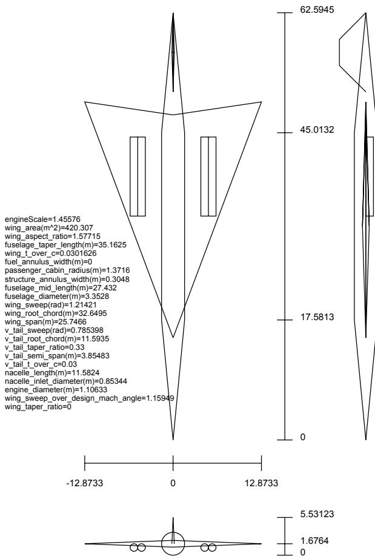
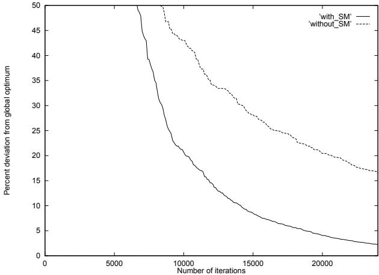
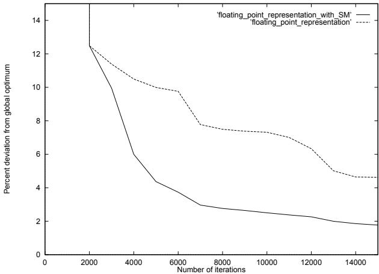
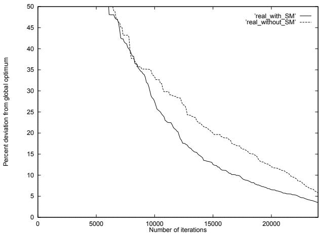
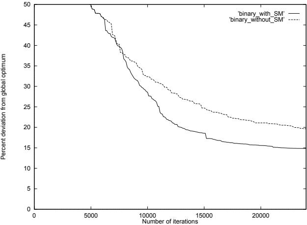
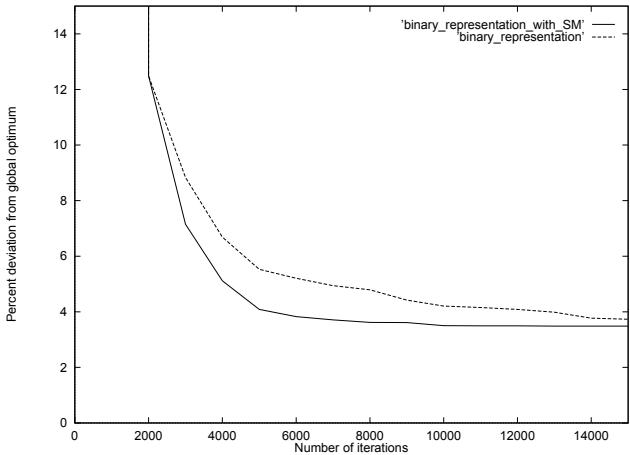

# Using Case-Based Learning to Improve Genetic-Algorithm-Based Design Optimization

# Khaled Rasheed

Computer Science Department Rutgers University New Brunswick, NJ 08903 shehata@cs.rutgers.edu

# Abstract

In this paper we describe a method for improving genetic-algorithm-based optimization using case-based learning. The idea is to utilize the sequence of points explored during a search to guide further exploration. The proposed method is particularly suitable for continuous spaces with expensive evaluation functions, such as arise in engineering design. Empirical results in two engineering design domains and across different representations demonstrate that the proposed method can significantly improve the efficiency and reliability of the GA optimizer. Moreover, the results suggest that the modification makes the genetic algorithm less sensitive to poor choices of tuning parameters such as mutation rate.

# 1 Introduction

Genetic Algorithms (GAs) [Goldberg 1989] are search algorithms that simulate the process of natural selection. GAs attempt to find a good solution to some problem (e.g., finding the maximum of a function) by randomly generating a collection ("population") of potential solutions ("individuals") to the problem and then manipulating those solutions using genetic operators. Through selection, mutation and re-combination (crossover) operations, better solutions are hopefully generated out of the current set of potential solutions. This process continues until an acceptable solution is found. GAs have many advantages over other search techniques in complex domains. They tend to avoid being trapped in local sub-optima and can handle different types of optimization variables (discrete, continuous and mixed). A large amount of literature exists

# Haym Hirsh

Computer Science Department Rutgers University New Brunswick, NJ 08903 hirsh@cs.rutgers.edu

about the application of GAs to optimization problems [Michalewicz 1996].

This paper investigates some aspects of the GA optimization of realistic continuous-variable engineering design domains. In such domains a design is represented by a number of continuous design parameters, so that potential solutions are vectors (points) in a multidimensional vector space. Determining the quality ("fitness") of each point usually involves the use of a simulator or some analysis code that computes relevant physical properties of the artifact represented by the vector and summarizes them into a single measure of merit.

some of the problems faced in the application of GAs (or any optimization technique for that matter) to such problems are:

Not all points in the space are legitimate designs — some points in the search space ("unevaluable points") cause the simulator to crash, and others ("infeasible points"), although evaluable by the simulator, do not correspond to physically realizable designs. We have seen domains in which more than $9 9 \%$ of the space is like this.

The simulator will often take a non-negligible amount of time to evaluate a point. The simulation time ranges from a fraction of a second to, in some cases, many days.

The structure of the subspace of good designs may be very difficult to search. For example, when evaluable points form thin slab-like regions that are not parallel to any of the principal axis some crossover operators such as point crossover may not yield satisfactory results [Wright 1990].

This paper presents a modification of the GA specifically intended to improve its performance in realistic continuous-variable engineering design domains of this sort. The idea is to accumulate a large enough sample of the points evaluated during the course of the GA optimization. After the search has progressed sufficiently far to have a reasonable degree of confidence that the sample is representative of the search space, a new point is only evaluated if it is not closely surrounded by some of the previously generated points that proved to be bad. Since the time spent in finding the neighbors of a new point is negligible compared to the time it takes to run a simulator, this policy protects the GA from wasting time exploring regions of the space that proved to be fruitless.

The remainder of this paper first presents a more detailed description of our GA modification. We then present a number of experiments concerning the use of our GA modification on two realistic engineering tasks. We conclude the paper with a discussion of related efforts and future work.

# 2 GA Architecture

The GA used in this research is described in detail in [Rasheed and Gelsey 1996, Rasheed et al. ]. Each individual in the GA population represents a parametric description of an artifact, such as an aircraft or a missile. All parameters have continuous intervals. The fitness of each individual is based on the sum of a proper measure of merit computed by a simulator or some analysis code(such as the takeoff mass of an aircraft), and a penalty function if relevant (such as to impose limits on the permissible size of an aircraft). A steady state GA model is used, in which operators are applied to two parents selected from the elements of the population via some selection scheme, one offspring point is produced, then an existing point in the population is replaced by the newly generated point via some replacement strategy. Here selection was performed by rank because of the wide range of fitness values caused by the use of a penalty function. Rank selection prevents the first discovered evaluable/feasible points from dominating the search and causing premature convergence. The replacement strategy used here is a crowding technique [Mahfoud 1995], which takes into consideration both the fitness and the proximity of the points in the GA population. When a new point is introduced, the closest point to this new point from among the worst quartile of the current GA population is selected for replacement.The GA stops when either the maximum number of evaluations has been exhausted or the population loses diversity and practically converges to a single point in the search space. Floating point representation is used. The default crossover operator is line crossover (LC) and the default mutation operator is the shrinking window mutation [Rasheed and Gelsey 1996, Rasheed et al. ]. Line crossover works by joining a line between the two parent points, extending it by L times its length from both sides (where L is a positive number) and picking a point on that line or its extensions to be the newborn. Shrinking window mutation is done by randomly perturbing some of the parameters of the newborn. The perturbation window shrinks as the optimization progresses.

Most of the above mentioned aspects of our GA architecture have been previously explored. This paper focuses on our novel approach for evaluating the fitness of individuals in GA search. Our description of this comprises the remainder of this section.

# 2.1 Screening Module

Evaluating an individual can be time consuming, and thus it can be beneficial to only select for evaluation points that seem promising. The screening module (SM) decides whether a point is likely to correspond to a good design without invoking any simulator to do this by extrapolating from points evaluated earlier in the search. In particular, the screening module uses a simple K-nearest neighbor approach that maintains a relatively large random sample of the points encountered in the search so far (in the current implementation it is 1000 points, which is about ten times the size of the GA population — the size of the sample should in general be selected based on the speed of the simulator and domain knowledge, if available). Before a candidate point generated by crossover and possibly mutation is evaluated, the module finds the K nearest neighbors of the point among the sample (appealing to our own subjective intuitions about our two test domains in the experiments below K was set to 2 in the aircraft design domain and 1 in the missile design domain — in general, the value should increase if the space is suspected to have needle-like optima or a large number of local optima and should decrease if the space is known to be well behaved or the evaluation function is too expensive to permit thorough exploration of the space). If at least one of those nearest neighbors has a fitness that is better than some threshold, the point is evaluated and added to the GA population, otherwise the point is just discarded. A good choice of the threshold is very important for the success of the whole search. In the experiments we have used the fitness of the worst member of the current GA population as this threshold. In general, a more expensive evaluation function increases the need for the search to be more focused and therefore a higher

# 2.2 Diversity Maintenance Module

One of the worst things that can happen during a GA optimization is premature convergence to a non-global optimum. In a steady state GA, such as the one used in this research, this happens when the current population loses diversity and all the points become very close to each other. The use of the screening module, unfortunately, does not protect the GA against premature convergence. In fact the SM, as described above, may even promote such undesirable behavior. To protect the GA against premature convergence the diversity maintenance module (DMM) does the following:

Table 1: Aircraft Parameters to Optimize No. Parameter   

<table><tr><td>1 2</td><td>exhaust nozzle convergent length exhaust nozzle divergent length</td></tr><tr><td>3</td><td>exhaust nozzle external length</td></tr><tr><td>4</td><td>exhaust nozzle radius(r7)</td></tr><tr><td>5</td><td>engine size</td></tr><tr><td>6</td><td>wing area</td></tr><tr><td>7</td><td>wing aspect ratio</td></tr><tr><td>8</td><td>fuselage taper length</td></tr><tr><td>9</td><td>effective structural t/c</td></tr><tr><td>10</td><td>wing sweep over design mach angle</td></tr><tr><td></td><td>wing taper ratio</td></tr><tr><td>11</td><td></td></tr><tr><td>12</td><td>Fuel Annulus Width</td></tr></table>

The DMM rejects points that are extremely close to points that have already been evaluated (good or bad). The rationale behind this is that such points carry redundant information and there is no point in introducing them to the current population. The amount of closeness to existing points that warrants rejection — the rejection radius is set based on the initial average distance between the points in the starting population, the size of the population and the stopping tolerance. In addition, the rejection radius decreases linearly with the number of iteration, so as not to prevent the GA from converging to the global optimum towards the end of the search. Since the SM already determines the nearest neighbor for each new point, this operation does not add any significant extra overhead to the search. This rejection action can be viewed as a limiting case of sharing [Mahfoud 1995].

As is typical in real-world problems, there is a tradeoff between tractability and quality of solution. In the experiments below, the DMM was turned on in the aircraft design domain and off in the missile inlet design domain. The reason for this is that the evaluation function in the missile inlet domain was much more expensive than in the aircraft domain, and we therefore decided that it was acceptable to increase the chances of converging to a non-global optimum to improve optimization run time.

If severe loss of diversity is detected (the average distance between the points of the current population becomes a small fraction of its value in the starting random population) during the course of the optimization, a re-seeding operation is done. All the points in the current population are discarded except for the best one. The population is then rebuilt using the points accumulated by the SM, with preference going to points that both have good fitness and are far from the retained best point. This technique restores diversity and gives the GA a second chance to avoid non local optima. On the other hand, re-seeding could never take the population away from the global optimum if it is reached, as the population will quickly re-converge thereafter. A maximum of 5 re-seeds are allowed during an optimization.

# 3 Experimental Results

To evaluate our GA modification we applied it to design problems in two domains, the conceptual design of supersonic transport aircraft, and the design of inlets for supersonic missile inlets. We have previously explored the use of GA optimization relative to other traditional optimization methods in these two domains [Rasheed and Gelsey 1996, Rasheed et al. ], and therefore this paper focuses on the effect of the proposed modifications on GA performance, rather than on overall GA behavior. This section discusses our results in these two domains, with the GA's parameter values set as they were in our earlier work.

# 3.1 Supersonic Transport Aircraft Design

Our first domain concerns the conceptual design of supersonic transport aircraft. We summarize it briefly here; it is described in more detail elsewhere [Gelsey et al. 1996]. Figure 1 shows a diagram of a typical airplane automatically designed by our software system. The GA attempts to find a good design for a particular mission by varying the aircraft conceptual design parameters in Table 1 over a continuous range of values.

  
Figure 1: Supersonic transport aircraft designed by our system (dimensions in feet)

The GA evaluates candidate designs using a multidisciplinary simulator. In our current implementation, the GA's goal is to minimize the takeoff mass of the aircraft, a measure of merit commonly used in the aircraft industry at the conceptual design stage. Takeoff mass is the sum of fuel mass, which provides a rough approximation of the operating cost of the aircraft, and "dry" mass, which provides a rough approximation of the cost of building the aircraft. A complete mission simulation requires about 0.2 CPU seconds on a DEC Alpha 250 4/266 desktop workstation.

The aircraft simulation model used is based on both implicit and explicit assumptions and engineering approximations and since it is being used by a numerical optimizer rather than a human domain expert, some design parameter sets may correspond to aircrafts that violate these assumptions and therefore may not be physically realizable even though the simulator does not detect this fact (we refer to these designs as infeasible points). For this reason a set of constraints has been introduced to safeguard the optimization process against such violations. In particular, a penalty function approach was used to incorporate the effect of constraint violations into the optimization. The penalty function was added to the takeoff mass value returned by the simulator and the resulting sum was the quantity that the optimizer actually minimizes. The penalty function we used was simply a large number (1000 in the current implementation) multiplied by the sum of the absolute values of constraint violation for all the violated constraints. We also have the notion of unevaluable points. These are points that represent designs that violate the model assumptions so much that the simulator cannot complete the simulation process to produce any significant information. For such points a very large fictitious takeoff mass is generated as the value of the objective function.

  
Figure 2: Effect of screening in the Aircraft Design Domain

Ten random populations of 120 points each were generated, and for each population the GA was allowed to proceed for 24000 iterations (an iteration denotes one call to the simulator, which takes, on average, 0.2 seconds) once with the SM and once without it.

The result of this experiment is shown in Figure 2. The graph plots percent deviation from the global optimum1 as the GA run progresses. Each curve represents the average of the runs from the ten starting populations. The figure demonstrates the superiority of the modified GA in all stages of the optimization. At the end of the given 24000 iterations the average steady state error (final deviation from the global optimum) for the GA with SM is $2 . 2 \%$ compared to $1 6 . 5 \%$ for the GA without SM. It thus appears that the screening module does play a helpful role in pruning the search and saving the time that would otherwise be lost in examining bad points. It should be noted that the number of points actually simulated was about $2 5 \%$ of all the points "proposed" by the GA. The timing overhead of screening, however, was only about $3 \%$ .

Table 2: Inlet Parameters to Optimize Param Definition   

<table><tr><td>θ1 θ2</td><td>initial cone angle final cone angle</td></tr><tr><td>xd</td><td>axial location of throat</td></tr><tr><td>Td</td><td>radial location of throat</td></tr><tr><td>xe</td><td>axial location of end of</td></tr><tr><td></td><td>&quot;constant&quot; cross section</td></tr><tr><td>θ3 Hej</td><td>internal cowl lip angle height at end of constant</td></tr><tr><td></td><td>cross section</td></tr><tr><td>Hfk</td><td>height at beginning of</td></tr><tr><td></td><td></td></tr><tr><td></td><td>constant internal cross section</td></tr></table>

# 3.2 Supersonic Missile Inlet Design

Our second domain concerns the design of inlets for supersonic and hyper-sonic missiles. We summarize it briefly here; it is described in more detail in [Zha et al. 1996].

The missile inlet designed is an axisymmetric mixed compression inlet that cruises at Mach 4 at 60000 feet altitude. Minimum manufacture cost for this inlet is critical, and therefore, techniques such as boundary layer bleed and variable geometry are not used — the performance of the inlet thus relies solely on the aerodynamic design of the rigid geometry, such as the extent of external and internal compression, contraction ratio, inlet start throat area, throat location, shock train length, and divergence of sub-sonic diffuser. The simulator used in this domain is a program called "NIDA" which was developed at United Technology Research Center (UTRC) as an inlet analysis/design tool [Haas et al. 1992]. The eight design parameters (all continuous valued) are given in Table 2, with coordinates given in terms of axial (x) and radial (r) positions. The objective of the optimization is to minimize the total pressure recovery, a quantity that is commonly used to measure the quality of inlets.

As in the aircraft domain, our experiments consist of GA runs both with and without the modification, starting from five random initial populations. In this domain each population consists of 80 random individuals. For each population the GA was allowed to proceed for 15000 iterations (an iteration denotes one call to the simulator, which, on average, takes six seconds).

  
Figure 3: Effect of screening in the Missile Inlet Design Domain

  
Figure 4: Effect of screening in the Aircraft Design Domain with real crossover and non-uniform mutation

The results are shown in Figure 3, which plots percent deviation from the "global optimum" 2 as a function of iteration number. Once again, a significant amount of improvement was realized by using the SM. The steady state error at the end of the 15000 iterations dropped from around $5 \%$ to less than $2 \%$ . Moreover, The GA with SM reached the region of excellent designs much faster.

  
Figure 5: Effect of screening in the Aircraft Design Domain with binary representation

shrinking-window mutation) and crossover line length (in the case of line crossover). The experiments above were conducted with no attempt to select optimal parameter values. Instead, values were selected from our previous efforts in these domains, default values, and values based on trade studies (a few GA runs with different settings).

When we repeated the aircraft optimization experiment in which we used line crossover and shrinkingwindow mutation using a smaller value for the amount of line extension in the line crossover (precisely one third the value used for obtaining the result in Figure 2) we obtained different results. The average steady state error of the GA with and without SM were $3 . 8 \%$ . We conclude that the amount of line extension became a little too small and the exploration power of the GA decreased. The SM was not intended for such situation so it did not help.

# 3.3 Further Evaluation

Given the success of our approach in the preceding two domains, we conducted additional experiments to understand the scope and limitations of the approach. The results are described in this section.

Our first set of additional experiments were designed to explore the generality of the improvement obtained using our case-based learning modification. We repeated the experiment of optimization in the aircraft domain using the same 10 starting populations and the same GA architecture, except that the line crossover and shrinking window mutation operators were replaced with the real crossover and the nonuniform mutation operators [Wright 1990, Janikow and Michalewicz 1991] respectively. The result is shown in Figure 4. The proposed modification brought the average steady state error from $5 . 8 \%$ down to $3 . 5 \%$

When we repeated the aircraft optimization experiment with the real crossover and non-uniform mutation decreasing the initial amplitude of the nonuniform mutation from the entire parameter range to $6 0 \%$ of the parameter range we found that the average steady state error of the GA without SM was only $0 . 5 \%$ higher than that of the GA with SM.

We then repeated the binary GA experiment in the aircraft domain using three mutation rates: $1 0 \%$ , $7 . 5 \%$ and $5 \%$ . With all mutation rates, the modified GA was superior to the unmodified GA. The amount of superiority depended on the mutation rate, which is expected. With the mutation rate set to its optimal value of $5 \%$ (this is the value used to plot Figure 5), the steady state error was $2 0 \%$ for the GA with no SM and $1 5 \%$ for the GA with SM. When the mutation rate was $1 0 \%$ the steady state error was $3 8 \%$ without the SM and $2 3 \%$ with the SM.

We also repeated these experiments using the classical binary-encoding GA (bit-string representation for individuals, the classical bit-string crossover operator, and the classical bit mutation operator). The result of this experiment is shown in Figure 5. Even though the classical GA performance was unsatisfactory (which is not surprising [Janikow and Michalewicz 1991]), here, too, case-based learning yields a substantial improvement, with the average steady state error decreasing from $2 0 \%$ to $1 5 \%$ .

Our second set of experiments concern the sensitivity of our case-based approach to parameter values. Intuitively, the amount of improvement gained by using the SM should depend on details of the GA, including the values of GA parameters such as mutation rate, mutation amplitude (in the case of non-uniform and

Finally, we repeated the missile inlet design experiment using the binary GA with its optimal mutation rate of $5 \%$ . The result is shown in Figure 6. The figure suggests that the improvement due to the SM in this case was not significant, which is expected when the mutation rate is set to its optimal value.

Our general lessons from these experiments are that the amount of improvement due to the use of the SM decreases as the GA parameters approach their optimal values, and the SM never appears to hurt overall performance. With carefully tuned parameters, the GA does not need a screening module to supervise it as it will not keep going back to bad regions. However, parameter selection can be very expensive and may not be feasible in domains with expensive evaluation functions such as our engineering design optimization domains. In these domains, it is reasonable to use a screening module and set the parameters to values that favor exploration, knowing that the screening module is there to protect against excessive exploration.

  
Figure 6: Effect of screening in the Missile Inlet Design Domain with binary representation

# 4 Final Remarks

This paper has presented a modification of the GA for continuous design search spaces that is based on maintaining a large sample of previously evaluated points and screening generated points so that only those that are near previously seen good points are actually evaluated. Experimental results demonstrated the superiority of the adapted GA in the domains of aircraft design optimization and missile inlet design and across binary and floating point representations.

Although a great deal of work has been done in the area of numerical optimization algorithms [Moré and Wright 1993], not much has been published about the particular difficulties of attempting to optimize functions defined by large "real-world" numerical simulators. A number of research efforts have combined AI techniques with numerical optimization [Tong et al. 1992, Powell 1990, Powell and Skolnick 1993, Bouchard 1992, Williams and Cagan 1994, Cerbone 1992], and although a GA was used in some of these efforts [Powell 1990, Powell and Skolnick 1993], this typically represented the use of an off-the-shelf GA, with no attempt to adapt it to the domain as done in this research.

The idea of using the GA optimization history to guide further explorations was studied in [Ravise and Sebag 1996] where inductive learning was used to learn rules describing bad points in a multi-dimension boolean space. The use of rules was appropriate in that research because the evaluation functions were not expensive enough to warrant the use of case-based learning. The main drawback in that research was that they had to do only negative screening. A point considered bad at any stage of the search will always be considered bad, whereas a point considered good in the beginning of a search may be bad later in the search, as the average quality of the population increases. Casebased learning implicitly allows the GA to vary the threshold of acceptability over the course of the search, and makes a much weaker assumption about the shape of the boundary between good and bad regions than is the case for traditional inductive learning methods. The idea of using optimization history to guide further search is also related to Tabu search [Glover 1990].

Our modified GA has demonstrated superior reliability as a global optimizer with a high potential for effectively searching a design search space in a reasonable amount of time. However, it is not clear that the sampled K-nearest neighbor approach is the best approach for screening. In fact, we are currently investigating the use of a clustered K-nearest neighbor approach instead. We are also investigating the use of a classifier system [Goldberg 1989] which screens potential points by classifying them as promising or unpromising. We also plan to explore the use of more sophisticated machine-learning techniques to extrapolate from past evaluations as part of the screening module. Finally, the SM success is dependent on the choice of the distance function for finding neighbors. The Euclidean distance was successful in this research, when the parameters were normalized to have equal ranges. In other domains it may become necessary to use a more complicated distance function.

# Acknowledgments

We thank our aircraft design expert, Gene Bouchard of Lockheed, for his invaluable assistance in this research. We thank Marty Haas from United Technologies for his assistance in the missile design part of this research. We also thank all members of the HPCD project, especially Andrew Gelsey, Donald Smith, and Keith Miyake. This research was partially supported by NASA under grant NAG2-817 and is also part of the Rutgers-based HPCD (Hypercomputing and Design) project supported by the Advanced Research Projects Agency of the Department of Defense through contract ARPA-DABT 63-93-C-0064.

# Список литературы

[Bouchard 1992] E. E. Bouchard. Concepts for a future aircraft design environment. In 1992 Aerospace Design Conference, Irvine, CA, February 1992. AIAA-92-1188.

[Cerbone 1992] G. Cerbone. Machine learning in engineering: Techniques to speed up numerical optimization. Technical Report 92-30-09, Oregon State University Department of Computer Science, 1992. Ph.D. Thesis.

[Powell 1990] D. Powell. Inter-GEN: A hybrid approach to engineering design optimization. Technical report, Rensselaer Polytechnic Institute Department of Computer Science, December 1990. Ph.D. Thesis.

[Rasheed and Gelsey 1996] Khaled Rasheed and Andrew Gelsey. Adaptation of genetic algorithms for engineering design optimization. In Fourth International Conference on Artificial Intelligence in Design '96: Evolutionary Systems in Design Workshop, 1996.

[Gelsey et al. 1996] Andrew Gelsey, M. Schwabacher, and Don Smith. Using modeling knowledge to guide design space search. In Fourth International Conference on Artificial Intelligence in Design '96, 1996.

[Glover 1990] F. Glover. Tabu search. ORSA Journal on Computing, 2(1):432, 1990.

[Rasheed et al.] Khaled Rasheed, Haym Hirsh, and Andrew Gelsey. A genetic algorithm for continuous design space search. Artificial Intelligence in Engineering Journal, to appear.

[Goldberg 1989] David E. Goldberg. Genetic Algorithms in Search, Optimization, and Machine Learning. Addison-Wesley, Reading, Mass., 1989.

[Haas et al. 1992] M. Haas, R. Elmquist, and D. Sobel. NAWC Inlet Design and Analysis (NIDA) Code, Final Report. UTRC Report R92-970037-1, 1992.

[Ravise and Sebag 1996] Caroline Ravise and Michele Sebag. An advanced evolution should not repeat its past errors. In Thirteenth International Conference on Machine Learning, 1996.

[Tong et al. 1992] Siu Shing Tong, David Powell, and Sanjay Goel. Integration of artificial intelligence and numerical optimization techniques for the design of complex aerospace systems. In 1992 Aerospace Design Conference, Irvine, CA, February 1992. AIAA92-1189.

[Janikow and Michalewicz 1991] Cezary Janikow and Zbigniew Michalewicz. An experimental comparison of binary and floating point representations in genetic algorithms. In Proceedings of the Fourth International Conference on Genetic Algorithms, pages 3136. Morgan Kaufmann, 1991.

[Williams and Cagan 1994] Brian C. Williams and Jonathan Cagan. Activity analysis: the qualitative analysis of stationary points for optimal reasoning. In Proceedings, 12th National Conference on Artificial Intelligence, pages 1217-1223, Seattle, Washington, August 1994.

[Mahfoud 1995] Samir Mahfoud. A comparison of parallel and sequential niching methods. In Proceedings of the Sixth International Conference on Genetic Algorithms, pages 136-143. Morgan Kaufmann, July 1995.

[Wright 1990] Alden Wright. Genetic algorithms for real parameter optimization. In The First workshop on the Foundations of Genetic Algorithms and Classifier Systems, pages 205-218, Indiana University, Bloomington, July 1990. Morgan Kaufmann.

[Michalewicz 1996] Zbigniew Michalewicz. Genetic Algorithms $^ +$ Data Structures $=$ Evolution Programs. Springer-Verlag, New York, 1996.

[Moré and Wright 1993] Jorge J. Moré and Stephen J. Wright. Optimization Software Guide. SIAM, Philadelphia, 1993.

[Powell and Skolnick 1993] D. Powell and M. Skolnick. Using genetic algorithms in engineering design optimization with non-linear constraints. In Proceedings of the Fifth International Conference on Genetic Algorithms, pages 424-431. Morgan Kaufmann, July 1993.

[Zha et al. 1996] G.-C. Zha, Don Smith, Mark Schwabacher, Khaled Rasheed, Andrew Gelsey, and Doyle Knight. High performance supersonic missile inlet design using automated optimization. In AIA A Symposium on Multidisciplinary Analysis and Optimization '96, 1996.