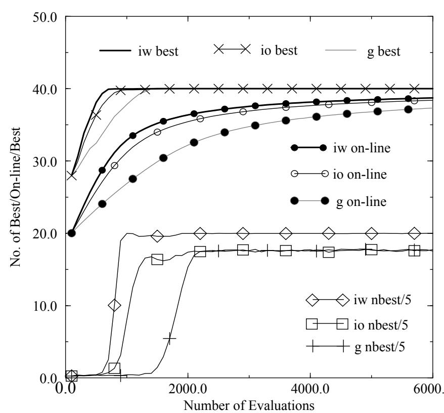
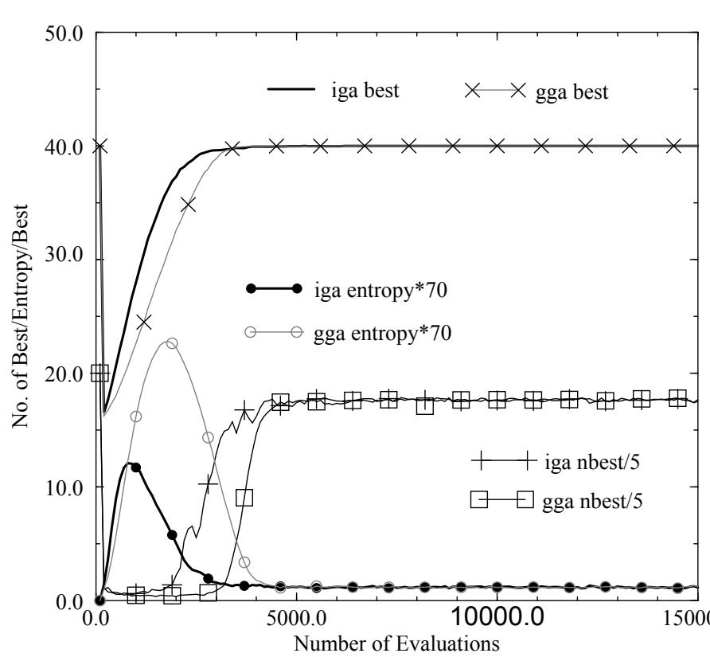
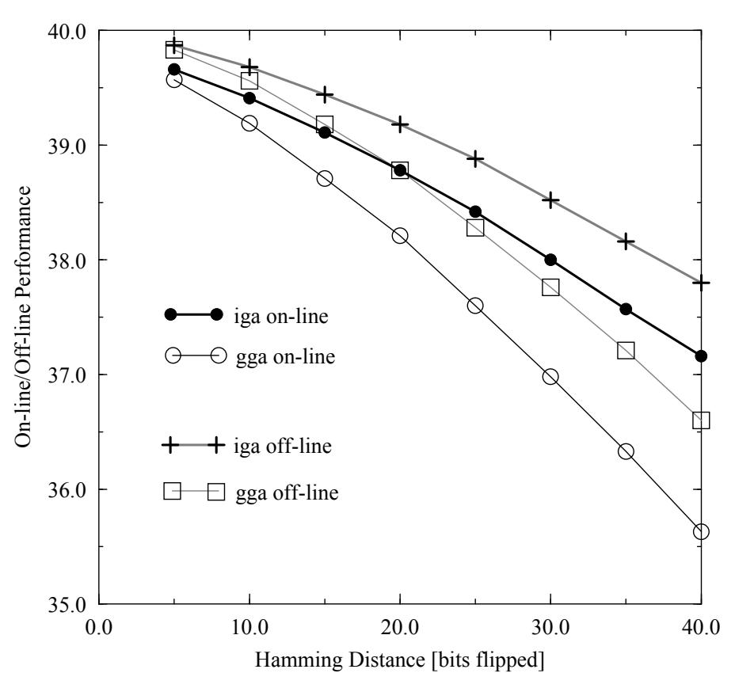

# A Comparative Study of Steady State and Generational Genetic Algorithms for Use in Nonstationary Environments

F.Vavak and T.C.Fogarty

Faculty of Computer Studies and Mathematics University of the West of England Bristol BS16 1QY, UK {f_vavak/tcf@btc.uwe.ac.uk}

Abstract. The objective of this study is a comparison of two models of a genetic algorithm - the generational and incremental/steady state genetic algorithms - for use in the nonstationary/dynamic environments. It is experimentally shown that selection of a suitable version of the genetic algorithm can improve performance of the genetic algorithm in such environments.This can extend ability of the genetic algorithm to track the environmental changes which are relatively small and occur with a low frequency without need to implement an additional technique for tracking changing optima.

# 1 Introduction

The genetic algorithm is a proven search/optimisation technique [Holland 1975] based on an adaptive mechanism of the biological systems. In our previous work we showed that the genetic algorithm is a suitable on-line optimization method to balance the load of the presses in a sugar beet pressing station [Fogarty,Vavak,Cheng 1995] and to balance the fuel load in a multiple burner boiler [Vavak,Fogarty,Jukes 1995]. Because both mentioned applications are time varying systems, a possibility of tracking changing environment had to be considered. If the system is subjected to abrupt changes the genetic algorithm has to be periodically restarted (i.e. a new search is initiated from a random starting point of the search space) or a suitable method for tracking changing optima has to be implemented (e.g. [Cobb,Grefenstette 1993]). Nevertheless, the performance of a genetic-algorithm based control system can be improved by a selection of a suitable version of the genetic algorithm. If the environmental changes are relatively small and occur with low frequency (e.g. system parameters drifting) the selection of a suitable model of the genetic algorithm can extend its ability to track such environmental changes without need to implement additional tracking techniques.

Work presented in this paper is a comparison of two models of the genetic algorithm, the generational (GGA) and the incremental (IGA) one, for use in nonstationary environments. Because the chromosomes in the applications above mentioned are evaluated directly (through experimentation), an important consideration when comparing the models of the genetic algorithm was not only the speed of convergence to the global optimum and the off-line performance but the on-line performance as well.

# 2 The Specific Problem

The problem used in this study to examine the generational and the incremental genetic algorithms for nonstationary environments does not represent any particular application and was chosen so that analysis of the results was easy and clear.

The population of the genetic algorithm consists of binary strings. The evaluation function returns a value equal to the number of the corresponding alleles/bits which are identical in a given chromosome and a predefined “template chromosome” (i.e. bit matching task). Change of a selected number of bits of the template simulates the environmental change - the Hamming distance between the “old” and “new” locations of the optima is given by the number of the flipped bits. Length of the chromosomes used in our tests is 40 bits, giving a total search space of $2 ^ { 4 0 }$ points.

# 3 The two Models of Genetic Algorithm

The generational genetic algorithm (the “Standard Genetic algorithm” [Cobb,Grefenstette 1993]) creates new offspring from the members of an old population using the genetic operators and places these individuals in a new population which becomes the old population when the whole new population is created [Goldberg 89, De Jong 1992]. The incremental/steady state genetic algorithm [Whitley, Kauth 1988] is different to the generational model in that there is typically one single new member inserted into the new population at any one time. A replacement/deletion strategy defines which member of the population will be replaced by the new offspring. In this paper we examine two standard replacement strategies - deleting the oldest and deleting the worst member of the population.

The generational genetic algorithm used in our tests implements the standard universal sampling [Baker 1987] and linear ranking selection method with $\mathrm { s } { = } 2$ . Fitness of a chromosome is defined by interpolation $\mathrm { f ( i ) { = } s { - } 2 ( i { - } 1 ) ( s { - } 1 ) / ( N { - } 1 ) }$ where $\mathrm { i } { = } \{ 1 . . \mathrm { N } \}$ and N is the population size. The incremental genetic algorithm uses a tournament selection when picking two parents to create a new offspring. The tournament size is equal to 2. The better chromosome wins with a probability 1. This results in a comparable selection pressures for both models of the genetic algorithm [Hancock 1994]. Both algorithms use 1-point crossover.

During our experiments two different starting positions for the genetic algorithm search were tested. The genetic algorithm was initiated either from a random starting point in the search space or from a fully converged population after a change of the environment (i.e. a change of the template). The former case is a situation typical after start of the search when the initial population is randomly generated. Is relevant to the environment changes which occur while diversity of the population of the genetic algorithm is still high. The latter case is more relevant to the kind of the environment changes common in the applications considered because they are more likely to happen when the population of the genetic algorithm is converged.

# 4 Results

All the experiments were run using the genetic algorithms with a population size 100 and the results were averaged over 50 runs with different seed values. The same set of the random seeds was used for tests of the genetic algorithm with different combinations of mutation rates (0.01; 0.005; 0.002767 - i.e. $1 . 7 5 /$ (sqrt(chromo.length)\*pop.size); 0.001; 0.0005), crossover rates (0.8; 1.0) and magnitudes of the environmental change.

Comparison of the on-line and off-line performance for both models of the genetic algorithm shows that the difference in the performance of the two genetic algorithm models is consistent and statistically significant across the whole spectrum of the tested combinations of the parameter settings.

# 4.1 Starting with the Random population

Performance comparison of the incremental genetic algorithm with both deleting the oldest member of the population “io” and deleting the worst member of the population “iw” replacement strategies and the generational genetic algorithm $\mathbf { \vec { g } } ^ { \prime \prime }$ is illustrated in figure 1. The typical results shown were obtained for the crossover probability 1.0 and the mutation rate 0.002767 i.e. 1.75/(sqrt(chromo.length)\*pop.size).

The incremental model (both replacement strategies) outperforms the generational genetic algorithm in terms of the on-line performance, the off-line performance (not shown in fig.1) and the speed of convergence. When compared with the other two versions, the incremental algorithm using deleting the worst replacement strategy also provides better results as far as number of the best individuals (“nbest” - the value shown in fig.1 is divided by 5) in the population is concerned. It gives nearly $100 \%$ converged population due to the higher selection pressure resulting from the replacement strategy used.

Table 1 shows the values of convergence speed (“success” is equivalent to the number of evaluations necessary to generate the first chromosome with the maximum fitness), the values of the worst member of the population (“worst”) and the number of the best members in the population (“nbest”) after 20000 evaluations for two different mutatioin rates.

Setting the mutation probability to an empirical value 1.75/ (sqrt(chromo.length)\*pop.size) [Back 1991][Schaffer Caruana,Eshellman 1989] gives the best results as far as the speed of convergence is concerned in the most cases. Nevertheless, setting the mutation rate to 0.001 [DeJong 1975] seems to be a sensible trade-off between speed of convergence and the percentage of the fully converged chromosomes in the population. This is particularly important for on-line control applications of the genetic algorithm where direct evaluation of the weak individuals through experimentation can have costly consequences.

  
Fig. 1. GA Characteristics after a Random Restart

<table><tr><td rowspan=1 colspan=1></td><td rowspan=1 colspan=1>success</td><td rowspan=1 colspan=1>worst</td><td rowspan=1 colspan=1>nbest</td><td rowspan=1 colspan=1>success</td><td rowspan=1 colspan=1>worst</td><td rowspan=1 colspan=1>nbest</td></tr><tr><td rowspan=1 colspan=1>IGA (deleting the worst)</td><td rowspan=1 colspan=1>607</td><td rowspan=1 colspan=1>40</td><td rowspan=1 colspan=1>100</td><td rowspan=1 colspan=1>635</td><td rowspan=1 colspan=1>39.99</td><td rowspan=1 colspan=1>99.9</td></tr><tr><td rowspan=1 colspan=1>IGA (deleting the oldest)</td><td rowspan=1 colspan=1>930</td><td rowspan=1 colspan=1>39.96</td><td rowspan=1 colspan=1>96</td><td rowspan=1 colspan=1>863</td><td rowspan=1 colspan=1>39.87</td><td rowspan=1 colspan=1>88.36</td></tr><tr><td rowspan=1 colspan=1>GGA</td><td rowspan=1 colspan=1>1237</td><td rowspan=1 colspan=1>39.96</td><td rowspan=1 colspan=1>96.4</td><td rowspan=1 colspan=1>1225</td><td rowspan=1 colspan=1>39.89</td><td rowspan=1 colspan=1>89.12</td></tr><tr><td rowspan=1 colspan=1>Mutation Rate</td><td rowspan=1 colspan=3>0.001</td><td rowspan=1 colspan=3>0.002767</td></tr></table>

# 4.2 Effect of Environmental Change on a Converged Population

In this section we describe the experiments when the environmental change occurs while the population is fully converged. The genetic algorithm then can exhibit tracking ability primarily thanks to the presence of the mutation mechanism. The tests were run for the previously described combinations of mutation and crossover rates. The Hamming distance of the environmental change was gradually set to 5, 10, 15, 20, 25, 30, 35 and 40.

Test data obtained is consistent for all combinations of the parameter settings and figure 2 only illustrates the typical results obtained. In this case a crossover probability is set to 1.0, the mutation probability is 0.002767 and the Hamming distance is 25. Corresponding to the results from the previous section, the incremental genetic algorithm (deleting the oldest member of the population strategy) outperforms the generational genetic algorithm. The figure 2 does not show the characteristics for the incremental genetic algorithm using deleting the worst member of the population replacement strategy because this model of the genetic algorithm cannot track any changes of the environment. It is obvious from the mechanism of the replacement, that the only chromosome repeatedly re-evaluated after the change of the environment is the worst one.The fitness values of no other member of the converged population is affected by the environmental change. The fitness values thus stay outdated indefinitely.

  
Fig. 2. GA Characteristics after Environmental Change (Hamming Distance 25)

Figure 2 also indicates the values of population entropy [Davidor,Ben-Kiki 1992] which is a measure of disorder in the population (i.e. entropy $= 0$ for a fully converged population). It can be seen that the generational genetic algorithm introduces higher diversity into the population than the incremental genetic algorithm before it finds the optimal solution. This can cause increased disturbances to the system controlled if the genetic algorithm is, for example, used for on-line optimisation.

The graph 3 shows relation between the on-line/off-line performance and the

  
Fig. 3. On-line/Off-line Performance vs Hamming Distance

Hamming distance of the environmental change for the mutation rate 0.002767.

Results similar to the results in section 4 were obtained when a roulette wheel sampling and a proportional selection was implemented for both models of the genetic algorithm.

# 5 Conclusions

Our experiments with a variety of parameter settings for both models of the genetic algorithm showed that the incremental genetic algorithm with the “deleting the oldest” replacement strategy is superior to the generational genetic algorithm as far as the online and off-line performance is concerned. It can extend ability of the genetic algorithm to track environmental changes, which are relatively small and occur with low frequency without need to implement an additional technique for tracking changing optima. Provided the incremental genetic algorithm is used for on-line optimization, smaller diversity introduced into the population after an environmental change decreases the disturbances acting on the system controlled.

The better performance of the incremental genetic algorithm can be explained by the fact that in the incremental genetic algorithm an offspring is immediately used as a part of the mating pool, making a shift towards the optimal solution possible in a relatively early phase of the optimization process.

# Список литературы

Baker J E (1987) “Reducing Bias and Inefficiency in the Selection Algorithm” - Proceedings of the second international conference on Genetic Algorithms, (Lawrence Earlbaum Publishing).

Cobb H, Grefenstette J(1993) “GA for Tracking Changing Environments” - 5th International Conference on GA, (Morgan Kaufmann Publishers, Inc.).

Davidor Y, Ben-Kiki O (1992) “The Interplay Among the Genetic Algorithm Operators: Information Theory Tools Used in a Holistic Way” - Parallel Problem Solving From Nature 2 (Elsevier Science Publisher).

De Jong K A (1992) “Are Genetics Algorithms Function Optimizers?” - Parallel Problem Solving From Nature 2, (Elsevier Science Publisher).

Fogarty T C, Vavak F, Cheng P (1995) “Use of the Genetic Algorithm for Load Balancing in the Process Industry” - 6th International Conference on GA, (Morgan Kaufmann Publishers, Inc.).

Goldberg D E (1989) “Genetic Algorithms in Search, Optimisation and Machine Learning” - (Addison Wesley).

Hancock P J B, (1994) “An Empirical Comparison of Selection Methods in Evolutionary Algorithms” - AISB Workshop Leeds 1994 - Selected Papers in Lecture Notes in Computer Science 865, Fogarty T C - editor, (Springer Verlag).

Holland J H (1975) “Adaptation in Natural and Artificial Systems”, (University of Michigan Press, Ann Arbor).

Vavak F, Fogarty T C, K Jukes (1995) “Application of the Genetic Algorithm for Load Balancing of Sugar Beet Presses” -1st International Mendelian Conference on GA, (PC-DIR Publishing, s.r.o. - Brno).

Whitley D, Kauth J (1988) “.GENITOR: A different Genetic Algorithm” - Proc. of the Rocky Mountain Conf. on Artificial Intelligence”, Denver.