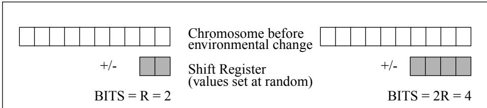
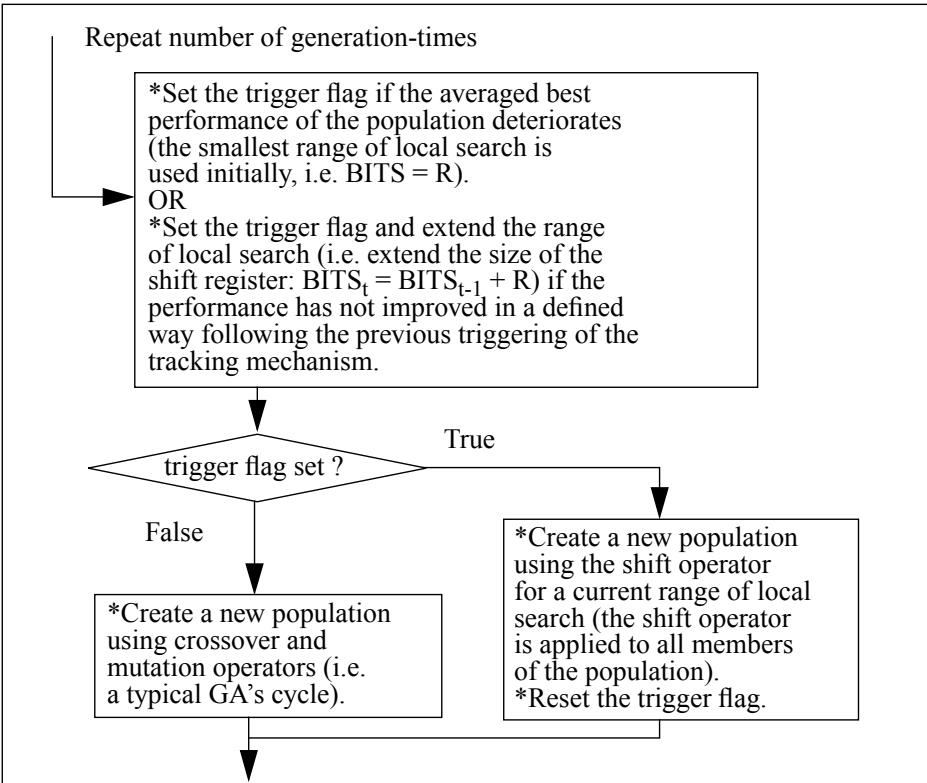
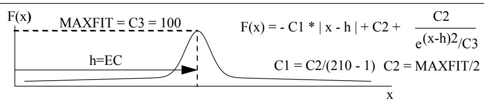
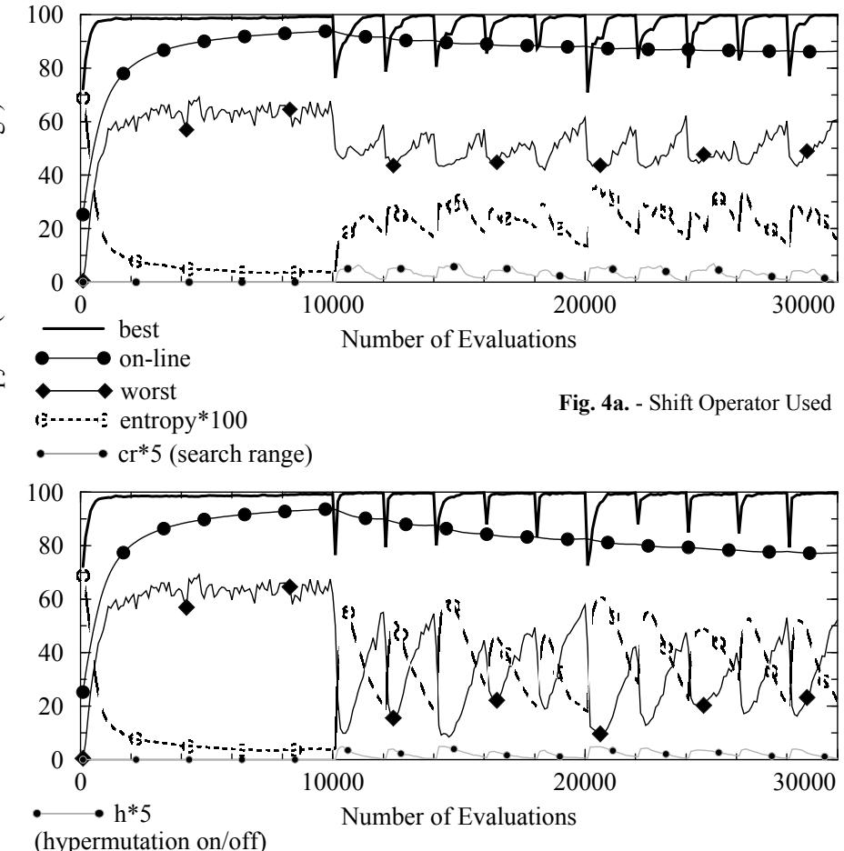
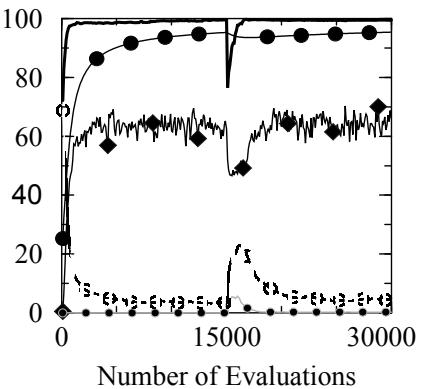
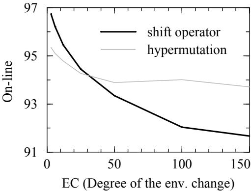

# A Genetic Algorithm with Variable Range of Local Search for Tracking Changing Environments

F.Vavak - T.C.Fogarty - K.Jukes

Faculty of Computer Studies and Mathematics University of the West of England Bristol BS16 1QY, UK {f_vavak, tcf}@btc.uwe.ac.uk & ka-jukes@csm.uwe.ac.uk

Abstract. In this paper we examine a modification to the genetic algorithm - a new adaptive operator was developed for two industrial applications using genetic algorithm based on-line control systems. The aim is to enable the control systems to track optima of a time-varying dynamic system whilst not being detrimental to its ability to provide sound results for the stationary environments. When compared with the hypermutation operator, the new operator matched the level of diversity introduced into the population with the “degree” of the environmental changes better because it increases population diversity only gradually. Although the new technique was developed for the control application domain where real variables are mostly used, a possible generalization of the method is also suggested. It is believed that the technique has the potential to be a further contribution in making genetic algorithm based techniques more readily usable in industrial control applications.

# 1 Introduction

The genetic algorithm is a proven search/optimisation technique [1] based on an adaptive mechanism of biological systems. The motivating context of Holland’s initial work on genetic algorithms (GAs) was the design and implementation of robust adaptive systems in contrast to mere function optimisers [2]. Understanding GAs in this broader adaptive system context is a necessary prerequisite for understanding their potential application to any problem domain and for understanding their relevant strengths and limitations as argued in the previously quoted paper. One important limiting factor for the use of the GA in real time applications common to many real world applications, whose models are not stationary, is the need for the repeated initialization of the GA from a random starting point in the search space to enable tracking optima in such changing/dynamic environments. The use of a repetitive learning cycle has obvious implications in terms of the quality of the solutions available which presents limitations on the use of genetic techniques in dynamic environments such as on-line industrial control.

In this paper we present preliminary results of our research into techniques for genetic algorithm based robust systems which will continually evolve an optimal solution in changing environments while this feature will not be to the detriment of the GA’s ability to provide sound results for stationary environments.

Studies carried out in the area discussed have looked into two modification strategies - increasing effective diversity in the population [3, 4] or expanding the memory of the GA [5, 6] to accommodate environmental changes. In the first two papers quoted, an adaptive hypermutation operator and random immigrants strategy are studied and discussed. The hypermutation operator temporarily increases the mutation rate to a high value (called the hypermutation rate) during periods when the time-averaged best performance of the GA worsens. Goldberg and Smith [5] examine the use of diploid representation and dominance operators to improve performance of the genetic algorithm in an oscillating environment, while Dasgupta and McGregor [6] present a modified genetic algorithm with a multi-layered structure of the chromosome which constitutes a “long term distributed memory”.

# 2 Motivation

The method presented in this paper was designed for two industrial application projects concerned with load balancing problems in industry [7, 8] with the aim of enabling a GA based on-line control system to track the optima of a system in which dynamics vary with time (a fundamental problem in control). In both applications the parameters of the controlled system are not static and will drift as a result of variation of the working conditions of the system and external events that are difficult or impossible to predict or describe. Thus a traditional GA must be restarted periodically to accommodate such a changing environment which is a limiting factor in the use of the GA in these types of real time/world applications. Evaluation of all members in the GA population in the above mentioned applications is done by means of measurement of the controlled system output variables after a control action defined by a given chromosome has been performed. Because of the direct evaluation (through experimentation) of the weak individuals, an important consideration for the design of a tracking method was not only the off-line performance of the genetic algorithm but the on-line performance as well. Another important consideration was the quality of the worst members of the population, because direct evaluation of the weak individuals can have costly consequences in the real world applications.

# 3 Tracking

# 3.1 The Technique

The technique described in this section belongs to a class of strategies which employ various methods for increasing diversity in the population (e.g. the triggered hypermutation or the random immigrants method [4]) to compensate for changes encountered in the environment. Because of the requirement of sound performance in an environment which is not changing the tracking method is triggered only when the time averaged best performance of the population deteriorates, thus constituting an adaptive tracking mechanism as in the case of the triggered hypermutation [3].

The technique uses a mechanism of variable range local search around the locations in the search space which are represented by the chromosomes before a change of the environment has occurred. The tracking mechanism introduces diversity into the population of the GA gradually unlike, for example, the hypermutation operator discussed earlier. The gradual introduction of diversity into the population of chromosomes is in fact applicable to any problem encoding which use numerical variables as opposed to the categorical variables.

For simplicity, in the following text we will explain how the technique works in detail on the 1-dimensional problem with a binary coded integer variable although it can be easily extended to an n-dimensional problem, rational numbers and different encoding techniques.

# 3.2 Implementation

The tracking operator presented in this paper can be perceived as a “shift” operator with variable/switched range. When the time-averaged best performance of the population deteriorates, the tracking mechanism is triggered and the crossover and mutation operators are temporarily suspended. The tracking operator then sets randomly bits of the “shift” register whose length is initially R bits. The value represented by the shift register is with equal probability either added to, or subtracted from, the value expressed by the chromosome (a negative result or a value exceeding the maximum value which can be represented by the chromosome is not accepted) and the resulting value replaces the original value encoded in the chromosome. The shift operator effectively enables a local search around a current location in the search space expressed in the given chromosome. The boundary of the search is given by the biggest real value which can be represented by the shift register, i.e. the current range of the local search is determined as $+ / -$ $( 2 ^ { \mathrm { B I T S } }  – 1 )$ where BITS is number of bits of the shift register. Figure 1a shows as an example a situation after the initial triggering of the shift operator - the chromosome consists of 10 bits and $\mathrm { R } { = } 2$ . The shift size is limited to $+ / - 3$ relative to the current location in the search space. The shift operator is applied to all the members of the population and then the genetic algorithm will resume its typical iterations using crossover and the mutation operator on the population modified by the tracking operator.

  
  
Fig. 1b.

If the running averaged performance of the best members of the population over a period of a selected number of populations does not improve (e.g. fitness does not reach its original value before the change of the environment) after a suitably defined period of time (e.g. after a given number of evaluations/generations), the range of the local search is modified, i.e. the search is extended to a wider neighbourhood of the current locations in the search space. Figure 1b shows the situation when the search was extended to the next higher range of the local search i.e. the size of the shift register is 2R bits. This search range switching can be initiated repeatedly (figure 2), gradually transforming the local search to a global search, provided a satisfactory optimum is not found on the way. If the time-averaged best performance of the population deteriorates after one is found, the shift operator will use the shift register R bits wide initially (i.e. the smallest range of the local search will again be used first). Thus it can be seen that the switching of the range of the local search can ultimately lead, in the last switching step, to an effective restart of the genetic algorithm and the random reinitialization of the population can be then used instead of the shift operator on this level.

  
Fig. 2. - The GA Flowchart (simplified)

# 4 Experiments

# 4.1 The Specific Problem

The problem used in this study for the preliminary tests of the new tracking technique was chosen so that analysis of results was easy and clear. The function $\mathrm { F } ( \mathbf { x } )$ to be optimised is a simple function of one independent variable (figure 3): it is a superposition of a normal distribution curve and an inverted absolute value of the independent variable x.

  
Fig. 3. - The Fitness Function

The value of environmental change (EC) is initially set to 0 and its change simulates change in the environment, moving the function $\mathrm { F } ( \mathbf { x } )$ alongside the horizontal $\mathbf { X }$ axes.

# 4.2 The Genetic Algorithm

The genetic algorithm used for the tests is a steady state/incremental genetic algorithm [9] which is different to the generational model in that there is one single new member inserted into the population at any one time. In our case it always replaces the oldest member of the population an age parameter is associated with each individual). A generational GA has also been tested showing that the choice of a particular type of the genetic algorithm is not important as far as comparison of the tracking methods in this paper is concerned and we simply selected the type of algorithm used in the control applications mentioned in section 2. The GA uses one-point crossover with a probability of 1.0, the bit mutation rate is 0.001 and a roulette wheel selection is used to pick two parents out of the population of 100 chromosomes. The length of each chromosome is 10 bits, R is 2 (as in figure 1a and 1b) and each chromosome encodes a real integer number which represents a location in the search space. Switching to the higher range of the local search (i.e. extending the width of the shift register) is carried out after three consecutive instances of deterioration or stagnation of the running average of the best performing members of the population.

The GA implementing the triggered hypermutation operator used for comparison is identical to the GA used in conjunction with our technique. The initial mechanism which triggers the tracking operator (initiated if the running average of the best performing members of the population over a given period of time drops below a predefined threshold level) is identical for both GAs as well. The best performing member of the population is selected after every 100 evaluations, i.e. after an equivalent of 1 generation of the generational GA.

# 4.3 Results

In our preliminary tests we compare the shift operator with the hypermutation operator which seems, due to its adaptive feature, to be an alternative mechanism for the kind of applications we are trying to approach. We compared both operators across the range of possible magnitudes of environment changes and for various settings of the mutation rate, the hypermutation rate and the parameters related to the triggering criterion and the criterion for switching the range of the shift operator. The following figures show the typical results. All values are averaged over 100 runs initiated with different random generator seeds. The same seeds were used for each set of experiments to eliminate effects of variables other than the tested parameters.

Figure 4a shows the results of the shift operator being applied to the optimisation problem when an environment change (EC) occurs every 2000 evaluations (i.e. equivalent of 20 generations of the generational GA) with $\mathrm { E C } { = } 1 2$ - the annotation of the curves for the figure 4a and 4b is identical. The first change of the environment takes place after 10000 evaluations from the start of the search of the GA from a random population. At that point the GA population is $74 \%$ converged to the optimum value (the maximum fitness is 100). The line denoted “cr” indicates the current range of the local search - e.g. $\mathrm { c r } = 0$ means that the tracking mechanism will apply the smallest search range (i.e. the shift register will be R bits wide) when activated and $\mathrm { c r } { = } 1$ indicates that the shift register being used is 2R bits wide. To make the graphs clearer the cr value is multiplied by 5. The entropy line shows the values of the population entropy [10]. It is shown in [10] that each solution in the GA population can be viewed as a fixed-length array of symbols and therefore the population may be thought of as a matrix where each row is a solution. As all the symbols in the same column belong to the same alphabet, it is possible to evaluate the Shannon entropy for it and the population entropy is then evaluated as an average of all the columns. The population entropy is in our tests used as a measure of disorder/diversity in the population (i.e. entropy $= \ 0$ for a fully converged population) which is increased when the tracking of the changing environment is triggered. Figure 4b shows results obtained when the triggered hypermutation technique is applied to the same problem (the hypermutation rate is set to 0.1). The line denoted $^ { \mathrm { \mathfrak { c } } \mathfrak { c } } \mathrm { h } ^ { \mathrm { \mathfrak { n } } }$ indicates when the hypermutation operator is initiated $\mathrm { h } { = } 5$ when the hypermutation operator is active, otherwise $\scriptstyle \mathrm { h = 0 }$ ).

It can be seen from the lines indicating population entropy that the triggered hypermutation technique introduces higher diversity into the population than the shift operator when the environmental change $\mathrm { E C } { = } 1 2$ . Comparison of the on-line performance values in the figures 4a and 4b, which are 86.38 and 77.35 respectively, confirms that the triggered hypermutation technique introduced an extensive (i.e. higher than necessary) degree of diversity into the population. However, the rate of evolution to the optima (i.e. number of the evaluations needed to generate the first optimal solution) is 765 for the use of the shift operator and 483 for the hypermutation operator. (The number of evaluations needed to generate the first optimal solution after initial start of the GA is 633 for both cases.) Using Student’s t-test for paired variates to compare on-line performance of the shift operator against the hypermutation operator shows that the result for $\mathrm { E C } { = } 1 2$ is highly significant (i.e. confidence level $9 9 \%$ ) in favour of the shift operator.

It becomes apparent at this point that the overhead caused by the gradual extending the search range for the technique using the shift operator will become detrimental to the rate of convergence to the optima (and consequently to the on-line and off-line performance) starting from a certain magnitude of environmental change when compared with the triggered hypermutation technique. To find the “break-even point” up to which the shift operator outperforms the hypermutation operator as far as on-line performance is concerned, we ran the tests across the spectrum of various magnitudes of the environmental changes (EC ranging from 1 to 1023). The environmental change always occurred 15000 evaluations after the start of the GA and the on-line measurements taken after 15000 more evaluations were compared. Figure 5 illustrates the results for the shift operator and $\mathrm { E C } { = } 1 2$ (the annotation of the curves and the $\mathbf { X }$ -axis is same as in the figure 4a). The results obtained for various degrees of the environmental change are summarized in the figure 6.

  
Fig. 4b. - Hypermutation Operator Used

Figure 6 shows that, as was expected, the shift operator provides better results than the hypermutation operator for the smaller changes of the environment - the experimentally determined break-even point value is $\mathrm { E C } = 3 1$ . It is obvious that the experimentally found value depends on the selection of the parameters controlling the search range switching as well as on the rate of the hypermutation used for the triggered hypermutation technique. The values of the parameters used for the tests were found to be optimal/near optimal for the particular problem. Statistical comparison of the results for various magnitudes of the environmental change suggest that there is a region of EC values, around the break-even point, where the on-line performance of either method is not significantly better.

  
Fig. 5. - Shift Operator Used

  
Fig. 6.

# 5 Possible Generalization of the Technique

A potential criticism of the method is that it depends on having numerical variables. Despite the method being designed for control application where binary/Gray coded real variables are mostly used, a limited generalization of the technique is possible even for problems where categorical variables are used (e.g. bit matching task). The feature of the method which emphasizes gradual increase of the diversity of the population can be generalised when instead of using the shift operator the technique only gradually increases the mutation rate (e.g. in a few distinct bands). This is in fact only a modified triggered hypermutation technique and the penalty for gradual introduction of diversity is, similarly to the shift operator, decreased performance of the GA for the larger environmental changes as far as the Hamming distance of the genotype representation of the old and the new optimum locations is concerned.

# 6 Conclusions

As we have mentioned before, the tracking technique using the shift operator was developed for industrial control applications where on-line performance as well as the quality of the worst member of the population after the change of the environment was an important consideration for its design. These considerations are also taken into account when evaluating the results of the tests. In this context excessive diversity introduced into the population of the GA can be viewed as disturbance as far as its effect on the averaged performance of the GA is concerned even if the higher diversity can increase the rate of evolution to the optima in some cases.

It was showed experimentally that the shift operator, up to a certain degree of environmental change, outperforms the triggered hypermutation operator. The superior performance of the shift operator can be explained by the fact that the operator better matched the level of diversity introduced into the population with the degree of the environmental changes. The overhead of the switching ranges for the shift operator becomes dominant and detrimental to the rate of evolution to the global optima when the degree of environmental change exceeds the break-even performance point.

The main advantage of the new method is that the shift operator gradually introduces the lowest necessary degree of diversity to get the GA to converge to the new global optimum. This feature of the method corresponds with the requirement of the least possible adverse effect of the tracking method on the on-line performance and the performance of the worst members of the population of the GA during tracking of changing environments. This is an important feature for the use of the method for applications in on-line industrial control.

It can be concluded that the GA which implements the shift operator can continually evolve an optimal solution to the problem without the need for the inefficient periodical restarting of the GA. The method is particularly suitable for control applications where the environmental changes are relatively small or/and gradual. Nevertheless this limitation can be minimized by a suitable technique for self-adaptation of the search range as suggested in the following paragraph. It is believed that the technique will prove beneficial in the application of the GA based techniques to industrial control problems.

# 7 Further Work

In the application projects discussed in section 2 gradual and relatively small changes of the environment prevail. Nevertheless, a possible minimisation/elimination of the adverse effect of switching the search range on the GA average performance for the higher degrees of environmental changes was considered. It is possible to relate, for example, the degree of change to the width of the shift register, thus enabling selfadaptation of this important parameter to the different degrees of the environmental changes.

A more detailed investigation will be carried out in this area aiming to design a general self-adapting technique based on the shift operator for the control application domain. Another future research area is a study of a variety of the non-stationary environments in conjunction with suitability of the various triggering mechanisms for these environments.

# Acknowledgements

The authors would like to thank Dr. Larry Bull for proof-reading of this paper.

# Список литературы

1. Holland, J.H.: Adaptation in Natural and Artificial Systems. University of Michigan Press. (1975)

2. De Jong K.A.: Are Genetics Algorithms Function Optimizers? Parallel Problem Solving From Nature 2. Elsevier Science Publisher. (1992) 3-13

3. Cobb H.: An Investigation into the Use of Hypermutation as an adaptive Operator in Genetic Algorithm Having Continuous, Time-Dependent Nonstationary Environments. Naval Research Laboratory Memorandum Report 6760. (1990)

4. Cobb H., Grefenstette J.: Genetic Algorithms for Tracking Changing Environments. Proceedings of the 5th International Conference on Genetic Algorithms, Morgan Kaufmann Publishers, Inc. (1993) 523-530

5. Goldberg D., Smith R.E.: Nonstationary Function Optimization Using Genetic Dominance and Diploidy. Proceedings of the 2nd International Conference on Genetic Algorithms, Lawrence Erlbaum Associates, Inc. (1987) 59-68

6. Dasgupta D., McGregor D.: A Structured Genetic Algorithm. Technical report IKBS  
8-92 University of Strathclyde. (1992)

7. Fogarty T.C., Vavak F., Cheng P.: Application of the Genetic Algorithm for Load Balancing of Sugar Beet Presses. Proceedings of the 6th International Conference on Genetic Algorithms, Morgan Kaufmann Publishers, Inc. (1995) 617-624

8. Vavak F., Fogarty T.C., Jukes K.: Use of the Genetic Algorithm for Load Balancing in the Process Industry. 1st International Mendelian Conference on Genetic Algorithms, PC-DIR Publishing, s.r.o. - Brno. (1995) 159-164

9. Whitley D., Kauth J.: GENITOR: A different Genetic Algorithm. Proceedings of the Rocky Mountain Conference on Artificial Intelligence, Denver. (1988) 118-130

10. Davidor Y., Ben-Kiki O.: The Interplay Among the Genetic Algorithm Operators: Information Theory Tools Used in a Holistic Way. Parallel Problem Solving From Nature 2. Elsevier Science Publisher. (1992) 75-84