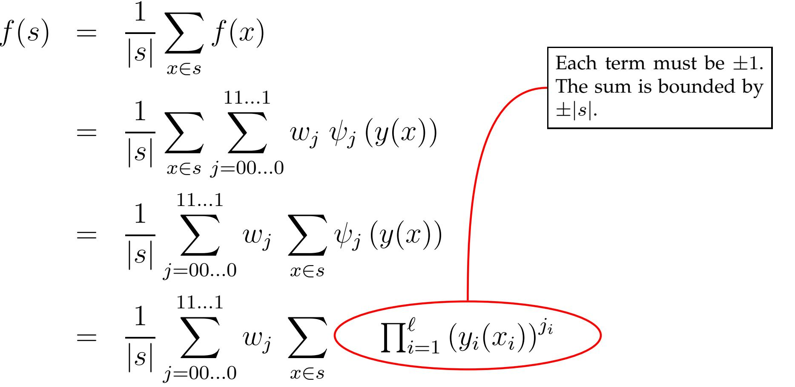
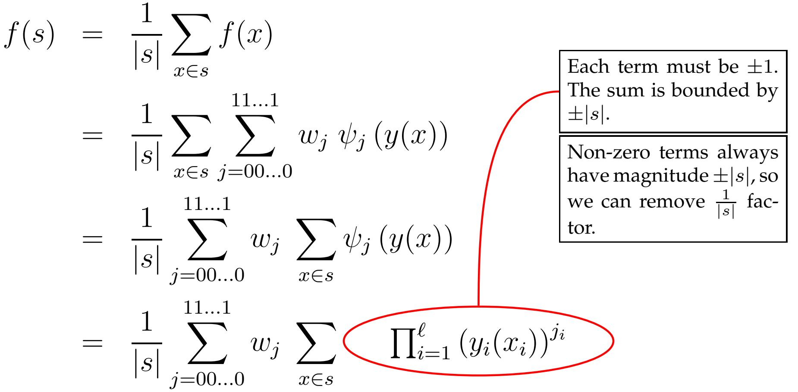
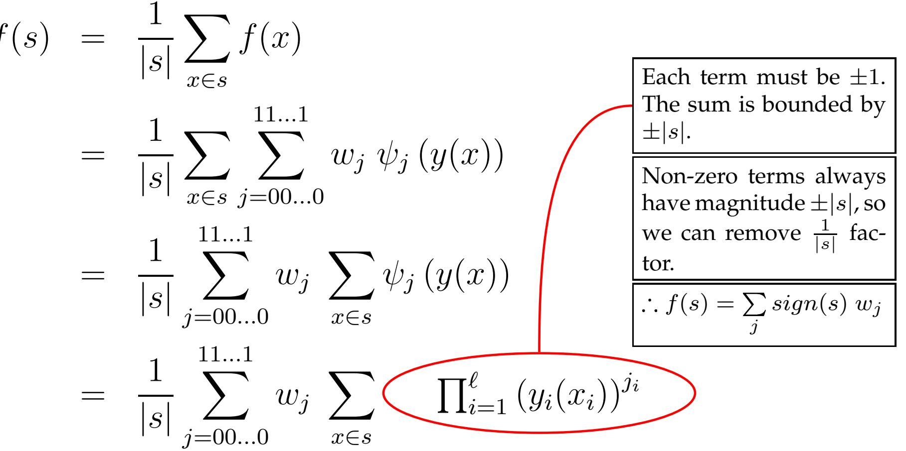
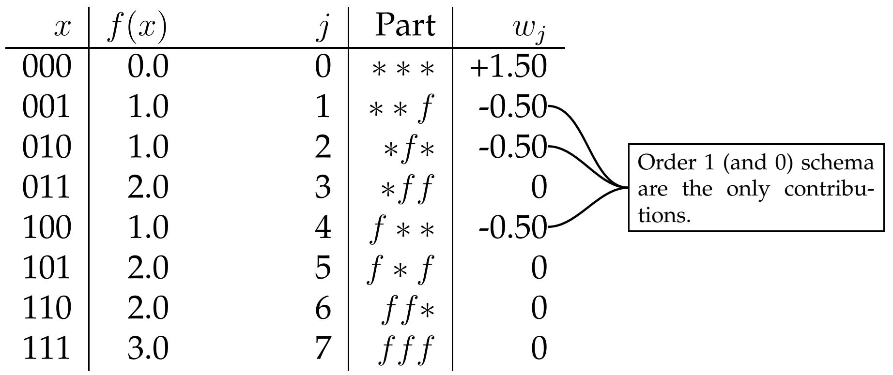
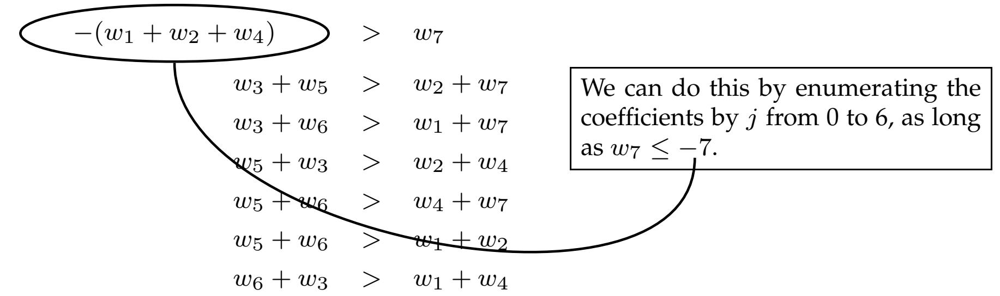

# to Wa ls h An a lys is Views of the Genetic Algorithm

paul@tesseract.org

# ECLab George Mason University

Part I: of the Walsh Transform

Part II: Analysis of Fitness

Analysis of Mixing Matrices

Part IV: Conclusions

Analysis (of a GA) using Walsh Transform

Historically mainly for landscape analysis

Way of "measuring where the energy/information a landscape is”   
Helps define notions such as "building block" and "deception" more formally

Recently applied to analysis of variation in Vose dynamical systems model of SGA Exposes properties of the mixing matrix in the SGA model

set of linearly independent vectors in a vector space such each vector in the space is a linear combination of the set.

set of linearly independent vectors in a vector space such each vector in the space is a linear combination of the set.

# For Example:

Suppose U is the unit basis for R2

$$
\begin{array} { r c l } { { U _ { 1 } } } & { { = } } & { { < 1 ~ 0 > } } \\ { { } } & { { } } & { { } } \\ { { U _ { 2 } } } & { { = } } & { { < 0 ~ 1 > } } \end{array}
$$

$$
\begin{array} { l l l } { { \vec { y } } } & { { \in } } & { { \Re ^ { 2 } } } \\ { { \vec { y } } } & { { = } } & { { 2 . 0 U _ { 1 } - 3 . 1 U _ { 2 } } } \end{array}
$$

set of linearly independent vectors in a vector space such each vector in the space is a linear combination of the set.

# For Example:

Suppose U is the unit basis for R2 basis can be seen as a type of viewpoint or perspective

Takes a space and expresses it under a new / different basis

7→ W \~x (assuming all obj ects are real)

Change in viewpoint or perspective

Discrete analog of the Fourier transform into the Wa lsh basis Change in viewpoint:

For landscape analysis: to help see schema more clearly analysis : to help expose certain mathematical properties of the mixing matrix

Discrete analog of the Fourier transform into the Wa lsh basis Change in viewpoint:

—For landscape analysis: to help see schema more clearly analysis : to help expose certain mathematical properties of the mixing matrix

For example:

points in landscape residing in implied partitions   
schemata in landscape explicitly points are implied by construction.

Part I: of the Walsh Transform

Part II: Analysis of Fitness

Analysis of Mixing Matrices

Part IV: Conclusions fixed-length bin. str. $x \in \{ 0 , 1 \} ^ { \ell }$

can enumerate points and fitness values

is an imp lied b asis :

$$
f ( j ) = \sum _ { i = 0 0 \ldots 0 } ^ { 1 1 \ldots 1 } f _ { i } \delta _ { i j }
$$

Where $\delta _ { i j } = 1$ when $i = j$ and 0 otherwise

(Assuming binary representation)

Example:

3-bit landscape

<table><tr><td>Point</td><td>Fitness</td></tr><tr><td>000</td><td>fooo</td></tr><tr><td>001</td><td>f001</td></tr><tr><td>:</td><td>:</td></tr><tr><td>111</td><td>f111</td></tr></table>

# points sharing some "syntactic feature'

$$
\begin{array} { l } { \cdot \in \ \left\{ 0 , 1 , * \right\} ^ { \ell } } \\ { \in \ s , \ \mathrm { i f f } \ \forall i \left( x _ { i } = s _ { i } \right) \vee \left( s _ { i } = \right. } \end{array}
$$

For example:

1/\*11 “Don’t care”

<table><tr><td>Schema</td><td>Members</td></tr><tr><td>1**0</td><td>1000 1010 1100 1110</td></tr></table>

Let's define some functions for convenience...

$$
\mathbf { \Sigma } _ { i } ) = \left\{ \begin{array} { l l } { 0 , } & { \mathrm { i f ~ } s _ { i } = * } \\ { 1 , } & { \mathrm { i f ~ } s _ { i } = 0 , 1 } \end{array} \right. \left| \mathbf { A } ^ { \prime \prime } 0 ^ { \prime \prime } \mathrm { ~ i n d i c a t ~ } \right.
$$

tes an undefined poa "1" indicates one d.

Let's define some functions for convenience..

α(si) 0, if si = \* if $s _ { i } = 0 ,$ 1

A "0" indicates an undefined position, while a "1" indicates one that is defined.

$$
j _ { p } ( s ) = \sum _ { i = 1 } ^ { \ell } \alpha ( s _ { i } ) 2 ^ { i - 1 }
$$

partition number of a schema. E.g., jp(\* \* \*) = 0, jp(\* \* f ) = 1, . . ., jp(f f f) = 7.

Let's define some functions for convenience..

α(si) 0, if si = \* if $s _ { i } = 0 ,$ 1

A "0" indicates an undefined position, while a "1" indicates one that is defined.

$$
j _ { p } ( s ) = \sum _ { i = 1 } ^ { \ell } \alpha ( s _ { i } ) 2 ^ { i - 1 }
$$

partition number of a schema. E.g., jp(\* \* \*) = 0, jp(\* \* f ) = 1, . . ., jp(f f f) = 7.

$$
y _ { i } = ( - 1 ) ^ { x _ { i } }
$$

auxiliary string, where 7→ − 1 and $0 \mapsto 1$ . Multiplication now act as XOR.

Wa lsh Functions, which provide the set of 2\` string variables :

$$
\psi _ { j } ( y ) = \prod _ { k = 1 } ^ { \ell } y _ { k } ^ { j _ { k } }
$$

j is treated like a binary string, and is indexed by k.

Wa lsh Functions, which provide the set of 2\` string variables :

$$
\psi _ { j } ( y ) = \prod _ { k = 1 } ^ { \ell } y _ { k } ^ { j _ { k } }
$$

j is treated like a binary string, and is indexed by k.

# For example:

how $j$ determines which $y _ { i }$ values are included in the product.

<table><tr><td>Partition</td><td>∥α(s)</td><td>j(s)</td><td>ψj(y)</td></tr><tr><td>***</td><td>000</td><td>0</td><td>1</td></tr><tr><td>**f</td><td>001</td><td>1</td><td>Y1</td></tr><tr><td>*f*</td><td>010</td><td>2</td><td>Y2</td></tr><tr><td>*ff</td><td>011</td><td>3</td><td>Y1Y2</td></tr><tr><td>f **</td><td>100</td><td>4</td><td>Y3</td></tr><tr><td>f *f</td><td>101</td><td>5</td><td>Y1Y3</td></tr><tr><td>ff*</td><td>110</td><td>6</td><td>Y2Y3</td></tr><tr><td>fff</td><td>111</td><td>7</td><td>Y1Y2Y3</td></tr></table>

# brief segue (we’ll come back to this later) . . .

that we only care about values of $y _ { k }$ which are -1 (or when $x _ { k } = 1 )$

fact, we only care about the number of such factors in the product

This number is simply the number of positions k that both $x$ and $j$ contain a 1 $\left( x ^ { T } j \right)$

could re-write the Walsh Function as follows : ψj(x) = (−1)(xTj)

see this as a set of functions that produce vectors, we could see it as a matrix: $\psi _ { x j }$

# Things of note about Walsh Functions:

Since $y _ { i } \in \{ - 1 , + 1 \}$ , exponents > 1 are redundant

bit-reversed order (trad . in Walsh lit. )

$\psi _ { j }$ defines a basis over some real vector $( \vec { w } )$ , just as the function did earlier over $\bar { f }$ :

$$
f ( x ) = \sum _ { j = 0 0 \ldots 0 } w _ { j } \ \psi _ { j } \ ( y ( x ) )
$$

The $\psi _ { j }$ basis is orthogonal:

$$
\sum _ { x = 0 0 \ldots 0 } ^ { 1 1 \ldots 1 } \psi _ { i } \left( y ( x ) \right) \psi _ { j } \left( y ( x ) \right) = \left\{ \begin{array} { l } { 2 ^ { \ell } , } \\ { 0 , } \end{array} \right.
$$

# We call wj a Walsh Coefficient

We might calculate these as follows:

However, there exists a Fast Walsh Transform, similar to the Fast Fourier

Transform

Once obtained, we can use then in linear summations to produce schema averages

coefficients and averages can be obtained as follows:

coefficients and averages can be obtained as follows:

coefficients and averages can be obtained as follows:

coefficients and averages can be obtained as follows:

we consider schema averages as the partial sum of signed Walsh coefficients:

<table><tr><td>Partition</td><td>Average Fitness</td><td></td></tr><tr><td>***</td><td>WO</td><td rowspan="3"></td></tr><tr><td>**f</td><td>wo ± w1</td></tr><tr><td>*f*</td><td>For example: wo ± w2</td></tr><tr><td>*ff</td><td>W0 ± w1 ± W2 ± W3</td><td>f (*01) = w0 − w1 + w2 − w3</td></tr><tr><td>f **</td><td>W0 ± w4</td><td>Coefficients represent th</td></tr><tr><td>f *f</td><td>W0 ± W1 ± W4 ± W5</td><td>contributions linear</td></tr><tr><td>ff*</td><td>Wo ± W2 ± W4 ± W6</td><td>non-linear components</td></tr><tr><td>fff</td><td>w0 ± w1 ± w2 ± w3 ± w4 ± w5 ± w6 ± w7</td><td>a given schema have 0</td></tr></table>

we consider schema averages as the partial sum of signed Walsh coefficients:

<table><tr><td>Partition</td><td>Average Fitness</td><td></td></tr><tr><td>***</td><td>WO</td><td rowspan="3"></td></tr><tr><td>**f</td><td>wo ± w1</td></tr><tr><td>*f*</td><td>For example: w0 ± w2</td></tr><tr><td>*ff</td><td>Wo ± w1 ± w2 ± w3 f (*01) = w0</td><td>)−W1 + W2 − W3</td></tr><tr><td>f**</td><td>W0 ± W4</td><td>Coefficients represent th</td></tr><tr><td>f*f</td><td>W0 ± W1 ± W4 ± W5</td><td rowspan="2">contributions linear non-linear components c</td></tr><tr><td>ff*</td><td>w0 ± w2 ± w4 ± w6</td></tr><tr><td>fff</td><td>W0 ± W1 ± w2 ± w3 ± W4 ± w5 ± w6 ± w7</td><td>a given schema have O C•</td></tr></table>

we consider schema averages as the partial sum of signed Walsh coefficients:

<table><tr><td>Partition</td><td>Average Fitness</td><td></td></tr><tr><td>***</td><td>W0</td><td rowspan="3"></td></tr><tr><td>**f</td><td>wo ± w1</td></tr><tr><td>*f*</td><td>For example: Wo ± W2</td></tr><tr><td>*ff</td><td>Wo ± w1 ± W2 ± w3</td><td>f (*01) = w0 − w1+W2 − W3</td></tr><tr><td>f **</td><td>W0 ± w4</td><td>Coefficients represent the</td></tr><tr><td>f *f</td><td>w0 ± w1 ± w4 ± w5</td><td>contributions linear &amp;</td></tr><tr><td>ff*</td><td>Wo ± W2 ± W4 ± W6</td><td>non-linear components of</td></tr><tr><td>fff</td><td>W0 ± W1 ± W2 ± w3 ± W4 ± W5 ± w6 ± w7</td><td>a given schema have or</td></tr></table>

we consider schema averages as the partial sum of signed Walsh coefficients:

<table><tr><td>Partition</td><td>Average Fitness</td><td></td></tr><tr><td>***</td><td>WO</td><td rowspan="3"></td></tr><tr><td>**f</td><td>wo ± w1</td></tr><tr><td>*f*</td><td>For example: w0 ± w2</td></tr><tr><td>*ff</td><td>Wo ± w1 ± w2 ± w3</td><td>f (*01) = w0 − w1 + w2 W3</td></tr><tr><td>f**</td><td>Wo ± w4</td><td>Coefficients represent the</td></tr><tr><td>f*f</td><td>w0 ± w1 ± w4 ± w5</td><td>contributions linear &amp;</td></tr><tr><td>ff*</td><td>W0 ± W2 ± W4 ± W6</td><td>non-linear components of</td></tr><tr><td>fff</td><td>W0 ± W1 ± W2 ± w3 ± W4 ± W5 ± w6 ± w7</td><td>a given schema have on</td></tr></table>

we consider schema averages as the partial sum of signed Walsh coefficients:

<table><tr><td>Partition</td><td>Average Fitness</td><td></td></tr><tr><td>***</td><td>WO</td><td rowspan="3"></td></tr><tr><td>**f</td><td>wo ± w1</td></tr><tr><td>*f*</td><td>For example: w0 ± w2</td></tr><tr><td>*ff</td><td>Wo ± w1 ± wW2 ± W3</td><td>f (*01) = w0 − w1 + w2 − W3</td></tr><tr><td>f **</td><td>W0 ± W4</td><td>Coefficients represent the</td></tr><tr><td>f *f</td><td>w0 ± w1 ± w4 ± W5</td><td>contributions linear &amp;</td></tr><tr><td>ff*</td><td>w0 ± w2 ± w4 ± w6</td><td>non-linear components of</td></tr><tr><td>fff</td><td>w0 ± w1 ± w2 ± w3 ± w4 ± w5 ± w6 ± w7</td><td>a given schema have on fitness</td></tr></table>

$$
O n e M a x ( x ) = \sum _ { i = 0 } ^ { \ell } x _ { i }
$$

<table><tr><td rowspan=1 colspan=1>x</td><td rowspan=1 colspan=1>f(x)                            j</td><td rowspan=1 colspan=1>Part</td><td rowspan=1 colspan=1>Wj</td></tr><tr><td rowspan=1 colspan=1>000</td><td rowspan=1 colspan=1>0.0                            0</td><td rowspan=1 colspan=1>***</td><td rowspan=1 colspan=1>+1.50</td></tr><tr><td rowspan=1 colspan=1>001</td><td rowspan=1 colspan=1>1.0                            1</td><td rowspan=1 colspan=1>**f</td><td rowspan=2 colspan=1>-0.50-0.50</td></tr><tr><td rowspan=1 colspan=1>010</td><td rowspan=1 colspan=1>1.0                           2</td><td rowspan=1 colspan=1>*f*</td></tr><tr><td rowspan=1 colspan=1>011</td><td rowspan=1 colspan=1>2.0                           3</td><td rowspan=1 colspan=1>*ff</td><td rowspan=5 colspan=1>0-0.50000</td></tr><tr><td rowspan=1 colspan=1>100</td><td rowspan=1 colspan=1>1.0                            4</td><td rowspan=1 colspan=1>f **</td></tr><tr><td rowspan=1 colspan=1>101</td><td rowspan=1 colspan=1>2.0                            5</td><td rowspan=1 colspan=1>f *f</td></tr><tr><td rowspan=1 colspan=1>110</td><td rowspan=1 colspan=1>2.0                            6</td><td rowspan=1 colspan=1>ff*</td></tr><tr><td rowspan=1 colspan=1>111</td><td rowspan=1 colspan=1>3.0                           7</td><td rowspan=1 colspan=1>fff</td></tr></table>

$$
O n e M a x ( x ) = \sum _ { i = 0 } ^ { \ell } x _ { i }
$$

arbitrary bitwise linear function:

f (x) = 10 + 5x1 − 10x2 + 0.1x3

<table><tr><td rowspan=3 colspan=1>x</td><td></td><td></td><td></td></tr><tr><td rowspan=2 colspan=1>f(x)                            j</td><td></td><td></td></tr><tr><td rowspan=1 colspan=1>Part</td><td rowspan=1 colspan=1>Wj</td></tr><tr><td rowspan=1 colspan=1>000</td><td rowspan=1 colspan=1>10.0                            0</td><td rowspan=1 colspan=1>***</td><td rowspan=1 colspan=1>+7.55</td></tr><tr><td rowspan=1 colspan=1>001</td><td rowspan=1 colspan=1>15.0                            1</td><td rowspan=1 colspan=1>**f</td><td rowspan=1 colspan=1>-2.50</td></tr><tr><td rowspan=1 colspan=1>010</td><td rowspan=1 colspan=1>0.0                            2</td><td rowspan=1 colspan=1>*f*</td><td rowspan=2 colspan=1>+5.000</td></tr><tr><td rowspan=1 colspan=1>011</td><td rowspan=1 colspan=1>35.0</td><td rowspan=1 colspan=1>*ff</td></tr><tr><td rowspan=1 colspan=1>100</td><td rowspan=1 colspan=1>10.1                            4</td><td rowspan=1 colspan=1>f **</td><td rowspan=4 colspan=1>-0.05000</td></tr><tr><td rowspan=1 colspan=1>101</td><td rowspan=1 colspan=1>15.1                            5</td><td rowspan=1 colspan=1>f *f</td></tr><tr><td rowspan=1 colspan=1>110</td><td rowspan=1 colspan=1>0.1                            6</td><td rowspan=1 colspan=1>ff*</td></tr><tr><td rowspan=1 colspan=1>111</td><td rowspan=1 colspan=1>5.1                            7</td><td rowspan=1 colspan=1>fff</td></tr></table>

arbitrary bitwise linear function:

f (x) = 10 + 5x1 − 10x2 + 0.1x3

<table><tr><td>x</td><td>f(x)</td><td>j Part</td><td>Wj</td></tr><tr><td>000</td><td>10.0</td><td>0 ***</td><td>+7.55</td></tr><tr><td>001</td><td>15.0</td><td>1 **f</td><td>-2.50-</td></tr><tr><td>010</td><td>0.0</td><td>2 *f*</td><td>+5.00- Again, orders 1 &amp; 0</td></tr><tr><td>011</td><td>5.0</td><td>*ff 3</td><td>0 schema are the only</td></tr><tr><td>100</td><td>10.1</td><td>4 f**</td><td>contributions. -0.05-</td></tr><tr><td>101</td><td>15.1</td><td>5 f *f</td><td>0</td></tr><tr><td>110</td><td>0.1</td><td>6 ff*</td><td>0</td></tr><tr><td>111</td><td>5.1</td><td>7 fff</td><td>0</td></tr></table>

arbitrary bitwise linear function:

f (x) = 10 + 5x1 − 10x2 + 0.1x3

<table><tr><td>x</td><td>f(x)</td><td>j Part</td><td>Wj</td></tr><tr><td>000 001</td><td>10.0 15.0</td><td>0 ***</td><td>+7.55 -2.50- Again, orders 1 &amp; 0</td></tr><tr><td>010</td><td>0.0</td><td>1 **f 2 *f*</td><td>+5.00- schema are the only contributions.</td></tr><tr><td>011</td><td>5.0</td><td>3 *ff</td><td>0 This is true of all</td></tr><tr><td>100</td><td>10.1</td><td>4 f**</td><td>-0.05- 1-separable fitness land-</td></tr><tr><td>101</td><td>15.1</td><td>f *f 5</td><td>scapes. 0</td></tr><tr><td>110</td><td>0.1</td><td>6 ff*</td><td>0</td></tr><tr><td>111</td><td>5.1</td><td>7 fff</td><td>0</td></tr></table>

$$
L e a d i n g O n e s ( x ) = \sum _ { i = 1 } ^ { \ell } \prod _ { j = 1 } ^ { i } x _ { j }
$$

<table><tr><td>x</td><td>f(x)</td><td>Part</td><td>Wj</td></tr><tr><td>000</td><td>0.0 0</td><td>***</td><td>+0.875</td></tr><tr><td>001</td><td>0.0 1</td><td>**f</td><td>-0.125</td></tr><tr><td>010</td><td>0.0 2</td><td>*f*</td><td>-0.375</td></tr><tr><td>011</td><td>0.0 3</td><td>*ff</td><td>+0.125</td></tr><tr><td>100</td><td>1.0 4</td><td>f **</td><td>-0.875</td></tr><tr><td>101</td><td>1.0 5</td><td>f*f</td><td>+0.125</td></tr><tr><td>110</td><td>2.0 6</td><td>ff*</td><td>+0.375</td></tr><tr><td>111</td><td>3.0 7</td><td>fff</td><td>-0.125</td></tr></table>

$$
L e a d i n g O n e s ( x ) = \sum _ { i = 1 } ^ { \ell } \prod _ { j = 1 } ^ { i } x _ { j }
$$

we use lower order coeff. to approximate the opt., $x = 1 1 1 ?$

# Question:

<table><tr><td>x</td><td>f(x) j</td><td>Part</td><td>Wj</td></tr><tr><td>000</td><td>0.0 0</td><td>***</td><td>+0.875</td></tr><tr><td>001</td><td>0.0 1</td><td>**f</td><td>-0.125</td></tr><tr><td>010</td><td>0.0 2</td><td>*f*</td><td>-0.375</td></tr><tr><td>011</td><td>0.0 3</td><td>*ff</td><td>+0.125</td></tr><tr><td>100</td><td>1.0 4</td><td>f **</td><td>-0.875</td></tr><tr><td>101</td><td>1.0 5</td><td>f *f</td><td>+0.125</td></tr><tr><td>110</td><td>2.0 6</td><td>ff*</td><td>+0.375</td></tr><tr><td>111</td><td>3.0 7</td><td>fff</td><td>-0.125</td></tr></table>

some sense GAs stochastically hillclimb in the space of schemata rather than the space of binary strings” (Rana et al . , 1 998)

$$
L e a d i n g O n e s ( x ) = \sum _ { i = 1 } ^ { \ell } \prod _ { j = 1 } ^ { i } x _ { j }
$$

we use lower order coeff. to approximate the opt., $x = 1 1 1 ?$

# Question:

$0 ^ { t h }$ order: $w _ { 0 } = 0 . 8 7 5$

<table><tr><td rowspan=1 colspan=1>x</td><td rowspan=1 colspan=1>f(x)                   j</td><td rowspan=1 colspan=1>Part</td><td rowspan=1 colspan=1>Wj</td></tr><tr><td rowspan=1 colspan=1>000</td><td rowspan=1 colspan=1>0.0                    0</td><td rowspan=1 colspan=1>***</td><td rowspan=1 colspan=1>+0.875</td></tr><tr><td rowspan=1 colspan=1>001</td><td rowspan=1 colspan=1>0.0                    1</td><td rowspan=1 colspan=1>**f</td><td rowspan=2 colspan=1>-0.125-0.375</td></tr><tr><td rowspan=1 colspan=1>010</td><td rowspan=1 colspan=1>0.0                   2</td><td rowspan=1 colspan=1>*f*</td></tr><tr><td rowspan=1 colspan=1>011</td><td rowspan=1 colspan=1>0.0                    3</td><td rowspan=1 colspan=1>*ff</td><td rowspan=1 colspan=1>+0.125</td></tr><tr><td rowspan=1 colspan=1>100</td><td rowspan=1 colspan=1>1.0                    4</td><td rowspan=1 colspan=1>f **</td><td rowspan=1 colspan=1>-0.875</td></tr><tr><td rowspan=1 colspan=1>101</td><td rowspan=1 colspan=1>1.0                    5</td><td rowspan=1 colspan=1>f *f</td><td rowspan=3 colspan=1>+0.125+0.375-0.125</td></tr><tr><td rowspan=1 colspan=1>110</td><td rowspan=1 colspan=1>2.0                    6</td><td rowspan=1 colspan=1>ff*</td></tr><tr><td rowspan=1 colspan=1>111</td><td rowspan=1 colspan=1>3.0                    7</td><td rowspan=1 colspan=1>fff</td></tr></table>

some sense GAs stochastically hillclimb in the space of schemata rather than the space of binary strings” (Rana et al . , 1 998)

$$
L e a d i n g O n e s ( x ) = \sum _ { i = 1 } ^ { \ell } \prod _ { j = 1 } ^ { i } x _ { j }
$$

<table><tr><td rowspan=1 colspan=1>x</td><td rowspan=1 colspan=1>f(x)                    j</td><td rowspan=1 colspan=1>Part</td><td rowspan=1 colspan=1>Wj</td></tr><tr><td rowspan=1 colspan=1>000</td><td rowspan=1 colspan=1>0.0                    0</td><td rowspan=1 colspan=1>***</td><td rowspan=1 colspan=1>+0.875</td></tr><tr><td rowspan=1 colspan=1>001</td><td rowspan=1 colspan=1>0.0                    1</td><td rowspan=1 colspan=1>**f</td><td rowspan=1 colspan=1>-0.125</td></tr><tr><td rowspan=1 colspan=1>010</td><td rowspan=1 colspan=1>0.0                    2</td><td rowspan=1 colspan=1>*f*</td><td rowspan=1 colspan=1>-0.375</td></tr><tr><td rowspan=1 colspan=1>011</td><td rowspan=1 colspan=1>0.0                   3</td><td rowspan=1 colspan=1>*ff</td><td rowspan=5 colspan=1>+0.125-0.875+0.125+0.375-0.125</td></tr><tr><td rowspan=1 colspan=1>100</td><td rowspan=1 colspan=1>1.0                    4</td><td rowspan=1 colspan=1>f**</td></tr><tr><td rowspan=1 colspan=1>101</td><td rowspan=1 colspan=1>1.0                    5</td><td rowspan=1 colspan=1>f *f</td></tr><tr><td rowspan=1 colspan=1>110</td><td rowspan=1 colspan=1>2.0                    6</td><td rowspan=1 colspan=1>ff*</td></tr><tr><td rowspan=1 colspan=1>111</td><td rowspan=1 colspan=1>3.0                    7</td><td rowspan=1 colspan=1>fff</td></tr></table>

# Question:

we use lower order coeff. to approximate the opt., $x = 1 1 1 ?$

$0 ^ { t h }$ order: $w _ { 0 } = 0 . 8 7 5$ $1 ^ { s t }$ order: $w _ { 0 } - w _ { 1 } - w _ { 2 } - w _ { 4 } = 2 . 2 5$

some sense GAs stochastically hillclimb in the space of schemata rather than the space of binary strings” (Rana et al . , 1 998)

$$
L e a d i n g O n e s ( x ) = \sum _ { i = 1 } ^ { \ell } \prod _ { j = 1 } ^ { i } x _ { j }
$$

# Question:

we use lower order coeff. to approximate the opt., $x = 1 1 1 ?$

<table><tr><td>x</td><td>f(x)</td><td>j Part</td><td>Wj</td></tr><tr><td>000</td><td>0.0</td><td>0 ***</td><td>+0.875 0th order: w0 = 0.875</td></tr><tr><td>001</td><td>0.0 1</td><td>**f</td><td>-0.125 1st order: w0 − w1 − w2 − w4 = 2.25</td></tr><tr><td>010</td><td>0.0</td><td>2 *f*</td><td>2nd order: -0.375</td></tr><tr><td>011</td><td>0.0</td><td>3 *ff</td><td>wω0 −w1−w2+w3−w4+w5 +w6 = 2.875 +0.125</td></tr><tr><td>100</td><td>1.0</td><td>4 f **</td><td>-0.875</td></tr><tr><td>101</td><td>1.0</td><td>5 f*f</td><td>+0.125</td></tr><tr><td>110</td><td>2.0</td><td>6 ff*</td><td>+0.375</td></tr><tr><td>111</td><td>3.0</td><td>7 fff</td><td>-0.125</td></tr></table>

some sense GAs stochastically hillclimb in the space of schemata rather than the space of binary strings” (Rana et al . , 1 998)

$$
L e a d i n g O n e s ( x ) = \sum _ { i = 1 } ^ { \ell } \prod _ { j = 1 } ^ { i } x _ { j }
$$

# Question:

we use lower order coeff. to approximate the opt., $x = 1 1 1 ?$

<table><tr><td>x</td><td>f(x) j</td><td>Part</td><td>Wj</td></tr><tr><td>000</td><td>0.0 0</td><td>***</td><td>+0.875</td></tr><tr><td>001</td><td>0.0 1</td><td>**f</td><td>-0.125</td></tr><tr><td>010</td><td>0.0 2</td><td>*f*</td><td>-0.375</td></tr><tr><td>011</td><td>0.0 3</td><td>*ff</td><td>+0.125</td></tr><tr><td>100</td><td>1.0 4</td><td>f **</td><td>-0.875</td></tr><tr><td>101</td><td>1.0 5</td><td>f *f</td><td>+0.125</td></tr><tr><td>110</td><td>2.0 6</td><td>ff*</td><td>+0.375</td></tr><tr><td>111</td><td>3.0 7</td><td>fff</td><td>-0.125</td></tr></table>

$0 ^ { t h }$ order: $w _ { 0 } = 0 . 8 7 5$ $1 ^ { s t }$ order: $w _ { 0 } - w _ { 1 } - w _ { 2 } - w _ { 4 } = 2 . 2 5$ $2 ^ { n d }$ order: $w _ { 0 } - w _ { 1 } - w _ { 2 } + w _ { 3 } - w _ { 4 } + w _ { 5 } + w _ { 6 } = 2 . 8 7 5$ Exact: 3.0

some sense GAs stochastically hillclimb in the space of schemata rather than the space of binary strings” (Rana et al . , 1 998)

$$
L e a d i n g O n e s ( x ) = \sum _ { i = 1 } ^ { \ell } \prod _ { j = 1 } ^ { i } x _ { j }
$$

we use lower order coeff. to approximate the opt., $x = 1 1 1 ?$

# Question:

<table><tr><td rowspan=1 colspan=1>x</td><td rowspan=1 colspan=1>f(x)                    j</td><td rowspan=1 colspan=1>Part</td><td rowspan=1 colspan=1>Wj</td></tr><tr><td rowspan=1 colspan=1>000</td><td rowspan=1 colspan=1>0.0                    0</td><td rowspan=1 colspan=1>***</td><td rowspan=1 colspan=1>+0.875</td></tr><tr><td rowspan=1 colspan=1>001</td><td rowspan=1 colspan=1>0.0                    1</td><td rowspan=1 colspan=1>**f</td><td rowspan=1 colspan=1>-0.125</td></tr><tr><td rowspan=1 colspan=1>010</td><td rowspan=1 colspan=1>0.0                   2</td><td rowspan=1 colspan=1>*f*</td><td rowspan=1 colspan=1>-0.375</td></tr><tr><td rowspan=1 colspan=1>011</td><td rowspan=1 colspan=1>0.0                    3</td><td rowspan=1 colspan=1>*ff</td><td rowspan=2 colspan=1>+0.125-0.875</td></tr><tr><td rowspan=1 colspan=1>100</td><td rowspan=1 colspan=1>1.0                    4</td><td rowspan=1 colspan=1>f **</td></tr><tr><td rowspan=1 colspan=1>101</td><td rowspan=1 colspan=1>1.0                    5</td><td rowspan=1 colspan=1>f *f</td><td rowspan=3 colspan=1>+0.125+0.375-0.125</td></tr><tr><td rowspan=1 colspan=1>110</td><td rowspan=1 colspan=1>2.0                   6</td><td rowspan=1 colspan=1>ff*</td></tr><tr><td rowspan=1 colspan=1>111</td><td rowspan=1 colspan=1>3.0                    7</td><td rowspan=1 colspan=1>fff</td></tr></table>

$0 ^ { t h }$ order: $w _ { 0 } = 0 . 8 7 5$ $1 ^ { s t }$ order: $w _ { 0 } - w _ { 1 } - w _ { 2 } - w _ { 4 } = 2 . 2 5$ $2 ^ { n d }$ order: $w _ { 0 } - w _ { 1 } - w _ { 2 } + w _ { 3 } - w _ { 4 } + w _ { 5 } + w _ { 6 } = 2 . 8 7 5$ Exact: 3.0

order building correctly predict optimum

some sense GAs stochastically hillclimb in the space of schemata rather than the space of binary strings” (Rana et al . , 1 998)

of GA demands that low coefficients “predict” higher order ones

it is easy to see how a deceptive can be constructed:

low order estimates fail to predict the optimum

E.g., For two bit problem where $f ( 1 1 ) > f ( 0 0 )$ $f ( 0 1 )$ ,(10) but $f ( * 0 ) > f ( * 1 ) { \mathrm { o r } } f ( 0 * ) > f ( 1 * )$

Here $: w _ { 1 } > 0 \mathrm { o r } w _ { 2 } > 0$ permit this

# Let's construct a fully deceptive, 3-bit problem:

be deceptive, we need:

$$
\begin{array} { l } { w _ { 1 } + w _ { 3 } > 0 , ~ w _ { 2 } + w _ { 3 } > 0 , \mathrm { a n d } ~ w _ { 1 } + w _ { 2 } > 0 } \\ { w _ { 1 } + w _ { 5 } > 0 , ~ w _ { 4 } + w _ { 5 } > 0 , \mathrm { a n d } ~ w _ { 1 } + w _ { 4 } > 0 } \\ { w _ { 6 } + w _ { 4 } > 0 , ~ w _ { 6 } + w _ { 2 } > 0 , \mathrm { a n d } ~ w _ { 2 } + w _ { 4 } > 0 } \end{array}
$$

# Let's construct a fully deceptive, 3-bit problem:

be deceptive, we need:

$$
\begin{array} { l } { w _ { 1 } + w _ { 3 } > 0 , ~ w _ { 2 } + w _ { 3 } > 0 , \mathrm { a n d } ~ w _ { 1 } + w _ { 2 } > 0 } \\ { w _ { 1 } + w _ { 5 } > 0 , ~ w _ { 4 } + w _ { 5 } > 0 , \mathrm { a n d } ~ w _ { 1 } + w _ { 4 } > 0 } \\ { w _ { 6 } + w _ { 4 } > 0 , ~ w _ { 6 } + w _ { 2 } > 0 , \mathrm { a n d } ~ w _ { 2 } + w _ { 4 } > 0 } \end{array}
$$

# preserve optimality:

$$
\begin{array} { r l } { - ( w _ { 1 } + w _ { 2 } + w _ { 4 } ) \quad > \quad w _ { 7 } } \\ { w _ { 3 } + w _ { 5 } \quad > \quad w _ { 2 } + w _ { 7 } } \\ { w _ { 3 } + w _ { 6 } \quad > \quad w _ { 1 } + w _ { 7 } } \\ { w _ { 5 } + w _ { 3 } \quad > \quad w _ { 2 } + w _ { 4 } } \\ { w _ { 5 } + w _ { 6 } \quad > \quad w _ { 4 } + w _ { 7 } } \\ { w _ { 5 } + w _ { 6 } \quad > \quad w _ { 1 } + w _ { 2 } } \\ { w _ { 6 } + w _ { 3 } \quad > \quad w _ { 1 } + w _ { 4 } } \end{array}
$$

# Let's construct a fully deceptive, 3-bit problem:

be deceptive, we need:

$$
\begin{array} { l } { w _ { 1 } + w _ { 3 } > 0 , ~ w _ { 2 } + w _ { 3 } > 0 , \mathrm { a n d } ~ w _ { 1 } + w _ { 2 } > 0 } \\ { w _ { 1 } + w _ { 5 } > 0 , ~ w _ { 4 } + w _ { 5 } > 0 , \mathrm { a n d } ~ w _ { 1 } + w _ { 4 } > 0 } \\ { w _ { 6 } + w _ { 4 } > 0 , ~ w _ { 6 } + w _ { 2 } > 0 , \mathrm { a n d } ~ w _ { 2 } + w _ { 4 } > 0 } \end{array}
$$

# preserve optimality:

$$
\begin{array} { r l } { - ( w _ { 1 } + w _ { 2 } + w _ { 4 } ) \quad > \quad w _ { 7 } } \\ { w _ { 3 } + w _ { 5 } \quad > \quad w _ { 2 } + w _ { 7 } } \\ { w _ { 3 } + w _ { 6 } \quad > \quad w _ { 1 } + w _ { 7 } } \\ { w _ { 5 } + w _ { 3 } \quad > \quad w _ { 2 } + w _ { 4 } } \\ { w _ { 5 } + w _ { 6 } \quad > \quad w _ { 4 } + w _ { 7 } } \\ { w _ { 5 } + w _ { 6 } \quad > \quad w _ { 1 } + w _ { 2 } } \\ { w _ { 6 } + w _ { 3 } \quad > \quad w _ { 1 } + w _ { 4 } } \end{array}
$$

can do this by enumerating the coefficients by $j$ from 0 to 6, as long as $w _ { 7 } \leq - 7$ .

# Let's construct a fully deceptive, 3-bit problem:

be deceptive, we need:

$$
\begin{array} { l } { w _ { 1 } + w _ { 3 } > 0 , ~ w _ { 2 } + w _ { 3 } > 0 , \mathrm { a n d } ~ w _ { 1 } + w _ { 2 } > 0 } \\ { w _ { 1 } + w _ { 5 } > 0 , ~ w _ { 4 } + w _ { 5 } > 0 , \mathrm { a n d } ~ w _ { 1 } + w _ { 4 } > 0 } \\ { w _ { 6 } + w _ { 4 } > 0 , ~ w _ { 6 } + w _ { 2 } > 0 , \mathrm { a n d } ~ w _ { 2 } + w _ { 4 } > 0 } \end{array}
$$

preserve optimality:

fully deceptive 3-bit fitness landscape :   

<table><tr><td rowspan=3 colspan=1>x</td><td></td><td></td><td></td></tr><tr><td rowspan=2 colspan=1>f(x)                             j</td><td></td><td></td></tr><tr><td rowspan=1 colspan=1>Part</td><td rowspan=1 colspan=1>Wj</td></tr><tr><td rowspan=1 colspan=1>000</td><td rowspan=1 colspan=1>13.0                            0</td><td rowspan=1 colspan=1>***</td><td rowspan=1 colspan=1>0</td></tr><tr><td rowspan=1 colspan=1>001</td><td rowspan=1 colspan=1>11.0                            1</td><td rowspan=1 colspan=1>**f</td><td rowspan=2 colspan=1>+1.0+2.0</td></tr><tr><td rowspan=1 colspan=1>010</td><td rowspan=1 colspan=1>7.0                            2</td><td rowspan=1 colspan=1>*f*</td></tr><tr><td rowspan=1 colspan=1>011</td><td rowspan=1 colspan=1>-15.0                            3</td><td rowspan=1 colspan=1>*ff</td><td rowspan=1 colspan=1>+3.0</td></tr><tr><td rowspan=1 colspan=1>100</td><td rowspan=1 colspan=1>-1.0                            4</td><td rowspan=1 colspan=1>f **</td><td rowspan=1 colspan=1>+4.0</td></tr><tr><td rowspan=1 colspan=1>101</td><td rowspan=1 colspan=1>-15.0                            5</td><td rowspan=1 colspan=1>f *f</td><td rowspan=3 colspan=1>+5.0+6.0-8.0</td></tr><tr><td rowspan=1 colspan=1>110</td><td rowspan=1 colspan=1>-15.0                            6</td><td rowspan=1 colspan=1>ff*</td></tr><tr><td rowspan=1 colspan=1>111</td><td rowspan=1 colspan=1>15.0                            7</td><td rowspan=1 colspan=1>fff</td></tr></table>

fully deceptive 3-bit fitness landscape :   

<table><tr><td rowspan=3 colspan=1>x</td><td></td><td></td><td></td></tr><tr><td rowspan=2 colspan=1>f(x)                            j</td><td></td><td></td></tr><tr><td rowspan=1 colspan=1>Part</td><td rowspan=1 colspan=1>Wj</td></tr><tr><td rowspan=1 colspan=1>000</td><td rowspan=1 colspan=1>13.0                            0</td><td rowspan=1 colspan=1>***</td><td rowspan=2 colspan=1>0+1.0</td></tr><tr><td rowspan=1 colspan=1>001</td><td rowspan=1 colspan=1>11.0                            1</td><td rowspan=1 colspan=1>**f</td></tr><tr><td rowspan=1 colspan=1>010</td><td rowspan=1 colspan=1>7.0                            2</td><td rowspan=1 colspan=1>*f*</td><td rowspan=1 colspan=1>+2.0</td></tr><tr><td rowspan=1 colspan=1>011</td><td rowspan=1 colspan=1>-15.0                            3</td><td rowspan=1 colspan=1>*ff</td><td rowspan=1 colspan=1>+3.0</td></tr><tr><td rowspan=1 colspan=1>100</td><td rowspan=1 colspan=1>-1.0                            4</td><td rowspan=1 colspan=1>f **</td><td rowspan=1 colspan=1>+4.0</td></tr><tr><td rowspan=1 colspan=1>101</td><td rowspan=1 colspan=1>-15.0                            5</td><td rowspan=1 colspan=1>f *f</td><td rowspan=3 colspan=1>+5.0+6.0-8.0</td></tr><tr><td rowspan=1 colspan=1>110</td><td rowspan=1 colspan=1>-15.0                            6</td><td rowspan=1 colspan=1>ff*</td></tr><tr><td rowspan=1 colspan=1>111</td><td rowspan=1 colspan=1>15.0                            7</td><td rowspan=1 colspan=1>fff</td></tr></table>

0th order: 0 1st order: $0 - 7 = - 7$ 2nd order: $- 7 + 1 4 = 7$ Exact: $7 - ( - 8 ) = 1 5$

fully deceptive 3-bit fitness landscape :

<table><tr><td rowspan=3 colspan=1>x</td><td></td><td></td><td></td></tr><tr><td rowspan=2 colspan=1>f(x)                            j</td><td></td><td></td></tr><tr><td rowspan=1 colspan=1>Part</td><td rowspan=1 colspan=1>Wj</td></tr><tr><td rowspan=1 colspan=1>000</td><td rowspan=1 colspan=1>13.0                            0</td><td rowspan=1 colspan=1>***</td><td rowspan=3 colspan=1>0+1.0+2.0</td></tr><tr><td rowspan=1 colspan=1>001</td><td rowspan=1 colspan=1>11.0                            1</td><td rowspan=1 colspan=1>**f</td></tr><tr><td rowspan=1 colspan=1>010</td><td rowspan=1 colspan=1>7.0                            2</td><td rowspan=1 colspan=1>*f*</td></tr><tr><td rowspan=1 colspan=1>011</td><td rowspan=1 colspan=1>-15.0                            3</td><td rowspan=1 colspan=1>*ff</td><td rowspan=1 colspan=1>+3.0</td></tr><tr><td rowspan=1 colspan=1>100</td><td rowspan=1 colspan=1>-1.0                            4</td><td rowspan=1 colspan=1>f **</td><td rowspan=1 colspan=1>+4.0</td></tr><tr><td rowspan=1 colspan=1>101</td><td rowspan=1 colspan=1>-15.0                            5</td><td rowspan=1 colspan=1>f *f</td><td rowspan=3 colspan=1>+5.0+6.0-8.0</td></tr><tr><td rowspan=1 colspan=1>110</td><td rowspan=1 colspan=1>-15.0                            6</td><td rowspan=1 colspan=1>ff*</td></tr><tr><td rowspan=1 colspan=1>111</td><td rowspan=1 colspan=1>15.0                            7</td><td rowspan=1 colspan=1>fff</td></tr></table>

0th order: 0 1st order: $0 - 7 = - 7$ 2nd order: $- 7 + 1 4 = 7$ Exact: $7 - ( - 8 ) = 1 5$ lower order blocks do not correctly predict the optimum $\begin{array} { r } { n ( s , t + 1 ) \geq m ( s , t ) \frac { f ( s ) } { \bar { f } } \left\lfloor 1 - p _ { c } \frac { \delta ( s ) } { \ell - 1 } - \right. } \end{array}$ Pmo(s)] think in terms of “operator-adjusted” fitness : $\begin{array} { r } { m ( s , t + 1 ) \geq m ( s , t ) \frac { f ^ { \prime } ( s ) } { \bar { f } } } \end{array}$

formulate operator-adjusted Walsh coefficients, obtain $f ^ { \prime } ( s )$ this way, as well

$$
\begin{array} { r } { w _ { j } ^ { \prime } = w _ { j } \left[ 1 - p _ { c } \frac { \delta ( j ) } { \ell - 1 } - 2 p _ { m } o ( j ) \right] } \end{array}
$$

compute $f ^ { \prime }$ in terms of $w ^ { \prime }$ , as we did for f and w

(Denote the true optimum as $f ^ { * } )$

Near Optimal Set:

$$
N = \{ x : f ^ { * } - f ( x ) \leq \epsilon \}
$$

Op-Adj. Near Optimal Set: N ′ = {x : f ′\* − f ′(x) ≤ ′}, 0 = f0 ∗ − w0 f ∗ − w0 

Statically Deceptive: $N - N ^ { \prime } \neq \emptyset$

Statically Easy: $N - N ^ { \prime } = \emptyset$

Strictly Statically Easy: $N = N ^ { \prime }$

Near Optimal Set:

(Denote the true optimum as $f ^ { * } )$

$$
N = \{ x : f ^ { * } - f ( x ) \leq \epsilon \}
$$

Op-Adj. Near Optimal Set: N ′ = {x : f ′\* − f ′(x) ≤ ′}, 0 = f 0 ∗ − w0 ∗ 

Statically Deceptive: $N - N ^ { \prime } \neq \emptyset$

Statically Easy: $N - N ^ { \prime } = \emptyset$

Strictly Statically Easy: $N = N ^ { \prime }$

a population stay “near ” the global optimum under the influence of genetic operators once it is there?

(Denote the true optimum as $f ^ { * } )$

Near Optimal Set:

$$
N = \{ x : f ^ { * } - f ( x ) \leq \epsilon \}
$$

Op-Adj. Near Optimal Set: N ′ = {x : f ′\* − f ′(x) ≤ ′}, 0 = f 0 ∗ − w0 ∗ 

Statically Deceptive: $N - N ^ { \prime } \neq \emptyset$

Statically Easy: $N - N ^ { \prime } = \emptyset$

Strictly Statically Easy: $N = N ^ { \prime }$

a population stay “near ” the global optimum under the influence of genetic operators once it is there?

flaw: Goldberg calls this “convergence point” an attractor. In fact, it is not necessarily one. The definition of stable fixed point and attracting fixed point are the same .

# Analysis of deception

the degree of deception in terms of the potential shift of points in $N ^ { \prime }$ due to changes in $f ^ { \prime }$

Sensitivity analysis of deception the degree to which small changes in post-operator fitaffect the degree of deception (Goldberg, 1 989b) .

Signal to noise analysis the ratio of information provided by schema helpful convergence, versus information which is harmful (Rudnick, 1991).

coefficients are insufficient to infer optima hard problems exist for which all non-zero Walsh coefficients be computed in linear time .  either $P = N P$ or the exact and non-linear interactions of a function is insufficient to the global optimum in polynomial time (Rana, 1998) .

# Deception = difficult

are problems that meet “deceptive” criteria that are easy a GA, as well as the reverse (Greffenstette, 1 993) .

analysis does not necessarily agree with notions of “deception”

Deception is not necessarily correlated with high order Walsh co(Goldberg, 1 990) .

hypotheses of Schema Theory (e. g, BBH)

everyone is convinced of ST’s utility or correctness in terms dynamical prediction (Vose, 1 993) .

fundamental “useful” connection between Walsh basis and a GA

Walsh transform’s real power lies in its ability to simplify expose underlying properties of transformations performed by the steps in a GA generation, not in the analysis of fitness landscapes (Vose, t.r.).

Part I: of the Walsh Transform

Part II: Analysis of Fitness

Analysis of Mixing Matrices

Part IV: Conclusions

Representation of individuals are discrete, fixed-length strings using alphabets of arbitrary cardinality (we focus on binary)

Populations are infinite in size effects of selection and variation in a generation as a discrete time dynamical system in analyzing the expected dynamical a real GA

Population state represented as a vector of proportions of each genotype in population:

Dynamical map is a composition of steps in a GA generation:

$$
\mathcal { G } = \mathcal { M } \circ \mathcal { S } \circ \mathcal { F }
$$

$\mathcal { F }$ assigns fitness, $\mathcal { F } : \Delta ^ { n } \longrightarrow \mathfrak { R } ^ { n }$

$\boldsymbol { S }$ redistributes proportions due to selection, ${ \mathcal { S } } : { \mathfrak { R } } ^ { n } \to \Delta ^ { n }$

$\mathcal { M }$ applies mutation and recombination effects, $\mathcal { M } : \Delta ^ { n }  \Delta ^ { n }$

studying mixing, so let’s simplify things:

$$
\begin{array} { l } { { \vec { x } ^ { \prime } = S \left( \mathcal { F } \left( \vec { x } \right) \right) } } \\ { { \vec { x } ^ { \prime \prime } = M \left( \vec { x } ^ { \prime } \right) } } \end{array}
$$

Let $\sigma _ { k }$ be the $k$ permutation matrix and $\bigoplus$ mean XOR

a mixing probabilities matrix $M ^ { ( 0 ) }$ , o r j u s t M : = Pr [parent i × parent $j \to \mathrm { c h i l d ~ 0 } ]$

obtain M (k) generally by permuting $M$ :

$$
\begin{array} { l } { { M ^ { ( k ) } = M _ { i \oplus k , j \oplus k } , \forall i , j } } \\ { { \mathcal { M } _ { k } = \left( \vec { x } ^ { \prime } \right) ^ { T } M ^ { ( k ) } \vec { x } ^ { \prime } } } \end{array}
$$

Equivalently, we can permute population vectors:

$$
\begin{array} { r } { \mathcal { M } _ { k } = \left( \sigma _ { k } \vec { x } ^ { \prime } \right) ^ { T } \vec { M } \left( \sigma _ { k } \vec { x } ^ { \prime } \right) } \\ { \mathrm { ) r , } \vec { x } ^ { \prime \prime } = \sum _ { i , j } x _ { i } x _ { j } M _ { i \oplus k , j \oplus k } } \end{array}
$$

can use linear algebra methods to performing Fourier transforms

a Fourier Matrix for alphabets of arbitrary cardinality, c

$$
\begin{array} { r } { W _ { i j } = \frac { 1 } { \sqrt { n } } e ^ { \frac { 2 \pi \sqrt { - 1 } \left( i ^ { T } j \right) } { c } } } \end{array}
$$

the Fourier transform is the mapping \~x 7→ W \~x C ( $C$ represents complex conjugate)

For simplicity, we write:

$$
\begin{array} { r c l } { { { \widehat { A } } } } & { { = } } & { { W A ^ { C } W ^ { C } } } \\ { { { \widehat { x } } } } & { { = } } & { { W { \overrightarrow { x } } ^ { C } } } \end{array}
$$

the binary case $( c = 2 )$ , we eliminate conjugation:

$$
\begin{array} { r c l } { { W _ { i j } } } & { { = } } & { { \displaystyle \frac { 1 } { \sqrt n } e ^ { \frac { 2 \pi \sqrt { - 1 } ( s ^ { T } { \widehat { \sigma } } ) } { c } } = \frac { 1 } { \sqrt n } e ^ { \pi \sqrt { - 1 } ( s ^ { T } { \widehat { \sigma } } ) } \medskip } } \\ { { \displaystyle z \sqrt { - 1 } } } & { { = } } & { { \displaystyle \cos ( z ) + \sqrt { - 1 } \sin ( z ) \mathrm { b u t h e r e } i ^ { T } j \mathrm { \small ~ r } } } \\ { { } } & { { \displaystyle \therefore } } & { { \displaystyle \sqrt { - 1 } \sin ( \pi ( i ^ { T } j ) ) = 0 \mathrm { a n d } \cos ( \pi  \hfill } } \\ { { W _ { i j } } } & { { = } } & { { \displaystyle \frac { 1 } { \sqrt n } ( - 1 ) ^ { ( s ^ { T } j ) }  } } \\ { { \widehat x } } & { { = } } & { { \displaystyle \frac { 1 } { \sqrt n } W ^ { \prime } \widehat x } } \end{array}
$$

Part II we have :

$$
\begin{array} { l l l l } { { w _ { j } } } & { { = } } & { { \displaystyle \frac { 1 } { 2 ^ { \ell } } \sum _ { x } f ( x ) \ \psi _ { j } \left( y ( x ) \right) = \frac { 1 } { n } \sum _ { x } f ( x ) \left( - 1 \right) ^ { \left( \right.}  } } \\ { { \vec { w } } } & { { = } } & { { \displaystyle \frac { 1 } { n } { W ^ { \prime } } { \vec { f } } ^ { \ { } } } } \end{array}
$$

the binary case $( c = 2 )$ , we eliminate conjugation:

\$\r}\$ \$e^ √sr-1\$ must be a whole number $\left( \pi \left( i ^ { T } j \right) \right) = \pm 1$

e Walsh transform is the nsform, when $c = 2$

$$
\begin{array} { r l } & { \quad = \quad \mathrm { s u r f ~ } _ { \ell } \cdot \mathrm { e } ^ { - \mathrm { i } \cdot \ell } , \quad \mathrm { e } ^ { - \mathrm { i } \cdot \ell } , } \\ & { \quad : \quad \cdot \ \cdot \sqrt { \pi } \mathrm { i n } ( \pi ( \bar { x } ^ { 2 } ) ) = 0 \quad \mathrm { a n d } \quad \mathrm { c o n ~ } ( \tau ( \begin{array} { l } { 0 } \\ { 0 } \end{array} ) ) } \\ & { \quad \quad \cdot \ \cdot \frac { 1 } { \sqrt { \pi } }  - 1  ^ { ( \mathcal { T } ^ { \prime } ) } \quad } \\ & { \quad \quad \cdot \ ( \begin{array} { l } { 1 \mathrm { e } \mathrm { i } \mathrm { e x t } \cdot \mathrm { i n } } \\ { \mathrm { e } \mathrm { i n } \mathrm { e } ^ { \mathrm { i } \cdot \ell } } \end{array} ) } \\ & { \quad \quad \cdot \ \cdot \ \sqrt { \pi } \mathrm { w e r e } \mathrm { i } \mathrm { e } ^ { \mathrm { i } \cdot \ell } , } \\ & { \quad \quad \mathrm { m } \ \mathrm { P a r t ~ I I ~ w e e ~ h a v e } ; } \\ & { \quad \quad \quad \cdot \ \frac { 1 } { 2 ^ { \ell } } \ \sum _ { \alpha } f ( \alpha ) \ \dot { \sigma } _ { 2 } ( \{ \boldsymbol { \theta } } \boldsymbol { \phi } ) \mathrm { i } = \frac { 1 } { \alpha } \sum _ { \alpha } f ( \alpha ) ( \mathrm {  ~ \lambda ~ } \mathrm { i } ) ^ { ( \alpha ) }  \\ &  \quad \quad \cdot \ ( \begin{array} { l } { 1 \mathrm { e } \mathrm { e } ^ { \mathrm { i } \cdot \mathrm { i } \cdot \mathrm { i } \cdot \mathrm { i } \cdot \mathrm { i } \cdot \mathrm { i } \cdot \mathrm { i } \cdot \mathrm { i } \cdot \mathrm { i } \cdot \mathrm { i } } } \\ { \mathrm { e } \mathrm { i n } \cdot \mathrm { e } ^ { \mathrm { i } \cdot \mathrm { i } \cdot \mathrm { i } \cdot \mathrm { i } \cdot \mathrm { i } \cdot \mathrm { i } \cdot \mathrm { i } \cdot \mathrm { i } \cdot \mathrm { i } \cdot \mathrm { i } \cdot \mathrm { i } \cdot \mathrm { i } \cdot \mathrm { i } \cdot \mathrm { i } } } \end{array} \end{array}
$$

Fro

the twist A∗ of a n × n matrix A by (A\*)i,j = Aji−i

the conjugate transpose as the transpose of the complex conjugate of a matrix, denoted AH

$\{ H , \land , * \}$ are interrelated operators. For example:

$$
\begin{array} { r c l } { { { \widehat { A } } ^ { H } } } & { { = } } & { { { \widehat { A } } ^ { H } } } \\ { { \displaystyle \left( ( A ^ { H } ) ^ { * } \right) ^ { H } } } & { { = } } & { { ( A ^ { * } ) ^ { * } = \widehat { \left( A \right) } ^ { * } } } \\ { { \displaystyle ( A ^ { H } ) ^ { H } } } & { { = } } & { { \widehat { \hat { A } } = ( ( A ^ { * } ) ^ { * } ) ^ { * } = \mathrm { i d e n } } } \end{array}
$$

point: complicated sequences of these operations be simplified

mixing matrix is dense under positive mutation, has a sparse Fourier transform

mutation is zero, $M = { \bar { M } }$

M\* is lower triangular

mutation is zero, M ∗ is upper triangular

mixing matrix is dense under positive mutation, has a sparse Fourier transform

mutation is zero, $M = { \bar { M } }$

M\* is lower triangular

mutation is zero, M ∗ is upper triangular

Why do we care?

mixing matrix is dense under positive mutation, has a sparse Fourier transform

mutation is zero, $M = { \bar { M } }$

M\* is lower triangular

mutation is zero, M ∗ is upper triangular

Why do we care?

these are ways to simplify M for the general case, such that more complicated analysis may be tractable .

can use the twist to more easily obtain the differential of mixing:

$$
\begin{array} { r } { d \mathcal { M } _ { x } = 2 \sum _ { u } \sigma _ { u } ^ { T } M ^ { * } \sigma _ { u } x _ { u } } \end{array}
$$

mathematical properties can be elicited from mixing matrix :

to the spectrum of $M$ obtained through $M ^ { * }$   
Types of invariances under mixing exposed by Walsh transform   
mutation is positive, largest eigenvalue is 2 and all other eigenvalues are   
the unit disk

Efficiency improvement in calculating infinite population model from $\textit { O } \left( c ^ { 3 \ell } \right)$ to $O \left( c ^ { \ell l g 3 } \right)$

provides a way to elicit model of inverse GA - Yet Another Derivation of Geiringer ’s Equation

Part I: of the Walsh Transform

Part II: Analysis of Fitness

Analysis of Mixing Matrices

Part IV: Conclusions

Analysis (of a GA) using Walsh Transform

Analysis from perspective of the Walsh basis

It is really just a different viewpoint

Might facilitate analysis by changing the viewpoint s.t. exposed for deeper exploration (e.g., Goldberg)

Might facilitate analysis by changing the viewpoint s.t. types of mathematical derivations become tractable (e . g . , Vose)

Analysis (of a GA) using Walsh Transform

Analysis from perspective of the Walsh basis

It is really just a different viewpoint

Might facilitate analysis by changing the viewpoint s.t. exposed for deeper exploration (e.g., Goldberg)

Might facilitate analysis by changing the viewpoint s.t. types of mathematical derivations become tractable (e . g . , Vose)

Analysis is a tool to be used in conjunction with other methods, like a pair of work goggles.

Not a fair question...depends on the context of the analysis being done

Is analysis of schemata and building blocks helpful? perhaps Walsh Analysis is helpful for studying theory.

Is understanding the properties of a dynamical systems model of a GA helpful? Then perhaps Walsh Analysis is helpful for uncovering such properties.

There may very well be other uses of this other contexts

Seems powerful, but is limited by limitations of existing theory which uses it

Bethke, A. Genetic Algorithms as Function Optimizers. Doctoral thesis, University of Michigan. 1980

Goldberg, D. Genetic Algorithms in Search, Optimization and Machine Learning. 1989

Goldberg, D. Genetic Algorithms and Wlahs Functions: Part I, A Gentle Introduction. Compplex Systems 3. 1989

Goldberg, D. Genetic Algorithms and Wlahs Functions: Part I, Deception and Its Analysis. Compplex Systems 3. 1989

Ra  raabe Wal nalysis  A n pliatin r Gc Algorithms. In Proceedings from the 1998 AAAI. 1998

Rudnick, M. and Goldberg, D. Signal, Noise, and Genetic Algorithms. Technical Report. 1991

Vose, M. and Wright, A. The Simple Genetic Algorithm and the Walsh Transform: part I, Theory. Technical Report (ECJ in press). 1998

Vose, M. and Wright, A. The Simple Genetic Algorithm and the Walsh Transform: part II, The Inverse. Technical Report (ECJ in press). 1998

Vose, M. The Simple Genetic Algorithm: Foundations and Theory. 1999