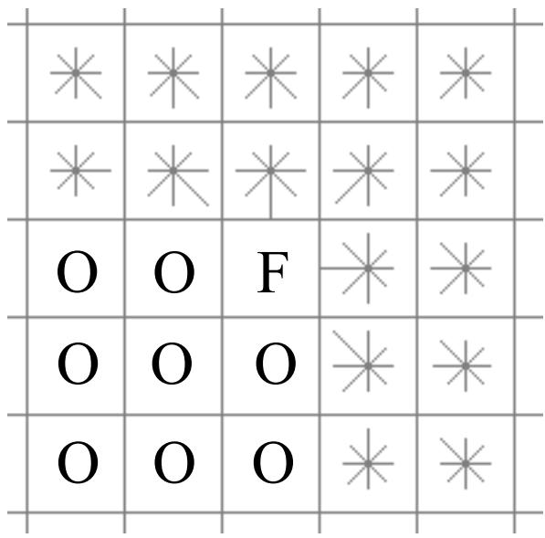
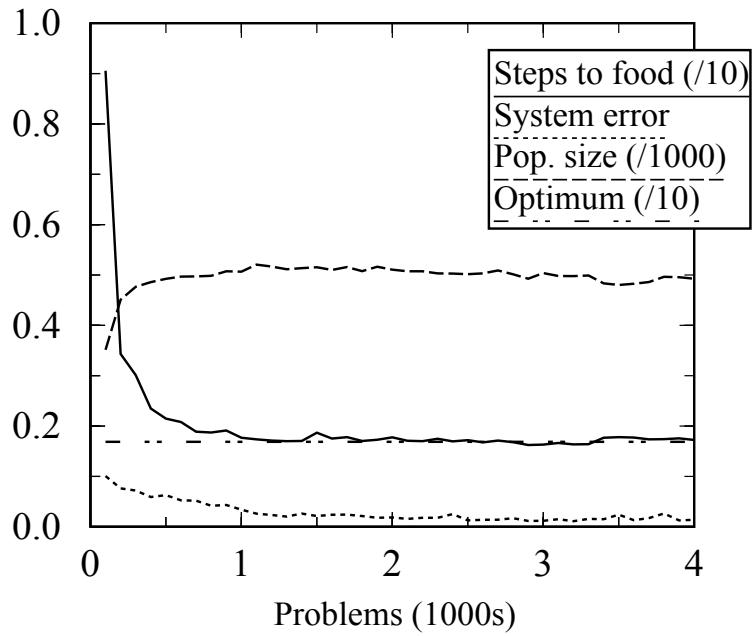
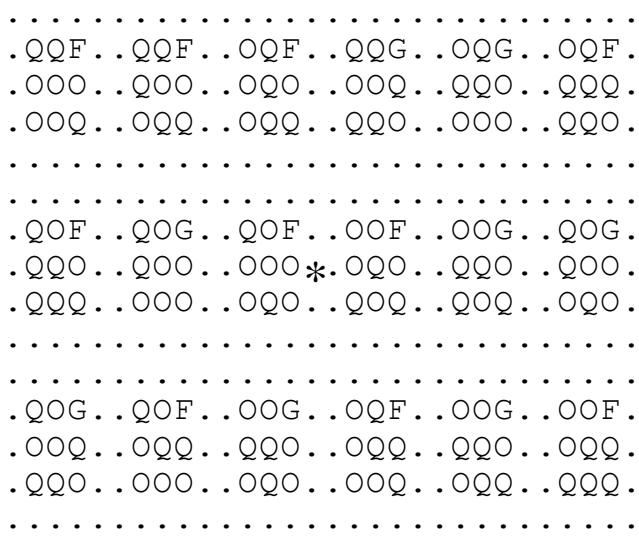
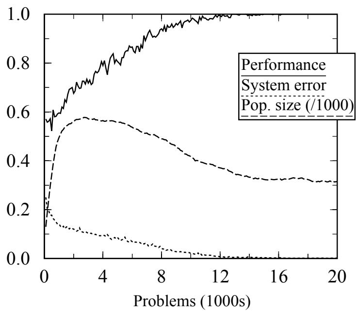
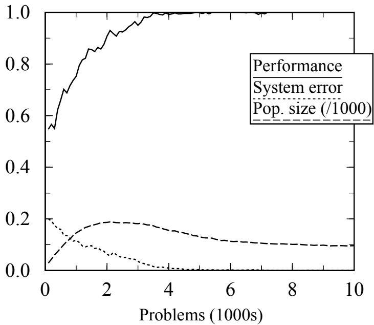
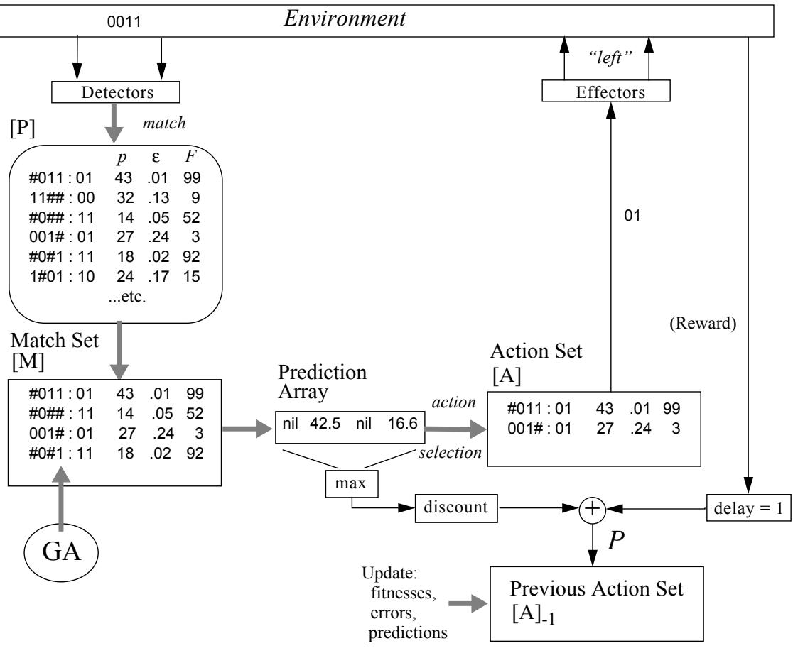

mals to Animats: Proceedings of the First International Conference on Simulation of Adaptive Behavior (pp. 15-21). Cambridge, MA: MIT Press.

Wilson, S. W. (1994). ZCS: a zeroth order classifier system. Evolutionary Computation, 2, 1-18.

Wilson, S. W., and Goldberg, D. E. (1989). A critical review of classifier systems. Proceedings of the Third International Conference on Genetic Algorithms (pp. 244-255). San Mateo, CA: Morgan Kaufmann.

son’s ZCS. Unpublished Masters dissertation/thesis, University of Sussex.

Smith, R. E. (1991). Default Hierarchy Formation and Memory Expoitation in Learning Classifier Systems. Ph. D. Dissertation, The University of Alabama, Tuscaloosa, Alabama.

Sutton, R. S. (1991). Reinforcement learning architectures for animats. In J.-A. Meyer & S. W. Wilson (eds.), From Animals to Animats: Proceedings of the First International Conference on Simulation of Adaptive Behavior (pp. 288-296). Cambridge, MA: MIT Press.

Twardowski, K. (1993). Credit assignment for pole balancing with learning classifier systems. In S. Forrest, (ed.), Proceedings of the Fifth International Conference on Genetic Algorithms (pp. 238-245). San Mateo, CA: Morgan Kaufmann.

Valenzuela-Rendón, M. (1991). The fuzzy classifier system: a classifier system for continuously varying variables. Proceedings of the Fourth International Conference on Genetic Algorithms (pp. 346-353). San Mateo, CA: Morgan Kaufmann.

Venturini, G. (1994). Apprentissage Adaptatif et Apprentissage Supervisé par Algorithme Géné- tique. Thèse de Docteur en Science (Informatique), Université de Paris-Sud.

Watkins, C. (1989). Learning from Delayed Rewards. Ph.D. Dissertation, Cambridge University.   
Watkins, C. and Dayan, P. (1992). Technical note: Q-Learning. Machine Learning, 8, 279-292.

Wilson, S. W. (1985). Knowledge growth in an artificial animal. Proceedings of the First International Conference on Genetic Algorithms and Their Applications (pp. 16-23). Hillsdale, New Jersey: Lawrence Erlbaum Associates.

Wilson, S.W. (1987a). Classifier systems and the animat problem. Machine Learning, 2, 199-228.

Wilson, S. W. (1987b). Hierarchical credit allocation in a classifier system. Proceedings of the Tenth International Joint Conference on Artificial Intelligence (pp. 217-220). Los Altos, CA: Morgan Kaufmann.

Wilson, S. W. (1991). The animat path to AI. In J.-A. Meyer & S. W. Wilson (eds.), From Ani

tems. Physica D, 41, 188-201.

Holland, J. H., Holyoak, K. J., Nisbett, R. E., and Thagard, P. R. (1986). Induction: Processes of Inference, Learning, and Discovery. Cambridge, MA: MIT Press.

Horn, J., Goldberg, D. E., and Deb, K. (1994). Implicit niching in a learning classifier system: nature’s way. Evolutionary Computation, 2(1), 37-66.

Koza, J. R. (1992). Genetic Programming. Cambridge, MA: The MIT Press/Bradford Books.

Lin, L.-J. (1993). Reinforcement Learning for Robots Using Neural Networks. Ph.D. Thesis, School of Computer Science, Carnegie Mellon University.

Mahadevan, S. and Connell, J. (1992). Automatic programming of behavior-based robots using reinforcement learning. Artificial Intelligence, 55, 311-365.

Parodi, A. and Bonelli, P. (1993). A new approach to fuzzy classifier systems. In S. Forrest, (ed.), Proceedings of the Fifth International Conference on Genetic Algorithms (pp. 223-230). San Mateo, CA: Morgan Kaufmann.

Poggio, T. & Edelman, S. (1990). A network that learns to recognize three-dimensional objects. Nature, 343, 263-266.

Riolo, R. L. (1991). Lookahead planning and latent learning in a classifier system. In J.-A. Meyer & S. W. Wilson (eds.), From Animals to Animats: Proceedings of the First International Conference on Simulation of Adaptive Behavior (pp. 316-326). Cambridge, MA: MIT Press.

Roberts, G. R. (1993). Dynamic planning for classifier systems. In S. Forrest, (ed.), Proceedings of the Fifth International Conference on Genetic Algorithms (pp. 231-237). San Mateo, CA: Morgan Kaufmann.

Robertson, G. G. and Riolo, R. L. (1988). A tale of two classifier systems. Machine Learning, 3, 139-159.

Ross, S. (1994). Accurate Reaction or Reflective Action? Experiments in adding memory to Wil

Cambridge, MA: MIT Press/Bradford Books.

Drescher, G. L. (1991). Made-Up Minds: A Constructivist Approach to Artificial Intelligence. Cambridge, MA: MIT Press.

Frey, P. W. and Slate, D. J. (1991). Letter recognition using Holland-style adaptive classifiers. Machine Learning, 6, 161-182.

Goldberg, D. E. (1988). Probability matching, the magnitude of reinforcement, and classifier system bidding (Technical Report TCGA-88002). Tuscaloosa, AL: University of Alabama, Department of Engineering Mechanics. (Also Machine Learning, 5, 407-425.)

Grefenstette, J. J. (1988). Credit assignment in rule discovery systems based on genetic algorithms. Machine Learning, 3, 225-245.

Grefenstette, J. J. (1991). Lamarckian learning in multi-agent environments. Proceedings of the Fourth International Conference on Genetic Algorithms (pp. 303-310). San Mateo, CA: Morgan Kaufmann.

Grefenstette, J. J., Ramsey, C. L., & Schultz, A.C. (1990). Learning sequential decision rules using simulation models and competition. Machine Learning, 5, 355-381.

Holland, J. H. (1976). Adaptation. In R. Rosen & F. M. Snell (Eds.), Progress in theoretical biology, 4. New York: Plenum.

Holland, J. H. & Reitman, J. S. (1978). Cognitive systems based on adaptive algorithms. In D. A. Waterman & F. Hayes-Roth (Eds.), Pattern-directed inference systems. New York: Academic Press.

Holland, J. H. (1986). Escaping brittleness: the possibilities of general-purpose learning algorithms applied to parallel rule-based systems. In R. S. Michalski, J. G. Carbonell & T. M. Mitchell (Eds.), Machine learning, an artificial intelligence approach. Volume II. Los Altos, California: Morgan Kaufmann.

Holland, J. H. (1990). Concerning the emergence of tag-mediated lookahead in classifier sysquality of learning need not be high. However, as research moves on to tackle more complex environments, increased examination of other concepts of classifier fitness is surely in order.

# Acknowledgements

I am grateful to Peter M. Todd for his interest and suggestions during the course of this work, to John Holland for his long-term inspiration and breadth of view, and to The Rowland Institute for Science for continued support. The paper benefited from the comments of three anonymous reviewers.

# Список литературы

Albus, J. S. (1975). A new approach to manipulator control: the cerebellar model articulation controller (CMAC). Journal of Dynamic Systems, Measurement, and Control, Trans. ASME, Series G, 97(3).

Bonarini, A. (1994). Evolutionary learning of general fuzzy rules with biased evaluation functions: competition and cooperation. Proceedings of the First IEEE Conference on Evolutionary Computation (pp. 51-56). Piscataway, NJ: IEEE Press.

Booker, L. B., (1982). Intelligent behavior as an adaptation to the task environment, Ph.D. Dissertation (Computer and Communication Sciences). The University of Michigan.

Booker, L. B. (1989). Triggered rule discovery in classifier systems. In J. D. Schaffer (ed.), Proceedings of the Third International Conference on Genetic Algorithms (pp. 265-274). San Mateo, CA: Morgan Kaufmann.

Dorigo, M. and Bersini, H. (1994). A comparison of Q-learning and classifier systems. In D. Cliff, P. Husbands, J.-A. Meyer, and S. W. Wilson (eds.), From Animals to Animats 3: Proceedings of the Third International Conference on Simulation of Adaptive Behavior (pp. 248-255).

complicated systems, though basing fitness on accuracy of prediction instead of the prediction itself seems intuitively sounder in systems that are increasingly more cognitive than reactive.

Finally, a fourth and related direction for future research concerns classifier systems that learn predictive models of the environment. XCS models its environment only in the sense of learning payoffs, that is, the ${ \mathrm { X } } \times { \mathrm { A } } = > { \mathrm { P } }$ map. It does not learn what input sensation will follow a given action. That is, it does not learn an ${ \mathrm { X } } \times { \mathrm { A } } = > { \mathrm { Y } }$ map, where Y is the following sensation. However, Riolo (1991) and Holland (1990) (see also Sutton, 1991 and Drescher, 1991) developed classifier systems in which each classifier has a condition, an action, and a prediction of the resulting sensation (which, echoing the use of “taxon” for condition, we could call an “expecton”). The expectons permitted forward chaining of classifier conditions and consequences, so these systems could look ahead and plan. However, fitness in both systems was still implicitly based on payoff (the experiments reported did not involve the discovery component). Clearly, the concept of fitness based on accuracy of prediction could be extended to classifiers with expectons. Besides rating how well a classifier predicted payoff, the fitness might also, or separately, represent the accuracy of the expecton in predicting the next sensation. The latter fitness could cause the GA to evolve classifiers that model “what follows what” in the world.

# 5.3 Conclusion

Much work remains to understand how to make XCS’s mapping and generalization fully efficient, and to extend the system’s principles to more challenging problems and environments. But the results in this paper demonstrate that accuracy-based fitness and a niche GA can evolve—perhaps for the first time seen in classifier systems— complete payoff maps containing accurate maximally general classifiers. The results point to the conclusion that accuracy-based fitness and a niche GA form a promising foundation for future classifier system research, and underline classifier systems’ relevance to the broader field of reinforcement learning. Further, it is perhaps not premature to suggest that the use of strength as the dominant component of fitness in classifier systems is fundamentally inadequate. Strength is sufficient for simple problems, or where the

approach to achieving generalization—the lack of which may well offset whatever is gained through pragmatics—and the solutions converged upon are often suboptimal. Nevertheless, in many problems large regions of the ${ \mathrm { X } } \times { \mathrm { A } } = > { \mathrm { P } }$ map will be relatively unremunerative, and techniques for reducing exploration there need to be developed.

A second major direction for future research is development of systems that learn function approximations. In contrast to traditional classifier systems, XCS emphasizes the formation of a well-defined prediction prior to taking an action or generating a message. In effect, improving the prediction means learning a better and better approximation to a function $f ( x , a )$ of the system’s inputs and actions. Furthermore, there is no essential reason why the inputs $x$ need to be binary. They could be continuous, with the classifier condition being a conjunct of “receptive fields” having adaptive centers and widths corresponding to each input variable, or, indeed, the condition could be an s-expression.

From this perspective, XCS could be used to learn approximations to functions $f ( x )$ , where $x$ is a vector of input variables, by providing $f ( x )$ as the value to be “predicted” and defining just one (dummy) action. There are already, of course, well-developed approaches to such problems (Albus 1975, Poggio & Edelman 1990), and classifier systems have been combined with fuzzy logic to a similar end (Valenzuela-Rendón, 1991; Parodi & Bonelli, 1993; Bonarini, 1994). Generally missing, however, have been mechanisms that automatically adapt the approximation’s structures to the function’s curvature, so that fewer resources (basis functions, classifiers) are employed where the function is changing slowly. XCS’s generalization ability may be able to contribute significantly in this respect.

A third major research direction concerns the problem of classifier systems with temporary memory, i.e., systems that either post messages to an internal message list (Holland, 1986; Robertson & Riolo, 1988; Smith, 1991) or set register bits that can be matched on the next time-step (Ross, 1994; Wilson, 1994). Broad success with temporary memory would open the way to systems with variable event-granularity (e.g., getting a coffee, getting a degree) and hierarchical behavior (Wilson, 1987b). At this point it is still not clear how best to organize these more

needed to achieve such control successfully in learning systems represent a large and relatively unexplored research area. We are not speaking here of finding the “right” fixed explore/exploit regime, but instead of dynamic control of the explore/exploit regime throughout learning. In fact, experiments were done with the multiplexers using annealing of the percentage of explore trials from $100 \%$ at the start down to $0 \%$ , and a switched regime in which $100 \%$ explore was conducted up to a certain trial after which the system changed to $100 \%$ exploit. The total number of explore trials required for a given performance was found to be comparable in both these and the 50-50 regime of Section 4.2. Thus XCS would appear suitable for a variety of explore/exploit regimes. What is more difficult, however, is to find ways of controlling exploration adaptively, where exploration includes both exploratory actions and search via the GA. Initial experiments indicate that XCS’s error measures may be useful in this regard, somewhat in the spirit of Goldberg’s (1988) variance-sensitive-bidding.

Another approach to increased efficiency would be through changes in input representation that would more concisely capture the regularities of the environment. This is the potential benefit of s-classifiers (Wilson, 1994), i.e., classifiers whose conditions are expressed in the language of Lisp s-expressions (the system’s discovery component would employ a version of genetic programming (Koza, 1992)). As a simple example, Boolean OR could be represented in a single classifier condition, permitting a single classifier to express a generalization that required OR. In contrast, traditional classifier syntax can only represent the AND of variables and their negations, so that a generalization involving OR requires at least two classifiers. If s-classifiers were extended to calculate their prediction (instead of merely asserting a statistic) single classifiers might be evolved that were capable of predicting correct values in an even wider variety of situations.

Adherents of payoff-based fitness might suggest that the efficiency issue arises because accuracy-based fitness, as demonstrated, results in relatively complete maps of the payoff landscape, whereas traditional classifier systems “go for the best” (-paying classifiers) and ignore the rest. They might say that the latter pragmatic approach is the only practical one in large problems (Holland et al, 1986). Against this one can note that the traditional classifier system has no principled

XCS through use of accuracy-based fitness and a niche GA. However, the case for these changes is not quite closed, because the two systems employed different action-selection regimes. ZCS employed roulette-wheel action selection. A tax on classifiers not selected increased the probability of choosing the highest strength action, but also tended to cause convergence on suboptimal classifiers. Had ZCS used some form of pure explore/pure exploit regime as in XCS, the results might have been better. This is an experimental question and should be investigated. We predict that ZCS’s inability to suppress overgenerals, together with the distribution of the prediction over multiple classifiers would still result in a performance and accuracy shortfall versus XCS.

# 5.2 Future research directions

An important objective in future XCS research is to increase the efficiency with which the X x A $\mathrm { \Phi } = > \mathrm { P }$ map is represented. One point of attack would be to reduce the number of accurate, general classifiers that nevertheless contain “optional” specific bits. This can perhaps be accomplished through a modified fitness function that favors formal generality (i.e. more #s) when ε is below a low threshold (initial experiments indicate that this technique is effective). A second approach would be development of methods of “condensing” the population to remove classifiers unnecessary to the generalization cover. For example, the first classifier shown in Section 4.3.3 renders redundant all other classifiers with action 1; eliminating them would substantially shrink the population. Informally, we have been able to reduce the population without loss of performance by running the GA with mutation and crossover turned off. That is, classifiers were selected, reproduced, and deleted without the formation of any new macroclassifiers. Large (e.g., $7 5 \%$ ) reductions in population size were obtained before a needed classifier was finally deleted and system performance decreased. Similarly, in regular experiments, we have noticed a rather strong dependence of ultimate population size on the mutation and crossover, i.e., search, rates. So it would appear important to investigate techniques that adaptively control the search rate.

In principle, search should be vigorous when little is known or the system is in trouble; once a problem is solved, search is unnecessary. Of course, the information and decision procedures strength as the payoff estimate minus the variance. Action selection is based probabilistically on strength, so that the selection is biased toward classifiers with high payoff and low variance. This technique was used as part of Grefenstette’s SAMUEL system, in which the genetic algorithm operates on classifier sets, not individual classifiers, so that the concept of the fitness of individual classifiers does not apply. Later, however, Grefenstette (1991) extended the use in SAMUEL of the above kind of strength to affect the probabilities of deletion and the application of certain mutation operators, so that payoff variance had an influence on the survival and modification of individual rules.

Separately, mention should be made of Grefenstette’s (1988) study of classifier system credit assignment. He exhibits circumstances in which strength, as traditionally defined and employed in the bucket-brigade algorithm, does not correctly predict external payoff. The problem arises when two different environmental states are matched by a single classifier and the external payoffs resulting from that classifier’s action are different. As a result, earlier classifiers in the corresponding chains acquire strengths reflecting a mixture of the two payoffs. In effect, the problem occurs because the matching classifier is not sufficiently specific to distinguish the two states, yet it (presumably) survives because its fitness is based on payoff instead of accuracy. From the present perspective, this is a good example of the problem noted under (4) in Section 2: overgeneral classifiers can survive under payoff-based fitness. With XCS, overgeneral classifiers do not, in general, survive, and we would not expect to observe the situation Grefenstette presents.

Finally, the present work is related to Wilson (1994) in that XCS deliberately changes the fitness measure and GA method of ZCS, but retains many elements of the earlier system. The two systems can be experimentally compared because ZCS learned in Woods1, a simple version of Woods2. In Woods1, ZCS’s performance never reached the optimum, which, as in Woods2, was 1.7 steps. Instead, ZCS did not do better than about 3.2 steps (see Fig. 3 of Wilson (1994)). In addition, the ${ \mathrm { X } } \times { \mathrm { A } } = > { \mathrm { P } }$ map was incomplete in that the match sets contained classifiers for only one or two of the possible actions (compare Fig. 4 of Wilson (1994) with the present Fig. 7). Finally, no significant accurate generalizations were found. These deficiencies were overcome in system, a classifier’s action was a letter name. When it matched an input, the classifier would assert the letter name. The accuracy was the cumulative fraction of the assertions that were in fact correct. The performance component used it as the classifier’s “bid”, with the the system’s decision being the letter asserted by the highest bidding member of the match set. Accuracy was also used as the fitness measure when the discovery component employed a (panmictic) GA— the authors also experimented with exemplar-based and random generation of rules. Apparently because accuracy alone tended to produce rules that were too specific in a population of a given size, the authors added a second measure, “utility”. This was “the number of correct winning bids divided by the [total] number of stimulus items presented [to the system] during the lifetime of the rule”, so that utility measured the frequency with which the rule successfully controlled the system. Classifiers whose utilities fell below a threshold were deleted, which pushed the population towards accurate but also more useful (more frequently matching and correctly bidding) rules.

Although Frey & Slate’s system predicted a category instead of a payoff quantity, it anticipated XCS’s emphasis on accuracy. Frey & Slate’s use of the “utility” measure evidently resulted in greater generalization than would otherwise have occurred, though they do not show any classifiers. They note that their system is not directly applicable to reinforcement learning problems but might be so adapted.

The idea of keeping track of the variance of a classifier’s payoff occurs in Goldberg (1988). Goldberg discusses an action-selection method in which, for each matching classifier, a weighted sum of its strength and a Gaussian based on its payoff variance is calculated. Then the action of the classifier with the largest sum is selected. The method, termed variance-sensitive bidding, causes action selection to become increasingly deterministic as classifiers’ payoff estimates become increasingly reliable. The variance calculation is similar to the error estimate in XCS, but the Goldberg paper does not consider including a function of the variance in the fitness calculation.

Grefenstette, Ramsey & Schultz (1990) also calculate the variance but redefine classifier specificity. Effectiveness is thus a quantity that combines the perspectives of payoff and accuracy. Second, the system employed a deletion method proportional to match set size, which tended to equalize the resources (classifiers) devoted to each niche of the environment; as noted in Section 3, XCS uses basically the same technique.

Booker presented results of tests on a 6-multiplexer problem in which the payoff landscape had reward 1000 for the right answer and 0 for the wrong answer. Using a deterministic measure of performance, GOFER-1’s performance exceeded “the $9 7 \%$ level after 2500 input strings” (2500 explore trials using a form of roulette-wheel selection). This is similar to XCS’s performance on the 16-reward-level 6-multiplexer (Figure 3). Since the latter would appear to be a more difficult problem, it would be interesting to know GOFER-1’s performance on it. Booker also tested his system on the state space search problem of Grefenstette (1988) with good results.

GOFER-1 anticipates XCS in the niche GA and in the use of at least some accuracy information in the fitness measure. Booker states that the system’s goal is to “build a useful internal model of the environment, not merely to optimize the strength of rewarded stimulus-response pairs”. This also anticipates XCS, but it is not clear from the article just what the internal model looks like, or whether any generalization—accurate or inaccurate—is occurring. No classifiers are exhibited. In addition, the system appears to have more mechanisms and parameters than XCS. Nevertheless, Booker’s approach is a very important line of classifier system research from which, obviously, much can be learned.

Frey & Slate (1991) presented a classifier system in which predictive accuracy rather than payoff-based strength was the central quantity. They investigated a letter-recognition task in which the system was first trained on a large number of exemplars, then tested on additional exemplars. Initial experiments were done with a strength-based system, but the authors found they could get as good results, with less concern for precise parameter settings, by shifting to the accuracy approach. In more detail, a classifier kept a record of its “accuracy”, defined as the “cumulative ratio of the number of [its] correct bids to the total number of [its] bids”. In Frey & Slate’s

Due to the generalization ability, the number of classifiers required to solve the multiplexer problem grows much more slowly than the size of the input space. The results in the multi-step environment Woods2 are less certain in this respect, though still promising. A further aspect of XCS is that, in some contrast with earlier classifier system architectures, the role of the GA is more natural and constructive. Rather than pitting classifiers against each other for their payoff-getting ability—with the side-effects discussed in Section 2—in XCS they compete based on the accuracy and generality of their knowledge of the environment. This kind of competition does not interfere with their ability to cooperate.

# 5.1 Related Work

The first paper on classifier systems (Holland, 1976) proposed that classifier fitness be based not only on predicted payoff, but also on the consistency of the prediction, among other measures of worth. The idea was implemented in Holland & Reitman (1978). Later, however, Holland focussed on payoff-based fitness in connection with the bucket-brigade algorithm (e.g., Holland, 1986).

As noted earlier, Booker (1982) introduced the idea of conducting the genetic algorithm in the “niches” defined by classifier match sets. His reasoning was that the classifiers in a match set were relevant to the same or similar problems, so crossovers among them (a form of “restricted mating”) were likely to be more fruitful than a panmictic regime that crossed classifiers drawn from the general population, that is, from probably quite unrelated niches. Booker built on the niche GA idea in several subsequent papers, culminating in Booker (1989), in which he presented GOFER-1, a classifier system that, via operators triggered in various circumstances, used non-payoff as well as payoff information in its discovery component. Two aspects of this sophisticated system seem most important here. First “effectiveness”, Booker’s measure of classifier worth or, simplifying somewhat, fitness, was the product of three factors: $\pi$ (“impact”), essentially a prediction of local (i.e., bucket-brigade-like) payoff; $\boldsymbol { \sigma }$ (“consistency”), proportional to one minus normalized mean-squared prediction error; and $\mu$ (“match score”), a measure of the classifier’s

Holds along the top of the block.

0## 0## 0## ### 000 ### #1# ### : 0 708 “If there’s opacity to the W, food is 2 steps N” (3 places).

Holds along the right side of the block.

0## 0## #1# ### ### 0## 0## ### : 1 502 “If there’s opacity to the E, food is 3 steps NE” (3 places).

Holds along the left side of the block.

### ### 0## 01# 00# 0## ### ### : 6 708 “If there’s a rock to the SE and a blank to the S, food is 2 steps W” (3 places).

Holds in 3 cells NW of the left side of the block.

Large numbers of such generalizations can be found in the population. XCS gives the impression of tending to ferret out every possible grouping (permitted by the coding) of situations having equal payoff. The result is a network of overlapping generalizations covering the space of X x A. However, the cover is more than sufficient to solve the problem; that is, many classifiers could be removed without affecting the system’s performance. Thus while the system’s generalization drive aids efficiency by grouping situations under single classifiers, the system may find more generalizations than are actually needed, offsetting the gained efficiency. Nevertheless, XCS’s ability to arrive at numerous accurate generalizations is an advance compared with previous classifier systems, which had no natural mechanism for producing them.

# 5. Discussion

This paper has described and reported experimental results with a classifier system, XCS, in which fitness is based on the accuracy of a classifier’s prediction, not the prediction itself, and the genetic algorithm is conducted in the match sets, instead of over the population as a whole. The results indicate that XCS is capable of forming complete $\mathrm { X } \times \mathrm { A } = \mathrm { > P }$ maps of its payoff landscape, and that classifiers that accurately generalize over sets of inputs are discovered and emphasized.

er is more accurate and frequent in that situation, it survives.

The classifiers just examined match in exactly one position of the basic repeat pattern of Woods2. They generalize over the details of the 18 different versions of that pattern. But they do not match at different positions within the pattern. We now give examples of classifiers that do match, and therefore generalize over, several such positions. They were identifiable in the population as classifiers with both high fitness and high numerosity. Shown are the classifier, its prediction, an interpretation of the prediction, and the number of places in the basic pattern that the classifier matches. The phrase “food is $x$ steps” in a given direction means: if the system moves in that direction, the shortest path to food from there will be $x { - } 1$ steps long. (Note that XCS only makes payoff predictions and acts on them; the interpretations are strictly from the standpoint of an observer!)

0## 0## 0## ### ### ### ### ### : 1 503 “Food is 3 steps NW” (16 places).

Holds everywhere. Note that the three 0s are optional. I.e., changing them to # does not increase the number of matching situations.

### ### 0## 0## 000 ### ### ### : 2 497 “If there’s a blank to the S, food is 3 steps E” (13 places).

This covers all positions except the three along the top of the block.

### 0## 0## ### 00# 0## 0## 01# : 6 501 “If there’s a rock NW, food is 3 steps W” (4 places).

Holds for four positions below and to the right of the block.

#1# 0## ### ### 000 ### ### ### : 3 710

“If there’s opacity to the N, food is 2 steps SE” (3 places).   
Holds along the bottom of the block.

### 0#0 #0# ### #1# ### 00# 0## : 0 503 “If there’s opacity to the S, food is 3 steps $\mathrm { N } ^ { \prime \prime }$ (3 places).

quires that the “aroma” bit in direction 7 be a 1, indicating food. Each also has a hash symbol in most positions corresponding to the redundant right-hand sensor code bit. However, a number of other positions contain 0, and there is even a 1 in the “opacity” position in direction 5 in all but one of the classifiers. What is going on? Why are not all of these positions hashed out, since the aroma bit in direction 7 is necessary and sufficient for predicting 1000 with zero error? The reason is that each of the six classifiers matches in every cell for which food is in direction 7 and no classifier obtained by changing one of these bits to a # would match (and predict accurately) more often. As a result they cannot be displaced by a classifier that is formally more general (i.e., has more #s).

From the point of view of minimizing population size, it would be desirable to see these unnecessarily specific bits—let us call them “optional”— replaced by hashes. But Woods2 provides no evolutionary pressure to do so. The six classifiers are, so to speak, on an evolutionary plateau that is maximal in terms of accuracy and reproductive opportunity. If food objects, i.e., objects with aroma bit set, occurred in a greater variety of contexts, there would be pressure to hash out the optionals. In the multiplexer environments, every input bit occurred in the context of every other input bit value, so the system indeed “drove” toward generalizations that were both formally and pragmatically maximal. But Woods2 is sparse in the sense that the input strings that actually occur form a minute fraction of those that are possible under the coding, with the result that winning generalizations will very likely contain bits that could optionally be replaced by #s. The effect contributes to making populations in sparse environments larger than they might ideally be.

The six classifiers in Figure 8 with action 4 illustrate how the system can discover and maintain more than one “concept” to describe a particular situation. Note that three of them have aroma bit 1 in direction 4, as might be expected. But two of the others recognize the “food to the south” situation via the combination of the opacity bit set to 1 in that direction (which is not in itself sufficient) plus the opacity bit set to 0 in direction 3 (south-east). Finally, the sixth classifier apparently achieves its accuracy through the combination of opacity bit set to 1 in directions 4 and 5, plus the aroma bit set to 0 in direction 3. This “concept” is rather complicated but since no othrameter regimes will not trade off performance and population stability.

<table><tr><td colspan="8">Condition</td><td>Act.</td><td>Pred. p</td><td>Error E</td><td>Fitn. F</td><td>Num. n</td></tr><tr><td>0 ##</td><td>00 #</td><td>0 ##</td><td>###</td><td>000</td><td>#1#</td><td></td><td>###</td><td>1##</td><td>7</td><td>1000.</td><td>.00</td><td>73.</td><td></td></tr><tr><td>0 ##</td><td>0#0</td><td>#0 #</td><td>#0 #</td><td>#10</td><td>###</td><td>0#0</td><td>###</td><td>4</td><td>1000.</td><td>.00</td><td>102.</td><td></td><td>1 2</td></tr><tr><td>0 ##</td><td>0#0</td><td>#0 #</td><td>#0 #</td><td>#1#</td><td>##</td><td># 0#0</td><td></td><td>###</td><td>4</td><td>1000.</td><td>.00</td><td>84.</td><td>1</td></tr><tr><td>0 ##</td><td>0 ##</td><td>0 ##</td><td>000</td><td>110</td><td>## #</td><td>000</td><td>00 #</td><td>4</td><td></td><td>1000.</td><td>.00</td><td>73.</td><td>1</td></tr><tr><td>0 ##</td><td>0 ##</td><td>0 ##</td><td>000</td><td>11#</td><td>###</td><td>000</td><td>00 #</td><td>4</td><td></td><td>1000.</td><td>.00</td><td>384.</td><td>5</td></tr><tr><td>0 ##</td><td>0 ##</td><td>0 ##</td><td>000</td><td>11#</td><td>###</td><td>0 #0</td><td>00 #</td><td>4</td><td></td><td>1000.</td><td>.00</td><td>76.</td><td>1</td></tr><tr><td>0 ##</td><td>0 ##</td><td>0 ##</td><td>0 ##</td><td>0 ##</td><td>0 ##</td><td># 1##</td><td>###</td><td></td><td>6</td><td>1000.</td><td>.00</td><td>119.</td><td>1</td></tr><tr><td>0 ##</td><td>0 ##</td><td>0 ##</td><td>0 ##</td><td>#1#</td><td>#1#</td><td>000</td><td>00 #</td><td>4</td><td></td><td>1000.</td><td>.00</td><td>79.</td><td>1</td></tr><tr><td>0 ##</td><td>0 ##</td><td># ##</td><td>0##</td><td>00 #</td><td>#1#</td><td>0 ##</td><td>1##</td><td>7</td><td></td><td>1000.</td><td>.00</td><td>158.</td><td>2</td></tr><tr><td>0 ##</td><td>###</td><td># ##</td><td>0 ##</td><td>000</td><td>#1#</td><td>0 ##</td><td>1##</td><td>7</td><td></td><td>1000.</td><td>.00</td><td>250.</td><td>3</td></tr><tr><td>0 ##</td><td>###</td><td># # #</td><td>0##</td><td>00 #</td><td>0#</td><td># 01#</td><td>1##</td><td>7</td><td></td><td>1000.</td><td>.00</td><td>73.</td><td>1</td></tr><tr><td>0 ##</td><td>### #</td><td># # #</td><td>0 ##</td><td>0 0 #</td><td>#1#</td><td>0 #≠</td><td># 1##</td><td></td><td>7</td><td>1000.</td><td>.00</td><td>155.</td><td>2</td></tr><tr><td>0 ##</td><td>### #</td><td># # #</td><td>###</td><td>0 #0</td><td>#1#</td><td>0 ##</td><td></td><td>1##</td><td>7</td><td>1000.</td><td>.00</td><td>88.</td><td>1</td></tr></table>

The actual classifiers evolved by XCS turned out to be a rich source of information. Unfortunately, space limitations preclude exhibiting more than a sample of them. The general picture was that by 4,000 problems the vast majority predicted, with essentially zero error, either 1000, 710, or 504; that is, they predicted the values of $Q ( x , a )$ precisely. In addition, they covered all $( x , a )$ situations. A second and surprising observation was that besides discovering and largely exploiting the generalization that we contrived for the right-hand sensor code bit, XCS discovered in Woods2 dozens of generalizations that we had not suspected were present. In fact, the landscape is crisscrossed with intersecting generalizations, some applying in many situations, some in just two.

We look first at some classifiers predicting 1000. Figure 8 shows the first 13 macroclassifiers from a listing of the population in descending prediction order. They all match in positions adjacent to food. Look first at the six macros (with total numerosity 10) that have action 7. Each re

That the ${ \mathrm { X } } \times { \mathrm { A } } = > { \mathrm { P } }$ map has converged to $Q ( x , a )$ is suggested by the reduction in system error to a few percent, and, as will be seen, by the predictions of high-fitness classifiers. The mapping may be visualized in a different way in Figure 7, which symbolizes, for each blank position in the repeat pattern of Woods2, the system prediction associated with each of the eight directions of movement at 4,000 problems in one run of the experiment. The length of a line segment represents the prediction for the associated direction, and is scaled so that a prediction of 1000 equals half a cell side. The diagram shows that the mapping is complete in that all actions are represented in all cells. It may be seen to be roughly accurate by noting that actions that are one step from food have predictions of 1000, actions two steps away (i.e., after taking the action, the shortest resulting path to food is one step long) have predictions roughly $1 0 0 0 \gamma = 7 1 0$ in length, and actions three steps away have predictions roughly $7 1 0 \gamma = 5 0 4$ in length. Further evidence of accuracy is given in the next section. (Figure 7 was computed by placing the system in 16 cells with O’s and F as neighboring objects, so it does not represent predictions over all positions in Woods2 and is strictly only suggestive of the mapping’s convergence.)

# 4.3.3 Evidence of generalization in Woods2

The population size result in Figure 6 is a first indication of the system’s generalization ability in this kind of environment. Note that 500 is less than the size of the table required by standard Qlearning for Woods2. Since Woods2 produces 70 distinct inputs for the system and there are eight directions of movement, the table size would be 560. This is not a dramatic difference, but may imply that XCS’s advantage would be bigger in larger problems. Recall that the 6-multiplexer required about 200 classifiers peak and settled to about 100. The Q table size for that problem would be $6 4 \times 2 = 1 2 8 .$ , again not a dramatic difference. However, the 11-multiplexer required 600 classifiers peak and settled to around 300. For that problem, the Q table requires $2 0 4 8 \mathrm { ~ x ~ } 2 =$ 4096 entries, suggesting an increasing advantage for the classifier system in larger problems. It should be mentioned that not all experiments with Woods2 had a steady or falling population size by 4,000 problems. However, population sizes like that in Figure 6 were obtained by lowering the mutation and crossover rates. This in fact improved performance, suggesting that appropriate pa

  
Figure 7. Example of system predictions learned in Woods2. Line length is proportional to the prediction in that direction, scaled so half the length of a cell edge equals the external reward.

1,000 explore problems. For Woods2, optimal performance is 1.7 steps to food. This is the average of the shortest path to food from every starting position; no system having the same actions can do better in Woods2. Figure 6 shows performance (in average steps to food), system error (average absolute difference between the system prediction for the chosen action, and $P$ ), and population size curves for the experiment with the best performance so far (to show the curves on the same scale, performance and population size were divided by the factors indicated before plotting). The performance curve begins off-scale, with steps-to-food generally at least 27 (the random value), then falls rapidly within 500 problems (or about 250 explore problems) to 2.0 and gradually approaches the optimum over the next 500 problems. The system error, shown as a fraction of the external reward value (1000) is about $10 \%$ by 100 problems, then falls slowly to around $2 \%$ . The population size in macroclassifiers rises rapidly at the beginning to around 500, and stays near that value for the rest of the experiment.

  
Figure 6. Results in a Woods2 experiment. Solid curve: Performance, average steps to food in last 50 exploit problems (divided by 10). Dotted curve: System error as a fraction of external reward. Dashed curve: Population size in macroclassifiers (divided by 1000). Dash-dot curve, Optimum performance (divided by 10). Parameters the same as in Figure 3 except $N = 8 0 0$ , $\mu = 0 . 0 1$ , and $P _ { \# } = 0 . 5$ . Curves are averages of 10 runs.

be random (explore) or deterministic (exploit). In explore mode, both the reinforcement and discovery components operated normally, but in the performance component, actions were selected at random from among those that had non-null predictions in the prediction array. In exploit mode, the performance component selected the action with the maximum prediction. The discovery component was turned off (except for covering), but in the reinforcement component updates occurred normally for $[ \mathrm { A } ] _ { - 1 }$ (but not [A]). Updates to $[ \mathrm { A } ] _ { - 1 }$ were maintained to allow escape, via covering, from occasional loops early in a run. To keep track of exploit mode performance, the system kept a moving average, over the past 50 exploit problems, of the length of each problem in time-steps. As with the multiplexers, the population was initially empty.

Experiments were typically run for several thousand problems. Under a variety of parameter regimes and initializations, XCS quite reliably achieved optimal performance within roughly

000000000000000010010110. The left-hand three bits are always those due to the object occupying the cell directly north of \*, with the remainder corresponding to cells proceeding clockwise around it. The animat’s available actions consist of the eight one-step moves into adjacent cells, with the move directions similarly coded from 0 for north clockwise to 7 for north-west. If a cell is blank, \* simply moves there. If the cell is occupied by a rock, the move is not permitted to take place, though one time-step still elapses. If the cell contains food, \* moves to the cell, “eats” the food, and receives a reward $( r _ { i m m } = 1 0 0 0 )$ .

Woods2 was constructed by repeating a basic block of nine objects and 16 blanks, with F’s and G’s assigned at random to the food position in the upper-right corner of the block, and O’s and Q’s assigned at random to the other positions. The blank positions of the resulting environment yield a total of 70 distinct input strings. Due to the random assignment of symbols, the right-hand bit of the sensor code is not of much use to a food-seeking animat, since its value does not distinguish between food and rock, and does not reliably distinguish between object and blank. In contrast, the left-hand bit is completely sufficient to determine whether or not an object is food; fancifully, it might be termed the “aroma” bit. Similarly, the middle bit reliably distinguishes between object and blank; it could be called “opacity”. We added the right-hand bit to the code with the intention of introducing regions of the ${ \mathrm { X } } \times { \mathrm { A } } = > { \mathrm { P } }$ mapping that could be generalized over without introducing errors. The hypothesis was that high-fitness classifiers would “hash out” this bit, since an accurate classifier that did so would have more matching opportunities than an accurate one that did not.

# 4.3.2 Experiments in Woods2

In an experiment, the animat repeatedly executed “problems” each consisting of being placed in a randomly chosen blank cell of Woods2 and then moving under control of the system until a food object was eaten, at which point the food instantly re-grew and a new problem began. As with the multiplexers, the experiments used a 50-50 explore/exploit regime. At the start of a problem, XCS would decide with probability 0.5 whether or not action selection throughout the problem would may be reasonable. In Section 4.2, we observed XCS’s generalization ability in the multiplexer problem, a single-step environment. We next test it in a multi-step one.

  
Figure 5. Environment “Woods2” with animat. Empty cells are indicated by “.”

# 4.3.1 Woods2

Wilson (1994) reported experiments in a two-dimensional, Class 1 environment called Woods1. For experiments with XCS, we retained Woods1’s basic pattern, but made it more challenging by defining Woods2, shown in Figure 5 (the left and right edges of Woods2 are connected, as are the top and bottom). Woods2 has two kinds of “food” and two kinds of “rocks”, compared with one kind of each in Woods1. F and G are the two kinds of food, with sensor codes 110 and 111, respectively. O and Q are the two kinds of rocks, with sensor codes 010 and 011, respectively. Blanks, denoted by “.”, have sensor code 000. The system, here regarded as an animat (Wilson, 1985) or artificial animal, is represented by \*. To sense its environment, \* is capable of detecting the sensor codes of objects occupying the eight nearest cells (sensing 000 if the cell is a blank). For example, in the position shown, \*’s detector input is the 24-bit string

tion is distributed over sets of classifiers, sets that are subject to abrupt membership changes due to the GA. In XCS, however, the relation to Q-learning is closer and more stable because each classifier uses Q-learning to predict the payoff directly, independent of the other classifiers, and the system prediction is an average instead of a sum.

Recall that XCS, as shown in Figure 1, updates predictions $p _ { j }$ of classifiers in $[ \mathrm { A } ] _ { - 1 }$ with a Qlearning-like quantity $P$ that is based on the system predictions contained in the prediction array (and any prior-step external reward). The system predictions are fitness-weighted averages of the predictions of classifiers in [M], and as noted should be more accurate than the sums of strengths in other classifier systems. The update procedure is not quite identical with Q-learning, in that Qlearning updates a single ${ \hat { Q } } ( x , a )$ value (stored in a table) and not a number of predictors (classifiers) whose predictions get averaged. But the connection is close enough to suggest that the X x A $\mathbf { \Phi } = > \mathbf { P }$ map constructed by XCS should converge to predict $Q ( x , a )$ . In single-step problems like the multiplexers, the map converged to predict the external reward, as indicated both by convergence of the predictions of high-fitness classifiers, and the reduction of the system prediction error to near zero. In a multi-step problem, XCS adjusts classifier predictions to predict a payoff $P$ which is in fact the Q-learning-like combination of the current reward and the next time-step’s maximum system prediction. The question is whether the system predictions and the predictions of high-fitness classifiers converge to the same values that Q-learning would converge to.

If so, there is the further possibility that XCS’s generalization mechanism will cause it to exploit any generalization possibilities in $Q ( x , a )$ , i.e., to evolve classifiers that generalize over inputs $x$ having the same $\mathcal { Q }$ value for a given $a$ . Generalization using Q-learning in multi-step environments has been difficult to achieve. Proofs of convergence of the basic algorithm are known only for systems that enumerate all input-action pairs $( x , a )$ in a table and have no natural generalization mechanism. Some success has been reported by supplementing the table with statistical clustering methods (Mahadevan & Connell, 1992), or by using neural networks (Lin, 1993) which implicitly generalize but may learn slowly. In contrast, XCS’s generalization mechanism is intrinsic to the system, explicitly exhibits the generalizations found (as classifiers), and the learning rate puts and its own actions that will lead to reward, even when—as with food located sparsely in the environment—many actions will receive no immediate reward (food). This is the general setting of the reinforcement learning problem, and has been studied using a variety of methods, including classifier systems (e.g., Wilson, 1985), neural networks (e.g., Lin, 1993), and, especially formally, complete listings of state-action pairs and their outcomes (e.g., Sutton, 1991, Watkins & Dayan, 1992).

In a basic kind of multi-step environment, the next input $y$ (and the reward, if any) encountered by the system depends only on the current input $x$ and the current action $a$ ; there is no further history dependence. Such an environment is described as “Markovian with delayed rewards” or, in the terminology of Wilson (1991), it is a “Class 1” environment. The predictability of y given $x$ and $a$ makes it possible for the widely used technique called Q-learning (Watkins, 1989) to learn a policy (i.e., which $a$ to choose for each $x$ ) that is optimal in the sense that it maximizes the discounted sum of future rewards that the system receives. In this paper we shall not review Q-learning except to note that the algorithm works by associating a quantity $\hat { \boldsymbol { Q } }$ with every input-action pair. As experience occurs, the algorithm updates that value, using the Widrow-Hoff rule, with an adjustment equal to the sum of the current external reward, if any, and the product of a discount factor $\gamma ( 0 < \gamma < 1 )$ and the largest of the $\hat { \boldsymbol { Q } }$ values associated with the following input y. Watkins proved that in Class 1 environments this procedure, if done often enough for every input, would converge to a function $Q ( x , a )$ such that the policy that always executed the action with the maximum $\mathcal { Q }$ for each $x$ would be optimal in the above sense.

Several articles (e.g., Roberts, 1993; Twardowski, 1993; Dorigo & Bersini, 1994; Wilson, 1994) have drawn attention to the relationship between the Q-learning update procedure and various versions of the classifier system bucket-brigade algorithm, especially a version in which the payoff value is, as in Q-learning, a discounted sum of immediate reward and the sum of strengths of the maximum strength action in the next match set (Wilson, 1994). The major difference is precisely that it is this sum of strengths that represents the $\hat { \boldsymbol { Q } }$ value, not a single number as in Qlearning. That is, assuming sharing of strength as discussed in Section 2, the system’s $\hat { \boldsymbol { Q } }$ informamaximally general classifiers, together with a residue of low-fitness slight specializations of the generals. Figure 4 is a graph of the results. Note its similarity in form to Figure 3, but note also that the horizontal scale is different by a factor of two. Broadly, it appears that the 11-multiplexer is approximately 3 times as difficult as the 6-multiplexer. For example, the performance reaches $100 \%$ and system error reaches zero at about 12,000 problems instead of 4,000, the population peak is at about 600 macroclassifiers instead of 200, and the final size is around 300 instead of 100.

This difference in difficulty would not be suggested by the difference in the search space sizes for the two problems. The ratio of input space sizes is $2 ^ { 1 1 } / 2 ^ { 6 } = 3 2$ . The ratio of classifier space sizes is $2 \mathrm { ~ x ~ } 3 ^ { 1 1 } / 2 \mathrm { ~ x ~ } 3 ^ { 6 } = 2 4 3$ . At the same time, the ratio of the number of maximal generalizations in the two problems is 2. This suggests the hypothesis that the difficulty of learning a payoff landscape scales more according to the number of concepts (generalizations) it contains than exponentially with its dimensionality—at least for systems that can detect and exploit the generalizations, as XCS is apparently able to do. We will test this hypothesis on the 20-multiplexer $( k = 4 )$ ) in future experiments.

# 4.3 Multi-step environments

The multiplexer problems of the previous two sections were single-step in that external reward was received on every time-step and the environmental input for each time-step was completely independent of that for the prior time-step. Problems involving categorization of data examples are typically single-step, since a decision is made, and reinforcement as to the quality of the decision is received, in a single time-step, and the examples to be categorized are usually independent. In a sequential, or multi-step problem, reward may occur (though not necessarily) on any timestep, and the input on a time-step is dependent on at least the prior input and the system’s last action. A major research use of sequential problems is to model, in part, the adaptive interaction of a system such as an animal or robot with its environment. In this simplified view, the system seeks to get as much reward as possible, and must learn associations between environmental in

  
Figure 4. Results in an 11-multiplexer experiment. Curves have same meaning as in Fig. 3. Parameters the same as in Figure 3, except $N = 8 0 0$ . Curves are averages of 10 runs.

range.

The system error falls to zero at about the point the performance reaches $100 \%$ . Zero error means that the ${ \mathrm { X } } \times { \mathrm { A } } = > { \mathrm { P } }$ map is both complete and highly accurate. The population size curve shows the change in the number of macroclassifiers, which grows from zero, then settles back to about half its peak value. Informal observation suggests that the size grows until the system has found accurate, though still fairly specialized, classifiers for all parts of its map, then “condenses” as the population finds maximally general classifiers and eliminates many of the specialists.

# 4.2.2 The 11-multiplexer

A similar experiment was done using the 11-multiplexer function $\scriptstyle ( l = 1 1 )$ . Because the 11-multiplexer has 32 maximally general covering classifiers, the landscape was designed with 32 payoffs instead of 16. As in Figure 2, the population evolved to contain a complete set of high-fitness

  
Figure 3. Results in a 6-multiplexer experiment. Solid curve: Performance, the fraction of last 50 exploit problems correct. Dotted curve: System error as a fraction of total payoff range. Dashed curve: Population size in macroclassifiers (divided by 1000). Parameters: $N$ $= 4 0 0$ , $\beta = 0 . 2$ , $\gamma = 0 . 7 1$ , $\theta = 2 5$ , $\varepsilon _ { \boldsymbol { \theta } } = 0 . 0 1$ , $\alpha = 0 . 1$ , $\chi = 0 . 8$ , $\mu = 0 . 0 4$ , $\delta = 0 . 1$ , $\Phi = 0 . 5$ , $P _ { \# }$ $= 0 . 3 3 , p _ { I } = 1 0 . 0$ , $\varepsilon _ { I } = 0 . 0$ , $F _ { I } = 1 0 . 0 $ ,. Curves are averages of 10 runs.

mally general classifiers that drive out all other classifiers except for a few that are slight specializations of the generals.

Figure 3 shows performance, system error, and macroclassifier population size averaged over 10 runs of the experiment. Performance is the fraction of the last 50 exploit trials that were correct. System error is the absolute difference between the system prediction (Sect. 3.1) for the chosen action and the actual external payoff, divided by the total payoff range (1000) and averaged over the last 50 exploit trials. Population size is $M _ { ; }$ , the number of macroclassifiers. Note that since XCS was in pure explore during about half of the total number of trials, the graph indicates that essentially $100 \%$ performance was reached within approximately 2000 explore trials. Since the system only adjusted parameters and performed the GA during explore trials, one can say that XCS “learned the 6-multiplexer” within about 2000 explore trials, and in a situation where the payoff difference between correct and incorrect differed by just a fraction of the total payoff

<table><tr><td colspan="2"></td><td rowspan="2">Cond.</td><td rowspan="2">Act</td><td rowspan="2">Pred.</td><td rowspan="2">Error E</td><td rowspan="2">Fitn. F</td><td rowspan="2">Num. n</td></tr><tr><td></td><td>p</td></tr><tr><td></td><td></td><td></td><td>1</td><td>0.</td><td></td><td></td><td></td></tr><tr><td>00 00</td><td>01 00</td><td>## ##</td><td>1</td><td>0.</td><td>.00 .00</td><td>57. 109.</td><td>1 2</td></tr><tr><td>00</td><td>0 #</td><td>0 #</td><td>1</td><td>0.</td><td>.00</td><td>43.</td><td>1</td></tr><tr><td>00</td><td>0 #</td><td>##</td><td>1</td><td>0.</td><td>.00</td><td>637.</td><td>14</td></tr><tr><td>00</td><td>11</td><td>##</td><td>0</td><td>100.</td><td>.00</td><td>48.</td><td>1</td></tr><tr><td>00</td><td>10</td><td>##</td><td>0</td><td>100.</td><td>.00</td><td>43.</td><td>1</td></tr><tr><td>00</td><td>1#</td><td>1#</td><td>0</td><td>100.</td><td>.00</td><td></td><td>1</td></tr><tr><td>00</td><td>1#</td><td>#1</td><td>0</td><td>100.</td><td></td><td>47.</td><td></td></tr><tr><td>00</td><td>1#</td><td>##</td><td>0</td><td>100.</td><td>.00</td><td>43.</td><td>1 16</td></tr><tr><td>#0</td><td>0 #</td><td>#1</td><td>1</td><td>133.</td><td>.00</td><td>725.</td><td></td></tr><tr><td>01</td><td>00</td><td>#0</td><td>1</td><td>200.</td><td>.22 .15</td><td>4. 14.</td><td>1 1</td></tr><tr><td>01</td><td>00</td><td>##</td><td>1</td><td>200.</td><td>.00</td><td>43.</td><td>1</td></tr><tr><td>01</td><td>#0</td><td>#0</td><td>1</td><td>200.</td><td></td><td></td><td></td></tr><tr><td>01</td><td>#0</td><td>##</td><td>1</td><td>200.</td><td>.00 .00</td><td>48. 760.</td><td>1 18</td></tr><tr><td colspan="8">(...69 others...)</td></tr><tr><td>10</td><td>#0</td><td>1#</td><td>1</td><td>800.</td><td>.00</td><td>38.</td><td>1</td></tr><tr><td>11</td><td>#0</td><td>##</td><td>0</td><td>800.</td><td>.10</td><td>28.</td><td>1</td></tr><tr><td>10</td><td>##</td><td>1#</td><td>1</td><td>800.</td><td>.00</td><td>782.</td><td>23</td></tr><tr><td>1#</td><td>0 #</td><td>#0</td><td>0</td><td>809.</td><td>.11</td><td>0.</td><td>1</td></tr><tr><td>11</td><td>#0</td><td>00</td><td>0</td><td>900.</td><td>.00</td><td>30.</td><td>1</td></tr><tr><td>11</td><td>#1</td><td>#0</td><td>0</td><td>900.</td><td>.00</td><td>128.</td><td>3</td></tr><tr><td>11</td><td>#0</td><td>#0</td><td>0</td><td>900.</td><td>.00</td><td>68.</td><td>2</td></tr><tr><td>11</td><td>##</td><td>#0</td><td>0</td><td>900.</td><td>.00</td><td>638.</td><td>19</td></tr><tr><td>11</td><td>#0</td><td>#1</td><td>1</td><td>1000.</td><td>.00</td><td>77.</td><td>2</td></tr><tr><td>11</td><td>##</td><td>01</td><td>1</td><td>1000.</td><td>.00</td><td>38.</td><td>1</td></tr><tr><td>11</td><td>##</td><td>#1</td><td>1</td><td>1000.</td><td>.00</td><td>719.</td><td>20</td></tr><tr><td></td><td></td><td></td><td></td><td></td><td></td><td></td><td></td></tr></table>

are its condition, action, prediction $p$ , prediction error ε, fitness $F ,$ and numerosity $n$ . The prediction error is expressed as a fraction of the total payoff range, 1000. The fitness is multiplied by the payoff range. The list is in ascending prediction order.

Notice that high fitness, high numerosity macroclassifiers correspond to maximal generalizations. Note also that classifiers with non-zero errors have low fitness—so they contribute little in the prediction array calculation. The remaining 69 macroclassifiers in [P] exhibit the same pattern, with a dominant macroclassifier for each of the 16 levels of the payoff landscape. Thus in this experiment—Fig. 2 is typical of all runs— XCS not only maps the landscape, but finds maxidicting the payoff associated with each X x A pair and will it evolve the above eight general classifiers, together with the eight classifiers (for the “wrong” answers) that are identical to the above except that their actions are complemented?

In the experiment, input strings were randomly presented to XCS, which would choose an action, receive the associated payoff from the environment, make its internal adjustments including the GA, and go on to the next random string. The population was initially empty, so that the first classifiers were created through covering. Values of the basic system parameters are given in the caption to Figure 3.

Since our aim in the experiment was to test the generalization hypothesis, we were not immediately concerned with the system’s ability to chose the “right” answer. Rather, we wanted to know if it could form a complete payoff map expressed in terms of the 16 maximally general classifiers. At the same time, we were of course curious as to whether XCS could in fact learn to choose the right answer if it had to! To address both purposes, we set the system’s action-selection regime so that, given an input, it would with probability 0.5 choose an action (1 or 0) at random, or it would choose the action that in the prediction array had the higher prediction (note that higher payoff was always associated with the right answer). Thus the system either acted randomly to gain information, or acted deterministically to gain maximum payoff. The action selection regime thus alternated probabilistically between what one might term “pure explore” and “pure exploit” modes. In pure exploit mode classifier parameter adjustments and the GA did not occur. To determine how well the system was doing at getting the right answer, we simply kept track of the fraction of its decisions that were correct over the preceding 50 exploit trials. (XCS has been run successfully in a variety of other action-selection regimes.)

Figure 2 shows a portion of the macroclassifier population after 10,000 trials, or “problems”, from one run of the experiment. Each line represents a macroclassifier. The total number of macroclassifiers in the population was 94; the total of their numerosities, and thus $N _ { \ast }$ the number of regular classifiers represented by the macroclassifiers, was 400. Shown for each macroclassifier value may be determined by treating the first $k$ bits as an address that indexes into the remaining $2 ^ { k }$ bits, and returning the indexed bit. For example, in the 6-multiplexer $( l { = } 6 )$ , the value for the input string 100010 is 1, since the “address”, 10, indexes bit 2 of the remaining four bits. In disjunctive normal form, the 6-multiplexer is fairly complicated (the primes indicate negation):

$$
F _ { 6 } = x _ { 0 } { ' } x _ { I } { ' } x _ { 2 } + x _ { 0 } { ' } x _ { I } x _ { 3 } + x _ { 0 } x _ { I } { ' } x _ { 4 } + x _ { 0 } x _ { I } x _ { 5 } .
$$

There are exactly eight classifiers that would give the right answer for the example string above. The most specific is 100010:1 and the most general is 10##1#:1 (the other six replace one or more of the #s in the latter by 0s). Notice that 10##1#:1 is correct for all (eight) inputs it can match; in fact, it is maximally general in the sense that no further #s can be added to its condition without producing an error.

The 64-string input space can be covered by exactly eight such maximally general classifiers, each having three #s in its condition so it matches eight strings. They are

000###:0   
001###:1   
01#0##:0   
01#1##:1   
10##0#:0   
10##1#:1   
11###0:0   
11###1:1.

To construct our payoff landscape, we associated two payoff values, 300 and 0, with the eight strings matched by the first classifier above: payoff 300 was for the right answer, 0; payoff 0 was for the wrong answer, 1. Thus for that part of the landscape, $\mathrm { X } \times 0 \Rightarrow 3 0 0$ , and $\mathrm { X } \times \mathrm { l } = \mathrm { > 0 }$ . With the eight strings matched by the second classifier, we similarly associated payoffs 400 and 100 for right and wrong answers, respectively. The payoffs continued to rise in 100 point increments, ending with 1000 and 700 for strings matched by the last classifier in the list. The result was a landscape in which the mapping ${ \mathrm { X } } \times { \mathrm { A } } = > { \mathrm { P } }$ had 16 levels each associated with a generalization over eight input strings. The question then was: can XCS learn this landscape in the sense of pre

Suppose that C1 and C2 are equally accurate in that their values of ε are the same. Whenever C1 and C2 occur in the same action set, their fitness values will be updated by the same amounts. However, since C2 is a generalization of C1, it will tend to occur in more match sets than C1. Since the GA occurs in match sets, C2 would have more reproductive opportunities and thus its number of exemplars would tend to grow with respect to C1’s (or, in macroclassifier terms, the ratio of C2’s numerosity to C1’s would increase). Consequently, when C1 and C2 next meet in the same action set, a larger fraction of the constant fitness update amount would be “steered” toward exemplars of C2, resulting through the GA in yet more exemplars of C2 relative to C1. Eventually, it was hypothesized, C2 would displace C1 from the population.

The generalization process should continue as long as more-general classifiers (strictly, classifiers with more matching opportunities) can be formed without losing accuracy; otherwise, it should stop. The stopping point should be controllable in the accuracy function. Indeed, this is the role of $\varepsilon _ { \boldsymbol { 0 } }$ in the function of Section 3.4: classifiers with error greater than $\varepsilon _ { \boldsymbol { 0 } }$ have sharply lower fitness. So classifiers should evolve that are as general as possible while still having errors less than $\varepsilon _ { \boldsymbol { \theta } }$ —the “accuracy criterion” referred to earlier. (Naturally, there is the possibility of tradeoff in which it is some function of both accuracy and generality—for instance their product—that determines the point of maximum generalization.)

# 4.2 Tests on a single-step problem

To test the generalization hypothesis, we sought a problem having a payoff landscape that (1) contained potential generalizations, and (2) the generalizations were expressible in the syntax of classifier conditions. We also wanted to start with a single-step problem to avoid any complications that might result from deferred external payoff. We designed a modified form of the Boolean multiplexer function in which different payoffs were associated with different parts of the function’s domain.

# 4.2.1 The 6-multiplexer

Boolean multiplexer functions are defined for binary strings of length $l = k + 2 ^ { k }$ . The function’s

δ Value of the fraction used in the second deletion method of Section 3.3.   
$\boldsymbol { \Phi }$ If the total prediction of [M] is less than $\boldsymbol { \Phi }$ times the mean prediction of [P], covering occurs.   
$P _ { \# }$ Probability of a # at an allele position in the condition of a classifier created through covering, and in the conditions of classifiers in an initial randomly generated population.   
$p _ { I } , \varepsilon _ { I } ,$ and $F _ { I }$ Prediction, prediction error, and fitness assigned to each classifier in the initial population.

# 4. Experiments with XCS

# 4.1 Generalization hypothesis

As noted in Section 2, our intention with XCS was to form accurate maps of the ${ \mathrm { X } } \times { \mathrm { A } } = > { \mathrm { P } }$ space, or payoff landscape, of the problem. We also hoped by basing fitness on accuracy to suppress overgeneral classifiers. However, it appeared that the interaction of accuracy based fitness and the use of a niche GA could result in evolutionary pressure toward classifiers that would be not only accurate, but both accurate and maximally general. That is, given an accuracy criterion, classifiers would evolve to be as general as possible while still satisfying the criterion. In this way, niches of the “landscape” that had the same payoff to within the accuracy criterion, but presented different sensory inputs to the system, might be merged into a single niche through evolution of classifiers that generalized over the differences. The resulting population would be efficient in the sense of minimizing the number of separate “concepts” represented by the classifiers’ conditions. In terms of macroclassifiers, the population’s physical size would be minimized as well.

The hypothesized mechanism was as follows. Consider two classifiers C1 and C2 having the same action, where C2’s condition is a generalization of C1’s. That is, C2’s condition can be generated from C1’s by changing one or more of C1’s specified (1 or 0) alleles to don’t cares (#).

ity times its match set size estimate, as described in Section 3.3. If it is selected for deletion and its numerosity is greater than one, the numerosity is simply decremented; if not, the macroclassifier is entirely deleted. The population as a whole is always treated as though it contains $N$ regular classifiers, though the actual number of macroclassifiers, $M .$ , may be substantially less than $N -$ — which gives the computational advantage.

A potential question is whether in fact a population of macroclassifiers, even when treated like the equivalent regular classifiers, in fact behaves the same way. We have conducted informal experiments to test this and found no apparent difference. Consequently, our recent classifier system work, including that reported here, was done with macroclassifiers. However, classifier system mechanics and theory appear to be more easily communicated and understood in terms of regular classifiers, so that language will be used in most of this paper, and the term “classifier” will have the standard meaning. The term macroclassifier will be reserved for the few situations in which it makes the explanation clearer.

# 3.6 Parameter list

The foregoing description of XCS has mentioned most of the system’s parameters. They are summarized below. Some typical values can be seen in the captions to Figs. 3, 4, and 6.

N Population size.   
β Learning rate for prediction, prediction error, and fitness updates.   
γ Discount factor.   
θ Do a GA in this [M] if the average number of time-steps since the last GA is greater than θ.   
$\varepsilon _ { \boldsymbol { \theta } } , \mathbf { \alpha }$ Parameters of the accuracy function.   
χ Probability of crossover per invocation of the GA.   
µ Probability of mutation per allele in an offspring. Mutation takes 0,1,# equiprobably into one of the other allowed alleles.

Since the relative accuracies sum to 1, the total of the fitness adjustments to the members of $[ \mathrm { A } ] _ { - 1 }$ is constant. The effect is that the various action sets within a given match set [M] have approximately the same total fitness. Because reproduction depends on fitness, approximately the same number of classifiers will be associated with each action that is represented in [M], supporting the general goal of assigning equal resources to all parts of the ${ \mathrm { X } } \times { \mathrm { A } } = > { \mathrm { P } }$ map.

However, within a given action set, the more accurate classifiers will have higher fitnesses than the less accurate ones. They will consequently have more offspring. But by becoming relatively more numerous, those classifiers will gain a larger fraction of the total relative accuracy (which always equals 1), and so will have yet more offspring compared to their less accurate brethren. Eventually, the most accurate classifiers in the action set will drive out the others, in principle leaving the ${ \mathrm { X } } \times { \mathrm { A } } = > { \mathrm { P } }$ map with the best classifier (assuming the GA has discovered it) for each situation-action combination.

# 3.5 Macroclassifiers

Whenever XCS generates a new classifier, either at system initialization or later, the population is scanned to see if the new classifier has the same condition and action as any existing classifier. If so, the new classifier is not actually added to the population, but a numerosity field in the existing classifier is incremented by one. If, instead, there is no existing classifier with identical condition and action, the new classifier is added to the population with its own numerosity field initialized to one. We term such classifiers macroclassifiers. They are essentially a programming technique that speeds up matching [P] against an input (and speeds other aspects of processing), since one macroclassifier with numerosity $n$ is the structural equivalent of $n$ regular classifiers.

To be sure that the system still behaves as though it consists of $N$ regular classifiers, all system functions are written so as to be sensitive to the numerosities, if that is relevant. For example, in calculating the relative accuracy shares of the last section, a macroclassifier with numerosity $n$ will be treated as though it is $n$ separate classifiers; i.e., it will get a share $n$ times bigger than if it had numerosity 1. Similarly, a macroclassifier’s probability of suffering a deletion is its numerosuse in two special circumstances. First, it sometimes happens that no classifiers match a given input—[M] is null. In this case, XCS simply creates a classifier with a condition matching the input and a randomly chosen action. The new classifier is inserted into [P], and a classifier is deleted as in the GA. Then the system forms a new [M] and proceeds as usual. Covering is also used as a way of escaping if the system seems to be stuck in a loop—for example if the action selection mechanism causes the system persistently to go back and forth between two positions in the environment. The situation is detectable because the system’s discounting mechanism will cause the predictions of the classifiers involved to fall steadily. The creation of a new matching classifier with a random action can usually be relied upon to break the loop; if it doesn’t, another round of covering will do so, etc. In practice, loops are rare, and break as soon as the discounting mechanism causes one of the current actions’ predictions to fall below that for some other action. Covering has only been needed occasionally at the beginning of a run when alternative classifiers were not yet available.

# 3.4 The fitness calculation

As noted earlier, a classifier’s fitness is updated every time it belongs to $[ \mathrm { A } ] _ { - 1 }$ (or [A], in singlestep problems). Broadly, the fitness is updated by a quantity that depends on the classifier’s accuracy relative to the accuracies of the other classifiers in the set. There are three steps in the calculation. First, each classifier’s accuracy, $\kappa _ { j } .$ , is computed. Accuracy is defined as a function of the current value of $\mathfrak { E } _ { j }$ . We have experimented with a number of functional forms. The best one so far is $\kappa _ { j } = \exp [ ( \ln \alpha ) ( \varepsilon _ { j } - \varepsilon _ { 0 } ) / \varepsilon _ { 0 } ) ]$ for $\mathfrak { E } _ { j } > \mathfrak { E } _ { \boldsymbol { \theta } } ,$ otherwise 1. This function falls off exponentially for $\mathfrak { E } _ { j } > \mathfrak { E } _ { \ O } _ { \ O }$ . The rate is such that the accuracy at $\mathtt { \varepsilon } _ { j } = 2 \mathtt { \varepsilon } _ { \boldsymbol { \theta } }$ equals $\alpha$ $\mathbf { \xi } _ { 0 } < \mathbf { \alpha } \mathbf { \alpha } < 1$ ), so smaller $\alpha$ means a steeper falloff. Next, a relative accuracy $\kappa _ { j }$ is computed for each classifier by dividing its accuracy by the total of the accuracies in the set. Finally, the relative accuracy is used to adjust the classifier’s fitness $F _ { j }$ using the MAM procedure. If the fitness has been adjusted at least $1 / \beta$ times, $F _ { j } \gets F _ { j } + \beta ( \kappa _ { j } ^ { \prime } - F _ { j } )$ . Otherwise, $F _ { j }$ is set to the average of the current and previous values of $\kappa _ { j } ^ { \prime }$ .

compensating deletion occurs. Otherwise, two classifiers are deleted stochastically from [P] to make room. We have experimented with two methods of selecting the classifiers to be deleted:

1. Every classifier keeps an estimate of the size of the match sets in which it occurs. The estimate is updated every time the classifier takes part in an [M], using the MAM technique with rate $\beta$ . A classifier’s deletion probability is set proportional to the match set size estimate, which tends to make all match sets have about the same size, so that classifier resources are allocated more or less equally to all niches (match sets). This deletion technique is similar to one introduced in Booker (1989) for the same purpose.

2. A classifier’s deletion probability is as in (1), except if its fitness is less than a small fraction δ of the population mean fitness. Then the probability from (1) is multiplied by the mean fitness divided by the classifier’s fitness. If for example δ is 0.1, the result is to delete such lowfitness classifiers with a probability 10 times that of the others.

Like the basic deletion technique of (1), the rate of incidence of the GA is controlled with the aim of allocating classifier resources approximately equally to the different match sets (such an allocation being consistent with the purpose of forming a relatively complete mapping). This cannot in general be achieved if the GA simply occurs with a certain probability in each match set. Depending on the environment, some match sets (niches) may occur much more often than others. Instead, the GA is run in a match set if the number of time-steps since the last GA in that match set exceeds a threshold. As a result, the rate of reproduction per match set per unit time is approximately constant—except in the most rarely occurring match sets. To implement this regime, each classifier is time-stamped at birth with the reading of a counter that is incremented on every time-step. When a match set is formed, XCS computes the average time-stamp of its classifiers and executes the GA if the difference between that average and the current counter reading exceeds a threshold θ. This technique and the deletion algorithm result in approximately equal allocation of classifiers to the various niches.

Besides the GA, the discovery component contains a covering mechanism (Wilson, 1985) for

However, for each classifier in $[ \mathrm { A } ] _ { - 1 }$ , the update in fact begins by first re-calculating the fitness $F _ { j }$ using the current value of $\varepsilon _ { j } ,$ according to a technique to be described in Section 3.4. Second, $\mathfrak { E } _ { j }$ is itself adjusted using $P$ and the current value of $\dot { p } _ { j }$ . For this, the Widrow-Hoff technique is used to adjust $\mathfrak { E } _ { j }$ toward the absolute difference $| P - p _ { j } |$ . That is, $\mathfrak { E } _ { j }  \mathfrak { E } _ { j } + \beta ( | P - p _ { j } | - \varepsilon _ { j } ) .$ . Finally, $p _ { j }$ is adjusted as described above. (The adjustment of $F$ and ε makes the term “reinforcement component” something of a misnomer, but we shall stick with this traditional usage for the component that modifies classifier parameters.)

The Widrow-Hoff procedure is used for $p , \varepsilon _ { \mathrm { { : } } }$ , and as part of the adjustment of $F$ only after a classifier has been adjusted at least $1 / \beta$ times. Prior to that, the new values in each case are simple averages of the previous values and the current one. For example, the value of $\dot { p } _ { j }$ on the fourth adjustment will be just one-fourth of the sum of the first four $P$ values, if $1 / \beta > 4$ . This two-phase technique causes the early parameter values to move more quickly to their “true” average values, and makes the system less sensitive to initial, possibly arbitrary, settings of the parameters. The technique, called “MAM” (“moyenne adaptive modifiée”), was introduced in Venturini (1994). To keep track of the number of updates, a classifier maintains an experience parameter that is incremented every time the classifier belongs to [A].

Finally, we note that in single-step problems such as the Boolean multiplexer the updates occur as described, but in the set [A], since each problem involves just a single action set. In addition, $P$ consists only of the current reward. Similarly, if a multi-step problem happens to take just one step (e.g., food is found within one step and that defines the end of the current problem), the updates occur in [A] and $P$ is just the current reward.

# 3.3 Discovery component

As can be seen in Figure 1, the genetic algorithm acts on the match set [M]. It selects two classifiers from [M] with probabilities proportional to their fitnesses, copies the classifiers, performs crossover on the copies with probability $\chi .$ , and with probability $\mu$ per allele performs mutation on them. If [P] contains less than $N$ members, the copies are inserted into the population and no

little effect on performance.

# 3.1 Performance component

Given an input, a match set [M] is formed in the usual way (Wilson, 1994). The system then forms a system prediction $P ( a _ { i } )$ for each action $a _ { i }$ represented in [M]. There are several reasonable ways to determine $P ( a _ { i } )$ . We have experimented primarily with a fitness-weighted average of the predictions of classifiers advocating $a _ { i }$ . Presumably, one wants a method that yields the system’s “best guess” as to the payoff—internal and/or external—to be received if $a _ { i }$ is chosen. The $P ( a _ { i } )$ values are placed in a prediction array (some of whose slots will receive no values if there is no corresponding action in [M]), and an action is selected.

Many action-selection methods are possible. The system may simply pick the action with the largest prediction; for brevity, we shall call this deterministic action selection. Alternatively, the action may be selected probabilistically, with the probability of selection proportional to $P ( a _ { i } )$ ; we shall call this roulette-wheel action selection. In some cases the action may be selected completely at random (from actions with non-null predictions), ignoring the $P ( a _ { i } )$ . There are of course additional schemes. Once an action is selected, the system forms an action set [A] consisting of the classifiers in [M] advocating the chosen action. That action is then sent to the effectors and an immediate reward $r _ { i m m }$ may (or may not) be returned by the environment.

# 3.2 Reinforcement component

XCS’s reinforcement component consists in updating the $p , \varepsilon ,$ and $F$ parameters of classifiers in the previous time step’s action set $[ \mathrm { A } ] _ { - 1 }$ , as shown in Figure 1. The $p$ values are adjusted by the technique of Q-learning (Watkins, 1989), which is implemented as shown in the figure by the combination of taking the maximum $P ( a _ { i } )$ of the prediction array, “discounting” it by multiplying by a factor $\gamma ( 0 < \gamma \leq 1 )$ , and adding in any external reward from the previous time-step. The resulting quantity, called simply $P ,$ is used to adjust the predictions $p _ { j }$ of the classifiers in $[ \mathrm { A } ] _ { - 1 }$ using the standard Widrow-Hoff delta rule (Wilson, 1994) with learning rate parameter $\beta ( 0 < \beta \leq 1 )$ . That is, $p _ { j }  p _ { j } + \beta ( P - p _ { j } )$ .

  
Figure 1. Schematic illustration of XCS.

in the definition of classifier fitness, the GA mechanism, and the more sophisticated action selection that accuracy-based fitness makes possible.

The box labeled [P] contains the classifier population, and shows some example classifiers. The left side of each classifier consists of a single condition; the right side codes an environmental action. Associated with each classifier are prediction, prediction error, and fitness parameters, symbolized by $p , \varepsilon _ { \mathrm { { \scriptscriptstyle i } } }$ , and $F .$ , respectively. The population has a fixed maximum size $N$ and may be initialized in a variety of ways: with $N$ randomly generated classifiers; with potentially useful “seed” classifiers; with no classifiers; or with one general (condition consisting of #’s) classifier for each action; etc. The initial values of $p$ , ε, and $F$ can be set more or less arbitrarily; there is

eral rules would be suppressed.

A second source of inspiration came from reinforcement learning (Sutton, 1991), which emphasizes the formation of relatively complete mappings ${ \mathrm { X } } \times { \mathrm { A } } = > { \mathrm { P } }$ from the product set of situations and actions to payoffs. In contrast, the general classifier system philosophy (see, e.g., Holland, Holyoak, Nisbett, & Thagard, 1986) attempts more pragmatically to discover the best rule in each niche without worrying too much about knowing the payoff consequences of every possible action. However, should a suboptimal rule be converged upon as a consequence of incomplete exploration, it may be difficult for the standard system to discover and switch to a better one. If, on the other hand—as in reinforcement learning—the system were oriented toward learning relatively complete maps of the consequences of each action in each niche, then determining the most remunerative action would be straightforward. For this, it seemed logical to base fitness on some measure of accuracy.

Out of the above considerations, it was decided to investigate systems in which the classifier strength parameter would be replaced by three new ones: (1) prediction, an average of the payoff received—internal or external—when that classifier’s action controlled the system; (2) prediction error, an average of a measure of the error in the prediction parameter; and (3) fitness, an inverse function of the prediction error. The prediction (and possibly the prediction error) would be used in the performance component—that is, in selecting actions. The fitness parameter would be used in the genetic algorithm, which would occur in the niches defined by the match sets.

# 3. Description of XCS

Figure 1 gives an overall picture of the system, which is shown in interaction with an environment via detectors for sensory input and effectors for motor actions. In addition, the environment at times provides a scalar reinforcement, here termed reward. Many aspects of XCS are copied from ZCS (Wilson, 1994), a “zeroth level” classifier system intended to simplify Holland’s canonical framework while retaining the essence of the classifier system idea. Some descriptive material is omitted here because it can be found in the ZCS paper. The differences between XCS and ZCS lie en classifier, with its single strength value, is often involved in numerous distinct matching sets, so that the meaning of the strength value becomes unclear.

3. Moreover, it is still the case under sharing that more remunerative niches will get more resources (classifiers) than less remunerative ones. That may be reasonable in single-step decision problems. But classifier systems dealing with sequential problems involving deferred reward often employ some form of payoff discounting so as to encourage expeditious behavior. The result is that early-matching classifiers that “set up” later ones in a chain will, due to the discounting, appear inherently less fit, so that long chains cannot be sustained (Wilson & Goldberg, 1989).

The last problem can be alleviated by conducting the genetic algorithm using populations restricted to the match sets (Booker, 1982), instead of panmictically using the population as a whole. Differences in payoff between match sets will thus not affect a given classifier’s selection chances. Competition will be restricted to classifiers within (i.e., matching) a niche (sharing may or may not be maintained). However, even with such a niche GA, there remain at least two problems:

4. The GA cannot distinguish an accurate classifier with moderate payoff from an overly general classifier having the same payoff on the average. Thus overgenerals— “guessers”—will be unduly encouraged, and in fact may proliferate since they occur in many match sets and (especially under a niche GA) have many chances to reproduce.

5. Classifier systems employ a “don’t care” (#) symbol in the syntax of their conditions and thus permit the formation of generalizations. However, under payoff-based fitness, there appears to be no clear tendency or, indeed, theoretical reason, for accurate generalizations to evolve.

Given the above problems, it seemed reasonable to inquire whether there might exist a more appropriate basis for classifier fitness than expected payoff. A first hint was provided by problems 4 and 5 above: if estimated payoff does not distinguish between accurate and overgeneral classifiers, why not base fitness on accuracy itself? The system might need to be bigger since the number of accurate classifiers could exceed the number of highly remunerative ones. However, overgenwide range of reinforcement learning situations where generalization over states is important.

The next section of the paper motivates the shift from payoff-based to accuracy-based fitness. Section 3 presents XCS in sufficient detail to permit implementation. Section 4 tests the system in single-step (Boolean multiplexer) and sequential (“woods”-like) environments, focusing in both cases on mapping performance and generalization. In Section 5 we summarize the paper, discuss related work and directions for future research, and present our main conclusions.

# 2. How to measure fitness?

In many classifier systems (Holland, 1986; Wilson, 1994), a classifier’s strength parameter estimates the payoff that the classifier will receive when, given satisfaction of its condition, its action is chosen by the system. Strength is therefore important to the system’s performance component, which is generally interested in choosing the most remunerative action. But strength is also used as the measure of fitness for the discovery component’s genetic algorithm; that is, higher strength classifiers are more likely to be selected for reproduction and modification by genetic operators. Strength thus forms the basis for the system’s search for improved structures.

Basing fitness on strength is reasonable: after all, shouldn’t better performing classifiers lead the search? On closer examination, however, there are several problems.

1. Different niches of the environment usually have different payoff levels. (Here, following Booker (1982), niche means a set of environmental states each of which is matched by approximately the same set of classifiers.) To prevent population takeover by classifiers in high-payoff niches, it is necessary to implement a sharing technique in which the available payoff is divided among active classifiers instead of giving each one the full value (for an analysis, see Horn, Goldberg, & Deb, 1994).

2. Sharing eliminates takeover effects but then a classifier’s strength no longer directly predicts payoff; instead, the total of the shared strength (among matching classifiers advocating the same action) predicts the payoff. This division of the prediction becomes problematic since a giv

# 1. Introduction

Traditionally in classifier systems, the classifier strength parameter serves both as a predictor of future payoff and as the classifier’s fitness for the genetic algorithm. However, predicted payoff may inadequately represent fitness. For example, a low-predicting classifier may nevertheless be the best one for its environmental niche. We investigate a classifier system, XCS, in which each classifier maintains a prediction of expected payoff, but the classifier’s fitness is not given by the prediction. Instead, the fitness is a separate number based on an inverse function of the classifier’s average prediction error; that is, it is based on a measure of the accuracy of the prediction, instead of the prediction itself. XCS also executes the genetic algorithm in niches defined by the match sets (Booker, 1982) rather than panmictically.

The present research—an investigation into classifier system technique—stemmed from dissatisfaction with the behavior of traditional classifier systems, and the hypothesis that the shortcomings were due in part to the definition of fitness. As discussed in Section 5.1, some previous work had factored measures of accuracy into the fitness function, . However, the results with XCS show that a complete shift to accuracy-based fitness is not only possible, but yields a classifier system that is superior to traditional systems in important respects.

Specifically, accuracy-based fitness, in combination with a niche GA, results in XCS’s population tending to form a complete and accurate mapping $\mathrm { { X } } \mathrm { { X } } \mathrm { { A } } = \mathrm { { > P } }$ from inputs and actions to payoff predictions. Traditional classifier systems have not theoretically emphasized or actually produced such mappings, which can make payoff-maximizing action-selection straightforward. Further, XCS tends to evolve classifiers that are maximally general subject to an accuracy criterion, so that the mapping gains representational efficiency. In traditional classifier systems there is in theory no adaptive pressure toward accurate generalization, and in fact accurate generalized classifiers have rarely been exhibited, except in studies using payoff regimes biased toward formally general classifiers (e.g., Wilson, 1987a). Besides introducing a new direction for classifier system research, the mapping and generalization properties of XCS should make it suitable for a

# Classifier Fitness Based on Accuracy

Stewart W. Wilson   
The Rowland Institute for Science   
100 Edwin H. Land Blvd.   
Cambridge, MA 02142   
(617) 497-4650   
wilson@smith.rowland.org

Submitted to Evolutionary Computation, 10/18/94 Revised, 4/25/95 To appear in Vol. 3, No. 2

# Abstract

In many classifier systems, the classifier strength parameter serves as a predictor of future payoff and as the classifier’s fitness for the genetic algorithm. We investigate a classifier system, XCS, in which each classifier maintains a prediction of expected payoff, but the classifier’s fitness is given by a measure of the prediction’s accuracy. The system executes the genetic algorithm in niches defined by the match sets, instead of panmictically. These aspects of XCS result in its population tending to form a complete and accurate mapping ${ \mathrm { X } } \times { \mathrm { A } } = > { \mathrm { P } }$ from inputs and actions to payoff predictions. Further, XCS tends to evolve classifiers that are maximally general subject to an accuracy criterion. Besides introducing a new direction for classifier system research, these properties of XCS make it suitable for a wide range of reinforcement learning situations where generalization over states is desirable.

# Key words

Classifier systems, strength, fitness, accuracy, mapping, generalization, restricted mating, niche genetic algorithm