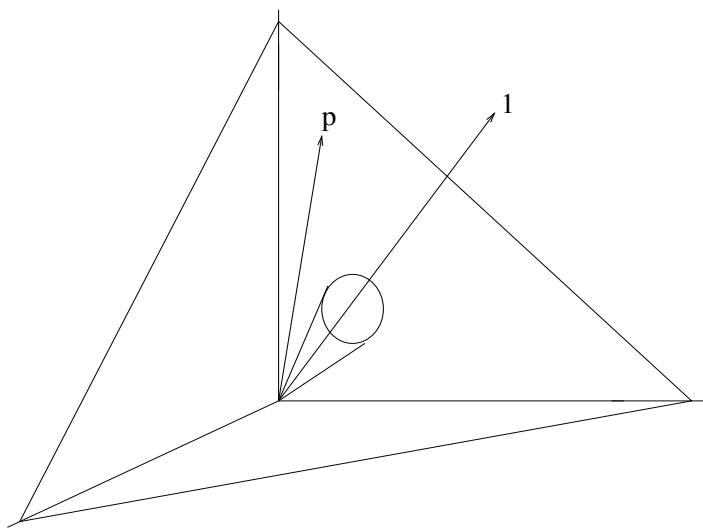

# No Free Lunch Theorems for Optimization

David H. Wolpert   
IBM Almaden Research Center   
N5Na/D3   
650 Harry Road   
San Jose, CA 95120-6099

William G. Macready Santa Fe Institute 1399 Hyde Park Road Santa Fe, NM, 87501

December 31, 1996

# Abstract

A framework is developed to explore the connection between effective optimization algorithms and the problems they are solving. A number of "no free lunch" (NFL) theorems are presented that establish that for any algorithm, any elevated performance over one class of problems is exactly paid for in performance over another class. These theorems result in a geometric interpretation of what it means for an algorithm to be well suited to an optimization problem. Applications of the NFL theorems to information theoretic aspects of optimization and benchmark measures of performance are also presented. Other issues addressed are time-varying optimization problems and a priori "head-to-head" minimax distinctions between optimization algorithms, distinctions that can obtain despite the NFL theorems' enforcing of a type of uniformity over all algorithms.

# 1 Introduction

The past few decades have seen increased interest in general-purpose "black-box" optimization algorithms that exploit little if any knowledge concerning the optimization problem on which they are run. In large part these algorithms have drawn inspiration from optimization processes that occur in nature. In particular, the two most popular black-box optimization strategies, evolutionary algorithms [FOW66, Hol93] and simulated annealing [KGV83] mimic processes in natural selection and statistical mechanics respectively.

In light of this interest in general-purpose optimization algorithms, it has become important to understand the relationship between how well an algorithm a performs and the optimization problem $f$ on which it is run. In this paper we present a formal analysis that contributes towards such an understanding by addressing questions like the following: Given the plethora of black-box optimization algorithms and of optimization problems, how can we best match algorithms to problems (i.e., how best can we relax the black-box nature of the algorithms and have them exploit some knowledge concerning the optimization problem)? In particular, while serious optimization practitioners almost always perform such matching, it is usually on an ad hoc basis; how can such matching be formally analyzed? More generally, what is the underlying mathematical "skeleton" of optimization theory before the "fesh" of the probability distributions of a particular context and set of optimization problems are imposed? What can information theory and Bayesian analysis contribute to an understanding of these issues? How a priori generalizable are the performance results of a certain algorithm on a certain class of problems to its performance on other classes of problems? How should we even measure such generalization; how should we assess the performance of algorithms on problems so that we may programmatically compare those algorithms?

Broadly speaking, we take two approaches to these questions. First, we investigate what a priori restrictions there are on the pattern of performance of one or more algorithms as one runs over the set of all optimization problems. Our second approach is to instead focus on a particular problem and consider the effects of running over all algorithms. In the current paper we present results from both types of analyses but concentrate largely on the first approach. The reader is referred to the companion paper [MW96] for more kinds of analysis involving the second approach.

We begin in Section 2 by introducing the necessary notation. Also discussed in this section is the model of computation we adopt, its limitations, and the reasons we chose it.

One might expect that there are pairs of search algorithms $A$ and $B$ such that $A$ performs better than $B$ on average, even if $B$ sometimes outperforms $A$ . As an example, one might expect that hill-climbing usually outperforms hill-descending if one's goal is to find a maximum of the cost function. One might also expect it would outperform a random search in such a context.

One of the main results of this paper is that such expectations are incorrect. We prove two NFL theorems in Section 3 that demonstrate this and more generally illuminate the connection between algorithms and problems. Roughly speaking, we show that for both static and time dependent optimization problems, the average performance of any pair of algorithms across all possible problems is exactly identical. This means in particular that if some algorithm $a _ { 1 }$ 's performance is superior to that of another algorithm $a _ { 2 }$ over some set of optimization problems, then the reverse must be true over the set of all other optimization problems. (The reader is urged to read this section carefully for a precise statement of these theorems.) This is true even if one of the algorithms is random; any algorithm $a _ { 1 }$ performs worse than randomly just as readily (over the set of all optimization problems) as it performs better than randomly. Possible objections to these results are also addressed in Sections 3.1 and 3.2.

In Section 4 we present a geometric interpretation of the NFL theorems. In particular, we show that an algorithm's average performance is determined by how "aligned" it is with the underlying probability distribution over optimization problems on which it is run. This Section is critical for anyone wishing to understand how the NFL results are consistent with the well-accepted fact that many search algorithms that do not take into account knowledge concerning the cost function work quite well in practice

Section 5.1 demonstrates that the NFL theorems allow one to answer a number of what would otherwise seem to be intractable questions. The implications of these answers for measures of algorithm performance and of how best to compare optimization algorithms are explored in Section 5.2.

In Section 6 we discuss some of the ways in which, despite the NFL theorems, algorithms can have a priori distinctions that hold even if nothing is specified concerning the optimization problems. In particular, we show that there can be "head-to-head" minimax distinctions between a pair of algorithms, it i.e., we show that considered one $f$ at a time, a pair of algorithms may be distinguishable, even if they are not when one looks over all $f ^ { \ast } { \mathbf { s } }$ .

In Section 7 we present an introduction to the alternative approach to the formal analysis of optimization in which problems are held fixed and one looks at properties across the space of algorithms. Since these results hold in general, they hold for any and all optimization problems, and in this are independent of the what kinds of problems one is more or less likely to encounter in the real world. In particular, these results state that one has no a priori justification for using a search algorithm's behavior so far on a particular cost function to predict its future behavior on that function. In fact when choosing between algorithms based on their observed performance it does not suffice to make an assumption about the cost function; some (currently poorly understood) assumptions are also being made about how the algorithms in question are related to each other and to the cost function. In addition to presenting results not found in [MW96], this section serves as an introduction to perspective adopted in [MW96].

We conclude in Section 8 with a brief discussion, a summary of results, and a short list of open problems.

We have confined as many of our proofs to appendices as possible to facilitate the flow of the paper. A more detailed — and substantially longer — version of this paper, a version that also analyzes some issues not addressed in this paper, can be found in [WM95].

Finally, we cannot emphasize enough that no claims whatsoever are being made in this paper concerning how well various search algorithms work in practice. The focus of this paper is on what can be said a priori, without any assumptions and from mathematical principles alone, concerning the utility of a search algorithm.

# 2 Preliminaries

We restrict attention to combinatorial optimization in which the search space, $\mathcal { X }$ , though perhaps quite large, is finite. We further assume that the space of possible "cost" values, $y$ is also finite. These restrictions are automatically met for optimization algorithms run on digital computers. For example, typically $y$ is some 32 or 64 bit representation of the real

numbers in such a case.

The size of the spaces $\mathcal { X }$ and $y$ are indicated by $| \mathcal { X } |$ and $| y |$ respectively. Optimization problems $f$ (sometimes called "cost functions" or "objective functions" or "energy functions") are represented as mappings $f : \mathcal X \mapsto \mathcal y$ $\mathcal { F } = \mathcal { y } ^ { \mathcal { X } }$ is then the space of all possible problems. $\mathcal { F }$ is of size $| y | ^ { | \mathcal { X } | }$ —a very large but finite number. In addition to static $f$ , we shall also be interested in optimization problems that depend explicitly on time. The extra notation needed for such time-dependent problems will be introduced as needed.

It is common in the optimization community to adopt an oracle-based view of computation. In this view, when assessing the performance of algorithms, results are stated in terms of the number of function evaluations required to find a certain solution. Unfortunately though, many optimization algorithms are wasteful of function evaluations. In particular, many algorithms do not remember where they have already searched and therefore often revisit the same points. Although any algorithm that is wasteful in this fashion can be made more efficient simply by remembering where it has been (c.f. tabu search [Glo89, Glo90]), many real-world algorithms elect not to employ this stratagem. Accordingly, from the point of view of the oracle-based performance measures, there are "artefacts" distorting the apparent relationship between many such real-world algorithms.

This difficulty is exacerbated by the fact that the amount of revisiting that occurs is a complicated function of both the algorithm and the optimization problem, and therefore cannot be simply "filtered out" of a mathematical analysis. Accordingly, we have elected to circumvent the problem entirely by comparing algorithms based on the number of distinct function evaluations they have performed. Note that this does not mean that we cannot compare algorithms that are wasteful of evaluations — it simply means that we compare algorithms by counting only their number of distinct calls to the oracle.

We call a time-ordered set of $m$ distinct visited points a "sample" of size m. Samples are denoted by $d _ { m } \equiv \{ ( d _ { m } ^ { x } ( 1 ) , d _ { m } ^ { y } ( 1 ) ) , \cdot \cdot \cdot , ( d _ { m } ^ { x } ( m ) , d _ { m } ^ { y } ( m ) ) \}$ .The points in a sample are ordered according to the time at which they were generated. Thus $d _ { m } ^ { x } ( i )$ indicates the $\mathcal { X }$ value of the ith successive element in a sample of size $m$ and $d _ { m } ^ { y } ( i )$ is the associated cost or $y$ value. $d _ { m } ^ { y } \equiv \{ d _ { m } ^ { y } ( 1 ) , \cdot \cdot \cdot , d _ { m } ^ { y } ( m ) \}$ will be used to indicate the ordered set of cost values. The space of all samples of size m is $\mathcal { D } _ { m } = ( \mathcal { X } \times \mathcal { Y } ) ^ { m }$ (so $d _ { m } \in \mathcal { D } _ { m }$ ) and the set of all possible samples of arbitrary size is $\mathcal { D } \equiv \cup _ { m \ge 0 } \mathcal { D } _ { m }$ .

As an important clarification of this definition, consider a hill-descending algorithm. This is the algorithm that examines a set of neighboring points in $\mathcal { X }$ and moves to the one having the lowest cost. The process is then iterated from the newly chosen point. (Often, implementations of hill-descending stop when they reach a local minimum, but they can easily be extended to run longer by randomly jumping to a new unvisited point once the neighborhood of a local minimum has been exhausted.) The point to note is that because a sample contains all the previous points at which the oracles was consulted, it includes the $( \mathcal { X } , \mathcal { Y } )$ values of all the neighbors of the current point, and not only the lowest cost one that the algorithm moves to. This must be taken into account when counting the value of $m$ .

Optimization algorithms a are represented as mappings from previously visited sets of points to a single new (i.e., previously unvisited) point in $\mathcal { X }$ . Formally, $a ~ : ~ d \in { \mathcal { D } } \mapsto$ $\{ x | x \notin d _ { \mathcal { X } } \}$ . Given our decision to only measure distinct function evaluations even if an algorithm revisits previously searched points, our definition of an algorithm includes all common black-box optimization techniques like simulated annealing and evolutionary algorithms. (Techniques like branch and bound [LW66] are not included since they rely explicitly on the cost structure of partial solutions, and we are here interested primarily in black-box algorithms.)

As defined above, a search algorithm is deterministic; every sample maps to a unique new point. Of course essentially all algorithms implemented on computers are deterministic1, and in this our definition is not restrictive. Nonetheless, it is worth noting that all of our results are extensible to non-deterministic algorithms, where the new point is chosen stochastically from the set of unvisited points. (This point is returned to below.)

Under the oracle-based model of computation any measure of the performance of an algorithm after m iterations is a function of the sample $d _ { m } ^ { y }$ . Such performance measures will be indicated by $\Phi \left( d _ { m } ^ { y } \right)$ . As an example, if we are trying to find a minimum of $f$ , then a reasonable measure of the performance of $a$ might be the value of the lowest $y$ value in $d _ { m } ^ { y } \colon \Phi \bigl ( d _ { m } ^ { y } \bigr ) = \operatorname* { m i n } _ { i } \{ d _ { m } ^ { y } ( i ) : i = 1 \ldots m \}$ Note that measures of performance based on factors other than $d _ { m } ^ { y }$ (e.g., wall clock time) are outside the scope of our results.

We shall cast all of our results in terms of probability theory. We do so for three reasons. First, it allows simple generalization of our results to stochastic algorithms. Second, even when the setting is deterministic, probability theory provides a simple consistent framework in which to carry out proofs.

The third reason for using probability theory is perhaps the most interesting. A crucial factor in the probabilistic framework is the distribution $P ( f ) = P ( f ( x _ { 1 } ) , \cdot \cdot \cdot , f ( x _ { | } \mathcal { X } | ) )$ .This distribution, defined over $\mathcal { F }$ , gives the probability that each $f \in { \mathcal { F } }$ is the actual optimization problem at hand. An approach based on this distribution has the immediate advantage that often knowledge of a problem is statistical in nature and this information may be easily encodable in $P ( f )$ . For example, Markov or Gibbs random field descriptions [KS80] of families of optimization problems express $P ( f )$ exactly.

However exploiting $P ( f )$ also has advantages even when we are presented with a single uniquely specified cost function. One such advantage is the fact that although it may be fully specified, many aspects of the cost function are effectively unknown (e.g., we certainly do not know the extrema of the function.) It is in many ways most appropriate to have this effective ignorance reflected in the analysis as a probability distribution. More generally, we usually act as though the cost function is partially unknown. For example, we might use the same search algorithm for all cost functions in a class (e.g., all traveling salesman problems having certain characteristics). In so doing, we are implicitly acknowledging that we consider distinctions between the cost functions in that class to be irrelevant or at least unexploitable. In this sense, even though we are presented with a single particular problem from that class, we act as though we are presented with a probability distribution over cost functions, a distribution that is non-zero only for members of that class of cost functions. $P ( f )$ is thus a prior specification of the class of the optimization problem at hand, with different classes of problems corresponding to different choices of what algorithms we will use, and giving rise to different distributions $P ( f )$

Given our choice to use probability theory, the performance of an algorithm $a$ iterated m times on a cost function $f$ is measured with $P ( d _ { m } ^ { y } | f , m , a )$ . This is the conditional probability of obtaining a particular sample $d _ { m }$ under the stated conditions. From $P ( d _ { m } ^ { y } | f , m , a )$ performance measures $\Phi \left( d _ { m } ^ { y } \right)$ can be found easily.

In the next section we will analyze $P ( d _ { m } ^ { y } | f , m , a )$ , and in particular how it can vary with the algorithm $a$ . Before proceeding with that analysis however, it is worth briefly noting that there are other formal approaches to the issues investigated in this paper. Perhaps the most prominent of these is the field of computational complexity. Unlike the approach taken in this paper, computational complexity mostly ignores the statistical nature of search, and concentrates instead on computational issues. Much (though by no means all) of computational complexity is concerned with physically unrealizable computational devices (Turing machines) and the worst case amount of resources they require to find optimal solutions. In contrast, the analysis in this paper does not concern itself with the computational engine used by the search algorithm, but rather concentrates exclusively on the underlying statistical nature of the search problem. In this the current probabilistic approach is complimentary to computational complexity. Future work involves combining our analysis of the statistical nature of search with practical concerns for computational resources.

# 3 The NFL theorems

In this section we analyze the connection between algorithms and cost functions. We have dubbed the associated results "No Free Lunch" (NFL) theorems because they demonstrate that if an algorithm performs well on a certain class of problems then it necessarily pays for that with degraded performance on the set of all remaining problems. Additionally, the name emphasizes the parallel with similar results in supervised learning [Wol96a, Wol96b].

The precise question addressed in this section is: "How does the set of problems $F _ { 1 } \subset { \mathcal { F } }$ for which algorithm $a _ { 1 }$ performs better than algorithm $a _ { 2 }$ compare to the set $F _ { 2 } \subset { \mathcal { F } }$ for which the reverse is true?" To address this question we compare the sum over all $f$ of $P ( d _ { m } ^ { y } | f , m , a _ { 1 } )$ to the sum over all $f$ f $P ( d _ { m } ^ { y } | f , m , a _ { 2 } )$ .This comparison constitutes a major result of this paper: $P ( d _ { m } ^ { y } | f , m , a )$ is independent of $a$ when we average over all cost functions:

Theorem 1 For any pair of algorithms $a _ { 1 }$ and $a _ { 2 }$ ,

$$
\sum _ { f } P \big ( d _ { m } ^ { y } | f , m , a _ { 1 } \big ) = \sum _ { f } P \big ( d _ { m } ^ { y } | f , m , a _ { 2 } \big ) .
$$

A proof of this result is found in Appendix A. An immediate corollary of this result is that for any performance measure $\Phi \left( d _ { m } ^ { y } \right)$ , the average over all $f$ of $P ( \Phi ( d _ { m } ^ { y } ) | f , m , a )$ is independent of $a$ . The precise way that the sample is mapped to a performance measure is unimportant.

This theorem explicitly demonstrates that what an algorithm gains in performance on one class of problems it necessarily pays for on the remaining problems; that is the only way that all algorithms can have the same $f$ -averaged performance.

A result analogous to Theorem 1 holds for a class of time-dependent cost functions. The time-dependent functions we consider begin with an initial cost function $f _ { 1 }$ that is present at the sampling of the first $_ x$ value. Before the beginning of each subsequent iteration of the optimization algorithm, the cost function is deformed to a new function, as specified by a mapping $T : \mathcal { F } \times \mathcal { N }  \mathcal { F }$ 2 We indicate this mapping with the notation $T _ { i }$ . So the function present during the ith iteration is $f _ { i + 1 } = T _ { i } ( f _ { i } )$ . $T _ { i }$ is assumed to be a (potentially i-dependent) bijection between $\mathcal { F }$ and $\mathcal { F }$ . We impose bijectivity because if it did not hold, the evolution of cost functions could narrow in on a region of $f ^ { \ast } { \mathbf { s } }$ for which some algorithms may perform better than others. This would constitute an $a$ priori bias in favor of those algorithms, a bias whose analysis we wish to defer to future work.

How best to assess the quality of an algorithm's performance on time-dependent cost functions is not clear. Here we consider two schemes based on manipulations of the definition of the sample. In scheme 1 the particular $y$ value in $d _ { m } ^ { y } ( j )$ corresponding to a particular $_ x$ value $d _ { m } ^ { x } ( j )$ is given by the cost function that was present when $d _ { m } ^ { x } ( j )$ was sampled. In contrast, for scheme 2 we imagine a sample $D _ { m } ^ { y }$ given by the $y$ values from the present cost function for each of the $_ x$ values in $d _ { m } ^ { x }$ . Formally if $d _ { m } ^ { x } = \{ d _ { m } ^ { x } ( 1 ) , \cdot \cdot \cdot , d _ { m } ^ { x } ( m ) \}$ , then in scheme 1 we have $d _ { m } ^ { y } = \{ f _ { 1 } ( d _ { m } ^ { x } ( 1 ) ) , \cdot \cdot \cdot , T _ { m - 1 } ( f _ { m - 1 } ) ( d _ { m } ^ { x } ( m ) ) \}$ , and in scheme 2 we have $D _ { m } ^ { y } = \{ f _ { m } ( d _ { m } ^ { x } ( 1 ) ) , \cdot \cdot \cdot , f _ { m } ( d _ { m } ^ { x } ( m ) ) \}$ where $f _ { m } = T _ { m - 1 } ( f _ { m - 1 } )$ is the final cost function.

In some situations it may be that the members of the sample "live" for a long time, on the time scale of the evolution of the cost function. In such situations it may be appropriate to judge the quality of the search algorithm by $D _ { m } ^ { y }$ ; all those previous elements of the sample are still "alive" at time $m$ , and therefore their current cost is of interest. On the other hand, if members of the sample live for only a short time on the time scale of evolution of the cost function, one may instead be concerned with things like how well the "living" member(s) of the sample track the changing cost function. In such situations, it may make more sense to judge the quality of the algorithm with the $d _ { m } ^ { y }$ sample.

Results similar to Theorem 1 can be derived for both schemes. By analogy with that theorem, we average over all possible ways a cost function may be time-dependent, i.e., we average over all $T$ (rather than over all $f$ ). Thus we consider $\begin{array} { r l } { { } } & { { } \sum _ { T } P \big ( d _ { m } ^ { y } | f _ { 1 } , T , m , a \big ) } \end{array}$ where $f _ { 1 }$ is the initial cost function. Since $T$ only takes effect for $m > 1$ , and since $f _ { 1 }$ is fixed, there are a priori distinctions between algorithms as far as the first member of the population is concerned. However after redefining samples to only contain those elements added after the first iteration of the algorithm, we arrive at the following result, proven in Appendix B:

Theorem 2 For all $d _ { m } ^ { y }$ , $D _ { m } ^ { y }$ , $m > 1$ , algorithms $a _ { 1 }$ and $a _ { 2 }$ , and initial cost functions $f _ { 1 }$

$$
\sum _ { T } P \big ( d _ { m } ^ { y } | f _ { 1 } , T , m , a _ { 1 } \big ) = \sum _ { T } P \big ( d _ { m } ^ { y } | f _ { 1 } , T , m , a _ { 2 } \big ) .
$$

and

$$
\sum _ { T } P ( D _ { m } ^ { y } | f _ { 1 } , T , m , a _ { 1 } ) = \sum _ { T } P ( D _ { m } ^ { y } | f _ { 1 } , T , m , a _ { 2 } ) .
$$

So in particular, if one algorithm outperforms another for certain kinds of evolution operators, then the reverse must be true on the set of all other evolution operators.

Although this particular result is similar to the NFL result for the static case, in general the time-dependent situation is more subtle. In particular, with time-dependence there are situations in which there can be a priori distinctions between algorithms even for those members of the population arising after the first. For example, in general there will be distinctions between algorithms when considering the quantity $\begin{array} { r l } { \sum _ { f } P ( d _ { m } ^ { y } | f , T , m , a ) } \end{array}$ . To see this, consider the case where $\mathcal { X }$ is a set of contiguous integers and for all iterations $T$ is a shift operator, replacing $f ( x )$ by $f ( x - 1 )$ for all $_ x$ (with $\operatorname* { m i n } ( x ) - 1 \equiv \operatorname* { m a x } ( x ) )$ . For such a case we can construct algorithms which behave differently $a$ priori. For example, take $a$ to be the algorithm that first samples $f$ at $x _ { 1 }$ , next at $x _ { 1 } + 1$ and so on, regardless of the values in the population. Then for any $f , d _ { m } ^ { y }$ is always made up of identical $y$ values. Accordingly, $\begin{array} { r l } { \sum _ { f } P ( d _ { m } ^ { y } | f , T , m , a ) } \end{array}$ is non-zero only for $d _ { m } ^ { y }$ for which all values $d _ { m } ^ { y } ( i )$ are identical. Other search algorithms, even for the same shift $T$ , do not have this restriction on $y$ values. This constitutes an $a$ priori distinction between algorithms.

# 3.1 Implications of the NFL theorems

As emphasized above, the NFL theorems mean that if an algorithm does particularly well on one class of problems then it most do more poorly over the remaining problems. In particular, if an algorithm performs better than random search on some class of problems then in must perform worse than random search on the remaining problems. Thus comparisons reporting the performance of a particular algorithm with particular parameter setting on a few sample problems are of limited utility. While sicj results do indicate behavior on the narrow range of problems considered, one should be very wary of trying to generalize those results to other problems.

Note though that the NFL theorem need not be viewed this way, as a way of comparing function classes $\mathcal { F } _ { 1 }$ and $\mathcal { F } _ { 2 }$ (or classes of evolution operators $T _ { 1 }$ and $T _ { 2 }$ , as the case might be). It can be viewed instead as a statement concerning any algorithm's performance when $f$ is not fixed, under the uniform prior over cost functions, $P ( f ) = 1 / | \mathcal { F } |$ . If we wish instead to analyze performance where $f$ is not fixed, as in this alternative interprations of the NFL theorem, but in contrast with the NFL case $f$ is now chosen from a non-uniform prior, then we must analyze explicitly the sum

$$
P ( d _ { m } ^ { y } | m , a ) = \sum _ { f } P ( d _ { m } ^ { y } | f , m , a ) P ( f )
$$

Since it is certainly true that any class of problems faced by a practitioner will not have a flat prior, what are the practical implications of the NFL theorems when viewed as a statement concerning an algorithm's performance for non-fixed $f ?$ This question is taken up in greater detail in Section 4 but we make a few comments here.

First, if the practitioner has knowledge of problem characteristics but does not incorporate them into the optimization algorithm, then $P ( f )$ is effectively uniform. (Recall that

$P ( f )$ can be viewed as a statement concerning the practitioner's choice of optimization algorithms.) In such a case, the NFL theorems establish that there are no formal assurances that the algorithm chosen will be at all effective.

Secondly, while most classes of problems will certainly have some structure which, if known, might be exploitable, the simple existence of that structure does not justify choice of a particular algorithm; that structure must be known and reflected directly in the choice of algorithm to serve as such a justification. In other words, the simple existence of structure per se, absent a specification of that structure, cannot provide a basis for preferring one algorithm over another. Formally, this is established by the existence of NFL-type theorems in which rather than average over specific cost functions $f$ , one averages over specific "kinds of structure", i.e., theorems in which one averages $P ( d _ { m } ^ { y } \mid m , a )$ over distributions $P ( f )$ That such theorems hold when one averages over all $P ( f )$ means that the indistinguishability of algorithms associated with uniform $P ( f )$ is not some pathological, outlier case. Rather uniform $P ( f )$ is a "typical" distribution as far as indistinguishability of algorithms is concerned. The simple fact that the $P ( f )$ at hand is non-uniform cannot serve to determine one's choice of optimization algorithm.

Finally, it is important to emphasize that even if one is considering the case where $f$ is not fixed, performing the associated average according to a uniform $P ( f )$ is not essential for NFL to hold. NFL can also be demonstrated for a range of non-uniform priors. For example, any prior of the form $\textstyle \prod _ { x \in \mathcal { X } } P ^ { \prime } { \bigl ( } f ( x ) \bigr )$ (where $P ^ { \prime } ( y = f ( x ) )$ is the distribution of $y$ values) will also give NFL. The $f$ -average can also enforce correlations between costs at different $\mathcal { X }$ values and NFL still obtain. For example if costs are rank ordered (with ties broken in some arbitrary way) and we sum only over all cost functions given by permutations of those orders, then NFL still holds.

The choice of uniform $P ( f )$ was motivated more from theoretical rather pragramattic concerns, as a way of analyzing the theoretical structure of optimization. Nevertheless, the cautionary observations presented above make clear that an analysis of the uniform $P ( f )$ case has a number of ramifications for practitioners.

# 3.2 Stochastic optimization algorithms

Thus far we have considered the case in which algorithms are deterministic. What is the situation for stochastic algorithms? As it turns out, NFL results hold even for such algorithms.

The proof of this is straightforward. Let $\sigma$ be a stochastic "non-potentially revisiting" algorithm. Formally, this means that $\sigma$ is a mapping taking any $d$ to a $d .$ -dependent distribution over $\mathcal { X }$ that equals zero for all $x \in d ^ { x }$ . (In this sense $\sigma$ is what in statistics community is known as a "hyper-parameter", specifying the function $P ( d _ { m + 1 } ^ { x } ( m + 1 ) \mid d _ { m } , \sigma )$ for all $m$ and $d$ ) One can now reproduce the derivation of the NFL result for deterministic algorithms, only with $a$ replaced by $\sigma$ throughout. In so doing all steps in the proof remain valid. This establishes that NFL results apply to stochastic algorithms as well as deterministic ones.

# 4 A geometric perspective on the NFL theorems

Intuitively, the NFL theorem illustrates that even if knowledge of $f$ (perhaps specified through $P ( f ) )$ is not incorporated into $a$ , then there are no formal assurances that $a$ will be effective. Rather, effective optimization relies on a fortuitous matching between $f$ and $a$ . This point is formally established by viewing the NFL theorem from a geometric perspective.

Consider the space $\mathcal { F }$ of all possible cost functions. As previously discussed in regard to Equation (1) the probability of obtaining some $d _ { m } ^ { y }$ is

$$
P ( d _ { m } ^ { y } | m , a ) = \sum _ { f } P ( d _ { m } ^ { y } | m , a , f ) P ( f ) .
$$

where $P ( f )$ is the prior probability that the optimization problem at hand has cost function $f$ .This sum over functions can be viewed as an inner product in $\mathcal { F }$ More precisely, defining the $\mathcal { F }$ space vectors $\vec { v } _ { d _ { m } ^ { y } , a , m }$ and $\vec { p }$ by their $f$ components ${ \vec { v } } _ { d _ { m } ^ { y } , a , m } ( f ) \equiv P ( d _ { m } ^ { y } | m , a , f )$ and ${ \vec { p } } ( f ) \equiv P ( f )$ respectively,

$$
P ( d _ { m } ^ { y } | m , a ) = \vec { v } _ { d _ { m } ^ { y } , a , m } \cdot \vec { p . }
$$

Thi equti ieatiezatio . $d _ { m } ^ { y }$ can be viewed as fixed to the sample that is desired, usually one with a low cost value, and $m$ is a measure of the computational resources that can be afforded. Any knowledge of the properties of the cost function goes into the prior over cost functions, $\vec { p }$ Then Equation (2) says the performance of an algorithm is determined by the magnitude of its projection onto $\vec { p }$ ,i.e. by how aligned $\vec { v } _ { d _ { m } ^ { y } , a , m }$ is with the problems $\vec { p , }$ Alternatively, by averaging over $d _ { m } ^ { y }$ , it is easy to see that $E ( d _ { m } ^ { y } | m , a )$ is an inner product between $\vec { p }$ and $E ( d _ { m } ^ { y } | m , a , f )$ The expectation of any performance measure $\Phi \bigl ( d _ { m } ^ { y } \bigr )$ can be written similarly.

In any of these cases, $P ( f )$ or $\vec { p }$ must "match" or be aligned with $a$ to get desired behavior. This need for matching provides a new perspective on how certain algorithms can perform well in practice on specific kinds of problems. For example, it means that the years of research into the traveling salesman problem (TSP) have resulted in algorithms aligned with the (implicit) $\vec { p }$ describing traveling salesman problems of interest to TSP researchers.

Taking the geometric view, the NFL result that $\begin{array} { r } { \sum _ { f } P \big ( d _ { m } ^ { y } | f , m , a \big ) } \end{array}$ is independent of $a$ has the interpretation that for any particular $d _ { m } ^ { y }$ and $m$ , all algorithms $a$ have the same projection onto the the uniform $P ( f )$ ,represented by the diagonal vector $\vec { 1 }$ Formally, $\bar { v _ { d _ { m } ^ { y } , a , m } } \cdot \vec { 1 } =$ $c s t ( d _ { m } ^ { y } , m )$ . For deterministic algorithms the components of $v _ { d _ { m } ^ { y } , a , m }$ (i.e. the probabilities that algorithm $a$ gives sample $d _ { m } ^ { y }$ on cost function $f$ after $m$ distinct cost evaluations) are all either 0 or 1, so NFL also implies that $\Sigma _ { f } P ^ { 2 } ( d _ { m } ^ { y } \mid m , a , f ) = c s t { ( d _ { m } ^ { y } , m ) }$ Geometrically, this indicates that the length of $\vec { v _ { d _ { m } ^ { y } , a , m } }$ is independent of $a$ Different algorithms thus generate different vectors $\vec { v } _ { d _ { m } ^ { y } , a , m }$ all having the same length and lying on a cone with constant projection onto $\vec { 1 }$ (A schematic of this situation is shown in Figure 1 for the case where $\mathcal { F }$ is 3-dimensional.) Because the components of $\vec { v } _ { c , a , m }$ are binary we might equivalently view $\vec { v } _ { d _ { m } ^ { y } , a , m }$ as lying on the subset the vertices of the Boolean hypercube having the same hamming distance from $\vec { 1 }$ .

  
Figure 1: Schematic view of the situation in which function space $\mathcal { F }$ is 3-dimensional. The uniform prior over this space, I lies along the diagonal. Different algorithms $a$ give different vectors $v$ lying in the cone surrounding the diagonal. A particular problem is represented by its prior $\vec { p }$ lying on the simplex. The algorithm that will perform best will be the algorithm in the cone having the largest inner product with $\vec { p }$ .

Nowrricttention m havie me oably   prticul The algorithms in this set lie in the intersection of 2 cones—one about the diagonal, set by the NFL theorem, and one set by having the same probability for $d _ { m } ^ { y }$ . This is in general an $| \mathcal F | - 2$ dimensional manifold. Continuing, as we impose yet more $d _ { m } ^ { y }$ -based restrictions on a set of algorithms, we will continue to reduce the dimensionality of the manifold by focusing on intersections of more and more cones.

The geometric view of optimization also suggests alternative measures for determining how "similar" two optimization algorithms are. Consider again Equation (2). In that the algorithm directly only gives $\vec { v } _ { d _ { m } ^ { y } , a , m }$ , perhaps the most straight-forward way to compare two algorithms $a _ { 1 }$ and $a _ { 2 }$ would be   o r te $\vec { v } _ { d _ { m } ^ { y } , a _ { 1 } , m }$ and $\vec { v } _ { d _ { m } ^ { y } , a _ { 2 } , m }$ are. (E.g., by evaluating the dot product of those vectors.) However those vectors occur on the right-hand side of Equation (2), whereas the performance of the algorithms — which is after all our ultimate concern — instead occur on the left-hand side. This suggests measuring the similarity of two algorithms not directly in terms of their vectors $\vec { v } _ { d _ { m } ^ { y } , a , m }$ , but rather in terms of the dot products of those vectors with $\vec { p }$ For example, it may be the case that algorithms behave very similarly for certain $P ( f )$ but are quite different for other $P ( f )$ . In many respects, knowing this about two algorithms is of more interest than knowing how their vectors $\vec { v } _ { d _ { m } ^ { y } , a , m }$ compare.

As another example of a similarity measure suggested by the geometric perspective, we could measure similarity between algorithms based on similarities between $P ( f ) ^ { \prime } { \bf s }$ For example, for two different algorithms, one can imagine solving for the $P ( f )$ that optimizes

$P ( d _ { m } ^ { y } \mid m , a )$ for those algorithms, in some non-trivial sense.3 We could then use some measure of distance between those two $P ( f )$ distributions as a gauge of how similar the associated algorithms are.

Unfortunately, exploiting the inner product formula in practice, by going from a $P ( f )$ to an algorithm optimal for that $P ( f )$ , appears to often be quite difficult. Indeed, even determining a plausible $P ( f )$ for the situation at hand is often difficult. Consider, for example, TSP problems with $N$ cities. To the degree that any practitioner attacks all $N .$ -city TSP cost functions with the same algorithm, that practitioner implicitly ignores distinctions between such cost functions. In this, that practitioner has implicitly agreed that the problem is one of how their fixed algorithm does across the set of all $N$ -city TSP cost functions. However the detailed nature of the $P ( f )$ that is uniform over this class of problems appears to be difficult to elucidate.

On the other hand, there is a growing body of work that does rely explicitly on enumeration of $P ( f )$ . For example, applications of Markov random fields [Gri76, KS80] to cost landscapes yield $P ( f )$ directly as a Gibbs distribution.

# 5 Calculational applications of the NFL theorems

In this section we explore some of the applications of the NFL theorems for performing calculations concerning optimization. We will consider both calculations of practical and theoretical interest, and begin with calculations of theoretical interest, in which informationtheoretic quantities arise naturally.

# 5.1 Information-theoretic aspects of optimization

For expository purposes, we simplify the discussion slightly by considering only the histogram of number of instances of each possible cost value produced by a run of an algorithm, and not the temporal order in which those cost values were generated. (Essentially all realworld performance measures are independent of such temporal information.) We indicate that histogram with the symbol ; $\vec { c }$ has $y$ components $( c y _ { 1 } , c y _ { 2 } , \cdot \cdot \cdot , c y _ { | { \bf y } | } )$ , where $c _ { i }$ is the number of times cost value $\mathcal { N } _ { i }$ occurs in the sample $d _ { m } ^ { y }$ .

Now consider any question like the following: "What fraction of cost functions give a particular histogram $\vec { c }$ of cost values after $m$ distinct cost evaluations produced by using a particular instantiation of an evolutionary algorithm [FOW66, Hol93]?"

At first glance this seems to be an intractable question. However it turn out that the NFL theorem provides a way to answer it. This is because — according to the NFL theorem — the answer must be independent of the algorithm used to generate . Consequently we can chose an algorithm for which the calculation is tractable.

Theorem 3 For any algorithm, the fraction of cost functions that result in a particular histogram ${ \vec { c } } = m { \vec { \alpha } }$ is

$$
\rho _ { f } \big ( \overrightarrow { \alpha } \big ) = \frac { \binom { m } { c _ { 1 } c _ { 2 } \cdots c _ { | \mathcal { V } | } } | \mathcal { V } | ^ { | \mathcal { X } | - m } } { | \mathcal { Y } | ^ { | \mathcal { X } | } } = \frac { \binom { m } { c _ { 1 } c _ { 2 } \cdots c _ { | \mathcal { V } | } } } { | \mathcal { Y } | ^ { m } } .
$$

For large enough m this can be approximated as

$$
\rho _ { f } \big ( \vec { \alpha } \big ) \cong C \big ( m , | \mathcal { V } | \big ) \frac { \exp \big [ m S \big ( \vec { \alpha } \big ) \big ] } { \prod _ { i = 1 } ^ { | \mathcal { V } | } \alpha _ { i } ^ { 1 / 2 } }
$$

where $S ( \vec { \alpha } )$ is the entropy of the distribution $\vec { \alpha }$ , and $C ( m , | \mathcal { V } | )$ is a constant that does not depend on $\vec { \alpha }$ .

This theorem is derived in Appendix C. If some of the $\vec { \alpha } _ { i }$ are $0$ , the approximation still holds, only with $y$ redefined to exclude the y's corresponding to the zero-valued $\vec { \alpha } _ { i }$ . However $y$ is defined, the normalization constant of Equation (3) can be found by summing over all $\vec { \alpha }$ lying on the unit simplex [?].

A question related to one addressed in this theorem is the following: "For a given cost function, what is the fraction $\rho _ { \mathsf { a l g } }$ of all algorithms that give rise to a particular ?" It turns out that the only feature of $f$ relevant for this question is the histogram of its cost values formed by looking across all $\mathcal { X }$ . Specify the fractional form of this histogram by $\vec { \beta }$ : there are $N _ { i } = \beta _ { i } \left| \mathcal { X } \right|$ points in $\mathcal { X }$ for which $f ( x )$ has the i'th $y$ value.

In Appendix D it is shown that to leading order, $\rho _ { \tt a l g } ( \vec { \alpha } , \vec { \beta } )$ depends on yet another information theoretic quantity, the Kullback-Liebler distance [CT91] between $\vec { \alpha }$ and $\vec { \beta }$ .

Theorem 4 For a given $f$ with histogram ${ \vec { N } } = | { \boldsymbol { \chi } } | { \vec { \beta } } ,$ the fraction of algorithms that give rise to a histogram ${ \vec { c } } = m { \vec { \alpha } }$ is given by

$$
\rho _ { \mathrm { a l g } } ( \vec { \alpha } , \vec { \beta } ) = \frac { \prod _ { i = 1 } ^ { | \mathcal { Y } | } { \binom { N _ { i } } { c _ { i } } } } { { \binom { | \mathcal { X } | } { m } } } .
$$

For large enough m this can be written as

$$
\rho _ { \mathrm { a l g } } ( \vec { \alpha } , \vec { \beta } ) \cong C ( m , \vert \mathcal { X } \vert , \vert \mathcal { Y } \vert ) \frac { \mathrm { e } ^ { - m D _ { K L } \left( \vec { \alpha } , \vec { \beta } \right) } } { \prod _ { i = 1 } ^ { \vert \mathcal { Y } \vert } \alpha _ { i } ^ { 1 / 2 } }
$$

where $D _ { K L } ( \vec { \alpha } , \vec { \beta } )$ is the Kullback-Liebler distnace between the distributions $\alpha$ and $\beta$

As before, $C$ can be calculated by summing $\vec { \alpha }$ over the unit simplex.

# 5.2 Measures of performance

We now show how to apply the NFL framework to calculate certain benchmark performance measures. These allow both the programmatic (rather than ad hoc) assessment of the efficacy of any individual optimization algorithm and principled comparisons between algorithms.

Without loss of generality, assume that the goal of the search process is finding a minimum. So we are interested in the $\epsilon \mathrm { . }$ dependence of $P ( \operatorname* { m i n } ( \vec { c } ) > \epsilon | f , m , a )$ , by which we mean the probability that the minimum cost an algorithm $a$ finds on problem $f$ in $m$ distinct evaluations is larger than e. At least three quantities related to this conditional probability can be used to gauge an algorithm's performance in a particular optimization run:

i) The uniform average of $P ( \operatorname* { m i n } ( \vec { c } ) > \epsilon \mid f , m , a )$ over all cost functions.   
ii) The form $P ( \operatorname* { m i n } ( \vec { c } ) > \epsilon \mid f , m , a )$ takes for the random algorithm, which uses no information from the sample $d _ { m }$ .   
iii) The fraction of algorithms which, for a particular $f$ and $m$ , result in a $\vec { c }$ whose minimum exceeds e.

These measures give benchmarks which any algorithm run on a particular cost function should surpass if that algorithm is to be considered as having worked well for that cost function.

Without loss of generality assume the that i'th cost value $( i , e . , y _ { i }$ equals $i$ . So cost values run from a minimum of 1 to a maximum of $| \mathcal { V } |$ , in integer increments. The following results are derived in Appendix E.

# Theorem 5

$$
\sum _ { f } P ( \operatorname* { m i n } ( { \vec { c } } ) > \epsilon | f , m ) = \omega ^ { m } ( \epsilon )
$$

where $\omega ( \epsilon ) \equiv 1 - \epsilon / | \mathcal { V } |$ is the fraction of cost lying above e. In the limit of $| y | \to \infty$ , this distribution obeys the following relationship

$$
\frac { \sum _ { f } E ( \operatorname* { m i n } ( \vec { c } ) \mid f , m ) } { \mid \mathcal { V } \mid } = \frac { 1 } { m + 1 } .
$$

Unless one's algorithm has its best-cost-so-far drop faster than the drop associated with these results, one would be hard-pressed indeed to claim that the algorithm is well-suited to the cost function at hand. After all, for such performance the algorithm is doing no better than one would expect it to for a randomly chosen cost function.

Unlike the preceding measure, the measures analyzed below take into account the actual cost function at hand. This is manifested in the dependance of the values of those measures on the vector $\vec { N }$ given by the cost function's histogram ( ${ \vec { N } } = | { \mathcal { X } } | { \vec { \beta } } )$ .

Theorem 6 For the random algorithm $\tilde { a }$ ,

$$
P ( \operatorname* { m i n } ( \vec { c } ) \geq \epsilon \mid f , m , \tilde { a } ) = \prod _ { i = 0 } ^ { m - 1 } \frac { \Omega ( \epsilon ) - i / | \mathcal { X } | } { 1 - i / | \mathcal { X } | } .
$$

where $\Omega ( \epsilon ) \equiv \sum _ { i = \epsilon } ^ { | y | } N _ { i } / | \mathcal { X } |$ is the fraction of points in $\mathcal { X }$ for which $f ( x ) \geq \epsilon$ . To first order in $1 / | \mathcal { X } |$

$$
P ( \operatorname* { m i n } ( \vec { c } ) > \epsilon \mid f , m , \tilde { a } ) = \Omega ^ { m } ( \epsilon ) \biggl ( 1 - \frac { m ( m - 1 ) ( 1 - \Omega ( \epsilon ) ) } { 2 \Omega ( \epsilon ) } \frac { 1 } { | \mathcal { X } | } + \cdots \biggr ) .
$$

This result allows the calculation of other quantities of interest for measuring performance, for example the quantity

$$
E \{ \operatorname* { m i n } ( \vec { c } ) | f , m , \tilde { a } \} = \sum _ { \epsilon = 1 } ^ { | y | } \epsilon [ P ( \operatorname* { m i n } ( \vec { c } ) \geq \epsilon \mid f , m , \tilde { a } ) -  P ( \operatorname* { m i n } ( \vec { c } ) \geq \epsilon + 1  | \ f , m , \tilde { a } \in \{ 0 , 1 \} ] .
$$

Note that for many cost functions of both practical and theoretical interest, cost values are distributed Gaussianly. For such cases, we can use that Gaussian nature of the distribution to facilitate our calculations. In particular, if the mean and variance of the Gaussian are $\mu$ and $\sigma$ respectively, then we have $\Omega ( \epsilon ) = \mathrm { e r f c } ( ( \epsilon - \mu ) / \sqrt { 2 } \sigma ) / 2$ , where erfc is the complimentary error function.

To calculate the third performance measure, note that for fixed $f$ and $m$ , for any (deterministic) algorithm $a$ , $P ( \vec { c } > \epsilon \mid f , m , a )$ is either 1 or 0. Therefore the fraction of algorithms which result in a $\vec { c }$ whose minimum exceeds $\epsilon$ is given by

$$
\frac { \sum _ { a } P ( \operatorname* { m i n } ( \vec { c } ) > \epsilon \mid f , m , a ) } { \sum _ { a } 1 } .
$$

Expanding in terms of $\vec { c }$ , we can rewrite the numerator of this ratio as $\Sigma _ { \vec { c } } P ( \operatorname* { m i n } ( \vec { c } ) >$ $\begin{array} { r } { \epsilon | \vec { c } ) \sum _ { a } P ( \vec { c } \mid f , m , a ) } \end{array}$ .However the ratio of this quantity to $\textstyle \sum a ^ { 1 }$ is exactly what was calculated when we evaluated measure (ii) (see the beginning of the argument deriving Equation (4)). This establishes the following:

Theorem 7 For fixed $f$ and m, the fraction of algorithms which result in a  whose minimum exceeds e is given by the quantity on the right-hand sides of Equations (4) and (5).

As a particular example of applying this result, consider measuring the value of $\mathrm { m i n } ( \vec { c } )$ produced in a particular run of your algorithm. Then imagine that when it is evaluated for e equal to this value, the quantity given in Equation (5) is less than $1 / 2$ In such a situation the algorithm in question has performaed worse than over half of all search algorithms, for the $f$ and $m$ at hand; hardly a stirring endorsement.

None of the discussion above explicitly concerns the dynamics of an algorithm's performance as $m$ increases. Many aspects of such dynamics may be of interest. As an example, let us consider whether, as $m$ grows, there is any change in how well the algorithm's performance compares to that of the random algorithm.

To this end, let the sample generated by the algorithm $a$ after m steps be $d _ { m }$ , and define $y ^ { \prime } \equiv \operatorname* { m i n } ( d _ { m } ^ { y } )$ . Let $k$ be the number of additional steps it takes the algorithm to find an $_ x$ such that $f ( x ) < y ^ { \prime }$ . Now we can estimate the number of steps it would have taken the random search algorithm to search $\chi - d _ { \chi }$ and find a point whose $\mathcal { Y }$ was less than $y ^ { \prime }$ . The as $1 / z ( d ) - 1$ , where $z ( d )$ is the fraction of $\mathcal { X } - d _ { m } ^ { x }$ for which $f ( x ) < y ^ { \prime }$ . Therefore $k + 1 - 1 / z ( d )$ is how much worse $a$ did than would have the random algorithm, on average.

Next imagine letting $a$ run for many steps over some fitness function $f$ and plotting how well $a$ did in comparison to the random algorithm on that run, as $m$ increased. Consider the step where $a$ finds its $n$ 'th new value of $\mathrm { m i n } ( \vec { c } )$ . For that step, there is an associated $k$ (the number of steps until the next $\operatorname* { m i n } ( d _ { m } ^ { y } ) )$ and $z ( d )$ . Accordingly, indicate that step on our plot as the point $( n , k + 1 - 1 / z ( d ) )$ . Put down as many points on our plot as there are successive values of $\operatorname* { m i n } ( \vec { c } ( d ) )$ in the run of $a$ over $f$ .

If throughout the run $a$ is always a better match to $f$ than is the random search algorithm, then all the points in the plot will have their ordinate values lie below 0. If the random algorithm won for any of the comparisons though, that would mean a point lying above 0. In general, even if the points all lie to one side of 0, one would expect that as the search progresses there is corresponding (perhaps systematic) variation in how far away from 0 the points lie. That variation tells one when the algorithm is entering harder or easier parts of the search.

Note that even for a fixed $f$ , by using different starting points for the algorithm one could generate many of these plots and then superimpose them. This allows a plot of the mean value of $k + 1 - 1 / z ( d )$ as a function of $n$ along with an associated error bar. Similarly, one could replace the single number $z ( d )$ characterizing the random algorithm with a full distribution over the number of required steps to find a new minimum. In these and similar ways, one can generate a more nuanced picture of an algorithm's performance than is provided by any of the single numbers given by the performance measure discussed above.

# 6 Minimax distinctions between algorithms

The NFL theorems do not direclty address minimax properties of search. For example, say we're considering two deterministic algorithms, $a _ { 1 }$ and $a _ { 2 }$ . It may very well be that there exist cost functions $f$ such that $a _ { 1 }$ 's histogram is much better (according to some appropriate performance measure) than ${ a _ { 2 } } ^ { \prime } \mathrm { s }$ , but no cost functions for which the reverse is true. For the NFL theorem to be obeyed in such a scenario, it would have to be true that there are many more $f$ for which ${ a _ { 2 } } ^ { \prime } \mathrm { s }$ histogram is better than $a _ { 1 } \mathrm { ' s }$ than vice-versa, but it is only slightly better for all those $f$ . For such a scenario, in a certain sense $a _ { 1 }$ has better "head-to-head" minimax behavior than $a _ { 2 }$ ; there are $f$ for which $a _ { 1 }$ beats $a _ { 2 }$ badly, but none for which $a _ { 1 }$ does substantially worse than $a _ { 2 }$ .

Formally, we say that there exists head-to-head minimax distinctions between two algorithms $a _ { 1 }$ and $a _ { 2 }$ iff there exists a $k$ such that for at least one cost function $f$ , the difference $E ( { \vec { c } } \mid f , m , a _ { 1 } ) - E ( { \vec { c } } \mid f , m , a _ { 2 } ) = k $ , but there is no other $f$ for which $E ( { \vec { c } } \mid f , m , a _ { 2 } ) - E ( { \vec { c } } \mid$ $f , m , a _ { 1 } ) = k$ . (A similar definition can be used if one is instead interested in $\Phi \left( \vec { c } \right)$ or $d _ { m } ^ { y }$ rather than ${ \vec { c } } .$ )

It appears that analyzing head-to-head minimax properties of algorithms is substantially more difficult than analyzing average behavior (like in the NFL theorem). Presently, very little is known about minimax behavior involving stochastic algorithms. In particular, it is not known if there are any senses in which a stochastic version of a deterministic algorithm has better/worse minimax behavior than that deterministic algorithm. In fact, even if we stick completely to deterministic algorithms, only an extremely preliminary understanding of minimax issues has been reached.

What we do know is the following. Consider the quantity

$$
\sum _ { f } P _ { d _ { m , 1 } ^ { y } , d _ { m , 2 } ^ { y } } ( z , z ^ { \prime } \mid f , m , a _ { 1 } , a _ { 2 } ) ,
$$

for deterministic algorithms $a _ { 1 }$ and $a _ { 2 }$ . (By $P _ { A } ( a )$ is meant the distribution of a random variable $A$ evaluated at $A \ = \ a$ ) For deterministic algorithms, this quantity is just the number of $f$ such that it is both true that $a _ { 1 }$ produces a population with $y$ components $z$ and that $a _ { 2 }$ produces a population with $y$ components $z ^ { \prime }$ .

In Appendix $\mathrm { F }$ , it is proven by example that this quantity need not be symmetric unde interchange of $z$ and $z ^ { \prime }$ .

Theorem 8 In general,

$$
\sum _ { f } P _ { d _ { m , 1 } ^ { y } , d _ { m , 2 } ^ { y } } ( z , z ^ { \prime } \mid f , m , a _ { 1 } , a _ { 2 } ) \neq \sum _ { f } P _ { d _ { m , 1 } ^ { y } , d _ { m , 2 } ^ { y } } ( z ^ { \prime } , z \mid f , m , a _ { 1 } , a _ { 2 } ) .
$$

This means that under certain circumstances, even knowing only the $y$ components of the populations produced by two algorithms run on the same (unknown) $f$ , we can infer something concerning what algorithm produced each population.

Now consider the quantity

$$
\sum _ { f } P _ { C _ { 1 } , C _ { 2 } } ( z , z ^ { \prime } \mid f , m , a _ { 1 } , a _ { 2 } ) ,
$$

again for deterministic algorithms $a _ { 1 }$ and $a _ { 2 }$ . This quantity is just the number of $f$ such that it is both true that $a _ { 1 }$ produces a histogram $z$ and that $a _ { 2 }$ produces a histogram $z ^ { \prime }$ . It too need not be symmetric under interchange of $z$ and $z ^ { \prime }$ (see Appendix F). This is a stronger statement then the asymmetry of $d ^ { y }$ 's statement, since any particular histogram corresponds to multiple populations.

It would seem that neither of these two results directly implies that there are algorithms $a _ { 1 }$ and $a _ { 2 }$ such that for some $\textbf { \textit { f a } } _ { 1 } ^ { * }$ s histogram is much better than $a _ { 2 } ^ { \prime } \mathrm { s }$ , but for no $f ^ { \ast } { \mathbf { s } }$ is the reverse is true. To investigate this problem involves looking over all pairs of histograms (one pair for each $f$ ) such that there is the same relationship between (the performances of the algorithms, as reflected in) the histograms. Simply having an inequality between the sums presented above does not seem to directly imply that the relative performances between the associated pair of histograms is asymmetric. (To formally establish this would involve creating scenarios in which there is an inequality between the sums, but no head-to-head minimax distinctions. Such an analysis is beyond the scope of this paper.)

On the other hand, having the sums equal does carry obvious implications for whether there are head-to-head minimax distinctions. For example, if both algorithms are deterministic, then for any particular $\textit { f } P _ { d _ { m , 1 } ^ { y } , d _ { m , 2 } ^ { y } } ( z _ { 1 } , z _ { 2 } \mid f , m , a _ { 1 } , a _ { 2 } )$ equals 1 for one $\left( z _ { 1 } , z _ { 2 } \right)$ pair, and 0 fo all oers. Inu  e $\begin{array} { r l } { \sum _ { f } P _ { d _ { m , 1 } ^ { y } , d _ { m , 2 } ^ { y } } ( z _ { 1 } , z _ { 2 } \mid f , m , a _ { 1 } , a _ { 2 } ) } & { { } } \end{array}$ is just the number of $f$ that result in the pair $\left( z _ { 1 } , z _ { 2 } \right)$ .So $\begin{array} { r } { \sum _ { f } P _ { d _ { m , 1 } ^ { y } , d _ { m , 2 } ^ { y } } ( z , z ^ { \prime } \mid f , m , a _ { 1 } , a _ { 2 } ) = \sum _ { f } P _ { d _ { m , 1 } ^ { y } , d _ { m , 2 } ^ { y } } ( z ^ { \prime } , z \mid f , m , a _ { 1 } , a _ { 2 } ) } \end{array}$ implies that there are no head-to-head minimax distinctions between $a _ { 1 }$ and $a _ { 2 }$ . The converse does not appear to hold however.4

As a preliminary analysis of whether there can be head-to-head minimax distinctions, we can exploit the result in Appendix $\mathrm { F }$ , which concerns the case where $| \mathcal { X } | = | \mathcal { Y } | = 3$ .First, define the following performance measures of two-element populations, $Q \big ( d _ { 2 } ^ { y } \big )$ .

i) $Q ( y _ { 2 } , y _ { 3 } ) = Q ( y _ { 3 } , y _ { 2 } ) = 2 .$ ii) $Q ( y _ { 1 } , y _ { 2 } ) = Q ( y _ { 2 } , y _ { 1 } ) = 0 .$ iii) $Q$ of any other $\mathtt { a r g u m e n t } = 1$ .

In Appendix $\mathrm { F }$ we show that for this scenario there exist pairs of algorithms $a _ { 1 }$ and $a _ { 2 }$ such that for one $f \ a _ { 1 }$ generates the histogram $\{ y _ { 1 } , y _ { 2 } \}$ and $a _ { 2 }$ generates the histogram $\left\{ y _ { 2 } , y _ { 3 } \right\}$ , but there is no $f$ for which the reverse occurs (i.e., there is no $f$ such that $a _ { 1 }$ generates the histogram $\left\{ y _ { 2 } , y _ { 3 } \right\}$ and $a _ { 2 }$ generates $\{ y _ { 1 } , y _ { 2 } \} )$ .

So in this scenario, with our defined performance measure, there are minimax distinctions between $a _ { 1 }$ and $a _ { 2 }$ . For one $f$ the performance measures of algorithms $a _ { 1 }$ and $a _ { 2 }$ are respectively 0 and 2. The difference in the $Q$ values for the two algorithms is 2 for that $f$ . However there are no other $f$ for which the difference is -2. For this $Q$ then, algorithm $a _ { 2 }$ is minimax superior to algorithm $a _ { 1 }$ .

It is not currently known what restrictions on $Q ( d _ { m } ^ { y } )$ are needed for there to be minimax distinctions between the algorithms. As an example, it may well be that for $Q ( d _ { m } ^ { y } ) =$ $\operatorname* { m i n } _ { i } \{ d _ { m } ^ { y } ( i ) \}$ there are no minimax distinctions between algorithms.

More generally, at present nothing is known about "how big a problem" these kinds of asymmetries are. All of the examples of asymmetry considered here arise when the set of

$X$ values $a _ { 1 }$ has visited overlaps with those that $a _ { 2 }$ has visited. Given such overlap, and certain properties of how the algorithms generated the overlap, asymmetry arises. A precise specification of those "certain properties" is not yet in hand. Nor is it known how generic they are, i.e., for what percentage of pairs of algorithms they arise. Although such issues are easy to state (see Appendix F), it is not at all clear how best to answer them.

However consider the case where we are assured that in m steps the populations of two particular algorithms have not overlapped. Such assurances hold, for example, if we are comparing two hill-climbing algorithms that start far apart (on the scale of $m$ )in $\mathcal { X }$ . It turns out that given such assurances, there are no asymmetries between the two algorithms for $m$ -element populations. To see this formally, go through the argument used to prove the NFL theorem, but apply that argument  the quantiy $\begin{array} { r } { \sum _ { f } P _ { d _ { m , 1 } ^ { y } , d _ { m , 2 } ^ { y } } ( z , z ^ { \prime } \mid f , m , a _ { 1 } , a _ { 2 } ) } \end{array}$ rather than $P ( \vec { c } \mid f , m , a )$ . Doing this establishes the following:

Theorem: If there is no overlap between $d _ { m , 1 } ^ { x }$ and $d _ { m , 2 } ^ { x }$ , then

$$
\sum _ { f } P _ { d _ { m , 1 } ^ { y } , d _ { m , 2 } ^ { y } } ( z , z ^ { \prime } \mid f , m , a _ { 1 } , a _ { 2 } ) = \sum _ { f } P _ { d _ { m , 1 } ^ { y } , d _ { m , 2 } ^ { y } } ( z ^ { \prime } , z \mid f , m , a _ { 1 } , a _ { 2 } ) .
$$

An immediate consequence of this theorem is that under the no-overlap conditions, the quantity $\begin{array} { r l } { \sum _ { f } P _ { C _ { 1 } , C _ { 2 } } ( z , z ^ { \prime } \mid f , m , a _ { 1 } , a _ { 2 } ) } \end{array}$ is symmetric under interchange of $z$ and $z ^ { \prime }$ , as are all distributions determined from this one over $C _ { 1 }$ and $C _ { 2 }$ (e.g., the distribution over the difference between those $C$ 's extrema).

Note that with stochasticlgorithms, i they ive non-zero probability  all $d _ { m } ^ { x }$ , there is always overlap to consider. So there is always the possibility of asymmetry between algorithms if one of them is stochastic.

# 7 $P ( f )$ -independent results

All work to this point has largely considered the behavior of various algorithms across a wide range of problems. In this section we introduce the kinds of results that can be obtained when we reverse roles and consider the properties of many algorithms on a single problem. More results of this type are found in [MW96]. The results of this section, although less sweeping than the NFL results, hold no matter what the real world's distribution over cost functions is.

Let $a$ and $a ^ { \prime }$ be two search algorithms. Define a "choosing procedure" as a rule that examines the samples $d _ { m }$ and $d _ { m } ^ { \prime }$ , produced by $a$ and $a ^ { \prime }$ respectively, and based on those populations, decides to use either $a$ or $\boldsymbol { a ^ { \prime } }$ for the subsequent part of the search. As an example, one "rational" choosing procedure is to use $a$ for the subsequent part of the search if and only it has generated a lower cost value in its sample than has $\boldsymbol { a ^ { \prime } }$ . Conversely we can consider a "irrational" choosing procedure that went with the algorithm that had not generated the sample with the lowest cost solution.

At the point that a choosing procedure takes effect the cost function will have been sampled at $d _ { \cup } \equiv d _ { m } \cup d _ { m } ^ { \prime }$ . Accordingly, if $d _ { > m }$ refers to the samples of the cost function that come after using the choosing algorithm, then the user is interested in the remaining sample $d _ { > m }$ . As always, without loss of generality it is assumed that the search algorithm chosen by the choosing procedure does not return to any points in $d _ { \mathrm { U } }$ .5

The following theorem, proven in Appendix G, establishes that there is no a priori justification for using any particular choosing procedure. Loosely speaking, no matter what the cost function, without special consideration of the algorithm at hand, simply observing how well that algorithm has done so far tells us nothing a priori about how well it would do if we continue to use it on the same cost function. For simplicity, in stating the result we only consider deterministic algorithms.

Theorem 9 Let $d _ { m }$ and $d _ { m } ^ { \prime }$ be two fixed samples of size $m$ , that are generated when the algorithms a and $a ^ { \prime }$ respectively are run on the (arbitrary) cost function at hand. Let $A$ and $B$ be two different choosing procedures. Let $k$ be the number of elements in $c _ { > m }$ . Then

$$
\sum _ { a , a ^ { \prime } } P ( c _ { > m } \mid f , d , d ^ { \prime } , k , a , a ^ { \prime } , A ) = \sum _ { a , a ^ { \prime } } P ( c _ { > m } \mid f , d , d ^ { \prime } , k , a , a ^ { \prime } , B ) .
$$

Implicit in this result is the assumption that the sum excludes those algorithms $a$ and $a ^ { \prime }$ that do not result in $d$ and $d ^ { \prime }$ respectively when run on $f$ .

In the precise form it is presented above, the result may appear misleading, since it treats all populations equally, when for any given $f$ some populations will be more likely than others. However even if one weights populations according to their probability of occurrence, it is still true that, on average, the choosing procedure one uses has no effect on likely $c _ { > m }$ . This is established by the following result, proven in Appendix H:

Theorem 10 Under the conditions given in the preceding theorem,

$$
\sum _ { a , a ^ { \prime } } P ( c _ { > m } \mid f , m , k , a , a ^ { \prime } , A ) = \sum _ { a , a ^ { \prime } } P ( c _ { > m } \mid , f , m , k , a , a ^ { \prime } , B ) .
$$

These results show that no assumption for $P ( f )$ alone justifies using some choosing procedure as far as subsequent search is concerned. To have an intelligent choosing procedure, one must take into account not only $P ( f )$ but also the search algorithms one is choosing among. This conclusion may be surprising. In particular, note that it means that there is no intrinsic advantage to using a rational choosing procedure, which continues with the better of $a$ and $a ^ { \prime }$ , rather than using a irrational choosing procedure which does the opposite.

These results also have interesting implications for degenerate choosing procedures $A \equiv$ {always use algorithm $a \}$ , and $B \equiv \left\{ \begin{array} { l l } { \begin{array} { r l r } \end{array} } \end{array} \right.$ always use algorithm $a ^ { \prime } \}$ . As applied to this case, they mean that for fixed $f _ { 1 }$ and $f _ { 2 }$ , if $f _ { 1 }$ does better (on average) with the algorithms in some set $A$ , then $f _ { 2 }$ does better (on average) with the algorithms in the set of all other algorithms. In particular, if for some favorite algorithms a certain "well-behaved" $f$ results in better performance than does the random $f$ , then that well-behaved $f$ gives worse than random behavior on the set all remaining algorithms. In this sense, just as there are no universally efficacious search algorithms, there are no universally benign $f$ which can be assured of resulting in better than random performance regardless of one's algorithm.

In fact, things may very well be worse than this. In supervised learning, there is a related result [Wol96a]. Translated into the current context that result suggests that if one restricts our sums to only be over those algorithms that are a good match to $P ( f )$ , then it is often the case that"stupid" choosing procedures — like the irrational procedure of choosing the algorithm with the less desirable $\vec { c }$ — outperform "intelligent" ones. What the set of algorithms summed over must be for a rational choosing procedure to be superior to an irrational is not currently known.

# 8 Conclusions

A framework has been presented in which to compare general-purpose optimization algorithms. A number of NFL theorems were derived that demonstrate the danger of comparing algorithms by their performance on a small sample of problems. These same results also indicate the importance of incorporating problem-specific knowledge into the behavior of the algorithm. A geometric interpretation was given showing what it means for an algorithm to be well-suited to solving a certain class of problems. The geometric perspective also suggests a number of measures to compare the similarity of various optimization algorithms.

More direct calculational applications of the NFL theorem were demonstrated by investigating certain information theoretic aspects of search, as well as by developing a number of benchmark measures of algorithm performance. These benchmark measures should prove useful in practice.

We provided an analysis of the ways that algorithms can differ a priori despite the NFL theorems. We have also provided an introduction to a variant of the framework that focuses on the behavior of a range of algorithms on specific problems (rather than specific algorithms over a range of problems). This variant leads directly to reconsideration of many issues addressed by computational complexity, as detailed in [MW96].

Much future work clearly remains — the reader is directed to [WM95] for a list of some of it. Most important is the development of practical applications of these ideas. Can the geometric viewpoint be used to construct new optimization techniques in practice? We believe the answer to be yes. At a minimum, as Markov random field models of landscapes become more wide-spread, the approach embodied in this paper should find wider applicability.

# Acknowledgments

We would like to thank Raja Das, David Fogel, Tal Grossman, Paul Helman, Bennett Levitan, Una-May O'Rielly and the reviewers for helpful comments and suggestions. WGM thanks the Santa Fe Institute for funding and DHW thanks the Santa Fe Institute and TXN

# Список литературы

[CT91] T. M. Cover and J. A. Thomas. Elements of information theory. John Wiley & Sons, New York, 1991.   
[FOW66] L. J. Fogel, A. J. Owens, and M. J. Walsh. Artificial Intelligence through Simulated Evolution. Wiley, New York, 1966.   
[Glo89] F. Glover. ORSA J. Comput., 1:190, 1989.   
[Glo90] F. Glover. ORSA J. Comput., 2:4, 1990.   
[Gri76] D. Griffeath. Introduction to random fields. Springer-Verlag, New York, 1976.   
[Hol93] J. H. Holland. Adaptation in Natural and Artificial Systems. MIT Press, Cambridge, MA, 1993.   
[KGV83] S. Kirkpatrick, D. C. Gelatt, and M. P. Vecchi. Optimization by simulated annealing. Science, 220:671, 1983.   
[KS80] R. Kinderman and J. L. Snell. Markov random fields and their applications. American Mathematical Society, Providence, 1980.   
[LW66] E. L. Lawler and D. E. Wood. Operations Research, 14:699-719, 1966.   
[MW96] W. G. Macready and D. H. Wolpert. What makes an optimization problem? Complexity, 5:4046, 1996.   
[WM95] D. H. Wolpert and W. G. Macready. No free lunch theorems for search. Technical Report SFI-TR-05-010; ftp //ftp.santafe.edu/pub/dhwftp/nfl.search.TR.ps.Z, Santa Fe Institute, 1995.   
[Wol96a] D. H. Wolpert. The lack of a prior distinctions between learning algorithms and the existence of a priori distinctions between learning algorithms. Neural Computation, 1996.   
[Wol96b] D. H. Wolpert. On bias plus variance. Neural Computation, in press, 1996.

# A NFL proof for static cost functions

We show that $\begin{array} { r } { \sum _ { f } P ( \vec { c } | f , m , a ) } \end{array}$ has no dependence on $a$ . Conceptually, the proof is quite simple but necessary book-keeping complicates things, lengthening the proof considerably. The intuition behind the proof is quite simple though: by summing over all $f$ we ensure that

the past performance of an algorithm has no bearing on its future performance. Accordingly, under such a sum, all algorithms perform equally.

The proof is by induction. The induction is based on $m = 1$ and the inductive step is based on breaking $f$ into two independent parts, one for $x \in d _ { m } ^ { x }$ and one for $x \notin d _ { m } ^ { x }$ . These are evaluated separately, giving the desired result.

For $m \ = \ 1$ we write the sample as $d _ { 1 } = \{ d _ { 1 } ^ { x } , f ( d _ { 1 } ^ { x } ) \}$ where $d _ { 1 } ^ { x }$ is set by $a$ . The only possible value for $d _ { 1 } ^ { y }$ is $f ( d _ { 1 } ^ { x } )$ , so we have :

$$
\sum _ { f } P \big ( d _ { 1 } ^ { y } \mid f , m = 1 , a \big ) = \sum _ { f } \delta \big ( d _ { 1 } ^ { y } , f \big ( d _ { 1 } ^ { x } \big ) \big )
$$

where $\delta$ is the Kronecker delta function.

Summing over all possible cost functions, $\delta \big ( d _ { 1 } ^ { y } , f \big ( d _ { 1 } ^ { x } \big ) \big )$ is 1 only for those functions which have cost $d _ { 1 } ^ { y }$ at point $d _ { 1 } ^ { x }$ .Therefore that sum equals $| y | ^ { | \mathcal { X } | - 1 }$ , independent of $d _ { 1 } ^ { x }$ .

$$
\sum _ { f } P ( d _ { 1 } ^ { y } \mid f , m = 1 , a ) = | y | ^ { | x | - 1 }
$$

which is independent of $a$ . This bases the induction.

The inductive step requires that if $\begin{array} { r } { \sum _ { f } P \big ( d _ { m } ^ { y } | f , m , a \big ) } \end{array}$ is independent of $a$ for all $d _ { m } ^ { y }$ , then so also is $\begin{array} { r } { \sum _ { f } P ( d _ { m + 1 } ^ { y } | f , m + 1 , a ) } \end{array}$ . Establishing this step completes the proof.

We begin by writing

$$
\begin{array} { r l } & { P \big ( d _ { m + 1 } ^ { y } | f , m + 1 , a \big ) = P \big ( \{ d _ { m + 1 } ^ { y } ( 1 ) , \ldots , d _ { m + 1 } ^ { y } ( m ) \} , d _ { m + 1 } ^ { y } ( m + 1 ) | f , m + 1 , a \big ) } \\ & { \qquad = P \big ( d _ { m } ^ { y } , d _ { m + 1 } ^ { y } ( m + 1 ) | f , m + 1 , a \big ) } \\ & { \qquad = P \big ( d _ { m + 1 } ^ { y } ( m + 1 ) | d _ { m } , f , m + 1 , a \big ) P \big ( d _ { m } ^ { y } | f , m + 1 , a \big ) } \end{array}
$$

and thus

$$
\sum _ { f } P \left( d _ { m + 1 } ^ { y } | f , m + 1 , a \right) = \sum _ { f } P \left( d _ { m + 1 } ^ { y } ( m + 1 ) | d _ { m } ^ { y } , f , m + 1 , a \right) P \left( d _ { m } ^ { y } | f , m + 1 , a \right) .
$$

The new $\mathcal { Y }$ value, $d _ { m + 1 } ^ { y } ( m + 1 )$ , will depend on the new $_ x$ value, $f$ and nothing else. So we expand over these possible $_ x$ values, obtaining

$$
\begin{array} { l } { { \displaystyle ( d _ { m + 1 } ^ { y }  f , m + 1 , a ) = \sum _ { f , x } P \big ( d _ { m + 1 } ^ { y } ( m + 1 ) \vert f , x \big ) P \big ( x \vert d _ { m } ^ { y } , f , m + 1 , a \big ) P \big ( d _ { m } ^ { y }  f , m + 1 , a ) } } \\ { { \displaystyle \qquad = \sum _ { f , x } \delta \big ( d _ { m + 1 } ^ { y } ( m + 1 ) , f ( x ) \big ) P \big ( x \vert d _ { m } ^ { y } , f , m + 1 , a \big ) P \big ( d _ { m } ^ { y }  f , m + 1 , a ) } } \end{array}
$$

Next note that since $x = a ( d _ { m } ^ { x } , d _ { m } ^ { y } )$ , it does not depend directly on $f$ Consequently we expand in $d _ { m } ^ { x }$ to remove the $f$ dependence in $P ( x | d _ { m } ^ { y } , f , m + 1 , a )$ .

$$
\begin{array} { l } { \displaystyle \sum _ { f } P \big ( d _ { m + 1 } ^ { y } | f , m + 1 , a \big ) = \ \sum _ { f , x , d _ { m } ^ { x } } \delta \big ( d _ { m + 1 } ^ { y } ( m + 1 ) , f ( x ) \big ) P \big ( x | d _ { m } , a \big ) P \big ( d _ { m } ^ { x } | d _ { m } ^ { y } , f , m + 1 } \\ { \displaystyle \qquad \times \ P \big ( d _ { m } ^ { y } | f , m + 1 , a \big ) \qquad \ } \\ { \displaystyle = \ \sum _ { f , d _ { m } ^ { z } } \delta \big ( d _ { m + 1 } ^ { y } ( m + 1 ) , f \big ( a \big ( d _ { m } \big ) \big ) \big ) \ \times \ P \big ( d _ { m } | f , m , a \big ) } \end{array}
$$

where use was made of the fact that $P ( x | d _ { m } , a ) = \delta ( x , a ( d _ { m } ) )$ and the fact that $P ( d _ { m } | f , m +$ $1 , a ) = P ( d _ { m } | f , m , a )$ .

The sum over cost functions $f$ is done first. The cost function is defined both over those points restricted to $d _ { m } ^ { x }$ and those points outside of $d _ { m } ^ { x }$ . $P ( d _ { m } | f , m , a )$ will depend on the $f$ values defined over points inside $d _ { m } ^ { x }$ while $\delta ( d _ { m + 1 } ^ { y } ( m + 1 ) , f ( a ( d _ { m } ) ) )$ depends only on the $f$ values defined over points outside $d _ { m } ^ { x }$ . (Recall that $a \left( d _ { m } ^ { x } \right) \notin d _ { m } ^ { x } .$ ) So we have

$$
\sum _ { f } P ( d _ { m + 1 } ^ { y } \left| f , m + 1 , a \right. ) = \sum _ { d _ { m } ^ { z } } \sum _ { f \left( x \in d _ { m } ^ { w } \right) } P ( d _ { m } \left| f , m , a \right. ) \sum _ { f \left( x \notin d _ { m } ^ { w } \right) } \delta \big ( d _ { m + 1 } ^ { y } \left( m + 1 \right) , f \left( a \left( d _ { m } \right) \right) \big ) .
$$

The sum $\sum _ { f ( x \notin d _ { m } ^ { x } ) }$ contributes a constant, $| y | ^ { | \chi | - m - 1 }$ , equal to the number of functions defined over points not in $d _ { m } ^ { x }$ passing through $( d _ { m + 1 } ^ { x } ( m + 1 ) , f ( a ( d _ { m } ) ) )$ . So

$$
\begin{array} { r l } & { \displaystyle \sum _ { f } P ( d _ { m + 1 } ^ { y } | f , m + 1 , a ) = | \mathcal { Y } | ^ { | \mathcal { X } | - m - 1 } \sum _ { f ( x \in d _ { m } ^ { x } ) , d _ { m } ^ { x } } P ( d _ { m } | f , m , a ) } \\ & { \quad \quad \quad \quad \quad \quad \quad \quad \quad = \displaystyle \frac { 1 } { | \mathcal { Y } | } \sum _ { f , d _ { m } ^ { x } } P ( d _ { m } | f , m , a ) } \\ & { \quad \quad \quad \quad \quad = \displaystyle \frac { 1 } { | \mathcal { Y } | } \sum _ { f } P ( d _ { m } ^ { y } | f , m , a ) } \end{array}
$$

By hypothesis the right hand side of this equation is independent of $a$ , so the left hand side must also be. This completes the proof.

# B NFL proof for time-dependent cost functions

In analogy with the proof of the static NFL theorem, the proof for the time-dependent case proceeds by establishing the $a$ -independence of the sum $\begin{array} { r } { \sum _ { T } P ( c | f , T , m , a ) } \end{array}$ , where here $c$ is either $d _ { m } ^ { y }$ or $D _ { m } ^ { y }$ .

To begin, replace each $T$ in this sum with a set of cost functions, $f _ { i }$ , one for each iteration of the algorithm. To do this, we start with the following:

$$
\begin{array} { l } { { \displaystyle { \mathop { \sum } _ { T } } P ( c | f , T , m , a ) = \sum _ { T } \sum _ { d _ { m } ^ { \prime } } \sum _ { f _ { 2 } \cdots f _ { m } } P ( c | \vec { f } , d _ { m } ^ { \prime } , T , m , a ) P ( f _ { 2 } \cdots f _ { m } , d _ { m } ^ { \prime } \mid f _ { 1 } , T , m , a ) } } \\ { { \displaystyle { \mathop { = } \sum _ { d _ { m } ^ { \prime } } \sum _ { f _ { 2 } \cdots f _ { m } } P ( \vec { c } \mid \vec { f } , d _ { m } ^ { \prime } ) P ( d _ { m } ^ { \prime } \mid \vec { f } , m , a ) \sum _ { T } P ( f _ { 2 } \cdots f _ { m } \mid f _ { 1 } , T , m , a ) \ P ( f _ { 2 } \cdots f _ { m } \mid f _ { 2 } , T , m , a ) } } } \end{array}
$$

where the sequence of cost functions, $f _ { i }$ , has been indicated by the vector $\vec { f } = \left( f _ { 1 } , \cdot \cdot \cdot , f _ { m } \right)$ . In the next step, the sum over all possible $T$ is decomposed into a series of sums. Each sum in the series is over the values $T$ can take for one particular iteration of the algorithm. More formally, using $f _ { i + 1 } = T _ { i } ( f _ { i } )$ , we write

$$
\begin{array} { l } { \displaystyle \sum _ { T } P ( c | f , T , m , a ) = \sum _ { d _ { m } ^ { \vec { \alpha } } } \sum _ { f _ { 2 } \cdots f _ { m } } P ( \vec { c } | \vec { f } , d _ { m } ^ { \alpha } ) P ( d _ { m } ^ { \alpha } \mid \vec { f } , m , a ) } \\ { \displaystyle \qquad \times \sum _ { T _ { 1 } } \delta \big ( f _ { 2 } , T _ { 1 } ( f _ { 1 } ) \big ) \cdot \cdot \cdot \sum _ { T _ { m - 1 } } \delta \big ( f _ { m } , T _ { m - 1 } \big ( T _ { m - 2 } \big ( \cdot \cdot \cdot T _ { 1 } ( f _ { 1 } ) \big ) \big ) \big ) . } \end{array}
$$

Note that $\begin{array} { r l } { \sum _ { T } P ( c | f , T , m , a ) } & { { } } \end{array}$ is independent of the values of $T _ { i > m - 1 }$ , so those values can be absorbed into an overall $a$ independent proportionality constant.

Consider the innermost sum over $T _ { m - 1 }$ , for $T _ { 1 } \ldots T _ { m - 2 }$ For fixed values of the outer indices $T _ { m - 1 } \big ( T _ { m - 2 } \big ( \cdot \cdot \cdot T _ { 1 } \big ( f _ { 1 } \big ) \big ) \big )$ is just a particular fixed cost function. Accordingly, the innermost sum over $T _ { m - 1 }$ is simply the number of bijections of $\mathcal { F }$ that map that fixed cost function to $f _ { m }$ .This is the constant, $( | \mathcal { F } | - 1 ) !$ .Consequently, evaluating the $T _ { m - 1 }$ sum yields

$$
\begin{array} { l } { { \displaystyle \sum _ { T } P ( c | f , T , m , a _ { 1 } ) \propto \sum _ { d _ { m } ^ { = } } \sum _ { f _ { 2 } \cdots f _ { m } } P ( c | \vec { f } , d _ { m } ^ { \alpha } ) P ( d _ { m } ^ { \alpha } \mid \vec { f } , m , a ) } } \\ { { \displaystyle \qquad \times \sum _ { T _ { 1 } } \delta ( f _ { 2 } , T _ { 1 } ( f _ { 1 } ) ) \cdot \cdot \cdot \sum _ { T _ { m - 2 } } \delta ( f _ { m - 1 } , T _ { m - 2 } ( T _ { m - 3 } ( \cdot \cdot \cdot T _ { 1 } ( f _ { 1 } ) ) ) , } } \end{array}
$$

The sum over $T _ { m - 2 }$ can be accomplished in the same manner $T _ { m - 1 }$ is summed over. In fact, all the sums over all $T _ { i }$ can be done, leaving

$$
\begin{array} { l } { { \displaystyle \sum _ { T } P ( c | f , T , m , a _ { 1 } ) \propto \sum _ { d _ { m } ^ { \alpha } } \sum _ { f _ { 2 } \cdots f _ { m } } P ( D _ { m } ^ { y } | \vec { f } , d _ { m } ^ { \alpha } ) P ( d _ { m } ^ { x } \mid \vec { f } , m , a ) } } \\ { { = \sum _ { d _ { m } ^ { \alpha } } \sum _ { f _ { 2 } \cdots f _ { m } } P ( c | \vec { f } , d _ { m } ^ { x } ) P ( d _ { m } ^ { x } \mid f _ { 1 } \cdots f _ { m - 1 } , m , a ) . } } \end{array}
$$

In this last step the statistical independence of $c$ and $f _ { m }$ has been used.

Further progress depends on whether $c$ represents $d _ { m } ^ { y }$ or $D _ { m } ^ { y }$ . We begin with analysis of the $D _ { m } ^ { y }$ case. For this case $P ( c | \vec { f } , d _ { m } ^ { x } ) = P ( D _ { m } ^ { y } | f _ { m } , d _ { m } ^ { x } ) ^ { \cdots }$ since $D _ { m } ^ { y }$ only reflects cost values from the last cost function, $f _ { m }$ . Using this result gives

$$
\sum _ { T } P ( D _ { m } ^ { y } \mid f , T , m , a _ { 1 } ) \propto \sum _ { d _ { m } ^ { z } } \sum _ { f _ { 2 } \cdots f _ { m - 1 } } P ( d _ { m } ^ { x } \mid f _ { 1 } \cdot \cdot \cdot f _ { m - 1 } , m , a ) \sum _ { f _ { m } } P ( D _ { m } ^ { y } \mid f _ { m } , d _ { m } ^ { x } )
$$

The final sum over $f _ { m }$ is a constant equal to the number of ways of generating the sample $D _ { m } ^ { y }$ from cost alues awn from $f _ { m }$ Thoa the particular $d _ { m } ^ { x }$ . Because of this the sum over $d _ { m } ^ { x }$ can be evaluated eliminating the $a$ dependence.

$$
\sum _ { T } P ( D _ { m } ^ { y } | f , T , m , a ) \propto \sum _ { f _ { 2 } \cdots f _ { m - 1 } } \sum _ { d _ { m } ^ { x } } P ( d _ { m } ^ { x } \mid f _ { 1 } \cdot \cdot \cdot f _ { m - 1 } , m , a ) \propto 1
$$

This completes the proof of Theorem 2 or the cs $D _ { m } ^ { y }$

The proof of Theorem 2 is completed by turning to the $d _ { m } ^ { y }$ case. This is considerably more difficult since $P ( \vec { c } \mid \vec { f } , d _ { m } ^ { x } )$ can not be simplified so that the sums over $f _ { i }$ can not be decoupled. Nevertheless, the NFL result still holds. This is proven by expanding Equation (9) over possible $d _ { m } ^ { y }$ values.

$$
\begin{array} { c } { { \displaystyle { ^ 2 \big ( d _ { m } ^ { y } \mid f , T , m , a \big ) \propto \sum _ { d _ { m } ^ { z } } \sum _ { f , \cdots f _ { m } } \sum _ { d _ { m } ^ { y } } P \big ( d _ { m } ^ { y } \mid d _ { m } ^ { y } \big ) P \big ( d _ { m } ^ { y } \mid \vec { f } , d _ { m } ^ { x } \big ) P \big ( d _ { m } ^ { x } \mid f _ { 1 } \cdots f _ { m - 1 } , m , a \big ) } } } \\ { { { } } } \\  { { = \displaystyle { \sum _ { d _ { m } ^ { y } } P \big ( d _ { m } ^ { y } \mid d _ { m } ^ { y } \big ) \sum _ { d _ { m } ^ { z } } \sum _ { f _ { 2 } \cdots f _ { m } } P \big ( d _ { m } ^ { x } \mid f _ { 1 } \cdots f _ { m - 1 } , m , a \big ) \prod _ { i = 1 } ^ { m } \delta \big ( d _ { m } ^ { y } \big ( i ) , f _ { i } \big ( m  - m _ { i } ^ { y } \big ) P \big ) } } } \end{array}
$$

The innermost sum over $f _ { m }$ only has an effect on the $\delta \bigl ( d _ { m } ^ { y } \bigl ( i \bigr ) , f _ { i } \bigl ( d _ { m } ^ { x } \bigl ( i \bigr ) \bigr ) \bigr )$ term so it contributes $\begin{array} { r l } { \sum _ { f m } \delta \bigl ( d _ { m } ^ { y } ( m ) , f _ { m } \bigl ( d _ { m } ^ { x } ( m ) \bigr ) \bigr ) } & { { } } \end{array}$ This is a constant, equal to $| y | ^ { | \mathcal { X } | - 1 }$ This leaves

$$
\left( d _ { m } ^ { y } \mid f , T , m , a \right) \propto \sum _ { d _ { m } ^ { y } } P \left( d _ { m } ^ { y } \mid d _ { m } ^ { y } \right) \sum _ { d _ { m } ^ { \alpha } } \sum _ { f _ { 2 } \cdots f _ { m - 1 } } P \left( d _ { m } ^ { \alpha } \mid f _ { 1 } \cdots f _ { m - 1 } , m , a \right) \prod _ { i = 1 } ^ { m - 1 } \delta \left( d _ { m } ^ { y } \left( i \right) , j _ { 1 } \cdots i \right)
$$

The sum over $d _ { m } ^ { x } ( m )$ is now simple,

$$
\begin{array} { r l } & { \displaystyle \sum _ { T } P \big ( d _ { m } ^ { y } \mid f , T , m , a \big ) \propto \sum _ { d _ { m } ^ { y } } P \big ( d _ { m } ^ { y } \mid d _ { m } ^ { y } \big ) \ \sum _ { d _ { m } ^ { z } ( 1 ) } \cdot \cdot \cdot \sum _ { d _ { m } ^ { z } ( m - 1 ) } \sum _ { f z \cdot f _ { m - 1 } } P \big ( d _ { m - 1 } ^ { x } \mid f _ { 1 } \cdot \cdot \cdot f _ { m - 2 } , m , } \\ & { \quad \quad \quad \times \prod _ { i = 1 } ^ { m - 1 } \delta \big ( d _ { m } ^ { y } \big ( i \big ) , f _ { i } \big ( d _ { m } ^ { x } \big ( i ) \big ) \big ) . } \end{array}
$$

The above equation is of the same form as Equation (10), only with a remaining population of size $m - 1$ rather than $m$ . Consequently, in an analogous manner to the scheme used to evaluate the sums over $f _ { m }$ and $d _ { m } ^ { x } ( m )$ that existed in Equation (10), the sums over $f _ { m - 1 }$ and $d _ { m } ^ { x } ( m - 1 )$ can be evaluated. Doing so simply generates more $a$ independent proportionality constants. Continuing in this manner, all sums over the $f _ { i }$ can be evaluated to find

$$
\sum _ { T } P ( \vec { c } \mid f , T , m , a _ { 1 } ) \propto \sum _ { d _ { m } ^ { y } } P ( \vec { c } \mid d _ { m } ^ { y } ) \sum _ { d _ { m } ^ { z } ( 1 ) } P ( d _ { m } ^ { x } ( 1 ) \mid m , a ) \delta ( d _ { m } ^ { y } ( 1 ) , f _ { 1 } ( d _ { m } ^ { x } ( 1 ) ) ) .
$$

There is algorithm-dependence in this result but it is the trivial dependence discussed previously. It arises from how the algorithm selects the first $_ x$ point in its population, $d _ { m } ^ { x } ( 1 )$ . Restricting interest to those points in the sample that are generated subsequent to the first, this result shows that there are no distinctions between algorithms. Alternatively, summing over the initial cost function $f _ { 1 }$ , all points in the sample could be considered while still retaining an NFL result.

# C Proof of $\rho _ { f }$ result

As noted in the discussion leading up to Theorem 3 the fraction of functions giving a specified histogram $\vec { c } = m \vec { \alpha }$ is independent of the algorithm. Consequently, a simple algorithm is used to prove the theorem. The algorithm visits points in $\mathcal { X }$ in some canonical order, say $x _ { 1 } , x _ { 2 } , \ldots , x _ { m }$ . Recall that the histogram $\vec { c }$ is specified by giving the frequencies of occurrence, across the $x _ { 1 } , x _ { 2 } , \ldots , x _ { m }$ , for each of the $| y |$ possible cost values. The number of $f$ 's giving the desired histogram under this algorithm is just the multinomial giving the number of ways of distributing the cost values in . At the remaining $| { \mathcal { X } } | - m$ points in $\mathcal { X }$ the cost can assume any of the $| y | ~ f$ values giving the first result of Theorem 3.

The expression of $\rho _ { f } \left( \vec { \alpha } \right)$ in terms of the entropy of $\vec { \alpha }$ follows from an application of Stirling's approximation to order $\mathcal { O } ( 1 / m )$ , which is valid when all of the $c _ { i }$ are large. In this

case the multinomial is written:

$$
\begin{array} { r } { \ln \left( \displaystyle { \sum _ { c _ { 1 } c _ { 2 } \ \cdot \ \cdot \ \cdot \ c _ { | { \mathcal { Y } } | } } ^ { m } } \right) \cong m \ln m - \displaystyle { \sum _ { i = 1 } ^ { | { \mathcal { Y } } | } } c _ { i } \ln c _ { i } + \frac { 1 } { 2 } \Big [ \ln m - \displaystyle { \sum _ { i = 1 } ^ { | { \mathcal { Y } } | } } \ln c _ { i } \Big ] } \\ { \cong m \displaystyle { S ( \vec { \alpha } ) } + \frac { 1 } { 2 } \Big [ \Big ( 1 - | { \mathcal { Y } } | \Big ) \ln m - \displaystyle { \sum _ { i = 1 } ^ { | { \mathcal { Y } } | } } \ln \alpha _ { i } \Big ] } \end{array}
$$

from which the theorem follows by exponentiating this result.

# D Proof of $\rho _ { a l g }$ result

In this section the proportion of all algorithms that give a particular $\vec { c }$ for a particular $f$ is calculated. The calculation proceeds in several steps:

Since $\mathcal { X }$ is finite there are finite number of different samples. Therefore any (deterministic) $a$ is a huge - but finite - list indexed by all possible $d \mathrm { ^ { \prime } s }$ Each entry in the list is the $_ x$ the $a$ in question outputs for that $d .$ index.

Consider any particular unordered set of m $( \mathcal { X } , \mathcal { Y } )$ pairs where no two of the pairs share the same $_ x$ value. Such a set is called an unordered path $\pi$ . Without loss of generality, from now on we implicitly restrict the discussion to unordered paths of length $m$ . A particular $\pi$ is in or from a particular $f$ if there is a unordered set of m $( x , f ( x ) )$ pairs identical to $\pi$ . The numerator on the right-hand side of Equation (3) is the number of unordered paths in the given $f$ that give the desired .

The number of unordered paths in $f$ that give the desired $\vec { c }$ - the numerator on the right-hand side of Equation (3) - is proportional to the number of a's that give the desired $\vec { c }$ for $f$ and the proof of this claim constitutes a proof of Equation (3).) Furthermore, the proportionality constant is independent of $f$ and $\vec { c } .$ .

Proof: The proof is established by constructing a mapping $\phi : a \mapsto \pi$ taking in an $a$ that gives the desired $\vec { c }$ for $f$ , and producing a $\pi$ that is in $f$ and gives the desired $\vec { c } .$ Showing that for any $\pi$ the number of algorithms $a$ such that $\phi ( a ) = \pi$ is a constant, independent of $\pi , f$ , and ${ \vec { c } } .$ and that $\phi$ is single-valued will complete the proof.

Recalling that that every $_ x$ value in an unordered path is distinct any unordered path $\pi$ gives a set of $m$ ! different ordered paths. Each such ordered path $\pi _ { o r d }$ in turn provides a set of $m$ successive $d ^ { \flat } \mathsf { s }$ (if the empty $d$ is included) and a following $_ x$ . Indicate by $d ( \pi _ { o r d } )$ this set of the first m d's provided by $\pi _ { o r d }$ .

From any ordered path $\pi _ { o r d }$ a "partial algorithm" can be constructed. This consists of the list of an $a$ , but with only the m $d ( \pi _ { o r d } )$ entries in the list filled in, the remaining entries are blank. Since there are $m$ distinct partial $a ^ { \prime } \mathrm { s }$ for each $\pi$ (one for each ordered path corresponding to $\pi$ ), there are $m$ ! such partially filled-in lists for each $\pi$ . A partial algorithm may or may not be consistent with a particular full algorithm. This allows the definition of the inverse of $\phi$ : for any $\pi$ that is in $f$ and gives $\vec { c }$ $\phi ^ { - 1 } ( \pi ) \equiv$ (the set of all $a$ that are consistent with at least one partial algorithm generated from $\pi$ and that give $\vec { c }$ when run on $f )$ .

To complete the first part of the proof it must be shown that for all $\pi$ that are in $f$ and give ${ \vec { c } } ,$ . $\phi ^ { - 1 } ( \pi )$ contains the same number of elements, regardless of $\pi , f$ , or $c$ To that end, first generate all ordered paths induced by $\pi$ and then associate each such ordered path with a distinct $m$ -element partial algorithm. Now how many full algorithms lists are consistent with at least one of these partial algorithm partial lists? How this question is answered is the core of this appendix. To answer this question, reorder the entries in each of the partial algorithm lists by permuting the indices $d$ of all the lists. Obviously such a reordering won't change the answer to our question.

Reordering is accomplished by interchanging pairs of $d$ indices. First, interchange any $d$ index of the form $\big ( \big ( d _ { m } ^ { x } ( 1 ) , d _ { m } ^ { y } ( 1 ) \big ) , \dots , \big ( d _ { m } ^ { x } ( i \leq m ) , d _ { m } ^ { y } ( i \leq m ) \big ) \big )$ whose entry is filled in in any of our partial algorithm lists with $d ^ { \prime } ( d ) \equiv \big ( ( d _ { m } ^ { x } ( 1 ) , z ) , \dots , ( d _ { m } ^ { x } ( i ) , z ) \big )$ , where $z$ is some arbitrary constant $y$ value and $x _ { j }$ refers to the $j$ th element of $\mathcal { X }$ . Next, create some arbitrary but fixed ordering of all $x \in \mathcal { X }$ . $\left( \boldsymbol { x } _ { 1 } , \ldots , \boldsymbol { x } _ { | \mathcal { X } | } \right)$ . Then interchange any $d ^ { \prime }$ index of the form ((dm(1), z, . . , $( d _ { m } ^ { x } ( i \leq m ) , z )$ whose entry is filled in in any of our (new) partial algorithm lists with $d ^ { \prime \prime } ( d ^ { \prime } ) \equiv \left( ( x _ { 1 } , z ) , \dots , ( x _ { m } , z ) \right)$ . Recall that all the $d _ { m } ^ { x } ( i )$ must be distinct. By construction, the resultant partial algorithm lists are independent of $\pi$ , $\vec { c }$ and $f$ , as is the number of such lists $\left( \mathrm { i t } ^ { \prime } \mathrm { s } ~ m ! \right)$ . Therefore the number of algorithms consistent with at least one partial algorithm list in $\phi ^ { - 1 } ( \pi )$ is independent of $\pi , c$ and $f$ . This completes the first part of the proof.

For the second part, first choose any 2 unordered paths that differ from one another, $A$ and $B$ .There is no ordered path $A _ { o r d }$ constructed from $A$ that equals an ordered path $B _ { o r d }$ constructed from $B$ . So choose any such $A _ { o r d }$ and any such $B _ { o r d }$ . If they disagree for the null $d$ , then we know that there is no (deterministic) $a$ that agrees with both of them. If they agree for the null $d$ , then since they are sampled from the same $f$ , they have the same single-element $d$ . If they disagree for that $d$ , then there is no $a$ that agrees with both of them. If they agree for that $d$ , then they have the same double-element $d$ Continue in this manner all the up to the $( m - 1 )$ -element $d$ Since the two ordered paths differ, they must have disagreed at some point by now, and therefore there is no $a$ that agrees with both of them. Since this is true for any $A _ { o r d }$ from $A$ and any $B _ { o r d }$ from $B$ , we see that there is no $a$ in $\phi ^ { - 1 } ( A )$ that is also in $\phi ^ { - 1 } ( B )$ . This completes the proof.

To show the relation to the Kullback-Liebler distance the product of binomials is ex panded with the aid of Stirlings approximation when both $N _ { i }$ and $c _ { i }$ are large:

$$
\begin{array} { l } { \displaystyle \ln \prod _ { i = 1 } ^ { | y | } { \binom { N _ { i } } { c _ { i } } } \cong \sum _ { i = 1 } ^ { | y | } - \frac 1 2 \ln 2 \pi + N _ { i } \ln N _ { i } - c _ { i } \ln c _ { i } - ( N _ { i } - c _ { i } ) \ln ( N _ { i } - c _ { i } ) + } \\ { \displaystyle \qquad \frac 1 2 \big ( \ln N _ { i } - \ln ( N _ { i } - c _ { i } ) - \ln c _ { i } \big ) . } \end{array}
$$

We it has been assumed that $c _ { i } / N _ { i } \ll 1$ , which is reasonable when $m \ll | \mathcal { X } |$ Expanding $\ln ( 1 - z ) = - z - z ^ { 2 } / 2 - \cdot \cdot \cdot$ , to second order gives

$$
\ln \prod _ { i = 1 } ^ { | \mathcal { V } | } { \binom { N _ { i } } { c _ { i } } } \cong \sum _ { i = 1 } ^ { | \mathcal { V } | } c _ { i } \ln { \binom { N _ { i } } { c _ { i } } } - \frac { 1 } { 2 } \ln { c _ { i } } + c _ { i } - \frac { 1 } { 2 } \ln { 2 \pi } - \frac { c _ { i } } { 2 N _ { i } } \Big ( c _ { i } - 1 + \cdots \Big )
$$

Using $m / | \mathcal { X } | \ll 1$ then in terms of $\vec { \alpha }$ and $\vec { \beta }$ one finds

$$
\begin{array} { r } { \ln \displaystyle \prod _ { i = 1 } ^ { | \mathcal { Y } | } \left( { { N } _ { i } } \right) \cong - m D _ { K L } ( \vec { \alpha } , \vec { \beta } ) + m - m \ln \Big ( \frac { m } { | \mathcal { X } | } \Big ) - \frac { | \mathcal { Y } | } { 2 } \ln 2 \pi } \\ { - \displaystyle \sum _ { i = 1 } ^ { | \mathcal { Y } | } \frac { 1 } { 2 } \ln ( \alpha _ { i } m ) + \frac { m } { 2 | \mathcal { X } | } \Big ( \frac { \alpha _ { i } } { \beta _ { i } } \Big ) ( 1 - \alpha _ { i } m + \cdot \cdot \cdot ) , } \end{array}
$$

where $\begin{array} { r } { D _ { K L } \big ( \vec { \alpha } , \vec { \beta } \big ) \equiv \sum _ { i } \alpha _ { i } \ln \big ( \beta _ { i } / \alpha _ { i } \big ) } \end{array}$ is the Kullback-Liebler distance between the distributions $\vec { \alpha }$ and $\vec { \beta }$ . Exponentiating this expression yields the second result in Theorem 4.

# E Benchmark measures of performance

The result for each benchmark measure is established in turn.

The first measure is $\begin{array} { r } { \sum _ { f } P ( \operatorname* { m i n } ( d _ { m } ^ { y } ) | f , m , a ) } \end{array}$ Consider

$$
\sum _ { f } P ( \operatorname* { m i n } ( d _ { m } ^ { y } ) | f , m , a )
$$

for which the summand equals 0 or 1 for all $f$ and deterministic $a$ . It is 1 only if

i) $f ( d _ { m } ^ { x } ( 1 ) ) = d _ { m } ^ { y } ( 1 )$ ii) $f ( a [ d _ { m } ( 1 ) ] ) = d _ { m } ^ { y } ( 2 ) $ iii) $f ( a [ d _ { m } ( 1 ) , d _ { m } ( 2 ) ] ) = d _ { m } ^ { y } ( 3 )$

and so on. These restrictions will fix the value of $f ( x )$ at $m$ points while $f$ remains free at all other points. Therefore

$$
\sum _ { f } P ( d _ { m } ^ { y } \mid f , m , a ) = | y | ^ { | { \mathcal { X } } | - m } .
$$

Using this result in Equation (11) we find

$$
\begin{array} { l } { \displaystyle \sum _ { f } P ( \operatorname* { m i n } ( d _ { m } ^ { y } ) > \epsilon \mid f , m ) = \frac { 1 } { | \mathcal { X } | ^ { m } } \sum _ { d _ { m } ^ { y } } P ( \operatorname* { m i n } ( d _ { m } ^ { y } ) > \epsilon \mid d _ { m } ^ { y } ) = \frac { 1 } { | \mathcal { X } | ^ { m } } \sum _ { d _ { m } ^ { y } \ni \operatorname* { m i n } ( d _ { m } ^ { y } ) > \epsilon } } \\ { = \frac { 1 } { | \mathcal { Y } | ^ { m } } ( | \mathcal { Y } | - \epsilon ) ^ { m } . } \end{array}
$$

which is the result quoted in Theorem 5.

substitute in for In the limit as $\omega ( \epsilon ) = 1 - \epsilon / | \mathcal { V } |$ $| y |$ gets large write Replacing e with $\begin{array} { r } { \sum _ { f } E \big ( \operatorname* { m i n } ( \vec { c } ) | f , m \big ) = \sum _ { \epsilon = 1 } ^ { | \mathcal { Y } | } \epsilon \big [ \omega ^ { m } \big ( \epsilon - 1 \big ) - \omega ^ { m } \big ( \epsilon \big ) \big ] } \end{array}$ $\zeta + 1$ turns the sum into $\Sigma _ { \zeta = 0 } ^ { | \mathcal { Y } | - 1 } [ \zeta +$ and 1] $\begin{array} { r } { [ ( 1 - \frac { \zeta } { ! \mathcal { y } | } ) ^ { m } - ( 1 - \frac { \zeta + 1 } { | \mathcal { y } | } ) ^ { m } ] } \end{array}$ . $_ { \mathrm { N e x t } }$ , write $| \mathcal { V } | = b / \Delta$ for some $b$ and multiply and divide the summand by $\Delta$ .Since $| y | \to \infty$ then $\Delta  0$ . To take the limit of $\Delta  0$ , apply L'hopital's rule to the ratio in the summand. Next use the fact that $\Delta$ is going to 0 to cancel terms in the summand. Carrying through the algebra, and dividing by $b / \Delta$ , we get a Riemann sum of the form $\begin{array} { c } { { { \frac { m } { b ^ { 2 } } } \int _ { 0 } ^ { b } d x ~ { \bar { x ( 1 - x / b ) ^ { m - 1 } } } } } \end{array}$ . Evaluating the integral gives the second result in Theorem 5.

The second benchmark concerns the behavior of the random algorithm. Marginalizing over the $y$ values of different histograms $\vec { c } ,$ the performance of $\tilde { a }$ is

$$
P ( \operatorname* { m i n } ( \vec { c } ) \geq \epsilon \mid f , m , \tilde { a } ) = \sum _ { \vec { c } } P ( \operatorname* { m i n } ( \vec { c } ) \geq \epsilon \mid \vec { c } ) P ( \vec { c } \mid f , m , \tilde { a } )
$$

Now $P ( \vec { c } | f , m , \tilde { a } )$ is the probability of obtaining histogram $\vec { c }$ in $m$ random draws from the histogram $\vec { N }$ of the function $f$ . This can be viewed as the definition of $\tilde { a }$ . This probability $\Pi _ { i = 1 } ^ { | y | } \left( { N _ { i } \atop { c _ { i } } } \right) \big / \left( { \begin{array} { l } { | \chi | } \\ { m } \end{array} } \right)$ So

$$
\begin{array} { l } { { \displaystyle P \big ( \operatorname* { m i n } ( \vec { c } ) \geq \epsilon \mid f , m , \tilde { a } \big ) = \frac { 1 } { \binom { | \mathcal { X } | } { m } } \sum _ { \epsilon _ { 1 } = 0 } ^ { m } \cdot \cdot \cdot \sum _ { \epsilon | y | = 0 } ^ { m } \delta \big ( \sum _ { i = 1 } ^ { | \mathcal { Y } | } c _ { i } , m \big ) P \big ( \operatorname* { m i n } ( \vec { c } ) \geq \epsilon \mid \vec { c } \big ) \prod _ { i = 1 } ^ { | \mathcal { Y } | } \left( \begin{array} { l } { N _ { i } } \\ { c _ { i } } \\ { c _ { i } } \end{array} \right) } } \\ { { \displaystyle \quad = \frac { 1 } { \binom { | \mathcal { X } | } { m } } \sum _ { \epsilon _ { 2 } = 0 } ^ { m } \cdot \cdot \cdot \cdot \sum _ { \epsilon | y | = 0 } ^ { m } \delta \big ( \sum _ { i = \epsilon } ^ { | \mathcal { Y } | } c _ { i } , m \big ) \prod _ { i = \epsilon } ^ { | \mathcal { Y } | } \binom { N _ { i } } { c _ { i } } } } \\ { { \displaystyle \quad = \frac { \left( \sum _ { i = \epsilon } ^ { | \mathcal { Y } | } N _ { i } \right) } { \binom { | \mathcal { X } | } { m } } \equiv \frac { \left( \hat { \Omega } _ { i } ^ { ( \epsilon ) } | \mathcal { X } \right) } { \binom { | \mathcal { X } | } { m } } } } \end{array}
$$

which is Equation (4) of Theorem 6.

# F Proof related to minimax distinctions between algorithms

The proof is by example.

Consider three points in $\mathcal { X }$ , $x _ { 1 } , x _ { 2 }$ , and $x _ { 3 }$ , and three points in $Y$ , $y _ { 1 } , y _ { 2 }$ , and $y _ { 3 }$ .

1) Let the first point $a _ { 1 }$ visits be $x _ { 1 }$ , and the first point $a _ { 2 }$ visits be $x _ { 2 }$ .

If at its first point $a _ { 1 }$ sees a $y _ { 1 }$ or a $y _ { 2 }$ , it jumps to $x _ { 2 }$ . Otherwise it jumps to $x _ { 3 }$ .

If at its first point $a _ { 2 }$ sees a $y _ { 1 }$ , it jumps to $x _ { 1 }$ .If it sees a $y _ { 2 }$ , it jumps to $x _ { 3 }$ .

Consider the cost function that has as the $y$ values for the three $\mathcal { X }$ values $\left\{ y _ { 1 } , y _ { 2 } , y _ { 3 } \right\}$ , respectively.

For $m = 2$ , $a _ { 1 }$ will produce a population $\left( y _ { 1 } , y _ { 2 } \right)$ for this function, and $a _ { 2 }$ will produce $\left( y _ { 2 } , y _ { 3 } \right)$ .

The proof is completed if we show that there is no cost function so that $a _ { 1 }$ produces a population containing $y _ { 2 }$ and $y _ { 3 }$ and such that $a _ { 2 }$ produces a population containing $y _ { 1 }$ and $y _ { 2 }$

There are four possible pairs of populations to consider:

i) $\left[ \left( y _ { 2 } , y _ { 3 } \right) , \left( y _ { 1 } , y _ { 2 } \right) \right]$ ; ii) $\left[ \left( y _ { 2 } , y _ { 3 } \right) , \left( y _ { 2 } , y _ { 1 } \right) \right] ;$ . iii) $\left[ \left( y _ { 3 } , y _ { 2 } \right) , \left( y _ { 1 } , y _ { 2 } \right) \right]$ iv) $\left[ \left( y _ { 3 } , y _ { 2 } \right) , \left( y _ { 2 } , y _ { 1 } \right) \right]$ .

Since if its first point is a $y _ { 2 } \ \textit { a } _ { 1 }$ jumps to $x _ { 2 }$ which is where $a _ { 2 }$ starts, when $a _ { 1 } \mathrm { ' s }$ first point is a $y _ { 2 }$ its second point must equal ${ a _ { 2 } } ^ { \prime } \mathrm { s }$ first point. This rules out possibilities i) and ii).

For possibilities iii) and iv), by $a _ { 1 } \mathrm { ' s }$ population we know that $f$ must be of the form $\left\{ y _ { 3 } , s , y _ { 2 } \right\}$ , for some variable $s$ For case iii), $s$ would need to equal $y _ { 1 }$ , due to the first point in ${ a _ { 2 } } ^ { \prime } \mathrm { s }$ population. However for that case, the second point $a _ { 2 }$ sees would be the value at $x _ { 1 }$ , which is $y _ { 3 }$ , contrary to hypothesis.

For case iv), we know that the s would have to equal $y _ { 2 }$ , due to the first point in $a _ { 2 }$ 's population. However that would mean that $a _ { 2 }$ jumps to $x _ { 3 }$ for its second point, and would therefore see a $y _ { 2 }$ , contrary to hypothesis.

Accordingly, none of the four cases is possible. This is a case both where there is no symmetry under exchange of $d ^ { y } \mathrm { ^ { \circ } s }$ between $a _ { 1 }$ and $a _ { 2 }$ , and no symmetry under exchange of histograms. QED.

# G Fixed cost functions and choosing procedures

Since any deterministic search algorithm is a mapping from $d \subset \mathcal { D }$ to $x \subset \mathcal { X }$ , any search algorithm is a vector in the space $\chi ^ { \mathcal { D } }$ . The components of such a vector are indexed by the possible populations, and the value for each component is the $_ x$ that the algorithm produces given the associated population.

Consider now a particular population $d$ of size $m$ . Given $d$ , we can say whether any other population of size greater than $m$ has the (ordered) elements of $d$ as its first $m$ (ordered) elements. The set of those populations that do start with $d$ this way defines a set of components of any algorithm vector $a$ . Those components will be indicated by $a _ { \supseteq d }$ .

The remaining components of $a$ are of two types. The first is given by those populations that are equivalent to the first $M \ < \ m$ elements in $d$ for some $M$ . The values of those components for the vector algorithm $a$ will be indicated by $a _ { \zeta d }$ . The second type consists of those components corresponding to all remaining populations. Intuitively, these are populations that are not compatible with $d$ Some examples of such populations are populations that contain as one of their first $m$ elements an element not found in $d$ , and populations that re-order the elements found in $d$ The values of $a$ for components of this second type will be indicated by $a \perp d$ .

Let proc be either $A$ or $B$ . We are interested in

$$
\mathcal { P } \big ( c _ { > m } \mid f , d _ { 1 } , d _ { 2 } , k , a , a ^ { \prime } , p r o c \big ) = \sum _ { a _ { \perp } , a _ { \perp } ^ { \prime } , a ^ { \prime } } \ \sum _ { a _ { \subset } a , a _ { \subset } ^ { \prime } } \ \sum _ { a _ { \geq } a , a _ { \geq } ^ { \prime } } P \big ( c _ { > m } \mid f , d , d ^ { \prime } , k , a , a ^ { \prime } , p r o c \big ) .
$$

The summand is independent of the values of $a \perp d$ and $a _ { \perp d } ^ { \prime }$ for either of our two $d ^ { \flat } \mathsf { s }$ . In addition, the number of such values is a constant. (It is given by the product, over all populations not consistent with $d$ , of the number of possible $_ x$ each such population could be mapped to.) Therefore, up to an overall constant independent of $d , d ^ { \prime }$ , $f$ , and proc, the sum equals

$$
\sum _ { a _ { \subset d } , a _ { \subset d ^ { \prime } } ^ { \prime } } \sum _ { a _ { \supseteq } a , a _ { \supseteq } ^ { \prime } a ^ { \prime } } P ( c _ { > m } \mid f , d , d ^ { \prime } , a _ { \supseteq } a , a _ { \supseteq } ^ { \prime } , a _ { \subset d } , a _ { \subset d ^ { \prime } } ^ { \prime } , p r o c ) .
$$

By definition, we are implicitly restricting the sum to those $a$ and $a ^ { \prime }$ so that our summand is defined. This means that we actually ony allow one value for each component in $a _ { \scriptscriptstyle \subset d }$ (namely, the value that gives the next $_ x$ element in $d$ ), and similarly for $a _ { \scriptscriptstyle { \mathsf { C } } } ^ { \prime } d ^ { \prime }$ Therefore the sum reduces to

$$
\sum _ { a \mathop { \supseteq } a , a _ { \supseteq } ^ { \prime } a ^ { \prime } } P ( c _ { > m } \mid f , d , d ^ { \prime } , a _ { \supseteq } , a _ { \supseteq } ^ { \prime } , p r o c ) .
$$

Note that no component of $a _ { \supseteq } d$ lies in $d _ { \mathrm { U } } ^ { x }$ .The same is true of $a _ { \supseteq } ^ { \prime } _ { d ^ { \prime } }$ . So the sum over $a _ { \supseteq } d$ is over the same components of $a$ as the sum over $a _ { \supseteq } ^ { \prime } { } _ { d ^ { \prime } }$ is of $a ^ { \prime }$ . Now for fixed $d$ and $d ^ { \prime }$ , proc's choice of $a$ or $a ^ { \prime }$ is fixed. Accordingly, without loss of generality, the sum can be rewritten as

$$
\sum _ { a \mathop { \supseteq } d } P ( c _ { > m } \mid f , d , d ^ { \prime } , a _ { \supseteq } d )
$$

with the implicit assumption that $c _ { > m }$ is set by $a _ { \supseteq } d$ .This sum is independent of proc.

# H Proof of Theorem 9

Let proc refer to a choosing procedure. We are interested in

$$
\begin{array} { r l } { \displaystyle \sum _ { a , a ^ { \prime } } P ( c _ { > m } \mid f , m , k , a , a ^ { \prime } , p r o c ) = \ \sum _ { a , a ^ { \prime } , d , d ^ { \prime } } P ( c _ { > m } \mid f , d , d ^ { \prime } , k , a , a ^ { \prime } , p r o c ) } & { } \\ { \times P ( d , d ^ { \prime } \mid f , k , m , a , a ^ { \prime } , p r o c ) . } \end{array}
$$

The sum over $d$ and $d ^ { \prime }$ can be moved outside the sum over $a$ and $a ^ { \prime }$ . Consider any term in that sum (i.e., any particular pair of values of $d$ and $d ^ { \prime }$ ). For that term, $P ( d , d ^ { \prime } | f , k , m , a , a ^ { \prime } , p r o c )$ is just 1 for those $a$ and $a ^ { \prime }$ that result in $d$ and $d ^ { \prime }$ respectively when run on $f$ , and 0 otherwise. (Recall the assumption that $a$ and $a ^ { \prime }$ are deterministic.) This means that the $P ( d , d ^ { \prime } | f , k , m , a , a ^ { \prime } , p r o c )$ factor simply restricts our sum over $a$ and $a ^ { \prime }$ to the $a$ and $a ^ { \prime }$ considered in our theorem. Accordingly, our theorem tell us that the summand of the sum over $d$ and $d ^ { \prime }$ is the same for choosing procedures $A$ and $B$ . Therefore the full sum is the same for both procedures.