# Adaptive Evolutionary Planner/Navigator for Mobile Robots

Jing Xiao† Zbigniew Michalewicz! Lixin Zhang‡ and Krzysztof Trojanowski§

# Abstract

Based on evolutionary computation (EC) concepts, we developed an adaptive Evolutionary Planner/Navigator (EP/N) as a novel approach to path planning and navigation. The EP/N is characterized by generality, flexibility, and adaptability. It unifies off-line planning and on-line planning/navigation processes in the same evolutionary algorithm which (1) accommodates different optimization criteria and changes in these criteria, (2) incorporates various types of problem-specific domain knowledge, and (3) enables good trade-offs among near-optimality of paths, high planning efficiency, and effective handling of unknown obstacles. More importantly, the EP/N can self-tune its performance for different task environments and changes in such environments, mostly through adapting probabilities of its operators and adjusting paths constantly, even during a robot's motion towards the goal.

# 1 Introduction

The mobile robot path planning problem is typically formulated as follows [22]: given a robot and a description of an environment, plan a path between two specified locations which is collision-free and satisfies certain optimization criteria. Although a great deal of research has been performed to further a solution to this problem, conventional approaches tend to be inflexible in responding to (1) different optimization goals and changes of goals, (2) different environments or changes and uncertainties in an environment, and (3) different constraints on computational resources (such as time and space). Traditional off-line planners often assume that the environment is perfectly known and try to search for the optimal path based on some fixed criteria (most commonly, the shortest path) which is usually costly (see [22, 9] for surveys). On-line planners, on the other hand, are often purely reactive and do not try to optimize a path (e.g., [3, 13, 12, 1, 4]). There are also approaches combining traditional off-line planners with incremental map building to deal with a partially-known environment such that global planning is repeated whenever a new object is sensed and added to the map [5, 16, 23]. Such approaches, however, suffer from the same inflexibility as the traditional off-line planners. The many advantages of evolutionary computation have inspired the emergence of EC-based path planners. However, early planners often used standard evolutionary algorithms (e.g., [17, 24, 18]) without being empowered by more domain-specific knowledge. In addition, they often assumed discrete search maps derived from known environments and thus, they were also inflexible, like many traditional planners, and were not adaptive to changes or uncertainties. More recently, EC-based planners have been offered to deal with dynamic environments with parallel implementation [2] and to create diversity in paths [7].

However, there is still a need for more general, flexible, and preferably adaptive planners capable of meeting any changes in requirements and environments. EC provides a promising paradigm for such a general planner, but to be effective, such a planner (1) should be the product of creative application of the EC concept incorporating heuristic knowledge rather than the dogmatic imposition of any standard algorithm, (2) should not be limited to searching paths in some fixed abstract map structure, and (3) should be able to accommodate or adapt to diversities and changes in optimization goals, environments, and computing resources.

The EP/N described in this paper combines the concept of evolutionary computation with problem-specific chromosome structures and operators [14]. Unlike many other planners which need to first build a discretized map for search, the EP/N simply "searches" the original and continuous environment to generate paths, and there is little difference between off-line planning and on-line navigation for the EP/N. In fact, the EP/N combines off-line planning and on-line navigation in the same evolutionary algorithm using the same chromosome structure.

Since its first version [11], the development of the EP/N system has itself been an ever living "evolution" process itself: major effort was focused on operators and fitness evaluation [20, 15], and more recently on system performance and self-tuning [21]. In this paper, we focus on the adaptability of the EP/N system, particularly with respect to the operator probabilities and the on-line (real time) navigation process.

The paper is organized as follows. Section 2 introduces the evolutionary algorithm of the EP/N in detail. Section 3 describes the self-tuning capabilities of the EP/N. Section 4 presents a set of off-line experiments performed on the EP/N which demonstrate its adaptability to diverse environments. Section 5 discusses the on-line process and presents simulation results of the on-line navigation on a few environments. Section 6 concludes the paper and discusses further research issues.

# 2 Description of the EP/N Algorithm

As introduced in Section 1, the EP/N uses the same evolutionary algorithm and chromosome structure for both off-line planning and on-line navigation. The outline of the adaptive EP/N is shown in Figure 1.

procedure EP/N   
begin $t \gets 0$ if known_path then input $\mathrm { P ( t ) }$ else initialize $P ( t )$ evaluate $P ( t )$ while (not termination-condition) do begin $t \gets t + 1$ select operator $o _ { j }$ with probability $p _ { j }$ select parent(s) from $P ( t )$ produce an offspring by applying the operator $o$ to the selected parent(s) evaluate new offspring replace the worst member of the population $P ( t )$ by the produced offspring select the best individual $p$ from $P ( t )$ if online and $p$ feasible and $\left( t { \mathrm { ~ m o d ~ } } n \right) = 0$ then begin move one step $k _ { m a x }$ along the path determined by $p$ while sensing the environment modify the values in all individuals due to a new starting position if there is any change sensed then update the object map evaluate $P ( t )$ end end   
end

A chromosome in a population $P ( t )$ of generation $t$ represents a (feasible or infeasible) path leading the robot to the goal location (see Section 2.1 for details on the chromosome structure). Each chromosome is evaluated (Section 2.2) and the algorithm enters the evolutionary loop (while statement). An operator (Section 2.3) is selected on the basis of some probability distribution (Section 3); the set of operators consists of a number of unary transformations (mutation type), which create offspring by a small change in a single individual, and higher-order transformations (crossover type), which create offspring by combining parts from two individuals. The produced offspring replaces the worst individual in the population. Thus, in this steady-state evolutionary system, the populations $P ( t + 1 )$ and $P ( t )$ differ by a single individual. The process terminates after some number of generations, which can be either fixed by the user or determined dynamically by the program itself, and the best chromosome represents the near-optimum path found.

The two Boolean variables known-path and online are used to achieve maximum flexibility. If known-path is true, it means that the EP/N does not have to create the initial population $P ( 0 )$ of chromosomes (which represent paths) from scratch. Instead, it can input a population of paths as the initial generation, which could be the results of previous planning and/or navigation or obtained from a priori knowledge of the task (i.e., the paths to accomplish the task), and so on. Otherwise, the EP/N needs to generate an initial population (Section 2.1). The value of online indicates the working mode of the EP/N. If online is false, the algorithm is run off-line, characterized by evolution of paths (chromosomes) based on only known information of an environment. If online is true, the algorithm is run in real time to guide a robot's movement based on both known and newly sensed information of the environment.

The on-line EP/N runs two processes in parallel:

1. navigation of the robot along the current best path while sensing the environment to detect unknown objects, and   
2. continuation of the evolution process in search of further path improvements, taking into account the new location of the robot and newly sensed objects (if any).

The two processes are related in the following way: While the robot moves along the current best path $p _ { c }$ , the best new path $p$ emerged from the evolution process is checked every $n$ generations for feasibility. If $p$ is feasible, the robot starts moving along $p$ ; otherwise the robot continues to move along $p _ { c }$ while the evolution process also continues. Note that during such on-line navigation, the starting location of each path (chromosome) in a population is constantly updated to reflect the current location of the robot as it moves. By letting the robot follow the current best path from the continuing evolution, the EP/N is able to constantly improve the robot motion between the current location of the robot and the goal, even if the robot is not approaching any obstacles. A discovery of a new obstacle during the navigation process results in changes in fitness values for all paths in the current population. The on-line process is further detailed in Section 5.

The flexible EP/N algorithm (as the two Boolean variables known-path and online indicate) allows an off-line planning process and an on-line navigation process to be nicely concatenated: The final generation of paths found by the off-line planning can be input to the on-line process as the initial population, a basis to start navigation and further evolution. On the other hand, if the environment is totally unknown beforehand, planning will depend the on-line process only, where the evolution can start from a randomly generated initial population of paths (Section 2.1).

The following subsections describe the important components of the EP/N algorithm: (1) the chromosome structure and initialization process, (2) the evaluation function, and (3) the operators used. The current forms of these components are the results of numerous redesigns, modifications, and improvements. However, these are by no means the only way to implement the EP/N approach, and the current components can still be further improved upon (see Section 6).

# 2.1 Chromosomes and Initialization

In the EP/N algorithm, a chromosome represents a path, which consists of straightline segments, as the sequence of nodes with the first node indicating the starting point of the first segment, followed by (a varied number of) intermediate nodes representing the knot points (i.e., intersection points) between segments, and the last node indicating the ending point of the last segment, which is the goal point (Figure 2). Each node, apart from the pointer to the next node, consists of the $x$ and $y$ coordinates of the point and a state variable $b$ , providing information such as whether or not (1) the point is feasible (i.e., outside obstacles), and (2) the path segment connecting the point to the next point is feasible (i.e., without intersecting obstacles). Thus, a path (or chromosome) can be either feasible or infeasible. A feasible path is collision-free, i.e., has only feasible nodes and path segments.

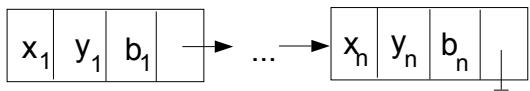  
Figure 2: A linked list chromosome representing a path. Each node contains $x$ and $y$ coordinates of a point together with a state variable $b$ , which provides information on feasibility of the point and the following path segment. The point $\left( x _ { 1 } , y _ { 1 } \right)$ is the starting point, and the point $( x _ { n } , y _ { n } )$ is the goal point.

A path (or chromosome) can have a varied number of intermediate nodes. An initial population of chromosomes can be randomly generated such that each chromosome has a random number of intermediate nodes and randomly-generated coordinates for each intermediate node1.

# 2.2 Evaluation

The evaluation function of a chromosome measures the cost of the path $p$ it represents. Since $p$ can be either feasible (i.e., collision-free) or infeasible, we adopt two separate evaluation functions, $e v a l _ { f }$ and $e v a l _ { i }$ , to handle these cases cases, respectively. For feasible paths, $e v a l _ { f }$ is designed to accommodate three different optimization goals: (1) minimize distance travelled, (2) maintain a smooth trajectory, and (3) satisfy the clearance requirements (the robot should not approach the obstacles too closely). We have selected a linear combination of these three factors:2

$$
e v a l _ { f } ( p ) = w _ { d } \cdot d i s t ( p ) + w _ { s } \cdot s m o o t h ( p ) + w _ { c } \cdot c l e a r ( p ) ,
$$

as a formula for calculating $e v a l _ { f }$ , where the constants $w _ { d } , \ w _ { s }$ , and $w _ { c }$ represent the weights on the total cost of the path's length, smoothness, and clearance, respectively. We define $d i s t , s m o o t h$ , and $c l e a r$ as the following:

: $\begin{array} { r } { d i s t ( p ) \ = \ \sum _ { i = 1 } ^ { n - 1 } d ( m _ { i } , m _ { i + 1 } ) } \end{array}$ , the al lng  the path, where $d ( m _ { i } , m _ { i + 1 } )$ denotes the distance between two adjacent path points $m _ { i }$ and $m _ { i + 1 }$ .

• smoot $h ( p ) = \mathrm { m a x } _ { i = 2 } ^ { n - 1 } s ( m _ { i } )$ , the maximum "curvature" at a knot point, where curvature" is defined as

$$
s ( m _ { i } ) = \frac { \theta _ { i } } { \operatorname* { m i n } \{ d ( m _ { i - 1 } , m _ { i } ) , d ( m _ { i } , m _ { i + 1 } ) \} }
$$

and $\theta _ { i } \in [ 0 , \pi ]$ is the angle between the extension of the line segment connecting path points $m _ { i - 1 }$ and $m _ { i }$ and the line segment connecting points $m _ { i }$ and $m _ { i + 1 }$ .

$c l e a r ( p ) = \operatorname* { m a x } _ { i = 1 } ^ { n - 1 } c _ { i }$ where

$$
c _ { i } = \left\{ \begin{array} { l l } { g _ { i } - \tau } & { \mathrm { i f ~ } g _ { i } \geq \tau } \\ { e ^ { a \left( \tau - g _ { i } \right) } - 1 } & { \mathrm { o t h e r w i s e , } } \end{array} \right.
$$

$g _ { i }$ is the smallest distance from the segment $\overline { { m _ { i } m _ { i + 1 } } }$ to all detected objects, $\tau$ is a parameter defining a "safe" distance, and $a$ is a coefficient. When the distance between a path segment and the closest obstacle is smaller than $\tau$ , the penalty grows exponentially to discourage such close encounters strongly. The function $c l e a r ( p )$ is defined as the maximum of $c _ { i }$ 's to make sure that if a certain segment of a path is dangerously close to an obstacle, i.e., within distance $\tau$ , then the path is penalized strongly even if all other path segments are safe.

With this formulation, our goal is to minimize the function $e v a l _ { f }$ .

For infeasible paths, our design of $e v a l _ { i }$ takes into account several factors: (1) the number of intersections of a path with obstacles, (2) the depth of intersection (i.e., how deep a path cuts through obstacles), (3) the ratio between the numbers of feasible and infeasible segments, (4) the total lengths of feasible and infeasible segments, and so on, as detailed in [20]. To determine the worst path in the whole population we assume that the worst feasible path is better (or fitter) than the best infeasible path.

# 2.3 Operators

The current version of EP/N uses eight types of operators to evolve chromosomes into possibly better ones. These operators are sufficient to generate a path of an arbitrary shape, but each may not be applicable or needed in a given situation. The application of each operator is probabilistic. Note that all operators only change the intermediate nodes of a chromosome. Now we introduce these eight operators, which are also illustrated in Figure 3.

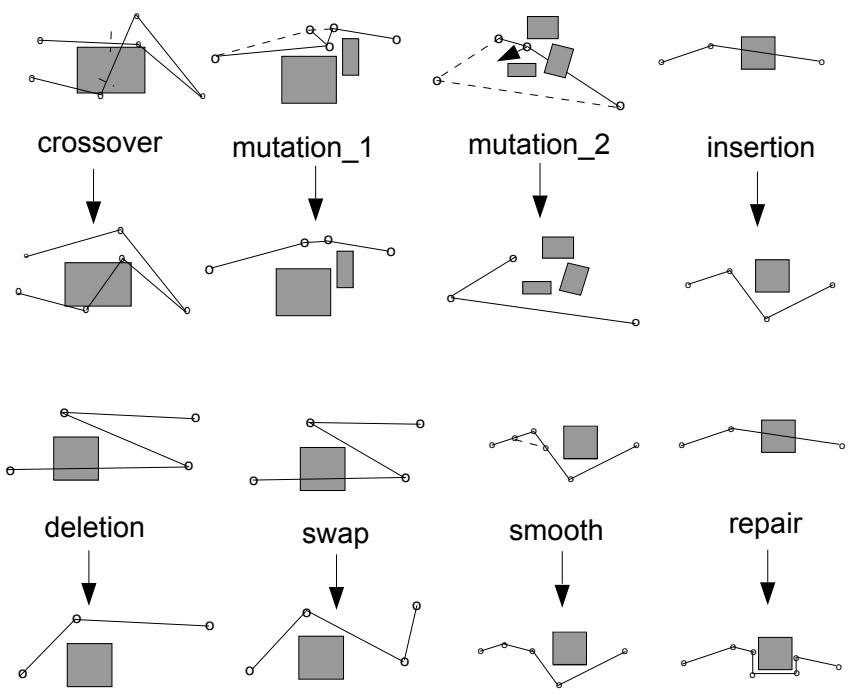  
Figure 3: The roles of the operators. The upper part of each of the eight pairs of diagrams represents a subpath (or two subpaths in the case of crossover) before the operator is applied, whereas the lower diagram shows a possible outcome after application of the operator.

Crossover recombines two (parent) paths into two new paths. The parent paths are divided randomly into two parts respectively and recombined: the first part of the first path with the second part of the second path, and the first part of the second path with the second part of the first path. Note that there can be different numbers of nodes in the two parent paths.

Mutate_1 is used for fine tuning node coordinates in a feasible path for shape adjustment. Given a path, the operator randomly selects3 its intermediate nodes for adjusting their coordinates within some local clearance of the path so that the path subsequently remains feasible.

Mutate_2 is used for imposing a large random change node coordinates in a path, which can be either feasible or infeasible. Given a path, the operator randomly selects an intermediate node and changes the coordinates of this node randomly.

Insert-Delete operates on an infeasible path by inserting randomly generated new nodes into infeasible path segments and deleting infeasible nodes (i.e., nodes that are inside obstacles).

Delete removes nodes from a path, which can be either feasible or infeasible. If the path is infeasible, nodes for deletion are selected randomly in the chromosome. Otherwise, the operator decides whether or not a node should be deleted based on some heuristic knowledge. In the case where there is no knowledge supporting the deletion of a node, its selection for deletion is decided randomly with a small probability.

Swap exchanges the coordinates of selected adjacent nodes in a chromosome to eliminate two consecutive sharp turns (Figure 3). The path can be either feasible or infeasible. The probability for selecting a node $n _ { i }$ and the next node $n _ { i + 1 }$ is proportional to the sharpness of the two turns (measured by angles between the path segments) at the two nodes.

Smooth smooths turns of a feasible path by "cutting corners," i.e., for a selected node, the operator inserts two new nodes on the two path segments connected to that node respectively and deletes that selected node. The nodes with sharper turns are more likely to be selected.

Repair fixes a randomly selected infeasible segment in a path by "pulling" the segment around its intersecting obstacles.

It can be seen that except for the purely random operators Crossover and Mutate_2, all the other operators (which are varied forms of mutations) are designed with some heuristic knowledge to make them more effective for this problem. Note that since most knowledge needed is available from the evaluation of path cost (see the previous subsection), the operators mostly use the knowledge with little extra computation.

# 3 Performance and Probability Tuning

The firing probability $p _ { i }$ $( i = 1 , . . . , 8 )$ of each operator governs the contribution or role of the operator to the whole evolution process. Different values of these probabilities affect the overall performance of the EP/N. As the system uses many operators, properly determining their probabilities properly is not a trivial matter, especially since proper values could very much depend on environmental characteristics and specific constraints imposed on a task. In this section, we describe how to enable the EP/N to adapt these probabilities to achieve the best results by a systematic method.

# 3.1 Operator Performance Index

We evaluate the performance of an operator taking into account three essential aspects: (1) its effectiveness in improving the fitness of a path, (2) its operation time (or time cost), and (3) its operation side effect to future generations. While the first two aspects are self-explanatory, the third aspect refers to the fact that five operators, i.e., crossover, insert-delete, delete, smooth, and repair, tend to change the number of nodes (or the length) of a chromosome after their application. Note that the length of a chromosome affects both the processing time and the storage space needed by the chromosome — the more nodes are in the chromosome, the more space and time (i.e., evaluation time and often operation time) are needed. So, if an operator alters the number of nodes in a chromosome, the effect will be felt in future processing. Such effect can be either positive or negative on the processing cost of future generations4, depending on if the operator reduces or increases the number of nodes in the chromosome. Note that including the last two aspects in evaluating operators is particularly useful when constraints on operation resources (i.e., time and space) for the EP/N are stringent.

Now we describe the performance measures in detail. The three aspects are first measured individually and then combined to form a compound performance index for an operator. Since the role of an operator often varies in different stages of an evolution process (e.g., some operators apply only to infeasible chromosomes while some only apply to feasible ones), each aspect is measured as a function of generation interval $[ T _ { 1 } , T _ { 2 } ]$ , where $T _ { 1 }$ and $T _ { 2 }$ are the starting and ending generations of the interval. For an operator $i , i = 1 , . . . , 8$ ,

•its effectiveness in improving the fitness of a path is measured by the ratio $e _ { i } ( T _ { 1 } , T _ { 2 } )$ between the number of times it improves a path and the total number of times it is applied;

its operation time $t _ { i } ( T _ { 1 } , T _ { 2 } )$ is measured as the average time per its operation;

its operation side effect $s _ { i } ( T _ { 1 } , T _ { 2 } )$ is measured as the average time cost of all operators on the average change of nodes by the operator $i$ .

$$
s _ { i } ( T _ { 1 } , T _ { 2 } ) = \frac { \delta n _ { i } \cdot t ( \bar { n } ) } { \bar { n } }
$$

where $\delta n _ { i }$ is the average change in the number of nodes of a chromosome by operator $i$ per its operation during the generations in $[ T _ { 1 } , T _ { 2 } ]$ , such that $\delta n _ { i }$ is negative if the number of nodes is decreased on average and is positive otherwise, $\bar { n }$ is the average number of nodes in a chromosome over the generations in $[ T _ { 1 } , T _ { 2 } ]$ , and $t ( \bar { n } )$ is the weighted average operation time (on an average chromosome) of all operators during $[ T _ { 1 } , T _ { 2 } ]$ .

$$
t ( \bar { n } ) = \sum _ { i = 1 } ^ { 8 } \frac { m _ { i } } { T _ { 2 } - T _ { 1 } } \cdot t _ { i } ( T _ { 1 } , T _ { 2 } )
$$

where $m _ { i }$ is the number of times (i.e., generations) the operator $i$ is applied during $[ T _ { 1 } , T _ { 2 } ]$ .

Note that the formulation of $s _ { i } ( T _ { 1 } , T _ { 2 } )$ takes into account the fact that the node number change in a chromosome by operator $i$ has an effect on any future operation, not necessarily by the same operator $i$ .

The overall performance of an operator $i$ is measured by the following performance index $I _ { i } ( T _ { 1 } , T _ { 2 } )$ , which combines the three aspects of performance:

$$
I _ { i } ( T _ { 1 } , T _ { 2 } ) = \frac { e _ { i } ( T _ { 1 } , T _ { 2 } ) + c } { t _ { i } ( T _ { 1 } , T _ { 2 } ) + s _ { i } ( T _ { 1 } , T _ { 2 } ) }
$$

where $c \geq 0$ is a small constant. Note that greater value of $I _ { i }$ means better performance. In addition, when $s _ { i } ( T _ { 1 } , T _ { 2 } )$ is negative (i.e., when $\delta n _ { i }$ is negative), it contributes positively to $I _ { i }$ , which can be shown to be non-negative.

The operator performance index $I _ { i }$ has great significance because of the following:

• It can be automatically computed by the EP/N since it is based on statistics that the $\mathrm { E P / N }$ can accumulate during its run. Thus, it can be used by the $\mathrm { E P } / \mathrm { N }$ for automatic determination of the operator probability $p _ { i }$ , defined as:

$$
p _ { i } = \frac { I _ { i } } { \sum _ { j = 1 } ^ { 8 } I _ { j } }
$$

• Since $I _ { i }$ is a function of generation interval $[ T _ { 1 } , T _ { 2 } ]$ , for different generation intervals, the EP/N can compute different $I _ { i }$ 's and accordingly different $p _ { i }$ s. That is, a look-up table that maps different generation intervals to different operator probabilities can be built by the EP/N automatically. Next, the operator probabilities can be changed during different stages of evolution to achieve greater effectiveness and efficiency.

• More importantly, the $\mathrm { E P / N }$ can be adaptive as follows. Let $\delta T$ be a sufficiently small number of generations. Assign all initial operator probabilities randomly (for example, uniformly). After the first $\delta T$ generations, use the computed $I _ { i } ( 0 , \delta T )$ , $i = 1 , . . . , 8$ , to compute new probabilities $p _ { i } ( I _ { i } )$ and use the new probabilities in the next $\delta T$ generations. Afterwards, compute the next $I _ { i } ( \delta T , 2 \delta T )$ and again reset the probabilities accordingly. Repeat the procedure until the whole evolution process terminates. Clearly, the method can be refined further by incorporating a concept of "sliding window" with a horizon $\delta T$ , such that the probabilities are updated every cycle based on the last $\delta T$ generations.

However, in such a case the computational effort for re-calculating all probabilities is much higher. Moreover, the EP/N is a steady-state evolutionary system where only one operator is applied within a single generation, so the effort of re-calculating all probabilities every generation would not pay off.

# 3.2 Adapting Operator Probabilities

Based on the procedure of computing the operator performance indices $I _ { i }$ 's in the EP/N, we have used the following method to enable the $\mathrm { E P / N }$ to adapt its operator probabilities at run-time. First, divide the total number of generations $T$ into several equal intervals such that the number of intervals determine the frequency of adaptation. To begin the run, let the $\mathrm { E P / N }$ assign equal probabilities to all operators initially. Then, after the first interval of generations, the EP/N computes the corresponding $I _ { i }$ 's and probabilities $p _ { i }$ 's (by equation (1)) and resets the operator probabilities to the newly computed $p _ { i }$ 's to run the next interval of generations. At the end of interval 2, the $\mathrm { E P / N }$ again resets the operator probabilities based on the $I _ { i }$ 's corresponding to that interval and uses the new probabilities to run interval 3, and so on. Thus, adaptiveness is achieved by applying the probabilities computed based on the operator performance in generation interval $n$ to the next interval $n + 1$ .

Our experiments showed (Section 4) that compared to running the EP/N with equal operator probabilities or other manually determined fixed operator probabilities, running the system with adaptive operator probabilities enhanced both the effectiveness and efficiency of the system for diverse tasks.

# 3.3 System Performance Measures

We use the following measures to evaluate the performance of the EP/N system over $[ 0 , T ]$ generations:

•effectiveness index — in terms of the average path cost avgT or the best path cost $b e s t _ { T }$ in the population of the final generation $T$ .   
• efficiency index — in terms of the product of the average path cost avgT or the best path cost bestT in the final generation $T$ and the total time $t _ { T }$ spent over $[ 0 , T ]$ generations: $a v g _ { T } \times t _ { T }$ or $b e s t _ { T } \times t _ { T }$ .

Clearly smaller values of both indices mean better effectiveness and better efficiency respectively. To improve system performance is to reduce the values of those indices.

Note that the above measures are not necessarily optimal ways of measuring the system performance. One may also take into account factors such as how quickly infeasible paths are evolved into feasible ones (or the percentage of the feasible paths in each generation), the diversity of feasible paths, and so on, depending on the need.

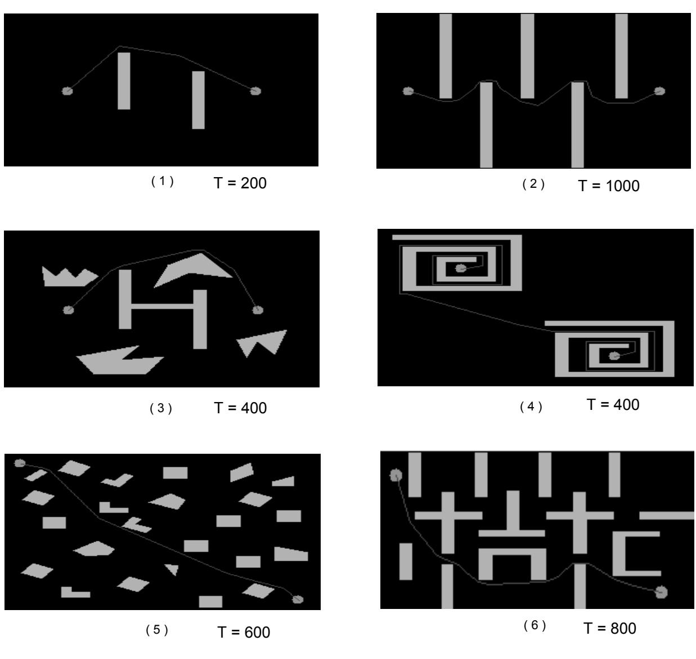  
Figure 4: Six tasks in six different environments selected for experiments and nearoptimal paths found by the $\mathrm { E P / N }$ (adaptive version) in $T$ generations (as indicated). Other parameters of the EP/N were set to be the same for all six environments: The population size was set to be 30, and the coefficients $w _ { d } , w _ { s } , w _ { c } , a , \tau$ in the evaluation function $e v a l _ { f } ( p )$ were selected as 1.0, 1.0, 1.0, 7.0, 10, respectively.

# 4 Off-line Experiments and Results

We have implemented the EP/N for polygonal obstacles and run the $\mathrm { E P / N }$ off-line on different tasks in diverse environments to test its tuning ability and overall performance. Figure 4 shows six sample tasks in six different environments, where for each task, a near-optimal path obtained by the adaptive EP/N is displayed. Note that the same values of the EP/N parameters were used for all tasks, except the operator probabilities, which were adapted (with adaptation occurred every 100 generations). Different complexities of the environments were reflected by the different $T$ generations of evolution needed to obtain the near-optimal results displayed. However, $T = 6 0 0$ are usually sufficient to achieve very good results in all cases, and $T = 4 0 0$ are usually sufficient to create feasible paths of reasonable shape in all cases. Figure 5 shows the snapshots of one evolution process of paths for the task in Environment 6 in $T = 4 0 0$ generations. Very reasonable paths were already formed even with only 400 generations.

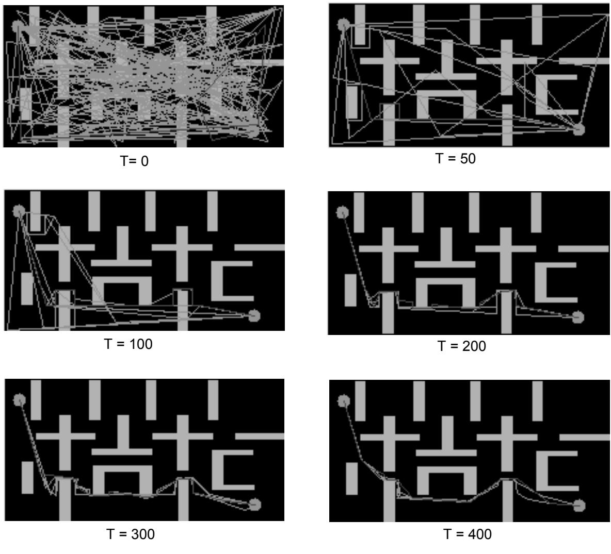  
Figure 5: Snapshots of path evolution at different generations $( T )$ for Environment 6, where two-thirds of population are shown and the $\mathrm { E P / N }$ is under the same condition as in Figure 4.

Table 1 shows, for $T = 4 0 0$ generations and each task shown in Figure 4, (1) the average time $t _ { T }$ of running the $\mathrm { E P / N }$ with adapted probabilities over 100 repeated

Table 1: Average time and gain (over 100 runs) on system performance against the case with equal operator probabilities in $T = 4 0 0$ generations. The "effectiveness" and "efficiency" columns report the percentage gains on the effectiveness index and the efficiency index defined in Section 3.3 respectively.

<table><tr><td rowspan=2 colspan=1>env</td><td rowspan=2 colspan=1>tT(sec)</td><td rowspan=1 colspan=2>effectiveness</td><td rowspan=1 colspan=2>efficiency</td></tr><tr><td rowspan=1 colspan=1>avgT%change</td><td rowspan=1 colspan=1>bestT %change</td><td rowspan=1 colspan=1>avgT × tT %change</td><td rowspan=1 colspan=1>bestT × tT %change</td></tr><tr><td rowspan=1 colspan=1>1</td><td rowspan=1 colspan=1>0.24</td><td rowspan=1 colspan=1>-1.77%</td><td rowspan=1 colspan=1>-1.17%</td><td rowspan=1 colspan=1>-1.20%</td><td rowspan=1 colspan=1>-0.60%</td></tr><tr><td rowspan=1 colspan=1>2</td><td rowspan=1 colspan=1>0.64</td><td rowspan=1 colspan=1>-4.03%</td><td rowspan=1 colspan=1>-0.39%</td><td rowspan=1 colspan=1>-1.14%</td><td rowspan=1 colspan=1>2.61%</td></tr><tr><td rowspan=1 colspan=1>3</td><td rowspan=1 colspan=1>1.19</td><td rowspan=1 colspan=1>-4.59%</td><td rowspan=1 colspan=1>-2.79%</td><td rowspan=1 colspan=1>-12.76%</td><td rowspan=1 colspan=1>-11.11%</td></tr><tr><td rowspan=1 colspan=1>4</td><td rowspan=1 colspan=1>1.96</td><td rowspan=1 colspan=1>-4.80%</td><td rowspan=1 colspan=1>-3.43%</td><td rowspan=1 colspan=1>-4.90%</td><td rowspan=1 colspan=1>-3.52%</td></tr><tr><td rowspan=1 colspan=1>5</td><td rowspan=1 colspan=1>2.83</td><td rowspan=1 colspan=1>-2.28%</td><td rowspan=1 colspan=1>-1.41%</td><td rowspan=1 colspan=1>-6.30%</td><td rowspan=1 colspan=1>-5.46%</td></tr><tr><td rowspan=1 colspan=1>6</td><td rowspan=1 colspan=1>2.63</td><td rowspan=1 colspan=1>-5.48%</td><td rowspan=1 colspan=1>-4.96%</td><td rowspan=1 colspan=1>-7.88%</td><td rowspan=1 colspan=1>-7.39%</td></tr></table>

runs5, and (2) the average gain on both system effectiveness and efficiency when the $\mathrm { E P / N }$ adapted operator probabilities against the case when the $\mathrm { E P / N }$ used fixed, equal operator probabilities over 100 repeated runs6. As expected, values of both system effectiveness and efficiency indices are reduced, which means better effectiveness and efficiency was achieved in most of the cases.

Compared to the results obtained by running the EP/N with fixed, manually determined operator probabilities [20], the results with adaptive probabilities (as presented here) show significant improvement of the system performance.

# 5 On-line Navigation

We have implemented a simulation program for the on-line navigation of the EP/N (see Figure 1) with the following assumptions:

Obstacles in the environment are either known or unknown. In the current implementation they are assumed to be static. The robot has a range of view (described by $R$ , parameter of the robot). If, due to the robot's motion, an unknown obstacle is located in the range of the view, the obstacle becomes known and is marked in the robot's map of the environment. In the current stage of simulation, for simplicity, we further assume that once an obstacle is inside the robot's range of view, it becomes known totally (i.e., its complete dimensionality is given). Of course, to be more realistic, this assumption can easily be revised as only the part of the object boundary that is inside the robot's range of view is known. However, as our current focus is on testing the robot's adaptation capability to the discovery of unknowns in an environment, it does not matter much at present how such discovery is actually accomplished.

In the on-line navigation, the result of evolution is checked after every $n$ generations (see the second "if" statement in the procedure of Figure 1) to provide the robot with the current best feasible path. The robot moves along such a path in steps, and we use a parameter $k _ { m a x }$ to denote the maximum length of the robot's step ( $k _ { m a x }$ is less than $R$ ). If a segment of the path currently being followed by the robot has a length shorter than $k _ { m a x }$ , the robot will cover it in one step to reach the next knot point of the path. Otherwise, the robot will move along the segment in more than one step, and during the process, it may also change course if a better path (i.e., the next best path) becomes available from the evolution process. The evolution process runs in parallel with the robot's motion.

The implication of sensing a previously unknown obstacle is a change in the fitness values of the current path population. As such a new obstacle is added to the robot's map of environment, it may change the subsequent evaluation results of all paths. This is a very sensitive moment for the evolution process: some of the (feasible) paths in the population may become infeasible and their cost can increase significantly. The previous best path may no longer be best and a new best path may need to be found.

As mentioned in Section 2, during such on-line navigation, the starting location of each path in a population is constantly updated to reflect the current location of the robot as it moves. Given a path to be updated, this process involves the application of an additional operator, short-cut, which connects the current position of the robot to the furthest knot point of the path (provided, of course, that the resulting path is feasible).

# 5.1 An Example

The actions of the robot guided by the on-line navigation process are illustrated by the following example. Figure 6 displays robot's environment. The starting point is in the left-bottom corner and the goal point is close to the right-top corner of the rectangle. There are eight obstacles in total; two of them are unknown (marked by their contours only). During initialization, a set of randomly generated paths is developed; very likely none of these initial paths will be feasible (Figure 6 displays the best path in the initial population).

Soon after discovery of the first feasible path, the first step ahead is made. Note that this path of the robot is optimized based only on known obstacles so that it does not have to be truly feasible (Figure 7): it might intersect an unknown obstacle. Note also that the remaining parts of the paths are continuously optimized: The current best path in Figure 7 is different from that in Figure 8.

When a previously unknown obstacle is in the robot's range of view, it becomes known and the robot marks its presence on the map of the environment (Figures 8 and 9). At this moment, all paths in the current population are re-evaluated, and as the evolution process continues, the robot eventually follows a newly emerged best feasible path (Figure 10), which is subsequently improved (Figure 11).

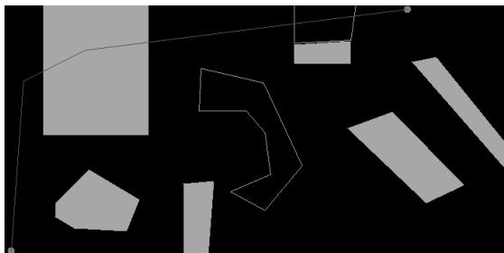  
Figure 6: The best path in the initial population. The shaded obstacles are known. The outlined obstacles are unknown. The initial best path crosses two obstacles, one known and one unknown.

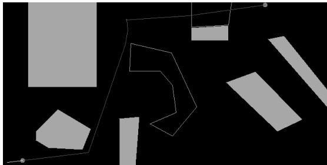  
Figure 7: The first feasible path. The robot makes its initial move upon generating the first feasible solution given known obstacles.

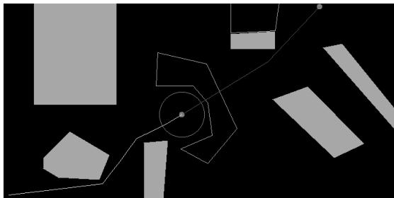  
Figure 8: Before sensing the first unknown obstacle. The robot has moved to a position where the outlined obstacle is still unknown. Note that the path has been optimized with respect to distance and smoothness, as compared to the path shown in Figure 7.

When the second unknown obstacle is discovered, again, all paths in the population are re-evaluated, and the robot adjusts its motion accordingly by following a newly emerged best path (Figure 12).

  
Figure 9: Sensing and re-evaluation. The robot senses the first unknown obstacle. Its planned path is no longer feasible.

  
Figure 10: The best feasible path after sensing the first unknown obstacle. The EP/N planner has invented a path around the newly discovered obstacle.

The actual path traversed by the robot is displayed in Figure 13 (note again the improvements in the final segments of the path from those displayed in Figure 12). This path is far from being optimal in comparison with an "ideal" path which would emerge if all obstacles in the environment were known a priori (Figure 14). However, it is unfair to simply compare such a real path traversed as the result of on-line handling of unknown obstacles to the "ideal" path.

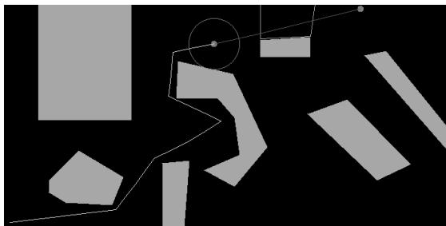  
Figure 11: Before sensing the second unknown obstacle. The robot has traversed around the first (previously) unknown obstacle and is approaching the second.

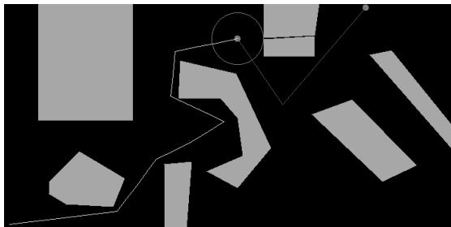  
Figure 12: After sensing the second unknown obstacle. The second unknown obstacle has come within sensor range and the EP/N has generated a path around it.

  
Figure 13: The robot's real path as executed over time.

# 5.2 Analysis of Performance

To evaluate the quality of a real path, a more reasonable approach is to divide the path into so-called fragments: the cut point between fragments is the location where the robot sensed a new obstacle. There are as many cut points as the number of new obstacles sensed during the robot's movement (therefore the number of fragments, $f$ , is by one greater than the number of cut points). Then each fragment is compared to an ideal path generated to connect the fragment's start and goal locations7, which results in a relative error $e _ { i }$ in path cost for the segment.

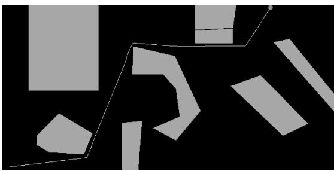  
Figure 14: The robot's "ideal" path for the completely known environment. The path differs from the path actually developed by the EP/N because two of the obstacles were unknown a priori.

Knowing the merit of each fragment (measured by $e _ { i }$ ), we can measure the error $E$ of the real path with the formula:

$$
E = \frac { \displaystyle \sum _ { i = 1 } ^ { f } e _ { i } \cdot g _ { i } } { N } ,
$$

where:

$f$ is the number of fragments,   
$e _ { i }$ is the relative error of the $i$ -th fragment (in path cost),   
$g _ { i }$ is the number of generations passed during the traversal of the $i$ -th fragment, and   
$\textstyle N = \sum _ { j = 1 } ^ { f } g _ { j }$ , i.e., $N$ represents the total number of generations.

Note that $g _ { i }$ 's depend on the following parameters: $n$ (the number of generations between robot's steps), $k _ { m a x }$ (the robot's step length), and $R$ (the robot's range of view). As the result, longer fragments usually correspond to larger values of $g _ { i }$ 's, and consequently smaller values of $e _ { i } \mathrm { ^ { \prime } s }$ This is why we define the error $E$ as a weighted average of $e _ { i } { } ^ { \prime } \mathrm { s }$ , with the corresponding weight being $g _ { i } / N$ . Note also that if the robot encounters no unknown obstacle, then there is only one fragment: the entire real path, and $E$ is simply the relative error of the real path traversed against an ideal path (which can be the result of evolution over a larger number of generations).

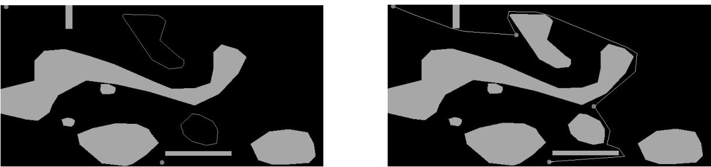  
Figure 15: Left: experimental environment; right: three fragments of a path are clearly marked.

We now discuss how $E$ is related to $n$ , the number of generations between the robot's steps. Tables 2-5 show results of experiments using the environment shown in Figure 15, with dimensions $4 0 0 \times 5 0 0$ (averaged over 100 trials) for different $n$ 's. The other parameters used in these experiments were: population size 70, the robot's single step $k _ { m a x } = 4 0$ , and the range of view $R = 4 5$ .

Table 2: Result of experiments for $n = 5$ ; the resulting number of generations $N =$ 463.7 and error $E = 0 . 1 1 8 0 7 6$   

<table><tr><td>frag.</td><td>real cost</td><td>ideal cost</td><td>gi</td><td>ei</td><td>(ei · gi)/N</td></tr><tr><td>1</td><td>681.1</td><td>603.1</td><td>200.1</td><td>0.129331</td><td>0.055810</td></tr><tr><td>2</td><td>1059.3</td><td>951.0</td><td>198.9</td><td>0.113880</td><td>0.048847</td></tr><tr><td>3</td><td>715.8</td><td>653.0</td><td>64.7</td><td>0.096172</td><td>0.013419</td></tr></table>

Table 3: Result of experiments for $n \ = \ 1 0$ ; the resulting number of generations $N = 5 9 2 . 8$ and error $E = 0 . 0 8 1 9 9 6$   

<table><tr><td>frag.</td><td>real cost</td><td>ideal cost</td><td>gi</td><td>ei</td><td>(ei · gi)/N</td></tr><tr><td>1</td><td>655.4</td><td>603.2</td><td>251.9</td><td>0.086538</td><td>0.036773</td></tr><tr><td>2</td><td>1031.5</td><td>953.3</td><td>223.8</td><td>0.082031</td><td>0.030969</td></tr><tr><td>3</td><td>699.9</td><td>652.8</td><td>117.1</td><td>0.072151</td><td>0.014254</td></tr></table>

Table 4: Result of experiments for $n \ = \ 1 5$ ; the resulting number of generations $N = 7 5 3 . 9$ and error $E = 0 . 0 7 1 0 3 2$   

<table><tr><td>frag.</td><td>real cost</td><td>ideal cost</td><td>gi</td><td>ei</td><td>(ei · gi)/N</td></tr><tr><td>1</td><td>649.1</td><td>603.0</td><td>303.2</td><td>0.076451</td><td>0.030747</td></tr><tr><td>2</td><td>1017.4</td><td>952.2</td><td>333.4</td><td>0.068473</td><td>0.030281</td></tr><tr><td>3</td><td>695.2</td><td>653.2</td><td>117.3</td><td>0.064299</td><td>0.010004</td></tr></table>

Table 5: Result of experiments for $n \ = \ 2 0$ ; the resulting number of generations $N = 9 6 0 . 3$ ; error $E = 0 . 0 6 4 7 6 4$

<table><tr><td>frag.</td><td>real cost</td><td>ideal cost</td><td>gi</td><td>ei</td><td>(ei · gi)/N</td></tr><tr><td>1</td><td>650.5</td><td>603.1</td><td>341.1</td><td>0.078594</td><td>0.027917</td></tr><tr><td>2</td><td>1009.7</td><td>952.7</td><td>455.9</td><td>0.059830</td><td>0.028404</td></tr><tr><td>3</td><td>685.0</td><td>652.6</td><td>163.3</td><td>0.049648</td><td>0.008443</td></tr></table>

Results reported in Tables 2-5 confirm a basic intuition: the total error $E$ decreases with the growth of $n$ . That is, the more generations between robot's steps are, the better precision (in terms of the path quality) can be achieved. Also, the relative errors $e _ { i }$ 's are smaller for later fragments, i.e., fragments closer to the goal. This is because these fragments are subject to more optimization (in terms of larger number of generations) in the on-going evolutionary process.

On the other hand, note that in this specific implementation of on-line navigation, $n$ is coupled with the step length $k _ { m a x }$ of the robot, in that $n$ generations of evolution must complete before the robot proceeds to the next step. For a fixed $k _ { m a x }$ , this implies that a very large n may cause a slower movement of the robot, and therefore a longer time for path traversal.

Now let us discuss the effect of $n$ on the time of navigation. As confirmed by the experimental results (shown in Tables 25), a larger $n$ leads to a larger total number of generations $N$ , which means a longer total time of evolution $t _ { N }$ . Since the evolution process and the robot's movement are performed in parallel, the total time of path traversal $t$ is the maximum of $t _ { N }$ and the total time of the robot's movement $t _ { M }$ .

$$
t = \operatorname* { m a x } ( t _ { N } , t _ { M } ) ,
$$

where $t _ { M }$ is a function of path quality (length and smoothness) and the robot's velocity. From running the $\mathrm { E P / N }$ off-line (Section 4), we know that even for a very complex environment, $t _ { N }$ for a reasonable $N$ (e.g., in the range of 600-1000, as in the Tables 2-5) is usually in the order of a few seconds, which should be well below the time required for a current land-based robot to physically traverse a normal indoor or outdoor environment. That is, $t _ { N } \leq t _ { M }$ can usually hold for a reasonably large $N$ as a result of a comfortably large $n$ . In other words, $n$ can be sufficiently large without affecting the time of traversal. Since a larger $n$ can result in a path of better quality, which often means a smoother path of shorter length, a larger $n$ may actually reduce the robot's time of traversal.

In summary, the parallelism between path evolution and path traversal in the adaptive EP/N is shown to be very advantageous in achieving both high effectiveness and efficiency in real-time navigation of a robot, especially when the environment is only partially known.

# 6 Conclusions

The adaptive EP/N presented in this paper is particularly suitable for dealing gracefully, effectively, and efficiently with the diversities, changes, and unknowns in an environment. Results from off-line planning with adaptive probabilities of genetic operators and simulation of on-line navigation confirm the flexible nature and robustness of such an evolutionary system. We are currently implementing the on-line process of the EP/N on a Khepera robot.

The EP/N also exposes many interesting challenges of general importance to evolutionary computation. One of the most significant is how to take the full advantage of adaptiveness of an evolutionary system and tune its various parameters during the execution of the system. The adaptive EP/N uses an automatic mechanism to measure performances of its genetic operators and adapt the operator probabilities accordingly. The general nature of the strategy makes it applicable to other evolutionary systems as well. An important issue of future research is how to make the EP/N capable of adapting other system parameters. Several such parameters may be of particular interest. One determines how frequently operator probabilities should be adjusted or adapted (i.e., the generation interval $[ T _ { 1 } , T _ { 2 } ]$ 's in Section 3). Parameters $n$ and $k _ { m a x }$ in the on-line process (Section 5), as well as the velocity of an robot, are crucial to determine how frequently the robot should adjust its path during online navigation and how to balance the quality of path and the time of traversal. In the current implementation, $n$ and $k _ { m a x }$ are coupled (Section 5.2), but they can be also implemented as two independent parameters so that their relations are mainly affected by specific environment/task characteristics. In general, for any parameter whose best value may vary for different tasks or environments, making it adaptive could be desirable.

It may also be desirable to further incorporate domain knowledge in important components/processes of the EP/N to enhance its performance. Although we have incorporated domain knowledge in both fitness evaluation and operators, there are other components/processes, such as the initialization process, which may by improved as a result of greater knowledge. For example, rather than random initialization, an initial population may consist of (a) a set of paths created by mutating or repairing the shortest path between start and goal locations, and/or (b) some mixture of chromosomes having randomly-generated coordinates and chromosomes having coordinates with "problem-specific knowledge" as obtained from (a).

Another important issue is to improve the organization of the EP/N to stress learning for on-line navigation. The system may be extended by adding memory to store the knowledge from the robot's past exploration of the environment together with the knowledge from previous navigation tasks in order to facilitate more efficient and effective planning in the future. We have performed some preliminary studies in adding local memories to chromosomes for storing "valuable" paths or segments of paths discovered earlier [19]. The experiments demonstrate the potential of such an extension to the EP/N in improving planning effectiveness in partially-known environments. It could also be interesting to study other forms of "memory," such as one based on multi-chromosome structures with a dominance function [6] or employing machine learning techniques.

# Acknowledgements

The authors would like to thank David Fogel and the anonymous referees for their constructive comments, which improved readability of the paper. The research reported in this paper was partially supported by the grant 8T11C 010 10 from the Polish State Committee for Scientific Research.

References   
[1] R.C. Arkin, "Motor Schema-based Mobile Robot Navigation," Int. J. Robotics Research, vol. 8, no. 4, pp.92112, Aug. 1989.   
[2] P. Bessiere, J.-M. Ahuactzin, A.-G. Talbi, and E. Mazer, "The 'Ariadne's Clew' Algorithm: Global Planning with Local Methods," Proceedings of 1993 IEEEIROS International Conference on Intelligent Robots and Systems, Yokohama, Japan, Sept. 1993.   
[3] J. Borenstein and Y. Koren, "The Vector Field Histogram — Fast Obstacle Avoidance for Mobile Robots," IEEE Trans. Robotics and Automation, vol.7, no.3, pp.278287, June 1991.   
[4] R.A. Brooks, "A Robust Layered Control System for A Mobile Robot," IEEE Journal of Robotics and Automation, vol.2, pp.14-23, 1986.   
[5] G. Foux, M. Heymann, and A. Bruckstein, "Two-Dimensional Robot Navigation Among Unknown Stationary Polygonal Obstacles," IEEE Transactions on Robotics and Automation, vol.9, pp.96-102, 1993.   
[6] D.E. Goldberg, Genetic Algorithms in Search, Optimization and Machine Learning, Addison Wesley, Reading, MA, 1989.   
[7] C. Hocaolu and A.C. Sanderson, "Planning Multi-Paths using Speciation in Genetic Algorithms," Proceedings of the 1996 IEEE International Conference on Evolutionary Computation, Nagoya, Japan, pp.378-383, May 1996.   
[8] O. Khatib, "Real-Time Obstacles Avoidance for Manipulators and Mobile Robots," International Journal of Robotics Research, vol.5, pp.90-98, 1986.   
[9] J.C. Latombe, Robot Motion Planning, Kluwer Academic Publishers, Norwell, MA, 1991.   
[10] H.-S. Lin, J. Xiao, and Z. Michalewicz, "Evolutionary Navigator for a Mobile Robot," Proc. IEEE Int. Conf. Robotics & Automation, San Diego, pp. 2199 2204, May 1994.   
[11] H.-S. Lin, J. Xiao, and Z. Michalewicz, "Evolutionary Algorithm for Path Planning in Mobile Robot Robot Environment," Proc. of the First IEEE Int. Conf. Evolutionary Computation, Orlando, Florida, pp. 211-216, June 1994.   
[12] V.J. Lumelsky, "A Comparative Study on the Path Length Performance of MazeSearching and Robot Motion Planning Algorithms," IEEE Trans. Robotics and Automation, vol.7, no.1, pp.57-66, Feb. 1991.   
[13] V.J. Lumelsky and A.A. Stepanov, "Path Planning Strategies for a Point Mobile Automaton Moving amidst Unknown Obstacles of Arbitrary Shape," Algorithmica, vol.2, pp.403430, 1987.   
[14] Z. Michalewicz, Genetic Algorithms $+$ Data Structures $=$ Evolution Programs, 3rd edition, Springer-Verlag, New York, 1996.   
[15] Z. Michalewicz and J. Xiao, "Evaluation of Paths in Evolutionary Planner/Navigator," Proceedings of the 1995 International Workshop on Biologically Inspired Evolutionary Systems, Tokyo, Japan, pp.4552, May 1995.   
[16] J.B. Oommen, S.S. Iyengar, N.S.V. Rao, and R.L. Kashyap, "Robot Navigation in Unknown Terrains Using Visibility Graphs: Part I: The Disjoint Convex Obstacle Case," IEEE J. Robotics and Automation, vol.RA-3, pp.672-681, 1987.   
[17] W.C. Page, J.R. McDonnell, and B. Anderson, "An Evolutionary Programming Approach to Multi-Dimensional Path Planning," Proceedings of the First Annual Conference on Evolutionary Programming, D.B. Fogel and J.W. Atmar (Editors), Evolutionary Programming Society, San Diego, pp.63-70, 1992.   
[18] T. Shibata and T. Fukuda, "Intelligent Motion Planning by Genetic Algorithm with Fuzzy Critic," Proceedings of the 8th IEEE International Symposium on Intelligent Control, Chicago, pp.565570, August 25-27, 1993.   
[19] K. Trojanowski, Z. Michalewicz, and J. Xiao, "Adding Memory to an Evolutionary Planner/Navigator," Proceedings of the 4th IEEE International Conference on Evolutionary Computation, Indianapolis, 13-16 April 1997.   
[20] J. Xiao, "Evolutionary Planner/Navigator in a Mobile Robot Environment," in the Handbook of Evolutionary Computation, (T. Bäck, D. Fogel, and Z. Michalewicz, Editors), Oxford University Press and Institute of Physics Publishing, NY, 1997, forthcoming.   
[21] J. Xiao, Z. Michalewicz, and L. Zhang, "Evolutionary Planner/Navigator: Operator Performance and Self-Tuning," Proceeding of the 3rd IEEE International Conference on Evolutionary Computation, Nagoya, Japan, IEEE Press, pp. 366- 371, May 1996.   
[22] C.-K. Yap, "Algorithmic Motion Planning," in the Advances in Robotics, Vol.1: Algorithmic and Geometric Aspects of Robotics, J.T. Schwartz and C.K. Yap Ed., Lawrence Erlbaum Associates, Hillsdale, NJ, pp. 95-143, 1987.   
[23] A. Zelinsky, "A Mobile Robot Exploration Algorithm," IEEE Transactions on Robotics and Automation, vol.8, pp.707-717, 1992.   
[24] M. Zhao, N. Ansari, and E. Hou, "Mobile Manipulator Path Planning by a Genetic Algorithm," Procedings of the 1992 IEEE/RSJ International Conference on Intelligent Robots and Systems, pp.681-688, Raleigh, N.C., July 7-10, 1992.